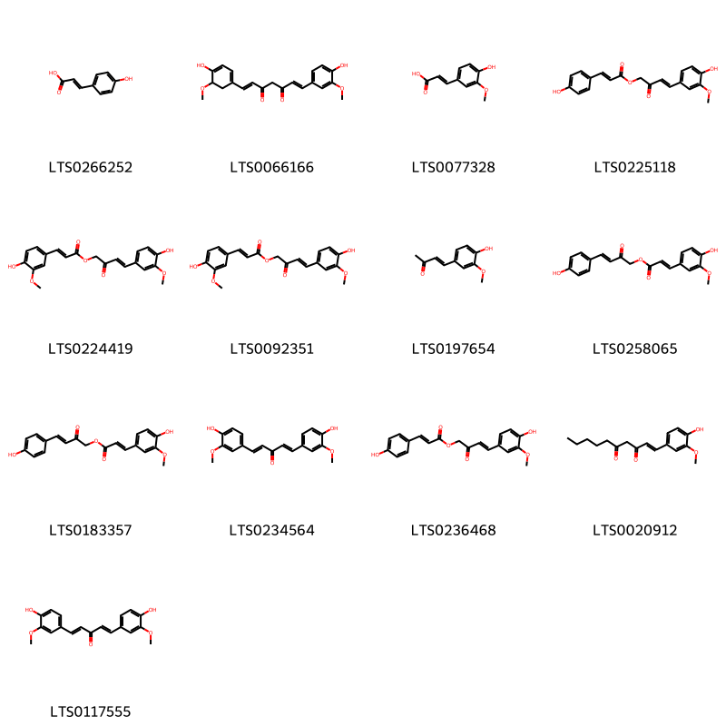
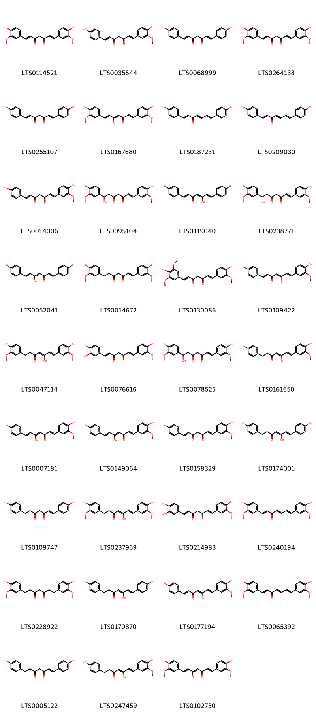
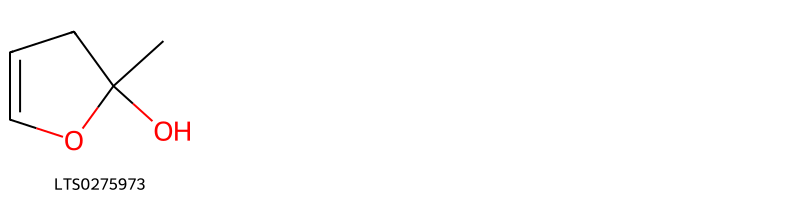
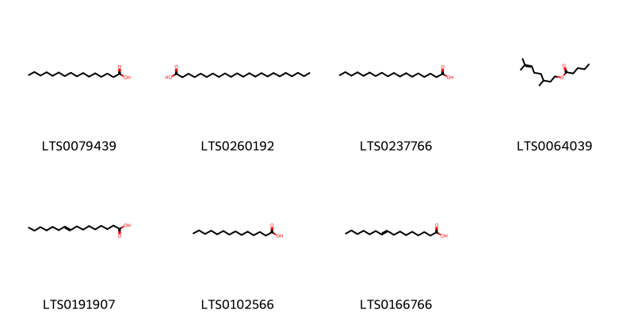

!!! abstract "Tóm tắt"

    Nghệ (Rhizoma Curcumae longae) là thân rễ đã phơi khô hay đồ chín rồi phơi hoặc sấy khô của cây Nghệ vàng (Curcuma longa L.), thuộc họ Gừng (Zingiberaceae). Nghệ có nguồn gốc từ Ấn Độ và sau đó được di thực sang nhiều nước trên khắp thế giới trong đó có Việt Nam. Theo y học cổ truyền, nghệ thường được sử dụng để trị đau dạ dày, vàng da và đau bụng sau sinh. Dân gian còn dùng nghệ để bôi lên vết thương mới lành, giúp giảm sẹo, và trong nhiều bài thuốc khác như chữa thổ huyết, máu cam, điên cuồng, hay làm cao dán nhọt. Thành phần hóa học chính của nghệ là curcumin, một chất kháng viêm và chống oxy hóa mạnh mẽ. Ngoài ra, trong tinh dầu của nghệ còn có chứa các hợp chất như curcumen, paratolylmetyl cacbinol và long não hữu tuyến.

## Thông tin về thực vật

Dược liệu **Nghệ (Thân Rễ)** từ bộ phận **Thân rễ** từ loài *Curcuma longa*.

**Mô tả thực vật:** Nghệ là một loại cỏ cao 0,60m đến 1m. Thân rễ thành củ hình trụ hoặc hơi dẹt, khi bẻ hoặc cắt ngang có màu vàng cam sẫm. Lá hình trái xoan thon nhọn ở hai đầu, hai mặt đều nhẫn dài tới 45cm, rộng tới 18cm. Cuống lá có bẹ. Cụm hoa mọc từ giữa các lá lên, thành hình nón thưa, lá bắc hữu thụ khum hình mảng rộng, đầu tròn màu xanh lục nhạt, lá bắc bất thụ hẹp hơn, màu hơi tím nhạt. Tràng có phiến, cánh hoa ngoài màu xanh lục vàng nhạt, chia thành ba thùy, thùy trên to hơn, phiến cánh hoa trong cũng chia ba thùy, 2 thùy hai bên đứng và phẳng, thùy dưới hõm thành mảng sâu. Quả nang 3 ngăn, mở bằng 3 vạn. 
      Hạt có áo hạt.

*Tài liệu tham khảo:* "Những cây thuốc và vị thuốc Việt Nam" - Đỗ Tất Lợi 
Trong dược điển Việt nam, một loài được sử dụng làm dược liệu là *Curcuma longa*.

!!! info "Phân loại thực vật của *Curcuma longa*"
    - **Kingdom:** Plantae
    - **Phylum:** Tracheophyta
    - **Order:** Zingiberales
    - **Family:** Zingiberaceae
    - **Genus:** Curcuma
    - **Species:** *Curcuma longa*

**Phân bố trên thế giới:** Switzerland, New Caledonia, Micronesia (Federated States of), Bhutan, Nepal, Côte d’Ivoire, Mayotte, Singapore, Sri Lanka, French Polynesia, Guadeloupe, French Guiana, Chinese Taipei, Hong Kong, Réunion, Bangladesh, Barbados, Cambodia, Australia, Martinique, Panama, Indonesia, Myanmar, Mauritius, India, Brazil, Costa Rica, Viet Nam, Guam, Thailand, United States of America, Philippines, Pakistan, Malaysia, Puerto Rico, El Salvador, Lao People’s Democratic Republic

**Phân bố tại Việt nam:** Không có ghi nhận ở Việt Nam

## Thông tin về dược liệu 

### Định danh

!!! info "Thông tin về tên gọi"

    - Dược liệu tiếng Việt: nghệ
    - Dược liệu tiếng Trung: 姜黄 (Jiang Huang)
    - Dược liệu tiếng Anh: Curcuma Longa
    - Dược liệu latin thông dụng: Rhizoma Curcumae longaenCurcumae Longae Rhizoma
    - Dược liệu latin kiểu DĐVN: *rhizoma curcumae longae*
    - Dược liệu latin kiểu DĐVN: *Curcumae Longae Rhizoma*
    - Dược liệu latin kiểu thông tư: *None*
    - Bộ phận dùng: Thân rễ (Rhizoma)

### Mô tả dược liệu 

- **Theo dược điển Việt nam V:** 
Thân rễ hình trụ, thẳng hoặc hơi cong, đôi khi phân nhánh  ngắn dạng chữ Y, dài 2 cm đến 5 cm, đường kính 1 cm  đen 3 cm. Mặt ngoài màu xám nâu, nhăn nheo, có những  đường vòng ngang sít nhau, đôi khi còn vết tích của các  nhánh và rễ. Mặt cắt ngang thấy rõ 2 vùng vỏ và trụ giữa;  trụ giữa chiếm gần 2/3 đường kính. Chất chắc và nặng.  Mặt  bẻ bóng, có màu vàng  cam. Mùi thơm hắc,  vị  hơi  đắng, hơi cay.

- **Mô tả dược liệu theo thông tư chế biến dược liệu theo phương pháp cổ truyền:** 

### Chế biến 

- **Chế biến theo dược điển việt nam V**: 
Đào lấy thân rễ, phơi khô, cũng có thể đồ hoặc hấp trong  6 h đến 12 h rồi đem phơi hoặc sấy khô. Bào chế Rửa sạch, ngâm 2 h đến 3 h, ủ mềm, thái lát mỏng, phơi khô.  Ngâm trong đồng tiện 3 ngày 3 đêm (ngày thay đồng tiện  một lần), thái lát, phơi khô, sao vàng (hành huyết).

- **Chế biến theo thông tư:** 

--- 

## Thành phần hóa học

- Theo tài liệu của GS. Đỗ Tất Lợi:  (1) Nhóm hoá học: 
- Chất màu curcumin 0,3%
- Tinh dầu 1-5%
- Ngoài ra: tinh bột, canxi oxalat, chất béo
(2) Biomaker: 
- Curcuminoid
- Tinh dầu
    

**Thành phần hóa học từ loài **Curcuma longa**

Theo cơ sở dữ liệu lotus, loài *Curcuma longa* đã phân lập và xác định được **198** hoạt chất thuộc về các nhóm Diarylheptanoids, Steroids and steroid derivatives, Organooxygen compounds, Fatty Acyls, Cinnamic acids and derivatives, Phenol ethers, Phenols, Dihydrofurans, Benzene and substituted derivatives, Coumarins and derivatives, Unsaturated hydrocarbons, Prenol lipids, Oxanes trong bảng dưới đây. Danh sách các hoạt chất như sau (1e,4z,6e)-5-hydroxy-1,7-bis(4-hydroxyphenyl)hepta-1,4,6-trien-3-one [(LTS0119040)](https://lotus.naturalproducts.net/compound/lotus_id/LTS0119040), (5r,6r)-5-hydroxy-2-methyl-6-(4-methylphenyl)hept-2-en-4-one [(LTS0167394)](https://lotus.naturalproducts.net/compound/lotus_id/LTS0167394), bisdemethoxycurcumin [(LTS0255107)](https://lotus.naturalproducts.net/compound/lotus_id/LTS0255107), (6z)-6,10-dimethyl-3-(propan-2-ylidene)cyclodec-6-ene-1,4-dione [(LTS0163973)](https://lotus.naturalproducts.net/compound/lotus_id/LTS0163973), α pinene [(LTS0132416)](https://lotus.naturalproducts.net/compound/lotus_id/LTS0132416), phellandrene [(LTS0157173)](https://lotus.naturalproducts.net/compound/lotus_id/LTS0157173), ferulic acid [(LTS0077328)](https://lotus.naturalproducts.net/compound/lotus_id/LTS0077328), stearic acid [(LTS0237766)](https://lotus.naturalproducts.net/compound/lotus_id/LTS0237766), caryophyllane [(LTS0175300)](https://lotus.naturalproducts.net/compound/lotus_id/LTS0175300), (4r,6s)-2-methyl-6-(4-methylphenyl)hept-2-en-4-ol [(LTS0131383)](https://lotus.naturalproducts.net/compound/lotus_id/LTS0131383), (6e,10s)-6,10-dimethyl-3-(propan-2-ylidene)cyclodec-6-ene-1,4-dione [(LTS0159853)](https://lotus.naturalproducts.net/compound/lotus_id/LTS0159853), para-coumaric acid [(LTS0266252)](https://lotus.naturalproducts.net/compound/lotus_id/LTS0266252), curzerene [(LTS0026388)](https://lotus.naturalproducts.net/compound/lotus_id/LTS0026388), tetrahydrocurcumin [(LTS0228922)](https://lotus.naturalproducts.net/compound/lotus_id/LTS0228922), (1s,2s,5r)-2-methyl-5-[(2s)-6-methylhept-5-en-2-yl]cyclohex-3-ene-1,2-diol [(LTS0080300)](https://lotus.naturalproducts.net/compound/lotus_id/LTS0080300), (e)-anethole [(LTS0009997)](https://lotus.naturalproducts.net/compound/lotus_id/LTS0009997), furanodienone [(LTS0227342)](https://lotus.naturalproducts.net/compound/lotus_id/LTS0227342), (z)-γ-bisabolene [(LTS0143321)](https://lotus.naturalproducts.net/compound/lotus_id/LTS0143321), 5-hydroxy-1,7-bis(4-hydroxyphenyl)hepta-4,6-dien-3-one [(LTS0174001)](https://lotus.naturalproducts.net/compound/lotus_id/LTS0174001), (1r,4s,5s)-2-methyl-5-[(2s)-6-methylhept-5-en-2-yl]cyclohex-2-ene-1,4-diol [(LTS0174004)](https://lotus.naturalproducts.net/compound/lotus_id/LTS0174004), 9-hexadecenoic acid [(LTS0166766)](https://lotus.naturalproducts.net/compound/lotus_id/LTS0166766), (-)-α-curcumene [(LTS0216936)](https://lotus.naturalproducts.net/compound/lotus_id/LTS0216936), 4-amino-3-(2-{4'-[2-(1-amino-4-sulfonaphthalen-2-yl)diazen-1-yl]-[1,1'-biphenyl]-4-yl}diazen-1-yl)naphthalene-1-sulfonic acid [(LTS0141317)](https://lotus.naturalproducts.net/compound/lotus_id/LTS0141317), curcumenone [(LTS0054071)](https://lotus.naturalproducts.net/compound/lotus_id/LTS0054071), (-)-1-p-tolylethanol [(LTS0254957)](https://lotus.naturalproducts.net/compound/lotus_id/LTS0254957), (1e,6e)-1-(4-hydroxy-3-methoxyphenyl)-7-(4-hydroxy-5-methoxycyclohexa-1,3-dien-1-yl)hepta-1,6-diene-3,5-dione [(LTS0066166)](https://lotus.naturalproducts.net/compound/lotus_id/LTS0066166), ar-(+/-)-turmerone [(LTS0094106)](https://lotus.naturalproducts.net/compound/lotus_id/LTS0094106), (r)-β-bisabolene [(LTS0077209)](https://lotus.naturalproducts.net/compound/lotus_id/LTS0077209), 3,9-epoxy-p-mentha-3,8-diene [(LTS0035633)](https://lotus.naturalproducts.net/compound/lotus_id/LTS0035633), 1,4-dihydroxy-1,4-dimethyl-7-(propan-2-ylidene)-hexahydroazulen-6-one [(LTS0067388)](https://lotus.naturalproducts.net/compound/lotus_id/LTS0067388), ar-turmerone [(LTS0260407)](https://lotus.naturalproducts.net/compound/lotus_id/LTS0260407), (4z,6e)-5-hydroxy-1,7-bis(4-hydroxy-3-methoxyphenyl)hepta-4,6-dien-3-one [(LTS0047114)](https://lotus.naturalproducts.net/compound/lotus_id/LTS0047114), 3-methyl-6-(6-methylhept-5-en-2-yl)cyclohex-2-en-1-one [(LTS0012155)](https://lotus.naturalproducts.net/compound/lotus_id/LTS0012155), curcumin [(LTS0114521)](https://lotus.naturalproducts.net/compound/lotus_id/LTS0114521), desmethoxycurcumin [(LTS0014006)](https://lotus.naturalproducts.net/compound/lotus_id/LTS0014006), (6e)-7-(4-hydroxy-3-methoxyphenyl)-1-(4-hydroxyphenyl)hepta-1,6-diene-3,5-dione [(LTS0158329)](https://lotus.naturalproducts.net/compound/lotus_id/LTS0158329), (+)-α-phellandrene [(LTS0234318)](https://lotus.naturalproducts.net/compound/lotus_id/LTS0234318), 2-methyl-3h-furan-2-ol [(LTS0275973)](https://lotus.naturalproducts.net/compound/lotus_id/LTS0275973), (+)-borneol [(LTS0059936)](https://lotus.naturalproducts.net/compound/lotus_id/LTS0059936), (6s)-6-[(1r,4r)-4-hydroxy-4-methylcyclohex-2-en-1-yl]-2-methylhept-2-en-4-one [(LTS0220112)](https://lotus.naturalproducts.net/compound/lotus_id/LTS0220112), 3-[(2s)-6-methylhept-5-en-2-yl]-6-methylidenecyclohex-1-ene [(LTS0195839)](https://lotus.naturalproducts.net/compound/lotus_id/LTS0195839), camphor [(LTS0091905)](https://lotus.naturalproducts.net/compound/lotus_id/LTS0091905), (1e)-1,7-bis(4-hydroxyphenyl)hept-1-ene-3,5-dione [(LTS0109747)](https://lotus.naturalproducts.net/compound/lotus_id/LTS0109747), cymene [(LTS0181568)](https://lotus.naturalproducts.net/compound/lotus_id/LTS0181568), terpineol [(LTS0136148)](https://lotus.naturalproducts.net/compound/lotus_id/LTS0136148), 6,10-dimethyl-3-(propan-2-ylidene)-11-oxabicyclo[8.1.0]undec-6-en-4-one [(LTS0220246)](https://lotus.naturalproducts.net/compound/lotus_id/LTS0220246), 5-hydroxy-1,7-bis(4-hydroxyphenyl)hepta-1,4,6-trien-3-one [(LTS0052041)](https://lotus.naturalproducts.net/compound/lotus_id/LTS0052041), (3z)-3-hexadecene [(LTS0063410)](https://lotus.naturalproducts.net/compound/lotus_id/LTS0063410), (1e,4e)-1,5-bis(4-hydroxy-3-methoxyphenyl)penta-1,4-dien-3-one [(LTS0117555)](https://lotus.naturalproducts.net/compound/lotus_id/LTS0117555), dehydrozingerone [(LTS0197654)](https://lotus.naturalproducts.net/compound/lotus_id/LTS0197654), 1,7-bis(4-hydroxy-3-methoxyphenyl)hepta-1,4,6-trien-3-one [(LTS0240194)](https://lotus.naturalproducts.net/compound/lotus_id/LTS0240194), (5z)-2-methyl-6-[(1r)-4-methylcyclohex-3-en-1-yl]hepta-2,5-dien-4-one [(LTS0199672)](https://lotus.naturalproducts.net/compound/lotus_id/LTS0199672), 2h-1-benzopyran-2-one [(LTS0069773)](https://lotus.naturalproducts.net/compound/lotus_id/LTS0069773), (1e,4e,6e)-1,7-bis(4-hydroxy-3-methoxyphenyl)hepta-1,4,6-trien-3-one [(LTS0065392)](https://lotus.naturalproducts.net/compound/lotus_id/LTS0065392), 2-methyl-6-(4-methylcyclohexa-2,4-dien-1-yl)hept-2-en-4-one [(LTS0010618)](https://lotus.naturalproducts.net/compound/lotus_id/LTS0010618), 1-methoxytetradec-1-ene [(LTS0083575)](https://lotus.naturalproducts.net/compound/lotus_id/LTS0083575), 4-(6-methyl-4-oxohept-5-en-2-yl)benzaldehyde [(LTS0235015)](https://lotus.naturalproducts.net/compound/lotus_id/LTS0235015), nerol [(LTS0244289)](https://lotus.naturalproducts.net/compound/lotus_id/LTS0244289), 1-hydroxy-1,4-dimethyl-7-(propan-2-ylidene)-3,3a,8,8a-tetrahydro-2h-azulen-6-one [(LTS0227943)](https://lotus.naturalproducts.net/compound/lotus_id/LTS0227943), demethoxycurcumin [(LTS0035544)](https://lotus.naturalproducts.net/compound/lotus_id/LTS0035544), turmerone [(LTS0181864)](https://lotus.naturalproducts.net/compound/lotus_id/LTS0181864), (6s)-2-methyl-6-[(1r)-4-methylcyclohexa-2,4-dien-1-yl]hept-2-en-4-one [(LTS0031450)](https://lotus.naturalproducts.net/compound/lotus_id/LTS0031450), (1z,6z,8s)-8-isopropyl-1-methyl-5-methylidenecyclodeca-1,6-diene [(LTS0065195)](https://lotus.naturalproducts.net/compound/lotus_id/LTS0065195), zerumbone [(LTS0261923)](https://lotus.naturalproducts.net/compound/lotus_id/LTS0261923), 2-methyl-6-(4-methylphenyl)hept-2-en-4-ol [(LTS0101030)](https://lotus.naturalproducts.net/compound/lotus_id/LTS0101030), curcumenol [(LTS0124731)](https://lotus.naturalproducts.net/compound/lotus_id/LTS0124731), 2-methyl-5-(6-methylhept-5-en-2-yl)cyclohex-2-ene-1,4-diol [(LTS0255120)](https://lotus.naturalproducts.net/compound/lotus_id/LTS0255120), (1e)-7-hydroxy-1,7-bis(4-hydroxy-3-methoxyphenyl)hept-1-ene-3,5-dione [(LTS0078525)](https://lotus.naturalproducts.net/compound/lotus_id/LTS0078525), 2-[(1e,3z,7z)-4,8-dimethyl-10-oxocyclodeca-3,7-dien-1-ylidene]propanal [(LTS0095743)](https://lotus.naturalproducts.net/compound/lotus_id/LTS0095743), 4-(4-hydroxy-3-methoxyphenyl)-2-oxobut-3-en-1-yl 3-(4-hydroxy-3-methoxyphenyl)prop-2-enoate [(LTS0092351)](https://lotus.naturalproducts.net/compound/lotus_id/LTS0092351), (6s)-6-(4-hydroxy-3-methylphenyl)-2-methylhept-2-en-4-one [(LTS0137194)](https://lotus.naturalproducts.net/compound/lotus_id/LTS0137194), (6s)-6-(2-hydroxy-4-methylphenyl)-2-methylhept-2-en-4-one [(LTS0275269)](https://lotus.naturalproducts.net/compound/lotus_id/LTS0275269), 1,8a-dihydroxy-1,4-dimethyl-7-(propan-2-ylidene)-2,3,3a,8-tetrahydroazulen-6-one [(LTS0094315)](https://lotus.naturalproducts.net/compound/lotus_id/LTS0094315), β-pinene [(LTS0117550)](https://lotus.naturalproducts.net/compound/lotus_id/LTS0117550), dichlofluanid [(LTS0097843)](https://lotus.naturalproducts.net/compound/lotus_id/LTS0097843), p-cymen-8-ol [(LTS0223641)](https://lotus.naturalproducts.net/compound/lotus_id/LTS0223641), tricosanoic acid [(LTS0260192)](https://lotus.naturalproducts.net/compound/lotus_id/LTS0260192), chlorothalonil [(LTS0104052)](https://lotus.naturalproducts.net/compound/lotus_id/LTS0104052), 1,7-bis(4-hydroxyphenyl)hept-1-ene-3,5-dione [(LTS0005122)](https://lotus.naturalproducts.net/compound/lotus_id/LTS0005122), (1s,6e,10s)-6,10-dimethyl-3-(propan-2-ylidene)-11-oxabicyclo[8.1.0]undec-6-en-4-one [(LTS0134690)](https://lotus.naturalproducts.net/compound/lotus_id/LTS0134690), (3e)-4-(4-hydroxy-3-methoxyphenyl)-2-oxobut-3-en-1-yl (2e)-3-(4-hydroxyphenyl)prop-2-enoate [(LTS0225118)](https://lotus.naturalproducts.net/compound/lotus_id/LTS0225118), 6-(4-hydroxyphenyl)-2-methylhept-2-en-4-one [(LTS0258939)](https://lotus.naturalproducts.net/compound/lotus_id/LTS0258939), (1s,3as,8as)-1-hydroxy-1,4-dimethyl-7-(propan-2-ylidene)-3,3a,8,8a-tetrahydro-2h-azulen-6-one [(LTS0193624)](https://lotus.naturalproducts.net/compound/lotus_id/LTS0193624), (1r,2s,5r,8s)-2,6-dimethyl-9-(propan-2-ylidene)-11-oxatricyclo[6.2.1.0¹,⁵]undec-6-en-8-ol [(LTS0071564)](https://lotus.naturalproducts.net/compound/lotus_id/LTS0071564), bisacurone [(LTS0007825)](https://lotus.naturalproducts.net/compound/lotus_id/LTS0007825), 5-hydroxy-1-(4-hydroxy-3-methoxyphenyl)-7-(4-hydroxyphenyl)hepta-1,4,6-trien-3-one [(LTS0149064)](https://lotus.naturalproducts.net/compound/lotus_id/LTS0149064), 2,2,7,7-tetramethyltetracyclo[6.2.1.0¹,⁶.0⁶,¹⁰]undecane [(LTS0035748)](https://lotus.naturalproducts.net/compound/lotus_id/LTS0035748), curcumenone [(LTS0218006)](https://lotus.naturalproducts.net/compound/lotus_id/LTS0218006), 1,8-cineole [(LTS0166505)](https://lotus.naturalproducts.net/compound/lotus_id/LTS0166505), eucalyptol [(LTS0051374)](https://lotus.naturalproducts.net/compound/lotus_id/LTS0051374), β-sesquiphellandrene [(LTS0106193)](https://lotus.naturalproducts.net/compound/lotus_id/LTS0106193), (1r,3as,4s,8ar)-1,4-dihydroxy-1,4-dimethyl-7-(propan-2-ylidene)-hexahydroazulen-6-one [(LTS0188409)](https://lotus.naturalproducts.net/compound/lotus_id/LTS0188409), (1e,6e)-1-(4-hydroxy-3,5-dimethoxyphenyl)-7-(4-hydroxy-3-methoxyphenyl)hepta-1,6-diene-3,5-dione [(LTS0130086)](https://lotus.naturalproducts.net/compound/lotus_id/LTS0130086), palmitic acid [(LTS0079439)](https://lotus.naturalproducts.net/compound/lotus_id/LTS0079439), 5-hydroxy-1,7-bis(4-hydroxy-3-methoxyphenyl)hepta-1,4,6-trien-3-one [(LTS0102730)](https://lotus.naturalproducts.net/compound/lotus_id/LTS0102730), menthofuran [(LTS0026526)](https://lotus.naturalproducts.net/compound/lotus_id/LTS0026526), 1,5-bis(4-hydroxy-3-methoxyphenyl)penta-1,4-dien-3-one [(LTS0234564)](https://lotus.naturalproducts.net/compound/lotus_id/LTS0234564), (1s,3ar,8as)-1-hydroxy-1-methyl-4-methylidene-7-(propan-2-ylidene)-hexahydroazulen-6-one [(LTS0078048)](https://lotus.naturalproducts.net/compound/lotus_id/LTS0078048), vanillin [(LTS0136163)](https://lotus.naturalproducts.net/compound/lotus_id/LTS0136163), (6s)-6-(4-hydroxyphenyl)-2-methylhept-2-en-4-one [(LTS0225461)](https://lotus.naturalproducts.net/compound/lotus_id/LTS0225461), bisdemethoxycurcumin [(LTS0068999)](https://lotus.naturalproducts.net/compound/lotus_id/LTS0068999), (-)-cis-sabinol [(LTS0271116)](https://lotus.naturalproducts.net/compound/lotus_id/LTS0271116), monoterpenes [(LTS0106881)](https://lotus.naturalproducts.net/compound/lotus_id/LTS0106881), (1e,4z,6e)-5-hydroxy-1-(4-hydroxy-3-methoxyphenyl)-7-(4-hydroxyphenyl)hepta-1,4,6-trien-3-one [(LTS0007181)](https://lotus.naturalproducts.net/compound/lotus_id/LTS0007181), 2-(4,8-dimethyl-10-oxocyclodeca-3,7-dien-1-ylidene)propanal [(LTS0145134)](https://lotus.naturalproducts.net/compound/lotus_id/LTS0145134), (1r,3as,8ar)-1-hydroxy-1,4-dimethyl-7-(propan-2-ylidene)-3,3a,8,8a-tetrahydro-2h-azulen-6-one [(LTS0044379)](https://lotus.naturalproducts.net/compound/lotus_id/LTS0044379), terpinolene [(LTS0104525)](https://lotus.naturalproducts.net/compound/lotus_id/LTS0104525), (3e)-4-(4-hydroxy-3-methoxyphenyl)-2-oxobut-3-en-1-yl (2e)-3-(4-hydroxy-3-methoxyphenyl)prop-2-enoate [(LTS0224419)](https://lotus.naturalproducts.net/compound/lotus_id/LTS0224419), (1s,3as,8ar)-1,8a-dihydroxy-1,4-dimethyl-7-(propan-2-ylidene)-2,3,3a,8-tetrahydroazulen-6-one [(LTS0016771)](https://lotus.naturalproducts.net/compound/lotus_id/LTS0016771), carvone [(LTS0196605)](https://lotus.naturalproducts.net/compound/lotus_id/LTS0196605), (1e)-1-(4-hydroxy-3-methoxyphenyl)dec-1-ene-3,5-dione [(LTS0020912)](https://lotus.naturalproducts.net/compound/lotus_id/LTS0020912), 5-hydroxy-2-methyl-6-(4-methylphenyl)hept-2-en-4-one [(LTS0107081)](https://lotus.naturalproducts.net/compound/lotus_id/LTS0107081), bisacurone [(LTS0109576)](https://lotus.naturalproducts.net/compound/lotus_id/LTS0109576), curcumene [(LTS0190074)](https://lotus.naturalproducts.net/compound/lotus_id/LTS0190074), germacrone [(LTS0207391)](https://lotus.naturalproducts.net/compound/lotus_id/LTS0207391), carvone, (+)- [(LTS0027671)](https://lotus.naturalproducts.net/compound/lotus_id/LTS0027671), monodemethylcurcumin [(LTS0076616)](https://lotus.naturalproducts.net/compound/lotus_id/LTS0076616), (1e,4e,6e)-1,7-bis(4-hydroxyphenyl)hepta-1,4,6-trien-3-one [(LTS0209030)](https://lotus.naturalproducts.net/compound/lotus_id/LTS0209030), (-)-β-bisabolene [(LTS0009940)](https://lotus.naturalproducts.net/compound/lotus_id/LTS0009940), 1,7-bis(4-hydroxyphenyl)hepta-1,4,6-trien-3-one [(LTS0187231)](https://lotus.naturalproducts.net/compound/lotus_id/LTS0187231), caryophyllene [(LTS0131870)](https://lotus.naturalproducts.net/compound/lotus_id/LTS0131870), (6e)-3-isopropyl-6,10-dimethylcyclodec-6-ene-1,4-dione [(LTS0138742)](https://lotus.naturalproducts.net/compound/lotus_id/LTS0138742), (6s)-3-methyl-6-[(2s)-6-methyl-4-oxohept-5-en-2-yl]cyclohex-2-en-1-one [(LTS0163392)](https://lotus.naturalproducts.net/compound/lotus_id/LTS0163392), 7-hydroxy-1,7-bis(4-hydroxy-3-methoxyphenyl)hept-1-ene-3,5-dione [(LTS0095104)](https://lotus.naturalproducts.net/compound/lotus_id/LTS0095104), 5-hydroxy-7-(4-hydroxy-3-methoxyphenyl)-1-(4-hydroxyphenyl)hepta-1,4,6-trien-3-one [(LTS0177194)](https://lotus.naturalproducts.net/compound/lotus_id/LTS0177194), 1-ethyl-4-(2-methylpropyl)benzene [(LTS0231177)](https://lotus.naturalproducts.net/compound/lotus_id/LTS0231177), 2,6,6,8-tetramethyltricyclo[5.3.1.0¹,⁵]undec-9-ene [(LTS0085451)](https://lotus.naturalproducts.net/compound/lotus_id/LTS0085451), (+)-sabinene [(LTS0110694)](https://lotus.naturalproducts.net/compound/lotus_id/LTS0110694), (6e)-2,6-dimethyl-10-methylidenedodeca-2,6-diene [(LTS0154516)](https://lotus.naturalproducts.net/compound/lotus_id/LTS0154516), 3-{2-[(4ar,8as)-5,5,8a-trimethyl-2-methylidene-hexahydro-1h-naphthalen-1-yl]ethenyl}furan [(LTS0071838)](https://lotus.naturalproducts.net/compound/lotus_id/LTS0071838), 2,6,9,9-tetramethylcycloundeca-2,6,10-trien-1-one [(LTS0135758)](https://lotus.naturalproducts.net/compound/lotus_id/LTS0135758), hexadecenoate [(LTS0191907)](https://lotus.naturalproducts.net/compound/lotus_id/LTS0191907), (3e)-4-(4-hydroxyphenyl)-2-oxobut-3-en-1-yl (2e)-3-(4-hydroxy-3-methoxyphenyl)prop-2-enoate [(LTS0183357)](https://lotus.naturalproducts.net/compound/lotus_id/LTS0183357), d-camphor [(LTS0002057)](https://lotus.naturalproducts.net/compound/lotus_id/LTS0002057), caryophyllene [(LTS0085212)](https://lotus.naturalproducts.net/compound/lotus_id/LTS0085212), 2-methyl-6-(4-methylcyclohexa-1,4-dien-1-yl)hept-2-en-4-one [(LTS0013558)](https://lotus.naturalproducts.net/compound/lotus_id/LTS0013558), furanodienone [(LTS0143300)](https://lotus.naturalproducts.net/compound/lotus_id/LTS0143300), (1e,4z,6e)-5-hydroxy-7-(4-hydroxy-3-methoxyphenyl)-1-(4-hydroxyphenyl)hepta-1,4,6-trien-3-one [(LTS0109422)](https://lotus.naturalproducts.net/compound/lotus_id/LTS0109422), turmeric [(LTS0264138)](https://lotus.naturalproducts.net/compound/lotus_id/LTS0264138), 6-(2-hydroxy-4-methylphenyl)-2-methylhept-2-en-4-one [(LTS0083415)](https://lotus.naturalproducts.net/compound/lotus_id/LTS0083415), (1s,3ar,4r,8as)-1,4-dihydroxy-1,4-dimethyl-7-(propan-2-ylidene)-hexahydroazulen-6-one [(LTS0110092)](https://lotus.naturalproducts.net/compound/lotus_id/LTS0110092), zederone [(LTS0039658)](https://lotus.naturalproducts.net/compound/lotus_id/LTS0039658), phytosterol [(LTS0029311)](https://lotus.naturalproducts.net/compound/lotus_id/LTS0029311), (6s)-6-(3-hydroxy-4-methylphenyl)-2-methylhept-2-en-4-one [(LTS0259482)](https://lotus.naturalproducts.net/compound/lotus_id/LTS0259482), 4-(4-hydroxyphenyl)-2-oxobut-3-en-1-yl 3-(4-hydroxy-3-methoxyphenyl)prop-2-enoate [(LTS0258065)](https://lotus.naturalproducts.net/compound/lotus_id/LTS0258065), 1-(3,4-dihydroxyphenyl)-7-(4-hydroxy-3-methoxyphenyl)hepta-1,6-diene-3,5-dione [(LTS0214983)](https://lotus.naturalproducts.net/compound/lotus_id/LTS0214983), 4-[(2s)-6-methyl-4-oxohept-5-en-2-yl]benzaldehyde [(LTS0019562)](https://lotus.naturalproducts.net/compound/lotus_id/LTS0019562), α terpinene [(LTS0232891)](https://lotus.naturalproducts.net/compound/lotus_id/LTS0232891), propionic anhydride [(LTS0230227)](https://lotus.naturalproducts.net/compound/lotus_id/LTS0230227), (1s,3ar,8as)-1-hydroxy-1,4-dimethyl-7-(propan-2-ylidene)-3,3a,8,8a-tetrahydro-2h-azulen-6-one [(LTS0027926)](https://lotus.naturalproducts.net/compound/lotus_id/LTS0027926), 4-amino-3-[(1e)-2-{4'-[(1e)-2-(1-amino-4-sulfonaphthalen-2-yl)diazen-1-yl]-[1,1'-biphenyl]-4-yl}diazen-1-yl]naphthalene-1-sulfonic acid [(LTS0157764)](https://lotus.naturalproducts.net/compound/lotus_id/LTS0157764), (-)-germacrene d [(LTS0059194)](https://lotus.naturalproducts.net/compound/lotus_id/LTS0059194), myristic acid [(LTS0102566)](https://lotus.naturalproducts.net/compound/lotus_id/LTS0102566), sabinene [(LTS0224133)](https://lotus.naturalproducts.net/compound/lotus_id/LTS0224133), 6-(4-hydroxy-4-methylcyclohex-2-en-1-yl)-2-methylhept-2-en-4-one [(LTS0164215)](https://lotus.naturalproducts.net/compound/lotus_id/LTS0164215), tumeric [(LTS0167680)](https://lotus.naturalproducts.net/compound/lotus_id/LTS0167680), (2z)-2-{2-[(1s,4as,8as)-5,5,8a-trimethyl-2-methylidene-hexahydro-1h-naphthalen-1-yl]ethylidene}butanedial [(LTS0126231)](https://lotus.naturalproducts.net/compound/lotus_id/LTS0126231), 4-(4-hydroxy-3-methoxyphenyl)-2-oxobut-3-en-1-yl 3-(4-hydroxyphenyl)prop-2-enoate [(LTS0236468)](https://lotus.naturalproducts.net/compound/lotus_id/LTS0236468), 2-nonadecanone [(LTS0035904)](https://lotus.naturalproducts.net/compound/lotus_id/LTS0035904), 4-methylpentacyclo[7.3.1.1⁴,¹².0²,⁷.0⁶,¹¹]tetradecane [(LTS0067667)](https://lotus.naturalproducts.net/compound/lotus_id/LTS0067667), citronellyl valerate [(LTS0064039)](https://lotus.naturalproducts.net/compound/lotus_id/LTS0064039), (3r,5s,8e)-5,9,14-trimethyl-4,12-dioxatricyclo[9.3.0.0³,⁵]tetradeca-1(11),8,13-trien-2-one [(LTS0147972)](https://lotus.naturalproducts.net/compound/lotus_id/LTS0147972), 2-[(1e,3e,7e)-4,8-dimethyl-10-oxocyclodeca-3,7-dien-1-ylidene]propanal [(LTS0118092)](https://lotus.naturalproducts.net/compound/lotus_id/LTS0118092), 5-hydroxy-1,7-bis(4-hydroxy-3-methoxyphenyl)hepta-4,6-dien-3-one [(LTS0237969)](https://lotus.naturalproducts.net/compound/lotus_id/LTS0237969), (6r)-3-methyl-6-[(2s)-6-methylhept-5-en-2-yl]cyclohex-2-en-1-one [(LTS0111849)](https://lotus.naturalproducts.net/compound/lotus_id/LTS0111849), (4z,6e)-5-hydroxy-1,7-bis(4-hydroxyphenyl)hepta-4,6-dien-3-one [(LTS0170870)](https://lotus.naturalproducts.net/compound/lotus_id/LTS0170870), 1-p-tolylethanol [(LTS0166437)](https://lotus.naturalproducts.net/compound/lotus_id/LTS0166437), 6,10-dimethyl-3-(propan-2-ylidene)cyclodec-6-ene-1,4-dione [(LTS0271303)](https://lotus.naturalproducts.net/compound/lotus_id/LTS0271303), 2-methyl-5-(6-methylhept-5-en-2-yl)cyclohex-3-ene-1,2-diol [(LTS0168784)](https://lotus.naturalproducts.net/compound/lotus_id/LTS0168784), 1-methyl-7-(3-oxobutyl)-4-(propan-2-ylidene)bicyclo[4.1.0]heptan-3-one [(LTS0030394)](https://lotus.naturalproducts.net/compound/lotus_id/LTS0030394), 6-(4-hydroxy-3-methylphenyl)-2-methylhept-2-en-4-one [(LTS0156145)](https://lotus.naturalproducts.net/compound/lotus_id/LTS0156145), (4z,6e)-5-hydroxy-7-(4-hydroxy-3-methoxyphenyl)-1-(4-hydroxyphenyl)hepta-4,6-dien-3-one [(LTS0247459)](https://lotus.naturalproducts.net/compound/lotus_id/LTS0247459), 1-hydroxy-1-methyl-4-methylidene-7-(propan-2-ylidene)-hexahydroazulen-6-one [(LTS0057468)](https://lotus.naturalproducts.net/compound/lotus_id/LTS0057468), (1s,5r,8r)-2,6-dimethyl-9-(propan-2-ylidene)-11-oxatricyclo[6.2.1.0¹,⁵]undec-6-en-8-ol [(LTS0233127)](https://lotus.naturalproducts.net/compound/lotus_id/LTS0233127), α-bergamotene [(LTS0226115)](https://lotus.naturalproducts.net/compound/lotus_id/LTS0226115), (1e,7s)-7-hydroxy-1,7-bis(4-hydroxy-3-methoxyphenyl)hept-1-ene-3,5-dione [(LTS0238771)](https://lotus.naturalproducts.net/compound/lotus_id/LTS0238771), (6s)-3-methyl-6-[(2s)-6-methylhept-5-en-2-yl]cyclohex-2-en-1-one [(LTS0039821)](https://lotus.naturalproducts.net/compound/lotus_id/LTS0039821), dihydrocurcumin [(LTS0014672)](https://lotus.naturalproducts.net/compound/lotus_id/LTS0014672), 2-methyl-5-[(2s)-6-methylhept-5-en-2-yl]cyclohexa-1,3-diene [(LTS0030348)](https://lotus.naturalproducts.net/compound/lotus_id/LTS0030348), 2-acetyl-4-methylphenol [(LTS0203703)](https://lotus.naturalproducts.net/compound/lotus_id/LTS0203703), α-myrcene [(LTS0115731)](https://lotus.naturalproducts.net/compound/lotus_id/LTS0115731), limonene,  [(LTS0155981)](https://lotus.naturalproducts.net/compound/lotus_id/LTS0155981), (6s,7r,10s)-7-isopropyl-4,10-dimethyltricyclo[4.4.0.0¹,⁵]dec-3-ene [(LTS0137587)](https://lotus.naturalproducts.net/compound/lotus_id/LTS0137587), (2s,4r)-1,7,7-trimethylbicyclo[2.2.1]heptan-2-ol [(LTS0010050)](https://lotus.naturalproducts.net/compound/lotus_id/LTS0010050), 5-hydroxy-7-(4-hydroxy-3-methoxyphenyl)-1-(4-hydroxyphenyl)hepta-4,6-dien-3-one [(LTS0161650)](https://lotus.naturalproducts.net/compound/lotus_id/LTS0161650), citronella [(LTS0151257)](https://lotus.naturalproducts.net/compound/lotus_id/LTS0151257), zingiberene [(LTS0085287)](https://lotus.naturalproducts.net/compound/lotus_id/LTS0085287), (6s)-2-methyl-6-[(1r)-4-methylidenecyclohex-2-en-1-yl]hept-2-en-4-one [(LTS0014383)](https://lotus.naturalproducts.net/compound/lotus_id/LTS0014383), 3-methyl-6-(6-methyl-4-oxohept-5-en-2-yl)cyclohex-2-en-1-one [(LTS0055851)](https://lotus.naturalproducts.net/compound/lotus_id/LTS0055851), 2-methyl-5-[(2r)-6-methylhept-5-en-2-yl]phenol [(LTS0246670)](https://lotus.naturalproducts.net/compound/lotus_id/LTS0246670), camphene [(LTS0267242)](https://lotus.naturalproducts.net/compound/lotus_id/LTS0267242), 2-methyl-6-(4-methylidenecyclohex-2-en-1-yl)hept-2-en-4-one [(LTS0145225)](https://lotus.naturalproducts.net/compound/lotus_id/LTS0145225), (6r)-2-methyl-6-(4-methylphenyl)hept-2-en-4-one [(LTS0128619)](https://lotus.naturalproducts.net/compound/lotus_id/LTS0128619), stigmasterol [(LTS0024262)](https://lotus.naturalproducts.net/compound/lotus_id/LTS0024262), 2-methyl-6-(4-methylcyclohex-3-en-1-yl)heptan-3-one [(LTS0268309)](https://lotus.naturalproducts.net/compound/lotus_id/LTS0268309), linalool, (+-)- [(LTS0128839)](https://lotus.naturalproducts.net/compound/lotus_id/LTS0128839), borneol [(LTS0264960)](https://lotus.naturalproducts.net/compound/lotus_id/LTS0264960), 6-(3-hydroxy-4-methylphenyl)-2-methylhept-2-en-4-one [(LTS0094180)](https://lotus.naturalproducts.net/compound/lotus_id/LTS0094180). 
        
| chemicalTaxonomyClassyfireClass     |   smiles_count |
|:------------------------------------|---------------:|
| Benzene and substituted derivatives |            291 |
| Cinnamic acids and derivatives      |            511 |
| Coumarins and derivatives           |             16 |
| Diarylheptanoids                    |           1537 |
| Dihydrofurans                       |             12 |
| Fatty Acyls                         |            162 |
| Organooxygen compounds              |             41 |
| Oxanes                              |             47 |
| Phenol ethers                       |             18 |
| Phenols                             |            142 |
| Prenol lipids                       |           3605 |
| Steroids and steroid derivatives    |            140 |
| Unsaturated hydrocarbons            |             18 |

            
### Nhóm Benzene and substituted derivatives
<figure markdown="span">
    { width=100% }
<figcaption>Hình ảnh cấu trúc hóa học của hoạt chất thuộc nhóm *Benzene and substituted derivatives*. Tên thường gọi của các hoạt chất tương ứng là p-cymen-8-ol [(LTS0223641)](https://lotus.naturalproducts.net/compound/lotus_id/LTS0223641), 1-p-tolylethanol [(LTS0166437)](https://lotus.naturalproducts.net/compound/lotus_id/LTS0166437), 4-amino-3-[(1e)-2-{4'-[(1e)-2-(1-amino-4-sulfonaphthalen-2-yl)diazen-1-yl]-[1,1'-biphenyl]-4-yl}diazen-1-yl]naphthalene-1-sulfonic acid [(LTS0157764)](https://lotus.naturalproducts.net/compound/lotus_id/LTS0157764), 4-amino-3-(2-{4'-[2-(1-amino-4-sulfonaphthalen-2-yl)diazen-1-yl]-[1,1'-biphenyl]-4-yl}diazen-1-yl)naphthalene-1-sulfonic acid [(LTS0141317)](https://lotus.naturalproducts.net/compound/lotus_id/LTS0141317), (-)-1-p-tolylethanol [(LTS0254957)](https://lotus.naturalproducts.net/compound/lotus_id/LTS0254957), dichlofluanid [(LTS0097843)](https://lotus.naturalproducts.net/compound/lotus_id/LTS0097843), chlorothalonil [(LTS0104052)](https://lotus.naturalproducts.net/compound/lotus_id/LTS0104052).</figcaption>
</figure>

            
            
### Nhóm Benzene and substituted derivatives
<figure markdown="span">
    { width=100% }
<figcaption>Hình ảnh cấu trúc hóa học của hoạt chất thuộc nhóm *Benzene and substituted derivatives*. Tên thường gọi của các hoạt chất tương ứng là p-cymen-8-ol [(LTS0223641)](https://lotus.naturalproducts.net/compound/lotus_id/LTS0223641), 1-p-tolylethanol [(LTS0166437)](https://lotus.naturalproducts.net/compound/lotus_id/LTS0166437), 4-amino-3-[(1e)-2-{4'-[(1e)-2-(1-amino-4-sulfonaphthalen-2-yl)diazen-1-yl]-[1,1'-biphenyl]-4-yl}diazen-1-yl]naphthalene-1-sulfonic acid [(LTS0157764)](https://lotus.naturalproducts.net/compound/lotus_id/LTS0157764), 4-amino-3-(2-{4'-[2-(1-amino-4-sulfonaphthalen-2-yl)diazen-1-yl]-[1,1'-biphenyl]-4-yl}diazen-1-yl)naphthalene-1-sulfonic acid [(LTS0141317)](https://lotus.naturalproducts.net/compound/lotus_id/LTS0141317), (-)-1-p-tolylethanol [(LTS0254957)](https://lotus.naturalproducts.net/compound/lotus_id/LTS0254957), dichlofluanid [(LTS0097843)](https://lotus.naturalproducts.net/compound/lotus_id/LTS0097843), chlorothalonil [(LTS0104052)](https://lotus.naturalproducts.net/compound/lotus_id/LTS0104052).</figcaption>
</figure>

### Nhóm Cinnamic acids and derivatives
<figure markdown="span">
    { width=100% }
<figcaption>Hình ảnh cấu trúc hóa học của hoạt chất thuộc nhóm *Cinnamic acids and derivatives*. Tên thường gọi của các hoạt chất tương ứng là para-coumaric acid [(LTS0266252)](https://lotus.naturalproducts.net/compound/lotus_id/LTS0266252), (1e,6e)-1-(4-hydroxy-3-methoxyphenyl)-7-(4-hydroxy-5-methoxycyclohexa-1,3-dien-1-yl)hepta-1,6-diene-3,5-dione [(LTS0066166)](https://lotus.naturalproducts.net/compound/lotus_id/LTS0066166), ferulic acid [(LTS0077328)](https://lotus.naturalproducts.net/compound/lotus_id/LTS0077328), (3e)-4-(4-hydroxy-3-methoxyphenyl)-2-oxobut-3-en-1-yl (2e)-3-(4-hydroxyphenyl)prop-2-enoate [(LTS0225118)](https://lotus.naturalproducts.net/compound/lotus_id/LTS0225118), (3e)-4-(4-hydroxy-3-methoxyphenyl)-2-oxobut-3-en-1-yl (2e)-3-(4-hydroxy-3-methoxyphenyl)prop-2-enoate [(LTS0224419)](https://lotus.naturalproducts.net/compound/lotus_id/LTS0224419), 4-(4-hydroxy-3-methoxyphenyl)-2-oxobut-3-en-1-yl 3-(4-hydroxy-3-methoxyphenyl)prop-2-enoate [(LTS0092351)](https://lotus.naturalproducts.net/compound/lotus_id/LTS0092351), dehydrozingerone [(LTS0197654)](https://lotus.naturalproducts.net/compound/lotus_id/LTS0197654), 4-(4-hydroxyphenyl)-2-oxobut-3-en-1-yl 3-(4-hydroxy-3-methoxyphenyl)prop-2-enoate [(LTS0258065)](https://lotus.naturalproducts.net/compound/lotus_id/LTS0258065), (3e)-4-(4-hydroxyphenyl)-2-oxobut-3-en-1-yl (2e)-3-(4-hydroxy-3-methoxyphenyl)prop-2-enoate [(LTS0183357)](https://lotus.naturalproducts.net/compound/lotus_id/LTS0183357), 1,5-bis(4-hydroxy-3-methoxyphenyl)penta-1,4-dien-3-one [(LTS0234564)](https://lotus.naturalproducts.net/compound/lotus_id/LTS0234564), 4-(4-hydroxy-3-methoxyphenyl)-2-oxobut-3-en-1-yl 3-(4-hydroxyphenyl)prop-2-enoate [(LTS0236468)](https://lotus.naturalproducts.net/compound/lotus_id/LTS0236468), (1e)-1-(4-hydroxy-3-methoxyphenyl)dec-1-ene-3,5-dione [(LTS0020912)](https://lotus.naturalproducts.net/compound/lotus_id/LTS0020912), (1e,4e)-1,5-bis(4-hydroxy-3-methoxyphenyl)penta-1,4-dien-3-one [(LTS0117555)](https://lotus.naturalproducts.net/compound/lotus_id/LTS0117555).</figcaption>
</figure>

            
            
### Nhóm Benzene and substituted derivatives
<figure markdown="span">
    { width=100% }
<figcaption>Hình ảnh cấu trúc hóa học của hoạt chất thuộc nhóm *Benzene and substituted derivatives*. Tên thường gọi của các hoạt chất tương ứng là p-cymen-8-ol [(LTS0223641)](https://lotus.naturalproducts.net/compound/lotus_id/LTS0223641), 1-p-tolylethanol [(LTS0166437)](https://lotus.naturalproducts.net/compound/lotus_id/LTS0166437), 4-amino-3-[(1e)-2-{4'-[(1e)-2-(1-amino-4-sulfonaphthalen-2-yl)diazen-1-yl]-[1,1'-biphenyl]-4-yl}diazen-1-yl]naphthalene-1-sulfonic acid [(LTS0157764)](https://lotus.naturalproducts.net/compound/lotus_id/LTS0157764), 4-amino-3-(2-{4'-[2-(1-amino-4-sulfonaphthalen-2-yl)diazen-1-yl]-[1,1'-biphenyl]-4-yl}diazen-1-yl)naphthalene-1-sulfonic acid [(LTS0141317)](https://lotus.naturalproducts.net/compound/lotus_id/LTS0141317), (-)-1-p-tolylethanol [(LTS0254957)](https://lotus.naturalproducts.net/compound/lotus_id/LTS0254957), dichlofluanid [(LTS0097843)](https://lotus.naturalproducts.net/compound/lotus_id/LTS0097843), chlorothalonil [(LTS0104052)](https://lotus.naturalproducts.net/compound/lotus_id/LTS0104052).</figcaption>
</figure>

### Nhóm Cinnamic acids and derivatives
<figure markdown="span">
    { width=100% }
<figcaption>Hình ảnh cấu trúc hóa học của hoạt chất thuộc nhóm *Cinnamic acids and derivatives*. Tên thường gọi của các hoạt chất tương ứng là para-coumaric acid [(LTS0266252)](https://lotus.naturalproducts.net/compound/lotus_id/LTS0266252), (1e,6e)-1-(4-hydroxy-3-methoxyphenyl)-7-(4-hydroxy-5-methoxycyclohexa-1,3-dien-1-yl)hepta-1,6-diene-3,5-dione [(LTS0066166)](https://lotus.naturalproducts.net/compound/lotus_id/LTS0066166), ferulic acid [(LTS0077328)](https://lotus.naturalproducts.net/compound/lotus_id/LTS0077328), (3e)-4-(4-hydroxy-3-methoxyphenyl)-2-oxobut-3-en-1-yl (2e)-3-(4-hydroxyphenyl)prop-2-enoate [(LTS0225118)](https://lotus.naturalproducts.net/compound/lotus_id/LTS0225118), (3e)-4-(4-hydroxy-3-methoxyphenyl)-2-oxobut-3-en-1-yl (2e)-3-(4-hydroxy-3-methoxyphenyl)prop-2-enoate [(LTS0224419)](https://lotus.naturalproducts.net/compound/lotus_id/LTS0224419), 4-(4-hydroxy-3-methoxyphenyl)-2-oxobut-3-en-1-yl 3-(4-hydroxy-3-methoxyphenyl)prop-2-enoate [(LTS0092351)](https://lotus.naturalproducts.net/compound/lotus_id/LTS0092351), dehydrozingerone [(LTS0197654)](https://lotus.naturalproducts.net/compound/lotus_id/LTS0197654), 4-(4-hydroxyphenyl)-2-oxobut-3-en-1-yl 3-(4-hydroxy-3-methoxyphenyl)prop-2-enoate [(LTS0258065)](https://lotus.naturalproducts.net/compound/lotus_id/LTS0258065), (3e)-4-(4-hydroxyphenyl)-2-oxobut-3-en-1-yl (2e)-3-(4-hydroxy-3-methoxyphenyl)prop-2-enoate [(LTS0183357)](https://lotus.naturalproducts.net/compound/lotus_id/LTS0183357), 1,5-bis(4-hydroxy-3-methoxyphenyl)penta-1,4-dien-3-one [(LTS0234564)](https://lotus.naturalproducts.net/compound/lotus_id/LTS0234564), 4-(4-hydroxy-3-methoxyphenyl)-2-oxobut-3-en-1-yl 3-(4-hydroxyphenyl)prop-2-enoate [(LTS0236468)](https://lotus.naturalproducts.net/compound/lotus_id/LTS0236468), (1e)-1-(4-hydroxy-3-methoxyphenyl)dec-1-ene-3,5-dione [(LTS0020912)](https://lotus.naturalproducts.net/compound/lotus_id/LTS0020912), (1e,4e)-1,5-bis(4-hydroxy-3-methoxyphenyl)penta-1,4-dien-3-one [(LTS0117555)](https://lotus.naturalproducts.net/compound/lotus_id/LTS0117555).</figcaption>
</figure>

### Nhóm Coumarins and derivatives
<figure markdown="span">
    { width=100% }
<figcaption>Hình ảnh cấu trúc hóa học của hoạt chất thuộc nhóm *Coumarins and derivatives*. Tên thường gọi của các hoạt chất tương ứng là 2h-1-benzopyran-2-one [(LTS0069773)](https://lotus.naturalproducts.net/compound/lotus_id/LTS0069773).</figcaption>
</figure>

            
            
### Nhóm Benzene and substituted derivatives
<figure markdown="span">
    { width=100% }
<figcaption>Hình ảnh cấu trúc hóa học của hoạt chất thuộc nhóm *Benzene and substituted derivatives*. Tên thường gọi của các hoạt chất tương ứng là p-cymen-8-ol [(LTS0223641)](https://lotus.naturalproducts.net/compound/lotus_id/LTS0223641), 1-p-tolylethanol [(LTS0166437)](https://lotus.naturalproducts.net/compound/lotus_id/LTS0166437), 4-amino-3-[(1e)-2-{4'-[(1e)-2-(1-amino-4-sulfonaphthalen-2-yl)diazen-1-yl]-[1,1'-biphenyl]-4-yl}diazen-1-yl]naphthalene-1-sulfonic acid [(LTS0157764)](https://lotus.naturalproducts.net/compound/lotus_id/LTS0157764), 4-amino-3-(2-{4'-[2-(1-amino-4-sulfonaphthalen-2-yl)diazen-1-yl]-[1,1'-biphenyl]-4-yl}diazen-1-yl)naphthalene-1-sulfonic acid [(LTS0141317)](https://lotus.naturalproducts.net/compound/lotus_id/LTS0141317), (-)-1-p-tolylethanol [(LTS0254957)](https://lotus.naturalproducts.net/compound/lotus_id/LTS0254957), dichlofluanid [(LTS0097843)](https://lotus.naturalproducts.net/compound/lotus_id/LTS0097843), chlorothalonil [(LTS0104052)](https://lotus.naturalproducts.net/compound/lotus_id/LTS0104052).</figcaption>
</figure>

### Nhóm Cinnamic acids and derivatives
<figure markdown="span">
    { width=100% }
<figcaption>Hình ảnh cấu trúc hóa học của hoạt chất thuộc nhóm *Cinnamic acids and derivatives*. Tên thường gọi của các hoạt chất tương ứng là para-coumaric acid [(LTS0266252)](https://lotus.naturalproducts.net/compound/lotus_id/LTS0266252), (1e,6e)-1-(4-hydroxy-3-methoxyphenyl)-7-(4-hydroxy-5-methoxycyclohexa-1,3-dien-1-yl)hepta-1,6-diene-3,5-dione [(LTS0066166)](https://lotus.naturalproducts.net/compound/lotus_id/LTS0066166), ferulic acid [(LTS0077328)](https://lotus.naturalproducts.net/compound/lotus_id/LTS0077328), (3e)-4-(4-hydroxy-3-methoxyphenyl)-2-oxobut-3-en-1-yl (2e)-3-(4-hydroxyphenyl)prop-2-enoate [(LTS0225118)](https://lotus.naturalproducts.net/compound/lotus_id/LTS0225118), (3e)-4-(4-hydroxy-3-methoxyphenyl)-2-oxobut-3-en-1-yl (2e)-3-(4-hydroxy-3-methoxyphenyl)prop-2-enoate [(LTS0224419)](https://lotus.naturalproducts.net/compound/lotus_id/LTS0224419), 4-(4-hydroxy-3-methoxyphenyl)-2-oxobut-3-en-1-yl 3-(4-hydroxy-3-methoxyphenyl)prop-2-enoate [(LTS0092351)](https://lotus.naturalproducts.net/compound/lotus_id/LTS0092351), dehydrozingerone [(LTS0197654)](https://lotus.naturalproducts.net/compound/lotus_id/LTS0197654), 4-(4-hydroxyphenyl)-2-oxobut-3-en-1-yl 3-(4-hydroxy-3-methoxyphenyl)prop-2-enoate [(LTS0258065)](https://lotus.naturalproducts.net/compound/lotus_id/LTS0258065), (3e)-4-(4-hydroxyphenyl)-2-oxobut-3-en-1-yl (2e)-3-(4-hydroxy-3-methoxyphenyl)prop-2-enoate [(LTS0183357)](https://lotus.naturalproducts.net/compound/lotus_id/LTS0183357), 1,5-bis(4-hydroxy-3-methoxyphenyl)penta-1,4-dien-3-one [(LTS0234564)](https://lotus.naturalproducts.net/compound/lotus_id/LTS0234564), 4-(4-hydroxy-3-methoxyphenyl)-2-oxobut-3-en-1-yl 3-(4-hydroxyphenyl)prop-2-enoate [(LTS0236468)](https://lotus.naturalproducts.net/compound/lotus_id/LTS0236468), (1e)-1-(4-hydroxy-3-methoxyphenyl)dec-1-ene-3,5-dione [(LTS0020912)](https://lotus.naturalproducts.net/compound/lotus_id/LTS0020912), (1e,4e)-1,5-bis(4-hydroxy-3-methoxyphenyl)penta-1,4-dien-3-one [(LTS0117555)](https://lotus.naturalproducts.net/compound/lotus_id/LTS0117555).</figcaption>
</figure>

### Nhóm Coumarins and derivatives
<figure markdown="span">
    { width=100% }
<figcaption>Hình ảnh cấu trúc hóa học của hoạt chất thuộc nhóm *Coumarins and derivatives*. Tên thường gọi của các hoạt chất tương ứng là 2h-1-benzopyran-2-one [(LTS0069773)](https://lotus.naturalproducts.net/compound/lotus_id/LTS0069773).</figcaption>
</figure>

### Nhóm Diarylheptanoids
<figure markdown="span">
    { width=100% }
<figcaption>Hình ảnh cấu trúc hóa học của hoạt chất thuộc nhóm *Diarylheptanoids*. Tên thường gọi của các hoạt chất tương ứng là curcumin [(LTS0114521)](https://lotus.naturalproducts.net/compound/lotus_id/LTS0114521), demethoxycurcumin [(LTS0035544)](https://lotus.naturalproducts.net/compound/lotus_id/LTS0035544), bisdemethoxycurcumin [(LTS0068999)](https://lotus.naturalproducts.net/compound/lotus_id/LTS0068999), turmeric [(LTS0264138)](https://lotus.naturalproducts.net/compound/lotus_id/LTS0264138), bisdemethoxycurcumin [(LTS0255107)](https://lotus.naturalproducts.net/compound/lotus_id/LTS0255107), tumeric [(LTS0167680)](https://lotus.naturalproducts.net/compound/lotus_id/LTS0167680), 1,7-bis(4-hydroxyphenyl)hepta-1,4,6-trien-3-one [(LTS0187231)](https://lotus.naturalproducts.net/compound/lotus_id/LTS0187231), (1e,4e,6e)-1,7-bis(4-hydroxyphenyl)hepta-1,4,6-trien-3-one [(LTS0209030)](https://lotus.naturalproducts.net/compound/lotus_id/LTS0209030), desmethoxycurcumin [(LTS0014006)](https://lotus.naturalproducts.net/compound/lotus_id/LTS0014006), 7-hydroxy-1,7-bis(4-hydroxy-3-methoxyphenyl)hept-1-ene-3,5-dione [(LTS0095104)](https://lotus.naturalproducts.net/compound/lotus_id/LTS0095104), (1e,4z,6e)-5-hydroxy-1,7-bis(4-hydroxyphenyl)hepta-1,4,6-trien-3-one [(LTS0119040)](https://lotus.naturalproducts.net/compound/lotus_id/LTS0119040), (1e,7s)-7-hydroxy-1,7-bis(4-hydroxy-3-methoxyphenyl)hept-1-ene-3,5-dione [(LTS0238771)](https://lotus.naturalproducts.net/compound/lotus_id/LTS0238771), 5-hydroxy-1,7-bis(4-hydroxyphenyl)hepta-1,4,6-trien-3-one [(LTS0052041)](https://lotus.naturalproducts.net/compound/lotus_id/LTS0052041), dihydrocurcumin [(LTS0014672)](https://lotus.naturalproducts.net/compound/lotus_id/LTS0014672), (1e,6e)-1-(4-hydroxy-3,5-dimethoxyphenyl)-7-(4-hydroxy-3-methoxyphenyl)hepta-1,6-diene-3,5-dione [(LTS0130086)](https://lotus.naturalproducts.net/compound/lotus_id/LTS0130086), (1e,4z,6e)-5-hydroxy-7-(4-hydroxy-3-methoxyphenyl)-1-(4-hydroxyphenyl)hepta-1,4,6-trien-3-one [(LTS0109422)](https://lotus.naturalproducts.net/compound/lotus_id/LTS0109422), (4z,6e)-5-hydroxy-1,7-bis(4-hydroxy-3-methoxyphenyl)hepta-4,6-dien-3-one [(LTS0047114)](https://lotus.naturalproducts.net/compound/lotus_id/LTS0047114), monodemethylcurcumin [(LTS0076616)](https://lotus.naturalproducts.net/compound/lotus_id/LTS0076616), (1e)-7-hydroxy-1,7-bis(4-hydroxy-3-methoxyphenyl)hept-1-ene-3,5-dione [(LTS0078525)](https://lotus.naturalproducts.net/compound/lotus_id/LTS0078525), 5-hydroxy-7-(4-hydroxy-3-methoxyphenyl)-1-(4-hydroxyphenyl)hepta-4,6-dien-3-one [(LTS0161650)](https://lotus.naturalproducts.net/compound/lotus_id/LTS0161650), (1e,4z,6e)-5-hydroxy-1-(4-hydroxy-3-methoxyphenyl)-7-(4-hydroxyphenyl)hepta-1,4,6-trien-3-one [(LTS0007181)](https://lotus.naturalproducts.net/compound/lotus_id/LTS0007181), 5-hydroxy-1-(4-hydroxy-3-methoxyphenyl)-7-(4-hydroxyphenyl)hepta-1,4,6-trien-3-one [(LTS0149064)](https://lotus.naturalproducts.net/compound/lotus_id/LTS0149064), (6e)-7-(4-hydroxy-3-methoxyphenyl)-1-(4-hydroxyphenyl)hepta-1,6-diene-3,5-dione [(LTS0158329)](https://lotus.naturalproducts.net/compound/lotus_id/LTS0158329), 5-hydroxy-1,7-bis(4-hydroxyphenyl)hepta-4,6-dien-3-one [(LTS0174001)](https://lotus.naturalproducts.net/compound/lotus_id/LTS0174001), (1e)-1,7-bis(4-hydroxyphenyl)hept-1-ene-3,5-dione [(LTS0109747)](https://lotus.naturalproducts.net/compound/lotus_id/LTS0109747), 5-hydroxy-1,7-bis(4-hydroxy-3-methoxyphenyl)hepta-4,6-dien-3-one [(LTS0237969)](https://lotus.naturalproducts.net/compound/lotus_id/LTS0237969), 1-(3,4-dihydroxyphenyl)-7-(4-hydroxy-3-methoxyphenyl)hepta-1,6-diene-3,5-dione [(LTS0214983)](https://lotus.naturalproducts.net/compound/lotus_id/LTS0214983), 1,7-bis(4-hydroxy-3-methoxyphenyl)hepta-1,4,6-trien-3-one [(LTS0240194)](https://lotus.naturalproducts.net/compound/lotus_id/LTS0240194), tetrahydrocurcumin [(LTS0228922)](https://lotus.naturalproducts.net/compound/lotus_id/LTS0228922), (4z,6e)-5-hydroxy-1,7-bis(4-hydroxyphenyl)hepta-4,6-dien-3-one [(LTS0170870)](https://lotus.naturalproducts.net/compound/lotus_id/LTS0170870), 5-hydroxy-7-(4-hydroxy-3-methoxyphenyl)-1-(4-hydroxyphenyl)hepta-1,4,6-trien-3-one [(LTS0177194)](https://lotus.naturalproducts.net/compound/lotus_id/LTS0177194), (1e,4e,6e)-1,7-bis(4-hydroxy-3-methoxyphenyl)hepta-1,4,6-trien-3-one [(LTS0065392)](https://lotus.naturalproducts.net/compound/lotus_id/LTS0065392), 1,7-bis(4-hydroxyphenyl)hept-1-ene-3,5-dione [(LTS0005122)](https://lotus.naturalproducts.net/compound/lotus_id/LTS0005122), (4z,6e)-5-hydroxy-7-(4-hydroxy-3-methoxyphenyl)-1-(4-hydroxyphenyl)hepta-4,6-dien-3-one [(LTS0247459)](https://lotus.naturalproducts.net/compound/lotus_id/LTS0247459), 5-hydroxy-1,7-bis(4-hydroxy-3-methoxyphenyl)hepta-1,4,6-trien-3-one [(LTS0102730)](https://lotus.naturalproducts.net/compound/lotus_id/LTS0102730).</figcaption>
</figure>

            
            
### Nhóm Benzene and substituted derivatives
<figure markdown="span">
    { width=100% }
<figcaption>Hình ảnh cấu trúc hóa học của hoạt chất thuộc nhóm *Benzene and substituted derivatives*. Tên thường gọi của các hoạt chất tương ứng là p-cymen-8-ol [(LTS0223641)](https://lotus.naturalproducts.net/compound/lotus_id/LTS0223641), 1-p-tolylethanol [(LTS0166437)](https://lotus.naturalproducts.net/compound/lotus_id/LTS0166437), 4-amino-3-[(1e)-2-{4'-[(1e)-2-(1-amino-4-sulfonaphthalen-2-yl)diazen-1-yl]-[1,1'-biphenyl]-4-yl}diazen-1-yl]naphthalene-1-sulfonic acid [(LTS0157764)](https://lotus.naturalproducts.net/compound/lotus_id/LTS0157764), 4-amino-3-(2-{4'-[2-(1-amino-4-sulfonaphthalen-2-yl)diazen-1-yl]-[1,1'-biphenyl]-4-yl}diazen-1-yl)naphthalene-1-sulfonic acid [(LTS0141317)](https://lotus.naturalproducts.net/compound/lotus_id/LTS0141317), (-)-1-p-tolylethanol [(LTS0254957)](https://lotus.naturalproducts.net/compound/lotus_id/LTS0254957), dichlofluanid [(LTS0097843)](https://lotus.naturalproducts.net/compound/lotus_id/LTS0097843), chlorothalonil [(LTS0104052)](https://lotus.naturalproducts.net/compound/lotus_id/LTS0104052).</figcaption>
</figure>

### Nhóm Cinnamic acids and derivatives
<figure markdown="span">
    { width=100% }
<figcaption>Hình ảnh cấu trúc hóa học của hoạt chất thuộc nhóm *Cinnamic acids and derivatives*. Tên thường gọi của các hoạt chất tương ứng là para-coumaric acid [(LTS0266252)](https://lotus.naturalproducts.net/compound/lotus_id/LTS0266252), (1e,6e)-1-(4-hydroxy-3-methoxyphenyl)-7-(4-hydroxy-5-methoxycyclohexa-1,3-dien-1-yl)hepta-1,6-diene-3,5-dione [(LTS0066166)](https://lotus.naturalproducts.net/compound/lotus_id/LTS0066166), ferulic acid [(LTS0077328)](https://lotus.naturalproducts.net/compound/lotus_id/LTS0077328), (3e)-4-(4-hydroxy-3-methoxyphenyl)-2-oxobut-3-en-1-yl (2e)-3-(4-hydroxyphenyl)prop-2-enoate [(LTS0225118)](https://lotus.naturalproducts.net/compound/lotus_id/LTS0225118), (3e)-4-(4-hydroxy-3-methoxyphenyl)-2-oxobut-3-en-1-yl (2e)-3-(4-hydroxy-3-methoxyphenyl)prop-2-enoate [(LTS0224419)](https://lotus.naturalproducts.net/compound/lotus_id/LTS0224419), 4-(4-hydroxy-3-methoxyphenyl)-2-oxobut-3-en-1-yl 3-(4-hydroxy-3-methoxyphenyl)prop-2-enoate [(LTS0092351)](https://lotus.naturalproducts.net/compound/lotus_id/LTS0092351), dehydrozingerone [(LTS0197654)](https://lotus.naturalproducts.net/compound/lotus_id/LTS0197654), 4-(4-hydroxyphenyl)-2-oxobut-3-en-1-yl 3-(4-hydroxy-3-methoxyphenyl)prop-2-enoate [(LTS0258065)](https://lotus.naturalproducts.net/compound/lotus_id/LTS0258065), (3e)-4-(4-hydroxyphenyl)-2-oxobut-3-en-1-yl (2e)-3-(4-hydroxy-3-methoxyphenyl)prop-2-enoate [(LTS0183357)](https://lotus.naturalproducts.net/compound/lotus_id/LTS0183357), 1,5-bis(4-hydroxy-3-methoxyphenyl)penta-1,4-dien-3-one [(LTS0234564)](https://lotus.naturalproducts.net/compound/lotus_id/LTS0234564), 4-(4-hydroxy-3-methoxyphenyl)-2-oxobut-3-en-1-yl 3-(4-hydroxyphenyl)prop-2-enoate [(LTS0236468)](https://lotus.naturalproducts.net/compound/lotus_id/LTS0236468), (1e)-1-(4-hydroxy-3-methoxyphenyl)dec-1-ene-3,5-dione [(LTS0020912)](https://lotus.naturalproducts.net/compound/lotus_id/LTS0020912), (1e,4e)-1,5-bis(4-hydroxy-3-methoxyphenyl)penta-1,4-dien-3-one [(LTS0117555)](https://lotus.naturalproducts.net/compound/lotus_id/LTS0117555).</figcaption>
</figure>

### Nhóm Coumarins and derivatives
<figure markdown="span">
    { width=100% }
<figcaption>Hình ảnh cấu trúc hóa học của hoạt chất thuộc nhóm *Coumarins and derivatives*. Tên thường gọi của các hoạt chất tương ứng là 2h-1-benzopyran-2-one [(LTS0069773)](https://lotus.naturalproducts.net/compound/lotus_id/LTS0069773).</figcaption>
</figure>

### Nhóm Diarylheptanoids
<figure markdown="span">
    { width=100% }
<figcaption>Hình ảnh cấu trúc hóa học của hoạt chất thuộc nhóm *Diarylheptanoids*. Tên thường gọi của các hoạt chất tương ứng là curcumin [(LTS0114521)](https://lotus.naturalproducts.net/compound/lotus_id/LTS0114521), demethoxycurcumin [(LTS0035544)](https://lotus.naturalproducts.net/compound/lotus_id/LTS0035544), bisdemethoxycurcumin [(LTS0068999)](https://lotus.naturalproducts.net/compound/lotus_id/LTS0068999), turmeric [(LTS0264138)](https://lotus.naturalproducts.net/compound/lotus_id/LTS0264138), bisdemethoxycurcumin [(LTS0255107)](https://lotus.naturalproducts.net/compound/lotus_id/LTS0255107), tumeric [(LTS0167680)](https://lotus.naturalproducts.net/compound/lotus_id/LTS0167680), 1,7-bis(4-hydroxyphenyl)hepta-1,4,6-trien-3-one [(LTS0187231)](https://lotus.naturalproducts.net/compound/lotus_id/LTS0187231), (1e,4e,6e)-1,7-bis(4-hydroxyphenyl)hepta-1,4,6-trien-3-one [(LTS0209030)](https://lotus.naturalproducts.net/compound/lotus_id/LTS0209030), desmethoxycurcumin [(LTS0014006)](https://lotus.naturalproducts.net/compound/lotus_id/LTS0014006), 7-hydroxy-1,7-bis(4-hydroxy-3-methoxyphenyl)hept-1-ene-3,5-dione [(LTS0095104)](https://lotus.naturalproducts.net/compound/lotus_id/LTS0095104), (1e,4z,6e)-5-hydroxy-1,7-bis(4-hydroxyphenyl)hepta-1,4,6-trien-3-one [(LTS0119040)](https://lotus.naturalproducts.net/compound/lotus_id/LTS0119040), (1e,7s)-7-hydroxy-1,7-bis(4-hydroxy-3-methoxyphenyl)hept-1-ene-3,5-dione [(LTS0238771)](https://lotus.naturalproducts.net/compound/lotus_id/LTS0238771), 5-hydroxy-1,7-bis(4-hydroxyphenyl)hepta-1,4,6-trien-3-one [(LTS0052041)](https://lotus.naturalproducts.net/compound/lotus_id/LTS0052041), dihydrocurcumin [(LTS0014672)](https://lotus.naturalproducts.net/compound/lotus_id/LTS0014672), (1e,6e)-1-(4-hydroxy-3,5-dimethoxyphenyl)-7-(4-hydroxy-3-methoxyphenyl)hepta-1,6-diene-3,5-dione [(LTS0130086)](https://lotus.naturalproducts.net/compound/lotus_id/LTS0130086), (1e,4z,6e)-5-hydroxy-7-(4-hydroxy-3-methoxyphenyl)-1-(4-hydroxyphenyl)hepta-1,4,6-trien-3-one [(LTS0109422)](https://lotus.naturalproducts.net/compound/lotus_id/LTS0109422), (4z,6e)-5-hydroxy-1,7-bis(4-hydroxy-3-methoxyphenyl)hepta-4,6-dien-3-one [(LTS0047114)](https://lotus.naturalproducts.net/compound/lotus_id/LTS0047114), monodemethylcurcumin [(LTS0076616)](https://lotus.naturalproducts.net/compound/lotus_id/LTS0076616), (1e)-7-hydroxy-1,7-bis(4-hydroxy-3-methoxyphenyl)hept-1-ene-3,5-dione [(LTS0078525)](https://lotus.naturalproducts.net/compound/lotus_id/LTS0078525), 5-hydroxy-7-(4-hydroxy-3-methoxyphenyl)-1-(4-hydroxyphenyl)hepta-4,6-dien-3-one [(LTS0161650)](https://lotus.naturalproducts.net/compound/lotus_id/LTS0161650), (1e,4z,6e)-5-hydroxy-1-(4-hydroxy-3-methoxyphenyl)-7-(4-hydroxyphenyl)hepta-1,4,6-trien-3-one [(LTS0007181)](https://lotus.naturalproducts.net/compound/lotus_id/LTS0007181), 5-hydroxy-1-(4-hydroxy-3-methoxyphenyl)-7-(4-hydroxyphenyl)hepta-1,4,6-trien-3-one [(LTS0149064)](https://lotus.naturalproducts.net/compound/lotus_id/LTS0149064), (6e)-7-(4-hydroxy-3-methoxyphenyl)-1-(4-hydroxyphenyl)hepta-1,6-diene-3,5-dione [(LTS0158329)](https://lotus.naturalproducts.net/compound/lotus_id/LTS0158329), 5-hydroxy-1,7-bis(4-hydroxyphenyl)hepta-4,6-dien-3-one [(LTS0174001)](https://lotus.naturalproducts.net/compound/lotus_id/LTS0174001), (1e)-1,7-bis(4-hydroxyphenyl)hept-1-ene-3,5-dione [(LTS0109747)](https://lotus.naturalproducts.net/compound/lotus_id/LTS0109747), 5-hydroxy-1,7-bis(4-hydroxy-3-methoxyphenyl)hepta-4,6-dien-3-one [(LTS0237969)](https://lotus.naturalproducts.net/compound/lotus_id/LTS0237969), 1-(3,4-dihydroxyphenyl)-7-(4-hydroxy-3-methoxyphenyl)hepta-1,6-diene-3,5-dione [(LTS0214983)](https://lotus.naturalproducts.net/compound/lotus_id/LTS0214983), 1,7-bis(4-hydroxy-3-methoxyphenyl)hepta-1,4,6-trien-3-one [(LTS0240194)](https://lotus.naturalproducts.net/compound/lotus_id/LTS0240194), tetrahydrocurcumin [(LTS0228922)](https://lotus.naturalproducts.net/compound/lotus_id/LTS0228922), (4z,6e)-5-hydroxy-1,7-bis(4-hydroxyphenyl)hepta-4,6-dien-3-one [(LTS0170870)](https://lotus.naturalproducts.net/compound/lotus_id/LTS0170870), 5-hydroxy-7-(4-hydroxy-3-methoxyphenyl)-1-(4-hydroxyphenyl)hepta-1,4,6-trien-3-one [(LTS0177194)](https://lotus.naturalproducts.net/compound/lotus_id/LTS0177194), (1e,4e,6e)-1,7-bis(4-hydroxy-3-methoxyphenyl)hepta-1,4,6-trien-3-one [(LTS0065392)](https://lotus.naturalproducts.net/compound/lotus_id/LTS0065392), 1,7-bis(4-hydroxyphenyl)hept-1-ene-3,5-dione [(LTS0005122)](https://lotus.naturalproducts.net/compound/lotus_id/LTS0005122), (4z,6e)-5-hydroxy-7-(4-hydroxy-3-methoxyphenyl)-1-(4-hydroxyphenyl)hepta-4,6-dien-3-one [(LTS0247459)](https://lotus.naturalproducts.net/compound/lotus_id/LTS0247459), 5-hydroxy-1,7-bis(4-hydroxy-3-methoxyphenyl)hepta-1,4,6-trien-3-one [(LTS0102730)](https://lotus.naturalproducts.net/compound/lotus_id/LTS0102730).</figcaption>
</figure>

### Nhóm Dihydrofurans
<figure markdown="span">
    { width=100% }
<figcaption>Hình ảnh cấu trúc hóa học của hoạt chất thuộc nhóm *Dihydrofurans*. Tên thường gọi của các hoạt chất tương ứng là 2-methyl-3h-furan-2-ol [(LTS0275973)](https://lotus.naturalproducts.net/compound/lotus_id/LTS0275973).</figcaption>
</figure>

            
            
### Nhóm Benzene and substituted derivatives
<figure markdown="span">
    { width=100% }
<figcaption>Hình ảnh cấu trúc hóa học của hoạt chất thuộc nhóm *Benzene and substituted derivatives*. Tên thường gọi của các hoạt chất tương ứng là p-cymen-8-ol [(LTS0223641)](https://lotus.naturalproducts.net/compound/lotus_id/LTS0223641), 1-p-tolylethanol [(LTS0166437)](https://lotus.naturalproducts.net/compound/lotus_id/LTS0166437), 4-amino-3-[(1e)-2-{4'-[(1e)-2-(1-amino-4-sulfonaphthalen-2-yl)diazen-1-yl]-[1,1'-biphenyl]-4-yl}diazen-1-yl]naphthalene-1-sulfonic acid [(LTS0157764)](https://lotus.naturalproducts.net/compound/lotus_id/LTS0157764), 4-amino-3-(2-{4'-[2-(1-amino-4-sulfonaphthalen-2-yl)diazen-1-yl]-[1,1'-biphenyl]-4-yl}diazen-1-yl)naphthalene-1-sulfonic acid [(LTS0141317)](https://lotus.naturalproducts.net/compound/lotus_id/LTS0141317), (-)-1-p-tolylethanol [(LTS0254957)](https://lotus.naturalproducts.net/compound/lotus_id/LTS0254957), dichlofluanid [(LTS0097843)](https://lotus.naturalproducts.net/compound/lotus_id/LTS0097843), chlorothalonil [(LTS0104052)](https://lotus.naturalproducts.net/compound/lotus_id/LTS0104052).</figcaption>
</figure>

### Nhóm Cinnamic acids and derivatives
<figure markdown="span">
    { width=100% }
<figcaption>Hình ảnh cấu trúc hóa học của hoạt chất thuộc nhóm *Cinnamic acids and derivatives*. Tên thường gọi của các hoạt chất tương ứng là para-coumaric acid [(LTS0266252)](https://lotus.naturalproducts.net/compound/lotus_id/LTS0266252), (1e,6e)-1-(4-hydroxy-3-methoxyphenyl)-7-(4-hydroxy-5-methoxycyclohexa-1,3-dien-1-yl)hepta-1,6-diene-3,5-dione [(LTS0066166)](https://lotus.naturalproducts.net/compound/lotus_id/LTS0066166), ferulic acid [(LTS0077328)](https://lotus.naturalproducts.net/compound/lotus_id/LTS0077328), (3e)-4-(4-hydroxy-3-methoxyphenyl)-2-oxobut-3-en-1-yl (2e)-3-(4-hydroxyphenyl)prop-2-enoate [(LTS0225118)](https://lotus.naturalproducts.net/compound/lotus_id/LTS0225118), (3e)-4-(4-hydroxy-3-methoxyphenyl)-2-oxobut-3-en-1-yl (2e)-3-(4-hydroxy-3-methoxyphenyl)prop-2-enoate [(LTS0224419)](https://lotus.naturalproducts.net/compound/lotus_id/LTS0224419), 4-(4-hydroxy-3-methoxyphenyl)-2-oxobut-3-en-1-yl 3-(4-hydroxy-3-methoxyphenyl)prop-2-enoate [(LTS0092351)](https://lotus.naturalproducts.net/compound/lotus_id/LTS0092351), dehydrozingerone [(LTS0197654)](https://lotus.naturalproducts.net/compound/lotus_id/LTS0197654), 4-(4-hydroxyphenyl)-2-oxobut-3-en-1-yl 3-(4-hydroxy-3-methoxyphenyl)prop-2-enoate [(LTS0258065)](https://lotus.naturalproducts.net/compound/lotus_id/LTS0258065), (3e)-4-(4-hydroxyphenyl)-2-oxobut-3-en-1-yl (2e)-3-(4-hydroxy-3-methoxyphenyl)prop-2-enoate [(LTS0183357)](https://lotus.naturalproducts.net/compound/lotus_id/LTS0183357), 1,5-bis(4-hydroxy-3-methoxyphenyl)penta-1,4-dien-3-one [(LTS0234564)](https://lotus.naturalproducts.net/compound/lotus_id/LTS0234564), 4-(4-hydroxy-3-methoxyphenyl)-2-oxobut-3-en-1-yl 3-(4-hydroxyphenyl)prop-2-enoate [(LTS0236468)](https://lotus.naturalproducts.net/compound/lotus_id/LTS0236468), (1e)-1-(4-hydroxy-3-methoxyphenyl)dec-1-ene-3,5-dione [(LTS0020912)](https://lotus.naturalproducts.net/compound/lotus_id/LTS0020912), (1e,4e)-1,5-bis(4-hydroxy-3-methoxyphenyl)penta-1,4-dien-3-one [(LTS0117555)](https://lotus.naturalproducts.net/compound/lotus_id/LTS0117555).</figcaption>
</figure>

### Nhóm Coumarins and derivatives
<figure markdown="span">
    { width=100% }
<figcaption>Hình ảnh cấu trúc hóa học của hoạt chất thuộc nhóm *Coumarins and derivatives*. Tên thường gọi của các hoạt chất tương ứng là 2h-1-benzopyran-2-one [(LTS0069773)](https://lotus.naturalproducts.net/compound/lotus_id/LTS0069773).</figcaption>
</figure>

### Nhóm Diarylheptanoids
<figure markdown="span">
    { width=100% }
<figcaption>Hình ảnh cấu trúc hóa học của hoạt chất thuộc nhóm *Diarylheptanoids*. Tên thường gọi của các hoạt chất tương ứng là curcumin [(LTS0114521)](https://lotus.naturalproducts.net/compound/lotus_id/LTS0114521), demethoxycurcumin [(LTS0035544)](https://lotus.naturalproducts.net/compound/lotus_id/LTS0035544), bisdemethoxycurcumin [(LTS0068999)](https://lotus.naturalproducts.net/compound/lotus_id/LTS0068999), turmeric [(LTS0264138)](https://lotus.naturalproducts.net/compound/lotus_id/LTS0264138), bisdemethoxycurcumin [(LTS0255107)](https://lotus.naturalproducts.net/compound/lotus_id/LTS0255107), tumeric [(LTS0167680)](https://lotus.naturalproducts.net/compound/lotus_id/LTS0167680), 1,7-bis(4-hydroxyphenyl)hepta-1,4,6-trien-3-one [(LTS0187231)](https://lotus.naturalproducts.net/compound/lotus_id/LTS0187231), (1e,4e,6e)-1,7-bis(4-hydroxyphenyl)hepta-1,4,6-trien-3-one [(LTS0209030)](https://lotus.naturalproducts.net/compound/lotus_id/LTS0209030), desmethoxycurcumin [(LTS0014006)](https://lotus.naturalproducts.net/compound/lotus_id/LTS0014006), 7-hydroxy-1,7-bis(4-hydroxy-3-methoxyphenyl)hept-1-ene-3,5-dione [(LTS0095104)](https://lotus.naturalproducts.net/compound/lotus_id/LTS0095104), (1e,4z,6e)-5-hydroxy-1,7-bis(4-hydroxyphenyl)hepta-1,4,6-trien-3-one [(LTS0119040)](https://lotus.naturalproducts.net/compound/lotus_id/LTS0119040), (1e,7s)-7-hydroxy-1,7-bis(4-hydroxy-3-methoxyphenyl)hept-1-ene-3,5-dione [(LTS0238771)](https://lotus.naturalproducts.net/compound/lotus_id/LTS0238771), 5-hydroxy-1,7-bis(4-hydroxyphenyl)hepta-1,4,6-trien-3-one [(LTS0052041)](https://lotus.naturalproducts.net/compound/lotus_id/LTS0052041), dihydrocurcumin [(LTS0014672)](https://lotus.naturalproducts.net/compound/lotus_id/LTS0014672), (1e,6e)-1-(4-hydroxy-3,5-dimethoxyphenyl)-7-(4-hydroxy-3-methoxyphenyl)hepta-1,6-diene-3,5-dione [(LTS0130086)](https://lotus.naturalproducts.net/compound/lotus_id/LTS0130086), (1e,4z,6e)-5-hydroxy-7-(4-hydroxy-3-methoxyphenyl)-1-(4-hydroxyphenyl)hepta-1,4,6-trien-3-one [(LTS0109422)](https://lotus.naturalproducts.net/compound/lotus_id/LTS0109422), (4z,6e)-5-hydroxy-1,7-bis(4-hydroxy-3-methoxyphenyl)hepta-4,6-dien-3-one [(LTS0047114)](https://lotus.naturalproducts.net/compound/lotus_id/LTS0047114), monodemethylcurcumin [(LTS0076616)](https://lotus.naturalproducts.net/compound/lotus_id/LTS0076616), (1e)-7-hydroxy-1,7-bis(4-hydroxy-3-methoxyphenyl)hept-1-ene-3,5-dione [(LTS0078525)](https://lotus.naturalproducts.net/compound/lotus_id/LTS0078525), 5-hydroxy-7-(4-hydroxy-3-methoxyphenyl)-1-(4-hydroxyphenyl)hepta-4,6-dien-3-one [(LTS0161650)](https://lotus.naturalproducts.net/compound/lotus_id/LTS0161650), (1e,4z,6e)-5-hydroxy-1-(4-hydroxy-3-methoxyphenyl)-7-(4-hydroxyphenyl)hepta-1,4,6-trien-3-one [(LTS0007181)](https://lotus.naturalproducts.net/compound/lotus_id/LTS0007181), 5-hydroxy-1-(4-hydroxy-3-methoxyphenyl)-7-(4-hydroxyphenyl)hepta-1,4,6-trien-3-one [(LTS0149064)](https://lotus.naturalproducts.net/compound/lotus_id/LTS0149064), (6e)-7-(4-hydroxy-3-methoxyphenyl)-1-(4-hydroxyphenyl)hepta-1,6-diene-3,5-dione [(LTS0158329)](https://lotus.naturalproducts.net/compound/lotus_id/LTS0158329), 5-hydroxy-1,7-bis(4-hydroxyphenyl)hepta-4,6-dien-3-one [(LTS0174001)](https://lotus.naturalproducts.net/compound/lotus_id/LTS0174001), (1e)-1,7-bis(4-hydroxyphenyl)hept-1-ene-3,5-dione [(LTS0109747)](https://lotus.naturalproducts.net/compound/lotus_id/LTS0109747), 5-hydroxy-1,7-bis(4-hydroxy-3-methoxyphenyl)hepta-4,6-dien-3-one [(LTS0237969)](https://lotus.naturalproducts.net/compound/lotus_id/LTS0237969), 1-(3,4-dihydroxyphenyl)-7-(4-hydroxy-3-methoxyphenyl)hepta-1,6-diene-3,5-dione [(LTS0214983)](https://lotus.naturalproducts.net/compound/lotus_id/LTS0214983), 1,7-bis(4-hydroxy-3-methoxyphenyl)hepta-1,4,6-trien-3-one [(LTS0240194)](https://lotus.naturalproducts.net/compound/lotus_id/LTS0240194), tetrahydrocurcumin [(LTS0228922)](https://lotus.naturalproducts.net/compound/lotus_id/LTS0228922), (4z,6e)-5-hydroxy-1,7-bis(4-hydroxyphenyl)hepta-4,6-dien-3-one [(LTS0170870)](https://lotus.naturalproducts.net/compound/lotus_id/LTS0170870), 5-hydroxy-7-(4-hydroxy-3-methoxyphenyl)-1-(4-hydroxyphenyl)hepta-1,4,6-trien-3-one [(LTS0177194)](https://lotus.naturalproducts.net/compound/lotus_id/LTS0177194), (1e,4e,6e)-1,7-bis(4-hydroxy-3-methoxyphenyl)hepta-1,4,6-trien-3-one [(LTS0065392)](https://lotus.naturalproducts.net/compound/lotus_id/LTS0065392), 1,7-bis(4-hydroxyphenyl)hept-1-ene-3,5-dione [(LTS0005122)](https://lotus.naturalproducts.net/compound/lotus_id/LTS0005122), (4z,6e)-5-hydroxy-7-(4-hydroxy-3-methoxyphenyl)-1-(4-hydroxyphenyl)hepta-4,6-dien-3-one [(LTS0247459)](https://lotus.naturalproducts.net/compound/lotus_id/LTS0247459), 5-hydroxy-1,7-bis(4-hydroxy-3-methoxyphenyl)hepta-1,4,6-trien-3-one [(LTS0102730)](https://lotus.naturalproducts.net/compound/lotus_id/LTS0102730).</figcaption>
</figure>

### Nhóm Dihydrofurans
<figure markdown="span">
    { width=100% }
<figcaption>Hình ảnh cấu trúc hóa học của hoạt chất thuộc nhóm *Dihydrofurans*. Tên thường gọi của các hoạt chất tương ứng là 2-methyl-3h-furan-2-ol [(LTS0275973)](https://lotus.naturalproducts.net/compound/lotus_id/LTS0275973).</figcaption>
</figure>

### Nhóm Fatty Acyls
<figure markdown="span">
    { width=100% }
<figcaption>Hình ảnh cấu trúc hóa học của hoạt chất thuộc nhóm *Fatty Acyls*. Tên thường gọi của các hoạt chất tương ứng là palmitic acid [(LTS0079439)](https://lotus.naturalproducts.net/compound/lotus_id/LTS0079439), tricosanoic acid [(LTS0260192)](https://lotus.naturalproducts.net/compound/lotus_id/LTS0260192), stearic acid [(LTS0237766)](https://lotus.naturalproducts.net/compound/lotus_id/LTS0237766), citronellyl valerate [(LTS0064039)](https://lotus.naturalproducts.net/compound/lotus_id/LTS0064039), hexadecenoate [(LTS0191907)](https://lotus.naturalproducts.net/compound/lotus_id/LTS0191907), myristic acid [(LTS0102566)](https://lotus.naturalproducts.net/compound/lotus_id/LTS0102566), 9-hexadecenoic acid [(LTS0166766)](https://lotus.naturalproducts.net/compound/lotus_id/LTS0166766).</figcaption>
</figure>

            
            
### Nhóm Benzene and substituted derivatives
<figure markdown="span">
    { width=100% }
<figcaption>Hình ảnh cấu trúc hóa học của hoạt chất thuộc nhóm *Benzene and substituted derivatives*. Tên thường gọi của các hoạt chất tương ứng là p-cymen-8-ol [(LTS0223641)](https://lotus.naturalproducts.net/compound/lotus_id/LTS0223641), 1-p-tolylethanol [(LTS0166437)](https://lotus.naturalproducts.net/compound/lotus_id/LTS0166437), 4-amino-3-[(1e)-2-{4'-[(1e)-2-(1-amino-4-sulfonaphthalen-2-yl)diazen-1-yl]-[1,1'-biphenyl]-4-yl}diazen-1-yl]naphthalene-1-sulfonic acid [(LTS0157764)](https://lotus.naturalproducts.net/compound/lotus_id/LTS0157764), 4-amino-3-(2-{4'-[2-(1-amino-4-sulfonaphthalen-2-yl)diazen-1-yl]-[1,1'-biphenyl]-4-yl}diazen-1-yl)naphthalene-1-sulfonic acid [(LTS0141317)](https://lotus.naturalproducts.net/compound/lotus_id/LTS0141317), (-)-1-p-tolylethanol [(LTS0254957)](https://lotus.naturalproducts.net/compound/lotus_id/LTS0254957), dichlofluanid [(LTS0097843)](https://lotus.naturalproducts.net/compound/lotus_id/LTS0097843), chlorothalonil [(LTS0104052)](https://lotus.naturalproducts.net/compound/lotus_id/LTS0104052).</figcaption>
</figure>

### Nhóm Cinnamic acids and derivatives
<figure markdown="span">
    { width=100% }
<figcaption>Hình ảnh cấu trúc hóa học của hoạt chất thuộc nhóm *Cinnamic acids and derivatives*. Tên thường gọi của các hoạt chất tương ứng là para-coumaric acid [(LTS0266252)](https://lotus.naturalproducts.net/compound/lotus_id/LTS0266252), (1e,6e)-1-(4-hydroxy-3-methoxyphenyl)-7-(4-hydroxy-5-methoxycyclohexa-1,3-dien-1-yl)hepta-1,6-diene-3,5-dione [(LTS0066166)](https://lotus.naturalproducts.net/compound/lotus_id/LTS0066166), ferulic acid [(LTS0077328)](https://lotus.naturalproducts.net/compound/lotus_id/LTS0077328), (3e)-4-(4-hydroxy-3-methoxyphenyl)-2-oxobut-3-en-1-yl (2e)-3-(4-hydroxyphenyl)prop-2-enoate [(LTS0225118)](https://lotus.naturalproducts.net/compound/lotus_id/LTS0225118), (3e)-4-(4-hydroxy-3-methoxyphenyl)-2-oxobut-3-en-1-yl (2e)-3-(4-hydroxy-3-methoxyphenyl)prop-2-enoate [(LTS0224419)](https://lotus.naturalproducts.net/compound/lotus_id/LTS0224419), 4-(4-hydroxy-3-methoxyphenyl)-2-oxobut-3-en-1-yl 3-(4-hydroxy-3-methoxyphenyl)prop-2-enoate [(LTS0092351)](https://lotus.naturalproducts.net/compound/lotus_id/LTS0092351), dehydrozingerone [(LTS0197654)](https://lotus.naturalproducts.net/compound/lotus_id/LTS0197654), 4-(4-hydroxyphenyl)-2-oxobut-3-en-1-yl 3-(4-hydroxy-3-methoxyphenyl)prop-2-enoate [(LTS0258065)](https://lotus.naturalproducts.net/compound/lotus_id/LTS0258065), (3e)-4-(4-hydroxyphenyl)-2-oxobut-3-en-1-yl (2e)-3-(4-hydroxy-3-methoxyphenyl)prop-2-enoate [(LTS0183357)](https://lotus.naturalproducts.net/compound/lotus_id/LTS0183357), 1,5-bis(4-hydroxy-3-methoxyphenyl)penta-1,4-dien-3-one [(LTS0234564)](https://lotus.naturalproducts.net/compound/lotus_id/LTS0234564), 4-(4-hydroxy-3-methoxyphenyl)-2-oxobut-3-en-1-yl 3-(4-hydroxyphenyl)prop-2-enoate [(LTS0236468)](https://lotus.naturalproducts.net/compound/lotus_id/LTS0236468), (1e)-1-(4-hydroxy-3-methoxyphenyl)dec-1-ene-3,5-dione [(LTS0020912)](https://lotus.naturalproducts.net/compound/lotus_id/LTS0020912), (1e,4e)-1,5-bis(4-hydroxy-3-methoxyphenyl)penta-1,4-dien-3-one [(LTS0117555)](https://lotus.naturalproducts.net/compound/lotus_id/LTS0117555).</figcaption>
</figure>

### Nhóm Coumarins and derivatives
<figure markdown="span">
    { width=100% }
<figcaption>Hình ảnh cấu trúc hóa học của hoạt chất thuộc nhóm *Coumarins and derivatives*. Tên thường gọi của các hoạt chất tương ứng là 2h-1-benzopyran-2-one [(LTS0069773)](https://lotus.naturalproducts.net/compound/lotus_id/LTS0069773).</figcaption>
</figure>

### Nhóm Diarylheptanoids
<figure markdown="span">
    { width=100% }
<figcaption>Hình ảnh cấu trúc hóa học của hoạt chất thuộc nhóm *Diarylheptanoids*. Tên thường gọi của các hoạt chất tương ứng là curcumin [(LTS0114521)](https://lotus.naturalproducts.net/compound/lotus_id/LTS0114521), demethoxycurcumin [(LTS0035544)](https://lotus.naturalproducts.net/compound/lotus_id/LTS0035544), bisdemethoxycurcumin [(LTS0068999)](https://lotus.naturalproducts.net/compound/lotus_id/LTS0068999), turmeric [(LTS0264138)](https://lotus.naturalproducts.net/compound/lotus_id/LTS0264138), bisdemethoxycurcumin [(LTS0255107)](https://lotus.naturalproducts.net/compound/lotus_id/LTS0255107), tumeric [(LTS0167680)](https://lotus.naturalproducts.net/compound/lotus_id/LTS0167680), 1,7-bis(4-hydroxyphenyl)hepta-1,4,6-trien-3-one [(LTS0187231)](https://lotus.naturalproducts.net/compound/lotus_id/LTS0187231), (1e,4e,6e)-1,7-bis(4-hydroxyphenyl)hepta-1,4,6-trien-3-one [(LTS0209030)](https://lotus.naturalproducts.net/compound/lotus_id/LTS0209030), desmethoxycurcumin [(LTS0014006)](https://lotus.naturalproducts.net/compound/lotus_id/LTS0014006), 7-hydroxy-1,7-bis(4-hydroxy-3-methoxyphenyl)hept-1-ene-3,5-dione [(LTS0095104)](https://lotus.naturalproducts.net/compound/lotus_id/LTS0095104), (1e,4z,6e)-5-hydroxy-1,7-bis(4-hydroxyphenyl)hepta-1,4,6-trien-3-one [(LTS0119040)](https://lotus.naturalproducts.net/compound/lotus_id/LTS0119040), (1e,7s)-7-hydroxy-1,7-bis(4-hydroxy-3-methoxyphenyl)hept-1-ene-3,5-dione [(LTS0238771)](https://lotus.naturalproducts.net/compound/lotus_id/LTS0238771), 5-hydroxy-1,7-bis(4-hydroxyphenyl)hepta-1,4,6-trien-3-one [(LTS0052041)](https://lotus.naturalproducts.net/compound/lotus_id/LTS0052041), dihydrocurcumin [(LTS0014672)](https://lotus.naturalproducts.net/compound/lotus_id/LTS0014672), (1e,6e)-1-(4-hydroxy-3,5-dimethoxyphenyl)-7-(4-hydroxy-3-methoxyphenyl)hepta-1,6-diene-3,5-dione [(LTS0130086)](https://lotus.naturalproducts.net/compound/lotus_id/LTS0130086), (1e,4z,6e)-5-hydroxy-7-(4-hydroxy-3-methoxyphenyl)-1-(4-hydroxyphenyl)hepta-1,4,6-trien-3-one [(LTS0109422)](https://lotus.naturalproducts.net/compound/lotus_id/LTS0109422), (4z,6e)-5-hydroxy-1,7-bis(4-hydroxy-3-methoxyphenyl)hepta-4,6-dien-3-one [(LTS0047114)](https://lotus.naturalproducts.net/compound/lotus_id/LTS0047114), monodemethylcurcumin [(LTS0076616)](https://lotus.naturalproducts.net/compound/lotus_id/LTS0076616), (1e)-7-hydroxy-1,7-bis(4-hydroxy-3-methoxyphenyl)hept-1-ene-3,5-dione [(LTS0078525)](https://lotus.naturalproducts.net/compound/lotus_id/LTS0078525), 5-hydroxy-7-(4-hydroxy-3-methoxyphenyl)-1-(4-hydroxyphenyl)hepta-4,6-dien-3-one [(LTS0161650)](https://lotus.naturalproducts.net/compound/lotus_id/LTS0161650), (1e,4z,6e)-5-hydroxy-1-(4-hydroxy-3-methoxyphenyl)-7-(4-hydroxyphenyl)hepta-1,4,6-trien-3-one [(LTS0007181)](https://lotus.naturalproducts.net/compound/lotus_id/LTS0007181), 5-hydroxy-1-(4-hydroxy-3-methoxyphenyl)-7-(4-hydroxyphenyl)hepta-1,4,6-trien-3-one [(LTS0149064)](https://lotus.naturalproducts.net/compound/lotus_id/LTS0149064), (6e)-7-(4-hydroxy-3-methoxyphenyl)-1-(4-hydroxyphenyl)hepta-1,6-diene-3,5-dione [(LTS0158329)](https://lotus.naturalproducts.net/compound/lotus_id/LTS0158329), 5-hydroxy-1,7-bis(4-hydroxyphenyl)hepta-4,6-dien-3-one [(LTS0174001)](https://lotus.naturalproducts.net/compound/lotus_id/LTS0174001), (1e)-1,7-bis(4-hydroxyphenyl)hept-1-ene-3,5-dione [(LTS0109747)](https://lotus.naturalproducts.net/compound/lotus_id/LTS0109747), 5-hydroxy-1,7-bis(4-hydroxy-3-methoxyphenyl)hepta-4,6-dien-3-one [(LTS0237969)](https://lotus.naturalproducts.net/compound/lotus_id/LTS0237969), 1-(3,4-dihydroxyphenyl)-7-(4-hydroxy-3-methoxyphenyl)hepta-1,6-diene-3,5-dione [(LTS0214983)](https://lotus.naturalproducts.net/compound/lotus_id/LTS0214983), 1,7-bis(4-hydroxy-3-methoxyphenyl)hepta-1,4,6-trien-3-one [(LTS0240194)](https://lotus.naturalproducts.net/compound/lotus_id/LTS0240194), tetrahydrocurcumin [(LTS0228922)](https://lotus.naturalproducts.net/compound/lotus_id/LTS0228922), (4z,6e)-5-hydroxy-1,7-bis(4-hydroxyphenyl)hepta-4,6-dien-3-one [(LTS0170870)](https://lotus.naturalproducts.net/compound/lotus_id/LTS0170870), 5-hydroxy-7-(4-hydroxy-3-methoxyphenyl)-1-(4-hydroxyphenyl)hepta-1,4,6-trien-3-one [(LTS0177194)](https://lotus.naturalproducts.net/compound/lotus_id/LTS0177194), (1e,4e,6e)-1,7-bis(4-hydroxy-3-methoxyphenyl)hepta-1,4,6-trien-3-one [(LTS0065392)](https://lotus.naturalproducts.net/compound/lotus_id/LTS0065392), 1,7-bis(4-hydroxyphenyl)hept-1-ene-3,5-dione [(LTS0005122)](https://lotus.naturalproducts.net/compound/lotus_id/LTS0005122), (4z,6e)-5-hydroxy-7-(4-hydroxy-3-methoxyphenyl)-1-(4-hydroxyphenyl)hepta-4,6-dien-3-one [(LTS0247459)](https://lotus.naturalproducts.net/compound/lotus_id/LTS0247459), 5-hydroxy-1,7-bis(4-hydroxy-3-methoxyphenyl)hepta-1,4,6-trien-3-one [(LTS0102730)](https://lotus.naturalproducts.net/compound/lotus_id/LTS0102730).</figcaption>
</figure>

### Nhóm Dihydrofurans
<figure markdown="span">
    { width=100% }
<figcaption>Hình ảnh cấu trúc hóa học của hoạt chất thuộc nhóm *Dihydrofurans*. Tên thường gọi của các hoạt chất tương ứng là 2-methyl-3h-furan-2-ol [(LTS0275973)](https://lotus.naturalproducts.net/compound/lotus_id/LTS0275973).</figcaption>
</figure>

### Nhóm Fatty Acyls
<figure markdown="span">
    { width=100% }
<figcaption>Hình ảnh cấu trúc hóa học của hoạt chất thuộc nhóm *Fatty Acyls*. Tên thường gọi của các hoạt chất tương ứng là palmitic acid [(LTS0079439)](https://lotus.naturalproducts.net/compound/lotus_id/LTS0079439), tricosanoic acid [(LTS0260192)](https://lotus.naturalproducts.net/compound/lotus_id/LTS0260192), stearic acid [(LTS0237766)](https://lotus.naturalproducts.net/compound/lotus_id/LTS0237766), citronellyl valerate [(LTS0064039)](https://lotus.naturalproducts.net/compound/lotus_id/LTS0064039), hexadecenoate [(LTS0191907)](https://lotus.naturalproducts.net/compound/lotus_id/LTS0191907), myristic acid [(LTS0102566)](https://lotus.naturalproducts.net/compound/lotus_id/LTS0102566), 9-hexadecenoic acid [(LTS0166766)](https://lotus.naturalproducts.net/compound/lotus_id/LTS0166766).</figcaption>
</figure>

### Nhóm Organooxygen compounds
<figure markdown="span">
    { width=100% }
<figcaption>Hình ảnh cấu trúc hóa học của hoạt chất thuộc nhóm *Organooxygen compounds*. Tên thường gọi của các hoạt chất tương ứng là 2-nonadecanone [(LTS0035904)](https://lotus.naturalproducts.net/compound/lotus_id/LTS0035904), 2-acetyl-4-methylphenol [(LTS0203703)](https://lotus.naturalproducts.net/compound/lotus_id/LTS0203703).</figcaption>
</figure>

            
            
### Nhóm Benzene and substituted derivatives
<figure markdown="span">
    { width=100% }
<figcaption>Hình ảnh cấu trúc hóa học của hoạt chất thuộc nhóm *Benzene and substituted derivatives*. Tên thường gọi của các hoạt chất tương ứng là p-cymen-8-ol [(LTS0223641)](https://lotus.naturalproducts.net/compound/lotus_id/LTS0223641), 1-p-tolylethanol [(LTS0166437)](https://lotus.naturalproducts.net/compound/lotus_id/LTS0166437), 4-amino-3-[(1e)-2-{4'-[(1e)-2-(1-amino-4-sulfonaphthalen-2-yl)diazen-1-yl]-[1,1'-biphenyl]-4-yl}diazen-1-yl]naphthalene-1-sulfonic acid [(LTS0157764)](https://lotus.naturalproducts.net/compound/lotus_id/LTS0157764), 4-amino-3-(2-{4'-[2-(1-amino-4-sulfonaphthalen-2-yl)diazen-1-yl]-[1,1'-biphenyl]-4-yl}diazen-1-yl)naphthalene-1-sulfonic acid [(LTS0141317)](https://lotus.naturalproducts.net/compound/lotus_id/LTS0141317), (-)-1-p-tolylethanol [(LTS0254957)](https://lotus.naturalproducts.net/compound/lotus_id/LTS0254957), dichlofluanid [(LTS0097843)](https://lotus.naturalproducts.net/compound/lotus_id/LTS0097843), chlorothalonil [(LTS0104052)](https://lotus.naturalproducts.net/compound/lotus_id/LTS0104052).</figcaption>
</figure>

### Nhóm Cinnamic acids and derivatives
<figure markdown="span">
    { width=100% }
<figcaption>Hình ảnh cấu trúc hóa học của hoạt chất thuộc nhóm *Cinnamic acids and derivatives*. Tên thường gọi của các hoạt chất tương ứng là para-coumaric acid [(LTS0266252)](https://lotus.naturalproducts.net/compound/lotus_id/LTS0266252), (1e,6e)-1-(4-hydroxy-3-methoxyphenyl)-7-(4-hydroxy-5-methoxycyclohexa-1,3-dien-1-yl)hepta-1,6-diene-3,5-dione [(LTS0066166)](https://lotus.naturalproducts.net/compound/lotus_id/LTS0066166), ferulic acid [(LTS0077328)](https://lotus.naturalproducts.net/compound/lotus_id/LTS0077328), (3e)-4-(4-hydroxy-3-methoxyphenyl)-2-oxobut-3-en-1-yl (2e)-3-(4-hydroxyphenyl)prop-2-enoate [(LTS0225118)](https://lotus.naturalproducts.net/compound/lotus_id/LTS0225118), (3e)-4-(4-hydroxy-3-methoxyphenyl)-2-oxobut-3-en-1-yl (2e)-3-(4-hydroxy-3-methoxyphenyl)prop-2-enoate [(LTS0224419)](https://lotus.naturalproducts.net/compound/lotus_id/LTS0224419), 4-(4-hydroxy-3-methoxyphenyl)-2-oxobut-3-en-1-yl 3-(4-hydroxy-3-methoxyphenyl)prop-2-enoate [(LTS0092351)](https://lotus.naturalproducts.net/compound/lotus_id/LTS0092351), dehydrozingerone [(LTS0197654)](https://lotus.naturalproducts.net/compound/lotus_id/LTS0197654), 4-(4-hydroxyphenyl)-2-oxobut-3-en-1-yl 3-(4-hydroxy-3-methoxyphenyl)prop-2-enoate [(LTS0258065)](https://lotus.naturalproducts.net/compound/lotus_id/LTS0258065), (3e)-4-(4-hydroxyphenyl)-2-oxobut-3-en-1-yl (2e)-3-(4-hydroxy-3-methoxyphenyl)prop-2-enoate [(LTS0183357)](https://lotus.naturalproducts.net/compound/lotus_id/LTS0183357), 1,5-bis(4-hydroxy-3-methoxyphenyl)penta-1,4-dien-3-one [(LTS0234564)](https://lotus.naturalproducts.net/compound/lotus_id/LTS0234564), 4-(4-hydroxy-3-methoxyphenyl)-2-oxobut-3-en-1-yl 3-(4-hydroxyphenyl)prop-2-enoate [(LTS0236468)](https://lotus.naturalproducts.net/compound/lotus_id/LTS0236468), (1e)-1-(4-hydroxy-3-methoxyphenyl)dec-1-ene-3,5-dione [(LTS0020912)](https://lotus.naturalproducts.net/compound/lotus_id/LTS0020912), (1e,4e)-1,5-bis(4-hydroxy-3-methoxyphenyl)penta-1,4-dien-3-one [(LTS0117555)](https://lotus.naturalproducts.net/compound/lotus_id/LTS0117555).</figcaption>
</figure>

### Nhóm Coumarins and derivatives
<figure markdown="span">
    { width=100% }
<figcaption>Hình ảnh cấu trúc hóa học của hoạt chất thuộc nhóm *Coumarins and derivatives*. Tên thường gọi của các hoạt chất tương ứng là 2h-1-benzopyran-2-one [(LTS0069773)](https://lotus.naturalproducts.net/compound/lotus_id/LTS0069773).</figcaption>
</figure>

### Nhóm Diarylheptanoids
<figure markdown="span">
    { width=100% }
<figcaption>Hình ảnh cấu trúc hóa học của hoạt chất thuộc nhóm *Diarylheptanoids*. Tên thường gọi của các hoạt chất tương ứng là curcumin [(LTS0114521)](https://lotus.naturalproducts.net/compound/lotus_id/LTS0114521), demethoxycurcumin [(LTS0035544)](https://lotus.naturalproducts.net/compound/lotus_id/LTS0035544), bisdemethoxycurcumin [(LTS0068999)](https://lotus.naturalproducts.net/compound/lotus_id/LTS0068999), turmeric [(LTS0264138)](https://lotus.naturalproducts.net/compound/lotus_id/LTS0264138), bisdemethoxycurcumin [(LTS0255107)](https://lotus.naturalproducts.net/compound/lotus_id/LTS0255107), tumeric [(LTS0167680)](https://lotus.naturalproducts.net/compound/lotus_id/LTS0167680), 1,7-bis(4-hydroxyphenyl)hepta-1,4,6-trien-3-one [(LTS0187231)](https://lotus.naturalproducts.net/compound/lotus_id/LTS0187231), (1e,4e,6e)-1,7-bis(4-hydroxyphenyl)hepta-1,4,6-trien-3-one [(LTS0209030)](https://lotus.naturalproducts.net/compound/lotus_id/LTS0209030), desmethoxycurcumin [(LTS0014006)](https://lotus.naturalproducts.net/compound/lotus_id/LTS0014006), 7-hydroxy-1,7-bis(4-hydroxy-3-methoxyphenyl)hept-1-ene-3,5-dione [(LTS0095104)](https://lotus.naturalproducts.net/compound/lotus_id/LTS0095104), (1e,4z,6e)-5-hydroxy-1,7-bis(4-hydroxyphenyl)hepta-1,4,6-trien-3-one [(LTS0119040)](https://lotus.naturalproducts.net/compound/lotus_id/LTS0119040), (1e,7s)-7-hydroxy-1,7-bis(4-hydroxy-3-methoxyphenyl)hept-1-ene-3,5-dione [(LTS0238771)](https://lotus.naturalproducts.net/compound/lotus_id/LTS0238771), 5-hydroxy-1,7-bis(4-hydroxyphenyl)hepta-1,4,6-trien-3-one [(LTS0052041)](https://lotus.naturalproducts.net/compound/lotus_id/LTS0052041), dihydrocurcumin [(LTS0014672)](https://lotus.naturalproducts.net/compound/lotus_id/LTS0014672), (1e,6e)-1-(4-hydroxy-3,5-dimethoxyphenyl)-7-(4-hydroxy-3-methoxyphenyl)hepta-1,6-diene-3,5-dione [(LTS0130086)](https://lotus.naturalproducts.net/compound/lotus_id/LTS0130086), (1e,4z,6e)-5-hydroxy-7-(4-hydroxy-3-methoxyphenyl)-1-(4-hydroxyphenyl)hepta-1,4,6-trien-3-one [(LTS0109422)](https://lotus.naturalproducts.net/compound/lotus_id/LTS0109422), (4z,6e)-5-hydroxy-1,7-bis(4-hydroxy-3-methoxyphenyl)hepta-4,6-dien-3-one [(LTS0047114)](https://lotus.naturalproducts.net/compound/lotus_id/LTS0047114), monodemethylcurcumin [(LTS0076616)](https://lotus.naturalproducts.net/compound/lotus_id/LTS0076616), (1e)-7-hydroxy-1,7-bis(4-hydroxy-3-methoxyphenyl)hept-1-ene-3,5-dione [(LTS0078525)](https://lotus.naturalproducts.net/compound/lotus_id/LTS0078525), 5-hydroxy-7-(4-hydroxy-3-methoxyphenyl)-1-(4-hydroxyphenyl)hepta-4,6-dien-3-one [(LTS0161650)](https://lotus.naturalproducts.net/compound/lotus_id/LTS0161650), (1e,4z,6e)-5-hydroxy-1-(4-hydroxy-3-methoxyphenyl)-7-(4-hydroxyphenyl)hepta-1,4,6-trien-3-one [(LTS0007181)](https://lotus.naturalproducts.net/compound/lotus_id/LTS0007181), 5-hydroxy-1-(4-hydroxy-3-methoxyphenyl)-7-(4-hydroxyphenyl)hepta-1,4,6-trien-3-one [(LTS0149064)](https://lotus.naturalproducts.net/compound/lotus_id/LTS0149064), (6e)-7-(4-hydroxy-3-methoxyphenyl)-1-(4-hydroxyphenyl)hepta-1,6-diene-3,5-dione [(LTS0158329)](https://lotus.naturalproducts.net/compound/lotus_id/LTS0158329), 5-hydroxy-1,7-bis(4-hydroxyphenyl)hepta-4,6-dien-3-one [(LTS0174001)](https://lotus.naturalproducts.net/compound/lotus_id/LTS0174001), (1e)-1,7-bis(4-hydroxyphenyl)hept-1-ene-3,5-dione [(LTS0109747)](https://lotus.naturalproducts.net/compound/lotus_id/LTS0109747), 5-hydroxy-1,7-bis(4-hydroxy-3-methoxyphenyl)hepta-4,6-dien-3-one [(LTS0237969)](https://lotus.naturalproducts.net/compound/lotus_id/LTS0237969), 1-(3,4-dihydroxyphenyl)-7-(4-hydroxy-3-methoxyphenyl)hepta-1,6-diene-3,5-dione [(LTS0214983)](https://lotus.naturalproducts.net/compound/lotus_id/LTS0214983), 1,7-bis(4-hydroxy-3-methoxyphenyl)hepta-1,4,6-trien-3-one [(LTS0240194)](https://lotus.naturalproducts.net/compound/lotus_id/LTS0240194), tetrahydrocurcumin [(LTS0228922)](https://lotus.naturalproducts.net/compound/lotus_id/LTS0228922), (4z,6e)-5-hydroxy-1,7-bis(4-hydroxyphenyl)hepta-4,6-dien-3-one [(LTS0170870)](https://lotus.naturalproducts.net/compound/lotus_id/LTS0170870), 5-hydroxy-7-(4-hydroxy-3-methoxyphenyl)-1-(4-hydroxyphenyl)hepta-1,4,6-trien-3-one [(LTS0177194)](https://lotus.naturalproducts.net/compound/lotus_id/LTS0177194), (1e,4e,6e)-1,7-bis(4-hydroxy-3-methoxyphenyl)hepta-1,4,6-trien-3-one [(LTS0065392)](https://lotus.naturalproducts.net/compound/lotus_id/LTS0065392), 1,7-bis(4-hydroxyphenyl)hept-1-ene-3,5-dione [(LTS0005122)](https://lotus.naturalproducts.net/compound/lotus_id/LTS0005122), (4z,6e)-5-hydroxy-7-(4-hydroxy-3-methoxyphenyl)-1-(4-hydroxyphenyl)hepta-4,6-dien-3-one [(LTS0247459)](https://lotus.naturalproducts.net/compound/lotus_id/LTS0247459), 5-hydroxy-1,7-bis(4-hydroxy-3-methoxyphenyl)hepta-1,4,6-trien-3-one [(LTS0102730)](https://lotus.naturalproducts.net/compound/lotus_id/LTS0102730).</figcaption>
</figure>

### Nhóm Dihydrofurans
<figure markdown="span">
    { width=100% }
<figcaption>Hình ảnh cấu trúc hóa học của hoạt chất thuộc nhóm *Dihydrofurans*. Tên thường gọi của các hoạt chất tương ứng là 2-methyl-3h-furan-2-ol [(LTS0275973)](https://lotus.naturalproducts.net/compound/lotus_id/LTS0275973).</figcaption>
</figure>

### Nhóm Fatty Acyls
<figure markdown="span">
    { width=100% }
<figcaption>Hình ảnh cấu trúc hóa học của hoạt chất thuộc nhóm *Fatty Acyls*. Tên thường gọi của các hoạt chất tương ứng là palmitic acid [(LTS0079439)](https://lotus.naturalproducts.net/compound/lotus_id/LTS0079439), tricosanoic acid [(LTS0260192)](https://lotus.naturalproducts.net/compound/lotus_id/LTS0260192), stearic acid [(LTS0237766)](https://lotus.naturalproducts.net/compound/lotus_id/LTS0237766), citronellyl valerate [(LTS0064039)](https://lotus.naturalproducts.net/compound/lotus_id/LTS0064039), hexadecenoate [(LTS0191907)](https://lotus.naturalproducts.net/compound/lotus_id/LTS0191907), myristic acid [(LTS0102566)](https://lotus.naturalproducts.net/compound/lotus_id/LTS0102566), 9-hexadecenoic acid [(LTS0166766)](https://lotus.naturalproducts.net/compound/lotus_id/LTS0166766).</figcaption>
</figure>

### Nhóm Organooxygen compounds
<figure markdown="span">
    { width=100% }
<figcaption>Hình ảnh cấu trúc hóa học của hoạt chất thuộc nhóm *Organooxygen compounds*. Tên thường gọi của các hoạt chất tương ứng là 2-nonadecanone [(LTS0035904)](https://lotus.naturalproducts.net/compound/lotus_id/LTS0035904), 2-acetyl-4-methylphenol [(LTS0203703)](https://lotus.naturalproducts.net/compound/lotus_id/LTS0203703).</figcaption>
</figure>

### Nhóm Oxanes
<figure markdown="span">
    { width=100% }
<figcaption>Hình ảnh cấu trúc hóa học của hoạt chất thuộc nhóm *Oxanes*. Tên thường gọi của các hoạt chất tương ứng là 1,8-cineole [(LTS0166505)](https://lotus.naturalproducts.net/compound/lotus_id/LTS0166505), eucalyptol [(LTS0051374)](https://lotus.naturalproducts.net/compound/lotus_id/LTS0051374).</figcaption>
</figure>

            
            
### Nhóm Benzene and substituted derivatives
<figure markdown="span">
    { width=100% }
<figcaption>Hình ảnh cấu trúc hóa học của hoạt chất thuộc nhóm *Benzene and substituted derivatives*. Tên thường gọi của các hoạt chất tương ứng là p-cymen-8-ol [(LTS0223641)](https://lotus.naturalproducts.net/compound/lotus_id/LTS0223641), 1-p-tolylethanol [(LTS0166437)](https://lotus.naturalproducts.net/compound/lotus_id/LTS0166437), 4-amino-3-[(1e)-2-{4'-[(1e)-2-(1-amino-4-sulfonaphthalen-2-yl)diazen-1-yl]-[1,1'-biphenyl]-4-yl}diazen-1-yl]naphthalene-1-sulfonic acid [(LTS0157764)](https://lotus.naturalproducts.net/compound/lotus_id/LTS0157764), 4-amino-3-(2-{4'-[2-(1-amino-4-sulfonaphthalen-2-yl)diazen-1-yl]-[1,1'-biphenyl]-4-yl}diazen-1-yl)naphthalene-1-sulfonic acid [(LTS0141317)](https://lotus.naturalproducts.net/compound/lotus_id/LTS0141317), (-)-1-p-tolylethanol [(LTS0254957)](https://lotus.naturalproducts.net/compound/lotus_id/LTS0254957), dichlofluanid [(LTS0097843)](https://lotus.naturalproducts.net/compound/lotus_id/LTS0097843), chlorothalonil [(LTS0104052)](https://lotus.naturalproducts.net/compound/lotus_id/LTS0104052).</figcaption>
</figure>

### Nhóm Cinnamic acids and derivatives
<figure markdown="span">
    { width=100% }
<figcaption>Hình ảnh cấu trúc hóa học của hoạt chất thuộc nhóm *Cinnamic acids and derivatives*. Tên thường gọi của các hoạt chất tương ứng là para-coumaric acid [(LTS0266252)](https://lotus.naturalproducts.net/compound/lotus_id/LTS0266252), (1e,6e)-1-(4-hydroxy-3-methoxyphenyl)-7-(4-hydroxy-5-methoxycyclohexa-1,3-dien-1-yl)hepta-1,6-diene-3,5-dione [(LTS0066166)](https://lotus.naturalproducts.net/compound/lotus_id/LTS0066166), ferulic acid [(LTS0077328)](https://lotus.naturalproducts.net/compound/lotus_id/LTS0077328), (3e)-4-(4-hydroxy-3-methoxyphenyl)-2-oxobut-3-en-1-yl (2e)-3-(4-hydroxyphenyl)prop-2-enoate [(LTS0225118)](https://lotus.naturalproducts.net/compound/lotus_id/LTS0225118), (3e)-4-(4-hydroxy-3-methoxyphenyl)-2-oxobut-3-en-1-yl (2e)-3-(4-hydroxy-3-methoxyphenyl)prop-2-enoate [(LTS0224419)](https://lotus.naturalproducts.net/compound/lotus_id/LTS0224419), 4-(4-hydroxy-3-methoxyphenyl)-2-oxobut-3-en-1-yl 3-(4-hydroxy-3-methoxyphenyl)prop-2-enoate [(LTS0092351)](https://lotus.naturalproducts.net/compound/lotus_id/LTS0092351), dehydrozingerone [(LTS0197654)](https://lotus.naturalproducts.net/compound/lotus_id/LTS0197654), 4-(4-hydroxyphenyl)-2-oxobut-3-en-1-yl 3-(4-hydroxy-3-methoxyphenyl)prop-2-enoate [(LTS0258065)](https://lotus.naturalproducts.net/compound/lotus_id/LTS0258065), (3e)-4-(4-hydroxyphenyl)-2-oxobut-3-en-1-yl (2e)-3-(4-hydroxy-3-methoxyphenyl)prop-2-enoate [(LTS0183357)](https://lotus.naturalproducts.net/compound/lotus_id/LTS0183357), 1,5-bis(4-hydroxy-3-methoxyphenyl)penta-1,4-dien-3-one [(LTS0234564)](https://lotus.naturalproducts.net/compound/lotus_id/LTS0234564), 4-(4-hydroxy-3-methoxyphenyl)-2-oxobut-3-en-1-yl 3-(4-hydroxyphenyl)prop-2-enoate [(LTS0236468)](https://lotus.naturalproducts.net/compound/lotus_id/LTS0236468), (1e)-1-(4-hydroxy-3-methoxyphenyl)dec-1-ene-3,5-dione [(LTS0020912)](https://lotus.naturalproducts.net/compound/lotus_id/LTS0020912), (1e,4e)-1,5-bis(4-hydroxy-3-methoxyphenyl)penta-1,4-dien-3-one [(LTS0117555)](https://lotus.naturalproducts.net/compound/lotus_id/LTS0117555).</figcaption>
</figure>

### Nhóm Coumarins and derivatives
<figure markdown="span">
    { width=100% }
<figcaption>Hình ảnh cấu trúc hóa học của hoạt chất thuộc nhóm *Coumarins and derivatives*. Tên thường gọi của các hoạt chất tương ứng là 2h-1-benzopyran-2-one [(LTS0069773)](https://lotus.naturalproducts.net/compound/lotus_id/LTS0069773).</figcaption>
</figure>

### Nhóm Diarylheptanoids
<figure markdown="span">
    { width=100% }
<figcaption>Hình ảnh cấu trúc hóa học của hoạt chất thuộc nhóm *Diarylheptanoids*. Tên thường gọi của các hoạt chất tương ứng là curcumin [(LTS0114521)](https://lotus.naturalproducts.net/compound/lotus_id/LTS0114521), demethoxycurcumin [(LTS0035544)](https://lotus.naturalproducts.net/compound/lotus_id/LTS0035544), bisdemethoxycurcumin [(LTS0068999)](https://lotus.naturalproducts.net/compound/lotus_id/LTS0068999), turmeric [(LTS0264138)](https://lotus.naturalproducts.net/compound/lotus_id/LTS0264138), bisdemethoxycurcumin [(LTS0255107)](https://lotus.naturalproducts.net/compound/lotus_id/LTS0255107), tumeric [(LTS0167680)](https://lotus.naturalproducts.net/compound/lotus_id/LTS0167680), 1,7-bis(4-hydroxyphenyl)hepta-1,4,6-trien-3-one [(LTS0187231)](https://lotus.naturalproducts.net/compound/lotus_id/LTS0187231), (1e,4e,6e)-1,7-bis(4-hydroxyphenyl)hepta-1,4,6-trien-3-one [(LTS0209030)](https://lotus.naturalproducts.net/compound/lotus_id/LTS0209030), desmethoxycurcumin [(LTS0014006)](https://lotus.naturalproducts.net/compound/lotus_id/LTS0014006), 7-hydroxy-1,7-bis(4-hydroxy-3-methoxyphenyl)hept-1-ene-3,5-dione [(LTS0095104)](https://lotus.naturalproducts.net/compound/lotus_id/LTS0095104), (1e,4z,6e)-5-hydroxy-1,7-bis(4-hydroxyphenyl)hepta-1,4,6-trien-3-one [(LTS0119040)](https://lotus.naturalproducts.net/compound/lotus_id/LTS0119040), (1e,7s)-7-hydroxy-1,7-bis(4-hydroxy-3-methoxyphenyl)hept-1-ene-3,5-dione [(LTS0238771)](https://lotus.naturalproducts.net/compound/lotus_id/LTS0238771), 5-hydroxy-1,7-bis(4-hydroxyphenyl)hepta-1,4,6-trien-3-one [(LTS0052041)](https://lotus.naturalproducts.net/compound/lotus_id/LTS0052041), dihydrocurcumin [(LTS0014672)](https://lotus.naturalproducts.net/compound/lotus_id/LTS0014672), (1e,6e)-1-(4-hydroxy-3,5-dimethoxyphenyl)-7-(4-hydroxy-3-methoxyphenyl)hepta-1,6-diene-3,5-dione [(LTS0130086)](https://lotus.naturalproducts.net/compound/lotus_id/LTS0130086), (1e,4z,6e)-5-hydroxy-7-(4-hydroxy-3-methoxyphenyl)-1-(4-hydroxyphenyl)hepta-1,4,6-trien-3-one [(LTS0109422)](https://lotus.naturalproducts.net/compound/lotus_id/LTS0109422), (4z,6e)-5-hydroxy-1,7-bis(4-hydroxy-3-methoxyphenyl)hepta-4,6-dien-3-one [(LTS0047114)](https://lotus.naturalproducts.net/compound/lotus_id/LTS0047114), monodemethylcurcumin [(LTS0076616)](https://lotus.naturalproducts.net/compound/lotus_id/LTS0076616), (1e)-7-hydroxy-1,7-bis(4-hydroxy-3-methoxyphenyl)hept-1-ene-3,5-dione [(LTS0078525)](https://lotus.naturalproducts.net/compound/lotus_id/LTS0078525), 5-hydroxy-7-(4-hydroxy-3-methoxyphenyl)-1-(4-hydroxyphenyl)hepta-4,6-dien-3-one [(LTS0161650)](https://lotus.naturalproducts.net/compound/lotus_id/LTS0161650), (1e,4z,6e)-5-hydroxy-1-(4-hydroxy-3-methoxyphenyl)-7-(4-hydroxyphenyl)hepta-1,4,6-trien-3-one [(LTS0007181)](https://lotus.naturalproducts.net/compound/lotus_id/LTS0007181), 5-hydroxy-1-(4-hydroxy-3-methoxyphenyl)-7-(4-hydroxyphenyl)hepta-1,4,6-trien-3-one [(LTS0149064)](https://lotus.naturalproducts.net/compound/lotus_id/LTS0149064), (6e)-7-(4-hydroxy-3-methoxyphenyl)-1-(4-hydroxyphenyl)hepta-1,6-diene-3,5-dione [(LTS0158329)](https://lotus.naturalproducts.net/compound/lotus_id/LTS0158329), 5-hydroxy-1,7-bis(4-hydroxyphenyl)hepta-4,6-dien-3-one [(LTS0174001)](https://lotus.naturalproducts.net/compound/lotus_id/LTS0174001), (1e)-1,7-bis(4-hydroxyphenyl)hept-1-ene-3,5-dione [(LTS0109747)](https://lotus.naturalproducts.net/compound/lotus_id/LTS0109747), 5-hydroxy-1,7-bis(4-hydroxy-3-methoxyphenyl)hepta-4,6-dien-3-one [(LTS0237969)](https://lotus.naturalproducts.net/compound/lotus_id/LTS0237969), 1-(3,4-dihydroxyphenyl)-7-(4-hydroxy-3-methoxyphenyl)hepta-1,6-diene-3,5-dione [(LTS0214983)](https://lotus.naturalproducts.net/compound/lotus_id/LTS0214983), 1,7-bis(4-hydroxy-3-methoxyphenyl)hepta-1,4,6-trien-3-one [(LTS0240194)](https://lotus.naturalproducts.net/compound/lotus_id/LTS0240194), tetrahydrocurcumin [(LTS0228922)](https://lotus.naturalproducts.net/compound/lotus_id/LTS0228922), (4z,6e)-5-hydroxy-1,7-bis(4-hydroxyphenyl)hepta-4,6-dien-3-one [(LTS0170870)](https://lotus.naturalproducts.net/compound/lotus_id/LTS0170870), 5-hydroxy-7-(4-hydroxy-3-methoxyphenyl)-1-(4-hydroxyphenyl)hepta-1,4,6-trien-3-one [(LTS0177194)](https://lotus.naturalproducts.net/compound/lotus_id/LTS0177194), (1e,4e,6e)-1,7-bis(4-hydroxy-3-methoxyphenyl)hepta-1,4,6-trien-3-one [(LTS0065392)](https://lotus.naturalproducts.net/compound/lotus_id/LTS0065392), 1,7-bis(4-hydroxyphenyl)hept-1-ene-3,5-dione [(LTS0005122)](https://lotus.naturalproducts.net/compound/lotus_id/LTS0005122), (4z,6e)-5-hydroxy-7-(4-hydroxy-3-methoxyphenyl)-1-(4-hydroxyphenyl)hepta-4,6-dien-3-one [(LTS0247459)](https://lotus.naturalproducts.net/compound/lotus_id/LTS0247459), 5-hydroxy-1,7-bis(4-hydroxy-3-methoxyphenyl)hepta-1,4,6-trien-3-one [(LTS0102730)](https://lotus.naturalproducts.net/compound/lotus_id/LTS0102730).</figcaption>
</figure>

### Nhóm Dihydrofurans
<figure markdown="span">
    { width=100% }
<figcaption>Hình ảnh cấu trúc hóa học của hoạt chất thuộc nhóm *Dihydrofurans*. Tên thường gọi của các hoạt chất tương ứng là 2-methyl-3h-furan-2-ol [(LTS0275973)](https://lotus.naturalproducts.net/compound/lotus_id/LTS0275973).</figcaption>
</figure>

### Nhóm Fatty Acyls
<figure markdown="span">
    { width=100% }
<figcaption>Hình ảnh cấu trúc hóa học của hoạt chất thuộc nhóm *Fatty Acyls*. Tên thường gọi của các hoạt chất tương ứng là palmitic acid [(LTS0079439)](https://lotus.naturalproducts.net/compound/lotus_id/LTS0079439), tricosanoic acid [(LTS0260192)](https://lotus.naturalproducts.net/compound/lotus_id/LTS0260192), stearic acid [(LTS0237766)](https://lotus.naturalproducts.net/compound/lotus_id/LTS0237766), citronellyl valerate [(LTS0064039)](https://lotus.naturalproducts.net/compound/lotus_id/LTS0064039), hexadecenoate [(LTS0191907)](https://lotus.naturalproducts.net/compound/lotus_id/LTS0191907), myristic acid [(LTS0102566)](https://lotus.naturalproducts.net/compound/lotus_id/LTS0102566), 9-hexadecenoic acid [(LTS0166766)](https://lotus.naturalproducts.net/compound/lotus_id/LTS0166766).</figcaption>
</figure>

### Nhóm Organooxygen compounds
<figure markdown="span">
    { width=100% }
<figcaption>Hình ảnh cấu trúc hóa học của hoạt chất thuộc nhóm *Organooxygen compounds*. Tên thường gọi của các hoạt chất tương ứng là 2-nonadecanone [(LTS0035904)](https://lotus.naturalproducts.net/compound/lotus_id/LTS0035904), 2-acetyl-4-methylphenol [(LTS0203703)](https://lotus.naturalproducts.net/compound/lotus_id/LTS0203703).</figcaption>
</figure>

### Nhóm Oxanes
<figure markdown="span">
    { width=100% }
<figcaption>Hình ảnh cấu trúc hóa học của hoạt chất thuộc nhóm *Oxanes*. Tên thường gọi của các hoạt chất tương ứng là 1,8-cineole [(LTS0166505)](https://lotus.naturalproducts.net/compound/lotus_id/LTS0166505), eucalyptol [(LTS0051374)](https://lotus.naturalproducts.net/compound/lotus_id/LTS0051374).</figcaption>
</figure>

### Nhóm Phenol ethers
<figure markdown="span">
    { width=100% }
<figcaption>Hình ảnh cấu trúc hóa học của hoạt chất thuộc nhóm *Phenol ethers*. Tên thường gọi của các hoạt chất tương ứng là (e)-anethole [(LTS0009997)](https://lotus.naturalproducts.net/compound/lotus_id/LTS0009997).</figcaption>
</figure>

            
            
### Nhóm Benzene and substituted derivatives
<figure markdown="span">
    { width=100% }
<figcaption>Hình ảnh cấu trúc hóa học của hoạt chất thuộc nhóm *Benzene and substituted derivatives*. Tên thường gọi của các hoạt chất tương ứng là p-cymen-8-ol [(LTS0223641)](https://lotus.naturalproducts.net/compound/lotus_id/LTS0223641), 1-p-tolylethanol [(LTS0166437)](https://lotus.naturalproducts.net/compound/lotus_id/LTS0166437), 4-amino-3-[(1e)-2-{4'-[(1e)-2-(1-amino-4-sulfonaphthalen-2-yl)diazen-1-yl]-[1,1'-biphenyl]-4-yl}diazen-1-yl]naphthalene-1-sulfonic acid [(LTS0157764)](https://lotus.naturalproducts.net/compound/lotus_id/LTS0157764), 4-amino-3-(2-{4'-[2-(1-amino-4-sulfonaphthalen-2-yl)diazen-1-yl]-[1,1'-biphenyl]-4-yl}diazen-1-yl)naphthalene-1-sulfonic acid [(LTS0141317)](https://lotus.naturalproducts.net/compound/lotus_id/LTS0141317), (-)-1-p-tolylethanol [(LTS0254957)](https://lotus.naturalproducts.net/compound/lotus_id/LTS0254957), dichlofluanid [(LTS0097843)](https://lotus.naturalproducts.net/compound/lotus_id/LTS0097843), chlorothalonil [(LTS0104052)](https://lotus.naturalproducts.net/compound/lotus_id/LTS0104052).</figcaption>
</figure>

### Nhóm Cinnamic acids and derivatives
<figure markdown="span">
    { width=100% }
<figcaption>Hình ảnh cấu trúc hóa học của hoạt chất thuộc nhóm *Cinnamic acids and derivatives*. Tên thường gọi của các hoạt chất tương ứng là para-coumaric acid [(LTS0266252)](https://lotus.naturalproducts.net/compound/lotus_id/LTS0266252), (1e,6e)-1-(4-hydroxy-3-methoxyphenyl)-7-(4-hydroxy-5-methoxycyclohexa-1,3-dien-1-yl)hepta-1,6-diene-3,5-dione [(LTS0066166)](https://lotus.naturalproducts.net/compound/lotus_id/LTS0066166), ferulic acid [(LTS0077328)](https://lotus.naturalproducts.net/compound/lotus_id/LTS0077328), (3e)-4-(4-hydroxy-3-methoxyphenyl)-2-oxobut-3-en-1-yl (2e)-3-(4-hydroxyphenyl)prop-2-enoate [(LTS0225118)](https://lotus.naturalproducts.net/compound/lotus_id/LTS0225118), (3e)-4-(4-hydroxy-3-methoxyphenyl)-2-oxobut-3-en-1-yl (2e)-3-(4-hydroxy-3-methoxyphenyl)prop-2-enoate [(LTS0224419)](https://lotus.naturalproducts.net/compound/lotus_id/LTS0224419), 4-(4-hydroxy-3-methoxyphenyl)-2-oxobut-3-en-1-yl 3-(4-hydroxy-3-methoxyphenyl)prop-2-enoate [(LTS0092351)](https://lotus.naturalproducts.net/compound/lotus_id/LTS0092351), dehydrozingerone [(LTS0197654)](https://lotus.naturalproducts.net/compound/lotus_id/LTS0197654), 4-(4-hydroxyphenyl)-2-oxobut-3-en-1-yl 3-(4-hydroxy-3-methoxyphenyl)prop-2-enoate [(LTS0258065)](https://lotus.naturalproducts.net/compound/lotus_id/LTS0258065), (3e)-4-(4-hydroxyphenyl)-2-oxobut-3-en-1-yl (2e)-3-(4-hydroxy-3-methoxyphenyl)prop-2-enoate [(LTS0183357)](https://lotus.naturalproducts.net/compound/lotus_id/LTS0183357), 1,5-bis(4-hydroxy-3-methoxyphenyl)penta-1,4-dien-3-one [(LTS0234564)](https://lotus.naturalproducts.net/compound/lotus_id/LTS0234564), 4-(4-hydroxy-3-methoxyphenyl)-2-oxobut-3-en-1-yl 3-(4-hydroxyphenyl)prop-2-enoate [(LTS0236468)](https://lotus.naturalproducts.net/compound/lotus_id/LTS0236468), (1e)-1-(4-hydroxy-3-methoxyphenyl)dec-1-ene-3,5-dione [(LTS0020912)](https://lotus.naturalproducts.net/compound/lotus_id/LTS0020912), (1e,4e)-1,5-bis(4-hydroxy-3-methoxyphenyl)penta-1,4-dien-3-one [(LTS0117555)](https://lotus.naturalproducts.net/compound/lotus_id/LTS0117555).</figcaption>
</figure>

### Nhóm Coumarins and derivatives
<figure markdown="span">
    { width=100% }
<figcaption>Hình ảnh cấu trúc hóa học của hoạt chất thuộc nhóm *Coumarins and derivatives*. Tên thường gọi của các hoạt chất tương ứng là 2h-1-benzopyran-2-one [(LTS0069773)](https://lotus.naturalproducts.net/compound/lotus_id/LTS0069773).</figcaption>
</figure>

### Nhóm Diarylheptanoids
<figure markdown="span">
    { width=100% }
<figcaption>Hình ảnh cấu trúc hóa học của hoạt chất thuộc nhóm *Diarylheptanoids*. Tên thường gọi của các hoạt chất tương ứng là curcumin [(LTS0114521)](https://lotus.naturalproducts.net/compound/lotus_id/LTS0114521), demethoxycurcumin [(LTS0035544)](https://lotus.naturalproducts.net/compound/lotus_id/LTS0035544), bisdemethoxycurcumin [(LTS0068999)](https://lotus.naturalproducts.net/compound/lotus_id/LTS0068999), turmeric [(LTS0264138)](https://lotus.naturalproducts.net/compound/lotus_id/LTS0264138), bisdemethoxycurcumin [(LTS0255107)](https://lotus.naturalproducts.net/compound/lotus_id/LTS0255107), tumeric [(LTS0167680)](https://lotus.naturalproducts.net/compound/lotus_id/LTS0167680), 1,7-bis(4-hydroxyphenyl)hepta-1,4,6-trien-3-one [(LTS0187231)](https://lotus.naturalproducts.net/compound/lotus_id/LTS0187231), (1e,4e,6e)-1,7-bis(4-hydroxyphenyl)hepta-1,4,6-trien-3-one [(LTS0209030)](https://lotus.naturalproducts.net/compound/lotus_id/LTS0209030), desmethoxycurcumin [(LTS0014006)](https://lotus.naturalproducts.net/compound/lotus_id/LTS0014006), 7-hydroxy-1,7-bis(4-hydroxy-3-methoxyphenyl)hept-1-ene-3,5-dione [(LTS0095104)](https://lotus.naturalproducts.net/compound/lotus_id/LTS0095104), (1e,4z,6e)-5-hydroxy-1,7-bis(4-hydroxyphenyl)hepta-1,4,6-trien-3-one [(LTS0119040)](https://lotus.naturalproducts.net/compound/lotus_id/LTS0119040), (1e,7s)-7-hydroxy-1,7-bis(4-hydroxy-3-methoxyphenyl)hept-1-ene-3,5-dione [(LTS0238771)](https://lotus.naturalproducts.net/compound/lotus_id/LTS0238771), 5-hydroxy-1,7-bis(4-hydroxyphenyl)hepta-1,4,6-trien-3-one [(LTS0052041)](https://lotus.naturalproducts.net/compound/lotus_id/LTS0052041), dihydrocurcumin [(LTS0014672)](https://lotus.naturalproducts.net/compound/lotus_id/LTS0014672), (1e,6e)-1-(4-hydroxy-3,5-dimethoxyphenyl)-7-(4-hydroxy-3-methoxyphenyl)hepta-1,6-diene-3,5-dione [(LTS0130086)](https://lotus.naturalproducts.net/compound/lotus_id/LTS0130086), (1e,4z,6e)-5-hydroxy-7-(4-hydroxy-3-methoxyphenyl)-1-(4-hydroxyphenyl)hepta-1,4,6-trien-3-one [(LTS0109422)](https://lotus.naturalproducts.net/compound/lotus_id/LTS0109422), (4z,6e)-5-hydroxy-1,7-bis(4-hydroxy-3-methoxyphenyl)hepta-4,6-dien-3-one [(LTS0047114)](https://lotus.naturalproducts.net/compound/lotus_id/LTS0047114), monodemethylcurcumin [(LTS0076616)](https://lotus.naturalproducts.net/compound/lotus_id/LTS0076616), (1e)-7-hydroxy-1,7-bis(4-hydroxy-3-methoxyphenyl)hept-1-ene-3,5-dione [(LTS0078525)](https://lotus.naturalproducts.net/compound/lotus_id/LTS0078525), 5-hydroxy-7-(4-hydroxy-3-methoxyphenyl)-1-(4-hydroxyphenyl)hepta-4,6-dien-3-one [(LTS0161650)](https://lotus.naturalproducts.net/compound/lotus_id/LTS0161650), (1e,4z,6e)-5-hydroxy-1-(4-hydroxy-3-methoxyphenyl)-7-(4-hydroxyphenyl)hepta-1,4,6-trien-3-one [(LTS0007181)](https://lotus.naturalproducts.net/compound/lotus_id/LTS0007181), 5-hydroxy-1-(4-hydroxy-3-methoxyphenyl)-7-(4-hydroxyphenyl)hepta-1,4,6-trien-3-one [(LTS0149064)](https://lotus.naturalproducts.net/compound/lotus_id/LTS0149064), (6e)-7-(4-hydroxy-3-methoxyphenyl)-1-(4-hydroxyphenyl)hepta-1,6-diene-3,5-dione [(LTS0158329)](https://lotus.naturalproducts.net/compound/lotus_id/LTS0158329), 5-hydroxy-1,7-bis(4-hydroxyphenyl)hepta-4,6-dien-3-one [(LTS0174001)](https://lotus.naturalproducts.net/compound/lotus_id/LTS0174001), (1e)-1,7-bis(4-hydroxyphenyl)hept-1-ene-3,5-dione [(LTS0109747)](https://lotus.naturalproducts.net/compound/lotus_id/LTS0109747), 5-hydroxy-1,7-bis(4-hydroxy-3-methoxyphenyl)hepta-4,6-dien-3-one [(LTS0237969)](https://lotus.naturalproducts.net/compound/lotus_id/LTS0237969), 1-(3,4-dihydroxyphenyl)-7-(4-hydroxy-3-methoxyphenyl)hepta-1,6-diene-3,5-dione [(LTS0214983)](https://lotus.naturalproducts.net/compound/lotus_id/LTS0214983), 1,7-bis(4-hydroxy-3-methoxyphenyl)hepta-1,4,6-trien-3-one [(LTS0240194)](https://lotus.naturalproducts.net/compound/lotus_id/LTS0240194), tetrahydrocurcumin [(LTS0228922)](https://lotus.naturalproducts.net/compound/lotus_id/LTS0228922), (4z,6e)-5-hydroxy-1,7-bis(4-hydroxyphenyl)hepta-4,6-dien-3-one [(LTS0170870)](https://lotus.naturalproducts.net/compound/lotus_id/LTS0170870), 5-hydroxy-7-(4-hydroxy-3-methoxyphenyl)-1-(4-hydroxyphenyl)hepta-1,4,6-trien-3-one [(LTS0177194)](https://lotus.naturalproducts.net/compound/lotus_id/LTS0177194), (1e,4e,6e)-1,7-bis(4-hydroxy-3-methoxyphenyl)hepta-1,4,6-trien-3-one [(LTS0065392)](https://lotus.naturalproducts.net/compound/lotus_id/LTS0065392), 1,7-bis(4-hydroxyphenyl)hept-1-ene-3,5-dione [(LTS0005122)](https://lotus.naturalproducts.net/compound/lotus_id/LTS0005122), (4z,6e)-5-hydroxy-7-(4-hydroxy-3-methoxyphenyl)-1-(4-hydroxyphenyl)hepta-4,6-dien-3-one [(LTS0247459)](https://lotus.naturalproducts.net/compound/lotus_id/LTS0247459), 5-hydroxy-1,7-bis(4-hydroxy-3-methoxyphenyl)hepta-1,4,6-trien-3-one [(LTS0102730)](https://lotus.naturalproducts.net/compound/lotus_id/LTS0102730).</figcaption>
</figure>

### Nhóm Dihydrofurans
<figure markdown="span">
    { width=100% }
<figcaption>Hình ảnh cấu trúc hóa học của hoạt chất thuộc nhóm *Dihydrofurans*. Tên thường gọi của các hoạt chất tương ứng là 2-methyl-3h-furan-2-ol [(LTS0275973)](https://lotus.naturalproducts.net/compound/lotus_id/LTS0275973).</figcaption>
</figure>

### Nhóm Fatty Acyls
<figure markdown="span">
    { width=100% }
<figcaption>Hình ảnh cấu trúc hóa học của hoạt chất thuộc nhóm *Fatty Acyls*. Tên thường gọi của các hoạt chất tương ứng là palmitic acid [(LTS0079439)](https://lotus.naturalproducts.net/compound/lotus_id/LTS0079439), tricosanoic acid [(LTS0260192)](https://lotus.naturalproducts.net/compound/lotus_id/LTS0260192), stearic acid [(LTS0237766)](https://lotus.naturalproducts.net/compound/lotus_id/LTS0237766), citronellyl valerate [(LTS0064039)](https://lotus.naturalproducts.net/compound/lotus_id/LTS0064039), hexadecenoate [(LTS0191907)](https://lotus.naturalproducts.net/compound/lotus_id/LTS0191907), myristic acid [(LTS0102566)](https://lotus.naturalproducts.net/compound/lotus_id/LTS0102566), 9-hexadecenoic acid [(LTS0166766)](https://lotus.naturalproducts.net/compound/lotus_id/LTS0166766).</figcaption>
</figure>

### Nhóm Organooxygen compounds
<figure markdown="span">
    { width=100% }
<figcaption>Hình ảnh cấu trúc hóa học của hoạt chất thuộc nhóm *Organooxygen compounds*. Tên thường gọi của các hoạt chất tương ứng là 2-nonadecanone [(LTS0035904)](https://lotus.naturalproducts.net/compound/lotus_id/LTS0035904), 2-acetyl-4-methylphenol [(LTS0203703)](https://lotus.naturalproducts.net/compound/lotus_id/LTS0203703).</figcaption>
</figure>

### Nhóm Oxanes
<figure markdown="span">
    { width=100% }
<figcaption>Hình ảnh cấu trúc hóa học của hoạt chất thuộc nhóm *Oxanes*. Tên thường gọi của các hoạt chất tương ứng là 1,8-cineole [(LTS0166505)](https://lotus.naturalproducts.net/compound/lotus_id/LTS0166505), eucalyptol [(LTS0051374)](https://lotus.naturalproducts.net/compound/lotus_id/LTS0051374).</figcaption>
</figure>

### Nhóm Phenol ethers
<figure markdown="span">
    { width=100% }
<figcaption>Hình ảnh cấu trúc hóa học của hoạt chất thuộc nhóm *Phenol ethers*. Tên thường gọi của các hoạt chất tương ứng là (e)-anethole [(LTS0009997)](https://lotus.naturalproducts.net/compound/lotus_id/LTS0009997).</figcaption>
</figure>

### Nhóm Phenols
<figure markdown="span">
    { width=100% }
<figcaption>Hình ảnh cấu trúc hóa học của hoạt chất thuộc nhóm *Phenols*. Tên thường gọi của các hoạt chất tương ứng là vanillin [(LTS0136163)](https://lotus.naturalproducts.net/compound/lotus_id/LTS0136163), (6s)-6-(4-hydroxy-3-methylphenyl)-2-methylhept-2-en-4-one [(LTS0137194)](https://lotus.naturalproducts.net/compound/lotus_id/LTS0137194), 6-(4-hydroxy-3-methylphenyl)-2-methylhept-2-en-4-one [(LTS0156145)](https://lotus.naturalproducts.net/compound/lotus_id/LTS0156145), (6s)-6-(4-hydroxyphenyl)-2-methylhept-2-en-4-one [(LTS0225461)](https://lotus.naturalproducts.net/compound/lotus_id/LTS0225461), 6-(4-hydroxyphenyl)-2-methylhept-2-en-4-one [(LTS0258939)](https://lotus.naturalproducts.net/compound/lotus_id/LTS0258939).</figcaption>
</figure>

            
            
### Nhóm Benzene and substituted derivatives
<figure markdown="span">
    { width=100% }
<figcaption>Hình ảnh cấu trúc hóa học của hoạt chất thuộc nhóm *Benzene and substituted derivatives*. Tên thường gọi của các hoạt chất tương ứng là p-cymen-8-ol [(LTS0223641)](https://lotus.naturalproducts.net/compound/lotus_id/LTS0223641), 1-p-tolylethanol [(LTS0166437)](https://lotus.naturalproducts.net/compound/lotus_id/LTS0166437), 4-amino-3-[(1e)-2-{4'-[(1e)-2-(1-amino-4-sulfonaphthalen-2-yl)diazen-1-yl]-[1,1'-biphenyl]-4-yl}diazen-1-yl]naphthalene-1-sulfonic acid [(LTS0157764)](https://lotus.naturalproducts.net/compound/lotus_id/LTS0157764), 4-amino-3-(2-{4'-[2-(1-amino-4-sulfonaphthalen-2-yl)diazen-1-yl]-[1,1'-biphenyl]-4-yl}diazen-1-yl)naphthalene-1-sulfonic acid [(LTS0141317)](https://lotus.naturalproducts.net/compound/lotus_id/LTS0141317), (-)-1-p-tolylethanol [(LTS0254957)](https://lotus.naturalproducts.net/compound/lotus_id/LTS0254957), dichlofluanid [(LTS0097843)](https://lotus.naturalproducts.net/compound/lotus_id/LTS0097843), chlorothalonil [(LTS0104052)](https://lotus.naturalproducts.net/compound/lotus_id/LTS0104052).</figcaption>
</figure>

### Nhóm Cinnamic acids and derivatives
<figure markdown="span">
    { width=100% }
<figcaption>Hình ảnh cấu trúc hóa học của hoạt chất thuộc nhóm *Cinnamic acids and derivatives*. Tên thường gọi của các hoạt chất tương ứng là para-coumaric acid [(LTS0266252)](https://lotus.naturalproducts.net/compound/lotus_id/LTS0266252), (1e,6e)-1-(4-hydroxy-3-methoxyphenyl)-7-(4-hydroxy-5-methoxycyclohexa-1,3-dien-1-yl)hepta-1,6-diene-3,5-dione [(LTS0066166)](https://lotus.naturalproducts.net/compound/lotus_id/LTS0066166), ferulic acid [(LTS0077328)](https://lotus.naturalproducts.net/compound/lotus_id/LTS0077328), (3e)-4-(4-hydroxy-3-methoxyphenyl)-2-oxobut-3-en-1-yl (2e)-3-(4-hydroxyphenyl)prop-2-enoate [(LTS0225118)](https://lotus.naturalproducts.net/compound/lotus_id/LTS0225118), (3e)-4-(4-hydroxy-3-methoxyphenyl)-2-oxobut-3-en-1-yl (2e)-3-(4-hydroxy-3-methoxyphenyl)prop-2-enoate [(LTS0224419)](https://lotus.naturalproducts.net/compound/lotus_id/LTS0224419), 4-(4-hydroxy-3-methoxyphenyl)-2-oxobut-3-en-1-yl 3-(4-hydroxy-3-methoxyphenyl)prop-2-enoate [(LTS0092351)](https://lotus.naturalproducts.net/compound/lotus_id/LTS0092351), dehydrozingerone [(LTS0197654)](https://lotus.naturalproducts.net/compound/lotus_id/LTS0197654), 4-(4-hydroxyphenyl)-2-oxobut-3-en-1-yl 3-(4-hydroxy-3-methoxyphenyl)prop-2-enoate [(LTS0258065)](https://lotus.naturalproducts.net/compound/lotus_id/LTS0258065), (3e)-4-(4-hydroxyphenyl)-2-oxobut-3-en-1-yl (2e)-3-(4-hydroxy-3-methoxyphenyl)prop-2-enoate [(LTS0183357)](https://lotus.naturalproducts.net/compound/lotus_id/LTS0183357), 1,5-bis(4-hydroxy-3-methoxyphenyl)penta-1,4-dien-3-one [(LTS0234564)](https://lotus.naturalproducts.net/compound/lotus_id/LTS0234564), 4-(4-hydroxy-3-methoxyphenyl)-2-oxobut-3-en-1-yl 3-(4-hydroxyphenyl)prop-2-enoate [(LTS0236468)](https://lotus.naturalproducts.net/compound/lotus_id/LTS0236468), (1e)-1-(4-hydroxy-3-methoxyphenyl)dec-1-ene-3,5-dione [(LTS0020912)](https://lotus.naturalproducts.net/compound/lotus_id/LTS0020912), (1e,4e)-1,5-bis(4-hydroxy-3-methoxyphenyl)penta-1,4-dien-3-one [(LTS0117555)](https://lotus.naturalproducts.net/compound/lotus_id/LTS0117555).</figcaption>
</figure>

### Nhóm Coumarins and derivatives
<figure markdown="span">
    { width=100% }
<figcaption>Hình ảnh cấu trúc hóa học của hoạt chất thuộc nhóm *Coumarins and derivatives*. Tên thường gọi của các hoạt chất tương ứng là 2h-1-benzopyran-2-one [(LTS0069773)](https://lotus.naturalproducts.net/compound/lotus_id/LTS0069773).</figcaption>
</figure>

### Nhóm Diarylheptanoids
<figure markdown="span">
    { width=100% }
<figcaption>Hình ảnh cấu trúc hóa học của hoạt chất thuộc nhóm *Diarylheptanoids*. Tên thường gọi của các hoạt chất tương ứng là curcumin [(LTS0114521)](https://lotus.naturalproducts.net/compound/lotus_id/LTS0114521), demethoxycurcumin [(LTS0035544)](https://lotus.naturalproducts.net/compound/lotus_id/LTS0035544), bisdemethoxycurcumin [(LTS0068999)](https://lotus.naturalproducts.net/compound/lotus_id/LTS0068999), turmeric [(LTS0264138)](https://lotus.naturalproducts.net/compound/lotus_id/LTS0264138), bisdemethoxycurcumin [(LTS0255107)](https://lotus.naturalproducts.net/compound/lotus_id/LTS0255107), tumeric [(LTS0167680)](https://lotus.naturalproducts.net/compound/lotus_id/LTS0167680), 1,7-bis(4-hydroxyphenyl)hepta-1,4,6-trien-3-one [(LTS0187231)](https://lotus.naturalproducts.net/compound/lotus_id/LTS0187231), (1e,4e,6e)-1,7-bis(4-hydroxyphenyl)hepta-1,4,6-trien-3-one [(LTS0209030)](https://lotus.naturalproducts.net/compound/lotus_id/LTS0209030), desmethoxycurcumin [(LTS0014006)](https://lotus.naturalproducts.net/compound/lotus_id/LTS0014006), 7-hydroxy-1,7-bis(4-hydroxy-3-methoxyphenyl)hept-1-ene-3,5-dione [(LTS0095104)](https://lotus.naturalproducts.net/compound/lotus_id/LTS0095104), (1e,4z,6e)-5-hydroxy-1,7-bis(4-hydroxyphenyl)hepta-1,4,6-trien-3-one [(LTS0119040)](https://lotus.naturalproducts.net/compound/lotus_id/LTS0119040), (1e,7s)-7-hydroxy-1,7-bis(4-hydroxy-3-methoxyphenyl)hept-1-ene-3,5-dione [(LTS0238771)](https://lotus.naturalproducts.net/compound/lotus_id/LTS0238771), 5-hydroxy-1,7-bis(4-hydroxyphenyl)hepta-1,4,6-trien-3-one [(LTS0052041)](https://lotus.naturalproducts.net/compound/lotus_id/LTS0052041), dihydrocurcumin [(LTS0014672)](https://lotus.naturalproducts.net/compound/lotus_id/LTS0014672), (1e,6e)-1-(4-hydroxy-3,5-dimethoxyphenyl)-7-(4-hydroxy-3-methoxyphenyl)hepta-1,6-diene-3,5-dione [(LTS0130086)](https://lotus.naturalproducts.net/compound/lotus_id/LTS0130086), (1e,4z,6e)-5-hydroxy-7-(4-hydroxy-3-methoxyphenyl)-1-(4-hydroxyphenyl)hepta-1,4,6-trien-3-one [(LTS0109422)](https://lotus.naturalproducts.net/compound/lotus_id/LTS0109422), (4z,6e)-5-hydroxy-1,7-bis(4-hydroxy-3-methoxyphenyl)hepta-4,6-dien-3-one [(LTS0047114)](https://lotus.naturalproducts.net/compound/lotus_id/LTS0047114), monodemethylcurcumin [(LTS0076616)](https://lotus.naturalproducts.net/compound/lotus_id/LTS0076616), (1e)-7-hydroxy-1,7-bis(4-hydroxy-3-methoxyphenyl)hept-1-ene-3,5-dione [(LTS0078525)](https://lotus.naturalproducts.net/compound/lotus_id/LTS0078525), 5-hydroxy-7-(4-hydroxy-3-methoxyphenyl)-1-(4-hydroxyphenyl)hepta-4,6-dien-3-one [(LTS0161650)](https://lotus.naturalproducts.net/compound/lotus_id/LTS0161650), (1e,4z,6e)-5-hydroxy-1-(4-hydroxy-3-methoxyphenyl)-7-(4-hydroxyphenyl)hepta-1,4,6-trien-3-one [(LTS0007181)](https://lotus.naturalproducts.net/compound/lotus_id/LTS0007181), 5-hydroxy-1-(4-hydroxy-3-methoxyphenyl)-7-(4-hydroxyphenyl)hepta-1,4,6-trien-3-one [(LTS0149064)](https://lotus.naturalproducts.net/compound/lotus_id/LTS0149064), (6e)-7-(4-hydroxy-3-methoxyphenyl)-1-(4-hydroxyphenyl)hepta-1,6-diene-3,5-dione [(LTS0158329)](https://lotus.naturalproducts.net/compound/lotus_id/LTS0158329), 5-hydroxy-1,7-bis(4-hydroxyphenyl)hepta-4,6-dien-3-one [(LTS0174001)](https://lotus.naturalproducts.net/compound/lotus_id/LTS0174001), (1e)-1,7-bis(4-hydroxyphenyl)hept-1-ene-3,5-dione [(LTS0109747)](https://lotus.naturalproducts.net/compound/lotus_id/LTS0109747), 5-hydroxy-1,7-bis(4-hydroxy-3-methoxyphenyl)hepta-4,6-dien-3-one [(LTS0237969)](https://lotus.naturalproducts.net/compound/lotus_id/LTS0237969), 1-(3,4-dihydroxyphenyl)-7-(4-hydroxy-3-methoxyphenyl)hepta-1,6-diene-3,5-dione [(LTS0214983)](https://lotus.naturalproducts.net/compound/lotus_id/LTS0214983), 1,7-bis(4-hydroxy-3-methoxyphenyl)hepta-1,4,6-trien-3-one [(LTS0240194)](https://lotus.naturalproducts.net/compound/lotus_id/LTS0240194), tetrahydrocurcumin [(LTS0228922)](https://lotus.naturalproducts.net/compound/lotus_id/LTS0228922), (4z,6e)-5-hydroxy-1,7-bis(4-hydroxyphenyl)hepta-4,6-dien-3-one [(LTS0170870)](https://lotus.naturalproducts.net/compound/lotus_id/LTS0170870), 5-hydroxy-7-(4-hydroxy-3-methoxyphenyl)-1-(4-hydroxyphenyl)hepta-1,4,6-trien-3-one [(LTS0177194)](https://lotus.naturalproducts.net/compound/lotus_id/LTS0177194), (1e,4e,6e)-1,7-bis(4-hydroxy-3-methoxyphenyl)hepta-1,4,6-trien-3-one [(LTS0065392)](https://lotus.naturalproducts.net/compound/lotus_id/LTS0065392), 1,7-bis(4-hydroxyphenyl)hept-1-ene-3,5-dione [(LTS0005122)](https://lotus.naturalproducts.net/compound/lotus_id/LTS0005122), (4z,6e)-5-hydroxy-7-(4-hydroxy-3-methoxyphenyl)-1-(4-hydroxyphenyl)hepta-4,6-dien-3-one [(LTS0247459)](https://lotus.naturalproducts.net/compound/lotus_id/LTS0247459), 5-hydroxy-1,7-bis(4-hydroxy-3-methoxyphenyl)hepta-1,4,6-trien-3-one [(LTS0102730)](https://lotus.naturalproducts.net/compound/lotus_id/LTS0102730).</figcaption>
</figure>

### Nhóm Dihydrofurans
<figure markdown="span">
    { width=100% }
<figcaption>Hình ảnh cấu trúc hóa học của hoạt chất thuộc nhóm *Dihydrofurans*. Tên thường gọi của các hoạt chất tương ứng là 2-methyl-3h-furan-2-ol [(LTS0275973)](https://lotus.naturalproducts.net/compound/lotus_id/LTS0275973).</figcaption>
</figure>

### Nhóm Fatty Acyls
<figure markdown="span">
    { width=100% }
<figcaption>Hình ảnh cấu trúc hóa học của hoạt chất thuộc nhóm *Fatty Acyls*. Tên thường gọi của các hoạt chất tương ứng là palmitic acid [(LTS0079439)](https://lotus.naturalproducts.net/compound/lotus_id/LTS0079439), tricosanoic acid [(LTS0260192)](https://lotus.naturalproducts.net/compound/lotus_id/LTS0260192), stearic acid [(LTS0237766)](https://lotus.naturalproducts.net/compound/lotus_id/LTS0237766), citronellyl valerate [(LTS0064039)](https://lotus.naturalproducts.net/compound/lotus_id/LTS0064039), hexadecenoate [(LTS0191907)](https://lotus.naturalproducts.net/compound/lotus_id/LTS0191907), myristic acid [(LTS0102566)](https://lotus.naturalproducts.net/compound/lotus_id/LTS0102566), 9-hexadecenoic acid [(LTS0166766)](https://lotus.naturalproducts.net/compound/lotus_id/LTS0166766).</figcaption>
</figure>

### Nhóm Organooxygen compounds
<figure markdown="span">
    { width=100% }
<figcaption>Hình ảnh cấu trúc hóa học của hoạt chất thuộc nhóm *Organooxygen compounds*. Tên thường gọi của các hoạt chất tương ứng là 2-nonadecanone [(LTS0035904)](https://lotus.naturalproducts.net/compound/lotus_id/LTS0035904), 2-acetyl-4-methylphenol [(LTS0203703)](https://lotus.naturalproducts.net/compound/lotus_id/LTS0203703).</figcaption>
</figure>

### Nhóm Oxanes
<figure markdown="span">
    { width=100% }
<figcaption>Hình ảnh cấu trúc hóa học của hoạt chất thuộc nhóm *Oxanes*. Tên thường gọi của các hoạt chất tương ứng là 1,8-cineole [(LTS0166505)](https://lotus.naturalproducts.net/compound/lotus_id/LTS0166505), eucalyptol [(LTS0051374)](https://lotus.naturalproducts.net/compound/lotus_id/LTS0051374).</figcaption>
</figure>

### Nhóm Phenol ethers
<figure markdown="span">
    { width=100% }
<figcaption>Hình ảnh cấu trúc hóa học của hoạt chất thuộc nhóm *Phenol ethers*. Tên thường gọi của các hoạt chất tương ứng là (e)-anethole [(LTS0009997)](https://lotus.naturalproducts.net/compound/lotus_id/LTS0009997).</figcaption>
</figure>

### Nhóm Phenols
<figure markdown="span">
    { width=100% }
<figcaption>Hình ảnh cấu trúc hóa học của hoạt chất thuộc nhóm *Phenols*. Tên thường gọi của các hoạt chất tương ứng là vanillin [(LTS0136163)](https://lotus.naturalproducts.net/compound/lotus_id/LTS0136163), (6s)-6-(4-hydroxy-3-methylphenyl)-2-methylhept-2-en-4-one [(LTS0137194)](https://lotus.naturalproducts.net/compound/lotus_id/LTS0137194), 6-(4-hydroxy-3-methylphenyl)-2-methylhept-2-en-4-one [(LTS0156145)](https://lotus.naturalproducts.net/compound/lotus_id/LTS0156145), (6s)-6-(4-hydroxyphenyl)-2-methylhept-2-en-4-one [(LTS0225461)](https://lotus.naturalproducts.net/compound/lotus_id/LTS0225461), 6-(4-hydroxyphenyl)-2-methylhept-2-en-4-one [(LTS0258939)](https://lotus.naturalproducts.net/compound/lotus_id/LTS0258939).</figcaption>
</figure>

### Nhóm Prenol lipids
<figure markdown="span">
    { width=100% }
<figcaption>Hình ảnh cấu trúc hóa học của hoạt chất thuộc nhóm *Prenol lipids*. Tên thường gọi của các hoạt chất tương ứng là germacrone [(LTS0207391)](https://lotus.naturalproducts.net/compound/lotus_id/LTS0207391), curcumenol [(LTS0124731)](https://lotus.naturalproducts.net/compound/lotus_id/LTS0124731), (6e)-3-isopropyl-6,10-dimethylcyclodec-6-ene-1,4-dione [(LTS0138742)](https://lotus.naturalproducts.net/compound/lotus_id/LTS0138742), camphor [(LTS0091905)](https://lotus.naturalproducts.net/compound/lotus_id/LTS0091905), β-pinene [(LTS0117550)](https://lotus.naturalproducts.net/compound/lotus_id/LTS0117550), α pinene [(LTS0132416)](https://lotus.naturalproducts.net/compound/lotus_id/LTS0132416), linalool, (+-)- [(LTS0128839)](https://lotus.naturalproducts.net/compound/lotus_id/LTS0128839), borneol [(LTS0264960)](https://lotus.naturalproducts.net/compound/lotus_id/LTS0264960), caryophyllene [(LTS0085212)](https://lotus.naturalproducts.net/compound/lotus_id/LTS0085212), (1s,5r,8r)-2,6-dimethyl-9-(propan-2-ylidene)-11-oxatricyclo[6.2.1.0¹,⁵]undec-6-en-8-ol [(LTS0233127)](https://lotus.naturalproducts.net/compound/lotus_id/LTS0233127), (6z)-6,10-dimethyl-3-(propan-2-ylidene)cyclodec-6-ene-1,4-dione [(LTS0163973)](https://lotus.naturalproducts.net/compound/lotus_id/LTS0163973), terpineol [(LTS0136148)](https://lotus.naturalproducts.net/compound/lotus_id/LTS0136148), camphene [(LTS0267242)](https://lotus.naturalproducts.net/compound/lotus_id/LTS0267242), (1s,3ar,4r,8as)-1,4-dihydroxy-1,4-dimethyl-7-(propan-2-ylidene)-hexahydroazulen-6-one [(LTS0110092)](https://lotus.naturalproducts.net/compound/lotus_id/LTS0110092), 1-hydroxy-1,4-dimethyl-7-(propan-2-ylidene)-3,3a,8,8a-tetrahydro-2h-azulen-6-one [(LTS0227943)](https://lotus.naturalproducts.net/compound/lotus_id/LTS0227943), ar-turmerone [(LTS0260407)](https://lotus.naturalproducts.net/compound/lotus_id/LTS0260407), 3-{2-[(4ar,8as)-5,5,8a-trimethyl-2-methylidene-hexahydro-1h-naphthalen-1-yl]ethenyl}furan [(LTS0071838)](https://lotus.naturalproducts.net/compound/lotus_id/LTS0071838), (1s,3ar,8as)-1-hydroxy-1,4-dimethyl-7-(propan-2-ylidene)-3,3a,8,8a-tetrahydro-2h-azulen-6-one [(LTS0027926)](https://lotus.naturalproducts.net/compound/lotus_id/LTS0027926), (2s,4r)-1,7,7-trimethylbicyclo[2.2.1]heptan-2-ol [(LTS0010050)](https://lotus.naturalproducts.net/compound/lotus_id/LTS0010050), 2-methyl-6-(4-methylphenyl)hept-2-en-4-ol [(LTS0101030)](https://lotus.naturalproducts.net/compound/lotus_id/LTS0101030), α-myrcene [(LTS0115731)](https://lotus.naturalproducts.net/compound/lotus_id/LTS0115731), (1s,6e,10s)-6,10-dimethyl-3-(propan-2-ylidene)-11-oxabicyclo[8.1.0]undec-6-en-4-one [(LTS0134690)](https://lotus.naturalproducts.net/compound/lotus_id/LTS0134690), furanodienone [(LTS0143300)](https://lotus.naturalproducts.net/compound/lotus_id/LTS0143300), 2-methyl-6-(4-methylidenecyclohex-2-en-1-yl)hept-2-en-4-one [(LTS0145225)](https://lotus.naturalproducts.net/compound/lotus_id/LTS0145225), (6e,10s)-6,10-dimethyl-3-(propan-2-ylidene)cyclodec-6-ene-1,4-dione [(LTS0159853)](https://lotus.naturalproducts.net/compound/lotus_id/LTS0159853), furanodienone [(LTS0227342)](https://lotus.naturalproducts.net/compound/lotus_id/LTS0227342), (1r,3as,4s,8ar)-1,4-dihydroxy-1,4-dimethyl-7-(propan-2-ylidene)-hexahydroazulen-6-one [(LTS0188409)](https://lotus.naturalproducts.net/compound/lotus_id/LTS0188409), 6,10-dimethyl-3-(propan-2-ylidene)cyclodec-6-ene-1,4-dione [(LTS0271303)](https://lotus.naturalproducts.net/compound/lotus_id/LTS0271303), 6,10-dimethyl-3-(propan-2-ylidene)-11-oxabicyclo[8.1.0]undec-6-en-4-one [(LTS0220246)](https://lotus.naturalproducts.net/compound/lotus_id/LTS0220246), 1,4-dihydroxy-1,4-dimethyl-7-(propan-2-ylidene)-hexahydroazulen-6-one [(LTS0067388)](https://lotus.naturalproducts.net/compound/lotus_id/LTS0067388), curcumenone [(LTS0054071)](https://lotus.naturalproducts.net/compound/lotus_id/LTS0054071), (1r,3as,8ar)-1-hydroxy-1,4-dimethyl-7-(propan-2-ylidene)-3,3a,8,8a-tetrahydro-2h-azulen-6-one [(LTS0044379)](https://lotus.naturalproducts.net/compound/lotus_id/LTS0044379), (1s,3as,8as)-1-hydroxy-1,4-dimethyl-7-(propan-2-ylidene)-3,3a,8,8a-tetrahydro-2h-azulen-6-one [(LTS0193624)](https://lotus.naturalproducts.net/compound/lotus_id/LTS0193624), (1s,3ar,8as)-1-hydroxy-1-methyl-4-methylidene-7-(propan-2-ylidene)-hexahydroazulen-6-one [(LTS0078048)](https://lotus.naturalproducts.net/compound/lotus_id/LTS0078048), 1-methyl-7-(3-oxobutyl)-4-(propan-2-ylidene)bicyclo[4.1.0]heptan-3-one [(LTS0030394)](https://lotus.naturalproducts.net/compound/lotus_id/LTS0030394), cymene [(LTS0181568)](https://lotus.naturalproducts.net/compound/lotus_id/LTS0181568), zerumbone [(LTS0261923)](https://lotus.naturalproducts.net/compound/lotus_id/LTS0261923), limonene,  [(LTS0155981)](https://lotus.naturalproducts.net/compound/lotus_id/LTS0155981), 2,6,9,9-tetramethylcycloundeca-2,6,10-trien-1-one [(LTS0135758)](https://lotus.naturalproducts.net/compound/lotus_id/LTS0135758), curcumenone [(LTS0218006)](https://lotus.naturalproducts.net/compound/lotus_id/LTS0218006), sabinene [(LTS0224133)](https://lotus.naturalproducts.net/compound/lotus_id/LTS0224133), 1-hydroxy-1-methyl-4-methylidene-7-(propan-2-ylidene)-hexahydroazulen-6-one [(LTS0057468)](https://lotus.naturalproducts.net/compound/lotus_id/LTS0057468), curcumene [(LTS0190074)](https://lotus.naturalproducts.net/compound/lotus_id/LTS0190074), bisacurone [(LTS0007825)](https://lotus.naturalproducts.net/compound/lotus_id/LTS0007825), ar-(+/-)-turmerone [(LTS0094106)](https://lotus.naturalproducts.net/compound/lotus_id/LTS0094106), 2-methyl-5-[(2r)-6-methylhept-5-en-2-yl]phenol [(LTS0246670)](https://lotus.naturalproducts.net/compound/lotus_id/LTS0246670), zederone [(LTS0039658)](https://lotus.naturalproducts.net/compound/lotus_id/LTS0039658), (6e)-2,6-dimethyl-10-methylidenedodeca-2,6-diene [(LTS0154516)](https://lotus.naturalproducts.net/compound/lotus_id/LTS0154516), (-)-germacrene d [(LTS0059194)](https://lotus.naturalproducts.net/compound/lotus_id/LTS0059194), carvone [(LTS0196605)](https://lotus.naturalproducts.net/compound/lotus_id/LTS0196605), bisacurone [(LTS0109576)](https://lotus.naturalproducts.net/compound/lotus_id/LTS0109576), (r)-β-bisabolene [(LTS0077209)](https://lotus.naturalproducts.net/compound/lotus_id/LTS0077209), β-sesquiphellandrene [(LTS0106193)](https://lotus.naturalproducts.net/compound/lotus_id/LTS0106193), terpinolene [(LTS0104525)](https://lotus.naturalproducts.net/compound/lotus_id/LTS0104525), 3-[(2s)-6-methylhept-5-en-2-yl]-6-methylidenecyclohex-1-ene [(LTS0195839)](https://lotus.naturalproducts.net/compound/lotus_id/LTS0195839), monoterpenes [(LTS0106881)](https://lotus.naturalproducts.net/compound/lotus_id/LTS0106881), (-)-α-curcumene [(LTS0216936)](https://lotus.naturalproducts.net/compound/lotus_id/LTS0216936), (1z,6z,8s)-8-isopropyl-1-methyl-5-methylidenecyclodeca-1,6-diene [(LTS0065195)](https://lotus.naturalproducts.net/compound/lotus_id/LTS0065195), 2-methyl-6-(4-methylcyclohexa-2,4-dien-1-yl)hept-2-en-4-one [(LTS0010618)](https://lotus.naturalproducts.net/compound/lotus_id/LTS0010618), (3r,5s,8e)-5,9,14-trimethyl-4,12-dioxatricyclo[9.3.0.0³,⁵]tetradeca-1(11),8,13-trien-2-one [(LTS0147972)](https://lotus.naturalproducts.net/compound/lotus_id/LTS0147972), 2-methyl-6-(4-methylcyclohexa-1,4-dien-1-yl)hept-2-en-4-one [(LTS0013558)](https://lotus.naturalproducts.net/compound/lotus_id/LTS0013558), (6s)-2-methyl-6-[(1r)-4-methylidenecyclohex-2-en-1-yl]hept-2-en-4-one [(LTS0014383)](https://lotus.naturalproducts.net/compound/lotus_id/LTS0014383), (1s,3as,8ar)-1,8a-dihydroxy-1,4-dimethyl-7-(propan-2-ylidene)-2,3,3a,8-tetrahydroazulen-6-one [(LTS0016771)](https://lotus.naturalproducts.net/compound/lotus_id/LTS0016771), (6r)-2-methyl-6-(4-methylphenyl)hept-2-en-4-one [(LTS0128619)](https://lotus.naturalproducts.net/compound/lotus_id/LTS0128619), (-)-β-bisabolene [(LTS0009940)](https://lotus.naturalproducts.net/compound/lotus_id/LTS0009940), (4r,6s)-2-methyl-6-(4-methylphenyl)hept-2-en-4-ol [(LTS0131383)](https://lotus.naturalproducts.net/compound/lotus_id/LTS0131383), carvone, (+)- [(LTS0027671)](https://lotus.naturalproducts.net/compound/lotus_id/LTS0027671), caryophyllane [(LTS0175300)](https://lotus.naturalproducts.net/compound/lotus_id/LTS0175300), menthofuran [(LTS0026526)](https://lotus.naturalproducts.net/compound/lotus_id/LTS0026526), zingiberene [(LTS0085287)](https://lotus.naturalproducts.net/compound/lotus_id/LTS0085287), 6-(3-hydroxy-4-methylphenyl)-2-methylhept-2-en-4-one [(LTS0094180)](https://lotus.naturalproducts.net/compound/lotus_id/LTS0094180), 6-(2-hydroxy-4-methylphenyl)-2-methylhept-2-en-4-one [(LTS0083415)](https://lotus.naturalproducts.net/compound/lotus_id/LTS0083415), (1s,2s,5r)-2-methyl-5-[(2s)-6-methylhept-5-en-2-yl]cyclohex-3-ene-1,2-diol [(LTS0080300)](https://lotus.naturalproducts.net/compound/lotus_id/LTS0080300), 3,9-epoxy-p-mentha-3,8-diene [(LTS0035633)](https://lotus.naturalproducts.net/compound/lotus_id/LTS0035633), (+)-sabinene [(LTS0110694)](https://lotus.naturalproducts.net/compound/lotus_id/LTS0110694), 2-[(1e,3z,7z)-4,8-dimethyl-10-oxocyclodeca-3,7-dien-1-ylidene]propanal [(LTS0095743)](https://lotus.naturalproducts.net/compound/lotus_id/LTS0095743), turmerone [(LTS0181864)](https://lotus.naturalproducts.net/compound/lotus_id/LTS0181864), 2-methyl-5-[(2s)-6-methylhept-5-en-2-yl]cyclohexa-1,3-diene [(LTS0030348)](https://lotus.naturalproducts.net/compound/lotus_id/LTS0030348), 2-[(1e,3e,7e)-4,8-dimethyl-10-oxocyclodeca-3,7-dien-1-ylidene]propanal [(LTS0118092)](https://lotus.naturalproducts.net/compound/lotus_id/LTS0118092), (6s)-6-(2-hydroxy-4-methylphenyl)-2-methylhept-2-en-4-one [(LTS0275269)](https://lotus.naturalproducts.net/compound/lotus_id/LTS0275269), (6s)-6-(3-hydroxy-4-methylphenyl)-2-methylhept-2-en-4-one [(LTS0259482)](https://lotus.naturalproducts.net/compound/lotus_id/LTS0259482), (5r,6r)-5-hydroxy-2-methyl-6-(4-methylphenyl)hept-2-en-4-one [(LTS0167394)](https://lotus.naturalproducts.net/compound/lotus_id/LTS0167394), 6-(4-hydroxy-4-methylcyclohex-2-en-1-yl)-2-methylhept-2-en-4-one [(LTS0164215)](https://lotus.naturalproducts.net/compound/lotus_id/LTS0164215), citronella [(LTS0151257)](https://lotus.naturalproducts.net/compound/lotus_id/LTS0151257), (6s)-3-methyl-6-[(2s)-6-methyl-4-oxohept-5-en-2-yl]cyclohex-2-en-1-one [(LTS0163392)](https://lotus.naturalproducts.net/compound/lotus_id/LTS0163392), (z)-γ-bisabolene [(LTS0143321)](https://lotus.naturalproducts.net/compound/lotus_id/LTS0143321), phellandrene [(LTS0157173)](https://lotus.naturalproducts.net/compound/lotus_id/LTS0157173), 2-(4,8-dimethyl-10-oxocyclodeca-3,7-dien-1-ylidene)propanal [(LTS0145134)](https://lotus.naturalproducts.net/compound/lotus_id/LTS0145134), (6s,7r,10s)-7-isopropyl-4,10-dimethyltricyclo[4.4.0.0¹,⁵]dec-3-ene [(LTS0137587)](https://lotus.naturalproducts.net/compound/lotus_id/LTS0137587), 2-methyl-5-(6-methylhept-5-en-2-yl)cyclohex-3-ene-1,2-diol [(LTS0168784)](https://lotus.naturalproducts.net/compound/lotus_id/LTS0168784), (-)-cis-sabinol [(LTS0271116)](https://lotus.naturalproducts.net/compound/lotus_id/LTS0271116), 2-methyl-5-(6-methylhept-5-en-2-yl)cyclohex-2-ene-1,4-diol [(LTS0255120)](https://lotus.naturalproducts.net/compound/lotus_id/LTS0255120), (2z)-2-{2-[(1s,4as,8as)-5,5,8a-trimethyl-2-methylidene-hexahydro-1h-naphthalen-1-yl]ethylidene}butanedial [(LTS0126231)](https://lotus.naturalproducts.net/compound/lotus_id/LTS0126231), α-bergamotene [(LTS0226115)](https://lotus.naturalproducts.net/compound/lotus_id/LTS0226115), 1,8a-dihydroxy-1,4-dimethyl-7-(propan-2-ylidene)-2,3,3a,8-tetrahydroazulen-6-one [(LTS0094315)](https://lotus.naturalproducts.net/compound/lotus_id/LTS0094315), (6s)-6-[(1r,4r)-4-hydroxy-4-methylcyclohex-2-en-1-yl]-2-methylhept-2-en-4-one [(LTS0220112)](https://lotus.naturalproducts.net/compound/lotus_id/LTS0220112), 3-methyl-6-(6-methyl-4-oxohept-5-en-2-yl)cyclohex-2-en-1-one [(LTS0055851)](https://lotus.naturalproducts.net/compound/lotus_id/LTS0055851), (+)-α-phellandrene [(LTS0234318)](https://lotus.naturalproducts.net/compound/lotus_id/LTS0234318), (5z)-2-methyl-6-[(1r)-4-methylcyclohex-3-en-1-yl]hepta-2,5-dien-4-one [(LTS0199672)](https://lotus.naturalproducts.net/compound/lotus_id/LTS0199672), (+)-borneol [(LTS0059936)](https://lotus.naturalproducts.net/compound/lotus_id/LTS0059936), 4-(6-methyl-4-oxohept-5-en-2-yl)benzaldehyde [(LTS0235015)](https://lotus.naturalproducts.net/compound/lotus_id/LTS0235015), (1r,4s,5s)-2-methyl-5-[(2s)-6-methylhept-5-en-2-yl]cyclohex-2-ene-1,4-diol [(LTS0174004)](https://lotus.naturalproducts.net/compound/lotus_id/LTS0174004), 3-methyl-6-(6-methylhept-5-en-2-yl)cyclohex-2-en-1-one [(LTS0012155)](https://lotus.naturalproducts.net/compound/lotus_id/LTS0012155), caryophyllene [(LTS0131870)](https://lotus.naturalproducts.net/compound/lotus_id/LTS0131870), d-camphor [(LTS0002057)](https://lotus.naturalproducts.net/compound/lotus_id/LTS0002057), 4-[(2s)-6-methyl-4-oxohept-5-en-2-yl]benzaldehyde [(LTS0019562)](https://lotus.naturalproducts.net/compound/lotus_id/LTS0019562), nerol [(LTS0244289)](https://lotus.naturalproducts.net/compound/lotus_id/LTS0244289), (6s)-2-methyl-6-[(1r)-4-methylcyclohexa-2,4-dien-1-yl]hept-2-en-4-one [(LTS0031450)](https://lotus.naturalproducts.net/compound/lotus_id/LTS0031450), (1r,2s,5r,8s)-2,6-dimethyl-9-(propan-2-ylidene)-11-oxatricyclo[6.2.1.0¹,⁵]undec-6-en-8-ol [(LTS0071564)](https://lotus.naturalproducts.net/compound/lotus_id/LTS0071564), (6s)-3-methyl-6-[(2s)-6-methylhept-5-en-2-yl]cyclohex-2-en-1-one [(LTS0039821)](https://lotus.naturalproducts.net/compound/lotus_id/LTS0039821), (6r)-3-methyl-6-[(2s)-6-methylhept-5-en-2-yl]cyclohex-2-en-1-one [(LTS0111849)](https://lotus.naturalproducts.net/compound/lotus_id/LTS0111849), 5-hydroxy-2-methyl-6-(4-methylphenyl)hept-2-en-4-one [(LTS0107081)](https://lotus.naturalproducts.net/compound/lotus_id/LTS0107081).</figcaption>
</figure>

            
            
### Nhóm Benzene and substituted derivatives
<figure markdown="span">
    { width=100% }
<figcaption>Hình ảnh cấu trúc hóa học của hoạt chất thuộc nhóm *Benzene and substituted derivatives*. Tên thường gọi của các hoạt chất tương ứng là p-cymen-8-ol [(LTS0223641)](https://lotus.naturalproducts.net/compound/lotus_id/LTS0223641), 1-p-tolylethanol [(LTS0166437)](https://lotus.naturalproducts.net/compound/lotus_id/LTS0166437), 4-amino-3-[(1e)-2-{4'-[(1e)-2-(1-amino-4-sulfonaphthalen-2-yl)diazen-1-yl]-[1,1'-biphenyl]-4-yl}diazen-1-yl]naphthalene-1-sulfonic acid [(LTS0157764)](https://lotus.naturalproducts.net/compound/lotus_id/LTS0157764), 4-amino-3-(2-{4'-[2-(1-amino-4-sulfonaphthalen-2-yl)diazen-1-yl]-[1,1'-biphenyl]-4-yl}diazen-1-yl)naphthalene-1-sulfonic acid [(LTS0141317)](https://lotus.naturalproducts.net/compound/lotus_id/LTS0141317), (-)-1-p-tolylethanol [(LTS0254957)](https://lotus.naturalproducts.net/compound/lotus_id/LTS0254957), dichlofluanid [(LTS0097843)](https://lotus.naturalproducts.net/compound/lotus_id/LTS0097843), chlorothalonil [(LTS0104052)](https://lotus.naturalproducts.net/compound/lotus_id/LTS0104052).</figcaption>
</figure>

### Nhóm Cinnamic acids and derivatives
<figure markdown="span">
    { width=100% }
<figcaption>Hình ảnh cấu trúc hóa học của hoạt chất thuộc nhóm *Cinnamic acids and derivatives*. Tên thường gọi của các hoạt chất tương ứng là para-coumaric acid [(LTS0266252)](https://lotus.naturalproducts.net/compound/lotus_id/LTS0266252), (1e,6e)-1-(4-hydroxy-3-methoxyphenyl)-7-(4-hydroxy-5-methoxycyclohexa-1,3-dien-1-yl)hepta-1,6-diene-3,5-dione [(LTS0066166)](https://lotus.naturalproducts.net/compound/lotus_id/LTS0066166), ferulic acid [(LTS0077328)](https://lotus.naturalproducts.net/compound/lotus_id/LTS0077328), (3e)-4-(4-hydroxy-3-methoxyphenyl)-2-oxobut-3-en-1-yl (2e)-3-(4-hydroxyphenyl)prop-2-enoate [(LTS0225118)](https://lotus.naturalproducts.net/compound/lotus_id/LTS0225118), (3e)-4-(4-hydroxy-3-methoxyphenyl)-2-oxobut-3-en-1-yl (2e)-3-(4-hydroxy-3-methoxyphenyl)prop-2-enoate [(LTS0224419)](https://lotus.naturalproducts.net/compound/lotus_id/LTS0224419), 4-(4-hydroxy-3-methoxyphenyl)-2-oxobut-3-en-1-yl 3-(4-hydroxy-3-methoxyphenyl)prop-2-enoate [(LTS0092351)](https://lotus.naturalproducts.net/compound/lotus_id/LTS0092351), dehydrozingerone [(LTS0197654)](https://lotus.naturalproducts.net/compound/lotus_id/LTS0197654), 4-(4-hydroxyphenyl)-2-oxobut-3-en-1-yl 3-(4-hydroxy-3-methoxyphenyl)prop-2-enoate [(LTS0258065)](https://lotus.naturalproducts.net/compound/lotus_id/LTS0258065), (3e)-4-(4-hydroxyphenyl)-2-oxobut-3-en-1-yl (2e)-3-(4-hydroxy-3-methoxyphenyl)prop-2-enoate [(LTS0183357)](https://lotus.naturalproducts.net/compound/lotus_id/LTS0183357), 1,5-bis(4-hydroxy-3-methoxyphenyl)penta-1,4-dien-3-one [(LTS0234564)](https://lotus.naturalproducts.net/compound/lotus_id/LTS0234564), 4-(4-hydroxy-3-methoxyphenyl)-2-oxobut-3-en-1-yl 3-(4-hydroxyphenyl)prop-2-enoate [(LTS0236468)](https://lotus.naturalproducts.net/compound/lotus_id/LTS0236468), (1e)-1-(4-hydroxy-3-methoxyphenyl)dec-1-ene-3,5-dione [(LTS0020912)](https://lotus.naturalproducts.net/compound/lotus_id/LTS0020912), (1e,4e)-1,5-bis(4-hydroxy-3-methoxyphenyl)penta-1,4-dien-3-one [(LTS0117555)](https://lotus.naturalproducts.net/compound/lotus_id/LTS0117555).</figcaption>
</figure>

### Nhóm Coumarins and derivatives
<figure markdown="span">
    { width=100% }
<figcaption>Hình ảnh cấu trúc hóa học của hoạt chất thuộc nhóm *Coumarins and derivatives*. Tên thường gọi của các hoạt chất tương ứng là 2h-1-benzopyran-2-one [(LTS0069773)](https://lotus.naturalproducts.net/compound/lotus_id/LTS0069773).</figcaption>
</figure>

### Nhóm Diarylheptanoids
<figure markdown="span">
    { width=100% }
<figcaption>Hình ảnh cấu trúc hóa học của hoạt chất thuộc nhóm *Diarylheptanoids*. Tên thường gọi của các hoạt chất tương ứng là curcumin [(LTS0114521)](https://lotus.naturalproducts.net/compound/lotus_id/LTS0114521), demethoxycurcumin [(LTS0035544)](https://lotus.naturalproducts.net/compound/lotus_id/LTS0035544), bisdemethoxycurcumin [(LTS0068999)](https://lotus.naturalproducts.net/compound/lotus_id/LTS0068999), turmeric [(LTS0264138)](https://lotus.naturalproducts.net/compound/lotus_id/LTS0264138), bisdemethoxycurcumin [(LTS0255107)](https://lotus.naturalproducts.net/compound/lotus_id/LTS0255107), tumeric [(LTS0167680)](https://lotus.naturalproducts.net/compound/lotus_id/LTS0167680), 1,7-bis(4-hydroxyphenyl)hepta-1,4,6-trien-3-one [(LTS0187231)](https://lotus.naturalproducts.net/compound/lotus_id/LTS0187231), (1e,4e,6e)-1,7-bis(4-hydroxyphenyl)hepta-1,4,6-trien-3-one [(LTS0209030)](https://lotus.naturalproducts.net/compound/lotus_id/LTS0209030), desmethoxycurcumin [(LTS0014006)](https://lotus.naturalproducts.net/compound/lotus_id/LTS0014006), 7-hydroxy-1,7-bis(4-hydroxy-3-methoxyphenyl)hept-1-ene-3,5-dione [(LTS0095104)](https://lotus.naturalproducts.net/compound/lotus_id/LTS0095104), (1e,4z,6e)-5-hydroxy-1,7-bis(4-hydroxyphenyl)hepta-1,4,6-trien-3-one [(LTS0119040)](https://lotus.naturalproducts.net/compound/lotus_id/LTS0119040), (1e,7s)-7-hydroxy-1,7-bis(4-hydroxy-3-methoxyphenyl)hept-1-ene-3,5-dione [(LTS0238771)](https://lotus.naturalproducts.net/compound/lotus_id/LTS0238771), 5-hydroxy-1,7-bis(4-hydroxyphenyl)hepta-1,4,6-trien-3-one [(LTS0052041)](https://lotus.naturalproducts.net/compound/lotus_id/LTS0052041), dihydrocurcumin [(LTS0014672)](https://lotus.naturalproducts.net/compound/lotus_id/LTS0014672), (1e,6e)-1-(4-hydroxy-3,5-dimethoxyphenyl)-7-(4-hydroxy-3-methoxyphenyl)hepta-1,6-diene-3,5-dione [(LTS0130086)](https://lotus.naturalproducts.net/compound/lotus_id/LTS0130086), (1e,4z,6e)-5-hydroxy-7-(4-hydroxy-3-methoxyphenyl)-1-(4-hydroxyphenyl)hepta-1,4,6-trien-3-one [(LTS0109422)](https://lotus.naturalproducts.net/compound/lotus_id/LTS0109422), (4z,6e)-5-hydroxy-1,7-bis(4-hydroxy-3-methoxyphenyl)hepta-4,6-dien-3-one [(LTS0047114)](https://lotus.naturalproducts.net/compound/lotus_id/LTS0047114), monodemethylcurcumin [(LTS0076616)](https://lotus.naturalproducts.net/compound/lotus_id/LTS0076616), (1e)-7-hydroxy-1,7-bis(4-hydroxy-3-methoxyphenyl)hept-1-ene-3,5-dione [(LTS0078525)](https://lotus.naturalproducts.net/compound/lotus_id/LTS0078525), 5-hydroxy-7-(4-hydroxy-3-methoxyphenyl)-1-(4-hydroxyphenyl)hepta-4,6-dien-3-one [(LTS0161650)](https://lotus.naturalproducts.net/compound/lotus_id/LTS0161650), (1e,4z,6e)-5-hydroxy-1-(4-hydroxy-3-methoxyphenyl)-7-(4-hydroxyphenyl)hepta-1,4,6-trien-3-one [(LTS0007181)](https://lotus.naturalproducts.net/compound/lotus_id/LTS0007181), 5-hydroxy-1-(4-hydroxy-3-methoxyphenyl)-7-(4-hydroxyphenyl)hepta-1,4,6-trien-3-one [(LTS0149064)](https://lotus.naturalproducts.net/compound/lotus_id/LTS0149064), (6e)-7-(4-hydroxy-3-methoxyphenyl)-1-(4-hydroxyphenyl)hepta-1,6-diene-3,5-dione [(LTS0158329)](https://lotus.naturalproducts.net/compound/lotus_id/LTS0158329), 5-hydroxy-1,7-bis(4-hydroxyphenyl)hepta-4,6-dien-3-one [(LTS0174001)](https://lotus.naturalproducts.net/compound/lotus_id/LTS0174001), (1e)-1,7-bis(4-hydroxyphenyl)hept-1-ene-3,5-dione [(LTS0109747)](https://lotus.naturalproducts.net/compound/lotus_id/LTS0109747), 5-hydroxy-1,7-bis(4-hydroxy-3-methoxyphenyl)hepta-4,6-dien-3-one [(LTS0237969)](https://lotus.naturalproducts.net/compound/lotus_id/LTS0237969), 1-(3,4-dihydroxyphenyl)-7-(4-hydroxy-3-methoxyphenyl)hepta-1,6-diene-3,5-dione [(LTS0214983)](https://lotus.naturalproducts.net/compound/lotus_id/LTS0214983), 1,7-bis(4-hydroxy-3-methoxyphenyl)hepta-1,4,6-trien-3-one [(LTS0240194)](https://lotus.naturalproducts.net/compound/lotus_id/LTS0240194), tetrahydrocurcumin [(LTS0228922)](https://lotus.naturalproducts.net/compound/lotus_id/LTS0228922), (4z,6e)-5-hydroxy-1,7-bis(4-hydroxyphenyl)hepta-4,6-dien-3-one [(LTS0170870)](https://lotus.naturalproducts.net/compound/lotus_id/LTS0170870), 5-hydroxy-7-(4-hydroxy-3-methoxyphenyl)-1-(4-hydroxyphenyl)hepta-1,4,6-trien-3-one [(LTS0177194)](https://lotus.naturalproducts.net/compound/lotus_id/LTS0177194), (1e,4e,6e)-1,7-bis(4-hydroxy-3-methoxyphenyl)hepta-1,4,6-trien-3-one [(LTS0065392)](https://lotus.naturalproducts.net/compound/lotus_id/LTS0065392), 1,7-bis(4-hydroxyphenyl)hept-1-ene-3,5-dione [(LTS0005122)](https://lotus.naturalproducts.net/compound/lotus_id/LTS0005122), (4z,6e)-5-hydroxy-7-(4-hydroxy-3-methoxyphenyl)-1-(4-hydroxyphenyl)hepta-4,6-dien-3-one [(LTS0247459)](https://lotus.naturalproducts.net/compound/lotus_id/LTS0247459), 5-hydroxy-1,7-bis(4-hydroxy-3-methoxyphenyl)hepta-1,4,6-trien-3-one [(LTS0102730)](https://lotus.naturalproducts.net/compound/lotus_id/LTS0102730).</figcaption>
</figure>

### Nhóm Dihydrofurans
<figure markdown="span">
    { width=100% }
<figcaption>Hình ảnh cấu trúc hóa học của hoạt chất thuộc nhóm *Dihydrofurans*. Tên thường gọi của các hoạt chất tương ứng là 2-methyl-3h-furan-2-ol [(LTS0275973)](https://lotus.naturalproducts.net/compound/lotus_id/LTS0275973).</figcaption>
</figure>

### Nhóm Fatty Acyls
<figure markdown="span">
    { width=100% }
<figcaption>Hình ảnh cấu trúc hóa học của hoạt chất thuộc nhóm *Fatty Acyls*. Tên thường gọi của các hoạt chất tương ứng là palmitic acid [(LTS0079439)](https://lotus.naturalproducts.net/compound/lotus_id/LTS0079439), tricosanoic acid [(LTS0260192)](https://lotus.naturalproducts.net/compound/lotus_id/LTS0260192), stearic acid [(LTS0237766)](https://lotus.naturalproducts.net/compound/lotus_id/LTS0237766), citronellyl valerate [(LTS0064039)](https://lotus.naturalproducts.net/compound/lotus_id/LTS0064039), hexadecenoate [(LTS0191907)](https://lotus.naturalproducts.net/compound/lotus_id/LTS0191907), myristic acid [(LTS0102566)](https://lotus.naturalproducts.net/compound/lotus_id/LTS0102566), 9-hexadecenoic acid [(LTS0166766)](https://lotus.naturalproducts.net/compound/lotus_id/LTS0166766).</figcaption>
</figure>

### Nhóm Organooxygen compounds
<figure markdown="span">
    { width=100% }
<figcaption>Hình ảnh cấu trúc hóa học của hoạt chất thuộc nhóm *Organooxygen compounds*. Tên thường gọi của các hoạt chất tương ứng là 2-nonadecanone [(LTS0035904)](https://lotus.naturalproducts.net/compound/lotus_id/LTS0035904), 2-acetyl-4-methylphenol [(LTS0203703)](https://lotus.naturalproducts.net/compound/lotus_id/LTS0203703).</figcaption>
</figure>

### Nhóm Oxanes
<figure markdown="span">
    { width=100% }
<figcaption>Hình ảnh cấu trúc hóa học của hoạt chất thuộc nhóm *Oxanes*. Tên thường gọi của các hoạt chất tương ứng là 1,8-cineole [(LTS0166505)](https://lotus.naturalproducts.net/compound/lotus_id/LTS0166505), eucalyptol [(LTS0051374)](https://lotus.naturalproducts.net/compound/lotus_id/LTS0051374).</figcaption>
</figure>

### Nhóm Phenol ethers
<figure markdown="span">
    { width=100% }
<figcaption>Hình ảnh cấu trúc hóa học của hoạt chất thuộc nhóm *Phenol ethers*. Tên thường gọi của các hoạt chất tương ứng là (e)-anethole [(LTS0009997)](https://lotus.naturalproducts.net/compound/lotus_id/LTS0009997).</figcaption>
</figure>

### Nhóm Phenols
<figure markdown="span">
    { width=100% }
<figcaption>Hình ảnh cấu trúc hóa học của hoạt chất thuộc nhóm *Phenols*. Tên thường gọi của các hoạt chất tương ứng là vanillin [(LTS0136163)](https://lotus.naturalproducts.net/compound/lotus_id/LTS0136163), (6s)-6-(4-hydroxy-3-methylphenyl)-2-methylhept-2-en-4-one [(LTS0137194)](https://lotus.naturalproducts.net/compound/lotus_id/LTS0137194), 6-(4-hydroxy-3-methylphenyl)-2-methylhept-2-en-4-one [(LTS0156145)](https://lotus.naturalproducts.net/compound/lotus_id/LTS0156145), (6s)-6-(4-hydroxyphenyl)-2-methylhept-2-en-4-one [(LTS0225461)](https://lotus.naturalproducts.net/compound/lotus_id/LTS0225461), 6-(4-hydroxyphenyl)-2-methylhept-2-en-4-one [(LTS0258939)](https://lotus.naturalproducts.net/compound/lotus_id/LTS0258939).</figcaption>
</figure>

### Nhóm Prenol lipids
<figure markdown="span">
    { width=100% }
<figcaption>Hình ảnh cấu trúc hóa học của hoạt chất thuộc nhóm *Prenol lipids*. Tên thường gọi của các hoạt chất tương ứng là germacrone [(LTS0207391)](https://lotus.naturalproducts.net/compound/lotus_id/LTS0207391), curcumenol [(LTS0124731)](https://lotus.naturalproducts.net/compound/lotus_id/LTS0124731), (6e)-3-isopropyl-6,10-dimethylcyclodec-6-ene-1,4-dione [(LTS0138742)](https://lotus.naturalproducts.net/compound/lotus_id/LTS0138742), camphor [(LTS0091905)](https://lotus.naturalproducts.net/compound/lotus_id/LTS0091905), β-pinene [(LTS0117550)](https://lotus.naturalproducts.net/compound/lotus_id/LTS0117550), α pinene [(LTS0132416)](https://lotus.naturalproducts.net/compound/lotus_id/LTS0132416), linalool, (+-)- [(LTS0128839)](https://lotus.naturalproducts.net/compound/lotus_id/LTS0128839), borneol [(LTS0264960)](https://lotus.naturalproducts.net/compound/lotus_id/LTS0264960), caryophyllene [(LTS0085212)](https://lotus.naturalproducts.net/compound/lotus_id/LTS0085212), (1s,5r,8r)-2,6-dimethyl-9-(propan-2-ylidene)-11-oxatricyclo[6.2.1.0¹,⁵]undec-6-en-8-ol [(LTS0233127)](https://lotus.naturalproducts.net/compound/lotus_id/LTS0233127), (6z)-6,10-dimethyl-3-(propan-2-ylidene)cyclodec-6-ene-1,4-dione [(LTS0163973)](https://lotus.naturalproducts.net/compound/lotus_id/LTS0163973), terpineol [(LTS0136148)](https://lotus.naturalproducts.net/compound/lotus_id/LTS0136148), camphene [(LTS0267242)](https://lotus.naturalproducts.net/compound/lotus_id/LTS0267242), (1s,3ar,4r,8as)-1,4-dihydroxy-1,4-dimethyl-7-(propan-2-ylidene)-hexahydroazulen-6-one [(LTS0110092)](https://lotus.naturalproducts.net/compound/lotus_id/LTS0110092), 1-hydroxy-1,4-dimethyl-7-(propan-2-ylidene)-3,3a,8,8a-tetrahydro-2h-azulen-6-one [(LTS0227943)](https://lotus.naturalproducts.net/compound/lotus_id/LTS0227943), ar-turmerone [(LTS0260407)](https://lotus.naturalproducts.net/compound/lotus_id/LTS0260407), 3-{2-[(4ar,8as)-5,5,8a-trimethyl-2-methylidene-hexahydro-1h-naphthalen-1-yl]ethenyl}furan [(LTS0071838)](https://lotus.naturalproducts.net/compound/lotus_id/LTS0071838), (1s,3ar,8as)-1-hydroxy-1,4-dimethyl-7-(propan-2-ylidene)-3,3a,8,8a-tetrahydro-2h-azulen-6-one [(LTS0027926)](https://lotus.naturalproducts.net/compound/lotus_id/LTS0027926), (2s,4r)-1,7,7-trimethylbicyclo[2.2.1]heptan-2-ol [(LTS0010050)](https://lotus.naturalproducts.net/compound/lotus_id/LTS0010050), 2-methyl-6-(4-methylphenyl)hept-2-en-4-ol [(LTS0101030)](https://lotus.naturalproducts.net/compound/lotus_id/LTS0101030), α-myrcene [(LTS0115731)](https://lotus.naturalproducts.net/compound/lotus_id/LTS0115731), (1s,6e,10s)-6,10-dimethyl-3-(propan-2-ylidene)-11-oxabicyclo[8.1.0]undec-6-en-4-one [(LTS0134690)](https://lotus.naturalproducts.net/compound/lotus_id/LTS0134690), furanodienone [(LTS0143300)](https://lotus.naturalproducts.net/compound/lotus_id/LTS0143300), 2-methyl-6-(4-methylidenecyclohex-2-en-1-yl)hept-2-en-4-one [(LTS0145225)](https://lotus.naturalproducts.net/compound/lotus_id/LTS0145225), (6e,10s)-6,10-dimethyl-3-(propan-2-ylidene)cyclodec-6-ene-1,4-dione [(LTS0159853)](https://lotus.naturalproducts.net/compound/lotus_id/LTS0159853), furanodienone [(LTS0227342)](https://lotus.naturalproducts.net/compound/lotus_id/LTS0227342), (1r,3as,4s,8ar)-1,4-dihydroxy-1,4-dimethyl-7-(propan-2-ylidene)-hexahydroazulen-6-one [(LTS0188409)](https://lotus.naturalproducts.net/compound/lotus_id/LTS0188409), 6,10-dimethyl-3-(propan-2-ylidene)cyclodec-6-ene-1,4-dione [(LTS0271303)](https://lotus.naturalproducts.net/compound/lotus_id/LTS0271303), 6,10-dimethyl-3-(propan-2-ylidene)-11-oxabicyclo[8.1.0]undec-6-en-4-one [(LTS0220246)](https://lotus.naturalproducts.net/compound/lotus_id/LTS0220246), 1,4-dihydroxy-1,4-dimethyl-7-(propan-2-ylidene)-hexahydroazulen-6-one [(LTS0067388)](https://lotus.naturalproducts.net/compound/lotus_id/LTS0067388), curcumenone [(LTS0054071)](https://lotus.naturalproducts.net/compound/lotus_id/LTS0054071), (1r,3as,8ar)-1-hydroxy-1,4-dimethyl-7-(propan-2-ylidene)-3,3a,8,8a-tetrahydro-2h-azulen-6-one [(LTS0044379)](https://lotus.naturalproducts.net/compound/lotus_id/LTS0044379), (1s,3as,8as)-1-hydroxy-1,4-dimethyl-7-(propan-2-ylidene)-3,3a,8,8a-tetrahydro-2h-azulen-6-one [(LTS0193624)](https://lotus.naturalproducts.net/compound/lotus_id/LTS0193624), (1s,3ar,8as)-1-hydroxy-1-methyl-4-methylidene-7-(propan-2-ylidene)-hexahydroazulen-6-one [(LTS0078048)](https://lotus.naturalproducts.net/compound/lotus_id/LTS0078048), 1-methyl-7-(3-oxobutyl)-4-(propan-2-ylidene)bicyclo[4.1.0]heptan-3-one [(LTS0030394)](https://lotus.naturalproducts.net/compound/lotus_id/LTS0030394), cymene [(LTS0181568)](https://lotus.naturalproducts.net/compound/lotus_id/LTS0181568), zerumbone [(LTS0261923)](https://lotus.naturalproducts.net/compound/lotus_id/LTS0261923), limonene,  [(LTS0155981)](https://lotus.naturalproducts.net/compound/lotus_id/LTS0155981), 2,6,9,9-tetramethylcycloundeca-2,6,10-trien-1-one [(LTS0135758)](https://lotus.naturalproducts.net/compound/lotus_id/LTS0135758), curcumenone [(LTS0218006)](https://lotus.naturalproducts.net/compound/lotus_id/LTS0218006), sabinene [(LTS0224133)](https://lotus.naturalproducts.net/compound/lotus_id/LTS0224133), 1-hydroxy-1-methyl-4-methylidene-7-(propan-2-ylidene)-hexahydroazulen-6-one [(LTS0057468)](https://lotus.naturalproducts.net/compound/lotus_id/LTS0057468), curcumene [(LTS0190074)](https://lotus.naturalproducts.net/compound/lotus_id/LTS0190074), bisacurone [(LTS0007825)](https://lotus.naturalproducts.net/compound/lotus_id/LTS0007825), ar-(+/-)-turmerone [(LTS0094106)](https://lotus.naturalproducts.net/compound/lotus_id/LTS0094106), 2-methyl-5-[(2r)-6-methylhept-5-en-2-yl]phenol [(LTS0246670)](https://lotus.naturalproducts.net/compound/lotus_id/LTS0246670), zederone [(LTS0039658)](https://lotus.naturalproducts.net/compound/lotus_id/LTS0039658), (6e)-2,6-dimethyl-10-methylidenedodeca-2,6-diene [(LTS0154516)](https://lotus.naturalproducts.net/compound/lotus_id/LTS0154516), (-)-germacrene d [(LTS0059194)](https://lotus.naturalproducts.net/compound/lotus_id/LTS0059194), carvone [(LTS0196605)](https://lotus.naturalproducts.net/compound/lotus_id/LTS0196605), bisacurone [(LTS0109576)](https://lotus.naturalproducts.net/compound/lotus_id/LTS0109576), (r)-β-bisabolene [(LTS0077209)](https://lotus.naturalproducts.net/compound/lotus_id/LTS0077209), β-sesquiphellandrene [(LTS0106193)](https://lotus.naturalproducts.net/compound/lotus_id/LTS0106193), terpinolene [(LTS0104525)](https://lotus.naturalproducts.net/compound/lotus_id/LTS0104525), 3-[(2s)-6-methylhept-5-en-2-yl]-6-methylidenecyclohex-1-ene [(LTS0195839)](https://lotus.naturalproducts.net/compound/lotus_id/LTS0195839), monoterpenes [(LTS0106881)](https://lotus.naturalproducts.net/compound/lotus_id/LTS0106881), (-)-α-curcumene [(LTS0216936)](https://lotus.naturalproducts.net/compound/lotus_id/LTS0216936), (1z,6z,8s)-8-isopropyl-1-methyl-5-methylidenecyclodeca-1,6-diene [(LTS0065195)](https://lotus.naturalproducts.net/compound/lotus_id/LTS0065195), 2-methyl-6-(4-methylcyclohexa-2,4-dien-1-yl)hept-2-en-4-one [(LTS0010618)](https://lotus.naturalproducts.net/compound/lotus_id/LTS0010618), (3r,5s,8e)-5,9,14-trimethyl-4,12-dioxatricyclo[9.3.0.0³,⁵]tetradeca-1(11),8,13-trien-2-one [(LTS0147972)](https://lotus.naturalproducts.net/compound/lotus_id/LTS0147972), 2-methyl-6-(4-methylcyclohexa-1,4-dien-1-yl)hept-2-en-4-one [(LTS0013558)](https://lotus.naturalproducts.net/compound/lotus_id/LTS0013558), (6s)-2-methyl-6-[(1r)-4-methylidenecyclohex-2-en-1-yl]hept-2-en-4-one [(LTS0014383)](https://lotus.naturalproducts.net/compound/lotus_id/LTS0014383), (1s,3as,8ar)-1,8a-dihydroxy-1,4-dimethyl-7-(propan-2-ylidene)-2,3,3a,8-tetrahydroazulen-6-one [(LTS0016771)](https://lotus.naturalproducts.net/compound/lotus_id/LTS0016771), (6r)-2-methyl-6-(4-methylphenyl)hept-2-en-4-one [(LTS0128619)](https://lotus.naturalproducts.net/compound/lotus_id/LTS0128619), (-)-β-bisabolene [(LTS0009940)](https://lotus.naturalproducts.net/compound/lotus_id/LTS0009940), (4r,6s)-2-methyl-6-(4-methylphenyl)hept-2-en-4-ol [(LTS0131383)](https://lotus.naturalproducts.net/compound/lotus_id/LTS0131383), carvone, (+)- [(LTS0027671)](https://lotus.naturalproducts.net/compound/lotus_id/LTS0027671), caryophyllane [(LTS0175300)](https://lotus.naturalproducts.net/compound/lotus_id/LTS0175300), menthofuran [(LTS0026526)](https://lotus.naturalproducts.net/compound/lotus_id/LTS0026526), zingiberene [(LTS0085287)](https://lotus.naturalproducts.net/compound/lotus_id/LTS0085287), 6-(3-hydroxy-4-methylphenyl)-2-methylhept-2-en-4-one [(LTS0094180)](https://lotus.naturalproducts.net/compound/lotus_id/LTS0094180), 6-(2-hydroxy-4-methylphenyl)-2-methylhept-2-en-4-one [(LTS0083415)](https://lotus.naturalproducts.net/compound/lotus_id/LTS0083415), (1s,2s,5r)-2-methyl-5-[(2s)-6-methylhept-5-en-2-yl]cyclohex-3-ene-1,2-diol [(LTS0080300)](https://lotus.naturalproducts.net/compound/lotus_id/LTS0080300), 3,9-epoxy-p-mentha-3,8-diene [(LTS0035633)](https://lotus.naturalproducts.net/compound/lotus_id/LTS0035633), (+)-sabinene [(LTS0110694)](https://lotus.naturalproducts.net/compound/lotus_id/LTS0110694), 2-[(1e,3z,7z)-4,8-dimethyl-10-oxocyclodeca-3,7-dien-1-ylidene]propanal [(LTS0095743)](https://lotus.naturalproducts.net/compound/lotus_id/LTS0095743), turmerone [(LTS0181864)](https://lotus.naturalproducts.net/compound/lotus_id/LTS0181864), 2-methyl-5-[(2s)-6-methylhept-5-en-2-yl]cyclohexa-1,3-diene [(LTS0030348)](https://lotus.naturalproducts.net/compound/lotus_id/LTS0030348), 2-[(1e,3e,7e)-4,8-dimethyl-10-oxocyclodeca-3,7-dien-1-ylidene]propanal [(LTS0118092)](https://lotus.naturalproducts.net/compound/lotus_id/LTS0118092), (6s)-6-(2-hydroxy-4-methylphenyl)-2-methylhept-2-en-4-one [(LTS0275269)](https://lotus.naturalproducts.net/compound/lotus_id/LTS0275269), (6s)-6-(3-hydroxy-4-methylphenyl)-2-methylhept-2-en-4-one [(LTS0259482)](https://lotus.naturalproducts.net/compound/lotus_id/LTS0259482), (5r,6r)-5-hydroxy-2-methyl-6-(4-methylphenyl)hept-2-en-4-one [(LTS0167394)](https://lotus.naturalproducts.net/compound/lotus_id/LTS0167394), 6-(4-hydroxy-4-methylcyclohex-2-en-1-yl)-2-methylhept-2-en-4-one [(LTS0164215)](https://lotus.naturalproducts.net/compound/lotus_id/LTS0164215), citronella [(LTS0151257)](https://lotus.naturalproducts.net/compound/lotus_id/LTS0151257), (6s)-3-methyl-6-[(2s)-6-methyl-4-oxohept-5-en-2-yl]cyclohex-2-en-1-one [(LTS0163392)](https://lotus.naturalproducts.net/compound/lotus_id/LTS0163392), (z)-γ-bisabolene [(LTS0143321)](https://lotus.naturalproducts.net/compound/lotus_id/LTS0143321), phellandrene [(LTS0157173)](https://lotus.naturalproducts.net/compound/lotus_id/LTS0157173), 2-(4,8-dimethyl-10-oxocyclodeca-3,7-dien-1-ylidene)propanal [(LTS0145134)](https://lotus.naturalproducts.net/compound/lotus_id/LTS0145134), (6s,7r,10s)-7-isopropyl-4,10-dimethyltricyclo[4.4.0.0¹,⁵]dec-3-ene [(LTS0137587)](https://lotus.naturalproducts.net/compound/lotus_id/LTS0137587), 2-methyl-5-(6-methylhept-5-en-2-yl)cyclohex-3-ene-1,2-diol [(LTS0168784)](https://lotus.naturalproducts.net/compound/lotus_id/LTS0168784), (-)-cis-sabinol [(LTS0271116)](https://lotus.naturalproducts.net/compound/lotus_id/LTS0271116), 2-methyl-5-(6-methylhept-5-en-2-yl)cyclohex-2-ene-1,4-diol [(LTS0255120)](https://lotus.naturalproducts.net/compound/lotus_id/LTS0255120), (2z)-2-{2-[(1s,4as,8as)-5,5,8a-trimethyl-2-methylidene-hexahydro-1h-naphthalen-1-yl]ethylidene}butanedial [(LTS0126231)](https://lotus.naturalproducts.net/compound/lotus_id/LTS0126231), α-bergamotene [(LTS0226115)](https://lotus.naturalproducts.net/compound/lotus_id/LTS0226115), 1,8a-dihydroxy-1,4-dimethyl-7-(propan-2-ylidene)-2,3,3a,8-tetrahydroazulen-6-one [(LTS0094315)](https://lotus.naturalproducts.net/compound/lotus_id/LTS0094315), (6s)-6-[(1r,4r)-4-hydroxy-4-methylcyclohex-2-en-1-yl]-2-methylhept-2-en-4-one [(LTS0220112)](https://lotus.naturalproducts.net/compound/lotus_id/LTS0220112), 3-methyl-6-(6-methyl-4-oxohept-5-en-2-yl)cyclohex-2-en-1-one [(LTS0055851)](https://lotus.naturalproducts.net/compound/lotus_id/LTS0055851), (+)-α-phellandrene [(LTS0234318)](https://lotus.naturalproducts.net/compound/lotus_id/LTS0234318), (5z)-2-methyl-6-[(1r)-4-methylcyclohex-3-en-1-yl]hepta-2,5-dien-4-one [(LTS0199672)](https://lotus.naturalproducts.net/compound/lotus_id/LTS0199672), (+)-borneol [(LTS0059936)](https://lotus.naturalproducts.net/compound/lotus_id/LTS0059936), 4-(6-methyl-4-oxohept-5-en-2-yl)benzaldehyde [(LTS0235015)](https://lotus.naturalproducts.net/compound/lotus_id/LTS0235015), (1r,4s,5s)-2-methyl-5-[(2s)-6-methylhept-5-en-2-yl]cyclohex-2-ene-1,4-diol [(LTS0174004)](https://lotus.naturalproducts.net/compound/lotus_id/LTS0174004), 3-methyl-6-(6-methylhept-5-en-2-yl)cyclohex-2-en-1-one [(LTS0012155)](https://lotus.naturalproducts.net/compound/lotus_id/LTS0012155), caryophyllene [(LTS0131870)](https://lotus.naturalproducts.net/compound/lotus_id/LTS0131870), d-camphor [(LTS0002057)](https://lotus.naturalproducts.net/compound/lotus_id/LTS0002057), 4-[(2s)-6-methyl-4-oxohept-5-en-2-yl]benzaldehyde [(LTS0019562)](https://lotus.naturalproducts.net/compound/lotus_id/LTS0019562), nerol [(LTS0244289)](https://lotus.naturalproducts.net/compound/lotus_id/LTS0244289), (6s)-2-methyl-6-[(1r)-4-methylcyclohexa-2,4-dien-1-yl]hept-2-en-4-one [(LTS0031450)](https://lotus.naturalproducts.net/compound/lotus_id/LTS0031450), (1r,2s,5r,8s)-2,6-dimethyl-9-(propan-2-ylidene)-11-oxatricyclo[6.2.1.0¹,⁵]undec-6-en-8-ol [(LTS0071564)](https://lotus.naturalproducts.net/compound/lotus_id/LTS0071564), (6s)-3-methyl-6-[(2s)-6-methylhept-5-en-2-yl]cyclohex-2-en-1-one [(LTS0039821)](https://lotus.naturalproducts.net/compound/lotus_id/LTS0039821), (6r)-3-methyl-6-[(2s)-6-methylhept-5-en-2-yl]cyclohex-2-en-1-one [(LTS0111849)](https://lotus.naturalproducts.net/compound/lotus_id/LTS0111849), 5-hydroxy-2-methyl-6-(4-methylphenyl)hept-2-en-4-one [(LTS0107081)](https://lotus.naturalproducts.net/compound/lotus_id/LTS0107081).</figcaption>
</figure>

### Nhóm Steroids and steroid derivatives
<figure markdown="span">
    { width=100% }
<figcaption>Hình ảnh cấu trúc hóa học của hoạt chất thuộc nhóm *Steroids and steroid derivatives*. Tên thường gọi của các hoạt chất tương ứng là phytosterol [(LTS0029311)](https://lotus.naturalproducts.net/compound/lotus_id/LTS0029311), stigmasterol [(LTS0024262)](https://lotus.naturalproducts.net/compound/lotus_id/LTS0024262).</figcaption>
</figure>

            
            
### Nhóm Benzene and substituted derivatives
<figure markdown="span">
    { width=100% }
<figcaption>Hình ảnh cấu trúc hóa học của hoạt chất thuộc nhóm *Benzene and substituted derivatives*. Tên thường gọi của các hoạt chất tương ứng là p-cymen-8-ol [(LTS0223641)](https://lotus.naturalproducts.net/compound/lotus_id/LTS0223641), 1-p-tolylethanol [(LTS0166437)](https://lotus.naturalproducts.net/compound/lotus_id/LTS0166437), 4-amino-3-[(1e)-2-{4'-[(1e)-2-(1-amino-4-sulfonaphthalen-2-yl)diazen-1-yl]-[1,1'-biphenyl]-4-yl}diazen-1-yl]naphthalene-1-sulfonic acid [(LTS0157764)](https://lotus.naturalproducts.net/compound/lotus_id/LTS0157764), 4-amino-3-(2-{4'-[2-(1-amino-4-sulfonaphthalen-2-yl)diazen-1-yl]-[1,1'-biphenyl]-4-yl}diazen-1-yl)naphthalene-1-sulfonic acid [(LTS0141317)](https://lotus.naturalproducts.net/compound/lotus_id/LTS0141317), (-)-1-p-tolylethanol [(LTS0254957)](https://lotus.naturalproducts.net/compound/lotus_id/LTS0254957), dichlofluanid [(LTS0097843)](https://lotus.naturalproducts.net/compound/lotus_id/LTS0097843), chlorothalonil [(LTS0104052)](https://lotus.naturalproducts.net/compound/lotus_id/LTS0104052).</figcaption>
</figure>

### Nhóm Cinnamic acids and derivatives
<figure markdown="span">
    { width=100% }
<figcaption>Hình ảnh cấu trúc hóa học của hoạt chất thuộc nhóm *Cinnamic acids and derivatives*. Tên thường gọi của các hoạt chất tương ứng là para-coumaric acid [(LTS0266252)](https://lotus.naturalproducts.net/compound/lotus_id/LTS0266252), (1e,6e)-1-(4-hydroxy-3-methoxyphenyl)-7-(4-hydroxy-5-methoxycyclohexa-1,3-dien-1-yl)hepta-1,6-diene-3,5-dione [(LTS0066166)](https://lotus.naturalproducts.net/compound/lotus_id/LTS0066166), ferulic acid [(LTS0077328)](https://lotus.naturalproducts.net/compound/lotus_id/LTS0077328), (3e)-4-(4-hydroxy-3-methoxyphenyl)-2-oxobut-3-en-1-yl (2e)-3-(4-hydroxyphenyl)prop-2-enoate [(LTS0225118)](https://lotus.naturalproducts.net/compound/lotus_id/LTS0225118), (3e)-4-(4-hydroxy-3-methoxyphenyl)-2-oxobut-3-en-1-yl (2e)-3-(4-hydroxy-3-methoxyphenyl)prop-2-enoate [(LTS0224419)](https://lotus.naturalproducts.net/compound/lotus_id/LTS0224419), 4-(4-hydroxy-3-methoxyphenyl)-2-oxobut-3-en-1-yl 3-(4-hydroxy-3-methoxyphenyl)prop-2-enoate [(LTS0092351)](https://lotus.naturalproducts.net/compound/lotus_id/LTS0092351), dehydrozingerone [(LTS0197654)](https://lotus.naturalproducts.net/compound/lotus_id/LTS0197654), 4-(4-hydroxyphenyl)-2-oxobut-3-en-1-yl 3-(4-hydroxy-3-methoxyphenyl)prop-2-enoate [(LTS0258065)](https://lotus.naturalproducts.net/compound/lotus_id/LTS0258065), (3e)-4-(4-hydroxyphenyl)-2-oxobut-3-en-1-yl (2e)-3-(4-hydroxy-3-methoxyphenyl)prop-2-enoate [(LTS0183357)](https://lotus.naturalproducts.net/compound/lotus_id/LTS0183357), 1,5-bis(4-hydroxy-3-methoxyphenyl)penta-1,4-dien-3-one [(LTS0234564)](https://lotus.naturalproducts.net/compound/lotus_id/LTS0234564), 4-(4-hydroxy-3-methoxyphenyl)-2-oxobut-3-en-1-yl 3-(4-hydroxyphenyl)prop-2-enoate [(LTS0236468)](https://lotus.naturalproducts.net/compound/lotus_id/LTS0236468), (1e)-1-(4-hydroxy-3-methoxyphenyl)dec-1-ene-3,5-dione [(LTS0020912)](https://lotus.naturalproducts.net/compound/lotus_id/LTS0020912), (1e,4e)-1,5-bis(4-hydroxy-3-methoxyphenyl)penta-1,4-dien-3-one [(LTS0117555)](https://lotus.naturalproducts.net/compound/lotus_id/LTS0117555).</figcaption>
</figure>

### Nhóm Coumarins and derivatives
<figure markdown="span">
    { width=100% }
<figcaption>Hình ảnh cấu trúc hóa học của hoạt chất thuộc nhóm *Coumarins and derivatives*. Tên thường gọi của các hoạt chất tương ứng là 2h-1-benzopyran-2-one [(LTS0069773)](https://lotus.naturalproducts.net/compound/lotus_id/LTS0069773).</figcaption>
</figure>

### Nhóm Diarylheptanoids
<figure markdown="span">
    { width=100% }
<figcaption>Hình ảnh cấu trúc hóa học của hoạt chất thuộc nhóm *Diarylheptanoids*. Tên thường gọi của các hoạt chất tương ứng là curcumin [(LTS0114521)](https://lotus.naturalproducts.net/compound/lotus_id/LTS0114521), demethoxycurcumin [(LTS0035544)](https://lotus.naturalproducts.net/compound/lotus_id/LTS0035544), bisdemethoxycurcumin [(LTS0068999)](https://lotus.naturalproducts.net/compound/lotus_id/LTS0068999), turmeric [(LTS0264138)](https://lotus.naturalproducts.net/compound/lotus_id/LTS0264138), bisdemethoxycurcumin [(LTS0255107)](https://lotus.naturalproducts.net/compound/lotus_id/LTS0255107), tumeric [(LTS0167680)](https://lotus.naturalproducts.net/compound/lotus_id/LTS0167680), 1,7-bis(4-hydroxyphenyl)hepta-1,4,6-trien-3-one [(LTS0187231)](https://lotus.naturalproducts.net/compound/lotus_id/LTS0187231), (1e,4e,6e)-1,7-bis(4-hydroxyphenyl)hepta-1,4,6-trien-3-one [(LTS0209030)](https://lotus.naturalproducts.net/compound/lotus_id/LTS0209030), desmethoxycurcumin [(LTS0014006)](https://lotus.naturalproducts.net/compound/lotus_id/LTS0014006), 7-hydroxy-1,7-bis(4-hydroxy-3-methoxyphenyl)hept-1-ene-3,5-dione [(LTS0095104)](https://lotus.naturalproducts.net/compound/lotus_id/LTS0095104), (1e,4z,6e)-5-hydroxy-1,7-bis(4-hydroxyphenyl)hepta-1,4,6-trien-3-one [(LTS0119040)](https://lotus.naturalproducts.net/compound/lotus_id/LTS0119040), (1e,7s)-7-hydroxy-1,7-bis(4-hydroxy-3-methoxyphenyl)hept-1-ene-3,5-dione [(LTS0238771)](https://lotus.naturalproducts.net/compound/lotus_id/LTS0238771), 5-hydroxy-1,7-bis(4-hydroxyphenyl)hepta-1,4,6-trien-3-one [(LTS0052041)](https://lotus.naturalproducts.net/compound/lotus_id/LTS0052041), dihydrocurcumin [(LTS0014672)](https://lotus.naturalproducts.net/compound/lotus_id/LTS0014672), (1e,6e)-1-(4-hydroxy-3,5-dimethoxyphenyl)-7-(4-hydroxy-3-methoxyphenyl)hepta-1,6-diene-3,5-dione [(LTS0130086)](https://lotus.naturalproducts.net/compound/lotus_id/LTS0130086), (1e,4z,6e)-5-hydroxy-7-(4-hydroxy-3-methoxyphenyl)-1-(4-hydroxyphenyl)hepta-1,4,6-trien-3-one [(LTS0109422)](https://lotus.naturalproducts.net/compound/lotus_id/LTS0109422), (4z,6e)-5-hydroxy-1,7-bis(4-hydroxy-3-methoxyphenyl)hepta-4,6-dien-3-one [(LTS0047114)](https://lotus.naturalproducts.net/compound/lotus_id/LTS0047114), monodemethylcurcumin [(LTS0076616)](https://lotus.naturalproducts.net/compound/lotus_id/LTS0076616), (1e)-7-hydroxy-1,7-bis(4-hydroxy-3-methoxyphenyl)hept-1-ene-3,5-dione [(LTS0078525)](https://lotus.naturalproducts.net/compound/lotus_id/LTS0078525), 5-hydroxy-7-(4-hydroxy-3-methoxyphenyl)-1-(4-hydroxyphenyl)hepta-4,6-dien-3-one [(LTS0161650)](https://lotus.naturalproducts.net/compound/lotus_id/LTS0161650), (1e,4z,6e)-5-hydroxy-1-(4-hydroxy-3-methoxyphenyl)-7-(4-hydroxyphenyl)hepta-1,4,6-trien-3-one [(LTS0007181)](https://lotus.naturalproducts.net/compound/lotus_id/LTS0007181), 5-hydroxy-1-(4-hydroxy-3-methoxyphenyl)-7-(4-hydroxyphenyl)hepta-1,4,6-trien-3-one [(LTS0149064)](https://lotus.naturalproducts.net/compound/lotus_id/LTS0149064), (6e)-7-(4-hydroxy-3-methoxyphenyl)-1-(4-hydroxyphenyl)hepta-1,6-diene-3,5-dione [(LTS0158329)](https://lotus.naturalproducts.net/compound/lotus_id/LTS0158329), 5-hydroxy-1,7-bis(4-hydroxyphenyl)hepta-4,6-dien-3-one [(LTS0174001)](https://lotus.naturalproducts.net/compound/lotus_id/LTS0174001), (1e)-1,7-bis(4-hydroxyphenyl)hept-1-ene-3,5-dione [(LTS0109747)](https://lotus.naturalproducts.net/compound/lotus_id/LTS0109747), 5-hydroxy-1,7-bis(4-hydroxy-3-methoxyphenyl)hepta-4,6-dien-3-one [(LTS0237969)](https://lotus.naturalproducts.net/compound/lotus_id/LTS0237969), 1-(3,4-dihydroxyphenyl)-7-(4-hydroxy-3-methoxyphenyl)hepta-1,6-diene-3,5-dione [(LTS0214983)](https://lotus.naturalproducts.net/compound/lotus_id/LTS0214983), 1,7-bis(4-hydroxy-3-methoxyphenyl)hepta-1,4,6-trien-3-one [(LTS0240194)](https://lotus.naturalproducts.net/compound/lotus_id/LTS0240194), tetrahydrocurcumin [(LTS0228922)](https://lotus.naturalproducts.net/compound/lotus_id/LTS0228922), (4z,6e)-5-hydroxy-1,7-bis(4-hydroxyphenyl)hepta-4,6-dien-3-one [(LTS0170870)](https://lotus.naturalproducts.net/compound/lotus_id/LTS0170870), 5-hydroxy-7-(4-hydroxy-3-methoxyphenyl)-1-(4-hydroxyphenyl)hepta-1,4,6-trien-3-one [(LTS0177194)](https://lotus.naturalproducts.net/compound/lotus_id/LTS0177194), (1e,4e,6e)-1,7-bis(4-hydroxy-3-methoxyphenyl)hepta-1,4,6-trien-3-one [(LTS0065392)](https://lotus.naturalproducts.net/compound/lotus_id/LTS0065392), 1,7-bis(4-hydroxyphenyl)hept-1-ene-3,5-dione [(LTS0005122)](https://lotus.naturalproducts.net/compound/lotus_id/LTS0005122), (4z,6e)-5-hydroxy-7-(4-hydroxy-3-methoxyphenyl)-1-(4-hydroxyphenyl)hepta-4,6-dien-3-one [(LTS0247459)](https://lotus.naturalproducts.net/compound/lotus_id/LTS0247459), 5-hydroxy-1,7-bis(4-hydroxy-3-methoxyphenyl)hepta-1,4,6-trien-3-one [(LTS0102730)](https://lotus.naturalproducts.net/compound/lotus_id/LTS0102730).</figcaption>
</figure>

### Nhóm Dihydrofurans
<figure markdown="span">
    { width=100% }
<figcaption>Hình ảnh cấu trúc hóa học của hoạt chất thuộc nhóm *Dihydrofurans*. Tên thường gọi của các hoạt chất tương ứng là 2-methyl-3h-furan-2-ol [(LTS0275973)](https://lotus.naturalproducts.net/compound/lotus_id/LTS0275973).</figcaption>
</figure>

### Nhóm Fatty Acyls
<figure markdown="span">
    { width=100% }
<figcaption>Hình ảnh cấu trúc hóa học của hoạt chất thuộc nhóm *Fatty Acyls*. Tên thường gọi của các hoạt chất tương ứng là palmitic acid [(LTS0079439)](https://lotus.naturalproducts.net/compound/lotus_id/LTS0079439), tricosanoic acid [(LTS0260192)](https://lotus.naturalproducts.net/compound/lotus_id/LTS0260192), stearic acid [(LTS0237766)](https://lotus.naturalproducts.net/compound/lotus_id/LTS0237766), citronellyl valerate [(LTS0064039)](https://lotus.naturalproducts.net/compound/lotus_id/LTS0064039), hexadecenoate [(LTS0191907)](https://lotus.naturalproducts.net/compound/lotus_id/LTS0191907), myristic acid [(LTS0102566)](https://lotus.naturalproducts.net/compound/lotus_id/LTS0102566), 9-hexadecenoic acid [(LTS0166766)](https://lotus.naturalproducts.net/compound/lotus_id/LTS0166766).</figcaption>
</figure>

### Nhóm Organooxygen compounds
<figure markdown="span">
    { width=100% }
<figcaption>Hình ảnh cấu trúc hóa học của hoạt chất thuộc nhóm *Organooxygen compounds*. Tên thường gọi của các hoạt chất tương ứng là 2-nonadecanone [(LTS0035904)](https://lotus.naturalproducts.net/compound/lotus_id/LTS0035904), 2-acetyl-4-methylphenol [(LTS0203703)](https://lotus.naturalproducts.net/compound/lotus_id/LTS0203703).</figcaption>
</figure>

### Nhóm Oxanes
<figure markdown="span">
    { width=100% }
<figcaption>Hình ảnh cấu trúc hóa học của hoạt chất thuộc nhóm *Oxanes*. Tên thường gọi của các hoạt chất tương ứng là 1,8-cineole [(LTS0166505)](https://lotus.naturalproducts.net/compound/lotus_id/LTS0166505), eucalyptol [(LTS0051374)](https://lotus.naturalproducts.net/compound/lotus_id/LTS0051374).</figcaption>
</figure>

### Nhóm Phenol ethers
<figure markdown="span">
    { width=100% }
<figcaption>Hình ảnh cấu trúc hóa học của hoạt chất thuộc nhóm *Phenol ethers*. Tên thường gọi của các hoạt chất tương ứng là (e)-anethole [(LTS0009997)](https://lotus.naturalproducts.net/compound/lotus_id/LTS0009997).</figcaption>
</figure>

### Nhóm Phenols
<figure markdown="span">
    { width=100% }
<figcaption>Hình ảnh cấu trúc hóa học của hoạt chất thuộc nhóm *Phenols*. Tên thường gọi của các hoạt chất tương ứng là vanillin [(LTS0136163)](https://lotus.naturalproducts.net/compound/lotus_id/LTS0136163), (6s)-6-(4-hydroxy-3-methylphenyl)-2-methylhept-2-en-4-one [(LTS0137194)](https://lotus.naturalproducts.net/compound/lotus_id/LTS0137194), 6-(4-hydroxy-3-methylphenyl)-2-methylhept-2-en-4-one [(LTS0156145)](https://lotus.naturalproducts.net/compound/lotus_id/LTS0156145), (6s)-6-(4-hydroxyphenyl)-2-methylhept-2-en-4-one [(LTS0225461)](https://lotus.naturalproducts.net/compound/lotus_id/LTS0225461), 6-(4-hydroxyphenyl)-2-methylhept-2-en-4-one [(LTS0258939)](https://lotus.naturalproducts.net/compound/lotus_id/LTS0258939).</figcaption>
</figure>

### Nhóm Prenol lipids
<figure markdown="span">
    { width=100% }
<figcaption>Hình ảnh cấu trúc hóa học của hoạt chất thuộc nhóm *Prenol lipids*. Tên thường gọi của các hoạt chất tương ứng là germacrone [(LTS0207391)](https://lotus.naturalproducts.net/compound/lotus_id/LTS0207391), curcumenol [(LTS0124731)](https://lotus.naturalproducts.net/compound/lotus_id/LTS0124731), (6e)-3-isopropyl-6,10-dimethylcyclodec-6-ene-1,4-dione [(LTS0138742)](https://lotus.naturalproducts.net/compound/lotus_id/LTS0138742), camphor [(LTS0091905)](https://lotus.naturalproducts.net/compound/lotus_id/LTS0091905), β-pinene [(LTS0117550)](https://lotus.naturalproducts.net/compound/lotus_id/LTS0117550), α pinene [(LTS0132416)](https://lotus.naturalproducts.net/compound/lotus_id/LTS0132416), linalool, (+-)- [(LTS0128839)](https://lotus.naturalproducts.net/compound/lotus_id/LTS0128839), borneol [(LTS0264960)](https://lotus.naturalproducts.net/compound/lotus_id/LTS0264960), caryophyllene [(LTS0085212)](https://lotus.naturalproducts.net/compound/lotus_id/LTS0085212), (1s,5r,8r)-2,6-dimethyl-9-(propan-2-ylidene)-11-oxatricyclo[6.2.1.0¹,⁵]undec-6-en-8-ol [(LTS0233127)](https://lotus.naturalproducts.net/compound/lotus_id/LTS0233127), (6z)-6,10-dimethyl-3-(propan-2-ylidene)cyclodec-6-ene-1,4-dione [(LTS0163973)](https://lotus.naturalproducts.net/compound/lotus_id/LTS0163973), terpineol [(LTS0136148)](https://lotus.naturalproducts.net/compound/lotus_id/LTS0136148), camphene [(LTS0267242)](https://lotus.naturalproducts.net/compound/lotus_id/LTS0267242), (1s,3ar,4r,8as)-1,4-dihydroxy-1,4-dimethyl-7-(propan-2-ylidene)-hexahydroazulen-6-one [(LTS0110092)](https://lotus.naturalproducts.net/compound/lotus_id/LTS0110092), 1-hydroxy-1,4-dimethyl-7-(propan-2-ylidene)-3,3a,8,8a-tetrahydro-2h-azulen-6-one [(LTS0227943)](https://lotus.naturalproducts.net/compound/lotus_id/LTS0227943), ar-turmerone [(LTS0260407)](https://lotus.naturalproducts.net/compound/lotus_id/LTS0260407), 3-{2-[(4ar,8as)-5,5,8a-trimethyl-2-methylidene-hexahydro-1h-naphthalen-1-yl]ethenyl}furan [(LTS0071838)](https://lotus.naturalproducts.net/compound/lotus_id/LTS0071838), (1s,3ar,8as)-1-hydroxy-1,4-dimethyl-7-(propan-2-ylidene)-3,3a,8,8a-tetrahydro-2h-azulen-6-one [(LTS0027926)](https://lotus.naturalproducts.net/compound/lotus_id/LTS0027926), (2s,4r)-1,7,7-trimethylbicyclo[2.2.1]heptan-2-ol [(LTS0010050)](https://lotus.naturalproducts.net/compound/lotus_id/LTS0010050), 2-methyl-6-(4-methylphenyl)hept-2-en-4-ol [(LTS0101030)](https://lotus.naturalproducts.net/compound/lotus_id/LTS0101030), α-myrcene [(LTS0115731)](https://lotus.naturalproducts.net/compound/lotus_id/LTS0115731), (1s,6e,10s)-6,10-dimethyl-3-(propan-2-ylidene)-11-oxabicyclo[8.1.0]undec-6-en-4-one [(LTS0134690)](https://lotus.naturalproducts.net/compound/lotus_id/LTS0134690), furanodienone [(LTS0143300)](https://lotus.naturalproducts.net/compound/lotus_id/LTS0143300), 2-methyl-6-(4-methylidenecyclohex-2-en-1-yl)hept-2-en-4-one [(LTS0145225)](https://lotus.naturalproducts.net/compound/lotus_id/LTS0145225), (6e,10s)-6,10-dimethyl-3-(propan-2-ylidene)cyclodec-6-ene-1,4-dione [(LTS0159853)](https://lotus.naturalproducts.net/compound/lotus_id/LTS0159853), furanodienone [(LTS0227342)](https://lotus.naturalproducts.net/compound/lotus_id/LTS0227342), (1r,3as,4s,8ar)-1,4-dihydroxy-1,4-dimethyl-7-(propan-2-ylidene)-hexahydroazulen-6-one [(LTS0188409)](https://lotus.naturalproducts.net/compound/lotus_id/LTS0188409), 6,10-dimethyl-3-(propan-2-ylidene)cyclodec-6-ene-1,4-dione [(LTS0271303)](https://lotus.naturalproducts.net/compound/lotus_id/LTS0271303), 6,10-dimethyl-3-(propan-2-ylidene)-11-oxabicyclo[8.1.0]undec-6-en-4-one [(LTS0220246)](https://lotus.naturalproducts.net/compound/lotus_id/LTS0220246), 1,4-dihydroxy-1,4-dimethyl-7-(propan-2-ylidene)-hexahydroazulen-6-one [(LTS0067388)](https://lotus.naturalproducts.net/compound/lotus_id/LTS0067388), curcumenone [(LTS0054071)](https://lotus.naturalproducts.net/compound/lotus_id/LTS0054071), (1r,3as,8ar)-1-hydroxy-1,4-dimethyl-7-(propan-2-ylidene)-3,3a,8,8a-tetrahydro-2h-azulen-6-one [(LTS0044379)](https://lotus.naturalproducts.net/compound/lotus_id/LTS0044379), (1s,3as,8as)-1-hydroxy-1,4-dimethyl-7-(propan-2-ylidene)-3,3a,8,8a-tetrahydro-2h-azulen-6-one [(LTS0193624)](https://lotus.naturalproducts.net/compound/lotus_id/LTS0193624), (1s,3ar,8as)-1-hydroxy-1-methyl-4-methylidene-7-(propan-2-ylidene)-hexahydroazulen-6-one [(LTS0078048)](https://lotus.naturalproducts.net/compound/lotus_id/LTS0078048), 1-methyl-7-(3-oxobutyl)-4-(propan-2-ylidene)bicyclo[4.1.0]heptan-3-one [(LTS0030394)](https://lotus.naturalproducts.net/compound/lotus_id/LTS0030394), cymene [(LTS0181568)](https://lotus.naturalproducts.net/compound/lotus_id/LTS0181568), zerumbone [(LTS0261923)](https://lotus.naturalproducts.net/compound/lotus_id/LTS0261923), limonene,  [(LTS0155981)](https://lotus.naturalproducts.net/compound/lotus_id/LTS0155981), 2,6,9,9-tetramethylcycloundeca-2,6,10-trien-1-one [(LTS0135758)](https://lotus.naturalproducts.net/compound/lotus_id/LTS0135758), curcumenone [(LTS0218006)](https://lotus.naturalproducts.net/compound/lotus_id/LTS0218006), sabinene [(LTS0224133)](https://lotus.naturalproducts.net/compound/lotus_id/LTS0224133), 1-hydroxy-1-methyl-4-methylidene-7-(propan-2-ylidene)-hexahydroazulen-6-one [(LTS0057468)](https://lotus.naturalproducts.net/compound/lotus_id/LTS0057468), curcumene [(LTS0190074)](https://lotus.naturalproducts.net/compound/lotus_id/LTS0190074), bisacurone [(LTS0007825)](https://lotus.naturalproducts.net/compound/lotus_id/LTS0007825), ar-(+/-)-turmerone [(LTS0094106)](https://lotus.naturalproducts.net/compound/lotus_id/LTS0094106), 2-methyl-5-[(2r)-6-methylhept-5-en-2-yl]phenol [(LTS0246670)](https://lotus.naturalproducts.net/compound/lotus_id/LTS0246670), zederone [(LTS0039658)](https://lotus.naturalproducts.net/compound/lotus_id/LTS0039658), (6e)-2,6-dimethyl-10-methylidenedodeca-2,6-diene [(LTS0154516)](https://lotus.naturalproducts.net/compound/lotus_id/LTS0154516), (-)-germacrene d [(LTS0059194)](https://lotus.naturalproducts.net/compound/lotus_id/LTS0059194), carvone [(LTS0196605)](https://lotus.naturalproducts.net/compound/lotus_id/LTS0196605), bisacurone [(LTS0109576)](https://lotus.naturalproducts.net/compound/lotus_id/LTS0109576), (r)-β-bisabolene [(LTS0077209)](https://lotus.naturalproducts.net/compound/lotus_id/LTS0077209), β-sesquiphellandrene [(LTS0106193)](https://lotus.naturalproducts.net/compound/lotus_id/LTS0106193), terpinolene [(LTS0104525)](https://lotus.naturalproducts.net/compound/lotus_id/LTS0104525), 3-[(2s)-6-methylhept-5-en-2-yl]-6-methylidenecyclohex-1-ene [(LTS0195839)](https://lotus.naturalproducts.net/compound/lotus_id/LTS0195839), monoterpenes [(LTS0106881)](https://lotus.naturalproducts.net/compound/lotus_id/LTS0106881), (-)-α-curcumene [(LTS0216936)](https://lotus.naturalproducts.net/compound/lotus_id/LTS0216936), (1z,6z,8s)-8-isopropyl-1-methyl-5-methylidenecyclodeca-1,6-diene [(LTS0065195)](https://lotus.naturalproducts.net/compound/lotus_id/LTS0065195), 2-methyl-6-(4-methylcyclohexa-2,4-dien-1-yl)hept-2-en-4-one [(LTS0010618)](https://lotus.naturalproducts.net/compound/lotus_id/LTS0010618), (3r,5s,8e)-5,9,14-trimethyl-4,12-dioxatricyclo[9.3.0.0³,⁵]tetradeca-1(11),8,13-trien-2-one [(LTS0147972)](https://lotus.naturalproducts.net/compound/lotus_id/LTS0147972), 2-methyl-6-(4-methylcyclohexa-1,4-dien-1-yl)hept-2-en-4-one [(LTS0013558)](https://lotus.naturalproducts.net/compound/lotus_id/LTS0013558), (6s)-2-methyl-6-[(1r)-4-methylidenecyclohex-2-en-1-yl]hept-2-en-4-one [(LTS0014383)](https://lotus.naturalproducts.net/compound/lotus_id/LTS0014383), (1s,3as,8ar)-1,8a-dihydroxy-1,4-dimethyl-7-(propan-2-ylidene)-2,3,3a,8-tetrahydroazulen-6-one [(LTS0016771)](https://lotus.naturalproducts.net/compound/lotus_id/LTS0016771), (6r)-2-methyl-6-(4-methylphenyl)hept-2-en-4-one [(LTS0128619)](https://lotus.naturalproducts.net/compound/lotus_id/LTS0128619), (-)-β-bisabolene [(LTS0009940)](https://lotus.naturalproducts.net/compound/lotus_id/LTS0009940), (4r,6s)-2-methyl-6-(4-methylphenyl)hept-2-en-4-ol [(LTS0131383)](https://lotus.naturalproducts.net/compound/lotus_id/LTS0131383), carvone, (+)- [(LTS0027671)](https://lotus.naturalproducts.net/compound/lotus_id/LTS0027671), caryophyllane [(LTS0175300)](https://lotus.naturalproducts.net/compound/lotus_id/LTS0175300), menthofuran [(LTS0026526)](https://lotus.naturalproducts.net/compound/lotus_id/LTS0026526), zingiberene [(LTS0085287)](https://lotus.naturalproducts.net/compound/lotus_id/LTS0085287), 6-(3-hydroxy-4-methylphenyl)-2-methylhept-2-en-4-one [(LTS0094180)](https://lotus.naturalproducts.net/compound/lotus_id/LTS0094180), 6-(2-hydroxy-4-methylphenyl)-2-methylhept-2-en-4-one [(LTS0083415)](https://lotus.naturalproducts.net/compound/lotus_id/LTS0083415), (1s,2s,5r)-2-methyl-5-[(2s)-6-methylhept-5-en-2-yl]cyclohex-3-ene-1,2-diol [(LTS0080300)](https://lotus.naturalproducts.net/compound/lotus_id/LTS0080300), 3,9-epoxy-p-mentha-3,8-diene [(LTS0035633)](https://lotus.naturalproducts.net/compound/lotus_id/LTS0035633), (+)-sabinene [(LTS0110694)](https://lotus.naturalproducts.net/compound/lotus_id/LTS0110694), 2-[(1e,3z,7z)-4,8-dimethyl-10-oxocyclodeca-3,7-dien-1-ylidene]propanal [(LTS0095743)](https://lotus.naturalproducts.net/compound/lotus_id/LTS0095743), turmerone [(LTS0181864)](https://lotus.naturalproducts.net/compound/lotus_id/LTS0181864), 2-methyl-5-[(2s)-6-methylhept-5-en-2-yl]cyclohexa-1,3-diene [(LTS0030348)](https://lotus.naturalproducts.net/compound/lotus_id/LTS0030348), 2-[(1e,3e,7e)-4,8-dimethyl-10-oxocyclodeca-3,7-dien-1-ylidene]propanal [(LTS0118092)](https://lotus.naturalproducts.net/compound/lotus_id/LTS0118092), (6s)-6-(2-hydroxy-4-methylphenyl)-2-methylhept-2-en-4-one [(LTS0275269)](https://lotus.naturalproducts.net/compound/lotus_id/LTS0275269), (6s)-6-(3-hydroxy-4-methylphenyl)-2-methylhept-2-en-4-one [(LTS0259482)](https://lotus.naturalproducts.net/compound/lotus_id/LTS0259482), (5r,6r)-5-hydroxy-2-methyl-6-(4-methylphenyl)hept-2-en-4-one [(LTS0167394)](https://lotus.naturalproducts.net/compound/lotus_id/LTS0167394), 6-(4-hydroxy-4-methylcyclohex-2-en-1-yl)-2-methylhept-2-en-4-one [(LTS0164215)](https://lotus.naturalproducts.net/compound/lotus_id/LTS0164215), citronella [(LTS0151257)](https://lotus.naturalproducts.net/compound/lotus_id/LTS0151257), (6s)-3-methyl-6-[(2s)-6-methyl-4-oxohept-5-en-2-yl]cyclohex-2-en-1-one [(LTS0163392)](https://lotus.naturalproducts.net/compound/lotus_id/LTS0163392), (z)-γ-bisabolene [(LTS0143321)](https://lotus.naturalproducts.net/compound/lotus_id/LTS0143321), phellandrene [(LTS0157173)](https://lotus.naturalproducts.net/compound/lotus_id/LTS0157173), 2-(4,8-dimethyl-10-oxocyclodeca-3,7-dien-1-ylidene)propanal [(LTS0145134)](https://lotus.naturalproducts.net/compound/lotus_id/LTS0145134), (6s,7r,10s)-7-isopropyl-4,10-dimethyltricyclo[4.4.0.0¹,⁵]dec-3-ene [(LTS0137587)](https://lotus.naturalproducts.net/compound/lotus_id/LTS0137587), 2-methyl-5-(6-methylhept-5-en-2-yl)cyclohex-3-ene-1,2-diol [(LTS0168784)](https://lotus.naturalproducts.net/compound/lotus_id/LTS0168784), (-)-cis-sabinol [(LTS0271116)](https://lotus.naturalproducts.net/compound/lotus_id/LTS0271116), 2-methyl-5-(6-methylhept-5-en-2-yl)cyclohex-2-ene-1,4-diol [(LTS0255120)](https://lotus.naturalproducts.net/compound/lotus_id/LTS0255120), (2z)-2-{2-[(1s,4as,8as)-5,5,8a-trimethyl-2-methylidene-hexahydro-1h-naphthalen-1-yl]ethylidene}butanedial [(LTS0126231)](https://lotus.naturalproducts.net/compound/lotus_id/LTS0126231), α-bergamotene [(LTS0226115)](https://lotus.naturalproducts.net/compound/lotus_id/LTS0226115), 1,8a-dihydroxy-1,4-dimethyl-7-(propan-2-ylidene)-2,3,3a,8-tetrahydroazulen-6-one [(LTS0094315)](https://lotus.naturalproducts.net/compound/lotus_id/LTS0094315), (6s)-6-[(1r,4r)-4-hydroxy-4-methylcyclohex-2-en-1-yl]-2-methylhept-2-en-4-one [(LTS0220112)](https://lotus.naturalproducts.net/compound/lotus_id/LTS0220112), 3-methyl-6-(6-methyl-4-oxohept-5-en-2-yl)cyclohex-2-en-1-one [(LTS0055851)](https://lotus.naturalproducts.net/compound/lotus_id/LTS0055851), (+)-α-phellandrene [(LTS0234318)](https://lotus.naturalproducts.net/compound/lotus_id/LTS0234318), (5z)-2-methyl-6-[(1r)-4-methylcyclohex-3-en-1-yl]hepta-2,5-dien-4-one [(LTS0199672)](https://lotus.naturalproducts.net/compound/lotus_id/LTS0199672), (+)-borneol [(LTS0059936)](https://lotus.naturalproducts.net/compound/lotus_id/LTS0059936), 4-(6-methyl-4-oxohept-5-en-2-yl)benzaldehyde [(LTS0235015)](https://lotus.naturalproducts.net/compound/lotus_id/LTS0235015), (1r,4s,5s)-2-methyl-5-[(2s)-6-methylhept-5-en-2-yl]cyclohex-2-ene-1,4-diol [(LTS0174004)](https://lotus.naturalproducts.net/compound/lotus_id/LTS0174004), 3-methyl-6-(6-methylhept-5-en-2-yl)cyclohex-2-en-1-one [(LTS0012155)](https://lotus.naturalproducts.net/compound/lotus_id/LTS0012155), caryophyllene [(LTS0131870)](https://lotus.naturalproducts.net/compound/lotus_id/LTS0131870), d-camphor [(LTS0002057)](https://lotus.naturalproducts.net/compound/lotus_id/LTS0002057), 4-[(2s)-6-methyl-4-oxohept-5-en-2-yl]benzaldehyde [(LTS0019562)](https://lotus.naturalproducts.net/compound/lotus_id/LTS0019562), nerol [(LTS0244289)](https://lotus.naturalproducts.net/compound/lotus_id/LTS0244289), (6s)-2-methyl-6-[(1r)-4-methylcyclohexa-2,4-dien-1-yl]hept-2-en-4-one [(LTS0031450)](https://lotus.naturalproducts.net/compound/lotus_id/LTS0031450), (1r,2s,5r,8s)-2,6-dimethyl-9-(propan-2-ylidene)-11-oxatricyclo[6.2.1.0¹,⁵]undec-6-en-8-ol [(LTS0071564)](https://lotus.naturalproducts.net/compound/lotus_id/LTS0071564), (6s)-3-methyl-6-[(2s)-6-methylhept-5-en-2-yl]cyclohex-2-en-1-one [(LTS0039821)](https://lotus.naturalproducts.net/compound/lotus_id/LTS0039821), (6r)-3-methyl-6-[(2s)-6-methylhept-5-en-2-yl]cyclohex-2-en-1-one [(LTS0111849)](https://lotus.naturalproducts.net/compound/lotus_id/LTS0111849), 5-hydroxy-2-methyl-6-(4-methylphenyl)hept-2-en-4-one [(LTS0107081)](https://lotus.naturalproducts.net/compound/lotus_id/LTS0107081).</figcaption>
</figure>

### Nhóm Steroids and steroid derivatives
<figure markdown="span">
    { width=100% }
<figcaption>Hình ảnh cấu trúc hóa học của hoạt chất thuộc nhóm *Steroids and steroid derivatives*. Tên thường gọi của các hoạt chất tương ứng là phytosterol [(LTS0029311)](https://lotus.naturalproducts.net/compound/lotus_id/LTS0029311), stigmasterol [(LTS0024262)](https://lotus.naturalproducts.net/compound/lotus_id/LTS0024262).</figcaption>
</figure>

### Nhóm Unsaturated hydrocarbons
<figure markdown="span">
    { width=100% }
<figcaption>Hình ảnh cấu trúc hóa học của hoạt chất thuộc nhóm *Unsaturated hydrocarbons*. Tên thường gọi của các hoạt chất tương ứng là α terpinene [(LTS0232891)](https://lotus.naturalproducts.net/compound/lotus_id/LTS0232891).</figcaption>
</figure>

            

---

## Tác dụng dược lý

Theo tài liệu "Những cây thuốc và vị thuốc Việt Nam" - Đỗ Tất Lợi:- Tăng sự bài tiết mật của các tế bào gan, có tác dụng thông mật (co bóp túi mật); Phá cholesterol trong máu. 
- Diệt nấm và sát trùng đối với bệnh nấm, với Staphylcoc và vi trùng khác.
- Tăng cơ năng giải độc gan.
- Giảm lượng galactoza đối với bệnh nhân bị galactoza niệu.
- Giảm lượng urobilin tăng trong nước tiểu. 
- Đối với sự tiết nước mật: Cho nước nghệ vào tá tràng làm lượng nước mật trong tá tràng tăng lên. 
- Dùng nghệ trong những bệnh về gan và đường mật thì thấy chóng hết đau.
- Tác dụng kháng sinh. 
- Độc tính của tinh dầu nghệ. 
- Tác dụng khác: Tiêm tinh nghệ có khả năng thấm qua các màng tế bào đặc biệt là vỏ sáp khuẩn lao và hủi, nó giúp cho chất màu xâm nhập vào trong các tế bảo này.

Theo tài liệu quốc tế: To eliminate blood stasis, promote the flow of qi, stimulate menstrual discharge and relieve pain.

---

## Dược điển Việt Nam V

### Soi bột:

Mảnh mô mềm gồm những tế bào thành mỏng chứa các  hạt tinh bột. Nhiều hạt tinh bột hình trứng dài 12 µm đến  50 µm, rộng 8 µm đến 21 µm, có vân đồng tâm và rốn lệch  tâm. Tế bào chứa tinh dầu và nhựa tạo thành những đám  lổn nhổn màu vàng. Mảnh mạch mạng và mạch vạch.

<!-- Hình ảnh soi bột sẽ được tự động chèn vào đây sau -->

### Vi phẫu:

Tiêu bản mới cắt, chưa nhuộm tẩy thấy rõ lớp bần dày,  gồm nhiều hàng tế bào dẹt, trong đó rãi rác có những tế  bào màu vàng hoặc xanh xám, phía ngoài rãi rác còn có lông đơn bào dài. Mô mềm vỏ gồm những tế bào tròn to,  thành mỏng, chứa hạt tinh bột (dược liệu đã đồ chín thì  tinh bột ở trạng thái hồ) và rải rác trong mô mềm còn có  tế bào tiết tinh dầu màu vàng và các bó libe-gỗ nhỏ. Nội  bì và trụ bì rõ. Mô mềm ruột có cấu tạo giống mô mềm  vỏ. Trong mô mềm ruột có những bó libe-gỗ rải rác nhiều  hơn, một số bó tập trung sát trụ bì, gần như tạo thành một  vòng tròn. nn

<!-- Hình ảnh vi phẫu sẽ được tự động chèn vào đây sau -->

### Định tính

A. Lắc 0,5 g bột dược liệu với 3 ml ethanol 90 % (TT), để lắng. Nhỏ 3 đen 4 giọt dịch chiết ethanol lên giấy lọc.  Để khô, trên giấy lọc còn lại vết màu vàng. Tiếp tục nhỏ  từng giọt  dung dịch acid boric 5 % (TT) rồi  dung dịch  acid hydrocloric loãng (TT), làm như vậy vài lần và hơ  nóng nhẹ cho khô, vết vàng sẽ chuyển thành màu đỏ. Sau  đó thêm 3 giọt dung dịch amoniac 10 % (TT), sẽ tiếp tục  chuyển sang màu xanh đen. B. Quan sát dưới ánh sáng tử ngoại 366 nm, bột dược liệu có huỳnh quang màu vàng tươi. C. Phương pháp sắc ký lớp mỏng (Phụ lục 5,4). Bản mỏng: Silica gel G. Dung môi triển khai: Cloroform – acid acetic (9 : 1). Dung dịch thử: Lấy 0,1 g bột dược liệu cho vào cốc thủy  tinh, thêm 5 ml methanol (TT), đun tới sôi rồi để nguội,  lọc, lấy dịch lọc làm dung dịch thử. Dung dịch đối chiếu: Hòa tan curcumin chuẩn trong methanol  (TT) để được dung dịch nồng độ khoảng 0,3 mg/ml. Nếu  không có curcumin chuẩn, dùng 0,1 g bột Nghệ (mẫu chuẩn)  chiết như mô tả ở phần Dung dịch thử. Cách tiến hành: Chấm riêng biệt lên bản mỏng 25 µl mỗi  dung dịch trên. Triển khai sẩc ký đến khi dung môi đi được  khoảng 10 cm, lấy bản mỏng ra, để khô ở nhiệt độ phòng,  phun hỗn hợp gồm 15 ml dung dịch acid boric 3 % (TT)  và 5 ml dung dịch acid oxalic 10 % (TT), đã trộn kỹ. Quan  sát dưới ánh sáng thường. Trên sắc ký đồ, dung dịch thử phải có các vết (3 vết) cùng  màu sắc và giá trị Rf với 3 vết của curcumin chuẩn hoặc  có các vết cùng màu sắc và giá trị Rf với các vết trên sắc  ký đồ của dung dịch đối chiếu.

### Định lượng

Chất chiết được trong dược liệu Không ít hơn 12,0 % tính theo dược liệu khô kiệt. Tiến hành theo phương pháp chiết lạnh (Phụ lục 12.10).  Dùng ethanol 50 % (TT) làm dung môi. Định lượng A.Định lượng tinh dầu (Phụ lục 12.7). Lấy chính xác khoảng 30 g dược liệu đã tán thành bột thô vào bình cầu có dung tích 300 ml của bộ dụng cụ dùng định lượng tinh dầu trong dược liệu. Thêm 150 ml nước,  tiến hành cất trong 3 h. Hàm lượng tinh dầu không ít hơn 4.0 % tính theo dược liệu khô kiệt. B. Đinh lượng curcuminoid: Phương pháp đo quang phổ hấp thụ tử ngoại và khả kiến  (Phụ lục 4.1). Dung dịch chuẩn gốc: Hòa tan curcumin chuẩn trong  meihanol (TT) đổ được dung dịch có nồng độ chính xác  khoáng 400 µg/ml. Lập đường chuẩn: Từ dung dịch chuẩn gốc tiến hành pha  dãy dung dịch curcumin chuẩn trong  methanol (TT) có  nồng độ lần lượt là 0,8; 1,6; 2,0; 2,4 và 3,2 µg/ml. Đo  độ hấp thụ của các dung dịch trên tại bước sóng 420 nm,  dùng mẫu trắng là methanol (TT). Từ kết quả thu được lập  đường chuẩn biểu thị sự liên quan giữa nồng độ curcumin  và độ hấp thụ. Dung dịch thử: Cân chính xác khoảng 300 mg bột thô dược  liệu, cho vào bình định mức 10 ml, thêm  tetrahydrofuran  (TT), trộn đều và pha loãng tới vạch bằng cùng dung môi.  Để ở nhiệt độ phòng trong 24 h, thỉnh thoảng lắc. Để lắng,  lấy chính xác 1 ml dịch trong ở phía trên vào bình định mức 25.0 ml, thêm methanol (TT) đến vạch, lắc đều. Pha loãng 1.0 ml dung dịch thu được thành 50,0 ml bằng methanol  (TT) và đo độ hấp thụ của dung dịch tại bước sóng 420 nm,  mẫu trắng là methanol (TT). Dựa vào đường chuẩn đã lập ở trên và kết quả thu được, tính hàm lượng curcumin trong  dung dịch thử và trong dược liệu. Dược liệu phải chứa không ít hơn 5,0 % curcuminoid tính  theo curcumin, tính theo dược liệu khô kiệt.

### Thông tin khác 

- ** Độ ẩm: ** 
Không quá 12,0 % (Phụ lục 12.13).

- ** Bảo quản:** 
Nơi khô, trong bao bì kín, tránh bay mất tinh dầu. cần  phơi sấy luôn để tránh mốc, mọt.nn

## Dược điển Hồng kong

<!-- PDF sẽ được tự động chèn vào đây sau -->

---

## Y dược học cổ truyền

- **Tên vị thuốc:** Nghệ
- **Tính vị quy kinh:** Tân, khô ôn. Vào các kinh can tỳ.
- **Công năng chủ trị:** Hành khí, phá huyết, chỉ thống, sinh cơ. 
Chủ trị: Kinh nguyệt không đều, bế kinh, đau tức sườn ngực, khó thở. Phụ nữ đau bụng sau đẻ do máu xấu không sạch, kết hòn cục, hoặc ứ huyết do sang chấn; viêm loét dạ dày; vết thương lâu liền miệng.
- **Chú ý:** 
- **Kiêng kỵ:** 
Cơ thể suy nhược, không có ứ trệ, không nên dùngnn

## Bình luận

