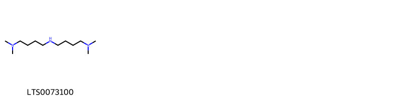

!!! abstract "Tóm tắt"

    Lá ngoi (Folium Solani erianthi) là lá đã phơi hay sấy khô của cây Ngoi (Solanum erianthum D. Don), họ Cà (Solanaceae). Cây phân bố rộng rãi ở các vùng nhiệt đới và cận nhiệt đới, đặc biệt là Đông Nam Á và Nam Á. Lá Ngoi có vị đắng, cay, tính ấm, có độc. Dược liều dụng trị đau dạ dày, phong thấp tê bại, mụn nhọt ung độc, đòn ngã tổn thương, gẫy xương, bệnh bạch cầu hạt mạn tính, dùng ngoài trị viêm da có mủ, lòi dom, hắc lào, lao hạch. Lá ngoi có chứa nhiều hợp chất có hoạt tính sinh học như: Glycoalcaloid (đặc biệt là Solasonin, solamargine, solasodine), Flavonoid, Tinh dầu.

## Thông tin về thực vật

Dược liệu **Ngoi (Lá)** từ bộ phận **nan** từ loài *Solanum erianthum*.

**Mô tả thực vật:** - Cây  nhỏ, cao 1.5 - 5m.
- Thân và cành có lông hình sao màu vàng nhạt, cành non mọc tỏa rộng.
- Lá mọc so le, hình trái xoan hoặc hình trứng, dài 12 - 20cm, rộng 6 - 11cm, gốc hình nêm, đầu thuôn nhọn, mép nguyên; hai mặt phủ lông mịn, cuống lá dài 3 - 5cm.
- Cụm hoa mọc ở kẽ lá hoặc cành bên thành xim phân nhánh, có lông mịn như len, nhiều hoa màu trắng: đài nhẵn hình phễu, xẻ 5 thùy nhọn; tràng dài gấp 2 lần đài; cánh hoa có lông tơ ở mặt ngoài; nhị 5, bao phấn nứt ngang ở đỉnh; bầu có lông.
- Quả nhỏ, mọng, hình cầu, khi chín màu vàng, chứa nhiều hạt có vân mạng.
- Mùa hoa quả: tháng 3 - 11.

*Tài liệu tham khảo:* Tài liệu khác 
Trong dược điển Việt nam, một loài được sử dụng làm dược liệu là *Solanum erianthum*.

!!! info "Phân loại thực vật của *Solanum erianthum*"
    - **Kingdom:** Plantae
    - **Phylum:** Tracheophyta
    - **Order:** Solanales
    - **Family:** Solanaceae
    - **Genus:** Solanum
    - **Species:** *Solanum erianthum*

**Phân bố trên thế giới:** Thailand, United States of America, Mexico, Chinese Taipei, Honduras, China, Hong Kong, Haiti, Dominican Republic, Colombia, Belize, India, Cuba, Jamaica

**Phân bố tại Việt nam:** Không có ghi nhận ở Việt Nam

## Thông tin về dược liệu 

### Định danh

!!! info "Thông tin về tên gọi"

    - Dược liệu tiếng Việt: nan
    - Dược liệu tiếng Trung: nan (nan)
    - Dược liệu tiếng Anh: nan
    - Dược liệu latin thông dụng: nan
    - Dược liệu latin kiểu DĐVN: *folium solani erianthi*
    - Dược liệu latin kiểu DĐVN: *nan*
    - Dược liệu latin kiểu thông tư: *nan*
    - Bộ phận dùng: nan (nan)

### Mô tả dược liệu 

- **Theo dược điển Việt nam V:** nan

- **Mô tả dược liệu theo thông tư chế biến dược liệu theo phương pháp cổ truyền:** nan

### Chế biến 

- **Chế biến theo dược điển việt nam V**: nan

- **Chế biến theo thông tư:** nan

--- 

## Thành phần hóa học

- Theo tài liệu của GS. Đỗ Tất Lợi:  Các nghiên cứu đã chỉ ra rằng, trong cây ngoi có chứa nhiều hợp chất có hoạt tính sinh học, trong đó đáng chú ý là các nhóm hợp chất sau:
- Glycoalcaloid: Đây là nhóm hợp chất đặc trưng của họ cà (Solanaceae), bao gồm solasonin, solamargine, solasodine, solaverbascin, solaverin I, II, III, solaverol A, B. Các hợp chất này có tác dụng chống viêm, giảm đau, kháng khuẩn và chống ung thư.
- Flavonoid: Nhóm hợp chất này có tác dụng chống oxy hóa, bảo vệ tế bào, giảm viêm.
- Tinh dầu: Tinh dầu của cây ngoi chứa các thành phần như monoterpen, sesquiterpen, có tác dụng kháng khuẩn, chống nấm.
    

**Thành phần hóa học từ loài **Solanum erianthum**

Theo cơ sở dữ liệu lotus, loài *Solanum erianthum* đã phân lập và xác định được **1** hoạt chất thuộc về các nhóm Organonitrogen compounds trong bảng dưới đây. Danh sách các hoạt chất như sau (4-{[4-(dimethylamino)butyl]amino}butyl)dimethylamine [(LTS0073100)](https://lotus.naturalproducts.net/compound/lotus_id/LTS0073100). 
        
| chemicalTaxonomyClassyfireClass   |   smiles_count |
|:----------------------------------|---------------:|
| Organonitrogen compounds          |             19 |

            
### Nhóm Organonitrogen compounds
<figure markdown="span">
    { width=100% }
<figcaption>Hình ảnh cấu trúc hóa học của hoạt chất thuộc nhóm *Organonitrogen compounds*. Tên thường gọi của các hoạt chất tương ứng là (4-{[4-(dimethylamino)butyl]amino}butyl)dimethylamine [(LTS0073100)](https://lotus.naturalproducts.net/compound/lotus_id/LTS0073100).</figcaption>
</figure>

            

---

## Tác dụng dược lý

Theo tài liệu Tài liệu khác:- Chống viêm, giảm đau.
- Chữa đau nhức viêm khớp.
- Chữa mụn nhọt.
- Kháng khuẩn, kháng nấm.
- Chống oxy hóa.
- Chống ung thư.

Theo tài liệu quốc tế: nan

---

## Dược điển Việt Nam V

### Soi bột:

nan

<!-- Hình ảnh soi bột sẽ được tự động chèn vào đây sau -->

### Vi phẫu:

nan

<!-- Hình ảnh vi phẫu sẽ được tự động chèn vào đây sau -->

### Định tính

nan

### Định lượng

nan

### Thông tin khác 

- ** Độ ẩm: ** nan
- ** Bảo quản:** nan

## Dược điển Hồng kong

<!-- PDF sẽ được tự động chèn vào đây sau -->

---

## Y dược học cổ truyền

- **Tên vị thuốc:** nan
- **Tính vị quy kinh:** Vị đắng, cay, tính ấm, có độc.
- **Công năng chủ trị:** - Công năng: Thanh nhiệt tiêu thũng, sát trùng, chỉ huyết, hành khí chỉ thống, sinh cơ thu liễm.
- Chủ trị: Đau dạ dày, phong thấp tê bại, mụn nhọt ung độc, đòn ngã tổn thương, gẫy xương, bệnh bạch cầu hạt mạn tính. Dùng ngoài trị viêm da có mủ, lòi dom, hắc lào, lao hạch.
- **Chú ý:** nan
- **Kiêng kỵ:** nan

## Bình luận

