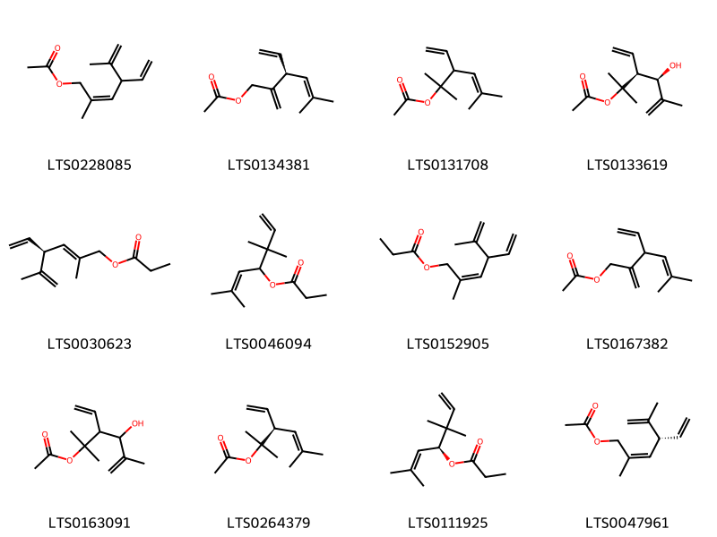
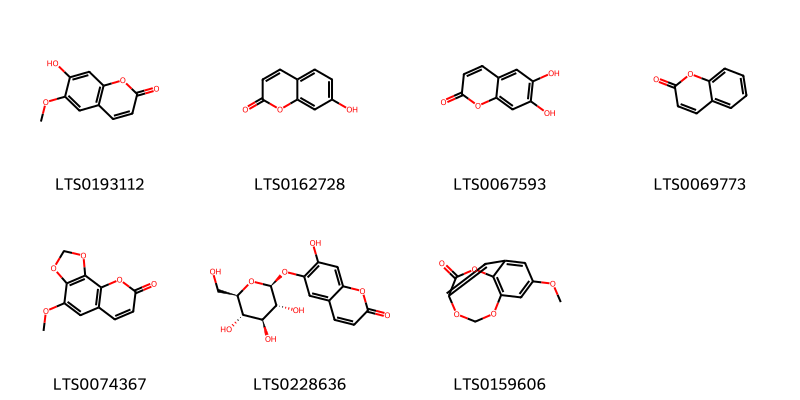
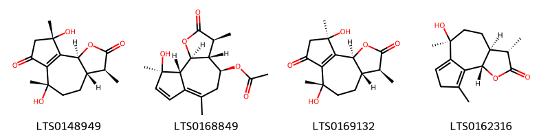
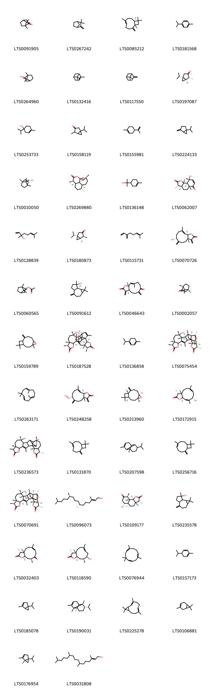

!!! abstract "Tóm tắt"

    Ngải cứu (Herba Artemisiae vulgaris) là ngọn thân đã phơi hay sấy khô của cây Ngải cứu (Artemisia vulgaris L.), thuộc họ Cúc (Asteraceae). Ngải cứu là một dược liệu có nguồn gốc rộng rãi, mọc ở nhiều nước châu Á và châu Âu. Ở Việt Nam, cây mọc hoang ở nhiều vùng trong nước, một số gia đình trồng quy mô nhỏ quanh nhà nhưng chưa thấy trồng quy mô lớn. Trong y học cổ truyền, ngải cứu được sử dụng để điều trị các chứng bệnh liên quan đến huyết, như kinh nguyệt không đều, băng huyết, rong huyết, và động thai, đồng thời có tác dụng điều hòa kinh nguyệt, an thai, và trị viêm ruột. Dược liệu này có tác dụng dược lý như kích thích sự say, tác dụng hưng phấn, nhưng nếu dùng quá mức có thể gây điên cuồng. Thành phần hóa học của ngải cứu bao gồm tinh dầu (xineol, α-thuyon), adenin, cholin, với biomaker đặc trưng là chlorogenic acid và scopoletin.

## Thông tin về thực vật

Dược liệu **Ngải Cứu** từ bộ phận **** từ loài *Artemisia vulgaris*.

**Mô tả thực vật:** Ngải cứu là một loại cỏ sống lâu năm, cao 50-60 cm, thân to có rãnh dọc. Lá mọc so le, rộng, không có cuống (nhưng lá phía dưới thường có cuống), xẻ thùy lông chim, màu lá ở hai mặt rất khác nhau: Mặt trên nhẵn màu lục sẫm, mặt dưới màu trắng tro do có rất nhiều lông nhỏ, trắng. Hoa mọc thành chùy kép gồm rất nhiều cụm hoa hình đầu.

*Tài liệu tham khảo:* "Những cây thuốc và vị thuốc Việt Nam" - Đỗ Tất Lợi 
Trong dược điển Việt nam, một loài được sử dụng làm dược liệu là *Artemisia vulgaris*.

!!! info "Phân loại thực vật của *Artemisia vulgaris*"
    - **Kingdom:** Plantae
    - **Phylum:** Tracheophyta
    - **Order:** Asterales
    - **Family:** Asteraceae
    - **Genus:** Artemisia
    - **Species:** *Artemisia vulgaris*

**Phân bố trên thế giới:** France, Germany, United States of America, Spain, Poland, Switzerland, Russian Federation, United Kingdom of Great Britain and Northern Ireland, Finland, Canada, Netherlands, Austria, Denmark, Ukraine

**Phân bố tại Việt nam:** Không có ghi nhận ở Việt Nam

## Thông tin về dược liệu 

### Định danh

!!! info "Thông tin về tên gọi"

    - Dược liệu tiếng Việt: ngải cứu
    - Dược liệu tiếng Trung:  ()
    - Dược liệu tiếng Anh: 
    - Dược liệu latin thông dụng: Herba Artemisiae vulgaris
    - Dược liệu latin kiểu DĐVN: *herba artemisiae vulgaris*
    - Dược liệu latin kiểu DĐVN: **
    - Dược liệu latin kiểu thông tư: **
    - Bộ phận dùng:  (Herba)

### Mô tả dược liệu 

- **Theo dược điển Việt nam V:** Ngọn thân dài không quá 30 cm, có khía dọc, màu vàng  nâu hay nâu xám, có lông tơ. Lá mọc so le, có cuống hoặc  không, thường nhăn nheo, cuộn vào nhau. Lá có nhiều  dạng: Lá trên ngọn nguyên, hình mác; lá phía dưới xẻ một  hoặc hai lần hình lông chim. Mặt trên lá màu xám đến  xanh đen, nhẵn hay có rất ít lông tơ, mặt dưới lá màu tro  trắng, có rất nhiều lông tơ trắng như mạng nhện nằm dẹp.  cụm hoa đầu, gồm nhiều hoa hình ống.

- **Mô tả dược liệu theo thông tư chế biến dược liệu theo phương pháp cổ truyền:** 

### Chế biến 

- **Chế biến theo dược điển việt nam V**: Thường thu hái vào tháng 5 đến 6 (lúc cây chưa ra hoa),  chặt lấy đoạn cành dài không quá 40 cm, mang nhiêu lá,  loại bỏ tạp chất, phơi âm can hay sấy nhẹ tới khô. Bào chế Ngải cứu khô: Loại bỏ tạp chất và cành, rây bỏ chất vụn, thu  được Ngải diệp, rửa qua nước cho mềm, thái ngắn, phơi khô. Ngải thản (hoặc Thô Ngải thán): Chọn Ngải diệp sạch cho  vào nồi sao to lửa đến khi đa phần (khoảng 7 phần 10)  chuyển thành màu đen, trộn đều với dấm, sao khô hoặc lấy  ra phơi ở chồ mát 2 ngày đến 3 ngày cho khô. Cứ 100 kg  lá Ngải cứu dùng 15 L dấm. Ngải nhung dùng để (châm) cứu: Lá Ngải cứu sạch phơi  khô, sao qua, để cho mềm, cho vào cối già kỹ, khi nào mịn  như nhung là được, bỏ xơ và bột vụn.

- **Chế biến theo thông tư:** 

--- 

## Thành phần hóa học

- Theo tài liệu của GS. Đỗ Tất Lợi:  (1) Có tinh dầu, ít tanin. Thành phần chủ yếu của tinh dầu ngải cứu là xineol và α-thuyon. Ngoài ra còn một ít adenin, cholin.
(2) Chlorogenic acid và scopoletin
    

**Thành phần hóa học từ loài **Artemisia vulgaris**

Theo cơ sở dữ liệu lotus, loài *Artemisia vulgaris* đã phân lập và xác định được **199** hoạt chất thuộc về các nhóm Pyrans, Epoxides, Steroids and steroid derivatives, Organooxygen compounds, Flavonoids, Fatty Acyls, Lactones, Phenols, Carboxylic acids and derivatives, Coumarins and derivatives, Unsaturated hydrocarbons, Prenol lipids trong bảng dưới đây. Danh sách các hoạt chất như sau 4-terpineol [(LTS0253733)](https://lotus.naturalproducts.net/compound/lotus_id/LTS0253733), 1-(3,3-dimethyloxiran-2-yl)-2,2-dimethylbut-3-en-1-one [(LTS0154579)](https://lotus.naturalproducts.net/compound/lotus_id/LTS0154579), (7ar)-1,1,7-trimethyl-4-methylidene-octahydrocyclopropa[e]azulen-7-ol [(LTS0091612)](https://lotus.naturalproducts.net/compound/lotus_id/LTS0091612), α pinene [(LTS0132416)](https://lotus.naturalproducts.net/compound/lotus_id/LTS0132416), umbelliferone [(LTS0162728)](https://lotus.naturalproducts.net/compound/lotus_id/LTS0162728), phellandrene [(LTS0157173)](https://lotus.naturalproducts.net/compound/lotus_id/LTS0157173), α-amyrin acetate [(LTS0224810)](https://lotus.naturalproducts.net/compound/lotus_id/LTS0224810), delta-cadinol [(LTS0013807)](https://lotus.naturalproducts.net/compound/lotus_id/LTS0013807), eugenol [(LTS0052342)](https://lotus.naturalproducts.net/compound/lotus_id/LTS0052342), (3z,7e)-1,5,5,8-tetramethyl-12-oxabicyclo[9.1.0]dodeca-3,7-diene [(LTS0107049)](https://lotus.naturalproducts.net/compound/lotus_id/LTS0107049), (3e,5e)-trideca-1,3,5-trien-7,9,11-triyne [(LTS0189296)](https://lotus.naturalproducts.net/compound/lotus_id/LTS0189296), methyl dec-2-en-4,6,8-triynoate [(LTS0221613)](https://lotus.naturalproducts.net/compound/lotus_id/LTS0221613), thujone [(LTS0197087)](https://lotus.naturalproducts.net/compound/lotus_id/LTS0197087), (2e,4s)-4-ethenyl-2,5-dimethylhexa-2,5-dien-1-yl propanoate [(LTS0030623)](https://lotus.naturalproducts.net/compound/lotus_id/LTS0030623), (1s,2s,4ar,5r,8as)-2-isopropyl-4a-methyl-8-methylidene-octahydronaphthalene-1,5-diol [(LTS0071183)](https://lotus.naturalproducts.net/compound/lotus_id/LTS0071183), (3r,3as,5ar,6r,9s,9as,9bs)-6-hydroxy-3,5a,9-trimethyl-octahydro-3h-naphtho[1,2-b]furan-2,8-dione [(LTS0109177)](https://lotus.naturalproducts.net/compound/lotus_id/LTS0109177), 7-methoxy-2,4,11-trioxatricyclo[7.3.1.0⁵,¹⁰]trideca-1(13),5(10),6,8-tetraen-12-one [(LTS0159606)](https://lotus.naturalproducts.net/compound/lotus_id/LTS0159606), 3-ethenyl-5-methyl-2-methylidenehex-4-en-1-yl acetate [(LTS0167382)](https://lotus.naturalproducts.net/compound/lotus_id/LTS0167382), (-)-camphene [(LTS0067556)](https://lotus.naturalproducts.net/compound/lotus_id/LTS0067556), isorhamnetin [(LTS0107505)](https://lotus.naturalproducts.net/compound/lotus_id/LTS0107505), 2-isopropyl-4a-methyl-8-methylidene-octahydronaphthalene-1,5-diol [(LTS0190508)](https://lotus.naturalproducts.net/compound/lotus_id/LTS0190508), (9s,12s,16r,17s,19s,23s,26s)-12,16-dihydroxy-3,8,12,17,19,23-hexamethyl-6,18,25-trioxaoctacyclo[13.11.1.0¹,¹⁷.0²,¹⁴.0⁴,¹³.0⁵,⁹.0¹⁹,²⁷.0²²,²⁶]heptacos-3-ene-7,24-dione [(LTS0236573)](https://lotus.naturalproducts.net/compound/lotus_id/LTS0236573), (3s,3as,6s,9s,9bs)-6,9-dihydroxy-3,6,9-trimethyl-3h,3ah,4h,5h,8h,9bh-azuleno[4,5-b]furan-2,7-dione [(LTS0148949)](https://lotus.naturalproducts.net/compound/lotus_id/LTS0148949), ketopelenolide a [(LTS0032403)](https://lotus.naturalproducts.net/compound/lotus_id/LTS0032403), heptadeca-1,7,9-trien-11,13,15-triyne [(LTS0203633)](https://lotus.naturalproducts.net/compound/lotus_id/LTS0203633), (3s)-3-ethenyl-5-methyl-2-methylidenehex-4-en-1-yl acetate [(LTS0134381)](https://lotus.naturalproducts.net/compound/lotus_id/LTS0134381), lily of valley [(LTS0051762)](https://lotus.naturalproducts.net/compound/lotus_id/LTS0051762), astragalin [(LTS0249588)](https://lotus.naturalproducts.net/compound/lotus_id/LTS0249588), (-)-trans-carveol [(LTS0156471)](https://lotus.naturalproducts.net/compound/lotus_id/LTS0156471), (1r,2s,6s,7s,8r)-8-isopropyl-1,3-dimethyltricyclo[4.4.0.0²,⁷]dec-3-ene [(LTS0106607)](https://lotus.naturalproducts.net/compound/lotus_id/LTS0106607), 3-ethenyl-2,5-dimethyl-4-oxohex-5-en-2-yl acetate [(LTS0080163)](https://lotus.naturalproducts.net/compound/lotus_id/LTS0080163), α-humulene [(LTS0076944)](https://lotus.naturalproducts.net/compound/lotus_id/LTS0076944), 2-[(2r,4ar,5s,8as)-5-hydroxy-4a-methyl-8-methylidene-1,2,3,4,5,8a-hexahydronaphthalen-2-yl]prop-2-enoic acid [(LTS0216388)](https://lotus.naturalproducts.net/compound/lotus_id/LTS0216388), (4s)-3,3,6-trimethylhepta-1,5-dien-4-yl propanoate [(LTS0111925)](https://lotus.naturalproducts.net/compound/lotus_id/LTS0111925), (8r,9e)-heptadeca-1,9-dien-11,13,15-triyn-8-ol [(LTS0210717)](https://lotus.naturalproducts.net/compound/lotus_id/LTS0210717), hyperoside [(LTS0089156)](https://lotus.naturalproducts.net/compound/lotus_id/LTS0089156), isoartemisia ketone [(LTS0154009)](https://lotus.naturalproducts.net/compound/lotus_id/LTS0154009), luteolin [(LTS0017052)](https://lotus.naturalproducts.net/compound/lotus_id/LTS0017052), (7e,9z)-heptadeca-1,7,9-trien-11,13,15-triyne [(LTS0187756)](https://lotus.naturalproducts.net/compound/lotus_id/LTS0187756), 3-ethenyl-2,5-dimethylhex-4-en-2-yl acetate [(LTS0131708)](https://lotus.naturalproducts.net/compound/lotus_id/LTS0131708), esculetin [(LTS0067593)](https://lotus.naturalproducts.net/compound/lotus_id/LTS0067593), (+)-borneol [(LTS0059936)](https://lotus.naturalproducts.net/compound/lotus_id/LTS0059936), 2,2,3-trimethylbicyclo[2.2.1]heptane [(LTS0134167)](https://lotus.naturalproducts.net/compound/lotus_id/LTS0134167), (3e,5z)-trideca-1,3,5-trien-7,9,11-triyne [(LTS0082958)](https://lotus.naturalproducts.net/compound/lotus_id/LTS0082958), trideca-1,3,5-trien-7,9,11-triyne [(LTS0246027)](https://lotus.naturalproducts.net/compound/lotus_id/LTS0246027), (+)-β-thujone [(LTS0180873)](https://lotus.naturalproducts.net/compound/lotus_id/LTS0180873), 2-(3,4-dihydroxyphenyl)-5,7-dihydroxy-3-{[3,4,5-trihydroxy-6-(hydroxymethyl)oxan-2-yl]oxy}chromen-4-one [(LTS0195312)](https://lotus.naturalproducts.net/compound/lotus_id/LTS0195312), (3r,3as,9s,11as)-9-hydroxy-3,6,10-trimethyl-3h,3ah,4h,5h,8h,9h,11ah-cyclodeca[b]furan-2-one [(LTS0172915)](https://lotus.naturalproducts.net/compound/lotus_id/LTS0172915), jaceosidin [(LTS0259681)](https://lotus.naturalproducts.net/compound/lotus_id/LTS0259681), β-caryophyllene oxide [(LTS0213960)](https://lotus.naturalproducts.net/compound/lotus_id/LTS0213960), scopoletin [(LTS0193112)](https://lotus.naturalproducts.net/compound/lotus_id/LTS0193112), (6r,7e,9e)-heptadeca-1,7,9-trien-11,13,15-triyn-6-ol [(LTS0098850)](https://lotus.naturalproducts.net/compound/lotus_id/LTS0098850), artemorin [(LTS0070726)](https://lotus.naturalproducts.net/compound/lotus_id/LTS0070726), camphor [(LTS0091905)](https://lotus.naturalproducts.net/compound/lotus_id/LTS0091905), cymene [(LTS0181568)](https://lotus.naturalproducts.net/compound/lotus_id/LTS0181568), terpineol [(LTS0136148)](https://lotus.naturalproducts.net/compound/lotus_id/LTS0136148), gamma-muurolene [(LTS0052920)](https://lotus.naturalproducts.net/compound/lotus_id/LTS0052920), artabsin [(LTS0162316)](https://lotus.naturalproducts.net/compound/lotus_id/LTS0162316), (1s,2r,3s,4r)-3-hydroxy-1,7,7-trimethylbicyclo[2.2.1]heptan-2-yl acetate [(LTS0166065)](https://lotus.naturalproducts.net/compound/lotus_id/LTS0166065), humulene [(LTS0263171)](https://lotus.naturalproducts.net/compound/lotus_id/LTS0263171), geraniol [(LTS0258838)](https://lotus.naturalproducts.net/compound/lotus_id/LTS0258838), 2h-1-benzopyran-2-one [(LTS0069773)](https://lotus.naturalproducts.net/compound/lotus_id/LTS0069773), 2-[(2r,4as)-4a,8-dimethyl-7-oxo-1,2,3,4-tetrahydronaphthalen-2-yl]prop-2-enoic acid [(LTS0064483)](https://lotus.naturalproducts.net/compound/lotus_id/LTS0064483), (3s,3as,6s,9r,9bs)-6,9-dihydroxy-3,6,9-trimethyl-3h,3ah,4h,5h,8h,9bh-azuleno[4,5-b]furan-2,7-dione [(LTS0169132)](https://lotus.naturalproducts.net/compound/lotus_id/LTS0169132), 4-methoxy-2h-[1,3]dioxolo[4,5-h]chromen-8-one [(LTS0074367)](https://lotus.naturalproducts.net/compound/lotus_id/LTS0074367), tetradec-6-en-8,10,12-triyn-3-ol [(LTS0034278)](https://lotus.naturalproducts.net/compound/lotus_id/LTS0034278), (3as,11ar)-10-methyl-3,6-dimethylidene-3ah,4h,5h,8h,9h,11ah-cyclodeca[b]furan-2,7-dione [(LTS0046643)](https://lotus.naturalproducts.net/compound/lotus_id/LTS0046643), (3r)-3-ethenyl-2,5-dimethyl-4-oxohex-5-en-2-yl acetate [(LTS0110645)](https://lotus.naturalproducts.net/compound/lotus_id/LTS0110645), 4,11,11-trimethyl-8-methylidenebicyclo[7.2.0]undec-4-ene [(LTS0256716)](https://lotus.naturalproducts.net/compound/lotus_id/LTS0256716), α-copaene [(LTS0207598)](https://lotus.naturalproducts.net/compound/lotus_id/LTS0207598), (+)-thujone [(LTS0165508)](https://lotus.naturalproducts.net/compound/lotus_id/LTS0165508), nepetin [(LTS0148293)](https://lotus.naturalproducts.net/compound/lotus_id/LTS0148293), 2-(3,4-dihydroxyphenyl)-5-hydroxy-7-{[(2r,3r,4s,5s,6r)-3,4,5-trihydroxy-6-(hydroxymethyl)oxan-2-yl]oxy}chromen-4-one [(LTS0068019)](https://lotus.naturalproducts.net/compound/lotus_id/LTS0068019), (+)-artemisinin [(LTS0269880)](https://lotus.naturalproducts.net/compound/lotus_id/LTS0269880), (1r,11s)-1,5,5,8-tetramethyl-12-oxabicyclo[9.1.0]dodeca-3,7-diene [(LTS0195579)](https://lotus.naturalproducts.net/compound/lotus_id/LTS0195579), 3,3,6-trimethylhepta-1,5-dien-4-yl propanoate [(LTS0046094)](https://lotus.naturalproducts.net/compound/lotus_id/LTS0046094), 3,5-dihydroxy-2-(4-hydroxyphenyl)-7-{[3,4,5-trihydroxy-6-(hydroxymethyl)oxan-2-yl]oxy}chromen-4-one [(LTS0262914)](https://lotus.naturalproducts.net/compound/lotus_id/LTS0262914), 4-isopropyl-6-methyl-1-methylidene-3,4,4a,7,8,8a-hexahydro-2h-naphthalene [(LTS0111070)](https://lotus.naturalproducts.net/compound/lotus_id/LTS0111070), (+)-4-terpineol [(LTS0140257)](https://lotus.naturalproducts.net/compound/lotus_id/LTS0140257), tetradeca-4,6-dien-8,10,12-triyn-1-yl acetate [(LTS0034687)](https://lotus.naturalproducts.net/compound/lotus_id/LTS0034687), stearyl alcohol [(LTS0222463)](https://lotus.naturalproducts.net/compound/lotus_id/LTS0222463), phytol [(LTS0096073)](https://lotus.naturalproducts.net/compound/lotus_id/LTS0096073), elemene [(LTS0090837)](https://lotus.naturalproducts.net/compound/lotus_id/LTS0090837), (3s)-3-ethenyl-2,5-dimethylhex-4-en-2-yl acetate [(LTS0264379)](https://lotus.naturalproducts.net/compound/lotus_id/LTS0264379), β-pinene [(LTS0117550)](https://lotus.naturalproducts.net/compound/lotus_id/LTS0117550), (3r,3as,9r,10s,11ar)-9-hydroxy-3,6,10-trimethyl-3h,3ah,4h,5h,8h,9h,10h,11h,11ah-cyclodeca[b]furan-2-one [(LTS0118590)](https://lotus.naturalproducts.net/compound/lotus_id/LTS0118590), 2-heptadecanone [(LTS0236296)](https://lotus.naturalproducts.net/compound/lotus_id/LTS0236296), 3-oxotetradec-6-en-8,10,12-triyn-1-yl 3-methylbutanoate [(LTS0135860)](https://lotus.naturalproducts.net/compound/lotus_id/LTS0135860), homoeriodictyol (+/-)- [(LTS0266494)](https://lotus.naturalproducts.net/compound/lotus_id/LTS0266494), α-limonene [(LTS0244943)](https://lotus.naturalproducts.net/compound/lotus_id/LTS0244943), 5,7-dihydroxy-2-(4-hydroxyphenyl)-3-{[(2r,3r,4r,5r,6s)-3,4,5-trihydroxy-6-methyloxan-2-yl]oxy}chromen-4-one [(LTS0051271)](https://lotus.naturalproducts.net/compound/lotus_id/LTS0051271), 3-nonanone [(LTS0066371)](https://lotus.naturalproducts.net/compound/lotus_id/LTS0066371), 6-hydroxy-7-isopropyl-3-methyl-4ah,5h,6h,7h,7ah-cyclopenta[b]pyran-2-one [(LTS0016531)](https://lotus.naturalproducts.net/compound/lotus_id/LTS0016531), 3-ethenyl-4-hydroxy-2,5-dimethylhex-5-en-2-yl acetate [(LTS0163091)](https://lotus.naturalproducts.net/compound/lotus_id/LTS0163091), (+)-absinthin [(LTS0187528)](https://lotus.naturalproducts.net/compound/lotus_id/LTS0187528), rutin [(LTS0042292)](https://lotus.naturalproducts.net/compound/lotus_id/LTS0042292), (1s,2r,5s,8s,9s,12s,13r,14r,15r,16r,17s,19s,22s,23s,26s,27r)-12,16-dihydroxy-3,8,12,17,19,23-hexamethyl-6,18,25-trioxaoctacyclo[13.11.1.0¹,¹⁷.0²,¹⁴.0⁴,¹³.0⁵,⁹.0¹⁹,²⁷.0²²,²⁶]heptacos-3-ene-7,24-dione [(LTS0070691)](https://lotus.naturalproducts.net/compound/lotus_id/LTS0070691), 7-isopropyl-6-methyl-4ah,5h,6h,7h,7ah-cyclopenta[b]pyran-2-one [(LTS0181741)](https://lotus.naturalproducts.net/compound/lotus_id/LTS0181741), (1s,2s)-1-ethenyl-1-methyl-2-(prop-1-en-2-yl)-4-(propan-2-ylidene)cyclohexane [(LTS0135613)](https://lotus.naturalproducts.net/compound/lotus_id/LTS0135613), 3-isopropyl-3a,5a,8,8,11a,13a-hexamethyl-1h,2h,3h,4h,5h,5bh,6h,7h,7ah,9h,10h,11h,13h,13bh-cyclopenta[a]chrysen-9-ol [(LTS0119990)](https://lotus.naturalproducts.net/compound/lotus_id/LTS0119990), 4-isopropyl-1,6-dimethyl-1,2,4a,5,8,8a-hexahydronaphthalene [(LTS0036509)](https://lotus.naturalproducts.net/compound/lotus_id/LTS0036509), palmitic acid [(LTS0079439)](https://lotus.naturalproducts.net/compound/lotus_id/LTS0079439), sabinene hydrate [(LTS0215494)](https://lotus.naturalproducts.net/compound/lotus_id/LTS0215494), β-elemene [(LTS0225699)](https://lotus.naturalproducts.net/compound/lotus_id/LTS0225699), 1-[(2s)-3,3-dimethyloxiran-2-yl]-2,2-dimethylbut-3-en-1-one [(LTS0041545)](https://lotus.naturalproducts.net/compound/lotus_id/LTS0041545), heptadeca-1,9-dien-11,13,15-triyn-8-ol [(LTS0067361)](https://lotus.naturalproducts.net/compound/lotus_id/LTS0067361), (1r,4as,8as)-4-isopropyl-1,6-dimethyl-1,2,4a,5,8,8a-hexahydronaphthalene [(LTS0107137)](https://lotus.naturalproducts.net/compound/lotus_id/LTS0107137), heptadeca-1,7,9-trien-11,13,15-triyn-6-ol [(LTS0177490)](https://lotus.naturalproducts.net/compound/lotus_id/LTS0177490), delta-cadinol [(LTS0008282)](https://lotus.naturalproducts.net/compound/lotus_id/LTS0008282), (3s,4r)-3-ethenyl-4-hydroxy-2,5-dimethylhex-5-en-2-yl acetate [(LTS0133619)](https://lotus.naturalproducts.net/compound/lotus_id/LTS0133619), 3-rutinosyl quercetin [(LTS0032845)](https://lotus.naturalproducts.net/compound/lotus_id/LTS0032845), (6e)-3-oxotetradec-6-en-8,10,12-triyn-1-yl 3-methylbutanoate [(LTS0047886)](https://lotus.naturalproducts.net/compound/lotus_id/LTS0047886), anabsinthin [(LTS0075454)](https://lotus.naturalproducts.net/compound/lotus_id/LTS0075454), monoterpenes [(LTS0106881)](https://lotus.naturalproducts.net/compound/lotus_id/LTS0106881), (+)-delta(3)-carene [(LTS0250199)](https://lotus.naturalproducts.net/compound/lotus_id/LTS0250199), 2-(4a,8-dimethyl-7-oxo-1,2,3,4-tetrahydronaphthalen-2-yl)prop-2-enoic acid [(LTS0095236)](https://lotus.naturalproducts.net/compound/lotus_id/LTS0095236), quercetin [(LTS0004651)](https://lotus.naturalproducts.net/compound/lotus_id/LTS0004651), 2-(3,4-dihydroxyphenyl)-5,7-dihydroxy-3-{[(2r,3r,4s,5s,6r)-3,4,5-trihydroxy-6-(hydroxymethyl)oxan-2-yl]oxy}chromen-4-one [(LTS0086516)](https://lotus.naturalproducts.net/compound/lotus_id/LTS0086516), tricin [(LTS0271018)](https://lotus.naturalproducts.net/compound/lotus_id/LTS0271018), matricin [(LTS0168849)](https://lotus.naturalproducts.net/compound/lotus_id/LTS0168849), (-)-β-pinene [(LTS0108757)](https://lotus.naturalproducts.net/compound/lotus_id/LTS0108757), esculin [(LTS0228636)](https://lotus.naturalproducts.net/compound/lotus_id/LTS0228636), spathulenol [(LTS0235578)](https://lotus.naturalproducts.net/compound/lotus_id/LTS0235578), (+)-camphene [(LTS0109845)](https://lotus.naturalproducts.net/compound/lotus_id/LTS0109845), (+)-gamma-cadinene [(LTS0103949)](https://lotus.naturalproducts.net/compound/lotus_id/LTS0103949), vitexin [(LTS0199581)](https://lotus.naturalproducts.net/compound/lotus_id/LTS0199581), α-thujene [(LTS0176954)](https://lotus.naturalproducts.net/compound/lotus_id/LTS0176954), (-)-β-cubebene [(LTS0123697)](https://lotus.naturalproducts.net/compound/lotus_id/LTS0123697), (1s,3s,4r)-2,2,3-trimethylbicyclo[2.2.1]heptane [(LTS0070372)](https://lotus.naturalproducts.net/compound/lotus_id/LTS0070372), caryophyllene [(LTS0131870)](https://lotus.naturalproducts.net/compound/lotus_id/LTS0131870), (4e,6e)-tetradeca-4,6-dien-8,10,12-triyn-1-ol [(LTS0108867)](https://lotus.naturalproducts.net/compound/lotus_id/LTS0108867), vulgarin [(LTS0062007)](https://lotus.naturalproducts.net/compound/lotus_id/LTS0062007), (-)-α-gurjunene [(LTS0194913)](https://lotus.naturalproducts.net/compound/lotus_id/LTS0194913), (7e,9e)-heptadeca-1,7,9-trien-11,13,15-triyne [(LTS0273836)](https://lotus.naturalproducts.net/compound/lotus_id/LTS0273836), nictoflorin [(LTS0182501)](https://lotus.naturalproducts.net/compound/lotus_id/LTS0182501), d-camphor [(LTS0002057)](https://lotus.naturalproducts.net/compound/lotus_id/LTS0002057), (6e)-tetradec-6-en-8,10,12-triyn-3-one [(LTS0114987)](https://lotus.naturalproducts.net/compound/lotus_id/LTS0114987), phytol [(LTS0031808)](https://lotus.naturalproducts.net/compound/lotus_id/LTS0031808), (+)-sabinene [(LTS0110694)](https://lotus.naturalproducts.net/compound/lotus_id/LTS0110694), vitexin [(LTS0254648)](https://lotus.naturalproducts.net/compound/lotus_id/LTS0254648), caryophyllene [(LTS0085212)](https://lotus.naturalproducts.net/compound/lotus_id/LTS0085212), chamomile [(LTS0104946)](https://lotus.naturalproducts.net/compound/lotus_id/LTS0104946), chrysoeriol [(LTS0095766)](https://lotus.naturalproducts.net/compound/lotus_id/LTS0095766), (1r,3as,3bs,7s,9ar,9bs,11ar)-1-[(2s,3e,5s)-5-ethyl-6-methylhept-3-en-2-yl]-9a,11a-dimethyl-1h,2h,3h,3ah,3bh,4h,6h,7h,8h,9h,9bh,10h,11h-cyclopenta[a]phenanthren-7-ol [(LTS0169213)](https://lotus.naturalproducts.net/compound/lotus_id/LTS0169213), (2z,4r)-4-ethenyl-2,5-dimethylhexa-2,5-dien-1-yl acetate [(LTS0047961)](https://lotus.naturalproducts.net/compound/lotus_id/LTS0047961), 5,7-dihydroxy-2-(4-hydroxyphenyl)-3-[(3,4,5-trihydroxy-6-{[(3,4,5-trihydroxy-6-methyloxan-2-yl)oxy]methyl}oxan-2-yl)oxy]chromen-4-one [(LTS0122456)](https://lotus.naturalproducts.net/compound/lotus_id/LTS0122456), (3s,6ar,8ar,12s,14br)-4,4,6a,6b,8a,11,12,14b-octamethyl-2,3,4a,5,6,7,8,9,10,11,12,12a,14,14a-tetradecahydro-1h-picen-3-yl acetate [(LTS0206994)](https://lotus.naturalproducts.net/compound/lotus_id/LTS0206994), (3e)-trideca-1,3,5-trien-7,9,11-triyne [(LTS0229406)](https://lotus.naturalproducts.net/compound/lotus_id/LTS0229406), (+)-α-pinene [(LTS0211102)](https://lotus.naturalproducts.net/compound/lotus_id/LTS0211102), bornyl acetate [(LTS0060565)](https://lotus.naturalproducts.net/compound/lotus_id/LTS0060565), sabinene hydrate [(LTS0236165)](https://lotus.naturalproducts.net/compound/lotus_id/LTS0236165), terpinene [(LTS0136858)](https://lotus.naturalproducts.net/compound/lotus_id/LTS0136858), (+/-)-eriodictyol [(LTS0106920)](https://lotus.naturalproducts.net/compound/lotus_id/LTS0106920), sabinene [(LTS0224133)](https://lotus.naturalproducts.net/compound/lotus_id/LTS0224133), 2-(5-hydroxy-4a-methyl-8-methylidene-1,2,3,4,5,8a-hexahydronaphthalen-2-yl)prop-2-enoic acid [(LTS0028536)](https://lotus.naturalproducts.net/compound/lotus_id/LTS0028536), tetradec-6-en-8,10,12-triyn-3-one [(LTS0109746)](https://lotus.naturalproducts.net/compound/lotus_id/LTS0109746), (2e,6e)-3,7,11,11-tetramethylbicyclo[8.1.0]undeca-2,6-diene [(LTS0225278)](https://lotus.naturalproducts.net/compound/lotus_id/LTS0225278), α-thujene [(LTS0185078)](https://lotus.naturalproducts.net/compound/lotus_id/LTS0185078), eriodictyol [(LTS0220769)](https://lotus.naturalproducts.net/compound/lotus_id/LTS0220769), 4-ethenyl-2,5-dimethylhexa-2,5-dien-1-yl propanoate [(LTS0152905)](https://lotus.naturalproducts.net/compound/lotus_id/LTS0152905), (7e)-heptadeca-1,7,9-trien-11,13,15-triyne [(LTS0092609)](https://lotus.naturalproducts.net/compound/lotus_id/LTS0092609), trifolin [(LTS0267055)](https://lotus.naturalproducts.net/compound/lotus_id/LTS0267055), (4e,6e)-tetradeca-4,6-dien-8,10,12-triyn-1-yl acetate [(LTS0260610)](https://lotus.naturalproducts.net/compound/lotus_id/LTS0260610), dehydromatricaria ester [(LTS0176578)](https://lotus.naturalproducts.net/compound/lotus_id/LTS0176578), 4-ethenyl-2,5-dimethylhexa-2,5-dien-1-yl acetate [(LTS0228085)](https://lotus.naturalproducts.net/compound/lotus_id/LTS0228085), caryophyllene oxide [(LTS0159789)](https://lotus.naturalproducts.net/compound/lotus_id/LTS0159789), 2-(3,4-dihydroxyphenyl)-5-hydroxy-7-{[3,4,5-trihydroxy-6-(hydroxymethyl)oxan-2-yl]oxy}chromen-4-one [(LTS0158292)](https://lotus.naturalproducts.net/compound/lotus_id/LTS0158292), verlotorin [(LTS0248258)](https://lotus.naturalproducts.net/compound/lotus_id/LTS0248258), (5s)-1-isopropyl-4-methylidenebicyclo[3.1.0]hexane [(LTS0129854)](https://lotus.naturalproducts.net/compound/lotus_id/LTS0129854), 5,7-dihydroxy-2-(4-hydroxyphenyl)-3-[(3,4,5-trihydroxy-6-methyloxan-2-yl)oxy]chromen-4-one [(LTS0211340)](https://lotus.naturalproducts.net/compound/lotus_id/LTS0211340), β-farnesene [(LTS0091648)](https://lotus.naturalproducts.net/compound/lotus_id/LTS0091648), 3-isothujone [(LTS0158119)](https://lotus.naturalproducts.net/compound/lotus_id/LTS0158119), prunasin [(LTS0130138)](https://lotus.naturalproducts.net/compound/lotus_id/LTS0130138), sitosterol [(LTS0168132)](https://lotus.naturalproducts.net/compound/lotus_id/LTS0168132), dehydromatricaria ester [(LTS0199637)](https://lotus.naturalproducts.net/compound/lotus_id/LTS0199637), (+)-borneol [(LTS0189059)](https://lotus.naturalproducts.net/compound/lotus_id/LTS0189059), (+-)-camphor [(LTS0212276)](https://lotus.naturalproducts.net/compound/lotus_id/LTS0212276), (1ar,4ar,7s,7as,7br)-1,1,7-trimethyl-4-methylidene-octahydrocyclopropa[e]azulen-7-ol [(LTS0243368)](https://lotus.naturalproducts.net/compound/lotus_id/LTS0243368), (3s,6e)-tetradec-6-en-8,10,12-triyn-3-ol [(LTS0078416)](https://lotus.naturalproducts.net/compound/lotus_id/LTS0078416), α-myrcene [(LTS0115731)](https://lotus.naturalproducts.net/compound/lotus_id/LTS0115731), β-farnesene [(LTS0067925)](https://lotus.naturalproducts.net/compound/lotus_id/LTS0067925), tetradeca-4,6-dien-8,10,12-triyn-1-ol [(LTS0196851)](https://lotus.naturalproducts.net/compound/lotus_id/LTS0196851), homoeriodictyol [(LTS0082465)](https://lotus.naturalproducts.net/compound/lotus_id/LTS0082465), limonene,  [(LTS0155981)](https://lotus.naturalproducts.net/compound/lotus_id/LTS0155981), (2s,4r)-1,7,7-trimethylbicyclo[2.2.1]heptan-2-ol [(LTS0010050)](https://lotus.naturalproducts.net/compound/lotus_id/LTS0010050), 4-ethenyl-1-isopropyl-4-methyl-3-(prop-1-en-2-yl)cyclohex-1-ene [(LTS0080134)](https://lotus.naturalproducts.net/compound/lotus_id/LTS0080134), diosmetin [(LTS0252065)](https://lotus.naturalproducts.net/compound/lotus_id/LTS0252065), squalene [(LTS0217821)](https://lotus.naturalproducts.net/compound/lotus_id/LTS0217821), (1r,2s,7s,8s)-8-isopropyl-1,3-dimethyltricyclo[4.4.0.0²,⁷]dec-3-ene [(LTS0190031)](https://lotus.naturalproducts.net/compound/lotus_id/LTS0190031), (3s,4as,6ar,6br,8ar,11r,12s,12ar,12br,14ar,14bs)-4,4,6a,6b,8a,11,12,14b-octamethyl-2,3,4a,5,6,7,8,9,10,11,12,12a,12b,14a-tetradecahydro-1h-picen-3-ol [(LTS0017325)](https://lotus.naturalproducts.net/compound/lotus_id/LTS0017325), camphene [(LTS0267242)](https://lotus.naturalproducts.net/compound/lotus_id/LTS0267242), α-cadinol [(LTS0206935)](https://lotus.naturalproducts.net/compound/lotus_id/LTS0206935), (1s,2e,10r)-3,7,11,11-tetramethylbicyclo[8.1.0]undeca-2,6-diene [(LTS0032090)](https://lotus.naturalproducts.net/compound/lotus_id/LTS0032090), linalool, (+-)- [(LTS0128839)](https://lotus.naturalproducts.net/compound/lotus_id/LTS0128839), 3,5-dihydroxy-2-(4-hydroxyphenyl)-7-{[(2r,3r,4s,5s,6r)-3,4,5-trihydroxy-6-(hydroxymethyl)oxan-2-yl]oxy}chromen-4-one [(LTS0148217)](https://lotus.naturalproducts.net/compound/lotus_id/LTS0148217), borneol [(LTS0264960)](https://lotus.naturalproducts.net/compound/lotus_id/LTS0264960), fernenol [(LTS0072493)](https://lotus.naturalproducts.net/compound/lotus_id/LTS0072493), (+)-caryophyllene [(LTS0046179)](https://lotus.naturalproducts.net/compound/lotus_id/LTS0046179), (-)-bornyl acetate [(LTS0267397)](https://lotus.naturalproducts.net/compound/lotus_id/LTS0267397). 
        
| chemicalTaxonomyClassyfireClass   |   smiles_count |
|:----------------------------------|---------------:|
| Carboxylic acids and derivatives  |            365 |
| Coumarins and derivatives         |            193 |
| Epoxides                          |             68 |
| Fatty Acyls                       |            438 |
| Flavonoids                        |           1813 |
| Lactones                          |            250 |
| Organooxygen compounds            |            281 |
| Phenols                           |             19 |
| Prenol lipids                     |           4113 |
| Pyrans                            |             53 |
| Steroids and steroid derivatives  |            176 |
| Unsaturated hydrocarbons          |            184 |

            
### Nhóm Carboxylic acids and derivatives
<figure markdown="span">
    { width=100% }
<figcaption>Hình ảnh cấu trúc hóa học của hoạt chất thuộc nhóm *Carboxylic acids and derivatives*. Tên thường gọi của các hoạt chất tương ứng là 4-ethenyl-2,5-dimethylhexa-2,5-dien-1-yl acetate [(LTS0228085)](https://lotus.naturalproducts.net/compound/lotus_id/LTS0228085), (3s)-3-ethenyl-5-methyl-2-methylidenehex-4-en-1-yl acetate [(LTS0134381)](https://lotus.naturalproducts.net/compound/lotus_id/LTS0134381), 3-ethenyl-2,5-dimethylhex-4-en-2-yl acetate [(LTS0131708)](https://lotus.naturalproducts.net/compound/lotus_id/LTS0131708), (3s,4r)-3-ethenyl-4-hydroxy-2,5-dimethylhex-5-en-2-yl acetate [(LTS0133619)](https://lotus.naturalproducts.net/compound/lotus_id/LTS0133619), (2e,4s)-4-ethenyl-2,5-dimethylhexa-2,5-dien-1-yl propanoate [(LTS0030623)](https://lotus.naturalproducts.net/compound/lotus_id/LTS0030623), 3,3,6-trimethylhepta-1,5-dien-4-yl propanoate [(LTS0046094)](https://lotus.naturalproducts.net/compound/lotus_id/LTS0046094), 4-ethenyl-2,5-dimethylhexa-2,5-dien-1-yl propanoate [(LTS0152905)](https://lotus.naturalproducts.net/compound/lotus_id/LTS0152905), 3-ethenyl-5-methyl-2-methylidenehex-4-en-1-yl acetate [(LTS0167382)](https://lotus.naturalproducts.net/compound/lotus_id/LTS0167382), 3-ethenyl-4-hydroxy-2,5-dimethylhex-5-en-2-yl acetate [(LTS0163091)](https://lotus.naturalproducts.net/compound/lotus_id/LTS0163091), (3s)-3-ethenyl-2,5-dimethylhex-4-en-2-yl acetate [(LTS0264379)](https://lotus.naturalproducts.net/compound/lotus_id/LTS0264379), (4s)-3,3,6-trimethylhepta-1,5-dien-4-yl propanoate [(LTS0111925)](https://lotus.naturalproducts.net/compound/lotus_id/LTS0111925), (2z,4r)-4-ethenyl-2,5-dimethylhexa-2,5-dien-1-yl acetate [(LTS0047961)](https://lotus.naturalproducts.net/compound/lotus_id/LTS0047961).</figcaption>
</figure>

            
            
### Nhóm Carboxylic acids and derivatives
<figure markdown="span">
    { width=100% }
<figcaption>Hình ảnh cấu trúc hóa học của hoạt chất thuộc nhóm *Carboxylic acids and derivatives*. Tên thường gọi của các hoạt chất tương ứng là 4-ethenyl-2,5-dimethylhexa-2,5-dien-1-yl acetate [(LTS0228085)](https://lotus.naturalproducts.net/compound/lotus_id/LTS0228085), (3s)-3-ethenyl-5-methyl-2-methylidenehex-4-en-1-yl acetate [(LTS0134381)](https://lotus.naturalproducts.net/compound/lotus_id/LTS0134381), 3-ethenyl-2,5-dimethylhex-4-en-2-yl acetate [(LTS0131708)](https://lotus.naturalproducts.net/compound/lotus_id/LTS0131708), (3s,4r)-3-ethenyl-4-hydroxy-2,5-dimethylhex-5-en-2-yl acetate [(LTS0133619)](https://lotus.naturalproducts.net/compound/lotus_id/LTS0133619), (2e,4s)-4-ethenyl-2,5-dimethylhexa-2,5-dien-1-yl propanoate [(LTS0030623)](https://lotus.naturalproducts.net/compound/lotus_id/LTS0030623), 3,3,6-trimethylhepta-1,5-dien-4-yl propanoate [(LTS0046094)](https://lotus.naturalproducts.net/compound/lotus_id/LTS0046094), 4-ethenyl-2,5-dimethylhexa-2,5-dien-1-yl propanoate [(LTS0152905)](https://lotus.naturalproducts.net/compound/lotus_id/LTS0152905), 3-ethenyl-5-methyl-2-methylidenehex-4-en-1-yl acetate [(LTS0167382)](https://lotus.naturalproducts.net/compound/lotus_id/LTS0167382), 3-ethenyl-4-hydroxy-2,5-dimethylhex-5-en-2-yl acetate [(LTS0163091)](https://lotus.naturalproducts.net/compound/lotus_id/LTS0163091), (3s)-3-ethenyl-2,5-dimethylhex-4-en-2-yl acetate [(LTS0264379)](https://lotus.naturalproducts.net/compound/lotus_id/LTS0264379), (4s)-3,3,6-trimethylhepta-1,5-dien-4-yl propanoate [(LTS0111925)](https://lotus.naturalproducts.net/compound/lotus_id/LTS0111925), (2z,4r)-4-ethenyl-2,5-dimethylhexa-2,5-dien-1-yl acetate [(LTS0047961)](https://lotus.naturalproducts.net/compound/lotus_id/LTS0047961).</figcaption>
</figure>

### Nhóm Coumarins and derivatives
<figure markdown="span">
    { width=100% }
<figcaption>Hình ảnh cấu trúc hóa học của hoạt chất thuộc nhóm *Coumarins and derivatives*. Tên thường gọi của các hoạt chất tương ứng là scopoletin [(LTS0193112)](https://lotus.naturalproducts.net/compound/lotus_id/LTS0193112), umbelliferone [(LTS0162728)](https://lotus.naturalproducts.net/compound/lotus_id/LTS0162728), esculetin [(LTS0067593)](https://lotus.naturalproducts.net/compound/lotus_id/LTS0067593), 2h-1-benzopyran-2-one [(LTS0069773)](https://lotus.naturalproducts.net/compound/lotus_id/LTS0069773), 4-methoxy-2h-[1,3]dioxolo[4,5-h]chromen-8-one [(LTS0074367)](https://lotus.naturalproducts.net/compound/lotus_id/LTS0074367), esculin [(LTS0228636)](https://lotus.naturalproducts.net/compound/lotus_id/LTS0228636), 7-methoxy-2,4,11-trioxatricyclo[7.3.1.0⁵,¹⁰]trideca-1(13),5(10),6,8-tetraen-12-one [(LTS0159606)](https://lotus.naturalproducts.net/compound/lotus_id/LTS0159606).</figcaption>
</figure>

            
            
### Nhóm Carboxylic acids and derivatives
<figure markdown="span">
    { width=100% }
<figcaption>Hình ảnh cấu trúc hóa học của hoạt chất thuộc nhóm *Carboxylic acids and derivatives*. Tên thường gọi của các hoạt chất tương ứng là 4-ethenyl-2,5-dimethylhexa-2,5-dien-1-yl acetate [(LTS0228085)](https://lotus.naturalproducts.net/compound/lotus_id/LTS0228085), (3s)-3-ethenyl-5-methyl-2-methylidenehex-4-en-1-yl acetate [(LTS0134381)](https://lotus.naturalproducts.net/compound/lotus_id/LTS0134381), 3-ethenyl-2,5-dimethylhex-4-en-2-yl acetate [(LTS0131708)](https://lotus.naturalproducts.net/compound/lotus_id/LTS0131708), (3s,4r)-3-ethenyl-4-hydroxy-2,5-dimethylhex-5-en-2-yl acetate [(LTS0133619)](https://lotus.naturalproducts.net/compound/lotus_id/LTS0133619), (2e,4s)-4-ethenyl-2,5-dimethylhexa-2,5-dien-1-yl propanoate [(LTS0030623)](https://lotus.naturalproducts.net/compound/lotus_id/LTS0030623), 3,3,6-trimethylhepta-1,5-dien-4-yl propanoate [(LTS0046094)](https://lotus.naturalproducts.net/compound/lotus_id/LTS0046094), 4-ethenyl-2,5-dimethylhexa-2,5-dien-1-yl propanoate [(LTS0152905)](https://lotus.naturalproducts.net/compound/lotus_id/LTS0152905), 3-ethenyl-5-methyl-2-methylidenehex-4-en-1-yl acetate [(LTS0167382)](https://lotus.naturalproducts.net/compound/lotus_id/LTS0167382), 3-ethenyl-4-hydroxy-2,5-dimethylhex-5-en-2-yl acetate [(LTS0163091)](https://lotus.naturalproducts.net/compound/lotus_id/LTS0163091), (3s)-3-ethenyl-2,5-dimethylhex-4-en-2-yl acetate [(LTS0264379)](https://lotus.naturalproducts.net/compound/lotus_id/LTS0264379), (4s)-3,3,6-trimethylhepta-1,5-dien-4-yl propanoate [(LTS0111925)](https://lotus.naturalproducts.net/compound/lotus_id/LTS0111925), (2z,4r)-4-ethenyl-2,5-dimethylhexa-2,5-dien-1-yl acetate [(LTS0047961)](https://lotus.naturalproducts.net/compound/lotus_id/LTS0047961).</figcaption>
</figure>

### Nhóm Coumarins and derivatives
<figure markdown="span">
    { width=100% }
<figcaption>Hình ảnh cấu trúc hóa học của hoạt chất thuộc nhóm *Coumarins and derivatives*. Tên thường gọi của các hoạt chất tương ứng là scopoletin [(LTS0193112)](https://lotus.naturalproducts.net/compound/lotus_id/LTS0193112), umbelliferone [(LTS0162728)](https://lotus.naturalproducts.net/compound/lotus_id/LTS0162728), esculetin [(LTS0067593)](https://lotus.naturalproducts.net/compound/lotus_id/LTS0067593), 2h-1-benzopyran-2-one [(LTS0069773)](https://lotus.naturalproducts.net/compound/lotus_id/LTS0069773), 4-methoxy-2h-[1,3]dioxolo[4,5-h]chromen-8-one [(LTS0074367)](https://lotus.naturalproducts.net/compound/lotus_id/LTS0074367), esculin [(LTS0228636)](https://lotus.naturalproducts.net/compound/lotus_id/LTS0228636), 7-methoxy-2,4,11-trioxatricyclo[7.3.1.0⁵,¹⁰]trideca-1(13),5(10),6,8-tetraen-12-one [(LTS0159606)](https://lotus.naturalproducts.net/compound/lotus_id/LTS0159606).</figcaption>
</figure>

### Nhóm Epoxides
<figure markdown="span">
    { width=100% }
<figcaption>Hình ảnh cấu trúc hóa học của hoạt chất thuộc nhóm *Epoxides*. Tên thường gọi của các hoạt chất tương ứng là (3z,7e)-1,5,5,8-tetramethyl-12-oxabicyclo[9.1.0]dodeca-3,7-diene [(LTS0107049)](https://lotus.naturalproducts.net/compound/lotus_id/LTS0107049), (1r,11s)-1,5,5,8-tetramethyl-12-oxabicyclo[9.1.0]dodeca-3,7-diene [(LTS0195579)](https://lotus.naturalproducts.net/compound/lotus_id/LTS0195579).</figcaption>
</figure>

            
            
### Nhóm Carboxylic acids and derivatives
<figure markdown="span">
    { width=100% }
<figcaption>Hình ảnh cấu trúc hóa học của hoạt chất thuộc nhóm *Carboxylic acids and derivatives*. Tên thường gọi của các hoạt chất tương ứng là 4-ethenyl-2,5-dimethylhexa-2,5-dien-1-yl acetate [(LTS0228085)](https://lotus.naturalproducts.net/compound/lotus_id/LTS0228085), (3s)-3-ethenyl-5-methyl-2-methylidenehex-4-en-1-yl acetate [(LTS0134381)](https://lotus.naturalproducts.net/compound/lotus_id/LTS0134381), 3-ethenyl-2,5-dimethylhex-4-en-2-yl acetate [(LTS0131708)](https://lotus.naturalproducts.net/compound/lotus_id/LTS0131708), (3s,4r)-3-ethenyl-4-hydroxy-2,5-dimethylhex-5-en-2-yl acetate [(LTS0133619)](https://lotus.naturalproducts.net/compound/lotus_id/LTS0133619), (2e,4s)-4-ethenyl-2,5-dimethylhexa-2,5-dien-1-yl propanoate [(LTS0030623)](https://lotus.naturalproducts.net/compound/lotus_id/LTS0030623), 3,3,6-trimethylhepta-1,5-dien-4-yl propanoate [(LTS0046094)](https://lotus.naturalproducts.net/compound/lotus_id/LTS0046094), 4-ethenyl-2,5-dimethylhexa-2,5-dien-1-yl propanoate [(LTS0152905)](https://lotus.naturalproducts.net/compound/lotus_id/LTS0152905), 3-ethenyl-5-methyl-2-methylidenehex-4-en-1-yl acetate [(LTS0167382)](https://lotus.naturalproducts.net/compound/lotus_id/LTS0167382), 3-ethenyl-4-hydroxy-2,5-dimethylhex-5-en-2-yl acetate [(LTS0163091)](https://lotus.naturalproducts.net/compound/lotus_id/LTS0163091), (3s)-3-ethenyl-2,5-dimethylhex-4-en-2-yl acetate [(LTS0264379)](https://lotus.naturalproducts.net/compound/lotus_id/LTS0264379), (4s)-3,3,6-trimethylhepta-1,5-dien-4-yl propanoate [(LTS0111925)](https://lotus.naturalproducts.net/compound/lotus_id/LTS0111925), (2z,4r)-4-ethenyl-2,5-dimethylhexa-2,5-dien-1-yl acetate [(LTS0047961)](https://lotus.naturalproducts.net/compound/lotus_id/LTS0047961).</figcaption>
</figure>

### Nhóm Coumarins and derivatives
<figure markdown="span">
    { width=100% }
<figcaption>Hình ảnh cấu trúc hóa học của hoạt chất thuộc nhóm *Coumarins and derivatives*. Tên thường gọi của các hoạt chất tương ứng là scopoletin [(LTS0193112)](https://lotus.naturalproducts.net/compound/lotus_id/LTS0193112), umbelliferone [(LTS0162728)](https://lotus.naturalproducts.net/compound/lotus_id/LTS0162728), esculetin [(LTS0067593)](https://lotus.naturalproducts.net/compound/lotus_id/LTS0067593), 2h-1-benzopyran-2-one [(LTS0069773)](https://lotus.naturalproducts.net/compound/lotus_id/LTS0069773), 4-methoxy-2h-[1,3]dioxolo[4,5-h]chromen-8-one [(LTS0074367)](https://lotus.naturalproducts.net/compound/lotus_id/LTS0074367), esculin [(LTS0228636)](https://lotus.naturalproducts.net/compound/lotus_id/LTS0228636), 7-methoxy-2,4,11-trioxatricyclo[7.3.1.0⁵,¹⁰]trideca-1(13),5(10),6,8-tetraen-12-one [(LTS0159606)](https://lotus.naturalproducts.net/compound/lotus_id/LTS0159606).</figcaption>
</figure>

### Nhóm Epoxides
<figure markdown="span">
    { width=100% }
<figcaption>Hình ảnh cấu trúc hóa học của hoạt chất thuộc nhóm *Epoxides*. Tên thường gọi của các hoạt chất tương ứng là (3z,7e)-1,5,5,8-tetramethyl-12-oxabicyclo[9.1.0]dodeca-3,7-diene [(LTS0107049)](https://lotus.naturalproducts.net/compound/lotus_id/LTS0107049), (1r,11s)-1,5,5,8-tetramethyl-12-oxabicyclo[9.1.0]dodeca-3,7-diene [(LTS0195579)](https://lotus.naturalproducts.net/compound/lotus_id/LTS0195579).</figcaption>
</figure>

### Nhóm Fatty Acyls
<figure markdown="span">
    { width=100% }
<figcaption>Hình ảnh cấu trúc hóa học của hoạt chất thuộc nhóm *Fatty Acyls*. Tên thường gọi của các hoạt chất tương ứng là methyl dec-2-en-4,6,8-triynoate [(LTS0221613)](https://lotus.naturalproducts.net/compound/lotus_id/LTS0221613), dehydromatricaria ester [(LTS0176578)](https://lotus.naturalproducts.net/compound/lotus_id/LTS0176578), dehydromatricaria ester [(LTS0199637)](https://lotus.naturalproducts.net/compound/lotus_id/LTS0199637), (4e,6e)-tetradeca-4,6-dien-8,10,12-triyn-1-yl acetate [(LTS0260610)](https://lotus.naturalproducts.net/compound/lotus_id/LTS0260610), tetradeca-4,6-dien-8,10,12-triyn-1-yl acetate [(LTS0034687)](https://lotus.naturalproducts.net/compound/lotus_id/LTS0034687), palmitic acid [(LTS0079439)](https://lotus.naturalproducts.net/compound/lotus_id/LTS0079439), (3s,6e)-tetradec-6-en-8,10,12-triyn-3-ol [(LTS0078416)](https://lotus.naturalproducts.net/compound/lotus_id/LTS0078416), tetradeca-4,6-dien-8,10,12-triyn-1-ol [(LTS0196851)](https://lotus.naturalproducts.net/compound/lotus_id/LTS0196851), heptadeca-1,7,9-trien-11,13,15-triyn-6-ol [(LTS0177490)](https://lotus.naturalproducts.net/compound/lotus_id/LTS0177490), heptadeca-1,9-dien-11,13,15-triyn-8-ol [(LTS0067361)](https://lotus.naturalproducts.net/compound/lotus_id/LTS0067361), (8r,9e)-heptadeca-1,9-dien-11,13,15-triyn-8-ol [(LTS0210717)](https://lotus.naturalproducts.net/compound/lotus_id/LTS0210717), (6r,7e,9e)-heptadeca-1,7,9-trien-11,13,15-triyn-6-ol [(LTS0098850)](https://lotus.naturalproducts.net/compound/lotus_id/LTS0098850), (4e,6e)-tetradeca-4,6-dien-8,10,12-triyn-1-ol [(LTS0108867)](https://lotus.naturalproducts.net/compound/lotus_id/LTS0108867), tetradec-6-en-8,10,12-triyn-3-ol [(LTS0034278)](https://lotus.naturalproducts.net/compound/lotus_id/LTS0034278), stearyl alcohol [(LTS0222463)](https://lotus.naturalproducts.net/compound/lotus_id/LTS0222463), 3-oxotetradec-6-en-8,10,12-triyn-1-yl 3-methylbutanoate [(LTS0135860)](https://lotus.naturalproducts.net/compound/lotus_id/LTS0135860), (6e)-3-oxotetradec-6-en-8,10,12-triyn-1-yl 3-methylbutanoate [(LTS0047886)](https://lotus.naturalproducts.net/compound/lotus_id/LTS0047886).</figcaption>
</figure>

            
            
### Nhóm Carboxylic acids and derivatives
<figure markdown="span">
    { width=100% }
<figcaption>Hình ảnh cấu trúc hóa học của hoạt chất thuộc nhóm *Carboxylic acids and derivatives*. Tên thường gọi của các hoạt chất tương ứng là 4-ethenyl-2,5-dimethylhexa-2,5-dien-1-yl acetate [(LTS0228085)](https://lotus.naturalproducts.net/compound/lotus_id/LTS0228085), (3s)-3-ethenyl-5-methyl-2-methylidenehex-4-en-1-yl acetate [(LTS0134381)](https://lotus.naturalproducts.net/compound/lotus_id/LTS0134381), 3-ethenyl-2,5-dimethylhex-4-en-2-yl acetate [(LTS0131708)](https://lotus.naturalproducts.net/compound/lotus_id/LTS0131708), (3s,4r)-3-ethenyl-4-hydroxy-2,5-dimethylhex-5-en-2-yl acetate [(LTS0133619)](https://lotus.naturalproducts.net/compound/lotus_id/LTS0133619), (2e,4s)-4-ethenyl-2,5-dimethylhexa-2,5-dien-1-yl propanoate [(LTS0030623)](https://lotus.naturalproducts.net/compound/lotus_id/LTS0030623), 3,3,6-trimethylhepta-1,5-dien-4-yl propanoate [(LTS0046094)](https://lotus.naturalproducts.net/compound/lotus_id/LTS0046094), 4-ethenyl-2,5-dimethylhexa-2,5-dien-1-yl propanoate [(LTS0152905)](https://lotus.naturalproducts.net/compound/lotus_id/LTS0152905), 3-ethenyl-5-methyl-2-methylidenehex-4-en-1-yl acetate [(LTS0167382)](https://lotus.naturalproducts.net/compound/lotus_id/LTS0167382), 3-ethenyl-4-hydroxy-2,5-dimethylhex-5-en-2-yl acetate [(LTS0163091)](https://lotus.naturalproducts.net/compound/lotus_id/LTS0163091), (3s)-3-ethenyl-2,5-dimethylhex-4-en-2-yl acetate [(LTS0264379)](https://lotus.naturalproducts.net/compound/lotus_id/LTS0264379), (4s)-3,3,6-trimethylhepta-1,5-dien-4-yl propanoate [(LTS0111925)](https://lotus.naturalproducts.net/compound/lotus_id/LTS0111925), (2z,4r)-4-ethenyl-2,5-dimethylhexa-2,5-dien-1-yl acetate [(LTS0047961)](https://lotus.naturalproducts.net/compound/lotus_id/LTS0047961).</figcaption>
</figure>

### Nhóm Coumarins and derivatives
<figure markdown="span">
    { width=100% }
<figcaption>Hình ảnh cấu trúc hóa học của hoạt chất thuộc nhóm *Coumarins and derivatives*. Tên thường gọi của các hoạt chất tương ứng là scopoletin [(LTS0193112)](https://lotus.naturalproducts.net/compound/lotus_id/LTS0193112), umbelliferone [(LTS0162728)](https://lotus.naturalproducts.net/compound/lotus_id/LTS0162728), esculetin [(LTS0067593)](https://lotus.naturalproducts.net/compound/lotus_id/LTS0067593), 2h-1-benzopyran-2-one [(LTS0069773)](https://lotus.naturalproducts.net/compound/lotus_id/LTS0069773), 4-methoxy-2h-[1,3]dioxolo[4,5-h]chromen-8-one [(LTS0074367)](https://lotus.naturalproducts.net/compound/lotus_id/LTS0074367), esculin [(LTS0228636)](https://lotus.naturalproducts.net/compound/lotus_id/LTS0228636), 7-methoxy-2,4,11-trioxatricyclo[7.3.1.0⁵,¹⁰]trideca-1(13),5(10),6,8-tetraen-12-one [(LTS0159606)](https://lotus.naturalproducts.net/compound/lotus_id/LTS0159606).</figcaption>
</figure>

### Nhóm Epoxides
<figure markdown="span">
    { width=100% }
<figcaption>Hình ảnh cấu trúc hóa học của hoạt chất thuộc nhóm *Epoxides*. Tên thường gọi của các hoạt chất tương ứng là (3z,7e)-1,5,5,8-tetramethyl-12-oxabicyclo[9.1.0]dodeca-3,7-diene [(LTS0107049)](https://lotus.naturalproducts.net/compound/lotus_id/LTS0107049), (1r,11s)-1,5,5,8-tetramethyl-12-oxabicyclo[9.1.0]dodeca-3,7-diene [(LTS0195579)](https://lotus.naturalproducts.net/compound/lotus_id/LTS0195579).</figcaption>
</figure>

### Nhóm Fatty Acyls
<figure markdown="span">
    { width=100% }
<figcaption>Hình ảnh cấu trúc hóa học của hoạt chất thuộc nhóm *Fatty Acyls*. Tên thường gọi của các hoạt chất tương ứng là methyl dec-2-en-4,6,8-triynoate [(LTS0221613)](https://lotus.naturalproducts.net/compound/lotus_id/LTS0221613), dehydromatricaria ester [(LTS0176578)](https://lotus.naturalproducts.net/compound/lotus_id/LTS0176578), dehydromatricaria ester [(LTS0199637)](https://lotus.naturalproducts.net/compound/lotus_id/LTS0199637), (4e,6e)-tetradeca-4,6-dien-8,10,12-triyn-1-yl acetate [(LTS0260610)](https://lotus.naturalproducts.net/compound/lotus_id/LTS0260610), tetradeca-4,6-dien-8,10,12-triyn-1-yl acetate [(LTS0034687)](https://lotus.naturalproducts.net/compound/lotus_id/LTS0034687), palmitic acid [(LTS0079439)](https://lotus.naturalproducts.net/compound/lotus_id/LTS0079439), (3s,6e)-tetradec-6-en-8,10,12-triyn-3-ol [(LTS0078416)](https://lotus.naturalproducts.net/compound/lotus_id/LTS0078416), tetradeca-4,6-dien-8,10,12-triyn-1-ol [(LTS0196851)](https://lotus.naturalproducts.net/compound/lotus_id/LTS0196851), heptadeca-1,7,9-trien-11,13,15-triyn-6-ol [(LTS0177490)](https://lotus.naturalproducts.net/compound/lotus_id/LTS0177490), heptadeca-1,9-dien-11,13,15-triyn-8-ol [(LTS0067361)](https://lotus.naturalproducts.net/compound/lotus_id/LTS0067361), (8r,9e)-heptadeca-1,9-dien-11,13,15-triyn-8-ol [(LTS0210717)](https://lotus.naturalproducts.net/compound/lotus_id/LTS0210717), (6r,7e,9e)-heptadeca-1,7,9-trien-11,13,15-triyn-6-ol [(LTS0098850)](https://lotus.naturalproducts.net/compound/lotus_id/LTS0098850), (4e,6e)-tetradeca-4,6-dien-8,10,12-triyn-1-ol [(LTS0108867)](https://lotus.naturalproducts.net/compound/lotus_id/LTS0108867), tetradec-6-en-8,10,12-triyn-3-ol [(LTS0034278)](https://lotus.naturalproducts.net/compound/lotus_id/LTS0034278), stearyl alcohol [(LTS0222463)](https://lotus.naturalproducts.net/compound/lotus_id/LTS0222463), 3-oxotetradec-6-en-8,10,12-triyn-1-yl 3-methylbutanoate [(LTS0135860)](https://lotus.naturalproducts.net/compound/lotus_id/LTS0135860), (6e)-3-oxotetradec-6-en-8,10,12-triyn-1-yl 3-methylbutanoate [(LTS0047886)](https://lotus.naturalproducts.net/compound/lotus_id/LTS0047886).</figcaption>
</figure>

### Nhóm Flavonoids
<figure markdown="span">
    { width=100% }
<figcaption>Hình ảnh cấu trúc hóa học của hoạt chất thuộc nhóm *Flavonoids*. Tên thường gọi của các hoạt chất tương ứng là luteolin [(LTS0017052)](https://lotus.naturalproducts.net/compound/lotus_id/LTS0017052), chamomile [(LTS0104946)](https://lotus.naturalproducts.net/compound/lotus_id/LTS0104946), jaceosidin [(LTS0259681)](https://lotus.naturalproducts.net/compound/lotus_id/LTS0259681), chrysoeriol [(LTS0095766)](https://lotus.naturalproducts.net/compound/lotus_id/LTS0095766), quercetin [(LTS0004651)](https://lotus.naturalproducts.net/compound/lotus_id/LTS0004651), nepetin [(LTS0148293)](https://lotus.naturalproducts.net/compound/lotus_id/LTS0148293), tricin [(LTS0271018)](https://lotus.naturalproducts.net/compound/lotus_id/LTS0271018), 3-rutinosyl quercetin [(LTS0032845)](https://lotus.naturalproducts.net/compound/lotus_id/LTS0032845), isorhamnetin [(LTS0107505)](https://lotus.naturalproducts.net/compound/lotus_id/LTS0107505), rutin [(LTS0042292)](https://lotus.naturalproducts.net/compound/lotus_id/LTS0042292), 2-(3,4-dihydroxyphenyl)-5,7-dihydroxy-3-{[3,4,5-trihydroxy-6-(hydroxymethyl)oxan-2-yl]oxy}chromen-4-one [(LTS0195312)](https://lotus.naturalproducts.net/compound/lotus_id/LTS0195312), 2-(3,4-dihydroxyphenyl)-5-hydroxy-7-{[3,4,5-trihydroxy-6-(hydroxymethyl)oxan-2-yl]oxy}chromen-4-one [(LTS0158292)](https://lotus.naturalproducts.net/compound/lotus_id/LTS0158292), hyperoside [(LTS0089156)](https://lotus.naturalproducts.net/compound/lotus_id/LTS0089156), diosmetin [(LTS0252065)](https://lotus.naturalproducts.net/compound/lotus_id/LTS0252065), astragalin [(LTS0249588)](https://lotus.naturalproducts.net/compound/lotus_id/LTS0249588), trifolin [(LTS0267055)](https://lotus.naturalproducts.net/compound/lotus_id/LTS0267055), eriodictyol [(LTS0220769)](https://lotus.naturalproducts.net/compound/lotus_id/LTS0220769), nictoflorin [(LTS0182501)](https://lotus.naturalproducts.net/compound/lotus_id/LTS0182501), 2-(3,4-dihydroxyphenyl)-5,7-dihydroxy-3-{[(2r,3r,4s,5s,6r)-3,4,5-trihydroxy-6-(hydroxymethyl)oxan-2-yl]oxy}chromen-4-one [(LTS0086516)](https://lotus.naturalproducts.net/compound/lotus_id/LTS0086516), 5,7-dihydroxy-2-(4-hydroxyphenyl)-3-[(3,4,5-trihydroxy-6-{[(3,4,5-trihydroxy-6-methyloxan-2-yl)oxy]methyl}oxan-2-yl)oxy]chromen-4-one [(LTS0122456)](https://lotus.naturalproducts.net/compound/lotus_id/LTS0122456), (+/-)-eriodictyol [(LTS0106920)](https://lotus.naturalproducts.net/compound/lotus_id/LTS0106920), vitexin [(LTS0199581)](https://lotus.naturalproducts.net/compound/lotus_id/LTS0199581), homoeriodictyol [(LTS0082465)](https://lotus.naturalproducts.net/compound/lotus_id/LTS0082465), 5,7-dihydroxy-2-(4-hydroxyphenyl)-3-{[(2r,3r,4r,5r,6s)-3,4,5-trihydroxy-6-methyloxan-2-yl]oxy}chromen-4-one [(LTS0051271)](https://lotus.naturalproducts.net/compound/lotus_id/LTS0051271), 3,5-dihydroxy-2-(4-hydroxyphenyl)-7-{[(2r,3r,4s,5s,6r)-3,4,5-trihydroxy-6-(hydroxymethyl)oxan-2-yl]oxy}chromen-4-one [(LTS0148217)](https://lotus.naturalproducts.net/compound/lotus_id/LTS0148217), homoeriodictyol (+/-)- [(LTS0266494)](https://lotus.naturalproducts.net/compound/lotus_id/LTS0266494), 3,5-dihydroxy-2-(4-hydroxyphenyl)-7-{[3,4,5-trihydroxy-6-(hydroxymethyl)oxan-2-yl]oxy}chromen-4-one [(LTS0262914)](https://lotus.naturalproducts.net/compound/lotus_id/LTS0262914), 5,7-dihydroxy-2-(4-hydroxyphenyl)-3-[(3,4,5-trihydroxy-6-methyloxan-2-yl)oxy]chromen-4-one [(LTS0211340)](https://lotus.naturalproducts.net/compound/lotus_id/LTS0211340), 2-(3,4-dihydroxyphenyl)-5-hydroxy-7-{[(2r,3r,4s,5s,6r)-3,4,5-trihydroxy-6-(hydroxymethyl)oxan-2-yl]oxy}chromen-4-one [(LTS0068019)](https://lotus.naturalproducts.net/compound/lotus_id/LTS0068019), vitexin [(LTS0254648)](https://lotus.naturalproducts.net/compound/lotus_id/LTS0254648).</figcaption>
</figure>

            
            
### Nhóm Carboxylic acids and derivatives
<figure markdown="span">
    { width=100% }
<figcaption>Hình ảnh cấu trúc hóa học của hoạt chất thuộc nhóm *Carboxylic acids and derivatives*. Tên thường gọi của các hoạt chất tương ứng là 4-ethenyl-2,5-dimethylhexa-2,5-dien-1-yl acetate [(LTS0228085)](https://lotus.naturalproducts.net/compound/lotus_id/LTS0228085), (3s)-3-ethenyl-5-methyl-2-methylidenehex-4-en-1-yl acetate [(LTS0134381)](https://lotus.naturalproducts.net/compound/lotus_id/LTS0134381), 3-ethenyl-2,5-dimethylhex-4-en-2-yl acetate [(LTS0131708)](https://lotus.naturalproducts.net/compound/lotus_id/LTS0131708), (3s,4r)-3-ethenyl-4-hydroxy-2,5-dimethylhex-5-en-2-yl acetate [(LTS0133619)](https://lotus.naturalproducts.net/compound/lotus_id/LTS0133619), (2e,4s)-4-ethenyl-2,5-dimethylhexa-2,5-dien-1-yl propanoate [(LTS0030623)](https://lotus.naturalproducts.net/compound/lotus_id/LTS0030623), 3,3,6-trimethylhepta-1,5-dien-4-yl propanoate [(LTS0046094)](https://lotus.naturalproducts.net/compound/lotus_id/LTS0046094), 4-ethenyl-2,5-dimethylhexa-2,5-dien-1-yl propanoate [(LTS0152905)](https://lotus.naturalproducts.net/compound/lotus_id/LTS0152905), 3-ethenyl-5-methyl-2-methylidenehex-4-en-1-yl acetate [(LTS0167382)](https://lotus.naturalproducts.net/compound/lotus_id/LTS0167382), 3-ethenyl-4-hydroxy-2,5-dimethylhex-5-en-2-yl acetate [(LTS0163091)](https://lotus.naturalproducts.net/compound/lotus_id/LTS0163091), (3s)-3-ethenyl-2,5-dimethylhex-4-en-2-yl acetate [(LTS0264379)](https://lotus.naturalproducts.net/compound/lotus_id/LTS0264379), (4s)-3,3,6-trimethylhepta-1,5-dien-4-yl propanoate [(LTS0111925)](https://lotus.naturalproducts.net/compound/lotus_id/LTS0111925), (2z,4r)-4-ethenyl-2,5-dimethylhexa-2,5-dien-1-yl acetate [(LTS0047961)](https://lotus.naturalproducts.net/compound/lotus_id/LTS0047961).</figcaption>
</figure>

### Nhóm Coumarins and derivatives
<figure markdown="span">
    { width=100% }
<figcaption>Hình ảnh cấu trúc hóa học của hoạt chất thuộc nhóm *Coumarins and derivatives*. Tên thường gọi của các hoạt chất tương ứng là scopoletin [(LTS0193112)](https://lotus.naturalproducts.net/compound/lotus_id/LTS0193112), umbelliferone [(LTS0162728)](https://lotus.naturalproducts.net/compound/lotus_id/LTS0162728), esculetin [(LTS0067593)](https://lotus.naturalproducts.net/compound/lotus_id/LTS0067593), 2h-1-benzopyran-2-one [(LTS0069773)](https://lotus.naturalproducts.net/compound/lotus_id/LTS0069773), 4-methoxy-2h-[1,3]dioxolo[4,5-h]chromen-8-one [(LTS0074367)](https://lotus.naturalproducts.net/compound/lotus_id/LTS0074367), esculin [(LTS0228636)](https://lotus.naturalproducts.net/compound/lotus_id/LTS0228636), 7-methoxy-2,4,11-trioxatricyclo[7.3.1.0⁵,¹⁰]trideca-1(13),5(10),6,8-tetraen-12-one [(LTS0159606)](https://lotus.naturalproducts.net/compound/lotus_id/LTS0159606).</figcaption>
</figure>

### Nhóm Epoxides
<figure markdown="span">
    { width=100% }
<figcaption>Hình ảnh cấu trúc hóa học của hoạt chất thuộc nhóm *Epoxides*. Tên thường gọi của các hoạt chất tương ứng là (3z,7e)-1,5,5,8-tetramethyl-12-oxabicyclo[9.1.0]dodeca-3,7-diene [(LTS0107049)](https://lotus.naturalproducts.net/compound/lotus_id/LTS0107049), (1r,11s)-1,5,5,8-tetramethyl-12-oxabicyclo[9.1.0]dodeca-3,7-diene [(LTS0195579)](https://lotus.naturalproducts.net/compound/lotus_id/LTS0195579).</figcaption>
</figure>

### Nhóm Fatty Acyls
<figure markdown="span">
    { width=100% }
<figcaption>Hình ảnh cấu trúc hóa học của hoạt chất thuộc nhóm *Fatty Acyls*. Tên thường gọi của các hoạt chất tương ứng là methyl dec-2-en-4,6,8-triynoate [(LTS0221613)](https://lotus.naturalproducts.net/compound/lotus_id/LTS0221613), dehydromatricaria ester [(LTS0176578)](https://lotus.naturalproducts.net/compound/lotus_id/LTS0176578), dehydromatricaria ester [(LTS0199637)](https://lotus.naturalproducts.net/compound/lotus_id/LTS0199637), (4e,6e)-tetradeca-4,6-dien-8,10,12-triyn-1-yl acetate [(LTS0260610)](https://lotus.naturalproducts.net/compound/lotus_id/LTS0260610), tetradeca-4,6-dien-8,10,12-triyn-1-yl acetate [(LTS0034687)](https://lotus.naturalproducts.net/compound/lotus_id/LTS0034687), palmitic acid [(LTS0079439)](https://lotus.naturalproducts.net/compound/lotus_id/LTS0079439), (3s,6e)-tetradec-6-en-8,10,12-triyn-3-ol [(LTS0078416)](https://lotus.naturalproducts.net/compound/lotus_id/LTS0078416), tetradeca-4,6-dien-8,10,12-triyn-1-ol [(LTS0196851)](https://lotus.naturalproducts.net/compound/lotus_id/LTS0196851), heptadeca-1,7,9-trien-11,13,15-triyn-6-ol [(LTS0177490)](https://lotus.naturalproducts.net/compound/lotus_id/LTS0177490), heptadeca-1,9-dien-11,13,15-triyn-8-ol [(LTS0067361)](https://lotus.naturalproducts.net/compound/lotus_id/LTS0067361), (8r,9e)-heptadeca-1,9-dien-11,13,15-triyn-8-ol [(LTS0210717)](https://lotus.naturalproducts.net/compound/lotus_id/LTS0210717), (6r,7e,9e)-heptadeca-1,7,9-trien-11,13,15-triyn-6-ol [(LTS0098850)](https://lotus.naturalproducts.net/compound/lotus_id/LTS0098850), (4e,6e)-tetradeca-4,6-dien-8,10,12-triyn-1-ol [(LTS0108867)](https://lotus.naturalproducts.net/compound/lotus_id/LTS0108867), tetradec-6-en-8,10,12-triyn-3-ol [(LTS0034278)](https://lotus.naturalproducts.net/compound/lotus_id/LTS0034278), stearyl alcohol [(LTS0222463)](https://lotus.naturalproducts.net/compound/lotus_id/LTS0222463), 3-oxotetradec-6-en-8,10,12-triyn-1-yl 3-methylbutanoate [(LTS0135860)](https://lotus.naturalproducts.net/compound/lotus_id/LTS0135860), (6e)-3-oxotetradec-6-en-8,10,12-triyn-1-yl 3-methylbutanoate [(LTS0047886)](https://lotus.naturalproducts.net/compound/lotus_id/LTS0047886).</figcaption>
</figure>

### Nhóm Flavonoids
<figure markdown="span">
    { width=100% }
<figcaption>Hình ảnh cấu trúc hóa học của hoạt chất thuộc nhóm *Flavonoids*. Tên thường gọi của các hoạt chất tương ứng là luteolin [(LTS0017052)](https://lotus.naturalproducts.net/compound/lotus_id/LTS0017052), chamomile [(LTS0104946)](https://lotus.naturalproducts.net/compound/lotus_id/LTS0104946), jaceosidin [(LTS0259681)](https://lotus.naturalproducts.net/compound/lotus_id/LTS0259681), chrysoeriol [(LTS0095766)](https://lotus.naturalproducts.net/compound/lotus_id/LTS0095766), quercetin [(LTS0004651)](https://lotus.naturalproducts.net/compound/lotus_id/LTS0004651), nepetin [(LTS0148293)](https://lotus.naturalproducts.net/compound/lotus_id/LTS0148293), tricin [(LTS0271018)](https://lotus.naturalproducts.net/compound/lotus_id/LTS0271018), 3-rutinosyl quercetin [(LTS0032845)](https://lotus.naturalproducts.net/compound/lotus_id/LTS0032845), isorhamnetin [(LTS0107505)](https://lotus.naturalproducts.net/compound/lotus_id/LTS0107505), rutin [(LTS0042292)](https://lotus.naturalproducts.net/compound/lotus_id/LTS0042292), 2-(3,4-dihydroxyphenyl)-5,7-dihydroxy-3-{[3,4,5-trihydroxy-6-(hydroxymethyl)oxan-2-yl]oxy}chromen-4-one [(LTS0195312)](https://lotus.naturalproducts.net/compound/lotus_id/LTS0195312), 2-(3,4-dihydroxyphenyl)-5-hydroxy-7-{[3,4,5-trihydroxy-6-(hydroxymethyl)oxan-2-yl]oxy}chromen-4-one [(LTS0158292)](https://lotus.naturalproducts.net/compound/lotus_id/LTS0158292), hyperoside [(LTS0089156)](https://lotus.naturalproducts.net/compound/lotus_id/LTS0089156), diosmetin [(LTS0252065)](https://lotus.naturalproducts.net/compound/lotus_id/LTS0252065), astragalin [(LTS0249588)](https://lotus.naturalproducts.net/compound/lotus_id/LTS0249588), trifolin [(LTS0267055)](https://lotus.naturalproducts.net/compound/lotus_id/LTS0267055), eriodictyol [(LTS0220769)](https://lotus.naturalproducts.net/compound/lotus_id/LTS0220769), nictoflorin [(LTS0182501)](https://lotus.naturalproducts.net/compound/lotus_id/LTS0182501), 2-(3,4-dihydroxyphenyl)-5,7-dihydroxy-3-{[(2r,3r,4s,5s,6r)-3,4,5-trihydroxy-6-(hydroxymethyl)oxan-2-yl]oxy}chromen-4-one [(LTS0086516)](https://lotus.naturalproducts.net/compound/lotus_id/LTS0086516), 5,7-dihydroxy-2-(4-hydroxyphenyl)-3-[(3,4,5-trihydroxy-6-{[(3,4,5-trihydroxy-6-methyloxan-2-yl)oxy]methyl}oxan-2-yl)oxy]chromen-4-one [(LTS0122456)](https://lotus.naturalproducts.net/compound/lotus_id/LTS0122456), (+/-)-eriodictyol [(LTS0106920)](https://lotus.naturalproducts.net/compound/lotus_id/LTS0106920), vitexin [(LTS0199581)](https://lotus.naturalproducts.net/compound/lotus_id/LTS0199581), homoeriodictyol [(LTS0082465)](https://lotus.naturalproducts.net/compound/lotus_id/LTS0082465), 5,7-dihydroxy-2-(4-hydroxyphenyl)-3-{[(2r,3r,4r,5r,6s)-3,4,5-trihydroxy-6-methyloxan-2-yl]oxy}chromen-4-one [(LTS0051271)](https://lotus.naturalproducts.net/compound/lotus_id/LTS0051271), 3,5-dihydroxy-2-(4-hydroxyphenyl)-7-{[(2r,3r,4s,5s,6r)-3,4,5-trihydroxy-6-(hydroxymethyl)oxan-2-yl]oxy}chromen-4-one [(LTS0148217)](https://lotus.naturalproducts.net/compound/lotus_id/LTS0148217), homoeriodictyol (+/-)- [(LTS0266494)](https://lotus.naturalproducts.net/compound/lotus_id/LTS0266494), 3,5-dihydroxy-2-(4-hydroxyphenyl)-7-{[3,4,5-trihydroxy-6-(hydroxymethyl)oxan-2-yl]oxy}chromen-4-one [(LTS0262914)](https://lotus.naturalproducts.net/compound/lotus_id/LTS0262914), 5,7-dihydroxy-2-(4-hydroxyphenyl)-3-[(3,4,5-trihydroxy-6-methyloxan-2-yl)oxy]chromen-4-one [(LTS0211340)](https://lotus.naturalproducts.net/compound/lotus_id/LTS0211340), 2-(3,4-dihydroxyphenyl)-5-hydroxy-7-{[(2r,3r,4s,5s,6r)-3,4,5-trihydroxy-6-(hydroxymethyl)oxan-2-yl]oxy}chromen-4-one [(LTS0068019)](https://lotus.naturalproducts.net/compound/lotus_id/LTS0068019), vitexin [(LTS0254648)](https://lotus.naturalproducts.net/compound/lotus_id/LTS0254648).</figcaption>
</figure>

### Nhóm Lactones
<figure markdown="span">
    { width=100% }
<figcaption>Hình ảnh cấu trúc hóa học của hoạt chất thuộc nhóm *Lactones*. Tên thường gọi của các hoạt chất tương ứng là (3s,3as,6s,9s,9bs)-6,9-dihydroxy-3,6,9-trimethyl-3h,3ah,4h,5h,8h,9bh-azuleno[4,5-b]furan-2,7-dione [(LTS0148949)](https://lotus.naturalproducts.net/compound/lotus_id/LTS0148949), matricin [(LTS0168849)](https://lotus.naturalproducts.net/compound/lotus_id/LTS0168849), (3s,3as,6s,9r,9bs)-6,9-dihydroxy-3,6,9-trimethyl-3h,3ah,4h,5h,8h,9bh-azuleno[4,5-b]furan-2,7-dione [(LTS0169132)](https://lotus.naturalproducts.net/compound/lotus_id/LTS0169132), artabsin [(LTS0162316)](https://lotus.naturalproducts.net/compound/lotus_id/LTS0162316).</figcaption>
</figure>

            
            
### Nhóm Carboxylic acids and derivatives
<figure markdown="span">
    { width=100% }
<figcaption>Hình ảnh cấu trúc hóa học của hoạt chất thuộc nhóm *Carboxylic acids and derivatives*. Tên thường gọi của các hoạt chất tương ứng là 4-ethenyl-2,5-dimethylhexa-2,5-dien-1-yl acetate [(LTS0228085)](https://lotus.naturalproducts.net/compound/lotus_id/LTS0228085), (3s)-3-ethenyl-5-methyl-2-methylidenehex-4-en-1-yl acetate [(LTS0134381)](https://lotus.naturalproducts.net/compound/lotus_id/LTS0134381), 3-ethenyl-2,5-dimethylhex-4-en-2-yl acetate [(LTS0131708)](https://lotus.naturalproducts.net/compound/lotus_id/LTS0131708), (3s,4r)-3-ethenyl-4-hydroxy-2,5-dimethylhex-5-en-2-yl acetate [(LTS0133619)](https://lotus.naturalproducts.net/compound/lotus_id/LTS0133619), (2e,4s)-4-ethenyl-2,5-dimethylhexa-2,5-dien-1-yl propanoate [(LTS0030623)](https://lotus.naturalproducts.net/compound/lotus_id/LTS0030623), 3,3,6-trimethylhepta-1,5-dien-4-yl propanoate [(LTS0046094)](https://lotus.naturalproducts.net/compound/lotus_id/LTS0046094), 4-ethenyl-2,5-dimethylhexa-2,5-dien-1-yl propanoate [(LTS0152905)](https://lotus.naturalproducts.net/compound/lotus_id/LTS0152905), 3-ethenyl-5-methyl-2-methylidenehex-4-en-1-yl acetate [(LTS0167382)](https://lotus.naturalproducts.net/compound/lotus_id/LTS0167382), 3-ethenyl-4-hydroxy-2,5-dimethylhex-5-en-2-yl acetate [(LTS0163091)](https://lotus.naturalproducts.net/compound/lotus_id/LTS0163091), (3s)-3-ethenyl-2,5-dimethylhex-4-en-2-yl acetate [(LTS0264379)](https://lotus.naturalproducts.net/compound/lotus_id/LTS0264379), (4s)-3,3,6-trimethylhepta-1,5-dien-4-yl propanoate [(LTS0111925)](https://lotus.naturalproducts.net/compound/lotus_id/LTS0111925), (2z,4r)-4-ethenyl-2,5-dimethylhexa-2,5-dien-1-yl acetate [(LTS0047961)](https://lotus.naturalproducts.net/compound/lotus_id/LTS0047961).</figcaption>
</figure>

### Nhóm Coumarins and derivatives
<figure markdown="span">
    { width=100% }
<figcaption>Hình ảnh cấu trúc hóa học của hoạt chất thuộc nhóm *Coumarins and derivatives*. Tên thường gọi của các hoạt chất tương ứng là scopoletin [(LTS0193112)](https://lotus.naturalproducts.net/compound/lotus_id/LTS0193112), umbelliferone [(LTS0162728)](https://lotus.naturalproducts.net/compound/lotus_id/LTS0162728), esculetin [(LTS0067593)](https://lotus.naturalproducts.net/compound/lotus_id/LTS0067593), 2h-1-benzopyran-2-one [(LTS0069773)](https://lotus.naturalproducts.net/compound/lotus_id/LTS0069773), 4-methoxy-2h-[1,3]dioxolo[4,5-h]chromen-8-one [(LTS0074367)](https://lotus.naturalproducts.net/compound/lotus_id/LTS0074367), esculin [(LTS0228636)](https://lotus.naturalproducts.net/compound/lotus_id/LTS0228636), 7-methoxy-2,4,11-trioxatricyclo[7.3.1.0⁵,¹⁰]trideca-1(13),5(10),6,8-tetraen-12-one [(LTS0159606)](https://lotus.naturalproducts.net/compound/lotus_id/LTS0159606).</figcaption>
</figure>

### Nhóm Epoxides
<figure markdown="span">
    { width=100% }
<figcaption>Hình ảnh cấu trúc hóa học của hoạt chất thuộc nhóm *Epoxides*. Tên thường gọi của các hoạt chất tương ứng là (3z,7e)-1,5,5,8-tetramethyl-12-oxabicyclo[9.1.0]dodeca-3,7-diene [(LTS0107049)](https://lotus.naturalproducts.net/compound/lotus_id/LTS0107049), (1r,11s)-1,5,5,8-tetramethyl-12-oxabicyclo[9.1.0]dodeca-3,7-diene [(LTS0195579)](https://lotus.naturalproducts.net/compound/lotus_id/LTS0195579).</figcaption>
</figure>

### Nhóm Fatty Acyls
<figure markdown="span">
    { width=100% }
<figcaption>Hình ảnh cấu trúc hóa học của hoạt chất thuộc nhóm *Fatty Acyls*. Tên thường gọi của các hoạt chất tương ứng là methyl dec-2-en-4,6,8-triynoate [(LTS0221613)](https://lotus.naturalproducts.net/compound/lotus_id/LTS0221613), dehydromatricaria ester [(LTS0176578)](https://lotus.naturalproducts.net/compound/lotus_id/LTS0176578), dehydromatricaria ester [(LTS0199637)](https://lotus.naturalproducts.net/compound/lotus_id/LTS0199637), (4e,6e)-tetradeca-4,6-dien-8,10,12-triyn-1-yl acetate [(LTS0260610)](https://lotus.naturalproducts.net/compound/lotus_id/LTS0260610), tetradeca-4,6-dien-8,10,12-triyn-1-yl acetate [(LTS0034687)](https://lotus.naturalproducts.net/compound/lotus_id/LTS0034687), palmitic acid [(LTS0079439)](https://lotus.naturalproducts.net/compound/lotus_id/LTS0079439), (3s,6e)-tetradec-6-en-8,10,12-triyn-3-ol [(LTS0078416)](https://lotus.naturalproducts.net/compound/lotus_id/LTS0078416), tetradeca-4,6-dien-8,10,12-triyn-1-ol [(LTS0196851)](https://lotus.naturalproducts.net/compound/lotus_id/LTS0196851), heptadeca-1,7,9-trien-11,13,15-triyn-6-ol [(LTS0177490)](https://lotus.naturalproducts.net/compound/lotus_id/LTS0177490), heptadeca-1,9-dien-11,13,15-triyn-8-ol [(LTS0067361)](https://lotus.naturalproducts.net/compound/lotus_id/LTS0067361), (8r,9e)-heptadeca-1,9-dien-11,13,15-triyn-8-ol [(LTS0210717)](https://lotus.naturalproducts.net/compound/lotus_id/LTS0210717), (6r,7e,9e)-heptadeca-1,7,9-trien-11,13,15-triyn-6-ol [(LTS0098850)](https://lotus.naturalproducts.net/compound/lotus_id/LTS0098850), (4e,6e)-tetradeca-4,6-dien-8,10,12-triyn-1-ol [(LTS0108867)](https://lotus.naturalproducts.net/compound/lotus_id/LTS0108867), tetradec-6-en-8,10,12-triyn-3-ol [(LTS0034278)](https://lotus.naturalproducts.net/compound/lotus_id/LTS0034278), stearyl alcohol [(LTS0222463)](https://lotus.naturalproducts.net/compound/lotus_id/LTS0222463), 3-oxotetradec-6-en-8,10,12-triyn-1-yl 3-methylbutanoate [(LTS0135860)](https://lotus.naturalproducts.net/compound/lotus_id/LTS0135860), (6e)-3-oxotetradec-6-en-8,10,12-triyn-1-yl 3-methylbutanoate [(LTS0047886)](https://lotus.naturalproducts.net/compound/lotus_id/LTS0047886).</figcaption>
</figure>

### Nhóm Flavonoids
<figure markdown="span">
    { width=100% }
<figcaption>Hình ảnh cấu trúc hóa học của hoạt chất thuộc nhóm *Flavonoids*. Tên thường gọi của các hoạt chất tương ứng là luteolin [(LTS0017052)](https://lotus.naturalproducts.net/compound/lotus_id/LTS0017052), chamomile [(LTS0104946)](https://lotus.naturalproducts.net/compound/lotus_id/LTS0104946), jaceosidin [(LTS0259681)](https://lotus.naturalproducts.net/compound/lotus_id/LTS0259681), chrysoeriol [(LTS0095766)](https://lotus.naturalproducts.net/compound/lotus_id/LTS0095766), quercetin [(LTS0004651)](https://lotus.naturalproducts.net/compound/lotus_id/LTS0004651), nepetin [(LTS0148293)](https://lotus.naturalproducts.net/compound/lotus_id/LTS0148293), tricin [(LTS0271018)](https://lotus.naturalproducts.net/compound/lotus_id/LTS0271018), 3-rutinosyl quercetin [(LTS0032845)](https://lotus.naturalproducts.net/compound/lotus_id/LTS0032845), isorhamnetin [(LTS0107505)](https://lotus.naturalproducts.net/compound/lotus_id/LTS0107505), rutin [(LTS0042292)](https://lotus.naturalproducts.net/compound/lotus_id/LTS0042292), 2-(3,4-dihydroxyphenyl)-5,7-dihydroxy-3-{[3,4,5-trihydroxy-6-(hydroxymethyl)oxan-2-yl]oxy}chromen-4-one [(LTS0195312)](https://lotus.naturalproducts.net/compound/lotus_id/LTS0195312), 2-(3,4-dihydroxyphenyl)-5-hydroxy-7-{[3,4,5-trihydroxy-6-(hydroxymethyl)oxan-2-yl]oxy}chromen-4-one [(LTS0158292)](https://lotus.naturalproducts.net/compound/lotus_id/LTS0158292), hyperoside [(LTS0089156)](https://lotus.naturalproducts.net/compound/lotus_id/LTS0089156), diosmetin [(LTS0252065)](https://lotus.naturalproducts.net/compound/lotus_id/LTS0252065), astragalin [(LTS0249588)](https://lotus.naturalproducts.net/compound/lotus_id/LTS0249588), trifolin [(LTS0267055)](https://lotus.naturalproducts.net/compound/lotus_id/LTS0267055), eriodictyol [(LTS0220769)](https://lotus.naturalproducts.net/compound/lotus_id/LTS0220769), nictoflorin [(LTS0182501)](https://lotus.naturalproducts.net/compound/lotus_id/LTS0182501), 2-(3,4-dihydroxyphenyl)-5,7-dihydroxy-3-{[(2r,3r,4s,5s,6r)-3,4,5-trihydroxy-6-(hydroxymethyl)oxan-2-yl]oxy}chromen-4-one [(LTS0086516)](https://lotus.naturalproducts.net/compound/lotus_id/LTS0086516), 5,7-dihydroxy-2-(4-hydroxyphenyl)-3-[(3,4,5-trihydroxy-6-{[(3,4,5-trihydroxy-6-methyloxan-2-yl)oxy]methyl}oxan-2-yl)oxy]chromen-4-one [(LTS0122456)](https://lotus.naturalproducts.net/compound/lotus_id/LTS0122456), (+/-)-eriodictyol [(LTS0106920)](https://lotus.naturalproducts.net/compound/lotus_id/LTS0106920), vitexin [(LTS0199581)](https://lotus.naturalproducts.net/compound/lotus_id/LTS0199581), homoeriodictyol [(LTS0082465)](https://lotus.naturalproducts.net/compound/lotus_id/LTS0082465), 5,7-dihydroxy-2-(4-hydroxyphenyl)-3-{[(2r,3r,4r,5r,6s)-3,4,5-trihydroxy-6-methyloxan-2-yl]oxy}chromen-4-one [(LTS0051271)](https://lotus.naturalproducts.net/compound/lotus_id/LTS0051271), 3,5-dihydroxy-2-(4-hydroxyphenyl)-7-{[(2r,3r,4s,5s,6r)-3,4,5-trihydroxy-6-(hydroxymethyl)oxan-2-yl]oxy}chromen-4-one [(LTS0148217)](https://lotus.naturalproducts.net/compound/lotus_id/LTS0148217), homoeriodictyol (+/-)- [(LTS0266494)](https://lotus.naturalproducts.net/compound/lotus_id/LTS0266494), 3,5-dihydroxy-2-(4-hydroxyphenyl)-7-{[3,4,5-trihydroxy-6-(hydroxymethyl)oxan-2-yl]oxy}chromen-4-one [(LTS0262914)](https://lotus.naturalproducts.net/compound/lotus_id/LTS0262914), 5,7-dihydroxy-2-(4-hydroxyphenyl)-3-[(3,4,5-trihydroxy-6-methyloxan-2-yl)oxy]chromen-4-one [(LTS0211340)](https://lotus.naturalproducts.net/compound/lotus_id/LTS0211340), 2-(3,4-dihydroxyphenyl)-5-hydroxy-7-{[(2r,3r,4s,5s,6r)-3,4,5-trihydroxy-6-(hydroxymethyl)oxan-2-yl]oxy}chromen-4-one [(LTS0068019)](https://lotus.naturalproducts.net/compound/lotus_id/LTS0068019), vitexin [(LTS0254648)](https://lotus.naturalproducts.net/compound/lotus_id/LTS0254648).</figcaption>
</figure>

### Nhóm Lactones
<figure markdown="span">
    { width=100% }
<figcaption>Hình ảnh cấu trúc hóa học của hoạt chất thuộc nhóm *Lactones*. Tên thường gọi của các hoạt chất tương ứng là (3s,3as,6s,9s,9bs)-6,9-dihydroxy-3,6,9-trimethyl-3h,3ah,4h,5h,8h,9bh-azuleno[4,5-b]furan-2,7-dione [(LTS0148949)](https://lotus.naturalproducts.net/compound/lotus_id/LTS0148949), matricin [(LTS0168849)](https://lotus.naturalproducts.net/compound/lotus_id/LTS0168849), (3s,3as,6s,9r,9bs)-6,9-dihydroxy-3,6,9-trimethyl-3h,3ah,4h,5h,8h,9bh-azuleno[4,5-b]furan-2,7-dione [(LTS0169132)](https://lotus.naturalproducts.net/compound/lotus_id/LTS0169132), artabsin [(LTS0162316)](https://lotus.naturalproducts.net/compound/lotus_id/LTS0162316).</figcaption>
</figure>

### Nhóm Organooxygen compounds
<figure markdown="span">
    { width=100% }
<figcaption>Hình ảnh cấu trúc hóa học của hoạt chất thuộc nhóm *Organooxygen compounds*. Tên thường gọi của các hoạt chất tương ứng là isoartemisia ketone [(LTS0154009)](https://lotus.naturalproducts.net/compound/lotus_id/LTS0154009), (6e)-tetradec-6-en-8,10,12-triyn-3-one [(LTS0114987)](https://lotus.naturalproducts.net/compound/lotus_id/LTS0114987), tetradec-6-en-8,10,12-triyn-3-one [(LTS0109746)](https://lotus.naturalproducts.net/compound/lotus_id/LTS0109746), 2-heptadecanone [(LTS0236296)](https://lotus.naturalproducts.net/compound/lotus_id/LTS0236296), prunasin [(LTS0130138)](https://lotus.naturalproducts.net/compound/lotus_id/LTS0130138), 1-(3,3-dimethyloxiran-2-yl)-2,2-dimethylbut-3-en-1-one [(LTS0154579)](https://lotus.naturalproducts.net/compound/lotus_id/LTS0154579), (3r)-3-ethenyl-2,5-dimethyl-4-oxohex-5-en-2-yl acetate [(LTS0110645)](https://lotus.naturalproducts.net/compound/lotus_id/LTS0110645), 3-ethenyl-2,5-dimethyl-4-oxohex-5-en-2-yl acetate [(LTS0080163)](https://lotus.naturalproducts.net/compound/lotus_id/LTS0080163), 3-nonanone [(LTS0066371)](https://lotus.naturalproducts.net/compound/lotus_id/LTS0066371), 1-[(2s)-3,3-dimethyloxiran-2-yl]-2,2-dimethylbut-3-en-1-one [(LTS0041545)](https://lotus.naturalproducts.net/compound/lotus_id/LTS0041545).</figcaption>
</figure>

            
            
### Nhóm Carboxylic acids and derivatives
<figure markdown="span">
    { width=100% }
<figcaption>Hình ảnh cấu trúc hóa học của hoạt chất thuộc nhóm *Carboxylic acids and derivatives*. Tên thường gọi của các hoạt chất tương ứng là 4-ethenyl-2,5-dimethylhexa-2,5-dien-1-yl acetate [(LTS0228085)](https://lotus.naturalproducts.net/compound/lotus_id/LTS0228085), (3s)-3-ethenyl-5-methyl-2-methylidenehex-4-en-1-yl acetate [(LTS0134381)](https://lotus.naturalproducts.net/compound/lotus_id/LTS0134381), 3-ethenyl-2,5-dimethylhex-4-en-2-yl acetate [(LTS0131708)](https://lotus.naturalproducts.net/compound/lotus_id/LTS0131708), (3s,4r)-3-ethenyl-4-hydroxy-2,5-dimethylhex-5-en-2-yl acetate [(LTS0133619)](https://lotus.naturalproducts.net/compound/lotus_id/LTS0133619), (2e,4s)-4-ethenyl-2,5-dimethylhexa-2,5-dien-1-yl propanoate [(LTS0030623)](https://lotus.naturalproducts.net/compound/lotus_id/LTS0030623), 3,3,6-trimethylhepta-1,5-dien-4-yl propanoate [(LTS0046094)](https://lotus.naturalproducts.net/compound/lotus_id/LTS0046094), 4-ethenyl-2,5-dimethylhexa-2,5-dien-1-yl propanoate [(LTS0152905)](https://lotus.naturalproducts.net/compound/lotus_id/LTS0152905), 3-ethenyl-5-methyl-2-methylidenehex-4-en-1-yl acetate [(LTS0167382)](https://lotus.naturalproducts.net/compound/lotus_id/LTS0167382), 3-ethenyl-4-hydroxy-2,5-dimethylhex-5-en-2-yl acetate [(LTS0163091)](https://lotus.naturalproducts.net/compound/lotus_id/LTS0163091), (3s)-3-ethenyl-2,5-dimethylhex-4-en-2-yl acetate [(LTS0264379)](https://lotus.naturalproducts.net/compound/lotus_id/LTS0264379), (4s)-3,3,6-trimethylhepta-1,5-dien-4-yl propanoate [(LTS0111925)](https://lotus.naturalproducts.net/compound/lotus_id/LTS0111925), (2z,4r)-4-ethenyl-2,5-dimethylhexa-2,5-dien-1-yl acetate [(LTS0047961)](https://lotus.naturalproducts.net/compound/lotus_id/LTS0047961).</figcaption>
</figure>

### Nhóm Coumarins and derivatives
<figure markdown="span">
    { width=100% }
<figcaption>Hình ảnh cấu trúc hóa học của hoạt chất thuộc nhóm *Coumarins and derivatives*. Tên thường gọi của các hoạt chất tương ứng là scopoletin [(LTS0193112)](https://lotus.naturalproducts.net/compound/lotus_id/LTS0193112), umbelliferone [(LTS0162728)](https://lotus.naturalproducts.net/compound/lotus_id/LTS0162728), esculetin [(LTS0067593)](https://lotus.naturalproducts.net/compound/lotus_id/LTS0067593), 2h-1-benzopyran-2-one [(LTS0069773)](https://lotus.naturalproducts.net/compound/lotus_id/LTS0069773), 4-methoxy-2h-[1,3]dioxolo[4,5-h]chromen-8-one [(LTS0074367)](https://lotus.naturalproducts.net/compound/lotus_id/LTS0074367), esculin [(LTS0228636)](https://lotus.naturalproducts.net/compound/lotus_id/LTS0228636), 7-methoxy-2,4,11-trioxatricyclo[7.3.1.0⁵,¹⁰]trideca-1(13),5(10),6,8-tetraen-12-one [(LTS0159606)](https://lotus.naturalproducts.net/compound/lotus_id/LTS0159606).</figcaption>
</figure>

### Nhóm Epoxides
<figure markdown="span">
    { width=100% }
<figcaption>Hình ảnh cấu trúc hóa học của hoạt chất thuộc nhóm *Epoxides*. Tên thường gọi của các hoạt chất tương ứng là (3z,7e)-1,5,5,8-tetramethyl-12-oxabicyclo[9.1.0]dodeca-3,7-diene [(LTS0107049)](https://lotus.naturalproducts.net/compound/lotus_id/LTS0107049), (1r,11s)-1,5,5,8-tetramethyl-12-oxabicyclo[9.1.0]dodeca-3,7-diene [(LTS0195579)](https://lotus.naturalproducts.net/compound/lotus_id/LTS0195579).</figcaption>
</figure>

### Nhóm Fatty Acyls
<figure markdown="span">
    { width=100% }
<figcaption>Hình ảnh cấu trúc hóa học của hoạt chất thuộc nhóm *Fatty Acyls*. Tên thường gọi của các hoạt chất tương ứng là methyl dec-2-en-4,6,8-triynoate [(LTS0221613)](https://lotus.naturalproducts.net/compound/lotus_id/LTS0221613), dehydromatricaria ester [(LTS0176578)](https://lotus.naturalproducts.net/compound/lotus_id/LTS0176578), dehydromatricaria ester [(LTS0199637)](https://lotus.naturalproducts.net/compound/lotus_id/LTS0199637), (4e,6e)-tetradeca-4,6-dien-8,10,12-triyn-1-yl acetate [(LTS0260610)](https://lotus.naturalproducts.net/compound/lotus_id/LTS0260610), tetradeca-4,6-dien-8,10,12-triyn-1-yl acetate [(LTS0034687)](https://lotus.naturalproducts.net/compound/lotus_id/LTS0034687), palmitic acid [(LTS0079439)](https://lotus.naturalproducts.net/compound/lotus_id/LTS0079439), (3s,6e)-tetradec-6-en-8,10,12-triyn-3-ol [(LTS0078416)](https://lotus.naturalproducts.net/compound/lotus_id/LTS0078416), tetradeca-4,6-dien-8,10,12-triyn-1-ol [(LTS0196851)](https://lotus.naturalproducts.net/compound/lotus_id/LTS0196851), heptadeca-1,7,9-trien-11,13,15-triyn-6-ol [(LTS0177490)](https://lotus.naturalproducts.net/compound/lotus_id/LTS0177490), heptadeca-1,9-dien-11,13,15-triyn-8-ol [(LTS0067361)](https://lotus.naturalproducts.net/compound/lotus_id/LTS0067361), (8r,9e)-heptadeca-1,9-dien-11,13,15-triyn-8-ol [(LTS0210717)](https://lotus.naturalproducts.net/compound/lotus_id/LTS0210717), (6r,7e,9e)-heptadeca-1,7,9-trien-11,13,15-triyn-6-ol [(LTS0098850)](https://lotus.naturalproducts.net/compound/lotus_id/LTS0098850), (4e,6e)-tetradeca-4,6-dien-8,10,12-triyn-1-ol [(LTS0108867)](https://lotus.naturalproducts.net/compound/lotus_id/LTS0108867), tetradec-6-en-8,10,12-triyn-3-ol [(LTS0034278)](https://lotus.naturalproducts.net/compound/lotus_id/LTS0034278), stearyl alcohol [(LTS0222463)](https://lotus.naturalproducts.net/compound/lotus_id/LTS0222463), 3-oxotetradec-6-en-8,10,12-triyn-1-yl 3-methylbutanoate [(LTS0135860)](https://lotus.naturalproducts.net/compound/lotus_id/LTS0135860), (6e)-3-oxotetradec-6-en-8,10,12-triyn-1-yl 3-methylbutanoate [(LTS0047886)](https://lotus.naturalproducts.net/compound/lotus_id/LTS0047886).</figcaption>
</figure>

### Nhóm Flavonoids
<figure markdown="span">
    { width=100% }
<figcaption>Hình ảnh cấu trúc hóa học của hoạt chất thuộc nhóm *Flavonoids*. Tên thường gọi của các hoạt chất tương ứng là luteolin [(LTS0017052)](https://lotus.naturalproducts.net/compound/lotus_id/LTS0017052), chamomile [(LTS0104946)](https://lotus.naturalproducts.net/compound/lotus_id/LTS0104946), jaceosidin [(LTS0259681)](https://lotus.naturalproducts.net/compound/lotus_id/LTS0259681), chrysoeriol [(LTS0095766)](https://lotus.naturalproducts.net/compound/lotus_id/LTS0095766), quercetin [(LTS0004651)](https://lotus.naturalproducts.net/compound/lotus_id/LTS0004651), nepetin [(LTS0148293)](https://lotus.naturalproducts.net/compound/lotus_id/LTS0148293), tricin [(LTS0271018)](https://lotus.naturalproducts.net/compound/lotus_id/LTS0271018), 3-rutinosyl quercetin [(LTS0032845)](https://lotus.naturalproducts.net/compound/lotus_id/LTS0032845), isorhamnetin [(LTS0107505)](https://lotus.naturalproducts.net/compound/lotus_id/LTS0107505), rutin [(LTS0042292)](https://lotus.naturalproducts.net/compound/lotus_id/LTS0042292), 2-(3,4-dihydroxyphenyl)-5,7-dihydroxy-3-{[3,4,5-trihydroxy-6-(hydroxymethyl)oxan-2-yl]oxy}chromen-4-one [(LTS0195312)](https://lotus.naturalproducts.net/compound/lotus_id/LTS0195312), 2-(3,4-dihydroxyphenyl)-5-hydroxy-7-{[3,4,5-trihydroxy-6-(hydroxymethyl)oxan-2-yl]oxy}chromen-4-one [(LTS0158292)](https://lotus.naturalproducts.net/compound/lotus_id/LTS0158292), hyperoside [(LTS0089156)](https://lotus.naturalproducts.net/compound/lotus_id/LTS0089156), diosmetin [(LTS0252065)](https://lotus.naturalproducts.net/compound/lotus_id/LTS0252065), astragalin [(LTS0249588)](https://lotus.naturalproducts.net/compound/lotus_id/LTS0249588), trifolin [(LTS0267055)](https://lotus.naturalproducts.net/compound/lotus_id/LTS0267055), eriodictyol [(LTS0220769)](https://lotus.naturalproducts.net/compound/lotus_id/LTS0220769), nictoflorin [(LTS0182501)](https://lotus.naturalproducts.net/compound/lotus_id/LTS0182501), 2-(3,4-dihydroxyphenyl)-5,7-dihydroxy-3-{[(2r,3r,4s,5s,6r)-3,4,5-trihydroxy-6-(hydroxymethyl)oxan-2-yl]oxy}chromen-4-one [(LTS0086516)](https://lotus.naturalproducts.net/compound/lotus_id/LTS0086516), 5,7-dihydroxy-2-(4-hydroxyphenyl)-3-[(3,4,5-trihydroxy-6-{[(3,4,5-trihydroxy-6-methyloxan-2-yl)oxy]methyl}oxan-2-yl)oxy]chromen-4-one [(LTS0122456)](https://lotus.naturalproducts.net/compound/lotus_id/LTS0122456), (+/-)-eriodictyol [(LTS0106920)](https://lotus.naturalproducts.net/compound/lotus_id/LTS0106920), vitexin [(LTS0199581)](https://lotus.naturalproducts.net/compound/lotus_id/LTS0199581), homoeriodictyol [(LTS0082465)](https://lotus.naturalproducts.net/compound/lotus_id/LTS0082465), 5,7-dihydroxy-2-(4-hydroxyphenyl)-3-{[(2r,3r,4r,5r,6s)-3,4,5-trihydroxy-6-methyloxan-2-yl]oxy}chromen-4-one [(LTS0051271)](https://lotus.naturalproducts.net/compound/lotus_id/LTS0051271), 3,5-dihydroxy-2-(4-hydroxyphenyl)-7-{[(2r,3r,4s,5s,6r)-3,4,5-trihydroxy-6-(hydroxymethyl)oxan-2-yl]oxy}chromen-4-one [(LTS0148217)](https://lotus.naturalproducts.net/compound/lotus_id/LTS0148217), homoeriodictyol (+/-)- [(LTS0266494)](https://lotus.naturalproducts.net/compound/lotus_id/LTS0266494), 3,5-dihydroxy-2-(4-hydroxyphenyl)-7-{[3,4,5-trihydroxy-6-(hydroxymethyl)oxan-2-yl]oxy}chromen-4-one [(LTS0262914)](https://lotus.naturalproducts.net/compound/lotus_id/LTS0262914), 5,7-dihydroxy-2-(4-hydroxyphenyl)-3-[(3,4,5-trihydroxy-6-methyloxan-2-yl)oxy]chromen-4-one [(LTS0211340)](https://lotus.naturalproducts.net/compound/lotus_id/LTS0211340), 2-(3,4-dihydroxyphenyl)-5-hydroxy-7-{[(2r,3r,4s,5s,6r)-3,4,5-trihydroxy-6-(hydroxymethyl)oxan-2-yl]oxy}chromen-4-one [(LTS0068019)](https://lotus.naturalproducts.net/compound/lotus_id/LTS0068019), vitexin [(LTS0254648)](https://lotus.naturalproducts.net/compound/lotus_id/LTS0254648).</figcaption>
</figure>

### Nhóm Lactones
<figure markdown="span">
    { width=100% }
<figcaption>Hình ảnh cấu trúc hóa học của hoạt chất thuộc nhóm *Lactones*. Tên thường gọi của các hoạt chất tương ứng là (3s,3as,6s,9s,9bs)-6,9-dihydroxy-3,6,9-trimethyl-3h,3ah,4h,5h,8h,9bh-azuleno[4,5-b]furan-2,7-dione [(LTS0148949)](https://lotus.naturalproducts.net/compound/lotus_id/LTS0148949), matricin [(LTS0168849)](https://lotus.naturalproducts.net/compound/lotus_id/LTS0168849), (3s,3as,6s,9r,9bs)-6,9-dihydroxy-3,6,9-trimethyl-3h,3ah,4h,5h,8h,9bh-azuleno[4,5-b]furan-2,7-dione [(LTS0169132)](https://lotus.naturalproducts.net/compound/lotus_id/LTS0169132), artabsin [(LTS0162316)](https://lotus.naturalproducts.net/compound/lotus_id/LTS0162316).</figcaption>
</figure>

### Nhóm Organooxygen compounds
<figure markdown="span">
    { width=100% }
<figcaption>Hình ảnh cấu trúc hóa học của hoạt chất thuộc nhóm *Organooxygen compounds*. Tên thường gọi của các hoạt chất tương ứng là isoartemisia ketone [(LTS0154009)](https://lotus.naturalproducts.net/compound/lotus_id/LTS0154009), (6e)-tetradec-6-en-8,10,12-triyn-3-one [(LTS0114987)](https://lotus.naturalproducts.net/compound/lotus_id/LTS0114987), tetradec-6-en-8,10,12-triyn-3-one [(LTS0109746)](https://lotus.naturalproducts.net/compound/lotus_id/LTS0109746), 2-heptadecanone [(LTS0236296)](https://lotus.naturalproducts.net/compound/lotus_id/LTS0236296), prunasin [(LTS0130138)](https://lotus.naturalproducts.net/compound/lotus_id/LTS0130138), 1-(3,3-dimethyloxiran-2-yl)-2,2-dimethylbut-3-en-1-one [(LTS0154579)](https://lotus.naturalproducts.net/compound/lotus_id/LTS0154579), (3r)-3-ethenyl-2,5-dimethyl-4-oxohex-5-en-2-yl acetate [(LTS0110645)](https://lotus.naturalproducts.net/compound/lotus_id/LTS0110645), 3-ethenyl-2,5-dimethyl-4-oxohex-5-en-2-yl acetate [(LTS0080163)](https://lotus.naturalproducts.net/compound/lotus_id/LTS0080163), 3-nonanone [(LTS0066371)](https://lotus.naturalproducts.net/compound/lotus_id/LTS0066371), 1-[(2s)-3,3-dimethyloxiran-2-yl]-2,2-dimethylbut-3-en-1-one [(LTS0041545)](https://lotus.naturalproducts.net/compound/lotus_id/LTS0041545).</figcaption>
</figure>

### Nhóm Phenols
<figure markdown="span">
    { width=100% }
<figcaption>Hình ảnh cấu trúc hóa học của hoạt chất thuộc nhóm *Phenols*. Tên thường gọi của các hoạt chất tương ứng là eugenol [(LTS0052342)](https://lotus.naturalproducts.net/compound/lotus_id/LTS0052342).</figcaption>
</figure>

            
            
### Nhóm Carboxylic acids and derivatives
<figure markdown="span">
    { width=100% }
<figcaption>Hình ảnh cấu trúc hóa học của hoạt chất thuộc nhóm *Carboxylic acids and derivatives*. Tên thường gọi của các hoạt chất tương ứng là 4-ethenyl-2,5-dimethylhexa-2,5-dien-1-yl acetate [(LTS0228085)](https://lotus.naturalproducts.net/compound/lotus_id/LTS0228085), (3s)-3-ethenyl-5-methyl-2-methylidenehex-4-en-1-yl acetate [(LTS0134381)](https://lotus.naturalproducts.net/compound/lotus_id/LTS0134381), 3-ethenyl-2,5-dimethylhex-4-en-2-yl acetate [(LTS0131708)](https://lotus.naturalproducts.net/compound/lotus_id/LTS0131708), (3s,4r)-3-ethenyl-4-hydroxy-2,5-dimethylhex-5-en-2-yl acetate [(LTS0133619)](https://lotus.naturalproducts.net/compound/lotus_id/LTS0133619), (2e,4s)-4-ethenyl-2,5-dimethylhexa-2,5-dien-1-yl propanoate [(LTS0030623)](https://lotus.naturalproducts.net/compound/lotus_id/LTS0030623), 3,3,6-trimethylhepta-1,5-dien-4-yl propanoate [(LTS0046094)](https://lotus.naturalproducts.net/compound/lotus_id/LTS0046094), 4-ethenyl-2,5-dimethylhexa-2,5-dien-1-yl propanoate [(LTS0152905)](https://lotus.naturalproducts.net/compound/lotus_id/LTS0152905), 3-ethenyl-5-methyl-2-methylidenehex-4-en-1-yl acetate [(LTS0167382)](https://lotus.naturalproducts.net/compound/lotus_id/LTS0167382), 3-ethenyl-4-hydroxy-2,5-dimethylhex-5-en-2-yl acetate [(LTS0163091)](https://lotus.naturalproducts.net/compound/lotus_id/LTS0163091), (3s)-3-ethenyl-2,5-dimethylhex-4-en-2-yl acetate [(LTS0264379)](https://lotus.naturalproducts.net/compound/lotus_id/LTS0264379), (4s)-3,3,6-trimethylhepta-1,5-dien-4-yl propanoate [(LTS0111925)](https://lotus.naturalproducts.net/compound/lotus_id/LTS0111925), (2z,4r)-4-ethenyl-2,5-dimethylhexa-2,5-dien-1-yl acetate [(LTS0047961)](https://lotus.naturalproducts.net/compound/lotus_id/LTS0047961).</figcaption>
</figure>

### Nhóm Coumarins and derivatives
<figure markdown="span">
    { width=100% }
<figcaption>Hình ảnh cấu trúc hóa học của hoạt chất thuộc nhóm *Coumarins and derivatives*. Tên thường gọi của các hoạt chất tương ứng là scopoletin [(LTS0193112)](https://lotus.naturalproducts.net/compound/lotus_id/LTS0193112), umbelliferone [(LTS0162728)](https://lotus.naturalproducts.net/compound/lotus_id/LTS0162728), esculetin [(LTS0067593)](https://lotus.naturalproducts.net/compound/lotus_id/LTS0067593), 2h-1-benzopyran-2-one [(LTS0069773)](https://lotus.naturalproducts.net/compound/lotus_id/LTS0069773), 4-methoxy-2h-[1,3]dioxolo[4,5-h]chromen-8-one [(LTS0074367)](https://lotus.naturalproducts.net/compound/lotus_id/LTS0074367), esculin [(LTS0228636)](https://lotus.naturalproducts.net/compound/lotus_id/LTS0228636), 7-methoxy-2,4,11-trioxatricyclo[7.3.1.0⁵,¹⁰]trideca-1(13),5(10),6,8-tetraen-12-one [(LTS0159606)](https://lotus.naturalproducts.net/compound/lotus_id/LTS0159606).</figcaption>
</figure>

### Nhóm Epoxides
<figure markdown="span">
    { width=100% }
<figcaption>Hình ảnh cấu trúc hóa học của hoạt chất thuộc nhóm *Epoxides*. Tên thường gọi của các hoạt chất tương ứng là (3z,7e)-1,5,5,8-tetramethyl-12-oxabicyclo[9.1.0]dodeca-3,7-diene [(LTS0107049)](https://lotus.naturalproducts.net/compound/lotus_id/LTS0107049), (1r,11s)-1,5,5,8-tetramethyl-12-oxabicyclo[9.1.0]dodeca-3,7-diene [(LTS0195579)](https://lotus.naturalproducts.net/compound/lotus_id/LTS0195579).</figcaption>
</figure>

### Nhóm Fatty Acyls
<figure markdown="span">
    { width=100% }
<figcaption>Hình ảnh cấu trúc hóa học của hoạt chất thuộc nhóm *Fatty Acyls*. Tên thường gọi của các hoạt chất tương ứng là methyl dec-2-en-4,6,8-triynoate [(LTS0221613)](https://lotus.naturalproducts.net/compound/lotus_id/LTS0221613), dehydromatricaria ester [(LTS0176578)](https://lotus.naturalproducts.net/compound/lotus_id/LTS0176578), dehydromatricaria ester [(LTS0199637)](https://lotus.naturalproducts.net/compound/lotus_id/LTS0199637), (4e,6e)-tetradeca-4,6-dien-8,10,12-triyn-1-yl acetate [(LTS0260610)](https://lotus.naturalproducts.net/compound/lotus_id/LTS0260610), tetradeca-4,6-dien-8,10,12-triyn-1-yl acetate [(LTS0034687)](https://lotus.naturalproducts.net/compound/lotus_id/LTS0034687), palmitic acid [(LTS0079439)](https://lotus.naturalproducts.net/compound/lotus_id/LTS0079439), (3s,6e)-tetradec-6-en-8,10,12-triyn-3-ol [(LTS0078416)](https://lotus.naturalproducts.net/compound/lotus_id/LTS0078416), tetradeca-4,6-dien-8,10,12-triyn-1-ol [(LTS0196851)](https://lotus.naturalproducts.net/compound/lotus_id/LTS0196851), heptadeca-1,7,9-trien-11,13,15-triyn-6-ol [(LTS0177490)](https://lotus.naturalproducts.net/compound/lotus_id/LTS0177490), heptadeca-1,9-dien-11,13,15-triyn-8-ol [(LTS0067361)](https://lotus.naturalproducts.net/compound/lotus_id/LTS0067361), (8r,9e)-heptadeca-1,9-dien-11,13,15-triyn-8-ol [(LTS0210717)](https://lotus.naturalproducts.net/compound/lotus_id/LTS0210717), (6r,7e,9e)-heptadeca-1,7,9-trien-11,13,15-triyn-6-ol [(LTS0098850)](https://lotus.naturalproducts.net/compound/lotus_id/LTS0098850), (4e,6e)-tetradeca-4,6-dien-8,10,12-triyn-1-ol [(LTS0108867)](https://lotus.naturalproducts.net/compound/lotus_id/LTS0108867), tetradec-6-en-8,10,12-triyn-3-ol [(LTS0034278)](https://lotus.naturalproducts.net/compound/lotus_id/LTS0034278), stearyl alcohol [(LTS0222463)](https://lotus.naturalproducts.net/compound/lotus_id/LTS0222463), 3-oxotetradec-6-en-8,10,12-triyn-1-yl 3-methylbutanoate [(LTS0135860)](https://lotus.naturalproducts.net/compound/lotus_id/LTS0135860), (6e)-3-oxotetradec-6-en-8,10,12-triyn-1-yl 3-methylbutanoate [(LTS0047886)](https://lotus.naturalproducts.net/compound/lotus_id/LTS0047886).</figcaption>
</figure>

### Nhóm Flavonoids
<figure markdown="span">
    { width=100% }
<figcaption>Hình ảnh cấu trúc hóa học của hoạt chất thuộc nhóm *Flavonoids*. Tên thường gọi của các hoạt chất tương ứng là luteolin [(LTS0017052)](https://lotus.naturalproducts.net/compound/lotus_id/LTS0017052), chamomile [(LTS0104946)](https://lotus.naturalproducts.net/compound/lotus_id/LTS0104946), jaceosidin [(LTS0259681)](https://lotus.naturalproducts.net/compound/lotus_id/LTS0259681), chrysoeriol [(LTS0095766)](https://lotus.naturalproducts.net/compound/lotus_id/LTS0095766), quercetin [(LTS0004651)](https://lotus.naturalproducts.net/compound/lotus_id/LTS0004651), nepetin [(LTS0148293)](https://lotus.naturalproducts.net/compound/lotus_id/LTS0148293), tricin [(LTS0271018)](https://lotus.naturalproducts.net/compound/lotus_id/LTS0271018), 3-rutinosyl quercetin [(LTS0032845)](https://lotus.naturalproducts.net/compound/lotus_id/LTS0032845), isorhamnetin [(LTS0107505)](https://lotus.naturalproducts.net/compound/lotus_id/LTS0107505), rutin [(LTS0042292)](https://lotus.naturalproducts.net/compound/lotus_id/LTS0042292), 2-(3,4-dihydroxyphenyl)-5,7-dihydroxy-3-{[3,4,5-trihydroxy-6-(hydroxymethyl)oxan-2-yl]oxy}chromen-4-one [(LTS0195312)](https://lotus.naturalproducts.net/compound/lotus_id/LTS0195312), 2-(3,4-dihydroxyphenyl)-5-hydroxy-7-{[3,4,5-trihydroxy-6-(hydroxymethyl)oxan-2-yl]oxy}chromen-4-one [(LTS0158292)](https://lotus.naturalproducts.net/compound/lotus_id/LTS0158292), hyperoside [(LTS0089156)](https://lotus.naturalproducts.net/compound/lotus_id/LTS0089156), diosmetin [(LTS0252065)](https://lotus.naturalproducts.net/compound/lotus_id/LTS0252065), astragalin [(LTS0249588)](https://lotus.naturalproducts.net/compound/lotus_id/LTS0249588), trifolin [(LTS0267055)](https://lotus.naturalproducts.net/compound/lotus_id/LTS0267055), eriodictyol [(LTS0220769)](https://lotus.naturalproducts.net/compound/lotus_id/LTS0220769), nictoflorin [(LTS0182501)](https://lotus.naturalproducts.net/compound/lotus_id/LTS0182501), 2-(3,4-dihydroxyphenyl)-5,7-dihydroxy-3-{[(2r,3r,4s,5s,6r)-3,4,5-trihydroxy-6-(hydroxymethyl)oxan-2-yl]oxy}chromen-4-one [(LTS0086516)](https://lotus.naturalproducts.net/compound/lotus_id/LTS0086516), 5,7-dihydroxy-2-(4-hydroxyphenyl)-3-[(3,4,5-trihydroxy-6-{[(3,4,5-trihydroxy-6-methyloxan-2-yl)oxy]methyl}oxan-2-yl)oxy]chromen-4-one [(LTS0122456)](https://lotus.naturalproducts.net/compound/lotus_id/LTS0122456), (+/-)-eriodictyol [(LTS0106920)](https://lotus.naturalproducts.net/compound/lotus_id/LTS0106920), vitexin [(LTS0199581)](https://lotus.naturalproducts.net/compound/lotus_id/LTS0199581), homoeriodictyol [(LTS0082465)](https://lotus.naturalproducts.net/compound/lotus_id/LTS0082465), 5,7-dihydroxy-2-(4-hydroxyphenyl)-3-{[(2r,3r,4r,5r,6s)-3,4,5-trihydroxy-6-methyloxan-2-yl]oxy}chromen-4-one [(LTS0051271)](https://lotus.naturalproducts.net/compound/lotus_id/LTS0051271), 3,5-dihydroxy-2-(4-hydroxyphenyl)-7-{[(2r,3r,4s,5s,6r)-3,4,5-trihydroxy-6-(hydroxymethyl)oxan-2-yl]oxy}chromen-4-one [(LTS0148217)](https://lotus.naturalproducts.net/compound/lotus_id/LTS0148217), homoeriodictyol (+/-)- [(LTS0266494)](https://lotus.naturalproducts.net/compound/lotus_id/LTS0266494), 3,5-dihydroxy-2-(4-hydroxyphenyl)-7-{[3,4,5-trihydroxy-6-(hydroxymethyl)oxan-2-yl]oxy}chromen-4-one [(LTS0262914)](https://lotus.naturalproducts.net/compound/lotus_id/LTS0262914), 5,7-dihydroxy-2-(4-hydroxyphenyl)-3-[(3,4,5-trihydroxy-6-methyloxan-2-yl)oxy]chromen-4-one [(LTS0211340)](https://lotus.naturalproducts.net/compound/lotus_id/LTS0211340), 2-(3,4-dihydroxyphenyl)-5-hydroxy-7-{[(2r,3r,4s,5s,6r)-3,4,5-trihydroxy-6-(hydroxymethyl)oxan-2-yl]oxy}chromen-4-one [(LTS0068019)](https://lotus.naturalproducts.net/compound/lotus_id/LTS0068019), vitexin [(LTS0254648)](https://lotus.naturalproducts.net/compound/lotus_id/LTS0254648).</figcaption>
</figure>

### Nhóm Lactones
<figure markdown="span">
    { width=100% }
<figcaption>Hình ảnh cấu trúc hóa học của hoạt chất thuộc nhóm *Lactones*. Tên thường gọi của các hoạt chất tương ứng là (3s,3as,6s,9s,9bs)-6,9-dihydroxy-3,6,9-trimethyl-3h,3ah,4h,5h,8h,9bh-azuleno[4,5-b]furan-2,7-dione [(LTS0148949)](https://lotus.naturalproducts.net/compound/lotus_id/LTS0148949), matricin [(LTS0168849)](https://lotus.naturalproducts.net/compound/lotus_id/LTS0168849), (3s,3as,6s,9r,9bs)-6,9-dihydroxy-3,6,9-trimethyl-3h,3ah,4h,5h,8h,9bh-azuleno[4,5-b]furan-2,7-dione [(LTS0169132)](https://lotus.naturalproducts.net/compound/lotus_id/LTS0169132), artabsin [(LTS0162316)](https://lotus.naturalproducts.net/compound/lotus_id/LTS0162316).</figcaption>
</figure>

### Nhóm Organooxygen compounds
<figure markdown="span">
    { width=100% }
<figcaption>Hình ảnh cấu trúc hóa học của hoạt chất thuộc nhóm *Organooxygen compounds*. Tên thường gọi của các hoạt chất tương ứng là isoartemisia ketone [(LTS0154009)](https://lotus.naturalproducts.net/compound/lotus_id/LTS0154009), (6e)-tetradec-6-en-8,10,12-triyn-3-one [(LTS0114987)](https://lotus.naturalproducts.net/compound/lotus_id/LTS0114987), tetradec-6-en-8,10,12-triyn-3-one [(LTS0109746)](https://lotus.naturalproducts.net/compound/lotus_id/LTS0109746), 2-heptadecanone [(LTS0236296)](https://lotus.naturalproducts.net/compound/lotus_id/LTS0236296), prunasin [(LTS0130138)](https://lotus.naturalproducts.net/compound/lotus_id/LTS0130138), 1-(3,3-dimethyloxiran-2-yl)-2,2-dimethylbut-3-en-1-one [(LTS0154579)](https://lotus.naturalproducts.net/compound/lotus_id/LTS0154579), (3r)-3-ethenyl-2,5-dimethyl-4-oxohex-5-en-2-yl acetate [(LTS0110645)](https://lotus.naturalproducts.net/compound/lotus_id/LTS0110645), 3-ethenyl-2,5-dimethyl-4-oxohex-5-en-2-yl acetate [(LTS0080163)](https://lotus.naturalproducts.net/compound/lotus_id/LTS0080163), 3-nonanone [(LTS0066371)](https://lotus.naturalproducts.net/compound/lotus_id/LTS0066371), 1-[(2s)-3,3-dimethyloxiran-2-yl]-2,2-dimethylbut-3-en-1-one [(LTS0041545)](https://lotus.naturalproducts.net/compound/lotus_id/LTS0041545).</figcaption>
</figure>

### Nhóm Phenols
<figure markdown="span">
    { width=100% }
<figcaption>Hình ảnh cấu trúc hóa học của hoạt chất thuộc nhóm *Phenols*. Tên thường gọi của các hoạt chất tương ứng là eugenol [(LTS0052342)](https://lotus.naturalproducts.net/compound/lotus_id/LTS0052342).</figcaption>
</figure>

### Nhóm Prenol lipids
<figure markdown="span">
    { width=100% }
<figcaption>Hình ảnh cấu trúc hóa học của hoạt chất thuộc nhóm *Prenol lipids*. Tên thường gọi của các hoạt chất tương ứng là camphor [(LTS0091905)](https://lotus.naturalproducts.net/compound/lotus_id/LTS0091905), camphene [(LTS0267242)](https://lotus.naturalproducts.net/compound/lotus_id/LTS0267242), caryophyllene [(LTS0085212)](https://lotus.naturalproducts.net/compound/lotus_id/LTS0085212), cymene [(LTS0181568)](https://lotus.naturalproducts.net/compound/lotus_id/LTS0181568), borneol [(LTS0264960)](https://lotus.naturalproducts.net/compound/lotus_id/LTS0264960), α pinene [(LTS0132416)](https://lotus.naturalproducts.net/compound/lotus_id/LTS0132416), β-pinene [(LTS0117550)](https://lotus.naturalproducts.net/compound/lotus_id/LTS0117550), thujone [(LTS0197087)](https://lotus.naturalproducts.net/compound/lotus_id/LTS0197087), 4-terpineol [(LTS0253733)](https://lotus.naturalproducts.net/compound/lotus_id/LTS0253733), 3-isothujone [(LTS0158119)](https://lotus.naturalproducts.net/compound/lotus_id/LTS0158119), limonene,  [(LTS0155981)](https://lotus.naturalproducts.net/compound/lotus_id/LTS0155981), sabinene [(LTS0224133)](https://lotus.naturalproducts.net/compound/lotus_id/LTS0224133), (2s,4r)-1,7,7-trimethylbicyclo[2.2.1]heptan-2-ol [(LTS0010050)](https://lotus.naturalproducts.net/compound/lotus_id/LTS0010050), (+)-artemisinin [(LTS0269880)](https://lotus.naturalproducts.net/compound/lotus_id/LTS0269880), terpineol [(LTS0136148)](https://lotus.naturalproducts.net/compound/lotus_id/LTS0136148), vulgarin [(LTS0062007)](https://lotus.naturalproducts.net/compound/lotus_id/LTS0062007), linalool, (+-)- [(LTS0128839)](https://lotus.naturalproducts.net/compound/lotus_id/LTS0128839), (+)-β-thujone [(LTS0180873)](https://lotus.naturalproducts.net/compound/lotus_id/LTS0180873), α-myrcene [(LTS0115731)](https://lotus.naturalproducts.net/compound/lotus_id/LTS0115731), artemorin [(LTS0070726)](https://lotus.naturalproducts.net/compound/lotus_id/LTS0070726), bornyl acetate [(LTS0060565)](https://lotus.naturalproducts.net/compound/lotus_id/LTS0060565), (7ar)-1,1,7-trimethyl-4-methylidene-octahydrocyclopropa[e]azulen-7-ol [(LTS0091612)](https://lotus.naturalproducts.net/compound/lotus_id/LTS0091612), (3as,11ar)-10-methyl-3,6-dimethylidene-3ah,4h,5h,8h,9h,11ah-cyclodeca[b]furan-2,7-dione [(LTS0046643)](https://lotus.naturalproducts.net/compound/lotus_id/LTS0046643), d-camphor [(LTS0002057)](https://lotus.naturalproducts.net/compound/lotus_id/LTS0002057), caryophyllene oxide [(LTS0159789)](https://lotus.naturalproducts.net/compound/lotus_id/LTS0159789), (+)-absinthin [(LTS0187528)](https://lotus.naturalproducts.net/compound/lotus_id/LTS0187528), terpinene [(LTS0136858)](https://lotus.naturalproducts.net/compound/lotus_id/LTS0136858), anabsinthin [(LTS0075454)](https://lotus.naturalproducts.net/compound/lotus_id/LTS0075454), humulene [(LTS0263171)](https://lotus.naturalproducts.net/compound/lotus_id/LTS0263171), verlotorin [(LTS0248258)](https://lotus.naturalproducts.net/compound/lotus_id/LTS0248258), β-caryophyllene oxide [(LTS0213960)](https://lotus.naturalproducts.net/compound/lotus_id/LTS0213960), (3r,3as,9s,11as)-9-hydroxy-3,6,10-trimethyl-3h,3ah,4h,5h,8h,9h,11ah-cyclodeca[b]furan-2-one [(LTS0172915)](https://lotus.naturalproducts.net/compound/lotus_id/LTS0172915), (9s,12s,16r,17s,19s,23s,26s)-12,16-dihydroxy-3,8,12,17,19,23-hexamethyl-6,18,25-trioxaoctacyclo[13.11.1.0¹,¹⁷.0²,¹⁴.0⁴,¹³.0⁵,⁹.0¹⁹,²⁷.0²²,²⁶]heptacos-3-ene-7,24-dione [(LTS0236573)](https://lotus.naturalproducts.net/compound/lotus_id/LTS0236573), caryophyllene [(LTS0131870)](https://lotus.naturalproducts.net/compound/lotus_id/LTS0131870), α-copaene [(LTS0207598)](https://lotus.naturalproducts.net/compound/lotus_id/LTS0207598), 4,11,11-trimethyl-8-methylidenebicyclo[7.2.0]undec-4-ene [(LTS0256716)](https://lotus.naturalproducts.net/compound/lotus_id/LTS0256716), (1s,2r,5s,8s,9s,12s,13r,14r,15r,16r,17s,19s,22s,23s,26s,27r)-12,16-dihydroxy-3,8,12,17,19,23-hexamethyl-6,18,25-trioxaoctacyclo[13.11.1.0¹,¹⁷.0²,¹⁴.0⁴,¹³.0⁵,⁹.0¹⁹,²⁷.0²²,²⁶]heptacos-3-ene-7,24-dione [(LTS0070691)](https://lotus.naturalproducts.net/compound/lotus_id/LTS0070691), phytol [(LTS0096073)](https://lotus.naturalproducts.net/compound/lotus_id/LTS0096073), (3r,3as,5ar,6r,9s,9as,9bs)-6-hydroxy-3,5a,9-trimethyl-octahydro-3h-naphtho[1,2-b]furan-2,8-dione [(LTS0109177)](https://lotus.naturalproducts.net/compound/lotus_id/LTS0109177), spathulenol [(LTS0235578)](https://lotus.naturalproducts.net/compound/lotus_id/LTS0235578), ketopelenolide a [(LTS0032403)](https://lotus.naturalproducts.net/compound/lotus_id/LTS0032403), (3r,3as,9r,10s,11ar)-9-hydroxy-3,6,10-trimethyl-3h,3ah,4h,5h,8h,9h,10h,11h,11ah-cyclodeca[b]furan-2-one [(LTS0118590)](https://lotus.naturalproducts.net/compound/lotus_id/LTS0118590), α-humulene [(LTS0076944)](https://lotus.naturalproducts.net/compound/lotus_id/LTS0076944), phellandrene [(LTS0157173)](https://lotus.naturalproducts.net/compound/lotus_id/LTS0157173), α-thujene [(LTS0185078)](https://lotus.naturalproducts.net/compound/lotus_id/LTS0185078), (1r,2s,7s,8s)-8-isopropyl-1,3-dimethyltricyclo[4.4.0.0²,⁷]dec-3-ene [(LTS0190031)](https://lotus.naturalproducts.net/compound/lotus_id/LTS0190031), (2e,6e)-3,7,11,11-tetramethylbicyclo[8.1.0]undeca-2,6-diene [(LTS0225278)](https://lotus.naturalproducts.net/compound/lotus_id/LTS0225278), monoterpenes [(LTS0106881)](https://lotus.naturalproducts.net/compound/lotus_id/LTS0106881), α-thujene [(LTS0176954)](https://lotus.naturalproducts.net/compound/lotus_id/LTS0176954), phytol [(LTS0031808)](https://lotus.naturalproducts.net/compound/lotus_id/LTS0031808), (+)-borneol [(LTS0059936)](https://lotus.naturalproducts.net/compound/lotus_id/LTS0059936), (1s,2e,10r)-3,7,11,11-tetramethylbicyclo[8.1.0]undeca-2,6-diene [(LTS0032090)](https://lotus.naturalproducts.net/compound/lotus_id/LTS0032090), (+)-4-terpineol [(LTS0140257)](https://lotus.naturalproducts.net/compound/lotus_id/LTS0140257), (-)-β-cubebene [(LTS0123697)](https://lotus.naturalproducts.net/compound/lotus_id/LTS0123697), (+)-borneol [(LTS0189059)](https://lotus.naturalproducts.net/compound/lotus_id/LTS0189059), geraniol [(LTS0258838)](https://lotus.naturalproducts.net/compound/lotus_id/LTS0258838), 4-isopropyl-6-methyl-1-methylidene-3,4,4a,7,8,8a-hexahydro-2h-naphthalene [(LTS0111070)](https://lotus.naturalproducts.net/compound/lotus_id/LTS0111070), (1s,2s)-1-ethenyl-1-methyl-2-(prop-1-en-2-yl)-4-(propan-2-ylidene)cyclohexane [(LTS0135613)](https://lotus.naturalproducts.net/compound/lotus_id/LTS0135613), (5s)-1-isopropyl-4-methylidenebicyclo[3.1.0]hexane [(LTS0129854)](https://lotus.naturalproducts.net/compound/lotus_id/LTS0129854), β-elemene [(LTS0225699)](https://lotus.naturalproducts.net/compound/lotus_id/LTS0225699), β-farnesene [(LTS0067925)](https://lotus.naturalproducts.net/compound/lotus_id/LTS0067925), (+)-α-pinene [(LTS0211102)](https://lotus.naturalproducts.net/compound/lotus_id/LTS0211102), gamma-muurolene [(LTS0052920)](https://lotus.naturalproducts.net/compound/lotus_id/LTS0052920), (1s,2s,4ar,5r,8as)-2-isopropyl-4a-methyl-8-methylidene-octahydronaphthalene-1,5-diol [(LTS0071183)](https://lotus.naturalproducts.net/compound/lotus_id/LTS0071183), 2-isopropyl-4a-methyl-8-methylidene-octahydronaphthalene-1,5-diol [(LTS0190508)](https://lotus.naturalproducts.net/compound/lotus_id/LTS0190508), (1ar,4ar,7s,7as,7br)-1,1,7-trimethyl-4-methylidene-octahydrocyclopropa[e]azulen-7-ol [(LTS0243368)](https://lotus.naturalproducts.net/compound/lotus_id/LTS0243368), (-)-β-pinene [(LTS0108757)](https://lotus.naturalproducts.net/compound/lotus_id/LTS0108757), (+-)-camphor [(LTS0212276)](https://lotus.naturalproducts.net/compound/lotus_id/LTS0212276), β-farnesene [(LTS0091648)](https://lotus.naturalproducts.net/compound/lotus_id/LTS0091648), (-)-camphene [(LTS0067556)](https://lotus.naturalproducts.net/compound/lotus_id/LTS0067556), (-)-trans-carveol [(LTS0156471)](https://lotus.naturalproducts.net/compound/lotus_id/LTS0156471), lily of valley [(LTS0051762)](https://lotus.naturalproducts.net/compound/lotus_id/LTS0051762), squalene [(LTS0217821)](https://lotus.naturalproducts.net/compound/lotus_id/LTS0217821), 4-ethenyl-1-isopropyl-4-methyl-3-(prop-1-en-2-yl)cyclohex-1-ene [(LTS0080134)](https://lotus.naturalproducts.net/compound/lotus_id/LTS0080134), (+)-sabinene [(LTS0110694)](https://lotus.naturalproducts.net/compound/lotus_id/LTS0110694), α-cadinol [(LTS0206935)](https://lotus.naturalproducts.net/compound/lotus_id/LTS0206935), elemene [(LTS0090837)](https://lotus.naturalproducts.net/compound/lotus_id/LTS0090837), (+)-delta(3)-carene [(LTS0250199)](https://lotus.naturalproducts.net/compound/lotus_id/LTS0250199), (+)-gamma-cadinene [(LTS0103949)](https://lotus.naturalproducts.net/compound/lotus_id/LTS0103949), α-limonene [(LTS0244943)](https://lotus.naturalproducts.net/compound/lotus_id/LTS0244943), 2,2,3-trimethylbicyclo[2.2.1]heptane [(LTS0134167)](https://lotus.naturalproducts.net/compound/lotus_id/LTS0134167), (3s,6ar,8ar,12s,14br)-4,4,6a,6b,8a,11,12,14b-octamethyl-2,3,4a,5,6,7,8,9,10,11,12,12a,14,14a-tetradecahydro-1h-picen-3-yl acetate [(LTS0206994)](https://lotus.naturalproducts.net/compound/lotus_id/LTS0206994), (-)-α-gurjunene [(LTS0194913)](https://lotus.naturalproducts.net/compound/lotus_id/LTS0194913), 2-(4a,8-dimethyl-7-oxo-1,2,3,4-tetrahydronaphthalen-2-yl)prop-2-enoic acid [(LTS0095236)](https://lotus.naturalproducts.net/compound/lotus_id/LTS0095236), 2-[(2r,4ar,5s,8as)-5-hydroxy-4a-methyl-8-methylidene-1,2,3,4,5,8a-hexahydronaphthalen-2-yl]prop-2-enoic acid [(LTS0216388)](https://lotus.naturalproducts.net/compound/lotus_id/LTS0216388), (3s,4as,6ar,6br,8ar,11r,12s,12ar,12br,14ar,14bs)-4,4,6a,6b,8a,11,12,14b-octamethyl-2,3,4a,5,6,7,8,9,10,11,12,12a,12b,14a-tetradecahydro-1h-picen-3-ol [(LTS0017325)](https://lotus.naturalproducts.net/compound/lotus_id/LTS0017325), 2-(5-hydroxy-4a-methyl-8-methylidene-1,2,3,4,5,8a-hexahydronaphthalen-2-yl)prop-2-enoic acid [(LTS0028536)](https://lotus.naturalproducts.net/compound/lotus_id/LTS0028536), (+)-camphene [(LTS0109845)](https://lotus.naturalproducts.net/compound/lotus_id/LTS0109845), (1r,4as,8as)-4-isopropyl-1,6-dimethyl-1,2,4a,5,8,8a-hexahydronaphthalene [(LTS0107137)](https://lotus.naturalproducts.net/compound/lotus_id/LTS0107137), (1s,2r,3s,4r)-3-hydroxy-1,7,7-trimethylbicyclo[2.2.1]heptan-2-yl acetate [(LTS0166065)](https://lotus.naturalproducts.net/compound/lotus_id/LTS0166065), (+)-thujone [(LTS0165508)](https://lotus.naturalproducts.net/compound/lotus_id/LTS0165508), (-)-bornyl acetate [(LTS0267397)](https://lotus.naturalproducts.net/compound/lotus_id/LTS0267397), (1s,3s,4r)-2,2,3-trimethylbicyclo[2.2.1]heptane [(LTS0070372)](https://lotus.naturalproducts.net/compound/lotus_id/LTS0070372), fernenol [(LTS0072493)](https://lotus.naturalproducts.net/compound/lotus_id/LTS0072493), sabinene hydrate [(LTS0215494)](https://lotus.naturalproducts.net/compound/lotus_id/LTS0215494), delta-cadinol [(LTS0008282)](https://lotus.naturalproducts.net/compound/lotus_id/LTS0008282), 2-[(2r,4as)-4a,8-dimethyl-7-oxo-1,2,3,4-tetrahydronaphthalen-2-yl]prop-2-enoic acid [(LTS0064483)](https://lotus.naturalproducts.net/compound/lotus_id/LTS0064483), (+)-caryophyllene [(LTS0046179)](https://lotus.naturalproducts.net/compound/lotus_id/LTS0046179), delta-cadinol [(LTS0013807)](https://lotus.naturalproducts.net/compound/lotus_id/LTS0013807), (1r,2s,6s,7s,8r)-8-isopropyl-1,3-dimethyltricyclo[4.4.0.0²,⁷]dec-3-ene [(LTS0106607)](https://lotus.naturalproducts.net/compound/lotus_id/LTS0106607), α-amyrin acetate [(LTS0224810)](https://lotus.naturalproducts.net/compound/lotus_id/LTS0224810), sabinene hydrate [(LTS0236165)](https://lotus.naturalproducts.net/compound/lotus_id/LTS0236165), 3-isopropyl-3a,5a,8,8,11a,13a-hexamethyl-1h,2h,3h,4h,5h,5bh,6h,7h,7ah,9h,10h,11h,13h,13bh-cyclopenta[a]chrysen-9-ol [(LTS0119990)](https://lotus.naturalproducts.net/compound/lotus_id/LTS0119990), 4-isopropyl-1,6-dimethyl-1,2,4a,5,8,8a-hexahydronaphthalene [(LTS0036509)](https://lotus.naturalproducts.net/compound/lotus_id/LTS0036509).</figcaption>
</figure>

            
            
### Nhóm Carboxylic acids and derivatives
<figure markdown="span">
    { width=100% }
<figcaption>Hình ảnh cấu trúc hóa học của hoạt chất thuộc nhóm *Carboxylic acids and derivatives*. Tên thường gọi của các hoạt chất tương ứng là 4-ethenyl-2,5-dimethylhexa-2,5-dien-1-yl acetate [(LTS0228085)](https://lotus.naturalproducts.net/compound/lotus_id/LTS0228085), (3s)-3-ethenyl-5-methyl-2-methylidenehex-4-en-1-yl acetate [(LTS0134381)](https://lotus.naturalproducts.net/compound/lotus_id/LTS0134381), 3-ethenyl-2,5-dimethylhex-4-en-2-yl acetate [(LTS0131708)](https://lotus.naturalproducts.net/compound/lotus_id/LTS0131708), (3s,4r)-3-ethenyl-4-hydroxy-2,5-dimethylhex-5-en-2-yl acetate [(LTS0133619)](https://lotus.naturalproducts.net/compound/lotus_id/LTS0133619), (2e,4s)-4-ethenyl-2,5-dimethylhexa-2,5-dien-1-yl propanoate [(LTS0030623)](https://lotus.naturalproducts.net/compound/lotus_id/LTS0030623), 3,3,6-trimethylhepta-1,5-dien-4-yl propanoate [(LTS0046094)](https://lotus.naturalproducts.net/compound/lotus_id/LTS0046094), 4-ethenyl-2,5-dimethylhexa-2,5-dien-1-yl propanoate [(LTS0152905)](https://lotus.naturalproducts.net/compound/lotus_id/LTS0152905), 3-ethenyl-5-methyl-2-methylidenehex-4-en-1-yl acetate [(LTS0167382)](https://lotus.naturalproducts.net/compound/lotus_id/LTS0167382), 3-ethenyl-4-hydroxy-2,5-dimethylhex-5-en-2-yl acetate [(LTS0163091)](https://lotus.naturalproducts.net/compound/lotus_id/LTS0163091), (3s)-3-ethenyl-2,5-dimethylhex-4-en-2-yl acetate [(LTS0264379)](https://lotus.naturalproducts.net/compound/lotus_id/LTS0264379), (4s)-3,3,6-trimethylhepta-1,5-dien-4-yl propanoate [(LTS0111925)](https://lotus.naturalproducts.net/compound/lotus_id/LTS0111925), (2z,4r)-4-ethenyl-2,5-dimethylhexa-2,5-dien-1-yl acetate [(LTS0047961)](https://lotus.naturalproducts.net/compound/lotus_id/LTS0047961).</figcaption>
</figure>

### Nhóm Coumarins and derivatives
<figure markdown="span">
    { width=100% }
<figcaption>Hình ảnh cấu trúc hóa học của hoạt chất thuộc nhóm *Coumarins and derivatives*. Tên thường gọi của các hoạt chất tương ứng là scopoletin [(LTS0193112)](https://lotus.naturalproducts.net/compound/lotus_id/LTS0193112), umbelliferone [(LTS0162728)](https://lotus.naturalproducts.net/compound/lotus_id/LTS0162728), esculetin [(LTS0067593)](https://lotus.naturalproducts.net/compound/lotus_id/LTS0067593), 2h-1-benzopyran-2-one [(LTS0069773)](https://lotus.naturalproducts.net/compound/lotus_id/LTS0069773), 4-methoxy-2h-[1,3]dioxolo[4,5-h]chromen-8-one [(LTS0074367)](https://lotus.naturalproducts.net/compound/lotus_id/LTS0074367), esculin [(LTS0228636)](https://lotus.naturalproducts.net/compound/lotus_id/LTS0228636), 7-methoxy-2,4,11-trioxatricyclo[7.3.1.0⁵,¹⁰]trideca-1(13),5(10),6,8-tetraen-12-one [(LTS0159606)](https://lotus.naturalproducts.net/compound/lotus_id/LTS0159606).</figcaption>
</figure>

### Nhóm Epoxides
<figure markdown="span">
    { width=100% }
<figcaption>Hình ảnh cấu trúc hóa học của hoạt chất thuộc nhóm *Epoxides*. Tên thường gọi của các hoạt chất tương ứng là (3z,7e)-1,5,5,8-tetramethyl-12-oxabicyclo[9.1.0]dodeca-3,7-diene [(LTS0107049)](https://lotus.naturalproducts.net/compound/lotus_id/LTS0107049), (1r,11s)-1,5,5,8-tetramethyl-12-oxabicyclo[9.1.0]dodeca-3,7-diene [(LTS0195579)](https://lotus.naturalproducts.net/compound/lotus_id/LTS0195579).</figcaption>
</figure>

### Nhóm Fatty Acyls
<figure markdown="span">
    { width=100% }
<figcaption>Hình ảnh cấu trúc hóa học của hoạt chất thuộc nhóm *Fatty Acyls*. Tên thường gọi của các hoạt chất tương ứng là methyl dec-2-en-4,6,8-triynoate [(LTS0221613)](https://lotus.naturalproducts.net/compound/lotus_id/LTS0221613), dehydromatricaria ester [(LTS0176578)](https://lotus.naturalproducts.net/compound/lotus_id/LTS0176578), dehydromatricaria ester [(LTS0199637)](https://lotus.naturalproducts.net/compound/lotus_id/LTS0199637), (4e,6e)-tetradeca-4,6-dien-8,10,12-triyn-1-yl acetate [(LTS0260610)](https://lotus.naturalproducts.net/compound/lotus_id/LTS0260610), tetradeca-4,6-dien-8,10,12-triyn-1-yl acetate [(LTS0034687)](https://lotus.naturalproducts.net/compound/lotus_id/LTS0034687), palmitic acid [(LTS0079439)](https://lotus.naturalproducts.net/compound/lotus_id/LTS0079439), (3s,6e)-tetradec-6-en-8,10,12-triyn-3-ol [(LTS0078416)](https://lotus.naturalproducts.net/compound/lotus_id/LTS0078416), tetradeca-4,6-dien-8,10,12-triyn-1-ol [(LTS0196851)](https://lotus.naturalproducts.net/compound/lotus_id/LTS0196851), heptadeca-1,7,9-trien-11,13,15-triyn-6-ol [(LTS0177490)](https://lotus.naturalproducts.net/compound/lotus_id/LTS0177490), heptadeca-1,9-dien-11,13,15-triyn-8-ol [(LTS0067361)](https://lotus.naturalproducts.net/compound/lotus_id/LTS0067361), (8r,9e)-heptadeca-1,9-dien-11,13,15-triyn-8-ol [(LTS0210717)](https://lotus.naturalproducts.net/compound/lotus_id/LTS0210717), (6r,7e,9e)-heptadeca-1,7,9-trien-11,13,15-triyn-6-ol [(LTS0098850)](https://lotus.naturalproducts.net/compound/lotus_id/LTS0098850), (4e,6e)-tetradeca-4,6-dien-8,10,12-triyn-1-ol [(LTS0108867)](https://lotus.naturalproducts.net/compound/lotus_id/LTS0108867), tetradec-6-en-8,10,12-triyn-3-ol [(LTS0034278)](https://lotus.naturalproducts.net/compound/lotus_id/LTS0034278), stearyl alcohol [(LTS0222463)](https://lotus.naturalproducts.net/compound/lotus_id/LTS0222463), 3-oxotetradec-6-en-8,10,12-triyn-1-yl 3-methylbutanoate [(LTS0135860)](https://lotus.naturalproducts.net/compound/lotus_id/LTS0135860), (6e)-3-oxotetradec-6-en-8,10,12-triyn-1-yl 3-methylbutanoate [(LTS0047886)](https://lotus.naturalproducts.net/compound/lotus_id/LTS0047886).</figcaption>
</figure>

### Nhóm Flavonoids
<figure markdown="span">
    { width=100% }
<figcaption>Hình ảnh cấu trúc hóa học của hoạt chất thuộc nhóm *Flavonoids*. Tên thường gọi của các hoạt chất tương ứng là luteolin [(LTS0017052)](https://lotus.naturalproducts.net/compound/lotus_id/LTS0017052), chamomile [(LTS0104946)](https://lotus.naturalproducts.net/compound/lotus_id/LTS0104946), jaceosidin [(LTS0259681)](https://lotus.naturalproducts.net/compound/lotus_id/LTS0259681), chrysoeriol [(LTS0095766)](https://lotus.naturalproducts.net/compound/lotus_id/LTS0095766), quercetin [(LTS0004651)](https://lotus.naturalproducts.net/compound/lotus_id/LTS0004651), nepetin [(LTS0148293)](https://lotus.naturalproducts.net/compound/lotus_id/LTS0148293), tricin [(LTS0271018)](https://lotus.naturalproducts.net/compound/lotus_id/LTS0271018), 3-rutinosyl quercetin [(LTS0032845)](https://lotus.naturalproducts.net/compound/lotus_id/LTS0032845), isorhamnetin [(LTS0107505)](https://lotus.naturalproducts.net/compound/lotus_id/LTS0107505), rutin [(LTS0042292)](https://lotus.naturalproducts.net/compound/lotus_id/LTS0042292), 2-(3,4-dihydroxyphenyl)-5,7-dihydroxy-3-{[3,4,5-trihydroxy-6-(hydroxymethyl)oxan-2-yl]oxy}chromen-4-one [(LTS0195312)](https://lotus.naturalproducts.net/compound/lotus_id/LTS0195312), 2-(3,4-dihydroxyphenyl)-5-hydroxy-7-{[3,4,5-trihydroxy-6-(hydroxymethyl)oxan-2-yl]oxy}chromen-4-one [(LTS0158292)](https://lotus.naturalproducts.net/compound/lotus_id/LTS0158292), hyperoside [(LTS0089156)](https://lotus.naturalproducts.net/compound/lotus_id/LTS0089156), diosmetin [(LTS0252065)](https://lotus.naturalproducts.net/compound/lotus_id/LTS0252065), astragalin [(LTS0249588)](https://lotus.naturalproducts.net/compound/lotus_id/LTS0249588), trifolin [(LTS0267055)](https://lotus.naturalproducts.net/compound/lotus_id/LTS0267055), eriodictyol [(LTS0220769)](https://lotus.naturalproducts.net/compound/lotus_id/LTS0220769), nictoflorin [(LTS0182501)](https://lotus.naturalproducts.net/compound/lotus_id/LTS0182501), 2-(3,4-dihydroxyphenyl)-5,7-dihydroxy-3-{[(2r,3r,4s,5s,6r)-3,4,5-trihydroxy-6-(hydroxymethyl)oxan-2-yl]oxy}chromen-4-one [(LTS0086516)](https://lotus.naturalproducts.net/compound/lotus_id/LTS0086516), 5,7-dihydroxy-2-(4-hydroxyphenyl)-3-[(3,4,5-trihydroxy-6-{[(3,4,5-trihydroxy-6-methyloxan-2-yl)oxy]methyl}oxan-2-yl)oxy]chromen-4-one [(LTS0122456)](https://lotus.naturalproducts.net/compound/lotus_id/LTS0122456), (+/-)-eriodictyol [(LTS0106920)](https://lotus.naturalproducts.net/compound/lotus_id/LTS0106920), vitexin [(LTS0199581)](https://lotus.naturalproducts.net/compound/lotus_id/LTS0199581), homoeriodictyol [(LTS0082465)](https://lotus.naturalproducts.net/compound/lotus_id/LTS0082465), 5,7-dihydroxy-2-(4-hydroxyphenyl)-3-{[(2r,3r,4r,5r,6s)-3,4,5-trihydroxy-6-methyloxan-2-yl]oxy}chromen-4-one [(LTS0051271)](https://lotus.naturalproducts.net/compound/lotus_id/LTS0051271), 3,5-dihydroxy-2-(4-hydroxyphenyl)-7-{[(2r,3r,4s,5s,6r)-3,4,5-trihydroxy-6-(hydroxymethyl)oxan-2-yl]oxy}chromen-4-one [(LTS0148217)](https://lotus.naturalproducts.net/compound/lotus_id/LTS0148217), homoeriodictyol (+/-)- [(LTS0266494)](https://lotus.naturalproducts.net/compound/lotus_id/LTS0266494), 3,5-dihydroxy-2-(4-hydroxyphenyl)-7-{[3,4,5-trihydroxy-6-(hydroxymethyl)oxan-2-yl]oxy}chromen-4-one [(LTS0262914)](https://lotus.naturalproducts.net/compound/lotus_id/LTS0262914), 5,7-dihydroxy-2-(4-hydroxyphenyl)-3-[(3,4,5-trihydroxy-6-methyloxan-2-yl)oxy]chromen-4-one [(LTS0211340)](https://lotus.naturalproducts.net/compound/lotus_id/LTS0211340), 2-(3,4-dihydroxyphenyl)-5-hydroxy-7-{[(2r,3r,4s,5s,6r)-3,4,5-trihydroxy-6-(hydroxymethyl)oxan-2-yl]oxy}chromen-4-one [(LTS0068019)](https://lotus.naturalproducts.net/compound/lotus_id/LTS0068019), vitexin [(LTS0254648)](https://lotus.naturalproducts.net/compound/lotus_id/LTS0254648).</figcaption>
</figure>

### Nhóm Lactones
<figure markdown="span">
    { width=100% }
<figcaption>Hình ảnh cấu trúc hóa học của hoạt chất thuộc nhóm *Lactones*. Tên thường gọi của các hoạt chất tương ứng là (3s,3as,6s,9s,9bs)-6,9-dihydroxy-3,6,9-trimethyl-3h,3ah,4h,5h,8h,9bh-azuleno[4,5-b]furan-2,7-dione [(LTS0148949)](https://lotus.naturalproducts.net/compound/lotus_id/LTS0148949), matricin [(LTS0168849)](https://lotus.naturalproducts.net/compound/lotus_id/LTS0168849), (3s,3as,6s,9r,9bs)-6,9-dihydroxy-3,6,9-trimethyl-3h,3ah,4h,5h,8h,9bh-azuleno[4,5-b]furan-2,7-dione [(LTS0169132)](https://lotus.naturalproducts.net/compound/lotus_id/LTS0169132), artabsin [(LTS0162316)](https://lotus.naturalproducts.net/compound/lotus_id/LTS0162316).</figcaption>
</figure>

### Nhóm Organooxygen compounds
<figure markdown="span">
    { width=100% }
<figcaption>Hình ảnh cấu trúc hóa học của hoạt chất thuộc nhóm *Organooxygen compounds*. Tên thường gọi của các hoạt chất tương ứng là isoartemisia ketone [(LTS0154009)](https://lotus.naturalproducts.net/compound/lotus_id/LTS0154009), (6e)-tetradec-6-en-8,10,12-triyn-3-one [(LTS0114987)](https://lotus.naturalproducts.net/compound/lotus_id/LTS0114987), tetradec-6-en-8,10,12-triyn-3-one [(LTS0109746)](https://lotus.naturalproducts.net/compound/lotus_id/LTS0109746), 2-heptadecanone [(LTS0236296)](https://lotus.naturalproducts.net/compound/lotus_id/LTS0236296), prunasin [(LTS0130138)](https://lotus.naturalproducts.net/compound/lotus_id/LTS0130138), 1-(3,3-dimethyloxiran-2-yl)-2,2-dimethylbut-3-en-1-one [(LTS0154579)](https://lotus.naturalproducts.net/compound/lotus_id/LTS0154579), (3r)-3-ethenyl-2,5-dimethyl-4-oxohex-5-en-2-yl acetate [(LTS0110645)](https://lotus.naturalproducts.net/compound/lotus_id/LTS0110645), 3-ethenyl-2,5-dimethyl-4-oxohex-5-en-2-yl acetate [(LTS0080163)](https://lotus.naturalproducts.net/compound/lotus_id/LTS0080163), 3-nonanone [(LTS0066371)](https://lotus.naturalproducts.net/compound/lotus_id/LTS0066371), 1-[(2s)-3,3-dimethyloxiran-2-yl]-2,2-dimethylbut-3-en-1-one [(LTS0041545)](https://lotus.naturalproducts.net/compound/lotus_id/LTS0041545).</figcaption>
</figure>

### Nhóm Phenols
<figure markdown="span">
    { width=100% }
<figcaption>Hình ảnh cấu trúc hóa học của hoạt chất thuộc nhóm *Phenols*. Tên thường gọi của các hoạt chất tương ứng là eugenol [(LTS0052342)](https://lotus.naturalproducts.net/compound/lotus_id/LTS0052342).</figcaption>
</figure>

### Nhóm Prenol lipids
<figure markdown="span">
    { width=100% }
<figcaption>Hình ảnh cấu trúc hóa học của hoạt chất thuộc nhóm *Prenol lipids*. Tên thường gọi của các hoạt chất tương ứng là camphor [(LTS0091905)](https://lotus.naturalproducts.net/compound/lotus_id/LTS0091905), camphene [(LTS0267242)](https://lotus.naturalproducts.net/compound/lotus_id/LTS0267242), caryophyllene [(LTS0085212)](https://lotus.naturalproducts.net/compound/lotus_id/LTS0085212), cymene [(LTS0181568)](https://lotus.naturalproducts.net/compound/lotus_id/LTS0181568), borneol [(LTS0264960)](https://lotus.naturalproducts.net/compound/lotus_id/LTS0264960), α pinene [(LTS0132416)](https://lotus.naturalproducts.net/compound/lotus_id/LTS0132416), β-pinene [(LTS0117550)](https://lotus.naturalproducts.net/compound/lotus_id/LTS0117550), thujone [(LTS0197087)](https://lotus.naturalproducts.net/compound/lotus_id/LTS0197087), 4-terpineol [(LTS0253733)](https://lotus.naturalproducts.net/compound/lotus_id/LTS0253733), 3-isothujone [(LTS0158119)](https://lotus.naturalproducts.net/compound/lotus_id/LTS0158119), limonene,  [(LTS0155981)](https://lotus.naturalproducts.net/compound/lotus_id/LTS0155981), sabinene [(LTS0224133)](https://lotus.naturalproducts.net/compound/lotus_id/LTS0224133), (2s,4r)-1,7,7-trimethylbicyclo[2.2.1]heptan-2-ol [(LTS0010050)](https://lotus.naturalproducts.net/compound/lotus_id/LTS0010050), (+)-artemisinin [(LTS0269880)](https://lotus.naturalproducts.net/compound/lotus_id/LTS0269880), terpineol [(LTS0136148)](https://lotus.naturalproducts.net/compound/lotus_id/LTS0136148), vulgarin [(LTS0062007)](https://lotus.naturalproducts.net/compound/lotus_id/LTS0062007), linalool, (+-)- [(LTS0128839)](https://lotus.naturalproducts.net/compound/lotus_id/LTS0128839), (+)-β-thujone [(LTS0180873)](https://lotus.naturalproducts.net/compound/lotus_id/LTS0180873), α-myrcene [(LTS0115731)](https://lotus.naturalproducts.net/compound/lotus_id/LTS0115731), artemorin [(LTS0070726)](https://lotus.naturalproducts.net/compound/lotus_id/LTS0070726), bornyl acetate [(LTS0060565)](https://lotus.naturalproducts.net/compound/lotus_id/LTS0060565), (7ar)-1,1,7-trimethyl-4-methylidene-octahydrocyclopropa[e]azulen-7-ol [(LTS0091612)](https://lotus.naturalproducts.net/compound/lotus_id/LTS0091612), (3as,11ar)-10-methyl-3,6-dimethylidene-3ah,4h,5h,8h,9h,11ah-cyclodeca[b]furan-2,7-dione [(LTS0046643)](https://lotus.naturalproducts.net/compound/lotus_id/LTS0046643), d-camphor [(LTS0002057)](https://lotus.naturalproducts.net/compound/lotus_id/LTS0002057), caryophyllene oxide [(LTS0159789)](https://lotus.naturalproducts.net/compound/lotus_id/LTS0159789), (+)-absinthin [(LTS0187528)](https://lotus.naturalproducts.net/compound/lotus_id/LTS0187528), terpinene [(LTS0136858)](https://lotus.naturalproducts.net/compound/lotus_id/LTS0136858), anabsinthin [(LTS0075454)](https://lotus.naturalproducts.net/compound/lotus_id/LTS0075454), humulene [(LTS0263171)](https://lotus.naturalproducts.net/compound/lotus_id/LTS0263171), verlotorin [(LTS0248258)](https://lotus.naturalproducts.net/compound/lotus_id/LTS0248258), β-caryophyllene oxide [(LTS0213960)](https://lotus.naturalproducts.net/compound/lotus_id/LTS0213960), (3r,3as,9s,11as)-9-hydroxy-3,6,10-trimethyl-3h,3ah,4h,5h,8h,9h,11ah-cyclodeca[b]furan-2-one [(LTS0172915)](https://lotus.naturalproducts.net/compound/lotus_id/LTS0172915), (9s,12s,16r,17s,19s,23s,26s)-12,16-dihydroxy-3,8,12,17,19,23-hexamethyl-6,18,25-trioxaoctacyclo[13.11.1.0¹,¹⁷.0²,¹⁴.0⁴,¹³.0⁵,⁹.0¹⁹,²⁷.0²²,²⁶]heptacos-3-ene-7,24-dione [(LTS0236573)](https://lotus.naturalproducts.net/compound/lotus_id/LTS0236573), caryophyllene [(LTS0131870)](https://lotus.naturalproducts.net/compound/lotus_id/LTS0131870), α-copaene [(LTS0207598)](https://lotus.naturalproducts.net/compound/lotus_id/LTS0207598), 4,11,11-trimethyl-8-methylidenebicyclo[7.2.0]undec-4-ene [(LTS0256716)](https://lotus.naturalproducts.net/compound/lotus_id/LTS0256716), (1s,2r,5s,8s,9s,12s,13r,14r,15r,16r,17s,19s,22s,23s,26s,27r)-12,16-dihydroxy-3,8,12,17,19,23-hexamethyl-6,18,25-trioxaoctacyclo[13.11.1.0¹,¹⁷.0²,¹⁴.0⁴,¹³.0⁵,⁹.0¹⁹,²⁷.0²²,²⁶]heptacos-3-ene-7,24-dione [(LTS0070691)](https://lotus.naturalproducts.net/compound/lotus_id/LTS0070691), phytol [(LTS0096073)](https://lotus.naturalproducts.net/compound/lotus_id/LTS0096073), (3r,3as,5ar,6r,9s,9as,9bs)-6-hydroxy-3,5a,9-trimethyl-octahydro-3h-naphtho[1,2-b]furan-2,8-dione [(LTS0109177)](https://lotus.naturalproducts.net/compound/lotus_id/LTS0109177), spathulenol [(LTS0235578)](https://lotus.naturalproducts.net/compound/lotus_id/LTS0235578), ketopelenolide a [(LTS0032403)](https://lotus.naturalproducts.net/compound/lotus_id/LTS0032403), (3r,3as,9r,10s,11ar)-9-hydroxy-3,6,10-trimethyl-3h,3ah,4h,5h,8h,9h,10h,11h,11ah-cyclodeca[b]furan-2-one [(LTS0118590)](https://lotus.naturalproducts.net/compound/lotus_id/LTS0118590), α-humulene [(LTS0076944)](https://lotus.naturalproducts.net/compound/lotus_id/LTS0076944), phellandrene [(LTS0157173)](https://lotus.naturalproducts.net/compound/lotus_id/LTS0157173), α-thujene [(LTS0185078)](https://lotus.naturalproducts.net/compound/lotus_id/LTS0185078), (1r,2s,7s,8s)-8-isopropyl-1,3-dimethyltricyclo[4.4.0.0²,⁷]dec-3-ene [(LTS0190031)](https://lotus.naturalproducts.net/compound/lotus_id/LTS0190031), (2e,6e)-3,7,11,11-tetramethylbicyclo[8.1.0]undeca-2,6-diene [(LTS0225278)](https://lotus.naturalproducts.net/compound/lotus_id/LTS0225278), monoterpenes [(LTS0106881)](https://lotus.naturalproducts.net/compound/lotus_id/LTS0106881), α-thujene [(LTS0176954)](https://lotus.naturalproducts.net/compound/lotus_id/LTS0176954), phytol [(LTS0031808)](https://lotus.naturalproducts.net/compound/lotus_id/LTS0031808), (+)-borneol [(LTS0059936)](https://lotus.naturalproducts.net/compound/lotus_id/LTS0059936), (1s,2e,10r)-3,7,11,11-tetramethylbicyclo[8.1.0]undeca-2,6-diene [(LTS0032090)](https://lotus.naturalproducts.net/compound/lotus_id/LTS0032090), (+)-4-terpineol [(LTS0140257)](https://lotus.naturalproducts.net/compound/lotus_id/LTS0140257), (-)-β-cubebene [(LTS0123697)](https://lotus.naturalproducts.net/compound/lotus_id/LTS0123697), (+)-borneol [(LTS0189059)](https://lotus.naturalproducts.net/compound/lotus_id/LTS0189059), geraniol [(LTS0258838)](https://lotus.naturalproducts.net/compound/lotus_id/LTS0258838), 4-isopropyl-6-methyl-1-methylidene-3,4,4a,7,8,8a-hexahydro-2h-naphthalene [(LTS0111070)](https://lotus.naturalproducts.net/compound/lotus_id/LTS0111070), (1s,2s)-1-ethenyl-1-methyl-2-(prop-1-en-2-yl)-4-(propan-2-ylidene)cyclohexane [(LTS0135613)](https://lotus.naturalproducts.net/compound/lotus_id/LTS0135613), (5s)-1-isopropyl-4-methylidenebicyclo[3.1.0]hexane [(LTS0129854)](https://lotus.naturalproducts.net/compound/lotus_id/LTS0129854), β-elemene [(LTS0225699)](https://lotus.naturalproducts.net/compound/lotus_id/LTS0225699), β-farnesene [(LTS0067925)](https://lotus.naturalproducts.net/compound/lotus_id/LTS0067925), (+)-α-pinene [(LTS0211102)](https://lotus.naturalproducts.net/compound/lotus_id/LTS0211102), gamma-muurolene [(LTS0052920)](https://lotus.naturalproducts.net/compound/lotus_id/LTS0052920), (1s,2s,4ar,5r,8as)-2-isopropyl-4a-methyl-8-methylidene-octahydronaphthalene-1,5-diol [(LTS0071183)](https://lotus.naturalproducts.net/compound/lotus_id/LTS0071183), 2-isopropyl-4a-methyl-8-methylidene-octahydronaphthalene-1,5-diol [(LTS0190508)](https://lotus.naturalproducts.net/compound/lotus_id/LTS0190508), (1ar,4ar,7s,7as,7br)-1,1,7-trimethyl-4-methylidene-octahydrocyclopropa[e]azulen-7-ol [(LTS0243368)](https://lotus.naturalproducts.net/compound/lotus_id/LTS0243368), (-)-β-pinene [(LTS0108757)](https://lotus.naturalproducts.net/compound/lotus_id/LTS0108757), (+-)-camphor [(LTS0212276)](https://lotus.naturalproducts.net/compound/lotus_id/LTS0212276), β-farnesene [(LTS0091648)](https://lotus.naturalproducts.net/compound/lotus_id/LTS0091648), (-)-camphene [(LTS0067556)](https://lotus.naturalproducts.net/compound/lotus_id/LTS0067556), (-)-trans-carveol [(LTS0156471)](https://lotus.naturalproducts.net/compound/lotus_id/LTS0156471), lily of valley [(LTS0051762)](https://lotus.naturalproducts.net/compound/lotus_id/LTS0051762), squalene [(LTS0217821)](https://lotus.naturalproducts.net/compound/lotus_id/LTS0217821), 4-ethenyl-1-isopropyl-4-methyl-3-(prop-1-en-2-yl)cyclohex-1-ene [(LTS0080134)](https://lotus.naturalproducts.net/compound/lotus_id/LTS0080134), (+)-sabinene [(LTS0110694)](https://lotus.naturalproducts.net/compound/lotus_id/LTS0110694), α-cadinol [(LTS0206935)](https://lotus.naturalproducts.net/compound/lotus_id/LTS0206935), elemene [(LTS0090837)](https://lotus.naturalproducts.net/compound/lotus_id/LTS0090837), (+)-delta(3)-carene [(LTS0250199)](https://lotus.naturalproducts.net/compound/lotus_id/LTS0250199), (+)-gamma-cadinene [(LTS0103949)](https://lotus.naturalproducts.net/compound/lotus_id/LTS0103949), α-limonene [(LTS0244943)](https://lotus.naturalproducts.net/compound/lotus_id/LTS0244943), 2,2,3-trimethylbicyclo[2.2.1]heptane [(LTS0134167)](https://lotus.naturalproducts.net/compound/lotus_id/LTS0134167), (3s,6ar,8ar,12s,14br)-4,4,6a,6b,8a,11,12,14b-octamethyl-2,3,4a,5,6,7,8,9,10,11,12,12a,14,14a-tetradecahydro-1h-picen-3-yl acetate [(LTS0206994)](https://lotus.naturalproducts.net/compound/lotus_id/LTS0206994), (-)-α-gurjunene [(LTS0194913)](https://lotus.naturalproducts.net/compound/lotus_id/LTS0194913), 2-(4a,8-dimethyl-7-oxo-1,2,3,4-tetrahydronaphthalen-2-yl)prop-2-enoic acid [(LTS0095236)](https://lotus.naturalproducts.net/compound/lotus_id/LTS0095236), 2-[(2r,4ar,5s,8as)-5-hydroxy-4a-methyl-8-methylidene-1,2,3,4,5,8a-hexahydronaphthalen-2-yl]prop-2-enoic acid [(LTS0216388)](https://lotus.naturalproducts.net/compound/lotus_id/LTS0216388), (3s,4as,6ar,6br,8ar,11r,12s,12ar,12br,14ar,14bs)-4,4,6a,6b,8a,11,12,14b-octamethyl-2,3,4a,5,6,7,8,9,10,11,12,12a,12b,14a-tetradecahydro-1h-picen-3-ol [(LTS0017325)](https://lotus.naturalproducts.net/compound/lotus_id/LTS0017325), 2-(5-hydroxy-4a-methyl-8-methylidene-1,2,3,4,5,8a-hexahydronaphthalen-2-yl)prop-2-enoic acid [(LTS0028536)](https://lotus.naturalproducts.net/compound/lotus_id/LTS0028536), (+)-camphene [(LTS0109845)](https://lotus.naturalproducts.net/compound/lotus_id/LTS0109845), (1r,4as,8as)-4-isopropyl-1,6-dimethyl-1,2,4a,5,8,8a-hexahydronaphthalene [(LTS0107137)](https://lotus.naturalproducts.net/compound/lotus_id/LTS0107137), (1s,2r,3s,4r)-3-hydroxy-1,7,7-trimethylbicyclo[2.2.1]heptan-2-yl acetate [(LTS0166065)](https://lotus.naturalproducts.net/compound/lotus_id/LTS0166065), (+)-thujone [(LTS0165508)](https://lotus.naturalproducts.net/compound/lotus_id/LTS0165508), (-)-bornyl acetate [(LTS0267397)](https://lotus.naturalproducts.net/compound/lotus_id/LTS0267397), (1s,3s,4r)-2,2,3-trimethylbicyclo[2.2.1]heptane [(LTS0070372)](https://lotus.naturalproducts.net/compound/lotus_id/LTS0070372), fernenol [(LTS0072493)](https://lotus.naturalproducts.net/compound/lotus_id/LTS0072493), sabinene hydrate [(LTS0215494)](https://lotus.naturalproducts.net/compound/lotus_id/LTS0215494), delta-cadinol [(LTS0008282)](https://lotus.naturalproducts.net/compound/lotus_id/LTS0008282), 2-[(2r,4as)-4a,8-dimethyl-7-oxo-1,2,3,4-tetrahydronaphthalen-2-yl]prop-2-enoic acid [(LTS0064483)](https://lotus.naturalproducts.net/compound/lotus_id/LTS0064483), (+)-caryophyllene [(LTS0046179)](https://lotus.naturalproducts.net/compound/lotus_id/LTS0046179), delta-cadinol [(LTS0013807)](https://lotus.naturalproducts.net/compound/lotus_id/LTS0013807), (1r,2s,6s,7s,8r)-8-isopropyl-1,3-dimethyltricyclo[4.4.0.0²,⁷]dec-3-ene [(LTS0106607)](https://lotus.naturalproducts.net/compound/lotus_id/LTS0106607), α-amyrin acetate [(LTS0224810)](https://lotus.naturalproducts.net/compound/lotus_id/LTS0224810), sabinene hydrate [(LTS0236165)](https://lotus.naturalproducts.net/compound/lotus_id/LTS0236165), 3-isopropyl-3a,5a,8,8,11a,13a-hexamethyl-1h,2h,3h,4h,5h,5bh,6h,7h,7ah,9h,10h,11h,13h,13bh-cyclopenta[a]chrysen-9-ol [(LTS0119990)](https://lotus.naturalproducts.net/compound/lotus_id/LTS0119990), 4-isopropyl-1,6-dimethyl-1,2,4a,5,8,8a-hexahydronaphthalene [(LTS0036509)](https://lotus.naturalproducts.net/compound/lotus_id/LTS0036509).</figcaption>
</figure>

### Nhóm Pyrans
<figure markdown="span">
    { width=100% }
<figcaption>Hình ảnh cấu trúc hóa học của hoạt chất thuộc nhóm *Pyrans*. Tên thường gọi của các hoạt chất tương ứng là 7-isopropyl-6-methyl-4ah,5h,6h,7h,7ah-cyclopenta[b]pyran-2-one [(LTS0181741)](https://lotus.naturalproducts.net/compound/lotus_id/LTS0181741), 6-hydroxy-7-isopropyl-3-methyl-4ah,5h,6h,7h,7ah-cyclopenta[b]pyran-2-one [(LTS0016531)](https://lotus.naturalproducts.net/compound/lotus_id/LTS0016531).</figcaption>
</figure>

            
            
### Nhóm Carboxylic acids and derivatives
<figure markdown="span">
    { width=100% }
<figcaption>Hình ảnh cấu trúc hóa học của hoạt chất thuộc nhóm *Carboxylic acids and derivatives*. Tên thường gọi của các hoạt chất tương ứng là 4-ethenyl-2,5-dimethylhexa-2,5-dien-1-yl acetate [(LTS0228085)](https://lotus.naturalproducts.net/compound/lotus_id/LTS0228085), (3s)-3-ethenyl-5-methyl-2-methylidenehex-4-en-1-yl acetate [(LTS0134381)](https://lotus.naturalproducts.net/compound/lotus_id/LTS0134381), 3-ethenyl-2,5-dimethylhex-4-en-2-yl acetate [(LTS0131708)](https://lotus.naturalproducts.net/compound/lotus_id/LTS0131708), (3s,4r)-3-ethenyl-4-hydroxy-2,5-dimethylhex-5-en-2-yl acetate [(LTS0133619)](https://lotus.naturalproducts.net/compound/lotus_id/LTS0133619), (2e,4s)-4-ethenyl-2,5-dimethylhexa-2,5-dien-1-yl propanoate [(LTS0030623)](https://lotus.naturalproducts.net/compound/lotus_id/LTS0030623), 3,3,6-trimethylhepta-1,5-dien-4-yl propanoate [(LTS0046094)](https://lotus.naturalproducts.net/compound/lotus_id/LTS0046094), 4-ethenyl-2,5-dimethylhexa-2,5-dien-1-yl propanoate [(LTS0152905)](https://lotus.naturalproducts.net/compound/lotus_id/LTS0152905), 3-ethenyl-5-methyl-2-methylidenehex-4-en-1-yl acetate [(LTS0167382)](https://lotus.naturalproducts.net/compound/lotus_id/LTS0167382), 3-ethenyl-4-hydroxy-2,5-dimethylhex-5-en-2-yl acetate [(LTS0163091)](https://lotus.naturalproducts.net/compound/lotus_id/LTS0163091), (3s)-3-ethenyl-2,5-dimethylhex-4-en-2-yl acetate [(LTS0264379)](https://lotus.naturalproducts.net/compound/lotus_id/LTS0264379), (4s)-3,3,6-trimethylhepta-1,5-dien-4-yl propanoate [(LTS0111925)](https://lotus.naturalproducts.net/compound/lotus_id/LTS0111925), (2z,4r)-4-ethenyl-2,5-dimethylhexa-2,5-dien-1-yl acetate [(LTS0047961)](https://lotus.naturalproducts.net/compound/lotus_id/LTS0047961).</figcaption>
</figure>

### Nhóm Coumarins and derivatives
<figure markdown="span">
    { width=100% }
<figcaption>Hình ảnh cấu trúc hóa học của hoạt chất thuộc nhóm *Coumarins and derivatives*. Tên thường gọi của các hoạt chất tương ứng là scopoletin [(LTS0193112)](https://lotus.naturalproducts.net/compound/lotus_id/LTS0193112), umbelliferone [(LTS0162728)](https://lotus.naturalproducts.net/compound/lotus_id/LTS0162728), esculetin [(LTS0067593)](https://lotus.naturalproducts.net/compound/lotus_id/LTS0067593), 2h-1-benzopyran-2-one [(LTS0069773)](https://lotus.naturalproducts.net/compound/lotus_id/LTS0069773), 4-methoxy-2h-[1,3]dioxolo[4,5-h]chromen-8-one [(LTS0074367)](https://lotus.naturalproducts.net/compound/lotus_id/LTS0074367), esculin [(LTS0228636)](https://lotus.naturalproducts.net/compound/lotus_id/LTS0228636), 7-methoxy-2,4,11-trioxatricyclo[7.3.1.0⁵,¹⁰]trideca-1(13),5(10),6,8-tetraen-12-one [(LTS0159606)](https://lotus.naturalproducts.net/compound/lotus_id/LTS0159606).</figcaption>
</figure>

### Nhóm Epoxides
<figure markdown="span">
    { width=100% }
<figcaption>Hình ảnh cấu trúc hóa học của hoạt chất thuộc nhóm *Epoxides*. Tên thường gọi của các hoạt chất tương ứng là (3z,7e)-1,5,5,8-tetramethyl-12-oxabicyclo[9.1.0]dodeca-3,7-diene [(LTS0107049)](https://lotus.naturalproducts.net/compound/lotus_id/LTS0107049), (1r,11s)-1,5,5,8-tetramethyl-12-oxabicyclo[9.1.0]dodeca-3,7-diene [(LTS0195579)](https://lotus.naturalproducts.net/compound/lotus_id/LTS0195579).</figcaption>
</figure>

### Nhóm Fatty Acyls
<figure markdown="span">
    { width=100% }
<figcaption>Hình ảnh cấu trúc hóa học của hoạt chất thuộc nhóm *Fatty Acyls*. Tên thường gọi của các hoạt chất tương ứng là methyl dec-2-en-4,6,8-triynoate [(LTS0221613)](https://lotus.naturalproducts.net/compound/lotus_id/LTS0221613), dehydromatricaria ester [(LTS0176578)](https://lotus.naturalproducts.net/compound/lotus_id/LTS0176578), dehydromatricaria ester [(LTS0199637)](https://lotus.naturalproducts.net/compound/lotus_id/LTS0199637), (4e,6e)-tetradeca-4,6-dien-8,10,12-triyn-1-yl acetate [(LTS0260610)](https://lotus.naturalproducts.net/compound/lotus_id/LTS0260610), tetradeca-4,6-dien-8,10,12-triyn-1-yl acetate [(LTS0034687)](https://lotus.naturalproducts.net/compound/lotus_id/LTS0034687), palmitic acid [(LTS0079439)](https://lotus.naturalproducts.net/compound/lotus_id/LTS0079439), (3s,6e)-tetradec-6-en-8,10,12-triyn-3-ol [(LTS0078416)](https://lotus.naturalproducts.net/compound/lotus_id/LTS0078416), tetradeca-4,6-dien-8,10,12-triyn-1-ol [(LTS0196851)](https://lotus.naturalproducts.net/compound/lotus_id/LTS0196851), heptadeca-1,7,9-trien-11,13,15-triyn-6-ol [(LTS0177490)](https://lotus.naturalproducts.net/compound/lotus_id/LTS0177490), heptadeca-1,9-dien-11,13,15-triyn-8-ol [(LTS0067361)](https://lotus.naturalproducts.net/compound/lotus_id/LTS0067361), (8r,9e)-heptadeca-1,9-dien-11,13,15-triyn-8-ol [(LTS0210717)](https://lotus.naturalproducts.net/compound/lotus_id/LTS0210717), (6r,7e,9e)-heptadeca-1,7,9-trien-11,13,15-triyn-6-ol [(LTS0098850)](https://lotus.naturalproducts.net/compound/lotus_id/LTS0098850), (4e,6e)-tetradeca-4,6-dien-8,10,12-triyn-1-ol [(LTS0108867)](https://lotus.naturalproducts.net/compound/lotus_id/LTS0108867), tetradec-6-en-8,10,12-triyn-3-ol [(LTS0034278)](https://lotus.naturalproducts.net/compound/lotus_id/LTS0034278), stearyl alcohol [(LTS0222463)](https://lotus.naturalproducts.net/compound/lotus_id/LTS0222463), 3-oxotetradec-6-en-8,10,12-triyn-1-yl 3-methylbutanoate [(LTS0135860)](https://lotus.naturalproducts.net/compound/lotus_id/LTS0135860), (6e)-3-oxotetradec-6-en-8,10,12-triyn-1-yl 3-methylbutanoate [(LTS0047886)](https://lotus.naturalproducts.net/compound/lotus_id/LTS0047886).</figcaption>
</figure>

### Nhóm Flavonoids
<figure markdown="span">
    { width=100% }
<figcaption>Hình ảnh cấu trúc hóa học của hoạt chất thuộc nhóm *Flavonoids*. Tên thường gọi của các hoạt chất tương ứng là luteolin [(LTS0017052)](https://lotus.naturalproducts.net/compound/lotus_id/LTS0017052), chamomile [(LTS0104946)](https://lotus.naturalproducts.net/compound/lotus_id/LTS0104946), jaceosidin [(LTS0259681)](https://lotus.naturalproducts.net/compound/lotus_id/LTS0259681), chrysoeriol [(LTS0095766)](https://lotus.naturalproducts.net/compound/lotus_id/LTS0095766), quercetin [(LTS0004651)](https://lotus.naturalproducts.net/compound/lotus_id/LTS0004651), nepetin [(LTS0148293)](https://lotus.naturalproducts.net/compound/lotus_id/LTS0148293), tricin [(LTS0271018)](https://lotus.naturalproducts.net/compound/lotus_id/LTS0271018), 3-rutinosyl quercetin [(LTS0032845)](https://lotus.naturalproducts.net/compound/lotus_id/LTS0032845), isorhamnetin [(LTS0107505)](https://lotus.naturalproducts.net/compound/lotus_id/LTS0107505), rutin [(LTS0042292)](https://lotus.naturalproducts.net/compound/lotus_id/LTS0042292), 2-(3,4-dihydroxyphenyl)-5,7-dihydroxy-3-{[3,4,5-trihydroxy-6-(hydroxymethyl)oxan-2-yl]oxy}chromen-4-one [(LTS0195312)](https://lotus.naturalproducts.net/compound/lotus_id/LTS0195312), 2-(3,4-dihydroxyphenyl)-5-hydroxy-7-{[3,4,5-trihydroxy-6-(hydroxymethyl)oxan-2-yl]oxy}chromen-4-one [(LTS0158292)](https://lotus.naturalproducts.net/compound/lotus_id/LTS0158292), hyperoside [(LTS0089156)](https://lotus.naturalproducts.net/compound/lotus_id/LTS0089156), diosmetin [(LTS0252065)](https://lotus.naturalproducts.net/compound/lotus_id/LTS0252065), astragalin [(LTS0249588)](https://lotus.naturalproducts.net/compound/lotus_id/LTS0249588), trifolin [(LTS0267055)](https://lotus.naturalproducts.net/compound/lotus_id/LTS0267055), eriodictyol [(LTS0220769)](https://lotus.naturalproducts.net/compound/lotus_id/LTS0220769), nictoflorin [(LTS0182501)](https://lotus.naturalproducts.net/compound/lotus_id/LTS0182501), 2-(3,4-dihydroxyphenyl)-5,7-dihydroxy-3-{[(2r,3r,4s,5s,6r)-3,4,5-trihydroxy-6-(hydroxymethyl)oxan-2-yl]oxy}chromen-4-one [(LTS0086516)](https://lotus.naturalproducts.net/compound/lotus_id/LTS0086516), 5,7-dihydroxy-2-(4-hydroxyphenyl)-3-[(3,4,5-trihydroxy-6-{[(3,4,5-trihydroxy-6-methyloxan-2-yl)oxy]methyl}oxan-2-yl)oxy]chromen-4-one [(LTS0122456)](https://lotus.naturalproducts.net/compound/lotus_id/LTS0122456), (+/-)-eriodictyol [(LTS0106920)](https://lotus.naturalproducts.net/compound/lotus_id/LTS0106920), vitexin [(LTS0199581)](https://lotus.naturalproducts.net/compound/lotus_id/LTS0199581), homoeriodictyol [(LTS0082465)](https://lotus.naturalproducts.net/compound/lotus_id/LTS0082465), 5,7-dihydroxy-2-(4-hydroxyphenyl)-3-{[(2r,3r,4r,5r,6s)-3,4,5-trihydroxy-6-methyloxan-2-yl]oxy}chromen-4-one [(LTS0051271)](https://lotus.naturalproducts.net/compound/lotus_id/LTS0051271), 3,5-dihydroxy-2-(4-hydroxyphenyl)-7-{[(2r,3r,4s,5s,6r)-3,4,5-trihydroxy-6-(hydroxymethyl)oxan-2-yl]oxy}chromen-4-one [(LTS0148217)](https://lotus.naturalproducts.net/compound/lotus_id/LTS0148217), homoeriodictyol (+/-)- [(LTS0266494)](https://lotus.naturalproducts.net/compound/lotus_id/LTS0266494), 3,5-dihydroxy-2-(4-hydroxyphenyl)-7-{[3,4,5-trihydroxy-6-(hydroxymethyl)oxan-2-yl]oxy}chromen-4-one [(LTS0262914)](https://lotus.naturalproducts.net/compound/lotus_id/LTS0262914), 5,7-dihydroxy-2-(4-hydroxyphenyl)-3-[(3,4,5-trihydroxy-6-methyloxan-2-yl)oxy]chromen-4-one [(LTS0211340)](https://lotus.naturalproducts.net/compound/lotus_id/LTS0211340), 2-(3,4-dihydroxyphenyl)-5-hydroxy-7-{[(2r,3r,4s,5s,6r)-3,4,5-trihydroxy-6-(hydroxymethyl)oxan-2-yl]oxy}chromen-4-one [(LTS0068019)](https://lotus.naturalproducts.net/compound/lotus_id/LTS0068019), vitexin [(LTS0254648)](https://lotus.naturalproducts.net/compound/lotus_id/LTS0254648).</figcaption>
</figure>

### Nhóm Lactones
<figure markdown="span">
    { width=100% }
<figcaption>Hình ảnh cấu trúc hóa học của hoạt chất thuộc nhóm *Lactones*. Tên thường gọi của các hoạt chất tương ứng là (3s,3as,6s,9s,9bs)-6,9-dihydroxy-3,6,9-trimethyl-3h,3ah,4h,5h,8h,9bh-azuleno[4,5-b]furan-2,7-dione [(LTS0148949)](https://lotus.naturalproducts.net/compound/lotus_id/LTS0148949), matricin [(LTS0168849)](https://lotus.naturalproducts.net/compound/lotus_id/LTS0168849), (3s,3as,6s,9r,9bs)-6,9-dihydroxy-3,6,9-trimethyl-3h,3ah,4h,5h,8h,9bh-azuleno[4,5-b]furan-2,7-dione [(LTS0169132)](https://lotus.naturalproducts.net/compound/lotus_id/LTS0169132), artabsin [(LTS0162316)](https://lotus.naturalproducts.net/compound/lotus_id/LTS0162316).</figcaption>
</figure>

### Nhóm Organooxygen compounds
<figure markdown="span">
    { width=100% }
<figcaption>Hình ảnh cấu trúc hóa học của hoạt chất thuộc nhóm *Organooxygen compounds*. Tên thường gọi của các hoạt chất tương ứng là isoartemisia ketone [(LTS0154009)](https://lotus.naturalproducts.net/compound/lotus_id/LTS0154009), (6e)-tetradec-6-en-8,10,12-triyn-3-one [(LTS0114987)](https://lotus.naturalproducts.net/compound/lotus_id/LTS0114987), tetradec-6-en-8,10,12-triyn-3-one [(LTS0109746)](https://lotus.naturalproducts.net/compound/lotus_id/LTS0109746), 2-heptadecanone [(LTS0236296)](https://lotus.naturalproducts.net/compound/lotus_id/LTS0236296), prunasin [(LTS0130138)](https://lotus.naturalproducts.net/compound/lotus_id/LTS0130138), 1-(3,3-dimethyloxiran-2-yl)-2,2-dimethylbut-3-en-1-one [(LTS0154579)](https://lotus.naturalproducts.net/compound/lotus_id/LTS0154579), (3r)-3-ethenyl-2,5-dimethyl-4-oxohex-5-en-2-yl acetate [(LTS0110645)](https://lotus.naturalproducts.net/compound/lotus_id/LTS0110645), 3-ethenyl-2,5-dimethyl-4-oxohex-5-en-2-yl acetate [(LTS0080163)](https://lotus.naturalproducts.net/compound/lotus_id/LTS0080163), 3-nonanone [(LTS0066371)](https://lotus.naturalproducts.net/compound/lotus_id/LTS0066371), 1-[(2s)-3,3-dimethyloxiran-2-yl]-2,2-dimethylbut-3-en-1-one [(LTS0041545)](https://lotus.naturalproducts.net/compound/lotus_id/LTS0041545).</figcaption>
</figure>

### Nhóm Phenols
<figure markdown="span">
    { width=100% }
<figcaption>Hình ảnh cấu trúc hóa học của hoạt chất thuộc nhóm *Phenols*. Tên thường gọi của các hoạt chất tương ứng là eugenol [(LTS0052342)](https://lotus.naturalproducts.net/compound/lotus_id/LTS0052342).</figcaption>
</figure>

### Nhóm Prenol lipids
<figure markdown="span">
    { width=100% }
<figcaption>Hình ảnh cấu trúc hóa học của hoạt chất thuộc nhóm *Prenol lipids*. Tên thường gọi của các hoạt chất tương ứng là camphor [(LTS0091905)](https://lotus.naturalproducts.net/compound/lotus_id/LTS0091905), camphene [(LTS0267242)](https://lotus.naturalproducts.net/compound/lotus_id/LTS0267242), caryophyllene [(LTS0085212)](https://lotus.naturalproducts.net/compound/lotus_id/LTS0085212), cymene [(LTS0181568)](https://lotus.naturalproducts.net/compound/lotus_id/LTS0181568), borneol [(LTS0264960)](https://lotus.naturalproducts.net/compound/lotus_id/LTS0264960), α pinene [(LTS0132416)](https://lotus.naturalproducts.net/compound/lotus_id/LTS0132416), β-pinene [(LTS0117550)](https://lotus.naturalproducts.net/compound/lotus_id/LTS0117550), thujone [(LTS0197087)](https://lotus.naturalproducts.net/compound/lotus_id/LTS0197087), 4-terpineol [(LTS0253733)](https://lotus.naturalproducts.net/compound/lotus_id/LTS0253733), 3-isothujone [(LTS0158119)](https://lotus.naturalproducts.net/compound/lotus_id/LTS0158119), limonene,  [(LTS0155981)](https://lotus.naturalproducts.net/compound/lotus_id/LTS0155981), sabinene [(LTS0224133)](https://lotus.naturalproducts.net/compound/lotus_id/LTS0224133), (2s,4r)-1,7,7-trimethylbicyclo[2.2.1]heptan-2-ol [(LTS0010050)](https://lotus.naturalproducts.net/compound/lotus_id/LTS0010050), (+)-artemisinin [(LTS0269880)](https://lotus.naturalproducts.net/compound/lotus_id/LTS0269880), terpineol [(LTS0136148)](https://lotus.naturalproducts.net/compound/lotus_id/LTS0136148), vulgarin [(LTS0062007)](https://lotus.naturalproducts.net/compound/lotus_id/LTS0062007), linalool, (+-)- [(LTS0128839)](https://lotus.naturalproducts.net/compound/lotus_id/LTS0128839), (+)-β-thujone [(LTS0180873)](https://lotus.naturalproducts.net/compound/lotus_id/LTS0180873), α-myrcene [(LTS0115731)](https://lotus.naturalproducts.net/compound/lotus_id/LTS0115731), artemorin [(LTS0070726)](https://lotus.naturalproducts.net/compound/lotus_id/LTS0070726), bornyl acetate [(LTS0060565)](https://lotus.naturalproducts.net/compound/lotus_id/LTS0060565), (7ar)-1,1,7-trimethyl-4-methylidene-octahydrocyclopropa[e]azulen-7-ol [(LTS0091612)](https://lotus.naturalproducts.net/compound/lotus_id/LTS0091612), (3as,11ar)-10-methyl-3,6-dimethylidene-3ah,4h,5h,8h,9h,11ah-cyclodeca[b]furan-2,7-dione [(LTS0046643)](https://lotus.naturalproducts.net/compound/lotus_id/LTS0046643), d-camphor [(LTS0002057)](https://lotus.naturalproducts.net/compound/lotus_id/LTS0002057), caryophyllene oxide [(LTS0159789)](https://lotus.naturalproducts.net/compound/lotus_id/LTS0159789), (+)-absinthin [(LTS0187528)](https://lotus.naturalproducts.net/compound/lotus_id/LTS0187528), terpinene [(LTS0136858)](https://lotus.naturalproducts.net/compound/lotus_id/LTS0136858), anabsinthin [(LTS0075454)](https://lotus.naturalproducts.net/compound/lotus_id/LTS0075454), humulene [(LTS0263171)](https://lotus.naturalproducts.net/compound/lotus_id/LTS0263171), verlotorin [(LTS0248258)](https://lotus.naturalproducts.net/compound/lotus_id/LTS0248258), β-caryophyllene oxide [(LTS0213960)](https://lotus.naturalproducts.net/compound/lotus_id/LTS0213960), (3r,3as,9s,11as)-9-hydroxy-3,6,10-trimethyl-3h,3ah,4h,5h,8h,9h,11ah-cyclodeca[b]furan-2-one [(LTS0172915)](https://lotus.naturalproducts.net/compound/lotus_id/LTS0172915), (9s,12s,16r,17s,19s,23s,26s)-12,16-dihydroxy-3,8,12,17,19,23-hexamethyl-6,18,25-trioxaoctacyclo[13.11.1.0¹,¹⁷.0²,¹⁴.0⁴,¹³.0⁵,⁹.0¹⁹,²⁷.0²²,²⁶]heptacos-3-ene-7,24-dione [(LTS0236573)](https://lotus.naturalproducts.net/compound/lotus_id/LTS0236573), caryophyllene [(LTS0131870)](https://lotus.naturalproducts.net/compound/lotus_id/LTS0131870), α-copaene [(LTS0207598)](https://lotus.naturalproducts.net/compound/lotus_id/LTS0207598), 4,11,11-trimethyl-8-methylidenebicyclo[7.2.0]undec-4-ene [(LTS0256716)](https://lotus.naturalproducts.net/compound/lotus_id/LTS0256716), (1s,2r,5s,8s,9s,12s,13r,14r,15r,16r,17s,19s,22s,23s,26s,27r)-12,16-dihydroxy-3,8,12,17,19,23-hexamethyl-6,18,25-trioxaoctacyclo[13.11.1.0¹,¹⁷.0²,¹⁴.0⁴,¹³.0⁵,⁹.0¹⁹,²⁷.0²²,²⁶]heptacos-3-ene-7,24-dione [(LTS0070691)](https://lotus.naturalproducts.net/compound/lotus_id/LTS0070691), phytol [(LTS0096073)](https://lotus.naturalproducts.net/compound/lotus_id/LTS0096073), (3r,3as,5ar,6r,9s,9as,9bs)-6-hydroxy-3,5a,9-trimethyl-octahydro-3h-naphtho[1,2-b]furan-2,8-dione [(LTS0109177)](https://lotus.naturalproducts.net/compound/lotus_id/LTS0109177), spathulenol [(LTS0235578)](https://lotus.naturalproducts.net/compound/lotus_id/LTS0235578), ketopelenolide a [(LTS0032403)](https://lotus.naturalproducts.net/compound/lotus_id/LTS0032403), (3r,3as,9r,10s,11ar)-9-hydroxy-3,6,10-trimethyl-3h,3ah,4h,5h,8h,9h,10h,11h,11ah-cyclodeca[b]furan-2-one [(LTS0118590)](https://lotus.naturalproducts.net/compound/lotus_id/LTS0118590), α-humulene [(LTS0076944)](https://lotus.naturalproducts.net/compound/lotus_id/LTS0076944), phellandrene [(LTS0157173)](https://lotus.naturalproducts.net/compound/lotus_id/LTS0157173), α-thujene [(LTS0185078)](https://lotus.naturalproducts.net/compound/lotus_id/LTS0185078), (1r,2s,7s,8s)-8-isopropyl-1,3-dimethyltricyclo[4.4.0.0²,⁷]dec-3-ene [(LTS0190031)](https://lotus.naturalproducts.net/compound/lotus_id/LTS0190031), (2e,6e)-3,7,11,11-tetramethylbicyclo[8.1.0]undeca-2,6-diene [(LTS0225278)](https://lotus.naturalproducts.net/compound/lotus_id/LTS0225278), monoterpenes [(LTS0106881)](https://lotus.naturalproducts.net/compound/lotus_id/LTS0106881), α-thujene [(LTS0176954)](https://lotus.naturalproducts.net/compound/lotus_id/LTS0176954), phytol [(LTS0031808)](https://lotus.naturalproducts.net/compound/lotus_id/LTS0031808), (+)-borneol [(LTS0059936)](https://lotus.naturalproducts.net/compound/lotus_id/LTS0059936), (1s,2e,10r)-3,7,11,11-tetramethylbicyclo[8.1.0]undeca-2,6-diene [(LTS0032090)](https://lotus.naturalproducts.net/compound/lotus_id/LTS0032090), (+)-4-terpineol [(LTS0140257)](https://lotus.naturalproducts.net/compound/lotus_id/LTS0140257), (-)-β-cubebene [(LTS0123697)](https://lotus.naturalproducts.net/compound/lotus_id/LTS0123697), (+)-borneol [(LTS0189059)](https://lotus.naturalproducts.net/compound/lotus_id/LTS0189059), geraniol [(LTS0258838)](https://lotus.naturalproducts.net/compound/lotus_id/LTS0258838), 4-isopropyl-6-methyl-1-methylidene-3,4,4a,7,8,8a-hexahydro-2h-naphthalene [(LTS0111070)](https://lotus.naturalproducts.net/compound/lotus_id/LTS0111070), (1s,2s)-1-ethenyl-1-methyl-2-(prop-1-en-2-yl)-4-(propan-2-ylidene)cyclohexane [(LTS0135613)](https://lotus.naturalproducts.net/compound/lotus_id/LTS0135613), (5s)-1-isopropyl-4-methylidenebicyclo[3.1.0]hexane [(LTS0129854)](https://lotus.naturalproducts.net/compound/lotus_id/LTS0129854), β-elemene [(LTS0225699)](https://lotus.naturalproducts.net/compound/lotus_id/LTS0225699), β-farnesene [(LTS0067925)](https://lotus.naturalproducts.net/compound/lotus_id/LTS0067925), (+)-α-pinene [(LTS0211102)](https://lotus.naturalproducts.net/compound/lotus_id/LTS0211102), gamma-muurolene [(LTS0052920)](https://lotus.naturalproducts.net/compound/lotus_id/LTS0052920), (1s,2s,4ar,5r,8as)-2-isopropyl-4a-methyl-8-methylidene-octahydronaphthalene-1,5-diol [(LTS0071183)](https://lotus.naturalproducts.net/compound/lotus_id/LTS0071183), 2-isopropyl-4a-methyl-8-methylidene-octahydronaphthalene-1,5-diol [(LTS0190508)](https://lotus.naturalproducts.net/compound/lotus_id/LTS0190508), (1ar,4ar,7s,7as,7br)-1,1,7-trimethyl-4-methylidene-octahydrocyclopropa[e]azulen-7-ol [(LTS0243368)](https://lotus.naturalproducts.net/compound/lotus_id/LTS0243368), (-)-β-pinene [(LTS0108757)](https://lotus.naturalproducts.net/compound/lotus_id/LTS0108757), (+-)-camphor [(LTS0212276)](https://lotus.naturalproducts.net/compound/lotus_id/LTS0212276), β-farnesene [(LTS0091648)](https://lotus.naturalproducts.net/compound/lotus_id/LTS0091648), (-)-camphene [(LTS0067556)](https://lotus.naturalproducts.net/compound/lotus_id/LTS0067556), (-)-trans-carveol [(LTS0156471)](https://lotus.naturalproducts.net/compound/lotus_id/LTS0156471), lily of valley [(LTS0051762)](https://lotus.naturalproducts.net/compound/lotus_id/LTS0051762), squalene [(LTS0217821)](https://lotus.naturalproducts.net/compound/lotus_id/LTS0217821), 4-ethenyl-1-isopropyl-4-methyl-3-(prop-1-en-2-yl)cyclohex-1-ene [(LTS0080134)](https://lotus.naturalproducts.net/compound/lotus_id/LTS0080134), (+)-sabinene [(LTS0110694)](https://lotus.naturalproducts.net/compound/lotus_id/LTS0110694), α-cadinol [(LTS0206935)](https://lotus.naturalproducts.net/compound/lotus_id/LTS0206935), elemene [(LTS0090837)](https://lotus.naturalproducts.net/compound/lotus_id/LTS0090837), (+)-delta(3)-carene [(LTS0250199)](https://lotus.naturalproducts.net/compound/lotus_id/LTS0250199), (+)-gamma-cadinene [(LTS0103949)](https://lotus.naturalproducts.net/compound/lotus_id/LTS0103949), α-limonene [(LTS0244943)](https://lotus.naturalproducts.net/compound/lotus_id/LTS0244943), 2,2,3-trimethylbicyclo[2.2.1]heptane [(LTS0134167)](https://lotus.naturalproducts.net/compound/lotus_id/LTS0134167), (3s,6ar,8ar,12s,14br)-4,4,6a,6b,8a,11,12,14b-octamethyl-2,3,4a,5,6,7,8,9,10,11,12,12a,14,14a-tetradecahydro-1h-picen-3-yl acetate [(LTS0206994)](https://lotus.naturalproducts.net/compound/lotus_id/LTS0206994), (-)-α-gurjunene [(LTS0194913)](https://lotus.naturalproducts.net/compound/lotus_id/LTS0194913), 2-(4a,8-dimethyl-7-oxo-1,2,3,4-tetrahydronaphthalen-2-yl)prop-2-enoic acid [(LTS0095236)](https://lotus.naturalproducts.net/compound/lotus_id/LTS0095236), 2-[(2r,4ar,5s,8as)-5-hydroxy-4a-methyl-8-methylidene-1,2,3,4,5,8a-hexahydronaphthalen-2-yl]prop-2-enoic acid [(LTS0216388)](https://lotus.naturalproducts.net/compound/lotus_id/LTS0216388), (3s,4as,6ar,6br,8ar,11r,12s,12ar,12br,14ar,14bs)-4,4,6a,6b,8a,11,12,14b-octamethyl-2,3,4a,5,6,7,8,9,10,11,12,12a,12b,14a-tetradecahydro-1h-picen-3-ol [(LTS0017325)](https://lotus.naturalproducts.net/compound/lotus_id/LTS0017325), 2-(5-hydroxy-4a-methyl-8-methylidene-1,2,3,4,5,8a-hexahydronaphthalen-2-yl)prop-2-enoic acid [(LTS0028536)](https://lotus.naturalproducts.net/compound/lotus_id/LTS0028536), (+)-camphene [(LTS0109845)](https://lotus.naturalproducts.net/compound/lotus_id/LTS0109845), (1r,4as,8as)-4-isopropyl-1,6-dimethyl-1,2,4a,5,8,8a-hexahydronaphthalene [(LTS0107137)](https://lotus.naturalproducts.net/compound/lotus_id/LTS0107137), (1s,2r,3s,4r)-3-hydroxy-1,7,7-trimethylbicyclo[2.2.1]heptan-2-yl acetate [(LTS0166065)](https://lotus.naturalproducts.net/compound/lotus_id/LTS0166065), (+)-thujone [(LTS0165508)](https://lotus.naturalproducts.net/compound/lotus_id/LTS0165508), (-)-bornyl acetate [(LTS0267397)](https://lotus.naturalproducts.net/compound/lotus_id/LTS0267397), (1s,3s,4r)-2,2,3-trimethylbicyclo[2.2.1]heptane [(LTS0070372)](https://lotus.naturalproducts.net/compound/lotus_id/LTS0070372), fernenol [(LTS0072493)](https://lotus.naturalproducts.net/compound/lotus_id/LTS0072493), sabinene hydrate [(LTS0215494)](https://lotus.naturalproducts.net/compound/lotus_id/LTS0215494), delta-cadinol [(LTS0008282)](https://lotus.naturalproducts.net/compound/lotus_id/LTS0008282), 2-[(2r,4as)-4a,8-dimethyl-7-oxo-1,2,3,4-tetrahydronaphthalen-2-yl]prop-2-enoic acid [(LTS0064483)](https://lotus.naturalproducts.net/compound/lotus_id/LTS0064483), (+)-caryophyllene [(LTS0046179)](https://lotus.naturalproducts.net/compound/lotus_id/LTS0046179), delta-cadinol [(LTS0013807)](https://lotus.naturalproducts.net/compound/lotus_id/LTS0013807), (1r,2s,6s,7s,8r)-8-isopropyl-1,3-dimethyltricyclo[4.4.0.0²,⁷]dec-3-ene [(LTS0106607)](https://lotus.naturalproducts.net/compound/lotus_id/LTS0106607), α-amyrin acetate [(LTS0224810)](https://lotus.naturalproducts.net/compound/lotus_id/LTS0224810), sabinene hydrate [(LTS0236165)](https://lotus.naturalproducts.net/compound/lotus_id/LTS0236165), 3-isopropyl-3a,5a,8,8,11a,13a-hexamethyl-1h,2h,3h,4h,5h,5bh,6h,7h,7ah,9h,10h,11h,13h,13bh-cyclopenta[a]chrysen-9-ol [(LTS0119990)](https://lotus.naturalproducts.net/compound/lotus_id/LTS0119990), 4-isopropyl-1,6-dimethyl-1,2,4a,5,8,8a-hexahydronaphthalene [(LTS0036509)](https://lotus.naturalproducts.net/compound/lotus_id/LTS0036509).</figcaption>
</figure>

### Nhóm Pyrans
<figure markdown="span">
    { width=100% }
<figcaption>Hình ảnh cấu trúc hóa học của hoạt chất thuộc nhóm *Pyrans*. Tên thường gọi của các hoạt chất tương ứng là 7-isopropyl-6-methyl-4ah,5h,6h,7h,7ah-cyclopenta[b]pyran-2-one [(LTS0181741)](https://lotus.naturalproducts.net/compound/lotus_id/LTS0181741), 6-hydroxy-7-isopropyl-3-methyl-4ah,5h,6h,7h,7ah-cyclopenta[b]pyran-2-one [(LTS0016531)](https://lotus.naturalproducts.net/compound/lotus_id/LTS0016531).</figcaption>
</figure>

### Nhóm Steroids and steroid derivatives
<figure markdown="span">
    { width=100% }
<figcaption>Hình ảnh cấu trúc hóa học của hoạt chất thuộc nhóm *Steroids and steroid derivatives*. Tên thường gọi của các hoạt chất tương ứng là sitosterol [(LTS0168132)](https://lotus.naturalproducts.net/compound/lotus_id/LTS0168132), (1r,3as,3bs,7s,9ar,9bs,11ar)-1-[(2s,3e,5s)-5-ethyl-6-methylhept-3-en-2-yl]-9a,11a-dimethyl-1h,2h,3h,3ah,3bh,4h,6h,7h,8h,9h,9bh,10h,11h-cyclopenta[a]phenanthren-7-ol [(LTS0169213)](https://lotus.naturalproducts.net/compound/lotus_id/LTS0169213).</figcaption>
</figure>

            
            
### Nhóm Carboxylic acids and derivatives
<figure markdown="span">
    { width=100% }
<figcaption>Hình ảnh cấu trúc hóa học của hoạt chất thuộc nhóm *Carboxylic acids and derivatives*. Tên thường gọi của các hoạt chất tương ứng là 4-ethenyl-2,5-dimethylhexa-2,5-dien-1-yl acetate [(LTS0228085)](https://lotus.naturalproducts.net/compound/lotus_id/LTS0228085), (3s)-3-ethenyl-5-methyl-2-methylidenehex-4-en-1-yl acetate [(LTS0134381)](https://lotus.naturalproducts.net/compound/lotus_id/LTS0134381), 3-ethenyl-2,5-dimethylhex-4-en-2-yl acetate [(LTS0131708)](https://lotus.naturalproducts.net/compound/lotus_id/LTS0131708), (3s,4r)-3-ethenyl-4-hydroxy-2,5-dimethylhex-5-en-2-yl acetate [(LTS0133619)](https://lotus.naturalproducts.net/compound/lotus_id/LTS0133619), (2e,4s)-4-ethenyl-2,5-dimethylhexa-2,5-dien-1-yl propanoate [(LTS0030623)](https://lotus.naturalproducts.net/compound/lotus_id/LTS0030623), 3,3,6-trimethylhepta-1,5-dien-4-yl propanoate [(LTS0046094)](https://lotus.naturalproducts.net/compound/lotus_id/LTS0046094), 4-ethenyl-2,5-dimethylhexa-2,5-dien-1-yl propanoate [(LTS0152905)](https://lotus.naturalproducts.net/compound/lotus_id/LTS0152905), 3-ethenyl-5-methyl-2-methylidenehex-4-en-1-yl acetate [(LTS0167382)](https://lotus.naturalproducts.net/compound/lotus_id/LTS0167382), 3-ethenyl-4-hydroxy-2,5-dimethylhex-5-en-2-yl acetate [(LTS0163091)](https://lotus.naturalproducts.net/compound/lotus_id/LTS0163091), (3s)-3-ethenyl-2,5-dimethylhex-4-en-2-yl acetate [(LTS0264379)](https://lotus.naturalproducts.net/compound/lotus_id/LTS0264379), (4s)-3,3,6-trimethylhepta-1,5-dien-4-yl propanoate [(LTS0111925)](https://lotus.naturalproducts.net/compound/lotus_id/LTS0111925), (2z,4r)-4-ethenyl-2,5-dimethylhexa-2,5-dien-1-yl acetate [(LTS0047961)](https://lotus.naturalproducts.net/compound/lotus_id/LTS0047961).</figcaption>
</figure>

### Nhóm Coumarins and derivatives
<figure markdown="span">
    { width=100% }
<figcaption>Hình ảnh cấu trúc hóa học của hoạt chất thuộc nhóm *Coumarins and derivatives*. Tên thường gọi của các hoạt chất tương ứng là scopoletin [(LTS0193112)](https://lotus.naturalproducts.net/compound/lotus_id/LTS0193112), umbelliferone [(LTS0162728)](https://lotus.naturalproducts.net/compound/lotus_id/LTS0162728), esculetin [(LTS0067593)](https://lotus.naturalproducts.net/compound/lotus_id/LTS0067593), 2h-1-benzopyran-2-one [(LTS0069773)](https://lotus.naturalproducts.net/compound/lotus_id/LTS0069773), 4-methoxy-2h-[1,3]dioxolo[4,5-h]chromen-8-one [(LTS0074367)](https://lotus.naturalproducts.net/compound/lotus_id/LTS0074367), esculin [(LTS0228636)](https://lotus.naturalproducts.net/compound/lotus_id/LTS0228636), 7-methoxy-2,4,11-trioxatricyclo[7.3.1.0⁵,¹⁰]trideca-1(13),5(10),6,8-tetraen-12-one [(LTS0159606)](https://lotus.naturalproducts.net/compound/lotus_id/LTS0159606).</figcaption>
</figure>

### Nhóm Epoxides
<figure markdown="span">
    { width=100% }
<figcaption>Hình ảnh cấu trúc hóa học của hoạt chất thuộc nhóm *Epoxides*. Tên thường gọi của các hoạt chất tương ứng là (3z,7e)-1,5,5,8-tetramethyl-12-oxabicyclo[9.1.0]dodeca-3,7-diene [(LTS0107049)](https://lotus.naturalproducts.net/compound/lotus_id/LTS0107049), (1r,11s)-1,5,5,8-tetramethyl-12-oxabicyclo[9.1.0]dodeca-3,7-diene [(LTS0195579)](https://lotus.naturalproducts.net/compound/lotus_id/LTS0195579).</figcaption>
</figure>

### Nhóm Fatty Acyls
<figure markdown="span">
    { width=100% }
<figcaption>Hình ảnh cấu trúc hóa học của hoạt chất thuộc nhóm *Fatty Acyls*. Tên thường gọi của các hoạt chất tương ứng là methyl dec-2-en-4,6,8-triynoate [(LTS0221613)](https://lotus.naturalproducts.net/compound/lotus_id/LTS0221613), dehydromatricaria ester [(LTS0176578)](https://lotus.naturalproducts.net/compound/lotus_id/LTS0176578), dehydromatricaria ester [(LTS0199637)](https://lotus.naturalproducts.net/compound/lotus_id/LTS0199637), (4e,6e)-tetradeca-4,6-dien-8,10,12-triyn-1-yl acetate [(LTS0260610)](https://lotus.naturalproducts.net/compound/lotus_id/LTS0260610), tetradeca-4,6-dien-8,10,12-triyn-1-yl acetate [(LTS0034687)](https://lotus.naturalproducts.net/compound/lotus_id/LTS0034687), palmitic acid [(LTS0079439)](https://lotus.naturalproducts.net/compound/lotus_id/LTS0079439), (3s,6e)-tetradec-6-en-8,10,12-triyn-3-ol [(LTS0078416)](https://lotus.naturalproducts.net/compound/lotus_id/LTS0078416), tetradeca-4,6-dien-8,10,12-triyn-1-ol [(LTS0196851)](https://lotus.naturalproducts.net/compound/lotus_id/LTS0196851), heptadeca-1,7,9-trien-11,13,15-triyn-6-ol [(LTS0177490)](https://lotus.naturalproducts.net/compound/lotus_id/LTS0177490), heptadeca-1,9-dien-11,13,15-triyn-8-ol [(LTS0067361)](https://lotus.naturalproducts.net/compound/lotus_id/LTS0067361), (8r,9e)-heptadeca-1,9-dien-11,13,15-triyn-8-ol [(LTS0210717)](https://lotus.naturalproducts.net/compound/lotus_id/LTS0210717), (6r,7e,9e)-heptadeca-1,7,9-trien-11,13,15-triyn-6-ol [(LTS0098850)](https://lotus.naturalproducts.net/compound/lotus_id/LTS0098850), (4e,6e)-tetradeca-4,6-dien-8,10,12-triyn-1-ol [(LTS0108867)](https://lotus.naturalproducts.net/compound/lotus_id/LTS0108867), tetradec-6-en-8,10,12-triyn-3-ol [(LTS0034278)](https://lotus.naturalproducts.net/compound/lotus_id/LTS0034278), stearyl alcohol [(LTS0222463)](https://lotus.naturalproducts.net/compound/lotus_id/LTS0222463), 3-oxotetradec-6-en-8,10,12-triyn-1-yl 3-methylbutanoate [(LTS0135860)](https://lotus.naturalproducts.net/compound/lotus_id/LTS0135860), (6e)-3-oxotetradec-6-en-8,10,12-triyn-1-yl 3-methylbutanoate [(LTS0047886)](https://lotus.naturalproducts.net/compound/lotus_id/LTS0047886).</figcaption>
</figure>

### Nhóm Flavonoids
<figure markdown="span">
    { width=100% }
<figcaption>Hình ảnh cấu trúc hóa học của hoạt chất thuộc nhóm *Flavonoids*. Tên thường gọi của các hoạt chất tương ứng là luteolin [(LTS0017052)](https://lotus.naturalproducts.net/compound/lotus_id/LTS0017052), chamomile [(LTS0104946)](https://lotus.naturalproducts.net/compound/lotus_id/LTS0104946), jaceosidin [(LTS0259681)](https://lotus.naturalproducts.net/compound/lotus_id/LTS0259681), chrysoeriol [(LTS0095766)](https://lotus.naturalproducts.net/compound/lotus_id/LTS0095766), quercetin [(LTS0004651)](https://lotus.naturalproducts.net/compound/lotus_id/LTS0004651), nepetin [(LTS0148293)](https://lotus.naturalproducts.net/compound/lotus_id/LTS0148293), tricin [(LTS0271018)](https://lotus.naturalproducts.net/compound/lotus_id/LTS0271018), 3-rutinosyl quercetin [(LTS0032845)](https://lotus.naturalproducts.net/compound/lotus_id/LTS0032845), isorhamnetin [(LTS0107505)](https://lotus.naturalproducts.net/compound/lotus_id/LTS0107505), rutin [(LTS0042292)](https://lotus.naturalproducts.net/compound/lotus_id/LTS0042292), 2-(3,4-dihydroxyphenyl)-5,7-dihydroxy-3-{[3,4,5-trihydroxy-6-(hydroxymethyl)oxan-2-yl]oxy}chromen-4-one [(LTS0195312)](https://lotus.naturalproducts.net/compound/lotus_id/LTS0195312), 2-(3,4-dihydroxyphenyl)-5-hydroxy-7-{[3,4,5-trihydroxy-6-(hydroxymethyl)oxan-2-yl]oxy}chromen-4-one [(LTS0158292)](https://lotus.naturalproducts.net/compound/lotus_id/LTS0158292), hyperoside [(LTS0089156)](https://lotus.naturalproducts.net/compound/lotus_id/LTS0089156), diosmetin [(LTS0252065)](https://lotus.naturalproducts.net/compound/lotus_id/LTS0252065), astragalin [(LTS0249588)](https://lotus.naturalproducts.net/compound/lotus_id/LTS0249588), trifolin [(LTS0267055)](https://lotus.naturalproducts.net/compound/lotus_id/LTS0267055), eriodictyol [(LTS0220769)](https://lotus.naturalproducts.net/compound/lotus_id/LTS0220769), nictoflorin [(LTS0182501)](https://lotus.naturalproducts.net/compound/lotus_id/LTS0182501), 2-(3,4-dihydroxyphenyl)-5,7-dihydroxy-3-{[(2r,3r,4s,5s,6r)-3,4,5-trihydroxy-6-(hydroxymethyl)oxan-2-yl]oxy}chromen-4-one [(LTS0086516)](https://lotus.naturalproducts.net/compound/lotus_id/LTS0086516), 5,7-dihydroxy-2-(4-hydroxyphenyl)-3-[(3,4,5-trihydroxy-6-{[(3,4,5-trihydroxy-6-methyloxan-2-yl)oxy]methyl}oxan-2-yl)oxy]chromen-4-one [(LTS0122456)](https://lotus.naturalproducts.net/compound/lotus_id/LTS0122456), (+/-)-eriodictyol [(LTS0106920)](https://lotus.naturalproducts.net/compound/lotus_id/LTS0106920), vitexin [(LTS0199581)](https://lotus.naturalproducts.net/compound/lotus_id/LTS0199581), homoeriodictyol [(LTS0082465)](https://lotus.naturalproducts.net/compound/lotus_id/LTS0082465), 5,7-dihydroxy-2-(4-hydroxyphenyl)-3-{[(2r,3r,4r,5r,6s)-3,4,5-trihydroxy-6-methyloxan-2-yl]oxy}chromen-4-one [(LTS0051271)](https://lotus.naturalproducts.net/compound/lotus_id/LTS0051271), 3,5-dihydroxy-2-(4-hydroxyphenyl)-7-{[(2r,3r,4s,5s,6r)-3,4,5-trihydroxy-6-(hydroxymethyl)oxan-2-yl]oxy}chromen-4-one [(LTS0148217)](https://lotus.naturalproducts.net/compound/lotus_id/LTS0148217), homoeriodictyol (+/-)- [(LTS0266494)](https://lotus.naturalproducts.net/compound/lotus_id/LTS0266494), 3,5-dihydroxy-2-(4-hydroxyphenyl)-7-{[3,4,5-trihydroxy-6-(hydroxymethyl)oxan-2-yl]oxy}chromen-4-one [(LTS0262914)](https://lotus.naturalproducts.net/compound/lotus_id/LTS0262914), 5,7-dihydroxy-2-(4-hydroxyphenyl)-3-[(3,4,5-trihydroxy-6-methyloxan-2-yl)oxy]chromen-4-one [(LTS0211340)](https://lotus.naturalproducts.net/compound/lotus_id/LTS0211340), 2-(3,4-dihydroxyphenyl)-5-hydroxy-7-{[(2r,3r,4s,5s,6r)-3,4,5-trihydroxy-6-(hydroxymethyl)oxan-2-yl]oxy}chromen-4-one [(LTS0068019)](https://lotus.naturalproducts.net/compound/lotus_id/LTS0068019), vitexin [(LTS0254648)](https://lotus.naturalproducts.net/compound/lotus_id/LTS0254648).</figcaption>
</figure>

### Nhóm Lactones
<figure markdown="span">
    { width=100% }
<figcaption>Hình ảnh cấu trúc hóa học của hoạt chất thuộc nhóm *Lactones*. Tên thường gọi của các hoạt chất tương ứng là (3s,3as,6s,9s,9bs)-6,9-dihydroxy-3,6,9-trimethyl-3h,3ah,4h,5h,8h,9bh-azuleno[4,5-b]furan-2,7-dione [(LTS0148949)](https://lotus.naturalproducts.net/compound/lotus_id/LTS0148949), matricin [(LTS0168849)](https://lotus.naturalproducts.net/compound/lotus_id/LTS0168849), (3s,3as,6s,9r,9bs)-6,9-dihydroxy-3,6,9-trimethyl-3h,3ah,4h,5h,8h,9bh-azuleno[4,5-b]furan-2,7-dione [(LTS0169132)](https://lotus.naturalproducts.net/compound/lotus_id/LTS0169132), artabsin [(LTS0162316)](https://lotus.naturalproducts.net/compound/lotus_id/LTS0162316).</figcaption>
</figure>

### Nhóm Organooxygen compounds
<figure markdown="span">
    { width=100% }
<figcaption>Hình ảnh cấu trúc hóa học của hoạt chất thuộc nhóm *Organooxygen compounds*. Tên thường gọi của các hoạt chất tương ứng là isoartemisia ketone [(LTS0154009)](https://lotus.naturalproducts.net/compound/lotus_id/LTS0154009), (6e)-tetradec-6-en-8,10,12-triyn-3-one [(LTS0114987)](https://lotus.naturalproducts.net/compound/lotus_id/LTS0114987), tetradec-6-en-8,10,12-triyn-3-one [(LTS0109746)](https://lotus.naturalproducts.net/compound/lotus_id/LTS0109746), 2-heptadecanone [(LTS0236296)](https://lotus.naturalproducts.net/compound/lotus_id/LTS0236296), prunasin [(LTS0130138)](https://lotus.naturalproducts.net/compound/lotus_id/LTS0130138), 1-(3,3-dimethyloxiran-2-yl)-2,2-dimethylbut-3-en-1-one [(LTS0154579)](https://lotus.naturalproducts.net/compound/lotus_id/LTS0154579), (3r)-3-ethenyl-2,5-dimethyl-4-oxohex-5-en-2-yl acetate [(LTS0110645)](https://lotus.naturalproducts.net/compound/lotus_id/LTS0110645), 3-ethenyl-2,5-dimethyl-4-oxohex-5-en-2-yl acetate [(LTS0080163)](https://lotus.naturalproducts.net/compound/lotus_id/LTS0080163), 3-nonanone [(LTS0066371)](https://lotus.naturalproducts.net/compound/lotus_id/LTS0066371), 1-[(2s)-3,3-dimethyloxiran-2-yl]-2,2-dimethylbut-3-en-1-one [(LTS0041545)](https://lotus.naturalproducts.net/compound/lotus_id/LTS0041545).</figcaption>
</figure>

### Nhóm Phenols
<figure markdown="span">
    { width=100% }
<figcaption>Hình ảnh cấu trúc hóa học của hoạt chất thuộc nhóm *Phenols*. Tên thường gọi của các hoạt chất tương ứng là eugenol [(LTS0052342)](https://lotus.naturalproducts.net/compound/lotus_id/LTS0052342).</figcaption>
</figure>

### Nhóm Prenol lipids
<figure markdown="span">
    { width=100% }
<figcaption>Hình ảnh cấu trúc hóa học của hoạt chất thuộc nhóm *Prenol lipids*. Tên thường gọi của các hoạt chất tương ứng là camphor [(LTS0091905)](https://lotus.naturalproducts.net/compound/lotus_id/LTS0091905), camphene [(LTS0267242)](https://lotus.naturalproducts.net/compound/lotus_id/LTS0267242), caryophyllene [(LTS0085212)](https://lotus.naturalproducts.net/compound/lotus_id/LTS0085212), cymene [(LTS0181568)](https://lotus.naturalproducts.net/compound/lotus_id/LTS0181568), borneol [(LTS0264960)](https://lotus.naturalproducts.net/compound/lotus_id/LTS0264960), α pinene [(LTS0132416)](https://lotus.naturalproducts.net/compound/lotus_id/LTS0132416), β-pinene [(LTS0117550)](https://lotus.naturalproducts.net/compound/lotus_id/LTS0117550), thujone [(LTS0197087)](https://lotus.naturalproducts.net/compound/lotus_id/LTS0197087), 4-terpineol [(LTS0253733)](https://lotus.naturalproducts.net/compound/lotus_id/LTS0253733), 3-isothujone [(LTS0158119)](https://lotus.naturalproducts.net/compound/lotus_id/LTS0158119), limonene,  [(LTS0155981)](https://lotus.naturalproducts.net/compound/lotus_id/LTS0155981), sabinene [(LTS0224133)](https://lotus.naturalproducts.net/compound/lotus_id/LTS0224133), (2s,4r)-1,7,7-trimethylbicyclo[2.2.1]heptan-2-ol [(LTS0010050)](https://lotus.naturalproducts.net/compound/lotus_id/LTS0010050), (+)-artemisinin [(LTS0269880)](https://lotus.naturalproducts.net/compound/lotus_id/LTS0269880), terpineol [(LTS0136148)](https://lotus.naturalproducts.net/compound/lotus_id/LTS0136148), vulgarin [(LTS0062007)](https://lotus.naturalproducts.net/compound/lotus_id/LTS0062007), linalool, (+-)- [(LTS0128839)](https://lotus.naturalproducts.net/compound/lotus_id/LTS0128839), (+)-β-thujone [(LTS0180873)](https://lotus.naturalproducts.net/compound/lotus_id/LTS0180873), α-myrcene [(LTS0115731)](https://lotus.naturalproducts.net/compound/lotus_id/LTS0115731), artemorin [(LTS0070726)](https://lotus.naturalproducts.net/compound/lotus_id/LTS0070726), bornyl acetate [(LTS0060565)](https://lotus.naturalproducts.net/compound/lotus_id/LTS0060565), (7ar)-1,1,7-trimethyl-4-methylidene-octahydrocyclopropa[e]azulen-7-ol [(LTS0091612)](https://lotus.naturalproducts.net/compound/lotus_id/LTS0091612), (3as,11ar)-10-methyl-3,6-dimethylidene-3ah,4h,5h,8h,9h,11ah-cyclodeca[b]furan-2,7-dione [(LTS0046643)](https://lotus.naturalproducts.net/compound/lotus_id/LTS0046643), d-camphor [(LTS0002057)](https://lotus.naturalproducts.net/compound/lotus_id/LTS0002057), caryophyllene oxide [(LTS0159789)](https://lotus.naturalproducts.net/compound/lotus_id/LTS0159789), (+)-absinthin [(LTS0187528)](https://lotus.naturalproducts.net/compound/lotus_id/LTS0187528), terpinene [(LTS0136858)](https://lotus.naturalproducts.net/compound/lotus_id/LTS0136858), anabsinthin [(LTS0075454)](https://lotus.naturalproducts.net/compound/lotus_id/LTS0075454), humulene [(LTS0263171)](https://lotus.naturalproducts.net/compound/lotus_id/LTS0263171), verlotorin [(LTS0248258)](https://lotus.naturalproducts.net/compound/lotus_id/LTS0248258), β-caryophyllene oxide [(LTS0213960)](https://lotus.naturalproducts.net/compound/lotus_id/LTS0213960), (3r,3as,9s,11as)-9-hydroxy-3,6,10-trimethyl-3h,3ah,4h,5h,8h,9h,11ah-cyclodeca[b]furan-2-one [(LTS0172915)](https://lotus.naturalproducts.net/compound/lotus_id/LTS0172915), (9s,12s,16r,17s,19s,23s,26s)-12,16-dihydroxy-3,8,12,17,19,23-hexamethyl-6,18,25-trioxaoctacyclo[13.11.1.0¹,¹⁷.0²,¹⁴.0⁴,¹³.0⁵,⁹.0¹⁹,²⁷.0²²,²⁶]heptacos-3-ene-7,24-dione [(LTS0236573)](https://lotus.naturalproducts.net/compound/lotus_id/LTS0236573), caryophyllene [(LTS0131870)](https://lotus.naturalproducts.net/compound/lotus_id/LTS0131870), α-copaene [(LTS0207598)](https://lotus.naturalproducts.net/compound/lotus_id/LTS0207598), 4,11,11-trimethyl-8-methylidenebicyclo[7.2.0]undec-4-ene [(LTS0256716)](https://lotus.naturalproducts.net/compound/lotus_id/LTS0256716), (1s,2r,5s,8s,9s,12s,13r,14r,15r,16r,17s,19s,22s,23s,26s,27r)-12,16-dihydroxy-3,8,12,17,19,23-hexamethyl-6,18,25-trioxaoctacyclo[13.11.1.0¹,¹⁷.0²,¹⁴.0⁴,¹³.0⁵,⁹.0¹⁹,²⁷.0²²,²⁶]heptacos-3-ene-7,24-dione [(LTS0070691)](https://lotus.naturalproducts.net/compound/lotus_id/LTS0070691), phytol [(LTS0096073)](https://lotus.naturalproducts.net/compound/lotus_id/LTS0096073), (3r,3as,5ar,6r,9s,9as,9bs)-6-hydroxy-3,5a,9-trimethyl-octahydro-3h-naphtho[1,2-b]furan-2,8-dione [(LTS0109177)](https://lotus.naturalproducts.net/compound/lotus_id/LTS0109177), spathulenol [(LTS0235578)](https://lotus.naturalproducts.net/compound/lotus_id/LTS0235578), ketopelenolide a [(LTS0032403)](https://lotus.naturalproducts.net/compound/lotus_id/LTS0032403), (3r,3as,9r,10s,11ar)-9-hydroxy-3,6,10-trimethyl-3h,3ah,4h,5h,8h,9h,10h,11h,11ah-cyclodeca[b]furan-2-one [(LTS0118590)](https://lotus.naturalproducts.net/compound/lotus_id/LTS0118590), α-humulene [(LTS0076944)](https://lotus.naturalproducts.net/compound/lotus_id/LTS0076944), phellandrene [(LTS0157173)](https://lotus.naturalproducts.net/compound/lotus_id/LTS0157173), α-thujene [(LTS0185078)](https://lotus.naturalproducts.net/compound/lotus_id/LTS0185078), (1r,2s,7s,8s)-8-isopropyl-1,3-dimethyltricyclo[4.4.0.0²,⁷]dec-3-ene [(LTS0190031)](https://lotus.naturalproducts.net/compound/lotus_id/LTS0190031), (2e,6e)-3,7,11,11-tetramethylbicyclo[8.1.0]undeca-2,6-diene [(LTS0225278)](https://lotus.naturalproducts.net/compound/lotus_id/LTS0225278), monoterpenes [(LTS0106881)](https://lotus.naturalproducts.net/compound/lotus_id/LTS0106881), α-thujene [(LTS0176954)](https://lotus.naturalproducts.net/compound/lotus_id/LTS0176954), phytol [(LTS0031808)](https://lotus.naturalproducts.net/compound/lotus_id/LTS0031808), (+)-borneol [(LTS0059936)](https://lotus.naturalproducts.net/compound/lotus_id/LTS0059936), (1s,2e,10r)-3,7,11,11-tetramethylbicyclo[8.1.0]undeca-2,6-diene [(LTS0032090)](https://lotus.naturalproducts.net/compound/lotus_id/LTS0032090), (+)-4-terpineol [(LTS0140257)](https://lotus.naturalproducts.net/compound/lotus_id/LTS0140257), (-)-β-cubebene [(LTS0123697)](https://lotus.naturalproducts.net/compound/lotus_id/LTS0123697), (+)-borneol [(LTS0189059)](https://lotus.naturalproducts.net/compound/lotus_id/LTS0189059), geraniol [(LTS0258838)](https://lotus.naturalproducts.net/compound/lotus_id/LTS0258838), 4-isopropyl-6-methyl-1-methylidene-3,4,4a,7,8,8a-hexahydro-2h-naphthalene [(LTS0111070)](https://lotus.naturalproducts.net/compound/lotus_id/LTS0111070), (1s,2s)-1-ethenyl-1-methyl-2-(prop-1-en-2-yl)-4-(propan-2-ylidene)cyclohexane [(LTS0135613)](https://lotus.naturalproducts.net/compound/lotus_id/LTS0135613), (5s)-1-isopropyl-4-methylidenebicyclo[3.1.0]hexane [(LTS0129854)](https://lotus.naturalproducts.net/compound/lotus_id/LTS0129854), β-elemene [(LTS0225699)](https://lotus.naturalproducts.net/compound/lotus_id/LTS0225699), β-farnesene [(LTS0067925)](https://lotus.naturalproducts.net/compound/lotus_id/LTS0067925), (+)-α-pinene [(LTS0211102)](https://lotus.naturalproducts.net/compound/lotus_id/LTS0211102), gamma-muurolene [(LTS0052920)](https://lotus.naturalproducts.net/compound/lotus_id/LTS0052920), (1s,2s,4ar,5r,8as)-2-isopropyl-4a-methyl-8-methylidene-octahydronaphthalene-1,5-diol [(LTS0071183)](https://lotus.naturalproducts.net/compound/lotus_id/LTS0071183), 2-isopropyl-4a-methyl-8-methylidene-octahydronaphthalene-1,5-diol [(LTS0190508)](https://lotus.naturalproducts.net/compound/lotus_id/LTS0190508), (1ar,4ar,7s,7as,7br)-1,1,7-trimethyl-4-methylidene-octahydrocyclopropa[e]azulen-7-ol [(LTS0243368)](https://lotus.naturalproducts.net/compound/lotus_id/LTS0243368), (-)-β-pinene [(LTS0108757)](https://lotus.naturalproducts.net/compound/lotus_id/LTS0108757), (+-)-camphor [(LTS0212276)](https://lotus.naturalproducts.net/compound/lotus_id/LTS0212276), β-farnesene [(LTS0091648)](https://lotus.naturalproducts.net/compound/lotus_id/LTS0091648), (-)-camphene [(LTS0067556)](https://lotus.naturalproducts.net/compound/lotus_id/LTS0067556), (-)-trans-carveol [(LTS0156471)](https://lotus.naturalproducts.net/compound/lotus_id/LTS0156471), lily of valley [(LTS0051762)](https://lotus.naturalproducts.net/compound/lotus_id/LTS0051762), squalene [(LTS0217821)](https://lotus.naturalproducts.net/compound/lotus_id/LTS0217821), 4-ethenyl-1-isopropyl-4-methyl-3-(prop-1-en-2-yl)cyclohex-1-ene [(LTS0080134)](https://lotus.naturalproducts.net/compound/lotus_id/LTS0080134), (+)-sabinene [(LTS0110694)](https://lotus.naturalproducts.net/compound/lotus_id/LTS0110694), α-cadinol [(LTS0206935)](https://lotus.naturalproducts.net/compound/lotus_id/LTS0206935), elemene [(LTS0090837)](https://lotus.naturalproducts.net/compound/lotus_id/LTS0090837), (+)-delta(3)-carene [(LTS0250199)](https://lotus.naturalproducts.net/compound/lotus_id/LTS0250199), (+)-gamma-cadinene [(LTS0103949)](https://lotus.naturalproducts.net/compound/lotus_id/LTS0103949), α-limonene [(LTS0244943)](https://lotus.naturalproducts.net/compound/lotus_id/LTS0244943), 2,2,3-trimethylbicyclo[2.2.1]heptane [(LTS0134167)](https://lotus.naturalproducts.net/compound/lotus_id/LTS0134167), (3s,6ar,8ar,12s,14br)-4,4,6a,6b,8a,11,12,14b-octamethyl-2,3,4a,5,6,7,8,9,10,11,12,12a,14,14a-tetradecahydro-1h-picen-3-yl acetate [(LTS0206994)](https://lotus.naturalproducts.net/compound/lotus_id/LTS0206994), (-)-α-gurjunene [(LTS0194913)](https://lotus.naturalproducts.net/compound/lotus_id/LTS0194913), 2-(4a,8-dimethyl-7-oxo-1,2,3,4-tetrahydronaphthalen-2-yl)prop-2-enoic acid [(LTS0095236)](https://lotus.naturalproducts.net/compound/lotus_id/LTS0095236), 2-[(2r,4ar,5s,8as)-5-hydroxy-4a-methyl-8-methylidene-1,2,3,4,5,8a-hexahydronaphthalen-2-yl]prop-2-enoic acid [(LTS0216388)](https://lotus.naturalproducts.net/compound/lotus_id/LTS0216388), (3s,4as,6ar,6br,8ar,11r,12s,12ar,12br,14ar,14bs)-4,4,6a,6b,8a,11,12,14b-octamethyl-2,3,4a,5,6,7,8,9,10,11,12,12a,12b,14a-tetradecahydro-1h-picen-3-ol [(LTS0017325)](https://lotus.naturalproducts.net/compound/lotus_id/LTS0017325), 2-(5-hydroxy-4a-methyl-8-methylidene-1,2,3,4,5,8a-hexahydronaphthalen-2-yl)prop-2-enoic acid [(LTS0028536)](https://lotus.naturalproducts.net/compound/lotus_id/LTS0028536), (+)-camphene [(LTS0109845)](https://lotus.naturalproducts.net/compound/lotus_id/LTS0109845), (1r,4as,8as)-4-isopropyl-1,6-dimethyl-1,2,4a,5,8,8a-hexahydronaphthalene [(LTS0107137)](https://lotus.naturalproducts.net/compound/lotus_id/LTS0107137), (1s,2r,3s,4r)-3-hydroxy-1,7,7-trimethylbicyclo[2.2.1]heptan-2-yl acetate [(LTS0166065)](https://lotus.naturalproducts.net/compound/lotus_id/LTS0166065), (+)-thujone [(LTS0165508)](https://lotus.naturalproducts.net/compound/lotus_id/LTS0165508), (-)-bornyl acetate [(LTS0267397)](https://lotus.naturalproducts.net/compound/lotus_id/LTS0267397), (1s,3s,4r)-2,2,3-trimethylbicyclo[2.2.1]heptane [(LTS0070372)](https://lotus.naturalproducts.net/compound/lotus_id/LTS0070372), fernenol [(LTS0072493)](https://lotus.naturalproducts.net/compound/lotus_id/LTS0072493), sabinene hydrate [(LTS0215494)](https://lotus.naturalproducts.net/compound/lotus_id/LTS0215494), delta-cadinol [(LTS0008282)](https://lotus.naturalproducts.net/compound/lotus_id/LTS0008282), 2-[(2r,4as)-4a,8-dimethyl-7-oxo-1,2,3,4-tetrahydronaphthalen-2-yl]prop-2-enoic acid [(LTS0064483)](https://lotus.naturalproducts.net/compound/lotus_id/LTS0064483), (+)-caryophyllene [(LTS0046179)](https://lotus.naturalproducts.net/compound/lotus_id/LTS0046179), delta-cadinol [(LTS0013807)](https://lotus.naturalproducts.net/compound/lotus_id/LTS0013807), (1r,2s,6s,7s,8r)-8-isopropyl-1,3-dimethyltricyclo[4.4.0.0²,⁷]dec-3-ene [(LTS0106607)](https://lotus.naturalproducts.net/compound/lotus_id/LTS0106607), α-amyrin acetate [(LTS0224810)](https://lotus.naturalproducts.net/compound/lotus_id/LTS0224810), sabinene hydrate [(LTS0236165)](https://lotus.naturalproducts.net/compound/lotus_id/LTS0236165), 3-isopropyl-3a,5a,8,8,11a,13a-hexamethyl-1h,2h,3h,4h,5h,5bh,6h,7h,7ah,9h,10h,11h,13h,13bh-cyclopenta[a]chrysen-9-ol [(LTS0119990)](https://lotus.naturalproducts.net/compound/lotus_id/LTS0119990), 4-isopropyl-1,6-dimethyl-1,2,4a,5,8,8a-hexahydronaphthalene [(LTS0036509)](https://lotus.naturalproducts.net/compound/lotus_id/LTS0036509).</figcaption>
</figure>

### Nhóm Pyrans
<figure markdown="span">
    { width=100% }
<figcaption>Hình ảnh cấu trúc hóa học của hoạt chất thuộc nhóm *Pyrans*. Tên thường gọi của các hoạt chất tương ứng là 7-isopropyl-6-methyl-4ah,5h,6h,7h,7ah-cyclopenta[b]pyran-2-one [(LTS0181741)](https://lotus.naturalproducts.net/compound/lotus_id/LTS0181741), 6-hydroxy-7-isopropyl-3-methyl-4ah,5h,6h,7h,7ah-cyclopenta[b]pyran-2-one [(LTS0016531)](https://lotus.naturalproducts.net/compound/lotus_id/LTS0016531).</figcaption>
</figure>

### Nhóm Steroids and steroid derivatives
<figure markdown="span">
    { width=100% }
<figcaption>Hình ảnh cấu trúc hóa học của hoạt chất thuộc nhóm *Steroids and steroid derivatives*. Tên thường gọi của các hoạt chất tương ứng là sitosterol [(LTS0168132)](https://lotus.naturalproducts.net/compound/lotus_id/LTS0168132), (1r,3as,3bs,7s,9ar,9bs,11ar)-1-[(2s,3e,5s)-5-ethyl-6-methylhept-3-en-2-yl]-9a,11a-dimethyl-1h,2h,3h,3ah,3bh,4h,6h,7h,8h,9h,9bh,10h,11h-cyclopenta[a]phenanthren-7-ol [(LTS0169213)](https://lotus.naturalproducts.net/compound/lotus_id/LTS0169213).</figcaption>
</figure>

### Nhóm Unsaturated hydrocarbons
<figure markdown="span">
    { width=100% }
<figcaption>Hình ảnh cấu trúc hóa học của hoạt chất thuộc nhóm *Unsaturated hydrocarbons*. Tên thường gọi của các hoạt chất tương ứng là (3e,5e)-trideca-1,3,5-trien-7,9,11-triyne [(LTS0189296)](https://lotus.naturalproducts.net/compound/lotus_id/LTS0189296), trideca-1,3,5-trien-7,9,11-triyne [(LTS0246027)](https://lotus.naturalproducts.net/compound/lotus_id/LTS0246027), (7e,9e)-heptadeca-1,7,9-trien-11,13,15-triyne [(LTS0273836)](https://lotus.naturalproducts.net/compound/lotus_id/LTS0273836), heptadeca-1,7,9-trien-11,13,15-triyne [(LTS0203633)](https://lotus.naturalproducts.net/compound/lotus_id/LTS0203633), (3e,5z)-trideca-1,3,5-trien-7,9,11-triyne [(LTS0082958)](https://lotus.naturalproducts.net/compound/lotus_id/LTS0082958), (3e)-trideca-1,3,5-trien-7,9,11-triyne [(LTS0229406)](https://lotus.naturalproducts.net/compound/lotus_id/LTS0229406), (7e)-heptadeca-1,7,9-trien-11,13,15-triyne [(LTS0092609)](https://lotus.naturalproducts.net/compound/lotus_id/LTS0092609), (7e,9z)-heptadeca-1,7,9-trien-11,13,15-triyne [(LTS0187756)](https://lotus.naturalproducts.net/compound/lotus_id/LTS0187756).</figcaption>
</figure>

            

---

## Tác dụng dược lý

Theo tài liệu "Những cây thuốc và vị thuốc Việt Nam" - Đỗ Tất Lợi:- Có tính chất làm kích thích cho say
- Tác dụng hưng phấn, nhưng dùng nhiều quá có thể gây điên cuồng

Theo tài liệu quốc tế: 

---

## Dược điển Việt Nam V

### Soi bột:

Lông che chở (bị gãy hoặc còn nguyên) đa bào hoặc đa  bào hình chữ T (đầu đơn bào hình thoi, chân lông đa bào  một dãy). Lông tiết: đầu có một tế bào, chân có 3 tế bào.  Mảnh biểu bì thân gồm tế bào hình chữ nhật, Mảnh biểu  bì lá gồm tế bào có thành mỏng, nhăn nheo. Lỗ khí thường  tách rời khỏi biểu bì và đứng riêng lẻ. Sợi, thành hơi  dày, đứng riêng lẻ hoặc tụ họp thành từng đám. Tế bào mô cứng hình trái xoan thành dày, khoang rộng, có ống trao đổi rõ. Mảnh mạch điểm, mạch vạch, mạch xoắn.

<!-- Hình ảnh soi bột sẽ được tự động chèn vào đây sau -->

### Vi phẫu:

Lá: Phần gân lá: Gân chính lồi lõm ở cả 2 phía trên và  dưới. Biểu bì trên và biểu bì dưới gồm một hàng tế bào  hình trứng và đều mang 2 loại lông che chở đa bào: lông  đa bào một dãy và lông đa bào hình chữ T (đầu lông có 1 tế bào hình thoi nằm ngang, chân lông đa bào đính vào  giữa tế bào hình thoi). Sát lớp biểu bì là đám mô dày gồm 2 hàng đến 3 hàng tế bào cỏ thành dày ở góc. Mô mềm  gồm các tế bào hình gần tròn hoặc hình nhiều cạnh, thành  mỏng, tương đối đều. Có 3 đến 5 bó libe-gỗ rời nhau xếp  thành hình cung cân đối: bó ở giữa to nhất, các bó hai bên  nhỏ dần (cấu tạo libe-gỗ chồng kép). Libe gồm những tế  bào nhỏ hình đa giác xếp bao lấy gỗ, các mạch gỗ xếp  thành hàng tương đối đều đặn. Phần phiến lá: Biểu bì trên và biểu bì dưới gồm một hàng  tế bào có kích thước lớn hơn tế bào ở phần gân lá, mang  lông che chở đa bào. Biểu bì dưới mang lỗ khí nhô hẳn ra  ngoài biểu bì. Dưới lớp biểu bì trên có mô giậu gồm một  hàng tế bào hình chữ nhật, xếp vuông góc với biểu bì, kế  đến là mô khuyết. Thân: Mặt cắt ngang có hình gần như đa giác do có nhiều  chỗ lồi, từ ngoài vào trong có: Biểu bì gồm 1 hàng tế bào  nhỏ hình trứng, mang lông che chở đa bào 1 dãy và lông  đa bào hình chữ T. Đám mô dày tập trung ở các chỗ lồi.  Mô mềm vỏ gồm các tế bào thành mỏng xen kẽ giữa các  đám mô dày. Từng đám mô cứng hình thoi (hai đầu nhỏ,  ở giữa phình to) nằm úp lên phần libe của các bó libe-gỗ.  Tầng phát sinh libe-gỗ và libe tạo thành vòng. Gỗ và đám  mô cứng phía ngoài libe tạo thành bó tròn, tập trung nhiều  ở các chỗ lồi. Mô mềm ruột câu tạo bởi những tế bào thành  mỏng, các  tế bào phía ngoài hình  tròn  hay đa giác; ở giữa  bị kéo dài ra, phần trung tâm các tế bào tròn và to hơn.

<!-- Hình ảnh vi phẫu sẽ được tự động chèn vào đây sau -->

### Định tính

A.Lấy 5 g dược liệu đã cắt nhỏ cho vào bình nón có nút mài dung tích 50 ml, thêm khoảng 30 ml nước, đun sôi  3 min đến 5 min. Gạn lấy dịch chiết nước vào chén sứ, cô  còn khoảng 1 ml. Thêm 5 ml  ethanol 96 % (TT), lọc qua  giấy lọc được dung dịch A để làm các phản ứng sau: Phản ứng 1: Nhỏ vào 3 lỗ của khay sứ trắng, mỗi lỗ  3 giọt dung dịch A, lần lượt làm như sau: Lỗ 1: Thêm 1 giọt dung dịch sắt (III) clorid5 % (TT), dung  dịch chuyển màu xanh đen. Lỗ 2: Thêm 1 giọt  dung dịch natri hydroxyd 10 % (TT),  xuất hiện tủa màu vàng, tủa tan trong lượng thừa thuốc thử. Lỗ 3: Thêm 1 giọt  thuốc thử Diazo (TT) và 2 giọt  dung  dịch natri hydroxyd 10 % (TT), xuẩt hiện màu đỏ tươi. Phản ứng 2: Nhỏ 2 giọt đến 3 giọt dung dịch A lên một tờ  giấy lọc, để khô. Quan sát dưới ánh sáng tử ngoại ở bước  sóng 366 nm, thấy huỳnh quang vàng lục. Tiếp xúc với hơi  amoniac. xuất hiện màu vàng tươi. B. Phương pháp sắc ký lớp mỏng (Phụ lục 5.4). Bản mỏng: Silica gel G. Dung môi khai triển: Toluen – ethyl acetat – aceton – acid  formic (15 : 2 : 2 : 1). Dung dịch thử: Lấy 2 g dược liệu đã cắt nhỏ, thêm 30 ml  ethyl acetat (TT), lắc đều, ngâm trong 1 h. Gạn lấy dịch  chiết ethyl acetat, cô trên cách thủy đến cạn. Hòa cắn trong 1 ml ethanol 96 % (TT). Dung dịch đối chiếu: Lấy  2  g Ngài cứu (mẫu chuẩn) đã  cắt nhỏ, tiến hành chiết như mô tả ở phần Dung dịch thử. Cách tiến hành: Chấm riêng biệt lên bản mỏng 25  µl mỗi  dung dịch trên. Triển khai sắc ký đến khi dung môi đi được  khoảng 10 cm, lấy bản mỏng ra, để khô ở nhiệt độ phòng,  phun hỗn hợp dung dịch acid boric 10 % – dung dịch acid  oxalic 10 % (2 : 1), sấy bản mỏng  ở  100  °C  trong  5 min  rồi quan sát bản mỏng dưới ánh sáng tử ngoại ở bước sóng  366 nm. Trên sắc ký đồ của dung dịch thử phải có các vết  phát quang có cùng màu sắc và giá trị Rf với các vết trên  sắc ký đồ của dung dịch đối chiếu.

### Định lượng

Tiến hành theo phương pháp định lượng tinh dầu trong  dược liệu (Phụ lục 12.7). Dùng 40 g dược liệu đã cắt nhỏ,  thêm 200 ml  nước, cất trong 3 h. Hàm lượng tinh dầu  không ít hơn 0,25 % tính theo dược liệu khô kiệt.

### Thông tin khác 

- ** Độ ẩm: ** Không quá 13,0 % (Phụ lục 12.13).
- ** Bảo quản:** Để nơi khô, thoáng mát.nn

## Dược điển Hồng kong

<!-- PDF sẽ được tự động chèn vào đây sau -->

---

## Y dược học cổ truyền

- **Tên vị thuốc:** 
- **Tính vị quy kinh:** Khổ, tân, ôn. Vào các kinh can, tỳ, thận.
- **Công năng chủ trị:** Chỉ huyết, trừ hàn thấp, điều kinh, an thai. Chủ trị: Kinh nguyệt không đều, băng huyết, rong huyết, thổ huyết, khí hư bạch đới, động thai, viêm ruột, lỵ.
- **Chú ý:** 
- **Kiêng kỵ:** Âm hư huyết nhiệt, không nên dùng.nn

## Bình luận

