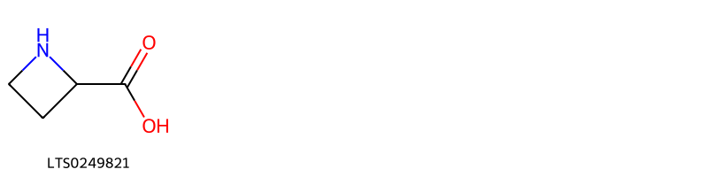

!!! abstract "Tóm tắt"

    Ngọc trúc (Rhizoma Polygonati Odorati) là thân rễ đã phơi khô của cây Ngọc trúc [Polygonatum odoratum (Mm.) Druce], thuộc họ Mạch môn đông  (Convallariaceae). Cây ngọc trúc phân bố chủ yếu ở châu Á, châu Âu và châu Phi. Tại Việt Nam, cây thường được trồng trong vườn ở các tỉnh miền núi phía Bắc như Lào Cai, Hà Giang và Lai Châu. Theo y học cổ truyền, ngọc trúc có vị ngọt, tính hơi hàn, quy vào 2 kinh phế và vị, có tác dụng tư âm, nhuận táo, và sinh tân chỉ khát. Thành phần hóa học chính của ngọc trúc gồm các glycosid chữa tim. như convallamarin và convallarin, cùng với các hợp chất flavonoid, saponin, chất nhầy, và các chất vô cơ.

## Thông tin về thực vật

Dược liệu **Ngọc Trúc (Thân Rễ)** từ bộ phận **** từ loài *Polygonatum odoratum*.

**Mô tả thực vật:** Ngọc trúc là một loại cỏ sống dai cao 40 – 60cm, thân rễ mọc ngang màu vàng trắng nhạt, đường kính 0,5-1,5cm, trên thân rễ có nhiều rễ con. Lá mọc so le từ giữa thân trở lên, không có cuồng, cứng dài, hình trứng rộng, dài 6-12cm, rộng 3-6cm, mặt dưới màu trắng nhạt. Hoa mọc ở kẽ lá có cuống dài 1-1,4cm, mỗi kẽ mọc 1-2 hoa, màu trắng, hình chuông. Nếu 2 hoa thì có một cuống chung và 2 cuống con riêng. Quả mọng, hình cầu, đường kính 1-7mm, khi chín có màu tím đen.

*Tài liệu tham khảo:* "Những cây thuốc và vị thuốc Việt Nam" - Đỗ Tất Lợi 
Trong dược điển Việt nam, một loài được sử dụng làm dược liệu là *Polygonatum odoratum*.

!!! info "Phân loại thực vật của *Polygonatum odoratum*"
    - **Kingdom:** Plantae
    - **Phylum:** Tracheophyta
    - **Order:** Asparagales
    - **Family:** Asparagaceae
    - **Genus:** Polygonatum
    - **Species:** *Polygonatum odoratum*

**Phân bố trên thế giới:** Germany, France, Switzerland, Czechia, Korea, Republic of, Netherlands, Austria, Hungary, Spain, Poland, Sweden, Japan, Belarus, Russian Federation, Portugal, Romania, Ukraine, Croatia, China, Italy, Slovenia, Slovakia, Belgium

**Phân bố tại Việt nam:** Không có ghi nhận ở Việt Nam

## Thông tin về dược liệu 

### Định danh

!!! info "Thông tin về tên gọi"

    - Dược liệu tiếng Việt: ngọc trúc
    - Dược liệu tiếng Trung: 玉竹 (Yu Zhu)
    - Dược liệu tiếng Anh: Polygonatum Odoratum [Syn. Polygonatum Officinale]
    - Dược liệu latin thông dụng: Rhizoma Polygonati odorati
    - Dược liệu latin kiểu DĐVN: *rhizoma polygonati odorati*
    - Dược liệu latin kiểu DĐVN: **
    - Dược liệu latin kiểu thông tư: **
    - Bộ phận dùng:  (Rhizoma)

### Mô tả dược liệu 

- **Theo dược điển Việt nam V:** Dược liệu hình trụ tròn, hơi dẹt, ít phần nhánh, dài 4 cm  đến 18 cm, đường kính 0,3 cm đến 1,6 cm. Mặt ngoài màu  trắng hơi vàng hoặc hơi vàng nâu, trong mờ, có vân nhăn  dọc và vòng đốt tròn hơi lồi, có vết sẹo của rễ con dạng  điểm tròn, màu trắng và vết thân khí sinh dạng đĩa tròn.  Chất cứng giòn hoặc hơi mềm, dễ bẻ gãy, mặt bẻ tựa như  sừng. Mùi nhẹ, vị hơi ngọt, nhai có cảm giác nhớt dính.

- **Mô tả dược liệu theo thông tư chế biến dược liệu theo phương pháp cổ truyền:** 

### Chế biến 

- **Chế biến theo dược điển việt nam V**: Thu hoạch vào mùa thu, đào lấy thân rễ, loại bỏ rễ con, rửa  sạch, phơi cho mềm, đem ra lăn và phơi, cứ làm như vậy,  lăn đi lăn lại rồi phơi đến khi không còn lõi cứng, phơi khô  là được hoặc đem đồ Ngọc trúc tươi, rồi vừa lăn vừa phơi  đến khi trong mở thì phơi khô lá được. Bào chế Loại bỏ tạp chất, rửa sạch, ủ mềm, thái lát dày hoặc cắt  đoạn và phơi khô. Dạng thái phiến: Lấy dược liệu đã phơi khô, thái phiến vát  dài 3 cm đến 5 cm, dày 2 mm đến 5 mm. Ngọc trúc chế mật ong: Ngọc trúc đã thái phiến đem tẩm  với một ong (tỷ lệ: 1 đến 1,5 kg mật ong/10 kg dược liệu),  ủ 30 min đến 60 min, sấy se, rồi dùng lửa nhỏ sao đến khi  có màu vàng, mùi thơm, sờ không dính tay là được. Dạng chưng: Ngọc trúc rửa sạch, đồ 6 h đến 8 h, ủ 1 ngày  1 đêm; tiếp tục làm như vậy 2 đến 3 lần đến khi vị thuốc  có màu đen, thái khúc dài 2 cm đến 3 cm. Ngọc trúc chế rượu: Ngọc trúc rửa sạch, ủ mềm, đồ 8 h  cho mềm, thái khúc, thêm rượu (tỷ lệ: 1,5 kg rượu/10 kg  Ngọc trúc), chưng 4 h. Đựng dược liệu vào dụng cụ băng  đồng hoặc băng nhôm.

- **Chế biến theo thông tư:** 

--- 

## Thành phần hóa học

- Theo tài liệu của GS. Đỗ Tất Lợi:  (1) Nhóm hoá học: 
- Theo tài liệu Trung Quốc, ngọc trúc chứa các glycosid convallamarin, convallarin, azetidine acid carboxylic, các flavonoid như vitextin, vitextin 2- glucoside, saponarin acid chelidonic, các chất vô cơ Ca, P, K, Mg, Mn, Si (Trung dược từ hải I - 1985)
- Ngoài ra, còn chất nhầy odoranan, polygonum – fructan O, A B C D (Từ điển cây thuốc Việt Nam 1999 – Võ Văn Chi). Từ dịch chiết methanol của ngọc trúc đã loại chất béo; Zaneczko Z; Jansson P.E; Sendra J đã chiết được một hỗn hợp các saponin steroid polyfurosid và sản phẩm thuỷ phân do men của nó là odospirosid. 
(2)Biomaker: Polysacharid
    

**Thành phần hóa học từ loài **Polygonatum odoratum**

Theo cơ sở dữ liệu lotus, loài *Polygonatum odoratum* đã phân lập và xác định được **45** hoạt chất thuộc về các nhóm Steroids and steroid derivatives, Flavonoids, Isoflavonoids, Homoisoflavonoids, Carboxylic acids and derivatives trong bảng dưới đây. Danh sách các hoạt chất như sau (3r)-5,7-dihydroxy-3-[(4-methoxyphenyl)methyl]-6,8-dimethyl-2,3-dihydro-1-benzopyran-4-one [(LTS0131905)](https://lotus.naturalproducts.net/compound/lotus_id/LTS0131905), (2s,3r,4s,5s,6r)-2-{[(2s,3r,4s,5r,6r)-2-{[(2r,3r,4r,5r,6r)-4,5-dihydroxy-2-(hydroxymethyl)-6-[(1's,2r,2's,4's,5s,7's,8'r,9's,12'r,13'r,16's)-5,7',9',13'-tetramethyl-5'-oxaspiro[oxane-2,6'-pentacyclo[10.8.0.0²,⁹.0⁴,⁸.0¹³,¹⁸]icosan]-18'-eneoxy]oxan-3-yl]oxy}-5-hydroxy-6-(hydroxymethyl)-4-{[(2s,3r,4s,5r)-3,4,5-trihydroxyoxan-2-yl]oxy}oxan-3-yl]oxy}-6-(hydroxymethyl)oxane-3,4,5-triol [(LTS0222161)](https://lotus.naturalproducts.net/compound/lotus_id/LTS0222161), 5,7-dihydroxy-3-[(4-hydroxyphenyl)methyl]-8-methoxy-6-methyl-2,3-dihydro-1-benzopyran-4-one [(LTS0172712)](https://lotus.naturalproducts.net/compound/lotus_id/LTS0172712), 2-(4-{16-[(3,4-dihydroxy-5-{[5-hydroxy-6-(hydroxymethyl)-3,4-bis({[3,4,5-trihydroxy-6-(hydroxymethyl)oxan-2-yl]oxy})oxan-2-yl]oxy}-6-(hydroxymethyl)oxan-2-yl)oxy]-2-hydroxy-6-methoxy-7,9,13-trimethyl-5-oxapentacyclo[10.8.0.0²,⁹.0⁴,⁸.0¹³,¹⁸]icos-18-en-6-yl}-2-methylbutoxy)-6-(hydroxymethyl)oxane-3,4,5-triol [(LTS0115344)](https://lotus.naturalproducts.net/compound/lotus_id/LTS0115344), (2s,3r,4s,5s,6r)-2-{[(2s,3r,4s,5r,6r)-2-{[(2r,3r,4r,5r,6r)-4,5-dihydroxy-2-(hydroxymethyl)-6-[(1's,2r,2's,4's,5s,7's,8'r,9's,12's,13'r,16's)-5,7',9',13'-tetramethyl-5'-oxaspiro[oxane-2,6'-pentacyclo[10.8.0.0²,⁹.0⁴,⁸.0¹³,¹⁸]icosan]-18'-eneoxy]oxan-3-yl]oxy}-5-hydroxy-6-(hydroxymethyl)-4-{[(2s,3r,4s,5r)-3,4,5-trihydroxyoxan-2-yl]oxy}oxan-3-yl]oxy}-6-(hydroxymethyl)oxane-3,4,5-triol [(LTS0191395)](https://lotus.naturalproducts.net/compound/lotus_id/LTS0191395), hesperidin [(LTS0011065)](https://lotus.naturalproducts.net/compound/lotus_id/LTS0011065), (3r)-5,7-dihydroxy-3-[(4-hydroxyphenyl)methyl]-6,8-dimethyl-2,3-dihydro-1-benzopyran-4-one [(LTS0068918)](https://lotus.naturalproducts.net/compound/lotus_id/LTS0068918), 2-[(2-{[4,5-dihydroxy-2-(hydroxymethyl)-6-{5,7',9',13'-tetramethyl-5'-oxaspiro[oxane-2,6'-pentacyclo[10.8.0.0²,⁹.0⁴,⁸.0¹³,¹⁸]icosane]-2',18'-dieneoxy}oxan-3-yl]oxy}-5-hydroxy-6-(hydroxymethyl)-4-[(3,4,5-trihydroxyoxan-2-yl)oxy]oxan-3-yl)oxy]-6-(hydroxymethyl)oxane-3,4,5-triol [(LTS0188943)](https://lotus.naturalproducts.net/compound/lotus_id/LTS0188943), (3r)-5,7,8-trihydroxy-3-[(4-hydroxyphenyl)methyl]-6-methyl-2,3-dihydro-1-benzopyran-4-one [(LTS0237183)](https://lotus.naturalproducts.net/compound/lotus_id/LTS0237183), 5,7-dihydroxy-3-[(4-hydroxyphenyl)methylidene]-6,8-dimethyl-2h-1-benzopyran-4-one [(LTS0150881)](https://lotus.naturalproducts.net/compound/lotus_id/LTS0150881), (3e)-5,7-dihydroxy-3-[(4-hydroxyphenyl)methylidene]-6,8-dimethyl-2h-1-benzopyran-4-one [(LTS0227693)](https://lotus.naturalproducts.net/compound/lotus_id/LTS0227693), (2s,3r,4s,5s,6r)-2-{[(2s,3r,4s,5r,6r)-2-{[(2r,3r,4r,5r,6r)-4,5-dihydroxy-2-(hydroxymethyl)-6-[(1'r,2r,4'r,5s,7's,8'r,9'r,12'r,13'r,16's)-5,7',9',13'-tetramethyl-5'-oxaspiro[oxane-2,6'-pentacyclo[10.8.0.0²,⁹.0⁴,⁸.0¹³,¹⁸]icosane]-2',18'-dieneoxy]oxan-3-yl]oxy}-5-hydroxy-6-(hydroxymethyl)-4-{[(2s,3r,4s,5r)-3,4,5-trihydroxyoxan-2-yl]oxy}oxan-3-yl]oxy}-6-(hydroxymethyl)oxane-3,4,5-triol [(LTS0079701)](https://lotus.naturalproducts.net/compound/lotus_id/LTS0079701), (3s)-5,7-dihydroxy-3-[(4-methoxyphenyl)methyl]-6,8-dimethyl-2,3-dihydro-1-benzopyran-4-one [(LTS0169406)](https://lotus.naturalproducts.net/compound/lotus_id/LTS0169406), (3e)-5-hydroxy-3-[(4-hydroxyphenyl)methylidene]-7-{[(2s,3r,4s,5s,6r)-3,4,5-trihydroxy-6-(hydroxymethyl)oxan-2-yl]oxy}-2h-1-benzopyran-4-one [(LTS0026965)](https://lotus.naturalproducts.net/compound/lotus_id/LTS0026965), 5-hydroxy-3-[(4-hydroxyphenyl)methylidene]-7-{[3,4,5-trihydroxy-6-(hydroxymethyl)oxan-2-yl]oxy}-2h-1-benzopyran-4-one [(LTS0199900)](https://lotus.naturalproducts.net/compound/lotus_id/LTS0199900), 5,7-dihydroxy-3-[(3-hydroxy-4-methoxyphenyl)methyl]-6,8-dimethyl-2,3-dihydro-1-benzopyran-4-one [(LTS0016058)](https://lotus.naturalproducts.net/compound/lotus_id/LTS0016058), azetidine-2-carboxylic acid [(LTS0249821)](https://lotus.naturalproducts.net/compound/lotus_id/LTS0249821), (3s)-5,7-dihydroxy-3-[(3-hydroxy-4-methoxyphenyl)methyl]-6,8-dimethyl-2,3-dihydro-1-benzopyran-4-one [(LTS0042646)](https://lotus.naturalproducts.net/compound/lotus_id/LTS0042646), (3s)-5,7-dihydroxy-3-[(4-hydroxyphenyl)methyl]-8-methoxy-6-methyl-2,3-dihydro-1-benzopyran-4-one [(LTS0043533)](https://lotus.naturalproducts.net/compound/lotus_id/LTS0043533), 5,7-dihydroxy-3-[(2-hydroxy-4-methoxyphenyl)methyl]-6,8-dimethyl-2,3-dihydro-1-benzopyran-4-one [(LTS0094630)](https://lotus.naturalproducts.net/compound/lotus_id/LTS0094630), 5,7-dihydroxy-3-[(4-hydroxyphenyl)methyl]-6-methyl-2,3-dihydro-1-benzopyran-4-one [(LTS0154392)](https://lotus.naturalproducts.net/compound/lotus_id/LTS0154392), (2s,3r,4s,5s,6r)-2-{[(2s,3r,4s,5r,6r)-2-{[(2r,3r,4r,5r,6r)-4,5-dihydroxy-2-(hydroxymethyl)-6-[(1'r,2r,2'r,4's,5s,7's,8'r,9'r,12's,13'r,16's)-5,7',9',13'-tetramethyl-5'-oxaspiro[oxane-2,6'-pentacyclo[10.8.0.0²,⁹.0⁴,⁸.0¹³,¹⁸]icosan]-18'-en-2'-oloxy]oxan-3-yl]oxy}-5-hydroxy-6-(hydroxymethyl)-4-{[(2s,3r,4s,5r)-3,4,5-trihydroxyoxan-2-yl]oxy}oxan-3-yl]oxy}-6-(hydroxymethyl)oxane-3,4,5-triol [(LTS0063600)](https://lotus.naturalproducts.net/compound/lotus_id/LTS0063600), (1r,3s,6s,8r,11s,12s,15r,16r)-15-[(2r,5r)-5-hydroxy-6-methylhept-6-en-2-yl]-7,7,12,16-tetramethylpentacyclo[9.7.0.0¹,³.0³,⁸.0¹²,¹⁶]octadecan-6-ol [(LTS0042780)](https://lotus.naturalproducts.net/compound/lotus_id/LTS0042780), (3r)-5,7-dihydroxy-3-[(4-hydroxyphenyl)methyl]-8-methoxy-6-methyl-2,3-dihydro-1-benzopyran-4-one [(LTS0100279)](https://lotus.naturalproducts.net/compound/lotus_id/LTS0100279), 5,7-dihydroxy-8-methoxy-3-[(4-methoxyphenyl)methyl]-6-methyl-2,3-dihydro-1-benzopyran-4-one [(LTS0119069)](https://lotus.naturalproducts.net/compound/lotus_id/LTS0119069), (1s,3r,6s,8r,11s,12s,15r,16r)-15-[(2r,5r)-5-hydroxy-6-methylhept-6-en-2-yl]-7,7,12,16-tetramethylpentacyclo[9.7.0.0¹,³.0³,⁸.0¹²,¹⁶]octadecan-6-ol [(LTS0109908)](https://lotus.naturalproducts.net/compound/lotus_id/LTS0109908), (3r)-5,7-dihydroxy-3-[(2-hydroxy-4-methoxyphenyl)methyl]-8-methoxy-6-methyl-2,3-dihydro-1-benzopyran-4-one [(LTS0031546)](https://lotus.naturalproducts.net/compound/lotus_id/LTS0031546), 5-hydroxy-3-(4-hydroxyphenyl)-6-methoxy-7-{[3,4,5-trihydroxy-6-(hydroxymethyl)oxan-2-yl]oxy}chromen-4-one [(LTS0238526)](https://lotus.naturalproducts.net/compound/lotus_id/LTS0238526), (3s)-5,7-dihydroxy-3-[(4-hydroxyphenyl)methyl]-6-methyl-2,3-dihydro-1-benzopyran-4-one [(LTS0216129)](https://lotus.naturalproducts.net/compound/lotus_id/LTS0216129), (3s)-5,7-dihydroxy-3-[(4-hydroxyphenyl)methyl]-6,8-dimethyl-2,3-dihydro-1-benzopyran-4-one [(LTS0271230)](https://lotus.naturalproducts.net/compound/lotus_id/LTS0271230), 15-(5-hydroxy-6-methylhept-6-en-2-yl)-7,7,12,16-tetramethylpentacyclo[9.7.0.0¹,³.0³,⁸.0¹²,¹⁶]octadecan-6-ol [(LTS0049555)](https://lotus.naturalproducts.net/compound/lotus_id/LTS0049555), 2-[(2-{[4,5-dihydroxy-2-(hydroxymethyl)-6-{5,7',9',13'-tetramethyl-5'-oxaspiro[oxane-2,6'-pentacyclo[10.8.0.0²,⁹.0⁴,⁸.0¹³,¹⁸]icosan]-18'-eneoxy}oxan-3-yl]oxy}-5-hydroxy-6-(hydroxymethyl)-4-[(3,4,5-trihydroxyoxan-2-yl)oxy]oxan-3-yl)oxy]-6-(hydroxymethyl)oxane-3,4,5-triol [(LTS0217548)](https://lotus.naturalproducts.net/compound/lotus_id/LTS0217548), 2-[(2-{[4,5-dihydroxy-2-(hydroxymethyl)-6-{5,7',9',13'-tetramethyl-5'-oxaspiro[oxane-2,6'-pentacyclo[10.8.0.0²,⁹.0⁴,⁸.0¹³,¹⁸]icosan]-18'-en-2'-oloxy}oxan-3-yl]oxy}-5-hydroxy-6-(hydroxymethyl)-4-[(3,4,5-trihydroxyoxan-2-yl)oxy]oxan-3-yl)oxy]-6-(hydroxymethyl)oxane-3,4,5-triol [(LTS0187728)](https://lotus.naturalproducts.net/compound/lotus_id/LTS0187728), (1'r,2r,2'r,4's,5s,7's,8'r,9'r,12's,13'r,16's)-5,7',9',13'-tetramethyl-5'-oxaspiro[oxane-2,6'-pentacyclo[10.8.0.0²,⁹.0⁴,⁸.0¹³,¹⁸]icosan]-18'-ene-2',16'-diol [(LTS0007408)](https://lotus.naturalproducts.net/compound/lotus_id/LTS0007408), 5,7-dihydroxy-3-[(2-hydroxy-4-methoxyphenyl)methyl]-8-methoxy-6-methyl-2,3-dihydro-1-benzopyran-4-one [(LTS0269118)](https://lotus.naturalproducts.net/compound/lotus_id/LTS0269118), (2r,3r,4s,5s,6r)-2-[(2s)-4-[(1r,2r,4s,6r,7s,8r,9r,12s,13r,16s)-16-{[(2r,3r,4r,5r,6r)-3,4-dihydroxy-5-{[(2s,3r,4s,5r,6r)-5-hydroxy-6-(hydroxymethyl)-3,4-bis({[(2s,3r,4s,5s,6r)-3,4,5-trihydroxy-6-(hydroxymethyl)oxan-2-yl]oxy})oxan-2-yl]oxy}-6-(hydroxymethyl)oxan-2-yl]oxy}-2-hydroxy-6-methoxy-7,9,13-trimethyl-5-oxapentacyclo[10.8.0.0²,⁹.0⁴,⁸.0¹³,¹⁸]icos-18-en-6-yl]-2-methylbutoxy]-6-(hydroxymethyl)oxane-3,4,5-triol [(LTS0004838)](https://lotus.naturalproducts.net/compound/lotus_id/LTS0004838), 5,7',9',13'-tetramethyl-5'-oxaspiro[oxane-2,6'-pentacyclo[10.8.0.0²,⁹.0⁴,⁸.0¹³,¹⁸]icosan]-18'-ene-2',16'-diol [(LTS0014236)](https://lotus.naturalproducts.net/compound/lotus_id/LTS0014236), tectoridin [(LTS0052285)](https://lotus.naturalproducts.net/compound/lotus_id/LTS0052285), 5,7-dihydroxy-3-[(4-hydroxyphenyl)methyl]-6,8-dimethyl-2,3-dihydro-1-benzopyran-4-one [(LTS0034135)](https://lotus.naturalproducts.net/compound/lotus_id/LTS0034135), (3s)-5,7-dihydroxy-3-[(2-hydroxy-4-methoxyphenyl)methyl]-6,8-dimethyl-2,3-dihydro-1-benzopyran-4-one [(LTS0240908)](https://lotus.naturalproducts.net/compound/lotus_id/LTS0240908), (3s)-5,7-dihydroxy-8-methoxy-3-[(4-methoxyphenyl)methyl]-6-methyl-2,3-dihydro-1-benzopyran-4-one [(LTS0237451)](https://lotus.naturalproducts.net/compound/lotus_id/LTS0237451), (2s,3r,4s,5s,6r)-2-{[(2s,3r,4s,5r,6r)-2-{[(2r,3r,4r,5r,6r)-4,5-dihydroxy-2-(hydroxymethyl)-6-[(1'r,2r,2'r,4's,5r,7's,8'r,9'r,12's,13'r,16's)-5,7',9',13'-tetramethyl-5'-oxaspiro[oxane-2,6'-pentacyclo[10.8.0.0²,⁹.0⁴,⁸.0¹³,¹⁸]icosan]-18'-en-2'-oloxy]oxan-3-yl]oxy}-5-hydroxy-6-(hydroxymethyl)-4-{[(2s,3r,4s,5r)-3,4,5-trihydroxyoxan-2-yl]oxy}oxan-3-yl]oxy}-6-(hydroxymethyl)oxane-3,4,5-triol [(LTS0078608)](https://lotus.naturalproducts.net/compound/lotus_id/LTS0078608), hesperidin [(LTS0261835)](https://lotus.naturalproducts.net/compound/lotus_id/LTS0261835), 5,7-dihydroxy-3-[(4-methoxyphenyl)methyl]-6,8-dimethyl-2,3-dihydro-1-benzopyran-4-one [(LTS0133252)](https://lotus.naturalproducts.net/compound/lotus_id/LTS0133252), (3r)-5,7-dihydroxy-8-methoxy-3-[(4-methoxyphenyl)methyl]-6-methyl-2,3-dihydro-1-benzopyran-4-one [(LTS0040987)](https://lotus.naturalproducts.net/compound/lotus_id/LTS0040987). 
        
| chemicalTaxonomyClassyfireClass   |   smiles_count |
|:----------------------------------|---------------:|
| Carboxylic acids and derivatives  |             12 |
| Flavonoids                        |            198 |
| Homoisoflavonoids                 |           1162 |
| Isoflavonoids                     |            136 |
| Steroids and steroid derivatives  |           2494 |

            
### Nhóm Carboxylic acids and derivatives
<figure markdown="span">
    { width=100% }
<figcaption>Hình ảnh cấu trúc hóa học của hoạt chất thuộc nhóm *Carboxylic acids and derivatives*. Tên thường gọi của các hoạt chất tương ứng là azetidine-2-carboxylic acid [(LTS0249821)](https://lotus.naturalproducts.net/compound/lotus_id/LTS0249821).</figcaption>
</figure>

            
            
### Nhóm Carboxylic acids and derivatives
<figure markdown="span">
    { width=100% }
<figcaption>Hình ảnh cấu trúc hóa học của hoạt chất thuộc nhóm *Carboxylic acids and derivatives*. Tên thường gọi của các hoạt chất tương ứng là azetidine-2-carboxylic acid [(LTS0249821)](https://lotus.naturalproducts.net/compound/lotus_id/LTS0249821).</figcaption>
</figure>

### Nhóm Flavonoids
<figure markdown="span">
    { width=100% }
<figcaption>Hình ảnh cấu trúc hóa học của hoạt chất thuộc nhóm *Flavonoids*. Tên thường gọi của các hoạt chất tương ứng là hesperidin [(LTS0261835)](https://lotus.naturalproducts.net/compound/lotus_id/LTS0261835), hesperidin [(LTS0011065)](https://lotus.naturalproducts.net/compound/lotus_id/LTS0011065).</figcaption>
</figure>

            
            
### Nhóm Carboxylic acids and derivatives
<figure markdown="span">
    { width=100% }
<figcaption>Hình ảnh cấu trúc hóa học của hoạt chất thuộc nhóm *Carboxylic acids and derivatives*. Tên thường gọi của các hoạt chất tương ứng là azetidine-2-carboxylic acid [(LTS0249821)](https://lotus.naturalproducts.net/compound/lotus_id/LTS0249821).</figcaption>
</figure>

### Nhóm Flavonoids
<figure markdown="span">
    { width=100% }
<figcaption>Hình ảnh cấu trúc hóa học của hoạt chất thuộc nhóm *Flavonoids*. Tên thường gọi của các hoạt chất tương ứng là hesperidin [(LTS0261835)](https://lotus.naturalproducts.net/compound/lotus_id/LTS0261835), hesperidin [(LTS0011065)](https://lotus.naturalproducts.net/compound/lotus_id/LTS0011065).</figcaption>
</figure>

### Nhóm Homoisoflavonoids
<figure markdown="span">
    { width=100% }
<figcaption>Hình ảnh cấu trúc hóa học của hoạt chất thuộc nhóm *Homoisoflavonoids*. Tên thường gọi của các hoạt chất tương ứng là 5,7-dihydroxy-3-[(4-methoxyphenyl)methyl]-6,8-dimethyl-2,3-dihydro-1-benzopyran-4-one [(LTS0133252)](https://lotus.naturalproducts.net/compound/lotus_id/LTS0133252), 5,7-dihydroxy-3-[(2-hydroxy-4-methoxyphenyl)methyl]-6,8-dimethyl-2,3-dihydro-1-benzopyran-4-one [(LTS0094630)](https://lotus.naturalproducts.net/compound/lotus_id/LTS0094630), (3r)-5,7-dihydroxy-3-[(2-hydroxy-4-methoxyphenyl)methyl]-8-methoxy-6-methyl-2,3-dihydro-1-benzopyran-4-one [(LTS0031546)](https://lotus.naturalproducts.net/compound/lotus_id/LTS0031546), 5,7-dihydroxy-8-methoxy-3-[(4-methoxyphenyl)methyl]-6-methyl-2,3-dihydro-1-benzopyran-4-one [(LTS0119069)](https://lotus.naturalproducts.net/compound/lotus_id/LTS0119069), 5,7-dihydroxy-3-[(4-hydroxyphenyl)methyl]-8-methoxy-6-methyl-2,3-dihydro-1-benzopyran-4-one [(LTS0172712)](https://lotus.naturalproducts.net/compound/lotus_id/LTS0172712), 5-hydroxy-3-[(4-hydroxyphenyl)methylidene]-7-{[3,4,5-trihydroxy-6-(hydroxymethyl)oxan-2-yl]oxy}-2h-1-benzopyran-4-one [(LTS0199900)](https://lotus.naturalproducts.net/compound/lotus_id/LTS0199900), 5,7-dihydroxy-3-[(4-hydroxyphenyl)methyl]-6-methyl-2,3-dihydro-1-benzopyran-4-one [(LTS0154392)](https://lotus.naturalproducts.net/compound/lotus_id/LTS0154392), 5,7-dihydroxy-3-[(4-hydroxyphenyl)methylidene]-6,8-dimethyl-2h-1-benzopyran-4-one [(LTS0150881)](https://lotus.naturalproducts.net/compound/lotus_id/LTS0150881), (3s)-5,7-dihydroxy-3-[(4-hydroxyphenyl)methyl]-6-methyl-2,3-dihydro-1-benzopyran-4-one [(LTS0216129)](https://lotus.naturalproducts.net/compound/lotus_id/LTS0216129), (3s)-5,7-dihydroxy-3-[(4-methoxyphenyl)methyl]-6,8-dimethyl-2,3-dihydro-1-benzopyran-4-one [(LTS0169406)](https://lotus.naturalproducts.net/compound/lotus_id/LTS0169406), (3s)-5,7-dihydroxy-3-[(2-hydroxy-4-methoxyphenyl)methyl]-6,8-dimethyl-2,3-dihydro-1-benzopyran-4-one [(LTS0240908)](https://lotus.naturalproducts.net/compound/lotus_id/LTS0240908), (3s)-5,7-dihydroxy-3-[(4-hydroxyphenyl)methyl]-6,8-dimethyl-2,3-dihydro-1-benzopyran-4-one [(LTS0271230)](https://lotus.naturalproducts.net/compound/lotus_id/LTS0271230), 5,7-dihydroxy-3-[(2-hydroxy-4-methoxyphenyl)methyl]-8-methoxy-6-methyl-2,3-dihydro-1-benzopyran-4-one [(LTS0269118)](https://lotus.naturalproducts.net/compound/lotus_id/LTS0269118), (3r)-5,7-dihydroxy-3-[(4-hydroxyphenyl)methyl]-8-methoxy-6-methyl-2,3-dihydro-1-benzopyran-4-one [(LTS0100279)](https://lotus.naturalproducts.net/compound/lotus_id/LTS0100279), (3e)-5-hydroxy-3-[(4-hydroxyphenyl)methylidene]-7-{[(2s,3r,4s,5s,6r)-3,4,5-trihydroxy-6-(hydroxymethyl)oxan-2-yl]oxy}-2h-1-benzopyran-4-one [(LTS0026965)](https://lotus.naturalproducts.net/compound/lotus_id/LTS0026965), (3e)-5,7-dihydroxy-3-[(4-hydroxyphenyl)methylidene]-6,8-dimethyl-2h-1-benzopyran-4-one [(LTS0227693)](https://lotus.naturalproducts.net/compound/lotus_id/LTS0227693), (3s)-5,7-dihydroxy-8-methoxy-3-[(4-methoxyphenyl)methyl]-6-methyl-2,3-dihydro-1-benzopyran-4-one [(LTS0237451)](https://lotus.naturalproducts.net/compound/lotus_id/LTS0237451), (3r)-5,7-dihydroxy-3-[(4-hydroxyphenyl)methyl]-6,8-dimethyl-2,3-dihydro-1-benzopyran-4-one [(LTS0068918)](https://lotus.naturalproducts.net/compound/lotus_id/LTS0068918), (3r)-5,7-dihydroxy-8-methoxy-3-[(4-methoxyphenyl)methyl]-6-methyl-2,3-dihydro-1-benzopyran-4-one [(LTS0040987)](https://lotus.naturalproducts.net/compound/lotus_id/LTS0040987), (3s)-5,7-dihydroxy-3-[(3-hydroxy-4-methoxyphenyl)methyl]-6,8-dimethyl-2,3-dihydro-1-benzopyran-4-one [(LTS0042646)](https://lotus.naturalproducts.net/compound/lotus_id/LTS0042646), (3r)-5,7-dihydroxy-3-[(4-methoxyphenyl)methyl]-6,8-dimethyl-2,3-dihydro-1-benzopyran-4-one [(LTS0131905)](https://lotus.naturalproducts.net/compound/lotus_id/LTS0131905), 5,7-dihydroxy-3-[(3-hydroxy-4-methoxyphenyl)methyl]-6,8-dimethyl-2,3-dihydro-1-benzopyran-4-one [(LTS0016058)](https://lotus.naturalproducts.net/compound/lotus_id/LTS0016058), (3r)-5,7,8-trihydroxy-3-[(4-hydroxyphenyl)methyl]-6-methyl-2,3-dihydro-1-benzopyran-4-one [(LTS0237183)](https://lotus.naturalproducts.net/compound/lotus_id/LTS0237183), 5,7-dihydroxy-3-[(4-hydroxyphenyl)methyl]-6,8-dimethyl-2,3-dihydro-1-benzopyran-4-one [(LTS0034135)](https://lotus.naturalproducts.net/compound/lotus_id/LTS0034135), (3s)-5,7-dihydroxy-3-[(4-hydroxyphenyl)methyl]-8-methoxy-6-methyl-2,3-dihydro-1-benzopyran-4-one [(LTS0043533)](https://lotus.naturalproducts.net/compound/lotus_id/LTS0043533).</figcaption>
</figure>

            
            
### Nhóm Carboxylic acids and derivatives
<figure markdown="span">
    { width=100% }
<figcaption>Hình ảnh cấu trúc hóa học của hoạt chất thuộc nhóm *Carboxylic acids and derivatives*. Tên thường gọi của các hoạt chất tương ứng là azetidine-2-carboxylic acid [(LTS0249821)](https://lotus.naturalproducts.net/compound/lotus_id/LTS0249821).</figcaption>
</figure>

### Nhóm Flavonoids
<figure markdown="span">
    { width=100% }
<figcaption>Hình ảnh cấu trúc hóa học của hoạt chất thuộc nhóm *Flavonoids*. Tên thường gọi của các hoạt chất tương ứng là hesperidin [(LTS0261835)](https://lotus.naturalproducts.net/compound/lotus_id/LTS0261835), hesperidin [(LTS0011065)](https://lotus.naturalproducts.net/compound/lotus_id/LTS0011065).</figcaption>
</figure>

### Nhóm Homoisoflavonoids
<figure markdown="span">
    { width=100% }
<figcaption>Hình ảnh cấu trúc hóa học của hoạt chất thuộc nhóm *Homoisoflavonoids*. Tên thường gọi của các hoạt chất tương ứng là 5,7-dihydroxy-3-[(4-methoxyphenyl)methyl]-6,8-dimethyl-2,3-dihydro-1-benzopyran-4-one [(LTS0133252)](https://lotus.naturalproducts.net/compound/lotus_id/LTS0133252), 5,7-dihydroxy-3-[(2-hydroxy-4-methoxyphenyl)methyl]-6,8-dimethyl-2,3-dihydro-1-benzopyran-4-one [(LTS0094630)](https://lotus.naturalproducts.net/compound/lotus_id/LTS0094630), (3r)-5,7-dihydroxy-3-[(2-hydroxy-4-methoxyphenyl)methyl]-8-methoxy-6-methyl-2,3-dihydro-1-benzopyran-4-one [(LTS0031546)](https://lotus.naturalproducts.net/compound/lotus_id/LTS0031546), 5,7-dihydroxy-8-methoxy-3-[(4-methoxyphenyl)methyl]-6-methyl-2,3-dihydro-1-benzopyran-4-one [(LTS0119069)](https://lotus.naturalproducts.net/compound/lotus_id/LTS0119069), 5,7-dihydroxy-3-[(4-hydroxyphenyl)methyl]-8-methoxy-6-methyl-2,3-dihydro-1-benzopyran-4-one [(LTS0172712)](https://lotus.naturalproducts.net/compound/lotus_id/LTS0172712), 5-hydroxy-3-[(4-hydroxyphenyl)methylidene]-7-{[3,4,5-trihydroxy-6-(hydroxymethyl)oxan-2-yl]oxy}-2h-1-benzopyran-4-one [(LTS0199900)](https://lotus.naturalproducts.net/compound/lotus_id/LTS0199900), 5,7-dihydroxy-3-[(4-hydroxyphenyl)methyl]-6-methyl-2,3-dihydro-1-benzopyran-4-one [(LTS0154392)](https://lotus.naturalproducts.net/compound/lotus_id/LTS0154392), 5,7-dihydroxy-3-[(4-hydroxyphenyl)methylidene]-6,8-dimethyl-2h-1-benzopyran-4-one [(LTS0150881)](https://lotus.naturalproducts.net/compound/lotus_id/LTS0150881), (3s)-5,7-dihydroxy-3-[(4-hydroxyphenyl)methyl]-6-methyl-2,3-dihydro-1-benzopyran-4-one [(LTS0216129)](https://lotus.naturalproducts.net/compound/lotus_id/LTS0216129), (3s)-5,7-dihydroxy-3-[(4-methoxyphenyl)methyl]-6,8-dimethyl-2,3-dihydro-1-benzopyran-4-one [(LTS0169406)](https://lotus.naturalproducts.net/compound/lotus_id/LTS0169406), (3s)-5,7-dihydroxy-3-[(2-hydroxy-4-methoxyphenyl)methyl]-6,8-dimethyl-2,3-dihydro-1-benzopyran-4-one [(LTS0240908)](https://lotus.naturalproducts.net/compound/lotus_id/LTS0240908), (3s)-5,7-dihydroxy-3-[(4-hydroxyphenyl)methyl]-6,8-dimethyl-2,3-dihydro-1-benzopyran-4-one [(LTS0271230)](https://lotus.naturalproducts.net/compound/lotus_id/LTS0271230), 5,7-dihydroxy-3-[(2-hydroxy-4-methoxyphenyl)methyl]-8-methoxy-6-methyl-2,3-dihydro-1-benzopyran-4-one [(LTS0269118)](https://lotus.naturalproducts.net/compound/lotus_id/LTS0269118), (3r)-5,7-dihydroxy-3-[(4-hydroxyphenyl)methyl]-8-methoxy-6-methyl-2,3-dihydro-1-benzopyran-4-one [(LTS0100279)](https://lotus.naturalproducts.net/compound/lotus_id/LTS0100279), (3e)-5-hydroxy-3-[(4-hydroxyphenyl)methylidene]-7-{[(2s,3r,4s,5s,6r)-3,4,5-trihydroxy-6-(hydroxymethyl)oxan-2-yl]oxy}-2h-1-benzopyran-4-one [(LTS0026965)](https://lotus.naturalproducts.net/compound/lotus_id/LTS0026965), (3e)-5,7-dihydroxy-3-[(4-hydroxyphenyl)methylidene]-6,8-dimethyl-2h-1-benzopyran-4-one [(LTS0227693)](https://lotus.naturalproducts.net/compound/lotus_id/LTS0227693), (3s)-5,7-dihydroxy-8-methoxy-3-[(4-methoxyphenyl)methyl]-6-methyl-2,3-dihydro-1-benzopyran-4-one [(LTS0237451)](https://lotus.naturalproducts.net/compound/lotus_id/LTS0237451), (3r)-5,7-dihydroxy-3-[(4-hydroxyphenyl)methyl]-6,8-dimethyl-2,3-dihydro-1-benzopyran-4-one [(LTS0068918)](https://lotus.naturalproducts.net/compound/lotus_id/LTS0068918), (3r)-5,7-dihydroxy-8-methoxy-3-[(4-methoxyphenyl)methyl]-6-methyl-2,3-dihydro-1-benzopyran-4-one [(LTS0040987)](https://lotus.naturalproducts.net/compound/lotus_id/LTS0040987), (3s)-5,7-dihydroxy-3-[(3-hydroxy-4-methoxyphenyl)methyl]-6,8-dimethyl-2,3-dihydro-1-benzopyran-4-one [(LTS0042646)](https://lotus.naturalproducts.net/compound/lotus_id/LTS0042646), (3r)-5,7-dihydroxy-3-[(4-methoxyphenyl)methyl]-6,8-dimethyl-2,3-dihydro-1-benzopyran-4-one [(LTS0131905)](https://lotus.naturalproducts.net/compound/lotus_id/LTS0131905), 5,7-dihydroxy-3-[(3-hydroxy-4-methoxyphenyl)methyl]-6,8-dimethyl-2,3-dihydro-1-benzopyran-4-one [(LTS0016058)](https://lotus.naturalproducts.net/compound/lotus_id/LTS0016058), (3r)-5,7,8-trihydroxy-3-[(4-hydroxyphenyl)methyl]-6-methyl-2,3-dihydro-1-benzopyran-4-one [(LTS0237183)](https://lotus.naturalproducts.net/compound/lotus_id/LTS0237183), 5,7-dihydroxy-3-[(4-hydroxyphenyl)methyl]-6,8-dimethyl-2,3-dihydro-1-benzopyran-4-one [(LTS0034135)](https://lotus.naturalproducts.net/compound/lotus_id/LTS0034135), (3s)-5,7-dihydroxy-3-[(4-hydroxyphenyl)methyl]-8-methoxy-6-methyl-2,3-dihydro-1-benzopyran-4-one [(LTS0043533)](https://lotus.naturalproducts.net/compound/lotus_id/LTS0043533).</figcaption>
</figure>

### Nhóm Isoflavonoids
<figure markdown="span">
    { width=100% }
<figcaption>Hình ảnh cấu trúc hóa học của hoạt chất thuộc nhóm *Isoflavonoids*. Tên thường gọi của các hoạt chất tương ứng là tectoridin [(LTS0052285)](https://lotus.naturalproducts.net/compound/lotus_id/LTS0052285), 5-hydroxy-3-(4-hydroxyphenyl)-6-methoxy-7-{[3,4,5-trihydroxy-6-(hydroxymethyl)oxan-2-yl]oxy}chromen-4-one [(LTS0238526)](https://lotus.naturalproducts.net/compound/lotus_id/LTS0238526).</figcaption>
</figure>

            
            
### Nhóm Carboxylic acids and derivatives
<figure markdown="span">
    { width=100% }
<figcaption>Hình ảnh cấu trúc hóa học của hoạt chất thuộc nhóm *Carboxylic acids and derivatives*. Tên thường gọi của các hoạt chất tương ứng là azetidine-2-carboxylic acid [(LTS0249821)](https://lotus.naturalproducts.net/compound/lotus_id/LTS0249821).</figcaption>
</figure>

### Nhóm Flavonoids
<figure markdown="span">
    { width=100% }
<figcaption>Hình ảnh cấu trúc hóa học của hoạt chất thuộc nhóm *Flavonoids*. Tên thường gọi của các hoạt chất tương ứng là hesperidin [(LTS0261835)](https://lotus.naturalproducts.net/compound/lotus_id/LTS0261835), hesperidin [(LTS0011065)](https://lotus.naturalproducts.net/compound/lotus_id/LTS0011065).</figcaption>
</figure>

### Nhóm Homoisoflavonoids
<figure markdown="span">
    { width=100% }
<figcaption>Hình ảnh cấu trúc hóa học của hoạt chất thuộc nhóm *Homoisoflavonoids*. Tên thường gọi của các hoạt chất tương ứng là 5,7-dihydroxy-3-[(4-methoxyphenyl)methyl]-6,8-dimethyl-2,3-dihydro-1-benzopyran-4-one [(LTS0133252)](https://lotus.naturalproducts.net/compound/lotus_id/LTS0133252), 5,7-dihydroxy-3-[(2-hydroxy-4-methoxyphenyl)methyl]-6,8-dimethyl-2,3-dihydro-1-benzopyran-4-one [(LTS0094630)](https://lotus.naturalproducts.net/compound/lotus_id/LTS0094630), (3r)-5,7-dihydroxy-3-[(2-hydroxy-4-methoxyphenyl)methyl]-8-methoxy-6-methyl-2,3-dihydro-1-benzopyran-4-one [(LTS0031546)](https://lotus.naturalproducts.net/compound/lotus_id/LTS0031546), 5,7-dihydroxy-8-methoxy-3-[(4-methoxyphenyl)methyl]-6-methyl-2,3-dihydro-1-benzopyran-4-one [(LTS0119069)](https://lotus.naturalproducts.net/compound/lotus_id/LTS0119069), 5,7-dihydroxy-3-[(4-hydroxyphenyl)methyl]-8-methoxy-6-methyl-2,3-dihydro-1-benzopyran-4-one [(LTS0172712)](https://lotus.naturalproducts.net/compound/lotus_id/LTS0172712), 5-hydroxy-3-[(4-hydroxyphenyl)methylidene]-7-{[3,4,5-trihydroxy-6-(hydroxymethyl)oxan-2-yl]oxy}-2h-1-benzopyran-4-one [(LTS0199900)](https://lotus.naturalproducts.net/compound/lotus_id/LTS0199900), 5,7-dihydroxy-3-[(4-hydroxyphenyl)methyl]-6-methyl-2,3-dihydro-1-benzopyran-4-one [(LTS0154392)](https://lotus.naturalproducts.net/compound/lotus_id/LTS0154392), 5,7-dihydroxy-3-[(4-hydroxyphenyl)methylidene]-6,8-dimethyl-2h-1-benzopyran-4-one [(LTS0150881)](https://lotus.naturalproducts.net/compound/lotus_id/LTS0150881), (3s)-5,7-dihydroxy-3-[(4-hydroxyphenyl)methyl]-6-methyl-2,3-dihydro-1-benzopyran-4-one [(LTS0216129)](https://lotus.naturalproducts.net/compound/lotus_id/LTS0216129), (3s)-5,7-dihydroxy-3-[(4-methoxyphenyl)methyl]-6,8-dimethyl-2,3-dihydro-1-benzopyran-4-one [(LTS0169406)](https://lotus.naturalproducts.net/compound/lotus_id/LTS0169406), (3s)-5,7-dihydroxy-3-[(2-hydroxy-4-methoxyphenyl)methyl]-6,8-dimethyl-2,3-dihydro-1-benzopyran-4-one [(LTS0240908)](https://lotus.naturalproducts.net/compound/lotus_id/LTS0240908), (3s)-5,7-dihydroxy-3-[(4-hydroxyphenyl)methyl]-6,8-dimethyl-2,3-dihydro-1-benzopyran-4-one [(LTS0271230)](https://lotus.naturalproducts.net/compound/lotus_id/LTS0271230), 5,7-dihydroxy-3-[(2-hydroxy-4-methoxyphenyl)methyl]-8-methoxy-6-methyl-2,3-dihydro-1-benzopyran-4-one [(LTS0269118)](https://lotus.naturalproducts.net/compound/lotus_id/LTS0269118), (3r)-5,7-dihydroxy-3-[(4-hydroxyphenyl)methyl]-8-methoxy-6-methyl-2,3-dihydro-1-benzopyran-4-one [(LTS0100279)](https://lotus.naturalproducts.net/compound/lotus_id/LTS0100279), (3e)-5-hydroxy-3-[(4-hydroxyphenyl)methylidene]-7-{[(2s,3r,4s,5s,6r)-3,4,5-trihydroxy-6-(hydroxymethyl)oxan-2-yl]oxy}-2h-1-benzopyran-4-one [(LTS0026965)](https://lotus.naturalproducts.net/compound/lotus_id/LTS0026965), (3e)-5,7-dihydroxy-3-[(4-hydroxyphenyl)methylidene]-6,8-dimethyl-2h-1-benzopyran-4-one [(LTS0227693)](https://lotus.naturalproducts.net/compound/lotus_id/LTS0227693), (3s)-5,7-dihydroxy-8-methoxy-3-[(4-methoxyphenyl)methyl]-6-methyl-2,3-dihydro-1-benzopyran-4-one [(LTS0237451)](https://lotus.naturalproducts.net/compound/lotus_id/LTS0237451), (3r)-5,7-dihydroxy-3-[(4-hydroxyphenyl)methyl]-6,8-dimethyl-2,3-dihydro-1-benzopyran-4-one [(LTS0068918)](https://lotus.naturalproducts.net/compound/lotus_id/LTS0068918), (3r)-5,7-dihydroxy-8-methoxy-3-[(4-methoxyphenyl)methyl]-6-methyl-2,3-dihydro-1-benzopyran-4-one [(LTS0040987)](https://lotus.naturalproducts.net/compound/lotus_id/LTS0040987), (3s)-5,7-dihydroxy-3-[(3-hydroxy-4-methoxyphenyl)methyl]-6,8-dimethyl-2,3-dihydro-1-benzopyran-4-one [(LTS0042646)](https://lotus.naturalproducts.net/compound/lotus_id/LTS0042646), (3r)-5,7-dihydroxy-3-[(4-methoxyphenyl)methyl]-6,8-dimethyl-2,3-dihydro-1-benzopyran-4-one [(LTS0131905)](https://lotus.naturalproducts.net/compound/lotus_id/LTS0131905), 5,7-dihydroxy-3-[(3-hydroxy-4-methoxyphenyl)methyl]-6,8-dimethyl-2,3-dihydro-1-benzopyran-4-one [(LTS0016058)](https://lotus.naturalproducts.net/compound/lotus_id/LTS0016058), (3r)-5,7,8-trihydroxy-3-[(4-hydroxyphenyl)methyl]-6-methyl-2,3-dihydro-1-benzopyran-4-one [(LTS0237183)](https://lotus.naturalproducts.net/compound/lotus_id/LTS0237183), 5,7-dihydroxy-3-[(4-hydroxyphenyl)methyl]-6,8-dimethyl-2,3-dihydro-1-benzopyran-4-one [(LTS0034135)](https://lotus.naturalproducts.net/compound/lotus_id/LTS0034135), (3s)-5,7-dihydroxy-3-[(4-hydroxyphenyl)methyl]-8-methoxy-6-methyl-2,3-dihydro-1-benzopyran-4-one [(LTS0043533)](https://lotus.naturalproducts.net/compound/lotus_id/LTS0043533).</figcaption>
</figure>

### Nhóm Isoflavonoids
<figure markdown="span">
    { width=100% }
<figcaption>Hình ảnh cấu trúc hóa học của hoạt chất thuộc nhóm *Isoflavonoids*. Tên thường gọi của các hoạt chất tương ứng là tectoridin [(LTS0052285)](https://lotus.naturalproducts.net/compound/lotus_id/LTS0052285), 5-hydroxy-3-(4-hydroxyphenyl)-6-methoxy-7-{[3,4,5-trihydroxy-6-(hydroxymethyl)oxan-2-yl]oxy}chromen-4-one [(LTS0238526)](https://lotus.naturalproducts.net/compound/lotus_id/LTS0238526).</figcaption>
</figure>

### Nhóm Steroids and steroid derivatives
<figure markdown="span">
    { width=100% }
<figcaption>Hình ảnh cấu trúc hóa học của hoạt chất thuộc nhóm *Steroids and steroid derivatives*. Tên thường gọi của các hoạt chất tương ứng là (2s,3r,4s,5s,6r)-2-{[(2s,3r,4s,5r,6r)-2-{[(2r,3r,4r,5r,6r)-4,5-dihydroxy-2-(hydroxymethyl)-6-[(1'r,2r,2'r,4's,5r,7's,8'r,9'r,12's,13'r,16's)-5,7',9',13'-tetramethyl-5'-oxaspiro[oxane-2,6'-pentacyclo[10.8.0.0²,⁹.0⁴,⁸.0¹³,¹⁸]icosan]-18'-en-2'-oloxy]oxan-3-yl]oxy}-5-hydroxy-6-(hydroxymethyl)-4-{[(2s,3r,4s,5r)-3,4,5-trihydroxyoxan-2-yl]oxy}oxan-3-yl]oxy}-6-(hydroxymethyl)oxane-3,4,5-triol [(LTS0078608)](https://lotus.naturalproducts.net/compound/lotus_id/LTS0078608), 2-(4-{16-[(3,4-dihydroxy-5-{[5-hydroxy-6-(hydroxymethyl)-3,4-bis({[3,4,5-trihydroxy-6-(hydroxymethyl)oxan-2-yl]oxy})oxan-2-yl]oxy}-6-(hydroxymethyl)oxan-2-yl)oxy]-2-hydroxy-6-methoxy-7,9,13-trimethyl-5-oxapentacyclo[10.8.0.0²,⁹.0⁴,⁸.0¹³,¹⁸]icos-18-en-6-yl}-2-methylbutoxy)-6-(hydroxymethyl)oxane-3,4,5-triol [(LTS0115344)](https://lotus.naturalproducts.net/compound/lotus_id/LTS0115344), 2-[(2-{[4,5-dihydroxy-2-(hydroxymethyl)-6-{5,7',9',13'-tetramethyl-5'-oxaspiro[oxane-2,6'-pentacyclo[10.8.0.0²,⁹.0⁴,⁸.0¹³,¹⁸]icosan]-18'-en-2'-oloxy}oxan-3-yl]oxy}-5-hydroxy-6-(hydroxymethyl)-4-[(3,4,5-trihydroxyoxan-2-yl)oxy]oxan-3-yl)oxy]-6-(hydroxymethyl)oxane-3,4,5-triol [(LTS0187728)](https://lotus.naturalproducts.net/compound/lotus_id/LTS0187728), 2-[(2-{[4,5-dihydroxy-2-(hydroxymethyl)-6-{5,7',9',13'-tetramethyl-5'-oxaspiro[oxane-2,6'-pentacyclo[10.8.0.0²,⁹.0⁴,⁸.0¹³,¹⁸]icosan]-18'-eneoxy}oxan-3-yl]oxy}-5-hydroxy-6-(hydroxymethyl)-4-[(3,4,5-trihydroxyoxan-2-yl)oxy]oxan-3-yl)oxy]-6-(hydroxymethyl)oxane-3,4,5-triol [(LTS0217548)](https://lotus.naturalproducts.net/compound/lotus_id/LTS0217548), (2s,3r,4s,5s,6r)-2-{[(2s,3r,4s,5r,6r)-2-{[(2r,3r,4r,5r,6r)-4,5-dihydroxy-2-(hydroxymethyl)-6-[(1's,2r,2's,4's,5s,7's,8'r,9's,12's,13'r,16's)-5,7',9',13'-tetramethyl-5'-oxaspiro[oxane-2,6'-pentacyclo[10.8.0.0²,⁹.0⁴,⁸.0¹³,¹⁸]icosan]-18'-eneoxy]oxan-3-yl]oxy}-5-hydroxy-6-(hydroxymethyl)-4-{[(2s,3r,4s,5r)-3,4,5-trihydroxyoxan-2-yl]oxy}oxan-3-yl]oxy}-6-(hydroxymethyl)oxane-3,4,5-triol [(LTS0191395)](https://lotus.naturalproducts.net/compound/lotus_id/LTS0191395), 5,7',9',13'-tetramethyl-5'-oxaspiro[oxane-2,6'-pentacyclo[10.8.0.0²,⁹.0⁴,⁸.0¹³,¹⁸]icosan]-18'-ene-2',16'-diol [(LTS0014236)](https://lotus.naturalproducts.net/compound/lotus_id/LTS0014236), (1'r,2r,2'r,4's,5s,7's,8'r,9'r,12's,13'r,16's)-5,7',9',13'-tetramethyl-5'-oxaspiro[oxane-2,6'-pentacyclo[10.8.0.0²,⁹.0⁴,⁸.0¹³,¹⁸]icosan]-18'-ene-2',16'-diol [(LTS0007408)](https://lotus.naturalproducts.net/compound/lotus_id/LTS0007408), (2r,3r,4s,5s,6r)-2-[(2s)-4-[(1r,2r,4s,6r,7s,8r,9r,12s,13r,16s)-16-{[(2r,3r,4r,5r,6r)-3,4-dihydroxy-5-{[(2s,3r,4s,5r,6r)-5-hydroxy-6-(hydroxymethyl)-3,4-bis({[(2s,3r,4s,5s,6r)-3,4,5-trihydroxy-6-(hydroxymethyl)oxan-2-yl]oxy})oxan-2-yl]oxy}-6-(hydroxymethyl)oxan-2-yl]oxy}-2-hydroxy-6-methoxy-7,9,13-trimethyl-5-oxapentacyclo[10.8.0.0²,⁹.0⁴,⁸.0¹³,¹⁸]icos-18-en-6-yl]-2-methylbutoxy]-6-(hydroxymethyl)oxane-3,4,5-triol [(LTS0004838)](https://lotus.naturalproducts.net/compound/lotus_id/LTS0004838), (2s,3r,4s,5s,6r)-2-{[(2s,3r,4s,5r,6r)-2-{[(2r,3r,4r,5r,6r)-4,5-dihydroxy-2-(hydroxymethyl)-6-[(1'r,2r,4'r,5s,7's,8'r,9'r,12'r,13'r,16's)-5,7',9',13'-tetramethyl-5'-oxaspiro[oxane-2,6'-pentacyclo[10.8.0.0²,⁹.0⁴,⁸.0¹³,¹⁸]icosane]-2',18'-dieneoxy]oxan-3-yl]oxy}-5-hydroxy-6-(hydroxymethyl)-4-{[(2s,3r,4s,5r)-3,4,5-trihydroxyoxan-2-yl]oxy}oxan-3-yl]oxy}-6-(hydroxymethyl)oxane-3,4,5-triol [(LTS0079701)](https://lotus.naturalproducts.net/compound/lotus_id/LTS0079701), 2-[(2-{[4,5-dihydroxy-2-(hydroxymethyl)-6-{5,7',9',13'-tetramethyl-5'-oxaspiro[oxane-2,6'-pentacyclo[10.8.0.0²,⁹.0⁴,⁸.0¹³,¹⁸]icosane]-2',18'-dieneoxy}oxan-3-yl]oxy}-5-hydroxy-6-(hydroxymethyl)-4-[(3,4,5-trihydroxyoxan-2-yl)oxy]oxan-3-yl)oxy]-6-(hydroxymethyl)oxane-3,4,5-triol [(LTS0188943)](https://lotus.naturalproducts.net/compound/lotus_id/LTS0188943), (1s,3r,6s,8r,11s,12s,15r,16r)-15-[(2r,5r)-5-hydroxy-6-methylhept-6-en-2-yl]-7,7,12,16-tetramethylpentacyclo[9.7.0.0¹,³.0³,⁸.0¹²,¹⁶]octadecan-6-ol [(LTS0109908)](https://lotus.naturalproducts.net/compound/lotus_id/LTS0109908), (2s,3r,4s,5s,6r)-2-{[(2s,3r,4s,5r,6r)-2-{[(2r,3r,4r,5r,6r)-4,5-dihydroxy-2-(hydroxymethyl)-6-[(1's,2r,2's,4's,5s,7's,8'r,9's,12'r,13'r,16's)-5,7',9',13'-tetramethyl-5'-oxaspiro[oxane-2,6'-pentacyclo[10.8.0.0²,⁹.0⁴,⁸.0¹³,¹⁸]icosan]-18'-eneoxy]oxan-3-yl]oxy}-5-hydroxy-6-(hydroxymethyl)-4-{[(2s,3r,4s,5r)-3,4,5-trihydroxyoxan-2-yl]oxy}oxan-3-yl]oxy}-6-(hydroxymethyl)oxane-3,4,5-triol [(LTS0222161)](https://lotus.naturalproducts.net/compound/lotus_id/LTS0222161), (2s,3r,4s,5s,6r)-2-{[(2s,3r,4s,5r,6r)-2-{[(2r,3r,4r,5r,6r)-4,5-dihydroxy-2-(hydroxymethyl)-6-[(1'r,2r,2'r,4's,5s,7's,8'r,9'r,12's,13'r,16's)-5,7',9',13'-tetramethyl-5'-oxaspiro[oxane-2,6'-pentacyclo[10.8.0.0²,⁹.0⁴,⁸.0¹³,¹⁸]icosan]-18'-en-2'-oloxy]oxan-3-yl]oxy}-5-hydroxy-6-(hydroxymethyl)-4-{[(2s,3r,4s,5r)-3,4,5-trihydroxyoxan-2-yl]oxy}oxan-3-yl]oxy}-6-(hydroxymethyl)oxane-3,4,5-triol [(LTS0063600)](https://lotus.naturalproducts.net/compound/lotus_id/LTS0063600), (1r,3s,6s,8r,11s,12s,15r,16r)-15-[(2r,5r)-5-hydroxy-6-methylhept-6-en-2-yl]-7,7,12,16-tetramethylpentacyclo[9.7.0.0¹,³.0³,⁸.0¹²,¹⁶]octadecan-6-ol [(LTS0042780)](https://lotus.naturalproducts.net/compound/lotus_id/LTS0042780), 15-(5-hydroxy-6-methylhept-6-en-2-yl)-7,7,12,16-tetramethylpentacyclo[9.7.0.0¹,³.0³,⁸.0¹²,¹⁶]octadecan-6-ol [(LTS0049555)](https://lotus.naturalproducts.net/compound/lotus_id/LTS0049555).</figcaption>
</figure>

            

---

## Tác dụng dược lý

Theo tài liệu "Những cây thuốc và vị thuốc Việt Nam" - Đỗ Tất Lợi:- Chưa thấy tài liệu nghiên cứu.
- Theo tài liệu cũ: Convallarin có tác dụng kích thích thận và tẩy mạnh, lúc đầu convallarin gây hạ huyết áp, nhưng sau đó tim đập chậm hơn và hô hấp chậm lại, gây co quắp và cuối cùng với liều vừa đủ, gây tim ngừng ở thể tâm giãn, sau đó ngưng hô hấp.

Theo tài liệu quốc tế: To nourish yin, promote the production of body fluid, and relieve dryness syndromes.

---

## Dược điển Việt Nam V

### Soi bột:

<!-- Hình ảnh soi bột sẽ được tự động chèn vào đây sau -->

### Vi phẫu:

Tế bào bần, dẹt ở hai đầu, hoặc hình chữ nhật nén dẹt,  thành ngoài hơi dày lên, chất như sừng. Nhiều tế bào chứa  chất nhày rải rác trong mô mềm, đường kính 80 µm đến  140 µm, có chứa tinh thể calci oxalat hình kim. Rải rác  có các bó mạch xếp đối xứng, một vài bó mạch gỗ bao  quanh libe.

<!-- Hình ảnh vi phẫu sẽ được tự động chèn vào đây sau -->

### Định tính

### Định lượng

Dung dịch chuẩn: Cân chính xác khoảng 60 mg glucose  khan (mẫu chuẩn)  (đã  sấy khô  ở 105 °C  đến khối lượng  không đổi) cho vào bình định mức 100 ml. Hòa tan trong  nước và pha loãng với cùng dung môi tới vạch, lắc kỹ  (1 ml dung dịch chứa 0,6 mg glucose khan). Lập đường chuẩn: Lấy chính xác 1,0 ml; 1,5 ml; 2,0 ml; 2,5 ml; 3,0 ml dung dịch chuẩn cho vào bình định mức  50 ml riêng biệt, thêm nước vừa đủ tới vạch, trộn kỹ. Lấy  chính xác lần lượt mỗi 2 ml của từng dung dịch trên cho  vào các ống nghiệm có nắp, thêm vào mỗi ống 1 ml dung  dịch phenol 4 %, lắc kỹ, thêm nhanh 7.0 ml acid sulfuric (TT), lắc, giữ trong cách thủy ở 40 °C  trong  30 min, rồi  làm lạnh trong nước đá khoảng 5 min. Đo độ hâp thụ ở  bước sóng 490 nm (Phụ lục 4.1), dùng hỗn hợp dung môi  tương ứng làm mẫu trắng. Lập đường chuẩn biểu diễn sự  tương quan giữa độ hấp thụ và nồng độ dung dịch. Tiến hành: Cân chính xác khoảng 1 g bột dược liệu thô  cho vào bình cầu đáỵ tròn, thêm 100 ml nước, đun hồi lưu  1 h, lọc qua bông lấy dịch lọc. Chiết như trên 1 lần nữa.  Gộp các dịch lọc, bay hơi bớt dung môi rồi chuyển dịch  chiết vào bình định mức 100 ml, pha loãng với nước tới  vạch, lắc kỹ. Lấy chính xác khoảng 2 ml dung dịch trên,  thêm 10 ml ethanol 96 % (TT), quấy và ly tâm, hòa tan tủa  vào nước, rồi chuyển vào bình định mức 50 ml, pha loãng  với cùng đung môi tới vạch. Lấy chính xác khoảng 2 ml  dung dịch trên, tiến hành như đà mô tả ở phần Dung dịch  chuẩn bắt đầu từ “thêm 1 ml dung dịch phenol 4 %” và đo  độ hấp thụ, tính lượng glucose (mg) của mẫu thử dựa vào  đường chuẩn đã lập ở trên và tính hàm lượng phần trăm  polysacharid. Hàm lượng polysacharid trong dược liệu không ít hơn 6,0 %, tính theo lượng glucose  (C6H12O6), tính theo dược  liệu khô kiệt.

### Thông tin khác 

- ** Độ ẩm: ** Không quá 16,0 % (Phụ lục 9.6,2 g,  100 °C – 105 °C, 5 h).
- ** Bảo quản:** 

## Dược điển Hồng kong

<!-- PDF sẽ được tự động chèn vào đây sau -->

---

## Y dược học cổ truyền

- **Tên vị thuốc:** 
- **Tính vị quy kinh:** Vị ngọt, tính mát. Vào các kinh phế, vị.
- **Công năng chủ trị:** Dưỡng âm, nhuận táo, sinh tân, chỉ khát.
Chủ trị: Trị ho khan, họng khô miệng khát, sốt nóng âm ỉ về đêm, mồ hôi trộm, vị âm hư gây kém ăn, khó tiêu, hoặc vị nhiệt gây ăn nhiều chóng đói.
- **Chú ý:** 
- **Kiêng kỵ:** Người dương suy âm thịnh, tỳ hư đờm thấp không nên dùng.nn

## Bình luận

