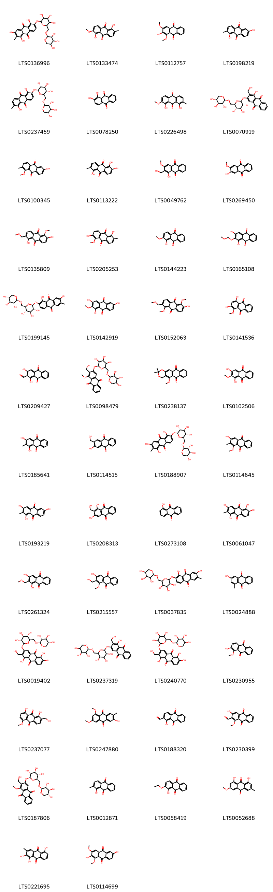
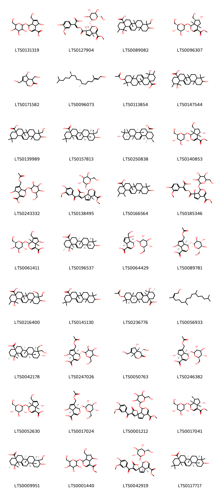
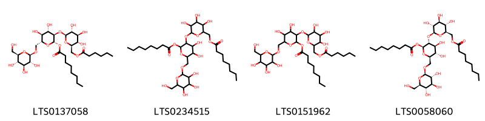

!!! abstract "Tóm tắt"

    Cây Nhàu có tên khoa học Morinda citrifolia L., thuộc họ Cà phê (Rubiaceae). Trên thế giới, cây phân bố ở nhiều nước như: Trung Quốc, Ấn Độ, Đài Loan…Tại Việt Nam, cây chủ yếu mọc ở miền Nam. Cây Nhàu vị chát, người dân thường sử dụng lá, quả, vỏ rễ làm thuốc. Vỏ rễ chứa glucozit anthraquinon và nhiều hợp chất hóa học khác có tác dụng nhuận tràng, lợi tiểu nhẹ, làm êm dịu thần kinh trên thần kinh giao cảm, hạ huyết áp và không độc.

## Thông tin về thực vật

Dược liệu **Nhàu (Quả)** từ bộ phận **Quả** từ loài *Morinda citrifolia*.

**Mô tả thực vật:** Cây nhàu là một cây cao chừng 6-8 m thân nhẵn, thường mọc hoang ở những nơi ẩm thấp dọc bờ sông, bờ suối. Cây có nhiều cành to, lá mọc đối xứng hình bầu dục, nhọn ở đầu, dài 12-15cm. Hoa nở vào tháng 1-2. Quả chín vào tháng 7-8. Quả hình trứng, xù xì, dài chừng 5-6cm, khi non có màu xanh nhạt, khi chín có màu trắng hoặc hồng, mùi nồng và cay. Ruột quả có một lớp cơm mềm ăn được, chính giữa có một nhân cứng. Nhân dài chừng 6-7mm, ngang chừng 4-5mm, có 2 ngăn chứa một hạt nhỏ mềm

*Tài liệu tham khảo:* "Những cây thuốc và vị thuốc Việt Nam" - Đỗ Tất Lợi 
Trong dược điển Việt nam, một loài được sử dụng làm dược liệu là *Morinda citrifolia*.

!!! info "Phân loại thực vật của *Morinda citrifolia*"
    - **Kingdom:** Plantae
    - **Phylum:** Tracheophyta
    - **Order:** Gentianales
    - **Family:** Rubiaceae
    - **Genus:** Morinda
    - **Species:** *Morinda citrifolia*

**Phân bố trên thế giới:** French Polynesia, New Caledonia, Dominican Republic, Indonesia, Panama, Réunion, Maldives, Montserrat, Belize, Jamaica, Colombia, Micronesia (Federated States of), India, Antigua and Barbuda, Brazil, Chinese Taipei, Nicaragua, Sri Lanka, Grenada, Thailand, Honduras, Philippines, Puerto Rico, Malaysia, French Guiana, Guyana, Fiji, Guadeloupe, Mexico, Martinique, Northern Mariana Islands, Guam, Viet Nam, Australia, Virgin Islands (British), Tonga, Singapore, Cuba, Peru, Niue, Costa Rica, Virgin Islands (U.S.), United States of America, Seychelles

**Phân bố tại Việt nam:** Hồ Chí Minh city

## Thông tin về dược liệu 

### Định danh

!!! info "Thông tin về tên gọi"

    - Dược liệu tiếng Việt: Quả nhàu
    - Dược liệu tiếng Trung: None (None)
    - Dược liệu tiếng Anh: None
    - Dược liệu latin thông dụng: Fructus Morindae citrifoliae
    - Dược liệu latin kiểu DĐVN: *fructus morindae citrifoliae*
    - Dược liệu latin kiểu DĐVN: *None*
    - Dược liệu latin kiểu thông tư: *Radix Morindae citrifoliae*
    - Bộ phận dùng: Quả (Fructus)

### Mô tả dược liệu 

- **Theo dược điển Việt nam V:** 
Quả tụ do nhiều quả đơn dính sát nhau tạo thành. Quả có hình bầu dục hơi thuôn dài, kích thước dài 4 cm đến 8 cm, rộng 2,5 cm đến 5 cm; cuống dài khoảng 0,5 cm đến 1 cm, dễ rụng khi chín. Quả già màu xanh lục, thể chất cứng chắc, mặt ngoài sần sùi có nhiều mắt hình đa giác, mỗi “mắt” là một quả đơn gồm có lớp cơm mềm bao quanh một hạt hình trứng. Khi chín, quả có màu trắng hoặc vàng nhạt, thể chất mềm, dễ rã ra, mùi khai. Mặt cắt ngang có màu trắng, mọng nước, gồm nhiều ô đinh quanh một giá ở trung tâm, mỗi ô chứa một hạt; để lâu ngoài không khí chuyển thành màu nâu đen. Lát cắt khô có hình gần như tròn hay bầu dục, màu nâu đen, thể chất dai, cứng, khó bẻ. Hạt hình trứng, dài khoảng 0,5 cm đến 1 cm, vỏ ngoài màu nâu bóng, nhân hạt màu trắng, có chứa nhiều dầu béo.

- **Mô tả dược liệu theo thông tư chế biến dược liệu theo phương pháp cổ truyền:** 

### Chế biến 

- **Chế biến theo dược điển việt nam V**: 

- **Chế biến theo thông tư:** 

--- 

## Thành phần hóa học

- Theo tài liệu của GS. Đỗ Tất Lợi:  (1) Có khoảng 253 hợp chất hóa học thuộc nhiều nhóm khác nhau nhưng nhóm chính là anthraglucozit: damnacantal hay 1-metoxy-2-focmy-3-oxyanthraquinon, chất 1-metoxyrubuazin hay metoxy-2-metyl-3-oxyanthraquinon, chất alizarin, chất moridon hay 1-5-6-trioxy-2-metylanthraquinon và chất 1-oxy-2-3-dimetoxyanthraquinon 
(2) Biomarker: glucozit anthraquinon gọi là morindin C28H30O15
    

**Thành phần hóa học từ loài **Morinda citrifolia**

Theo cơ sở dữ liệu lotus, loài *Morinda citrifolia* đã phân lập và xác định được **253** hoạt chất thuộc về các nhóm Lignan lactones, Fatty Acyls, Phenols, Pyrimidine nucleosides, Carboxylic acids and derivatives, Steroids and steroid derivatives, Flavonoids, Benzodioxanes, Furanoid lignans, Saccharolipids, Anthracenes, 2-arylbenzofuran flavonoids, Benzene and substituted derivatives, Coumarins and derivatives, Prenol lipids, Organooxygen compounds, Lactones, Linear 1,3-diarylpropanoids, Glycerolipids trong bảng dưới đây. Danh sách các hoạt chất như sau 3-[5-hydroxy-10-(methoxycarbonyl)-7-{[3,4,5-trihydroxy-6-(hydroxymethyl)oxan-2-yl]oxy}-3,8-dioxatricyclo[4.4.0.0²,⁴]dec-9-ene-5-carbonyloxy]-2-(4-hydroxy-3-methoxyphenyl)prop-2-enoic acid [(LTS0002233)](https://lotus.naturalproducts.net/compound/lotus_id/LTS0002233), (5s)-5-hydroxyhexyl (2s)-2-hydroxypropanoate [(LTS0098268)](https://lotus.naturalproducts.net/compound/lotus_id/LTS0098268), 2-[(3-methylbut-3-en-1-yl)oxy]-6-({[3,4,5-trihydroxy-6-(hydroxymethyl)oxan-2-yl]oxy}methyl)oxane-3,4,5-triol [(LTS0133381)](https://lotus.naturalproducts.net/compound/lotus_id/LTS0133381), 3-[(4,5-dihydroxy-3-{[3,4,5-trihydroxy-6-(hydroxymethyl)oxan-2-yl]oxy}-6-{[(3,4,5-trihydroxy-6-methyloxan-2-yl)oxy]methyl}oxan-2-yl)oxy]-2-(3,4-dihydroxyphenyl)-5,7-dihydroxychromen-4-one [(LTS0053037)](https://lotus.naturalproducts.net/compound/lotus_id/LTS0053037), (4r,4as,5r,7as)-5-hydroxy-4,7-bis(hydroxymethyl)-1h,4h,4ah,5h,7ah-cyclopenta[c]pyran-3-one [(LTS0050763)](https://lotus.naturalproducts.net/compound/lotus_id/LTS0050763), 1,3,5-trihydroxy-2-methyl-6-{[(2s,3r,4s,5s,6r)-3,4,5-trihydroxy-6-({[(2s,3r,4s,5r)-3,4,5-trihydroxyoxan-2-yl]oxy}methyl)oxan-2-yl]oxy}anthracene-9,10-dione [(LTS0188907)](https://lotus.naturalproducts.net/compound/lotus_id/LTS0188907), methyl (1's,2r,2's,3r,4's,6's,7's)-3-hydroxy-7'-{[(2s,3r,4s,5s,6r)-3,4,5-trihydroxy-6-(hydroxymethyl)oxan-2-yl]oxy}-3',8'-dioxaspiro[oxirane-2,5'-tricyclo[4.4.0.0²,⁴]decan]-9'-ene-10'-carboxylate [(LTS0077290)](https://lotus.naturalproducts.net/compound/lotus_id/LTS0077290), 1-hydroxy-2-(hydroxymethyl)-3-[(3,4,5-trihydroxy-6-{[(3,4,5-trihydroxyoxan-2-yl)oxy]methyl}oxan-2-yl)oxy]anthracene-9,10-dione [(LTS0237319)](https://lotus.naturalproducts.net/compound/lotus_id/LTS0237319), methyl (1s,4as,7r,7as)-4'-(4-hydroxy-3-methoxybenzoyl)-5'-oxo-1-{[(2s,3r,4s,5s,6r)-3,4,5-trihydroxy-6-(hydroxymethyl)oxan-2-yl]oxy}-4a,7a-dihydro-1h-spiro[cyclopenta[c]pyran-7,2'-furan]-4-carboxylate [(LTS0042919)](https://lotus.naturalproducts.net/compound/lotus_id/LTS0042919), (+)-glucose [(LTS0262158)](https://lotus.naturalproducts.net/compound/lotus_id/LTS0262158), kaempherol [(LTS0155822)](https://lotus.naturalproducts.net/compound/lotus_id/LTS0155822), 5-hydroxy-7-(hydroxymethyl)-1-{[3,4,5-trihydroxy-6-(hydroxymethyl)oxan-2-yl]oxy}-1h,4ah,5h,7ah-cyclopenta[c]pyran-4-carboxylic acid [(LTS0131319)](https://lotus.naturalproducts.net/compound/lotus_id/LTS0131319), glucose [(LTS0013597)](https://lotus.naturalproducts.net/compound/lotus_id/LTS0013597), 2-(hydroxymethyl)-1-methoxy-3-[(3,4,5-trihydroxy-6-{[(3,4,5-trihydroxyoxan-2-yl)oxy]methyl}oxan-2-yl)oxy]anthracene-9,10-dione [(LTS0098479)](https://lotus.naturalproducts.net/compound/lotus_id/LTS0098479), 1,6-dihydroxy-2-methylanthracene-9,10-dione [(LTS0198219)](https://lotus.naturalproducts.net/compound/lotus_id/LTS0198219), 2-hydroxyethyl 2-(2,4-dihydroxy-3-methoxybenzoyl)-3-hydroxy-4-methylbenzoate [(LTS0228702)](https://lotus.naturalproducts.net/compound/lotus_id/LTS0228702), (2z)-3-[(z)-(1s,4ar,7s,7as)-7-hydroxy-4-(methoxycarbonyl)-1-{[(2r,3s,4r,5r,6s)-3,4,5-trihydroxy-6-(hydroxymethyl)oxan-2-yl]oxy}-1h,4ah,7ah-cyclopenta[c]pyran-7-carbonyloxy]-2-(4-hydroxy-3-methoxyphenyl)prop-2-enoic acid [(LTS0127904)](https://lotus.naturalproducts.net/compound/lotus_id/LTS0127904), hydroxyanthraquinone [(LTS0273108)](https://lotus.naturalproducts.net/compound/lotus_id/LTS0273108), 1,5,6-trihydroxy-2-(hydroxymethyl)-3-{[(2s,3r,4s,5s,6r)-3,4,5-trihydroxy-6-({[(2s,3r,4s,5r)-3,4,5-trihydroxyoxan-2-yl]oxy}methyl)oxan-2-yl]oxy}anthracene-9,10-dione [(LTS0019402)](https://lotus.naturalproducts.net/compound/lotus_id/LTS0019402), 1,3,6-trihydroxy-2-methylanthracene-9,10-dione [(LTS0193219)](https://lotus.naturalproducts.net/compound/lotus_id/LTS0193219), galop [(LTS0222857)](https://lotus.naturalproducts.net/compound/lotus_id/LTS0222857), 4-{4-[3-(3,4-dihydroxyphenyl)-2-(hydroxymethyl)-2,3-dihydro-1,4-benzodioxin-6-yl]-hexahydrofuro[3,4-c]furan-1-yl}benzene-1,2-diol [(LTS0119701)](https://lotus.naturalproducts.net/compound/lotus_id/LTS0119701), α-glucose [(LTS0132398)](https://lotus.naturalproducts.net/compound/lotus_id/LTS0132398), methyl 3-(2,4-dihydroxy-5-methoxyphenyl)propanoate [(LTS0074190)](https://lotus.naturalproducts.net/compound/lotus_id/LTS0074190), methyl (1s,4as,5s,7s,7ar)-5-hydroxy-7-(hydroxymethyl)-1-{[(2s,3r,4s,5s,6r)-3,4,5-trihydroxy-6-(hydroxymethyl)oxan-2-yl]oxy}-1h,4ah,5h,6h,7h,7ah-cyclopenta[c]pyran-4-carboxylate [(LTS0140853)](https://lotus.naturalproducts.net/compound/lotus_id/LTS0140853), 4-[(1s,3ar,4r,6ar)-4-(3,4-dihydroxyphenyl)-hexahydrofuro[3,4-c]furan-1-yl]benzene-1,2-diol [(LTS0141124)](https://lotus.naturalproducts.net/compound/lotus_id/LTS0141124), morindone [(LTS0113222)](https://lotus.naturalproducts.net/compound/lotus_id/LTS0113222), purpurin 1-methyl ether [(LTS0141536)](https://lotus.naturalproducts.net/compound/lotus_id/LTS0141536), [(4r,7s,8s,11s)-2-oxo-8-{[(2s,3s,4s,5s,6r)-3,4,5-trihydroxy-6-(hydroxymethyl)oxan-2-yl]oxy}-3,9-dioxatricyclo[5.3.1.0⁴,¹¹]undeca-1(10),5-dien-6-yl]methyl acetate [(LTS0027889)](https://lotus.naturalproducts.net/compound/lotus_id/LTS0027889), 2-(hydroxymethyl)-1-methoxy-3-{[(2s,3r,4s,5s,6r)-3,4,5-trihydroxy-6-({[(2s,3r,4s,5r)-3,4,5-trihydroxyoxan-2-yl]oxy}methyl)oxan-2-yl]oxy}anthracene-9,10-dione [(LTS0187806)](https://lotus.naturalproducts.net/compound/lotus_id/LTS0187806), 3-hydroxy-1-methylanthracene-9,10-dione [(LTS0024888)](https://lotus.naturalproducts.net/compound/lotus_id/LTS0024888), nonioside b [(LTS0066712)](https://lotus.naturalproducts.net/compound/lotus_id/LTS0066712), 4,5-dihydroxy-6-(hydroxymethyl)-3-{[3,4,5-trihydroxy-6-(hydroxymethyl)oxan-2-yl]oxy}oxan-2-yl octanoate [(LTS0083361)](https://lotus.naturalproducts.net/compound/lotus_id/LTS0083361), citrifolinoside [(LTS0132984)](https://lotus.naturalproducts.net/compound/lotus_id/LTS0132984), (-)-pinoresinol [(LTS0231245)](https://lotus.naturalproducts.net/compound/lotus_id/LTS0231245), methyl (1's,2s,2's,3r,4e,4's,6's,7's)-3-hydroxy-4-[(4-hydroxyphenyl)methylidene]-5-oxo-7'-{[(2s,3r,4s,5s,6r)-3,4,5-trihydroxy-6-(hydroxymethyl)oxan-2-yl]oxy}-3',8'-dioxaspiro[oxolane-2,5'-tricyclo[4.4.0.0²,⁴]decan]-9'-ene-10'-carboxylate [(LTS0042437)](https://lotus.naturalproducts.net/compound/lotus_id/LTS0042437), 2-(3,4-dihydroxyphenyl)-5,7-dihydroxy-3-{[(2s,3s,4r,5r,6s)-3,4,5-trihydroxy-6-methyloxan-2-yl]oxy}chromen-4-one [(LTS0083664)](https://lotus.naturalproducts.net/compound/lotus_id/LTS0083664), 4-[(1r,3ar,4r,6ar)-4-(4-hydroxy-3-methoxyphenyl)-hexahydrofuro[3,4-c]furan-1-yl]-2-methoxyphenol [(LTS0231779)](https://lotus.naturalproducts.net/compound/lotus_id/LTS0231779), 10-hydroxy-1,2,6a,6b,9,9,12a-heptamethyl-2,3,4,5,6,7,8,8a,10,11,12,12b,13,14b-tetradecahydro-1h-picene-4a-carboxylic acid [(LTS0166564)](https://lotus.naturalproducts.net/compound/lotus_id/LTS0166564), 3-[2-(3,4-dihydroxyphenyl)-7-hydroxy-3-(hydroxymethyl)-2,3-dihydro-1-benzofuran-5-yl]prop-2-enoic acid [(LTS0086464)](https://lotus.naturalproducts.net/compound/lotus_id/LTS0086464), (2s,3r,4s,5s,6r)-4,5-dihydroxy-6-(hydroxymethyl)-3-{[(2s,3r,4s,5s,6r)-3,4,5-trihydroxy-6-(hydroxymethyl)oxan-2-yl]oxy}oxan-2-yl hexanoate [(LTS0183659)](https://lotus.naturalproducts.net/compound/lotus_id/LTS0183659), 7-[(acetyloxy)methyl]-5-hydroxy-1-{[4,5,6-trihydroxy-2-(hydroxymethyl)oxan-3-yl]oxy}-1h,4ah,5h,7ah-cyclopenta[c]pyran-4-carboxylic acid [(LTS0004303)](https://lotus.naturalproducts.net/compound/lotus_id/LTS0004303), (2e)-3-[(2r,3r)-2-(3,4-dihydroxyphenyl)-3-(hydroxymethyl)-2,3-dihydro-1,4-benzodioxin-6-yl]prop-2-enoic acid [(LTS0090661)](https://lotus.naturalproducts.net/compound/lotus_id/LTS0090661), (2z)-3-[2-(3,4-dihydroxyphenyl)-3-(hydroxymethyl)-2,3-dihydro-1,4-benzodioxin-6-yl]prop-2-enal [(LTS0185852)](https://lotus.naturalproducts.net/compound/lotus_id/LTS0185852), (2e)-3-[(2s,3s)-2-(3,4-dihydroxyphenyl)-3-(hydroxymethyl)-2,3-dihydro-1,4-benzodioxin-6-yl]prop-2-enoic acid [(LTS0092687)](https://lotus.naturalproducts.net/compound/lotus_id/LTS0092687), methyl 5-hydroxy-5-[hydroxy({[10-(methoxycarbonyl)-7-{[3,4,5-trihydroxy-6-(hydroxymethyl)oxan-2-yl]oxy}-3,8-dioxatricyclo[4.4.0.0²,⁴]dec-9-en-5-ylidene]methoxy})methyl]-7-{[3,4,5-trihydroxy-6-(hydroxymethyl)oxan-2-yl]oxy}-3,8-dioxatricyclo[4.4.0.0²,⁴]dec-9-ene-10-carboxylate [(LTS0015111)](https://lotus.naturalproducts.net/compound/lotus_id/LTS0015111), methyl (1s,2s,4s,5s,6s,7s)-5-hydroxy-5-(hydroxymethyl)-7-{[(2s,3r,4s,5s,6r)-3,4,5-trihydroxy-6-(hydroxymethyl)oxan-2-yl]oxy}-3,8-dioxatricyclo[4.4.0.0²,⁴]dec-9-ene-10-carboxylate [(LTS0193411)](https://lotus.naturalproducts.net/compound/lotus_id/LTS0193411), coniferyl aldehyde [(LTS0140691)](https://lotus.naturalproducts.net/compound/lotus_id/LTS0140691), 2-(3,4-dihydroxyphenyl)-5,7-dihydroxy-3-{[3,4,5-trihydroxy-6-(hydroxymethyl)oxan-2-yl]oxy}chromen-4-one [(LTS0195312)](https://lotus.naturalproducts.net/compound/lotus_id/LTS0195312), cycloartenol [(LTS0269561)](https://lotus.naturalproducts.net/compound/lotus_id/LTS0269561), rubiadin [(LTS0185641)](https://lotus.naturalproducts.net/compound/lotus_id/LTS0185641), 3,4,5-tris(hydroxymethyl)-3h,3ah,4h,6ah-cyclopenta[b]furan-2-one [(LTS0216018)](https://lotus.naturalproducts.net/compound/lotus_id/LTS0216018), scopoletin [(LTS0193112)](https://lotus.naturalproducts.net/compound/lotus_id/LTS0193112), 4,5-dihydroxy-6-(hydroxymethyl)-3-{[3,4,5-trihydroxy-6-(hydroxymethyl)oxan-2-yl]oxy}oxan-2-yl hexanoate [(LTS0047580)](https://lotus.naturalproducts.net/compound/lotus_id/LTS0047580), 4-[(2r,3r)-3-(hydroxymethyl)-6-[(1e)-3-hydroxyprop-1-en-1-yl]-2,3-dihydro-1,4-benzodioxin-2-yl]benzene-1,2-diol [(LTS0022098)](https://lotus.naturalproducts.net/compound/lotus_id/LTS0022098), 1,3-dihydroxy-9,10-dioxoanthracene-2-carbaldehyde [(LTS0209427)](https://lotus.naturalproducts.net/compound/lotus_id/LTS0209427), (2e)-3-[(2r,3r)-2-(4-hydroxy-3-methoxyphenyl)-3-(hydroxymethyl)-2,3-dihydro-1,4-benzodioxin-6-yl]prop-2-enoic acid [(LTS0059315)](https://lotus.naturalproducts.net/compound/lotus_id/LTS0059315), 1,2,7-trihydroxy-6-methylanthracene-9,10-dione [(LTS0088202)](https://lotus.naturalproducts.net/compound/lotus_id/LTS0088202), nonioside d [(LTS0096194)](https://lotus.naturalproducts.net/compound/lotus_id/LTS0096194), (9z,11e,13r,15z)-13-hydroxyoctadeca-9,11,15-trienoic acid [(LTS0157435)](https://lotus.naturalproducts.net/compound/lotus_id/LTS0157435), 1,3,5,6-tetrahydroxy-2-methylanthracene-9,10-dione [(LTS0061047)](https://lotus.naturalproducts.net/compound/lotus_id/LTS0061047), (1s,4as,5r,7as)-7-[(acetyloxy)methyl]-5-hydroxy-1-{[(2s,3r,4s,5s,6r)-3,4,5-trihydroxy-6-(hydroxymethyl)oxan-2-yl]oxy}-1h,4ah,5h,7ah-cyclopenta[c]pyran-4-carboxylic acid [(LTS0246382)](https://lotus.naturalproducts.net/compound/lotus_id/LTS0246382), 1-hexadecanoyl-sn-glycerol [(LTS0062636)](https://lotus.naturalproducts.net/compound/lotus_id/LTS0062636), (2z)-3-[(z)-(1s,2s,4s,5s,6s,7s)-5-hydroxy-10-(methoxycarbonyl)-7-{[(2s,3r,4s,5s,6r)-3,4,5-trihydroxy-6-(hydroxymethyl)oxan-2-yl]oxy}-3,8-dioxatricyclo[4.4.0.0²,⁴]dec-9-ene-5-carbonyloxy]-2-(4-hydroxy-3-methoxyphenyl)prop-2-enoic acid [(LTS0103440)](https://lotus.naturalproducts.net/compound/lotus_id/LTS0103440), 3,4,5-trihydroxy-6-({[3,4,5-trihydroxy-6-(hydroxymethyl)oxan-2-yl]oxy}methyl)oxan-2-yl octanoate [(LTS0267072)](https://lotus.naturalproducts.net/compound/lotus_id/LTS0267072), 2-(3,4-dihydroxyphenyl)-5,7-dihydroxy-3-{[(2s,3r,4r,5r,6s)-3,4,5-trihydroxy-6-(hydroxymethyl)oxan-2-yl]oxy}chromen-4-one [(LTS0241372)](https://lotus.naturalproducts.net/compound/lotus_id/LTS0241372), 1-hydroxy-9,10-dioxoanthracene-2-carbaldehyde [(LTS0188320)](https://lotus.naturalproducts.net/compound/lotus_id/LTS0188320), 9-(acetyloxy)-8,8-dimethyl-2-oxo-9h,10h-pyrano[2,3-h]chromen-10-yl 2-methylbut-2-enoate [(LTS0220568)](https://lotus.naturalproducts.net/compound/lotus_id/LTS0220568), balanophonin [(LTS0039496)](https://lotus.naturalproducts.net/compound/lotus_id/LTS0039496), 5,6-dihydroxy-2-(4-hydroxy-3-methoxyphenyl)-3-{[(2s,3r,4s,5s,6r)-3,4,5-trihydroxy-6-({[(2r,3r,4r,5r,6s)-3,4,5-trihydroxy-6-methyloxan-2-yl]oxy}methyl)oxan-2-yl]oxy}chromen-4-one [(LTS0149810)](https://lotus.naturalproducts.net/compound/lotus_id/LTS0149810), 4-[(2s,3r,4r)-4-[(s)-(3,4-dihydroxyphenyl)(hydroxy)methyl]-3-(hydroxymethyl)oxolan-2-yl]benzene-1,2-diol [(LTS0178460)](https://lotus.naturalproducts.net/compound/lotus_id/LTS0178460), 5,7-dihydroxy-2-(4-hydroxyphenyl)-3-{[(2s,3r,4s,5s,6s)-3,4,5-trihydroxy-6-({[(2r,3r,4s,5r,6s)-3,4,5-trihydroxy-6-methyloxan-2-yl]oxy}methyl)oxan-2-yl]oxy}chromen-4-one [(LTS0113249)](https://lotus.naturalproducts.net/compound/lotus_id/LTS0113249), cytidine [(LTS0075123)](https://lotus.naturalproducts.net/compound/lotus_id/LTS0075123), 4-[(2s,3s,4r)-4-[(s)-(3,4-dihydroxyphenyl)(hydroxy)methyl]-3-(hydroxymethyl)oxolan-2-yl]benzene-1,2-diol [(LTS0036845)](https://lotus.naturalproducts.net/compound/lotus_id/LTS0036845), 6-(hydroxymethyl)-8-{[3,4,5-trihydroxy-6-(hydroxymethyl)oxan-2-yl]oxy}-3,9-dioxatricyclo[5.3.1.0⁴,¹¹]undeca-1(10),5-dien-2-one [(LTS0184467)](https://lotus.naturalproducts.net/compound/lotus_id/LTS0184467), 1,3,5-trihydroxy-2-methyl-6-[(3,4,5-trihydroxy-6-{[(3,4,5-trihydroxyoxan-2-yl)oxy]methyl}oxan-2-yl)oxy]anthracene-9,10-dione [(LTS0136996)](https://lotus.naturalproducts.net/compound/lotus_id/LTS0136996), 4-[(2s)-3-(hydroxymethyl)-6-[(1e)-3-hydroxyprop-1-en-1-yl]-2,3-dihydro-1,4-benzodioxin-2-yl]benzene-1,2-diol [(LTS0050712)](https://lotus.naturalproducts.net/compound/lotus_id/LTS0050712), 1,5-dihydroxy-2-methoxy-6-methylanthracene-9,10-dione [(LTS0133474)](https://lotus.naturalproducts.net/compound/lotus_id/LTS0133474), coniferaldehyde [(LTS0009773)](https://lotus.naturalproducts.net/compound/lotus_id/LTS0009773), 1,2,5-trihydroxy-3-methylanthracene-9,10-dione [(LTS0221695)](https://lotus.naturalproducts.net/compound/lotus_id/LTS0221695), 3-palmitoyl-sn-glycerol [(LTS0045875)](https://lotus.naturalproducts.net/compound/lotus_id/LTS0045875), (2e)-3-[(2s,3r)-2-(3,4-dihydroxyphenyl)-7-hydroxy-3-(hydroxymethyl)-2,3-dihydro-1-benzofuran-5-yl]prop-2-enoic acid [(LTS0274715)](https://lotus.naturalproducts.net/compound/lotus_id/LTS0274715), (2e)-3-[(2r,3s)-2-(4-hydroxy-3-methoxyphenyl)-3-(hydroxymethyl)-7-methoxy-2,3-dihydro-1-benzofuran-5-yl]prop-2-enal [(LTS0130349)](https://lotus.naturalproducts.net/compound/lotus_id/LTS0130349), (2s,3s,4r,5s)-2-(2-hydroxy-4-iminopyrimidin-1-yl)-5-(hydroxymethyl)oxolane-3,4-diol [(LTS0156899)](https://lotus.naturalproducts.net/compound/lotus_id/LTS0156899), 3,4,5-trihydroxy-6-({[3,4,5-trihydroxy-6-(hydroxymethyl)oxan-2-yl]oxy}methyl)oxan-2-yl hexanoate [(LTS0172434)](https://lotus.naturalproducts.net/compound/lotus_id/LTS0172434), (3s,3as,4s,6ar)-3,4,5-tris(hydroxymethyl)-3h,3ah,4h,6ah-cyclopenta[b]furan-2-one [(LTS0065148)](https://lotus.naturalproducts.net/compound/lotus_id/LTS0065148), (2r,3s,4s,5r,6r)-2-(hydroxymethyl)-6-[(3-methylbut-3-en-1-yl)oxy]oxane-3,4,5-triol [(LTS0076772)](https://lotus.naturalproducts.net/compound/lotus_id/LTS0076772), ( )-yangabin [(LTS0082412)](https://lotus.naturalproducts.net/compound/lotus_id/LTS0082412), isoquercetin [(LTS0254337)](https://lotus.naturalproducts.net/compound/lotus_id/LTS0254337), 1,3,5,6-tetrahydroxy-2-(hydroxymethyl)anthracene-9,10-dione [(LTS0090415)](https://lotus.naturalproducts.net/compound/lotus_id/LTS0090415), asperuloside [(LTS0186128)](https://lotus.naturalproducts.net/compound/lotus_id/LTS0186128), phytol [(LTS0096073)](https://lotus.naturalproducts.net/compound/lotus_id/LTS0096073), (3r,4s,5s,6r)-3,4,5-trihydroxy-6-({[(2r,3r,4s,5s,6r)-3,4,5-trihydroxy-6-(hydroxymethyl)oxan-2-yl]oxy}methyl)oxan-2-yl (2-²h₁)octanoate [(LTS0032566)](https://lotus.naturalproducts.net/compound/lotus_id/LTS0032566), methyl (1's,2s,2's,4's,6's,7's)-4-(4-hydroxy-3-methoxybenzoyl)-5-oxo-7'-{[(2s,3r,4s,5r,6r)-3,4,5-trihydroxy-6-(hydroxymethyl)oxan-2-yl]oxy}-3',8'-dioxaspiro[furan-2,5'-tricyclo[4.4.0.0²,⁴]decan]-9'-ene-10'-carboxylate [(LTS0257837)](https://lotus.naturalproducts.net/compound/lotus_id/LTS0257837), methyl (2r,2's,3s,4's,7's)-3-hydroxy-7'-{[(2s,3r,4s,5s,6r)-3,4,5-trihydroxy-6-(hydroxymethyl)oxan-2-yl]oxy}-3',8'-dioxaspiro[oxirane-2,5'-tricyclo[4.4.0.0²,⁴]decan]-9'-ene-10'-carboxylate [(LTS0146108)](https://lotus.naturalproducts.net/compound/lotus_id/LTS0146108), (1s,4as,5s,7as)-5-hydroxy-7-(hydroxymethyl)-1-{[(2s,3r,4s,5s,6s)-4,5,6-trihydroxy-2-(hydroxymethyl)oxan-3-yl]oxy}-1h,4ah,5h,7ah-cyclopenta[c]pyran-4-carboxylic acid [(LTS0070001)](https://lotus.naturalproducts.net/compound/lotus_id/LTS0070001), (1s,4as,5s,7as)-7-[(acetyloxy)methyl]-5-hydroxy-1-{[(2s,3r,4s,5s,6r)-3,4,5-trihydroxy-6-(hydroxymethyl)oxan-2-yl]oxy}-1h,4ah,5h,7ah-cyclopenta[c]pyran-4-carboxylic acid [(LTS0017024)](https://lotus.naturalproducts.net/compound/lotus_id/LTS0017024), 3-({6-[(hexanoyloxy)methyl]-3,4,5-trihydroxyoxan-2-yl}oxy)-4,5-dihydroxy-6-({[3,4,5-trihydroxy-6-(hydroxymethyl)oxan-2-yl]oxy}methyl)oxan-2-yl octanoate [(LTS0151962)](https://lotus.naturalproducts.net/compound/lotus_id/LTS0151962), quercitrin [(LTS0186298)](https://lotus.naturalproducts.net/compound/lotus_id/LTS0186298), clethric acid [(LTS0042178)](https://lotus.naturalproducts.net/compound/lotus_id/LTS0042178), 1-butyl 4-(5-formylfuran-2-yl)methyl butanedioate [(LTS0115508)](https://lotus.naturalproducts.net/compound/lotus_id/LTS0115508), (3s,3ar,6s,6as)-3,6-bis(3,4-dihydroxyphenyl)-tetrahydro-3h-furo[3,4-c]furan-1-one [(LTS0085819)](https://lotus.naturalproducts.net/compound/lotus_id/LTS0085819), 1,8-dihydroxy-2-(hydroxymethyl)-5-methoxyanthracene-9,10-dione [(LTS0237077)](https://lotus.naturalproducts.net/compound/lotus_id/LTS0237077), stigmast-5-en-3-ol, (3β)- [(LTS0204616)](https://lotus.naturalproducts.net/compound/lotus_id/LTS0204616), methyl (1s,4as,7s,7as)-7-hydroxy-1-{[(2s,3r,4s,5s,6r)-3,4,5-trihydroxy-6-(hydroxymethyl)oxan-2-yl]oxy}-1h,4ah,7h,7ah-cyclopenta[c]pyran-4-carboxylate [(LTS0216664)](https://lotus.naturalproducts.net/compound/lotus_id/LTS0216664), 2-(4-hydroxy-3-methoxyphenyl)-3-[7-hydroxy-4-(methoxycarbonyl)-1-{[3,4,5-trihydroxy-6-(hydroxymethyl)oxan-2-yl]oxy}-1h,4ah,7ah-cyclopenta[c]pyran-7-carbonyloxy]prop-2-enoic acid [(LTS0185346)](https://lotus.naturalproducts.net/compound/lotus_id/LTS0185346), 2,5-bis(hydroxymethyl)-2-methoxyoxolane-3,4-diol [(LTS0088366)](https://lotus.naturalproducts.net/compound/lotus_id/LTS0088366), (3r,4s,5s,6r)-6-(hydroxymethyl)-2-[3-methyl(2-²h₁)but-3-en-1-yl]oxane-2,3,4,5-tetrol [(LTS0110493)](https://lotus.naturalproducts.net/compound/lotus_id/LTS0110493), phytosterol [(LTS0029311)](https://lotus.naturalproducts.net/compound/lotus_id/LTS0029311), methyl (1s,4ar,7r,7as)-4'-(4-hydroxy-3-methoxybenzoyl)-5'-oxo-1-{[(2s,3r,4s,5r,6r)-3,4,5-trihydroxy-6-(hydroxymethyl)oxan-2-yl]oxy}-4a,7a-dihydro-1h-spiro[cyclopenta[c]pyran-7,2'-furan]-4-carboxylate [(LTS0138495)](https://lotus.naturalproducts.net/compound/lotus_id/LTS0138495), 1,3-dihydroxy-2-(methoxymethoxy)anthracene-9,10-dione [(LTS0165108)](https://lotus.naturalproducts.net/compound/lotus_id/LTS0165108), pomolic acid [(LTS0196537)](https://lotus.naturalproducts.net/compound/lotus_id/LTS0196537), (2s,3r,4s,5s,6r)-3-{[(2s,3r,4s,5s,6r)-6-[(hexanoyloxy)methyl]-3,4,5-trihydroxyoxan-2-yl]oxy}-4,5-dihydroxy-6-({[(2r,3r,4s,5s,6r)-3,4,5-trihydroxy-6-(hydroxymethyl)oxan-2-yl]oxy}methyl)oxan-2-yl octanoate [(LTS0137058)](https://lotus.naturalproducts.net/compound/lotus_id/LTS0137058), 2-hydroxy-1,3-dimethoxyanthracene-9,10-dione [(LTS0112757)](https://lotus.naturalproducts.net/compound/lotus_id/LTS0112757), alizarin [(LTS0078250)](https://lotus.naturalproducts.net/compound/lotus_id/LTS0078250), 5-hydroxy-4,7-bis(hydroxymethyl)-1h,4h,4ah,5h,7ah-cyclopenta[c]pyran-3-one [(LTS0171582)](https://lotus.naturalproducts.net/compound/lotus_id/LTS0171582), alizarin 2-methyl ether [(LTS0144223)](https://lotus.naturalproducts.net/compound/lotus_id/LTS0144223), 2-hydroxy-1,5-dimethoxy-6-(methoxymethyl)anthracene-9,10-dione [(LTS0152063)](https://lotus.naturalproducts.net/compound/lotus_id/LTS0152063), nonioside f [(LTS0250404)](https://lotus.naturalproducts.net/compound/lotus_id/LTS0250404), (1s,4as,5s,7as)-7-[(acetyloxy)methyl]-5-hydroxy-1-{[(2s,3r,4s,5s,6s)-4,5,6-trihydroxy-2-(hydroxymethyl)oxan-3-yl]oxy}-1h,4ah,5h,7ah-cyclopenta[c]pyran-4-carboxylic acid [(LTS0228665)](https://lotus.naturalproducts.net/compound/lotus_id/LTS0228665), sitogluside [(LTS0201798)](https://lotus.naturalproducts.net/compound/lotus_id/LTS0201798), (1r,3as,3br,9as,9bs,11ar)-9a,11a-dimethyl-1-[(2r)-6-methylhept-3-en-2-yl]-tetradecahydro-1h-cyclopenta[a]phenanthren-7-ol [(LTS0217736)](https://lotus.naturalproducts.net/compound/lotus_id/LTS0217736), isoscopoletin [(LTS0157758)](https://lotus.naturalproducts.net/compound/lotus_id/LTS0157758), 1-(5-ethyl-6-methylheptan-2-yl)-9a,11a-dimethyl-1h,2h,3h,3ah,3bh,4h,5h,8h,9h,9bh,10h,11h-cyclopenta[a]phenanthren-7-one [(LTS0212002)](https://lotus.naturalproducts.net/compound/lotus_id/LTS0212002), (1s,4as,5s,7as)-7-[(acetyloxy)methyl]-5-hydroxy-1-{[3,4,5-trihydroxy-6-(hydroxymethyl)oxan-2-yl]oxy}-1h,4ah,5h,7ah-cyclopenta[c]pyran-4-carboxylic acid [(LTS0247026)](https://lotus.naturalproducts.net/compound/lotus_id/LTS0247026), 1-hydroxy-2-methylanthracene-9,10-dione [(LTS0012871)](https://lotus.naturalproducts.net/compound/lotus_id/LTS0012871), vanillin [(LTS0136163)](https://lotus.naturalproducts.net/compound/lotus_id/LTS0136163), 4-[4-(3,4-dihydroxyphenyl)-hexahydrofuro[3,4-c]furan-1-yl]benzene-1,2-diol [(LTS0231564)](https://lotus.naturalproducts.net/compound/lotus_id/LTS0231564), 3-rutinosyl quercetin [(LTS0032845)](https://lotus.naturalproducts.net/compound/lotus_id/LTS0032845), oleanolic acid [(LTS0141130)](https://lotus.naturalproducts.net/compound/lotus_id/LTS0141130), 3-hydroxy-1-methoxy-2-methylanthracene-9,10-dione [(LTS0114645)](https://lotus.naturalproducts.net/compound/lotus_id/LTS0114645), quercetin [(LTS0004651)](https://lotus.naturalproducts.net/compound/lotus_id/LTS0004651), stigmast-5-en-3-ol [(LTS0071224)](https://lotus.naturalproducts.net/compound/lotus_id/LTS0071224), methyl 5-hydroxy-7-(hydroxymethyl)-1-{[3,4,5-trihydroxy-6-(hydroxymethyl)oxan-2-yl]oxy}-1h,4ah,5h,6h,7h,7ah-cyclopenta[c]pyran-4-carboxylate [(LTS0001440)](https://lotus.naturalproducts.net/compound/lotus_id/LTS0001440), 2-(2-hydroxy-4-iminopyrimidin-1-yl)-5-(hydroxymethyl)oxolane-3,4-diol [(LTS0050374)](https://lotus.naturalproducts.net/compound/lotus_id/LTS0050374), methyl 5-hydroxy-5-(hydroxymethyl)-7-{[3,4,5-trihydroxy-6-(hydroxymethyl)oxan-2-yl]oxy}-3,8-dioxatricyclo[4.4.0.0²,⁴]dec-9-ene-10-carboxylate [(LTS0072654)](https://lotus.naturalproducts.net/compound/lotus_id/LTS0072654), 1-hydroxy-2-(hydroxymethyl)-3-{[(2s,3r,4s,5s,6r)-3,4,5-trihydroxy-6-({[(2s,3r,4s,5r)-3,4,5-trihydroxyoxan-2-yl]oxy}methyl)oxan-2-yl]oxy}anthracene-9,10-dione [(LTS0070919)](https://lotus.naturalproducts.net/compound/lotus_id/LTS0070919), methyl (2r,2's,3r,4's,7's)-3-hydroxy-7'-{[(2s,3r,4s,5s,6r)-3,4,5-trihydroxy-6-(hydroxymethyl)oxan-2-yl]oxy}-3',8'-dioxaspiro[oxirane-2,5'-tricyclo[4.4.0.0²,⁴]decan]-9'-ene-10'-carboxylate [(LTS0186232)](https://lotus.naturalproducts.net/compound/lotus_id/LTS0186232), 5-methoxy-2,2-dimethyl-4h-1,3-dioxatetracene-6,11-dione [(LTS0238137)](https://lotus.naturalproducts.net/compound/lotus_id/LTS0238137), 1,7-dihydroxy-6-methyl-2-[(3,4,5-trihydroxy-6-{[(3,4,5-trihydroxyoxan-2-yl)oxy]methyl}oxan-2-yl)oxy]anthracene-9,10-dione [(LTS0037835)](https://lotus.naturalproducts.net/compound/lotus_id/LTS0037835), 2',4,4'-trihydroxychalcone [(LTS0092525)](https://lotus.naturalproducts.net/compound/lotus_id/LTS0092525), syringaresinol [(LTS0116280)](https://lotus.naturalproducts.net/compound/lotus_id/LTS0116280), (6-{[4,5-dihydroxy-2-(octanoyloxy)-6-({[3,4,5-trihydroxy-6-(hydroxymethyl)oxan-2-yl]oxy}methyl)oxan-3-yl]oxy}-3,4,5-trihydroxyoxan-2-yl)methyl octanoate [(LTS0234515)](https://lotus.naturalproducts.net/compound/lotus_id/LTS0234515), (2e)-3-[(2s,3s)-2-(3,4-dihydroxyphenyl)-3-(hydroxymethyl)-2,3-dihydro-1,4-benzodioxin-6-yl]prop-2-enal [(LTS0177669)](https://lotus.naturalproducts.net/compound/lotus_id/LTS0177669), 1-hydroxy-2-(hydroxymethyl)-3-methoxyanthracene-9,10-dione [(LTS0049762)](https://lotus.naturalproducts.net/compound/lotus_id/LTS0049762), hederagenin [(LTS0157813)](https://lotus.naturalproducts.net/compound/lotus_id/LTS0157813), 2-hydroxyethyl 5-hydroxy-2-(2-hydroxybenzoyl)-4-(hydroxymethyl)benzoate [(LTS0000025)](https://lotus.naturalproducts.net/compound/lotus_id/LTS0000025), 4,5-dihydroxy-3-{[3,4,5-trihydroxy-6-(hydroxymethyl)oxan-2-yl]oxy}-6-({[3,4,5-trihydroxy-6-(hydroxymethyl)oxan-2-yl]oxy}methyl)oxan-2-yl hexanoate [(LTS0043902)](https://lotus.naturalproducts.net/compound/lotus_id/LTS0043902), β-sitostenone [(LTS0049492)](https://lotus.naturalproducts.net/compound/lotus_id/LTS0049492), 3-{[(2s,3r,4s,5r,6r)-4,5-dihydroxy-3-{[(2s,3r,4s,5s,6r)-3,4,5-trihydroxy-6-(hydroxymethyl)oxan-2-yl]oxy}-6-({[(2r,3r,4r,5r,6s)-3,4,5-trihydroxy-6-methyloxan-2-yl]oxy}methyl)oxan-2-yl]oxy}-5,7-dihydroxy-2-(4-hydroxyphenyl)chromen-4-one [(LTS0234919)](https://lotus.naturalproducts.net/compound/lotus_id/LTS0234919), 2-(hydroxymethyl)-6-[(3-methylbut-3-en-1-yl)oxy]oxane-3,4,5-triol [(LTS0143375)](https://lotus.naturalproducts.net/compound/lotus_id/LTS0143375), (2s,3s,4s,5r)-2,5-bis(hydroxymethyl)-2-methoxyoxolane-3,4-diol [(LTS0259879)](https://lotus.naturalproducts.net/compound/lotus_id/LTS0259879), 1,5-dihydroxy-2-methyl-6-[(3,4,5-trihydroxy-6-{[(3,4,5-trihydroxyoxan-2-yl)oxy]methyl}oxan-2-yl)oxy]anthracene-9,10-dione [(LTS0120522)](https://lotus.naturalproducts.net/compound/lotus_id/LTS0120522), 6-hydroxy-1,3-dimethoxy-7-methylanthracene-9,10-dione [(LTS0247880)](https://lotus.naturalproducts.net/compound/lotus_id/LTS0247880), (1s,4as,5s,7as)-7-[(acetyloxy)methyl]-5-hydroxy-1-{[(2r,3s,4r,5r,6s)-3,4,5-trihydroxy-6-(hydroxymethyl)oxan-2-yl]oxy}-1h,4ah,5h,7ah-cyclopenta[c]pyran-4-carboxylic acid [(LTS0089781)](https://lotus.naturalproducts.net/compound/lotus_id/LTS0089781), 5-hydroxy-7-(hydroxymethyl)-1-{[4,5,6-trihydroxy-2-(hydroxymethyl)oxan-3-yl]oxy}-1h,4ah,5h,7ah-cyclopenta[c]pyran-4-carboxylic acid [(LTS0185822)](https://lotus.naturalproducts.net/compound/lotus_id/LTS0185822), 3-[2-(3,4-dihydroxyphenyl)-3-(hydroxymethyl)-2,3-dihydro-1,4-benzodioxin-6-yl]prop-2-enoic acid [(LTS0244671)](https://lotus.naturalproducts.net/compound/lotus_id/LTS0244671), 10-(acetyloxy)-1-hydroxy-1,2,6a,6b,9,9,12a-heptamethyl-2,3,4,5,6,7,8,8a,10,11,12,12b,13,14b-tetradecahydropicene-4a-carboxylic acid [(LTS0113854)](https://lotus.naturalproducts.net/compound/lotus_id/LTS0113854), 4-{4-[(3,4-dihydroxyphenyl)(hydroxy)methyl]-3-(hydroxymethyl)oxolan-2-yl}benzene-1,2-diol [(LTS0007700)](https://lotus.naturalproducts.net/compound/lotus_id/LTS0007700), (4s,7s,8s,11s)-6-(hydroxymethyl)-8-{[(2s,3r,4s,5s,6r)-3,4,5-trihydroxy-6-(hydroxymethyl)oxan-2-yl]oxy}-3,9-dioxatricyclo[5.3.1.0⁴,¹¹]undeca-1(10),5-dien-2-one [(LTS0033428)](https://lotus.naturalproducts.net/compound/lotus_id/LTS0033428), nictoflorin [(LTS0182501)](https://lotus.naturalproducts.net/compound/lotus_id/LTS0182501), (2e)-3-[2-(3,4-dihydroxyphenyl)-3-(hydroxymethyl)-2,3-dihydro-1,4-benzodioxin-6-yl]prop-2-enal [(LTS0151228)](https://lotus.naturalproducts.net/compound/lotus_id/LTS0151228), 4-[(1s,3ar,4s,6ar)-4-(3,4-dihydroxyphenyl)-hexahydrofuro[3,4-c]furan-1-yl]benzene-1,2-diol [(LTS0178331)](https://lotus.naturalproducts.net/compound/lotus_id/LTS0178331), (1r,3as,9ar,11ar)-1-[(3e,5s)-5-ethyl-6-methylhept-3-en-2-yl]-3a,9a,11a-trimethyl-1h,2h,3h,3bh,4h,5h,8h,9h,9bh,10h,11h-cyclopenta[a]phenanthren-7-one [(LTS0055797)](https://lotus.naturalproducts.net/compound/lotus_id/LTS0055797), 3-{[(2s,3r,4s,5r,6r)-4,5-dihydroxy-3-{[(2s,3r,4s,5s,6r)-3,4,5-trihydroxy-6-(hydroxymethyl)oxan-2-yl]oxy}-6-({[(2r,3r,4r,5r,6s)-3,4,5-trihydroxy-6-methyloxan-2-yl]oxy}methyl)oxan-2-yl]oxy}-2-(3,4-dihydroxyphenyl)-5,7-dihydroxychromen-4-one [(LTS0099831)](https://lotus.naturalproducts.net/compound/lotus_id/LTS0099831), (2s,3r,4s,5s,6r)-4,5-dihydroxy-6-(hydroxymethyl)-3-{[(2s,3r,4s,5s,6r)-3,4,5-trihydroxy-6-(hydroxymethyl)oxan-2-yl]oxy}oxan-2-yl octanoate [(LTS0166514)](https://lotus.naturalproducts.net/compound/lotus_id/LTS0166514), rotungenic acid [(LTS0009951)](https://lotus.naturalproducts.net/compound/lotus_id/LTS0009951), 4,5-dihydroxy-3-{[3,4,5-trihydroxy-6-(hydroxymethyl)oxan-2-yl]oxy}-6-({[3,4,5-trihydroxy-6-(hydroxymethyl)oxan-2-yl]oxy}methyl)oxan-2-yl octanoate [(LTS0059290)](https://lotus.naturalproducts.net/compound/lotus_id/LTS0059290), 2,6-dihydroxy-1,3-dimethoxyanthracene-9,10-dione [(LTS0114699)](https://lotus.naturalproducts.net/compound/lotus_id/LTS0114699), damnacanthol [(LTS0215557)](https://lotus.naturalproducts.net/compound/lotus_id/LTS0215557), 1,10-dihydroxy-9,9-bis(hydroxymethyl)-1,2,6a,6b,12a-pentamethyl-2,3,4,5,6,7,8,8a,10,11,12,12b,13,14b-tetradecahydropicene-4a-carboxylic acid [(LTS0216400)](https://lotus.naturalproducts.net/compound/lotus_id/LTS0216400), methyl (1's,2r,2's,3s,4's,6's,7's)-3-hydroxy-7'-{[(2s,3r,4s,5s,6r)-3,4,5-trihydroxy-6-(hydroxymethyl)oxan-2-yl]oxy}-3',8'-dioxaspiro[oxirane-2,5'-tricyclo[4.4.0.0²,⁴]decan]-9'-ene-10'-carboxylate [(LTS0211679)](https://lotus.naturalproducts.net/compound/lotus_id/LTS0211679), methyl 7-hydroxy-1-{[3,4,5-trihydroxy-6-(hydroxymethyl)oxan-2-yl]oxy}-1h,4ah,7h,7ah-cyclopenta[c]pyran-4-carboxylate [(LTS0013271)](https://lotus.naturalproducts.net/compound/lotus_id/LTS0013271), 2-hydroxy-3-methoxyanthracene-9,10-dione [(LTS0269450)](https://lotus.naturalproducts.net/compound/lotus_id/LTS0269450), 4-[(1r,3as,4r,6as)-4-(3,4-dihydroxyphenyl)-hexahydrofuro[3,4-c]furan-1-yl]benzene-1,2-diol [(LTS0156809)](https://lotus.naturalproducts.net/compound/lotus_id/LTS0156809), methyl (1s,4as,5s,7s,7ar)-5-hydroxy-7-methyl-1-{[(2s,3r,4s,5s,6r)-3,4,5-trihydroxy-6-(hydroxymethyl)oxan-2-yl]oxy}-1h,4ah,5h,6h,7h,7ah-cyclopenta[c]pyran-4-carboxylate [(LTS0017041)](https://lotus.naturalproducts.net/compound/lotus_id/LTS0017041), mannitol [(LTS0199986)](https://lotus.naturalproducts.net/compound/lotus_id/LTS0199986), asperuloside [(LTS0072898)](https://lotus.naturalproducts.net/compound/lotus_id/LTS0072898), dextrose [(LTS0241274)](https://lotus.naturalproducts.net/compound/lotus_id/LTS0241274), (2e)-3-[(2s,3r)-2-(3,4-dihydroxyphenyl)-7-hydroxy-3-(hydroxymethyl)-2,3-dihydro-1-benzofuran-6-yl]prop-2-enoic acid [(LTS0049041)](https://lotus.naturalproducts.net/compound/lotus_id/LTS0049041), methyl 3-hydroxy-4-[(4-hydroxyphenyl)methylidene]-5-oxo-7'-{[3,4,5-trihydroxy-6-(hydroxymethyl)oxan-2-yl]oxy}-3',8'-dioxaspiro[oxolane-2,5'-tricyclo[4.4.0.0²,⁴]decan]-9'-ene-10'-carboxylate [(LTS0132070)](https://lotus.naturalproducts.net/compound/lotus_id/LTS0132070), narcissin [(LTS0177843)](https://lotus.naturalproducts.net/compound/lotus_id/LTS0177843), 2-hydroxy-1-methoxy-7-methylanthracene-9,10-dione [(LTS0242388)](https://lotus.naturalproducts.net/compound/lotus_id/LTS0242388), 1,6-dihydroxy-5-methoxy-2-(methoxymethyl)anthracene-9,10-dione [(LTS0135809)](https://lotus.naturalproducts.net/compound/lotus_id/LTS0135809), 2-hydroxy-3-(hydroxymethyl)anthracene-9,10-dione [(LTS0114515)](https://lotus.naturalproducts.net/compound/lotus_id/LTS0114515), (3r,3as,4s,6as)-3,4,5-tris(hydroxymethyl)-3h,3ah,4h,6ah-cyclopenta[b]furan-2-one [(LTS0184287)](https://lotus.naturalproducts.net/compound/lotus_id/LTS0184287), 5,7-dihydroxy-2-(3-hydroxy-4-methoxyphenyl)-3-{[(2s,3r,4s,5s,6r)-3,4,5-trihydroxy-6-({[(2r,3r,4r,5r,6s)-3,4,5-trihydroxy-6-methyloxan-2-yl]oxy}methyl)oxan-2-yl]oxy}chromen-4-one [(LTS0073565)](https://lotus.naturalproducts.net/compound/lotus_id/LTS0073565), methyl (1s,4as,6r,7s,7as)-6-hydroxy-7-(hydroxymethyl)-1-{[(2s,3r,4s,5s,6r)-3,4,5-trihydroxy-6-(hydroxymethyl)oxan-2-yl]oxy}-1h,4ah,5h,6h,7h,7ah-cyclopenta[c]pyran-4-carboxylate [(LTS0096307)](https://lotus.naturalproducts.net/compound/lotus_id/LTS0096307), 2-{[1-(5-ethyl-6-methylheptan-2-yl)-9a,11a-dimethyl-1h,2h,3h,3ah,3bh,4h,6h,7h,8h,9h,9bh,10h,11h-cyclopenta[a]phenanthren-7-yl]oxy}-6-(hydroxymethyl)oxane-3,4,5-triol [(LTS0158828)](https://lotus.naturalproducts.net/compound/lotus_id/LTS0158828), 5,7-dihydroxy-2-(4-hydroxyphenyl)-3-[(3,4,5-trihydroxy-6-{[(3,4,5-trihydroxy-6-methyloxan-2-yl)oxy]methyl}oxan-2-yl)oxy]chromen-4-one [(LTS0122456)](https://lotus.naturalproducts.net/compound/lotus_id/LTS0122456), (2r,3r)-2-(4-hydroxy-3-methoxyphenyl)-3-(hydroxymethyl)-2,3-dihydro-1,4-benzodioxine-6-carboxylic acid [(LTS0158749)](https://lotus.naturalproducts.net/compound/lotus_id/LTS0158749), (+)-syringaresinol [(LTS0158868)](https://lotus.naturalproducts.net/compound/lotus_id/LTS0158868), pteryxin [(LTS0135324)](https://lotus.naturalproducts.net/compound/lotus_id/LTS0135324), lucidin ω-methyl ether [(LTS0261324)](https://lotus.naturalproducts.net/compound/lotus_id/LTS0261324), 1,10-dihydroxy-9-(hydroxymethyl)-1,2,6a,6b,9,12a-hexamethyl-2,3,4,5,6,7,8,8a,10,11,12,12b,13,14b-tetradecahydropicene-4a-carboxylic acid [(LTS0089082)](https://lotus.naturalproducts.net/compound/lotus_id/LTS0089082), (1s,4as,5r,7as)-5-hydroxy-7-(hydroxymethyl)-1-{[(2s,3r,4s,5r,6r)-3,4,5-trihydroxy-6-(hydroxymethyl)oxan-2-yl]oxy}-1h,4ah,5h,7ah-cyclopenta[c]pyran-4-carboxylic acid [(LTS0061411)](https://lotus.naturalproducts.net/compound/lotus_id/LTS0061411), caprylic acid [(LTS0254176)](https://lotus.naturalproducts.net/compound/lotus_id/LTS0254176), (2e)-3-[(2r,3r)-2-(3,4-dihydroxyphenyl)-3-(hydroxymethyl)-2,3-dihydro-1,4-benzodioxin-6-yl]prop-2-enal [(LTS0215812)](https://lotus.naturalproducts.net/compound/lotus_id/LTS0215812), 4-[(2s,3r,4r)-4-(4-hydroxy-3,5-dimethoxybenzoyl)-3-(hydroxymethyl)oxolan-2-yl]-2,6-dimethoxyphenol [(LTS0038508)](https://lotus.naturalproducts.net/compound/lotus_id/LTS0038508), 2-hydroxy-1-methoxyanthracene-9,10-dione [(LTS0230955)](https://lotus.naturalproducts.net/compound/lotus_id/LTS0230955), (3r,6s,8r,11s,12s,15r,16r)-7,7,12,16-tetramethyl-15-[(2r)-6-methylhept-5-en-2-yl]pentacyclo[9.7.0.0¹,³.0³,⁸.0¹²,¹⁶]octadecan-6-ol [(LTS0062833)](https://lotus.naturalproducts.net/compound/lotus_id/LTS0062833), 3,6-bis(3,4-dihydroxyphenyl)-tetrahydro-3h-furo[3,4-c]furan-1-one [(LTS0035681)](https://lotus.naturalproducts.net/compound/lotus_id/LTS0035681), 1,6-dihydroxy-5-methoxy-2-methylanthracene-9,10-dione [(LTS0205253)](https://lotus.naturalproducts.net/compound/lotus_id/LTS0205253), (3r,3as,4s,6ar)-3,4,5-tris(hydroxymethyl)-3h,3ah,4h,6ah-cyclopenta[b]furan-2-one [(LTS0226921)](https://lotus.naturalproducts.net/compound/lotus_id/LTS0226921), 4,5-dihydroxy-3-{[3,4,5-trihydroxy-6-(hydroxymethyl)oxan-2-yl]oxy}-6-({[3,4,5-trihydroxy-6-(hydroxymethyl)oxan-2-yl]oxy}methyl)oxan-2-yl decanoate [(LTS0148704)](https://lotus.naturalproducts.net/compound/lotus_id/LTS0148704), 2-(3,4-dihydroxyphenyl)-5,7-dihydroxy-3-{[(2s,3r,4s,5s,6r)-3,4,5-trihydroxy-6-({[(2r,3s,4s,5r,6s)-3,4,5-trihydroxy-6-methyloxan-2-yl]oxy}methyl)oxan-2-yl]oxy}chromen-4-one [(LTS0218865)](https://lotus.naturalproducts.net/compound/lotus_id/LTS0218865), 3,7,11,15-tetramethylhexadec-2-en-1-ol [(LTS0056933)](https://lotus.naturalproducts.net/compound/lotus_id/LTS0056933), 3-hydroxy-1-(4-hydroxy-3-methoxyphenyl)propan-1-one [(LTS0074106)](https://lotus.naturalproducts.net/compound/lotus_id/LTS0074106), 2-(ethoxymethyl)-1,3-dihydroxyanthracene-9,10-dione [(LTS0034783)](https://lotus.naturalproducts.net/compound/lotus_id/LTS0034783), (2e)-3-[(2r,3s)-2-(3,4-dihydroxyphenyl)-3-(hydroxymethyl)-2,3-dihydro-1,4-benzodioxin-6-yl]prop-2-enoic acid [(LTS0242343)](https://lotus.naturalproducts.net/compound/lotus_id/LTS0242343), 3-[(4,5-dihydroxy-3-{[3,4,5-trihydroxy-6-(hydroxymethyl)oxan-2-yl]oxy}-6-{[(3,4,5-trihydroxy-6-methyloxan-2-yl)oxy]methyl}oxan-2-yl)oxy]-5,7-dihydroxy-2-(4-hydroxyphenyl)chromen-4-one [(LTS0060677)](https://lotus.naturalproducts.net/compound/lotus_id/LTS0060677), henine [(LTS0208313)](https://lotus.naturalproducts.net/compound/lotus_id/LTS0208313), nonioside a [(LTS0153197)](https://lotus.naturalproducts.net/compound/lotus_id/LTS0153197), nonioside g [(LTS0058060)](https://lotus.naturalproducts.net/compound/lotus_id/LTS0058060), 7-[(acetyloxy)methyl]-5-hydroxy-1-{[3,4,5-trihydroxy-6-(hydroxymethyl)oxan-2-yl]oxy}-1h,4ah,5h,7ah-cyclopenta[c]pyran-4-carboxylic acid [(LTS0243332)](https://lotus.naturalproducts.net/compound/lotus_id/LTS0243332), morindin [(LTS0237459)](https://lotus.naturalproducts.net/compound/lotus_id/LTS0237459), 3-[2-(3,4-dihydroxyphenyl)-3-(hydroxymethyl)-2,3-dihydro-1,4-benzodioxin-6-yl]prop-2-enal [(LTS0191758)](https://lotus.naturalproducts.net/compound/lotus_id/LTS0191758), oleanolic acid [(LTS0117717)](https://lotus.naturalproducts.net/compound/lotus_id/LTS0117717), methyl 4'-(4-hydroxy-3-methoxybenzoyl)-5'-oxo-1-{[3,4,5-trihydroxy-6-(hydroxymethyl)oxan-2-yl]oxy}-4a,7a-dihydro-1h-spiro[cyclopenta[c]pyran-7,2'-furan]-4-carboxylate [(LTS0001212)](https://lotus.naturalproducts.net/compound/lotus_id/LTS0001212), nonioside c [(LTS0035634)](https://lotus.naturalproducts.net/compound/lotus_id/LTS0035634), 5,6-dihydroxy-2-(4-hydroxy-3-methoxyphenyl)-3-[(3,4,5-trihydroxy-6-{[(3,4,5-trihydroxy-6-methyloxan-2-yl)oxy]methyl}oxan-2-yl)oxy]chromen-4-one [(LTS0083172)](https://lotus.naturalproducts.net/compound/lotus_id/LTS0083172), hexanoic acid [(LTS0031054)](https://lotus.naturalproducts.net/compound/lotus_id/LTS0031054), (1r,3r,6s,8r,11s,12s,15r,16r)-7,7,12,16-tetramethyl-15-[(2r)-6-methylhept-5-en-2-yl]pentacyclo[9.7.0.0¹,³.0³,⁸.0¹²,¹⁶]octadecan-6-ol [(LTS0260410)](https://lotus.naturalproducts.net/compound/lotus_id/LTS0260410), monotropein [(LTS0064429)](https://lotus.naturalproducts.net/compound/lotus_id/LTS0064429), physcion [(LTS0052688)](https://lotus.naturalproducts.net/compound/lotus_id/LTS0052688), pinoresinol [(LTS0011247)](https://lotus.naturalproducts.net/compound/lotus_id/LTS0011247), (2r,3s,4s,5r)-2,5-bis(hydroxymethyl)-2-methoxyoxolane-3,4-diol [(LTS0191480)](https://lotus.naturalproducts.net/compound/lotus_id/LTS0191480), ursolic acid [(LTS0250838)](https://lotus.naturalproducts.net/compound/lotus_id/LTS0250838), glyceryl palmitate [(LTS0073260)](https://lotus.naturalproducts.net/compound/lotus_id/LTS0073260), sitosterol [(LTS0168132)](https://lotus.naturalproducts.net/compound/lotus_id/LTS0168132), damnacanthal [(LTS0230399)](https://lotus.naturalproducts.net/compound/lotus_id/LTS0230399), deacetylasperulosidic acid [(LTS0052630)](https://lotus.naturalproducts.net/compound/lotus_id/LTS0052630), (2z)-3-[(z)-(1r,2s,4s,5s,6r,7s)-5-hydroxy-10-(methoxycarbonyl)-7-{[(2r,3s,4r,5r,6s)-3,4,5-trihydroxy-6-(hydroxymethyl)oxan-2-yl]oxy}-3,8-dioxatricyclo[4.4.0.0²,⁴]dec-9-ene-5-carbonyloxy]-2-(4-hydroxy-3-methoxyphenyl)prop-2-enoic acid [(LTS0192496)](https://lotus.naturalproducts.net/compound/lotus_id/LTS0192496), 1,3-dihydroxy-2-methoxyanthracene-9,10-dione [(LTS0102506)](https://lotus.naturalproducts.net/compound/lotus_id/LTS0102506), (2r,3r,4s,5s,6s)-2-{[(1r,3as,3bs,7s,9ar,9bs,11ar)-1-[(2r,5r)-5-ethyl-6-methylheptan-2-yl]-9a,11a-dimethyl-1h,2h,3h,3ah,3bh,4h,6h,7h,8h,9h,9bh,10h,11h-cyclopenta[a]phenanthren-7-yl]oxy}-6-(hydroxymethyl)oxane-3,4,5-triol [(LTS0076809)](https://lotus.naturalproducts.net/compound/lotus_id/LTS0076809), 1,8-dihydroxy-2-methoxy-7-methylanthracene-9,10-dione [(LTS0226498)](https://lotus.naturalproducts.net/compound/lotus_id/LTS0226498), 1,7-dihydroxy-6-methyl-2-{[(2s,3r,4s,5s,6r)-3,4,5-trihydroxy-6-({[(2s,3r,4s,5r)-3,4,5-trihydroxyoxan-2-yl]oxy}methyl)oxan-2-yl]oxy}anthracene-9,10-dione [(LTS0199145)](https://lotus.naturalproducts.net/compound/lotus_id/LTS0199145), methyl (1s,2s,4s,5r,6r,7s)-5-hydroxy-5-[(r)-hydroxy({[(1s,2s,4r,5z,6s,7s)-10-(methoxycarbonyl)-7-{[(2r,3s,4r,5r,6s)-3,4,5-trihydroxy-6-(hydroxymethyl)oxan-2-yl]oxy}-3,8-dioxatricyclo[4.4.0.0²,⁴]dec-9-en-5-ylidene]methoxy})methyl]-7-{[(2r,3s,4r,5r,6s)-3,4,5-trihydroxy-6-(hydroxymethyl)oxan-2-yl]oxy}-3,8-dioxatricyclo[4.4.0.0²,⁴]dec-9-ene-10-carboxylate [(LTS0127231)](https://lotus.naturalproducts.net/compound/lotus_id/LTS0127231), 4-[3-(hydroxymethyl)-6-(3-hydroxyprop-1-en-1-yl)-2,3-dihydro-1,4-benzodioxin-2-yl]benzene-1,2-diol [(LTS0110762)](https://lotus.naturalproducts.net/compound/lotus_id/LTS0110762), 1,5,6-trihydroxy-2-(hydroxymethyl)-3-[(3,4,5-trihydroxy-6-{[(3,4,5-trihydroxyoxan-2-yl)oxy]methyl}oxan-2-yl)oxy]anthracene-9,10-dione [(LTS0240770)](https://lotus.naturalproducts.net/compound/lotus_id/LTS0240770), 4-[(2r,3r)-3-(hydroxymethyl)-6-(3-hydroxypropyl)-2,3-dihydro-1,4-benzodioxin-2-yl]-2-methoxyphenol [(LTS0079011)](https://lotus.naturalproducts.net/compound/lotus_id/LTS0079011), 10-hydroxy-9-(hydroxymethyl)-2,2,6a,6b,9,12a-hexamethyl-1,3,4,5,6,7,8,8a,10,11,12,12b,13,14b-tetradecahydropicene-4a-carboxylic acid [(LTS0139989)](https://lotus.naturalproducts.net/compound/lotus_id/LTS0139989), 3-hydroxy-1-methoxyanthracene-9,10-dione [(LTS0135127)](https://lotus.naturalproducts.net/compound/lotus_id/LTS0135127), 6-hydroxy-1-methoxy-2-methylanthracene-9,10-dione [(LTS0100345)](https://lotus.naturalproducts.net/compound/lotus_id/LTS0100345), 13-hydroxyoctadeca-9,11,15-trienoic acid [(LTS0061896)](https://lotus.naturalproducts.net/compound/lotus_id/LTS0061896), butyl 3-(2,4-dihydroxy-5-methoxyphenyl)propanoate [(LTS0000967)](https://lotus.naturalproducts.net/compound/lotus_id/LTS0000967), 1,10-dihydroxy-1,2,6a,6b,9,9,12a-heptamethyl-2,3,4,5,6,7,8,8a,10,11,12,12b,13,14b-tetradecahydropicene-4a-carboxylic acid [(LTS0147544)](https://lotus.naturalproducts.net/compound/lotus_id/LTS0147544), (1r,2r,4as,6as,6br,8ar,10s,12ar,12br,14bs)-10-(acetyloxy)-1-hydroxy-1,2,6a,6b,9,9,12a-heptamethyl-2,3,4,5,6,7,8,8a,10,11,12,12b,13,14b-tetradecahydropicene-4a-carboxylic acid [(LTS0236776)](https://lotus.naturalproducts.net/compound/lotus_id/LTS0236776), 3-[2-(4-hydroxy-3-methoxyphenyl)-3-(hydroxymethyl)-7-methoxy-2,3-dihydro-1-benzofuran-5-yl]prop-2-enal [(LTS0233365)](https://lotus.naturalproducts.net/compound/lotus_id/LTS0233365), 2-ethoxy-1-hydroxyanthracene-9,10-dione [(LTS0058419)](https://lotus.naturalproducts.net/compound/lotus_id/LTS0058419), 1,3,6-trihydroxy-2-methoxyanthracene-9,10-dione [(LTS0142919)](https://lotus.naturalproducts.net/compound/lotus_id/LTS0142919), rutin [(LTS0042292)](https://lotus.naturalproducts.net/compound/lotus_id/LTS0042292), nonioside e [(LTS0258371)](https://lotus.naturalproducts.net/compound/lotus_id/LTS0258371). 
        
| chemicalTaxonomyClassyfireClass     |   smiles_count |
|:------------------------------------|---------------:|
| 2-arylbenzofuran flavonoids         |            300 |
| Anthracenes                         |           2634 |
| Benzene and substituted derivatives |            105 |
| Benzodioxanes                       |            731 |
| Carboxylic acids and derivatives    |             28 |
| Coumarins and derivatives           |            158 |
| Fatty Acyls                         |           1011 |
| Flavonoids                          |           2034 |
| Furanoid lignans                    |            849 |
| Glycerolipids                       |             93 |
| Lactones                            |            154 |
| Lignan lactones                     |            109 |
| Linear 1,3-diarylpropanoids         |             33 |
| Organooxygen compounds              |           3433 |
| Phenols                             |            109 |
| Prenol lipids                       |           2898 |
| Pyrimidine nucleosides              |            126 |
| Saccharolipids                      |            457 |
| Steroids and steroid derivatives    |           1185 |

            
### Nhóm 2-arylbenzofuran flavonoids
<figure markdown="span">
    { width=100% }
<figcaption>Hình ảnh cấu trúc hóa học của hoạt chất thuộc nhóm *2-arylbenzofuran flavonoids*. Tên thường gọi của các hoạt chất tương ứng là balanophonin [(LTS0039496)](https://lotus.naturalproducts.net/compound/lotus_id/LTS0039496), (2e)-3-[(2r,3s)-2-(4-hydroxy-3-methoxyphenyl)-3-(hydroxymethyl)-7-methoxy-2,3-dihydro-1-benzofuran-5-yl]prop-2-enal [(LTS0130349)](https://lotus.naturalproducts.net/compound/lotus_id/LTS0130349), (2e)-3-[(2s,3r)-2-(3,4-dihydroxyphenyl)-7-hydroxy-3-(hydroxymethyl)-2,3-dihydro-1-benzofuran-5-yl]prop-2-enoic acid [(LTS0274715)](https://lotus.naturalproducts.net/compound/lotus_id/LTS0274715), 3-[2-(4-hydroxy-3-methoxyphenyl)-3-(hydroxymethyl)-7-methoxy-2,3-dihydro-1-benzofuran-5-yl]prop-2-enal [(LTS0233365)](https://lotus.naturalproducts.net/compound/lotus_id/LTS0233365), (2e)-3-[(2s,3r)-2-(3,4-dihydroxyphenyl)-7-hydroxy-3-(hydroxymethyl)-2,3-dihydro-1-benzofuran-6-yl]prop-2-enoic acid [(LTS0049041)](https://lotus.naturalproducts.net/compound/lotus_id/LTS0049041), 3-[2-(3,4-dihydroxyphenyl)-7-hydroxy-3-(hydroxymethyl)-2,3-dihydro-1-benzofuran-5-yl]prop-2-enoic acid [(LTS0086464)](https://lotus.naturalproducts.net/compound/lotus_id/LTS0086464).</figcaption>
</figure>

            
            
### Nhóm 2-arylbenzofuran flavonoids
<figure markdown="span">
    { width=100% }
<figcaption>Hình ảnh cấu trúc hóa học của hoạt chất thuộc nhóm *2-arylbenzofuran flavonoids*. Tên thường gọi của các hoạt chất tương ứng là balanophonin [(LTS0039496)](https://lotus.naturalproducts.net/compound/lotus_id/LTS0039496), (2e)-3-[(2r,3s)-2-(4-hydroxy-3-methoxyphenyl)-3-(hydroxymethyl)-7-methoxy-2,3-dihydro-1-benzofuran-5-yl]prop-2-enal [(LTS0130349)](https://lotus.naturalproducts.net/compound/lotus_id/LTS0130349), (2e)-3-[(2s,3r)-2-(3,4-dihydroxyphenyl)-7-hydroxy-3-(hydroxymethyl)-2,3-dihydro-1-benzofuran-5-yl]prop-2-enoic acid [(LTS0274715)](https://lotus.naturalproducts.net/compound/lotus_id/LTS0274715), 3-[2-(4-hydroxy-3-methoxyphenyl)-3-(hydroxymethyl)-7-methoxy-2,3-dihydro-1-benzofuran-5-yl]prop-2-enal [(LTS0233365)](https://lotus.naturalproducts.net/compound/lotus_id/LTS0233365), (2e)-3-[(2s,3r)-2-(3,4-dihydroxyphenyl)-7-hydroxy-3-(hydroxymethyl)-2,3-dihydro-1-benzofuran-6-yl]prop-2-enoic acid [(LTS0049041)](https://lotus.naturalproducts.net/compound/lotus_id/LTS0049041), 3-[2-(3,4-dihydroxyphenyl)-7-hydroxy-3-(hydroxymethyl)-2,3-dihydro-1-benzofuran-5-yl]prop-2-enoic acid [(LTS0086464)](https://lotus.naturalproducts.net/compound/lotus_id/LTS0086464).</figcaption>
</figure>

### Nhóm Anthracenes
<figure markdown="span">
    { width=100% }
<figcaption>Hình ảnh cấu trúc hóa học của hoạt chất thuộc nhóm *Anthracenes*. Tên thường gọi của các hoạt chất tương ứng là 1,3,5-trihydroxy-2-methyl-6-[(3,4,5-trihydroxy-6-{[(3,4,5-trihydroxyoxan-2-yl)oxy]methyl}oxan-2-yl)oxy]anthracene-9,10-dione [(LTS0136996)](https://lotus.naturalproducts.net/compound/lotus_id/LTS0136996), 1,5-dihydroxy-2-methoxy-6-methylanthracene-9,10-dione [(LTS0133474)](https://lotus.naturalproducts.net/compound/lotus_id/LTS0133474), 2-hydroxy-1,3-dimethoxyanthracene-9,10-dione [(LTS0112757)](https://lotus.naturalproducts.net/compound/lotus_id/LTS0112757), 1,6-dihydroxy-2-methylanthracene-9,10-dione [(LTS0198219)](https://lotus.naturalproducts.net/compound/lotus_id/LTS0198219), morindin [(LTS0237459)](https://lotus.naturalproducts.net/compound/lotus_id/LTS0237459), alizarin [(LTS0078250)](https://lotus.naturalproducts.net/compound/lotus_id/LTS0078250), 1,8-dihydroxy-2-methoxy-7-methylanthracene-9,10-dione [(LTS0226498)](https://lotus.naturalproducts.net/compound/lotus_id/LTS0226498), 1-hydroxy-2-(hydroxymethyl)-3-{[(2s,3r,4s,5s,6r)-3,4,5-trihydroxy-6-({[(2s,3r,4s,5r)-3,4,5-trihydroxyoxan-2-yl]oxy}methyl)oxan-2-yl]oxy}anthracene-9,10-dione [(LTS0070919)](https://lotus.naturalproducts.net/compound/lotus_id/LTS0070919), 6-hydroxy-1-methoxy-2-methylanthracene-9,10-dione [(LTS0100345)](https://lotus.naturalproducts.net/compound/lotus_id/LTS0100345), morindone [(LTS0113222)](https://lotus.naturalproducts.net/compound/lotus_id/LTS0113222), 1-hydroxy-2-(hydroxymethyl)-3-methoxyanthracene-9,10-dione [(LTS0049762)](https://lotus.naturalproducts.net/compound/lotus_id/LTS0049762), 2-hydroxy-3-methoxyanthracene-9,10-dione [(LTS0269450)](https://lotus.naturalproducts.net/compound/lotus_id/LTS0269450), 1,6-dihydroxy-5-methoxy-2-(methoxymethyl)anthracene-9,10-dione [(LTS0135809)](https://lotus.naturalproducts.net/compound/lotus_id/LTS0135809), 1,6-dihydroxy-5-methoxy-2-methylanthracene-9,10-dione [(LTS0205253)](https://lotus.naturalproducts.net/compound/lotus_id/LTS0205253), alizarin 2-methyl ether [(LTS0144223)](https://lotus.naturalproducts.net/compound/lotus_id/LTS0144223), 1,3-dihydroxy-2-(methoxymethoxy)anthracene-9,10-dione [(LTS0165108)](https://lotus.naturalproducts.net/compound/lotus_id/LTS0165108), 1,7-dihydroxy-6-methyl-2-{[(2s,3r,4s,5s,6r)-3,4,5-trihydroxy-6-({[(2s,3r,4s,5r)-3,4,5-trihydroxyoxan-2-yl]oxy}methyl)oxan-2-yl]oxy}anthracene-9,10-dione [(LTS0199145)](https://lotus.naturalproducts.net/compound/lotus_id/LTS0199145), 1,3,6-trihydroxy-2-methoxyanthracene-9,10-dione [(LTS0142919)](https://lotus.naturalproducts.net/compound/lotus_id/LTS0142919), 2-hydroxy-1,5-dimethoxy-6-(methoxymethyl)anthracene-9,10-dione [(LTS0152063)](https://lotus.naturalproducts.net/compound/lotus_id/LTS0152063), purpurin 1-methyl ether [(LTS0141536)](https://lotus.naturalproducts.net/compound/lotus_id/LTS0141536), 1,3-dihydroxy-9,10-dioxoanthracene-2-carbaldehyde [(LTS0209427)](https://lotus.naturalproducts.net/compound/lotus_id/LTS0209427), 2-(hydroxymethyl)-1-methoxy-3-[(3,4,5-trihydroxy-6-{[(3,4,5-trihydroxyoxan-2-yl)oxy]methyl}oxan-2-yl)oxy]anthracene-9,10-dione [(LTS0098479)](https://lotus.naturalproducts.net/compound/lotus_id/LTS0098479), 5-methoxy-2,2-dimethyl-4h-1,3-dioxatetracene-6,11-dione [(LTS0238137)](https://lotus.naturalproducts.net/compound/lotus_id/LTS0238137), 1,3-dihydroxy-2-methoxyanthracene-9,10-dione [(LTS0102506)](https://lotus.naturalproducts.net/compound/lotus_id/LTS0102506), rubiadin [(LTS0185641)](https://lotus.naturalproducts.net/compound/lotus_id/LTS0185641), 2-hydroxy-3-(hydroxymethyl)anthracene-9,10-dione [(LTS0114515)](https://lotus.naturalproducts.net/compound/lotus_id/LTS0114515), 1,3,5-trihydroxy-2-methyl-6-{[(2s,3r,4s,5s,6r)-3,4,5-trihydroxy-6-({[(2s,3r,4s,5r)-3,4,5-trihydroxyoxan-2-yl]oxy}methyl)oxan-2-yl]oxy}anthracene-9,10-dione [(LTS0188907)](https://lotus.naturalproducts.net/compound/lotus_id/LTS0188907), 3-hydroxy-1-methoxy-2-methylanthracene-9,10-dione [(LTS0114645)](https://lotus.naturalproducts.net/compound/lotus_id/LTS0114645), 1,3,6-trihydroxy-2-methylanthracene-9,10-dione [(LTS0193219)](https://lotus.naturalproducts.net/compound/lotus_id/LTS0193219), henine [(LTS0208313)](https://lotus.naturalproducts.net/compound/lotus_id/LTS0208313), hydroxyanthraquinone [(LTS0273108)](https://lotus.naturalproducts.net/compound/lotus_id/LTS0273108), 1,3,5,6-tetrahydroxy-2-methylanthracene-9,10-dione [(LTS0061047)](https://lotus.naturalproducts.net/compound/lotus_id/LTS0061047), lucidin ω-methyl ether [(LTS0261324)](https://lotus.naturalproducts.net/compound/lotus_id/LTS0261324), damnacanthol [(LTS0215557)](https://lotus.naturalproducts.net/compound/lotus_id/LTS0215557), 1,7-dihydroxy-6-methyl-2-[(3,4,5-trihydroxy-6-{[(3,4,5-trihydroxyoxan-2-yl)oxy]methyl}oxan-2-yl)oxy]anthracene-9,10-dione [(LTS0037835)](https://lotus.naturalproducts.net/compound/lotus_id/LTS0037835), 3-hydroxy-1-methylanthracene-9,10-dione [(LTS0024888)](https://lotus.naturalproducts.net/compound/lotus_id/LTS0024888), 1,5,6-trihydroxy-2-(hydroxymethyl)-3-{[(2s,3r,4s,5s,6r)-3,4,5-trihydroxy-6-({[(2s,3r,4s,5r)-3,4,5-trihydroxyoxan-2-yl]oxy}methyl)oxan-2-yl]oxy}anthracene-9,10-dione [(LTS0019402)](https://lotus.naturalproducts.net/compound/lotus_id/LTS0019402), 1-hydroxy-2-(hydroxymethyl)-3-[(3,4,5-trihydroxy-6-{[(3,4,5-trihydroxyoxan-2-yl)oxy]methyl}oxan-2-yl)oxy]anthracene-9,10-dione [(LTS0237319)](https://lotus.naturalproducts.net/compound/lotus_id/LTS0237319), 1,5,6-trihydroxy-2-(hydroxymethyl)-3-[(3,4,5-trihydroxy-6-{[(3,4,5-trihydroxyoxan-2-yl)oxy]methyl}oxan-2-yl)oxy]anthracene-9,10-dione [(LTS0240770)](https://lotus.naturalproducts.net/compound/lotus_id/LTS0240770), 2-hydroxy-1-methoxyanthracene-9,10-dione [(LTS0230955)](https://lotus.naturalproducts.net/compound/lotus_id/LTS0230955), 1,8-dihydroxy-2-(hydroxymethyl)-5-methoxyanthracene-9,10-dione [(LTS0237077)](https://lotus.naturalproducts.net/compound/lotus_id/LTS0237077), 6-hydroxy-1,3-dimethoxy-7-methylanthracene-9,10-dione [(LTS0247880)](https://lotus.naturalproducts.net/compound/lotus_id/LTS0247880), 1-hydroxy-9,10-dioxoanthracene-2-carbaldehyde [(LTS0188320)](https://lotus.naturalproducts.net/compound/lotus_id/LTS0188320), damnacanthal [(LTS0230399)](https://lotus.naturalproducts.net/compound/lotus_id/LTS0230399), 2-(hydroxymethyl)-1-methoxy-3-{[(2s,3r,4s,5s,6r)-3,4,5-trihydroxy-6-({[(2s,3r,4s,5r)-3,4,5-trihydroxyoxan-2-yl]oxy}methyl)oxan-2-yl]oxy}anthracene-9,10-dione [(LTS0187806)](https://lotus.naturalproducts.net/compound/lotus_id/LTS0187806), 1-hydroxy-2-methylanthracene-9,10-dione [(LTS0012871)](https://lotus.naturalproducts.net/compound/lotus_id/LTS0012871), 2-ethoxy-1-hydroxyanthracene-9,10-dione [(LTS0058419)](https://lotus.naturalproducts.net/compound/lotus_id/LTS0058419), physcion [(LTS0052688)](https://lotus.naturalproducts.net/compound/lotus_id/LTS0052688), 1,2,5-trihydroxy-3-methylanthracene-9,10-dione [(LTS0221695)](https://lotus.naturalproducts.net/compound/lotus_id/LTS0221695), 2,6-dihydroxy-1,3-dimethoxyanthracene-9,10-dione [(LTS0114699)](https://lotus.naturalproducts.net/compound/lotus_id/LTS0114699), 3-hydroxy-1-methoxyanthracene-9,10-dione [(LTS0135127)](https://lotus.naturalproducts.net/compound/lotus_id/LTS0135127), 2-(ethoxymethyl)-1,3-dihydroxyanthracene-9,10-dione [(LTS0034783)](https://lotus.naturalproducts.net/compound/lotus_id/LTS0034783), 2-hydroxy-1-methoxy-7-methylanthracene-9,10-dione [(LTS0242388)](https://lotus.naturalproducts.net/compound/lotus_id/LTS0242388), 1,2,7-trihydroxy-6-methylanthracene-9,10-dione [(LTS0088202)](https://lotus.naturalproducts.net/compound/lotus_id/LTS0088202), 1,5-dihydroxy-2-methyl-6-[(3,4,5-trihydroxy-6-{[(3,4,5-trihydroxyoxan-2-yl)oxy]methyl}oxan-2-yl)oxy]anthracene-9,10-dione [(LTS0120522)](https://lotus.naturalproducts.net/compound/lotus_id/LTS0120522), 1,3,5,6-tetrahydroxy-2-(hydroxymethyl)anthracene-9,10-dione [(LTS0090415)](https://lotus.naturalproducts.net/compound/lotus_id/LTS0090415).</figcaption>
</figure>

            
            
### Nhóm 2-arylbenzofuran flavonoids
<figure markdown="span">
    { width=100% }
<figcaption>Hình ảnh cấu trúc hóa học của hoạt chất thuộc nhóm *2-arylbenzofuran flavonoids*. Tên thường gọi của các hoạt chất tương ứng là balanophonin [(LTS0039496)](https://lotus.naturalproducts.net/compound/lotus_id/LTS0039496), (2e)-3-[(2r,3s)-2-(4-hydroxy-3-methoxyphenyl)-3-(hydroxymethyl)-7-methoxy-2,3-dihydro-1-benzofuran-5-yl]prop-2-enal [(LTS0130349)](https://lotus.naturalproducts.net/compound/lotus_id/LTS0130349), (2e)-3-[(2s,3r)-2-(3,4-dihydroxyphenyl)-7-hydroxy-3-(hydroxymethyl)-2,3-dihydro-1-benzofuran-5-yl]prop-2-enoic acid [(LTS0274715)](https://lotus.naturalproducts.net/compound/lotus_id/LTS0274715), 3-[2-(4-hydroxy-3-methoxyphenyl)-3-(hydroxymethyl)-7-methoxy-2,3-dihydro-1-benzofuran-5-yl]prop-2-enal [(LTS0233365)](https://lotus.naturalproducts.net/compound/lotus_id/LTS0233365), (2e)-3-[(2s,3r)-2-(3,4-dihydroxyphenyl)-7-hydroxy-3-(hydroxymethyl)-2,3-dihydro-1-benzofuran-6-yl]prop-2-enoic acid [(LTS0049041)](https://lotus.naturalproducts.net/compound/lotus_id/LTS0049041), 3-[2-(3,4-dihydroxyphenyl)-7-hydroxy-3-(hydroxymethyl)-2,3-dihydro-1-benzofuran-5-yl]prop-2-enoic acid [(LTS0086464)](https://lotus.naturalproducts.net/compound/lotus_id/LTS0086464).</figcaption>
</figure>

### Nhóm Anthracenes
<figure markdown="span">
    { width=100% }
<figcaption>Hình ảnh cấu trúc hóa học của hoạt chất thuộc nhóm *Anthracenes*. Tên thường gọi của các hoạt chất tương ứng là 1,3,5-trihydroxy-2-methyl-6-[(3,4,5-trihydroxy-6-{[(3,4,5-trihydroxyoxan-2-yl)oxy]methyl}oxan-2-yl)oxy]anthracene-9,10-dione [(LTS0136996)](https://lotus.naturalproducts.net/compound/lotus_id/LTS0136996), 1,5-dihydroxy-2-methoxy-6-methylanthracene-9,10-dione [(LTS0133474)](https://lotus.naturalproducts.net/compound/lotus_id/LTS0133474), 2-hydroxy-1,3-dimethoxyanthracene-9,10-dione [(LTS0112757)](https://lotus.naturalproducts.net/compound/lotus_id/LTS0112757), 1,6-dihydroxy-2-methylanthracene-9,10-dione [(LTS0198219)](https://lotus.naturalproducts.net/compound/lotus_id/LTS0198219), morindin [(LTS0237459)](https://lotus.naturalproducts.net/compound/lotus_id/LTS0237459), alizarin [(LTS0078250)](https://lotus.naturalproducts.net/compound/lotus_id/LTS0078250), 1,8-dihydroxy-2-methoxy-7-methylanthracene-9,10-dione [(LTS0226498)](https://lotus.naturalproducts.net/compound/lotus_id/LTS0226498), 1-hydroxy-2-(hydroxymethyl)-3-{[(2s,3r,4s,5s,6r)-3,4,5-trihydroxy-6-({[(2s,3r,4s,5r)-3,4,5-trihydroxyoxan-2-yl]oxy}methyl)oxan-2-yl]oxy}anthracene-9,10-dione [(LTS0070919)](https://lotus.naturalproducts.net/compound/lotus_id/LTS0070919), 6-hydroxy-1-methoxy-2-methylanthracene-9,10-dione [(LTS0100345)](https://lotus.naturalproducts.net/compound/lotus_id/LTS0100345), morindone [(LTS0113222)](https://lotus.naturalproducts.net/compound/lotus_id/LTS0113222), 1-hydroxy-2-(hydroxymethyl)-3-methoxyanthracene-9,10-dione [(LTS0049762)](https://lotus.naturalproducts.net/compound/lotus_id/LTS0049762), 2-hydroxy-3-methoxyanthracene-9,10-dione [(LTS0269450)](https://lotus.naturalproducts.net/compound/lotus_id/LTS0269450), 1,6-dihydroxy-5-methoxy-2-(methoxymethyl)anthracene-9,10-dione [(LTS0135809)](https://lotus.naturalproducts.net/compound/lotus_id/LTS0135809), 1,6-dihydroxy-5-methoxy-2-methylanthracene-9,10-dione [(LTS0205253)](https://lotus.naturalproducts.net/compound/lotus_id/LTS0205253), alizarin 2-methyl ether [(LTS0144223)](https://lotus.naturalproducts.net/compound/lotus_id/LTS0144223), 1,3-dihydroxy-2-(methoxymethoxy)anthracene-9,10-dione [(LTS0165108)](https://lotus.naturalproducts.net/compound/lotus_id/LTS0165108), 1,7-dihydroxy-6-methyl-2-{[(2s,3r,4s,5s,6r)-3,4,5-trihydroxy-6-({[(2s,3r,4s,5r)-3,4,5-trihydroxyoxan-2-yl]oxy}methyl)oxan-2-yl]oxy}anthracene-9,10-dione [(LTS0199145)](https://lotus.naturalproducts.net/compound/lotus_id/LTS0199145), 1,3,6-trihydroxy-2-methoxyanthracene-9,10-dione [(LTS0142919)](https://lotus.naturalproducts.net/compound/lotus_id/LTS0142919), 2-hydroxy-1,5-dimethoxy-6-(methoxymethyl)anthracene-9,10-dione [(LTS0152063)](https://lotus.naturalproducts.net/compound/lotus_id/LTS0152063), purpurin 1-methyl ether [(LTS0141536)](https://lotus.naturalproducts.net/compound/lotus_id/LTS0141536), 1,3-dihydroxy-9,10-dioxoanthracene-2-carbaldehyde [(LTS0209427)](https://lotus.naturalproducts.net/compound/lotus_id/LTS0209427), 2-(hydroxymethyl)-1-methoxy-3-[(3,4,5-trihydroxy-6-{[(3,4,5-trihydroxyoxan-2-yl)oxy]methyl}oxan-2-yl)oxy]anthracene-9,10-dione [(LTS0098479)](https://lotus.naturalproducts.net/compound/lotus_id/LTS0098479), 5-methoxy-2,2-dimethyl-4h-1,3-dioxatetracene-6,11-dione [(LTS0238137)](https://lotus.naturalproducts.net/compound/lotus_id/LTS0238137), 1,3-dihydroxy-2-methoxyanthracene-9,10-dione [(LTS0102506)](https://lotus.naturalproducts.net/compound/lotus_id/LTS0102506), rubiadin [(LTS0185641)](https://lotus.naturalproducts.net/compound/lotus_id/LTS0185641), 2-hydroxy-3-(hydroxymethyl)anthracene-9,10-dione [(LTS0114515)](https://lotus.naturalproducts.net/compound/lotus_id/LTS0114515), 1,3,5-trihydroxy-2-methyl-6-{[(2s,3r,4s,5s,6r)-3,4,5-trihydroxy-6-({[(2s,3r,4s,5r)-3,4,5-trihydroxyoxan-2-yl]oxy}methyl)oxan-2-yl]oxy}anthracene-9,10-dione [(LTS0188907)](https://lotus.naturalproducts.net/compound/lotus_id/LTS0188907), 3-hydroxy-1-methoxy-2-methylanthracene-9,10-dione [(LTS0114645)](https://lotus.naturalproducts.net/compound/lotus_id/LTS0114645), 1,3,6-trihydroxy-2-methylanthracene-9,10-dione [(LTS0193219)](https://lotus.naturalproducts.net/compound/lotus_id/LTS0193219), henine [(LTS0208313)](https://lotus.naturalproducts.net/compound/lotus_id/LTS0208313), hydroxyanthraquinone [(LTS0273108)](https://lotus.naturalproducts.net/compound/lotus_id/LTS0273108), 1,3,5,6-tetrahydroxy-2-methylanthracene-9,10-dione [(LTS0061047)](https://lotus.naturalproducts.net/compound/lotus_id/LTS0061047), lucidin ω-methyl ether [(LTS0261324)](https://lotus.naturalproducts.net/compound/lotus_id/LTS0261324), damnacanthol [(LTS0215557)](https://lotus.naturalproducts.net/compound/lotus_id/LTS0215557), 1,7-dihydroxy-6-methyl-2-[(3,4,5-trihydroxy-6-{[(3,4,5-trihydroxyoxan-2-yl)oxy]methyl}oxan-2-yl)oxy]anthracene-9,10-dione [(LTS0037835)](https://lotus.naturalproducts.net/compound/lotus_id/LTS0037835), 3-hydroxy-1-methylanthracene-9,10-dione [(LTS0024888)](https://lotus.naturalproducts.net/compound/lotus_id/LTS0024888), 1,5,6-trihydroxy-2-(hydroxymethyl)-3-{[(2s,3r,4s,5s,6r)-3,4,5-trihydroxy-6-({[(2s,3r,4s,5r)-3,4,5-trihydroxyoxan-2-yl]oxy}methyl)oxan-2-yl]oxy}anthracene-9,10-dione [(LTS0019402)](https://lotus.naturalproducts.net/compound/lotus_id/LTS0019402), 1-hydroxy-2-(hydroxymethyl)-3-[(3,4,5-trihydroxy-6-{[(3,4,5-trihydroxyoxan-2-yl)oxy]methyl}oxan-2-yl)oxy]anthracene-9,10-dione [(LTS0237319)](https://lotus.naturalproducts.net/compound/lotus_id/LTS0237319), 1,5,6-trihydroxy-2-(hydroxymethyl)-3-[(3,4,5-trihydroxy-6-{[(3,4,5-trihydroxyoxan-2-yl)oxy]methyl}oxan-2-yl)oxy]anthracene-9,10-dione [(LTS0240770)](https://lotus.naturalproducts.net/compound/lotus_id/LTS0240770), 2-hydroxy-1-methoxyanthracene-9,10-dione [(LTS0230955)](https://lotus.naturalproducts.net/compound/lotus_id/LTS0230955), 1,8-dihydroxy-2-(hydroxymethyl)-5-methoxyanthracene-9,10-dione [(LTS0237077)](https://lotus.naturalproducts.net/compound/lotus_id/LTS0237077), 6-hydroxy-1,3-dimethoxy-7-methylanthracene-9,10-dione [(LTS0247880)](https://lotus.naturalproducts.net/compound/lotus_id/LTS0247880), 1-hydroxy-9,10-dioxoanthracene-2-carbaldehyde [(LTS0188320)](https://lotus.naturalproducts.net/compound/lotus_id/LTS0188320), damnacanthal [(LTS0230399)](https://lotus.naturalproducts.net/compound/lotus_id/LTS0230399), 2-(hydroxymethyl)-1-methoxy-3-{[(2s,3r,4s,5s,6r)-3,4,5-trihydroxy-6-({[(2s,3r,4s,5r)-3,4,5-trihydroxyoxan-2-yl]oxy}methyl)oxan-2-yl]oxy}anthracene-9,10-dione [(LTS0187806)](https://lotus.naturalproducts.net/compound/lotus_id/LTS0187806), 1-hydroxy-2-methylanthracene-9,10-dione [(LTS0012871)](https://lotus.naturalproducts.net/compound/lotus_id/LTS0012871), 2-ethoxy-1-hydroxyanthracene-9,10-dione [(LTS0058419)](https://lotus.naturalproducts.net/compound/lotus_id/LTS0058419), physcion [(LTS0052688)](https://lotus.naturalproducts.net/compound/lotus_id/LTS0052688), 1,2,5-trihydroxy-3-methylanthracene-9,10-dione [(LTS0221695)](https://lotus.naturalproducts.net/compound/lotus_id/LTS0221695), 2,6-dihydroxy-1,3-dimethoxyanthracene-9,10-dione [(LTS0114699)](https://lotus.naturalproducts.net/compound/lotus_id/LTS0114699), 3-hydroxy-1-methoxyanthracene-9,10-dione [(LTS0135127)](https://lotus.naturalproducts.net/compound/lotus_id/LTS0135127), 2-(ethoxymethyl)-1,3-dihydroxyanthracene-9,10-dione [(LTS0034783)](https://lotus.naturalproducts.net/compound/lotus_id/LTS0034783), 2-hydroxy-1-methoxy-7-methylanthracene-9,10-dione [(LTS0242388)](https://lotus.naturalproducts.net/compound/lotus_id/LTS0242388), 1,2,7-trihydroxy-6-methylanthracene-9,10-dione [(LTS0088202)](https://lotus.naturalproducts.net/compound/lotus_id/LTS0088202), 1,5-dihydroxy-2-methyl-6-[(3,4,5-trihydroxy-6-{[(3,4,5-trihydroxyoxan-2-yl)oxy]methyl}oxan-2-yl)oxy]anthracene-9,10-dione [(LTS0120522)](https://lotus.naturalproducts.net/compound/lotus_id/LTS0120522), 1,3,5,6-tetrahydroxy-2-(hydroxymethyl)anthracene-9,10-dione [(LTS0090415)](https://lotus.naturalproducts.net/compound/lotus_id/LTS0090415).</figcaption>
</figure>

### Nhóm Benzene and substituted derivatives
<figure markdown="span">
    { width=100% }
<figcaption>Hình ảnh cấu trúc hóa học của hoạt chất thuộc nhóm *Benzene and substituted derivatives*. Tên thường gọi của các hoạt chất tương ứng là 2-hydroxyethyl 2-(2,4-dihydroxy-3-methoxybenzoyl)-3-hydroxy-4-methylbenzoate [(LTS0228702)](https://lotus.naturalproducts.net/compound/lotus_id/LTS0228702), galop [(LTS0222857)](https://lotus.naturalproducts.net/compound/lotus_id/LTS0222857), 2-hydroxyethyl 5-hydroxy-2-(2-hydroxybenzoyl)-4-(hydroxymethyl)benzoate [(LTS0000025)](https://lotus.naturalproducts.net/compound/lotus_id/LTS0000025).</figcaption>
</figure>

            
            
### Nhóm 2-arylbenzofuran flavonoids
<figure markdown="span">
    { width=100% }
<figcaption>Hình ảnh cấu trúc hóa học của hoạt chất thuộc nhóm *2-arylbenzofuran flavonoids*. Tên thường gọi của các hoạt chất tương ứng là balanophonin [(LTS0039496)](https://lotus.naturalproducts.net/compound/lotus_id/LTS0039496), (2e)-3-[(2r,3s)-2-(4-hydroxy-3-methoxyphenyl)-3-(hydroxymethyl)-7-methoxy-2,3-dihydro-1-benzofuran-5-yl]prop-2-enal [(LTS0130349)](https://lotus.naturalproducts.net/compound/lotus_id/LTS0130349), (2e)-3-[(2s,3r)-2-(3,4-dihydroxyphenyl)-7-hydroxy-3-(hydroxymethyl)-2,3-dihydro-1-benzofuran-5-yl]prop-2-enoic acid [(LTS0274715)](https://lotus.naturalproducts.net/compound/lotus_id/LTS0274715), 3-[2-(4-hydroxy-3-methoxyphenyl)-3-(hydroxymethyl)-7-methoxy-2,3-dihydro-1-benzofuran-5-yl]prop-2-enal [(LTS0233365)](https://lotus.naturalproducts.net/compound/lotus_id/LTS0233365), (2e)-3-[(2s,3r)-2-(3,4-dihydroxyphenyl)-7-hydroxy-3-(hydroxymethyl)-2,3-dihydro-1-benzofuran-6-yl]prop-2-enoic acid [(LTS0049041)](https://lotus.naturalproducts.net/compound/lotus_id/LTS0049041), 3-[2-(3,4-dihydroxyphenyl)-7-hydroxy-3-(hydroxymethyl)-2,3-dihydro-1-benzofuran-5-yl]prop-2-enoic acid [(LTS0086464)](https://lotus.naturalproducts.net/compound/lotus_id/LTS0086464).</figcaption>
</figure>

### Nhóm Anthracenes
<figure markdown="span">
    { width=100% }
<figcaption>Hình ảnh cấu trúc hóa học của hoạt chất thuộc nhóm *Anthracenes*. Tên thường gọi của các hoạt chất tương ứng là 1,3,5-trihydroxy-2-methyl-6-[(3,4,5-trihydroxy-6-{[(3,4,5-trihydroxyoxan-2-yl)oxy]methyl}oxan-2-yl)oxy]anthracene-9,10-dione [(LTS0136996)](https://lotus.naturalproducts.net/compound/lotus_id/LTS0136996), 1,5-dihydroxy-2-methoxy-6-methylanthracene-9,10-dione [(LTS0133474)](https://lotus.naturalproducts.net/compound/lotus_id/LTS0133474), 2-hydroxy-1,3-dimethoxyanthracene-9,10-dione [(LTS0112757)](https://lotus.naturalproducts.net/compound/lotus_id/LTS0112757), 1,6-dihydroxy-2-methylanthracene-9,10-dione [(LTS0198219)](https://lotus.naturalproducts.net/compound/lotus_id/LTS0198219), morindin [(LTS0237459)](https://lotus.naturalproducts.net/compound/lotus_id/LTS0237459), alizarin [(LTS0078250)](https://lotus.naturalproducts.net/compound/lotus_id/LTS0078250), 1,8-dihydroxy-2-methoxy-7-methylanthracene-9,10-dione [(LTS0226498)](https://lotus.naturalproducts.net/compound/lotus_id/LTS0226498), 1-hydroxy-2-(hydroxymethyl)-3-{[(2s,3r,4s,5s,6r)-3,4,5-trihydroxy-6-({[(2s,3r,4s,5r)-3,4,5-trihydroxyoxan-2-yl]oxy}methyl)oxan-2-yl]oxy}anthracene-9,10-dione [(LTS0070919)](https://lotus.naturalproducts.net/compound/lotus_id/LTS0070919), 6-hydroxy-1-methoxy-2-methylanthracene-9,10-dione [(LTS0100345)](https://lotus.naturalproducts.net/compound/lotus_id/LTS0100345), morindone [(LTS0113222)](https://lotus.naturalproducts.net/compound/lotus_id/LTS0113222), 1-hydroxy-2-(hydroxymethyl)-3-methoxyanthracene-9,10-dione [(LTS0049762)](https://lotus.naturalproducts.net/compound/lotus_id/LTS0049762), 2-hydroxy-3-methoxyanthracene-9,10-dione [(LTS0269450)](https://lotus.naturalproducts.net/compound/lotus_id/LTS0269450), 1,6-dihydroxy-5-methoxy-2-(methoxymethyl)anthracene-9,10-dione [(LTS0135809)](https://lotus.naturalproducts.net/compound/lotus_id/LTS0135809), 1,6-dihydroxy-5-methoxy-2-methylanthracene-9,10-dione [(LTS0205253)](https://lotus.naturalproducts.net/compound/lotus_id/LTS0205253), alizarin 2-methyl ether [(LTS0144223)](https://lotus.naturalproducts.net/compound/lotus_id/LTS0144223), 1,3-dihydroxy-2-(methoxymethoxy)anthracene-9,10-dione [(LTS0165108)](https://lotus.naturalproducts.net/compound/lotus_id/LTS0165108), 1,7-dihydroxy-6-methyl-2-{[(2s,3r,4s,5s,6r)-3,4,5-trihydroxy-6-({[(2s,3r,4s,5r)-3,4,5-trihydroxyoxan-2-yl]oxy}methyl)oxan-2-yl]oxy}anthracene-9,10-dione [(LTS0199145)](https://lotus.naturalproducts.net/compound/lotus_id/LTS0199145), 1,3,6-trihydroxy-2-methoxyanthracene-9,10-dione [(LTS0142919)](https://lotus.naturalproducts.net/compound/lotus_id/LTS0142919), 2-hydroxy-1,5-dimethoxy-6-(methoxymethyl)anthracene-9,10-dione [(LTS0152063)](https://lotus.naturalproducts.net/compound/lotus_id/LTS0152063), purpurin 1-methyl ether [(LTS0141536)](https://lotus.naturalproducts.net/compound/lotus_id/LTS0141536), 1,3-dihydroxy-9,10-dioxoanthracene-2-carbaldehyde [(LTS0209427)](https://lotus.naturalproducts.net/compound/lotus_id/LTS0209427), 2-(hydroxymethyl)-1-methoxy-3-[(3,4,5-trihydroxy-6-{[(3,4,5-trihydroxyoxan-2-yl)oxy]methyl}oxan-2-yl)oxy]anthracene-9,10-dione [(LTS0098479)](https://lotus.naturalproducts.net/compound/lotus_id/LTS0098479), 5-methoxy-2,2-dimethyl-4h-1,3-dioxatetracene-6,11-dione [(LTS0238137)](https://lotus.naturalproducts.net/compound/lotus_id/LTS0238137), 1,3-dihydroxy-2-methoxyanthracene-9,10-dione [(LTS0102506)](https://lotus.naturalproducts.net/compound/lotus_id/LTS0102506), rubiadin [(LTS0185641)](https://lotus.naturalproducts.net/compound/lotus_id/LTS0185641), 2-hydroxy-3-(hydroxymethyl)anthracene-9,10-dione [(LTS0114515)](https://lotus.naturalproducts.net/compound/lotus_id/LTS0114515), 1,3,5-trihydroxy-2-methyl-6-{[(2s,3r,4s,5s,6r)-3,4,5-trihydroxy-6-({[(2s,3r,4s,5r)-3,4,5-trihydroxyoxan-2-yl]oxy}methyl)oxan-2-yl]oxy}anthracene-9,10-dione [(LTS0188907)](https://lotus.naturalproducts.net/compound/lotus_id/LTS0188907), 3-hydroxy-1-methoxy-2-methylanthracene-9,10-dione [(LTS0114645)](https://lotus.naturalproducts.net/compound/lotus_id/LTS0114645), 1,3,6-trihydroxy-2-methylanthracene-9,10-dione [(LTS0193219)](https://lotus.naturalproducts.net/compound/lotus_id/LTS0193219), henine [(LTS0208313)](https://lotus.naturalproducts.net/compound/lotus_id/LTS0208313), hydroxyanthraquinone [(LTS0273108)](https://lotus.naturalproducts.net/compound/lotus_id/LTS0273108), 1,3,5,6-tetrahydroxy-2-methylanthracene-9,10-dione [(LTS0061047)](https://lotus.naturalproducts.net/compound/lotus_id/LTS0061047), lucidin ω-methyl ether [(LTS0261324)](https://lotus.naturalproducts.net/compound/lotus_id/LTS0261324), damnacanthol [(LTS0215557)](https://lotus.naturalproducts.net/compound/lotus_id/LTS0215557), 1,7-dihydroxy-6-methyl-2-[(3,4,5-trihydroxy-6-{[(3,4,5-trihydroxyoxan-2-yl)oxy]methyl}oxan-2-yl)oxy]anthracene-9,10-dione [(LTS0037835)](https://lotus.naturalproducts.net/compound/lotus_id/LTS0037835), 3-hydroxy-1-methylanthracene-9,10-dione [(LTS0024888)](https://lotus.naturalproducts.net/compound/lotus_id/LTS0024888), 1,5,6-trihydroxy-2-(hydroxymethyl)-3-{[(2s,3r,4s,5s,6r)-3,4,5-trihydroxy-6-({[(2s,3r,4s,5r)-3,4,5-trihydroxyoxan-2-yl]oxy}methyl)oxan-2-yl]oxy}anthracene-9,10-dione [(LTS0019402)](https://lotus.naturalproducts.net/compound/lotus_id/LTS0019402), 1-hydroxy-2-(hydroxymethyl)-3-[(3,4,5-trihydroxy-6-{[(3,4,5-trihydroxyoxan-2-yl)oxy]methyl}oxan-2-yl)oxy]anthracene-9,10-dione [(LTS0237319)](https://lotus.naturalproducts.net/compound/lotus_id/LTS0237319), 1,5,6-trihydroxy-2-(hydroxymethyl)-3-[(3,4,5-trihydroxy-6-{[(3,4,5-trihydroxyoxan-2-yl)oxy]methyl}oxan-2-yl)oxy]anthracene-9,10-dione [(LTS0240770)](https://lotus.naturalproducts.net/compound/lotus_id/LTS0240770), 2-hydroxy-1-methoxyanthracene-9,10-dione [(LTS0230955)](https://lotus.naturalproducts.net/compound/lotus_id/LTS0230955), 1,8-dihydroxy-2-(hydroxymethyl)-5-methoxyanthracene-9,10-dione [(LTS0237077)](https://lotus.naturalproducts.net/compound/lotus_id/LTS0237077), 6-hydroxy-1,3-dimethoxy-7-methylanthracene-9,10-dione [(LTS0247880)](https://lotus.naturalproducts.net/compound/lotus_id/LTS0247880), 1-hydroxy-9,10-dioxoanthracene-2-carbaldehyde [(LTS0188320)](https://lotus.naturalproducts.net/compound/lotus_id/LTS0188320), damnacanthal [(LTS0230399)](https://lotus.naturalproducts.net/compound/lotus_id/LTS0230399), 2-(hydroxymethyl)-1-methoxy-3-{[(2s,3r,4s,5s,6r)-3,4,5-trihydroxy-6-({[(2s,3r,4s,5r)-3,4,5-trihydroxyoxan-2-yl]oxy}methyl)oxan-2-yl]oxy}anthracene-9,10-dione [(LTS0187806)](https://lotus.naturalproducts.net/compound/lotus_id/LTS0187806), 1-hydroxy-2-methylanthracene-9,10-dione [(LTS0012871)](https://lotus.naturalproducts.net/compound/lotus_id/LTS0012871), 2-ethoxy-1-hydroxyanthracene-9,10-dione [(LTS0058419)](https://lotus.naturalproducts.net/compound/lotus_id/LTS0058419), physcion [(LTS0052688)](https://lotus.naturalproducts.net/compound/lotus_id/LTS0052688), 1,2,5-trihydroxy-3-methylanthracene-9,10-dione [(LTS0221695)](https://lotus.naturalproducts.net/compound/lotus_id/LTS0221695), 2,6-dihydroxy-1,3-dimethoxyanthracene-9,10-dione [(LTS0114699)](https://lotus.naturalproducts.net/compound/lotus_id/LTS0114699), 3-hydroxy-1-methoxyanthracene-9,10-dione [(LTS0135127)](https://lotus.naturalproducts.net/compound/lotus_id/LTS0135127), 2-(ethoxymethyl)-1,3-dihydroxyanthracene-9,10-dione [(LTS0034783)](https://lotus.naturalproducts.net/compound/lotus_id/LTS0034783), 2-hydroxy-1-methoxy-7-methylanthracene-9,10-dione [(LTS0242388)](https://lotus.naturalproducts.net/compound/lotus_id/LTS0242388), 1,2,7-trihydroxy-6-methylanthracene-9,10-dione [(LTS0088202)](https://lotus.naturalproducts.net/compound/lotus_id/LTS0088202), 1,5-dihydroxy-2-methyl-6-[(3,4,5-trihydroxy-6-{[(3,4,5-trihydroxyoxan-2-yl)oxy]methyl}oxan-2-yl)oxy]anthracene-9,10-dione [(LTS0120522)](https://lotus.naturalproducts.net/compound/lotus_id/LTS0120522), 1,3,5,6-tetrahydroxy-2-(hydroxymethyl)anthracene-9,10-dione [(LTS0090415)](https://lotus.naturalproducts.net/compound/lotus_id/LTS0090415).</figcaption>
</figure>

### Nhóm Benzene and substituted derivatives
<figure markdown="span">
    { width=100% }
<figcaption>Hình ảnh cấu trúc hóa học của hoạt chất thuộc nhóm *Benzene and substituted derivatives*. Tên thường gọi của các hoạt chất tương ứng là 2-hydroxyethyl 2-(2,4-dihydroxy-3-methoxybenzoyl)-3-hydroxy-4-methylbenzoate [(LTS0228702)](https://lotus.naturalproducts.net/compound/lotus_id/LTS0228702), galop [(LTS0222857)](https://lotus.naturalproducts.net/compound/lotus_id/LTS0222857), 2-hydroxyethyl 5-hydroxy-2-(2-hydroxybenzoyl)-4-(hydroxymethyl)benzoate [(LTS0000025)](https://lotus.naturalproducts.net/compound/lotus_id/LTS0000025).</figcaption>
</figure>

### Nhóm Benzodioxanes
<figure markdown="span">
    { width=100% }
<figcaption>Hình ảnh cấu trúc hóa học của hoạt chất thuộc nhóm *Benzodioxanes*. Tên thường gọi của các hoạt chất tương ứng là (2e)-3-[(2s,3s)-2-(3,4-dihydroxyphenyl)-3-(hydroxymethyl)-2,3-dihydro-1,4-benzodioxin-6-yl]prop-2-enoic acid [(LTS0092687)](https://lotus.naturalproducts.net/compound/lotus_id/LTS0092687), (2e)-3-[(2s,3s)-2-(3,4-dihydroxyphenyl)-3-(hydroxymethyl)-2,3-dihydro-1,4-benzodioxin-6-yl]prop-2-enal [(LTS0177669)](https://lotus.naturalproducts.net/compound/lotus_id/LTS0177669), (2e)-3-[(2r,3r)-2-(3,4-dihydroxyphenyl)-3-(hydroxymethyl)-2,3-dihydro-1,4-benzodioxin-6-yl]prop-2-enoic acid [(LTS0090661)](https://lotus.naturalproducts.net/compound/lotus_id/LTS0090661), 4-[3-(hydroxymethyl)-6-(3-hydroxyprop-1-en-1-yl)-2,3-dihydro-1,4-benzodioxin-2-yl]benzene-1,2-diol [(LTS0110762)](https://lotus.naturalproducts.net/compound/lotus_id/LTS0110762), 3-[2-(3,4-dihydroxyphenyl)-3-(hydroxymethyl)-2,3-dihydro-1,4-benzodioxin-6-yl]prop-2-enal [(LTS0191758)](https://lotus.naturalproducts.net/compound/lotus_id/LTS0191758), (2e)-3-[2-(3,4-dihydroxyphenyl)-3-(hydroxymethyl)-2,3-dihydro-1,4-benzodioxin-6-yl]prop-2-enal [(LTS0151228)](https://lotus.naturalproducts.net/compound/lotus_id/LTS0151228), (2r,3r)-2-(4-hydroxy-3-methoxyphenyl)-3-(hydroxymethyl)-2,3-dihydro-1,4-benzodioxine-6-carboxylic acid [(LTS0158749)](https://lotus.naturalproducts.net/compound/lotus_id/LTS0158749), (2e)-3-[(2r,3s)-2-(3,4-dihydroxyphenyl)-3-(hydroxymethyl)-2,3-dihydro-1,4-benzodioxin-6-yl]prop-2-enoic acid [(LTS0242343)](https://lotus.naturalproducts.net/compound/lotus_id/LTS0242343), 4-[(2r,3r)-3-(hydroxymethyl)-6-(3-hydroxypropyl)-2,3-dihydro-1,4-benzodioxin-2-yl]-2-methoxyphenol [(LTS0079011)](https://lotus.naturalproducts.net/compound/lotus_id/LTS0079011), (2e)-3-[(2r,3r)-2-(4-hydroxy-3-methoxyphenyl)-3-(hydroxymethyl)-2,3-dihydro-1,4-benzodioxin-6-yl]prop-2-enoic acid [(LTS0059315)](https://lotus.naturalproducts.net/compound/lotus_id/LTS0059315), 3-[2-(3,4-dihydroxyphenyl)-3-(hydroxymethyl)-2,3-dihydro-1,4-benzodioxin-6-yl]prop-2-enoic acid [(LTS0244671)](https://lotus.naturalproducts.net/compound/lotus_id/LTS0244671), 4-[(2s)-3-(hydroxymethyl)-6-[(1e)-3-hydroxyprop-1-en-1-yl]-2,3-dihydro-1,4-benzodioxin-2-yl]benzene-1,2-diol [(LTS0050712)](https://lotus.naturalproducts.net/compound/lotus_id/LTS0050712), (2z)-3-[2-(3,4-dihydroxyphenyl)-3-(hydroxymethyl)-2,3-dihydro-1,4-benzodioxin-6-yl]prop-2-enal [(LTS0185852)](https://lotus.naturalproducts.net/compound/lotus_id/LTS0185852), 4-[(2r,3r)-3-(hydroxymethyl)-6-[(1e)-3-hydroxyprop-1-en-1-yl]-2,3-dihydro-1,4-benzodioxin-2-yl]benzene-1,2-diol [(LTS0022098)](https://lotus.naturalproducts.net/compound/lotus_id/LTS0022098), (2e)-3-[(2r,3r)-2-(3,4-dihydroxyphenyl)-3-(hydroxymethyl)-2,3-dihydro-1,4-benzodioxin-6-yl]prop-2-enal [(LTS0215812)](https://lotus.naturalproducts.net/compound/lotus_id/LTS0215812).</figcaption>
</figure>

            
            
### Nhóm 2-arylbenzofuran flavonoids
<figure markdown="span">
    { width=100% }
<figcaption>Hình ảnh cấu trúc hóa học của hoạt chất thuộc nhóm *2-arylbenzofuran flavonoids*. Tên thường gọi của các hoạt chất tương ứng là balanophonin [(LTS0039496)](https://lotus.naturalproducts.net/compound/lotus_id/LTS0039496), (2e)-3-[(2r,3s)-2-(4-hydroxy-3-methoxyphenyl)-3-(hydroxymethyl)-7-methoxy-2,3-dihydro-1-benzofuran-5-yl]prop-2-enal [(LTS0130349)](https://lotus.naturalproducts.net/compound/lotus_id/LTS0130349), (2e)-3-[(2s,3r)-2-(3,4-dihydroxyphenyl)-7-hydroxy-3-(hydroxymethyl)-2,3-dihydro-1-benzofuran-5-yl]prop-2-enoic acid [(LTS0274715)](https://lotus.naturalproducts.net/compound/lotus_id/LTS0274715), 3-[2-(4-hydroxy-3-methoxyphenyl)-3-(hydroxymethyl)-7-methoxy-2,3-dihydro-1-benzofuran-5-yl]prop-2-enal [(LTS0233365)](https://lotus.naturalproducts.net/compound/lotus_id/LTS0233365), (2e)-3-[(2s,3r)-2-(3,4-dihydroxyphenyl)-7-hydroxy-3-(hydroxymethyl)-2,3-dihydro-1-benzofuran-6-yl]prop-2-enoic acid [(LTS0049041)](https://lotus.naturalproducts.net/compound/lotus_id/LTS0049041), 3-[2-(3,4-dihydroxyphenyl)-7-hydroxy-3-(hydroxymethyl)-2,3-dihydro-1-benzofuran-5-yl]prop-2-enoic acid [(LTS0086464)](https://lotus.naturalproducts.net/compound/lotus_id/LTS0086464).</figcaption>
</figure>

### Nhóm Anthracenes
<figure markdown="span">
    { width=100% }
<figcaption>Hình ảnh cấu trúc hóa học của hoạt chất thuộc nhóm *Anthracenes*. Tên thường gọi của các hoạt chất tương ứng là 1,3,5-trihydroxy-2-methyl-6-[(3,4,5-trihydroxy-6-{[(3,4,5-trihydroxyoxan-2-yl)oxy]methyl}oxan-2-yl)oxy]anthracene-9,10-dione [(LTS0136996)](https://lotus.naturalproducts.net/compound/lotus_id/LTS0136996), 1,5-dihydroxy-2-methoxy-6-methylanthracene-9,10-dione [(LTS0133474)](https://lotus.naturalproducts.net/compound/lotus_id/LTS0133474), 2-hydroxy-1,3-dimethoxyanthracene-9,10-dione [(LTS0112757)](https://lotus.naturalproducts.net/compound/lotus_id/LTS0112757), 1,6-dihydroxy-2-methylanthracene-9,10-dione [(LTS0198219)](https://lotus.naturalproducts.net/compound/lotus_id/LTS0198219), morindin [(LTS0237459)](https://lotus.naturalproducts.net/compound/lotus_id/LTS0237459), alizarin [(LTS0078250)](https://lotus.naturalproducts.net/compound/lotus_id/LTS0078250), 1,8-dihydroxy-2-methoxy-7-methylanthracene-9,10-dione [(LTS0226498)](https://lotus.naturalproducts.net/compound/lotus_id/LTS0226498), 1-hydroxy-2-(hydroxymethyl)-3-{[(2s,3r,4s,5s,6r)-3,4,5-trihydroxy-6-({[(2s,3r,4s,5r)-3,4,5-trihydroxyoxan-2-yl]oxy}methyl)oxan-2-yl]oxy}anthracene-9,10-dione [(LTS0070919)](https://lotus.naturalproducts.net/compound/lotus_id/LTS0070919), 6-hydroxy-1-methoxy-2-methylanthracene-9,10-dione [(LTS0100345)](https://lotus.naturalproducts.net/compound/lotus_id/LTS0100345), morindone [(LTS0113222)](https://lotus.naturalproducts.net/compound/lotus_id/LTS0113222), 1-hydroxy-2-(hydroxymethyl)-3-methoxyanthracene-9,10-dione [(LTS0049762)](https://lotus.naturalproducts.net/compound/lotus_id/LTS0049762), 2-hydroxy-3-methoxyanthracene-9,10-dione [(LTS0269450)](https://lotus.naturalproducts.net/compound/lotus_id/LTS0269450), 1,6-dihydroxy-5-methoxy-2-(methoxymethyl)anthracene-9,10-dione [(LTS0135809)](https://lotus.naturalproducts.net/compound/lotus_id/LTS0135809), 1,6-dihydroxy-5-methoxy-2-methylanthracene-9,10-dione [(LTS0205253)](https://lotus.naturalproducts.net/compound/lotus_id/LTS0205253), alizarin 2-methyl ether [(LTS0144223)](https://lotus.naturalproducts.net/compound/lotus_id/LTS0144223), 1,3-dihydroxy-2-(methoxymethoxy)anthracene-9,10-dione [(LTS0165108)](https://lotus.naturalproducts.net/compound/lotus_id/LTS0165108), 1,7-dihydroxy-6-methyl-2-{[(2s,3r,4s,5s,6r)-3,4,5-trihydroxy-6-({[(2s,3r,4s,5r)-3,4,5-trihydroxyoxan-2-yl]oxy}methyl)oxan-2-yl]oxy}anthracene-9,10-dione [(LTS0199145)](https://lotus.naturalproducts.net/compound/lotus_id/LTS0199145), 1,3,6-trihydroxy-2-methoxyanthracene-9,10-dione [(LTS0142919)](https://lotus.naturalproducts.net/compound/lotus_id/LTS0142919), 2-hydroxy-1,5-dimethoxy-6-(methoxymethyl)anthracene-9,10-dione [(LTS0152063)](https://lotus.naturalproducts.net/compound/lotus_id/LTS0152063), purpurin 1-methyl ether [(LTS0141536)](https://lotus.naturalproducts.net/compound/lotus_id/LTS0141536), 1,3-dihydroxy-9,10-dioxoanthracene-2-carbaldehyde [(LTS0209427)](https://lotus.naturalproducts.net/compound/lotus_id/LTS0209427), 2-(hydroxymethyl)-1-methoxy-3-[(3,4,5-trihydroxy-6-{[(3,4,5-trihydroxyoxan-2-yl)oxy]methyl}oxan-2-yl)oxy]anthracene-9,10-dione [(LTS0098479)](https://lotus.naturalproducts.net/compound/lotus_id/LTS0098479), 5-methoxy-2,2-dimethyl-4h-1,3-dioxatetracene-6,11-dione [(LTS0238137)](https://lotus.naturalproducts.net/compound/lotus_id/LTS0238137), 1,3-dihydroxy-2-methoxyanthracene-9,10-dione [(LTS0102506)](https://lotus.naturalproducts.net/compound/lotus_id/LTS0102506), rubiadin [(LTS0185641)](https://lotus.naturalproducts.net/compound/lotus_id/LTS0185641), 2-hydroxy-3-(hydroxymethyl)anthracene-9,10-dione [(LTS0114515)](https://lotus.naturalproducts.net/compound/lotus_id/LTS0114515), 1,3,5-trihydroxy-2-methyl-6-{[(2s,3r,4s,5s,6r)-3,4,5-trihydroxy-6-({[(2s,3r,4s,5r)-3,4,5-trihydroxyoxan-2-yl]oxy}methyl)oxan-2-yl]oxy}anthracene-9,10-dione [(LTS0188907)](https://lotus.naturalproducts.net/compound/lotus_id/LTS0188907), 3-hydroxy-1-methoxy-2-methylanthracene-9,10-dione [(LTS0114645)](https://lotus.naturalproducts.net/compound/lotus_id/LTS0114645), 1,3,6-trihydroxy-2-methylanthracene-9,10-dione [(LTS0193219)](https://lotus.naturalproducts.net/compound/lotus_id/LTS0193219), henine [(LTS0208313)](https://lotus.naturalproducts.net/compound/lotus_id/LTS0208313), hydroxyanthraquinone [(LTS0273108)](https://lotus.naturalproducts.net/compound/lotus_id/LTS0273108), 1,3,5,6-tetrahydroxy-2-methylanthracene-9,10-dione [(LTS0061047)](https://lotus.naturalproducts.net/compound/lotus_id/LTS0061047), lucidin ω-methyl ether [(LTS0261324)](https://lotus.naturalproducts.net/compound/lotus_id/LTS0261324), damnacanthol [(LTS0215557)](https://lotus.naturalproducts.net/compound/lotus_id/LTS0215557), 1,7-dihydroxy-6-methyl-2-[(3,4,5-trihydroxy-6-{[(3,4,5-trihydroxyoxan-2-yl)oxy]methyl}oxan-2-yl)oxy]anthracene-9,10-dione [(LTS0037835)](https://lotus.naturalproducts.net/compound/lotus_id/LTS0037835), 3-hydroxy-1-methylanthracene-9,10-dione [(LTS0024888)](https://lotus.naturalproducts.net/compound/lotus_id/LTS0024888), 1,5,6-trihydroxy-2-(hydroxymethyl)-3-{[(2s,3r,4s,5s,6r)-3,4,5-trihydroxy-6-({[(2s,3r,4s,5r)-3,4,5-trihydroxyoxan-2-yl]oxy}methyl)oxan-2-yl]oxy}anthracene-9,10-dione [(LTS0019402)](https://lotus.naturalproducts.net/compound/lotus_id/LTS0019402), 1-hydroxy-2-(hydroxymethyl)-3-[(3,4,5-trihydroxy-6-{[(3,4,5-trihydroxyoxan-2-yl)oxy]methyl}oxan-2-yl)oxy]anthracene-9,10-dione [(LTS0237319)](https://lotus.naturalproducts.net/compound/lotus_id/LTS0237319), 1,5,6-trihydroxy-2-(hydroxymethyl)-3-[(3,4,5-trihydroxy-6-{[(3,4,5-trihydroxyoxan-2-yl)oxy]methyl}oxan-2-yl)oxy]anthracene-9,10-dione [(LTS0240770)](https://lotus.naturalproducts.net/compound/lotus_id/LTS0240770), 2-hydroxy-1-methoxyanthracene-9,10-dione [(LTS0230955)](https://lotus.naturalproducts.net/compound/lotus_id/LTS0230955), 1,8-dihydroxy-2-(hydroxymethyl)-5-methoxyanthracene-9,10-dione [(LTS0237077)](https://lotus.naturalproducts.net/compound/lotus_id/LTS0237077), 6-hydroxy-1,3-dimethoxy-7-methylanthracene-9,10-dione [(LTS0247880)](https://lotus.naturalproducts.net/compound/lotus_id/LTS0247880), 1-hydroxy-9,10-dioxoanthracene-2-carbaldehyde [(LTS0188320)](https://lotus.naturalproducts.net/compound/lotus_id/LTS0188320), damnacanthal [(LTS0230399)](https://lotus.naturalproducts.net/compound/lotus_id/LTS0230399), 2-(hydroxymethyl)-1-methoxy-3-{[(2s,3r,4s,5s,6r)-3,4,5-trihydroxy-6-({[(2s,3r,4s,5r)-3,4,5-trihydroxyoxan-2-yl]oxy}methyl)oxan-2-yl]oxy}anthracene-9,10-dione [(LTS0187806)](https://lotus.naturalproducts.net/compound/lotus_id/LTS0187806), 1-hydroxy-2-methylanthracene-9,10-dione [(LTS0012871)](https://lotus.naturalproducts.net/compound/lotus_id/LTS0012871), 2-ethoxy-1-hydroxyanthracene-9,10-dione [(LTS0058419)](https://lotus.naturalproducts.net/compound/lotus_id/LTS0058419), physcion [(LTS0052688)](https://lotus.naturalproducts.net/compound/lotus_id/LTS0052688), 1,2,5-trihydroxy-3-methylanthracene-9,10-dione [(LTS0221695)](https://lotus.naturalproducts.net/compound/lotus_id/LTS0221695), 2,6-dihydroxy-1,3-dimethoxyanthracene-9,10-dione [(LTS0114699)](https://lotus.naturalproducts.net/compound/lotus_id/LTS0114699), 3-hydroxy-1-methoxyanthracene-9,10-dione [(LTS0135127)](https://lotus.naturalproducts.net/compound/lotus_id/LTS0135127), 2-(ethoxymethyl)-1,3-dihydroxyanthracene-9,10-dione [(LTS0034783)](https://lotus.naturalproducts.net/compound/lotus_id/LTS0034783), 2-hydroxy-1-methoxy-7-methylanthracene-9,10-dione [(LTS0242388)](https://lotus.naturalproducts.net/compound/lotus_id/LTS0242388), 1,2,7-trihydroxy-6-methylanthracene-9,10-dione [(LTS0088202)](https://lotus.naturalproducts.net/compound/lotus_id/LTS0088202), 1,5-dihydroxy-2-methyl-6-[(3,4,5-trihydroxy-6-{[(3,4,5-trihydroxyoxan-2-yl)oxy]methyl}oxan-2-yl)oxy]anthracene-9,10-dione [(LTS0120522)](https://lotus.naturalproducts.net/compound/lotus_id/LTS0120522), 1,3,5,6-tetrahydroxy-2-(hydroxymethyl)anthracene-9,10-dione [(LTS0090415)](https://lotus.naturalproducts.net/compound/lotus_id/LTS0090415).</figcaption>
</figure>

### Nhóm Benzene and substituted derivatives
<figure markdown="span">
    { width=100% }
<figcaption>Hình ảnh cấu trúc hóa học của hoạt chất thuộc nhóm *Benzene and substituted derivatives*. Tên thường gọi của các hoạt chất tương ứng là 2-hydroxyethyl 2-(2,4-dihydroxy-3-methoxybenzoyl)-3-hydroxy-4-methylbenzoate [(LTS0228702)](https://lotus.naturalproducts.net/compound/lotus_id/LTS0228702), galop [(LTS0222857)](https://lotus.naturalproducts.net/compound/lotus_id/LTS0222857), 2-hydroxyethyl 5-hydroxy-2-(2-hydroxybenzoyl)-4-(hydroxymethyl)benzoate [(LTS0000025)](https://lotus.naturalproducts.net/compound/lotus_id/LTS0000025).</figcaption>
</figure>

### Nhóm Benzodioxanes
<figure markdown="span">
    { width=100% }
<figcaption>Hình ảnh cấu trúc hóa học của hoạt chất thuộc nhóm *Benzodioxanes*. Tên thường gọi của các hoạt chất tương ứng là (2e)-3-[(2s,3s)-2-(3,4-dihydroxyphenyl)-3-(hydroxymethyl)-2,3-dihydro-1,4-benzodioxin-6-yl]prop-2-enoic acid [(LTS0092687)](https://lotus.naturalproducts.net/compound/lotus_id/LTS0092687), (2e)-3-[(2s,3s)-2-(3,4-dihydroxyphenyl)-3-(hydroxymethyl)-2,3-dihydro-1,4-benzodioxin-6-yl]prop-2-enal [(LTS0177669)](https://lotus.naturalproducts.net/compound/lotus_id/LTS0177669), (2e)-3-[(2r,3r)-2-(3,4-dihydroxyphenyl)-3-(hydroxymethyl)-2,3-dihydro-1,4-benzodioxin-6-yl]prop-2-enoic acid [(LTS0090661)](https://lotus.naturalproducts.net/compound/lotus_id/LTS0090661), 4-[3-(hydroxymethyl)-6-(3-hydroxyprop-1-en-1-yl)-2,3-dihydro-1,4-benzodioxin-2-yl]benzene-1,2-diol [(LTS0110762)](https://lotus.naturalproducts.net/compound/lotus_id/LTS0110762), 3-[2-(3,4-dihydroxyphenyl)-3-(hydroxymethyl)-2,3-dihydro-1,4-benzodioxin-6-yl]prop-2-enal [(LTS0191758)](https://lotus.naturalproducts.net/compound/lotus_id/LTS0191758), (2e)-3-[2-(3,4-dihydroxyphenyl)-3-(hydroxymethyl)-2,3-dihydro-1,4-benzodioxin-6-yl]prop-2-enal [(LTS0151228)](https://lotus.naturalproducts.net/compound/lotus_id/LTS0151228), (2r,3r)-2-(4-hydroxy-3-methoxyphenyl)-3-(hydroxymethyl)-2,3-dihydro-1,4-benzodioxine-6-carboxylic acid [(LTS0158749)](https://lotus.naturalproducts.net/compound/lotus_id/LTS0158749), (2e)-3-[(2r,3s)-2-(3,4-dihydroxyphenyl)-3-(hydroxymethyl)-2,3-dihydro-1,4-benzodioxin-6-yl]prop-2-enoic acid [(LTS0242343)](https://lotus.naturalproducts.net/compound/lotus_id/LTS0242343), 4-[(2r,3r)-3-(hydroxymethyl)-6-(3-hydroxypropyl)-2,3-dihydro-1,4-benzodioxin-2-yl]-2-methoxyphenol [(LTS0079011)](https://lotus.naturalproducts.net/compound/lotus_id/LTS0079011), (2e)-3-[(2r,3r)-2-(4-hydroxy-3-methoxyphenyl)-3-(hydroxymethyl)-2,3-dihydro-1,4-benzodioxin-6-yl]prop-2-enoic acid [(LTS0059315)](https://lotus.naturalproducts.net/compound/lotus_id/LTS0059315), 3-[2-(3,4-dihydroxyphenyl)-3-(hydroxymethyl)-2,3-dihydro-1,4-benzodioxin-6-yl]prop-2-enoic acid [(LTS0244671)](https://lotus.naturalproducts.net/compound/lotus_id/LTS0244671), 4-[(2s)-3-(hydroxymethyl)-6-[(1e)-3-hydroxyprop-1-en-1-yl]-2,3-dihydro-1,4-benzodioxin-2-yl]benzene-1,2-diol [(LTS0050712)](https://lotus.naturalproducts.net/compound/lotus_id/LTS0050712), (2z)-3-[2-(3,4-dihydroxyphenyl)-3-(hydroxymethyl)-2,3-dihydro-1,4-benzodioxin-6-yl]prop-2-enal [(LTS0185852)](https://lotus.naturalproducts.net/compound/lotus_id/LTS0185852), 4-[(2r,3r)-3-(hydroxymethyl)-6-[(1e)-3-hydroxyprop-1-en-1-yl]-2,3-dihydro-1,4-benzodioxin-2-yl]benzene-1,2-diol [(LTS0022098)](https://lotus.naturalproducts.net/compound/lotus_id/LTS0022098), (2e)-3-[(2r,3r)-2-(3,4-dihydroxyphenyl)-3-(hydroxymethyl)-2,3-dihydro-1,4-benzodioxin-6-yl]prop-2-enal [(LTS0215812)](https://lotus.naturalproducts.net/compound/lotus_id/LTS0215812).</figcaption>
</figure>

### Nhóm Carboxylic acids and derivatives
<figure markdown="span">
    { width=100% }
<figcaption>Hình ảnh cấu trúc hóa học của hoạt chất thuộc nhóm *Carboxylic acids and derivatives*. Tên thường gọi của các hoạt chất tương ứng là (5s)-5-hydroxyhexyl (2s)-2-hydroxypropanoate [(LTS0098268)](https://lotus.naturalproducts.net/compound/lotus_id/LTS0098268).</figcaption>
</figure>

            
            
### Nhóm 2-arylbenzofuran flavonoids
<figure markdown="span">
    { width=100% }
<figcaption>Hình ảnh cấu trúc hóa học của hoạt chất thuộc nhóm *2-arylbenzofuran flavonoids*. Tên thường gọi của các hoạt chất tương ứng là balanophonin [(LTS0039496)](https://lotus.naturalproducts.net/compound/lotus_id/LTS0039496), (2e)-3-[(2r,3s)-2-(4-hydroxy-3-methoxyphenyl)-3-(hydroxymethyl)-7-methoxy-2,3-dihydro-1-benzofuran-5-yl]prop-2-enal [(LTS0130349)](https://lotus.naturalproducts.net/compound/lotus_id/LTS0130349), (2e)-3-[(2s,3r)-2-(3,4-dihydroxyphenyl)-7-hydroxy-3-(hydroxymethyl)-2,3-dihydro-1-benzofuran-5-yl]prop-2-enoic acid [(LTS0274715)](https://lotus.naturalproducts.net/compound/lotus_id/LTS0274715), 3-[2-(4-hydroxy-3-methoxyphenyl)-3-(hydroxymethyl)-7-methoxy-2,3-dihydro-1-benzofuran-5-yl]prop-2-enal [(LTS0233365)](https://lotus.naturalproducts.net/compound/lotus_id/LTS0233365), (2e)-3-[(2s,3r)-2-(3,4-dihydroxyphenyl)-7-hydroxy-3-(hydroxymethyl)-2,3-dihydro-1-benzofuran-6-yl]prop-2-enoic acid [(LTS0049041)](https://lotus.naturalproducts.net/compound/lotus_id/LTS0049041), 3-[2-(3,4-dihydroxyphenyl)-7-hydroxy-3-(hydroxymethyl)-2,3-dihydro-1-benzofuran-5-yl]prop-2-enoic acid [(LTS0086464)](https://lotus.naturalproducts.net/compound/lotus_id/LTS0086464).</figcaption>
</figure>

### Nhóm Anthracenes
<figure markdown="span">
    { width=100% }
<figcaption>Hình ảnh cấu trúc hóa học của hoạt chất thuộc nhóm *Anthracenes*. Tên thường gọi của các hoạt chất tương ứng là 1,3,5-trihydroxy-2-methyl-6-[(3,4,5-trihydroxy-6-{[(3,4,5-trihydroxyoxan-2-yl)oxy]methyl}oxan-2-yl)oxy]anthracene-9,10-dione [(LTS0136996)](https://lotus.naturalproducts.net/compound/lotus_id/LTS0136996), 1,5-dihydroxy-2-methoxy-6-methylanthracene-9,10-dione [(LTS0133474)](https://lotus.naturalproducts.net/compound/lotus_id/LTS0133474), 2-hydroxy-1,3-dimethoxyanthracene-9,10-dione [(LTS0112757)](https://lotus.naturalproducts.net/compound/lotus_id/LTS0112757), 1,6-dihydroxy-2-methylanthracene-9,10-dione [(LTS0198219)](https://lotus.naturalproducts.net/compound/lotus_id/LTS0198219), morindin [(LTS0237459)](https://lotus.naturalproducts.net/compound/lotus_id/LTS0237459), alizarin [(LTS0078250)](https://lotus.naturalproducts.net/compound/lotus_id/LTS0078250), 1,8-dihydroxy-2-methoxy-7-methylanthracene-9,10-dione [(LTS0226498)](https://lotus.naturalproducts.net/compound/lotus_id/LTS0226498), 1-hydroxy-2-(hydroxymethyl)-3-{[(2s,3r,4s,5s,6r)-3,4,5-trihydroxy-6-({[(2s,3r,4s,5r)-3,4,5-trihydroxyoxan-2-yl]oxy}methyl)oxan-2-yl]oxy}anthracene-9,10-dione [(LTS0070919)](https://lotus.naturalproducts.net/compound/lotus_id/LTS0070919), 6-hydroxy-1-methoxy-2-methylanthracene-9,10-dione [(LTS0100345)](https://lotus.naturalproducts.net/compound/lotus_id/LTS0100345), morindone [(LTS0113222)](https://lotus.naturalproducts.net/compound/lotus_id/LTS0113222), 1-hydroxy-2-(hydroxymethyl)-3-methoxyanthracene-9,10-dione [(LTS0049762)](https://lotus.naturalproducts.net/compound/lotus_id/LTS0049762), 2-hydroxy-3-methoxyanthracene-9,10-dione [(LTS0269450)](https://lotus.naturalproducts.net/compound/lotus_id/LTS0269450), 1,6-dihydroxy-5-methoxy-2-(methoxymethyl)anthracene-9,10-dione [(LTS0135809)](https://lotus.naturalproducts.net/compound/lotus_id/LTS0135809), 1,6-dihydroxy-5-methoxy-2-methylanthracene-9,10-dione [(LTS0205253)](https://lotus.naturalproducts.net/compound/lotus_id/LTS0205253), alizarin 2-methyl ether [(LTS0144223)](https://lotus.naturalproducts.net/compound/lotus_id/LTS0144223), 1,3-dihydroxy-2-(methoxymethoxy)anthracene-9,10-dione [(LTS0165108)](https://lotus.naturalproducts.net/compound/lotus_id/LTS0165108), 1,7-dihydroxy-6-methyl-2-{[(2s,3r,4s,5s,6r)-3,4,5-trihydroxy-6-({[(2s,3r,4s,5r)-3,4,5-trihydroxyoxan-2-yl]oxy}methyl)oxan-2-yl]oxy}anthracene-9,10-dione [(LTS0199145)](https://lotus.naturalproducts.net/compound/lotus_id/LTS0199145), 1,3,6-trihydroxy-2-methoxyanthracene-9,10-dione [(LTS0142919)](https://lotus.naturalproducts.net/compound/lotus_id/LTS0142919), 2-hydroxy-1,5-dimethoxy-6-(methoxymethyl)anthracene-9,10-dione [(LTS0152063)](https://lotus.naturalproducts.net/compound/lotus_id/LTS0152063), purpurin 1-methyl ether [(LTS0141536)](https://lotus.naturalproducts.net/compound/lotus_id/LTS0141536), 1,3-dihydroxy-9,10-dioxoanthracene-2-carbaldehyde [(LTS0209427)](https://lotus.naturalproducts.net/compound/lotus_id/LTS0209427), 2-(hydroxymethyl)-1-methoxy-3-[(3,4,5-trihydroxy-6-{[(3,4,5-trihydroxyoxan-2-yl)oxy]methyl}oxan-2-yl)oxy]anthracene-9,10-dione [(LTS0098479)](https://lotus.naturalproducts.net/compound/lotus_id/LTS0098479), 5-methoxy-2,2-dimethyl-4h-1,3-dioxatetracene-6,11-dione [(LTS0238137)](https://lotus.naturalproducts.net/compound/lotus_id/LTS0238137), 1,3-dihydroxy-2-methoxyanthracene-9,10-dione [(LTS0102506)](https://lotus.naturalproducts.net/compound/lotus_id/LTS0102506), rubiadin [(LTS0185641)](https://lotus.naturalproducts.net/compound/lotus_id/LTS0185641), 2-hydroxy-3-(hydroxymethyl)anthracene-9,10-dione [(LTS0114515)](https://lotus.naturalproducts.net/compound/lotus_id/LTS0114515), 1,3,5-trihydroxy-2-methyl-6-{[(2s,3r,4s,5s,6r)-3,4,5-trihydroxy-6-({[(2s,3r,4s,5r)-3,4,5-trihydroxyoxan-2-yl]oxy}methyl)oxan-2-yl]oxy}anthracene-9,10-dione [(LTS0188907)](https://lotus.naturalproducts.net/compound/lotus_id/LTS0188907), 3-hydroxy-1-methoxy-2-methylanthracene-9,10-dione [(LTS0114645)](https://lotus.naturalproducts.net/compound/lotus_id/LTS0114645), 1,3,6-trihydroxy-2-methylanthracene-9,10-dione [(LTS0193219)](https://lotus.naturalproducts.net/compound/lotus_id/LTS0193219), henine [(LTS0208313)](https://lotus.naturalproducts.net/compound/lotus_id/LTS0208313), hydroxyanthraquinone [(LTS0273108)](https://lotus.naturalproducts.net/compound/lotus_id/LTS0273108), 1,3,5,6-tetrahydroxy-2-methylanthracene-9,10-dione [(LTS0061047)](https://lotus.naturalproducts.net/compound/lotus_id/LTS0061047), lucidin ω-methyl ether [(LTS0261324)](https://lotus.naturalproducts.net/compound/lotus_id/LTS0261324), damnacanthol [(LTS0215557)](https://lotus.naturalproducts.net/compound/lotus_id/LTS0215557), 1,7-dihydroxy-6-methyl-2-[(3,4,5-trihydroxy-6-{[(3,4,5-trihydroxyoxan-2-yl)oxy]methyl}oxan-2-yl)oxy]anthracene-9,10-dione [(LTS0037835)](https://lotus.naturalproducts.net/compound/lotus_id/LTS0037835), 3-hydroxy-1-methylanthracene-9,10-dione [(LTS0024888)](https://lotus.naturalproducts.net/compound/lotus_id/LTS0024888), 1,5,6-trihydroxy-2-(hydroxymethyl)-3-{[(2s,3r,4s,5s,6r)-3,4,5-trihydroxy-6-({[(2s,3r,4s,5r)-3,4,5-trihydroxyoxan-2-yl]oxy}methyl)oxan-2-yl]oxy}anthracene-9,10-dione [(LTS0019402)](https://lotus.naturalproducts.net/compound/lotus_id/LTS0019402), 1-hydroxy-2-(hydroxymethyl)-3-[(3,4,5-trihydroxy-6-{[(3,4,5-trihydroxyoxan-2-yl)oxy]methyl}oxan-2-yl)oxy]anthracene-9,10-dione [(LTS0237319)](https://lotus.naturalproducts.net/compound/lotus_id/LTS0237319), 1,5,6-trihydroxy-2-(hydroxymethyl)-3-[(3,4,5-trihydroxy-6-{[(3,4,5-trihydroxyoxan-2-yl)oxy]methyl}oxan-2-yl)oxy]anthracene-9,10-dione [(LTS0240770)](https://lotus.naturalproducts.net/compound/lotus_id/LTS0240770), 2-hydroxy-1-methoxyanthracene-9,10-dione [(LTS0230955)](https://lotus.naturalproducts.net/compound/lotus_id/LTS0230955), 1,8-dihydroxy-2-(hydroxymethyl)-5-methoxyanthracene-9,10-dione [(LTS0237077)](https://lotus.naturalproducts.net/compound/lotus_id/LTS0237077), 6-hydroxy-1,3-dimethoxy-7-methylanthracene-9,10-dione [(LTS0247880)](https://lotus.naturalproducts.net/compound/lotus_id/LTS0247880), 1-hydroxy-9,10-dioxoanthracene-2-carbaldehyde [(LTS0188320)](https://lotus.naturalproducts.net/compound/lotus_id/LTS0188320), damnacanthal [(LTS0230399)](https://lotus.naturalproducts.net/compound/lotus_id/LTS0230399), 2-(hydroxymethyl)-1-methoxy-3-{[(2s,3r,4s,5s,6r)-3,4,5-trihydroxy-6-({[(2s,3r,4s,5r)-3,4,5-trihydroxyoxan-2-yl]oxy}methyl)oxan-2-yl]oxy}anthracene-9,10-dione [(LTS0187806)](https://lotus.naturalproducts.net/compound/lotus_id/LTS0187806), 1-hydroxy-2-methylanthracene-9,10-dione [(LTS0012871)](https://lotus.naturalproducts.net/compound/lotus_id/LTS0012871), 2-ethoxy-1-hydroxyanthracene-9,10-dione [(LTS0058419)](https://lotus.naturalproducts.net/compound/lotus_id/LTS0058419), physcion [(LTS0052688)](https://lotus.naturalproducts.net/compound/lotus_id/LTS0052688), 1,2,5-trihydroxy-3-methylanthracene-9,10-dione [(LTS0221695)](https://lotus.naturalproducts.net/compound/lotus_id/LTS0221695), 2,6-dihydroxy-1,3-dimethoxyanthracene-9,10-dione [(LTS0114699)](https://lotus.naturalproducts.net/compound/lotus_id/LTS0114699), 3-hydroxy-1-methoxyanthracene-9,10-dione [(LTS0135127)](https://lotus.naturalproducts.net/compound/lotus_id/LTS0135127), 2-(ethoxymethyl)-1,3-dihydroxyanthracene-9,10-dione [(LTS0034783)](https://lotus.naturalproducts.net/compound/lotus_id/LTS0034783), 2-hydroxy-1-methoxy-7-methylanthracene-9,10-dione [(LTS0242388)](https://lotus.naturalproducts.net/compound/lotus_id/LTS0242388), 1,2,7-trihydroxy-6-methylanthracene-9,10-dione [(LTS0088202)](https://lotus.naturalproducts.net/compound/lotus_id/LTS0088202), 1,5-dihydroxy-2-methyl-6-[(3,4,5-trihydroxy-6-{[(3,4,5-trihydroxyoxan-2-yl)oxy]methyl}oxan-2-yl)oxy]anthracene-9,10-dione [(LTS0120522)](https://lotus.naturalproducts.net/compound/lotus_id/LTS0120522), 1,3,5,6-tetrahydroxy-2-(hydroxymethyl)anthracene-9,10-dione [(LTS0090415)](https://lotus.naturalproducts.net/compound/lotus_id/LTS0090415).</figcaption>
</figure>

### Nhóm Benzene and substituted derivatives
<figure markdown="span">
    { width=100% }
<figcaption>Hình ảnh cấu trúc hóa học của hoạt chất thuộc nhóm *Benzene and substituted derivatives*. Tên thường gọi của các hoạt chất tương ứng là 2-hydroxyethyl 2-(2,4-dihydroxy-3-methoxybenzoyl)-3-hydroxy-4-methylbenzoate [(LTS0228702)](https://lotus.naturalproducts.net/compound/lotus_id/LTS0228702), galop [(LTS0222857)](https://lotus.naturalproducts.net/compound/lotus_id/LTS0222857), 2-hydroxyethyl 5-hydroxy-2-(2-hydroxybenzoyl)-4-(hydroxymethyl)benzoate [(LTS0000025)](https://lotus.naturalproducts.net/compound/lotus_id/LTS0000025).</figcaption>
</figure>

### Nhóm Benzodioxanes
<figure markdown="span">
    { width=100% }
<figcaption>Hình ảnh cấu trúc hóa học của hoạt chất thuộc nhóm *Benzodioxanes*. Tên thường gọi của các hoạt chất tương ứng là (2e)-3-[(2s,3s)-2-(3,4-dihydroxyphenyl)-3-(hydroxymethyl)-2,3-dihydro-1,4-benzodioxin-6-yl]prop-2-enoic acid [(LTS0092687)](https://lotus.naturalproducts.net/compound/lotus_id/LTS0092687), (2e)-3-[(2s,3s)-2-(3,4-dihydroxyphenyl)-3-(hydroxymethyl)-2,3-dihydro-1,4-benzodioxin-6-yl]prop-2-enal [(LTS0177669)](https://lotus.naturalproducts.net/compound/lotus_id/LTS0177669), (2e)-3-[(2r,3r)-2-(3,4-dihydroxyphenyl)-3-(hydroxymethyl)-2,3-dihydro-1,4-benzodioxin-6-yl]prop-2-enoic acid [(LTS0090661)](https://lotus.naturalproducts.net/compound/lotus_id/LTS0090661), 4-[3-(hydroxymethyl)-6-(3-hydroxyprop-1-en-1-yl)-2,3-dihydro-1,4-benzodioxin-2-yl]benzene-1,2-diol [(LTS0110762)](https://lotus.naturalproducts.net/compound/lotus_id/LTS0110762), 3-[2-(3,4-dihydroxyphenyl)-3-(hydroxymethyl)-2,3-dihydro-1,4-benzodioxin-6-yl]prop-2-enal [(LTS0191758)](https://lotus.naturalproducts.net/compound/lotus_id/LTS0191758), (2e)-3-[2-(3,4-dihydroxyphenyl)-3-(hydroxymethyl)-2,3-dihydro-1,4-benzodioxin-6-yl]prop-2-enal [(LTS0151228)](https://lotus.naturalproducts.net/compound/lotus_id/LTS0151228), (2r,3r)-2-(4-hydroxy-3-methoxyphenyl)-3-(hydroxymethyl)-2,3-dihydro-1,4-benzodioxine-6-carboxylic acid [(LTS0158749)](https://lotus.naturalproducts.net/compound/lotus_id/LTS0158749), (2e)-3-[(2r,3s)-2-(3,4-dihydroxyphenyl)-3-(hydroxymethyl)-2,3-dihydro-1,4-benzodioxin-6-yl]prop-2-enoic acid [(LTS0242343)](https://lotus.naturalproducts.net/compound/lotus_id/LTS0242343), 4-[(2r,3r)-3-(hydroxymethyl)-6-(3-hydroxypropyl)-2,3-dihydro-1,4-benzodioxin-2-yl]-2-methoxyphenol [(LTS0079011)](https://lotus.naturalproducts.net/compound/lotus_id/LTS0079011), (2e)-3-[(2r,3r)-2-(4-hydroxy-3-methoxyphenyl)-3-(hydroxymethyl)-2,3-dihydro-1,4-benzodioxin-6-yl]prop-2-enoic acid [(LTS0059315)](https://lotus.naturalproducts.net/compound/lotus_id/LTS0059315), 3-[2-(3,4-dihydroxyphenyl)-3-(hydroxymethyl)-2,3-dihydro-1,4-benzodioxin-6-yl]prop-2-enoic acid [(LTS0244671)](https://lotus.naturalproducts.net/compound/lotus_id/LTS0244671), 4-[(2s)-3-(hydroxymethyl)-6-[(1e)-3-hydroxyprop-1-en-1-yl]-2,3-dihydro-1,4-benzodioxin-2-yl]benzene-1,2-diol [(LTS0050712)](https://lotus.naturalproducts.net/compound/lotus_id/LTS0050712), (2z)-3-[2-(3,4-dihydroxyphenyl)-3-(hydroxymethyl)-2,3-dihydro-1,4-benzodioxin-6-yl]prop-2-enal [(LTS0185852)](https://lotus.naturalproducts.net/compound/lotus_id/LTS0185852), 4-[(2r,3r)-3-(hydroxymethyl)-6-[(1e)-3-hydroxyprop-1-en-1-yl]-2,3-dihydro-1,4-benzodioxin-2-yl]benzene-1,2-diol [(LTS0022098)](https://lotus.naturalproducts.net/compound/lotus_id/LTS0022098), (2e)-3-[(2r,3r)-2-(3,4-dihydroxyphenyl)-3-(hydroxymethyl)-2,3-dihydro-1,4-benzodioxin-6-yl]prop-2-enal [(LTS0215812)](https://lotus.naturalproducts.net/compound/lotus_id/LTS0215812).</figcaption>
</figure>

### Nhóm Carboxylic acids and derivatives
<figure markdown="span">
    { width=100% }
<figcaption>Hình ảnh cấu trúc hóa học của hoạt chất thuộc nhóm *Carboxylic acids and derivatives*. Tên thường gọi của các hoạt chất tương ứng là (5s)-5-hydroxyhexyl (2s)-2-hydroxypropanoate [(LTS0098268)](https://lotus.naturalproducts.net/compound/lotus_id/LTS0098268).</figcaption>
</figure>

### Nhóm Coumarins and derivatives
<figure markdown="span">
    { width=100% }
<figcaption>Hình ảnh cấu trúc hóa học của hoạt chất thuộc nhóm *Coumarins and derivatives*. Tên thường gọi của các hoạt chất tương ứng là pteryxin [(LTS0135324)](https://lotus.naturalproducts.net/compound/lotus_id/LTS0135324), isoscopoletin [(LTS0157758)](https://lotus.naturalproducts.net/compound/lotus_id/LTS0157758), 9-(acetyloxy)-8,8-dimethyl-2-oxo-9h,10h-pyrano[2,3-h]chromen-10-yl 2-methylbut-2-enoate [(LTS0220568)](https://lotus.naturalproducts.net/compound/lotus_id/LTS0220568), scopoletin [(LTS0193112)](https://lotus.naturalproducts.net/compound/lotus_id/LTS0193112).</figcaption>
</figure>

            
            
### Nhóm 2-arylbenzofuran flavonoids
<figure markdown="span">
    { width=100% }
<figcaption>Hình ảnh cấu trúc hóa học của hoạt chất thuộc nhóm *2-arylbenzofuran flavonoids*. Tên thường gọi của các hoạt chất tương ứng là balanophonin [(LTS0039496)](https://lotus.naturalproducts.net/compound/lotus_id/LTS0039496), (2e)-3-[(2r,3s)-2-(4-hydroxy-3-methoxyphenyl)-3-(hydroxymethyl)-7-methoxy-2,3-dihydro-1-benzofuran-5-yl]prop-2-enal [(LTS0130349)](https://lotus.naturalproducts.net/compound/lotus_id/LTS0130349), (2e)-3-[(2s,3r)-2-(3,4-dihydroxyphenyl)-7-hydroxy-3-(hydroxymethyl)-2,3-dihydro-1-benzofuran-5-yl]prop-2-enoic acid [(LTS0274715)](https://lotus.naturalproducts.net/compound/lotus_id/LTS0274715), 3-[2-(4-hydroxy-3-methoxyphenyl)-3-(hydroxymethyl)-7-methoxy-2,3-dihydro-1-benzofuran-5-yl]prop-2-enal [(LTS0233365)](https://lotus.naturalproducts.net/compound/lotus_id/LTS0233365), (2e)-3-[(2s,3r)-2-(3,4-dihydroxyphenyl)-7-hydroxy-3-(hydroxymethyl)-2,3-dihydro-1-benzofuran-6-yl]prop-2-enoic acid [(LTS0049041)](https://lotus.naturalproducts.net/compound/lotus_id/LTS0049041), 3-[2-(3,4-dihydroxyphenyl)-7-hydroxy-3-(hydroxymethyl)-2,3-dihydro-1-benzofuran-5-yl]prop-2-enoic acid [(LTS0086464)](https://lotus.naturalproducts.net/compound/lotus_id/LTS0086464).</figcaption>
</figure>

### Nhóm Anthracenes
<figure markdown="span">
    { width=100% }
<figcaption>Hình ảnh cấu trúc hóa học của hoạt chất thuộc nhóm *Anthracenes*. Tên thường gọi của các hoạt chất tương ứng là 1,3,5-trihydroxy-2-methyl-6-[(3,4,5-trihydroxy-6-{[(3,4,5-trihydroxyoxan-2-yl)oxy]methyl}oxan-2-yl)oxy]anthracene-9,10-dione [(LTS0136996)](https://lotus.naturalproducts.net/compound/lotus_id/LTS0136996), 1,5-dihydroxy-2-methoxy-6-methylanthracene-9,10-dione [(LTS0133474)](https://lotus.naturalproducts.net/compound/lotus_id/LTS0133474), 2-hydroxy-1,3-dimethoxyanthracene-9,10-dione [(LTS0112757)](https://lotus.naturalproducts.net/compound/lotus_id/LTS0112757), 1,6-dihydroxy-2-methylanthracene-9,10-dione [(LTS0198219)](https://lotus.naturalproducts.net/compound/lotus_id/LTS0198219), morindin [(LTS0237459)](https://lotus.naturalproducts.net/compound/lotus_id/LTS0237459), alizarin [(LTS0078250)](https://lotus.naturalproducts.net/compound/lotus_id/LTS0078250), 1,8-dihydroxy-2-methoxy-7-methylanthracene-9,10-dione [(LTS0226498)](https://lotus.naturalproducts.net/compound/lotus_id/LTS0226498), 1-hydroxy-2-(hydroxymethyl)-3-{[(2s,3r,4s,5s,6r)-3,4,5-trihydroxy-6-({[(2s,3r,4s,5r)-3,4,5-trihydroxyoxan-2-yl]oxy}methyl)oxan-2-yl]oxy}anthracene-9,10-dione [(LTS0070919)](https://lotus.naturalproducts.net/compound/lotus_id/LTS0070919), 6-hydroxy-1-methoxy-2-methylanthracene-9,10-dione [(LTS0100345)](https://lotus.naturalproducts.net/compound/lotus_id/LTS0100345), morindone [(LTS0113222)](https://lotus.naturalproducts.net/compound/lotus_id/LTS0113222), 1-hydroxy-2-(hydroxymethyl)-3-methoxyanthracene-9,10-dione [(LTS0049762)](https://lotus.naturalproducts.net/compound/lotus_id/LTS0049762), 2-hydroxy-3-methoxyanthracene-9,10-dione [(LTS0269450)](https://lotus.naturalproducts.net/compound/lotus_id/LTS0269450), 1,6-dihydroxy-5-methoxy-2-(methoxymethyl)anthracene-9,10-dione [(LTS0135809)](https://lotus.naturalproducts.net/compound/lotus_id/LTS0135809), 1,6-dihydroxy-5-methoxy-2-methylanthracene-9,10-dione [(LTS0205253)](https://lotus.naturalproducts.net/compound/lotus_id/LTS0205253), alizarin 2-methyl ether [(LTS0144223)](https://lotus.naturalproducts.net/compound/lotus_id/LTS0144223), 1,3-dihydroxy-2-(methoxymethoxy)anthracene-9,10-dione [(LTS0165108)](https://lotus.naturalproducts.net/compound/lotus_id/LTS0165108), 1,7-dihydroxy-6-methyl-2-{[(2s,3r,4s,5s,6r)-3,4,5-trihydroxy-6-({[(2s,3r,4s,5r)-3,4,5-trihydroxyoxan-2-yl]oxy}methyl)oxan-2-yl]oxy}anthracene-9,10-dione [(LTS0199145)](https://lotus.naturalproducts.net/compound/lotus_id/LTS0199145), 1,3,6-trihydroxy-2-methoxyanthracene-9,10-dione [(LTS0142919)](https://lotus.naturalproducts.net/compound/lotus_id/LTS0142919), 2-hydroxy-1,5-dimethoxy-6-(methoxymethyl)anthracene-9,10-dione [(LTS0152063)](https://lotus.naturalproducts.net/compound/lotus_id/LTS0152063), purpurin 1-methyl ether [(LTS0141536)](https://lotus.naturalproducts.net/compound/lotus_id/LTS0141536), 1,3-dihydroxy-9,10-dioxoanthracene-2-carbaldehyde [(LTS0209427)](https://lotus.naturalproducts.net/compound/lotus_id/LTS0209427), 2-(hydroxymethyl)-1-methoxy-3-[(3,4,5-trihydroxy-6-{[(3,4,5-trihydroxyoxan-2-yl)oxy]methyl}oxan-2-yl)oxy]anthracene-9,10-dione [(LTS0098479)](https://lotus.naturalproducts.net/compound/lotus_id/LTS0098479), 5-methoxy-2,2-dimethyl-4h-1,3-dioxatetracene-6,11-dione [(LTS0238137)](https://lotus.naturalproducts.net/compound/lotus_id/LTS0238137), 1,3-dihydroxy-2-methoxyanthracene-9,10-dione [(LTS0102506)](https://lotus.naturalproducts.net/compound/lotus_id/LTS0102506), rubiadin [(LTS0185641)](https://lotus.naturalproducts.net/compound/lotus_id/LTS0185641), 2-hydroxy-3-(hydroxymethyl)anthracene-9,10-dione [(LTS0114515)](https://lotus.naturalproducts.net/compound/lotus_id/LTS0114515), 1,3,5-trihydroxy-2-methyl-6-{[(2s,3r,4s,5s,6r)-3,4,5-trihydroxy-6-({[(2s,3r,4s,5r)-3,4,5-trihydroxyoxan-2-yl]oxy}methyl)oxan-2-yl]oxy}anthracene-9,10-dione [(LTS0188907)](https://lotus.naturalproducts.net/compound/lotus_id/LTS0188907), 3-hydroxy-1-methoxy-2-methylanthracene-9,10-dione [(LTS0114645)](https://lotus.naturalproducts.net/compound/lotus_id/LTS0114645), 1,3,6-trihydroxy-2-methylanthracene-9,10-dione [(LTS0193219)](https://lotus.naturalproducts.net/compound/lotus_id/LTS0193219), henine [(LTS0208313)](https://lotus.naturalproducts.net/compound/lotus_id/LTS0208313), hydroxyanthraquinone [(LTS0273108)](https://lotus.naturalproducts.net/compound/lotus_id/LTS0273108), 1,3,5,6-tetrahydroxy-2-methylanthracene-9,10-dione [(LTS0061047)](https://lotus.naturalproducts.net/compound/lotus_id/LTS0061047), lucidin ω-methyl ether [(LTS0261324)](https://lotus.naturalproducts.net/compound/lotus_id/LTS0261324), damnacanthol [(LTS0215557)](https://lotus.naturalproducts.net/compound/lotus_id/LTS0215557), 1,7-dihydroxy-6-methyl-2-[(3,4,5-trihydroxy-6-{[(3,4,5-trihydroxyoxan-2-yl)oxy]methyl}oxan-2-yl)oxy]anthracene-9,10-dione [(LTS0037835)](https://lotus.naturalproducts.net/compound/lotus_id/LTS0037835), 3-hydroxy-1-methylanthracene-9,10-dione [(LTS0024888)](https://lotus.naturalproducts.net/compound/lotus_id/LTS0024888), 1,5,6-trihydroxy-2-(hydroxymethyl)-3-{[(2s,3r,4s,5s,6r)-3,4,5-trihydroxy-6-({[(2s,3r,4s,5r)-3,4,5-trihydroxyoxan-2-yl]oxy}methyl)oxan-2-yl]oxy}anthracene-9,10-dione [(LTS0019402)](https://lotus.naturalproducts.net/compound/lotus_id/LTS0019402), 1-hydroxy-2-(hydroxymethyl)-3-[(3,4,5-trihydroxy-6-{[(3,4,5-trihydroxyoxan-2-yl)oxy]methyl}oxan-2-yl)oxy]anthracene-9,10-dione [(LTS0237319)](https://lotus.naturalproducts.net/compound/lotus_id/LTS0237319), 1,5,6-trihydroxy-2-(hydroxymethyl)-3-[(3,4,5-trihydroxy-6-{[(3,4,5-trihydroxyoxan-2-yl)oxy]methyl}oxan-2-yl)oxy]anthracene-9,10-dione [(LTS0240770)](https://lotus.naturalproducts.net/compound/lotus_id/LTS0240770), 2-hydroxy-1-methoxyanthracene-9,10-dione [(LTS0230955)](https://lotus.naturalproducts.net/compound/lotus_id/LTS0230955), 1,8-dihydroxy-2-(hydroxymethyl)-5-methoxyanthracene-9,10-dione [(LTS0237077)](https://lotus.naturalproducts.net/compound/lotus_id/LTS0237077), 6-hydroxy-1,3-dimethoxy-7-methylanthracene-9,10-dione [(LTS0247880)](https://lotus.naturalproducts.net/compound/lotus_id/LTS0247880), 1-hydroxy-9,10-dioxoanthracene-2-carbaldehyde [(LTS0188320)](https://lotus.naturalproducts.net/compound/lotus_id/LTS0188320), damnacanthal [(LTS0230399)](https://lotus.naturalproducts.net/compound/lotus_id/LTS0230399), 2-(hydroxymethyl)-1-methoxy-3-{[(2s,3r,4s,5s,6r)-3,4,5-trihydroxy-6-({[(2s,3r,4s,5r)-3,4,5-trihydroxyoxan-2-yl]oxy}methyl)oxan-2-yl]oxy}anthracene-9,10-dione [(LTS0187806)](https://lotus.naturalproducts.net/compound/lotus_id/LTS0187806), 1-hydroxy-2-methylanthracene-9,10-dione [(LTS0012871)](https://lotus.naturalproducts.net/compound/lotus_id/LTS0012871), 2-ethoxy-1-hydroxyanthracene-9,10-dione [(LTS0058419)](https://lotus.naturalproducts.net/compound/lotus_id/LTS0058419), physcion [(LTS0052688)](https://lotus.naturalproducts.net/compound/lotus_id/LTS0052688), 1,2,5-trihydroxy-3-methylanthracene-9,10-dione [(LTS0221695)](https://lotus.naturalproducts.net/compound/lotus_id/LTS0221695), 2,6-dihydroxy-1,3-dimethoxyanthracene-9,10-dione [(LTS0114699)](https://lotus.naturalproducts.net/compound/lotus_id/LTS0114699), 3-hydroxy-1-methoxyanthracene-9,10-dione [(LTS0135127)](https://lotus.naturalproducts.net/compound/lotus_id/LTS0135127), 2-(ethoxymethyl)-1,3-dihydroxyanthracene-9,10-dione [(LTS0034783)](https://lotus.naturalproducts.net/compound/lotus_id/LTS0034783), 2-hydroxy-1-methoxy-7-methylanthracene-9,10-dione [(LTS0242388)](https://lotus.naturalproducts.net/compound/lotus_id/LTS0242388), 1,2,7-trihydroxy-6-methylanthracene-9,10-dione [(LTS0088202)](https://lotus.naturalproducts.net/compound/lotus_id/LTS0088202), 1,5-dihydroxy-2-methyl-6-[(3,4,5-trihydroxy-6-{[(3,4,5-trihydroxyoxan-2-yl)oxy]methyl}oxan-2-yl)oxy]anthracene-9,10-dione [(LTS0120522)](https://lotus.naturalproducts.net/compound/lotus_id/LTS0120522), 1,3,5,6-tetrahydroxy-2-(hydroxymethyl)anthracene-9,10-dione [(LTS0090415)](https://lotus.naturalproducts.net/compound/lotus_id/LTS0090415).</figcaption>
</figure>

### Nhóm Benzene and substituted derivatives
<figure markdown="span">
    { width=100% }
<figcaption>Hình ảnh cấu trúc hóa học của hoạt chất thuộc nhóm *Benzene and substituted derivatives*. Tên thường gọi của các hoạt chất tương ứng là 2-hydroxyethyl 2-(2,4-dihydroxy-3-methoxybenzoyl)-3-hydroxy-4-methylbenzoate [(LTS0228702)](https://lotus.naturalproducts.net/compound/lotus_id/LTS0228702), galop [(LTS0222857)](https://lotus.naturalproducts.net/compound/lotus_id/LTS0222857), 2-hydroxyethyl 5-hydroxy-2-(2-hydroxybenzoyl)-4-(hydroxymethyl)benzoate [(LTS0000025)](https://lotus.naturalproducts.net/compound/lotus_id/LTS0000025).</figcaption>
</figure>

### Nhóm Benzodioxanes
<figure markdown="span">
    { width=100% }
<figcaption>Hình ảnh cấu trúc hóa học của hoạt chất thuộc nhóm *Benzodioxanes*. Tên thường gọi của các hoạt chất tương ứng là (2e)-3-[(2s,3s)-2-(3,4-dihydroxyphenyl)-3-(hydroxymethyl)-2,3-dihydro-1,4-benzodioxin-6-yl]prop-2-enoic acid [(LTS0092687)](https://lotus.naturalproducts.net/compound/lotus_id/LTS0092687), (2e)-3-[(2s,3s)-2-(3,4-dihydroxyphenyl)-3-(hydroxymethyl)-2,3-dihydro-1,4-benzodioxin-6-yl]prop-2-enal [(LTS0177669)](https://lotus.naturalproducts.net/compound/lotus_id/LTS0177669), (2e)-3-[(2r,3r)-2-(3,4-dihydroxyphenyl)-3-(hydroxymethyl)-2,3-dihydro-1,4-benzodioxin-6-yl]prop-2-enoic acid [(LTS0090661)](https://lotus.naturalproducts.net/compound/lotus_id/LTS0090661), 4-[3-(hydroxymethyl)-6-(3-hydroxyprop-1-en-1-yl)-2,3-dihydro-1,4-benzodioxin-2-yl]benzene-1,2-diol [(LTS0110762)](https://lotus.naturalproducts.net/compound/lotus_id/LTS0110762), 3-[2-(3,4-dihydroxyphenyl)-3-(hydroxymethyl)-2,3-dihydro-1,4-benzodioxin-6-yl]prop-2-enal [(LTS0191758)](https://lotus.naturalproducts.net/compound/lotus_id/LTS0191758), (2e)-3-[2-(3,4-dihydroxyphenyl)-3-(hydroxymethyl)-2,3-dihydro-1,4-benzodioxin-6-yl]prop-2-enal [(LTS0151228)](https://lotus.naturalproducts.net/compound/lotus_id/LTS0151228), (2r,3r)-2-(4-hydroxy-3-methoxyphenyl)-3-(hydroxymethyl)-2,3-dihydro-1,4-benzodioxine-6-carboxylic acid [(LTS0158749)](https://lotus.naturalproducts.net/compound/lotus_id/LTS0158749), (2e)-3-[(2r,3s)-2-(3,4-dihydroxyphenyl)-3-(hydroxymethyl)-2,3-dihydro-1,4-benzodioxin-6-yl]prop-2-enoic acid [(LTS0242343)](https://lotus.naturalproducts.net/compound/lotus_id/LTS0242343), 4-[(2r,3r)-3-(hydroxymethyl)-6-(3-hydroxypropyl)-2,3-dihydro-1,4-benzodioxin-2-yl]-2-methoxyphenol [(LTS0079011)](https://lotus.naturalproducts.net/compound/lotus_id/LTS0079011), (2e)-3-[(2r,3r)-2-(4-hydroxy-3-methoxyphenyl)-3-(hydroxymethyl)-2,3-dihydro-1,4-benzodioxin-6-yl]prop-2-enoic acid [(LTS0059315)](https://lotus.naturalproducts.net/compound/lotus_id/LTS0059315), 3-[2-(3,4-dihydroxyphenyl)-3-(hydroxymethyl)-2,3-dihydro-1,4-benzodioxin-6-yl]prop-2-enoic acid [(LTS0244671)](https://lotus.naturalproducts.net/compound/lotus_id/LTS0244671), 4-[(2s)-3-(hydroxymethyl)-6-[(1e)-3-hydroxyprop-1-en-1-yl]-2,3-dihydro-1,4-benzodioxin-2-yl]benzene-1,2-diol [(LTS0050712)](https://lotus.naturalproducts.net/compound/lotus_id/LTS0050712), (2z)-3-[2-(3,4-dihydroxyphenyl)-3-(hydroxymethyl)-2,3-dihydro-1,4-benzodioxin-6-yl]prop-2-enal [(LTS0185852)](https://lotus.naturalproducts.net/compound/lotus_id/LTS0185852), 4-[(2r,3r)-3-(hydroxymethyl)-6-[(1e)-3-hydroxyprop-1-en-1-yl]-2,3-dihydro-1,4-benzodioxin-2-yl]benzene-1,2-diol [(LTS0022098)](https://lotus.naturalproducts.net/compound/lotus_id/LTS0022098), (2e)-3-[(2r,3r)-2-(3,4-dihydroxyphenyl)-3-(hydroxymethyl)-2,3-dihydro-1,4-benzodioxin-6-yl]prop-2-enal [(LTS0215812)](https://lotus.naturalproducts.net/compound/lotus_id/LTS0215812).</figcaption>
</figure>

### Nhóm Carboxylic acids and derivatives
<figure markdown="span">
    { width=100% }
<figcaption>Hình ảnh cấu trúc hóa học của hoạt chất thuộc nhóm *Carboxylic acids and derivatives*. Tên thường gọi của các hoạt chất tương ứng là (5s)-5-hydroxyhexyl (2s)-2-hydroxypropanoate [(LTS0098268)](https://lotus.naturalproducts.net/compound/lotus_id/LTS0098268).</figcaption>
</figure>

### Nhóm Coumarins and derivatives
<figure markdown="span">
    { width=100% }
<figcaption>Hình ảnh cấu trúc hóa học của hoạt chất thuộc nhóm *Coumarins and derivatives*. Tên thường gọi của các hoạt chất tương ứng là pteryxin [(LTS0135324)](https://lotus.naturalproducts.net/compound/lotus_id/LTS0135324), isoscopoletin [(LTS0157758)](https://lotus.naturalproducts.net/compound/lotus_id/LTS0157758), 9-(acetyloxy)-8,8-dimethyl-2-oxo-9h,10h-pyrano[2,3-h]chromen-10-yl 2-methylbut-2-enoate [(LTS0220568)](https://lotus.naturalproducts.net/compound/lotus_id/LTS0220568), scopoletin [(LTS0193112)](https://lotus.naturalproducts.net/compound/lotus_id/LTS0193112).</figcaption>
</figure>

### Nhóm Fatty Acyls
<figure markdown="span">
    { width=100% }
<figcaption>Hình ảnh cấu trúc hóa học của hoạt chất thuộc nhóm *Fatty Acyls*. Tên thường gọi của các hoạt chất tương ứng là (2r,3s,4s,5r,6r)-2-(hydroxymethyl)-6-[(3-methylbut-3-en-1-yl)oxy]oxane-3,4,5-triol [(LTS0076772)](https://lotus.naturalproducts.net/compound/lotus_id/LTS0076772), 2-[(3-methylbut-3-en-1-yl)oxy]-6-({[3,4,5-trihydroxy-6-(hydroxymethyl)oxan-2-yl]oxy}methyl)oxane-3,4,5-triol [(LTS0133381)](https://lotus.naturalproducts.net/compound/lotus_id/LTS0133381), 4,5-dihydroxy-6-(hydroxymethyl)-3-{[3,4,5-trihydroxy-6-(hydroxymethyl)oxan-2-yl]oxy}oxan-2-yl octanoate [(LTS0083361)](https://lotus.naturalproducts.net/compound/lotus_id/LTS0083361), nonioside c [(LTS0035634)](https://lotus.naturalproducts.net/compound/lotus_id/LTS0035634), (2s,3r,4s,5s,6r)-4,5-dihydroxy-6-(hydroxymethyl)-3-{[(2s,3r,4s,5s,6r)-3,4,5-trihydroxy-6-(hydroxymethyl)oxan-2-yl]oxy}oxan-2-yl hexanoate [(LTS0183659)](https://lotus.naturalproducts.net/compound/lotus_id/LTS0183659), nonioside a [(LTS0153197)](https://lotus.naturalproducts.net/compound/lotus_id/LTS0153197), (9z,11e,13r,15z)-13-hydroxyoctadeca-9,11,15-trienoic acid [(LTS0157435)](https://lotus.naturalproducts.net/compound/lotus_id/LTS0157435), 2-(hydroxymethyl)-6-[(3-methylbut-3-en-1-yl)oxy]oxane-3,4,5-triol [(LTS0143375)](https://lotus.naturalproducts.net/compound/lotus_id/LTS0143375), 3,4,5-trihydroxy-6-({[3,4,5-trihydroxy-6-(hydroxymethyl)oxan-2-yl]oxy}methyl)oxan-2-yl hexanoate [(LTS0172434)](https://lotus.naturalproducts.net/compound/lotus_id/LTS0172434), nonioside d [(LTS0096194)](https://lotus.naturalproducts.net/compound/lotus_id/LTS0096194), 1-butyl 4-(5-formylfuran-2-yl)methyl butanedioate [(LTS0115508)](https://lotus.naturalproducts.net/compound/lotus_id/LTS0115508), 3,4,5-trihydroxy-6-({[3,4,5-trihydroxy-6-(hydroxymethyl)oxan-2-yl]oxy}methyl)oxan-2-yl octanoate [(LTS0267072)](https://lotus.naturalproducts.net/compound/lotus_id/LTS0267072), 13-hydroxyoctadeca-9,11,15-trienoic acid [(LTS0061896)](https://lotus.naturalproducts.net/compound/lotus_id/LTS0061896), (2s,3r,4s,5s,6r)-4,5-dihydroxy-6-(hydroxymethyl)-3-{[(2s,3r,4s,5s,6r)-3,4,5-trihydroxy-6-(hydroxymethyl)oxan-2-yl]oxy}oxan-2-yl octanoate [(LTS0166514)](https://lotus.naturalproducts.net/compound/lotus_id/LTS0166514), 4,5-dihydroxy-6-(hydroxymethyl)-3-{[3,4,5-trihydroxy-6-(hydroxymethyl)oxan-2-yl]oxy}oxan-2-yl hexanoate [(LTS0047580)](https://lotus.naturalproducts.net/compound/lotus_id/LTS0047580), hexanoic acid [(LTS0031054)](https://lotus.naturalproducts.net/compound/lotus_id/LTS0031054), caprylic acid [(LTS0254176)](https://lotus.naturalproducts.net/compound/lotus_id/LTS0254176), (3r,4s,5s,6r)-3,4,5-trihydroxy-6-({[(2r,3r,4s,5s,6r)-3,4,5-trihydroxy-6-(hydroxymethyl)oxan-2-yl]oxy}methyl)oxan-2-yl (2-²h₁)octanoate [(LTS0032566)](https://lotus.naturalproducts.net/compound/lotus_id/LTS0032566).</figcaption>
</figure>

            
            
### Nhóm 2-arylbenzofuran flavonoids
<figure markdown="span">
    { width=100% }
<figcaption>Hình ảnh cấu trúc hóa học của hoạt chất thuộc nhóm *2-arylbenzofuran flavonoids*. Tên thường gọi của các hoạt chất tương ứng là balanophonin [(LTS0039496)](https://lotus.naturalproducts.net/compound/lotus_id/LTS0039496), (2e)-3-[(2r,3s)-2-(4-hydroxy-3-methoxyphenyl)-3-(hydroxymethyl)-7-methoxy-2,3-dihydro-1-benzofuran-5-yl]prop-2-enal [(LTS0130349)](https://lotus.naturalproducts.net/compound/lotus_id/LTS0130349), (2e)-3-[(2s,3r)-2-(3,4-dihydroxyphenyl)-7-hydroxy-3-(hydroxymethyl)-2,3-dihydro-1-benzofuran-5-yl]prop-2-enoic acid [(LTS0274715)](https://lotus.naturalproducts.net/compound/lotus_id/LTS0274715), 3-[2-(4-hydroxy-3-methoxyphenyl)-3-(hydroxymethyl)-7-methoxy-2,3-dihydro-1-benzofuran-5-yl]prop-2-enal [(LTS0233365)](https://lotus.naturalproducts.net/compound/lotus_id/LTS0233365), (2e)-3-[(2s,3r)-2-(3,4-dihydroxyphenyl)-7-hydroxy-3-(hydroxymethyl)-2,3-dihydro-1-benzofuran-6-yl]prop-2-enoic acid [(LTS0049041)](https://lotus.naturalproducts.net/compound/lotus_id/LTS0049041), 3-[2-(3,4-dihydroxyphenyl)-7-hydroxy-3-(hydroxymethyl)-2,3-dihydro-1-benzofuran-5-yl]prop-2-enoic acid [(LTS0086464)](https://lotus.naturalproducts.net/compound/lotus_id/LTS0086464).</figcaption>
</figure>

### Nhóm Anthracenes
<figure markdown="span">
    { width=100% }
<figcaption>Hình ảnh cấu trúc hóa học của hoạt chất thuộc nhóm *Anthracenes*. Tên thường gọi của các hoạt chất tương ứng là 1,3,5-trihydroxy-2-methyl-6-[(3,4,5-trihydroxy-6-{[(3,4,5-trihydroxyoxan-2-yl)oxy]methyl}oxan-2-yl)oxy]anthracene-9,10-dione [(LTS0136996)](https://lotus.naturalproducts.net/compound/lotus_id/LTS0136996), 1,5-dihydroxy-2-methoxy-6-methylanthracene-9,10-dione [(LTS0133474)](https://lotus.naturalproducts.net/compound/lotus_id/LTS0133474), 2-hydroxy-1,3-dimethoxyanthracene-9,10-dione [(LTS0112757)](https://lotus.naturalproducts.net/compound/lotus_id/LTS0112757), 1,6-dihydroxy-2-methylanthracene-9,10-dione [(LTS0198219)](https://lotus.naturalproducts.net/compound/lotus_id/LTS0198219), morindin [(LTS0237459)](https://lotus.naturalproducts.net/compound/lotus_id/LTS0237459), alizarin [(LTS0078250)](https://lotus.naturalproducts.net/compound/lotus_id/LTS0078250), 1,8-dihydroxy-2-methoxy-7-methylanthracene-9,10-dione [(LTS0226498)](https://lotus.naturalproducts.net/compound/lotus_id/LTS0226498), 1-hydroxy-2-(hydroxymethyl)-3-{[(2s,3r,4s,5s,6r)-3,4,5-trihydroxy-6-({[(2s,3r,4s,5r)-3,4,5-trihydroxyoxan-2-yl]oxy}methyl)oxan-2-yl]oxy}anthracene-9,10-dione [(LTS0070919)](https://lotus.naturalproducts.net/compound/lotus_id/LTS0070919), 6-hydroxy-1-methoxy-2-methylanthracene-9,10-dione [(LTS0100345)](https://lotus.naturalproducts.net/compound/lotus_id/LTS0100345), morindone [(LTS0113222)](https://lotus.naturalproducts.net/compound/lotus_id/LTS0113222), 1-hydroxy-2-(hydroxymethyl)-3-methoxyanthracene-9,10-dione [(LTS0049762)](https://lotus.naturalproducts.net/compound/lotus_id/LTS0049762), 2-hydroxy-3-methoxyanthracene-9,10-dione [(LTS0269450)](https://lotus.naturalproducts.net/compound/lotus_id/LTS0269450), 1,6-dihydroxy-5-methoxy-2-(methoxymethyl)anthracene-9,10-dione [(LTS0135809)](https://lotus.naturalproducts.net/compound/lotus_id/LTS0135809), 1,6-dihydroxy-5-methoxy-2-methylanthracene-9,10-dione [(LTS0205253)](https://lotus.naturalproducts.net/compound/lotus_id/LTS0205253), alizarin 2-methyl ether [(LTS0144223)](https://lotus.naturalproducts.net/compound/lotus_id/LTS0144223), 1,3-dihydroxy-2-(methoxymethoxy)anthracene-9,10-dione [(LTS0165108)](https://lotus.naturalproducts.net/compound/lotus_id/LTS0165108), 1,7-dihydroxy-6-methyl-2-{[(2s,3r,4s,5s,6r)-3,4,5-trihydroxy-6-({[(2s,3r,4s,5r)-3,4,5-trihydroxyoxan-2-yl]oxy}methyl)oxan-2-yl]oxy}anthracene-9,10-dione [(LTS0199145)](https://lotus.naturalproducts.net/compound/lotus_id/LTS0199145), 1,3,6-trihydroxy-2-methoxyanthracene-9,10-dione [(LTS0142919)](https://lotus.naturalproducts.net/compound/lotus_id/LTS0142919), 2-hydroxy-1,5-dimethoxy-6-(methoxymethyl)anthracene-9,10-dione [(LTS0152063)](https://lotus.naturalproducts.net/compound/lotus_id/LTS0152063), purpurin 1-methyl ether [(LTS0141536)](https://lotus.naturalproducts.net/compound/lotus_id/LTS0141536), 1,3-dihydroxy-9,10-dioxoanthracene-2-carbaldehyde [(LTS0209427)](https://lotus.naturalproducts.net/compound/lotus_id/LTS0209427), 2-(hydroxymethyl)-1-methoxy-3-[(3,4,5-trihydroxy-6-{[(3,4,5-trihydroxyoxan-2-yl)oxy]methyl}oxan-2-yl)oxy]anthracene-9,10-dione [(LTS0098479)](https://lotus.naturalproducts.net/compound/lotus_id/LTS0098479), 5-methoxy-2,2-dimethyl-4h-1,3-dioxatetracene-6,11-dione [(LTS0238137)](https://lotus.naturalproducts.net/compound/lotus_id/LTS0238137), 1,3-dihydroxy-2-methoxyanthracene-9,10-dione [(LTS0102506)](https://lotus.naturalproducts.net/compound/lotus_id/LTS0102506), rubiadin [(LTS0185641)](https://lotus.naturalproducts.net/compound/lotus_id/LTS0185641), 2-hydroxy-3-(hydroxymethyl)anthracene-9,10-dione [(LTS0114515)](https://lotus.naturalproducts.net/compound/lotus_id/LTS0114515), 1,3,5-trihydroxy-2-methyl-6-{[(2s,3r,4s,5s,6r)-3,4,5-trihydroxy-6-({[(2s,3r,4s,5r)-3,4,5-trihydroxyoxan-2-yl]oxy}methyl)oxan-2-yl]oxy}anthracene-9,10-dione [(LTS0188907)](https://lotus.naturalproducts.net/compound/lotus_id/LTS0188907), 3-hydroxy-1-methoxy-2-methylanthracene-9,10-dione [(LTS0114645)](https://lotus.naturalproducts.net/compound/lotus_id/LTS0114645), 1,3,6-trihydroxy-2-methylanthracene-9,10-dione [(LTS0193219)](https://lotus.naturalproducts.net/compound/lotus_id/LTS0193219), henine [(LTS0208313)](https://lotus.naturalproducts.net/compound/lotus_id/LTS0208313), hydroxyanthraquinone [(LTS0273108)](https://lotus.naturalproducts.net/compound/lotus_id/LTS0273108), 1,3,5,6-tetrahydroxy-2-methylanthracene-9,10-dione [(LTS0061047)](https://lotus.naturalproducts.net/compound/lotus_id/LTS0061047), lucidin ω-methyl ether [(LTS0261324)](https://lotus.naturalproducts.net/compound/lotus_id/LTS0261324), damnacanthol [(LTS0215557)](https://lotus.naturalproducts.net/compound/lotus_id/LTS0215557), 1,7-dihydroxy-6-methyl-2-[(3,4,5-trihydroxy-6-{[(3,4,5-trihydroxyoxan-2-yl)oxy]methyl}oxan-2-yl)oxy]anthracene-9,10-dione [(LTS0037835)](https://lotus.naturalproducts.net/compound/lotus_id/LTS0037835), 3-hydroxy-1-methylanthracene-9,10-dione [(LTS0024888)](https://lotus.naturalproducts.net/compound/lotus_id/LTS0024888), 1,5,6-trihydroxy-2-(hydroxymethyl)-3-{[(2s,3r,4s,5s,6r)-3,4,5-trihydroxy-6-({[(2s,3r,4s,5r)-3,4,5-trihydroxyoxan-2-yl]oxy}methyl)oxan-2-yl]oxy}anthracene-9,10-dione [(LTS0019402)](https://lotus.naturalproducts.net/compound/lotus_id/LTS0019402), 1-hydroxy-2-(hydroxymethyl)-3-[(3,4,5-trihydroxy-6-{[(3,4,5-trihydroxyoxan-2-yl)oxy]methyl}oxan-2-yl)oxy]anthracene-9,10-dione [(LTS0237319)](https://lotus.naturalproducts.net/compound/lotus_id/LTS0237319), 1,5,6-trihydroxy-2-(hydroxymethyl)-3-[(3,4,5-trihydroxy-6-{[(3,4,5-trihydroxyoxan-2-yl)oxy]methyl}oxan-2-yl)oxy]anthracene-9,10-dione [(LTS0240770)](https://lotus.naturalproducts.net/compound/lotus_id/LTS0240770), 2-hydroxy-1-methoxyanthracene-9,10-dione [(LTS0230955)](https://lotus.naturalproducts.net/compound/lotus_id/LTS0230955), 1,8-dihydroxy-2-(hydroxymethyl)-5-methoxyanthracene-9,10-dione [(LTS0237077)](https://lotus.naturalproducts.net/compound/lotus_id/LTS0237077), 6-hydroxy-1,3-dimethoxy-7-methylanthracene-9,10-dione [(LTS0247880)](https://lotus.naturalproducts.net/compound/lotus_id/LTS0247880), 1-hydroxy-9,10-dioxoanthracene-2-carbaldehyde [(LTS0188320)](https://lotus.naturalproducts.net/compound/lotus_id/LTS0188320), damnacanthal [(LTS0230399)](https://lotus.naturalproducts.net/compound/lotus_id/LTS0230399), 2-(hydroxymethyl)-1-methoxy-3-{[(2s,3r,4s,5s,6r)-3,4,5-trihydroxy-6-({[(2s,3r,4s,5r)-3,4,5-trihydroxyoxan-2-yl]oxy}methyl)oxan-2-yl]oxy}anthracene-9,10-dione [(LTS0187806)](https://lotus.naturalproducts.net/compound/lotus_id/LTS0187806), 1-hydroxy-2-methylanthracene-9,10-dione [(LTS0012871)](https://lotus.naturalproducts.net/compound/lotus_id/LTS0012871), 2-ethoxy-1-hydroxyanthracene-9,10-dione [(LTS0058419)](https://lotus.naturalproducts.net/compound/lotus_id/LTS0058419), physcion [(LTS0052688)](https://lotus.naturalproducts.net/compound/lotus_id/LTS0052688), 1,2,5-trihydroxy-3-methylanthracene-9,10-dione [(LTS0221695)](https://lotus.naturalproducts.net/compound/lotus_id/LTS0221695), 2,6-dihydroxy-1,3-dimethoxyanthracene-9,10-dione [(LTS0114699)](https://lotus.naturalproducts.net/compound/lotus_id/LTS0114699), 3-hydroxy-1-methoxyanthracene-9,10-dione [(LTS0135127)](https://lotus.naturalproducts.net/compound/lotus_id/LTS0135127), 2-(ethoxymethyl)-1,3-dihydroxyanthracene-9,10-dione [(LTS0034783)](https://lotus.naturalproducts.net/compound/lotus_id/LTS0034783), 2-hydroxy-1-methoxy-7-methylanthracene-9,10-dione [(LTS0242388)](https://lotus.naturalproducts.net/compound/lotus_id/LTS0242388), 1,2,7-trihydroxy-6-methylanthracene-9,10-dione [(LTS0088202)](https://lotus.naturalproducts.net/compound/lotus_id/LTS0088202), 1,5-dihydroxy-2-methyl-6-[(3,4,5-trihydroxy-6-{[(3,4,5-trihydroxyoxan-2-yl)oxy]methyl}oxan-2-yl)oxy]anthracene-9,10-dione [(LTS0120522)](https://lotus.naturalproducts.net/compound/lotus_id/LTS0120522), 1,3,5,6-tetrahydroxy-2-(hydroxymethyl)anthracene-9,10-dione [(LTS0090415)](https://lotus.naturalproducts.net/compound/lotus_id/LTS0090415).</figcaption>
</figure>

### Nhóm Benzene and substituted derivatives
<figure markdown="span">
    { width=100% }
<figcaption>Hình ảnh cấu trúc hóa học của hoạt chất thuộc nhóm *Benzene and substituted derivatives*. Tên thường gọi của các hoạt chất tương ứng là 2-hydroxyethyl 2-(2,4-dihydroxy-3-methoxybenzoyl)-3-hydroxy-4-methylbenzoate [(LTS0228702)](https://lotus.naturalproducts.net/compound/lotus_id/LTS0228702), galop [(LTS0222857)](https://lotus.naturalproducts.net/compound/lotus_id/LTS0222857), 2-hydroxyethyl 5-hydroxy-2-(2-hydroxybenzoyl)-4-(hydroxymethyl)benzoate [(LTS0000025)](https://lotus.naturalproducts.net/compound/lotus_id/LTS0000025).</figcaption>
</figure>

### Nhóm Benzodioxanes
<figure markdown="span">
    { width=100% }
<figcaption>Hình ảnh cấu trúc hóa học của hoạt chất thuộc nhóm *Benzodioxanes*. Tên thường gọi của các hoạt chất tương ứng là (2e)-3-[(2s,3s)-2-(3,4-dihydroxyphenyl)-3-(hydroxymethyl)-2,3-dihydro-1,4-benzodioxin-6-yl]prop-2-enoic acid [(LTS0092687)](https://lotus.naturalproducts.net/compound/lotus_id/LTS0092687), (2e)-3-[(2s,3s)-2-(3,4-dihydroxyphenyl)-3-(hydroxymethyl)-2,3-dihydro-1,4-benzodioxin-6-yl]prop-2-enal [(LTS0177669)](https://lotus.naturalproducts.net/compound/lotus_id/LTS0177669), (2e)-3-[(2r,3r)-2-(3,4-dihydroxyphenyl)-3-(hydroxymethyl)-2,3-dihydro-1,4-benzodioxin-6-yl]prop-2-enoic acid [(LTS0090661)](https://lotus.naturalproducts.net/compound/lotus_id/LTS0090661), 4-[3-(hydroxymethyl)-6-(3-hydroxyprop-1-en-1-yl)-2,3-dihydro-1,4-benzodioxin-2-yl]benzene-1,2-diol [(LTS0110762)](https://lotus.naturalproducts.net/compound/lotus_id/LTS0110762), 3-[2-(3,4-dihydroxyphenyl)-3-(hydroxymethyl)-2,3-dihydro-1,4-benzodioxin-6-yl]prop-2-enal [(LTS0191758)](https://lotus.naturalproducts.net/compound/lotus_id/LTS0191758), (2e)-3-[2-(3,4-dihydroxyphenyl)-3-(hydroxymethyl)-2,3-dihydro-1,4-benzodioxin-6-yl]prop-2-enal [(LTS0151228)](https://lotus.naturalproducts.net/compound/lotus_id/LTS0151228), (2r,3r)-2-(4-hydroxy-3-methoxyphenyl)-3-(hydroxymethyl)-2,3-dihydro-1,4-benzodioxine-6-carboxylic acid [(LTS0158749)](https://lotus.naturalproducts.net/compound/lotus_id/LTS0158749), (2e)-3-[(2r,3s)-2-(3,4-dihydroxyphenyl)-3-(hydroxymethyl)-2,3-dihydro-1,4-benzodioxin-6-yl]prop-2-enoic acid [(LTS0242343)](https://lotus.naturalproducts.net/compound/lotus_id/LTS0242343), 4-[(2r,3r)-3-(hydroxymethyl)-6-(3-hydroxypropyl)-2,3-dihydro-1,4-benzodioxin-2-yl]-2-methoxyphenol [(LTS0079011)](https://lotus.naturalproducts.net/compound/lotus_id/LTS0079011), (2e)-3-[(2r,3r)-2-(4-hydroxy-3-methoxyphenyl)-3-(hydroxymethyl)-2,3-dihydro-1,4-benzodioxin-6-yl]prop-2-enoic acid [(LTS0059315)](https://lotus.naturalproducts.net/compound/lotus_id/LTS0059315), 3-[2-(3,4-dihydroxyphenyl)-3-(hydroxymethyl)-2,3-dihydro-1,4-benzodioxin-6-yl]prop-2-enoic acid [(LTS0244671)](https://lotus.naturalproducts.net/compound/lotus_id/LTS0244671), 4-[(2s)-3-(hydroxymethyl)-6-[(1e)-3-hydroxyprop-1-en-1-yl]-2,3-dihydro-1,4-benzodioxin-2-yl]benzene-1,2-diol [(LTS0050712)](https://lotus.naturalproducts.net/compound/lotus_id/LTS0050712), (2z)-3-[2-(3,4-dihydroxyphenyl)-3-(hydroxymethyl)-2,3-dihydro-1,4-benzodioxin-6-yl]prop-2-enal [(LTS0185852)](https://lotus.naturalproducts.net/compound/lotus_id/LTS0185852), 4-[(2r,3r)-3-(hydroxymethyl)-6-[(1e)-3-hydroxyprop-1-en-1-yl]-2,3-dihydro-1,4-benzodioxin-2-yl]benzene-1,2-diol [(LTS0022098)](https://lotus.naturalproducts.net/compound/lotus_id/LTS0022098), (2e)-3-[(2r,3r)-2-(3,4-dihydroxyphenyl)-3-(hydroxymethyl)-2,3-dihydro-1,4-benzodioxin-6-yl]prop-2-enal [(LTS0215812)](https://lotus.naturalproducts.net/compound/lotus_id/LTS0215812).</figcaption>
</figure>

### Nhóm Carboxylic acids and derivatives
<figure markdown="span">
    { width=100% }
<figcaption>Hình ảnh cấu trúc hóa học của hoạt chất thuộc nhóm *Carboxylic acids and derivatives*. Tên thường gọi của các hoạt chất tương ứng là (5s)-5-hydroxyhexyl (2s)-2-hydroxypropanoate [(LTS0098268)](https://lotus.naturalproducts.net/compound/lotus_id/LTS0098268).</figcaption>
</figure>

### Nhóm Coumarins and derivatives
<figure markdown="span">
    { width=100% }
<figcaption>Hình ảnh cấu trúc hóa học của hoạt chất thuộc nhóm *Coumarins and derivatives*. Tên thường gọi của các hoạt chất tương ứng là pteryxin [(LTS0135324)](https://lotus.naturalproducts.net/compound/lotus_id/LTS0135324), isoscopoletin [(LTS0157758)](https://lotus.naturalproducts.net/compound/lotus_id/LTS0157758), 9-(acetyloxy)-8,8-dimethyl-2-oxo-9h,10h-pyrano[2,3-h]chromen-10-yl 2-methylbut-2-enoate [(LTS0220568)](https://lotus.naturalproducts.net/compound/lotus_id/LTS0220568), scopoletin [(LTS0193112)](https://lotus.naturalproducts.net/compound/lotus_id/LTS0193112).</figcaption>
</figure>

### Nhóm Fatty Acyls
<figure markdown="span">
    { width=100% }
<figcaption>Hình ảnh cấu trúc hóa học của hoạt chất thuộc nhóm *Fatty Acyls*. Tên thường gọi của các hoạt chất tương ứng là (2r,3s,4s,5r,6r)-2-(hydroxymethyl)-6-[(3-methylbut-3-en-1-yl)oxy]oxane-3,4,5-triol [(LTS0076772)](https://lotus.naturalproducts.net/compound/lotus_id/LTS0076772), 2-[(3-methylbut-3-en-1-yl)oxy]-6-({[3,4,5-trihydroxy-6-(hydroxymethyl)oxan-2-yl]oxy}methyl)oxane-3,4,5-triol [(LTS0133381)](https://lotus.naturalproducts.net/compound/lotus_id/LTS0133381), 4,5-dihydroxy-6-(hydroxymethyl)-3-{[3,4,5-trihydroxy-6-(hydroxymethyl)oxan-2-yl]oxy}oxan-2-yl octanoate [(LTS0083361)](https://lotus.naturalproducts.net/compound/lotus_id/LTS0083361), nonioside c [(LTS0035634)](https://lotus.naturalproducts.net/compound/lotus_id/LTS0035634), (2s,3r,4s,5s,6r)-4,5-dihydroxy-6-(hydroxymethyl)-3-{[(2s,3r,4s,5s,6r)-3,4,5-trihydroxy-6-(hydroxymethyl)oxan-2-yl]oxy}oxan-2-yl hexanoate [(LTS0183659)](https://lotus.naturalproducts.net/compound/lotus_id/LTS0183659), nonioside a [(LTS0153197)](https://lotus.naturalproducts.net/compound/lotus_id/LTS0153197), (9z,11e,13r,15z)-13-hydroxyoctadeca-9,11,15-trienoic acid [(LTS0157435)](https://lotus.naturalproducts.net/compound/lotus_id/LTS0157435), 2-(hydroxymethyl)-6-[(3-methylbut-3-en-1-yl)oxy]oxane-3,4,5-triol [(LTS0143375)](https://lotus.naturalproducts.net/compound/lotus_id/LTS0143375), 3,4,5-trihydroxy-6-({[3,4,5-trihydroxy-6-(hydroxymethyl)oxan-2-yl]oxy}methyl)oxan-2-yl hexanoate [(LTS0172434)](https://lotus.naturalproducts.net/compound/lotus_id/LTS0172434), nonioside d [(LTS0096194)](https://lotus.naturalproducts.net/compound/lotus_id/LTS0096194), 1-butyl 4-(5-formylfuran-2-yl)methyl butanedioate [(LTS0115508)](https://lotus.naturalproducts.net/compound/lotus_id/LTS0115508), 3,4,5-trihydroxy-6-({[3,4,5-trihydroxy-6-(hydroxymethyl)oxan-2-yl]oxy}methyl)oxan-2-yl octanoate [(LTS0267072)](https://lotus.naturalproducts.net/compound/lotus_id/LTS0267072), 13-hydroxyoctadeca-9,11,15-trienoic acid [(LTS0061896)](https://lotus.naturalproducts.net/compound/lotus_id/LTS0061896), (2s,3r,4s,5s,6r)-4,5-dihydroxy-6-(hydroxymethyl)-3-{[(2s,3r,4s,5s,6r)-3,4,5-trihydroxy-6-(hydroxymethyl)oxan-2-yl]oxy}oxan-2-yl octanoate [(LTS0166514)](https://lotus.naturalproducts.net/compound/lotus_id/LTS0166514), 4,5-dihydroxy-6-(hydroxymethyl)-3-{[3,4,5-trihydroxy-6-(hydroxymethyl)oxan-2-yl]oxy}oxan-2-yl hexanoate [(LTS0047580)](https://lotus.naturalproducts.net/compound/lotus_id/LTS0047580), hexanoic acid [(LTS0031054)](https://lotus.naturalproducts.net/compound/lotus_id/LTS0031054), caprylic acid [(LTS0254176)](https://lotus.naturalproducts.net/compound/lotus_id/LTS0254176), (3r,4s,5s,6r)-3,4,5-trihydroxy-6-({[(2r,3r,4s,5s,6r)-3,4,5-trihydroxy-6-(hydroxymethyl)oxan-2-yl]oxy}methyl)oxan-2-yl (2-²h₁)octanoate [(LTS0032566)](https://lotus.naturalproducts.net/compound/lotus_id/LTS0032566).</figcaption>
</figure>

### Nhóm Flavonoids
<figure markdown="span">
    { width=100% }
<figcaption>Hình ảnh cấu trúc hóa học của hoạt chất thuộc nhóm *Flavonoids*. Tên thường gọi của các hoạt chất tương ứng là 5,7-dihydroxy-2-(4-hydroxyphenyl)-3-[(3,4,5-trihydroxy-6-{[(3,4,5-trihydroxy-6-methyloxan-2-yl)oxy]methyl}oxan-2-yl)oxy]chromen-4-one [(LTS0122456)](https://lotus.naturalproducts.net/compound/lotus_id/LTS0122456), 5,7-dihydroxy-2-(3-hydroxy-4-methoxyphenyl)-3-{[(2s,3r,4s,5s,6r)-3,4,5-trihydroxy-6-({[(2r,3r,4r,5r,6s)-3,4,5-trihydroxy-6-methyloxan-2-yl]oxy}methyl)oxan-2-yl]oxy}chromen-4-one [(LTS0073565)](https://lotus.naturalproducts.net/compound/lotus_id/LTS0073565), 2-(3,4-dihydroxyphenyl)-5,7-dihydroxy-3-{[(2s,3r,4s,5s,6r)-3,4,5-trihydroxy-6-({[(2r,3s,4s,5r,6s)-3,4,5-trihydroxy-6-methyloxan-2-yl]oxy}methyl)oxan-2-yl]oxy}chromen-4-one [(LTS0218865)](https://lotus.naturalproducts.net/compound/lotus_id/LTS0218865), 5,6-dihydroxy-2-(4-hydroxy-3-methoxyphenyl)-3-[(3,4,5-trihydroxy-6-{[(3,4,5-trihydroxy-6-methyloxan-2-yl)oxy]methyl}oxan-2-yl)oxy]chromen-4-one [(LTS0083172)](https://lotus.naturalproducts.net/compound/lotus_id/LTS0083172), 2-(3,4-dihydroxyphenyl)-5,7-dihydroxy-3-{[(2s,3s,4r,5r,6s)-3,4,5-trihydroxy-6-methyloxan-2-yl]oxy}chromen-4-one [(LTS0083664)](https://lotus.naturalproducts.net/compound/lotus_id/LTS0083664), rutin [(LTS0042292)](https://lotus.naturalproducts.net/compound/lotus_id/LTS0042292), 2-(3,4-dihydroxyphenyl)-5,7-dihydroxy-3-{[3,4,5-trihydroxy-6-(hydroxymethyl)oxan-2-yl]oxy}chromen-4-one [(LTS0195312)](https://lotus.naturalproducts.net/compound/lotus_id/LTS0195312), 5,6-dihydroxy-2-(4-hydroxy-3-methoxyphenyl)-3-{[(2s,3r,4s,5s,6r)-3,4,5-trihydroxy-6-({[(2r,3r,4r,5r,6s)-3,4,5-trihydroxy-6-methyloxan-2-yl]oxy}methyl)oxan-2-yl]oxy}chromen-4-one [(LTS0149810)](https://lotus.naturalproducts.net/compound/lotus_id/LTS0149810), 5,7-dihydroxy-2-(4-hydroxyphenyl)-3-{[(2s,3r,4s,5s,6s)-3,4,5-trihydroxy-6-({[(2r,3r,4s,5r,6s)-3,4,5-trihydroxy-6-methyloxan-2-yl]oxy}methyl)oxan-2-yl]oxy}chromen-4-one [(LTS0113249)](https://lotus.naturalproducts.net/compound/lotus_id/LTS0113249), kaempherol [(LTS0155822)](https://lotus.naturalproducts.net/compound/lotus_id/LTS0155822), quercitrin [(LTS0186298)](https://lotus.naturalproducts.net/compound/lotus_id/LTS0186298), isoquercetin [(LTS0254337)](https://lotus.naturalproducts.net/compound/lotus_id/LTS0254337), narcissin [(LTS0177843)](https://lotus.naturalproducts.net/compound/lotus_id/LTS0177843), 3-{[(2s,3r,4s,5r,6r)-4,5-dihydroxy-3-{[(2s,3r,4s,5s,6r)-3,4,5-trihydroxy-6-(hydroxymethyl)oxan-2-yl]oxy}-6-({[(2r,3r,4r,5r,6s)-3,4,5-trihydroxy-6-methyloxan-2-yl]oxy}methyl)oxan-2-yl]oxy}-2-(3,4-dihydroxyphenyl)-5,7-dihydroxychromen-4-one [(LTS0099831)](https://lotus.naturalproducts.net/compound/lotus_id/LTS0099831), 2-(3,4-dihydroxyphenyl)-5,7-dihydroxy-3-{[(2s,3r,4r,5r,6s)-3,4,5-trihydroxy-6-(hydroxymethyl)oxan-2-yl]oxy}chromen-4-one [(LTS0241372)](https://lotus.naturalproducts.net/compound/lotus_id/LTS0241372), 3-{[(2s,3r,4s,5r,6r)-4,5-dihydroxy-3-{[(2s,3r,4s,5s,6r)-3,4,5-trihydroxy-6-(hydroxymethyl)oxan-2-yl]oxy}-6-({[(2r,3r,4r,5r,6s)-3,4,5-trihydroxy-6-methyloxan-2-yl]oxy}methyl)oxan-2-yl]oxy}-5,7-dihydroxy-2-(4-hydroxyphenyl)chromen-4-one [(LTS0234919)](https://lotus.naturalproducts.net/compound/lotus_id/LTS0234919), nictoflorin [(LTS0182501)](https://lotus.naturalproducts.net/compound/lotus_id/LTS0182501), 3-[(4,5-dihydroxy-3-{[3,4,5-trihydroxy-6-(hydroxymethyl)oxan-2-yl]oxy}-6-{[(3,4,5-trihydroxy-6-methyloxan-2-yl)oxy]methyl}oxan-2-yl)oxy]-2-(3,4-dihydroxyphenyl)-5,7-dihydroxychromen-4-one [(LTS0053037)](https://lotus.naturalproducts.net/compound/lotus_id/LTS0053037), quercetin [(LTS0004651)](https://lotus.naturalproducts.net/compound/lotus_id/LTS0004651), 3-[(4,5-dihydroxy-3-{[3,4,5-trihydroxy-6-(hydroxymethyl)oxan-2-yl]oxy}-6-{[(3,4,5-trihydroxy-6-methyloxan-2-yl)oxy]methyl}oxan-2-yl)oxy]-5,7-dihydroxy-2-(4-hydroxyphenyl)chromen-4-one [(LTS0060677)](https://lotus.naturalproducts.net/compound/lotus_id/LTS0060677), 3-rutinosyl quercetin [(LTS0032845)](https://lotus.naturalproducts.net/compound/lotus_id/LTS0032845).</figcaption>
</figure>

            
            
### Nhóm 2-arylbenzofuran flavonoids
<figure markdown="span">
    { width=100% }
<figcaption>Hình ảnh cấu trúc hóa học của hoạt chất thuộc nhóm *2-arylbenzofuran flavonoids*. Tên thường gọi của các hoạt chất tương ứng là balanophonin [(LTS0039496)](https://lotus.naturalproducts.net/compound/lotus_id/LTS0039496), (2e)-3-[(2r,3s)-2-(4-hydroxy-3-methoxyphenyl)-3-(hydroxymethyl)-7-methoxy-2,3-dihydro-1-benzofuran-5-yl]prop-2-enal [(LTS0130349)](https://lotus.naturalproducts.net/compound/lotus_id/LTS0130349), (2e)-3-[(2s,3r)-2-(3,4-dihydroxyphenyl)-7-hydroxy-3-(hydroxymethyl)-2,3-dihydro-1-benzofuran-5-yl]prop-2-enoic acid [(LTS0274715)](https://lotus.naturalproducts.net/compound/lotus_id/LTS0274715), 3-[2-(4-hydroxy-3-methoxyphenyl)-3-(hydroxymethyl)-7-methoxy-2,3-dihydro-1-benzofuran-5-yl]prop-2-enal [(LTS0233365)](https://lotus.naturalproducts.net/compound/lotus_id/LTS0233365), (2e)-3-[(2s,3r)-2-(3,4-dihydroxyphenyl)-7-hydroxy-3-(hydroxymethyl)-2,3-dihydro-1-benzofuran-6-yl]prop-2-enoic acid [(LTS0049041)](https://lotus.naturalproducts.net/compound/lotus_id/LTS0049041), 3-[2-(3,4-dihydroxyphenyl)-7-hydroxy-3-(hydroxymethyl)-2,3-dihydro-1-benzofuran-5-yl]prop-2-enoic acid [(LTS0086464)](https://lotus.naturalproducts.net/compound/lotus_id/LTS0086464).</figcaption>
</figure>

### Nhóm Anthracenes
<figure markdown="span">
    { width=100% }
<figcaption>Hình ảnh cấu trúc hóa học của hoạt chất thuộc nhóm *Anthracenes*. Tên thường gọi của các hoạt chất tương ứng là 1,3,5-trihydroxy-2-methyl-6-[(3,4,5-trihydroxy-6-{[(3,4,5-trihydroxyoxan-2-yl)oxy]methyl}oxan-2-yl)oxy]anthracene-9,10-dione [(LTS0136996)](https://lotus.naturalproducts.net/compound/lotus_id/LTS0136996), 1,5-dihydroxy-2-methoxy-6-methylanthracene-9,10-dione [(LTS0133474)](https://lotus.naturalproducts.net/compound/lotus_id/LTS0133474), 2-hydroxy-1,3-dimethoxyanthracene-9,10-dione [(LTS0112757)](https://lotus.naturalproducts.net/compound/lotus_id/LTS0112757), 1,6-dihydroxy-2-methylanthracene-9,10-dione [(LTS0198219)](https://lotus.naturalproducts.net/compound/lotus_id/LTS0198219), morindin [(LTS0237459)](https://lotus.naturalproducts.net/compound/lotus_id/LTS0237459), alizarin [(LTS0078250)](https://lotus.naturalproducts.net/compound/lotus_id/LTS0078250), 1,8-dihydroxy-2-methoxy-7-methylanthracene-9,10-dione [(LTS0226498)](https://lotus.naturalproducts.net/compound/lotus_id/LTS0226498), 1-hydroxy-2-(hydroxymethyl)-3-{[(2s,3r,4s,5s,6r)-3,4,5-trihydroxy-6-({[(2s,3r,4s,5r)-3,4,5-trihydroxyoxan-2-yl]oxy}methyl)oxan-2-yl]oxy}anthracene-9,10-dione [(LTS0070919)](https://lotus.naturalproducts.net/compound/lotus_id/LTS0070919), 6-hydroxy-1-methoxy-2-methylanthracene-9,10-dione [(LTS0100345)](https://lotus.naturalproducts.net/compound/lotus_id/LTS0100345), morindone [(LTS0113222)](https://lotus.naturalproducts.net/compound/lotus_id/LTS0113222), 1-hydroxy-2-(hydroxymethyl)-3-methoxyanthracene-9,10-dione [(LTS0049762)](https://lotus.naturalproducts.net/compound/lotus_id/LTS0049762), 2-hydroxy-3-methoxyanthracene-9,10-dione [(LTS0269450)](https://lotus.naturalproducts.net/compound/lotus_id/LTS0269450), 1,6-dihydroxy-5-methoxy-2-(methoxymethyl)anthracene-9,10-dione [(LTS0135809)](https://lotus.naturalproducts.net/compound/lotus_id/LTS0135809), 1,6-dihydroxy-5-methoxy-2-methylanthracene-9,10-dione [(LTS0205253)](https://lotus.naturalproducts.net/compound/lotus_id/LTS0205253), alizarin 2-methyl ether [(LTS0144223)](https://lotus.naturalproducts.net/compound/lotus_id/LTS0144223), 1,3-dihydroxy-2-(methoxymethoxy)anthracene-9,10-dione [(LTS0165108)](https://lotus.naturalproducts.net/compound/lotus_id/LTS0165108), 1,7-dihydroxy-6-methyl-2-{[(2s,3r,4s,5s,6r)-3,4,5-trihydroxy-6-({[(2s,3r,4s,5r)-3,4,5-trihydroxyoxan-2-yl]oxy}methyl)oxan-2-yl]oxy}anthracene-9,10-dione [(LTS0199145)](https://lotus.naturalproducts.net/compound/lotus_id/LTS0199145), 1,3,6-trihydroxy-2-methoxyanthracene-9,10-dione [(LTS0142919)](https://lotus.naturalproducts.net/compound/lotus_id/LTS0142919), 2-hydroxy-1,5-dimethoxy-6-(methoxymethyl)anthracene-9,10-dione [(LTS0152063)](https://lotus.naturalproducts.net/compound/lotus_id/LTS0152063), purpurin 1-methyl ether [(LTS0141536)](https://lotus.naturalproducts.net/compound/lotus_id/LTS0141536), 1,3-dihydroxy-9,10-dioxoanthracene-2-carbaldehyde [(LTS0209427)](https://lotus.naturalproducts.net/compound/lotus_id/LTS0209427), 2-(hydroxymethyl)-1-methoxy-3-[(3,4,5-trihydroxy-6-{[(3,4,5-trihydroxyoxan-2-yl)oxy]methyl}oxan-2-yl)oxy]anthracene-9,10-dione [(LTS0098479)](https://lotus.naturalproducts.net/compound/lotus_id/LTS0098479), 5-methoxy-2,2-dimethyl-4h-1,3-dioxatetracene-6,11-dione [(LTS0238137)](https://lotus.naturalproducts.net/compound/lotus_id/LTS0238137), 1,3-dihydroxy-2-methoxyanthracene-9,10-dione [(LTS0102506)](https://lotus.naturalproducts.net/compound/lotus_id/LTS0102506), rubiadin [(LTS0185641)](https://lotus.naturalproducts.net/compound/lotus_id/LTS0185641), 2-hydroxy-3-(hydroxymethyl)anthracene-9,10-dione [(LTS0114515)](https://lotus.naturalproducts.net/compound/lotus_id/LTS0114515), 1,3,5-trihydroxy-2-methyl-6-{[(2s,3r,4s,5s,6r)-3,4,5-trihydroxy-6-({[(2s,3r,4s,5r)-3,4,5-trihydroxyoxan-2-yl]oxy}methyl)oxan-2-yl]oxy}anthracene-9,10-dione [(LTS0188907)](https://lotus.naturalproducts.net/compound/lotus_id/LTS0188907), 3-hydroxy-1-methoxy-2-methylanthracene-9,10-dione [(LTS0114645)](https://lotus.naturalproducts.net/compound/lotus_id/LTS0114645), 1,3,6-trihydroxy-2-methylanthracene-9,10-dione [(LTS0193219)](https://lotus.naturalproducts.net/compound/lotus_id/LTS0193219), henine [(LTS0208313)](https://lotus.naturalproducts.net/compound/lotus_id/LTS0208313), hydroxyanthraquinone [(LTS0273108)](https://lotus.naturalproducts.net/compound/lotus_id/LTS0273108), 1,3,5,6-tetrahydroxy-2-methylanthracene-9,10-dione [(LTS0061047)](https://lotus.naturalproducts.net/compound/lotus_id/LTS0061047), lucidin ω-methyl ether [(LTS0261324)](https://lotus.naturalproducts.net/compound/lotus_id/LTS0261324), damnacanthol [(LTS0215557)](https://lotus.naturalproducts.net/compound/lotus_id/LTS0215557), 1,7-dihydroxy-6-methyl-2-[(3,4,5-trihydroxy-6-{[(3,4,5-trihydroxyoxan-2-yl)oxy]methyl}oxan-2-yl)oxy]anthracene-9,10-dione [(LTS0037835)](https://lotus.naturalproducts.net/compound/lotus_id/LTS0037835), 3-hydroxy-1-methylanthracene-9,10-dione [(LTS0024888)](https://lotus.naturalproducts.net/compound/lotus_id/LTS0024888), 1,5,6-trihydroxy-2-(hydroxymethyl)-3-{[(2s,3r,4s,5s,6r)-3,4,5-trihydroxy-6-({[(2s,3r,4s,5r)-3,4,5-trihydroxyoxan-2-yl]oxy}methyl)oxan-2-yl]oxy}anthracene-9,10-dione [(LTS0019402)](https://lotus.naturalproducts.net/compound/lotus_id/LTS0019402), 1-hydroxy-2-(hydroxymethyl)-3-[(3,4,5-trihydroxy-6-{[(3,4,5-trihydroxyoxan-2-yl)oxy]methyl}oxan-2-yl)oxy]anthracene-9,10-dione [(LTS0237319)](https://lotus.naturalproducts.net/compound/lotus_id/LTS0237319), 1,5,6-trihydroxy-2-(hydroxymethyl)-3-[(3,4,5-trihydroxy-6-{[(3,4,5-trihydroxyoxan-2-yl)oxy]methyl}oxan-2-yl)oxy]anthracene-9,10-dione [(LTS0240770)](https://lotus.naturalproducts.net/compound/lotus_id/LTS0240770), 2-hydroxy-1-methoxyanthracene-9,10-dione [(LTS0230955)](https://lotus.naturalproducts.net/compound/lotus_id/LTS0230955), 1,8-dihydroxy-2-(hydroxymethyl)-5-methoxyanthracene-9,10-dione [(LTS0237077)](https://lotus.naturalproducts.net/compound/lotus_id/LTS0237077), 6-hydroxy-1,3-dimethoxy-7-methylanthracene-9,10-dione [(LTS0247880)](https://lotus.naturalproducts.net/compound/lotus_id/LTS0247880), 1-hydroxy-9,10-dioxoanthracene-2-carbaldehyde [(LTS0188320)](https://lotus.naturalproducts.net/compound/lotus_id/LTS0188320), damnacanthal [(LTS0230399)](https://lotus.naturalproducts.net/compound/lotus_id/LTS0230399), 2-(hydroxymethyl)-1-methoxy-3-{[(2s,3r,4s,5s,6r)-3,4,5-trihydroxy-6-({[(2s,3r,4s,5r)-3,4,5-trihydroxyoxan-2-yl]oxy}methyl)oxan-2-yl]oxy}anthracene-9,10-dione [(LTS0187806)](https://lotus.naturalproducts.net/compound/lotus_id/LTS0187806), 1-hydroxy-2-methylanthracene-9,10-dione [(LTS0012871)](https://lotus.naturalproducts.net/compound/lotus_id/LTS0012871), 2-ethoxy-1-hydroxyanthracene-9,10-dione [(LTS0058419)](https://lotus.naturalproducts.net/compound/lotus_id/LTS0058419), physcion [(LTS0052688)](https://lotus.naturalproducts.net/compound/lotus_id/LTS0052688), 1,2,5-trihydroxy-3-methylanthracene-9,10-dione [(LTS0221695)](https://lotus.naturalproducts.net/compound/lotus_id/LTS0221695), 2,6-dihydroxy-1,3-dimethoxyanthracene-9,10-dione [(LTS0114699)](https://lotus.naturalproducts.net/compound/lotus_id/LTS0114699), 3-hydroxy-1-methoxyanthracene-9,10-dione [(LTS0135127)](https://lotus.naturalproducts.net/compound/lotus_id/LTS0135127), 2-(ethoxymethyl)-1,3-dihydroxyanthracene-9,10-dione [(LTS0034783)](https://lotus.naturalproducts.net/compound/lotus_id/LTS0034783), 2-hydroxy-1-methoxy-7-methylanthracene-9,10-dione [(LTS0242388)](https://lotus.naturalproducts.net/compound/lotus_id/LTS0242388), 1,2,7-trihydroxy-6-methylanthracene-9,10-dione [(LTS0088202)](https://lotus.naturalproducts.net/compound/lotus_id/LTS0088202), 1,5-dihydroxy-2-methyl-6-[(3,4,5-trihydroxy-6-{[(3,4,5-trihydroxyoxan-2-yl)oxy]methyl}oxan-2-yl)oxy]anthracene-9,10-dione [(LTS0120522)](https://lotus.naturalproducts.net/compound/lotus_id/LTS0120522), 1,3,5,6-tetrahydroxy-2-(hydroxymethyl)anthracene-9,10-dione [(LTS0090415)](https://lotus.naturalproducts.net/compound/lotus_id/LTS0090415).</figcaption>
</figure>

### Nhóm Benzene and substituted derivatives
<figure markdown="span">
    { width=100% }
<figcaption>Hình ảnh cấu trúc hóa học của hoạt chất thuộc nhóm *Benzene and substituted derivatives*. Tên thường gọi của các hoạt chất tương ứng là 2-hydroxyethyl 2-(2,4-dihydroxy-3-methoxybenzoyl)-3-hydroxy-4-methylbenzoate [(LTS0228702)](https://lotus.naturalproducts.net/compound/lotus_id/LTS0228702), galop [(LTS0222857)](https://lotus.naturalproducts.net/compound/lotus_id/LTS0222857), 2-hydroxyethyl 5-hydroxy-2-(2-hydroxybenzoyl)-4-(hydroxymethyl)benzoate [(LTS0000025)](https://lotus.naturalproducts.net/compound/lotus_id/LTS0000025).</figcaption>
</figure>

### Nhóm Benzodioxanes
<figure markdown="span">
    { width=100% }
<figcaption>Hình ảnh cấu trúc hóa học của hoạt chất thuộc nhóm *Benzodioxanes*. Tên thường gọi của các hoạt chất tương ứng là (2e)-3-[(2s,3s)-2-(3,4-dihydroxyphenyl)-3-(hydroxymethyl)-2,3-dihydro-1,4-benzodioxin-6-yl]prop-2-enoic acid [(LTS0092687)](https://lotus.naturalproducts.net/compound/lotus_id/LTS0092687), (2e)-3-[(2s,3s)-2-(3,4-dihydroxyphenyl)-3-(hydroxymethyl)-2,3-dihydro-1,4-benzodioxin-6-yl]prop-2-enal [(LTS0177669)](https://lotus.naturalproducts.net/compound/lotus_id/LTS0177669), (2e)-3-[(2r,3r)-2-(3,4-dihydroxyphenyl)-3-(hydroxymethyl)-2,3-dihydro-1,4-benzodioxin-6-yl]prop-2-enoic acid [(LTS0090661)](https://lotus.naturalproducts.net/compound/lotus_id/LTS0090661), 4-[3-(hydroxymethyl)-6-(3-hydroxyprop-1-en-1-yl)-2,3-dihydro-1,4-benzodioxin-2-yl]benzene-1,2-diol [(LTS0110762)](https://lotus.naturalproducts.net/compound/lotus_id/LTS0110762), 3-[2-(3,4-dihydroxyphenyl)-3-(hydroxymethyl)-2,3-dihydro-1,4-benzodioxin-6-yl]prop-2-enal [(LTS0191758)](https://lotus.naturalproducts.net/compound/lotus_id/LTS0191758), (2e)-3-[2-(3,4-dihydroxyphenyl)-3-(hydroxymethyl)-2,3-dihydro-1,4-benzodioxin-6-yl]prop-2-enal [(LTS0151228)](https://lotus.naturalproducts.net/compound/lotus_id/LTS0151228), (2r,3r)-2-(4-hydroxy-3-methoxyphenyl)-3-(hydroxymethyl)-2,3-dihydro-1,4-benzodioxine-6-carboxylic acid [(LTS0158749)](https://lotus.naturalproducts.net/compound/lotus_id/LTS0158749), (2e)-3-[(2r,3s)-2-(3,4-dihydroxyphenyl)-3-(hydroxymethyl)-2,3-dihydro-1,4-benzodioxin-6-yl]prop-2-enoic acid [(LTS0242343)](https://lotus.naturalproducts.net/compound/lotus_id/LTS0242343), 4-[(2r,3r)-3-(hydroxymethyl)-6-(3-hydroxypropyl)-2,3-dihydro-1,4-benzodioxin-2-yl]-2-methoxyphenol [(LTS0079011)](https://lotus.naturalproducts.net/compound/lotus_id/LTS0079011), (2e)-3-[(2r,3r)-2-(4-hydroxy-3-methoxyphenyl)-3-(hydroxymethyl)-2,3-dihydro-1,4-benzodioxin-6-yl]prop-2-enoic acid [(LTS0059315)](https://lotus.naturalproducts.net/compound/lotus_id/LTS0059315), 3-[2-(3,4-dihydroxyphenyl)-3-(hydroxymethyl)-2,3-dihydro-1,4-benzodioxin-6-yl]prop-2-enoic acid [(LTS0244671)](https://lotus.naturalproducts.net/compound/lotus_id/LTS0244671), 4-[(2s)-3-(hydroxymethyl)-6-[(1e)-3-hydroxyprop-1-en-1-yl]-2,3-dihydro-1,4-benzodioxin-2-yl]benzene-1,2-diol [(LTS0050712)](https://lotus.naturalproducts.net/compound/lotus_id/LTS0050712), (2z)-3-[2-(3,4-dihydroxyphenyl)-3-(hydroxymethyl)-2,3-dihydro-1,4-benzodioxin-6-yl]prop-2-enal [(LTS0185852)](https://lotus.naturalproducts.net/compound/lotus_id/LTS0185852), 4-[(2r,3r)-3-(hydroxymethyl)-6-[(1e)-3-hydroxyprop-1-en-1-yl]-2,3-dihydro-1,4-benzodioxin-2-yl]benzene-1,2-diol [(LTS0022098)](https://lotus.naturalproducts.net/compound/lotus_id/LTS0022098), (2e)-3-[(2r,3r)-2-(3,4-dihydroxyphenyl)-3-(hydroxymethyl)-2,3-dihydro-1,4-benzodioxin-6-yl]prop-2-enal [(LTS0215812)](https://lotus.naturalproducts.net/compound/lotus_id/LTS0215812).</figcaption>
</figure>

### Nhóm Carboxylic acids and derivatives
<figure markdown="span">
    { width=100% }
<figcaption>Hình ảnh cấu trúc hóa học của hoạt chất thuộc nhóm *Carboxylic acids and derivatives*. Tên thường gọi của các hoạt chất tương ứng là (5s)-5-hydroxyhexyl (2s)-2-hydroxypropanoate [(LTS0098268)](https://lotus.naturalproducts.net/compound/lotus_id/LTS0098268).</figcaption>
</figure>

### Nhóm Coumarins and derivatives
<figure markdown="span">
    { width=100% }
<figcaption>Hình ảnh cấu trúc hóa học của hoạt chất thuộc nhóm *Coumarins and derivatives*. Tên thường gọi của các hoạt chất tương ứng là pteryxin [(LTS0135324)](https://lotus.naturalproducts.net/compound/lotus_id/LTS0135324), isoscopoletin [(LTS0157758)](https://lotus.naturalproducts.net/compound/lotus_id/LTS0157758), 9-(acetyloxy)-8,8-dimethyl-2-oxo-9h,10h-pyrano[2,3-h]chromen-10-yl 2-methylbut-2-enoate [(LTS0220568)](https://lotus.naturalproducts.net/compound/lotus_id/LTS0220568), scopoletin [(LTS0193112)](https://lotus.naturalproducts.net/compound/lotus_id/LTS0193112).</figcaption>
</figure>

### Nhóm Fatty Acyls
<figure markdown="span">
    { width=100% }
<figcaption>Hình ảnh cấu trúc hóa học của hoạt chất thuộc nhóm *Fatty Acyls*. Tên thường gọi của các hoạt chất tương ứng là (2r,3s,4s,5r,6r)-2-(hydroxymethyl)-6-[(3-methylbut-3-en-1-yl)oxy]oxane-3,4,5-triol [(LTS0076772)](https://lotus.naturalproducts.net/compound/lotus_id/LTS0076772), 2-[(3-methylbut-3-en-1-yl)oxy]-6-({[3,4,5-trihydroxy-6-(hydroxymethyl)oxan-2-yl]oxy}methyl)oxane-3,4,5-triol [(LTS0133381)](https://lotus.naturalproducts.net/compound/lotus_id/LTS0133381), 4,5-dihydroxy-6-(hydroxymethyl)-3-{[3,4,5-trihydroxy-6-(hydroxymethyl)oxan-2-yl]oxy}oxan-2-yl octanoate [(LTS0083361)](https://lotus.naturalproducts.net/compound/lotus_id/LTS0083361), nonioside c [(LTS0035634)](https://lotus.naturalproducts.net/compound/lotus_id/LTS0035634), (2s,3r,4s,5s,6r)-4,5-dihydroxy-6-(hydroxymethyl)-3-{[(2s,3r,4s,5s,6r)-3,4,5-trihydroxy-6-(hydroxymethyl)oxan-2-yl]oxy}oxan-2-yl hexanoate [(LTS0183659)](https://lotus.naturalproducts.net/compound/lotus_id/LTS0183659), nonioside a [(LTS0153197)](https://lotus.naturalproducts.net/compound/lotus_id/LTS0153197), (9z,11e,13r,15z)-13-hydroxyoctadeca-9,11,15-trienoic acid [(LTS0157435)](https://lotus.naturalproducts.net/compound/lotus_id/LTS0157435), 2-(hydroxymethyl)-6-[(3-methylbut-3-en-1-yl)oxy]oxane-3,4,5-triol [(LTS0143375)](https://lotus.naturalproducts.net/compound/lotus_id/LTS0143375), 3,4,5-trihydroxy-6-({[3,4,5-trihydroxy-6-(hydroxymethyl)oxan-2-yl]oxy}methyl)oxan-2-yl hexanoate [(LTS0172434)](https://lotus.naturalproducts.net/compound/lotus_id/LTS0172434), nonioside d [(LTS0096194)](https://lotus.naturalproducts.net/compound/lotus_id/LTS0096194), 1-butyl 4-(5-formylfuran-2-yl)methyl butanedioate [(LTS0115508)](https://lotus.naturalproducts.net/compound/lotus_id/LTS0115508), 3,4,5-trihydroxy-6-({[3,4,5-trihydroxy-6-(hydroxymethyl)oxan-2-yl]oxy}methyl)oxan-2-yl octanoate [(LTS0267072)](https://lotus.naturalproducts.net/compound/lotus_id/LTS0267072), 13-hydroxyoctadeca-9,11,15-trienoic acid [(LTS0061896)](https://lotus.naturalproducts.net/compound/lotus_id/LTS0061896), (2s,3r,4s,5s,6r)-4,5-dihydroxy-6-(hydroxymethyl)-3-{[(2s,3r,4s,5s,6r)-3,4,5-trihydroxy-6-(hydroxymethyl)oxan-2-yl]oxy}oxan-2-yl octanoate [(LTS0166514)](https://lotus.naturalproducts.net/compound/lotus_id/LTS0166514), 4,5-dihydroxy-6-(hydroxymethyl)-3-{[3,4,5-trihydroxy-6-(hydroxymethyl)oxan-2-yl]oxy}oxan-2-yl hexanoate [(LTS0047580)](https://lotus.naturalproducts.net/compound/lotus_id/LTS0047580), hexanoic acid [(LTS0031054)](https://lotus.naturalproducts.net/compound/lotus_id/LTS0031054), caprylic acid [(LTS0254176)](https://lotus.naturalproducts.net/compound/lotus_id/LTS0254176), (3r,4s,5s,6r)-3,4,5-trihydroxy-6-({[(2r,3r,4s,5s,6r)-3,4,5-trihydroxy-6-(hydroxymethyl)oxan-2-yl]oxy}methyl)oxan-2-yl (2-²h₁)octanoate [(LTS0032566)](https://lotus.naturalproducts.net/compound/lotus_id/LTS0032566).</figcaption>
</figure>

### Nhóm Flavonoids
<figure markdown="span">
    { width=100% }
<figcaption>Hình ảnh cấu trúc hóa học của hoạt chất thuộc nhóm *Flavonoids*. Tên thường gọi của các hoạt chất tương ứng là 5,7-dihydroxy-2-(4-hydroxyphenyl)-3-[(3,4,5-trihydroxy-6-{[(3,4,5-trihydroxy-6-methyloxan-2-yl)oxy]methyl}oxan-2-yl)oxy]chromen-4-one [(LTS0122456)](https://lotus.naturalproducts.net/compound/lotus_id/LTS0122456), 5,7-dihydroxy-2-(3-hydroxy-4-methoxyphenyl)-3-{[(2s,3r,4s,5s,6r)-3,4,5-trihydroxy-6-({[(2r,3r,4r,5r,6s)-3,4,5-trihydroxy-6-methyloxan-2-yl]oxy}methyl)oxan-2-yl]oxy}chromen-4-one [(LTS0073565)](https://lotus.naturalproducts.net/compound/lotus_id/LTS0073565), 2-(3,4-dihydroxyphenyl)-5,7-dihydroxy-3-{[(2s,3r,4s,5s,6r)-3,4,5-trihydroxy-6-({[(2r,3s,4s,5r,6s)-3,4,5-trihydroxy-6-methyloxan-2-yl]oxy}methyl)oxan-2-yl]oxy}chromen-4-one [(LTS0218865)](https://lotus.naturalproducts.net/compound/lotus_id/LTS0218865), 5,6-dihydroxy-2-(4-hydroxy-3-methoxyphenyl)-3-[(3,4,5-trihydroxy-6-{[(3,4,5-trihydroxy-6-methyloxan-2-yl)oxy]methyl}oxan-2-yl)oxy]chromen-4-one [(LTS0083172)](https://lotus.naturalproducts.net/compound/lotus_id/LTS0083172), 2-(3,4-dihydroxyphenyl)-5,7-dihydroxy-3-{[(2s,3s,4r,5r,6s)-3,4,5-trihydroxy-6-methyloxan-2-yl]oxy}chromen-4-one [(LTS0083664)](https://lotus.naturalproducts.net/compound/lotus_id/LTS0083664), rutin [(LTS0042292)](https://lotus.naturalproducts.net/compound/lotus_id/LTS0042292), 2-(3,4-dihydroxyphenyl)-5,7-dihydroxy-3-{[3,4,5-trihydroxy-6-(hydroxymethyl)oxan-2-yl]oxy}chromen-4-one [(LTS0195312)](https://lotus.naturalproducts.net/compound/lotus_id/LTS0195312), 5,6-dihydroxy-2-(4-hydroxy-3-methoxyphenyl)-3-{[(2s,3r,4s,5s,6r)-3,4,5-trihydroxy-6-({[(2r,3r,4r,5r,6s)-3,4,5-trihydroxy-6-methyloxan-2-yl]oxy}methyl)oxan-2-yl]oxy}chromen-4-one [(LTS0149810)](https://lotus.naturalproducts.net/compound/lotus_id/LTS0149810), 5,7-dihydroxy-2-(4-hydroxyphenyl)-3-{[(2s,3r,4s,5s,6s)-3,4,5-trihydroxy-6-({[(2r,3r,4s,5r,6s)-3,4,5-trihydroxy-6-methyloxan-2-yl]oxy}methyl)oxan-2-yl]oxy}chromen-4-one [(LTS0113249)](https://lotus.naturalproducts.net/compound/lotus_id/LTS0113249), kaempherol [(LTS0155822)](https://lotus.naturalproducts.net/compound/lotus_id/LTS0155822), quercitrin [(LTS0186298)](https://lotus.naturalproducts.net/compound/lotus_id/LTS0186298), isoquercetin [(LTS0254337)](https://lotus.naturalproducts.net/compound/lotus_id/LTS0254337), narcissin [(LTS0177843)](https://lotus.naturalproducts.net/compound/lotus_id/LTS0177843), 3-{[(2s,3r,4s,5r,6r)-4,5-dihydroxy-3-{[(2s,3r,4s,5s,6r)-3,4,5-trihydroxy-6-(hydroxymethyl)oxan-2-yl]oxy}-6-({[(2r,3r,4r,5r,6s)-3,4,5-trihydroxy-6-methyloxan-2-yl]oxy}methyl)oxan-2-yl]oxy}-2-(3,4-dihydroxyphenyl)-5,7-dihydroxychromen-4-one [(LTS0099831)](https://lotus.naturalproducts.net/compound/lotus_id/LTS0099831), 2-(3,4-dihydroxyphenyl)-5,7-dihydroxy-3-{[(2s,3r,4r,5r,6s)-3,4,5-trihydroxy-6-(hydroxymethyl)oxan-2-yl]oxy}chromen-4-one [(LTS0241372)](https://lotus.naturalproducts.net/compound/lotus_id/LTS0241372), 3-{[(2s,3r,4s,5r,6r)-4,5-dihydroxy-3-{[(2s,3r,4s,5s,6r)-3,4,5-trihydroxy-6-(hydroxymethyl)oxan-2-yl]oxy}-6-({[(2r,3r,4r,5r,6s)-3,4,5-trihydroxy-6-methyloxan-2-yl]oxy}methyl)oxan-2-yl]oxy}-5,7-dihydroxy-2-(4-hydroxyphenyl)chromen-4-one [(LTS0234919)](https://lotus.naturalproducts.net/compound/lotus_id/LTS0234919), nictoflorin [(LTS0182501)](https://lotus.naturalproducts.net/compound/lotus_id/LTS0182501), 3-[(4,5-dihydroxy-3-{[3,4,5-trihydroxy-6-(hydroxymethyl)oxan-2-yl]oxy}-6-{[(3,4,5-trihydroxy-6-methyloxan-2-yl)oxy]methyl}oxan-2-yl)oxy]-2-(3,4-dihydroxyphenyl)-5,7-dihydroxychromen-4-one [(LTS0053037)](https://lotus.naturalproducts.net/compound/lotus_id/LTS0053037), quercetin [(LTS0004651)](https://lotus.naturalproducts.net/compound/lotus_id/LTS0004651), 3-[(4,5-dihydroxy-3-{[3,4,5-trihydroxy-6-(hydroxymethyl)oxan-2-yl]oxy}-6-{[(3,4,5-trihydroxy-6-methyloxan-2-yl)oxy]methyl}oxan-2-yl)oxy]-5,7-dihydroxy-2-(4-hydroxyphenyl)chromen-4-one [(LTS0060677)](https://lotus.naturalproducts.net/compound/lotus_id/LTS0060677), 3-rutinosyl quercetin [(LTS0032845)](https://lotus.naturalproducts.net/compound/lotus_id/LTS0032845).</figcaption>
</figure>

### Nhóm Furanoid lignans
<figure markdown="span">
    { width=100% }
<figcaption>Hình ảnh cấu trúc hóa học của hoạt chất thuộc nhóm *Furanoid lignans*. Tên thường gọi của các hoạt chất tương ứng là syringaresinol [(LTS0116280)](https://lotus.naturalproducts.net/compound/lotus_id/LTS0116280), 4-[(2s,3r,4r)-4-(4-hydroxy-3,5-dimethoxybenzoyl)-3-(hydroxymethyl)oxolan-2-yl]-2,6-dimethoxyphenol [(LTS0038508)](https://lotus.naturalproducts.net/compound/lotus_id/LTS0038508), (-)-pinoresinol [(LTS0231245)](https://lotus.naturalproducts.net/compound/lotus_id/LTS0231245), ( )-yangabin [(LTS0082412)](https://lotus.naturalproducts.net/compound/lotus_id/LTS0082412), 4-[(1r,3as,4r,6as)-4-(3,4-dihydroxyphenyl)-hexahydrofuro[3,4-c]furan-1-yl]benzene-1,2-diol [(LTS0156809)](https://lotus.naturalproducts.net/compound/lotus_id/LTS0156809), 4-[(1s,3ar,4r,6ar)-4-(3,4-dihydroxyphenyl)-hexahydrofuro[3,4-c]furan-1-yl]benzene-1,2-diol [(LTS0141124)](https://lotus.naturalproducts.net/compound/lotus_id/LTS0141124), (+)-syringaresinol [(LTS0158868)](https://lotus.naturalproducts.net/compound/lotus_id/LTS0158868), 4-[(2s,3r,4r)-4-[(s)-(3,4-dihydroxyphenyl)(hydroxy)methyl]-3-(hydroxymethyl)oxolan-2-yl]benzene-1,2-diol [(LTS0178460)](https://lotus.naturalproducts.net/compound/lotus_id/LTS0178460), 4-[4-(3,4-dihydroxyphenyl)-hexahydrofuro[3,4-c]furan-1-yl]benzene-1,2-diol [(LTS0231564)](https://lotus.naturalproducts.net/compound/lotus_id/LTS0231564), 4-[(1r,3ar,4r,6ar)-4-(4-hydroxy-3-methoxyphenyl)-hexahydrofuro[3,4-c]furan-1-yl]-2-methoxyphenol [(LTS0231779)](https://lotus.naturalproducts.net/compound/lotus_id/LTS0231779), 4-[(1s,3ar,4s,6ar)-4-(3,4-dihydroxyphenyl)-hexahydrofuro[3,4-c]furan-1-yl]benzene-1,2-diol [(LTS0178331)](https://lotus.naturalproducts.net/compound/lotus_id/LTS0178331), 4-{4-[(3,4-dihydroxyphenyl)(hydroxy)methyl]-3-(hydroxymethyl)oxolan-2-yl}benzene-1,2-diol [(LTS0007700)](https://lotus.naturalproducts.net/compound/lotus_id/LTS0007700), 4-{4-[3-(3,4-dihydroxyphenyl)-2-(hydroxymethyl)-2,3-dihydro-1,4-benzodioxin-6-yl]-hexahydrofuro[3,4-c]furan-1-yl}benzene-1,2-diol [(LTS0119701)](https://lotus.naturalproducts.net/compound/lotus_id/LTS0119701), pinoresinol [(LTS0011247)](https://lotus.naturalproducts.net/compound/lotus_id/LTS0011247), 4-[(2s,3s,4r)-4-[(s)-(3,4-dihydroxyphenyl)(hydroxy)methyl]-3-(hydroxymethyl)oxolan-2-yl]benzene-1,2-diol [(LTS0036845)](https://lotus.naturalproducts.net/compound/lotus_id/LTS0036845).</figcaption>
</figure>

            
            
### Nhóm 2-arylbenzofuran flavonoids
<figure markdown="span">
    { width=100% }
<figcaption>Hình ảnh cấu trúc hóa học của hoạt chất thuộc nhóm *2-arylbenzofuran flavonoids*. Tên thường gọi của các hoạt chất tương ứng là balanophonin [(LTS0039496)](https://lotus.naturalproducts.net/compound/lotus_id/LTS0039496), (2e)-3-[(2r,3s)-2-(4-hydroxy-3-methoxyphenyl)-3-(hydroxymethyl)-7-methoxy-2,3-dihydro-1-benzofuran-5-yl]prop-2-enal [(LTS0130349)](https://lotus.naturalproducts.net/compound/lotus_id/LTS0130349), (2e)-3-[(2s,3r)-2-(3,4-dihydroxyphenyl)-7-hydroxy-3-(hydroxymethyl)-2,3-dihydro-1-benzofuran-5-yl]prop-2-enoic acid [(LTS0274715)](https://lotus.naturalproducts.net/compound/lotus_id/LTS0274715), 3-[2-(4-hydroxy-3-methoxyphenyl)-3-(hydroxymethyl)-7-methoxy-2,3-dihydro-1-benzofuran-5-yl]prop-2-enal [(LTS0233365)](https://lotus.naturalproducts.net/compound/lotus_id/LTS0233365), (2e)-3-[(2s,3r)-2-(3,4-dihydroxyphenyl)-7-hydroxy-3-(hydroxymethyl)-2,3-dihydro-1-benzofuran-6-yl]prop-2-enoic acid [(LTS0049041)](https://lotus.naturalproducts.net/compound/lotus_id/LTS0049041), 3-[2-(3,4-dihydroxyphenyl)-7-hydroxy-3-(hydroxymethyl)-2,3-dihydro-1-benzofuran-5-yl]prop-2-enoic acid [(LTS0086464)](https://lotus.naturalproducts.net/compound/lotus_id/LTS0086464).</figcaption>
</figure>

### Nhóm Anthracenes
<figure markdown="span">
    { width=100% }
<figcaption>Hình ảnh cấu trúc hóa học của hoạt chất thuộc nhóm *Anthracenes*. Tên thường gọi của các hoạt chất tương ứng là 1,3,5-trihydroxy-2-methyl-6-[(3,4,5-trihydroxy-6-{[(3,4,5-trihydroxyoxan-2-yl)oxy]methyl}oxan-2-yl)oxy]anthracene-9,10-dione [(LTS0136996)](https://lotus.naturalproducts.net/compound/lotus_id/LTS0136996), 1,5-dihydroxy-2-methoxy-6-methylanthracene-9,10-dione [(LTS0133474)](https://lotus.naturalproducts.net/compound/lotus_id/LTS0133474), 2-hydroxy-1,3-dimethoxyanthracene-9,10-dione [(LTS0112757)](https://lotus.naturalproducts.net/compound/lotus_id/LTS0112757), 1,6-dihydroxy-2-methylanthracene-9,10-dione [(LTS0198219)](https://lotus.naturalproducts.net/compound/lotus_id/LTS0198219), morindin [(LTS0237459)](https://lotus.naturalproducts.net/compound/lotus_id/LTS0237459), alizarin [(LTS0078250)](https://lotus.naturalproducts.net/compound/lotus_id/LTS0078250), 1,8-dihydroxy-2-methoxy-7-methylanthracene-9,10-dione [(LTS0226498)](https://lotus.naturalproducts.net/compound/lotus_id/LTS0226498), 1-hydroxy-2-(hydroxymethyl)-3-{[(2s,3r,4s,5s,6r)-3,4,5-trihydroxy-6-({[(2s,3r,4s,5r)-3,4,5-trihydroxyoxan-2-yl]oxy}methyl)oxan-2-yl]oxy}anthracene-9,10-dione [(LTS0070919)](https://lotus.naturalproducts.net/compound/lotus_id/LTS0070919), 6-hydroxy-1-methoxy-2-methylanthracene-9,10-dione [(LTS0100345)](https://lotus.naturalproducts.net/compound/lotus_id/LTS0100345), morindone [(LTS0113222)](https://lotus.naturalproducts.net/compound/lotus_id/LTS0113222), 1-hydroxy-2-(hydroxymethyl)-3-methoxyanthracene-9,10-dione [(LTS0049762)](https://lotus.naturalproducts.net/compound/lotus_id/LTS0049762), 2-hydroxy-3-methoxyanthracene-9,10-dione [(LTS0269450)](https://lotus.naturalproducts.net/compound/lotus_id/LTS0269450), 1,6-dihydroxy-5-methoxy-2-(methoxymethyl)anthracene-9,10-dione [(LTS0135809)](https://lotus.naturalproducts.net/compound/lotus_id/LTS0135809), 1,6-dihydroxy-5-methoxy-2-methylanthracene-9,10-dione [(LTS0205253)](https://lotus.naturalproducts.net/compound/lotus_id/LTS0205253), alizarin 2-methyl ether [(LTS0144223)](https://lotus.naturalproducts.net/compound/lotus_id/LTS0144223), 1,3-dihydroxy-2-(methoxymethoxy)anthracene-9,10-dione [(LTS0165108)](https://lotus.naturalproducts.net/compound/lotus_id/LTS0165108), 1,7-dihydroxy-6-methyl-2-{[(2s,3r,4s,5s,6r)-3,4,5-trihydroxy-6-({[(2s,3r,4s,5r)-3,4,5-trihydroxyoxan-2-yl]oxy}methyl)oxan-2-yl]oxy}anthracene-9,10-dione [(LTS0199145)](https://lotus.naturalproducts.net/compound/lotus_id/LTS0199145), 1,3,6-trihydroxy-2-methoxyanthracene-9,10-dione [(LTS0142919)](https://lotus.naturalproducts.net/compound/lotus_id/LTS0142919), 2-hydroxy-1,5-dimethoxy-6-(methoxymethyl)anthracene-9,10-dione [(LTS0152063)](https://lotus.naturalproducts.net/compound/lotus_id/LTS0152063), purpurin 1-methyl ether [(LTS0141536)](https://lotus.naturalproducts.net/compound/lotus_id/LTS0141536), 1,3-dihydroxy-9,10-dioxoanthracene-2-carbaldehyde [(LTS0209427)](https://lotus.naturalproducts.net/compound/lotus_id/LTS0209427), 2-(hydroxymethyl)-1-methoxy-3-[(3,4,5-trihydroxy-6-{[(3,4,5-trihydroxyoxan-2-yl)oxy]methyl}oxan-2-yl)oxy]anthracene-9,10-dione [(LTS0098479)](https://lotus.naturalproducts.net/compound/lotus_id/LTS0098479), 5-methoxy-2,2-dimethyl-4h-1,3-dioxatetracene-6,11-dione [(LTS0238137)](https://lotus.naturalproducts.net/compound/lotus_id/LTS0238137), 1,3-dihydroxy-2-methoxyanthracene-9,10-dione [(LTS0102506)](https://lotus.naturalproducts.net/compound/lotus_id/LTS0102506), rubiadin [(LTS0185641)](https://lotus.naturalproducts.net/compound/lotus_id/LTS0185641), 2-hydroxy-3-(hydroxymethyl)anthracene-9,10-dione [(LTS0114515)](https://lotus.naturalproducts.net/compound/lotus_id/LTS0114515), 1,3,5-trihydroxy-2-methyl-6-{[(2s,3r,4s,5s,6r)-3,4,5-trihydroxy-6-({[(2s,3r,4s,5r)-3,4,5-trihydroxyoxan-2-yl]oxy}methyl)oxan-2-yl]oxy}anthracene-9,10-dione [(LTS0188907)](https://lotus.naturalproducts.net/compound/lotus_id/LTS0188907), 3-hydroxy-1-methoxy-2-methylanthracene-9,10-dione [(LTS0114645)](https://lotus.naturalproducts.net/compound/lotus_id/LTS0114645), 1,3,6-trihydroxy-2-methylanthracene-9,10-dione [(LTS0193219)](https://lotus.naturalproducts.net/compound/lotus_id/LTS0193219), henine [(LTS0208313)](https://lotus.naturalproducts.net/compound/lotus_id/LTS0208313), hydroxyanthraquinone [(LTS0273108)](https://lotus.naturalproducts.net/compound/lotus_id/LTS0273108), 1,3,5,6-tetrahydroxy-2-methylanthracene-9,10-dione [(LTS0061047)](https://lotus.naturalproducts.net/compound/lotus_id/LTS0061047), lucidin ω-methyl ether [(LTS0261324)](https://lotus.naturalproducts.net/compound/lotus_id/LTS0261324), damnacanthol [(LTS0215557)](https://lotus.naturalproducts.net/compound/lotus_id/LTS0215557), 1,7-dihydroxy-6-methyl-2-[(3,4,5-trihydroxy-6-{[(3,4,5-trihydroxyoxan-2-yl)oxy]methyl}oxan-2-yl)oxy]anthracene-9,10-dione [(LTS0037835)](https://lotus.naturalproducts.net/compound/lotus_id/LTS0037835), 3-hydroxy-1-methylanthracene-9,10-dione [(LTS0024888)](https://lotus.naturalproducts.net/compound/lotus_id/LTS0024888), 1,5,6-trihydroxy-2-(hydroxymethyl)-3-{[(2s,3r,4s,5s,6r)-3,4,5-trihydroxy-6-({[(2s,3r,4s,5r)-3,4,5-trihydroxyoxan-2-yl]oxy}methyl)oxan-2-yl]oxy}anthracene-9,10-dione [(LTS0019402)](https://lotus.naturalproducts.net/compound/lotus_id/LTS0019402), 1-hydroxy-2-(hydroxymethyl)-3-[(3,4,5-trihydroxy-6-{[(3,4,5-trihydroxyoxan-2-yl)oxy]methyl}oxan-2-yl)oxy]anthracene-9,10-dione [(LTS0237319)](https://lotus.naturalproducts.net/compound/lotus_id/LTS0237319), 1,5,6-trihydroxy-2-(hydroxymethyl)-3-[(3,4,5-trihydroxy-6-{[(3,4,5-trihydroxyoxan-2-yl)oxy]methyl}oxan-2-yl)oxy]anthracene-9,10-dione [(LTS0240770)](https://lotus.naturalproducts.net/compound/lotus_id/LTS0240770), 2-hydroxy-1-methoxyanthracene-9,10-dione [(LTS0230955)](https://lotus.naturalproducts.net/compound/lotus_id/LTS0230955), 1,8-dihydroxy-2-(hydroxymethyl)-5-methoxyanthracene-9,10-dione [(LTS0237077)](https://lotus.naturalproducts.net/compound/lotus_id/LTS0237077), 6-hydroxy-1,3-dimethoxy-7-methylanthracene-9,10-dione [(LTS0247880)](https://lotus.naturalproducts.net/compound/lotus_id/LTS0247880), 1-hydroxy-9,10-dioxoanthracene-2-carbaldehyde [(LTS0188320)](https://lotus.naturalproducts.net/compound/lotus_id/LTS0188320), damnacanthal [(LTS0230399)](https://lotus.naturalproducts.net/compound/lotus_id/LTS0230399), 2-(hydroxymethyl)-1-methoxy-3-{[(2s,3r,4s,5s,6r)-3,4,5-trihydroxy-6-({[(2s,3r,4s,5r)-3,4,5-trihydroxyoxan-2-yl]oxy}methyl)oxan-2-yl]oxy}anthracene-9,10-dione [(LTS0187806)](https://lotus.naturalproducts.net/compound/lotus_id/LTS0187806), 1-hydroxy-2-methylanthracene-9,10-dione [(LTS0012871)](https://lotus.naturalproducts.net/compound/lotus_id/LTS0012871), 2-ethoxy-1-hydroxyanthracene-9,10-dione [(LTS0058419)](https://lotus.naturalproducts.net/compound/lotus_id/LTS0058419), physcion [(LTS0052688)](https://lotus.naturalproducts.net/compound/lotus_id/LTS0052688), 1,2,5-trihydroxy-3-methylanthracene-9,10-dione [(LTS0221695)](https://lotus.naturalproducts.net/compound/lotus_id/LTS0221695), 2,6-dihydroxy-1,3-dimethoxyanthracene-9,10-dione [(LTS0114699)](https://lotus.naturalproducts.net/compound/lotus_id/LTS0114699), 3-hydroxy-1-methoxyanthracene-9,10-dione [(LTS0135127)](https://lotus.naturalproducts.net/compound/lotus_id/LTS0135127), 2-(ethoxymethyl)-1,3-dihydroxyanthracene-9,10-dione [(LTS0034783)](https://lotus.naturalproducts.net/compound/lotus_id/LTS0034783), 2-hydroxy-1-methoxy-7-methylanthracene-9,10-dione [(LTS0242388)](https://lotus.naturalproducts.net/compound/lotus_id/LTS0242388), 1,2,7-trihydroxy-6-methylanthracene-9,10-dione [(LTS0088202)](https://lotus.naturalproducts.net/compound/lotus_id/LTS0088202), 1,5-dihydroxy-2-methyl-6-[(3,4,5-trihydroxy-6-{[(3,4,5-trihydroxyoxan-2-yl)oxy]methyl}oxan-2-yl)oxy]anthracene-9,10-dione [(LTS0120522)](https://lotus.naturalproducts.net/compound/lotus_id/LTS0120522), 1,3,5,6-tetrahydroxy-2-(hydroxymethyl)anthracene-9,10-dione [(LTS0090415)](https://lotus.naturalproducts.net/compound/lotus_id/LTS0090415).</figcaption>
</figure>

### Nhóm Benzene and substituted derivatives
<figure markdown="span">
    { width=100% }
<figcaption>Hình ảnh cấu trúc hóa học của hoạt chất thuộc nhóm *Benzene and substituted derivatives*. Tên thường gọi của các hoạt chất tương ứng là 2-hydroxyethyl 2-(2,4-dihydroxy-3-methoxybenzoyl)-3-hydroxy-4-methylbenzoate [(LTS0228702)](https://lotus.naturalproducts.net/compound/lotus_id/LTS0228702), galop [(LTS0222857)](https://lotus.naturalproducts.net/compound/lotus_id/LTS0222857), 2-hydroxyethyl 5-hydroxy-2-(2-hydroxybenzoyl)-4-(hydroxymethyl)benzoate [(LTS0000025)](https://lotus.naturalproducts.net/compound/lotus_id/LTS0000025).</figcaption>
</figure>

### Nhóm Benzodioxanes
<figure markdown="span">
    { width=100% }
<figcaption>Hình ảnh cấu trúc hóa học của hoạt chất thuộc nhóm *Benzodioxanes*. Tên thường gọi của các hoạt chất tương ứng là (2e)-3-[(2s,3s)-2-(3,4-dihydroxyphenyl)-3-(hydroxymethyl)-2,3-dihydro-1,4-benzodioxin-6-yl]prop-2-enoic acid [(LTS0092687)](https://lotus.naturalproducts.net/compound/lotus_id/LTS0092687), (2e)-3-[(2s,3s)-2-(3,4-dihydroxyphenyl)-3-(hydroxymethyl)-2,3-dihydro-1,4-benzodioxin-6-yl]prop-2-enal [(LTS0177669)](https://lotus.naturalproducts.net/compound/lotus_id/LTS0177669), (2e)-3-[(2r,3r)-2-(3,4-dihydroxyphenyl)-3-(hydroxymethyl)-2,3-dihydro-1,4-benzodioxin-6-yl]prop-2-enoic acid [(LTS0090661)](https://lotus.naturalproducts.net/compound/lotus_id/LTS0090661), 4-[3-(hydroxymethyl)-6-(3-hydroxyprop-1-en-1-yl)-2,3-dihydro-1,4-benzodioxin-2-yl]benzene-1,2-diol [(LTS0110762)](https://lotus.naturalproducts.net/compound/lotus_id/LTS0110762), 3-[2-(3,4-dihydroxyphenyl)-3-(hydroxymethyl)-2,3-dihydro-1,4-benzodioxin-6-yl]prop-2-enal [(LTS0191758)](https://lotus.naturalproducts.net/compound/lotus_id/LTS0191758), (2e)-3-[2-(3,4-dihydroxyphenyl)-3-(hydroxymethyl)-2,3-dihydro-1,4-benzodioxin-6-yl]prop-2-enal [(LTS0151228)](https://lotus.naturalproducts.net/compound/lotus_id/LTS0151228), (2r,3r)-2-(4-hydroxy-3-methoxyphenyl)-3-(hydroxymethyl)-2,3-dihydro-1,4-benzodioxine-6-carboxylic acid [(LTS0158749)](https://lotus.naturalproducts.net/compound/lotus_id/LTS0158749), (2e)-3-[(2r,3s)-2-(3,4-dihydroxyphenyl)-3-(hydroxymethyl)-2,3-dihydro-1,4-benzodioxin-6-yl]prop-2-enoic acid [(LTS0242343)](https://lotus.naturalproducts.net/compound/lotus_id/LTS0242343), 4-[(2r,3r)-3-(hydroxymethyl)-6-(3-hydroxypropyl)-2,3-dihydro-1,4-benzodioxin-2-yl]-2-methoxyphenol [(LTS0079011)](https://lotus.naturalproducts.net/compound/lotus_id/LTS0079011), (2e)-3-[(2r,3r)-2-(4-hydroxy-3-methoxyphenyl)-3-(hydroxymethyl)-2,3-dihydro-1,4-benzodioxin-6-yl]prop-2-enoic acid [(LTS0059315)](https://lotus.naturalproducts.net/compound/lotus_id/LTS0059315), 3-[2-(3,4-dihydroxyphenyl)-3-(hydroxymethyl)-2,3-dihydro-1,4-benzodioxin-6-yl]prop-2-enoic acid [(LTS0244671)](https://lotus.naturalproducts.net/compound/lotus_id/LTS0244671), 4-[(2s)-3-(hydroxymethyl)-6-[(1e)-3-hydroxyprop-1-en-1-yl]-2,3-dihydro-1,4-benzodioxin-2-yl]benzene-1,2-diol [(LTS0050712)](https://lotus.naturalproducts.net/compound/lotus_id/LTS0050712), (2z)-3-[2-(3,4-dihydroxyphenyl)-3-(hydroxymethyl)-2,3-dihydro-1,4-benzodioxin-6-yl]prop-2-enal [(LTS0185852)](https://lotus.naturalproducts.net/compound/lotus_id/LTS0185852), 4-[(2r,3r)-3-(hydroxymethyl)-6-[(1e)-3-hydroxyprop-1-en-1-yl]-2,3-dihydro-1,4-benzodioxin-2-yl]benzene-1,2-diol [(LTS0022098)](https://lotus.naturalproducts.net/compound/lotus_id/LTS0022098), (2e)-3-[(2r,3r)-2-(3,4-dihydroxyphenyl)-3-(hydroxymethyl)-2,3-dihydro-1,4-benzodioxin-6-yl]prop-2-enal [(LTS0215812)](https://lotus.naturalproducts.net/compound/lotus_id/LTS0215812).</figcaption>
</figure>

### Nhóm Carboxylic acids and derivatives
<figure markdown="span">
    { width=100% }
<figcaption>Hình ảnh cấu trúc hóa học của hoạt chất thuộc nhóm *Carboxylic acids and derivatives*. Tên thường gọi của các hoạt chất tương ứng là (5s)-5-hydroxyhexyl (2s)-2-hydroxypropanoate [(LTS0098268)](https://lotus.naturalproducts.net/compound/lotus_id/LTS0098268).</figcaption>
</figure>

### Nhóm Coumarins and derivatives
<figure markdown="span">
    { width=100% }
<figcaption>Hình ảnh cấu trúc hóa học của hoạt chất thuộc nhóm *Coumarins and derivatives*. Tên thường gọi của các hoạt chất tương ứng là pteryxin [(LTS0135324)](https://lotus.naturalproducts.net/compound/lotus_id/LTS0135324), isoscopoletin [(LTS0157758)](https://lotus.naturalproducts.net/compound/lotus_id/LTS0157758), 9-(acetyloxy)-8,8-dimethyl-2-oxo-9h,10h-pyrano[2,3-h]chromen-10-yl 2-methylbut-2-enoate [(LTS0220568)](https://lotus.naturalproducts.net/compound/lotus_id/LTS0220568), scopoletin [(LTS0193112)](https://lotus.naturalproducts.net/compound/lotus_id/LTS0193112).</figcaption>
</figure>

### Nhóm Fatty Acyls
<figure markdown="span">
    { width=100% }
<figcaption>Hình ảnh cấu trúc hóa học của hoạt chất thuộc nhóm *Fatty Acyls*. Tên thường gọi của các hoạt chất tương ứng là (2r,3s,4s,5r,6r)-2-(hydroxymethyl)-6-[(3-methylbut-3-en-1-yl)oxy]oxane-3,4,5-triol [(LTS0076772)](https://lotus.naturalproducts.net/compound/lotus_id/LTS0076772), 2-[(3-methylbut-3-en-1-yl)oxy]-6-({[3,4,5-trihydroxy-6-(hydroxymethyl)oxan-2-yl]oxy}methyl)oxane-3,4,5-triol [(LTS0133381)](https://lotus.naturalproducts.net/compound/lotus_id/LTS0133381), 4,5-dihydroxy-6-(hydroxymethyl)-3-{[3,4,5-trihydroxy-6-(hydroxymethyl)oxan-2-yl]oxy}oxan-2-yl octanoate [(LTS0083361)](https://lotus.naturalproducts.net/compound/lotus_id/LTS0083361), nonioside c [(LTS0035634)](https://lotus.naturalproducts.net/compound/lotus_id/LTS0035634), (2s,3r,4s,5s,6r)-4,5-dihydroxy-6-(hydroxymethyl)-3-{[(2s,3r,4s,5s,6r)-3,4,5-trihydroxy-6-(hydroxymethyl)oxan-2-yl]oxy}oxan-2-yl hexanoate [(LTS0183659)](https://lotus.naturalproducts.net/compound/lotus_id/LTS0183659), nonioside a [(LTS0153197)](https://lotus.naturalproducts.net/compound/lotus_id/LTS0153197), (9z,11e,13r,15z)-13-hydroxyoctadeca-9,11,15-trienoic acid [(LTS0157435)](https://lotus.naturalproducts.net/compound/lotus_id/LTS0157435), 2-(hydroxymethyl)-6-[(3-methylbut-3-en-1-yl)oxy]oxane-3,4,5-triol [(LTS0143375)](https://lotus.naturalproducts.net/compound/lotus_id/LTS0143375), 3,4,5-trihydroxy-6-({[3,4,5-trihydroxy-6-(hydroxymethyl)oxan-2-yl]oxy}methyl)oxan-2-yl hexanoate [(LTS0172434)](https://lotus.naturalproducts.net/compound/lotus_id/LTS0172434), nonioside d [(LTS0096194)](https://lotus.naturalproducts.net/compound/lotus_id/LTS0096194), 1-butyl 4-(5-formylfuran-2-yl)methyl butanedioate [(LTS0115508)](https://lotus.naturalproducts.net/compound/lotus_id/LTS0115508), 3,4,5-trihydroxy-6-({[3,4,5-trihydroxy-6-(hydroxymethyl)oxan-2-yl]oxy}methyl)oxan-2-yl octanoate [(LTS0267072)](https://lotus.naturalproducts.net/compound/lotus_id/LTS0267072), 13-hydroxyoctadeca-9,11,15-trienoic acid [(LTS0061896)](https://lotus.naturalproducts.net/compound/lotus_id/LTS0061896), (2s,3r,4s,5s,6r)-4,5-dihydroxy-6-(hydroxymethyl)-3-{[(2s,3r,4s,5s,6r)-3,4,5-trihydroxy-6-(hydroxymethyl)oxan-2-yl]oxy}oxan-2-yl octanoate [(LTS0166514)](https://lotus.naturalproducts.net/compound/lotus_id/LTS0166514), 4,5-dihydroxy-6-(hydroxymethyl)-3-{[3,4,5-trihydroxy-6-(hydroxymethyl)oxan-2-yl]oxy}oxan-2-yl hexanoate [(LTS0047580)](https://lotus.naturalproducts.net/compound/lotus_id/LTS0047580), hexanoic acid [(LTS0031054)](https://lotus.naturalproducts.net/compound/lotus_id/LTS0031054), caprylic acid [(LTS0254176)](https://lotus.naturalproducts.net/compound/lotus_id/LTS0254176), (3r,4s,5s,6r)-3,4,5-trihydroxy-6-({[(2r,3r,4s,5s,6r)-3,4,5-trihydroxy-6-(hydroxymethyl)oxan-2-yl]oxy}methyl)oxan-2-yl (2-²h₁)octanoate [(LTS0032566)](https://lotus.naturalproducts.net/compound/lotus_id/LTS0032566).</figcaption>
</figure>

### Nhóm Flavonoids
<figure markdown="span">
    { width=100% }
<figcaption>Hình ảnh cấu trúc hóa học của hoạt chất thuộc nhóm *Flavonoids*. Tên thường gọi của các hoạt chất tương ứng là 5,7-dihydroxy-2-(4-hydroxyphenyl)-3-[(3,4,5-trihydroxy-6-{[(3,4,5-trihydroxy-6-methyloxan-2-yl)oxy]methyl}oxan-2-yl)oxy]chromen-4-one [(LTS0122456)](https://lotus.naturalproducts.net/compound/lotus_id/LTS0122456), 5,7-dihydroxy-2-(3-hydroxy-4-methoxyphenyl)-3-{[(2s,3r,4s,5s,6r)-3,4,5-trihydroxy-6-({[(2r,3r,4r,5r,6s)-3,4,5-trihydroxy-6-methyloxan-2-yl]oxy}methyl)oxan-2-yl]oxy}chromen-4-one [(LTS0073565)](https://lotus.naturalproducts.net/compound/lotus_id/LTS0073565), 2-(3,4-dihydroxyphenyl)-5,7-dihydroxy-3-{[(2s,3r,4s,5s,6r)-3,4,5-trihydroxy-6-({[(2r,3s,4s,5r,6s)-3,4,5-trihydroxy-6-methyloxan-2-yl]oxy}methyl)oxan-2-yl]oxy}chromen-4-one [(LTS0218865)](https://lotus.naturalproducts.net/compound/lotus_id/LTS0218865), 5,6-dihydroxy-2-(4-hydroxy-3-methoxyphenyl)-3-[(3,4,5-trihydroxy-6-{[(3,4,5-trihydroxy-6-methyloxan-2-yl)oxy]methyl}oxan-2-yl)oxy]chromen-4-one [(LTS0083172)](https://lotus.naturalproducts.net/compound/lotus_id/LTS0083172), 2-(3,4-dihydroxyphenyl)-5,7-dihydroxy-3-{[(2s,3s,4r,5r,6s)-3,4,5-trihydroxy-6-methyloxan-2-yl]oxy}chromen-4-one [(LTS0083664)](https://lotus.naturalproducts.net/compound/lotus_id/LTS0083664), rutin [(LTS0042292)](https://lotus.naturalproducts.net/compound/lotus_id/LTS0042292), 2-(3,4-dihydroxyphenyl)-5,7-dihydroxy-3-{[3,4,5-trihydroxy-6-(hydroxymethyl)oxan-2-yl]oxy}chromen-4-one [(LTS0195312)](https://lotus.naturalproducts.net/compound/lotus_id/LTS0195312), 5,6-dihydroxy-2-(4-hydroxy-3-methoxyphenyl)-3-{[(2s,3r,4s,5s,6r)-3,4,5-trihydroxy-6-({[(2r,3r,4r,5r,6s)-3,4,5-trihydroxy-6-methyloxan-2-yl]oxy}methyl)oxan-2-yl]oxy}chromen-4-one [(LTS0149810)](https://lotus.naturalproducts.net/compound/lotus_id/LTS0149810), 5,7-dihydroxy-2-(4-hydroxyphenyl)-3-{[(2s,3r,4s,5s,6s)-3,4,5-trihydroxy-6-({[(2r,3r,4s,5r,6s)-3,4,5-trihydroxy-6-methyloxan-2-yl]oxy}methyl)oxan-2-yl]oxy}chromen-4-one [(LTS0113249)](https://lotus.naturalproducts.net/compound/lotus_id/LTS0113249), kaempherol [(LTS0155822)](https://lotus.naturalproducts.net/compound/lotus_id/LTS0155822), quercitrin [(LTS0186298)](https://lotus.naturalproducts.net/compound/lotus_id/LTS0186298), isoquercetin [(LTS0254337)](https://lotus.naturalproducts.net/compound/lotus_id/LTS0254337), narcissin [(LTS0177843)](https://lotus.naturalproducts.net/compound/lotus_id/LTS0177843), 3-{[(2s,3r,4s,5r,6r)-4,5-dihydroxy-3-{[(2s,3r,4s,5s,6r)-3,4,5-trihydroxy-6-(hydroxymethyl)oxan-2-yl]oxy}-6-({[(2r,3r,4r,5r,6s)-3,4,5-trihydroxy-6-methyloxan-2-yl]oxy}methyl)oxan-2-yl]oxy}-2-(3,4-dihydroxyphenyl)-5,7-dihydroxychromen-4-one [(LTS0099831)](https://lotus.naturalproducts.net/compound/lotus_id/LTS0099831), 2-(3,4-dihydroxyphenyl)-5,7-dihydroxy-3-{[(2s,3r,4r,5r,6s)-3,4,5-trihydroxy-6-(hydroxymethyl)oxan-2-yl]oxy}chromen-4-one [(LTS0241372)](https://lotus.naturalproducts.net/compound/lotus_id/LTS0241372), 3-{[(2s,3r,4s,5r,6r)-4,5-dihydroxy-3-{[(2s,3r,4s,5s,6r)-3,4,5-trihydroxy-6-(hydroxymethyl)oxan-2-yl]oxy}-6-({[(2r,3r,4r,5r,6s)-3,4,5-trihydroxy-6-methyloxan-2-yl]oxy}methyl)oxan-2-yl]oxy}-5,7-dihydroxy-2-(4-hydroxyphenyl)chromen-4-one [(LTS0234919)](https://lotus.naturalproducts.net/compound/lotus_id/LTS0234919), nictoflorin [(LTS0182501)](https://lotus.naturalproducts.net/compound/lotus_id/LTS0182501), 3-[(4,5-dihydroxy-3-{[3,4,5-trihydroxy-6-(hydroxymethyl)oxan-2-yl]oxy}-6-{[(3,4,5-trihydroxy-6-methyloxan-2-yl)oxy]methyl}oxan-2-yl)oxy]-2-(3,4-dihydroxyphenyl)-5,7-dihydroxychromen-4-one [(LTS0053037)](https://lotus.naturalproducts.net/compound/lotus_id/LTS0053037), quercetin [(LTS0004651)](https://lotus.naturalproducts.net/compound/lotus_id/LTS0004651), 3-[(4,5-dihydroxy-3-{[3,4,5-trihydroxy-6-(hydroxymethyl)oxan-2-yl]oxy}-6-{[(3,4,5-trihydroxy-6-methyloxan-2-yl)oxy]methyl}oxan-2-yl)oxy]-5,7-dihydroxy-2-(4-hydroxyphenyl)chromen-4-one [(LTS0060677)](https://lotus.naturalproducts.net/compound/lotus_id/LTS0060677), 3-rutinosyl quercetin [(LTS0032845)](https://lotus.naturalproducts.net/compound/lotus_id/LTS0032845).</figcaption>
</figure>

### Nhóm Furanoid lignans
<figure markdown="span">
    { width=100% }
<figcaption>Hình ảnh cấu trúc hóa học của hoạt chất thuộc nhóm *Furanoid lignans*. Tên thường gọi của các hoạt chất tương ứng là syringaresinol [(LTS0116280)](https://lotus.naturalproducts.net/compound/lotus_id/LTS0116280), 4-[(2s,3r,4r)-4-(4-hydroxy-3,5-dimethoxybenzoyl)-3-(hydroxymethyl)oxolan-2-yl]-2,6-dimethoxyphenol [(LTS0038508)](https://lotus.naturalproducts.net/compound/lotus_id/LTS0038508), (-)-pinoresinol [(LTS0231245)](https://lotus.naturalproducts.net/compound/lotus_id/LTS0231245), ( )-yangabin [(LTS0082412)](https://lotus.naturalproducts.net/compound/lotus_id/LTS0082412), 4-[(1r,3as,4r,6as)-4-(3,4-dihydroxyphenyl)-hexahydrofuro[3,4-c]furan-1-yl]benzene-1,2-diol [(LTS0156809)](https://lotus.naturalproducts.net/compound/lotus_id/LTS0156809), 4-[(1s,3ar,4r,6ar)-4-(3,4-dihydroxyphenyl)-hexahydrofuro[3,4-c]furan-1-yl]benzene-1,2-diol [(LTS0141124)](https://lotus.naturalproducts.net/compound/lotus_id/LTS0141124), (+)-syringaresinol [(LTS0158868)](https://lotus.naturalproducts.net/compound/lotus_id/LTS0158868), 4-[(2s,3r,4r)-4-[(s)-(3,4-dihydroxyphenyl)(hydroxy)methyl]-3-(hydroxymethyl)oxolan-2-yl]benzene-1,2-diol [(LTS0178460)](https://lotus.naturalproducts.net/compound/lotus_id/LTS0178460), 4-[4-(3,4-dihydroxyphenyl)-hexahydrofuro[3,4-c]furan-1-yl]benzene-1,2-diol [(LTS0231564)](https://lotus.naturalproducts.net/compound/lotus_id/LTS0231564), 4-[(1r,3ar,4r,6ar)-4-(4-hydroxy-3-methoxyphenyl)-hexahydrofuro[3,4-c]furan-1-yl]-2-methoxyphenol [(LTS0231779)](https://lotus.naturalproducts.net/compound/lotus_id/LTS0231779), 4-[(1s,3ar,4s,6ar)-4-(3,4-dihydroxyphenyl)-hexahydrofuro[3,4-c]furan-1-yl]benzene-1,2-diol [(LTS0178331)](https://lotus.naturalproducts.net/compound/lotus_id/LTS0178331), 4-{4-[(3,4-dihydroxyphenyl)(hydroxy)methyl]-3-(hydroxymethyl)oxolan-2-yl}benzene-1,2-diol [(LTS0007700)](https://lotus.naturalproducts.net/compound/lotus_id/LTS0007700), 4-{4-[3-(3,4-dihydroxyphenyl)-2-(hydroxymethyl)-2,3-dihydro-1,4-benzodioxin-6-yl]-hexahydrofuro[3,4-c]furan-1-yl}benzene-1,2-diol [(LTS0119701)](https://lotus.naturalproducts.net/compound/lotus_id/LTS0119701), pinoresinol [(LTS0011247)](https://lotus.naturalproducts.net/compound/lotus_id/LTS0011247), 4-[(2s,3s,4r)-4-[(s)-(3,4-dihydroxyphenyl)(hydroxy)methyl]-3-(hydroxymethyl)oxolan-2-yl]benzene-1,2-diol [(LTS0036845)](https://lotus.naturalproducts.net/compound/lotus_id/LTS0036845).</figcaption>
</figure>

### Nhóm Glycerolipids
<figure markdown="span">
    { width=100% }
<figcaption>Hình ảnh cấu trúc hóa học của hoạt chất thuộc nhóm *Glycerolipids*. Tên thường gọi của các hoạt chất tương ứng là glyceryl palmitate [(LTS0073260)](https://lotus.naturalproducts.net/compound/lotus_id/LTS0073260), 1-hexadecanoyl-sn-glycerol [(LTS0062636)](https://lotus.naturalproducts.net/compound/lotus_id/LTS0062636), 3-palmitoyl-sn-glycerol [(LTS0045875)](https://lotus.naturalproducts.net/compound/lotus_id/LTS0045875).</figcaption>
</figure>

            
            
### Nhóm 2-arylbenzofuran flavonoids
<figure markdown="span">
    { width=100% }
<figcaption>Hình ảnh cấu trúc hóa học của hoạt chất thuộc nhóm *2-arylbenzofuran flavonoids*. Tên thường gọi của các hoạt chất tương ứng là balanophonin [(LTS0039496)](https://lotus.naturalproducts.net/compound/lotus_id/LTS0039496), (2e)-3-[(2r,3s)-2-(4-hydroxy-3-methoxyphenyl)-3-(hydroxymethyl)-7-methoxy-2,3-dihydro-1-benzofuran-5-yl]prop-2-enal [(LTS0130349)](https://lotus.naturalproducts.net/compound/lotus_id/LTS0130349), (2e)-3-[(2s,3r)-2-(3,4-dihydroxyphenyl)-7-hydroxy-3-(hydroxymethyl)-2,3-dihydro-1-benzofuran-5-yl]prop-2-enoic acid [(LTS0274715)](https://lotus.naturalproducts.net/compound/lotus_id/LTS0274715), 3-[2-(4-hydroxy-3-methoxyphenyl)-3-(hydroxymethyl)-7-methoxy-2,3-dihydro-1-benzofuran-5-yl]prop-2-enal [(LTS0233365)](https://lotus.naturalproducts.net/compound/lotus_id/LTS0233365), (2e)-3-[(2s,3r)-2-(3,4-dihydroxyphenyl)-7-hydroxy-3-(hydroxymethyl)-2,3-dihydro-1-benzofuran-6-yl]prop-2-enoic acid [(LTS0049041)](https://lotus.naturalproducts.net/compound/lotus_id/LTS0049041), 3-[2-(3,4-dihydroxyphenyl)-7-hydroxy-3-(hydroxymethyl)-2,3-dihydro-1-benzofuran-5-yl]prop-2-enoic acid [(LTS0086464)](https://lotus.naturalproducts.net/compound/lotus_id/LTS0086464).</figcaption>
</figure>

### Nhóm Anthracenes
<figure markdown="span">
    { width=100% }
<figcaption>Hình ảnh cấu trúc hóa học của hoạt chất thuộc nhóm *Anthracenes*. Tên thường gọi của các hoạt chất tương ứng là 1,3,5-trihydroxy-2-methyl-6-[(3,4,5-trihydroxy-6-{[(3,4,5-trihydroxyoxan-2-yl)oxy]methyl}oxan-2-yl)oxy]anthracene-9,10-dione [(LTS0136996)](https://lotus.naturalproducts.net/compound/lotus_id/LTS0136996), 1,5-dihydroxy-2-methoxy-6-methylanthracene-9,10-dione [(LTS0133474)](https://lotus.naturalproducts.net/compound/lotus_id/LTS0133474), 2-hydroxy-1,3-dimethoxyanthracene-9,10-dione [(LTS0112757)](https://lotus.naturalproducts.net/compound/lotus_id/LTS0112757), 1,6-dihydroxy-2-methylanthracene-9,10-dione [(LTS0198219)](https://lotus.naturalproducts.net/compound/lotus_id/LTS0198219), morindin [(LTS0237459)](https://lotus.naturalproducts.net/compound/lotus_id/LTS0237459), alizarin [(LTS0078250)](https://lotus.naturalproducts.net/compound/lotus_id/LTS0078250), 1,8-dihydroxy-2-methoxy-7-methylanthracene-9,10-dione [(LTS0226498)](https://lotus.naturalproducts.net/compound/lotus_id/LTS0226498), 1-hydroxy-2-(hydroxymethyl)-3-{[(2s,3r,4s,5s,6r)-3,4,5-trihydroxy-6-({[(2s,3r,4s,5r)-3,4,5-trihydroxyoxan-2-yl]oxy}methyl)oxan-2-yl]oxy}anthracene-9,10-dione [(LTS0070919)](https://lotus.naturalproducts.net/compound/lotus_id/LTS0070919), 6-hydroxy-1-methoxy-2-methylanthracene-9,10-dione [(LTS0100345)](https://lotus.naturalproducts.net/compound/lotus_id/LTS0100345), morindone [(LTS0113222)](https://lotus.naturalproducts.net/compound/lotus_id/LTS0113222), 1-hydroxy-2-(hydroxymethyl)-3-methoxyanthracene-9,10-dione [(LTS0049762)](https://lotus.naturalproducts.net/compound/lotus_id/LTS0049762), 2-hydroxy-3-methoxyanthracene-9,10-dione [(LTS0269450)](https://lotus.naturalproducts.net/compound/lotus_id/LTS0269450), 1,6-dihydroxy-5-methoxy-2-(methoxymethyl)anthracene-9,10-dione [(LTS0135809)](https://lotus.naturalproducts.net/compound/lotus_id/LTS0135809), 1,6-dihydroxy-5-methoxy-2-methylanthracene-9,10-dione [(LTS0205253)](https://lotus.naturalproducts.net/compound/lotus_id/LTS0205253), alizarin 2-methyl ether [(LTS0144223)](https://lotus.naturalproducts.net/compound/lotus_id/LTS0144223), 1,3-dihydroxy-2-(methoxymethoxy)anthracene-9,10-dione [(LTS0165108)](https://lotus.naturalproducts.net/compound/lotus_id/LTS0165108), 1,7-dihydroxy-6-methyl-2-{[(2s,3r,4s,5s,6r)-3,4,5-trihydroxy-6-({[(2s,3r,4s,5r)-3,4,5-trihydroxyoxan-2-yl]oxy}methyl)oxan-2-yl]oxy}anthracene-9,10-dione [(LTS0199145)](https://lotus.naturalproducts.net/compound/lotus_id/LTS0199145), 1,3,6-trihydroxy-2-methoxyanthracene-9,10-dione [(LTS0142919)](https://lotus.naturalproducts.net/compound/lotus_id/LTS0142919), 2-hydroxy-1,5-dimethoxy-6-(methoxymethyl)anthracene-9,10-dione [(LTS0152063)](https://lotus.naturalproducts.net/compound/lotus_id/LTS0152063), purpurin 1-methyl ether [(LTS0141536)](https://lotus.naturalproducts.net/compound/lotus_id/LTS0141536), 1,3-dihydroxy-9,10-dioxoanthracene-2-carbaldehyde [(LTS0209427)](https://lotus.naturalproducts.net/compound/lotus_id/LTS0209427), 2-(hydroxymethyl)-1-methoxy-3-[(3,4,5-trihydroxy-6-{[(3,4,5-trihydroxyoxan-2-yl)oxy]methyl}oxan-2-yl)oxy]anthracene-9,10-dione [(LTS0098479)](https://lotus.naturalproducts.net/compound/lotus_id/LTS0098479), 5-methoxy-2,2-dimethyl-4h-1,3-dioxatetracene-6,11-dione [(LTS0238137)](https://lotus.naturalproducts.net/compound/lotus_id/LTS0238137), 1,3-dihydroxy-2-methoxyanthracene-9,10-dione [(LTS0102506)](https://lotus.naturalproducts.net/compound/lotus_id/LTS0102506), rubiadin [(LTS0185641)](https://lotus.naturalproducts.net/compound/lotus_id/LTS0185641), 2-hydroxy-3-(hydroxymethyl)anthracene-9,10-dione [(LTS0114515)](https://lotus.naturalproducts.net/compound/lotus_id/LTS0114515), 1,3,5-trihydroxy-2-methyl-6-{[(2s,3r,4s,5s,6r)-3,4,5-trihydroxy-6-({[(2s,3r,4s,5r)-3,4,5-trihydroxyoxan-2-yl]oxy}methyl)oxan-2-yl]oxy}anthracene-9,10-dione [(LTS0188907)](https://lotus.naturalproducts.net/compound/lotus_id/LTS0188907), 3-hydroxy-1-methoxy-2-methylanthracene-9,10-dione [(LTS0114645)](https://lotus.naturalproducts.net/compound/lotus_id/LTS0114645), 1,3,6-trihydroxy-2-methylanthracene-9,10-dione [(LTS0193219)](https://lotus.naturalproducts.net/compound/lotus_id/LTS0193219), henine [(LTS0208313)](https://lotus.naturalproducts.net/compound/lotus_id/LTS0208313), hydroxyanthraquinone [(LTS0273108)](https://lotus.naturalproducts.net/compound/lotus_id/LTS0273108), 1,3,5,6-tetrahydroxy-2-methylanthracene-9,10-dione [(LTS0061047)](https://lotus.naturalproducts.net/compound/lotus_id/LTS0061047), lucidin ω-methyl ether [(LTS0261324)](https://lotus.naturalproducts.net/compound/lotus_id/LTS0261324), damnacanthol [(LTS0215557)](https://lotus.naturalproducts.net/compound/lotus_id/LTS0215557), 1,7-dihydroxy-6-methyl-2-[(3,4,5-trihydroxy-6-{[(3,4,5-trihydroxyoxan-2-yl)oxy]methyl}oxan-2-yl)oxy]anthracene-9,10-dione [(LTS0037835)](https://lotus.naturalproducts.net/compound/lotus_id/LTS0037835), 3-hydroxy-1-methylanthracene-9,10-dione [(LTS0024888)](https://lotus.naturalproducts.net/compound/lotus_id/LTS0024888), 1,5,6-trihydroxy-2-(hydroxymethyl)-3-{[(2s,3r,4s,5s,6r)-3,4,5-trihydroxy-6-({[(2s,3r,4s,5r)-3,4,5-trihydroxyoxan-2-yl]oxy}methyl)oxan-2-yl]oxy}anthracene-9,10-dione [(LTS0019402)](https://lotus.naturalproducts.net/compound/lotus_id/LTS0019402), 1-hydroxy-2-(hydroxymethyl)-3-[(3,4,5-trihydroxy-6-{[(3,4,5-trihydroxyoxan-2-yl)oxy]methyl}oxan-2-yl)oxy]anthracene-9,10-dione [(LTS0237319)](https://lotus.naturalproducts.net/compound/lotus_id/LTS0237319), 1,5,6-trihydroxy-2-(hydroxymethyl)-3-[(3,4,5-trihydroxy-6-{[(3,4,5-trihydroxyoxan-2-yl)oxy]methyl}oxan-2-yl)oxy]anthracene-9,10-dione [(LTS0240770)](https://lotus.naturalproducts.net/compound/lotus_id/LTS0240770), 2-hydroxy-1-methoxyanthracene-9,10-dione [(LTS0230955)](https://lotus.naturalproducts.net/compound/lotus_id/LTS0230955), 1,8-dihydroxy-2-(hydroxymethyl)-5-methoxyanthracene-9,10-dione [(LTS0237077)](https://lotus.naturalproducts.net/compound/lotus_id/LTS0237077), 6-hydroxy-1,3-dimethoxy-7-methylanthracene-9,10-dione [(LTS0247880)](https://lotus.naturalproducts.net/compound/lotus_id/LTS0247880), 1-hydroxy-9,10-dioxoanthracene-2-carbaldehyde [(LTS0188320)](https://lotus.naturalproducts.net/compound/lotus_id/LTS0188320), damnacanthal [(LTS0230399)](https://lotus.naturalproducts.net/compound/lotus_id/LTS0230399), 2-(hydroxymethyl)-1-methoxy-3-{[(2s,3r,4s,5s,6r)-3,4,5-trihydroxy-6-({[(2s,3r,4s,5r)-3,4,5-trihydroxyoxan-2-yl]oxy}methyl)oxan-2-yl]oxy}anthracene-9,10-dione [(LTS0187806)](https://lotus.naturalproducts.net/compound/lotus_id/LTS0187806), 1-hydroxy-2-methylanthracene-9,10-dione [(LTS0012871)](https://lotus.naturalproducts.net/compound/lotus_id/LTS0012871), 2-ethoxy-1-hydroxyanthracene-9,10-dione [(LTS0058419)](https://lotus.naturalproducts.net/compound/lotus_id/LTS0058419), physcion [(LTS0052688)](https://lotus.naturalproducts.net/compound/lotus_id/LTS0052688), 1,2,5-trihydroxy-3-methylanthracene-9,10-dione [(LTS0221695)](https://lotus.naturalproducts.net/compound/lotus_id/LTS0221695), 2,6-dihydroxy-1,3-dimethoxyanthracene-9,10-dione [(LTS0114699)](https://lotus.naturalproducts.net/compound/lotus_id/LTS0114699), 3-hydroxy-1-methoxyanthracene-9,10-dione [(LTS0135127)](https://lotus.naturalproducts.net/compound/lotus_id/LTS0135127), 2-(ethoxymethyl)-1,3-dihydroxyanthracene-9,10-dione [(LTS0034783)](https://lotus.naturalproducts.net/compound/lotus_id/LTS0034783), 2-hydroxy-1-methoxy-7-methylanthracene-9,10-dione [(LTS0242388)](https://lotus.naturalproducts.net/compound/lotus_id/LTS0242388), 1,2,7-trihydroxy-6-methylanthracene-9,10-dione [(LTS0088202)](https://lotus.naturalproducts.net/compound/lotus_id/LTS0088202), 1,5-dihydroxy-2-methyl-6-[(3,4,5-trihydroxy-6-{[(3,4,5-trihydroxyoxan-2-yl)oxy]methyl}oxan-2-yl)oxy]anthracene-9,10-dione [(LTS0120522)](https://lotus.naturalproducts.net/compound/lotus_id/LTS0120522), 1,3,5,6-tetrahydroxy-2-(hydroxymethyl)anthracene-9,10-dione [(LTS0090415)](https://lotus.naturalproducts.net/compound/lotus_id/LTS0090415).</figcaption>
</figure>

### Nhóm Benzene and substituted derivatives
<figure markdown="span">
    { width=100% }
<figcaption>Hình ảnh cấu trúc hóa học của hoạt chất thuộc nhóm *Benzene and substituted derivatives*. Tên thường gọi của các hoạt chất tương ứng là 2-hydroxyethyl 2-(2,4-dihydroxy-3-methoxybenzoyl)-3-hydroxy-4-methylbenzoate [(LTS0228702)](https://lotus.naturalproducts.net/compound/lotus_id/LTS0228702), galop [(LTS0222857)](https://lotus.naturalproducts.net/compound/lotus_id/LTS0222857), 2-hydroxyethyl 5-hydroxy-2-(2-hydroxybenzoyl)-4-(hydroxymethyl)benzoate [(LTS0000025)](https://lotus.naturalproducts.net/compound/lotus_id/LTS0000025).</figcaption>
</figure>

### Nhóm Benzodioxanes
<figure markdown="span">
    { width=100% }
<figcaption>Hình ảnh cấu trúc hóa học của hoạt chất thuộc nhóm *Benzodioxanes*. Tên thường gọi của các hoạt chất tương ứng là (2e)-3-[(2s,3s)-2-(3,4-dihydroxyphenyl)-3-(hydroxymethyl)-2,3-dihydro-1,4-benzodioxin-6-yl]prop-2-enoic acid [(LTS0092687)](https://lotus.naturalproducts.net/compound/lotus_id/LTS0092687), (2e)-3-[(2s,3s)-2-(3,4-dihydroxyphenyl)-3-(hydroxymethyl)-2,3-dihydro-1,4-benzodioxin-6-yl]prop-2-enal [(LTS0177669)](https://lotus.naturalproducts.net/compound/lotus_id/LTS0177669), (2e)-3-[(2r,3r)-2-(3,4-dihydroxyphenyl)-3-(hydroxymethyl)-2,3-dihydro-1,4-benzodioxin-6-yl]prop-2-enoic acid [(LTS0090661)](https://lotus.naturalproducts.net/compound/lotus_id/LTS0090661), 4-[3-(hydroxymethyl)-6-(3-hydroxyprop-1-en-1-yl)-2,3-dihydro-1,4-benzodioxin-2-yl]benzene-1,2-diol [(LTS0110762)](https://lotus.naturalproducts.net/compound/lotus_id/LTS0110762), 3-[2-(3,4-dihydroxyphenyl)-3-(hydroxymethyl)-2,3-dihydro-1,4-benzodioxin-6-yl]prop-2-enal [(LTS0191758)](https://lotus.naturalproducts.net/compound/lotus_id/LTS0191758), (2e)-3-[2-(3,4-dihydroxyphenyl)-3-(hydroxymethyl)-2,3-dihydro-1,4-benzodioxin-6-yl]prop-2-enal [(LTS0151228)](https://lotus.naturalproducts.net/compound/lotus_id/LTS0151228), (2r,3r)-2-(4-hydroxy-3-methoxyphenyl)-3-(hydroxymethyl)-2,3-dihydro-1,4-benzodioxine-6-carboxylic acid [(LTS0158749)](https://lotus.naturalproducts.net/compound/lotus_id/LTS0158749), (2e)-3-[(2r,3s)-2-(3,4-dihydroxyphenyl)-3-(hydroxymethyl)-2,3-dihydro-1,4-benzodioxin-6-yl]prop-2-enoic acid [(LTS0242343)](https://lotus.naturalproducts.net/compound/lotus_id/LTS0242343), 4-[(2r,3r)-3-(hydroxymethyl)-6-(3-hydroxypropyl)-2,3-dihydro-1,4-benzodioxin-2-yl]-2-methoxyphenol [(LTS0079011)](https://lotus.naturalproducts.net/compound/lotus_id/LTS0079011), (2e)-3-[(2r,3r)-2-(4-hydroxy-3-methoxyphenyl)-3-(hydroxymethyl)-2,3-dihydro-1,4-benzodioxin-6-yl]prop-2-enoic acid [(LTS0059315)](https://lotus.naturalproducts.net/compound/lotus_id/LTS0059315), 3-[2-(3,4-dihydroxyphenyl)-3-(hydroxymethyl)-2,3-dihydro-1,4-benzodioxin-6-yl]prop-2-enoic acid [(LTS0244671)](https://lotus.naturalproducts.net/compound/lotus_id/LTS0244671), 4-[(2s)-3-(hydroxymethyl)-6-[(1e)-3-hydroxyprop-1-en-1-yl]-2,3-dihydro-1,4-benzodioxin-2-yl]benzene-1,2-diol [(LTS0050712)](https://lotus.naturalproducts.net/compound/lotus_id/LTS0050712), (2z)-3-[2-(3,4-dihydroxyphenyl)-3-(hydroxymethyl)-2,3-dihydro-1,4-benzodioxin-6-yl]prop-2-enal [(LTS0185852)](https://lotus.naturalproducts.net/compound/lotus_id/LTS0185852), 4-[(2r,3r)-3-(hydroxymethyl)-6-[(1e)-3-hydroxyprop-1-en-1-yl]-2,3-dihydro-1,4-benzodioxin-2-yl]benzene-1,2-diol [(LTS0022098)](https://lotus.naturalproducts.net/compound/lotus_id/LTS0022098), (2e)-3-[(2r,3r)-2-(3,4-dihydroxyphenyl)-3-(hydroxymethyl)-2,3-dihydro-1,4-benzodioxin-6-yl]prop-2-enal [(LTS0215812)](https://lotus.naturalproducts.net/compound/lotus_id/LTS0215812).</figcaption>
</figure>

### Nhóm Carboxylic acids and derivatives
<figure markdown="span">
    { width=100% }
<figcaption>Hình ảnh cấu trúc hóa học của hoạt chất thuộc nhóm *Carboxylic acids and derivatives*. Tên thường gọi của các hoạt chất tương ứng là (5s)-5-hydroxyhexyl (2s)-2-hydroxypropanoate [(LTS0098268)](https://lotus.naturalproducts.net/compound/lotus_id/LTS0098268).</figcaption>
</figure>

### Nhóm Coumarins and derivatives
<figure markdown="span">
    { width=100% }
<figcaption>Hình ảnh cấu trúc hóa học của hoạt chất thuộc nhóm *Coumarins and derivatives*. Tên thường gọi của các hoạt chất tương ứng là pteryxin [(LTS0135324)](https://lotus.naturalproducts.net/compound/lotus_id/LTS0135324), isoscopoletin [(LTS0157758)](https://lotus.naturalproducts.net/compound/lotus_id/LTS0157758), 9-(acetyloxy)-8,8-dimethyl-2-oxo-9h,10h-pyrano[2,3-h]chromen-10-yl 2-methylbut-2-enoate [(LTS0220568)](https://lotus.naturalproducts.net/compound/lotus_id/LTS0220568), scopoletin [(LTS0193112)](https://lotus.naturalproducts.net/compound/lotus_id/LTS0193112).</figcaption>
</figure>

### Nhóm Fatty Acyls
<figure markdown="span">
    { width=100% }
<figcaption>Hình ảnh cấu trúc hóa học của hoạt chất thuộc nhóm *Fatty Acyls*. Tên thường gọi của các hoạt chất tương ứng là (2r,3s,4s,5r,6r)-2-(hydroxymethyl)-6-[(3-methylbut-3-en-1-yl)oxy]oxane-3,4,5-triol [(LTS0076772)](https://lotus.naturalproducts.net/compound/lotus_id/LTS0076772), 2-[(3-methylbut-3-en-1-yl)oxy]-6-({[3,4,5-trihydroxy-6-(hydroxymethyl)oxan-2-yl]oxy}methyl)oxane-3,4,5-triol [(LTS0133381)](https://lotus.naturalproducts.net/compound/lotus_id/LTS0133381), 4,5-dihydroxy-6-(hydroxymethyl)-3-{[3,4,5-trihydroxy-6-(hydroxymethyl)oxan-2-yl]oxy}oxan-2-yl octanoate [(LTS0083361)](https://lotus.naturalproducts.net/compound/lotus_id/LTS0083361), nonioside c [(LTS0035634)](https://lotus.naturalproducts.net/compound/lotus_id/LTS0035634), (2s,3r,4s,5s,6r)-4,5-dihydroxy-6-(hydroxymethyl)-3-{[(2s,3r,4s,5s,6r)-3,4,5-trihydroxy-6-(hydroxymethyl)oxan-2-yl]oxy}oxan-2-yl hexanoate [(LTS0183659)](https://lotus.naturalproducts.net/compound/lotus_id/LTS0183659), nonioside a [(LTS0153197)](https://lotus.naturalproducts.net/compound/lotus_id/LTS0153197), (9z,11e,13r,15z)-13-hydroxyoctadeca-9,11,15-trienoic acid [(LTS0157435)](https://lotus.naturalproducts.net/compound/lotus_id/LTS0157435), 2-(hydroxymethyl)-6-[(3-methylbut-3-en-1-yl)oxy]oxane-3,4,5-triol [(LTS0143375)](https://lotus.naturalproducts.net/compound/lotus_id/LTS0143375), 3,4,5-trihydroxy-6-({[3,4,5-trihydroxy-6-(hydroxymethyl)oxan-2-yl]oxy}methyl)oxan-2-yl hexanoate [(LTS0172434)](https://lotus.naturalproducts.net/compound/lotus_id/LTS0172434), nonioside d [(LTS0096194)](https://lotus.naturalproducts.net/compound/lotus_id/LTS0096194), 1-butyl 4-(5-formylfuran-2-yl)methyl butanedioate [(LTS0115508)](https://lotus.naturalproducts.net/compound/lotus_id/LTS0115508), 3,4,5-trihydroxy-6-({[3,4,5-trihydroxy-6-(hydroxymethyl)oxan-2-yl]oxy}methyl)oxan-2-yl octanoate [(LTS0267072)](https://lotus.naturalproducts.net/compound/lotus_id/LTS0267072), 13-hydroxyoctadeca-9,11,15-trienoic acid [(LTS0061896)](https://lotus.naturalproducts.net/compound/lotus_id/LTS0061896), (2s,3r,4s,5s,6r)-4,5-dihydroxy-6-(hydroxymethyl)-3-{[(2s,3r,4s,5s,6r)-3,4,5-trihydroxy-6-(hydroxymethyl)oxan-2-yl]oxy}oxan-2-yl octanoate [(LTS0166514)](https://lotus.naturalproducts.net/compound/lotus_id/LTS0166514), 4,5-dihydroxy-6-(hydroxymethyl)-3-{[3,4,5-trihydroxy-6-(hydroxymethyl)oxan-2-yl]oxy}oxan-2-yl hexanoate [(LTS0047580)](https://lotus.naturalproducts.net/compound/lotus_id/LTS0047580), hexanoic acid [(LTS0031054)](https://lotus.naturalproducts.net/compound/lotus_id/LTS0031054), caprylic acid [(LTS0254176)](https://lotus.naturalproducts.net/compound/lotus_id/LTS0254176), (3r,4s,5s,6r)-3,4,5-trihydroxy-6-({[(2r,3r,4s,5s,6r)-3,4,5-trihydroxy-6-(hydroxymethyl)oxan-2-yl]oxy}methyl)oxan-2-yl (2-²h₁)octanoate [(LTS0032566)](https://lotus.naturalproducts.net/compound/lotus_id/LTS0032566).</figcaption>
</figure>

### Nhóm Flavonoids
<figure markdown="span">
    { width=100% }
<figcaption>Hình ảnh cấu trúc hóa học của hoạt chất thuộc nhóm *Flavonoids*. Tên thường gọi của các hoạt chất tương ứng là 5,7-dihydroxy-2-(4-hydroxyphenyl)-3-[(3,4,5-trihydroxy-6-{[(3,4,5-trihydroxy-6-methyloxan-2-yl)oxy]methyl}oxan-2-yl)oxy]chromen-4-one [(LTS0122456)](https://lotus.naturalproducts.net/compound/lotus_id/LTS0122456), 5,7-dihydroxy-2-(3-hydroxy-4-methoxyphenyl)-3-{[(2s,3r,4s,5s,6r)-3,4,5-trihydroxy-6-({[(2r,3r,4r,5r,6s)-3,4,5-trihydroxy-6-methyloxan-2-yl]oxy}methyl)oxan-2-yl]oxy}chromen-4-one [(LTS0073565)](https://lotus.naturalproducts.net/compound/lotus_id/LTS0073565), 2-(3,4-dihydroxyphenyl)-5,7-dihydroxy-3-{[(2s,3r,4s,5s,6r)-3,4,5-trihydroxy-6-({[(2r,3s,4s,5r,6s)-3,4,5-trihydroxy-6-methyloxan-2-yl]oxy}methyl)oxan-2-yl]oxy}chromen-4-one [(LTS0218865)](https://lotus.naturalproducts.net/compound/lotus_id/LTS0218865), 5,6-dihydroxy-2-(4-hydroxy-3-methoxyphenyl)-3-[(3,4,5-trihydroxy-6-{[(3,4,5-trihydroxy-6-methyloxan-2-yl)oxy]methyl}oxan-2-yl)oxy]chromen-4-one [(LTS0083172)](https://lotus.naturalproducts.net/compound/lotus_id/LTS0083172), 2-(3,4-dihydroxyphenyl)-5,7-dihydroxy-3-{[(2s,3s,4r,5r,6s)-3,4,5-trihydroxy-6-methyloxan-2-yl]oxy}chromen-4-one [(LTS0083664)](https://lotus.naturalproducts.net/compound/lotus_id/LTS0083664), rutin [(LTS0042292)](https://lotus.naturalproducts.net/compound/lotus_id/LTS0042292), 2-(3,4-dihydroxyphenyl)-5,7-dihydroxy-3-{[3,4,5-trihydroxy-6-(hydroxymethyl)oxan-2-yl]oxy}chromen-4-one [(LTS0195312)](https://lotus.naturalproducts.net/compound/lotus_id/LTS0195312), 5,6-dihydroxy-2-(4-hydroxy-3-methoxyphenyl)-3-{[(2s,3r,4s,5s,6r)-3,4,5-trihydroxy-6-({[(2r,3r,4r,5r,6s)-3,4,5-trihydroxy-6-methyloxan-2-yl]oxy}methyl)oxan-2-yl]oxy}chromen-4-one [(LTS0149810)](https://lotus.naturalproducts.net/compound/lotus_id/LTS0149810), 5,7-dihydroxy-2-(4-hydroxyphenyl)-3-{[(2s,3r,4s,5s,6s)-3,4,5-trihydroxy-6-({[(2r,3r,4s,5r,6s)-3,4,5-trihydroxy-6-methyloxan-2-yl]oxy}methyl)oxan-2-yl]oxy}chromen-4-one [(LTS0113249)](https://lotus.naturalproducts.net/compound/lotus_id/LTS0113249), kaempherol [(LTS0155822)](https://lotus.naturalproducts.net/compound/lotus_id/LTS0155822), quercitrin [(LTS0186298)](https://lotus.naturalproducts.net/compound/lotus_id/LTS0186298), isoquercetin [(LTS0254337)](https://lotus.naturalproducts.net/compound/lotus_id/LTS0254337), narcissin [(LTS0177843)](https://lotus.naturalproducts.net/compound/lotus_id/LTS0177843), 3-{[(2s,3r,4s,5r,6r)-4,5-dihydroxy-3-{[(2s,3r,4s,5s,6r)-3,4,5-trihydroxy-6-(hydroxymethyl)oxan-2-yl]oxy}-6-({[(2r,3r,4r,5r,6s)-3,4,5-trihydroxy-6-methyloxan-2-yl]oxy}methyl)oxan-2-yl]oxy}-2-(3,4-dihydroxyphenyl)-5,7-dihydroxychromen-4-one [(LTS0099831)](https://lotus.naturalproducts.net/compound/lotus_id/LTS0099831), 2-(3,4-dihydroxyphenyl)-5,7-dihydroxy-3-{[(2s,3r,4r,5r,6s)-3,4,5-trihydroxy-6-(hydroxymethyl)oxan-2-yl]oxy}chromen-4-one [(LTS0241372)](https://lotus.naturalproducts.net/compound/lotus_id/LTS0241372), 3-{[(2s,3r,4s,5r,6r)-4,5-dihydroxy-3-{[(2s,3r,4s,5s,6r)-3,4,5-trihydroxy-6-(hydroxymethyl)oxan-2-yl]oxy}-6-({[(2r,3r,4r,5r,6s)-3,4,5-trihydroxy-6-methyloxan-2-yl]oxy}methyl)oxan-2-yl]oxy}-5,7-dihydroxy-2-(4-hydroxyphenyl)chromen-4-one [(LTS0234919)](https://lotus.naturalproducts.net/compound/lotus_id/LTS0234919), nictoflorin [(LTS0182501)](https://lotus.naturalproducts.net/compound/lotus_id/LTS0182501), 3-[(4,5-dihydroxy-3-{[3,4,5-trihydroxy-6-(hydroxymethyl)oxan-2-yl]oxy}-6-{[(3,4,5-trihydroxy-6-methyloxan-2-yl)oxy]methyl}oxan-2-yl)oxy]-2-(3,4-dihydroxyphenyl)-5,7-dihydroxychromen-4-one [(LTS0053037)](https://lotus.naturalproducts.net/compound/lotus_id/LTS0053037), quercetin [(LTS0004651)](https://lotus.naturalproducts.net/compound/lotus_id/LTS0004651), 3-[(4,5-dihydroxy-3-{[3,4,5-trihydroxy-6-(hydroxymethyl)oxan-2-yl]oxy}-6-{[(3,4,5-trihydroxy-6-methyloxan-2-yl)oxy]methyl}oxan-2-yl)oxy]-5,7-dihydroxy-2-(4-hydroxyphenyl)chromen-4-one [(LTS0060677)](https://lotus.naturalproducts.net/compound/lotus_id/LTS0060677), 3-rutinosyl quercetin [(LTS0032845)](https://lotus.naturalproducts.net/compound/lotus_id/LTS0032845).</figcaption>
</figure>

### Nhóm Furanoid lignans
<figure markdown="span">
    { width=100% }
<figcaption>Hình ảnh cấu trúc hóa học của hoạt chất thuộc nhóm *Furanoid lignans*. Tên thường gọi của các hoạt chất tương ứng là syringaresinol [(LTS0116280)](https://lotus.naturalproducts.net/compound/lotus_id/LTS0116280), 4-[(2s,3r,4r)-4-(4-hydroxy-3,5-dimethoxybenzoyl)-3-(hydroxymethyl)oxolan-2-yl]-2,6-dimethoxyphenol [(LTS0038508)](https://lotus.naturalproducts.net/compound/lotus_id/LTS0038508), (-)-pinoresinol [(LTS0231245)](https://lotus.naturalproducts.net/compound/lotus_id/LTS0231245), ( )-yangabin [(LTS0082412)](https://lotus.naturalproducts.net/compound/lotus_id/LTS0082412), 4-[(1r,3as,4r,6as)-4-(3,4-dihydroxyphenyl)-hexahydrofuro[3,4-c]furan-1-yl]benzene-1,2-diol [(LTS0156809)](https://lotus.naturalproducts.net/compound/lotus_id/LTS0156809), 4-[(1s,3ar,4r,6ar)-4-(3,4-dihydroxyphenyl)-hexahydrofuro[3,4-c]furan-1-yl]benzene-1,2-diol [(LTS0141124)](https://lotus.naturalproducts.net/compound/lotus_id/LTS0141124), (+)-syringaresinol [(LTS0158868)](https://lotus.naturalproducts.net/compound/lotus_id/LTS0158868), 4-[(2s,3r,4r)-4-[(s)-(3,4-dihydroxyphenyl)(hydroxy)methyl]-3-(hydroxymethyl)oxolan-2-yl]benzene-1,2-diol [(LTS0178460)](https://lotus.naturalproducts.net/compound/lotus_id/LTS0178460), 4-[4-(3,4-dihydroxyphenyl)-hexahydrofuro[3,4-c]furan-1-yl]benzene-1,2-diol [(LTS0231564)](https://lotus.naturalproducts.net/compound/lotus_id/LTS0231564), 4-[(1r,3ar,4r,6ar)-4-(4-hydroxy-3-methoxyphenyl)-hexahydrofuro[3,4-c]furan-1-yl]-2-methoxyphenol [(LTS0231779)](https://lotus.naturalproducts.net/compound/lotus_id/LTS0231779), 4-[(1s,3ar,4s,6ar)-4-(3,4-dihydroxyphenyl)-hexahydrofuro[3,4-c]furan-1-yl]benzene-1,2-diol [(LTS0178331)](https://lotus.naturalproducts.net/compound/lotus_id/LTS0178331), 4-{4-[(3,4-dihydroxyphenyl)(hydroxy)methyl]-3-(hydroxymethyl)oxolan-2-yl}benzene-1,2-diol [(LTS0007700)](https://lotus.naturalproducts.net/compound/lotus_id/LTS0007700), 4-{4-[3-(3,4-dihydroxyphenyl)-2-(hydroxymethyl)-2,3-dihydro-1,4-benzodioxin-6-yl]-hexahydrofuro[3,4-c]furan-1-yl}benzene-1,2-diol [(LTS0119701)](https://lotus.naturalproducts.net/compound/lotus_id/LTS0119701), pinoresinol [(LTS0011247)](https://lotus.naturalproducts.net/compound/lotus_id/LTS0011247), 4-[(2s,3s,4r)-4-[(s)-(3,4-dihydroxyphenyl)(hydroxy)methyl]-3-(hydroxymethyl)oxolan-2-yl]benzene-1,2-diol [(LTS0036845)](https://lotus.naturalproducts.net/compound/lotus_id/LTS0036845).</figcaption>
</figure>

### Nhóm Glycerolipids
<figure markdown="span">
    { width=100% }
<figcaption>Hình ảnh cấu trúc hóa học của hoạt chất thuộc nhóm *Glycerolipids*. Tên thường gọi của các hoạt chất tương ứng là glyceryl palmitate [(LTS0073260)](https://lotus.naturalproducts.net/compound/lotus_id/LTS0073260), 1-hexadecanoyl-sn-glycerol [(LTS0062636)](https://lotus.naturalproducts.net/compound/lotus_id/LTS0062636), 3-palmitoyl-sn-glycerol [(LTS0045875)](https://lotus.naturalproducts.net/compound/lotus_id/LTS0045875).</figcaption>
</figure>

### Nhóm Lactones
<figure markdown="span">
    { width=100% }
<figcaption>Hình ảnh cấu trúc hóa học của hoạt chất thuộc nhóm *Lactones*. Tên thường gọi của các hoạt chất tương ứng là (3r,3as,4s,6ar)-3,4,5-tris(hydroxymethyl)-3h,3ah,4h,6ah-cyclopenta[b]furan-2-one [(LTS0226921)](https://lotus.naturalproducts.net/compound/lotus_id/LTS0226921), (3s,3as,4s,6ar)-3,4,5-tris(hydroxymethyl)-3h,3ah,4h,6ah-cyclopenta[b]furan-2-one [(LTS0065148)](https://lotus.naturalproducts.net/compound/lotus_id/LTS0065148), (3r,3as,4s,6as)-3,4,5-tris(hydroxymethyl)-3h,3ah,4h,6ah-cyclopenta[b]furan-2-one [(LTS0184287)](https://lotus.naturalproducts.net/compound/lotus_id/LTS0184287), 3,4,5-tris(hydroxymethyl)-3h,3ah,4h,6ah-cyclopenta[b]furan-2-one [(LTS0216018)](https://lotus.naturalproducts.net/compound/lotus_id/LTS0216018).</figcaption>
</figure>

            
            
### Nhóm 2-arylbenzofuran flavonoids
<figure markdown="span">
    { width=100% }
<figcaption>Hình ảnh cấu trúc hóa học của hoạt chất thuộc nhóm *2-arylbenzofuran flavonoids*. Tên thường gọi của các hoạt chất tương ứng là balanophonin [(LTS0039496)](https://lotus.naturalproducts.net/compound/lotus_id/LTS0039496), (2e)-3-[(2r,3s)-2-(4-hydroxy-3-methoxyphenyl)-3-(hydroxymethyl)-7-methoxy-2,3-dihydro-1-benzofuran-5-yl]prop-2-enal [(LTS0130349)](https://lotus.naturalproducts.net/compound/lotus_id/LTS0130349), (2e)-3-[(2s,3r)-2-(3,4-dihydroxyphenyl)-7-hydroxy-3-(hydroxymethyl)-2,3-dihydro-1-benzofuran-5-yl]prop-2-enoic acid [(LTS0274715)](https://lotus.naturalproducts.net/compound/lotus_id/LTS0274715), 3-[2-(4-hydroxy-3-methoxyphenyl)-3-(hydroxymethyl)-7-methoxy-2,3-dihydro-1-benzofuran-5-yl]prop-2-enal [(LTS0233365)](https://lotus.naturalproducts.net/compound/lotus_id/LTS0233365), (2e)-3-[(2s,3r)-2-(3,4-dihydroxyphenyl)-7-hydroxy-3-(hydroxymethyl)-2,3-dihydro-1-benzofuran-6-yl]prop-2-enoic acid [(LTS0049041)](https://lotus.naturalproducts.net/compound/lotus_id/LTS0049041), 3-[2-(3,4-dihydroxyphenyl)-7-hydroxy-3-(hydroxymethyl)-2,3-dihydro-1-benzofuran-5-yl]prop-2-enoic acid [(LTS0086464)](https://lotus.naturalproducts.net/compound/lotus_id/LTS0086464).</figcaption>
</figure>

### Nhóm Anthracenes
<figure markdown="span">
    { width=100% }
<figcaption>Hình ảnh cấu trúc hóa học của hoạt chất thuộc nhóm *Anthracenes*. Tên thường gọi của các hoạt chất tương ứng là 1,3,5-trihydroxy-2-methyl-6-[(3,4,5-trihydroxy-6-{[(3,4,5-trihydroxyoxan-2-yl)oxy]methyl}oxan-2-yl)oxy]anthracene-9,10-dione [(LTS0136996)](https://lotus.naturalproducts.net/compound/lotus_id/LTS0136996), 1,5-dihydroxy-2-methoxy-6-methylanthracene-9,10-dione [(LTS0133474)](https://lotus.naturalproducts.net/compound/lotus_id/LTS0133474), 2-hydroxy-1,3-dimethoxyanthracene-9,10-dione [(LTS0112757)](https://lotus.naturalproducts.net/compound/lotus_id/LTS0112757), 1,6-dihydroxy-2-methylanthracene-9,10-dione [(LTS0198219)](https://lotus.naturalproducts.net/compound/lotus_id/LTS0198219), morindin [(LTS0237459)](https://lotus.naturalproducts.net/compound/lotus_id/LTS0237459), alizarin [(LTS0078250)](https://lotus.naturalproducts.net/compound/lotus_id/LTS0078250), 1,8-dihydroxy-2-methoxy-7-methylanthracene-9,10-dione [(LTS0226498)](https://lotus.naturalproducts.net/compound/lotus_id/LTS0226498), 1-hydroxy-2-(hydroxymethyl)-3-{[(2s,3r,4s,5s,6r)-3,4,5-trihydroxy-6-({[(2s,3r,4s,5r)-3,4,5-trihydroxyoxan-2-yl]oxy}methyl)oxan-2-yl]oxy}anthracene-9,10-dione [(LTS0070919)](https://lotus.naturalproducts.net/compound/lotus_id/LTS0070919), 6-hydroxy-1-methoxy-2-methylanthracene-9,10-dione [(LTS0100345)](https://lotus.naturalproducts.net/compound/lotus_id/LTS0100345), morindone [(LTS0113222)](https://lotus.naturalproducts.net/compound/lotus_id/LTS0113222), 1-hydroxy-2-(hydroxymethyl)-3-methoxyanthracene-9,10-dione [(LTS0049762)](https://lotus.naturalproducts.net/compound/lotus_id/LTS0049762), 2-hydroxy-3-methoxyanthracene-9,10-dione [(LTS0269450)](https://lotus.naturalproducts.net/compound/lotus_id/LTS0269450), 1,6-dihydroxy-5-methoxy-2-(methoxymethyl)anthracene-9,10-dione [(LTS0135809)](https://lotus.naturalproducts.net/compound/lotus_id/LTS0135809), 1,6-dihydroxy-5-methoxy-2-methylanthracene-9,10-dione [(LTS0205253)](https://lotus.naturalproducts.net/compound/lotus_id/LTS0205253), alizarin 2-methyl ether [(LTS0144223)](https://lotus.naturalproducts.net/compound/lotus_id/LTS0144223), 1,3-dihydroxy-2-(methoxymethoxy)anthracene-9,10-dione [(LTS0165108)](https://lotus.naturalproducts.net/compound/lotus_id/LTS0165108), 1,7-dihydroxy-6-methyl-2-{[(2s,3r,4s,5s,6r)-3,4,5-trihydroxy-6-({[(2s,3r,4s,5r)-3,4,5-trihydroxyoxan-2-yl]oxy}methyl)oxan-2-yl]oxy}anthracene-9,10-dione [(LTS0199145)](https://lotus.naturalproducts.net/compound/lotus_id/LTS0199145), 1,3,6-trihydroxy-2-methoxyanthracene-9,10-dione [(LTS0142919)](https://lotus.naturalproducts.net/compound/lotus_id/LTS0142919), 2-hydroxy-1,5-dimethoxy-6-(methoxymethyl)anthracene-9,10-dione [(LTS0152063)](https://lotus.naturalproducts.net/compound/lotus_id/LTS0152063), purpurin 1-methyl ether [(LTS0141536)](https://lotus.naturalproducts.net/compound/lotus_id/LTS0141536), 1,3-dihydroxy-9,10-dioxoanthracene-2-carbaldehyde [(LTS0209427)](https://lotus.naturalproducts.net/compound/lotus_id/LTS0209427), 2-(hydroxymethyl)-1-methoxy-3-[(3,4,5-trihydroxy-6-{[(3,4,5-trihydroxyoxan-2-yl)oxy]methyl}oxan-2-yl)oxy]anthracene-9,10-dione [(LTS0098479)](https://lotus.naturalproducts.net/compound/lotus_id/LTS0098479), 5-methoxy-2,2-dimethyl-4h-1,3-dioxatetracene-6,11-dione [(LTS0238137)](https://lotus.naturalproducts.net/compound/lotus_id/LTS0238137), 1,3-dihydroxy-2-methoxyanthracene-9,10-dione [(LTS0102506)](https://lotus.naturalproducts.net/compound/lotus_id/LTS0102506), rubiadin [(LTS0185641)](https://lotus.naturalproducts.net/compound/lotus_id/LTS0185641), 2-hydroxy-3-(hydroxymethyl)anthracene-9,10-dione [(LTS0114515)](https://lotus.naturalproducts.net/compound/lotus_id/LTS0114515), 1,3,5-trihydroxy-2-methyl-6-{[(2s,3r,4s,5s,6r)-3,4,5-trihydroxy-6-({[(2s,3r,4s,5r)-3,4,5-trihydroxyoxan-2-yl]oxy}methyl)oxan-2-yl]oxy}anthracene-9,10-dione [(LTS0188907)](https://lotus.naturalproducts.net/compound/lotus_id/LTS0188907), 3-hydroxy-1-methoxy-2-methylanthracene-9,10-dione [(LTS0114645)](https://lotus.naturalproducts.net/compound/lotus_id/LTS0114645), 1,3,6-trihydroxy-2-methylanthracene-9,10-dione [(LTS0193219)](https://lotus.naturalproducts.net/compound/lotus_id/LTS0193219), henine [(LTS0208313)](https://lotus.naturalproducts.net/compound/lotus_id/LTS0208313), hydroxyanthraquinone [(LTS0273108)](https://lotus.naturalproducts.net/compound/lotus_id/LTS0273108), 1,3,5,6-tetrahydroxy-2-methylanthracene-9,10-dione [(LTS0061047)](https://lotus.naturalproducts.net/compound/lotus_id/LTS0061047), lucidin ω-methyl ether [(LTS0261324)](https://lotus.naturalproducts.net/compound/lotus_id/LTS0261324), damnacanthol [(LTS0215557)](https://lotus.naturalproducts.net/compound/lotus_id/LTS0215557), 1,7-dihydroxy-6-methyl-2-[(3,4,5-trihydroxy-6-{[(3,4,5-trihydroxyoxan-2-yl)oxy]methyl}oxan-2-yl)oxy]anthracene-9,10-dione [(LTS0037835)](https://lotus.naturalproducts.net/compound/lotus_id/LTS0037835), 3-hydroxy-1-methylanthracene-9,10-dione [(LTS0024888)](https://lotus.naturalproducts.net/compound/lotus_id/LTS0024888), 1,5,6-trihydroxy-2-(hydroxymethyl)-3-{[(2s,3r,4s,5s,6r)-3,4,5-trihydroxy-6-({[(2s,3r,4s,5r)-3,4,5-trihydroxyoxan-2-yl]oxy}methyl)oxan-2-yl]oxy}anthracene-9,10-dione [(LTS0019402)](https://lotus.naturalproducts.net/compound/lotus_id/LTS0019402), 1-hydroxy-2-(hydroxymethyl)-3-[(3,4,5-trihydroxy-6-{[(3,4,5-trihydroxyoxan-2-yl)oxy]methyl}oxan-2-yl)oxy]anthracene-9,10-dione [(LTS0237319)](https://lotus.naturalproducts.net/compound/lotus_id/LTS0237319), 1,5,6-trihydroxy-2-(hydroxymethyl)-3-[(3,4,5-trihydroxy-6-{[(3,4,5-trihydroxyoxan-2-yl)oxy]methyl}oxan-2-yl)oxy]anthracene-9,10-dione [(LTS0240770)](https://lotus.naturalproducts.net/compound/lotus_id/LTS0240770), 2-hydroxy-1-methoxyanthracene-9,10-dione [(LTS0230955)](https://lotus.naturalproducts.net/compound/lotus_id/LTS0230955), 1,8-dihydroxy-2-(hydroxymethyl)-5-methoxyanthracene-9,10-dione [(LTS0237077)](https://lotus.naturalproducts.net/compound/lotus_id/LTS0237077), 6-hydroxy-1,3-dimethoxy-7-methylanthracene-9,10-dione [(LTS0247880)](https://lotus.naturalproducts.net/compound/lotus_id/LTS0247880), 1-hydroxy-9,10-dioxoanthracene-2-carbaldehyde [(LTS0188320)](https://lotus.naturalproducts.net/compound/lotus_id/LTS0188320), damnacanthal [(LTS0230399)](https://lotus.naturalproducts.net/compound/lotus_id/LTS0230399), 2-(hydroxymethyl)-1-methoxy-3-{[(2s,3r,4s,5s,6r)-3,4,5-trihydroxy-6-({[(2s,3r,4s,5r)-3,4,5-trihydroxyoxan-2-yl]oxy}methyl)oxan-2-yl]oxy}anthracene-9,10-dione [(LTS0187806)](https://lotus.naturalproducts.net/compound/lotus_id/LTS0187806), 1-hydroxy-2-methylanthracene-9,10-dione [(LTS0012871)](https://lotus.naturalproducts.net/compound/lotus_id/LTS0012871), 2-ethoxy-1-hydroxyanthracene-9,10-dione [(LTS0058419)](https://lotus.naturalproducts.net/compound/lotus_id/LTS0058419), physcion [(LTS0052688)](https://lotus.naturalproducts.net/compound/lotus_id/LTS0052688), 1,2,5-trihydroxy-3-methylanthracene-9,10-dione [(LTS0221695)](https://lotus.naturalproducts.net/compound/lotus_id/LTS0221695), 2,6-dihydroxy-1,3-dimethoxyanthracene-9,10-dione [(LTS0114699)](https://lotus.naturalproducts.net/compound/lotus_id/LTS0114699), 3-hydroxy-1-methoxyanthracene-9,10-dione [(LTS0135127)](https://lotus.naturalproducts.net/compound/lotus_id/LTS0135127), 2-(ethoxymethyl)-1,3-dihydroxyanthracene-9,10-dione [(LTS0034783)](https://lotus.naturalproducts.net/compound/lotus_id/LTS0034783), 2-hydroxy-1-methoxy-7-methylanthracene-9,10-dione [(LTS0242388)](https://lotus.naturalproducts.net/compound/lotus_id/LTS0242388), 1,2,7-trihydroxy-6-methylanthracene-9,10-dione [(LTS0088202)](https://lotus.naturalproducts.net/compound/lotus_id/LTS0088202), 1,5-dihydroxy-2-methyl-6-[(3,4,5-trihydroxy-6-{[(3,4,5-trihydroxyoxan-2-yl)oxy]methyl}oxan-2-yl)oxy]anthracene-9,10-dione [(LTS0120522)](https://lotus.naturalproducts.net/compound/lotus_id/LTS0120522), 1,3,5,6-tetrahydroxy-2-(hydroxymethyl)anthracene-9,10-dione [(LTS0090415)](https://lotus.naturalproducts.net/compound/lotus_id/LTS0090415).</figcaption>
</figure>

### Nhóm Benzene and substituted derivatives
<figure markdown="span">
    { width=100% }
<figcaption>Hình ảnh cấu trúc hóa học của hoạt chất thuộc nhóm *Benzene and substituted derivatives*. Tên thường gọi của các hoạt chất tương ứng là 2-hydroxyethyl 2-(2,4-dihydroxy-3-methoxybenzoyl)-3-hydroxy-4-methylbenzoate [(LTS0228702)](https://lotus.naturalproducts.net/compound/lotus_id/LTS0228702), galop [(LTS0222857)](https://lotus.naturalproducts.net/compound/lotus_id/LTS0222857), 2-hydroxyethyl 5-hydroxy-2-(2-hydroxybenzoyl)-4-(hydroxymethyl)benzoate [(LTS0000025)](https://lotus.naturalproducts.net/compound/lotus_id/LTS0000025).</figcaption>
</figure>

### Nhóm Benzodioxanes
<figure markdown="span">
    { width=100% }
<figcaption>Hình ảnh cấu trúc hóa học của hoạt chất thuộc nhóm *Benzodioxanes*. Tên thường gọi của các hoạt chất tương ứng là (2e)-3-[(2s,3s)-2-(3,4-dihydroxyphenyl)-3-(hydroxymethyl)-2,3-dihydro-1,4-benzodioxin-6-yl]prop-2-enoic acid [(LTS0092687)](https://lotus.naturalproducts.net/compound/lotus_id/LTS0092687), (2e)-3-[(2s,3s)-2-(3,4-dihydroxyphenyl)-3-(hydroxymethyl)-2,3-dihydro-1,4-benzodioxin-6-yl]prop-2-enal [(LTS0177669)](https://lotus.naturalproducts.net/compound/lotus_id/LTS0177669), (2e)-3-[(2r,3r)-2-(3,4-dihydroxyphenyl)-3-(hydroxymethyl)-2,3-dihydro-1,4-benzodioxin-6-yl]prop-2-enoic acid [(LTS0090661)](https://lotus.naturalproducts.net/compound/lotus_id/LTS0090661), 4-[3-(hydroxymethyl)-6-(3-hydroxyprop-1-en-1-yl)-2,3-dihydro-1,4-benzodioxin-2-yl]benzene-1,2-diol [(LTS0110762)](https://lotus.naturalproducts.net/compound/lotus_id/LTS0110762), 3-[2-(3,4-dihydroxyphenyl)-3-(hydroxymethyl)-2,3-dihydro-1,4-benzodioxin-6-yl]prop-2-enal [(LTS0191758)](https://lotus.naturalproducts.net/compound/lotus_id/LTS0191758), (2e)-3-[2-(3,4-dihydroxyphenyl)-3-(hydroxymethyl)-2,3-dihydro-1,4-benzodioxin-6-yl]prop-2-enal [(LTS0151228)](https://lotus.naturalproducts.net/compound/lotus_id/LTS0151228), (2r,3r)-2-(4-hydroxy-3-methoxyphenyl)-3-(hydroxymethyl)-2,3-dihydro-1,4-benzodioxine-6-carboxylic acid [(LTS0158749)](https://lotus.naturalproducts.net/compound/lotus_id/LTS0158749), (2e)-3-[(2r,3s)-2-(3,4-dihydroxyphenyl)-3-(hydroxymethyl)-2,3-dihydro-1,4-benzodioxin-6-yl]prop-2-enoic acid [(LTS0242343)](https://lotus.naturalproducts.net/compound/lotus_id/LTS0242343), 4-[(2r,3r)-3-(hydroxymethyl)-6-(3-hydroxypropyl)-2,3-dihydro-1,4-benzodioxin-2-yl]-2-methoxyphenol [(LTS0079011)](https://lotus.naturalproducts.net/compound/lotus_id/LTS0079011), (2e)-3-[(2r,3r)-2-(4-hydroxy-3-methoxyphenyl)-3-(hydroxymethyl)-2,3-dihydro-1,4-benzodioxin-6-yl]prop-2-enoic acid [(LTS0059315)](https://lotus.naturalproducts.net/compound/lotus_id/LTS0059315), 3-[2-(3,4-dihydroxyphenyl)-3-(hydroxymethyl)-2,3-dihydro-1,4-benzodioxin-6-yl]prop-2-enoic acid [(LTS0244671)](https://lotus.naturalproducts.net/compound/lotus_id/LTS0244671), 4-[(2s)-3-(hydroxymethyl)-6-[(1e)-3-hydroxyprop-1-en-1-yl]-2,3-dihydro-1,4-benzodioxin-2-yl]benzene-1,2-diol [(LTS0050712)](https://lotus.naturalproducts.net/compound/lotus_id/LTS0050712), (2z)-3-[2-(3,4-dihydroxyphenyl)-3-(hydroxymethyl)-2,3-dihydro-1,4-benzodioxin-6-yl]prop-2-enal [(LTS0185852)](https://lotus.naturalproducts.net/compound/lotus_id/LTS0185852), 4-[(2r,3r)-3-(hydroxymethyl)-6-[(1e)-3-hydroxyprop-1-en-1-yl]-2,3-dihydro-1,4-benzodioxin-2-yl]benzene-1,2-diol [(LTS0022098)](https://lotus.naturalproducts.net/compound/lotus_id/LTS0022098), (2e)-3-[(2r,3r)-2-(3,4-dihydroxyphenyl)-3-(hydroxymethyl)-2,3-dihydro-1,4-benzodioxin-6-yl]prop-2-enal [(LTS0215812)](https://lotus.naturalproducts.net/compound/lotus_id/LTS0215812).</figcaption>
</figure>

### Nhóm Carboxylic acids and derivatives
<figure markdown="span">
    { width=100% }
<figcaption>Hình ảnh cấu trúc hóa học của hoạt chất thuộc nhóm *Carboxylic acids and derivatives*. Tên thường gọi của các hoạt chất tương ứng là (5s)-5-hydroxyhexyl (2s)-2-hydroxypropanoate [(LTS0098268)](https://lotus.naturalproducts.net/compound/lotus_id/LTS0098268).</figcaption>
</figure>

### Nhóm Coumarins and derivatives
<figure markdown="span">
    { width=100% }
<figcaption>Hình ảnh cấu trúc hóa học của hoạt chất thuộc nhóm *Coumarins and derivatives*. Tên thường gọi của các hoạt chất tương ứng là pteryxin [(LTS0135324)](https://lotus.naturalproducts.net/compound/lotus_id/LTS0135324), isoscopoletin [(LTS0157758)](https://lotus.naturalproducts.net/compound/lotus_id/LTS0157758), 9-(acetyloxy)-8,8-dimethyl-2-oxo-9h,10h-pyrano[2,3-h]chromen-10-yl 2-methylbut-2-enoate [(LTS0220568)](https://lotus.naturalproducts.net/compound/lotus_id/LTS0220568), scopoletin [(LTS0193112)](https://lotus.naturalproducts.net/compound/lotus_id/LTS0193112).</figcaption>
</figure>

### Nhóm Fatty Acyls
<figure markdown="span">
    { width=100% }
<figcaption>Hình ảnh cấu trúc hóa học của hoạt chất thuộc nhóm *Fatty Acyls*. Tên thường gọi của các hoạt chất tương ứng là (2r,3s,4s,5r,6r)-2-(hydroxymethyl)-6-[(3-methylbut-3-en-1-yl)oxy]oxane-3,4,5-triol [(LTS0076772)](https://lotus.naturalproducts.net/compound/lotus_id/LTS0076772), 2-[(3-methylbut-3-en-1-yl)oxy]-6-({[3,4,5-trihydroxy-6-(hydroxymethyl)oxan-2-yl]oxy}methyl)oxane-3,4,5-triol [(LTS0133381)](https://lotus.naturalproducts.net/compound/lotus_id/LTS0133381), 4,5-dihydroxy-6-(hydroxymethyl)-3-{[3,4,5-trihydroxy-6-(hydroxymethyl)oxan-2-yl]oxy}oxan-2-yl octanoate [(LTS0083361)](https://lotus.naturalproducts.net/compound/lotus_id/LTS0083361), nonioside c [(LTS0035634)](https://lotus.naturalproducts.net/compound/lotus_id/LTS0035634), (2s,3r,4s,5s,6r)-4,5-dihydroxy-6-(hydroxymethyl)-3-{[(2s,3r,4s,5s,6r)-3,4,5-trihydroxy-6-(hydroxymethyl)oxan-2-yl]oxy}oxan-2-yl hexanoate [(LTS0183659)](https://lotus.naturalproducts.net/compound/lotus_id/LTS0183659), nonioside a [(LTS0153197)](https://lotus.naturalproducts.net/compound/lotus_id/LTS0153197), (9z,11e,13r,15z)-13-hydroxyoctadeca-9,11,15-trienoic acid [(LTS0157435)](https://lotus.naturalproducts.net/compound/lotus_id/LTS0157435), 2-(hydroxymethyl)-6-[(3-methylbut-3-en-1-yl)oxy]oxane-3,4,5-triol [(LTS0143375)](https://lotus.naturalproducts.net/compound/lotus_id/LTS0143375), 3,4,5-trihydroxy-6-({[3,4,5-trihydroxy-6-(hydroxymethyl)oxan-2-yl]oxy}methyl)oxan-2-yl hexanoate [(LTS0172434)](https://lotus.naturalproducts.net/compound/lotus_id/LTS0172434), nonioside d [(LTS0096194)](https://lotus.naturalproducts.net/compound/lotus_id/LTS0096194), 1-butyl 4-(5-formylfuran-2-yl)methyl butanedioate [(LTS0115508)](https://lotus.naturalproducts.net/compound/lotus_id/LTS0115508), 3,4,5-trihydroxy-6-({[3,4,5-trihydroxy-6-(hydroxymethyl)oxan-2-yl]oxy}methyl)oxan-2-yl octanoate [(LTS0267072)](https://lotus.naturalproducts.net/compound/lotus_id/LTS0267072), 13-hydroxyoctadeca-9,11,15-trienoic acid [(LTS0061896)](https://lotus.naturalproducts.net/compound/lotus_id/LTS0061896), (2s,3r,4s,5s,6r)-4,5-dihydroxy-6-(hydroxymethyl)-3-{[(2s,3r,4s,5s,6r)-3,4,5-trihydroxy-6-(hydroxymethyl)oxan-2-yl]oxy}oxan-2-yl octanoate [(LTS0166514)](https://lotus.naturalproducts.net/compound/lotus_id/LTS0166514), 4,5-dihydroxy-6-(hydroxymethyl)-3-{[3,4,5-trihydroxy-6-(hydroxymethyl)oxan-2-yl]oxy}oxan-2-yl hexanoate [(LTS0047580)](https://lotus.naturalproducts.net/compound/lotus_id/LTS0047580), hexanoic acid [(LTS0031054)](https://lotus.naturalproducts.net/compound/lotus_id/LTS0031054), caprylic acid [(LTS0254176)](https://lotus.naturalproducts.net/compound/lotus_id/LTS0254176), (3r,4s,5s,6r)-3,4,5-trihydroxy-6-({[(2r,3r,4s,5s,6r)-3,4,5-trihydroxy-6-(hydroxymethyl)oxan-2-yl]oxy}methyl)oxan-2-yl (2-²h₁)octanoate [(LTS0032566)](https://lotus.naturalproducts.net/compound/lotus_id/LTS0032566).</figcaption>
</figure>

### Nhóm Flavonoids
<figure markdown="span">
    { width=100% }
<figcaption>Hình ảnh cấu trúc hóa học của hoạt chất thuộc nhóm *Flavonoids*. Tên thường gọi của các hoạt chất tương ứng là 5,7-dihydroxy-2-(4-hydroxyphenyl)-3-[(3,4,5-trihydroxy-6-{[(3,4,5-trihydroxy-6-methyloxan-2-yl)oxy]methyl}oxan-2-yl)oxy]chromen-4-one [(LTS0122456)](https://lotus.naturalproducts.net/compound/lotus_id/LTS0122456), 5,7-dihydroxy-2-(3-hydroxy-4-methoxyphenyl)-3-{[(2s,3r,4s,5s,6r)-3,4,5-trihydroxy-6-({[(2r,3r,4r,5r,6s)-3,4,5-trihydroxy-6-methyloxan-2-yl]oxy}methyl)oxan-2-yl]oxy}chromen-4-one [(LTS0073565)](https://lotus.naturalproducts.net/compound/lotus_id/LTS0073565), 2-(3,4-dihydroxyphenyl)-5,7-dihydroxy-3-{[(2s,3r,4s,5s,6r)-3,4,5-trihydroxy-6-({[(2r,3s,4s,5r,6s)-3,4,5-trihydroxy-6-methyloxan-2-yl]oxy}methyl)oxan-2-yl]oxy}chromen-4-one [(LTS0218865)](https://lotus.naturalproducts.net/compound/lotus_id/LTS0218865), 5,6-dihydroxy-2-(4-hydroxy-3-methoxyphenyl)-3-[(3,4,5-trihydroxy-6-{[(3,4,5-trihydroxy-6-methyloxan-2-yl)oxy]methyl}oxan-2-yl)oxy]chromen-4-one [(LTS0083172)](https://lotus.naturalproducts.net/compound/lotus_id/LTS0083172), 2-(3,4-dihydroxyphenyl)-5,7-dihydroxy-3-{[(2s,3s,4r,5r,6s)-3,4,5-trihydroxy-6-methyloxan-2-yl]oxy}chromen-4-one [(LTS0083664)](https://lotus.naturalproducts.net/compound/lotus_id/LTS0083664), rutin [(LTS0042292)](https://lotus.naturalproducts.net/compound/lotus_id/LTS0042292), 2-(3,4-dihydroxyphenyl)-5,7-dihydroxy-3-{[3,4,5-trihydroxy-6-(hydroxymethyl)oxan-2-yl]oxy}chromen-4-one [(LTS0195312)](https://lotus.naturalproducts.net/compound/lotus_id/LTS0195312), 5,6-dihydroxy-2-(4-hydroxy-3-methoxyphenyl)-3-{[(2s,3r,4s,5s,6r)-3,4,5-trihydroxy-6-({[(2r,3r,4r,5r,6s)-3,4,5-trihydroxy-6-methyloxan-2-yl]oxy}methyl)oxan-2-yl]oxy}chromen-4-one [(LTS0149810)](https://lotus.naturalproducts.net/compound/lotus_id/LTS0149810), 5,7-dihydroxy-2-(4-hydroxyphenyl)-3-{[(2s,3r,4s,5s,6s)-3,4,5-trihydroxy-6-({[(2r,3r,4s,5r,6s)-3,4,5-trihydroxy-6-methyloxan-2-yl]oxy}methyl)oxan-2-yl]oxy}chromen-4-one [(LTS0113249)](https://lotus.naturalproducts.net/compound/lotus_id/LTS0113249), kaempherol [(LTS0155822)](https://lotus.naturalproducts.net/compound/lotus_id/LTS0155822), quercitrin [(LTS0186298)](https://lotus.naturalproducts.net/compound/lotus_id/LTS0186298), isoquercetin [(LTS0254337)](https://lotus.naturalproducts.net/compound/lotus_id/LTS0254337), narcissin [(LTS0177843)](https://lotus.naturalproducts.net/compound/lotus_id/LTS0177843), 3-{[(2s,3r,4s,5r,6r)-4,5-dihydroxy-3-{[(2s,3r,4s,5s,6r)-3,4,5-trihydroxy-6-(hydroxymethyl)oxan-2-yl]oxy}-6-({[(2r,3r,4r,5r,6s)-3,4,5-trihydroxy-6-methyloxan-2-yl]oxy}methyl)oxan-2-yl]oxy}-2-(3,4-dihydroxyphenyl)-5,7-dihydroxychromen-4-one [(LTS0099831)](https://lotus.naturalproducts.net/compound/lotus_id/LTS0099831), 2-(3,4-dihydroxyphenyl)-5,7-dihydroxy-3-{[(2s,3r,4r,5r,6s)-3,4,5-trihydroxy-6-(hydroxymethyl)oxan-2-yl]oxy}chromen-4-one [(LTS0241372)](https://lotus.naturalproducts.net/compound/lotus_id/LTS0241372), 3-{[(2s,3r,4s,5r,6r)-4,5-dihydroxy-3-{[(2s,3r,4s,5s,6r)-3,4,5-trihydroxy-6-(hydroxymethyl)oxan-2-yl]oxy}-6-({[(2r,3r,4r,5r,6s)-3,4,5-trihydroxy-6-methyloxan-2-yl]oxy}methyl)oxan-2-yl]oxy}-5,7-dihydroxy-2-(4-hydroxyphenyl)chromen-4-one [(LTS0234919)](https://lotus.naturalproducts.net/compound/lotus_id/LTS0234919), nictoflorin [(LTS0182501)](https://lotus.naturalproducts.net/compound/lotus_id/LTS0182501), 3-[(4,5-dihydroxy-3-{[3,4,5-trihydroxy-6-(hydroxymethyl)oxan-2-yl]oxy}-6-{[(3,4,5-trihydroxy-6-methyloxan-2-yl)oxy]methyl}oxan-2-yl)oxy]-2-(3,4-dihydroxyphenyl)-5,7-dihydroxychromen-4-one [(LTS0053037)](https://lotus.naturalproducts.net/compound/lotus_id/LTS0053037), quercetin [(LTS0004651)](https://lotus.naturalproducts.net/compound/lotus_id/LTS0004651), 3-[(4,5-dihydroxy-3-{[3,4,5-trihydroxy-6-(hydroxymethyl)oxan-2-yl]oxy}-6-{[(3,4,5-trihydroxy-6-methyloxan-2-yl)oxy]methyl}oxan-2-yl)oxy]-5,7-dihydroxy-2-(4-hydroxyphenyl)chromen-4-one [(LTS0060677)](https://lotus.naturalproducts.net/compound/lotus_id/LTS0060677), 3-rutinosyl quercetin [(LTS0032845)](https://lotus.naturalproducts.net/compound/lotus_id/LTS0032845).</figcaption>
</figure>

### Nhóm Furanoid lignans
<figure markdown="span">
    { width=100% }
<figcaption>Hình ảnh cấu trúc hóa học của hoạt chất thuộc nhóm *Furanoid lignans*. Tên thường gọi của các hoạt chất tương ứng là syringaresinol [(LTS0116280)](https://lotus.naturalproducts.net/compound/lotus_id/LTS0116280), 4-[(2s,3r,4r)-4-(4-hydroxy-3,5-dimethoxybenzoyl)-3-(hydroxymethyl)oxolan-2-yl]-2,6-dimethoxyphenol [(LTS0038508)](https://lotus.naturalproducts.net/compound/lotus_id/LTS0038508), (-)-pinoresinol [(LTS0231245)](https://lotus.naturalproducts.net/compound/lotus_id/LTS0231245), ( )-yangabin [(LTS0082412)](https://lotus.naturalproducts.net/compound/lotus_id/LTS0082412), 4-[(1r,3as,4r,6as)-4-(3,4-dihydroxyphenyl)-hexahydrofuro[3,4-c]furan-1-yl]benzene-1,2-diol [(LTS0156809)](https://lotus.naturalproducts.net/compound/lotus_id/LTS0156809), 4-[(1s,3ar,4r,6ar)-4-(3,4-dihydroxyphenyl)-hexahydrofuro[3,4-c]furan-1-yl]benzene-1,2-diol [(LTS0141124)](https://lotus.naturalproducts.net/compound/lotus_id/LTS0141124), (+)-syringaresinol [(LTS0158868)](https://lotus.naturalproducts.net/compound/lotus_id/LTS0158868), 4-[(2s,3r,4r)-4-[(s)-(3,4-dihydroxyphenyl)(hydroxy)methyl]-3-(hydroxymethyl)oxolan-2-yl]benzene-1,2-diol [(LTS0178460)](https://lotus.naturalproducts.net/compound/lotus_id/LTS0178460), 4-[4-(3,4-dihydroxyphenyl)-hexahydrofuro[3,4-c]furan-1-yl]benzene-1,2-diol [(LTS0231564)](https://lotus.naturalproducts.net/compound/lotus_id/LTS0231564), 4-[(1r,3ar,4r,6ar)-4-(4-hydroxy-3-methoxyphenyl)-hexahydrofuro[3,4-c]furan-1-yl]-2-methoxyphenol [(LTS0231779)](https://lotus.naturalproducts.net/compound/lotus_id/LTS0231779), 4-[(1s,3ar,4s,6ar)-4-(3,4-dihydroxyphenyl)-hexahydrofuro[3,4-c]furan-1-yl]benzene-1,2-diol [(LTS0178331)](https://lotus.naturalproducts.net/compound/lotus_id/LTS0178331), 4-{4-[(3,4-dihydroxyphenyl)(hydroxy)methyl]-3-(hydroxymethyl)oxolan-2-yl}benzene-1,2-diol [(LTS0007700)](https://lotus.naturalproducts.net/compound/lotus_id/LTS0007700), 4-{4-[3-(3,4-dihydroxyphenyl)-2-(hydroxymethyl)-2,3-dihydro-1,4-benzodioxin-6-yl]-hexahydrofuro[3,4-c]furan-1-yl}benzene-1,2-diol [(LTS0119701)](https://lotus.naturalproducts.net/compound/lotus_id/LTS0119701), pinoresinol [(LTS0011247)](https://lotus.naturalproducts.net/compound/lotus_id/LTS0011247), 4-[(2s,3s,4r)-4-[(s)-(3,4-dihydroxyphenyl)(hydroxy)methyl]-3-(hydroxymethyl)oxolan-2-yl]benzene-1,2-diol [(LTS0036845)](https://lotus.naturalproducts.net/compound/lotus_id/LTS0036845).</figcaption>
</figure>

### Nhóm Glycerolipids
<figure markdown="span">
    { width=100% }
<figcaption>Hình ảnh cấu trúc hóa học của hoạt chất thuộc nhóm *Glycerolipids*. Tên thường gọi của các hoạt chất tương ứng là glyceryl palmitate [(LTS0073260)](https://lotus.naturalproducts.net/compound/lotus_id/LTS0073260), 1-hexadecanoyl-sn-glycerol [(LTS0062636)](https://lotus.naturalproducts.net/compound/lotus_id/LTS0062636), 3-palmitoyl-sn-glycerol [(LTS0045875)](https://lotus.naturalproducts.net/compound/lotus_id/LTS0045875).</figcaption>
</figure>

### Nhóm Lactones
<figure markdown="span">
    { width=100% }
<figcaption>Hình ảnh cấu trúc hóa học của hoạt chất thuộc nhóm *Lactones*. Tên thường gọi của các hoạt chất tương ứng là (3r,3as,4s,6ar)-3,4,5-tris(hydroxymethyl)-3h,3ah,4h,6ah-cyclopenta[b]furan-2-one [(LTS0226921)](https://lotus.naturalproducts.net/compound/lotus_id/LTS0226921), (3s,3as,4s,6ar)-3,4,5-tris(hydroxymethyl)-3h,3ah,4h,6ah-cyclopenta[b]furan-2-one [(LTS0065148)](https://lotus.naturalproducts.net/compound/lotus_id/LTS0065148), (3r,3as,4s,6as)-3,4,5-tris(hydroxymethyl)-3h,3ah,4h,6ah-cyclopenta[b]furan-2-one [(LTS0184287)](https://lotus.naturalproducts.net/compound/lotus_id/LTS0184287), 3,4,5-tris(hydroxymethyl)-3h,3ah,4h,6ah-cyclopenta[b]furan-2-one [(LTS0216018)](https://lotus.naturalproducts.net/compound/lotus_id/LTS0216018).</figcaption>
</figure>

### Nhóm Lignan lactones
<figure markdown="span">
    { width=100% }
<figcaption>Hình ảnh cấu trúc hóa học của hoạt chất thuộc nhóm *Lignan lactones*. Tên thường gọi của các hoạt chất tương ứng là 3,6-bis(3,4-dihydroxyphenyl)-tetrahydro-3h-furo[3,4-c]furan-1-one [(LTS0035681)](https://lotus.naturalproducts.net/compound/lotus_id/LTS0035681), (3s,3ar,6s,6as)-3,6-bis(3,4-dihydroxyphenyl)-tetrahydro-3h-furo[3,4-c]furan-1-one [(LTS0085819)](https://lotus.naturalproducts.net/compound/lotus_id/LTS0085819).</figcaption>
</figure>

            
            
### Nhóm 2-arylbenzofuran flavonoids
<figure markdown="span">
    { width=100% }
<figcaption>Hình ảnh cấu trúc hóa học của hoạt chất thuộc nhóm *2-arylbenzofuran flavonoids*. Tên thường gọi của các hoạt chất tương ứng là balanophonin [(LTS0039496)](https://lotus.naturalproducts.net/compound/lotus_id/LTS0039496), (2e)-3-[(2r,3s)-2-(4-hydroxy-3-methoxyphenyl)-3-(hydroxymethyl)-7-methoxy-2,3-dihydro-1-benzofuran-5-yl]prop-2-enal [(LTS0130349)](https://lotus.naturalproducts.net/compound/lotus_id/LTS0130349), (2e)-3-[(2s,3r)-2-(3,4-dihydroxyphenyl)-7-hydroxy-3-(hydroxymethyl)-2,3-dihydro-1-benzofuran-5-yl]prop-2-enoic acid [(LTS0274715)](https://lotus.naturalproducts.net/compound/lotus_id/LTS0274715), 3-[2-(4-hydroxy-3-methoxyphenyl)-3-(hydroxymethyl)-7-methoxy-2,3-dihydro-1-benzofuran-5-yl]prop-2-enal [(LTS0233365)](https://lotus.naturalproducts.net/compound/lotus_id/LTS0233365), (2e)-3-[(2s,3r)-2-(3,4-dihydroxyphenyl)-7-hydroxy-3-(hydroxymethyl)-2,3-dihydro-1-benzofuran-6-yl]prop-2-enoic acid [(LTS0049041)](https://lotus.naturalproducts.net/compound/lotus_id/LTS0049041), 3-[2-(3,4-dihydroxyphenyl)-7-hydroxy-3-(hydroxymethyl)-2,3-dihydro-1-benzofuran-5-yl]prop-2-enoic acid [(LTS0086464)](https://lotus.naturalproducts.net/compound/lotus_id/LTS0086464).</figcaption>
</figure>

### Nhóm Anthracenes
<figure markdown="span">
    { width=100% }
<figcaption>Hình ảnh cấu trúc hóa học của hoạt chất thuộc nhóm *Anthracenes*. Tên thường gọi của các hoạt chất tương ứng là 1,3,5-trihydroxy-2-methyl-6-[(3,4,5-trihydroxy-6-{[(3,4,5-trihydroxyoxan-2-yl)oxy]methyl}oxan-2-yl)oxy]anthracene-9,10-dione [(LTS0136996)](https://lotus.naturalproducts.net/compound/lotus_id/LTS0136996), 1,5-dihydroxy-2-methoxy-6-methylanthracene-9,10-dione [(LTS0133474)](https://lotus.naturalproducts.net/compound/lotus_id/LTS0133474), 2-hydroxy-1,3-dimethoxyanthracene-9,10-dione [(LTS0112757)](https://lotus.naturalproducts.net/compound/lotus_id/LTS0112757), 1,6-dihydroxy-2-methylanthracene-9,10-dione [(LTS0198219)](https://lotus.naturalproducts.net/compound/lotus_id/LTS0198219), morindin [(LTS0237459)](https://lotus.naturalproducts.net/compound/lotus_id/LTS0237459), alizarin [(LTS0078250)](https://lotus.naturalproducts.net/compound/lotus_id/LTS0078250), 1,8-dihydroxy-2-methoxy-7-methylanthracene-9,10-dione [(LTS0226498)](https://lotus.naturalproducts.net/compound/lotus_id/LTS0226498), 1-hydroxy-2-(hydroxymethyl)-3-{[(2s,3r,4s,5s,6r)-3,4,5-trihydroxy-6-({[(2s,3r,4s,5r)-3,4,5-trihydroxyoxan-2-yl]oxy}methyl)oxan-2-yl]oxy}anthracene-9,10-dione [(LTS0070919)](https://lotus.naturalproducts.net/compound/lotus_id/LTS0070919), 6-hydroxy-1-methoxy-2-methylanthracene-9,10-dione [(LTS0100345)](https://lotus.naturalproducts.net/compound/lotus_id/LTS0100345), morindone [(LTS0113222)](https://lotus.naturalproducts.net/compound/lotus_id/LTS0113222), 1-hydroxy-2-(hydroxymethyl)-3-methoxyanthracene-9,10-dione [(LTS0049762)](https://lotus.naturalproducts.net/compound/lotus_id/LTS0049762), 2-hydroxy-3-methoxyanthracene-9,10-dione [(LTS0269450)](https://lotus.naturalproducts.net/compound/lotus_id/LTS0269450), 1,6-dihydroxy-5-methoxy-2-(methoxymethyl)anthracene-9,10-dione [(LTS0135809)](https://lotus.naturalproducts.net/compound/lotus_id/LTS0135809), 1,6-dihydroxy-5-methoxy-2-methylanthracene-9,10-dione [(LTS0205253)](https://lotus.naturalproducts.net/compound/lotus_id/LTS0205253), alizarin 2-methyl ether [(LTS0144223)](https://lotus.naturalproducts.net/compound/lotus_id/LTS0144223), 1,3-dihydroxy-2-(methoxymethoxy)anthracene-9,10-dione [(LTS0165108)](https://lotus.naturalproducts.net/compound/lotus_id/LTS0165108), 1,7-dihydroxy-6-methyl-2-{[(2s,3r,4s,5s,6r)-3,4,5-trihydroxy-6-({[(2s,3r,4s,5r)-3,4,5-trihydroxyoxan-2-yl]oxy}methyl)oxan-2-yl]oxy}anthracene-9,10-dione [(LTS0199145)](https://lotus.naturalproducts.net/compound/lotus_id/LTS0199145), 1,3,6-trihydroxy-2-methoxyanthracene-9,10-dione [(LTS0142919)](https://lotus.naturalproducts.net/compound/lotus_id/LTS0142919), 2-hydroxy-1,5-dimethoxy-6-(methoxymethyl)anthracene-9,10-dione [(LTS0152063)](https://lotus.naturalproducts.net/compound/lotus_id/LTS0152063), purpurin 1-methyl ether [(LTS0141536)](https://lotus.naturalproducts.net/compound/lotus_id/LTS0141536), 1,3-dihydroxy-9,10-dioxoanthracene-2-carbaldehyde [(LTS0209427)](https://lotus.naturalproducts.net/compound/lotus_id/LTS0209427), 2-(hydroxymethyl)-1-methoxy-3-[(3,4,5-trihydroxy-6-{[(3,4,5-trihydroxyoxan-2-yl)oxy]methyl}oxan-2-yl)oxy]anthracene-9,10-dione [(LTS0098479)](https://lotus.naturalproducts.net/compound/lotus_id/LTS0098479), 5-methoxy-2,2-dimethyl-4h-1,3-dioxatetracene-6,11-dione [(LTS0238137)](https://lotus.naturalproducts.net/compound/lotus_id/LTS0238137), 1,3-dihydroxy-2-methoxyanthracene-9,10-dione [(LTS0102506)](https://lotus.naturalproducts.net/compound/lotus_id/LTS0102506), rubiadin [(LTS0185641)](https://lotus.naturalproducts.net/compound/lotus_id/LTS0185641), 2-hydroxy-3-(hydroxymethyl)anthracene-9,10-dione [(LTS0114515)](https://lotus.naturalproducts.net/compound/lotus_id/LTS0114515), 1,3,5-trihydroxy-2-methyl-6-{[(2s,3r,4s,5s,6r)-3,4,5-trihydroxy-6-({[(2s,3r,4s,5r)-3,4,5-trihydroxyoxan-2-yl]oxy}methyl)oxan-2-yl]oxy}anthracene-9,10-dione [(LTS0188907)](https://lotus.naturalproducts.net/compound/lotus_id/LTS0188907), 3-hydroxy-1-methoxy-2-methylanthracene-9,10-dione [(LTS0114645)](https://lotus.naturalproducts.net/compound/lotus_id/LTS0114645), 1,3,6-trihydroxy-2-methylanthracene-9,10-dione [(LTS0193219)](https://lotus.naturalproducts.net/compound/lotus_id/LTS0193219), henine [(LTS0208313)](https://lotus.naturalproducts.net/compound/lotus_id/LTS0208313), hydroxyanthraquinone [(LTS0273108)](https://lotus.naturalproducts.net/compound/lotus_id/LTS0273108), 1,3,5,6-tetrahydroxy-2-methylanthracene-9,10-dione [(LTS0061047)](https://lotus.naturalproducts.net/compound/lotus_id/LTS0061047), lucidin ω-methyl ether [(LTS0261324)](https://lotus.naturalproducts.net/compound/lotus_id/LTS0261324), damnacanthol [(LTS0215557)](https://lotus.naturalproducts.net/compound/lotus_id/LTS0215557), 1,7-dihydroxy-6-methyl-2-[(3,4,5-trihydroxy-6-{[(3,4,5-trihydroxyoxan-2-yl)oxy]methyl}oxan-2-yl)oxy]anthracene-9,10-dione [(LTS0037835)](https://lotus.naturalproducts.net/compound/lotus_id/LTS0037835), 3-hydroxy-1-methylanthracene-9,10-dione [(LTS0024888)](https://lotus.naturalproducts.net/compound/lotus_id/LTS0024888), 1,5,6-trihydroxy-2-(hydroxymethyl)-3-{[(2s,3r,4s,5s,6r)-3,4,5-trihydroxy-6-({[(2s,3r,4s,5r)-3,4,5-trihydroxyoxan-2-yl]oxy}methyl)oxan-2-yl]oxy}anthracene-9,10-dione [(LTS0019402)](https://lotus.naturalproducts.net/compound/lotus_id/LTS0019402), 1-hydroxy-2-(hydroxymethyl)-3-[(3,4,5-trihydroxy-6-{[(3,4,5-trihydroxyoxan-2-yl)oxy]methyl}oxan-2-yl)oxy]anthracene-9,10-dione [(LTS0237319)](https://lotus.naturalproducts.net/compound/lotus_id/LTS0237319), 1,5,6-trihydroxy-2-(hydroxymethyl)-3-[(3,4,5-trihydroxy-6-{[(3,4,5-trihydroxyoxan-2-yl)oxy]methyl}oxan-2-yl)oxy]anthracene-9,10-dione [(LTS0240770)](https://lotus.naturalproducts.net/compound/lotus_id/LTS0240770), 2-hydroxy-1-methoxyanthracene-9,10-dione [(LTS0230955)](https://lotus.naturalproducts.net/compound/lotus_id/LTS0230955), 1,8-dihydroxy-2-(hydroxymethyl)-5-methoxyanthracene-9,10-dione [(LTS0237077)](https://lotus.naturalproducts.net/compound/lotus_id/LTS0237077), 6-hydroxy-1,3-dimethoxy-7-methylanthracene-9,10-dione [(LTS0247880)](https://lotus.naturalproducts.net/compound/lotus_id/LTS0247880), 1-hydroxy-9,10-dioxoanthracene-2-carbaldehyde [(LTS0188320)](https://lotus.naturalproducts.net/compound/lotus_id/LTS0188320), damnacanthal [(LTS0230399)](https://lotus.naturalproducts.net/compound/lotus_id/LTS0230399), 2-(hydroxymethyl)-1-methoxy-3-{[(2s,3r,4s,5s,6r)-3,4,5-trihydroxy-6-({[(2s,3r,4s,5r)-3,4,5-trihydroxyoxan-2-yl]oxy}methyl)oxan-2-yl]oxy}anthracene-9,10-dione [(LTS0187806)](https://lotus.naturalproducts.net/compound/lotus_id/LTS0187806), 1-hydroxy-2-methylanthracene-9,10-dione [(LTS0012871)](https://lotus.naturalproducts.net/compound/lotus_id/LTS0012871), 2-ethoxy-1-hydroxyanthracene-9,10-dione [(LTS0058419)](https://lotus.naturalproducts.net/compound/lotus_id/LTS0058419), physcion [(LTS0052688)](https://lotus.naturalproducts.net/compound/lotus_id/LTS0052688), 1,2,5-trihydroxy-3-methylanthracene-9,10-dione [(LTS0221695)](https://lotus.naturalproducts.net/compound/lotus_id/LTS0221695), 2,6-dihydroxy-1,3-dimethoxyanthracene-9,10-dione [(LTS0114699)](https://lotus.naturalproducts.net/compound/lotus_id/LTS0114699), 3-hydroxy-1-methoxyanthracene-9,10-dione [(LTS0135127)](https://lotus.naturalproducts.net/compound/lotus_id/LTS0135127), 2-(ethoxymethyl)-1,3-dihydroxyanthracene-9,10-dione [(LTS0034783)](https://lotus.naturalproducts.net/compound/lotus_id/LTS0034783), 2-hydroxy-1-methoxy-7-methylanthracene-9,10-dione [(LTS0242388)](https://lotus.naturalproducts.net/compound/lotus_id/LTS0242388), 1,2,7-trihydroxy-6-methylanthracene-9,10-dione [(LTS0088202)](https://lotus.naturalproducts.net/compound/lotus_id/LTS0088202), 1,5-dihydroxy-2-methyl-6-[(3,4,5-trihydroxy-6-{[(3,4,5-trihydroxyoxan-2-yl)oxy]methyl}oxan-2-yl)oxy]anthracene-9,10-dione [(LTS0120522)](https://lotus.naturalproducts.net/compound/lotus_id/LTS0120522), 1,3,5,6-tetrahydroxy-2-(hydroxymethyl)anthracene-9,10-dione [(LTS0090415)](https://lotus.naturalproducts.net/compound/lotus_id/LTS0090415).</figcaption>
</figure>

### Nhóm Benzene and substituted derivatives
<figure markdown="span">
    { width=100% }
<figcaption>Hình ảnh cấu trúc hóa học của hoạt chất thuộc nhóm *Benzene and substituted derivatives*. Tên thường gọi của các hoạt chất tương ứng là 2-hydroxyethyl 2-(2,4-dihydroxy-3-methoxybenzoyl)-3-hydroxy-4-methylbenzoate [(LTS0228702)](https://lotus.naturalproducts.net/compound/lotus_id/LTS0228702), galop [(LTS0222857)](https://lotus.naturalproducts.net/compound/lotus_id/LTS0222857), 2-hydroxyethyl 5-hydroxy-2-(2-hydroxybenzoyl)-4-(hydroxymethyl)benzoate [(LTS0000025)](https://lotus.naturalproducts.net/compound/lotus_id/LTS0000025).</figcaption>
</figure>

### Nhóm Benzodioxanes
<figure markdown="span">
    { width=100% }
<figcaption>Hình ảnh cấu trúc hóa học của hoạt chất thuộc nhóm *Benzodioxanes*. Tên thường gọi của các hoạt chất tương ứng là (2e)-3-[(2s,3s)-2-(3,4-dihydroxyphenyl)-3-(hydroxymethyl)-2,3-dihydro-1,4-benzodioxin-6-yl]prop-2-enoic acid [(LTS0092687)](https://lotus.naturalproducts.net/compound/lotus_id/LTS0092687), (2e)-3-[(2s,3s)-2-(3,4-dihydroxyphenyl)-3-(hydroxymethyl)-2,3-dihydro-1,4-benzodioxin-6-yl]prop-2-enal [(LTS0177669)](https://lotus.naturalproducts.net/compound/lotus_id/LTS0177669), (2e)-3-[(2r,3r)-2-(3,4-dihydroxyphenyl)-3-(hydroxymethyl)-2,3-dihydro-1,4-benzodioxin-6-yl]prop-2-enoic acid [(LTS0090661)](https://lotus.naturalproducts.net/compound/lotus_id/LTS0090661), 4-[3-(hydroxymethyl)-6-(3-hydroxyprop-1-en-1-yl)-2,3-dihydro-1,4-benzodioxin-2-yl]benzene-1,2-diol [(LTS0110762)](https://lotus.naturalproducts.net/compound/lotus_id/LTS0110762), 3-[2-(3,4-dihydroxyphenyl)-3-(hydroxymethyl)-2,3-dihydro-1,4-benzodioxin-6-yl]prop-2-enal [(LTS0191758)](https://lotus.naturalproducts.net/compound/lotus_id/LTS0191758), (2e)-3-[2-(3,4-dihydroxyphenyl)-3-(hydroxymethyl)-2,3-dihydro-1,4-benzodioxin-6-yl]prop-2-enal [(LTS0151228)](https://lotus.naturalproducts.net/compound/lotus_id/LTS0151228), (2r,3r)-2-(4-hydroxy-3-methoxyphenyl)-3-(hydroxymethyl)-2,3-dihydro-1,4-benzodioxine-6-carboxylic acid [(LTS0158749)](https://lotus.naturalproducts.net/compound/lotus_id/LTS0158749), (2e)-3-[(2r,3s)-2-(3,4-dihydroxyphenyl)-3-(hydroxymethyl)-2,3-dihydro-1,4-benzodioxin-6-yl]prop-2-enoic acid [(LTS0242343)](https://lotus.naturalproducts.net/compound/lotus_id/LTS0242343), 4-[(2r,3r)-3-(hydroxymethyl)-6-(3-hydroxypropyl)-2,3-dihydro-1,4-benzodioxin-2-yl]-2-methoxyphenol [(LTS0079011)](https://lotus.naturalproducts.net/compound/lotus_id/LTS0079011), (2e)-3-[(2r,3r)-2-(4-hydroxy-3-methoxyphenyl)-3-(hydroxymethyl)-2,3-dihydro-1,4-benzodioxin-6-yl]prop-2-enoic acid [(LTS0059315)](https://lotus.naturalproducts.net/compound/lotus_id/LTS0059315), 3-[2-(3,4-dihydroxyphenyl)-3-(hydroxymethyl)-2,3-dihydro-1,4-benzodioxin-6-yl]prop-2-enoic acid [(LTS0244671)](https://lotus.naturalproducts.net/compound/lotus_id/LTS0244671), 4-[(2s)-3-(hydroxymethyl)-6-[(1e)-3-hydroxyprop-1-en-1-yl]-2,3-dihydro-1,4-benzodioxin-2-yl]benzene-1,2-diol [(LTS0050712)](https://lotus.naturalproducts.net/compound/lotus_id/LTS0050712), (2z)-3-[2-(3,4-dihydroxyphenyl)-3-(hydroxymethyl)-2,3-dihydro-1,4-benzodioxin-6-yl]prop-2-enal [(LTS0185852)](https://lotus.naturalproducts.net/compound/lotus_id/LTS0185852), 4-[(2r,3r)-3-(hydroxymethyl)-6-[(1e)-3-hydroxyprop-1-en-1-yl]-2,3-dihydro-1,4-benzodioxin-2-yl]benzene-1,2-diol [(LTS0022098)](https://lotus.naturalproducts.net/compound/lotus_id/LTS0022098), (2e)-3-[(2r,3r)-2-(3,4-dihydroxyphenyl)-3-(hydroxymethyl)-2,3-dihydro-1,4-benzodioxin-6-yl]prop-2-enal [(LTS0215812)](https://lotus.naturalproducts.net/compound/lotus_id/LTS0215812).</figcaption>
</figure>

### Nhóm Carboxylic acids and derivatives
<figure markdown="span">
    { width=100% }
<figcaption>Hình ảnh cấu trúc hóa học của hoạt chất thuộc nhóm *Carboxylic acids and derivatives*. Tên thường gọi của các hoạt chất tương ứng là (5s)-5-hydroxyhexyl (2s)-2-hydroxypropanoate [(LTS0098268)](https://lotus.naturalproducts.net/compound/lotus_id/LTS0098268).</figcaption>
</figure>

### Nhóm Coumarins and derivatives
<figure markdown="span">
    { width=100% }
<figcaption>Hình ảnh cấu trúc hóa học của hoạt chất thuộc nhóm *Coumarins and derivatives*. Tên thường gọi của các hoạt chất tương ứng là pteryxin [(LTS0135324)](https://lotus.naturalproducts.net/compound/lotus_id/LTS0135324), isoscopoletin [(LTS0157758)](https://lotus.naturalproducts.net/compound/lotus_id/LTS0157758), 9-(acetyloxy)-8,8-dimethyl-2-oxo-9h,10h-pyrano[2,3-h]chromen-10-yl 2-methylbut-2-enoate [(LTS0220568)](https://lotus.naturalproducts.net/compound/lotus_id/LTS0220568), scopoletin [(LTS0193112)](https://lotus.naturalproducts.net/compound/lotus_id/LTS0193112).</figcaption>
</figure>

### Nhóm Fatty Acyls
<figure markdown="span">
    { width=100% }
<figcaption>Hình ảnh cấu trúc hóa học của hoạt chất thuộc nhóm *Fatty Acyls*. Tên thường gọi của các hoạt chất tương ứng là (2r,3s,4s,5r,6r)-2-(hydroxymethyl)-6-[(3-methylbut-3-en-1-yl)oxy]oxane-3,4,5-triol [(LTS0076772)](https://lotus.naturalproducts.net/compound/lotus_id/LTS0076772), 2-[(3-methylbut-3-en-1-yl)oxy]-6-({[3,4,5-trihydroxy-6-(hydroxymethyl)oxan-2-yl]oxy}methyl)oxane-3,4,5-triol [(LTS0133381)](https://lotus.naturalproducts.net/compound/lotus_id/LTS0133381), 4,5-dihydroxy-6-(hydroxymethyl)-3-{[3,4,5-trihydroxy-6-(hydroxymethyl)oxan-2-yl]oxy}oxan-2-yl octanoate [(LTS0083361)](https://lotus.naturalproducts.net/compound/lotus_id/LTS0083361), nonioside c [(LTS0035634)](https://lotus.naturalproducts.net/compound/lotus_id/LTS0035634), (2s,3r,4s,5s,6r)-4,5-dihydroxy-6-(hydroxymethyl)-3-{[(2s,3r,4s,5s,6r)-3,4,5-trihydroxy-6-(hydroxymethyl)oxan-2-yl]oxy}oxan-2-yl hexanoate [(LTS0183659)](https://lotus.naturalproducts.net/compound/lotus_id/LTS0183659), nonioside a [(LTS0153197)](https://lotus.naturalproducts.net/compound/lotus_id/LTS0153197), (9z,11e,13r,15z)-13-hydroxyoctadeca-9,11,15-trienoic acid [(LTS0157435)](https://lotus.naturalproducts.net/compound/lotus_id/LTS0157435), 2-(hydroxymethyl)-6-[(3-methylbut-3-en-1-yl)oxy]oxane-3,4,5-triol [(LTS0143375)](https://lotus.naturalproducts.net/compound/lotus_id/LTS0143375), 3,4,5-trihydroxy-6-({[3,4,5-trihydroxy-6-(hydroxymethyl)oxan-2-yl]oxy}methyl)oxan-2-yl hexanoate [(LTS0172434)](https://lotus.naturalproducts.net/compound/lotus_id/LTS0172434), nonioside d [(LTS0096194)](https://lotus.naturalproducts.net/compound/lotus_id/LTS0096194), 1-butyl 4-(5-formylfuran-2-yl)methyl butanedioate [(LTS0115508)](https://lotus.naturalproducts.net/compound/lotus_id/LTS0115508), 3,4,5-trihydroxy-6-({[3,4,5-trihydroxy-6-(hydroxymethyl)oxan-2-yl]oxy}methyl)oxan-2-yl octanoate [(LTS0267072)](https://lotus.naturalproducts.net/compound/lotus_id/LTS0267072), 13-hydroxyoctadeca-9,11,15-trienoic acid [(LTS0061896)](https://lotus.naturalproducts.net/compound/lotus_id/LTS0061896), (2s,3r,4s,5s,6r)-4,5-dihydroxy-6-(hydroxymethyl)-3-{[(2s,3r,4s,5s,6r)-3,4,5-trihydroxy-6-(hydroxymethyl)oxan-2-yl]oxy}oxan-2-yl octanoate [(LTS0166514)](https://lotus.naturalproducts.net/compound/lotus_id/LTS0166514), 4,5-dihydroxy-6-(hydroxymethyl)-3-{[3,4,5-trihydroxy-6-(hydroxymethyl)oxan-2-yl]oxy}oxan-2-yl hexanoate [(LTS0047580)](https://lotus.naturalproducts.net/compound/lotus_id/LTS0047580), hexanoic acid [(LTS0031054)](https://lotus.naturalproducts.net/compound/lotus_id/LTS0031054), caprylic acid [(LTS0254176)](https://lotus.naturalproducts.net/compound/lotus_id/LTS0254176), (3r,4s,5s,6r)-3,4,5-trihydroxy-6-({[(2r,3r,4s,5s,6r)-3,4,5-trihydroxy-6-(hydroxymethyl)oxan-2-yl]oxy}methyl)oxan-2-yl (2-²h₁)octanoate [(LTS0032566)](https://lotus.naturalproducts.net/compound/lotus_id/LTS0032566).</figcaption>
</figure>

### Nhóm Flavonoids
<figure markdown="span">
    { width=100% }
<figcaption>Hình ảnh cấu trúc hóa học của hoạt chất thuộc nhóm *Flavonoids*. Tên thường gọi của các hoạt chất tương ứng là 5,7-dihydroxy-2-(4-hydroxyphenyl)-3-[(3,4,5-trihydroxy-6-{[(3,4,5-trihydroxy-6-methyloxan-2-yl)oxy]methyl}oxan-2-yl)oxy]chromen-4-one [(LTS0122456)](https://lotus.naturalproducts.net/compound/lotus_id/LTS0122456), 5,7-dihydroxy-2-(3-hydroxy-4-methoxyphenyl)-3-{[(2s,3r,4s,5s,6r)-3,4,5-trihydroxy-6-({[(2r,3r,4r,5r,6s)-3,4,5-trihydroxy-6-methyloxan-2-yl]oxy}methyl)oxan-2-yl]oxy}chromen-4-one [(LTS0073565)](https://lotus.naturalproducts.net/compound/lotus_id/LTS0073565), 2-(3,4-dihydroxyphenyl)-5,7-dihydroxy-3-{[(2s,3r,4s,5s,6r)-3,4,5-trihydroxy-6-({[(2r,3s,4s,5r,6s)-3,4,5-trihydroxy-6-methyloxan-2-yl]oxy}methyl)oxan-2-yl]oxy}chromen-4-one [(LTS0218865)](https://lotus.naturalproducts.net/compound/lotus_id/LTS0218865), 5,6-dihydroxy-2-(4-hydroxy-3-methoxyphenyl)-3-[(3,4,5-trihydroxy-6-{[(3,4,5-trihydroxy-6-methyloxan-2-yl)oxy]methyl}oxan-2-yl)oxy]chromen-4-one [(LTS0083172)](https://lotus.naturalproducts.net/compound/lotus_id/LTS0083172), 2-(3,4-dihydroxyphenyl)-5,7-dihydroxy-3-{[(2s,3s,4r,5r,6s)-3,4,5-trihydroxy-6-methyloxan-2-yl]oxy}chromen-4-one [(LTS0083664)](https://lotus.naturalproducts.net/compound/lotus_id/LTS0083664), rutin [(LTS0042292)](https://lotus.naturalproducts.net/compound/lotus_id/LTS0042292), 2-(3,4-dihydroxyphenyl)-5,7-dihydroxy-3-{[3,4,5-trihydroxy-6-(hydroxymethyl)oxan-2-yl]oxy}chromen-4-one [(LTS0195312)](https://lotus.naturalproducts.net/compound/lotus_id/LTS0195312), 5,6-dihydroxy-2-(4-hydroxy-3-methoxyphenyl)-3-{[(2s,3r,4s,5s,6r)-3,4,5-trihydroxy-6-({[(2r,3r,4r,5r,6s)-3,4,5-trihydroxy-6-methyloxan-2-yl]oxy}methyl)oxan-2-yl]oxy}chromen-4-one [(LTS0149810)](https://lotus.naturalproducts.net/compound/lotus_id/LTS0149810), 5,7-dihydroxy-2-(4-hydroxyphenyl)-3-{[(2s,3r,4s,5s,6s)-3,4,5-trihydroxy-6-({[(2r,3r,4s,5r,6s)-3,4,5-trihydroxy-6-methyloxan-2-yl]oxy}methyl)oxan-2-yl]oxy}chromen-4-one [(LTS0113249)](https://lotus.naturalproducts.net/compound/lotus_id/LTS0113249), kaempherol [(LTS0155822)](https://lotus.naturalproducts.net/compound/lotus_id/LTS0155822), quercitrin [(LTS0186298)](https://lotus.naturalproducts.net/compound/lotus_id/LTS0186298), isoquercetin [(LTS0254337)](https://lotus.naturalproducts.net/compound/lotus_id/LTS0254337), narcissin [(LTS0177843)](https://lotus.naturalproducts.net/compound/lotus_id/LTS0177843), 3-{[(2s,3r,4s,5r,6r)-4,5-dihydroxy-3-{[(2s,3r,4s,5s,6r)-3,4,5-trihydroxy-6-(hydroxymethyl)oxan-2-yl]oxy}-6-({[(2r,3r,4r,5r,6s)-3,4,5-trihydroxy-6-methyloxan-2-yl]oxy}methyl)oxan-2-yl]oxy}-2-(3,4-dihydroxyphenyl)-5,7-dihydroxychromen-4-one [(LTS0099831)](https://lotus.naturalproducts.net/compound/lotus_id/LTS0099831), 2-(3,4-dihydroxyphenyl)-5,7-dihydroxy-3-{[(2s,3r,4r,5r,6s)-3,4,5-trihydroxy-6-(hydroxymethyl)oxan-2-yl]oxy}chromen-4-one [(LTS0241372)](https://lotus.naturalproducts.net/compound/lotus_id/LTS0241372), 3-{[(2s,3r,4s,5r,6r)-4,5-dihydroxy-3-{[(2s,3r,4s,5s,6r)-3,4,5-trihydroxy-6-(hydroxymethyl)oxan-2-yl]oxy}-6-({[(2r,3r,4r,5r,6s)-3,4,5-trihydroxy-6-methyloxan-2-yl]oxy}methyl)oxan-2-yl]oxy}-5,7-dihydroxy-2-(4-hydroxyphenyl)chromen-4-one [(LTS0234919)](https://lotus.naturalproducts.net/compound/lotus_id/LTS0234919), nictoflorin [(LTS0182501)](https://lotus.naturalproducts.net/compound/lotus_id/LTS0182501), 3-[(4,5-dihydroxy-3-{[3,4,5-trihydroxy-6-(hydroxymethyl)oxan-2-yl]oxy}-6-{[(3,4,5-trihydroxy-6-methyloxan-2-yl)oxy]methyl}oxan-2-yl)oxy]-2-(3,4-dihydroxyphenyl)-5,7-dihydroxychromen-4-one [(LTS0053037)](https://lotus.naturalproducts.net/compound/lotus_id/LTS0053037), quercetin [(LTS0004651)](https://lotus.naturalproducts.net/compound/lotus_id/LTS0004651), 3-[(4,5-dihydroxy-3-{[3,4,5-trihydroxy-6-(hydroxymethyl)oxan-2-yl]oxy}-6-{[(3,4,5-trihydroxy-6-methyloxan-2-yl)oxy]methyl}oxan-2-yl)oxy]-5,7-dihydroxy-2-(4-hydroxyphenyl)chromen-4-one [(LTS0060677)](https://lotus.naturalproducts.net/compound/lotus_id/LTS0060677), 3-rutinosyl quercetin [(LTS0032845)](https://lotus.naturalproducts.net/compound/lotus_id/LTS0032845).</figcaption>
</figure>

### Nhóm Furanoid lignans
<figure markdown="span">
    { width=100% }
<figcaption>Hình ảnh cấu trúc hóa học của hoạt chất thuộc nhóm *Furanoid lignans*. Tên thường gọi của các hoạt chất tương ứng là syringaresinol [(LTS0116280)](https://lotus.naturalproducts.net/compound/lotus_id/LTS0116280), 4-[(2s,3r,4r)-4-(4-hydroxy-3,5-dimethoxybenzoyl)-3-(hydroxymethyl)oxolan-2-yl]-2,6-dimethoxyphenol [(LTS0038508)](https://lotus.naturalproducts.net/compound/lotus_id/LTS0038508), (-)-pinoresinol [(LTS0231245)](https://lotus.naturalproducts.net/compound/lotus_id/LTS0231245), ( )-yangabin [(LTS0082412)](https://lotus.naturalproducts.net/compound/lotus_id/LTS0082412), 4-[(1r,3as,4r,6as)-4-(3,4-dihydroxyphenyl)-hexahydrofuro[3,4-c]furan-1-yl]benzene-1,2-diol [(LTS0156809)](https://lotus.naturalproducts.net/compound/lotus_id/LTS0156809), 4-[(1s,3ar,4r,6ar)-4-(3,4-dihydroxyphenyl)-hexahydrofuro[3,4-c]furan-1-yl]benzene-1,2-diol [(LTS0141124)](https://lotus.naturalproducts.net/compound/lotus_id/LTS0141124), (+)-syringaresinol [(LTS0158868)](https://lotus.naturalproducts.net/compound/lotus_id/LTS0158868), 4-[(2s,3r,4r)-4-[(s)-(3,4-dihydroxyphenyl)(hydroxy)methyl]-3-(hydroxymethyl)oxolan-2-yl]benzene-1,2-diol [(LTS0178460)](https://lotus.naturalproducts.net/compound/lotus_id/LTS0178460), 4-[4-(3,4-dihydroxyphenyl)-hexahydrofuro[3,4-c]furan-1-yl]benzene-1,2-diol [(LTS0231564)](https://lotus.naturalproducts.net/compound/lotus_id/LTS0231564), 4-[(1r,3ar,4r,6ar)-4-(4-hydroxy-3-methoxyphenyl)-hexahydrofuro[3,4-c]furan-1-yl]-2-methoxyphenol [(LTS0231779)](https://lotus.naturalproducts.net/compound/lotus_id/LTS0231779), 4-[(1s,3ar,4s,6ar)-4-(3,4-dihydroxyphenyl)-hexahydrofuro[3,4-c]furan-1-yl]benzene-1,2-diol [(LTS0178331)](https://lotus.naturalproducts.net/compound/lotus_id/LTS0178331), 4-{4-[(3,4-dihydroxyphenyl)(hydroxy)methyl]-3-(hydroxymethyl)oxolan-2-yl}benzene-1,2-diol [(LTS0007700)](https://lotus.naturalproducts.net/compound/lotus_id/LTS0007700), 4-{4-[3-(3,4-dihydroxyphenyl)-2-(hydroxymethyl)-2,3-dihydro-1,4-benzodioxin-6-yl]-hexahydrofuro[3,4-c]furan-1-yl}benzene-1,2-diol [(LTS0119701)](https://lotus.naturalproducts.net/compound/lotus_id/LTS0119701), pinoresinol [(LTS0011247)](https://lotus.naturalproducts.net/compound/lotus_id/LTS0011247), 4-[(2s,3s,4r)-4-[(s)-(3,4-dihydroxyphenyl)(hydroxy)methyl]-3-(hydroxymethyl)oxolan-2-yl]benzene-1,2-diol [(LTS0036845)](https://lotus.naturalproducts.net/compound/lotus_id/LTS0036845).</figcaption>
</figure>

### Nhóm Glycerolipids
<figure markdown="span">
    { width=100% }
<figcaption>Hình ảnh cấu trúc hóa học của hoạt chất thuộc nhóm *Glycerolipids*. Tên thường gọi của các hoạt chất tương ứng là glyceryl palmitate [(LTS0073260)](https://lotus.naturalproducts.net/compound/lotus_id/LTS0073260), 1-hexadecanoyl-sn-glycerol [(LTS0062636)](https://lotus.naturalproducts.net/compound/lotus_id/LTS0062636), 3-palmitoyl-sn-glycerol [(LTS0045875)](https://lotus.naturalproducts.net/compound/lotus_id/LTS0045875).</figcaption>
</figure>

### Nhóm Lactones
<figure markdown="span">
    { width=100% }
<figcaption>Hình ảnh cấu trúc hóa học của hoạt chất thuộc nhóm *Lactones*. Tên thường gọi của các hoạt chất tương ứng là (3r,3as,4s,6ar)-3,4,5-tris(hydroxymethyl)-3h,3ah,4h,6ah-cyclopenta[b]furan-2-one [(LTS0226921)](https://lotus.naturalproducts.net/compound/lotus_id/LTS0226921), (3s,3as,4s,6ar)-3,4,5-tris(hydroxymethyl)-3h,3ah,4h,6ah-cyclopenta[b]furan-2-one [(LTS0065148)](https://lotus.naturalproducts.net/compound/lotus_id/LTS0065148), (3r,3as,4s,6as)-3,4,5-tris(hydroxymethyl)-3h,3ah,4h,6ah-cyclopenta[b]furan-2-one [(LTS0184287)](https://lotus.naturalproducts.net/compound/lotus_id/LTS0184287), 3,4,5-tris(hydroxymethyl)-3h,3ah,4h,6ah-cyclopenta[b]furan-2-one [(LTS0216018)](https://lotus.naturalproducts.net/compound/lotus_id/LTS0216018).</figcaption>
</figure>

### Nhóm Lignan lactones
<figure markdown="span">
    { width=100% }
<figcaption>Hình ảnh cấu trúc hóa học của hoạt chất thuộc nhóm *Lignan lactones*. Tên thường gọi của các hoạt chất tương ứng là 3,6-bis(3,4-dihydroxyphenyl)-tetrahydro-3h-furo[3,4-c]furan-1-one [(LTS0035681)](https://lotus.naturalproducts.net/compound/lotus_id/LTS0035681), (3s,3ar,6s,6as)-3,6-bis(3,4-dihydroxyphenyl)-tetrahydro-3h-furo[3,4-c]furan-1-one [(LTS0085819)](https://lotus.naturalproducts.net/compound/lotus_id/LTS0085819).</figcaption>
</figure>

### Nhóm Linear 1,3-diarylpropanoids
<figure markdown="span">
    { width=100% }
<figcaption>Hình ảnh cấu trúc hóa học của hoạt chất thuộc nhóm *Linear 1,3-diarylpropanoids*. Tên thường gọi của các hoạt chất tương ứng là 2',4,4'-trihydroxychalcone [(LTS0092525)](https://lotus.naturalproducts.net/compound/lotus_id/LTS0092525).</figcaption>
</figure>

            
            
### Nhóm 2-arylbenzofuran flavonoids
<figure markdown="span">
    { width=100% }
<figcaption>Hình ảnh cấu trúc hóa học của hoạt chất thuộc nhóm *2-arylbenzofuran flavonoids*. Tên thường gọi của các hoạt chất tương ứng là balanophonin [(LTS0039496)](https://lotus.naturalproducts.net/compound/lotus_id/LTS0039496), (2e)-3-[(2r,3s)-2-(4-hydroxy-3-methoxyphenyl)-3-(hydroxymethyl)-7-methoxy-2,3-dihydro-1-benzofuran-5-yl]prop-2-enal [(LTS0130349)](https://lotus.naturalproducts.net/compound/lotus_id/LTS0130349), (2e)-3-[(2s,3r)-2-(3,4-dihydroxyphenyl)-7-hydroxy-3-(hydroxymethyl)-2,3-dihydro-1-benzofuran-5-yl]prop-2-enoic acid [(LTS0274715)](https://lotus.naturalproducts.net/compound/lotus_id/LTS0274715), 3-[2-(4-hydroxy-3-methoxyphenyl)-3-(hydroxymethyl)-7-methoxy-2,3-dihydro-1-benzofuran-5-yl]prop-2-enal [(LTS0233365)](https://lotus.naturalproducts.net/compound/lotus_id/LTS0233365), (2e)-3-[(2s,3r)-2-(3,4-dihydroxyphenyl)-7-hydroxy-3-(hydroxymethyl)-2,3-dihydro-1-benzofuran-6-yl]prop-2-enoic acid [(LTS0049041)](https://lotus.naturalproducts.net/compound/lotus_id/LTS0049041), 3-[2-(3,4-dihydroxyphenyl)-7-hydroxy-3-(hydroxymethyl)-2,3-dihydro-1-benzofuran-5-yl]prop-2-enoic acid [(LTS0086464)](https://lotus.naturalproducts.net/compound/lotus_id/LTS0086464).</figcaption>
</figure>

### Nhóm Anthracenes
<figure markdown="span">
    { width=100% }
<figcaption>Hình ảnh cấu trúc hóa học của hoạt chất thuộc nhóm *Anthracenes*. Tên thường gọi của các hoạt chất tương ứng là 1,3,5-trihydroxy-2-methyl-6-[(3,4,5-trihydroxy-6-{[(3,4,5-trihydroxyoxan-2-yl)oxy]methyl}oxan-2-yl)oxy]anthracene-9,10-dione [(LTS0136996)](https://lotus.naturalproducts.net/compound/lotus_id/LTS0136996), 1,5-dihydroxy-2-methoxy-6-methylanthracene-9,10-dione [(LTS0133474)](https://lotus.naturalproducts.net/compound/lotus_id/LTS0133474), 2-hydroxy-1,3-dimethoxyanthracene-9,10-dione [(LTS0112757)](https://lotus.naturalproducts.net/compound/lotus_id/LTS0112757), 1,6-dihydroxy-2-methylanthracene-9,10-dione [(LTS0198219)](https://lotus.naturalproducts.net/compound/lotus_id/LTS0198219), morindin [(LTS0237459)](https://lotus.naturalproducts.net/compound/lotus_id/LTS0237459), alizarin [(LTS0078250)](https://lotus.naturalproducts.net/compound/lotus_id/LTS0078250), 1,8-dihydroxy-2-methoxy-7-methylanthracene-9,10-dione [(LTS0226498)](https://lotus.naturalproducts.net/compound/lotus_id/LTS0226498), 1-hydroxy-2-(hydroxymethyl)-3-{[(2s,3r,4s,5s,6r)-3,4,5-trihydroxy-6-({[(2s,3r,4s,5r)-3,4,5-trihydroxyoxan-2-yl]oxy}methyl)oxan-2-yl]oxy}anthracene-9,10-dione [(LTS0070919)](https://lotus.naturalproducts.net/compound/lotus_id/LTS0070919), 6-hydroxy-1-methoxy-2-methylanthracene-9,10-dione [(LTS0100345)](https://lotus.naturalproducts.net/compound/lotus_id/LTS0100345), morindone [(LTS0113222)](https://lotus.naturalproducts.net/compound/lotus_id/LTS0113222), 1-hydroxy-2-(hydroxymethyl)-3-methoxyanthracene-9,10-dione [(LTS0049762)](https://lotus.naturalproducts.net/compound/lotus_id/LTS0049762), 2-hydroxy-3-methoxyanthracene-9,10-dione [(LTS0269450)](https://lotus.naturalproducts.net/compound/lotus_id/LTS0269450), 1,6-dihydroxy-5-methoxy-2-(methoxymethyl)anthracene-9,10-dione [(LTS0135809)](https://lotus.naturalproducts.net/compound/lotus_id/LTS0135809), 1,6-dihydroxy-5-methoxy-2-methylanthracene-9,10-dione [(LTS0205253)](https://lotus.naturalproducts.net/compound/lotus_id/LTS0205253), alizarin 2-methyl ether [(LTS0144223)](https://lotus.naturalproducts.net/compound/lotus_id/LTS0144223), 1,3-dihydroxy-2-(methoxymethoxy)anthracene-9,10-dione [(LTS0165108)](https://lotus.naturalproducts.net/compound/lotus_id/LTS0165108), 1,7-dihydroxy-6-methyl-2-{[(2s,3r,4s,5s,6r)-3,4,5-trihydroxy-6-({[(2s,3r,4s,5r)-3,4,5-trihydroxyoxan-2-yl]oxy}methyl)oxan-2-yl]oxy}anthracene-9,10-dione [(LTS0199145)](https://lotus.naturalproducts.net/compound/lotus_id/LTS0199145), 1,3,6-trihydroxy-2-methoxyanthracene-9,10-dione [(LTS0142919)](https://lotus.naturalproducts.net/compound/lotus_id/LTS0142919), 2-hydroxy-1,5-dimethoxy-6-(methoxymethyl)anthracene-9,10-dione [(LTS0152063)](https://lotus.naturalproducts.net/compound/lotus_id/LTS0152063), purpurin 1-methyl ether [(LTS0141536)](https://lotus.naturalproducts.net/compound/lotus_id/LTS0141536), 1,3-dihydroxy-9,10-dioxoanthracene-2-carbaldehyde [(LTS0209427)](https://lotus.naturalproducts.net/compound/lotus_id/LTS0209427), 2-(hydroxymethyl)-1-methoxy-3-[(3,4,5-trihydroxy-6-{[(3,4,5-trihydroxyoxan-2-yl)oxy]methyl}oxan-2-yl)oxy]anthracene-9,10-dione [(LTS0098479)](https://lotus.naturalproducts.net/compound/lotus_id/LTS0098479), 5-methoxy-2,2-dimethyl-4h-1,3-dioxatetracene-6,11-dione [(LTS0238137)](https://lotus.naturalproducts.net/compound/lotus_id/LTS0238137), 1,3-dihydroxy-2-methoxyanthracene-9,10-dione [(LTS0102506)](https://lotus.naturalproducts.net/compound/lotus_id/LTS0102506), rubiadin [(LTS0185641)](https://lotus.naturalproducts.net/compound/lotus_id/LTS0185641), 2-hydroxy-3-(hydroxymethyl)anthracene-9,10-dione [(LTS0114515)](https://lotus.naturalproducts.net/compound/lotus_id/LTS0114515), 1,3,5-trihydroxy-2-methyl-6-{[(2s,3r,4s,5s,6r)-3,4,5-trihydroxy-6-({[(2s,3r,4s,5r)-3,4,5-trihydroxyoxan-2-yl]oxy}methyl)oxan-2-yl]oxy}anthracene-9,10-dione [(LTS0188907)](https://lotus.naturalproducts.net/compound/lotus_id/LTS0188907), 3-hydroxy-1-methoxy-2-methylanthracene-9,10-dione [(LTS0114645)](https://lotus.naturalproducts.net/compound/lotus_id/LTS0114645), 1,3,6-trihydroxy-2-methylanthracene-9,10-dione [(LTS0193219)](https://lotus.naturalproducts.net/compound/lotus_id/LTS0193219), henine [(LTS0208313)](https://lotus.naturalproducts.net/compound/lotus_id/LTS0208313), hydroxyanthraquinone [(LTS0273108)](https://lotus.naturalproducts.net/compound/lotus_id/LTS0273108), 1,3,5,6-tetrahydroxy-2-methylanthracene-9,10-dione [(LTS0061047)](https://lotus.naturalproducts.net/compound/lotus_id/LTS0061047), lucidin ω-methyl ether [(LTS0261324)](https://lotus.naturalproducts.net/compound/lotus_id/LTS0261324), damnacanthol [(LTS0215557)](https://lotus.naturalproducts.net/compound/lotus_id/LTS0215557), 1,7-dihydroxy-6-methyl-2-[(3,4,5-trihydroxy-6-{[(3,4,5-trihydroxyoxan-2-yl)oxy]methyl}oxan-2-yl)oxy]anthracene-9,10-dione [(LTS0037835)](https://lotus.naturalproducts.net/compound/lotus_id/LTS0037835), 3-hydroxy-1-methylanthracene-9,10-dione [(LTS0024888)](https://lotus.naturalproducts.net/compound/lotus_id/LTS0024888), 1,5,6-trihydroxy-2-(hydroxymethyl)-3-{[(2s,3r,4s,5s,6r)-3,4,5-trihydroxy-6-({[(2s,3r,4s,5r)-3,4,5-trihydroxyoxan-2-yl]oxy}methyl)oxan-2-yl]oxy}anthracene-9,10-dione [(LTS0019402)](https://lotus.naturalproducts.net/compound/lotus_id/LTS0019402), 1-hydroxy-2-(hydroxymethyl)-3-[(3,4,5-trihydroxy-6-{[(3,4,5-trihydroxyoxan-2-yl)oxy]methyl}oxan-2-yl)oxy]anthracene-9,10-dione [(LTS0237319)](https://lotus.naturalproducts.net/compound/lotus_id/LTS0237319), 1,5,6-trihydroxy-2-(hydroxymethyl)-3-[(3,4,5-trihydroxy-6-{[(3,4,5-trihydroxyoxan-2-yl)oxy]methyl}oxan-2-yl)oxy]anthracene-9,10-dione [(LTS0240770)](https://lotus.naturalproducts.net/compound/lotus_id/LTS0240770), 2-hydroxy-1-methoxyanthracene-9,10-dione [(LTS0230955)](https://lotus.naturalproducts.net/compound/lotus_id/LTS0230955), 1,8-dihydroxy-2-(hydroxymethyl)-5-methoxyanthracene-9,10-dione [(LTS0237077)](https://lotus.naturalproducts.net/compound/lotus_id/LTS0237077), 6-hydroxy-1,3-dimethoxy-7-methylanthracene-9,10-dione [(LTS0247880)](https://lotus.naturalproducts.net/compound/lotus_id/LTS0247880), 1-hydroxy-9,10-dioxoanthracene-2-carbaldehyde [(LTS0188320)](https://lotus.naturalproducts.net/compound/lotus_id/LTS0188320), damnacanthal [(LTS0230399)](https://lotus.naturalproducts.net/compound/lotus_id/LTS0230399), 2-(hydroxymethyl)-1-methoxy-3-{[(2s,3r,4s,5s,6r)-3,4,5-trihydroxy-6-({[(2s,3r,4s,5r)-3,4,5-trihydroxyoxan-2-yl]oxy}methyl)oxan-2-yl]oxy}anthracene-9,10-dione [(LTS0187806)](https://lotus.naturalproducts.net/compound/lotus_id/LTS0187806), 1-hydroxy-2-methylanthracene-9,10-dione [(LTS0012871)](https://lotus.naturalproducts.net/compound/lotus_id/LTS0012871), 2-ethoxy-1-hydroxyanthracene-9,10-dione [(LTS0058419)](https://lotus.naturalproducts.net/compound/lotus_id/LTS0058419), physcion [(LTS0052688)](https://lotus.naturalproducts.net/compound/lotus_id/LTS0052688), 1,2,5-trihydroxy-3-methylanthracene-9,10-dione [(LTS0221695)](https://lotus.naturalproducts.net/compound/lotus_id/LTS0221695), 2,6-dihydroxy-1,3-dimethoxyanthracene-9,10-dione [(LTS0114699)](https://lotus.naturalproducts.net/compound/lotus_id/LTS0114699), 3-hydroxy-1-methoxyanthracene-9,10-dione [(LTS0135127)](https://lotus.naturalproducts.net/compound/lotus_id/LTS0135127), 2-(ethoxymethyl)-1,3-dihydroxyanthracene-9,10-dione [(LTS0034783)](https://lotus.naturalproducts.net/compound/lotus_id/LTS0034783), 2-hydroxy-1-methoxy-7-methylanthracene-9,10-dione [(LTS0242388)](https://lotus.naturalproducts.net/compound/lotus_id/LTS0242388), 1,2,7-trihydroxy-6-methylanthracene-9,10-dione [(LTS0088202)](https://lotus.naturalproducts.net/compound/lotus_id/LTS0088202), 1,5-dihydroxy-2-methyl-6-[(3,4,5-trihydroxy-6-{[(3,4,5-trihydroxyoxan-2-yl)oxy]methyl}oxan-2-yl)oxy]anthracene-9,10-dione [(LTS0120522)](https://lotus.naturalproducts.net/compound/lotus_id/LTS0120522), 1,3,5,6-tetrahydroxy-2-(hydroxymethyl)anthracene-9,10-dione [(LTS0090415)](https://lotus.naturalproducts.net/compound/lotus_id/LTS0090415).</figcaption>
</figure>

### Nhóm Benzene and substituted derivatives
<figure markdown="span">
    { width=100% }
<figcaption>Hình ảnh cấu trúc hóa học của hoạt chất thuộc nhóm *Benzene and substituted derivatives*. Tên thường gọi của các hoạt chất tương ứng là 2-hydroxyethyl 2-(2,4-dihydroxy-3-methoxybenzoyl)-3-hydroxy-4-methylbenzoate [(LTS0228702)](https://lotus.naturalproducts.net/compound/lotus_id/LTS0228702), galop [(LTS0222857)](https://lotus.naturalproducts.net/compound/lotus_id/LTS0222857), 2-hydroxyethyl 5-hydroxy-2-(2-hydroxybenzoyl)-4-(hydroxymethyl)benzoate [(LTS0000025)](https://lotus.naturalproducts.net/compound/lotus_id/LTS0000025).</figcaption>
</figure>

### Nhóm Benzodioxanes
<figure markdown="span">
    { width=100% }
<figcaption>Hình ảnh cấu trúc hóa học của hoạt chất thuộc nhóm *Benzodioxanes*. Tên thường gọi của các hoạt chất tương ứng là (2e)-3-[(2s,3s)-2-(3,4-dihydroxyphenyl)-3-(hydroxymethyl)-2,3-dihydro-1,4-benzodioxin-6-yl]prop-2-enoic acid [(LTS0092687)](https://lotus.naturalproducts.net/compound/lotus_id/LTS0092687), (2e)-3-[(2s,3s)-2-(3,4-dihydroxyphenyl)-3-(hydroxymethyl)-2,3-dihydro-1,4-benzodioxin-6-yl]prop-2-enal [(LTS0177669)](https://lotus.naturalproducts.net/compound/lotus_id/LTS0177669), (2e)-3-[(2r,3r)-2-(3,4-dihydroxyphenyl)-3-(hydroxymethyl)-2,3-dihydro-1,4-benzodioxin-6-yl]prop-2-enoic acid [(LTS0090661)](https://lotus.naturalproducts.net/compound/lotus_id/LTS0090661), 4-[3-(hydroxymethyl)-6-(3-hydroxyprop-1-en-1-yl)-2,3-dihydro-1,4-benzodioxin-2-yl]benzene-1,2-diol [(LTS0110762)](https://lotus.naturalproducts.net/compound/lotus_id/LTS0110762), 3-[2-(3,4-dihydroxyphenyl)-3-(hydroxymethyl)-2,3-dihydro-1,4-benzodioxin-6-yl]prop-2-enal [(LTS0191758)](https://lotus.naturalproducts.net/compound/lotus_id/LTS0191758), (2e)-3-[2-(3,4-dihydroxyphenyl)-3-(hydroxymethyl)-2,3-dihydro-1,4-benzodioxin-6-yl]prop-2-enal [(LTS0151228)](https://lotus.naturalproducts.net/compound/lotus_id/LTS0151228), (2r,3r)-2-(4-hydroxy-3-methoxyphenyl)-3-(hydroxymethyl)-2,3-dihydro-1,4-benzodioxine-6-carboxylic acid [(LTS0158749)](https://lotus.naturalproducts.net/compound/lotus_id/LTS0158749), (2e)-3-[(2r,3s)-2-(3,4-dihydroxyphenyl)-3-(hydroxymethyl)-2,3-dihydro-1,4-benzodioxin-6-yl]prop-2-enoic acid [(LTS0242343)](https://lotus.naturalproducts.net/compound/lotus_id/LTS0242343), 4-[(2r,3r)-3-(hydroxymethyl)-6-(3-hydroxypropyl)-2,3-dihydro-1,4-benzodioxin-2-yl]-2-methoxyphenol [(LTS0079011)](https://lotus.naturalproducts.net/compound/lotus_id/LTS0079011), (2e)-3-[(2r,3r)-2-(4-hydroxy-3-methoxyphenyl)-3-(hydroxymethyl)-2,3-dihydro-1,4-benzodioxin-6-yl]prop-2-enoic acid [(LTS0059315)](https://lotus.naturalproducts.net/compound/lotus_id/LTS0059315), 3-[2-(3,4-dihydroxyphenyl)-3-(hydroxymethyl)-2,3-dihydro-1,4-benzodioxin-6-yl]prop-2-enoic acid [(LTS0244671)](https://lotus.naturalproducts.net/compound/lotus_id/LTS0244671), 4-[(2s)-3-(hydroxymethyl)-6-[(1e)-3-hydroxyprop-1-en-1-yl]-2,3-dihydro-1,4-benzodioxin-2-yl]benzene-1,2-diol [(LTS0050712)](https://lotus.naturalproducts.net/compound/lotus_id/LTS0050712), (2z)-3-[2-(3,4-dihydroxyphenyl)-3-(hydroxymethyl)-2,3-dihydro-1,4-benzodioxin-6-yl]prop-2-enal [(LTS0185852)](https://lotus.naturalproducts.net/compound/lotus_id/LTS0185852), 4-[(2r,3r)-3-(hydroxymethyl)-6-[(1e)-3-hydroxyprop-1-en-1-yl]-2,3-dihydro-1,4-benzodioxin-2-yl]benzene-1,2-diol [(LTS0022098)](https://lotus.naturalproducts.net/compound/lotus_id/LTS0022098), (2e)-3-[(2r,3r)-2-(3,4-dihydroxyphenyl)-3-(hydroxymethyl)-2,3-dihydro-1,4-benzodioxin-6-yl]prop-2-enal [(LTS0215812)](https://lotus.naturalproducts.net/compound/lotus_id/LTS0215812).</figcaption>
</figure>

### Nhóm Carboxylic acids and derivatives
<figure markdown="span">
    { width=100% }
<figcaption>Hình ảnh cấu trúc hóa học của hoạt chất thuộc nhóm *Carboxylic acids and derivatives*. Tên thường gọi của các hoạt chất tương ứng là (5s)-5-hydroxyhexyl (2s)-2-hydroxypropanoate [(LTS0098268)](https://lotus.naturalproducts.net/compound/lotus_id/LTS0098268).</figcaption>
</figure>

### Nhóm Coumarins and derivatives
<figure markdown="span">
    { width=100% }
<figcaption>Hình ảnh cấu trúc hóa học của hoạt chất thuộc nhóm *Coumarins and derivatives*. Tên thường gọi của các hoạt chất tương ứng là pteryxin [(LTS0135324)](https://lotus.naturalproducts.net/compound/lotus_id/LTS0135324), isoscopoletin [(LTS0157758)](https://lotus.naturalproducts.net/compound/lotus_id/LTS0157758), 9-(acetyloxy)-8,8-dimethyl-2-oxo-9h,10h-pyrano[2,3-h]chromen-10-yl 2-methylbut-2-enoate [(LTS0220568)](https://lotus.naturalproducts.net/compound/lotus_id/LTS0220568), scopoletin [(LTS0193112)](https://lotus.naturalproducts.net/compound/lotus_id/LTS0193112).</figcaption>
</figure>

### Nhóm Fatty Acyls
<figure markdown="span">
    { width=100% }
<figcaption>Hình ảnh cấu trúc hóa học của hoạt chất thuộc nhóm *Fatty Acyls*. Tên thường gọi của các hoạt chất tương ứng là (2r,3s,4s,5r,6r)-2-(hydroxymethyl)-6-[(3-methylbut-3-en-1-yl)oxy]oxane-3,4,5-triol [(LTS0076772)](https://lotus.naturalproducts.net/compound/lotus_id/LTS0076772), 2-[(3-methylbut-3-en-1-yl)oxy]-6-({[3,4,5-trihydroxy-6-(hydroxymethyl)oxan-2-yl]oxy}methyl)oxane-3,4,5-triol [(LTS0133381)](https://lotus.naturalproducts.net/compound/lotus_id/LTS0133381), 4,5-dihydroxy-6-(hydroxymethyl)-3-{[3,4,5-trihydroxy-6-(hydroxymethyl)oxan-2-yl]oxy}oxan-2-yl octanoate [(LTS0083361)](https://lotus.naturalproducts.net/compound/lotus_id/LTS0083361), nonioside c [(LTS0035634)](https://lotus.naturalproducts.net/compound/lotus_id/LTS0035634), (2s,3r,4s,5s,6r)-4,5-dihydroxy-6-(hydroxymethyl)-3-{[(2s,3r,4s,5s,6r)-3,4,5-trihydroxy-6-(hydroxymethyl)oxan-2-yl]oxy}oxan-2-yl hexanoate [(LTS0183659)](https://lotus.naturalproducts.net/compound/lotus_id/LTS0183659), nonioside a [(LTS0153197)](https://lotus.naturalproducts.net/compound/lotus_id/LTS0153197), (9z,11e,13r,15z)-13-hydroxyoctadeca-9,11,15-trienoic acid [(LTS0157435)](https://lotus.naturalproducts.net/compound/lotus_id/LTS0157435), 2-(hydroxymethyl)-6-[(3-methylbut-3-en-1-yl)oxy]oxane-3,4,5-triol [(LTS0143375)](https://lotus.naturalproducts.net/compound/lotus_id/LTS0143375), 3,4,5-trihydroxy-6-({[3,4,5-trihydroxy-6-(hydroxymethyl)oxan-2-yl]oxy}methyl)oxan-2-yl hexanoate [(LTS0172434)](https://lotus.naturalproducts.net/compound/lotus_id/LTS0172434), nonioside d [(LTS0096194)](https://lotus.naturalproducts.net/compound/lotus_id/LTS0096194), 1-butyl 4-(5-formylfuran-2-yl)methyl butanedioate [(LTS0115508)](https://lotus.naturalproducts.net/compound/lotus_id/LTS0115508), 3,4,5-trihydroxy-6-({[3,4,5-trihydroxy-6-(hydroxymethyl)oxan-2-yl]oxy}methyl)oxan-2-yl octanoate [(LTS0267072)](https://lotus.naturalproducts.net/compound/lotus_id/LTS0267072), 13-hydroxyoctadeca-9,11,15-trienoic acid [(LTS0061896)](https://lotus.naturalproducts.net/compound/lotus_id/LTS0061896), (2s,3r,4s,5s,6r)-4,5-dihydroxy-6-(hydroxymethyl)-3-{[(2s,3r,4s,5s,6r)-3,4,5-trihydroxy-6-(hydroxymethyl)oxan-2-yl]oxy}oxan-2-yl octanoate [(LTS0166514)](https://lotus.naturalproducts.net/compound/lotus_id/LTS0166514), 4,5-dihydroxy-6-(hydroxymethyl)-3-{[3,4,5-trihydroxy-6-(hydroxymethyl)oxan-2-yl]oxy}oxan-2-yl hexanoate [(LTS0047580)](https://lotus.naturalproducts.net/compound/lotus_id/LTS0047580), hexanoic acid [(LTS0031054)](https://lotus.naturalproducts.net/compound/lotus_id/LTS0031054), caprylic acid [(LTS0254176)](https://lotus.naturalproducts.net/compound/lotus_id/LTS0254176), (3r,4s,5s,6r)-3,4,5-trihydroxy-6-({[(2r,3r,4s,5s,6r)-3,4,5-trihydroxy-6-(hydroxymethyl)oxan-2-yl]oxy}methyl)oxan-2-yl (2-²h₁)octanoate [(LTS0032566)](https://lotus.naturalproducts.net/compound/lotus_id/LTS0032566).</figcaption>
</figure>

### Nhóm Flavonoids
<figure markdown="span">
    { width=100% }
<figcaption>Hình ảnh cấu trúc hóa học của hoạt chất thuộc nhóm *Flavonoids*. Tên thường gọi của các hoạt chất tương ứng là 5,7-dihydroxy-2-(4-hydroxyphenyl)-3-[(3,4,5-trihydroxy-6-{[(3,4,5-trihydroxy-6-methyloxan-2-yl)oxy]methyl}oxan-2-yl)oxy]chromen-4-one [(LTS0122456)](https://lotus.naturalproducts.net/compound/lotus_id/LTS0122456), 5,7-dihydroxy-2-(3-hydroxy-4-methoxyphenyl)-3-{[(2s,3r,4s,5s,6r)-3,4,5-trihydroxy-6-({[(2r,3r,4r,5r,6s)-3,4,5-trihydroxy-6-methyloxan-2-yl]oxy}methyl)oxan-2-yl]oxy}chromen-4-one [(LTS0073565)](https://lotus.naturalproducts.net/compound/lotus_id/LTS0073565), 2-(3,4-dihydroxyphenyl)-5,7-dihydroxy-3-{[(2s,3r,4s,5s,6r)-3,4,5-trihydroxy-6-({[(2r,3s,4s,5r,6s)-3,4,5-trihydroxy-6-methyloxan-2-yl]oxy}methyl)oxan-2-yl]oxy}chromen-4-one [(LTS0218865)](https://lotus.naturalproducts.net/compound/lotus_id/LTS0218865), 5,6-dihydroxy-2-(4-hydroxy-3-methoxyphenyl)-3-[(3,4,5-trihydroxy-6-{[(3,4,5-trihydroxy-6-methyloxan-2-yl)oxy]methyl}oxan-2-yl)oxy]chromen-4-one [(LTS0083172)](https://lotus.naturalproducts.net/compound/lotus_id/LTS0083172), 2-(3,4-dihydroxyphenyl)-5,7-dihydroxy-3-{[(2s,3s,4r,5r,6s)-3,4,5-trihydroxy-6-methyloxan-2-yl]oxy}chromen-4-one [(LTS0083664)](https://lotus.naturalproducts.net/compound/lotus_id/LTS0083664), rutin [(LTS0042292)](https://lotus.naturalproducts.net/compound/lotus_id/LTS0042292), 2-(3,4-dihydroxyphenyl)-5,7-dihydroxy-3-{[3,4,5-trihydroxy-6-(hydroxymethyl)oxan-2-yl]oxy}chromen-4-one [(LTS0195312)](https://lotus.naturalproducts.net/compound/lotus_id/LTS0195312), 5,6-dihydroxy-2-(4-hydroxy-3-methoxyphenyl)-3-{[(2s,3r,4s,5s,6r)-3,4,5-trihydroxy-6-({[(2r,3r,4r,5r,6s)-3,4,5-trihydroxy-6-methyloxan-2-yl]oxy}methyl)oxan-2-yl]oxy}chromen-4-one [(LTS0149810)](https://lotus.naturalproducts.net/compound/lotus_id/LTS0149810), 5,7-dihydroxy-2-(4-hydroxyphenyl)-3-{[(2s,3r,4s,5s,6s)-3,4,5-trihydroxy-6-({[(2r,3r,4s,5r,6s)-3,4,5-trihydroxy-6-methyloxan-2-yl]oxy}methyl)oxan-2-yl]oxy}chromen-4-one [(LTS0113249)](https://lotus.naturalproducts.net/compound/lotus_id/LTS0113249), kaempherol [(LTS0155822)](https://lotus.naturalproducts.net/compound/lotus_id/LTS0155822), quercitrin [(LTS0186298)](https://lotus.naturalproducts.net/compound/lotus_id/LTS0186298), isoquercetin [(LTS0254337)](https://lotus.naturalproducts.net/compound/lotus_id/LTS0254337), narcissin [(LTS0177843)](https://lotus.naturalproducts.net/compound/lotus_id/LTS0177843), 3-{[(2s,3r,4s,5r,6r)-4,5-dihydroxy-3-{[(2s,3r,4s,5s,6r)-3,4,5-trihydroxy-6-(hydroxymethyl)oxan-2-yl]oxy}-6-({[(2r,3r,4r,5r,6s)-3,4,5-trihydroxy-6-methyloxan-2-yl]oxy}methyl)oxan-2-yl]oxy}-2-(3,4-dihydroxyphenyl)-5,7-dihydroxychromen-4-one [(LTS0099831)](https://lotus.naturalproducts.net/compound/lotus_id/LTS0099831), 2-(3,4-dihydroxyphenyl)-5,7-dihydroxy-3-{[(2s,3r,4r,5r,6s)-3,4,5-trihydroxy-6-(hydroxymethyl)oxan-2-yl]oxy}chromen-4-one [(LTS0241372)](https://lotus.naturalproducts.net/compound/lotus_id/LTS0241372), 3-{[(2s,3r,4s,5r,6r)-4,5-dihydroxy-3-{[(2s,3r,4s,5s,6r)-3,4,5-trihydroxy-6-(hydroxymethyl)oxan-2-yl]oxy}-6-({[(2r,3r,4r,5r,6s)-3,4,5-trihydroxy-6-methyloxan-2-yl]oxy}methyl)oxan-2-yl]oxy}-5,7-dihydroxy-2-(4-hydroxyphenyl)chromen-4-one [(LTS0234919)](https://lotus.naturalproducts.net/compound/lotus_id/LTS0234919), nictoflorin [(LTS0182501)](https://lotus.naturalproducts.net/compound/lotus_id/LTS0182501), 3-[(4,5-dihydroxy-3-{[3,4,5-trihydroxy-6-(hydroxymethyl)oxan-2-yl]oxy}-6-{[(3,4,5-trihydroxy-6-methyloxan-2-yl)oxy]methyl}oxan-2-yl)oxy]-2-(3,4-dihydroxyphenyl)-5,7-dihydroxychromen-4-one [(LTS0053037)](https://lotus.naturalproducts.net/compound/lotus_id/LTS0053037), quercetin [(LTS0004651)](https://lotus.naturalproducts.net/compound/lotus_id/LTS0004651), 3-[(4,5-dihydroxy-3-{[3,4,5-trihydroxy-6-(hydroxymethyl)oxan-2-yl]oxy}-6-{[(3,4,5-trihydroxy-6-methyloxan-2-yl)oxy]methyl}oxan-2-yl)oxy]-5,7-dihydroxy-2-(4-hydroxyphenyl)chromen-4-one [(LTS0060677)](https://lotus.naturalproducts.net/compound/lotus_id/LTS0060677), 3-rutinosyl quercetin [(LTS0032845)](https://lotus.naturalproducts.net/compound/lotus_id/LTS0032845).</figcaption>
</figure>

### Nhóm Furanoid lignans
<figure markdown="span">
    { width=100% }
<figcaption>Hình ảnh cấu trúc hóa học của hoạt chất thuộc nhóm *Furanoid lignans*. Tên thường gọi của các hoạt chất tương ứng là syringaresinol [(LTS0116280)](https://lotus.naturalproducts.net/compound/lotus_id/LTS0116280), 4-[(2s,3r,4r)-4-(4-hydroxy-3,5-dimethoxybenzoyl)-3-(hydroxymethyl)oxolan-2-yl]-2,6-dimethoxyphenol [(LTS0038508)](https://lotus.naturalproducts.net/compound/lotus_id/LTS0038508), (-)-pinoresinol [(LTS0231245)](https://lotus.naturalproducts.net/compound/lotus_id/LTS0231245), ( )-yangabin [(LTS0082412)](https://lotus.naturalproducts.net/compound/lotus_id/LTS0082412), 4-[(1r,3as,4r,6as)-4-(3,4-dihydroxyphenyl)-hexahydrofuro[3,4-c]furan-1-yl]benzene-1,2-diol [(LTS0156809)](https://lotus.naturalproducts.net/compound/lotus_id/LTS0156809), 4-[(1s,3ar,4r,6ar)-4-(3,4-dihydroxyphenyl)-hexahydrofuro[3,4-c]furan-1-yl]benzene-1,2-diol [(LTS0141124)](https://lotus.naturalproducts.net/compound/lotus_id/LTS0141124), (+)-syringaresinol [(LTS0158868)](https://lotus.naturalproducts.net/compound/lotus_id/LTS0158868), 4-[(2s,3r,4r)-4-[(s)-(3,4-dihydroxyphenyl)(hydroxy)methyl]-3-(hydroxymethyl)oxolan-2-yl]benzene-1,2-diol [(LTS0178460)](https://lotus.naturalproducts.net/compound/lotus_id/LTS0178460), 4-[4-(3,4-dihydroxyphenyl)-hexahydrofuro[3,4-c]furan-1-yl]benzene-1,2-diol [(LTS0231564)](https://lotus.naturalproducts.net/compound/lotus_id/LTS0231564), 4-[(1r,3ar,4r,6ar)-4-(4-hydroxy-3-methoxyphenyl)-hexahydrofuro[3,4-c]furan-1-yl]-2-methoxyphenol [(LTS0231779)](https://lotus.naturalproducts.net/compound/lotus_id/LTS0231779), 4-[(1s,3ar,4s,6ar)-4-(3,4-dihydroxyphenyl)-hexahydrofuro[3,4-c]furan-1-yl]benzene-1,2-diol [(LTS0178331)](https://lotus.naturalproducts.net/compound/lotus_id/LTS0178331), 4-{4-[(3,4-dihydroxyphenyl)(hydroxy)methyl]-3-(hydroxymethyl)oxolan-2-yl}benzene-1,2-diol [(LTS0007700)](https://lotus.naturalproducts.net/compound/lotus_id/LTS0007700), 4-{4-[3-(3,4-dihydroxyphenyl)-2-(hydroxymethyl)-2,3-dihydro-1,4-benzodioxin-6-yl]-hexahydrofuro[3,4-c]furan-1-yl}benzene-1,2-diol [(LTS0119701)](https://lotus.naturalproducts.net/compound/lotus_id/LTS0119701), pinoresinol [(LTS0011247)](https://lotus.naturalproducts.net/compound/lotus_id/LTS0011247), 4-[(2s,3s,4r)-4-[(s)-(3,4-dihydroxyphenyl)(hydroxy)methyl]-3-(hydroxymethyl)oxolan-2-yl]benzene-1,2-diol [(LTS0036845)](https://lotus.naturalproducts.net/compound/lotus_id/LTS0036845).</figcaption>
</figure>

### Nhóm Glycerolipids
<figure markdown="span">
    { width=100% }
<figcaption>Hình ảnh cấu trúc hóa học của hoạt chất thuộc nhóm *Glycerolipids*. Tên thường gọi của các hoạt chất tương ứng là glyceryl palmitate [(LTS0073260)](https://lotus.naturalproducts.net/compound/lotus_id/LTS0073260), 1-hexadecanoyl-sn-glycerol [(LTS0062636)](https://lotus.naturalproducts.net/compound/lotus_id/LTS0062636), 3-palmitoyl-sn-glycerol [(LTS0045875)](https://lotus.naturalproducts.net/compound/lotus_id/LTS0045875).</figcaption>
</figure>

### Nhóm Lactones
<figure markdown="span">
    { width=100% }
<figcaption>Hình ảnh cấu trúc hóa học của hoạt chất thuộc nhóm *Lactones*. Tên thường gọi của các hoạt chất tương ứng là (3r,3as,4s,6ar)-3,4,5-tris(hydroxymethyl)-3h,3ah,4h,6ah-cyclopenta[b]furan-2-one [(LTS0226921)](https://lotus.naturalproducts.net/compound/lotus_id/LTS0226921), (3s,3as,4s,6ar)-3,4,5-tris(hydroxymethyl)-3h,3ah,4h,6ah-cyclopenta[b]furan-2-one [(LTS0065148)](https://lotus.naturalproducts.net/compound/lotus_id/LTS0065148), (3r,3as,4s,6as)-3,4,5-tris(hydroxymethyl)-3h,3ah,4h,6ah-cyclopenta[b]furan-2-one [(LTS0184287)](https://lotus.naturalproducts.net/compound/lotus_id/LTS0184287), 3,4,5-tris(hydroxymethyl)-3h,3ah,4h,6ah-cyclopenta[b]furan-2-one [(LTS0216018)](https://lotus.naturalproducts.net/compound/lotus_id/LTS0216018).</figcaption>
</figure>

### Nhóm Lignan lactones
<figure markdown="span">
    { width=100% }
<figcaption>Hình ảnh cấu trúc hóa học của hoạt chất thuộc nhóm *Lignan lactones*. Tên thường gọi của các hoạt chất tương ứng là 3,6-bis(3,4-dihydroxyphenyl)-tetrahydro-3h-furo[3,4-c]furan-1-one [(LTS0035681)](https://lotus.naturalproducts.net/compound/lotus_id/LTS0035681), (3s,3ar,6s,6as)-3,6-bis(3,4-dihydroxyphenyl)-tetrahydro-3h-furo[3,4-c]furan-1-one [(LTS0085819)](https://lotus.naturalproducts.net/compound/lotus_id/LTS0085819).</figcaption>
</figure>

### Nhóm Linear 1,3-diarylpropanoids
<figure markdown="span">
    { width=100% }
<figcaption>Hình ảnh cấu trúc hóa học của hoạt chất thuộc nhóm *Linear 1,3-diarylpropanoids*. Tên thường gọi của các hoạt chất tương ứng là 2',4,4'-trihydroxychalcone [(LTS0092525)](https://lotus.naturalproducts.net/compound/lotus_id/LTS0092525).</figcaption>
</figure>

### Nhóm Organooxygen compounds
<figure markdown="span">
    { width=100% }
<figcaption>Hình ảnh cấu trúc hóa học của hoạt chất thuộc nhóm *Organooxygen compounds*. Tên thường gọi của các hoạt chất tương ứng là α-glucose [(LTS0132398)](https://lotus.naturalproducts.net/compound/lotus_id/LTS0132398), 6-(hydroxymethyl)-8-{[3,4,5-trihydroxy-6-(hydroxymethyl)oxan-2-yl]oxy}-3,9-dioxatricyclo[5.3.1.0⁴,¹¹]undeca-1(10),5-dien-2-one [(LTS0184467)](https://lotus.naturalproducts.net/compound/lotus_id/LTS0184467), methyl (1's,2r,2's,3s,4's,6's,7's)-3-hydroxy-7'-{[(2s,3r,4s,5s,6r)-3,4,5-trihydroxy-6-(hydroxymethyl)oxan-2-yl]oxy}-3',8'-dioxaspiro[oxirane-2,5'-tricyclo[4.4.0.0²,⁴]decan]-9'-ene-10'-carboxylate [(LTS0211679)](https://lotus.naturalproducts.net/compound/lotus_id/LTS0211679), methyl (1s,2s,4s,5r,6r,7s)-5-hydroxy-5-[(r)-hydroxy({[(1s,2s,4r,5z,6s,7s)-10-(methoxycarbonyl)-7-{[(2r,3s,4r,5r,6s)-3,4,5-trihydroxy-6-(hydroxymethyl)oxan-2-yl]oxy}-3,8-dioxatricyclo[4.4.0.0²,⁴]dec-9-en-5-ylidene]methoxy})methyl]-7-{[(2r,3s,4r,5r,6s)-3,4,5-trihydroxy-6-(hydroxymethyl)oxan-2-yl]oxy}-3,8-dioxatricyclo[4.4.0.0²,⁴]dec-9-ene-10-carboxylate [(LTS0127231)](https://lotus.naturalproducts.net/compound/lotus_id/LTS0127231), methyl 5-hydroxy-5-(hydroxymethyl)-7-{[3,4,5-trihydroxy-6-(hydroxymethyl)oxan-2-yl]oxy}-3,8-dioxatricyclo[4.4.0.0²,⁴]dec-9-ene-10-carboxylate [(LTS0072654)](https://lotus.naturalproducts.net/compound/lotus_id/LTS0072654), asperuloside [(LTS0072898)](https://lotus.naturalproducts.net/compound/lotus_id/LTS0072898), 2,5-bis(hydroxymethyl)-2-methoxyoxolane-3,4-diol [(LTS0088366)](https://lotus.naturalproducts.net/compound/lotus_id/LTS0088366), (4s,7s,8s,11s)-6-(hydroxymethyl)-8-{[(2s,3r,4s,5s,6r)-3,4,5-trihydroxy-6-(hydroxymethyl)oxan-2-yl]oxy}-3,9-dioxatricyclo[5.3.1.0⁴,¹¹]undeca-1(10),5-dien-2-one [(LTS0033428)](https://lotus.naturalproducts.net/compound/lotus_id/LTS0033428), (2z)-3-[(z)-(1r,2s,4s,5s,6r,7s)-5-hydroxy-10-(methoxycarbonyl)-7-{[(2r,3s,4r,5r,6s)-3,4,5-trihydroxy-6-(hydroxymethyl)oxan-2-yl]oxy}-3,8-dioxatricyclo[4.4.0.0²,⁴]dec-9-ene-5-carbonyloxy]-2-(4-hydroxy-3-methoxyphenyl)prop-2-enoic acid [(LTS0192496)](https://lotus.naturalproducts.net/compound/lotus_id/LTS0192496), (3r,4s,5s,6r)-6-(hydroxymethyl)-2-[3-methyl(2-²h₁)but-3-en-1-yl]oxane-2,3,4,5-tetrol [(LTS0110493)](https://lotus.naturalproducts.net/compound/lotus_id/LTS0110493), 5-hydroxy-7-(hydroxymethyl)-1-{[4,5,6-trihydroxy-2-(hydroxymethyl)oxan-3-yl]oxy}-1h,4ah,5h,7ah-cyclopenta[c]pyran-4-carboxylic acid [(LTS0185822)](https://lotus.naturalproducts.net/compound/lotus_id/LTS0185822), (2r,3s,4s,5r)-2,5-bis(hydroxymethyl)-2-methoxyoxolane-3,4-diol [(LTS0191480)](https://lotus.naturalproducts.net/compound/lotus_id/LTS0191480), (+)-glucose [(LTS0262158)](https://lotus.naturalproducts.net/compound/lotus_id/LTS0262158), 4,5-dihydroxy-3-{[3,4,5-trihydroxy-6-(hydroxymethyl)oxan-2-yl]oxy}-6-({[3,4,5-trihydroxy-6-(hydroxymethyl)oxan-2-yl]oxy}methyl)oxan-2-yl decanoate [(LTS0148704)](https://lotus.naturalproducts.net/compound/lotus_id/LTS0148704), mannitol [(LTS0199986)](https://lotus.naturalproducts.net/compound/lotus_id/LTS0199986), methyl (1s,2s,4s,5s,6s,7s)-5-hydroxy-5-(hydroxymethyl)-7-{[(2s,3r,4s,5s,6r)-3,4,5-trihydroxy-6-(hydroxymethyl)oxan-2-yl]oxy}-3,8-dioxatricyclo[4.4.0.0²,⁴]dec-9-ene-10-carboxylate [(LTS0193411)](https://lotus.naturalproducts.net/compound/lotus_id/LTS0193411), methyl (1's,2s,2's,4's,6's,7's)-4-(4-hydroxy-3-methoxybenzoyl)-5-oxo-7'-{[(2s,3r,4s,5r,6r)-3,4,5-trihydroxy-6-(hydroxymethyl)oxan-2-yl]oxy}-3',8'-dioxaspiro[furan-2,5'-tricyclo[4.4.0.0²,⁴]decan]-9'-ene-10'-carboxylate [(LTS0257837)](https://lotus.naturalproducts.net/compound/lotus_id/LTS0257837), methyl (2r,2's,3s,4's,7's)-3-hydroxy-7'-{[(2s,3r,4s,5s,6r)-3,4,5-trihydroxy-6-(hydroxymethyl)oxan-2-yl]oxy}-3',8'-dioxaspiro[oxirane-2,5'-tricyclo[4.4.0.0²,⁴]decan]-9'-ene-10'-carboxylate [(LTS0146108)](https://lotus.naturalproducts.net/compound/lotus_id/LTS0146108), (1s,4as,5s,7as)-5-hydroxy-7-(hydroxymethyl)-1-{[(2s,3r,4s,5s,6s)-4,5,6-trihydroxy-2-(hydroxymethyl)oxan-3-yl]oxy}-1h,4ah,5h,7ah-cyclopenta[c]pyran-4-carboxylic acid [(LTS0070001)](https://lotus.naturalproducts.net/compound/lotus_id/LTS0070001), methyl (2r,2's,3r,4's,7's)-3-hydroxy-7'-{[(2s,3r,4s,5s,6r)-3,4,5-trihydroxy-6-(hydroxymethyl)oxan-2-yl]oxy}-3',8'-dioxaspiro[oxirane-2,5'-tricyclo[4.4.0.0²,⁴]decan]-9'-ene-10'-carboxylate [(LTS0186232)](https://lotus.naturalproducts.net/compound/lotus_id/LTS0186232), methyl 3-hydroxy-4-[(4-hydroxyphenyl)methylidene]-5-oxo-7'-{[3,4,5-trihydroxy-6-(hydroxymethyl)oxan-2-yl]oxy}-3',8'-dioxaspiro[oxolane-2,5'-tricyclo[4.4.0.0²,⁴]decan]-9'-ene-10'-carboxylate [(LTS0132070)](https://lotus.naturalproducts.net/compound/lotus_id/LTS0132070), citrifolinoside [(LTS0132984)](https://lotus.naturalproducts.net/compound/lotus_id/LTS0132984), asperuloside [(LTS0186128)](https://lotus.naturalproducts.net/compound/lotus_id/LTS0186128), 3-hydroxy-1-(4-hydroxy-3-methoxyphenyl)propan-1-one [(LTS0074106)](https://lotus.naturalproducts.net/compound/lotus_id/LTS0074106), (2z)-3-[(z)-(1s,2s,4s,5s,6s,7s)-5-hydroxy-10-(methoxycarbonyl)-7-{[(2s,3r,4s,5s,6r)-3,4,5-trihydroxy-6-(hydroxymethyl)oxan-2-yl]oxy}-3,8-dioxatricyclo[4.4.0.0²,⁴]dec-9-ene-5-carbonyloxy]-2-(4-hydroxy-3-methoxyphenyl)prop-2-enoic acid [(LTS0103440)](https://lotus.naturalproducts.net/compound/lotus_id/LTS0103440), methyl (1s,4as,7s,7as)-7-hydroxy-1-{[(2s,3r,4s,5s,6r)-3,4,5-trihydroxy-6-(hydroxymethyl)oxan-2-yl]oxy}-1h,4ah,7h,7ah-cyclopenta[c]pyran-4-carboxylate [(LTS0216664)](https://lotus.naturalproducts.net/compound/lotus_id/LTS0216664), dextrose [(LTS0241274)](https://lotus.naturalproducts.net/compound/lotus_id/LTS0241274), methyl (1's,2s,2's,3r,4e,4's,6's,7's)-3-hydroxy-4-[(4-hydroxyphenyl)methylidene]-5-oxo-7'-{[(2s,3r,4s,5s,6r)-3,4,5-trihydroxy-6-(hydroxymethyl)oxan-2-yl]oxy}-3',8'-dioxaspiro[oxolane-2,5'-tricyclo[4.4.0.0²,⁴]decan]-9'-ene-10'-carboxylate [(LTS0042437)](https://lotus.naturalproducts.net/compound/lotus_id/LTS0042437), nonioside e [(LTS0258371)](https://lotus.naturalproducts.net/compound/lotus_id/LTS0258371), 4,5-dihydroxy-3-{[3,4,5-trihydroxy-6-(hydroxymethyl)oxan-2-yl]oxy}-6-({[3,4,5-trihydroxy-6-(hydroxymethyl)oxan-2-yl]oxy}methyl)oxan-2-yl octanoate [(LTS0059290)](https://lotus.naturalproducts.net/compound/lotus_id/LTS0059290), nonioside f [(LTS0250404)](https://lotus.naturalproducts.net/compound/lotus_id/LTS0250404), 7-[(acetyloxy)methyl]-5-hydroxy-1-{[4,5,6-trihydroxy-2-(hydroxymethyl)oxan-3-yl]oxy}-1h,4ah,5h,7ah-cyclopenta[c]pyran-4-carboxylic acid [(LTS0004303)](https://lotus.naturalproducts.net/compound/lotus_id/LTS0004303), glucose [(LTS0013597)](https://lotus.naturalproducts.net/compound/lotus_id/LTS0013597), (2s,3s,4s,5r)-2,5-bis(hydroxymethyl)-2-methoxyoxolane-3,4-diol [(LTS0259879)](https://lotus.naturalproducts.net/compound/lotus_id/LTS0259879), nonioside b [(LTS0066712)](https://lotus.naturalproducts.net/compound/lotus_id/LTS0066712), 3-[5-hydroxy-10-(methoxycarbonyl)-7-{[3,4,5-trihydroxy-6-(hydroxymethyl)oxan-2-yl]oxy}-3,8-dioxatricyclo[4.4.0.0²,⁴]dec-9-ene-5-carbonyloxy]-2-(4-hydroxy-3-methoxyphenyl)prop-2-enoic acid [(LTS0002233)](https://lotus.naturalproducts.net/compound/lotus_id/LTS0002233), methyl 7-hydroxy-1-{[3,4,5-trihydroxy-6-(hydroxymethyl)oxan-2-yl]oxy}-1h,4ah,7h,7ah-cyclopenta[c]pyran-4-carboxylate [(LTS0013271)](https://lotus.naturalproducts.net/compound/lotus_id/LTS0013271), methyl 5-hydroxy-5-[hydroxy({[10-(methoxycarbonyl)-7-{[3,4,5-trihydroxy-6-(hydroxymethyl)oxan-2-yl]oxy}-3,8-dioxatricyclo[4.4.0.0²,⁴]dec-9-en-5-ylidene]methoxy})methyl]-7-{[3,4,5-trihydroxy-6-(hydroxymethyl)oxan-2-yl]oxy}-3,8-dioxatricyclo[4.4.0.0²,⁴]dec-9-ene-10-carboxylate [(LTS0015111)](https://lotus.naturalproducts.net/compound/lotus_id/LTS0015111), (1s,4as,5s,7as)-7-[(acetyloxy)methyl]-5-hydroxy-1-{[(2s,3r,4s,5s,6s)-4,5,6-trihydroxy-2-(hydroxymethyl)oxan-3-yl]oxy}-1h,4ah,5h,7ah-cyclopenta[c]pyran-4-carboxylic acid [(LTS0228665)](https://lotus.naturalproducts.net/compound/lotus_id/LTS0228665), [(4r,7s,8s,11s)-2-oxo-8-{[(2s,3s,4s,5s,6r)-3,4,5-trihydroxy-6-(hydroxymethyl)oxan-2-yl]oxy}-3,9-dioxatricyclo[5.3.1.0⁴,¹¹]undeca-1(10),5-dien-6-yl]methyl acetate [(LTS0027889)](https://lotus.naturalproducts.net/compound/lotus_id/LTS0027889), methyl (1's,2r,2's,3r,4's,6's,7's)-3-hydroxy-7'-{[(2s,3r,4s,5s,6r)-3,4,5-trihydroxy-6-(hydroxymethyl)oxan-2-yl]oxy}-3',8'-dioxaspiro[oxirane-2,5'-tricyclo[4.4.0.0²,⁴]decan]-9'-ene-10'-carboxylate [(LTS0077290)](https://lotus.naturalproducts.net/compound/lotus_id/LTS0077290), 4,5-dihydroxy-3-{[3,4,5-trihydroxy-6-(hydroxymethyl)oxan-2-yl]oxy}-6-({[3,4,5-trihydroxy-6-(hydroxymethyl)oxan-2-yl]oxy}methyl)oxan-2-yl hexanoate [(LTS0043902)](https://lotus.naturalproducts.net/compound/lotus_id/LTS0043902).</figcaption>
</figure>

            
            
### Nhóm 2-arylbenzofuran flavonoids
<figure markdown="span">
    { width=100% }
<figcaption>Hình ảnh cấu trúc hóa học của hoạt chất thuộc nhóm *2-arylbenzofuran flavonoids*. Tên thường gọi của các hoạt chất tương ứng là balanophonin [(LTS0039496)](https://lotus.naturalproducts.net/compound/lotus_id/LTS0039496), (2e)-3-[(2r,3s)-2-(4-hydroxy-3-methoxyphenyl)-3-(hydroxymethyl)-7-methoxy-2,3-dihydro-1-benzofuran-5-yl]prop-2-enal [(LTS0130349)](https://lotus.naturalproducts.net/compound/lotus_id/LTS0130349), (2e)-3-[(2s,3r)-2-(3,4-dihydroxyphenyl)-7-hydroxy-3-(hydroxymethyl)-2,3-dihydro-1-benzofuran-5-yl]prop-2-enoic acid [(LTS0274715)](https://lotus.naturalproducts.net/compound/lotus_id/LTS0274715), 3-[2-(4-hydroxy-3-methoxyphenyl)-3-(hydroxymethyl)-7-methoxy-2,3-dihydro-1-benzofuran-5-yl]prop-2-enal [(LTS0233365)](https://lotus.naturalproducts.net/compound/lotus_id/LTS0233365), (2e)-3-[(2s,3r)-2-(3,4-dihydroxyphenyl)-7-hydroxy-3-(hydroxymethyl)-2,3-dihydro-1-benzofuran-6-yl]prop-2-enoic acid [(LTS0049041)](https://lotus.naturalproducts.net/compound/lotus_id/LTS0049041), 3-[2-(3,4-dihydroxyphenyl)-7-hydroxy-3-(hydroxymethyl)-2,3-dihydro-1-benzofuran-5-yl]prop-2-enoic acid [(LTS0086464)](https://lotus.naturalproducts.net/compound/lotus_id/LTS0086464).</figcaption>
</figure>

### Nhóm Anthracenes
<figure markdown="span">
    { width=100% }
<figcaption>Hình ảnh cấu trúc hóa học của hoạt chất thuộc nhóm *Anthracenes*. Tên thường gọi của các hoạt chất tương ứng là 1,3,5-trihydroxy-2-methyl-6-[(3,4,5-trihydroxy-6-{[(3,4,5-trihydroxyoxan-2-yl)oxy]methyl}oxan-2-yl)oxy]anthracene-9,10-dione [(LTS0136996)](https://lotus.naturalproducts.net/compound/lotus_id/LTS0136996), 1,5-dihydroxy-2-methoxy-6-methylanthracene-9,10-dione [(LTS0133474)](https://lotus.naturalproducts.net/compound/lotus_id/LTS0133474), 2-hydroxy-1,3-dimethoxyanthracene-9,10-dione [(LTS0112757)](https://lotus.naturalproducts.net/compound/lotus_id/LTS0112757), 1,6-dihydroxy-2-methylanthracene-9,10-dione [(LTS0198219)](https://lotus.naturalproducts.net/compound/lotus_id/LTS0198219), morindin [(LTS0237459)](https://lotus.naturalproducts.net/compound/lotus_id/LTS0237459), alizarin [(LTS0078250)](https://lotus.naturalproducts.net/compound/lotus_id/LTS0078250), 1,8-dihydroxy-2-methoxy-7-methylanthracene-9,10-dione [(LTS0226498)](https://lotus.naturalproducts.net/compound/lotus_id/LTS0226498), 1-hydroxy-2-(hydroxymethyl)-3-{[(2s,3r,4s,5s,6r)-3,4,5-trihydroxy-6-({[(2s,3r,4s,5r)-3,4,5-trihydroxyoxan-2-yl]oxy}methyl)oxan-2-yl]oxy}anthracene-9,10-dione [(LTS0070919)](https://lotus.naturalproducts.net/compound/lotus_id/LTS0070919), 6-hydroxy-1-methoxy-2-methylanthracene-9,10-dione [(LTS0100345)](https://lotus.naturalproducts.net/compound/lotus_id/LTS0100345), morindone [(LTS0113222)](https://lotus.naturalproducts.net/compound/lotus_id/LTS0113222), 1-hydroxy-2-(hydroxymethyl)-3-methoxyanthracene-9,10-dione [(LTS0049762)](https://lotus.naturalproducts.net/compound/lotus_id/LTS0049762), 2-hydroxy-3-methoxyanthracene-9,10-dione [(LTS0269450)](https://lotus.naturalproducts.net/compound/lotus_id/LTS0269450), 1,6-dihydroxy-5-methoxy-2-(methoxymethyl)anthracene-9,10-dione [(LTS0135809)](https://lotus.naturalproducts.net/compound/lotus_id/LTS0135809), 1,6-dihydroxy-5-methoxy-2-methylanthracene-9,10-dione [(LTS0205253)](https://lotus.naturalproducts.net/compound/lotus_id/LTS0205253), alizarin 2-methyl ether [(LTS0144223)](https://lotus.naturalproducts.net/compound/lotus_id/LTS0144223), 1,3-dihydroxy-2-(methoxymethoxy)anthracene-9,10-dione [(LTS0165108)](https://lotus.naturalproducts.net/compound/lotus_id/LTS0165108), 1,7-dihydroxy-6-methyl-2-{[(2s,3r,4s,5s,6r)-3,4,5-trihydroxy-6-({[(2s,3r,4s,5r)-3,4,5-trihydroxyoxan-2-yl]oxy}methyl)oxan-2-yl]oxy}anthracene-9,10-dione [(LTS0199145)](https://lotus.naturalproducts.net/compound/lotus_id/LTS0199145), 1,3,6-trihydroxy-2-methoxyanthracene-9,10-dione [(LTS0142919)](https://lotus.naturalproducts.net/compound/lotus_id/LTS0142919), 2-hydroxy-1,5-dimethoxy-6-(methoxymethyl)anthracene-9,10-dione [(LTS0152063)](https://lotus.naturalproducts.net/compound/lotus_id/LTS0152063), purpurin 1-methyl ether [(LTS0141536)](https://lotus.naturalproducts.net/compound/lotus_id/LTS0141536), 1,3-dihydroxy-9,10-dioxoanthracene-2-carbaldehyde [(LTS0209427)](https://lotus.naturalproducts.net/compound/lotus_id/LTS0209427), 2-(hydroxymethyl)-1-methoxy-3-[(3,4,5-trihydroxy-6-{[(3,4,5-trihydroxyoxan-2-yl)oxy]methyl}oxan-2-yl)oxy]anthracene-9,10-dione [(LTS0098479)](https://lotus.naturalproducts.net/compound/lotus_id/LTS0098479), 5-methoxy-2,2-dimethyl-4h-1,3-dioxatetracene-6,11-dione [(LTS0238137)](https://lotus.naturalproducts.net/compound/lotus_id/LTS0238137), 1,3-dihydroxy-2-methoxyanthracene-9,10-dione [(LTS0102506)](https://lotus.naturalproducts.net/compound/lotus_id/LTS0102506), rubiadin [(LTS0185641)](https://lotus.naturalproducts.net/compound/lotus_id/LTS0185641), 2-hydroxy-3-(hydroxymethyl)anthracene-9,10-dione [(LTS0114515)](https://lotus.naturalproducts.net/compound/lotus_id/LTS0114515), 1,3,5-trihydroxy-2-methyl-6-{[(2s,3r,4s,5s,6r)-3,4,5-trihydroxy-6-({[(2s,3r,4s,5r)-3,4,5-trihydroxyoxan-2-yl]oxy}methyl)oxan-2-yl]oxy}anthracene-9,10-dione [(LTS0188907)](https://lotus.naturalproducts.net/compound/lotus_id/LTS0188907), 3-hydroxy-1-methoxy-2-methylanthracene-9,10-dione [(LTS0114645)](https://lotus.naturalproducts.net/compound/lotus_id/LTS0114645), 1,3,6-trihydroxy-2-methylanthracene-9,10-dione [(LTS0193219)](https://lotus.naturalproducts.net/compound/lotus_id/LTS0193219), henine [(LTS0208313)](https://lotus.naturalproducts.net/compound/lotus_id/LTS0208313), hydroxyanthraquinone [(LTS0273108)](https://lotus.naturalproducts.net/compound/lotus_id/LTS0273108), 1,3,5,6-tetrahydroxy-2-methylanthracene-9,10-dione [(LTS0061047)](https://lotus.naturalproducts.net/compound/lotus_id/LTS0061047), lucidin ω-methyl ether [(LTS0261324)](https://lotus.naturalproducts.net/compound/lotus_id/LTS0261324), damnacanthol [(LTS0215557)](https://lotus.naturalproducts.net/compound/lotus_id/LTS0215557), 1,7-dihydroxy-6-methyl-2-[(3,4,5-trihydroxy-6-{[(3,4,5-trihydroxyoxan-2-yl)oxy]methyl}oxan-2-yl)oxy]anthracene-9,10-dione [(LTS0037835)](https://lotus.naturalproducts.net/compound/lotus_id/LTS0037835), 3-hydroxy-1-methylanthracene-9,10-dione [(LTS0024888)](https://lotus.naturalproducts.net/compound/lotus_id/LTS0024888), 1,5,6-trihydroxy-2-(hydroxymethyl)-3-{[(2s,3r,4s,5s,6r)-3,4,5-trihydroxy-6-({[(2s,3r,4s,5r)-3,4,5-trihydroxyoxan-2-yl]oxy}methyl)oxan-2-yl]oxy}anthracene-9,10-dione [(LTS0019402)](https://lotus.naturalproducts.net/compound/lotus_id/LTS0019402), 1-hydroxy-2-(hydroxymethyl)-3-[(3,4,5-trihydroxy-6-{[(3,4,5-trihydroxyoxan-2-yl)oxy]methyl}oxan-2-yl)oxy]anthracene-9,10-dione [(LTS0237319)](https://lotus.naturalproducts.net/compound/lotus_id/LTS0237319), 1,5,6-trihydroxy-2-(hydroxymethyl)-3-[(3,4,5-trihydroxy-6-{[(3,4,5-trihydroxyoxan-2-yl)oxy]methyl}oxan-2-yl)oxy]anthracene-9,10-dione [(LTS0240770)](https://lotus.naturalproducts.net/compound/lotus_id/LTS0240770), 2-hydroxy-1-methoxyanthracene-9,10-dione [(LTS0230955)](https://lotus.naturalproducts.net/compound/lotus_id/LTS0230955), 1,8-dihydroxy-2-(hydroxymethyl)-5-methoxyanthracene-9,10-dione [(LTS0237077)](https://lotus.naturalproducts.net/compound/lotus_id/LTS0237077), 6-hydroxy-1,3-dimethoxy-7-methylanthracene-9,10-dione [(LTS0247880)](https://lotus.naturalproducts.net/compound/lotus_id/LTS0247880), 1-hydroxy-9,10-dioxoanthracene-2-carbaldehyde [(LTS0188320)](https://lotus.naturalproducts.net/compound/lotus_id/LTS0188320), damnacanthal [(LTS0230399)](https://lotus.naturalproducts.net/compound/lotus_id/LTS0230399), 2-(hydroxymethyl)-1-methoxy-3-{[(2s,3r,4s,5s,6r)-3,4,5-trihydroxy-6-({[(2s,3r,4s,5r)-3,4,5-trihydroxyoxan-2-yl]oxy}methyl)oxan-2-yl]oxy}anthracene-9,10-dione [(LTS0187806)](https://lotus.naturalproducts.net/compound/lotus_id/LTS0187806), 1-hydroxy-2-methylanthracene-9,10-dione [(LTS0012871)](https://lotus.naturalproducts.net/compound/lotus_id/LTS0012871), 2-ethoxy-1-hydroxyanthracene-9,10-dione [(LTS0058419)](https://lotus.naturalproducts.net/compound/lotus_id/LTS0058419), physcion [(LTS0052688)](https://lotus.naturalproducts.net/compound/lotus_id/LTS0052688), 1,2,5-trihydroxy-3-methylanthracene-9,10-dione [(LTS0221695)](https://lotus.naturalproducts.net/compound/lotus_id/LTS0221695), 2,6-dihydroxy-1,3-dimethoxyanthracene-9,10-dione [(LTS0114699)](https://lotus.naturalproducts.net/compound/lotus_id/LTS0114699), 3-hydroxy-1-methoxyanthracene-9,10-dione [(LTS0135127)](https://lotus.naturalproducts.net/compound/lotus_id/LTS0135127), 2-(ethoxymethyl)-1,3-dihydroxyanthracene-9,10-dione [(LTS0034783)](https://lotus.naturalproducts.net/compound/lotus_id/LTS0034783), 2-hydroxy-1-methoxy-7-methylanthracene-9,10-dione [(LTS0242388)](https://lotus.naturalproducts.net/compound/lotus_id/LTS0242388), 1,2,7-trihydroxy-6-methylanthracene-9,10-dione [(LTS0088202)](https://lotus.naturalproducts.net/compound/lotus_id/LTS0088202), 1,5-dihydroxy-2-methyl-6-[(3,4,5-trihydroxy-6-{[(3,4,5-trihydroxyoxan-2-yl)oxy]methyl}oxan-2-yl)oxy]anthracene-9,10-dione [(LTS0120522)](https://lotus.naturalproducts.net/compound/lotus_id/LTS0120522), 1,3,5,6-tetrahydroxy-2-(hydroxymethyl)anthracene-9,10-dione [(LTS0090415)](https://lotus.naturalproducts.net/compound/lotus_id/LTS0090415).</figcaption>
</figure>

### Nhóm Benzene and substituted derivatives
<figure markdown="span">
    { width=100% }
<figcaption>Hình ảnh cấu trúc hóa học của hoạt chất thuộc nhóm *Benzene and substituted derivatives*. Tên thường gọi của các hoạt chất tương ứng là 2-hydroxyethyl 2-(2,4-dihydroxy-3-methoxybenzoyl)-3-hydroxy-4-methylbenzoate [(LTS0228702)](https://lotus.naturalproducts.net/compound/lotus_id/LTS0228702), galop [(LTS0222857)](https://lotus.naturalproducts.net/compound/lotus_id/LTS0222857), 2-hydroxyethyl 5-hydroxy-2-(2-hydroxybenzoyl)-4-(hydroxymethyl)benzoate [(LTS0000025)](https://lotus.naturalproducts.net/compound/lotus_id/LTS0000025).</figcaption>
</figure>

### Nhóm Benzodioxanes
<figure markdown="span">
    { width=100% }
<figcaption>Hình ảnh cấu trúc hóa học của hoạt chất thuộc nhóm *Benzodioxanes*. Tên thường gọi của các hoạt chất tương ứng là (2e)-3-[(2s,3s)-2-(3,4-dihydroxyphenyl)-3-(hydroxymethyl)-2,3-dihydro-1,4-benzodioxin-6-yl]prop-2-enoic acid [(LTS0092687)](https://lotus.naturalproducts.net/compound/lotus_id/LTS0092687), (2e)-3-[(2s,3s)-2-(3,4-dihydroxyphenyl)-3-(hydroxymethyl)-2,3-dihydro-1,4-benzodioxin-6-yl]prop-2-enal [(LTS0177669)](https://lotus.naturalproducts.net/compound/lotus_id/LTS0177669), (2e)-3-[(2r,3r)-2-(3,4-dihydroxyphenyl)-3-(hydroxymethyl)-2,3-dihydro-1,4-benzodioxin-6-yl]prop-2-enoic acid [(LTS0090661)](https://lotus.naturalproducts.net/compound/lotus_id/LTS0090661), 4-[3-(hydroxymethyl)-6-(3-hydroxyprop-1-en-1-yl)-2,3-dihydro-1,4-benzodioxin-2-yl]benzene-1,2-diol [(LTS0110762)](https://lotus.naturalproducts.net/compound/lotus_id/LTS0110762), 3-[2-(3,4-dihydroxyphenyl)-3-(hydroxymethyl)-2,3-dihydro-1,4-benzodioxin-6-yl]prop-2-enal [(LTS0191758)](https://lotus.naturalproducts.net/compound/lotus_id/LTS0191758), (2e)-3-[2-(3,4-dihydroxyphenyl)-3-(hydroxymethyl)-2,3-dihydro-1,4-benzodioxin-6-yl]prop-2-enal [(LTS0151228)](https://lotus.naturalproducts.net/compound/lotus_id/LTS0151228), (2r,3r)-2-(4-hydroxy-3-methoxyphenyl)-3-(hydroxymethyl)-2,3-dihydro-1,4-benzodioxine-6-carboxylic acid [(LTS0158749)](https://lotus.naturalproducts.net/compound/lotus_id/LTS0158749), (2e)-3-[(2r,3s)-2-(3,4-dihydroxyphenyl)-3-(hydroxymethyl)-2,3-dihydro-1,4-benzodioxin-6-yl]prop-2-enoic acid [(LTS0242343)](https://lotus.naturalproducts.net/compound/lotus_id/LTS0242343), 4-[(2r,3r)-3-(hydroxymethyl)-6-(3-hydroxypropyl)-2,3-dihydro-1,4-benzodioxin-2-yl]-2-methoxyphenol [(LTS0079011)](https://lotus.naturalproducts.net/compound/lotus_id/LTS0079011), (2e)-3-[(2r,3r)-2-(4-hydroxy-3-methoxyphenyl)-3-(hydroxymethyl)-2,3-dihydro-1,4-benzodioxin-6-yl]prop-2-enoic acid [(LTS0059315)](https://lotus.naturalproducts.net/compound/lotus_id/LTS0059315), 3-[2-(3,4-dihydroxyphenyl)-3-(hydroxymethyl)-2,3-dihydro-1,4-benzodioxin-6-yl]prop-2-enoic acid [(LTS0244671)](https://lotus.naturalproducts.net/compound/lotus_id/LTS0244671), 4-[(2s)-3-(hydroxymethyl)-6-[(1e)-3-hydroxyprop-1-en-1-yl]-2,3-dihydro-1,4-benzodioxin-2-yl]benzene-1,2-diol [(LTS0050712)](https://lotus.naturalproducts.net/compound/lotus_id/LTS0050712), (2z)-3-[2-(3,4-dihydroxyphenyl)-3-(hydroxymethyl)-2,3-dihydro-1,4-benzodioxin-6-yl]prop-2-enal [(LTS0185852)](https://lotus.naturalproducts.net/compound/lotus_id/LTS0185852), 4-[(2r,3r)-3-(hydroxymethyl)-6-[(1e)-3-hydroxyprop-1-en-1-yl]-2,3-dihydro-1,4-benzodioxin-2-yl]benzene-1,2-diol [(LTS0022098)](https://lotus.naturalproducts.net/compound/lotus_id/LTS0022098), (2e)-3-[(2r,3r)-2-(3,4-dihydroxyphenyl)-3-(hydroxymethyl)-2,3-dihydro-1,4-benzodioxin-6-yl]prop-2-enal [(LTS0215812)](https://lotus.naturalproducts.net/compound/lotus_id/LTS0215812).</figcaption>
</figure>

### Nhóm Carboxylic acids and derivatives
<figure markdown="span">
    { width=100% }
<figcaption>Hình ảnh cấu trúc hóa học của hoạt chất thuộc nhóm *Carboxylic acids and derivatives*. Tên thường gọi của các hoạt chất tương ứng là (5s)-5-hydroxyhexyl (2s)-2-hydroxypropanoate [(LTS0098268)](https://lotus.naturalproducts.net/compound/lotus_id/LTS0098268).</figcaption>
</figure>

### Nhóm Coumarins and derivatives
<figure markdown="span">
    { width=100% }
<figcaption>Hình ảnh cấu trúc hóa học của hoạt chất thuộc nhóm *Coumarins and derivatives*. Tên thường gọi của các hoạt chất tương ứng là pteryxin [(LTS0135324)](https://lotus.naturalproducts.net/compound/lotus_id/LTS0135324), isoscopoletin [(LTS0157758)](https://lotus.naturalproducts.net/compound/lotus_id/LTS0157758), 9-(acetyloxy)-8,8-dimethyl-2-oxo-9h,10h-pyrano[2,3-h]chromen-10-yl 2-methylbut-2-enoate [(LTS0220568)](https://lotus.naturalproducts.net/compound/lotus_id/LTS0220568), scopoletin [(LTS0193112)](https://lotus.naturalproducts.net/compound/lotus_id/LTS0193112).</figcaption>
</figure>

### Nhóm Fatty Acyls
<figure markdown="span">
    { width=100% }
<figcaption>Hình ảnh cấu trúc hóa học của hoạt chất thuộc nhóm *Fatty Acyls*. Tên thường gọi của các hoạt chất tương ứng là (2r,3s,4s,5r,6r)-2-(hydroxymethyl)-6-[(3-methylbut-3-en-1-yl)oxy]oxane-3,4,5-triol [(LTS0076772)](https://lotus.naturalproducts.net/compound/lotus_id/LTS0076772), 2-[(3-methylbut-3-en-1-yl)oxy]-6-({[3,4,5-trihydroxy-6-(hydroxymethyl)oxan-2-yl]oxy}methyl)oxane-3,4,5-triol [(LTS0133381)](https://lotus.naturalproducts.net/compound/lotus_id/LTS0133381), 4,5-dihydroxy-6-(hydroxymethyl)-3-{[3,4,5-trihydroxy-6-(hydroxymethyl)oxan-2-yl]oxy}oxan-2-yl octanoate [(LTS0083361)](https://lotus.naturalproducts.net/compound/lotus_id/LTS0083361), nonioside c [(LTS0035634)](https://lotus.naturalproducts.net/compound/lotus_id/LTS0035634), (2s,3r,4s,5s,6r)-4,5-dihydroxy-6-(hydroxymethyl)-3-{[(2s,3r,4s,5s,6r)-3,4,5-trihydroxy-6-(hydroxymethyl)oxan-2-yl]oxy}oxan-2-yl hexanoate [(LTS0183659)](https://lotus.naturalproducts.net/compound/lotus_id/LTS0183659), nonioside a [(LTS0153197)](https://lotus.naturalproducts.net/compound/lotus_id/LTS0153197), (9z,11e,13r,15z)-13-hydroxyoctadeca-9,11,15-trienoic acid [(LTS0157435)](https://lotus.naturalproducts.net/compound/lotus_id/LTS0157435), 2-(hydroxymethyl)-6-[(3-methylbut-3-en-1-yl)oxy]oxane-3,4,5-triol [(LTS0143375)](https://lotus.naturalproducts.net/compound/lotus_id/LTS0143375), 3,4,5-trihydroxy-6-({[3,4,5-trihydroxy-6-(hydroxymethyl)oxan-2-yl]oxy}methyl)oxan-2-yl hexanoate [(LTS0172434)](https://lotus.naturalproducts.net/compound/lotus_id/LTS0172434), nonioside d [(LTS0096194)](https://lotus.naturalproducts.net/compound/lotus_id/LTS0096194), 1-butyl 4-(5-formylfuran-2-yl)methyl butanedioate [(LTS0115508)](https://lotus.naturalproducts.net/compound/lotus_id/LTS0115508), 3,4,5-trihydroxy-6-({[3,4,5-trihydroxy-6-(hydroxymethyl)oxan-2-yl]oxy}methyl)oxan-2-yl octanoate [(LTS0267072)](https://lotus.naturalproducts.net/compound/lotus_id/LTS0267072), 13-hydroxyoctadeca-9,11,15-trienoic acid [(LTS0061896)](https://lotus.naturalproducts.net/compound/lotus_id/LTS0061896), (2s,3r,4s,5s,6r)-4,5-dihydroxy-6-(hydroxymethyl)-3-{[(2s,3r,4s,5s,6r)-3,4,5-trihydroxy-6-(hydroxymethyl)oxan-2-yl]oxy}oxan-2-yl octanoate [(LTS0166514)](https://lotus.naturalproducts.net/compound/lotus_id/LTS0166514), 4,5-dihydroxy-6-(hydroxymethyl)-3-{[3,4,5-trihydroxy-6-(hydroxymethyl)oxan-2-yl]oxy}oxan-2-yl hexanoate [(LTS0047580)](https://lotus.naturalproducts.net/compound/lotus_id/LTS0047580), hexanoic acid [(LTS0031054)](https://lotus.naturalproducts.net/compound/lotus_id/LTS0031054), caprylic acid [(LTS0254176)](https://lotus.naturalproducts.net/compound/lotus_id/LTS0254176), (3r,4s,5s,6r)-3,4,5-trihydroxy-6-({[(2r,3r,4s,5s,6r)-3,4,5-trihydroxy-6-(hydroxymethyl)oxan-2-yl]oxy}methyl)oxan-2-yl (2-²h₁)octanoate [(LTS0032566)](https://lotus.naturalproducts.net/compound/lotus_id/LTS0032566).</figcaption>
</figure>

### Nhóm Flavonoids
<figure markdown="span">
    { width=100% }
<figcaption>Hình ảnh cấu trúc hóa học của hoạt chất thuộc nhóm *Flavonoids*. Tên thường gọi của các hoạt chất tương ứng là 5,7-dihydroxy-2-(4-hydroxyphenyl)-3-[(3,4,5-trihydroxy-6-{[(3,4,5-trihydroxy-6-methyloxan-2-yl)oxy]methyl}oxan-2-yl)oxy]chromen-4-one [(LTS0122456)](https://lotus.naturalproducts.net/compound/lotus_id/LTS0122456), 5,7-dihydroxy-2-(3-hydroxy-4-methoxyphenyl)-3-{[(2s,3r,4s,5s,6r)-3,4,5-trihydroxy-6-({[(2r,3r,4r,5r,6s)-3,4,5-trihydroxy-6-methyloxan-2-yl]oxy}methyl)oxan-2-yl]oxy}chromen-4-one [(LTS0073565)](https://lotus.naturalproducts.net/compound/lotus_id/LTS0073565), 2-(3,4-dihydroxyphenyl)-5,7-dihydroxy-3-{[(2s,3r,4s,5s,6r)-3,4,5-trihydroxy-6-({[(2r,3s,4s,5r,6s)-3,4,5-trihydroxy-6-methyloxan-2-yl]oxy}methyl)oxan-2-yl]oxy}chromen-4-one [(LTS0218865)](https://lotus.naturalproducts.net/compound/lotus_id/LTS0218865), 5,6-dihydroxy-2-(4-hydroxy-3-methoxyphenyl)-3-[(3,4,5-trihydroxy-6-{[(3,4,5-trihydroxy-6-methyloxan-2-yl)oxy]methyl}oxan-2-yl)oxy]chromen-4-one [(LTS0083172)](https://lotus.naturalproducts.net/compound/lotus_id/LTS0083172), 2-(3,4-dihydroxyphenyl)-5,7-dihydroxy-3-{[(2s,3s,4r,5r,6s)-3,4,5-trihydroxy-6-methyloxan-2-yl]oxy}chromen-4-one [(LTS0083664)](https://lotus.naturalproducts.net/compound/lotus_id/LTS0083664), rutin [(LTS0042292)](https://lotus.naturalproducts.net/compound/lotus_id/LTS0042292), 2-(3,4-dihydroxyphenyl)-5,7-dihydroxy-3-{[3,4,5-trihydroxy-6-(hydroxymethyl)oxan-2-yl]oxy}chromen-4-one [(LTS0195312)](https://lotus.naturalproducts.net/compound/lotus_id/LTS0195312), 5,6-dihydroxy-2-(4-hydroxy-3-methoxyphenyl)-3-{[(2s,3r,4s,5s,6r)-3,4,5-trihydroxy-6-({[(2r,3r,4r,5r,6s)-3,4,5-trihydroxy-6-methyloxan-2-yl]oxy}methyl)oxan-2-yl]oxy}chromen-4-one [(LTS0149810)](https://lotus.naturalproducts.net/compound/lotus_id/LTS0149810), 5,7-dihydroxy-2-(4-hydroxyphenyl)-3-{[(2s,3r,4s,5s,6s)-3,4,5-trihydroxy-6-({[(2r,3r,4s,5r,6s)-3,4,5-trihydroxy-6-methyloxan-2-yl]oxy}methyl)oxan-2-yl]oxy}chromen-4-one [(LTS0113249)](https://lotus.naturalproducts.net/compound/lotus_id/LTS0113249), kaempherol [(LTS0155822)](https://lotus.naturalproducts.net/compound/lotus_id/LTS0155822), quercitrin [(LTS0186298)](https://lotus.naturalproducts.net/compound/lotus_id/LTS0186298), isoquercetin [(LTS0254337)](https://lotus.naturalproducts.net/compound/lotus_id/LTS0254337), narcissin [(LTS0177843)](https://lotus.naturalproducts.net/compound/lotus_id/LTS0177843), 3-{[(2s,3r,4s,5r,6r)-4,5-dihydroxy-3-{[(2s,3r,4s,5s,6r)-3,4,5-trihydroxy-6-(hydroxymethyl)oxan-2-yl]oxy}-6-({[(2r,3r,4r,5r,6s)-3,4,5-trihydroxy-6-methyloxan-2-yl]oxy}methyl)oxan-2-yl]oxy}-2-(3,4-dihydroxyphenyl)-5,7-dihydroxychromen-4-one [(LTS0099831)](https://lotus.naturalproducts.net/compound/lotus_id/LTS0099831), 2-(3,4-dihydroxyphenyl)-5,7-dihydroxy-3-{[(2s,3r,4r,5r,6s)-3,4,5-trihydroxy-6-(hydroxymethyl)oxan-2-yl]oxy}chromen-4-one [(LTS0241372)](https://lotus.naturalproducts.net/compound/lotus_id/LTS0241372), 3-{[(2s,3r,4s,5r,6r)-4,5-dihydroxy-3-{[(2s,3r,4s,5s,6r)-3,4,5-trihydroxy-6-(hydroxymethyl)oxan-2-yl]oxy}-6-({[(2r,3r,4r,5r,6s)-3,4,5-trihydroxy-6-methyloxan-2-yl]oxy}methyl)oxan-2-yl]oxy}-5,7-dihydroxy-2-(4-hydroxyphenyl)chromen-4-one [(LTS0234919)](https://lotus.naturalproducts.net/compound/lotus_id/LTS0234919), nictoflorin [(LTS0182501)](https://lotus.naturalproducts.net/compound/lotus_id/LTS0182501), 3-[(4,5-dihydroxy-3-{[3,4,5-trihydroxy-6-(hydroxymethyl)oxan-2-yl]oxy}-6-{[(3,4,5-trihydroxy-6-methyloxan-2-yl)oxy]methyl}oxan-2-yl)oxy]-2-(3,4-dihydroxyphenyl)-5,7-dihydroxychromen-4-one [(LTS0053037)](https://lotus.naturalproducts.net/compound/lotus_id/LTS0053037), quercetin [(LTS0004651)](https://lotus.naturalproducts.net/compound/lotus_id/LTS0004651), 3-[(4,5-dihydroxy-3-{[3,4,5-trihydroxy-6-(hydroxymethyl)oxan-2-yl]oxy}-6-{[(3,4,5-trihydroxy-6-methyloxan-2-yl)oxy]methyl}oxan-2-yl)oxy]-5,7-dihydroxy-2-(4-hydroxyphenyl)chromen-4-one [(LTS0060677)](https://lotus.naturalproducts.net/compound/lotus_id/LTS0060677), 3-rutinosyl quercetin [(LTS0032845)](https://lotus.naturalproducts.net/compound/lotus_id/LTS0032845).</figcaption>
</figure>

### Nhóm Furanoid lignans
<figure markdown="span">
    { width=100% }
<figcaption>Hình ảnh cấu trúc hóa học của hoạt chất thuộc nhóm *Furanoid lignans*. Tên thường gọi của các hoạt chất tương ứng là syringaresinol [(LTS0116280)](https://lotus.naturalproducts.net/compound/lotus_id/LTS0116280), 4-[(2s,3r,4r)-4-(4-hydroxy-3,5-dimethoxybenzoyl)-3-(hydroxymethyl)oxolan-2-yl]-2,6-dimethoxyphenol [(LTS0038508)](https://lotus.naturalproducts.net/compound/lotus_id/LTS0038508), (-)-pinoresinol [(LTS0231245)](https://lotus.naturalproducts.net/compound/lotus_id/LTS0231245), ( )-yangabin [(LTS0082412)](https://lotus.naturalproducts.net/compound/lotus_id/LTS0082412), 4-[(1r,3as,4r,6as)-4-(3,4-dihydroxyphenyl)-hexahydrofuro[3,4-c]furan-1-yl]benzene-1,2-diol [(LTS0156809)](https://lotus.naturalproducts.net/compound/lotus_id/LTS0156809), 4-[(1s,3ar,4r,6ar)-4-(3,4-dihydroxyphenyl)-hexahydrofuro[3,4-c]furan-1-yl]benzene-1,2-diol [(LTS0141124)](https://lotus.naturalproducts.net/compound/lotus_id/LTS0141124), (+)-syringaresinol [(LTS0158868)](https://lotus.naturalproducts.net/compound/lotus_id/LTS0158868), 4-[(2s,3r,4r)-4-[(s)-(3,4-dihydroxyphenyl)(hydroxy)methyl]-3-(hydroxymethyl)oxolan-2-yl]benzene-1,2-diol [(LTS0178460)](https://lotus.naturalproducts.net/compound/lotus_id/LTS0178460), 4-[4-(3,4-dihydroxyphenyl)-hexahydrofuro[3,4-c]furan-1-yl]benzene-1,2-diol [(LTS0231564)](https://lotus.naturalproducts.net/compound/lotus_id/LTS0231564), 4-[(1r,3ar,4r,6ar)-4-(4-hydroxy-3-methoxyphenyl)-hexahydrofuro[3,4-c]furan-1-yl]-2-methoxyphenol [(LTS0231779)](https://lotus.naturalproducts.net/compound/lotus_id/LTS0231779), 4-[(1s,3ar,4s,6ar)-4-(3,4-dihydroxyphenyl)-hexahydrofuro[3,4-c]furan-1-yl]benzene-1,2-diol [(LTS0178331)](https://lotus.naturalproducts.net/compound/lotus_id/LTS0178331), 4-{4-[(3,4-dihydroxyphenyl)(hydroxy)methyl]-3-(hydroxymethyl)oxolan-2-yl}benzene-1,2-diol [(LTS0007700)](https://lotus.naturalproducts.net/compound/lotus_id/LTS0007700), 4-{4-[3-(3,4-dihydroxyphenyl)-2-(hydroxymethyl)-2,3-dihydro-1,4-benzodioxin-6-yl]-hexahydrofuro[3,4-c]furan-1-yl}benzene-1,2-diol [(LTS0119701)](https://lotus.naturalproducts.net/compound/lotus_id/LTS0119701), pinoresinol [(LTS0011247)](https://lotus.naturalproducts.net/compound/lotus_id/LTS0011247), 4-[(2s,3s,4r)-4-[(s)-(3,4-dihydroxyphenyl)(hydroxy)methyl]-3-(hydroxymethyl)oxolan-2-yl]benzene-1,2-diol [(LTS0036845)](https://lotus.naturalproducts.net/compound/lotus_id/LTS0036845).</figcaption>
</figure>

### Nhóm Glycerolipids
<figure markdown="span">
    { width=100% }
<figcaption>Hình ảnh cấu trúc hóa học của hoạt chất thuộc nhóm *Glycerolipids*. Tên thường gọi của các hoạt chất tương ứng là glyceryl palmitate [(LTS0073260)](https://lotus.naturalproducts.net/compound/lotus_id/LTS0073260), 1-hexadecanoyl-sn-glycerol [(LTS0062636)](https://lotus.naturalproducts.net/compound/lotus_id/LTS0062636), 3-palmitoyl-sn-glycerol [(LTS0045875)](https://lotus.naturalproducts.net/compound/lotus_id/LTS0045875).</figcaption>
</figure>

### Nhóm Lactones
<figure markdown="span">
    { width=100% }
<figcaption>Hình ảnh cấu trúc hóa học của hoạt chất thuộc nhóm *Lactones*. Tên thường gọi của các hoạt chất tương ứng là (3r,3as,4s,6ar)-3,4,5-tris(hydroxymethyl)-3h,3ah,4h,6ah-cyclopenta[b]furan-2-one [(LTS0226921)](https://lotus.naturalproducts.net/compound/lotus_id/LTS0226921), (3s,3as,4s,6ar)-3,4,5-tris(hydroxymethyl)-3h,3ah,4h,6ah-cyclopenta[b]furan-2-one [(LTS0065148)](https://lotus.naturalproducts.net/compound/lotus_id/LTS0065148), (3r,3as,4s,6as)-3,4,5-tris(hydroxymethyl)-3h,3ah,4h,6ah-cyclopenta[b]furan-2-one [(LTS0184287)](https://lotus.naturalproducts.net/compound/lotus_id/LTS0184287), 3,4,5-tris(hydroxymethyl)-3h,3ah,4h,6ah-cyclopenta[b]furan-2-one [(LTS0216018)](https://lotus.naturalproducts.net/compound/lotus_id/LTS0216018).</figcaption>
</figure>

### Nhóm Lignan lactones
<figure markdown="span">
    { width=100% }
<figcaption>Hình ảnh cấu trúc hóa học của hoạt chất thuộc nhóm *Lignan lactones*. Tên thường gọi của các hoạt chất tương ứng là 3,6-bis(3,4-dihydroxyphenyl)-tetrahydro-3h-furo[3,4-c]furan-1-one [(LTS0035681)](https://lotus.naturalproducts.net/compound/lotus_id/LTS0035681), (3s,3ar,6s,6as)-3,6-bis(3,4-dihydroxyphenyl)-tetrahydro-3h-furo[3,4-c]furan-1-one [(LTS0085819)](https://lotus.naturalproducts.net/compound/lotus_id/LTS0085819).</figcaption>
</figure>

### Nhóm Linear 1,3-diarylpropanoids
<figure markdown="span">
    { width=100% }
<figcaption>Hình ảnh cấu trúc hóa học của hoạt chất thuộc nhóm *Linear 1,3-diarylpropanoids*. Tên thường gọi của các hoạt chất tương ứng là 2',4,4'-trihydroxychalcone [(LTS0092525)](https://lotus.naturalproducts.net/compound/lotus_id/LTS0092525).</figcaption>
</figure>

### Nhóm Organooxygen compounds
<figure markdown="span">
    { width=100% }
<figcaption>Hình ảnh cấu trúc hóa học của hoạt chất thuộc nhóm *Organooxygen compounds*. Tên thường gọi của các hoạt chất tương ứng là α-glucose [(LTS0132398)](https://lotus.naturalproducts.net/compound/lotus_id/LTS0132398), 6-(hydroxymethyl)-8-{[3,4,5-trihydroxy-6-(hydroxymethyl)oxan-2-yl]oxy}-3,9-dioxatricyclo[5.3.1.0⁴,¹¹]undeca-1(10),5-dien-2-one [(LTS0184467)](https://lotus.naturalproducts.net/compound/lotus_id/LTS0184467), methyl (1's,2r,2's,3s,4's,6's,7's)-3-hydroxy-7'-{[(2s,3r,4s,5s,6r)-3,4,5-trihydroxy-6-(hydroxymethyl)oxan-2-yl]oxy}-3',8'-dioxaspiro[oxirane-2,5'-tricyclo[4.4.0.0²,⁴]decan]-9'-ene-10'-carboxylate [(LTS0211679)](https://lotus.naturalproducts.net/compound/lotus_id/LTS0211679), methyl (1s,2s,4s,5r,6r,7s)-5-hydroxy-5-[(r)-hydroxy({[(1s,2s,4r,5z,6s,7s)-10-(methoxycarbonyl)-7-{[(2r,3s,4r,5r,6s)-3,4,5-trihydroxy-6-(hydroxymethyl)oxan-2-yl]oxy}-3,8-dioxatricyclo[4.4.0.0²,⁴]dec-9-en-5-ylidene]methoxy})methyl]-7-{[(2r,3s,4r,5r,6s)-3,4,5-trihydroxy-6-(hydroxymethyl)oxan-2-yl]oxy}-3,8-dioxatricyclo[4.4.0.0²,⁴]dec-9-ene-10-carboxylate [(LTS0127231)](https://lotus.naturalproducts.net/compound/lotus_id/LTS0127231), methyl 5-hydroxy-5-(hydroxymethyl)-7-{[3,4,5-trihydroxy-6-(hydroxymethyl)oxan-2-yl]oxy}-3,8-dioxatricyclo[4.4.0.0²,⁴]dec-9-ene-10-carboxylate [(LTS0072654)](https://lotus.naturalproducts.net/compound/lotus_id/LTS0072654), asperuloside [(LTS0072898)](https://lotus.naturalproducts.net/compound/lotus_id/LTS0072898), 2,5-bis(hydroxymethyl)-2-methoxyoxolane-3,4-diol [(LTS0088366)](https://lotus.naturalproducts.net/compound/lotus_id/LTS0088366), (4s,7s,8s,11s)-6-(hydroxymethyl)-8-{[(2s,3r,4s,5s,6r)-3,4,5-trihydroxy-6-(hydroxymethyl)oxan-2-yl]oxy}-3,9-dioxatricyclo[5.3.1.0⁴,¹¹]undeca-1(10),5-dien-2-one [(LTS0033428)](https://lotus.naturalproducts.net/compound/lotus_id/LTS0033428), (2z)-3-[(z)-(1r,2s,4s,5s,6r,7s)-5-hydroxy-10-(methoxycarbonyl)-7-{[(2r,3s,4r,5r,6s)-3,4,5-trihydroxy-6-(hydroxymethyl)oxan-2-yl]oxy}-3,8-dioxatricyclo[4.4.0.0²,⁴]dec-9-ene-5-carbonyloxy]-2-(4-hydroxy-3-methoxyphenyl)prop-2-enoic acid [(LTS0192496)](https://lotus.naturalproducts.net/compound/lotus_id/LTS0192496), (3r,4s,5s,6r)-6-(hydroxymethyl)-2-[3-methyl(2-²h₁)but-3-en-1-yl]oxane-2,3,4,5-tetrol [(LTS0110493)](https://lotus.naturalproducts.net/compound/lotus_id/LTS0110493), 5-hydroxy-7-(hydroxymethyl)-1-{[4,5,6-trihydroxy-2-(hydroxymethyl)oxan-3-yl]oxy}-1h,4ah,5h,7ah-cyclopenta[c]pyran-4-carboxylic acid [(LTS0185822)](https://lotus.naturalproducts.net/compound/lotus_id/LTS0185822), (2r,3s,4s,5r)-2,5-bis(hydroxymethyl)-2-methoxyoxolane-3,4-diol [(LTS0191480)](https://lotus.naturalproducts.net/compound/lotus_id/LTS0191480), (+)-glucose [(LTS0262158)](https://lotus.naturalproducts.net/compound/lotus_id/LTS0262158), 4,5-dihydroxy-3-{[3,4,5-trihydroxy-6-(hydroxymethyl)oxan-2-yl]oxy}-6-({[3,4,5-trihydroxy-6-(hydroxymethyl)oxan-2-yl]oxy}methyl)oxan-2-yl decanoate [(LTS0148704)](https://lotus.naturalproducts.net/compound/lotus_id/LTS0148704), mannitol [(LTS0199986)](https://lotus.naturalproducts.net/compound/lotus_id/LTS0199986), methyl (1s,2s,4s,5s,6s,7s)-5-hydroxy-5-(hydroxymethyl)-7-{[(2s,3r,4s,5s,6r)-3,4,5-trihydroxy-6-(hydroxymethyl)oxan-2-yl]oxy}-3,8-dioxatricyclo[4.4.0.0²,⁴]dec-9-ene-10-carboxylate [(LTS0193411)](https://lotus.naturalproducts.net/compound/lotus_id/LTS0193411), methyl (1's,2s,2's,4's,6's,7's)-4-(4-hydroxy-3-methoxybenzoyl)-5-oxo-7'-{[(2s,3r,4s,5r,6r)-3,4,5-trihydroxy-6-(hydroxymethyl)oxan-2-yl]oxy}-3',8'-dioxaspiro[furan-2,5'-tricyclo[4.4.0.0²,⁴]decan]-9'-ene-10'-carboxylate [(LTS0257837)](https://lotus.naturalproducts.net/compound/lotus_id/LTS0257837), methyl (2r,2's,3s,4's,7's)-3-hydroxy-7'-{[(2s,3r,4s,5s,6r)-3,4,5-trihydroxy-6-(hydroxymethyl)oxan-2-yl]oxy}-3',8'-dioxaspiro[oxirane-2,5'-tricyclo[4.4.0.0²,⁴]decan]-9'-ene-10'-carboxylate [(LTS0146108)](https://lotus.naturalproducts.net/compound/lotus_id/LTS0146108), (1s,4as,5s,7as)-5-hydroxy-7-(hydroxymethyl)-1-{[(2s,3r,4s,5s,6s)-4,5,6-trihydroxy-2-(hydroxymethyl)oxan-3-yl]oxy}-1h,4ah,5h,7ah-cyclopenta[c]pyran-4-carboxylic acid [(LTS0070001)](https://lotus.naturalproducts.net/compound/lotus_id/LTS0070001), methyl (2r,2's,3r,4's,7's)-3-hydroxy-7'-{[(2s,3r,4s,5s,6r)-3,4,5-trihydroxy-6-(hydroxymethyl)oxan-2-yl]oxy}-3',8'-dioxaspiro[oxirane-2,5'-tricyclo[4.4.0.0²,⁴]decan]-9'-ene-10'-carboxylate [(LTS0186232)](https://lotus.naturalproducts.net/compound/lotus_id/LTS0186232), methyl 3-hydroxy-4-[(4-hydroxyphenyl)methylidene]-5-oxo-7'-{[3,4,5-trihydroxy-6-(hydroxymethyl)oxan-2-yl]oxy}-3',8'-dioxaspiro[oxolane-2,5'-tricyclo[4.4.0.0²,⁴]decan]-9'-ene-10'-carboxylate [(LTS0132070)](https://lotus.naturalproducts.net/compound/lotus_id/LTS0132070), citrifolinoside [(LTS0132984)](https://lotus.naturalproducts.net/compound/lotus_id/LTS0132984), asperuloside [(LTS0186128)](https://lotus.naturalproducts.net/compound/lotus_id/LTS0186128), 3-hydroxy-1-(4-hydroxy-3-methoxyphenyl)propan-1-one [(LTS0074106)](https://lotus.naturalproducts.net/compound/lotus_id/LTS0074106), (2z)-3-[(z)-(1s,2s,4s,5s,6s,7s)-5-hydroxy-10-(methoxycarbonyl)-7-{[(2s,3r,4s,5s,6r)-3,4,5-trihydroxy-6-(hydroxymethyl)oxan-2-yl]oxy}-3,8-dioxatricyclo[4.4.0.0²,⁴]dec-9-ene-5-carbonyloxy]-2-(4-hydroxy-3-methoxyphenyl)prop-2-enoic acid [(LTS0103440)](https://lotus.naturalproducts.net/compound/lotus_id/LTS0103440), methyl (1s,4as,7s,7as)-7-hydroxy-1-{[(2s,3r,4s,5s,6r)-3,4,5-trihydroxy-6-(hydroxymethyl)oxan-2-yl]oxy}-1h,4ah,7h,7ah-cyclopenta[c]pyran-4-carboxylate [(LTS0216664)](https://lotus.naturalproducts.net/compound/lotus_id/LTS0216664), dextrose [(LTS0241274)](https://lotus.naturalproducts.net/compound/lotus_id/LTS0241274), methyl (1's,2s,2's,3r,4e,4's,6's,7's)-3-hydroxy-4-[(4-hydroxyphenyl)methylidene]-5-oxo-7'-{[(2s,3r,4s,5s,6r)-3,4,5-trihydroxy-6-(hydroxymethyl)oxan-2-yl]oxy}-3',8'-dioxaspiro[oxolane-2,5'-tricyclo[4.4.0.0²,⁴]decan]-9'-ene-10'-carboxylate [(LTS0042437)](https://lotus.naturalproducts.net/compound/lotus_id/LTS0042437), nonioside e [(LTS0258371)](https://lotus.naturalproducts.net/compound/lotus_id/LTS0258371), 4,5-dihydroxy-3-{[3,4,5-trihydroxy-6-(hydroxymethyl)oxan-2-yl]oxy}-6-({[3,4,5-trihydroxy-6-(hydroxymethyl)oxan-2-yl]oxy}methyl)oxan-2-yl octanoate [(LTS0059290)](https://lotus.naturalproducts.net/compound/lotus_id/LTS0059290), nonioside f [(LTS0250404)](https://lotus.naturalproducts.net/compound/lotus_id/LTS0250404), 7-[(acetyloxy)methyl]-5-hydroxy-1-{[4,5,6-trihydroxy-2-(hydroxymethyl)oxan-3-yl]oxy}-1h,4ah,5h,7ah-cyclopenta[c]pyran-4-carboxylic acid [(LTS0004303)](https://lotus.naturalproducts.net/compound/lotus_id/LTS0004303), glucose [(LTS0013597)](https://lotus.naturalproducts.net/compound/lotus_id/LTS0013597), (2s,3s,4s,5r)-2,5-bis(hydroxymethyl)-2-methoxyoxolane-3,4-diol [(LTS0259879)](https://lotus.naturalproducts.net/compound/lotus_id/LTS0259879), nonioside b [(LTS0066712)](https://lotus.naturalproducts.net/compound/lotus_id/LTS0066712), 3-[5-hydroxy-10-(methoxycarbonyl)-7-{[3,4,5-trihydroxy-6-(hydroxymethyl)oxan-2-yl]oxy}-3,8-dioxatricyclo[4.4.0.0²,⁴]dec-9-ene-5-carbonyloxy]-2-(4-hydroxy-3-methoxyphenyl)prop-2-enoic acid [(LTS0002233)](https://lotus.naturalproducts.net/compound/lotus_id/LTS0002233), methyl 7-hydroxy-1-{[3,4,5-trihydroxy-6-(hydroxymethyl)oxan-2-yl]oxy}-1h,4ah,7h,7ah-cyclopenta[c]pyran-4-carboxylate [(LTS0013271)](https://lotus.naturalproducts.net/compound/lotus_id/LTS0013271), methyl 5-hydroxy-5-[hydroxy({[10-(methoxycarbonyl)-7-{[3,4,5-trihydroxy-6-(hydroxymethyl)oxan-2-yl]oxy}-3,8-dioxatricyclo[4.4.0.0²,⁴]dec-9-en-5-ylidene]methoxy})methyl]-7-{[3,4,5-trihydroxy-6-(hydroxymethyl)oxan-2-yl]oxy}-3,8-dioxatricyclo[4.4.0.0²,⁴]dec-9-ene-10-carboxylate [(LTS0015111)](https://lotus.naturalproducts.net/compound/lotus_id/LTS0015111), (1s,4as,5s,7as)-7-[(acetyloxy)methyl]-5-hydroxy-1-{[(2s,3r,4s,5s,6s)-4,5,6-trihydroxy-2-(hydroxymethyl)oxan-3-yl]oxy}-1h,4ah,5h,7ah-cyclopenta[c]pyran-4-carboxylic acid [(LTS0228665)](https://lotus.naturalproducts.net/compound/lotus_id/LTS0228665), [(4r,7s,8s,11s)-2-oxo-8-{[(2s,3s,4s,5s,6r)-3,4,5-trihydroxy-6-(hydroxymethyl)oxan-2-yl]oxy}-3,9-dioxatricyclo[5.3.1.0⁴,¹¹]undeca-1(10),5-dien-6-yl]methyl acetate [(LTS0027889)](https://lotus.naturalproducts.net/compound/lotus_id/LTS0027889), methyl (1's,2r,2's,3r,4's,6's,7's)-3-hydroxy-7'-{[(2s,3r,4s,5s,6r)-3,4,5-trihydroxy-6-(hydroxymethyl)oxan-2-yl]oxy}-3',8'-dioxaspiro[oxirane-2,5'-tricyclo[4.4.0.0²,⁴]decan]-9'-ene-10'-carboxylate [(LTS0077290)](https://lotus.naturalproducts.net/compound/lotus_id/LTS0077290), 4,5-dihydroxy-3-{[3,4,5-trihydroxy-6-(hydroxymethyl)oxan-2-yl]oxy}-6-({[3,4,5-trihydroxy-6-(hydroxymethyl)oxan-2-yl]oxy}methyl)oxan-2-yl hexanoate [(LTS0043902)](https://lotus.naturalproducts.net/compound/lotus_id/LTS0043902).</figcaption>
</figure>

### Nhóm Phenols
<figure markdown="span">
    { width=100% }
<figcaption>Hình ảnh cấu trúc hóa học của hoạt chất thuộc nhóm *Phenols*. Tên thường gọi của các hoạt chất tương ứng là vanillin [(LTS0136163)](https://lotus.naturalproducts.net/compound/lotus_id/LTS0136163), methyl 3-(2,4-dihydroxy-5-methoxyphenyl)propanoate [(LTS0074190)](https://lotus.naturalproducts.net/compound/lotus_id/LTS0074190), coniferyl aldehyde [(LTS0140691)](https://lotus.naturalproducts.net/compound/lotus_id/LTS0140691), butyl 3-(2,4-dihydroxy-5-methoxyphenyl)propanoate [(LTS0000967)](https://lotus.naturalproducts.net/compound/lotus_id/LTS0000967), coniferaldehyde [(LTS0009773)](https://lotus.naturalproducts.net/compound/lotus_id/LTS0009773).</figcaption>
</figure>

            
            
### Nhóm 2-arylbenzofuran flavonoids
<figure markdown="span">
    { width=100% }
<figcaption>Hình ảnh cấu trúc hóa học của hoạt chất thuộc nhóm *2-arylbenzofuran flavonoids*. Tên thường gọi của các hoạt chất tương ứng là balanophonin [(LTS0039496)](https://lotus.naturalproducts.net/compound/lotus_id/LTS0039496), (2e)-3-[(2r,3s)-2-(4-hydroxy-3-methoxyphenyl)-3-(hydroxymethyl)-7-methoxy-2,3-dihydro-1-benzofuran-5-yl]prop-2-enal [(LTS0130349)](https://lotus.naturalproducts.net/compound/lotus_id/LTS0130349), (2e)-3-[(2s,3r)-2-(3,4-dihydroxyphenyl)-7-hydroxy-3-(hydroxymethyl)-2,3-dihydro-1-benzofuran-5-yl]prop-2-enoic acid [(LTS0274715)](https://lotus.naturalproducts.net/compound/lotus_id/LTS0274715), 3-[2-(4-hydroxy-3-methoxyphenyl)-3-(hydroxymethyl)-7-methoxy-2,3-dihydro-1-benzofuran-5-yl]prop-2-enal [(LTS0233365)](https://lotus.naturalproducts.net/compound/lotus_id/LTS0233365), (2e)-3-[(2s,3r)-2-(3,4-dihydroxyphenyl)-7-hydroxy-3-(hydroxymethyl)-2,3-dihydro-1-benzofuran-6-yl]prop-2-enoic acid [(LTS0049041)](https://lotus.naturalproducts.net/compound/lotus_id/LTS0049041), 3-[2-(3,4-dihydroxyphenyl)-7-hydroxy-3-(hydroxymethyl)-2,3-dihydro-1-benzofuran-5-yl]prop-2-enoic acid [(LTS0086464)](https://lotus.naturalproducts.net/compound/lotus_id/LTS0086464).</figcaption>
</figure>

### Nhóm Anthracenes
<figure markdown="span">
    { width=100% }
<figcaption>Hình ảnh cấu trúc hóa học của hoạt chất thuộc nhóm *Anthracenes*. Tên thường gọi của các hoạt chất tương ứng là 1,3,5-trihydroxy-2-methyl-6-[(3,4,5-trihydroxy-6-{[(3,4,5-trihydroxyoxan-2-yl)oxy]methyl}oxan-2-yl)oxy]anthracene-9,10-dione [(LTS0136996)](https://lotus.naturalproducts.net/compound/lotus_id/LTS0136996), 1,5-dihydroxy-2-methoxy-6-methylanthracene-9,10-dione [(LTS0133474)](https://lotus.naturalproducts.net/compound/lotus_id/LTS0133474), 2-hydroxy-1,3-dimethoxyanthracene-9,10-dione [(LTS0112757)](https://lotus.naturalproducts.net/compound/lotus_id/LTS0112757), 1,6-dihydroxy-2-methylanthracene-9,10-dione [(LTS0198219)](https://lotus.naturalproducts.net/compound/lotus_id/LTS0198219), morindin [(LTS0237459)](https://lotus.naturalproducts.net/compound/lotus_id/LTS0237459), alizarin [(LTS0078250)](https://lotus.naturalproducts.net/compound/lotus_id/LTS0078250), 1,8-dihydroxy-2-methoxy-7-methylanthracene-9,10-dione [(LTS0226498)](https://lotus.naturalproducts.net/compound/lotus_id/LTS0226498), 1-hydroxy-2-(hydroxymethyl)-3-{[(2s,3r,4s,5s,6r)-3,4,5-trihydroxy-6-({[(2s,3r,4s,5r)-3,4,5-trihydroxyoxan-2-yl]oxy}methyl)oxan-2-yl]oxy}anthracene-9,10-dione [(LTS0070919)](https://lotus.naturalproducts.net/compound/lotus_id/LTS0070919), 6-hydroxy-1-methoxy-2-methylanthracene-9,10-dione [(LTS0100345)](https://lotus.naturalproducts.net/compound/lotus_id/LTS0100345), morindone [(LTS0113222)](https://lotus.naturalproducts.net/compound/lotus_id/LTS0113222), 1-hydroxy-2-(hydroxymethyl)-3-methoxyanthracene-9,10-dione [(LTS0049762)](https://lotus.naturalproducts.net/compound/lotus_id/LTS0049762), 2-hydroxy-3-methoxyanthracene-9,10-dione [(LTS0269450)](https://lotus.naturalproducts.net/compound/lotus_id/LTS0269450), 1,6-dihydroxy-5-methoxy-2-(methoxymethyl)anthracene-9,10-dione [(LTS0135809)](https://lotus.naturalproducts.net/compound/lotus_id/LTS0135809), 1,6-dihydroxy-5-methoxy-2-methylanthracene-9,10-dione [(LTS0205253)](https://lotus.naturalproducts.net/compound/lotus_id/LTS0205253), alizarin 2-methyl ether [(LTS0144223)](https://lotus.naturalproducts.net/compound/lotus_id/LTS0144223), 1,3-dihydroxy-2-(methoxymethoxy)anthracene-9,10-dione [(LTS0165108)](https://lotus.naturalproducts.net/compound/lotus_id/LTS0165108), 1,7-dihydroxy-6-methyl-2-{[(2s,3r,4s,5s,6r)-3,4,5-trihydroxy-6-({[(2s,3r,4s,5r)-3,4,5-trihydroxyoxan-2-yl]oxy}methyl)oxan-2-yl]oxy}anthracene-9,10-dione [(LTS0199145)](https://lotus.naturalproducts.net/compound/lotus_id/LTS0199145), 1,3,6-trihydroxy-2-methoxyanthracene-9,10-dione [(LTS0142919)](https://lotus.naturalproducts.net/compound/lotus_id/LTS0142919), 2-hydroxy-1,5-dimethoxy-6-(methoxymethyl)anthracene-9,10-dione [(LTS0152063)](https://lotus.naturalproducts.net/compound/lotus_id/LTS0152063), purpurin 1-methyl ether [(LTS0141536)](https://lotus.naturalproducts.net/compound/lotus_id/LTS0141536), 1,3-dihydroxy-9,10-dioxoanthracene-2-carbaldehyde [(LTS0209427)](https://lotus.naturalproducts.net/compound/lotus_id/LTS0209427), 2-(hydroxymethyl)-1-methoxy-3-[(3,4,5-trihydroxy-6-{[(3,4,5-trihydroxyoxan-2-yl)oxy]methyl}oxan-2-yl)oxy]anthracene-9,10-dione [(LTS0098479)](https://lotus.naturalproducts.net/compound/lotus_id/LTS0098479), 5-methoxy-2,2-dimethyl-4h-1,3-dioxatetracene-6,11-dione [(LTS0238137)](https://lotus.naturalproducts.net/compound/lotus_id/LTS0238137), 1,3-dihydroxy-2-methoxyanthracene-9,10-dione [(LTS0102506)](https://lotus.naturalproducts.net/compound/lotus_id/LTS0102506), rubiadin [(LTS0185641)](https://lotus.naturalproducts.net/compound/lotus_id/LTS0185641), 2-hydroxy-3-(hydroxymethyl)anthracene-9,10-dione [(LTS0114515)](https://lotus.naturalproducts.net/compound/lotus_id/LTS0114515), 1,3,5-trihydroxy-2-methyl-6-{[(2s,3r,4s,5s,6r)-3,4,5-trihydroxy-6-({[(2s,3r,4s,5r)-3,4,5-trihydroxyoxan-2-yl]oxy}methyl)oxan-2-yl]oxy}anthracene-9,10-dione [(LTS0188907)](https://lotus.naturalproducts.net/compound/lotus_id/LTS0188907), 3-hydroxy-1-methoxy-2-methylanthracene-9,10-dione [(LTS0114645)](https://lotus.naturalproducts.net/compound/lotus_id/LTS0114645), 1,3,6-trihydroxy-2-methylanthracene-9,10-dione [(LTS0193219)](https://lotus.naturalproducts.net/compound/lotus_id/LTS0193219), henine [(LTS0208313)](https://lotus.naturalproducts.net/compound/lotus_id/LTS0208313), hydroxyanthraquinone [(LTS0273108)](https://lotus.naturalproducts.net/compound/lotus_id/LTS0273108), 1,3,5,6-tetrahydroxy-2-methylanthracene-9,10-dione [(LTS0061047)](https://lotus.naturalproducts.net/compound/lotus_id/LTS0061047), lucidin ω-methyl ether [(LTS0261324)](https://lotus.naturalproducts.net/compound/lotus_id/LTS0261324), damnacanthol [(LTS0215557)](https://lotus.naturalproducts.net/compound/lotus_id/LTS0215557), 1,7-dihydroxy-6-methyl-2-[(3,4,5-trihydroxy-6-{[(3,4,5-trihydroxyoxan-2-yl)oxy]methyl}oxan-2-yl)oxy]anthracene-9,10-dione [(LTS0037835)](https://lotus.naturalproducts.net/compound/lotus_id/LTS0037835), 3-hydroxy-1-methylanthracene-9,10-dione [(LTS0024888)](https://lotus.naturalproducts.net/compound/lotus_id/LTS0024888), 1,5,6-trihydroxy-2-(hydroxymethyl)-3-{[(2s,3r,4s,5s,6r)-3,4,5-trihydroxy-6-({[(2s,3r,4s,5r)-3,4,5-trihydroxyoxan-2-yl]oxy}methyl)oxan-2-yl]oxy}anthracene-9,10-dione [(LTS0019402)](https://lotus.naturalproducts.net/compound/lotus_id/LTS0019402), 1-hydroxy-2-(hydroxymethyl)-3-[(3,4,5-trihydroxy-6-{[(3,4,5-trihydroxyoxan-2-yl)oxy]methyl}oxan-2-yl)oxy]anthracene-9,10-dione [(LTS0237319)](https://lotus.naturalproducts.net/compound/lotus_id/LTS0237319), 1,5,6-trihydroxy-2-(hydroxymethyl)-3-[(3,4,5-trihydroxy-6-{[(3,4,5-trihydroxyoxan-2-yl)oxy]methyl}oxan-2-yl)oxy]anthracene-9,10-dione [(LTS0240770)](https://lotus.naturalproducts.net/compound/lotus_id/LTS0240770), 2-hydroxy-1-methoxyanthracene-9,10-dione [(LTS0230955)](https://lotus.naturalproducts.net/compound/lotus_id/LTS0230955), 1,8-dihydroxy-2-(hydroxymethyl)-5-methoxyanthracene-9,10-dione [(LTS0237077)](https://lotus.naturalproducts.net/compound/lotus_id/LTS0237077), 6-hydroxy-1,3-dimethoxy-7-methylanthracene-9,10-dione [(LTS0247880)](https://lotus.naturalproducts.net/compound/lotus_id/LTS0247880), 1-hydroxy-9,10-dioxoanthracene-2-carbaldehyde [(LTS0188320)](https://lotus.naturalproducts.net/compound/lotus_id/LTS0188320), damnacanthal [(LTS0230399)](https://lotus.naturalproducts.net/compound/lotus_id/LTS0230399), 2-(hydroxymethyl)-1-methoxy-3-{[(2s,3r,4s,5s,6r)-3,4,5-trihydroxy-6-({[(2s,3r,4s,5r)-3,4,5-trihydroxyoxan-2-yl]oxy}methyl)oxan-2-yl]oxy}anthracene-9,10-dione [(LTS0187806)](https://lotus.naturalproducts.net/compound/lotus_id/LTS0187806), 1-hydroxy-2-methylanthracene-9,10-dione [(LTS0012871)](https://lotus.naturalproducts.net/compound/lotus_id/LTS0012871), 2-ethoxy-1-hydroxyanthracene-9,10-dione [(LTS0058419)](https://lotus.naturalproducts.net/compound/lotus_id/LTS0058419), physcion [(LTS0052688)](https://lotus.naturalproducts.net/compound/lotus_id/LTS0052688), 1,2,5-trihydroxy-3-methylanthracene-9,10-dione [(LTS0221695)](https://lotus.naturalproducts.net/compound/lotus_id/LTS0221695), 2,6-dihydroxy-1,3-dimethoxyanthracene-9,10-dione [(LTS0114699)](https://lotus.naturalproducts.net/compound/lotus_id/LTS0114699), 3-hydroxy-1-methoxyanthracene-9,10-dione [(LTS0135127)](https://lotus.naturalproducts.net/compound/lotus_id/LTS0135127), 2-(ethoxymethyl)-1,3-dihydroxyanthracene-9,10-dione [(LTS0034783)](https://lotus.naturalproducts.net/compound/lotus_id/LTS0034783), 2-hydroxy-1-methoxy-7-methylanthracene-9,10-dione [(LTS0242388)](https://lotus.naturalproducts.net/compound/lotus_id/LTS0242388), 1,2,7-trihydroxy-6-methylanthracene-9,10-dione [(LTS0088202)](https://lotus.naturalproducts.net/compound/lotus_id/LTS0088202), 1,5-dihydroxy-2-methyl-6-[(3,4,5-trihydroxy-6-{[(3,4,5-trihydroxyoxan-2-yl)oxy]methyl}oxan-2-yl)oxy]anthracene-9,10-dione [(LTS0120522)](https://lotus.naturalproducts.net/compound/lotus_id/LTS0120522), 1,3,5,6-tetrahydroxy-2-(hydroxymethyl)anthracene-9,10-dione [(LTS0090415)](https://lotus.naturalproducts.net/compound/lotus_id/LTS0090415).</figcaption>
</figure>

### Nhóm Benzene and substituted derivatives
<figure markdown="span">
    { width=100% }
<figcaption>Hình ảnh cấu trúc hóa học của hoạt chất thuộc nhóm *Benzene and substituted derivatives*. Tên thường gọi của các hoạt chất tương ứng là 2-hydroxyethyl 2-(2,4-dihydroxy-3-methoxybenzoyl)-3-hydroxy-4-methylbenzoate [(LTS0228702)](https://lotus.naturalproducts.net/compound/lotus_id/LTS0228702), galop [(LTS0222857)](https://lotus.naturalproducts.net/compound/lotus_id/LTS0222857), 2-hydroxyethyl 5-hydroxy-2-(2-hydroxybenzoyl)-4-(hydroxymethyl)benzoate [(LTS0000025)](https://lotus.naturalproducts.net/compound/lotus_id/LTS0000025).</figcaption>
</figure>

### Nhóm Benzodioxanes
<figure markdown="span">
    { width=100% }
<figcaption>Hình ảnh cấu trúc hóa học của hoạt chất thuộc nhóm *Benzodioxanes*. Tên thường gọi của các hoạt chất tương ứng là (2e)-3-[(2s,3s)-2-(3,4-dihydroxyphenyl)-3-(hydroxymethyl)-2,3-dihydro-1,4-benzodioxin-6-yl]prop-2-enoic acid [(LTS0092687)](https://lotus.naturalproducts.net/compound/lotus_id/LTS0092687), (2e)-3-[(2s,3s)-2-(3,4-dihydroxyphenyl)-3-(hydroxymethyl)-2,3-dihydro-1,4-benzodioxin-6-yl]prop-2-enal [(LTS0177669)](https://lotus.naturalproducts.net/compound/lotus_id/LTS0177669), (2e)-3-[(2r,3r)-2-(3,4-dihydroxyphenyl)-3-(hydroxymethyl)-2,3-dihydro-1,4-benzodioxin-6-yl]prop-2-enoic acid [(LTS0090661)](https://lotus.naturalproducts.net/compound/lotus_id/LTS0090661), 4-[3-(hydroxymethyl)-6-(3-hydroxyprop-1-en-1-yl)-2,3-dihydro-1,4-benzodioxin-2-yl]benzene-1,2-diol [(LTS0110762)](https://lotus.naturalproducts.net/compound/lotus_id/LTS0110762), 3-[2-(3,4-dihydroxyphenyl)-3-(hydroxymethyl)-2,3-dihydro-1,4-benzodioxin-6-yl]prop-2-enal [(LTS0191758)](https://lotus.naturalproducts.net/compound/lotus_id/LTS0191758), (2e)-3-[2-(3,4-dihydroxyphenyl)-3-(hydroxymethyl)-2,3-dihydro-1,4-benzodioxin-6-yl]prop-2-enal [(LTS0151228)](https://lotus.naturalproducts.net/compound/lotus_id/LTS0151228), (2r,3r)-2-(4-hydroxy-3-methoxyphenyl)-3-(hydroxymethyl)-2,3-dihydro-1,4-benzodioxine-6-carboxylic acid [(LTS0158749)](https://lotus.naturalproducts.net/compound/lotus_id/LTS0158749), (2e)-3-[(2r,3s)-2-(3,4-dihydroxyphenyl)-3-(hydroxymethyl)-2,3-dihydro-1,4-benzodioxin-6-yl]prop-2-enoic acid [(LTS0242343)](https://lotus.naturalproducts.net/compound/lotus_id/LTS0242343), 4-[(2r,3r)-3-(hydroxymethyl)-6-(3-hydroxypropyl)-2,3-dihydro-1,4-benzodioxin-2-yl]-2-methoxyphenol [(LTS0079011)](https://lotus.naturalproducts.net/compound/lotus_id/LTS0079011), (2e)-3-[(2r,3r)-2-(4-hydroxy-3-methoxyphenyl)-3-(hydroxymethyl)-2,3-dihydro-1,4-benzodioxin-6-yl]prop-2-enoic acid [(LTS0059315)](https://lotus.naturalproducts.net/compound/lotus_id/LTS0059315), 3-[2-(3,4-dihydroxyphenyl)-3-(hydroxymethyl)-2,3-dihydro-1,4-benzodioxin-6-yl]prop-2-enoic acid [(LTS0244671)](https://lotus.naturalproducts.net/compound/lotus_id/LTS0244671), 4-[(2s)-3-(hydroxymethyl)-6-[(1e)-3-hydroxyprop-1-en-1-yl]-2,3-dihydro-1,4-benzodioxin-2-yl]benzene-1,2-diol [(LTS0050712)](https://lotus.naturalproducts.net/compound/lotus_id/LTS0050712), (2z)-3-[2-(3,4-dihydroxyphenyl)-3-(hydroxymethyl)-2,3-dihydro-1,4-benzodioxin-6-yl]prop-2-enal [(LTS0185852)](https://lotus.naturalproducts.net/compound/lotus_id/LTS0185852), 4-[(2r,3r)-3-(hydroxymethyl)-6-[(1e)-3-hydroxyprop-1-en-1-yl]-2,3-dihydro-1,4-benzodioxin-2-yl]benzene-1,2-diol [(LTS0022098)](https://lotus.naturalproducts.net/compound/lotus_id/LTS0022098), (2e)-3-[(2r,3r)-2-(3,4-dihydroxyphenyl)-3-(hydroxymethyl)-2,3-dihydro-1,4-benzodioxin-6-yl]prop-2-enal [(LTS0215812)](https://lotus.naturalproducts.net/compound/lotus_id/LTS0215812).</figcaption>
</figure>

### Nhóm Carboxylic acids and derivatives
<figure markdown="span">
    { width=100% }
<figcaption>Hình ảnh cấu trúc hóa học của hoạt chất thuộc nhóm *Carboxylic acids and derivatives*. Tên thường gọi của các hoạt chất tương ứng là (5s)-5-hydroxyhexyl (2s)-2-hydroxypropanoate [(LTS0098268)](https://lotus.naturalproducts.net/compound/lotus_id/LTS0098268).</figcaption>
</figure>

### Nhóm Coumarins and derivatives
<figure markdown="span">
    { width=100% }
<figcaption>Hình ảnh cấu trúc hóa học của hoạt chất thuộc nhóm *Coumarins and derivatives*. Tên thường gọi của các hoạt chất tương ứng là pteryxin [(LTS0135324)](https://lotus.naturalproducts.net/compound/lotus_id/LTS0135324), isoscopoletin [(LTS0157758)](https://lotus.naturalproducts.net/compound/lotus_id/LTS0157758), 9-(acetyloxy)-8,8-dimethyl-2-oxo-9h,10h-pyrano[2,3-h]chromen-10-yl 2-methylbut-2-enoate [(LTS0220568)](https://lotus.naturalproducts.net/compound/lotus_id/LTS0220568), scopoletin [(LTS0193112)](https://lotus.naturalproducts.net/compound/lotus_id/LTS0193112).</figcaption>
</figure>

### Nhóm Fatty Acyls
<figure markdown="span">
    { width=100% }
<figcaption>Hình ảnh cấu trúc hóa học của hoạt chất thuộc nhóm *Fatty Acyls*. Tên thường gọi của các hoạt chất tương ứng là (2r,3s,4s,5r,6r)-2-(hydroxymethyl)-6-[(3-methylbut-3-en-1-yl)oxy]oxane-3,4,5-triol [(LTS0076772)](https://lotus.naturalproducts.net/compound/lotus_id/LTS0076772), 2-[(3-methylbut-3-en-1-yl)oxy]-6-({[3,4,5-trihydroxy-6-(hydroxymethyl)oxan-2-yl]oxy}methyl)oxane-3,4,5-triol [(LTS0133381)](https://lotus.naturalproducts.net/compound/lotus_id/LTS0133381), 4,5-dihydroxy-6-(hydroxymethyl)-3-{[3,4,5-trihydroxy-6-(hydroxymethyl)oxan-2-yl]oxy}oxan-2-yl octanoate [(LTS0083361)](https://lotus.naturalproducts.net/compound/lotus_id/LTS0083361), nonioside c [(LTS0035634)](https://lotus.naturalproducts.net/compound/lotus_id/LTS0035634), (2s,3r,4s,5s,6r)-4,5-dihydroxy-6-(hydroxymethyl)-3-{[(2s,3r,4s,5s,6r)-3,4,5-trihydroxy-6-(hydroxymethyl)oxan-2-yl]oxy}oxan-2-yl hexanoate [(LTS0183659)](https://lotus.naturalproducts.net/compound/lotus_id/LTS0183659), nonioside a [(LTS0153197)](https://lotus.naturalproducts.net/compound/lotus_id/LTS0153197), (9z,11e,13r,15z)-13-hydroxyoctadeca-9,11,15-trienoic acid [(LTS0157435)](https://lotus.naturalproducts.net/compound/lotus_id/LTS0157435), 2-(hydroxymethyl)-6-[(3-methylbut-3-en-1-yl)oxy]oxane-3,4,5-triol [(LTS0143375)](https://lotus.naturalproducts.net/compound/lotus_id/LTS0143375), 3,4,5-trihydroxy-6-({[3,4,5-trihydroxy-6-(hydroxymethyl)oxan-2-yl]oxy}methyl)oxan-2-yl hexanoate [(LTS0172434)](https://lotus.naturalproducts.net/compound/lotus_id/LTS0172434), nonioside d [(LTS0096194)](https://lotus.naturalproducts.net/compound/lotus_id/LTS0096194), 1-butyl 4-(5-formylfuran-2-yl)methyl butanedioate [(LTS0115508)](https://lotus.naturalproducts.net/compound/lotus_id/LTS0115508), 3,4,5-trihydroxy-6-({[3,4,5-trihydroxy-6-(hydroxymethyl)oxan-2-yl]oxy}methyl)oxan-2-yl octanoate [(LTS0267072)](https://lotus.naturalproducts.net/compound/lotus_id/LTS0267072), 13-hydroxyoctadeca-9,11,15-trienoic acid [(LTS0061896)](https://lotus.naturalproducts.net/compound/lotus_id/LTS0061896), (2s,3r,4s,5s,6r)-4,5-dihydroxy-6-(hydroxymethyl)-3-{[(2s,3r,4s,5s,6r)-3,4,5-trihydroxy-6-(hydroxymethyl)oxan-2-yl]oxy}oxan-2-yl octanoate [(LTS0166514)](https://lotus.naturalproducts.net/compound/lotus_id/LTS0166514), 4,5-dihydroxy-6-(hydroxymethyl)-3-{[3,4,5-trihydroxy-6-(hydroxymethyl)oxan-2-yl]oxy}oxan-2-yl hexanoate [(LTS0047580)](https://lotus.naturalproducts.net/compound/lotus_id/LTS0047580), hexanoic acid [(LTS0031054)](https://lotus.naturalproducts.net/compound/lotus_id/LTS0031054), caprylic acid [(LTS0254176)](https://lotus.naturalproducts.net/compound/lotus_id/LTS0254176), (3r,4s,5s,6r)-3,4,5-trihydroxy-6-({[(2r,3r,4s,5s,6r)-3,4,5-trihydroxy-6-(hydroxymethyl)oxan-2-yl]oxy}methyl)oxan-2-yl (2-²h₁)octanoate [(LTS0032566)](https://lotus.naturalproducts.net/compound/lotus_id/LTS0032566).</figcaption>
</figure>

### Nhóm Flavonoids
<figure markdown="span">
    { width=100% }
<figcaption>Hình ảnh cấu trúc hóa học của hoạt chất thuộc nhóm *Flavonoids*. Tên thường gọi của các hoạt chất tương ứng là 5,7-dihydroxy-2-(4-hydroxyphenyl)-3-[(3,4,5-trihydroxy-6-{[(3,4,5-trihydroxy-6-methyloxan-2-yl)oxy]methyl}oxan-2-yl)oxy]chromen-4-one [(LTS0122456)](https://lotus.naturalproducts.net/compound/lotus_id/LTS0122456), 5,7-dihydroxy-2-(3-hydroxy-4-methoxyphenyl)-3-{[(2s,3r,4s,5s,6r)-3,4,5-trihydroxy-6-({[(2r,3r,4r,5r,6s)-3,4,5-trihydroxy-6-methyloxan-2-yl]oxy}methyl)oxan-2-yl]oxy}chromen-4-one [(LTS0073565)](https://lotus.naturalproducts.net/compound/lotus_id/LTS0073565), 2-(3,4-dihydroxyphenyl)-5,7-dihydroxy-3-{[(2s,3r,4s,5s,6r)-3,4,5-trihydroxy-6-({[(2r,3s,4s,5r,6s)-3,4,5-trihydroxy-6-methyloxan-2-yl]oxy}methyl)oxan-2-yl]oxy}chromen-4-one [(LTS0218865)](https://lotus.naturalproducts.net/compound/lotus_id/LTS0218865), 5,6-dihydroxy-2-(4-hydroxy-3-methoxyphenyl)-3-[(3,4,5-trihydroxy-6-{[(3,4,5-trihydroxy-6-methyloxan-2-yl)oxy]methyl}oxan-2-yl)oxy]chromen-4-one [(LTS0083172)](https://lotus.naturalproducts.net/compound/lotus_id/LTS0083172), 2-(3,4-dihydroxyphenyl)-5,7-dihydroxy-3-{[(2s,3s,4r,5r,6s)-3,4,5-trihydroxy-6-methyloxan-2-yl]oxy}chromen-4-one [(LTS0083664)](https://lotus.naturalproducts.net/compound/lotus_id/LTS0083664), rutin [(LTS0042292)](https://lotus.naturalproducts.net/compound/lotus_id/LTS0042292), 2-(3,4-dihydroxyphenyl)-5,7-dihydroxy-3-{[3,4,5-trihydroxy-6-(hydroxymethyl)oxan-2-yl]oxy}chromen-4-one [(LTS0195312)](https://lotus.naturalproducts.net/compound/lotus_id/LTS0195312), 5,6-dihydroxy-2-(4-hydroxy-3-methoxyphenyl)-3-{[(2s,3r,4s,5s,6r)-3,4,5-trihydroxy-6-({[(2r,3r,4r,5r,6s)-3,4,5-trihydroxy-6-methyloxan-2-yl]oxy}methyl)oxan-2-yl]oxy}chromen-4-one [(LTS0149810)](https://lotus.naturalproducts.net/compound/lotus_id/LTS0149810), 5,7-dihydroxy-2-(4-hydroxyphenyl)-3-{[(2s,3r,4s,5s,6s)-3,4,5-trihydroxy-6-({[(2r,3r,4s,5r,6s)-3,4,5-trihydroxy-6-methyloxan-2-yl]oxy}methyl)oxan-2-yl]oxy}chromen-4-one [(LTS0113249)](https://lotus.naturalproducts.net/compound/lotus_id/LTS0113249), kaempherol [(LTS0155822)](https://lotus.naturalproducts.net/compound/lotus_id/LTS0155822), quercitrin [(LTS0186298)](https://lotus.naturalproducts.net/compound/lotus_id/LTS0186298), isoquercetin [(LTS0254337)](https://lotus.naturalproducts.net/compound/lotus_id/LTS0254337), narcissin [(LTS0177843)](https://lotus.naturalproducts.net/compound/lotus_id/LTS0177843), 3-{[(2s,3r,4s,5r,6r)-4,5-dihydroxy-3-{[(2s,3r,4s,5s,6r)-3,4,5-trihydroxy-6-(hydroxymethyl)oxan-2-yl]oxy}-6-({[(2r,3r,4r,5r,6s)-3,4,5-trihydroxy-6-methyloxan-2-yl]oxy}methyl)oxan-2-yl]oxy}-2-(3,4-dihydroxyphenyl)-5,7-dihydroxychromen-4-one [(LTS0099831)](https://lotus.naturalproducts.net/compound/lotus_id/LTS0099831), 2-(3,4-dihydroxyphenyl)-5,7-dihydroxy-3-{[(2s,3r,4r,5r,6s)-3,4,5-trihydroxy-6-(hydroxymethyl)oxan-2-yl]oxy}chromen-4-one [(LTS0241372)](https://lotus.naturalproducts.net/compound/lotus_id/LTS0241372), 3-{[(2s,3r,4s,5r,6r)-4,5-dihydroxy-3-{[(2s,3r,4s,5s,6r)-3,4,5-trihydroxy-6-(hydroxymethyl)oxan-2-yl]oxy}-6-({[(2r,3r,4r,5r,6s)-3,4,5-trihydroxy-6-methyloxan-2-yl]oxy}methyl)oxan-2-yl]oxy}-5,7-dihydroxy-2-(4-hydroxyphenyl)chromen-4-one [(LTS0234919)](https://lotus.naturalproducts.net/compound/lotus_id/LTS0234919), nictoflorin [(LTS0182501)](https://lotus.naturalproducts.net/compound/lotus_id/LTS0182501), 3-[(4,5-dihydroxy-3-{[3,4,5-trihydroxy-6-(hydroxymethyl)oxan-2-yl]oxy}-6-{[(3,4,5-trihydroxy-6-methyloxan-2-yl)oxy]methyl}oxan-2-yl)oxy]-2-(3,4-dihydroxyphenyl)-5,7-dihydroxychromen-4-one [(LTS0053037)](https://lotus.naturalproducts.net/compound/lotus_id/LTS0053037), quercetin [(LTS0004651)](https://lotus.naturalproducts.net/compound/lotus_id/LTS0004651), 3-[(4,5-dihydroxy-3-{[3,4,5-trihydroxy-6-(hydroxymethyl)oxan-2-yl]oxy}-6-{[(3,4,5-trihydroxy-6-methyloxan-2-yl)oxy]methyl}oxan-2-yl)oxy]-5,7-dihydroxy-2-(4-hydroxyphenyl)chromen-4-one [(LTS0060677)](https://lotus.naturalproducts.net/compound/lotus_id/LTS0060677), 3-rutinosyl quercetin [(LTS0032845)](https://lotus.naturalproducts.net/compound/lotus_id/LTS0032845).</figcaption>
</figure>

### Nhóm Furanoid lignans
<figure markdown="span">
    { width=100% }
<figcaption>Hình ảnh cấu trúc hóa học của hoạt chất thuộc nhóm *Furanoid lignans*. Tên thường gọi của các hoạt chất tương ứng là syringaresinol [(LTS0116280)](https://lotus.naturalproducts.net/compound/lotus_id/LTS0116280), 4-[(2s,3r,4r)-4-(4-hydroxy-3,5-dimethoxybenzoyl)-3-(hydroxymethyl)oxolan-2-yl]-2,6-dimethoxyphenol [(LTS0038508)](https://lotus.naturalproducts.net/compound/lotus_id/LTS0038508), (-)-pinoresinol [(LTS0231245)](https://lotus.naturalproducts.net/compound/lotus_id/LTS0231245), ( )-yangabin [(LTS0082412)](https://lotus.naturalproducts.net/compound/lotus_id/LTS0082412), 4-[(1r,3as,4r,6as)-4-(3,4-dihydroxyphenyl)-hexahydrofuro[3,4-c]furan-1-yl]benzene-1,2-diol [(LTS0156809)](https://lotus.naturalproducts.net/compound/lotus_id/LTS0156809), 4-[(1s,3ar,4r,6ar)-4-(3,4-dihydroxyphenyl)-hexahydrofuro[3,4-c]furan-1-yl]benzene-1,2-diol [(LTS0141124)](https://lotus.naturalproducts.net/compound/lotus_id/LTS0141124), (+)-syringaresinol [(LTS0158868)](https://lotus.naturalproducts.net/compound/lotus_id/LTS0158868), 4-[(2s,3r,4r)-4-[(s)-(3,4-dihydroxyphenyl)(hydroxy)methyl]-3-(hydroxymethyl)oxolan-2-yl]benzene-1,2-diol [(LTS0178460)](https://lotus.naturalproducts.net/compound/lotus_id/LTS0178460), 4-[4-(3,4-dihydroxyphenyl)-hexahydrofuro[3,4-c]furan-1-yl]benzene-1,2-diol [(LTS0231564)](https://lotus.naturalproducts.net/compound/lotus_id/LTS0231564), 4-[(1r,3ar,4r,6ar)-4-(4-hydroxy-3-methoxyphenyl)-hexahydrofuro[3,4-c]furan-1-yl]-2-methoxyphenol [(LTS0231779)](https://lotus.naturalproducts.net/compound/lotus_id/LTS0231779), 4-[(1s,3ar,4s,6ar)-4-(3,4-dihydroxyphenyl)-hexahydrofuro[3,4-c]furan-1-yl]benzene-1,2-diol [(LTS0178331)](https://lotus.naturalproducts.net/compound/lotus_id/LTS0178331), 4-{4-[(3,4-dihydroxyphenyl)(hydroxy)methyl]-3-(hydroxymethyl)oxolan-2-yl}benzene-1,2-diol [(LTS0007700)](https://lotus.naturalproducts.net/compound/lotus_id/LTS0007700), 4-{4-[3-(3,4-dihydroxyphenyl)-2-(hydroxymethyl)-2,3-dihydro-1,4-benzodioxin-6-yl]-hexahydrofuro[3,4-c]furan-1-yl}benzene-1,2-diol [(LTS0119701)](https://lotus.naturalproducts.net/compound/lotus_id/LTS0119701), pinoresinol [(LTS0011247)](https://lotus.naturalproducts.net/compound/lotus_id/LTS0011247), 4-[(2s,3s,4r)-4-[(s)-(3,4-dihydroxyphenyl)(hydroxy)methyl]-3-(hydroxymethyl)oxolan-2-yl]benzene-1,2-diol [(LTS0036845)](https://lotus.naturalproducts.net/compound/lotus_id/LTS0036845).</figcaption>
</figure>

### Nhóm Glycerolipids
<figure markdown="span">
    { width=100% }
<figcaption>Hình ảnh cấu trúc hóa học của hoạt chất thuộc nhóm *Glycerolipids*. Tên thường gọi của các hoạt chất tương ứng là glyceryl palmitate [(LTS0073260)](https://lotus.naturalproducts.net/compound/lotus_id/LTS0073260), 1-hexadecanoyl-sn-glycerol [(LTS0062636)](https://lotus.naturalproducts.net/compound/lotus_id/LTS0062636), 3-palmitoyl-sn-glycerol [(LTS0045875)](https://lotus.naturalproducts.net/compound/lotus_id/LTS0045875).</figcaption>
</figure>

### Nhóm Lactones
<figure markdown="span">
    { width=100% }
<figcaption>Hình ảnh cấu trúc hóa học của hoạt chất thuộc nhóm *Lactones*. Tên thường gọi của các hoạt chất tương ứng là (3r,3as,4s,6ar)-3,4,5-tris(hydroxymethyl)-3h,3ah,4h,6ah-cyclopenta[b]furan-2-one [(LTS0226921)](https://lotus.naturalproducts.net/compound/lotus_id/LTS0226921), (3s,3as,4s,6ar)-3,4,5-tris(hydroxymethyl)-3h,3ah,4h,6ah-cyclopenta[b]furan-2-one [(LTS0065148)](https://lotus.naturalproducts.net/compound/lotus_id/LTS0065148), (3r,3as,4s,6as)-3,4,5-tris(hydroxymethyl)-3h,3ah,4h,6ah-cyclopenta[b]furan-2-one [(LTS0184287)](https://lotus.naturalproducts.net/compound/lotus_id/LTS0184287), 3,4,5-tris(hydroxymethyl)-3h,3ah,4h,6ah-cyclopenta[b]furan-2-one [(LTS0216018)](https://lotus.naturalproducts.net/compound/lotus_id/LTS0216018).</figcaption>
</figure>

### Nhóm Lignan lactones
<figure markdown="span">
    { width=100% }
<figcaption>Hình ảnh cấu trúc hóa học của hoạt chất thuộc nhóm *Lignan lactones*. Tên thường gọi của các hoạt chất tương ứng là 3,6-bis(3,4-dihydroxyphenyl)-tetrahydro-3h-furo[3,4-c]furan-1-one [(LTS0035681)](https://lotus.naturalproducts.net/compound/lotus_id/LTS0035681), (3s,3ar,6s,6as)-3,6-bis(3,4-dihydroxyphenyl)-tetrahydro-3h-furo[3,4-c]furan-1-one [(LTS0085819)](https://lotus.naturalproducts.net/compound/lotus_id/LTS0085819).</figcaption>
</figure>

### Nhóm Linear 1,3-diarylpropanoids
<figure markdown="span">
    { width=100% }
<figcaption>Hình ảnh cấu trúc hóa học của hoạt chất thuộc nhóm *Linear 1,3-diarylpropanoids*. Tên thường gọi của các hoạt chất tương ứng là 2',4,4'-trihydroxychalcone [(LTS0092525)](https://lotus.naturalproducts.net/compound/lotus_id/LTS0092525).</figcaption>
</figure>

### Nhóm Organooxygen compounds
<figure markdown="span">
    { width=100% }
<figcaption>Hình ảnh cấu trúc hóa học của hoạt chất thuộc nhóm *Organooxygen compounds*. Tên thường gọi của các hoạt chất tương ứng là α-glucose [(LTS0132398)](https://lotus.naturalproducts.net/compound/lotus_id/LTS0132398), 6-(hydroxymethyl)-8-{[3,4,5-trihydroxy-6-(hydroxymethyl)oxan-2-yl]oxy}-3,9-dioxatricyclo[5.3.1.0⁴,¹¹]undeca-1(10),5-dien-2-one [(LTS0184467)](https://lotus.naturalproducts.net/compound/lotus_id/LTS0184467), methyl (1's,2r,2's,3s,4's,6's,7's)-3-hydroxy-7'-{[(2s,3r,4s,5s,6r)-3,4,5-trihydroxy-6-(hydroxymethyl)oxan-2-yl]oxy}-3',8'-dioxaspiro[oxirane-2,5'-tricyclo[4.4.0.0²,⁴]decan]-9'-ene-10'-carboxylate [(LTS0211679)](https://lotus.naturalproducts.net/compound/lotus_id/LTS0211679), methyl (1s,2s,4s,5r,6r,7s)-5-hydroxy-5-[(r)-hydroxy({[(1s,2s,4r,5z,6s,7s)-10-(methoxycarbonyl)-7-{[(2r,3s,4r,5r,6s)-3,4,5-trihydroxy-6-(hydroxymethyl)oxan-2-yl]oxy}-3,8-dioxatricyclo[4.4.0.0²,⁴]dec-9-en-5-ylidene]methoxy})methyl]-7-{[(2r,3s,4r,5r,6s)-3,4,5-trihydroxy-6-(hydroxymethyl)oxan-2-yl]oxy}-3,8-dioxatricyclo[4.4.0.0²,⁴]dec-9-ene-10-carboxylate [(LTS0127231)](https://lotus.naturalproducts.net/compound/lotus_id/LTS0127231), methyl 5-hydroxy-5-(hydroxymethyl)-7-{[3,4,5-trihydroxy-6-(hydroxymethyl)oxan-2-yl]oxy}-3,8-dioxatricyclo[4.4.0.0²,⁴]dec-9-ene-10-carboxylate [(LTS0072654)](https://lotus.naturalproducts.net/compound/lotus_id/LTS0072654), asperuloside [(LTS0072898)](https://lotus.naturalproducts.net/compound/lotus_id/LTS0072898), 2,5-bis(hydroxymethyl)-2-methoxyoxolane-3,4-diol [(LTS0088366)](https://lotus.naturalproducts.net/compound/lotus_id/LTS0088366), (4s,7s,8s,11s)-6-(hydroxymethyl)-8-{[(2s,3r,4s,5s,6r)-3,4,5-trihydroxy-6-(hydroxymethyl)oxan-2-yl]oxy}-3,9-dioxatricyclo[5.3.1.0⁴,¹¹]undeca-1(10),5-dien-2-one [(LTS0033428)](https://lotus.naturalproducts.net/compound/lotus_id/LTS0033428), (2z)-3-[(z)-(1r,2s,4s,5s,6r,7s)-5-hydroxy-10-(methoxycarbonyl)-7-{[(2r,3s,4r,5r,6s)-3,4,5-trihydroxy-6-(hydroxymethyl)oxan-2-yl]oxy}-3,8-dioxatricyclo[4.4.0.0²,⁴]dec-9-ene-5-carbonyloxy]-2-(4-hydroxy-3-methoxyphenyl)prop-2-enoic acid [(LTS0192496)](https://lotus.naturalproducts.net/compound/lotus_id/LTS0192496), (3r,4s,5s,6r)-6-(hydroxymethyl)-2-[3-methyl(2-²h₁)but-3-en-1-yl]oxane-2,3,4,5-tetrol [(LTS0110493)](https://lotus.naturalproducts.net/compound/lotus_id/LTS0110493), 5-hydroxy-7-(hydroxymethyl)-1-{[4,5,6-trihydroxy-2-(hydroxymethyl)oxan-3-yl]oxy}-1h,4ah,5h,7ah-cyclopenta[c]pyran-4-carboxylic acid [(LTS0185822)](https://lotus.naturalproducts.net/compound/lotus_id/LTS0185822), (2r,3s,4s,5r)-2,5-bis(hydroxymethyl)-2-methoxyoxolane-3,4-diol [(LTS0191480)](https://lotus.naturalproducts.net/compound/lotus_id/LTS0191480), (+)-glucose [(LTS0262158)](https://lotus.naturalproducts.net/compound/lotus_id/LTS0262158), 4,5-dihydroxy-3-{[3,4,5-trihydroxy-6-(hydroxymethyl)oxan-2-yl]oxy}-6-({[3,4,5-trihydroxy-6-(hydroxymethyl)oxan-2-yl]oxy}methyl)oxan-2-yl decanoate [(LTS0148704)](https://lotus.naturalproducts.net/compound/lotus_id/LTS0148704), mannitol [(LTS0199986)](https://lotus.naturalproducts.net/compound/lotus_id/LTS0199986), methyl (1s,2s,4s,5s,6s,7s)-5-hydroxy-5-(hydroxymethyl)-7-{[(2s,3r,4s,5s,6r)-3,4,5-trihydroxy-6-(hydroxymethyl)oxan-2-yl]oxy}-3,8-dioxatricyclo[4.4.0.0²,⁴]dec-9-ene-10-carboxylate [(LTS0193411)](https://lotus.naturalproducts.net/compound/lotus_id/LTS0193411), methyl (1's,2s,2's,4's,6's,7's)-4-(4-hydroxy-3-methoxybenzoyl)-5-oxo-7'-{[(2s,3r,4s,5r,6r)-3,4,5-trihydroxy-6-(hydroxymethyl)oxan-2-yl]oxy}-3',8'-dioxaspiro[furan-2,5'-tricyclo[4.4.0.0²,⁴]decan]-9'-ene-10'-carboxylate [(LTS0257837)](https://lotus.naturalproducts.net/compound/lotus_id/LTS0257837), methyl (2r,2's,3s,4's,7's)-3-hydroxy-7'-{[(2s,3r,4s,5s,6r)-3,4,5-trihydroxy-6-(hydroxymethyl)oxan-2-yl]oxy}-3',8'-dioxaspiro[oxirane-2,5'-tricyclo[4.4.0.0²,⁴]decan]-9'-ene-10'-carboxylate [(LTS0146108)](https://lotus.naturalproducts.net/compound/lotus_id/LTS0146108), (1s,4as,5s,7as)-5-hydroxy-7-(hydroxymethyl)-1-{[(2s,3r,4s,5s,6s)-4,5,6-trihydroxy-2-(hydroxymethyl)oxan-3-yl]oxy}-1h,4ah,5h,7ah-cyclopenta[c]pyran-4-carboxylic acid [(LTS0070001)](https://lotus.naturalproducts.net/compound/lotus_id/LTS0070001), methyl (2r,2's,3r,4's,7's)-3-hydroxy-7'-{[(2s,3r,4s,5s,6r)-3,4,5-trihydroxy-6-(hydroxymethyl)oxan-2-yl]oxy}-3',8'-dioxaspiro[oxirane-2,5'-tricyclo[4.4.0.0²,⁴]decan]-9'-ene-10'-carboxylate [(LTS0186232)](https://lotus.naturalproducts.net/compound/lotus_id/LTS0186232), methyl 3-hydroxy-4-[(4-hydroxyphenyl)methylidene]-5-oxo-7'-{[3,4,5-trihydroxy-6-(hydroxymethyl)oxan-2-yl]oxy}-3',8'-dioxaspiro[oxolane-2,5'-tricyclo[4.4.0.0²,⁴]decan]-9'-ene-10'-carboxylate [(LTS0132070)](https://lotus.naturalproducts.net/compound/lotus_id/LTS0132070), citrifolinoside [(LTS0132984)](https://lotus.naturalproducts.net/compound/lotus_id/LTS0132984), asperuloside [(LTS0186128)](https://lotus.naturalproducts.net/compound/lotus_id/LTS0186128), 3-hydroxy-1-(4-hydroxy-3-methoxyphenyl)propan-1-one [(LTS0074106)](https://lotus.naturalproducts.net/compound/lotus_id/LTS0074106), (2z)-3-[(z)-(1s,2s,4s,5s,6s,7s)-5-hydroxy-10-(methoxycarbonyl)-7-{[(2s,3r,4s,5s,6r)-3,4,5-trihydroxy-6-(hydroxymethyl)oxan-2-yl]oxy}-3,8-dioxatricyclo[4.4.0.0²,⁴]dec-9-ene-5-carbonyloxy]-2-(4-hydroxy-3-methoxyphenyl)prop-2-enoic acid [(LTS0103440)](https://lotus.naturalproducts.net/compound/lotus_id/LTS0103440), methyl (1s,4as,7s,7as)-7-hydroxy-1-{[(2s,3r,4s,5s,6r)-3,4,5-trihydroxy-6-(hydroxymethyl)oxan-2-yl]oxy}-1h,4ah,7h,7ah-cyclopenta[c]pyran-4-carboxylate [(LTS0216664)](https://lotus.naturalproducts.net/compound/lotus_id/LTS0216664), dextrose [(LTS0241274)](https://lotus.naturalproducts.net/compound/lotus_id/LTS0241274), methyl (1's,2s,2's,3r,4e,4's,6's,7's)-3-hydroxy-4-[(4-hydroxyphenyl)methylidene]-5-oxo-7'-{[(2s,3r,4s,5s,6r)-3,4,5-trihydroxy-6-(hydroxymethyl)oxan-2-yl]oxy}-3',8'-dioxaspiro[oxolane-2,5'-tricyclo[4.4.0.0²,⁴]decan]-9'-ene-10'-carboxylate [(LTS0042437)](https://lotus.naturalproducts.net/compound/lotus_id/LTS0042437), nonioside e [(LTS0258371)](https://lotus.naturalproducts.net/compound/lotus_id/LTS0258371), 4,5-dihydroxy-3-{[3,4,5-trihydroxy-6-(hydroxymethyl)oxan-2-yl]oxy}-6-({[3,4,5-trihydroxy-6-(hydroxymethyl)oxan-2-yl]oxy}methyl)oxan-2-yl octanoate [(LTS0059290)](https://lotus.naturalproducts.net/compound/lotus_id/LTS0059290), nonioside f [(LTS0250404)](https://lotus.naturalproducts.net/compound/lotus_id/LTS0250404), 7-[(acetyloxy)methyl]-5-hydroxy-1-{[4,5,6-trihydroxy-2-(hydroxymethyl)oxan-3-yl]oxy}-1h,4ah,5h,7ah-cyclopenta[c]pyran-4-carboxylic acid [(LTS0004303)](https://lotus.naturalproducts.net/compound/lotus_id/LTS0004303), glucose [(LTS0013597)](https://lotus.naturalproducts.net/compound/lotus_id/LTS0013597), (2s,3s,4s,5r)-2,5-bis(hydroxymethyl)-2-methoxyoxolane-3,4-diol [(LTS0259879)](https://lotus.naturalproducts.net/compound/lotus_id/LTS0259879), nonioside b [(LTS0066712)](https://lotus.naturalproducts.net/compound/lotus_id/LTS0066712), 3-[5-hydroxy-10-(methoxycarbonyl)-7-{[3,4,5-trihydroxy-6-(hydroxymethyl)oxan-2-yl]oxy}-3,8-dioxatricyclo[4.4.0.0²,⁴]dec-9-ene-5-carbonyloxy]-2-(4-hydroxy-3-methoxyphenyl)prop-2-enoic acid [(LTS0002233)](https://lotus.naturalproducts.net/compound/lotus_id/LTS0002233), methyl 7-hydroxy-1-{[3,4,5-trihydroxy-6-(hydroxymethyl)oxan-2-yl]oxy}-1h,4ah,7h,7ah-cyclopenta[c]pyran-4-carboxylate [(LTS0013271)](https://lotus.naturalproducts.net/compound/lotus_id/LTS0013271), methyl 5-hydroxy-5-[hydroxy({[10-(methoxycarbonyl)-7-{[3,4,5-trihydroxy-6-(hydroxymethyl)oxan-2-yl]oxy}-3,8-dioxatricyclo[4.4.0.0²,⁴]dec-9-en-5-ylidene]methoxy})methyl]-7-{[3,4,5-trihydroxy-6-(hydroxymethyl)oxan-2-yl]oxy}-3,8-dioxatricyclo[4.4.0.0²,⁴]dec-9-ene-10-carboxylate [(LTS0015111)](https://lotus.naturalproducts.net/compound/lotus_id/LTS0015111), (1s,4as,5s,7as)-7-[(acetyloxy)methyl]-5-hydroxy-1-{[(2s,3r,4s,5s,6s)-4,5,6-trihydroxy-2-(hydroxymethyl)oxan-3-yl]oxy}-1h,4ah,5h,7ah-cyclopenta[c]pyran-4-carboxylic acid [(LTS0228665)](https://lotus.naturalproducts.net/compound/lotus_id/LTS0228665), [(4r,7s,8s,11s)-2-oxo-8-{[(2s,3s,4s,5s,6r)-3,4,5-trihydroxy-6-(hydroxymethyl)oxan-2-yl]oxy}-3,9-dioxatricyclo[5.3.1.0⁴,¹¹]undeca-1(10),5-dien-6-yl]methyl acetate [(LTS0027889)](https://lotus.naturalproducts.net/compound/lotus_id/LTS0027889), methyl (1's,2r,2's,3r,4's,6's,7's)-3-hydroxy-7'-{[(2s,3r,4s,5s,6r)-3,4,5-trihydroxy-6-(hydroxymethyl)oxan-2-yl]oxy}-3',8'-dioxaspiro[oxirane-2,5'-tricyclo[4.4.0.0²,⁴]decan]-9'-ene-10'-carboxylate [(LTS0077290)](https://lotus.naturalproducts.net/compound/lotus_id/LTS0077290), 4,5-dihydroxy-3-{[3,4,5-trihydroxy-6-(hydroxymethyl)oxan-2-yl]oxy}-6-({[3,4,5-trihydroxy-6-(hydroxymethyl)oxan-2-yl]oxy}methyl)oxan-2-yl hexanoate [(LTS0043902)](https://lotus.naturalproducts.net/compound/lotus_id/LTS0043902).</figcaption>
</figure>

### Nhóm Phenols
<figure markdown="span">
    { width=100% }
<figcaption>Hình ảnh cấu trúc hóa học của hoạt chất thuộc nhóm *Phenols*. Tên thường gọi của các hoạt chất tương ứng là vanillin [(LTS0136163)](https://lotus.naturalproducts.net/compound/lotus_id/LTS0136163), methyl 3-(2,4-dihydroxy-5-methoxyphenyl)propanoate [(LTS0074190)](https://lotus.naturalproducts.net/compound/lotus_id/LTS0074190), coniferyl aldehyde [(LTS0140691)](https://lotus.naturalproducts.net/compound/lotus_id/LTS0140691), butyl 3-(2,4-dihydroxy-5-methoxyphenyl)propanoate [(LTS0000967)](https://lotus.naturalproducts.net/compound/lotus_id/LTS0000967), coniferaldehyde [(LTS0009773)](https://lotus.naturalproducts.net/compound/lotus_id/LTS0009773).</figcaption>
</figure>

### Nhóm Prenol lipids
<figure markdown="span">
    { width=100% }
<figcaption>Hình ảnh cấu trúc hóa học của hoạt chất thuộc nhóm *Prenol lipids*. Tên thường gọi của các hoạt chất tương ứng là 5-hydroxy-7-(hydroxymethyl)-1-{[3,4,5-trihydroxy-6-(hydroxymethyl)oxan-2-yl]oxy}-1h,4ah,5h,7ah-cyclopenta[c]pyran-4-carboxylic acid [(LTS0131319)](https://lotus.naturalproducts.net/compound/lotus_id/LTS0131319), (2z)-3-[(z)-(1s,4ar,7s,7as)-7-hydroxy-4-(methoxycarbonyl)-1-{[(2r,3s,4r,5r,6s)-3,4,5-trihydroxy-6-(hydroxymethyl)oxan-2-yl]oxy}-1h,4ah,7ah-cyclopenta[c]pyran-7-carbonyloxy]-2-(4-hydroxy-3-methoxyphenyl)prop-2-enoic acid [(LTS0127904)](https://lotus.naturalproducts.net/compound/lotus_id/LTS0127904), 1,10-dihydroxy-9-(hydroxymethyl)-1,2,6a,6b,9,12a-hexamethyl-2,3,4,5,6,7,8,8a,10,11,12,12b,13,14b-tetradecahydropicene-4a-carboxylic acid [(LTS0089082)](https://lotus.naturalproducts.net/compound/lotus_id/LTS0089082), methyl (1s,4as,6r,7s,7as)-6-hydroxy-7-(hydroxymethyl)-1-{[(2s,3r,4s,5s,6r)-3,4,5-trihydroxy-6-(hydroxymethyl)oxan-2-yl]oxy}-1h,4ah,5h,6h,7h,7ah-cyclopenta[c]pyran-4-carboxylate [(LTS0096307)](https://lotus.naturalproducts.net/compound/lotus_id/LTS0096307), 5-hydroxy-4,7-bis(hydroxymethyl)-1h,4h,4ah,5h,7ah-cyclopenta[c]pyran-3-one [(LTS0171582)](https://lotus.naturalproducts.net/compound/lotus_id/LTS0171582), phytol [(LTS0096073)](https://lotus.naturalproducts.net/compound/lotus_id/LTS0096073), 10-(acetyloxy)-1-hydroxy-1,2,6a,6b,9,9,12a-heptamethyl-2,3,4,5,6,7,8,8a,10,11,12,12b,13,14b-tetradecahydropicene-4a-carboxylic acid [(LTS0113854)](https://lotus.naturalproducts.net/compound/lotus_id/LTS0113854), 1,10-dihydroxy-1,2,6a,6b,9,9,12a-heptamethyl-2,3,4,5,6,7,8,8a,10,11,12,12b,13,14b-tetradecahydropicene-4a-carboxylic acid [(LTS0147544)](https://lotus.naturalproducts.net/compound/lotus_id/LTS0147544), 10-hydroxy-9-(hydroxymethyl)-2,2,6a,6b,9,12a-hexamethyl-1,3,4,5,6,7,8,8a,10,11,12,12b,13,14b-tetradecahydropicene-4a-carboxylic acid [(LTS0139989)](https://lotus.naturalproducts.net/compound/lotus_id/LTS0139989), hederagenin [(LTS0157813)](https://lotus.naturalproducts.net/compound/lotus_id/LTS0157813), ursolic acid [(LTS0250838)](https://lotus.naturalproducts.net/compound/lotus_id/LTS0250838), methyl (1s,4as,5s,7s,7ar)-5-hydroxy-7-(hydroxymethyl)-1-{[(2s,3r,4s,5s,6r)-3,4,5-trihydroxy-6-(hydroxymethyl)oxan-2-yl]oxy}-1h,4ah,5h,6h,7h,7ah-cyclopenta[c]pyran-4-carboxylate [(LTS0140853)](https://lotus.naturalproducts.net/compound/lotus_id/LTS0140853), 7-[(acetyloxy)methyl]-5-hydroxy-1-{[3,4,5-trihydroxy-6-(hydroxymethyl)oxan-2-yl]oxy}-1h,4ah,5h,7ah-cyclopenta[c]pyran-4-carboxylic acid [(LTS0243332)](https://lotus.naturalproducts.net/compound/lotus_id/LTS0243332), methyl (1s,4ar,7r,7as)-4'-(4-hydroxy-3-methoxybenzoyl)-5'-oxo-1-{[(2s,3r,4s,5r,6r)-3,4,5-trihydroxy-6-(hydroxymethyl)oxan-2-yl]oxy}-4a,7a-dihydro-1h-spiro[cyclopenta[c]pyran-7,2'-furan]-4-carboxylate [(LTS0138495)](https://lotus.naturalproducts.net/compound/lotus_id/LTS0138495), 10-hydroxy-1,2,6a,6b,9,9,12a-heptamethyl-2,3,4,5,6,7,8,8a,10,11,12,12b,13,14b-tetradecahydro-1h-picene-4a-carboxylic acid [(LTS0166564)](https://lotus.naturalproducts.net/compound/lotus_id/LTS0166564), 2-(4-hydroxy-3-methoxyphenyl)-3-[7-hydroxy-4-(methoxycarbonyl)-1-{[3,4,5-trihydroxy-6-(hydroxymethyl)oxan-2-yl]oxy}-1h,4ah,7ah-cyclopenta[c]pyran-7-carbonyloxy]prop-2-enoic acid [(LTS0185346)](https://lotus.naturalproducts.net/compound/lotus_id/LTS0185346), (1s,4as,5r,7as)-5-hydroxy-7-(hydroxymethyl)-1-{[(2s,3r,4s,5r,6r)-3,4,5-trihydroxy-6-(hydroxymethyl)oxan-2-yl]oxy}-1h,4ah,5h,7ah-cyclopenta[c]pyran-4-carboxylic acid [(LTS0061411)](https://lotus.naturalproducts.net/compound/lotus_id/LTS0061411), pomolic acid [(LTS0196537)](https://lotus.naturalproducts.net/compound/lotus_id/LTS0196537), monotropein [(LTS0064429)](https://lotus.naturalproducts.net/compound/lotus_id/LTS0064429), (1s,4as,5s,7as)-7-[(acetyloxy)methyl]-5-hydroxy-1-{[(2r,3s,4r,5r,6s)-3,4,5-trihydroxy-6-(hydroxymethyl)oxan-2-yl]oxy}-1h,4ah,5h,7ah-cyclopenta[c]pyran-4-carboxylic acid [(LTS0089781)](https://lotus.naturalproducts.net/compound/lotus_id/LTS0089781), 1,10-dihydroxy-9,9-bis(hydroxymethyl)-1,2,6a,6b,12a-pentamethyl-2,3,4,5,6,7,8,8a,10,11,12,12b,13,14b-tetradecahydropicene-4a-carboxylic acid [(LTS0216400)](https://lotus.naturalproducts.net/compound/lotus_id/LTS0216400), oleanolic acid [(LTS0141130)](https://lotus.naturalproducts.net/compound/lotus_id/LTS0141130), (1r,2r,4as,6as,6br,8ar,10s,12ar,12br,14bs)-10-(acetyloxy)-1-hydroxy-1,2,6a,6b,9,9,12a-heptamethyl-2,3,4,5,6,7,8,8a,10,11,12,12b,13,14b-tetradecahydropicene-4a-carboxylic acid [(LTS0236776)](https://lotus.naturalproducts.net/compound/lotus_id/LTS0236776), 3,7,11,15-tetramethylhexadec-2-en-1-ol [(LTS0056933)](https://lotus.naturalproducts.net/compound/lotus_id/LTS0056933), clethric acid [(LTS0042178)](https://lotus.naturalproducts.net/compound/lotus_id/LTS0042178), (1s,4as,5s,7as)-7-[(acetyloxy)methyl]-5-hydroxy-1-{[3,4,5-trihydroxy-6-(hydroxymethyl)oxan-2-yl]oxy}-1h,4ah,5h,7ah-cyclopenta[c]pyran-4-carboxylic acid [(LTS0247026)](https://lotus.naturalproducts.net/compound/lotus_id/LTS0247026), (4r,4as,5r,7as)-5-hydroxy-4,7-bis(hydroxymethyl)-1h,4h,4ah,5h,7ah-cyclopenta[c]pyran-3-one [(LTS0050763)](https://lotus.naturalproducts.net/compound/lotus_id/LTS0050763), (1s,4as,5r,7as)-7-[(acetyloxy)methyl]-5-hydroxy-1-{[(2s,3r,4s,5s,6r)-3,4,5-trihydroxy-6-(hydroxymethyl)oxan-2-yl]oxy}-1h,4ah,5h,7ah-cyclopenta[c]pyran-4-carboxylic acid [(LTS0246382)](https://lotus.naturalproducts.net/compound/lotus_id/LTS0246382), deacetylasperulosidic acid [(LTS0052630)](https://lotus.naturalproducts.net/compound/lotus_id/LTS0052630), (1s,4as,5s,7as)-7-[(acetyloxy)methyl]-5-hydroxy-1-{[(2s,3r,4s,5s,6r)-3,4,5-trihydroxy-6-(hydroxymethyl)oxan-2-yl]oxy}-1h,4ah,5h,7ah-cyclopenta[c]pyran-4-carboxylic acid [(LTS0017024)](https://lotus.naturalproducts.net/compound/lotus_id/LTS0017024), methyl 4'-(4-hydroxy-3-methoxybenzoyl)-5'-oxo-1-{[3,4,5-trihydroxy-6-(hydroxymethyl)oxan-2-yl]oxy}-4a,7a-dihydro-1h-spiro[cyclopenta[c]pyran-7,2'-furan]-4-carboxylate [(LTS0001212)](https://lotus.naturalproducts.net/compound/lotus_id/LTS0001212), methyl (1s,4as,5s,7s,7ar)-5-hydroxy-7-methyl-1-{[(2s,3r,4s,5s,6r)-3,4,5-trihydroxy-6-(hydroxymethyl)oxan-2-yl]oxy}-1h,4ah,5h,6h,7h,7ah-cyclopenta[c]pyran-4-carboxylate [(LTS0017041)](https://lotus.naturalproducts.net/compound/lotus_id/LTS0017041), rotungenic acid [(LTS0009951)](https://lotus.naturalproducts.net/compound/lotus_id/LTS0009951), methyl 5-hydroxy-7-(hydroxymethyl)-1-{[3,4,5-trihydroxy-6-(hydroxymethyl)oxan-2-yl]oxy}-1h,4ah,5h,6h,7h,7ah-cyclopenta[c]pyran-4-carboxylate [(LTS0001440)](https://lotus.naturalproducts.net/compound/lotus_id/LTS0001440), methyl (1s,4as,7r,7as)-4'-(4-hydroxy-3-methoxybenzoyl)-5'-oxo-1-{[(2s,3r,4s,5s,6r)-3,4,5-trihydroxy-6-(hydroxymethyl)oxan-2-yl]oxy}-4a,7a-dihydro-1h-spiro[cyclopenta[c]pyran-7,2'-furan]-4-carboxylate [(LTS0042919)](https://lotus.naturalproducts.net/compound/lotus_id/LTS0042919), oleanolic acid [(LTS0117717)](https://lotus.naturalproducts.net/compound/lotus_id/LTS0117717).</figcaption>
</figure>

            
            
### Nhóm 2-arylbenzofuran flavonoids
<figure markdown="span">
    { width=100% }
<figcaption>Hình ảnh cấu trúc hóa học của hoạt chất thuộc nhóm *2-arylbenzofuran flavonoids*. Tên thường gọi của các hoạt chất tương ứng là balanophonin [(LTS0039496)](https://lotus.naturalproducts.net/compound/lotus_id/LTS0039496), (2e)-3-[(2r,3s)-2-(4-hydroxy-3-methoxyphenyl)-3-(hydroxymethyl)-7-methoxy-2,3-dihydro-1-benzofuran-5-yl]prop-2-enal [(LTS0130349)](https://lotus.naturalproducts.net/compound/lotus_id/LTS0130349), (2e)-3-[(2s,3r)-2-(3,4-dihydroxyphenyl)-7-hydroxy-3-(hydroxymethyl)-2,3-dihydro-1-benzofuran-5-yl]prop-2-enoic acid [(LTS0274715)](https://lotus.naturalproducts.net/compound/lotus_id/LTS0274715), 3-[2-(4-hydroxy-3-methoxyphenyl)-3-(hydroxymethyl)-7-methoxy-2,3-dihydro-1-benzofuran-5-yl]prop-2-enal [(LTS0233365)](https://lotus.naturalproducts.net/compound/lotus_id/LTS0233365), (2e)-3-[(2s,3r)-2-(3,4-dihydroxyphenyl)-7-hydroxy-3-(hydroxymethyl)-2,3-dihydro-1-benzofuran-6-yl]prop-2-enoic acid [(LTS0049041)](https://lotus.naturalproducts.net/compound/lotus_id/LTS0049041), 3-[2-(3,4-dihydroxyphenyl)-7-hydroxy-3-(hydroxymethyl)-2,3-dihydro-1-benzofuran-5-yl]prop-2-enoic acid [(LTS0086464)](https://lotus.naturalproducts.net/compound/lotus_id/LTS0086464).</figcaption>
</figure>

### Nhóm Anthracenes
<figure markdown="span">
    { width=100% }
<figcaption>Hình ảnh cấu trúc hóa học của hoạt chất thuộc nhóm *Anthracenes*. Tên thường gọi của các hoạt chất tương ứng là 1,3,5-trihydroxy-2-methyl-6-[(3,4,5-trihydroxy-6-{[(3,4,5-trihydroxyoxan-2-yl)oxy]methyl}oxan-2-yl)oxy]anthracene-9,10-dione [(LTS0136996)](https://lotus.naturalproducts.net/compound/lotus_id/LTS0136996), 1,5-dihydroxy-2-methoxy-6-methylanthracene-9,10-dione [(LTS0133474)](https://lotus.naturalproducts.net/compound/lotus_id/LTS0133474), 2-hydroxy-1,3-dimethoxyanthracene-9,10-dione [(LTS0112757)](https://lotus.naturalproducts.net/compound/lotus_id/LTS0112757), 1,6-dihydroxy-2-methylanthracene-9,10-dione [(LTS0198219)](https://lotus.naturalproducts.net/compound/lotus_id/LTS0198219), morindin [(LTS0237459)](https://lotus.naturalproducts.net/compound/lotus_id/LTS0237459), alizarin [(LTS0078250)](https://lotus.naturalproducts.net/compound/lotus_id/LTS0078250), 1,8-dihydroxy-2-methoxy-7-methylanthracene-9,10-dione [(LTS0226498)](https://lotus.naturalproducts.net/compound/lotus_id/LTS0226498), 1-hydroxy-2-(hydroxymethyl)-3-{[(2s,3r,4s,5s,6r)-3,4,5-trihydroxy-6-({[(2s,3r,4s,5r)-3,4,5-trihydroxyoxan-2-yl]oxy}methyl)oxan-2-yl]oxy}anthracene-9,10-dione [(LTS0070919)](https://lotus.naturalproducts.net/compound/lotus_id/LTS0070919), 6-hydroxy-1-methoxy-2-methylanthracene-9,10-dione [(LTS0100345)](https://lotus.naturalproducts.net/compound/lotus_id/LTS0100345), morindone [(LTS0113222)](https://lotus.naturalproducts.net/compound/lotus_id/LTS0113222), 1-hydroxy-2-(hydroxymethyl)-3-methoxyanthracene-9,10-dione [(LTS0049762)](https://lotus.naturalproducts.net/compound/lotus_id/LTS0049762), 2-hydroxy-3-methoxyanthracene-9,10-dione [(LTS0269450)](https://lotus.naturalproducts.net/compound/lotus_id/LTS0269450), 1,6-dihydroxy-5-methoxy-2-(methoxymethyl)anthracene-9,10-dione [(LTS0135809)](https://lotus.naturalproducts.net/compound/lotus_id/LTS0135809), 1,6-dihydroxy-5-methoxy-2-methylanthracene-9,10-dione [(LTS0205253)](https://lotus.naturalproducts.net/compound/lotus_id/LTS0205253), alizarin 2-methyl ether [(LTS0144223)](https://lotus.naturalproducts.net/compound/lotus_id/LTS0144223), 1,3-dihydroxy-2-(methoxymethoxy)anthracene-9,10-dione [(LTS0165108)](https://lotus.naturalproducts.net/compound/lotus_id/LTS0165108), 1,7-dihydroxy-6-methyl-2-{[(2s,3r,4s,5s,6r)-3,4,5-trihydroxy-6-({[(2s,3r,4s,5r)-3,4,5-trihydroxyoxan-2-yl]oxy}methyl)oxan-2-yl]oxy}anthracene-9,10-dione [(LTS0199145)](https://lotus.naturalproducts.net/compound/lotus_id/LTS0199145), 1,3,6-trihydroxy-2-methoxyanthracene-9,10-dione [(LTS0142919)](https://lotus.naturalproducts.net/compound/lotus_id/LTS0142919), 2-hydroxy-1,5-dimethoxy-6-(methoxymethyl)anthracene-9,10-dione [(LTS0152063)](https://lotus.naturalproducts.net/compound/lotus_id/LTS0152063), purpurin 1-methyl ether [(LTS0141536)](https://lotus.naturalproducts.net/compound/lotus_id/LTS0141536), 1,3-dihydroxy-9,10-dioxoanthracene-2-carbaldehyde [(LTS0209427)](https://lotus.naturalproducts.net/compound/lotus_id/LTS0209427), 2-(hydroxymethyl)-1-methoxy-3-[(3,4,5-trihydroxy-6-{[(3,4,5-trihydroxyoxan-2-yl)oxy]methyl}oxan-2-yl)oxy]anthracene-9,10-dione [(LTS0098479)](https://lotus.naturalproducts.net/compound/lotus_id/LTS0098479), 5-methoxy-2,2-dimethyl-4h-1,3-dioxatetracene-6,11-dione [(LTS0238137)](https://lotus.naturalproducts.net/compound/lotus_id/LTS0238137), 1,3-dihydroxy-2-methoxyanthracene-9,10-dione [(LTS0102506)](https://lotus.naturalproducts.net/compound/lotus_id/LTS0102506), rubiadin [(LTS0185641)](https://lotus.naturalproducts.net/compound/lotus_id/LTS0185641), 2-hydroxy-3-(hydroxymethyl)anthracene-9,10-dione [(LTS0114515)](https://lotus.naturalproducts.net/compound/lotus_id/LTS0114515), 1,3,5-trihydroxy-2-methyl-6-{[(2s,3r,4s,5s,6r)-3,4,5-trihydroxy-6-({[(2s,3r,4s,5r)-3,4,5-trihydroxyoxan-2-yl]oxy}methyl)oxan-2-yl]oxy}anthracene-9,10-dione [(LTS0188907)](https://lotus.naturalproducts.net/compound/lotus_id/LTS0188907), 3-hydroxy-1-methoxy-2-methylanthracene-9,10-dione [(LTS0114645)](https://lotus.naturalproducts.net/compound/lotus_id/LTS0114645), 1,3,6-trihydroxy-2-methylanthracene-9,10-dione [(LTS0193219)](https://lotus.naturalproducts.net/compound/lotus_id/LTS0193219), henine [(LTS0208313)](https://lotus.naturalproducts.net/compound/lotus_id/LTS0208313), hydroxyanthraquinone [(LTS0273108)](https://lotus.naturalproducts.net/compound/lotus_id/LTS0273108), 1,3,5,6-tetrahydroxy-2-methylanthracene-9,10-dione [(LTS0061047)](https://lotus.naturalproducts.net/compound/lotus_id/LTS0061047), lucidin ω-methyl ether [(LTS0261324)](https://lotus.naturalproducts.net/compound/lotus_id/LTS0261324), damnacanthol [(LTS0215557)](https://lotus.naturalproducts.net/compound/lotus_id/LTS0215557), 1,7-dihydroxy-6-methyl-2-[(3,4,5-trihydroxy-6-{[(3,4,5-trihydroxyoxan-2-yl)oxy]methyl}oxan-2-yl)oxy]anthracene-9,10-dione [(LTS0037835)](https://lotus.naturalproducts.net/compound/lotus_id/LTS0037835), 3-hydroxy-1-methylanthracene-9,10-dione [(LTS0024888)](https://lotus.naturalproducts.net/compound/lotus_id/LTS0024888), 1,5,6-trihydroxy-2-(hydroxymethyl)-3-{[(2s,3r,4s,5s,6r)-3,4,5-trihydroxy-6-({[(2s,3r,4s,5r)-3,4,5-trihydroxyoxan-2-yl]oxy}methyl)oxan-2-yl]oxy}anthracene-9,10-dione [(LTS0019402)](https://lotus.naturalproducts.net/compound/lotus_id/LTS0019402), 1-hydroxy-2-(hydroxymethyl)-3-[(3,4,5-trihydroxy-6-{[(3,4,5-trihydroxyoxan-2-yl)oxy]methyl}oxan-2-yl)oxy]anthracene-9,10-dione [(LTS0237319)](https://lotus.naturalproducts.net/compound/lotus_id/LTS0237319), 1,5,6-trihydroxy-2-(hydroxymethyl)-3-[(3,4,5-trihydroxy-6-{[(3,4,5-trihydroxyoxan-2-yl)oxy]methyl}oxan-2-yl)oxy]anthracene-9,10-dione [(LTS0240770)](https://lotus.naturalproducts.net/compound/lotus_id/LTS0240770), 2-hydroxy-1-methoxyanthracene-9,10-dione [(LTS0230955)](https://lotus.naturalproducts.net/compound/lotus_id/LTS0230955), 1,8-dihydroxy-2-(hydroxymethyl)-5-methoxyanthracene-9,10-dione [(LTS0237077)](https://lotus.naturalproducts.net/compound/lotus_id/LTS0237077), 6-hydroxy-1,3-dimethoxy-7-methylanthracene-9,10-dione [(LTS0247880)](https://lotus.naturalproducts.net/compound/lotus_id/LTS0247880), 1-hydroxy-9,10-dioxoanthracene-2-carbaldehyde [(LTS0188320)](https://lotus.naturalproducts.net/compound/lotus_id/LTS0188320), damnacanthal [(LTS0230399)](https://lotus.naturalproducts.net/compound/lotus_id/LTS0230399), 2-(hydroxymethyl)-1-methoxy-3-{[(2s,3r,4s,5s,6r)-3,4,5-trihydroxy-6-({[(2s,3r,4s,5r)-3,4,5-trihydroxyoxan-2-yl]oxy}methyl)oxan-2-yl]oxy}anthracene-9,10-dione [(LTS0187806)](https://lotus.naturalproducts.net/compound/lotus_id/LTS0187806), 1-hydroxy-2-methylanthracene-9,10-dione [(LTS0012871)](https://lotus.naturalproducts.net/compound/lotus_id/LTS0012871), 2-ethoxy-1-hydroxyanthracene-9,10-dione [(LTS0058419)](https://lotus.naturalproducts.net/compound/lotus_id/LTS0058419), physcion [(LTS0052688)](https://lotus.naturalproducts.net/compound/lotus_id/LTS0052688), 1,2,5-trihydroxy-3-methylanthracene-9,10-dione [(LTS0221695)](https://lotus.naturalproducts.net/compound/lotus_id/LTS0221695), 2,6-dihydroxy-1,3-dimethoxyanthracene-9,10-dione [(LTS0114699)](https://lotus.naturalproducts.net/compound/lotus_id/LTS0114699), 3-hydroxy-1-methoxyanthracene-9,10-dione [(LTS0135127)](https://lotus.naturalproducts.net/compound/lotus_id/LTS0135127), 2-(ethoxymethyl)-1,3-dihydroxyanthracene-9,10-dione [(LTS0034783)](https://lotus.naturalproducts.net/compound/lotus_id/LTS0034783), 2-hydroxy-1-methoxy-7-methylanthracene-9,10-dione [(LTS0242388)](https://lotus.naturalproducts.net/compound/lotus_id/LTS0242388), 1,2,7-trihydroxy-6-methylanthracene-9,10-dione [(LTS0088202)](https://lotus.naturalproducts.net/compound/lotus_id/LTS0088202), 1,5-dihydroxy-2-methyl-6-[(3,4,5-trihydroxy-6-{[(3,4,5-trihydroxyoxan-2-yl)oxy]methyl}oxan-2-yl)oxy]anthracene-9,10-dione [(LTS0120522)](https://lotus.naturalproducts.net/compound/lotus_id/LTS0120522), 1,3,5,6-tetrahydroxy-2-(hydroxymethyl)anthracene-9,10-dione [(LTS0090415)](https://lotus.naturalproducts.net/compound/lotus_id/LTS0090415).</figcaption>
</figure>

### Nhóm Benzene and substituted derivatives
<figure markdown="span">
    { width=100% }
<figcaption>Hình ảnh cấu trúc hóa học của hoạt chất thuộc nhóm *Benzene and substituted derivatives*. Tên thường gọi của các hoạt chất tương ứng là 2-hydroxyethyl 2-(2,4-dihydroxy-3-methoxybenzoyl)-3-hydroxy-4-methylbenzoate [(LTS0228702)](https://lotus.naturalproducts.net/compound/lotus_id/LTS0228702), galop [(LTS0222857)](https://lotus.naturalproducts.net/compound/lotus_id/LTS0222857), 2-hydroxyethyl 5-hydroxy-2-(2-hydroxybenzoyl)-4-(hydroxymethyl)benzoate [(LTS0000025)](https://lotus.naturalproducts.net/compound/lotus_id/LTS0000025).</figcaption>
</figure>

### Nhóm Benzodioxanes
<figure markdown="span">
    { width=100% }
<figcaption>Hình ảnh cấu trúc hóa học của hoạt chất thuộc nhóm *Benzodioxanes*. Tên thường gọi của các hoạt chất tương ứng là (2e)-3-[(2s,3s)-2-(3,4-dihydroxyphenyl)-3-(hydroxymethyl)-2,3-dihydro-1,4-benzodioxin-6-yl]prop-2-enoic acid [(LTS0092687)](https://lotus.naturalproducts.net/compound/lotus_id/LTS0092687), (2e)-3-[(2s,3s)-2-(3,4-dihydroxyphenyl)-3-(hydroxymethyl)-2,3-dihydro-1,4-benzodioxin-6-yl]prop-2-enal [(LTS0177669)](https://lotus.naturalproducts.net/compound/lotus_id/LTS0177669), (2e)-3-[(2r,3r)-2-(3,4-dihydroxyphenyl)-3-(hydroxymethyl)-2,3-dihydro-1,4-benzodioxin-6-yl]prop-2-enoic acid [(LTS0090661)](https://lotus.naturalproducts.net/compound/lotus_id/LTS0090661), 4-[3-(hydroxymethyl)-6-(3-hydroxyprop-1-en-1-yl)-2,3-dihydro-1,4-benzodioxin-2-yl]benzene-1,2-diol [(LTS0110762)](https://lotus.naturalproducts.net/compound/lotus_id/LTS0110762), 3-[2-(3,4-dihydroxyphenyl)-3-(hydroxymethyl)-2,3-dihydro-1,4-benzodioxin-6-yl]prop-2-enal [(LTS0191758)](https://lotus.naturalproducts.net/compound/lotus_id/LTS0191758), (2e)-3-[2-(3,4-dihydroxyphenyl)-3-(hydroxymethyl)-2,3-dihydro-1,4-benzodioxin-6-yl]prop-2-enal [(LTS0151228)](https://lotus.naturalproducts.net/compound/lotus_id/LTS0151228), (2r,3r)-2-(4-hydroxy-3-methoxyphenyl)-3-(hydroxymethyl)-2,3-dihydro-1,4-benzodioxine-6-carboxylic acid [(LTS0158749)](https://lotus.naturalproducts.net/compound/lotus_id/LTS0158749), (2e)-3-[(2r,3s)-2-(3,4-dihydroxyphenyl)-3-(hydroxymethyl)-2,3-dihydro-1,4-benzodioxin-6-yl]prop-2-enoic acid [(LTS0242343)](https://lotus.naturalproducts.net/compound/lotus_id/LTS0242343), 4-[(2r,3r)-3-(hydroxymethyl)-6-(3-hydroxypropyl)-2,3-dihydro-1,4-benzodioxin-2-yl]-2-methoxyphenol [(LTS0079011)](https://lotus.naturalproducts.net/compound/lotus_id/LTS0079011), (2e)-3-[(2r,3r)-2-(4-hydroxy-3-methoxyphenyl)-3-(hydroxymethyl)-2,3-dihydro-1,4-benzodioxin-6-yl]prop-2-enoic acid [(LTS0059315)](https://lotus.naturalproducts.net/compound/lotus_id/LTS0059315), 3-[2-(3,4-dihydroxyphenyl)-3-(hydroxymethyl)-2,3-dihydro-1,4-benzodioxin-6-yl]prop-2-enoic acid [(LTS0244671)](https://lotus.naturalproducts.net/compound/lotus_id/LTS0244671), 4-[(2s)-3-(hydroxymethyl)-6-[(1e)-3-hydroxyprop-1-en-1-yl]-2,3-dihydro-1,4-benzodioxin-2-yl]benzene-1,2-diol [(LTS0050712)](https://lotus.naturalproducts.net/compound/lotus_id/LTS0050712), (2z)-3-[2-(3,4-dihydroxyphenyl)-3-(hydroxymethyl)-2,3-dihydro-1,4-benzodioxin-6-yl]prop-2-enal [(LTS0185852)](https://lotus.naturalproducts.net/compound/lotus_id/LTS0185852), 4-[(2r,3r)-3-(hydroxymethyl)-6-[(1e)-3-hydroxyprop-1-en-1-yl]-2,3-dihydro-1,4-benzodioxin-2-yl]benzene-1,2-diol [(LTS0022098)](https://lotus.naturalproducts.net/compound/lotus_id/LTS0022098), (2e)-3-[(2r,3r)-2-(3,4-dihydroxyphenyl)-3-(hydroxymethyl)-2,3-dihydro-1,4-benzodioxin-6-yl]prop-2-enal [(LTS0215812)](https://lotus.naturalproducts.net/compound/lotus_id/LTS0215812).</figcaption>
</figure>

### Nhóm Carboxylic acids and derivatives
<figure markdown="span">
    { width=100% }
<figcaption>Hình ảnh cấu trúc hóa học của hoạt chất thuộc nhóm *Carboxylic acids and derivatives*. Tên thường gọi của các hoạt chất tương ứng là (5s)-5-hydroxyhexyl (2s)-2-hydroxypropanoate [(LTS0098268)](https://lotus.naturalproducts.net/compound/lotus_id/LTS0098268).</figcaption>
</figure>

### Nhóm Coumarins and derivatives
<figure markdown="span">
    { width=100% }
<figcaption>Hình ảnh cấu trúc hóa học của hoạt chất thuộc nhóm *Coumarins and derivatives*. Tên thường gọi của các hoạt chất tương ứng là pteryxin [(LTS0135324)](https://lotus.naturalproducts.net/compound/lotus_id/LTS0135324), isoscopoletin [(LTS0157758)](https://lotus.naturalproducts.net/compound/lotus_id/LTS0157758), 9-(acetyloxy)-8,8-dimethyl-2-oxo-9h,10h-pyrano[2,3-h]chromen-10-yl 2-methylbut-2-enoate [(LTS0220568)](https://lotus.naturalproducts.net/compound/lotus_id/LTS0220568), scopoletin [(LTS0193112)](https://lotus.naturalproducts.net/compound/lotus_id/LTS0193112).</figcaption>
</figure>

### Nhóm Fatty Acyls
<figure markdown="span">
    { width=100% }
<figcaption>Hình ảnh cấu trúc hóa học của hoạt chất thuộc nhóm *Fatty Acyls*. Tên thường gọi của các hoạt chất tương ứng là (2r,3s,4s,5r,6r)-2-(hydroxymethyl)-6-[(3-methylbut-3-en-1-yl)oxy]oxane-3,4,5-triol [(LTS0076772)](https://lotus.naturalproducts.net/compound/lotus_id/LTS0076772), 2-[(3-methylbut-3-en-1-yl)oxy]-6-({[3,4,5-trihydroxy-6-(hydroxymethyl)oxan-2-yl]oxy}methyl)oxane-3,4,5-triol [(LTS0133381)](https://lotus.naturalproducts.net/compound/lotus_id/LTS0133381), 4,5-dihydroxy-6-(hydroxymethyl)-3-{[3,4,5-trihydroxy-6-(hydroxymethyl)oxan-2-yl]oxy}oxan-2-yl octanoate [(LTS0083361)](https://lotus.naturalproducts.net/compound/lotus_id/LTS0083361), nonioside c [(LTS0035634)](https://lotus.naturalproducts.net/compound/lotus_id/LTS0035634), (2s,3r,4s,5s,6r)-4,5-dihydroxy-6-(hydroxymethyl)-3-{[(2s,3r,4s,5s,6r)-3,4,5-trihydroxy-6-(hydroxymethyl)oxan-2-yl]oxy}oxan-2-yl hexanoate [(LTS0183659)](https://lotus.naturalproducts.net/compound/lotus_id/LTS0183659), nonioside a [(LTS0153197)](https://lotus.naturalproducts.net/compound/lotus_id/LTS0153197), (9z,11e,13r,15z)-13-hydroxyoctadeca-9,11,15-trienoic acid [(LTS0157435)](https://lotus.naturalproducts.net/compound/lotus_id/LTS0157435), 2-(hydroxymethyl)-6-[(3-methylbut-3-en-1-yl)oxy]oxane-3,4,5-triol [(LTS0143375)](https://lotus.naturalproducts.net/compound/lotus_id/LTS0143375), 3,4,5-trihydroxy-6-({[3,4,5-trihydroxy-6-(hydroxymethyl)oxan-2-yl]oxy}methyl)oxan-2-yl hexanoate [(LTS0172434)](https://lotus.naturalproducts.net/compound/lotus_id/LTS0172434), nonioside d [(LTS0096194)](https://lotus.naturalproducts.net/compound/lotus_id/LTS0096194), 1-butyl 4-(5-formylfuran-2-yl)methyl butanedioate [(LTS0115508)](https://lotus.naturalproducts.net/compound/lotus_id/LTS0115508), 3,4,5-trihydroxy-6-({[3,4,5-trihydroxy-6-(hydroxymethyl)oxan-2-yl]oxy}methyl)oxan-2-yl octanoate [(LTS0267072)](https://lotus.naturalproducts.net/compound/lotus_id/LTS0267072), 13-hydroxyoctadeca-9,11,15-trienoic acid [(LTS0061896)](https://lotus.naturalproducts.net/compound/lotus_id/LTS0061896), (2s,3r,4s,5s,6r)-4,5-dihydroxy-6-(hydroxymethyl)-3-{[(2s,3r,4s,5s,6r)-3,4,5-trihydroxy-6-(hydroxymethyl)oxan-2-yl]oxy}oxan-2-yl octanoate [(LTS0166514)](https://lotus.naturalproducts.net/compound/lotus_id/LTS0166514), 4,5-dihydroxy-6-(hydroxymethyl)-3-{[3,4,5-trihydroxy-6-(hydroxymethyl)oxan-2-yl]oxy}oxan-2-yl hexanoate [(LTS0047580)](https://lotus.naturalproducts.net/compound/lotus_id/LTS0047580), hexanoic acid [(LTS0031054)](https://lotus.naturalproducts.net/compound/lotus_id/LTS0031054), caprylic acid [(LTS0254176)](https://lotus.naturalproducts.net/compound/lotus_id/LTS0254176), (3r,4s,5s,6r)-3,4,5-trihydroxy-6-({[(2r,3r,4s,5s,6r)-3,4,5-trihydroxy-6-(hydroxymethyl)oxan-2-yl]oxy}methyl)oxan-2-yl (2-²h₁)octanoate [(LTS0032566)](https://lotus.naturalproducts.net/compound/lotus_id/LTS0032566).</figcaption>
</figure>

### Nhóm Flavonoids
<figure markdown="span">
    { width=100% }
<figcaption>Hình ảnh cấu trúc hóa học của hoạt chất thuộc nhóm *Flavonoids*. Tên thường gọi của các hoạt chất tương ứng là 5,7-dihydroxy-2-(4-hydroxyphenyl)-3-[(3,4,5-trihydroxy-6-{[(3,4,5-trihydroxy-6-methyloxan-2-yl)oxy]methyl}oxan-2-yl)oxy]chromen-4-one [(LTS0122456)](https://lotus.naturalproducts.net/compound/lotus_id/LTS0122456), 5,7-dihydroxy-2-(3-hydroxy-4-methoxyphenyl)-3-{[(2s,3r,4s,5s,6r)-3,4,5-trihydroxy-6-({[(2r,3r,4r,5r,6s)-3,4,5-trihydroxy-6-methyloxan-2-yl]oxy}methyl)oxan-2-yl]oxy}chromen-4-one [(LTS0073565)](https://lotus.naturalproducts.net/compound/lotus_id/LTS0073565), 2-(3,4-dihydroxyphenyl)-5,7-dihydroxy-3-{[(2s,3r,4s,5s,6r)-3,4,5-trihydroxy-6-({[(2r,3s,4s,5r,6s)-3,4,5-trihydroxy-6-methyloxan-2-yl]oxy}methyl)oxan-2-yl]oxy}chromen-4-one [(LTS0218865)](https://lotus.naturalproducts.net/compound/lotus_id/LTS0218865), 5,6-dihydroxy-2-(4-hydroxy-3-methoxyphenyl)-3-[(3,4,5-trihydroxy-6-{[(3,4,5-trihydroxy-6-methyloxan-2-yl)oxy]methyl}oxan-2-yl)oxy]chromen-4-one [(LTS0083172)](https://lotus.naturalproducts.net/compound/lotus_id/LTS0083172), 2-(3,4-dihydroxyphenyl)-5,7-dihydroxy-3-{[(2s,3s,4r,5r,6s)-3,4,5-trihydroxy-6-methyloxan-2-yl]oxy}chromen-4-one [(LTS0083664)](https://lotus.naturalproducts.net/compound/lotus_id/LTS0083664), rutin [(LTS0042292)](https://lotus.naturalproducts.net/compound/lotus_id/LTS0042292), 2-(3,4-dihydroxyphenyl)-5,7-dihydroxy-3-{[3,4,5-trihydroxy-6-(hydroxymethyl)oxan-2-yl]oxy}chromen-4-one [(LTS0195312)](https://lotus.naturalproducts.net/compound/lotus_id/LTS0195312), 5,6-dihydroxy-2-(4-hydroxy-3-methoxyphenyl)-3-{[(2s,3r,4s,5s,6r)-3,4,5-trihydroxy-6-({[(2r,3r,4r,5r,6s)-3,4,5-trihydroxy-6-methyloxan-2-yl]oxy}methyl)oxan-2-yl]oxy}chromen-4-one [(LTS0149810)](https://lotus.naturalproducts.net/compound/lotus_id/LTS0149810), 5,7-dihydroxy-2-(4-hydroxyphenyl)-3-{[(2s,3r,4s,5s,6s)-3,4,5-trihydroxy-6-({[(2r,3r,4s,5r,6s)-3,4,5-trihydroxy-6-methyloxan-2-yl]oxy}methyl)oxan-2-yl]oxy}chromen-4-one [(LTS0113249)](https://lotus.naturalproducts.net/compound/lotus_id/LTS0113249), kaempherol [(LTS0155822)](https://lotus.naturalproducts.net/compound/lotus_id/LTS0155822), quercitrin [(LTS0186298)](https://lotus.naturalproducts.net/compound/lotus_id/LTS0186298), isoquercetin [(LTS0254337)](https://lotus.naturalproducts.net/compound/lotus_id/LTS0254337), narcissin [(LTS0177843)](https://lotus.naturalproducts.net/compound/lotus_id/LTS0177843), 3-{[(2s,3r,4s,5r,6r)-4,5-dihydroxy-3-{[(2s,3r,4s,5s,6r)-3,4,5-trihydroxy-6-(hydroxymethyl)oxan-2-yl]oxy}-6-({[(2r,3r,4r,5r,6s)-3,4,5-trihydroxy-6-methyloxan-2-yl]oxy}methyl)oxan-2-yl]oxy}-2-(3,4-dihydroxyphenyl)-5,7-dihydroxychromen-4-one [(LTS0099831)](https://lotus.naturalproducts.net/compound/lotus_id/LTS0099831), 2-(3,4-dihydroxyphenyl)-5,7-dihydroxy-3-{[(2s,3r,4r,5r,6s)-3,4,5-trihydroxy-6-(hydroxymethyl)oxan-2-yl]oxy}chromen-4-one [(LTS0241372)](https://lotus.naturalproducts.net/compound/lotus_id/LTS0241372), 3-{[(2s,3r,4s,5r,6r)-4,5-dihydroxy-3-{[(2s,3r,4s,5s,6r)-3,4,5-trihydroxy-6-(hydroxymethyl)oxan-2-yl]oxy}-6-({[(2r,3r,4r,5r,6s)-3,4,5-trihydroxy-6-methyloxan-2-yl]oxy}methyl)oxan-2-yl]oxy}-5,7-dihydroxy-2-(4-hydroxyphenyl)chromen-4-one [(LTS0234919)](https://lotus.naturalproducts.net/compound/lotus_id/LTS0234919), nictoflorin [(LTS0182501)](https://lotus.naturalproducts.net/compound/lotus_id/LTS0182501), 3-[(4,5-dihydroxy-3-{[3,4,5-trihydroxy-6-(hydroxymethyl)oxan-2-yl]oxy}-6-{[(3,4,5-trihydroxy-6-methyloxan-2-yl)oxy]methyl}oxan-2-yl)oxy]-2-(3,4-dihydroxyphenyl)-5,7-dihydroxychromen-4-one [(LTS0053037)](https://lotus.naturalproducts.net/compound/lotus_id/LTS0053037), quercetin [(LTS0004651)](https://lotus.naturalproducts.net/compound/lotus_id/LTS0004651), 3-[(4,5-dihydroxy-3-{[3,4,5-trihydroxy-6-(hydroxymethyl)oxan-2-yl]oxy}-6-{[(3,4,5-trihydroxy-6-methyloxan-2-yl)oxy]methyl}oxan-2-yl)oxy]-5,7-dihydroxy-2-(4-hydroxyphenyl)chromen-4-one [(LTS0060677)](https://lotus.naturalproducts.net/compound/lotus_id/LTS0060677), 3-rutinosyl quercetin [(LTS0032845)](https://lotus.naturalproducts.net/compound/lotus_id/LTS0032845).</figcaption>
</figure>

### Nhóm Furanoid lignans
<figure markdown="span">
    { width=100% }
<figcaption>Hình ảnh cấu trúc hóa học của hoạt chất thuộc nhóm *Furanoid lignans*. Tên thường gọi của các hoạt chất tương ứng là syringaresinol [(LTS0116280)](https://lotus.naturalproducts.net/compound/lotus_id/LTS0116280), 4-[(2s,3r,4r)-4-(4-hydroxy-3,5-dimethoxybenzoyl)-3-(hydroxymethyl)oxolan-2-yl]-2,6-dimethoxyphenol [(LTS0038508)](https://lotus.naturalproducts.net/compound/lotus_id/LTS0038508), (-)-pinoresinol [(LTS0231245)](https://lotus.naturalproducts.net/compound/lotus_id/LTS0231245), ( )-yangabin [(LTS0082412)](https://lotus.naturalproducts.net/compound/lotus_id/LTS0082412), 4-[(1r,3as,4r,6as)-4-(3,4-dihydroxyphenyl)-hexahydrofuro[3,4-c]furan-1-yl]benzene-1,2-diol [(LTS0156809)](https://lotus.naturalproducts.net/compound/lotus_id/LTS0156809), 4-[(1s,3ar,4r,6ar)-4-(3,4-dihydroxyphenyl)-hexahydrofuro[3,4-c]furan-1-yl]benzene-1,2-diol [(LTS0141124)](https://lotus.naturalproducts.net/compound/lotus_id/LTS0141124), (+)-syringaresinol [(LTS0158868)](https://lotus.naturalproducts.net/compound/lotus_id/LTS0158868), 4-[(2s,3r,4r)-4-[(s)-(3,4-dihydroxyphenyl)(hydroxy)methyl]-3-(hydroxymethyl)oxolan-2-yl]benzene-1,2-diol [(LTS0178460)](https://lotus.naturalproducts.net/compound/lotus_id/LTS0178460), 4-[4-(3,4-dihydroxyphenyl)-hexahydrofuro[3,4-c]furan-1-yl]benzene-1,2-diol [(LTS0231564)](https://lotus.naturalproducts.net/compound/lotus_id/LTS0231564), 4-[(1r,3ar,4r,6ar)-4-(4-hydroxy-3-methoxyphenyl)-hexahydrofuro[3,4-c]furan-1-yl]-2-methoxyphenol [(LTS0231779)](https://lotus.naturalproducts.net/compound/lotus_id/LTS0231779), 4-[(1s,3ar,4s,6ar)-4-(3,4-dihydroxyphenyl)-hexahydrofuro[3,4-c]furan-1-yl]benzene-1,2-diol [(LTS0178331)](https://lotus.naturalproducts.net/compound/lotus_id/LTS0178331), 4-{4-[(3,4-dihydroxyphenyl)(hydroxy)methyl]-3-(hydroxymethyl)oxolan-2-yl}benzene-1,2-diol [(LTS0007700)](https://lotus.naturalproducts.net/compound/lotus_id/LTS0007700), 4-{4-[3-(3,4-dihydroxyphenyl)-2-(hydroxymethyl)-2,3-dihydro-1,4-benzodioxin-6-yl]-hexahydrofuro[3,4-c]furan-1-yl}benzene-1,2-diol [(LTS0119701)](https://lotus.naturalproducts.net/compound/lotus_id/LTS0119701), pinoresinol [(LTS0011247)](https://lotus.naturalproducts.net/compound/lotus_id/LTS0011247), 4-[(2s,3s,4r)-4-[(s)-(3,4-dihydroxyphenyl)(hydroxy)methyl]-3-(hydroxymethyl)oxolan-2-yl]benzene-1,2-diol [(LTS0036845)](https://lotus.naturalproducts.net/compound/lotus_id/LTS0036845).</figcaption>
</figure>

### Nhóm Glycerolipids
<figure markdown="span">
    { width=100% }
<figcaption>Hình ảnh cấu trúc hóa học của hoạt chất thuộc nhóm *Glycerolipids*. Tên thường gọi của các hoạt chất tương ứng là glyceryl palmitate [(LTS0073260)](https://lotus.naturalproducts.net/compound/lotus_id/LTS0073260), 1-hexadecanoyl-sn-glycerol [(LTS0062636)](https://lotus.naturalproducts.net/compound/lotus_id/LTS0062636), 3-palmitoyl-sn-glycerol [(LTS0045875)](https://lotus.naturalproducts.net/compound/lotus_id/LTS0045875).</figcaption>
</figure>

### Nhóm Lactones
<figure markdown="span">
    { width=100% }
<figcaption>Hình ảnh cấu trúc hóa học của hoạt chất thuộc nhóm *Lactones*. Tên thường gọi của các hoạt chất tương ứng là (3r,3as,4s,6ar)-3,4,5-tris(hydroxymethyl)-3h,3ah,4h,6ah-cyclopenta[b]furan-2-one [(LTS0226921)](https://lotus.naturalproducts.net/compound/lotus_id/LTS0226921), (3s,3as,4s,6ar)-3,4,5-tris(hydroxymethyl)-3h,3ah,4h,6ah-cyclopenta[b]furan-2-one [(LTS0065148)](https://lotus.naturalproducts.net/compound/lotus_id/LTS0065148), (3r,3as,4s,6as)-3,4,5-tris(hydroxymethyl)-3h,3ah,4h,6ah-cyclopenta[b]furan-2-one [(LTS0184287)](https://lotus.naturalproducts.net/compound/lotus_id/LTS0184287), 3,4,5-tris(hydroxymethyl)-3h,3ah,4h,6ah-cyclopenta[b]furan-2-one [(LTS0216018)](https://lotus.naturalproducts.net/compound/lotus_id/LTS0216018).</figcaption>
</figure>

### Nhóm Lignan lactones
<figure markdown="span">
    { width=100% }
<figcaption>Hình ảnh cấu trúc hóa học của hoạt chất thuộc nhóm *Lignan lactones*. Tên thường gọi của các hoạt chất tương ứng là 3,6-bis(3,4-dihydroxyphenyl)-tetrahydro-3h-furo[3,4-c]furan-1-one [(LTS0035681)](https://lotus.naturalproducts.net/compound/lotus_id/LTS0035681), (3s,3ar,6s,6as)-3,6-bis(3,4-dihydroxyphenyl)-tetrahydro-3h-furo[3,4-c]furan-1-one [(LTS0085819)](https://lotus.naturalproducts.net/compound/lotus_id/LTS0085819).</figcaption>
</figure>

### Nhóm Linear 1,3-diarylpropanoids
<figure markdown="span">
    { width=100% }
<figcaption>Hình ảnh cấu trúc hóa học của hoạt chất thuộc nhóm *Linear 1,3-diarylpropanoids*. Tên thường gọi của các hoạt chất tương ứng là 2',4,4'-trihydroxychalcone [(LTS0092525)](https://lotus.naturalproducts.net/compound/lotus_id/LTS0092525).</figcaption>
</figure>

### Nhóm Organooxygen compounds
<figure markdown="span">
    { width=100% }
<figcaption>Hình ảnh cấu trúc hóa học của hoạt chất thuộc nhóm *Organooxygen compounds*. Tên thường gọi của các hoạt chất tương ứng là α-glucose [(LTS0132398)](https://lotus.naturalproducts.net/compound/lotus_id/LTS0132398), 6-(hydroxymethyl)-8-{[3,4,5-trihydroxy-6-(hydroxymethyl)oxan-2-yl]oxy}-3,9-dioxatricyclo[5.3.1.0⁴,¹¹]undeca-1(10),5-dien-2-one [(LTS0184467)](https://lotus.naturalproducts.net/compound/lotus_id/LTS0184467), methyl (1's,2r,2's,3s,4's,6's,7's)-3-hydroxy-7'-{[(2s,3r,4s,5s,6r)-3,4,5-trihydroxy-6-(hydroxymethyl)oxan-2-yl]oxy}-3',8'-dioxaspiro[oxirane-2,5'-tricyclo[4.4.0.0²,⁴]decan]-9'-ene-10'-carboxylate [(LTS0211679)](https://lotus.naturalproducts.net/compound/lotus_id/LTS0211679), methyl (1s,2s,4s,5r,6r,7s)-5-hydroxy-5-[(r)-hydroxy({[(1s,2s,4r,5z,6s,7s)-10-(methoxycarbonyl)-7-{[(2r,3s,4r,5r,6s)-3,4,5-trihydroxy-6-(hydroxymethyl)oxan-2-yl]oxy}-3,8-dioxatricyclo[4.4.0.0²,⁴]dec-9-en-5-ylidene]methoxy})methyl]-7-{[(2r,3s,4r,5r,6s)-3,4,5-trihydroxy-6-(hydroxymethyl)oxan-2-yl]oxy}-3,8-dioxatricyclo[4.4.0.0²,⁴]dec-9-ene-10-carboxylate [(LTS0127231)](https://lotus.naturalproducts.net/compound/lotus_id/LTS0127231), methyl 5-hydroxy-5-(hydroxymethyl)-7-{[3,4,5-trihydroxy-6-(hydroxymethyl)oxan-2-yl]oxy}-3,8-dioxatricyclo[4.4.0.0²,⁴]dec-9-ene-10-carboxylate [(LTS0072654)](https://lotus.naturalproducts.net/compound/lotus_id/LTS0072654), asperuloside [(LTS0072898)](https://lotus.naturalproducts.net/compound/lotus_id/LTS0072898), 2,5-bis(hydroxymethyl)-2-methoxyoxolane-3,4-diol [(LTS0088366)](https://lotus.naturalproducts.net/compound/lotus_id/LTS0088366), (4s,7s,8s,11s)-6-(hydroxymethyl)-8-{[(2s,3r,4s,5s,6r)-3,4,5-trihydroxy-6-(hydroxymethyl)oxan-2-yl]oxy}-3,9-dioxatricyclo[5.3.1.0⁴,¹¹]undeca-1(10),5-dien-2-one [(LTS0033428)](https://lotus.naturalproducts.net/compound/lotus_id/LTS0033428), (2z)-3-[(z)-(1r,2s,4s,5s,6r,7s)-5-hydroxy-10-(methoxycarbonyl)-7-{[(2r,3s,4r,5r,6s)-3,4,5-trihydroxy-6-(hydroxymethyl)oxan-2-yl]oxy}-3,8-dioxatricyclo[4.4.0.0²,⁴]dec-9-ene-5-carbonyloxy]-2-(4-hydroxy-3-methoxyphenyl)prop-2-enoic acid [(LTS0192496)](https://lotus.naturalproducts.net/compound/lotus_id/LTS0192496), (3r,4s,5s,6r)-6-(hydroxymethyl)-2-[3-methyl(2-²h₁)but-3-en-1-yl]oxane-2,3,4,5-tetrol [(LTS0110493)](https://lotus.naturalproducts.net/compound/lotus_id/LTS0110493), 5-hydroxy-7-(hydroxymethyl)-1-{[4,5,6-trihydroxy-2-(hydroxymethyl)oxan-3-yl]oxy}-1h,4ah,5h,7ah-cyclopenta[c]pyran-4-carboxylic acid [(LTS0185822)](https://lotus.naturalproducts.net/compound/lotus_id/LTS0185822), (2r,3s,4s,5r)-2,5-bis(hydroxymethyl)-2-methoxyoxolane-3,4-diol [(LTS0191480)](https://lotus.naturalproducts.net/compound/lotus_id/LTS0191480), (+)-glucose [(LTS0262158)](https://lotus.naturalproducts.net/compound/lotus_id/LTS0262158), 4,5-dihydroxy-3-{[3,4,5-trihydroxy-6-(hydroxymethyl)oxan-2-yl]oxy}-6-({[3,4,5-trihydroxy-6-(hydroxymethyl)oxan-2-yl]oxy}methyl)oxan-2-yl decanoate [(LTS0148704)](https://lotus.naturalproducts.net/compound/lotus_id/LTS0148704), mannitol [(LTS0199986)](https://lotus.naturalproducts.net/compound/lotus_id/LTS0199986), methyl (1s,2s,4s,5s,6s,7s)-5-hydroxy-5-(hydroxymethyl)-7-{[(2s,3r,4s,5s,6r)-3,4,5-trihydroxy-6-(hydroxymethyl)oxan-2-yl]oxy}-3,8-dioxatricyclo[4.4.0.0²,⁴]dec-9-ene-10-carboxylate [(LTS0193411)](https://lotus.naturalproducts.net/compound/lotus_id/LTS0193411), methyl (1's,2s,2's,4's,6's,7's)-4-(4-hydroxy-3-methoxybenzoyl)-5-oxo-7'-{[(2s,3r,4s,5r,6r)-3,4,5-trihydroxy-6-(hydroxymethyl)oxan-2-yl]oxy}-3',8'-dioxaspiro[furan-2,5'-tricyclo[4.4.0.0²,⁴]decan]-9'-ene-10'-carboxylate [(LTS0257837)](https://lotus.naturalproducts.net/compound/lotus_id/LTS0257837), methyl (2r,2's,3s,4's,7's)-3-hydroxy-7'-{[(2s,3r,4s,5s,6r)-3,4,5-trihydroxy-6-(hydroxymethyl)oxan-2-yl]oxy}-3',8'-dioxaspiro[oxirane-2,5'-tricyclo[4.4.0.0²,⁴]decan]-9'-ene-10'-carboxylate [(LTS0146108)](https://lotus.naturalproducts.net/compound/lotus_id/LTS0146108), (1s,4as,5s,7as)-5-hydroxy-7-(hydroxymethyl)-1-{[(2s,3r,4s,5s,6s)-4,5,6-trihydroxy-2-(hydroxymethyl)oxan-3-yl]oxy}-1h,4ah,5h,7ah-cyclopenta[c]pyran-4-carboxylic acid [(LTS0070001)](https://lotus.naturalproducts.net/compound/lotus_id/LTS0070001), methyl (2r,2's,3r,4's,7's)-3-hydroxy-7'-{[(2s,3r,4s,5s,6r)-3,4,5-trihydroxy-6-(hydroxymethyl)oxan-2-yl]oxy}-3',8'-dioxaspiro[oxirane-2,5'-tricyclo[4.4.0.0²,⁴]decan]-9'-ene-10'-carboxylate [(LTS0186232)](https://lotus.naturalproducts.net/compound/lotus_id/LTS0186232), methyl 3-hydroxy-4-[(4-hydroxyphenyl)methylidene]-5-oxo-7'-{[3,4,5-trihydroxy-6-(hydroxymethyl)oxan-2-yl]oxy}-3',8'-dioxaspiro[oxolane-2,5'-tricyclo[4.4.0.0²,⁴]decan]-9'-ene-10'-carboxylate [(LTS0132070)](https://lotus.naturalproducts.net/compound/lotus_id/LTS0132070), citrifolinoside [(LTS0132984)](https://lotus.naturalproducts.net/compound/lotus_id/LTS0132984), asperuloside [(LTS0186128)](https://lotus.naturalproducts.net/compound/lotus_id/LTS0186128), 3-hydroxy-1-(4-hydroxy-3-methoxyphenyl)propan-1-one [(LTS0074106)](https://lotus.naturalproducts.net/compound/lotus_id/LTS0074106), (2z)-3-[(z)-(1s,2s,4s,5s,6s,7s)-5-hydroxy-10-(methoxycarbonyl)-7-{[(2s,3r,4s,5s,6r)-3,4,5-trihydroxy-6-(hydroxymethyl)oxan-2-yl]oxy}-3,8-dioxatricyclo[4.4.0.0²,⁴]dec-9-ene-5-carbonyloxy]-2-(4-hydroxy-3-methoxyphenyl)prop-2-enoic acid [(LTS0103440)](https://lotus.naturalproducts.net/compound/lotus_id/LTS0103440), methyl (1s,4as,7s,7as)-7-hydroxy-1-{[(2s,3r,4s,5s,6r)-3,4,5-trihydroxy-6-(hydroxymethyl)oxan-2-yl]oxy}-1h,4ah,7h,7ah-cyclopenta[c]pyran-4-carboxylate [(LTS0216664)](https://lotus.naturalproducts.net/compound/lotus_id/LTS0216664), dextrose [(LTS0241274)](https://lotus.naturalproducts.net/compound/lotus_id/LTS0241274), methyl (1's,2s,2's,3r,4e,4's,6's,7's)-3-hydroxy-4-[(4-hydroxyphenyl)methylidene]-5-oxo-7'-{[(2s,3r,4s,5s,6r)-3,4,5-trihydroxy-6-(hydroxymethyl)oxan-2-yl]oxy}-3',8'-dioxaspiro[oxolane-2,5'-tricyclo[4.4.0.0²,⁴]decan]-9'-ene-10'-carboxylate [(LTS0042437)](https://lotus.naturalproducts.net/compound/lotus_id/LTS0042437), nonioside e [(LTS0258371)](https://lotus.naturalproducts.net/compound/lotus_id/LTS0258371), 4,5-dihydroxy-3-{[3,4,5-trihydroxy-6-(hydroxymethyl)oxan-2-yl]oxy}-6-({[3,4,5-trihydroxy-6-(hydroxymethyl)oxan-2-yl]oxy}methyl)oxan-2-yl octanoate [(LTS0059290)](https://lotus.naturalproducts.net/compound/lotus_id/LTS0059290), nonioside f [(LTS0250404)](https://lotus.naturalproducts.net/compound/lotus_id/LTS0250404), 7-[(acetyloxy)methyl]-5-hydroxy-1-{[4,5,6-trihydroxy-2-(hydroxymethyl)oxan-3-yl]oxy}-1h,4ah,5h,7ah-cyclopenta[c]pyran-4-carboxylic acid [(LTS0004303)](https://lotus.naturalproducts.net/compound/lotus_id/LTS0004303), glucose [(LTS0013597)](https://lotus.naturalproducts.net/compound/lotus_id/LTS0013597), (2s,3s,4s,5r)-2,5-bis(hydroxymethyl)-2-methoxyoxolane-3,4-diol [(LTS0259879)](https://lotus.naturalproducts.net/compound/lotus_id/LTS0259879), nonioside b [(LTS0066712)](https://lotus.naturalproducts.net/compound/lotus_id/LTS0066712), 3-[5-hydroxy-10-(methoxycarbonyl)-7-{[3,4,5-trihydroxy-6-(hydroxymethyl)oxan-2-yl]oxy}-3,8-dioxatricyclo[4.4.0.0²,⁴]dec-9-ene-5-carbonyloxy]-2-(4-hydroxy-3-methoxyphenyl)prop-2-enoic acid [(LTS0002233)](https://lotus.naturalproducts.net/compound/lotus_id/LTS0002233), methyl 7-hydroxy-1-{[3,4,5-trihydroxy-6-(hydroxymethyl)oxan-2-yl]oxy}-1h,4ah,7h,7ah-cyclopenta[c]pyran-4-carboxylate [(LTS0013271)](https://lotus.naturalproducts.net/compound/lotus_id/LTS0013271), methyl 5-hydroxy-5-[hydroxy({[10-(methoxycarbonyl)-7-{[3,4,5-trihydroxy-6-(hydroxymethyl)oxan-2-yl]oxy}-3,8-dioxatricyclo[4.4.0.0²,⁴]dec-9-en-5-ylidene]methoxy})methyl]-7-{[3,4,5-trihydroxy-6-(hydroxymethyl)oxan-2-yl]oxy}-3,8-dioxatricyclo[4.4.0.0²,⁴]dec-9-ene-10-carboxylate [(LTS0015111)](https://lotus.naturalproducts.net/compound/lotus_id/LTS0015111), (1s,4as,5s,7as)-7-[(acetyloxy)methyl]-5-hydroxy-1-{[(2s,3r,4s,5s,6s)-4,5,6-trihydroxy-2-(hydroxymethyl)oxan-3-yl]oxy}-1h,4ah,5h,7ah-cyclopenta[c]pyran-4-carboxylic acid [(LTS0228665)](https://lotus.naturalproducts.net/compound/lotus_id/LTS0228665), [(4r,7s,8s,11s)-2-oxo-8-{[(2s,3s,4s,5s,6r)-3,4,5-trihydroxy-6-(hydroxymethyl)oxan-2-yl]oxy}-3,9-dioxatricyclo[5.3.1.0⁴,¹¹]undeca-1(10),5-dien-6-yl]methyl acetate [(LTS0027889)](https://lotus.naturalproducts.net/compound/lotus_id/LTS0027889), methyl (1's,2r,2's,3r,4's,6's,7's)-3-hydroxy-7'-{[(2s,3r,4s,5s,6r)-3,4,5-trihydroxy-6-(hydroxymethyl)oxan-2-yl]oxy}-3',8'-dioxaspiro[oxirane-2,5'-tricyclo[4.4.0.0²,⁴]decan]-9'-ene-10'-carboxylate [(LTS0077290)](https://lotus.naturalproducts.net/compound/lotus_id/LTS0077290), 4,5-dihydroxy-3-{[3,4,5-trihydroxy-6-(hydroxymethyl)oxan-2-yl]oxy}-6-({[3,4,5-trihydroxy-6-(hydroxymethyl)oxan-2-yl]oxy}methyl)oxan-2-yl hexanoate [(LTS0043902)](https://lotus.naturalproducts.net/compound/lotus_id/LTS0043902).</figcaption>
</figure>

### Nhóm Phenols
<figure markdown="span">
    { width=100% }
<figcaption>Hình ảnh cấu trúc hóa học của hoạt chất thuộc nhóm *Phenols*. Tên thường gọi của các hoạt chất tương ứng là vanillin [(LTS0136163)](https://lotus.naturalproducts.net/compound/lotus_id/LTS0136163), methyl 3-(2,4-dihydroxy-5-methoxyphenyl)propanoate [(LTS0074190)](https://lotus.naturalproducts.net/compound/lotus_id/LTS0074190), coniferyl aldehyde [(LTS0140691)](https://lotus.naturalproducts.net/compound/lotus_id/LTS0140691), butyl 3-(2,4-dihydroxy-5-methoxyphenyl)propanoate [(LTS0000967)](https://lotus.naturalproducts.net/compound/lotus_id/LTS0000967), coniferaldehyde [(LTS0009773)](https://lotus.naturalproducts.net/compound/lotus_id/LTS0009773).</figcaption>
</figure>

### Nhóm Prenol lipids
<figure markdown="span">
    { width=100% }
<figcaption>Hình ảnh cấu trúc hóa học của hoạt chất thuộc nhóm *Prenol lipids*. Tên thường gọi của các hoạt chất tương ứng là 5-hydroxy-7-(hydroxymethyl)-1-{[3,4,5-trihydroxy-6-(hydroxymethyl)oxan-2-yl]oxy}-1h,4ah,5h,7ah-cyclopenta[c]pyran-4-carboxylic acid [(LTS0131319)](https://lotus.naturalproducts.net/compound/lotus_id/LTS0131319), (2z)-3-[(z)-(1s,4ar,7s,7as)-7-hydroxy-4-(methoxycarbonyl)-1-{[(2r,3s,4r,5r,6s)-3,4,5-trihydroxy-6-(hydroxymethyl)oxan-2-yl]oxy}-1h,4ah,7ah-cyclopenta[c]pyran-7-carbonyloxy]-2-(4-hydroxy-3-methoxyphenyl)prop-2-enoic acid [(LTS0127904)](https://lotus.naturalproducts.net/compound/lotus_id/LTS0127904), 1,10-dihydroxy-9-(hydroxymethyl)-1,2,6a,6b,9,12a-hexamethyl-2,3,4,5,6,7,8,8a,10,11,12,12b,13,14b-tetradecahydropicene-4a-carboxylic acid [(LTS0089082)](https://lotus.naturalproducts.net/compound/lotus_id/LTS0089082), methyl (1s,4as,6r,7s,7as)-6-hydroxy-7-(hydroxymethyl)-1-{[(2s,3r,4s,5s,6r)-3,4,5-trihydroxy-6-(hydroxymethyl)oxan-2-yl]oxy}-1h,4ah,5h,6h,7h,7ah-cyclopenta[c]pyran-4-carboxylate [(LTS0096307)](https://lotus.naturalproducts.net/compound/lotus_id/LTS0096307), 5-hydroxy-4,7-bis(hydroxymethyl)-1h,4h,4ah,5h,7ah-cyclopenta[c]pyran-3-one [(LTS0171582)](https://lotus.naturalproducts.net/compound/lotus_id/LTS0171582), phytol [(LTS0096073)](https://lotus.naturalproducts.net/compound/lotus_id/LTS0096073), 10-(acetyloxy)-1-hydroxy-1,2,6a,6b,9,9,12a-heptamethyl-2,3,4,5,6,7,8,8a,10,11,12,12b,13,14b-tetradecahydropicene-4a-carboxylic acid [(LTS0113854)](https://lotus.naturalproducts.net/compound/lotus_id/LTS0113854), 1,10-dihydroxy-1,2,6a,6b,9,9,12a-heptamethyl-2,3,4,5,6,7,8,8a,10,11,12,12b,13,14b-tetradecahydropicene-4a-carboxylic acid [(LTS0147544)](https://lotus.naturalproducts.net/compound/lotus_id/LTS0147544), 10-hydroxy-9-(hydroxymethyl)-2,2,6a,6b,9,12a-hexamethyl-1,3,4,5,6,7,8,8a,10,11,12,12b,13,14b-tetradecahydropicene-4a-carboxylic acid [(LTS0139989)](https://lotus.naturalproducts.net/compound/lotus_id/LTS0139989), hederagenin [(LTS0157813)](https://lotus.naturalproducts.net/compound/lotus_id/LTS0157813), ursolic acid [(LTS0250838)](https://lotus.naturalproducts.net/compound/lotus_id/LTS0250838), methyl (1s,4as,5s,7s,7ar)-5-hydroxy-7-(hydroxymethyl)-1-{[(2s,3r,4s,5s,6r)-3,4,5-trihydroxy-6-(hydroxymethyl)oxan-2-yl]oxy}-1h,4ah,5h,6h,7h,7ah-cyclopenta[c]pyran-4-carboxylate [(LTS0140853)](https://lotus.naturalproducts.net/compound/lotus_id/LTS0140853), 7-[(acetyloxy)methyl]-5-hydroxy-1-{[3,4,5-trihydroxy-6-(hydroxymethyl)oxan-2-yl]oxy}-1h,4ah,5h,7ah-cyclopenta[c]pyran-4-carboxylic acid [(LTS0243332)](https://lotus.naturalproducts.net/compound/lotus_id/LTS0243332), methyl (1s,4ar,7r,7as)-4'-(4-hydroxy-3-methoxybenzoyl)-5'-oxo-1-{[(2s,3r,4s,5r,6r)-3,4,5-trihydroxy-6-(hydroxymethyl)oxan-2-yl]oxy}-4a,7a-dihydro-1h-spiro[cyclopenta[c]pyran-7,2'-furan]-4-carboxylate [(LTS0138495)](https://lotus.naturalproducts.net/compound/lotus_id/LTS0138495), 10-hydroxy-1,2,6a,6b,9,9,12a-heptamethyl-2,3,4,5,6,7,8,8a,10,11,12,12b,13,14b-tetradecahydro-1h-picene-4a-carboxylic acid [(LTS0166564)](https://lotus.naturalproducts.net/compound/lotus_id/LTS0166564), 2-(4-hydroxy-3-methoxyphenyl)-3-[7-hydroxy-4-(methoxycarbonyl)-1-{[3,4,5-trihydroxy-6-(hydroxymethyl)oxan-2-yl]oxy}-1h,4ah,7ah-cyclopenta[c]pyran-7-carbonyloxy]prop-2-enoic acid [(LTS0185346)](https://lotus.naturalproducts.net/compound/lotus_id/LTS0185346), (1s,4as,5r,7as)-5-hydroxy-7-(hydroxymethyl)-1-{[(2s,3r,4s,5r,6r)-3,4,5-trihydroxy-6-(hydroxymethyl)oxan-2-yl]oxy}-1h,4ah,5h,7ah-cyclopenta[c]pyran-4-carboxylic acid [(LTS0061411)](https://lotus.naturalproducts.net/compound/lotus_id/LTS0061411), pomolic acid [(LTS0196537)](https://lotus.naturalproducts.net/compound/lotus_id/LTS0196537), monotropein [(LTS0064429)](https://lotus.naturalproducts.net/compound/lotus_id/LTS0064429), (1s,4as,5s,7as)-7-[(acetyloxy)methyl]-5-hydroxy-1-{[(2r,3s,4r,5r,6s)-3,4,5-trihydroxy-6-(hydroxymethyl)oxan-2-yl]oxy}-1h,4ah,5h,7ah-cyclopenta[c]pyran-4-carboxylic acid [(LTS0089781)](https://lotus.naturalproducts.net/compound/lotus_id/LTS0089781), 1,10-dihydroxy-9,9-bis(hydroxymethyl)-1,2,6a,6b,12a-pentamethyl-2,3,4,5,6,7,8,8a,10,11,12,12b,13,14b-tetradecahydropicene-4a-carboxylic acid [(LTS0216400)](https://lotus.naturalproducts.net/compound/lotus_id/LTS0216400), oleanolic acid [(LTS0141130)](https://lotus.naturalproducts.net/compound/lotus_id/LTS0141130), (1r,2r,4as,6as,6br,8ar,10s,12ar,12br,14bs)-10-(acetyloxy)-1-hydroxy-1,2,6a,6b,9,9,12a-heptamethyl-2,3,4,5,6,7,8,8a,10,11,12,12b,13,14b-tetradecahydropicene-4a-carboxylic acid [(LTS0236776)](https://lotus.naturalproducts.net/compound/lotus_id/LTS0236776), 3,7,11,15-tetramethylhexadec-2-en-1-ol [(LTS0056933)](https://lotus.naturalproducts.net/compound/lotus_id/LTS0056933), clethric acid [(LTS0042178)](https://lotus.naturalproducts.net/compound/lotus_id/LTS0042178), (1s,4as,5s,7as)-7-[(acetyloxy)methyl]-5-hydroxy-1-{[3,4,5-trihydroxy-6-(hydroxymethyl)oxan-2-yl]oxy}-1h,4ah,5h,7ah-cyclopenta[c]pyran-4-carboxylic acid [(LTS0247026)](https://lotus.naturalproducts.net/compound/lotus_id/LTS0247026), (4r,4as,5r,7as)-5-hydroxy-4,7-bis(hydroxymethyl)-1h,4h,4ah,5h,7ah-cyclopenta[c]pyran-3-one [(LTS0050763)](https://lotus.naturalproducts.net/compound/lotus_id/LTS0050763), (1s,4as,5r,7as)-7-[(acetyloxy)methyl]-5-hydroxy-1-{[(2s,3r,4s,5s,6r)-3,4,5-trihydroxy-6-(hydroxymethyl)oxan-2-yl]oxy}-1h,4ah,5h,7ah-cyclopenta[c]pyran-4-carboxylic acid [(LTS0246382)](https://lotus.naturalproducts.net/compound/lotus_id/LTS0246382), deacetylasperulosidic acid [(LTS0052630)](https://lotus.naturalproducts.net/compound/lotus_id/LTS0052630), (1s,4as,5s,7as)-7-[(acetyloxy)methyl]-5-hydroxy-1-{[(2s,3r,4s,5s,6r)-3,4,5-trihydroxy-6-(hydroxymethyl)oxan-2-yl]oxy}-1h,4ah,5h,7ah-cyclopenta[c]pyran-4-carboxylic acid [(LTS0017024)](https://lotus.naturalproducts.net/compound/lotus_id/LTS0017024), methyl 4'-(4-hydroxy-3-methoxybenzoyl)-5'-oxo-1-{[3,4,5-trihydroxy-6-(hydroxymethyl)oxan-2-yl]oxy}-4a,7a-dihydro-1h-spiro[cyclopenta[c]pyran-7,2'-furan]-4-carboxylate [(LTS0001212)](https://lotus.naturalproducts.net/compound/lotus_id/LTS0001212), methyl (1s,4as,5s,7s,7ar)-5-hydroxy-7-methyl-1-{[(2s,3r,4s,5s,6r)-3,4,5-trihydroxy-6-(hydroxymethyl)oxan-2-yl]oxy}-1h,4ah,5h,6h,7h,7ah-cyclopenta[c]pyran-4-carboxylate [(LTS0017041)](https://lotus.naturalproducts.net/compound/lotus_id/LTS0017041), rotungenic acid [(LTS0009951)](https://lotus.naturalproducts.net/compound/lotus_id/LTS0009951), methyl 5-hydroxy-7-(hydroxymethyl)-1-{[3,4,5-trihydroxy-6-(hydroxymethyl)oxan-2-yl]oxy}-1h,4ah,5h,6h,7h,7ah-cyclopenta[c]pyran-4-carboxylate [(LTS0001440)](https://lotus.naturalproducts.net/compound/lotus_id/LTS0001440), methyl (1s,4as,7r,7as)-4'-(4-hydroxy-3-methoxybenzoyl)-5'-oxo-1-{[(2s,3r,4s,5s,6r)-3,4,5-trihydroxy-6-(hydroxymethyl)oxan-2-yl]oxy}-4a,7a-dihydro-1h-spiro[cyclopenta[c]pyran-7,2'-furan]-4-carboxylate [(LTS0042919)](https://lotus.naturalproducts.net/compound/lotus_id/LTS0042919), oleanolic acid [(LTS0117717)](https://lotus.naturalproducts.net/compound/lotus_id/LTS0117717).</figcaption>
</figure>

### Nhóm Pyrimidine nucleosides
<figure markdown="span">
    { width=100% }
<figcaption>Hình ảnh cấu trúc hóa học của hoạt chất thuộc nhóm *Pyrimidine nucleosides*. Tên thường gọi của các hoạt chất tương ứng là 2-(2-hydroxy-4-iminopyrimidin-1-yl)-5-(hydroxymethyl)oxolane-3,4-diol [(LTS0050374)](https://lotus.naturalproducts.net/compound/lotus_id/LTS0050374), (2s,3s,4r,5s)-2-(2-hydroxy-4-iminopyrimidin-1-yl)-5-(hydroxymethyl)oxolane-3,4-diol [(LTS0156899)](https://lotus.naturalproducts.net/compound/lotus_id/LTS0156899), cytidine [(LTS0075123)](https://lotus.naturalproducts.net/compound/lotus_id/LTS0075123).</figcaption>
</figure>

            
            
### Nhóm 2-arylbenzofuran flavonoids
<figure markdown="span">
    { width=100% }
<figcaption>Hình ảnh cấu trúc hóa học của hoạt chất thuộc nhóm *2-arylbenzofuran flavonoids*. Tên thường gọi của các hoạt chất tương ứng là balanophonin [(LTS0039496)](https://lotus.naturalproducts.net/compound/lotus_id/LTS0039496), (2e)-3-[(2r,3s)-2-(4-hydroxy-3-methoxyphenyl)-3-(hydroxymethyl)-7-methoxy-2,3-dihydro-1-benzofuran-5-yl]prop-2-enal [(LTS0130349)](https://lotus.naturalproducts.net/compound/lotus_id/LTS0130349), (2e)-3-[(2s,3r)-2-(3,4-dihydroxyphenyl)-7-hydroxy-3-(hydroxymethyl)-2,3-dihydro-1-benzofuran-5-yl]prop-2-enoic acid [(LTS0274715)](https://lotus.naturalproducts.net/compound/lotus_id/LTS0274715), 3-[2-(4-hydroxy-3-methoxyphenyl)-3-(hydroxymethyl)-7-methoxy-2,3-dihydro-1-benzofuran-5-yl]prop-2-enal [(LTS0233365)](https://lotus.naturalproducts.net/compound/lotus_id/LTS0233365), (2e)-3-[(2s,3r)-2-(3,4-dihydroxyphenyl)-7-hydroxy-3-(hydroxymethyl)-2,3-dihydro-1-benzofuran-6-yl]prop-2-enoic acid [(LTS0049041)](https://lotus.naturalproducts.net/compound/lotus_id/LTS0049041), 3-[2-(3,4-dihydroxyphenyl)-7-hydroxy-3-(hydroxymethyl)-2,3-dihydro-1-benzofuran-5-yl]prop-2-enoic acid [(LTS0086464)](https://lotus.naturalproducts.net/compound/lotus_id/LTS0086464).</figcaption>
</figure>

### Nhóm Anthracenes
<figure markdown="span">
    { width=100% }
<figcaption>Hình ảnh cấu trúc hóa học của hoạt chất thuộc nhóm *Anthracenes*. Tên thường gọi của các hoạt chất tương ứng là 1,3,5-trihydroxy-2-methyl-6-[(3,4,5-trihydroxy-6-{[(3,4,5-trihydroxyoxan-2-yl)oxy]methyl}oxan-2-yl)oxy]anthracene-9,10-dione [(LTS0136996)](https://lotus.naturalproducts.net/compound/lotus_id/LTS0136996), 1,5-dihydroxy-2-methoxy-6-methylanthracene-9,10-dione [(LTS0133474)](https://lotus.naturalproducts.net/compound/lotus_id/LTS0133474), 2-hydroxy-1,3-dimethoxyanthracene-9,10-dione [(LTS0112757)](https://lotus.naturalproducts.net/compound/lotus_id/LTS0112757), 1,6-dihydroxy-2-methylanthracene-9,10-dione [(LTS0198219)](https://lotus.naturalproducts.net/compound/lotus_id/LTS0198219), morindin [(LTS0237459)](https://lotus.naturalproducts.net/compound/lotus_id/LTS0237459), alizarin [(LTS0078250)](https://lotus.naturalproducts.net/compound/lotus_id/LTS0078250), 1,8-dihydroxy-2-methoxy-7-methylanthracene-9,10-dione [(LTS0226498)](https://lotus.naturalproducts.net/compound/lotus_id/LTS0226498), 1-hydroxy-2-(hydroxymethyl)-3-{[(2s,3r,4s,5s,6r)-3,4,5-trihydroxy-6-({[(2s,3r,4s,5r)-3,4,5-trihydroxyoxan-2-yl]oxy}methyl)oxan-2-yl]oxy}anthracene-9,10-dione [(LTS0070919)](https://lotus.naturalproducts.net/compound/lotus_id/LTS0070919), 6-hydroxy-1-methoxy-2-methylanthracene-9,10-dione [(LTS0100345)](https://lotus.naturalproducts.net/compound/lotus_id/LTS0100345), morindone [(LTS0113222)](https://lotus.naturalproducts.net/compound/lotus_id/LTS0113222), 1-hydroxy-2-(hydroxymethyl)-3-methoxyanthracene-9,10-dione [(LTS0049762)](https://lotus.naturalproducts.net/compound/lotus_id/LTS0049762), 2-hydroxy-3-methoxyanthracene-9,10-dione [(LTS0269450)](https://lotus.naturalproducts.net/compound/lotus_id/LTS0269450), 1,6-dihydroxy-5-methoxy-2-(methoxymethyl)anthracene-9,10-dione [(LTS0135809)](https://lotus.naturalproducts.net/compound/lotus_id/LTS0135809), 1,6-dihydroxy-5-methoxy-2-methylanthracene-9,10-dione [(LTS0205253)](https://lotus.naturalproducts.net/compound/lotus_id/LTS0205253), alizarin 2-methyl ether [(LTS0144223)](https://lotus.naturalproducts.net/compound/lotus_id/LTS0144223), 1,3-dihydroxy-2-(methoxymethoxy)anthracene-9,10-dione [(LTS0165108)](https://lotus.naturalproducts.net/compound/lotus_id/LTS0165108), 1,7-dihydroxy-6-methyl-2-{[(2s,3r,4s,5s,6r)-3,4,5-trihydroxy-6-({[(2s,3r,4s,5r)-3,4,5-trihydroxyoxan-2-yl]oxy}methyl)oxan-2-yl]oxy}anthracene-9,10-dione [(LTS0199145)](https://lotus.naturalproducts.net/compound/lotus_id/LTS0199145), 1,3,6-trihydroxy-2-methoxyanthracene-9,10-dione [(LTS0142919)](https://lotus.naturalproducts.net/compound/lotus_id/LTS0142919), 2-hydroxy-1,5-dimethoxy-6-(methoxymethyl)anthracene-9,10-dione [(LTS0152063)](https://lotus.naturalproducts.net/compound/lotus_id/LTS0152063), purpurin 1-methyl ether [(LTS0141536)](https://lotus.naturalproducts.net/compound/lotus_id/LTS0141536), 1,3-dihydroxy-9,10-dioxoanthracene-2-carbaldehyde [(LTS0209427)](https://lotus.naturalproducts.net/compound/lotus_id/LTS0209427), 2-(hydroxymethyl)-1-methoxy-3-[(3,4,5-trihydroxy-6-{[(3,4,5-trihydroxyoxan-2-yl)oxy]methyl}oxan-2-yl)oxy]anthracene-9,10-dione [(LTS0098479)](https://lotus.naturalproducts.net/compound/lotus_id/LTS0098479), 5-methoxy-2,2-dimethyl-4h-1,3-dioxatetracene-6,11-dione [(LTS0238137)](https://lotus.naturalproducts.net/compound/lotus_id/LTS0238137), 1,3-dihydroxy-2-methoxyanthracene-9,10-dione [(LTS0102506)](https://lotus.naturalproducts.net/compound/lotus_id/LTS0102506), rubiadin [(LTS0185641)](https://lotus.naturalproducts.net/compound/lotus_id/LTS0185641), 2-hydroxy-3-(hydroxymethyl)anthracene-9,10-dione [(LTS0114515)](https://lotus.naturalproducts.net/compound/lotus_id/LTS0114515), 1,3,5-trihydroxy-2-methyl-6-{[(2s,3r,4s,5s,6r)-3,4,5-trihydroxy-6-({[(2s,3r,4s,5r)-3,4,5-trihydroxyoxan-2-yl]oxy}methyl)oxan-2-yl]oxy}anthracene-9,10-dione [(LTS0188907)](https://lotus.naturalproducts.net/compound/lotus_id/LTS0188907), 3-hydroxy-1-methoxy-2-methylanthracene-9,10-dione [(LTS0114645)](https://lotus.naturalproducts.net/compound/lotus_id/LTS0114645), 1,3,6-trihydroxy-2-methylanthracene-9,10-dione [(LTS0193219)](https://lotus.naturalproducts.net/compound/lotus_id/LTS0193219), henine [(LTS0208313)](https://lotus.naturalproducts.net/compound/lotus_id/LTS0208313), hydroxyanthraquinone [(LTS0273108)](https://lotus.naturalproducts.net/compound/lotus_id/LTS0273108), 1,3,5,6-tetrahydroxy-2-methylanthracene-9,10-dione [(LTS0061047)](https://lotus.naturalproducts.net/compound/lotus_id/LTS0061047), lucidin ω-methyl ether [(LTS0261324)](https://lotus.naturalproducts.net/compound/lotus_id/LTS0261324), damnacanthol [(LTS0215557)](https://lotus.naturalproducts.net/compound/lotus_id/LTS0215557), 1,7-dihydroxy-6-methyl-2-[(3,4,5-trihydroxy-6-{[(3,4,5-trihydroxyoxan-2-yl)oxy]methyl}oxan-2-yl)oxy]anthracene-9,10-dione [(LTS0037835)](https://lotus.naturalproducts.net/compound/lotus_id/LTS0037835), 3-hydroxy-1-methylanthracene-9,10-dione [(LTS0024888)](https://lotus.naturalproducts.net/compound/lotus_id/LTS0024888), 1,5,6-trihydroxy-2-(hydroxymethyl)-3-{[(2s,3r,4s,5s,6r)-3,4,5-trihydroxy-6-({[(2s,3r,4s,5r)-3,4,5-trihydroxyoxan-2-yl]oxy}methyl)oxan-2-yl]oxy}anthracene-9,10-dione [(LTS0019402)](https://lotus.naturalproducts.net/compound/lotus_id/LTS0019402), 1-hydroxy-2-(hydroxymethyl)-3-[(3,4,5-trihydroxy-6-{[(3,4,5-trihydroxyoxan-2-yl)oxy]methyl}oxan-2-yl)oxy]anthracene-9,10-dione [(LTS0237319)](https://lotus.naturalproducts.net/compound/lotus_id/LTS0237319), 1,5,6-trihydroxy-2-(hydroxymethyl)-3-[(3,4,5-trihydroxy-6-{[(3,4,5-trihydroxyoxan-2-yl)oxy]methyl}oxan-2-yl)oxy]anthracene-9,10-dione [(LTS0240770)](https://lotus.naturalproducts.net/compound/lotus_id/LTS0240770), 2-hydroxy-1-methoxyanthracene-9,10-dione [(LTS0230955)](https://lotus.naturalproducts.net/compound/lotus_id/LTS0230955), 1,8-dihydroxy-2-(hydroxymethyl)-5-methoxyanthracene-9,10-dione [(LTS0237077)](https://lotus.naturalproducts.net/compound/lotus_id/LTS0237077), 6-hydroxy-1,3-dimethoxy-7-methylanthracene-9,10-dione [(LTS0247880)](https://lotus.naturalproducts.net/compound/lotus_id/LTS0247880), 1-hydroxy-9,10-dioxoanthracene-2-carbaldehyde [(LTS0188320)](https://lotus.naturalproducts.net/compound/lotus_id/LTS0188320), damnacanthal [(LTS0230399)](https://lotus.naturalproducts.net/compound/lotus_id/LTS0230399), 2-(hydroxymethyl)-1-methoxy-3-{[(2s,3r,4s,5s,6r)-3,4,5-trihydroxy-6-({[(2s,3r,4s,5r)-3,4,5-trihydroxyoxan-2-yl]oxy}methyl)oxan-2-yl]oxy}anthracene-9,10-dione [(LTS0187806)](https://lotus.naturalproducts.net/compound/lotus_id/LTS0187806), 1-hydroxy-2-methylanthracene-9,10-dione [(LTS0012871)](https://lotus.naturalproducts.net/compound/lotus_id/LTS0012871), 2-ethoxy-1-hydroxyanthracene-9,10-dione [(LTS0058419)](https://lotus.naturalproducts.net/compound/lotus_id/LTS0058419), physcion [(LTS0052688)](https://lotus.naturalproducts.net/compound/lotus_id/LTS0052688), 1,2,5-trihydroxy-3-methylanthracene-9,10-dione [(LTS0221695)](https://lotus.naturalproducts.net/compound/lotus_id/LTS0221695), 2,6-dihydroxy-1,3-dimethoxyanthracene-9,10-dione [(LTS0114699)](https://lotus.naturalproducts.net/compound/lotus_id/LTS0114699), 3-hydroxy-1-methoxyanthracene-9,10-dione [(LTS0135127)](https://lotus.naturalproducts.net/compound/lotus_id/LTS0135127), 2-(ethoxymethyl)-1,3-dihydroxyanthracene-9,10-dione [(LTS0034783)](https://lotus.naturalproducts.net/compound/lotus_id/LTS0034783), 2-hydroxy-1-methoxy-7-methylanthracene-9,10-dione [(LTS0242388)](https://lotus.naturalproducts.net/compound/lotus_id/LTS0242388), 1,2,7-trihydroxy-6-methylanthracene-9,10-dione [(LTS0088202)](https://lotus.naturalproducts.net/compound/lotus_id/LTS0088202), 1,5-dihydroxy-2-methyl-6-[(3,4,5-trihydroxy-6-{[(3,4,5-trihydroxyoxan-2-yl)oxy]methyl}oxan-2-yl)oxy]anthracene-9,10-dione [(LTS0120522)](https://lotus.naturalproducts.net/compound/lotus_id/LTS0120522), 1,3,5,6-tetrahydroxy-2-(hydroxymethyl)anthracene-9,10-dione [(LTS0090415)](https://lotus.naturalproducts.net/compound/lotus_id/LTS0090415).</figcaption>
</figure>

### Nhóm Benzene and substituted derivatives
<figure markdown="span">
    { width=100% }
<figcaption>Hình ảnh cấu trúc hóa học của hoạt chất thuộc nhóm *Benzene and substituted derivatives*. Tên thường gọi của các hoạt chất tương ứng là 2-hydroxyethyl 2-(2,4-dihydroxy-3-methoxybenzoyl)-3-hydroxy-4-methylbenzoate [(LTS0228702)](https://lotus.naturalproducts.net/compound/lotus_id/LTS0228702), galop [(LTS0222857)](https://lotus.naturalproducts.net/compound/lotus_id/LTS0222857), 2-hydroxyethyl 5-hydroxy-2-(2-hydroxybenzoyl)-4-(hydroxymethyl)benzoate [(LTS0000025)](https://lotus.naturalproducts.net/compound/lotus_id/LTS0000025).</figcaption>
</figure>

### Nhóm Benzodioxanes
<figure markdown="span">
    { width=100% }
<figcaption>Hình ảnh cấu trúc hóa học của hoạt chất thuộc nhóm *Benzodioxanes*. Tên thường gọi của các hoạt chất tương ứng là (2e)-3-[(2s,3s)-2-(3,4-dihydroxyphenyl)-3-(hydroxymethyl)-2,3-dihydro-1,4-benzodioxin-6-yl]prop-2-enoic acid [(LTS0092687)](https://lotus.naturalproducts.net/compound/lotus_id/LTS0092687), (2e)-3-[(2s,3s)-2-(3,4-dihydroxyphenyl)-3-(hydroxymethyl)-2,3-dihydro-1,4-benzodioxin-6-yl]prop-2-enal [(LTS0177669)](https://lotus.naturalproducts.net/compound/lotus_id/LTS0177669), (2e)-3-[(2r,3r)-2-(3,4-dihydroxyphenyl)-3-(hydroxymethyl)-2,3-dihydro-1,4-benzodioxin-6-yl]prop-2-enoic acid [(LTS0090661)](https://lotus.naturalproducts.net/compound/lotus_id/LTS0090661), 4-[3-(hydroxymethyl)-6-(3-hydroxyprop-1-en-1-yl)-2,3-dihydro-1,4-benzodioxin-2-yl]benzene-1,2-diol [(LTS0110762)](https://lotus.naturalproducts.net/compound/lotus_id/LTS0110762), 3-[2-(3,4-dihydroxyphenyl)-3-(hydroxymethyl)-2,3-dihydro-1,4-benzodioxin-6-yl]prop-2-enal [(LTS0191758)](https://lotus.naturalproducts.net/compound/lotus_id/LTS0191758), (2e)-3-[2-(3,4-dihydroxyphenyl)-3-(hydroxymethyl)-2,3-dihydro-1,4-benzodioxin-6-yl]prop-2-enal [(LTS0151228)](https://lotus.naturalproducts.net/compound/lotus_id/LTS0151228), (2r,3r)-2-(4-hydroxy-3-methoxyphenyl)-3-(hydroxymethyl)-2,3-dihydro-1,4-benzodioxine-6-carboxylic acid [(LTS0158749)](https://lotus.naturalproducts.net/compound/lotus_id/LTS0158749), (2e)-3-[(2r,3s)-2-(3,4-dihydroxyphenyl)-3-(hydroxymethyl)-2,3-dihydro-1,4-benzodioxin-6-yl]prop-2-enoic acid [(LTS0242343)](https://lotus.naturalproducts.net/compound/lotus_id/LTS0242343), 4-[(2r,3r)-3-(hydroxymethyl)-6-(3-hydroxypropyl)-2,3-dihydro-1,4-benzodioxin-2-yl]-2-methoxyphenol [(LTS0079011)](https://lotus.naturalproducts.net/compound/lotus_id/LTS0079011), (2e)-3-[(2r,3r)-2-(4-hydroxy-3-methoxyphenyl)-3-(hydroxymethyl)-2,3-dihydro-1,4-benzodioxin-6-yl]prop-2-enoic acid [(LTS0059315)](https://lotus.naturalproducts.net/compound/lotus_id/LTS0059315), 3-[2-(3,4-dihydroxyphenyl)-3-(hydroxymethyl)-2,3-dihydro-1,4-benzodioxin-6-yl]prop-2-enoic acid [(LTS0244671)](https://lotus.naturalproducts.net/compound/lotus_id/LTS0244671), 4-[(2s)-3-(hydroxymethyl)-6-[(1e)-3-hydroxyprop-1-en-1-yl]-2,3-dihydro-1,4-benzodioxin-2-yl]benzene-1,2-diol [(LTS0050712)](https://lotus.naturalproducts.net/compound/lotus_id/LTS0050712), (2z)-3-[2-(3,4-dihydroxyphenyl)-3-(hydroxymethyl)-2,3-dihydro-1,4-benzodioxin-6-yl]prop-2-enal [(LTS0185852)](https://lotus.naturalproducts.net/compound/lotus_id/LTS0185852), 4-[(2r,3r)-3-(hydroxymethyl)-6-[(1e)-3-hydroxyprop-1-en-1-yl]-2,3-dihydro-1,4-benzodioxin-2-yl]benzene-1,2-diol [(LTS0022098)](https://lotus.naturalproducts.net/compound/lotus_id/LTS0022098), (2e)-3-[(2r,3r)-2-(3,4-dihydroxyphenyl)-3-(hydroxymethyl)-2,3-dihydro-1,4-benzodioxin-6-yl]prop-2-enal [(LTS0215812)](https://lotus.naturalproducts.net/compound/lotus_id/LTS0215812).</figcaption>
</figure>

### Nhóm Carboxylic acids and derivatives
<figure markdown="span">
    { width=100% }
<figcaption>Hình ảnh cấu trúc hóa học của hoạt chất thuộc nhóm *Carboxylic acids and derivatives*. Tên thường gọi của các hoạt chất tương ứng là (5s)-5-hydroxyhexyl (2s)-2-hydroxypropanoate [(LTS0098268)](https://lotus.naturalproducts.net/compound/lotus_id/LTS0098268).</figcaption>
</figure>

### Nhóm Coumarins and derivatives
<figure markdown="span">
    { width=100% }
<figcaption>Hình ảnh cấu trúc hóa học của hoạt chất thuộc nhóm *Coumarins and derivatives*. Tên thường gọi của các hoạt chất tương ứng là pteryxin [(LTS0135324)](https://lotus.naturalproducts.net/compound/lotus_id/LTS0135324), isoscopoletin [(LTS0157758)](https://lotus.naturalproducts.net/compound/lotus_id/LTS0157758), 9-(acetyloxy)-8,8-dimethyl-2-oxo-9h,10h-pyrano[2,3-h]chromen-10-yl 2-methylbut-2-enoate [(LTS0220568)](https://lotus.naturalproducts.net/compound/lotus_id/LTS0220568), scopoletin [(LTS0193112)](https://lotus.naturalproducts.net/compound/lotus_id/LTS0193112).</figcaption>
</figure>

### Nhóm Fatty Acyls
<figure markdown="span">
    { width=100% }
<figcaption>Hình ảnh cấu trúc hóa học của hoạt chất thuộc nhóm *Fatty Acyls*. Tên thường gọi của các hoạt chất tương ứng là (2r,3s,4s,5r,6r)-2-(hydroxymethyl)-6-[(3-methylbut-3-en-1-yl)oxy]oxane-3,4,5-triol [(LTS0076772)](https://lotus.naturalproducts.net/compound/lotus_id/LTS0076772), 2-[(3-methylbut-3-en-1-yl)oxy]-6-({[3,4,5-trihydroxy-6-(hydroxymethyl)oxan-2-yl]oxy}methyl)oxane-3,4,5-triol [(LTS0133381)](https://lotus.naturalproducts.net/compound/lotus_id/LTS0133381), 4,5-dihydroxy-6-(hydroxymethyl)-3-{[3,4,5-trihydroxy-6-(hydroxymethyl)oxan-2-yl]oxy}oxan-2-yl octanoate [(LTS0083361)](https://lotus.naturalproducts.net/compound/lotus_id/LTS0083361), nonioside c [(LTS0035634)](https://lotus.naturalproducts.net/compound/lotus_id/LTS0035634), (2s,3r,4s,5s,6r)-4,5-dihydroxy-6-(hydroxymethyl)-3-{[(2s,3r,4s,5s,6r)-3,4,5-trihydroxy-6-(hydroxymethyl)oxan-2-yl]oxy}oxan-2-yl hexanoate [(LTS0183659)](https://lotus.naturalproducts.net/compound/lotus_id/LTS0183659), nonioside a [(LTS0153197)](https://lotus.naturalproducts.net/compound/lotus_id/LTS0153197), (9z,11e,13r,15z)-13-hydroxyoctadeca-9,11,15-trienoic acid [(LTS0157435)](https://lotus.naturalproducts.net/compound/lotus_id/LTS0157435), 2-(hydroxymethyl)-6-[(3-methylbut-3-en-1-yl)oxy]oxane-3,4,5-triol [(LTS0143375)](https://lotus.naturalproducts.net/compound/lotus_id/LTS0143375), 3,4,5-trihydroxy-6-({[3,4,5-trihydroxy-6-(hydroxymethyl)oxan-2-yl]oxy}methyl)oxan-2-yl hexanoate [(LTS0172434)](https://lotus.naturalproducts.net/compound/lotus_id/LTS0172434), nonioside d [(LTS0096194)](https://lotus.naturalproducts.net/compound/lotus_id/LTS0096194), 1-butyl 4-(5-formylfuran-2-yl)methyl butanedioate [(LTS0115508)](https://lotus.naturalproducts.net/compound/lotus_id/LTS0115508), 3,4,5-trihydroxy-6-({[3,4,5-trihydroxy-6-(hydroxymethyl)oxan-2-yl]oxy}methyl)oxan-2-yl octanoate [(LTS0267072)](https://lotus.naturalproducts.net/compound/lotus_id/LTS0267072), 13-hydroxyoctadeca-9,11,15-trienoic acid [(LTS0061896)](https://lotus.naturalproducts.net/compound/lotus_id/LTS0061896), (2s,3r,4s,5s,6r)-4,5-dihydroxy-6-(hydroxymethyl)-3-{[(2s,3r,4s,5s,6r)-3,4,5-trihydroxy-6-(hydroxymethyl)oxan-2-yl]oxy}oxan-2-yl octanoate [(LTS0166514)](https://lotus.naturalproducts.net/compound/lotus_id/LTS0166514), 4,5-dihydroxy-6-(hydroxymethyl)-3-{[3,4,5-trihydroxy-6-(hydroxymethyl)oxan-2-yl]oxy}oxan-2-yl hexanoate [(LTS0047580)](https://lotus.naturalproducts.net/compound/lotus_id/LTS0047580), hexanoic acid [(LTS0031054)](https://lotus.naturalproducts.net/compound/lotus_id/LTS0031054), caprylic acid [(LTS0254176)](https://lotus.naturalproducts.net/compound/lotus_id/LTS0254176), (3r,4s,5s,6r)-3,4,5-trihydroxy-6-({[(2r,3r,4s,5s,6r)-3,4,5-trihydroxy-6-(hydroxymethyl)oxan-2-yl]oxy}methyl)oxan-2-yl (2-²h₁)octanoate [(LTS0032566)](https://lotus.naturalproducts.net/compound/lotus_id/LTS0032566).</figcaption>
</figure>

### Nhóm Flavonoids
<figure markdown="span">
    { width=100% }
<figcaption>Hình ảnh cấu trúc hóa học của hoạt chất thuộc nhóm *Flavonoids*. Tên thường gọi của các hoạt chất tương ứng là 5,7-dihydroxy-2-(4-hydroxyphenyl)-3-[(3,4,5-trihydroxy-6-{[(3,4,5-trihydroxy-6-methyloxan-2-yl)oxy]methyl}oxan-2-yl)oxy]chromen-4-one [(LTS0122456)](https://lotus.naturalproducts.net/compound/lotus_id/LTS0122456), 5,7-dihydroxy-2-(3-hydroxy-4-methoxyphenyl)-3-{[(2s,3r,4s,5s,6r)-3,4,5-trihydroxy-6-({[(2r,3r,4r,5r,6s)-3,4,5-trihydroxy-6-methyloxan-2-yl]oxy}methyl)oxan-2-yl]oxy}chromen-4-one [(LTS0073565)](https://lotus.naturalproducts.net/compound/lotus_id/LTS0073565), 2-(3,4-dihydroxyphenyl)-5,7-dihydroxy-3-{[(2s,3r,4s,5s,6r)-3,4,5-trihydroxy-6-({[(2r,3s,4s,5r,6s)-3,4,5-trihydroxy-6-methyloxan-2-yl]oxy}methyl)oxan-2-yl]oxy}chromen-4-one [(LTS0218865)](https://lotus.naturalproducts.net/compound/lotus_id/LTS0218865), 5,6-dihydroxy-2-(4-hydroxy-3-methoxyphenyl)-3-[(3,4,5-trihydroxy-6-{[(3,4,5-trihydroxy-6-methyloxan-2-yl)oxy]methyl}oxan-2-yl)oxy]chromen-4-one [(LTS0083172)](https://lotus.naturalproducts.net/compound/lotus_id/LTS0083172), 2-(3,4-dihydroxyphenyl)-5,7-dihydroxy-3-{[(2s,3s,4r,5r,6s)-3,4,5-trihydroxy-6-methyloxan-2-yl]oxy}chromen-4-one [(LTS0083664)](https://lotus.naturalproducts.net/compound/lotus_id/LTS0083664), rutin [(LTS0042292)](https://lotus.naturalproducts.net/compound/lotus_id/LTS0042292), 2-(3,4-dihydroxyphenyl)-5,7-dihydroxy-3-{[3,4,5-trihydroxy-6-(hydroxymethyl)oxan-2-yl]oxy}chromen-4-one [(LTS0195312)](https://lotus.naturalproducts.net/compound/lotus_id/LTS0195312), 5,6-dihydroxy-2-(4-hydroxy-3-methoxyphenyl)-3-{[(2s,3r,4s,5s,6r)-3,4,5-trihydroxy-6-({[(2r,3r,4r,5r,6s)-3,4,5-trihydroxy-6-methyloxan-2-yl]oxy}methyl)oxan-2-yl]oxy}chromen-4-one [(LTS0149810)](https://lotus.naturalproducts.net/compound/lotus_id/LTS0149810), 5,7-dihydroxy-2-(4-hydroxyphenyl)-3-{[(2s,3r,4s,5s,6s)-3,4,5-trihydroxy-6-({[(2r,3r,4s,5r,6s)-3,4,5-trihydroxy-6-methyloxan-2-yl]oxy}methyl)oxan-2-yl]oxy}chromen-4-one [(LTS0113249)](https://lotus.naturalproducts.net/compound/lotus_id/LTS0113249), kaempherol [(LTS0155822)](https://lotus.naturalproducts.net/compound/lotus_id/LTS0155822), quercitrin [(LTS0186298)](https://lotus.naturalproducts.net/compound/lotus_id/LTS0186298), isoquercetin [(LTS0254337)](https://lotus.naturalproducts.net/compound/lotus_id/LTS0254337), narcissin [(LTS0177843)](https://lotus.naturalproducts.net/compound/lotus_id/LTS0177843), 3-{[(2s,3r,4s,5r,6r)-4,5-dihydroxy-3-{[(2s,3r,4s,5s,6r)-3,4,5-trihydroxy-6-(hydroxymethyl)oxan-2-yl]oxy}-6-({[(2r,3r,4r,5r,6s)-3,4,5-trihydroxy-6-methyloxan-2-yl]oxy}methyl)oxan-2-yl]oxy}-2-(3,4-dihydroxyphenyl)-5,7-dihydroxychromen-4-one [(LTS0099831)](https://lotus.naturalproducts.net/compound/lotus_id/LTS0099831), 2-(3,4-dihydroxyphenyl)-5,7-dihydroxy-3-{[(2s,3r,4r,5r,6s)-3,4,5-trihydroxy-6-(hydroxymethyl)oxan-2-yl]oxy}chromen-4-one [(LTS0241372)](https://lotus.naturalproducts.net/compound/lotus_id/LTS0241372), 3-{[(2s,3r,4s,5r,6r)-4,5-dihydroxy-3-{[(2s,3r,4s,5s,6r)-3,4,5-trihydroxy-6-(hydroxymethyl)oxan-2-yl]oxy}-6-({[(2r,3r,4r,5r,6s)-3,4,5-trihydroxy-6-methyloxan-2-yl]oxy}methyl)oxan-2-yl]oxy}-5,7-dihydroxy-2-(4-hydroxyphenyl)chromen-4-one [(LTS0234919)](https://lotus.naturalproducts.net/compound/lotus_id/LTS0234919), nictoflorin [(LTS0182501)](https://lotus.naturalproducts.net/compound/lotus_id/LTS0182501), 3-[(4,5-dihydroxy-3-{[3,4,5-trihydroxy-6-(hydroxymethyl)oxan-2-yl]oxy}-6-{[(3,4,5-trihydroxy-6-methyloxan-2-yl)oxy]methyl}oxan-2-yl)oxy]-2-(3,4-dihydroxyphenyl)-5,7-dihydroxychromen-4-one [(LTS0053037)](https://lotus.naturalproducts.net/compound/lotus_id/LTS0053037), quercetin [(LTS0004651)](https://lotus.naturalproducts.net/compound/lotus_id/LTS0004651), 3-[(4,5-dihydroxy-3-{[3,4,5-trihydroxy-6-(hydroxymethyl)oxan-2-yl]oxy}-6-{[(3,4,5-trihydroxy-6-methyloxan-2-yl)oxy]methyl}oxan-2-yl)oxy]-5,7-dihydroxy-2-(4-hydroxyphenyl)chromen-4-one [(LTS0060677)](https://lotus.naturalproducts.net/compound/lotus_id/LTS0060677), 3-rutinosyl quercetin [(LTS0032845)](https://lotus.naturalproducts.net/compound/lotus_id/LTS0032845).</figcaption>
</figure>

### Nhóm Furanoid lignans
<figure markdown="span">
    { width=100% }
<figcaption>Hình ảnh cấu trúc hóa học của hoạt chất thuộc nhóm *Furanoid lignans*. Tên thường gọi của các hoạt chất tương ứng là syringaresinol [(LTS0116280)](https://lotus.naturalproducts.net/compound/lotus_id/LTS0116280), 4-[(2s,3r,4r)-4-(4-hydroxy-3,5-dimethoxybenzoyl)-3-(hydroxymethyl)oxolan-2-yl]-2,6-dimethoxyphenol [(LTS0038508)](https://lotus.naturalproducts.net/compound/lotus_id/LTS0038508), (-)-pinoresinol [(LTS0231245)](https://lotus.naturalproducts.net/compound/lotus_id/LTS0231245), ( )-yangabin [(LTS0082412)](https://lotus.naturalproducts.net/compound/lotus_id/LTS0082412), 4-[(1r,3as,4r,6as)-4-(3,4-dihydroxyphenyl)-hexahydrofuro[3,4-c]furan-1-yl]benzene-1,2-diol [(LTS0156809)](https://lotus.naturalproducts.net/compound/lotus_id/LTS0156809), 4-[(1s,3ar,4r,6ar)-4-(3,4-dihydroxyphenyl)-hexahydrofuro[3,4-c]furan-1-yl]benzene-1,2-diol [(LTS0141124)](https://lotus.naturalproducts.net/compound/lotus_id/LTS0141124), (+)-syringaresinol [(LTS0158868)](https://lotus.naturalproducts.net/compound/lotus_id/LTS0158868), 4-[(2s,3r,4r)-4-[(s)-(3,4-dihydroxyphenyl)(hydroxy)methyl]-3-(hydroxymethyl)oxolan-2-yl]benzene-1,2-diol [(LTS0178460)](https://lotus.naturalproducts.net/compound/lotus_id/LTS0178460), 4-[4-(3,4-dihydroxyphenyl)-hexahydrofuro[3,4-c]furan-1-yl]benzene-1,2-diol [(LTS0231564)](https://lotus.naturalproducts.net/compound/lotus_id/LTS0231564), 4-[(1r,3ar,4r,6ar)-4-(4-hydroxy-3-methoxyphenyl)-hexahydrofuro[3,4-c]furan-1-yl]-2-methoxyphenol [(LTS0231779)](https://lotus.naturalproducts.net/compound/lotus_id/LTS0231779), 4-[(1s,3ar,4s,6ar)-4-(3,4-dihydroxyphenyl)-hexahydrofuro[3,4-c]furan-1-yl]benzene-1,2-diol [(LTS0178331)](https://lotus.naturalproducts.net/compound/lotus_id/LTS0178331), 4-{4-[(3,4-dihydroxyphenyl)(hydroxy)methyl]-3-(hydroxymethyl)oxolan-2-yl}benzene-1,2-diol [(LTS0007700)](https://lotus.naturalproducts.net/compound/lotus_id/LTS0007700), 4-{4-[3-(3,4-dihydroxyphenyl)-2-(hydroxymethyl)-2,3-dihydro-1,4-benzodioxin-6-yl]-hexahydrofuro[3,4-c]furan-1-yl}benzene-1,2-diol [(LTS0119701)](https://lotus.naturalproducts.net/compound/lotus_id/LTS0119701), pinoresinol [(LTS0011247)](https://lotus.naturalproducts.net/compound/lotus_id/LTS0011247), 4-[(2s,3s,4r)-4-[(s)-(3,4-dihydroxyphenyl)(hydroxy)methyl]-3-(hydroxymethyl)oxolan-2-yl]benzene-1,2-diol [(LTS0036845)](https://lotus.naturalproducts.net/compound/lotus_id/LTS0036845).</figcaption>
</figure>

### Nhóm Glycerolipids
<figure markdown="span">
    { width=100% }
<figcaption>Hình ảnh cấu trúc hóa học của hoạt chất thuộc nhóm *Glycerolipids*. Tên thường gọi của các hoạt chất tương ứng là glyceryl palmitate [(LTS0073260)](https://lotus.naturalproducts.net/compound/lotus_id/LTS0073260), 1-hexadecanoyl-sn-glycerol [(LTS0062636)](https://lotus.naturalproducts.net/compound/lotus_id/LTS0062636), 3-palmitoyl-sn-glycerol [(LTS0045875)](https://lotus.naturalproducts.net/compound/lotus_id/LTS0045875).</figcaption>
</figure>

### Nhóm Lactones
<figure markdown="span">
    { width=100% }
<figcaption>Hình ảnh cấu trúc hóa học của hoạt chất thuộc nhóm *Lactones*. Tên thường gọi của các hoạt chất tương ứng là (3r,3as,4s,6ar)-3,4,5-tris(hydroxymethyl)-3h,3ah,4h,6ah-cyclopenta[b]furan-2-one [(LTS0226921)](https://lotus.naturalproducts.net/compound/lotus_id/LTS0226921), (3s,3as,4s,6ar)-3,4,5-tris(hydroxymethyl)-3h,3ah,4h,6ah-cyclopenta[b]furan-2-one [(LTS0065148)](https://lotus.naturalproducts.net/compound/lotus_id/LTS0065148), (3r,3as,4s,6as)-3,4,5-tris(hydroxymethyl)-3h,3ah,4h,6ah-cyclopenta[b]furan-2-one [(LTS0184287)](https://lotus.naturalproducts.net/compound/lotus_id/LTS0184287), 3,4,5-tris(hydroxymethyl)-3h,3ah,4h,6ah-cyclopenta[b]furan-2-one [(LTS0216018)](https://lotus.naturalproducts.net/compound/lotus_id/LTS0216018).</figcaption>
</figure>

### Nhóm Lignan lactones
<figure markdown="span">
    { width=100% }
<figcaption>Hình ảnh cấu trúc hóa học của hoạt chất thuộc nhóm *Lignan lactones*. Tên thường gọi của các hoạt chất tương ứng là 3,6-bis(3,4-dihydroxyphenyl)-tetrahydro-3h-furo[3,4-c]furan-1-one [(LTS0035681)](https://lotus.naturalproducts.net/compound/lotus_id/LTS0035681), (3s,3ar,6s,6as)-3,6-bis(3,4-dihydroxyphenyl)-tetrahydro-3h-furo[3,4-c]furan-1-one [(LTS0085819)](https://lotus.naturalproducts.net/compound/lotus_id/LTS0085819).</figcaption>
</figure>

### Nhóm Linear 1,3-diarylpropanoids
<figure markdown="span">
    { width=100% }
<figcaption>Hình ảnh cấu trúc hóa học của hoạt chất thuộc nhóm *Linear 1,3-diarylpropanoids*. Tên thường gọi của các hoạt chất tương ứng là 2',4,4'-trihydroxychalcone [(LTS0092525)](https://lotus.naturalproducts.net/compound/lotus_id/LTS0092525).</figcaption>
</figure>

### Nhóm Organooxygen compounds
<figure markdown="span">
    { width=100% }
<figcaption>Hình ảnh cấu trúc hóa học của hoạt chất thuộc nhóm *Organooxygen compounds*. Tên thường gọi của các hoạt chất tương ứng là α-glucose [(LTS0132398)](https://lotus.naturalproducts.net/compound/lotus_id/LTS0132398), 6-(hydroxymethyl)-8-{[3,4,5-trihydroxy-6-(hydroxymethyl)oxan-2-yl]oxy}-3,9-dioxatricyclo[5.3.1.0⁴,¹¹]undeca-1(10),5-dien-2-one [(LTS0184467)](https://lotus.naturalproducts.net/compound/lotus_id/LTS0184467), methyl (1's,2r,2's,3s,4's,6's,7's)-3-hydroxy-7'-{[(2s,3r,4s,5s,6r)-3,4,5-trihydroxy-6-(hydroxymethyl)oxan-2-yl]oxy}-3',8'-dioxaspiro[oxirane-2,5'-tricyclo[4.4.0.0²,⁴]decan]-9'-ene-10'-carboxylate [(LTS0211679)](https://lotus.naturalproducts.net/compound/lotus_id/LTS0211679), methyl (1s,2s,4s,5r,6r,7s)-5-hydroxy-5-[(r)-hydroxy({[(1s,2s,4r,5z,6s,7s)-10-(methoxycarbonyl)-7-{[(2r,3s,4r,5r,6s)-3,4,5-trihydroxy-6-(hydroxymethyl)oxan-2-yl]oxy}-3,8-dioxatricyclo[4.4.0.0²,⁴]dec-9-en-5-ylidene]methoxy})methyl]-7-{[(2r,3s,4r,5r,6s)-3,4,5-trihydroxy-6-(hydroxymethyl)oxan-2-yl]oxy}-3,8-dioxatricyclo[4.4.0.0²,⁴]dec-9-ene-10-carboxylate [(LTS0127231)](https://lotus.naturalproducts.net/compound/lotus_id/LTS0127231), methyl 5-hydroxy-5-(hydroxymethyl)-7-{[3,4,5-trihydroxy-6-(hydroxymethyl)oxan-2-yl]oxy}-3,8-dioxatricyclo[4.4.0.0²,⁴]dec-9-ene-10-carboxylate [(LTS0072654)](https://lotus.naturalproducts.net/compound/lotus_id/LTS0072654), asperuloside [(LTS0072898)](https://lotus.naturalproducts.net/compound/lotus_id/LTS0072898), 2,5-bis(hydroxymethyl)-2-methoxyoxolane-3,4-diol [(LTS0088366)](https://lotus.naturalproducts.net/compound/lotus_id/LTS0088366), (4s,7s,8s,11s)-6-(hydroxymethyl)-8-{[(2s,3r,4s,5s,6r)-3,4,5-trihydroxy-6-(hydroxymethyl)oxan-2-yl]oxy}-3,9-dioxatricyclo[5.3.1.0⁴,¹¹]undeca-1(10),5-dien-2-one [(LTS0033428)](https://lotus.naturalproducts.net/compound/lotus_id/LTS0033428), (2z)-3-[(z)-(1r,2s,4s,5s,6r,7s)-5-hydroxy-10-(methoxycarbonyl)-7-{[(2r,3s,4r,5r,6s)-3,4,5-trihydroxy-6-(hydroxymethyl)oxan-2-yl]oxy}-3,8-dioxatricyclo[4.4.0.0²,⁴]dec-9-ene-5-carbonyloxy]-2-(4-hydroxy-3-methoxyphenyl)prop-2-enoic acid [(LTS0192496)](https://lotus.naturalproducts.net/compound/lotus_id/LTS0192496), (3r,4s,5s,6r)-6-(hydroxymethyl)-2-[3-methyl(2-²h₁)but-3-en-1-yl]oxane-2,3,4,5-tetrol [(LTS0110493)](https://lotus.naturalproducts.net/compound/lotus_id/LTS0110493), 5-hydroxy-7-(hydroxymethyl)-1-{[4,5,6-trihydroxy-2-(hydroxymethyl)oxan-3-yl]oxy}-1h,4ah,5h,7ah-cyclopenta[c]pyran-4-carboxylic acid [(LTS0185822)](https://lotus.naturalproducts.net/compound/lotus_id/LTS0185822), (2r,3s,4s,5r)-2,5-bis(hydroxymethyl)-2-methoxyoxolane-3,4-diol [(LTS0191480)](https://lotus.naturalproducts.net/compound/lotus_id/LTS0191480), (+)-glucose [(LTS0262158)](https://lotus.naturalproducts.net/compound/lotus_id/LTS0262158), 4,5-dihydroxy-3-{[3,4,5-trihydroxy-6-(hydroxymethyl)oxan-2-yl]oxy}-6-({[3,4,5-trihydroxy-6-(hydroxymethyl)oxan-2-yl]oxy}methyl)oxan-2-yl decanoate [(LTS0148704)](https://lotus.naturalproducts.net/compound/lotus_id/LTS0148704), mannitol [(LTS0199986)](https://lotus.naturalproducts.net/compound/lotus_id/LTS0199986), methyl (1s,2s,4s,5s,6s,7s)-5-hydroxy-5-(hydroxymethyl)-7-{[(2s,3r,4s,5s,6r)-3,4,5-trihydroxy-6-(hydroxymethyl)oxan-2-yl]oxy}-3,8-dioxatricyclo[4.4.0.0²,⁴]dec-9-ene-10-carboxylate [(LTS0193411)](https://lotus.naturalproducts.net/compound/lotus_id/LTS0193411), methyl (1's,2s,2's,4's,6's,7's)-4-(4-hydroxy-3-methoxybenzoyl)-5-oxo-7'-{[(2s,3r,4s,5r,6r)-3,4,5-trihydroxy-6-(hydroxymethyl)oxan-2-yl]oxy}-3',8'-dioxaspiro[furan-2,5'-tricyclo[4.4.0.0²,⁴]decan]-9'-ene-10'-carboxylate [(LTS0257837)](https://lotus.naturalproducts.net/compound/lotus_id/LTS0257837), methyl (2r,2's,3s,4's,7's)-3-hydroxy-7'-{[(2s,3r,4s,5s,6r)-3,4,5-trihydroxy-6-(hydroxymethyl)oxan-2-yl]oxy}-3',8'-dioxaspiro[oxirane-2,5'-tricyclo[4.4.0.0²,⁴]decan]-9'-ene-10'-carboxylate [(LTS0146108)](https://lotus.naturalproducts.net/compound/lotus_id/LTS0146108), (1s,4as,5s,7as)-5-hydroxy-7-(hydroxymethyl)-1-{[(2s,3r,4s,5s,6s)-4,5,6-trihydroxy-2-(hydroxymethyl)oxan-3-yl]oxy}-1h,4ah,5h,7ah-cyclopenta[c]pyran-4-carboxylic acid [(LTS0070001)](https://lotus.naturalproducts.net/compound/lotus_id/LTS0070001), methyl (2r,2's,3r,4's,7's)-3-hydroxy-7'-{[(2s,3r,4s,5s,6r)-3,4,5-trihydroxy-6-(hydroxymethyl)oxan-2-yl]oxy}-3',8'-dioxaspiro[oxirane-2,5'-tricyclo[4.4.0.0²,⁴]decan]-9'-ene-10'-carboxylate [(LTS0186232)](https://lotus.naturalproducts.net/compound/lotus_id/LTS0186232), methyl 3-hydroxy-4-[(4-hydroxyphenyl)methylidene]-5-oxo-7'-{[3,4,5-trihydroxy-6-(hydroxymethyl)oxan-2-yl]oxy}-3',8'-dioxaspiro[oxolane-2,5'-tricyclo[4.4.0.0²,⁴]decan]-9'-ene-10'-carboxylate [(LTS0132070)](https://lotus.naturalproducts.net/compound/lotus_id/LTS0132070), citrifolinoside [(LTS0132984)](https://lotus.naturalproducts.net/compound/lotus_id/LTS0132984), asperuloside [(LTS0186128)](https://lotus.naturalproducts.net/compound/lotus_id/LTS0186128), 3-hydroxy-1-(4-hydroxy-3-methoxyphenyl)propan-1-one [(LTS0074106)](https://lotus.naturalproducts.net/compound/lotus_id/LTS0074106), (2z)-3-[(z)-(1s,2s,4s,5s,6s,7s)-5-hydroxy-10-(methoxycarbonyl)-7-{[(2s,3r,4s,5s,6r)-3,4,5-trihydroxy-6-(hydroxymethyl)oxan-2-yl]oxy}-3,8-dioxatricyclo[4.4.0.0²,⁴]dec-9-ene-5-carbonyloxy]-2-(4-hydroxy-3-methoxyphenyl)prop-2-enoic acid [(LTS0103440)](https://lotus.naturalproducts.net/compound/lotus_id/LTS0103440), methyl (1s,4as,7s,7as)-7-hydroxy-1-{[(2s,3r,4s,5s,6r)-3,4,5-trihydroxy-6-(hydroxymethyl)oxan-2-yl]oxy}-1h,4ah,7h,7ah-cyclopenta[c]pyran-4-carboxylate [(LTS0216664)](https://lotus.naturalproducts.net/compound/lotus_id/LTS0216664), dextrose [(LTS0241274)](https://lotus.naturalproducts.net/compound/lotus_id/LTS0241274), methyl (1's,2s,2's,3r,4e,4's,6's,7's)-3-hydroxy-4-[(4-hydroxyphenyl)methylidene]-5-oxo-7'-{[(2s,3r,4s,5s,6r)-3,4,5-trihydroxy-6-(hydroxymethyl)oxan-2-yl]oxy}-3',8'-dioxaspiro[oxolane-2,5'-tricyclo[4.4.0.0²,⁴]decan]-9'-ene-10'-carboxylate [(LTS0042437)](https://lotus.naturalproducts.net/compound/lotus_id/LTS0042437), nonioside e [(LTS0258371)](https://lotus.naturalproducts.net/compound/lotus_id/LTS0258371), 4,5-dihydroxy-3-{[3,4,5-trihydroxy-6-(hydroxymethyl)oxan-2-yl]oxy}-6-({[3,4,5-trihydroxy-6-(hydroxymethyl)oxan-2-yl]oxy}methyl)oxan-2-yl octanoate [(LTS0059290)](https://lotus.naturalproducts.net/compound/lotus_id/LTS0059290), nonioside f [(LTS0250404)](https://lotus.naturalproducts.net/compound/lotus_id/LTS0250404), 7-[(acetyloxy)methyl]-5-hydroxy-1-{[4,5,6-trihydroxy-2-(hydroxymethyl)oxan-3-yl]oxy}-1h,4ah,5h,7ah-cyclopenta[c]pyran-4-carboxylic acid [(LTS0004303)](https://lotus.naturalproducts.net/compound/lotus_id/LTS0004303), glucose [(LTS0013597)](https://lotus.naturalproducts.net/compound/lotus_id/LTS0013597), (2s,3s,4s,5r)-2,5-bis(hydroxymethyl)-2-methoxyoxolane-3,4-diol [(LTS0259879)](https://lotus.naturalproducts.net/compound/lotus_id/LTS0259879), nonioside b [(LTS0066712)](https://lotus.naturalproducts.net/compound/lotus_id/LTS0066712), 3-[5-hydroxy-10-(methoxycarbonyl)-7-{[3,4,5-trihydroxy-6-(hydroxymethyl)oxan-2-yl]oxy}-3,8-dioxatricyclo[4.4.0.0²,⁴]dec-9-ene-5-carbonyloxy]-2-(4-hydroxy-3-methoxyphenyl)prop-2-enoic acid [(LTS0002233)](https://lotus.naturalproducts.net/compound/lotus_id/LTS0002233), methyl 7-hydroxy-1-{[3,4,5-trihydroxy-6-(hydroxymethyl)oxan-2-yl]oxy}-1h,4ah,7h,7ah-cyclopenta[c]pyran-4-carboxylate [(LTS0013271)](https://lotus.naturalproducts.net/compound/lotus_id/LTS0013271), methyl 5-hydroxy-5-[hydroxy({[10-(methoxycarbonyl)-7-{[3,4,5-trihydroxy-6-(hydroxymethyl)oxan-2-yl]oxy}-3,8-dioxatricyclo[4.4.0.0²,⁴]dec-9-en-5-ylidene]methoxy})methyl]-7-{[3,4,5-trihydroxy-6-(hydroxymethyl)oxan-2-yl]oxy}-3,8-dioxatricyclo[4.4.0.0²,⁴]dec-9-ene-10-carboxylate [(LTS0015111)](https://lotus.naturalproducts.net/compound/lotus_id/LTS0015111), (1s,4as,5s,7as)-7-[(acetyloxy)methyl]-5-hydroxy-1-{[(2s,3r,4s,5s,6s)-4,5,6-trihydroxy-2-(hydroxymethyl)oxan-3-yl]oxy}-1h,4ah,5h,7ah-cyclopenta[c]pyran-4-carboxylic acid [(LTS0228665)](https://lotus.naturalproducts.net/compound/lotus_id/LTS0228665), [(4r,7s,8s,11s)-2-oxo-8-{[(2s,3s,4s,5s,6r)-3,4,5-trihydroxy-6-(hydroxymethyl)oxan-2-yl]oxy}-3,9-dioxatricyclo[5.3.1.0⁴,¹¹]undeca-1(10),5-dien-6-yl]methyl acetate [(LTS0027889)](https://lotus.naturalproducts.net/compound/lotus_id/LTS0027889), methyl (1's,2r,2's,3r,4's,6's,7's)-3-hydroxy-7'-{[(2s,3r,4s,5s,6r)-3,4,5-trihydroxy-6-(hydroxymethyl)oxan-2-yl]oxy}-3',8'-dioxaspiro[oxirane-2,5'-tricyclo[4.4.0.0²,⁴]decan]-9'-ene-10'-carboxylate [(LTS0077290)](https://lotus.naturalproducts.net/compound/lotus_id/LTS0077290), 4,5-dihydroxy-3-{[3,4,5-trihydroxy-6-(hydroxymethyl)oxan-2-yl]oxy}-6-({[3,4,5-trihydroxy-6-(hydroxymethyl)oxan-2-yl]oxy}methyl)oxan-2-yl hexanoate [(LTS0043902)](https://lotus.naturalproducts.net/compound/lotus_id/LTS0043902).</figcaption>
</figure>

### Nhóm Phenols
<figure markdown="span">
    { width=100% }
<figcaption>Hình ảnh cấu trúc hóa học của hoạt chất thuộc nhóm *Phenols*. Tên thường gọi của các hoạt chất tương ứng là vanillin [(LTS0136163)](https://lotus.naturalproducts.net/compound/lotus_id/LTS0136163), methyl 3-(2,4-dihydroxy-5-methoxyphenyl)propanoate [(LTS0074190)](https://lotus.naturalproducts.net/compound/lotus_id/LTS0074190), coniferyl aldehyde [(LTS0140691)](https://lotus.naturalproducts.net/compound/lotus_id/LTS0140691), butyl 3-(2,4-dihydroxy-5-methoxyphenyl)propanoate [(LTS0000967)](https://lotus.naturalproducts.net/compound/lotus_id/LTS0000967), coniferaldehyde [(LTS0009773)](https://lotus.naturalproducts.net/compound/lotus_id/LTS0009773).</figcaption>
</figure>

### Nhóm Prenol lipids
<figure markdown="span">
    { width=100% }
<figcaption>Hình ảnh cấu trúc hóa học của hoạt chất thuộc nhóm *Prenol lipids*. Tên thường gọi của các hoạt chất tương ứng là 5-hydroxy-7-(hydroxymethyl)-1-{[3,4,5-trihydroxy-6-(hydroxymethyl)oxan-2-yl]oxy}-1h,4ah,5h,7ah-cyclopenta[c]pyran-4-carboxylic acid [(LTS0131319)](https://lotus.naturalproducts.net/compound/lotus_id/LTS0131319), (2z)-3-[(z)-(1s,4ar,7s,7as)-7-hydroxy-4-(methoxycarbonyl)-1-{[(2r,3s,4r,5r,6s)-3,4,5-trihydroxy-6-(hydroxymethyl)oxan-2-yl]oxy}-1h,4ah,7ah-cyclopenta[c]pyran-7-carbonyloxy]-2-(4-hydroxy-3-methoxyphenyl)prop-2-enoic acid [(LTS0127904)](https://lotus.naturalproducts.net/compound/lotus_id/LTS0127904), 1,10-dihydroxy-9-(hydroxymethyl)-1,2,6a,6b,9,12a-hexamethyl-2,3,4,5,6,7,8,8a,10,11,12,12b,13,14b-tetradecahydropicene-4a-carboxylic acid [(LTS0089082)](https://lotus.naturalproducts.net/compound/lotus_id/LTS0089082), methyl (1s,4as,6r,7s,7as)-6-hydroxy-7-(hydroxymethyl)-1-{[(2s,3r,4s,5s,6r)-3,4,5-trihydroxy-6-(hydroxymethyl)oxan-2-yl]oxy}-1h,4ah,5h,6h,7h,7ah-cyclopenta[c]pyran-4-carboxylate [(LTS0096307)](https://lotus.naturalproducts.net/compound/lotus_id/LTS0096307), 5-hydroxy-4,7-bis(hydroxymethyl)-1h,4h,4ah,5h,7ah-cyclopenta[c]pyran-3-one [(LTS0171582)](https://lotus.naturalproducts.net/compound/lotus_id/LTS0171582), phytol [(LTS0096073)](https://lotus.naturalproducts.net/compound/lotus_id/LTS0096073), 10-(acetyloxy)-1-hydroxy-1,2,6a,6b,9,9,12a-heptamethyl-2,3,4,5,6,7,8,8a,10,11,12,12b,13,14b-tetradecahydropicene-4a-carboxylic acid [(LTS0113854)](https://lotus.naturalproducts.net/compound/lotus_id/LTS0113854), 1,10-dihydroxy-1,2,6a,6b,9,9,12a-heptamethyl-2,3,4,5,6,7,8,8a,10,11,12,12b,13,14b-tetradecahydropicene-4a-carboxylic acid [(LTS0147544)](https://lotus.naturalproducts.net/compound/lotus_id/LTS0147544), 10-hydroxy-9-(hydroxymethyl)-2,2,6a,6b,9,12a-hexamethyl-1,3,4,5,6,7,8,8a,10,11,12,12b,13,14b-tetradecahydropicene-4a-carboxylic acid [(LTS0139989)](https://lotus.naturalproducts.net/compound/lotus_id/LTS0139989), hederagenin [(LTS0157813)](https://lotus.naturalproducts.net/compound/lotus_id/LTS0157813), ursolic acid [(LTS0250838)](https://lotus.naturalproducts.net/compound/lotus_id/LTS0250838), methyl (1s,4as,5s,7s,7ar)-5-hydroxy-7-(hydroxymethyl)-1-{[(2s,3r,4s,5s,6r)-3,4,5-trihydroxy-6-(hydroxymethyl)oxan-2-yl]oxy}-1h,4ah,5h,6h,7h,7ah-cyclopenta[c]pyran-4-carboxylate [(LTS0140853)](https://lotus.naturalproducts.net/compound/lotus_id/LTS0140853), 7-[(acetyloxy)methyl]-5-hydroxy-1-{[3,4,5-trihydroxy-6-(hydroxymethyl)oxan-2-yl]oxy}-1h,4ah,5h,7ah-cyclopenta[c]pyran-4-carboxylic acid [(LTS0243332)](https://lotus.naturalproducts.net/compound/lotus_id/LTS0243332), methyl (1s,4ar,7r,7as)-4'-(4-hydroxy-3-methoxybenzoyl)-5'-oxo-1-{[(2s,3r,4s,5r,6r)-3,4,5-trihydroxy-6-(hydroxymethyl)oxan-2-yl]oxy}-4a,7a-dihydro-1h-spiro[cyclopenta[c]pyran-7,2'-furan]-4-carboxylate [(LTS0138495)](https://lotus.naturalproducts.net/compound/lotus_id/LTS0138495), 10-hydroxy-1,2,6a,6b,9,9,12a-heptamethyl-2,3,4,5,6,7,8,8a,10,11,12,12b,13,14b-tetradecahydro-1h-picene-4a-carboxylic acid [(LTS0166564)](https://lotus.naturalproducts.net/compound/lotus_id/LTS0166564), 2-(4-hydroxy-3-methoxyphenyl)-3-[7-hydroxy-4-(methoxycarbonyl)-1-{[3,4,5-trihydroxy-6-(hydroxymethyl)oxan-2-yl]oxy}-1h,4ah,7ah-cyclopenta[c]pyran-7-carbonyloxy]prop-2-enoic acid [(LTS0185346)](https://lotus.naturalproducts.net/compound/lotus_id/LTS0185346), (1s,4as,5r,7as)-5-hydroxy-7-(hydroxymethyl)-1-{[(2s,3r,4s,5r,6r)-3,4,5-trihydroxy-6-(hydroxymethyl)oxan-2-yl]oxy}-1h,4ah,5h,7ah-cyclopenta[c]pyran-4-carboxylic acid [(LTS0061411)](https://lotus.naturalproducts.net/compound/lotus_id/LTS0061411), pomolic acid [(LTS0196537)](https://lotus.naturalproducts.net/compound/lotus_id/LTS0196537), monotropein [(LTS0064429)](https://lotus.naturalproducts.net/compound/lotus_id/LTS0064429), (1s,4as,5s,7as)-7-[(acetyloxy)methyl]-5-hydroxy-1-{[(2r,3s,4r,5r,6s)-3,4,5-trihydroxy-6-(hydroxymethyl)oxan-2-yl]oxy}-1h,4ah,5h,7ah-cyclopenta[c]pyran-4-carboxylic acid [(LTS0089781)](https://lotus.naturalproducts.net/compound/lotus_id/LTS0089781), 1,10-dihydroxy-9,9-bis(hydroxymethyl)-1,2,6a,6b,12a-pentamethyl-2,3,4,5,6,7,8,8a,10,11,12,12b,13,14b-tetradecahydropicene-4a-carboxylic acid [(LTS0216400)](https://lotus.naturalproducts.net/compound/lotus_id/LTS0216400), oleanolic acid [(LTS0141130)](https://lotus.naturalproducts.net/compound/lotus_id/LTS0141130), (1r,2r,4as,6as,6br,8ar,10s,12ar,12br,14bs)-10-(acetyloxy)-1-hydroxy-1,2,6a,6b,9,9,12a-heptamethyl-2,3,4,5,6,7,8,8a,10,11,12,12b,13,14b-tetradecahydropicene-4a-carboxylic acid [(LTS0236776)](https://lotus.naturalproducts.net/compound/lotus_id/LTS0236776), 3,7,11,15-tetramethylhexadec-2-en-1-ol [(LTS0056933)](https://lotus.naturalproducts.net/compound/lotus_id/LTS0056933), clethric acid [(LTS0042178)](https://lotus.naturalproducts.net/compound/lotus_id/LTS0042178), (1s,4as,5s,7as)-7-[(acetyloxy)methyl]-5-hydroxy-1-{[3,4,5-trihydroxy-6-(hydroxymethyl)oxan-2-yl]oxy}-1h,4ah,5h,7ah-cyclopenta[c]pyran-4-carboxylic acid [(LTS0247026)](https://lotus.naturalproducts.net/compound/lotus_id/LTS0247026), (4r,4as,5r,7as)-5-hydroxy-4,7-bis(hydroxymethyl)-1h,4h,4ah,5h,7ah-cyclopenta[c]pyran-3-one [(LTS0050763)](https://lotus.naturalproducts.net/compound/lotus_id/LTS0050763), (1s,4as,5r,7as)-7-[(acetyloxy)methyl]-5-hydroxy-1-{[(2s,3r,4s,5s,6r)-3,4,5-trihydroxy-6-(hydroxymethyl)oxan-2-yl]oxy}-1h,4ah,5h,7ah-cyclopenta[c]pyran-4-carboxylic acid [(LTS0246382)](https://lotus.naturalproducts.net/compound/lotus_id/LTS0246382), deacetylasperulosidic acid [(LTS0052630)](https://lotus.naturalproducts.net/compound/lotus_id/LTS0052630), (1s,4as,5s,7as)-7-[(acetyloxy)methyl]-5-hydroxy-1-{[(2s,3r,4s,5s,6r)-3,4,5-trihydroxy-6-(hydroxymethyl)oxan-2-yl]oxy}-1h,4ah,5h,7ah-cyclopenta[c]pyran-4-carboxylic acid [(LTS0017024)](https://lotus.naturalproducts.net/compound/lotus_id/LTS0017024), methyl 4'-(4-hydroxy-3-methoxybenzoyl)-5'-oxo-1-{[3,4,5-trihydroxy-6-(hydroxymethyl)oxan-2-yl]oxy}-4a,7a-dihydro-1h-spiro[cyclopenta[c]pyran-7,2'-furan]-4-carboxylate [(LTS0001212)](https://lotus.naturalproducts.net/compound/lotus_id/LTS0001212), methyl (1s,4as,5s,7s,7ar)-5-hydroxy-7-methyl-1-{[(2s,3r,4s,5s,6r)-3,4,5-trihydroxy-6-(hydroxymethyl)oxan-2-yl]oxy}-1h,4ah,5h,6h,7h,7ah-cyclopenta[c]pyran-4-carboxylate [(LTS0017041)](https://lotus.naturalproducts.net/compound/lotus_id/LTS0017041), rotungenic acid [(LTS0009951)](https://lotus.naturalproducts.net/compound/lotus_id/LTS0009951), methyl 5-hydroxy-7-(hydroxymethyl)-1-{[3,4,5-trihydroxy-6-(hydroxymethyl)oxan-2-yl]oxy}-1h,4ah,5h,6h,7h,7ah-cyclopenta[c]pyran-4-carboxylate [(LTS0001440)](https://lotus.naturalproducts.net/compound/lotus_id/LTS0001440), methyl (1s,4as,7r,7as)-4'-(4-hydroxy-3-methoxybenzoyl)-5'-oxo-1-{[(2s,3r,4s,5s,6r)-3,4,5-trihydroxy-6-(hydroxymethyl)oxan-2-yl]oxy}-4a,7a-dihydro-1h-spiro[cyclopenta[c]pyran-7,2'-furan]-4-carboxylate [(LTS0042919)](https://lotus.naturalproducts.net/compound/lotus_id/LTS0042919), oleanolic acid [(LTS0117717)](https://lotus.naturalproducts.net/compound/lotus_id/LTS0117717).</figcaption>
</figure>

### Nhóm Pyrimidine nucleosides
<figure markdown="span">
    { width=100% }
<figcaption>Hình ảnh cấu trúc hóa học của hoạt chất thuộc nhóm *Pyrimidine nucleosides*. Tên thường gọi của các hoạt chất tương ứng là 2-(2-hydroxy-4-iminopyrimidin-1-yl)-5-(hydroxymethyl)oxolane-3,4-diol [(LTS0050374)](https://lotus.naturalproducts.net/compound/lotus_id/LTS0050374), (2s,3s,4r,5s)-2-(2-hydroxy-4-iminopyrimidin-1-yl)-5-(hydroxymethyl)oxolane-3,4-diol [(LTS0156899)](https://lotus.naturalproducts.net/compound/lotus_id/LTS0156899), cytidine [(LTS0075123)](https://lotus.naturalproducts.net/compound/lotus_id/LTS0075123).</figcaption>
</figure>

### Nhóm Saccharolipids
<figure markdown="span">
    { width=100% }
<figcaption>Hình ảnh cấu trúc hóa học của hoạt chất thuộc nhóm *Saccharolipids*. Tên thường gọi của các hoạt chất tương ứng là (2s,3r,4s,5s,6r)-3-{[(2s,3r,4s,5s,6r)-6-[(hexanoyloxy)methyl]-3,4,5-trihydroxyoxan-2-yl]oxy}-4,5-dihydroxy-6-({[(2r,3r,4s,5s,6r)-3,4,5-trihydroxy-6-(hydroxymethyl)oxan-2-yl]oxy}methyl)oxan-2-yl octanoate [(LTS0137058)](https://lotus.naturalproducts.net/compound/lotus_id/LTS0137058), (6-{[4,5-dihydroxy-2-(octanoyloxy)-6-({[3,4,5-trihydroxy-6-(hydroxymethyl)oxan-2-yl]oxy}methyl)oxan-3-yl]oxy}-3,4,5-trihydroxyoxan-2-yl)methyl octanoate [(LTS0234515)](https://lotus.naturalproducts.net/compound/lotus_id/LTS0234515), 3-({6-[(hexanoyloxy)methyl]-3,4,5-trihydroxyoxan-2-yl}oxy)-4,5-dihydroxy-6-({[3,4,5-trihydroxy-6-(hydroxymethyl)oxan-2-yl]oxy}methyl)oxan-2-yl octanoate [(LTS0151962)](https://lotus.naturalproducts.net/compound/lotus_id/LTS0151962), nonioside g [(LTS0058060)](https://lotus.naturalproducts.net/compound/lotus_id/LTS0058060).</figcaption>
</figure>

            
            
### Nhóm 2-arylbenzofuran flavonoids
<figure markdown="span">
    { width=100% }
<figcaption>Hình ảnh cấu trúc hóa học của hoạt chất thuộc nhóm *2-arylbenzofuran flavonoids*. Tên thường gọi của các hoạt chất tương ứng là balanophonin [(LTS0039496)](https://lotus.naturalproducts.net/compound/lotus_id/LTS0039496), (2e)-3-[(2r,3s)-2-(4-hydroxy-3-methoxyphenyl)-3-(hydroxymethyl)-7-methoxy-2,3-dihydro-1-benzofuran-5-yl]prop-2-enal [(LTS0130349)](https://lotus.naturalproducts.net/compound/lotus_id/LTS0130349), (2e)-3-[(2s,3r)-2-(3,4-dihydroxyphenyl)-7-hydroxy-3-(hydroxymethyl)-2,3-dihydro-1-benzofuran-5-yl]prop-2-enoic acid [(LTS0274715)](https://lotus.naturalproducts.net/compound/lotus_id/LTS0274715), 3-[2-(4-hydroxy-3-methoxyphenyl)-3-(hydroxymethyl)-7-methoxy-2,3-dihydro-1-benzofuran-5-yl]prop-2-enal [(LTS0233365)](https://lotus.naturalproducts.net/compound/lotus_id/LTS0233365), (2e)-3-[(2s,3r)-2-(3,4-dihydroxyphenyl)-7-hydroxy-3-(hydroxymethyl)-2,3-dihydro-1-benzofuran-6-yl]prop-2-enoic acid [(LTS0049041)](https://lotus.naturalproducts.net/compound/lotus_id/LTS0049041), 3-[2-(3,4-dihydroxyphenyl)-7-hydroxy-3-(hydroxymethyl)-2,3-dihydro-1-benzofuran-5-yl]prop-2-enoic acid [(LTS0086464)](https://lotus.naturalproducts.net/compound/lotus_id/LTS0086464).</figcaption>
</figure>

### Nhóm Anthracenes
<figure markdown="span">
    { width=100% }
<figcaption>Hình ảnh cấu trúc hóa học của hoạt chất thuộc nhóm *Anthracenes*. Tên thường gọi của các hoạt chất tương ứng là 1,3,5-trihydroxy-2-methyl-6-[(3,4,5-trihydroxy-6-{[(3,4,5-trihydroxyoxan-2-yl)oxy]methyl}oxan-2-yl)oxy]anthracene-9,10-dione [(LTS0136996)](https://lotus.naturalproducts.net/compound/lotus_id/LTS0136996), 1,5-dihydroxy-2-methoxy-6-methylanthracene-9,10-dione [(LTS0133474)](https://lotus.naturalproducts.net/compound/lotus_id/LTS0133474), 2-hydroxy-1,3-dimethoxyanthracene-9,10-dione [(LTS0112757)](https://lotus.naturalproducts.net/compound/lotus_id/LTS0112757), 1,6-dihydroxy-2-methylanthracene-9,10-dione [(LTS0198219)](https://lotus.naturalproducts.net/compound/lotus_id/LTS0198219), morindin [(LTS0237459)](https://lotus.naturalproducts.net/compound/lotus_id/LTS0237459), alizarin [(LTS0078250)](https://lotus.naturalproducts.net/compound/lotus_id/LTS0078250), 1,8-dihydroxy-2-methoxy-7-methylanthracene-9,10-dione [(LTS0226498)](https://lotus.naturalproducts.net/compound/lotus_id/LTS0226498), 1-hydroxy-2-(hydroxymethyl)-3-{[(2s,3r,4s,5s,6r)-3,4,5-trihydroxy-6-({[(2s,3r,4s,5r)-3,4,5-trihydroxyoxan-2-yl]oxy}methyl)oxan-2-yl]oxy}anthracene-9,10-dione [(LTS0070919)](https://lotus.naturalproducts.net/compound/lotus_id/LTS0070919), 6-hydroxy-1-methoxy-2-methylanthracene-9,10-dione [(LTS0100345)](https://lotus.naturalproducts.net/compound/lotus_id/LTS0100345), morindone [(LTS0113222)](https://lotus.naturalproducts.net/compound/lotus_id/LTS0113222), 1-hydroxy-2-(hydroxymethyl)-3-methoxyanthracene-9,10-dione [(LTS0049762)](https://lotus.naturalproducts.net/compound/lotus_id/LTS0049762), 2-hydroxy-3-methoxyanthracene-9,10-dione [(LTS0269450)](https://lotus.naturalproducts.net/compound/lotus_id/LTS0269450), 1,6-dihydroxy-5-methoxy-2-(methoxymethyl)anthracene-9,10-dione [(LTS0135809)](https://lotus.naturalproducts.net/compound/lotus_id/LTS0135809), 1,6-dihydroxy-5-methoxy-2-methylanthracene-9,10-dione [(LTS0205253)](https://lotus.naturalproducts.net/compound/lotus_id/LTS0205253), alizarin 2-methyl ether [(LTS0144223)](https://lotus.naturalproducts.net/compound/lotus_id/LTS0144223), 1,3-dihydroxy-2-(methoxymethoxy)anthracene-9,10-dione [(LTS0165108)](https://lotus.naturalproducts.net/compound/lotus_id/LTS0165108), 1,7-dihydroxy-6-methyl-2-{[(2s,3r,4s,5s,6r)-3,4,5-trihydroxy-6-({[(2s,3r,4s,5r)-3,4,5-trihydroxyoxan-2-yl]oxy}methyl)oxan-2-yl]oxy}anthracene-9,10-dione [(LTS0199145)](https://lotus.naturalproducts.net/compound/lotus_id/LTS0199145), 1,3,6-trihydroxy-2-methoxyanthracene-9,10-dione [(LTS0142919)](https://lotus.naturalproducts.net/compound/lotus_id/LTS0142919), 2-hydroxy-1,5-dimethoxy-6-(methoxymethyl)anthracene-9,10-dione [(LTS0152063)](https://lotus.naturalproducts.net/compound/lotus_id/LTS0152063), purpurin 1-methyl ether [(LTS0141536)](https://lotus.naturalproducts.net/compound/lotus_id/LTS0141536), 1,3-dihydroxy-9,10-dioxoanthracene-2-carbaldehyde [(LTS0209427)](https://lotus.naturalproducts.net/compound/lotus_id/LTS0209427), 2-(hydroxymethyl)-1-methoxy-3-[(3,4,5-trihydroxy-6-{[(3,4,5-trihydroxyoxan-2-yl)oxy]methyl}oxan-2-yl)oxy]anthracene-9,10-dione [(LTS0098479)](https://lotus.naturalproducts.net/compound/lotus_id/LTS0098479), 5-methoxy-2,2-dimethyl-4h-1,3-dioxatetracene-6,11-dione [(LTS0238137)](https://lotus.naturalproducts.net/compound/lotus_id/LTS0238137), 1,3-dihydroxy-2-methoxyanthracene-9,10-dione [(LTS0102506)](https://lotus.naturalproducts.net/compound/lotus_id/LTS0102506), rubiadin [(LTS0185641)](https://lotus.naturalproducts.net/compound/lotus_id/LTS0185641), 2-hydroxy-3-(hydroxymethyl)anthracene-9,10-dione [(LTS0114515)](https://lotus.naturalproducts.net/compound/lotus_id/LTS0114515), 1,3,5-trihydroxy-2-methyl-6-{[(2s,3r,4s,5s,6r)-3,4,5-trihydroxy-6-({[(2s,3r,4s,5r)-3,4,5-trihydroxyoxan-2-yl]oxy}methyl)oxan-2-yl]oxy}anthracene-9,10-dione [(LTS0188907)](https://lotus.naturalproducts.net/compound/lotus_id/LTS0188907), 3-hydroxy-1-methoxy-2-methylanthracene-9,10-dione [(LTS0114645)](https://lotus.naturalproducts.net/compound/lotus_id/LTS0114645), 1,3,6-trihydroxy-2-methylanthracene-9,10-dione [(LTS0193219)](https://lotus.naturalproducts.net/compound/lotus_id/LTS0193219), henine [(LTS0208313)](https://lotus.naturalproducts.net/compound/lotus_id/LTS0208313), hydroxyanthraquinone [(LTS0273108)](https://lotus.naturalproducts.net/compound/lotus_id/LTS0273108), 1,3,5,6-tetrahydroxy-2-methylanthracene-9,10-dione [(LTS0061047)](https://lotus.naturalproducts.net/compound/lotus_id/LTS0061047), lucidin ω-methyl ether [(LTS0261324)](https://lotus.naturalproducts.net/compound/lotus_id/LTS0261324), damnacanthol [(LTS0215557)](https://lotus.naturalproducts.net/compound/lotus_id/LTS0215557), 1,7-dihydroxy-6-methyl-2-[(3,4,5-trihydroxy-6-{[(3,4,5-trihydroxyoxan-2-yl)oxy]methyl}oxan-2-yl)oxy]anthracene-9,10-dione [(LTS0037835)](https://lotus.naturalproducts.net/compound/lotus_id/LTS0037835), 3-hydroxy-1-methylanthracene-9,10-dione [(LTS0024888)](https://lotus.naturalproducts.net/compound/lotus_id/LTS0024888), 1,5,6-trihydroxy-2-(hydroxymethyl)-3-{[(2s,3r,4s,5s,6r)-3,4,5-trihydroxy-6-({[(2s,3r,4s,5r)-3,4,5-trihydroxyoxan-2-yl]oxy}methyl)oxan-2-yl]oxy}anthracene-9,10-dione [(LTS0019402)](https://lotus.naturalproducts.net/compound/lotus_id/LTS0019402), 1-hydroxy-2-(hydroxymethyl)-3-[(3,4,5-trihydroxy-6-{[(3,4,5-trihydroxyoxan-2-yl)oxy]methyl}oxan-2-yl)oxy]anthracene-9,10-dione [(LTS0237319)](https://lotus.naturalproducts.net/compound/lotus_id/LTS0237319), 1,5,6-trihydroxy-2-(hydroxymethyl)-3-[(3,4,5-trihydroxy-6-{[(3,4,5-trihydroxyoxan-2-yl)oxy]methyl}oxan-2-yl)oxy]anthracene-9,10-dione [(LTS0240770)](https://lotus.naturalproducts.net/compound/lotus_id/LTS0240770), 2-hydroxy-1-methoxyanthracene-9,10-dione [(LTS0230955)](https://lotus.naturalproducts.net/compound/lotus_id/LTS0230955), 1,8-dihydroxy-2-(hydroxymethyl)-5-methoxyanthracene-9,10-dione [(LTS0237077)](https://lotus.naturalproducts.net/compound/lotus_id/LTS0237077), 6-hydroxy-1,3-dimethoxy-7-methylanthracene-9,10-dione [(LTS0247880)](https://lotus.naturalproducts.net/compound/lotus_id/LTS0247880), 1-hydroxy-9,10-dioxoanthracene-2-carbaldehyde [(LTS0188320)](https://lotus.naturalproducts.net/compound/lotus_id/LTS0188320), damnacanthal [(LTS0230399)](https://lotus.naturalproducts.net/compound/lotus_id/LTS0230399), 2-(hydroxymethyl)-1-methoxy-3-{[(2s,3r,4s,5s,6r)-3,4,5-trihydroxy-6-({[(2s,3r,4s,5r)-3,4,5-trihydroxyoxan-2-yl]oxy}methyl)oxan-2-yl]oxy}anthracene-9,10-dione [(LTS0187806)](https://lotus.naturalproducts.net/compound/lotus_id/LTS0187806), 1-hydroxy-2-methylanthracene-9,10-dione [(LTS0012871)](https://lotus.naturalproducts.net/compound/lotus_id/LTS0012871), 2-ethoxy-1-hydroxyanthracene-9,10-dione [(LTS0058419)](https://lotus.naturalproducts.net/compound/lotus_id/LTS0058419), physcion [(LTS0052688)](https://lotus.naturalproducts.net/compound/lotus_id/LTS0052688), 1,2,5-trihydroxy-3-methylanthracene-9,10-dione [(LTS0221695)](https://lotus.naturalproducts.net/compound/lotus_id/LTS0221695), 2,6-dihydroxy-1,3-dimethoxyanthracene-9,10-dione [(LTS0114699)](https://lotus.naturalproducts.net/compound/lotus_id/LTS0114699), 3-hydroxy-1-methoxyanthracene-9,10-dione [(LTS0135127)](https://lotus.naturalproducts.net/compound/lotus_id/LTS0135127), 2-(ethoxymethyl)-1,3-dihydroxyanthracene-9,10-dione [(LTS0034783)](https://lotus.naturalproducts.net/compound/lotus_id/LTS0034783), 2-hydroxy-1-methoxy-7-methylanthracene-9,10-dione [(LTS0242388)](https://lotus.naturalproducts.net/compound/lotus_id/LTS0242388), 1,2,7-trihydroxy-6-methylanthracene-9,10-dione [(LTS0088202)](https://lotus.naturalproducts.net/compound/lotus_id/LTS0088202), 1,5-dihydroxy-2-methyl-6-[(3,4,5-trihydroxy-6-{[(3,4,5-trihydroxyoxan-2-yl)oxy]methyl}oxan-2-yl)oxy]anthracene-9,10-dione [(LTS0120522)](https://lotus.naturalproducts.net/compound/lotus_id/LTS0120522), 1,3,5,6-tetrahydroxy-2-(hydroxymethyl)anthracene-9,10-dione [(LTS0090415)](https://lotus.naturalproducts.net/compound/lotus_id/LTS0090415).</figcaption>
</figure>

### Nhóm Benzene and substituted derivatives
<figure markdown="span">
    { width=100% }
<figcaption>Hình ảnh cấu trúc hóa học của hoạt chất thuộc nhóm *Benzene and substituted derivatives*. Tên thường gọi của các hoạt chất tương ứng là 2-hydroxyethyl 2-(2,4-dihydroxy-3-methoxybenzoyl)-3-hydroxy-4-methylbenzoate [(LTS0228702)](https://lotus.naturalproducts.net/compound/lotus_id/LTS0228702), galop [(LTS0222857)](https://lotus.naturalproducts.net/compound/lotus_id/LTS0222857), 2-hydroxyethyl 5-hydroxy-2-(2-hydroxybenzoyl)-4-(hydroxymethyl)benzoate [(LTS0000025)](https://lotus.naturalproducts.net/compound/lotus_id/LTS0000025).</figcaption>
</figure>

### Nhóm Benzodioxanes
<figure markdown="span">
    { width=100% }
<figcaption>Hình ảnh cấu trúc hóa học của hoạt chất thuộc nhóm *Benzodioxanes*. Tên thường gọi của các hoạt chất tương ứng là (2e)-3-[(2s,3s)-2-(3,4-dihydroxyphenyl)-3-(hydroxymethyl)-2,3-dihydro-1,4-benzodioxin-6-yl]prop-2-enoic acid [(LTS0092687)](https://lotus.naturalproducts.net/compound/lotus_id/LTS0092687), (2e)-3-[(2s,3s)-2-(3,4-dihydroxyphenyl)-3-(hydroxymethyl)-2,3-dihydro-1,4-benzodioxin-6-yl]prop-2-enal [(LTS0177669)](https://lotus.naturalproducts.net/compound/lotus_id/LTS0177669), (2e)-3-[(2r,3r)-2-(3,4-dihydroxyphenyl)-3-(hydroxymethyl)-2,3-dihydro-1,4-benzodioxin-6-yl]prop-2-enoic acid [(LTS0090661)](https://lotus.naturalproducts.net/compound/lotus_id/LTS0090661), 4-[3-(hydroxymethyl)-6-(3-hydroxyprop-1-en-1-yl)-2,3-dihydro-1,4-benzodioxin-2-yl]benzene-1,2-diol [(LTS0110762)](https://lotus.naturalproducts.net/compound/lotus_id/LTS0110762), 3-[2-(3,4-dihydroxyphenyl)-3-(hydroxymethyl)-2,3-dihydro-1,4-benzodioxin-6-yl]prop-2-enal [(LTS0191758)](https://lotus.naturalproducts.net/compound/lotus_id/LTS0191758), (2e)-3-[2-(3,4-dihydroxyphenyl)-3-(hydroxymethyl)-2,3-dihydro-1,4-benzodioxin-6-yl]prop-2-enal [(LTS0151228)](https://lotus.naturalproducts.net/compound/lotus_id/LTS0151228), (2r,3r)-2-(4-hydroxy-3-methoxyphenyl)-3-(hydroxymethyl)-2,3-dihydro-1,4-benzodioxine-6-carboxylic acid [(LTS0158749)](https://lotus.naturalproducts.net/compound/lotus_id/LTS0158749), (2e)-3-[(2r,3s)-2-(3,4-dihydroxyphenyl)-3-(hydroxymethyl)-2,3-dihydro-1,4-benzodioxin-6-yl]prop-2-enoic acid [(LTS0242343)](https://lotus.naturalproducts.net/compound/lotus_id/LTS0242343), 4-[(2r,3r)-3-(hydroxymethyl)-6-(3-hydroxypropyl)-2,3-dihydro-1,4-benzodioxin-2-yl]-2-methoxyphenol [(LTS0079011)](https://lotus.naturalproducts.net/compound/lotus_id/LTS0079011), (2e)-3-[(2r,3r)-2-(4-hydroxy-3-methoxyphenyl)-3-(hydroxymethyl)-2,3-dihydro-1,4-benzodioxin-6-yl]prop-2-enoic acid [(LTS0059315)](https://lotus.naturalproducts.net/compound/lotus_id/LTS0059315), 3-[2-(3,4-dihydroxyphenyl)-3-(hydroxymethyl)-2,3-dihydro-1,4-benzodioxin-6-yl]prop-2-enoic acid [(LTS0244671)](https://lotus.naturalproducts.net/compound/lotus_id/LTS0244671), 4-[(2s)-3-(hydroxymethyl)-6-[(1e)-3-hydroxyprop-1-en-1-yl]-2,3-dihydro-1,4-benzodioxin-2-yl]benzene-1,2-diol [(LTS0050712)](https://lotus.naturalproducts.net/compound/lotus_id/LTS0050712), (2z)-3-[2-(3,4-dihydroxyphenyl)-3-(hydroxymethyl)-2,3-dihydro-1,4-benzodioxin-6-yl]prop-2-enal [(LTS0185852)](https://lotus.naturalproducts.net/compound/lotus_id/LTS0185852), 4-[(2r,3r)-3-(hydroxymethyl)-6-[(1e)-3-hydroxyprop-1-en-1-yl]-2,3-dihydro-1,4-benzodioxin-2-yl]benzene-1,2-diol [(LTS0022098)](https://lotus.naturalproducts.net/compound/lotus_id/LTS0022098), (2e)-3-[(2r,3r)-2-(3,4-dihydroxyphenyl)-3-(hydroxymethyl)-2,3-dihydro-1,4-benzodioxin-6-yl]prop-2-enal [(LTS0215812)](https://lotus.naturalproducts.net/compound/lotus_id/LTS0215812).</figcaption>
</figure>

### Nhóm Carboxylic acids and derivatives
<figure markdown="span">
    { width=100% }
<figcaption>Hình ảnh cấu trúc hóa học của hoạt chất thuộc nhóm *Carboxylic acids and derivatives*. Tên thường gọi của các hoạt chất tương ứng là (5s)-5-hydroxyhexyl (2s)-2-hydroxypropanoate [(LTS0098268)](https://lotus.naturalproducts.net/compound/lotus_id/LTS0098268).</figcaption>
</figure>

### Nhóm Coumarins and derivatives
<figure markdown="span">
    { width=100% }
<figcaption>Hình ảnh cấu trúc hóa học của hoạt chất thuộc nhóm *Coumarins and derivatives*. Tên thường gọi của các hoạt chất tương ứng là pteryxin [(LTS0135324)](https://lotus.naturalproducts.net/compound/lotus_id/LTS0135324), isoscopoletin [(LTS0157758)](https://lotus.naturalproducts.net/compound/lotus_id/LTS0157758), 9-(acetyloxy)-8,8-dimethyl-2-oxo-9h,10h-pyrano[2,3-h]chromen-10-yl 2-methylbut-2-enoate [(LTS0220568)](https://lotus.naturalproducts.net/compound/lotus_id/LTS0220568), scopoletin [(LTS0193112)](https://lotus.naturalproducts.net/compound/lotus_id/LTS0193112).</figcaption>
</figure>

### Nhóm Fatty Acyls
<figure markdown="span">
    { width=100% }
<figcaption>Hình ảnh cấu trúc hóa học của hoạt chất thuộc nhóm *Fatty Acyls*. Tên thường gọi của các hoạt chất tương ứng là (2r,3s,4s,5r,6r)-2-(hydroxymethyl)-6-[(3-methylbut-3-en-1-yl)oxy]oxane-3,4,5-triol [(LTS0076772)](https://lotus.naturalproducts.net/compound/lotus_id/LTS0076772), 2-[(3-methylbut-3-en-1-yl)oxy]-6-({[3,4,5-trihydroxy-6-(hydroxymethyl)oxan-2-yl]oxy}methyl)oxane-3,4,5-triol [(LTS0133381)](https://lotus.naturalproducts.net/compound/lotus_id/LTS0133381), 4,5-dihydroxy-6-(hydroxymethyl)-3-{[3,4,5-trihydroxy-6-(hydroxymethyl)oxan-2-yl]oxy}oxan-2-yl octanoate [(LTS0083361)](https://lotus.naturalproducts.net/compound/lotus_id/LTS0083361), nonioside c [(LTS0035634)](https://lotus.naturalproducts.net/compound/lotus_id/LTS0035634), (2s,3r,4s,5s,6r)-4,5-dihydroxy-6-(hydroxymethyl)-3-{[(2s,3r,4s,5s,6r)-3,4,5-trihydroxy-6-(hydroxymethyl)oxan-2-yl]oxy}oxan-2-yl hexanoate [(LTS0183659)](https://lotus.naturalproducts.net/compound/lotus_id/LTS0183659), nonioside a [(LTS0153197)](https://lotus.naturalproducts.net/compound/lotus_id/LTS0153197), (9z,11e,13r,15z)-13-hydroxyoctadeca-9,11,15-trienoic acid [(LTS0157435)](https://lotus.naturalproducts.net/compound/lotus_id/LTS0157435), 2-(hydroxymethyl)-6-[(3-methylbut-3-en-1-yl)oxy]oxane-3,4,5-triol [(LTS0143375)](https://lotus.naturalproducts.net/compound/lotus_id/LTS0143375), 3,4,5-trihydroxy-6-({[3,4,5-trihydroxy-6-(hydroxymethyl)oxan-2-yl]oxy}methyl)oxan-2-yl hexanoate [(LTS0172434)](https://lotus.naturalproducts.net/compound/lotus_id/LTS0172434), nonioside d [(LTS0096194)](https://lotus.naturalproducts.net/compound/lotus_id/LTS0096194), 1-butyl 4-(5-formylfuran-2-yl)methyl butanedioate [(LTS0115508)](https://lotus.naturalproducts.net/compound/lotus_id/LTS0115508), 3,4,5-trihydroxy-6-({[3,4,5-trihydroxy-6-(hydroxymethyl)oxan-2-yl]oxy}methyl)oxan-2-yl octanoate [(LTS0267072)](https://lotus.naturalproducts.net/compound/lotus_id/LTS0267072), 13-hydroxyoctadeca-9,11,15-trienoic acid [(LTS0061896)](https://lotus.naturalproducts.net/compound/lotus_id/LTS0061896), (2s,3r,4s,5s,6r)-4,5-dihydroxy-6-(hydroxymethyl)-3-{[(2s,3r,4s,5s,6r)-3,4,5-trihydroxy-6-(hydroxymethyl)oxan-2-yl]oxy}oxan-2-yl octanoate [(LTS0166514)](https://lotus.naturalproducts.net/compound/lotus_id/LTS0166514), 4,5-dihydroxy-6-(hydroxymethyl)-3-{[3,4,5-trihydroxy-6-(hydroxymethyl)oxan-2-yl]oxy}oxan-2-yl hexanoate [(LTS0047580)](https://lotus.naturalproducts.net/compound/lotus_id/LTS0047580), hexanoic acid [(LTS0031054)](https://lotus.naturalproducts.net/compound/lotus_id/LTS0031054), caprylic acid [(LTS0254176)](https://lotus.naturalproducts.net/compound/lotus_id/LTS0254176), (3r,4s,5s,6r)-3,4,5-trihydroxy-6-({[(2r,3r,4s,5s,6r)-3,4,5-trihydroxy-6-(hydroxymethyl)oxan-2-yl]oxy}methyl)oxan-2-yl (2-²h₁)octanoate [(LTS0032566)](https://lotus.naturalproducts.net/compound/lotus_id/LTS0032566).</figcaption>
</figure>

### Nhóm Flavonoids
<figure markdown="span">
    { width=100% }
<figcaption>Hình ảnh cấu trúc hóa học của hoạt chất thuộc nhóm *Flavonoids*. Tên thường gọi của các hoạt chất tương ứng là 5,7-dihydroxy-2-(4-hydroxyphenyl)-3-[(3,4,5-trihydroxy-6-{[(3,4,5-trihydroxy-6-methyloxan-2-yl)oxy]methyl}oxan-2-yl)oxy]chromen-4-one [(LTS0122456)](https://lotus.naturalproducts.net/compound/lotus_id/LTS0122456), 5,7-dihydroxy-2-(3-hydroxy-4-methoxyphenyl)-3-{[(2s,3r,4s,5s,6r)-3,4,5-trihydroxy-6-({[(2r,3r,4r,5r,6s)-3,4,5-trihydroxy-6-methyloxan-2-yl]oxy}methyl)oxan-2-yl]oxy}chromen-4-one [(LTS0073565)](https://lotus.naturalproducts.net/compound/lotus_id/LTS0073565), 2-(3,4-dihydroxyphenyl)-5,7-dihydroxy-3-{[(2s,3r,4s,5s,6r)-3,4,5-trihydroxy-6-({[(2r,3s,4s,5r,6s)-3,4,5-trihydroxy-6-methyloxan-2-yl]oxy}methyl)oxan-2-yl]oxy}chromen-4-one [(LTS0218865)](https://lotus.naturalproducts.net/compound/lotus_id/LTS0218865), 5,6-dihydroxy-2-(4-hydroxy-3-methoxyphenyl)-3-[(3,4,5-trihydroxy-6-{[(3,4,5-trihydroxy-6-methyloxan-2-yl)oxy]methyl}oxan-2-yl)oxy]chromen-4-one [(LTS0083172)](https://lotus.naturalproducts.net/compound/lotus_id/LTS0083172), 2-(3,4-dihydroxyphenyl)-5,7-dihydroxy-3-{[(2s,3s,4r,5r,6s)-3,4,5-trihydroxy-6-methyloxan-2-yl]oxy}chromen-4-one [(LTS0083664)](https://lotus.naturalproducts.net/compound/lotus_id/LTS0083664), rutin [(LTS0042292)](https://lotus.naturalproducts.net/compound/lotus_id/LTS0042292), 2-(3,4-dihydroxyphenyl)-5,7-dihydroxy-3-{[3,4,5-trihydroxy-6-(hydroxymethyl)oxan-2-yl]oxy}chromen-4-one [(LTS0195312)](https://lotus.naturalproducts.net/compound/lotus_id/LTS0195312), 5,6-dihydroxy-2-(4-hydroxy-3-methoxyphenyl)-3-{[(2s,3r,4s,5s,6r)-3,4,5-trihydroxy-6-({[(2r,3r,4r,5r,6s)-3,4,5-trihydroxy-6-methyloxan-2-yl]oxy}methyl)oxan-2-yl]oxy}chromen-4-one [(LTS0149810)](https://lotus.naturalproducts.net/compound/lotus_id/LTS0149810), 5,7-dihydroxy-2-(4-hydroxyphenyl)-3-{[(2s,3r,4s,5s,6s)-3,4,5-trihydroxy-6-({[(2r,3r,4s,5r,6s)-3,4,5-trihydroxy-6-methyloxan-2-yl]oxy}methyl)oxan-2-yl]oxy}chromen-4-one [(LTS0113249)](https://lotus.naturalproducts.net/compound/lotus_id/LTS0113249), kaempherol [(LTS0155822)](https://lotus.naturalproducts.net/compound/lotus_id/LTS0155822), quercitrin [(LTS0186298)](https://lotus.naturalproducts.net/compound/lotus_id/LTS0186298), isoquercetin [(LTS0254337)](https://lotus.naturalproducts.net/compound/lotus_id/LTS0254337), narcissin [(LTS0177843)](https://lotus.naturalproducts.net/compound/lotus_id/LTS0177843), 3-{[(2s,3r,4s,5r,6r)-4,5-dihydroxy-3-{[(2s,3r,4s,5s,6r)-3,4,5-trihydroxy-6-(hydroxymethyl)oxan-2-yl]oxy}-6-({[(2r,3r,4r,5r,6s)-3,4,5-trihydroxy-6-methyloxan-2-yl]oxy}methyl)oxan-2-yl]oxy}-2-(3,4-dihydroxyphenyl)-5,7-dihydroxychromen-4-one [(LTS0099831)](https://lotus.naturalproducts.net/compound/lotus_id/LTS0099831), 2-(3,4-dihydroxyphenyl)-5,7-dihydroxy-3-{[(2s,3r,4r,5r,6s)-3,4,5-trihydroxy-6-(hydroxymethyl)oxan-2-yl]oxy}chromen-4-one [(LTS0241372)](https://lotus.naturalproducts.net/compound/lotus_id/LTS0241372), 3-{[(2s,3r,4s,5r,6r)-4,5-dihydroxy-3-{[(2s,3r,4s,5s,6r)-3,4,5-trihydroxy-6-(hydroxymethyl)oxan-2-yl]oxy}-6-({[(2r,3r,4r,5r,6s)-3,4,5-trihydroxy-6-methyloxan-2-yl]oxy}methyl)oxan-2-yl]oxy}-5,7-dihydroxy-2-(4-hydroxyphenyl)chromen-4-one [(LTS0234919)](https://lotus.naturalproducts.net/compound/lotus_id/LTS0234919), nictoflorin [(LTS0182501)](https://lotus.naturalproducts.net/compound/lotus_id/LTS0182501), 3-[(4,5-dihydroxy-3-{[3,4,5-trihydroxy-6-(hydroxymethyl)oxan-2-yl]oxy}-6-{[(3,4,5-trihydroxy-6-methyloxan-2-yl)oxy]methyl}oxan-2-yl)oxy]-2-(3,4-dihydroxyphenyl)-5,7-dihydroxychromen-4-one [(LTS0053037)](https://lotus.naturalproducts.net/compound/lotus_id/LTS0053037), quercetin [(LTS0004651)](https://lotus.naturalproducts.net/compound/lotus_id/LTS0004651), 3-[(4,5-dihydroxy-3-{[3,4,5-trihydroxy-6-(hydroxymethyl)oxan-2-yl]oxy}-6-{[(3,4,5-trihydroxy-6-methyloxan-2-yl)oxy]methyl}oxan-2-yl)oxy]-5,7-dihydroxy-2-(4-hydroxyphenyl)chromen-4-one [(LTS0060677)](https://lotus.naturalproducts.net/compound/lotus_id/LTS0060677), 3-rutinosyl quercetin [(LTS0032845)](https://lotus.naturalproducts.net/compound/lotus_id/LTS0032845).</figcaption>
</figure>

### Nhóm Furanoid lignans
<figure markdown="span">
    { width=100% }
<figcaption>Hình ảnh cấu trúc hóa học của hoạt chất thuộc nhóm *Furanoid lignans*. Tên thường gọi của các hoạt chất tương ứng là syringaresinol [(LTS0116280)](https://lotus.naturalproducts.net/compound/lotus_id/LTS0116280), 4-[(2s,3r,4r)-4-(4-hydroxy-3,5-dimethoxybenzoyl)-3-(hydroxymethyl)oxolan-2-yl]-2,6-dimethoxyphenol [(LTS0038508)](https://lotus.naturalproducts.net/compound/lotus_id/LTS0038508), (-)-pinoresinol [(LTS0231245)](https://lotus.naturalproducts.net/compound/lotus_id/LTS0231245), ( )-yangabin [(LTS0082412)](https://lotus.naturalproducts.net/compound/lotus_id/LTS0082412), 4-[(1r,3as,4r,6as)-4-(3,4-dihydroxyphenyl)-hexahydrofuro[3,4-c]furan-1-yl]benzene-1,2-diol [(LTS0156809)](https://lotus.naturalproducts.net/compound/lotus_id/LTS0156809), 4-[(1s,3ar,4r,6ar)-4-(3,4-dihydroxyphenyl)-hexahydrofuro[3,4-c]furan-1-yl]benzene-1,2-diol [(LTS0141124)](https://lotus.naturalproducts.net/compound/lotus_id/LTS0141124), (+)-syringaresinol [(LTS0158868)](https://lotus.naturalproducts.net/compound/lotus_id/LTS0158868), 4-[(2s,3r,4r)-4-[(s)-(3,4-dihydroxyphenyl)(hydroxy)methyl]-3-(hydroxymethyl)oxolan-2-yl]benzene-1,2-diol [(LTS0178460)](https://lotus.naturalproducts.net/compound/lotus_id/LTS0178460), 4-[4-(3,4-dihydroxyphenyl)-hexahydrofuro[3,4-c]furan-1-yl]benzene-1,2-diol [(LTS0231564)](https://lotus.naturalproducts.net/compound/lotus_id/LTS0231564), 4-[(1r,3ar,4r,6ar)-4-(4-hydroxy-3-methoxyphenyl)-hexahydrofuro[3,4-c]furan-1-yl]-2-methoxyphenol [(LTS0231779)](https://lotus.naturalproducts.net/compound/lotus_id/LTS0231779), 4-[(1s,3ar,4s,6ar)-4-(3,4-dihydroxyphenyl)-hexahydrofuro[3,4-c]furan-1-yl]benzene-1,2-diol [(LTS0178331)](https://lotus.naturalproducts.net/compound/lotus_id/LTS0178331), 4-{4-[(3,4-dihydroxyphenyl)(hydroxy)methyl]-3-(hydroxymethyl)oxolan-2-yl}benzene-1,2-diol [(LTS0007700)](https://lotus.naturalproducts.net/compound/lotus_id/LTS0007700), 4-{4-[3-(3,4-dihydroxyphenyl)-2-(hydroxymethyl)-2,3-dihydro-1,4-benzodioxin-6-yl]-hexahydrofuro[3,4-c]furan-1-yl}benzene-1,2-diol [(LTS0119701)](https://lotus.naturalproducts.net/compound/lotus_id/LTS0119701), pinoresinol [(LTS0011247)](https://lotus.naturalproducts.net/compound/lotus_id/LTS0011247), 4-[(2s,3s,4r)-4-[(s)-(3,4-dihydroxyphenyl)(hydroxy)methyl]-3-(hydroxymethyl)oxolan-2-yl]benzene-1,2-diol [(LTS0036845)](https://lotus.naturalproducts.net/compound/lotus_id/LTS0036845).</figcaption>
</figure>

### Nhóm Glycerolipids
<figure markdown="span">
    { width=100% }
<figcaption>Hình ảnh cấu trúc hóa học của hoạt chất thuộc nhóm *Glycerolipids*. Tên thường gọi của các hoạt chất tương ứng là glyceryl palmitate [(LTS0073260)](https://lotus.naturalproducts.net/compound/lotus_id/LTS0073260), 1-hexadecanoyl-sn-glycerol [(LTS0062636)](https://lotus.naturalproducts.net/compound/lotus_id/LTS0062636), 3-palmitoyl-sn-glycerol [(LTS0045875)](https://lotus.naturalproducts.net/compound/lotus_id/LTS0045875).</figcaption>
</figure>

### Nhóm Lactones
<figure markdown="span">
    { width=100% }
<figcaption>Hình ảnh cấu trúc hóa học của hoạt chất thuộc nhóm *Lactones*. Tên thường gọi của các hoạt chất tương ứng là (3r,3as,4s,6ar)-3,4,5-tris(hydroxymethyl)-3h,3ah,4h,6ah-cyclopenta[b]furan-2-one [(LTS0226921)](https://lotus.naturalproducts.net/compound/lotus_id/LTS0226921), (3s,3as,4s,6ar)-3,4,5-tris(hydroxymethyl)-3h,3ah,4h,6ah-cyclopenta[b]furan-2-one [(LTS0065148)](https://lotus.naturalproducts.net/compound/lotus_id/LTS0065148), (3r,3as,4s,6as)-3,4,5-tris(hydroxymethyl)-3h,3ah,4h,6ah-cyclopenta[b]furan-2-one [(LTS0184287)](https://lotus.naturalproducts.net/compound/lotus_id/LTS0184287), 3,4,5-tris(hydroxymethyl)-3h,3ah,4h,6ah-cyclopenta[b]furan-2-one [(LTS0216018)](https://lotus.naturalproducts.net/compound/lotus_id/LTS0216018).</figcaption>
</figure>

### Nhóm Lignan lactones
<figure markdown="span">
    { width=100% }
<figcaption>Hình ảnh cấu trúc hóa học của hoạt chất thuộc nhóm *Lignan lactones*. Tên thường gọi của các hoạt chất tương ứng là 3,6-bis(3,4-dihydroxyphenyl)-tetrahydro-3h-furo[3,4-c]furan-1-one [(LTS0035681)](https://lotus.naturalproducts.net/compound/lotus_id/LTS0035681), (3s,3ar,6s,6as)-3,6-bis(3,4-dihydroxyphenyl)-tetrahydro-3h-furo[3,4-c]furan-1-one [(LTS0085819)](https://lotus.naturalproducts.net/compound/lotus_id/LTS0085819).</figcaption>
</figure>

### Nhóm Linear 1,3-diarylpropanoids
<figure markdown="span">
    { width=100% }
<figcaption>Hình ảnh cấu trúc hóa học của hoạt chất thuộc nhóm *Linear 1,3-diarylpropanoids*. Tên thường gọi của các hoạt chất tương ứng là 2',4,4'-trihydroxychalcone [(LTS0092525)](https://lotus.naturalproducts.net/compound/lotus_id/LTS0092525).</figcaption>
</figure>

### Nhóm Organooxygen compounds
<figure markdown="span">
    { width=100% }
<figcaption>Hình ảnh cấu trúc hóa học của hoạt chất thuộc nhóm *Organooxygen compounds*. Tên thường gọi của các hoạt chất tương ứng là α-glucose [(LTS0132398)](https://lotus.naturalproducts.net/compound/lotus_id/LTS0132398), 6-(hydroxymethyl)-8-{[3,4,5-trihydroxy-6-(hydroxymethyl)oxan-2-yl]oxy}-3,9-dioxatricyclo[5.3.1.0⁴,¹¹]undeca-1(10),5-dien-2-one [(LTS0184467)](https://lotus.naturalproducts.net/compound/lotus_id/LTS0184467), methyl (1's,2r,2's,3s,4's,6's,7's)-3-hydroxy-7'-{[(2s,3r,4s,5s,6r)-3,4,5-trihydroxy-6-(hydroxymethyl)oxan-2-yl]oxy}-3',8'-dioxaspiro[oxirane-2,5'-tricyclo[4.4.0.0²,⁴]decan]-9'-ene-10'-carboxylate [(LTS0211679)](https://lotus.naturalproducts.net/compound/lotus_id/LTS0211679), methyl (1s,2s,4s,5r,6r,7s)-5-hydroxy-5-[(r)-hydroxy({[(1s,2s,4r,5z,6s,7s)-10-(methoxycarbonyl)-7-{[(2r,3s,4r,5r,6s)-3,4,5-trihydroxy-6-(hydroxymethyl)oxan-2-yl]oxy}-3,8-dioxatricyclo[4.4.0.0²,⁴]dec-9-en-5-ylidene]methoxy})methyl]-7-{[(2r,3s,4r,5r,6s)-3,4,5-trihydroxy-6-(hydroxymethyl)oxan-2-yl]oxy}-3,8-dioxatricyclo[4.4.0.0²,⁴]dec-9-ene-10-carboxylate [(LTS0127231)](https://lotus.naturalproducts.net/compound/lotus_id/LTS0127231), methyl 5-hydroxy-5-(hydroxymethyl)-7-{[3,4,5-trihydroxy-6-(hydroxymethyl)oxan-2-yl]oxy}-3,8-dioxatricyclo[4.4.0.0²,⁴]dec-9-ene-10-carboxylate [(LTS0072654)](https://lotus.naturalproducts.net/compound/lotus_id/LTS0072654), asperuloside [(LTS0072898)](https://lotus.naturalproducts.net/compound/lotus_id/LTS0072898), 2,5-bis(hydroxymethyl)-2-methoxyoxolane-3,4-diol [(LTS0088366)](https://lotus.naturalproducts.net/compound/lotus_id/LTS0088366), (4s,7s,8s,11s)-6-(hydroxymethyl)-8-{[(2s,3r,4s,5s,6r)-3,4,5-trihydroxy-6-(hydroxymethyl)oxan-2-yl]oxy}-3,9-dioxatricyclo[5.3.1.0⁴,¹¹]undeca-1(10),5-dien-2-one [(LTS0033428)](https://lotus.naturalproducts.net/compound/lotus_id/LTS0033428), (2z)-3-[(z)-(1r,2s,4s,5s,6r,7s)-5-hydroxy-10-(methoxycarbonyl)-7-{[(2r,3s,4r,5r,6s)-3,4,5-trihydroxy-6-(hydroxymethyl)oxan-2-yl]oxy}-3,8-dioxatricyclo[4.4.0.0²,⁴]dec-9-ene-5-carbonyloxy]-2-(4-hydroxy-3-methoxyphenyl)prop-2-enoic acid [(LTS0192496)](https://lotus.naturalproducts.net/compound/lotus_id/LTS0192496), (3r,4s,5s,6r)-6-(hydroxymethyl)-2-[3-methyl(2-²h₁)but-3-en-1-yl]oxane-2,3,4,5-tetrol [(LTS0110493)](https://lotus.naturalproducts.net/compound/lotus_id/LTS0110493), 5-hydroxy-7-(hydroxymethyl)-1-{[4,5,6-trihydroxy-2-(hydroxymethyl)oxan-3-yl]oxy}-1h,4ah,5h,7ah-cyclopenta[c]pyran-4-carboxylic acid [(LTS0185822)](https://lotus.naturalproducts.net/compound/lotus_id/LTS0185822), (2r,3s,4s,5r)-2,5-bis(hydroxymethyl)-2-methoxyoxolane-3,4-diol [(LTS0191480)](https://lotus.naturalproducts.net/compound/lotus_id/LTS0191480), (+)-glucose [(LTS0262158)](https://lotus.naturalproducts.net/compound/lotus_id/LTS0262158), 4,5-dihydroxy-3-{[3,4,5-trihydroxy-6-(hydroxymethyl)oxan-2-yl]oxy}-6-({[3,4,5-trihydroxy-6-(hydroxymethyl)oxan-2-yl]oxy}methyl)oxan-2-yl decanoate [(LTS0148704)](https://lotus.naturalproducts.net/compound/lotus_id/LTS0148704), mannitol [(LTS0199986)](https://lotus.naturalproducts.net/compound/lotus_id/LTS0199986), methyl (1s,2s,4s,5s,6s,7s)-5-hydroxy-5-(hydroxymethyl)-7-{[(2s,3r,4s,5s,6r)-3,4,5-trihydroxy-6-(hydroxymethyl)oxan-2-yl]oxy}-3,8-dioxatricyclo[4.4.0.0²,⁴]dec-9-ene-10-carboxylate [(LTS0193411)](https://lotus.naturalproducts.net/compound/lotus_id/LTS0193411), methyl (1's,2s,2's,4's,6's,7's)-4-(4-hydroxy-3-methoxybenzoyl)-5-oxo-7'-{[(2s,3r,4s,5r,6r)-3,4,5-trihydroxy-6-(hydroxymethyl)oxan-2-yl]oxy}-3',8'-dioxaspiro[furan-2,5'-tricyclo[4.4.0.0²,⁴]decan]-9'-ene-10'-carboxylate [(LTS0257837)](https://lotus.naturalproducts.net/compound/lotus_id/LTS0257837), methyl (2r,2's,3s,4's,7's)-3-hydroxy-7'-{[(2s,3r,4s,5s,6r)-3,4,5-trihydroxy-6-(hydroxymethyl)oxan-2-yl]oxy}-3',8'-dioxaspiro[oxirane-2,5'-tricyclo[4.4.0.0²,⁴]decan]-9'-ene-10'-carboxylate [(LTS0146108)](https://lotus.naturalproducts.net/compound/lotus_id/LTS0146108), (1s,4as,5s,7as)-5-hydroxy-7-(hydroxymethyl)-1-{[(2s,3r,4s,5s,6s)-4,5,6-trihydroxy-2-(hydroxymethyl)oxan-3-yl]oxy}-1h,4ah,5h,7ah-cyclopenta[c]pyran-4-carboxylic acid [(LTS0070001)](https://lotus.naturalproducts.net/compound/lotus_id/LTS0070001), methyl (2r,2's,3r,4's,7's)-3-hydroxy-7'-{[(2s,3r,4s,5s,6r)-3,4,5-trihydroxy-6-(hydroxymethyl)oxan-2-yl]oxy}-3',8'-dioxaspiro[oxirane-2,5'-tricyclo[4.4.0.0²,⁴]decan]-9'-ene-10'-carboxylate [(LTS0186232)](https://lotus.naturalproducts.net/compound/lotus_id/LTS0186232), methyl 3-hydroxy-4-[(4-hydroxyphenyl)methylidene]-5-oxo-7'-{[3,4,5-trihydroxy-6-(hydroxymethyl)oxan-2-yl]oxy}-3',8'-dioxaspiro[oxolane-2,5'-tricyclo[4.4.0.0²,⁴]decan]-9'-ene-10'-carboxylate [(LTS0132070)](https://lotus.naturalproducts.net/compound/lotus_id/LTS0132070), citrifolinoside [(LTS0132984)](https://lotus.naturalproducts.net/compound/lotus_id/LTS0132984), asperuloside [(LTS0186128)](https://lotus.naturalproducts.net/compound/lotus_id/LTS0186128), 3-hydroxy-1-(4-hydroxy-3-methoxyphenyl)propan-1-one [(LTS0074106)](https://lotus.naturalproducts.net/compound/lotus_id/LTS0074106), (2z)-3-[(z)-(1s,2s,4s,5s,6s,7s)-5-hydroxy-10-(methoxycarbonyl)-7-{[(2s,3r,4s,5s,6r)-3,4,5-trihydroxy-6-(hydroxymethyl)oxan-2-yl]oxy}-3,8-dioxatricyclo[4.4.0.0²,⁴]dec-9-ene-5-carbonyloxy]-2-(4-hydroxy-3-methoxyphenyl)prop-2-enoic acid [(LTS0103440)](https://lotus.naturalproducts.net/compound/lotus_id/LTS0103440), methyl (1s,4as,7s,7as)-7-hydroxy-1-{[(2s,3r,4s,5s,6r)-3,4,5-trihydroxy-6-(hydroxymethyl)oxan-2-yl]oxy}-1h,4ah,7h,7ah-cyclopenta[c]pyran-4-carboxylate [(LTS0216664)](https://lotus.naturalproducts.net/compound/lotus_id/LTS0216664), dextrose [(LTS0241274)](https://lotus.naturalproducts.net/compound/lotus_id/LTS0241274), methyl (1's,2s,2's,3r,4e,4's,6's,7's)-3-hydroxy-4-[(4-hydroxyphenyl)methylidene]-5-oxo-7'-{[(2s,3r,4s,5s,6r)-3,4,5-trihydroxy-6-(hydroxymethyl)oxan-2-yl]oxy}-3',8'-dioxaspiro[oxolane-2,5'-tricyclo[4.4.0.0²,⁴]decan]-9'-ene-10'-carboxylate [(LTS0042437)](https://lotus.naturalproducts.net/compound/lotus_id/LTS0042437), nonioside e [(LTS0258371)](https://lotus.naturalproducts.net/compound/lotus_id/LTS0258371), 4,5-dihydroxy-3-{[3,4,5-trihydroxy-6-(hydroxymethyl)oxan-2-yl]oxy}-6-({[3,4,5-trihydroxy-6-(hydroxymethyl)oxan-2-yl]oxy}methyl)oxan-2-yl octanoate [(LTS0059290)](https://lotus.naturalproducts.net/compound/lotus_id/LTS0059290), nonioside f [(LTS0250404)](https://lotus.naturalproducts.net/compound/lotus_id/LTS0250404), 7-[(acetyloxy)methyl]-5-hydroxy-1-{[4,5,6-trihydroxy-2-(hydroxymethyl)oxan-3-yl]oxy}-1h,4ah,5h,7ah-cyclopenta[c]pyran-4-carboxylic acid [(LTS0004303)](https://lotus.naturalproducts.net/compound/lotus_id/LTS0004303), glucose [(LTS0013597)](https://lotus.naturalproducts.net/compound/lotus_id/LTS0013597), (2s,3s,4s,5r)-2,5-bis(hydroxymethyl)-2-methoxyoxolane-3,4-diol [(LTS0259879)](https://lotus.naturalproducts.net/compound/lotus_id/LTS0259879), nonioside b [(LTS0066712)](https://lotus.naturalproducts.net/compound/lotus_id/LTS0066712), 3-[5-hydroxy-10-(methoxycarbonyl)-7-{[3,4,5-trihydroxy-6-(hydroxymethyl)oxan-2-yl]oxy}-3,8-dioxatricyclo[4.4.0.0²,⁴]dec-9-ene-5-carbonyloxy]-2-(4-hydroxy-3-methoxyphenyl)prop-2-enoic acid [(LTS0002233)](https://lotus.naturalproducts.net/compound/lotus_id/LTS0002233), methyl 7-hydroxy-1-{[3,4,5-trihydroxy-6-(hydroxymethyl)oxan-2-yl]oxy}-1h,4ah,7h,7ah-cyclopenta[c]pyran-4-carboxylate [(LTS0013271)](https://lotus.naturalproducts.net/compound/lotus_id/LTS0013271), methyl 5-hydroxy-5-[hydroxy({[10-(methoxycarbonyl)-7-{[3,4,5-trihydroxy-6-(hydroxymethyl)oxan-2-yl]oxy}-3,8-dioxatricyclo[4.4.0.0²,⁴]dec-9-en-5-ylidene]methoxy})methyl]-7-{[3,4,5-trihydroxy-6-(hydroxymethyl)oxan-2-yl]oxy}-3,8-dioxatricyclo[4.4.0.0²,⁴]dec-9-ene-10-carboxylate [(LTS0015111)](https://lotus.naturalproducts.net/compound/lotus_id/LTS0015111), (1s,4as,5s,7as)-7-[(acetyloxy)methyl]-5-hydroxy-1-{[(2s,3r,4s,5s,6s)-4,5,6-trihydroxy-2-(hydroxymethyl)oxan-3-yl]oxy}-1h,4ah,5h,7ah-cyclopenta[c]pyran-4-carboxylic acid [(LTS0228665)](https://lotus.naturalproducts.net/compound/lotus_id/LTS0228665), [(4r,7s,8s,11s)-2-oxo-8-{[(2s,3s,4s,5s,6r)-3,4,5-trihydroxy-6-(hydroxymethyl)oxan-2-yl]oxy}-3,9-dioxatricyclo[5.3.1.0⁴,¹¹]undeca-1(10),5-dien-6-yl]methyl acetate [(LTS0027889)](https://lotus.naturalproducts.net/compound/lotus_id/LTS0027889), methyl (1's,2r,2's,3r,4's,6's,7's)-3-hydroxy-7'-{[(2s,3r,4s,5s,6r)-3,4,5-trihydroxy-6-(hydroxymethyl)oxan-2-yl]oxy}-3',8'-dioxaspiro[oxirane-2,5'-tricyclo[4.4.0.0²,⁴]decan]-9'-ene-10'-carboxylate [(LTS0077290)](https://lotus.naturalproducts.net/compound/lotus_id/LTS0077290), 4,5-dihydroxy-3-{[3,4,5-trihydroxy-6-(hydroxymethyl)oxan-2-yl]oxy}-6-({[3,4,5-trihydroxy-6-(hydroxymethyl)oxan-2-yl]oxy}methyl)oxan-2-yl hexanoate [(LTS0043902)](https://lotus.naturalproducts.net/compound/lotus_id/LTS0043902).</figcaption>
</figure>

### Nhóm Phenols
<figure markdown="span">
    { width=100% }
<figcaption>Hình ảnh cấu trúc hóa học của hoạt chất thuộc nhóm *Phenols*. Tên thường gọi của các hoạt chất tương ứng là vanillin [(LTS0136163)](https://lotus.naturalproducts.net/compound/lotus_id/LTS0136163), methyl 3-(2,4-dihydroxy-5-methoxyphenyl)propanoate [(LTS0074190)](https://lotus.naturalproducts.net/compound/lotus_id/LTS0074190), coniferyl aldehyde [(LTS0140691)](https://lotus.naturalproducts.net/compound/lotus_id/LTS0140691), butyl 3-(2,4-dihydroxy-5-methoxyphenyl)propanoate [(LTS0000967)](https://lotus.naturalproducts.net/compound/lotus_id/LTS0000967), coniferaldehyde [(LTS0009773)](https://lotus.naturalproducts.net/compound/lotus_id/LTS0009773).</figcaption>
</figure>

### Nhóm Prenol lipids
<figure markdown="span">
    { width=100% }
<figcaption>Hình ảnh cấu trúc hóa học của hoạt chất thuộc nhóm *Prenol lipids*. Tên thường gọi của các hoạt chất tương ứng là 5-hydroxy-7-(hydroxymethyl)-1-{[3,4,5-trihydroxy-6-(hydroxymethyl)oxan-2-yl]oxy}-1h,4ah,5h,7ah-cyclopenta[c]pyran-4-carboxylic acid [(LTS0131319)](https://lotus.naturalproducts.net/compound/lotus_id/LTS0131319), (2z)-3-[(z)-(1s,4ar,7s,7as)-7-hydroxy-4-(methoxycarbonyl)-1-{[(2r,3s,4r,5r,6s)-3,4,5-trihydroxy-6-(hydroxymethyl)oxan-2-yl]oxy}-1h,4ah,7ah-cyclopenta[c]pyran-7-carbonyloxy]-2-(4-hydroxy-3-methoxyphenyl)prop-2-enoic acid [(LTS0127904)](https://lotus.naturalproducts.net/compound/lotus_id/LTS0127904), 1,10-dihydroxy-9-(hydroxymethyl)-1,2,6a,6b,9,12a-hexamethyl-2,3,4,5,6,7,8,8a,10,11,12,12b,13,14b-tetradecahydropicene-4a-carboxylic acid [(LTS0089082)](https://lotus.naturalproducts.net/compound/lotus_id/LTS0089082), methyl (1s,4as,6r,7s,7as)-6-hydroxy-7-(hydroxymethyl)-1-{[(2s,3r,4s,5s,6r)-3,4,5-trihydroxy-6-(hydroxymethyl)oxan-2-yl]oxy}-1h,4ah,5h,6h,7h,7ah-cyclopenta[c]pyran-4-carboxylate [(LTS0096307)](https://lotus.naturalproducts.net/compound/lotus_id/LTS0096307), 5-hydroxy-4,7-bis(hydroxymethyl)-1h,4h,4ah,5h,7ah-cyclopenta[c]pyran-3-one [(LTS0171582)](https://lotus.naturalproducts.net/compound/lotus_id/LTS0171582), phytol [(LTS0096073)](https://lotus.naturalproducts.net/compound/lotus_id/LTS0096073), 10-(acetyloxy)-1-hydroxy-1,2,6a,6b,9,9,12a-heptamethyl-2,3,4,5,6,7,8,8a,10,11,12,12b,13,14b-tetradecahydropicene-4a-carboxylic acid [(LTS0113854)](https://lotus.naturalproducts.net/compound/lotus_id/LTS0113854), 1,10-dihydroxy-1,2,6a,6b,9,9,12a-heptamethyl-2,3,4,5,6,7,8,8a,10,11,12,12b,13,14b-tetradecahydropicene-4a-carboxylic acid [(LTS0147544)](https://lotus.naturalproducts.net/compound/lotus_id/LTS0147544), 10-hydroxy-9-(hydroxymethyl)-2,2,6a,6b,9,12a-hexamethyl-1,3,4,5,6,7,8,8a,10,11,12,12b,13,14b-tetradecahydropicene-4a-carboxylic acid [(LTS0139989)](https://lotus.naturalproducts.net/compound/lotus_id/LTS0139989), hederagenin [(LTS0157813)](https://lotus.naturalproducts.net/compound/lotus_id/LTS0157813), ursolic acid [(LTS0250838)](https://lotus.naturalproducts.net/compound/lotus_id/LTS0250838), methyl (1s,4as,5s,7s,7ar)-5-hydroxy-7-(hydroxymethyl)-1-{[(2s,3r,4s,5s,6r)-3,4,5-trihydroxy-6-(hydroxymethyl)oxan-2-yl]oxy}-1h,4ah,5h,6h,7h,7ah-cyclopenta[c]pyran-4-carboxylate [(LTS0140853)](https://lotus.naturalproducts.net/compound/lotus_id/LTS0140853), 7-[(acetyloxy)methyl]-5-hydroxy-1-{[3,4,5-trihydroxy-6-(hydroxymethyl)oxan-2-yl]oxy}-1h,4ah,5h,7ah-cyclopenta[c]pyran-4-carboxylic acid [(LTS0243332)](https://lotus.naturalproducts.net/compound/lotus_id/LTS0243332), methyl (1s,4ar,7r,7as)-4'-(4-hydroxy-3-methoxybenzoyl)-5'-oxo-1-{[(2s,3r,4s,5r,6r)-3,4,5-trihydroxy-6-(hydroxymethyl)oxan-2-yl]oxy}-4a,7a-dihydro-1h-spiro[cyclopenta[c]pyran-7,2'-furan]-4-carboxylate [(LTS0138495)](https://lotus.naturalproducts.net/compound/lotus_id/LTS0138495), 10-hydroxy-1,2,6a,6b,9,9,12a-heptamethyl-2,3,4,5,6,7,8,8a,10,11,12,12b,13,14b-tetradecahydro-1h-picene-4a-carboxylic acid [(LTS0166564)](https://lotus.naturalproducts.net/compound/lotus_id/LTS0166564), 2-(4-hydroxy-3-methoxyphenyl)-3-[7-hydroxy-4-(methoxycarbonyl)-1-{[3,4,5-trihydroxy-6-(hydroxymethyl)oxan-2-yl]oxy}-1h,4ah,7ah-cyclopenta[c]pyran-7-carbonyloxy]prop-2-enoic acid [(LTS0185346)](https://lotus.naturalproducts.net/compound/lotus_id/LTS0185346), (1s,4as,5r,7as)-5-hydroxy-7-(hydroxymethyl)-1-{[(2s,3r,4s,5r,6r)-3,4,5-trihydroxy-6-(hydroxymethyl)oxan-2-yl]oxy}-1h,4ah,5h,7ah-cyclopenta[c]pyran-4-carboxylic acid [(LTS0061411)](https://lotus.naturalproducts.net/compound/lotus_id/LTS0061411), pomolic acid [(LTS0196537)](https://lotus.naturalproducts.net/compound/lotus_id/LTS0196537), monotropein [(LTS0064429)](https://lotus.naturalproducts.net/compound/lotus_id/LTS0064429), (1s,4as,5s,7as)-7-[(acetyloxy)methyl]-5-hydroxy-1-{[(2r,3s,4r,5r,6s)-3,4,5-trihydroxy-6-(hydroxymethyl)oxan-2-yl]oxy}-1h,4ah,5h,7ah-cyclopenta[c]pyran-4-carboxylic acid [(LTS0089781)](https://lotus.naturalproducts.net/compound/lotus_id/LTS0089781), 1,10-dihydroxy-9,9-bis(hydroxymethyl)-1,2,6a,6b,12a-pentamethyl-2,3,4,5,6,7,8,8a,10,11,12,12b,13,14b-tetradecahydropicene-4a-carboxylic acid [(LTS0216400)](https://lotus.naturalproducts.net/compound/lotus_id/LTS0216400), oleanolic acid [(LTS0141130)](https://lotus.naturalproducts.net/compound/lotus_id/LTS0141130), (1r,2r,4as,6as,6br,8ar,10s,12ar,12br,14bs)-10-(acetyloxy)-1-hydroxy-1,2,6a,6b,9,9,12a-heptamethyl-2,3,4,5,6,7,8,8a,10,11,12,12b,13,14b-tetradecahydropicene-4a-carboxylic acid [(LTS0236776)](https://lotus.naturalproducts.net/compound/lotus_id/LTS0236776), 3,7,11,15-tetramethylhexadec-2-en-1-ol [(LTS0056933)](https://lotus.naturalproducts.net/compound/lotus_id/LTS0056933), clethric acid [(LTS0042178)](https://lotus.naturalproducts.net/compound/lotus_id/LTS0042178), (1s,4as,5s,7as)-7-[(acetyloxy)methyl]-5-hydroxy-1-{[3,4,5-trihydroxy-6-(hydroxymethyl)oxan-2-yl]oxy}-1h,4ah,5h,7ah-cyclopenta[c]pyran-4-carboxylic acid [(LTS0247026)](https://lotus.naturalproducts.net/compound/lotus_id/LTS0247026), (4r,4as,5r,7as)-5-hydroxy-4,7-bis(hydroxymethyl)-1h,4h,4ah,5h,7ah-cyclopenta[c]pyran-3-one [(LTS0050763)](https://lotus.naturalproducts.net/compound/lotus_id/LTS0050763), (1s,4as,5r,7as)-7-[(acetyloxy)methyl]-5-hydroxy-1-{[(2s,3r,4s,5s,6r)-3,4,5-trihydroxy-6-(hydroxymethyl)oxan-2-yl]oxy}-1h,4ah,5h,7ah-cyclopenta[c]pyran-4-carboxylic acid [(LTS0246382)](https://lotus.naturalproducts.net/compound/lotus_id/LTS0246382), deacetylasperulosidic acid [(LTS0052630)](https://lotus.naturalproducts.net/compound/lotus_id/LTS0052630), (1s,4as,5s,7as)-7-[(acetyloxy)methyl]-5-hydroxy-1-{[(2s,3r,4s,5s,6r)-3,4,5-trihydroxy-6-(hydroxymethyl)oxan-2-yl]oxy}-1h,4ah,5h,7ah-cyclopenta[c]pyran-4-carboxylic acid [(LTS0017024)](https://lotus.naturalproducts.net/compound/lotus_id/LTS0017024), methyl 4'-(4-hydroxy-3-methoxybenzoyl)-5'-oxo-1-{[3,4,5-trihydroxy-6-(hydroxymethyl)oxan-2-yl]oxy}-4a,7a-dihydro-1h-spiro[cyclopenta[c]pyran-7,2'-furan]-4-carboxylate [(LTS0001212)](https://lotus.naturalproducts.net/compound/lotus_id/LTS0001212), methyl (1s,4as,5s,7s,7ar)-5-hydroxy-7-methyl-1-{[(2s,3r,4s,5s,6r)-3,4,5-trihydroxy-6-(hydroxymethyl)oxan-2-yl]oxy}-1h,4ah,5h,6h,7h,7ah-cyclopenta[c]pyran-4-carboxylate [(LTS0017041)](https://lotus.naturalproducts.net/compound/lotus_id/LTS0017041), rotungenic acid [(LTS0009951)](https://lotus.naturalproducts.net/compound/lotus_id/LTS0009951), methyl 5-hydroxy-7-(hydroxymethyl)-1-{[3,4,5-trihydroxy-6-(hydroxymethyl)oxan-2-yl]oxy}-1h,4ah,5h,6h,7h,7ah-cyclopenta[c]pyran-4-carboxylate [(LTS0001440)](https://lotus.naturalproducts.net/compound/lotus_id/LTS0001440), methyl (1s,4as,7r,7as)-4'-(4-hydroxy-3-methoxybenzoyl)-5'-oxo-1-{[(2s,3r,4s,5s,6r)-3,4,5-trihydroxy-6-(hydroxymethyl)oxan-2-yl]oxy}-4a,7a-dihydro-1h-spiro[cyclopenta[c]pyran-7,2'-furan]-4-carboxylate [(LTS0042919)](https://lotus.naturalproducts.net/compound/lotus_id/LTS0042919), oleanolic acid [(LTS0117717)](https://lotus.naturalproducts.net/compound/lotus_id/LTS0117717).</figcaption>
</figure>

### Nhóm Pyrimidine nucleosides
<figure markdown="span">
    { width=100% }
<figcaption>Hình ảnh cấu trúc hóa học của hoạt chất thuộc nhóm *Pyrimidine nucleosides*. Tên thường gọi của các hoạt chất tương ứng là 2-(2-hydroxy-4-iminopyrimidin-1-yl)-5-(hydroxymethyl)oxolane-3,4-diol [(LTS0050374)](https://lotus.naturalproducts.net/compound/lotus_id/LTS0050374), (2s,3s,4r,5s)-2-(2-hydroxy-4-iminopyrimidin-1-yl)-5-(hydroxymethyl)oxolane-3,4-diol [(LTS0156899)](https://lotus.naturalproducts.net/compound/lotus_id/LTS0156899), cytidine [(LTS0075123)](https://lotus.naturalproducts.net/compound/lotus_id/LTS0075123).</figcaption>
</figure>

### Nhóm Saccharolipids
<figure markdown="span">
    { width=100% }
<figcaption>Hình ảnh cấu trúc hóa học của hoạt chất thuộc nhóm *Saccharolipids*. Tên thường gọi của các hoạt chất tương ứng là (2s,3r,4s,5s,6r)-3-{[(2s,3r,4s,5s,6r)-6-[(hexanoyloxy)methyl]-3,4,5-trihydroxyoxan-2-yl]oxy}-4,5-dihydroxy-6-({[(2r,3r,4s,5s,6r)-3,4,5-trihydroxy-6-(hydroxymethyl)oxan-2-yl]oxy}methyl)oxan-2-yl octanoate [(LTS0137058)](https://lotus.naturalproducts.net/compound/lotus_id/LTS0137058), (6-{[4,5-dihydroxy-2-(octanoyloxy)-6-({[3,4,5-trihydroxy-6-(hydroxymethyl)oxan-2-yl]oxy}methyl)oxan-3-yl]oxy}-3,4,5-trihydroxyoxan-2-yl)methyl octanoate [(LTS0234515)](https://lotus.naturalproducts.net/compound/lotus_id/LTS0234515), 3-({6-[(hexanoyloxy)methyl]-3,4,5-trihydroxyoxan-2-yl}oxy)-4,5-dihydroxy-6-({[3,4,5-trihydroxy-6-(hydroxymethyl)oxan-2-yl]oxy}methyl)oxan-2-yl octanoate [(LTS0151962)](https://lotus.naturalproducts.net/compound/lotus_id/LTS0151962), nonioside g [(LTS0058060)](https://lotus.naturalproducts.net/compound/lotus_id/LTS0058060).</figcaption>
</figure>

### Nhóm Steroids and steroid derivatives
<figure markdown="span">
    { width=100% }
<figcaption>Hình ảnh cấu trúc hóa học của hoạt chất thuộc nhóm *Steroids and steroid derivatives*. Tên thường gọi của các hoạt chất tương ứng là stigmast-5-en-3-ol, (3β)- [(LTS0204616)](https://lotus.naturalproducts.net/compound/lotus_id/LTS0204616), stigmast-5-en-3-ol [(LTS0071224)](https://lotus.naturalproducts.net/compound/lotus_id/LTS0071224), sitosterol [(LTS0168132)](https://lotus.naturalproducts.net/compound/lotus_id/LTS0168132), (1r,3as,9ar,11ar)-1-[(3e,5s)-5-ethyl-6-methylhept-3-en-2-yl]-3a,9a,11a-trimethyl-1h,2h,3h,3bh,4h,5h,8h,9h,9bh,10h,11h-cyclopenta[a]phenanthren-7-one [(LTS0055797)](https://lotus.naturalproducts.net/compound/lotus_id/LTS0055797), sitogluside [(LTS0201798)](https://lotus.naturalproducts.net/compound/lotus_id/LTS0201798), 2-{[1-(5-ethyl-6-methylheptan-2-yl)-9a,11a-dimethyl-1h,2h,3h,3ah,3bh,4h,6h,7h,8h,9h,9bh,10h,11h-cyclopenta[a]phenanthren-7-yl]oxy}-6-(hydroxymethyl)oxane-3,4,5-triol [(LTS0158828)](https://lotus.naturalproducts.net/compound/lotus_id/LTS0158828), (2r,3r,4s,5s,6s)-2-{[(1r,3as,3bs,7s,9ar,9bs,11ar)-1-[(2r,5r)-5-ethyl-6-methylheptan-2-yl]-9a,11a-dimethyl-1h,2h,3h,3ah,3bh,4h,6h,7h,8h,9h,9bh,10h,11h-cyclopenta[a]phenanthren-7-yl]oxy}-6-(hydroxymethyl)oxane-3,4,5-triol [(LTS0076809)](https://lotus.naturalproducts.net/compound/lotus_id/LTS0076809), (3r,6s,8r,11s,12s,15r,16r)-7,7,12,16-tetramethyl-15-[(2r)-6-methylhept-5-en-2-yl]pentacyclo[9.7.0.0¹,³.0³,⁸.0¹²,¹⁶]octadecan-6-ol [(LTS0062833)](https://lotus.naturalproducts.net/compound/lotus_id/LTS0062833), 1-(5-ethyl-6-methylheptan-2-yl)-9a,11a-dimethyl-1h,2h,3h,3ah,3bh,4h,5h,8h,9h,9bh,10h,11h-cyclopenta[a]phenanthren-7-one [(LTS0212002)](https://lotus.naturalproducts.net/compound/lotus_id/LTS0212002), (1r,3r,6s,8r,11s,12s,15r,16r)-7,7,12,16-tetramethyl-15-[(2r)-6-methylhept-5-en-2-yl]pentacyclo[9.7.0.0¹,³.0³,⁸.0¹²,¹⁶]octadecan-6-ol [(LTS0260410)](https://lotus.naturalproducts.net/compound/lotus_id/LTS0260410), (1r,3as,3br,9as,9bs,11ar)-9a,11a-dimethyl-1-[(2r)-6-methylhept-3-en-2-yl]-tetradecahydro-1h-cyclopenta[a]phenanthren-7-ol [(LTS0217736)](https://lotus.naturalproducts.net/compound/lotus_id/LTS0217736), β-sitostenone [(LTS0049492)](https://lotus.naturalproducts.net/compound/lotus_id/LTS0049492), phytosterol [(LTS0029311)](https://lotus.naturalproducts.net/compound/lotus_id/LTS0029311), cycloartenol [(LTS0269561)](https://lotus.naturalproducts.net/compound/lotus_id/LTS0269561).</figcaption>
</figure>

            

---

## Tác dụng dược lý

Theo tài liệu "Những cây thuốc và vị thuốc Việt Nam" - Đỗ Tất Lợi:- Nhuận tràng nhẹ và lâu dài
- Lợi tiểu nhẹ 
- Làm êm dịu thần kinh trên thần kinh giao cảm 
- Hạ huyết áp
- Độ độc không đáng kể và không gây nghiện

Theo tài liệu quốc tế: 

---

## Dược điển Việt Nam V

### Soi bột:

Bột quả có màu xám đen (quả già) hoặc màu nâu đen (quả chín), không có xơ, mùi hăng, vị the. Mảnh vỏ quả ngoài có mang lỗ khí; mảnh mô mềm của vỏ quả giữa thường có chứa tinh thể calci oxalat hình kim; tinh thể calci oxalat hình kim rời hay tụ thành bó rất nhiều; giọt dầu béo tròn, chiết quang; mảnh mạch vạch, mạch điểm rất ít; mảnh vỏ hạt gồm các tế bào có dạng giống sợi dài xếp song song, dính thành đám nhiều hay ít; mảnh phôi nhũ gồm tế bào hình đa giác chứa nhiều giọt dầu béo.

<!-- Hình ảnh soi bột sẽ được tự động chèn vào đây sau -->

### Vi phẫu:

Thịt quả: Ngoài cùng là biểu bì có mang lỗ khí, kế đến là lớp mô mềm gồm các tế bào đa giác hơi tròn, thành mỏng, rải rác có tế bào chứa tinh thể calci oxalat hình kim tụ thành bó. Thỉnh thoảng có bó mạch bị cắt ngang hoặc cắt dọc hay xéo. Hạt bị cắt ngang cho thấy lớp vỏ hạt gồm các tế bào hình chữ nhật xếp đứng sát nhau như mô giậu; kế đến là phôi nhũ gồm các tế bào hình đa giác, bên trong chứa rất nhiều giọt dầu béo.

<!-- Hình ảnh vi phẫu sẽ được tự động chèn vào đây sau -->

### Định tính

A. Dùng phần dịch lọc còn lại trong phần xác định hàm lượng chất chiết được để làm phản ứng định tính. Nhỏ vài giọt dịch lọc lên giấy lọc, để khô, nhỏ tiếp vài giọt dịch lọc, để khô. Soi dưới ánh sáng tử ngoại ở bước sóng 366 nm, vết dịch lọc có phát quang màu xanh dương. Lấy khoảng 2 ml dịch lọc cho vào ống nghiệm, cô cách thủy còn khoảng 1 ml, thêm vài giọt <i>dung dịch natri hydroxyd 10 % (TT),</i> xuất hiện màu đỏ nâu. Lấy 2 ml dịch lọc, thêm khoảng 2 ml <i>acid hydrocloric (TT)</i> nhẹ nhàng trên thành ống nghiệm để tạo thành hai lớp. Nhúng ống nghiệm vào nước nóng hơn 95 °C khoảng 30 s, xuất hiện vòng màu xanh lá ở mặt phân cách, loang dần lên lớp trên. Phương pháp sắc ký lớp mỏng (Phụ lục 5.4). <i>Bản mỏng. Silica gel G60F254</i> <i>Dung môi khai triển: Benzen – ethyl acetat – acid formic</i> (80 : 19 : 1). <i>Dung dịch thử:</i> Lấy 5 g bột dược liệu khô, thêm 30 ml <i>ethanol 96 % (TT)</i> hoặc 20 g dược liệu tươi đã nghiền nhỏ, thêm 80 ml <i>ethanol 96 % (TT)</i>. Đun hồi lưu cách thủy trong 10 min. Lọc lấy dịch lọc. Cô cách thủy đến cắn, hòa cắn trong <i>benzen (TT)</i> để được khoảng 1 ml dung dịch thử. <i>Dung dịch đối chiếu:</i> Lấy 3 g bột quả Nhàu khô (mẫu chuẩn), thêm 20 ml <i>ethanol 96 % (TT)</i> hoặc lấy 20 g quả nhàu tươi (mẫu chuẩn) đã nghiền nhỏ, thêm 80 ml <i>ethanol 96 % (TT).</i> Tiến hành chiết như mô tả ở phần Dung dịch thử. <i>Cách tiến hành:</i> Chấm riêng biệt lên bản mỏng khoảng 10 µl mỗi dung dịch trên. Triển khai sắc ký đến khi dung môi đi được khoảng 10 cm, lây bản mỏng ra, để khô trong không khí ở nhiệt độ phòng. Phun lên bàn mỏng dung dịch <i>vanilin – acid sulfuric (TT).</i> Sấy bản mỏng ở 100 ˚C đến 105 °C trong khoảng 5 min. Quan sát dưới ánh sáng thường. Trên sắc đồ của dung dịch thử phải có nhiều hơn 5 vết màu tím hay xanh tím, trong đó có hai vết khá to, màu tím đậm có giá trị Rf ứng với khoảng 0,4 ± 0,05; 0,8 ± 0,05 và phải có các vết cùng màu sắc và giá trị Rf với các vết trên sắc ký đồ của dung dịch đối chiếu.

### Định lượng

### Thông tin khác 

- ** Độ ẩm: ** 
- ** Bảo quản:** 

## Dược điển Hồng kong

<!-- PDF sẽ được tự động chèn vào đây sau -->

---

## Y dược học cổ truyền

- **Tên vị thuốc:** Quả nhàu
- **Tính vị quy kinh:** Vị chát, vào kinh thận, đại tràng
- **Công năng chủ trị:** Nhuận tràng, lợi tiểu, điều kinh, hoạt huyết. Chủ trị: Táo bón, tiểu tiện không thông, điều kinh, hạ sốt, chữa ho, hen; còn dùng với tính chất tăng cưởng miễn dịch, tăng sức đề kháng cho cơ thể.
trị đau nhức xương khớp, huyết áp cao, phụ nữ sau khi 
sinh yếu mệt; còn dùng với tính chất tăng cường miễn 
dịch, tăng sức đề kháng cho cơ thể.
- **Chú ý:** 
- **Kiêng kỵ:** 

## Bình luận

