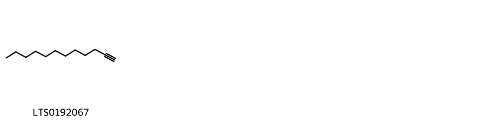
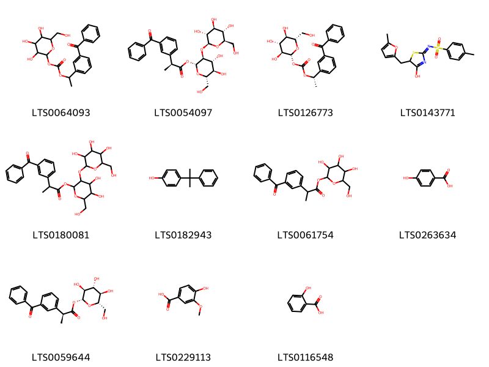
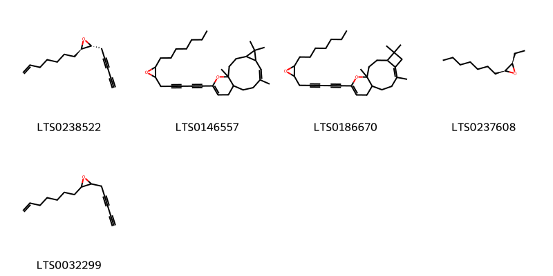
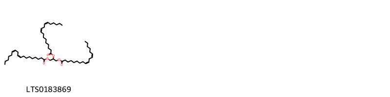
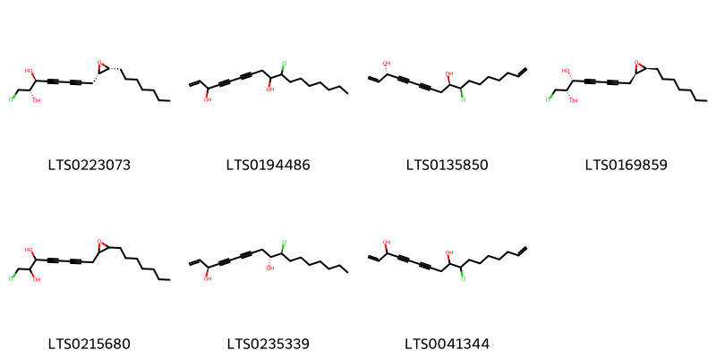
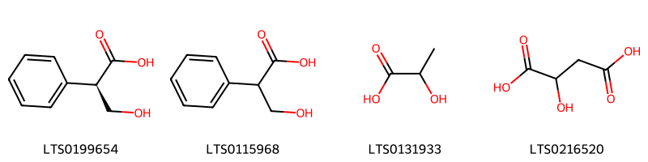
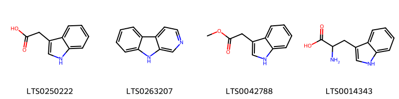
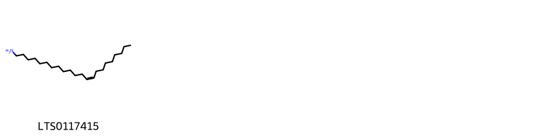
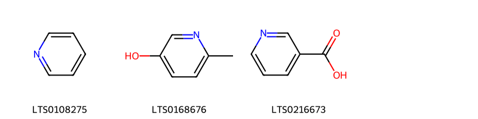
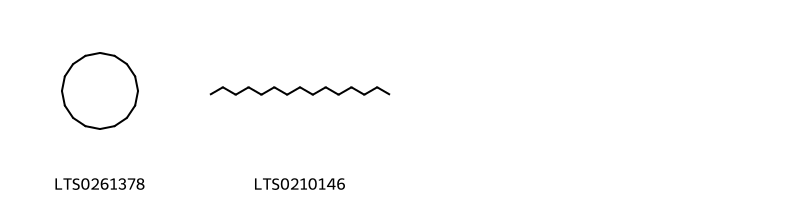

!!! abstract "Tóm tắt"

    Thân rễ và rễ nhân sâm (Rhizoma et Radix Ginseng) là thân rễ và rễ đã phơi hay sấy khô của cây Nhân sâm (Panax ginseng C.A.Mey), thuộc họ Nhân sâm (Araliaceae). Nhân sâm phân bố chủ yếu ở Triều Tiên, Đông Bắc Trung Quốc và Liên Xô cũ, chưa có ở Việt Nam. Theo tài liệu cổ, nhân sâm sẽ có vị ngọt, hơi đắng, tính ôn, vào 2 kinh tỳ và phế. Dược liệu này có tác dụng đại bổ nguyên khí, ích huyết sinh tân, định thần, ích trí, chữa phế hư ho suyễn, tỳ hư tiết tả, vị hư sinh nôn mửa, bệnh lâu ngày khí hư, sợ hãi, tiêu khát. Thành phần hóa học chính thân và rễ nhân sâm của là các Saponin triterpenoid nhóm dammaran, gọi chung là gingsenoid.

## Thông tin về thực vật

Dược liệu **Nhân Sâm (Thân Rễ Và Rễ)** từ bộ phận **Rễ** từ loài *Panax ginseng*.

**Mô tả thực vật:** Cây nhân sâm là một cây sống lâu năm, cao chừng 0,6m. Rễ mẫm thành củ to. Lá mọc vòng có cuống dài, lá kép gồm nhiều lá chét mọc thành hình chân vịt. Nếu cây mới đửa một năm (nghĩa là sau khi gieo được 2 năm) thì cây chỉ có 1 lá với 3 lá chét, nếu cây nhân sâm được 2 năm cũng chỉ có 1 lá với 5 lá chét. Cây nhân sâm 3 năm có 2 lá kép, cây nhân sâm 4 năm có 3 lá kép, cây nhân sâm 5 năm trở lên có 4 đến 5 lá kép, tất cả đều có 5 lá chét (đặc biệt có thể có 6 lá chét) hình trứng, mép lá chét có răng cưa sâu 
Bắt đầu từ năm thứ 3 trở đi, cây nhân sâm mới cho hoa, kết quả. Hoa xuất hiện vào mùa hạ. Cụm hoa hình tán mọc ở đầu cành, hoa màu xanh nhạt, 5 cánh hoa, 5 nhị, bầu hạ 2 núm. Quả mọng hơi dẹt to bằng hạt đậu xanh, khi chín có màu đỏ trong chưa 2 hạt. Hạt cây sâm năm thứ 3 chưa tốt. Thường người ta bấm bỏ đi đợi cây được 4-5 năm mới để ra quả và lấy làm hạt giống

*Tài liệu tham khảo:* "Những cây thuốc và vị thuốc Việt Nam" - Đỗ Tất Lợi 
Trong dược điển Việt nam, một loài được sử dụng làm dược liệu là *Panax ginseng*.

!!! info "Phân loại thực vật của *Panax ginseng*"
    - **Kingdom:** Plantae
    - **Phylum:** Tracheophyta
    - **Order:** Apiales
    - **Family:** Araliaceae
    - **Genus:** Panax
    - **Species:** *Panax ginseng*

**Phân bố trên thế giới:** nan, Benin, United States of America, Philippines, Russian Federation, China, Nigeria, Colombia, Croatia, Hong Kong, United Kingdom of Great Britain and Northern Ireland, Norway, New Zealand, India, Japan, Korea, Republic of, Korea (Democratic People’s Republic of)

**Phân bố tại Việt nam:** Không có ghi nhận ở Việt Nam

## Thông tin về dược liệu 

### Định danh

!!! info "Thông tin về tên gọi"

    - Dược liệu tiếng Việt: nhân sâm
    - Dược liệu tiếng Trung: 人参叶 (Ren Shen Ye)
    - Dược liệu tiếng Anh: Panax Ginseng [Syn. Panax Schinseng]
    - Dược liệu latin thông dụng: Rhizoma et Radix GinsengnRadix Ginseng
    - Dược liệu latin kiểu DĐVN: *rhizoma et radix ginseng*
    - Dược liệu latin kiểu DĐVN: *Radix Ginseng*
    - Dược liệu latin kiểu thông tư: **
    - Bộ phận dùng: Rễ (Rhizoma)

### Mô tả dược liệu 

- **Theo dược điển Việt nam V:** Viên sâm: Sâm trồng, phơi hoặc sấy khô; rễ cái có hình thoi hoặc hình trụ tròn, dài khoảng 3 cm đến 15 cm, đường kính 1 cm đến 2 cm, mặt ngoài màu vàng hơi xám, phần trên hoặc toàn bộ rễ có nếp nhăn dọc rõ, có khía vân ngang, thô, không liên tục, rải rác và nông, phần dưới có 2 đến 3 rễ nhánh và nhiều rễ con nhỏ, dài, thường có mẩu dạng củ nhỏ không rõ. Thân rễ (Lô đầu) sát ở đầu rễ, dài 1 cm đến 4 cm, đường kính 0,3 cm đến 1,5 cm, thường cong và co lại, có rễ phụ (gọi là Đinh) và có vết sẹo thân, tròn, lõm, thưa (gọi là Lô uyển). Chất tương đối cứng, mặt bẻ màu trắng hơi vàng, có tinh bột rõ; tầng phát sinh vòng tròn, màu vàng hơi nâu; vỏ có ống tiết nhựa, dạng điểm, màu vàng nâu và những kẽ nút dạng xuyên tâm. Mùi thơm đặc trưng, vị hơi đắng và ngọt. Hồng sâm: Hấp, sấy và phơi khô rễ viên sâm thu được Hồng sâm. Sơn sâm: Nhân sâm mọc hoang, phơi hay sấy khô. Dược liệu là rễ cái, dài bằng hoặc ngắn hơn thân rễ; có hình chữ V, hình thoi hoặc hình trụ, dài 2 cm đến 10 cm; mặt ngoài màu vàng hơi xám, có vân nhăn dọc, đầu trên có các vòng vân ngang, trũng sâu, dày đặc; thường có 2 rễ nhánh; các rễ con trông rõ ràng, mảnh dẻ, nhỏ sắp xếp có thứ tự; có mấu nổi lên rõ gọi là “mấu hạt trân châu”. Thân rễ mảnh dẻ, nhỏ, dài; bộ phận trên có các vết sẹo thân, dày đặc, các rễ phụ tương đối dày đặc, trông tựa như hình hạt táo.

- **Mô tả dược liệu theo thông tư chế biến dược liệu theo phương pháp cổ truyền:** 

### Chế biến 

- **Chế biến theo dược điển việt nam V**: Thường thu hoạch Nhân sâm vào mùa thu (tháng 9 đến tháng 10), ở những cây trồng từ 4 năm trở lên, rửa sạch, phơi nắng nhẹ, hoặc sấy nhẹ đến khô. Cũng có khi chế bằng cách đồ rồi ép để được hồng sâm. Bào chế Viên sâm: Ủ mềm, thái phiến mỏng, phơi khô. Sơn sâm: Khi dùng tán thành bột hoặc giã nát, hay phân ra thành miếng nhỏ.

- **Chế biến theo thông tư:** 

--- 

## Thành phần hóa học

- Theo tài liệu của GS. Đỗ Tất Lợi:  (1) Theo trang https://lotus.naturalproducts.net/ đã tìm thấy 574 hợp chất hóa học. 
Nhóm hoạt chất chính là Saponin triterpenoid nhóm dammaran gọi chung là ginsenoid. 
- Trong nhân sâm có loại saponin sterolic. Hồn hợp saponin có tên là panaxozit trước đây gọi là panaquilon hay panakilon.
- Chất glucozit hoặc hỗn hợp glucozit mang tên là panaxin cũng chưa được nghiên cứu sâu. Trước đây gọi là gensenin cũng là một loại saponin chưa tinh khiết lắm.
- Ngoài ra còn có một tí tinh dầu 0,055-0,250% làm cho nhân sâm có mùi đặc biệt, trong đó chủ yếu là chất panaxen CH
- Các vitamin B, và B, các mendiataza
- Tro chừng 3-7% trong đó có chừng 53% axit photphoric.
- Các tạp chất khác gồm nhựa và chất béo tổng số chừng 1,5%. Các axit béo gồm hỗn hợp axít panmitic, stearic và linoleic. Hỗn hợp này mang tên axit panaxic.
- Các chất khác gồm có phytosterin 0,029%- tỉnh bột chủng 20%, chất pectin 16-23% và đường 4%..
-  Mới đây người ta lại thấy trong nhân sâm có hàm lượng germanium cao.
(2) Tên hoạt chất là biomarker: ginsenosid Rg1, Re, Rf và Rb1
    

**Thành phần hóa học từ loài **Panax ginseng**

Theo cơ sở dữ liệu lotus, loài *Panax ginseng* đã phân lập và xác định được **574** hoạt chất thuộc về các nhóm Epoxides, Organonitrogen compounds, Fatty Acyls, Phenols, Pyrimidine nucleosides, Carboxylic acids and derivatives, Unsaturated hydrocarbons, Saturated hydrocarbons, Harmala alkaloids, Steroids and steroid derivatives, Flavonoids, Azoles, Halohydrins, Pyridines and derivatives, Diazines, Heteroaromatic compounds, Imidazopyrimidines, Purine nucleosides, Keto acids and derivatives, Benzene and substituted derivatives, Prenol lipids, Pyrans, Organooxygen compounds, Cinnamic acids and derivatives, Hydroxy acids and derivatives, Indoles and derivatives, Glycerolipids trong bảng dưới đây. Danh sách các hoạt chất như sau (2r)-2-(4-{[(2r,3s,4r,5r,6s)-3,4,5-trihydroxy-6-(hydroxymethyl)oxan-2-yl]oxy}phenyl)propanoic acid [(LTS0019227)](https://lotus.naturalproducts.net/compound/lotus_id/LTS0019227), (2s,3r,4s,5s,6r)-2-{[(2s,5s)-2-[(1s,3ar,3br,5ar,7s,9ar,9br,11r,11ar)-11-hydroxy-3a,3b,6,6,9a-pentamethyl-7-{[(2r,3r,4s,5s,6r)-3,4,5-trihydroxy-6-(hydroxymethyl)oxan-2-yl]oxy}-dodecahydro-1h-cyclopenta[a]phenanthren-1-yl]-5-hydroxy-6-methylhept-6-en-2-yl]oxy}-6-(hydroxymethyl)oxane-3,4,5-triol [(LTS0020085)](https://lotus.naturalproducts.net/compound/lotus_id/LTS0020085), (2r,3r,4s,5r,6r)-2-{[(1s,3ar,3br,5s,5ar,7s,9ar,9br,11r,11ar)-7,11-dihydroxy-1-[(2s)-2-methoxy-6-methylhept-5-en-2-yl]-3a,3b,6,6,9a-pentamethyl-dodecahydro-1h-cyclopenta[a]phenanthren-5-yl]oxy}-6-(hydroxymethyl)oxane-3,4,5-triol [(LTS0097116)](https://lotus.naturalproducts.net/compound/lotus_id/LTS0097116), β-eudesmol [(LTS0203280)](https://lotus.naturalproducts.net/compound/lotus_id/LTS0203280), ginsenoside f1 [(LTS0093105)](https://lotus.naturalproducts.net/compound/lotus_id/LTS0093105), (1s,2r,3r,4s,5s,6r)-2,3,4,5,6-pentahydroxycyclohexyl (2r)-2-phenylpropanoate [(LTS0109769)](https://lotus.naturalproducts.net/compound/lotus_id/LTS0109769), 3,4,5-trihydroxy-6-(hydroxymethyl)oxan-2-yl 2-phenylpropanoate [(LTS0264817)](https://lotus.naturalproducts.net/compound/lotus_id/LTS0264817), p-cumylphenol [(LTS0182943)](https://lotus.naturalproducts.net/compound/lotus_id/LTS0182943), methyl 9h-pyrido[3,4-b]indole-1-carboxylate [(LTS0143229)](https://lotus.naturalproducts.net/compound/lotus_id/LTS0143229), para-coumaric acid [(LTS0266252)](https://lotus.naturalproducts.net/compound/lotus_id/LTS0266252), (1r,2r,5r,7s,10r,11r,13r,15r,18r,19s,22r)-15-ethyl-1,2,6,6,10,18-hexamethyl-14,23-dioxahexacyclo[11.8.1.1¹⁵,¹⁸.0²,¹¹.0⁵,¹⁰.0¹⁹,²²]tricosan-7-ol [(LTS0217528)](https://lotus.naturalproducts.net/compound/lotus_id/LTS0217528), humulen-(v1) [(LTS0003681)](https://lotus.naturalproducts.net/compound/lotus_id/LTS0003681), 8-[(2r,3s)-3-heptyloxiran-2-yl]oct-1-en-4,6-diyn-3-ol [(LTS0221341)](https://lotus.naturalproducts.net/compound/lotus_id/LTS0221341), 2-[(4,5-dihydroxy-2-{[11-hydroxy-3a,3b,6,6,9a-pentamethyl-1-(6-methylhepta-2,5-dien-2-yl)-dodecahydro-1h-cyclopenta[a]phenanthren-7-yl]oxy}-6-(hydroxymethyl)oxan-3-yl)oxy]-6-(hydroxymethyl)oxane-3,4,5-triol [(LTS0006660)](https://lotus.naturalproducts.net/compound/lotus_id/LTS0006660), (2as,4ar,8r,8as)-2,2,4a,8-tetramethyl-hexahydro-1h-cyclobuta[d]inden-8-ol [(LTS0010821)](https://lotus.naturalproducts.net/compound/lotus_id/LTS0010821), (2s,3r,4s,5s,6r)-2-{[(2s,5s)-2-[(1s,3ar,3br,5s,5ar,7s,9ar,9br,11r,11ar)-7,11-dihydroxy-3a,3b,6,6,9a-pentamethyl-5-{[(2r,3r,4s,5s,6r)-3,4,5-trihydroxy-6-(hydroxymethyl)oxan-2-yl]oxy}-dodecahydro-1h-cyclopenta[a]phenanthren-1-yl]-5-hydroperoxy-6-methylhept-6-en-2-yl]oxy}-6-(hydroxymethyl)oxane-3,4,5-triol [(LTS0274484)](https://lotus.naturalproducts.net/compound/lotus_id/LTS0274484), falcarinol [(LTS0008327)](https://lotus.naturalproducts.net/compound/lotus_id/LTS0008327), 2,2,4a-trimethyl-8-methylidene-hexahydro-1h-cyclobuta[d]indene [(LTS0010928)](https://lotus.naturalproducts.net/compound/lotus_id/LTS0010928), 3-({6-[(4,5-dihydroxy-2-{[11-hydroxy-3a,3b,6,6,9a-pentamethyl-1-(6-methyl-2-{[3,4,5-trihydroxy-6-(hydroxymethyl)oxan-2-yl]oxy}hept-5-en-2-yl)-dodecahydro-1h-cyclopenta[a]phenanthren-7-yl]oxy}-6-(hydroxymethyl)oxan-3-yl)oxy]-3,4,5-trihydroxyoxan-2-yl}methoxy)-3-oxopropanoic acid [(LTS0204985)](https://lotus.naturalproducts.net/compound/lotus_id/LTS0204985), (1r,3ar,3br,5as,9ar,9bs,11as)-1-[(2r)-2-hydroxy-6-methylhept-5-en-2-yl]-3a,3b,6,6,9a-pentamethyl-dodecahydro-1h-cyclopenta[a]phenanthrene-5,7,11-triol [(LTS0203157)](https://lotus.naturalproducts.net/compound/lotus_id/LTS0203157), 8-[3-(hept-6-en-1-yl)oxiran-2-yl]oct-1-en-4,6-diyn-3-ol [(LTS0026553)](https://lotus.naturalproducts.net/compound/lotus_id/LTS0026553), (2s,3s,4s,5r,6r)-6-{[(6ar,6bs,8as,12ar,14br)-4,4,6a,6b,11,11,14b-heptamethyl-8a-({[(2s,3r,4s,5s,6r)-3,4,5-trihydroxy-6-(hydroxymethyl)oxan-2-yl]oxy}carbonyl)-1,2,3,4a,5,6,7,8,9,10,12,12a,14,14a-tetradecahydropicen-3-yl]oxy}-3,4-dihydroxy-5-{[(2s,3r,4s,5s,6r)-3,4,5-trihydroxy-6-(hydroxymethyl)oxan-2-yl]oxy}oxane-2-carboxylic acid [(LTS0177837)](https://lotus.naturalproducts.net/compound/lotus_id/LTS0177837), 10-hydroperoxyheptadeca-1,8-dien-4,6-diyn-3-ol [(LTS0046187)](https://lotus.naturalproducts.net/compound/lotus_id/LTS0046187), (4-{[(2r,3s,4r,5r,6s)-3,4,5-trihydroxy-6-(hydroxymethyl)oxan-2-yl]oxy}phenyl)acetic acid [(LTS0168343)](https://lotus.naturalproducts.net/compound/lotus_id/LTS0168343), (2s,3r,4s,5s,6r)-2-{[(2s,4e)-2-[(1s,3ar,3br,5s,5ar,7s,9ar,9br,11r,11ar)-5,7,11-trihydroxy-3a,3b,6,6,9a-pentamethyl-dodecahydro-1h-cyclopenta[a]phenanthren-1-yl]-6-hydroxy-6-methylhept-4-en-2-yl]oxy}-6-(hydroxymethyl)oxane-3,4,5-triol [(LTS0015024)](https://lotus.naturalproducts.net/compound/lotus_id/LTS0015024), behenic acid [(LTS0058784)](https://lotus.naturalproducts.net/compound/lotus_id/LTS0058784), 2,2,4a,8-tetramethyl-1h,2ah,3h,4h,5h,6h-cyclobuta[d]indene [(LTS0271131)](https://lotus.naturalproducts.net/compound/lotus_id/LTS0271131), 4,4,8-trimethyltricyclo[6.3.1.0²,⁵]dodecane-1,9-diol [(LTS0217165)](https://lotus.naturalproducts.net/compound/lotus_id/LTS0217165), (2s,3r,4s,5s,6r)-2-{[(2s,4e)-2-[(1s,3ar,3br,5ar,7s,9ar,9br,11r,11ar)-7-{[(2r,3r,4s,5s,6r)-4,5-dihydroxy-6-(hydroxymethyl)-3-{[(2s,3r,4s,5s,6r)-3,4,5-trihydroxy-6-(hydroxymethyl)oxan-2-yl]oxy}oxan-2-yl]oxy}-11-hydroxy-3a,3b,6,6,9a-pentamethyl-dodecahydro-1h-cyclopenta[a]phenanthren-1-yl]-6-hydroperoxy-6-methylhept-4-en-2-yl]oxy}-6-({[(2r,3r,4s,5r)-3,4-dihydroxy-5-(hydroxymethyl)oxolan-2-yl]oxy}methyl)oxane-3,4,5-triol [(LTS0057932)](https://lotus.naturalproducts.net/compound/lotus_id/LTS0057932), (3s,8e,10r)-10-hydroperoxyheptadeca-1,8-dien-4,6-diyn-3-ol [(LTS0232927)](https://lotus.naturalproducts.net/compound/lotus_id/LTS0232927), 2-methylpyrazine [(LTS0117714)](https://lotus.naturalproducts.net/compound/lotus_id/LTS0117714), 2-{[2-(7-{[4,5-dihydroxy-6-(hydroxymethyl)-3-{[3,4,5-trihydroxy-6-(hydroxymethyl)oxan-2-yl]oxy}oxan-2-yl]oxy}-11-hydroxy-3a,3b,6,6,9a-pentamethyl-dodecahydro-1h-cyclopenta[a]phenanthren-1-yl)-6-methylhept-5-en-2-yl]oxy}-6-{[(3,4,5-trihydroxyoxan-2-yl)oxy]methyl}oxane-3,4,5-triol [(LTS0212386)](https://lotus.naturalproducts.net/compound/lotus_id/LTS0212386), (2r,3s,4r,5r,6s)-2-{[(2s)-2-[(1s,3ar,3br,5ar,7s,9ar,9br,11r,11ar)-7-{[(2r,3r,4s,5s,6r)-4,5-dihydroxy-6-(hydroxymethyl)-3-{[(2s,3r,4s,5s,6r)-3,4,5-trihydroxy-6-(hydroxymethyl)oxan-2-yl]oxy}oxan-2-yl]oxy}-11-hydroxy-3a,3b,6,6,9a-pentamethyl-dodecahydro-1h-cyclopenta[a]phenanthren-1-yl]-6-methylhept-5-en-2-yl]oxy}-6-(hydroxymethyl)oxane-3,4,5-triol [(LTS0268135)](https://lotus.naturalproducts.net/compound/lotus_id/LTS0268135), 2,4,5-trihydroxy-6-(hydroxymethyl)oxan-3-yl 3-hydroxy-2-phenylpropanoate [(LTS0014686)](https://lotus.naturalproducts.net/compound/lotus_id/LTS0014686), [(2r,3s,4s,5r,6s)-6-{[(2r,3r,4s,5s,6r)-2-{[(1s,3ar,3br,5ar,7s,9ar,9br,11r,11ar)-11-hydroxy-3a,3b,6,6,9a-pentamethyl-1-[(2z)-6-methylhepta-2,5-dien-2-yl]-dodecahydro-1h-cyclopenta[a]phenanthren-7-yl]oxy}-4,5-dihydroxy-6-(hydroxymethyl)oxan-3-yl]oxy}-3,4,5-trihydroxyoxan-2-yl]methyl acetate [(LTS0155395)](https://lotus.naturalproducts.net/compound/lotus_id/LTS0155395), 4,7,7,11-tetramethyltricyclo[6.3.0.0¹,⁵]undec-4-ene [(LTS0231346)](https://lotus.naturalproducts.net/compound/lotus_id/LTS0231346), (2s,3r,4s,5s,6r)-2-{[(2s)-2-[(1s,3ar,3br,5s,5ar,7s,9ar,9br,11r,11ar)-7-{[(2r,3r,4s,5s,6r)-4,5-dihydroxy-6-(hydroxymethyl)-3-{[(2s,3r,4s,5s,6r)-3,4,5-trihydroxy-6-(hydroxymethyl)oxan-2-yl]oxy}oxan-2-yl]oxy}-5,11-dihydroxy-3a,3b,6,6,9a-pentamethyl-dodecahydro-1h-cyclopenta[a]phenanthren-1-yl]-6-methylhept-5-en-2-yl]oxy}-6-({[(2s,3r,4s,5s)-3,4,5-trihydroxyoxan-2-yl]oxy}methyl)oxane-3,4,5-triol [(LTS0264644)](https://lotus.naturalproducts.net/compound/lotus_id/LTS0264644), (2s,3r,4s,5s,6r)-2-{[(2s,5r)-2-[(1s,3ar,3br,5ar,7s,9ar,9br,11r,11ar)-7,11-dihydroxy-3a,3b,6,6,9a-pentamethyl-dodecahydro-1h-cyclopenta[a]phenanthren-1-yl]-5,6-dihydroxy-6-methylheptan-2-yl]oxy}-6-(hydroxymethyl)oxane-3,4,5-triol [(LTS0250910)](https://lotus.naturalproducts.net/compound/lotus_id/LTS0250910), (1s,3ar,3br,5s,5ar,7s,9ar,9br,11r,11ar)-3a,3b,6,6,9a-pentamethyl-1-[(2e)-6-methylhepta-2,5-dien-2-yl]-dodecahydro-1h-cyclopenta[a]phenanthrene-5,7,11-triol [(LTS0112933)](https://lotus.naturalproducts.net/compound/lotus_id/LTS0112933), cyclohexadecane [(LTS0261378)](https://lotus.naturalproducts.net/compound/lotus_id/LTS0261378), furfuryl alcohol [(LTS0110403)](https://lotus.naturalproducts.net/compound/lotus_id/LTS0110403), (3r)-heptadeca-1,9-dien-4,6-diyn-3-ol [(LTS0171953)](https://lotus.naturalproducts.net/compound/lotus_id/LTS0171953), (3s,10s)-panaxydiol [(LTS0223297)](https://lotus.naturalproducts.net/compound/lotus_id/LTS0223297), (2r,3r,4s,5s,6r)-2-{[(1s,3ar,3br,5s,5ar,7s,9ar,9br,11r,11ar)-7,11-dihydroxy-1-[(2s)-2-hydroxy-6-methylhept-5-en-2-yl]-3a,3b,6,6,9a-pentamethyl-dodecahydro-1h-cyclopenta[a]phenanthren-5-yl]oxy}-6-({[(2s,3r,4s,5s)-3,4,5-trihydroxyoxan-2-yl]oxy}methyl)oxane-3,4,5-triol [(LTS0218441)](https://lotus.naturalproducts.net/compound/lotus_id/LTS0218441), (2r,4s)-4-[(1s,3ar,3br,5ar,7s,9ar,9br,11r,11ar)-7-{[(2r,3r,4s,5s,6r)-4,5-dihydroxy-6-(hydroxymethyl)-3-{[(2s,3r,4s,5s,6r)-3,4,5-trihydroxy-6-(hydroxymethyl)oxan-2-yl]oxy}oxan-2-yl]oxy}-11-hydroxy-3a,3b,6,6,9a-pentamethyl-dodecahydro-1h-cyclopenta[a]phenanthren-1-yl]-2-hydroxy-4-{[(2s,3r,4s,5s,6r)-3,4,5-trihydroxy-6-(hydroxymethyl)oxan-2-yl]oxy}pentanal [(LTS0152168)](https://lotus.naturalproducts.net/compound/lotus_id/LTS0152168), l-aspartic acid [(LTS0205466)](https://lotus.naturalproducts.net/compound/lotus_id/LTS0205466), heptadec-1-en-4,6-diyne-3,9-diol [(LTS0147808)](https://lotus.naturalproducts.net/compound/lotus_id/LTS0147808), (3s,9r,10s)-heptadec-1-en-4,6-diyne-3,9,10-triol [(LTS0159943)](https://lotus.naturalproducts.net/compound/lotus_id/LTS0159943), (2s,3r,4s,5s,6r)-2-{[(2s,3r,4r,5r,6s)-2-{[(1s,3ar,3br,5s,5ar,7s,9ar,9br,11r,11ar)-7,11-dihydroxy-3a,3b,6,6,9a-pentamethyl-1-[(2e)-6-methylhepta-2,5-dien-2-yl]-dodecahydro-1h-cyclopenta[a]phenanthren-5-yl]oxy}-4,5-dihydroxy-6-methyloxan-3-yl]oxy}-6-(hydroxymethyl)oxane-3,4,5-triol [(LTS0199782)](https://lotus.naturalproducts.net/compound/lotus_id/LTS0199782), 3-ethyl-1,2-cyclopentanedione [(LTS0005037)](https://lotus.naturalproducts.net/compound/lotus_id/LTS0005037), (3r,3as,5ar,5br,7ar,9s,11ar,11br,13ar,13bs)-5a,5b,8,8,11a,13b-hexamethyl-3-(prop-1-en-2-yl)-hexadecahydrocyclopenta[a]chrysen-9-ol [(LTS0060154)](https://lotus.naturalproducts.net/compound/lotus_id/LTS0060154), 2-({2-[(3bs,7r,9as,11s,11as)-7,11-dihydroxy-3a,3b,6,6,9a-pentamethyl-5-{[3,4,5-trihydroxy-6-(hydroxymethyl)oxan-2-yl]oxy}-dodecahydro-1h-cyclopenta[a]phenanthren-1-yl]-6-methylhept-5-en-2-yl}oxy)-6-(hydroxymethyl)oxane-3,4,5-triol; 2-[(2-{[(1r,3bs,7r,9as,11s,11as)-7,11-dihydroxy-1-[5-(2-hydroxypropan-2-yl)-2-methyloxolan-2-yl]-3a,3b,6,6,9a-pentamethyl-dodecahydro-1h-cyclopenta[a]phenanthren-5-yl]oxy}-4,5-dihydroxy-6-(hydroxymethyl)oxan-3-yl)oxy]-6-methyloxane-3,4,5-triol [(LTS0261901)](https://lotus.naturalproducts.net/compound/lotus_id/LTS0261901), (2s,3r,4s,5s,6r)-2-{[(2s)-2-[(1s,3ar,3br,5s,5ar,7s,9ar,9br,11r,11ar)-5-{[(2r,3r,4s,5s,6r)-4,5-dihydroxy-6-(hydroxymethyl)-3-{[(2s,3r,4r,5r,6s)-3,4,5-trihydroxy-6-methyloxan-2-yl]oxy}oxan-2-yl]oxy}-7,11-dihydroxy-3a,3b,6,6,9a-pentamethyl-dodecahydro-1h-cyclopenta[a]phenanthren-1-yl]-6-methylhept-5-en-2-yl]oxy}-6-({[(2r,3s,4s,5r)-3,4-dihydroxy-5-(hydroxymethyl)oxolan-2-yl]oxy}methyl)oxane-3,4,5-triol [(LTS0196069)](https://lotus.naturalproducts.net/compound/lotus_id/LTS0196069), (2r,3r,4r,5s,6s)-6-(hydroxymethyl)-5-{[(2r,3r,4s,5r,6r)-3,4,5-trihydroxy-6-(hydroxymethyl)oxan-2-yl]oxy}oxane-2,3,4-triol [(LTS0220516)](https://lotus.naturalproducts.net/compound/lotus_id/LTS0220516), (2s,3r,4s,5s,6r)-2-{[(2s)-2-[(1s,3ar,3br,5s,5ar,7s,9ar,9br,11r,11ar)-5-{[(2r,3r,4s,5s,6r)-4,5-dihydroxy-6-(hydroxymethyl)-3-{[(2s,3r,4r,5r,6s)-3,4,5-trihydroxy-6-methyloxan-2-yl]oxy}oxan-2-yl]oxy}-7,11-dihydroxy-3a,3b,6,6,9a-pentamethyl-dodecahydro-1h-cyclopenta[a]phenanthren-1-yl]-6-methylhept-5-en-2-yl]oxy}-6-({[(2s,3s,4s,5s)-3,4,5-trihydroxyoxan-2-yl]oxy}methyl)oxane-3,4,5-triol [(LTS0011125)](https://lotus.naturalproducts.net/compound/lotus_id/LTS0011125), (2s,3r,4r,5r,6s)-2-{[(2r,3s,4s,5s,6r)-2-{[(1s,3ar,3br,5s,5ar,7s,9ar,9br,11r,11ar)-7,11-dihydroxy-1-[(2r)-2-hydroxy-6-methylhept-5-en-2-yl]-3a,3b,6,6,9a-pentamethyl-dodecahydro-1h-cyclopenta[a]phenanthren-5-yl]oxy}-4,5-dihydroxy-6-(hydroxymethyl)oxan-3-yl]oxy}-6-methyloxane-3,4,5-triol [(LTS0275665)](https://lotus.naturalproducts.net/compound/lotus_id/LTS0275665), methylcyclopentenolone [(LTS0237850)](https://lotus.naturalproducts.net/compound/lotus_id/LTS0237850), panaxydol [(LTS0186202)](https://lotus.naturalproducts.net/compound/lotus_id/LTS0186202), heptadeca-4,6-diyne-3,9,10-triol [(LTS0268069)](https://lotus.naturalproducts.net/compound/lotus_id/LTS0268069), d-cystine [(LTS0177923)](https://lotus.naturalproducts.net/compound/lotus_id/LTS0177923), (1s,8s,11r)-4,7,7,11-tetramethyltricyclo[6.3.0.0¹,⁵]undec-4-ene [(LTS0104108)](https://lotus.naturalproducts.net/compound/lotus_id/LTS0104108), (2r,3s)-2-ethyl-3-heptyloxirane [(LTS0237608)](https://lotus.naturalproducts.net/compound/lotus_id/LTS0237608), 1,4a-dimethyl-7-(prop-1-en-2-yl)-octahydronaphthalen-1-ol [(LTS0000681)](https://lotus.naturalproducts.net/compound/lotus_id/LTS0000681), α,α'-trehalose [(LTS0256842)](https://lotus.naturalproducts.net/compound/lotus_id/LTS0256842), 3,4,5-trihydroxy-6-(hydroxymethyl)oxan-2-yl 2-(3-benzoylphenyl)propanoate [(LTS0061754)](https://lotus.naturalproducts.net/compound/lotus_id/LTS0061754), 2-{[7,11-dihydroxy-3a,3b,6,6,9a-pentamethyl-1-(6-methylhepta-1,5-dien-2-yl)-dodecahydro-1h-cyclopenta[a]phenanthren-5-yl]oxy}-6-(hydroxymethyl)oxane-3,4,5-triol [(LTS0270734)](https://lotus.naturalproducts.net/compound/lotus_id/LTS0270734), trifolin [(LTS0237581)](https://lotus.naturalproducts.net/compound/lotus_id/LTS0237581), (2s,3r)-1-chloro-8-[(2r,3s)-3-heptyloxiran-2-yl]octa-4,6-diyne-2,3-diol [(LTS0169859)](https://lotus.naturalproducts.net/compound/lotus_id/LTS0169859), 5-methylfurfural [(LTS0186625)](https://lotus.naturalproducts.net/compound/lotus_id/LTS0186625), protopanaxatriol [(LTS0087865)](https://lotus.naturalproducts.net/compound/lotus_id/LTS0087865), arginine [(LTS0017879)](https://lotus.naturalproducts.net/compound/lotus_id/LTS0017879), 4-(7-{[4,5-dihydroxy-6-(hydroxymethyl)-3-{[3,4,5-trihydroxy-6-(hydroxymethyl)oxan-2-yl]oxy}oxan-2-yl]oxy}-11-hydroxy-3a,3b,6,6,9a-pentamethyl-dodecahydro-1h-cyclopenta[a]phenanthren-1-yl)-4-{[3,4,5-trihydroxy-6-(hydroxymethyl)oxan-2-yl]oxy}pentanal [(LTS0170390)](https://lotus.naturalproducts.net/compound/lotus_id/LTS0170390), stearolic acid [(LTS0248047)](https://lotus.naturalproducts.net/compound/lotus_id/LTS0248047), sitogluside [(LTS0201798)](https://lotus.naturalproducts.net/compound/lotus_id/LTS0201798), 8-(3-heptyloxiran-2-yl)octa-4,6-diyn-3-ol [(LTS0140675)](https://lotus.naturalproducts.net/compound/lotus_id/LTS0140675), (1s,3as,3br,5ar,7s,9ar,9br,11r,11ar)-1-[(2r)-2-hydroxy-6-methylhept-5-en-2-yl]-3a,3b,6,6,9a-pentamethyl-dodecahydro-1h-cyclopenta[a]phenanthrene-7,11-diol [(LTS0058946)](https://lotus.naturalproducts.net/compound/lotus_id/LTS0058946), (1s,3ar,3br,5ar,7s,9ar,9br,11r,11ar)-1-[(1s)-1,5-dimethoxy-5-methylhexyl]-3a,3b,6,6,9a-pentamethyl-dodecahydro-1h-cyclopenta[a]phenanthrene-7,11-diol [(LTS0157610)](https://lotus.naturalproducts.net/compound/lotus_id/LTS0157610), fucosterol [(LTS0178887)](https://lotus.naturalproducts.net/compound/lotus_id/LTS0178887), cycloeucalenol [(LTS0125739)](https://lotus.naturalproducts.net/compound/lotus_id/LTS0125739), 5,11-dihydroxy-1-(2-hydroxy-6-methylhept-5-en-2-yl)-3a,3b,6,6,9a-pentamethyl-dodecahydrocyclopenta[a]phenanthren-7-one [(LTS0202281)](https://lotus.naturalproducts.net/compound/lotus_id/LTS0202281), 8-[(2r,3s)-3-heptyloxiran-2-yl]oct-1-en-4,6-diyn-3-one [(LTS0231268)](https://lotus.naturalproducts.net/compound/lotus_id/LTS0231268), 2-{[2-(11-hydroxy-3a,3b,6,6,9a-pentamethyl-7-{[3,4,5-trihydroxy-6-(hydroxymethyl)oxan-2-yl]oxy}-dodecahydro-1h-cyclopenta[a]phenanthren-1-yl)-6-methylhept-5-en-2-yl]oxy}-6-({[3,4,5-trihydroxy-6-(hydroxymethyl)oxan-2-yl]oxy}methyl)oxane-3,4,5-triol [(LTS0171790)](https://lotus.naturalproducts.net/compound/lotus_id/LTS0171790), (2r,3s,4r,5r,6s)-3,4,5-trihydroxy-6-(hydroxymethyl)oxan-2-yl (2r)-2-(4-hydroxyphenyl)propanoate [(LTS0169053)](https://lotus.naturalproducts.net/compound/lotus_id/LTS0169053), keto-d-fructose [(LTS0241114)](https://lotus.naturalproducts.net/compound/lotus_id/LTS0241114), 2-methoxy-5-methyl-3-(sec-butyl)pyrazine [(LTS0211498)](https://lotus.naturalproducts.net/compound/lotus_id/LTS0211498), [(2r,3s,4s,5r,6s)-6-{[(2s)-2-[(1s,3ar,3br,5s,5ar,7s,9ar,9br,11r,11ar)-5-{[(2r,3r,4s,5s,6r)-4,5-dihydroxy-6-(hydroxymethyl)-3-{[(2s,3r,4r,5r,6s)-3,4,5-trihydroxy-6-methyloxan-2-yl]oxy}oxan-2-yl]oxy}-7,11-dihydroxy-3a,3b,6,6,9a-pentamethyl-dodecahydro-1h-cyclopenta[a]phenanthren-1-yl]-6-methylhept-5-en-2-yl]oxy}-3,4,5-trihydroxyoxan-2-yl]methyl acetate [(LTS0153262)](https://lotus.naturalproducts.net/compound/lotus_id/LTS0153262), (2r,3r)-2-(hept-6-en-1-yl)-3-(penta-2,4-diyn-1-yl)oxirane [(LTS0238522)](https://lotus.naturalproducts.net/compound/lotus_id/LTS0238522), methyl indole-3-acetate [(LTS0042788)](https://lotus.naturalproducts.net/compound/lotus_id/LTS0042788), ligustrazine [(LTS0230758)](https://lotus.naturalproducts.net/compound/lotus_id/LTS0230758), caryophyllene [(LTS0131870)](https://lotus.naturalproducts.net/compound/lotus_id/LTS0131870), 2-{[2-(7,11-dihydroxy-3a,3b,6,6,9a-pentamethyl-5-{[3,4,5-trihydroxy-6-(hydroxymethyl)oxan-2-yl]oxy}-dodecahydro-1h-cyclopenta[a]phenanthren-1-yl)-5-hydroperoxy-6-methylhept-6-en-2-yl]oxy}-6-(hydroxymethyl)oxane-3,4,5-triol [(LTS0033120)](https://lotus.naturalproducts.net/compound/lotus_id/LTS0033120), 8-(3-heptyloxiran-2-yl)octa-4,6-diyn-3-yl acetate [(LTS0094989)](https://lotus.naturalproducts.net/compound/lotus_id/LTS0094989), (2s,3r,4r,5r,6s)-2-{[(2r,3r,4s,5s,6r)-2-{[(1s,3ar,3br,5s,5ar,7s,9ar,9br,11r,11ar)-7,11-dihydroxy-3a,3b,6,6,9a-pentamethyl-1-[(2e)-6-methylhepta-2,5-dien-2-yl]-dodecahydro-1h-cyclopenta[a]phenanthren-5-yl]oxy}-4,5-dihydroxy-6-(hydroxymethyl)oxan-3-yl]oxy}-6-methyloxane-3,4,5-triol [(LTS0066390)](https://lotus.naturalproducts.net/compound/lotus_id/LTS0066390), niacin [(LTS0216673)](https://lotus.naturalproducts.net/compound/lotus_id/LTS0216673), 2-(hydroxymethyl)-6-[(6-methyl-2-{5,7,11-trihydroxy-3a,3b,6,6,9a-pentamethyl-dodecahydro-1h-cyclopenta[a]phenanthren-1-yl}hept-5-en-2-yl)oxy]oxane-3,4,5-triol [(LTS0097966)](https://lotus.naturalproducts.net/compound/lotus_id/LTS0097966), 2-[(4,5-dihydroxy-2-{[11-hydroxy-1-(2-hydroxy-6-methylhept-5-en-2-yl)-3a,3b,6,6,9a-pentamethyl-dodecahydro-1h-cyclopenta[a]phenanthren-7-yl]oxy}-6-(hydroxymethyl)oxan-3-yl)oxy]-6-(hydroxymethyl)oxane-3,4,5-triol [(LTS0020316)](https://lotus.naturalproducts.net/compound/lotus_id/LTS0020316), 2-{[7,11-dihydroxy-1-(2-hydroxy-6-methylhept-5-en-2-yl)-3a,3b,6,6,9a-pentamethyl-dodecahydro-1h-cyclopenta[a]phenanthren-5-yl]oxy}-6-{[(3,4,5-trihydroxyoxan-2-yl)oxy]methyl}oxane-3,4,5-triol [(LTS0106629)](https://lotus.naturalproducts.net/compound/lotus_id/LTS0106629), proline [(LTS0112491)](https://lotus.naturalproducts.net/compound/lotus_id/LTS0112491), (1s,3ar,3br,5ar,7s,9ar,9br,11r,11ar)-1-[(1r)-1-hydroxy-5-methoxy-5-methylhexyl]-3a,3b,6,6,9a-pentamethyl-dodecahydro-1h-cyclopenta[a]phenanthrene-7,11-diol [(LTS0079819)](https://lotus.naturalproducts.net/compound/lotus_id/LTS0079819), (2s,3r,4s,5s,6r)-2-{[(2s)-2-[(1s,3ar,3br,5s,5ar,7s,9ar,9br,11r,11ar)-5-{[(2r,3r,4s,5s,6r)-4,5-dihydroxy-6-(hydroxymethyl)-3-{[(2s,3r,4r,5r,6s)-3,4,5-trihydroxy-6-methyloxan-2-yl]oxy}oxan-2-yl]oxy}-7,11-dihydroxy-3a,3b,6,6,9a-pentamethyl-dodecahydro-1h-cyclopenta[a]phenanthren-1-yl]-6-methylhept-5-en-2-yl]oxy}-6-({[(2r,3r,4r,5r)-3,4-dihydroxy-5-(hydroxymethyl)oxolan-2-yl]oxy}methyl)oxane-3,4,5-triol [(LTS0113853)](https://lotus.naturalproducts.net/compound/lotus_id/LTS0113853), (3r,4e,9z)-heptadeca-1,4,9-trien-6-yn-3-ol [(LTS0208300)](https://lotus.naturalproducts.net/compound/lotus_id/LTS0208300), (2s,3r,4r,5r,6s)-2-{[(2r,3s,4s,5s,6r)-2-{[(1s,3ar,3br,5s,5ar,7s,9ar,9br,11r,11ar)-7,11-dihydroxy-1-[(2s)-2-hydroxy-6-methylhept-5-en-2-yl]-3a,3b,6,6,9a-pentamethyl-dodecahydro-1h-cyclopenta[a]phenanthren-5-yl]oxy}-4,5-dihydroxy-6-(hydroxymethyl)oxan-3-yl]oxy}-6-methyloxane-3,4,5-triol [(LTS0250118)](https://lotus.naturalproducts.net/compound/lotus_id/LTS0250118), 2-{[2-(11-hydroxy-3a,3b,6,6,9a-pentamethyl-7-{[3,4,5-trihydroxy-6-(hydroxymethyl)oxan-2-yl]oxy}-dodecahydro-1h-cyclopenta[a]phenanthren-1-yl)-6-methylhept-5-en-2-yl]oxy}-6-(hydroxymethyl)oxane-3,4,5-triol [(LTS0049150)](https://lotus.naturalproducts.net/compound/lotus_id/LTS0049150), (13z)-docos-13-en-1-amine [(LTS0117415)](https://lotus.naturalproducts.net/compound/lotus_id/LTS0117415), (1r,4r)-1,4-dimethyl-7-(propan-2-ylidene)-2,3,4,5,6,8-hexahydro-1h-azulene [(LTS0051175)](https://lotus.naturalproducts.net/compound/lotus_id/LTS0051175), β-amyrin [(LTS0251864)](https://lotus.naturalproducts.net/compound/lotus_id/LTS0251864), (1s,3ar,3br,5ar,7s,9ar,9br)-1-(2-hydroxy-6-methylhept-5-en-2-yl)-3a,3b,6,6,9a-pentamethyl-dodecahydro-1h-cyclopenta[a]phenanthren-7-ol [(LTS0162594)](https://lotus.naturalproducts.net/compound/lotus_id/LTS0162594), 2-[(7-hydroxy-6-methyl-2-{5,7,11-trihydroxy-3a,3b,6,6,9a-pentamethyl-dodecahydro-1h-cyclopenta[a]phenanthren-1-yl}hept-5-en-2-yl)oxy]-6-(hydroxymethyl)oxane-3,4,5-triol [(LTS0084758)](https://lotus.naturalproducts.net/compound/lotus_id/LTS0084758), oleanolic acid [(LTS0117717)](https://lotus.naturalproducts.net/compound/lotus_id/LTS0117717), 2-[(5-hydroperoxy-6-methyl-2-{5,7,11-trihydroxy-3a,3b,6,6,9a-pentamethyl-dodecahydro-1h-cyclopenta[a]phenanthren-1-yl}hept-6-en-2-yl)oxy]-6-{[(3,4,5-trihydroxyoxan-2-yl)oxy]methyl}oxane-3,4,5-triol [(LTS0204099)](https://lotus.naturalproducts.net/compound/lotus_id/LTS0204099), (2r,3s,4r,5r,6s)-2-{[(2s)-2-[(1s,3ar,3br,5ar,7s,9ar,9br,11r,11ar)-7-{[(2r,3r,4s,5s,6r)-4,5-dihydroxy-6-(hydroxymethyl)-3-{[(2s,3r,4s,5s,6r)-3,4,5-trihydroxy-6-(hydroxymethyl)oxan-2-yl]oxy}oxan-2-yl]oxy}-11-hydroxy-3a,3b,6,6,9a-pentamethyl-dodecahydro-1h-cyclopenta[a]phenanthren-1-yl]-6-methylhept-5-en-2-yl]oxy}-6-({[(2r,3r,4s,5s)-3,4,5-trihydroxyoxan-2-yl]oxy}methyl)oxane-3,4,5-triol [(LTS0201391)](https://lotus.naturalproducts.net/compound/lotus_id/LTS0201391), (2s,3r,4s,5s,6r)-2-{[(2s,3r,4s,5s,6r)-2-{[(2r)-2-[(5z)-hept-5-en-1,3-diyn-1-yl]oxolan-2-yl]oxy}-4,5-dihydroxy-6-(hydroxymethyl)oxan-3-yl]oxy}-6-(hydroxymethyl)oxane-3,4,5-triol [(LTS0172432)](https://lotus.naturalproducts.net/compound/lotus_id/LTS0172432), (2s,3r,4s,5s,6r)-2-{[(2s)-2-[(1s,3ar,3br,5s,5ar,7s,9ar,9br,11r,11ar)-5,7,11-trihydroxy-3a,3b,6,6,9a-pentamethyl-dodecahydro-1h-cyclopenta[a]phenanthren-1-yl]-6-methylhept-6-en-2-yl]oxy}-6-(hydroxymethyl)oxane-3,4,5-triol [(LTS0016410)](https://lotus.naturalproducts.net/compound/lotus_id/LTS0016410), (2s,3r,4s,5s,6r)-2-{[(2s)-2-[(1s,3ar,3br,5r,5ar,7r,9ar,9br,11s,11ar)-5-{[(2r,3r,4s,5s,6r)-4,5-dihydroxy-6-(hydroxymethyl)-3-{[(2s,3r,4r,5r,6s)-3,4,5-trihydroxy-6-methyloxan-2-yl]oxy}oxan-2-yl]oxy}-7,11-dihydroxy-3a,3b,6,6,9a-pentamethyl-dodecahydro-1h-cyclopenta[a]phenanthren-1-yl]-6-methylhept-5-en-2-yl]oxy}-6-(hydroxymethyl)oxane-3,4,5-triol [(LTS0182490)](https://lotus.naturalproducts.net/compound/lotus_id/LTS0182490), (2s,3r,4s,5s,6r)-2-{[(2s)-2-[(1s,3ar,3br,5s,5ar,7s,9ar,9br,11r,11ar)-5,7,11-trihydroxy-3a,3b,6,6,9a-pentamethyl-dodecahydro-1h-cyclopenta[a]phenanthren-1-yl]-6-methylhept-5-en-2-yl]oxy}-6-({[(2s,3r,4s,5s)-3,4,5-trihydroxyoxan-2-yl]oxy}methyl)oxane-3,4,5-triol [(LTS0131250)](https://lotus.naturalproducts.net/compound/lotus_id/LTS0131250), (2as,4ar,8r)-2,2,4a,8-tetramethyl-hexahydro-1h-cyclobuta[d]inden-8-ol [(LTS0099035)](https://lotus.naturalproducts.net/compound/lotus_id/LTS0099035), 3-({6-[(4,5-dihydroxy-2-{[11-hydroxy-3a,3b,6,6,9a-pentamethyl-1-(6-methyl-2-{[3,4,5-trihydroxy-6-({[3,4,5-trihydroxy-6-(hydroxymethyl)oxan-2-yl]oxy}methyl)oxan-2-yl]oxy}hept-5-en-2-yl)-dodecahydro-1h-cyclopenta[a]phenanthren-7-yl]oxy}-6-(hydroxymethyl)oxan-3-yl)oxy]-3,4,5-trihydroxyoxan-2-yl}methoxy)-3-oxopropanoic acid [(LTS0262064)](https://lotus.naturalproducts.net/compound/lotus_id/LTS0262064), (+)-tropic acid [(LTS0199654)](https://lotus.naturalproducts.net/compound/lotus_id/LTS0199654), (2s,3r,4s,5s,6r)-2-{[(2s)-2-[(1s,3ar,3br,5ar,7s,9ar,9br,11r,11as)-7-{[(2r,3r,4s,5s,6r)-4,5-dihydroxy-6-(hydroxymethyl)-3-{[(2s,3r,4s,5s,6r)-3,4,5-trihydroxy-6-(hydroxymethyl)oxan-2-yl]oxy}oxan-2-yl]oxy}-11-hydroxy-3a,3b,6,6,9a-pentamethyl-dodecahydro-1h-cyclopenta[a]phenanthren-1-yl]-6-methylhept-5-en-2-yl]oxy}-6-({[(2s,3r,4s,5r)-3,4,5-trihydroxyoxan-2-yl]oxy}methyl)oxane-3,4,5-triol [(LTS0080216)](https://lotus.naturalproducts.net/compound/lotus_id/LTS0080216), (2ar,4as,8as)-2,2,4a-trimethyl-8-methylidene-hexahydro-1h-cyclobuta[d]indene [(LTS0049602)](https://lotus.naturalproducts.net/compound/lotus_id/LTS0049602), (2s,3r,4s,5s,6r)-2-{[(2s)-2-[(1s,3ar,3br,5ar,7s,9ar,9br,11r,11as)-7-{[(2r,3r,4s,5s,6r)-4,5-dihydroxy-6-(hydroxymethyl)-3-{[(2s,3r,4s,5s,6r)-3,4,5-trihydroxy-6-(hydroxymethyl)oxan-2-yl]oxy}oxan-2-yl]oxy}-11-hydroxy-3a,3b,6,6,9a-pentamethyl-dodecahydro-1h-cyclopenta[a]phenanthren-1-yl]-6-methylhept-5-en-2-yl]oxy}-6-({[(2s,3r,4s,5s)-3,4,5-trihydroxyoxan-2-yl]oxy}methyl)oxane-3,4,5-triol [(LTS0221382)](https://lotus.naturalproducts.net/compound/lotus_id/LTS0221382), raffinose [(LTS0113066)](https://lotus.naturalproducts.net/compound/lotus_id/LTS0113066), (3br,7s,9ar,11r,11ar)-1-[(2r)-2-hydroxy-6-methylhept-5-en-2-yl]-3a,3b,6,6,9a-pentamethyl-dodecahydro-1h-cyclopenta[a]phenanthrene-5,7,11-triol [(LTS0154279)](https://lotus.naturalproducts.net/compound/lotus_id/LTS0154279), (2s,3r,4s,5s,6r)-2-{[(2s)-2-[(1s,3ar,3br,5s,5ar,7s,9ar,9br,11r,11as)-5-{[(2r,3r,4s,5s,6r)-4,5-dihydroxy-6-(hydroxymethyl)-3-{[(2s,3r,4s,5s,6r)-3,4,5-trihydroxy-6-(hydroxymethyl)oxan-2-yl]oxy}oxan-2-yl]oxy}-7,11-dihydroxy-3a,3b,6,6,9a-pentamethyl-dodecahydro-1h-cyclopenta[a]phenanthren-1-yl]-6-methylhept-5-en-2-yl]oxy}-6-(hydroxymethyl)oxane-3,4,5-triol [(LTS0143884)](https://lotus.naturalproducts.net/compound/lotus_id/LTS0143884), beha [(LTS0142337)](https://lotus.naturalproducts.net/compound/lotus_id/LTS0142337), (20r)-ginsenoside rg3 [(LTS0115294)](https://lotus.naturalproducts.net/compound/lotus_id/LTS0115294), {6-[(4,5-dihydroxy-2-{[11-hydroxy-3a,3b,6,6,9a-pentamethyl-1-(6-methyl-2-{[3,4,5-trihydroxy-6-(hydroxymethyl)oxan-2-yl]oxy}hept-5-en-2-yl)-dodecahydro-1h-cyclopenta[a]phenanthren-7-yl]oxy}-6-(hydroxymethyl)oxan-3-yl)oxy]-3,4,5-trihydroxyoxan-2-yl}methyl acetate [(LTS0172829)](https://lotus.naturalproducts.net/compound/lotus_id/LTS0172829), d-aspartic acid [(LTS0144001)](https://lotus.naturalproducts.net/compound/lotus_id/LTS0144001), 2-({[3,4-dihydroxy-5-(hydroxymethyl)oxolan-2-yl]oxy}methyl)-6-{[2-(11-hydroxy-3a,3b,6,6,9a-pentamethyl-7-{[3,4,5-trihydroxy-6-(hydroxymethyl)oxan-2-yl]oxy}-dodecahydro-1h-cyclopenta[a]phenanthren-1-yl)-6-methylhept-5-en-2-yl]oxy}oxane-3,4,5-triol [(LTS0115092)](https://lotus.naturalproducts.net/compound/lotus_id/LTS0115092), (+)-glucose [(LTS0262158)](https://lotus.naturalproducts.net/compound/lotus_id/LTS0262158), 2-[(2-{[7,11-dihydroxy-1-(2-hydroxy-6-methylhept-5-en-2-yl)-3a,3b,6,6,9a-pentamethyl-dodecahydro-1h-cyclopenta[a]phenanthren-5-yl]oxy}-4,5-dihydroxy-6-(hydroxymethyl)oxan-3-yl)oxy]-6-(hydroxymethyl)oxane-3,4,5-triol [(LTS0048709)](https://lotus.naturalproducts.net/compound/lotus_id/LTS0048709), 2-[(2-{[2-(hept-5-en-1,3-diyn-1-yl)oxolan-2-yl]oxy}-4,5-dihydroxy-6-(hydroxymethyl)oxan-3-yl)oxy]-6-(hydroxymethyl)oxane-3,4,5-triol [(LTS0002960)](https://lotus.naturalproducts.net/compound/lotus_id/LTS0002960), (3s)-8-[(2r,3r)-3-heptyloxiran-2-yl]oct-1-en-4,6-diyn-3-ol [(LTS0171745)](https://lotus.naturalproducts.net/compound/lotus_id/LTS0171745), 1-dodecyne [(LTS0192067)](https://lotus.naturalproducts.net/compound/lotus_id/LTS0192067), β-indole-3-acetic acid [(LTS0250222)](https://lotus.naturalproducts.net/compound/lotus_id/LTS0250222), (1r,7s,9as,11ar)-1-[(5z)-5-isopropylhept-5-en-2-yl]-6,9a,11a-trimethyl-1h,2h,3h,3ah,5h,5ah,6h,7h,8h,9h,9bh,10h,11h-cyclopenta[a]phenanthren-7-ol [(LTS0207040)](https://lotus.naturalproducts.net/compound/lotus_id/LTS0207040), eugenol [(LTS0052342)](https://lotus.naturalproducts.net/compound/lotus_id/LTS0052342), 2-{[1-(6-hydroperoxy-2-hydroxy-6-methylhept-4-en-2-yl)-7,11-dihydroxy-3a,3b,6,6,9a-pentamethyl-dodecahydro-1h-cyclopenta[a]phenanthren-5-yl]oxy}-6-(hydroxymethyl)oxane-3,4,5-triol [(LTS0124376)](https://lotus.naturalproducts.net/compound/lotus_id/LTS0124376), 2-(4-{[3,4,5-trihydroxy-6-(hydroxymethyl)oxan-2-yl]oxy}phenyl)propanoic acid [(LTS0204980)](https://lotus.naturalproducts.net/compound/lotus_id/LTS0204980), (1s,4r,5r,7r)-4,11,11-trimethyl-10-methylidenetricyclo[5.3.1.0¹,⁵]undecane [(LTS0237651)](https://lotus.naturalproducts.net/compound/lotus_id/LTS0237651), 8-[3-(hept-6-en-1-yl)oxiran-2-yl]octa-4,6-diyn-3-yl acetate [(LTS0181916)](https://lotus.naturalproducts.net/compound/lotus_id/LTS0181916), 2-[(5-hydroperoxy-6-methyl-2-{5,7,11-trihydroxy-3a,3b,6,6,9a-pentamethyl-dodecahydro-1h-cyclopenta[a]phenanthren-1-yl}hept-6-en-2-yl)oxy]-6-(hydroxymethyl)oxane-3,4,5-triol [(LTS0233206)](https://lotus.naturalproducts.net/compound/lotus_id/LTS0233206), (1s,3ar,3br,5s,5ar,7s,9ar,9br,11r,11ar)-1-[(1r)-1-hydroxy-5-methoxy-5-methylhexyl]-3a,3b,6,6,9a-pentamethyl-dodecahydro-1h-cyclopenta[a]phenanthrene-5,7,11-triol [(LTS0163736)](https://lotus.naturalproducts.net/compound/lotus_id/LTS0163736), (2s,3r,4s,5s,6r)-2-{[(2s,5r)-2-[(1s,3ar,3br,5s,5ar,7s,9ar,9br,11r,11ar)-5,7,11-trihydroxy-3a,3b,6,6,9a-pentamethyl-dodecahydro-1h-cyclopenta[a]phenanthren-1-yl]-5-hydroxy-6-methylhept-6-en-2-yl]oxy}-6-(hydroxymethyl)oxane-3,4,5-triol [(LTS0175854)](https://lotus.naturalproducts.net/compound/lotus_id/LTS0175854), ethyl 9h-pyrido[3,4-b]indole-1-carboxylate [(LTS0117358)](https://lotus.naturalproducts.net/compound/lotus_id/LTS0117358), (2s)-2-phenyl-3-{[(2s,3s,4r,5r,6s)-3,4,5-trihydroxy-6-(hydroxymethyl)oxan-2-yl]oxy}propanoic acid [(LTS0061700)](https://lotus.naturalproducts.net/compound/lotus_id/LTS0061700), 1-(1-hydroxy-5-methoxy-5-methylhexyl)-3a,3b,6,6,9a-pentamethyl-dodecahydro-1h-cyclopenta[a]phenanthrene-5,7,11-triol [(LTS0246084)](https://lotus.naturalproducts.net/compound/lotus_id/LTS0246084), (2s,3s,4s,5r,6r)-6-{[(3s,4ar,6ar,6bs,8as,12ar,14ar,14br)-4,4,6a,6b,11,11,14b-heptamethyl-8a-({[(2s,3r,4s,5s,6r)-3,4,5-trihydroxy-6-(hydroxymethyl)oxan-2-yl]oxy}carbonyl)-1,2,3,4a,5,6,7,8,9,10,12,12a,14,14a-tetradecahydropicen-3-yl]oxy}-3,4-dihydroxy-5-{[(2s,3r,4s,5s,6r)-3,4,5-trihydroxy-6-(hydroxymethyl)oxan-2-yl]oxy}oxane-2-carboxylic acid [(LTS0091741)](https://lotus.naturalproducts.net/compound/lotus_id/LTS0091741), eremophilene [(LTS0101219)](https://lotus.naturalproducts.net/compound/lotus_id/LTS0101219), (2s,3r,4s,5s,6r)-2-{[(2r)-2-[(1s,3ar,3br,5s,5ar,7s,9ar,9br,11r,11ar)-5,7,11-trihydroxy-3a,3b,6,6,9a-pentamethyl-dodecahydro-1h-cyclopenta[a]phenanthren-1-yl]-6-methylhept-6-en-2-yl]oxy}-6-({[(2r,3r,4r,5s)-3,4-dihydroxy-5-(hydroxymethyl)oxolan-2-yl]oxy}methyl)oxane-3,4,5-triol [(LTS0101759)](https://lotus.naturalproducts.net/compound/lotus_id/LTS0101759), 2-[(2-{[7,11-dihydroxy-3a,3b,6,6,9a-pentamethyl-1-(6-methylhepta-1,5-dien-2-yl)-dodecahydro-1h-cyclopenta[a]phenanthren-5-yl]oxy}-4,5-dihydroxy-6-(hydroxymethyl)oxan-3-yl)oxy]-6-methyloxane-3,4,5-triol [(LTS0101088)](https://lotus.naturalproducts.net/compound/lotus_id/LTS0101088), (6s)-6-[(1s,3ar,3br,5s,5ar,7s,9ar,9br,11r,11ar)-5,7,11-trihydroxy-3a,3b,6,6,9a-pentamethyl-dodecahydro-1h-cyclopenta[a]phenanthren-1-yl]-2-methyl-6-{[(2s,3r,4s,5s,6r)-3,4,5-trihydroxy-6-(hydroxymethyl)oxan-2-yl]oxy}hept-1-en-3-one [(LTS0158796)](https://lotus.naturalproducts.net/compound/lotus_id/LTS0158796), (2as,4ar,8as)-2,2,4a,8-tetramethyl-1h,2ah,3h,4h,5h,6h-cyclobuta[d]indene [(LTS0085717)](https://lotus.naturalproducts.net/compound/lotus_id/LTS0085717), (2r)-2-phenyl-3-{[(2s,3s,4r,5r,6s)-3,4,5-trihydroxy-6-(hydroxymethyl)oxan-2-yl]oxy}propanoic acid [(LTS0175205)](https://lotus.naturalproducts.net/compound/lotus_id/LTS0175205), valin [(LTS0254747)](https://lotus.naturalproducts.net/compound/lotus_id/LTS0254747), 1-(5-hydroxy-1-methoxy-5-methylhexyl)-3a,3b,6,6,9a-pentamethyl-dodecahydro-1h-cyclopenta[a]phenanthrene-7,11-diol [(LTS0097525)](https://lotus.naturalproducts.net/compound/lotus_id/LTS0097525), (2s,3r,4r,5r,6s)-2-{[(2r,3r,4s,5s,6r)-2-{[(1s,3ar,3br,5s,5ar,7s,9ar,9br,11r,11ar)-7,11-dihydroxy-3a,3b,6,6,9a-pentamethyl-1-(6-methylhepta-1,5-dien-2-yl)-dodecahydro-1h-cyclopenta[a]phenanthren-5-yl]oxy}-4,5-dihydroxy-6-(hydroxymethyl)oxan-3-yl]oxy}-6-methyloxane-3,4,5-triol [(LTS0234352)](https://lotus.naturalproducts.net/compound/lotus_id/LTS0234352), l-cystine [(LTS0192149)](https://lotus.naturalproducts.net/compound/lotus_id/LTS0192149), 3-{[(2r,3s,4s,5r,6s)-6-{[(2r,3r,4s,5s,6r)-2-{[(1r,3ar,3br,5ar,7s,9ar,9bs,11r,11ar)-11-hydroxy-3a,3b,6,6,9a-pentamethyl-1-[(2s)-6-methyl-2-{[(2s,3r,4s,5s,6r)-3,4,5-trihydroxy-6-({[(2s,3r,4s,5s)-3,4,5-trihydroxyoxan-2-yl]oxy}methyl)oxan-2-yl]oxy}hept-5-en-2-yl]-dodecahydro-1h-cyclopenta[a]phenanthren-7-yl]oxy}-4,5-dihydroxy-6-(hydroxymethyl)oxan-3-yl]oxy}-3,4,5-trihydroxyoxan-2-yl]methoxy}-3-oxopropanoic acid [(LTS0010748)](https://lotus.naturalproducts.net/compound/lotus_id/LTS0010748), (2s,3r,4s,5s,6r)-2-({2-[(3br,7s,9ar,11ar)-7-{[(2r,3r,4s,5s,6r)-4,5-dihydroxy-6-(hydroxymethyl)-3-{[(2s,3r,4s,5s,6r)-3,4,5-trihydroxy-6-(hydroxymethyl)oxan-2-yl]oxy}oxan-2-yl]oxy}-11-hydroxy-3a,3b,6,6,9a-pentamethyl-dodecahydro-1h-cyclopenta[a]phenanthren-1-yl]-6-methylhept-5-en-2-yl}oxy)-6-({[(2r,3r,4r,5s)-3,4-dihydroxy-5-(hydroxymethyl)oxolan-2-yl]oxy}methyl)oxane-3,4,5-triol [(LTS0006299)](https://lotus.naturalproducts.net/compound/lotus_id/LTS0006299), (2s,3r,4s,5s,6r)-2-{[(2s)-2-[(1s,3ar,3br,5s,5ar,7s,9ar,9br,11r,11ar)-7-{[(2r,3r,4s,5s,6r)-4,5-dihydroxy-6-(hydroxymethyl)-3-{[(2s,3r,4s,5s,6r)-3,4,5-trihydroxy-6-(hydroxymethyl)oxan-2-yl]oxy}oxan-2-yl]oxy}-5,11-dihydroxy-3a,3b,6,6,9a-pentamethyl-dodecahydro-1h-cyclopenta[a]phenanthren-1-yl]-6-methylhept-5-en-2-yl]oxy}-6-({[(2s,3r,4s,5s)-3,5-dihydroxy-4-{[(2s,3r,4s,5r)-3,4,5-trihydroxyoxan-2-yl]oxy}oxan-2-yl]oxy}methyl)oxane-3,4,5-triol [(LTS0032417)](https://lotus.naturalproducts.net/compound/lotus_id/LTS0032417), (2as,4ar,8ar)-2,2,4a-trimethyl-8-methylidene-hexahydro-1h-cyclobuta[d]indene [(LTS0148432)](https://lotus.naturalproducts.net/compound/lotus_id/LTS0148432), (3s,8e,10r)-heptadeca-1,8-dien-4,6-diyne-3,10-diol [(LTS0211695)](https://lotus.naturalproducts.net/compound/lotus_id/LTS0211695), (3r,8e,10s)-10-hydroperoxyheptadeca-1,8-dien-4,6-diyn-3-ol [(LTS0007024)](https://lotus.naturalproducts.net/compound/lotus_id/LTS0007024), [(2r,3s,4s,5r,6r)-6-{[(1s,3ar,3br,5s,5ar,7s,9ar,9br,11r,11ar)-7,11-dihydroxy-1-[(2s)-2-hydroxy-6-methylhept-5-en-2-yl]-3a,3b,6,6,9a-pentamethyl-dodecahydro-1h-cyclopenta[a]phenanthren-5-yl]oxy}-3,4,5-trihydroxyoxan-2-yl]methyl acetate [(LTS0086605)](https://lotus.naturalproducts.net/compound/lotus_id/LTS0086605), isobutyl-methoxypyrazine [(LTS0001704)](https://lotus.naturalproducts.net/compound/lotus_id/LTS0001704), (9e)-heptadeca-1,9-dien-4,6-diyn-3-yl (9e,12z)-octadeca-9,12-dienoate [(LTS0182590)](https://lotus.naturalproducts.net/compound/lotus_id/LTS0182590), β-carboline [(LTS0263207)](https://lotus.naturalproducts.net/compound/lotus_id/LTS0263207), (2s,3r,4s,5s,6r)-2-{[(2s)-2-[(1s,3ar,3br,5s,5ar,7s,9ar,9br,11r,11ar)-7-{[(2r,3r,4s,5s,6r)-4,5-dihydroxy-6-(hydroxymethyl)-3-{[(2s,3r,4s,5s,6r)-3,4,5-trihydroxy-6-(hydroxymethyl)oxan-2-yl]oxy}oxan-2-yl]oxy}-5,11-dihydroxy-3a,3b,6,6,9a-pentamethyl-dodecahydro-1h-cyclopenta[a]phenanthren-1-yl]-6-methylhept-5-en-2-yl]oxy}-6-({[(2r,3r,4s,5s)-4-hydroxy-5-(hydroxymethyl)-3-{[(2s,3r,4s,5r)-3,4,5-trihydroxyoxan-2-yl]oxy}oxolan-2-yl]oxy}methyl)oxane-3,4,5-triol [(LTS0019327)](https://lotus.naturalproducts.net/compound/lotus_id/LTS0019327), falcarinol [(LTS0184823)](https://lotus.naturalproducts.net/compound/lotus_id/LTS0184823), d-phenylalanine [(LTS0048920)](https://lotus.naturalproducts.net/compound/lotus_id/LTS0048920), (1r,2s,5s)-2-ethenyl-2,6,6-trimethyl-1-(prop-1-en-2-yl)bicyclo[3.2.0]heptane [(LTS0023315)](https://lotus.naturalproducts.net/compound/lotus_id/LTS0023315), gamma(amino)-butyric acid [(LTS0118818)](https://lotus.naturalproducts.net/compound/lotus_id/LTS0118818), (1s,6s,7r)-6,8,8-trimethyl-2-methylidenetricyclo[5.2.2.0¹,⁶]undecane [(LTS0197993)](https://lotus.naturalproducts.net/compound/lotus_id/LTS0197993), 2-{[2-(11-hydroxy-3a,3b,6,6,9a-pentamethyl-7-{[3,4,5-trihydroxy-6-(hydroxymethyl)oxan-2-yl]oxy}-dodecahydro-1h-cyclopenta[a]phenanthren-1-yl)-6-methylhept-5-en-2-yl]oxy}-6-{[(3,4,5-trihydroxyoxan-2-yl)oxy]methyl}oxane-3,4,5-triol [(LTS0059330)](https://lotus.naturalproducts.net/compound/lotus_id/LTS0059330), (3r,8e,10s)-heptadeca-1,8-dien-4,6-diyne-3,10-diol [(LTS0225242)](https://lotus.naturalproducts.net/compound/lotus_id/LTS0225242), (2as,4ar)-2,2,4a,8-tetramethyl-hexahydro-1h-cyclobuta[d]inden-8-ol [(LTS0130292)](https://lotus.naturalproducts.net/compound/lotus_id/LTS0130292), (2s,3r,4s,5s,6r)-2-{[(2s,3e)-2-[(1s,3ar,3br,5ar,7s,9ar,9br,11r,11ar)-7-{[(2r,3r,4s,5s,6r)-4,5-dihydroxy-6-(hydroxymethyl)-3-{[(2s,3r,4s,5s,6r)-3,4,5-trihydroxy-6-(hydroxymethyl)oxan-2-yl]oxy}oxan-2-yl]oxy}-11-hydroxy-3a,3b,6,6,9a-pentamethyl-dodecahydro-1h-cyclopenta[a]phenanthren-1-yl]-6-hydroxy-6-methylhept-3-en-2-yl]oxy}-6-({[(2r,3r,4s,5s,6r)-3,4,5-trihydroxy-6-(hydroxymethyl)oxan-2-yl]oxy}methyl)oxane-3,4,5-triol [(LTS0001333)](https://lotus.naturalproducts.net/compound/lotus_id/LTS0001333), (2s,3r,4s,5s,6r)-2-{[(2s,5s)-2-[(1s,3ar,3br,5s,5ar,7s,9ar,9br,11r,11ar)-5-{[(2r,3r,4s,5s,6r)-4,5-dihydroxy-6-(hydroxymethyl)-3-{[(2s,3r,4r,5r,6s)-3,4,5-trihydroxy-6-methyloxan-2-yl]oxy}oxan-2-yl]oxy}-7,11-dihydroxy-3a,3b,6,6,9a-pentamethyl-dodecahydro-1h-cyclopenta[a]phenanthren-1-yl]-5-hydroxy-6-methylhept-6-en-2-yl]oxy}-6-(hydroxymethyl)oxane-3,4,5-triol [(LTS0061554)](https://lotus.naturalproducts.net/compound/lotus_id/LTS0061554), d-methionine [(LTS0108782)](https://lotus.naturalproducts.net/compound/lotus_id/LTS0108782), (1r,6r,9r)-4,9,11,11-tetramethyltricyclo[4.3.2.0¹,⁵]undec-4-ene [(LTS0257040)](https://lotus.naturalproducts.net/compound/lotus_id/LTS0257040), (2r,3r,4s,5s,6r)-2-{[(1s,3ar,3br,5s,5ar,7s,9ar,9br,11r,11ar)-1-[(2r,4e)-6-hydroperoxy-2-hydroxy-6-methylhept-4-en-2-yl]-7,11-dihydroxy-3a,3b,6,6,9a-pentamethyl-dodecahydro-1h-cyclopenta[a]phenanthren-5-yl]oxy}-6-(hydroxymethyl)oxane-3,4,5-triol [(LTS0002157)](https://lotus.naturalproducts.net/compound/lotus_id/LTS0002157), (6-{[2-(5-{[4,5-dihydroxy-6-(hydroxymethyl)-3-[(3,4,5-trihydroxy-6-methyloxan-2-yl)oxy]oxan-2-yl]oxy}-7,11-dihydroxy-3a,3b,6,6,9a-pentamethyl-dodecahydro-1h-cyclopenta[a]phenanthren-1-yl)-6-methylhept-5-en-2-yl]oxy}-3,4,5-trihydroxyoxan-2-yl)methyl acetate [(LTS0163122)](https://lotus.naturalproducts.net/compound/lotus_id/LTS0163122), isoquercetin [(LTS0254337)](https://lotus.naturalproducts.net/compound/lotus_id/LTS0254337), guaiacol [(LTS0179228)](https://lotus.naturalproducts.net/compound/lotus_id/LTS0179228), 2-methoxy-3-isopropylpyrazine [(LTS0094866)](https://lotus.naturalproducts.net/compound/lotus_id/LTS0094866), (3as,5ar,7s,9ar,11as)-3a,6,6,9a,11a-pentamethyl-1-[(2r)-6-methylhept-5-en-2-yl]-1h,2h,3h,5h,5ah,7h,8h,9h,9bh,10h,11h-cyclopenta[a]phenanthren-7-ol [(LTS0041890)](https://lotus.naturalproducts.net/compound/lotus_id/LTS0041890), (1s,3ar,3br,5s,5ar,7s,9ar,9br,11r,11ar)-3a,3b,6,6,9a-pentamethyl-1-(6-methylhepta-1,5-dien-2-yl)-dodecahydro-1h-cyclopenta[a]phenanthrene-5,7,11-triol [(LTS0131777)](https://lotus.naturalproducts.net/compound/lotus_id/LTS0131777), 2-[(2-{[7,11-dihydroxy-3a,3b,6,6,9a-pentamethyl-1-(6-methylhepta-2,5-dien-2-yl)-dodecahydro-1h-cyclopenta[a]phenanthren-5-yl]oxy}-4,5-dihydroxy-6-methyloxan-3-yl)oxy]-6-(hydroxymethyl)oxane-3,4,5-triol [(LTS0119885)](https://lotus.naturalproducts.net/compound/lotus_id/LTS0119885), (3r,4e)-8-[(2s,3r)-3-heptyloxiran-2-yl]octa-1,4-dien-6-yn-3-ol [(LTS0134572)](https://lotus.naturalproducts.net/compound/lotus_id/LTS0134572), 10-chloroheptadeca-1,16-dien-4,6-diyne-3,9-diol [(LTS0041344)](https://lotus.naturalproducts.net/compound/lotus_id/LTS0041344), (1r,3ar,7s,9ar,11ar)-3a,6,6,9a,11a-pentamethyl-1-[(2r)-6-methylhept-5-en-2-yl]-1h,2h,3h,5h,5ah,7h,8h,9h,9bh,10h,11h-cyclopenta[a]phenanthren-7-ol [(LTS0191529)](https://lotus.naturalproducts.net/compound/lotus_id/LTS0191529), stigmast-5-en-3-ol, (3β)- [(LTS0204616)](https://lotus.naturalproducts.net/compound/lotus_id/LTS0204616), (1s,2s)-1-ethenyl-1-methyl-2-(prop-1-en-2-yl)-4-(propan-2-ylidene)cyclohexane [(LTS0135613)](https://lotus.naturalproducts.net/compound/lotus_id/LTS0135613), 2-{[2-(5-{[4,5-dihydroxy-6-(hydroxymethyl)-3-[(3,4,5-trihydroxy-6-methyloxan-2-yl)oxy]oxan-2-yl]oxy}-7,11-dihydroxy-3a,3b,6,6,9a-pentamethyl-dodecahydro-1h-cyclopenta[a]phenanthren-1-yl)-6-methylhept-5-en-2-yl]oxy}-6-(hydroxymethyl)oxane-3,4,5-triol [(LTS0221663)](https://lotus.naturalproducts.net/compound/lotus_id/LTS0221663), (2s,3r,4s,5s,6r)-2-{[(2s)-2-[(1s,3ar,3br,5s,5ar,7s,9ar,9br,11r,11ar)-5-{[(2r,3r,4s,5s,6r)-4,5-dihydroxy-6-(hydroxymethyl)-3-{[(2s,3r,4r,5r,6s)-3,4,5-trihydroxy-6-methyloxan-2-yl]oxy}oxan-2-yl]oxy}-7,11-dihydroxy-3a,3b,6,6,9a-pentamethyl-dodecahydro-1h-cyclopenta[a]phenanthren-1-yl]-6-methylhept-5-en-2-yl]oxy}-6-(hydroxymethyl)oxane-3,4,5-triol [(LTS0083845)](https://lotus.naturalproducts.net/compound/lotus_id/LTS0083845), 2-[(2-{[1-(6-hydroperoxy-2-hydroxy-6-methylhept-4-en-2-yl)-11-hydroxy-3a,3b,6,6,9a-pentamethyl-dodecahydro-1h-cyclopenta[a]phenanthren-7-yl]oxy}-4,5-dihydroxy-6-(hydroxymethyl)oxan-3-yl)oxy]-6-(hydroxymethyl)oxane-3,4,5-triol [(LTS0062416)](https://lotus.naturalproducts.net/compound/lotus_id/LTS0062416), palmitic acid [(LTS0079439)](https://lotus.naturalproducts.net/compound/lotus_id/LTS0079439), 2-{[2-(7-{[4,5-dihydroxy-6-(hydroxymethyl)-3-{[3,4,5-trihydroxy-6-(hydroxymethyl)oxan-2-yl]oxy}oxan-2-yl]oxy}-5,11-dihydroxy-3a,3b,6,6,9a-pentamethyl-dodecahydro-1h-cyclopenta[a]phenanthren-1-yl)-6-methylhept-5-en-2-yl]oxy}-6-({[4-hydroxy-5-(hydroxymethyl)-3-[(3,4,5-trihydroxyoxan-2-yl)oxy]oxolan-2-yl]oxy}methyl)oxane-3,4,5-triol [(LTS0194199)](https://lotus.naturalproducts.net/compound/lotus_id/LTS0194199), 24-methylene-cycloartanol [(LTS0077845)](https://lotus.naturalproducts.net/compound/lotus_id/LTS0077845), (2s,3r,4r,5r,6s)-2-{[(2r,3r,4s,5s,6r)-2-{[(1s,3ar,5r,9ar,11s,11as)-6-ethyl-7,11-dihydroxy-3a,6,9a-trimethyl-1-[(2z)-6-methylhepta-2,5-dien-2-yl]-tetradecahydrocyclopenta[a]phenanthren-5-yl]oxy}-4,5-dihydroxy-6-(hydroxymethyl)oxan-3-yl]oxy}-6-methyloxane-3,4,5-triol [(LTS0127198)](https://lotus.naturalproducts.net/compound/lotus_id/LTS0127198), l-alanine [(LTS0042208)](https://lotus.naturalproducts.net/compound/lotus_id/LTS0042208), (2s,3r,4s,5s,6r)-2-{[(2s)-2-[(1s,3ar,3br,5ar,7s,9ar,9br,11r,11ar)-7-{[(2r,3r,4s,5s,6r)-4,5-dihydroxy-6-(hydroxymethyl)-3-{[(2s,3r,4s,5s,6r)-3,4,5-trihydroxy-6-(hydroxymethyl)oxan-2-yl]oxy}oxan-2-yl]oxy}-11-hydroxy-3a,3b,6,6,9a-pentamethyl-dodecahydro-1h-cyclopenta[a]phenanthren-1-yl]-6-methylhept-5-en-2-yl]oxy}-6-({[(2r,3r,4s,5s,6r)-3,4,5-trihydroxy-6-(hydroxymethyl)oxan-2-yl]oxy}methyl)oxane-3,4,5-triol [(LTS0235469)](https://lotus.naturalproducts.net/compound/lotus_id/LTS0235469), 1-(1,5-dimethoxy-5-methylhexyl)-3a,3b,6,6,9a-pentamethyl-dodecahydro-1h-cyclopenta[a]phenanthrene-7,11-diol [(LTS0102491)](https://lotus.naturalproducts.net/compound/lotus_id/LTS0102491), (1r,4s,7r,8s)-1,5,5,8-tetramethyltricyclo[5.4.0.0⁴,⁸]undecan-7-ol [(LTS0024090)](https://lotus.naturalproducts.net/compound/lotus_id/LTS0024090), (2s,3r,4s,5s,6r)-2-{[(2s)-2-[(1s,3ar,3br,5s,5ar,7s,9ar,9br,11r,11ar)-7-{[(2r,3r,4s,5s,6r)-4,5-dihydroxy-6-(hydroxymethyl)-3-{[(2s,3r,4s,5s,6r)-3,4,5-trihydroxy-6-(hydroxymethyl)oxan-2-yl]oxy}oxan-2-yl]oxy}-5,11-dihydroxy-3a,3b,6,6,9a-pentamethyl-dodecahydro-1h-cyclopenta[a]phenanthren-1-yl]-6-methylhept-5-en-2-yl]oxy}-6-({[(2r,3r,4s,5s)-3,4,5-trihydroxyoxan-2-yl]oxy}methyl)oxane-3,4,5-triol [(LTS0161858)](https://lotus.naturalproducts.net/compound/lotus_id/LTS0161858), (2s,3r,4s,5r,6r)-2-{[(2s,4e)-2-[(1s,3ar,3br,5s,5ar,7s,9ar,9br,11r,11ar)-5,7,11-trihydroxy-3a,3b,6,6,9a-pentamethyl-dodecahydro-1h-cyclopenta[a]phenanthren-1-yl]-6-hydroperoxy-6-methylhept-4-en-2-yl]oxy}-6-({[(2r,3r,4r)-3,4-dihydroxy-4-(hydroxymethyl)oxolan-2-yl]oxy}methyl)oxane-3,4,5-triol [(LTS0054190)](https://lotus.naturalproducts.net/compound/lotus_id/LTS0054190), (2s,3r,4s,5s,6r)-2-{[(2s,5r)-2-[(1s,3ar,3br,5s,5ar,7s,9ar,9br,11r,11ar)-7,11-dihydroxy-3a,3b,6,6,9a-pentamethyl-5-{[(2r,3r,4s,5s,6r)-3,4,5-trihydroxy-6-(hydroxymethyl)oxan-2-yl]oxy}-dodecahydro-1h-cyclopenta[a]phenanthren-1-yl]-5-hydroperoxy-6-methylhept-6-en-2-yl]oxy}-6-(hydroxymethyl)oxane-3,4,5-triol [(LTS0251077)](https://lotus.naturalproducts.net/compound/lotus_id/LTS0251077), leucon [(LTS0114351)](https://lotus.naturalproducts.net/compound/lotus_id/LTS0114351), 1-pentadecene [(LTS0248601)](https://lotus.naturalproducts.net/compound/lotus_id/LTS0248601), 4-(7-{[4,5-dihydroxy-6-(hydroxymethyl)-3-{[3,4,5-trihydroxy-6-(hydroxymethyl)oxan-2-yl]oxy}oxan-2-yl]oxy}-11-hydroxy-3a,3b,6,6,9a-pentamethyl-dodecahydro-1h-cyclopenta[a]phenanthren-1-yl)-2-hydroxy-4-{[3,4,5-trihydroxy-6-(hydroxymethyl)oxan-2-yl]oxy}pentanal [(LTS0150487)](https://lotus.naturalproducts.net/compound/lotus_id/LTS0150487), [(2s,3r,4s,5s,6s)-6-{[(3ar,3bs,5as,7r,9as,9bs,11s,11as)-11-hydroxy-3a,3b,6,6,9a-pentamethyl-11a-[(2s)-6-methyl-2-{[(2r,3s,4r,5r,6r)-3,4,5-trihydroxy-6-({[(2s,3r,4r,5r)-3,4,5-trihydroxyoxan-2-yl]oxy}methyl)oxan-2-yl]oxy}hept-5-en-2-yl]-dodecahydrocyclopenta[a]phenanthren-7-yl]oxy}-3,4-dihydroxy-5-{[(2s,3s,4r,5r,6r)-3,4,5-trihydroxy-6-(hydroxymethyl)oxan-2-yl]oxy}oxan-2-yl]methyl acetate [(LTS0022923)](https://lotus.naturalproducts.net/compound/lotus_id/LTS0022923), ginsenoside rc [(LTS0116351)](https://lotus.naturalproducts.net/compound/lotus_id/LTS0116351), asparagine [(LTS0098376)](https://lotus.naturalproducts.net/compound/lotus_id/LTS0098376), notoginsenoside r1 [(LTS0174761)](https://lotus.naturalproducts.net/compound/lotus_id/LTS0174761), chikusetsusaponin-v [(LTS0199071)](https://lotus.naturalproducts.net/compound/lotus_id/LTS0199071), spathulenol [(LTS0235578)](https://lotus.naturalproducts.net/compound/lotus_id/LTS0235578), (2s,3r,4r,5r,6s)-2-{[(2r,3r,4s,5s,6r)-2-{[(1s,3ar,3br,5s,5ar,7s,9ar,9br,11r,11as)-7,11-dihydroxy-1-[(2s)-2-hydroxy-6-methylhept-5-en-2-yl]-3a,3b,6,6,9a-pentamethyl-dodecahydro-1h-cyclopenta[a]phenanthren-5-yl]oxy}-4,5-dihydroxy-6-(hydroxymethyl)oxan-3-yl]oxy}-6-methyloxane-3,4,5-triol [(LTS0074075)](https://lotus.naturalproducts.net/compound/lotus_id/LTS0074075), (3s,9r,10s)-10-chloroheptadec-1-en-4,6-diyne-3,9-diol [(LTS0235339)](https://lotus.naturalproducts.net/compound/lotus_id/LTS0235339), (-)-β-bisabolene [(LTS0009940)](https://lotus.naturalproducts.net/compound/lotus_id/LTS0009940), (20s)-ginsenoside rh2 [(LTS0187875)](https://lotus.naturalproducts.net/compound/lotus_id/LTS0187875), 3-{[(2r,3s,4s,5r,6s)-6-{[(2r,3r,4s,5s,6r)-2-{[(1r,3ar,3br,5ar,7s,9ar,9bs,11r,11ar)-1-[(2s)-2-{[(2s,3r,4s,5s,6r)-6-({[(2r,3r,4r,5s)-3,4-dihydroxy-5-(hydroxymethyl)oxolan-2-yl]oxy}methyl)-3,4,5-trihydroxyoxan-2-yl]oxy}-6-methylhept-5-en-2-yl]-11-hydroxy-3a,3b,6,6,9a-pentamethyl-dodecahydro-1h-cyclopenta[a]phenanthren-7-yl]oxy}-4,5-dihydroxy-6-(hydroxymethyl)oxan-3-yl]oxy}-3,4,5-trihydroxyoxan-2-yl]methoxy}-3-oxopropanoic acid [(LTS0074694)](https://lotus.naturalproducts.net/compound/lotus_id/LTS0074694), ginsenoside rg2 [(LTS0110949)](https://lotus.naturalproducts.net/compound/lotus_id/LTS0110949), (2as,4ar,8s,8as)-2,2,4a,8-tetramethyl-hexahydro-1h-cyclobuta[d]inden-8-ol [(LTS0223313)](https://lotus.naturalproducts.net/compound/lotus_id/LTS0223313), l-methionine [(LTS0196746)](https://lotus.naturalproducts.net/compound/lotus_id/LTS0196746), (2s,3r,4s,5s,6r)-2-{[(2r,3r,4s,5s,6r)-2-{[(1s,3ar,3br,5ar,7s,9ar,9br,11r,11ar)-1-[(2s,4e)-6-hydroperoxy-2-hydroxy-6-methylhept-4-en-2-yl]-11-hydroxy-3a,3b,6,6,9a-pentamethyl-dodecahydro-1h-cyclopenta[a]phenanthren-7-yl]oxy}-4,5-dihydroxy-6-(hydroxymethyl)oxan-3-yl]oxy}-6-(hydroxymethyl)oxane-3,4,5-triol [(LTS0042621)](https://lotus.naturalproducts.net/compound/lotus_id/LTS0042621), 3-isopropyl-2-methoxy-5-methylpyrazine [(LTS0192266)](https://lotus.naturalproducts.net/compound/lotus_id/LTS0192266), (2s,3r,4s,5s,6r)-2-{[(2s)-2-[(1s,3ar,3br,5ar,7r,9ar,9br,11s,11ar)-7-{[(2r,3r,4s,5s,6r)-4,5-dihydroxy-6-(hydroxymethyl)-3-{[(2s,3r,4s,5s,6r)-3,4,5-trihydroxy-6-(hydroxymethyl)oxan-2-yl]oxy}oxan-2-yl]oxy}-11-hydroxy-3a,3b,6,6,9a-pentamethyl-dodecahydro-1h-cyclopenta[a]phenanthren-1-yl]-6-methylhept-5-en-2-yl]oxy}-6-({[(2r,3r,4s,5s,6r)-3,4,5-trihydroxy-6-(hydroxymethyl)oxan-2-yl]oxy}methyl)oxane-3,4,5-triol [(LTS0270755)](https://lotus.naturalproducts.net/compound/lotus_id/LTS0270755), 8-(3-heptyloxiran-2-yl)octa-1,4-dien-6-yn-3-ol [(LTS0097389)](https://lotus.naturalproducts.net/compound/lotus_id/LTS0097389), (2s,3r,4s,5s,6r)-2-{[(1r,2r,4s,5r,7s,10r,11r,13r,15r,17s,18s,21r)-4,7-dihydroxy-1,2,6,6,10,17-hexamethyl-15-(2-methylprop-1-en-1-yl)-14-oxapentacyclo[11.7.1.0²,¹¹.0⁵,¹⁰.0¹⁸,²¹]henicosan-17-yl]oxy}-6-(hydroxymethyl)oxane-3,4,5-triol [(LTS0174890)](https://lotus.naturalproducts.net/compound/lotus_id/LTS0174890), 2,6,8,8-tetramethyltricyclo[5.2.2.0¹,⁶]undec-2-ene [(LTS0087652)](https://lotus.naturalproducts.net/compound/lotus_id/LTS0087652), (-)-shikimate [(LTS0003899)](https://lotus.naturalproducts.net/compound/lotus_id/LTS0003899), 2-[(5-hydroxy-6-methyl-2-{5,7,11-trihydroxy-3a,3b,6,6,9a-pentamethyl-dodecahydro-1h-cyclopenta[a]phenanthren-1-yl}hept-6-en-2-yl)oxy]-6-(hydroxymethyl)oxane-3,4,5-triol [(LTS0232689)](https://lotus.naturalproducts.net/compound/lotus_id/LTS0232689), 3-{[(2r,3s,4s,5r,6s)-6-{[(2r,3r,4s,5s,6r)-2-{[(1r,3ar,3br,5ar,7s,9ar,9bs,11r,11ar)-11-hydroxy-3a,3b,6,6,9a-pentamethyl-1-[(2s)-6-methyl-2-{[(2s,3r,4s,5s,6r)-3,4,5-trihydroxy-6-({[(2r,3r,4s,5s,6r)-3,4,5-trihydroxy-6-(hydroxymethyl)oxan-2-yl]oxy}methyl)oxan-2-yl]oxy}hept-5-en-2-yl]-dodecahydro-1h-cyclopenta[a]phenanthren-7-yl]oxy}-4,5-dihydroxy-6-(hydroxymethyl)oxan-3-yl]oxy}-3,4,5-trihydroxyoxan-2-yl]methoxy}-3-oxopropanoic acid [(LTS0218717)](https://lotus.naturalproducts.net/compound/lotus_id/LTS0218717), 2-[({3,5-dihydroxy-4-[(3,4,5-trihydroxyoxan-2-yl)oxy]oxan-2-yl}oxy)methyl]-6-{[2-(7-{[4,5-dihydroxy-6-(hydroxymethyl)-3-{[3,4,5-trihydroxy-6-(hydroxymethyl)oxan-2-yl]oxy}oxan-2-yl]oxy}-5,11-dihydroxy-3a,3b,6,6,9a-pentamethyl-dodecahydro-1h-cyclopenta[a]phenanthren-1-yl)-6-methylhept-5-en-2-yl]oxy}oxane-3,4,5-triol [(LTS0213547)](https://lotus.naturalproducts.net/compound/lotus_id/LTS0213547), oleanolic acid [(LTS0141130)](https://lotus.naturalproducts.net/compound/lotus_id/LTS0141130), 2-{[(4e)-2-(7-{[4,5-dihydroxy-6-(hydroxymethyl)-3-{[3,4,5-trihydroxy-6-(hydroxymethyl)oxan-2-yl]oxy}oxan-2-yl]oxy}-11-hydroxy-3a,3b,6,6,9a-pentamethyl-dodecahydro-1h-cyclopenta[a]phenanthren-1-yl)-6-hydroperoxy-6-methylhept-4-en-2-yl]oxy}-6-(hydroxymethyl)oxane-3,4,5-triol [(LTS0100730)](https://lotus.naturalproducts.net/compound/lotus_id/LTS0100730), 3,4,5-trihydroxy-6-{[(3,4,5-trihydroxyoxan-2-yl)oxy]methyl}oxan-2-yl 2-phenylpropanoate [(LTS0168841)](https://lotus.naturalproducts.net/compound/lotus_id/LTS0168841), (2r,3s,4r,5r,6s)-4,5-dihydroxy-6-(hydroxymethyl)-3-{[(2s,3r,4s,5s,6r)-3,4,5-trihydroxy-6-(hydroxymethyl)oxan-2-yl]oxy}oxan-2-yl (2s)-2-(3-benzoylphenyl)propanoate [(LTS0054097)](https://lotus.naturalproducts.net/compound/lotus_id/LTS0054097), silvan [(LTS0020613)](https://lotus.naturalproducts.net/compound/lotus_id/LTS0020613), heptadeca-1,8-dien-4,6-diyne-3,10-diol [(LTS0045883)](https://lotus.naturalproducts.net/compound/lotus_id/LTS0045883), (3r,6s,8r,11s,12s,15r,16r)-7,7,12,16-tetramethyl-15-[(2r)-6-methylhept-5-en-2-yl]pentacyclo[9.7.0.0¹,³.0³,⁸.0¹²,¹⁶]octadecan-6-ol [(LTS0062833)](https://lotus.naturalproducts.net/compound/lotus_id/LTS0062833), acetylfuran [(LTS0186281)](https://lotus.naturalproducts.net/compound/lotus_id/LTS0186281), o-vanillin [(LTS0101901)](https://lotus.naturalproducts.net/compound/lotus_id/LTS0101901), 1-methyl-3h,4h,9h-pyrido[3,4-b]indole [(LTS0027115)](https://lotus.naturalproducts.net/compound/lotus_id/LTS0027115), 2-{[1-(5-hydroxy-5-isopropylhept-6-en-2-yl)-9a,11a-dimethyl-1h,2h,3h,3ah,3bh,4h,6h,7h,8h,9h,9bh,10h,11h-cyclopenta[a]phenanthren-7-yl]oxy}-6-(hydroxymethyl)oxane-3,4,5-triol [(LTS0108093)](https://lotus.naturalproducts.net/compound/lotus_id/LTS0108093), ginsenoside rd [(LTS0110684)](https://lotus.naturalproducts.net/compound/lotus_id/LTS0110684), (2r,3r,4s,5s,6r)-2-{[(5s)-7,11-dihydroxy-1-(2-hydroxy-6-methylhept-5-en-2-yl)-3a,3b,6,6,9a-pentamethyl-dodecahydro-1h-cyclopenta[a]phenanthren-5-yl]oxy}-6-(hydroxymethyl)oxane-3,4,5-triol [(LTS0255380)](https://lotus.naturalproducts.net/compound/lotus_id/LTS0255380), (2s,3r,4s,5s,6r)-2-{[(2r,3r,4s,5s,6r)-2-{[(1s,3ar,3br,5s,5ar,7s,9ar,9br,11r,11ar)-5,11-dihydroxy-1-[(2s)-2-hydroxy-6-methylhept-5-en-2-yl]-3a,3b,6,6,9a-pentamethyl-dodecahydro-1h-cyclopenta[a]phenanthren-7-yl]oxy}-4,5-dihydroxy-6-(hydroxymethyl)oxan-3-yl]oxy}-6-(hydroxymethyl)oxane-3,4,5-triol [(LTS0058931)](https://lotus.naturalproducts.net/compound/lotus_id/LTS0058931), 2-methyl-6-{5,7,11-trihydroxy-3a,3b,6,6,9a-pentamethyl-dodecahydro-1h-cyclopenta[a]phenanthren-1-yl}-6-{[3,4,5-trihydroxy-6-(hydroxymethyl)oxan-2-yl]oxy}hept-1-en-3-one [(LTS0047778)](https://lotus.naturalproducts.net/compound/lotus_id/LTS0047778), 2-({[3,4-dihydroxy-5-(hydroxymethyl)oxolan-2-yl]oxy}methyl)-6-[(6-methyl-2-{5,7,11-trihydroxy-3a,3b,6,6,9a-pentamethyl-dodecahydro-1h-cyclopenta[a]phenanthren-1-yl}hept-5-en-2-yl)oxy]oxane-3,4,5-triol [(LTS0089416)](https://lotus.naturalproducts.net/compound/lotus_id/LTS0089416), l-histidine [(LTS0094081)](https://lotus.naturalproducts.net/compound/lotus_id/LTS0094081), (2r,3r,4s,5s,6r)-2-{[(1s,3ar,3br,5ar,7s,9ar,9br,11r,11ar)-11-hydroxy-3a,3b,6,6,9a-pentamethyl-1-[(2e)-6-methylhepta-2,5-dien-2-yl]-dodecahydro-1h-cyclopenta[a]phenanthren-7-yl]oxy}-6-(hydroxymethyl)oxane-3,4,5-triol [(LTS0049935)](https://lotus.naturalproducts.net/compound/lotus_id/LTS0049935), (2s,3r,4s,5s,6r)-2-{[(2s,5r)-2-[(1s,3ar,3br,5ar,7r,9ar,9br,11s,11ar)-7-{[(2r,3r,4s,5s,6r)-4,5-dihydroxy-6-(hydroxymethyl)-3-{[(2s,3r,4s,5s,6r)-3,4,5-trihydroxy-6-(hydroxymethyl)oxan-2-yl]oxy}oxan-2-yl]oxy}-11-hydroxy-3a,3b,6,6,9a-pentamethyl-dodecahydro-1h-cyclopenta[a]phenanthren-1-yl]-5-hydroxy-6-methylhept-6-en-2-yl]oxy}-6-(hydroxymethyl)oxane-3,4,5-triol [(LTS0213779)](https://lotus.naturalproducts.net/compound/lotus_id/LTS0213779), [(2r,3s,4s,5r,6s)-6-{[(2r,3r,4s,5s,6r)-2-{[(1s,3ar,3br,5ar,7s,9ar,9br,11r,11ar)-11-hydroxy-3a,3b,6,6,9a-pentamethyl-1-[(2s)-6-methyl-2-{[(2s,3r,4s,5s,6r)-3,4,5-trihydroxy-6-(hydroxymethyl)oxan-2-yl]oxy}hept-5-en-2-yl]-dodecahydro-1h-cyclopenta[a]phenanthren-7-yl]oxy}-4,5-dihydroxy-6-(hydroxymethyl)oxan-3-yl]oxy}-3,4,5-trihydroxyoxan-2-yl]methyl acetate [(LTS0014815)](https://lotus.naturalproducts.net/compound/lotus_id/LTS0014815), 2-ethenyl-2,6,6-trimethyl-1-(prop-1-en-2-yl)bicyclo[3.2.0]heptane [(LTS0241595)](https://lotus.naturalproducts.net/compound/lotus_id/LTS0241595), (2s,3r,4s,5s,6r)-2-{[(2s,4e)-2-[(1s,3ar,3br,5ar,7s,9ar,9br,11r,11ar)-11-hydroxy-3a,3b,6,6,9a-pentamethyl-7-{[(2r,3r,4s,5s,6r)-3,4,5-trihydroxy-6-(hydroxymethyl)oxan-2-yl]oxy}-dodecahydro-1h-cyclopenta[a]phenanthren-1-yl]-6-methylhept-4-en-2-yl]oxy}-6-({[(2s,3s,4s,5r)-3,4-dihydroxy-5-(hydroxymethyl)oxolan-2-yl]oxy}methyl)oxane-3,4,5-triol [(LTS0196713)](https://lotus.naturalproducts.net/compound/lotus_id/LTS0196713), (3s,9r,10r)-panaxytriol [(LTS0051469)](https://lotus.naturalproducts.net/compound/lotus_id/LTS0051469), 3-tert-butyl-2-methoxypyrazine [(LTS0115201)](https://lotus.naturalproducts.net/compound/lotus_id/LTS0115201), β-farnesene [(LTS0067925)](https://lotus.naturalproducts.net/compound/lotus_id/LTS0067925), 24-methylenecycloartanol [(LTS0018584)](https://lotus.naturalproducts.net/compound/lotus_id/LTS0018584), 8-[3-(hept-6-en-1-yl)oxiran-2-yl]oct-1-en-4,6-diyn-3-yl (9e,12e)-octadeca-9,12-dienoate [(LTS0013294)](https://lotus.naturalproducts.net/compound/lotus_id/LTS0013294), (3ar,3br,9ar)-1-[(2r)-2-hydroxy-6-methylhept-5-en-2-yl]-3a,3b,6,6,9a-pentamethyl-dodecahydro-1h-cyclopenta[a]phenanthrene-7,11-diol [(LTS0121874)](https://lotus.naturalproducts.net/compound/lotus_id/LTS0121874), talmon [(LTS0152081)](https://lotus.naturalproducts.net/compound/lotus_id/LTS0152081), 6 furfuryladenine [(LTS0052697)](https://lotus.naturalproducts.net/compound/lotus_id/LTS0052697), stigmasterol [(LTS0024262)](https://lotus.naturalproducts.net/compound/lotus_id/LTS0024262), (2s,3r,4s,5s,6r)-2-{[(2s)-2-[(1s,3ar,3br,5ar,7s,9ar,9br,11r,11as)-7-{[(2r,3r,4s,5s,6r)-4,5-dihydroxy-6-(hydroxymethyl)-3-{[(2s,3r,4s,5s,6r)-3,4,5-trihydroxy-6-(hydroxymethyl)oxan-2-yl]oxy}oxan-2-yl]oxy}-11-hydroxy-3a,3b,6,6,9a-pentamethyl-dodecahydro-1h-cyclopenta[a]phenanthren-1-yl]-6-methylhept-5-en-2-yl]oxy}-6-({[(2r,3r,4s,5s,6r)-3,4,5-trihydroxy-6-(hydroxymethyl)oxan-2-yl]oxy}methyl)oxane-3,4,5-triol [(LTS0041346)](https://lotus.naturalproducts.net/compound/lotus_id/LTS0041346), 3-pyridinol, 6-methyl- [(LTS0168676)](https://lotus.naturalproducts.net/compound/lotus_id/LTS0168676), (2s,3r,4s,5s,6r)-2-{[(1r,2r,5r,7s,10r,11r,13r,15r,17s,18s,21r)-1,2,6,6,10,17-hexamethyl-15-(2-methylprop-1-en-1-yl)-7-{[(2r,3r,4s,5s,6r)-3,4,5-trihydroxy-6-(hydroxymethyl)oxan-2-yl]oxy}-14-oxapentacyclo[11.7.1.0²,¹¹.0⁵,¹⁰.0¹⁸,²¹]henicosan-17-yl]oxy}-6-(hydroxymethyl)oxane-3,4,5-triol [(LTS0205232)](https://lotus.naturalproducts.net/compound/lotus_id/LTS0205232), 3-hydroxyacetophenone [(LTS0193353)](https://lotus.naturalproducts.net/compound/lotus_id/LTS0193353), 3,4,5-trihydroxy-6-(hydroxymethyl)oxan-2-yl 2-(4-{[3,4,5-trihydroxy-6-(hydroxymethyl)oxan-2-yl]oxy}phenyl)propanoate [(LTS0263090)](https://lotus.naturalproducts.net/compound/lotus_id/LTS0263090), 2-{[2-(7-{[4,5-dihydroxy-6-(hydroxymethyl)-3-{[3,4,5-trihydroxy-6-(hydroxymethyl)oxan-2-yl]oxy}oxan-2-yl]oxy}-11-hydroxy-3a,3b,6,6,9a-pentamethyl-dodecahydro-1h-cyclopenta[a]phenanthren-1-yl)-6-methylhept-5-en-2-yl]oxy}-6-({[3,4,5-trihydroxy-6-(hydroxymethyl)oxan-2-yl]oxy}methyl)oxane-3,4,5-triol [(LTS0189259)](https://lotus.naturalproducts.net/compound/lotus_id/LTS0189259), 9,15-dihydroxyheptadec-16-en-11,13-diyn-8-yl 6-{[4,4,6a,6b,11,11,14b-heptamethyl-8a-({[3,4,5-trihydroxy-6-(hydroxymethyl)oxan-2-yl]oxy}carbonyl)-1,2,3,4a,5,6,7,8,9,10,12,12a,14,14a-tetradecahydropicen-3-yl]oxy}-3,4-dihydroxy-5-{[3,4,5-trihydroxy-6-(hydroxymethyl)oxan-2-yl]oxy}oxane-2-carboxylate [(LTS0130608)](https://lotus.naturalproducts.net/compound/lotus_id/LTS0130608), aspartic acid [(LTS0182847)](https://lotus.naturalproducts.net/compound/lotus_id/LTS0182847), kaempherol [(LTS0155822)](https://lotus.naturalproducts.net/compound/lotus_id/LTS0155822), glucose [(LTS0013597)](https://lotus.naturalproducts.net/compound/lotus_id/LTS0013597), 1-chloro-8-(3-heptyloxiran-2-yl)octa-4,6-diyne-2,3-diol [(LTS0215680)](https://lotus.naturalproducts.net/compound/lotus_id/LTS0215680), (1s,3ar,3br,5ar,7s,9ar,9br,11r,11ar)-1-[(1r)-5-hydroxy-1-methoxy-5-methylhexyl]-3a,3b,6,6,9a-pentamethyl-dodecahydro-1h-cyclopenta[a]phenanthrene-7,11-diol [(LTS0146290)](https://lotus.naturalproducts.net/compound/lotus_id/LTS0146290), fumaric acid [(LTS0114831)](https://lotus.naturalproducts.net/compound/lotus_id/LTS0114831), stearic acid [(LTS0237766)](https://lotus.naturalproducts.net/compound/lotus_id/LTS0237766), heptadeca-1,9-dien-4,6-diyn-3-ol [(LTS0160158)](https://lotus.naturalproducts.net/compound/lotus_id/LTS0160158), (20s)-protopanaxadiol [(LTS0134269)](https://lotus.naturalproducts.net/compound/lotus_id/LTS0134269), 2-{[2-(7-{[4,5-dihydroxy-6-(hydroxymethyl)-3-{[3,4,5-trihydroxy-6-(hydroxymethyl)oxan-2-yl]oxy}oxan-2-yl]oxy}-11-hydroxy-3a,3b,6,6,9a-pentamethyl-dodecahydro-1h-cyclopenta[a]phenanthren-1-yl)-6-hydroxy-6-methylhept-3-en-2-yl]oxy}-6-({[3,4,5-trihydroxy-6-(hydroxymethyl)oxan-2-yl]oxy}methyl)oxane-3,4,5-triol [(LTS0144934)](https://lotus.naturalproducts.net/compound/lotus_id/LTS0144934), (1s,4ar,7r,8ar)-1,4a-dimethyl-7-(prop-1-en-2-yl)-octahydronaphthalen-1-ol [(LTS0086607)](https://lotus.naturalproducts.net/compound/lotus_id/LTS0086607), (2r,3r,4s,5s,6s)-2-{[(2s)-2-[(1r,3as,3br,5ar,7s,9as,9br,11r,11ar)-7-{[(2r,3s,4r,5s,6s)-4,5-dihydroxy-6-(hydroxymethyl)-3-{[(2r,3s,4r,5s,6s)-3,4,5-trihydroxy-6-(hydroxymethyl)oxan-2-yl]oxy}oxan-2-yl]oxy}-11-hydroxy-3a,3b,6,6,9a-pentamethyl-dodecahydro-1h-cyclopenta[a]phenanthren-1-yl]-6-methylhept-5-en-2-yl]oxy}-6-(hydroxymethyl)oxane-3,4,5-triol [(LTS0154137)](https://lotus.naturalproducts.net/compound/lotus_id/LTS0154137), 2-[(2-{[7,11-dihydroxy-3a,3b,6,6,9a-pentamethyl-1-(6-methylhepta-2,5-dien-2-yl)-dodecahydro-1h-cyclopenta[a]phenanthren-5-yl]oxy}-4,5-dihydroxy-6-(hydroxymethyl)oxan-3-yl)oxy]-6-methyloxane-3,4,5-triol [(LTS0172020)](https://lotus.naturalproducts.net/compound/lotus_id/LTS0172020), ginsenoside f2 [(LTS0093069)](https://lotus.naturalproducts.net/compound/lotus_id/LTS0093069), 3a,3b,6,6,9a-pentamethyl-1-(2,6,6-trimethyloxan-2-yl)-dodecahydro-1h-cyclopenta[a]phenanthrene-7,11-diol [(LTS0032628)](https://lotus.naturalproducts.net/compound/lotus_id/LTS0032628), 2-[(6-methyl-2-{5,7,11-trihydroxy-3a,3b,6,6,9a-pentamethyl-dodecahydro-1h-cyclopenta[a]phenanthren-1-yl}hept-5-en-2-yl)oxy]-6-{[(3,4,5-trihydroxyoxan-2-yl)oxy]methyl}oxane-3,4,5-triol [(LTS0158740)](https://lotus.naturalproducts.net/compound/lotus_id/LTS0158740), 2-methyl-3-{[(2s,3r,4s,5s,6r)-3,4,5-trihydroxy-6-(hydroxymethyl)oxan-2-yl]oxy}pyran-4-one [(LTS0165877)](https://lotus.naturalproducts.net/compound/lotus_id/LTS0165877), 5-{[3,5-dihydroxy-4,6-bis(hydroxymethyl)oxan-2-yl]oxy}-6-{[11-hydroxy-1-(2-hydroxy-6-methylhept-5-en-2-yl)-3a,6,6,9a-tetramethyl-tetradecahydrocyclopenta[a]phenanthren-7-yl]oxy}-2-(hydroxymethyl)oxane-3,4-diol [(LTS0233224)](https://lotus.naturalproducts.net/compound/lotus_id/LTS0233224), (2s,3r,4s,5s,6r)-2-{[(2s)-2-[(1s,3ar,3br,5ar,7s,9ar,9br,11r,11ar)-11-hydroxy-3a,3b,6,6,9a-pentamethyl-7-{[(2r,3r,4s,5s,6r)-3,4,5-trihydroxy-6-(hydroxymethyl)oxan-2-yl]oxy}-dodecahydro-1h-cyclopenta[a]phenanthren-1-yl]-6-methylhept-5-en-2-yl]oxy}-6-({[(2s,3r,4s,5r)-3,4,5-trihydroxyoxan-2-yl]oxy}methyl)oxane-3,4,5-triol [(LTS0087374)](https://lotus.naturalproducts.net/compound/lotus_id/LTS0087374), 3-{[(2r,3s,4s,5r,6s)-6-{[(2r,3r,4s,5s,6r)-2-{[(1s,3ar,3br,5ar,7s,9ar,9br,11r,11ar)-11-hydroxy-3a,3b,6,6,9a-pentamethyl-1-[(2s)-6-methyl-2-{[(2s,3r,4s,5s,6r)-3,4,5-trihydroxy-6-(hydroxymethyl)oxan-2-yl]oxy}hept-5-en-2-yl]-dodecahydro-1h-cyclopenta[a]phenanthren-7-yl]oxy}-4,5-dihydroxy-6-(hydroxymethyl)oxan-3-yl]oxy}-3,4,5-trihydroxyoxan-2-yl]methoxy}-3-oxopropanoic acid [(LTS0166517)](https://lotus.naturalproducts.net/compound/lotus_id/LTS0166517), 2-{[7,11-dihydroxy-1-(2-hydroxy-6-methylhept-5-en-2-yl)-3a,3b,6,6,9a-pentamethyl-dodecahydro-1h-cyclopenta[a]phenanthren-5-yl]oxy}-6-({[3,4-dihydroxy-5-(hydroxymethyl)oxolan-2-yl]oxy}methyl)oxane-3,4,5-triol [(LTS0184567)](https://lotus.naturalproducts.net/compound/lotus_id/LTS0184567), (2r,3r,4s,5s,6r)-2-{[(1s,3ar,3br,5s,5ar,7s,9ar,9br,11r,11ar)-7,11-dihydroxy-3a,3b,6,6,9a-pentamethyl-1-(6-methylhepta-1,5-dien-2-yl)-dodecahydro-1h-cyclopenta[a]phenanthren-5-yl]oxy}-6-(hydroxymethyl)oxane-3,4,5-triol [(LTS0025636)](https://lotus.naturalproducts.net/compound/lotus_id/LTS0025636), l-arginine [(LTS0064737)](https://lotus.naturalproducts.net/compound/lotus_id/LTS0064737), (2r,3s,4r,5r,6s)-3,4,5-trihydroxy-6-(hydroxymethyl)oxan-2-yl (2s)-3-hydroxy-2-phenylpropanoate [(LTS0078895)](https://lotus.naturalproducts.net/compound/lotus_id/LTS0078895), (2s,3r,4s,5s,6r)-2-{[(2s,5e)-2-[(1s,3ar,3br,5s,5ar,7s,9ar,9br,11r,11ar)-5,7,11-trihydroxy-3a,3b,6,6,9a-pentamethyl-dodecahydro-1h-cyclopenta[a]phenanthren-1-yl]-7-hydroxy-6-methylhept-5-en-2-yl]oxy}-6-(hydroxymethyl)oxane-3,4,5-triol [(LTS0154449)](https://lotus.naturalproducts.net/compound/lotus_id/LTS0154449), 3-hydroxymethylfuran [(LTS0177881)](https://lotus.naturalproducts.net/compound/lotus_id/LTS0177881), (2r)-2-{[(2s)-2-amino-1-hydroxy-3-methylbutylidene]amino}-4-{[(1r)-4-carbamimidamido-1-(carboxymethyl-c-hydroxycarbonimidoyl)butyl]-c-hydroxycarbonimidoyl}butanoic acid [(LTS0074561)](https://lotus.naturalproducts.net/compound/lotus_id/LTS0074561), (2r,3r,4s,5s,6r)-2-({6-hydroxy-1,1,4a,10a,10b-pentamethyl-7-[(2z)-6-methylhepta-2,5-dien-2-yl]-tetradecahydrochrysen-2-yl}oxy)-6-(hydroxymethyl)oxane-3,4,5-triol [(LTS0270292)](https://lotus.naturalproducts.net/compound/lotus_id/LTS0270292), 2-(hept-6-en-1-yl)-3-(penta-2,4-diyn-1-yl)oxirane [(LTS0032299)](https://lotus.naturalproducts.net/compound/lotus_id/LTS0032299), 2-({[3,4-dihydroxy-5-(hydroxymethyl)oxolan-2-yl]oxy}methyl)-6-{[2-(7-{[4,5-dihydroxy-6-(hydroxymethyl)-3-{[3,4,5-trihydroxy-6-(hydroxymethyl)oxan-2-yl]oxy}oxan-2-yl]oxy}-5,11-dihydroxy-3a,3b,6,6,9a-pentamethyl-dodecahydro-1h-cyclopenta[a]phenanthren-1-yl)-6-methylhept-5-en-2-yl]oxy}oxane-3,4,5-triol [(LTS0178519)](https://lotus.naturalproducts.net/compound/lotus_id/LTS0178519), (3s,9r,10r)-10-chloroheptadeca-1,16-dien-4,6-diyne-3,9-diol [(LTS0135850)](https://lotus.naturalproducts.net/compound/lotus_id/LTS0135850), cycloartenol [(LTS0269561)](https://lotus.naturalproducts.net/compound/lotus_id/LTS0269561), (1as,4as,7s,7ar,7bs)-1,1,7-trimethyl-4-methylidene-octahydrocyclopropa[e]azulen-7-ol [(LTS0073517)](https://lotus.naturalproducts.net/compound/lotus_id/LTS0073517), ginsenoside c [(LTS0199787)](https://lotus.naturalproducts.net/compound/lotus_id/LTS0199787), 2-(2-phenylethoxy)-6-{[(3,4,5-trihydroxyoxan-2-yl)oxy]methyl}oxane-3,4,5-triol [(LTS0027131)](https://lotus.naturalproducts.net/compound/lotus_id/LTS0027131), (1s,8s,11s)-4,7,7,11-tetramethyltricyclo[6.3.0.0¹,⁵]undec-4-ene [(LTS0236617)](https://lotus.naturalproducts.net/compound/lotus_id/LTS0236617), (2r,3s,4r,5r,6s)-2-{[(2s)-2-[(1s,3ar,3br,5ar,7s,9ar,9br,11r,11ar)-11-hydroxy-3a,3b,6,6,9a-pentamethyl-7-{[(2r,3r,4s,5s,6r)-3,4,5-trihydroxy-6-(hydroxymethyl)oxan-2-yl]oxy}-dodecahydro-1h-cyclopenta[a]phenanthren-1-yl]-6-methylhept-5-en-2-yl]oxy}-6-({[(2s,3s,4s,5r)-3,4-dihydroxy-5-(hydroxymethyl)oxolan-2-yl]oxy}methyl)oxane-3,4,5-triol [(LTS0198981)](https://lotus.naturalproducts.net/compound/lotus_id/LTS0198981), β-neoclovene [(LTS0114034)](https://lotus.naturalproducts.net/compound/lotus_id/LTS0114034), (3ar,3br,9ar,9bs,11ar)-1-(5-ethyl-6-methylheptan-2-yl)-9a,11a-dimethyl-1h,2h,3h,3ah,3bh,4h,6h,7h,8h,9h,9bh,10h,11h-cyclopenta[a]phenanthren-7-ol [(LTS0126002)](https://lotus.naturalproducts.net/compound/lotus_id/LTS0126002), octadec-17-en-1-yl acetate [(LTS0073302)](https://lotus.naturalproducts.net/compound/lotus_id/LTS0073302), (2r,3r,4r,5r,6s)-2-{[(2r,3r,4s,5s,6r)-2-{[(1s,3ar,3br,5s,5ar,7s,9ar,9br,11r,11ar)-7,11-dihydroxy-1-[(2s)-2-hydroxy-6-methylhept-5-en-2-yl]-3a,3b,6,6,9a-pentamethyl-dodecahydro-1h-cyclopenta[a]phenanthren-5-yl]oxy}-4,5-dihydroxy-6-(hydroxymethyl)oxan-3-yl]oxy}-6-methyloxane-3,4,5-triol [(LTS0133947)](https://lotus.naturalproducts.net/compound/lotus_id/LTS0133947), 24-α-ethylcholesterol [(LTS0232294)](https://lotus.naturalproducts.net/compound/lotus_id/LTS0232294), salicyclic acid [(LTS0116548)](https://lotus.naturalproducts.net/compound/lotus_id/LTS0116548), protopanaxadiol [(LTS0206178)](https://lotus.naturalproducts.net/compound/lotus_id/LTS0206178), (2r,3s,4r,5r,6s)-3,4,5-trihydroxy-6-(hydroxymethyl)oxan-2-yl (2s)-2-(3-benzoylphenyl)propanoate [(LTS0059644)](https://lotus.naturalproducts.net/compound/lotus_id/LTS0059644), (2r,3r,4s,5s,6r)-2-{[(1r,3as,3bs,5r,5ar,7s,9ar,9bs,11ar)-1-[(2r,5r)-5-ethyl-6-methylheptan-2-yl]-5,5a-dihydroxy-9a,11a-dimethyl-tetradecahydrocyclopenta[a]phenanthren-7-yl]oxy}-6-(hydroxymethyl)oxane-3,4,5-triol [(LTS0223168)](https://lotus.naturalproducts.net/compound/lotus_id/LTS0223168), 2-{[11-hydroxy-1-(2-hydroxy-6-methylhept-5-en-2-yl)-3a,3b,6,6,9a-pentamethyl-dodecahydro-1h-cyclopenta[a]phenanthren-7-yl]oxy}-6-(hydroxymethyl)oxane-3,4,5-triol [(LTS0148595)](https://lotus.naturalproducts.net/compound/lotus_id/LTS0148595), (1r,6s,7s)-2,6,8,8-tetramethyltricyclo[5.2.2.0¹,⁶]undec-2-ene [(LTS0045066)](https://lotus.naturalproducts.net/compound/lotus_id/LTS0045066), (9r,10s)-9,10-dihydroxyheptadeca-4,6-diyn-3-one [(LTS0121506)](https://lotus.naturalproducts.net/compound/lotus_id/LTS0121506), ginsenoside c-k [(LTS0147249)](https://lotus.naturalproducts.net/compound/lotus_id/LTS0147249), (7s)-1,1,4a,7-tetramethyl-2,3,4,5,6,8-hexahydrobenzo[7]annulen-7-ol [(LTS0216676)](https://lotus.naturalproducts.net/compound/lotus_id/LTS0216676), cholesterol [(LTS0102304)](https://lotus.naturalproducts.net/compound/lotus_id/LTS0102304), (2s,3r,4s,5s,6r)-2-{[(2s)-2-[(1s,3ar,3br,4s,7s,9ar,9br,11r,11ar)-4,7,11-trihydroxy-3a,3b,6,6,9a-pentamethyl-1h,2h,3h,4h,7h,8h,9h,9bh,10h,11h,11ah-cyclopenta[a]phenanthren-1-yl]-6-methylhept-5-en-2-yl]oxy}-6-(hydroxymethyl)oxane-3,4,5-triol [(LTS0019850)](https://lotus.naturalproducts.net/compound/lotus_id/LTS0019850), (1ar,4r,4ar,7s,7as,7br)-1,1,4,7-tetramethyl-octahydrocyclopropa[e]azulene-4,7-diol [(LTS0226225)](https://lotus.naturalproducts.net/compound/lotus_id/LTS0226225), 2-{[2-(5-{[4,5-dihydroxy-6-(hydroxymethyl)-3-[(3,4,5-trihydroxyoxan-2-yl)oxy]oxan-2-yl]oxy}-7,11-dihydroxy-3a,3b,6,6,9a-pentamethyl-dodecahydro-1h-cyclopenta[a]phenanthren-1-yl)-6-methylhept-5-en-2-yl]oxy}-6-(hydroxymethyl)oxane-3,4,5-triol [(LTS0103700)](https://lotus.naturalproducts.net/compound/lotus_id/LTS0103700), 2-ethyl-6-methylpyrazine [(LTS0271588)](https://lotus.naturalproducts.net/compound/lotus_id/LTS0271588), (3s)-8-[(2r,3s)-3-(hept-6-en-1-yl)oxiran-2-yl]oct-1-en-4,6-diyn-3-yl acetate [(LTS0150885)](https://lotus.naturalproducts.net/compound/lotus_id/LTS0150885), (9z)-9-hexadecenal [(LTS0210294)](https://lotus.naturalproducts.net/compound/lotus_id/LTS0210294), (1r,6s,7s)-6,8,8-trimethyl-2-methylidenetricyclo[5.2.2.0¹,⁶]undecane [(LTS0024285)](https://lotus.naturalproducts.net/compound/lotus_id/LTS0024285), (1s,6s,7r)-2,6,8,8-tetramethyltricyclo[5.2.2.0¹,⁶]undec-2-ene [(LTS0125255)](https://lotus.naturalproducts.net/compound/lotus_id/LTS0125255), l-glutamic acid [(LTS0037133)](https://lotus.naturalproducts.net/compound/lotus_id/LTS0037133), (6e,10e,14e,18e)-2,6,10,19,23-pentamethyltetracosa-2,6,10,14,18,22-hexaene [(LTS0218019)](https://lotus.naturalproducts.net/compound/lotus_id/LTS0218019), (4e,9e)-heptadeca-1,4,9-trien-6-yn-3-ol [(LTS0123916)](https://lotus.naturalproducts.net/compound/lotus_id/LTS0123916), 2,4,5-trihydroxy-6-(hydroxymethyl)oxan-3-yl 2-phenylpropanoate [(LTS0129216)](https://lotus.naturalproducts.net/compound/lotus_id/LTS0129216), pyruvic acid [(LTS0207290)](https://lotus.naturalproducts.net/compound/lotus_id/LTS0207290), gypenoside xvii [(LTS0177183)](https://lotus.naturalproducts.net/compound/lotus_id/LTS0177183), lactic acid [(LTS0131933)](https://lotus.naturalproducts.net/compound/lotus_id/LTS0131933), 1,1,4,7-tetramethyl-octahydrocyclopropa[e]azulene-4,7-diol [(LTS0107117)](https://lotus.naturalproducts.net/compound/lotus_id/LTS0107117), (2r,3r,4s,5s,6r)-2-{[(1s,3ar,3br,5s,5ar,7s,9ar,9br,11r,11ar)-7,11-dihydroxy-1-[(2s)-2-hydroxy-6-methylhept-5-en-2-yl]-3a,3b,6,6,9a-pentamethyl-dodecahydro-1h-cyclopenta[a]phenanthren-5-yl]oxy}-6-(hydroxymethyl)oxane-3,4,5-triol [(LTS0083761)](https://lotus.naturalproducts.net/compound/lotus_id/LTS0083761), (2s,3r,4s,5s,6r)-2-{[(2s)-2-[(1s,3ar,3br,5s,5ar,7s,9ar,9br,11r,11ar)-7,11-dihydroxy-3a,3b,6,6,9a-pentamethyl-5-{[(2r,3r,4s,5s,6r)-3,4,5-trihydroxy-6-(hydroxymethyl)oxan-2-yl]oxy}-dodecahydro-1h-cyclopenta[a]phenanthren-1-yl]-6-methylhept-6-en-2-yl]oxy}-6-(hydroxymethyl)oxane-3,4,5-triol [(LTS0114714)](https://lotus.naturalproducts.net/compound/lotus_id/LTS0114714), 2-{[1-(5-ethyl-6-methylheptan-2-yl)-5,5a-dihydroxy-9a,11a-dimethyl-tetradecahydrocyclopenta[a]phenanthren-7-yl]oxy}-6-(hydroxymethyl)oxane-3,4,5-triol [(LTS0013869)](https://lotus.naturalproducts.net/compound/lotus_id/LTS0013869), (z)-24-ethylidenelophenol [(LTS0155418)](https://lotus.naturalproducts.net/compound/lotus_id/LTS0155418), n-{4-hydroxy-5-[(5-methylfuran-2-yl)methyl]-5h-1,3-thiazol-2-ylidene}-4-methylbenzenesulfonamide [(LTS0143771)](https://lotus.naturalproducts.net/compound/lotus_id/LTS0143771), (2s,3r,4s,5s,6r)-2-{[(2s,4e)-2-[(1s,3ar,3br,5ar,7s,9ar,9br,11r,11ar)-11-hydroxy-3a,3b,6,6,9a-pentamethyl-7-{[(2r,3r,4s,5s,6r)-3,4,5-trihydroxy-6-(hydroxymethyl)oxan-2-yl]oxy}-dodecahydro-1h-cyclopenta[a]phenanthren-1-yl]-6-hydroxy-6-methylhept-4-en-2-yl]oxy}-6-(hydroxymethyl)oxane-3,4,5-triol [(LTS0128015)](https://lotus.naturalproducts.net/compound/lotus_id/LTS0128015), 2-({[3,4-dihydroxy-5-(hydroxymethyl)oxolan-2-yl]oxy}methyl)-6-[(6-methyl-2-{5,7,11-trihydroxy-3a,3b,6,6,9a-pentamethyl-dodecahydro-1h-cyclopenta[a]phenanthren-1-yl}hept-6-en-2-yl)oxy]oxane-3,4,5-triol [(LTS0164371)](https://lotus.naturalproducts.net/compound/lotus_id/LTS0164371), (1r,3as,4s,5ar,5br,7ar,9s,11ar,11br,13ar,13br)-4-hydroxy-3a,5a,5b,8,8,11a-hexamethyl-1-(prop-1-en-2-yl)-hexadecahydrocyclopenta[a]chrysen-9-yl (2e)-3-(4-hydroxy-3-methoxyphenyl)prop-2-enoate [(LTS0224531)](https://lotus.naturalproducts.net/compound/lotus_id/LTS0224531), malic acid [(LTS0216520)](https://lotus.naturalproducts.net/compound/lotus_id/LTS0216520), (2s,3r,4s,5s,6r)-2-{[(2s,5s)-2-[(1s,3ar,3br,5s,5ar,7s,9ar,9br,11r,11ar)-5,7,11-trihydroxy-3a,3b,6,6,9a-pentamethyl-dodecahydro-1h-cyclopenta[a]phenanthren-1-yl]-5-hydroperoxy-6-methylhept-6-en-2-yl]oxy}-6-(hydroxymethyl)oxane-3,4,5-triol [(LTS0148749)](https://lotus.naturalproducts.net/compound/lotus_id/LTS0148749), (2r,3s,4r,5r,6s)-3,4,5-trihydroxy-6-(hydroxymethyl)oxan-2-yl (2s)-2-(4-{[(2r,3s,4r,5r,6s)-3,4,5-trihydroxy-6-(hydroxymethyl)oxan-2-yl]oxy}phenyl)propanoate [(LTS0240467)](https://lotus.naturalproducts.net/compound/lotus_id/LTS0240467), optimax [(LTS0014343)](https://lotus.naturalproducts.net/compound/lotus_id/LTS0014343), (3r)-8-[(2r,3r)-3-heptyloxiran-2-yl]oct-1-en-4,6-diyn-3-ol [(LTS0032413)](https://lotus.naturalproducts.net/compound/lotus_id/LTS0032413), (2as,4ar,8s)-2,2,4a,8-tetramethyl-hexahydro-1h-cyclobuta[d]inden-8-ol [(LTS0244430)](https://lotus.naturalproducts.net/compound/lotus_id/LTS0244430), (2s,3r,4s,5s,6r)-3,4,5-trihydroxy-6-(hydroxymethyl)oxan-2-yl (2s)-2-phenylpropanoate [(LTS0185709)](https://lotus.naturalproducts.net/compound/lotus_id/LTS0185709), d-alanine [(LTS0272178)](https://lotus.naturalproducts.net/compound/lotus_id/LTS0272178), (3s)-8-[(2r,3s)-3-heptyloxiran-2-yl]octa-4,6-diyn-3-ol [(LTS0226323)](https://lotus.naturalproducts.net/compound/lotus_id/LTS0226323), (1r,3ar,5as,6s,7s,9as,11ar)-3a,6,9a,11a-tetramethyl-1-[(2r)-6-methyl-5-methylideneheptan-2-yl]-1h,2h,3h,4h,5h,5ah,6h,7h,8h,9h,10h,11h-cyclopenta[a]phenanthren-7-ol [(LTS0243203)](https://lotus.naturalproducts.net/compound/lotus_id/LTS0243203), (2s,3r,4s,5s,6r)-2-{[(2s,5z)-2-[(1s,3ar,3br,5s,5ar,7s,9ar,9br,11r,11ar)-5,7,11-trihydroxy-3a,3b,6,6,9a-pentamethyl-dodecahydro-1h-cyclopenta[a]phenanthren-1-yl]-7-hydroxy-6-methylhept-5-en-2-yl]oxy}-6-(hydroxymethyl)oxane-3,4,5-triol [(LTS0269449)](https://lotus.naturalproducts.net/compound/lotus_id/LTS0269449), (3s,9r,10r)-gensenoyne c [(LTS0240648)](https://lotus.naturalproducts.net/compound/lotus_id/LTS0240648), 14-[5-(3-heptyloxiran-2-yl)penta-1,3-diyn-1-yl]-1,5,5-trimethyl-8-methylidene-15-oxatricyclo[9.4.0.0⁴,⁷]pentadec-13-ene [(LTS0010848)](https://lotus.naturalproducts.net/compound/lotus_id/LTS0010848), 9,10-dihydroxyheptadeca-4,6-diyn-3-one [(LTS0040764)](https://lotus.naturalproducts.net/compound/lotus_id/LTS0040764), (2r,3r,4s,5s,6r)-2-{[(1s,3ar,3br,5s,5ar,7s,9ar,9br,11r,11ar)-7,11-dihydroxy-1-[(2r)-2-hydroxy-6-methylhept-5-en-2-yl]-3a,3b,6,6,9a-pentamethyl-dodecahydro-1h-cyclopenta[a]phenanthren-5-yl]oxy}-6-(hydroxymethyl)oxane-3,4,5-triol [(LTS0203474)](https://lotus.naturalproducts.net/compound/lotus_id/LTS0203474), 2,3,4,5,6-pentahydroxycyclohexyl 2-phenylpropanoate [(LTS0105738)](https://lotus.naturalproducts.net/compound/lotus_id/LTS0105738), l-serine [(LTS0106692)](https://lotus.naturalproducts.net/compound/lotus_id/LTS0106692), stigmast-5-en-3-ol [(LTS0071224)](https://lotus.naturalproducts.net/compound/lotus_id/LTS0071224), 2-{[2-(7-{[4,5-dihydroxy-6-(hydroxymethyl)-3-{[3,4,5-trihydroxy-6-(hydroxymethyl)oxan-2-yl]oxy}oxan-2-yl]oxy}-11-hydroxy-3a,3b,6,6,9a-pentamethyl-dodecahydro-1h-cyclopenta[a]phenanthren-1-yl)-5-hydroxy-6-methylhept-6-en-2-yl]oxy}-6-(hydroxymethyl)oxane-3,4,5-triol [(LTS0221800)](https://lotus.naturalproducts.net/compound/lotus_id/LTS0221800), (2s,3r,4s,5s,6r)-2-{[(2s)-2-[(1s,3ar,3br,4r,5ar,7s,9as,9br,11r,11as)-7,11-dihydroxy-3a,3b,6,6,9a-pentamethyl-4-{[(2r,3r,4s,5s,6r)-3,4,5-trihydroxy-6-(hydroxymethyl)oxan-2-yl]oxy}-dodecahydro-1h-cyclopenta[a]phenanthren-1-yl]-6-methylhept-5-en-2-yl]oxy}-6-(hydroxymethyl)oxane-3,4,5-triol [(LTS0016983)](https://lotus.naturalproducts.net/compound/lotus_id/LTS0016983), ginsenoside rf [(LTS0076521)](https://lotus.naturalproducts.net/compound/lotus_id/LTS0076521), (2r,3s,4r,5r,6s)-4,5-dihydroxy-6-(hydroxymethyl)-3-{[(2s,3r,4s,5s,6r)-3,4,5-trihydroxy-6-(hydroxymethyl)oxan-2-yl]oxy}oxan-2-yl (2s)-2-(6-methoxynaphthalen-2-yl)propanoate [(LTS0233216)](https://lotus.naturalproducts.net/compound/lotus_id/LTS0233216), (2r,3r,4s,5s,6r)-2,4,5-trihydroxy-6-(hydroxymethyl)oxan-3-yl (2s)-2-phenylpropanoate [(LTS0039935)](https://lotus.naturalproducts.net/compound/lotus_id/LTS0039935), l-tyrosine [(LTS0029981)](https://lotus.naturalproducts.net/compound/lotus_id/LTS0029981), l-valine [(LTS0231703)](https://lotus.naturalproducts.net/compound/lotus_id/LTS0231703), linolein [(LTS0183869)](https://lotus.naturalproducts.net/compound/lotus_id/LTS0183869), pyroglutamic acid [(LTS0198996)](https://lotus.naturalproducts.net/compound/lotus_id/LTS0198996), pyroglutamic acid [(LTS0142947)](https://lotus.naturalproducts.net/compound/lotus_id/LTS0142947), (2s,3r,4s,5s,6r)-2-{[(2s)-2-[(1s,3ar,5r,9ar,11s)-5-{[(2r,3r,4s,5s,6r)-4,5-dihydroxy-6-(hydroxymethyl)-3-{[(2s,3r,4s,5s,6r)-3,4,5-trihydroxy-6-(hydroxymethyl)oxan-2-yl]oxy}oxan-2-yl]oxy}-7,11-dihydroxy-3,3a,6,6,9a-pentamethyl-tetradecahydrocyclopenta[a]phenanthren-1-yl]-6-methylhept-5-en-2-yl]oxy}-6-(hydroxymethyl)oxane-3,4,5-triol [(LTS0062073)](https://lotus.naturalproducts.net/compound/lotus_id/LTS0062073), retinaldehyde [(LTS0275050)](https://lotus.naturalproducts.net/compound/lotus_id/LTS0275050), 2-{[2-(5,11-dihydroxy-3a,3b,6,6,9a-pentamethyl-7-{[3,4,5-trihydroxy-6-(hydroxymethyl)oxan-2-yl]oxy}-dodecahydro-1h-cyclopenta[a]phenanthren-1-yl)-6-methylhept-5-en-2-yl]oxy}-6-(hydroxymethyl)oxane-3,4,5-triol [(LTS0181341)](https://lotus.naturalproducts.net/compound/lotus_id/LTS0181341), 2-[(2-{[7,11-dihydroxy-1-(2-hydroxy-6-methylhept-5-en-2-yl)-3a,3b,6,6,9a-pentamethyl-dodecahydro-1h-cyclopenta[a]phenanthren-5-yl]oxy}-4,5-dihydroxy-6-(hydroxymethyl)oxan-3-yl)oxy]-6-methyloxane-3,4,5-triol [(LTS0088192)](https://lotus.naturalproducts.net/compound/lotus_id/LTS0088192), heptadeca-1,4,9-trien-6-yn-3-ol [(LTS0106312)](https://lotus.naturalproducts.net/compound/lotus_id/LTS0106312), adenosine [(LTS0014061)](https://lotus.naturalproducts.net/compound/lotus_id/LTS0014061), (2s,3r,4r,5s,6r)-2-{[(2r)-2-[(1s,3ar,5r,9ar,11s,11ar)-5,7,11-trihydroxy-1,3a,6,6,9a-pentamethyl-dodecahydro-2h-cyclopenta[a]phenanthren-1-yl]-6-methylhept-5-en-2-yl]oxy}-6-(hydroxymethyl)oxane-3,4,5-triol [(LTS0076914)](https://lotus.naturalproducts.net/compound/lotus_id/LTS0076914), 1-acetylcyclohexene [(LTS0195974)](https://lotus.naturalproducts.net/compound/lotus_id/LTS0195974), (1as,4ar,7as,7br)-1,1,7-trimethyl-4-methylidene-octahydro-1ah-cyclopropa[e]azulene [(LTS0145331)](https://lotus.naturalproducts.net/compound/lotus_id/LTS0145331), 3-{[6-({4,5-dihydroxy-2-[(11-hydroxy-3a,3b,6,6,9a-pentamethyl-1-{6-methyl-2-[(3,4,5-trihydroxy-6-{[(3,4,5-trihydroxyoxan-2-yl)oxy]methyl}oxan-2-yl)oxy]hept-5-en-2-yl}-dodecahydro-1h-cyclopenta[a]phenanthren-7-yl)oxy]-6-(hydroxymethyl)oxan-3-yl}oxy)-3,4,5-trihydroxyoxan-2-yl]methoxy}-3-oxopropanoic acid [(LTS0235377)](https://lotus.naturalproducts.net/compound/lotus_id/LTS0235377), vanillic acid [(LTS0229113)](https://lotus.naturalproducts.net/compound/lotus_id/LTS0229113), uridine [(LTS0220125)](https://lotus.naturalproducts.net/compound/lotus_id/LTS0220125), (2s,3r,4s,5s,6r)-2-{[(2s)-2-[(1s,3ar,3br,5r,5ar,7r,9ar,9br,11s,11ar)-7-{[(2r,3r,4s,5s,6r)-4,5-dihydroxy-6-(hydroxymethyl)-3-{[(2s,3r,4s,5s,6r)-3,4,5-trihydroxy-6-(hydroxymethyl)oxan-2-yl]oxy}oxan-2-yl]oxy}-5,11-dihydroxy-3a,3b,6,6,9a-pentamethyl-dodecahydro-1h-cyclopenta[a]phenanthren-1-yl]-6-methylhept-5-en-2-yl]oxy}-6-(hydroxymethyl)oxane-3,4,5-triol [(LTS0052469)](https://lotus.naturalproducts.net/compound/lotus_id/LTS0052469), panaxydol [(LTS0219099)](https://lotus.naturalproducts.net/compound/lotus_id/LTS0219099), (8r,9r,15r)-9,15-dihydroxyheptadec-16-en-11,13-diyn-8-yl (2s,3s,4s,5r,6r)-6-{[(3s,4as,6ar,6bs,8as,12ar,14as,14br)-4,4,6a,6b,11,11,14b-heptamethyl-8a-({[(2s,3r,4s,5s,6r)-3,4,5-trihydroxy-6-(hydroxymethyl)oxan-2-yl]oxy}carbonyl)-1,2,3,4a,5,6,7,8,9,10,12,12a,14,14a-tetradecahydropicen-3-yl]oxy}-3,4-dihydroxy-5-{[(2s,3r,4s,5s,6r)-3,4,5-trihydroxy-6-(hydroxymethyl)oxan-2-yl]oxy}oxane-2-carboxylate [(LTS0230780)](https://lotus.naturalproducts.net/compound/lotus_id/LTS0230780), (2s,3r,4s,5s,6r)-2-{[(2s,4e)-2-[(1s,3ar,3br,5s,5ar,7s,9ar,9br,11r,11ar)-5,7,11-trihydroxy-3a,3b,6,6,9a-pentamethyl-dodecahydro-1h-cyclopenta[a]phenanthren-1-yl]-6-hydroperoxy-6-methylhept-4-en-2-yl]oxy}-6-({[(2r,3r,4r,5s)-3,4-dihydroxy-5-(hydroxymethyl)oxolan-2-yl]oxy}methyl)oxane-3,4,5-triol [(LTS0233303)](https://lotus.naturalproducts.net/compound/lotus_id/LTS0233303), 2-{[1-(5-ethyl-6-methylheptan-2-yl)-9a,11a-dimethyl-1h,2h,3h,3ah,3bh,4h,6h,7h,8h,9h,9bh,10h,11h-cyclopenta[a]phenanthren-7-yl]oxy}-6-(hydroxymethyl)oxane-3,4,5-triol [(LTS0158828)](https://lotus.naturalproducts.net/compound/lotus_id/LTS0158828), 4-hydroxy-3a,5a,5b,8,8,11a-hexamethyl-1-(prop-1-en-2-yl)-hexadecahydrocyclopenta[a]chrysen-9-yl 3-(4-hydroxy-3-methoxyphenyl)prop-2-enoate [(LTS0042073)](https://lotus.naturalproducts.net/compound/lotus_id/LTS0042073), (2s,3r,4s,5s,6r)-2-{[(2s)-2-[(1s,3ar,3br,5ar,7s,9ar,9br,11r,11ar)-11-hydroxy-3a,3b,6,6,9a-pentamethyl-7-{[(2r,3r,4s,5s,6r)-3,4,5-trihydroxy-6-(hydroxymethyl)oxan-2-yl]oxy}-dodecahydro-1h-cyclopenta[a]phenanthren-1-yl]-6-methylhept-5-en-2-yl]oxy}-6-({[(2s,3r,4s,5s)-3,4,5-trihydroxyoxan-2-yl]oxy}methyl)oxane-3,4,5-triol [(LTS0181598)](https://lotus.naturalproducts.net/compound/lotus_id/LTS0181598), (2s)-2-(phenylamino)propanoic acid [(LTS0199539)](https://lotus.naturalproducts.net/compound/lotus_id/LTS0199539), {3,4,5-trihydroxy-6-[(6-methyl-2-{5,7,11-trihydroxy-3a,3b,6,6,9a-pentamethyl-dodecahydro-1h-cyclopenta[a]phenanthren-1-yl}hept-5-en-2-yl)oxy]oxan-2-yl}methyl acetate [(LTS0248571)](https://lotus.naturalproducts.net/compound/lotus_id/LTS0248571), (2s,3r,4s,5s,6r)-2-{[(2s,4e)-2-[(1s,3ar,3br,5s,5ar,7s,9ar,9br,11r,11ar)-7,11-dihydroxy-3a,3b,6,6,9a-pentamethyl-5-{[(2r,3r,4s,5s,6r)-3,4,5-trihydroxy-6-(hydroxymethyl)oxan-2-yl]oxy}-dodecahydro-1h-cyclopenta[a]phenanthren-1-yl]-6-hydroxy-6-methylhept-4-en-2-yl]oxy}-6-(hydroxymethyl)oxane-3,4,5-triol [(LTS0263097)](https://lotus.naturalproducts.net/compound/lotus_id/LTS0263097), phenylalanin [(LTS0062777)](https://lotus.naturalproducts.net/compound/lotus_id/LTS0062777), (2s,3r,4s,5s,6r)-2-{[(2s)-2-[(1s,3ar,3br,5ar,7s,9ar,9br,11r,11as)-7-{[(2r,3r,4s,5s,6r)-4,5-dihydroxy-6-(hydroxymethyl)-3-{[(2s,3r,4s,5s,6r)-3,4,5-trihydroxy-6-(hydroxymethyl)oxan-2-yl]oxy}oxan-2-yl]oxy}-11-hydroxy-3a,3b,6,6,9a-pentamethyl-dodecahydro-1h-cyclopenta[a]phenanthren-1-yl]-6-methylhept-5-en-2-yl]oxy}-6-(hydroxymethyl)oxane-3,4,5-triol [(LTS0152300)](https://lotus.naturalproducts.net/compound/lotus_id/LTS0152300), β alanine [(LTS0209241)](https://lotus.naturalproducts.net/compound/lotus_id/LTS0209241), (7z)-14-[5-(3-heptyloxiran-2-yl)penta-1,3-diyn-1-yl]-1,5,5,8-tetramethyl-15-oxatricyclo[9.4.0.0⁴,⁷]pentadeca-7,13-diene [(LTS0186670)](https://lotus.naturalproducts.net/compound/lotus_id/LTS0186670), starch [(LTS0210079)](https://lotus.naturalproducts.net/compound/lotus_id/LTS0210079), (2s,3r,4s,5s,6r)-2-{[(2r,3r,4s,5s,6r)-2-{[(1s,3ar,3br,5ar,7s,9ar,9br,11r,11ar)-11-hydroxy-3a,3b,6,6,9a-pentamethyl-1-(6-methylhepta-1,5-dien-2-yl)-dodecahydro-1h-cyclopenta[a]phenanthren-7-yl]oxy}-4,5-dihydroxy-6-(hydroxymethyl)oxan-3-yl]oxy}-6-(hydroxymethyl)oxane-3,4,5-triol [(LTS0122208)](https://lotus.naturalproducts.net/compound/lotus_id/LTS0122208), leucine [(LTS0102123)](https://lotus.naturalproducts.net/compound/lotus_id/LTS0102123), 2-{[2-(7,11-dihydroxy-3a,3b,6,6,9a-pentamethyl-5-{[3,4,5-trihydroxy-6-(hydroxymethyl)oxan-2-yl]oxy}-dodecahydro-1h-cyclopenta[a]phenanthren-1-yl)-6-methylhept-5-en-2-yl]oxy}-6-(hydroxymethyl)oxane-3,4,5-triol [(LTS0133908)](https://lotus.naturalproducts.net/compound/lotus_id/LTS0133908), l-lysine [(LTS0068734)](https://lotus.naturalproducts.net/compound/lotus_id/LTS0068734), 8-(3-heptyloxiran-2-yl)oct-1-en-4,6-diyn-3-one [(LTS0141868)](https://lotus.naturalproducts.net/compound/lotus_id/LTS0141868), pentadecane [(LTS0210146)](https://lotus.naturalproducts.net/compound/lotus_id/LTS0210146), p-hydroxybenzoic acid [(LTS0263634)](https://lotus.naturalproducts.net/compound/lotus_id/LTS0263634), 2-{[2-(7-{[4,5-dihydroxy-6-(hydroxymethyl)-3-{[3,4,5-trihydroxy-6-(hydroxymethyl)oxan-2-yl]oxy}oxan-2-yl]oxy}-5,11-dihydroxy-3a,3b,6,6,9a-pentamethyl-dodecahydro-1h-cyclopenta[a]phenanthren-1-yl)-6-methylhept-5-en-2-yl]oxy}-6-(hydroxymethyl)oxane-3,4,5-triol [(LTS0177048)](https://lotus.naturalproducts.net/compound/lotus_id/LTS0177048), 5-hydroxy-1-[5-(2-hydroxypropan-2-yl)-2-methyloxolan-2-yl]-3a,3b,6,6,9a-pentamethyl-decahydro-1h-cyclopenta[a]phenanthrene-7,11-dione [(LTS0038553)](https://lotus.naturalproducts.net/compound/lotus_id/LTS0038553), panaxatriol [(LTS0261273)](https://lotus.naturalproducts.net/compound/lotus_id/LTS0261273), 2-({[3,4-dihydroxy-5-(hydroxymethyl)oxolan-2-yl]oxy}methyl)-6-[(6-hydroperoxy-6-methyl-2-{5,7,11-trihydroxy-3a,3b,6,6,9a-pentamethyl-dodecahydro-1h-cyclopenta[a]phenanthren-1-yl}hept-4-en-2-yl)oxy]oxane-3,4,5-triol [(LTS0250971)](https://lotus.naturalproducts.net/compound/lotus_id/LTS0250971), stella polaris [(LTS0179440)](https://lotus.naturalproducts.net/compound/lotus_id/LTS0179440), lupeol [(LTS0256952)](https://lotus.naturalproducts.net/compound/lotus_id/LTS0256952), 2-[(2-{[5,11-dihydroxy-1-(2-hydroxy-6-methylhept-5-en-2-yl)-3a,3b,6,6,9a-pentamethyl-dodecahydro-1h-cyclopenta[a]phenanthren-7-yl]oxy}-4,5-dihydroxy-6-(hydroxymethyl)oxan-3-yl)oxy]-6-(hydroxymethyl)oxane-3,4,5-triol [(LTS0145130)](https://lotus.naturalproducts.net/compound/lotus_id/LTS0145130), (1as,4as,7as,7br)-1,1,7-trimethyl-4-methylidene-octahydro-1ah-cyclopropa[e]azulene [(LTS0160636)](https://lotus.naturalproducts.net/compound/lotus_id/LTS0160636), {6-[(4,5-dihydroxy-2-{[11-hydroxy-3a,3b,6,6,9a-pentamethyl-1-(6-methylhepta-2,5-dien-2-yl)-dodecahydro-1h-cyclopenta[a]phenanthren-7-yl]oxy}-6-(hydroxymethyl)oxan-3-yl)oxy]-3,4,5-trihydroxyoxan-2-yl}methyl acetate [(LTS0215949)](https://lotus.naturalproducts.net/compound/lotus_id/LTS0215949), (4-{[3,4,5-trihydroxy-6-(hydroxymethyl)oxan-2-yl]oxy}phenyl)acetic acid [(LTS0139762)](https://lotus.naturalproducts.net/compound/lotus_id/LTS0139762), (3s)-8-[(2r,3s)-3-(hept-6-en-1-yl)oxiran-2-yl]octa-4,6-diyn-3-yl acetate [(LTS0271348)](https://lotus.naturalproducts.net/compound/lotus_id/LTS0271348), trimethylpyrazine [(LTS0218795)](https://lotus.naturalproducts.net/compound/lotus_id/LTS0218795), 2,2,4a,8-tetramethyl-hexahydro-1h-cyclobuta[d]inden-8-ol [(LTS0274941)](https://lotus.naturalproducts.net/compound/lotus_id/LTS0274941), 2-{[1,2,6,6,10,17-hexamethyl-15-(2-methylprop-1-en-1-yl)-7-{[3,4,5-trihydroxy-6-(hydroxymethyl)oxan-2-yl]oxy}-14-oxapentacyclo[11.7.1.0²,¹¹.0⁵,¹⁰.0¹⁸,²¹]henicosan-17-yl]oxy}-6-(hydroxymethyl)oxane-3,4,5-triol [(LTS0257650)](https://lotus.naturalproducts.net/compound/lotus_id/LTS0257650), 2-phenyl-3-{[3,4,5-trihydroxy-6-(hydroxymethyl)oxan-2-yl]oxy}propanoic acid [(LTS0181140)](https://lotus.naturalproducts.net/compound/lotus_id/LTS0181140), 8-[(2r,3s)-3-(hept-6-en-1-yl)oxiran-2-yl]oct-1-en-4,6-diyn-3-yl acetate [(LTS0043990)](https://lotus.naturalproducts.net/compound/lotus_id/LTS0043990), (2r,3s,4r,5r,6s)-3,4,5-trihydroxy-6-(hydroxymethyl)oxan-2-yl (2r)-3-hydroxy-2-phenylpropanoate [(LTS0199550)](https://lotus.naturalproducts.net/compound/lotus_id/LTS0199550), (2r,3r,4s,5s,6r)-2-{[(1s,3ar,3br,5ar,7s,9ar,9br,11r,11ar)-11-hydroxy-1-[(2e,5s)-5-hydroxy-6-methylhepta-2,6-dien-2-yl]-3a,3b,6,6,9a-pentamethyl-dodecahydro-1h-cyclopenta[a]phenanthren-7-yl]oxy}-6-(hydroxymethyl)oxane-3,4,5-triol [(LTS0070527)](https://lotus.naturalproducts.net/compound/lotus_id/LTS0070527), β-gurjunene [(LTS0225922)](https://lotus.naturalproducts.net/compound/lotus_id/LTS0225922), (1s,3ar,3br,5s,5ar,7s,9ar,9br,11ar)-5,7-dihydroxy-3a,3b,6,6,9a-pentamethyl-1-[(2s)-6-methyl-2-{[(2s,3r,4s,5s,6r)-3,4,5-trihydroxy-6-(hydroxymethyl)oxan-2-yl]oxy}hept-5-en-2-yl]-dodecahydrocyclopenta[a]phenanthren-11-one [(LTS0186764)](https://lotus.naturalproducts.net/compound/lotus_id/LTS0186764), harmane [(LTS0068205)](https://lotus.naturalproducts.net/compound/lotus_id/LTS0068205), 2-cyclopenten-1-one, 2-methyl- [(LTS0231144)](https://lotus.naturalproducts.net/compound/lotus_id/LTS0231144), (3s)-8-[(2r,3s)-3-(hept-6-en-1-yl)oxiran-2-yl]oct-1-en-4,6-diyn-3-ol [(LTS0211589)](https://lotus.naturalproducts.net/compound/lotus_id/LTS0211589), (z)-falcarinol [(LTS0237637)](https://lotus.naturalproducts.net/compound/lotus_id/LTS0237637), (1r,6r,7s)-6,8,8-trimethyl-2-methylidenetricyclo[5.2.2.0¹,⁶]undecane [(LTS0231674)](https://lotus.naturalproducts.net/compound/lotus_id/LTS0231674), 4-isopropyl-1,6-dimethylidene-octahydronaphthalene [(LTS0155478)](https://lotus.naturalproducts.net/compound/lotus_id/LTS0155478), (7ar)-1,1,7-trimethyl-4-methylidene-octahydrocyclopropa[e]azulen-7-ol [(LTS0091612)](https://lotus.naturalproducts.net/compound/lotus_id/LTS0091612), ferulic acid [(LTS0077328)](https://lotus.naturalproducts.net/compound/lotus_id/LTS0077328), (2s,3r,4s,5s,6r)-2-({2-[(1s,3ar,3br,5ar,7s,9ar,9br,11r,11ar)-7-{[(2r,3r,4s,5s,6r)-4,5-dihydroxy-6-(hydroxymethyl)-3-{[(2s,3r,4s,5s,6r)-3,4,5-trihydroxy-6-(hydroxymethyl)oxan-2-yl]oxy}oxan-2-yl]oxy}-11-hydroxy-3a,3b,6,6,9a-pentamethyl-dodecahydro-1h-cyclopenta[a]phenanthren-1-yl]-6-methylhept-5-en-2-yl}oxy)-6-({[(3r,4s,5s,6r)-3,4,5-trihydroxy-6-(hydroxymethyl)oxan-2-yl]oxy}methyl)oxane-3,4,5-triol [(LTS0134605)](https://lotus.naturalproducts.net/compound/lotus_id/LTS0134605), 20s-protopanaxatriol [(LTS0067702)](https://lotus.naturalproducts.net/compound/lotus_id/LTS0067702), (1s,3ar,3br,5ar,7s,9ar,9br,11r,11ar)-3a,3b,6,6,9a-pentamethyl-1-[(2r)-2,6,6-trimethyloxan-2-yl]-dodecahydro-1h-cyclopenta[a]phenanthrene-7,11-diol [(LTS0044870)](https://lotus.naturalproducts.net/compound/lotus_id/LTS0044870), glycerol [(LTS0155285)](https://lotus.naturalproducts.net/compound/lotus_id/LTS0155285), protopanaxatriol [(LTS0108309)](https://lotus.naturalproducts.net/compound/lotus_id/LTS0108309), (2s,3r,4s,5s,6r)-2-{[(2s)-2-[(1s,3ar,3br,5s,5ar,7s,9ar,9br,11r,11ar)-5,7,11-trihydroxy-3a,3b,6,6,9a-pentamethyl-dodecahydro-1h-cyclopenta[a]phenanthren-1-yl]-6-methylhept-5-en-2-yl]oxy}-6-({[(2r,3r,4r,5s)-3,4-dihydroxy-5-(hydroxymethyl)oxolan-2-yl]oxy}methyl)oxane-3,4,5-triol [(LTS0215042)](https://lotus.naturalproducts.net/compound/lotus_id/LTS0215042), d-fructopyranose [(LTS0259277)](https://lotus.naturalproducts.net/compound/lotus_id/LTS0259277), (2s,3r,4s,5s,6r)-2-{[(2s,4e)-2-[(1s,3ar,3br,5s,5ar,7s,9ar,9br,11r,11ar)-7,11-dihydroxy-3a,3b,6,6,9a-pentamethyl-5-{[(2r,3r,4s,5s,6r)-3,4,5-trihydroxy-6-(hydroxymethyl)oxan-2-yl]oxy}-dodecahydro-1h-cyclopenta[a]phenanthren-1-yl]-6-hydroperoxy-6-methylhept-4-en-2-yl]oxy}-6-(hydroxymethyl)oxane-3,4,5-triol [(LTS0055890)](https://lotus.naturalproducts.net/compound/lotus_id/LTS0055890), 2-({[3,4-dihydroxy-5-(hydroxymethyl)oxolan-2-yl]oxy}methyl)-6-{[2-(7-{[4,5-dihydroxy-6-(hydroxymethyl)-3-{[3,4,5-trihydroxy-6-(hydroxymethyl)oxan-2-yl]oxy}oxan-2-yl]oxy}-11-hydroxy-3a,3b,6,6,9a-pentamethyl-dodecahydro-1h-cyclopenta[a]phenanthren-1-yl)-6-methylhept-5-en-2-yl]oxy}oxane-3,4,5-triol [(LTS0087970)](https://lotus.naturalproducts.net/compound/lotus_id/LTS0087970), [(2r,3s,4s,5r,6s)-6-{[(2s)-2-[(1s,3ar,3br,5s,5ar,7s,9ar,9br,11r,11ar)-5,7,11-trihydroxy-3a,3b,6,6,9a-pentamethyl-dodecahydro-1h-cyclopenta[a]phenanthren-1-yl]-6-methylhept-5-en-2-yl]oxy}-3,4,5-trihydroxyoxan-2-yl]methyl acetate [(LTS0132262)](https://lotus.naturalproducts.net/compound/lotus_id/LTS0132262), (2s,3r,4s,5s,6r)-2-{[(2r,5r)-2-[(1s,3ar,3br,5ar,7s,9ar,9br,11r,11ar)-11-hydroxy-3a,3b,6,6,9a-pentamethyl-7-{[(2r,3r,4s,5s,6r)-3,4,5-trihydroxy-6-(hydroxymethyl)oxan-2-yl]oxy}-dodecahydro-1h-cyclopenta[a]phenanthren-1-yl]-5-hydroxy-6-methylhept-6-en-2-yl]oxy}-6-(hydroxymethyl)oxane-3,4,5-triol [(LTS0014016)](https://lotus.naturalproducts.net/compound/lotus_id/LTS0014016), (2r,3r,4s,5s,6r)-2-{[(1r,3as,3bs,7s,9ar,9bs,11ar)-1-[(2r,5r)-5-hydroxy-5-isopropylhept-6-en-2-yl]-9a,11a-dimethyl-1h,2h,3h,3ah,3bh,4h,6h,7h,8h,9h,9bh,10h,11h-cyclopenta[a]phenanthren-7-yl]oxy}-6-(hydroxymethyl)oxane-3,4,5-triol [(LTS0223908)](https://lotus.naturalproducts.net/compound/lotus_id/LTS0223908), (1ar,4as,8as)-4a,8,8-trimethyl-1h,1ah,5h,6h,7h-cyclopropa[e]naphthalen-2-one [(LTS0165274)](https://lotus.naturalproducts.net/compound/lotus_id/LTS0165274), (9r,10r)-9,10-dihydroxyheptadeca-4,6-diyn-3-one [(LTS0202960)](https://lotus.naturalproducts.net/compound/lotus_id/LTS0202960), 24-α-methylcholesterol [(LTS0106857)](https://lotus.naturalproducts.net/compound/lotus_id/LTS0106857), l-isoleucine [(LTS0249538)](https://lotus.naturalproducts.net/compound/lotus_id/LTS0249538), 8-[(2r,3s)-3-heptyloxiran-2-yl]octa-4,6-diyn-3-yl acetate [(LTS0104838)](https://lotus.naturalproducts.net/compound/lotus_id/LTS0104838), (2s,3r,4r,5r,6s)-2-{[(2r,3r,4s,5s,6r)-2-{[(1s,3ar,3br,5s,5ar,7s,9ar,9br,11r,11ar)-7,11-dihydroxy-3a,3b,6,6,9a-pentamethyl-1-[(2z)-6-methylhepta-2,5-dien-2-yl]-dodecahydro-1h-cyclopenta[a]phenanthren-5-yl]oxy}-4,5-dihydroxy-6-(hydroxymethyl)oxan-3-yl]oxy}-6-methyloxane-3,4,5-triol [(LTS0216870)](https://lotus.naturalproducts.net/compound/lotus_id/LTS0216870), (2s,3r,4s,5s,6r)-2-{[(2s,4e)-2-[(1s,3ar,3br,5ar,7s,9ar,9br,11r,11ar)-11-hydroxy-3a,3b,6,6,9a-pentamethyl-7-{[(2r,3r,4s,5s,6r)-3,4,5-trihydroxy-6-(hydroxymethyl)oxan-2-yl]oxy}-dodecahydro-1h-cyclopenta[a]phenanthren-1-yl]-6-hydroperoxy-6-methylhept-4-en-2-yl]oxy}-6-(hydroxymethyl)oxane-3,4,5-triol [(LTS0086278)](https://lotus.naturalproducts.net/compound/lotus_id/LTS0086278), 2-{[7,11-dihydroxy-3a,3b,6,6,9a-pentamethyl-1-(6-methylhepta-2,5-dien-2-yl)-dodecahydro-1h-cyclopenta[a]phenanthren-5-yl]oxy}-6-(hydroxymethyl)oxane-3,4,5-triol [(LTS0069160)](https://lotus.naturalproducts.net/compound/lotus_id/LTS0069160), caryophyllene [(LTS0048037)](https://lotus.naturalproducts.net/compound/lotus_id/LTS0048037), (2r,3s,4r,5r,6s)-3,4,5-trihydroxy-6-(hydroxymethyl)oxan-2-yl (2s)-2-(4-hydroxyphenyl)propanoate [(LTS0043009)](https://lotus.naturalproducts.net/compound/lotus_id/LTS0043009), sinapinate [(LTS0173482)](https://lotus.naturalproducts.net/compound/lotus_id/LTS0173482), 1-(1-hydroxy-5-methoxy-5-methylhexyl)-3a,3b,6,6,9a-pentamethyl-dodecahydro-1h-cyclopenta[a]phenanthrene-7,11-diol [(LTS0187687)](https://lotus.naturalproducts.net/compound/lotus_id/LTS0187687), 2-(3,4-dihydroxyphenyl)-5,7-dihydroxy-3-{[3,4,5-trihydroxy-6-(hydroxymethyl)oxan-2-yl]oxy}chromen-4-one [(LTS0195312)](https://lotus.naturalproducts.net/compound/lotus_id/LTS0195312), (2s,3r,4s,5r,6r)-2-{[(2r,3r,4s,5r,6r)-2-{[(1s,3ar,3br,5ar,7s,9ar,9br,11r,11ar)-1-[(2s,4e)-6-hydroperoxy-2-hydroxy-6-methylhept-4-en-2-yl]-11-hydroxy-3a,3b,6,6,9a-pentamethyl-dodecahydro-1h-cyclopenta[a]phenanthren-7-yl]oxy}-4,5-dihydroxy-6-(hydroxymethyl)oxan-3-yl]oxy}-6-(hydroxymethyl)oxane-3,4,5-triol [(LTS0159594)](https://lotus.naturalproducts.net/compound/lotus_id/LTS0159594), (2s,3r,4s,5s,6r)-2-{[(2s)-2-[(1s,3ar,3br,5s,5ar,7s,9ar,9br,11r,11ar)-5,7,11-trihydroxy-3a,3b,6,6,9a-pentamethyl-dodecahydro-1h-cyclopenta[a]phenanthren-1-yl]-6-methylhept-5-en-2-yl]oxy}-6-({[(2r,3s,4s,5s)-3,4,5-trihydroxyoxan-2-yl]oxy}methyl)oxane-3,4,5-triol [(LTS0113174)](https://lotus.naturalproducts.net/compound/lotus_id/LTS0113174), 2-{[7,11-dihydroxy-1-(2-hydroxy-6-methylhept-5-en-2-yl)-3a,3b,6,6,9a-pentamethyl-dodecahydro-1h-cyclopenta[a]phenanthren-5-yl]oxy}-6-(hydroxymethyl)oxane-3,4,5-triol [(LTS0031384)](https://lotus.naturalproducts.net/compound/lotus_id/LTS0031384), 2-[(6-hydroxy-6-methyl-2-{5,7,11-trihydroxy-3a,3b,6,6,9a-pentamethyl-dodecahydro-1h-cyclopenta[a]phenanthren-1-yl}hept-4-en-2-yl)oxy]-6-(hydroxymethyl)oxane-3,4,5-triol [(LTS0273300)](https://lotus.naturalproducts.net/compound/lotus_id/LTS0273300), 2-{[2-(5-{[4,5-dihydroxy-6-(hydroxymethyl)-3-[(3,4,5-trihydroxy-6-methyloxan-2-yl)oxy]oxan-2-yl]oxy}-7,11-dihydroxy-3a,3b,6,6,9a-pentamethyl-dodecahydro-1h-cyclopenta[a]phenanthren-1-yl)-6-methylhept-5-en-2-yl]oxy}-6-(hydroxymethyl)oxane-3,4,5-triol; 2-{[2-(7-{[4,5-dihydroxy-6-(hydroxymethyl)-3-{[3,4,5-trihydroxy-6-(hydroxymethyl)oxan-2-yl]oxy}oxan-2-yl]oxy}-11-hydroxy-3a,3b,6,6,9a-pentamethyl-dodecahydro-1h-cyclopenta[a]phenanthren-1-yl)-6-methylhept-5-en-2-yl]oxy}-6-(hydroxymethyl)oxane-3,4,5-triol [(LTS0165554)](https://lotus.naturalproducts.net/compound/lotus_id/LTS0165554), heptadeca-1,16-dien-4,6-diyne-3,9,10-triol [(LTS0163983)](https://lotus.naturalproducts.net/compound/lotus_id/LTS0163983), 2-{[6-hydroperoxy-2-(11-hydroxy-3a,3b,6,6,9a-pentamethyl-7-{[3,4,5-trihydroxy-6-(hydroxymethyl)oxan-2-yl]oxy}-dodecahydro-1h-cyclopenta[a]phenanthren-1-yl)-6-methylhept-4-en-2-yl]oxy}-6-(hydroxymethyl)oxane-3,4,5-triol [(LTS0050899)](https://lotus.naturalproducts.net/compound/lotus_id/LTS0050899), 6-{[4,4,6a,6b,11,11,14b-heptamethyl-8a-({[3,4,5-trihydroxy-6-(hydroxymethyl)oxan-2-yl]oxy}carbonyl)-1,2,3,4a,5,6,7,8,9,10,12,12a,14,14a-tetradecahydropicen-3-yl]oxy}-3,4-dihydroxy-5-{[3,4,5-trihydroxy-6-(hydroxymethyl)oxan-2-yl]oxy}oxane-2-carboxylic acid [(LTS0229852)](https://lotus.naturalproducts.net/compound/lotus_id/LTS0229852), (2r,3r,4s,5s,6r)-2-{[(1s,3ar,3br,5s,5ar,7s,9ar,9br,11r,11ar)-7,11-dihydroxy-1-[(2s)-2-hydroxy-6-methylhept-5-en-2-yl]-3a,3b,6,6,9a-pentamethyl-dodecahydro-1h-cyclopenta[a]phenanthren-5-yl]oxy}-6-({[(2r,3r,4r,5s)-3,4-dihydroxy-5-(hydroxymethyl)oxolan-2-yl]oxy}methyl)oxane-3,4,5-triol [(LTS0053439)](https://lotus.naturalproducts.net/compound/lotus_id/LTS0053439), (1s,3ar,3br,5s,5ar,9ar,9br,11ar)-5-hydroxy-1-[(2s,5r)-5-(2-hydroxypropan-2-yl)-2-methyloxolan-2-yl]-3a,3b,6,6,9a-pentamethyl-decahydro-1h-cyclopenta[a]phenanthrene-7,11-dione [(LTS0104869)](https://lotus.naturalproducts.net/compound/lotus_id/LTS0104869), (2s,3r,4s,5s,6r)-2-{[(2s)-2-[(1s,3ar,3br,5s,5ar,7s,9ar,9br,11r,11ar)-7-{[(2r,3r,4s,5s,6r)-4,5-dihydroxy-6-(hydroxymethyl)-3-{[(2s,3r,4s,5s,6r)-3,4,5-trihydroxy-6-(hydroxymethyl)oxan-2-yl]oxy}oxan-2-yl]oxy}-5,11-dihydroxy-3a,3b,6,6,9a-pentamethyl-dodecahydro-1h-cyclopenta[a]phenanthren-1-yl]-6-methylhept-5-en-2-yl]oxy}-6-({[(2r,3r,4s,5s,6r)-3,4,5-trihydroxy-6-(hydroxymethyl)oxan-2-yl]oxy}methyl)oxane-3,4,5-triol [(LTS0143527)](https://lotus.naturalproducts.net/compound/lotus_id/LTS0143527), ginsenoside rg1 [(LTS0225133)](https://lotus.naturalproducts.net/compound/lotus_id/LTS0225133), spathulenol [(LTS0011974)](https://lotus.naturalproducts.net/compound/lotus_id/LTS0011974), panaxydol chlorohydrine [(LTS0194486)](https://lotus.naturalproducts.net/compound/lotus_id/LTS0194486), 2-acetylpyrrole [(LTS0001423)](https://lotus.naturalproducts.net/compound/lotus_id/LTS0001423), tetradec-13-en-1,3-diyne-6,7-diol [(LTS0262320)](https://lotus.naturalproducts.net/compound/lotus_id/LTS0262320), (2s,3r,4s,5s,6r)-2-{[2-(11-hydroxy-3a,3b,6,6,9a-pentamethyl-7-{[(2r,3r,4s,5s,6r)-3,4,5-trihydroxy-6-(hydroxymethyl)oxan-2-yl]oxy}-dodecahydro-1h-cyclopenta[a]phenanthren-1-yl)-6-methylhept-5-en-2-yl]oxy}-6-({[(2r,3r,4s,5s,6r)-3,4,5-trihydroxy-6-(hydroxymethyl)oxan-2-yl]oxy}methyl)oxane-3,4,5-triol [(LTS0219294)](https://lotus.naturalproducts.net/compound/lotus_id/LTS0219294), 2-{[2-(7,11-dihydroxy-3a,3b,6,6,9a-pentamethyl-5-{[3,4,5-trihydroxy-6-(hydroxymethyl)oxan-2-yl]oxy}-dodecahydro-1h-cyclopenta[a]phenanthren-1-yl)-6-hydroxy-6-methylhept-4-en-2-yl]oxy}-6-(hydroxymethyl)oxane-3,4,5-triol [(LTS0028016)](https://lotus.naturalproducts.net/compound/lotus_id/LTS0028016), (2s,3r,4s,5r,6r)-2-{[(2r,4z)-2-[(1s,3ar,3br,5s,5ar,7s,9ar,9br,11r,11ar)-5,7,11-trihydroxy-3a,3b,6,6,9a-pentamethyl-dodecahydro-1h-cyclopenta[a]phenanthren-1-yl]-6-hydroperoxy-6-methylhept-4-en-2-yl]oxy}-6-(hydroxymethyl)oxane-3,4,5-triol [(LTS0167221)](https://lotus.naturalproducts.net/compound/lotus_id/LTS0167221), 2-{[2-(7,11-dihydroxy-3a,3b,6,6,9a-pentamethyl-4-{[3,4,5-trihydroxy-6-(hydroxymethyl)oxan-2-yl]oxy}-dodecahydro-1h-cyclopenta[a]phenanthren-1-yl)-6-methylhept-5-en-2-yl]oxy}-6-(hydroxymethyl)oxane-3,4,5-triol [(LTS0087334)](https://lotus.naturalproducts.net/compound/lotus_id/LTS0087334), (2s,3r,4s,5s,6r)-2-{[2-(7-{[(2r,3r,4s,5s,6r)-4,5-dihydroxy-6-(hydroxymethyl)-3-{[(2s,3r,4s,5s,6r)-3,4,5-trihydroxy-6-(hydroxymethyl)oxan-2-yl]oxy}oxan-2-yl]oxy}-11-hydroxy-3a,3b,6,6,9a-pentamethyl-dodecahydro-1h-cyclopenta[a]phenanthren-1-yl)-6-methylhept-5-en-2-yl]oxy}-6-({[(2r,3r,4s,5s,6r)-3,4,5-trihydroxy-6-({[(2r,3r,4s,5s,6r)-3,4,5-trihydroxy-6-(hydroxymethyl)oxan-2-yl]oxy}methyl)oxan-2-yl]oxy}methyl)oxane-3,4,5-triol [(LTS0128878)](https://lotus.naturalproducts.net/compound/lotus_id/LTS0128878), spinacine [(LTS0092406)](https://lotus.naturalproducts.net/compound/lotus_id/LTS0092406), (2s,3r,4s,5s,6r)-2-{[(2s)-2-[(1s,3ar,3br,5s,5ar,7s,9ar,9br,11r,11ar)-7-{[(2r,3r,4s,5s,6r)-4,5-dihydroxy-6-(hydroxymethyl)-3-{[(2s,3r,4s,5s,6r)-3,4,5-trihydroxy-6-(hydroxymethyl)oxan-2-yl]oxy}oxan-2-yl]oxy}-5,11-dihydroxy-3a,3b,6,6,9a-pentamethyl-dodecahydro-1h-cyclopenta[a]phenanthren-1-yl]-6-methylhept-5-en-2-yl]oxy}-6-(hydroxymethyl)oxane-3,4,5-triol [(LTS0165035)](https://lotus.naturalproducts.net/compound/lotus_id/LTS0165035), (2s,3r,4s,5s,6r)-2-{[(2r,5r)-2-[(1s,3ar,3br,5s,5ar,7s,9ar,9br,11r,11ar)-5,7,11-trihydroxy-3a,3b,6,6,9a-pentamethyl-dodecahydro-1h-cyclopenta[a]phenanthren-1-yl]-5-hydroxy-6-methylhept-6-en-2-yl]oxy}-6-(hydroxymethyl)oxane-3,4,5-triol [(LTS0162571)](https://lotus.naturalproducts.net/compound/lotus_id/LTS0162571), (2s,3r,4s,5s,6r)-2-{[(2s)-2-[(1s,3ar,3br,5s,5ar,7s,9ar,9br,11r,11ar)-5,11-dihydroxy-3a,3b,6,6,9a-pentamethyl-7-{[(2r,3r,4s,5s,6r)-3,4,5-trihydroxy-6-(hydroxymethyl)oxan-2-yl]oxy}-dodecahydro-1h-cyclopenta[a]phenanthren-1-yl]-6-methylhept-5-en-2-yl]oxy}-6-(hydroxymethyl)oxane-3,4,5-triol [(LTS0202971)](https://lotus.naturalproducts.net/compound/lotus_id/LTS0202971), (2s,3r,4s,5s,6r)-2-{[(2s,5s)-2-[(1s,3ar,3br,5ar,7r,9ar,9br,11s,11ar)-7-{[(2r,3r,4s,5s,6r)-4,5-dihydroxy-6-(hydroxymethyl)-3-{[(2s,3r,4s,5s,6r)-3,4,5-trihydroxy-6-(hydroxymethyl)oxan-2-yl]oxy}oxan-2-yl]oxy}-11-hydroxy-3a,3b,6,6,9a-pentamethyl-dodecahydro-1h-cyclopenta[a]phenanthren-1-yl]-5-hydroxy-6-methylhept-6-en-2-yl]oxy}-6-(hydroxymethyl)oxane-3,4,5-triol [(LTS0168779)](https://lotus.naturalproducts.net/compound/lotus_id/LTS0168779), (2r,3r,4s,5s,6r)-2-(2-phenylethoxy)-6-({[(2s,3r,4s,5s)-3,4,5-trihydroxyoxan-2-yl]oxy}methyl)oxane-3,4,5-triol [(LTS0134262)](https://lotus.naturalproducts.net/compound/lotus_id/LTS0134262), 15-ethyl-1,2,6,6,10,18-hexamethyl-14,23-dioxahexacyclo[11.8.1.1¹⁵,¹⁸.0²,¹¹.0⁵,¹⁰.0¹⁹,²²]tricosan-7-ol [(LTS0085517)](https://lotus.naturalproducts.net/compound/lotus_id/LTS0085517), (2r,3r,4s,5s,6r)-2-{[(1s,3ar,3br,5s,5ar,7s,9ar,9br,11r,11ar)-5,11-dihydroxy-3a,3b,6,6,9a-pentamethyl-1-[(2e)-6-methylhepta-2,5-dien-2-yl]-dodecahydro-1h-cyclopenta[a]phenanthren-7-yl]oxy}-6-(hydroxymethyl)oxane-3,4,5-triol [(LTS0215512)](https://lotus.naturalproducts.net/compound/lotus_id/LTS0215512), (3r)-8-[(2r,3s)-3-heptyloxiran-2-yl]octa-4,6-diyn-3-yl acetate [(LTS0003483)](https://lotus.naturalproducts.net/compound/lotus_id/LTS0003483), 3-epioleanolic acid [(LTS0183671)](https://lotus.naturalproducts.net/compound/lotus_id/LTS0183671), (1r,2r,5r,8s,9r)-4,4,8-trimethyltricyclo[6.3.1.0²,⁵]dodecane-1,9-diol [(LTS0247259)](https://lotus.naturalproducts.net/compound/lotus_id/LTS0247259), 8-[(2r,3s)-3-(hept-6-en-1-yl)oxiran-2-yl]octa-4,6-diyn-3-yl acetate [(LTS0005170)](https://lotus.naturalproducts.net/compound/lotus_id/LTS0005170), (4s)-4-[(1s,3ar,3br,5ar,7s,9ar,9br,11r,11ar)-7-{[(2r,3r,4s,5s,6r)-4,5-dihydroxy-6-(hydroxymethyl)-3-{[(2s,3r,4s,5s,6r)-3,4,5-trihydroxy-6-(hydroxymethyl)oxan-2-yl]oxy}oxan-2-yl]oxy}-11-hydroxy-3a,3b,6,6,9a-pentamethyl-dodecahydro-1h-cyclopenta[a]phenanthren-1-yl]-4-{[(2s,3r,4s,5s,6r)-3,4,5-trihydroxy-6-(hydroxymethyl)oxan-2-yl]oxy}pentanal [(LTS0011640)](https://lotus.naturalproducts.net/compound/lotus_id/LTS0011640), l-leucine [(LTS0113423)](https://lotus.naturalproducts.net/compound/lotus_id/LTS0113423), 2-(hydroxymethyl)-6-[(6-methyl-2-{5,7,11-trihydroxy-3a,3b,6,6,9a-pentamethyl-dodecahydro-1h-cyclopenta[a]phenanthren-1-yl}hept-6-en-2-yl)oxy]oxane-3,4,5-triol [(LTS0004507)](https://lotus.naturalproducts.net/compound/lotus_id/LTS0004507), (2s,3r,4s,5s,6r)-3,4,5-trihydroxy-6-({[(2s,3r,4s,5r)-3,4,5-trihydroxyoxan-2-yl]oxy}methyl)oxan-2-yl (2s)-2-phenylpropanoate [(LTS0065741)](https://lotus.naturalproducts.net/compound/lotus_id/LTS0065741), (7z)-14-[5-(3-heptyloxiran-2-yl)penta-1,3-diyn-1-yl]-1,5,5,8-tetramethyl-15-oxatricyclo[9.4.0.0⁴,⁶]pentadeca-7,13-diene [(LTS0146557)](https://lotus.naturalproducts.net/compound/lotus_id/LTS0146557), 3,4,5-trihydroxy-6-(hydroxymethyl)oxan-2-yl 3-hydroxy-2-phenylpropanoate [(LTS0066774)](https://lotus.naturalproducts.net/compound/lotus_id/LTS0066774), (2s,3r,4s,5s,6r)-2-{[(2r,3r,4s,5s,6r)-2-{[(1s,3ar,3br,5s,5ar,7s,9ar,9br,11r,11as)-7,11-dihydroxy-1-[(2s)-2-hydroxy-6-methylhept-5-en-2-yl]-3a,3b,6,6,9a-pentamethyl-dodecahydro-1h-cyclopenta[a]phenanthren-5-yl]oxy}-4,5-dihydroxy-6-(hydroxymethyl)oxan-3-yl]oxy}-6-(hydroxymethyl)oxane-3,4,5-triol [(LTS0246101)](https://lotus.naturalproducts.net/compound/lotus_id/LTS0246101), sucrose [(LTS0272557)](https://lotus.naturalproducts.net/compound/lotus_id/LTS0272557), succinic acid [(LTS0237204)](https://lotus.naturalproducts.net/compound/lotus_id/LTS0237204), (2s,3r,4s,5s,6r)-2-{[(2s)-2-[(1s,3ar,3br,5ar,7s,9ar,9br,11r,11as)-7-{[(2r,3r,4s,5s,6r)-4,5-dihydroxy-6-(hydroxymethyl)-3-{[(2s,3r,4s,5s,6r)-3,4,5-trihydroxy-6-(hydroxymethyl)oxan-2-yl]oxy}oxan-2-yl]oxy}-11-hydroxy-3a,3b,6,6,9a-pentamethyl-dodecahydro-1h-cyclopenta[a]phenanthren-1-yl]-6-methylhept-5-en-2-yl]oxy}-6-({[(2r,3r,4r,5s)-3,4-dihydroxy-5-(hydroxymethyl)oxolan-2-yl]oxy}methyl)oxane-3,4,5-triol [(LTS0149201)](https://lotus.naturalproducts.net/compound/lotus_id/LTS0149201), 2-[(4,5-dihydroxy-2-{[11-hydroxy-3a,3b,6,6,9a-pentamethyl-1-(6-methylhepta-1,5-dien-2-yl)-dodecahydro-1h-cyclopenta[a]phenanthren-7-yl]oxy}-6-(hydroxymethyl)oxan-3-yl)oxy]-6-(hydroxymethyl)oxane-3,4,5-triol [(LTS0252633)](https://lotus.naturalproducts.net/compound/lotus_id/LTS0252633), avenasterol [(LTS0103350)](https://lotus.naturalproducts.net/compound/lotus_id/LTS0103350), 1-(3-benzoylphenyl)ethyl 3,4,5-trihydroxy-6-(hydroxymethyl)oxan-2-yl carbonate [(LTS0064093)](https://lotus.naturalproducts.net/compound/lotus_id/LTS0064093), (2s,3r,4s,5s,6r)-2-{[(2s)-2-[(1s,3ar,3br,5s,5ar,7s,9ar,9br,11r,11ar)-5,7,11-trihydroxy-3a,3b,6,6,9a-pentamethyl-dodecahydro-1h-cyclopenta[a]phenanthren-1-yl]-6-methylhept-5-en-2-yl]oxy}-6-({[(2s,3s,4r,5r)-3,4-dihydroxy-5-(hydroxymethyl)oxolan-2-yl]oxy}methyl)oxane-3,4,5-triol [(LTS0119163)](https://lotus.naturalproducts.net/compound/lotus_id/LTS0119163), methionin [(LTS0055972)](https://lotus.naturalproducts.net/compound/lotus_id/LTS0055972), (3s)-8-[(2r,3s)-3-heptyloxiran-2-yl]oct-1-en-4,6-diyn-3-ol [(LTS0250578)](https://lotus.naturalproducts.net/compound/lotus_id/LTS0250578), (3br,7s,9ar,11r,11ar)-1-[(2r)-2-hydroxy-6-methylhept-5-en-2-yl]-3a,3b,6,6,9a-pentamethyl-dodecahydro-1h-cyclopenta[a]phenanthrene-7,11-diol [(LTS0019796)](https://lotus.naturalproducts.net/compound/lotus_id/LTS0019796), (2r,3r,4s,5s,6r)-2-{[(2r,7s,10r)-1,2,6,6,7,10-hexamethyl-15-(2-methylprop-1-en-1-yl)-7-{[(2s,3r,4s,5s,6r)-3,4,5-trihydroxy-6-(hydroxymethyl)oxan-2-yl]oxy}-14-oxapentacyclo[11.7.1.0²,¹¹.0⁵,¹⁰.0¹⁸,²¹]henicosan-17-yl]oxy}-6-(hydroxymethyl)oxane-3,4,5-triol [(LTS0177577)](https://lotus.naturalproducts.net/compound/lotus_id/LTS0177577), (2s,3r,4s,5s,6r)-2-{[(2s,3r,4s,5s,6r)-2-{[(2r)-2-[(5e)-hept-5-en-1,3-diyn-1-yl]oxolan-2-yl]oxy}-4,5-dihydroxy-6-(hydroxymethyl)oxan-3-yl]oxy}-6-(hydroxymethyl)oxane-3,4,5-triol [(LTS0213822)](https://lotus.naturalproducts.net/compound/lotus_id/LTS0213822), (2s,3r,4s,5s,6r)-2-{[(2s)-2-[(1s,3ar,3br,5s,5ar,7s,9ar,9br,11r,11ar)-7-{[(2r,3r,4s,5s,6r)-4,5-dihydroxy-6-(hydroxymethyl)-3-{[(2s,3r,4s,5s,6r)-3,4,5-trihydroxy-6-(hydroxymethyl)oxan-2-yl]oxy}oxan-2-yl]oxy}-5,11-dihydroxy-3a,3b,6,6,9a-pentamethyl-dodecahydro-1h-cyclopenta[a]phenanthren-1-yl]-6-methylhept-5-en-2-yl]oxy}-6-({[(2r,3r,4r,5s)-3,4-dihydroxy-5-(hydroxymethyl)oxolan-2-yl]oxy}methyl)oxane-3,4,5-triol [(LTS0241712)](https://lotus.naturalproducts.net/compound/lotus_id/LTS0241712), (1s,3ar,3br,5ar,7s,9ar,9br,11ar)-3a,3b,6,6,9a-pentamethyl-1-[(2s)-6-methyl-2-{[(2s,3r,4s,5s,6r)-3,4,5-trihydroxy-6-(hydroxymethyl)oxan-2-yl]oxy}hept-5-en-2-yl]-7-{[(2r,3r,4s,5s,6r)-3,4,5-trihydroxy-6-(hydroxymethyl)oxan-2-yl]oxy}-dodecahydrocyclopenta[a]phenanthren-11-one [(LTS0181070)](https://lotus.naturalproducts.net/compound/lotus_id/LTS0181070), (2s,3r,4s,5s,6r)-2-{[(2s)-2-[(1s,3ar,3br,5s,5ar,7s,9ar,9br,11r,11as)-5-{[(2r,3r,4s,5s,6r)-4,5-dihydroxy-6-(hydroxymethyl)-3-{[(2s,3r,4r,5r,6s)-3,4,5-trihydroxy-6-methyloxan-2-yl]oxy}oxan-2-yl]oxy}-7,11-dihydroxy-3a,3b,6,6,9a-pentamethyl-dodecahydro-1h-cyclopenta[a]phenanthren-1-yl]-6-methylhept-5-en-2-yl]oxy}-6-(hydroxymethyl)oxane-3,4,5-triol [(LTS0194319)](https://lotus.naturalproducts.net/compound/lotus_id/LTS0194319), 2-[(2-{7,11-dihydroxy-3a,3b,6,6,9a-pentamethyl-dodecahydro-1h-cyclopenta[a]phenanthren-1-yl}-5,6-dihydroxy-6-methylheptan-2-yl)oxy]-6-(hydroxymethyl)oxane-3,4,5-triol [(LTS0073886)](https://lotus.naturalproducts.net/compound/lotus_id/LTS0073886), 2-[(2-amino-1-hydroxy-3-methylbutylidene)amino]-4-{[4-carbamimidamido-1-(carboxymethyl-c-hydroxycarbonimidoyl)butyl]-c-hydroxycarbonimidoyl}butanoic acid [(LTS0176677)](https://lotus.naturalproducts.net/compound/lotus_id/LTS0176677), (4z)-8-(3-heptyloxiran-2-yl)octa-1,4-dien-6-yn-3-ol [(LTS0006420)](https://lotus.naturalproducts.net/compound/lotus_id/LTS0006420), (1s,2r,5r,8r,9r)-4,4,8-trimethyltricyclo[6.3.1.0²,⁵]dodecane-1,9-diol [(LTS0049072)](https://lotus.naturalproducts.net/compound/lotus_id/LTS0049072), seselidiol [(LTS0089820)](https://lotus.naturalproducts.net/compound/lotus_id/LTS0089820), eburicol [(LTS0201421)](https://lotus.naturalproducts.net/compound/lotus_id/LTS0201421), (6-{[7,11-dihydroxy-3a,3b,6,6,9a-pentamethyl-1-(6-methyl-2-{[3,4,5-trihydroxy-6-(hydroxymethyl)oxan-2-yl]oxy}hept-5-en-2-yl)-dodecahydro-1h-cyclopenta[a]phenanthren-5-yl]oxy}-3,4,5-trihydroxyoxan-2-yl)methyl but-2-enoate [(LTS0062700)](https://lotus.naturalproducts.net/compound/lotus_id/LTS0062700), l-proline [(LTS0090383)](https://lotus.naturalproducts.net/compound/lotus_id/LTS0090383), panaxytriol [(LTS0097366)](https://lotus.naturalproducts.net/compound/lotus_id/LTS0097366), 2-ethyl-5-methylpyrazine [(LTS0155111)](https://lotus.naturalproducts.net/compound/lotus_id/LTS0155111), l-threonine [(LTS0184056)](https://lotus.naturalproducts.net/compound/lotus_id/LTS0184056), 2-{[2-(5-{[4,5-dihydroxy-6-(hydroxymethyl)-3-{[3,4,5-trihydroxy-6-(hydroxymethyl)oxan-2-yl]oxy}oxan-2-yl]oxy}-7,11-dihydroxy-3a,3b,6,6,9a-pentamethyl-dodecahydro-1h-cyclopenta[a]phenanthren-1-yl)-6-methylhept-5-en-2-yl]oxy}-6-(hydroxymethyl)oxane-3,4,5-triol [(LTS0168161)](https://lotus.naturalproducts.net/compound/lotus_id/LTS0168161), (1s,2s,5r)-2-ethenyl-2,6,6-trimethyl-1-(prop-1-en-2-yl)bicyclo[3.2.0]heptane [(LTS0014879)](https://lotus.naturalproducts.net/compound/lotus_id/LTS0014879), [(2r,3s,4s,5r,6r)-6-{[(1s,3ar,3br,5s,5ar,7s,9ar,9br,11r,11ar)-7,11-dihydroxy-3a,3b,6,6,9a-pentamethyl-1-[(2s)-6-methyl-2-{[(2s,3r,4s,5s,6r)-3,4,5-trihydroxy-6-(hydroxymethyl)oxan-2-yl]oxy}hept-5-en-2-yl]-dodecahydro-1h-cyclopenta[a]phenanthren-5-yl]oxy}-3,4,5-trihydroxyoxan-2-yl]methyl (2e)-but-2-enoate [(LTS0197288)](https://lotus.naturalproducts.net/compound/lotus_id/LTS0197288), glutaminsaeure [(LTS0065967)](https://lotus.naturalproducts.net/compound/lotus_id/LTS0065967), (2s,3r,4s,5r,6r)-2-{[(2r,4e)-2-[(1s,3ar,3br,5s,5ar,7s,9ar,9br,11r,11ar)-5,7,11-trihydroxy-3a,3b,6,6,9a-pentamethyl-dodecahydro-1h-cyclopenta[a]phenanthren-1-yl]-6-hydroperoxy-6-methylhept-4-en-2-yl]oxy}-6-(hydroxymethyl)oxane-3,4,5-triol [(LTS0135798)](https://lotus.naturalproducts.net/compound/lotus_id/LTS0135798), 1,5,5,8-tetramethyltricyclo[5.4.0.0⁴,⁸]undecan-7-ol [(LTS0154412)](https://lotus.naturalproducts.net/compound/lotus_id/LTS0154412), (3s,9s)-heptadec-1-en-4,6-diyne-3,9-diol [(LTS0151810)](https://lotus.naturalproducts.net/compound/lotus_id/LTS0151810), phytosterol [(LTS0029311)](https://lotus.naturalproducts.net/compound/lotus_id/LTS0029311), 4,5-dihydroxy-6-(hydroxymethyl)-3-{[3,4,5-trihydroxy-6-(hydroxymethyl)oxan-2-yl]oxy}oxan-2-yl 2-(3-benzoylphenyl)propanoate [(LTS0180081)](https://lotus.naturalproducts.net/compound/lotus_id/LTS0180081), (-)-quinic acid [(LTS0005517)](https://lotus.naturalproducts.net/compound/lotus_id/LTS0005517), 8-[3-(hept-6-en-1-yl)oxiran-2-yl]oct-1-en-4,6-diyn-3-yl acetate [(LTS0210786)](https://lotus.naturalproducts.net/compound/lotus_id/LTS0210786), citric acid [(LTS0213921)](https://lotus.naturalproducts.net/compound/lotus_id/LTS0213921), 2-{[2-(7,11-dihydroxy-3a,3b,6,6,9a-pentamethyl-5-{[3,4,5-trihydroxy-6-(hydroxymethyl)oxan-2-yl]oxy}-dodecahydro-1h-cyclopenta[a]phenanthren-1-yl)-6-methylhept-6-en-2-yl]oxy}-6-(hydroxymethyl)oxane-3,4,5-triol [(LTS0079739)](https://lotus.naturalproducts.net/compound/lotus_id/LTS0079739), 3-({6-[(2-{[1-(2-{[6-({[3,4-dihydroxy-5-(hydroxymethyl)oxolan-2-yl]oxy}methyl)-3,4,5-trihydroxyoxan-2-yl]oxy}-6-methylhept-5-en-2-yl)-11-hydroxy-3a,3b,6,6,9a-pentamethyl-dodecahydro-1h-cyclopenta[a]phenanthren-7-yl]oxy}-4,5-dihydroxy-6-(hydroxymethyl)oxan-3-yl)oxy]-3,4,5-trihydroxyoxan-2-yl}methoxy)-3-oxopropanoic acid [(LTS0008400)](https://lotus.naturalproducts.net/compound/lotus_id/LTS0008400), alanine [(LTS0117512)](https://lotus.naturalproducts.net/compound/lotus_id/LTS0117512), glutamine [(LTS0123954)](https://lotus.naturalproducts.net/compound/lotus_id/LTS0123954), 8-(3-heptyloxiran-2-yl)oct-1-en-4,6-diyn-3-yl acetate [(LTS0240094)](https://lotus.naturalproducts.net/compound/lotus_id/LTS0240094), 6-(7-{[4,5-dihydroxy-6-(hydroxymethyl)-3-{[3,4,5-trihydroxy-6-(hydroxymethyl)oxan-2-yl]oxy}oxan-2-yl]oxy}-11-hydroxy-3a,3b,6,6,9a-pentamethyl-dodecahydro-1h-cyclopenta[a]phenanthren-1-yl)-2-methyl-6-{[3,4,5-trihydroxy-6-(hydroxymethyl)oxan-2-yl]oxy}hept-1-en-3-one [(LTS0004392)](https://lotus.naturalproducts.net/compound/lotus_id/LTS0004392), (1s,3ar,3br,5s,5ar,9ar,9br,11r,11ar)-5,11-dihydroxy-1-[(2s)-2-hydroxy-6-methylhept-5-en-2-yl]-3a,3b,6,6,9a-pentamethyl-dodecahydrocyclopenta[a]phenanthren-7-one [(LTS0139862)](https://lotus.naturalproducts.net/compound/lotus_id/LTS0139862), (3s)-8-[(2r,3s)-3-heptyloxiran-2-yl]oct-1-en-4,6-diyn-3-yl acetate [(LTS0089072)](https://lotus.naturalproducts.net/compound/lotus_id/LTS0089072), (2r,3r,4s,5s,6r)-2-{[(2s)-2-[(1s,3ar,3br,5ar,7s,9ar,9br,11r,11ar)-7-{[(2r,3r,4s,5s,6r)-4,5-dihydroxy-6-(hydroxymethyl)-3-{[(2s,3r,4s,5s,6r)-3,4,5-trihydroxy-6-(hydroxymethyl)oxan-2-yl]oxy}oxan-2-yl]oxy}-11-hydroxy-3a,3b,6,6,9a-pentamethyl-dodecahydro-1h-cyclopenta[a]phenanthren-1-yl]-6-methylhept-5-en-2-yl]oxy}-6-({[(2s,3r,4s,5r)-3,4,5-trihydroxyoxan-2-yl]oxy}methyl)oxane-3,4,5-triol [(LTS0001453)](https://lotus.naturalproducts.net/compound/lotus_id/LTS0001453), pyridine [(LTS0108275)](https://lotus.naturalproducts.net/compound/lotus_id/LTS0108275), 4-methyl-5-thiazoleethanol [(LTS0230386)](https://lotus.naturalproducts.net/compound/lotus_id/LTS0230386), (2s,3s)-1-chloro-8-[(2s,3r)-3-heptyloxiran-2-yl]octa-4,6-diyne-2,3-diol [(LTS0223073)](https://lotus.naturalproducts.net/compound/lotus_id/LTS0223073), (1s)-1-(3-benzoylphenyl)ethyl (2r,3s,4r,5r,6s)-3,4,5-trihydroxy-6-(hydroxymethyl)oxan-2-yl carbonate [(LTS0126773)](https://lotus.naturalproducts.net/compound/lotus_id/LTS0126773), (1r,6r,7s)-2,6,8,8-tetramethyltricyclo[5.2.2.0¹,⁶]undec-2-ene [(LTS0082979)](https://lotus.naturalproducts.net/compound/lotus_id/LTS0082979), serin [(LTS0138133)](https://lotus.naturalproducts.net/compound/lotus_id/LTS0138133), 3,4,5-trihydroxy-6-(hydroxymethyl)oxan-2-yl 2-(4-hydroxyphenyl)propanoate [(LTS0185301)](https://lotus.naturalproducts.net/compound/lotus_id/LTS0185301), (+-)-tropic acid [(LTS0115968)](https://lotus.naturalproducts.net/compound/lotus_id/LTS0115968), 2-{[2-(7,11-dihydroxy-3a,3b,6,6,9a-pentamethyl-5-{[3,4,5-trihydroxy-6-(hydroxymethyl)oxan-2-yl]oxy}-dodecahydro-1h-cyclopenta[a]phenanthren-1-yl)-6-hydroperoxy-6-methylhept-4-en-2-yl]oxy}-6-(hydroxymethyl)oxane-3,4,5-triol [(LTS0114180)](https://lotus.naturalproducts.net/compound/lotus_id/LTS0114180), (3r)-8-[(2s,3r)-3-heptyloxiran-2-yl]oct-1-en-4,6-diyn-3-ol [(LTS0276344)](https://lotus.naturalproducts.net/compound/lotus_id/LTS0276344), (2r,3r,4s,5s,6r)-2-{[(1s,3ar,3br,5s,5ar,7s,9ar,9br,11r,11ar)-7,11-dihydroxy-3a,3b,6,6,9a-pentamethyl-1-[(2z)-6-methylhepta-2,5-dien-2-yl]-dodecahydro-1h-cyclopenta[a]phenanthren-5-yl]oxy}-6-(hydroxymethyl)oxane-3,4,5-triol [(LTS0194686)](https://lotus.naturalproducts.net/compound/lotus_id/LTS0194686), pirod [(LTS0008205)](https://lotus.naturalproducts.net/compound/lotus_id/LTS0008205), (2s,3s,4r,5r,6s)-2,4,5-trihydroxy-6-(hydroxymethyl)oxan-3-yl (2s)-3-hydroxy-2-phenylpropanoate [(LTS0141662)](https://lotus.naturalproducts.net/compound/lotus_id/LTS0141662), hydroxycinnamic acid [(LTS0233023)](https://lotus.naturalproducts.net/compound/lotus_id/LTS0233023), 2-{[2-(7-{[4,5-dihydroxy-6-(hydroxymethyl)-3-{[3,4,5-trihydroxy-6-(hydroxymethyl)oxan-2-yl]oxy}oxan-2-yl]oxy}-5,11-dihydroxy-3a,3b,6,6,9a-pentamethyl-dodecahydro-1h-cyclopenta[a]phenanthren-1-yl)-6-methylhept-5-en-2-yl]oxy}-6-({[3,4,5-trihydroxy-6-(hydroxymethyl)oxan-2-yl]oxy}methyl)oxane-3,4,5-triol [(LTS0128458)](https://lotus.naturalproducts.net/compound/lotus_id/LTS0128458), squalene [(LTS0217821)](https://lotus.naturalproducts.net/compound/lotus_id/LTS0217821), glyceric acid [(LTS0103735)](https://lotus.naturalproducts.net/compound/lotus_id/LTS0103735), 2-{[2-(7-{[4,5-dihydroxy-6-(hydroxymethyl)-3-{[3,4,5-trihydroxy-6-(hydroxymethyl)oxan-2-yl]oxy}oxan-2-yl]oxy}-5,11-dihydroxy-3a,3b,6,6,9a-pentamethyl-dodecahydro-1h-cyclopenta[a]phenanthren-1-yl)-6-methylhept-5-en-2-yl]oxy}-6-{[(3,4,5-trihydroxyoxan-2-yl)oxy]methyl}oxane-3,4,5-triol [(LTS0174912)](https://lotus.naturalproducts.net/compound/lotus_id/LTS0174912), (2s,3r,4s,5s,6r)-2-{[(2s,5s)-2-[(1s,3ar,3br,5s,5ar,7s,9ar,9br,11r,11ar)-5,7,11-trihydroxy-3a,3b,6,6,9a-pentamethyl-dodecahydro-1h-cyclopenta[a]phenanthren-1-yl]-5-hydroperoxy-6-methylhept-6-en-2-yl]oxy}-6-({[(2s,3r,4s,5s)-3,4,5-trihydroxyoxan-2-yl]oxy}methyl)oxane-3,4,5-triol [(LTS0094613)](https://lotus.naturalproducts.net/compound/lotus_id/LTS0094613), 2-{[2-(7-{[4,5-dihydroxy-6-(hydroxymethyl)-3-{[3,4,5-trihydroxy-6-(hydroxymethyl)oxan-2-yl]oxy}oxan-2-yl]oxy}-11-hydroxy-3a,3b,6,6,9a-pentamethyl-dodecahydro-1h-cyclopenta[a]phenanthren-1-yl)-6-methylhept-5-en-2-yl]oxy}-6-(hydroxymethyl)oxane-3,4,5-triol [(LTS0006033)](https://lotus.naturalproducts.net/compound/lotus_id/LTS0006033), ginsenoside rg3 [(LTS0174795)](https://lotus.naturalproducts.net/compound/lotus_id/LTS0174795), 4,5-dihydroxy-6-(hydroxymethyl)-3-{[3,4,5-trihydroxy-6-(hydroxymethyl)oxan-2-yl]oxy}oxan-2-yl 2-(6-methoxynaphthalen-2-yl)propanoate [(LTS0134522)](https://lotus.naturalproducts.net/compound/lotus_id/LTS0134522), 8-(3-heptyloxiran-2-yl)oct-1-en-4,6-diyn-3-yl (9e,12e)-octadeca-9,12-dienoate [(LTS0148526)](https://lotus.naturalproducts.net/compound/lotus_id/LTS0148526). 
        
| chemicalTaxonomyClassyfireClass     |   smiles_count |
|:------------------------------------|---------------:|
|                                     |             13 |
| Azoles                              |             11 |
| Benzene and substituted derivatives |            578 |
| Carboxylic acids and derivatives    |           1362 |
| Cinnamic acids and derivatives      |             94 |
| Diazines                            |            162 |
| Epoxides                            |            185 |
| Fatty Acyls                         |           2011 |
| Flavonoids                          |            262 |
| Glycerolipids                       |             92 |
| Halohydrins                         |            275 |
| Harmala alkaloids                   |            106 |
| Heteroaromatic compounds            |             26 |
| Hydroxy acids and derivatives       |             71 |
| Imidazopyrimidines                  |             70 |
| Indoles and derivatives             |             98 |
| Keto acids and derivatives          |             12 |
| Organonitrogen compounds            |             26 |
| Organooxygen compounds              |           2913 |
| Phenols                             |             46 |
| Prenol lipids                       |          40068 |
| Purine nucleosides                  |             47 |
| Pyrans                              |             14 |
| Pyridines and derivatives           |             34 |
| Pyrimidine nucleosides              |             46 |
| Saturated hydrocarbons              |             33 |
| Steroids and steroid derivatives    |           3101 |
| Unsaturated hydrocarbons            |             58 |

            
### Nhóm 
<figure markdown="span">
    { width=100% }
<figcaption>Hình ảnh cấu trúc hóa học của hoạt chất thuộc nhóm **. Tên thường gọi của các hoạt chất tương ứng là 1-dodecyne [(LTS0192067)](https://lotus.naturalproducts.net/compound/lotus_id/LTS0192067).</figcaption>
</figure>

            
            
### Nhóm 
<figure markdown="span">
    { width=100% }
<figcaption>Hình ảnh cấu trúc hóa học của hoạt chất thuộc nhóm **. Tên thường gọi của các hoạt chất tương ứng là 1-dodecyne [(LTS0192067)](https://lotus.naturalproducts.net/compound/lotus_id/LTS0192067).</figcaption>
</figure>

### Nhóm Azoles
<figure markdown="span">
    { width=100% }
<figcaption>Hình ảnh cấu trúc hóa học của hoạt chất thuộc nhóm *Azoles*. Tên thường gọi của các hoạt chất tương ứng là 4-methyl-5-thiazoleethanol [(LTS0230386)](https://lotus.naturalproducts.net/compound/lotus_id/LTS0230386).</figcaption>
</figure>

            
            
### Nhóm 
<figure markdown="span">
    { width=100% }
<figcaption>Hình ảnh cấu trúc hóa học của hoạt chất thuộc nhóm **. Tên thường gọi của các hoạt chất tương ứng là 1-dodecyne [(LTS0192067)](https://lotus.naturalproducts.net/compound/lotus_id/LTS0192067).</figcaption>
</figure>

### Nhóm Azoles
<figure markdown="span">
    { width=100% }
<figcaption>Hình ảnh cấu trúc hóa học của hoạt chất thuộc nhóm *Azoles*. Tên thường gọi của các hoạt chất tương ứng là 4-methyl-5-thiazoleethanol [(LTS0230386)](https://lotus.naturalproducts.net/compound/lotus_id/LTS0230386).</figcaption>
</figure>

### Nhóm Benzene and substituted derivatives
<figure markdown="span">
    { width=100% }
<figcaption>Hình ảnh cấu trúc hóa học của hoạt chất thuộc nhóm *Benzene and substituted derivatives*. Tên thường gọi của các hoạt chất tương ứng là 1-(3-benzoylphenyl)ethyl 3,4,5-trihydroxy-6-(hydroxymethyl)oxan-2-yl carbonate [(LTS0064093)](https://lotus.naturalproducts.net/compound/lotus_id/LTS0064093), (2r,3s,4r,5r,6s)-4,5-dihydroxy-6-(hydroxymethyl)-3-{[(2s,3r,4s,5s,6r)-3,4,5-trihydroxy-6-(hydroxymethyl)oxan-2-yl]oxy}oxan-2-yl (2s)-2-(3-benzoylphenyl)propanoate [(LTS0054097)](https://lotus.naturalproducts.net/compound/lotus_id/LTS0054097), (1s)-1-(3-benzoylphenyl)ethyl (2r,3s,4r,5r,6s)-3,4,5-trihydroxy-6-(hydroxymethyl)oxan-2-yl carbonate [(LTS0126773)](https://lotus.naturalproducts.net/compound/lotus_id/LTS0126773), n-{4-hydroxy-5-[(5-methylfuran-2-yl)methyl]-5h-1,3-thiazol-2-ylidene}-4-methylbenzenesulfonamide [(LTS0143771)](https://lotus.naturalproducts.net/compound/lotus_id/LTS0143771), 4,5-dihydroxy-6-(hydroxymethyl)-3-{[3,4,5-trihydroxy-6-(hydroxymethyl)oxan-2-yl]oxy}oxan-2-yl 2-(3-benzoylphenyl)propanoate [(LTS0180081)](https://lotus.naturalproducts.net/compound/lotus_id/LTS0180081), p-cumylphenol [(LTS0182943)](https://lotus.naturalproducts.net/compound/lotus_id/LTS0182943), 3,4,5-trihydroxy-6-(hydroxymethyl)oxan-2-yl 2-(3-benzoylphenyl)propanoate [(LTS0061754)](https://lotus.naturalproducts.net/compound/lotus_id/LTS0061754), p-hydroxybenzoic acid [(LTS0263634)](https://lotus.naturalproducts.net/compound/lotus_id/LTS0263634), (2r,3s,4r,5r,6s)-3,4,5-trihydroxy-6-(hydroxymethyl)oxan-2-yl (2s)-2-(3-benzoylphenyl)propanoate [(LTS0059644)](https://lotus.naturalproducts.net/compound/lotus_id/LTS0059644), vanillic acid [(LTS0229113)](https://lotus.naturalproducts.net/compound/lotus_id/LTS0229113), salicyclic acid [(LTS0116548)](https://lotus.naturalproducts.net/compound/lotus_id/LTS0116548).</figcaption>
</figure>

            
            
### Nhóm 
<figure markdown="span">
    { width=100% }
<figcaption>Hình ảnh cấu trúc hóa học của hoạt chất thuộc nhóm **. Tên thường gọi của các hoạt chất tương ứng là 1-dodecyne [(LTS0192067)](https://lotus.naturalproducts.net/compound/lotus_id/LTS0192067).</figcaption>
</figure>

### Nhóm Azoles
<figure markdown="span">
    { width=100% }
<figcaption>Hình ảnh cấu trúc hóa học của hoạt chất thuộc nhóm *Azoles*. Tên thường gọi của các hoạt chất tương ứng là 4-methyl-5-thiazoleethanol [(LTS0230386)](https://lotus.naturalproducts.net/compound/lotus_id/LTS0230386).</figcaption>
</figure>

### Nhóm Benzene and substituted derivatives
<figure markdown="span">
    { width=100% }
<figcaption>Hình ảnh cấu trúc hóa học của hoạt chất thuộc nhóm *Benzene and substituted derivatives*. Tên thường gọi của các hoạt chất tương ứng là 1-(3-benzoylphenyl)ethyl 3,4,5-trihydroxy-6-(hydroxymethyl)oxan-2-yl carbonate [(LTS0064093)](https://lotus.naturalproducts.net/compound/lotus_id/LTS0064093), (2r,3s,4r,5r,6s)-4,5-dihydroxy-6-(hydroxymethyl)-3-{[(2s,3r,4s,5s,6r)-3,4,5-trihydroxy-6-(hydroxymethyl)oxan-2-yl]oxy}oxan-2-yl (2s)-2-(3-benzoylphenyl)propanoate [(LTS0054097)](https://lotus.naturalproducts.net/compound/lotus_id/LTS0054097), (1s)-1-(3-benzoylphenyl)ethyl (2r,3s,4r,5r,6s)-3,4,5-trihydroxy-6-(hydroxymethyl)oxan-2-yl carbonate [(LTS0126773)](https://lotus.naturalproducts.net/compound/lotus_id/LTS0126773), n-{4-hydroxy-5-[(5-methylfuran-2-yl)methyl]-5h-1,3-thiazol-2-ylidene}-4-methylbenzenesulfonamide [(LTS0143771)](https://lotus.naturalproducts.net/compound/lotus_id/LTS0143771), 4,5-dihydroxy-6-(hydroxymethyl)-3-{[3,4,5-trihydroxy-6-(hydroxymethyl)oxan-2-yl]oxy}oxan-2-yl 2-(3-benzoylphenyl)propanoate [(LTS0180081)](https://lotus.naturalproducts.net/compound/lotus_id/LTS0180081), p-cumylphenol [(LTS0182943)](https://lotus.naturalproducts.net/compound/lotus_id/LTS0182943), 3,4,5-trihydroxy-6-(hydroxymethyl)oxan-2-yl 2-(3-benzoylphenyl)propanoate [(LTS0061754)](https://lotus.naturalproducts.net/compound/lotus_id/LTS0061754), p-hydroxybenzoic acid [(LTS0263634)](https://lotus.naturalproducts.net/compound/lotus_id/LTS0263634), (2r,3s,4r,5r,6s)-3,4,5-trihydroxy-6-(hydroxymethyl)oxan-2-yl (2s)-2-(3-benzoylphenyl)propanoate [(LTS0059644)](https://lotus.naturalproducts.net/compound/lotus_id/LTS0059644), vanillic acid [(LTS0229113)](https://lotus.naturalproducts.net/compound/lotus_id/LTS0229113), salicyclic acid [(LTS0116548)](https://lotus.naturalproducts.net/compound/lotus_id/LTS0116548).</figcaption>
</figure>

### Nhóm Carboxylic acids and derivatives
<figure markdown="span">
    { width=100% }
<figcaption>Hình ảnh cấu trúc hóa học của hoạt chất thuộc nhóm *Carboxylic acids and derivatives*. Tên thường gọi của các hoạt chất tương ứng là citric acid [(LTS0213921)](https://lotus.naturalproducts.net/compound/lotus_id/LTS0213921), gamma(amino)-butyric acid [(LTS0118818)](https://lotus.naturalproducts.net/compound/lotus_id/LTS0118818), proline [(LTS0112491)](https://lotus.naturalproducts.net/compound/lotus_id/LTS0112491), l-threonine [(LTS0184056)](https://lotus.naturalproducts.net/compound/lotus_id/LTS0184056), l-serine [(LTS0106692)](https://lotus.naturalproducts.net/compound/lotus_id/LTS0106692), l-alanine [(LTS0042208)](https://lotus.naturalproducts.net/compound/lotus_id/LTS0042208), l-lysine [(LTS0068734)](https://lotus.naturalproducts.net/compound/lotus_id/LTS0068734), d-methionine [(LTS0108782)](https://lotus.naturalproducts.net/compound/lotus_id/LTS0108782), l-aspartic acid [(LTS0205466)](https://lotus.naturalproducts.net/compound/lotus_id/LTS0205466), (3s)-8-[(2r,3s)-3-heptyloxiran-2-yl]oct-1-en-4,6-diyn-3-yl acetate [(LTS0089072)](https://lotus.naturalproducts.net/compound/lotus_id/LTS0089072), methionin [(LTS0055972)](https://lotus.naturalproducts.net/compound/lotus_id/LTS0055972), β alanine [(LTS0209241)](https://lotus.naturalproducts.net/compound/lotus_id/LTS0209241), (2r)-2-{[(2s)-2-amino-1-hydroxy-3-methylbutylidene]amino}-4-{[(1r)-4-carbamimidamido-1-(carboxymethyl-c-hydroxycarbonimidoyl)butyl]-c-hydroxycarbonimidoyl}butanoic acid [(LTS0074561)](https://lotus.naturalproducts.net/compound/lotus_id/LTS0074561), asparagine [(LTS0098376)](https://lotus.naturalproducts.net/compound/lotus_id/LTS0098376), 8-(3-heptyloxiran-2-yl)octa-4,6-diyn-3-yl acetate [(LTS0094989)](https://lotus.naturalproducts.net/compound/lotus_id/LTS0094989), l-proline [(LTS0090383)](https://lotus.naturalproducts.net/compound/lotus_id/LTS0090383), d-phenylalanine [(LTS0048920)](https://lotus.naturalproducts.net/compound/lotus_id/LTS0048920), l-methionine [(LTS0196746)](https://lotus.naturalproducts.net/compound/lotus_id/LTS0196746), fumaric acid [(LTS0114831)](https://lotus.naturalproducts.net/compound/lotus_id/LTS0114831), l-isoleucine [(LTS0249538)](https://lotus.naturalproducts.net/compound/lotus_id/LTS0249538), pyroglutamic acid [(LTS0198996)](https://lotus.naturalproducts.net/compound/lotus_id/LTS0198996), pyroglutamic acid [(LTS0142947)](https://lotus.naturalproducts.net/compound/lotus_id/LTS0142947), (3s)-8-[(2r,3s)-3-(hept-6-en-1-yl)oxiran-2-yl]octa-4,6-diyn-3-yl acetate [(LTS0271348)](https://lotus.naturalproducts.net/compound/lotus_id/LTS0271348), (3s)-8-[(2r,3s)-3-(hept-6-en-1-yl)oxiran-2-yl]oct-1-en-4,6-diyn-3-yl acetate [(LTS0150885)](https://lotus.naturalproducts.net/compound/lotus_id/LTS0150885), (2s)-2-(phenylamino)propanoic acid [(LTS0199539)](https://lotus.naturalproducts.net/compound/lotus_id/LTS0199539), l-cystine [(LTS0192149)](https://lotus.naturalproducts.net/compound/lotus_id/LTS0192149), l-valine [(LTS0231703)](https://lotus.naturalproducts.net/compound/lotus_id/LTS0231703), 8-[(2r,3s)-3-heptyloxiran-2-yl]octa-4,6-diyn-3-yl acetate [(LTS0104838)](https://lotus.naturalproducts.net/compound/lotus_id/LTS0104838), spinacine [(LTS0092406)](https://lotus.naturalproducts.net/compound/lotus_id/LTS0092406), d-aspartic acid [(LTS0144001)](https://lotus.naturalproducts.net/compound/lotus_id/LTS0144001), aspartic acid [(LTS0182847)](https://lotus.naturalproducts.net/compound/lotus_id/LTS0182847), d-alanine [(LTS0272178)](https://lotus.naturalproducts.net/compound/lotus_id/LTS0272178), serin [(LTS0138133)](https://lotus.naturalproducts.net/compound/lotus_id/LTS0138133), glutamine [(LTS0123954)](https://lotus.naturalproducts.net/compound/lotus_id/LTS0123954), d-cystine [(LTS0177923)](https://lotus.naturalproducts.net/compound/lotus_id/LTS0177923), l-glutamic acid [(LTS0037133)](https://lotus.naturalproducts.net/compound/lotus_id/LTS0037133), succinic acid [(LTS0237204)](https://lotus.naturalproducts.net/compound/lotus_id/LTS0237204), 8-[3-(hept-6-en-1-yl)oxiran-2-yl]oct-1-en-4,6-diyn-3-yl acetate [(LTS0210786)](https://lotus.naturalproducts.net/compound/lotus_id/LTS0210786), phenylalanin [(LTS0062777)](https://lotus.naturalproducts.net/compound/lotus_id/LTS0062777), l-arginine [(LTS0064737)](https://lotus.naturalproducts.net/compound/lotus_id/LTS0064737), 2-[(2-amino-1-hydroxy-3-methylbutylidene)amino]-4-{[4-carbamimidamido-1-(carboxymethyl-c-hydroxycarbonimidoyl)butyl]-c-hydroxycarbonimidoyl}butanoic acid [(LTS0176677)](https://lotus.naturalproducts.net/compound/lotus_id/LTS0176677), 8-(3-heptyloxiran-2-yl)oct-1-en-4,6-diyn-3-yl acetate [(LTS0240094)](https://lotus.naturalproducts.net/compound/lotus_id/LTS0240094), valin [(LTS0254747)](https://lotus.naturalproducts.net/compound/lotus_id/LTS0254747), 8-[3-(hept-6-en-1-yl)oxiran-2-yl]octa-4,6-diyn-3-yl acetate [(LTS0181916)](https://lotus.naturalproducts.net/compound/lotus_id/LTS0181916), glutaminsaeure [(LTS0065967)](https://lotus.naturalproducts.net/compound/lotus_id/LTS0065967), (3r)-8-[(2r,3s)-3-heptyloxiran-2-yl]octa-4,6-diyn-3-yl acetate [(LTS0003483)](https://lotus.naturalproducts.net/compound/lotus_id/LTS0003483), l-tyrosine [(LTS0029981)](https://lotus.naturalproducts.net/compound/lotus_id/LTS0029981), 8-[(2r,3s)-3-(hept-6-en-1-yl)oxiran-2-yl]octa-4,6-diyn-3-yl acetate [(LTS0005170)](https://lotus.naturalproducts.net/compound/lotus_id/LTS0005170), leucine [(LTS0102123)](https://lotus.naturalproducts.net/compound/lotus_id/LTS0102123), arginine [(LTS0017879)](https://lotus.naturalproducts.net/compound/lotus_id/LTS0017879), 8-[(2r,3s)-3-(hept-6-en-1-yl)oxiran-2-yl]oct-1-en-4,6-diyn-3-yl acetate [(LTS0043990)](https://lotus.naturalproducts.net/compound/lotus_id/LTS0043990), l-leucine [(LTS0113423)](https://lotus.naturalproducts.net/compound/lotus_id/LTS0113423), l-histidine [(LTS0094081)](https://lotus.naturalproducts.net/compound/lotus_id/LTS0094081), alanine [(LTS0117512)](https://lotus.naturalproducts.net/compound/lotus_id/LTS0117512).</figcaption>
</figure>

            
            
### Nhóm 
<figure markdown="span">
    { width=100% }
<figcaption>Hình ảnh cấu trúc hóa học của hoạt chất thuộc nhóm **. Tên thường gọi của các hoạt chất tương ứng là 1-dodecyne [(LTS0192067)](https://lotus.naturalproducts.net/compound/lotus_id/LTS0192067).</figcaption>
</figure>

### Nhóm Azoles
<figure markdown="span">
    { width=100% }
<figcaption>Hình ảnh cấu trúc hóa học của hoạt chất thuộc nhóm *Azoles*. Tên thường gọi của các hoạt chất tương ứng là 4-methyl-5-thiazoleethanol [(LTS0230386)](https://lotus.naturalproducts.net/compound/lotus_id/LTS0230386).</figcaption>
</figure>

### Nhóm Benzene and substituted derivatives
<figure markdown="span">
    { width=100% }
<figcaption>Hình ảnh cấu trúc hóa học của hoạt chất thuộc nhóm *Benzene and substituted derivatives*. Tên thường gọi của các hoạt chất tương ứng là 1-(3-benzoylphenyl)ethyl 3,4,5-trihydroxy-6-(hydroxymethyl)oxan-2-yl carbonate [(LTS0064093)](https://lotus.naturalproducts.net/compound/lotus_id/LTS0064093), (2r,3s,4r,5r,6s)-4,5-dihydroxy-6-(hydroxymethyl)-3-{[(2s,3r,4s,5s,6r)-3,4,5-trihydroxy-6-(hydroxymethyl)oxan-2-yl]oxy}oxan-2-yl (2s)-2-(3-benzoylphenyl)propanoate [(LTS0054097)](https://lotus.naturalproducts.net/compound/lotus_id/LTS0054097), (1s)-1-(3-benzoylphenyl)ethyl (2r,3s,4r,5r,6s)-3,4,5-trihydroxy-6-(hydroxymethyl)oxan-2-yl carbonate [(LTS0126773)](https://lotus.naturalproducts.net/compound/lotus_id/LTS0126773), n-{4-hydroxy-5-[(5-methylfuran-2-yl)methyl]-5h-1,3-thiazol-2-ylidene}-4-methylbenzenesulfonamide [(LTS0143771)](https://lotus.naturalproducts.net/compound/lotus_id/LTS0143771), 4,5-dihydroxy-6-(hydroxymethyl)-3-{[3,4,5-trihydroxy-6-(hydroxymethyl)oxan-2-yl]oxy}oxan-2-yl 2-(3-benzoylphenyl)propanoate [(LTS0180081)](https://lotus.naturalproducts.net/compound/lotus_id/LTS0180081), p-cumylphenol [(LTS0182943)](https://lotus.naturalproducts.net/compound/lotus_id/LTS0182943), 3,4,5-trihydroxy-6-(hydroxymethyl)oxan-2-yl 2-(3-benzoylphenyl)propanoate [(LTS0061754)](https://lotus.naturalproducts.net/compound/lotus_id/LTS0061754), p-hydroxybenzoic acid [(LTS0263634)](https://lotus.naturalproducts.net/compound/lotus_id/LTS0263634), (2r,3s,4r,5r,6s)-3,4,5-trihydroxy-6-(hydroxymethyl)oxan-2-yl (2s)-2-(3-benzoylphenyl)propanoate [(LTS0059644)](https://lotus.naturalproducts.net/compound/lotus_id/LTS0059644), vanillic acid [(LTS0229113)](https://lotus.naturalproducts.net/compound/lotus_id/LTS0229113), salicyclic acid [(LTS0116548)](https://lotus.naturalproducts.net/compound/lotus_id/LTS0116548).</figcaption>
</figure>

### Nhóm Carboxylic acids and derivatives
<figure markdown="span">
    { width=100% }
<figcaption>Hình ảnh cấu trúc hóa học của hoạt chất thuộc nhóm *Carboxylic acids and derivatives*. Tên thường gọi của các hoạt chất tương ứng là citric acid [(LTS0213921)](https://lotus.naturalproducts.net/compound/lotus_id/LTS0213921), gamma(amino)-butyric acid [(LTS0118818)](https://lotus.naturalproducts.net/compound/lotus_id/LTS0118818), proline [(LTS0112491)](https://lotus.naturalproducts.net/compound/lotus_id/LTS0112491), l-threonine [(LTS0184056)](https://lotus.naturalproducts.net/compound/lotus_id/LTS0184056), l-serine [(LTS0106692)](https://lotus.naturalproducts.net/compound/lotus_id/LTS0106692), l-alanine [(LTS0042208)](https://lotus.naturalproducts.net/compound/lotus_id/LTS0042208), l-lysine [(LTS0068734)](https://lotus.naturalproducts.net/compound/lotus_id/LTS0068734), d-methionine [(LTS0108782)](https://lotus.naturalproducts.net/compound/lotus_id/LTS0108782), l-aspartic acid [(LTS0205466)](https://lotus.naturalproducts.net/compound/lotus_id/LTS0205466), (3s)-8-[(2r,3s)-3-heptyloxiran-2-yl]oct-1-en-4,6-diyn-3-yl acetate [(LTS0089072)](https://lotus.naturalproducts.net/compound/lotus_id/LTS0089072), methionin [(LTS0055972)](https://lotus.naturalproducts.net/compound/lotus_id/LTS0055972), β alanine [(LTS0209241)](https://lotus.naturalproducts.net/compound/lotus_id/LTS0209241), (2r)-2-{[(2s)-2-amino-1-hydroxy-3-methylbutylidene]amino}-4-{[(1r)-4-carbamimidamido-1-(carboxymethyl-c-hydroxycarbonimidoyl)butyl]-c-hydroxycarbonimidoyl}butanoic acid [(LTS0074561)](https://lotus.naturalproducts.net/compound/lotus_id/LTS0074561), asparagine [(LTS0098376)](https://lotus.naturalproducts.net/compound/lotus_id/LTS0098376), 8-(3-heptyloxiran-2-yl)octa-4,6-diyn-3-yl acetate [(LTS0094989)](https://lotus.naturalproducts.net/compound/lotus_id/LTS0094989), l-proline [(LTS0090383)](https://lotus.naturalproducts.net/compound/lotus_id/LTS0090383), d-phenylalanine [(LTS0048920)](https://lotus.naturalproducts.net/compound/lotus_id/LTS0048920), l-methionine [(LTS0196746)](https://lotus.naturalproducts.net/compound/lotus_id/LTS0196746), fumaric acid [(LTS0114831)](https://lotus.naturalproducts.net/compound/lotus_id/LTS0114831), l-isoleucine [(LTS0249538)](https://lotus.naturalproducts.net/compound/lotus_id/LTS0249538), pyroglutamic acid [(LTS0198996)](https://lotus.naturalproducts.net/compound/lotus_id/LTS0198996), pyroglutamic acid [(LTS0142947)](https://lotus.naturalproducts.net/compound/lotus_id/LTS0142947), (3s)-8-[(2r,3s)-3-(hept-6-en-1-yl)oxiran-2-yl]octa-4,6-diyn-3-yl acetate [(LTS0271348)](https://lotus.naturalproducts.net/compound/lotus_id/LTS0271348), (3s)-8-[(2r,3s)-3-(hept-6-en-1-yl)oxiran-2-yl]oct-1-en-4,6-diyn-3-yl acetate [(LTS0150885)](https://lotus.naturalproducts.net/compound/lotus_id/LTS0150885), (2s)-2-(phenylamino)propanoic acid [(LTS0199539)](https://lotus.naturalproducts.net/compound/lotus_id/LTS0199539), l-cystine [(LTS0192149)](https://lotus.naturalproducts.net/compound/lotus_id/LTS0192149), l-valine [(LTS0231703)](https://lotus.naturalproducts.net/compound/lotus_id/LTS0231703), 8-[(2r,3s)-3-heptyloxiran-2-yl]octa-4,6-diyn-3-yl acetate [(LTS0104838)](https://lotus.naturalproducts.net/compound/lotus_id/LTS0104838), spinacine [(LTS0092406)](https://lotus.naturalproducts.net/compound/lotus_id/LTS0092406), d-aspartic acid [(LTS0144001)](https://lotus.naturalproducts.net/compound/lotus_id/LTS0144001), aspartic acid [(LTS0182847)](https://lotus.naturalproducts.net/compound/lotus_id/LTS0182847), d-alanine [(LTS0272178)](https://lotus.naturalproducts.net/compound/lotus_id/LTS0272178), serin [(LTS0138133)](https://lotus.naturalproducts.net/compound/lotus_id/LTS0138133), glutamine [(LTS0123954)](https://lotus.naturalproducts.net/compound/lotus_id/LTS0123954), d-cystine [(LTS0177923)](https://lotus.naturalproducts.net/compound/lotus_id/LTS0177923), l-glutamic acid [(LTS0037133)](https://lotus.naturalproducts.net/compound/lotus_id/LTS0037133), succinic acid [(LTS0237204)](https://lotus.naturalproducts.net/compound/lotus_id/LTS0237204), 8-[3-(hept-6-en-1-yl)oxiran-2-yl]oct-1-en-4,6-diyn-3-yl acetate [(LTS0210786)](https://lotus.naturalproducts.net/compound/lotus_id/LTS0210786), phenylalanin [(LTS0062777)](https://lotus.naturalproducts.net/compound/lotus_id/LTS0062777), l-arginine [(LTS0064737)](https://lotus.naturalproducts.net/compound/lotus_id/LTS0064737), 2-[(2-amino-1-hydroxy-3-methylbutylidene)amino]-4-{[4-carbamimidamido-1-(carboxymethyl-c-hydroxycarbonimidoyl)butyl]-c-hydroxycarbonimidoyl}butanoic acid [(LTS0176677)](https://lotus.naturalproducts.net/compound/lotus_id/LTS0176677), 8-(3-heptyloxiran-2-yl)oct-1-en-4,6-diyn-3-yl acetate [(LTS0240094)](https://lotus.naturalproducts.net/compound/lotus_id/LTS0240094), valin [(LTS0254747)](https://lotus.naturalproducts.net/compound/lotus_id/LTS0254747), 8-[3-(hept-6-en-1-yl)oxiran-2-yl]octa-4,6-diyn-3-yl acetate [(LTS0181916)](https://lotus.naturalproducts.net/compound/lotus_id/LTS0181916), glutaminsaeure [(LTS0065967)](https://lotus.naturalproducts.net/compound/lotus_id/LTS0065967), (3r)-8-[(2r,3s)-3-heptyloxiran-2-yl]octa-4,6-diyn-3-yl acetate [(LTS0003483)](https://lotus.naturalproducts.net/compound/lotus_id/LTS0003483), l-tyrosine [(LTS0029981)](https://lotus.naturalproducts.net/compound/lotus_id/LTS0029981), 8-[(2r,3s)-3-(hept-6-en-1-yl)oxiran-2-yl]octa-4,6-diyn-3-yl acetate [(LTS0005170)](https://lotus.naturalproducts.net/compound/lotus_id/LTS0005170), leucine [(LTS0102123)](https://lotus.naturalproducts.net/compound/lotus_id/LTS0102123), arginine [(LTS0017879)](https://lotus.naturalproducts.net/compound/lotus_id/LTS0017879), 8-[(2r,3s)-3-(hept-6-en-1-yl)oxiran-2-yl]oct-1-en-4,6-diyn-3-yl acetate [(LTS0043990)](https://lotus.naturalproducts.net/compound/lotus_id/LTS0043990), l-leucine [(LTS0113423)](https://lotus.naturalproducts.net/compound/lotus_id/LTS0113423), l-histidine [(LTS0094081)](https://lotus.naturalproducts.net/compound/lotus_id/LTS0094081), alanine [(LTS0117512)](https://lotus.naturalproducts.net/compound/lotus_id/LTS0117512).</figcaption>
</figure>

### Nhóm Cinnamic acids and derivatives
<figure markdown="span">
    { width=100% }
<figcaption>Hình ảnh cấu trúc hóa học của hoạt chất thuộc nhóm *Cinnamic acids and derivatives*. Tên thường gọi của các hoạt chất tương ứng là ferulic acid [(LTS0077328)](https://lotus.naturalproducts.net/compound/lotus_id/LTS0077328), sinapinate [(LTS0173482)](https://lotus.naturalproducts.net/compound/lotus_id/LTS0173482), para-coumaric acid [(LTS0266252)](https://lotus.naturalproducts.net/compound/lotus_id/LTS0266252), hydroxycinnamic acid [(LTS0233023)](https://lotus.naturalproducts.net/compound/lotus_id/LTS0233023).</figcaption>
</figure>

            
            
### Nhóm 
<figure markdown="span">
    { width=100% }
<figcaption>Hình ảnh cấu trúc hóa học của hoạt chất thuộc nhóm **. Tên thường gọi của các hoạt chất tương ứng là 1-dodecyne [(LTS0192067)](https://lotus.naturalproducts.net/compound/lotus_id/LTS0192067).</figcaption>
</figure>

### Nhóm Azoles
<figure markdown="span">
    { width=100% }
<figcaption>Hình ảnh cấu trúc hóa học của hoạt chất thuộc nhóm *Azoles*. Tên thường gọi của các hoạt chất tương ứng là 4-methyl-5-thiazoleethanol [(LTS0230386)](https://lotus.naturalproducts.net/compound/lotus_id/LTS0230386).</figcaption>
</figure>

### Nhóm Benzene and substituted derivatives
<figure markdown="span">
    { width=100% }
<figcaption>Hình ảnh cấu trúc hóa học của hoạt chất thuộc nhóm *Benzene and substituted derivatives*. Tên thường gọi của các hoạt chất tương ứng là 1-(3-benzoylphenyl)ethyl 3,4,5-trihydroxy-6-(hydroxymethyl)oxan-2-yl carbonate [(LTS0064093)](https://lotus.naturalproducts.net/compound/lotus_id/LTS0064093), (2r,3s,4r,5r,6s)-4,5-dihydroxy-6-(hydroxymethyl)-3-{[(2s,3r,4s,5s,6r)-3,4,5-trihydroxy-6-(hydroxymethyl)oxan-2-yl]oxy}oxan-2-yl (2s)-2-(3-benzoylphenyl)propanoate [(LTS0054097)](https://lotus.naturalproducts.net/compound/lotus_id/LTS0054097), (1s)-1-(3-benzoylphenyl)ethyl (2r,3s,4r,5r,6s)-3,4,5-trihydroxy-6-(hydroxymethyl)oxan-2-yl carbonate [(LTS0126773)](https://lotus.naturalproducts.net/compound/lotus_id/LTS0126773), n-{4-hydroxy-5-[(5-methylfuran-2-yl)methyl]-5h-1,3-thiazol-2-ylidene}-4-methylbenzenesulfonamide [(LTS0143771)](https://lotus.naturalproducts.net/compound/lotus_id/LTS0143771), 4,5-dihydroxy-6-(hydroxymethyl)-3-{[3,4,5-trihydroxy-6-(hydroxymethyl)oxan-2-yl]oxy}oxan-2-yl 2-(3-benzoylphenyl)propanoate [(LTS0180081)](https://lotus.naturalproducts.net/compound/lotus_id/LTS0180081), p-cumylphenol [(LTS0182943)](https://lotus.naturalproducts.net/compound/lotus_id/LTS0182943), 3,4,5-trihydroxy-6-(hydroxymethyl)oxan-2-yl 2-(3-benzoylphenyl)propanoate [(LTS0061754)](https://lotus.naturalproducts.net/compound/lotus_id/LTS0061754), p-hydroxybenzoic acid [(LTS0263634)](https://lotus.naturalproducts.net/compound/lotus_id/LTS0263634), (2r,3s,4r,5r,6s)-3,4,5-trihydroxy-6-(hydroxymethyl)oxan-2-yl (2s)-2-(3-benzoylphenyl)propanoate [(LTS0059644)](https://lotus.naturalproducts.net/compound/lotus_id/LTS0059644), vanillic acid [(LTS0229113)](https://lotus.naturalproducts.net/compound/lotus_id/LTS0229113), salicyclic acid [(LTS0116548)](https://lotus.naturalproducts.net/compound/lotus_id/LTS0116548).</figcaption>
</figure>

### Nhóm Carboxylic acids and derivatives
<figure markdown="span">
    { width=100% }
<figcaption>Hình ảnh cấu trúc hóa học của hoạt chất thuộc nhóm *Carboxylic acids and derivatives*. Tên thường gọi của các hoạt chất tương ứng là citric acid [(LTS0213921)](https://lotus.naturalproducts.net/compound/lotus_id/LTS0213921), gamma(amino)-butyric acid [(LTS0118818)](https://lotus.naturalproducts.net/compound/lotus_id/LTS0118818), proline [(LTS0112491)](https://lotus.naturalproducts.net/compound/lotus_id/LTS0112491), l-threonine [(LTS0184056)](https://lotus.naturalproducts.net/compound/lotus_id/LTS0184056), l-serine [(LTS0106692)](https://lotus.naturalproducts.net/compound/lotus_id/LTS0106692), l-alanine [(LTS0042208)](https://lotus.naturalproducts.net/compound/lotus_id/LTS0042208), l-lysine [(LTS0068734)](https://lotus.naturalproducts.net/compound/lotus_id/LTS0068734), d-methionine [(LTS0108782)](https://lotus.naturalproducts.net/compound/lotus_id/LTS0108782), l-aspartic acid [(LTS0205466)](https://lotus.naturalproducts.net/compound/lotus_id/LTS0205466), (3s)-8-[(2r,3s)-3-heptyloxiran-2-yl]oct-1-en-4,6-diyn-3-yl acetate [(LTS0089072)](https://lotus.naturalproducts.net/compound/lotus_id/LTS0089072), methionin [(LTS0055972)](https://lotus.naturalproducts.net/compound/lotus_id/LTS0055972), β alanine [(LTS0209241)](https://lotus.naturalproducts.net/compound/lotus_id/LTS0209241), (2r)-2-{[(2s)-2-amino-1-hydroxy-3-methylbutylidene]amino}-4-{[(1r)-4-carbamimidamido-1-(carboxymethyl-c-hydroxycarbonimidoyl)butyl]-c-hydroxycarbonimidoyl}butanoic acid [(LTS0074561)](https://lotus.naturalproducts.net/compound/lotus_id/LTS0074561), asparagine [(LTS0098376)](https://lotus.naturalproducts.net/compound/lotus_id/LTS0098376), 8-(3-heptyloxiran-2-yl)octa-4,6-diyn-3-yl acetate [(LTS0094989)](https://lotus.naturalproducts.net/compound/lotus_id/LTS0094989), l-proline [(LTS0090383)](https://lotus.naturalproducts.net/compound/lotus_id/LTS0090383), d-phenylalanine [(LTS0048920)](https://lotus.naturalproducts.net/compound/lotus_id/LTS0048920), l-methionine [(LTS0196746)](https://lotus.naturalproducts.net/compound/lotus_id/LTS0196746), fumaric acid [(LTS0114831)](https://lotus.naturalproducts.net/compound/lotus_id/LTS0114831), l-isoleucine [(LTS0249538)](https://lotus.naturalproducts.net/compound/lotus_id/LTS0249538), pyroglutamic acid [(LTS0198996)](https://lotus.naturalproducts.net/compound/lotus_id/LTS0198996), pyroglutamic acid [(LTS0142947)](https://lotus.naturalproducts.net/compound/lotus_id/LTS0142947), (3s)-8-[(2r,3s)-3-(hept-6-en-1-yl)oxiran-2-yl]octa-4,6-diyn-3-yl acetate [(LTS0271348)](https://lotus.naturalproducts.net/compound/lotus_id/LTS0271348), (3s)-8-[(2r,3s)-3-(hept-6-en-1-yl)oxiran-2-yl]oct-1-en-4,6-diyn-3-yl acetate [(LTS0150885)](https://lotus.naturalproducts.net/compound/lotus_id/LTS0150885), (2s)-2-(phenylamino)propanoic acid [(LTS0199539)](https://lotus.naturalproducts.net/compound/lotus_id/LTS0199539), l-cystine [(LTS0192149)](https://lotus.naturalproducts.net/compound/lotus_id/LTS0192149), l-valine [(LTS0231703)](https://lotus.naturalproducts.net/compound/lotus_id/LTS0231703), 8-[(2r,3s)-3-heptyloxiran-2-yl]octa-4,6-diyn-3-yl acetate [(LTS0104838)](https://lotus.naturalproducts.net/compound/lotus_id/LTS0104838), spinacine [(LTS0092406)](https://lotus.naturalproducts.net/compound/lotus_id/LTS0092406), d-aspartic acid [(LTS0144001)](https://lotus.naturalproducts.net/compound/lotus_id/LTS0144001), aspartic acid [(LTS0182847)](https://lotus.naturalproducts.net/compound/lotus_id/LTS0182847), d-alanine [(LTS0272178)](https://lotus.naturalproducts.net/compound/lotus_id/LTS0272178), serin [(LTS0138133)](https://lotus.naturalproducts.net/compound/lotus_id/LTS0138133), glutamine [(LTS0123954)](https://lotus.naturalproducts.net/compound/lotus_id/LTS0123954), d-cystine [(LTS0177923)](https://lotus.naturalproducts.net/compound/lotus_id/LTS0177923), l-glutamic acid [(LTS0037133)](https://lotus.naturalproducts.net/compound/lotus_id/LTS0037133), succinic acid [(LTS0237204)](https://lotus.naturalproducts.net/compound/lotus_id/LTS0237204), 8-[3-(hept-6-en-1-yl)oxiran-2-yl]oct-1-en-4,6-diyn-3-yl acetate [(LTS0210786)](https://lotus.naturalproducts.net/compound/lotus_id/LTS0210786), phenylalanin [(LTS0062777)](https://lotus.naturalproducts.net/compound/lotus_id/LTS0062777), l-arginine [(LTS0064737)](https://lotus.naturalproducts.net/compound/lotus_id/LTS0064737), 2-[(2-amino-1-hydroxy-3-methylbutylidene)amino]-4-{[4-carbamimidamido-1-(carboxymethyl-c-hydroxycarbonimidoyl)butyl]-c-hydroxycarbonimidoyl}butanoic acid [(LTS0176677)](https://lotus.naturalproducts.net/compound/lotus_id/LTS0176677), 8-(3-heptyloxiran-2-yl)oct-1-en-4,6-diyn-3-yl acetate [(LTS0240094)](https://lotus.naturalproducts.net/compound/lotus_id/LTS0240094), valin [(LTS0254747)](https://lotus.naturalproducts.net/compound/lotus_id/LTS0254747), 8-[3-(hept-6-en-1-yl)oxiran-2-yl]octa-4,6-diyn-3-yl acetate [(LTS0181916)](https://lotus.naturalproducts.net/compound/lotus_id/LTS0181916), glutaminsaeure [(LTS0065967)](https://lotus.naturalproducts.net/compound/lotus_id/LTS0065967), (3r)-8-[(2r,3s)-3-heptyloxiran-2-yl]octa-4,6-diyn-3-yl acetate [(LTS0003483)](https://lotus.naturalproducts.net/compound/lotus_id/LTS0003483), l-tyrosine [(LTS0029981)](https://lotus.naturalproducts.net/compound/lotus_id/LTS0029981), 8-[(2r,3s)-3-(hept-6-en-1-yl)oxiran-2-yl]octa-4,6-diyn-3-yl acetate [(LTS0005170)](https://lotus.naturalproducts.net/compound/lotus_id/LTS0005170), leucine [(LTS0102123)](https://lotus.naturalproducts.net/compound/lotus_id/LTS0102123), arginine [(LTS0017879)](https://lotus.naturalproducts.net/compound/lotus_id/LTS0017879), 8-[(2r,3s)-3-(hept-6-en-1-yl)oxiran-2-yl]oct-1-en-4,6-diyn-3-yl acetate [(LTS0043990)](https://lotus.naturalproducts.net/compound/lotus_id/LTS0043990), l-leucine [(LTS0113423)](https://lotus.naturalproducts.net/compound/lotus_id/LTS0113423), l-histidine [(LTS0094081)](https://lotus.naturalproducts.net/compound/lotus_id/LTS0094081), alanine [(LTS0117512)](https://lotus.naturalproducts.net/compound/lotus_id/LTS0117512).</figcaption>
</figure>

### Nhóm Cinnamic acids and derivatives
<figure markdown="span">
    { width=100% }
<figcaption>Hình ảnh cấu trúc hóa học của hoạt chất thuộc nhóm *Cinnamic acids and derivatives*. Tên thường gọi của các hoạt chất tương ứng là ferulic acid [(LTS0077328)](https://lotus.naturalproducts.net/compound/lotus_id/LTS0077328), sinapinate [(LTS0173482)](https://lotus.naturalproducts.net/compound/lotus_id/LTS0173482), para-coumaric acid [(LTS0266252)](https://lotus.naturalproducts.net/compound/lotus_id/LTS0266252), hydroxycinnamic acid [(LTS0233023)](https://lotus.naturalproducts.net/compound/lotus_id/LTS0233023).</figcaption>
</figure>

### Nhóm Diazines
<figure markdown="span">
    { width=100% }
<figcaption>Hình ảnh cấu trúc hóa học của hoạt chất thuộc nhóm *Diazines*. Tên thường gọi của các hoạt chất tương ứng là 2-methoxy-5-methyl-3-(sec-butyl)pyrazine [(LTS0211498)](https://lotus.naturalproducts.net/compound/lotus_id/LTS0211498), 2-methoxy-3-isopropylpyrazine [(LTS0094866)](https://lotus.naturalproducts.net/compound/lotus_id/LTS0094866), isobutyl-methoxypyrazine [(LTS0001704)](https://lotus.naturalproducts.net/compound/lotus_id/LTS0001704), 2-methylpyrazine [(LTS0117714)](https://lotus.naturalproducts.net/compound/lotus_id/LTS0117714), 3-isopropyl-2-methoxy-5-methylpyrazine [(LTS0192266)](https://lotus.naturalproducts.net/compound/lotus_id/LTS0192266), 2-ethyl-6-methylpyrazine [(LTS0271588)](https://lotus.naturalproducts.net/compound/lotus_id/LTS0271588), 2-ethyl-5-methylpyrazine [(LTS0155111)](https://lotus.naturalproducts.net/compound/lotus_id/LTS0155111), ligustrazine [(LTS0230758)](https://lotus.naturalproducts.net/compound/lotus_id/LTS0230758), 3-tert-butyl-2-methoxypyrazine [(LTS0115201)](https://lotus.naturalproducts.net/compound/lotus_id/LTS0115201), trimethylpyrazine [(LTS0218795)](https://lotus.naturalproducts.net/compound/lotus_id/LTS0218795), pirod [(LTS0008205)](https://lotus.naturalproducts.net/compound/lotus_id/LTS0008205).</figcaption>
</figure>

            
            
### Nhóm 
<figure markdown="span">
    { width=100% }
<figcaption>Hình ảnh cấu trúc hóa học của hoạt chất thuộc nhóm **. Tên thường gọi của các hoạt chất tương ứng là 1-dodecyne [(LTS0192067)](https://lotus.naturalproducts.net/compound/lotus_id/LTS0192067).</figcaption>
</figure>

### Nhóm Azoles
<figure markdown="span">
    { width=100% }
<figcaption>Hình ảnh cấu trúc hóa học của hoạt chất thuộc nhóm *Azoles*. Tên thường gọi của các hoạt chất tương ứng là 4-methyl-5-thiazoleethanol [(LTS0230386)](https://lotus.naturalproducts.net/compound/lotus_id/LTS0230386).</figcaption>
</figure>

### Nhóm Benzene and substituted derivatives
<figure markdown="span">
    { width=100% }
<figcaption>Hình ảnh cấu trúc hóa học của hoạt chất thuộc nhóm *Benzene and substituted derivatives*. Tên thường gọi của các hoạt chất tương ứng là 1-(3-benzoylphenyl)ethyl 3,4,5-trihydroxy-6-(hydroxymethyl)oxan-2-yl carbonate [(LTS0064093)](https://lotus.naturalproducts.net/compound/lotus_id/LTS0064093), (2r,3s,4r,5r,6s)-4,5-dihydroxy-6-(hydroxymethyl)-3-{[(2s,3r,4s,5s,6r)-3,4,5-trihydroxy-6-(hydroxymethyl)oxan-2-yl]oxy}oxan-2-yl (2s)-2-(3-benzoylphenyl)propanoate [(LTS0054097)](https://lotus.naturalproducts.net/compound/lotus_id/LTS0054097), (1s)-1-(3-benzoylphenyl)ethyl (2r,3s,4r,5r,6s)-3,4,5-trihydroxy-6-(hydroxymethyl)oxan-2-yl carbonate [(LTS0126773)](https://lotus.naturalproducts.net/compound/lotus_id/LTS0126773), n-{4-hydroxy-5-[(5-methylfuran-2-yl)methyl]-5h-1,3-thiazol-2-ylidene}-4-methylbenzenesulfonamide [(LTS0143771)](https://lotus.naturalproducts.net/compound/lotus_id/LTS0143771), 4,5-dihydroxy-6-(hydroxymethyl)-3-{[3,4,5-trihydroxy-6-(hydroxymethyl)oxan-2-yl]oxy}oxan-2-yl 2-(3-benzoylphenyl)propanoate [(LTS0180081)](https://lotus.naturalproducts.net/compound/lotus_id/LTS0180081), p-cumylphenol [(LTS0182943)](https://lotus.naturalproducts.net/compound/lotus_id/LTS0182943), 3,4,5-trihydroxy-6-(hydroxymethyl)oxan-2-yl 2-(3-benzoylphenyl)propanoate [(LTS0061754)](https://lotus.naturalproducts.net/compound/lotus_id/LTS0061754), p-hydroxybenzoic acid [(LTS0263634)](https://lotus.naturalproducts.net/compound/lotus_id/LTS0263634), (2r,3s,4r,5r,6s)-3,4,5-trihydroxy-6-(hydroxymethyl)oxan-2-yl (2s)-2-(3-benzoylphenyl)propanoate [(LTS0059644)](https://lotus.naturalproducts.net/compound/lotus_id/LTS0059644), vanillic acid [(LTS0229113)](https://lotus.naturalproducts.net/compound/lotus_id/LTS0229113), salicyclic acid [(LTS0116548)](https://lotus.naturalproducts.net/compound/lotus_id/LTS0116548).</figcaption>
</figure>

### Nhóm Carboxylic acids and derivatives
<figure markdown="span">
    { width=100% }
<figcaption>Hình ảnh cấu trúc hóa học của hoạt chất thuộc nhóm *Carboxylic acids and derivatives*. Tên thường gọi của các hoạt chất tương ứng là citric acid [(LTS0213921)](https://lotus.naturalproducts.net/compound/lotus_id/LTS0213921), gamma(amino)-butyric acid [(LTS0118818)](https://lotus.naturalproducts.net/compound/lotus_id/LTS0118818), proline [(LTS0112491)](https://lotus.naturalproducts.net/compound/lotus_id/LTS0112491), l-threonine [(LTS0184056)](https://lotus.naturalproducts.net/compound/lotus_id/LTS0184056), l-serine [(LTS0106692)](https://lotus.naturalproducts.net/compound/lotus_id/LTS0106692), l-alanine [(LTS0042208)](https://lotus.naturalproducts.net/compound/lotus_id/LTS0042208), l-lysine [(LTS0068734)](https://lotus.naturalproducts.net/compound/lotus_id/LTS0068734), d-methionine [(LTS0108782)](https://lotus.naturalproducts.net/compound/lotus_id/LTS0108782), l-aspartic acid [(LTS0205466)](https://lotus.naturalproducts.net/compound/lotus_id/LTS0205466), (3s)-8-[(2r,3s)-3-heptyloxiran-2-yl]oct-1-en-4,6-diyn-3-yl acetate [(LTS0089072)](https://lotus.naturalproducts.net/compound/lotus_id/LTS0089072), methionin [(LTS0055972)](https://lotus.naturalproducts.net/compound/lotus_id/LTS0055972), β alanine [(LTS0209241)](https://lotus.naturalproducts.net/compound/lotus_id/LTS0209241), (2r)-2-{[(2s)-2-amino-1-hydroxy-3-methylbutylidene]amino}-4-{[(1r)-4-carbamimidamido-1-(carboxymethyl-c-hydroxycarbonimidoyl)butyl]-c-hydroxycarbonimidoyl}butanoic acid [(LTS0074561)](https://lotus.naturalproducts.net/compound/lotus_id/LTS0074561), asparagine [(LTS0098376)](https://lotus.naturalproducts.net/compound/lotus_id/LTS0098376), 8-(3-heptyloxiran-2-yl)octa-4,6-diyn-3-yl acetate [(LTS0094989)](https://lotus.naturalproducts.net/compound/lotus_id/LTS0094989), l-proline [(LTS0090383)](https://lotus.naturalproducts.net/compound/lotus_id/LTS0090383), d-phenylalanine [(LTS0048920)](https://lotus.naturalproducts.net/compound/lotus_id/LTS0048920), l-methionine [(LTS0196746)](https://lotus.naturalproducts.net/compound/lotus_id/LTS0196746), fumaric acid [(LTS0114831)](https://lotus.naturalproducts.net/compound/lotus_id/LTS0114831), l-isoleucine [(LTS0249538)](https://lotus.naturalproducts.net/compound/lotus_id/LTS0249538), pyroglutamic acid [(LTS0198996)](https://lotus.naturalproducts.net/compound/lotus_id/LTS0198996), pyroglutamic acid [(LTS0142947)](https://lotus.naturalproducts.net/compound/lotus_id/LTS0142947), (3s)-8-[(2r,3s)-3-(hept-6-en-1-yl)oxiran-2-yl]octa-4,6-diyn-3-yl acetate [(LTS0271348)](https://lotus.naturalproducts.net/compound/lotus_id/LTS0271348), (3s)-8-[(2r,3s)-3-(hept-6-en-1-yl)oxiran-2-yl]oct-1-en-4,6-diyn-3-yl acetate [(LTS0150885)](https://lotus.naturalproducts.net/compound/lotus_id/LTS0150885), (2s)-2-(phenylamino)propanoic acid [(LTS0199539)](https://lotus.naturalproducts.net/compound/lotus_id/LTS0199539), l-cystine [(LTS0192149)](https://lotus.naturalproducts.net/compound/lotus_id/LTS0192149), l-valine [(LTS0231703)](https://lotus.naturalproducts.net/compound/lotus_id/LTS0231703), 8-[(2r,3s)-3-heptyloxiran-2-yl]octa-4,6-diyn-3-yl acetate [(LTS0104838)](https://lotus.naturalproducts.net/compound/lotus_id/LTS0104838), spinacine [(LTS0092406)](https://lotus.naturalproducts.net/compound/lotus_id/LTS0092406), d-aspartic acid [(LTS0144001)](https://lotus.naturalproducts.net/compound/lotus_id/LTS0144001), aspartic acid [(LTS0182847)](https://lotus.naturalproducts.net/compound/lotus_id/LTS0182847), d-alanine [(LTS0272178)](https://lotus.naturalproducts.net/compound/lotus_id/LTS0272178), serin [(LTS0138133)](https://lotus.naturalproducts.net/compound/lotus_id/LTS0138133), glutamine [(LTS0123954)](https://lotus.naturalproducts.net/compound/lotus_id/LTS0123954), d-cystine [(LTS0177923)](https://lotus.naturalproducts.net/compound/lotus_id/LTS0177923), l-glutamic acid [(LTS0037133)](https://lotus.naturalproducts.net/compound/lotus_id/LTS0037133), succinic acid [(LTS0237204)](https://lotus.naturalproducts.net/compound/lotus_id/LTS0237204), 8-[3-(hept-6-en-1-yl)oxiran-2-yl]oct-1-en-4,6-diyn-3-yl acetate [(LTS0210786)](https://lotus.naturalproducts.net/compound/lotus_id/LTS0210786), phenylalanin [(LTS0062777)](https://lotus.naturalproducts.net/compound/lotus_id/LTS0062777), l-arginine [(LTS0064737)](https://lotus.naturalproducts.net/compound/lotus_id/LTS0064737), 2-[(2-amino-1-hydroxy-3-methylbutylidene)amino]-4-{[4-carbamimidamido-1-(carboxymethyl-c-hydroxycarbonimidoyl)butyl]-c-hydroxycarbonimidoyl}butanoic acid [(LTS0176677)](https://lotus.naturalproducts.net/compound/lotus_id/LTS0176677), 8-(3-heptyloxiran-2-yl)oct-1-en-4,6-diyn-3-yl acetate [(LTS0240094)](https://lotus.naturalproducts.net/compound/lotus_id/LTS0240094), valin [(LTS0254747)](https://lotus.naturalproducts.net/compound/lotus_id/LTS0254747), 8-[3-(hept-6-en-1-yl)oxiran-2-yl]octa-4,6-diyn-3-yl acetate [(LTS0181916)](https://lotus.naturalproducts.net/compound/lotus_id/LTS0181916), glutaminsaeure [(LTS0065967)](https://lotus.naturalproducts.net/compound/lotus_id/LTS0065967), (3r)-8-[(2r,3s)-3-heptyloxiran-2-yl]octa-4,6-diyn-3-yl acetate [(LTS0003483)](https://lotus.naturalproducts.net/compound/lotus_id/LTS0003483), l-tyrosine [(LTS0029981)](https://lotus.naturalproducts.net/compound/lotus_id/LTS0029981), 8-[(2r,3s)-3-(hept-6-en-1-yl)oxiran-2-yl]octa-4,6-diyn-3-yl acetate [(LTS0005170)](https://lotus.naturalproducts.net/compound/lotus_id/LTS0005170), leucine [(LTS0102123)](https://lotus.naturalproducts.net/compound/lotus_id/LTS0102123), arginine [(LTS0017879)](https://lotus.naturalproducts.net/compound/lotus_id/LTS0017879), 8-[(2r,3s)-3-(hept-6-en-1-yl)oxiran-2-yl]oct-1-en-4,6-diyn-3-yl acetate [(LTS0043990)](https://lotus.naturalproducts.net/compound/lotus_id/LTS0043990), l-leucine [(LTS0113423)](https://lotus.naturalproducts.net/compound/lotus_id/LTS0113423), l-histidine [(LTS0094081)](https://lotus.naturalproducts.net/compound/lotus_id/LTS0094081), alanine [(LTS0117512)](https://lotus.naturalproducts.net/compound/lotus_id/LTS0117512).</figcaption>
</figure>

### Nhóm Cinnamic acids and derivatives
<figure markdown="span">
    { width=100% }
<figcaption>Hình ảnh cấu trúc hóa học của hoạt chất thuộc nhóm *Cinnamic acids and derivatives*. Tên thường gọi của các hoạt chất tương ứng là ferulic acid [(LTS0077328)](https://lotus.naturalproducts.net/compound/lotus_id/LTS0077328), sinapinate [(LTS0173482)](https://lotus.naturalproducts.net/compound/lotus_id/LTS0173482), para-coumaric acid [(LTS0266252)](https://lotus.naturalproducts.net/compound/lotus_id/LTS0266252), hydroxycinnamic acid [(LTS0233023)](https://lotus.naturalproducts.net/compound/lotus_id/LTS0233023).</figcaption>
</figure>

### Nhóm Diazines
<figure markdown="span">
    { width=100% }
<figcaption>Hình ảnh cấu trúc hóa học của hoạt chất thuộc nhóm *Diazines*. Tên thường gọi của các hoạt chất tương ứng là 2-methoxy-5-methyl-3-(sec-butyl)pyrazine [(LTS0211498)](https://lotus.naturalproducts.net/compound/lotus_id/LTS0211498), 2-methoxy-3-isopropylpyrazine [(LTS0094866)](https://lotus.naturalproducts.net/compound/lotus_id/LTS0094866), isobutyl-methoxypyrazine [(LTS0001704)](https://lotus.naturalproducts.net/compound/lotus_id/LTS0001704), 2-methylpyrazine [(LTS0117714)](https://lotus.naturalproducts.net/compound/lotus_id/LTS0117714), 3-isopropyl-2-methoxy-5-methylpyrazine [(LTS0192266)](https://lotus.naturalproducts.net/compound/lotus_id/LTS0192266), 2-ethyl-6-methylpyrazine [(LTS0271588)](https://lotus.naturalproducts.net/compound/lotus_id/LTS0271588), 2-ethyl-5-methylpyrazine [(LTS0155111)](https://lotus.naturalproducts.net/compound/lotus_id/LTS0155111), ligustrazine [(LTS0230758)](https://lotus.naturalproducts.net/compound/lotus_id/LTS0230758), 3-tert-butyl-2-methoxypyrazine [(LTS0115201)](https://lotus.naturalproducts.net/compound/lotus_id/LTS0115201), trimethylpyrazine [(LTS0218795)](https://lotus.naturalproducts.net/compound/lotus_id/LTS0218795), pirod [(LTS0008205)](https://lotus.naturalproducts.net/compound/lotus_id/LTS0008205).</figcaption>
</figure>

### Nhóm Epoxides
<figure markdown="span">
    { width=100% }
<figcaption>Hình ảnh cấu trúc hóa học của hoạt chất thuộc nhóm *Epoxides*. Tên thường gọi của các hoạt chất tương ứng là (2r,3r)-2-(hept-6-en-1-yl)-3-(penta-2,4-diyn-1-yl)oxirane [(LTS0238522)](https://lotus.naturalproducts.net/compound/lotus_id/LTS0238522), (7z)-14-[5-(3-heptyloxiran-2-yl)penta-1,3-diyn-1-yl]-1,5,5,8-tetramethyl-15-oxatricyclo[9.4.0.0⁴,⁶]pentadeca-7,13-diene [(LTS0146557)](https://lotus.naturalproducts.net/compound/lotus_id/LTS0146557), (7z)-14-[5-(3-heptyloxiran-2-yl)penta-1,3-diyn-1-yl]-1,5,5,8-tetramethyl-15-oxatricyclo[9.4.0.0⁴,⁷]pentadeca-7,13-diene [(LTS0186670)](https://lotus.naturalproducts.net/compound/lotus_id/LTS0186670), (2r,3s)-2-ethyl-3-heptyloxirane [(LTS0237608)](https://lotus.naturalproducts.net/compound/lotus_id/LTS0237608), 2-(hept-6-en-1-yl)-3-(penta-2,4-diyn-1-yl)oxirane [(LTS0032299)](https://lotus.naturalproducts.net/compound/lotus_id/LTS0032299).</figcaption>
</figure>

            
            
### Nhóm 
<figure markdown="span">
    { width=100% }
<figcaption>Hình ảnh cấu trúc hóa học của hoạt chất thuộc nhóm **. Tên thường gọi của các hoạt chất tương ứng là 1-dodecyne [(LTS0192067)](https://lotus.naturalproducts.net/compound/lotus_id/LTS0192067).</figcaption>
</figure>

### Nhóm Azoles
<figure markdown="span">
    { width=100% }
<figcaption>Hình ảnh cấu trúc hóa học của hoạt chất thuộc nhóm *Azoles*. Tên thường gọi của các hoạt chất tương ứng là 4-methyl-5-thiazoleethanol [(LTS0230386)](https://lotus.naturalproducts.net/compound/lotus_id/LTS0230386).</figcaption>
</figure>

### Nhóm Benzene and substituted derivatives
<figure markdown="span">
    { width=100% }
<figcaption>Hình ảnh cấu trúc hóa học của hoạt chất thuộc nhóm *Benzene and substituted derivatives*. Tên thường gọi của các hoạt chất tương ứng là 1-(3-benzoylphenyl)ethyl 3,4,5-trihydroxy-6-(hydroxymethyl)oxan-2-yl carbonate [(LTS0064093)](https://lotus.naturalproducts.net/compound/lotus_id/LTS0064093), (2r,3s,4r,5r,6s)-4,5-dihydroxy-6-(hydroxymethyl)-3-{[(2s,3r,4s,5s,6r)-3,4,5-trihydroxy-6-(hydroxymethyl)oxan-2-yl]oxy}oxan-2-yl (2s)-2-(3-benzoylphenyl)propanoate [(LTS0054097)](https://lotus.naturalproducts.net/compound/lotus_id/LTS0054097), (1s)-1-(3-benzoylphenyl)ethyl (2r,3s,4r,5r,6s)-3,4,5-trihydroxy-6-(hydroxymethyl)oxan-2-yl carbonate [(LTS0126773)](https://lotus.naturalproducts.net/compound/lotus_id/LTS0126773), n-{4-hydroxy-5-[(5-methylfuran-2-yl)methyl]-5h-1,3-thiazol-2-ylidene}-4-methylbenzenesulfonamide [(LTS0143771)](https://lotus.naturalproducts.net/compound/lotus_id/LTS0143771), 4,5-dihydroxy-6-(hydroxymethyl)-3-{[3,4,5-trihydroxy-6-(hydroxymethyl)oxan-2-yl]oxy}oxan-2-yl 2-(3-benzoylphenyl)propanoate [(LTS0180081)](https://lotus.naturalproducts.net/compound/lotus_id/LTS0180081), p-cumylphenol [(LTS0182943)](https://lotus.naturalproducts.net/compound/lotus_id/LTS0182943), 3,4,5-trihydroxy-6-(hydroxymethyl)oxan-2-yl 2-(3-benzoylphenyl)propanoate [(LTS0061754)](https://lotus.naturalproducts.net/compound/lotus_id/LTS0061754), p-hydroxybenzoic acid [(LTS0263634)](https://lotus.naturalproducts.net/compound/lotus_id/LTS0263634), (2r,3s,4r,5r,6s)-3,4,5-trihydroxy-6-(hydroxymethyl)oxan-2-yl (2s)-2-(3-benzoylphenyl)propanoate [(LTS0059644)](https://lotus.naturalproducts.net/compound/lotus_id/LTS0059644), vanillic acid [(LTS0229113)](https://lotus.naturalproducts.net/compound/lotus_id/LTS0229113), salicyclic acid [(LTS0116548)](https://lotus.naturalproducts.net/compound/lotus_id/LTS0116548).</figcaption>
</figure>

### Nhóm Carboxylic acids and derivatives
<figure markdown="span">
    { width=100% }
<figcaption>Hình ảnh cấu trúc hóa học của hoạt chất thuộc nhóm *Carboxylic acids and derivatives*. Tên thường gọi của các hoạt chất tương ứng là citric acid [(LTS0213921)](https://lotus.naturalproducts.net/compound/lotus_id/LTS0213921), gamma(amino)-butyric acid [(LTS0118818)](https://lotus.naturalproducts.net/compound/lotus_id/LTS0118818), proline [(LTS0112491)](https://lotus.naturalproducts.net/compound/lotus_id/LTS0112491), l-threonine [(LTS0184056)](https://lotus.naturalproducts.net/compound/lotus_id/LTS0184056), l-serine [(LTS0106692)](https://lotus.naturalproducts.net/compound/lotus_id/LTS0106692), l-alanine [(LTS0042208)](https://lotus.naturalproducts.net/compound/lotus_id/LTS0042208), l-lysine [(LTS0068734)](https://lotus.naturalproducts.net/compound/lotus_id/LTS0068734), d-methionine [(LTS0108782)](https://lotus.naturalproducts.net/compound/lotus_id/LTS0108782), l-aspartic acid [(LTS0205466)](https://lotus.naturalproducts.net/compound/lotus_id/LTS0205466), (3s)-8-[(2r,3s)-3-heptyloxiran-2-yl]oct-1-en-4,6-diyn-3-yl acetate [(LTS0089072)](https://lotus.naturalproducts.net/compound/lotus_id/LTS0089072), methionin [(LTS0055972)](https://lotus.naturalproducts.net/compound/lotus_id/LTS0055972), β alanine [(LTS0209241)](https://lotus.naturalproducts.net/compound/lotus_id/LTS0209241), (2r)-2-{[(2s)-2-amino-1-hydroxy-3-methylbutylidene]amino}-4-{[(1r)-4-carbamimidamido-1-(carboxymethyl-c-hydroxycarbonimidoyl)butyl]-c-hydroxycarbonimidoyl}butanoic acid [(LTS0074561)](https://lotus.naturalproducts.net/compound/lotus_id/LTS0074561), asparagine [(LTS0098376)](https://lotus.naturalproducts.net/compound/lotus_id/LTS0098376), 8-(3-heptyloxiran-2-yl)octa-4,6-diyn-3-yl acetate [(LTS0094989)](https://lotus.naturalproducts.net/compound/lotus_id/LTS0094989), l-proline [(LTS0090383)](https://lotus.naturalproducts.net/compound/lotus_id/LTS0090383), d-phenylalanine [(LTS0048920)](https://lotus.naturalproducts.net/compound/lotus_id/LTS0048920), l-methionine [(LTS0196746)](https://lotus.naturalproducts.net/compound/lotus_id/LTS0196746), fumaric acid [(LTS0114831)](https://lotus.naturalproducts.net/compound/lotus_id/LTS0114831), l-isoleucine [(LTS0249538)](https://lotus.naturalproducts.net/compound/lotus_id/LTS0249538), pyroglutamic acid [(LTS0198996)](https://lotus.naturalproducts.net/compound/lotus_id/LTS0198996), pyroglutamic acid [(LTS0142947)](https://lotus.naturalproducts.net/compound/lotus_id/LTS0142947), (3s)-8-[(2r,3s)-3-(hept-6-en-1-yl)oxiran-2-yl]octa-4,6-diyn-3-yl acetate [(LTS0271348)](https://lotus.naturalproducts.net/compound/lotus_id/LTS0271348), (3s)-8-[(2r,3s)-3-(hept-6-en-1-yl)oxiran-2-yl]oct-1-en-4,6-diyn-3-yl acetate [(LTS0150885)](https://lotus.naturalproducts.net/compound/lotus_id/LTS0150885), (2s)-2-(phenylamino)propanoic acid [(LTS0199539)](https://lotus.naturalproducts.net/compound/lotus_id/LTS0199539), l-cystine [(LTS0192149)](https://lotus.naturalproducts.net/compound/lotus_id/LTS0192149), l-valine [(LTS0231703)](https://lotus.naturalproducts.net/compound/lotus_id/LTS0231703), 8-[(2r,3s)-3-heptyloxiran-2-yl]octa-4,6-diyn-3-yl acetate [(LTS0104838)](https://lotus.naturalproducts.net/compound/lotus_id/LTS0104838), spinacine [(LTS0092406)](https://lotus.naturalproducts.net/compound/lotus_id/LTS0092406), d-aspartic acid [(LTS0144001)](https://lotus.naturalproducts.net/compound/lotus_id/LTS0144001), aspartic acid [(LTS0182847)](https://lotus.naturalproducts.net/compound/lotus_id/LTS0182847), d-alanine [(LTS0272178)](https://lotus.naturalproducts.net/compound/lotus_id/LTS0272178), serin [(LTS0138133)](https://lotus.naturalproducts.net/compound/lotus_id/LTS0138133), glutamine [(LTS0123954)](https://lotus.naturalproducts.net/compound/lotus_id/LTS0123954), d-cystine [(LTS0177923)](https://lotus.naturalproducts.net/compound/lotus_id/LTS0177923), l-glutamic acid [(LTS0037133)](https://lotus.naturalproducts.net/compound/lotus_id/LTS0037133), succinic acid [(LTS0237204)](https://lotus.naturalproducts.net/compound/lotus_id/LTS0237204), 8-[3-(hept-6-en-1-yl)oxiran-2-yl]oct-1-en-4,6-diyn-3-yl acetate [(LTS0210786)](https://lotus.naturalproducts.net/compound/lotus_id/LTS0210786), phenylalanin [(LTS0062777)](https://lotus.naturalproducts.net/compound/lotus_id/LTS0062777), l-arginine [(LTS0064737)](https://lotus.naturalproducts.net/compound/lotus_id/LTS0064737), 2-[(2-amino-1-hydroxy-3-methylbutylidene)amino]-4-{[4-carbamimidamido-1-(carboxymethyl-c-hydroxycarbonimidoyl)butyl]-c-hydroxycarbonimidoyl}butanoic acid [(LTS0176677)](https://lotus.naturalproducts.net/compound/lotus_id/LTS0176677), 8-(3-heptyloxiran-2-yl)oct-1-en-4,6-diyn-3-yl acetate [(LTS0240094)](https://lotus.naturalproducts.net/compound/lotus_id/LTS0240094), valin [(LTS0254747)](https://lotus.naturalproducts.net/compound/lotus_id/LTS0254747), 8-[3-(hept-6-en-1-yl)oxiran-2-yl]octa-4,6-diyn-3-yl acetate [(LTS0181916)](https://lotus.naturalproducts.net/compound/lotus_id/LTS0181916), glutaminsaeure [(LTS0065967)](https://lotus.naturalproducts.net/compound/lotus_id/LTS0065967), (3r)-8-[(2r,3s)-3-heptyloxiran-2-yl]octa-4,6-diyn-3-yl acetate [(LTS0003483)](https://lotus.naturalproducts.net/compound/lotus_id/LTS0003483), l-tyrosine [(LTS0029981)](https://lotus.naturalproducts.net/compound/lotus_id/LTS0029981), 8-[(2r,3s)-3-(hept-6-en-1-yl)oxiran-2-yl]octa-4,6-diyn-3-yl acetate [(LTS0005170)](https://lotus.naturalproducts.net/compound/lotus_id/LTS0005170), leucine [(LTS0102123)](https://lotus.naturalproducts.net/compound/lotus_id/LTS0102123), arginine [(LTS0017879)](https://lotus.naturalproducts.net/compound/lotus_id/LTS0017879), 8-[(2r,3s)-3-(hept-6-en-1-yl)oxiran-2-yl]oct-1-en-4,6-diyn-3-yl acetate [(LTS0043990)](https://lotus.naturalproducts.net/compound/lotus_id/LTS0043990), l-leucine [(LTS0113423)](https://lotus.naturalproducts.net/compound/lotus_id/LTS0113423), l-histidine [(LTS0094081)](https://lotus.naturalproducts.net/compound/lotus_id/LTS0094081), alanine [(LTS0117512)](https://lotus.naturalproducts.net/compound/lotus_id/LTS0117512).</figcaption>
</figure>

### Nhóm Cinnamic acids and derivatives
<figure markdown="span">
    { width=100% }
<figcaption>Hình ảnh cấu trúc hóa học của hoạt chất thuộc nhóm *Cinnamic acids and derivatives*. Tên thường gọi của các hoạt chất tương ứng là ferulic acid [(LTS0077328)](https://lotus.naturalproducts.net/compound/lotus_id/LTS0077328), sinapinate [(LTS0173482)](https://lotus.naturalproducts.net/compound/lotus_id/LTS0173482), para-coumaric acid [(LTS0266252)](https://lotus.naturalproducts.net/compound/lotus_id/LTS0266252), hydroxycinnamic acid [(LTS0233023)](https://lotus.naturalproducts.net/compound/lotus_id/LTS0233023).</figcaption>
</figure>

### Nhóm Diazines
<figure markdown="span">
    { width=100% }
<figcaption>Hình ảnh cấu trúc hóa học của hoạt chất thuộc nhóm *Diazines*. Tên thường gọi của các hoạt chất tương ứng là 2-methoxy-5-methyl-3-(sec-butyl)pyrazine [(LTS0211498)](https://lotus.naturalproducts.net/compound/lotus_id/LTS0211498), 2-methoxy-3-isopropylpyrazine [(LTS0094866)](https://lotus.naturalproducts.net/compound/lotus_id/LTS0094866), isobutyl-methoxypyrazine [(LTS0001704)](https://lotus.naturalproducts.net/compound/lotus_id/LTS0001704), 2-methylpyrazine [(LTS0117714)](https://lotus.naturalproducts.net/compound/lotus_id/LTS0117714), 3-isopropyl-2-methoxy-5-methylpyrazine [(LTS0192266)](https://lotus.naturalproducts.net/compound/lotus_id/LTS0192266), 2-ethyl-6-methylpyrazine [(LTS0271588)](https://lotus.naturalproducts.net/compound/lotus_id/LTS0271588), 2-ethyl-5-methylpyrazine [(LTS0155111)](https://lotus.naturalproducts.net/compound/lotus_id/LTS0155111), ligustrazine [(LTS0230758)](https://lotus.naturalproducts.net/compound/lotus_id/LTS0230758), 3-tert-butyl-2-methoxypyrazine [(LTS0115201)](https://lotus.naturalproducts.net/compound/lotus_id/LTS0115201), trimethylpyrazine [(LTS0218795)](https://lotus.naturalproducts.net/compound/lotus_id/LTS0218795), pirod [(LTS0008205)](https://lotus.naturalproducts.net/compound/lotus_id/LTS0008205).</figcaption>
</figure>

### Nhóm Epoxides
<figure markdown="span">
    { width=100% }
<figcaption>Hình ảnh cấu trúc hóa học của hoạt chất thuộc nhóm *Epoxides*. Tên thường gọi của các hoạt chất tương ứng là (2r,3r)-2-(hept-6-en-1-yl)-3-(penta-2,4-diyn-1-yl)oxirane [(LTS0238522)](https://lotus.naturalproducts.net/compound/lotus_id/LTS0238522), (7z)-14-[5-(3-heptyloxiran-2-yl)penta-1,3-diyn-1-yl]-1,5,5,8-tetramethyl-15-oxatricyclo[9.4.0.0⁴,⁶]pentadeca-7,13-diene [(LTS0146557)](https://lotus.naturalproducts.net/compound/lotus_id/LTS0146557), (7z)-14-[5-(3-heptyloxiran-2-yl)penta-1,3-diyn-1-yl]-1,5,5,8-tetramethyl-15-oxatricyclo[9.4.0.0⁴,⁷]pentadeca-7,13-diene [(LTS0186670)](https://lotus.naturalproducts.net/compound/lotus_id/LTS0186670), (2r,3s)-2-ethyl-3-heptyloxirane [(LTS0237608)](https://lotus.naturalproducts.net/compound/lotus_id/LTS0237608), 2-(hept-6-en-1-yl)-3-(penta-2,4-diyn-1-yl)oxirane [(LTS0032299)](https://lotus.naturalproducts.net/compound/lotus_id/LTS0032299).</figcaption>
</figure>

### Nhóm Fatty Acyls
<figure markdown="span">
    { width=100% }
<figcaption>Hình ảnh cấu trúc hóa học của hoạt chất thuộc nhóm *Fatty Acyls*. Tên thường gọi của các hoạt chất tương ứng là palmitic acid [(LTS0079439)](https://lotus.naturalproducts.net/compound/lotus_id/LTS0079439), panaxydol [(LTS0219099)](https://lotus.naturalproducts.net/compound/lotus_id/LTS0219099), (3s)-8-[(2r,3s)-3-(hept-6-en-1-yl)oxiran-2-yl]oct-1-en-4,6-diyn-3-ol [(LTS0211589)](https://lotus.naturalproducts.net/compound/lotus_id/LTS0211589), (3s,10s)-panaxydiol [(LTS0223297)](https://lotus.naturalproducts.net/compound/lotus_id/LTS0223297), 8-(3-heptyloxiran-2-yl)octa-1,4-dien-6-yn-3-ol [(LTS0097389)](https://lotus.naturalproducts.net/compound/lotus_id/LTS0097389), 2-[(2-{[2-(hept-5-en-1,3-diyn-1-yl)oxolan-2-yl]oxy}-4,5-dihydroxy-6-(hydroxymethyl)oxan-3-yl)oxy]-6-(hydroxymethyl)oxane-3,4,5-triol [(LTS0002960)](https://lotus.naturalproducts.net/compound/lotus_id/LTS0002960), (3r)-heptadeca-1,9-dien-4,6-diyn-3-ol [(LTS0171953)](https://lotus.naturalproducts.net/compound/lotus_id/LTS0171953), (3s,9r,10s)-heptadec-1-en-4,6-diyne-3,9,10-triol [(LTS0159943)](https://lotus.naturalproducts.net/compound/lotus_id/LTS0159943), behenic acid [(LTS0058784)](https://lotus.naturalproducts.net/compound/lotus_id/LTS0058784), heptadeca-1,9-dien-4,6-diyn-3-ol [(LTS0160158)](https://lotus.naturalproducts.net/compound/lotus_id/LTS0160158), 10-hydroperoxyheptadeca-1,8-dien-4,6-diyn-3-ol [(LTS0046187)](https://lotus.naturalproducts.net/compound/lotus_id/LTS0046187), heptadeca-1,4,9-trien-6-yn-3-ol [(LTS0106312)](https://lotus.naturalproducts.net/compound/lotus_id/LTS0106312), (3r,4e)-8-[(2s,3r)-3-heptyloxiran-2-yl]octa-1,4-dien-6-yn-3-ol [(LTS0134572)](https://lotus.naturalproducts.net/compound/lotus_id/LTS0134572), (3s,9s)-heptadec-1-en-4,6-diyne-3,9-diol [(LTS0151810)](https://lotus.naturalproducts.net/compound/lotus_id/LTS0151810), (9r,10r)-9,10-dihydroxyheptadeca-4,6-diyn-3-one [(LTS0202960)](https://lotus.naturalproducts.net/compound/lotus_id/LTS0202960), 8-(3-heptyloxiran-2-yl)octa-4,6-diyn-3-ol [(LTS0140675)](https://lotus.naturalproducts.net/compound/lotus_id/LTS0140675), 8-(3-heptyloxiran-2-yl)oct-1-en-4,6-diyn-3-yl (9e,12e)-octadeca-9,12-dienoate [(LTS0148526)](https://lotus.naturalproducts.net/compound/lotus_id/LTS0148526), heptadec-1-en-4,6-diyne-3,9-diol [(LTS0147808)](https://lotus.naturalproducts.net/compound/lotus_id/LTS0147808), beha [(LTS0142337)](https://lotus.naturalproducts.net/compound/lotus_id/LTS0142337), (3s)-8-[(2r,3s)-3-heptyloxiran-2-yl]octa-4,6-diyn-3-ol [(LTS0226323)](https://lotus.naturalproducts.net/compound/lotus_id/LTS0226323), heptadeca-1,16-dien-4,6-diyne-3,9,10-triol [(LTS0163983)](https://lotus.naturalproducts.net/compound/lotus_id/LTS0163983), (3r)-8-[(2s,3r)-3-heptyloxiran-2-yl]oct-1-en-4,6-diyn-3-ol [(LTS0276344)](https://lotus.naturalproducts.net/compound/lotus_id/LTS0276344), (3s,9r,10r)-gensenoyne c [(LTS0240648)](https://lotus.naturalproducts.net/compound/lotus_id/LTS0240648), (9e)-heptadeca-1,9-dien-4,6-diyn-3-yl (9e,12z)-octadeca-9,12-dienoate [(LTS0182590)](https://lotus.naturalproducts.net/compound/lotus_id/LTS0182590), falcarinol [(LTS0184823)](https://lotus.naturalproducts.net/compound/lotus_id/LTS0184823), seselidiol [(LTS0089820)](https://lotus.naturalproducts.net/compound/lotus_id/LTS0089820), tetradec-13-en-1,3-diyne-6,7-diol [(LTS0262320)](https://lotus.naturalproducts.net/compound/lotus_id/LTS0262320), (3r,4e,9z)-heptadeca-1,4,9-trien-6-yn-3-ol [(LTS0208300)](https://lotus.naturalproducts.net/compound/lotus_id/LTS0208300), heptadeca-4,6-diyne-3,9,10-triol [(LTS0268069)](https://lotus.naturalproducts.net/compound/lotus_id/LTS0268069), (2s,3r,4s,5s,6r)-2-{[(2s,3r,4s,5s,6r)-2-{[(2r)-2-[(5e)-hept-5-en-1,3-diyn-1-yl]oxolan-2-yl]oxy}-4,5-dihydroxy-6-(hydroxymethyl)oxan-3-yl]oxy}-6-(hydroxymethyl)oxane-3,4,5-triol [(LTS0213822)](https://lotus.naturalproducts.net/compound/lotus_id/LTS0213822), (3r,8e,10s)-heptadeca-1,8-dien-4,6-diyne-3,10-diol [(LTS0225242)](https://lotus.naturalproducts.net/compound/lotus_id/LTS0225242), (9z)-9-hexadecenal [(LTS0210294)](https://lotus.naturalproducts.net/compound/lotus_id/LTS0210294), 8-[(2r,3s)-3-heptyloxiran-2-yl]oct-1-en-4,6-diyn-3-ol [(LTS0221341)](https://lotus.naturalproducts.net/compound/lotus_id/LTS0221341), (3s)-8-[(2r,3r)-3-heptyloxiran-2-yl]oct-1-en-4,6-diyn-3-ol [(LTS0171745)](https://lotus.naturalproducts.net/compound/lotus_id/LTS0171745), (2s,3r,4s,5s,6r)-2-{[(2s,3r,4s,5s,6r)-2-{[(2r)-2-[(5z)-hept-5-en-1,3-diyn-1-yl]oxolan-2-yl]oxy}-4,5-dihydroxy-6-(hydroxymethyl)oxan-3-yl]oxy}-6-(hydroxymethyl)oxane-3,4,5-triol [(LTS0172432)](https://lotus.naturalproducts.net/compound/lotus_id/LTS0172432), (z)-falcarinol [(LTS0237637)](https://lotus.naturalproducts.net/compound/lotus_id/LTS0237637), (3s,8e,10r)-10-hydroperoxyheptadeca-1,8-dien-4,6-diyn-3-ol [(LTS0232927)](https://lotus.naturalproducts.net/compound/lotus_id/LTS0232927), stearolic acid [(LTS0248047)](https://lotus.naturalproducts.net/compound/lotus_id/LTS0248047), (3s)-8-[(2r,3s)-3-heptyloxiran-2-yl]oct-1-en-4,6-diyn-3-ol [(LTS0250578)](https://lotus.naturalproducts.net/compound/lotus_id/LTS0250578), panaxydol [(LTS0186202)](https://lotus.naturalproducts.net/compound/lotus_id/LTS0186202), (3r,8e,10s)-10-hydroperoxyheptadeca-1,8-dien-4,6-diyn-3-ol [(LTS0007024)](https://lotus.naturalproducts.net/compound/lotus_id/LTS0007024), heptadeca-1,8-dien-4,6-diyne-3,10-diol [(LTS0045883)](https://lotus.naturalproducts.net/compound/lotus_id/LTS0045883), (4e,9e)-heptadeca-1,4,9-trien-6-yn-3-ol [(LTS0123916)](https://lotus.naturalproducts.net/compound/lotus_id/LTS0123916), falcarinol [(LTS0008327)](https://lotus.naturalproducts.net/compound/lotus_id/LTS0008327), (4z)-8-(3-heptyloxiran-2-yl)octa-1,4-dien-6-yn-3-ol [(LTS0006420)](https://lotus.naturalproducts.net/compound/lotus_id/LTS0006420), (3s,8e,10r)-heptadeca-1,8-dien-4,6-diyne-3,10-diol [(LTS0211695)](https://lotus.naturalproducts.net/compound/lotus_id/LTS0211695), 8-[3-(hept-6-en-1-yl)oxiran-2-yl]oct-1-en-4,6-diyn-3-yl (9e,12e)-octadeca-9,12-dienoate [(LTS0013294)](https://lotus.naturalproducts.net/compound/lotus_id/LTS0013294), stearic acid [(LTS0237766)](https://lotus.naturalproducts.net/compound/lotus_id/LTS0237766), panaxytriol [(LTS0097366)](https://lotus.naturalproducts.net/compound/lotus_id/LTS0097366), octadec-17-en-1-yl acetate [(LTS0073302)](https://lotus.naturalproducts.net/compound/lotus_id/LTS0073302), 9,10-dihydroxyheptadeca-4,6-diyn-3-one [(LTS0040764)](https://lotus.naturalproducts.net/compound/lotus_id/LTS0040764), (3r)-8-[(2r,3r)-3-heptyloxiran-2-yl]oct-1-en-4,6-diyn-3-ol [(LTS0032413)](https://lotus.naturalproducts.net/compound/lotus_id/LTS0032413), 8-[3-(hept-6-en-1-yl)oxiran-2-yl]oct-1-en-4,6-diyn-3-ol [(LTS0026553)](https://lotus.naturalproducts.net/compound/lotus_id/LTS0026553), (3s,9r,10r)-panaxytriol [(LTS0051469)](https://lotus.naturalproducts.net/compound/lotus_id/LTS0051469), (9r,10s)-9,10-dihydroxyheptadeca-4,6-diyn-3-one [(LTS0121506)](https://lotus.naturalproducts.net/compound/lotus_id/LTS0121506).</figcaption>
</figure>

            
            
### Nhóm 
<figure markdown="span">
    { width=100% }
<figcaption>Hình ảnh cấu trúc hóa học của hoạt chất thuộc nhóm **. Tên thường gọi của các hoạt chất tương ứng là 1-dodecyne [(LTS0192067)](https://lotus.naturalproducts.net/compound/lotus_id/LTS0192067).</figcaption>
</figure>

### Nhóm Azoles
<figure markdown="span">
    { width=100% }
<figcaption>Hình ảnh cấu trúc hóa học của hoạt chất thuộc nhóm *Azoles*. Tên thường gọi của các hoạt chất tương ứng là 4-methyl-5-thiazoleethanol [(LTS0230386)](https://lotus.naturalproducts.net/compound/lotus_id/LTS0230386).</figcaption>
</figure>

### Nhóm Benzene and substituted derivatives
<figure markdown="span">
    { width=100% }
<figcaption>Hình ảnh cấu trúc hóa học của hoạt chất thuộc nhóm *Benzene and substituted derivatives*. Tên thường gọi của các hoạt chất tương ứng là 1-(3-benzoylphenyl)ethyl 3,4,5-trihydroxy-6-(hydroxymethyl)oxan-2-yl carbonate [(LTS0064093)](https://lotus.naturalproducts.net/compound/lotus_id/LTS0064093), (2r,3s,4r,5r,6s)-4,5-dihydroxy-6-(hydroxymethyl)-3-{[(2s,3r,4s,5s,6r)-3,4,5-trihydroxy-6-(hydroxymethyl)oxan-2-yl]oxy}oxan-2-yl (2s)-2-(3-benzoylphenyl)propanoate [(LTS0054097)](https://lotus.naturalproducts.net/compound/lotus_id/LTS0054097), (1s)-1-(3-benzoylphenyl)ethyl (2r,3s,4r,5r,6s)-3,4,5-trihydroxy-6-(hydroxymethyl)oxan-2-yl carbonate [(LTS0126773)](https://lotus.naturalproducts.net/compound/lotus_id/LTS0126773), n-{4-hydroxy-5-[(5-methylfuran-2-yl)methyl]-5h-1,3-thiazol-2-ylidene}-4-methylbenzenesulfonamide [(LTS0143771)](https://lotus.naturalproducts.net/compound/lotus_id/LTS0143771), 4,5-dihydroxy-6-(hydroxymethyl)-3-{[3,4,5-trihydroxy-6-(hydroxymethyl)oxan-2-yl]oxy}oxan-2-yl 2-(3-benzoylphenyl)propanoate [(LTS0180081)](https://lotus.naturalproducts.net/compound/lotus_id/LTS0180081), p-cumylphenol [(LTS0182943)](https://lotus.naturalproducts.net/compound/lotus_id/LTS0182943), 3,4,5-trihydroxy-6-(hydroxymethyl)oxan-2-yl 2-(3-benzoylphenyl)propanoate [(LTS0061754)](https://lotus.naturalproducts.net/compound/lotus_id/LTS0061754), p-hydroxybenzoic acid [(LTS0263634)](https://lotus.naturalproducts.net/compound/lotus_id/LTS0263634), (2r,3s,4r,5r,6s)-3,4,5-trihydroxy-6-(hydroxymethyl)oxan-2-yl (2s)-2-(3-benzoylphenyl)propanoate [(LTS0059644)](https://lotus.naturalproducts.net/compound/lotus_id/LTS0059644), vanillic acid [(LTS0229113)](https://lotus.naturalproducts.net/compound/lotus_id/LTS0229113), salicyclic acid [(LTS0116548)](https://lotus.naturalproducts.net/compound/lotus_id/LTS0116548).</figcaption>
</figure>

### Nhóm Carboxylic acids and derivatives
<figure markdown="span">
    { width=100% }
<figcaption>Hình ảnh cấu trúc hóa học của hoạt chất thuộc nhóm *Carboxylic acids and derivatives*. Tên thường gọi của các hoạt chất tương ứng là citric acid [(LTS0213921)](https://lotus.naturalproducts.net/compound/lotus_id/LTS0213921), gamma(amino)-butyric acid [(LTS0118818)](https://lotus.naturalproducts.net/compound/lotus_id/LTS0118818), proline [(LTS0112491)](https://lotus.naturalproducts.net/compound/lotus_id/LTS0112491), l-threonine [(LTS0184056)](https://lotus.naturalproducts.net/compound/lotus_id/LTS0184056), l-serine [(LTS0106692)](https://lotus.naturalproducts.net/compound/lotus_id/LTS0106692), l-alanine [(LTS0042208)](https://lotus.naturalproducts.net/compound/lotus_id/LTS0042208), l-lysine [(LTS0068734)](https://lotus.naturalproducts.net/compound/lotus_id/LTS0068734), d-methionine [(LTS0108782)](https://lotus.naturalproducts.net/compound/lotus_id/LTS0108782), l-aspartic acid [(LTS0205466)](https://lotus.naturalproducts.net/compound/lotus_id/LTS0205466), (3s)-8-[(2r,3s)-3-heptyloxiran-2-yl]oct-1-en-4,6-diyn-3-yl acetate [(LTS0089072)](https://lotus.naturalproducts.net/compound/lotus_id/LTS0089072), methionin [(LTS0055972)](https://lotus.naturalproducts.net/compound/lotus_id/LTS0055972), β alanine [(LTS0209241)](https://lotus.naturalproducts.net/compound/lotus_id/LTS0209241), (2r)-2-{[(2s)-2-amino-1-hydroxy-3-methylbutylidene]amino}-4-{[(1r)-4-carbamimidamido-1-(carboxymethyl-c-hydroxycarbonimidoyl)butyl]-c-hydroxycarbonimidoyl}butanoic acid [(LTS0074561)](https://lotus.naturalproducts.net/compound/lotus_id/LTS0074561), asparagine [(LTS0098376)](https://lotus.naturalproducts.net/compound/lotus_id/LTS0098376), 8-(3-heptyloxiran-2-yl)octa-4,6-diyn-3-yl acetate [(LTS0094989)](https://lotus.naturalproducts.net/compound/lotus_id/LTS0094989), l-proline [(LTS0090383)](https://lotus.naturalproducts.net/compound/lotus_id/LTS0090383), d-phenylalanine [(LTS0048920)](https://lotus.naturalproducts.net/compound/lotus_id/LTS0048920), l-methionine [(LTS0196746)](https://lotus.naturalproducts.net/compound/lotus_id/LTS0196746), fumaric acid [(LTS0114831)](https://lotus.naturalproducts.net/compound/lotus_id/LTS0114831), l-isoleucine [(LTS0249538)](https://lotus.naturalproducts.net/compound/lotus_id/LTS0249538), pyroglutamic acid [(LTS0198996)](https://lotus.naturalproducts.net/compound/lotus_id/LTS0198996), pyroglutamic acid [(LTS0142947)](https://lotus.naturalproducts.net/compound/lotus_id/LTS0142947), (3s)-8-[(2r,3s)-3-(hept-6-en-1-yl)oxiran-2-yl]octa-4,6-diyn-3-yl acetate [(LTS0271348)](https://lotus.naturalproducts.net/compound/lotus_id/LTS0271348), (3s)-8-[(2r,3s)-3-(hept-6-en-1-yl)oxiran-2-yl]oct-1-en-4,6-diyn-3-yl acetate [(LTS0150885)](https://lotus.naturalproducts.net/compound/lotus_id/LTS0150885), (2s)-2-(phenylamino)propanoic acid [(LTS0199539)](https://lotus.naturalproducts.net/compound/lotus_id/LTS0199539), l-cystine [(LTS0192149)](https://lotus.naturalproducts.net/compound/lotus_id/LTS0192149), l-valine [(LTS0231703)](https://lotus.naturalproducts.net/compound/lotus_id/LTS0231703), 8-[(2r,3s)-3-heptyloxiran-2-yl]octa-4,6-diyn-3-yl acetate [(LTS0104838)](https://lotus.naturalproducts.net/compound/lotus_id/LTS0104838), spinacine [(LTS0092406)](https://lotus.naturalproducts.net/compound/lotus_id/LTS0092406), d-aspartic acid [(LTS0144001)](https://lotus.naturalproducts.net/compound/lotus_id/LTS0144001), aspartic acid [(LTS0182847)](https://lotus.naturalproducts.net/compound/lotus_id/LTS0182847), d-alanine [(LTS0272178)](https://lotus.naturalproducts.net/compound/lotus_id/LTS0272178), serin [(LTS0138133)](https://lotus.naturalproducts.net/compound/lotus_id/LTS0138133), glutamine [(LTS0123954)](https://lotus.naturalproducts.net/compound/lotus_id/LTS0123954), d-cystine [(LTS0177923)](https://lotus.naturalproducts.net/compound/lotus_id/LTS0177923), l-glutamic acid [(LTS0037133)](https://lotus.naturalproducts.net/compound/lotus_id/LTS0037133), succinic acid [(LTS0237204)](https://lotus.naturalproducts.net/compound/lotus_id/LTS0237204), 8-[3-(hept-6-en-1-yl)oxiran-2-yl]oct-1-en-4,6-diyn-3-yl acetate [(LTS0210786)](https://lotus.naturalproducts.net/compound/lotus_id/LTS0210786), phenylalanin [(LTS0062777)](https://lotus.naturalproducts.net/compound/lotus_id/LTS0062777), l-arginine [(LTS0064737)](https://lotus.naturalproducts.net/compound/lotus_id/LTS0064737), 2-[(2-amino-1-hydroxy-3-methylbutylidene)amino]-4-{[4-carbamimidamido-1-(carboxymethyl-c-hydroxycarbonimidoyl)butyl]-c-hydroxycarbonimidoyl}butanoic acid [(LTS0176677)](https://lotus.naturalproducts.net/compound/lotus_id/LTS0176677), 8-(3-heptyloxiran-2-yl)oct-1-en-4,6-diyn-3-yl acetate [(LTS0240094)](https://lotus.naturalproducts.net/compound/lotus_id/LTS0240094), valin [(LTS0254747)](https://lotus.naturalproducts.net/compound/lotus_id/LTS0254747), 8-[3-(hept-6-en-1-yl)oxiran-2-yl]octa-4,6-diyn-3-yl acetate [(LTS0181916)](https://lotus.naturalproducts.net/compound/lotus_id/LTS0181916), glutaminsaeure [(LTS0065967)](https://lotus.naturalproducts.net/compound/lotus_id/LTS0065967), (3r)-8-[(2r,3s)-3-heptyloxiran-2-yl]octa-4,6-diyn-3-yl acetate [(LTS0003483)](https://lotus.naturalproducts.net/compound/lotus_id/LTS0003483), l-tyrosine [(LTS0029981)](https://lotus.naturalproducts.net/compound/lotus_id/LTS0029981), 8-[(2r,3s)-3-(hept-6-en-1-yl)oxiran-2-yl]octa-4,6-diyn-3-yl acetate [(LTS0005170)](https://lotus.naturalproducts.net/compound/lotus_id/LTS0005170), leucine [(LTS0102123)](https://lotus.naturalproducts.net/compound/lotus_id/LTS0102123), arginine [(LTS0017879)](https://lotus.naturalproducts.net/compound/lotus_id/LTS0017879), 8-[(2r,3s)-3-(hept-6-en-1-yl)oxiran-2-yl]oct-1-en-4,6-diyn-3-yl acetate [(LTS0043990)](https://lotus.naturalproducts.net/compound/lotus_id/LTS0043990), l-leucine [(LTS0113423)](https://lotus.naturalproducts.net/compound/lotus_id/LTS0113423), l-histidine [(LTS0094081)](https://lotus.naturalproducts.net/compound/lotus_id/LTS0094081), alanine [(LTS0117512)](https://lotus.naturalproducts.net/compound/lotus_id/LTS0117512).</figcaption>
</figure>

### Nhóm Cinnamic acids and derivatives
<figure markdown="span">
    { width=100% }
<figcaption>Hình ảnh cấu trúc hóa học của hoạt chất thuộc nhóm *Cinnamic acids and derivatives*. Tên thường gọi của các hoạt chất tương ứng là ferulic acid [(LTS0077328)](https://lotus.naturalproducts.net/compound/lotus_id/LTS0077328), sinapinate [(LTS0173482)](https://lotus.naturalproducts.net/compound/lotus_id/LTS0173482), para-coumaric acid [(LTS0266252)](https://lotus.naturalproducts.net/compound/lotus_id/LTS0266252), hydroxycinnamic acid [(LTS0233023)](https://lotus.naturalproducts.net/compound/lotus_id/LTS0233023).</figcaption>
</figure>

### Nhóm Diazines
<figure markdown="span">
    { width=100% }
<figcaption>Hình ảnh cấu trúc hóa học của hoạt chất thuộc nhóm *Diazines*. Tên thường gọi của các hoạt chất tương ứng là 2-methoxy-5-methyl-3-(sec-butyl)pyrazine [(LTS0211498)](https://lotus.naturalproducts.net/compound/lotus_id/LTS0211498), 2-methoxy-3-isopropylpyrazine [(LTS0094866)](https://lotus.naturalproducts.net/compound/lotus_id/LTS0094866), isobutyl-methoxypyrazine [(LTS0001704)](https://lotus.naturalproducts.net/compound/lotus_id/LTS0001704), 2-methylpyrazine [(LTS0117714)](https://lotus.naturalproducts.net/compound/lotus_id/LTS0117714), 3-isopropyl-2-methoxy-5-methylpyrazine [(LTS0192266)](https://lotus.naturalproducts.net/compound/lotus_id/LTS0192266), 2-ethyl-6-methylpyrazine [(LTS0271588)](https://lotus.naturalproducts.net/compound/lotus_id/LTS0271588), 2-ethyl-5-methylpyrazine [(LTS0155111)](https://lotus.naturalproducts.net/compound/lotus_id/LTS0155111), ligustrazine [(LTS0230758)](https://lotus.naturalproducts.net/compound/lotus_id/LTS0230758), 3-tert-butyl-2-methoxypyrazine [(LTS0115201)](https://lotus.naturalproducts.net/compound/lotus_id/LTS0115201), trimethylpyrazine [(LTS0218795)](https://lotus.naturalproducts.net/compound/lotus_id/LTS0218795), pirod [(LTS0008205)](https://lotus.naturalproducts.net/compound/lotus_id/LTS0008205).</figcaption>
</figure>

### Nhóm Epoxides
<figure markdown="span">
    { width=100% }
<figcaption>Hình ảnh cấu trúc hóa học của hoạt chất thuộc nhóm *Epoxides*. Tên thường gọi của các hoạt chất tương ứng là (2r,3r)-2-(hept-6-en-1-yl)-3-(penta-2,4-diyn-1-yl)oxirane [(LTS0238522)](https://lotus.naturalproducts.net/compound/lotus_id/LTS0238522), (7z)-14-[5-(3-heptyloxiran-2-yl)penta-1,3-diyn-1-yl]-1,5,5,8-tetramethyl-15-oxatricyclo[9.4.0.0⁴,⁶]pentadeca-7,13-diene [(LTS0146557)](https://lotus.naturalproducts.net/compound/lotus_id/LTS0146557), (7z)-14-[5-(3-heptyloxiran-2-yl)penta-1,3-diyn-1-yl]-1,5,5,8-tetramethyl-15-oxatricyclo[9.4.0.0⁴,⁷]pentadeca-7,13-diene [(LTS0186670)](https://lotus.naturalproducts.net/compound/lotus_id/LTS0186670), (2r,3s)-2-ethyl-3-heptyloxirane [(LTS0237608)](https://lotus.naturalproducts.net/compound/lotus_id/LTS0237608), 2-(hept-6-en-1-yl)-3-(penta-2,4-diyn-1-yl)oxirane [(LTS0032299)](https://lotus.naturalproducts.net/compound/lotus_id/LTS0032299).</figcaption>
</figure>

### Nhóm Fatty Acyls
<figure markdown="span">
    { width=100% }
<figcaption>Hình ảnh cấu trúc hóa học của hoạt chất thuộc nhóm *Fatty Acyls*. Tên thường gọi của các hoạt chất tương ứng là palmitic acid [(LTS0079439)](https://lotus.naturalproducts.net/compound/lotus_id/LTS0079439), panaxydol [(LTS0219099)](https://lotus.naturalproducts.net/compound/lotus_id/LTS0219099), (3s)-8-[(2r,3s)-3-(hept-6-en-1-yl)oxiran-2-yl]oct-1-en-4,6-diyn-3-ol [(LTS0211589)](https://lotus.naturalproducts.net/compound/lotus_id/LTS0211589), (3s,10s)-panaxydiol [(LTS0223297)](https://lotus.naturalproducts.net/compound/lotus_id/LTS0223297), 8-(3-heptyloxiran-2-yl)octa-1,4-dien-6-yn-3-ol [(LTS0097389)](https://lotus.naturalproducts.net/compound/lotus_id/LTS0097389), 2-[(2-{[2-(hept-5-en-1,3-diyn-1-yl)oxolan-2-yl]oxy}-4,5-dihydroxy-6-(hydroxymethyl)oxan-3-yl)oxy]-6-(hydroxymethyl)oxane-3,4,5-triol [(LTS0002960)](https://lotus.naturalproducts.net/compound/lotus_id/LTS0002960), (3r)-heptadeca-1,9-dien-4,6-diyn-3-ol [(LTS0171953)](https://lotus.naturalproducts.net/compound/lotus_id/LTS0171953), (3s,9r,10s)-heptadec-1-en-4,6-diyne-3,9,10-triol [(LTS0159943)](https://lotus.naturalproducts.net/compound/lotus_id/LTS0159943), behenic acid [(LTS0058784)](https://lotus.naturalproducts.net/compound/lotus_id/LTS0058784), heptadeca-1,9-dien-4,6-diyn-3-ol [(LTS0160158)](https://lotus.naturalproducts.net/compound/lotus_id/LTS0160158), 10-hydroperoxyheptadeca-1,8-dien-4,6-diyn-3-ol [(LTS0046187)](https://lotus.naturalproducts.net/compound/lotus_id/LTS0046187), heptadeca-1,4,9-trien-6-yn-3-ol [(LTS0106312)](https://lotus.naturalproducts.net/compound/lotus_id/LTS0106312), (3r,4e)-8-[(2s,3r)-3-heptyloxiran-2-yl]octa-1,4-dien-6-yn-3-ol [(LTS0134572)](https://lotus.naturalproducts.net/compound/lotus_id/LTS0134572), (3s,9s)-heptadec-1-en-4,6-diyne-3,9-diol [(LTS0151810)](https://lotus.naturalproducts.net/compound/lotus_id/LTS0151810), (9r,10r)-9,10-dihydroxyheptadeca-4,6-diyn-3-one [(LTS0202960)](https://lotus.naturalproducts.net/compound/lotus_id/LTS0202960), 8-(3-heptyloxiran-2-yl)octa-4,6-diyn-3-ol [(LTS0140675)](https://lotus.naturalproducts.net/compound/lotus_id/LTS0140675), 8-(3-heptyloxiran-2-yl)oct-1-en-4,6-diyn-3-yl (9e,12e)-octadeca-9,12-dienoate [(LTS0148526)](https://lotus.naturalproducts.net/compound/lotus_id/LTS0148526), heptadec-1-en-4,6-diyne-3,9-diol [(LTS0147808)](https://lotus.naturalproducts.net/compound/lotus_id/LTS0147808), beha [(LTS0142337)](https://lotus.naturalproducts.net/compound/lotus_id/LTS0142337), (3s)-8-[(2r,3s)-3-heptyloxiran-2-yl]octa-4,6-diyn-3-ol [(LTS0226323)](https://lotus.naturalproducts.net/compound/lotus_id/LTS0226323), heptadeca-1,16-dien-4,6-diyne-3,9,10-triol [(LTS0163983)](https://lotus.naturalproducts.net/compound/lotus_id/LTS0163983), (3r)-8-[(2s,3r)-3-heptyloxiran-2-yl]oct-1-en-4,6-diyn-3-ol [(LTS0276344)](https://lotus.naturalproducts.net/compound/lotus_id/LTS0276344), (3s,9r,10r)-gensenoyne c [(LTS0240648)](https://lotus.naturalproducts.net/compound/lotus_id/LTS0240648), (9e)-heptadeca-1,9-dien-4,6-diyn-3-yl (9e,12z)-octadeca-9,12-dienoate [(LTS0182590)](https://lotus.naturalproducts.net/compound/lotus_id/LTS0182590), falcarinol [(LTS0184823)](https://lotus.naturalproducts.net/compound/lotus_id/LTS0184823), seselidiol [(LTS0089820)](https://lotus.naturalproducts.net/compound/lotus_id/LTS0089820), tetradec-13-en-1,3-diyne-6,7-diol [(LTS0262320)](https://lotus.naturalproducts.net/compound/lotus_id/LTS0262320), (3r,4e,9z)-heptadeca-1,4,9-trien-6-yn-3-ol [(LTS0208300)](https://lotus.naturalproducts.net/compound/lotus_id/LTS0208300), heptadeca-4,6-diyne-3,9,10-triol [(LTS0268069)](https://lotus.naturalproducts.net/compound/lotus_id/LTS0268069), (2s,3r,4s,5s,6r)-2-{[(2s,3r,4s,5s,6r)-2-{[(2r)-2-[(5e)-hept-5-en-1,3-diyn-1-yl]oxolan-2-yl]oxy}-4,5-dihydroxy-6-(hydroxymethyl)oxan-3-yl]oxy}-6-(hydroxymethyl)oxane-3,4,5-triol [(LTS0213822)](https://lotus.naturalproducts.net/compound/lotus_id/LTS0213822), (3r,8e,10s)-heptadeca-1,8-dien-4,6-diyne-3,10-diol [(LTS0225242)](https://lotus.naturalproducts.net/compound/lotus_id/LTS0225242), (9z)-9-hexadecenal [(LTS0210294)](https://lotus.naturalproducts.net/compound/lotus_id/LTS0210294), 8-[(2r,3s)-3-heptyloxiran-2-yl]oct-1-en-4,6-diyn-3-ol [(LTS0221341)](https://lotus.naturalproducts.net/compound/lotus_id/LTS0221341), (3s)-8-[(2r,3r)-3-heptyloxiran-2-yl]oct-1-en-4,6-diyn-3-ol [(LTS0171745)](https://lotus.naturalproducts.net/compound/lotus_id/LTS0171745), (2s,3r,4s,5s,6r)-2-{[(2s,3r,4s,5s,6r)-2-{[(2r)-2-[(5z)-hept-5-en-1,3-diyn-1-yl]oxolan-2-yl]oxy}-4,5-dihydroxy-6-(hydroxymethyl)oxan-3-yl]oxy}-6-(hydroxymethyl)oxane-3,4,5-triol [(LTS0172432)](https://lotus.naturalproducts.net/compound/lotus_id/LTS0172432), (z)-falcarinol [(LTS0237637)](https://lotus.naturalproducts.net/compound/lotus_id/LTS0237637), (3s,8e,10r)-10-hydroperoxyheptadeca-1,8-dien-4,6-diyn-3-ol [(LTS0232927)](https://lotus.naturalproducts.net/compound/lotus_id/LTS0232927), stearolic acid [(LTS0248047)](https://lotus.naturalproducts.net/compound/lotus_id/LTS0248047), (3s)-8-[(2r,3s)-3-heptyloxiran-2-yl]oct-1-en-4,6-diyn-3-ol [(LTS0250578)](https://lotus.naturalproducts.net/compound/lotus_id/LTS0250578), panaxydol [(LTS0186202)](https://lotus.naturalproducts.net/compound/lotus_id/LTS0186202), (3r,8e,10s)-10-hydroperoxyheptadeca-1,8-dien-4,6-diyn-3-ol [(LTS0007024)](https://lotus.naturalproducts.net/compound/lotus_id/LTS0007024), heptadeca-1,8-dien-4,6-diyne-3,10-diol [(LTS0045883)](https://lotus.naturalproducts.net/compound/lotus_id/LTS0045883), (4e,9e)-heptadeca-1,4,9-trien-6-yn-3-ol [(LTS0123916)](https://lotus.naturalproducts.net/compound/lotus_id/LTS0123916), falcarinol [(LTS0008327)](https://lotus.naturalproducts.net/compound/lotus_id/LTS0008327), (4z)-8-(3-heptyloxiran-2-yl)octa-1,4-dien-6-yn-3-ol [(LTS0006420)](https://lotus.naturalproducts.net/compound/lotus_id/LTS0006420), (3s,8e,10r)-heptadeca-1,8-dien-4,6-diyne-3,10-diol [(LTS0211695)](https://lotus.naturalproducts.net/compound/lotus_id/LTS0211695), 8-[3-(hept-6-en-1-yl)oxiran-2-yl]oct-1-en-4,6-diyn-3-yl (9e,12e)-octadeca-9,12-dienoate [(LTS0013294)](https://lotus.naturalproducts.net/compound/lotus_id/LTS0013294), stearic acid [(LTS0237766)](https://lotus.naturalproducts.net/compound/lotus_id/LTS0237766), panaxytriol [(LTS0097366)](https://lotus.naturalproducts.net/compound/lotus_id/LTS0097366), octadec-17-en-1-yl acetate [(LTS0073302)](https://lotus.naturalproducts.net/compound/lotus_id/LTS0073302), 9,10-dihydroxyheptadeca-4,6-diyn-3-one [(LTS0040764)](https://lotus.naturalproducts.net/compound/lotus_id/LTS0040764), (3r)-8-[(2r,3r)-3-heptyloxiran-2-yl]oct-1-en-4,6-diyn-3-ol [(LTS0032413)](https://lotus.naturalproducts.net/compound/lotus_id/LTS0032413), 8-[3-(hept-6-en-1-yl)oxiran-2-yl]oct-1-en-4,6-diyn-3-ol [(LTS0026553)](https://lotus.naturalproducts.net/compound/lotus_id/LTS0026553), (3s,9r,10r)-panaxytriol [(LTS0051469)](https://lotus.naturalproducts.net/compound/lotus_id/LTS0051469), (9r,10s)-9,10-dihydroxyheptadeca-4,6-diyn-3-one [(LTS0121506)](https://lotus.naturalproducts.net/compound/lotus_id/LTS0121506).</figcaption>
</figure>

### Nhóm Flavonoids
<figure markdown="span">
    { width=100% }
<figcaption>Hình ảnh cấu trúc hóa học của hoạt chất thuộc nhóm *Flavonoids*. Tên thường gọi của các hoạt chất tương ứng là 2-(3,4-dihydroxyphenyl)-5,7-dihydroxy-3-{[3,4,5-trihydroxy-6-(hydroxymethyl)oxan-2-yl]oxy}chromen-4-one [(LTS0195312)](https://lotus.naturalproducts.net/compound/lotus_id/LTS0195312), kaempherol [(LTS0155822)](https://lotus.naturalproducts.net/compound/lotus_id/LTS0155822), isoquercetin [(LTS0254337)](https://lotus.naturalproducts.net/compound/lotus_id/LTS0254337), trifolin [(LTS0237581)](https://lotus.naturalproducts.net/compound/lotus_id/LTS0237581).</figcaption>
</figure>

            
            
### Nhóm 
<figure markdown="span">
    { width=100% }
<figcaption>Hình ảnh cấu trúc hóa học của hoạt chất thuộc nhóm **. Tên thường gọi của các hoạt chất tương ứng là 1-dodecyne [(LTS0192067)](https://lotus.naturalproducts.net/compound/lotus_id/LTS0192067).</figcaption>
</figure>

### Nhóm Azoles
<figure markdown="span">
    { width=100% }
<figcaption>Hình ảnh cấu trúc hóa học của hoạt chất thuộc nhóm *Azoles*. Tên thường gọi của các hoạt chất tương ứng là 4-methyl-5-thiazoleethanol [(LTS0230386)](https://lotus.naturalproducts.net/compound/lotus_id/LTS0230386).</figcaption>
</figure>

### Nhóm Benzene and substituted derivatives
<figure markdown="span">
    { width=100% }
<figcaption>Hình ảnh cấu trúc hóa học của hoạt chất thuộc nhóm *Benzene and substituted derivatives*. Tên thường gọi của các hoạt chất tương ứng là 1-(3-benzoylphenyl)ethyl 3,4,5-trihydroxy-6-(hydroxymethyl)oxan-2-yl carbonate [(LTS0064093)](https://lotus.naturalproducts.net/compound/lotus_id/LTS0064093), (2r,3s,4r,5r,6s)-4,5-dihydroxy-6-(hydroxymethyl)-3-{[(2s,3r,4s,5s,6r)-3,4,5-trihydroxy-6-(hydroxymethyl)oxan-2-yl]oxy}oxan-2-yl (2s)-2-(3-benzoylphenyl)propanoate [(LTS0054097)](https://lotus.naturalproducts.net/compound/lotus_id/LTS0054097), (1s)-1-(3-benzoylphenyl)ethyl (2r,3s,4r,5r,6s)-3,4,5-trihydroxy-6-(hydroxymethyl)oxan-2-yl carbonate [(LTS0126773)](https://lotus.naturalproducts.net/compound/lotus_id/LTS0126773), n-{4-hydroxy-5-[(5-methylfuran-2-yl)methyl]-5h-1,3-thiazol-2-ylidene}-4-methylbenzenesulfonamide [(LTS0143771)](https://lotus.naturalproducts.net/compound/lotus_id/LTS0143771), 4,5-dihydroxy-6-(hydroxymethyl)-3-{[3,4,5-trihydroxy-6-(hydroxymethyl)oxan-2-yl]oxy}oxan-2-yl 2-(3-benzoylphenyl)propanoate [(LTS0180081)](https://lotus.naturalproducts.net/compound/lotus_id/LTS0180081), p-cumylphenol [(LTS0182943)](https://lotus.naturalproducts.net/compound/lotus_id/LTS0182943), 3,4,5-trihydroxy-6-(hydroxymethyl)oxan-2-yl 2-(3-benzoylphenyl)propanoate [(LTS0061754)](https://lotus.naturalproducts.net/compound/lotus_id/LTS0061754), p-hydroxybenzoic acid [(LTS0263634)](https://lotus.naturalproducts.net/compound/lotus_id/LTS0263634), (2r,3s,4r,5r,6s)-3,4,5-trihydroxy-6-(hydroxymethyl)oxan-2-yl (2s)-2-(3-benzoylphenyl)propanoate [(LTS0059644)](https://lotus.naturalproducts.net/compound/lotus_id/LTS0059644), vanillic acid [(LTS0229113)](https://lotus.naturalproducts.net/compound/lotus_id/LTS0229113), salicyclic acid [(LTS0116548)](https://lotus.naturalproducts.net/compound/lotus_id/LTS0116548).</figcaption>
</figure>

### Nhóm Carboxylic acids and derivatives
<figure markdown="span">
    { width=100% }
<figcaption>Hình ảnh cấu trúc hóa học của hoạt chất thuộc nhóm *Carboxylic acids and derivatives*. Tên thường gọi của các hoạt chất tương ứng là citric acid [(LTS0213921)](https://lotus.naturalproducts.net/compound/lotus_id/LTS0213921), gamma(amino)-butyric acid [(LTS0118818)](https://lotus.naturalproducts.net/compound/lotus_id/LTS0118818), proline [(LTS0112491)](https://lotus.naturalproducts.net/compound/lotus_id/LTS0112491), l-threonine [(LTS0184056)](https://lotus.naturalproducts.net/compound/lotus_id/LTS0184056), l-serine [(LTS0106692)](https://lotus.naturalproducts.net/compound/lotus_id/LTS0106692), l-alanine [(LTS0042208)](https://lotus.naturalproducts.net/compound/lotus_id/LTS0042208), l-lysine [(LTS0068734)](https://lotus.naturalproducts.net/compound/lotus_id/LTS0068734), d-methionine [(LTS0108782)](https://lotus.naturalproducts.net/compound/lotus_id/LTS0108782), l-aspartic acid [(LTS0205466)](https://lotus.naturalproducts.net/compound/lotus_id/LTS0205466), (3s)-8-[(2r,3s)-3-heptyloxiran-2-yl]oct-1-en-4,6-diyn-3-yl acetate [(LTS0089072)](https://lotus.naturalproducts.net/compound/lotus_id/LTS0089072), methionin [(LTS0055972)](https://lotus.naturalproducts.net/compound/lotus_id/LTS0055972), β alanine [(LTS0209241)](https://lotus.naturalproducts.net/compound/lotus_id/LTS0209241), (2r)-2-{[(2s)-2-amino-1-hydroxy-3-methylbutylidene]amino}-4-{[(1r)-4-carbamimidamido-1-(carboxymethyl-c-hydroxycarbonimidoyl)butyl]-c-hydroxycarbonimidoyl}butanoic acid [(LTS0074561)](https://lotus.naturalproducts.net/compound/lotus_id/LTS0074561), asparagine [(LTS0098376)](https://lotus.naturalproducts.net/compound/lotus_id/LTS0098376), 8-(3-heptyloxiran-2-yl)octa-4,6-diyn-3-yl acetate [(LTS0094989)](https://lotus.naturalproducts.net/compound/lotus_id/LTS0094989), l-proline [(LTS0090383)](https://lotus.naturalproducts.net/compound/lotus_id/LTS0090383), d-phenylalanine [(LTS0048920)](https://lotus.naturalproducts.net/compound/lotus_id/LTS0048920), l-methionine [(LTS0196746)](https://lotus.naturalproducts.net/compound/lotus_id/LTS0196746), fumaric acid [(LTS0114831)](https://lotus.naturalproducts.net/compound/lotus_id/LTS0114831), l-isoleucine [(LTS0249538)](https://lotus.naturalproducts.net/compound/lotus_id/LTS0249538), pyroglutamic acid [(LTS0198996)](https://lotus.naturalproducts.net/compound/lotus_id/LTS0198996), pyroglutamic acid [(LTS0142947)](https://lotus.naturalproducts.net/compound/lotus_id/LTS0142947), (3s)-8-[(2r,3s)-3-(hept-6-en-1-yl)oxiran-2-yl]octa-4,6-diyn-3-yl acetate [(LTS0271348)](https://lotus.naturalproducts.net/compound/lotus_id/LTS0271348), (3s)-8-[(2r,3s)-3-(hept-6-en-1-yl)oxiran-2-yl]oct-1-en-4,6-diyn-3-yl acetate [(LTS0150885)](https://lotus.naturalproducts.net/compound/lotus_id/LTS0150885), (2s)-2-(phenylamino)propanoic acid [(LTS0199539)](https://lotus.naturalproducts.net/compound/lotus_id/LTS0199539), l-cystine [(LTS0192149)](https://lotus.naturalproducts.net/compound/lotus_id/LTS0192149), l-valine [(LTS0231703)](https://lotus.naturalproducts.net/compound/lotus_id/LTS0231703), 8-[(2r,3s)-3-heptyloxiran-2-yl]octa-4,6-diyn-3-yl acetate [(LTS0104838)](https://lotus.naturalproducts.net/compound/lotus_id/LTS0104838), spinacine [(LTS0092406)](https://lotus.naturalproducts.net/compound/lotus_id/LTS0092406), d-aspartic acid [(LTS0144001)](https://lotus.naturalproducts.net/compound/lotus_id/LTS0144001), aspartic acid [(LTS0182847)](https://lotus.naturalproducts.net/compound/lotus_id/LTS0182847), d-alanine [(LTS0272178)](https://lotus.naturalproducts.net/compound/lotus_id/LTS0272178), serin [(LTS0138133)](https://lotus.naturalproducts.net/compound/lotus_id/LTS0138133), glutamine [(LTS0123954)](https://lotus.naturalproducts.net/compound/lotus_id/LTS0123954), d-cystine [(LTS0177923)](https://lotus.naturalproducts.net/compound/lotus_id/LTS0177923), l-glutamic acid [(LTS0037133)](https://lotus.naturalproducts.net/compound/lotus_id/LTS0037133), succinic acid [(LTS0237204)](https://lotus.naturalproducts.net/compound/lotus_id/LTS0237204), 8-[3-(hept-6-en-1-yl)oxiran-2-yl]oct-1-en-4,6-diyn-3-yl acetate [(LTS0210786)](https://lotus.naturalproducts.net/compound/lotus_id/LTS0210786), phenylalanin [(LTS0062777)](https://lotus.naturalproducts.net/compound/lotus_id/LTS0062777), l-arginine [(LTS0064737)](https://lotus.naturalproducts.net/compound/lotus_id/LTS0064737), 2-[(2-amino-1-hydroxy-3-methylbutylidene)amino]-4-{[4-carbamimidamido-1-(carboxymethyl-c-hydroxycarbonimidoyl)butyl]-c-hydroxycarbonimidoyl}butanoic acid [(LTS0176677)](https://lotus.naturalproducts.net/compound/lotus_id/LTS0176677), 8-(3-heptyloxiran-2-yl)oct-1-en-4,6-diyn-3-yl acetate [(LTS0240094)](https://lotus.naturalproducts.net/compound/lotus_id/LTS0240094), valin [(LTS0254747)](https://lotus.naturalproducts.net/compound/lotus_id/LTS0254747), 8-[3-(hept-6-en-1-yl)oxiran-2-yl]octa-4,6-diyn-3-yl acetate [(LTS0181916)](https://lotus.naturalproducts.net/compound/lotus_id/LTS0181916), glutaminsaeure [(LTS0065967)](https://lotus.naturalproducts.net/compound/lotus_id/LTS0065967), (3r)-8-[(2r,3s)-3-heptyloxiran-2-yl]octa-4,6-diyn-3-yl acetate [(LTS0003483)](https://lotus.naturalproducts.net/compound/lotus_id/LTS0003483), l-tyrosine [(LTS0029981)](https://lotus.naturalproducts.net/compound/lotus_id/LTS0029981), 8-[(2r,3s)-3-(hept-6-en-1-yl)oxiran-2-yl]octa-4,6-diyn-3-yl acetate [(LTS0005170)](https://lotus.naturalproducts.net/compound/lotus_id/LTS0005170), leucine [(LTS0102123)](https://lotus.naturalproducts.net/compound/lotus_id/LTS0102123), arginine [(LTS0017879)](https://lotus.naturalproducts.net/compound/lotus_id/LTS0017879), 8-[(2r,3s)-3-(hept-6-en-1-yl)oxiran-2-yl]oct-1-en-4,6-diyn-3-yl acetate [(LTS0043990)](https://lotus.naturalproducts.net/compound/lotus_id/LTS0043990), l-leucine [(LTS0113423)](https://lotus.naturalproducts.net/compound/lotus_id/LTS0113423), l-histidine [(LTS0094081)](https://lotus.naturalproducts.net/compound/lotus_id/LTS0094081), alanine [(LTS0117512)](https://lotus.naturalproducts.net/compound/lotus_id/LTS0117512).</figcaption>
</figure>

### Nhóm Cinnamic acids and derivatives
<figure markdown="span">
    { width=100% }
<figcaption>Hình ảnh cấu trúc hóa học của hoạt chất thuộc nhóm *Cinnamic acids and derivatives*. Tên thường gọi của các hoạt chất tương ứng là ferulic acid [(LTS0077328)](https://lotus.naturalproducts.net/compound/lotus_id/LTS0077328), sinapinate [(LTS0173482)](https://lotus.naturalproducts.net/compound/lotus_id/LTS0173482), para-coumaric acid [(LTS0266252)](https://lotus.naturalproducts.net/compound/lotus_id/LTS0266252), hydroxycinnamic acid [(LTS0233023)](https://lotus.naturalproducts.net/compound/lotus_id/LTS0233023).</figcaption>
</figure>

### Nhóm Diazines
<figure markdown="span">
    { width=100% }
<figcaption>Hình ảnh cấu trúc hóa học của hoạt chất thuộc nhóm *Diazines*. Tên thường gọi của các hoạt chất tương ứng là 2-methoxy-5-methyl-3-(sec-butyl)pyrazine [(LTS0211498)](https://lotus.naturalproducts.net/compound/lotus_id/LTS0211498), 2-methoxy-3-isopropylpyrazine [(LTS0094866)](https://lotus.naturalproducts.net/compound/lotus_id/LTS0094866), isobutyl-methoxypyrazine [(LTS0001704)](https://lotus.naturalproducts.net/compound/lotus_id/LTS0001704), 2-methylpyrazine [(LTS0117714)](https://lotus.naturalproducts.net/compound/lotus_id/LTS0117714), 3-isopropyl-2-methoxy-5-methylpyrazine [(LTS0192266)](https://lotus.naturalproducts.net/compound/lotus_id/LTS0192266), 2-ethyl-6-methylpyrazine [(LTS0271588)](https://lotus.naturalproducts.net/compound/lotus_id/LTS0271588), 2-ethyl-5-methylpyrazine [(LTS0155111)](https://lotus.naturalproducts.net/compound/lotus_id/LTS0155111), ligustrazine [(LTS0230758)](https://lotus.naturalproducts.net/compound/lotus_id/LTS0230758), 3-tert-butyl-2-methoxypyrazine [(LTS0115201)](https://lotus.naturalproducts.net/compound/lotus_id/LTS0115201), trimethylpyrazine [(LTS0218795)](https://lotus.naturalproducts.net/compound/lotus_id/LTS0218795), pirod [(LTS0008205)](https://lotus.naturalproducts.net/compound/lotus_id/LTS0008205).</figcaption>
</figure>

### Nhóm Epoxides
<figure markdown="span">
    { width=100% }
<figcaption>Hình ảnh cấu trúc hóa học của hoạt chất thuộc nhóm *Epoxides*. Tên thường gọi của các hoạt chất tương ứng là (2r,3r)-2-(hept-6-en-1-yl)-3-(penta-2,4-diyn-1-yl)oxirane [(LTS0238522)](https://lotus.naturalproducts.net/compound/lotus_id/LTS0238522), (7z)-14-[5-(3-heptyloxiran-2-yl)penta-1,3-diyn-1-yl]-1,5,5,8-tetramethyl-15-oxatricyclo[9.4.0.0⁴,⁶]pentadeca-7,13-diene [(LTS0146557)](https://lotus.naturalproducts.net/compound/lotus_id/LTS0146557), (7z)-14-[5-(3-heptyloxiran-2-yl)penta-1,3-diyn-1-yl]-1,5,5,8-tetramethyl-15-oxatricyclo[9.4.0.0⁴,⁷]pentadeca-7,13-diene [(LTS0186670)](https://lotus.naturalproducts.net/compound/lotus_id/LTS0186670), (2r,3s)-2-ethyl-3-heptyloxirane [(LTS0237608)](https://lotus.naturalproducts.net/compound/lotus_id/LTS0237608), 2-(hept-6-en-1-yl)-3-(penta-2,4-diyn-1-yl)oxirane [(LTS0032299)](https://lotus.naturalproducts.net/compound/lotus_id/LTS0032299).</figcaption>
</figure>

### Nhóm Fatty Acyls
<figure markdown="span">
    { width=100% }
<figcaption>Hình ảnh cấu trúc hóa học của hoạt chất thuộc nhóm *Fatty Acyls*. Tên thường gọi của các hoạt chất tương ứng là palmitic acid [(LTS0079439)](https://lotus.naturalproducts.net/compound/lotus_id/LTS0079439), panaxydol [(LTS0219099)](https://lotus.naturalproducts.net/compound/lotus_id/LTS0219099), (3s)-8-[(2r,3s)-3-(hept-6-en-1-yl)oxiran-2-yl]oct-1-en-4,6-diyn-3-ol [(LTS0211589)](https://lotus.naturalproducts.net/compound/lotus_id/LTS0211589), (3s,10s)-panaxydiol [(LTS0223297)](https://lotus.naturalproducts.net/compound/lotus_id/LTS0223297), 8-(3-heptyloxiran-2-yl)octa-1,4-dien-6-yn-3-ol [(LTS0097389)](https://lotus.naturalproducts.net/compound/lotus_id/LTS0097389), 2-[(2-{[2-(hept-5-en-1,3-diyn-1-yl)oxolan-2-yl]oxy}-4,5-dihydroxy-6-(hydroxymethyl)oxan-3-yl)oxy]-6-(hydroxymethyl)oxane-3,4,5-triol [(LTS0002960)](https://lotus.naturalproducts.net/compound/lotus_id/LTS0002960), (3r)-heptadeca-1,9-dien-4,6-diyn-3-ol [(LTS0171953)](https://lotus.naturalproducts.net/compound/lotus_id/LTS0171953), (3s,9r,10s)-heptadec-1-en-4,6-diyne-3,9,10-triol [(LTS0159943)](https://lotus.naturalproducts.net/compound/lotus_id/LTS0159943), behenic acid [(LTS0058784)](https://lotus.naturalproducts.net/compound/lotus_id/LTS0058784), heptadeca-1,9-dien-4,6-diyn-3-ol [(LTS0160158)](https://lotus.naturalproducts.net/compound/lotus_id/LTS0160158), 10-hydroperoxyheptadeca-1,8-dien-4,6-diyn-3-ol [(LTS0046187)](https://lotus.naturalproducts.net/compound/lotus_id/LTS0046187), heptadeca-1,4,9-trien-6-yn-3-ol [(LTS0106312)](https://lotus.naturalproducts.net/compound/lotus_id/LTS0106312), (3r,4e)-8-[(2s,3r)-3-heptyloxiran-2-yl]octa-1,4-dien-6-yn-3-ol [(LTS0134572)](https://lotus.naturalproducts.net/compound/lotus_id/LTS0134572), (3s,9s)-heptadec-1-en-4,6-diyne-3,9-diol [(LTS0151810)](https://lotus.naturalproducts.net/compound/lotus_id/LTS0151810), (9r,10r)-9,10-dihydroxyheptadeca-4,6-diyn-3-one [(LTS0202960)](https://lotus.naturalproducts.net/compound/lotus_id/LTS0202960), 8-(3-heptyloxiran-2-yl)octa-4,6-diyn-3-ol [(LTS0140675)](https://lotus.naturalproducts.net/compound/lotus_id/LTS0140675), 8-(3-heptyloxiran-2-yl)oct-1-en-4,6-diyn-3-yl (9e,12e)-octadeca-9,12-dienoate [(LTS0148526)](https://lotus.naturalproducts.net/compound/lotus_id/LTS0148526), heptadec-1-en-4,6-diyne-3,9-diol [(LTS0147808)](https://lotus.naturalproducts.net/compound/lotus_id/LTS0147808), beha [(LTS0142337)](https://lotus.naturalproducts.net/compound/lotus_id/LTS0142337), (3s)-8-[(2r,3s)-3-heptyloxiran-2-yl]octa-4,6-diyn-3-ol [(LTS0226323)](https://lotus.naturalproducts.net/compound/lotus_id/LTS0226323), heptadeca-1,16-dien-4,6-diyne-3,9,10-triol [(LTS0163983)](https://lotus.naturalproducts.net/compound/lotus_id/LTS0163983), (3r)-8-[(2s,3r)-3-heptyloxiran-2-yl]oct-1-en-4,6-diyn-3-ol [(LTS0276344)](https://lotus.naturalproducts.net/compound/lotus_id/LTS0276344), (3s,9r,10r)-gensenoyne c [(LTS0240648)](https://lotus.naturalproducts.net/compound/lotus_id/LTS0240648), (9e)-heptadeca-1,9-dien-4,6-diyn-3-yl (9e,12z)-octadeca-9,12-dienoate [(LTS0182590)](https://lotus.naturalproducts.net/compound/lotus_id/LTS0182590), falcarinol [(LTS0184823)](https://lotus.naturalproducts.net/compound/lotus_id/LTS0184823), seselidiol [(LTS0089820)](https://lotus.naturalproducts.net/compound/lotus_id/LTS0089820), tetradec-13-en-1,3-diyne-6,7-diol [(LTS0262320)](https://lotus.naturalproducts.net/compound/lotus_id/LTS0262320), (3r,4e,9z)-heptadeca-1,4,9-trien-6-yn-3-ol [(LTS0208300)](https://lotus.naturalproducts.net/compound/lotus_id/LTS0208300), heptadeca-4,6-diyne-3,9,10-triol [(LTS0268069)](https://lotus.naturalproducts.net/compound/lotus_id/LTS0268069), (2s,3r,4s,5s,6r)-2-{[(2s,3r,4s,5s,6r)-2-{[(2r)-2-[(5e)-hept-5-en-1,3-diyn-1-yl]oxolan-2-yl]oxy}-4,5-dihydroxy-6-(hydroxymethyl)oxan-3-yl]oxy}-6-(hydroxymethyl)oxane-3,4,5-triol [(LTS0213822)](https://lotus.naturalproducts.net/compound/lotus_id/LTS0213822), (3r,8e,10s)-heptadeca-1,8-dien-4,6-diyne-3,10-diol [(LTS0225242)](https://lotus.naturalproducts.net/compound/lotus_id/LTS0225242), (9z)-9-hexadecenal [(LTS0210294)](https://lotus.naturalproducts.net/compound/lotus_id/LTS0210294), 8-[(2r,3s)-3-heptyloxiran-2-yl]oct-1-en-4,6-diyn-3-ol [(LTS0221341)](https://lotus.naturalproducts.net/compound/lotus_id/LTS0221341), (3s)-8-[(2r,3r)-3-heptyloxiran-2-yl]oct-1-en-4,6-diyn-3-ol [(LTS0171745)](https://lotus.naturalproducts.net/compound/lotus_id/LTS0171745), (2s,3r,4s,5s,6r)-2-{[(2s,3r,4s,5s,6r)-2-{[(2r)-2-[(5z)-hept-5-en-1,3-diyn-1-yl]oxolan-2-yl]oxy}-4,5-dihydroxy-6-(hydroxymethyl)oxan-3-yl]oxy}-6-(hydroxymethyl)oxane-3,4,5-triol [(LTS0172432)](https://lotus.naturalproducts.net/compound/lotus_id/LTS0172432), (z)-falcarinol [(LTS0237637)](https://lotus.naturalproducts.net/compound/lotus_id/LTS0237637), (3s,8e,10r)-10-hydroperoxyheptadeca-1,8-dien-4,6-diyn-3-ol [(LTS0232927)](https://lotus.naturalproducts.net/compound/lotus_id/LTS0232927), stearolic acid [(LTS0248047)](https://lotus.naturalproducts.net/compound/lotus_id/LTS0248047), (3s)-8-[(2r,3s)-3-heptyloxiran-2-yl]oct-1-en-4,6-diyn-3-ol [(LTS0250578)](https://lotus.naturalproducts.net/compound/lotus_id/LTS0250578), panaxydol [(LTS0186202)](https://lotus.naturalproducts.net/compound/lotus_id/LTS0186202), (3r,8e,10s)-10-hydroperoxyheptadeca-1,8-dien-4,6-diyn-3-ol [(LTS0007024)](https://lotus.naturalproducts.net/compound/lotus_id/LTS0007024), heptadeca-1,8-dien-4,6-diyne-3,10-diol [(LTS0045883)](https://lotus.naturalproducts.net/compound/lotus_id/LTS0045883), (4e,9e)-heptadeca-1,4,9-trien-6-yn-3-ol [(LTS0123916)](https://lotus.naturalproducts.net/compound/lotus_id/LTS0123916), falcarinol [(LTS0008327)](https://lotus.naturalproducts.net/compound/lotus_id/LTS0008327), (4z)-8-(3-heptyloxiran-2-yl)octa-1,4-dien-6-yn-3-ol [(LTS0006420)](https://lotus.naturalproducts.net/compound/lotus_id/LTS0006420), (3s,8e,10r)-heptadeca-1,8-dien-4,6-diyne-3,10-diol [(LTS0211695)](https://lotus.naturalproducts.net/compound/lotus_id/LTS0211695), 8-[3-(hept-6-en-1-yl)oxiran-2-yl]oct-1-en-4,6-diyn-3-yl (9e,12e)-octadeca-9,12-dienoate [(LTS0013294)](https://lotus.naturalproducts.net/compound/lotus_id/LTS0013294), stearic acid [(LTS0237766)](https://lotus.naturalproducts.net/compound/lotus_id/LTS0237766), panaxytriol [(LTS0097366)](https://lotus.naturalproducts.net/compound/lotus_id/LTS0097366), octadec-17-en-1-yl acetate [(LTS0073302)](https://lotus.naturalproducts.net/compound/lotus_id/LTS0073302), 9,10-dihydroxyheptadeca-4,6-diyn-3-one [(LTS0040764)](https://lotus.naturalproducts.net/compound/lotus_id/LTS0040764), (3r)-8-[(2r,3r)-3-heptyloxiran-2-yl]oct-1-en-4,6-diyn-3-ol [(LTS0032413)](https://lotus.naturalproducts.net/compound/lotus_id/LTS0032413), 8-[3-(hept-6-en-1-yl)oxiran-2-yl]oct-1-en-4,6-diyn-3-ol [(LTS0026553)](https://lotus.naturalproducts.net/compound/lotus_id/LTS0026553), (3s,9r,10r)-panaxytriol [(LTS0051469)](https://lotus.naturalproducts.net/compound/lotus_id/LTS0051469), (9r,10s)-9,10-dihydroxyheptadeca-4,6-diyn-3-one [(LTS0121506)](https://lotus.naturalproducts.net/compound/lotus_id/LTS0121506).</figcaption>
</figure>

### Nhóm Flavonoids
<figure markdown="span">
    { width=100% }
<figcaption>Hình ảnh cấu trúc hóa học của hoạt chất thuộc nhóm *Flavonoids*. Tên thường gọi của các hoạt chất tương ứng là 2-(3,4-dihydroxyphenyl)-5,7-dihydroxy-3-{[3,4,5-trihydroxy-6-(hydroxymethyl)oxan-2-yl]oxy}chromen-4-one [(LTS0195312)](https://lotus.naturalproducts.net/compound/lotus_id/LTS0195312), kaempherol [(LTS0155822)](https://lotus.naturalproducts.net/compound/lotus_id/LTS0155822), isoquercetin [(LTS0254337)](https://lotus.naturalproducts.net/compound/lotus_id/LTS0254337), trifolin [(LTS0237581)](https://lotus.naturalproducts.net/compound/lotus_id/LTS0237581).</figcaption>
</figure>

### Nhóm Glycerolipids
<figure markdown="span">
    { width=100% }
<figcaption>Hình ảnh cấu trúc hóa học của hoạt chất thuộc nhóm *Glycerolipids*. Tên thường gọi của các hoạt chất tương ứng là linolein [(LTS0183869)](https://lotus.naturalproducts.net/compound/lotus_id/LTS0183869).</figcaption>
</figure>

            
            
### Nhóm 
<figure markdown="span">
    { width=100% }
<figcaption>Hình ảnh cấu trúc hóa học của hoạt chất thuộc nhóm **. Tên thường gọi của các hoạt chất tương ứng là 1-dodecyne [(LTS0192067)](https://lotus.naturalproducts.net/compound/lotus_id/LTS0192067).</figcaption>
</figure>

### Nhóm Azoles
<figure markdown="span">
    { width=100% }
<figcaption>Hình ảnh cấu trúc hóa học của hoạt chất thuộc nhóm *Azoles*. Tên thường gọi của các hoạt chất tương ứng là 4-methyl-5-thiazoleethanol [(LTS0230386)](https://lotus.naturalproducts.net/compound/lotus_id/LTS0230386).</figcaption>
</figure>

### Nhóm Benzene and substituted derivatives
<figure markdown="span">
    { width=100% }
<figcaption>Hình ảnh cấu trúc hóa học của hoạt chất thuộc nhóm *Benzene and substituted derivatives*. Tên thường gọi của các hoạt chất tương ứng là 1-(3-benzoylphenyl)ethyl 3,4,5-trihydroxy-6-(hydroxymethyl)oxan-2-yl carbonate [(LTS0064093)](https://lotus.naturalproducts.net/compound/lotus_id/LTS0064093), (2r,3s,4r,5r,6s)-4,5-dihydroxy-6-(hydroxymethyl)-3-{[(2s,3r,4s,5s,6r)-3,4,5-trihydroxy-6-(hydroxymethyl)oxan-2-yl]oxy}oxan-2-yl (2s)-2-(3-benzoylphenyl)propanoate [(LTS0054097)](https://lotus.naturalproducts.net/compound/lotus_id/LTS0054097), (1s)-1-(3-benzoylphenyl)ethyl (2r,3s,4r,5r,6s)-3,4,5-trihydroxy-6-(hydroxymethyl)oxan-2-yl carbonate [(LTS0126773)](https://lotus.naturalproducts.net/compound/lotus_id/LTS0126773), n-{4-hydroxy-5-[(5-methylfuran-2-yl)methyl]-5h-1,3-thiazol-2-ylidene}-4-methylbenzenesulfonamide [(LTS0143771)](https://lotus.naturalproducts.net/compound/lotus_id/LTS0143771), 4,5-dihydroxy-6-(hydroxymethyl)-3-{[3,4,5-trihydroxy-6-(hydroxymethyl)oxan-2-yl]oxy}oxan-2-yl 2-(3-benzoylphenyl)propanoate [(LTS0180081)](https://lotus.naturalproducts.net/compound/lotus_id/LTS0180081), p-cumylphenol [(LTS0182943)](https://lotus.naturalproducts.net/compound/lotus_id/LTS0182943), 3,4,5-trihydroxy-6-(hydroxymethyl)oxan-2-yl 2-(3-benzoylphenyl)propanoate [(LTS0061754)](https://lotus.naturalproducts.net/compound/lotus_id/LTS0061754), p-hydroxybenzoic acid [(LTS0263634)](https://lotus.naturalproducts.net/compound/lotus_id/LTS0263634), (2r,3s,4r,5r,6s)-3,4,5-trihydroxy-6-(hydroxymethyl)oxan-2-yl (2s)-2-(3-benzoylphenyl)propanoate [(LTS0059644)](https://lotus.naturalproducts.net/compound/lotus_id/LTS0059644), vanillic acid [(LTS0229113)](https://lotus.naturalproducts.net/compound/lotus_id/LTS0229113), salicyclic acid [(LTS0116548)](https://lotus.naturalproducts.net/compound/lotus_id/LTS0116548).</figcaption>
</figure>

### Nhóm Carboxylic acids and derivatives
<figure markdown="span">
    { width=100% }
<figcaption>Hình ảnh cấu trúc hóa học của hoạt chất thuộc nhóm *Carboxylic acids and derivatives*. Tên thường gọi của các hoạt chất tương ứng là citric acid [(LTS0213921)](https://lotus.naturalproducts.net/compound/lotus_id/LTS0213921), gamma(amino)-butyric acid [(LTS0118818)](https://lotus.naturalproducts.net/compound/lotus_id/LTS0118818), proline [(LTS0112491)](https://lotus.naturalproducts.net/compound/lotus_id/LTS0112491), l-threonine [(LTS0184056)](https://lotus.naturalproducts.net/compound/lotus_id/LTS0184056), l-serine [(LTS0106692)](https://lotus.naturalproducts.net/compound/lotus_id/LTS0106692), l-alanine [(LTS0042208)](https://lotus.naturalproducts.net/compound/lotus_id/LTS0042208), l-lysine [(LTS0068734)](https://lotus.naturalproducts.net/compound/lotus_id/LTS0068734), d-methionine [(LTS0108782)](https://lotus.naturalproducts.net/compound/lotus_id/LTS0108782), l-aspartic acid [(LTS0205466)](https://lotus.naturalproducts.net/compound/lotus_id/LTS0205466), (3s)-8-[(2r,3s)-3-heptyloxiran-2-yl]oct-1-en-4,6-diyn-3-yl acetate [(LTS0089072)](https://lotus.naturalproducts.net/compound/lotus_id/LTS0089072), methionin [(LTS0055972)](https://lotus.naturalproducts.net/compound/lotus_id/LTS0055972), β alanine [(LTS0209241)](https://lotus.naturalproducts.net/compound/lotus_id/LTS0209241), (2r)-2-{[(2s)-2-amino-1-hydroxy-3-methylbutylidene]amino}-4-{[(1r)-4-carbamimidamido-1-(carboxymethyl-c-hydroxycarbonimidoyl)butyl]-c-hydroxycarbonimidoyl}butanoic acid [(LTS0074561)](https://lotus.naturalproducts.net/compound/lotus_id/LTS0074561), asparagine [(LTS0098376)](https://lotus.naturalproducts.net/compound/lotus_id/LTS0098376), 8-(3-heptyloxiran-2-yl)octa-4,6-diyn-3-yl acetate [(LTS0094989)](https://lotus.naturalproducts.net/compound/lotus_id/LTS0094989), l-proline [(LTS0090383)](https://lotus.naturalproducts.net/compound/lotus_id/LTS0090383), d-phenylalanine [(LTS0048920)](https://lotus.naturalproducts.net/compound/lotus_id/LTS0048920), l-methionine [(LTS0196746)](https://lotus.naturalproducts.net/compound/lotus_id/LTS0196746), fumaric acid [(LTS0114831)](https://lotus.naturalproducts.net/compound/lotus_id/LTS0114831), l-isoleucine [(LTS0249538)](https://lotus.naturalproducts.net/compound/lotus_id/LTS0249538), pyroglutamic acid [(LTS0198996)](https://lotus.naturalproducts.net/compound/lotus_id/LTS0198996), pyroglutamic acid [(LTS0142947)](https://lotus.naturalproducts.net/compound/lotus_id/LTS0142947), (3s)-8-[(2r,3s)-3-(hept-6-en-1-yl)oxiran-2-yl]octa-4,6-diyn-3-yl acetate [(LTS0271348)](https://lotus.naturalproducts.net/compound/lotus_id/LTS0271348), (3s)-8-[(2r,3s)-3-(hept-6-en-1-yl)oxiran-2-yl]oct-1-en-4,6-diyn-3-yl acetate [(LTS0150885)](https://lotus.naturalproducts.net/compound/lotus_id/LTS0150885), (2s)-2-(phenylamino)propanoic acid [(LTS0199539)](https://lotus.naturalproducts.net/compound/lotus_id/LTS0199539), l-cystine [(LTS0192149)](https://lotus.naturalproducts.net/compound/lotus_id/LTS0192149), l-valine [(LTS0231703)](https://lotus.naturalproducts.net/compound/lotus_id/LTS0231703), 8-[(2r,3s)-3-heptyloxiran-2-yl]octa-4,6-diyn-3-yl acetate [(LTS0104838)](https://lotus.naturalproducts.net/compound/lotus_id/LTS0104838), spinacine [(LTS0092406)](https://lotus.naturalproducts.net/compound/lotus_id/LTS0092406), d-aspartic acid [(LTS0144001)](https://lotus.naturalproducts.net/compound/lotus_id/LTS0144001), aspartic acid [(LTS0182847)](https://lotus.naturalproducts.net/compound/lotus_id/LTS0182847), d-alanine [(LTS0272178)](https://lotus.naturalproducts.net/compound/lotus_id/LTS0272178), serin [(LTS0138133)](https://lotus.naturalproducts.net/compound/lotus_id/LTS0138133), glutamine [(LTS0123954)](https://lotus.naturalproducts.net/compound/lotus_id/LTS0123954), d-cystine [(LTS0177923)](https://lotus.naturalproducts.net/compound/lotus_id/LTS0177923), l-glutamic acid [(LTS0037133)](https://lotus.naturalproducts.net/compound/lotus_id/LTS0037133), succinic acid [(LTS0237204)](https://lotus.naturalproducts.net/compound/lotus_id/LTS0237204), 8-[3-(hept-6-en-1-yl)oxiran-2-yl]oct-1-en-4,6-diyn-3-yl acetate [(LTS0210786)](https://lotus.naturalproducts.net/compound/lotus_id/LTS0210786), phenylalanin [(LTS0062777)](https://lotus.naturalproducts.net/compound/lotus_id/LTS0062777), l-arginine [(LTS0064737)](https://lotus.naturalproducts.net/compound/lotus_id/LTS0064737), 2-[(2-amino-1-hydroxy-3-methylbutylidene)amino]-4-{[4-carbamimidamido-1-(carboxymethyl-c-hydroxycarbonimidoyl)butyl]-c-hydroxycarbonimidoyl}butanoic acid [(LTS0176677)](https://lotus.naturalproducts.net/compound/lotus_id/LTS0176677), 8-(3-heptyloxiran-2-yl)oct-1-en-4,6-diyn-3-yl acetate [(LTS0240094)](https://lotus.naturalproducts.net/compound/lotus_id/LTS0240094), valin [(LTS0254747)](https://lotus.naturalproducts.net/compound/lotus_id/LTS0254747), 8-[3-(hept-6-en-1-yl)oxiran-2-yl]octa-4,6-diyn-3-yl acetate [(LTS0181916)](https://lotus.naturalproducts.net/compound/lotus_id/LTS0181916), glutaminsaeure [(LTS0065967)](https://lotus.naturalproducts.net/compound/lotus_id/LTS0065967), (3r)-8-[(2r,3s)-3-heptyloxiran-2-yl]octa-4,6-diyn-3-yl acetate [(LTS0003483)](https://lotus.naturalproducts.net/compound/lotus_id/LTS0003483), l-tyrosine [(LTS0029981)](https://lotus.naturalproducts.net/compound/lotus_id/LTS0029981), 8-[(2r,3s)-3-(hept-6-en-1-yl)oxiran-2-yl]octa-4,6-diyn-3-yl acetate [(LTS0005170)](https://lotus.naturalproducts.net/compound/lotus_id/LTS0005170), leucine [(LTS0102123)](https://lotus.naturalproducts.net/compound/lotus_id/LTS0102123), arginine [(LTS0017879)](https://lotus.naturalproducts.net/compound/lotus_id/LTS0017879), 8-[(2r,3s)-3-(hept-6-en-1-yl)oxiran-2-yl]oct-1-en-4,6-diyn-3-yl acetate [(LTS0043990)](https://lotus.naturalproducts.net/compound/lotus_id/LTS0043990), l-leucine [(LTS0113423)](https://lotus.naturalproducts.net/compound/lotus_id/LTS0113423), l-histidine [(LTS0094081)](https://lotus.naturalproducts.net/compound/lotus_id/LTS0094081), alanine [(LTS0117512)](https://lotus.naturalproducts.net/compound/lotus_id/LTS0117512).</figcaption>
</figure>

### Nhóm Cinnamic acids and derivatives
<figure markdown="span">
    { width=100% }
<figcaption>Hình ảnh cấu trúc hóa học của hoạt chất thuộc nhóm *Cinnamic acids and derivatives*. Tên thường gọi của các hoạt chất tương ứng là ferulic acid [(LTS0077328)](https://lotus.naturalproducts.net/compound/lotus_id/LTS0077328), sinapinate [(LTS0173482)](https://lotus.naturalproducts.net/compound/lotus_id/LTS0173482), para-coumaric acid [(LTS0266252)](https://lotus.naturalproducts.net/compound/lotus_id/LTS0266252), hydroxycinnamic acid [(LTS0233023)](https://lotus.naturalproducts.net/compound/lotus_id/LTS0233023).</figcaption>
</figure>

### Nhóm Diazines
<figure markdown="span">
    { width=100% }
<figcaption>Hình ảnh cấu trúc hóa học của hoạt chất thuộc nhóm *Diazines*. Tên thường gọi của các hoạt chất tương ứng là 2-methoxy-5-methyl-3-(sec-butyl)pyrazine [(LTS0211498)](https://lotus.naturalproducts.net/compound/lotus_id/LTS0211498), 2-methoxy-3-isopropylpyrazine [(LTS0094866)](https://lotus.naturalproducts.net/compound/lotus_id/LTS0094866), isobutyl-methoxypyrazine [(LTS0001704)](https://lotus.naturalproducts.net/compound/lotus_id/LTS0001704), 2-methylpyrazine [(LTS0117714)](https://lotus.naturalproducts.net/compound/lotus_id/LTS0117714), 3-isopropyl-2-methoxy-5-methylpyrazine [(LTS0192266)](https://lotus.naturalproducts.net/compound/lotus_id/LTS0192266), 2-ethyl-6-methylpyrazine [(LTS0271588)](https://lotus.naturalproducts.net/compound/lotus_id/LTS0271588), 2-ethyl-5-methylpyrazine [(LTS0155111)](https://lotus.naturalproducts.net/compound/lotus_id/LTS0155111), ligustrazine [(LTS0230758)](https://lotus.naturalproducts.net/compound/lotus_id/LTS0230758), 3-tert-butyl-2-methoxypyrazine [(LTS0115201)](https://lotus.naturalproducts.net/compound/lotus_id/LTS0115201), trimethylpyrazine [(LTS0218795)](https://lotus.naturalproducts.net/compound/lotus_id/LTS0218795), pirod [(LTS0008205)](https://lotus.naturalproducts.net/compound/lotus_id/LTS0008205).</figcaption>
</figure>

### Nhóm Epoxides
<figure markdown="span">
    { width=100% }
<figcaption>Hình ảnh cấu trúc hóa học của hoạt chất thuộc nhóm *Epoxides*. Tên thường gọi của các hoạt chất tương ứng là (2r,3r)-2-(hept-6-en-1-yl)-3-(penta-2,4-diyn-1-yl)oxirane [(LTS0238522)](https://lotus.naturalproducts.net/compound/lotus_id/LTS0238522), (7z)-14-[5-(3-heptyloxiran-2-yl)penta-1,3-diyn-1-yl]-1,5,5,8-tetramethyl-15-oxatricyclo[9.4.0.0⁴,⁶]pentadeca-7,13-diene [(LTS0146557)](https://lotus.naturalproducts.net/compound/lotus_id/LTS0146557), (7z)-14-[5-(3-heptyloxiran-2-yl)penta-1,3-diyn-1-yl]-1,5,5,8-tetramethyl-15-oxatricyclo[9.4.0.0⁴,⁷]pentadeca-7,13-diene [(LTS0186670)](https://lotus.naturalproducts.net/compound/lotus_id/LTS0186670), (2r,3s)-2-ethyl-3-heptyloxirane [(LTS0237608)](https://lotus.naturalproducts.net/compound/lotus_id/LTS0237608), 2-(hept-6-en-1-yl)-3-(penta-2,4-diyn-1-yl)oxirane [(LTS0032299)](https://lotus.naturalproducts.net/compound/lotus_id/LTS0032299).</figcaption>
</figure>

### Nhóm Fatty Acyls
<figure markdown="span">
    { width=100% }
<figcaption>Hình ảnh cấu trúc hóa học của hoạt chất thuộc nhóm *Fatty Acyls*. Tên thường gọi của các hoạt chất tương ứng là palmitic acid [(LTS0079439)](https://lotus.naturalproducts.net/compound/lotus_id/LTS0079439), panaxydol [(LTS0219099)](https://lotus.naturalproducts.net/compound/lotus_id/LTS0219099), (3s)-8-[(2r,3s)-3-(hept-6-en-1-yl)oxiran-2-yl]oct-1-en-4,6-diyn-3-ol [(LTS0211589)](https://lotus.naturalproducts.net/compound/lotus_id/LTS0211589), (3s,10s)-panaxydiol [(LTS0223297)](https://lotus.naturalproducts.net/compound/lotus_id/LTS0223297), 8-(3-heptyloxiran-2-yl)octa-1,4-dien-6-yn-3-ol [(LTS0097389)](https://lotus.naturalproducts.net/compound/lotus_id/LTS0097389), 2-[(2-{[2-(hept-5-en-1,3-diyn-1-yl)oxolan-2-yl]oxy}-4,5-dihydroxy-6-(hydroxymethyl)oxan-3-yl)oxy]-6-(hydroxymethyl)oxane-3,4,5-triol [(LTS0002960)](https://lotus.naturalproducts.net/compound/lotus_id/LTS0002960), (3r)-heptadeca-1,9-dien-4,6-diyn-3-ol [(LTS0171953)](https://lotus.naturalproducts.net/compound/lotus_id/LTS0171953), (3s,9r,10s)-heptadec-1-en-4,6-diyne-3,9,10-triol [(LTS0159943)](https://lotus.naturalproducts.net/compound/lotus_id/LTS0159943), behenic acid [(LTS0058784)](https://lotus.naturalproducts.net/compound/lotus_id/LTS0058784), heptadeca-1,9-dien-4,6-diyn-3-ol [(LTS0160158)](https://lotus.naturalproducts.net/compound/lotus_id/LTS0160158), 10-hydroperoxyheptadeca-1,8-dien-4,6-diyn-3-ol [(LTS0046187)](https://lotus.naturalproducts.net/compound/lotus_id/LTS0046187), heptadeca-1,4,9-trien-6-yn-3-ol [(LTS0106312)](https://lotus.naturalproducts.net/compound/lotus_id/LTS0106312), (3r,4e)-8-[(2s,3r)-3-heptyloxiran-2-yl]octa-1,4-dien-6-yn-3-ol [(LTS0134572)](https://lotus.naturalproducts.net/compound/lotus_id/LTS0134572), (3s,9s)-heptadec-1-en-4,6-diyne-3,9-diol [(LTS0151810)](https://lotus.naturalproducts.net/compound/lotus_id/LTS0151810), (9r,10r)-9,10-dihydroxyheptadeca-4,6-diyn-3-one [(LTS0202960)](https://lotus.naturalproducts.net/compound/lotus_id/LTS0202960), 8-(3-heptyloxiran-2-yl)octa-4,6-diyn-3-ol [(LTS0140675)](https://lotus.naturalproducts.net/compound/lotus_id/LTS0140675), 8-(3-heptyloxiran-2-yl)oct-1-en-4,6-diyn-3-yl (9e,12e)-octadeca-9,12-dienoate [(LTS0148526)](https://lotus.naturalproducts.net/compound/lotus_id/LTS0148526), heptadec-1-en-4,6-diyne-3,9-diol [(LTS0147808)](https://lotus.naturalproducts.net/compound/lotus_id/LTS0147808), beha [(LTS0142337)](https://lotus.naturalproducts.net/compound/lotus_id/LTS0142337), (3s)-8-[(2r,3s)-3-heptyloxiran-2-yl]octa-4,6-diyn-3-ol [(LTS0226323)](https://lotus.naturalproducts.net/compound/lotus_id/LTS0226323), heptadeca-1,16-dien-4,6-diyne-3,9,10-triol [(LTS0163983)](https://lotus.naturalproducts.net/compound/lotus_id/LTS0163983), (3r)-8-[(2s,3r)-3-heptyloxiran-2-yl]oct-1-en-4,6-diyn-3-ol [(LTS0276344)](https://lotus.naturalproducts.net/compound/lotus_id/LTS0276344), (3s,9r,10r)-gensenoyne c [(LTS0240648)](https://lotus.naturalproducts.net/compound/lotus_id/LTS0240648), (9e)-heptadeca-1,9-dien-4,6-diyn-3-yl (9e,12z)-octadeca-9,12-dienoate [(LTS0182590)](https://lotus.naturalproducts.net/compound/lotus_id/LTS0182590), falcarinol [(LTS0184823)](https://lotus.naturalproducts.net/compound/lotus_id/LTS0184823), seselidiol [(LTS0089820)](https://lotus.naturalproducts.net/compound/lotus_id/LTS0089820), tetradec-13-en-1,3-diyne-6,7-diol [(LTS0262320)](https://lotus.naturalproducts.net/compound/lotus_id/LTS0262320), (3r,4e,9z)-heptadeca-1,4,9-trien-6-yn-3-ol [(LTS0208300)](https://lotus.naturalproducts.net/compound/lotus_id/LTS0208300), heptadeca-4,6-diyne-3,9,10-triol [(LTS0268069)](https://lotus.naturalproducts.net/compound/lotus_id/LTS0268069), (2s,3r,4s,5s,6r)-2-{[(2s,3r,4s,5s,6r)-2-{[(2r)-2-[(5e)-hept-5-en-1,3-diyn-1-yl]oxolan-2-yl]oxy}-4,5-dihydroxy-6-(hydroxymethyl)oxan-3-yl]oxy}-6-(hydroxymethyl)oxane-3,4,5-triol [(LTS0213822)](https://lotus.naturalproducts.net/compound/lotus_id/LTS0213822), (3r,8e,10s)-heptadeca-1,8-dien-4,6-diyne-3,10-diol [(LTS0225242)](https://lotus.naturalproducts.net/compound/lotus_id/LTS0225242), (9z)-9-hexadecenal [(LTS0210294)](https://lotus.naturalproducts.net/compound/lotus_id/LTS0210294), 8-[(2r,3s)-3-heptyloxiran-2-yl]oct-1-en-4,6-diyn-3-ol [(LTS0221341)](https://lotus.naturalproducts.net/compound/lotus_id/LTS0221341), (3s)-8-[(2r,3r)-3-heptyloxiran-2-yl]oct-1-en-4,6-diyn-3-ol [(LTS0171745)](https://lotus.naturalproducts.net/compound/lotus_id/LTS0171745), (2s,3r,4s,5s,6r)-2-{[(2s,3r,4s,5s,6r)-2-{[(2r)-2-[(5z)-hept-5-en-1,3-diyn-1-yl]oxolan-2-yl]oxy}-4,5-dihydroxy-6-(hydroxymethyl)oxan-3-yl]oxy}-6-(hydroxymethyl)oxane-3,4,5-triol [(LTS0172432)](https://lotus.naturalproducts.net/compound/lotus_id/LTS0172432), (z)-falcarinol [(LTS0237637)](https://lotus.naturalproducts.net/compound/lotus_id/LTS0237637), (3s,8e,10r)-10-hydroperoxyheptadeca-1,8-dien-4,6-diyn-3-ol [(LTS0232927)](https://lotus.naturalproducts.net/compound/lotus_id/LTS0232927), stearolic acid [(LTS0248047)](https://lotus.naturalproducts.net/compound/lotus_id/LTS0248047), (3s)-8-[(2r,3s)-3-heptyloxiran-2-yl]oct-1-en-4,6-diyn-3-ol [(LTS0250578)](https://lotus.naturalproducts.net/compound/lotus_id/LTS0250578), panaxydol [(LTS0186202)](https://lotus.naturalproducts.net/compound/lotus_id/LTS0186202), (3r,8e,10s)-10-hydroperoxyheptadeca-1,8-dien-4,6-diyn-3-ol [(LTS0007024)](https://lotus.naturalproducts.net/compound/lotus_id/LTS0007024), heptadeca-1,8-dien-4,6-diyne-3,10-diol [(LTS0045883)](https://lotus.naturalproducts.net/compound/lotus_id/LTS0045883), (4e,9e)-heptadeca-1,4,9-trien-6-yn-3-ol [(LTS0123916)](https://lotus.naturalproducts.net/compound/lotus_id/LTS0123916), falcarinol [(LTS0008327)](https://lotus.naturalproducts.net/compound/lotus_id/LTS0008327), (4z)-8-(3-heptyloxiran-2-yl)octa-1,4-dien-6-yn-3-ol [(LTS0006420)](https://lotus.naturalproducts.net/compound/lotus_id/LTS0006420), (3s,8e,10r)-heptadeca-1,8-dien-4,6-diyne-3,10-diol [(LTS0211695)](https://lotus.naturalproducts.net/compound/lotus_id/LTS0211695), 8-[3-(hept-6-en-1-yl)oxiran-2-yl]oct-1-en-4,6-diyn-3-yl (9e,12e)-octadeca-9,12-dienoate [(LTS0013294)](https://lotus.naturalproducts.net/compound/lotus_id/LTS0013294), stearic acid [(LTS0237766)](https://lotus.naturalproducts.net/compound/lotus_id/LTS0237766), panaxytriol [(LTS0097366)](https://lotus.naturalproducts.net/compound/lotus_id/LTS0097366), octadec-17-en-1-yl acetate [(LTS0073302)](https://lotus.naturalproducts.net/compound/lotus_id/LTS0073302), 9,10-dihydroxyheptadeca-4,6-diyn-3-one [(LTS0040764)](https://lotus.naturalproducts.net/compound/lotus_id/LTS0040764), (3r)-8-[(2r,3r)-3-heptyloxiran-2-yl]oct-1-en-4,6-diyn-3-ol [(LTS0032413)](https://lotus.naturalproducts.net/compound/lotus_id/LTS0032413), 8-[3-(hept-6-en-1-yl)oxiran-2-yl]oct-1-en-4,6-diyn-3-ol [(LTS0026553)](https://lotus.naturalproducts.net/compound/lotus_id/LTS0026553), (3s,9r,10r)-panaxytriol [(LTS0051469)](https://lotus.naturalproducts.net/compound/lotus_id/LTS0051469), (9r,10s)-9,10-dihydroxyheptadeca-4,6-diyn-3-one [(LTS0121506)](https://lotus.naturalproducts.net/compound/lotus_id/LTS0121506).</figcaption>
</figure>

### Nhóm Flavonoids
<figure markdown="span">
    { width=100% }
<figcaption>Hình ảnh cấu trúc hóa học của hoạt chất thuộc nhóm *Flavonoids*. Tên thường gọi của các hoạt chất tương ứng là 2-(3,4-dihydroxyphenyl)-5,7-dihydroxy-3-{[3,4,5-trihydroxy-6-(hydroxymethyl)oxan-2-yl]oxy}chromen-4-one [(LTS0195312)](https://lotus.naturalproducts.net/compound/lotus_id/LTS0195312), kaempherol [(LTS0155822)](https://lotus.naturalproducts.net/compound/lotus_id/LTS0155822), isoquercetin [(LTS0254337)](https://lotus.naturalproducts.net/compound/lotus_id/LTS0254337), trifolin [(LTS0237581)](https://lotus.naturalproducts.net/compound/lotus_id/LTS0237581).</figcaption>
</figure>

### Nhóm Glycerolipids
<figure markdown="span">
    { width=100% }
<figcaption>Hình ảnh cấu trúc hóa học của hoạt chất thuộc nhóm *Glycerolipids*. Tên thường gọi của các hoạt chất tương ứng là linolein [(LTS0183869)](https://lotus.naturalproducts.net/compound/lotus_id/LTS0183869).</figcaption>
</figure>

### Nhóm Halohydrins
<figure markdown="span">
    { width=100% }
<figcaption>Hình ảnh cấu trúc hóa học của hoạt chất thuộc nhóm *Halohydrins*. Tên thường gọi của các hoạt chất tương ứng là (2s,3s)-1-chloro-8-[(2s,3r)-3-heptyloxiran-2-yl]octa-4,6-diyne-2,3-diol [(LTS0223073)](https://lotus.naturalproducts.net/compound/lotus_id/LTS0223073), panaxydol chlorohydrine [(LTS0194486)](https://lotus.naturalproducts.net/compound/lotus_id/LTS0194486), (3s,9r,10r)-10-chloroheptadeca-1,16-dien-4,6-diyne-3,9-diol [(LTS0135850)](https://lotus.naturalproducts.net/compound/lotus_id/LTS0135850), (2s,3r)-1-chloro-8-[(2r,3s)-3-heptyloxiran-2-yl]octa-4,6-diyne-2,3-diol [(LTS0169859)](https://lotus.naturalproducts.net/compound/lotus_id/LTS0169859), 1-chloro-8-(3-heptyloxiran-2-yl)octa-4,6-diyne-2,3-diol [(LTS0215680)](https://lotus.naturalproducts.net/compound/lotus_id/LTS0215680), (3s,9r,10s)-10-chloroheptadec-1-en-4,6-diyne-3,9-diol [(LTS0235339)](https://lotus.naturalproducts.net/compound/lotus_id/LTS0235339), 10-chloroheptadeca-1,16-dien-4,6-diyne-3,9-diol [(LTS0041344)](https://lotus.naturalproducts.net/compound/lotus_id/LTS0041344).</figcaption>
</figure>

            
            
### Nhóm 
<figure markdown="span">
    { width=100% }
<figcaption>Hình ảnh cấu trúc hóa học của hoạt chất thuộc nhóm **. Tên thường gọi của các hoạt chất tương ứng là 1-dodecyne [(LTS0192067)](https://lotus.naturalproducts.net/compound/lotus_id/LTS0192067).</figcaption>
</figure>

### Nhóm Azoles
<figure markdown="span">
    { width=100% }
<figcaption>Hình ảnh cấu trúc hóa học của hoạt chất thuộc nhóm *Azoles*. Tên thường gọi của các hoạt chất tương ứng là 4-methyl-5-thiazoleethanol [(LTS0230386)](https://lotus.naturalproducts.net/compound/lotus_id/LTS0230386).</figcaption>
</figure>

### Nhóm Benzene and substituted derivatives
<figure markdown="span">
    { width=100% }
<figcaption>Hình ảnh cấu trúc hóa học của hoạt chất thuộc nhóm *Benzene and substituted derivatives*. Tên thường gọi của các hoạt chất tương ứng là 1-(3-benzoylphenyl)ethyl 3,4,5-trihydroxy-6-(hydroxymethyl)oxan-2-yl carbonate [(LTS0064093)](https://lotus.naturalproducts.net/compound/lotus_id/LTS0064093), (2r,3s,4r,5r,6s)-4,5-dihydroxy-6-(hydroxymethyl)-3-{[(2s,3r,4s,5s,6r)-3,4,5-trihydroxy-6-(hydroxymethyl)oxan-2-yl]oxy}oxan-2-yl (2s)-2-(3-benzoylphenyl)propanoate [(LTS0054097)](https://lotus.naturalproducts.net/compound/lotus_id/LTS0054097), (1s)-1-(3-benzoylphenyl)ethyl (2r,3s,4r,5r,6s)-3,4,5-trihydroxy-6-(hydroxymethyl)oxan-2-yl carbonate [(LTS0126773)](https://lotus.naturalproducts.net/compound/lotus_id/LTS0126773), n-{4-hydroxy-5-[(5-methylfuran-2-yl)methyl]-5h-1,3-thiazol-2-ylidene}-4-methylbenzenesulfonamide [(LTS0143771)](https://lotus.naturalproducts.net/compound/lotus_id/LTS0143771), 4,5-dihydroxy-6-(hydroxymethyl)-3-{[3,4,5-trihydroxy-6-(hydroxymethyl)oxan-2-yl]oxy}oxan-2-yl 2-(3-benzoylphenyl)propanoate [(LTS0180081)](https://lotus.naturalproducts.net/compound/lotus_id/LTS0180081), p-cumylphenol [(LTS0182943)](https://lotus.naturalproducts.net/compound/lotus_id/LTS0182943), 3,4,5-trihydroxy-6-(hydroxymethyl)oxan-2-yl 2-(3-benzoylphenyl)propanoate [(LTS0061754)](https://lotus.naturalproducts.net/compound/lotus_id/LTS0061754), p-hydroxybenzoic acid [(LTS0263634)](https://lotus.naturalproducts.net/compound/lotus_id/LTS0263634), (2r,3s,4r,5r,6s)-3,4,5-trihydroxy-6-(hydroxymethyl)oxan-2-yl (2s)-2-(3-benzoylphenyl)propanoate [(LTS0059644)](https://lotus.naturalproducts.net/compound/lotus_id/LTS0059644), vanillic acid [(LTS0229113)](https://lotus.naturalproducts.net/compound/lotus_id/LTS0229113), salicyclic acid [(LTS0116548)](https://lotus.naturalproducts.net/compound/lotus_id/LTS0116548).</figcaption>
</figure>

### Nhóm Carboxylic acids and derivatives
<figure markdown="span">
    { width=100% }
<figcaption>Hình ảnh cấu trúc hóa học của hoạt chất thuộc nhóm *Carboxylic acids and derivatives*. Tên thường gọi của các hoạt chất tương ứng là citric acid [(LTS0213921)](https://lotus.naturalproducts.net/compound/lotus_id/LTS0213921), gamma(amino)-butyric acid [(LTS0118818)](https://lotus.naturalproducts.net/compound/lotus_id/LTS0118818), proline [(LTS0112491)](https://lotus.naturalproducts.net/compound/lotus_id/LTS0112491), l-threonine [(LTS0184056)](https://lotus.naturalproducts.net/compound/lotus_id/LTS0184056), l-serine [(LTS0106692)](https://lotus.naturalproducts.net/compound/lotus_id/LTS0106692), l-alanine [(LTS0042208)](https://lotus.naturalproducts.net/compound/lotus_id/LTS0042208), l-lysine [(LTS0068734)](https://lotus.naturalproducts.net/compound/lotus_id/LTS0068734), d-methionine [(LTS0108782)](https://lotus.naturalproducts.net/compound/lotus_id/LTS0108782), l-aspartic acid [(LTS0205466)](https://lotus.naturalproducts.net/compound/lotus_id/LTS0205466), (3s)-8-[(2r,3s)-3-heptyloxiran-2-yl]oct-1-en-4,6-diyn-3-yl acetate [(LTS0089072)](https://lotus.naturalproducts.net/compound/lotus_id/LTS0089072), methionin [(LTS0055972)](https://lotus.naturalproducts.net/compound/lotus_id/LTS0055972), β alanine [(LTS0209241)](https://lotus.naturalproducts.net/compound/lotus_id/LTS0209241), (2r)-2-{[(2s)-2-amino-1-hydroxy-3-methylbutylidene]amino}-4-{[(1r)-4-carbamimidamido-1-(carboxymethyl-c-hydroxycarbonimidoyl)butyl]-c-hydroxycarbonimidoyl}butanoic acid [(LTS0074561)](https://lotus.naturalproducts.net/compound/lotus_id/LTS0074561), asparagine [(LTS0098376)](https://lotus.naturalproducts.net/compound/lotus_id/LTS0098376), 8-(3-heptyloxiran-2-yl)octa-4,6-diyn-3-yl acetate [(LTS0094989)](https://lotus.naturalproducts.net/compound/lotus_id/LTS0094989), l-proline [(LTS0090383)](https://lotus.naturalproducts.net/compound/lotus_id/LTS0090383), d-phenylalanine [(LTS0048920)](https://lotus.naturalproducts.net/compound/lotus_id/LTS0048920), l-methionine [(LTS0196746)](https://lotus.naturalproducts.net/compound/lotus_id/LTS0196746), fumaric acid [(LTS0114831)](https://lotus.naturalproducts.net/compound/lotus_id/LTS0114831), l-isoleucine [(LTS0249538)](https://lotus.naturalproducts.net/compound/lotus_id/LTS0249538), pyroglutamic acid [(LTS0198996)](https://lotus.naturalproducts.net/compound/lotus_id/LTS0198996), pyroglutamic acid [(LTS0142947)](https://lotus.naturalproducts.net/compound/lotus_id/LTS0142947), (3s)-8-[(2r,3s)-3-(hept-6-en-1-yl)oxiran-2-yl]octa-4,6-diyn-3-yl acetate [(LTS0271348)](https://lotus.naturalproducts.net/compound/lotus_id/LTS0271348), (3s)-8-[(2r,3s)-3-(hept-6-en-1-yl)oxiran-2-yl]oct-1-en-4,6-diyn-3-yl acetate [(LTS0150885)](https://lotus.naturalproducts.net/compound/lotus_id/LTS0150885), (2s)-2-(phenylamino)propanoic acid [(LTS0199539)](https://lotus.naturalproducts.net/compound/lotus_id/LTS0199539), l-cystine [(LTS0192149)](https://lotus.naturalproducts.net/compound/lotus_id/LTS0192149), l-valine [(LTS0231703)](https://lotus.naturalproducts.net/compound/lotus_id/LTS0231703), 8-[(2r,3s)-3-heptyloxiran-2-yl]octa-4,6-diyn-3-yl acetate [(LTS0104838)](https://lotus.naturalproducts.net/compound/lotus_id/LTS0104838), spinacine [(LTS0092406)](https://lotus.naturalproducts.net/compound/lotus_id/LTS0092406), d-aspartic acid [(LTS0144001)](https://lotus.naturalproducts.net/compound/lotus_id/LTS0144001), aspartic acid [(LTS0182847)](https://lotus.naturalproducts.net/compound/lotus_id/LTS0182847), d-alanine [(LTS0272178)](https://lotus.naturalproducts.net/compound/lotus_id/LTS0272178), serin [(LTS0138133)](https://lotus.naturalproducts.net/compound/lotus_id/LTS0138133), glutamine [(LTS0123954)](https://lotus.naturalproducts.net/compound/lotus_id/LTS0123954), d-cystine [(LTS0177923)](https://lotus.naturalproducts.net/compound/lotus_id/LTS0177923), l-glutamic acid [(LTS0037133)](https://lotus.naturalproducts.net/compound/lotus_id/LTS0037133), succinic acid [(LTS0237204)](https://lotus.naturalproducts.net/compound/lotus_id/LTS0237204), 8-[3-(hept-6-en-1-yl)oxiran-2-yl]oct-1-en-4,6-diyn-3-yl acetate [(LTS0210786)](https://lotus.naturalproducts.net/compound/lotus_id/LTS0210786), phenylalanin [(LTS0062777)](https://lotus.naturalproducts.net/compound/lotus_id/LTS0062777), l-arginine [(LTS0064737)](https://lotus.naturalproducts.net/compound/lotus_id/LTS0064737), 2-[(2-amino-1-hydroxy-3-methylbutylidene)amino]-4-{[4-carbamimidamido-1-(carboxymethyl-c-hydroxycarbonimidoyl)butyl]-c-hydroxycarbonimidoyl}butanoic acid [(LTS0176677)](https://lotus.naturalproducts.net/compound/lotus_id/LTS0176677), 8-(3-heptyloxiran-2-yl)oct-1-en-4,6-diyn-3-yl acetate [(LTS0240094)](https://lotus.naturalproducts.net/compound/lotus_id/LTS0240094), valin [(LTS0254747)](https://lotus.naturalproducts.net/compound/lotus_id/LTS0254747), 8-[3-(hept-6-en-1-yl)oxiran-2-yl]octa-4,6-diyn-3-yl acetate [(LTS0181916)](https://lotus.naturalproducts.net/compound/lotus_id/LTS0181916), glutaminsaeure [(LTS0065967)](https://lotus.naturalproducts.net/compound/lotus_id/LTS0065967), (3r)-8-[(2r,3s)-3-heptyloxiran-2-yl]octa-4,6-diyn-3-yl acetate [(LTS0003483)](https://lotus.naturalproducts.net/compound/lotus_id/LTS0003483), l-tyrosine [(LTS0029981)](https://lotus.naturalproducts.net/compound/lotus_id/LTS0029981), 8-[(2r,3s)-3-(hept-6-en-1-yl)oxiran-2-yl]octa-4,6-diyn-3-yl acetate [(LTS0005170)](https://lotus.naturalproducts.net/compound/lotus_id/LTS0005170), leucine [(LTS0102123)](https://lotus.naturalproducts.net/compound/lotus_id/LTS0102123), arginine [(LTS0017879)](https://lotus.naturalproducts.net/compound/lotus_id/LTS0017879), 8-[(2r,3s)-3-(hept-6-en-1-yl)oxiran-2-yl]oct-1-en-4,6-diyn-3-yl acetate [(LTS0043990)](https://lotus.naturalproducts.net/compound/lotus_id/LTS0043990), l-leucine [(LTS0113423)](https://lotus.naturalproducts.net/compound/lotus_id/LTS0113423), l-histidine [(LTS0094081)](https://lotus.naturalproducts.net/compound/lotus_id/LTS0094081), alanine [(LTS0117512)](https://lotus.naturalproducts.net/compound/lotus_id/LTS0117512).</figcaption>
</figure>

### Nhóm Cinnamic acids and derivatives
<figure markdown="span">
    { width=100% }
<figcaption>Hình ảnh cấu trúc hóa học của hoạt chất thuộc nhóm *Cinnamic acids and derivatives*. Tên thường gọi của các hoạt chất tương ứng là ferulic acid [(LTS0077328)](https://lotus.naturalproducts.net/compound/lotus_id/LTS0077328), sinapinate [(LTS0173482)](https://lotus.naturalproducts.net/compound/lotus_id/LTS0173482), para-coumaric acid [(LTS0266252)](https://lotus.naturalproducts.net/compound/lotus_id/LTS0266252), hydroxycinnamic acid [(LTS0233023)](https://lotus.naturalproducts.net/compound/lotus_id/LTS0233023).</figcaption>
</figure>

### Nhóm Diazines
<figure markdown="span">
    { width=100% }
<figcaption>Hình ảnh cấu trúc hóa học của hoạt chất thuộc nhóm *Diazines*. Tên thường gọi của các hoạt chất tương ứng là 2-methoxy-5-methyl-3-(sec-butyl)pyrazine [(LTS0211498)](https://lotus.naturalproducts.net/compound/lotus_id/LTS0211498), 2-methoxy-3-isopropylpyrazine [(LTS0094866)](https://lotus.naturalproducts.net/compound/lotus_id/LTS0094866), isobutyl-methoxypyrazine [(LTS0001704)](https://lotus.naturalproducts.net/compound/lotus_id/LTS0001704), 2-methylpyrazine [(LTS0117714)](https://lotus.naturalproducts.net/compound/lotus_id/LTS0117714), 3-isopropyl-2-methoxy-5-methylpyrazine [(LTS0192266)](https://lotus.naturalproducts.net/compound/lotus_id/LTS0192266), 2-ethyl-6-methylpyrazine [(LTS0271588)](https://lotus.naturalproducts.net/compound/lotus_id/LTS0271588), 2-ethyl-5-methylpyrazine [(LTS0155111)](https://lotus.naturalproducts.net/compound/lotus_id/LTS0155111), ligustrazine [(LTS0230758)](https://lotus.naturalproducts.net/compound/lotus_id/LTS0230758), 3-tert-butyl-2-methoxypyrazine [(LTS0115201)](https://lotus.naturalproducts.net/compound/lotus_id/LTS0115201), trimethylpyrazine [(LTS0218795)](https://lotus.naturalproducts.net/compound/lotus_id/LTS0218795), pirod [(LTS0008205)](https://lotus.naturalproducts.net/compound/lotus_id/LTS0008205).</figcaption>
</figure>

### Nhóm Epoxides
<figure markdown="span">
    { width=100% }
<figcaption>Hình ảnh cấu trúc hóa học của hoạt chất thuộc nhóm *Epoxides*. Tên thường gọi của các hoạt chất tương ứng là (2r,3r)-2-(hept-6-en-1-yl)-3-(penta-2,4-diyn-1-yl)oxirane [(LTS0238522)](https://lotus.naturalproducts.net/compound/lotus_id/LTS0238522), (7z)-14-[5-(3-heptyloxiran-2-yl)penta-1,3-diyn-1-yl]-1,5,5,8-tetramethyl-15-oxatricyclo[9.4.0.0⁴,⁶]pentadeca-7,13-diene [(LTS0146557)](https://lotus.naturalproducts.net/compound/lotus_id/LTS0146557), (7z)-14-[5-(3-heptyloxiran-2-yl)penta-1,3-diyn-1-yl]-1,5,5,8-tetramethyl-15-oxatricyclo[9.4.0.0⁴,⁷]pentadeca-7,13-diene [(LTS0186670)](https://lotus.naturalproducts.net/compound/lotus_id/LTS0186670), (2r,3s)-2-ethyl-3-heptyloxirane [(LTS0237608)](https://lotus.naturalproducts.net/compound/lotus_id/LTS0237608), 2-(hept-6-en-1-yl)-3-(penta-2,4-diyn-1-yl)oxirane [(LTS0032299)](https://lotus.naturalproducts.net/compound/lotus_id/LTS0032299).</figcaption>
</figure>

### Nhóm Fatty Acyls
<figure markdown="span">
    { width=100% }
<figcaption>Hình ảnh cấu trúc hóa học của hoạt chất thuộc nhóm *Fatty Acyls*. Tên thường gọi của các hoạt chất tương ứng là palmitic acid [(LTS0079439)](https://lotus.naturalproducts.net/compound/lotus_id/LTS0079439), panaxydol [(LTS0219099)](https://lotus.naturalproducts.net/compound/lotus_id/LTS0219099), (3s)-8-[(2r,3s)-3-(hept-6-en-1-yl)oxiran-2-yl]oct-1-en-4,6-diyn-3-ol [(LTS0211589)](https://lotus.naturalproducts.net/compound/lotus_id/LTS0211589), (3s,10s)-panaxydiol [(LTS0223297)](https://lotus.naturalproducts.net/compound/lotus_id/LTS0223297), 8-(3-heptyloxiran-2-yl)octa-1,4-dien-6-yn-3-ol [(LTS0097389)](https://lotus.naturalproducts.net/compound/lotus_id/LTS0097389), 2-[(2-{[2-(hept-5-en-1,3-diyn-1-yl)oxolan-2-yl]oxy}-4,5-dihydroxy-6-(hydroxymethyl)oxan-3-yl)oxy]-6-(hydroxymethyl)oxane-3,4,5-triol [(LTS0002960)](https://lotus.naturalproducts.net/compound/lotus_id/LTS0002960), (3r)-heptadeca-1,9-dien-4,6-diyn-3-ol [(LTS0171953)](https://lotus.naturalproducts.net/compound/lotus_id/LTS0171953), (3s,9r,10s)-heptadec-1-en-4,6-diyne-3,9,10-triol [(LTS0159943)](https://lotus.naturalproducts.net/compound/lotus_id/LTS0159943), behenic acid [(LTS0058784)](https://lotus.naturalproducts.net/compound/lotus_id/LTS0058784), heptadeca-1,9-dien-4,6-diyn-3-ol [(LTS0160158)](https://lotus.naturalproducts.net/compound/lotus_id/LTS0160158), 10-hydroperoxyheptadeca-1,8-dien-4,6-diyn-3-ol [(LTS0046187)](https://lotus.naturalproducts.net/compound/lotus_id/LTS0046187), heptadeca-1,4,9-trien-6-yn-3-ol [(LTS0106312)](https://lotus.naturalproducts.net/compound/lotus_id/LTS0106312), (3r,4e)-8-[(2s,3r)-3-heptyloxiran-2-yl]octa-1,4-dien-6-yn-3-ol [(LTS0134572)](https://lotus.naturalproducts.net/compound/lotus_id/LTS0134572), (3s,9s)-heptadec-1-en-4,6-diyne-3,9-diol [(LTS0151810)](https://lotus.naturalproducts.net/compound/lotus_id/LTS0151810), (9r,10r)-9,10-dihydroxyheptadeca-4,6-diyn-3-one [(LTS0202960)](https://lotus.naturalproducts.net/compound/lotus_id/LTS0202960), 8-(3-heptyloxiran-2-yl)octa-4,6-diyn-3-ol [(LTS0140675)](https://lotus.naturalproducts.net/compound/lotus_id/LTS0140675), 8-(3-heptyloxiran-2-yl)oct-1-en-4,6-diyn-3-yl (9e,12e)-octadeca-9,12-dienoate [(LTS0148526)](https://lotus.naturalproducts.net/compound/lotus_id/LTS0148526), heptadec-1-en-4,6-diyne-3,9-diol [(LTS0147808)](https://lotus.naturalproducts.net/compound/lotus_id/LTS0147808), beha [(LTS0142337)](https://lotus.naturalproducts.net/compound/lotus_id/LTS0142337), (3s)-8-[(2r,3s)-3-heptyloxiran-2-yl]octa-4,6-diyn-3-ol [(LTS0226323)](https://lotus.naturalproducts.net/compound/lotus_id/LTS0226323), heptadeca-1,16-dien-4,6-diyne-3,9,10-triol [(LTS0163983)](https://lotus.naturalproducts.net/compound/lotus_id/LTS0163983), (3r)-8-[(2s,3r)-3-heptyloxiran-2-yl]oct-1-en-4,6-diyn-3-ol [(LTS0276344)](https://lotus.naturalproducts.net/compound/lotus_id/LTS0276344), (3s,9r,10r)-gensenoyne c [(LTS0240648)](https://lotus.naturalproducts.net/compound/lotus_id/LTS0240648), (9e)-heptadeca-1,9-dien-4,6-diyn-3-yl (9e,12z)-octadeca-9,12-dienoate [(LTS0182590)](https://lotus.naturalproducts.net/compound/lotus_id/LTS0182590), falcarinol [(LTS0184823)](https://lotus.naturalproducts.net/compound/lotus_id/LTS0184823), seselidiol [(LTS0089820)](https://lotus.naturalproducts.net/compound/lotus_id/LTS0089820), tetradec-13-en-1,3-diyne-6,7-diol [(LTS0262320)](https://lotus.naturalproducts.net/compound/lotus_id/LTS0262320), (3r,4e,9z)-heptadeca-1,4,9-trien-6-yn-3-ol [(LTS0208300)](https://lotus.naturalproducts.net/compound/lotus_id/LTS0208300), heptadeca-4,6-diyne-3,9,10-triol [(LTS0268069)](https://lotus.naturalproducts.net/compound/lotus_id/LTS0268069), (2s,3r,4s,5s,6r)-2-{[(2s,3r,4s,5s,6r)-2-{[(2r)-2-[(5e)-hept-5-en-1,3-diyn-1-yl]oxolan-2-yl]oxy}-4,5-dihydroxy-6-(hydroxymethyl)oxan-3-yl]oxy}-6-(hydroxymethyl)oxane-3,4,5-triol [(LTS0213822)](https://lotus.naturalproducts.net/compound/lotus_id/LTS0213822), (3r,8e,10s)-heptadeca-1,8-dien-4,6-diyne-3,10-diol [(LTS0225242)](https://lotus.naturalproducts.net/compound/lotus_id/LTS0225242), (9z)-9-hexadecenal [(LTS0210294)](https://lotus.naturalproducts.net/compound/lotus_id/LTS0210294), 8-[(2r,3s)-3-heptyloxiran-2-yl]oct-1-en-4,6-diyn-3-ol [(LTS0221341)](https://lotus.naturalproducts.net/compound/lotus_id/LTS0221341), (3s)-8-[(2r,3r)-3-heptyloxiran-2-yl]oct-1-en-4,6-diyn-3-ol [(LTS0171745)](https://lotus.naturalproducts.net/compound/lotus_id/LTS0171745), (2s,3r,4s,5s,6r)-2-{[(2s,3r,4s,5s,6r)-2-{[(2r)-2-[(5z)-hept-5-en-1,3-diyn-1-yl]oxolan-2-yl]oxy}-4,5-dihydroxy-6-(hydroxymethyl)oxan-3-yl]oxy}-6-(hydroxymethyl)oxane-3,4,5-triol [(LTS0172432)](https://lotus.naturalproducts.net/compound/lotus_id/LTS0172432), (z)-falcarinol [(LTS0237637)](https://lotus.naturalproducts.net/compound/lotus_id/LTS0237637), (3s,8e,10r)-10-hydroperoxyheptadeca-1,8-dien-4,6-diyn-3-ol [(LTS0232927)](https://lotus.naturalproducts.net/compound/lotus_id/LTS0232927), stearolic acid [(LTS0248047)](https://lotus.naturalproducts.net/compound/lotus_id/LTS0248047), (3s)-8-[(2r,3s)-3-heptyloxiran-2-yl]oct-1-en-4,6-diyn-3-ol [(LTS0250578)](https://lotus.naturalproducts.net/compound/lotus_id/LTS0250578), panaxydol [(LTS0186202)](https://lotus.naturalproducts.net/compound/lotus_id/LTS0186202), (3r,8e,10s)-10-hydroperoxyheptadeca-1,8-dien-4,6-diyn-3-ol [(LTS0007024)](https://lotus.naturalproducts.net/compound/lotus_id/LTS0007024), heptadeca-1,8-dien-4,6-diyne-3,10-diol [(LTS0045883)](https://lotus.naturalproducts.net/compound/lotus_id/LTS0045883), (4e,9e)-heptadeca-1,4,9-trien-6-yn-3-ol [(LTS0123916)](https://lotus.naturalproducts.net/compound/lotus_id/LTS0123916), falcarinol [(LTS0008327)](https://lotus.naturalproducts.net/compound/lotus_id/LTS0008327), (4z)-8-(3-heptyloxiran-2-yl)octa-1,4-dien-6-yn-3-ol [(LTS0006420)](https://lotus.naturalproducts.net/compound/lotus_id/LTS0006420), (3s,8e,10r)-heptadeca-1,8-dien-4,6-diyne-3,10-diol [(LTS0211695)](https://lotus.naturalproducts.net/compound/lotus_id/LTS0211695), 8-[3-(hept-6-en-1-yl)oxiran-2-yl]oct-1-en-4,6-diyn-3-yl (9e,12e)-octadeca-9,12-dienoate [(LTS0013294)](https://lotus.naturalproducts.net/compound/lotus_id/LTS0013294), stearic acid [(LTS0237766)](https://lotus.naturalproducts.net/compound/lotus_id/LTS0237766), panaxytriol [(LTS0097366)](https://lotus.naturalproducts.net/compound/lotus_id/LTS0097366), octadec-17-en-1-yl acetate [(LTS0073302)](https://lotus.naturalproducts.net/compound/lotus_id/LTS0073302), 9,10-dihydroxyheptadeca-4,6-diyn-3-one [(LTS0040764)](https://lotus.naturalproducts.net/compound/lotus_id/LTS0040764), (3r)-8-[(2r,3r)-3-heptyloxiran-2-yl]oct-1-en-4,6-diyn-3-ol [(LTS0032413)](https://lotus.naturalproducts.net/compound/lotus_id/LTS0032413), 8-[3-(hept-6-en-1-yl)oxiran-2-yl]oct-1-en-4,6-diyn-3-ol [(LTS0026553)](https://lotus.naturalproducts.net/compound/lotus_id/LTS0026553), (3s,9r,10r)-panaxytriol [(LTS0051469)](https://lotus.naturalproducts.net/compound/lotus_id/LTS0051469), (9r,10s)-9,10-dihydroxyheptadeca-4,6-diyn-3-one [(LTS0121506)](https://lotus.naturalproducts.net/compound/lotus_id/LTS0121506).</figcaption>
</figure>

### Nhóm Flavonoids
<figure markdown="span">
    { width=100% }
<figcaption>Hình ảnh cấu trúc hóa học của hoạt chất thuộc nhóm *Flavonoids*. Tên thường gọi của các hoạt chất tương ứng là 2-(3,4-dihydroxyphenyl)-5,7-dihydroxy-3-{[3,4,5-trihydroxy-6-(hydroxymethyl)oxan-2-yl]oxy}chromen-4-one [(LTS0195312)](https://lotus.naturalproducts.net/compound/lotus_id/LTS0195312), kaempherol [(LTS0155822)](https://lotus.naturalproducts.net/compound/lotus_id/LTS0155822), isoquercetin [(LTS0254337)](https://lotus.naturalproducts.net/compound/lotus_id/LTS0254337), trifolin [(LTS0237581)](https://lotus.naturalproducts.net/compound/lotus_id/LTS0237581).</figcaption>
</figure>

### Nhóm Glycerolipids
<figure markdown="span">
    { width=100% }
<figcaption>Hình ảnh cấu trúc hóa học của hoạt chất thuộc nhóm *Glycerolipids*. Tên thường gọi của các hoạt chất tương ứng là linolein [(LTS0183869)](https://lotus.naturalproducts.net/compound/lotus_id/LTS0183869).</figcaption>
</figure>

### Nhóm Halohydrins
<figure markdown="span">
    { width=100% }
<figcaption>Hình ảnh cấu trúc hóa học của hoạt chất thuộc nhóm *Halohydrins*. Tên thường gọi của các hoạt chất tương ứng là (2s,3s)-1-chloro-8-[(2s,3r)-3-heptyloxiran-2-yl]octa-4,6-diyne-2,3-diol [(LTS0223073)](https://lotus.naturalproducts.net/compound/lotus_id/LTS0223073), panaxydol chlorohydrine [(LTS0194486)](https://lotus.naturalproducts.net/compound/lotus_id/LTS0194486), (3s,9r,10r)-10-chloroheptadeca-1,16-dien-4,6-diyne-3,9-diol [(LTS0135850)](https://lotus.naturalproducts.net/compound/lotus_id/LTS0135850), (2s,3r)-1-chloro-8-[(2r,3s)-3-heptyloxiran-2-yl]octa-4,6-diyne-2,3-diol [(LTS0169859)](https://lotus.naturalproducts.net/compound/lotus_id/LTS0169859), 1-chloro-8-(3-heptyloxiran-2-yl)octa-4,6-diyne-2,3-diol [(LTS0215680)](https://lotus.naturalproducts.net/compound/lotus_id/LTS0215680), (3s,9r,10s)-10-chloroheptadec-1-en-4,6-diyne-3,9-diol [(LTS0235339)](https://lotus.naturalproducts.net/compound/lotus_id/LTS0235339), 10-chloroheptadeca-1,16-dien-4,6-diyne-3,9-diol [(LTS0041344)](https://lotus.naturalproducts.net/compound/lotus_id/LTS0041344).</figcaption>
</figure>

### Nhóm Harmala alkaloids
<figure markdown="span">
    { width=100% }
<figcaption>Hình ảnh cấu trúc hóa học của hoạt chất thuộc nhóm *Harmala alkaloids*. Tên thường gọi của các hoạt chất tương ứng là methyl 9h-pyrido[3,4-b]indole-1-carboxylate [(LTS0143229)](https://lotus.naturalproducts.net/compound/lotus_id/LTS0143229), harmane [(LTS0068205)](https://lotus.naturalproducts.net/compound/lotus_id/LTS0068205), 1-methyl-3h,4h,9h-pyrido[3,4-b]indole [(LTS0027115)](https://lotus.naturalproducts.net/compound/lotus_id/LTS0027115), ethyl 9h-pyrido[3,4-b]indole-1-carboxylate [(LTS0117358)](https://lotus.naturalproducts.net/compound/lotus_id/LTS0117358).</figcaption>
</figure>

            
            
### Nhóm 
<figure markdown="span">
    { width=100% }
<figcaption>Hình ảnh cấu trúc hóa học của hoạt chất thuộc nhóm **. Tên thường gọi của các hoạt chất tương ứng là 1-dodecyne [(LTS0192067)](https://lotus.naturalproducts.net/compound/lotus_id/LTS0192067).</figcaption>
</figure>

### Nhóm Azoles
<figure markdown="span">
    { width=100% }
<figcaption>Hình ảnh cấu trúc hóa học của hoạt chất thuộc nhóm *Azoles*. Tên thường gọi của các hoạt chất tương ứng là 4-methyl-5-thiazoleethanol [(LTS0230386)](https://lotus.naturalproducts.net/compound/lotus_id/LTS0230386).</figcaption>
</figure>

### Nhóm Benzene and substituted derivatives
<figure markdown="span">
    { width=100% }
<figcaption>Hình ảnh cấu trúc hóa học của hoạt chất thuộc nhóm *Benzene and substituted derivatives*. Tên thường gọi của các hoạt chất tương ứng là 1-(3-benzoylphenyl)ethyl 3,4,5-trihydroxy-6-(hydroxymethyl)oxan-2-yl carbonate [(LTS0064093)](https://lotus.naturalproducts.net/compound/lotus_id/LTS0064093), (2r,3s,4r,5r,6s)-4,5-dihydroxy-6-(hydroxymethyl)-3-{[(2s,3r,4s,5s,6r)-3,4,5-trihydroxy-6-(hydroxymethyl)oxan-2-yl]oxy}oxan-2-yl (2s)-2-(3-benzoylphenyl)propanoate [(LTS0054097)](https://lotus.naturalproducts.net/compound/lotus_id/LTS0054097), (1s)-1-(3-benzoylphenyl)ethyl (2r,3s,4r,5r,6s)-3,4,5-trihydroxy-6-(hydroxymethyl)oxan-2-yl carbonate [(LTS0126773)](https://lotus.naturalproducts.net/compound/lotus_id/LTS0126773), n-{4-hydroxy-5-[(5-methylfuran-2-yl)methyl]-5h-1,3-thiazol-2-ylidene}-4-methylbenzenesulfonamide [(LTS0143771)](https://lotus.naturalproducts.net/compound/lotus_id/LTS0143771), 4,5-dihydroxy-6-(hydroxymethyl)-3-{[3,4,5-trihydroxy-6-(hydroxymethyl)oxan-2-yl]oxy}oxan-2-yl 2-(3-benzoylphenyl)propanoate [(LTS0180081)](https://lotus.naturalproducts.net/compound/lotus_id/LTS0180081), p-cumylphenol [(LTS0182943)](https://lotus.naturalproducts.net/compound/lotus_id/LTS0182943), 3,4,5-trihydroxy-6-(hydroxymethyl)oxan-2-yl 2-(3-benzoylphenyl)propanoate [(LTS0061754)](https://lotus.naturalproducts.net/compound/lotus_id/LTS0061754), p-hydroxybenzoic acid [(LTS0263634)](https://lotus.naturalproducts.net/compound/lotus_id/LTS0263634), (2r,3s,4r,5r,6s)-3,4,5-trihydroxy-6-(hydroxymethyl)oxan-2-yl (2s)-2-(3-benzoylphenyl)propanoate [(LTS0059644)](https://lotus.naturalproducts.net/compound/lotus_id/LTS0059644), vanillic acid [(LTS0229113)](https://lotus.naturalproducts.net/compound/lotus_id/LTS0229113), salicyclic acid [(LTS0116548)](https://lotus.naturalproducts.net/compound/lotus_id/LTS0116548).</figcaption>
</figure>

### Nhóm Carboxylic acids and derivatives
<figure markdown="span">
    { width=100% }
<figcaption>Hình ảnh cấu trúc hóa học của hoạt chất thuộc nhóm *Carboxylic acids and derivatives*. Tên thường gọi của các hoạt chất tương ứng là citric acid [(LTS0213921)](https://lotus.naturalproducts.net/compound/lotus_id/LTS0213921), gamma(amino)-butyric acid [(LTS0118818)](https://lotus.naturalproducts.net/compound/lotus_id/LTS0118818), proline [(LTS0112491)](https://lotus.naturalproducts.net/compound/lotus_id/LTS0112491), l-threonine [(LTS0184056)](https://lotus.naturalproducts.net/compound/lotus_id/LTS0184056), l-serine [(LTS0106692)](https://lotus.naturalproducts.net/compound/lotus_id/LTS0106692), l-alanine [(LTS0042208)](https://lotus.naturalproducts.net/compound/lotus_id/LTS0042208), l-lysine [(LTS0068734)](https://lotus.naturalproducts.net/compound/lotus_id/LTS0068734), d-methionine [(LTS0108782)](https://lotus.naturalproducts.net/compound/lotus_id/LTS0108782), l-aspartic acid [(LTS0205466)](https://lotus.naturalproducts.net/compound/lotus_id/LTS0205466), (3s)-8-[(2r,3s)-3-heptyloxiran-2-yl]oct-1-en-4,6-diyn-3-yl acetate [(LTS0089072)](https://lotus.naturalproducts.net/compound/lotus_id/LTS0089072), methionin [(LTS0055972)](https://lotus.naturalproducts.net/compound/lotus_id/LTS0055972), β alanine [(LTS0209241)](https://lotus.naturalproducts.net/compound/lotus_id/LTS0209241), (2r)-2-{[(2s)-2-amino-1-hydroxy-3-methylbutylidene]amino}-4-{[(1r)-4-carbamimidamido-1-(carboxymethyl-c-hydroxycarbonimidoyl)butyl]-c-hydroxycarbonimidoyl}butanoic acid [(LTS0074561)](https://lotus.naturalproducts.net/compound/lotus_id/LTS0074561), asparagine [(LTS0098376)](https://lotus.naturalproducts.net/compound/lotus_id/LTS0098376), 8-(3-heptyloxiran-2-yl)octa-4,6-diyn-3-yl acetate [(LTS0094989)](https://lotus.naturalproducts.net/compound/lotus_id/LTS0094989), l-proline [(LTS0090383)](https://lotus.naturalproducts.net/compound/lotus_id/LTS0090383), d-phenylalanine [(LTS0048920)](https://lotus.naturalproducts.net/compound/lotus_id/LTS0048920), l-methionine [(LTS0196746)](https://lotus.naturalproducts.net/compound/lotus_id/LTS0196746), fumaric acid [(LTS0114831)](https://lotus.naturalproducts.net/compound/lotus_id/LTS0114831), l-isoleucine [(LTS0249538)](https://lotus.naturalproducts.net/compound/lotus_id/LTS0249538), pyroglutamic acid [(LTS0198996)](https://lotus.naturalproducts.net/compound/lotus_id/LTS0198996), pyroglutamic acid [(LTS0142947)](https://lotus.naturalproducts.net/compound/lotus_id/LTS0142947), (3s)-8-[(2r,3s)-3-(hept-6-en-1-yl)oxiran-2-yl]octa-4,6-diyn-3-yl acetate [(LTS0271348)](https://lotus.naturalproducts.net/compound/lotus_id/LTS0271348), (3s)-8-[(2r,3s)-3-(hept-6-en-1-yl)oxiran-2-yl]oct-1-en-4,6-diyn-3-yl acetate [(LTS0150885)](https://lotus.naturalproducts.net/compound/lotus_id/LTS0150885), (2s)-2-(phenylamino)propanoic acid [(LTS0199539)](https://lotus.naturalproducts.net/compound/lotus_id/LTS0199539), l-cystine [(LTS0192149)](https://lotus.naturalproducts.net/compound/lotus_id/LTS0192149), l-valine [(LTS0231703)](https://lotus.naturalproducts.net/compound/lotus_id/LTS0231703), 8-[(2r,3s)-3-heptyloxiran-2-yl]octa-4,6-diyn-3-yl acetate [(LTS0104838)](https://lotus.naturalproducts.net/compound/lotus_id/LTS0104838), spinacine [(LTS0092406)](https://lotus.naturalproducts.net/compound/lotus_id/LTS0092406), d-aspartic acid [(LTS0144001)](https://lotus.naturalproducts.net/compound/lotus_id/LTS0144001), aspartic acid [(LTS0182847)](https://lotus.naturalproducts.net/compound/lotus_id/LTS0182847), d-alanine [(LTS0272178)](https://lotus.naturalproducts.net/compound/lotus_id/LTS0272178), serin [(LTS0138133)](https://lotus.naturalproducts.net/compound/lotus_id/LTS0138133), glutamine [(LTS0123954)](https://lotus.naturalproducts.net/compound/lotus_id/LTS0123954), d-cystine [(LTS0177923)](https://lotus.naturalproducts.net/compound/lotus_id/LTS0177923), l-glutamic acid [(LTS0037133)](https://lotus.naturalproducts.net/compound/lotus_id/LTS0037133), succinic acid [(LTS0237204)](https://lotus.naturalproducts.net/compound/lotus_id/LTS0237204), 8-[3-(hept-6-en-1-yl)oxiran-2-yl]oct-1-en-4,6-diyn-3-yl acetate [(LTS0210786)](https://lotus.naturalproducts.net/compound/lotus_id/LTS0210786), phenylalanin [(LTS0062777)](https://lotus.naturalproducts.net/compound/lotus_id/LTS0062777), l-arginine [(LTS0064737)](https://lotus.naturalproducts.net/compound/lotus_id/LTS0064737), 2-[(2-amino-1-hydroxy-3-methylbutylidene)amino]-4-{[4-carbamimidamido-1-(carboxymethyl-c-hydroxycarbonimidoyl)butyl]-c-hydroxycarbonimidoyl}butanoic acid [(LTS0176677)](https://lotus.naturalproducts.net/compound/lotus_id/LTS0176677), 8-(3-heptyloxiran-2-yl)oct-1-en-4,6-diyn-3-yl acetate [(LTS0240094)](https://lotus.naturalproducts.net/compound/lotus_id/LTS0240094), valin [(LTS0254747)](https://lotus.naturalproducts.net/compound/lotus_id/LTS0254747), 8-[3-(hept-6-en-1-yl)oxiran-2-yl]octa-4,6-diyn-3-yl acetate [(LTS0181916)](https://lotus.naturalproducts.net/compound/lotus_id/LTS0181916), glutaminsaeure [(LTS0065967)](https://lotus.naturalproducts.net/compound/lotus_id/LTS0065967), (3r)-8-[(2r,3s)-3-heptyloxiran-2-yl]octa-4,6-diyn-3-yl acetate [(LTS0003483)](https://lotus.naturalproducts.net/compound/lotus_id/LTS0003483), l-tyrosine [(LTS0029981)](https://lotus.naturalproducts.net/compound/lotus_id/LTS0029981), 8-[(2r,3s)-3-(hept-6-en-1-yl)oxiran-2-yl]octa-4,6-diyn-3-yl acetate [(LTS0005170)](https://lotus.naturalproducts.net/compound/lotus_id/LTS0005170), leucine [(LTS0102123)](https://lotus.naturalproducts.net/compound/lotus_id/LTS0102123), arginine [(LTS0017879)](https://lotus.naturalproducts.net/compound/lotus_id/LTS0017879), 8-[(2r,3s)-3-(hept-6-en-1-yl)oxiran-2-yl]oct-1-en-4,6-diyn-3-yl acetate [(LTS0043990)](https://lotus.naturalproducts.net/compound/lotus_id/LTS0043990), l-leucine [(LTS0113423)](https://lotus.naturalproducts.net/compound/lotus_id/LTS0113423), l-histidine [(LTS0094081)](https://lotus.naturalproducts.net/compound/lotus_id/LTS0094081), alanine [(LTS0117512)](https://lotus.naturalproducts.net/compound/lotus_id/LTS0117512).</figcaption>
</figure>

### Nhóm Cinnamic acids and derivatives
<figure markdown="span">
    { width=100% }
<figcaption>Hình ảnh cấu trúc hóa học của hoạt chất thuộc nhóm *Cinnamic acids and derivatives*. Tên thường gọi của các hoạt chất tương ứng là ferulic acid [(LTS0077328)](https://lotus.naturalproducts.net/compound/lotus_id/LTS0077328), sinapinate [(LTS0173482)](https://lotus.naturalproducts.net/compound/lotus_id/LTS0173482), para-coumaric acid [(LTS0266252)](https://lotus.naturalproducts.net/compound/lotus_id/LTS0266252), hydroxycinnamic acid [(LTS0233023)](https://lotus.naturalproducts.net/compound/lotus_id/LTS0233023).</figcaption>
</figure>

### Nhóm Diazines
<figure markdown="span">
    { width=100% }
<figcaption>Hình ảnh cấu trúc hóa học của hoạt chất thuộc nhóm *Diazines*. Tên thường gọi của các hoạt chất tương ứng là 2-methoxy-5-methyl-3-(sec-butyl)pyrazine [(LTS0211498)](https://lotus.naturalproducts.net/compound/lotus_id/LTS0211498), 2-methoxy-3-isopropylpyrazine [(LTS0094866)](https://lotus.naturalproducts.net/compound/lotus_id/LTS0094866), isobutyl-methoxypyrazine [(LTS0001704)](https://lotus.naturalproducts.net/compound/lotus_id/LTS0001704), 2-methylpyrazine [(LTS0117714)](https://lotus.naturalproducts.net/compound/lotus_id/LTS0117714), 3-isopropyl-2-methoxy-5-methylpyrazine [(LTS0192266)](https://lotus.naturalproducts.net/compound/lotus_id/LTS0192266), 2-ethyl-6-methylpyrazine [(LTS0271588)](https://lotus.naturalproducts.net/compound/lotus_id/LTS0271588), 2-ethyl-5-methylpyrazine [(LTS0155111)](https://lotus.naturalproducts.net/compound/lotus_id/LTS0155111), ligustrazine [(LTS0230758)](https://lotus.naturalproducts.net/compound/lotus_id/LTS0230758), 3-tert-butyl-2-methoxypyrazine [(LTS0115201)](https://lotus.naturalproducts.net/compound/lotus_id/LTS0115201), trimethylpyrazine [(LTS0218795)](https://lotus.naturalproducts.net/compound/lotus_id/LTS0218795), pirod [(LTS0008205)](https://lotus.naturalproducts.net/compound/lotus_id/LTS0008205).</figcaption>
</figure>

### Nhóm Epoxides
<figure markdown="span">
    { width=100% }
<figcaption>Hình ảnh cấu trúc hóa học của hoạt chất thuộc nhóm *Epoxides*. Tên thường gọi của các hoạt chất tương ứng là (2r,3r)-2-(hept-6-en-1-yl)-3-(penta-2,4-diyn-1-yl)oxirane [(LTS0238522)](https://lotus.naturalproducts.net/compound/lotus_id/LTS0238522), (7z)-14-[5-(3-heptyloxiran-2-yl)penta-1,3-diyn-1-yl]-1,5,5,8-tetramethyl-15-oxatricyclo[9.4.0.0⁴,⁶]pentadeca-7,13-diene [(LTS0146557)](https://lotus.naturalproducts.net/compound/lotus_id/LTS0146557), (7z)-14-[5-(3-heptyloxiran-2-yl)penta-1,3-diyn-1-yl]-1,5,5,8-tetramethyl-15-oxatricyclo[9.4.0.0⁴,⁷]pentadeca-7,13-diene [(LTS0186670)](https://lotus.naturalproducts.net/compound/lotus_id/LTS0186670), (2r,3s)-2-ethyl-3-heptyloxirane [(LTS0237608)](https://lotus.naturalproducts.net/compound/lotus_id/LTS0237608), 2-(hept-6-en-1-yl)-3-(penta-2,4-diyn-1-yl)oxirane [(LTS0032299)](https://lotus.naturalproducts.net/compound/lotus_id/LTS0032299).</figcaption>
</figure>

### Nhóm Fatty Acyls
<figure markdown="span">
    { width=100% }
<figcaption>Hình ảnh cấu trúc hóa học của hoạt chất thuộc nhóm *Fatty Acyls*. Tên thường gọi của các hoạt chất tương ứng là palmitic acid [(LTS0079439)](https://lotus.naturalproducts.net/compound/lotus_id/LTS0079439), panaxydol [(LTS0219099)](https://lotus.naturalproducts.net/compound/lotus_id/LTS0219099), (3s)-8-[(2r,3s)-3-(hept-6-en-1-yl)oxiran-2-yl]oct-1-en-4,6-diyn-3-ol [(LTS0211589)](https://lotus.naturalproducts.net/compound/lotus_id/LTS0211589), (3s,10s)-panaxydiol [(LTS0223297)](https://lotus.naturalproducts.net/compound/lotus_id/LTS0223297), 8-(3-heptyloxiran-2-yl)octa-1,4-dien-6-yn-3-ol [(LTS0097389)](https://lotus.naturalproducts.net/compound/lotus_id/LTS0097389), 2-[(2-{[2-(hept-5-en-1,3-diyn-1-yl)oxolan-2-yl]oxy}-4,5-dihydroxy-6-(hydroxymethyl)oxan-3-yl)oxy]-6-(hydroxymethyl)oxane-3,4,5-triol [(LTS0002960)](https://lotus.naturalproducts.net/compound/lotus_id/LTS0002960), (3r)-heptadeca-1,9-dien-4,6-diyn-3-ol [(LTS0171953)](https://lotus.naturalproducts.net/compound/lotus_id/LTS0171953), (3s,9r,10s)-heptadec-1-en-4,6-diyne-3,9,10-triol [(LTS0159943)](https://lotus.naturalproducts.net/compound/lotus_id/LTS0159943), behenic acid [(LTS0058784)](https://lotus.naturalproducts.net/compound/lotus_id/LTS0058784), heptadeca-1,9-dien-4,6-diyn-3-ol [(LTS0160158)](https://lotus.naturalproducts.net/compound/lotus_id/LTS0160158), 10-hydroperoxyheptadeca-1,8-dien-4,6-diyn-3-ol [(LTS0046187)](https://lotus.naturalproducts.net/compound/lotus_id/LTS0046187), heptadeca-1,4,9-trien-6-yn-3-ol [(LTS0106312)](https://lotus.naturalproducts.net/compound/lotus_id/LTS0106312), (3r,4e)-8-[(2s,3r)-3-heptyloxiran-2-yl]octa-1,4-dien-6-yn-3-ol [(LTS0134572)](https://lotus.naturalproducts.net/compound/lotus_id/LTS0134572), (3s,9s)-heptadec-1-en-4,6-diyne-3,9-diol [(LTS0151810)](https://lotus.naturalproducts.net/compound/lotus_id/LTS0151810), (9r,10r)-9,10-dihydroxyheptadeca-4,6-diyn-3-one [(LTS0202960)](https://lotus.naturalproducts.net/compound/lotus_id/LTS0202960), 8-(3-heptyloxiran-2-yl)octa-4,6-diyn-3-ol [(LTS0140675)](https://lotus.naturalproducts.net/compound/lotus_id/LTS0140675), 8-(3-heptyloxiran-2-yl)oct-1-en-4,6-diyn-3-yl (9e,12e)-octadeca-9,12-dienoate [(LTS0148526)](https://lotus.naturalproducts.net/compound/lotus_id/LTS0148526), heptadec-1-en-4,6-diyne-3,9-diol [(LTS0147808)](https://lotus.naturalproducts.net/compound/lotus_id/LTS0147808), beha [(LTS0142337)](https://lotus.naturalproducts.net/compound/lotus_id/LTS0142337), (3s)-8-[(2r,3s)-3-heptyloxiran-2-yl]octa-4,6-diyn-3-ol [(LTS0226323)](https://lotus.naturalproducts.net/compound/lotus_id/LTS0226323), heptadeca-1,16-dien-4,6-diyne-3,9,10-triol [(LTS0163983)](https://lotus.naturalproducts.net/compound/lotus_id/LTS0163983), (3r)-8-[(2s,3r)-3-heptyloxiran-2-yl]oct-1-en-4,6-diyn-3-ol [(LTS0276344)](https://lotus.naturalproducts.net/compound/lotus_id/LTS0276344), (3s,9r,10r)-gensenoyne c [(LTS0240648)](https://lotus.naturalproducts.net/compound/lotus_id/LTS0240648), (9e)-heptadeca-1,9-dien-4,6-diyn-3-yl (9e,12z)-octadeca-9,12-dienoate [(LTS0182590)](https://lotus.naturalproducts.net/compound/lotus_id/LTS0182590), falcarinol [(LTS0184823)](https://lotus.naturalproducts.net/compound/lotus_id/LTS0184823), seselidiol [(LTS0089820)](https://lotus.naturalproducts.net/compound/lotus_id/LTS0089820), tetradec-13-en-1,3-diyne-6,7-diol [(LTS0262320)](https://lotus.naturalproducts.net/compound/lotus_id/LTS0262320), (3r,4e,9z)-heptadeca-1,4,9-trien-6-yn-3-ol [(LTS0208300)](https://lotus.naturalproducts.net/compound/lotus_id/LTS0208300), heptadeca-4,6-diyne-3,9,10-triol [(LTS0268069)](https://lotus.naturalproducts.net/compound/lotus_id/LTS0268069), (2s,3r,4s,5s,6r)-2-{[(2s,3r,4s,5s,6r)-2-{[(2r)-2-[(5e)-hept-5-en-1,3-diyn-1-yl]oxolan-2-yl]oxy}-4,5-dihydroxy-6-(hydroxymethyl)oxan-3-yl]oxy}-6-(hydroxymethyl)oxane-3,4,5-triol [(LTS0213822)](https://lotus.naturalproducts.net/compound/lotus_id/LTS0213822), (3r,8e,10s)-heptadeca-1,8-dien-4,6-diyne-3,10-diol [(LTS0225242)](https://lotus.naturalproducts.net/compound/lotus_id/LTS0225242), (9z)-9-hexadecenal [(LTS0210294)](https://lotus.naturalproducts.net/compound/lotus_id/LTS0210294), 8-[(2r,3s)-3-heptyloxiran-2-yl]oct-1-en-4,6-diyn-3-ol [(LTS0221341)](https://lotus.naturalproducts.net/compound/lotus_id/LTS0221341), (3s)-8-[(2r,3r)-3-heptyloxiran-2-yl]oct-1-en-4,6-diyn-3-ol [(LTS0171745)](https://lotus.naturalproducts.net/compound/lotus_id/LTS0171745), (2s,3r,4s,5s,6r)-2-{[(2s,3r,4s,5s,6r)-2-{[(2r)-2-[(5z)-hept-5-en-1,3-diyn-1-yl]oxolan-2-yl]oxy}-4,5-dihydroxy-6-(hydroxymethyl)oxan-3-yl]oxy}-6-(hydroxymethyl)oxane-3,4,5-triol [(LTS0172432)](https://lotus.naturalproducts.net/compound/lotus_id/LTS0172432), (z)-falcarinol [(LTS0237637)](https://lotus.naturalproducts.net/compound/lotus_id/LTS0237637), (3s,8e,10r)-10-hydroperoxyheptadeca-1,8-dien-4,6-diyn-3-ol [(LTS0232927)](https://lotus.naturalproducts.net/compound/lotus_id/LTS0232927), stearolic acid [(LTS0248047)](https://lotus.naturalproducts.net/compound/lotus_id/LTS0248047), (3s)-8-[(2r,3s)-3-heptyloxiran-2-yl]oct-1-en-4,6-diyn-3-ol [(LTS0250578)](https://lotus.naturalproducts.net/compound/lotus_id/LTS0250578), panaxydol [(LTS0186202)](https://lotus.naturalproducts.net/compound/lotus_id/LTS0186202), (3r,8e,10s)-10-hydroperoxyheptadeca-1,8-dien-4,6-diyn-3-ol [(LTS0007024)](https://lotus.naturalproducts.net/compound/lotus_id/LTS0007024), heptadeca-1,8-dien-4,6-diyne-3,10-diol [(LTS0045883)](https://lotus.naturalproducts.net/compound/lotus_id/LTS0045883), (4e,9e)-heptadeca-1,4,9-trien-6-yn-3-ol [(LTS0123916)](https://lotus.naturalproducts.net/compound/lotus_id/LTS0123916), falcarinol [(LTS0008327)](https://lotus.naturalproducts.net/compound/lotus_id/LTS0008327), (4z)-8-(3-heptyloxiran-2-yl)octa-1,4-dien-6-yn-3-ol [(LTS0006420)](https://lotus.naturalproducts.net/compound/lotus_id/LTS0006420), (3s,8e,10r)-heptadeca-1,8-dien-4,6-diyne-3,10-diol [(LTS0211695)](https://lotus.naturalproducts.net/compound/lotus_id/LTS0211695), 8-[3-(hept-6-en-1-yl)oxiran-2-yl]oct-1-en-4,6-diyn-3-yl (9e,12e)-octadeca-9,12-dienoate [(LTS0013294)](https://lotus.naturalproducts.net/compound/lotus_id/LTS0013294), stearic acid [(LTS0237766)](https://lotus.naturalproducts.net/compound/lotus_id/LTS0237766), panaxytriol [(LTS0097366)](https://lotus.naturalproducts.net/compound/lotus_id/LTS0097366), octadec-17-en-1-yl acetate [(LTS0073302)](https://lotus.naturalproducts.net/compound/lotus_id/LTS0073302), 9,10-dihydroxyheptadeca-4,6-diyn-3-one [(LTS0040764)](https://lotus.naturalproducts.net/compound/lotus_id/LTS0040764), (3r)-8-[(2r,3r)-3-heptyloxiran-2-yl]oct-1-en-4,6-diyn-3-ol [(LTS0032413)](https://lotus.naturalproducts.net/compound/lotus_id/LTS0032413), 8-[3-(hept-6-en-1-yl)oxiran-2-yl]oct-1-en-4,6-diyn-3-ol [(LTS0026553)](https://lotus.naturalproducts.net/compound/lotus_id/LTS0026553), (3s,9r,10r)-panaxytriol [(LTS0051469)](https://lotus.naturalproducts.net/compound/lotus_id/LTS0051469), (9r,10s)-9,10-dihydroxyheptadeca-4,6-diyn-3-one [(LTS0121506)](https://lotus.naturalproducts.net/compound/lotus_id/LTS0121506).</figcaption>
</figure>

### Nhóm Flavonoids
<figure markdown="span">
    { width=100% }
<figcaption>Hình ảnh cấu trúc hóa học của hoạt chất thuộc nhóm *Flavonoids*. Tên thường gọi của các hoạt chất tương ứng là 2-(3,4-dihydroxyphenyl)-5,7-dihydroxy-3-{[3,4,5-trihydroxy-6-(hydroxymethyl)oxan-2-yl]oxy}chromen-4-one [(LTS0195312)](https://lotus.naturalproducts.net/compound/lotus_id/LTS0195312), kaempherol [(LTS0155822)](https://lotus.naturalproducts.net/compound/lotus_id/LTS0155822), isoquercetin [(LTS0254337)](https://lotus.naturalproducts.net/compound/lotus_id/LTS0254337), trifolin [(LTS0237581)](https://lotus.naturalproducts.net/compound/lotus_id/LTS0237581).</figcaption>
</figure>

### Nhóm Glycerolipids
<figure markdown="span">
    { width=100% }
<figcaption>Hình ảnh cấu trúc hóa học của hoạt chất thuộc nhóm *Glycerolipids*. Tên thường gọi của các hoạt chất tương ứng là linolein [(LTS0183869)](https://lotus.naturalproducts.net/compound/lotus_id/LTS0183869).</figcaption>
</figure>

### Nhóm Halohydrins
<figure markdown="span">
    { width=100% }
<figcaption>Hình ảnh cấu trúc hóa học của hoạt chất thuộc nhóm *Halohydrins*. Tên thường gọi của các hoạt chất tương ứng là (2s,3s)-1-chloro-8-[(2s,3r)-3-heptyloxiran-2-yl]octa-4,6-diyne-2,3-diol [(LTS0223073)](https://lotus.naturalproducts.net/compound/lotus_id/LTS0223073), panaxydol chlorohydrine [(LTS0194486)](https://lotus.naturalproducts.net/compound/lotus_id/LTS0194486), (3s,9r,10r)-10-chloroheptadeca-1,16-dien-4,6-diyne-3,9-diol [(LTS0135850)](https://lotus.naturalproducts.net/compound/lotus_id/LTS0135850), (2s,3r)-1-chloro-8-[(2r,3s)-3-heptyloxiran-2-yl]octa-4,6-diyne-2,3-diol [(LTS0169859)](https://lotus.naturalproducts.net/compound/lotus_id/LTS0169859), 1-chloro-8-(3-heptyloxiran-2-yl)octa-4,6-diyne-2,3-diol [(LTS0215680)](https://lotus.naturalproducts.net/compound/lotus_id/LTS0215680), (3s,9r,10s)-10-chloroheptadec-1-en-4,6-diyne-3,9-diol [(LTS0235339)](https://lotus.naturalproducts.net/compound/lotus_id/LTS0235339), 10-chloroheptadeca-1,16-dien-4,6-diyne-3,9-diol [(LTS0041344)](https://lotus.naturalproducts.net/compound/lotus_id/LTS0041344).</figcaption>
</figure>

### Nhóm Harmala alkaloids
<figure markdown="span">
    { width=100% }
<figcaption>Hình ảnh cấu trúc hóa học của hoạt chất thuộc nhóm *Harmala alkaloids*. Tên thường gọi của các hoạt chất tương ứng là methyl 9h-pyrido[3,4-b]indole-1-carboxylate [(LTS0143229)](https://lotus.naturalproducts.net/compound/lotus_id/LTS0143229), harmane [(LTS0068205)](https://lotus.naturalproducts.net/compound/lotus_id/LTS0068205), 1-methyl-3h,4h,9h-pyrido[3,4-b]indole [(LTS0027115)](https://lotus.naturalproducts.net/compound/lotus_id/LTS0027115), ethyl 9h-pyrido[3,4-b]indole-1-carboxylate [(LTS0117358)](https://lotus.naturalproducts.net/compound/lotus_id/LTS0117358).</figcaption>
</figure>

### Nhóm Heteroaromatic compounds
<figure markdown="span">
    { width=100% }
<figcaption>Hình ảnh cấu trúc hóa học của hoạt chất thuộc nhóm *Heteroaromatic compounds*. Tên thường gọi của các hoạt chất tương ứng là furfuryl alcohol [(LTS0110403)](https://lotus.naturalproducts.net/compound/lotus_id/LTS0110403), 3-hydroxymethylfuran [(LTS0177881)](https://lotus.naturalproducts.net/compound/lotus_id/LTS0177881), silvan [(LTS0020613)](https://lotus.naturalproducts.net/compound/lotus_id/LTS0020613).</figcaption>
</figure>

            
            
### Nhóm 
<figure markdown="span">
    { width=100% }
<figcaption>Hình ảnh cấu trúc hóa học của hoạt chất thuộc nhóm **. Tên thường gọi của các hoạt chất tương ứng là 1-dodecyne [(LTS0192067)](https://lotus.naturalproducts.net/compound/lotus_id/LTS0192067).</figcaption>
</figure>

### Nhóm Azoles
<figure markdown="span">
    { width=100% }
<figcaption>Hình ảnh cấu trúc hóa học của hoạt chất thuộc nhóm *Azoles*. Tên thường gọi của các hoạt chất tương ứng là 4-methyl-5-thiazoleethanol [(LTS0230386)](https://lotus.naturalproducts.net/compound/lotus_id/LTS0230386).</figcaption>
</figure>

### Nhóm Benzene and substituted derivatives
<figure markdown="span">
    { width=100% }
<figcaption>Hình ảnh cấu trúc hóa học của hoạt chất thuộc nhóm *Benzene and substituted derivatives*. Tên thường gọi của các hoạt chất tương ứng là 1-(3-benzoylphenyl)ethyl 3,4,5-trihydroxy-6-(hydroxymethyl)oxan-2-yl carbonate [(LTS0064093)](https://lotus.naturalproducts.net/compound/lotus_id/LTS0064093), (2r,3s,4r,5r,6s)-4,5-dihydroxy-6-(hydroxymethyl)-3-{[(2s,3r,4s,5s,6r)-3,4,5-trihydroxy-6-(hydroxymethyl)oxan-2-yl]oxy}oxan-2-yl (2s)-2-(3-benzoylphenyl)propanoate [(LTS0054097)](https://lotus.naturalproducts.net/compound/lotus_id/LTS0054097), (1s)-1-(3-benzoylphenyl)ethyl (2r,3s,4r,5r,6s)-3,4,5-trihydroxy-6-(hydroxymethyl)oxan-2-yl carbonate [(LTS0126773)](https://lotus.naturalproducts.net/compound/lotus_id/LTS0126773), n-{4-hydroxy-5-[(5-methylfuran-2-yl)methyl]-5h-1,3-thiazol-2-ylidene}-4-methylbenzenesulfonamide [(LTS0143771)](https://lotus.naturalproducts.net/compound/lotus_id/LTS0143771), 4,5-dihydroxy-6-(hydroxymethyl)-3-{[3,4,5-trihydroxy-6-(hydroxymethyl)oxan-2-yl]oxy}oxan-2-yl 2-(3-benzoylphenyl)propanoate [(LTS0180081)](https://lotus.naturalproducts.net/compound/lotus_id/LTS0180081), p-cumylphenol [(LTS0182943)](https://lotus.naturalproducts.net/compound/lotus_id/LTS0182943), 3,4,5-trihydroxy-6-(hydroxymethyl)oxan-2-yl 2-(3-benzoylphenyl)propanoate [(LTS0061754)](https://lotus.naturalproducts.net/compound/lotus_id/LTS0061754), p-hydroxybenzoic acid [(LTS0263634)](https://lotus.naturalproducts.net/compound/lotus_id/LTS0263634), (2r,3s,4r,5r,6s)-3,4,5-trihydroxy-6-(hydroxymethyl)oxan-2-yl (2s)-2-(3-benzoylphenyl)propanoate [(LTS0059644)](https://lotus.naturalproducts.net/compound/lotus_id/LTS0059644), vanillic acid [(LTS0229113)](https://lotus.naturalproducts.net/compound/lotus_id/LTS0229113), salicyclic acid [(LTS0116548)](https://lotus.naturalproducts.net/compound/lotus_id/LTS0116548).</figcaption>
</figure>

### Nhóm Carboxylic acids and derivatives
<figure markdown="span">
    { width=100% }
<figcaption>Hình ảnh cấu trúc hóa học của hoạt chất thuộc nhóm *Carboxylic acids and derivatives*. Tên thường gọi của các hoạt chất tương ứng là citric acid [(LTS0213921)](https://lotus.naturalproducts.net/compound/lotus_id/LTS0213921), gamma(amino)-butyric acid [(LTS0118818)](https://lotus.naturalproducts.net/compound/lotus_id/LTS0118818), proline [(LTS0112491)](https://lotus.naturalproducts.net/compound/lotus_id/LTS0112491), l-threonine [(LTS0184056)](https://lotus.naturalproducts.net/compound/lotus_id/LTS0184056), l-serine [(LTS0106692)](https://lotus.naturalproducts.net/compound/lotus_id/LTS0106692), l-alanine [(LTS0042208)](https://lotus.naturalproducts.net/compound/lotus_id/LTS0042208), l-lysine [(LTS0068734)](https://lotus.naturalproducts.net/compound/lotus_id/LTS0068734), d-methionine [(LTS0108782)](https://lotus.naturalproducts.net/compound/lotus_id/LTS0108782), l-aspartic acid [(LTS0205466)](https://lotus.naturalproducts.net/compound/lotus_id/LTS0205466), (3s)-8-[(2r,3s)-3-heptyloxiran-2-yl]oct-1-en-4,6-diyn-3-yl acetate [(LTS0089072)](https://lotus.naturalproducts.net/compound/lotus_id/LTS0089072), methionin [(LTS0055972)](https://lotus.naturalproducts.net/compound/lotus_id/LTS0055972), β alanine [(LTS0209241)](https://lotus.naturalproducts.net/compound/lotus_id/LTS0209241), (2r)-2-{[(2s)-2-amino-1-hydroxy-3-methylbutylidene]amino}-4-{[(1r)-4-carbamimidamido-1-(carboxymethyl-c-hydroxycarbonimidoyl)butyl]-c-hydroxycarbonimidoyl}butanoic acid [(LTS0074561)](https://lotus.naturalproducts.net/compound/lotus_id/LTS0074561), asparagine [(LTS0098376)](https://lotus.naturalproducts.net/compound/lotus_id/LTS0098376), 8-(3-heptyloxiran-2-yl)octa-4,6-diyn-3-yl acetate [(LTS0094989)](https://lotus.naturalproducts.net/compound/lotus_id/LTS0094989), l-proline [(LTS0090383)](https://lotus.naturalproducts.net/compound/lotus_id/LTS0090383), d-phenylalanine [(LTS0048920)](https://lotus.naturalproducts.net/compound/lotus_id/LTS0048920), l-methionine [(LTS0196746)](https://lotus.naturalproducts.net/compound/lotus_id/LTS0196746), fumaric acid [(LTS0114831)](https://lotus.naturalproducts.net/compound/lotus_id/LTS0114831), l-isoleucine [(LTS0249538)](https://lotus.naturalproducts.net/compound/lotus_id/LTS0249538), pyroglutamic acid [(LTS0198996)](https://lotus.naturalproducts.net/compound/lotus_id/LTS0198996), pyroglutamic acid [(LTS0142947)](https://lotus.naturalproducts.net/compound/lotus_id/LTS0142947), (3s)-8-[(2r,3s)-3-(hept-6-en-1-yl)oxiran-2-yl]octa-4,6-diyn-3-yl acetate [(LTS0271348)](https://lotus.naturalproducts.net/compound/lotus_id/LTS0271348), (3s)-8-[(2r,3s)-3-(hept-6-en-1-yl)oxiran-2-yl]oct-1-en-4,6-diyn-3-yl acetate [(LTS0150885)](https://lotus.naturalproducts.net/compound/lotus_id/LTS0150885), (2s)-2-(phenylamino)propanoic acid [(LTS0199539)](https://lotus.naturalproducts.net/compound/lotus_id/LTS0199539), l-cystine [(LTS0192149)](https://lotus.naturalproducts.net/compound/lotus_id/LTS0192149), l-valine [(LTS0231703)](https://lotus.naturalproducts.net/compound/lotus_id/LTS0231703), 8-[(2r,3s)-3-heptyloxiran-2-yl]octa-4,6-diyn-3-yl acetate [(LTS0104838)](https://lotus.naturalproducts.net/compound/lotus_id/LTS0104838), spinacine [(LTS0092406)](https://lotus.naturalproducts.net/compound/lotus_id/LTS0092406), d-aspartic acid [(LTS0144001)](https://lotus.naturalproducts.net/compound/lotus_id/LTS0144001), aspartic acid [(LTS0182847)](https://lotus.naturalproducts.net/compound/lotus_id/LTS0182847), d-alanine [(LTS0272178)](https://lotus.naturalproducts.net/compound/lotus_id/LTS0272178), serin [(LTS0138133)](https://lotus.naturalproducts.net/compound/lotus_id/LTS0138133), glutamine [(LTS0123954)](https://lotus.naturalproducts.net/compound/lotus_id/LTS0123954), d-cystine [(LTS0177923)](https://lotus.naturalproducts.net/compound/lotus_id/LTS0177923), l-glutamic acid [(LTS0037133)](https://lotus.naturalproducts.net/compound/lotus_id/LTS0037133), succinic acid [(LTS0237204)](https://lotus.naturalproducts.net/compound/lotus_id/LTS0237204), 8-[3-(hept-6-en-1-yl)oxiran-2-yl]oct-1-en-4,6-diyn-3-yl acetate [(LTS0210786)](https://lotus.naturalproducts.net/compound/lotus_id/LTS0210786), phenylalanin [(LTS0062777)](https://lotus.naturalproducts.net/compound/lotus_id/LTS0062777), l-arginine [(LTS0064737)](https://lotus.naturalproducts.net/compound/lotus_id/LTS0064737), 2-[(2-amino-1-hydroxy-3-methylbutylidene)amino]-4-{[4-carbamimidamido-1-(carboxymethyl-c-hydroxycarbonimidoyl)butyl]-c-hydroxycarbonimidoyl}butanoic acid [(LTS0176677)](https://lotus.naturalproducts.net/compound/lotus_id/LTS0176677), 8-(3-heptyloxiran-2-yl)oct-1-en-4,6-diyn-3-yl acetate [(LTS0240094)](https://lotus.naturalproducts.net/compound/lotus_id/LTS0240094), valin [(LTS0254747)](https://lotus.naturalproducts.net/compound/lotus_id/LTS0254747), 8-[3-(hept-6-en-1-yl)oxiran-2-yl]octa-4,6-diyn-3-yl acetate [(LTS0181916)](https://lotus.naturalproducts.net/compound/lotus_id/LTS0181916), glutaminsaeure [(LTS0065967)](https://lotus.naturalproducts.net/compound/lotus_id/LTS0065967), (3r)-8-[(2r,3s)-3-heptyloxiran-2-yl]octa-4,6-diyn-3-yl acetate [(LTS0003483)](https://lotus.naturalproducts.net/compound/lotus_id/LTS0003483), l-tyrosine [(LTS0029981)](https://lotus.naturalproducts.net/compound/lotus_id/LTS0029981), 8-[(2r,3s)-3-(hept-6-en-1-yl)oxiran-2-yl]octa-4,6-diyn-3-yl acetate [(LTS0005170)](https://lotus.naturalproducts.net/compound/lotus_id/LTS0005170), leucine [(LTS0102123)](https://lotus.naturalproducts.net/compound/lotus_id/LTS0102123), arginine [(LTS0017879)](https://lotus.naturalproducts.net/compound/lotus_id/LTS0017879), 8-[(2r,3s)-3-(hept-6-en-1-yl)oxiran-2-yl]oct-1-en-4,6-diyn-3-yl acetate [(LTS0043990)](https://lotus.naturalproducts.net/compound/lotus_id/LTS0043990), l-leucine [(LTS0113423)](https://lotus.naturalproducts.net/compound/lotus_id/LTS0113423), l-histidine [(LTS0094081)](https://lotus.naturalproducts.net/compound/lotus_id/LTS0094081), alanine [(LTS0117512)](https://lotus.naturalproducts.net/compound/lotus_id/LTS0117512).</figcaption>
</figure>

### Nhóm Cinnamic acids and derivatives
<figure markdown="span">
    { width=100% }
<figcaption>Hình ảnh cấu trúc hóa học của hoạt chất thuộc nhóm *Cinnamic acids and derivatives*. Tên thường gọi của các hoạt chất tương ứng là ferulic acid [(LTS0077328)](https://lotus.naturalproducts.net/compound/lotus_id/LTS0077328), sinapinate [(LTS0173482)](https://lotus.naturalproducts.net/compound/lotus_id/LTS0173482), para-coumaric acid [(LTS0266252)](https://lotus.naturalproducts.net/compound/lotus_id/LTS0266252), hydroxycinnamic acid [(LTS0233023)](https://lotus.naturalproducts.net/compound/lotus_id/LTS0233023).</figcaption>
</figure>

### Nhóm Diazines
<figure markdown="span">
    { width=100% }
<figcaption>Hình ảnh cấu trúc hóa học của hoạt chất thuộc nhóm *Diazines*. Tên thường gọi của các hoạt chất tương ứng là 2-methoxy-5-methyl-3-(sec-butyl)pyrazine [(LTS0211498)](https://lotus.naturalproducts.net/compound/lotus_id/LTS0211498), 2-methoxy-3-isopropylpyrazine [(LTS0094866)](https://lotus.naturalproducts.net/compound/lotus_id/LTS0094866), isobutyl-methoxypyrazine [(LTS0001704)](https://lotus.naturalproducts.net/compound/lotus_id/LTS0001704), 2-methylpyrazine [(LTS0117714)](https://lotus.naturalproducts.net/compound/lotus_id/LTS0117714), 3-isopropyl-2-methoxy-5-methylpyrazine [(LTS0192266)](https://lotus.naturalproducts.net/compound/lotus_id/LTS0192266), 2-ethyl-6-methylpyrazine [(LTS0271588)](https://lotus.naturalproducts.net/compound/lotus_id/LTS0271588), 2-ethyl-5-methylpyrazine [(LTS0155111)](https://lotus.naturalproducts.net/compound/lotus_id/LTS0155111), ligustrazine [(LTS0230758)](https://lotus.naturalproducts.net/compound/lotus_id/LTS0230758), 3-tert-butyl-2-methoxypyrazine [(LTS0115201)](https://lotus.naturalproducts.net/compound/lotus_id/LTS0115201), trimethylpyrazine [(LTS0218795)](https://lotus.naturalproducts.net/compound/lotus_id/LTS0218795), pirod [(LTS0008205)](https://lotus.naturalproducts.net/compound/lotus_id/LTS0008205).</figcaption>
</figure>

### Nhóm Epoxides
<figure markdown="span">
    { width=100% }
<figcaption>Hình ảnh cấu trúc hóa học của hoạt chất thuộc nhóm *Epoxides*. Tên thường gọi của các hoạt chất tương ứng là (2r,3r)-2-(hept-6-en-1-yl)-3-(penta-2,4-diyn-1-yl)oxirane [(LTS0238522)](https://lotus.naturalproducts.net/compound/lotus_id/LTS0238522), (7z)-14-[5-(3-heptyloxiran-2-yl)penta-1,3-diyn-1-yl]-1,5,5,8-tetramethyl-15-oxatricyclo[9.4.0.0⁴,⁶]pentadeca-7,13-diene [(LTS0146557)](https://lotus.naturalproducts.net/compound/lotus_id/LTS0146557), (7z)-14-[5-(3-heptyloxiran-2-yl)penta-1,3-diyn-1-yl]-1,5,5,8-tetramethyl-15-oxatricyclo[9.4.0.0⁴,⁷]pentadeca-7,13-diene [(LTS0186670)](https://lotus.naturalproducts.net/compound/lotus_id/LTS0186670), (2r,3s)-2-ethyl-3-heptyloxirane [(LTS0237608)](https://lotus.naturalproducts.net/compound/lotus_id/LTS0237608), 2-(hept-6-en-1-yl)-3-(penta-2,4-diyn-1-yl)oxirane [(LTS0032299)](https://lotus.naturalproducts.net/compound/lotus_id/LTS0032299).</figcaption>
</figure>

### Nhóm Fatty Acyls
<figure markdown="span">
    { width=100% }
<figcaption>Hình ảnh cấu trúc hóa học của hoạt chất thuộc nhóm *Fatty Acyls*. Tên thường gọi của các hoạt chất tương ứng là palmitic acid [(LTS0079439)](https://lotus.naturalproducts.net/compound/lotus_id/LTS0079439), panaxydol [(LTS0219099)](https://lotus.naturalproducts.net/compound/lotus_id/LTS0219099), (3s)-8-[(2r,3s)-3-(hept-6-en-1-yl)oxiran-2-yl]oct-1-en-4,6-diyn-3-ol [(LTS0211589)](https://lotus.naturalproducts.net/compound/lotus_id/LTS0211589), (3s,10s)-panaxydiol [(LTS0223297)](https://lotus.naturalproducts.net/compound/lotus_id/LTS0223297), 8-(3-heptyloxiran-2-yl)octa-1,4-dien-6-yn-3-ol [(LTS0097389)](https://lotus.naturalproducts.net/compound/lotus_id/LTS0097389), 2-[(2-{[2-(hept-5-en-1,3-diyn-1-yl)oxolan-2-yl]oxy}-4,5-dihydroxy-6-(hydroxymethyl)oxan-3-yl)oxy]-6-(hydroxymethyl)oxane-3,4,5-triol [(LTS0002960)](https://lotus.naturalproducts.net/compound/lotus_id/LTS0002960), (3r)-heptadeca-1,9-dien-4,6-diyn-3-ol [(LTS0171953)](https://lotus.naturalproducts.net/compound/lotus_id/LTS0171953), (3s,9r,10s)-heptadec-1-en-4,6-diyne-3,9,10-triol [(LTS0159943)](https://lotus.naturalproducts.net/compound/lotus_id/LTS0159943), behenic acid [(LTS0058784)](https://lotus.naturalproducts.net/compound/lotus_id/LTS0058784), heptadeca-1,9-dien-4,6-diyn-3-ol [(LTS0160158)](https://lotus.naturalproducts.net/compound/lotus_id/LTS0160158), 10-hydroperoxyheptadeca-1,8-dien-4,6-diyn-3-ol [(LTS0046187)](https://lotus.naturalproducts.net/compound/lotus_id/LTS0046187), heptadeca-1,4,9-trien-6-yn-3-ol [(LTS0106312)](https://lotus.naturalproducts.net/compound/lotus_id/LTS0106312), (3r,4e)-8-[(2s,3r)-3-heptyloxiran-2-yl]octa-1,4-dien-6-yn-3-ol [(LTS0134572)](https://lotus.naturalproducts.net/compound/lotus_id/LTS0134572), (3s,9s)-heptadec-1-en-4,6-diyne-3,9-diol [(LTS0151810)](https://lotus.naturalproducts.net/compound/lotus_id/LTS0151810), (9r,10r)-9,10-dihydroxyheptadeca-4,6-diyn-3-one [(LTS0202960)](https://lotus.naturalproducts.net/compound/lotus_id/LTS0202960), 8-(3-heptyloxiran-2-yl)octa-4,6-diyn-3-ol [(LTS0140675)](https://lotus.naturalproducts.net/compound/lotus_id/LTS0140675), 8-(3-heptyloxiran-2-yl)oct-1-en-4,6-diyn-3-yl (9e,12e)-octadeca-9,12-dienoate [(LTS0148526)](https://lotus.naturalproducts.net/compound/lotus_id/LTS0148526), heptadec-1-en-4,6-diyne-3,9-diol [(LTS0147808)](https://lotus.naturalproducts.net/compound/lotus_id/LTS0147808), beha [(LTS0142337)](https://lotus.naturalproducts.net/compound/lotus_id/LTS0142337), (3s)-8-[(2r,3s)-3-heptyloxiran-2-yl]octa-4,6-diyn-3-ol [(LTS0226323)](https://lotus.naturalproducts.net/compound/lotus_id/LTS0226323), heptadeca-1,16-dien-4,6-diyne-3,9,10-triol [(LTS0163983)](https://lotus.naturalproducts.net/compound/lotus_id/LTS0163983), (3r)-8-[(2s,3r)-3-heptyloxiran-2-yl]oct-1-en-4,6-diyn-3-ol [(LTS0276344)](https://lotus.naturalproducts.net/compound/lotus_id/LTS0276344), (3s,9r,10r)-gensenoyne c [(LTS0240648)](https://lotus.naturalproducts.net/compound/lotus_id/LTS0240648), (9e)-heptadeca-1,9-dien-4,6-diyn-3-yl (9e,12z)-octadeca-9,12-dienoate [(LTS0182590)](https://lotus.naturalproducts.net/compound/lotus_id/LTS0182590), falcarinol [(LTS0184823)](https://lotus.naturalproducts.net/compound/lotus_id/LTS0184823), seselidiol [(LTS0089820)](https://lotus.naturalproducts.net/compound/lotus_id/LTS0089820), tetradec-13-en-1,3-diyne-6,7-diol [(LTS0262320)](https://lotus.naturalproducts.net/compound/lotus_id/LTS0262320), (3r,4e,9z)-heptadeca-1,4,9-trien-6-yn-3-ol [(LTS0208300)](https://lotus.naturalproducts.net/compound/lotus_id/LTS0208300), heptadeca-4,6-diyne-3,9,10-triol [(LTS0268069)](https://lotus.naturalproducts.net/compound/lotus_id/LTS0268069), (2s,3r,4s,5s,6r)-2-{[(2s,3r,4s,5s,6r)-2-{[(2r)-2-[(5e)-hept-5-en-1,3-diyn-1-yl]oxolan-2-yl]oxy}-4,5-dihydroxy-6-(hydroxymethyl)oxan-3-yl]oxy}-6-(hydroxymethyl)oxane-3,4,5-triol [(LTS0213822)](https://lotus.naturalproducts.net/compound/lotus_id/LTS0213822), (3r,8e,10s)-heptadeca-1,8-dien-4,6-diyne-3,10-diol [(LTS0225242)](https://lotus.naturalproducts.net/compound/lotus_id/LTS0225242), (9z)-9-hexadecenal [(LTS0210294)](https://lotus.naturalproducts.net/compound/lotus_id/LTS0210294), 8-[(2r,3s)-3-heptyloxiran-2-yl]oct-1-en-4,6-diyn-3-ol [(LTS0221341)](https://lotus.naturalproducts.net/compound/lotus_id/LTS0221341), (3s)-8-[(2r,3r)-3-heptyloxiran-2-yl]oct-1-en-4,6-diyn-3-ol [(LTS0171745)](https://lotus.naturalproducts.net/compound/lotus_id/LTS0171745), (2s,3r,4s,5s,6r)-2-{[(2s,3r,4s,5s,6r)-2-{[(2r)-2-[(5z)-hept-5-en-1,3-diyn-1-yl]oxolan-2-yl]oxy}-4,5-dihydroxy-6-(hydroxymethyl)oxan-3-yl]oxy}-6-(hydroxymethyl)oxane-3,4,5-triol [(LTS0172432)](https://lotus.naturalproducts.net/compound/lotus_id/LTS0172432), (z)-falcarinol [(LTS0237637)](https://lotus.naturalproducts.net/compound/lotus_id/LTS0237637), (3s,8e,10r)-10-hydroperoxyheptadeca-1,8-dien-4,6-diyn-3-ol [(LTS0232927)](https://lotus.naturalproducts.net/compound/lotus_id/LTS0232927), stearolic acid [(LTS0248047)](https://lotus.naturalproducts.net/compound/lotus_id/LTS0248047), (3s)-8-[(2r,3s)-3-heptyloxiran-2-yl]oct-1-en-4,6-diyn-3-ol [(LTS0250578)](https://lotus.naturalproducts.net/compound/lotus_id/LTS0250578), panaxydol [(LTS0186202)](https://lotus.naturalproducts.net/compound/lotus_id/LTS0186202), (3r,8e,10s)-10-hydroperoxyheptadeca-1,8-dien-4,6-diyn-3-ol [(LTS0007024)](https://lotus.naturalproducts.net/compound/lotus_id/LTS0007024), heptadeca-1,8-dien-4,6-diyne-3,10-diol [(LTS0045883)](https://lotus.naturalproducts.net/compound/lotus_id/LTS0045883), (4e,9e)-heptadeca-1,4,9-trien-6-yn-3-ol [(LTS0123916)](https://lotus.naturalproducts.net/compound/lotus_id/LTS0123916), falcarinol [(LTS0008327)](https://lotus.naturalproducts.net/compound/lotus_id/LTS0008327), (4z)-8-(3-heptyloxiran-2-yl)octa-1,4-dien-6-yn-3-ol [(LTS0006420)](https://lotus.naturalproducts.net/compound/lotus_id/LTS0006420), (3s,8e,10r)-heptadeca-1,8-dien-4,6-diyne-3,10-diol [(LTS0211695)](https://lotus.naturalproducts.net/compound/lotus_id/LTS0211695), 8-[3-(hept-6-en-1-yl)oxiran-2-yl]oct-1-en-4,6-diyn-3-yl (9e,12e)-octadeca-9,12-dienoate [(LTS0013294)](https://lotus.naturalproducts.net/compound/lotus_id/LTS0013294), stearic acid [(LTS0237766)](https://lotus.naturalproducts.net/compound/lotus_id/LTS0237766), panaxytriol [(LTS0097366)](https://lotus.naturalproducts.net/compound/lotus_id/LTS0097366), octadec-17-en-1-yl acetate [(LTS0073302)](https://lotus.naturalproducts.net/compound/lotus_id/LTS0073302), 9,10-dihydroxyheptadeca-4,6-diyn-3-one [(LTS0040764)](https://lotus.naturalproducts.net/compound/lotus_id/LTS0040764), (3r)-8-[(2r,3r)-3-heptyloxiran-2-yl]oct-1-en-4,6-diyn-3-ol [(LTS0032413)](https://lotus.naturalproducts.net/compound/lotus_id/LTS0032413), 8-[3-(hept-6-en-1-yl)oxiran-2-yl]oct-1-en-4,6-diyn-3-ol [(LTS0026553)](https://lotus.naturalproducts.net/compound/lotus_id/LTS0026553), (3s,9r,10r)-panaxytriol [(LTS0051469)](https://lotus.naturalproducts.net/compound/lotus_id/LTS0051469), (9r,10s)-9,10-dihydroxyheptadeca-4,6-diyn-3-one [(LTS0121506)](https://lotus.naturalproducts.net/compound/lotus_id/LTS0121506).</figcaption>
</figure>

### Nhóm Flavonoids
<figure markdown="span">
    { width=100% }
<figcaption>Hình ảnh cấu trúc hóa học của hoạt chất thuộc nhóm *Flavonoids*. Tên thường gọi của các hoạt chất tương ứng là 2-(3,4-dihydroxyphenyl)-5,7-dihydroxy-3-{[3,4,5-trihydroxy-6-(hydroxymethyl)oxan-2-yl]oxy}chromen-4-one [(LTS0195312)](https://lotus.naturalproducts.net/compound/lotus_id/LTS0195312), kaempherol [(LTS0155822)](https://lotus.naturalproducts.net/compound/lotus_id/LTS0155822), isoquercetin [(LTS0254337)](https://lotus.naturalproducts.net/compound/lotus_id/LTS0254337), trifolin [(LTS0237581)](https://lotus.naturalproducts.net/compound/lotus_id/LTS0237581).</figcaption>
</figure>

### Nhóm Glycerolipids
<figure markdown="span">
    { width=100% }
<figcaption>Hình ảnh cấu trúc hóa học của hoạt chất thuộc nhóm *Glycerolipids*. Tên thường gọi của các hoạt chất tương ứng là linolein [(LTS0183869)](https://lotus.naturalproducts.net/compound/lotus_id/LTS0183869).</figcaption>
</figure>

### Nhóm Halohydrins
<figure markdown="span">
    { width=100% }
<figcaption>Hình ảnh cấu trúc hóa học của hoạt chất thuộc nhóm *Halohydrins*. Tên thường gọi của các hoạt chất tương ứng là (2s,3s)-1-chloro-8-[(2s,3r)-3-heptyloxiran-2-yl]octa-4,6-diyne-2,3-diol [(LTS0223073)](https://lotus.naturalproducts.net/compound/lotus_id/LTS0223073), panaxydol chlorohydrine [(LTS0194486)](https://lotus.naturalproducts.net/compound/lotus_id/LTS0194486), (3s,9r,10r)-10-chloroheptadeca-1,16-dien-4,6-diyne-3,9-diol [(LTS0135850)](https://lotus.naturalproducts.net/compound/lotus_id/LTS0135850), (2s,3r)-1-chloro-8-[(2r,3s)-3-heptyloxiran-2-yl]octa-4,6-diyne-2,3-diol [(LTS0169859)](https://lotus.naturalproducts.net/compound/lotus_id/LTS0169859), 1-chloro-8-(3-heptyloxiran-2-yl)octa-4,6-diyne-2,3-diol [(LTS0215680)](https://lotus.naturalproducts.net/compound/lotus_id/LTS0215680), (3s,9r,10s)-10-chloroheptadec-1-en-4,6-diyne-3,9-diol [(LTS0235339)](https://lotus.naturalproducts.net/compound/lotus_id/LTS0235339), 10-chloroheptadeca-1,16-dien-4,6-diyne-3,9-diol [(LTS0041344)](https://lotus.naturalproducts.net/compound/lotus_id/LTS0041344).</figcaption>
</figure>

### Nhóm Harmala alkaloids
<figure markdown="span">
    { width=100% }
<figcaption>Hình ảnh cấu trúc hóa học của hoạt chất thuộc nhóm *Harmala alkaloids*. Tên thường gọi của các hoạt chất tương ứng là methyl 9h-pyrido[3,4-b]indole-1-carboxylate [(LTS0143229)](https://lotus.naturalproducts.net/compound/lotus_id/LTS0143229), harmane [(LTS0068205)](https://lotus.naturalproducts.net/compound/lotus_id/LTS0068205), 1-methyl-3h,4h,9h-pyrido[3,4-b]indole [(LTS0027115)](https://lotus.naturalproducts.net/compound/lotus_id/LTS0027115), ethyl 9h-pyrido[3,4-b]indole-1-carboxylate [(LTS0117358)](https://lotus.naturalproducts.net/compound/lotus_id/LTS0117358).</figcaption>
</figure>

### Nhóm Heteroaromatic compounds
<figure markdown="span">
    { width=100% }
<figcaption>Hình ảnh cấu trúc hóa học của hoạt chất thuộc nhóm *Heteroaromatic compounds*. Tên thường gọi của các hoạt chất tương ứng là furfuryl alcohol [(LTS0110403)](https://lotus.naturalproducts.net/compound/lotus_id/LTS0110403), 3-hydroxymethylfuran [(LTS0177881)](https://lotus.naturalproducts.net/compound/lotus_id/LTS0177881), silvan [(LTS0020613)](https://lotus.naturalproducts.net/compound/lotus_id/LTS0020613).</figcaption>
</figure>

### Nhóm Hydroxy acids and derivatives
<figure markdown="span">
    { width=100% }
<figcaption>Hình ảnh cấu trúc hóa học của hoạt chất thuộc nhóm *Hydroxy acids and derivatives*. Tên thường gọi của các hoạt chất tương ứng là (+)-tropic acid [(LTS0199654)](https://lotus.naturalproducts.net/compound/lotus_id/LTS0199654), (+-)-tropic acid [(LTS0115968)](https://lotus.naturalproducts.net/compound/lotus_id/LTS0115968), lactic acid [(LTS0131933)](https://lotus.naturalproducts.net/compound/lotus_id/LTS0131933), malic acid [(LTS0216520)](https://lotus.naturalproducts.net/compound/lotus_id/LTS0216520).</figcaption>
</figure>

            
            
### Nhóm 
<figure markdown="span">
    { width=100% }
<figcaption>Hình ảnh cấu trúc hóa học của hoạt chất thuộc nhóm **. Tên thường gọi của các hoạt chất tương ứng là 1-dodecyne [(LTS0192067)](https://lotus.naturalproducts.net/compound/lotus_id/LTS0192067).</figcaption>
</figure>

### Nhóm Azoles
<figure markdown="span">
    { width=100% }
<figcaption>Hình ảnh cấu trúc hóa học của hoạt chất thuộc nhóm *Azoles*. Tên thường gọi của các hoạt chất tương ứng là 4-methyl-5-thiazoleethanol [(LTS0230386)](https://lotus.naturalproducts.net/compound/lotus_id/LTS0230386).</figcaption>
</figure>

### Nhóm Benzene and substituted derivatives
<figure markdown="span">
    { width=100% }
<figcaption>Hình ảnh cấu trúc hóa học của hoạt chất thuộc nhóm *Benzene and substituted derivatives*. Tên thường gọi của các hoạt chất tương ứng là 1-(3-benzoylphenyl)ethyl 3,4,5-trihydroxy-6-(hydroxymethyl)oxan-2-yl carbonate [(LTS0064093)](https://lotus.naturalproducts.net/compound/lotus_id/LTS0064093), (2r,3s,4r,5r,6s)-4,5-dihydroxy-6-(hydroxymethyl)-3-{[(2s,3r,4s,5s,6r)-3,4,5-trihydroxy-6-(hydroxymethyl)oxan-2-yl]oxy}oxan-2-yl (2s)-2-(3-benzoylphenyl)propanoate [(LTS0054097)](https://lotus.naturalproducts.net/compound/lotus_id/LTS0054097), (1s)-1-(3-benzoylphenyl)ethyl (2r,3s,4r,5r,6s)-3,4,5-trihydroxy-6-(hydroxymethyl)oxan-2-yl carbonate [(LTS0126773)](https://lotus.naturalproducts.net/compound/lotus_id/LTS0126773), n-{4-hydroxy-5-[(5-methylfuran-2-yl)methyl]-5h-1,3-thiazol-2-ylidene}-4-methylbenzenesulfonamide [(LTS0143771)](https://lotus.naturalproducts.net/compound/lotus_id/LTS0143771), 4,5-dihydroxy-6-(hydroxymethyl)-3-{[3,4,5-trihydroxy-6-(hydroxymethyl)oxan-2-yl]oxy}oxan-2-yl 2-(3-benzoylphenyl)propanoate [(LTS0180081)](https://lotus.naturalproducts.net/compound/lotus_id/LTS0180081), p-cumylphenol [(LTS0182943)](https://lotus.naturalproducts.net/compound/lotus_id/LTS0182943), 3,4,5-trihydroxy-6-(hydroxymethyl)oxan-2-yl 2-(3-benzoylphenyl)propanoate [(LTS0061754)](https://lotus.naturalproducts.net/compound/lotus_id/LTS0061754), p-hydroxybenzoic acid [(LTS0263634)](https://lotus.naturalproducts.net/compound/lotus_id/LTS0263634), (2r,3s,4r,5r,6s)-3,4,5-trihydroxy-6-(hydroxymethyl)oxan-2-yl (2s)-2-(3-benzoylphenyl)propanoate [(LTS0059644)](https://lotus.naturalproducts.net/compound/lotus_id/LTS0059644), vanillic acid [(LTS0229113)](https://lotus.naturalproducts.net/compound/lotus_id/LTS0229113), salicyclic acid [(LTS0116548)](https://lotus.naturalproducts.net/compound/lotus_id/LTS0116548).</figcaption>
</figure>

### Nhóm Carboxylic acids and derivatives
<figure markdown="span">
    { width=100% }
<figcaption>Hình ảnh cấu trúc hóa học của hoạt chất thuộc nhóm *Carboxylic acids and derivatives*. Tên thường gọi của các hoạt chất tương ứng là citric acid [(LTS0213921)](https://lotus.naturalproducts.net/compound/lotus_id/LTS0213921), gamma(amino)-butyric acid [(LTS0118818)](https://lotus.naturalproducts.net/compound/lotus_id/LTS0118818), proline [(LTS0112491)](https://lotus.naturalproducts.net/compound/lotus_id/LTS0112491), l-threonine [(LTS0184056)](https://lotus.naturalproducts.net/compound/lotus_id/LTS0184056), l-serine [(LTS0106692)](https://lotus.naturalproducts.net/compound/lotus_id/LTS0106692), l-alanine [(LTS0042208)](https://lotus.naturalproducts.net/compound/lotus_id/LTS0042208), l-lysine [(LTS0068734)](https://lotus.naturalproducts.net/compound/lotus_id/LTS0068734), d-methionine [(LTS0108782)](https://lotus.naturalproducts.net/compound/lotus_id/LTS0108782), l-aspartic acid [(LTS0205466)](https://lotus.naturalproducts.net/compound/lotus_id/LTS0205466), (3s)-8-[(2r,3s)-3-heptyloxiran-2-yl]oct-1-en-4,6-diyn-3-yl acetate [(LTS0089072)](https://lotus.naturalproducts.net/compound/lotus_id/LTS0089072), methionin [(LTS0055972)](https://lotus.naturalproducts.net/compound/lotus_id/LTS0055972), β alanine [(LTS0209241)](https://lotus.naturalproducts.net/compound/lotus_id/LTS0209241), (2r)-2-{[(2s)-2-amino-1-hydroxy-3-methylbutylidene]amino}-4-{[(1r)-4-carbamimidamido-1-(carboxymethyl-c-hydroxycarbonimidoyl)butyl]-c-hydroxycarbonimidoyl}butanoic acid [(LTS0074561)](https://lotus.naturalproducts.net/compound/lotus_id/LTS0074561), asparagine [(LTS0098376)](https://lotus.naturalproducts.net/compound/lotus_id/LTS0098376), 8-(3-heptyloxiran-2-yl)octa-4,6-diyn-3-yl acetate [(LTS0094989)](https://lotus.naturalproducts.net/compound/lotus_id/LTS0094989), l-proline [(LTS0090383)](https://lotus.naturalproducts.net/compound/lotus_id/LTS0090383), d-phenylalanine [(LTS0048920)](https://lotus.naturalproducts.net/compound/lotus_id/LTS0048920), l-methionine [(LTS0196746)](https://lotus.naturalproducts.net/compound/lotus_id/LTS0196746), fumaric acid [(LTS0114831)](https://lotus.naturalproducts.net/compound/lotus_id/LTS0114831), l-isoleucine [(LTS0249538)](https://lotus.naturalproducts.net/compound/lotus_id/LTS0249538), pyroglutamic acid [(LTS0198996)](https://lotus.naturalproducts.net/compound/lotus_id/LTS0198996), pyroglutamic acid [(LTS0142947)](https://lotus.naturalproducts.net/compound/lotus_id/LTS0142947), (3s)-8-[(2r,3s)-3-(hept-6-en-1-yl)oxiran-2-yl]octa-4,6-diyn-3-yl acetate [(LTS0271348)](https://lotus.naturalproducts.net/compound/lotus_id/LTS0271348), (3s)-8-[(2r,3s)-3-(hept-6-en-1-yl)oxiran-2-yl]oct-1-en-4,6-diyn-3-yl acetate [(LTS0150885)](https://lotus.naturalproducts.net/compound/lotus_id/LTS0150885), (2s)-2-(phenylamino)propanoic acid [(LTS0199539)](https://lotus.naturalproducts.net/compound/lotus_id/LTS0199539), l-cystine [(LTS0192149)](https://lotus.naturalproducts.net/compound/lotus_id/LTS0192149), l-valine [(LTS0231703)](https://lotus.naturalproducts.net/compound/lotus_id/LTS0231703), 8-[(2r,3s)-3-heptyloxiran-2-yl]octa-4,6-diyn-3-yl acetate [(LTS0104838)](https://lotus.naturalproducts.net/compound/lotus_id/LTS0104838), spinacine [(LTS0092406)](https://lotus.naturalproducts.net/compound/lotus_id/LTS0092406), d-aspartic acid [(LTS0144001)](https://lotus.naturalproducts.net/compound/lotus_id/LTS0144001), aspartic acid [(LTS0182847)](https://lotus.naturalproducts.net/compound/lotus_id/LTS0182847), d-alanine [(LTS0272178)](https://lotus.naturalproducts.net/compound/lotus_id/LTS0272178), serin [(LTS0138133)](https://lotus.naturalproducts.net/compound/lotus_id/LTS0138133), glutamine [(LTS0123954)](https://lotus.naturalproducts.net/compound/lotus_id/LTS0123954), d-cystine [(LTS0177923)](https://lotus.naturalproducts.net/compound/lotus_id/LTS0177923), l-glutamic acid [(LTS0037133)](https://lotus.naturalproducts.net/compound/lotus_id/LTS0037133), succinic acid [(LTS0237204)](https://lotus.naturalproducts.net/compound/lotus_id/LTS0237204), 8-[3-(hept-6-en-1-yl)oxiran-2-yl]oct-1-en-4,6-diyn-3-yl acetate [(LTS0210786)](https://lotus.naturalproducts.net/compound/lotus_id/LTS0210786), phenylalanin [(LTS0062777)](https://lotus.naturalproducts.net/compound/lotus_id/LTS0062777), l-arginine [(LTS0064737)](https://lotus.naturalproducts.net/compound/lotus_id/LTS0064737), 2-[(2-amino-1-hydroxy-3-methylbutylidene)amino]-4-{[4-carbamimidamido-1-(carboxymethyl-c-hydroxycarbonimidoyl)butyl]-c-hydroxycarbonimidoyl}butanoic acid [(LTS0176677)](https://lotus.naturalproducts.net/compound/lotus_id/LTS0176677), 8-(3-heptyloxiran-2-yl)oct-1-en-4,6-diyn-3-yl acetate [(LTS0240094)](https://lotus.naturalproducts.net/compound/lotus_id/LTS0240094), valin [(LTS0254747)](https://lotus.naturalproducts.net/compound/lotus_id/LTS0254747), 8-[3-(hept-6-en-1-yl)oxiran-2-yl]octa-4,6-diyn-3-yl acetate [(LTS0181916)](https://lotus.naturalproducts.net/compound/lotus_id/LTS0181916), glutaminsaeure [(LTS0065967)](https://lotus.naturalproducts.net/compound/lotus_id/LTS0065967), (3r)-8-[(2r,3s)-3-heptyloxiran-2-yl]octa-4,6-diyn-3-yl acetate [(LTS0003483)](https://lotus.naturalproducts.net/compound/lotus_id/LTS0003483), l-tyrosine [(LTS0029981)](https://lotus.naturalproducts.net/compound/lotus_id/LTS0029981), 8-[(2r,3s)-3-(hept-6-en-1-yl)oxiran-2-yl]octa-4,6-diyn-3-yl acetate [(LTS0005170)](https://lotus.naturalproducts.net/compound/lotus_id/LTS0005170), leucine [(LTS0102123)](https://lotus.naturalproducts.net/compound/lotus_id/LTS0102123), arginine [(LTS0017879)](https://lotus.naturalproducts.net/compound/lotus_id/LTS0017879), 8-[(2r,3s)-3-(hept-6-en-1-yl)oxiran-2-yl]oct-1-en-4,6-diyn-3-yl acetate [(LTS0043990)](https://lotus.naturalproducts.net/compound/lotus_id/LTS0043990), l-leucine [(LTS0113423)](https://lotus.naturalproducts.net/compound/lotus_id/LTS0113423), l-histidine [(LTS0094081)](https://lotus.naturalproducts.net/compound/lotus_id/LTS0094081), alanine [(LTS0117512)](https://lotus.naturalproducts.net/compound/lotus_id/LTS0117512).</figcaption>
</figure>

### Nhóm Cinnamic acids and derivatives
<figure markdown="span">
    { width=100% }
<figcaption>Hình ảnh cấu trúc hóa học của hoạt chất thuộc nhóm *Cinnamic acids and derivatives*. Tên thường gọi của các hoạt chất tương ứng là ferulic acid [(LTS0077328)](https://lotus.naturalproducts.net/compound/lotus_id/LTS0077328), sinapinate [(LTS0173482)](https://lotus.naturalproducts.net/compound/lotus_id/LTS0173482), para-coumaric acid [(LTS0266252)](https://lotus.naturalproducts.net/compound/lotus_id/LTS0266252), hydroxycinnamic acid [(LTS0233023)](https://lotus.naturalproducts.net/compound/lotus_id/LTS0233023).</figcaption>
</figure>

### Nhóm Diazines
<figure markdown="span">
    { width=100% }
<figcaption>Hình ảnh cấu trúc hóa học của hoạt chất thuộc nhóm *Diazines*. Tên thường gọi của các hoạt chất tương ứng là 2-methoxy-5-methyl-3-(sec-butyl)pyrazine [(LTS0211498)](https://lotus.naturalproducts.net/compound/lotus_id/LTS0211498), 2-methoxy-3-isopropylpyrazine [(LTS0094866)](https://lotus.naturalproducts.net/compound/lotus_id/LTS0094866), isobutyl-methoxypyrazine [(LTS0001704)](https://lotus.naturalproducts.net/compound/lotus_id/LTS0001704), 2-methylpyrazine [(LTS0117714)](https://lotus.naturalproducts.net/compound/lotus_id/LTS0117714), 3-isopropyl-2-methoxy-5-methylpyrazine [(LTS0192266)](https://lotus.naturalproducts.net/compound/lotus_id/LTS0192266), 2-ethyl-6-methylpyrazine [(LTS0271588)](https://lotus.naturalproducts.net/compound/lotus_id/LTS0271588), 2-ethyl-5-methylpyrazine [(LTS0155111)](https://lotus.naturalproducts.net/compound/lotus_id/LTS0155111), ligustrazine [(LTS0230758)](https://lotus.naturalproducts.net/compound/lotus_id/LTS0230758), 3-tert-butyl-2-methoxypyrazine [(LTS0115201)](https://lotus.naturalproducts.net/compound/lotus_id/LTS0115201), trimethylpyrazine [(LTS0218795)](https://lotus.naturalproducts.net/compound/lotus_id/LTS0218795), pirod [(LTS0008205)](https://lotus.naturalproducts.net/compound/lotus_id/LTS0008205).</figcaption>
</figure>

### Nhóm Epoxides
<figure markdown="span">
    { width=100% }
<figcaption>Hình ảnh cấu trúc hóa học của hoạt chất thuộc nhóm *Epoxides*. Tên thường gọi của các hoạt chất tương ứng là (2r,3r)-2-(hept-6-en-1-yl)-3-(penta-2,4-diyn-1-yl)oxirane [(LTS0238522)](https://lotus.naturalproducts.net/compound/lotus_id/LTS0238522), (7z)-14-[5-(3-heptyloxiran-2-yl)penta-1,3-diyn-1-yl]-1,5,5,8-tetramethyl-15-oxatricyclo[9.4.0.0⁴,⁶]pentadeca-7,13-diene [(LTS0146557)](https://lotus.naturalproducts.net/compound/lotus_id/LTS0146557), (7z)-14-[5-(3-heptyloxiran-2-yl)penta-1,3-diyn-1-yl]-1,5,5,8-tetramethyl-15-oxatricyclo[9.4.0.0⁴,⁷]pentadeca-7,13-diene [(LTS0186670)](https://lotus.naturalproducts.net/compound/lotus_id/LTS0186670), (2r,3s)-2-ethyl-3-heptyloxirane [(LTS0237608)](https://lotus.naturalproducts.net/compound/lotus_id/LTS0237608), 2-(hept-6-en-1-yl)-3-(penta-2,4-diyn-1-yl)oxirane [(LTS0032299)](https://lotus.naturalproducts.net/compound/lotus_id/LTS0032299).</figcaption>
</figure>

### Nhóm Fatty Acyls
<figure markdown="span">
    { width=100% }
<figcaption>Hình ảnh cấu trúc hóa học của hoạt chất thuộc nhóm *Fatty Acyls*. Tên thường gọi của các hoạt chất tương ứng là palmitic acid [(LTS0079439)](https://lotus.naturalproducts.net/compound/lotus_id/LTS0079439), panaxydol [(LTS0219099)](https://lotus.naturalproducts.net/compound/lotus_id/LTS0219099), (3s)-8-[(2r,3s)-3-(hept-6-en-1-yl)oxiran-2-yl]oct-1-en-4,6-diyn-3-ol [(LTS0211589)](https://lotus.naturalproducts.net/compound/lotus_id/LTS0211589), (3s,10s)-panaxydiol [(LTS0223297)](https://lotus.naturalproducts.net/compound/lotus_id/LTS0223297), 8-(3-heptyloxiran-2-yl)octa-1,4-dien-6-yn-3-ol [(LTS0097389)](https://lotus.naturalproducts.net/compound/lotus_id/LTS0097389), 2-[(2-{[2-(hept-5-en-1,3-diyn-1-yl)oxolan-2-yl]oxy}-4,5-dihydroxy-6-(hydroxymethyl)oxan-3-yl)oxy]-6-(hydroxymethyl)oxane-3,4,5-triol [(LTS0002960)](https://lotus.naturalproducts.net/compound/lotus_id/LTS0002960), (3r)-heptadeca-1,9-dien-4,6-diyn-3-ol [(LTS0171953)](https://lotus.naturalproducts.net/compound/lotus_id/LTS0171953), (3s,9r,10s)-heptadec-1-en-4,6-diyne-3,9,10-triol [(LTS0159943)](https://lotus.naturalproducts.net/compound/lotus_id/LTS0159943), behenic acid [(LTS0058784)](https://lotus.naturalproducts.net/compound/lotus_id/LTS0058784), heptadeca-1,9-dien-4,6-diyn-3-ol [(LTS0160158)](https://lotus.naturalproducts.net/compound/lotus_id/LTS0160158), 10-hydroperoxyheptadeca-1,8-dien-4,6-diyn-3-ol [(LTS0046187)](https://lotus.naturalproducts.net/compound/lotus_id/LTS0046187), heptadeca-1,4,9-trien-6-yn-3-ol [(LTS0106312)](https://lotus.naturalproducts.net/compound/lotus_id/LTS0106312), (3r,4e)-8-[(2s,3r)-3-heptyloxiran-2-yl]octa-1,4-dien-6-yn-3-ol [(LTS0134572)](https://lotus.naturalproducts.net/compound/lotus_id/LTS0134572), (3s,9s)-heptadec-1-en-4,6-diyne-3,9-diol [(LTS0151810)](https://lotus.naturalproducts.net/compound/lotus_id/LTS0151810), (9r,10r)-9,10-dihydroxyheptadeca-4,6-diyn-3-one [(LTS0202960)](https://lotus.naturalproducts.net/compound/lotus_id/LTS0202960), 8-(3-heptyloxiran-2-yl)octa-4,6-diyn-3-ol [(LTS0140675)](https://lotus.naturalproducts.net/compound/lotus_id/LTS0140675), 8-(3-heptyloxiran-2-yl)oct-1-en-4,6-diyn-3-yl (9e,12e)-octadeca-9,12-dienoate [(LTS0148526)](https://lotus.naturalproducts.net/compound/lotus_id/LTS0148526), heptadec-1-en-4,6-diyne-3,9-diol [(LTS0147808)](https://lotus.naturalproducts.net/compound/lotus_id/LTS0147808), beha [(LTS0142337)](https://lotus.naturalproducts.net/compound/lotus_id/LTS0142337), (3s)-8-[(2r,3s)-3-heptyloxiran-2-yl]octa-4,6-diyn-3-ol [(LTS0226323)](https://lotus.naturalproducts.net/compound/lotus_id/LTS0226323), heptadeca-1,16-dien-4,6-diyne-3,9,10-triol [(LTS0163983)](https://lotus.naturalproducts.net/compound/lotus_id/LTS0163983), (3r)-8-[(2s,3r)-3-heptyloxiran-2-yl]oct-1-en-4,6-diyn-3-ol [(LTS0276344)](https://lotus.naturalproducts.net/compound/lotus_id/LTS0276344), (3s,9r,10r)-gensenoyne c [(LTS0240648)](https://lotus.naturalproducts.net/compound/lotus_id/LTS0240648), (9e)-heptadeca-1,9-dien-4,6-diyn-3-yl (9e,12z)-octadeca-9,12-dienoate [(LTS0182590)](https://lotus.naturalproducts.net/compound/lotus_id/LTS0182590), falcarinol [(LTS0184823)](https://lotus.naturalproducts.net/compound/lotus_id/LTS0184823), seselidiol [(LTS0089820)](https://lotus.naturalproducts.net/compound/lotus_id/LTS0089820), tetradec-13-en-1,3-diyne-6,7-diol [(LTS0262320)](https://lotus.naturalproducts.net/compound/lotus_id/LTS0262320), (3r,4e,9z)-heptadeca-1,4,9-trien-6-yn-3-ol [(LTS0208300)](https://lotus.naturalproducts.net/compound/lotus_id/LTS0208300), heptadeca-4,6-diyne-3,9,10-triol [(LTS0268069)](https://lotus.naturalproducts.net/compound/lotus_id/LTS0268069), (2s,3r,4s,5s,6r)-2-{[(2s,3r,4s,5s,6r)-2-{[(2r)-2-[(5e)-hept-5-en-1,3-diyn-1-yl]oxolan-2-yl]oxy}-4,5-dihydroxy-6-(hydroxymethyl)oxan-3-yl]oxy}-6-(hydroxymethyl)oxane-3,4,5-triol [(LTS0213822)](https://lotus.naturalproducts.net/compound/lotus_id/LTS0213822), (3r,8e,10s)-heptadeca-1,8-dien-4,6-diyne-3,10-diol [(LTS0225242)](https://lotus.naturalproducts.net/compound/lotus_id/LTS0225242), (9z)-9-hexadecenal [(LTS0210294)](https://lotus.naturalproducts.net/compound/lotus_id/LTS0210294), 8-[(2r,3s)-3-heptyloxiran-2-yl]oct-1-en-4,6-diyn-3-ol [(LTS0221341)](https://lotus.naturalproducts.net/compound/lotus_id/LTS0221341), (3s)-8-[(2r,3r)-3-heptyloxiran-2-yl]oct-1-en-4,6-diyn-3-ol [(LTS0171745)](https://lotus.naturalproducts.net/compound/lotus_id/LTS0171745), (2s,3r,4s,5s,6r)-2-{[(2s,3r,4s,5s,6r)-2-{[(2r)-2-[(5z)-hept-5-en-1,3-diyn-1-yl]oxolan-2-yl]oxy}-4,5-dihydroxy-6-(hydroxymethyl)oxan-3-yl]oxy}-6-(hydroxymethyl)oxane-3,4,5-triol [(LTS0172432)](https://lotus.naturalproducts.net/compound/lotus_id/LTS0172432), (z)-falcarinol [(LTS0237637)](https://lotus.naturalproducts.net/compound/lotus_id/LTS0237637), (3s,8e,10r)-10-hydroperoxyheptadeca-1,8-dien-4,6-diyn-3-ol [(LTS0232927)](https://lotus.naturalproducts.net/compound/lotus_id/LTS0232927), stearolic acid [(LTS0248047)](https://lotus.naturalproducts.net/compound/lotus_id/LTS0248047), (3s)-8-[(2r,3s)-3-heptyloxiran-2-yl]oct-1-en-4,6-diyn-3-ol [(LTS0250578)](https://lotus.naturalproducts.net/compound/lotus_id/LTS0250578), panaxydol [(LTS0186202)](https://lotus.naturalproducts.net/compound/lotus_id/LTS0186202), (3r,8e,10s)-10-hydroperoxyheptadeca-1,8-dien-4,6-diyn-3-ol [(LTS0007024)](https://lotus.naturalproducts.net/compound/lotus_id/LTS0007024), heptadeca-1,8-dien-4,6-diyne-3,10-diol [(LTS0045883)](https://lotus.naturalproducts.net/compound/lotus_id/LTS0045883), (4e,9e)-heptadeca-1,4,9-trien-6-yn-3-ol [(LTS0123916)](https://lotus.naturalproducts.net/compound/lotus_id/LTS0123916), falcarinol [(LTS0008327)](https://lotus.naturalproducts.net/compound/lotus_id/LTS0008327), (4z)-8-(3-heptyloxiran-2-yl)octa-1,4-dien-6-yn-3-ol [(LTS0006420)](https://lotus.naturalproducts.net/compound/lotus_id/LTS0006420), (3s,8e,10r)-heptadeca-1,8-dien-4,6-diyne-3,10-diol [(LTS0211695)](https://lotus.naturalproducts.net/compound/lotus_id/LTS0211695), 8-[3-(hept-6-en-1-yl)oxiran-2-yl]oct-1-en-4,6-diyn-3-yl (9e,12e)-octadeca-9,12-dienoate [(LTS0013294)](https://lotus.naturalproducts.net/compound/lotus_id/LTS0013294), stearic acid [(LTS0237766)](https://lotus.naturalproducts.net/compound/lotus_id/LTS0237766), panaxytriol [(LTS0097366)](https://lotus.naturalproducts.net/compound/lotus_id/LTS0097366), octadec-17-en-1-yl acetate [(LTS0073302)](https://lotus.naturalproducts.net/compound/lotus_id/LTS0073302), 9,10-dihydroxyheptadeca-4,6-diyn-3-one [(LTS0040764)](https://lotus.naturalproducts.net/compound/lotus_id/LTS0040764), (3r)-8-[(2r,3r)-3-heptyloxiran-2-yl]oct-1-en-4,6-diyn-3-ol [(LTS0032413)](https://lotus.naturalproducts.net/compound/lotus_id/LTS0032413), 8-[3-(hept-6-en-1-yl)oxiran-2-yl]oct-1-en-4,6-diyn-3-ol [(LTS0026553)](https://lotus.naturalproducts.net/compound/lotus_id/LTS0026553), (3s,9r,10r)-panaxytriol [(LTS0051469)](https://lotus.naturalproducts.net/compound/lotus_id/LTS0051469), (9r,10s)-9,10-dihydroxyheptadeca-4,6-diyn-3-one [(LTS0121506)](https://lotus.naturalproducts.net/compound/lotus_id/LTS0121506).</figcaption>
</figure>

### Nhóm Flavonoids
<figure markdown="span">
    { width=100% }
<figcaption>Hình ảnh cấu trúc hóa học của hoạt chất thuộc nhóm *Flavonoids*. Tên thường gọi của các hoạt chất tương ứng là 2-(3,4-dihydroxyphenyl)-5,7-dihydroxy-3-{[3,4,5-trihydroxy-6-(hydroxymethyl)oxan-2-yl]oxy}chromen-4-one [(LTS0195312)](https://lotus.naturalproducts.net/compound/lotus_id/LTS0195312), kaempherol [(LTS0155822)](https://lotus.naturalproducts.net/compound/lotus_id/LTS0155822), isoquercetin [(LTS0254337)](https://lotus.naturalproducts.net/compound/lotus_id/LTS0254337), trifolin [(LTS0237581)](https://lotus.naturalproducts.net/compound/lotus_id/LTS0237581).</figcaption>
</figure>

### Nhóm Glycerolipids
<figure markdown="span">
    { width=100% }
<figcaption>Hình ảnh cấu trúc hóa học của hoạt chất thuộc nhóm *Glycerolipids*. Tên thường gọi của các hoạt chất tương ứng là linolein [(LTS0183869)](https://lotus.naturalproducts.net/compound/lotus_id/LTS0183869).</figcaption>
</figure>

### Nhóm Halohydrins
<figure markdown="span">
    { width=100% }
<figcaption>Hình ảnh cấu trúc hóa học của hoạt chất thuộc nhóm *Halohydrins*. Tên thường gọi của các hoạt chất tương ứng là (2s,3s)-1-chloro-8-[(2s,3r)-3-heptyloxiran-2-yl]octa-4,6-diyne-2,3-diol [(LTS0223073)](https://lotus.naturalproducts.net/compound/lotus_id/LTS0223073), panaxydol chlorohydrine [(LTS0194486)](https://lotus.naturalproducts.net/compound/lotus_id/LTS0194486), (3s,9r,10r)-10-chloroheptadeca-1,16-dien-4,6-diyne-3,9-diol [(LTS0135850)](https://lotus.naturalproducts.net/compound/lotus_id/LTS0135850), (2s,3r)-1-chloro-8-[(2r,3s)-3-heptyloxiran-2-yl]octa-4,6-diyne-2,3-diol [(LTS0169859)](https://lotus.naturalproducts.net/compound/lotus_id/LTS0169859), 1-chloro-8-(3-heptyloxiran-2-yl)octa-4,6-diyne-2,3-diol [(LTS0215680)](https://lotus.naturalproducts.net/compound/lotus_id/LTS0215680), (3s,9r,10s)-10-chloroheptadec-1-en-4,6-diyne-3,9-diol [(LTS0235339)](https://lotus.naturalproducts.net/compound/lotus_id/LTS0235339), 10-chloroheptadeca-1,16-dien-4,6-diyne-3,9-diol [(LTS0041344)](https://lotus.naturalproducts.net/compound/lotus_id/LTS0041344).</figcaption>
</figure>

### Nhóm Harmala alkaloids
<figure markdown="span">
    { width=100% }
<figcaption>Hình ảnh cấu trúc hóa học của hoạt chất thuộc nhóm *Harmala alkaloids*. Tên thường gọi của các hoạt chất tương ứng là methyl 9h-pyrido[3,4-b]indole-1-carboxylate [(LTS0143229)](https://lotus.naturalproducts.net/compound/lotus_id/LTS0143229), harmane [(LTS0068205)](https://lotus.naturalproducts.net/compound/lotus_id/LTS0068205), 1-methyl-3h,4h,9h-pyrido[3,4-b]indole [(LTS0027115)](https://lotus.naturalproducts.net/compound/lotus_id/LTS0027115), ethyl 9h-pyrido[3,4-b]indole-1-carboxylate [(LTS0117358)](https://lotus.naturalproducts.net/compound/lotus_id/LTS0117358).</figcaption>
</figure>

### Nhóm Heteroaromatic compounds
<figure markdown="span">
    { width=100% }
<figcaption>Hình ảnh cấu trúc hóa học của hoạt chất thuộc nhóm *Heteroaromatic compounds*. Tên thường gọi của các hoạt chất tương ứng là furfuryl alcohol [(LTS0110403)](https://lotus.naturalproducts.net/compound/lotus_id/LTS0110403), 3-hydroxymethylfuran [(LTS0177881)](https://lotus.naturalproducts.net/compound/lotus_id/LTS0177881), silvan [(LTS0020613)](https://lotus.naturalproducts.net/compound/lotus_id/LTS0020613).</figcaption>
</figure>

### Nhóm Hydroxy acids and derivatives
<figure markdown="span">
    { width=100% }
<figcaption>Hình ảnh cấu trúc hóa học của hoạt chất thuộc nhóm *Hydroxy acids and derivatives*. Tên thường gọi của các hoạt chất tương ứng là (+)-tropic acid [(LTS0199654)](https://lotus.naturalproducts.net/compound/lotus_id/LTS0199654), (+-)-tropic acid [(LTS0115968)](https://lotus.naturalproducts.net/compound/lotus_id/LTS0115968), lactic acid [(LTS0131933)](https://lotus.naturalproducts.net/compound/lotus_id/LTS0131933), malic acid [(LTS0216520)](https://lotus.naturalproducts.net/compound/lotus_id/LTS0216520).</figcaption>
</figure>

### Nhóm Imidazopyrimidines
<figure markdown="span">
    { width=100% }
<figcaption>Hình ảnh cấu trúc hóa học của hoạt chất thuộc nhóm *Imidazopyrimidines*. Tên thường gọi của các hoạt chất tương ứng là leucon [(LTS0114351)](https://lotus.naturalproducts.net/compound/lotus_id/LTS0114351), stella polaris [(LTS0179440)](https://lotus.naturalproducts.net/compound/lotus_id/LTS0179440), 6 furfuryladenine [(LTS0052697)](https://lotus.naturalproducts.net/compound/lotus_id/LTS0052697).</figcaption>
</figure>

            
            
### Nhóm 
<figure markdown="span">
    { width=100% }
<figcaption>Hình ảnh cấu trúc hóa học của hoạt chất thuộc nhóm **. Tên thường gọi của các hoạt chất tương ứng là 1-dodecyne [(LTS0192067)](https://lotus.naturalproducts.net/compound/lotus_id/LTS0192067).</figcaption>
</figure>

### Nhóm Azoles
<figure markdown="span">
    { width=100% }
<figcaption>Hình ảnh cấu trúc hóa học của hoạt chất thuộc nhóm *Azoles*. Tên thường gọi của các hoạt chất tương ứng là 4-methyl-5-thiazoleethanol [(LTS0230386)](https://lotus.naturalproducts.net/compound/lotus_id/LTS0230386).</figcaption>
</figure>

### Nhóm Benzene and substituted derivatives
<figure markdown="span">
    { width=100% }
<figcaption>Hình ảnh cấu trúc hóa học của hoạt chất thuộc nhóm *Benzene and substituted derivatives*. Tên thường gọi của các hoạt chất tương ứng là 1-(3-benzoylphenyl)ethyl 3,4,5-trihydroxy-6-(hydroxymethyl)oxan-2-yl carbonate [(LTS0064093)](https://lotus.naturalproducts.net/compound/lotus_id/LTS0064093), (2r,3s,4r,5r,6s)-4,5-dihydroxy-6-(hydroxymethyl)-3-{[(2s,3r,4s,5s,6r)-3,4,5-trihydroxy-6-(hydroxymethyl)oxan-2-yl]oxy}oxan-2-yl (2s)-2-(3-benzoylphenyl)propanoate [(LTS0054097)](https://lotus.naturalproducts.net/compound/lotus_id/LTS0054097), (1s)-1-(3-benzoylphenyl)ethyl (2r,3s,4r,5r,6s)-3,4,5-trihydroxy-6-(hydroxymethyl)oxan-2-yl carbonate [(LTS0126773)](https://lotus.naturalproducts.net/compound/lotus_id/LTS0126773), n-{4-hydroxy-5-[(5-methylfuran-2-yl)methyl]-5h-1,3-thiazol-2-ylidene}-4-methylbenzenesulfonamide [(LTS0143771)](https://lotus.naturalproducts.net/compound/lotus_id/LTS0143771), 4,5-dihydroxy-6-(hydroxymethyl)-3-{[3,4,5-trihydroxy-6-(hydroxymethyl)oxan-2-yl]oxy}oxan-2-yl 2-(3-benzoylphenyl)propanoate [(LTS0180081)](https://lotus.naturalproducts.net/compound/lotus_id/LTS0180081), p-cumylphenol [(LTS0182943)](https://lotus.naturalproducts.net/compound/lotus_id/LTS0182943), 3,4,5-trihydroxy-6-(hydroxymethyl)oxan-2-yl 2-(3-benzoylphenyl)propanoate [(LTS0061754)](https://lotus.naturalproducts.net/compound/lotus_id/LTS0061754), p-hydroxybenzoic acid [(LTS0263634)](https://lotus.naturalproducts.net/compound/lotus_id/LTS0263634), (2r,3s,4r,5r,6s)-3,4,5-trihydroxy-6-(hydroxymethyl)oxan-2-yl (2s)-2-(3-benzoylphenyl)propanoate [(LTS0059644)](https://lotus.naturalproducts.net/compound/lotus_id/LTS0059644), vanillic acid [(LTS0229113)](https://lotus.naturalproducts.net/compound/lotus_id/LTS0229113), salicyclic acid [(LTS0116548)](https://lotus.naturalproducts.net/compound/lotus_id/LTS0116548).</figcaption>
</figure>

### Nhóm Carboxylic acids and derivatives
<figure markdown="span">
    { width=100% }
<figcaption>Hình ảnh cấu trúc hóa học của hoạt chất thuộc nhóm *Carboxylic acids and derivatives*. Tên thường gọi của các hoạt chất tương ứng là citric acid [(LTS0213921)](https://lotus.naturalproducts.net/compound/lotus_id/LTS0213921), gamma(amino)-butyric acid [(LTS0118818)](https://lotus.naturalproducts.net/compound/lotus_id/LTS0118818), proline [(LTS0112491)](https://lotus.naturalproducts.net/compound/lotus_id/LTS0112491), l-threonine [(LTS0184056)](https://lotus.naturalproducts.net/compound/lotus_id/LTS0184056), l-serine [(LTS0106692)](https://lotus.naturalproducts.net/compound/lotus_id/LTS0106692), l-alanine [(LTS0042208)](https://lotus.naturalproducts.net/compound/lotus_id/LTS0042208), l-lysine [(LTS0068734)](https://lotus.naturalproducts.net/compound/lotus_id/LTS0068734), d-methionine [(LTS0108782)](https://lotus.naturalproducts.net/compound/lotus_id/LTS0108782), l-aspartic acid [(LTS0205466)](https://lotus.naturalproducts.net/compound/lotus_id/LTS0205466), (3s)-8-[(2r,3s)-3-heptyloxiran-2-yl]oct-1-en-4,6-diyn-3-yl acetate [(LTS0089072)](https://lotus.naturalproducts.net/compound/lotus_id/LTS0089072), methionin [(LTS0055972)](https://lotus.naturalproducts.net/compound/lotus_id/LTS0055972), β alanine [(LTS0209241)](https://lotus.naturalproducts.net/compound/lotus_id/LTS0209241), (2r)-2-{[(2s)-2-amino-1-hydroxy-3-methylbutylidene]amino}-4-{[(1r)-4-carbamimidamido-1-(carboxymethyl-c-hydroxycarbonimidoyl)butyl]-c-hydroxycarbonimidoyl}butanoic acid [(LTS0074561)](https://lotus.naturalproducts.net/compound/lotus_id/LTS0074561), asparagine [(LTS0098376)](https://lotus.naturalproducts.net/compound/lotus_id/LTS0098376), 8-(3-heptyloxiran-2-yl)octa-4,6-diyn-3-yl acetate [(LTS0094989)](https://lotus.naturalproducts.net/compound/lotus_id/LTS0094989), l-proline [(LTS0090383)](https://lotus.naturalproducts.net/compound/lotus_id/LTS0090383), d-phenylalanine [(LTS0048920)](https://lotus.naturalproducts.net/compound/lotus_id/LTS0048920), l-methionine [(LTS0196746)](https://lotus.naturalproducts.net/compound/lotus_id/LTS0196746), fumaric acid [(LTS0114831)](https://lotus.naturalproducts.net/compound/lotus_id/LTS0114831), l-isoleucine [(LTS0249538)](https://lotus.naturalproducts.net/compound/lotus_id/LTS0249538), pyroglutamic acid [(LTS0198996)](https://lotus.naturalproducts.net/compound/lotus_id/LTS0198996), pyroglutamic acid [(LTS0142947)](https://lotus.naturalproducts.net/compound/lotus_id/LTS0142947), (3s)-8-[(2r,3s)-3-(hept-6-en-1-yl)oxiran-2-yl]octa-4,6-diyn-3-yl acetate [(LTS0271348)](https://lotus.naturalproducts.net/compound/lotus_id/LTS0271348), (3s)-8-[(2r,3s)-3-(hept-6-en-1-yl)oxiran-2-yl]oct-1-en-4,6-diyn-3-yl acetate [(LTS0150885)](https://lotus.naturalproducts.net/compound/lotus_id/LTS0150885), (2s)-2-(phenylamino)propanoic acid [(LTS0199539)](https://lotus.naturalproducts.net/compound/lotus_id/LTS0199539), l-cystine [(LTS0192149)](https://lotus.naturalproducts.net/compound/lotus_id/LTS0192149), l-valine [(LTS0231703)](https://lotus.naturalproducts.net/compound/lotus_id/LTS0231703), 8-[(2r,3s)-3-heptyloxiran-2-yl]octa-4,6-diyn-3-yl acetate [(LTS0104838)](https://lotus.naturalproducts.net/compound/lotus_id/LTS0104838), spinacine [(LTS0092406)](https://lotus.naturalproducts.net/compound/lotus_id/LTS0092406), d-aspartic acid [(LTS0144001)](https://lotus.naturalproducts.net/compound/lotus_id/LTS0144001), aspartic acid [(LTS0182847)](https://lotus.naturalproducts.net/compound/lotus_id/LTS0182847), d-alanine [(LTS0272178)](https://lotus.naturalproducts.net/compound/lotus_id/LTS0272178), serin [(LTS0138133)](https://lotus.naturalproducts.net/compound/lotus_id/LTS0138133), glutamine [(LTS0123954)](https://lotus.naturalproducts.net/compound/lotus_id/LTS0123954), d-cystine [(LTS0177923)](https://lotus.naturalproducts.net/compound/lotus_id/LTS0177923), l-glutamic acid [(LTS0037133)](https://lotus.naturalproducts.net/compound/lotus_id/LTS0037133), succinic acid [(LTS0237204)](https://lotus.naturalproducts.net/compound/lotus_id/LTS0237204), 8-[3-(hept-6-en-1-yl)oxiran-2-yl]oct-1-en-4,6-diyn-3-yl acetate [(LTS0210786)](https://lotus.naturalproducts.net/compound/lotus_id/LTS0210786), phenylalanin [(LTS0062777)](https://lotus.naturalproducts.net/compound/lotus_id/LTS0062777), l-arginine [(LTS0064737)](https://lotus.naturalproducts.net/compound/lotus_id/LTS0064737), 2-[(2-amino-1-hydroxy-3-methylbutylidene)amino]-4-{[4-carbamimidamido-1-(carboxymethyl-c-hydroxycarbonimidoyl)butyl]-c-hydroxycarbonimidoyl}butanoic acid [(LTS0176677)](https://lotus.naturalproducts.net/compound/lotus_id/LTS0176677), 8-(3-heptyloxiran-2-yl)oct-1-en-4,6-diyn-3-yl acetate [(LTS0240094)](https://lotus.naturalproducts.net/compound/lotus_id/LTS0240094), valin [(LTS0254747)](https://lotus.naturalproducts.net/compound/lotus_id/LTS0254747), 8-[3-(hept-6-en-1-yl)oxiran-2-yl]octa-4,6-diyn-3-yl acetate [(LTS0181916)](https://lotus.naturalproducts.net/compound/lotus_id/LTS0181916), glutaminsaeure [(LTS0065967)](https://lotus.naturalproducts.net/compound/lotus_id/LTS0065967), (3r)-8-[(2r,3s)-3-heptyloxiran-2-yl]octa-4,6-diyn-3-yl acetate [(LTS0003483)](https://lotus.naturalproducts.net/compound/lotus_id/LTS0003483), l-tyrosine [(LTS0029981)](https://lotus.naturalproducts.net/compound/lotus_id/LTS0029981), 8-[(2r,3s)-3-(hept-6-en-1-yl)oxiran-2-yl]octa-4,6-diyn-3-yl acetate [(LTS0005170)](https://lotus.naturalproducts.net/compound/lotus_id/LTS0005170), leucine [(LTS0102123)](https://lotus.naturalproducts.net/compound/lotus_id/LTS0102123), arginine [(LTS0017879)](https://lotus.naturalproducts.net/compound/lotus_id/LTS0017879), 8-[(2r,3s)-3-(hept-6-en-1-yl)oxiran-2-yl]oct-1-en-4,6-diyn-3-yl acetate [(LTS0043990)](https://lotus.naturalproducts.net/compound/lotus_id/LTS0043990), l-leucine [(LTS0113423)](https://lotus.naturalproducts.net/compound/lotus_id/LTS0113423), l-histidine [(LTS0094081)](https://lotus.naturalproducts.net/compound/lotus_id/LTS0094081), alanine [(LTS0117512)](https://lotus.naturalproducts.net/compound/lotus_id/LTS0117512).</figcaption>
</figure>

### Nhóm Cinnamic acids and derivatives
<figure markdown="span">
    { width=100% }
<figcaption>Hình ảnh cấu trúc hóa học của hoạt chất thuộc nhóm *Cinnamic acids and derivatives*. Tên thường gọi của các hoạt chất tương ứng là ferulic acid [(LTS0077328)](https://lotus.naturalproducts.net/compound/lotus_id/LTS0077328), sinapinate [(LTS0173482)](https://lotus.naturalproducts.net/compound/lotus_id/LTS0173482), para-coumaric acid [(LTS0266252)](https://lotus.naturalproducts.net/compound/lotus_id/LTS0266252), hydroxycinnamic acid [(LTS0233023)](https://lotus.naturalproducts.net/compound/lotus_id/LTS0233023).</figcaption>
</figure>

### Nhóm Diazines
<figure markdown="span">
    { width=100% }
<figcaption>Hình ảnh cấu trúc hóa học của hoạt chất thuộc nhóm *Diazines*. Tên thường gọi của các hoạt chất tương ứng là 2-methoxy-5-methyl-3-(sec-butyl)pyrazine [(LTS0211498)](https://lotus.naturalproducts.net/compound/lotus_id/LTS0211498), 2-methoxy-3-isopropylpyrazine [(LTS0094866)](https://lotus.naturalproducts.net/compound/lotus_id/LTS0094866), isobutyl-methoxypyrazine [(LTS0001704)](https://lotus.naturalproducts.net/compound/lotus_id/LTS0001704), 2-methylpyrazine [(LTS0117714)](https://lotus.naturalproducts.net/compound/lotus_id/LTS0117714), 3-isopropyl-2-methoxy-5-methylpyrazine [(LTS0192266)](https://lotus.naturalproducts.net/compound/lotus_id/LTS0192266), 2-ethyl-6-methylpyrazine [(LTS0271588)](https://lotus.naturalproducts.net/compound/lotus_id/LTS0271588), 2-ethyl-5-methylpyrazine [(LTS0155111)](https://lotus.naturalproducts.net/compound/lotus_id/LTS0155111), ligustrazine [(LTS0230758)](https://lotus.naturalproducts.net/compound/lotus_id/LTS0230758), 3-tert-butyl-2-methoxypyrazine [(LTS0115201)](https://lotus.naturalproducts.net/compound/lotus_id/LTS0115201), trimethylpyrazine [(LTS0218795)](https://lotus.naturalproducts.net/compound/lotus_id/LTS0218795), pirod [(LTS0008205)](https://lotus.naturalproducts.net/compound/lotus_id/LTS0008205).</figcaption>
</figure>

### Nhóm Epoxides
<figure markdown="span">
    { width=100% }
<figcaption>Hình ảnh cấu trúc hóa học của hoạt chất thuộc nhóm *Epoxides*. Tên thường gọi của các hoạt chất tương ứng là (2r,3r)-2-(hept-6-en-1-yl)-3-(penta-2,4-diyn-1-yl)oxirane [(LTS0238522)](https://lotus.naturalproducts.net/compound/lotus_id/LTS0238522), (7z)-14-[5-(3-heptyloxiran-2-yl)penta-1,3-diyn-1-yl]-1,5,5,8-tetramethyl-15-oxatricyclo[9.4.0.0⁴,⁶]pentadeca-7,13-diene [(LTS0146557)](https://lotus.naturalproducts.net/compound/lotus_id/LTS0146557), (7z)-14-[5-(3-heptyloxiran-2-yl)penta-1,3-diyn-1-yl]-1,5,5,8-tetramethyl-15-oxatricyclo[9.4.0.0⁴,⁷]pentadeca-7,13-diene [(LTS0186670)](https://lotus.naturalproducts.net/compound/lotus_id/LTS0186670), (2r,3s)-2-ethyl-3-heptyloxirane [(LTS0237608)](https://lotus.naturalproducts.net/compound/lotus_id/LTS0237608), 2-(hept-6-en-1-yl)-3-(penta-2,4-diyn-1-yl)oxirane [(LTS0032299)](https://lotus.naturalproducts.net/compound/lotus_id/LTS0032299).</figcaption>
</figure>

### Nhóm Fatty Acyls
<figure markdown="span">
    { width=100% }
<figcaption>Hình ảnh cấu trúc hóa học của hoạt chất thuộc nhóm *Fatty Acyls*. Tên thường gọi của các hoạt chất tương ứng là palmitic acid [(LTS0079439)](https://lotus.naturalproducts.net/compound/lotus_id/LTS0079439), panaxydol [(LTS0219099)](https://lotus.naturalproducts.net/compound/lotus_id/LTS0219099), (3s)-8-[(2r,3s)-3-(hept-6-en-1-yl)oxiran-2-yl]oct-1-en-4,6-diyn-3-ol [(LTS0211589)](https://lotus.naturalproducts.net/compound/lotus_id/LTS0211589), (3s,10s)-panaxydiol [(LTS0223297)](https://lotus.naturalproducts.net/compound/lotus_id/LTS0223297), 8-(3-heptyloxiran-2-yl)octa-1,4-dien-6-yn-3-ol [(LTS0097389)](https://lotus.naturalproducts.net/compound/lotus_id/LTS0097389), 2-[(2-{[2-(hept-5-en-1,3-diyn-1-yl)oxolan-2-yl]oxy}-4,5-dihydroxy-6-(hydroxymethyl)oxan-3-yl)oxy]-6-(hydroxymethyl)oxane-3,4,5-triol [(LTS0002960)](https://lotus.naturalproducts.net/compound/lotus_id/LTS0002960), (3r)-heptadeca-1,9-dien-4,6-diyn-3-ol [(LTS0171953)](https://lotus.naturalproducts.net/compound/lotus_id/LTS0171953), (3s,9r,10s)-heptadec-1-en-4,6-diyne-3,9,10-triol [(LTS0159943)](https://lotus.naturalproducts.net/compound/lotus_id/LTS0159943), behenic acid [(LTS0058784)](https://lotus.naturalproducts.net/compound/lotus_id/LTS0058784), heptadeca-1,9-dien-4,6-diyn-3-ol [(LTS0160158)](https://lotus.naturalproducts.net/compound/lotus_id/LTS0160158), 10-hydroperoxyheptadeca-1,8-dien-4,6-diyn-3-ol [(LTS0046187)](https://lotus.naturalproducts.net/compound/lotus_id/LTS0046187), heptadeca-1,4,9-trien-6-yn-3-ol [(LTS0106312)](https://lotus.naturalproducts.net/compound/lotus_id/LTS0106312), (3r,4e)-8-[(2s,3r)-3-heptyloxiran-2-yl]octa-1,4-dien-6-yn-3-ol [(LTS0134572)](https://lotus.naturalproducts.net/compound/lotus_id/LTS0134572), (3s,9s)-heptadec-1-en-4,6-diyne-3,9-diol [(LTS0151810)](https://lotus.naturalproducts.net/compound/lotus_id/LTS0151810), (9r,10r)-9,10-dihydroxyheptadeca-4,6-diyn-3-one [(LTS0202960)](https://lotus.naturalproducts.net/compound/lotus_id/LTS0202960), 8-(3-heptyloxiran-2-yl)octa-4,6-diyn-3-ol [(LTS0140675)](https://lotus.naturalproducts.net/compound/lotus_id/LTS0140675), 8-(3-heptyloxiran-2-yl)oct-1-en-4,6-diyn-3-yl (9e,12e)-octadeca-9,12-dienoate [(LTS0148526)](https://lotus.naturalproducts.net/compound/lotus_id/LTS0148526), heptadec-1-en-4,6-diyne-3,9-diol [(LTS0147808)](https://lotus.naturalproducts.net/compound/lotus_id/LTS0147808), beha [(LTS0142337)](https://lotus.naturalproducts.net/compound/lotus_id/LTS0142337), (3s)-8-[(2r,3s)-3-heptyloxiran-2-yl]octa-4,6-diyn-3-ol [(LTS0226323)](https://lotus.naturalproducts.net/compound/lotus_id/LTS0226323), heptadeca-1,16-dien-4,6-diyne-3,9,10-triol [(LTS0163983)](https://lotus.naturalproducts.net/compound/lotus_id/LTS0163983), (3r)-8-[(2s,3r)-3-heptyloxiran-2-yl]oct-1-en-4,6-diyn-3-ol [(LTS0276344)](https://lotus.naturalproducts.net/compound/lotus_id/LTS0276344), (3s,9r,10r)-gensenoyne c [(LTS0240648)](https://lotus.naturalproducts.net/compound/lotus_id/LTS0240648), (9e)-heptadeca-1,9-dien-4,6-diyn-3-yl (9e,12z)-octadeca-9,12-dienoate [(LTS0182590)](https://lotus.naturalproducts.net/compound/lotus_id/LTS0182590), falcarinol [(LTS0184823)](https://lotus.naturalproducts.net/compound/lotus_id/LTS0184823), seselidiol [(LTS0089820)](https://lotus.naturalproducts.net/compound/lotus_id/LTS0089820), tetradec-13-en-1,3-diyne-6,7-diol [(LTS0262320)](https://lotus.naturalproducts.net/compound/lotus_id/LTS0262320), (3r,4e,9z)-heptadeca-1,4,9-trien-6-yn-3-ol [(LTS0208300)](https://lotus.naturalproducts.net/compound/lotus_id/LTS0208300), heptadeca-4,6-diyne-3,9,10-triol [(LTS0268069)](https://lotus.naturalproducts.net/compound/lotus_id/LTS0268069), (2s,3r,4s,5s,6r)-2-{[(2s,3r,4s,5s,6r)-2-{[(2r)-2-[(5e)-hept-5-en-1,3-diyn-1-yl]oxolan-2-yl]oxy}-4,5-dihydroxy-6-(hydroxymethyl)oxan-3-yl]oxy}-6-(hydroxymethyl)oxane-3,4,5-triol [(LTS0213822)](https://lotus.naturalproducts.net/compound/lotus_id/LTS0213822), (3r,8e,10s)-heptadeca-1,8-dien-4,6-diyne-3,10-diol [(LTS0225242)](https://lotus.naturalproducts.net/compound/lotus_id/LTS0225242), (9z)-9-hexadecenal [(LTS0210294)](https://lotus.naturalproducts.net/compound/lotus_id/LTS0210294), 8-[(2r,3s)-3-heptyloxiran-2-yl]oct-1-en-4,6-diyn-3-ol [(LTS0221341)](https://lotus.naturalproducts.net/compound/lotus_id/LTS0221341), (3s)-8-[(2r,3r)-3-heptyloxiran-2-yl]oct-1-en-4,6-diyn-3-ol [(LTS0171745)](https://lotus.naturalproducts.net/compound/lotus_id/LTS0171745), (2s,3r,4s,5s,6r)-2-{[(2s,3r,4s,5s,6r)-2-{[(2r)-2-[(5z)-hept-5-en-1,3-diyn-1-yl]oxolan-2-yl]oxy}-4,5-dihydroxy-6-(hydroxymethyl)oxan-3-yl]oxy}-6-(hydroxymethyl)oxane-3,4,5-triol [(LTS0172432)](https://lotus.naturalproducts.net/compound/lotus_id/LTS0172432), (z)-falcarinol [(LTS0237637)](https://lotus.naturalproducts.net/compound/lotus_id/LTS0237637), (3s,8e,10r)-10-hydroperoxyheptadeca-1,8-dien-4,6-diyn-3-ol [(LTS0232927)](https://lotus.naturalproducts.net/compound/lotus_id/LTS0232927), stearolic acid [(LTS0248047)](https://lotus.naturalproducts.net/compound/lotus_id/LTS0248047), (3s)-8-[(2r,3s)-3-heptyloxiran-2-yl]oct-1-en-4,6-diyn-3-ol [(LTS0250578)](https://lotus.naturalproducts.net/compound/lotus_id/LTS0250578), panaxydol [(LTS0186202)](https://lotus.naturalproducts.net/compound/lotus_id/LTS0186202), (3r,8e,10s)-10-hydroperoxyheptadeca-1,8-dien-4,6-diyn-3-ol [(LTS0007024)](https://lotus.naturalproducts.net/compound/lotus_id/LTS0007024), heptadeca-1,8-dien-4,6-diyne-3,10-diol [(LTS0045883)](https://lotus.naturalproducts.net/compound/lotus_id/LTS0045883), (4e,9e)-heptadeca-1,4,9-trien-6-yn-3-ol [(LTS0123916)](https://lotus.naturalproducts.net/compound/lotus_id/LTS0123916), falcarinol [(LTS0008327)](https://lotus.naturalproducts.net/compound/lotus_id/LTS0008327), (4z)-8-(3-heptyloxiran-2-yl)octa-1,4-dien-6-yn-3-ol [(LTS0006420)](https://lotus.naturalproducts.net/compound/lotus_id/LTS0006420), (3s,8e,10r)-heptadeca-1,8-dien-4,6-diyne-3,10-diol [(LTS0211695)](https://lotus.naturalproducts.net/compound/lotus_id/LTS0211695), 8-[3-(hept-6-en-1-yl)oxiran-2-yl]oct-1-en-4,6-diyn-3-yl (9e,12e)-octadeca-9,12-dienoate [(LTS0013294)](https://lotus.naturalproducts.net/compound/lotus_id/LTS0013294), stearic acid [(LTS0237766)](https://lotus.naturalproducts.net/compound/lotus_id/LTS0237766), panaxytriol [(LTS0097366)](https://lotus.naturalproducts.net/compound/lotus_id/LTS0097366), octadec-17-en-1-yl acetate [(LTS0073302)](https://lotus.naturalproducts.net/compound/lotus_id/LTS0073302), 9,10-dihydroxyheptadeca-4,6-diyn-3-one [(LTS0040764)](https://lotus.naturalproducts.net/compound/lotus_id/LTS0040764), (3r)-8-[(2r,3r)-3-heptyloxiran-2-yl]oct-1-en-4,6-diyn-3-ol [(LTS0032413)](https://lotus.naturalproducts.net/compound/lotus_id/LTS0032413), 8-[3-(hept-6-en-1-yl)oxiran-2-yl]oct-1-en-4,6-diyn-3-ol [(LTS0026553)](https://lotus.naturalproducts.net/compound/lotus_id/LTS0026553), (3s,9r,10r)-panaxytriol [(LTS0051469)](https://lotus.naturalproducts.net/compound/lotus_id/LTS0051469), (9r,10s)-9,10-dihydroxyheptadeca-4,6-diyn-3-one [(LTS0121506)](https://lotus.naturalproducts.net/compound/lotus_id/LTS0121506).</figcaption>
</figure>

### Nhóm Flavonoids
<figure markdown="span">
    { width=100% }
<figcaption>Hình ảnh cấu trúc hóa học của hoạt chất thuộc nhóm *Flavonoids*. Tên thường gọi của các hoạt chất tương ứng là 2-(3,4-dihydroxyphenyl)-5,7-dihydroxy-3-{[3,4,5-trihydroxy-6-(hydroxymethyl)oxan-2-yl]oxy}chromen-4-one [(LTS0195312)](https://lotus.naturalproducts.net/compound/lotus_id/LTS0195312), kaempherol [(LTS0155822)](https://lotus.naturalproducts.net/compound/lotus_id/LTS0155822), isoquercetin [(LTS0254337)](https://lotus.naturalproducts.net/compound/lotus_id/LTS0254337), trifolin [(LTS0237581)](https://lotus.naturalproducts.net/compound/lotus_id/LTS0237581).</figcaption>
</figure>

### Nhóm Glycerolipids
<figure markdown="span">
    { width=100% }
<figcaption>Hình ảnh cấu trúc hóa học của hoạt chất thuộc nhóm *Glycerolipids*. Tên thường gọi của các hoạt chất tương ứng là linolein [(LTS0183869)](https://lotus.naturalproducts.net/compound/lotus_id/LTS0183869).</figcaption>
</figure>

### Nhóm Halohydrins
<figure markdown="span">
    { width=100% }
<figcaption>Hình ảnh cấu trúc hóa học của hoạt chất thuộc nhóm *Halohydrins*. Tên thường gọi của các hoạt chất tương ứng là (2s,3s)-1-chloro-8-[(2s,3r)-3-heptyloxiran-2-yl]octa-4,6-diyne-2,3-diol [(LTS0223073)](https://lotus.naturalproducts.net/compound/lotus_id/LTS0223073), panaxydol chlorohydrine [(LTS0194486)](https://lotus.naturalproducts.net/compound/lotus_id/LTS0194486), (3s,9r,10r)-10-chloroheptadeca-1,16-dien-4,6-diyne-3,9-diol [(LTS0135850)](https://lotus.naturalproducts.net/compound/lotus_id/LTS0135850), (2s,3r)-1-chloro-8-[(2r,3s)-3-heptyloxiran-2-yl]octa-4,6-diyne-2,3-diol [(LTS0169859)](https://lotus.naturalproducts.net/compound/lotus_id/LTS0169859), 1-chloro-8-(3-heptyloxiran-2-yl)octa-4,6-diyne-2,3-diol [(LTS0215680)](https://lotus.naturalproducts.net/compound/lotus_id/LTS0215680), (3s,9r,10s)-10-chloroheptadec-1-en-4,6-diyne-3,9-diol [(LTS0235339)](https://lotus.naturalproducts.net/compound/lotus_id/LTS0235339), 10-chloroheptadeca-1,16-dien-4,6-diyne-3,9-diol [(LTS0041344)](https://lotus.naturalproducts.net/compound/lotus_id/LTS0041344).</figcaption>
</figure>

### Nhóm Harmala alkaloids
<figure markdown="span">
    { width=100% }
<figcaption>Hình ảnh cấu trúc hóa học của hoạt chất thuộc nhóm *Harmala alkaloids*. Tên thường gọi của các hoạt chất tương ứng là methyl 9h-pyrido[3,4-b]indole-1-carboxylate [(LTS0143229)](https://lotus.naturalproducts.net/compound/lotus_id/LTS0143229), harmane [(LTS0068205)](https://lotus.naturalproducts.net/compound/lotus_id/LTS0068205), 1-methyl-3h,4h,9h-pyrido[3,4-b]indole [(LTS0027115)](https://lotus.naturalproducts.net/compound/lotus_id/LTS0027115), ethyl 9h-pyrido[3,4-b]indole-1-carboxylate [(LTS0117358)](https://lotus.naturalproducts.net/compound/lotus_id/LTS0117358).</figcaption>
</figure>

### Nhóm Heteroaromatic compounds
<figure markdown="span">
    { width=100% }
<figcaption>Hình ảnh cấu trúc hóa học của hoạt chất thuộc nhóm *Heteroaromatic compounds*. Tên thường gọi của các hoạt chất tương ứng là furfuryl alcohol [(LTS0110403)](https://lotus.naturalproducts.net/compound/lotus_id/LTS0110403), 3-hydroxymethylfuran [(LTS0177881)](https://lotus.naturalproducts.net/compound/lotus_id/LTS0177881), silvan [(LTS0020613)](https://lotus.naturalproducts.net/compound/lotus_id/LTS0020613).</figcaption>
</figure>

### Nhóm Hydroxy acids and derivatives
<figure markdown="span">
    { width=100% }
<figcaption>Hình ảnh cấu trúc hóa học của hoạt chất thuộc nhóm *Hydroxy acids and derivatives*. Tên thường gọi của các hoạt chất tương ứng là (+)-tropic acid [(LTS0199654)](https://lotus.naturalproducts.net/compound/lotus_id/LTS0199654), (+-)-tropic acid [(LTS0115968)](https://lotus.naturalproducts.net/compound/lotus_id/LTS0115968), lactic acid [(LTS0131933)](https://lotus.naturalproducts.net/compound/lotus_id/LTS0131933), malic acid [(LTS0216520)](https://lotus.naturalproducts.net/compound/lotus_id/LTS0216520).</figcaption>
</figure>

### Nhóm Imidazopyrimidines
<figure markdown="span">
    { width=100% }
<figcaption>Hình ảnh cấu trúc hóa học của hoạt chất thuộc nhóm *Imidazopyrimidines*. Tên thường gọi của các hoạt chất tương ứng là leucon [(LTS0114351)](https://lotus.naturalproducts.net/compound/lotus_id/LTS0114351), stella polaris [(LTS0179440)](https://lotus.naturalproducts.net/compound/lotus_id/LTS0179440), 6 furfuryladenine [(LTS0052697)](https://lotus.naturalproducts.net/compound/lotus_id/LTS0052697).</figcaption>
</figure>

### Nhóm Indoles and derivatives
<figure markdown="span">
    { width=100% }
<figcaption>Hình ảnh cấu trúc hóa học của hoạt chất thuộc nhóm *Indoles and derivatives*. Tên thường gọi của các hoạt chất tương ứng là β-indole-3-acetic acid [(LTS0250222)](https://lotus.naturalproducts.net/compound/lotus_id/LTS0250222), β-carboline [(LTS0263207)](https://lotus.naturalproducts.net/compound/lotus_id/LTS0263207), methyl indole-3-acetate [(LTS0042788)](https://lotus.naturalproducts.net/compound/lotus_id/LTS0042788), optimax [(LTS0014343)](https://lotus.naturalproducts.net/compound/lotus_id/LTS0014343).</figcaption>
</figure>

            
            
### Nhóm 
<figure markdown="span">
    { width=100% }
<figcaption>Hình ảnh cấu trúc hóa học của hoạt chất thuộc nhóm **. Tên thường gọi của các hoạt chất tương ứng là 1-dodecyne [(LTS0192067)](https://lotus.naturalproducts.net/compound/lotus_id/LTS0192067).</figcaption>
</figure>

### Nhóm Azoles
<figure markdown="span">
    { width=100% }
<figcaption>Hình ảnh cấu trúc hóa học của hoạt chất thuộc nhóm *Azoles*. Tên thường gọi của các hoạt chất tương ứng là 4-methyl-5-thiazoleethanol [(LTS0230386)](https://lotus.naturalproducts.net/compound/lotus_id/LTS0230386).</figcaption>
</figure>

### Nhóm Benzene and substituted derivatives
<figure markdown="span">
    { width=100% }
<figcaption>Hình ảnh cấu trúc hóa học của hoạt chất thuộc nhóm *Benzene and substituted derivatives*. Tên thường gọi của các hoạt chất tương ứng là 1-(3-benzoylphenyl)ethyl 3,4,5-trihydroxy-6-(hydroxymethyl)oxan-2-yl carbonate [(LTS0064093)](https://lotus.naturalproducts.net/compound/lotus_id/LTS0064093), (2r,3s,4r,5r,6s)-4,5-dihydroxy-6-(hydroxymethyl)-3-{[(2s,3r,4s,5s,6r)-3,4,5-trihydroxy-6-(hydroxymethyl)oxan-2-yl]oxy}oxan-2-yl (2s)-2-(3-benzoylphenyl)propanoate [(LTS0054097)](https://lotus.naturalproducts.net/compound/lotus_id/LTS0054097), (1s)-1-(3-benzoylphenyl)ethyl (2r,3s,4r,5r,6s)-3,4,5-trihydroxy-6-(hydroxymethyl)oxan-2-yl carbonate [(LTS0126773)](https://lotus.naturalproducts.net/compound/lotus_id/LTS0126773), n-{4-hydroxy-5-[(5-methylfuran-2-yl)methyl]-5h-1,3-thiazol-2-ylidene}-4-methylbenzenesulfonamide [(LTS0143771)](https://lotus.naturalproducts.net/compound/lotus_id/LTS0143771), 4,5-dihydroxy-6-(hydroxymethyl)-3-{[3,4,5-trihydroxy-6-(hydroxymethyl)oxan-2-yl]oxy}oxan-2-yl 2-(3-benzoylphenyl)propanoate [(LTS0180081)](https://lotus.naturalproducts.net/compound/lotus_id/LTS0180081), p-cumylphenol [(LTS0182943)](https://lotus.naturalproducts.net/compound/lotus_id/LTS0182943), 3,4,5-trihydroxy-6-(hydroxymethyl)oxan-2-yl 2-(3-benzoylphenyl)propanoate [(LTS0061754)](https://lotus.naturalproducts.net/compound/lotus_id/LTS0061754), p-hydroxybenzoic acid [(LTS0263634)](https://lotus.naturalproducts.net/compound/lotus_id/LTS0263634), (2r,3s,4r,5r,6s)-3,4,5-trihydroxy-6-(hydroxymethyl)oxan-2-yl (2s)-2-(3-benzoylphenyl)propanoate [(LTS0059644)](https://lotus.naturalproducts.net/compound/lotus_id/LTS0059644), vanillic acid [(LTS0229113)](https://lotus.naturalproducts.net/compound/lotus_id/LTS0229113), salicyclic acid [(LTS0116548)](https://lotus.naturalproducts.net/compound/lotus_id/LTS0116548).</figcaption>
</figure>

### Nhóm Carboxylic acids and derivatives
<figure markdown="span">
    { width=100% }
<figcaption>Hình ảnh cấu trúc hóa học của hoạt chất thuộc nhóm *Carboxylic acids and derivatives*. Tên thường gọi của các hoạt chất tương ứng là citric acid [(LTS0213921)](https://lotus.naturalproducts.net/compound/lotus_id/LTS0213921), gamma(amino)-butyric acid [(LTS0118818)](https://lotus.naturalproducts.net/compound/lotus_id/LTS0118818), proline [(LTS0112491)](https://lotus.naturalproducts.net/compound/lotus_id/LTS0112491), l-threonine [(LTS0184056)](https://lotus.naturalproducts.net/compound/lotus_id/LTS0184056), l-serine [(LTS0106692)](https://lotus.naturalproducts.net/compound/lotus_id/LTS0106692), l-alanine [(LTS0042208)](https://lotus.naturalproducts.net/compound/lotus_id/LTS0042208), l-lysine [(LTS0068734)](https://lotus.naturalproducts.net/compound/lotus_id/LTS0068734), d-methionine [(LTS0108782)](https://lotus.naturalproducts.net/compound/lotus_id/LTS0108782), l-aspartic acid [(LTS0205466)](https://lotus.naturalproducts.net/compound/lotus_id/LTS0205466), (3s)-8-[(2r,3s)-3-heptyloxiran-2-yl]oct-1-en-4,6-diyn-3-yl acetate [(LTS0089072)](https://lotus.naturalproducts.net/compound/lotus_id/LTS0089072), methionin [(LTS0055972)](https://lotus.naturalproducts.net/compound/lotus_id/LTS0055972), β alanine [(LTS0209241)](https://lotus.naturalproducts.net/compound/lotus_id/LTS0209241), (2r)-2-{[(2s)-2-amino-1-hydroxy-3-methylbutylidene]amino}-4-{[(1r)-4-carbamimidamido-1-(carboxymethyl-c-hydroxycarbonimidoyl)butyl]-c-hydroxycarbonimidoyl}butanoic acid [(LTS0074561)](https://lotus.naturalproducts.net/compound/lotus_id/LTS0074561), asparagine [(LTS0098376)](https://lotus.naturalproducts.net/compound/lotus_id/LTS0098376), 8-(3-heptyloxiran-2-yl)octa-4,6-diyn-3-yl acetate [(LTS0094989)](https://lotus.naturalproducts.net/compound/lotus_id/LTS0094989), l-proline [(LTS0090383)](https://lotus.naturalproducts.net/compound/lotus_id/LTS0090383), d-phenylalanine [(LTS0048920)](https://lotus.naturalproducts.net/compound/lotus_id/LTS0048920), l-methionine [(LTS0196746)](https://lotus.naturalproducts.net/compound/lotus_id/LTS0196746), fumaric acid [(LTS0114831)](https://lotus.naturalproducts.net/compound/lotus_id/LTS0114831), l-isoleucine [(LTS0249538)](https://lotus.naturalproducts.net/compound/lotus_id/LTS0249538), pyroglutamic acid [(LTS0198996)](https://lotus.naturalproducts.net/compound/lotus_id/LTS0198996), pyroglutamic acid [(LTS0142947)](https://lotus.naturalproducts.net/compound/lotus_id/LTS0142947), (3s)-8-[(2r,3s)-3-(hept-6-en-1-yl)oxiran-2-yl]octa-4,6-diyn-3-yl acetate [(LTS0271348)](https://lotus.naturalproducts.net/compound/lotus_id/LTS0271348), (3s)-8-[(2r,3s)-3-(hept-6-en-1-yl)oxiran-2-yl]oct-1-en-4,6-diyn-3-yl acetate [(LTS0150885)](https://lotus.naturalproducts.net/compound/lotus_id/LTS0150885), (2s)-2-(phenylamino)propanoic acid [(LTS0199539)](https://lotus.naturalproducts.net/compound/lotus_id/LTS0199539), l-cystine [(LTS0192149)](https://lotus.naturalproducts.net/compound/lotus_id/LTS0192149), l-valine [(LTS0231703)](https://lotus.naturalproducts.net/compound/lotus_id/LTS0231703), 8-[(2r,3s)-3-heptyloxiran-2-yl]octa-4,6-diyn-3-yl acetate [(LTS0104838)](https://lotus.naturalproducts.net/compound/lotus_id/LTS0104838), spinacine [(LTS0092406)](https://lotus.naturalproducts.net/compound/lotus_id/LTS0092406), d-aspartic acid [(LTS0144001)](https://lotus.naturalproducts.net/compound/lotus_id/LTS0144001), aspartic acid [(LTS0182847)](https://lotus.naturalproducts.net/compound/lotus_id/LTS0182847), d-alanine [(LTS0272178)](https://lotus.naturalproducts.net/compound/lotus_id/LTS0272178), serin [(LTS0138133)](https://lotus.naturalproducts.net/compound/lotus_id/LTS0138133), glutamine [(LTS0123954)](https://lotus.naturalproducts.net/compound/lotus_id/LTS0123954), d-cystine [(LTS0177923)](https://lotus.naturalproducts.net/compound/lotus_id/LTS0177923), l-glutamic acid [(LTS0037133)](https://lotus.naturalproducts.net/compound/lotus_id/LTS0037133), succinic acid [(LTS0237204)](https://lotus.naturalproducts.net/compound/lotus_id/LTS0237204), 8-[3-(hept-6-en-1-yl)oxiran-2-yl]oct-1-en-4,6-diyn-3-yl acetate [(LTS0210786)](https://lotus.naturalproducts.net/compound/lotus_id/LTS0210786), phenylalanin [(LTS0062777)](https://lotus.naturalproducts.net/compound/lotus_id/LTS0062777), l-arginine [(LTS0064737)](https://lotus.naturalproducts.net/compound/lotus_id/LTS0064737), 2-[(2-amino-1-hydroxy-3-methylbutylidene)amino]-4-{[4-carbamimidamido-1-(carboxymethyl-c-hydroxycarbonimidoyl)butyl]-c-hydroxycarbonimidoyl}butanoic acid [(LTS0176677)](https://lotus.naturalproducts.net/compound/lotus_id/LTS0176677), 8-(3-heptyloxiran-2-yl)oct-1-en-4,6-diyn-3-yl acetate [(LTS0240094)](https://lotus.naturalproducts.net/compound/lotus_id/LTS0240094), valin [(LTS0254747)](https://lotus.naturalproducts.net/compound/lotus_id/LTS0254747), 8-[3-(hept-6-en-1-yl)oxiran-2-yl]octa-4,6-diyn-3-yl acetate [(LTS0181916)](https://lotus.naturalproducts.net/compound/lotus_id/LTS0181916), glutaminsaeure [(LTS0065967)](https://lotus.naturalproducts.net/compound/lotus_id/LTS0065967), (3r)-8-[(2r,3s)-3-heptyloxiran-2-yl]octa-4,6-diyn-3-yl acetate [(LTS0003483)](https://lotus.naturalproducts.net/compound/lotus_id/LTS0003483), l-tyrosine [(LTS0029981)](https://lotus.naturalproducts.net/compound/lotus_id/LTS0029981), 8-[(2r,3s)-3-(hept-6-en-1-yl)oxiran-2-yl]octa-4,6-diyn-3-yl acetate [(LTS0005170)](https://lotus.naturalproducts.net/compound/lotus_id/LTS0005170), leucine [(LTS0102123)](https://lotus.naturalproducts.net/compound/lotus_id/LTS0102123), arginine [(LTS0017879)](https://lotus.naturalproducts.net/compound/lotus_id/LTS0017879), 8-[(2r,3s)-3-(hept-6-en-1-yl)oxiran-2-yl]oct-1-en-4,6-diyn-3-yl acetate [(LTS0043990)](https://lotus.naturalproducts.net/compound/lotus_id/LTS0043990), l-leucine [(LTS0113423)](https://lotus.naturalproducts.net/compound/lotus_id/LTS0113423), l-histidine [(LTS0094081)](https://lotus.naturalproducts.net/compound/lotus_id/LTS0094081), alanine [(LTS0117512)](https://lotus.naturalproducts.net/compound/lotus_id/LTS0117512).</figcaption>
</figure>

### Nhóm Cinnamic acids and derivatives
<figure markdown="span">
    { width=100% }
<figcaption>Hình ảnh cấu trúc hóa học của hoạt chất thuộc nhóm *Cinnamic acids and derivatives*. Tên thường gọi của các hoạt chất tương ứng là ferulic acid [(LTS0077328)](https://lotus.naturalproducts.net/compound/lotus_id/LTS0077328), sinapinate [(LTS0173482)](https://lotus.naturalproducts.net/compound/lotus_id/LTS0173482), para-coumaric acid [(LTS0266252)](https://lotus.naturalproducts.net/compound/lotus_id/LTS0266252), hydroxycinnamic acid [(LTS0233023)](https://lotus.naturalproducts.net/compound/lotus_id/LTS0233023).</figcaption>
</figure>

### Nhóm Diazines
<figure markdown="span">
    { width=100% }
<figcaption>Hình ảnh cấu trúc hóa học của hoạt chất thuộc nhóm *Diazines*. Tên thường gọi của các hoạt chất tương ứng là 2-methoxy-5-methyl-3-(sec-butyl)pyrazine [(LTS0211498)](https://lotus.naturalproducts.net/compound/lotus_id/LTS0211498), 2-methoxy-3-isopropylpyrazine [(LTS0094866)](https://lotus.naturalproducts.net/compound/lotus_id/LTS0094866), isobutyl-methoxypyrazine [(LTS0001704)](https://lotus.naturalproducts.net/compound/lotus_id/LTS0001704), 2-methylpyrazine [(LTS0117714)](https://lotus.naturalproducts.net/compound/lotus_id/LTS0117714), 3-isopropyl-2-methoxy-5-methylpyrazine [(LTS0192266)](https://lotus.naturalproducts.net/compound/lotus_id/LTS0192266), 2-ethyl-6-methylpyrazine [(LTS0271588)](https://lotus.naturalproducts.net/compound/lotus_id/LTS0271588), 2-ethyl-5-methylpyrazine [(LTS0155111)](https://lotus.naturalproducts.net/compound/lotus_id/LTS0155111), ligustrazine [(LTS0230758)](https://lotus.naturalproducts.net/compound/lotus_id/LTS0230758), 3-tert-butyl-2-methoxypyrazine [(LTS0115201)](https://lotus.naturalproducts.net/compound/lotus_id/LTS0115201), trimethylpyrazine [(LTS0218795)](https://lotus.naturalproducts.net/compound/lotus_id/LTS0218795), pirod [(LTS0008205)](https://lotus.naturalproducts.net/compound/lotus_id/LTS0008205).</figcaption>
</figure>

### Nhóm Epoxides
<figure markdown="span">
    { width=100% }
<figcaption>Hình ảnh cấu trúc hóa học của hoạt chất thuộc nhóm *Epoxides*. Tên thường gọi của các hoạt chất tương ứng là (2r,3r)-2-(hept-6-en-1-yl)-3-(penta-2,4-diyn-1-yl)oxirane [(LTS0238522)](https://lotus.naturalproducts.net/compound/lotus_id/LTS0238522), (7z)-14-[5-(3-heptyloxiran-2-yl)penta-1,3-diyn-1-yl]-1,5,5,8-tetramethyl-15-oxatricyclo[9.4.0.0⁴,⁶]pentadeca-7,13-diene [(LTS0146557)](https://lotus.naturalproducts.net/compound/lotus_id/LTS0146557), (7z)-14-[5-(3-heptyloxiran-2-yl)penta-1,3-diyn-1-yl]-1,5,5,8-tetramethyl-15-oxatricyclo[9.4.0.0⁴,⁷]pentadeca-7,13-diene [(LTS0186670)](https://lotus.naturalproducts.net/compound/lotus_id/LTS0186670), (2r,3s)-2-ethyl-3-heptyloxirane [(LTS0237608)](https://lotus.naturalproducts.net/compound/lotus_id/LTS0237608), 2-(hept-6-en-1-yl)-3-(penta-2,4-diyn-1-yl)oxirane [(LTS0032299)](https://lotus.naturalproducts.net/compound/lotus_id/LTS0032299).</figcaption>
</figure>

### Nhóm Fatty Acyls
<figure markdown="span">
    { width=100% }
<figcaption>Hình ảnh cấu trúc hóa học của hoạt chất thuộc nhóm *Fatty Acyls*. Tên thường gọi của các hoạt chất tương ứng là palmitic acid [(LTS0079439)](https://lotus.naturalproducts.net/compound/lotus_id/LTS0079439), panaxydol [(LTS0219099)](https://lotus.naturalproducts.net/compound/lotus_id/LTS0219099), (3s)-8-[(2r,3s)-3-(hept-6-en-1-yl)oxiran-2-yl]oct-1-en-4,6-diyn-3-ol [(LTS0211589)](https://lotus.naturalproducts.net/compound/lotus_id/LTS0211589), (3s,10s)-panaxydiol [(LTS0223297)](https://lotus.naturalproducts.net/compound/lotus_id/LTS0223297), 8-(3-heptyloxiran-2-yl)octa-1,4-dien-6-yn-3-ol [(LTS0097389)](https://lotus.naturalproducts.net/compound/lotus_id/LTS0097389), 2-[(2-{[2-(hept-5-en-1,3-diyn-1-yl)oxolan-2-yl]oxy}-4,5-dihydroxy-6-(hydroxymethyl)oxan-3-yl)oxy]-6-(hydroxymethyl)oxane-3,4,5-triol [(LTS0002960)](https://lotus.naturalproducts.net/compound/lotus_id/LTS0002960), (3r)-heptadeca-1,9-dien-4,6-diyn-3-ol [(LTS0171953)](https://lotus.naturalproducts.net/compound/lotus_id/LTS0171953), (3s,9r,10s)-heptadec-1-en-4,6-diyne-3,9,10-triol [(LTS0159943)](https://lotus.naturalproducts.net/compound/lotus_id/LTS0159943), behenic acid [(LTS0058784)](https://lotus.naturalproducts.net/compound/lotus_id/LTS0058784), heptadeca-1,9-dien-4,6-diyn-3-ol [(LTS0160158)](https://lotus.naturalproducts.net/compound/lotus_id/LTS0160158), 10-hydroperoxyheptadeca-1,8-dien-4,6-diyn-3-ol [(LTS0046187)](https://lotus.naturalproducts.net/compound/lotus_id/LTS0046187), heptadeca-1,4,9-trien-6-yn-3-ol [(LTS0106312)](https://lotus.naturalproducts.net/compound/lotus_id/LTS0106312), (3r,4e)-8-[(2s,3r)-3-heptyloxiran-2-yl]octa-1,4-dien-6-yn-3-ol [(LTS0134572)](https://lotus.naturalproducts.net/compound/lotus_id/LTS0134572), (3s,9s)-heptadec-1-en-4,6-diyne-3,9-diol [(LTS0151810)](https://lotus.naturalproducts.net/compound/lotus_id/LTS0151810), (9r,10r)-9,10-dihydroxyheptadeca-4,6-diyn-3-one [(LTS0202960)](https://lotus.naturalproducts.net/compound/lotus_id/LTS0202960), 8-(3-heptyloxiran-2-yl)octa-4,6-diyn-3-ol [(LTS0140675)](https://lotus.naturalproducts.net/compound/lotus_id/LTS0140675), 8-(3-heptyloxiran-2-yl)oct-1-en-4,6-diyn-3-yl (9e,12e)-octadeca-9,12-dienoate [(LTS0148526)](https://lotus.naturalproducts.net/compound/lotus_id/LTS0148526), heptadec-1-en-4,6-diyne-3,9-diol [(LTS0147808)](https://lotus.naturalproducts.net/compound/lotus_id/LTS0147808), beha [(LTS0142337)](https://lotus.naturalproducts.net/compound/lotus_id/LTS0142337), (3s)-8-[(2r,3s)-3-heptyloxiran-2-yl]octa-4,6-diyn-3-ol [(LTS0226323)](https://lotus.naturalproducts.net/compound/lotus_id/LTS0226323), heptadeca-1,16-dien-4,6-diyne-3,9,10-triol [(LTS0163983)](https://lotus.naturalproducts.net/compound/lotus_id/LTS0163983), (3r)-8-[(2s,3r)-3-heptyloxiran-2-yl]oct-1-en-4,6-diyn-3-ol [(LTS0276344)](https://lotus.naturalproducts.net/compound/lotus_id/LTS0276344), (3s,9r,10r)-gensenoyne c [(LTS0240648)](https://lotus.naturalproducts.net/compound/lotus_id/LTS0240648), (9e)-heptadeca-1,9-dien-4,6-diyn-3-yl (9e,12z)-octadeca-9,12-dienoate [(LTS0182590)](https://lotus.naturalproducts.net/compound/lotus_id/LTS0182590), falcarinol [(LTS0184823)](https://lotus.naturalproducts.net/compound/lotus_id/LTS0184823), seselidiol [(LTS0089820)](https://lotus.naturalproducts.net/compound/lotus_id/LTS0089820), tetradec-13-en-1,3-diyne-6,7-diol [(LTS0262320)](https://lotus.naturalproducts.net/compound/lotus_id/LTS0262320), (3r,4e,9z)-heptadeca-1,4,9-trien-6-yn-3-ol [(LTS0208300)](https://lotus.naturalproducts.net/compound/lotus_id/LTS0208300), heptadeca-4,6-diyne-3,9,10-triol [(LTS0268069)](https://lotus.naturalproducts.net/compound/lotus_id/LTS0268069), (2s,3r,4s,5s,6r)-2-{[(2s,3r,4s,5s,6r)-2-{[(2r)-2-[(5e)-hept-5-en-1,3-diyn-1-yl]oxolan-2-yl]oxy}-4,5-dihydroxy-6-(hydroxymethyl)oxan-3-yl]oxy}-6-(hydroxymethyl)oxane-3,4,5-triol [(LTS0213822)](https://lotus.naturalproducts.net/compound/lotus_id/LTS0213822), (3r,8e,10s)-heptadeca-1,8-dien-4,6-diyne-3,10-diol [(LTS0225242)](https://lotus.naturalproducts.net/compound/lotus_id/LTS0225242), (9z)-9-hexadecenal [(LTS0210294)](https://lotus.naturalproducts.net/compound/lotus_id/LTS0210294), 8-[(2r,3s)-3-heptyloxiran-2-yl]oct-1-en-4,6-diyn-3-ol [(LTS0221341)](https://lotus.naturalproducts.net/compound/lotus_id/LTS0221341), (3s)-8-[(2r,3r)-3-heptyloxiran-2-yl]oct-1-en-4,6-diyn-3-ol [(LTS0171745)](https://lotus.naturalproducts.net/compound/lotus_id/LTS0171745), (2s,3r,4s,5s,6r)-2-{[(2s,3r,4s,5s,6r)-2-{[(2r)-2-[(5z)-hept-5-en-1,3-diyn-1-yl]oxolan-2-yl]oxy}-4,5-dihydroxy-6-(hydroxymethyl)oxan-3-yl]oxy}-6-(hydroxymethyl)oxane-3,4,5-triol [(LTS0172432)](https://lotus.naturalproducts.net/compound/lotus_id/LTS0172432), (z)-falcarinol [(LTS0237637)](https://lotus.naturalproducts.net/compound/lotus_id/LTS0237637), (3s,8e,10r)-10-hydroperoxyheptadeca-1,8-dien-4,6-diyn-3-ol [(LTS0232927)](https://lotus.naturalproducts.net/compound/lotus_id/LTS0232927), stearolic acid [(LTS0248047)](https://lotus.naturalproducts.net/compound/lotus_id/LTS0248047), (3s)-8-[(2r,3s)-3-heptyloxiran-2-yl]oct-1-en-4,6-diyn-3-ol [(LTS0250578)](https://lotus.naturalproducts.net/compound/lotus_id/LTS0250578), panaxydol [(LTS0186202)](https://lotus.naturalproducts.net/compound/lotus_id/LTS0186202), (3r,8e,10s)-10-hydroperoxyheptadeca-1,8-dien-4,6-diyn-3-ol [(LTS0007024)](https://lotus.naturalproducts.net/compound/lotus_id/LTS0007024), heptadeca-1,8-dien-4,6-diyne-3,10-diol [(LTS0045883)](https://lotus.naturalproducts.net/compound/lotus_id/LTS0045883), (4e,9e)-heptadeca-1,4,9-trien-6-yn-3-ol [(LTS0123916)](https://lotus.naturalproducts.net/compound/lotus_id/LTS0123916), falcarinol [(LTS0008327)](https://lotus.naturalproducts.net/compound/lotus_id/LTS0008327), (4z)-8-(3-heptyloxiran-2-yl)octa-1,4-dien-6-yn-3-ol [(LTS0006420)](https://lotus.naturalproducts.net/compound/lotus_id/LTS0006420), (3s,8e,10r)-heptadeca-1,8-dien-4,6-diyne-3,10-diol [(LTS0211695)](https://lotus.naturalproducts.net/compound/lotus_id/LTS0211695), 8-[3-(hept-6-en-1-yl)oxiran-2-yl]oct-1-en-4,6-diyn-3-yl (9e,12e)-octadeca-9,12-dienoate [(LTS0013294)](https://lotus.naturalproducts.net/compound/lotus_id/LTS0013294), stearic acid [(LTS0237766)](https://lotus.naturalproducts.net/compound/lotus_id/LTS0237766), panaxytriol [(LTS0097366)](https://lotus.naturalproducts.net/compound/lotus_id/LTS0097366), octadec-17-en-1-yl acetate [(LTS0073302)](https://lotus.naturalproducts.net/compound/lotus_id/LTS0073302), 9,10-dihydroxyheptadeca-4,6-diyn-3-one [(LTS0040764)](https://lotus.naturalproducts.net/compound/lotus_id/LTS0040764), (3r)-8-[(2r,3r)-3-heptyloxiran-2-yl]oct-1-en-4,6-diyn-3-ol [(LTS0032413)](https://lotus.naturalproducts.net/compound/lotus_id/LTS0032413), 8-[3-(hept-6-en-1-yl)oxiran-2-yl]oct-1-en-4,6-diyn-3-ol [(LTS0026553)](https://lotus.naturalproducts.net/compound/lotus_id/LTS0026553), (3s,9r,10r)-panaxytriol [(LTS0051469)](https://lotus.naturalproducts.net/compound/lotus_id/LTS0051469), (9r,10s)-9,10-dihydroxyheptadeca-4,6-diyn-3-one [(LTS0121506)](https://lotus.naturalproducts.net/compound/lotus_id/LTS0121506).</figcaption>
</figure>

### Nhóm Flavonoids
<figure markdown="span">
    { width=100% }
<figcaption>Hình ảnh cấu trúc hóa học của hoạt chất thuộc nhóm *Flavonoids*. Tên thường gọi của các hoạt chất tương ứng là 2-(3,4-dihydroxyphenyl)-5,7-dihydroxy-3-{[3,4,5-trihydroxy-6-(hydroxymethyl)oxan-2-yl]oxy}chromen-4-one [(LTS0195312)](https://lotus.naturalproducts.net/compound/lotus_id/LTS0195312), kaempherol [(LTS0155822)](https://lotus.naturalproducts.net/compound/lotus_id/LTS0155822), isoquercetin [(LTS0254337)](https://lotus.naturalproducts.net/compound/lotus_id/LTS0254337), trifolin [(LTS0237581)](https://lotus.naturalproducts.net/compound/lotus_id/LTS0237581).</figcaption>
</figure>

### Nhóm Glycerolipids
<figure markdown="span">
    { width=100% }
<figcaption>Hình ảnh cấu trúc hóa học của hoạt chất thuộc nhóm *Glycerolipids*. Tên thường gọi của các hoạt chất tương ứng là linolein [(LTS0183869)](https://lotus.naturalproducts.net/compound/lotus_id/LTS0183869).</figcaption>
</figure>

### Nhóm Halohydrins
<figure markdown="span">
    { width=100% }
<figcaption>Hình ảnh cấu trúc hóa học của hoạt chất thuộc nhóm *Halohydrins*. Tên thường gọi của các hoạt chất tương ứng là (2s,3s)-1-chloro-8-[(2s,3r)-3-heptyloxiran-2-yl]octa-4,6-diyne-2,3-diol [(LTS0223073)](https://lotus.naturalproducts.net/compound/lotus_id/LTS0223073), panaxydol chlorohydrine [(LTS0194486)](https://lotus.naturalproducts.net/compound/lotus_id/LTS0194486), (3s,9r,10r)-10-chloroheptadeca-1,16-dien-4,6-diyne-3,9-diol [(LTS0135850)](https://lotus.naturalproducts.net/compound/lotus_id/LTS0135850), (2s,3r)-1-chloro-8-[(2r,3s)-3-heptyloxiran-2-yl]octa-4,6-diyne-2,3-diol [(LTS0169859)](https://lotus.naturalproducts.net/compound/lotus_id/LTS0169859), 1-chloro-8-(3-heptyloxiran-2-yl)octa-4,6-diyne-2,3-diol [(LTS0215680)](https://lotus.naturalproducts.net/compound/lotus_id/LTS0215680), (3s,9r,10s)-10-chloroheptadec-1-en-4,6-diyne-3,9-diol [(LTS0235339)](https://lotus.naturalproducts.net/compound/lotus_id/LTS0235339), 10-chloroheptadeca-1,16-dien-4,6-diyne-3,9-diol [(LTS0041344)](https://lotus.naturalproducts.net/compound/lotus_id/LTS0041344).</figcaption>
</figure>

### Nhóm Harmala alkaloids
<figure markdown="span">
    { width=100% }
<figcaption>Hình ảnh cấu trúc hóa học của hoạt chất thuộc nhóm *Harmala alkaloids*. Tên thường gọi của các hoạt chất tương ứng là methyl 9h-pyrido[3,4-b]indole-1-carboxylate [(LTS0143229)](https://lotus.naturalproducts.net/compound/lotus_id/LTS0143229), harmane [(LTS0068205)](https://lotus.naturalproducts.net/compound/lotus_id/LTS0068205), 1-methyl-3h,4h,9h-pyrido[3,4-b]indole [(LTS0027115)](https://lotus.naturalproducts.net/compound/lotus_id/LTS0027115), ethyl 9h-pyrido[3,4-b]indole-1-carboxylate [(LTS0117358)](https://lotus.naturalproducts.net/compound/lotus_id/LTS0117358).</figcaption>
</figure>

### Nhóm Heteroaromatic compounds
<figure markdown="span">
    { width=100% }
<figcaption>Hình ảnh cấu trúc hóa học của hoạt chất thuộc nhóm *Heteroaromatic compounds*. Tên thường gọi của các hoạt chất tương ứng là furfuryl alcohol [(LTS0110403)](https://lotus.naturalproducts.net/compound/lotus_id/LTS0110403), 3-hydroxymethylfuran [(LTS0177881)](https://lotus.naturalproducts.net/compound/lotus_id/LTS0177881), silvan [(LTS0020613)](https://lotus.naturalproducts.net/compound/lotus_id/LTS0020613).</figcaption>
</figure>

### Nhóm Hydroxy acids and derivatives
<figure markdown="span">
    { width=100% }
<figcaption>Hình ảnh cấu trúc hóa học của hoạt chất thuộc nhóm *Hydroxy acids and derivatives*. Tên thường gọi của các hoạt chất tương ứng là (+)-tropic acid [(LTS0199654)](https://lotus.naturalproducts.net/compound/lotus_id/LTS0199654), (+-)-tropic acid [(LTS0115968)](https://lotus.naturalproducts.net/compound/lotus_id/LTS0115968), lactic acid [(LTS0131933)](https://lotus.naturalproducts.net/compound/lotus_id/LTS0131933), malic acid [(LTS0216520)](https://lotus.naturalproducts.net/compound/lotus_id/LTS0216520).</figcaption>
</figure>

### Nhóm Imidazopyrimidines
<figure markdown="span">
    { width=100% }
<figcaption>Hình ảnh cấu trúc hóa học của hoạt chất thuộc nhóm *Imidazopyrimidines*. Tên thường gọi của các hoạt chất tương ứng là leucon [(LTS0114351)](https://lotus.naturalproducts.net/compound/lotus_id/LTS0114351), stella polaris [(LTS0179440)](https://lotus.naturalproducts.net/compound/lotus_id/LTS0179440), 6 furfuryladenine [(LTS0052697)](https://lotus.naturalproducts.net/compound/lotus_id/LTS0052697).</figcaption>
</figure>

### Nhóm Indoles and derivatives
<figure markdown="span">
    { width=100% }
<figcaption>Hình ảnh cấu trúc hóa học của hoạt chất thuộc nhóm *Indoles and derivatives*. Tên thường gọi của các hoạt chất tương ứng là β-indole-3-acetic acid [(LTS0250222)](https://lotus.naturalproducts.net/compound/lotus_id/LTS0250222), β-carboline [(LTS0263207)](https://lotus.naturalproducts.net/compound/lotus_id/LTS0263207), methyl indole-3-acetate [(LTS0042788)](https://lotus.naturalproducts.net/compound/lotus_id/LTS0042788), optimax [(LTS0014343)](https://lotus.naturalproducts.net/compound/lotus_id/LTS0014343).</figcaption>
</figure>

### Nhóm Keto acids and derivatives
<figure markdown="span">
    { width=100% }
<figcaption>Hình ảnh cấu trúc hóa học của hoạt chất thuộc nhóm *Keto acids and derivatives*. Tên thường gọi của các hoạt chất tương ứng là pyruvic acid [(LTS0207290)](https://lotus.naturalproducts.net/compound/lotus_id/LTS0207290).</figcaption>
</figure>

            
            
### Nhóm 
<figure markdown="span">
    { width=100% }
<figcaption>Hình ảnh cấu trúc hóa học của hoạt chất thuộc nhóm **. Tên thường gọi của các hoạt chất tương ứng là 1-dodecyne [(LTS0192067)](https://lotus.naturalproducts.net/compound/lotus_id/LTS0192067).</figcaption>
</figure>

### Nhóm Azoles
<figure markdown="span">
    { width=100% }
<figcaption>Hình ảnh cấu trúc hóa học của hoạt chất thuộc nhóm *Azoles*. Tên thường gọi của các hoạt chất tương ứng là 4-methyl-5-thiazoleethanol [(LTS0230386)](https://lotus.naturalproducts.net/compound/lotus_id/LTS0230386).</figcaption>
</figure>

### Nhóm Benzene and substituted derivatives
<figure markdown="span">
    { width=100% }
<figcaption>Hình ảnh cấu trúc hóa học của hoạt chất thuộc nhóm *Benzene and substituted derivatives*. Tên thường gọi của các hoạt chất tương ứng là 1-(3-benzoylphenyl)ethyl 3,4,5-trihydroxy-6-(hydroxymethyl)oxan-2-yl carbonate [(LTS0064093)](https://lotus.naturalproducts.net/compound/lotus_id/LTS0064093), (2r,3s,4r,5r,6s)-4,5-dihydroxy-6-(hydroxymethyl)-3-{[(2s,3r,4s,5s,6r)-3,4,5-trihydroxy-6-(hydroxymethyl)oxan-2-yl]oxy}oxan-2-yl (2s)-2-(3-benzoylphenyl)propanoate [(LTS0054097)](https://lotus.naturalproducts.net/compound/lotus_id/LTS0054097), (1s)-1-(3-benzoylphenyl)ethyl (2r,3s,4r,5r,6s)-3,4,5-trihydroxy-6-(hydroxymethyl)oxan-2-yl carbonate [(LTS0126773)](https://lotus.naturalproducts.net/compound/lotus_id/LTS0126773), n-{4-hydroxy-5-[(5-methylfuran-2-yl)methyl]-5h-1,3-thiazol-2-ylidene}-4-methylbenzenesulfonamide [(LTS0143771)](https://lotus.naturalproducts.net/compound/lotus_id/LTS0143771), 4,5-dihydroxy-6-(hydroxymethyl)-3-{[3,4,5-trihydroxy-6-(hydroxymethyl)oxan-2-yl]oxy}oxan-2-yl 2-(3-benzoylphenyl)propanoate [(LTS0180081)](https://lotus.naturalproducts.net/compound/lotus_id/LTS0180081), p-cumylphenol [(LTS0182943)](https://lotus.naturalproducts.net/compound/lotus_id/LTS0182943), 3,4,5-trihydroxy-6-(hydroxymethyl)oxan-2-yl 2-(3-benzoylphenyl)propanoate [(LTS0061754)](https://lotus.naturalproducts.net/compound/lotus_id/LTS0061754), p-hydroxybenzoic acid [(LTS0263634)](https://lotus.naturalproducts.net/compound/lotus_id/LTS0263634), (2r,3s,4r,5r,6s)-3,4,5-trihydroxy-6-(hydroxymethyl)oxan-2-yl (2s)-2-(3-benzoylphenyl)propanoate [(LTS0059644)](https://lotus.naturalproducts.net/compound/lotus_id/LTS0059644), vanillic acid [(LTS0229113)](https://lotus.naturalproducts.net/compound/lotus_id/LTS0229113), salicyclic acid [(LTS0116548)](https://lotus.naturalproducts.net/compound/lotus_id/LTS0116548).</figcaption>
</figure>

### Nhóm Carboxylic acids and derivatives
<figure markdown="span">
    { width=100% }
<figcaption>Hình ảnh cấu trúc hóa học của hoạt chất thuộc nhóm *Carboxylic acids and derivatives*. Tên thường gọi của các hoạt chất tương ứng là citric acid [(LTS0213921)](https://lotus.naturalproducts.net/compound/lotus_id/LTS0213921), gamma(amino)-butyric acid [(LTS0118818)](https://lotus.naturalproducts.net/compound/lotus_id/LTS0118818), proline [(LTS0112491)](https://lotus.naturalproducts.net/compound/lotus_id/LTS0112491), l-threonine [(LTS0184056)](https://lotus.naturalproducts.net/compound/lotus_id/LTS0184056), l-serine [(LTS0106692)](https://lotus.naturalproducts.net/compound/lotus_id/LTS0106692), l-alanine [(LTS0042208)](https://lotus.naturalproducts.net/compound/lotus_id/LTS0042208), l-lysine [(LTS0068734)](https://lotus.naturalproducts.net/compound/lotus_id/LTS0068734), d-methionine [(LTS0108782)](https://lotus.naturalproducts.net/compound/lotus_id/LTS0108782), l-aspartic acid [(LTS0205466)](https://lotus.naturalproducts.net/compound/lotus_id/LTS0205466), (3s)-8-[(2r,3s)-3-heptyloxiran-2-yl]oct-1-en-4,6-diyn-3-yl acetate [(LTS0089072)](https://lotus.naturalproducts.net/compound/lotus_id/LTS0089072), methionin [(LTS0055972)](https://lotus.naturalproducts.net/compound/lotus_id/LTS0055972), β alanine [(LTS0209241)](https://lotus.naturalproducts.net/compound/lotus_id/LTS0209241), (2r)-2-{[(2s)-2-amino-1-hydroxy-3-methylbutylidene]amino}-4-{[(1r)-4-carbamimidamido-1-(carboxymethyl-c-hydroxycarbonimidoyl)butyl]-c-hydroxycarbonimidoyl}butanoic acid [(LTS0074561)](https://lotus.naturalproducts.net/compound/lotus_id/LTS0074561), asparagine [(LTS0098376)](https://lotus.naturalproducts.net/compound/lotus_id/LTS0098376), 8-(3-heptyloxiran-2-yl)octa-4,6-diyn-3-yl acetate [(LTS0094989)](https://lotus.naturalproducts.net/compound/lotus_id/LTS0094989), l-proline [(LTS0090383)](https://lotus.naturalproducts.net/compound/lotus_id/LTS0090383), d-phenylalanine [(LTS0048920)](https://lotus.naturalproducts.net/compound/lotus_id/LTS0048920), l-methionine [(LTS0196746)](https://lotus.naturalproducts.net/compound/lotus_id/LTS0196746), fumaric acid [(LTS0114831)](https://lotus.naturalproducts.net/compound/lotus_id/LTS0114831), l-isoleucine [(LTS0249538)](https://lotus.naturalproducts.net/compound/lotus_id/LTS0249538), pyroglutamic acid [(LTS0198996)](https://lotus.naturalproducts.net/compound/lotus_id/LTS0198996), pyroglutamic acid [(LTS0142947)](https://lotus.naturalproducts.net/compound/lotus_id/LTS0142947), (3s)-8-[(2r,3s)-3-(hept-6-en-1-yl)oxiran-2-yl]octa-4,6-diyn-3-yl acetate [(LTS0271348)](https://lotus.naturalproducts.net/compound/lotus_id/LTS0271348), (3s)-8-[(2r,3s)-3-(hept-6-en-1-yl)oxiran-2-yl]oct-1-en-4,6-diyn-3-yl acetate [(LTS0150885)](https://lotus.naturalproducts.net/compound/lotus_id/LTS0150885), (2s)-2-(phenylamino)propanoic acid [(LTS0199539)](https://lotus.naturalproducts.net/compound/lotus_id/LTS0199539), l-cystine [(LTS0192149)](https://lotus.naturalproducts.net/compound/lotus_id/LTS0192149), l-valine [(LTS0231703)](https://lotus.naturalproducts.net/compound/lotus_id/LTS0231703), 8-[(2r,3s)-3-heptyloxiran-2-yl]octa-4,6-diyn-3-yl acetate [(LTS0104838)](https://lotus.naturalproducts.net/compound/lotus_id/LTS0104838), spinacine [(LTS0092406)](https://lotus.naturalproducts.net/compound/lotus_id/LTS0092406), d-aspartic acid [(LTS0144001)](https://lotus.naturalproducts.net/compound/lotus_id/LTS0144001), aspartic acid [(LTS0182847)](https://lotus.naturalproducts.net/compound/lotus_id/LTS0182847), d-alanine [(LTS0272178)](https://lotus.naturalproducts.net/compound/lotus_id/LTS0272178), serin [(LTS0138133)](https://lotus.naturalproducts.net/compound/lotus_id/LTS0138133), glutamine [(LTS0123954)](https://lotus.naturalproducts.net/compound/lotus_id/LTS0123954), d-cystine [(LTS0177923)](https://lotus.naturalproducts.net/compound/lotus_id/LTS0177923), l-glutamic acid [(LTS0037133)](https://lotus.naturalproducts.net/compound/lotus_id/LTS0037133), succinic acid [(LTS0237204)](https://lotus.naturalproducts.net/compound/lotus_id/LTS0237204), 8-[3-(hept-6-en-1-yl)oxiran-2-yl]oct-1-en-4,6-diyn-3-yl acetate [(LTS0210786)](https://lotus.naturalproducts.net/compound/lotus_id/LTS0210786), phenylalanin [(LTS0062777)](https://lotus.naturalproducts.net/compound/lotus_id/LTS0062777), l-arginine [(LTS0064737)](https://lotus.naturalproducts.net/compound/lotus_id/LTS0064737), 2-[(2-amino-1-hydroxy-3-methylbutylidene)amino]-4-{[4-carbamimidamido-1-(carboxymethyl-c-hydroxycarbonimidoyl)butyl]-c-hydroxycarbonimidoyl}butanoic acid [(LTS0176677)](https://lotus.naturalproducts.net/compound/lotus_id/LTS0176677), 8-(3-heptyloxiran-2-yl)oct-1-en-4,6-diyn-3-yl acetate [(LTS0240094)](https://lotus.naturalproducts.net/compound/lotus_id/LTS0240094), valin [(LTS0254747)](https://lotus.naturalproducts.net/compound/lotus_id/LTS0254747), 8-[3-(hept-6-en-1-yl)oxiran-2-yl]octa-4,6-diyn-3-yl acetate [(LTS0181916)](https://lotus.naturalproducts.net/compound/lotus_id/LTS0181916), glutaminsaeure [(LTS0065967)](https://lotus.naturalproducts.net/compound/lotus_id/LTS0065967), (3r)-8-[(2r,3s)-3-heptyloxiran-2-yl]octa-4,6-diyn-3-yl acetate [(LTS0003483)](https://lotus.naturalproducts.net/compound/lotus_id/LTS0003483), l-tyrosine [(LTS0029981)](https://lotus.naturalproducts.net/compound/lotus_id/LTS0029981), 8-[(2r,3s)-3-(hept-6-en-1-yl)oxiran-2-yl]octa-4,6-diyn-3-yl acetate [(LTS0005170)](https://lotus.naturalproducts.net/compound/lotus_id/LTS0005170), leucine [(LTS0102123)](https://lotus.naturalproducts.net/compound/lotus_id/LTS0102123), arginine [(LTS0017879)](https://lotus.naturalproducts.net/compound/lotus_id/LTS0017879), 8-[(2r,3s)-3-(hept-6-en-1-yl)oxiran-2-yl]oct-1-en-4,6-diyn-3-yl acetate [(LTS0043990)](https://lotus.naturalproducts.net/compound/lotus_id/LTS0043990), l-leucine [(LTS0113423)](https://lotus.naturalproducts.net/compound/lotus_id/LTS0113423), l-histidine [(LTS0094081)](https://lotus.naturalproducts.net/compound/lotus_id/LTS0094081), alanine [(LTS0117512)](https://lotus.naturalproducts.net/compound/lotus_id/LTS0117512).</figcaption>
</figure>

### Nhóm Cinnamic acids and derivatives
<figure markdown="span">
    { width=100% }
<figcaption>Hình ảnh cấu trúc hóa học của hoạt chất thuộc nhóm *Cinnamic acids and derivatives*. Tên thường gọi của các hoạt chất tương ứng là ferulic acid [(LTS0077328)](https://lotus.naturalproducts.net/compound/lotus_id/LTS0077328), sinapinate [(LTS0173482)](https://lotus.naturalproducts.net/compound/lotus_id/LTS0173482), para-coumaric acid [(LTS0266252)](https://lotus.naturalproducts.net/compound/lotus_id/LTS0266252), hydroxycinnamic acid [(LTS0233023)](https://lotus.naturalproducts.net/compound/lotus_id/LTS0233023).</figcaption>
</figure>

### Nhóm Diazines
<figure markdown="span">
    { width=100% }
<figcaption>Hình ảnh cấu trúc hóa học của hoạt chất thuộc nhóm *Diazines*. Tên thường gọi của các hoạt chất tương ứng là 2-methoxy-5-methyl-3-(sec-butyl)pyrazine [(LTS0211498)](https://lotus.naturalproducts.net/compound/lotus_id/LTS0211498), 2-methoxy-3-isopropylpyrazine [(LTS0094866)](https://lotus.naturalproducts.net/compound/lotus_id/LTS0094866), isobutyl-methoxypyrazine [(LTS0001704)](https://lotus.naturalproducts.net/compound/lotus_id/LTS0001704), 2-methylpyrazine [(LTS0117714)](https://lotus.naturalproducts.net/compound/lotus_id/LTS0117714), 3-isopropyl-2-methoxy-5-methylpyrazine [(LTS0192266)](https://lotus.naturalproducts.net/compound/lotus_id/LTS0192266), 2-ethyl-6-methylpyrazine [(LTS0271588)](https://lotus.naturalproducts.net/compound/lotus_id/LTS0271588), 2-ethyl-5-methylpyrazine [(LTS0155111)](https://lotus.naturalproducts.net/compound/lotus_id/LTS0155111), ligustrazine [(LTS0230758)](https://lotus.naturalproducts.net/compound/lotus_id/LTS0230758), 3-tert-butyl-2-methoxypyrazine [(LTS0115201)](https://lotus.naturalproducts.net/compound/lotus_id/LTS0115201), trimethylpyrazine [(LTS0218795)](https://lotus.naturalproducts.net/compound/lotus_id/LTS0218795), pirod [(LTS0008205)](https://lotus.naturalproducts.net/compound/lotus_id/LTS0008205).</figcaption>
</figure>

### Nhóm Epoxides
<figure markdown="span">
    { width=100% }
<figcaption>Hình ảnh cấu trúc hóa học của hoạt chất thuộc nhóm *Epoxides*. Tên thường gọi của các hoạt chất tương ứng là (2r,3r)-2-(hept-6-en-1-yl)-3-(penta-2,4-diyn-1-yl)oxirane [(LTS0238522)](https://lotus.naturalproducts.net/compound/lotus_id/LTS0238522), (7z)-14-[5-(3-heptyloxiran-2-yl)penta-1,3-diyn-1-yl]-1,5,5,8-tetramethyl-15-oxatricyclo[9.4.0.0⁴,⁶]pentadeca-7,13-diene [(LTS0146557)](https://lotus.naturalproducts.net/compound/lotus_id/LTS0146557), (7z)-14-[5-(3-heptyloxiran-2-yl)penta-1,3-diyn-1-yl]-1,5,5,8-tetramethyl-15-oxatricyclo[9.4.0.0⁴,⁷]pentadeca-7,13-diene [(LTS0186670)](https://lotus.naturalproducts.net/compound/lotus_id/LTS0186670), (2r,3s)-2-ethyl-3-heptyloxirane [(LTS0237608)](https://lotus.naturalproducts.net/compound/lotus_id/LTS0237608), 2-(hept-6-en-1-yl)-3-(penta-2,4-diyn-1-yl)oxirane [(LTS0032299)](https://lotus.naturalproducts.net/compound/lotus_id/LTS0032299).</figcaption>
</figure>

### Nhóm Fatty Acyls
<figure markdown="span">
    { width=100% }
<figcaption>Hình ảnh cấu trúc hóa học của hoạt chất thuộc nhóm *Fatty Acyls*. Tên thường gọi của các hoạt chất tương ứng là palmitic acid [(LTS0079439)](https://lotus.naturalproducts.net/compound/lotus_id/LTS0079439), panaxydol [(LTS0219099)](https://lotus.naturalproducts.net/compound/lotus_id/LTS0219099), (3s)-8-[(2r,3s)-3-(hept-6-en-1-yl)oxiran-2-yl]oct-1-en-4,6-diyn-3-ol [(LTS0211589)](https://lotus.naturalproducts.net/compound/lotus_id/LTS0211589), (3s,10s)-panaxydiol [(LTS0223297)](https://lotus.naturalproducts.net/compound/lotus_id/LTS0223297), 8-(3-heptyloxiran-2-yl)octa-1,4-dien-6-yn-3-ol [(LTS0097389)](https://lotus.naturalproducts.net/compound/lotus_id/LTS0097389), 2-[(2-{[2-(hept-5-en-1,3-diyn-1-yl)oxolan-2-yl]oxy}-4,5-dihydroxy-6-(hydroxymethyl)oxan-3-yl)oxy]-6-(hydroxymethyl)oxane-3,4,5-triol [(LTS0002960)](https://lotus.naturalproducts.net/compound/lotus_id/LTS0002960), (3r)-heptadeca-1,9-dien-4,6-diyn-3-ol [(LTS0171953)](https://lotus.naturalproducts.net/compound/lotus_id/LTS0171953), (3s,9r,10s)-heptadec-1-en-4,6-diyne-3,9,10-triol [(LTS0159943)](https://lotus.naturalproducts.net/compound/lotus_id/LTS0159943), behenic acid [(LTS0058784)](https://lotus.naturalproducts.net/compound/lotus_id/LTS0058784), heptadeca-1,9-dien-4,6-diyn-3-ol [(LTS0160158)](https://lotus.naturalproducts.net/compound/lotus_id/LTS0160158), 10-hydroperoxyheptadeca-1,8-dien-4,6-diyn-3-ol [(LTS0046187)](https://lotus.naturalproducts.net/compound/lotus_id/LTS0046187), heptadeca-1,4,9-trien-6-yn-3-ol [(LTS0106312)](https://lotus.naturalproducts.net/compound/lotus_id/LTS0106312), (3r,4e)-8-[(2s,3r)-3-heptyloxiran-2-yl]octa-1,4-dien-6-yn-3-ol [(LTS0134572)](https://lotus.naturalproducts.net/compound/lotus_id/LTS0134572), (3s,9s)-heptadec-1-en-4,6-diyne-3,9-diol [(LTS0151810)](https://lotus.naturalproducts.net/compound/lotus_id/LTS0151810), (9r,10r)-9,10-dihydroxyheptadeca-4,6-diyn-3-one [(LTS0202960)](https://lotus.naturalproducts.net/compound/lotus_id/LTS0202960), 8-(3-heptyloxiran-2-yl)octa-4,6-diyn-3-ol [(LTS0140675)](https://lotus.naturalproducts.net/compound/lotus_id/LTS0140675), 8-(3-heptyloxiran-2-yl)oct-1-en-4,6-diyn-3-yl (9e,12e)-octadeca-9,12-dienoate [(LTS0148526)](https://lotus.naturalproducts.net/compound/lotus_id/LTS0148526), heptadec-1-en-4,6-diyne-3,9-diol [(LTS0147808)](https://lotus.naturalproducts.net/compound/lotus_id/LTS0147808), beha [(LTS0142337)](https://lotus.naturalproducts.net/compound/lotus_id/LTS0142337), (3s)-8-[(2r,3s)-3-heptyloxiran-2-yl]octa-4,6-diyn-3-ol [(LTS0226323)](https://lotus.naturalproducts.net/compound/lotus_id/LTS0226323), heptadeca-1,16-dien-4,6-diyne-3,9,10-triol [(LTS0163983)](https://lotus.naturalproducts.net/compound/lotus_id/LTS0163983), (3r)-8-[(2s,3r)-3-heptyloxiran-2-yl]oct-1-en-4,6-diyn-3-ol [(LTS0276344)](https://lotus.naturalproducts.net/compound/lotus_id/LTS0276344), (3s,9r,10r)-gensenoyne c [(LTS0240648)](https://lotus.naturalproducts.net/compound/lotus_id/LTS0240648), (9e)-heptadeca-1,9-dien-4,6-diyn-3-yl (9e,12z)-octadeca-9,12-dienoate [(LTS0182590)](https://lotus.naturalproducts.net/compound/lotus_id/LTS0182590), falcarinol [(LTS0184823)](https://lotus.naturalproducts.net/compound/lotus_id/LTS0184823), seselidiol [(LTS0089820)](https://lotus.naturalproducts.net/compound/lotus_id/LTS0089820), tetradec-13-en-1,3-diyne-6,7-diol [(LTS0262320)](https://lotus.naturalproducts.net/compound/lotus_id/LTS0262320), (3r,4e,9z)-heptadeca-1,4,9-trien-6-yn-3-ol [(LTS0208300)](https://lotus.naturalproducts.net/compound/lotus_id/LTS0208300), heptadeca-4,6-diyne-3,9,10-triol [(LTS0268069)](https://lotus.naturalproducts.net/compound/lotus_id/LTS0268069), (2s,3r,4s,5s,6r)-2-{[(2s,3r,4s,5s,6r)-2-{[(2r)-2-[(5e)-hept-5-en-1,3-diyn-1-yl]oxolan-2-yl]oxy}-4,5-dihydroxy-6-(hydroxymethyl)oxan-3-yl]oxy}-6-(hydroxymethyl)oxane-3,4,5-triol [(LTS0213822)](https://lotus.naturalproducts.net/compound/lotus_id/LTS0213822), (3r,8e,10s)-heptadeca-1,8-dien-4,6-diyne-3,10-diol [(LTS0225242)](https://lotus.naturalproducts.net/compound/lotus_id/LTS0225242), (9z)-9-hexadecenal [(LTS0210294)](https://lotus.naturalproducts.net/compound/lotus_id/LTS0210294), 8-[(2r,3s)-3-heptyloxiran-2-yl]oct-1-en-4,6-diyn-3-ol [(LTS0221341)](https://lotus.naturalproducts.net/compound/lotus_id/LTS0221341), (3s)-8-[(2r,3r)-3-heptyloxiran-2-yl]oct-1-en-4,6-diyn-3-ol [(LTS0171745)](https://lotus.naturalproducts.net/compound/lotus_id/LTS0171745), (2s,3r,4s,5s,6r)-2-{[(2s,3r,4s,5s,6r)-2-{[(2r)-2-[(5z)-hept-5-en-1,3-diyn-1-yl]oxolan-2-yl]oxy}-4,5-dihydroxy-6-(hydroxymethyl)oxan-3-yl]oxy}-6-(hydroxymethyl)oxane-3,4,5-triol [(LTS0172432)](https://lotus.naturalproducts.net/compound/lotus_id/LTS0172432), (z)-falcarinol [(LTS0237637)](https://lotus.naturalproducts.net/compound/lotus_id/LTS0237637), (3s,8e,10r)-10-hydroperoxyheptadeca-1,8-dien-4,6-diyn-3-ol [(LTS0232927)](https://lotus.naturalproducts.net/compound/lotus_id/LTS0232927), stearolic acid [(LTS0248047)](https://lotus.naturalproducts.net/compound/lotus_id/LTS0248047), (3s)-8-[(2r,3s)-3-heptyloxiran-2-yl]oct-1-en-4,6-diyn-3-ol [(LTS0250578)](https://lotus.naturalproducts.net/compound/lotus_id/LTS0250578), panaxydol [(LTS0186202)](https://lotus.naturalproducts.net/compound/lotus_id/LTS0186202), (3r,8e,10s)-10-hydroperoxyheptadeca-1,8-dien-4,6-diyn-3-ol [(LTS0007024)](https://lotus.naturalproducts.net/compound/lotus_id/LTS0007024), heptadeca-1,8-dien-4,6-diyne-3,10-diol [(LTS0045883)](https://lotus.naturalproducts.net/compound/lotus_id/LTS0045883), (4e,9e)-heptadeca-1,4,9-trien-6-yn-3-ol [(LTS0123916)](https://lotus.naturalproducts.net/compound/lotus_id/LTS0123916), falcarinol [(LTS0008327)](https://lotus.naturalproducts.net/compound/lotus_id/LTS0008327), (4z)-8-(3-heptyloxiran-2-yl)octa-1,4-dien-6-yn-3-ol [(LTS0006420)](https://lotus.naturalproducts.net/compound/lotus_id/LTS0006420), (3s,8e,10r)-heptadeca-1,8-dien-4,6-diyne-3,10-diol [(LTS0211695)](https://lotus.naturalproducts.net/compound/lotus_id/LTS0211695), 8-[3-(hept-6-en-1-yl)oxiran-2-yl]oct-1-en-4,6-diyn-3-yl (9e,12e)-octadeca-9,12-dienoate [(LTS0013294)](https://lotus.naturalproducts.net/compound/lotus_id/LTS0013294), stearic acid [(LTS0237766)](https://lotus.naturalproducts.net/compound/lotus_id/LTS0237766), panaxytriol [(LTS0097366)](https://lotus.naturalproducts.net/compound/lotus_id/LTS0097366), octadec-17-en-1-yl acetate [(LTS0073302)](https://lotus.naturalproducts.net/compound/lotus_id/LTS0073302), 9,10-dihydroxyheptadeca-4,6-diyn-3-one [(LTS0040764)](https://lotus.naturalproducts.net/compound/lotus_id/LTS0040764), (3r)-8-[(2r,3r)-3-heptyloxiran-2-yl]oct-1-en-4,6-diyn-3-ol [(LTS0032413)](https://lotus.naturalproducts.net/compound/lotus_id/LTS0032413), 8-[3-(hept-6-en-1-yl)oxiran-2-yl]oct-1-en-4,6-diyn-3-ol [(LTS0026553)](https://lotus.naturalproducts.net/compound/lotus_id/LTS0026553), (3s,9r,10r)-panaxytriol [(LTS0051469)](https://lotus.naturalproducts.net/compound/lotus_id/LTS0051469), (9r,10s)-9,10-dihydroxyheptadeca-4,6-diyn-3-one [(LTS0121506)](https://lotus.naturalproducts.net/compound/lotus_id/LTS0121506).</figcaption>
</figure>

### Nhóm Flavonoids
<figure markdown="span">
    { width=100% }
<figcaption>Hình ảnh cấu trúc hóa học của hoạt chất thuộc nhóm *Flavonoids*. Tên thường gọi của các hoạt chất tương ứng là 2-(3,4-dihydroxyphenyl)-5,7-dihydroxy-3-{[3,4,5-trihydroxy-6-(hydroxymethyl)oxan-2-yl]oxy}chromen-4-one [(LTS0195312)](https://lotus.naturalproducts.net/compound/lotus_id/LTS0195312), kaempherol [(LTS0155822)](https://lotus.naturalproducts.net/compound/lotus_id/LTS0155822), isoquercetin [(LTS0254337)](https://lotus.naturalproducts.net/compound/lotus_id/LTS0254337), trifolin [(LTS0237581)](https://lotus.naturalproducts.net/compound/lotus_id/LTS0237581).</figcaption>
</figure>

### Nhóm Glycerolipids
<figure markdown="span">
    { width=100% }
<figcaption>Hình ảnh cấu trúc hóa học của hoạt chất thuộc nhóm *Glycerolipids*. Tên thường gọi của các hoạt chất tương ứng là linolein [(LTS0183869)](https://lotus.naturalproducts.net/compound/lotus_id/LTS0183869).</figcaption>
</figure>

### Nhóm Halohydrins
<figure markdown="span">
    { width=100% }
<figcaption>Hình ảnh cấu trúc hóa học của hoạt chất thuộc nhóm *Halohydrins*. Tên thường gọi của các hoạt chất tương ứng là (2s,3s)-1-chloro-8-[(2s,3r)-3-heptyloxiran-2-yl]octa-4,6-diyne-2,3-diol [(LTS0223073)](https://lotus.naturalproducts.net/compound/lotus_id/LTS0223073), panaxydol chlorohydrine [(LTS0194486)](https://lotus.naturalproducts.net/compound/lotus_id/LTS0194486), (3s,9r,10r)-10-chloroheptadeca-1,16-dien-4,6-diyne-3,9-diol [(LTS0135850)](https://lotus.naturalproducts.net/compound/lotus_id/LTS0135850), (2s,3r)-1-chloro-8-[(2r,3s)-3-heptyloxiran-2-yl]octa-4,6-diyne-2,3-diol [(LTS0169859)](https://lotus.naturalproducts.net/compound/lotus_id/LTS0169859), 1-chloro-8-(3-heptyloxiran-2-yl)octa-4,6-diyne-2,3-diol [(LTS0215680)](https://lotus.naturalproducts.net/compound/lotus_id/LTS0215680), (3s,9r,10s)-10-chloroheptadec-1-en-4,6-diyne-3,9-diol [(LTS0235339)](https://lotus.naturalproducts.net/compound/lotus_id/LTS0235339), 10-chloroheptadeca-1,16-dien-4,6-diyne-3,9-diol [(LTS0041344)](https://lotus.naturalproducts.net/compound/lotus_id/LTS0041344).</figcaption>
</figure>

### Nhóm Harmala alkaloids
<figure markdown="span">
    { width=100% }
<figcaption>Hình ảnh cấu trúc hóa học của hoạt chất thuộc nhóm *Harmala alkaloids*. Tên thường gọi của các hoạt chất tương ứng là methyl 9h-pyrido[3,4-b]indole-1-carboxylate [(LTS0143229)](https://lotus.naturalproducts.net/compound/lotus_id/LTS0143229), harmane [(LTS0068205)](https://lotus.naturalproducts.net/compound/lotus_id/LTS0068205), 1-methyl-3h,4h,9h-pyrido[3,4-b]indole [(LTS0027115)](https://lotus.naturalproducts.net/compound/lotus_id/LTS0027115), ethyl 9h-pyrido[3,4-b]indole-1-carboxylate [(LTS0117358)](https://lotus.naturalproducts.net/compound/lotus_id/LTS0117358).</figcaption>
</figure>

### Nhóm Heteroaromatic compounds
<figure markdown="span">
    { width=100% }
<figcaption>Hình ảnh cấu trúc hóa học của hoạt chất thuộc nhóm *Heteroaromatic compounds*. Tên thường gọi của các hoạt chất tương ứng là furfuryl alcohol [(LTS0110403)](https://lotus.naturalproducts.net/compound/lotus_id/LTS0110403), 3-hydroxymethylfuran [(LTS0177881)](https://lotus.naturalproducts.net/compound/lotus_id/LTS0177881), silvan [(LTS0020613)](https://lotus.naturalproducts.net/compound/lotus_id/LTS0020613).</figcaption>
</figure>

### Nhóm Hydroxy acids and derivatives
<figure markdown="span">
    { width=100% }
<figcaption>Hình ảnh cấu trúc hóa học của hoạt chất thuộc nhóm *Hydroxy acids and derivatives*. Tên thường gọi của các hoạt chất tương ứng là (+)-tropic acid [(LTS0199654)](https://lotus.naturalproducts.net/compound/lotus_id/LTS0199654), (+-)-tropic acid [(LTS0115968)](https://lotus.naturalproducts.net/compound/lotus_id/LTS0115968), lactic acid [(LTS0131933)](https://lotus.naturalproducts.net/compound/lotus_id/LTS0131933), malic acid [(LTS0216520)](https://lotus.naturalproducts.net/compound/lotus_id/LTS0216520).</figcaption>
</figure>

### Nhóm Imidazopyrimidines
<figure markdown="span">
    { width=100% }
<figcaption>Hình ảnh cấu trúc hóa học của hoạt chất thuộc nhóm *Imidazopyrimidines*. Tên thường gọi của các hoạt chất tương ứng là leucon [(LTS0114351)](https://lotus.naturalproducts.net/compound/lotus_id/LTS0114351), stella polaris [(LTS0179440)](https://lotus.naturalproducts.net/compound/lotus_id/LTS0179440), 6 furfuryladenine [(LTS0052697)](https://lotus.naturalproducts.net/compound/lotus_id/LTS0052697).</figcaption>
</figure>

### Nhóm Indoles and derivatives
<figure markdown="span">
    { width=100% }
<figcaption>Hình ảnh cấu trúc hóa học của hoạt chất thuộc nhóm *Indoles and derivatives*. Tên thường gọi của các hoạt chất tương ứng là β-indole-3-acetic acid [(LTS0250222)](https://lotus.naturalproducts.net/compound/lotus_id/LTS0250222), β-carboline [(LTS0263207)](https://lotus.naturalproducts.net/compound/lotus_id/LTS0263207), methyl indole-3-acetate [(LTS0042788)](https://lotus.naturalproducts.net/compound/lotus_id/LTS0042788), optimax [(LTS0014343)](https://lotus.naturalproducts.net/compound/lotus_id/LTS0014343).</figcaption>
</figure>

### Nhóm Keto acids and derivatives
<figure markdown="span">
    { width=100% }
<figcaption>Hình ảnh cấu trúc hóa học của hoạt chất thuộc nhóm *Keto acids and derivatives*. Tên thường gọi của các hoạt chất tương ứng là pyruvic acid [(LTS0207290)](https://lotus.naturalproducts.net/compound/lotus_id/LTS0207290).</figcaption>
</figure>

### Nhóm Organonitrogen compounds
<figure markdown="span">
    { width=100% }
<figcaption>Hình ảnh cấu trúc hóa học của hoạt chất thuộc nhóm *Organonitrogen compounds*. Tên thường gọi của các hoạt chất tương ứng là (13z)-docos-13-en-1-amine [(LTS0117415)](https://lotus.naturalproducts.net/compound/lotus_id/LTS0117415).</figcaption>
</figure>

            
            
### Nhóm 
<figure markdown="span">
    { width=100% }
<figcaption>Hình ảnh cấu trúc hóa học của hoạt chất thuộc nhóm **. Tên thường gọi của các hoạt chất tương ứng là 1-dodecyne [(LTS0192067)](https://lotus.naturalproducts.net/compound/lotus_id/LTS0192067).</figcaption>
</figure>

### Nhóm Azoles
<figure markdown="span">
    { width=100% }
<figcaption>Hình ảnh cấu trúc hóa học của hoạt chất thuộc nhóm *Azoles*. Tên thường gọi của các hoạt chất tương ứng là 4-methyl-5-thiazoleethanol [(LTS0230386)](https://lotus.naturalproducts.net/compound/lotus_id/LTS0230386).</figcaption>
</figure>

### Nhóm Benzene and substituted derivatives
<figure markdown="span">
    { width=100% }
<figcaption>Hình ảnh cấu trúc hóa học của hoạt chất thuộc nhóm *Benzene and substituted derivatives*. Tên thường gọi của các hoạt chất tương ứng là 1-(3-benzoylphenyl)ethyl 3,4,5-trihydroxy-6-(hydroxymethyl)oxan-2-yl carbonate [(LTS0064093)](https://lotus.naturalproducts.net/compound/lotus_id/LTS0064093), (2r,3s,4r,5r,6s)-4,5-dihydroxy-6-(hydroxymethyl)-3-{[(2s,3r,4s,5s,6r)-3,4,5-trihydroxy-6-(hydroxymethyl)oxan-2-yl]oxy}oxan-2-yl (2s)-2-(3-benzoylphenyl)propanoate [(LTS0054097)](https://lotus.naturalproducts.net/compound/lotus_id/LTS0054097), (1s)-1-(3-benzoylphenyl)ethyl (2r,3s,4r,5r,6s)-3,4,5-trihydroxy-6-(hydroxymethyl)oxan-2-yl carbonate [(LTS0126773)](https://lotus.naturalproducts.net/compound/lotus_id/LTS0126773), n-{4-hydroxy-5-[(5-methylfuran-2-yl)methyl]-5h-1,3-thiazol-2-ylidene}-4-methylbenzenesulfonamide [(LTS0143771)](https://lotus.naturalproducts.net/compound/lotus_id/LTS0143771), 4,5-dihydroxy-6-(hydroxymethyl)-3-{[3,4,5-trihydroxy-6-(hydroxymethyl)oxan-2-yl]oxy}oxan-2-yl 2-(3-benzoylphenyl)propanoate [(LTS0180081)](https://lotus.naturalproducts.net/compound/lotus_id/LTS0180081), p-cumylphenol [(LTS0182943)](https://lotus.naturalproducts.net/compound/lotus_id/LTS0182943), 3,4,5-trihydroxy-6-(hydroxymethyl)oxan-2-yl 2-(3-benzoylphenyl)propanoate [(LTS0061754)](https://lotus.naturalproducts.net/compound/lotus_id/LTS0061754), p-hydroxybenzoic acid [(LTS0263634)](https://lotus.naturalproducts.net/compound/lotus_id/LTS0263634), (2r,3s,4r,5r,6s)-3,4,5-trihydroxy-6-(hydroxymethyl)oxan-2-yl (2s)-2-(3-benzoylphenyl)propanoate [(LTS0059644)](https://lotus.naturalproducts.net/compound/lotus_id/LTS0059644), vanillic acid [(LTS0229113)](https://lotus.naturalproducts.net/compound/lotus_id/LTS0229113), salicyclic acid [(LTS0116548)](https://lotus.naturalproducts.net/compound/lotus_id/LTS0116548).</figcaption>
</figure>

### Nhóm Carboxylic acids and derivatives
<figure markdown="span">
    { width=100% }
<figcaption>Hình ảnh cấu trúc hóa học của hoạt chất thuộc nhóm *Carboxylic acids and derivatives*. Tên thường gọi của các hoạt chất tương ứng là citric acid [(LTS0213921)](https://lotus.naturalproducts.net/compound/lotus_id/LTS0213921), gamma(amino)-butyric acid [(LTS0118818)](https://lotus.naturalproducts.net/compound/lotus_id/LTS0118818), proline [(LTS0112491)](https://lotus.naturalproducts.net/compound/lotus_id/LTS0112491), l-threonine [(LTS0184056)](https://lotus.naturalproducts.net/compound/lotus_id/LTS0184056), l-serine [(LTS0106692)](https://lotus.naturalproducts.net/compound/lotus_id/LTS0106692), l-alanine [(LTS0042208)](https://lotus.naturalproducts.net/compound/lotus_id/LTS0042208), l-lysine [(LTS0068734)](https://lotus.naturalproducts.net/compound/lotus_id/LTS0068734), d-methionine [(LTS0108782)](https://lotus.naturalproducts.net/compound/lotus_id/LTS0108782), l-aspartic acid [(LTS0205466)](https://lotus.naturalproducts.net/compound/lotus_id/LTS0205466), (3s)-8-[(2r,3s)-3-heptyloxiran-2-yl]oct-1-en-4,6-diyn-3-yl acetate [(LTS0089072)](https://lotus.naturalproducts.net/compound/lotus_id/LTS0089072), methionin [(LTS0055972)](https://lotus.naturalproducts.net/compound/lotus_id/LTS0055972), β alanine [(LTS0209241)](https://lotus.naturalproducts.net/compound/lotus_id/LTS0209241), (2r)-2-{[(2s)-2-amino-1-hydroxy-3-methylbutylidene]amino}-4-{[(1r)-4-carbamimidamido-1-(carboxymethyl-c-hydroxycarbonimidoyl)butyl]-c-hydroxycarbonimidoyl}butanoic acid [(LTS0074561)](https://lotus.naturalproducts.net/compound/lotus_id/LTS0074561), asparagine [(LTS0098376)](https://lotus.naturalproducts.net/compound/lotus_id/LTS0098376), 8-(3-heptyloxiran-2-yl)octa-4,6-diyn-3-yl acetate [(LTS0094989)](https://lotus.naturalproducts.net/compound/lotus_id/LTS0094989), l-proline [(LTS0090383)](https://lotus.naturalproducts.net/compound/lotus_id/LTS0090383), d-phenylalanine [(LTS0048920)](https://lotus.naturalproducts.net/compound/lotus_id/LTS0048920), l-methionine [(LTS0196746)](https://lotus.naturalproducts.net/compound/lotus_id/LTS0196746), fumaric acid [(LTS0114831)](https://lotus.naturalproducts.net/compound/lotus_id/LTS0114831), l-isoleucine [(LTS0249538)](https://lotus.naturalproducts.net/compound/lotus_id/LTS0249538), pyroglutamic acid [(LTS0198996)](https://lotus.naturalproducts.net/compound/lotus_id/LTS0198996), pyroglutamic acid [(LTS0142947)](https://lotus.naturalproducts.net/compound/lotus_id/LTS0142947), (3s)-8-[(2r,3s)-3-(hept-6-en-1-yl)oxiran-2-yl]octa-4,6-diyn-3-yl acetate [(LTS0271348)](https://lotus.naturalproducts.net/compound/lotus_id/LTS0271348), (3s)-8-[(2r,3s)-3-(hept-6-en-1-yl)oxiran-2-yl]oct-1-en-4,6-diyn-3-yl acetate [(LTS0150885)](https://lotus.naturalproducts.net/compound/lotus_id/LTS0150885), (2s)-2-(phenylamino)propanoic acid [(LTS0199539)](https://lotus.naturalproducts.net/compound/lotus_id/LTS0199539), l-cystine [(LTS0192149)](https://lotus.naturalproducts.net/compound/lotus_id/LTS0192149), l-valine [(LTS0231703)](https://lotus.naturalproducts.net/compound/lotus_id/LTS0231703), 8-[(2r,3s)-3-heptyloxiran-2-yl]octa-4,6-diyn-3-yl acetate [(LTS0104838)](https://lotus.naturalproducts.net/compound/lotus_id/LTS0104838), spinacine [(LTS0092406)](https://lotus.naturalproducts.net/compound/lotus_id/LTS0092406), d-aspartic acid [(LTS0144001)](https://lotus.naturalproducts.net/compound/lotus_id/LTS0144001), aspartic acid [(LTS0182847)](https://lotus.naturalproducts.net/compound/lotus_id/LTS0182847), d-alanine [(LTS0272178)](https://lotus.naturalproducts.net/compound/lotus_id/LTS0272178), serin [(LTS0138133)](https://lotus.naturalproducts.net/compound/lotus_id/LTS0138133), glutamine [(LTS0123954)](https://lotus.naturalproducts.net/compound/lotus_id/LTS0123954), d-cystine [(LTS0177923)](https://lotus.naturalproducts.net/compound/lotus_id/LTS0177923), l-glutamic acid [(LTS0037133)](https://lotus.naturalproducts.net/compound/lotus_id/LTS0037133), succinic acid [(LTS0237204)](https://lotus.naturalproducts.net/compound/lotus_id/LTS0237204), 8-[3-(hept-6-en-1-yl)oxiran-2-yl]oct-1-en-4,6-diyn-3-yl acetate [(LTS0210786)](https://lotus.naturalproducts.net/compound/lotus_id/LTS0210786), phenylalanin [(LTS0062777)](https://lotus.naturalproducts.net/compound/lotus_id/LTS0062777), l-arginine [(LTS0064737)](https://lotus.naturalproducts.net/compound/lotus_id/LTS0064737), 2-[(2-amino-1-hydroxy-3-methylbutylidene)amino]-4-{[4-carbamimidamido-1-(carboxymethyl-c-hydroxycarbonimidoyl)butyl]-c-hydroxycarbonimidoyl}butanoic acid [(LTS0176677)](https://lotus.naturalproducts.net/compound/lotus_id/LTS0176677), 8-(3-heptyloxiran-2-yl)oct-1-en-4,6-diyn-3-yl acetate [(LTS0240094)](https://lotus.naturalproducts.net/compound/lotus_id/LTS0240094), valin [(LTS0254747)](https://lotus.naturalproducts.net/compound/lotus_id/LTS0254747), 8-[3-(hept-6-en-1-yl)oxiran-2-yl]octa-4,6-diyn-3-yl acetate [(LTS0181916)](https://lotus.naturalproducts.net/compound/lotus_id/LTS0181916), glutaminsaeure [(LTS0065967)](https://lotus.naturalproducts.net/compound/lotus_id/LTS0065967), (3r)-8-[(2r,3s)-3-heptyloxiran-2-yl]octa-4,6-diyn-3-yl acetate [(LTS0003483)](https://lotus.naturalproducts.net/compound/lotus_id/LTS0003483), l-tyrosine [(LTS0029981)](https://lotus.naturalproducts.net/compound/lotus_id/LTS0029981), 8-[(2r,3s)-3-(hept-6-en-1-yl)oxiran-2-yl]octa-4,6-diyn-3-yl acetate [(LTS0005170)](https://lotus.naturalproducts.net/compound/lotus_id/LTS0005170), leucine [(LTS0102123)](https://lotus.naturalproducts.net/compound/lotus_id/LTS0102123), arginine [(LTS0017879)](https://lotus.naturalproducts.net/compound/lotus_id/LTS0017879), 8-[(2r,3s)-3-(hept-6-en-1-yl)oxiran-2-yl]oct-1-en-4,6-diyn-3-yl acetate [(LTS0043990)](https://lotus.naturalproducts.net/compound/lotus_id/LTS0043990), l-leucine [(LTS0113423)](https://lotus.naturalproducts.net/compound/lotus_id/LTS0113423), l-histidine [(LTS0094081)](https://lotus.naturalproducts.net/compound/lotus_id/LTS0094081), alanine [(LTS0117512)](https://lotus.naturalproducts.net/compound/lotus_id/LTS0117512).</figcaption>
</figure>

### Nhóm Cinnamic acids and derivatives
<figure markdown="span">
    { width=100% }
<figcaption>Hình ảnh cấu trúc hóa học của hoạt chất thuộc nhóm *Cinnamic acids and derivatives*. Tên thường gọi của các hoạt chất tương ứng là ferulic acid [(LTS0077328)](https://lotus.naturalproducts.net/compound/lotus_id/LTS0077328), sinapinate [(LTS0173482)](https://lotus.naturalproducts.net/compound/lotus_id/LTS0173482), para-coumaric acid [(LTS0266252)](https://lotus.naturalproducts.net/compound/lotus_id/LTS0266252), hydroxycinnamic acid [(LTS0233023)](https://lotus.naturalproducts.net/compound/lotus_id/LTS0233023).</figcaption>
</figure>

### Nhóm Diazines
<figure markdown="span">
    { width=100% }
<figcaption>Hình ảnh cấu trúc hóa học của hoạt chất thuộc nhóm *Diazines*. Tên thường gọi của các hoạt chất tương ứng là 2-methoxy-5-methyl-3-(sec-butyl)pyrazine [(LTS0211498)](https://lotus.naturalproducts.net/compound/lotus_id/LTS0211498), 2-methoxy-3-isopropylpyrazine [(LTS0094866)](https://lotus.naturalproducts.net/compound/lotus_id/LTS0094866), isobutyl-methoxypyrazine [(LTS0001704)](https://lotus.naturalproducts.net/compound/lotus_id/LTS0001704), 2-methylpyrazine [(LTS0117714)](https://lotus.naturalproducts.net/compound/lotus_id/LTS0117714), 3-isopropyl-2-methoxy-5-methylpyrazine [(LTS0192266)](https://lotus.naturalproducts.net/compound/lotus_id/LTS0192266), 2-ethyl-6-methylpyrazine [(LTS0271588)](https://lotus.naturalproducts.net/compound/lotus_id/LTS0271588), 2-ethyl-5-methylpyrazine [(LTS0155111)](https://lotus.naturalproducts.net/compound/lotus_id/LTS0155111), ligustrazine [(LTS0230758)](https://lotus.naturalproducts.net/compound/lotus_id/LTS0230758), 3-tert-butyl-2-methoxypyrazine [(LTS0115201)](https://lotus.naturalproducts.net/compound/lotus_id/LTS0115201), trimethylpyrazine [(LTS0218795)](https://lotus.naturalproducts.net/compound/lotus_id/LTS0218795), pirod [(LTS0008205)](https://lotus.naturalproducts.net/compound/lotus_id/LTS0008205).</figcaption>
</figure>

### Nhóm Epoxides
<figure markdown="span">
    { width=100% }
<figcaption>Hình ảnh cấu trúc hóa học của hoạt chất thuộc nhóm *Epoxides*. Tên thường gọi của các hoạt chất tương ứng là (2r,3r)-2-(hept-6-en-1-yl)-3-(penta-2,4-diyn-1-yl)oxirane [(LTS0238522)](https://lotus.naturalproducts.net/compound/lotus_id/LTS0238522), (7z)-14-[5-(3-heptyloxiran-2-yl)penta-1,3-diyn-1-yl]-1,5,5,8-tetramethyl-15-oxatricyclo[9.4.0.0⁴,⁶]pentadeca-7,13-diene [(LTS0146557)](https://lotus.naturalproducts.net/compound/lotus_id/LTS0146557), (7z)-14-[5-(3-heptyloxiran-2-yl)penta-1,3-diyn-1-yl]-1,5,5,8-tetramethyl-15-oxatricyclo[9.4.0.0⁴,⁷]pentadeca-7,13-diene [(LTS0186670)](https://lotus.naturalproducts.net/compound/lotus_id/LTS0186670), (2r,3s)-2-ethyl-3-heptyloxirane [(LTS0237608)](https://lotus.naturalproducts.net/compound/lotus_id/LTS0237608), 2-(hept-6-en-1-yl)-3-(penta-2,4-diyn-1-yl)oxirane [(LTS0032299)](https://lotus.naturalproducts.net/compound/lotus_id/LTS0032299).</figcaption>
</figure>

### Nhóm Fatty Acyls
<figure markdown="span">
    { width=100% }
<figcaption>Hình ảnh cấu trúc hóa học của hoạt chất thuộc nhóm *Fatty Acyls*. Tên thường gọi của các hoạt chất tương ứng là palmitic acid [(LTS0079439)](https://lotus.naturalproducts.net/compound/lotus_id/LTS0079439), panaxydol [(LTS0219099)](https://lotus.naturalproducts.net/compound/lotus_id/LTS0219099), (3s)-8-[(2r,3s)-3-(hept-6-en-1-yl)oxiran-2-yl]oct-1-en-4,6-diyn-3-ol [(LTS0211589)](https://lotus.naturalproducts.net/compound/lotus_id/LTS0211589), (3s,10s)-panaxydiol [(LTS0223297)](https://lotus.naturalproducts.net/compound/lotus_id/LTS0223297), 8-(3-heptyloxiran-2-yl)octa-1,4-dien-6-yn-3-ol [(LTS0097389)](https://lotus.naturalproducts.net/compound/lotus_id/LTS0097389), 2-[(2-{[2-(hept-5-en-1,3-diyn-1-yl)oxolan-2-yl]oxy}-4,5-dihydroxy-6-(hydroxymethyl)oxan-3-yl)oxy]-6-(hydroxymethyl)oxane-3,4,5-triol [(LTS0002960)](https://lotus.naturalproducts.net/compound/lotus_id/LTS0002960), (3r)-heptadeca-1,9-dien-4,6-diyn-3-ol [(LTS0171953)](https://lotus.naturalproducts.net/compound/lotus_id/LTS0171953), (3s,9r,10s)-heptadec-1-en-4,6-diyne-3,9,10-triol [(LTS0159943)](https://lotus.naturalproducts.net/compound/lotus_id/LTS0159943), behenic acid [(LTS0058784)](https://lotus.naturalproducts.net/compound/lotus_id/LTS0058784), heptadeca-1,9-dien-4,6-diyn-3-ol [(LTS0160158)](https://lotus.naturalproducts.net/compound/lotus_id/LTS0160158), 10-hydroperoxyheptadeca-1,8-dien-4,6-diyn-3-ol [(LTS0046187)](https://lotus.naturalproducts.net/compound/lotus_id/LTS0046187), heptadeca-1,4,9-trien-6-yn-3-ol [(LTS0106312)](https://lotus.naturalproducts.net/compound/lotus_id/LTS0106312), (3r,4e)-8-[(2s,3r)-3-heptyloxiran-2-yl]octa-1,4-dien-6-yn-3-ol [(LTS0134572)](https://lotus.naturalproducts.net/compound/lotus_id/LTS0134572), (3s,9s)-heptadec-1-en-4,6-diyne-3,9-diol [(LTS0151810)](https://lotus.naturalproducts.net/compound/lotus_id/LTS0151810), (9r,10r)-9,10-dihydroxyheptadeca-4,6-diyn-3-one [(LTS0202960)](https://lotus.naturalproducts.net/compound/lotus_id/LTS0202960), 8-(3-heptyloxiran-2-yl)octa-4,6-diyn-3-ol [(LTS0140675)](https://lotus.naturalproducts.net/compound/lotus_id/LTS0140675), 8-(3-heptyloxiran-2-yl)oct-1-en-4,6-diyn-3-yl (9e,12e)-octadeca-9,12-dienoate [(LTS0148526)](https://lotus.naturalproducts.net/compound/lotus_id/LTS0148526), heptadec-1-en-4,6-diyne-3,9-diol [(LTS0147808)](https://lotus.naturalproducts.net/compound/lotus_id/LTS0147808), beha [(LTS0142337)](https://lotus.naturalproducts.net/compound/lotus_id/LTS0142337), (3s)-8-[(2r,3s)-3-heptyloxiran-2-yl]octa-4,6-diyn-3-ol [(LTS0226323)](https://lotus.naturalproducts.net/compound/lotus_id/LTS0226323), heptadeca-1,16-dien-4,6-diyne-3,9,10-triol [(LTS0163983)](https://lotus.naturalproducts.net/compound/lotus_id/LTS0163983), (3r)-8-[(2s,3r)-3-heptyloxiran-2-yl]oct-1-en-4,6-diyn-3-ol [(LTS0276344)](https://lotus.naturalproducts.net/compound/lotus_id/LTS0276344), (3s,9r,10r)-gensenoyne c [(LTS0240648)](https://lotus.naturalproducts.net/compound/lotus_id/LTS0240648), (9e)-heptadeca-1,9-dien-4,6-diyn-3-yl (9e,12z)-octadeca-9,12-dienoate [(LTS0182590)](https://lotus.naturalproducts.net/compound/lotus_id/LTS0182590), falcarinol [(LTS0184823)](https://lotus.naturalproducts.net/compound/lotus_id/LTS0184823), seselidiol [(LTS0089820)](https://lotus.naturalproducts.net/compound/lotus_id/LTS0089820), tetradec-13-en-1,3-diyne-6,7-diol [(LTS0262320)](https://lotus.naturalproducts.net/compound/lotus_id/LTS0262320), (3r,4e,9z)-heptadeca-1,4,9-trien-6-yn-3-ol [(LTS0208300)](https://lotus.naturalproducts.net/compound/lotus_id/LTS0208300), heptadeca-4,6-diyne-3,9,10-triol [(LTS0268069)](https://lotus.naturalproducts.net/compound/lotus_id/LTS0268069), (2s,3r,4s,5s,6r)-2-{[(2s,3r,4s,5s,6r)-2-{[(2r)-2-[(5e)-hept-5-en-1,3-diyn-1-yl]oxolan-2-yl]oxy}-4,5-dihydroxy-6-(hydroxymethyl)oxan-3-yl]oxy}-6-(hydroxymethyl)oxane-3,4,5-triol [(LTS0213822)](https://lotus.naturalproducts.net/compound/lotus_id/LTS0213822), (3r,8e,10s)-heptadeca-1,8-dien-4,6-diyne-3,10-diol [(LTS0225242)](https://lotus.naturalproducts.net/compound/lotus_id/LTS0225242), (9z)-9-hexadecenal [(LTS0210294)](https://lotus.naturalproducts.net/compound/lotus_id/LTS0210294), 8-[(2r,3s)-3-heptyloxiran-2-yl]oct-1-en-4,6-diyn-3-ol [(LTS0221341)](https://lotus.naturalproducts.net/compound/lotus_id/LTS0221341), (3s)-8-[(2r,3r)-3-heptyloxiran-2-yl]oct-1-en-4,6-diyn-3-ol [(LTS0171745)](https://lotus.naturalproducts.net/compound/lotus_id/LTS0171745), (2s,3r,4s,5s,6r)-2-{[(2s,3r,4s,5s,6r)-2-{[(2r)-2-[(5z)-hept-5-en-1,3-diyn-1-yl]oxolan-2-yl]oxy}-4,5-dihydroxy-6-(hydroxymethyl)oxan-3-yl]oxy}-6-(hydroxymethyl)oxane-3,4,5-triol [(LTS0172432)](https://lotus.naturalproducts.net/compound/lotus_id/LTS0172432), (z)-falcarinol [(LTS0237637)](https://lotus.naturalproducts.net/compound/lotus_id/LTS0237637), (3s,8e,10r)-10-hydroperoxyheptadeca-1,8-dien-4,6-diyn-3-ol [(LTS0232927)](https://lotus.naturalproducts.net/compound/lotus_id/LTS0232927), stearolic acid [(LTS0248047)](https://lotus.naturalproducts.net/compound/lotus_id/LTS0248047), (3s)-8-[(2r,3s)-3-heptyloxiran-2-yl]oct-1-en-4,6-diyn-3-ol [(LTS0250578)](https://lotus.naturalproducts.net/compound/lotus_id/LTS0250578), panaxydol [(LTS0186202)](https://lotus.naturalproducts.net/compound/lotus_id/LTS0186202), (3r,8e,10s)-10-hydroperoxyheptadeca-1,8-dien-4,6-diyn-3-ol [(LTS0007024)](https://lotus.naturalproducts.net/compound/lotus_id/LTS0007024), heptadeca-1,8-dien-4,6-diyne-3,10-diol [(LTS0045883)](https://lotus.naturalproducts.net/compound/lotus_id/LTS0045883), (4e,9e)-heptadeca-1,4,9-trien-6-yn-3-ol [(LTS0123916)](https://lotus.naturalproducts.net/compound/lotus_id/LTS0123916), falcarinol [(LTS0008327)](https://lotus.naturalproducts.net/compound/lotus_id/LTS0008327), (4z)-8-(3-heptyloxiran-2-yl)octa-1,4-dien-6-yn-3-ol [(LTS0006420)](https://lotus.naturalproducts.net/compound/lotus_id/LTS0006420), (3s,8e,10r)-heptadeca-1,8-dien-4,6-diyne-3,10-diol [(LTS0211695)](https://lotus.naturalproducts.net/compound/lotus_id/LTS0211695), 8-[3-(hept-6-en-1-yl)oxiran-2-yl]oct-1-en-4,6-diyn-3-yl (9e,12e)-octadeca-9,12-dienoate [(LTS0013294)](https://lotus.naturalproducts.net/compound/lotus_id/LTS0013294), stearic acid [(LTS0237766)](https://lotus.naturalproducts.net/compound/lotus_id/LTS0237766), panaxytriol [(LTS0097366)](https://lotus.naturalproducts.net/compound/lotus_id/LTS0097366), octadec-17-en-1-yl acetate [(LTS0073302)](https://lotus.naturalproducts.net/compound/lotus_id/LTS0073302), 9,10-dihydroxyheptadeca-4,6-diyn-3-one [(LTS0040764)](https://lotus.naturalproducts.net/compound/lotus_id/LTS0040764), (3r)-8-[(2r,3r)-3-heptyloxiran-2-yl]oct-1-en-4,6-diyn-3-ol [(LTS0032413)](https://lotus.naturalproducts.net/compound/lotus_id/LTS0032413), 8-[3-(hept-6-en-1-yl)oxiran-2-yl]oct-1-en-4,6-diyn-3-ol [(LTS0026553)](https://lotus.naturalproducts.net/compound/lotus_id/LTS0026553), (3s,9r,10r)-panaxytriol [(LTS0051469)](https://lotus.naturalproducts.net/compound/lotus_id/LTS0051469), (9r,10s)-9,10-dihydroxyheptadeca-4,6-diyn-3-one [(LTS0121506)](https://lotus.naturalproducts.net/compound/lotus_id/LTS0121506).</figcaption>
</figure>

### Nhóm Flavonoids
<figure markdown="span">
    { width=100% }
<figcaption>Hình ảnh cấu trúc hóa học của hoạt chất thuộc nhóm *Flavonoids*. Tên thường gọi của các hoạt chất tương ứng là 2-(3,4-dihydroxyphenyl)-5,7-dihydroxy-3-{[3,4,5-trihydroxy-6-(hydroxymethyl)oxan-2-yl]oxy}chromen-4-one [(LTS0195312)](https://lotus.naturalproducts.net/compound/lotus_id/LTS0195312), kaempherol [(LTS0155822)](https://lotus.naturalproducts.net/compound/lotus_id/LTS0155822), isoquercetin [(LTS0254337)](https://lotus.naturalproducts.net/compound/lotus_id/LTS0254337), trifolin [(LTS0237581)](https://lotus.naturalproducts.net/compound/lotus_id/LTS0237581).</figcaption>
</figure>

### Nhóm Glycerolipids
<figure markdown="span">
    { width=100% }
<figcaption>Hình ảnh cấu trúc hóa học của hoạt chất thuộc nhóm *Glycerolipids*. Tên thường gọi của các hoạt chất tương ứng là linolein [(LTS0183869)](https://lotus.naturalproducts.net/compound/lotus_id/LTS0183869).</figcaption>
</figure>

### Nhóm Halohydrins
<figure markdown="span">
    { width=100% }
<figcaption>Hình ảnh cấu trúc hóa học của hoạt chất thuộc nhóm *Halohydrins*. Tên thường gọi của các hoạt chất tương ứng là (2s,3s)-1-chloro-8-[(2s,3r)-3-heptyloxiran-2-yl]octa-4,6-diyne-2,3-diol [(LTS0223073)](https://lotus.naturalproducts.net/compound/lotus_id/LTS0223073), panaxydol chlorohydrine [(LTS0194486)](https://lotus.naturalproducts.net/compound/lotus_id/LTS0194486), (3s,9r,10r)-10-chloroheptadeca-1,16-dien-4,6-diyne-3,9-diol [(LTS0135850)](https://lotus.naturalproducts.net/compound/lotus_id/LTS0135850), (2s,3r)-1-chloro-8-[(2r,3s)-3-heptyloxiran-2-yl]octa-4,6-diyne-2,3-diol [(LTS0169859)](https://lotus.naturalproducts.net/compound/lotus_id/LTS0169859), 1-chloro-8-(3-heptyloxiran-2-yl)octa-4,6-diyne-2,3-diol [(LTS0215680)](https://lotus.naturalproducts.net/compound/lotus_id/LTS0215680), (3s,9r,10s)-10-chloroheptadec-1-en-4,6-diyne-3,9-diol [(LTS0235339)](https://lotus.naturalproducts.net/compound/lotus_id/LTS0235339), 10-chloroheptadeca-1,16-dien-4,6-diyne-3,9-diol [(LTS0041344)](https://lotus.naturalproducts.net/compound/lotus_id/LTS0041344).</figcaption>
</figure>

### Nhóm Harmala alkaloids
<figure markdown="span">
    { width=100% }
<figcaption>Hình ảnh cấu trúc hóa học của hoạt chất thuộc nhóm *Harmala alkaloids*. Tên thường gọi của các hoạt chất tương ứng là methyl 9h-pyrido[3,4-b]indole-1-carboxylate [(LTS0143229)](https://lotus.naturalproducts.net/compound/lotus_id/LTS0143229), harmane [(LTS0068205)](https://lotus.naturalproducts.net/compound/lotus_id/LTS0068205), 1-methyl-3h,4h,9h-pyrido[3,4-b]indole [(LTS0027115)](https://lotus.naturalproducts.net/compound/lotus_id/LTS0027115), ethyl 9h-pyrido[3,4-b]indole-1-carboxylate [(LTS0117358)](https://lotus.naturalproducts.net/compound/lotus_id/LTS0117358).</figcaption>
</figure>

### Nhóm Heteroaromatic compounds
<figure markdown="span">
    { width=100% }
<figcaption>Hình ảnh cấu trúc hóa học của hoạt chất thuộc nhóm *Heteroaromatic compounds*. Tên thường gọi của các hoạt chất tương ứng là furfuryl alcohol [(LTS0110403)](https://lotus.naturalproducts.net/compound/lotus_id/LTS0110403), 3-hydroxymethylfuran [(LTS0177881)](https://lotus.naturalproducts.net/compound/lotus_id/LTS0177881), silvan [(LTS0020613)](https://lotus.naturalproducts.net/compound/lotus_id/LTS0020613).</figcaption>
</figure>

### Nhóm Hydroxy acids and derivatives
<figure markdown="span">
    { width=100% }
<figcaption>Hình ảnh cấu trúc hóa học của hoạt chất thuộc nhóm *Hydroxy acids and derivatives*. Tên thường gọi của các hoạt chất tương ứng là (+)-tropic acid [(LTS0199654)](https://lotus.naturalproducts.net/compound/lotus_id/LTS0199654), (+-)-tropic acid [(LTS0115968)](https://lotus.naturalproducts.net/compound/lotus_id/LTS0115968), lactic acid [(LTS0131933)](https://lotus.naturalproducts.net/compound/lotus_id/LTS0131933), malic acid [(LTS0216520)](https://lotus.naturalproducts.net/compound/lotus_id/LTS0216520).</figcaption>
</figure>

### Nhóm Imidazopyrimidines
<figure markdown="span">
    { width=100% }
<figcaption>Hình ảnh cấu trúc hóa học của hoạt chất thuộc nhóm *Imidazopyrimidines*. Tên thường gọi của các hoạt chất tương ứng là leucon [(LTS0114351)](https://lotus.naturalproducts.net/compound/lotus_id/LTS0114351), stella polaris [(LTS0179440)](https://lotus.naturalproducts.net/compound/lotus_id/LTS0179440), 6 furfuryladenine [(LTS0052697)](https://lotus.naturalproducts.net/compound/lotus_id/LTS0052697).</figcaption>
</figure>

### Nhóm Indoles and derivatives
<figure markdown="span">
    { width=100% }
<figcaption>Hình ảnh cấu trúc hóa học của hoạt chất thuộc nhóm *Indoles and derivatives*. Tên thường gọi của các hoạt chất tương ứng là β-indole-3-acetic acid [(LTS0250222)](https://lotus.naturalproducts.net/compound/lotus_id/LTS0250222), β-carboline [(LTS0263207)](https://lotus.naturalproducts.net/compound/lotus_id/LTS0263207), methyl indole-3-acetate [(LTS0042788)](https://lotus.naturalproducts.net/compound/lotus_id/LTS0042788), optimax [(LTS0014343)](https://lotus.naturalproducts.net/compound/lotus_id/LTS0014343).</figcaption>
</figure>

### Nhóm Keto acids and derivatives
<figure markdown="span">
    { width=100% }
<figcaption>Hình ảnh cấu trúc hóa học của hoạt chất thuộc nhóm *Keto acids and derivatives*. Tên thường gọi của các hoạt chất tương ứng là pyruvic acid [(LTS0207290)](https://lotus.naturalproducts.net/compound/lotus_id/LTS0207290).</figcaption>
</figure>

### Nhóm Organonitrogen compounds
<figure markdown="span">
    { width=100% }
<figcaption>Hình ảnh cấu trúc hóa học của hoạt chất thuộc nhóm *Organonitrogen compounds*. Tên thường gọi của các hoạt chất tương ứng là (13z)-docos-13-en-1-amine [(LTS0117415)](https://lotus.naturalproducts.net/compound/lotus_id/LTS0117415).</figcaption>
</figure>

### Nhóm Organooxygen compounds
<figure markdown="span">
    { width=100% }
<figcaption>Hình ảnh cấu trúc hóa học của hoạt chất thuộc nhóm *Organooxygen compounds*. Tên thường gọi của các hoạt chất tương ứng là (7s)-1,1,4a,7-tetramethyl-2,3,4,5,6,8-hexahydrobenzo[7]annulen-7-ol [(LTS0216676)](https://lotus.naturalproducts.net/compound/lotus_id/LTS0216676), 3,4,5-trihydroxy-6-(hydroxymethyl)oxan-2-yl 3-hydroxy-2-phenylpropanoate [(LTS0066774)](https://lotus.naturalproducts.net/compound/lotus_id/LTS0066774), (2r,3r,4s,5s,6r)-2-(2-phenylethoxy)-6-({[(2s,3r,4s,5s)-3,4,5-trihydroxyoxan-2-yl]oxy}methyl)oxane-3,4,5-triol [(LTS0134262)](https://lotus.naturalproducts.net/compound/lotus_id/LTS0134262), 2,4,5-trihydroxy-6-(hydroxymethyl)oxan-3-yl 2-phenylpropanoate [(LTS0129216)](https://lotus.naturalproducts.net/compound/lotus_id/LTS0129216), 2-cyclopenten-1-one, 2-methyl- [(LTS0231144)](https://lotus.naturalproducts.net/compound/lotus_id/LTS0231144), (2r,3s,4r,5r,6s)-3,4,5-trihydroxy-6-(hydroxymethyl)oxan-2-yl (2s)-3-hydroxy-2-phenylpropanoate [(LTS0078895)](https://lotus.naturalproducts.net/compound/lotus_id/LTS0078895), (2r,3s,4r,5r,6s)-3,4,5-trihydroxy-6-(hydroxymethyl)oxan-2-yl (2s)-2-(4-hydroxyphenyl)propanoate [(LTS0043009)](https://lotus.naturalproducts.net/compound/lotus_id/LTS0043009), (-)-shikimate [(LTS0003899)](https://lotus.naturalproducts.net/compound/lotus_id/LTS0003899), (2s,3r,4s,5s,6r)-3,4,5-trihydroxy-6-(hydroxymethyl)oxan-2-yl (2s)-2-phenylpropanoate [(LTS0185709)](https://lotus.naturalproducts.net/compound/lotus_id/LTS0185709), glyceric acid [(LTS0103735)](https://lotus.naturalproducts.net/compound/lotus_id/LTS0103735), 3,4,5-trihydroxy-6-(hydroxymethyl)oxan-2-yl 2-(4-hydroxyphenyl)propanoate [(LTS0185301)](https://lotus.naturalproducts.net/compound/lotus_id/LTS0185301), (2r,3r,4s,5s,6r)-2,4,5-trihydroxy-6-(hydroxymethyl)oxan-3-yl (2s)-2-phenylpropanoate [(LTS0039935)](https://lotus.naturalproducts.net/compound/lotus_id/LTS0039935), (+)-glucose [(LTS0262158)](https://lotus.naturalproducts.net/compound/lotus_id/LTS0262158), 3-hydroxyacetophenone [(LTS0193353)](https://lotus.naturalproducts.net/compound/lotus_id/LTS0193353), sucrose [(LTS0272557)](https://lotus.naturalproducts.net/compound/lotus_id/LTS0272557), (4-{[3,4,5-trihydroxy-6-(hydroxymethyl)oxan-2-yl]oxy}phenyl)acetic acid [(LTS0139762)](https://lotus.naturalproducts.net/compound/lotus_id/LTS0139762), (4-{[(2r,3s,4r,5r,6s)-3,4,5-trihydroxy-6-(hydroxymethyl)oxan-2-yl]oxy}phenyl)acetic acid [(LTS0168343)](https://lotus.naturalproducts.net/compound/lotus_id/LTS0168343), (2r,3s,4r,5r,6s)-3,4,5-trihydroxy-6-(hydroxymethyl)oxan-2-yl (2r)-2-(4-hydroxyphenyl)propanoate [(LTS0169053)](https://lotus.naturalproducts.net/compound/lotus_id/LTS0169053), 2-(4-{[3,4,5-trihydroxy-6-(hydroxymethyl)oxan-2-yl]oxy}phenyl)propanoic acid [(LTS0204980)](https://lotus.naturalproducts.net/compound/lotus_id/LTS0204980), (1s,2r,3r,4s,5s,6r)-2,3,4,5,6-pentahydroxycyclohexyl (2r)-2-phenylpropanoate [(LTS0109769)](https://lotus.naturalproducts.net/compound/lotus_id/LTS0109769), 1,5,5,8-tetramethyltricyclo[5.4.0.0⁴,⁸]undecan-7-ol [(LTS0154412)](https://lotus.naturalproducts.net/compound/lotus_id/LTS0154412), 2-methyl-3-{[(2s,3r,4s,5s,6r)-3,4,5-trihydroxy-6-(hydroxymethyl)oxan-2-yl]oxy}pyran-4-one [(LTS0165877)](https://lotus.naturalproducts.net/compound/lotus_id/LTS0165877), glycerol [(LTS0155285)](https://lotus.naturalproducts.net/compound/lotus_id/LTS0155285), (2s,3s,4r,5r,6s)-2,4,5-trihydroxy-6-(hydroxymethyl)oxan-3-yl (2s)-3-hydroxy-2-phenylpropanoate [(LTS0141662)](https://lotus.naturalproducts.net/compound/lotus_id/LTS0141662), 8-[(2r,3s)-3-heptyloxiran-2-yl]oct-1-en-4,6-diyn-3-one [(LTS0231268)](https://lotus.naturalproducts.net/compound/lotus_id/LTS0231268), (2s)-2-phenyl-3-{[(2s,3s,4r,5r,6s)-3,4,5-trihydroxy-6-(hydroxymethyl)oxan-2-yl]oxy}propanoic acid [(LTS0061700)](https://lotus.naturalproducts.net/compound/lotus_id/LTS0061700), 4,4,8-trimethyltricyclo[6.3.1.0²,⁵]dodecane-1,9-diol [(LTS0217165)](https://lotus.naturalproducts.net/compound/lotus_id/LTS0217165), (2r,3s,4r,5r,6s)-3,4,5-trihydroxy-6-(hydroxymethyl)oxan-2-yl (2r)-3-hydroxy-2-phenylpropanoate [(LTS0199550)](https://lotus.naturalproducts.net/compound/lotus_id/LTS0199550), (2r)-2-phenyl-3-{[(2s,3s,4r,5r,6s)-3,4,5-trihydroxy-6-(hydroxymethyl)oxan-2-yl]oxy}propanoic acid [(LTS0175205)](https://lotus.naturalproducts.net/compound/lotus_id/LTS0175205), 3,4,5-trihydroxy-6-(hydroxymethyl)oxan-2-yl 2-phenylpropanoate [(LTS0264817)](https://lotus.naturalproducts.net/compound/lotus_id/LTS0264817), 1-acetylcyclohexene [(LTS0195974)](https://lotus.naturalproducts.net/compound/lotus_id/LTS0195974), starch [(LTS0210079)](https://lotus.naturalproducts.net/compound/lotus_id/LTS0210079), (2r,3r,4r,5s,6s)-6-(hydroxymethyl)-5-{[(2r,3r,4s,5r,6r)-3,4,5-trihydroxy-6-(hydroxymethyl)oxan-2-yl]oxy}oxane-2,3,4-triol [(LTS0220516)](https://lotus.naturalproducts.net/compound/lotus_id/LTS0220516), keto-d-fructose [(LTS0241114)](https://lotus.naturalproducts.net/compound/lotus_id/LTS0241114), 8-(3-heptyloxiran-2-yl)oct-1-en-4,6-diyn-3-one [(LTS0141868)](https://lotus.naturalproducts.net/compound/lotus_id/LTS0141868), 3,4,5-trihydroxy-6-{[(3,4,5-trihydroxyoxan-2-yl)oxy]methyl}oxan-2-yl 2-phenylpropanoate [(LTS0168841)](https://lotus.naturalproducts.net/compound/lotus_id/LTS0168841), methylcyclopentenolone [(LTS0237850)](https://lotus.naturalproducts.net/compound/lotus_id/LTS0237850), (1ar,4as,8as)-4a,8,8-trimethyl-1h,1ah,5h,6h,7h-cyclopropa[e]naphthalen-2-one [(LTS0165274)](https://lotus.naturalproducts.net/compound/lotus_id/LTS0165274), acetylfuran [(LTS0186281)](https://lotus.naturalproducts.net/compound/lotus_id/LTS0186281), 2-phenyl-3-{[3,4,5-trihydroxy-6-(hydroxymethyl)oxan-2-yl]oxy}propanoic acid [(LTS0181140)](https://lotus.naturalproducts.net/compound/lotus_id/LTS0181140), (1r,2r,5r,8s,9r)-4,4,8-trimethyltricyclo[6.3.1.0²,⁵]dodecane-1,9-diol [(LTS0247259)](https://lotus.naturalproducts.net/compound/lotus_id/LTS0247259), α,α'-trehalose [(LTS0256842)](https://lotus.naturalproducts.net/compound/lotus_id/LTS0256842), (2r)-2-(4-{[(2r,3s,4r,5r,6s)-3,4,5-trihydroxy-6-(hydroxymethyl)oxan-2-yl]oxy}phenyl)propanoic acid [(LTS0019227)](https://lotus.naturalproducts.net/compound/lotus_id/LTS0019227), 5-methylfurfural [(LTS0186625)](https://lotus.naturalproducts.net/compound/lotus_id/LTS0186625), (2s,3r,4s,5s,6r)-3,4,5-trihydroxy-6-({[(2s,3r,4s,5r)-3,4,5-trihydroxyoxan-2-yl]oxy}methyl)oxan-2-yl (2s)-2-phenylpropanoate [(LTS0065741)](https://lotus.naturalproducts.net/compound/lotus_id/LTS0065741), glucose [(LTS0013597)](https://lotus.naturalproducts.net/compound/lotus_id/LTS0013597), 2-acetylpyrrole [(LTS0001423)](https://lotus.naturalproducts.net/compound/lotus_id/LTS0001423), 4,5-dihydroxy-6-(hydroxymethyl)-3-{[3,4,5-trihydroxy-6-(hydroxymethyl)oxan-2-yl]oxy}oxan-2-yl 2-(6-methoxynaphthalen-2-yl)propanoate [(LTS0134522)](https://lotus.naturalproducts.net/compound/lotus_id/LTS0134522), (-)-quinic acid [(LTS0005517)](https://lotus.naturalproducts.net/compound/lotus_id/LTS0005517), 3-ethyl-1,2-cyclopentanedione [(LTS0005037)](https://lotus.naturalproducts.net/compound/lotus_id/LTS0005037), 3,4,5-trihydroxy-6-(hydroxymethyl)oxan-2-yl 2-(4-{[3,4,5-trihydroxy-6-(hydroxymethyl)oxan-2-yl]oxy}phenyl)propanoate [(LTS0263090)](https://lotus.naturalproducts.net/compound/lotus_id/LTS0263090), 2,4,5-trihydroxy-6-(hydroxymethyl)oxan-3-yl 3-hydroxy-2-phenylpropanoate [(LTS0014686)](https://lotus.naturalproducts.net/compound/lotus_id/LTS0014686), (1r,4s,7r,8s)-1,5,5,8-tetramethyltricyclo[5.4.0.0⁴,⁸]undecan-7-ol [(LTS0024090)](https://lotus.naturalproducts.net/compound/lotus_id/LTS0024090), 2-(2-phenylethoxy)-6-{[(3,4,5-trihydroxyoxan-2-yl)oxy]methyl}oxane-3,4,5-triol [(LTS0027131)](https://lotus.naturalproducts.net/compound/lotus_id/LTS0027131), raffinose [(LTS0113066)](https://lotus.naturalproducts.net/compound/lotus_id/LTS0113066), (2r,3s,4r,5r,6s)-3,4,5-trihydroxy-6-(hydroxymethyl)oxan-2-yl (2s)-2-(4-{[(2r,3s,4r,5r,6s)-3,4,5-trihydroxy-6-(hydroxymethyl)oxan-2-yl]oxy}phenyl)propanoate [(LTS0240467)](https://lotus.naturalproducts.net/compound/lotus_id/LTS0240467), (2r,3s,4r,5r,6s)-4,5-dihydroxy-6-(hydroxymethyl)-3-{[(2s,3r,4s,5s,6r)-3,4,5-trihydroxy-6-(hydroxymethyl)oxan-2-yl]oxy}oxan-2-yl (2s)-2-(6-methoxynaphthalen-2-yl)propanoate [(LTS0233216)](https://lotus.naturalproducts.net/compound/lotus_id/LTS0233216), 2,3,4,5,6-pentahydroxycyclohexyl 2-phenylpropanoate [(LTS0105738)](https://lotus.naturalproducts.net/compound/lotus_id/LTS0105738), (1s,2r,5r,8r,9r)-4,4,8-trimethyltricyclo[6.3.1.0²,⁵]dodecane-1,9-diol [(LTS0049072)](https://lotus.naturalproducts.net/compound/lotus_id/LTS0049072), d-fructopyranose [(LTS0259277)](https://lotus.naturalproducts.net/compound/lotus_id/LTS0259277).</figcaption>
</figure>

            
            
### Nhóm 
<figure markdown="span">
    { width=100% }
<figcaption>Hình ảnh cấu trúc hóa học của hoạt chất thuộc nhóm **. Tên thường gọi của các hoạt chất tương ứng là 1-dodecyne [(LTS0192067)](https://lotus.naturalproducts.net/compound/lotus_id/LTS0192067).</figcaption>
</figure>

### Nhóm Azoles
<figure markdown="span">
    { width=100% }
<figcaption>Hình ảnh cấu trúc hóa học của hoạt chất thuộc nhóm *Azoles*. Tên thường gọi của các hoạt chất tương ứng là 4-methyl-5-thiazoleethanol [(LTS0230386)](https://lotus.naturalproducts.net/compound/lotus_id/LTS0230386).</figcaption>
</figure>

### Nhóm Benzene and substituted derivatives
<figure markdown="span">
    { width=100% }
<figcaption>Hình ảnh cấu trúc hóa học của hoạt chất thuộc nhóm *Benzene and substituted derivatives*. Tên thường gọi của các hoạt chất tương ứng là 1-(3-benzoylphenyl)ethyl 3,4,5-trihydroxy-6-(hydroxymethyl)oxan-2-yl carbonate [(LTS0064093)](https://lotus.naturalproducts.net/compound/lotus_id/LTS0064093), (2r,3s,4r,5r,6s)-4,5-dihydroxy-6-(hydroxymethyl)-3-{[(2s,3r,4s,5s,6r)-3,4,5-trihydroxy-6-(hydroxymethyl)oxan-2-yl]oxy}oxan-2-yl (2s)-2-(3-benzoylphenyl)propanoate [(LTS0054097)](https://lotus.naturalproducts.net/compound/lotus_id/LTS0054097), (1s)-1-(3-benzoylphenyl)ethyl (2r,3s,4r,5r,6s)-3,4,5-trihydroxy-6-(hydroxymethyl)oxan-2-yl carbonate [(LTS0126773)](https://lotus.naturalproducts.net/compound/lotus_id/LTS0126773), n-{4-hydroxy-5-[(5-methylfuran-2-yl)methyl]-5h-1,3-thiazol-2-ylidene}-4-methylbenzenesulfonamide [(LTS0143771)](https://lotus.naturalproducts.net/compound/lotus_id/LTS0143771), 4,5-dihydroxy-6-(hydroxymethyl)-3-{[3,4,5-trihydroxy-6-(hydroxymethyl)oxan-2-yl]oxy}oxan-2-yl 2-(3-benzoylphenyl)propanoate [(LTS0180081)](https://lotus.naturalproducts.net/compound/lotus_id/LTS0180081), p-cumylphenol [(LTS0182943)](https://lotus.naturalproducts.net/compound/lotus_id/LTS0182943), 3,4,5-trihydroxy-6-(hydroxymethyl)oxan-2-yl 2-(3-benzoylphenyl)propanoate [(LTS0061754)](https://lotus.naturalproducts.net/compound/lotus_id/LTS0061754), p-hydroxybenzoic acid [(LTS0263634)](https://lotus.naturalproducts.net/compound/lotus_id/LTS0263634), (2r,3s,4r,5r,6s)-3,4,5-trihydroxy-6-(hydroxymethyl)oxan-2-yl (2s)-2-(3-benzoylphenyl)propanoate [(LTS0059644)](https://lotus.naturalproducts.net/compound/lotus_id/LTS0059644), vanillic acid [(LTS0229113)](https://lotus.naturalproducts.net/compound/lotus_id/LTS0229113), salicyclic acid [(LTS0116548)](https://lotus.naturalproducts.net/compound/lotus_id/LTS0116548).</figcaption>
</figure>

### Nhóm Carboxylic acids and derivatives
<figure markdown="span">
    { width=100% }
<figcaption>Hình ảnh cấu trúc hóa học của hoạt chất thuộc nhóm *Carboxylic acids and derivatives*. Tên thường gọi của các hoạt chất tương ứng là citric acid [(LTS0213921)](https://lotus.naturalproducts.net/compound/lotus_id/LTS0213921), gamma(amino)-butyric acid [(LTS0118818)](https://lotus.naturalproducts.net/compound/lotus_id/LTS0118818), proline [(LTS0112491)](https://lotus.naturalproducts.net/compound/lotus_id/LTS0112491), l-threonine [(LTS0184056)](https://lotus.naturalproducts.net/compound/lotus_id/LTS0184056), l-serine [(LTS0106692)](https://lotus.naturalproducts.net/compound/lotus_id/LTS0106692), l-alanine [(LTS0042208)](https://lotus.naturalproducts.net/compound/lotus_id/LTS0042208), l-lysine [(LTS0068734)](https://lotus.naturalproducts.net/compound/lotus_id/LTS0068734), d-methionine [(LTS0108782)](https://lotus.naturalproducts.net/compound/lotus_id/LTS0108782), l-aspartic acid [(LTS0205466)](https://lotus.naturalproducts.net/compound/lotus_id/LTS0205466), (3s)-8-[(2r,3s)-3-heptyloxiran-2-yl]oct-1-en-4,6-diyn-3-yl acetate [(LTS0089072)](https://lotus.naturalproducts.net/compound/lotus_id/LTS0089072), methionin [(LTS0055972)](https://lotus.naturalproducts.net/compound/lotus_id/LTS0055972), β alanine [(LTS0209241)](https://lotus.naturalproducts.net/compound/lotus_id/LTS0209241), (2r)-2-{[(2s)-2-amino-1-hydroxy-3-methylbutylidene]amino}-4-{[(1r)-4-carbamimidamido-1-(carboxymethyl-c-hydroxycarbonimidoyl)butyl]-c-hydroxycarbonimidoyl}butanoic acid [(LTS0074561)](https://lotus.naturalproducts.net/compound/lotus_id/LTS0074561), asparagine [(LTS0098376)](https://lotus.naturalproducts.net/compound/lotus_id/LTS0098376), 8-(3-heptyloxiran-2-yl)octa-4,6-diyn-3-yl acetate [(LTS0094989)](https://lotus.naturalproducts.net/compound/lotus_id/LTS0094989), l-proline [(LTS0090383)](https://lotus.naturalproducts.net/compound/lotus_id/LTS0090383), d-phenylalanine [(LTS0048920)](https://lotus.naturalproducts.net/compound/lotus_id/LTS0048920), l-methionine [(LTS0196746)](https://lotus.naturalproducts.net/compound/lotus_id/LTS0196746), fumaric acid [(LTS0114831)](https://lotus.naturalproducts.net/compound/lotus_id/LTS0114831), l-isoleucine [(LTS0249538)](https://lotus.naturalproducts.net/compound/lotus_id/LTS0249538), pyroglutamic acid [(LTS0198996)](https://lotus.naturalproducts.net/compound/lotus_id/LTS0198996), pyroglutamic acid [(LTS0142947)](https://lotus.naturalproducts.net/compound/lotus_id/LTS0142947), (3s)-8-[(2r,3s)-3-(hept-6-en-1-yl)oxiran-2-yl]octa-4,6-diyn-3-yl acetate [(LTS0271348)](https://lotus.naturalproducts.net/compound/lotus_id/LTS0271348), (3s)-8-[(2r,3s)-3-(hept-6-en-1-yl)oxiran-2-yl]oct-1-en-4,6-diyn-3-yl acetate [(LTS0150885)](https://lotus.naturalproducts.net/compound/lotus_id/LTS0150885), (2s)-2-(phenylamino)propanoic acid [(LTS0199539)](https://lotus.naturalproducts.net/compound/lotus_id/LTS0199539), l-cystine [(LTS0192149)](https://lotus.naturalproducts.net/compound/lotus_id/LTS0192149), l-valine [(LTS0231703)](https://lotus.naturalproducts.net/compound/lotus_id/LTS0231703), 8-[(2r,3s)-3-heptyloxiran-2-yl]octa-4,6-diyn-3-yl acetate [(LTS0104838)](https://lotus.naturalproducts.net/compound/lotus_id/LTS0104838), spinacine [(LTS0092406)](https://lotus.naturalproducts.net/compound/lotus_id/LTS0092406), d-aspartic acid [(LTS0144001)](https://lotus.naturalproducts.net/compound/lotus_id/LTS0144001), aspartic acid [(LTS0182847)](https://lotus.naturalproducts.net/compound/lotus_id/LTS0182847), d-alanine [(LTS0272178)](https://lotus.naturalproducts.net/compound/lotus_id/LTS0272178), serin [(LTS0138133)](https://lotus.naturalproducts.net/compound/lotus_id/LTS0138133), glutamine [(LTS0123954)](https://lotus.naturalproducts.net/compound/lotus_id/LTS0123954), d-cystine [(LTS0177923)](https://lotus.naturalproducts.net/compound/lotus_id/LTS0177923), l-glutamic acid [(LTS0037133)](https://lotus.naturalproducts.net/compound/lotus_id/LTS0037133), succinic acid [(LTS0237204)](https://lotus.naturalproducts.net/compound/lotus_id/LTS0237204), 8-[3-(hept-6-en-1-yl)oxiran-2-yl]oct-1-en-4,6-diyn-3-yl acetate [(LTS0210786)](https://lotus.naturalproducts.net/compound/lotus_id/LTS0210786), phenylalanin [(LTS0062777)](https://lotus.naturalproducts.net/compound/lotus_id/LTS0062777), l-arginine [(LTS0064737)](https://lotus.naturalproducts.net/compound/lotus_id/LTS0064737), 2-[(2-amino-1-hydroxy-3-methylbutylidene)amino]-4-{[4-carbamimidamido-1-(carboxymethyl-c-hydroxycarbonimidoyl)butyl]-c-hydroxycarbonimidoyl}butanoic acid [(LTS0176677)](https://lotus.naturalproducts.net/compound/lotus_id/LTS0176677), 8-(3-heptyloxiran-2-yl)oct-1-en-4,6-diyn-3-yl acetate [(LTS0240094)](https://lotus.naturalproducts.net/compound/lotus_id/LTS0240094), valin [(LTS0254747)](https://lotus.naturalproducts.net/compound/lotus_id/LTS0254747), 8-[3-(hept-6-en-1-yl)oxiran-2-yl]octa-4,6-diyn-3-yl acetate [(LTS0181916)](https://lotus.naturalproducts.net/compound/lotus_id/LTS0181916), glutaminsaeure [(LTS0065967)](https://lotus.naturalproducts.net/compound/lotus_id/LTS0065967), (3r)-8-[(2r,3s)-3-heptyloxiran-2-yl]octa-4,6-diyn-3-yl acetate [(LTS0003483)](https://lotus.naturalproducts.net/compound/lotus_id/LTS0003483), l-tyrosine [(LTS0029981)](https://lotus.naturalproducts.net/compound/lotus_id/LTS0029981), 8-[(2r,3s)-3-(hept-6-en-1-yl)oxiran-2-yl]octa-4,6-diyn-3-yl acetate [(LTS0005170)](https://lotus.naturalproducts.net/compound/lotus_id/LTS0005170), leucine [(LTS0102123)](https://lotus.naturalproducts.net/compound/lotus_id/LTS0102123), arginine [(LTS0017879)](https://lotus.naturalproducts.net/compound/lotus_id/LTS0017879), 8-[(2r,3s)-3-(hept-6-en-1-yl)oxiran-2-yl]oct-1-en-4,6-diyn-3-yl acetate [(LTS0043990)](https://lotus.naturalproducts.net/compound/lotus_id/LTS0043990), l-leucine [(LTS0113423)](https://lotus.naturalproducts.net/compound/lotus_id/LTS0113423), l-histidine [(LTS0094081)](https://lotus.naturalproducts.net/compound/lotus_id/LTS0094081), alanine [(LTS0117512)](https://lotus.naturalproducts.net/compound/lotus_id/LTS0117512).</figcaption>
</figure>

### Nhóm Cinnamic acids and derivatives
<figure markdown="span">
    { width=100% }
<figcaption>Hình ảnh cấu trúc hóa học của hoạt chất thuộc nhóm *Cinnamic acids and derivatives*. Tên thường gọi của các hoạt chất tương ứng là ferulic acid [(LTS0077328)](https://lotus.naturalproducts.net/compound/lotus_id/LTS0077328), sinapinate [(LTS0173482)](https://lotus.naturalproducts.net/compound/lotus_id/LTS0173482), para-coumaric acid [(LTS0266252)](https://lotus.naturalproducts.net/compound/lotus_id/LTS0266252), hydroxycinnamic acid [(LTS0233023)](https://lotus.naturalproducts.net/compound/lotus_id/LTS0233023).</figcaption>
</figure>

### Nhóm Diazines
<figure markdown="span">
    { width=100% }
<figcaption>Hình ảnh cấu trúc hóa học của hoạt chất thuộc nhóm *Diazines*. Tên thường gọi của các hoạt chất tương ứng là 2-methoxy-5-methyl-3-(sec-butyl)pyrazine [(LTS0211498)](https://lotus.naturalproducts.net/compound/lotus_id/LTS0211498), 2-methoxy-3-isopropylpyrazine [(LTS0094866)](https://lotus.naturalproducts.net/compound/lotus_id/LTS0094866), isobutyl-methoxypyrazine [(LTS0001704)](https://lotus.naturalproducts.net/compound/lotus_id/LTS0001704), 2-methylpyrazine [(LTS0117714)](https://lotus.naturalproducts.net/compound/lotus_id/LTS0117714), 3-isopropyl-2-methoxy-5-methylpyrazine [(LTS0192266)](https://lotus.naturalproducts.net/compound/lotus_id/LTS0192266), 2-ethyl-6-methylpyrazine [(LTS0271588)](https://lotus.naturalproducts.net/compound/lotus_id/LTS0271588), 2-ethyl-5-methylpyrazine [(LTS0155111)](https://lotus.naturalproducts.net/compound/lotus_id/LTS0155111), ligustrazine [(LTS0230758)](https://lotus.naturalproducts.net/compound/lotus_id/LTS0230758), 3-tert-butyl-2-methoxypyrazine [(LTS0115201)](https://lotus.naturalproducts.net/compound/lotus_id/LTS0115201), trimethylpyrazine [(LTS0218795)](https://lotus.naturalproducts.net/compound/lotus_id/LTS0218795), pirod [(LTS0008205)](https://lotus.naturalproducts.net/compound/lotus_id/LTS0008205).</figcaption>
</figure>

### Nhóm Epoxides
<figure markdown="span">
    { width=100% }
<figcaption>Hình ảnh cấu trúc hóa học của hoạt chất thuộc nhóm *Epoxides*. Tên thường gọi của các hoạt chất tương ứng là (2r,3r)-2-(hept-6-en-1-yl)-3-(penta-2,4-diyn-1-yl)oxirane [(LTS0238522)](https://lotus.naturalproducts.net/compound/lotus_id/LTS0238522), (7z)-14-[5-(3-heptyloxiran-2-yl)penta-1,3-diyn-1-yl]-1,5,5,8-tetramethyl-15-oxatricyclo[9.4.0.0⁴,⁶]pentadeca-7,13-diene [(LTS0146557)](https://lotus.naturalproducts.net/compound/lotus_id/LTS0146557), (7z)-14-[5-(3-heptyloxiran-2-yl)penta-1,3-diyn-1-yl]-1,5,5,8-tetramethyl-15-oxatricyclo[9.4.0.0⁴,⁷]pentadeca-7,13-diene [(LTS0186670)](https://lotus.naturalproducts.net/compound/lotus_id/LTS0186670), (2r,3s)-2-ethyl-3-heptyloxirane [(LTS0237608)](https://lotus.naturalproducts.net/compound/lotus_id/LTS0237608), 2-(hept-6-en-1-yl)-3-(penta-2,4-diyn-1-yl)oxirane [(LTS0032299)](https://lotus.naturalproducts.net/compound/lotus_id/LTS0032299).</figcaption>
</figure>

### Nhóm Fatty Acyls
<figure markdown="span">
    { width=100% }
<figcaption>Hình ảnh cấu trúc hóa học của hoạt chất thuộc nhóm *Fatty Acyls*. Tên thường gọi của các hoạt chất tương ứng là palmitic acid [(LTS0079439)](https://lotus.naturalproducts.net/compound/lotus_id/LTS0079439), panaxydol [(LTS0219099)](https://lotus.naturalproducts.net/compound/lotus_id/LTS0219099), (3s)-8-[(2r,3s)-3-(hept-6-en-1-yl)oxiran-2-yl]oct-1-en-4,6-diyn-3-ol [(LTS0211589)](https://lotus.naturalproducts.net/compound/lotus_id/LTS0211589), (3s,10s)-panaxydiol [(LTS0223297)](https://lotus.naturalproducts.net/compound/lotus_id/LTS0223297), 8-(3-heptyloxiran-2-yl)octa-1,4-dien-6-yn-3-ol [(LTS0097389)](https://lotus.naturalproducts.net/compound/lotus_id/LTS0097389), 2-[(2-{[2-(hept-5-en-1,3-diyn-1-yl)oxolan-2-yl]oxy}-4,5-dihydroxy-6-(hydroxymethyl)oxan-3-yl)oxy]-6-(hydroxymethyl)oxane-3,4,5-triol [(LTS0002960)](https://lotus.naturalproducts.net/compound/lotus_id/LTS0002960), (3r)-heptadeca-1,9-dien-4,6-diyn-3-ol [(LTS0171953)](https://lotus.naturalproducts.net/compound/lotus_id/LTS0171953), (3s,9r,10s)-heptadec-1-en-4,6-diyne-3,9,10-triol [(LTS0159943)](https://lotus.naturalproducts.net/compound/lotus_id/LTS0159943), behenic acid [(LTS0058784)](https://lotus.naturalproducts.net/compound/lotus_id/LTS0058784), heptadeca-1,9-dien-4,6-diyn-3-ol [(LTS0160158)](https://lotus.naturalproducts.net/compound/lotus_id/LTS0160158), 10-hydroperoxyheptadeca-1,8-dien-4,6-diyn-3-ol [(LTS0046187)](https://lotus.naturalproducts.net/compound/lotus_id/LTS0046187), heptadeca-1,4,9-trien-6-yn-3-ol [(LTS0106312)](https://lotus.naturalproducts.net/compound/lotus_id/LTS0106312), (3r,4e)-8-[(2s,3r)-3-heptyloxiran-2-yl]octa-1,4-dien-6-yn-3-ol [(LTS0134572)](https://lotus.naturalproducts.net/compound/lotus_id/LTS0134572), (3s,9s)-heptadec-1-en-4,6-diyne-3,9-diol [(LTS0151810)](https://lotus.naturalproducts.net/compound/lotus_id/LTS0151810), (9r,10r)-9,10-dihydroxyheptadeca-4,6-diyn-3-one [(LTS0202960)](https://lotus.naturalproducts.net/compound/lotus_id/LTS0202960), 8-(3-heptyloxiran-2-yl)octa-4,6-diyn-3-ol [(LTS0140675)](https://lotus.naturalproducts.net/compound/lotus_id/LTS0140675), 8-(3-heptyloxiran-2-yl)oct-1-en-4,6-diyn-3-yl (9e,12e)-octadeca-9,12-dienoate [(LTS0148526)](https://lotus.naturalproducts.net/compound/lotus_id/LTS0148526), heptadec-1-en-4,6-diyne-3,9-diol [(LTS0147808)](https://lotus.naturalproducts.net/compound/lotus_id/LTS0147808), beha [(LTS0142337)](https://lotus.naturalproducts.net/compound/lotus_id/LTS0142337), (3s)-8-[(2r,3s)-3-heptyloxiran-2-yl]octa-4,6-diyn-3-ol [(LTS0226323)](https://lotus.naturalproducts.net/compound/lotus_id/LTS0226323), heptadeca-1,16-dien-4,6-diyne-3,9,10-triol [(LTS0163983)](https://lotus.naturalproducts.net/compound/lotus_id/LTS0163983), (3r)-8-[(2s,3r)-3-heptyloxiran-2-yl]oct-1-en-4,6-diyn-3-ol [(LTS0276344)](https://lotus.naturalproducts.net/compound/lotus_id/LTS0276344), (3s,9r,10r)-gensenoyne c [(LTS0240648)](https://lotus.naturalproducts.net/compound/lotus_id/LTS0240648), (9e)-heptadeca-1,9-dien-4,6-diyn-3-yl (9e,12z)-octadeca-9,12-dienoate [(LTS0182590)](https://lotus.naturalproducts.net/compound/lotus_id/LTS0182590), falcarinol [(LTS0184823)](https://lotus.naturalproducts.net/compound/lotus_id/LTS0184823), seselidiol [(LTS0089820)](https://lotus.naturalproducts.net/compound/lotus_id/LTS0089820), tetradec-13-en-1,3-diyne-6,7-diol [(LTS0262320)](https://lotus.naturalproducts.net/compound/lotus_id/LTS0262320), (3r,4e,9z)-heptadeca-1,4,9-trien-6-yn-3-ol [(LTS0208300)](https://lotus.naturalproducts.net/compound/lotus_id/LTS0208300), heptadeca-4,6-diyne-3,9,10-triol [(LTS0268069)](https://lotus.naturalproducts.net/compound/lotus_id/LTS0268069), (2s,3r,4s,5s,6r)-2-{[(2s,3r,4s,5s,6r)-2-{[(2r)-2-[(5e)-hept-5-en-1,3-diyn-1-yl]oxolan-2-yl]oxy}-4,5-dihydroxy-6-(hydroxymethyl)oxan-3-yl]oxy}-6-(hydroxymethyl)oxane-3,4,5-triol [(LTS0213822)](https://lotus.naturalproducts.net/compound/lotus_id/LTS0213822), (3r,8e,10s)-heptadeca-1,8-dien-4,6-diyne-3,10-diol [(LTS0225242)](https://lotus.naturalproducts.net/compound/lotus_id/LTS0225242), (9z)-9-hexadecenal [(LTS0210294)](https://lotus.naturalproducts.net/compound/lotus_id/LTS0210294), 8-[(2r,3s)-3-heptyloxiran-2-yl]oct-1-en-4,6-diyn-3-ol [(LTS0221341)](https://lotus.naturalproducts.net/compound/lotus_id/LTS0221341), (3s)-8-[(2r,3r)-3-heptyloxiran-2-yl]oct-1-en-4,6-diyn-3-ol [(LTS0171745)](https://lotus.naturalproducts.net/compound/lotus_id/LTS0171745), (2s,3r,4s,5s,6r)-2-{[(2s,3r,4s,5s,6r)-2-{[(2r)-2-[(5z)-hept-5-en-1,3-diyn-1-yl]oxolan-2-yl]oxy}-4,5-dihydroxy-6-(hydroxymethyl)oxan-3-yl]oxy}-6-(hydroxymethyl)oxane-3,4,5-triol [(LTS0172432)](https://lotus.naturalproducts.net/compound/lotus_id/LTS0172432), (z)-falcarinol [(LTS0237637)](https://lotus.naturalproducts.net/compound/lotus_id/LTS0237637), (3s,8e,10r)-10-hydroperoxyheptadeca-1,8-dien-4,6-diyn-3-ol [(LTS0232927)](https://lotus.naturalproducts.net/compound/lotus_id/LTS0232927), stearolic acid [(LTS0248047)](https://lotus.naturalproducts.net/compound/lotus_id/LTS0248047), (3s)-8-[(2r,3s)-3-heptyloxiran-2-yl]oct-1-en-4,6-diyn-3-ol [(LTS0250578)](https://lotus.naturalproducts.net/compound/lotus_id/LTS0250578), panaxydol [(LTS0186202)](https://lotus.naturalproducts.net/compound/lotus_id/LTS0186202), (3r,8e,10s)-10-hydroperoxyheptadeca-1,8-dien-4,6-diyn-3-ol [(LTS0007024)](https://lotus.naturalproducts.net/compound/lotus_id/LTS0007024), heptadeca-1,8-dien-4,6-diyne-3,10-diol [(LTS0045883)](https://lotus.naturalproducts.net/compound/lotus_id/LTS0045883), (4e,9e)-heptadeca-1,4,9-trien-6-yn-3-ol [(LTS0123916)](https://lotus.naturalproducts.net/compound/lotus_id/LTS0123916), falcarinol [(LTS0008327)](https://lotus.naturalproducts.net/compound/lotus_id/LTS0008327), (4z)-8-(3-heptyloxiran-2-yl)octa-1,4-dien-6-yn-3-ol [(LTS0006420)](https://lotus.naturalproducts.net/compound/lotus_id/LTS0006420), (3s,8e,10r)-heptadeca-1,8-dien-4,6-diyne-3,10-diol [(LTS0211695)](https://lotus.naturalproducts.net/compound/lotus_id/LTS0211695), 8-[3-(hept-6-en-1-yl)oxiran-2-yl]oct-1-en-4,6-diyn-3-yl (9e,12e)-octadeca-9,12-dienoate [(LTS0013294)](https://lotus.naturalproducts.net/compound/lotus_id/LTS0013294), stearic acid [(LTS0237766)](https://lotus.naturalproducts.net/compound/lotus_id/LTS0237766), panaxytriol [(LTS0097366)](https://lotus.naturalproducts.net/compound/lotus_id/LTS0097366), octadec-17-en-1-yl acetate [(LTS0073302)](https://lotus.naturalproducts.net/compound/lotus_id/LTS0073302), 9,10-dihydroxyheptadeca-4,6-diyn-3-one [(LTS0040764)](https://lotus.naturalproducts.net/compound/lotus_id/LTS0040764), (3r)-8-[(2r,3r)-3-heptyloxiran-2-yl]oct-1-en-4,6-diyn-3-ol [(LTS0032413)](https://lotus.naturalproducts.net/compound/lotus_id/LTS0032413), 8-[3-(hept-6-en-1-yl)oxiran-2-yl]oct-1-en-4,6-diyn-3-ol [(LTS0026553)](https://lotus.naturalproducts.net/compound/lotus_id/LTS0026553), (3s,9r,10r)-panaxytriol [(LTS0051469)](https://lotus.naturalproducts.net/compound/lotus_id/LTS0051469), (9r,10s)-9,10-dihydroxyheptadeca-4,6-diyn-3-one [(LTS0121506)](https://lotus.naturalproducts.net/compound/lotus_id/LTS0121506).</figcaption>
</figure>

### Nhóm Flavonoids
<figure markdown="span">
    { width=100% }
<figcaption>Hình ảnh cấu trúc hóa học của hoạt chất thuộc nhóm *Flavonoids*. Tên thường gọi của các hoạt chất tương ứng là 2-(3,4-dihydroxyphenyl)-5,7-dihydroxy-3-{[3,4,5-trihydroxy-6-(hydroxymethyl)oxan-2-yl]oxy}chromen-4-one [(LTS0195312)](https://lotus.naturalproducts.net/compound/lotus_id/LTS0195312), kaempherol [(LTS0155822)](https://lotus.naturalproducts.net/compound/lotus_id/LTS0155822), isoquercetin [(LTS0254337)](https://lotus.naturalproducts.net/compound/lotus_id/LTS0254337), trifolin [(LTS0237581)](https://lotus.naturalproducts.net/compound/lotus_id/LTS0237581).</figcaption>
</figure>

### Nhóm Glycerolipids
<figure markdown="span">
    { width=100% }
<figcaption>Hình ảnh cấu trúc hóa học của hoạt chất thuộc nhóm *Glycerolipids*. Tên thường gọi của các hoạt chất tương ứng là linolein [(LTS0183869)](https://lotus.naturalproducts.net/compound/lotus_id/LTS0183869).</figcaption>
</figure>

### Nhóm Halohydrins
<figure markdown="span">
    { width=100% }
<figcaption>Hình ảnh cấu trúc hóa học của hoạt chất thuộc nhóm *Halohydrins*. Tên thường gọi của các hoạt chất tương ứng là (2s,3s)-1-chloro-8-[(2s,3r)-3-heptyloxiran-2-yl]octa-4,6-diyne-2,3-diol [(LTS0223073)](https://lotus.naturalproducts.net/compound/lotus_id/LTS0223073), panaxydol chlorohydrine [(LTS0194486)](https://lotus.naturalproducts.net/compound/lotus_id/LTS0194486), (3s,9r,10r)-10-chloroheptadeca-1,16-dien-4,6-diyne-3,9-diol [(LTS0135850)](https://lotus.naturalproducts.net/compound/lotus_id/LTS0135850), (2s,3r)-1-chloro-8-[(2r,3s)-3-heptyloxiran-2-yl]octa-4,6-diyne-2,3-diol [(LTS0169859)](https://lotus.naturalproducts.net/compound/lotus_id/LTS0169859), 1-chloro-8-(3-heptyloxiran-2-yl)octa-4,6-diyne-2,3-diol [(LTS0215680)](https://lotus.naturalproducts.net/compound/lotus_id/LTS0215680), (3s,9r,10s)-10-chloroheptadec-1-en-4,6-diyne-3,9-diol [(LTS0235339)](https://lotus.naturalproducts.net/compound/lotus_id/LTS0235339), 10-chloroheptadeca-1,16-dien-4,6-diyne-3,9-diol [(LTS0041344)](https://lotus.naturalproducts.net/compound/lotus_id/LTS0041344).</figcaption>
</figure>

### Nhóm Harmala alkaloids
<figure markdown="span">
    { width=100% }
<figcaption>Hình ảnh cấu trúc hóa học của hoạt chất thuộc nhóm *Harmala alkaloids*. Tên thường gọi của các hoạt chất tương ứng là methyl 9h-pyrido[3,4-b]indole-1-carboxylate [(LTS0143229)](https://lotus.naturalproducts.net/compound/lotus_id/LTS0143229), harmane [(LTS0068205)](https://lotus.naturalproducts.net/compound/lotus_id/LTS0068205), 1-methyl-3h,4h,9h-pyrido[3,4-b]indole [(LTS0027115)](https://lotus.naturalproducts.net/compound/lotus_id/LTS0027115), ethyl 9h-pyrido[3,4-b]indole-1-carboxylate [(LTS0117358)](https://lotus.naturalproducts.net/compound/lotus_id/LTS0117358).</figcaption>
</figure>

### Nhóm Heteroaromatic compounds
<figure markdown="span">
    { width=100% }
<figcaption>Hình ảnh cấu trúc hóa học của hoạt chất thuộc nhóm *Heteroaromatic compounds*. Tên thường gọi của các hoạt chất tương ứng là furfuryl alcohol [(LTS0110403)](https://lotus.naturalproducts.net/compound/lotus_id/LTS0110403), 3-hydroxymethylfuran [(LTS0177881)](https://lotus.naturalproducts.net/compound/lotus_id/LTS0177881), silvan [(LTS0020613)](https://lotus.naturalproducts.net/compound/lotus_id/LTS0020613).</figcaption>
</figure>

### Nhóm Hydroxy acids and derivatives
<figure markdown="span">
    { width=100% }
<figcaption>Hình ảnh cấu trúc hóa học của hoạt chất thuộc nhóm *Hydroxy acids and derivatives*. Tên thường gọi của các hoạt chất tương ứng là (+)-tropic acid [(LTS0199654)](https://lotus.naturalproducts.net/compound/lotus_id/LTS0199654), (+-)-tropic acid [(LTS0115968)](https://lotus.naturalproducts.net/compound/lotus_id/LTS0115968), lactic acid [(LTS0131933)](https://lotus.naturalproducts.net/compound/lotus_id/LTS0131933), malic acid [(LTS0216520)](https://lotus.naturalproducts.net/compound/lotus_id/LTS0216520).</figcaption>
</figure>

### Nhóm Imidazopyrimidines
<figure markdown="span">
    { width=100% }
<figcaption>Hình ảnh cấu trúc hóa học của hoạt chất thuộc nhóm *Imidazopyrimidines*. Tên thường gọi của các hoạt chất tương ứng là leucon [(LTS0114351)](https://lotus.naturalproducts.net/compound/lotus_id/LTS0114351), stella polaris [(LTS0179440)](https://lotus.naturalproducts.net/compound/lotus_id/LTS0179440), 6 furfuryladenine [(LTS0052697)](https://lotus.naturalproducts.net/compound/lotus_id/LTS0052697).</figcaption>
</figure>

### Nhóm Indoles and derivatives
<figure markdown="span">
    { width=100% }
<figcaption>Hình ảnh cấu trúc hóa học của hoạt chất thuộc nhóm *Indoles and derivatives*. Tên thường gọi của các hoạt chất tương ứng là β-indole-3-acetic acid [(LTS0250222)](https://lotus.naturalproducts.net/compound/lotus_id/LTS0250222), β-carboline [(LTS0263207)](https://lotus.naturalproducts.net/compound/lotus_id/LTS0263207), methyl indole-3-acetate [(LTS0042788)](https://lotus.naturalproducts.net/compound/lotus_id/LTS0042788), optimax [(LTS0014343)](https://lotus.naturalproducts.net/compound/lotus_id/LTS0014343).</figcaption>
</figure>

### Nhóm Keto acids and derivatives
<figure markdown="span">
    { width=100% }
<figcaption>Hình ảnh cấu trúc hóa học của hoạt chất thuộc nhóm *Keto acids and derivatives*. Tên thường gọi của các hoạt chất tương ứng là pyruvic acid [(LTS0207290)](https://lotus.naturalproducts.net/compound/lotus_id/LTS0207290).</figcaption>
</figure>

### Nhóm Organonitrogen compounds
<figure markdown="span">
    { width=100% }
<figcaption>Hình ảnh cấu trúc hóa học của hoạt chất thuộc nhóm *Organonitrogen compounds*. Tên thường gọi của các hoạt chất tương ứng là (13z)-docos-13-en-1-amine [(LTS0117415)](https://lotus.naturalproducts.net/compound/lotus_id/LTS0117415).</figcaption>
</figure>

### Nhóm Organooxygen compounds
<figure markdown="span">
    { width=100% }
<figcaption>Hình ảnh cấu trúc hóa học của hoạt chất thuộc nhóm *Organooxygen compounds*. Tên thường gọi của các hoạt chất tương ứng là (7s)-1,1,4a,7-tetramethyl-2,3,4,5,6,8-hexahydrobenzo[7]annulen-7-ol [(LTS0216676)](https://lotus.naturalproducts.net/compound/lotus_id/LTS0216676), 3,4,5-trihydroxy-6-(hydroxymethyl)oxan-2-yl 3-hydroxy-2-phenylpropanoate [(LTS0066774)](https://lotus.naturalproducts.net/compound/lotus_id/LTS0066774), (2r,3r,4s,5s,6r)-2-(2-phenylethoxy)-6-({[(2s,3r,4s,5s)-3,4,5-trihydroxyoxan-2-yl]oxy}methyl)oxane-3,4,5-triol [(LTS0134262)](https://lotus.naturalproducts.net/compound/lotus_id/LTS0134262), 2,4,5-trihydroxy-6-(hydroxymethyl)oxan-3-yl 2-phenylpropanoate [(LTS0129216)](https://lotus.naturalproducts.net/compound/lotus_id/LTS0129216), 2-cyclopenten-1-one, 2-methyl- [(LTS0231144)](https://lotus.naturalproducts.net/compound/lotus_id/LTS0231144), (2r,3s,4r,5r,6s)-3,4,5-trihydroxy-6-(hydroxymethyl)oxan-2-yl (2s)-3-hydroxy-2-phenylpropanoate [(LTS0078895)](https://lotus.naturalproducts.net/compound/lotus_id/LTS0078895), (2r,3s,4r,5r,6s)-3,4,5-trihydroxy-6-(hydroxymethyl)oxan-2-yl (2s)-2-(4-hydroxyphenyl)propanoate [(LTS0043009)](https://lotus.naturalproducts.net/compound/lotus_id/LTS0043009), (-)-shikimate [(LTS0003899)](https://lotus.naturalproducts.net/compound/lotus_id/LTS0003899), (2s,3r,4s,5s,6r)-3,4,5-trihydroxy-6-(hydroxymethyl)oxan-2-yl (2s)-2-phenylpropanoate [(LTS0185709)](https://lotus.naturalproducts.net/compound/lotus_id/LTS0185709), glyceric acid [(LTS0103735)](https://lotus.naturalproducts.net/compound/lotus_id/LTS0103735), 3,4,5-trihydroxy-6-(hydroxymethyl)oxan-2-yl 2-(4-hydroxyphenyl)propanoate [(LTS0185301)](https://lotus.naturalproducts.net/compound/lotus_id/LTS0185301), (2r,3r,4s,5s,6r)-2,4,5-trihydroxy-6-(hydroxymethyl)oxan-3-yl (2s)-2-phenylpropanoate [(LTS0039935)](https://lotus.naturalproducts.net/compound/lotus_id/LTS0039935), (+)-glucose [(LTS0262158)](https://lotus.naturalproducts.net/compound/lotus_id/LTS0262158), 3-hydroxyacetophenone [(LTS0193353)](https://lotus.naturalproducts.net/compound/lotus_id/LTS0193353), sucrose [(LTS0272557)](https://lotus.naturalproducts.net/compound/lotus_id/LTS0272557), (4-{[3,4,5-trihydroxy-6-(hydroxymethyl)oxan-2-yl]oxy}phenyl)acetic acid [(LTS0139762)](https://lotus.naturalproducts.net/compound/lotus_id/LTS0139762), (4-{[(2r,3s,4r,5r,6s)-3,4,5-trihydroxy-6-(hydroxymethyl)oxan-2-yl]oxy}phenyl)acetic acid [(LTS0168343)](https://lotus.naturalproducts.net/compound/lotus_id/LTS0168343), (2r,3s,4r,5r,6s)-3,4,5-trihydroxy-6-(hydroxymethyl)oxan-2-yl (2r)-2-(4-hydroxyphenyl)propanoate [(LTS0169053)](https://lotus.naturalproducts.net/compound/lotus_id/LTS0169053), 2-(4-{[3,4,5-trihydroxy-6-(hydroxymethyl)oxan-2-yl]oxy}phenyl)propanoic acid [(LTS0204980)](https://lotus.naturalproducts.net/compound/lotus_id/LTS0204980), (1s,2r,3r,4s,5s,6r)-2,3,4,5,6-pentahydroxycyclohexyl (2r)-2-phenylpropanoate [(LTS0109769)](https://lotus.naturalproducts.net/compound/lotus_id/LTS0109769), 1,5,5,8-tetramethyltricyclo[5.4.0.0⁴,⁸]undecan-7-ol [(LTS0154412)](https://lotus.naturalproducts.net/compound/lotus_id/LTS0154412), 2-methyl-3-{[(2s,3r,4s,5s,6r)-3,4,5-trihydroxy-6-(hydroxymethyl)oxan-2-yl]oxy}pyran-4-one [(LTS0165877)](https://lotus.naturalproducts.net/compound/lotus_id/LTS0165877), glycerol [(LTS0155285)](https://lotus.naturalproducts.net/compound/lotus_id/LTS0155285), (2s,3s,4r,5r,6s)-2,4,5-trihydroxy-6-(hydroxymethyl)oxan-3-yl (2s)-3-hydroxy-2-phenylpropanoate [(LTS0141662)](https://lotus.naturalproducts.net/compound/lotus_id/LTS0141662), 8-[(2r,3s)-3-heptyloxiran-2-yl]oct-1-en-4,6-diyn-3-one [(LTS0231268)](https://lotus.naturalproducts.net/compound/lotus_id/LTS0231268), (2s)-2-phenyl-3-{[(2s,3s,4r,5r,6s)-3,4,5-trihydroxy-6-(hydroxymethyl)oxan-2-yl]oxy}propanoic acid [(LTS0061700)](https://lotus.naturalproducts.net/compound/lotus_id/LTS0061700), 4,4,8-trimethyltricyclo[6.3.1.0²,⁵]dodecane-1,9-diol [(LTS0217165)](https://lotus.naturalproducts.net/compound/lotus_id/LTS0217165), (2r,3s,4r,5r,6s)-3,4,5-trihydroxy-6-(hydroxymethyl)oxan-2-yl (2r)-3-hydroxy-2-phenylpropanoate [(LTS0199550)](https://lotus.naturalproducts.net/compound/lotus_id/LTS0199550), (2r)-2-phenyl-3-{[(2s,3s,4r,5r,6s)-3,4,5-trihydroxy-6-(hydroxymethyl)oxan-2-yl]oxy}propanoic acid [(LTS0175205)](https://lotus.naturalproducts.net/compound/lotus_id/LTS0175205), 3,4,5-trihydroxy-6-(hydroxymethyl)oxan-2-yl 2-phenylpropanoate [(LTS0264817)](https://lotus.naturalproducts.net/compound/lotus_id/LTS0264817), 1-acetylcyclohexene [(LTS0195974)](https://lotus.naturalproducts.net/compound/lotus_id/LTS0195974), starch [(LTS0210079)](https://lotus.naturalproducts.net/compound/lotus_id/LTS0210079), (2r,3r,4r,5s,6s)-6-(hydroxymethyl)-5-{[(2r,3r,4s,5r,6r)-3,4,5-trihydroxy-6-(hydroxymethyl)oxan-2-yl]oxy}oxane-2,3,4-triol [(LTS0220516)](https://lotus.naturalproducts.net/compound/lotus_id/LTS0220516), keto-d-fructose [(LTS0241114)](https://lotus.naturalproducts.net/compound/lotus_id/LTS0241114), 8-(3-heptyloxiran-2-yl)oct-1-en-4,6-diyn-3-one [(LTS0141868)](https://lotus.naturalproducts.net/compound/lotus_id/LTS0141868), 3,4,5-trihydroxy-6-{[(3,4,5-trihydroxyoxan-2-yl)oxy]methyl}oxan-2-yl 2-phenylpropanoate [(LTS0168841)](https://lotus.naturalproducts.net/compound/lotus_id/LTS0168841), methylcyclopentenolone [(LTS0237850)](https://lotus.naturalproducts.net/compound/lotus_id/LTS0237850), (1ar,4as,8as)-4a,8,8-trimethyl-1h,1ah,5h,6h,7h-cyclopropa[e]naphthalen-2-one [(LTS0165274)](https://lotus.naturalproducts.net/compound/lotus_id/LTS0165274), acetylfuran [(LTS0186281)](https://lotus.naturalproducts.net/compound/lotus_id/LTS0186281), 2-phenyl-3-{[3,4,5-trihydroxy-6-(hydroxymethyl)oxan-2-yl]oxy}propanoic acid [(LTS0181140)](https://lotus.naturalproducts.net/compound/lotus_id/LTS0181140), (1r,2r,5r,8s,9r)-4,4,8-trimethyltricyclo[6.3.1.0²,⁵]dodecane-1,9-diol [(LTS0247259)](https://lotus.naturalproducts.net/compound/lotus_id/LTS0247259), α,α'-trehalose [(LTS0256842)](https://lotus.naturalproducts.net/compound/lotus_id/LTS0256842), (2r)-2-(4-{[(2r,3s,4r,5r,6s)-3,4,5-trihydroxy-6-(hydroxymethyl)oxan-2-yl]oxy}phenyl)propanoic acid [(LTS0019227)](https://lotus.naturalproducts.net/compound/lotus_id/LTS0019227), 5-methylfurfural [(LTS0186625)](https://lotus.naturalproducts.net/compound/lotus_id/LTS0186625), (2s,3r,4s,5s,6r)-3,4,5-trihydroxy-6-({[(2s,3r,4s,5r)-3,4,5-trihydroxyoxan-2-yl]oxy}methyl)oxan-2-yl (2s)-2-phenylpropanoate [(LTS0065741)](https://lotus.naturalproducts.net/compound/lotus_id/LTS0065741), glucose [(LTS0013597)](https://lotus.naturalproducts.net/compound/lotus_id/LTS0013597), 2-acetylpyrrole [(LTS0001423)](https://lotus.naturalproducts.net/compound/lotus_id/LTS0001423), 4,5-dihydroxy-6-(hydroxymethyl)-3-{[3,4,5-trihydroxy-6-(hydroxymethyl)oxan-2-yl]oxy}oxan-2-yl 2-(6-methoxynaphthalen-2-yl)propanoate [(LTS0134522)](https://lotus.naturalproducts.net/compound/lotus_id/LTS0134522), (-)-quinic acid [(LTS0005517)](https://lotus.naturalproducts.net/compound/lotus_id/LTS0005517), 3-ethyl-1,2-cyclopentanedione [(LTS0005037)](https://lotus.naturalproducts.net/compound/lotus_id/LTS0005037), 3,4,5-trihydroxy-6-(hydroxymethyl)oxan-2-yl 2-(4-{[3,4,5-trihydroxy-6-(hydroxymethyl)oxan-2-yl]oxy}phenyl)propanoate [(LTS0263090)](https://lotus.naturalproducts.net/compound/lotus_id/LTS0263090), 2,4,5-trihydroxy-6-(hydroxymethyl)oxan-3-yl 3-hydroxy-2-phenylpropanoate [(LTS0014686)](https://lotus.naturalproducts.net/compound/lotus_id/LTS0014686), (1r,4s,7r,8s)-1,5,5,8-tetramethyltricyclo[5.4.0.0⁴,⁸]undecan-7-ol [(LTS0024090)](https://lotus.naturalproducts.net/compound/lotus_id/LTS0024090), 2-(2-phenylethoxy)-6-{[(3,4,5-trihydroxyoxan-2-yl)oxy]methyl}oxane-3,4,5-triol [(LTS0027131)](https://lotus.naturalproducts.net/compound/lotus_id/LTS0027131), raffinose [(LTS0113066)](https://lotus.naturalproducts.net/compound/lotus_id/LTS0113066), (2r,3s,4r,5r,6s)-3,4,5-trihydroxy-6-(hydroxymethyl)oxan-2-yl (2s)-2-(4-{[(2r,3s,4r,5r,6s)-3,4,5-trihydroxy-6-(hydroxymethyl)oxan-2-yl]oxy}phenyl)propanoate [(LTS0240467)](https://lotus.naturalproducts.net/compound/lotus_id/LTS0240467), (2r,3s,4r,5r,6s)-4,5-dihydroxy-6-(hydroxymethyl)-3-{[(2s,3r,4s,5s,6r)-3,4,5-trihydroxy-6-(hydroxymethyl)oxan-2-yl]oxy}oxan-2-yl (2s)-2-(6-methoxynaphthalen-2-yl)propanoate [(LTS0233216)](https://lotus.naturalproducts.net/compound/lotus_id/LTS0233216), 2,3,4,5,6-pentahydroxycyclohexyl 2-phenylpropanoate [(LTS0105738)](https://lotus.naturalproducts.net/compound/lotus_id/LTS0105738), (1s,2r,5r,8r,9r)-4,4,8-trimethyltricyclo[6.3.1.0²,⁵]dodecane-1,9-diol [(LTS0049072)](https://lotus.naturalproducts.net/compound/lotus_id/LTS0049072), d-fructopyranose [(LTS0259277)](https://lotus.naturalproducts.net/compound/lotus_id/LTS0259277).</figcaption>
</figure>

### Nhóm Phenols
<figure markdown="span">
    { width=100% }
<figcaption>Hình ảnh cấu trúc hóa học của hoạt chất thuộc nhóm *Phenols*. Tên thường gọi của các hoạt chất tương ứng là o-vanillin [(LTS0101901)](https://lotus.naturalproducts.net/compound/lotus_id/LTS0101901), eugenol [(LTS0052342)](https://lotus.naturalproducts.net/compound/lotus_id/LTS0052342), guaiacol [(LTS0179228)](https://lotus.naturalproducts.net/compound/lotus_id/LTS0179228).</figcaption>
</figure>

            
            
### Nhóm 
<figure markdown="span">
    { width=100% }
<figcaption>Hình ảnh cấu trúc hóa học của hoạt chất thuộc nhóm **. Tên thường gọi của các hoạt chất tương ứng là 1-dodecyne [(LTS0192067)](https://lotus.naturalproducts.net/compound/lotus_id/LTS0192067).</figcaption>
</figure>

### Nhóm Azoles
<figure markdown="span">
    { width=100% }
<figcaption>Hình ảnh cấu trúc hóa học của hoạt chất thuộc nhóm *Azoles*. Tên thường gọi của các hoạt chất tương ứng là 4-methyl-5-thiazoleethanol [(LTS0230386)](https://lotus.naturalproducts.net/compound/lotus_id/LTS0230386).</figcaption>
</figure>

### Nhóm Benzene and substituted derivatives
<figure markdown="span">
    { width=100% }
<figcaption>Hình ảnh cấu trúc hóa học của hoạt chất thuộc nhóm *Benzene and substituted derivatives*. Tên thường gọi của các hoạt chất tương ứng là 1-(3-benzoylphenyl)ethyl 3,4,5-trihydroxy-6-(hydroxymethyl)oxan-2-yl carbonate [(LTS0064093)](https://lotus.naturalproducts.net/compound/lotus_id/LTS0064093), (2r,3s,4r,5r,6s)-4,5-dihydroxy-6-(hydroxymethyl)-3-{[(2s,3r,4s,5s,6r)-3,4,5-trihydroxy-6-(hydroxymethyl)oxan-2-yl]oxy}oxan-2-yl (2s)-2-(3-benzoylphenyl)propanoate [(LTS0054097)](https://lotus.naturalproducts.net/compound/lotus_id/LTS0054097), (1s)-1-(3-benzoylphenyl)ethyl (2r,3s,4r,5r,6s)-3,4,5-trihydroxy-6-(hydroxymethyl)oxan-2-yl carbonate [(LTS0126773)](https://lotus.naturalproducts.net/compound/lotus_id/LTS0126773), n-{4-hydroxy-5-[(5-methylfuran-2-yl)methyl]-5h-1,3-thiazol-2-ylidene}-4-methylbenzenesulfonamide [(LTS0143771)](https://lotus.naturalproducts.net/compound/lotus_id/LTS0143771), 4,5-dihydroxy-6-(hydroxymethyl)-3-{[3,4,5-trihydroxy-6-(hydroxymethyl)oxan-2-yl]oxy}oxan-2-yl 2-(3-benzoylphenyl)propanoate [(LTS0180081)](https://lotus.naturalproducts.net/compound/lotus_id/LTS0180081), p-cumylphenol [(LTS0182943)](https://lotus.naturalproducts.net/compound/lotus_id/LTS0182943), 3,4,5-trihydroxy-6-(hydroxymethyl)oxan-2-yl 2-(3-benzoylphenyl)propanoate [(LTS0061754)](https://lotus.naturalproducts.net/compound/lotus_id/LTS0061754), p-hydroxybenzoic acid [(LTS0263634)](https://lotus.naturalproducts.net/compound/lotus_id/LTS0263634), (2r,3s,4r,5r,6s)-3,4,5-trihydroxy-6-(hydroxymethyl)oxan-2-yl (2s)-2-(3-benzoylphenyl)propanoate [(LTS0059644)](https://lotus.naturalproducts.net/compound/lotus_id/LTS0059644), vanillic acid [(LTS0229113)](https://lotus.naturalproducts.net/compound/lotus_id/LTS0229113), salicyclic acid [(LTS0116548)](https://lotus.naturalproducts.net/compound/lotus_id/LTS0116548).</figcaption>
</figure>

### Nhóm Carboxylic acids and derivatives
<figure markdown="span">
    { width=100% }
<figcaption>Hình ảnh cấu trúc hóa học của hoạt chất thuộc nhóm *Carboxylic acids and derivatives*. Tên thường gọi của các hoạt chất tương ứng là citric acid [(LTS0213921)](https://lotus.naturalproducts.net/compound/lotus_id/LTS0213921), gamma(amino)-butyric acid [(LTS0118818)](https://lotus.naturalproducts.net/compound/lotus_id/LTS0118818), proline [(LTS0112491)](https://lotus.naturalproducts.net/compound/lotus_id/LTS0112491), l-threonine [(LTS0184056)](https://lotus.naturalproducts.net/compound/lotus_id/LTS0184056), l-serine [(LTS0106692)](https://lotus.naturalproducts.net/compound/lotus_id/LTS0106692), l-alanine [(LTS0042208)](https://lotus.naturalproducts.net/compound/lotus_id/LTS0042208), l-lysine [(LTS0068734)](https://lotus.naturalproducts.net/compound/lotus_id/LTS0068734), d-methionine [(LTS0108782)](https://lotus.naturalproducts.net/compound/lotus_id/LTS0108782), l-aspartic acid [(LTS0205466)](https://lotus.naturalproducts.net/compound/lotus_id/LTS0205466), (3s)-8-[(2r,3s)-3-heptyloxiran-2-yl]oct-1-en-4,6-diyn-3-yl acetate [(LTS0089072)](https://lotus.naturalproducts.net/compound/lotus_id/LTS0089072), methionin [(LTS0055972)](https://lotus.naturalproducts.net/compound/lotus_id/LTS0055972), β alanine [(LTS0209241)](https://lotus.naturalproducts.net/compound/lotus_id/LTS0209241), (2r)-2-{[(2s)-2-amino-1-hydroxy-3-methylbutylidene]amino}-4-{[(1r)-4-carbamimidamido-1-(carboxymethyl-c-hydroxycarbonimidoyl)butyl]-c-hydroxycarbonimidoyl}butanoic acid [(LTS0074561)](https://lotus.naturalproducts.net/compound/lotus_id/LTS0074561), asparagine [(LTS0098376)](https://lotus.naturalproducts.net/compound/lotus_id/LTS0098376), 8-(3-heptyloxiran-2-yl)octa-4,6-diyn-3-yl acetate [(LTS0094989)](https://lotus.naturalproducts.net/compound/lotus_id/LTS0094989), l-proline [(LTS0090383)](https://lotus.naturalproducts.net/compound/lotus_id/LTS0090383), d-phenylalanine [(LTS0048920)](https://lotus.naturalproducts.net/compound/lotus_id/LTS0048920), l-methionine [(LTS0196746)](https://lotus.naturalproducts.net/compound/lotus_id/LTS0196746), fumaric acid [(LTS0114831)](https://lotus.naturalproducts.net/compound/lotus_id/LTS0114831), l-isoleucine [(LTS0249538)](https://lotus.naturalproducts.net/compound/lotus_id/LTS0249538), pyroglutamic acid [(LTS0198996)](https://lotus.naturalproducts.net/compound/lotus_id/LTS0198996), pyroglutamic acid [(LTS0142947)](https://lotus.naturalproducts.net/compound/lotus_id/LTS0142947), (3s)-8-[(2r,3s)-3-(hept-6-en-1-yl)oxiran-2-yl]octa-4,6-diyn-3-yl acetate [(LTS0271348)](https://lotus.naturalproducts.net/compound/lotus_id/LTS0271348), (3s)-8-[(2r,3s)-3-(hept-6-en-1-yl)oxiran-2-yl]oct-1-en-4,6-diyn-3-yl acetate [(LTS0150885)](https://lotus.naturalproducts.net/compound/lotus_id/LTS0150885), (2s)-2-(phenylamino)propanoic acid [(LTS0199539)](https://lotus.naturalproducts.net/compound/lotus_id/LTS0199539), l-cystine [(LTS0192149)](https://lotus.naturalproducts.net/compound/lotus_id/LTS0192149), l-valine [(LTS0231703)](https://lotus.naturalproducts.net/compound/lotus_id/LTS0231703), 8-[(2r,3s)-3-heptyloxiran-2-yl]octa-4,6-diyn-3-yl acetate [(LTS0104838)](https://lotus.naturalproducts.net/compound/lotus_id/LTS0104838), spinacine [(LTS0092406)](https://lotus.naturalproducts.net/compound/lotus_id/LTS0092406), d-aspartic acid [(LTS0144001)](https://lotus.naturalproducts.net/compound/lotus_id/LTS0144001), aspartic acid [(LTS0182847)](https://lotus.naturalproducts.net/compound/lotus_id/LTS0182847), d-alanine [(LTS0272178)](https://lotus.naturalproducts.net/compound/lotus_id/LTS0272178), serin [(LTS0138133)](https://lotus.naturalproducts.net/compound/lotus_id/LTS0138133), glutamine [(LTS0123954)](https://lotus.naturalproducts.net/compound/lotus_id/LTS0123954), d-cystine [(LTS0177923)](https://lotus.naturalproducts.net/compound/lotus_id/LTS0177923), l-glutamic acid [(LTS0037133)](https://lotus.naturalproducts.net/compound/lotus_id/LTS0037133), succinic acid [(LTS0237204)](https://lotus.naturalproducts.net/compound/lotus_id/LTS0237204), 8-[3-(hept-6-en-1-yl)oxiran-2-yl]oct-1-en-4,6-diyn-3-yl acetate [(LTS0210786)](https://lotus.naturalproducts.net/compound/lotus_id/LTS0210786), phenylalanin [(LTS0062777)](https://lotus.naturalproducts.net/compound/lotus_id/LTS0062777), l-arginine [(LTS0064737)](https://lotus.naturalproducts.net/compound/lotus_id/LTS0064737), 2-[(2-amino-1-hydroxy-3-methylbutylidene)amino]-4-{[4-carbamimidamido-1-(carboxymethyl-c-hydroxycarbonimidoyl)butyl]-c-hydroxycarbonimidoyl}butanoic acid [(LTS0176677)](https://lotus.naturalproducts.net/compound/lotus_id/LTS0176677), 8-(3-heptyloxiran-2-yl)oct-1-en-4,6-diyn-3-yl acetate [(LTS0240094)](https://lotus.naturalproducts.net/compound/lotus_id/LTS0240094), valin [(LTS0254747)](https://lotus.naturalproducts.net/compound/lotus_id/LTS0254747), 8-[3-(hept-6-en-1-yl)oxiran-2-yl]octa-4,6-diyn-3-yl acetate [(LTS0181916)](https://lotus.naturalproducts.net/compound/lotus_id/LTS0181916), glutaminsaeure [(LTS0065967)](https://lotus.naturalproducts.net/compound/lotus_id/LTS0065967), (3r)-8-[(2r,3s)-3-heptyloxiran-2-yl]octa-4,6-diyn-3-yl acetate [(LTS0003483)](https://lotus.naturalproducts.net/compound/lotus_id/LTS0003483), l-tyrosine [(LTS0029981)](https://lotus.naturalproducts.net/compound/lotus_id/LTS0029981), 8-[(2r,3s)-3-(hept-6-en-1-yl)oxiran-2-yl]octa-4,6-diyn-3-yl acetate [(LTS0005170)](https://lotus.naturalproducts.net/compound/lotus_id/LTS0005170), leucine [(LTS0102123)](https://lotus.naturalproducts.net/compound/lotus_id/LTS0102123), arginine [(LTS0017879)](https://lotus.naturalproducts.net/compound/lotus_id/LTS0017879), 8-[(2r,3s)-3-(hept-6-en-1-yl)oxiran-2-yl]oct-1-en-4,6-diyn-3-yl acetate [(LTS0043990)](https://lotus.naturalproducts.net/compound/lotus_id/LTS0043990), l-leucine [(LTS0113423)](https://lotus.naturalproducts.net/compound/lotus_id/LTS0113423), l-histidine [(LTS0094081)](https://lotus.naturalproducts.net/compound/lotus_id/LTS0094081), alanine [(LTS0117512)](https://lotus.naturalproducts.net/compound/lotus_id/LTS0117512).</figcaption>
</figure>

### Nhóm Cinnamic acids and derivatives
<figure markdown="span">
    { width=100% }
<figcaption>Hình ảnh cấu trúc hóa học của hoạt chất thuộc nhóm *Cinnamic acids and derivatives*. Tên thường gọi của các hoạt chất tương ứng là ferulic acid [(LTS0077328)](https://lotus.naturalproducts.net/compound/lotus_id/LTS0077328), sinapinate [(LTS0173482)](https://lotus.naturalproducts.net/compound/lotus_id/LTS0173482), para-coumaric acid [(LTS0266252)](https://lotus.naturalproducts.net/compound/lotus_id/LTS0266252), hydroxycinnamic acid [(LTS0233023)](https://lotus.naturalproducts.net/compound/lotus_id/LTS0233023).</figcaption>
</figure>

### Nhóm Diazines
<figure markdown="span">
    { width=100% }
<figcaption>Hình ảnh cấu trúc hóa học của hoạt chất thuộc nhóm *Diazines*. Tên thường gọi của các hoạt chất tương ứng là 2-methoxy-5-methyl-3-(sec-butyl)pyrazine [(LTS0211498)](https://lotus.naturalproducts.net/compound/lotus_id/LTS0211498), 2-methoxy-3-isopropylpyrazine [(LTS0094866)](https://lotus.naturalproducts.net/compound/lotus_id/LTS0094866), isobutyl-methoxypyrazine [(LTS0001704)](https://lotus.naturalproducts.net/compound/lotus_id/LTS0001704), 2-methylpyrazine [(LTS0117714)](https://lotus.naturalproducts.net/compound/lotus_id/LTS0117714), 3-isopropyl-2-methoxy-5-methylpyrazine [(LTS0192266)](https://lotus.naturalproducts.net/compound/lotus_id/LTS0192266), 2-ethyl-6-methylpyrazine [(LTS0271588)](https://lotus.naturalproducts.net/compound/lotus_id/LTS0271588), 2-ethyl-5-methylpyrazine [(LTS0155111)](https://lotus.naturalproducts.net/compound/lotus_id/LTS0155111), ligustrazine [(LTS0230758)](https://lotus.naturalproducts.net/compound/lotus_id/LTS0230758), 3-tert-butyl-2-methoxypyrazine [(LTS0115201)](https://lotus.naturalproducts.net/compound/lotus_id/LTS0115201), trimethylpyrazine [(LTS0218795)](https://lotus.naturalproducts.net/compound/lotus_id/LTS0218795), pirod [(LTS0008205)](https://lotus.naturalproducts.net/compound/lotus_id/LTS0008205).</figcaption>
</figure>

### Nhóm Epoxides
<figure markdown="span">
    { width=100% }
<figcaption>Hình ảnh cấu trúc hóa học của hoạt chất thuộc nhóm *Epoxides*. Tên thường gọi của các hoạt chất tương ứng là (2r,3r)-2-(hept-6-en-1-yl)-3-(penta-2,4-diyn-1-yl)oxirane [(LTS0238522)](https://lotus.naturalproducts.net/compound/lotus_id/LTS0238522), (7z)-14-[5-(3-heptyloxiran-2-yl)penta-1,3-diyn-1-yl]-1,5,5,8-tetramethyl-15-oxatricyclo[9.4.0.0⁴,⁶]pentadeca-7,13-diene [(LTS0146557)](https://lotus.naturalproducts.net/compound/lotus_id/LTS0146557), (7z)-14-[5-(3-heptyloxiran-2-yl)penta-1,3-diyn-1-yl]-1,5,5,8-tetramethyl-15-oxatricyclo[9.4.0.0⁴,⁷]pentadeca-7,13-diene [(LTS0186670)](https://lotus.naturalproducts.net/compound/lotus_id/LTS0186670), (2r,3s)-2-ethyl-3-heptyloxirane [(LTS0237608)](https://lotus.naturalproducts.net/compound/lotus_id/LTS0237608), 2-(hept-6-en-1-yl)-3-(penta-2,4-diyn-1-yl)oxirane [(LTS0032299)](https://lotus.naturalproducts.net/compound/lotus_id/LTS0032299).</figcaption>
</figure>

### Nhóm Fatty Acyls
<figure markdown="span">
    { width=100% }
<figcaption>Hình ảnh cấu trúc hóa học của hoạt chất thuộc nhóm *Fatty Acyls*. Tên thường gọi của các hoạt chất tương ứng là palmitic acid [(LTS0079439)](https://lotus.naturalproducts.net/compound/lotus_id/LTS0079439), panaxydol [(LTS0219099)](https://lotus.naturalproducts.net/compound/lotus_id/LTS0219099), (3s)-8-[(2r,3s)-3-(hept-6-en-1-yl)oxiran-2-yl]oct-1-en-4,6-diyn-3-ol [(LTS0211589)](https://lotus.naturalproducts.net/compound/lotus_id/LTS0211589), (3s,10s)-panaxydiol [(LTS0223297)](https://lotus.naturalproducts.net/compound/lotus_id/LTS0223297), 8-(3-heptyloxiran-2-yl)octa-1,4-dien-6-yn-3-ol [(LTS0097389)](https://lotus.naturalproducts.net/compound/lotus_id/LTS0097389), 2-[(2-{[2-(hept-5-en-1,3-diyn-1-yl)oxolan-2-yl]oxy}-4,5-dihydroxy-6-(hydroxymethyl)oxan-3-yl)oxy]-6-(hydroxymethyl)oxane-3,4,5-triol [(LTS0002960)](https://lotus.naturalproducts.net/compound/lotus_id/LTS0002960), (3r)-heptadeca-1,9-dien-4,6-diyn-3-ol [(LTS0171953)](https://lotus.naturalproducts.net/compound/lotus_id/LTS0171953), (3s,9r,10s)-heptadec-1-en-4,6-diyne-3,9,10-triol [(LTS0159943)](https://lotus.naturalproducts.net/compound/lotus_id/LTS0159943), behenic acid [(LTS0058784)](https://lotus.naturalproducts.net/compound/lotus_id/LTS0058784), heptadeca-1,9-dien-4,6-diyn-3-ol [(LTS0160158)](https://lotus.naturalproducts.net/compound/lotus_id/LTS0160158), 10-hydroperoxyheptadeca-1,8-dien-4,6-diyn-3-ol [(LTS0046187)](https://lotus.naturalproducts.net/compound/lotus_id/LTS0046187), heptadeca-1,4,9-trien-6-yn-3-ol [(LTS0106312)](https://lotus.naturalproducts.net/compound/lotus_id/LTS0106312), (3r,4e)-8-[(2s,3r)-3-heptyloxiran-2-yl]octa-1,4-dien-6-yn-3-ol [(LTS0134572)](https://lotus.naturalproducts.net/compound/lotus_id/LTS0134572), (3s,9s)-heptadec-1-en-4,6-diyne-3,9-diol [(LTS0151810)](https://lotus.naturalproducts.net/compound/lotus_id/LTS0151810), (9r,10r)-9,10-dihydroxyheptadeca-4,6-diyn-3-one [(LTS0202960)](https://lotus.naturalproducts.net/compound/lotus_id/LTS0202960), 8-(3-heptyloxiran-2-yl)octa-4,6-diyn-3-ol [(LTS0140675)](https://lotus.naturalproducts.net/compound/lotus_id/LTS0140675), 8-(3-heptyloxiran-2-yl)oct-1-en-4,6-diyn-3-yl (9e,12e)-octadeca-9,12-dienoate [(LTS0148526)](https://lotus.naturalproducts.net/compound/lotus_id/LTS0148526), heptadec-1-en-4,6-diyne-3,9-diol [(LTS0147808)](https://lotus.naturalproducts.net/compound/lotus_id/LTS0147808), beha [(LTS0142337)](https://lotus.naturalproducts.net/compound/lotus_id/LTS0142337), (3s)-8-[(2r,3s)-3-heptyloxiran-2-yl]octa-4,6-diyn-3-ol [(LTS0226323)](https://lotus.naturalproducts.net/compound/lotus_id/LTS0226323), heptadeca-1,16-dien-4,6-diyne-3,9,10-triol [(LTS0163983)](https://lotus.naturalproducts.net/compound/lotus_id/LTS0163983), (3r)-8-[(2s,3r)-3-heptyloxiran-2-yl]oct-1-en-4,6-diyn-3-ol [(LTS0276344)](https://lotus.naturalproducts.net/compound/lotus_id/LTS0276344), (3s,9r,10r)-gensenoyne c [(LTS0240648)](https://lotus.naturalproducts.net/compound/lotus_id/LTS0240648), (9e)-heptadeca-1,9-dien-4,6-diyn-3-yl (9e,12z)-octadeca-9,12-dienoate [(LTS0182590)](https://lotus.naturalproducts.net/compound/lotus_id/LTS0182590), falcarinol [(LTS0184823)](https://lotus.naturalproducts.net/compound/lotus_id/LTS0184823), seselidiol [(LTS0089820)](https://lotus.naturalproducts.net/compound/lotus_id/LTS0089820), tetradec-13-en-1,3-diyne-6,7-diol [(LTS0262320)](https://lotus.naturalproducts.net/compound/lotus_id/LTS0262320), (3r,4e,9z)-heptadeca-1,4,9-trien-6-yn-3-ol [(LTS0208300)](https://lotus.naturalproducts.net/compound/lotus_id/LTS0208300), heptadeca-4,6-diyne-3,9,10-triol [(LTS0268069)](https://lotus.naturalproducts.net/compound/lotus_id/LTS0268069), (2s,3r,4s,5s,6r)-2-{[(2s,3r,4s,5s,6r)-2-{[(2r)-2-[(5e)-hept-5-en-1,3-diyn-1-yl]oxolan-2-yl]oxy}-4,5-dihydroxy-6-(hydroxymethyl)oxan-3-yl]oxy}-6-(hydroxymethyl)oxane-3,4,5-triol [(LTS0213822)](https://lotus.naturalproducts.net/compound/lotus_id/LTS0213822), (3r,8e,10s)-heptadeca-1,8-dien-4,6-diyne-3,10-diol [(LTS0225242)](https://lotus.naturalproducts.net/compound/lotus_id/LTS0225242), (9z)-9-hexadecenal [(LTS0210294)](https://lotus.naturalproducts.net/compound/lotus_id/LTS0210294), 8-[(2r,3s)-3-heptyloxiran-2-yl]oct-1-en-4,6-diyn-3-ol [(LTS0221341)](https://lotus.naturalproducts.net/compound/lotus_id/LTS0221341), (3s)-8-[(2r,3r)-3-heptyloxiran-2-yl]oct-1-en-4,6-diyn-3-ol [(LTS0171745)](https://lotus.naturalproducts.net/compound/lotus_id/LTS0171745), (2s,3r,4s,5s,6r)-2-{[(2s,3r,4s,5s,6r)-2-{[(2r)-2-[(5z)-hept-5-en-1,3-diyn-1-yl]oxolan-2-yl]oxy}-4,5-dihydroxy-6-(hydroxymethyl)oxan-3-yl]oxy}-6-(hydroxymethyl)oxane-3,4,5-triol [(LTS0172432)](https://lotus.naturalproducts.net/compound/lotus_id/LTS0172432), (z)-falcarinol [(LTS0237637)](https://lotus.naturalproducts.net/compound/lotus_id/LTS0237637), (3s,8e,10r)-10-hydroperoxyheptadeca-1,8-dien-4,6-diyn-3-ol [(LTS0232927)](https://lotus.naturalproducts.net/compound/lotus_id/LTS0232927), stearolic acid [(LTS0248047)](https://lotus.naturalproducts.net/compound/lotus_id/LTS0248047), (3s)-8-[(2r,3s)-3-heptyloxiran-2-yl]oct-1-en-4,6-diyn-3-ol [(LTS0250578)](https://lotus.naturalproducts.net/compound/lotus_id/LTS0250578), panaxydol [(LTS0186202)](https://lotus.naturalproducts.net/compound/lotus_id/LTS0186202), (3r,8e,10s)-10-hydroperoxyheptadeca-1,8-dien-4,6-diyn-3-ol [(LTS0007024)](https://lotus.naturalproducts.net/compound/lotus_id/LTS0007024), heptadeca-1,8-dien-4,6-diyne-3,10-diol [(LTS0045883)](https://lotus.naturalproducts.net/compound/lotus_id/LTS0045883), (4e,9e)-heptadeca-1,4,9-trien-6-yn-3-ol [(LTS0123916)](https://lotus.naturalproducts.net/compound/lotus_id/LTS0123916), falcarinol [(LTS0008327)](https://lotus.naturalproducts.net/compound/lotus_id/LTS0008327), (4z)-8-(3-heptyloxiran-2-yl)octa-1,4-dien-6-yn-3-ol [(LTS0006420)](https://lotus.naturalproducts.net/compound/lotus_id/LTS0006420), (3s,8e,10r)-heptadeca-1,8-dien-4,6-diyne-3,10-diol [(LTS0211695)](https://lotus.naturalproducts.net/compound/lotus_id/LTS0211695), 8-[3-(hept-6-en-1-yl)oxiran-2-yl]oct-1-en-4,6-diyn-3-yl (9e,12e)-octadeca-9,12-dienoate [(LTS0013294)](https://lotus.naturalproducts.net/compound/lotus_id/LTS0013294), stearic acid [(LTS0237766)](https://lotus.naturalproducts.net/compound/lotus_id/LTS0237766), panaxytriol [(LTS0097366)](https://lotus.naturalproducts.net/compound/lotus_id/LTS0097366), octadec-17-en-1-yl acetate [(LTS0073302)](https://lotus.naturalproducts.net/compound/lotus_id/LTS0073302), 9,10-dihydroxyheptadeca-4,6-diyn-3-one [(LTS0040764)](https://lotus.naturalproducts.net/compound/lotus_id/LTS0040764), (3r)-8-[(2r,3r)-3-heptyloxiran-2-yl]oct-1-en-4,6-diyn-3-ol [(LTS0032413)](https://lotus.naturalproducts.net/compound/lotus_id/LTS0032413), 8-[3-(hept-6-en-1-yl)oxiran-2-yl]oct-1-en-4,6-diyn-3-ol [(LTS0026553)](https://lotus.naturalproducts.net/compound/lotus_id/LTS0026553), (3s,9r,10r)-panaxytriol [(LTS0051469)](https://lotus.naturalproducts.net/compound/lotus_id/LTS0051469), (9r,10s)-9,10-dihydroxyheptadeca-4,6-diyn-3-one [(LTS0121506)](https://lotus.naturalproducts.net/compound/lotus_id/LTS0121506).</figcaption>
</figure>

### Nhóm Flavonoids
<figure markdown="span">
    { width=100% }
<figcaption>Hình ảnh cấu trúc hóa học của hoạt chất thuộc nhóm *Flavonoids*. Tên thường gọi của các hoạt chất tương ứng là 2-(3,4-dihydroxyphenyl)-5,7-dihydroxy-3-{[3,4,5-trihydroxy-6-(hydroxymethyl)oxan-2-yl]oxy}chromen-4-one [(LTS0195312)](https://lotus.naturalproducts.net/compound/lotus_id/LTS0195312), kaempherol [(LTS0155822)](https://lotus.naturalproducts.net/compound/lotus_id/LTS0155822), isoquercetin [(LTS0254337)](https://lotus.naturalproducts.net/compound/lotus_id/LTS0254337), trifolin [(LTS0237581)](https://lotus.naturalproducts.net/compound/lotus_id/LTS0237581).</figcaption>
</figure>

### Nhóm Glycerolipids
<figure markdown="span">
    { width=100% }
<figcaption>Hình ảnh cấu trúc hóa học của hoạt chất thuộc nhóm *Glycerolipids*. Tên thường gọi của các hoạt chất tương ứng là linolein [(LTS0183869)](https://lotus.naturalproducts.net/compound/lotus_id/LTS0183869).</figcaption>
</figure>

### Nhóm Halohydrins
<figure markdown="span">
    { width=100% }
<figcaption>Hình ảnh cấu trúc hóa học của hoạt chất thuộc nhóm *Halohydrins*. Tên thường gọi của các hoạt chất tương ứng là (2s,3s)-1-chloro-8-[(2s,3r)-3-heptyloxiran-2-yl]octa-4,6-diyne-2,3-diol [(LTS0223073)](https://lotus.naturalproducts.net/compound/lotus_id/LTS0223073), panaxydol chlorohydrine [(LTS0194486)](https://lotus.naturalproducts.net/compound/lotus_id/LTS0194486), (3s,9r,10r)-10-chloroheptadeca-1,16-dien-4,6-diyne-3,9-diol [(LTS0135850)](https://lotus.naturalproducts.net/compound/lotus_id/LTS0135850), (2s,3r)-1-chloro-8-[(2r,3s)-3-heptyloxiran-2-yl]octa-4,6-diyne-2,3-diol [(LTS0169859)](https://lotus.naturalproducts.net/compound/lotus_id/LTS0169859), 1-chloro-8-(3-heptyloxiran-2-yl)octa-4,6-diyne-2,3-diol [(LTS0215680)](https://lotus.naturalproducts.net/compound/lotus_id/LTS0215680), (3s,9r,10s)-10-chloroheptadec-1-en-4,6-diyne-3,9-diol [(LTS0235339)](https://lotus.naturalproducts.net/compound/lotus_id/LTS0235339), 10-chloroheptadeca-1,16-dien-4,6-diyne-3,9-diol [(LTS0041344)](https://lotus.naturalproducts.net/compound/lotus_id/LTS0041344).</figcaption>
</figure>

### Nhóm Harmala alkaloids
<figure markdown="span">
    { width=100% }
<figcaption>Hình ảnh cấu trúc hóa học của hoạt chất thuộc nhóm *Harmala alkaloids*. Tên thường gọi của các hoạt chất tương ứng là methyl 9h-pyrido[3,4-b]indole-1-carboxylate [(LTS0143229)](https://lotus.naturalproducts.net/compound/lotus_id/LTS0143229), harmane [(LTS0068205)](https://lotus.naturalproducts.net/compound/lotus_id/LTS0068205), 1-methyl-3h,4h,9h-pyrido[3,4-b]indole [(LTS0027115)](https://lotus.naturalproducts.net/compound/lotus_id/LTS0027115), ethyl 9h-pyrido[3,4-b]indole-1-carboxylate [(LTS0117358)](https://lotus.naturalproducts.net/compound/lotus_id/LTS0117358).</figcaption>
</figure>

### Nhóm Heteroaromatic compounds
<figure markdown="span">
    { width=100% }
<figcaption>Hình ảnh cấu trúc hóa học của hoạt chất thuộc nhóm *Heteroaromatic compounds*. Tên thường gọi của các hoạt chất tương ứng là furfuryl alcohol [(LTS0110403)](https://lotus.naturalproducts.net/compound/lotus_id/LTS0110403), 3-hydroxymethylfuran [(LTS0177881)](https://lotus.naturalproducts.net/compound/lotus_id/LTS0177881), silvan [(LTS0020613)](https://lotus.naturalproducts.net/compound/lotus_id/LTS0020613).</figcaption>
</figure>

### Nhóm Hydroxy acids and derivatives
<figure markdown="span">
    { width=100% }
<figcaption>Hình ảnh cấu trúc hóa học của hoạt chất thuộc nhóm *Hydroxy acids and derivatives*. Tên thường gọi của các hoạt chất tương ứng là (+)-tropic acid [(LTS0199654)](https://lotus.naturalproducts.net/compound/lotus_id/LTS0199654), (+-)-tropic acid [(LTS0115968)](https://lotus.naturalproducts.net/compound/lotus_id/LTS0115968), lactic acid [(LTS0131933)](https://lotus.naturalproducts.net/compound/lotus_id/LTS0131933), malic acid [(LTS0216520)](https://lotus.naturalproducts.net/compound/lotus_id/LTS0216520).</figcaption>
</figure>

### Nhóm Imidazopyrimidines
<figure markdown="span">
    { width=100% }
<figcaption>Hình ảnh cấu trúc hóa học của hoạt chất thuộc nhóm *Imidazopyrimidines*. Tên thường gọi của các hoạt chất tương ứng là leucon [(LTS0114351)](https://lotus.naturalproducts.net/compound/lotus_id/LTS0114351), stella polaris [(LTS0179440)](https://lotus.naturalproducts.net/compound/lotus_id/LTS0179440), 6 furfuryladenine [(LTS0052697)](https://lotus.naturalproducts.net/compound/lotus_id/LTS0052697).</figcaption>
</figure>

### Nhóm Indoles and derivatives
<figure markdown="span">
    { width=100% }
<figcaption>Hình ảnh cấu trúc hóa học của hoạt chất thuộc nhóm *Indoles and derivatives*. Tên thường gọi của các hoạt chất tương ứng là β-indole-3-acetic acid [(LTS0250222)](https://lotus.naturalproducts.net/compound/lotus_id/LTS0250222), β-carboline [(LTS0263207)](https://lotus.naturalproducts.net/compound/lotus_id/LTS0263207), methyl indole-3-acetate [(LTS0042788)](https://lotus.naturalproducts.net/compound/lotus_id/LTS0042788), optimax [(LTS0014343)](https://lotus.naturalproducts.net/compound/lotus_id/LTS0014343).</figcaption>
</figure>

### Nhóm Keto acids and derivatives
<figure markdown="span">
    { width=100% }
<figcaption>Hình ảnh cấu trúc hóa học của hoạt chất thuộc nhóm *Keto acids and derivatives*. Tên thường gọi của các hoạt chất tương ứng là pyruvic acid [(LTS0207290)](https://lotus.naturalproducts.net/compound/lotus_id/LTS0207290).</figcaption>
</figure>

### Nhóm Organonitrogen compounds
<figure markdown="span">
    { width=100% }
<figcaption>Hình ảnh cấu trúc hóa học của hoạt chất thuộc nhóm *Organonitrogen compounds*. Tên thường gọi của các hoạt chất tương ứng là (13z)-docos-13-en-1-amine [(LTS0117415)](https://lotus.naturalproducts.net/compound/lotus_id/LTS0117415).</figcaption>
</figure>

### Nhóm Organooxygen compounds
<figure markdown="span">
    { width=100% }
<figcaption>Hình ảnh cấu trúc hóa học của hoạt chất thuộc nhóm *Organooxygen compounds*. Tên thường gọi của các hoạt chất tương ứng là (7s)-1,1,4a,7-tetramethyl-2,3,4,5,6,8-hexahydrobenzo[7]annulen-7-ol [(LTS0216676)](https://lotus.naturalproducts.net/compound/lotus_id/LTS0216676), 3,4,5-trihydroxy-6-(hydroxymethyl)oxan-2-yl 3-hydroxy-2-phenylpropanoate [(LTS0066774)](https://lotus.naturalproducts.net/compound/lotus_id/LTS0066774), (2r,3r,4s,5s,6r)-2-(2-phenylethoxy)-6-({[(2s,3r,4s,5s)-3,4,5-trihydroxyoxan-2-yl]oxy}methyl)oxane-3,4,5-triol [(LTS0134262)](https://lotus.naturalproducts.net/compound/lotus_id/LTS0134262), 2,4,5-trihydroxy-6-(hydroxymethyl)oxan-3-yl 2-phenylpropanoate [(LTS0129216)](https://lotus.naturalproducts.net/compound/lotus_id/LTS0129216), 2-cyclopenten-1-one, 2-methyl- [(LTS0231144)](https://lotus.naturalproducts.net/compound/lotus_id/LTS0231144), (2r,3s,4r,5r,6s)-3,4,5-trihydroxy-6-(hydroxymethyl)oxan-2-yl (2s)-3-hydroxy-2-phenylpropanoate [(LTS0078895)](https://lotus.naturalproducts.net/compound/lotus_id/LTS0078895), (2r,3s,4r,5r,6s)-3,4,5-trihydroxy-6-(hydroxymethyl)oxan-2-yl (2s)-2-(4-hydroxyphenyl)propanoate [(LTS0043009)](https://lotus.naturalproducts.net/compound/lotus_id/LTS0043009), (-)-shikimate [(LTS0003899)](https://lotus.naturalproducts.net/compound/lotus_id/LTS0003899), (2s,3r,4s,5s,6r)-3,4,5-trihydroxy-6-(hydroxymethyl)oxan-2-yl (2s)-2-phenylpropanoate [(LTS0185709)](https://lotus.naturalproducts.net/compound/lotus_id/LTS0185709), glyceric acid [(LTS0103735)](https://lotus.naturalproducts.net/compound/lotus_id/LTS0103735), 3,4,5-trihydroxy-6-(hydroxymethyl)oxan-2-yl 2-(4-hydroxyphenyl)propanoate [(LTS0185301)](https://lotus.naturalproducts.net/compound/lotus_id/LTS0185301), (2r,3r,4s,5s,6r)-2,4,5-trihydroxy-6-(hydroxymethyl)oxan-3-yl (2s)-2-phenylpropanoate [(LTS0039935)](https://lotus.naturalproducts.net/compound/lotus_id/LTS0039935), (+)-glucose [(LTS0262158)](https://lotus.naturalproducts.net/compound/lotus_id/LTS0262158), 3-hydroxyacetophenone [(LTS0193353)](https://lotus.naturalproducts.net/compound/lotus_id/LTS0193353), sucrose [(LTS0272557)](https://lotus.naturalproducts.net/compound/lotus_id/LTS0272557), (4-{[3,4,5-trihydroxy-6-(hydroxymethyl)oxan-2-yl]oxy}phenyl)acetic acid [(LTS0139762)](https://lotus.naturalproducts.net/compound/lotus_id/LTS0139762), (4-{[(2r,3s,4r,5r,6s)-3,4,5-trihydroxy-6-(hydroxymethyl)oxan-2-yl]oxy}phenyl)acetic acid [(LTS0168343)](https://lotus.naturalproducts.net/compound/lotus_id/LTS0168343), (2r,3s,4r,5r,6s)-3,4,5-trihydroxy-6-(hydroxymethyl)oxan-2-yl (2r)-2-(4-hydroxyphenyl)propanoate [(LTS0169053)](https://lotus.naturalproducts.net/compound/lotus_id/LTS0169053), 2-(4-{[3,4,5-trihydroxy-6-(hydroxymethyl)oxan-2-yl]oxy}phenyl)propanoic acid [(LTS0204980)](https://lotus.naturalproducts.net/compound/lotus_id/LTS0204980), (1s,2r,3r,4s,5s,6r)-2,3,4,5,6-pentahydroxycyclohexyl (2r)-2-phenylpropanoate [(LTS0109769)](https://lotus.naturalproducts.net/compound/lotus_id/LTS0109769), 1,5,5,8-tetramethyltricyclo[5.4.0.0⁴,⁸]undecan-7-ol [(LTS0154412)](https://lotus.naturalproducts.net/compound/lotus_id/LTS0154412), 2-methyl-3-{[(2s,3r,4s,5s,6r)-3,4,5-trihydroxy-6-(hydroxymethyl)oxan-2-yl]oxy}pyran-4-one [(LTS0165877)](https://lotus.naturalproducts.net/compound/lotus_id/LTS0165877), glycerol [(LTS0155285)](https://lotus.naturalproducts.net/compound/lotus_id/LTS0155285), (2s,3s,4r,5r,6s)-2,4,5-trihydroxy-6-(hydroxymethyl)oxan-3-yl (2s)-3-hydroxy-2-phenylpropanoate [(LTS0141662)](https://lotus.naturalproducts.net/compound/lotus_id/LTS0141662), 8-[(2r,3s)-3-heptyloxiran-2-yl]oct-1-en-4,6-diyn-3-one [(LTS0231268)](https://lotus.naturalproducts.net/compound/lotus_id/LTS0231268), (2s)-2-phenyl-3-{[(2s,3s,4r,5r,6s)-3,4,5-trihydroxy-6-(hydroxymethyl)oxan-2-yl]oxy}propanoic acid [(LTS0061700)](https://lotus.naturalproducts.net/compound/lotus_id/LTS0061700), 4,4,8-trimethyltricyclo[6.3.1.0²,⁵]dodecane-1,9-diol [(LTS0217165)](https://lotus.naturalproducts.net/compound/lotus_id/LTS0217165), (2r,3s,4r,5r,6s)-3,4,5-trihydroxy-6-(hydroxymethyl)oxan-2-yl (2r)-3-hydroxy-2-phenylpropanoate [(LTS0199550)](https://lotus.naturalproducts.net/compound/lotus_id/LTS0199550), (2r)-2-phenyl-3-{[(2s,3s,4r,5r,6s)-3,4,5-trihydroxy-6-(hydroxymethyl)oxan-2-yl]oxy}propanoic acid [(LTS0175205)](https://lotus.naturalproducts.net/compound/lotus_id/LTS0175205), 3,4,5-trihydroxy-6-(hydroxymethyl)oxan-2-yl 2-phenylpropanoate [(LTS0264817)](https://lotus.naturalproducts.net/compound/lotus_id/LTS0264817), 1-acetylcyclohexene [(LTS0195974)](https://lotus.naturalproducts.net/compound/lotus_id/LTS0195974), starch [(LTS0210079)](https://lotus.naturalproducts.net/compound/lotus_id/LTS0210079), (2r,3r,4r,5s,6s)-6-(hydroxymethyl)-5-{[(2r,3r,4s,5r,6r)-3,4,5-trihydroxy-6-(hydroxymethyl)oxan-2-yl]oxy}oxane-2,3,4-triol [(LTS0220516)](https://lotus.naturalproducts.net/compound/lotus_id/LTS0220516), keto-d-fructose [(LTS0241114)](https://lotus.naturalproducts.net/compound/lotus_id/LTS0241114), 8-(3-heptyloxiran-2-yl)oct-1-en-4,6-diyn-3-one [(LTS0141868)](https://lotus.naturalproducts.net/compound/lotus_id/LTS0141868), 3,4,5-trihydroxy-6-{[(3,4,5-trihydroxyoxan-2-yl)oxy]methyl}oxan-2-yl 2-phenylpropanoate [(LTS0168841)](https://lotus.naturalproducts.net/compound/lotus_id/LTS0168841), methylcyclopentenolone [(LTS0237850)](https://lotus.naturalproducts.net/compound/lotus_id/LTS0237850), (1ar,4as,8as)-4a,8,8-trimethyl-1h,1ah,5h,6h,7h-cyclopropa[e]naphthalen-2-one [(LTS0165274)](https://lotus.naturalproducts.net/compound/lotus_id/LTS0165274), acetylfuran [(LTS0186281)](https://lotus.naturalproducts.net/compound/lotus_id/LTS0186281), 2-phenyl-3-{[3,4,5-trihydroxy-6-(hydroxymethyl)oxan-2-yl]oxy}propanoic acid [(LTS0181140)](https://lotus.naturalproducts.net/compound/lotus_id/LTS0181140), (1r,2r,5r,8s,9r)-4,4,8-trimethyltricyclo[6.3.1.0²,⁵]dodecane-1,9-diol [(LTS0247259)](https://lotus.naturalproducts.net/compound/lotus_id/LTS0247259), α,α'-trehalose [(LTS0256842)](https://lotus.naturalproducts.net/compound/lotus_id/LTS0256842), (2r)-2-(4-{[(2r,3s,4r,5r,6s)-3,4,5-trihydroxy-6-(hydroxymethyl)oxan-2-yl]oxy}phenyl)propanoic acid [(LTS0019227)](https://lotus.naturalproducts.net/compound/lotus_id/LTS0019227), 5-methylfurfural [(LTS0186625)](https://lotus.naturalproducts.net/compound/lotus_id/LTS0186625), (2s,3r,4s,5s,6r)-3,4,5-trihydroxy-6-({[(2s,3r,4s,5r)-3,4,5-trihydroxyoxan-2-yl]oxy}methyl)oxan-2-yl (2s)-2-phenylpropanoate [(LTS0065741)](https://lotus.naturalproducts.net/compound/lotus_id/LTS0065741), glucose [(LTS0013597)](https://lotus.naturalproducts.net/compound/lotus_id/LTS0013597), 2-acetylpyrrole [(LTS0001423)](https://lotus.naturalproducts.net/compound/lotus_id/LTS0001423), 4,5-dihydroxy-6-(hydroxymethyl)-3-{[3,4,5-trihydroxy-6-(hydroxymethyl)oxan-2-yl]oxy}oxan-2-yl 2-(6-methoxynaphthalen-2-yl)propanoate [(LTS0134522)](https://lotus.naturalproducts.net/compound/lotus_id/LTS0134522), (-)-quinic acid [(LTS0005517)](https://lotus.naturalproducts.net/compound/lotus_id/LTS0005517), 3-ethyl-1,2-cyclopentanedione [(LTS0005037)](https://lotus.naturalproducts.net/compound/lotus_id/LTS0005037), 3,4,5-trihydroxy-6-(hydroxymethyl)oxan-2-yl 2-(4-{[3,4,5-trihydroxy-6-(hydroxymethyl)oxan-2-yl]oxy}phenyl)propanoate [(LTS0263090)](https://lotus.naturalproducts.net/compound/lotus_id/LTS0263090), 2,4,5-trihydroxy-6-(hydroxymethyl)oxan-3-yl 3-hydroxy-2-phenylpropanoate [(LTS0014686)](https://lotus.naturalproducts.net/compound/lotus_id/LTS0014686), (1r,4s,7r,8s)-1,5,5,8-tetramethyltricyclo[5.4.0.0⁴,⁸]undecan-7-ol [(LTS0024090)](https://lotus.naturalproducts.net/compound/lotus_id/LTS0024090), 2-(2-phenylethoxy)-6-{[(3,4,5-trihydroxyoxan-2-yl)oxy]methyl}oxane-3,4,5-triol [(LTS0027131)](https://lotus.naturalproducts.net/compound/lotus_id/LTS0027131), raffinose [(LTS0113066)](https://lotus.naturalproducts.net/compound/lotus_id/LTS0113066), (2r,3s,4r,5r,6s)-3,4,5-trihydroxy-6-(hydroxymethyl)oxan-2-yl (2s)-2-(4-{[(2r,3s,4r,5r,6s)-3,4,5-trihydroxy-6-(hydroxymethyl)oxan-2-yl]oxy}phenyl)propanoate [(LTS0240467)](https://lotus.naturalproducts.net/compound/lotus_id/LTS0240467), (2r,3s,4r,5r,6s)-4,5-dihydroxy-6-(hydroxymethyl)-3-{[(2s,3r,4s,5s,6r)-3,4,5-trihydroxy-6-(hydroxymethyl)oxan-2-yl]oxy}oxan-2-yl (2s)-2-(6-methoxynaphthalen-2-yl)propanoate [(LTS0233216)](https://lotus.naturalproducts.net/compound/lotus_id/LTS0233216), 2,3,4,5,6-pentahydroxycyclohexyl 2-phenylpropanoate [(LTS0105738)](https://lotus.naturalproducts.net/compound/lotus_id/LTS0105738), (1s,2r,5r,8r,9r)-4,4,8-trimethyltricyclo[6.3.1.0²,⁵]dodecane-1,9-diol [(LTS0049072)](https://lotus.naturalproducts.net/compound/lotus_id/LTS0049072), d-fructopyranose [(LTS0259277)](https://lotus.naturalproducts.net/compound/lotus_id/LTS0259277).</figcaption>
</figure>

### Nhóm Phenols
<figure markdown="span">
    { width=100% }
<figcaption>Hình ảnh cấu trúc hóa học của hoạt chất thuộc nhóm *Phenols*. Tên thường gọi của các hoạt chất tương ứng là o-vanillin [(LTS0101901)](https://lotus.naturalproducts.net/compound/lotus_id/LTS0101901), eugenol [(LTS0052342)](https://lotus.naturalproducts.net/compound/lotus_id/LTS0052342), guaiacol [(LTS0179228)](https://lotus.naturalproducts.net/compound/lotus_id/LTS0179228).</figcaption>
</figure>

### Nhóm Prenol lipids
<figure markdown="span">
    { width=100% }
<figcaption>Hình ảnh cấu trúc hóa học của hoạt chất thuộc nhóm *Prenol lipids*. Tên thường gọi của các hoạt chất tương ứng là (2s,3r,4r,5r,6s)-2-{[(2r,3r,4s,5s,6r)-2-{[(1s,3ar,3br,5s,5ar,7s,9ar,9br,11r,11ar)-7,11-dihydroxy-3a,3b,6,6,9a-pentamethyl-1-[(2e)-6-methylhepta-2,5-dien-2-yl]-dodecahydro-1h-cyclopenta[a]phenanthren-5-yl]oxy}-4,5-dihydroxy-6-(hydroxymethyl)oxan-3-yl]oxy}-6-methyloxane-3,4,5-triol [(LTS0066390)](https://lotus.naturalproducts.net/compound/lotus_id/LTS0066390), squalene [(LTS0217821)](https://lotus.naturalproducts.net/compound/lotus_id/LTS0217821), 2-{[2-(7,11-dihydroxy-3a,3b,6,6,9a-pentamethyl-5-{[3,4,5-trihydroxy-6-(hydroxymethyl)oxan-2-yl]oxy}-dodecahydro-1h-cyclopenta[a]phenanthren-1-yl)-6-methylhept-6-en-2-yl]oxy}-6-(hydroxymethyl)oxane-3,4,5-triol [(LTS0079739)](https://lotus.naturalproducts.net/compound/lotus_id/LTS0079739), 9,15-dihydroxyheptadec-16-en-11,13-diyn-8-yl 6-{[4,4,6a,6b,11,11,14b-heptamethyl-8a-({[3,4,5-trihydroxy-6-(hydroxymethyl)oxan-2-yl]oxy}carbonyl)-1,2,3,4a,5,6,7,8,9,10,12,12a,14,14a-tetradecahydropicen-3-yl]oxy}-3,4-dihydroxy-5-{[3,4,5-trihydroxy-6-(hydroxymethyl)oxan-2-yl]oxy}oxane-2-carboxylate [(LTS0130608)](https://lotus.naturalproducts.net/compound/lotus_id/LTS0130608), (1s,6s,7r)-6,8,8-trimethyl-2-methylidenetricyclo[5.2.2.0¹,⁶]undecane [(LTS0197993)](https://lotus.naturalproducts.net/compound/lotus_id/LTS0197993), 15-ethyl-1,2,6,6,10,18-hexamethyl-14,23-dioxahexacyclo[11.8.1.1¹⁵,¹⁸.0²,¹¹.0⁵,¹⁰.0¹⁹,²²]tricosan-7-ol [(LTS0085517)](https://lotus.naturalproducts.net/compound/lotus_id/LTS0085517), (2s,3r,4s,5r,6r)-2-{[(2r,4e)-2-[(1s,3ar,3br,5s,5ar,7s,9ar,9br,11r,11ar)-5,7,11-trihydroxy-3a,3b,6,6,9a-pentamethyl-dodecahydro-1h-cyclopenta[a]phenanthren-1-yl]-6-hydroperoxy-6-methylhept-4-en-2-yl]oxy}-6-(hydroxymethyl)oxane-3,4,5-triol [(LTS0135798)](https://lotus.naturalproducts.net/compound/lotus_id/LTS0135798), (2r,3r,4s,5s,6r)-2-{[(1s,3ar,3br,5s,5ar,7s,9ar,9br,11r,11ar)-7,11-dihydroxy-3a,3b,6,6,9a-pentamethyl-1-[(2z)-6-methylhepta-2,5-dien-2-yl]-dodecahydro-1h-cyclopenta[a]phenanthren-5-yl]oxy}-6-(hydroxymethyl)oxane-3,4,5-triol [(LTS0194686)](https://lotus.naturalproducts.net/compound/lotus_id/LTS0194686), (20s)-protopanaxadiol [(LTS0134269)](https://lotus.naturalproducts.net/compound/lotus_id/LTS0134269), (2r,3r,4s,5s,6r)-2-{[(1s,3ar,3br,5s,5ar,7s,9ar,9br,11r,11ar)-7,11-dihydroxy-1-[(2s)-2-hydroxy-6-methylhept-5-en-2-yl]-3a,3b,6,6,9a-pentamethyl-dodecahydro-1h-cyclopenta[a]phenanthren-5-yl]oxy}-6-({[(2r,3r,4r,5s)-3,4-dihydroxy-5-(hydroxymethyl)oxolan-2-yl]oxy}methyl)oxane-3,4,5-triol [(LTS0053439)](https://lotus.naturalproducts.net/compound/lotus_id/LTS0053439), 2-{[2-(7-{[4,5-dihydroxy-6-(hydroxymethyl)-3-{[3,4,5-trihydroxy-6-(hydroxymethyl)oxan-2-yl]oxy}oxan-2-yl]oxy}-5,11-dihydroxy-3a,3b,6,6,9a-pentamethyl-dodecahydro-1h-cyclopenta[a]phenanthren-1-yl)-6-methylhept-5-en-2-yl]oxy}-6-(hydroxymethyl)oxane-3,4,5-triol [(LTS0177048)](https://lotus.naturalproducts.net/compound/lotus_id/LTS0177048), gypenoside xvii [(LTS0177183)](https://lotus.naturalproducts.net/compound/lotus_id/LTS0177183), 2-{[2-(5-{[4,5-dihydroxy-6-(hydroxymethyl)-3-[(3,4,5-trihydroxyoxan-2-yl)oxy]oxan-2-yl]oxy}-7,11-dihydroxy-3a,3b,6,6,9a-pentamethyl-dodecahydro-1h-cyclopenta[a]phenanthren-1-yl)-6-methylhept-5-en-2-yl]oxy}-6-(hydroxymethyl)oxane-3,4,5-triol [(LTS0103700)](https://lotus.naturalproducts.net/compound/lotus_id/LTS0103700), (1s,6s,7r)-2,6,8,8-tetramethyltricyclo[5.2.2.0¹,⁶]undec-2-ene [(LTS0125255)](https://lotus.naturalproducts.net/compound/lotus_id/LTS0125255), (1s,3ar,3br,5s,5ar,9ar,9br,11ar)-5-hydroxy-1-[(2s,5r)-5-(2-hydroxypropan-2-yl)-2-methyloxolan-2-yl]-3a,3b,6,6,9a-pentamethyl-decahydro-1h-cyclopenta[a]phenanthrene-7,11-dione [(LTS0104869)](https://lotus.naturalproducts.net/compound/lotus_id/LTS0104869), (2s,3r,4r,5s,6r)-2-{[(2r)-2-[(1s,3ar,5r,9ar,11s,11ar)-5,7,11-trihydroxy-1,3a,6,6,9a-pentamethyl-dodecahydro-2h-cyclopenta[a]phenanthren-1-yl]-6-methylhept-5-en-2-yl]oxy}-6-(hydroxymethyl)oxane-3,4,5-triol [(LTS0076914)](https://lotus.naturalproducts.net/compound/lotus_id/LTS0076914), (1s,4r,5r,7r)-4,11,11-trimethyl-10-methylidenetricyclo[5.3.1.0¹,⁵]undecane [(LTS0237651)](https://lotus.naturalproducts.net/compound/lotus_id/LTS0237651), ginsenoside rd [(LTS0110684)](https://lotus.naturalproducts.net/compound/lotus_id/LTS0110684), (1s,2s)-1-ethenyl-1-methyl-2-(prop-1-en-2-yl)-4-(propan-2-ylidene)cyclohexane [(LTS0135613)](https://lotus.naturalproducts.net/compound/lotus_id/LTS0135613), (2r,3r,4r,5r,6s)-2-{[(2r,3r,4s,5s,6r)-2-{[(1s,3ar,3br,5s,5ar,7s,9ar,9br,11r,11ar)-7,11-dihydroxy-1-[(2s)-2-hydroxy-6-methylhept-5-en-2-yl]-3a,3b,6,6,9a-pentamethyl-dodecahydro-1h-cyclopenta[a]phenanthren-5-yl]oxy}-4,5-dihydroxy-6-(hydroxymethyl)oxan-3-yl]oxy}-6-methyloxane-3,4,5-triol [(LTS0133947)](https://lotus.naturalproducts.net/compound/lotus_id/LTS0133947), (3ar,3br,9ar)-1-[(2r)-2-hydroxy-6-methylhept-5-en-2-yl]-3a,3b,6,6,9a-pentamethyl-dodecahydro-1h-cyclopenta[a]phenanthrene-7,11-diol [(LTS0121874)](https://lotus.naturalproducts.net/compound/lotus_id/LTS0121874), (2as,4ar,8as)-2,2,4a,8-tetramethyl-1h,2ah,3h,4h,5h,6h-cyclobuta[d]indene [(LTS0085717)](https://lotus.naturalproducts.net/compound/lotus_id/LTS0085717), (2s,3r,4s,5s,6r)-2-{[(2r,3r,4s,5s,6r)-2-{[(1s,3ar,3br,5s,5ar,7s,9ar,9br,11r,11ar)-5,11-dihydroxy-1-[(2s)-2-hydroxy-6-methylhept-5-en-2-yl]-3a,3b,6,6,9a-pentamethyl-dodecahydro-1h-cyclopenta[a]phenanthren-7-yl]oxy}-4,5-dihydroxy-6-(hydroxymethyl)oxan-3-yl]oxy}-6-(hydroxymethyl)oxane-3,4,5-triol [(LTS0058931)](https://lotus.naturalproducts.net/compound/lotus_id/LTS0058931), 4,7,7,11-tetramethyltricyclo[6.3.0.0¹,⁵]undec-4-ene [(LTS0231346)](https://lotus.naturalproducts.net/compound/lotus_id/LTS0231346), 2-[(2-{[7,11-dihydroxy-3a,3b,6,6,9a-pentamethyl-1-(6-methylhepta-1,5-dien-2-yl)-dodecahydro-1h-cyclopenta[a]phenanthren-5-yl]oxy}-4,5-dihydroxy-6-(hydroxymethyl)oxan-3-yl)oxy]-6-methyloxane-3,4,5-triol [(LTS0101088)](https://lotus.naturalproducts.net/compound/lotus_id/LTS0101088), 2-[(2-{7,11-dihydroxy-3a,3b,6,6,9a-pentamethyl-dodecahydro-1h-cyclopenta[a]phenanthren-1-yl}-5,6-dihydroxy-6-methylheptan-2-yl)oxy]-6-(hydroxymethyl)oxane-3,4,5-triol [(LTS0073886)](https://lotus.naturalproducts.net/compound/lotus_id/LTS0073886), β-gurjunene [(LTS0225922)](https://lotus.naturalproducts.net/compound/lotus_id/LTS0225922), 2-({[3,4-dihydroxy-5-(hydroxymethyl)oxolan-2-yl]oxy}methyl)-6-{[2-(7-{[4,5-dihydroxy-6-(hydroxymethyl)-3-{[3,4,5-trihydroxy-6-(hydroxymethyl)oxan-2-yl]oxy}oxan-2-yl]oxy}-11-hydroxy-3a,3b,6,6,9a-pentamethyl-dodecahydro-1h-cyclopenta[a]phenanthren-1-yl)-6-methylhept-5-en-2-yl]oxy}oxane-3,4,5-triol [(LTS0087970)](https://lotus.naturalproducts.net/compound/lotus_id/LTS0087970), 3-{[(2r,3s,4s,5r,6s)-6-{[(2r,3r,4s,5s,6r)-2-{[(1r,3ar,3br,5ar,7s,9ar,9bs,11r,11ar)-1-[(2s)-2-{[(2s,3r,4s,5s,6r)-6-({[(2r,3r,4r,5s)-3,4-dihydroxy-5-(hydroxymethyl)oxolan-2-yl]oxy}methyl)-3,4,5-trihydroxyoxan-2-yl]oxy}-6-methylhept-5-en-2-yl]-11-hydroxy-3a,3b,6,6,9a-pentamethyl-dodecahydro-1h-cyclopenta[a]phenanthren-7-yl]oxy}-4,5-dihydroxy-6-(hydroxymethyl)oxan-3-yl]oxy}-3,4,5-trihydroxyoxan-2-yl]methoxy}-3-oxopropanoic acid [(LTS0074694)](https://lotus.naturalproducts.net/compound/lotus_id/LTS0074694), (2r,3r,4s,5s,6r)-2-{[(1s,3ar,3br,5s,5ar,7s,9ar,9br,11r,11ar)-7,11-dihydroxy-1-[(2s)-2-hydroxy-6-methylhept-5-en-2-yl]-3a,3b,6,6,9a-pentamethyl-dodecahydro-1h-cyclopenta[a]phenanthren-5-yl]oxy}-6-(hydroxymethyl)oxane-3,4,5-triol [(LTS0083761)](https://lotus.naturalproducts.net/compound/lotus_id/LTS0083761), 2-{[2-(7-{[4,5-dihydroxy-6-(hydroxymethyl)-3-{[3,4,5-trihydroxy-6-(hydroxymethyl)oxan-2-yl]oxy}oxan-2-yl]oxy}-11-hydroxy-3a,3b,6,6,9a-pentamethyl-dodecahydro-1h-cyclopenta[a]phenanthren-1-yl)-5-hydroxy-6-methylhept-6-en-2-yl]oxy}-6-(hydroxymethyl)oxane-3,4,5-triol [(LTS0221800)](https://lotus.naturalproducts.net/compound/lotus_id/LTS0221800), (2s,3s,4s,5r,6r)-6-{[(3s,4ar,6ar,6bs,8as,12ar,14ar,14br)-4,4,6a,6b,11,11,14b-heptamethyl-8a-({[(2s,3r,4s,5s,6r)-3,4,5-trihydroxy-6-(hydroxymethyl)oxan-2-yl]oxy}carbonyl)-1,2,3,4a,5,6,7,8,9,10,12,12a,14,14a-tetradecahydropicen-3-yl]oxy}-3,4-dihydroxy-5-{[(2s,3r,4s,5s,6r)-3,4,5-trihydroxy-6-(hydroxymethyl)oxan-2-yl]oxy}oxane-2-carboxylic acid [(LTS0091741)](https://lotus.naturalproducts.net/compound/lotus_id/LTS0091741), (2s,3r,4s,5s,6r)-2-{[(2s)-2-[(1s,3ar,3br,5ar,7s,9ar,9br,11r,11as)-7-{[(2r,3r,4s,5s,6r)-4,5-dihydroxy-6-(hydroxymethyl)-3-{[(2s,3r,4s,5s,6r)-3,4,5-trihydroxy-6-(hydroxymethyl)oxan-2-yl]oxy}oxan-2-yl]oxy}-11-hydroxy-3a,3b,6,6,9a-pentamethyl-dodecahydro-1h-cyclopenta[a]phenanthren-1-yl]-6-methylhept-5-en-2-yl]oxy}-6-({[(2s,3r,4s,5r)-3,4,5-trihydroxyoxan-2-yl]oxy}methyl)oxane-3,4,5-triol [(LTS0080216)](https://lotus.naturalproducts.net/compound/lotus_id/LTS0080216), (2s,3r,4s,5s,6r)-2-{[2-(11-hydroxy-3a,3b,6,6,9a-pentamethyl-7-{[(2r,3r,4s,5s,6r)-3,4,5-trihydroxy-6-(hydroxymethyl)oxan-2-yl]oxy}-dodecahydro-1h-cyclopenta[a]phenanthren-1-yl)-6-methylhept-5-en-2-yl]oxy}-6-({[(2r,3r,4s,5s,6r)-3,4,5-trihydroxy-6-(hydroxymethyl)oxan-2-yl]oxy}methyl)oxane-3,4,5-triol [(LTS0219294)](https://lotus.naturalproducts.net/compound/lotus_id/LTS0219294), (2s,3r,4r,5r,6s)-2-{[(2r,3r,4s,5s,6r)-2-{[(1s,3ar,3br,5s,5ar,7s,9ar,9br,11r,11as)-7,11-dihydroxy-1-[(2s)-2-hydroxy-6-methylhept-5-en-2-yl]-3a,3b,6,6,9a-pentamethyl-dodecahydro-1h-cyclopenta[a]phenanthren-5-yl]oxy}-4,5-dihydroxy-6-(hydroxymethyl)oxan-3-yl]oxy}-6-methyloxane-3,4,5-triol [(LTS0074075)](https://lotus.naturalproducts.net/compound/lotus_id/LTS0074075), (1as,4as,7s,7ar,7bs)-1,1,7-trimethyl-4-methylidene-octahydrocyclopropa[e]azulen-7-ol [(LTS0073517)](https://lotus.naturalproducts.net/compound/lotus_id/LTS0073517), 2-{[2-(5-{[4,5-dihydroxy-6-(hydroxymethyl)-3-[(3,4,5-trihydroxy-6-methyloxan-2-yl)oxy]oxan-2-yl]oxy}-7,11-dihydroxy-3a,3b,6,6,9a-pentamethyl-dodecahydro-1h-cyclopenta[a]phenanthren-1-yl)-6-methylhept-5-en-2-yl]oxy}-6-(hydroxymethyl)oxane-3,4,5-triol [(LTS0221663)](https://lotus.naturalproducts.net/compound/lotus_id/LTS0221663), 2-{[2-(7-{[4,5-dihydroxy-6-(hydroxymethyl)-3-{[3,4,5-trihydroxy-6-(hydroxymethyl)oxan-2-yl]oxy}oxan-2-yl]oxy}-11-hydroxy-3a,3b,6,6,9a-pentamethyl-dodecahydro-1h-cyclopenta[a]phenanthren-1-yl)-6-methylhept-5-en-2-yl]oxy}-6-{[(3,4,5-trihydroxyoxan-2-yl)oxy]methyl}oxane-3,4,5-triol [(LTS0212386)](https://lotus.naturalproducts.net/compound/lotus_id/LTS0212386), (2s,3r,4s,5s,6r)-2-{[(2s)-2-[(1s,3ar,3br,4r,5ar,7s,9as,9br,11r,11as)-7,11-dihydroxy-3a,3b,6,6,9a-pentamethyl-4-{[(2r,3r,4s,5s,6r)-3,4,5-trihydroxy-6-(hydroxymethyl)oxan-2-yl]oxy}-dodecahydro-1h-cyclopenta[a]phenanthren-1-yl]-6-methylhept-5-en-2-yl]oxy}-6-(hydroxymethyl)oxane-3,4,5-triol [(LTS0016983)](https://lotus.naturalproducts.net/compound/lotus_id/LTS0016983), 2-(hydroxymethyl)-6-[(6-methyl-2-{5,7,11-trihydroxy-3a,3b,6,6,9a-pentamethyl-dodecahydro-1h-cyclopenta[a]phenanthren-1-yl}hept-5-en-2-yl)oxy]oxane-3,4,5-triol [(LTS0097966)](https://lotus.naturalproducts.net/compound/lotus_id/LTS0097966), protopanaxatriol [(LTS0087865)](https://lotus.naturalproducts.net/compound/lotus_id/LTS0087865), 2,6,8,8-tetramethyltricyclo[5.2.2.0¹,⁶]undec-2-ene [(LTS0087652)](https://lotus.naturalproducts.net/compound/lotus_id/LTS0087652), 2-{[2-(7,11-dihydroxy-3a,3b,6,6,9a-pentamethyl-5-{[3,4,5-trihydroxy-6-(hydroxymethyl)oxan-2-yl]oxy}-dodecahydro-1h-cyclopenta[a]phenanthren-1-yl)-6-hydroxy-6-methylhept-4-en-2-yl]oxy}-6-(hydroxymethyl)oxane-3,4,5-triol [(LTS0028016)](https://lotus.naturalproducts.net/compound/lotus_id/LTS0028016), (2s,3r,4s,5s,6r)-2-{[(2s,4e)-2-[(1s,3ar,3br,5ar,7s,9ar,9br,11r,11ar)-11-hydroxy-3a,3b,6,6,9a-pentamethyl-7-{[(2r,3r,4s,5s,6r)-3,4,5-trihydroxy-6-(hydroxymethyl)oxan-2-yl]oxy}-dodecahydro-1h-cyclopenta[a]phenanthren-1-yl]-6-hydroperoxy-6-methylhept-4-en-2-yl]oxy}-6-(hydroxymethyl)oxane-3,4,5-triol [(LTS0086278)](https://lotus.naturalproducts.net/compound/lotus_id/LTS0086278), eremophilene [(LTS0101219)](https://lotus.naturalproducts.net/compound/lotus_id/LTS0101219), 2-({[3,4-dihydroxy-5-(hydroxymethyl)oxolan-2-yl]oxy}methyl)-6-[(6-methyl-2-{5,7,11-trihydroxy-3a,3b,6,6,9a-pentamethyl-dodecahydro-1h-cyclopenta[a]phenanthren-1-yl}hept-5-en-2-yl)oxy]oxane-3,4,5-triol [(LTS0089416)](https://lotus.naturalproducts.net/compound/lotus_id/LTS0089416), (2s,3r,4s,5s,6r)-2-{[(2s)-2-[(1s,3ar,3br,5s,5ar,7s,9ar,9br,11r,11ar)-5,7,11-trihydroxy-3a,3b,6,6,9a-pentamethyl-dodecahydro-1h-cyclopenta[a]phenanthren-1-yl]-6-methylhept-5-en-2-yl]oxy}-6-({[(2s,3s,4r,5r)-3,4-dihydroxy-5-(hydroxymethyl)oxolan-2-yl]oxy}methyl)oxane-3,4,5-triol [(LTS0119163)](https://lotus.naturalproducts.net/compound/lotus_id/LTS0119163), (2s,3r,4s,5s,6r)-2-{[(2s)-2-[(1s,3ar,3br,5s,5ar,7s,9ar,9br,11r,11ar)-5,7,11-trihydroxy-3a,3b,6,6,9a-pentamethyl-dodecahydro-1h-cyclopenta[a]phenanthren-1-yl]-6-methylhept-5-en-2-yl]oxy}-6-({[(2r,3s,4s,5s)-3,4,5-trihydroxyoxan-2-yl]oxy}methyl)oxane-3,4,5-triol [(LTS0113174)](https://lotus.naturalproducts.net/compound/lotus_id/LTS0113174), ginsenoside c [(LTS0199787)](https://lotus.naturalproducts.net/compound/lotus_id/LTS0199787), (2s,3r,4s,5s,6r)-2-{[(2s)-2-[(1s,3ar,3br,5s,5ar,7s,9ar,9br,11r,11ar)-5,11-dihydroxy-3a,3b,6,6,9a-pentamethyl-7-{[(2r,3r,4s,5s,6r)-3,4,5-trihydroxy-6-(hydroxymethyl)oxan-2-yl]oxy}-dodecahydro-1h-cyclopenta[a]phenanthren-1-yl]-6-methylhept-5-en-2-yl]oxy}-6-(hydroxymethyl)oxane-3,4,5-triol [(LTS0202971)](https://lotus.naturalproducts.net/compound/lotus_id/LTS0202971), (2s,3r,4s,5s,6r)-2-{[(2s,4e)-2-[(1s,3ar,3br,5ar,7s,9ar,9br,11r,11ar)-11-hydroxy-3a,3b,6,6,9a-pentamethyl-7-{[(2r,3r,4s,5s,6r)-3,4,5-trihydroxy-6-(hydroxymethyl)oxan-2-yl]oxy}-dodecahydro-1h-cyclopenta[a]phenanthren-1-yl]-6-methylhept-4-en-2-yl]oxy}-6-({[(2s,3s,4s,5r)-3,4-dihydroxy-5-(hydroxymethyl)oxolan-2-yl]oxy}methyl)oxane-3,4,5-triol [(LTS0196713)](https://lotus.naturalproducts.net/compound/lotus_id/LTS0196713), 2-{[2-(5,11-dihydroxy-3a,3b,6,6,9a-pentamethyl-7-{[3,4,5-trihydroxy-6-(hydroxymethyl)oxan-2-yl]oxy}-dodecahydro-1h-cyclopenta[a]phenanthren-1-yl)-6-methylhept-5-en-2-yl]oxy}-6-(hydroxymethyl)oxane-3,4,5-triol [(LTS0181341)](https://lotus.naturalproducts.net/compound/lotus_id/LTS0181341), (1s,3ar,3br,5s,5ar,7s,9ar,9br,11ar)-5,7-dihydroxy-3a,3b,6,6,9a-pentamethyl-1-[(2s)-6-methyl-2-{[(2s,3r,4s,5s,6r)-3,4,5-trihydroxy-6-(hydroxymethyl)oxan-2-yl]oxy}hept-5-en-2-yl]-dodecahydrocyclopenta[a]phenanthren-11-one [(LTS0186764)](https://lotus.naturalproducts.net/compound/lotus_id/LTS0186764), (2s,3r,4s,5s,6r)-2-{[(2s)-2-[(1s,3ar,3br,5ar,7s,9ar,9br,11r,11ar)-11-hydroxy-3a,3b,6,6,9a-pentamethyl-7-{[(2r,3r,4s,5s,6r)-3,4,5-trihydroxy-6-(hydroxymethyl)oxan-2-yl]oxy}-dodecahydro-1h-cyclopenta[a]phenanthren-1-yl]-6-methylhept-5-en-2-yl]oxy}-6-({[(2s,3r,4s,5r)-3,4,5-trihydroxyoxan-2-yl]oxy}methyl)oxane-3,4,5-triol [(LTS0087374)](https://lotus.naturalproducts.net/compound/lotus_id/LTS0087374), (20r)-ginsenoside rg3 [(LTS0115294)](https://lotus.naturalproducts.net/compound/lotus_id/LTS0115294), 2-({[3,4-dihydroxy-5-(hydroxymethyl)oxolan-2-yl]oxy}methyl)-6-{[2-(11-hydroxy-3a,3b,6,6,9a-pentamethyl-7-{[3,4,5-trihydroxy-6-(hydroxymethyl)oxan-2-yl]oxy}-dodecahydro-1h-cyclopenta[a]phenanthren-1-yl)-6-methylhept-5-en-2-yl]oxy}oxane-3,4,5-triol [(LTS0115092)](https://lotus.naturalproducts.net/compound/lotus_id/LTS0115092), 2-{[2-(7-{[4,5-dihydroxy-6-(hydroxymethyl)-3-{[3,4,5-trihydroxy-6-(hydroxymethyl)oxan-2-yl]oxy}oxan-2-yl]oxy}-5,11-dihydroxy-3a,3b,6,6,9a-pentamethyl-dodecahydro-1h-cyclopenta[a]phenanthren-1-yl)-6-methylhept-5-en-2-yl]oxy}-6-({[4-hydroxy-5-(hydroxymethyl)-3-[(3,4,5-trihydroxyoxan-2-yl)oxy]oxolan-2-yl]oxy}methyl)oxane-3,4,5-triol [(LTS0194199)](https://lotus.naturalproducts.net/compound/lotus_id/LTS0194199), (2r,3r,4s,5s,6s)-2-{[(2s)-2-[(1r,3as,3br,5ar,7s,9as,9br,11r,11ar)-7-{[(2r,3s,4r,5s,6s)-4,5-dihydroxy-6-(hydroxymethyl)-3-{[(2r,3s,4r,5s,6s)-3,4,5-trihydroxy-6-(hydroxymethyl)oxan-2-yl]oxy}oxan-2-yl]oxy}-11-hydroxy-3a,3b,6,6,9a-pentamethyl-dodecahydro-1h-cyclopenta[a]phenanthren-1-yl]-6-methylhept-5-en-2-yl]oxy}-6-(hydroxymethyl)oxane-3,4,5-triol [(LTS0154137)](https://lotus.naturalproducts.net/compound/lotus_id/LTS0154137), (2s,3r,4s,5s,6r)-2-{[(2s,4e)-2-[(1s,3ar,3br,5ar,7s,9ar,9br,11r,11ar)-11-hydroxy-3a,3b,6,6,9a-pentamethyl-7-{[(2r,3r,4s,5s,6r)-3,4,5-trihydroxy-6-(hydroxymethyl)oxan-2-yl]oxy}-dodecahydro-1h-cyclopenta[a]phenanthren-1-yl]-6-hydroxy-6-methylhept-4-en-2-yl]oxy}-6-(hydroxymethyl)oxane-3,4,5-triol [(LTS0128015)](https://lotus.naturalproducts.net/compound/lotus_id/LTS0128015), (1r,3ar,7s,9ar,11ar)-3a,6,6,9a,11a-pentamethyl-1-[(2r)-6-methylhept-5-en-2-yl]-1h,2h,3h,5h,5ah,7h,8h,9h,9bh,10h,11h-cyclopenta[a]phenanthren-7-ol [(LTS0191529)](https://lotus.naturalproducts.net/compound/lotus_id/LTS0191529), (2r,4s)-4-[(1s,3ar,3br,5ar,7s,9ar,9br,11r,11ar)-7-{[(2r,3r,4s,5s,6r)-4,5-dihydroxy-6-(hydroxymethyl)-3-{[(2s,3r,4s,5s,6r)-3,4,5-trihydroxy-6-(hydroxymethyl)oxan-2-yl]oxy}oxan-2-yl]oxy}-11-hydroxy-3a,3b,6,6,9a-pentamethyl-dodecahydro-1h-cyclopenta[a]phenanthren-1-yl]-2-hydroxy-4-{[(2s,3r,4s,5s,6r)-3,4,5-trihydroxy-6-(hydroxymethyl)oxan-2-yl]oxy}pentanal [(LTS0152168)](https://lotus.naturalproducts.net/compound/lotus_id/LTS0152168), 2-{[2-(7-{[4,5-dihydroxy-6-(hydroxymethyl)-3-{[3,4,5-trihydroxy-6-(hydroxymethyl)oxan-2-yl]oxy}oxan-2-yl]oxy}-11-hydroxy-3a,3b,6,6,9a-pentamethyl-dodecahydro-1h-cyclopenta[a]phenanthren-1-yl)-6-hydroxy-6-methylhept-3-en-2-yl]oxy}-6-({[3,4,5-trihydroxy-6-(hydroxymethyl)oxan-2-yl]oxy}methyl)oxane-3,4,5-triol [(LTS0144934)](https://lotus.naturalproducts.net/compound/lotus_id/LTS0144934), 2,2,4a,8-tetramethyl-hexahydro-1h-cyclobuta[d]inden-8-ol [(LTS0274941)](https://lotus.naturalproducts.net/compound/lotus_id/LTS0274941), (1r,3ar,3br,5as,9ar,9bs,11as)-1-[(2r)-2-hydroxy-6-methylhept-5-en-2-yl]-3a,3b,6,6,9a-pentamethyl-dodecahydro-1h-cyclopenta[a]phenanthrene-5,7,11-triol [(LTS0203157)](https://lotus.naturalproducts.net/compound/lotus_id/LTS0203157), (2s,3r,4s,5s,6r)-2-{[2-(7-{[(2r,3r,4s,5s,6r)-4,5-dihydroxy-6-(hydroxymethyl)-3-{[(2s,3r,4s,5s,6r)-3,4,5-trihydroxy-6-(hydroxymethyl)oxan-2-yl]oxy}oxan-2-yl]oxy}-11-hydroxy-3a,3b,6,6,9a-pentamethyl-dodecahydro-1h-cyclopenta[a]phenanthren-1-yl)-6-methylhept-5-en-2-yl]oxy}-6-({[(2r,3r,4s,5s,6r)-3,4,5-trihydroxy-6-({[(2r,3r,4s,5s,6r)-3,4,5-trihydroxy-6-(hydroxymethyl)oxan-2-yl]oxy}methyl)oxan-2-yl]oxy}methyl)oxane-3,4,5-triol [(LTS0128878)](https://lotus.naturalproducts.net/compound/lotus_id/LTS0128878), 2,2,4a,8-tetramethyl-1h,2ah,3h,4h,5h,6h-cyclobuta[d]indene [(LTS0271131)](https://lotus.naturalproducts.net/compound/lotus_id/LTS0271131), eburicol [(LTS0201421)](https://lotus.naturalproducts.net/compound/lotus_id/LTS0201421), 2-{[2-(7,11-dihydroxy-3a,3b,6,6,9a-pentamethyl-5-{[3,4,5-trihydroxy-6-(hydroxymethyl)oxan-2-yl]oxy}-dodecahydro-1h-cyclopenta[a]phenanthren-1-yl)-6-methylhept-5-en-2-yl]oxy}-6-(hydroxymethyl)oxane-3,4,5-triol [(LTS0133908)](https://lotus.naturalproducts.net/compound/lotus_id/LTS0133908), (2r,3s,4r,5r,6s)-2-{[(2s)-2-[(1s,3ar,3br,5ar,7s,9ar,9br,11r,11ar)-11-hydroxy-3a,3b,6,6,9a-pentamethyl-7-{[(2r,3r,4s,5s,6r)-3,4,5-trihydroxy-6-(hydroxymethyl)oxan-2-yl]oxy}-dodecahydro-1h-cyclopenta[a]phenanthren-1-yl]-6-methylhept-5-en-2-yl]oxy}-6-({[(2s,3s,4s,5r)-3,4-dihydroxy-5-(hydroxymethyl)oxolan-2-yl]oxy}methyl)oxane-3,4,5-triol [(LTS0198981)](https://lotus.naturalproducts.net/compound/lotus_id/LTS0198981), (1as,4ar,7as,7br)-1,1,7-trimethyl-4-methylidene-octahydro-1ah-cyclopropa[e]azulene [(LTS0145331)](https://lotus.naturalproducts.net/compound/lotus_id/LTS0145331), (2s,3r,4s,5s,6r)-2-{[(2s)-2-[(1s,3ar,3br,5ar,7s,9ar,9br,11r,11as)-7-{[(2r,3r,4s,5s,6r)-4,5-dihydroxy-6-(hydroxymethyl)-3-{[(2s,3r,4s,5s,6r)-3,4,5-trihydroxy-6-(hydroxymethyl)oxan-2-yl]oxy}oxan-2-yl]oxy}-11-hydroxy-3a,3b,6,6,9a-pentamethyl-dodecahydro-1h-cyclopenta[a]phenanthren-1-yl]-6-methylhept-5-en-2-yl]oxy}-6-(hydroxymethyl)oxane-3,4,5-triol [(LTS0152300)](https://lotus.naturalproducts.net/compound/lotus_id/LTS0152300), protopanaxadiol [(LTS0206178)](https://lotus.naturalproducts.net/compound/lotus_id/LTS0206178), 2-{[11-hydroxy-1-(2-hydroxy-6-methylhept-5-en-2-yl)-3a,3b,6,6,9a-pentamethyl-dodecahydro-1h-cyclopenta[a]phenanthren-7-yl]oxy}-6-(hydroxymethyl)oxane-3,4,5-triol [(LTS0148595)](https://lotus.naturalproducts.net/compound/lotus_id/LTS0148595), (2s,3r,4s,5s,6r)-2-{[(2s)-2-[(1s,3ar,3br,5s,5ar,7s,9ar,9br,11r,11ar)-7-{[(2r,3r,4s,5s,6r)-4,5-dihydroxy-6-(hydroxymethyl)-3-{[(2s,3r,4s,5s,6r)-3,4,5-trihydroxy-6-(hydroxymethyl)oxan-2-yl]oxy}oxan-2-yl]oxy}-5,11-dihydroxy-3a,3b,6,6,9a-pentamethyl-dodecahydro-1h-cyclopenta[a]phenanthren-1-yl]-6-methylhept-5-en-2-yl]oxy}-6-(hydroxymethyl)oxane-3,4,5-triol [(LTS0165035)](https://lotus.naturalproducts.net/compound/lotus_id/LTS0165035), 4-(7-{[4,5-dihydroxy-6-(hydroxymethyl)-3-{[3,4,5-trihydroxy-6-(hydroxymethyl)oxan-2-yl]oxy}oxan-2-yl]oxy}-11-hydroxy-3a,3b,6,6,9a-pentamethyl-dodecahydro-1h-cyclopenta[a]phenanthren-1-yl)-2-hydroxy-4-{[3,4,5-trihydroxy-6-(hydroxymethyl)oxan-2-yl]oxy}pentanal [(LTS0150487)](https://lotus.naturalproducts.net/compound/lotus_id/LTS0150487), (2as,4ar,8ar)-2,2,4a-trimethyl-8-methylidene-hexahydro-1h-cyclobuta[d]indene [(LTS0148432)](https://lotus.naturalproducts.net/compound/lotus_id/LTS0148432), (2s,3r,4s,5s,6r)-2-({2-[(1s,3ar,3br,5ar,7s,9ar,9br,11r,11ar)-7-{[(2r,3r,4s,5s,6r)-4,5-dihydroxy-6-(hydroxymethyl)-3-{[(2s,3r,4s,5s,6r)-3,4,5-trihydroxy-6-(hydroxymethyl)oxan-2-yl]oxy}oxan-2-yl]oxy}-11-hydroxy-3a,3b,6,6,9a-pentamethyl-dodecahydro-1h-cyclopenta[a]phenanthren-1-yl]-6-methylhept-5-en-2-yl}oxy)-6-({[(3r,4s,5s,6r)-3,4,5-trihydroxy-6-(hydroxymethyl)oxan-2-yl]oxy}methyl)oxane-3,4,5-triol [(LTS0134605)](https://lotus.naturalproducts.net/compound/lotus_id/LTS0134605), β-eudesmol [(LTS0203280)](https://lotus.naturalproducts.net/compound/lotus_id/LTS0203280), (2s,3r,4s,5s,6r)-2-{[(2r,5r)-2-[(1s,3ar,3br,5s,5ar,7s,9ar,9br,11r,11ar)-5,7,11-trihydroxy-3a,3b,6,6,9a-pentamethyl-dodecahydro-1h-cyclopenta[a]phenanthren-1-yl]-5-hydroxy-6-methylhept-6-en-2-yl]oxy}-6-(hydroxymethyl)oxane-3,4,5-triol [(LTS0162571)](https://lotus.naturalproducts.net/compound/lotus_id/LTS0162571), [(2r,3s,4s,5r,6r)-6-{[(1s,3ar,3br,5s,5ar,7s,9ar,9br,11r,11ar)-7,11-dihydroxy-3a,3b,6,6,9a-pentamethyl-1-[(2s)-6-methyl-2-{[(2s,3r,4s,5s,6r)-3,4,5-trihydroxy-6-(hydroxymethyl)oxan-2-yl]oxy}hept-5-en-2-yl]-dodecahydro-1h-cyclopenta[a]phenanthren-5-yl]oxy}-3,4,5-trihydroxyoxan-2-yl]methyl (2e)-but-2-enoate [(LTS0197288)](https://lotus.naturalproducts.net/compound/lotus_id/LTS0197288), (2s,3r,4s,5s,6r)-2-{[(2s,5e)-2-[(1s,3ar,3br,5s,5ar,7s,9ar,9br,11r,11ar)-5,7,11-trihydroxy-3a,3b,6,6,9a-pentamethyl-dodecahydro-1h-cyclopenta[a]phenanthren-1-yl]-7-hydroxy-6-methylhept-5-en-2-yl]oxy}-6-(hydroxymethyl)oxane-3,4,5-triol [(LTS0154449)](https://lotus.naturalproducts.net/compound/lotus_id/LTS0154449), (2s,3r,4s,5s,6r)-2-{[(2s)-2-[(1s,3ar,3br,5s,5ar,7s,9ar,9br,11r,11ar)-7-{[(2r,3r,4s,5s,6r)-4,5-dihydroxy-6-(hydroxymethyl)-3-{[(2s,3r,4s,5s,6r)-3,4,5-trihydroxy-6-(hydroxymethyl)oxan-2-yl]oxy}oxan-2-yl]oxy}-5,11-dihydroxy-3a,3b,6,6,9a-pentamethyl-dodecahydro-1h-cyclopenta[a]phenanthren-1-yl]-6-methylhept-5-en-2-yl]oxy}-6-({[(2r,3r,4s,5s,6r)-3,4,5-trihydroxy-6-(hydroxymethyl)oxan-2-yl]oxy}methyl)oxane-3,4,5-triol [(LTS0143527)](https://lotus.naturalproducts.net/compound/lotus_id/LTS0143527), (1s,3ar,3br,5s,5ar,9ar,9br,11r,11ar)-5,11-dihydroxy-1-[(2s)-2-hydroxy-6-methylhept-5-en-2-yl]-3a,3b,6,6,9a-pentamethyl-dodecahydrocyclopenta[a]phenanthren-7-one [(LTS0139862)](https://lotus.naturalproducts.net/compound/lotus_id/LTS0139862), (2s,3r,4s,5s,6r)-2-{[(2s)-2-[(1s,3ar,3br,5s,5ar,7s,9ar,9br,11r,11as)-5-{[(2r,3r,4s,5s,6r)-4,5-dihydroxy-6-(hydroxymethyl)-3-{[(2s,3r,4s,5s,6r)-3,4,5-trihydroxy-6-(hydroxymethyl)oxan-2-yl]oxy}oxan-2-yl]oxy}-7,11-dihydroxy-3a,3b,6,6,9a-pentamethyl-dodecahydro-1h-cyclopenta[a]phenanthren-1-yl]-6-methylhept-5-en-2-yl]oxy}-6-(hydroxymethyl)oxane-3,4,5-triol [(LTS0143884)](https://lotus.naturalproducts.net/compound/lotus_id/LTS0143884), [(2r,3s,4s,5r,6s)-6-{[(2s)-2-[(1s,3ar,3br,5s,5ar,7s,9ar,9br,11r,11ar)-5-{[(2r,3r,4s,5s,6r)-4,5-dihydroxy-6-(hydroxymethyl)-3-{[(2s,3r,4r,5r,6s)-3,4,5-trihydroxy-6-methyloxan-2-yl]oxy}oxan-2-yl]oxy}-7,11-dihydroxy-3a,3b,6,6,9a-pentamethyl-dodecahydro-1h-cyclopenta[a]phenanthren-1-yl]-6-methylhept-5-en-2-yl]oxy}-3,4,5-trihydroxyoxan-2-yl]methyl acetate [(LTS0153262)](https://lotus.naturalproducts.net/compound/lotus_id/LTS0153262), (2s,3r,4s,5s,6r)-2-{[(2s)-2-[(1s,3ar,3br,5s,5ar,7s,9ar,9br,11r,11as)-5-{[(2r,3r,4s,5s,6r)-4,5-dihydroxy-6-(hydroxymethyl)-3-{[(2s,3r,4r,5r,6s)-3,4,5-trihydroxy-6-methyloxan-2-yl]oxy}oxan-2-yl]oxy}-7,11-dihydroxy-3a,3b,6,6,9a-pentamethyl-dodecahydro-1h-cyclopenta[a]phenanthren-1-yl]-6-methylhept-5-en-2-yl]oxy}-6-(hydroxymethyl)oxane-3,4,5-triol [(LTS0194319)](https://lotus.naturalproducts.net/compound/lotus_id/LTS0194319), [(2r,3s,4s,5r,6s)-6-{[(2r,3r,4s,5s,6r)-2-{[(1s,3ar,3br,5ar,7s,9ar,9br,11r,11ar)-11-hydroxy-3a,3b,6,6,9a-pentamethyl-1-[(2z)-6-methylhepta-2,5-dien-2-yl]-dodecahydro-1h-cyclopenta[a]phenanthren-7-yl]oxy}-4,5-dihydroxy-6-(hydroxymethyl)oxan-3-yl]oxy}-3,4,5-trihydroxyoxan-2-yl]methyl acetate [(LTS0155395)](https://lotus.naturalproducts.net/compound/lotus_id/LTS0155395), ginsenoside c-k [(LTS0147249)](https://lotus.naturalproducts.net/compound/lotus_id/LTS0147249), (2s,3r,4s,5r,6r)-2-{[(2r,3r,4s,5r,6r)-2-{[(1s,3ar,3br,5ar,7s,9ar,9br,11r,11ar)-1-[(2s,4e)-6-hydroperoxy-2-hydroxy-6-methylhept-4-en-2-yl]-11-hydroxy-3a,3b,6,6,9a-pentamethyl-dodecahydro-1h-cyclopenta[a]phenanthren-7-yl]oxy}-4,5-dihydroxy-6-(hydroxymethyl)oxan-3-yl]oxy}-6-(hydroxymethyl)oxane-3,4,5-triol [(LTS0159594)](https://lotus.naturalproducts.net/compound/lotus_id/LTS0159594), (2s,3r,4s,5s,6r)-2-{[(2s,5s)-2-[(1s,3ar,3br,5s,5ar,7s,9ar,9br,11r,11ar)-5,7,11-trihydroxy-3a,3b,6,6,9a-pentamethyl-dodecahydro-1h-cyclopenta[a]phenanthren-1-yl]-5-hydroperoxy-6-methylhept-6-en-2-yl]oxy}-6-(hydroxymethyl)oxane-3,4,5-triol [(LTS0148749)](https://lotus.naturalproducts.net/compound/lotus_id/LTS0148749), 2-[(7-hydroxy-6-methyl-2-{5,7,11-trihydroxy-3a,3b,6,6,9a-pentamethyl-dodecahydro-1h-cyclopenta[a]phenanthren-1-yl}hept-5-en-2-yl)oxy]-6-(hydroxymethyl)oxane-3,4,5-triol [(LTS0084758)](https://lotus.naturalproducts.net/compound/lotus_id/LTS0084758), 2-[(2-{[5,11-dihydroxy-1-(2-hydroxy-6-methylhept-5-en-2-yl)-3a,3b,6,6,9a-pentamethyl-dodecahydro-1h-cyclopenta[a]phenanthren-7-yl]oxy}-4,5-dihydroxy-6-(hydroxymethyl)oxan-3-yl)oxy]-6-(hydroxymethyl)oxane-3,4,5-triol [(LTS0145130)](https://lotus.naturalproducts.net/compound/lotus_id/LTS0145130), 5-{[3,5-dihydroxy-4,6-bis(hydroxymethyl)oxan-2-yl]oxy}-6-{[11-hydroxy-1-(2-hydroxy-6-methylhept-5-en-2-yl)-3a,6,6,9a-tetramethyl-tetradecahydrocyclopenta[a]phenanthren-7-yl]oxy}-2-(hydroxymethyl)oxane-3,4-diol [(LTS0233224)](https://lotus.naturalproducts.net/compound/lotus_id/LTS0233224), β-amyrin [(LTS0251864)](https://lotus.naturalproducts.net/compound/lotus_id/LTS0251864), {6-[(4,5-dihydroxy-2-{[11-hydroxy-3a,3b,6,6,9a-pentamethyl-1-(6-methylhepta-2,5-dien-2-yl)-dodecahydro-1h-cyclopenta[a]phenanthren-7-yl]oxy}-6-(hydroxymethyl)oxan-3-yl)oxy]-3,4,5-trihydroxyoxan-2-yl}methyl acetate [(LTS0215949)](https://lotus.naturalproducts.net/compound/lotus_id/LTS0215949), (1s,3ar,3br,5s,5ar,7s,9ar,9br,11r,11ar)-3a,3b,6,6,9a-pentamethyl-1-[(2e)-6-methylhepta-2,5-dien-2-yl]-dodecahydro-1h-cyclopenta[a]phenanthrene-5,7,11-triol [(LTS0112933)](https://lotus.naturalproducts.net/compound/lotus_id/LTS0112933), 3-{[6-({4,5-dihydroxy-2-[(11-hydroxy-3a,3b,6,6,9a-pentamethyl-1-{6-methyl-2-[(3,4,5-trihydroxy-6-{[(3,4,5-trihydroxyoxan-2-yl)oxy]methyl}oxan-2-yl)oxy]hept-5-en-2-yl}-dodecahydro-1h-cyclopenta[a]phenanthren-7-yl)oxy]-6-(hydroxymethyl)oxan-3-yl}oxy)-3,4,5-trihydroxyoxan-2-yl]methoxy}-3-oxopropanoic acid [(LTS0235377)](https://lotus.naturalproducts.net/compound/lotus_id/LTS0235377), {6-[(4,5-dihydroxy-2-{[11-hydroxy-3a,3b,6,6,9a-pentamethyl-1-(6-methyl-2-{[3,4,5-trihydroxy-6-(hydroxymethyl)oxan-2-yl]oxy}hept-5-en-2-yl)-dodecahydro-1h-cyclopenta[a]phenanthren-7-yl]oxy}-6-(hydroxymethyl)oxan-3-yl)oxy]-3,4,5-trihydroxyoxan-2-yl}methyl acetate [(LTS0172829)](https://lotus.naturalproducts.net/compound/lotus_id/LTS0172829), (2s,3r,4s,5r,6r)-2-{[(2r,4z)-2-[(1s,3ar,3br,5s,5ar,7s,9ar,9br,11r,11ar)-5,7,11-trihydroxy-3a,3b,6,6,9a-pentamethyl-dodecahydro-1h-cyclopenta[a]phenanthren-1-yl]-6-hydroperoxy-6-methylhept-4-en-2-yl]oxy}-6-(hydroxymethyl)oxane-3,4,5-triol [(LTS0167221)](https://lotus.naturalproducts.net/compound/lotus_id/LTS0167221), (2s,3r,4s,5s,6r)-2-{[(2s)-2-[(1s,3ar,3br,5s,5ar,7s,9ar,9br,11r,11ar)-7,11-dihydroxy-3a,3b,6,6,9a-pentamethyl-5-{[(2r,3r,4s,5s,6r)-3,4,5-trihydroxy-6-(hydroxymethyl)oxan-2-yl]oxy}-dodecahydro-1h-cyclopenta[a]phenanthren-1-yl]-6-methylhept-6-en-2-yl]oxy}-6-(hydroxymethyl)oxane-3,4,5-triol [(LTS0114714)](https://lotus.naturalproducts.net/compound/lotus_id/LTS0114714), (2s,3r,4s,5s,6r)-2-{[(2s)-2-[(1s,3ar,3br,5ar,7s,9ar,9br,11r,11ar)-7-{[(2r,3r,4s,5s,6r)-4,5-dihydroxy-6-(hydroxymethyl)-3-{[(2s,3r,4s,5s,6r)-3,4,5-trihydroxy-6-(hydroxymethyl)oxan-2-yl]oxy}oxan-2-yl]oxy}-11-hydroxy-3a,3b,6,6,9a-pentamethyl-dodecahydro-1h-cyclopenta[a]phenanthren-1-yl]-6-methylhept-5-en-2-yl]oxy}-6-({[(2r,3r,4s,5s,6r)-3,4,5-trihydroxy-6-(hydroxymethyl)oxan-2-yl]oxy}methyl)oxane-3,4,5-triol [(LTS0235469)](https://lotus.naturalproducts.net/compound/lotus_id/LTS0235469), (2s,3r,4s,5s,6r)-2-{[(2s)-2-[(1s,3ar,3br,5ar,7s,9ar,9br,11r,11as)-7-{[(2r,3r,4s,5s,6r)-4,5-dihydroxy-6-(hydroxymethyl)-3-{[(2s,3r,4s,5s,6r)-3,4,5-trihydroxy-6-(hydroxymethyl)oxan-2-yl]oxy}oxan-2-yl]oxy}-11-hydroxy-3a,3b,6,6,9a-pentamethyl-dodecahydro-1h-cyclopenta[a]phenanthren-1-yl]-6-methylhept-5-en-2-yl]oxy}-6-({[(2r,3r,4r,5s)-3,4-dihydroxy-5-(hydroxymethyl)oxolan-2-yl]oxy}methyl)oxane-3,4,5-triol [(LTS0149201)](https://lotus.naturalproducts.net/compound/lotus_id/LTS0149201), 2-{[2-(5-{[4,5-dihydroxy-6-(hydroxymethyl)-3-{[3,4,5-trihydroxy-6-(hydroxymethyl)oxan-2-yl]oxy}oxan-2-yl]oxy}-7,11-dihydroxy-3a,3b,6,6,9a-pentamethyl-dodecahydro-1h-cyclopenta[a]phenanthren-1-yl)-6-methylhept-5-en-2-yl]oxy}-6-(hydroxymethyl)oxane-3,4,5-triol [(LTS0168161)](https://lotus.naturalproducts.net/compound/lotus_id/LTS0168161), 4-(7-{[4,5-dihydroxy-6-(hydroxymethyl)-3-{[3,4,5-trihydroxy-6-(hydroxymethyl)oxan-2-yl]oxy}oxan-2-yl]oxy}-11-hydroxy-3a,3b,6,6,9a-pentamethyl-dodecahydro-1h-cyclopenta[a]phenanthren-1-yl)-4-{[3,4,5-trihydroxy-6-(hydroxymethyl)oxan-2-yl]oxy}pentanal [(LTS0170390)](https://lotus.naturalproducts.net/compound/lotus_id/LTS0170390), (2s,3r,4s,5s,6r)-2-{[(2s,5s)-2-[(1s,3ar,3br,5ar,7r,9ar,9br,11s,11ar)-7-{[(2r,3r,4s,5s,6r)-4,5-dihydroxy-6-(hydroxymethyl)-3-{[(2s,3r,4s,5s,6r)-3,4,5-trihydroxy-6-(hydroxymethyl)oxan-2-yl]oxy}oxan-2-yl]oxy}-11-hydroxy-3a,3b,6,6,9a-pentamethyl-dodecahydro-1h-cyclopenta[a]phenanthren-1-yl]-5-hydroxy-6-methylhept-6-en-2-yl]oxy}-6-(hydroxymethyl)oxane-3,4,5-triol [(LTS0168779)](https://lotus.naturalproducts.net/compound/lotus_id/LTS0168779), (2s,3r,4s,5s,6r)-2-{[(2s)-2-[(1s,3ar,3br,5s,5ar,7s,9ar,9br,11r,11ar)-5-{[(2r,3r,4s,5s,6r)-4,5-dihydroxy-6-(hydroxymethyl)-3-{[(2s,3r,4r,5r,6s)-3,4,5-trihydroxy-6-methyloxan-2-yl]oxy}oxan-2-yl]oxy}-7,11-dihydroxy-3a,3b,6,6,9a-pentamethyl-dodecahydro-1h-cyclopenta[a]phenanthren-1-yl]-6-methylhept-5-en-2-yl]oxy}-6-(hydroxymethyl)oxane-3,4,5-triol [(LTS0083845)](https://lotus.naturalproducts.net/compound/lotus_id/LTS0083845), 2-[(2-{[7,11-dihydroxy-3a,3b,6,6,9a-pentamethyl-1-(6-methylhepta-2,5-dien-2-yl)-dodecahydro-1h-cyclopenta[a]phenanthren-5-yl]oxy}-4,5-dihydroxy-6-(hydroxymethyl)oxan-3-yl)oxy]-6-methyloxane-3,4,5-triol [(LTS0172020)](https://lotus.naturalproducts.net/compound/lotus_id/LTS0172020), (6-{[2-(5-{[4,5-dihydroxy-6-(hydroxymethyl)-3-[(3,4,5-trihydroxy-6-methyloxan-2-yl)oxy]oxan-2-yl]oxy}-7,11-dihydroxy-3a,3b,6,6,9a-pentamethyl-dodecahydro-1h-cyclopenta[a]phenanthren-1-yl)-6-methylhept-5-en-2-yl]oxy}-3,4,5-trihydroxyoxan-2-yl)methyl acetate [(LTS0163122)](https://lotus.naturalproducts.net/compound/lotus_id/LTS0163122), 3-{[(2r,3s,4s,5r,6s)-6-{[(2r,3r,4s,5s,6r)-2-{[(1s,3ar,3br,5ar,7s,9ar,9br,11r,11ar)-11-hydroxy-3a,3b,6,6,9a-pentamethyl-1-[(2s)-6-methyl-2-{[(2s,3r,4s,5s,6r)-3,4,5-trihydroxy-6-(hydroxymethyl)oxan-2-yl]oxy}hept-5-en-2-yl]-dodecahydro-1h-cyclopenta[a]phenanthren-7-yl]oxy}-4,5-dihydroxy-6-(hydroxymethyl)oxan-3-yl]oxy}-3,4,5-trihydroxyoxan-2-yl]methoxy}-3-oxopropanoic acid [(LTS0166517)](https://lotus.naturalproducts.net/compound/lotus_id/LTS0166517), 2-ethenyl-2,6,6-trimethyl-1-(prop-1-en-2-yl)bicyclo[3.2.0]heptane [(LTS0241595)](https://lotus.naturalproducts.net/compound/lotus_id/LTS0241595), (2s,3s,4s,5r,6r)-6-{[(6ar,6bs,8as,12ar,14br)-4,4,6a,6b,11,11,14b-heptamethyl-8a-({[(2s,3r,4s,5s,6r)-3,4,5-trihydroxy-6-(hydroxymethyl)oxan-2-yl]oxy}carbonyl)-1,2,3,4a,5,6,7,8,9,10,12,12a,14,14a-tetradecahydropicen-3-yl]oxy}-3,4-dihydroxy-5-{[(2s,3r,4s,5s,6r)-3,4,5-trihydroxy-6-(hydroxymethyl)oxan-2-yl]oxy}oxane-2-carboxylic acid [(LTS0177837)](https://lotus.naturalproducts.net/compound/lotus_id/LTS0177837), 2-{[2-(5-{[4,5-dihydroxy-6-(hydroxymethyl)-3-[(3,4,5-trihydroxy-6-methyloxan-2-yl)oxy]oxan-2-yl]oxy}-7,11-dihydroxy-3a,3b,6,6,9a-pentamethyl-dodecahydro-1h-cyclopenta[a]phenanthren-1-yl)-6-methylhept-5-en-2-yl]oxy}-6-(hydroxymethyl)oxane-3,4,5-triol; 2-{[2-(7-{[4,5-dihydroxy-6-(hydroxymethyl)-3-{[3,4,5-trihydroxy-6-(hydroxymethyl)oxan-2-yl]oxy}oxan-2-yl]oxy}-11-hydroxy-3a,3b,6,6,9a-pentamethyl-dodecahydro-1h-cyclopenta[a]phenanthren-1-yl)-6-methylhept-5-en-2-yl]oxy}-6-(hydroxymethyl)oxane-3,4,5-triol [(LTS0165554)](https://lotus.naturalproducts.net/compound/lotus_id/LTS0165554), 2-{[2-(11-hydroxy-3a,3b,6,6,9a-pentamethyl-7-{[3,4,5-trihydroxy-6-(hydroxymethyl)oxan-2-yl]oxy}-dodecahydro-1h-cyclopenta[a]phenanthren-1-yl)-6-methylhept-5-en-2-yl]oxy}-6-({[3,4,5-trihydroxy-6-(hydroxymethyl)oxan-2-yl]oxy}methyl)oxane-3,4,5-triol [(LTS0171790)](https://lotus.naturalproducts.net/compound/lotus_id/LTS0171790), (2s,3r,4s,5s,6r)-2-{[(2s)-2-[(1s,3ar,3br,5ar,7s,9ar,9br,11r,11ar)-11-hydroxy-3a,3b,6,6,9a-pentamethyl-7-{[(2r,3r,4s,5s,6r)-3,4,5-trihydroxy-6-(hydroxymethyl)oxan-2-yl]oxy}-dodecahydro-1h-cyclopenta[a]phenanthren-1-yl]-6-methylhept-5-en-2-yl]oxy}-6-({[(2s,3r,4s,5s)-3,4,5-trihydroxyoxan-2-yl]oxy}methyl)oxane-3,4,5-triol [(LTS0181598)](https://lotus.naturalproducts.net/compound/lotus_id/LTS0181598), (2s,3r,4s,5s,6r)-2-{[(2s)-2-[(1s,3ar,3br,5s,5ar,7s,9ar,9br,11r,11ar)-5,7,11-trihydroxy-3a,3b,6,6,9a-pentamethyl-dodecahydro-1h-cyclopenta[a]phenanthren-1-yl]-6-methylhept-5-en-2-yl]oxy}-6-({[(2s,3r,4s,5s)-3,4,5-trihydroxyoxan-2-yl]oxy}methyl)oxane-3,4,5-triol [(LTS0131250)](https://lotus.naturalproducts.net/compound/lotus_id/LTS0131250), (2s,3r,4s,5s,6r)-2-{[(2s)-2-[(1s,3ar,3br,5r,5ar,7r,9ar,9br,11s,11ar)-5-{[(2r,3r,4s,5s,6r)-4,5-dihydroxy-6-(hydroxymethyl)-3-{[(2s,3r,4r,5r,6s)-3,4,5-trihydroxy-6-methyloxan-2-yl]oxy}oxan-2-yl]oxy}-7,11-dihydroxy-3a,3b,6,6,9a-pentamethyl-dodecahydro-1h-cyclopenta[a]phenanthren-1-yl]-6-methylhept-5-en-2-yl]oxy}-6-(hydroxymethyl)oxane-3,4,5-triol [(LTS0182490)](https://lotus.naturalproducts.net/compound/lotus_id/LTS0182490), (2s,3r,4r,5r,6s)-2-{[(2r,3r,4s,5s,6r)-2-{[(1s,3ar,3br,5s,5ar,7s,9ar,9br,11r,11ar)-7,11-dihydroxy-3a,3b,6,6,9a-pentamethyl-1-(6-methylhepta-1,5-dien-2-yl)-dodecahydro-1h-cyclopenta[a]phenanthren-5-yl]oxy}-4,5-dihydroxy-6-(hydroxymethyl)oxan-3-yl]oxy}-6-methyloxane-3,4,5-triol [(LTS0234352)](https://lotus.naturalproducts.net/compound/lotus_id/LTS0234352), notoginsenoside r1 [(LTS0174761)](https://lotus.naturalproducts.net/compound/lotus_id/LTS0174761), (2r,3r,4s,5s,6r)-2-{[(2r,7s,10r)-1,2,6,6,7,10-hexamethyl-15-(2-methylprop-1-en-1-yl)-7-{[(2s,3r,4s,5s,6r)-3,4,5-trihydroxy-6-(hydroxymethyl)oxan-2-yl]oxy}-14-oxapentacyclo[11.7.1.0²,¹¹.0⁵,¹⁰.0¹⁸,²¹]henicosan-17-yl]oxy}-6-(hydroxymethyl)oxane-3,4,5-triol [(LTS0177577)](https://lotus.naturalproducts.net/compound/lotus_id/LTS0177577), [(2r,3s,4s,5r,6s)-6-{[(2s)-2-[(1s,3ar,3br,5s,5ar,7s,9ar,9br,11r,11ar)-5,7,11-trihydroxy-3a,3b,6,6,9a-pentamethyl-dodecahydro-1h-cyclopenta[a]phenanthren-1-yl]-6-methylhept-5-en-2-yl]oxy}-3,4,5-trihydroxyoxan-2-yl]methyl acetate [(LTS0132262)](https://lotus.naturalproducts.net/compound/lotus_id/LTS0132262), (20s)-ginsenoside rh2 [(LTS0187875)](https://lotus.naturalproducts.net/compound/lotus_id/LTS0187875), (1s,8s,11r)-4,7,7,11-tetramethyltricyclo[6.3.0.0¹,⁵]undec-4-ene [(LTS0104108)](https://lotus.naturalproducts.net/compound/lotus_id/LTS0104108), panaxatriol [(LTS0261273)](https://lotus.naturalproducts.net/compound/lotus_id/LTS0261273), 2-{[2-(7-{[4,5-dihydroxy-6-(hydroxymethyl)-3-{[3,4,5-trihydroxy-6-(hydroxymethyl)oxan-2-yl]oxy}oxan-2-yl]oxy}-5,11-dihydroxy-3a,3b,6,6,9a-pentamethyl-dodecahydro-1h-cyclopenta[a]phenanthren-1-yl)-6-methylhept-5-en-2-yl]oxy}-6-{[(3,4,5-trihydroxyoxan-2-yl)oxy]methyl}oxane-3,4,5-triol [(LTS0174912)](https://lotus.naturalproducts.net/compound/lotus_id/LTS0174912), {3,4,5-trihydroxy-6-[(6-methyl-2-{5,7,11-trihydroxy-3a,3b,6,6,9a-pentamethyl-dodecahydro-1h-cyclopenta[a]phenanthren-1-yl}hept-5-en-2-yl)oxy]oxan-2-yl}methyl acetate [(LTS0248571)](https://lotus.naturalproducts.net/compound/lotus_id/LTS0248571), (1s,3ar,3br,5ar,7s,9ar,9br)-1-(2-hydroxy-6-methylhept-5-en-2-yl)-3a,3b,6,6,9a-pentamethyl-dodecahydro-1h-cyclopenta[a]phenanthren-7-ol [(LTS0162594)](https://lotus.naturalproducts.net/compound/lotus_id/LTS0162594), (1s,4ar,7r,8ar)-1,4a-dimethyl-7-(prop-1-en-2-yl)-octahydronaphthalen-1-ol [(LTS0086607)](https://lotus.naturalproducts.net/compound/lotus_id/LTS0086607), (1s,3ar,3br,5ar,7s,9ar,9br,11ar)-3a,3b,6,6,9a-pentamethyl-1-[(2s)-6-methyl-2-{[(2s,3r,4s,5s,6r)-3,4,5-trihydroxy-6-(hydroxymethyl)oxan-2-yl]oxy}hept-5-en-2-yl]-7-{[(2r,3r,4s,5s,6r)-3,4,5-trihydroxy-6-(hydroxymethyl)oxan-2-yl]oxy}-dodecahydrocyclopenta[a]phenanthren-11-one [(LTS0181070)](https://lotus.naturalproducts.net/compound/lotus_id/LTS0181070), lupeol [(LTS0256952)](https://lotus.naturalproducts.net/compound/lotus_id/LTS0256952), 2-{[7,11-dihydroxy-1-(2-hydroxy-6-methylhept-5-en-2-yl)-3a,3b,6,6,9a-pentamethyl-dodecahydro-1h-cyclopenta[a]phenanthren-5-yl]oxy}-6-{[(3,4,5-trihydroxyoxan-2-yl)oxy]methyl}oxane-3,4,5-triol [(LTS0106629)](https://lotus.naturalproducts.net/compound/lotus_id/LTS0106629), 2-{[1-(6-hydroperoxy-2-hydroxy-6-methylhept-4-en-2-yl)-7,11-dihydroxy-3a,3b,6,6,9a-pentamethyl-dodecahydro-1h-cyclopenta[a]phenanthren-5-yl]oxy}-6-(hydroxymethyl)oxane-3,4,5-triol [(LTS0124376)](https://lotus.naturalproducts.net/compound/lotus_id/LTS0124376), 2-{[2-(7-{[4,5-dihydroxy-6-(hydroxymethyl)-3-{[3,4,5-trihydroxy-6-(hydroxymethyl)oxan-2-yl]oxy}oxan-2-yl]oxy}-5,11-dihydroxy-3a,3b,6,6,9a-pentamethyl-dodecahydro-1h-cyclopenta[a]phenanthren-1-yl)-6-methylhept-5-en-2-yl]oxy}-6-({[3,4,5-trihydroxy-6-(hydroxymethyl)oxan-2-yl]oxy}methyl)oxane-3,4,5-triol [(LTS0128458)](https://lotus.naturalproducts.net/compound/lotus_id/LTS0128458), 3-({6-[(4,5-dihydroxy-2-{[11-hydroxy-3a,3b,6,6,9a-pentamethyl-1-(6-methyl-2-{[3,4,5-trihydroxy-6-(hydroxymethyl)oxan-2-yl]oxy}hept-5-en-2-yl)-dodecahydro-1h-cyclopenta[a]phenanthren-7-yl]oxy}-6-(hydroxymethyl)oxan-3-yl)oxy]-3,4,5-trihydroxyoxan-2-yl}methoxy)-3-oxopropanoic acid [(LTS0204985)](https://lotus.naturalproducts.net/compound/lotus_id/LTS0204985), (1r,6s,7s)-2,6,8,8-tetramethyltricyclo[5.2.2.0¹,⁶]undec-2-ene [(LTS0045066)](https://lotus.naturalproducts.net/compound/lotus_id/LTS0045066), (2s,3r,4s,5s,6r)-2-{[(2s,3r,4r,5r,6s)-2-{[(1s,3ar,3br,5s,5ar,7s,9ar,9br,11r,11ar)-7,11-dihydroxy-3a,3b,6,6,9a-pentamethyl-1-[(2e)-6-methylhepta-2,5-dien-2-yl]-dodecahydro-1h-cyclopenta[a]phenanthren-5-yl]oxy}-4,5-dihydroxy-6-methyloxan-3-yl]oxy}-6-(hydroxymethyl)oxane-3,4,5-triol [(LTS0199782)](https://lotus.naturalproducts.net/compound/lotus_id/LTS0199782), ginsenoside rf [(LTS0076521)](https://lotus.naturalproducts.net/compound/lotus_id/LTS0076521), (2ar,4as,8as)-2,2,4a-trimethyl-8-methylidene-hexahydro-1h-cyclobuta[d]indene [(LTS0049602)](https://lotus.naturalproducts.net/compound/lotus_id/LTS0049602), 3-{[(2r,3s,4s,5r,6s)-6-{[(2r,3r,4s,5s,6r)-2-{[(1r,3ar,3br,5ar,7s,9ar,9bs,11r,11ar)-11-hydroxy-3a,3b,6,6,9a-pentamethyl-1-[(2s)-6-methyl-2-{[(2s,3r,4s,5s,6r)-3,4,5-trihydroxy-6-({[(2r,3r,4s,5s,6r)-3,4,5-trihydroxy-6-(hydroxymethyl)oxan-2-yl]oxy}methyl)oxan-2-yl]oxy}hept-5-en-2-yl]-dodecahydro-1h-cyclopenta[a]phenanthren-7-yl]oxy}-4,5-dihydroxy-6-(hydroxymethyl)oxan-3-yl]oxy}-3,4,5-trihydroxyoxan-2-yl]methoxy}-3-oxopropanoic acid [(LTS0218717)](https://lotus.naturalproducts.net/compound/lotus_id/LTS0218717), 2-{[2-(11-hydroxy-3a,3b,6,6,9a-pentamethyl-7-{[3,4,5-trihydroxy-6-(hydroxymethyl)oxan-2-yl]oxy}-dodecahydro-1h-cyclopenta[a]phenanthren-1-yl)-6-methylhept-5-en-2-yl]oxy}-6-{[(3,4,5-trihydroxyoxan-2-yl)oxy]methyl}oxane-3,4,5-triol [(LTS0059330)](https://lotus.naturalproducts.net/compound/lotus_id/LTS0059330), 5,11-dihydroxy-1-(2-hydroxy-6-methylhept-5-en-2-yl)-3a,3b,6,6,9a-pentamethyl-dodecahydrocyclopenta[a]phenanthren-7-one [(LTS0202281)](https://lotus.naturalproducts.net/compound/lotus_id/LTS0202281), (2s,3r,4s,5s,6r)-2-{[(2s,4e)-2-[(1s,3ar,3br,5s,5ar,7s,9ar,9br,11r,11ar)-7,11-dihydroxy-3a,3b,6,6,9a-pentamethyl-5-{[(2r,3r,4s,5s,6r)-3,4,5-trihydroxy-6-(hydroxymethyl)oxan-2-yl]oxy}-dodecahydro-1h-cyclopenta[a]phenanthren-1-yl]-6-hydroxy-6-methylhept-4-en-2-yl]oxy}-6-(hydroxymethyl)oxane-3,4,5-triol [(LTS0263097)](https://lotus.naturalproducts.net/compound/lotus_id/LTS0263097), (2s,3r,4s,5s,6r)-2-{[(2s)-2-[(1s,3ar,3br,5s,5ar,7s,9ar,9br,11r,11ar)-7-{[(2r,3r,4s,5s,6r)-4,5-dihydroxy-6-(hydroxymethyl)-3-{[(2s,3r,4s,5s,6r)-3,4,5-trihydroxy-6-(hydroxymethyl)oxan-2-yl]oxy}oxan-2-yl]oxy}-5,11-dihydroxy-3a,3b,6,6,9a-pentamethyl-dodecahydro-1h-cyclopenta[a]phenanthren-1-yl]-6-methylhept-5-en-2-yl]oxy}-6-({[(2s,3r,4s,5s)-3,4,5-trihydroxyoxan-2-yl]oxy}methyl)oxane-3,4,5-triol [(LTS0264644)](https://lotus.naturalproducts.net/compound/lotus_id/LTS0264644), 3-({6-[(4,5-dihydroxy-2-{[11-hydroxy-3a,3b,6,6,9a-pentamethyl-1-(6-methyl-2-{[3,4,5-trihydroxy-6-({[3,4,5-trihydroxy-6-(hydroxymethyl)oxan-2-yl]oxy}methyl)oxan-2-yl]oxy}hept-5-en-2-yl)-dodecahydro-1h-cyclopenta[a]phenanthren-7-yl]oxy}-6-(hydroxymethyl)oxan-3-yl)oxy]-3,4,5-trihydroxyoxan-2-yl}methoxy)-3-oxopropanoic acid [(LTS0262064)](https://lotus.naturalproducts.net/compound/lotus_id/LTS0262064), 2-({2-[(3bs,7r,9as,11s,11as)-7,11-dihydroxy-3a,3b,6,6,9a-pentamethyl-5-{[3,4,5-trihydroxy-6-(hydroxymethyl)oxan-2-yl]oxy}-dodecahydro-1h-cyclopenta[a]phenanthren-1-yl]-6-methylhept-5-en-2-yl}oxy)-6-(hydroxymethyl)oxane-3,4,5-triol; 2-[(2-{[(1r,3bs,7r,9as,11s,11as)-7,11-dihydroxy-1-[5-(2-hydroxypropan-2-yl)-2-methyloxolan-2-yl]-3a,3b,6,6,9a-pentamethyl-dodecahydro-1h-cyclopenta[a]phenanthren-5-yl]oxy}-4,5-dihydroxy-6-(hydroxymethyl)oxan-3-yl)oxy]-6-methyloxane-3,4,5-triol [(LTS0261901)](https://lotus.naturalproducts.net/compound/lotus_id/LTS0261901), 2-{[7,11-dihydroxy-3a,3b,6,6,9a-pentamethyl-1-(6-methylhepta-2,5-dien-2-yl)-dodecahydro-1h-cyclopenta[a]phenanthren-5-yl]oxy}-6-(hydroxymethyl)oxane-3,4,5-triol [(LTS0069160)](https://lotus.naturalproducts.net/compound/lotus_id/LTS0069160), (1s,8s,11s)-4,7,7,11-tetramethyltricyclo[6.3.0.0¹,⁵]undec-4-ene [(LTS0236617)](https://lotus.naturalproducts.net/compound/lotus_id/LTS0236617), (2r,3r,4s,5s,6r)-2-{[(1s,3ar,3br,5ar,7s,9ar,9br,11r,11ar)-11-hydroxy-1-[(2e,5s)-5-hydroxy-6-methylhepta-2,6-dien-2-yl]-3a,3b,6,6,9a-pentamethyl-dodecahydro-1h-cyclopenta[a]phenanthren-7-yl]oxy}-6-(hydroxymethyl)oxane-3,4,5-triol [(LTS0070527)](https://lotus.naturalproducts.net/compound/lotus_id/LTS0070527), (2r,3r,4s,5s,6r)-2-({6-hydroxy-1,1,4a,10a,10b-pentamethyl-7-[(2z)-6-methylhepta-2,5-dien-2-yl]-tetradecahydrochrysen-2-yl}oxy)-6-(hydroxymethyl)oxane-3,4,5-triol [(LTS0270292)](https://lotus.naturalproducts.net/compound/lotus_id/LTS0270292), (2as,4ar,8s)-2,2,4a,8-tetramethyl-hexahydro-1h-cyclobuta[d]inden-8-ol [(LTS0244430)](https://lotus.naturalproducts.net/compound/lotus_id/LTS0244430), 2-[(5-hydroperoxy-6-methyl-2-{5,7,11-trihydroxy-3a,3b,6,6,9a-pentamethyl-dodecahydro-1h-cyclopenta[a]phenanthren-1-yl}hept-6-en-2-yl)oxy]-6-{[(3,4,5-trihydroxyoxan-2-yl)oxy]methyl}oxane-3,4,5-triol [(LTS0204099)](https://lotus.naturalproducts.net/compound/lotus_id/LTS0204099), (2r,3r,4s,5s,6r)-2-{[(1s,3ar,3br,5s,5ar,7s,9ar,9br,11r,11ar)-7,11-dihydroxy-1-[(2r)-2-hydroxy-6-methylhept-5-en-2-yl]-3a,3b,6,6,9a-pentamethyl-dodecahydro-1h-cyclopenta[a]phenanthren-5-yl]oxy}-6-(hydroxymethyl)oxane-3,4,5-triol [(LTS0203474)](https://lotus.naturalproducts.net/compound/lotus_id/LTS0203474), β-farnesene [(LTS0067925)](https://lotus.naturalproducts.net/compound/lotus_id/LTS0067925), (2s,3r,4s,5s,6r)-2-{[(2s,5r)-2-[(1s,3ar,3br,5ar,7r,9ar,9br,11s,11ar)-7-{[(2r,3r,4s,5s,6r)-4,5-dihydroxy-6-(hydroxymethyl)-3-{[(2s,3r,4s,5s,6r)-3,4,5-trihydroxy-6-(hydroxymethyl)oxan-2-yl]oxy}oxan-2-yl]oxy}-11-hydroxy-3a,3b,6,6,9a-pentamethyl-dodecahydro-1h-cyclopenta[a]phenanthren-1-yl]-5-hydroxy-6-methylhept-6-en-2-yl]oxy}-6-(hydroxymethyl)oxane-3,4,5-triol [(LTS0213779)](https://lotus.naturalproducts.net/compound/lotus_id/LTS0213779), (2s,3r,4r,5r,6s)-2-{[(2r,3s,4s,5s,6r)-2-{[(1s,3ar,3br,5s,5ar,7s,9ar,9br,11r,11ar)-7,11-dihydroxy-1-[(2r)-2-hydroxy-6-methylhept-5-en-2-yl]-3a,3b,6,6,9a-pentamethyl-dodecahydro-1h-cyclopenta[a]phenanthren-5-yl]oxy}-4,5-dihydroxy-6-(hydroxymethyl)oxan-3-yl]oxy}-6-methyloxane-3,4,5-triol [(LTS0275665)](https://lotus.naturalproducts.net/compound/lotus_id/LTS0275665), (2s,3r,4s,5s,6r)-2-{[(2s)-2-[(1s,3ar,3br,5s,5ar,7s,9ar,9br,11r,11ar)-5,7,11-trihydroxy-3a,3b,6,6,9a-pentamethyl-dodecahydro-1h-cyclopenta[a]phenanthren-1-yl]-6-methylhept-5-en-2-yl]oxy}-6-({[(2r,3r,4r,5s)-3,4-dihydroxy-5-(hydroxymethyl)oxolan-2-yl]oxy}methyl)oxane-3,4,5-triol [(LTS0215042)](https://lotus.naturalproducts.net/compound/lotus_id/LTS0215042), (2as,4ar,8r)-2,2,4a,8-tetramethyl-hexahydro-1h-cyclobuta[d]inden-8-ol [(LTS0099035)](https://lotus.naturalproducts.net/compound/lotus_id/LTS0099035), chikusetsusaponin-v [(LTS0199071)](https://lotus.naturalproducts.net/compound/lotus_id/LTS0199071), (2r,3r,4s,5r,6r)-2-{[(1s,3ar,3br,5s,5ar,7s,9ar,9br,11r,11ar)-7,11-dihydroxy-1-[(2s)-2-methoxy-6-methylhept-5-en-2-yl]-3a,3b,6,6,9a-pentamethyl-dodecahydro-1h-cyclopenta[a]phenanthren-5-yl]oxy}-6-(hydroxymethyl)oxane-3,4,5-triol [(LTS0097116)](https://lotus.naturalproducts.net/compound/lotus_id/LTS0097116), (6-{[7,11-dihydroxy-3a,3b,6,6,9a-pentamethyl-1-(6-methyl-2-{[3,4,5-trihydroxy-6-(hydroxymethyl)oxan-2-yl]oxy}hept-5-en-2-yl)-dodecahydro-1h-cyclopenta[a]phenanthren-5-yl]oxy}-3,4,5-trihydroxyoxan-2-yl)methyl but-2-enoate [(LTS0062700)](https://lotus.naturalproducts.net/compound/lotus_id/LTS0062700), 2-{[7,11-dihydroxy-3a,3b,6,6,9a-pentamethyl-1-(6-methylhepta-1,5-dien-2-yl)-dodecahydro-1h-cyclopenta[a]phenanthren-5-yl]oxy}-6-(hydroxymethyl)oxane-3,4,5-triol [(LTS0270734)](https://lotus.naturalproducts.net/compound/lotus_id/LTS0270734), (2s,3r,4r,5r,6s)-2-{[(2r,3r,4s,5s,6r)-2-{[(1s,3ar,3br,5s,5ar,7s,9ar,9br,11r,11ar)-7,11-dihydroxy-3a,3b,6,6,9a-pentamethyl-1-[(2z)-6-methylhepta-2,5-dien-2-yl]-dodecahydro-1h-cyclopenta[a]phenanthren-5-yl]oxy}-4,5-dihydroxy-6-(hydroxymethyl)oxan-3-yl]oxy}-6-methyloxane-3,4,5-triol [(LTS0216870)](https://lotus.naturalproducts.net/compound/lotus_id/LTS0216870), ginsenoside rg1 [(LTS0225133)](https://lotus.naturalproducts.net/compound/lotus_id/LTS0225133), (2s,3r,4s,5s,6r)-2-{[(2s)-2-[(1s,3ar,3br,5ar,7s,9ar,9br,11r,11as)-7-{[(2r,3r,4s,5s,6r)-4,5-dihydroxy-6-(hydroxymethyl)-3-{[(2s,3r,4s,5s,6r)-3,4,5-trihydroxy-6-(hydroxymethyl)oxan-2-yl]oxy}oxan-2-yl]oxy}-11-hydroxy-3a,3b,6,6,9a-pentamethyl-dodecahydro-1h-cyclopenta[a]phenanthren-1-yl]-6-methylhept-5-en-2-yl]oxy}-6-({[(2s,3r,4s,5s)-3,4,5-trihydroxyoxan-2-yl]oxy}methyl)oxane-3,4,5-triol [(LTS0221382)](https://lotus.naturalproducts.net/compound/lotus_id/LTS0221382), ginsenoside f2 [(LTS0093069)](https://lotus.naturalproducts.net/compound/lotus_id/LTS0093069), 2-{[2-(7,11-dihydroxy-3a,3b,6,6,9a-pentamethyl-4-{[3,4,5-trihydroxy-6-(hydroxymethyl)oxan-2-yl]oxy}-dodecahydro-1h-cyclopenta[a]phenanthren-1-yl)-6-methylhept-5-en-2-yl]oxy}-6-(hydroxymethyl)oxane-3,4,5-triol [(LTS0087334)](https://lotus.naturalproducts.net/compound/lotus_id/LTS0087334), (2as,4ar,8s,8as)-2,2,4a,8-tetramethyl-hexahydro-1h-cyclobuta[d]inden-8-ol [(LTS0223313)](https://lotus.naturalproducts.net/compound/lotus_id/LTS0223313), (2r,3r,4s,5s,6r)-2-{[(1s,3ar,3br,5s,5ar,7s,9ar,9br,11r,11ar)-5,11-dihydroxy-3a,3b,6,6,9a-pentamethyl-1-[(2e)-6-methylhepta-2,5-dien-2-yl]-dodecahydro-1h-cyclopenta[a]phenanthren-7-yl]oxy}-6-(hydroxymethyl)oxane-3,4,5-triol [(LTS0215512)](https://lotus.naturalproducts.net/compound/lotus_id/LTS0215512), (1r,2r,5r,7s,10r,11r,13r,15r,18r,19s,22r)-15-ethyl-1,2,6,6,10,18-hexamethyl-14,23-dioxahexacyclo[11.8.1.1¹⁵,¹⁸.0²,¹¹.0⁵,¹⁰.0¹⁹,²²]tricosan-7-ol [(LTS0217528)](https://lotus.naturalproducts.net/compound/lotus_id/LTS0217528), (2r,3r,4s,5s,6r)-2-{[(1s,3ar,3br,5s,5ar,7s,9ar,9br,11r,11ar)-7,11-dihydroxy-1-[(2s)-2-hydroxy-6-methylhept-5-en-2-yl]-3a,3b,6,6,9a-pentamethyl-dodecahydro-1h-cyclopenta[a]phenanthren-5-yl]oxy}-6-({[(2s,3r,4s,5s)-3,4,5-trihydroxyoxan-2-yl]oxy}methyl)oxane-3,4,5-triol [(LTS0218441)](https://lotus.naturalproducts.net/compound/lotus_id/LTS0218441), (1r,6r,7s)-2,6,8,8-tetramethyltricyclo[5.2.2.0¹,⁶]undec-2-ene [(LTS0082979)](https://lotus.naturalproducts.net/compound/lotus_id/LTS0082979), 2-[({3,5-dihydroxy-4-[(3,4,5-trihydroxyoxan-2-yl)oxy]oxan-2-yl}oxy)methyl]-6-{[2-(7-{[4,5-dihydroxy-6-(hydroxymethyl)-3-{[3,4,5-trihydroxy-6-(hydroxymethyl)oxan-2-yl]oxy}oxan-2-yl]oxy}-5,11-dihydroxy-3a,3b,6,6,9a-pentamethyl-dodecahydro-1h-cyclopenta[a]phenanthren-1-yl)-6-methylhept-5-en-2-yl]oxy}oxane-3,4,5-triol [(LTS0213547)](https://lotus.naturalproducts.net/compound/lotus_id/LTS0213547), (1r,2s,5s)-2-ethenyl-2,6,6-trimethyl-1-(prop-1-en-2-yl)bicyclo[3.2.0]heptane [(LTS0023315)](https://lotus.naturalproducts.net/compound/lotus_id/LTS0023315), (8r,9r,15r)-9,15-dihydroxyheptadec-16-en-11,13-diyn-8-yl (2s,3s,4s,5r,6r)-6-{[(3s,4as,6ar,6bs,8as,12ar,14as,14br)-4,4,6a,6b,11,11,14b-heptamethyl-8a-({[(2s,3r,4s,5s,6r)-3,4,5-trihydroxy-6-(hydroxymethyl)oxan-2-yl]oxy}carbonyl)-1,2,3,4a,5,6,7,8,9,10,12,12a,14,14a-tetradecahydropicen-3-yl]oxy}-3,4-dihydroxy-5-{[(2s,3r,4s,5s,6r)-3,4,5-trihydroxy-6-(hydroxymethyl)oxan-2-yl]oxy}oxane-2-carboxylate [(LTS0230780)](https://lotus.naturalproducts.net/compound/lotus_id/LTS0230780), (2s,3r,4s,5s,6r)-2-{[(2s)-2-[(1s,3ar,3br,5s,5ar,7s,9ar,9br,11r,11ar)-7-{[(2r,3r,4s,5s,6r)-4,5-dihydroxy-6-(hydroxymethyl)-3-{[(2s,3r,4s,5s,6r)-3,4,5-trihydroxy-6-(hydroxymethyl)oxan-2-yl]oxy}oxan-2-yl]oxy}-5,11-dihydroxy-3a,3b,6,6,9a-pentamethyl-dodecahydro-1h-cyclopenta[a]phenanthren-1-yl]-6-methylhept-5-en-2-yl]oxy}-6-({[(2r,3r,4r,5s)-3,4-dihydroxy-5-(hydroxymethyl)oxolan-2-yl]oxy}methyl)oxane-3,4,5-triol [(LTS0241712)](https://lotus.naturalproducts.net/compound/lotus_id/LTS0241712), 2-{[7,11-dihydroxy-1-(2-hydroxy-6-methylhept-5-en-2-yl)-3a,3b,6,6,9a-pentamethyl-dodecahydro-1h-cyclopenta[a]phenanthren-5-yl]oxy}-6-({[3,4-dihydroxy-5-(hydroxymethyl)oxolan-2-yl]oxy}methyl)oxane-3,4,5-triol [(LTS0184567)](https://lotus.naturalproducts.net/compound/lotus_id/LTS0184567), 2-[(5-hydroxy-6-methyl-2-{5,7,11-trihydroxy-3a,3b,6,6,9a-pentamethyl-dodecahydro-1h-cyclopenta[a]phenanthren-1-yl}hept-6-en-2-yl)oxy]-6-(hydroxymethyl)oxane-3,4,5-triol [(LTS0232689)](https://lotus.naturalproducts.net/compound/lotus_id/LTS0232689), (2s,3r,4s,5s,6r)-2-{[(2s,4e)-2-[(1s,3ar,3br,5s,5ar,7s,9ar,9br,11r,11ar)-5,7,11-trihydroxy-3a,3b,6,6,9a-pentamethyl-dodecahydro-1h-cyclopenta[a]phenanthren-1-yl]-6-hydroperoxy-6-methylhept-4-en-2-yl]oxy}-6-({[(2r,3r,4r,5s)-3,4-dihydroxy-5-(hydroxymethyl)oxolan-2-yl]oxy}methyl)oxane-3,4,5-triol [(LTS0233303)](https://lotus.naturalproducts.net/compound/lotus_id/LTS0233303), 2-({[3,4-dihydroxy-5-(hydroxymethyl)oxolan-2-yl]oxy}methyl)-6-[(6-methyl-2-{5,7,11-trihydroxy-3a,3b,6,6,9a-pentamethyl-dodecahydro-1h-cyclopenta[a]phenanthren-1-yl}hept-6-en-2-yl)oxy]oxane-3,4,5-triol [(LTS0164371)](https://lotus.naturalproducts.net/compound/lotus_id/LTS0164371), (6e,10e,14e,18e)-2,6,10,19,23-pentamethyltetracosa-2,6,10,14,18,22-hexaene [(LTS0218019)](https://lotus.naturalproducts.net/compound/lotus_id/LTS0218019), (6s)-6-[(1s,3ar,3br,5s,5ar,7s,9ar,9br,11r,11ar)-5,7,11-trihydroxy-3a,3b,6,6,9a-pentamethyl-dodecahydro-1h-cyclopenta[a]phenanthren-1-yl]-2-methyl-6-{[(2s,3r,4s,5s,6r)-3,4,5-trihydroxy-6-(hydroxymethyl)oxan-2-yl]oxy}hept-1-en-3-one [(LTS0158796)](https://lotus.naturalproducts.net/compound/lotus_id/LTS0158796), spathulenol [(LTS0235578)](https://lotus.naturalproducts.net/compound/lotus_id/LTS0235578), (1as,4as,7as,7br)-1,1,7-trimethyl-4-methylidene-octahydro-1ah-cyclopropa[e]azulene [(LTS0160636)](https://lotus.naturalproducts.net/compound/lotus_id/LTS0160636), 2-{[2-(7,11-dihydroxy-3a,3b,6,6,9a-pentamethyl-5-{[3,4,5-trihydroxy-6-(hydroxymethyl)oxan-2-yl]oxy}-dodecahydro-1h-cyclopenta[a]phenanthren-1-yl)-5-hydroperoxy-6-methylhept-6-en-2-yl]oxy}-6-(hydroxymethyl)oxane-3,4,5-triol [(LTS0033120)](https://lotus.naturalproducts.net/compound/lotus_id/LTS0033120), (2s,3r,4s,5s,6r)-2-{[(2s)-2-[(1s,3ar,3br,5s,5ar,7s,9ar,9br,11r,11ar)-7-{[(2r,3r,4s,5s,6r)-4,5-dihydroxy-6-(hydroxymethyl)-3-{[(2s,3r,4s,5s,6r)-3,4,5-trihydroxy-6-(hydroxymethyl)oxan-2-yl]oxy}oxan-2-yl]oxy}-5,11-dihydroxy-3a,3b,6,6,9a-pentamethyl-dodecahydro-1h-cyclopenta[a]phenanthren-1-yl]-6-methylhept-5-en-2-yl]oxy}-6-({[(2r,3r,4s,5s)-3,4,5-trihydroxyoxan-2-yl]oxy}methyl)oxane-3,4,5-triol [(LTS0161858)](https://lotus.naturalproducts.net/compound/lotus_id/LTS0161858), oleanolic acid [(LTS0141130)](https://lotus.naturalproducts.net/compound/lotus_id/LTS0141130), (1r,3as,4s,5ar,5br,7ar,9s,11ar,11br,13ar,13br)-4-hydroxy-3a,5a,5b,8,8,11a-hexamethyl-1-(prop-1-en-2-yl)-hexadecahydrocyclopenta[a]chrysen-9-yl (2e)-3-(4-hydroxy-3-methoxyphenyl)prop-2-enoate [(LTS0224531)](https://lotus.naturalproducts.net/compound/lotus_id/LTS0224531), 2-({[3,4-dihydroxy-5-(hydroxymethyl)oxolan-2-yl]oxy}methyl)-6-{[2-(7-{[4,5-dihydroxy-6-(hydroxymethyl)-3-{[3,4,5-trihydroxy-6-(hydroxymethyl)oxan-2-yl]oxy}oxan-2-yl]oxy}-5,11-dihydroxy-3a,3b,6,6,9a-pentamethyl-dodecahydro-1h-cyclopenta[a]phenanthren-1-yl)-6-methylhept-5-en-2-yl]oxy}oxane-3,4,5-triol [(LTS0178519)](https://lotus.naturalproducts.net/compound/lotus_id/LTS0178519), 2-[(6-methyl-2-{5,7,11-trihydroxy-3a,3b,6,6,9a-pentamethyl-dodecahydro-1h-cyclopenta[a]phenanthren-1-yl}hept-5-en-2-yl)oxy]-6-{[(3,4,5-trihydroxyoxan-2-yl)oxy]methyl}oxane-3,4,5-triol [(LTS0158740)](https://lotus.naturalproducts.net/compound/lotus_id/LTS0158740), (2s,3r,4s,5s,6r)-2-{[(2s)-2-[(1s,3ar,3br,4s,7s,9ar,9br,11r,11ar)-4,7,11-trihydroxy-3a,3b,6,6,9a-pentamethyl-1h,2h,3h,4h,7h,8h,9h,9bh,10h,11h,11ah-cyclopenta[a]phenanthren-1-yl]-6-methylhept-5-en-2-yl]oxy}-6-(hydroxymethyl)oxane-3,4,5-triol [(LTS0019850)](https://lotus.naturalproducts.net/compound/lotus_id/LTS0019850), (2s,3r,4s,5s,6r)-2-{[(2s,5r)-2-[(1s,3ar,3br,5s,5ar,7s,9ar,9br,11r,11ar)-5,7,11-trihydroxy-3a,3b,6,6,9a-pentamethyl-dodecahydro-1h-cyclopenta[a]phenanthren-1-yl]-5-hydroxy-6-methylhept-6-en-2-yl]oxy}-6-(hydroxymethyl)oxane-3,4,5-triol [(LTS0175854)](https://lotus.naturalproducts.net/compound/lotus_id/LTS0175854), 6-{[4,4,6a,6b,11,11,14b-heptamethyl-8a-({[3,4,5-trihydroxy-6-(hydroxymethyl)oxan-2-yl]oxy}carbonyl)-1,2,3,4a,5,6,7,8,9,10,12,12a,14,14a-tetradecahydropicen-3-yl]oxy}-3,4-dihydroxy-5-{[3,4,5-trihydroxy-6-(hydroxymethyl)oxan-2-yl]oxy}oxane-2-carboxylic acid [(LTS0229852)](https://lotus.naturalproducts.net/compound/lotus_id/LTS0229852), (2s,3r,4s,5s,6r)-2-{[(1r,2r,5r,7s,10r,11r,13r,15r,17s,18s,21r)-1,2,6,6,10,17-hexamethyl-15-(2-methylprop-1-en-1-yl)-7-{[(2r,3r,4s,5s,6r)-3,4,5-trihydroxy-6-(hydroxymethyl)oxan-2-yl]oxy}-14-oxapentacyclo[11.7.1.0²,¹¹.0⁵,¹⁰.0¹⁸,²¹]henicosan-17-yl]oxy}-6-(hydroxymethyl)oxane-3,4,5-triol [(LTS0205232)](https://lotus.naturalproducts.net/compound/lotus_id/LTS0205232), (3as,5ar,7s,9ar,11as)-3a,6,6,9a,11a-pentamethyl-1-[(2r)-6-methylhept-5-en-2-yl]-1h,2h,3h,5h,5ah,7h,8h,9h,9bh,10h,11h-cyclopenta[a]phenanthren-7-ol [(LTS0041890)](https://lotus.naturalproducts.net/compound/lotus_id/LTS0041890), (2s,3r,4s,5s,6r)-2-{[(2s,5r)-2-[(1s,3ar,3br,5ar,7s,9ar,9br,11r,11ar)-7,11-dihydroxy-3a,3b,6,6,9a-pentamethyl-dodecahydro-1h-cyclopenta[a]phenanthren-1-yl]-5,6-dihydroxy-6-methylheptan-2-yl]oxy}-6-(hydroxymethyl)oxane-3,4,5-triol [(LTS0250910)](https://lotus.naturalproducts.net/compound/lotus_id/LTS0250910), 2-[(4,5-dihydroxy-2-{[11-hydroxy-3a,3b,6,6,9a-pentamethyl-1-(6-methylhepta-1,5-dien-2-yl)-dodecahydro-1h-cyclopenta[a]phenanthren-7-yl]oxy}-6-(hydroxymethyl)oxan-3-yl)oxy]-6-(hydroxymethyl)oxane-3,4,5-triol [(LTS0252633)](https://lotus.naturalproducts.net/compound/lotus_id/LTS0252633), (2s,3r,4s,5s,6r)-2-{[(2s,5s)-2-[(1s,3ar,3br,5s,5ar,7s,9ar,9br,11r,11ar)-5-{[(2r,3r,4s,5s,6r)-4,5-dihydroxy-6-(hydroxymethyl)-3-{[(2s,3r,4r,5r,6s)-3,4,5-trihydroxy-6-methyloxan-2-yl]oxy}oxan-2-yl]oxy}-7,11-dihydroxy-3a,3b,6,6,9a-pentamethyl-dodecahydro-1h-cyclopenta[a]phenanthren-1-yl]-5-hydroxy-6-methylhept-6-en-2-yl]oxy}-6-(hydroxymethyl)oxane-3,4,5-triol [(LTS0061554)](https://lotus.naturalproducts.net/compound/lotus_id/LTS0061554), (2s,3r,4s,5s,6r)-2-{[(1r,2r,4s,5r,7s,10r,11r,13r,15r,17s,18s,21r)-4,7-dihydroxy-1,2,6,6,10,17-hexamethyl-15-(2-methylprop-1-en-1-yl)-14-oxapentacyclo[11.7.1.0²,¹¹.0⁵,¹⁰.0¹⁸,²¹]henicosan-17-yl]oxy}-6-(hydroxymethyl)oxane-3,4,5-triol [(LTS0174890)](https://lotus.naturalproducts.net/compound/lotus_id/LTS0174890), ginsenoside rg3 [(LTS0174795)](https://lotus.naturalproducts.net/compound/lotus_id/LTS0174795), 3-epioleanolic acid [(LTS0183671)](https://lotus.naturalproducts.net/compound/lotus_id/LTS0183671), (2r,3s,4r,5r,6s)-2-{[(2s)-2-[(1s,3ar,3br,5ar,7s,9ar,9br,11r,11ar)-7-{[(2r,3r,4s,5s,6r)-4,5-dihydroxy-6-(hydroxymethyl)-3-{[(2s,3r,4s,5s,6r)-3,4,5-trihydroxy-6-(hydroxymethyl)oxan-2-yl]oxy}oxan-2-yl]oxy}-11-hydroxy-3a,3b,6,6,9a-pentamethyl-dodecahydro-1h-cyclopenta[a]phenanthren-1-yl]-6-methylhept-5-en-2-yl]oxy}-6-({[(2r,3r,4s,5s)-3,4,5-trihydroxyoxan-2-yl]oxy}methyl)oxane-3,4,5-triol [(LTS0201391)](https://lotus.naturalproducts.net/compound/lotus_id/LTS0201391), (1r,6r,7s)-6,8,8-trimethyl-2-methylidenetricyclo[5.2.2.0¹,⁶]undecane [(LTS0231674)](https://lotus.naturalproducts.net/compound/lotus_id/LTS0231674), (1r,4r)-1,4-dimethyl-7-(propan-2-ylidene)-2,3,4,5,6,8-hexahydro-1h-azulene [(LTS0051175)](https://lotus.naturalproducts.net/compound/lotus_id/LTS0051175), 2-[(5-hydroperoxy-6-methyl-2-{5,7,11-trihydroxy-3a,3b,6,6,9a-pentamethyl-dodecahydro-1h-cyclopenta[a]phenanthren-1-yl}hept-6-en-2-yl)oxy]-6-(hydroxymethyl)oxane-3,4,5-triol [(LTS0233206)](https://lotus.naturalproducts.net/compound/lotus_id/LTS0233206), (2s,3r,4s,5s,6r)-2-{[(2s)-2-[(1s,3ar,3br,5s,5ar,7s,9ar,9br,11r,11ar)-5-{[(2r,3r,4s,5s,6r)-4,5-dihydroxy-6-(hydroxymethyl)-3-{[(2s,3r,4r,5r,6s)-3,4,5-trihydroxy-6-methyloxan-2-yl]oxy}oxan-2-yl]oxy}-7,11-dihydroxy-3a,3b,6,6,9a-pentamethyl-dodecahydro-1h-cyclopenta[a]phenanthren-1-yl]-6-methylhept-5-en-2-yl]oxy}-6-({[(2r,3s,4s,5r)-3,4-dihydroxy-5-(hydroxymethyl)oxolan-2-yl]oxy}methyl)oxane-3,4,5-triol [(LTS0196069)](https://lotus.naturalproducts.net/compound/lotus_id/LTS0196069), (2s,3r,4s,5s,6r)-2-{[(2s)-2-[(1s,3ar,3br,5ar,7s,9ar,9br,11r,11as)-7-{[(2r,3r,4s,5s,6r)-4,5-dihydroxy-6-(hydroxymethyl)-3-{[(2s,3r,4s,5s,6r)-3,4,5-trihydroxy-6-(hydroxymethyl)oxan-2-yl]oxy}oxan-2-yl]oxy}-11-hydroxy-3a,3b,6,6,9a-pentamethyl-dodecahydro-1h-cyclopenta[a]phenanthren-1-yl]-6-methylhept-5-en-2-yl]oxy}-6-({[(2r,3r,4s,5s,6r)-3,4,5-trihydroxy-6-(hydroxymethyl)oxan-2-yl]oxy}methyl)oxane-3,4,5-triol [(LTS0041346)](https://lotus.naturalproducts.net/compound/lotus_id/LTS0041346), 2-{[1,2,6,6,10,17-hexamethyl-15-(2-methylprop-1-en-1-yl)-7-{[3,4,5-trihydroxy-6-(hydroxymethyl)oxan-2-yl]oxy}-14-oxapentacyclo[11.7.1.0²,¹¹.0⁵,¹⁰.0¹⁸,²¹]henicosan-17-yl]oxy}-6-(hydroxymethyl)oxane-3,4,5-triol [(LTS0257650)](https://lotus.naturalproducts.net/compound/lotus_id/LTS0257650), 2-{[2-(7-{[4,5-dihydroxy-6-(hydroxymethyl)-3-{[3,4,5-trihydroxy-6-(hydroxymethyl)oxan-2-yl]oxy}oxan-2-yl]oxy}-11-hydroxy-3a,3b,6,6,9a-pentamethyl-dodecahydro-1h-cyclopenta[a]phenanthren-1-yl)-6-methylhept-5-en-2-yl]oxy}-6-({[3,4,5-trihydroxy-6-(hydroxymethyl)oxan-2-yl]oxy}methyl)oxane-3,4,5-triol [(LTS0189259)](https://lotus.naturalproducts.net/compound/lotus_id/LTS0189259), (2s,3r,4s,5s,6r)-2-{[(2r,3r,4s,5s,6r)-2-{[(1s,3ar,3br,5s,5ar,7s,9ar,9br,11r,11as)-7,11-dihydroxy-1-[(2s)-2-hydroxy-6-methylhept-5-en-2-yl]-3a,3b,6,6,9a-pentamethyl-dodecahydro-1h-cyclopenta[a]phenanthren-5-yl]oxy}-4,5-dihydroxy-6-(hydroxymethyl)oxan-3-yl]oxy}-6-(hydroxymethyl)oxane-3,4,5-triol [(LTS0246101)](https://lotus.naturalproducts.net/compound/lotus_id/LTS0246101), 4-isopropyl-1,6-dimethylidene-octahydronaphthalene [(LTS0155478)](https://lotus.naturalproducts.net/compound/lotus_id/LTS0155478), 2-[(2-{[7,11-dihydroxy-1-(2-hydroxy-6-methylhept-5-en-2-yl)-3a,3b,6,6,9a-pentamethyl-dodecahydro-1h-cyclopenta[a]phenanthren-5-yl]oxy}-4,5-dihydroxy-6-(hydroxymethyl)oxan-3-yl)oxy]-6-(hydroxymethyl)oxane-3,4,5-triol [(LTS0048709)](https://lotus.naturalproducts.net/compound/lotus_id/LTS0048709), caryophyllene [(LTS0048037)](https://lotus.naturalproducts.net/compound/lotus_id/LTS0048037), retinaldehyde [(LTS0275050)](https://lotus.naturalproducts.net/compound/lotus_id/LTS0275050), (2s,3r,4s,5s,6r)-2-{[(2s,5s)-2-[(1s,3ar,3br,5s,5ar,7s,9ar,9br,11r,11ar)-7,11-dihydroxy-3a,3b,6,6,9a-pentamethyl-5-{[(2r,3r,4s,5s,6r)-3,4,5-trihydroxy-6-(hydroxymethyl)oxan-2-yl]oxy}-dodecahydro-1h-cyclopenta[a]phenanthren-1-yl]-5-hydroperoxy-6-methylhept-6-en-2-yl]oxy}-6-(hydroxymethyl)oxane-3,4,5-triol [(LTS0274484)](https://lotus.naturalproducts.net/compound/lotus_id/LTS0274484), 2-[(4,5-dihydroxy-2-{[11-hydroxy-3a,3b,6,6,9a-pentamethyl-1-(6-methylhepta-2,5-dien-2-yl)-dodecahydro-1h-cyclopenta[a]phenanthren-7-yl]oxy}-6-(hydroxymethyl)oxan-3-yl)oxy]-6-(hydroxymethyl)oxane-3,4,5-triol [(LTS0006660)](https://lotus.naturalproducts.net/compound/lotus_id/LTS0006660), (2s,3r,4s,5s,6r)-2-{[(2s,4e)-2-[(1s,3ar,3br,5ar,7s,9ar,9br,11r,11ar)-7-{[(2r,3r,4s,5s,6r)-4,5-dihydroxy-6-(hydroxymethyl)-3-{[(2s,3r,4s,5s,6r)-3,4,5-trihydroxy-6-(hydroxymethyl)oxan-2-yl]oxy}oxan-2-yl]oxy}-11-hydroxy-3a,3b,6,6,9a-pentamethyl-dodecahydro-1h-cyclopenta[a]phenanthren-1-yl]-6-hydroperoxy-6-methylhept-4-en-2-yl]oxy}-6-({[(2r,3r,4s,5r)-3,4-dihydroxy-5-(hydroxymethyl)oxolan-2-yl]oxy}methyl)oxane-3,4,5-triol [(LTS0057932)](https://lotus.naturalproducts.net/compound/lotus_id/LTS0057932), (2r,3r,4s,5s,6r)-2-{[(1s,3ar,3br,5ar,7s,9ar,9br,11r,11ar)-11-hydroxy-3a,3b,6,6,9a-pentamethyl-1-[(2e)-6-methylhepta-2,5-dien-2-yl]-dodecahydro-1h-cyclopenta[a]phenanthren-7-yl]oxy}-6-(hydroxymethyl)oxane-3,4,5-triol [(LTS0049935)](https://lotus.naturalproducts.net/compound/lotus_id/LTS0049935), 2,2,4a-trimethyl-8-methylidene-hexahydro-1h-cyclobuta[d]indene [(LTS0010928)](https://lotus.naturalproducts.net/compound/lotus_id/LTS0010928), (1s,3as,3br,5ar,7s,9ar,9br,11r,11ar)-1-[(2r)-2-hydroxy-6-methylhept-5-en-2-yl]-3a,3b,6,6,9a-pentamethyl-dodecahydro-1h-cyclopenta[a]phenanthrene-7,11-diol [(LTS0058946)](https://lotus.naturalproducts.net/compound/lotus_id/LTS0058946), (2r,3s,4r,5r,6s)-2-{[(2s)-2-[(1s,3ar,3br,5ar,7s,9ar,9br,11r,11ar)-7-{[(2r,3r,4s,5s,6r)-4,5-dihydroxy-6-(hydroxymethyl)-3-{[(2s,3r,4s,5s,6r)-3,4,5-trihydroxy-6-(hydroxymethyl)oxan-2-yl]oxy}oxan-2-yl]oxy}-11-hydroxy-3a,3b,6,6,9a-pentamethyl-dodecahydro-1h-cyclopenta[a]phenanthren-1-yl]-6-methylhept-5-en-2-yl]oxy}-6-(hydroxymethyl)oxane-3,4,5-triol [(LTS0268135)](https://lotus.naturalproducts.net/compound/lotus_id/LTS0268135), 2-methyl-6-{5,7,11-trihydroxy-3a,3b,6,6,9a-pentamethyl-dodecahydro-1h-cyclopenta[a]phenanthren-1-yl}-6-{[3,4,5-trihydroxy-6-(hydroxymethyl)oxan-2-yl]oxy}hept-1-en-3-one [(LTS0047778)](https://lotus.naturalproducts.net/compound/lotus_id/LTS0047778), (2s,3r,4s,5s,6r)-2-{[(2s)-2-[(1s,3ar,3br,5s,5ar,7s,9ar,9br,11r,11ar)-5-{[(2r,3r,4s,5s,6r)-4,5-dihydroxy-6-(hydroxymethyl)-3-{[(2s,3r,4r,5r,6s)-3,4,5-trihydroxy-6-methyloxan-2-yl]oxy}oxan-2-yl]oxy}-7,11-dihydroxy-3a,3b,6,6,9a-pentamethyl-dodecahydro-1h-cyclopenta[a]phenanthren-1-yl]-6-methylhept-5-en-2-yl]oxy}-6-({[(2s,3s,4s,5s)-3,4,5-trihydroxyoxan-2-yl]oxy}methyl)oxane-3,4,5-triol [(LTS0011125)](https://lotus.naturalproducts.net/compound/lotus_id/LTS0011125), (2s,3r,4s,5s,6r)-2-{[(2s)-2-[(1s,3ar,5r,9ar,11s)-5-{[(2r,3r,4s,5s,6r)-4,5-dihydroxy-6-(hydroxymethyl)-3-{[(2s,3r,4s,5s,6r)-3,4,5-trihydroxy-6-(hydroxymethyl)oxan-2-yl]oxy}oxan-2-yl]oxy}-7,11-dihydroxy-3,3a,6,6,9a-pentamethyl-tetradecahydrocyclopenta[a]phenanthren-1-yl]-6-methylhept-5-en-2-yl]oxy}-6-(hydroxymethyl)oxane-3,4,5-triol [(LTS0062073)](https://lotus.naturalproducts.net/compound/lotus_id/LTS0062073), (2s,3r,4s,5r,6r)-2-{[(2s,4e)-2-[(1s,3ar,3br,5s,5ar,7s,9ar,9br,11r,11ar)-5,7,11-trihydroxy-3a,3b,6,6,9a-pentamethyl-dodecahydro-1h-cyclopenta[a]phenanthren-1-yl]-6-hydroperoxy-6-methylhept-4-en-2-yl]oxy}-6-({[(2r,3r,4r)-3,4-dihydroxy-4-(hydroxymethyl)oxolan-2-yl]oxy}methyl)oxane-3,4,5-triol [(LTS0054190)](https://lotus.naturalproducts.net/compound/lotus_id/LTS0054190), (2s,3r,4s,5s,6r)-2-{[(2s,4e)-2-[(1s,3ar,3br,5s,5ar,7s,9ar,9br,11r,11ar)-7,11-dihydroxy-3a,3b,6,6,9a-pentamethyl-5-{[(2r,3r,4s,5s,6r)-3,4,5-trihydroxy-6-(hydroxymethyl)oxan-2-yl]oxy}-dodecahydro-1h-cyclopenta[a]phenanthren-1-yl]-6-hydroperoxy-6-methylhept-4-en-2-yl]oxy}-6-(hydroxymethyl)oxane-3,4,5-triol [(LTS0055890)](https://lotus.naturalproducts.net/compound/lotus_id/LTS0055890), 2-[(6-hydroxy-6-methyl-2-{5,7,11-trihydroxy-3a,3b,6,6,9a-pentamethyl-dodecahydro-1h-cyclopenta[a]phenanthren-1-yl}hept-4-en-2-yl)oxy]-6-(hydroxymethyl)oxane-3,4,5-triol [(LTS0273300)](https://lotus.naturalproducts.net/compound/lotus_id/LTS0273300), ginsenoside rg2 [(LTS0110949)](https://lotus.naturalproducts.net/compound/lotus_id/LTS0110949), 20s-protopanaxatriol [(LTS0067702)](https://lotus.naturalproducts.net/compound/lotus_id/LTS0067702), (2r,3r,4s,5s,6r)-2-{[(2s)-2-[(1s,3ar,3br,5ar,7s,9ar,9br,11r,11ar)-7-{[(2r,3r,4s,5s,6r)-4,5-dihydroxy-6-(hydroxymethyl)-3-{[(2s,3r,4s,5s,6r)-3,4,5-trihydroxy-6-(hydroxymethyl)oxan-2-yl]oxy}oxan-2-yl]oxy}-11-hydroxy-3a,3b,6,6,9a-pentamethyl-dodecahydro-1h-cyclopenta[a]phenanthren-1-yl]-6-methylhept-5-en-2-yl]oxy}-6-({[(2s,3r,4s,5r)-3,4,5-trihydroxyoxan-2-yl]oxy}methyl)oxane-3,4,5-triol [(LTS0001453)](https://lotus.naturalproducts.net/compound/lotus_id/LTS0001453), (2s,3r,4s,5s,6r)-2-{[(2s)-2-[(1s,3ar,3br,5r,5ar,7r,9ar,9br,11s,11ar)-7-{[(2r,3r,4s,5s,6r)-4,5-dihydroxy-6-(hydroxymethyl)-3-{[(2s,3r,4s,5s,6r)-3,4,5-trihydroxy-6-(hydroxymethyl)oxan-2-yl]oxy}oxan-2-yl]oxy}-5,11-dihydroxy-3a,3b,6,6,9a-pentamethyl-dodecahydro-1h-cyclopenta[a]phenanthren-1-yl]-6-methylhept-5-en-2-yl]oxy}-6-(hydroxymethyl)oxane-3,4,5-triol [(LTS0052469)](https://lotus.naturalproducts.net/compound/lotus_id/LTS0052469), (3r,3as,5ar,5br,7ar,9s,11ar,11br,13ar,13bs)-5a,5b,8,8,11a,13b-hexamethyl-3-(prop-1-en-2-yl)-hexadecahydrocyclopenta[a]chrysen-9-ol [(LTS0060154)](https://lotus.naturalproducts.net/compound/lotus_id/LTS0060154), 2-{[2-(7-{[4,5-dihydroxy-6-(hydroxymethyl)-3-{[3,4,5-trihydroxy-6-(hydroxymethyl)oxan-2-yl]oxy}oxan-2-yl]oxy}-11-hydroxy-3a,3b,6,6,9a-pentamethyl-dodecahydro-1h-cyclopenta[a]phenanthren-1-yl)-6-methylhept-5-en-2-yl]oxy}-6-(hydroxymethyl)oxane-3,4,5-triol [(LTS0006033)](https://lotus.naturalproducts.net/compound/lotus_id/LTS0006033), (2s,3r,4s,5s,6r)-2-{[(2s,5z)-2-[(1s,3ar,3br,5s,5ar,7s,9ar,9br,11r,11ar)-5,7,11-trihydroxy-3a,3b,6,6,9a-pentamethyl-dodecahydro-1h-cyclopenta[a]phenanthren-1-yl]-7-hydroxy-6-methylhept-5-en-2-yl]oxy}-6-(hydroxymethyl)oxane-3,4,5-triol [(LTS0269449)](https://lotus.naturalproducts.net/compound/lotus_id/LTS0269449), (-)-β-bisabolene [(LTS0009940)](https://lotus.naturalproducts.net/compound/lotus_id/LTS0009940), (2s,3r,4s,5s,6r)-2-{[(2s,4e)-2-[(1s,3ar,3br,5s,5ar,7s,9ar,9br,11r,11ar)-5,7,11-trihydroxy-3a,3b,6,6,9a-pentamethyl-dodecahydro-1h-cyclopenta[a]phenanthren-1-yl]-6-hydroxy-6-methylhept-4-en-2-yl]oxy}-6-(hydroxymethyl)oxane-3,4,5-triol [(LTS0015024)](https://lotus.naturalproducts.net/compound/lotus_id/LTS0015024), 2-[(2-{[1-(6-hydroperoxy-2-hydroxy-6-methylhept-4-en-2-yl)-11-hydroxy-3a,3b,6,6,9a-pentamethyl-dodecahydro-1h-cyclopenta[a]phenanthren-7-yl]oxy}-4,5-dihydroxy-6-(hydroxymethyl)oxan-3-yl)oxy]-6-(hydroxymethyl)oxane-3,4,5-triol [(LTS0062416)](https://lotus.naturalproducts.net/compound/lotus_id/LTS0062416), (2s,3r,4s,5s,6r)-2-{[(2s)-2-[(1s,3ar,3br,5ar,7r,9ar,9br,11s,11ar)-7-{[(2r,3r,4s,5s,6r)-4,5-dihydroxy-6-(hydroxymethyl)-3-{[(2s,3r,4s,5s,6r)-3,4,5-trihydroxy-6-(hydroxymethyl)oxan-2-yl]oxy}oxan-2-yl]oxy}-11-hydroxy-3a,3b,6,6,9a-pentamethyl-dodecahydro-1h-cyclopenta[a]phenanthren-1-yl]-6-methylhept-5-en-2-yl]oxy}-6-({[(2r,3r,4s,5s,6r)-3,4,5-trihydroxy-6-(hydroxymethyl)oxan-2-yl]oxy}methyl)oxane-3,4,5-triol [(LTS0270755)](https://lotus.naturalproducts.net/compound/lotus_id/LTS0270755), 6-(7-{[4,5-dihydroxy-6-(hydroxymethyl)-3-{[3,4,5-trihydroxy-6-(hydroxymethyl)oxan-2-yl]oxy}oxan-2-yl]oxy}-11-hydroxy-3a,3b,6,6,9a-pentamethyl-dodecahydro-1h-cyclopenta[a]phenanthren-1-yl)-2-methyl-6-{[3,4,5-trihydroxy-6-(hydroxymethyl)oxan-2-yl]oxy}hept-1-en-3-one [(LTS0004392)](https://lotus.naturalproducts.net/compound/lotus_id/LTS0004392), caryophyllene [(LTS0131870)](https://lotus.naturalproducts.net/compound/lotus_id/LTS0131870), 3-{[(2r,3s,4s,5r,6s)-6-{[(2r,3r,4s,5s,6r)-2-{[(1r,3ar,3br,5ar,7s,9ar,9bs,11r,11ar)-11-hydroxy-3a,3b,6,6,9a-pentamethyl-1-[(2s)-6-methyl-2-{[(2s,3r,4s,5s,6r)-3,4,5-trihydroxy-6-({[(2s,3r,4s,5s)-3,4,5-trihydroxyoxan-2-yl]oxy}methyl)oxan-2-yl]oxy}hept-5-en-2-yl]-dodecahydro-1h-cyclopenta[a]phenanthren-7-yl]oxy}-4,5-dihydroxy-6-(hydroxymethyl)oxan-3-yl]oxy}-3,4,5-trihydroxyoxan-2-yl]methoxy}-3-oxopropanoic acid [(LTS0010748)](https://lotus.naturalproducts.net/compound/lotus_id/LTS0010748), (2s,3r,4s,5s,6r)-2-{[(2s)-2-[(1s,3ar,3br,5s,5ar,7s,9ar,9br,11r,11ar)-7-{[(2r,3r,4s,5s,6r)-4,5-dihydroxy-6-(hydroxymethyl)-3-{[(2s,3r,4s,5s,6r)-3,4,5-trihydroxy-6-(hydroxymethyl)oxan-2-yl]oxy}oxan-2-yl]oxy}-5,11-dihydroxy-3a,3b,6,6,9a-pentamethyl-dodecahydro-1h-cyclopenta[a]phenanthren-1-yl]-6-methylhept-5-en-2-yl]oxy}-6-({[(2r,3r,4s,5s)-4-hydroxy-5-(hydroxymethyl)-3-{[(2s,3r,4s,5r)-3,4,5-trihydroxyoxan-2-yl]oxy}oxolan-2-yl]oxy}methyl)oxane-3,4,5-triol [(LTS0019327)](https://lotus.naturalproducts.net/compound/lotus_id/LTS0019327), humulen-(v1) [(LTS0003681)](https://lotus.naturalproducts.net/compound/lotus_id/LTS0003681), [(2r,3s,4s,5r,6s)-6-{[(2r,3r,4s,5s,6r)-2-{[(1s,3ar,3br,5ar,7s,9ar,9br,11r,11ar)-11-hydroxy-3a,3b,6,6,9a-pentamethyl-1-[(2s)-6-methyl-2-{[(2s,3r,4s,5s,6r)-3,4,5-trihydroxy-6-(hydroxymethyl)oxan-2-yl]oxy}hept-5-en-2-yl]-dodecahydro-1h-cyclopenta[a]phenanthren-7-yl]oxy}-4,5-dihydroxy-6-(hydroxymethyl)oxan-3-yl]oxy}-3,4,5-trihydroxyoxan-2-yl]methyl acetate [(LTS0014815)](https://lotus.naturalproducts.net/compound/lotus_id/LTS0014815), (2s,3r,4s,5s,6r)-2-{[(2r,5r)-2-[(1s,3ar,3br,5ar,7s,9ar,9br,11r,11ar)-11-hydroxy-3a,3b,6,6,9a-pentamethyl-7-{[(2r,3r,4s,5s,6r)-3,4,5-trihydroxy-6-(hydroxymethyl)oxan-2-yl]oxy}-dodecahydro-1h-cyclopenta[a]phenanthren-1-yl]-5-hydroxy-6-methylhept-6-en-2-yl]oxy}-6-(hydroxymethyl)oxane-3,4,5-triol [(LTS0014016)](https://lotus.naturalproducts.net/compound/lotus_id/LTS0014016), (1s,2s,5r)-2-ethenyl-2,6,6-trimethyl-1-(prop-1-en-2-yl)bicyclo[3.2.0]heptane [(LTS0014879)](https://lotus.naturalproducts.net/compound/lotus_id/LTS0014879), 3-({6-[(2-{[1-(2-{[6-({[3,4-dihydroxy-5-(hydroxymethyl)oxolan-2-yl]oxy}methyl)-3,4,5-trihydroxyoxan-2-yl]oxy}-6-methylhept-5-en-2-yl)-11-hydroxy-3a,3b,6,6,9a-pentamethyl-dodecahydro-1h-cyclopenta[a]phenanthren-7-yl]oxy}-4,5-dihydroxy-6-(hydroxymethyl)oxan-3-yl)oxy]-3,4,5-trihydroxyoxan-2-yl}methoxy)-3-oxopropanoic acid [(LTS0008400)](https://lotus.naturalproducts.net/compound/lotus_id/LTS0008400), (2s,3r,4s,5s,6r)-2-{[(2r,3r,4s,5s,6r)-2-{[(1s,3ar,3br,5ar,7s,9ar,9br,11r,11ar)-11-hydroxy-3a,3b,6,6,9a-pentamethyl-1-(6-methylhepta-1,5-dien-2-yl)-dodecahydro-1h-cyclopenta[a]phenanthren-7-yl]oxy}-4,5-dihydroxy-6-(hydroxymethyl)oxan-3-yl]oxy}-6-(hydroxymethyl)oxane-3,4,5-triol [(LTS0122208)](https://lotus.naturalproducts.net/compound/lotus_id/LTS0122208), (1r,6s,7s)-6,8,8-trimethyl-2-methylidenetricyclo[5.2.2.0¹,⁶]undecane [(LTS0024285)](https://lotus.naturalproducts.net/compound/lotus_id/LTS0024285), 2-[(4,5-dihydroxy-2-{[11-hydroxy-1-(2-hydroxy-6-methylhept-5-en-2-yl)-3a,3b,6,6,9a-pentamethyl-dodecahydro-1h-cyclopenta[a]phenanthren-7-yl]oxy}-6-(hydroxymethyl)oxan-3-yl)oxy]-6-(hydroxymethyl)oxane-3,4,5-triol [(LTS0020316)](https://lotus.naturalproducts.net/compound/lotus_id/LTS0020316), (2r,3r,4s,5s,6r)-2-{[(1s,3ar,3br,5s,5ar,7s,9ar,9br,11r,11ar)-1-[(2r,4e)-6-hydroperoxy-2-hydroxy-6-methylhept-4-en-2-yl]-7,11-dihydroxy-3a,3b,6,6,9a-pentamethyl-dodecahydro-1h-cyclopenta[a]phenanthren-5-yl]oxy}-6-(hydroxymethyl)oxane-3,4,5-triol [(LTS0002157)](https://lotus.naturalproducts.net/compound/lotus_id/LTS0002157), 1,4a-dimethyl-7-(prop-1-en-2-yl)-octahydronaphthalen-1-ol [(LTS0000681)](https://lotus.naturalproducts.net/compound/lotus_id/LTS0000681), spathulenol [(LTS0011974)](https://lotus.naturalproducts.net/compound/lotus_id/LTS0011974), (4s)-4-[(1s,3ar,3br,5ar,7s,9ar,9br,11r,11ar)-7-{[(2r,3r,4s,5s,6r)-4,5-dihydroxy-6-(hydroxymethyl)-3-{[(2s,3r,4s,5s,6r)-3,4,5-trihydroxy-6-(hydroxymethyl)oxan-2-yl]oxy}oxan-2-yl]oxy}-11-hydroxy-3a,3b,6,6,9a-pentamethyl-dodecahydro-1h-cyclopenta[a]phenanthren-1-yl]-4-{[(2s,3r,4s,5s,6r)-3,4,5-trihydroxy-6-(hydroxymethyl)oxan-2-yl]oxy}pentanal [(LTS0011640)](https://lotus.naturalproducts.net/compound/lotus_id/LTS0011640), 14-[5-(3-heptyloxiran-2-yl)penta-1,3-diyn-1-yl]-1,5,5-trimethyl-8-methylidene-15-oxatricyclo[9.4.0.0⁴,⁷]pentadec-13-ene [(LTS0010848)](https://lotus.naturalproducts.net/compound/lotus_id/LTS0010848), (2as,4ar,8r,8as)-2,2,4a,8-tetramethyl-hexahydro-1h-cyclobuta[d]inden-8-ol [(LTS0010821)](https://lotus.naturalproducts.net/compound/lotus_id/LTS0010821), (2s,3r,4s,5s,6r)-2-{[(2s)-2-[(1s,3ar,3br,5s,5ar,7s,9ar,9br,11r,11ar)-5,7,11-trihydroxy-3a,3b,6,6,9a-pentamethyl-dodecahydro-1h-cyclopenta[a]phenanthren-1-yl]-6-methylhept-6-en-2-yl]oxy}-6-(hydroxymethyl)oxane-3,4,5-triol [(LTS0016410)](https://lotus.naturalproducts.net/compound/lotus_id/LTS0016410), 2-(hydroxymethyl)-6-[(6-methyl-2-{5,7,11-trihydroxy-3a,3b,6,6,9a-pentamethyl-dodecahydro-1h-cyclopenta[a]phenanthren-1-yl}hept-6-en-2-yl)oxy]oxane-3,4,5-triol [(LTS0004507)](https://lotus.naturalproducts.net/compound/lotus_id/LTS0004507), 2-{[2-(7,11-dihydroxy-3a,3b,6,6,9a-pentamethyl-5-{[3,4,5-trihydroxy-6-(hydroxymethyl)oxan-2-yl]oxy}-dodecahydro-1h-cyclopenta[a]phenanthren-1-yl)-6-hydroperoxy-6-methylhept-4-en-2-yl]oxy}-6-(hydroxymethyl)oxane-3,4,5-triol [(LTS0114180)](https://lotus.naturalproducts.net/compound/lotus_id/LTS0114180), 2-{[(4e)-2-(7-{[4,5-dihydroxy-6-(hydroxymethyl)-3-{[3,4,5-trihydroxy-6-(hydroxymethyl)oxan-2-yl]oxy}oxan-2-yl]oxy}-11-hydroxy-3a,3b,6,6,9a-pentamethyl-dodecahydro-1h-cyclopenta[a]phenanthren-1-yl)-6-hydroperoxy-6-methylhept-4-en-2-yl]oxy}-6-(hydroxymethyl)oxane-3,4,5-triol [(LTS0100730)](https://lotus.naturalproducts.net/compound/lotus_id/LTS0100730), (1ar,4r,4ar,7s,7as,7br)-1,1,4,7-tetramethyl-octahydrocyclopropa[e]azulene-4,7-diol [(LTS0226225)](https://lotus.naturalproducts.net/compound/lotus_id/LTS0226225), β-neoclovene [(LTS0114034)](https://lotus.naturalproducts.net/compound/lotus_id/LTS0114034), (7ar)-1,1,7-trimethyl-4-methylidene-octahydrocyclopropa[e]azulen-7-ol [(LTS0091612)](https://lotus.naturalproducts.net/compound/lotus_id/LTS0091612), (2s,3r,4s,5s,6r)-2-({2-[(3br,7s,9ar,11ar)-7-{[(2r,3r,4s,5s,6r)-4,5-dihydroxy-6-(hydroxymethyl)-3-{[(2s,3r,4s,5s,6r)-3,4,5-trihydroxy-6-(hydroxymethyl)oxan-2-yl]oxy}oxan-2-yl]oxy}-11-hydroxy-3a,3b,6,6,9a-pentamethyl-dodecahydro-1h-cyclopenta[a]phenanthren-1-yl]-6-methylhept-5-en-2-yl}oxy)-6-({[(2r,3r,4r,5s)-3,4-dihydroxy-5-(hydroxymethyl)oxolan-2-yl]oxy}methyl)oxane-3,4,5-triol [(LTS0006299)](https://lotus.naturalproducts.net/compound/lotus_id/LTS0006299), (2r,3r,4s,5s,6r)-2-{[(1s,3ar,3br,5s,5ar,7s,9ar,9br,11r,11ar)-7,11-dihydroxy-3a,3b,6,6,9a-pentamethyl-1-(6-methylhepta-1,5-dien-2-yl)-dodecahydro-1h-cyclopenta[a]phenanthren-5-yl]oxy}-6-(hydroxymethyl)oxane-3,4,5-triol [(LTS0025636)](https://lotus.naturalproducts.net/compound/lotus_id/LTS0025636), 2-[(2-{[7,11-dihydroxy-1-(2-hydroxy-6-methylhept-5-en-2-yl)-3a,3b,6,6,9a-pentamethyl-dodecahydro-1h-cyclopenta[a]phenanthren-5-yl]oxy}-4,5-dihydroxy-6-(hydroxymethyl)oxan-3-yl)oxy]-6-methyloxane-3,4,5-triol [(LTS0088192)](https://lotus.naturalproducts.net/compound/lotus_id/LTS0088192), [(2r,3s,4s,5r,6r)-6-{[(1s,3ar,3br,5s,5ar,7s,9ar,9br,11r,11ar)-7,11-dihydroxy-1-[(2s)-2-hydroxy-6-methylhept-5-en-2-yl]-3a,3b,6,6,9a-pentamethyl-dodecahydro-1h-cyclopenta[a]phenanthren-5-yl]oxy}-3,4,5-trihydroxyoxan-2-yl]methyl acetate [(LTS0086605)](https://lotus.naturalproducts.net/compound/lotus_id/LTS0086605), ginsenoside f1 [(LTS0093105)](https://lotus.naturalproducts.net/compound/lotus_id/LTS0093105), (2s,3r,4s,5s,6r)-2-{[(2s)-2-[(1s,3ar,3br,5s,5ar,7s,9ar,9br,11r,11ar)-7-{[(2r,3r,4s,5s,6r)-4,5-dihydroxy-6-(hydroxymethyl)-3-{[(2s,3r,4s,5s,6r)-3,4,5-trihydroxy-6-(hydroxymethyl)oxan-2-yl]oxy}oxan-2-yl]oxy}-5,11-dihydroxy-3a,3b,6,6,9a-pentamethyl-dodecahydro-1h-cyclopenta[a]phenanthren-1-yl]-6-methylhept-5-en-2-yl]oxy}-6-({[(2s,3r,4s,5s)-3,5-dihydroxy-4-{[(2s,3r,4s,5r)-3,4,5-trihydroxyoxan-2-yl]oxy}oxan-2-yl]oxy}methyl)oxane-3,4,5-triol [(LTS0032417)](https://lotus.naturalproducts.net/compound/lotus_id/LTS0032417), (2s,3r,4s,5s,6r)-2-{[(2r)-2-[(1s,3ar,3br,5s,5ar,7s,9ar,9br,11r,11ar)-5,7,11-trihydroxy-3a,3b,6,6,9a-pentamethyl-dodecahydro-1h-cyclopenta[a]phenanthren-1-yl]-6-methylhept-6-en-2-yl]oxy}-6-({[(2r,3r,4r,5s)-3,4-dihydroxy-5-(hydroxymethyl)oxolan-2-yl]oxy}methyl)oxane-3,4,5-triol [(LTS0101759)](https://lotus.naturalproducts.net/compound/lotus_id/LTS0101759), (2s,3r,4s,5s,6r)-2-{[(2s,5s)-2-[(1s,3ar,3br,5ar,7s,9ar,9br,11r,11ar)-11-hydroxy-3a,3b,6,6,9a-pentamethyl-7-{[(2r,3r,4s,5s,6r)-3,4,5-trihydroxy-6-(hydroxymethyl)oxan-2-yl]oxy}-dodecahydro-1h-cyclopenta[a]phenanthren-1-yl]-5-hydroxy-6-methylhept-6-en-2-yl]oxy}-6-(hydroxymethyl)oxane-3,4,5-triol [(LTS0020085)](https://lotus.naturalproducts.net/compound/lotus_id/LTS0020085), (2s,3r,4s,5s,6r)-2-{[(2s,3e)-2-[(1s,3ar,3br,5ar,7s,9ar,9br,11r,11ar)-7-{[(2r,3r,4s,5s,6r)-4,5-dihydroxy-6-(hydroxymethyl)-3-{[(2s,3r,4s,5s,6r)-3,4,5-trihydroxy-6-(hydroxymethyl)oxan-2-yl]oxy}oxan-2-yl]oxy}-11-hydroxy-3a,3b,6,6,9a-pentamethyl-dodecahydro-1h-cyclopenta[a]phenanthren-1-yl]-6-hydroxy-6-methylhept-3-en-2-yl]oxy}-6-({[(2r,3r,4s,5s,6r)-3,4,5-trihydroxy-6-(hydroxymethyl)oxan-2-yl]oxy}methyl)oxane-3,4,5-triol [(LTS0001333)](https://lotus.naturalproducts.net/compound/lotus_id/LTS0001333), 1,1,4,7-tetramethyl-octahydrocyclopropa[e]azulene-4,7-diol [(LTS0107117)](https://lotus.naturalproducts.net/compound/lotus_id/LTS0107117), (2s,3r,4s,5s,6r)-2-{[(2s,5s)-2-[(1s,3ar,3br,5s,5ar,7s,9ar,9br,11r,11ar)-5,7,11-trihydroxy-3a,3b,6,6,9a-pentamethyl-dodecahydro-1h-cyclopenta[a]phenanthren-1-yl]-5-hydroperoxy-6-methylhept-6-en-2-yl]oxy}-6-({[(2s,3r,4s,5s)-3,4,5-trihydroxyoxan-2-yl]oxy}methyl)oxane-3,4,5-triol [(LTS0094613)](https://lotus.naturalproducts.net/compound/lotus_id/LTS0094613), 2-{[7,11-dihydroxy-1-(2-hydroxy-6-methylhept-5-en-2-yl)-3a,3b,6,6,9a-pentamethyl-dodecahydro-1h-cyclopenta[a]phenanthren-5-yl]oxy}-6-(hydroxymethyl)oxane-3,4,5-triol [(LTS0031384)](https://lotus.naturalproducts.net/compound/lotus_id/LTS0031384), 4-hydroxy-3a,5a,5b,8,8,11a-hexamethyl-1-(prop-1-en-2-yl)-hexadecahydrocyclopenta[a]chrysen-9-yl 3-(4-hydroxy-3-methoxyphenyl)prop-2-enoate [(LTS0042073)](https://lotus.naturalproducts.net/compound/lotus_id/LTS0042073), (2s,3r,4s,5s,6r)-2-{[(2s)-2-[(1s,3ar,3br,5s,5ar,7s,9ar,9br,11r,11ar)-5-{[(2r,3r,4s,5s,6r)-4,5-dihydroxy-6-(hydroxymethyl)-3-{[(2s,3r,4r,5r,6s)-3,4,5-trihydroxy-6-methyloxan-2-yl]oxy}oxan-2-yl]oxy}-7,11-dihydroxy-3a,3b,6,6,9a-pentamethyl-dodecahydro-1h-cyclopenta[a]phenanthren-1-yl]-6-methylhept-5-en-2-yl]oxy}-6-({[(2r,3r,4r,5r)-3,4-dihydroxy-5-(hydroxymethyl)oxolan-2-yl]oxy}methyl)oxane-3,4,5-triol [(LTS0113853)](https://lotus.naturalproducts.net/compound/lotus_id/LTS0113853), (1s,3ar,3br,5ar,7s,9ar,9br,11r,11ar)-3a,3b,6,6,9a-pentamethyl-1-[(2r)-2,6,6-trimethyloxan-2-yl]-dodecahydro-1h-cyclopenta[a]phenanthrene-7,11-diol [(LTS0044870)](https://lotus.naturalproducts.net/compound/lotus_id/LTS0044870), 2-{[6-hydroperoxy-2-(11-hydroxy-3a,3b,6,6,9a-pentamethyl-7-{[3,4,5-trihydroxy-6-(hydroxymethyl)oxan-2-yl]oxy}-dodecahydro-1h-cyclopenta[a]phenanthren-1-yl)-6-methylhept-4-en-2-yl]oxy}-6-(hydroxymethyl)oxane-3,4,5-triol [(LTS0050899)](https://lotus.naturalproducts.net/compound/lotus_id/LTS0050899), 2-({[3,4-dihydroxy-5-(hydroxymethyl)oxolan-2-yl]oxy}methyl)-6-[(6-hydroperoxy-6-methyl-2-{5,7,11-trihydroxy-3a,3b,6,6,9a-pentamethyl-dodecahydro-1h-cyclopenta[a]phenanthren-1-yl}hept-4-en-2-yl)oxy]oxane-3,4,5-triol [(LTS0250971)](https://lotus.naturalproducts.net/compound/lotus_id/LTS0250971), 2-{[2-(11-hydroxy-3a,3b,6,6,9a-pentamethyl-7-{[3,4,5-trihydroxy-6-(hydroxymethyl)oxan-2-yl]oxy}-dodecahydro-1h-cyclopenta[a]phenanthren-1-yl)-6-methylhept-5-en-2-yl]oxy}-6-(hydroxymethyl)oxane-3,4,5-triol [(LTS0049150)](https://lotus.naturalproducts.net/compound/lotus_id/LTS0049150), 5-hydroxy-1-[5-(2-hydroxypropan-2-yl)-2-methyloxolan-2-yl]-3a,3b,6,6,9a-pentamethyl-decahydro-1h-cyclopenta[a]phenanthrene-7,11-dione [(LTS0038553)](https://lotus.naturalproducts.net/compound/lotus_id/LTS0038553), (1s,3ar,3br,5s,5ar,7s,9ar,9br,11r,11ar)-3a,3b,6,6,9a-pentamethyl-1-(6-methylhepta-1,5-dien-2-yl)-dodecahydro-1h-cyclopenta[a]phenanthrene-5,7,11-triol [(LTS0131777)](https://lotus.naturalproducts.net/compound/lotus_id/LTS0131777), (2as,4ar)-2,2,4a,8-tetramethyl-hexahydro-1h-cyclobuta[d]inden-8-ol [(LTS0130292)](https://lotus.naturalproducts.net/compound/lotus_id/LTS0130292), (2s,3r,4s,5s,6r)-2-{[(2s,5r)-2-[(1s,3ar,3br,5s,5ar,7s,9ar,9br,11r,11ar)-7,11-dihydroxy-3a,3b,6,6,9a-pentamethyl-5-{[(2r,3r,4s,5s,6r)-3,4,5-trihydroxy-6-(hydroxymethyl)oxan-2-yl]oxy}-dodecahydro-1h-cyclopenta[a]phenanthren-1-yl]-5-hydroperoxy-6-methylhept-6-en-2-yl]oxy}-6-(hydroxymethyl)oxane-3,4,5-triol [(LTS0251077)](https://lotus.naturalproducts.net/compound/lotus_id/LTS0251077), 2-[(2-{[7,11-dihydroxy-3a,3b,6,6,9a-pentamethyl-1-(6-methylhepta-2,5-dien-2-yl)-dodecahydro-1h-cyclopenta[a]phenanthren-5-yl]oxy}-4,5-dihydroxy-6-methyloxan-3-yl)oxy]-6-(hydroxymethyl)oxane-3,4,5-triol [(LTS0119885)](https://lotus.naturalproducts.net/compound/lotus_id/LTS0119885), (2s,3r,4s,5s,6r)-2-{[(2r,3r,4s,5s,6r)-2-{[(1s,3ar,3br,5ar,7s,9ar,9br,11r,11ar)-1-[(2s,4e)-6-hydroperoxy-2-hydroxy-6-methylhept-4-en-2-yl]-11-hydroxy-3a,3b,6,6,9a-pentamethyl-dodecahydro-1h-cyclopenta[a]phenanthren-7-yl]oxy}-4,5-dihydroxy-6-(hydroxymethyl)oxan-3-yl]oxy}-6-(hydroxymethyl)oxane-3,4,5-triol [(LTS0042621)](https://lotus.naturalproducts.net/compound/lotus_id/LTS0042621), protopanaxatriol [(LTS0108309)](https://lotus.naturalproducts.net/compound/lotus_id/LTS0108309), ginsenoside rc [(LTS0116351)](https://lotus.naturalproducts.net/compound/lotus_id/LTS0116351), oleanolic acid [(LTS0117717)](https://lotus.naturalproducts.net/compound/lotus_id/LTS0117717), (2r,3r,4s,5s,6r)-2-{[(5s)-7,11-dihydroxy-1-(2-hydroxy-6-methylhept-5-en-2-yl)-3a,3b,6,6,9a-pentamethyl-dodecahydro-1h-cyclopenta[a]phenanthren-5-yl]oxy}-6-(hydroxymethyl)oxane-3,4,5-triol [(LTS0255380)](https://lotus.naturalproducts.net/compound/lotus_id/LTS0255380), (2s,3r,4r,5r,6s)-2-{[(2r,3s,4s,5s,6r)-2-{[(1s,3ar,3br,5s,5ar,7s,9ar,9br,11r,11ar)-7,11-dihydroxy-1-[(2s)-2-hydroxy-6-methylhept-5-en-2-yl]-3a,3b,6,6,9a-pentamethyl-dodecahydro-1h-cyclopenta[a]phenanthren-5-yl]oxy}-4,5-dihydroxy-6-(hydroxymethyl)oxan-3-yl]oxy}-6-methyloxane-3,4,5-triol [(LTS0250118)](https://lotus.naturalproducts.net/compound/lotus_id/LTS0250118).</figcaption>
</figure>

            
            
### Nhóm 
<figure markdown="span">
    { width=100% }
<figcaption>Hình ảnh cấu trúc hóa học của hoạt chất thuộc nhóm **. Tên thường gọi của các hoạt chất tương ứng là 1-dodecyne [(LTS0192067)](https://lotus.naturalproducts.net/compound/lotus_id/LTS0192067).</figcaption>
</figure>

### Nhóm Azoles
<figure markdown="span">
    { width=100% }
<figcaption>Hình ảnh cấu trúc hóa học của hoạt chất thuộc nhóm *Azoles*. Tên thường gọi của các hoạt chất tương ứng là 4-methyl-5-thiazoleethanol [(LTS0230386)](https://lotus.naturalproducts.net/compound/lotus_id/LTS0230386).</figcaption>
</figure>

### Nhóm Benzene and substituted derivatives
<figure markdown="span">
    { width=100% }
<figcaption>Hình ảnh cấu trúc hóa học của hoạt chất thuộc nhóm *Benzene and substituted derivatives*. Tên thường gọi của các hoạt chất tương ứng là 1-(3-benzoylphenyl)ethyl 3,4,5-trihydroxy-6-(hydroxymethyl)oxan-2-yl carbonate [(LTS0064093)](https://lotus.naturalproducts.net/compound/lotus_id/LTS0064093), (2r,3s,4r,5r,6s)-4,5-dihydroxy-6-(hydroxymethyl)-3-{[(2s,3r,4s,5s,6r)-3,4,5-trihydroxy-6-(hydroxymethyl)oxan-2-yl]oxy}oxan-2-yl (2s)-2-(3-benzoylphenyl)propanoate [(LTS0054097)](https://lotus.naturalproducts.net/compound/lotus_id/LTS0054097), (1s)-1-(3-benzoylphenyl)ethyl (2r,3s,4r,5r,6s)-3,4,5-trihydroxy-6-(hydroxymethyl)oxan-2-yl carbonate [(LTS0126773)](https://lotus.naturalproducts.net/compound/lotus_id/LTS0126773), n-{4-hydroxy-5-[(5-methylfuran-2-yl)methyl]-5h-1,3-thiazol-2-ylidene}-4-methylbenzenesulfonamide [(LTS0143771)](https://lotus.naturalproducts.net/compound/lotus_id/LTS0143771), 4,5-dihydroxy-6-(hydroxymethyl)-3-{[3,4,5-trihydroxy-6-(hydroxymethyl)oxan-2-yl]oxy}oxan-2-yl 2-(3-benzoylphenyl)propanoate [(LTS0180081)](https://lotus.naturalproducts.net/compound/lotus_id/LTS0180081), p-cumylphenol [(LTS0182943)](https://lotus.naturalproducts.net/compound/lotus_id/LTS0182943), 3,4,5-trihydroxy-6-(hydroxymethyl)oxan-2-yl 2-(3-benzoylphenyl)propanoate [(LTS0061754)](https://lotus.naturalproducts.net/compound/lotus_id/LTS0061754), p-hydroxybenzoic acid [(LTS0263634)](https://lotus.naturalproducts.net/compound/lotus_id/LTS0263634), (2r,3s,4r,5r,6s)-3,4,5-trihydroxy-6-(hydroxymethyl)oxan-2-yl (2s)-2-(3-benzoylphenyl)propanoate [(LTS0059644)](https://lotus.naturalproducts.net/compound/lotus_id/LTS0059644), vanillic acid [(LTS0229113)](https://lotus.naturalproducts.net/compound/lotus_id/LTS0229113), salicyclic acid [(LTS0116548)](https://lotus.naturalproducts.net/compound/lotus_id/LTS0116548).</figcaption>
</figure>

### Nhóm Carboxylic acids and derivatives
<figure markdown="span">
    { width=100% }
<figcaption>Hình ảnh cấu trúc hóa học của hoạt chất thuộc nhóm *Carboxylic acids and derivatives*. Tên thường gọi của các hoạt chất tương ứng là citric acid [(LTS0213921)](https://lotus.naturalproducts.net/compound/lotus_id/LTS0213921), gamma(amino)-butyric acid [(LTS0118818)](https://lotus.naturalproducts.net/compound/lotus_id/LTS0118818), proline [(LTS0112491)](https://lotus.naturalproducts.net/compound/lotus_id/LTS0112491), l-threonine [(LTS0184056)](https://lotus.naturalproducts.net/compound/lotus_id/LTS0184056), l-serine [(LTS0106692)](https://lotus.naturalproducts.net/compound/lotus_id/LTS0106692), l-alanine [(LTS0042208)](https://lotus.naturalproducts.net/compound/lotus_id/LTS0042208), l-lysine [(LTS0068734)](https://lotus.naturalproducts.net/compound/lotus_id/LTS0068734), d-methionine [(LTS0108782)](https://lotus.naturalproducts.net/compound/lotus_id/LTS0108782), l-aspartic acid [(LTS0205466)](https://lotus.naturalproducts.net/compound/lotus_id/LTS0205466), (3s)-8-[(2r,3s)-3-heptyloxiran-2-yl]oct-1-en-4,6-diyn-3-yl acetate [(LTS0089072)](https://lotus.naturalproducts.net/compound/lotus_id/LTS0089072), methionin [(LTS0055972)](https://lotus.naturalproducts.net/compound/lotus_id/LTS0055972), β alanine [(LTS0209241)](https://lotus.naturalproducts.net/compound/lotus_id/LTS0209241), (2r)-2-{[(2s)-2-amino-1-hydroxy-3-methylbutylidene]amino}-4-{[(1r)-4-carbamimidamido-1-(carboxymethyl-c-hydroxycarbonimidoyl)butyl]-c-hydroxycarbonimidoyl}butanoic acid [(LTS0074561)](https://lotus.naturalproducts.net/compound/lotus_id/LTS0074561), asparagine [(LTS0098376)](https://lotus.naturalproducts.net/compound/lotus_id/LTS0098376), 8-(3-heptyloxiran-2-yl)octa-4,6-diyn-3-yl acetate [(LTS0094989)](https://lotus.naturalproducts.net/compound/lotus_id/LTS0094989), l-proline [(LTS0090383)](https://lotus.naturalproducts.net/compound/lotus_id/LTS0090383), d-phenylalanine [(LTS0048920)](https://lotus.naturalproducts.net/compound/lotus_id/LTS0048920), l-methionine [(LTS0196746)](https://lotus.naturalproducts.net/compound/lotus_id/LTS0196746), fumaric acid [(LTS0114831)](https://lotus.naturalproducts.net/compound/lotus_id/LTS0114831), l-isoleucine [(LTS0249538)](https://lotus.naturalproducts.net/compound/lotus_id/LTS0249538), pyroglutamic acid [(LTS0198996)](https://lotus.naturalproducts.net/compound/lotus_id/LTS0198996), pyroglutamic acid [(LTS0142947)](https://lotus.naturalproducts.net/compound/lotus_id/LTS0142947), (3s)-8-[(2r,3s)-3-(hept-6-en-1-yl)oxiran-2-yl]octa-4,6-diyn-3-yl acetate [(LTS0271348)](https://lotus.naturalproducts.net/compound/lotus_id/LTS0271348), (3s)-8-[(2r,3s)-3-(hept-6-en-1-yl)oxiran-2-yl]oct-1-en-4,6-diyn-3-yl acetate [(LTS0150885)](https://lotus.naturalproducts.net/compound/lotus_id/LTS0150885), (2s)-2-(phenylamino)propanoic acid [(LTS0199539)](https://lotus.naturalproducts.net/compound/lotus_id/LTS0199539), l-cystine [(LTS0192149)](https://lotus.naturalproducts.net/compound/lotus_id/LTS0192149), l-valine [(LTS0231703)](https://lotus.naturalproducts.net/compound/lotus_id/LTS0231703), 8-[(2r,3s)-3-heptyloxiran-2-yl]octa-4,6-diyn-3-yl acetate [(LTS0104838)](https://lotus.naturalproducts.net/compound/lotus_id/LTS0104838), spinacine [(LTS0092406)](https://lotus.naturalproducts.net/compound/lotus_id/LTS0092406), d-aspartic acid [(LTS0144001)](https://lotus.naturalproducts.net/compound/lotus_id/LTS0144001), aspartic acid [(LTS0182847)](https://lotus.naturalproducts.net/compound/lotus_id/LTS0182847), d-alanine [(LTS0272178)](https://lotus.naturalproducts.net/compound/lotus_id/LTS0272178), serin [(LTS0138133)](https://lotus.naturalproducts.net/compound/lotus_id/LTS0138133), glutamine [(LTS0123954)](https://lotus.naturalproducts.net/compound/lotus_id/LTS0123954), d-cystine [(LTS0177923)](https://lotus.naturalproducts.net/compound/lotus_id/LTS0177923), l-glutamic acid [(LTS0037133)](https://lotus.naturalproducts.net/compound/lotus_id/LTS0037133), succinic acid [(LTS0237204)](https://lotus.naturalproducts.net/compound/lotus_id/LTS0237204), 8-[3-(hept-6-en-1-yl)oxiran-2-yl]oct-1-en-4,6-diyn-3-yl acetate [(LTS0210786)](https://lotus.naturalproducts.net/compound/lotus_id/LTS0210786), phenylalanin [(LTS0062777)](https://lotus.naturalproducts.net/compound/lotus_id/LTS0062777), l-arginine [(LTS0064737)](https://lotus.naturalproducts.net/compound/lotus_id/LTS0064737), 2-[(2-amino-1-hydroxy-3-methylbutylidene)amino]-4-{[4-carbamimidamido-1-(carboxymethyl-c-hydroxycarbonimidoyl)butyl]-c-hydroxycarbonimidoyl}butanoic acid [(LTS0176677)](https://lotus.naturalproducts.net/compound/lotus_id/LTS0176677), 8-(3-heptyloxiran-2-yl)oct-1-en-4,6-diyn-3-yl acetate [(LTS0240094)](https://lotus.naturalproducts.net/compound/lotus_id/LTS0240094), valin [(LTS0254747)](https://lotus.naturalproducts.net/compound/lotus_id/LTS0254747), 8-[3-(hept-6-en-1-yl)oxiran-2-yl]octa-4,6-diyn-3-yl acetate [(LTS0181916)](https://lotus.naturalproducts.net/compound/lotus_id/LTS0181916), glutaminsaeure [(LTS0065967)](https://lotus.naturalproducts.net/compound/lotus_id/LTS0065967), (3r)-8-[(2r,3s)-3-heptyloxiran-2-yl]octa-4,6-diyn-3-yl acetate [(LTS0003483)](https://lotus.naturalproducts.net/compound/lotus_id/LTS0003483), l-tyrosine [(LTS0029981)](https://lotus.naturalproducts.net/compound/lotus_id/LTS0029981), 8-[(2r,3s)-3-(hept-6-en-1-yl)oxiran-2-yl]octa-4,6-diyn-3-yl acetate [(LTS0005170)](https://lotus.naturalproducts.net/compound/lotus_id/LTS0005170), leucine [(LTS0102123)](https://lotus.naturalproducts.net/compound/lotus_id/LTS0102123), arginine [(LTS0017879)](https://lotus.naturalproducts.net/compound/lotus_id/LTS0017879), 8-[(2r,3s)-3-(hept-6-en-1-yl)oxiran-2-yl]oct-1-en-4,6-diyn-3-yl acetate [(LTS0043990)](https://lotus.naturalproducts.net/compound/lotus_id/LTS0043990), l-leucine [(LTS0113423)](https://lotus.naturalproducts.net/compound/lotus_id/LTS0113423), l-histidine [(LTS0094081)](https://lotus.naturalproducts.net/compound/lotus_id/LTS0094081), alanine [(LTS0117512)](https://lotus.naturalproducts.net/compound/lotus_id/LTS0117512).</figcaption>
</figure>

### Nhóm Cinnamic acids and derivatives
<figure markdown="span">
    { width=100% }
<figcaption>Hình ảnh cấu trúc hóa học của hoạt chất thuộc nhóm *Cinnamic acids and derivatives*. Tên thường gọi của các hoạt chất tương ứng là ferulic acid [(LTS0077328)](https://lotus.naturalproducts.net/compound/lotus_id/LTS0077328), sinapinate [(LTS0173482)](https://lotus.naturalproducts.net/compound/lotus_id/LTS0173482), para-coumaric acid [(LTS0266252)](https://lotus.naturalproducts.net/compound/lotus_id/LTS0266252), hydroxycinnamic acid [(LTS0233023)](https://lotus.naturalproducts.net/compound/lotus_id/LTS0233023).</figcaption>
</figure>

### Nhóm Diazines
<figure markdown="span">
    { width=100% }
<figcaption>Hình ảnh cấu trúc hóa học của hoạt chất thuộc nhóm *Diazines*. Tên thường gọi của các hoạt chất tương ứng là 2-methoxy-5-methyl-3-(sec-butyl)pyrazine [(LTS0211498)](https://lotus.naturalproducts.net/compound/lotus_id/LTS0211498), 2-methoxy-3-isopropylpyrazine [(LTS0094866)](https://lotus.naturalproducts.net/compound/lotus_id/LTS0094866), isobutyl-methoxypyrazine [(LTS0001704)](https://lotus.naturalproducts.net/compound/lotus_id/LTS0001704), 2-methylpyrazine [(LTS0117714)](https://lotus.naturalproducts.net/compound/lotus_id/LTS0117714), 3-isopropyl-2-methoxy-5-methylpyrazine [(LTS0192266)](https://lotus.naturalproducts.net/compound/lotus_id/LTS0192266), 2-ethyl-6-methylpyrazine [(LTS0271588)](https://lotus.naturalproducts.net/compound/lotus_id/LTS0271588), 2-ethyl-5-methylpyrazine [(LTS0155111)](https://lotus.naturalproducts.net/compound/lotus_id/LTS0155111), ligustrazine [(LTS0230758)](https://lotus.naturalproducts.net/compound/lotus_id/LTS0230758), 3-tert-butyl-2-methoxypyrazine [(LTS0115201)](https://lotus.naturalproducts.net/compound/lotus_id/LTS0115201), trimethylpyrazine [(LTS0218795)](https://lotus.naturalproducts.net/compound/lotus_id/LTS0218795), pirod [(LTS0008205)](https://lotus.naturalproducts.net/compound/lotus_id/LTS0008205).</figcaption>
</figure>

### Nhóm Epoxides
<figure markdown="span">
    { width=100% }
<figcaption>Hình ảnh cấu trúc hóa học của hoạt chất thuộc nhóm *Epoxides*. Tên thường gọi của các hoạt chất tương ứng là (2r,3r)-2-(hept-6-en-1-yl)-3-(penta-2,4-diyn-1-yl)oxirane [(LTS0238522)](https://lotus.naturalproducts.net/compound/lotus_id/LTS0238522), (7z)-14-[5-(3-heptyloxiran-2-yl)penta-1,3-diyn-1-yl]-1,5,5,8-tetramethyl-15-oxatricyclo[9.4.0.0⁴,⁶]pentadeca-7,13-diene [(LTS0146557)](https://lotus.naturalproducts.net/compound/lotus_id/LTS0146557), (7z)-14-[5-(3-heptyloxiran-2-yl)penta-1,3-diyn-1-yl]-1,5,5,8-tetramethyl-15-oxatricyclo[9.4.0.0⁴,⁷]pentadeca-7,13-diene [(LTS0186670)](https://lotus.naturalproducts.net/compound/lotus_id/LTS0186670), (2r,3s)-2-ethyl-3-heptyloxirane [(LTS0237608)](https://lotus.naturalproducts.net/compound/lotus_id/LTS0237608), 2-(hept-6-en-1-yl)-3-(penta-2,4-diyn-1-yl)oxirane [(LTS0032299)](https://lotus.naturalproducts.net/compound/lotus_id/LTS0032299).</figcaption>
</figure>

### Nhóm Fatty Acyls
<figure markdown="span">
    { width=100% }
<figcaption>Hình ảnh cấu trúc hóa học của hoạt chất thuộc nhóm *Fatty Acyls*. Tên thường gọi của các hoạt chất tương ứng là palmitic acid [(LTS0079439)](https://lotus.naturalproducts.net/compound/lotus_id/LTS0079439), panaxydol [(LTS0219099)](https://lotus.naturalproducts.net/compound/lotus_id/LTS0219099), (3s)-8-[(2r,3s)-3-(hept-6-en-1-yl)oxiran-2-yl]oct-1-en-4,6-diyn-3-ol [(LTS0211589)](https://lotus.naturalproducts.net/compound/lotus_id/LTS0211589), (3s,10s)-panaxydiol [(LTS0223297)](https://lotus.naturalproducts.net/compound/lotus_id/LTS0223297), 8-(3-heptyloxiran-2-yl)octa-1,4-dien-6-yn-3-ol [(LTS0097389)](https://lotus.naturalproducts.net/compound/lotus_id/LTS0097389), 2-[(2-{[2-(hept-5-en-1,3-diyn-1-yl)oxolan-2-yl]oxy}-4,5-dihydroxy-6-(hydroxymethyl)oxan-3-yl)oxy]-6-(hydroxymethyl)oxane-3,4,5-triol [(LTS0002960)](https://lotus.naturalproducts.net/compound/lotus_id/LTS0002960), (3r)-heptadeca-1,9-dien-4,6-diyn-3-ol [(LTS0171953)](https://lotus.naturalproducts.net/compound/lotus_id/LTS0171953), (3s,9r,10s)-heptadec-1-en-4,6-diyne-3,9,10-triol [(LTS0159943)](https://lotus.naturalproducts.net/compound/lotus_id/LTS0159943), behenic acid [(LTS0058784)](https://lotus.naturalproducts.net/compound/lotus_id/LTS0058784), heptadeca-1,9-dien-4,6-diyn-3-ol [(LTS0160158)](https://lotus.naturalproducts.net/compound/lotus_id/LTS0160158), 10-hydroperoxyheptadeca-1,8-dien-4,6-diyn-3-ol [(LTS0046187)](https://lotus.naturalproducts.net/compound/lotus_id/LTS0046187), heptadeca-1,4,9-trien-6-yn-3-ol [(LTS0106312)](https://lotus.naturalproducts.net/compound/lotus_id/LTS0106312), (3r,4e)-8-[(2s,3r)-3-heptyloxiran-2-yl]octa-1,4-dien-6-yn-3-ol [(LTS0134572)](https://lotus.naturalproducts.net/compound/lotus_id/LTS0134572), (3s,9s)-heptadec-1-en-4,6-diyne-3,9-diol [(LTS0151810)](https://lotus.naturalproducts.net/compound/lotus_id/LTS0151810), (9r,10r)-9,10-dihydroxyheptadeca-4,6-diyn-3-one [(LTS0202960)](https://lotus.naturalproducts.net/compound/lotus_id/LTS0202960), 8-(3-heptyloxiran-2-yl)octa-4,6-diyn-3-ol [(LTS0140675)](https://lotus.naturalproducts.net/compound/lotus_id/LTS0140675), 8-(3-heptyloxiran-2-yl)oct-1-en-4,6-diyn-3-yl (9e,12e)-octadeca-9,12-dienoate [(LTS0148526)](https://lotus.naturalproducts.net/compound/lotus_id/LTS0148526), heptadec-1-en-4,6-diyne-3,9-diol [(LTS0147808)](https://lotus.naturalproducts.net/compound/lotus_id/LTS0147808), beha [(LTS0142337)](https://lotus.naturalproducts.net/compound/lotus_id/LTS0142337), (3s)-8-[(2r,3s)-3-heptyloxiran-2-yl]octa-4,6-diyn-3-ol [(LTS0226323)](https://lotus.naturalproducts.net/compound/lotus_id/LTS0226323), heptadeca-1,16-dien-4,6-diyne-3,9,10-triol [(LTS0163983)](https://lotus.naturalproducts.net/compound/lotus_id/LTS0163983), (3r)-8-[(2s,3r)-3-heptyloxiran-2-yl]oct-1-en-4,6-diyn-3-ol [(LTS0276344)](https://lotus.naturalproducts.net/compound/lotus_id/LTS0276344), (3s,9r,10r)-gensenoyne c [(LTS0240648)](https://lotus.naturalproducts.net/compound/lotus_id/LTS0240648), (9e)-heptadeca-1,9-dien-4,6-diyn-3-yl (9e,12z)-octadeca-9,12-dienoate [(LTS0182590)](https://lotus.naturalproducts.net/compound/lotus_id/LTS0182590), falcarinol [(LTS0184823)](https://lotus.naturalproducts.net/compound/lotus_id/LTS0184823), seselidiol [(LTS0089820)](https://lotus.naturalproducts.net/compound/lotus_id/LTS0089820), tetradec-13-en-1,3-diyne-6,7-diol [(LTS0262320)](https://lotus.naturalproducts.net/compound/lotus_id/LTS0262320), (3r,4e,9z)-heptadeca-1,4,9-trien-6-yn-3-ol [(LTS0208300)](https://lotus.naturalproducts.net/compound/lotus_id/LTS0208300), heptadeca-4,6-diyne-3,9,10-triol [(LTS0268069)](https://lotus.naturalproducts.net/compound/lotus_id/LTS0268069), (2s,3r,4s,5s,6r)-2-{[(2s,3r,4s,5s,6r)-2-{[(2r)-2-[(5e)-hept-5-en-1,3-diyn-1-yl]oxolan-2-yl]oxy}-4,5-dihydroxy-6-(hydroxymethyl)oxan-3-yl]oxy}-6-(hydroxymethyl)oxane-3,4,5-triol [(LTS0213822)](https://lotus.naturalproducts.net/compound/lotus_id/LTS0213822), (3r,8e,10s)-heptadeca-1,8-dien-4,6-diyne-3,10-diol [(LTS0225242)](https://lotus.naturalproducts.net/compound/lotus_id/LTS0225242), (9z)-9-hexadecenal [(LTS0210294)](https://lotus.naturalproducts.net/compound/lotus_id/LTS0210294), 8-[(2r,3s)-3-heptyloxiran-2-yl]oct-1-en-4,6-diyn-3-ol [(LTS0221341)](https://lotus.naturalproducts.net/compound/lotus_id/LTS0221341), (3s)-8-[(2r,3r)-3-heptyloxiran-2-yl]oct-1-en-4,6-diyn-3-ol [(LTS0171745)](https://lotus.naturalproducts.net/compound/lotus_id/LTS0171745), (2s,3r,4s,5s,6r)-2-{[(2s,3r,4s,5s,6r)-2-{[(2r)-2-[(5z)-hept-5-en-1,3-diyn-1-yl]oxolan-2-yl]oxy}-4,5-dihydroxy-6-(hydroxymethyl)oxan-3-yl]oxy}-6-(hydroxymethyl)oxane-3,4,5-triol [(LTS0172432)](https://lotus.naturalproducts.net/compound/lotus_id/LTS0172432), (z)-falcarinol [(LTS0237637)](https://lotus.naturalproducts.net/compound/lotus_id/LTS0237637), (3s,8e,10r)-10-hydroperoxyheptadeca-1,8-dien-4,6-diyn-3-ol [(LTS0232927)](https://lotus.naturalproducts.net/compound/lotus_id/LTS0232927), stearolic acid [(LTS0248047)](https://lotus.naturalproducts.net/compound/lotus_id/LTS0248047), (3s)-8-[(2r,3s)-3-heptyloxiran-2-yl]oct-1-en-4,6-diyn-3-ol [(LTS0250578)](https://lotus.naturalproducts.net/compound/lotus_id/LTS0250578), panaxydol [(LTS0186202)](https://lotus.naturalproducts.net/compound/lotus_id/LTS0186202), (3r,8e,10s)-10-hydroperoxyheptadeca-1,8-dien-4,6-diyn-3-ol [(LTS0007024)](https://lotus.naturalproducts.net/compound/lotus_id/LTS0007024), heptadeca-1,8-dien-4,6-diyne-3,10-diol [(LTS0045883)](https://lotus.naturalproducts.net/compound/lotus_id/LTS0045883), (4e,9e)-heptadeca-1,4,9-trien-6-yn-3-ol [(LTS0123916)](https://lotus.naturalproducts.net/compound/lotus_id/LTS0123916), falcarinol [(LTS0008327)](https://lotus.naturalproducts.net/compound/lotus_id/LTS0008327), (4z)-8-(3-heptyloxiran-2-yl)octa-1,4-dien-6-yn-3-ol [(LTS0006420)](https://lotus.naturalproducts.net/compound/lotus_id/LTS0006420), (3s,8e,10r)-heptadeca-1,8-dien-4,6-diyne-3,10-diol [(LTS0211695)](https://lotus.naturalproducts.net/compound/lotus_id/LTS0211695), 8-[3-(hept-6-en-1-yl)oxiran-2-yl]oct-1-en-4,6-diyn-3-yl (9e,12e)-octadeca-9,12-dienoate [(LTS0013294)](https://lotus.naturalproducts.net/compound/lotus_id/LTS0013294), stearic acid [(LTS0237766)](https://lotus.naturalproducts.net/compound/lotus_id/LTS0237766), panaxytriol [(LTS0097366)](https://lotus.naturalproducts.net/compound/lotus_id/LTS0097366), octadec-17-en-1-yl acetate [(LTS0073302)](https://lotus.naturalproducts.net/compound/lotus_id/LTS0073302), 9,10-dihydroxyheptadeca-4,6-diyn-3-one [(LTS0040764)](https://lotus.naturalproducts.net/compound/lotus_id/LTS0040764), (3r)-8-[(2r,3r)-3-heptyloxiran-2-yl]oct-1-en-4,6-diyn-3-ol [(LTS0032413)](https://lotus.naturalproducts.net/compound/lotus_id/LTS0032413), 8-[3-(hept-6-en-1-yl)oxiran-2-yl]oct-1-en-4,6-diyn-3-ol [(LTS0026553)](https://lotus.naturalproducts.net/compound/lotus_id/LTS0026553), (3s,9r,10r)-panaxytriol [(LTS0051469)](https://lotus.naturalproducts.net/compound/lotus_id/LTS0051469), (9r,10s)-9,10-dihydroxyheptadeca-4,6-diyn-3-one [(LTS0121506)](https://lotus.naturalproducts.net/compound/lotus_id/LTS0121506).</figcaption>
</figure>

### Nhóm Flavonoids
<figure markdown="span">
    { width=100% }
<figcaption>Hình ảnh cấu trúc hóa học của hoạt chất thuộc nhóm *Flavonoids*. Tên thường gọi của các hoạt chất tương ứng là 2-(3,4-dihydroxyphenyl)-5,7-dihydroxy-3-{[3,4,5-trihydroxy-6-(hydroxymethyl)oxan-2-yl]oxy}chromen-4-one [(LTS0195312)](https://lotus.naturalproducts.net/compound/lotus_id/LTS0195312), kaempherol [(LTS0155822)](https://lotus.naturalproducts.net/compound/lotus_id/LTS0155822), isoquercetin [(LTS0254337)](https://lotus.naturalproducts.net/compound/lotus_id/LTS0254337), trifolin [(LTS0237581)](https://lotus.naturalproducts.net/compound/lotus_id/LTS0237581).</figcaption>
</figure>

### Nhóm Glycerolipids
<figure markdown="span">
    { width=100% }
<figcaption>Hình ảnh cấu trúc hóa học của hoạt chất thuộc nhóm *Glycerolipids*. Tên thường gọi của các hoạt chất tương ứng là linolein [(LTS0183869)](https://lotus.naturalproducts.net/compound/lotus_id/LTS0183869).</figcaption>
</figure>

### Nhóm Halohydrins
<figure markdown="span">
    { width=100% }
<figcaption>Hình ảnh cấu trúc hóa học của hoạt chất thuộc nhóm *Halohydrins*. Tên thường gọi của các hoạt chất tương ứng là (2s,3s)-1-chloro-8-[(2s,3r)-3-heptyloxiran-2-yl]octa-4,6-diyne-2,3-diol [(LTS0223073)](https://lotus.naturalproducts.net/compound/lotus_id/LTS0223073), panaxydol chlorohydrine [(LTS0194486)](https://lotus.naturalproducts.net/compound/lotus_id/LTS0194486), (3s,9r,10r)-10-chloroheptadeca-1,16-dien-4,6-diyne-3,9-diol [(LTS0135850)](https://lotus.naturalproducts.net/compound/lotus_id/LTS0135850), (2s,3r)-1-chloro-8-[(2r,3s)-3-heptyloxiran-2-yl]octa-4,6-diyne-2,3-diol [(LTS0169859)](https://lotus.naturalproducts.net/compound/lotus_id/LTS0169859), 1-chloro-8-(3-heptyloxiran-2-yl)octa-4,6-diyne-2,3-diol [(LTS0215680)](https://lotus.naturalproducts.net/compound/lotus_id/LTS0215680), (3s,9r,10s)-10-chloroheptadec-1-en-4,6-diyne-3,9-diol [(LTS0235339)](https://lotus.naturalproducts.net/compound/lotus_id/LTS0235339), 10-chloroheptadeca-1,16-dien-4,6-diyne-3,9-diol [(LTS0041344)](https://lotus.naturalproducts.net/compound/lotus_id/LTS0041344).</figcaption>
</figure>

### Nhóm Harmala alkaloids
<figure markdown="span">
    { width=100% }
<figcaption>Hình ảnh cấu trúc hóa học của hoạt chất thuộc nhóm *Harmala alkaloids*. Tên thường gọi của các hoạt chất tương ứng là methyl 9h-pyrido[3,4-b]indole-1-carboxylate [(LTS0143229)](https://lotus.naturalproducts.net/compound/lotus_id/LTS0143229), harmane [(LTS0068205)](https://lotus.naturalproducts.net/compound/lotus_id/LTS0068205), 1-methyl-3h,4h,9h-pyrido[3,4-b]indole [(LTS0027115)](https://lotus.naturalproducts.net/compound/lotus_id/LTS0027115), ethyl 9h-pyrido[3,4-b]indole-1-carboxylate [(LTS0117358)](https://lotus.naturalproducts.net/compound/lotus_id/LTS0117358).</figcaption>
</figure>

### Nhóm Heteroaromatic compounds
<figure markdown="span">
    { width=100% }
<figcaption>Hình ảnh cấu trúc hóa học của hoạt chất thuộc nhóm *Heteroaromatic compounds*. Tên thường gọi của các hoạt chất tương ứng là furfuryl alcohol [(LTS0110403)](https://lotus.naturalproducts.net/compound/lotus_id/LTS0110403), 3-hydroxymethylfuran [(LTS0177881)](https://lotus.naturalproducts.net/compound/lotus_id/LTS0177881), silvan [(LTS0020613)](https://lotus.naturalproducts.net/compound/lotus_id/LTS0020613).</figcaption>
</figure>

### Nhóm Hydroxy acids and derivatives
<figure markdown="span">
    { width=100% }
<figcaption>Hình ảnh cấu trúc hóa học của hoạt chất thuộc nhóm *Hydroxy acids and derivatives*. Tên thường gọi của các hoạt chất tương ứng là (+)-tropic acid [(LTS0199654)](https://lotus.naturalproducts.net/compound/lotus_id/LTS0199654), (+-)-tropic acid [(LTS0115968)](https://lotus.naturalproducts.net/compound/lotus_id/LTS0115968), lactic acid [(LTS0131933)](https://lotus.naturalproducts.net/compound/lotus_id/LTS0131933), malic acid [(LTS0216520)](https://lotus.naturalproducts.net/compound/lotus_id/LTS0216520).</figcaption>
</figure>

### Nhóm Imidazopyrimidines
<figure markdown="span">
    { width=100% }
<figcaption>Hình ảnh cấu trúc hóa học của hoạt chất thuộc nhóm *Imidazopyrimidines*. Tên thường gọi của các hoạt chất tương ứng là leucon [(LTS0114351)](https://lotus.naturalproducts.net/compound/lotus_id/LTS0114351), stella polaris [(LTS0179440)](https://lotus.naturalproducts.net/compound/lotus_id/LTS0179440), 6 furfuryladenine [(LTS0052697)](https://lotus.naturalproducts.net/compound/lotus_id/LTS0052697).</figcaption>
</figure>

### Nhóm Indoles and derivatives
<figure markdown="span">
    { width=100% }
<figcaption>Hình ảnh cấu trúc hóa học của hoạt chất thuộc nhóm *Indoles and derivatives*. Tên thường gọi của các hoạt chất tương ứng là β-indole-3-acetic acid [(LTS0250222)](https://lotus.naturalproducts.net/compound/lotus_id/LTS0250222), β-carboline [(LTS0263207)](https://lotus.naturalproducts.net/compound/lotus_id/LTS0263207), methyl indole-3-acetate [(LTS0042788)](https://lotus.naturalproducts.net/compound/lotus_id/LTS0042788), optimax [(LTS0014343)](https://lotus.naturalproducts.net/compound/lotus_id/LTS0014343).</figcaption>
</figure>

### Nhóm Keto acids and derivatives
<figure markdown="span">
    { width=100% }
<figcaption>Hình ảnh cấu trúc hóa học của hoạt chất thuộc nhóm *Keto acids and derivatives*. Tên thường gọi của các hoạt chất tương ứng là pyruvic acid [(LTS0207290)](https://lotus.naturalproducts.net/compound/lotus_id/LTS0207290).</figcaption>
</figure>

### Nhóm Organonitrogen compounds
<figure markdown="span">
    { width=100% }
<figcaption>Hình ảnh cấu trúc hóa học của hoạt chất thuộc nhóm *Organonitrogen compounds*. Tên thường gọi của các hoạt chất tương ứng là (13z)-docos-13-en-1-amine [(LTS0117415)](https://lotus.naturalproducts.net/compound/lotus_id/LTS0117415).</figcaption>
</figure>

### Nhóm Organooxygen compounds
<figure markdown="span">
    { width=100% }
<figcaption>Hình ảnh cấu trúc hóa học của hoạt chất thuộc nhóm *Organooxygen compounds*. Tên thường gọi của các hoạt chất tương ứng là (7s)-1,1,4a,7-tetramethyl-2,3,4,5,6,8-hexahydrobenzo[7]annulen-7-ol [(LTS0216676)](https://lotus.naturalproducts.net/compound/lotus_id/LTS0216676), 3,4,5-trihydroxy-6-(hydroxymethyl)oxan-2-yl 3-hydroxy-2-phenylpropanoate [(LTS0066774)](https://lotus.naturalproducts.net/compound/lotus_id/LTS0066774), (2r,3r,4s,5s,6r)-2-(2-phenylethoxy)-6-({[(2s,3r,4s,5s)-3,4,5-trihydroxyoxan-2-yl]oxy}methyl)oxane-3,4,5-triol [(LTS0134262)](https://lotus.naturalproducts.net/compound/lotus_id/LTS0134262), 2,4,5-trihydroxy-6-(hydroxymethyl)oxan-3-yl 2-phenylpropanoate [(LTS0129216)](https://lotus.naturalproducts.net/compound/lotus_id/LTS0129216), 2-cyclopenten-1-one, 2-methyl- [(LTS0231144)](https://lotus.naturalproducts.net/compound/lotus_id/LTS0231144), (2r,3s,4r,5r,6s)-3,4,5-trihydroxy-6-(hydroxymethyl)oxan-2-yl (2s)-3-hydroxy-2-phenylpropanoate [(LTS0078895)](https://lotus.naturalproducts.net/compound/lotus_id/LTS0078895), (2r,3s,4r,5r,6s)-3,4,5-trihydroxy-6-(hydroxymethyl)oxan-2-yl (2s)-2-(4-hydroxyphenyl)propanoate [(LTS0043009)](https://lotus.naturalproducts.net/compound/lotus_id/LTS0043009), (-)-shikimate [(LTS0003899)](https://lotus.naturalproducts.net/compound/lotus_id/LTS0003899), (2s,3r,4s,5s,6r)-3,4,5-trihydroxy-6-(hydroxymethyl)oxan-2-yl (2s)-2-phenylpropanoate [(LTS0185709)](https://lotus.naturalproducts.net/compound/lotus_id/LTS0185709), glyceric acid [(LTS0103735)](https://lotus.naturalproducts.net/compound/lotus_id/LTS0103735), 3,4,5-trihydroxy-6-(hydroxymethyl)oxan-2-yl 2-(4-hydroxyphenyl)propanoate [(LTS0185301)](https://lotus.naturalproducts.net/compound/lotus_id/LTS0185301), (2r,3r,4s,5s,6r)-2,4,5-trihydroxy-6-(hydroxymethyl)oxan-3-yl (2s)-2-phenylpropanoate [(LTS0039935)](https://lotus.naturalproducts.net/compound/lotus_id/LTS0039935), (+)-glucose [(LTS0262158)](https://lotus.naturalproducts.net/compound/lotus_id/LTS0262158), 3-hydroxyacetophenone [(LTS0193353)](https://lotus.naturalproducts.net/compound/lotus_id/LTS0193353), sucrose [(LTS0272557)](https://lotus.naturalproducts.net/compound/lotus_id/LTS0272557), (4-{[3,4,5-trihydroxy-6-(hydroxymethyl)oxan-2-yl]oxy}phenyl)acetic acid [(LTS0139762)](https://lotus.naturalproducts.net/compound/lotus_id/LTS0139762), (4-{[(2r,3s,4r,5r,6s)-3,4,5-trihydroxy-6-(hydroxymethyl)oxan-2-yl]oxy}phenyl)acetic acid [(LTS0168343)](https://lotus.naturalproducts.net/compound/lotus_id/LTS0168343), (2r,3s,4r,5r,6s)-3,4,5-trihydroxy-6-(hydroxymethyl)oxan-2-yl (2r)-2-(4-hydroxyphenyl)propanoate [(LTS0169053)](https://lotus.naturalproducts.net/compound/lotus_id/LTS0169053), 2-(4-{[3,4,5-trihydroxy-6-(hydroxymethyl)oxan-2-yl]oxy}phenyl)propanoic acid [(LTS0204980)](https://lotus.naturalproducts.net/compound/lotus_id/LTS0204980), (1s,2r,3r,4s,5s,6r)-2,3,4,5,6-pentahydroxycyclohexyl (2r)-2-phenylpropanoate [(LTS0109769)](https://lotus.naturalproducts.net/compound/lotus_id/LTS0109769), 1,5,5,8-tetramethyltricyclo[5.4.0.0⁴,⁸]undecan-7-ol [(LTS0154412)](https://lotus.naturalproducts.net/compound/lotus_id/LTS0154412), 2-methyl-3-{[(2s,3r,4s,5s,6r)-3,4,5-trihydroxy-6-(hydroxymethyl)oxan-2-yl]oxy}pyran-4-one [(LTS0165877)](https://lotus.naturalproducts.net/compound/lotus_id/LTS0165877), glycerol [(LTS0155285)](https://lotus.naturalproducts.net/compound/lotus_id/LTS0155285), (2s,3s,4r,5r,6s)-2,4,5-trihydroxy-6-(hydroxymethyl)oxan-3-yl (2s)-3-hydroxy-2-phenylpropanoate [(LTS0141662)](https://lotus.naturalproducts.net/compound/lotus_id/LTS0141662), 8-[(2r,3s)-3-heptyloxiran-2-yl]oct-1-en-4,6-diyn-3-one [(LTS0231268)](https://lotus.naturalproducts.net/compound/lotus_id/LTS0231268), (2s)-2-phenyl-3-{[(2s,3s,4r,5r,6s)-3,4,5-trihydroxy-6-(hydroxymethyl)oxan-2-yl]oxy}propanoic acid [(LTS0061700)](https://lotus.naturalproducts.net/compound/lotus_id/LTS0061700), 4,4,8-trimethyltricyclo[6.3.1.0²,⁵]dodecane-1,9-diol [(LTS0217165)](https://lotus.naturalproducts.net/compound/lotus_id/LTS0217165), (2r,3s,4r,5r,6s)-3,4,5-trihydroxy-6-(hydroxymethyl)oxan-2-yl (2r)-3-hydroxy-2-phenylpropanoate [(LTS0199550)](https://lotus.naturalproducts.net/compound/lotus_id/LTS0199550), (2r)-2-phenyl-3-{[(2s,3s,4r,5r,6s)-3,4,5-trihydroxy-6-(hydroxymethyl)oxan-2-yl]oxy}propanoic acid [(LTS0175205)](https://lotus.naturalproducts.net/compound/lotus_id/LTS0175205), 3,4,5-trihydroxy-6-(hydroxymethyl)oxan-2-yl 2-phenylpropanoate [(LTS0264817)](https://lotus.naturalproducts.net/compound/lotus_id/LTS0264817), 1-acetylcyclohexene [(LTS0195974)](https://lotus.naturalproducts.net/compound/lotus_id/LTS0195974), starch [(LTS0210079)](https://lotus.naturalproducts.net/compound/lotus_id/LTS0210079), (2r,3r,4r,5s,6s)-6-(hydroxymethyl)-5-{[(2r,3r,4s,5r,6r)-3,4,5-trihydroxy-6-(hydroxymethyl)oxan-2-yl]oxy}oxane-2,3,4-triol [(LTS0220516)](https://lotus.naturalproducts.net/compound/lotus_id/LTS0220516), keto-d-fructose [(LTS0241114)](https://lotus.naturalproducts.net/compound/lotus_id/LTS0241114), 8-(3-heptyloxiran-2-yl)oct-1-en-4,6-diyn-3-one [(LTS0141868)](https://lotus.naturalproducts.net/compound/lotus_id/LTS0141868), 3,4,5-trihydroxy-6-{[(3,4,5-trihydroxyoxan-2-yl)oxy]methyl}oxan-2-yl 2-phenylpropanoate [(LTS0168841)](https://lotus.naturalproducts.net/compound/lotus_id/LTS0168841), methylcyclopentenolone [(LTS0237850)](https://lotus.naturalproducts.net/compound/lotus_id/LTS0237850), (1ar,4as,8as)-4a,8,8-trimethyl-1h,1ah,5h,6h,7h-cyclopropa[e]naphthalen-2-one [(LTS0165274)](https://lotus.naturalproducts.net/compound/lotus_id/LTS0165274), acetylfuran [(LTS0186281)](https://lotus.naturalproducts.net/compound/lotus_id/LTS0186281), 2-phenyl-3-{[3,4,5-trihydroxy-6-(hydroxymethyl)oxan-2-yl]oxy}propanoic acid [(LTS0181140)](https://lotus.naturalproducts.net/compound/lotus_id/LTS0181140), (1r,2r,5r,8s,9r)-4,4,8-trimethyltricyclo[6.3.1.0²,⁵]dodecane-1,9-diol [(LTS0247259)](https://lotus.naturalproducts.net/compound/lotus_id/LTS0247259), α,α'-trehalose [(LTS0256842)](https://lotus.naturalproducts.net/compound/lotus_id/LTS0256842), (2r)-2-(4-{[(2r,3s,4r,5r,6s)-3,4,5-trihydroxy-6-(hydroxymethyl)oxan-2-yl]oxy}phenyl)propanoic acid [(LTS0019227)](https://lotus.naturalproducts.net/compound/lotus_id/LTS0019227), 5-methylfurfural [(LTS0186625)](https://lotus.naturalproducts.net/compound/lotus_id/LTS0186625), (2s,3r,4s,5s,6r)-3,4,5-trihydroxy-6-({[(2s,3r,4s,5r)-3,4,5-trihydroxyoxan-2-yl]oxy}methyl)oxan-2-yl (2s)-2-phenylpropanoate [(LTS0065741)](https://lotus.naturalproducts.net/compound/lotus_id/LTS0065741), glucose [(LTS0013597)](https://lotus.naturalproducts.net/compound/lotus_id/LTS0013597), 2-acetylpyrrole [(LTS0001423)](https://lotus.naturalproducts.net/compound/lotus_id/LTS0001423), 4,5-dihydroxy-6-(hydroxymethyl)-3-{[3,4,5-trihydroxy-6-(hydroxymethyl)oxan-2-yl]oxy}oxan-2-yl 2-(6-methoxynaphthalen-2-yl)propanoate [(LTS0134522)](https://lotus.naturalproducts.net/compound/lotus_id/LTS0134522), (-)-quinic acid [(LTS0005517)](https://lotus.naturalproducts.net/compound/lotus_id/LTS0005517), 3-ethyl-1,2-cyclopentanedione [(LTS0005037)](https://lotus.naturalproducts.net/compound/lotus_id/LTS0005037), 3,4,5-trihydroxy-6-(hydroxymethyl)oxan-2-yl 2-(4-{[3,4,5-trihydroxy-6-(hydroxymethyl)oxan-2-yl]oxy}phenyl)propanoate [(LTS0263090)](https://lotus.naturalproducts.net/compound/lotus_id/LTS0263090), 2,4,5-trihydroxy-6-(hydroxymethyl)oxan-3-yl 3-hydroxy-2-phenylpropanoate [(LTS0014686)](https://lotus.naturalproducts.net/compound/lotus_id/LTS0014686), (1r,4s,7r,8s)-1,5,5,8-tetramethyltricyclo[5.4.0.0⁴,⁸]undecan-7-ol [(LTS0024090)](https://lotus.naturalproducts.net/compound/lotus_id/LTS0024090), 2-(2-phenylethoxy)-6-{[(3,4,5-trihydroxyoxan-2-yl)oxy]methyl}oxane-3,4,5-triol [(LTS0027131)](https://lotus.naturalproducts.net/compound/lotus_id/LTS0027131), raffinose [(LTS0113066)](https://lotus.naturalproducts.net/compound/lotus_id/LTS0113066), (2r,3s,4r,5r,6s)-3,4,5-trihydroxy-6-(hydroxymethyl)oxan-2-yl (2s)-2-(4-{[(2r,3s,4r,5r,6s)-3,4,5-trihydroxy-6-(hydroxymethyl)oxan-2-yl]oxy}phenyl)propanoate [(LTS0240467)](https://lotus.naturalproducts.net/compound/lotus_id/LTS0240467), (2r,3s,4r,5r,6s)-4,5-dihydroxy-6-(hydroxymethyl)-3-{[(2s,3r,4s,5s,6r)-3,4,5-trihydroxy-6-(hydroxymethyl)oxan-2-yl]oxy}oxan-2-yl (2s)-2-(6-methoxynaphthalen-2-yl)propanoate [(LTS0233216)](https://lotus.naturalproducts.net/compound/lotus_id/LTS0233216), 2,3,4,5,6-pentahydroxycyclohexyl 2-phenylpropanoate [(LTS0105738)](https://lotus.naturalproducts.net/compound/lotus_id/LTS0105738), (1s,2r,5r,8r,9r)-4,4,8-trimethyltricyclo[6.3.1.0²,⁵]dodecane-1,9-diol [(LTS0049072)](https://lotus.naturalproducts.net/compound/lotus_id/LTS0049072), d-fructopyranose [(LTS0259277)](https://lotus.naturalproducts.net/compound/lotus_id/LTS0259277).</figcaption>
</figure>

### Nhóm Phenols
<figure markdown="span">
    { width=100% }
<figcaption>Hình ảnh cấu trúc hóa học của hoạt chất thuộc nhóm *Phenols*. Tên thường gọi của các hoạt chất tương ứng là o-vanillin [(LTS0101901)](https://lotus.naturalproducts.net/compound/lotus_id/LTS0101901), eugenol [(LTS0052342)](https://lotus.naturalproducts.net/compound/lotus_id/LTS0052342), guaiacol [(LTS0179228)](https://lotus.naturalproducts.net/compound/lotus_id/LTS0179228).</figcaption>
</figure>

### Nhóm Prenol lipids
<figure markdown="span">
    { width=100% }
<figcaption>Hình ảnh cấu trúc hóa học của hoạt chất thuộc nhóm *Prenol lipids*. Tên thường gọi của các hoạt chất tương ứng là (2s,3r,4r,5r,6s)-2-{[(2r,3r,4s,5s,6r)-2-{[(1s,3ar,3br,5s,5ar,7s,9ar,9br,11r,11ar)-7,11-dihydroxy-3a,3b,6,6,9a-pentamethyl-1-[(2e)-6-methylhepta-2,5-dien-2-yl]-dodecahydro-1h-cyclopenta[a]phenanthren-5-yl]oxy}-4,5-dihydroxy-6-(hydroxymethyl)oxan-3-yl]oxy}-6-methyloxane-3,4,5-triol [(LTS0066390)](https://lotus.naturalproducts.net/compound/lotus_id/LTS0066390), squalene [(LTS0217821)](https://lotus.naturalproducts.net/compound/lotus_id/LTS0217821), 2-{[2-(7,11-dihydroxy-3a,3b,6,6,9a-pentamethyl-5-{[3,4,5-trihydroxy-6-(hydroxymethyl)oxan-2-yl]oxy}-dodecahydro-1h-cyclopenta[a]phenanthren-1-yl)-6-methylhept-6-en-2-yl]oxy}-6-(hydroxymethyl)oxane-3,4,5-triol [(LTS0079739)](https://lotus.naturalproducts.net/compound/lotus_id/LTS0079739), 9,15-dihydroxyheptadec-16-en-11,13-diyn-8-yl 6-{[4,4,6a,6b,11,11,14b-heptamethyl-8a-({[3,4,5-trihydroxy-6-(hydroxymethyl)oxan-2-yl]oxy}carbonyl)-1,2,3,4a,5,6,7,8,9,10,12,12a,14,14a-tetradecahydropicen-3-yl]oxy}-3,4-dihydroxy-5-{[3,4,5-trihydroxy-6-(hydroxymethyl)oxan-2-yl]oxy}oxane-2-carboxylate [(LTS0130608)](https://lotus.naturalproducts.net/compound/lotus_id/LTS0130608), (1s,6s,7r)-6,8,8-trimethyl-2-methylidenetricyclo[5.2.2.0¹,⁶]undecane [(LTS0197993)](https://lotus.naturalproducts.net/compound/lotus_id/LTS0197993), 15-ethyl-1,2,6,6,10,18-hexamethyl-14,23-dioxahexacyclo[11.8.1.1¹⁵,¹⁸.0²,¹¹.0⁵,¹⁰.0¹⁹,²²]tricosan-7-ol [(LTS0085517)](https://lotus.naturalproducts.net/compound/lotus_id/LTS0085517), (2s,3r,4s,5r,6r)-2-{[(2r,4e)-2-[(1s,3ar,3br,5s,5ar,7s,9ar,9br,11r,11ar)-5,7,11-trihydroxy-3a,3b,6,6,9a-pentamethyl-dodecahydro-1h-cyclopenta[a]phenanthren-1-yl]-6-hydroperoxy-6-methylhept-4-en-2-yl]oxy}-6-(hydroxymethyl)oxane-3,4,5-triol [(LTS0135798)](https://lotus.naturalproducts.net/compound/lotus_id/LTS0135798), (2r,3r,4s,5s,6r)-2-{[(1s,3ar,3br,5s,5ar,7s,9ar,9br,11r,11ar)-7,11-dihydroxy-3a,3b,6,6,9a-pentamethyl-1-[(2z)-6-methylhepta-2,5-dien-2-yl]-dodecahydro-1h-cyclopenta[a]phenanthren-5-yl]oxy}-6-(hydroxymethyl)oxane-3,4,5-triol [(LTS0194686)](https://lotus.naturalproducts.net/compound/lotus_id/LTS0194686), (20s)-protopanaxadiol [(LTS0134269)](https://lotus.naturalproducts.net/compound/lotus_id/LTS0134269), (2r,3r,4s,5s,6r)-2-{[(1s,3ar,3br,5s,5ar,7s,9ar,9br,11r,11ar)-7,11-dihydroxy-1-[(2s)-2-hydroxy-6-methylhept-5-en-2-yl]-3a,3b,6,6,9a-pentamethyl-dodecahydro-1h-cyclopenta[a]phenanthren-5-yl]oxy}-6-({[(2r,3r,4r,5s)-3,4-dihydroxy-5-(hydroxymethyl)oxolan-2-yl]oxy}methyl)oxane-3,4,5-triol [(LTS0053439)](https://lotus.naturalproducts.net/compound/lotus_id/LTS0053439), 2-{[2-(7-{[4,5-dihydroxy-6-(hydroxymethyl)-3-{[3,4,5-trihydroxy-6-(hydroxymethyl)oxan-2-yl]oxy}oxan-2-yl]oxy}-5,11-dihydroxy-3a,3b,6,6,9a-pentamethyl-dodecahydro-1h-cyclopenta[a]phenanthren-1-yl)-6-methylhept-5-en-2-yl]oxy}-6-(hydroxymethyl)oxane-3,4,5-triol [(LTS0177048)](https://lotus.naturalproducts.net/compound/lotus_id/LTS0177048), gypenoside xvii [(LTS0177183)](https://lotus.naturalproducts.net/compound/lotus_id/LTS0177183), 2-{[2-(5-{[4,5-dihydroxy-6-(hydroxymethyl)-3-[(3,4,5-trihydroxyoxan-2-yl)oxy]oxan-2-yl]oxy}-7,11-dihydroxy-3a,3b,6,6,9a-pentamethyl-dodecahydro-1h-cyclopenta[a]phenanthren-1-yl)-6-methylhept-5-en-2-yl]oxy}-6-(hydroxymethyl)oxane-3,4,5-triol [(LTS0103700)](https://lotus.naturalproducts.net/compound/lotus_id/LTS0103700), (1s,6s,7r)-2,6,8,8-tetramethyltricyclo[5.2.2.0¹,⁶]undec-2-ene [(LTS0125255)](https://lotus.naturalproducts.net/compound/lotus_id/LTS0125255), (1s,3ar,3br,5s,5ar,9ar,9br,11ar)-5-hydroxy-1-[(2s,5r)-5-(2-hydroxypropan-2-yl)-2-methyloxolan-2-yl]-3a,3b,6,6,9a-pentamethyl-decahydro-1h-cyclopenta[a]phenanthrene-7,11-dione [(LTS0104869)](https://lotus.naturalproducts.net/compound/lotus_id/LTS0104869), (2s,3r,4r,5s,6r)-2-{[(2r)-2-[(1s,3ar,5r,9ar,11s,11ar)-5,7,11-trihydroxy-1,3a,6,6,9a-pentamethyl-dodecahydro-2h-cyclopenta[a]phenanthren-1-yl]-6-methylhept-5-en-2-yl]oxy}-6-(hydroxymethyl)oxane-3,4,5-triol [(LTS0076914)](https://lotus.naturalproducts.net/compound/lotus_id/LTS0076914), (1s,4r,5r,7r)-4,11,11-trimethyl-10-methylidenetricyclo[5.3.1.0¹,⁵]undecane [(LTS0237651)](https://lotus.naturalproducts.net/compound/lotus_id/LTS0237651), ginsenoside rd [(LTS0110684)](https://lotus.naturalproducts.net/compound/lotus_id/LTS0110684), (1s,2s)-1-ethenyl-1-methyl-2-(prop-1-en-2-yl)-4-(propan-2-ylidene)cyclohexane [(LTS0135613)](https://lotus.naturalproducts.net/compound/lotus_id/LTS0135613), (2r,3r,4r,5r,6s)-2-{[(2r,3r,4s,5s,6r)-2-{[(1s,3ar,3br,5s,5ar,7s,9ar,9br,11r,11ar)-7,11-dihydroxy-1-[(2s)-2-hydroxy-6-methylhept-5-en-2-yl]-3a,3b,6,6,9a-pentamethyl-dodecahydro-1h-cyclopenta[a]phenanthren-5-yl]oxy}-4,5-dihydroxy-6-(hydroxymethyl)oxan-3-yl]oxy}-6-methyloxane-3,4,5-triol [(LTS0133947)](https://lotus.naturalproducts.net/compound/lotus_id/LTS0133947), (3ar,3br,9ar)-1-[(2r)-2-hydroxy-6-methylhept-5-en-2-yl]-3a,3b,6,6,9a-pentamethyl-dodecahydro-1h-cyclopenta[a]phenanthrene-7,11-diol [(LTS0121874)](https://lotus.naturalproducts.net/compound/lotus_id/LTS0121874), (2as,4ar,8as)-2,2,4a,8-tetramethyl-1h,2ah,3h,4h,5h,6h-cyclobuta[d]indene [(LTS0085717)](https://lotus.naturalproducts.net/compound/lotus_id/LTS0085717), (2s,3r,4s,5s,6r)-2-{[(2r,3r,4s,5s,6r)-2-{[(1s,3ar,3br,5s,5ar,7s,9ar,9br,11r,11ar)-5,11-dihydroxy-1-[(2s)-2-hydroxy-6-methylhept-5-en-2-yl]-3a,3b,6,6,9a-pentamethyl-dodecahydro-1h-cyclopenta[a]phenanthren-7-yl]oxy}-4,5-dihydroxy-6-(hydroxymethyl)oxan-3-yl]oxy}-6-(hydroxymethyl)oxane-3,4,5-triol [(LTS0058931)](https://lotus.naturalproducts.net/compound/lotus_id/LTS0058931), 4,7,7,11-tetramethyltricyclo[6.3.0.0¹,⁵]undec-4-ene [(LTS0231346)](https://lotus.naturalproducts.net/compound/lotus_id/LTS0231346), 2-[(2-{[7,11-dihydroxy-3a,3b,6,6,9a-pentamethyl-1-(6-methylhepta-1,5-dien-2-yl)-dodecahydro-1h-cyclopenta[a]phenanthren-5-yl]oxy}-4,5-dihydroxy-6-(hydroxymethyl)oxan-3-yl)oxy]-6-methyloxane-3,4,5-triol [(LTS0101088)](https://lotus.naturalproducts.net/compound/lotus_id/LTS0101088), 2-[(2-{7,11-dihydroxy-3a,3b,6,6,9a-pentamethyl-dodecahydro-1h-cyclopenta[a]phenanthren-1-yl}-5,6-dihydroxy-6-methylheptan-2-yl)oxy]-6-(hydroxymethyl)oxane-3,4,5-triol [(LTS0073886)](https://lotus.naturalproducts.net/compound/lotus_id/LTS0073886), β-gurjunene [(LTS0225922)](https://lotus.naturalproducts.net/compound/lotus_id/LTS0225922), 2-({[3,4-dihydroxy-5-(hydroxymethyl)oxolan-2-yl]oxy}methyl)-6-{[2-(7-{[4,5-dihydroxy-6-(hydroxymethyl)-3-{[3,4,5-trihydroxy-6-(hydroxymethyl)oxan-2-yl]oxy}oxan-2-yl]oxy}-11-hydroxy-3a,3b,6,6,9a-pentamethyl-dodecahydro-1h-cyclopenta[a]phenanthren-1-yl)-6-methylhept-5-en-2-yl]oxy}oxane-3,4,5-triol [(LTS0087970)](https://lotus.naturalproducts.net/compound/lotus_id/LTS0087970), 3-{[(2r,3s,4s,5r,6s)-6-{[(2r,3r,4s,5s,6r)-2-{[(1r,3ar,3br,5ar,7s,9ar,9bs,11r,11ar)-1-[(2s)-2-{[(2s,3r,4s,5s,6r)-6-({[(2r,3r,4r,5s)-3,4-dihydroxy-5-(hydroxymethyl)oxolan-2-yl]oxy}methyl)-3,4,5-trihydroxyoxan-2-yl]oxy}-6-methylhept-5-en-2-yl]-11-hydroxy-3a,3b,6,6,9a-pentamethyl-dodecahydro-1h-cyclopenta[a]phenanthren-7-yl]oxy}-4,5-dihydroxy-6-(hydroxymethyl)oxan-3-yl]oxy}-3,4,5-trihydroxyoxan-2-yl]methoxy}-3-oxopropanoic acid [(LTS0074694)](https://lotus.naturalproducts.net/compound/lotus_id/LTS0074694), (2r,3r,4s,5s,6r)-2-{[(1s,3ar,3br,5s,5ar,7s,9ar,9br,11r,11ar)-7,11-dihydroxy-1-[(2s)-2-hydroxy-6-methylhept-5-en-2-yl]-3a,3b,6,6,9a-pentamethyl-dodecahydro-1h-cyclopenta[a]phenanthren-5-yl]oxy}-6-(hydroxymethyl)oxane-3,4,5-triol [(LTS0083761)](https://lotus.naturalproducts.net/compound/lotus_id/LTS0083761), 2-{[2-(7-{[4,5-dihydroxy-6-(hydroxymethyl)-3-{[3,4,5-trihydroxy-6-(hydroxymethyl)oxan-2-yl]oxy}oxan-2-yl]oxy}-11-hydroxy-3a,3b,6,6,9a-pentamethyl-dodecahydro-1h-cyclopenta[a]phenanthren-1-yl)-5-hydroxy-6-methylhept-6-en-2-yl]oxy}-6-(hydroxymethyl)oxane-3,4,5-triol [(LTS0221800)](https://lotus.naturalproducts.net/compound/lotus_id/LTS0221800), (2s,3s,4s,5r,6r)-6-{[(3s,4ar,6ar,6bs,8as,12ar,14ar,14br)-4,4,6a,6b,11,11,14b-heptamethyl-8a-({[(2s,3r,4s,5s,6r)-3,4,5-trihydroxy-6-(hydroxymethyl)oxan-2-yl]oxy}carbonyl)-1,2,3,4a,5,6,7,8,9,10,12,12a,14,14a-tetradecahydropicen-3-yl]oxy}-3,4-dihydroxy-5-{[(2s,3r,4s,5s,6r)-3,4,5-trihydroxy-6-(hydroxymethyl)oxan-2-yl]oxy}oxane-2-carboxylic acid [(LTS0091741)](https://lotus.naturalproducts.net/compound/lotus_id/LTS0091741), (2s,3r,4s,5s,6r)-2-{[(2s)-2-[(1s,3ar,3br,5ar,7s,9ar,9br,11r,11as)-7-{[(2r,3r,4s,5s,6r)-4,5-dihydroxy-6-(hydroxymethyl)-3-{[(2s,3r,4s,5s,6r)-3,4,5-trihydroxy-6-(hydroxymethyl)oxan-2-yl]oxy}oxan-2-yl]oxy}-11-hydroxy-3a,3b,6,6,9a-pentamethyl-dodecahydro-1h-cyclopenta[a]phenanthren-1-yl]-6-methylhept-5-en-2-yl]oxy}-6-({[(2s,3r,4s,5r)-3,4,5-trihydroxyoxan-2-yl]oxy}methyl)oxane-3,4,5-triol [(LTS0080216)](https://lotus.naturalproducts.net/compound/lotus_id/LTS0080216), (2s,3r,4s,5s,6r)-2-{[2-(11-hydroxy-3a,3b,6,6,9a-pentamethyl-7-{[(2r,3r,4s,5s,6r)-3,4,5-trihydroxy-6-(hydroxymethyl)oxan-2-yl]oxy}-dodecahydro-1h-cyclopenta[a]phenanthren-1-yl)-6-methylhept-5-en-2-yl]oxy}-6-({[(2r,3r,4s,5s,6r)-3,4,5-trihydroxy-6-(hydroxymethyl)oxan-2-yl]oxy}methyl)oxane-3,4,5-triol [(LTS0219294)](https://lotus.naturalproducts.net/compound/lotus_id/LTS0219294), (2s,3r,4r,5r,6s)-2-{[(2r,3r,4s,5s,6r)-2-{[(1s,3ar,3br,5s,5ar,7s,9ar,9br,11r,11as)-7,11-dihydroxy-1-[(2s)-2-hydroxy-6-methylhept-5-en-2-yl]-3a,3b,6,6,9a-pentamethyl-dodecahydro-1h-cyclopenta[a]phenanthren-5-yl]oxy}-4,5-dihydroxy-6-(hydroxymethyl)oxan-3-yl]oxy}-6-methyloxane-3,4,5-triol [(LTS0074075)](https://lotus.naturalproducts.net/compound/lotus_id/LTS0074075), (1as,4as,7s,7ar,7bs)-1,1,7-trimethyl-4-methylidene-octahydrocyclopropa[e]azulen-7-ol [(LTS0073517)](https://lotus.naturalproducts.net/compound/lotus_id/LTS0073517), 2-{[2-(5-{[4,5-dihydroxy-6-(hydroxymethyl)-3-[(3,4,5-trihydroxy-6-methyloxan-2-yl)oxy]oxan-2-yl]oxy}-7,11-dihydroxy-3a,3b,6,6,9a-pentamethyl-dodecahydro-1h-cyclopenta[a]phenanthren-1-yl)-6-methylhept-5-en-2-yl]oxy}-6-(hydroxymethyl)oxane-3,4,5-triol [(LTS0221663)](https://lotus.naturalproducts.net/compound/lotus_id/LTS0221663), 2-{[2-(7-{[4,5-dihydroxy-6-(hydroxymethyl)-3-{[3,4,5-trihydroxy-6-(hydroxymethyl)oxan-2-yl]oxy}oxan-2-yl]oxy}-11-hydroxy-3a,3b,6,6,9a-pentamethyl-dodecahydro-1h-cyclopenta[a]phenanthren-1-yl)-6-methylhept-5-en-2-yl]oxy}-6-{[(3,4,5-trihydroxyoxan-2-yl)oxy]methyl}oxane-3,4,5-triol [(LTS0212386)](https://lotus.naturalproducts.net/compound/lotus_id/LTS0212386), (2s,3r,4s,5s,6r)-2-{[(2s)-2-[(1s,3ar,3br,4r,5ar,7s,9as,9br,11r,11as)-7,11-dihydroxy-3a,3b,6,6,9a-pentamethyl-4-{[(2r,3r,4s,5s,6r)-3,4,5-trihydroxy-6-(hydroxymethyl)oxan-2-yl]oxy}-dodecahydro-1h-cyclopenta[a]phenanthren-1-yl]-6-methylhept-5-en-2-yl]oxy}-6-(hydroxymethyl)oxane-3,4,5-triol [(LTS0016983)](https://lotus.naturalproducts.net/compound/lotus_id/LTS0016983), 2-(hydroxymethyl)-6-[(6-methyl-2-{5,7,11-trihydroxy-3a,3b,6,6,9a-pentamethyl-dodecahydro-1h-cyclopenta[a]phenanthren-1-yl}hept-5-en-2-yl)oxy]oxane-3,4,5-triol [(LTS0097966)](https://lotus.naturalproducts.net/compound/lotus_id/LTS0097966), protopanaxatriol [(LTS0087865)](https://lotus.naturalproducts.net/compound/lotus_id/LTS0087865), 2,6,8,8-tetramethyltricyclo[5.2.2.0¹,⁶]undec-2-ene [(LTS0087652)](https://lotus.naturalproducts.net/compound/lotus_id/LTS0087652), 2-{[2-(7,11-dihydroxy-3a,3b,6,6,9a-pentamethyl-5-{[3,4,5-trihydroxy-6-(hydroxymethyl)oxan-2-yl]oxy}-dodecahydro-1h-cyclopenta[a]phenanthren-1-yl)-6-hydroxy-6-methylhept-4-en-2-yl]oxy}-6-(hydroxymethyl)oxane-3,4,5-triol [(LTS0028016)](https://lotus.naturalproducts.net/compound/lotus_id/LTS0028016), (2s,3r,4s,5s,6r)-2-{[(2s,4e)-2-[(1s,3ar,3br,5ar,7s,9ar,9br,11r,11ar)-11-hydroxy-3a,3b,6,6,9a-pentamethyl-7-{[(2r,3r,4s,5s,6r)-3,4,5-trihydroxy-6-(hydroxymethyl)oxan-2-yl]oxy}-dodecahydro-1h-cyclopenta[a]phenanthren-1-yl]-6-hydroperoxy-6-methylhept-4-en-2-yl]oxy}-6-(hydroxymethyl)oxane-3,4,5-triol [(LTS0086278)](https://lotus.naturalproducts.net/compound/lotus_id/LTS0086278), eremophilene [(LTS0101219)](https://lotus.naturalproducts.net/compound/lotus_id/LTS0101219), 2-({[3,4-dihydroxy-5-(hydroxymethyl)oxolan-2-yl]oxy}methyl)-6-[(6-methyl-2-{5,7,11-trihydroxy-3a,3b,6,6,9a-pentamethyl-dodecahydro-1h-cyclopenta[a]phenanthren-1-yl}hept-5-en-2-yl)oxy]oxane-3,4,5-triol [(LTS0089416)](https://lotus.naturalproducts.net/compound/lotus_id/LTS0089416), (2s,3r,4s,5s,6r)-2-{[(2s)-2-[(1s,3ar,3br,5s,5ar,7s,9ar,9br,11r,11ar)-5,7,11-trihydroxy-3a,3b,6,6,9a-pentamethyl-dodecahydro-1h-cyclopenta[a]phenanthren-1-yl]-6-methylhept-5-en-2-yl]oxy}-6-({[(2s,3s,4r,5r)-3,4-dihydroxy-5-(hydroxymethyl)oxolan-2-yl]oxy}methyl)oxane-3,4,5-triol [(LTS0119163)](https://lotus.naturalproducts.net/compound/lotus_id/LTS0119163), (2s,3r,4s,5s,6r)-2-{[(2s)-2-[(1s,3ar,3br,5s,5ar,7s,9ar,9br,11r,11ar)-5,7,11-trihydroxy-3a,3b,6,6,9a-pentamethyl-dodecahydro-1h-cyclopenta[a]phenanthren-1-yl]-6-methylhept-5-en-2-yl]oxy}-6-({[(2r,3s,4s,5s)-3,4,5-trihydroxyoxan-2-yl]oxy}methyl)oxane-3,4,5-triol [(LTS0113174)](https://lotus.naturalproducts.net/compound/lotus_id/LTS0113174), ginsenoside c [(LTS0199787)](https://lotus.naturalproducts.net/compound/lotus_id/LTS0199787), (2s,3r,4s,5s,6r)-2-{[(2s)-2-[(1s,3ar,3br,5s,5ar,7s,9ar,9br,11r,11ar)-5,11-dihydroxy-3a,3b,6,6,9a-pentamethyl-7-{[(2r,3r,4s,5s,6r)-3,4,5-trihydroxy-6-(hydroxymethyl)oxan-2-yl]oxy}-dodecahydro-1h-cyclopenta[a]phenanthren-1-yl]-6-methylhept-5-en-2-yl]oxy}-6-(hydroxymethyl)oxane-3,4,5-triol [(LTS0202971)](https://lotus.naturalproducts.net/compound/lotus_id/LTS0202971), (2s,3r,4s,5s,6r)-2-{[(2s,4e)-2-[(1s,3ar,3br,5ar,7s,9ar,9br,11r,11ar)-11-hydroxy-3a,3b,6,6,9a-pentamethyl-7-{[(2r,3r,4s,5s,6r)-3,4,5-trihydroxy-6-(hydroxymethyl)oxan-2-yl]oxy}-dodecahydro-1h-cyclopenta[a]phenanthren-1-yl]-6-methylhept-4-en-2-yl]oxy}-6-({[(2s,3s,4s,5r)-3,4-dihydroxy-5-(hydroxymethyl)oxolan-2-yl]oxy}methyl)oxane-3,4,5-triol [(LTS0196713)](https://lotus.naturalproducts.net/compound/lotus_id/LTS0196713), 2-{[2-(5,11-dihydroxy-3a,3b,6,6,9a-pentamethyl-7-{[3,4,5-trihydroxy-6-(hydroxymethyl)oxan-2-yl]oxy}-dodecahydro-1h-cyclopenta[a]phenanthren-1-yl)-6-methylhept-5-en-2-yl]oxy}-6-(hydroxymethyl)oxane-3,4,5-triol [(LTS0181341)](https://lotus.naturalproducts.net/compound/lotus_id/LTS0181341), (1s,3ar,3br,5s,5ar,7s,9ar,9br,11ar)-5,7-dihydroxy-3a,3b,6,6,9a-pentamethyl-1-[(2s)-6-methyl-2-{[(2s,3r,4s,5s,6r)-3,4,5-trihydroxy-6-(hydroxymethyl)oxan-2-yl]oxy}hept-5-en-2-yl]-dodecahydrocyclopenta[a]phenanthren-11-one [(LTS0186764)](https://lotus.naturalproducts.net/compound/lotus_id/LTS0186764), (2s,3r,4s,5s,6r)-2-{[(2s)-2-[(1s,3ar,3br,5ar,7s,9ar,9br,11r,11ar)-11-hydroxy-3a,3b,6,6,9a-pentamethyl-7-{[(2r,3r,4s,5s,6r)-3,4,5-trihydroxy-6-(hydroxymethyl)oxan-2-yl]oxy}-dodecahydro-1h-cyclopenta[a]phenanthren-1-yl]-6-methylhept-5-en-2-yl]oxy}-6-({[(2s,3r,4s,5r)-3,4,5-trihydroxyoxan-2-yl]oxy}methyl)oxane-3,4,5-triol [(LTS0087374)](https://lotus.naturalproducts.net/compound/lotus_id/LTS0087374), (20r)-ginsenoside rg3 [(LTS0115294)](https://lotus.naturalproducts.net/compound/lotus_id/LTS0115294), 2-({[3,4-dihydroxy-5-(hydroxymethyl)oxolan-2-yl]oxy}methyl)-6-{[2-(11-hydroxy-3a,3b,6,6,9a-pentamethyl-7-{[3,4,5-trihydroxy-6-(hydroxymethyl)oxan-2-yl]oxy}-dodecahydro-1h-cyclopenta[a]phenanthren-1-yl)-6-methylhept-5-en-2-yl]oxy}oxane-3,4,5-triol [(LTS0115092)](https://lotus.naturalproducts.net/compound/lotus_id/LTS0115092), 2-{[2-(7-{[4,5-dihydroxy-6-(hydroxymethyl)-3-{[3,4,5-trihydroxy-6-(hydroxymethyl)oxan-2-yl]oxy}oxan-2-yl]oxy}-5,11-dihydroxy-3a,3b,6,6,9a-pentamethyl-dodecahydro-1h-cyclopenta[a]phenanthren-1-yl)-6-methylhept-5-en-2-yl]oxy}-6-({[4-hydroxy-5-(hydroxymethyl)-3-[(3,4,5-trihydroxyoxan-2-yl)oxy]oxolan-2-yl]oxy}methyl)oxane-3,4,5-triol [(LTS0194199)](https://lotus.naturalproducts.net/compound/lotus_id/LTS0194199), (2r,3r,4s,5s,6s)-2-{[(2s)-2-[(1r,3as,3br,5ar,7s,9as,9br,11r,11ar)-7-{[(2r,3s,4r,5s,6s)-4,5-dihydroxy-6-(hydroxymethyl)-3-{[(2r,3s,4r,5s,6s)-3,4,5-trihydroxy-6-(hydroxymethyl)oxan-2-yl]oxy}oxan-2-yl]oxy}-11-hydroxy-3a,3b,6,6,9a-pentamethyl-dodecahydro-1h-cyclopenta[a]phenanthren-1-yl]-6-methylhept-5-en-2-yl]oxy}-6-(hydroxymethyl)oxane-3,4,5-triol [(LTS0154137)](https://lotus.naturalproducts.net/compound/lotus_id/LTS0154137), (2s,3r,4s,5s,6r)-2-{[(2s,4e)-2-[(1s,3ar,3br,5ar,7s,9ar,9br,11r,11ar)-11-hydroxy-3a,3b,6,6,9a-pentamethyl-7-{[(2r,3r,4s,5s,6r)-3,4,5-trihydroxy-6-(hydroxymethyl)oxan-2-yl]oxy}-dodecahydro-1h-cyclopenta[a]phenanthren-1-yl]-6-hydroxy-6-methylhept-4-en-2-yl]oxy}-6-(hydroxymethyl)oxane-3,4,5-triol [(LTS0128015)](https://lotus.naturalproducts.net/compound/lotus_id/LTS0128015), (1r,3ar,7s,9ar,11ar)-3a,6,6,9a,11a-pentamethyl-1-[(2r)-6-methylhept-5-en-2-yl]-1h,2h,3h,5h,5ah,7h,8h,9h,9bh,10h,11h-cyclopenta[a]phenanthren-7-ol [(LTS0191529)](https://lotus.naturalproducts.net/compound/lotus_id/LTS0191529), (2r,4s)-4-[(1s,3ar,3br,5ar,7s,9ar,9br,11r,11ar)-7-{[(2r,3r,4s,5s,6r)-4,5-dihydroxy-6-(hydroxymethyl)-3-{[(2s,3r,4s,5s,6r)-3,4,5-trihydroxy-6-(hydroxymethyl)oxan-2-yl]oxy}oxan-2-yl]oxy}-11-hydroxy-3a,3b,6,6,9a-pentamethyl-dodecahydro-1h-cyclopenta[a]phenanthren-1-yl]-2-hydroxy-4-{[(2s,3r,4s,5s,6r)-3,4,5-trihydroxy-6-(hydroxymethyl)oxan-2-yl]oxy}pentanal [(LTS0152168)](https://lotus.naturalproducts.net/compound/lotus_id/LTS0152168), 2-{[2-(7-{[4,5-dihydroxy-6-(hydroxymethyl)-3-{[3,4,5-trihydroxy-6-(hydroxymethyl)oxan-2-yl]oxy}oxan-2-yl]oxy}-11-hydroxy-3a,3b,6,6,9a-pentamethyl-dodecahydro-1h-cyclopenta[a]phenanthren-1-yl)-6-hydroxy-6-methylhept-3-en-2-yl]oxy}-6-({[3,4,5-trihydroxy-6-(hydroxymethyl)oxan-2-yl]oxy}methyl)oxane-3,4,5-triol [(LTS0144934)](https://lotus.naturalproducts.net/compound/lotus_id/LTS0144934), 2,2,4a,8-tetramethyl-hexahydro-1h-cyclobuta[d]inden-8-ol [(LTS0274941)](https://lotus.naturalproducts.net/compound/lotus_id/LTS0274941), (1r,3ar,3br,5as,9ar,9bs,11as)-1-[(2r)-2-hydroxy-6-methylhept-5-en-2-yl]-3a,3b,6,6,9a-pentamethyl-dodecahydro-1h-cyclopenta[a]phenanthrene-5,7,11-triol [(LTS0203157)](https://lotus.naturalproducts.net/compound/lotus_id/LTS0203157), (2s,3r,4s,5s,6r)-2-{[2-(7-{[(2r,3r,4s,5s,6r)-4,5-dihydroxy-6-(hydroxymethyl)-3-{[(2s,3r,4s,5s,6r)-3,4,5-trihydroxy-6-(hydroxymethyl)oxan-2-yl]oxy}oxan-2-yl]oxy}-11-hydroxy-3a,3b,6,6,9a-pentamethyl-dodecahydro-1h-cyclopenta[a]phenanthren-1-yl)-6-methylhept-5-en-2-yl]oxy}-6-({[(2r,3r,4s,5s,6r)-3,4,5-trihydroxy-6-({[(2r,3r,4s,5s,6r)-3,4,5-trihydroxy-6-(hydroxymethyl)oxan-2-yl]oxy}methyl)oxan-2-yl]oxy}methyl)oxane-3,4,5-triol [(LTS0128878)](https://lotus.naturalproducts.net/compound/lotus_id/LTS0128878), 2,2,4a,8-tetramethyl-1h,2ah,3h,4h,5h,6h-cyclobuta[d]indene [(LTS0271131)](https://lotus.naturalproducts.net/compound/lotus_id/LTS0271131), eburicol [(LTS0201421)](https://lotus.naturalproducts.net/compound/lotus_id/LTS0201421), 2-{[2-(7,11-dihydroxy-3a,3b,6,6,9a-pentamethyl-5-{[3,4,5-trihydroxy-6-(hydroxymethyl)oxan-2-yl]oxy}-dodecahydro-1h-cyclopenta[a]phenanthren-1-yl)-6-methylhept-5-en-2-yl]oxy}-6-(hydroxymethyl)oxane-3,4,5-triol [(LTS0133908)](https://lotus.naturalproducts.net/compound/lotus_id/LTS0133908), (2r,3s,4r,5r,6s)-2-{[(2s)-2-[(1s,3ar,3br,5ar,7s,9ar,9br,11r,11ar)-11-hydroxy-3a,3b,6,6,9a-pentamethyl-7-{[(2r,3r,4s,5s,6r)-3,4,5-trihydroxy-6-(hydroxymethyl)oxan-2-yl]oxy}-dodecahydro-1h-cyclopenta[a]phenanthren-1-yl]-6-methylhept-5-en-2-yl]oxy}-6-({[(2s,3s,4s,5r)-3,4-dihydroxy-5-(hydroxymethyl)oxolan-2-yl]oxy}methyl)oxane-3,4,5-triol [(LTS0198981)](https://lotus.naturalproducts.net/compound/lotus_id/LTS0198981), (1as,4ar,7as,7br)-1,1,7-trimethyl-4-methylidene-octahydro-1ah-cyclopropa[e]azulene [(LTS0145331)](https://lotus.naturalproducts.net/compound/lotus_id/LTS0145331), (2s,3r,4s,5s,6r)-2-{[(2s)-2-[(1s,3ar,3br,5ar,7s,9ar,9br,11r,11as)-7-{[(2r,3r,4s,5s,6r)-4,5-dihydroxy-6-(hydroxymethyl)-3-{[(2s,3r,4s,5s,6r)-3,4,5-trihydroxy-6-(hydroxymethyl)oxan-2-yl]oxy}oxan-2-yl]oxy}-11-hydroxy-3a,3b,6,6,9a-pentamethyl-dodecahydro-1h-cyclopenta[a]phenanthren-1-yl]-6-methylhept-5-en-2-yl]oxy}-6-(hydroxymethyl)oxane-3,4,5-triol [(LTS0152300)](https://lotus.naturalproducts.net/compound/lotus_id/LTS0152300), protopanaxadiol [(LTS0206178)](https://lotus.naturalproducts.net/compound/lotus_id/LTS0206178), 2-{[11-hydroxy-1-(2-hydroxy-6-methylhept-5-en-2-yl)-3a,3b,6,6,9a-pentamethyl-dodecahydro-1h-cyclopenta[a]phenanthren-7-yl]oxy}-6-(hydroxymethyl)oxane-3,4,5-triol [(LTS0148595)](https://lotus.naturalproducts.net/compound/lotus_id/LTS0148595), (2s,3r,4s,5s,6r)-2-{[(2s)-2-[(1s,3ar,3br,5s,5ar,7s,9ar,9br,11r,11ar)-7-{[(2r,3r,4s,5s,6r)-4,5-dihydroxy-6-(hydroxymethyl)-3-{[(2s,3r,4s,5s,6r)-3,4,5-trihydroxy-6-(hydroxymethyl)oxan-2-yl]oxy}oxan-2-yl]oxy}-5,11-dihydroxy-3a,3b,6,6,9a-pentamethyl-dodecahydro-1h-cyclopenta[a]phenanthren-1-yl]-6-methylhept-5-en-2-yl]oxy}-6-(hydroxymethyl)oxane-3,4,5-triol [(LTS0165035)](https://lotus.naturalproducts.net/compound/lotus_id/LTS0165035), 4-(7-{[4,5-dihydroxy-6-(hydroxymethyl)-3-{[3,4,5-trihydroxy-6-(hydroxymethyl)oxan-2-yl]oxy}oxan-2-yl]oxy}-11-hydroxy-3a,3b,6,6,9a-pentamethyl-dodecahydro-1h-cyclopenta[a]phenanthren-1-yl)-2-hydroxy-4-{[3,4,5-trihydroxy-6-(hydroxymethyl)oxan-2-yl]oxy}pentanal [(LTS0150487)](https://lotus.naturalproducts.net/compound/lotus_id/LTS0150487), (2as,4ar,8ar)-2,2,4a-trimethyl-8-methylidene-hexahydro-1h-cyclobuta[d]indene [(LTS0148432)](https://lotus.naturalproducts.net/compound/lotus_id/LTS0148432), (2s,3r,4s,5s,6r)-2-({2-[(1s,3ar,3br,5ar,7s,9ar,9br,11r,11ar)-7-{[(2r,3r,4s,5s,6r)-4,5-dihydroxy-6-(hydroxymethyl)-3-{[(2s,3r,4s,5s,6r)-3,4,5-trihydroxy-6-(hydroxymethyl)oxan-2-yl]oxy}oxan-2-yl]oxy}-11-hydroxy-3a,3b,6,6,9a-pentamethyl-dodecahydro-1h-cyclopenta[a]phenanthren-1-yl]-6-methylhept-5-en-2-yl}oxy)-6-({[(3r,4s,5s,6r)-3,4,5-trihydroxy-6-(hydroxymethyl)oxan-2-yl]oxy}methyl)oxane-3,4,5-triol [(LTS0134605)](https://lotus.naturalproducts.net/compound/lotus_id/LTS0134605), β-eudesmol [(LTS0203280)](https://lotus.naturalproducts.net/compound/lotus_id/LTS0203280), (2s,3r,4s,5s,6r)-2-{[(2r,5r)-2-[(1s,3ar,3br,5s,5ar,7s,9ar,9br,11r,11ar)-5,7,11-trihydroxy-3a,3b,6,6,9a-pentamethyl-dodecahydro-1h-cyclopenta[a]phenanthren-1-yl]-5-hydroxy-6-methylhept-6-en-2-yl]oxy}-6-(hydroxymethyl)oxane-3,4,5-triol [(LTS0162571)](https://lotus.naturalproducts.net/compound/lotus_id/LTS0162571), [(2r,3s,4s,5r,6r)-6-{[(1s,3ar,3br,5s,5ar,7s,9ar,9br,11r,11ar)-7,11-dihydroxy-3a,3b,6,6,9a-pentamethyl-1-[(2s)-6-methyl-2-{[(2s,3r,4s,5s,6r)-3,4,5-trihydroxy-6-(hydroxymethyl)oxan-2-yl]oxy}hept-5-en-2-yl]-dodecahydro-1h-cyclopenta[a]phenanthren-5-yl]oxy}-3,4,5-trihydroxyoxan-2-yl]methyl (2e)-but-2-enoate [(LTS0197288)](https://lotus.naturalproducts.net/compound/lotus_id/LTS0197288), (2s,3r,4s,5s,6r)-2-{[(2s,5e)-2-[(1s,3ar,3br,5s,5ar,7s,9ar,9br,11r,11ar)-5,7,11-trihydroxy-3a,3b,6,6,9a-pentamethyl-dodecahydro-1h-cyclopenta[a]phenanthren-1-yl]-7-hydroxy-6-methylhept-5-en-2-yl]oxy}-6-(hydroxymethyl)oxane-3,4,5-triol [(LTS0154449)](https://lotus.naturalproducts.net/compound/lotus_id/LTS0154449), (2s,3r,4s,5s,6r)-2-{[(2s)-2-[(1s,3ar,3br,5s,5ar,7s,9ar,9br,11r,11ar)-7-{[(2r,3r,4s,5s,6r)-4,5-dihydroxy-6-(hydroxymethyl)-3-{[(2s,3r,4s,5s,6r)-3,4,5-trihydroxy-6-(hydroxymethyl)oxan-2-yl]oxy}oxan-2-yl]oxy}-5,11-dihydroxy-3a,3b,6,6,9a-pentamethyl-dodecahydro-1h-cyclopenta[a]phenanthren-1-yl]-6-methylhept-5-en-2-yl]oxy}-6-({[(2r,3r,4s,5s,6r)-3,4,5-trihydroxy-6-(hydroxymethyl)oxan-2-yl]oxy}methyl)oxane-3,4,5-triol [(LTS0143527)](https://lotus.naturalproducts.net/compound/lotus_id/LTS0143527), (1s,3ar,3br,5s,5ar,9ar,9br,11r,11ar)-5,11-dihydroxy-1-[(2s)-2-hydroxy-6-methylhept-5-en-2-yl]-3a,3b,6,6,9a-pentamethyl-dodecahydrocyclopenta[a]phenanthren-7-one [(LTS0139862)](https://lotus.naturalproducts.net/compound/lotus_id/LTS0139862), (2s,3r,4s,5s,6r)-2-{[(2s)-2-[(1s,3ar,3br,5s,5ar,7s,9ar,9br,11r,11as)-5-{[(2r,3r,4s,5s,6r)-4,5-dihydroxy-6-(hydroxymethyl)-3-{[(2s,3r,4s,5s,6r)-3,4,5-trihydroxy-6-(hydroxymethyl)oxan-2-yl]oxy}oxan-2-yl]oxy}-7,11-dihydroxy-3a,3b,6,6,9a-pentamethyl-dodecahydro-1h-cyclopenta[a]phenanthren-1-yl]-6-methylhept-5-en-2-yl]oxy}-6-(hydroxymethyl)oxane-3,4,5-triol [(LTS0143884)](https://lotus.naturalproducts.net/compound/lotus_id/LTS0143884), [(2r,3s,4s,5r,6s)-6-{[(2s)-2-[(1s,3ar,3br,5s,5ar,7s,9ar,9br,11r,11ar)-5-{[(2r,3r,4s,5s,6r)-4,5-dihydroxy-6-(hydroxymethyl)-3-{[(2s,3r,4r,5r,6s)-3,4,5-trihydroxy-6-methyloxan-2-yl]oxy}oxan-2-yl]oxy}-7,11-dihydroxy-3a,3b,6,6,9a-pentamethyl-dodecahydro-1h-cyclopenta[a]phenanthren-1-yl]-6-methylhept-5-en-2-yl]oxy}-3,4,5-trihydroxyoxan-2-yl]methyl acetate [(LTS0153262)](https://lotus.naturalproducts.net/compound/lotus_id/LTS0153262), (2s,3r,4s,5s,6r)-2-{[(2s)-2-[(1s,3ar,3br,5s,5ar,7s,9ar,9br,11r,11as)-5-{[(2r,3r,4s,5s,6r)-4,5-dihydroxy-6-(hydroxymethyl)-3-{[(2s,3r,4r,5r,6s)-3,4,5-trihydroxy-6-methyloxan-2-yl]oxy}oxan-2-yl]oxy}-7,11-dihydroxy-3a,3b,6,6,9a-pentamethyl-dodecahydro-1h-cyclopenta[a]phenanthren-1-yl]-6-methylhept-5-en-2-yl]oxy}-6-(hydroxymethyl)oxane-3,4,5-triol [(LTS0194319)](https://lotus.naturalproducts.net/compound/lotus_id/LTS0194319), [(2r,3s,4s,5r,6s)-6-{[(2r,3r,4s,5s,6r)-2-{[(1s,3ar,3br,5ar,7s,9ar,9br,11r,11ar)-11-hydroxy-3a,3b,6,6,9a-pentamethyl-1-[(2z)-6-methylhepta-2,5-dien-2-yl]-dodecahydro-1h-cyclopenta[a]phenanthren-7-yl]oxy}-4,5-dihydroxy-6-(hydroxymethyl)oxan-3-yl]oxy}-3,4,5-trihydroxyoxan-2-yl]methyl acetate [(LTS0155395)](https://lotus.naturalproducts.net/compound/lotus_id/LTS0155395), ginsenoside c-k [(LTS0147249)](https://lotus.naturalproducts.net/compound/lotus_id/LTS0147249), (2s,3r,4s,5r,6r)-2-{[(2r,3r,4s,5r,6r)-2-{[(1s,3ar,3br,5ar,7s,9ar,9br,11r,11ar)-1-[(2s,4e)-6-hydroperoxy-2-hydroxy-6-methylhept-4-en-2-yl]-11-hydroxy-3a,3b,6,6,9a-pentamethyl-dodecahydro-1h-cyclopenta[a]phenanthren-7-yl]oxy}-4,5-dihydroxy-6-(hydroxymethyl)oxan-3-yl]oxy}-6-(hydroxymethyl)oxane-3,4,5-triol [(LTS0159594)](https://lotus.naturalproducts.net/compound/lotus_id/LTS0159594), (2s,3r,4s,5s,6r)-2-{[(2s,5s)-2-[(1s,3ar,3br,5s,5ar,7s,9ar,9br,11r,11ar)-5,7,11-trihydroxy-3a,3b,6,6,9a-pentamethyl-dodecahydro-1h-cyclopenta[a]phenanthren-1-yl]-5-hydroperoxy-6-methylhept-6-en-2-yl]oxy}-6-(hydroxymethyl)oxane-3,4,5-triol [(LTS0148749)](https://lotus.naturalproducts.net/compound/lotus_id/LTS0148749), 2-[(7-hydroxy-6-methyl-2-{5,7,11-trihydroxy-3a,3b,6,6,9a-pentamethyl-dodecahydro-1h-cyclopenta[a]phenanthren-1-yl}hept-5-en-2-yl)oxy]-6-(hydroxymethyl)oxane-3,4,5-triol [(LTS0084758)](https://lotus.naturalproducts.net/compound/lotus_id/LTS0084758), 2-[(2-{[5,11-dihydroxy-1-(2-hydroxy-6-methylhept-5-en-2-yl)-3a,3b,6,6,9a-pentamethyl-dodecahydro-1h-cyclopenta[a]phenanthren-7-yl]oxy}-4,5-dihydroxy-6-(hydroxymethyl)oxan-3-yl)oxy]-6-(hydroxymethyl)oxane-3,4,5-triol [(LTS0145130)](https://lotus.naturalproducts.net/compound/lotus_id/LTS0145130), 5-{[3,5-dihydroxy-4,6-bis(hydroxymethyl)oxan-2-yl]oxy}-6-{[11-hydroxy-1-(2-hydroxy-6-methylhept-5-en-2-yl)-3a,6,6,9a-tetramethyl-tetradecahydrocyclopenta[a]phenanthren-7-yl]oxy}-2-(hydroxymethyl)oxane-3,4-diol [(LTS0233224)](https://lotus.naturalproducts.net/compound/lotus_id/LTS0233224), β-amyrin [(LTS0251864)](https://lotus.naturalproducts.net/compound/lotus_id/LTS0251864), {6-[(4,5-dihydroxy-2-{[11-hydroxy-3a,3b,6,6,9a-pentamethyl-1-(6-methylhepta-2,5-dien-2-yl)-dodecahydro-1h-cyclopenta[a]phenanthren-7-yl]oxy}-6-(hydroxymethyl)oxan-3-yl)oxy]-3,4,5-trihydroxyoxan-2-yl}methyl acetate [(LTS0215949)](https://lotus.naturalproducts.net/compound/lotus_id/LTS0215949), (1s,3ar,3br,5s,5ar,7s,9ar,9br,11r,11ar)-3a,3b,6,6,9a-pentamethyl-1-[(2e)-6-methylhepta-2,5-dien-2-yl]-dodecahydro-1h-cyclopenta[a]phenanthrene-5,7,11-triol [(LTS0112933)](https://lotus.naturalproducts.net/compound/lotus_id/LTS0112933), 3-{[6-({4,5-dihydroxy-2-[(11-hydroxy-3a,3b,6,6,9a-pentamethyl-1-{6-methyl-2-[(3,4,5-trihydroxy-6-{[(3,4,5-trihydroxyoxan-2-yl)oxy]methyl}oxan-2-yl)oxy]hept-5-en-2-yl}-dodecahydro-1h-cyclopenta[a]phenanthren-7-yl)oxy]-6-(hydroxymethyl)oxan-3-yl}oxy)-3,4,5-trihydroxyoxan-2-yl]methoxy}-3-oxopropanoic acid [(LTS0235377)](https://lotus.naturalproducts.net/compound/lotus_id/LTS0235377), {6-[(4,5-dihydroxy-2-{[11-hydroxy-3a,3b,6,6,9a-pentamethyl-1-(6-methyl-2-{[3,4,5-trihydroxy-6-(hydroxymethyl)oxan-2-yl]oxy}hept-5-en-2-yl)-dodecahydro-1h-cyclopenta[a]phenanthren-7-yl]oxy}-6-(hydroxymethyl)oxan-3-yl)oxy]-3,4,5-trihydroxyoxan-2-yl}methyl acetate [(LTS0172829)](https://lotus.naturalproducts.net/compound/lotus_id/LTS0172829), (2s,3r,4s,5r,6r)-2-{[(2r,4z)-2-[(1s,3ar,3br,5s,5ar,7s,9ar,9br,11r,11ar)-5,7,11-trihydroxy-3a,3b,6,6,9a-pentamethyl-dodecahydro-1h-cyclopenta[a]phenanthren-1-yl]-6-hydroperoxy-6-methylhept-4-en-2-yl]oxy}-6-(hydroxymethyl)oxane-3,4,5-triol [(LTS0167221)](https://lotus.naturalproducts.net/compound/lotus_id/LTS0167221), (2s,3r,4s,5s,6r)-2-{[(2s)-2-[(1s,3ar,3br,5s,5ar,7s,9ar,9br,11r,11ar)-7,11-dihydroxy-3a,3b,6,6,9a-pentamethyl-5-{[(2r,3r,4s,5s,6r)-3,4,5-trihydroxy-6-(hydroxymethyl)oxan-2-yl]oxy}-dodecahydro-1h-cyclopenta[a]phenanthren-1-yl]-6-methylhept-6-en-2-yl]oxy}-6-(hydroxymethyl)oxane-3,4,5-triol [(LTS0114714)](https://lotus.naturalproducts.net/compound/lotus_id/LTS0114714), (2s,3r,4s,5s,6r)-2-{[(2s)-2-[(1s,3ar,3br,5ar,7s,9ar,9br,11r,11ar)-7-{[(2r,3r,4s,5s,6r)-4,5-dihydroxy-6-(hydroxymethyl)-3-{[(2s,3r,4s,5s,6r)-3,4,5-trihydroxy-6-(hydroxymethyl)oxan-2-yl]oxy}oxan-2-yl]oxy}-11-hydroxy-3a,3b,6,6,9a-pentamethyl-dodecahydro-1h-cyclopenta[a]phenanthren-1-yl]-6-methylhept-5-en-2-yl]oxy}-6-({[(2r,3r,4s,5s,6r)-3,4,5-trihydroxy-6-(hydroxymethyl)oxan-2-yl]oxy}methyl)oxane-3,4,5-triol [(LTS0235469)](https://lotus.naturalproducts.net/compound/lotus_id/LTS0235469), (2s,3r,4s,5s,6r)-2-{[(2s)-2-[(1s,3ar,3br,5ar,7s,9ar,9br,11r,11as)-7-{[(2r,3r,4s,5s,6r)-4,5-dihydroxy-6-(hydroxymethyl)-3-{[(2s,3r,4s,5s,6r)-3,4,5-trihydroxy-6-(hydroxymethyl)oxan-2-yl]oxy}oxan-2-yl]oxy}-11-hydroxy-3a,3b,6,6,9a-pentamethyl-dodecahydro-1h-cyclopenta[a]phenanthren-1-yl]-6-methylhept-5-en-2-yl]oxy}-6-({[(2r,3r,4r,5s)-3,4-dihydroxy-5-(hydroxymethyl)oxolan-2-yl]oxy}methyl)oxane-3,4,5-triol [(LTS0149201)](https://lotus.naturalproducts.net/compound/lotus_id/LTS0149201), 2-{[2-(5-{[4,5-dihydroxy-6-(hydroxymethyl)-3-{[3,4,5-trihydroxy-6-(hydroxymethyl)oxan-2-yl]oxy}oxan-2-yl]oxy}-7,11-dihydroxy-3a,3b,6,6,9a-pentamethyl-dodecahydro-1h-cyclopenta[a]phenanthren-1-yl)-6-methylhept-5-en-2-yl]oxy}-6-(hydroxymethyl)oxane-3,4,5-triol [(LTS0168161)](https://lotus.naturalproducts.net/compound/lotus_id/LTS0168161), 4-(7-{[4,5-dihydroxy-6-(hydroxymethyl)-3-{[3,4,5-trihydroxy-6-(hydroxymethyl)oxan-2-yl]oxy}oxan-2-yl]oxy}-11-hydroxy-3a,3b,6,6,9a-pentamethyl-dodecahydro-1h-cyclopenta[a]phenanthren-1-yl)-4-{[3,4,5-trihydroxy-6-(hydroxymethyl)oxan-2-yl]oxy}pentanal [(LTS0170390)](https://lotus.naturalproducts.net/compound/lotus_id/LTS0170390), (2s,3r,4s,5s,6r)-2-{[(2s,5s)-2-[(1s,3ar,3br,5ar,7r,9ar,9br,11s,11ar)-7-{[(2r,3r,4s,5s,6r)-4,5-dihydroxy-6-(hydroxymethyl)-3-{[(2s,3r,4s,5s,6r)-3,4,5-trihydroxy-6-(hydroxymethyl)oxan-2-yl]oxy}oxan-2-yl]oxy}-11-hydroxy-3a,3b,6,6,9a-pentamethyl-dodecahydro-1h-cyclopenta[a]phenanthren-1-yl]-5-hydroxy-6-methylhept-6-en-2-yl]oxy}-6-(hydroxymethyl)oxane-3,4,5-triol [(LTS0168779)](https://lotus.naturalproducts.net/compound/lotus_id/LTS0168779), (2s,3r,4s,5s,6r)-2-{[(2s)-2-[(1s,3ar,3br,5s,5ar,7s,9ar,9br,11r,11ar)-5-{[(2r,3r,4s,5s,6r)-4,5-dihydroxy-6-(hydroxymethyl)-3-{[(2s,3r,4r,5r,6s)-3,4,5-trihydroxy-6-methyloxan-2-yl]oxy}oxan-2-yl]oxy}-7,11-dihydroxy-3a,3b,6,6,9a-pentamethyl-dodecahydro-1h-cyclopenta[a]phenanthren-1-yl]-6-methylhept-5-en-2-yl]oxy}-6-(hydroxymethyl)oxane-3,4,5-triol [(LTS0083845)](https://lotus.naturalproducts.net/compound/lotus_id/LTS0083845), 2-[(2-{[7,11-dihydroxy-3a,3b,6,6,9a-pentamethyl-1-(6-methylhepta-2,5-dien-2-yl)-dodecahydro-1h-cyclopenta[a]phenanthren-5-yl]oxy}-4,5-dihydroxy-6-(hydroxymethyl)oxan-3-yl)oxy]-6-methyloxane-3,4,5-triol [(LTS0172020)](https://lotus.naturalproducts.net/compound/lotus_id/LTS0172020), (6-{[2-(5-{[4,5-dihydroxy-6-(hydroxymethyl)-3-[(3,4,5-trihydroxy-6-methyloxan-2-yl)oxy]oxan-2-yl]oxy}-7,11-dihydroxy-3a,3b,6,6,9a-pentamethyl-dodecahydro-1h-cyclopenta[a]phenanthren-1-yl)-6-methylhept-5-en-2-yl]oxy}-3,4,5-trihydroxyoxan-2-yl)methyl acetate [(LTS0163122)](https://lotus.naturalproducts.net/compound/lotus_id/LTS0163122), 3-{[(2r,3s,4s,5r,6s)-6-{[(2r,3r,4s,5s,6r)-2-{[(1s,3ar,3br,5ar,7s,9ar,9br,11r,11ar)-11-hydroxy-3a,3b,6,6,9a-pentamethyl-1-[(2s)-6-methyl-2-{[(2s,3r,4s,5s,6r)-3,4,5-trihydroxy-6-(hydroxymethyl)oxan-2-yl]oxy}hept-5-en-2-yl]-dodecahydro-1h-cyclopenta[a]phenanthren-7-yl]oxy}-4,5-dihydroxy-6-(hydroxymethyl)oxan-3-yl]oxy}-3,4,5-trihydroxyoxan-2-yl]methoxy}-3-oxopropanoic acid [(LTS0166517)](https://lotus.naturalproducts.net/compound/lotus_id/LTS0166517), 2-ethenyl-2,6,6-trimethyl-1-(prop-1-en-2-yl)bicyclo[3.2.0]heptane [(LTS0241595)](https://lotus.naturalproducts.net/compound/lotus_id/LTS0241595), (2s,3s,4s,5r,6r)-6-{[(6ar,6bs,8as,12ar,14br)-4,4,6a,6b,11,11,14b-heptamethyl-8a-({[(2s,3r,4s,5s,6r)-3,4,5-trihydroxy-6-(hydroxymethyl)oxan-2-yl]oxy}carbonyl)-1,2,3,4a,5,6,7,8,9,10,12,12a,14,14a-tetradecahydropicen-3-yl]oxy}-3,4-dihydroxy-5-{[(2s,3r,4s,5s,6r)-3,4,5-trihydroxy-6-(hydroxymethyl)oxan-2-yl]oxy}oxane-2-carboxylic acid [(LTS0177837)](https://lotus.naturalproducts.net/compound/lotus_id/LTS0177837), 2-{[2-(5-{[4,5-dihydroxy-6-(hydroxymethyl)-3-[(3,4,5-trihydroxy-6-methyloxan-2-yl)oxy]oxan-2-yl]oxy}-7,11-dihydroxy-3a,3b,6,6,9a-pentamethyl-dodecahydro-1h-cyclopenta[a]phenanthren-1-yl)-6-methylhept-5-en-2-yl]oxy}-6-(hydroxymethyl)oxane-3,4,5-triol; 2-{[2-(7-{[4,5-dihydroxy-6-(hydroxymethyl)-3-{[3,4,5-trihydroxy-6-(hydroxymethyl)oxan-2-yl]oxy}oxan-2-yl]oxy}-11-hydroxy-3a,3b,6,6,9a-pentamethyl-dodecahydro-1h-cyclopenta[a]phenanthren-1-yl)-6-methylhept-5-en-2-yl]oxy}-6-(hydroxymethyl)oxane-3,4,5-triol [(LTS0165554)](https://lotus.naturalproducts.net/compound/lotus_id/LTS0165554), 2-{[2-(11-hydroxy-3a,3b,6,6,9a-pentamethyl-7-{[3,4,5-trihydroxy-6-(hydroxymethyl)oxan-2-yl]oxy}-dodecahydro-1h-cyclopenta[a]phenanthren-1-yl)-6-methylhept-5-en-2-yl]oxy}-6-({[3,4,5-trihydroxy-6-(hydroxymethyl)oxan-2-yl]oxy}methyl)oxane-3,4,5-triol [(LTS0171790)](https://lotus.naturalproducts.net/compound/lotus_id/LTS0171790), (2s,3r,4s,5s,6r)-2-{[(2s)-2-[(1s,3ar,3br,5ar,7s,9ar,9br,11r,11ar)-11-hydroxy-3a,3b,6,6,9a-pentamethyl-7-{[(2r,3r,4s,5s,6r)-3,4,5-trihydroxy-6-(hydroxymethyl)oxan-2-yl]oxy}-dodecahydro-1h-cyclopenta[a]phenanthren-1-yl]-6-methylhept-5-en-2-yl]oxy}-6-({[(2s,3r,4s,5s)-3,4,5-trihydroxyoxan-2-yl]oxy}methyl)oxane-3,4,5-triol [(LTS0181598)](https://lotus.naturalproducts.net/compound/lotus_id/LTS0181598), (2s,3r,4s,5s,6r)-2-{[(2s)-2-[(1s,3ar,3br,5s,5ar,7s,9ar,9br,11r,11ar)-5,7,11-trihydroxy-3a,3b,6,6,9a-pentamethyl-dodecahydro-1h-cyclopenta[a]phenanthren-1-yl]-6-methylhept-5-en-2-yl]oxy}-6-({[(2s,3r,4s,5s)-3,4,5-trihydroxyoxan-2-yl]oxy}methyl)oxane-3,4,5-triol [(LTS0131250)](https://lotus.naturalproducts.net/compound/lotus_id/LTS0131250), (2s,3r,4s,5s,6r)-2-{[(2s)-2-[(1s,3ar,3br,5r,5ar,7r,9ar,9br,11s,11ar)-5-{[(2r,3r,4s,5s,6r)-4,5-dihydroxy-6-(hydroxymethyl)-3-{[(2s,3r,4r,5r,6s)-3,4,5-trihydroxy-6-methyloxan-2-yl]oxy}oxan-2-yl]oxy}-7,11-dihydroxy-3a,3b,6,6,9a-pentamethyl-dodecahydro-1h-cyclopenta[a]phenanthren-1-yl]-6-methylhept-5-en-2-yl]oxy}-6-(hydroxymethyl)oxane-3,4,5-triol [(LTS0182490)](https://lotus.naturalproducts.net/compound/lotus_id/LTS0182490), (2s,3r,4r,5r,6s)-2-{[(2r,3r,4s,5s,6r)-2-{[(1s,3ar,3br,5s,5ar,7s,9ar,9br,11r,11ar)-7,11-dihydroxy-3a,3b,6,6,9a-pentamethyl-1-(6-methylhepta-1,5-dien-2-yl)-dodecahydro-1h-cyclopenta[a]phenanthren-5-yl]oxy}-4,5-dihydroxy-6-(hydroxymethyl)oxan-3-yl]oxy}-6-methyloxane-3,4,5-triol [(LTS0234352)](https://lotus.naturalproducts.net/compound/lotus_id/LTS0234352), notoginsenoside r1 [(LTS0174761)](https://lotus.naturalproducts.net/compound/lotus_id/LTS0174761), (2r,3r,4s,5s,6r)-2-{[(2r,7s,10r)-1,2,6,6,7,10-hexamethyl-15-(2-methylprop-1-en-1-yl)-7-{[(2s,3r,4s,5s,6r)-3,4,5-trihydroxy-6-(hydroxymethyl)oxan-2-yl]oxy}-14-oxapentacyclo[11.7.1.0²,¹¹.0⁵,¹⁰.0¹⁸,²¹]henicosan-17-yl]oxy}-6-(hydroxymethyl)oxane-3,4,5-triol [(LTS0177577)](https://lotus.naturalproducts.net/compound/lotus_id/LTS0177577), [(2r,3s,4s,5r,6s)-6-{[(2s)-2-[(1s,3ar,3br,5s,5ar,7s,9ar,9br,11r,11ar)-5,7,11-trihydroxy-3a,3b,6,6,9a-pentamethyl-dodecahydro-1h-cyclopenta[a]phenanthren-1-yl]-6-methylhept-5-en-2-yl]oxy}-3,4,5-trihydroxyoxan-2-yl]methyl acetate [(LTS0132262)](https://lotus.naturalproducts.net/compound/lotus_id/LTS0132262), (20s)-ginsenoside rh2 [(LTS0187875)](https://lotus.naturalproducts.net/compound/lotus_id/LTS0187875), (1s,8s,11r)-4,7,7,11-tetramethyltricyclo[6.3.0.0¹,⁵]undec-4-ene [(LTS0104108)](https://lotus.naturalproducts.net/compound/lotus_id/LTS0104108), panaxatriol [(LTS0261273)](https://lotus.naturalproducts.net/compound/lotus_id/LTS0261273), 2-{[2-(7-{[4,5-dihydroxy-6-(hydroxymethyl)-3-{[3,4,5-trihydroxy-6-(hydroxymethyl)oxan-2-yl]oxy}oxan-2-yl]oxy}-5,11-dihydroxy-3a,3b,6,6,9a-pentamethyl-dodecahydro-1h-cyclopenta[a]phenanthren-1-yl)-6-methylhept-5-en-2-yl]oxy}-6-{[(3,4,5-trihydroxyoxan-2-yl)oxy]methyl}oxane-3,4,5-triol [(LTS0174912)](https://lotus.naturalproducts.net/compound/lotus_id/LTS0174912), {3,4,5-trihydroxy-6-[(6-methyl-2-{5,7,11-trihydroxy-3a,3b,6,6,9a-pentamethyl-dodecahydro-1h-cyclopenta[a]phenanthren-1-yl}hept-5-en-2-yl)oxy]oxan-2-yl}methyl acetate [(LTS0248571)](https://lotus.naturalproducts.net/compound/lotus_id/LTS0248571), (1s,3ar,3br,5ar,7s,9ar,9br)-1-(2-hydroxy-6-methylhept-5-en-2-yl)-3a,3b,6,6,9a-pentamethyl-dodecahydro-1h-cyclopenta[a]phenanthren-7-ol [(LTS0162594)](https://lotus.naturalproducts.net/compound/lotus_id/LTS0162594), (1s,4ar,7r,8ar)-1,4a-dimethyl-7-(prop-1-en-2-yl)-octahydronaphthalen-1-ol [(LTS0086607)](https://lotus.naturalproducts.net/compound/lotus_id/LTS0086607), (1s,3ar,3br,5ar,7s,9ar,9br,11ar)-3a,3b,6,6,9a-pentamethyl-1-[(2s)-6-methyl-2-{[(2s,3r,4s,5s,6r)-3,4,5-trihydroxy-6-(hydroxymethyl)oxan-2-yl]oxy}hept-5-en-2-yl]-7-{[(2r,3r,4s,5s,6r)-3,4,5-trihydroxy-6-(hydroxymethyl)oxan-2-yl]oxy}-dodecahydrocyclopenta[a]phenanthren-11-one [(LTS0181070)](https://lotus.naturalproducts.net/compound/lotus_id/LTS0181070), lupeol [(LTS0256952)](https://lotus.naturalproducts.net/compound/lotus_id/LTS0256952), 2-{[7,11-dihydroxy-1-(2-hydroxy-6-methylhept-5-en-2-yl)-3a,3b,6,6,9a-pentamethyl-dodecahydro-1h-cyclopenta[a]phenanthren-5-yl]oxy}-6-{[(3,4,5-trihydroxyoxan-2-yl)oxy]methyl}oxane-3,4,5-triol [(LTS0106629)](https://lotus.naturalproducts.net/compound/lotus_id/LTS0106629), 2-{[1-(6-hydroperoxy-2-hydroxy-6-methylhept-4-en-2-yl)-7,11-dihydroxy-3a,3b,6,6,9a-pentamethyl-dodecahydro-1h-cyclopenta[a]phenanthren-5-yl]oxy}-6-(hydroxymethyl)oxane-3,4,5-triol [(LTS0124376)](https://lotus.naturalproducts.net/compound/lotus_id/LTS0124376), 2-{[2-(7-{[4,5-dihydroxy-6-(hydroxymethyl)-3-{[3,4,5-trihydroxy-6-(hydroxymethyl)oxan-2-yl]oxy}oxan-2-yl]oxy}-5,11-dihydroxy-3a,3b,6,6,9a-pentamethyl-dodecahydro-1h-cyclopenta[a]phenanthren-1-yl)-6-methylhept-5-en-2-yl]oxy}-6-({[3,4,5-trihydroxy-6-(hydroxymethyl)oxan-2-yl]oxy}methyl)oxane-3,4,5-triol [(LTS0128458)](https://lotus.naturalproducts.net/compound/lotus_id/LTS0128458), 3-({6-[(4,5-dihydroxy-2-{[11-hydroxy-3a,3b,6,6,9a-pentamethyl-1-(6-methyl-2-{[3,4,5-trihydroxy-6-(hydroxymethyl)oxan-2-yl]oxy}hept-5-en-2-yl)-dodecahydro-1h-cyclopenta[a]phenanthren-7-yl]oxy}-6-(hydroxymethyl)oxan-3-yl)oxy]-3,4,5-trihydroxyoxan-2-yl}methoxy)-3-oxopropanoic acid [(LTS0204985)](https://lotus.naturalproducts.net/compound/lotus_id/LTS0204985), (1r,6s,7s)-2,6,8,8-tetramethyltricyclo[5.2.2.0¹,⁶]undec-2-ene [(LTS0045066)](https://lotus.naturalproducts.net/compound/lotus_id/LTS0045066), (2s,3r,4s,5s,6r)-2-{[(2s,3r,4r,5r,6s)-2-{[(1s,3ar,3br,5s,5ar,7s,9ar,9br,11r,11ar)-7,11-dihydroxy-3a,3b,6,6,9a-pentamethyl-1-[(2e)-6-methylhepta-2,5-dien-2-yl]-dodecahydro-1h-cyclopenta[a]phenanthren-5-yl]oxy}-4,5-dihydroxy-6-methyloxan-3-yl]oxy}-6-(hydroxymethyl)oxane-3,4,5-triol [(LTS0199782)](https://lotus.naturalproducts.net/compound/lotus_id/LTS0199782), ginsenoside rf [(LTS0076521)](https://lotus.naturalproducts.net/compound/lotus_id/LTS0076521), (2ar,4as,8as)-2,2,4a-trimethyl-8-methylidene-hexahydro-1h-cyclobuta[d]indene [(LTS0049602)](https://lotus.naturalproducts.net/compound/lotus_id/LTS0049602), 3-{[(2r,3s,4s,5r,6s)-6-{[(2r,3r,4s,5s,6r)-2-{[(1r,3ar,3br,5ar,7s,9ar,9bs,11r,11ar)-11-hydroxy-3a,3b,6,6,9a-pentamethyl-1-[(2s)-6-methyl-2-{[(2s,3r,4s,5s,6r)-3,4,5-trihydroxy-6-({[(2r,3r,4s,5s,6r)-3,4,5-trihydroxy-6-(hydroxymethyl)oxan-2-yl]oxy}methyl)oxan-2-yl]oxy}hept-5-en-2-yl]-dodecahydro-1h-cyclopenta[a]phenanthren-7-yl]oxy}-4,5-dihydroxy-6-(hydroxymethyl)oxan-3-yl]oxy}-3,4,5-trihydroxyoxan-2-yl]methoxy}-3-oxopropanoic acid [(LTS0218717)](https://lotus.naturalproducts.net/compound/lotus_id/LTS0218717), 2-{[2-(11-hydroxy-3a,3b,6,6,9a-pentamethyl-7-{[3,4,5-trihydroxy-6-(hydroxymethyl)oxan-2-yl]oxy}-dodecahydro-1h-cyclopenta[a]phenanthren-1-yl)-6-methylhept-5-en-2-yl]oxy}-6-{[(3,4,5-trihydroxyoxan-2-yl)oxy]methyl}oxane-3,4,5-triol [(LTS0059330)](https://lotus.naturalproducts.net/compound/lotus_id/LTS0059330), 5,11-dihydroxy-1-(2-hydroxy-6-methylhept-5-en-2-yl)-3a,3b,6,6,9a-pentamethyl-dodecahydrocyclopenta[a]phenanthren-7-one [(LTS0202281)](https://lotus.naturalproducts.net/compound/lotus_id/LTS0202281), (2s,3r,4s,5s,6r)-2-{[(2s,4e)-2-[(1s,3ar,3br,5s,5ar,7s,9ar,9br,11r,11ar)-7,11-dihydroxy-3a,3b,6,6,9a-pentamethyl-5-{[(2r,3r,4s,5s,6r)-3,4,5-trihydroxy-6-(hydroxymethyl)oxan-2-yl]oxy}-dodecahydro-1h-cyclopenta[a]phenanthren-1-yl]-6-hydroxy-6-methylhept-4-en-2-yl]oxy}-6-(hydroxymethyl)oxane-3,4,5-triol [(LTS0263097)](https://lotus.naturalproducts.net/compound/lotus_id/LTS0263097), (2s,3r,4s,5s,6r)-2-{[(2s)-2-[(1s,3ar,3br,5s,5ar,7s,9ar,9br,11r,11ar)-7-{[(2r,3r,4s,5s,6r)-4,5-dihydroxy-6-(hydroxymethyl)-3-{[(2s,3r,4s,5s,6r)-3,4,5-trihydroxy-6-(hydroxymethyl)oxan-2-yl]oxy}oxan-2-yl]oxy}-5,11-dihydroxy-3a,3b,6,6,9a-pentamethyl-dodecahydro-1h-cyclopenta[a]phenanthren-1-yl]-6-methylhept-5-en-2-yl]oxy}-6-({[(2s,3r,4s,5s)-3,4,5-trihydroxyoxan-2-yl]oxy}methyl)oxane-3,4,5-triol [(LTS0264644)](https://lotus.naturalproducts.net/compound/lotus_id/LTS0264644), 3-({6-[(4,5-dihydroxy-2-{[11-hydroxy-3a,3b,6,6,9a-pentamethyl-1-(6-methyl-2-{[3,4,5-trihydroxy-6-({[3,4,5-trihydroxy-6-(hydroxymethyl)oxan-2-yl]oxy}methyl)oxan-2-yl]oxy}hept-5-en-2-yl)-dodecahydro-1h-cyclopenta[a]phenanthren-7-yl]oxy}-6-(hydroxymethyl)oxan-3-yl)oxy]-3,4,5-trihydroxyoxan-2-yl}methoxy)-3-oxopropanoic acid [(LTS0262064)](https://lotus.naturalproducts.net/compound/lotus_id/LTS0262064), 2-({2-[(3bs,7r,9as,11s,11as)-7,11-dihydroxy-3a,3b,6,6,9a-pentamethyl-5-{[3,4,5-trihydroxy-6-(hydroxymethyl)oxan-2-yl]oxy}-dodecahydro-1h-cyclopenta[a]phenanthren-1-yl]-6-methylhept-5-en-2-yl}oxy)-6-(hydroxymethyl)oxane-3,4,5-triol; 2-[(2-{[(1r,3bs,7r,9as,11s,11as)-7,11-dihydroxy-1-[5-(2-hydroxypropan-2-yl)-2-methyloxolan-2-yl]-3a,3b,6,6,9a-pentamethyl-dodecahydro-1h-cyclopenta[a]phenanthren-5-yl]oxy}-4,5-dihydroxy-6-(hydroxymethyl)oxan-3-yl)oxy]-6-methyloxane-3,4,5-triol [(LTS0261901)](https://lotus.naturalproducts.net/compound/lotus_id/LTS0261901), 2-{[7,11-dihydroxy-3a,3b,6,6,9a-pentamethyl-1-(6-methylhepta-2,5-dien-2-yl)-dodecahydro-1h-cyclopenta[a]phenanthren-5-yl]oxy}-6-(hydroxymethyl)oxane-3,4,5-triol [(LTS0069160)](https://lotus.naturalproducts.net/compound/lotus_id/LTS0069160), (1s,8s,11s)-4,7,7,11-tetramethyltricyclo[6.3.0.0¹,⁵]undec-4-ene [(LTS0236617)](https://lotus.naturalproducts.net/compound/lotus_id/LTS0236617), (2r,3r,4s,5s,6r)-2-{[(1s,3ar,3br,5ar,7s,9ar,9br,11r,11ar)-11-hydroxy-1-[(2e,5s)-5-hydroxy-6-methylhepta-2,6-dien-2-yl]-3a,3b,6,6,9a-pentamethyl-dodecahydro-1h-cyclopenta[a]phenanthren-7-yl]oxy}-6-(hydroxymethyl)oxane-3,4,5-triol [(LTS0070527)](https://lotus.naturalproducts.net/compound/lotus_id/LTS0070527), (2r,3r,4s,5s,6r)-2-({6-hydroxy-1,1,4a,10a,10b-pentamethyl-7-[(2z)-6-methylhepta-2,5-dien-2-yl]-tetradecahydrochrysen-2-yl}oxy)-6-(hydroxymethyl)oxane-3,4,5-triol [(LTS0270292)](https://lotus.naturalproducts.net/compound/lotus_id/LTS0270292), (2as,4ar,8s)-2,2,4a,8-tetramethyl-hexahydro-1h-cyclobuta[d]inden-8-ol [(LTS0244430)](https://lotus.naturalproducts.net/compound/lotus_id/LTS0244430), 2-[(5-hydroperoxy-6-methyl-2-{5,7,11-trihydroxy-3a,3b,6,6,9a-pentamethyl-dodecahydro-1h-cyclopenta[a]phenanthren-1-yl}hept-6-en-2-yl)oxy]-6-{[(3,4,5-trihydroxyoxan-2-yl)oxy]methyl}oxane-3,4,5-triol [(LTS0204099)](https://lotus.naturalproducts.net/compound/lotus_id/LTS0204099), (2r,3r,4s,5s,6r)-2-{[(1s,3ar,3br,5s,5ar,7s,9ar,9br,11r,11ar)-7,11-dihydroxy-1-[(2r)-2-hydroxy-6-methylhept-5-en-2-yl]-3a,3b,6,6,9a-pentamethyl-dodecahydro-1h-cyclopenta[a]phenanthren-5-yl]oxy}-6-(hydroxymethyl)oxane-3,4,5-triol [(LTS0203474)](https://lotus.naturalproducts.net/compound/lotus_id/LTS0203474), β-farnesene [(LTS0067925)](https://lotus.naturalproducts.net/compound/lotus_id/LTS0067925), (2s,3r,4s,5s,6r)-2-{[(2s,5r)-2-[(1s,3ar,3br,5ar,7r,9ar,9br,11s,11ar)-7-{[(2r,3r,4s,5s,6r)-4,5-dihydroxy-6-(hydroxymethyl)-3-{[(2s,3r,4s,5s,6r)-3,4,5-trihydroxy-6-(hydroxymethyl)oxan-2-yl]oxy}oxan-2-yl]oxy}-11-hydroxy-3a,3b,6,6,9a-pentamethyl-dodecahydro-1h-cyclopenta[a]phenanthren-1-yl]-5-hydroxy-6-methylhept-6-en-2-yl]oxy}-6-(hydroxymethyl)oxane-3,4,5-triol [(LTS0213779)](https://lotus.naturalproducts.net/compound/lotus_id/LTS0213779), (2s,3r,4r,5r,6s)-2-{[(2r,3s,4s,5s,6r)-2-{[(1s,3ar,3br,5s,5ar,7s,9ar,9br,11r,11ar)-7,11-dihydroxy-1-[(2r)-2-hydroxy-6-methylhept-5-en-2-yl]-3a,3b,6,6,9a-pentamethyl-dodecahydro-1h-cyclopenta[a]phenanthren-5-yl]oxy}-4,5-dihydroxy-6-(hydroxymethyl)oxan-3-yl]oxy}-6-methyloxane-3,4,5-triol [(LTS0275665)](https://lotus.naturalproducts.net/compound/lotus_id/LTS0275665), (2s,3r,4s,5s,6r)-2-{[(2s)-2-[(1s,3ar,3br,5s,5ar,7s,9ar,9br,11r,11ar)-5,7,11-trihydroxy-3a,3b,6,6,9a-pentamethyl-dodecahydro-1h-cyclopenta[a]phenanthren-1-yl]-6-methylhept-5-en-2-yl]oxy}-6-({[(2r,3r,4r,5s)-3,4-dihydroxy-5-(hydroxymethyl)oxolan-2-yl]oxy}methyl)oxane-3,4,5-triol [(LTS0215042)](https://lotus.naturalproducts.net/compound/lotus_id/LTS0215042), (2as,4ar,8r)-2,2,4a,8-tetramethyl-hexahydro-1h-cyclobuta[d]inden-8-ol [(LTS0099035)](https://lotus.naturalproducts.net/compound/lotus_id/LTS0099035), chikusetsusaponin-v [(LTS0199071)](https://lotus.naturalproducts.net/compound/lotus_id/LTS0199071), (2r,3r,4s,5r,6r)-2-{[(1s,3ar,3br,5s,5ar,7s,9ar,9br,11r,11ar)-7,11-dihydroxy-1-[(2s)-2-methoxy-6-methylhept-5-en-2-yl]-3a,3b,6,6,9a-pentamethyl-dodecahydro-1h-cyclopenta[a]phenanthren-5-yl]oxy}-6-(hydroxymethyl)oxane-3,4,5-triol [(LTS0097116)](https://lotus.naturalproducts.net/compound/lotus_id/LTS0097116), (6-{[7,11-dihydroxy-3a,3b,6,6,9a-pentamethyl-1-(6-methyl-2-{[3,4,5-trihydroxy-6-(hydroxymethyl)oxan-2-yl]oxy}hept-5-en-2-yl)-dodecahydro-1h-cyclopenta[a]phenanthren-5-yl]oxy}-3,4,5-trihydroxyoxan-2-yl)methyl but-2-enoate [(LTS0062700)](https://lotus.naturalproducts.net/compound/lotus_id/LTS0062700), 2-{[7,11-dihydroxy-3a,3b,6,6,9a-pentamethyl-1-(6-methylhepta-1,5-dien-2-yl)-dodecahydro-1h-cyclopenta[a]phenanthren-5-yl]oxy}-6-(hydroxymethyl)oxane-3,4,5-triol [(LTS0270734)](https://lotus.naturalproducts.net/compound/lotus_id/LTS0270734), (2s,3r,4r,5r,6s)-2-{[(2r,3r,4s,5s,6r)-2-{[(1s,3ar,3br,5s,5ar,7s,9ar,9br,11r,11ar)-7,11-dihydroxy-3a,3b,6,6,9a-pentamethyl-1-[(2z)-6-methylhepta-2,5-dien-2-yl]-dodecahydro-1h-cyclopenta[a]phenanthren-5-yl]oxy}-4,5-dihydroxy-6-(hydroxymethyl)oxan-3-yl]oxy}-6-methyloxane-3,4,5-triol [(LTS0216870)](https://lotus.naturalproducts.net/compound/lotus_id/LTS0216870), ginsenoside rg1 [(LTS0225133)](https://lotus.naturalproducts.net/compound/lotus_id/LTS0225133), (2s,3r,4s,5s,6r)-2-{[(2s)-2-[(1s,3ar,3br,5ar,7s,9ar,9br,11r,11as)-7-{[(2r,3r,4s,5s,6r)-4,5-dihydroxy-6-(hydroxymethyl)-3-{[(2s,3r,4s,5s,6r)-3,4,5-trihydroxy-6-(hydroxymethyl)oxan-2-yl]oxy}oxan-2-yl]oxy}-11-hydroxy-3a,3b,6,6,9a-pentamethyl-dodecahydro-1h-cyclopenta[a]phenanthren-1-yl]-6-methylhept-5-en-2-yl]oxy}-6-({[(2s,3r,4s,5s)-3,4,5-trihydroxyoxan-2-yl]oxy}methyl)oxane-3,4,5-triol [(LTS0221382)](https://lotus.naturalproducts.net/compound/lotus_id/LTS0221382), ginsenoside f2 [(LTS0093069)](https://lotus.naturalproducts.net/compound/lotus_id/LTS0093069), 2-{[2-(7,11-dihydroxy-3a,3b,6,6,9a-pentamethyl-4-{[3,4,5-trihydroxy-6-(hydroxymethyl)oxan-2-yl]oxy}-dodecahydro-1h-cyclopenta[a]phenanthren-1-yl)-6-methylhept-5-en-2-yl]oxy}-6-(hydroxymethyl)oxane-3,4,5-triol [(LTS0087334)](https://lotus.naturalproducts.net/compound/lotus_id/LTS0087334), (2as,4ar,8s,8as)-2,2,4a,8-tetramethyl-hexahydro-1h-cyclobuta[d]inden-8-ol [(LTS0223313)](https://lotus.naturalproducts.net/compound/lotus_id/LTS0223313), (2r,3r,4s,5s,6r)-2-{[(1s,3ar,3br,5s,5ar,7s,9ar,9br,11r,11ar)-5,11-dihydroxy-3a,3b,6,6,9a-pentamethyl-1-[(2e)-6-methylhepta-2,5-dien-2-yl]-dodecahydro-1h-cyclopenta[a]phenanthren-7-yl]oxy}-6-(hydroxymethyl)oxane-3,4,5-triol [(LTS0215512)](https://lotus.naturalproducts.net/compound/lotus_id/LTS0215512), (1r,2r,5r,7s,10r,11r,13r,15r,18r,19s,22r)-15-ethyl-1,2,6,6,10,18-hexamethyl-14,23-dioxahexacyclo[11.8.1.1¹⁵,¹⁸.0²,¹¹.0⁵,¹⁰.0¹⁹,²²]tricosan-7-ol [(LTS0217528)](https://lotus.naturalproducts.net/compound/lotus_id/LTS0217528), (2r,3r,4s,5s,6r)-2-{[(1s,3ar,3br,5s,5ar,7s,9ar,9br,11r,11ar)-7,11-dihydroxy-1-[(2s)-2-hydroxy-6-methylhept-5-en-2-yl]-3a,3b,6,6,9a-pentamethyl-dodecahydro-1h-cyclopenta[a]phenanthren-5-yl]oxy}-6-({[(2s,3r,4s,5s)-3,4,5-trihydroxyoxan-2-yl]oxy}methyl)oxane-3,4,5-triol [(LTS0218441)](https://lotus.naturalproducts.net/compound/lotus_id/LTS0218441), (1r,6r,7s)-2,6,8,8-tetramethyltricyclo[5.2.2.0¹,⁶]undec-2-ene [(LTS0082979)](https://lotus.naturalproducts.net/compound/lotus_id/LTS0082979), 2-[({3,5-dihydroxy-4-[(3,4,5-trihydroxyoxan-2-yl)oxy]oxan-2-yl}oxy)methyl]-6-{[2-(7-{[4,5-dihydroxy-6-(hydroxymethyl)-3-{[3,4,5-trihydroxy-6-(hydroxymethyl)oxan-2-yl]oxy}oxan-2-yl]oxy}-5,11-dihydroxy-3a,3b,6,6,9a-pentamethyl-dodecahydro-1h-cyclopenta[a]phenanthren-1-yl)-6-methylhept-5-en-2-yl]oxy}oxane-3,4,5-triol [(LTS0213547)](https://lotus.naturalproducts.net/compound/lotus_id/LTS0213547), (1r,2s,5s)-2-ethenyl-2,6,6-trimethyl-1-(prop-1-en-2-yl)bicyclo[3.2.0]heptane [(LTS0023315)](https://lotus.naturalproducts.net/compound/lotus_id/LTS0023315), (8r,9r,15r)-9,15-dihydroxyheptadec-16-en-11,13-diyn-8-yl (2s,3s,4s,5r,6r)-6-{[(3s,4as,6ar,6bs,8as,12ar,14as,14br)-4,4,6a,6b,11,11,14b-heptamethyl-8a-({[(2s,3r,4s,5s,6r)-3,4,5-trihydroxy-6-(hydroxymethyl)oxan-2-yl]oxy}carbonyl)-1,2,3,4a,5,6,7,8,9,10,12,12a,14,14a-tetradecahydropicen-3-yl]oxy}-3,4-dihydroxy-5-{[(2s,3r,4s,5s,6r)-3,4,5-trihydroxy-6-(hydroxymethyl)oxan-2-yl]oxy}oxane-2-carboxylate [(LTS0230780)](https://lotus.naturalproducts.net/compound/lotus_id/LTS0230780), (2s,3r,4s,5s,6r)-2-{[(2s)-2-[(1s,3ar,3br,5s,5ar,7s,9ar,9br,11r,11ar)-7-{[(2r,3r,4s,5s,6r)-4,5-dihydroxy-6-(hydroxymethyl)-3-{[(2s,3r,4s,5s,6r)-3,4,5-trihydroxy-6-(hydroxymethyl)oxan-2-yl]oxy}oxan-2-yl]oxy}-5,11-dihydroxy-3a,3b,6,6,9a-pentamethyl-dodecahydro-1h-cyclopenta[a]phenanthren-1-yl]-6-methylhept-5-en-2-yl]oxy}-6-({[(2r,3r,4r,5s)-3,4-dihydroxy-5-(hydroxymethyl)oxolan-2-yl]oxy}methyl)oxane-3,4,5-triol [(LTS0241712)](https://lotus.naturalproducts.net/compound/lotus_id/LTS0241712), 2-{[7,11-dihydroxy-1-(2-hydroxy-6-methylhept-5-en-2-yl)-3a,3b,6,6,9a-pentamethyl-dodecahydro-1h-cyclopenta[a]phenanthren-5-yl]oxy}-6-({[3,4-dihydroxy-5-(hydroxymethyl)oxolan-2-yl]oxy}methyl)oxane-3,4,5-triol [(LTS0184567)](https://lotus.naturalproducts.net/compound/lotus_id/LTS0184567), 2-[(5-hydroxy-6-methyl-2-{5,7,11-trihydroxy-3a,3b,6,6,9a-pentamethyl-dodecahydro-1h-cyclopenta[a]phenanthren-1-yl}hept-6-en-2-yl)oxy]-6-(hydroxymethyl)oxane-3,4,5-triol [(LTS0232689)](https://lotus.naturalproducts.net/compound/lotus_id/LTS0232689), (2s,3r,4s,5s,6r)-2-{[(2s,4e)-2-[(1s,3ar,3br,5s,5ar,7s,9ar,9br,11r,11ar)-5,7,11-trihydroxy-3a,3b,6,6,9a-pentamethyl-dodecahydro-1h-cyclopenta[a]phenanthren-1-yl]-6-hydroperoxy-6-methylhept-4-en-2-yl]oxy}-6-({[(2r,3r,4r,5s)-3,4-dihydroxy-5-(hydroxymethyl)oxolan-2-yl]oxy}methyl)oxane-3,4,5-triol [(LTS0233303)](https://lotus.naturalproducts.net/compound/lotus_id/LTS0233303), 2-({[3,4-dihydroxy-5-(hydroxymethyl)oxolan-2-yl]oxy}methyl)-6-[(6-methyl-2-{5,7,11-trihydroxy-3a,3b,6,6,9a-pentamethyl-dodecahydro-1h-cyclopenta[a]phenanthren-1-yl}hept-6-en-2-yl)oxy]oxane-3,4,5-triol [(LTS0164371)](https://lotus.naturalproducts.net/compound/lotus_id/LTS0164371), (6e,10e,14e,18e)-2,6,10,19,23-pentamethyltetracosa-2,6,10,14,18,22-hexaene [(LTS0218019)](https://lotus.naturalproducts.net/compound/lotus_id/LTS0218019), (6s)-6-[(1s,3ar,3br,5s,5ar,7s,9ar,9br,11r,11ar)-5,7,11-trihydroxy-3a,3b,6,6,9a-pentamethyl-dodecahydro-1h-cyclopenta[a]phenanthren-1-yl]-2-methyl-6-{[(2s,3r,4s,5s,6r)-3,4,5-trihydroxy-6-(hydroxymethyl)oxan-2-yl]oxy}hept-1-en-3-one [(LTS0158796)](https://lotus.naturalproducts.net/compound/lotus_id/LTS0158796), spathulenol [(LTS0235578)](https://lotus.naturalproducts.net/compound/lotus_id/LTS0235578), (1as,4as,7as,7br)-1,1,7-trimethyl-4-methylidene-octahydro-1ah-cyclopropa[e]azulene [(LTS0160636)](https://lotus.naturalproducts.net/compound/lotus_id/LTS0160636), 2-{[2-(7,11-dihydroxy-3a,3b,6,6,9a-pentamethyl-5-{[3,4,5-trihydroxy-6-(hydroxymethyl)oxan-2-yl]oxy}-dodecahydro-1h-cyclopenta[a]phenanthren-1-yl)-5-hydroperoxy-6-methylhept-6-en-2-yl]oxy}-6-(hydroxymethyl)oxane-3,4,5-triol [(LTS0033120)](https://lotus.naturalproducts.net/compound/lotus_id/LTS0033120), (2s,3r,4s,5s,6r)-2-{[(2s)-2-[(1s,3ar,3br,5s,5ar,7s,9ar,9br,11r,11ar)-7-{[(2r,3r,4s,5s,6r)-4,5-dihydroxy-6-(hydroxymethyl)-3-{[(2s,3r,4s,5s,6r)-3,4,5-trihydroxy-6-(hydroxymethyl)oxan-2-yl]oxy}oxan-2-yl]oxy}-5,11-dihydroxy-3a,3b,6,6,9a-pentamethyl-dodecahydro-1h-cyclopenta[a]phenanthren-1-yl]-6-methylhept-5-en-2-yl]oxy}-6-({[(2r,3r,4s,5s)-3,4,5-trihydroxyoxan-2-yl]oxy}methyl)oxane-3,4,5-triol [(LTS0161858)](https://lotus.naturalproducts.net/compound/lotus_id/LTS0161858), oleanolic acid [(LTS0141130)](https://lotus.naturalproducts.net/compound/lotus_id/LTS0141130), (1r,3as,4s,5ar,5br,7ar,9s,11ar,11br,13ar,13br)-4-hydroxy-3a,5a,5b,8,8,11a-hexamethyl-1-(prop-1-en-2-yl)-hexadecahydrocyclopenta[a]chrysen-9-yl (2e)-3-(4-hydroxy-3-methoxyphenyl)prop-2-enoate [(LTS0224531)](https://lotus.naturalproducts.net/compound/lotus_id/LTS0224531), 2-({[3,4-dihydroxy-5-(hydroxymethyl)oxolan-2-yl]oxy}methyl)-6-{[2-(7-{[4,5-dihydroxy-6-(hydroxymethyl)-3-{[3,4,5-trihydroxy-6-(hydroxymethyl)oxan-2-yl]oxy}oxan-2-yl]oxy}-5,11-dihydroxy-3a,3b,6,6,9a-pentamethyl-dodecahydro-1h-cyclopenta[a]phenanthren-1-yl)-6-methylhept-5-en-2-yl]oxy}oxane-3,4,5-triol [(LTS0178519)](https://lotus.naturalproducts.net/compound/lotus_id/LTS0178519), 2-[(6-methyl-2-{5,7,11-trihydroxy-3a,3b,6,6,9a-pentamethyl-dodecahydro-1h-cyclopenta[a]phenanthren-1-yl}hept-5-en-2-yl)oxy]-6-{[(3,4,5-trihydroxyoxan-2-yl)oxy]methyl}oxane-3,4,5-triol [(LTS0158740)](https://lotus.naturalproducts.net/compound/lotus_id/LTS0158740), (2s,3r,4s,5s,6r)-2-{[(2s)-2-[(1s,3ar,3br,4s,7s,9ar,9br,11r,11ar)-4,7,11-trihydroxy-3a,3b,6,6,9a-pentamethyl-1h,2h,3h,4h,7h,8h,9h,9bh,10h,11h,11ah-cyclopenta[a]phenanthren-1-yl]-6-methylhept-5-en-2-yl]oxy}-6-(hydroxymethyl)oxane-3,4,5-triol [(LTS0019850)](https://lotus.naturalproducts.net/compound/lotus_id/LTS0019850), (2s,3r,4s,5s,6r)-2-{[(2s,5r)-2-[(1s,3ar,3br,5s,5ar,7s,9ar,9br,11r,11ar)-5,7,11-trihydroxy-3a,3b,6,6,9a-pentamethyl-dodecahydro-1h-cyclopenta[a]phenanthren-1-yl]-5-hydroxy-6-methylhept-6-en-2-yl]oxy}-6-(hydroxymethyl)oxane-3,4,5-triol [(LTS0175854)](https://lotus.naturalproducts.net/compound/lotus_id/LTS0175854), 6-{[4,4,6a,6b,11,11,14b-heptamethyl-8a-({[3,4,5-trihydroxy-6-(hydroxymethyl)oxan-2-yl]oxy}carbonyl)-1,2,3,4a,5,6,7,8,9,10,12,12a,14,14a-tetradecahydropicen-3-yl]oxy}-3,4-dihydroxy-5-{[3,4,5-trihydroxy-6-(hydroxymethyl)oxan-2-yl]oxy}oxane-2-carboxylic acid [(LTS0229852)](https://lotus.naturalproducts.net/compound/lotus_id/LTS0229852), (2s,3r,4s,5s,6r)-2-{[(1r,2r,5r,7s,10r,11r,13r,15r,17s,18s,21r)-1,2,6,6,10,17-hexamethyl-15-(2-methylprop-1-en-1-yl)-7-{[(2r,3r,4s,5s,6r)-3,4,5-trihydroxy-6-(hydroxymethyl)oxan-2-yl]oxy}-14-oxapentacyclo[11.7.1.0²,¹¹.0⁵,¹⁰.0¹⁸,²¹]henicosan-17-yl]oxy}-6-(hydroxymethyl)oxane-3,4,5-triol [(LTS0205232)](https://lotus.naturalproducts.net/compound/lotus_id/LTS0205232), (3as,5ar,7s,9ar,11as)-3a,6,6,9a,11a-pentamethyl-1-[(2r)-6-methylhept-5-en-2-yl]-1h,2h,3h,5h,5ah,7h,8h,9h,9bh,10h,11h-cyclopenta[a]phenanthren-7-ol [(LTS0041890)](https://lotus.naturalproducts.net/compound/lotus_id/LTS0041890), (2s,3r,4s,5s,6r)-2-{[(2s,5r)-2-[(1s,3ar,3br,5ar,7s,9ar,9br,11r,11ar)-7,11-dihydroxy-3a,3b,6,6,9a-pentamethyl-dodecahydro-1h-cyclopenta[a]phenanthren-1-yl]-5,6-dihydroxy-6-methylheptan-2-yl]oxy}-6-(hydroxymethyl)oxane-3,4,5-triol [(LTS0250910)](https://lotus.naturalproducts.net/compound/lotus_id/LTS0250910), 2-[(4,5-dihydroxy-2-{[11-hydroxy-3a,3b,6,6,9a-pentamethyl-1-(6-methylhepta-1,5-dien-2-yl)-dodecahydro-1h-cyclopenta[a]phenanthren-7-yl]oxy}-6-(hydroxymethyl)oxan-3-yl)oxy]-6-(hydroxymethyl)oxane-3,4,5-triol [(LTS0252633)](https://lotus.naturalproducts.net/compound/lotus_id/LTS0252633), (2s,3r,4s,5s,6r)-2-{[(2s,5s)-2-[(1s,3ar,3br,5s,5ar,7s,9ar,9br,11r,11ar)-5-{[(2r,3r,4s,5s,6r)-4,5-dihydroxy-6-(hydroxymethyl)-3-{[(2s,3r,4r,5r,6s)-3,4,5-trihydroxy-6-methyloxan-2-yl]oxy}oxan-2-yl]oxy}-7,11-dihydroxy-3a,3b,6,6,9a-pentamethyl-dodecahydro-1h-cyclopenta[a]phenanthren-1-yl]-5-hydroxy-6-methylhept-6-en-2-yl]oxy}-6-(hydroxymethyl)oxane-3,4,5-triol [(LTS0061554)](https://lotus.naturalproducts.net/compound/lotus_id/LTS0061554), (2s,3r,4s,5s,6r)-2-{[(1r,2r,4s,5r,7s,10r,11r,13r,15r,17s,18s,21r)-4,7-dihydroxy-1,2,6,6,10,17-hexamethyl-15-(2-methylprop-1-en-1-yl)-14-oxapentacyclo[11.7.1.0²,¹¹.0⁵,¹⁰.0¹⁸,²¹]henicosan-17-yl]oxy}-6-(hydroxymethyl)oxane-3,4,5-triol [(LTS0174890)](https://lotus.naturalproducts.net/compound/lotus_id/LTS0174890), ginsenoside rg3 [(LTS0174795)](https://lotus.naturalproducts.net/compound/lotus_id/LTS0174795), 3-epioleanolic acid [(LTS0183671)](https://lotus.naturalproducts.net/compound/lotus_id/LTS0183671), (2r,3s,4r,5r,6s)-2-{[(2s)-2-[(1s,3ar,3br,5ar,7s,9ar,9br,11r,11ar)-7-{[(2r,3r,4s,5s,6r)-4,5-dihydroxy-6-(hydroxymethyl)-3-{[(2s,3r,4s,5s,6r)-3,4,5-trihydroxy-6-(hydroxymethyl)oxan-2-yl]oxy}oxan-2-yl]oxy}-11-hydroxy-3a,3b,6,6,9a-pentamethyl-dodecahydro-1h-cyclopenta[a]phenanthren-1-yl]-6-methylhept-5-en-2-yl]oxy}-6-({[(2r,3r,4s,5s)-3,4,5-trihydroxyoxan-2-yl]oxy}methyl)oxane-3,4,5-triol [(LTS0201391)](https://lotus.naturalproducts.net/compound/lotus_id/LTS0201391), (1r,6r,7s)-6,8,8-trimethyl-2-methylidenetricyclo[5.2.2.0¹,⁶]undecane [(LTS0231674)](https://lotus.naturalproducts.net/compound/lotus_id/LTS0231674), (1r,4r)-1,4-dimethyl-7-(propan-2-ylidene)-2,3,4,5,6,8-hexahydro-1h-azulene [(LTS0051175)](https://lotus.naturalproducts.net/compound/lotus_id/LTS0051175), 2-[(5-hydroperoxy-6-methyl-2-{5,7,11-trihydroxy-3a,3b,6,6,9a-pentamethyl-dodecahydro-1h-cyclopenta[a]phenanthren-1-yl}hept-6-en-2-yl)oxy]-6-(hydroxymethyl)oxane-3,4,5-triol [(LTS0233206)](https://lotus.naturalproducts.net/compound/lotus_id/LTS0233206), (2s,3r,4s,5s,6r)-2-{[(2s)-2-[(1s,3ar,3br,5s,5ar,7s,9ar,9br,11r,11ar)-5-{[(2r,3r,4s,5s,6r)-4,5-dihydroxy-6-(hydroxymethyl)-3-{[(2s,3r,4r,5r,6s)-3,4,5-trihydroxy-6-methyloxan-2-yl]oxy}oxan-2-yl]oxy}-7,11-dihydroxy-3a,3b,6,6,9a-pentamethyl-dodecahydro-1h-cyclopenta[a]phenanthren-1-yl]-6-methylhept-5-en-2-yl]oxy}-6-({[(2r,3s,4s,5r)-3,4-dihydroxy-5-(hydroxymethyl)oxolan-2-yl]oxy}methyl)oxane-3,4,5-triol [(LTS0196069)](https://lotus.naturalproducts.net/compound/lotus_id/LTS0196069), (2s,3r,4s,5s,6r)-2-{[(2s)-2-[(1s,3ar,3br,5ar,7s,9ar,9br,11r,11as)-7-{[(2r,3r,4s,5s,6r)-4,5-dihydroxy-6-(hydroxymethyl)-3-{[(2s,3r,4s,5s,6r)-3,4,5-trihydroxy-6-(hydroxymethyl)oxan-2-yl]oxy}oxan-2-yl]oxy}-11-hydroxy-3a,3b,6,6,9a-pentamethyl-dodecahydro-1h-cyclopenta[a]phenanthren-1-yl]-6-methylhept-5-en-2-yl]oxy}-6-({[(2r,3r,4s,5s,6r)-3,4,5-trihydroxy-6-(hydroxymethyl)oxan-2-yl]oxy}methyl)oxane-3,4,5-triol [(LTS0041346)](https://lotus.naturalproducts.net/compound/lotus_id/LTS0041346), 2-{[1,2,6,6,10,17-hexamethyl-15-(2-methylprop-1-en-1-yl)-7-{[3,4,5-trihydroxy-6-(hydroxymethyl)oxan-2-yl]oxy}-14-oxapentacyclo[11.7.1.0²,¹¹.0⁵,¹⁰.0¹⁸,²¹]henicosan-17-yl]oxy}-6-(hydroxymethyl)oxane-3,4,5-triol [(LTS0257650)](https://lotus.naturalproducts.net/compound/lotus_id/LTS0257650), 2-{[2-(7-{[4,5-dihydroxy-6-(hydroxymethyl)-3-{[3,4,5-trihydroxy-6-(hydroxymethyl)oxan-2-yl]oxy}oxan-2-yl]oxy}-11-hydroxy-3a,3b,6,6,9a-pentamethyl-dodecahydro-1h-cyclopenta[a]phenanthren-1-yl)-6-methylhept-5-en-2-yl]oxy}-6-({[3,4,5-trihydroxy-6-(hydroxymethyl)oxan-2-yl]oxy}methyl)oxane-3,4,5-triol [(LTS0189259)](https://lotus.naturalproducts.net/compound/lotus_id/LTS0189259), (2s,3r,4s,5s,6r)-2-{[(2r,3r,4s,5s,6r)-2-{[(1s,3ar,3br,5s,5ar,7s,9ar,9br,11r,11as)-7,11-dihydroxy-1-[(2s)-2-hydroxy-6-methylhept-5-en-2-yl]-3a,3b,6,6,9a-pentamethyl-dodecahydro-1h-cyclopenta[a]phenanthren-5-yl]oxy}-4,5-dihydroxy-6-(hydroxymethyl)oxan-3-yl]oxy}-6-(hydroxymethyl)oxane-3,4,5-triol [(LTS0246101)](https://lotus.naturalproducts.net/compound/lotus_id/LTS0246101), 4-isopropyl-1,6-dimethylidene-octahydronaphthalene [(LTS0155478)](https://lotus.naturalproducts.net/compound/lotus_id/LTS0155478), 2-[(2-{[7,11-dihydroxy-1-(2-hydroxy-6-methylhept-5-en-2-yl)-3a,3b,6,6,9a-pentamethyl-dodecahydro-1h-cyclopenta[a]phenanthren-5-yl]oxy}-4,5-dihydroxy-6-(hydroxymethyl)oxan-3-yl)oxy]-6-(hydroxymethyl)oxane-3,4,5-triol [(LTS0048709)](https://lotus.naturalproducts.net/compound/lotus_id/LTS0048709), caryophyllene [(LTS0048037)](https://lotus.naturalproducts.net/compound/lotus_id/LTS0048037), retinaldehyde [(LTS0275050)](https://lotus.naturalproducts.net/compound/lotus_id/LTS0275050), (2s,3r,4s,5s,6r)-2-{[(2s,5s)-2-[(1s,3ar,3br,5s,5ar,7s,9ar,9br,11r,11ar)-7,11-dihydroxy-3a,3b,6,6,9a-pentamethyl-5-{[(2r,3r,4s,5s,6r)-3,4,5-trihydroxy-6-(hydroxymethyl)oxan-2-yl]oxy}-dodecahydro-1h-cyclopenta[a]phenanthren-1-yl]-5-hydroperoxy-6-methylhept-6-en-2-yl]oxy}-6-(hydroxymethyl)oxane-3,4,5-triol [(LTS0274484)](https://lotus.naturalproducts.net/compound/lotus_id/LTS0274484), 2-[(4,5-dihydroxy-2-{[11-hydroxy-3a,3b,6,6,9a-pentamethyl-1-(6-methylhepta-2,5-dien-2-yl)-dodecahydro-1h-cyclopenta[a]phenanthren-7-yl]oxy}-6-(hydroxymethyl)oxan-3-yl)oxy]-6-(hydroxymethyl)oxane-3,4,5-triol [(LTS0006660)](https://lotus.naturalproducts.net/compound/lotus_id/LTS0006660), (2s,3r,4s,5s,6r)-2-{[(2s,4e)-2-[(1s,3ar,3br,5ar,7s,9ar,9br,11r,11ar)-7-{[(2r,3r,4s,5s,6r)-4,5-dihydroxy-6-(hydroxymethyl)-3-{[(2s,3r,4s,5s,6r)-3,4,5-trihydroxy-6-(hydroxymethyl)oxan-2-yl]oxy}oxan-2-yl]oxy}-11-hydroxy-3a,3b,6,6,9a-pentamethyl-dodecahydro-1h-cyclopenta[a]phenanthren-1-yl]-6-hydroperoxy-6-methylhept-4-en-2-yl]oxy}-6-({[(2r,3r,4s,5r)-3,4-dihydroxy-5-(hydroxymethyl)oxolan-2-yl]oxy}methyl)oxane-3,4,5-triol [(LTS0057932)](https://lotus.naturalproducts.net/compound/lotus_id/LTS0057932), (2r,3r,4s,5s,6r)-2-{[(1s,3ar,3br,5ar,7s,9ar,9br,11r,11ar)-11-hydroxy-3a,3b,6,6,9a-pentamethyl-1-[(2e)-6-methylhepta-2,5-dien-2-yl]-dodecahydro-1h-cyclopenta[a]phenanthren-7-yl]oxy}-6-(hydroxymethyl)oxane-3,4,5-triol [(LTS0049935)](https://lotus.naturalproducts.net/compound/lotus_id/LTS0049935), 2,2,4a-trimethyl-8-methylidene-hexahydro-1h-cyclobuta[d]indene [(LTS0010928)](https://lotus.naturalproducts.net/compound/lotus_id/LTS0010928), (1s,3as,3br,5ar,7s,9ar,9br,11r,11ar)-1-[(2r)-2-hydroxy-6-methylhept-5-en-2-yl]-3a,3b,6,6,9a-pentamethyl-dodecahydro-1h-cyclopenta[a]phenanthrene-7,11-diol [(LTS0058946)](https://lotus.naturalproducts.net/compound/lotus_id/LTS0058946), (2r,3s,4r,5r,6s)-2-{[(2s)-2-[(1s,3ar,3br,5ar,7s,9ar,9br,11r,11ar)-7-{[(2r,3r,4s,5s,6r)-4,5-dihydroxy-6-(hydroxymethyl)-3-{[(2s,3r,4s,5s,6r)-3,4,5-trihydroxy-6-(hydroxymethyl)oxan-2-yl]oxy}oxan-2-yl]oxy}-11-hydroxy-3a,3b,6,6,9a-pentamethyl-dodecahydro-1h-cyclopenta[a]phenanthren-1-yl]-6-methylhept-5-en-2-yl]oxy}-6-(hydroxymethyl)oxane-3,4,5-triol [(LTS0268135)](https://lotus.naturalproducts.net/compound/lotus_id/LTS0268135), 2-methyl-6-{5,7,11-trihydroxy-3a,3b,6,6,9a-pentamethyl-dodecahydro-1h-cyclopenta[a]phenanthren-1-yl}-6-{[3,4,5-trihydroxy-6-(hydroxymethyl)oxan-2-yl]oxy}hept-1-en-3-one [(LTS0047778)](https://lotus.naturalproducts.net/compound/lotus_id/LTS0047778), (2s,3r,4s,5s,6r)-2-{[(2s)-2-[(1s,3ar,3br,5s,5ar,7s,9ar,9br,11r,11ar)-5-{[(2r,3r,4s,5s,6r)-4,5-dihydroxy-6-(hydroxymethyl)-3-{[(2s,3r,4r,5r,6s)-3,4,5-trihydroxy-6-methyloxan-2-yl]oxy}oxan-2-yl]oxy}-7,11-dihydroxy-3a,3b,6,6,9a-pentamethyl-dodecahydro-1h-cyclopenta[a]phenanthren-1-yl]-6-methylhept-5-en-2-yl]oxy}-6-({[(2s,3s,4s,5s)-3,4,5-trihydroxyoxan-2-yl]oxy}methyl)oxane-3,4,5-triol [(LTS0011125)](https://lotus.naturalproducts.net/compound/lotus_id/LTS0011125), (2s,3r,4s,5s,6r)-2-{[(2s)-2-[(1s,3ar,5r,9ar,11s)-5-{[(2r,3r,4s,5s,6r)-4,5-dihydroxy-6-(hydroxymethyl)-3-{[(2s,3r,4s,5s,6r)-3,4,5-trihydroxy-6-(hydroxymethyl)oxan-2-yl]oxy}oxan-2-yl]oxy}-7,11-dihydroxy-3,3a,6,6,9a-pentamethyl-tetradecahydrocyclopenta[a]phenanthren-1-yl]-6-methylhept-5-en-2-yl]oxy}-6-(hydroxymethyl)oxane-3,4,5-triol [(LTS0062073)](https://lotus.naturalproducts.net/compound/lotus_id/LTS0062073), (2s,3r,4s,5r,6r)-2-{[(2s,4e)-2-[(1s,3ar,3br,5s,5ar,7s,9ar,9br,11r,11ar)-5,7,11-trihydroxy-3a,3b,6,6,9a-pentamethyl-dodecahydro-1h-cyclopenta[a]phenanthren-1-yl]-6-hydroperoxy-6-methylhept-4-en-2-yl]oxy}-6-({[(2r,3r,4r)-3,4-dihydroxy-4-(hydroxymethyl)oxolan-2-yl]oxy}methyl)oxane-3,4,5-triol [(LTS0054190)](https://lotus.naturalproducts.net/compound/lotus_id/LTS0054190), (2s,3r,4s,5s,6r)-2-{[(2s,4e)-2-[(1s,3ar,3br,5s,5ar,7s,9ar,9br,11r,11ar)-7,11-dihydroxy-3a,3b,6,6,9a-pentamethyl-5-{[(2r,3r,4s,5s,6r)-3,4,5-trihydroxy-6-(hydroxymethyl)oxan-2-yl]oxy}-dodecahydro-1h-cyclopenta[a]phenanthren-1-yl]-6-hydroperoxy-6-methylhept-4-en-2-yl]oxy}-6-(hydroxymethyl)oxane-3,4,5-triol [(LTS0055890)](https://lotus.naturalproducts.net/compound/lotus_id/LTS0055890), 2-[(6-hydroxy-6-methyl-2-{5,7,11-trihydroxy-3a,3b,6,6,9a-pentamethyl-dodecahydro-1h-cyclopenta[a]phenanthren-1-yl}hept-4-en-2-yl)oxy]-6-(hydroxymethyl)oxane-3,4,5-triol [(LTS0273300)](https://lotus.naturalproducts.net/compound/lotus_id/LTS0273300), ginsenoside rg2 [(LTS0110949)](https://lotus.naturalproducts.net/compound/lotus_id/LTS0110949), 20s-protopanaxatriol [(LTS0067702)](https://lotus.naturalproducts.net/compound/lotus_id/LTS0067702), (2r,3r,4s,5s,6r)-2-{[(2s)-2-[(1s,3ar,3br,5ar,7s,9ar,9br,11r,11ar)-7-{[(2r,3r,4s,5s,6r)-4,5-dihydroxy-6-(hydroxymethyl)-3-{[(2s,3r,4s,5s,6r)-3,4,5-trihydroxy-6-(hydroxymethyl)oxan-2-yl]oxy}oxan-2-yl]oxy}-11-hydroxy-3a,3b,6,6,9a-pentamethyl-dodecahydro-1h-cyclopenta[a]phenanthren-1-yl]-6-methylhept-5-en-2-yl]oxy}-6-({[(2s,3r,4s,5r)-3,4,5-trihydroxyoxan-2-yl]oxy}methyl)oxane-3,4,5-triol [(LTS0001453)](https://lotus.naturalproducts.net/compound/lotus_id/LTS0001453), (2s,3r,4s,5s,6r)-2-{[(2s)-2-[(1s,3ar,3br,5r,5ar,7r,9ar,9br,11s,11ar)-7-{[(2r,3r,4s,5s,6r)-4,5-dihydroxy-6-(hydroxymethyl)-3-{[(2s,3r,4s,5s,6r)-3,4,5-trihydroxy-6-(hydroxymethyl)oxan-2-yl]oxy}oxan-2-yl]oxy}-5,11-dihydroxy-3a,3b,6,6,9a-pentamethyl-dodecahydro-1h-cyclopenta[a]phenanthren-1-yl]-6-methylhept-5-en-2-yl]oxy}-6-(hydroxymethyl)oxane-3,4,5-triol [(LTS0052469)](https://lotus.naturalproducts.net/compound/lotus_id/LTS0052469), (3r,3as,5ar,5br,7ar,9s,11ar,11br,13ar,13bs)-5a,5b,8,8,11a,13b-hexamethyl-3-(prop-1-en-2-yl)-hexadecahydrocyclopenta[a]chrysen-9-ol [(LTS0060154)](https://lotus.naturalproducts.net/compound/lotus_id/LTS0060154), 2-{[2-(7-{[4,5-dihydroxy-6-(hydroxymethyl)-3-{[3,4,5-trihydroxy-6-(hydroxymethyl)oxan-2-yl]oxy}oxan-2-yl]oxy}-11-hydroxy-3a,3b,6,6,9a-pentamethyl-dodecahydro-1h-cyclopenta[a]phenanthren-1-yl)-6-methylhept-5-en-2-yl]oxy}-6-(hydroxymethyl)oxane-3,4,5-triol [(LTS0006033)](https://lotus.naturalproducts.net/compound/lotus_id/LTS0006033), (2s,3r,4s,5s,6r)-2-{[(2s,5z)-2-[(1s,3ar,3br,5s,5ar,7s,9ar,9br,11r,11ar)-5,7,11-trihydroxy-3a,3b,6,6,9a-pentamethyl-dodecahydro-1h-cyclopenta[a]phenanthren-1-yl]-7-hydroxy-6-methylhept-5-en-2-yl]oxy}-6-(hydroxymethyl)oxane-3,4,5-triol [(LTS0269449)](https://lotus.naturalproducts.net/compound/lotus_id/LTS0269449), (-)-β-bisabolene [(LTS0009940)](https://lotus.naturalproducts.net/compound/lotus_id/LTS0009940), (2s,3r,4s,5s,6r)-2-{[(2s,4e)-2-[(1s,3ar,3br,5s,5ar,7s,9ar,9br,11r,11ar)-5,7,11-trihydroxy-3a,3b,6,6,9a-pentamethyl-dodecahydro-1h-cyclopenta[a]phenanthren-1-yl]-6-hydroxy-6-methylhept-4-en-2-yl]oxy}-6-(hydroxymethyl)oxane-3,4,5-triol [(LTS0015024)](https://lotus.naturalproducts.net/compound/lotus_id/LTS0015024), 2-[(2-{[1-(6-hydroperoxy-2-hydroxy-6-methylhept-4-en-2-yl)-11-hydroxy-3a,3b,6,6,9a-pentamethyl-dodecahydro-1h-cyclopenta[a]phenanthren-7-yl]oxy}-4,5-dihydroxy-6-(hydroxymethyl)oxan-3-yl)oxy]-6-(hydroxymethyl)oxane-3,4,5-triol [(LTS0062416)](https://lotus.naturalproducts.net/compound/lotus_id/LTS0062416), (2s,3r,4s,5s,6r)-2-{[(2s)-2-[(1s,3ar,3br,5ar,7r,9ar,9br,11s,11ar)-7-{[(2r,3r,4s,5s,6r)-4,5-dihydroxy-6-(hydroxymethyl)-3-{[(2s,3r,4s,5s,6r)-3,4,5-trihydroxy-6-(hydroxymethyl)oxan-2-yl]oxy}oxan-2-yl]oxy}-11-hydroxy-3a,3b,6,6,9a-pentamethyl-dodecahydro-1h-cyclopenta[a]phenanthren-1-yl]-6-methylhept-5-en-2-yl]oxy}-6-({[(2r,3r,4s,5s,6r)-3,4,5-trihydroxy-6-(hydroxymethyl)oxan-2-yl]oxy}methyl)oxane-3,4,5-triol [(LTS0270755)](https://lotus.naturalproducts.net/compound/lotus_id/LTS0270755), 6-(7-{[4,5-dihydroxy-6-(hydroxymethyl)-3-{[3,4,5-trihydroxy-6-(hydroxymethyl)oxan-2-yl]oxy}oxan-2-yl]oxy}-11-hydroxy-3a,3b,6,6,9a-pentamethyl-dodecahydro-1h-cyclopenta[a]phenanthren-1-yl)-2-methyl-6-{[3,4,5-trihydroxy-6-(hydroxymethyl)oxan-2-yl]oxy}hept-1-en-3-one [(LTS0004392)](https://lotus.naturalproducts.net/compound/lotus_id/LTS0004392), caryophyllene [(LTS0131870)](https://lotus.naturalproducts.net/compound/lotus_id/LTS0131870), 3-{[(2r,3s,4s,5r,6s)-6-{[(2r,3r,4s,5s,6r)-2-{[(1r,3ar,3br,5ar,7s,9ar,9bs,11r,11ar)-11-hydroxy-3a,3b,6,6,9a-pentamethyl-1-[(2s)-6-methyl-2-{[(2s,3r,4s,5s,6r)-3,4,5-trihydroxy-6-({[(2s,3r,4s,5s)-3,4,5-trihydroxyoxan-2-yl]oxy}methyl)oxan-2-yl]oxy}hept-5-en-2-yl]-dodecahydro-1h-cyclopenta[a]phenanthren-7-yl]oxy}-4,5-dihydroxy-6-(hydroxymethyl)oxan-3-yl]oxy}-3,4,5-trihydroxyoxan-2-yl]methoxy}-3-oxopropanoic acid [(LTS0010748)](https://lotus.naturalproducts.net/compound/lotus_id/LTS0010748), (2s,3r,4s,5s,6r)-2-{[(2s)-2-[(1s,3ar,3br,5s,5ar,7s,9ar,9br,11r,11ar)-7-{[(2r,3r,4s,5s,6r)-4,5-dihydroxy-6-(hydroxymethyl)-3-{[(2s,3r,4s,5s,6r)-3,4,5-trihydroxy-6-(hydroxymethyl)oxan-2-yl]oxy}oxan-2-yl]oxy}-5,11-dihydroxy-3a,3b,6,6,9a-pentamethyl-dodecahydro-1h-cyclopenta[a]phenanthren-1-yl]-6-methylhept-5-en-2-yl]oxy}-6-({[(2r,3r,4s,5s)-4-hydroxy-5-(hydroxymethyl)-3-{[(2s,3r,4s,5r)-3,4,5-trihydroxyoxan-2-yl]oxy}oxolan-2-yl]oxy}methyl)oxane-3,4,5-triol [(LTS0019327)](https://lotus.naturalproducts.net/compound/lotus_id/LTS0019327), humulen-(v1) [(LTS0003681)](https://lotus.naturalproducts.net/compound/lotus_id/LTS0003681), [(2r,3s,4s,5r,6s)-6-{[(2r,3r,4s,5s,6r)-2-{[(1s,3ar,3br,5ar,7s,9ar,9br,11r,11ar)-11-hydroxy-3a,3b,6,6,9a-pentamethyl-1-[(2s)-6-methyl-2-{[(2s,3r,4s,5s,6r)-3,4,5-trihydroxy-6-(hydroxymethyl)oxan-2-yl]oxy}hept-5-en-2-yl]-dodecahydro-1h-cyclopenta[a]phenanthren-7-yl]oxy}-4,5-dihydroxy-6-(hydroxymethyl)oxan-3-yl]oxy}-3,4,5-trihydroxyoxan-2-yl]methyl acetate [(LTS0014815)](https://lotus.naturalproducts.net/compound/lotus_id/LTS0014815), (2s,3r,4s,5s,6r)-2-{[(2r,5r)-2-[(1s,3ar,3br,5ar,7s,9ar,9br,11r,11ar)-11-hydroxy-3a,3b,6,6,9a-pentamethyl-7-{[(2r,3r,4s,5s,6r)-3,4,5-trihydroxy-6-(hydroxymethyl)oxan-2-yl]oxy}-dodecahydro-1h-cyclopenta[a]phenanthren-1-yl]-5-hydroxy-6-methylhept-6-en-2-yl]oxy}-6-(hydroxymethyl)oxane-3,4,5-triol [(LTS0014016)](https://lotus.naturalproducts.net/compound/lotus_id/LTS0014016), (1s,2s,5r)-2-ethenyl-2,6,6-trimethyl-1-(prop-1-en-2-yl)bicyclo[3.2.0]heptane [(LTS0014879)](https://lotus.naturalproducts.net/compound/lotus_id/LTS0014879), 3-({6-[(2-{[1-(2-{[6-({[3,4-dihydroxy-5-(hydroxymethyl)oxolan-2-yl]oxy}methyl)-3,4,5-trihydroxyoxan-2-yl]oxy}-6-methylhept-5-en-2-yl)-11-hydroxy-3a,3b,6,6,9a-pentamethyl-dodecahydro-1h-cyclopenta[a]phenanthren-7-yl]oxy}-4,5-dihydroxy-6-(hydroxymethyl)oxan-3-yl)oxy]-3,4,5-trihydroxyoxan-2-yl}methoxy)-3-oxopropanoic acid [(LTS0008400)](https://lotus.naturalproducts.net/compound/lotus_id/LTS0008400), (2s,3r,4s,5s,6r)-2-{[(2r,3r,4s,5s,6r)-2-{[(1s,3ar,3br,5ar,7s,9ar,9br,11r,11ar)-11-hydroxy-3a,3b,6,6,9a-pentamethyl-1-(6-methylhepta-1,5-dien-2-yl)-dodecahydro-1h-cyclopenta[a]phenanthren-7-yl]oxy}-4,5-dihydroxy-6-(hydroxymethyl)oxan-3-yl]oxy}-6-(hydroxymethyl)oxane-3,4,5-triol [(LTS0122208)](https://lotus.naturalproducts.net/compound/lotus_id/LTS0122208), (1r,6s,7s)-6,8,8-trimethyl-2-methylidenetricyclo[5.2.2.0¹,⁶]undecane [(LTS0024285)](https://lotus.naturalproducts.net/compound/lotus_id/LTS0024285), 2-[(4,5-dihydroxy-2-{[11-hydroxy-1-(2-hydroxy-6-methylhept-5-en-2-yl)-3a,3b,6,6,9a-pentamethyl-dodecahydro-1h-cyclopenta[a]phenanthren-7-yl]oxy}-6-(hydroxymethyl)oxan-3-yl)oxy]-6-(hydroxymethyl)oxane-3,4,5-triol [(LTS0020316)](https://lotus.naturalproducts.net/compound/lotus_id/LTS0020316), (2r,3r,4s,5s,6r)-2-{[(1s,3ar,3br,5s,5ar,7s,9ar,9br,11r,11ar)-1-[(2r,4e)-6-hydroperoxy-2-hydroxy-6-methylhept-4-en-2-yl]-7,11-dihydroxy-3a,3b,6,6,9a-pentamethyl-dodecahydro-1h-cyclopenta[a]phenanthren-5-yl]oxy}-6-(hydroxymethyl)oxane-3,4,5-triol [(LTS0002157)](https://lotus.naturalproducts.net/compound/lotus_id/LTS0002157), 1,4a-dimethyl-7-(prop-1-en-2-yl)-octahydronaphthalen-1-ol [(LTS0000681)](https://lotus.naturalproducts.net/compound/lotus_id/LTS0000681), spathulenol [(LTS0011974)](https://lotus.naturalproducts.net/compound/lotus_id/LTS0011974), (4s)-4-[(1s,3ar,3br,5ar,7s,9ar,9br,11r,11ar)-7-{[(2r,3r,4s,5s,6r)-4,5-dihydroxy-6-(hydroxymethyl)-3-{[(2s,3r,4s,5s,6r)-3,4,5-trihydroxy-6-(hydroxymethyl)oxan-2-yl]oxy}oxan-2-yl]oxy}-11-hydroxy-3a,3b,6,6,9a-pentamethyl-dodecahydro-1h-cyclopenta[a]phenanthren-1-yl]-4-{[(2s,3r,4s,5s,6r)-3,4,5-trihydroxy-6-(hydroxymethyl)oxan-2-yl]oxy}pentanal [(LTS0011640)](https://lotus.naturalproducts.net/compound/lotus_id/LTS0011640), 14-[5-(3-heptyloxiran-2-yl)penta-1,3-diyn-1-yl]-1,5,5-trimethyl-8-methylidene-15-oxatricyclo[9.4.0.0⁴,⁷]pentadec-13-ene [(LTS0010848)](https://lotus.naturalproducts.net/compound/lotus_id/LTS0010848), (2as,4ar,8r,8as)-2,2,4a,8-tetramethyl-hexahydro-1h-cyclobuta[d]inden-8-ol [(LTS0010821)](https://lotus.naturalproducts.net/compound/lotus_id/LTS0010821), (2s,3r,4s,5s,6r)-2-{[(2s)-2-[(1s,3ar,3br,5s,5ar,7s,9ar,9br,11r,11ar)-5,7,11-trihydroxy-3a,3b,6,6,9a-pentamethyl-dodecahydro-1h-cyclopenta[a]phenanthren-1-yl]-6-methylhept-6-en-2-yl]oxy}-6-(hydroxymethyl)oxane-3,4,5-triol [(LTS0016410)](https://lotus.naturalproducts.net/compound/lotus_id/LTS0016410), 2-(hydroxymethyl)-6-[(6-methyl-2-{5,7,11-trihydroxy-3a,3b,6,6,9a-pentamethyl-dodecahydro-1h-cyclopenta[a]phenanthren-1-yl}hept-6-en-2-yl)oxy]oxane-3,4,5-triol [(LTS0004507)](https://lotus.naturalproducts.net/compound/lotus_id/LTS0004507), 2-{[2-(7,11-dihydroxy-3a,3b,6,6,9a-pentamethyl-5-{[3,4,5-trihydroxy-6-(hydroxymethyl)oxan-2-yl]oxy}-dodecahydro-1h-cyclopenta[a]phenanthren-1-yl)-6-hydroperoxy-6-methylhept-4-en-2-yl]oxy}-6-(hydroxymethyl)oxane-3,4,5-triol [(LTS0114180)](https://lotus.naturalproducts.net/compound/lotus_id/LTS0114180), 2-{[(4e)-2-(7-{[4,5-dihydroxy-6-(hydroxymethyl)-3-{[3,4,5-trihydroxy-6-(hydroxymethyl)oxan-2-yl]oxy}oxan-2-yl]oxy}-11-hydroxy-3a,3b,6,6,9a-pentamethyl-dodecahydro-1h-cyclopenta[a]phenanthren-1-yl)-6-hydroperoxy-6-methylhept-4-en-2-yl]oxy}-6-(hydroxymethyl)oxane-3,4,5-triol [(LTS0100730)](https://lotus.naturalproducts.net/compound/lotus_id/LTS0100730), (1ar,4r,4ar,7s,7as,7br)-1,1,4,7-tetramethyl-octahydrocyclopropa[e]azulene-4,7-diol [(LTS0226225)](https://lotus.naturalproducts.net/compound/lotus_id/LTS0226225), β-neoclovene [(LTS0114034)](https://lotus.naturalproducts.net/compound/lotus_id/LTS0114034), (7ar)-1,1,7-trimethyl-4-methylidene-octahydrocyclopropa[e]azulen-7-ol [(LTS0091612)](https://lotus.naturalproducts.net/compound/lotus_id/LTS0091612), (2s,3r,4s,5s,6r)-2-({2-[(3br,7s,9ar,11ar)-7-{[(2r,3r,4s,5s,6r)-4,5-dihydroxy-6-(hydroxymethyl)-3-{[(2s,3r,4s,5s,6r)-3,4,5-trihydroxy-6-(hydroxymethyl)oxan-2-yl]oxy}oxan-2-yl]oxy}-11-hydroxy-3a,3b,6,6,9a-pentamethyl-dodecahydro-1h-cyclopenta[a]phenanthren-1-yl]-6-methylhept-5-en-2-yl}oxy)-6-({[(2r,3r,4r,5s)-3,4-dihydroxy-5-(hydroxymethyl)oxolan-2-yl]oxy}methyl)oxane-3,4,5-triol [(LTS0006299)](https://lotus.naturalproducts.net/compound/lotus_id/LTS0006299), (2r,3r,4s,5s,6r)-2-{[(1s,3ar,3br,5s,5ar,7s,9ar,9br,11r,11ar)-7,11-dihydroxy-3a,3b,6,6,9a-pentamethyl-1-(6-methylhepta-1,5-dien-2-yl)-dodecahydro-1h-cyclopenta[a]phenanthren-5-yl]oxy}-6-(hydroxymethyl)oxane-3,4,5-triol [(LTS0025636)](https://lotus.naturalproducts.net/compound/lotus_id/LTS0025636), 2-[(2-{[7,11-dihydroxy-1-(2-hydroxy-6-methylhept-5-en-2-yl)-3a,3b,6,6,9a-pentamethyl-dodecahydro-1h-cyclopenta[a]phenanthren-5-yl]oxy}-4,5-dihydroxy-6-(hydroxymethyl)oxan-3-yl)oxy]-6-methyloxane-3,4,5-triol [(LTS0088192)](https://lotus.naturalproducts.net/compound/lotus_id/LTS0088192), [(2r,3s,4s,5r,6r)-6-{[(1s,3ar,3br,5s,5ar,7s,9ar,9br,11r,11ar)-7,11-dihydroxy-1-[(2s)-2-hydroxy-6-methylhept-5-en-2-yl]-3a,3b,6,6,9a-pentamethyl-dodecahydro-1h-cyclopenta[a]phenanthren-5-yl]oxy}-3,4,5-trihydroxyoxan-2-yl]methyl acetate [(LTS0086605)](https://lotus.naturalproducts.net/compound/lotus_id/LTS0086605), ginsenoside f1 [(LTS0093105)](https://lotus.naturalproducts.net/compound/lotus_id/LTS0093105), (2s,3r,4s,5s,6r)-2-{[(2s)-2-[(1s,3ar,3br,5s,5ar,7s,9ar,9br,11r,11ar)-7-{[(2r,3r,4s,5s,6r)-4,5-dihydroxy-6-(hydroxymethyl)-3-{[(2s,3r,4s,5s,6r)-3,4,5-trihydroxy-6-(hydroxymethyl)oxan-2-yl]oxy}oxan-2-yl]oxy}-5,11-dihydroxy-3a,3b,6,6,9a-pentamethyl-dodecahydro-1h-cyclopenta[a]phenanthren-1-yl]-6-methylhept-5-en-2-yl]oxy}-6-({[(2s,3r,4s,5s)-3,5-dihydroxy-4-{[(2s,3r,4s,5r)-3,4,5-trihydroxyoxan-2-yl]oxy}oxan-2-yl]oxy}methyl)oxane-3,4,5-triol [(LTS0032417)](https://lotus.naturalproducts.net/compound/lotus_id/LTS0032417), (2s,3r,4s,5s,6r)-2-{[(2r)-2-[(1s,3ar,3br,5s,5ar,7s,9ar,9br,11r,11ar)-5,7,11-trihydroxy-3a,3b,6,6,9a-pentamethyl-dodecahydro-1h-cyclopenta[a]phenanthren-1-yl]-6-methylhept-6-en-2-yl]oxy}-6-({[(2r,3r,4r,5s)-3,4-dihydroxy-5-(hydroxymethyl)oxolan-2-yl]oxy}methyl)oxane-3,4,5-triol [(LTS0101759)](https://lotus.naturalproducts.net/compound/lotus_id/LTS0101759), (2s,3r,4s,5s,6r)-2-{[(2s,5s)-2-[(1s,3ar,3br,5ar,7s,9ar,9br,11r,11ar)-11-hydroxy-3a,3b,6,6,9a-pentamethyl-7-{[(2r,3r,4s,5s,6r)-3,4,5-trihydroxy-6-(hydroxymethyl)oxan-2-yl]oxy}-dodecahydro-1h-cyclopenta[a]phenanthren-1-yl]-5-hydroxy-6-methylhept-6-en-2-yl]oxy}-6-(hydroxymethyl)oxane-3,4,5-triol [(LTS0020085)](https://lotus.naturalproducts.net/compound/lotus_id/LTS0020085), (2s,3r,4s,5s,6r)-2-{[(2s,3e)-2-[(1s,3ar,3br,5ar,7s,9ar,9br,11r,11ar)-7-{[(2r,3r,4s,5s,6r)-4,5-dihydroxy-6-(hydroxymethyl)-3-{[(2s,3r,4s,5s,6r)-3,4,5-trihydroxy-6-(hydroxymethyl)oxan-2-yl]oxy}oxan-2-yl]oxy}-11-hydroxy-3a,3b,6,6,9a-pentamethyl-dodecahydro-1h-cyclopenta[a]phenanthren-1-yl]-6-hydroxy-6-methylhept-3-en-2-yl]oxy}-6-({[(2r,3r,4s,5s,6r)-3,4,5-trihydroxy-6-(hydroxymethyl)oxan-2-yl]oxy}methyl)oxane-3,4,5-triol [(LTS0001333)](https://lotus.naturalproducts.net/compound/lotus_id/LTS0001333), 1,1,4,7-tetramethyl-octahydrocyclopropa[e]azulene-4,7-diol [(LTS0107117)](https://lotus.naturalproducts.net/compound/lotus_id/LTS0107117), (2s,3r,4s,5s,6r)-2-{[(2s,5s)-2-[(1s,3ar,3br,5s,5ar,7s,9ar,9br,11r,11ar)-5,7,11-trihydroxy-3a,3b,6,6,9a-pentamethyl-dodecahydro-1h-cyclopenta[a]phenanthren-1-yl]-5-hydroperoxy-6-methylhept-6-en-2-yl]oxy}-6-({[(2s,3r,4s,5s)-3,4,5-trihydroxyoxan-2-yl]oxy}methyl)oxane-3,4,5-triol [(LTS0094613)](https://lotus.naturalproducts.net/compound/lotus_id/LTS0094613), 2-{[7,11-dihydroxy-1-(2-hydroxy-6-methylhept-5-en-2-yl)-3a,3b,6,6,9a-pentamethyl-dodecahydro-1h-cyclopenta[a]phenanthren-5-yl]oxy}-6-(hydroxymethyl)oxane-3,4,5-triol [(LTS0031384)](https://lotus.naturalproducts.net/compound/lotus_id/LTS0031384), 4-hydroxy-3a,5a,5b,8,8,11a-hexamethyl-1-(prop-1-en-2-yl)-hexadecahydrocyclopenta[a]chrysen-9-yl 3-(4-hydroxy-3-methoxyphenyl)prop-2-enoate [(LTS0042073)](https://lotus.naturalproducts.net/compound/lotus_id/LTS0042073), (2s,3r,4s,5s,6r)-2-{[(2s)-2-[(1s,3ar,3br,5s,5ar,7s,9ar,9br,11r,11ar)-5-{[(2r,3r,4s,5s,6r)-4,5-dihydroxy-6-(hydroxymethyl)-3-{[(2s,3r,4r,5r,6s)-3,4,5-trihydroxy-6-methyloxan-2-yl]oxy}oxan-2-yl]oxy}-7,11-dihydroxy-3a,3b,6,6,9a-pentamethyl-dodecahydro-1h-cyclopenta[a]phenanthren-1-yl]-6-methylhept-5-en-2-yl]oxy}-6-({[(2r,3r,4r,5r)-3,4-dihydroxy-5-(hydroxymethyl)oxolan-2-yl]oxy}methyl)oxane-3,4,5-triol [(LTS0113853)](https://lotus.naturalproducts.net/compound/lotus_id/LTS0113853), (1s,3ar,3br,5ar,7s,9ar,9br,11r,11ar)-3a,3b,6,6,9a-pentamethyl-1-[(2r)-2,6,6-trimethyloxan-2-yl]-dodecahydro-1h-cyclopenta[a]phenanthrene-7,11-diol [(LTS0044870)](https://lotus.naturalproducts.net/compound/lotus_id/LTS0044870), 2-{[6-hydroperoxy-2-(11-hydroxy-3a,3b,6,6,9a-pentamethyl-7-{[3,4,5-trihydroxy-6-(hydroxymethyl)oxan-2-yl]oxy}-dodecahydro-1h-cyclopenta[a]phenanthren-1-yl)-6-methylhept-4-en-2-yl]oxy}-6-(hydroxymethyl)oxane-3,4,5-triol [(LTS0050899)](https://lotus.naturalproducts.net/compound/lotus_id/LTS0050899), 2-({[3,4-dihydroxy-5-(hydroxymethyl)oxolan-2-yl]oxy}methyl)-6-[(6-hydroperoxy-6-methyl-2-{5,7,11-trihydroxy-3a,3b,6,6,9a-pentamethyl-dodecahydro-1h-cyclopenta[a]phenanthren-1-yl}hept-4-en-2-yl)oxy]oxane-3,4,5-triol [(LTS0250971)](https://lotus.naturalproducts.net/compound/lotus_id/LTS0250971), 2-{[2-(11-hydroxy-3a,3b,6,6,9a-pentamethyl-7-{[3,4,5-trihydroxy-6-(hydroxymethyl)oxan-2-yl]oxy}-dodecahydro-1h-cyclopenta[a]phenanthren-1-yl)-6-methylhept-5-en-2-yl]oxy}-6-(hydroxymethyl)oxane-3,4,5-triol [(LTS0049150)](https://lotus.naturalproducts.net/compound/lotus_id/LTS0049150), 5-hydroxy-1-[5-(2-hydroxypropan-2-yl)-2-methyloxolan-2-yl]-3a,3b,6,6,9a-pentamethyl-decahydro-1h-cyclopenta[a]phenanthrene-7,11-dione [(LTS0038553)](https://lotus.naturalproducts.net/compound/lotus_id/LTS0038553), (1s,3ar,3br,5s,5ar,7s,9ar,9br,11r,11ar)-3a,3b,6,6,9a-pentamethyl-1-(6-methylhepta-1,5-dien-2-yl)-dodecahydro-1h-cyclopenta[a]phenanthrene-5,7,11-triol [(LTS0131777)](https://lotus.naturalproducts.net/compound/lotus_id/LTS0131777), (2as,4ar)-2,2,4a,8-tetramethyl-hexahydro-1h-cyclobuta[d]inden-8-ol [(LTS0130292)](https://lotus.naturalproducts.net/compound/lotus_id/LTS0130292), (2s,3r,4s,5s,6r)-2-{[(2s,5r)-2-[(1s,3ar,3br,5s,5ar,7s,9ar,9br,11r,11ar)-7,11-dihydroxy-3a,3b,6,6,9a-pentamethyl-5-{[(2r,3r,4s,5s,6r)-3,4,5-trihydroxy-6-(hydroxymethyl)oxan-2-yl]oxy}-dodecahydro-1h-cyclopenta[a]phenanthren-1-yl]-5-hydroperoxy-6-methylhept-6-en-2-yl]oxy}-6-(hydroxymethyl)oxane-3,4,5-triol [(LTS0251077)](https://lotus.naturalproducts.net/compound/lotus_id/LTS0251077), 2-[(2-{[7,11-dihydroxy-3a,3b,6,6,9a-pentamethyl-1-(6-methylhepta-2,5-dien-2-yl)-dodecahydro-1h-cyclopenta[a]phenanthren-5-yl]oxy}-4,5-dihydroxy-6-methyloxan-3-yl)oxy]-6-(hydroxymethyl)oxane-3,4,5-triol [(LTS0119885)](https://lotus.naturalproducts.net/compound/lotus_id/LTS0119885), (2s,3r,4s,5s,6r)-2-{[(2r,3r,4s,5s,6r)-2-{[(1s,3ar,3br,5ar,7s,9ar,9br,11r,11ar)-1-[(2s,4e)-6-hydroperoxy-2-hydroxy-6-methylhept-4-en-2-yl]-11-hydroxy-3a,3b,6,6,9a-pentamethyl-dodecahydro-1h-cyclopenta[a]phenanthren-7-yl]oxy}-4,5-dihydroxy-6-(hydroxymethyl)oxan-3-yl]oxy}-6-(hydroxymethyl)oxane-3,4,5-triol [(LTS0042621)](https://lotus.naturalproducts.net/compound/lotus_id/LTS0042621), protopanaxatriol [(LTS0108309)](https://lotus.naturalproducts.net/compound/lotus_id/LTS0108309), ginsenoside rc [(LTS0116351)](https://lotus.naturalproducts.net/compound/lotus_id/LTS0116351), oleanolic acid [(LTS0117717)](https://lotus.naturalproducts.net/compound/lotus_id/LTS0117717), (2r,3r,4s,5s,6r)-2-{[(5s)-7,11-dihydroxy-1-(2-hydroxy-6-methylhept-5-en-2-yl)-3a,3b,6,6,9a-pentamethyl-dodecahydro-1h-cyclopenta[a]phenanthren-5-yl]oxy}-6-(hydroxymethyl)oxane-3,4,5-triol [(LTS0255380)](https://lotus.naturalproducts.net/compound/lotus_id/LTS0255380), (2s,3r,4r,5r,6s)-2-{[(2r,3s,4s,5s,6r)-2-{[(1s,3ar,3br,5s,5ar,7s,9ar,9br,11r,11ar)-7,11-dihydroxy-1-[(2s)-2-hydroxy-6-methylhept-5-en-2-yl]-3a,3b,6,6,9a-pentamethyl-dodecahydro-1h-cyclopenta[a]phenanthren-5-yl]oxy}-4,5-dihydroxy-6-(hydroxymethyl)oxan-3-yl]oxy}-6-methyloxane-3,4,5-triol [(LTS0250118)](https://lotus.naturalproducts.net/compound/lotus_id/LTS0250118).</figcaption>
</figure>

### Nhóm Purine nucleosides
<figure markdown="span">
    { width=100% }
<figcaption>Hình ảnh cấu trúc hóa học của hoạt chất thuộc nhóm *Purine nucleosides*. Tên thường gọi của các hoạt chất tương ứng là adenosine [(LTS0014061)](https://lotus.naturalproducts.net/compound/lotus_id/LTS0014061).</figcaption>
</figure>

            
            
### Nhóm 
<figure markdown="span">
    { width=100% }
<figcaption>Hình ảnh cấu trúc hóa học của hoạt chất thuộc nhóm **. Tên thường gọi của các hoạt chất tương ứng là 1-dodecyne [(LTS0192067)](https://lotus.naturalproducts.net/compound/lotus_id/LTS0192067).</figcaption>
</figure>

### Nhóm Azoles
<figure markdown="span">
    { width=100% }
<figcaption>Hình ảnh cấu trúc hóa học của hoạt chất thuộc nhóm *Azoles*. Tên thường gọi của các hoạt chất tương ứng là 4-methyl-5-thiazoleethanol [(LTS0230386)](https://lotus.naturalproducts.net/compound/lotus_id/LTS0230386).</figcaption>
</figure>

### Nhóm Benzene and substituted derivatives
<figure markdown="span">
    { width=100% }
<figcaption>Hình ảnh cấu trúc hóa học của hoạt chất thuộc nhóm *Benzene and substituted derivatives*. Tên thường gọi của các hoạt chất tương ứng là 1-(3-benzoylphenyl)ethyl 3,4,5-trihydroxy-6-(hydroxymethyl)oxan-2-yl carbonate [(LTS0064093)](https://lotus.naturalproducts.net/compound/lotus_id/LTS0064093), (2r,3s,4r,5r,6s)-4,5-dihydroxy-6-(hydroxymethyl)-3-{[(2s,3r,4s,5s,6r)-3,4,5-trihydroxy-6-(hydroxymethyl)oxan-2-yl]oxy}oxan-2-yl (2s)-2-(3-benzoylphenyl)propanoate [(LTS0054097)](https://lotus.naturalproducts.net/compound/lotus_id/LTS0054097), (1s)-1-(3-benzoylphenyl)ethyl (2r,3s,4r,5r,6s)-3,4,5-trihydroxy-6-(hydroxymethyl)oxan-2-yl carbonate [(LTS0126773)](https://lotus.naturalproducts.net/compound/lotus_id/LTS0126773), n-{4-hydroxy-5-[(5-methylfuran-2-yl)methyl]-5h-1,3-thiazol-2-ylidene}-4-methylbenzenesulfonamide [(LTS0143771)](https://lotus.naturalproducts.net/compound/lotus_id/LTS0143771), 4,5-dihydroxy-6-(hydroxymethyl)-3-{[3,4,5-trihydroxy-6-(hydroxymethyl)oxan-2-yl]oxy}oxan-2-yl 2-(3-benzoylphenyl)propanoate [(LTS0180081)](https://lotus.naturalproducts.net/compound/lotus_id/LTS0180081), p-cumylphenol [(LTS0182943)](https://lotus.naturalproducts.net/compound/lotus_id/LTS0182943), 3,4,5-trihydroxy-6-(hydroxymethyl)oxan-2-yl 2-(3-benzoylphenyl)propanoate [(LTS0061754)](https://lotus.naturalproducts.net/compound/lotus_id/LTS0061754), p-hydroxybenzoic acid [(LTS0263634)](https://lotus.naturalproducts.net/compound/lotus_id/LTS0263634), (2r,3s,4r,5r,6s)-3,4,5-trihydroxy-6-(hydroxymethyl)oxan-2-yl (2s)-2-(3-benzoylphenyl)propanoate [(LTS0059644)](https://lotus.naturalproducts.net/compound/lotus_id/LTS0059644), vanillic acid [(LTS0229113)](https://lotus.naturalproducts.net/compound/lotus_id/LTS0229113), salicyclic acid [(LTS0116548)](https://lotus.naturalproducts.net/compound/lotus_id/LTS0116548).</figcaption>
</figure>

### Nhóm Carboxylic acids and derivatives
<figure markdown="span">
    { width=100% }
<figcaption>Hình ảnh cấu trúc hóa học của hoạt chất thuộc nhóm *Carboxylic acids and derivatives*. Tên thường gọi của các hoạt chất tương ứng là citric acid [(LTS0213921)](https://lotus.naturalproducts.net/compound/lotus_id/LTS0213921), gamma(amino)-butyric acid [(LTS0118818)](https://lotus.naturalproducts.net/compound/lotus_id/LTS0118818), proline [(LTS0112491)](https://lotus.naturalproducts.net/compound/lotus_id/LTS0112491), l-threonine [(LTS0184056)](https://lotus.naturalproducts.net/compound/lotus_id/LTS0184056), l-serine [(LTS0106692)](https://lotus.naturalproducts.net/compound/lotus_id/LTS0106692), l-alanine [(LTS0042208)](https://lotus.naturalproducts.net/compound/lotus_id/LTS0042208), l-lysine [(LTS0068734)](https://lotus.naturalproducts.net/compound/lotus_id/LTS0068734), d-methionine [(LTS0108782)](https://lotus.naturalproducts.net/compound/lotus_id/LTS0108782), l-aspartic acid [(LTS0205466)](https://lotus.naturalproducts.net/compound/lotus_id/LTS0205466), (3s)-8-[(2r,3s)-3-heptyloxiran-2-yl]oct-1-en-4,6-diyn-3-yl acetate [(LTS0089072)](https://lotus.naturalproducts.net/compound/lotus_id/LTS0089072), methionin [(LTS0055972)](https://lotus.naturalproducts.net/compound/lotus_id/LTS0055972), β alanine [(LTS0209241)](https://lotus.naturalproducts.net/compound/lotus_id/LTS0209241), (2r)-2-{[(2s)-2-amino-1-hydroxy-3-methylbutylidene]amino}-4-{[(1r)-4-carbamimidamido-1-(carboxymethyl-c-hydroxycarbonimidoyl)butyl]-c-hydroxycarbonimidoyl}butanoic acid [(LTS0074561)](https://lotus.naturalproducts.net/compound/lotus_id/LTS0074561), asparagine [(LTS0098376)](https://lotus.naturalproducts.net/compound/lotus_id/LTS0098376), 8-(3-heptyloxiran-2-yl)octa-4,6-diyn-3-yl acetate [(LTS0094989)](https://lotus.naturalproducts.net/compound/lotus_id/LTS0094989), l-proline [(LTS0090383)](https://lotus.naturalproducts.net/compound/lotus_id/LTS0090383), d-phenylalanine [(LTS0048920)](https://lotus.naturalproducts.net/compound/lotus_id/LTS0048920), l-methionine [(LTS0196746)](https://lotus.naturalproducts.net/compound/lotus_id/LTS0196746), fumaric acid [(LTS0114831)](https://lotus.naturalproducts.net/compound/lotus_id/LTS0114831), l-isoleucine [(LTS0249538)](https://lotus.naturalproducts.net/compound/lotus_id/LTS0249538), pyroglutamic acid [(LTS0198996)](https://lotus.naturalproducts.net/compound/lotus_id/LTS0198996), pyroglutamic acid [(LTS0142947)](https://lotus.naturalproducts.net/compound/lotus_id/LTS0142947), (3s)-8-[(2r,3s)-3-(hept-6-en-1-yl)oxiran-2-yl]octa-4,6-diyn-3-yl acetate [(LTS0271348)](https://lotus.naturalproducts.net/compound/lotus_id/LTS0271348), (3s)-8-[(2r,3s)-3-(hept-6-en-1-yl)oxiran-2-yl]oct-1-en-4,6-diyn-3-yl acetate [(LTS0150885)](https://lotus.naturalproducts.net/compound/lotus_id/LTS0150885), (2s)-2-(phenylamino)propanoic acid [(LTS0199539)](https://lotus.naturalproducts.net/compound/lotus_id/LTS0199539), l-cystine [(LTS0192149)](https://lotus.naturalproducts.net/compound/lotus_id/LTS0192149), l-valine [(LTS0231703)](https://lotus.naturalproducts.net/compound/lotus_id/LTS0231703), 8-[(2r,3s)-3-heptyloxiran-2-yl]octa-4,6-diyn-3-yl acetate [(LTS0104838)](https://lotus.naturalproducts.net/compound/lotus_id/LTS0104838), spinacine [(LTS0092406)](https://lotus.naturalproducts.net/compound/lotus_id/LTS0092406), d-aspartic acid [(LTS0144001)](https://lotus.naturalproducts.net/compound/lotus_id/LTS0144001), aspartic acid [(LTS0182847)](https://lotus.naturalproducts.net/compound/lotus_id/LTS0182847), d-alanine [(LTS0272178)](https://lotus.naturalproducts.net/compound/lotus_id/LTS0272178), serin [(LTS0138133)](https://lotus.naturalproducts.net/compound/lotus_id/LTS0138133), glutamine [(LTS0123954)](https://lotus.naturalproducts.net/compound/lotus_id/LTS0123954), d-cystine [(LTS0177923)](https://lotus.naturalproducts.net/compound/lotus_id/LTS0177923), l-glutamic acid [(LTS0037133)](https://lotus.naturalproducts.net/compound/lotus_id/LTS0037133), succinic acid [(LTS0237204)](https://lotus.naturalproducts.net/compound/lotus_id/LTS0237204), 8-[3-(hept-6-en-1-yl)oxiran-2-yl]oct-1-en-4,6-diyn-3-yl acetate [(LTS0210786)](https://lotus.naturalproducts.net/compound/lotus_id/LTS0210786), phenylalanin [(LTS0062777)](https://lotus.naturalproducts.net/compound/lotus_id/LTS0062777), l-arginine [(LTS0064737)](https://lotus.naturalproducts.net/compound/lotus_id/LTS0064737), 2-[(2-amino-1-hydroxy-3-methylbutylidene)amino]-4-{[4-carbamimidamido-1-(carboxymethyl-c-hydroxycarbonimidoyl)butyl]-c-hydroxycarbonimidoyl}butanoic acid [(LTS0176677)](https://lotus.naturalproducts.net/compound/lotus_id/LTS0176677), 8-(3-heptyloxiran-2-yl)oct-1-en-4,6-diyn-3-yl acetate [(LTS0240094)](https://lotus.naturalproducts.net/compound/lotus_id/LTS0240094), valin [(LTS0254747)](https://lotus.naturalproducts.net/compound/lotus_id/LTS0254747), 8-[3-(hept-6-en-1-yl)oxiran-2-yl]octa-4,6-diyn-3-yl acetate [(LTS0181916)](https://lotus.naturalproducts.net/compound/lotus_id/LTS0181916), glutaminsaeure [(LTS0065967)](https://lotus.naturalproducts.net/compound/lotus_id/LTS0065967), (3r)-8-[(2r,3s)-3-heptyloxiran-2-yl]octa-4,6-diyn-3-yl acetate [(LTS0003483)](https://lotus.naturalproducts.net/compound/lotus_id/LTS0003483), l-tyrosine [(LTS0029981)](https://lotus.naturalproducts.net/compound/lotus_id/LTS0029981), 8-[(2r,3s)-3-(hept-6-en-1-yl)oxiran-2-yl]octa-4,6-diyn-3-yl acetate [(LTS0005170)](https://lotus.naturalproducts.net/compound/lotus_id/LTS0005170), leucine [(LTS0102123)](https://lotus.naturalproducts.net/compound/lotus_id/LTS0102123), arginine [(LTS0017879)](https://lotus.naturalproducts.net/compound/lotus_id/LTS0017879), 8-[(2r,3s)-3-(hept-6-en-1-yl)oxiran-2-yl]oct-1-en-4,6-diyn-3-yl acetate [(LTS0043990)](https://lotus.naturalproducts.net/compound/lotus_id/LTS0043990), l-leucine [(LTS0113423)](https://lotus.naturalproducts.net/compound/lotus_id/LTS0113423), l-histidine [(LTS0094081)](https://lotus.naturalproducts.net/compound/lotus_id/LTS0094081), alanine [(LTS0117512)](https://lotus.naturalproducts.net/compound/lotus_id/LTS0117512).</figcaption>
</figure>

### Nhóm Cinnamic acids and derivatives
<figure markdown="span">
    { width=100% }
<figcaption>Hình ảnh cấu trúc hóa học của hoạt chất thuộc nhóm *Cinnamic acids and derivatives*. Tên thường gọi của các hoạt chất tương ứng là ferulic acid [(LTS0077328)](https://lotus.naturalproducts.net/compound/lotus_id/LTS0077328), sinapinate [(LTS0173482)](https://lotus.naturalproducts.net/compound/lotus_id/LTS0173482), para-coumaric acid [(LTS0266252)](https://lotus.naturalproducts.net/compound/lotus_id/LTS0266252), hydroxycinnamic acid [(LTS0233023)](https://lotus.naturalproducts.net/compound/lotus_id/LTS0233023).</figcaption>
</figure>

### Nhóm Diazines
<figure markdown="span">
    { width=100% }
<figcaption>Hình ảnh cấu trúc hóa học của hoạt chất thuộc nhóm *Diazines*. Tên thường gọi của các hoạt chất tương ứng là 2-methoxy-5-methyl-3-(sec-butyl)pyrazine [(LTS0211498)](https://lotus.naturalproducts.net/compound/lotus_id/LTS0211498), 2-methoxy-3-isopropylpyrazine [(LTS0094866)](https://lotus.naturalproducts.net/compound/lotus_id/LTS0094866), isobutyl-methoxypyrazine [(LTS0001704)](https://lotus.naturalproducts.net/compound/lotus_id/LTS0001704), 2-methylpyrazine [(LTS0117714)](https://lotus.naturalproducts.net/compound/lotus_id/LTS0117714), 3-isopropyl-2-methoxy-5-methylpyrazine [(LTS0192266)](https://lotus.naturalproducts.net/compound/lotus_id/LTS0192266), 2-ethyl-6-methylpyrazine [(LTS0271588)](https://lotus.naturalproducts.net/compound/lotus_id/LTS0271588), 2-ethyl-5-methylpyrazine [(LTS0155111)](https://lotus.naturalproducts.net/compound/lotus_id/LTS0155111), ligustrazine [(LTS0230758)](https://lotus.naturalproducts.net/compound/lotus_id/LTS0230758), 3-tert-butyl-2-methoxypyrazine [(LTS0115201)](https://lotus.naturalproducts.net/compound/lotus_id/LTS0115201), trimethylpyrazine [(LTS0218795)](https://lotus.naturalproducts.net/compound/lotus_id/LTS0218795), pirod [(LTS0008205)](https://lotus.naturalproducts.net/compound/lotus_id/LTS0008205).</figcaption>
</figure>

### Nhóm Epoxides
<figure markdown="span">
    { width=100% }
<figcaption>Hình ảnh cấu trúc hóa học của hoạt chất thuộc nhóm *Epoxides*. Tên thường gọi của các hoạt chất tương ứng là (2r,3r)-2-(hept-6-en-1-yl)-3-(penta-2,4-diyn-1-yl)oxirane [(LTS0238522)](https://lotus.naturalproducts.net/compound/lotus_id/LTS0238522), (7z)-14-[5-(3-heptyloxiran-2-yl)penta-1,3-diyn-1-yl]-1,5,5,8-tetramethyl-15-oxatricyclo[9.4.0.0⁴,⁶]pentadeca-7,13-diene [(LTS0146557)](https://lotus.naturalproducts.net/compound/lotus_id/LTS0146557), (7z)-14-[5-(3-heptyloxiran-2-yl)penta-1,3-diyn-1-yl]-1,5,5,8-tetramethyl-15-oxatricyclo[9.4.0.0⁴,⁷]pentadeca-7,13-diene [(LTS0186670)](https://lotus.naturalproducts.net/compound/lotus_id/LTS0186670), (2r,3s)-2-ethyl-3-heptyloxirane [(LTS0237608)](https://lotus.naturalproducts.net/compound/lotus_id/LTS0237608), 2-(hept-6-en-1-yl)-3-(penta-2,4-diyn-1-yl)oxirane [(LTS0032299)](https://lotus.naturalproducts.net/compound/lotus_id/LTS0032299).</figcaption>
</figure>

### Nhóm Fatty Acyls
<figure markdown="span">
    { width=100% }
<figcaption>Hình ảnh cấu trúc hóa học của hoạt chất thuộc nhóm *Fatty Acyls*. Tên thường gọi của các hoạt chất tương ứng là palmitic acid [(LTS0079439)](https://lotus.naturalproducts.net/compound/lotus_id/LTS0079439), panaxydol [(LTS0219099)](https://lotus.naturalproducts.net/compound/lotus_id/LTS0219099), (3s)-8-[(2r,3s)-3-(hept-6-en-1-yl)oxiran-2-yl]oct-1-en-4,6-diyn-3-ol [(LTS0211589)](https://lotus.naturalproducts.net/compound/lotus_id/LTS0211589), (3s,10s)-panaxydiol [(LTS0223297)](https://lotus.naturalproducts.net/compound/lotus_id/LTS0223297), 8-(3-heptyloxiran-2-yl)octa-1,4-dien-6-yn-3-ol [(LTS0097389)](https://lotus.naturalproducts.net/compound/lotus_id/LTS0097389), 2-[(2-{[2-(hept-5-en-1,3-diyn-1-yl)oxolan-2-yl]oxy}-4,5-dihydroxy-6-(hydroxymethyl)oxan-3-yl)oxy]-6-(hydroxymethyl)oxane-3,4,5-triol [(LTS0002960)](https://lotus.naturalproducts.net/compound/lotus_id/LTS0002960), (3r)-heptadeca-1,9-dien-4,6-diyn-3-ol [(LTS0171953)](https://lotus.naturalproducts.net/compound/lotus_id/LTS0171953), (3s,9r,10s)-heptadec-1-en-4,6-diyne-3,9,10-triol [(LTS0159943)](https://lotus.naturalproducts.net/compound/lotus_id/LTS0159943), behenic acid [(LTS0058784)](https://lotus.naturalproducts.net/compound/lotus_id/LTS0058784), heptadeca-1,9-dien-4,6-diyn-3-ol [(LTS0160158)](https://lotus.naturalproducts.net/compound/lotus_id/LTS0160158), 10-hydroperoxyheptadeca-1,8-dien-4,6-diyn-3-ol [(LTS0046187)](https://lotus.naturalproducts.net/compound/lotus_id/LTS0046187), heptadeca-1,4,9-trien-6-yn-3-ol [(LTS0106312)](https://lotus.naturalproducts.net/compound/lotus_id/LTS0106312), (3r,4e)-8-[(2s,3r)-3-heptyloxiran-2-yl]octa-1,4-dien-6-yn-3-ol [(LTS0134572)](https://lotus.naturalproducts.net/compound/lotus_id/LTS0134572), (3s,9s)-heptadec-1-en-4,6-diyne-3,9-diol [(LTS0151810)](https://lotus.naturalproducts.net/compound/lotus_id/LTS0151810), (9r,10r)-9,10-dihydroxyheptadeca-4,6-diyn-3-one [(LTS0202960)](https://lotus.naturalproducts.net/compound/lotus_id/LTS0202960), 8-(3-heptyloxiran-2-yl)octa-4,6-diyn-3-ol [(LTS0140675)](https://lotus.naturalproducts.net/compound/lotus_id/LTS0140675), 8-(3-heptyloxiran-2-yl)oct-1-en-4,6-diyn-3-yl (9e,12e)-octadeca-9,12-dienoate [(LTS0148526)](https://lotus.naturalproducts.net/compound/lotus_id/LTS0148526), heptadec-1-en-4,6-diyne-3,9-diol [(LTS0147808)](https://lotus.naturalproducts.net/compound/lotus_id/LTS0147808), beha [(LTS0142337)](https://lotus.naturalproducts.net/compound/lotus_id/LTS0142337), (3s)-8-[(2r,3s)-3-heptyloxiran-2-yl]octa-4,6-diyn-3-ol [(LTS0226323)](https://lotus.naturalproducts.net/compound/lotus_id/LTS0226323), heptadeca-1,16-dien-4,6-diyne-3,9,10-triol [(LTS0163983)](https://lotus.naturalproducts.net/compound/lotus_id/LTS0163983), (3r)-8-[(2s,3r)-3-heptyloxiran-2-yl]oct-1-en-4,6-diyn-3-ol [(LTS0276344)](https://lotus.naturalproducts.net/compound/lotus_id/LTS0276344), (3s,9r,10r)-gensenoyne c [(LTS0240648)](https://lotus.naturalproducts.net/compound/lotus_id/LTS0240648), (9e)-heptadeca-1,9-dien-4,6-diyn-3-yl (9e,12z)-octadeca-9,12-dienoate [(LTS0182590)](https://lotus.naturalproducts.net/compound/lotus_id/LTS0182590), falcarinol [(LTS0184823)](https://lotus.naturalproducts.net/compound/lotus_id/LTS0184823), seselidiol [(LTS0089820)](https://lotus.naturalproducts.net/compound/lotus_id/LTS0089820), tetradec-13-en-1,3-diyne-6,7-diol [(LTS0262320)](https://lotus.naturalproducts.net/compound/lotus_id/LTS0262320), (3r,4e,9z)-heptadeca-1,4,9-trien-6-yn-3-ol [(LTS0208300)](https://lotus.naturalproducts.net/compound/lotus_id/LTS0208300), heptadeca-4,6-diyne-3,9,10-triol [(LTS0268069)](https://lotus.naturalproducts.net/compound/lotus_id/LTS0268069), (2s,3r,4s,5s,6r)-2-{[(2s,3r,4s,5s,6r)-2-{[(2r)-2-[(5e)-hept-5-en-1,3-diyn-1-yl]oxolan-2-yl]oxy}-4,5-dihydroxy-6-(hydroxymethyl)oxan-3-yl]oxy}-6-(hydroxymethyl)oxane-3,4,5-triol [(LTS0213822)](https://lotus.naturalproducts.net/compound/lotus_id/LTS0213822), (3r,8e,10s)-heptadeca-1,8-dien-4,6-diyne-3,10-diol [(LTS0225242)](https://lotus.naturalproducts.net/compound/lotus_id/LTS0225242), (9z)-9-hexadecenal [(LTS0210294)](https://lotus.naturalproducts.net/compound/lotus_id/LTS0210294), 8-[(2r,3s)-3-heptyloxiran-2-yl]oct-1-en-4,6-diyn-3-ol [(LTS0221341)](https://lotus.naturalproducts.net/compound/lotus_id/LTS0221341), (3s)-8-[(2r,3r)-3-heptyloxiran-2-yl]oct-1-en-4,6-diyn-3-ol [(LTS0171745)](https://lotus.naturalproducts.net/compound/lotus_id/LTS0171745), (2s,3r,4s,5s,6r)-2-{[(2s,3r,4s,5s,6r)-2-{[(2r)-2-[(5z)-hept-5-en-1,3-diyn-1-yl]oxolan-2-yl]oxy}-4,5-dihydroxy-6-(hydroxymethyl)oxan-3-yl]oxy}-6-(hydroxymethyl)oxane-3,4,5-triol [(LTS0172432)](https://lotus.naturalproducts.net/compound/lotus_id/LTS0172432), (z)-falcarinol [(LTS0237637)](https://lotus.naturalproducts.net/compound/lotus_id/LTS0237637), (3s,8e,10r)-10-hydroperoxyheptadeca-1,8-dien-4,6-diyn-3-ol [(LTS0232927)](https://lotus.naturalproducts.net/compound/lotus_id/LTS0232927), stearolic acid [(LTS0248047)](https://lotus.naturalproducts.net/compound/lotus_id/LTS0248047), (3s)-8-[(2r,3s)-3-heptyloxiran-2-yl]oct-1-en-4,6-diyn-3-ol [(LTS0250578)](https://lotus.naturalproducts.net/compound/lotus_id/LTS0250578), panaxydol [(LTS0186202)](https://lotus.naturalproducts.net/compound/lotus_id/LTS0186202), (3r,8e,10s)-10-hydroperoxyheptadeca-1,8-dien-4,6-diyn-3-ol [(LTS0007024)](https://lotus.naturalproducts.net/compound/lotus_id/LTS0007024), heptadeca-1,8-dien-4,6-diyne-3,10-diol [(LTS0045883)](https://lotus.naturalproducts.net/compound/lotus_id/LTS0045883), (4e,9e)-heptadeca-1,4,9-trien-6-yn-3-ol [(LTS0123916)](https://lotus.naturalproducts.net/compound/lotus_id/LTS0123916), falcarinol [(LTS0008327)](https://lotus.naturalproducts.net/compound/lotus_id/LTS0008327), (4z)-8-(3-heptyloxiran-2-yl)octa-1,4-dien-6-yn-3-ol [(LTS0006420)](https://lotus.naturalproducts.net/compound/lotus_id/LTS0006420), (3s,8e,10r)-heptadeca-1,8-dien-4,6-diyne-3,10-diol [(LTS0211695)](https://lotus.naturalproducts.net/compound/lotus_id/LTS0211695), 8-[3-(hept-6-en-1-yl)oxiran-2-yl]oct-1-en-4,6-diyn-3-yl (9e,12e)-octadeca-9,12-dienoate [(LTS0013294)](https://lotus.naturalproducts.net/compound/lotus_id/LTS0013294), stearic acid [(LTS0237766)](https://lotus.naturalproducts.net/compound/lotus_id/LTS0237766), panaxytriol [(LTS0097366)](https://lotus.naturalproducts.net/compound/lotus_id/LTS0097366), octadec-17-en-1-yl acetate [(LTS0073302)](https://lotus.naturalproducts.net/compound/lotus_id/LTS0073302), 9,10-dihydroxyheptadeca-4,6-diyn-3-one [(LTS0040764)](https://lotus.naturalproducts.net/compound/lotus_id/LTS0040764), (3r)-8-[(2r,3r)-3-heptyloxiran-2-yl]oct-1-en-4,6-diyn-3-ol [(LTS0032413)](https://lotus.naturalproducts.net/compound/lotus_id/LTS0032413), 8-[3-(hept-6-en-1-yl)oxiran-2-yl]oct-1-en-4,6-diyn-3-ol [(LTS0026553)](https://lotus.naturalproducts.net/compound/lotus_id/LTS0026553), (3s,9r,10r)-panaxytriol [(LTS0051469)](https://lotus.naturalproducts.net/compound/lotus_id/LTS0051469), (9r,10s)-9,10-dihydroxyheptadeca-4,6-diyn-3-one [(LTS0121506)](https://lotus.naturalproducts.net/compound/lotus_id/LTS0121506).</figcaption>
</figure>

### Nhóm Flavonoids
<figure markdown="span">
    { width=100% }
<figcaption>Hình ảnh cấu trúc hóa học của hoạt chất thuộc nhóm *Flavonoids*. Tên thường gọi của các hoạt chất tương ứng là 2-(3,4-dihydroxyphenyl)-5,7-dihydroxy-3-{[3,4,5-trihydroxy-6-(hydroxymethyl)oxan-2-yl]oxy}chromen-4-one [(LTS0195312)](https://lotus.naturalproducts.net/compound/lotus_id/LTS0195312), kaempherol [(LTS0155822)](https://lotus.naturalproducts.net/compound/lotus_id/LTS0155822), isoquercetin [(LTS0254337)](https://lotus.naturalproducts.net/compound/lotus_id/LTS0254337), trifolin [(LTS0237581)](https://lotus.naturalproducts.net/compound/lotus_id/LTS0237581).</figcaption>
</figure>

### Nhóm Glycerolipids
<figure markdown="span">
    { width=100% }
<figcaption>Hình ảnh cấu trúc hóa học của hoạt chất thuộc nhóm *Glycerolipids*. Tên thường gọi của các hoạt chất tương ứng là linolein [(LTS0183869)](https://lotus.naturalproducts.net/compound/lotus_id/LTS0183869).</figcaption>
</figure>

### Nhóm Halohydrins
<figure markdown="span">
    { width=100% }
<figcaption>Hình ảnh cấu trúc hóa học của hoạt chất thuộc nhóm *Halohydrins*. Tên thường gọi của các hoạt chất tương ứng là (2s,3s)-1-chloro-8-[(2s,3r)-3-heptyloxiran-2-yl]octa-4,6-diyne-2,3-diol [(LTS0223073)](https://lotus.naturalproducts.net/compound/lotus_id/LTS0223073), panaxydol chlorohydrine [(LTS0194486)](https://lotus.naturalproducts.net/compound/lotus_id/LTS0194486), (3s,9r,10r)-10-chloroheptadeca-1,16-dien-4,6-diyne-3,9-diol [(LTS0135850)](https://lotus.naturalproducts.net/compound/lotus_id/LTS0135850), (2s,3r)-1-chloro-8-[(2r,3s)-3-heptyloxiran-2-yl]octa-4,6-diyne-2,3-diol [(LTS0169859)](https://lotus.naturalproducts.net/compound/lotus_id/LTS0169859), 1-chloro-8-(3-heptyloxiran-2-yl)octa-4,6-diyne-2,3-diol [(LTS0215680)](https://lotus.naturalproducts.net/compound/lotus_id/LTS0215680), (3s,9r,10s)-10-chloroheptadec-1-en-4,6-diyne-3,9-diol [(LTS0235339)](https://lotus.naturalproducts.net/compound/lotus_id/LTS0235339), 10-chloroheptadeca-1,16-dien-4,6-diyne-3,9-diol [(LTS0041344)](https://lotus.naturalproducts.net/compound/lotus_id/LTS0041344).</figcaption>
</figure>

### Nhóm Harmala alkaloids
<figure markdown="span">
    { width=100% }
<figcaption>Hình ảnh cấu trúc hóa học của hoạt chất thuộc nhóm *Harmala alkaloids*. Tên thường gọi của các hoạt chất tương ứng là methyl 9h-pyrido[3,4-b]indole-1-carboxylate [(LTS0143229)](https://lotus.naturalproducts.net/compound/lotus_id/LTS0143229), harmane [(LTS0068205)](https://lotus.naturalproducts.net/compound/lotus_id/LTS0068205), 1-methyl-3h,4h,9h-pyrido[3,4-b]indole [(LTS0027115)](https://lotus.naturalproducts.net/compound/lotus_id/LTS0027115), ethyl 9h-pyrido[3,4-b]indole-1-carboxylate [(LTS0117358)](https://lotus.naturalproducts.net/compound/lotus_id/LTS0117358).</figcaption>
</figure>

### Nhóm Heteroaromatic compounds
<figure markdown="span">
    { width=100% }
<figcaption>Hình ảnh cấu trúc hóa học của hoạt chất thuộc nhóm *Heteroaromatic compounds*. Tên thường gọi của các hoạt chất tương ứng là furfuryl alcohol [(LTS0110403)](https://lotus.naturalproducts.net/compound/lotus_id/LTS0110403), 3-hydroxymethylfuran [(LTS0177881)](https://lotus.naturalproducts.net/compound/lotus_id/LTS0177881), silvan [(LTS0020613)](https://lotus.naturalproducts.net/compound/lotus_id/LTS0020613).</figcaption>
</figure>

### Nhóm Hydroxy acids and derivatives
<figure markdown="span">
    { width=100% }
<figcaption>Hình ảnh cấu trúc hóa học của hoạt chất thuộc nhóm *Hydroxy acids and derivatives*. Tên thường gọi của các hoạt chất tương ứng là (+)-tropic acid [(LTS0199654)](https://lotus.naturalproducts.net/compound/lotus_id/LTS0199654), (+-)-tropic acid [(LTS0115968)](https://lotus.naturalproducts.net/compound/lotus_id/LTS0115968), lactic acid [(LTS0131933)](https://lotus.naturalproducts.net/compound/lotus_id/LTS0131933), malic acid [(LTS0216520)](https://lotus.naturalproducts.net/compound/lotus_id/LTS0216520).</figcaption>
</figure>

### Nhóm Imidazopyrimidines
<figure markdown="span">
    { width=100% }
<figcaption>Hình ảnh cấu trúc hóa học của hoạt chất thuộc nhóm *Imidazopyrimidines*. Tên thường gọi của các hoạt chất tương ứng là leucon [(LTS0114351)](https://lotus.naturalproducts.net/compound/lotus_id/LTS0114351), stella polaris [(LTS0179440)](https://lotus.naturalproducts.net/compound/lotus_id/LTS0179440), 6 furfuryladenine [(LTS0052697)](https://lotus.naturalproducts.net/compound/lotus_id/LTS0052697).</figcaption>
</figure>

### Nhóm Indoles and derivatives
<figure markdown="span">
    { width=100% }
<figcaption>Hình ảnh cấu trúc hóa học của hoạt chất thuộc nhóm *Indoles and derivatives*. Tên thường gọi của các hoạt chất tương ứng là β-indole-3-acetic acid [(LTS0250222)](https://lotus.naturalproducts.net/compound/lotus_id/LTS0250222), β-carboline [(LTS0263207)](https://lotus.naturalproducts.net/compound/lotus_id/LTS0263207), methyl indole-3-acetate [(LTS0042788)](https://lotus.naturalproducts.net/compound/lotus_id/LTS0042788), optimax [(LTS0014343)](https://lotus.naturalproducts.net/compound/lotus_id/LTS0014343).</figcaption>
</figure>

### Nhóm Keto acids and derivatives
<figure markdown="span">
    { width=100% }
<figcaption>Hình ảnh cấu trúc hóa học của hoạt chất thuộc nhóm *Keto acids and derivatives*. Tên thường gọi của các hoạt chất tương ứng là pyruvic acid [(LTS0207290)](https://lotus.naturalproducts.net/compound/lotus_id/LTS0207290).</figcaption>
</figure>

### Nhóm Organonitrogen compounds
<figure markdown="span">
    { width=100% }
<figcaption>Hình ảnh cấu trúc hóa học của hoạt chất thuộc nhóm *Organonitrogen compounds*. Tên thường gọi của các hoạt chất tương ứng là (13z)-docos-13-en-1-amine [(LTS0117415)](https://lotus.naturalproducts.net/compound/lotus_id/LTS0117415).</figcaption>
</figure>

### Nhóm Organooxygen compounds
<figure markdown="span">
    { width=100% }
<figcaption>Hình ảnh cấu trúc hóa học của hoạt chất thuộc nhóm *Organooxygen compounds*. Tên thường gọi của các hoạt chất tương ứng là (7s)-1,1,4a,7-tetramethyl-2,3,4,5,6,8-hexahydrobenzo[7]annulen-7-ol [(LTS0216676)](https://lotus.naturalproducts.net/compound/lotus_id/LTS0216676), 3,4,5-trihydroxy-6-(hydroxymethyl)oxan-2-yl 3-hydroxy-2-phenylpropanoate [(LTS0066774)](https://lotus.naturalproducts.net/compound/lotus_id/LTS0066774), (2r,3r,4s,5s,6r)-2-(2-phenylethoxy)-6-({[(2s,3r,4s,5s)-3,4,5-trihydroxyoxan-2-yl]oxy}methyl)oxane-3,4,5-triol [(LTS0134262)](https://lotus.naturalproducts.net/compound/lotus_id/LTS0134262), 2,4,5-trihydroxy-6-(hydroxymethyl)oxan-3-yl 2-phenylpropanoate [(LTS0129216)](https://lotus.naturalproducts.net/compound/lotus_id/LTS0129216), 2-cyclopenten-1-one, 2-methyl- [(LTS0231144)](https://lotus.naturalproducts.net/compound/lotus_id/LTS0231144), (2r,3s,4r,5r,6s)-3,4,5-trihydroxy-6-(hydroxymethyl)oxan-2-yl (2s)-3-hydroxy-2-phenylpropanoate [(LTS0078895)](https://lotus.naturalproducts.net/compound/lotus_id/LTS0078895), (2r,3s,4r,5r,6s)-3,4,5-trihydroxy-6-(hydroxymethyl)oxan-2-yl (2s)-2-(4-hydroxyphenyl)propanoate [(LTS0043009)](https://lotus.naturalproducts.net/compound/lotus_id/LTS0043009), (-)-shikimate [(LTS0003899)](https://lotus.naturalproducts.net/compound/lotus_id/LTS0003899), (2s,3r,4s,5s,6r)-3,4,5-trihydroxy-6-(hydroxymethyl)oxan-2-yl (2s)-2-phenylpropanoate [(LTS0185709)](https://lotus.naturalproducts.net/compound/lotus_id/LTS0185709), glyceric acid [(LTS0103735)](https://lotus.naturalproducts.net/compound/lotus_id/LTS0103735), 3,4,5-trihydroxy-6-(hydroxymethyl)oxan-2-yl 2-(4-hydroxyphenyl)propanoate [(LTS0185301)](https://lotus.naturalproducts.net/compound/lotus_id/LTS0185301), (2r,3r,4s,5s,6r)-2,4,5-trihydroxy-6-(hydroxymethyl)oxan-3-yl (2s)-2-phenylpropanoate [(LTS0039935)](https://lotus.naturalproducts.net/compound/lotus_id/LTS0039935), (+)-glucose [(LTS0262158)](https://lotus.naturalproducts.net/compound/lotus_id/LTS0262158), 3-hydroxyacetophenone [(LTS0193353)](https://lotus.naturalproducts.net/compound/lotus_id/LTS0193353), sucrose [(LTS0272557)](https://lotus.naturalproducts.net/compound/lotus_id/LTS0272557), (4-{[3,4,5-trihydroxy-6-(hydroxymethyl)oxan-2-yl]oxy}phenyl)acetic acid [(LTS0139762)](https://lotus.naturalproducts.net/compound/lotus_id/LTS0139762), (4-{[(2r,3s,4r,5r,6s)-3,4,5-trihydroxy-6-(hydroxymethyl)oxan-2-yl]oxy}phenyl)acetic acid [(LTS0168343)](https://lotus.naturalproducts.net/compound/lotus_id/LTS0168343), (2r,3s,4r,5r,6s)-3,4,5-trihydroxy-6-(hydroxymethyl)oxan-2-yl (2r)-2-(4-hydroxyphenyl)propanoate [(LTS0169053)](https://lotus.naturalproducts.net/compound/lotus_id/LTS0169053), 2-(4-{[3,4,5-trihydroxy-6-(hydroxymethyl)oxan-2-yl]oxy}phenyl)propanoic acid [(LTS0204980)](https://lotus.naturalproducts.net/compound/lotus_id/LTS0204980), (1s,2r,3r,4s,5s,6r)-2,3,4,5,6-pentahydroxycyclohexyl (2r)-2-phenylpropanoate [(LTS0109769)](https://lotus.naturalproducts.net/compound/lotus_id/LTS0109769), 1,5,5,8-tetramethyltricyclo[5.4.0.0⁴,⁸]undecan-7-ol [(LTS0154412)](https://lotus.naturalproducts.net/compound/lotus_id/LTS0154412), 2-methyl-3-{[(2s,3r,4s,5s,6r)-3,4,5-trihydroxy-6-(hydroxymethyl)oxan-2-yl]oxy}pyran-4-one [(LTS0165877)](https://lotus.naturalproducts.net/compound/lotus_id/LTS0165877), glycerol [(LTS0155285)](https://lotus.naturalproducts.net/compound/lotus_id/LTS0155285), (2s,3s,4r,5r,6s)-2,4,5-trihydroxy-6-(hydroxymethyl)oxan-3-yl (2s)-3-hydroxy-2-phenylpropanoate [(LTS0141662)](https://lotus.naturalproducts.net/compound/lotus_id/LTS0141662), 8-[(2r,3s)-3-heptyloxiran-2-yl]oct-1-en-4,6-diyn-3-one [(LTS0231268)](https://lotus.naturalproducts.net/compound/lotus_id/LTS0231268), (2s)-2-phenyl-3-{[(2s,3s,4r,5r,6s)-3,4,5-trihydroxy-6-(hydroxymethyl)oxan-2-yl]oxy}propanoic acid [(LTS0061700)](https://lotus.naturalproducts.net/compound/lotus_id/LTS0061700), 4,4,8-trimethyltricyclo[6.3.1.0²,⁵]dodecane-1,9-diol [(LTS0217165)](https://lotus.naturalproducts.net/compound/lotus_id/LTS0217165), (2r,3s,4r,5r,6s)-3,4,5-trihydroxy-6-(hydroxymethyl)oxan-2-yl (2r)-3-hydroxy-2-phenylpropanoate [(LTS0199550)](https://lotus.naturalproducts.net/compound/lotus_id/LTS0199550), (2r)-2-phenyl-3-{[(2s,3s,4r,5r,6s)-3,4,5-trihydroxy-6-(hydroxymethyl)oxan-2-yl]oxy}propanoic acid [(LTS0175205)](https://lotus.naturalproducts.net/compound/lotus_id/LTS0175205), 3,4,5-trihydroxy-6-(hydroxymethyl)oxan-2-yl 2-phenylpropanoate [(LTS0264817)](https://lotus.naturalproducts.net/compound/lotus_id/LTS0264817), 1-acetylcyclohexene [(LTS0195974)](https://lotus.naturalproducts.net/compound/lotus_id/LTS0195974), starch [(LTS0210079)](https://lotus.naturalproducts.net/compound/lotus_id/LTS0210079), (2r,3r,4r,5s,6s)-6-(hydroxymethyl)-5-{[(2r,3r,4s,5r,6r)-3,4,5-trihydroxy-6-(hydroxymethyl)oxan-2-yl]oxy}oxane-2,3,4-triol [(LTS0220516)](https://lotus.naturalproducts.net/compound/lotus_id/LTS0220516), keto-d-fructose [(LTS0241114)](https://lotus.naturalproducts.net/compound/lotus_id/LTS0241114), 8-(3-heptyloxiran-2-yl)oct-1-en-4,6-diyn-3-one [(LTS0141868)](https://lotus.naturalproducts.net/compound/lotus_id/LTS0141868), 3,4,5-trihydroxy-6-{[(3,4,5-trihydroxyoxan-2-yl)oxy]methyl}oxan-2-yl 2-phenylpropanoate [(LTS0168841)](https://lotus.naturalproducts.net/compound/lotus_id/LTS0168841), methylcyclopentenolone [(LTS0237850)](https://lotus.naturalproducts.net/compound/lotus_id/LTS0237850), (1ar,4as,8as)-4a,8,8-trimethyl-1h,1ah,5h,6h,7h-cyclopropa[e]naphthalen-2-one [(LTS0165274)](https://lotus.naturalproducts.net/compound/lotus_id/LTS0165274), acetylfuran [(LTS0186281)](https://lotus.naturalproducts.net/compound/lotus_id/LTS0186281), 2-phenyl-3-{[3,4,5-trihydroxy-6-(hydroxymethyl)oxan-2-yl]oxy}propanoic acid [(LTS0181140)](https://lotus.naturalproducts.net/compound/lotus_id/LTS0181140), (1r,2r,5r,8s,9r)-4,4,8-trimethyltricyclo[6.3.1.0²,⁵]dodecane-1,9-diol [(LTS0247259)](https://lotus.naturalproducts.net/compound/lotus_id/LTS0247259), α,α'-trehalose [(LTS0256842)](https://lotus.naturalproducts.net/compound/lotus_id/LTS0256842), (2r)-2-(4-{[(2r,3s,4r,5r,6s)-3,4,5-trihydroxy-6-(hydroxymethyl)oxan-2-yl]oxy}phenyl)propanoic acid [(LTS0019227)](https://lotus.naturalproducts.net/compound/lotus_id/LTS0019227), 5-methylfurfural [(LTS0186625)](https://lotus.naturalproducts.net/compound/lotus_id/LTS0186625), (2s,3r,4s,5s,6r)-3,4,5-trihydroxy-6-({[(2s,3r,4s,5r)-3,4,5-trihydroxyoxan-2-yl]oxy}methyl)oxan-2-yl (2s)-2-phenylpropanoate [(LTS0065741)](https://lotus.naturalproducts.net/compound/lotus_id/LTS0065741), glucose [(LTS0013597)](https://lotus.naturalproducts.net/compound/lotus_id/LTS0013597), 2-acetylpyrrole [(LTS0001423)](https://lotus.naturalproducts.net/compound/lotus_id/LTS0001423), 4,5-dihydroxy-6-(hydroxymethyl)-3-{[3,4,5-trihydroxy-6-(hydroxymethyl)oxan-2-yl]oxy}oxan-2-yl 2-(6-methoxynaphthalen-2-yl)propanoate [(LTS0134522)](https://lotus.naturalproducts.net/compound/lotus_id/LTS0134522), (-)-quinic acid [(LTS0005517)](https://lotus.naturalproducts.net/compound/lotus_id/LTS0005517), 3-ethyl-1,2-cyclopentanedione [(LTS0005037)](https://lotus.naturalproducts.net/compound/lotus_id/LTS0005037), 3,4,5-trihydroxy-6-(hydroxymethyl)oxan-2-yl 2-(4-{[3,4,5-trihydroxy-6-(hydroxymethyl)oxan-2-yl]oxy}phenyl)propanoate [(LTS0263090)](https://lotus.naturalproducts.net/compound/lotus_id/LTS0263090), 2,4,5-trihydroxy-6-(hydroxymethyl)oxan-3-yl 3-hydroxy-2-phenylpropanoate [(LTS0014686)](https://lotus.naturalproducts.net/compound/lotus_id/LTS0014686), (1r,4s,7r,8s)-1,5,5,8-tetramethyltricyclo[5.4.0.0⁴,⁸]undecan-7-ol [(LTS0024090)](https://lotus.naturalproducts.net/compound/lotus_id/LTS0024090), 2-(2-phenylethoxy)-6-{[(3,4,5-trihydroxyoxan-2-yl)oxy]methyl}oxane-3,4,5-triol [(LTS0027131)](https://lotus.naturalproducts.net/compound/lotus_id/LTS0027131), raffinose [(LTS0113066)](https://lotus.naturalproducts.net/compound/lotus_id/LTS0113066), (2r,3s,4r,5r,6s)-3,4,5-trihydroxy-6-(hydroxymethyl)oxan-2-yl (2s)-2-(4-{[(2r,3s,4r,5r,6s)-3,4,5-trihydroxy-6-(hydroxymethyl)oxan-2-yl]oxy}phenyl)propanoate [(LTS0240467)](https://lotus.naturalproducts.net/compound/lotus_id/LTS0240467), (2r,3s,4r,5r,6s)-4,5-dihydroxy-6-(hydroxymethyl)-3-{[(2s,3r,4s,5s,6r)-3,4,5-trihydroxy-6-(hydroxymethyl)oxan-2-yl]oxy}oxan-2-yl (2s)-2-(6-methoxynaphthalen-2-yl)propanoate [(LTS0233216)](https://lotus.naturalproducts.net/compound/lotus_id/LTS0233216), 2,3,4,5,6-pentahydroxycyclohexyl 2-phenylpropanoate [(LTS0105738)](https://lotus.naturalproducts.net/compound/lotus_id/LTS0105738), (1s,2r,5r,8r,9r)-4,4,8-trimethyltricyclo[6.3.1.0²,⁵]dodecane-1,9-diol [(LTS0049072)](https://lotus.naturalproducts.net/compound/lotus_id/LTS0049072), d-fructopyranose [(LTS0259277)](https://lotus.naturalproducts.net/compound/lotus_id/LTS0259277).</figcaption>
</figure>

### Nhóm Phenols
<figure markdown="span">
    { width=100% }
<figcaption>Hình ảnh cấu trúc hóa học của hoạt chất thuộc nhóm *Phenols*. Tên thường gọi của các hoạt chất tương ứng là o-vanillin [(LTS0101901)](https://lotus.naturalproducts.net/compound/lotus_id/LTS0101901), eugenol [(LTS0052342)](https://lotus.naturalproducts.net/compound/lotus_id/LTS0052342), guaiacol [(LTS0179228)](https://lotus.naturalproducts.net/compound/lotus_id/LTS0179228).</figcaption>
</figure>

### Nhóm Prenol lipids
<figure markdown="span">
    { width=100% }
<figcaption>Hình ảnh cấu trúc hóa học của hoạt chất thuộc nhóm *Prenol lipids*. Tên thường gọi của các hoạt chất tương ứng là (2s,3r,4r,5r,6s)-2-{[(2r,3r,4s,5s,6r)-2-{[(1s,3ar,3br,5s,5ar,7s,9ar,9br,11r,11ar)-7,11-dihydroxy-3a,3b,6,6,9a-pentamethyl-1-[(2e)-6-methylhepta-2,5-dien-2-yl]-dodecahydro-1h-cyclopenta[a]phenanthren-5-yl]oxy}-4,5-dihydroxy-6-(hydroxymethyl)oxan-3-yl]oxy}-6-methyloxane-3,4,5-triol [(LTS0066390)](https://lotus.naturalproducts.net/compound/lotus_id/LTS0066390), squalene [(LTS0217821)](https://lotus.naturalproducts.net/compound/lotus_id/LTS0217821), 2-{[2-(7,11-dihydroxy-3a,3b,6,6,9a-pentamethyl-5-{[3,4,5-trihydroxy-6-(hydroxymethyl)oxan-2-yl]oxy}-dodecahydro-1h-cyclopenta[a]phenanthren-1-yl)-6-methylhept-6-en-2-yl]oxy}-6-(hydroxymethyl)oxane-3,4,5-triol [(LTS0079739)](https://lotus.naturalproducts.net/compound/lotus_id/LTS0079739), 9,15-dihydroxyheptadec-16-en-11,13-diyn-8-yl 6-{[4,4,6a,6b,11,11,14b-heptamethyl-8a-({[3,4,5-trihydroxy-6-(hydroxymethyl)oxan-2-yl]oxy}carbonyl)-1,2,3,4a,5,6,7,8,9,10,12,12a,14,14a-tetradecahydropicen-3-yl]oxy}-3,4-dihydroxy-5-{[3,4,5-trihydroxy-6-(hydroxymethyl)oxan-2-yl]oxy}oxane-2-carboxylate [(LTS0130608)](https://lotus.naturalproducts.net/compound/lotus_id/LTS0130608), (1s,6s,7r)-6,8,8-trimethyl-2-methylidenetricyclo[5.2.2.0¹,⁶]undecane [(LTS0197993)](https://lotus.naturalproducts.net/compound/lotus_id/LTS0197993), 15-ethyl-1,2,6,6,10,18-hexamethyl-14,23-dioxahexacyclo[11.8.1.1¹⁵,¹⁸.0²,¹¹.0⁵,¹⁰.0¹⁹,²²]tricosan-7-ol [(LTS0085517)](https://lotus.naturalproducts.net/compound/lotus_id/LTS0085517), (2s,3r,4s,5r,6r)-2-{[(2r,4e)-2-[(1s,3ar,3br,5s,5ar,7s,9ar,9br,11r,11ar)-5,7,11-trihydroxy-3a,3b,6,6,9a-pentamethyl-dodecahydro-1h-cyclopenta[a]phenanthren-1-yl]-6-hydroperoxy-6-methylhept-4-en-2-yl]oxy}-6-(hydroxymethyl)oxane-3,4,5-triol [(LTS0135798)](https://lotus.naturalproducts.net/compound/lotus_id/LTS0135798), (2r,3r,4s,5s,6r)-2-{[(1s,3ar,3br,5s,5ar,7s,9ar,9br,11r,11ar)-7,11-dihydroxy-3a,3b,6,6,9a-pentamethyl-1-[(2z)-6-methylhepta-2,5-dien-2-yl]-dodecahydro-1h-cyclopenta[a]phenanthren-5-yl]oxy}-6-(hydroxymethyl)oxane-3,4,5-triol [(LTS0194686)](https://lotus.naturalproducts.net/compound/lotus_id/LTS0194686), (20s)-protopanaxadiol [(LTS0134269)](https://lotus.naturalproducts.net/compound/lotus_id/LTS0134269), (2r,3r,4s,5s,6r)-2-{[(1s,3ar,3br,5s,5ar,7s,9ar,9br,11r,11ar)-7,11-dihydroxy-1-[(2s)-2-hydroxy-6-methylhept-5-en-2-yl]-3a,3b,6,6,9a-pentamethyl-dodecahydro-1h-cyclopenta[a]phenanthren-5-yl]oxy}-6-({[(2r,3r,4r,5s)-3,4-dihydroxy-5-(hydroxymethyl)oxolan-2-yl]oxy}methyl)oxane-3,4,5-triol [(LTS0053439)](https://lotus.naturalproducts.net/compound/lotus_id/LTS0053439), 2-{[2-(7-{[4,5-dihydroxy-6-(hydroxymethyl)-3-{[3,4,5-trihydroxy-6-(hydroxymethyl)oxan-2-yl]oxy}oxan-2-yl]oxy}-5,11-dihydroxy-3a,3b,6,6,9a-pentamethyl-dodecahydro-1h-cyclopenta[a]phenanthren-1-yl)-6-methylhept-5-en-2-yl]oxy}-6-(hydroxymethyl)oxane-3,4,5-triol [(LTS0177048)](https://lotus.naturalproducts.net/compound/lotus_id/LTS0177048), gypenoside xvii [(LTS0177183)](https://lotus.naturalproducts.net/compound/lotus_id/LTS0177183), 2-{[2-(5-{[4,5-dihydroxy-6-(hydroxymethyl)-3-[(3,4,5-trihydroxyoxan-2-yl)oxy]oxan-2-yl]oxy}-7,11-dihydroxy-3a,3b,6,6,9a-pentamethyl-dodecahydro-1h-cyclopenta[a]phenanthren-1-yl)-6-methylhept-5-en-2-yl]oxy}-6-(hydroxymethyl)oxane-3,4,5-triol [(LTS0103700)](https://lotus.naturalproducts.net/compound/lotus_id/LTS0103700), (1s,6s,7r)-2,6,8,8-tetramethyltricyclo[5.2.2.0¹,⁶]undec-2-ene [(LTS0125255)](https://lotus.naturalproducts.net/compound/lotus_id/LTS0125255), (1s,3ar,3br,5s,5ar,9ar,9br,11ar)-5-hydroxy-1-[(2s,5r)-5-(2-hydroxypropan-2-yl)-2-methyloxolan-2-yl]-3a,3b,6,6,9a-pentamethyl-decahydro-1h-cyclopenta[a]phenanthrene-7,11-dione [(LTS0104869)](https://lotus.naturalproducts.net/compound/lotus_id/LTS0104869), (2s,3r,4r,5s,6r)-2-{[(2r)-2-[(1s,3ar,5r,9ar,11s,11ar)-5,7,11-trihydroxy-1,3a,6,6,9a-pentamethyl-dodecahydro-2h-cyclopenta[a]phenanthren-1-yl]-6-methylhept-5-en-2-yl]oxy}-6-(hydroxymethyl)oxane-3,4,5-triol [(LTS0076914)](https://lotus.naturalproducts.net/compound/lotus_id/LTS0076914), (1s,4r,5r,7r)-4,11,11-trimethyl-10-methylidenetricyclo[5.3.1.0¹,⁵]undecane [(LTS0237651)](https://lotus.naturalproducts.net/compound/lotus_id/LTS0237651), ginsenoside rd [(LTS0110684)](https://lotus.naturalproducts.net/compound/lotus_id/LTS0110684), (1s,2s)-1-ethenyl-1-methyl-2-(prop-1-en-2-yl)-4-(propan-2-ylidene)cyclohexane [(LTS0135613)](https://lotus.naturalproducts.net/compound/lotus_id/LTS0135613), (2r,3r,4r,5r,6s)-2-{[(2r,3r,4s,5s,6r)-2-{[(1s,3ar,3br,5s,5ar,7s,9ar,9br,11r,11ar)-7,11-dihydroxy-1-[(2s)-2-hydroxy-6-methylhept-5-en-2-yl]-3a,3b,6,6,9a-pentamethyl-dodecahydro-1h-cyclopenta[a]phenanthren-5-yl]oxy}-4,5-dihydroxy-6-(hydroxymethyl)oxan-3-yl]oxy}-6-methyloxane-3,4,5-triol [(LTS0133947)](https://lotus.naturalproducts.net/compound/lotus_id/LTS0133947), (3ar,3br,9ar)-1-[(2r)-2-hydroxy-6-methylhept-5-en-2-yl]-3a,3b,6,6,9a-pentamethyl-dodecahydro-1h-cyclopenta[a]phenanthrene-7,11-diol [(LTS0121874)](https://lotus.naturalproducts.net/compound/lotus_id/LTS0121874), (2as,4ar,8as)-2,2,4a,8-tetramethyl-1h,2ah,3h,4h,5h,6h-cyclobuta[d]indene [(LTS0085717)](https://lotus.naturalproducts.net/compound/lotus_id/LTS0085717), (2s,3r,4s,5s,6r)-2-{[(2r,3r,4s,5s,6r)-2-{[(1s,3ar,3br,5s,5ar,7s,9ar,9br,11r,11ar)-5,11-dihydroxy-1-[(2s)-2-hydroxy-6-methylhept-5-en-2-yl]-3a,3b,6,6,9a-pentamethyl-dodecahydro-1h-cyclopenta[a]phenanthren-7-yl]oxy}-4,5-dihydroxy-6-(hydroxymethyl)oxan-3-yl]oxy}-6-(hydroxymethyl)oxane-3,4,5-triol [(LTS0058931)](https://lotus.naturalproducts.net/compound/lotus_id/LTS0058931), 4,7,7,11-tetramethyltricyclo[6.3.0.0¹,⁵]undec-4-ene [(LTS0231346)](https://lotus.naturalproducts.net/compound/lotus_id/LTS0231346), 2-[(2-{[7,11-dihydroxy-3a,3b,6,6,9a-pentamethyl-1-(6-methylhepta-1,5-dien-2-yl)-dodecahydro-1h-cyclopenta[a]phenanthren-5-yl]oxy}-4,5-dihydroxy-6-(hydroxymethyl)oxan-3-yl)oxy]-6-methyloxane-3,4,5-triol [(LTS0101088)](https://lotus.naturalproducts.net/compound/lotus_id/LTS0101088), 2-[(2-{7,11-dihydroxy-3a,3b,6,6,9a-pentamethyl-dodecahydro-1h-cyclopenta[a]phenanthren-1-yl}-5,6-dihydroxy-6-methylheptan-2-yl)oxy]-6-(hydroxymethyl)oxane-3,4,5-triol [(LTS0073886)](https://lotus.naturalproducts.net/compound/lotus_id/LTS0073886), β-gurjunene [(LTS0225922)](https://lotus.naturalproducts.net/compound/lotus_id/LTS0225922), 2-({[3,4-dihydroxy-5-(hydroxymethyl)oxolan-2-yl]oxy}methyl)-6-{[2-(7-{[4,5-dihydroxy-6-(hydroxymethyl)-3-{[3,4,5-trihydroxy-6-(hydroxymethyl)oxan-2-yl]oxy}oxan-2-yl]oxy}-11-hydroxy-3a,3b,6,6,9a-pentamethyl-dodecahydro-1h-cyclopenta[a]phenanthren-1-yl)-6-methylhept-5-en-2-yl]oxy}oxane-3,4,5-triol [(LTS0087970)](https://lotus.naturalproducts.net/compound/lotus_id/LTS0087970), 3-{[(2r,3s,4s,5r,6s)-6-{[(2r,3r,4s,5s,6r)-2-{[(1r,3ar,3br,5ar,7s,9ar,9bs,11r,11ar)-1-[(2s)-2-{[(2s,3r,4s,5s,6r)-6-({[(2r,3r,4r,5s)-3,4-dihydroxy-5-(hydroxymethyl)oxolan-2-yl]oxy}methyl)-3,4,5-trihydroxyoxan-2-yl]oxy}-6-methylhept-5-en-2-yl]-11-hydroxy-3a,3b,6,6,9a-pentamethyl-dodecahydro-1h-cyclopenta[a]phenanthren-7-yl]oxy}-4,5-dihydroxy-6-(hydroxymethyl)oxan-3-yl]oxy}-3,4,5-trihydroxyoxan-2-yl]methoxy}-3-oxopropanoic acid [(LTS0074694)](https://lotus.naturalproducts.net/compound/lotus_id/LTS0074694), (2r,3r,4s,5s,6r)-2-{[(1s,3ar,3br,5s,5ar,7s,9ar,9br,11r,11ar)-7,11-dihydroxy-1-[(2s)-2-hydroxy-6-methylhept-5-en-2-yl]-3a,3b,6,6,9a-pentamethyl-dodecahydro-1h-cyclopenta[a]phenanthren-5-yl]oxy}-6-(hydroxymethyl)oxane-3,4,5-triol [(LTS0083761)](https://lotus.naturalproducts.net/compound/lotus_id/LTS0083761), 2-{[2-(7-{[4,5-dihydroxy-6-(hydroxymethyl)-3-{[3,4,5-trihydroxy-6-(hydroxymethyl)oxan-2-yl]oxy}oxan-2-yl]oxy}-11-hydroxy-3a,3b,6,6,9a-pentamethyl-dodecahydro-1h-cyclopenta[a]phenanthren-1-yl)-5-hydroxy-6-methylhept-6-en-2-yl]oxy}-6-(hydroxymethyl)oxane-3,4,5-triol [(LTS0221800)](https://lotus.naturalproducts.net/compound/lotus_id/LTS0221800), (2s,3s,4s,5r,6r)-6-{[(3s,4ar,6ar,6bs,8as,12ar,14ar,14br)-4,4,6a,6b,11,11,14b-heptamethyl-8a-({[(2s,3r,4s,5s,6r)-3,4,5-trihydroxy-6-(hydroxymethyl)oxan-2-yl]oxy}carbonyl)-1,2,3,4a,5,6,7,8,9,10,12,12a,14,14a-tetradecahydropicen-3-yl]oxy}-3,4-dihydroxy-5-{[(2s,3r,4s,5s,6r)-3,4,5-trihydroxy-6-(hydroxymethyl)oxan-2-yl]oxy}oxane-2-carboxylic acid [(LTS0091741)](https://lotus.naturalproducts.net/compound/lotus_id/LTS0091741), (2s,3r,4s,5s,6r)-2-{[(2s)-2-[(1s,3ar,3br,5ar,7s,9ar,9br,11r,11as)-7-{[(2r,3r,4s,5s,6r)-4,5-dihydroxy-6-(hydroxymethyl)-3-{[(2s,3r,4s,5s,6r)-3,4,5-trihydroxy-6-(hydroxymethyl)oxan-2-yl]oxy}oxan-2-yl]oxy}-11-hydroxy-3a,3b,6,6,9a-pentamethyl-dodecahydro-1h-cyclopenta[a]phenanthren-1-yl]-6-methylhept-5-en-2-yl]oxy}-6-({[(2s,3r,4s,5r)-3,4,5-trihydroxyoxan-2-yl]oxy}methyl)oxane-3,4,5-triol [(LTS0080216)](https://lotus.naturalproducts.net/compound/lotus_id/LTS0080216), (2s,3r,4s,5s,6r)-2-{[2-(11-hydroxy-3a,3b,6,6,9a-pentamethyl-7-{[(2r,3r,4s,5s,6r)-3,4,5-trihydroxy-6-(hydroxymethyl)oxan-2-yl]oxy}-dodecahydro-1h-cyclopenta[a]phenanthren-1-yl)-6-methylhept-5-en-2-yl]oxy}-6-({[(2r,3r,4s,5s,6r)-3,4,5-trihydroxy-6-(hydroxymethyl)oxan-2-yl]oxy}methyl)oxane-3,4,5-triol [(LTS0219294)](https://lotus.naturalproducts.net/compound/lotus_id/LTS0219294), (2s,3r,4r,5r,6s)-2-{[(2r,3r,4s,5s,6r)-2-{[(1s,3ar,3br,5s,5ar,7s,9ar,9br,11r,11as)-7,11-dihydroxy-1-[(2s)-2-hydroxy-6-methylhept-5-en-2-yl]-3a,3b,6,6,9a-pentamethyl-dodecahydro-1h-cyclopenta[a]phenanthren-5-yl]oxy}-4,5-dihydroxy-6-(hydroxymethyl)oxan-3-yl]oxy}-6-methyloxane-3,4,5-triol [(LTS0074075)](https://lotus.naturalproducts.net/compound/lotus_id/LTS0074075), (1as,4as,7s,7ar,7bs)-1,1,7-trimethyl-4-methylidene-octahydrocyclopropa[e]azulen-7-ol [(LTS0073517)](https://lotus.naturalproducts.net/compound/lotus_id/LTS0073517), 2-{[2-(5-{[4,5-dihydroxy-6-(hydroxymethyl)-3-[(3,4,5-trihydroxy-6-methyloxan-2-yl)oxy]oxan-2-yl]oxy}-7,11-dihydroxy-3a,3b,6,6,9a-pentamethyl-dodecahydro-1h-cyclopenta[a]phenanthren-1-yl)-6-methylhept-5-en-2-yl]oxy}-6-(hydroxymethyl)oxane-3,4,5-triol [(LTS0221663)](https://lotus.naturalproducts.net/compound/lotus_id/LTS0221663), 2-{[2-(7-{[4,5-dihydroxy-6-(hydroxymethyl)-3-{[3,4,5-trihydroxy-6-(hydroxymethyl)oxan-2-yl]oxy}oxan-2-yl]oxy}-11-hydroxy-3a,3b,6,6,9a-pentamethyl-dodecahydro-1h-cyclopenta[a]phenanthren-1-yl)-6-methylhept-5-en-2-yl]oxy}-6-{[(3,4,5-trihydroxyoxan-2-yl)oxy]methyl}oxane-3,4,5-triol [(LTS0212386)](https://lotus.naturalproducts.net/compound/lotus_id/LTS0212386), (2s,3r,4s,5s,6r)-2-{[(2s)-2-[(1s,3ar,3br,4r,5ar,7s,9as,9br,11r,11as)-7,11-dihydroxy-3a,3b,6,6,9a-pentamethyl-4-{[(2r,3r,4s,5s,6r)-3,4,5-trihydroxy-6-(hydroxymethyl)oxan-2-yl]oxy}-dodecahydro-1h-cyclopenta[a]phenanthren-1-yl]-6-methylhept-5-en-2-yl]oxy}-6-(hydroxymethyl)oxane-3,4,5-triol [(LTS0016983)](https://lotus.naturalproducts.net/compound/lotus_id/LTS0016983), 2-(hydroxymethyl)-6-[(6-methyl-2-{5,7,11-trihydroxy-3a,3b,6,6,9a-pentamethyl-dodecahydro-1h-cyclopenta[a]phenanthren-1-yl}hept-5-en-2-yl)oxy]oxane-3,4,5-triol [(LTS0097966)](https://lotus.naturalproducts.net/compound/lotus_id/LTS0097966), protopanaxatriol [(LTS0087865)](https://lotus.naturalproducts.net/compound/lotus_id/LTS0087865), 2,6,8,8-tetramethyltricyclo[5.2.2.0¹,⁶]undec-2-ene [(LTS0087652)](https://lotus.naturalproducts.net/compound/lotus_id/LTS0087652), 2-{[2-(7,11-dihydroxy-3a,3b,6,6,9a-pentamethyl-5-{[3,4,5-trihydroxy-6-(hydroxymethyl)oxan-2-yl]oxy}-dodecahydro-1h-cyclopenta[a]phenanthren-1-yl)-6-hydroxy-6-methylhept-4-en-2-yl]oxy}-6-(hydroxymethyl)oxane-3,4,5-triol [(LTS0028016)](https://lotus.naturalproducts.net/compound/lotus_id/LTS0028016), (2s,3r,4s,5s,6r)-2-{[(2s,4e)-2-[(1s,3ar,3br,5ar,7s,9ar,9br,11r,11ar)-11-hydroxy-3a,3b,6,6,9a-pentamethyl-7-{[(2r,3r,4s,5s,6r)-3,4,5-trihydroxy-6-(hydroxymethyl)oxan-2-yl]oxy}-dodecahydro-1h-cyclopenta[a]phenanthren-1-yl]-6-hydroperoxy-6-methylhept-4-en-2-yl]oxy}-6-(hydroxymethyl)oxane-3,4,5-triol [(LTS0086278)](https://lotus.naturalproducts.net/compound/lotus_id/LTS0086278), eremophilene [(LTS0101219)](https://lotus.naturalproducts.net/compound/lotus_id/LTS0101219), 2-({[3,4-dihydroxy-5-(hydroxymethyl)oxolan-2-yl]oxy}methyl)-6-[(6-methyl-2-{5,7,11-trihydroxy-3a,3b,6,6,9a-pentamethyl-dodecahydro-1h-cyclopenta[a]phenanthren-1-yl}hept-5-en-2-yl)oxy]oxane-3,4,5-triol [(LTS0089416)](https://lotus.naturalproducts.net/compound/lotus_id/LTS0089416), (2s,3r,4s,5s,6r)-2-{[(2s)-2-[(1s,3ar,3br,5s,5ar,7s,9ar,9br,11r,11ar)-5,7,11-trihydroxy-3a,3b,6,6,9a-pentamethyl-dodecahydro-1h-cyclopenta[a]phenanthren-1-yl]-6-methylhept-5-en-2-yl]oxy}-6-({[(2s,3s,4r,5r)-3,4-dihydroxy-5-(hydroxymethyl)oxolan-2-yl]oxy}methyl)oxane-3,4,5-triol [(LTS0119163)](https://lotus.naturalproducts.net/compound/lotus_id/LTS0119163), (2s,3r,4s,5s,6r)-2-{[(2s)-2-[(1s,3ar,3br,5s,5ar,7s,9ar,9br,11r,11ar)-5,7,11-trihydroxy-3a,3b,6,6,9a-pentamethyl-dodecahydro-1h-cyclopenta[a]phenanthren-1-yl]-6-methylhept-5-en-2-yl]oxy}-6-({[(2r,3s,4s,5s)-3,4,5-trihydroxyoxan-2-yl]oxy}methyl)oxane-3,4,5-triol [(LTS0113174)](https://lotus.naturalproducts.net/compound/lotus_id/LTS0113174), ginsenoside c [(LTS0199787)](https://lotus.naturalproducts.net/compound/lotus_id/LTS0199787), (2s,3r,4s,5s,6r)-2-{[(2s)-2-[(1s,3ar,3br,5s,5ar,7s,9ar,9br,11r,11ar)-5,11-dihydroxy-3a,3b,6,6,9a-pentamethyl-7-{[(2r,3r,4s,5s,6r)-3,4,5-trihydroxy-6-(hydroxymethyl)oxan-2-yl]oxy}-dodecahydro-1h-cyclopenta[a]phenanthren-1-yl]-6-methylhept-5-en-2-yl]oxy}-6-(hydroxymethyl)oxane-3,4,5-triol [(LTS0202971)](https://lotus.naturalproducts.net/compound/lotus_id/LTS0202971), (2s,3r,4s,5s,6r)-2-{[(2s,4e)-2-[(1s,3ar,3br,5ar,7s,9ar,9br,11r,11ar)-11-hydroxy-3a,3b,6,6,9a-pentamethyl-7-{[(2r,3r,4s,5s,6r)-3,4,5-trihydroxy-6-(hydroxymethyl)oxan-2-yl]oxy}-dodecahydro-1h-cyclopenta[a]phenanthren-1-yl]-6-methylhept-4-en-2-yl]oxy}-6-({[(2s,3s,4s,5r)-3,4-dihydroxy-5-(hydroxymethyl)oxolan-2-yl]oxy}methyl)oxane-3,4,5-triol [(LTS0196713)](https://lotus.naturalproducts.net/compound/lotus_id/LTS0196713), 2-{[2-(5,11-dihydroxy-3a,3b,6,6,9a-pentamethyl-7-{[3,4,5-trihydroxy-6-(hydroxymethyl)oxan-2-yl]oxy}-dodecahydro-1h-cyclopenta[a]phenanthren-1-yl)-6-methylhept-5-en-2-yl]oxy}-6-(hydroxymethyl)oxane-3,4,5-triol [(LTS0181341)](https://lotus.naturalproducts.net/compound/lotus_id/LTS0181341), (1s,3ar,3br,5s,5ar,7s,9ar,9br,11ar)-5,7-dihydroxy-3a,3b,6,6,9a-pentamethyl-1-[(2s)-6-methyl-2-{[(2s,3r,4s,5s,6r)-3,4,5-trihydroxy-6-(hydroxymethyl)oxan-2-yl]oxy}hept-5-en-2-yl]-dodecahydrocyclopenta[a]phenanthren-11-one [(LTS0186764)](https://lotus.naturalproducts.net/compound/lotus_id/LTS0186764), (2s,3r,4s,5s,6r)-2-{[(2s)-2-[(1s,3ar,3br,5ar,7s,9ar,9br,11r,11ar)-11-hydroxy-3a,3b,6,6,9a-pentamethyl-7-{[(2r,3r,4s,5s,6r)-3,4,5-trihydroxy-6-(hydroxymethyl)oxan-2-yl]oxy}-dodecahydro-1h-cyclopenta[a]phenanthren-1-yl]-6-methylhept-5-en-2-yl]oxy}-6-({[(2s,3r,4s,5r)-3,4,5-trihydroxyoxan-2-yl]oxy}methyl)oxane-3,4,5-triol [(LTS0087374)](https://lotus.naturalproducts.net/compound/lotus_id/LTS0087374), (20r)-ginsenoside rg3 [(LTS0115294)](https://lotus.naturalproducts.net/compound/lotus_id/LTS0115294), 2-({[3,4-dihydroxy-5-(hydroxymethyl)oxolan-2-yl]oxy}methyl)-6-{[2-(11-hydroxy-3a,3b,6,6,9a-pentamethyl-7-{[3,4,5-trihydroxy-6-(hydroxymethyl)oxan-2-yl]oxy}-dodecahydro-1h-cyclopenta[a]phenanthren-1-yl)-6-methylhept-5-en-2-yl]oxy}oxane-3,4,5-triol [(LTS0115092)](https://lotus.naturalproducts.net/compound/lotus_id/LTS0115092), 2-{[2-(7-{[4,5-dihydroxy-6-(hydroxymethyl)-3-{[3,4,5-trihydroxy-6-(hydroxymethyl)oxan-2-yl]oxy}oxan-2-yl]oxy}-5,11-dihydroxy-3a,3b,6,6,9a-pentamethyl-dodecahydro-1h-cyclopenta[a]phenanthren-1-yl)-6-methylhept-5-en-2-yl]oxy}-6-({[4-hydroxy-5-(hydroxymethyl)-3-[(3,4,5-trihydroxyoxan-2-yl)oxy]oxolan-2-yl]oxy}methyl)oxane-3,4,5-triol [(LTS0194199)](https://lotus.naturalproducts.net/compound/lotus_id/LTS0194199), (2r,3r,4s,5s,6s)-2-{[(2s)-2-[(1r,3as,3br,5ar,7s,9as,9br,11r,11ar)-7-{[(2r,3s,4r,5s,6s)-4,5-dihydroxy-6-(hydroxymethyl)-3-{[(2r,3s,4r,5s,6s)-3,4,5-trihydroxy-6-(hydroxymethyl)oxan-2-yl]oxy}oxan-2-yl]oxy}-11-hydroxy-3a,3b,6,6,9a-pentamethyl-dodecahydro-1h-cyclopenta[a]phenanthren-1-yl]-6-methylhept-5-en-2-yl]oxy}-6-(hydroxymethyl)oxane-3,4,5-triol [(LTS0154137)](https://lotus.naturalproducts.net/compound/lotus_id/LTS0154137), (2s,3r,4s,5s,6r)-2-{[(2s,4e)-2-[(1s,3ar,3br,5ar,7s,9ar,9br,11r,11ar)-11-hydroxy-3a,3b,6,6,9a-pentamethyl-7-{[(2r,3r,4s,5s,6r)-3,4,5-trihydroxy-6-(hydroxymethyl)oxan-2-yl]oxy}-dodecahydro-1h-cyclopenta[a]phenanthren-1-yl]-6-hydroxy-6-methylhept-4-en-2-yl]oxy}-6-(hydroxymethyl)oxane-3,4,5-triol [(LTS0128015)](https://lotus.naturalproducts.net/compound/lotus_id/LTS0128015), (1r,3ar,7s,9ar,11ar)-3a,6,6,9a,11a-pentamethyl-1-[(2r)-6-methylhept-5-en-2-yl]-1h,2h,3h,5h,5ah,7h,8h,9h,9bh,10h,11h-cyclopenta[a]phenanthren-7-ol [(LTS0191529)](https://lotus.naturalproducts.net/compound/lotus_id/LTS0191529), (2r,4s)-4-[(1s,3ar,3br,5ar,7s,9ar,9br,11r,11ar)-7-{[(2r,3r,4s,5s,6r)-4,5-dihydroxy-6-(hydroxymethyl)-3-{[(2s,3r,4s,5s,6r)-3,4,5-trihydroxy-6-(hydroxymethyl)oxan-2-yl]oxy}oxan-2-yl]oxy}-11-hydroxy-3a,3b,6,6,9a-pentamethyl-dodecahydro-1h-cyclopenta[a]phenanthren-1-yl]-2-hydroxy-4-{[(2s,3r,4s,5s,6r)-3,4,5-trihydroxy-6-(hydroxymethyl)oxan-2-yl]oxy}pentanal [(LTS0152168)](https://lotus.naturalproducts.net/compound/lotus_id/LTS0152168), 2-{[2-(7-{[4,5-dihydroxy-6-(hydroxymethyl)-3-{[3,4,5-trihydroxy-6-(hydroxymethyl)oxan-2-yl]oxy}oxan-2-yl]oxy}-11-hydroxy-3a,3b,6,6,9a-pentamethyl-dodecahydro-1h-cyclopenta[a]phenanthren-1-yl)-6-hydroxy-6-methylhept-3-en-2-yl]oxy}-6-({[3,4,5-trihydroxy-6-(hydroxymethyl)oxan-2-yl]oxy}methyl)oxane-3,4,5-triol [(LTS0144934)](https://lotus.naturalproducts.net/compound/lotus_id/LTS0144934), 2,2,4a,8-tetramethyl-hexahydro-1h-cyclobuta[d]inden-8-ol [(LTS0274941)](https://lotus.naturalproducts.net/compound/lotus_id/LTS0274941), (1r,3ar,3br,5as,9ar,9bs,11as)-1-[(2r)-2-hydroxy-6-methylhept-5-en-2-yl]-3a,3b,6,6,9a-pentamethyl-dodecahydro-1h-cyclopenta[a]phenanthrene-5,7,11-triol [(LTS0203157)](https://lotus.naturalproducts.net/compound/lotus_id/LTS0203157), (2s,3r,4s,5s,6r)-2-{[2-(7-{[(2r,3r,4s,5s,6r)-4,5-dihydroxy-6-(hydroxymethyl)-3-{[(2s,3r,4s,5s,6r)-3,4,5-trihydroxy-6-(hydroxymethyl)oxan-2-yl]oxy}oxan-2-yl]oxy}-11-hydroxy-3a,3b,6,6,9a-pentamethyl-dodecahydro-1h-cyclopenta[a]phenanthren-1-yl)-6-methylhept-5-en-2-yl]oxy}-6-({[(2r,3r,4s,5s,6r)-3,4,5-trihydroxy-6-({[(2r,3r,4s,5s,6r)-3,4,5-trihydroxy-6-(hydroxymethyl)oxan-2-yl]oxy}methyl)oxan-2-yl]oxy}methyl)oxane-3,4,5-triol [(LTS0128878)](https://lotus.naturalproducts.net/compound/lotus_id/LTS0128878), 2,2,4a,8-tetramethyl-1h,2ah,3h,4h,5h,6h-cyclobuta[d]indene [(LTS0271131)](https://lotus.naturalproducts.net/compound/lotus_id/LTS0271131), eburicol [(LTS0201421)](https://lotus.naturalproducts.net/compound/lotus_id/LTS0201421), 2-{[2-(7,11-dihydroxy-3a,3b,6,6,9a-pentamethyl-5-{[3,4,5-trihydroxy-6-(hydroxymethyl)oxan-2-yl]oxy}-dodecahydro-1h-cyclopenta[a]phenanthren-1-yl)-6-methylhept-5-en-2-yl]oxy}-6-(hydroxymethyl)oxane-3,4,5-triol [(LTS0133908)](https://lotus.naturalproducts.net/compound/lotus_id/LTS0133908), (2r,3s,4r,5r,6s)-2-{[(2s)-2-[(1s,3ar,3br,5ar,7s,9ar,9br,11r,11ar)-11-hydroxy-3a,3b,6,6,9a-pentamethyl-7-{[(2r,3r,4s,5s,6r)-3,4,5-trihydroxy-6-(hydroxymethyl)oxan-2-yl]oxy}-dodecahydro-1h-cyclopenta[a]phenanthren-1-yl]-6-methylhept-5-en-2-yl]oxy}-6-({[(2s,3s,4s,5r)-3,4-dihydroxy-5-(hydroxymethyl)oxolan-2-yl]oxy}methyl)oxane-3,4,5-triol [(LTS0198981)](https://lotus.naturalproducts.net/compound/lotus_id/LTS0198981), (1as,4ar,7as,7br)-1,1,7-trimethyl-4-methylidene-octahydro-1ah-cyclopropa[e]azulene [(LTS0145331)](https://lotus.naturalproducts.net/compound/lotus_id/LTS0145331), (2s,3r,4s,5s,6r)-2-{[(2s)-2-[(1s,3ar,3br,5ar,7s,9ar,9br,11r,11as)-7-{[(2r,3r,4s,5s,6r)-4,5-dihydroxy-6-(hydroxymethyl)-3-{[(2s,3r,4s,5s,6r)-3,4,5-trihydroxy-6-(hydroxymethyl)oxan-2-yl]oxy}oxan-2-yl]oxy}-11-hydroxy-3a,3b,6,6,9a-pentamethyl-dodecahydro-1h-cyclopenta[a]phenanthren-1-yl]-6-methylhept-5-en-2-yl]oxy}-6-(hydroxymethyl)oxane-3,4,5-triol [(LTS0152300)](https://lotus.naturalproducts.net/compound/lotus_id/LTS0152300), protopanaxadiol [(LTS0206178)](https://lotus.naturalproducts.net/compound/lotus_id/LTS0206178), 2-{[11-hydroxy-1-(2-hydroxy-6-methylhept-5-en-2-yl)-3a,3b,6,6,9a-pentamethyl-dodecahydro-1h-cyclopenta[a]phenanthren-7-yl]oxy}-6-(hydroxymethyl)oxane-3,4,5-triol [(LTS0148595)](https://lotus.naturalproducts.net/compound/lotus_id/LTS0148595), (2s,3r,4s,5s,6r)-2-{[(2s)-2-[(1s,3ar,3br,5s,5ar,7s,9ar,9br,11r,11ar)-7-{[(2r,3r,4s,5s,6r)-4,5-dihydroxy-6-(hydroxymethyl)-3-{[(2s,3r,4s,5s,6r)-3,4,5-trihydroxy-6-(hydroxymethyl)oxan-2-yl]oxy}oxan-2-yl]oxy}-5,11-dihydroxy-3a,3b,6,6,9a-pentamethyl-dodecahydro-1h-cyclopenta[a]phenanthren-1-yl]-6-methylhept-5-en-2-yl]oxy}-6-(hydroxymethyl)oxane-3,4,5-triol [(LTS0165035)](https://lotus.naturalproducts.net/compound/lotus_id/LTS0165035), 4-(7-{[4,5-dihydroxy-6-(hydroxymethyl)-3-{[3,4,5-trihydroxy-6-(hydroxymethyl)oxan-2-yl]oxy}oxan-2-yl]oxy}-11-hydroxy-3a,3b,6,6,9a-pentamethyl-dodecahydro-1h-cyclopenta[a]phenanthren-1-yl)-2-hydroxy-4-{[3,4,5-trihydroxy-6-(hydroxymethyl)oxan-2-yl]oxy}pentanal [(LTS0150487)](https://lotus.naturalproducts.net/compound/lotus_id/LTS0150487), (2as,4ar,8ar)-2,2,4a-trimethyl-8-methylidene-hexahydro-1h-cyclobuta[d]indene [(LTS0148432)](https://lotus.naturalproducts.net/compound/lotus_id/LTS0148432), (2s,3r,4s,5s,6r)-2-({2-[(1s,3ar,3br,5ar,7s,9ar,9br,11r,11ar)-7-{[(2r,3r,4s,5s,6r)-4,5-dihydroxy-6-(hydroxymethyl)-3-{[(2s,3r,4s,5s,6r)-3,4,5-trihydroxy-6-(hydroxymethyl)oxan-2-yl]oxy}oxan-2-yl]oxy}-11-hydroxy-3a,3b,6,6,9a-pentamethyl-dodecahydro-1h-cyclopenta[a]phenanthren-1-yl]-6-methylhept-5-en-2-yl}oxy)-6-({[(3r,4s,5s,6r)-3,4,5-trihydroxy-6-(hydroxymethyl)oxan-2-yl]oxy}methyl)oxane-3,4,5-triol [(LTS0134605)](https://lotus.naturalproducts.net/compound/lotus_id/LTS0134605), β-eudesmol [(LTS0203280)](https://lotus.naturalproducts.net/compound/lotus_id/LTS0203280), (2s,3r,4s,5s,6r)-2-{[(2r,5r)-2-[(1s,3ar,3br,5s,5ar,7s,9ar,9br,11r,11ar)-5,7,11-trihydroxy-3a,3b,6,6,9a-pentamethyl-dodecahydro-1h-cyclopenta[a]phenanthren-1-yl]-5-hydroxy-6-methylhept-6-en-2-yl]oxy}-6-(hydroxymethyl)oxane-3,4,5-triol [(LTS0162571)](https://lotus.naturalproducts.net/compound/lotus_id/LTS0162571), [(2r,3s,4s,5r,6r)-6-{[(1s,3ar,3br,5s,5ar,7s,9ar,9br,11r,11ar)-7,11-dihydroxy-3a,3b,6,6,9a-pentamethyl-1-[(2s)-6-methyl-2-{[(2s,3r,4s,5s,6r)-3,4,5-trihydroxy-6-(hydroxymethyl)oxan-2-yl]oxy}hept-5-en-2-yl]-dodecahydro-1h-cyclopenta[a]phenanthren-5-yl]oxy}-3,4,5-trihydroxyoxan-2-yl]methyl (2e)-but-2-enoate [(LTS0197288)](https://lotus.naturalproducts.net/compound/lotus_id/LTS0197288), (2s,3r,4s,5s,6r)-2-{[(2s,5e)-2-[(1s,3ar,3br,5s,5ar,7s,9ar,9br,11r,11ar)-5,7,11-trihydroxy-3a,3b,6,6,9a-pentamethyl-dodecahydro-1h-cyclopenta[a]phenanthren-1-yl]-7-hydroxy-6-methylhept-5-en-2-yl]oxy}-6-(hydroxymethyl)oxane-3,4,5-triol [(LTS0154449)](https://lotus.naturalproducts.net/compound/lotus_id/LTS0154449), (2s,3r,4s,5s,6r)-2-{[(2s)-2-[(1s,3ar,3br,5s,5ar,7s,9ar,9br,11r,11ar)-7-{[(2r,3r,4s,5s,6r)-4,5-dihydroxy-6-(hydroxymethyl)-3-{[(2s,3r,4s,5s,6r)-3,4,5-trihydroxy-6-(hydroxymethyl)oxan-2-yl]oxy}oxan-2-yl]oxy}-5,11-dihydroxy-3a,3b,6,6,9a-pentamethyl-dodecahydro-1h-cyclopenta[a]phenanthren-1-yl]-6-methylhept-5-en-2-yl]oxy}-6-({[(2r,3r,4s,5s,6r)-3,4,5-trihydroxy-6-(hydroxymethyl)oxan-2-yl]oxy}methyl)oxane-3,4,5-triol [(LTS0143527)](https://lotus.naturalproducts.net/compound/lotus_id/LTS0143527), (1s,3ar,3br,5s,5ar,9ar,9br,11r,11ar)-5,11-dihydroxy-1-[(2s)-2-hydroxy-6-methylhept-5-en-2-yl]-3a,3b,6,6,9a-pentamethyl-dodecahydrocyclopenta[a]phenanthren-7-one [(LTS0139862)](https://lotus.naturalproducts.net/compound/lotus_id/LTS0139862), (2s,3r,4s,5s,6r)-2-{[(2s)-2-[(1s,3ar,3br,5s,5ar,7s,9ar,9br,11r,11as)-5-{[(2r,3r,4s,5s,6r)-4,5-dihydroxy-6-(hydroxymethyl)-3-{[(2s,3r,4s,5s,6r)-3,4,5-trihydroxy-6-(hydroxymethyl)oxan-2-yl]oxy}oxan-2-yl]oxy}-7,11-dihydroxy-3a,3b,6,6,9a-pentamethyl-dodecahydro-1h-cyclopenta[a]phenanthren-1-yl]-6-methylhept-5-en-2-yl]oxy}-6-(hydroxymethyl)oxane-3,4,5-triol [(LTS0143884)](https://lotus.naturalproducts.net/compound/lotus_id/LTS0143884), [(2r,3s,4s,5r,6s)-6-{[(2s)-2-[(1s,3ar,3br,5s,5ar,7s,9ar,9br,11r,11ar)-5-{[(2r,3r,4s,5s,6r)-4,5-dihydroxy-6-(hydroxymethyl)-3-{[(2s,3r,4r,5r,6s)-3,4,5-trihydroxy-6-methyloxan-2-yl]oxy}oxan-2-yl]oxy}-7,11-dihydroxy-3a,3b,6,6,9a-pentamethyl-dodecahydro-1h-cyclopenta[a]phenanthren-1-yl]-6-methylhept-5-en-2-yl]oxy}-3,4,5-trihydroxyoxan-2-yl]methyl acetate [(LTS0153262)](https://lotus.naturalproducts.net/compound/lotus_id/LTS0153262), (2s,3r,4s,5s,6r)-2-{[(2s)-2-[(1s,3ar,3br,5s,5ar,7s,9ar,9br,11r,11as)-5-{[(2r,3r,4s,5s,6r)-4,5-dihydroxy-6-(hydroxymethyl)-3-{[(2s,3r,4r,5r,6s)-3,4,5-trihydroxy-6-methyloxan-2-yl]oxy}oxan-2-yl]oxy}-7,11-dihydroxy-3a,3b,6,6,9a-pentamethyl-dodecahydro-1h-cyclopenta[a]phenanthren-1-yl]-6-methylhept-5-en-2-yl]oxy}-6-(hydroxymethyl)oxane-3,4,5-triol [(LTS0194319)](https://lotus.naturalproducts.net/compound/lotus_id/LTS0194319), [(2r,3s,4s,5r,6s)-6-{[(2r,3r,4s,5s,6r)-2-{[(1s,3ar,3br,5ar,7s,9ar,9br,11r,11ar)-11-hydroxy-3a,3b,6,6,9a-pentamethyl-1-[(2z)-6-methylhepta-2,5-dien-2-yl]-dodecahydro-1h-cyclopenta[a]phenanthren-7-yl]oxy}-4,5-dihydroxy-6-(hydroxymethyl)oxan-3-yl]oxy}-3,4,5-trihydroxyoxan-2-yl]methyl acetate [(LTS0155395)](https://lotus.naturalproducts.net/compound/lotus_id/LTS0155395), ginsenoside c-k [(LTS0147249)](https://lotus.naturalproducts.net/compound/lotus_id/LTS0147249), (2s,3r,4s,5r,6r)-2-{[(2r,3r,4s,5r,6r)-2-{[(1s,3ar,3br,5ar,7s,9ar,9br,11r,11ar)-1-[(2s,4e)-6-hydroperoxy-2-hydroxy-6-methylhept-4-en-2-yl]-11-hydroxy-3a,3b,6,6,9a-pentamethyl-dodecahydro-1h-cyclopenta[a]phenanthren-7-yl]oxy}-4,5-dihydroxy-6-(hydroxymethyl)oxan-3-yl]oxy}-6-(hydroxymethyl)oxane-3,4,5-triol [(LTS0159594)](https://lotus.naturalproducts.net/compound/lotus_id/LTS0159594), (2s,3r,4s,5s,6r)-2-{[(2s,5s)-2-[(1s,3ar,3br,5s,5ar,7s,9ar,9br,11r,11ar)-5,7,11-trihydroxy-3a,3b,6,6,9a-pentamethyl-dodecahydro-1h-cyclopenta[a]phenanthren-1-yl]-5-hydroperoxy-6-methylhept-6-en-2-yl]oxy}-6-(hydroxymethyl)oxane-3,4,5-triol [(LTS0148749)](https://lotus.naturalproducts.net/compound/lotus_id/LTS0148749), 2-[(7-hydroxy-6-methyl-2-{5,7,11-trihydroxy-3a,3b,6,6,9a-pentamethyl-dodecahydro-1h-cyclopenta[a]phenanthren-1-yl}hept-5-en-2-yl)oxy]-6-(hydroxymethyl)oxane-3,4,5-triol [(LTS0084758)](https://lotus.naturalproducts.net/compound/lotus_id/LTS0084758), 2-[(2-{[5,11-dihydroxy-1-(2-hydroxy-6-methylhept-5-en-2-yl)-3a,3b,6,6,9a-pentamethyl-dodecahydro-1h-cyclopenta[a]phenanthren-7-yl]oxy}-4,5-dihydroxy-6-(hydroxymethyl)oxan-3-yl)oxy]-6-(hydroxymethyl)oxane-3,4,5-triol [(LTS0145130)](https://lotus.naturalproducts.net/compound/lotus_id/LTS0145130), 5-{[3,5-dihydroxy-4,6-bis(hydroxymethyl)oxan-2-yl]oxy}-6-{[11-hydroxy-1-(2-hydroxy-6-methylhept-5-en-2-yl)-3a,6,6,9a-tetramethyl-tetradecahydrocyclopenta[a]phenanthren-7-yl]oxy}-2-(hydroxymethyl)oxane-3,4-diol [(LTS0233224)](https://lotus.naturalproducts.net/compound/lotus_id/LTS0233224), β-amyrin [(LTS0251864)](https://lotus.naturalproducts.net/compound/lotus_id/LTS0251864), {6-[(4,5-dihydroxy-2-{[11-hydroxy-3a,3b,6,6,9a-pentamethyl-1-(6-methylhepta-2,5-dien-2-yl)-dodecahydro-1h-cyclopenta[a]phenanthren-7-yl]oxy}-6-(hydroxymethyl)oxan-3-yl)oxy]-3,4,5-trihydroxyoxan-2-yl}methyl acetate [(LTS0215949)](https://lotus.naturalproducts.net/compound/lotus_id/LTS0215949), (1s,3ar,3br,5s,5ar,7s,9ar,9br,11r,11ar)-3a,3b,6,6,9a-pentamethyl-1-[(2e)-6-methylhepta-2,5-dien-2-yl]-dodecahydro-1h-cyclopenta[a]phenanthrene-5,7,11-triol [(LTS0112933)](https://lotus.naturalproducts.net/compound/lotus_id/LTS0112933), 3-{[6-({4,5-dihydroxy-2-[(11-hydroxy-3a,3b,6,6,9a-pentamethyl-1-{6-methyl-2-[(3,4,5-trihydroxy-6-{[(3,4,5-trihydroxyoxan-2-yl)oxy]methyl}oxan-2-yl)oxy]hept-5-en-2-yl}-dodecahydro-1h-cyclopenta[a]phenanthren-7-yl)oxy]-6-(hydroxymethyl)oxan-3-yl}oxy)-3,4,5-trihydroxyoxan-2-yl]methoxy}-3-oxopropanoic acid [(LTS0235377)](https://lotus.naturalproducts.net/compound/lotus_id/LTS0235377), {6-[(4,5-dihydroxy-2-{[11-hydroxy-3a,3b,6,6,9a-pentamethyl-1-(6-methyl-2-{[3,4,5-trihydroxy-6-(hydroxymethyl)oxan-2-yl]oxy}hept-5-en-2-yl)-dodecahydro-1h-cyclopenta[a]phenanthren-7-yl]oxy}-6-(hydroxymethyl)oxan-3-yl)oxy]-3,4,5-trihydroxyoxan-2-yl}methyl acetate [(LTS0172829)](https://lotus.naturalproducts.net/compound/lotus_id/LTS0172829), (2s,3r,4s,5r,6r)-2-{[(2r,4z)-2-[(1s,3ar,3br,5s,5ar,7s,9ar,9br,11r,11ar)-5,7,11-trihydroxy-3a,3b,6,6,9a-pentamethyl-dodecahydro-1h-cyclopenta[a]phenanthren-1-yl]-6-hydroperoxy-6-methylhept-4-en-2-yl]oxy}-6-(hydroxymethyl)oxane-3,4,5-triol [(LTS0167221)](https://lotus.naturalproducts.net/compound/lotus_id/LTS0167221), (2s,3r,4s,5s,6r)-2-{[(2s)-2-[(1s,3ar,3br,5s,5ar,7s,9ar,9br,11r,11ar)-7,11-dihydroxy-3a,3b,6,6,9a-pentamethyl-5-{[(2r,3r,4s,5s,6r)-3,4,5-trihydroxy-6-(hydroxymethyl)oxan-2-yl]oxy}-dodecahydro-1h-cyclopenta[a]phenanthren-1-yl]-6-methylhept-6-en-2-yl]oxy}-6-(hydroxymethyl)oxane-3,4,5-triol [(LTS0114714)](https://lotus.naturalproducts.net/compound/lotus_id/LTS0114714), (2s,3r,4s,5s,6r)-2-{[(2s)-2-[(1s,3ar,3br,5ar,7s,9ar,9br,11r,11ar)-7-{[(2r,3r,4s,5s,6r)-4,5-dihydroxy-6-(hydroxymethyl)-3-{[(2s,3r,4s,5s,6r)-3,4,5-trihydroxy-6-(hydroxymethyl)oxan-2-yl]oxy}oxan-2-yl]oxy}-11-hydroxy-3a,3b,6,6,9a-pentamethyl-dodecahydro-1h-cyclopenta[a]phenanthren-1-yl]-6-methylhept-5-en-2-yl]oxy}-6-({[(2r,3r,4s,5s,6r)-3,4,5-trihydroxy-6-(hydroxymethyl)oxan-2-yl]oxy}methyl)oxane-3,4,5-triol [(LTS0235469)](https://lotus.naturalproducts.net/compound/lotus_id/LTS0235469), (2s,3r,4s,5s,6r)-2-{[(2s)-2-[(1s,3ar,3br,5ar,7s,9ar,9br,11r,11as)-7-{[(2r,3r,4s,5s,6r)-4,5-dihydroxy-6-(hydroxymethyl)-3-{[(2s,3r,4s,5s,6r)-3,4,5-trihydroxy-6-(hydroxymethyl)oxan-2-yl]oxy}oxan-2-yl]oxy}-11-hydroxy-3a,3b,6,6,9a-pentamethyl-dodecahydro-1h-cyclopenta[a]phenanthren-1-yl]-6-methylhept-5-en-2-yl]oxy}-6-({[(2r,3r,4r,5s)-3,4-dihydroxy-5-(hydroxymethyl)oxolan-2-yl]oxy}methyl)oxane-3,4,5-triol [(LTS0149201)](https://lotus.naturalproducts.net/compound/lotus_id/LTS0149201), 2-{[2-(5-{[4,5-dihydroxy-6-(hydroxymethyl)-3-{[3,4,5-trihydroxy-6-(hydroxymethyl)oxan-2-yl]oxy}oxan-2-yl]oxy}-7,11-dihydroxy-3a,3b,6,6,9a-pentamethyl-dodecahydro-1h-cyclopenta[a]phenanthren-1-yl)-6-methylhept-5-en-2-yl]oxy}-6-(hydroxymethyl)oxane-3,4,5-triol [(LTS0168161)](https://lotus.naturalproducts.net/compound/lotus_id/LTS0168161), 4-(7-{[4,5-dihydroxy-6-(hydroxymethyl)-3-{[3,4,5-trihydroxy-6-(hydroxymethyl)oxan-2-yl]oxy}oxan-2-yl]oxy}-11-hydroxy-3a,3b,6,6,9a-pentamethyl-dodecahydro-1h-cyclopenta[a]phenanthren-1-yl)-4-{[3,4,5-trihydroxy-6-(hydroxymethyl)oxan-2-yl]oxy}pentanal [(LTS0170390)](https://lotus.naturalproducts.net/compound/lotus_id/LTS0170390), (2s,3r,4s,5s,6r)-2-{[(2s,5s)-2-[(1s,3ar,3br,5ar,7r,9ar,9br,11s,11ar)-7-{[(2r,3r,4s,5s,6r)-4,5-dihydroxy-6-(hydroxymethyl)-3-{[(2s,3r,4s,5s,6r)-3,4,5-trihydroxy-6-(hydroxymethyl)oxan-2-yl]oxy}oxan-2-yl]oxy}-11-hydroxy-3a,3b,6,6,9a-pentamethyl-dodecahydro-1h-cyclopenta[a]phenanthren-1-yl]-5-hydroxy-6-methylhept-6-en-2-yl]oxy}-6-(hydroxymethyl)oxane-3,4,5-triol [(LTS0168779)](https://lotus.naturalproducts.net/compound/lotus_id/LTS0168779), (2s,3r,4s,5s,6r)-2-{[(2s)-2-[(1s,3ar,3br,5s,5ar,7s,9ar,9br,11r,11ar)-5-{[(2r,3r,4s,5s,6r)-4,5-dihydroxy-6-(hydroxymethyl)-3-{[(2s,3r,4r,5r,6s)-3,4,5-trihydroxy-6-methyloxan-2-yl]oxy}oxan-2-yl]oxy}-7,11-dihydroxy-3a,3b,6,6,9a-pentamethyl-dodecahydro-1h-cyclopenta[a]phenanthren-1-yl]-6-methylhept-5-en-2-yl]oxy}-6-(hydroxymethyl)oxane-3,4,5-triol [(LTS0083845)](https://lotus.naturalproducts.net/compound/lotus_id/LTS0083845), 2-[(2-{[7,11-dihydroxy-3a,3b,6,6,9a-pentamethyl-1-(6-methylhepta-2,5-dien-2-yl)-dodecahydro-1h-cyclopenta[a]phenanthren-5-yl]oxy}-4,5-dihydroxy-6-(hydroxymethyl)oxan-3-yl)oxy]-6-methyloxane-3,4,5-triol [(LTS0172020)](https://lotus.naturalproducts.net/compound/lotus_id/LTS0172020), (6-{[2-(5-{[4,5-dihydroxy-6-(hydroxymethyl)-3-[(3,4,5-trihydroxy-6-methyloxan-2-yl)oxy]oxan-2-yl]oxy}-7,11-dihydroxy-3a,3b,6,6,9a-pentamethyl-dodecahydro-1h-cyclopenta[a]phenanthren-1-yl)-6-methylhept-5-en-2-yl]oxy}-3,4,5-trihydroxyoxan-2-yl)methyl acetate [(LTS0163122)](https://lotus.naturalproducts.net/compound/lotus_id/LTS0163122), 3-{[(2r,3s,4s,5r,6s)-6-{[(2r,3r,4s,5s,6r)-2-{[(1s,3ar,3br,5ar,7s,9ar,9br,11r,11ar)-11-hydroxy-3a,3b,6,6,9a-pentamethyl-1-[(2s)-6-methyl-2-{[(2s,3r,4s,5s,6r)-3,4,5-trihydroxy-6-(hydroxymethyl)oxan-2-yl]oxy}hept-5-en-2-yl]-dodecahydro-1h-cyclopenta[a]phenanthren-7-yl]oxy}-4,5-dihydroxy-6-(hydroxymethyl)oxan-3-yl]oxy}-3,4,5-trihydroxyoxan-2-yl]methoxy}-3-oxopropanoic acid [(LTS0166517)](https://lotus.naturalproducts.net/compound/lotus_id/LTS0166517), 2-ethenyl-2,6,6-trimethyl-1-(prop-1-en-2-yl)bicyclo[3.2.0]heptane [(LTS0241595)](https://lotus.naturalproducts.net/compound/lotus_id/LTS0241595), (2s,3s,4s,5r,6r)-6-{[(6ar,6bs,8as,12ar,14br)-4,4,6a,6b,11,11,14b-heptamethyl-8a-({[(2s,3r,4s,5s,6r)-3,4,5-trihydroxy-6-(hydroxymethyl)oxan-2-yl]oxy}carbonyl)-1,2,3,4a,5,6,7,8,9,10,12,12a,14,14a-tetradecahydropicen-3-yl]oxy}-3,4-dihydroxy-5-{[(2s,3r,4s,5s,6r)-3,4,5-trihydroxy-6-(hydroxymethyl)oxan-2-yl]oxy}oxane-2-carboxylic acid [(LTS0177837)](https://lotus.naturalproducts.net/compound/lotus_id/LTS0177837), 2-{[2-(5-{[4,5-dihydroxy-6-(hydroxymethyl)-3-[(3,4,5-trihydroxy-6-methyloxan-2-yl)oxy]oxan-2-yl]oxy}-7,11-dihydroxy-3a,3b,6,6,9a-pentamethyl-dodecahydro-1h-cyclopenta[a]phenanthren-1-yl)-6-methylhept-5-en-2-yl]oxy}-6-(hydroxymethyl)oxane-3,4,5-triol; 2-{[2-(7-{[4,5-dihydroxy-6-(hydroxymethyl)-3-{[3,4,5-trihydroxy-6-(hydroxymethyl)oxan-2-yl]oxy}oxan-2-yl]oxy}-11-hydroxy-3a,3b,6,6,9a-pentamethyl-dodecahydro-1h-cyclopenta[a]phenanthren-1-yl)-6-methylhept-5-en-2-yl]oxy}-6-(hydroxymethyl)oxane-3,4,5-triol [(LTS0165554)](https://lotus.naturalproducts.net/compound/lotus_id/LTS0165554), 2-{[2-(11-hydroxy-3a,3b,6,6,9a-pentamethyl-7-{[3,4,5-trihydroxy-6-(hydroxymethyl)oxan-2-yl]oxy}-dodecahydro-1h-cyclopenta[a]phenanthren-1-yl)-6-methylhept-5-en-2-yl]oxy}-6-({[3,4,5-trihydroxy-6-(hydroxymethyl)oxan-2-yl]oxy}methyl)oxane-3,4,5-triol [(LTS0171790)](https://lotus.naturalproducts.net/compound/lotus_id/LTS0171790), (2s,3r,4s,5s,6r)-2-{[(2s)-2-[(1s,3ar,3br,5ar,7s,9ar,9br,11r,11ar)-11-hydroxy-3a,3b,6,6,9a-pentamethyl-7-{[(2r,3r,4s,5s,6r)-3,4,5-trihydroxy-6-(hydroxymethyl)oxan-2-yl]oxy}-dodecahydro-1h-cyclopenta[a]phenanthren-1-yl]-6-methylhept-5-en-2-yl]oxy}-6-({[(2s,3r,4s,5s)-3,4,5-trihydroxyoxan-2-yl]oxy}methyl)oxane-3,4,5-triol [(LTS0181598)](https://lotus.naturalproducts.net/compound/lotus_id/LTS0181598), (2s,3r,4s,5s,6r)-2-{[(2s)-2-[(1s,3ar,3br,5s,5ar,7s,9ar,9br,11r,11ar)-5,7,11-trihydroxy-3a,3b,6,6,9a-pentamethyl-dodecahydro-1h-cyclopenta[a]phenanthren-1-yl]-6-methylhept-5-en-2-yl]oxy}-6-({[(2s,3r,4s,5s)-3,4,5-trihydroxyoxan-2-yl]oxy}methyl)oxane-3,4,5-triol [(LTS0131250)](https://lotus.naturalproducts.net/compound/lotus_id/LTS0131250), (2s,3r,4s,5s,6r)-2-{[(2s)-2-[(1s,3ar,3br,5r,5ar,7r,9ar,9br,11s,11ar)-5-{[(2r,3r,4s,5s,6r)-4,5-dihydroxy-6-(hydroxymethyl)-3-{[(2s,3r,4r,5r,6s)-3,4,5-trihydroxy-6-methyloxan-2-yl]oxy}oxan-2-yl]oxy}-7,11-dihydroxy-3a,3b,6,6,9a-pentamethyl-dodecahydro-1h-cyclopenta[a]phenanthren-1-yl]-6-methylhept-5-en-2-yl]oxy}-6-(hydroxymethyl)oxane-3,4,5-triol [(LTS0182490)](https://lotus.naturalproducts.net/compound/lotus_id/LTS0182490), (2s,3r,4r,5r,6s)-2-{[(2r,3r,4s,5s,6r)-2-{[(1s,3ar,3br,5s,5ar,7s,9ar,9br,11r,11ar)-7,11-dihydroxy-3a,3b,6,6,9a-pentamethyl-1-(6-methylhepta-1,5-dien-2-yl)-dodecahydro-1h-cyclopenta[a]phenanthren-5-yl]oxy}-4,5-dihydroxy-6-(hydroxymethyl)oxan-3-yl]oxy}-6-methyloxane-3,4,5-triol [(LTS0234352)](https://lotus.naturalproducts.net/compound/lotus_id/LTS0234352), notoginsenoside r1 [(LTS0174761)](https://lotus.naturalproducts.net/compound/lotus_id/LTS0174761), (2r,3r,4s,5s,6r)-2-{[(2r,7s,10r)-1,2,6,6,7,10-hexamethyl-15-(2-methylprop-1-en-1-yl)-7-{[(2s,3r,4s,5s,6r)-3,4,5-trihydroxy-6-(hydroxymethyl)oxan-2-yl]oxy}-14-oxapentacyclo[11.7.1.0²,¹¹.0⁵,¹⁰.0¹⁸,²¹]henicosan-17-yl]oxy}-6-(hydroxymethyl)oxane-3,4,5-triol [(LTS0177577)](https://lotus.naturalproducts.net/compound/lotus_id/LTS0177577), [(2r,3s,4s,5r,6s)-6-{[(2s)-2-[(1s,3ar,3br,5s,5ar,7s,9ar,9br,11r,11ar)-5,7,11-trihydroxy-3a,3b,6,6,9a-pentamethyl-dodecahydro-1h-cyclopenta[a]phenanthren-1-yl]-6-methylhept-5-en-2-yl]oxy}-3,4,5-trihydroxyoxan-2-yl]methyl acetate [(LTS0132262)](https://lotus.naturalproducts.net/compound/lotus_id/LTS0132262), (20s)-ginsenoside rh2 [(LTS0187875)](https://lotus.naturalproducts.net/compound/lotus_id/LTS0187875), (1s,8s,11r)-4,7,7,11-tetramethyltricyclo[6.3.0.0¹,⁵]undec-4-ene [(LTS0104108)](https://lotus.naturalproducts.net/compound/lotus_id/LTS0104108), panaxatriol [(LTS0261273)](https://lotus.naturalproducts.net/compound/lotus_id/LTS0261273), 2-{[2-(7-{[4,5-dihydroxy-6-(hydroxymethyl)-3-{[3,4,5-trihydroxy-6-(hydroxymethyl)oxan-2-yl]oxy}oxan-2-yl]oxy}-5,11-dihydroxy-3a,3b,6,6,9a-pentamethyl-dodecahydro-1h-cyclopenta[a]phenanthren-1-yl)-6-methylhept-5-en-2-yl]oxy}-6-{[(3,4,5-trihydroxyoxan-2-yl)oxy]methyl}oxane-3,4,5-triol [(LTS0174912)](https://lotus.naturalproducts.net/compound/lotus_id/LTS0174912), {3,4,5-trihydroxy-6-[(6-methyl-2-{5,7,11-trihydroxy-3a,3b,6,6,9a-pentamethyl-dodecahydro-1h-cyclopenta[a]phenanthren-1-yl}hept-5-en-2-yl)oxy]oxan-2-yl}methyl acetate [(LTS0248571)](https://lotus.naturalproducts.net/compound/lotus_id/LTS0248571), (1s,3ar,3br,5ar,7s,9ar,9br)-1-(2-hydroxy-6-methylhept-5-en-2-yl)-3a,3b,6,6,9a-pentamethyl-dodecahydro-1h-cyclopenta[a]phenanthren-7-ol [(LTS0162594)](https://lotus.naturalproducts.net/compound/lotus_id/LTS0162594), (1s,4ar,7r,8ar)-1,4a-dimethyl-7-(prop-1-en-2-yl)-octahydronaphthalen-1-ol [(LTS0086607)](https://lotus.naturalproducts.net/compound/lotus_id/LTS0086607), (1s,3ar,3br,5ar,7s,9ar,9br,11ar)-3a,3b,6,6,9a-pentamethyl-1-[(2s)-6-methyl-2-{[(2s,3r,4s,5s,6r)-3,4,5-trihydroxy-6-(hydroxymethyl)oxan-2-yl]oxy}hept-5-en-2-yl]-7-{[(2r,3r,4s,5s,6r)-3,4,5-trihydroxy-6-(hydroxymethyl)oxan-2-yl]oxy}-dodecahydrocyclopenta[a]phenanthren-11-one [(LTS0181070)](https://lotus.naturalproducts.net/compound/lotus_id/LTS0181070), lupeol [(LTS0256952)](https://lotus.naturalproducts.net/compound/lotus_id/LTS0256952), 2-{[7,11-dihydroxy-1-(2-hydroxy-6-methylhept-5-en-2-yl)-3a,3b,6,6,9a-pentamethyl-dodecahydro-1h-cyclopenta[a]phenanthren-5-yl]oxy}-6-{[(3,4,5-trihydroxyoxan-2-yl)oxy]methyl}oxane-3,4,5-triol [(LTS0106629)](https://lotus.naturalproducts.net/compound/lotus_id/LTS0106629), 2-{[1-(6-hydroperoxy-2-hydroxy-6-methylhept-4-en-2-yl)-7,11-dihydroxy-3a,3b,6,6,9a-pentamethyl-dodecahydro-1h-cyclopenta[a]phenanthren-5-yl]oxy}-6-(hydroxymethyl)oxane-3,4,5-triol [(LTS0124376)](https://lotus.naturalproducts.net/compound/lotus_id/LTS0124376), 2-{[2-(7-{[4,5-dihydroxy-6-(hydroxymethyl)-3-{[3,4,5-trihydroxy-6-(hydroxymethyl)oxan-2-yl]oxy}oxan-2-yl]oxy}-5,11-dihydroxy-3a,3b,6,6,9a-pentamethyl-dodecahydro-1h-cyclopenta[a]phenanthren-1-yl)-6-methylhept-5-en-2-yl]oxy}-6-({[3,4,5-trihydroxy-6-(hydroxymethyl)oxan-2-yl]oxy}methyl)oxane-3,4,5-triol [(LTS0128458)](https://lotus.naturalproducts.net/compound/lotus_id/LTS0128458), 3-({6-[(4,5-dihydroxy-2-{[11-hydroxy-3a,3b,6,6,9a-pentamethyl-1-(6-methyl-2-{[3,4,5-trihydroxy-6-(hydroxymethyl)oxan-2-yl]oxy}hept-5-en-2-yl)-dodecahydro-1h-cyclopenta[a]phenanthren-7-yl]oxy}-6-(hydroxymethyl)oxan-3-yl)oxy]-3,4,5-trihydroxyoxan-2-yl}methoxy)-3-oxopropanoic acid [(LTS0204985)](https://lotus.naturalproducts.net/compound/lotus_id/LTS0204985), (1r,6s,7s)-2,6,8,8-tetramethyltricyclo[5.2.2.0¹,⁶]undec-2-ene [(LTS0045066)](https://lotus.naturalproducts.net/compound/lotus_id/LTS0045066), (2s,3r,4s,5s,6r)-2-{[(2s,3r,4r,5r,6s)-2-{[(1s,3ar,3br,5s,5ar,7s,9ar,9br,11r,11ar)-7,11-dihydroxy-3a,3b,6,6,9a-pentamethyl-1-[(2e)-6-methylhepta-2,5-dien-2-yl]-dodecahydro-1h-cyclopenta[a]phenanthren-5-yl]oxy}-4,5-dihydroxy-6-methyloxan-3-yl]oxy}-6-(hydroxymethyl)oxane-3,4,5-triol [(LTS0199782)](https://lotus.naturalproducts.net/compound/lotus_id/LTS0199782), ginsenoside rf [(LTS0076521)](https://lotus.naturalproducts.net/compound/lotus_id/LTS0076521), (2ar,4as,8as)-2,2,4a-trimethyl-8-methylidene-hexahydro-1h-cyclobuta[d]indene [(LTS0049602)](https://lotus.naturalproducts.net/compound/lotus_id/LTS0049602), 3-{[(2r,3s,4s,5r,6s)-6-{[(2r,3r,4s,5s,6r)-2-{[(1r,3ar,3br,5ar,7s,9ar,9bs,11r,11ar)-11-hydroxy-3a,3b,6,6,9a-pentamethyl-1-[(2s)-6-methyl-2-{[(2s,3r,4s,5s,6r)-3,4,5-trihydroxy-6-({[(2r,3r,4s,5s,6r)-3,4,5-trihydroxy-6-(hydroxymethyl)oxan-2-yl]oxy}methyl)oxan-2-yl]oxy}hept-5-en-2-yl]-dodecahydro-1h-cyclopenta[a]phenanthren-7-yl]oxy}-4,5-dihydroxy-6-(hydroxymethyl)oxan-3-yl]oxy}-3,4,5-trihydroxyoxan-2-yl]methoxy}-3-oxopropanoic acid [(LTS0218717)](https://lotus.naturalproducts.net/compound/lotus_id/LTS0218717), 2-{[2-(11-hydroxy-3a,3b,6,6,9a-pentamethyl-7-{[3,4,5-trihydroxy-6-(hydroxymethyl)oxan-2-yl]oxy}-dodecahydro-1h-cyclopenta[a]phenanthren-1-yl)-6-methylhept-5-en-2-yl]oxy}-6-{[(3,4,5-trihydroxyoxan-2-yl)oxy]methyl}oxane-3,4,5-triol [(LTS0059330)](https://lotus.naturalproducts.net/compound/lotus_id/LTS0059330), 5,11-dihydroxy-1-(2-hydroxy-6-methylhept-5-en-2-yl)-3a,3b,6,6,9a-pentamethyl-dodecahydrocyclopenta[a]phenanthren-7-one [(LTS0202281)](https://lotus.naturalproducts.net/compound/lotus_id/LTS0202281), (2s,3r,4s,5s,6r)-2-{[(2s,4e)-2-[(1s,3ar,3br,5s,5ar,7s,9ar,9br,11r,11ar)-7,11-dihydroxy-3a,3b,6,6,9a-pentamethyl-5-{[(2r,3r,4s,5s,6r)-3,4,5-trihydroxy-6-(hydroxymethyl)oxan-2-yl]oxy}-dodecahydro-1h-cyclopenta[a]phenanthren-1-yl]-6-hydroxy-6-methylhept-4-en-2-yl]oxy}-6-(hydroxymethyl)oxane-3,4,5-triol [(LTS0263097)](https://lotus.naturalproducts.net/compound/lotus_id/LTS0263097), (2s,3r,4s,5s,6r)-2-{[(2s)-2-[(1s,3ar,3br,5s,5ar,7s,9ar,9br,11r,11ar)-7-{[(2r,3r,4s,5s,6r)-4,5-dihydroxy-6-(hydroxymethyl)-3-{[(2s,3r,4s,5s,6r)-3,4,5-trihydroxy-6-(hydroxymethyl)oxan-2-yl]oxy}oxan-2-yl]oxy}-5,11-dihydroxy-3a,3b,6,6,9a-pentamethyl-dodecahydro-1h-cyclopenta[a]phenanthren-1-yl]-6-methylhept-5-en-2-yl]oxy}-6-({[(2s,3r,4s,5s)-3,4,5-trihydroxyoxan-2-yl]oxy}methyl)oxane-3,4,5-triol [(LTS0264644)](https://lotus.naturalproducts.net/compound/lotus_id/LTS0264644), 3-({6-[(4,5-dihydroxy-2-{[11-hydroxy-3a,3b,6,6,9a-pentamethyl-1-(6-methyl-2-{[3,4,5-trihydroxy-6-({[3,4,5-trihydroxy-6-(hydroxymethyl)oxan-2-yl]oxy}methyl)oxan-2-yl]oxy}hept-5-en-2-yl)-dodecahydro-1h-cyclopenta[a]phenanthren-7-yl]oxy}-6-(hydroxymethyl)oxan-3-yl)oxy]-3,4,5-trihydroxyoxan-2-yl}methoxy)-3-oxopropanoic acid [(LTS0262064)](https://lotus.naturalproducts.net/compound/lotus_id/LTS0262064), 2-({2-[(3bs,7r,9as,11s,11as)-7,11-dihydroxy-3a,3b,6,6,9a-pentamethyl-5-{[3,4,5-trihydroxy-6-(hydroxymethyl)oxan-2-yl]oxy}-dodecahydro-1h-cyclopenta[a]phenanthren-1-yl]-6-methylhept-5-en-2-yl}oxy)-6-(hydroxymethyl)oxane-3,4,5-triol; 2-[(2-{[(1r,3bs,7r,9as,11s,11as)-7,11-dihydroxy-1-[5-(2-hydroxypropan-2-yl)-2-methyloxolan-2-yl]-3a,3b,6,6,9a-pentamethyl-dodecahydro-1h-cyclopenta[a]phenanthren-5-yl]oxy}-4,5-dihydroxy-6-(hydroxymethyl)oxan-3-yl)oxy]-6-methyloxane-3,4,5-triol [(LTS0261901)](https://lotus.naturalproducts.net/compound/lotus_id/LTS0261901), 2-{[7,11-dihydroxy-3a,3b,6,6,9a-pentamethyl-1-(6-methylhepta-2,5-dien-2-yl)-dodecahydro-1h-cyclopenta[a]phenanthren-5-yl]oxy}-6-(hydroxymethyl)oxane-3,4,5-triol [(LTS0069160)](https://lotus.naturalproducts.net/compound/lotus_id/LTS0069160), (1s,8s,11s)-4,7,7,11-tetramethyltricyclo[6.3.0.0¹,⁵]undec-4-ene [(LTS0236617)](https://lotus.naturalproducts.net/compound/lotus_id/LTS0236617), (2r,3r,4s,5s,6r)-2-{[(1s,3ar,3br,5ar,7s,9ar,9br,11r,11ar)-11-hydroxy-1-[(2e,5s)-5-hydroxy-6-methylhepta-2,6-dien-2-yl]-3a,3b,6,6,9a-pentamethyl-dodecahydro-1h-cyclopenta[a]phenanthren-7-yl]oxy}-6-(hydroxymethyl)oxane-3,4,5-triol [(LTS0070527)](https://lotus.naturalproducts.net/compound/lotus_id/LTS0070527), (2r,3r,4s,5s,6r)-2-({6-hydroxy-1,1,4a,10a,10b-pentamethyl-7-[(2z)-6-methylhepta-2,5-dien-2-yl]-tetradecahydrochrysen-2-yl}oxy)-6-(hydroxymethyl)oxane-3,4,5-triol [(LTS0270292)](https://lotus.naturalproducts.net/compound/lotus_id/LTS0270292), (2as,4ar,8s)-2,2,4a,8-tetramethyl-hexahydro-1h-cyclobuta[d]inden-8-ol [(LTS0244430)](https://lotus.naturalproducts.net/compound/lotus_id/LTS0244430), 2-[(5-hydroperoxy-6-methyl-2-{5,7,11-trihydroxy-3a,3b,6,6,9a-pentamethyl-dodecahydro-1h-cyclopenta[a]phenanthren-1-yl}hept-6-en-2-yl)oxy]-6-{[(3,4,5-trihydroxyoxan-2-yl)oxy]methyl}oxane-3,4,5-triol [(LTS0204099)](https://lotus.naturalproducts.net/compound/lotus_id/LTS0204099), (2r,3r,4s,5s,6r)-2-{[(1s,3ar,3br,5s,5ar,7s,9ar,9br,11r,11ar)-7,11-dihydroxy-1-[(2r)-2-hydroxy-6-methylhept-5-en-2-yl]-3a,3b,6,6,9a-pentamethyl-dodecahydro-1h-cyclopenta[a]phenanthren-5-yl]oxy}-6-(hydroxymethyl)oxane-3,4,5-triol [(LTS0203474)](https://lotus.naturalproducts.net/compound/lotus_id/LTS0203474), β-farnesene [(LTS0067925)](https://lotus.naturalproducts.net/compound/lotus_id/LTS0067925), (2s,3r,4s,5s,6r)-2-{[(2s,5r)-2-[(1s,3ar,3br,5ar,7r,9ar,9br,11s,11ar)-7-{[(2r,3r,4s,5s,6r)-4,5-dihydroxy-6-(hydroxymethyl)-3-{[(2s,3r,4s,5s,6r)-3,4,5-trihydroxy-6-(hydroxymethyl)oxan-2-yl]oxy}oxan-2-yl]oxy}-11-hydroxy-3a,3b,6,6,9a-pentamethyl-dodecahydro-1h-cyclopenta[a]phenanthren-1-yl]-5-hydroxy-6-methylhept-6-en-2-yl]oxy}-6-(hydroxymethyl)oxane-3,4,5-triol [(LTS0213779)](https://lotus.naturalproducts.net/compound/lotus_id/LTS0213779), (2s,3r,4r,5r,6s)-2-{[(2r,3s,4s,5s,6r)-2-{[(1s,3ar,3br,5s,5ar,7s,9ar,9br,11r,11ar)-7,11-dihydroxy-1-[(2r)-2-hydroxy-6-methylhept-5-en-2-yl]-3a,3b,6,6,9a-pentamethyl-dodecahydro-1h-cyclopenta[a]phenanthren-5-yl]oxy}-4,5-dihydroxy-6-(hydroxymethyl)oxan-3-yl]oxy}-6-methyloxane-3,4,5-triol [(LTS0275665)](https://lotus.naturalproducts.net/compound/lotus_id/LTS0275665), (2s,3r,4s,5s,6r)-2-{[(2s)-2-[(1s,3ar,3br,5s,5ar,7s,9ar,9br,11r,11ar)-5,7,11-trihydroxy-3a,3b,6,6,9a-pentamethyl-dodecahydro-1h-cyclopenta[a]phenanthren-1-yl]-6-methylhept-5-en-2-yl]oxy}-6-({[(2r,3r,4r,5s)-3,4-dihydroxy-5-(hydroxymethyl)oxolan-2-yl]oxy}methyl)oxane-3,4,5-triol [(LTS0215042)](https://lotus.naturalproducts.net/compound/lotus_id/LTS0215042), (2as,4ar,8r)-2,2,4a,8-tetramethyl-hexahydro-1h-cyclobuta[d]inden-8-ol [(LTS0099035)](https://lotus.naturalproducts.net/compound/lotus_id/LTS0099035), chikusetsusaponin-v [(LTS0199071)](https://lotus.naturalproducts.net/compound/lotus_id/LTS0199071), (2r,3r,4s,5r,6r)-2-{[(1s,3ar,3br,5s,5ar,7s,9ar,9br,11r,11ar)-7,11-dihydroxy-1-[(2s)-2-methoxy-6-methylhept-5-en-2-yl]-3a,3b,6,6,9a-pentamethyl-dodecahydro-1h-cyclopenta[a]phenanthren-5-yl]oxy}-6-(hydroxymethyl)oxane-3,4,5-triol [(LTS0097116)](https://lotus.naturalproducts.net/compound/lotus_id/LTS0097116), (6-{[7,11-dihydroxy-3a,3b,6,6,9a-pentamethyl-1-(6-methyl-2-{[3,4,5-trihydroxy-6-(hydroxymethyl)oxan-2-yl]oxy}hept-5-en-2-yl)-dodecahydro-1h-cyclopenta[a]phenanthren-5-yl]oxy}-3,4,5-trihydroxyoxan-2-yl)methyl but-2-enoate [(LTS0062700)](https://lotus.naturalproducts.net/compound/lotus_id/LTS0062700), 2-{[7,11-dihydroxy-3a,3b,6,6,9a-pentamethyl-1-(6-methylhepta-1,5-dien-2-yl)-dodecahydro-1h-cyclopenta[a]phenanthren-5-yl]oxy}-6-(hydroxymethyl)oxane-3,4,5-triol [(LTS0270734)](https://lotus.naturalproducts.net/compound/lotus_id/LTS0270734), (2s,3r,4r,5r,6s)-2-{[(2r,3r,4s,5s,6r)-2-{[(1s,3ar,3br,5s,5ar,7s,9ar,9br,11r,11ar)-7,11-dihydroxy-3a,3b,6,6,9a-pentamethyl-1-[(2z)-6-methylhepta-2,5-dien-2-yl]-dodecahydro-1h-cyclopenta[a]phenanthren-5-yl]oxy}-4,5-dihydroxy-6-(hydroxymethyl)oxan-3-yl]oxy}-6-methyloxane-3,4,5-triol [(LTS0216870)](https://lotus.naturalproducts.net/compound/lotus_id/LTS0216870), ginsenoside rg1 [(LTS0225133)](https://lotus.naturalproducts.net/compound/lotus_id/LTS0225133), (2s,3r,4s,5s,6r)-2-{[(2s)-2-[(1s,3ar,3br,5ar,7s,9ar,9br,11r,11as)-7-{[(2r,3r,4s,5s,6r)-4,5-dihydroxy-6-(hydroxymethyl)-3-{[(2s,3r,4s,5s,6r)-3,4,5-trihydroxy-6-(hydroxymethyl)oxan-2-yl]oxy}oxan-2-yl]oxy}-11-hydroxy-3a,3b,6,6,9a-pentamethyl-dodecahydro-1h-cyclopenta[a]phenanthren-1-yl]-6-methylhept-5-en-2-yl]oxy}-6-({[(2s,3r,4s,5s)-3,4,5-trihydroxyoxan-2-yl]oxy}methyl)oxane-3,4,5-triol [(LTS0221382)](https://lotus.naturalproducts.net/compound/lotus_id/LTS0221382), ginsenoside f2 [(LTS0093069)](https://lotus.naturalproducts.net/compound/lotus_id/LTS0093069), 2-{[2-(7,11-dihydroxy-3a,3b,6,6,9a-pentamethyl-4-{[3,4,5-trihydroxy-6-(hydroxymethyl)oxan-2-yl]oxy}-dodecahydro-1h-cyclopenta[a]phenanthren-1-yl)-6-methylhept-5-en-2-yl]oxy}-6-(hydroxymethyl)oxane-3,4,5-triol [(LTS0087334)](https://lotus.naturalproducts.net/compound/lotus_id/LTS0087334), (2as,4ar,8s,8as)-2,2,4a,8-tetramethyl-hexahydro-1h-cyclobuta[d]inden-8-ol [(LTS0223313)](https://lotus.naturalproducts.net/compound/lotus_id/LTS0223313), (2r,3r,4s,5s,6r)-2-{[(1s,3ar,3br,5s,5ar,7s,9ar,9br,11r,11ar)-5,11-dihydroxy-3a,3b,6,6,9a-pentamethyl-1-[(2e)-6-methylhepta-2,5-dien-2-yl]-dodecahydro-1h-cyclopenta[a]phenanthren-7-yl]oxy}-6-(hydroxymethyl)oxane-3,4,5-triol [(LTS0215512)](https://lotus.naturalproducts.net/compound/lotus_id/LTS0215512), (1r,2r,5r,7s,10r,11r,13r,15r,18r,19s,22r)-15-ethyl-1,2,6,6,10,18-hexamethyl-14,23-dioxahexacyclo[11.8.1.1¹⁵,¹⁸.0²,¹¹.0⁵,¹⁰.0¹⁹,²²]tricosan-7-ol [(LTS0217528)](https://lotus.naturalproducts.net/compound/lotus_id/LTS0217528), (2r,3r,4s,5s,6r)-2-{[(1s,3ar,3br,5s,5ar,7s,9ar,9br,11r,11ar)-7,11-dihydroxy-1-[(2s)-2-hydroxy-6-methylhept-5-en-2-yl]-3a,3b,6,6,9a-pentamethyl-dodecahydro-1h-cyclopenta[a]phenanthren-5-yl]oxy}-6-({[(2s,3r,4s,5s)-3,4,5-trihydroxyoxan-2-yl]oxy}methyl)oxane-3,4,5-triol [(LTS0218441)](https://lotus.naturalproducts.net/compound/lotus_id/LTS0218441), (1r,6r,7s)-2,6,8,8-tetramethyltricyclo[5.2.2.0¹,⁶]undec-2-ene [(LTS0082979)](https://lotus.naturalproducts.net/compound/lotus_id/LTS0082979), 2-[({3,5-dihydroxy-4-[(3,4,5-trihydroxyoxan-2-yl)oxy]oxan-2-yl}oxy)methyl]-6-{[2-(7-{[4,5-dihydroxy-6-(hydroxymethyl)-3-{[3,4,5-trihydroxy-6-(hydroxymethyl)oxan-2-yl]oxy}oxan-2-yl]oxy}-5,11-dihydroxy-3a,3b,6,6,9a-pentamethyl-dodecahydro-1h-cyclopenta[a]phenanthren-1-yl)-6-methylhept-5-en-2-yl]oxy}oxane-3,4,5-triol [(LTS0213547)](https://lotus.naturalproducts.net/compound/lotus_id/LTS0213547), (1r,2s,5s)-2-ethenyl-2,6,6-trimethyl-1-(prop-1-en-2-yl)bicyclo[3.2.0]heptane [(LTS0023315)](https://lotus.naturalproducts.net/compound/lotus_id/LTS0023315), (8r,9r,15r)-9,15-dihydroxyheptadec-16-en-11,13-diyn-8-yl (2s,3s,4s,5r,6r)-6-{[(3s,4as,6ar,6bs,8as,12ar,14as,14br)-4,4,6a,6b,11,11,14b-heptamethyl-8a-({[(2s,3r,4s,5s,6r)-3,4,5-trihydroxy-6-(hydroxymethyl)oxan-2-yl]oxy}carbonyl)-1,2,3,4a,5,6,7,8,9,10,12,12a,14,14a-tetradecahydropicen-3-yl]oxy}-3,4-dihydroxy-5-{[(2s,3r,4s,5s,6r)-3,4,5-trihydroxy-6-(hydroxymethyl)oxan-2-yl]oxy}oxane-2-carboxylate [(LTS0230780)](https://lotus.naturalproducts.net/compound/lotus_id/LTS0230780), (2s,3r,4s,5s,6r)-2-{[(2s)-2-[(1s,3ar,3br,5s,5ar,7s,9ar,9br,11r,11ar)-7-{[(2r,3r,4s,5s,6r)-4,5-dihydroxy-6-(hydroxymethyl)-3-{[(2s,3r,4s,5s,6r)-3,4,5-trihydroxy-6-(hydroxymethyl)oxan-2-yl]oxy}oxan-2-yl]oxy}-5,11-dihydroxy-3a,3b,6,6,9a-pentamethyl-dodecahydro-1h-cyclopenta[a]phenanthren-1-yl]-6-methylhept-5-en-2-yl]oxy}-6-({[(2r,3r,4r,5s)-3,4-dihydroxy-5-(hydroxymethyl)oxolan-2-yl]oxy}methyl)oxane-3,4,5-triol [(LTS0241712)](https://lotus.naturalproducts.net/compound/lotus_id/LTS0241712), 2-{[7,11-dihydroxy-1-(2-hydroxy-6-methylhept-5-en-2-yl)-3a,3b,6,6,9a-pentamethyl-dodecahydro-1h-cyclopenta[a]phenanthren-5-yl]oxy}-6-({[3,4-dihydroxy-5-(hydroxymethyl)oxolan-2-yl]oxy}methyl)oxane-3,4,5-triol [(LTS0184567)](https://lotus.naturalproducts.net/compound/lotus_id/LTS0184567), 2-[(5-hydroxy-6-methyl-2-{5,7,11-trihydroxy-3a,3b,6,6,9a-pentamethyl-dodecahydro-1h-cyclopenta[a]phenanthren-1-yl}hept-6-en-2-yl)oxy]-6-(hydroxymethyl)oxane-3,4,5-triol [(LTS0232689)](https://lotus.naturalproducts.net/compound/lotus_id/LTS0232689), (2s,3r,4s,5s,6r)-2-{[(2s,4e)-2-[(1s,3ar,3br,5s,5ar,7s,9ar,9br,11r,11ar)-5,7,11-trihydroxy-3a,3b,6,6,9a-pentamethyl-dodecahydro-1h-cyclopenta[a]phenanthren-1-yl]-6-hydroperoxy-6-methylhept-4-en-2-yl]oxy}-6-({[(2r,3r,4r,5s)-3,4-dihydroxy-5-(hydroxymethyl)oxolan-2-yl]oxy}methyl)oxane-3,4,5-triol [(LTS0233303)](https://lotus.naturalproducts.net/compound/lotus_id/LTS0233303), 2-({[3,4-dihydroxy-5-(hydroxymethyl)oxolan-2-yl]oxy}methyl)-6-[(6-methyl-2-{5,7,11-trihydroxy-3a,3b,6,6,9a-pentamethyl-dodecahydro-1h-cyclopenta[a]phenanthren-1-yl}hept-6-en-2-yl)oxy]oxane-3,4,5-triol [(LTS0164371)](https://lotus.naturalproducts.net/compound/lotus_id/LTS0164371), (6e,10e,14e,18e)-2,6,10,19,23-pentamethyltetracosa-2,6,10,14,18,22-hexaene [(LTS0218019)](https://lotus.naturalproducts.net/compound/lotus_id/LTS0218019), (6s)-6-[(1s,3ar,3br,5s,5ar,7s,9ar,9br,11r,11ar)-5,7,11-trihydroxy-3a,3b,6,6,9a-pentamethyl-dodecahydro-1h-cyclopenta[a]phenanthren-1-yl]-2-methyl-6-{[(2s,3r,4s,5s,6r)-3,4,5-trihydroxy-6-(hydroxymethyl)oxan-2-yl]oxy}hept-1-en-3-one [(LTS0158796)](https://lotus.naturalproducts.net/compound/lotus_id/LTS0158796), spathulenol [(LTS0235578)](https://lotus.naturalproducts.net/compound/lotus_id/LTS0235578), (1as,4as,7as,7br)-1,1,7-trimethyl-4-methylidene-octahydro-1ah-cyclopropa[e]azulene [(LTS0160636)](https://lotus.naturalproducts.net/compound/lotus_id/LTS0160636), 2-{[2-(7,11-dihydroxy-3a,3b,6,6,9a-pentamethyl-5-{[3,4,5-trihydroxy-6-(hydroxymethyl)oxan-2-yl]oxy}-dodecahydro-1h-cyclopenta[a]phenanthren-1-yl)-5-hydroperoxy-6-methylhept-6-en-2-yl]oxy}-6-(hydroxymethyl)oxane-3,4,5-triol [(LTS0033120)](https://lotus.naturalproducts.net/compound/lotus_id/LTS0033120), (2s,3r,4s,5s,6r)-2-{[(2s)-2-[(1s,3ar,3br,5s,5ar,7s,9ar,9br,11r,11ar)-7-{[(2r,3r,4s,5s,6r)-4,5-dihydroxy-6-(hydroxymethyl)-3-{[(2s,3r,4s,5s,6r)-3,4,5-trihydroxy-6-(hydroxymethyl)oxan-2-yl]oxy}oxan-2-yl]oxy}-5,11-dihydroxy-3a,3b,6,6,9a-pentamethyl-dodecahydro-1h-cyclopenta[a]phenanthren-1-yl]-6-methylhept-5-en-2-yl]oxy}-6-({[(2r,3r,4s,5s)-3,4,5-trihydroxyoxan-2-yl]oxy}methyl)oxane-3,4,5-triol [(LTS0161858)](https://lotus.naturalproducts.net/compound/lotus_id/LTS0161858), oleanolic acid [(LTS0141130)](https://lotus.naturalproducts.net/compound/lotus_id/LTS0141130), (1r,3as,4s,5ar,5br,7ar,9s,11ar,11br,13ar,13br)-4-hydroxy-3a,5a,5b,8,8,11a-hexamethyl-1-(prop-1-en-2-yl)-hexadecahydrocyclopenta[a]chrysen-9-yl (2e)-3-(4-hydroxy-3-methoxyphenyl)prop-2-enoate [(LTS0224531)](https://lotus.naturalproducts.net/compound/lotus_id/LTS0224531), 2-({[3,4-dihydroxy-5-(hydroxymethyl)oxolan-2-yl]oxy}methyl)-6-{[2-(7-{[4,5-dihydroxy-6-(hydroxymethyl)-3-{[3,4,5-trihydroxy-6-(hydroxymethyl)oxan-2-yl]oxy}oxan-2-yl]oxy}-5,11-dihydroxy-3a,3b,6,6,9a-pentamethyl-dodecahydro-1h-cyclopenta[a]phenanthren-1-yl)-6-methylhept-5-en-2-yl]oxy}oxane-3,4,5-triol [(LTS0178519)](https://lotus.naturalproducts.net/compound/lotus_id/LTS0178519), 2-[(6-methyl-2-{5,7,11-trihydroxy-3a,3b,6,6,9a-pentamethyl-dodecahydro-1h-cyclopenta[a]phenanthren-1-yl}hept-5-en-2-yl)oxy]-6-{[(3,4,5-trihydroxyoxan-2-yl)oxy]methyl}oxane-3,4,5-triol [(LTS0158740)](https://lotus.naturalproducts.net/compound/lotus_id/LTS0158740), (2s,3r,4s,5s,6r)-2-{[(2s)-2-[(1s,3ar,3br,4s,7s,9ar,9br,11r,11ar)-4,7,11-trihydroxy-3a,3b,6,6,9a-pentamethyl-1h,2h,3h,4h,7h,8h,9h,9bh,10h,11h,11ah-cyclopenta[a]phenanthren-1-yl]-6-methylhept-5-en-2-yl]oxy}-6-(hydroxymethyl)oxane-3,4,5-triol [(LTS0019850)](https://lotus.naturalproducts.net/compound/lotus_id/LTS0019850), (2s,3r,4s,5s,6r)-2-{[(2s,5r)-2-[(1s,3ar,3br,5s,5ar,7s,9ar,9br,11r,11ar)-5,7,11-trihydroxy-3a,3b,6,6,9a-pentamethyl-dodecahydro-1h-cyclopenta[a]phenanthren-1-yl]-5-hydroxy-6-methylhept-6-en-2-yl]oxy}-6-(hydroxymethyl)oxane-3,4,5-triol [(LTS0175854)](https://lotus.naturalproducts.net/compound/lotus_id/LTS0175854), 6-{[4,4,6a,6b,11,11,14b-heptamethyl-8a-({[3,4,5-trihydroxy-6-(hydroxymethyl)oxan-2-yl]oxy}carbonyl)-1,2,3,4a,5,6,7,8,9,10,12,12a,14,14a-tetradecahydropicen-3-yl]oxy}-3,4-dihydroxy-5-{[3,4,5-trihydroxy-6-(hydroxymethyl)oxan-2-yl]oxy}oxane-2-carboxylic acid [(LTS0229852)](https://lotus.naturalproducts.net/compound/lotus_id/LTS0229852), (2s,3r,4s,5s,6r)-2-{[(1r,2r,5r,7s,10r,11r,13r,15r,17s,18s,21r)-1,2,6,6,10,17-hexamethyl-15-(2-methylprop-1-en-1-yl)-7-{[(2r,3r,4s,5s,6r)-3,4,5-trihydroxy-6-(hydroxymethyl)oxan-2-yl]oxy}-14-oxapentacyclo[11.7.1.0²,¹¹.0⁵,¹⁰.0¹⁸,²¹]henicosan-17-yl]oxy}-6-(hydroxymethyl)oxane-3,4,5-triol [(LTS0205232)](https://lotus.naturalproducts.net/compound/lotus_id/LTS0205232), (3as,5ar,7s,9ar,11as)-3a,6,6,9a,11a-pentamethyl-1-[(2r)-6-methylhept-5-en-2-yl]-1h,2h,3h,5h,5ah,7h,8h,9h,9bh,10h,11h-cyclopenta[a]phenanthren-7-ol [(LTS0041890)](https://lotus.naturalproducts.net/compound/lotus_id/LTS0041890), (2s,3r,4s,5s,6r)-2-{[(2s,5r)-2-[(1s,3ar,3br,5ar,7s,9ar,9br,11r,11ar)-7,11-dihydroxy-3a,3b,6,6,9a-pentamethyl-dodecahydro-1h-cyclopenta[a]phenanthren-1-yl]-5,6-dihydroxy-6-methylheptan-2-yl]oxy}-6-(hydroxymethyl)oxane-3,4,5-triol [(LTS0250910)](https://lotus.naturalproducts.net/compound/lotus_id/LTS0250910), 2-[(4,5-dihydroxy-2-{[11-hydroxy-3a,3b,6,6,9a-pentamethyl-1-(6-methylhepta-1,5-dien-2-yl)-dodecahydro-1h-cyclopenta[a]phenanthren-7-yl]oxy}-6-(hydroxymethyl)oxan-3-yl)oxy]-6-(hydroxymethyl)oxane-3,4,5-triol [(LTS0252633)](https://lotus.naturalproducts.net/compound/lotus_id/LTS0252633), (2s,3r,4s,5s,6r)-2-{[(2s,5s)-2-[(1s,3ar,3br,5s,5ar,7s,9ar,9br,11r,11ar)-5-{[(2r,3r,4s,5s,6r)-4,5-dihydroxy-6-(hydroxymethyl)-3-{[(2s,3r,4r,5r,6s)-3,4,5-trihydroxy-6-methyloxan-2-yl]oxy}oxan-2-yl]oxy}-7,11-dihydroxy-3a,3b,6,6,9a-pentamethyl-dodecahydro-1h-cyclopenta[a]phenanthren-1-yl]-5-hydroxy-6-methylhept-6-en-2-yl]oxy}-6-(hydroxymethyl)oxane-3,4,5-triol [(LTS0061554)](https://lotus.naturalproducts.net/compound/lotus_id/LTS0061554), (2s,3r,4s,5s,6r)-2-{[(1r,2r,4s,5r,7s,10r,11r,13r,15r,17s,18s,21r)-4,7-dihydroxy-1,2,6,6,10,17-hexamethyl-15-(2-methylprop-1-en-1-yl)-14-oxapentacyclo[11.7.1.0²,¹¹.0⁵,¹⁰.0¹⁸,²¹]henicosan-17-yl]oxy}-6-(hydroxymethyl)oxane-3,4,5-triol [(LTS0174890)](https://lotus.naturalproducts.net/compound/lotus_id/LTS0174890), ginsenoside rg3 [(LTS0174795)](https://lotus.naturalproducts.net/compound/lotus_id/LTS0174795), 3-epioleanolic acid [(LTS0183671)](https://lotus.naturalproducts.net/compound/lotus_id/LTS0183671), (2r,3s,4r,5r,6s)-2-{[(2s)-2-[(1s,3ar,3br,5ar,7s,9ar,9br,11r,11ar)-7-{[(2r,3r,4s,5s,6r)-4,5-dihydroxy-6-(hydroxymethyl)-3-{[(2s,3r,4s,5s,6r)-3,4,5-trihydroxy-6-(hydroxymethyl)oxan-2-yl]oxy}oxan-2-yl]oxy}-11-hydroxy-3a,3b,6,6,9a-pentamethyl-dodecahydro-1h-cyclopenta[a]phenanthren-1-yl]-6-methylhept-5-en-2-yl]oxy}-6-({[(2r,3r,4s,5s)-3,4,5-trihydroxyoxan-2-yl]oxy}methyl)oxane-3,4,5-triol [(LTS0201391)](https://lotus.naturalproducts.net/compound/lotus_id/LTS0201391), (1r,6r,7s)-6,8,8-trimethyl-2-methylidenetricyclo[5.2.2.0¹,⁶]undecane [(LTS0231674)](https://lotus.naturalproducts.net/compound/lotus_id/LTS0231674), (1r,4r)-1,4-dimethyl-7-(propan-2-ylidene)-2,3,4,5,6,8-hexahydro-1h-azulene [(LTS0051175)](https://lotus.naturalproducts.net/compound/lotus_id/LTS0051175), 2-[(5-hydroperoxy-6-methyl-2-{5,7,11-trihydroxy-3a,3b,6,6,9a-pentamethyl-dodecahydro-1h-cyclopenta[a]phenanthren-1-yl}hept-6-en-2-yl)oxy]-6-(hydroxymethyl)oxane-3,4,5-triol [(LTS0233206)](https://lotus.naturalproducts.net/compound/lotus_id/LTS0233206), (2s,3r,4s,5s,6r)-2-{[(2s)-2-[(1s,3ar,3br,5s,5ar,7s,9ar,9br,11r,11ar)-5-{[(2r,3r,4s,5s,6r)-4,5-dihydroxy-6-(hydroxymethyl)-3-{[(2s,3r,4r,5r,6s)-3,4,5-trihydroxy-6-methyloxan-2-yl]oxy}oxan-2-yl]oxy}-7,11-dihydroxy-3a,3b,6,6,9a-pentamethyl-dodecahydro-1h-cyclopenta[a]phenanthren-1-yl]-6-methylhept-5-en-2-yl]oxy}-6-({[(2r,3s,4s,5r)-3,4-dihydroxy-5-(hydroxymethyl)oxolan-2-yl]oxy}methyl)oxane-3,4,5-triol [(LTS0196069)](https://lotus.naturalproducts.net/compound/lotus_id/LTS0196069), (2s,3r,4s,5s,6r)-2-{[(2s)-2-[(1s,3ar,3br,5ar,7s,9ar,9br,11r,11as)-7-{[(2r,3r,4s,5s,6r)-4,5-dihydroxy-6-(hydroxymethyl)-3-{[(2s,3r,4s,5s,6r)-3,4,5-trihydroxy-6-(hydroxymethyl)oxan-2-yl]oxy}oxan-2-yl]oxy}-11-hydroxy-3a,3b,6,6,9a-pentamethyl-dodecahydro-1h-cyclopenta[a]phenanthren-1-yl]-6-methylhept-5-en-2-yl]oxy}-6-({[(2r,3r,4s,5s,6r)-3,4,5-trihydroxy-6-(hydroxymethyl)oxan-2-yl]oxy}methyl)oxane-3,4,5-triol [(LTS0041346)](https://lotus.naturalproducts.net/compound/lotus_id/LTS0041346), 2-{[1,2,6,6,10,17-hexamethyl-15-(2-methylprop-1-en-1-yl)-7-{[3,4,5-trihydroxy-6-(hydroxymethyl)oxan-2-yl]oxy}-14-oxapentacyclo[11.7.1.0²,¹¹.0⁵,¹⁰.0¹⁸,²¹]henicosan-17-yl]oxy}-6-(hydroxymethyl)oxane-3,4,5-triol [(LTS0257650)](https://lotus.naturalproducts.net/compound/lotus_id/LTS0257650), 2-{[2-(7-{[4,5-dihydroxy-6-(hydroxymethyl)-3-{[3,4,5-trihydroxy-6-(hydroxymethyl)oxan-2-yl]oxy}oxan-2-yl]oxy}-11-hydroxy-3a,3b,6,6,9a-pentamethyl-dodecahydro-1h-cyclopenta[a]phenanthren-1-yl)-6-methylhept-5-en-2-yl]oxy}-6-({[3,4,5-trihydroxy-6-(hydroxymethyl)oxan-2-yl]oxy}methyl)oxane-3,4,5-triol [(LTS0189259)](https://lotus.naturalproducts.net/compound/lotus_id/LTS0189259), (2s,3r,4s,5s,6r)-2-{[(2r,3r,4s,5s,6r)-2-{[(1s,3ar,3br,5s,5ar,7s,9ar,9br,11r,11as)-7,11-dihydroxy-1-[(2s)-2-hydroxy-6-methylhept-5-en-2-yl]-3a,3b,6,6,9a-pentamethyl-dodecahydro-1h-cyclopenta[a]phenanthren-5-yl]oxy}-4,5-dihydroxy-6-(hydroxymethyl)oxan-3-yl]oxy}-6-(hydroxymethyl)oxane-3,4,5-triol [(LTS0246101)](https://lotus.naturalproducts.net/compound/lotus_id/LTS0246101), 4-isopropyl-1,6-dimethylidene-octahydronaphthalene [(LTS0155478)](https://lotus.naturalproducts.net/compound/lotus_id/LTS0155478), 2-[(2-{[7,11-dihydroxy-1-(2-hydroxy-6-methylhept-5-en-2-yl)-3a,3b,6,6,9a-pentamethyl-dodecahydro-1h-cyclopenta[a]phenanthren-5-yl]oxy}-4,5-dihydroxy-6-(hydroxymethyl)oxan-3-yl)oxy]-6-(hydroxymethyl)oxane-3,4,5-triol [(LTS0048709)](https://lotus.naturalproducts.net/compound/lotus_id/LTS0048709), caryophyllene [(LTS0048037)](https://lotus.naturalproducts.net/compound/lotus_id/LTS0048037), retinaldehyde [(LTS0275050)](https://lotus.naturalproducts.net/compound/lotus_id/LTS0275050), (2s,3r,4s,5s,6r)-2-{[(2s,5s)-2-[(1s,3ar,3br,5s,5ar,7s,9ar,9br,11r,11ar)-7,11-dihydroxy-3a,3b,6,6,9a-pentamethyl-5-{[(2r,3r,4s,5s,6r)-3,4,5-trihydroxy-6-(hydroxymethyl)oxan-2-yl]oxy}-dodecahydro-1h-cyclopenta[a]phenanthren-1-yl]-5-hydroperoxy-6-methylhept-6-en-2-yl]oxy}-6-(hydroxymethyl)oxane-3,4,5-triol [(LTS0274484)](https://lotus.naturalproducts.net/compound/lotus_id/LTS0274484), 2-[(4,5-dihydroxy-2-{[11-hydroxy-3a,3b,6,6,9a-pentamethyl-1-(6-methylhepta-2,5-dien-2-yl)-dodecahydro-1h-cyclopenta[a]phenanthren-7-yl]oxy}-6-(hydroxymethyl)oxan-3-yl)oxy]-6-(hydroxymethyl)oxane-3,4,5-triol [(LTS0006660)](https://lotus.naturalproducts.net/compound/lotus_id/LTS0006660), (2s,3r,4s,5s,6r)-2-{[(2s,4e)-2-[(1s,3ar,3br,5ar,7s,9ar,9br,11r,11ar)-7-{[(2r,3r,4s,5s,6r)-4,5-dihydroxy-6-(hydroxymethyl)-3-{[(2s,3r,4s,5s,6r)-3,4,5-trihydroxy-6-(hydroxymethyl)oxan-2-yl]oxy}oxan-2-yl]oxy}-11-hydroxy-3a,3b,6,6,9a-pentamethyl-dodecahydro-1h-cyclopenta[a]phenanthren-1-yl]-6-hydroperoxy-6-methylhept-4-en-2-yl]oxy}-6-({[(2r,3r,4s,5r)-3,4-dihydroxy-5-(hydroxymethyl)oxolan-2-yl]oxy}methyl)oxane-3,4,5-triol [(LTS0057932)](https://lotus.naturalproducts.net/compound/lotus_id/LTS0057932), (2r,3r,4s,5s,6r)-2-{[(1s,3ar,3br,5ar,7s,9ar,9br,11r,11ar)-11-hydroxy-3a,3b,6,6,9a-pentamethyl-1-[(2e)-6-methylhepta-2,5-dien-2-yl]-dodecahydro-1h-cyclopenta[a]phenanthren-7-yl]oxy}-6-(hydroxymethyl)oxane-3,4,5-triol [(LTS0049935)](https://lotus.naturalproducts.net/compound/lotus_id/LTS0049935), 2,2,4a-trimethyl-8-methylidene-hexahydro-1h-cyclobuta[d]indene [(LTS0010928)](https://lotus.naturalproducts.net/compound/lotus_id/LTS0010928), (1s,3as,3br,5ar,7s,9ar,9br,11r,11ar)-1-[(2r)-2-hydroxy-6-methylhept-5-en-2-yl]-3a,3b,6,6,9a-pentamethyl-dodecahydro-1h-cyclopenta[a]phenanthrene-7,11-diol [(LTS0058946)](https://lotus.naturalproducts.net/compound/lotus_id/LTS0058946), (2r,3s,4r,5r,6s)-2-{[(2s)-2-[(1s,3ar,3br,5ar,7s,9ar,9br,11r,11ar)-7-{[(2r,3r,4s,5s,6r)-4,5-dihydroxy-6-(hydroxymethyl)-3-{[(2s,3r,4s,5s,6r)-3,4,5-trihydroxy-6-(hydroxymethyl)oxan-2-yl]oxy}oxan-2-yl]oxy}-11-hydroxy-3a,3b,6,6,9a-pentamethyl-dodecahydro-1h-cyclopenta[a]phenanthren-1-yl]-6-methylhept-5-en-2-yl]oxy}-6-(hydroxymethyl)oxane-3,4,5-triol [(LTS0268135)](https://lotus.naturalproducts.net/compound/lotus_id/LTS0268135), 2-methyl-6-{5,7,11-trihydroxy-3a,3b,6,6,9a-pentamethyl-dodecahydro-1h-cyclopenta[a]phenanthren-1-yl}-6-{[3,4,5-trihydroxy-6-(hydroxymethyl)oxan-2-yl]oxy}hept-1-en-3-one [(LTS0047778)](https://lotus.naturalproducts.net/compound/lotus_id/LTS0047778), (2s,3r,4s,5s,6r)-2-{[(2s)-2-[(1s,3ar,3br,5s,5ar,7s,9ar,9br,11r,11ar)-5-{[(2r,3r,4s,5s,6r)-4,5-dihydroxy-6-(hydroxymethyl)-3-{[(2s,3r,4r,5r,6s)-3,4,5-trihydroxy-6-methyloxan-2-yl]oxy}oxan-2-yl]oxy}-7,11-dihydroxy-3a,3b,6,6,9a-pentamethyl-dodecahydro-1h-cyclopenta[a]phenanthren-1-yl]-6-methylhept-5-en-2-yl]oxy}-6-({[(2s,3s,4s,5s)-3,4,5-trihydroxyoxan-2-yl]oxy}methyl)oxane-3,4,5-triol [(LTS0011125)](https://lotus.naturalproducts.net/compound/lotus_id/LTS0011125), (2s,3r,4s,5s,6r)-2-{[(2s)-2-[(1s,3ar,5r,9ar,11s)-5-{[(2r,3r,4s,5s,6r)-4,5-dihydroxy-6-(hydroxymethyl)-3-{[(2s,3r,4s,5s,6r)-3,4,5-trihydroxy-6-(hydroxymethyl)oxan-2-yl]oxy}oxan-2-yl]oxy}-7,11-dihydroxy-3,3a,6,6,9a-pentamethyl-tetradecahydrocyclopenta[a]phenanthren-1-yl]-6-methylhept-5-en-2-yl]oxy}-6-(hydroxymethyl)oxane-3,4,5-triol [(LTS0062073)](https://lotus.naturalproducts.net/compound/lotus_id/LTS0062073), (2s,3r,4s,5r,6r)-2-{[(2s,4e)-2-[(1s,3ar,3br,5s,5ar,7s,9ar,9br,11r,11ar)-5,7,11-trihydroxy-3a,3b,6,6,9a-pentamethyl-dodecahydro-1h-cyclopenta[a]phenanthren-1-yl]-6-hydroperoxy-6-methylhept-4-en-2-yl]oxy}-6-({[(2r,3r,4r)-3,4-dihydroxy-4-(hydroxymethyl)oxolan-2-yl]oxy}methyl)oxane-3,4,5-triol [(LTS0054190)](https://lotus.naturalproducts.net/compound/lotus_id/LTS0054190), (2s,3r,4s,5s,6r)-2-{[(2s,4e)-2-[(1s,3ar,3br,5s,5ar,7s,9ar,9br,11r,11ar)-7,11-dihydroxy-3a,3b,6,6,9a-pentamethyl-5-{[(2r,3r,4s,5s,6r)-3,4,5-trihydroxy-6-(hydroxymethyl)oxan-2-yl]oxy}-dodecahydro-1h-cyclopenta[a]phenanthren-1-yl]-6-hydroperoxy-6-methylhept-4-en-2-yl]oxy}-6-(hydroxymethyl)oxane-3,4,5-triol [(LTS0055890)](https://lotus.naturalproducts.net/compound/lotus_id/LTS0055890), 2-[(6-hydroxy-6-methyl-2-{5,7,11-trihydroxy-3a,3b,6,6,9a-pentamethyl-dodecahydro-1h-cyclopenta[a]phenanthren-1-yl}hept-4-en-2-yl)oxy]-6-(hydroxymethyl)oxane-3,4,5-triol [(LTS0273300)](https://lotus.naturalproducts.net/compound/lotus_id/LTS0273300), ginsenoside rg2 [(LTS0110949)](https://lotus.naturalproducts.net/compound/lotus_id/LTS0110949), 20s-protopanaxatriol [(LTS0067702)](https://lotus.naturalproducts.net/compound/lotus_id/LTS0067702), (2r,3r,4s,5s,6r)-2-{[(2s)-2-[(1s,3ar,3br,5ar,7s,9ar,9br,11r,11ar)-7-{[(2r,3r,4s,5s,6r)-4,5-dihydroxy-6-(hydroxymethyl)-3-{[(2s,3r,4s,5s,6r)-3,4,5-trihydroxy-6-(hydroxymethyl)oxan-2-yl]oxy}oxan-2-yl]oxy}-11-hydroxy-3a,3b,6,6,9a-pentamethyl-dodecahydro-1h-cyclopenta[a]phenanthren-1-yl]-6-methylhept-5-en-2-yl]oxy}-6-({[(2s,3r,4s,5r)-3,4,5-trihydroxyoxan-2-yl]oxy}methyl)oxane-3,4,5-triol [(LTS0001453)](https://lotus.naturalproducts.net/compound/lotus_id/LTS0001453), (2s,3r,4s,5s,6r)-2-{[(2s)-2-[(1s,3ar,3br,5r,5ar,7r,9ar,9br,11s,11ar)-7-{[(2r,3r,4s,5s,6r)-4,5-dihydroxy-6-(hydroxymethyl)-3-{[(2s,3r,4s,5s,6r)-3,4,5-trihydroxy-6-(hydroxymethyl)oxan-2-yl]oxy}oxan-2-yl]oxy}-5,11-dihydroxy-3a,3b,6,6,9a-pentamethyl-dodecahydro-1h-cyclopenta[a]phenanthren-1-yl]-6-methylhept-5-en-2-yl]oxy}-6-(hydroxymethyl)oxane-3,4,5-triol [(LTS0052469)](https://lotus.naturalproducts.net/compound/lotus_id/LTS0052469), (3r,3as,5ar,5br,7ar,9s,11ar,11br,13ar,13bs)-5a,5b,8,8,11a,13b-hexamethyl-3-(prop-1-en-2-yl)-hexadecahydrocyclopenta[a]chrysen-9-ol [(LTS0060154)](https://lotus.naturalproducts.net/compound/lotus_id/LTS0060154), 2-{[2-(7-{[4,5-dihydroxy-6-(hydroxymethyl)-3-{[3,4,5-trihydroxy-6-(hydroxymethyl)oxan-2-yl]oxy}oxan-2-yl]oxy}-11-hydroxy-3a,3b,6,6,9a-pentamethyl-dodecahydro-1h-cyclopenta[a]phenanthren-1-yl)-6-methylhept-5-en-2-yl]oxy}-6-(hydroxymethyl)oxane-3,4,5-triol [(LTS0006033)](https://lotus.naturalproducts.net/compound/lotus_id/LTS0006033), (2s,3r,4s,5s,6r)-2-{[(2s,5z)-2-[(1s,3ar,3br,5s,5ar,7s,9ar,9br,11r,11ar)-5,7,11-trihydroxy-3a,3b,6,6,9a-pentamethyl-dodecahydro-1h-cyclopenta[a]phenanthren-1-yl]-7-hydroxy-6-methylhept-5-en-2-yl]oxy}-6-(hydroxymethyl)oxane-3,4,5-triol [(LTS0269449)](https://lotus.naturalproducts.net/compound/lotus_id/LTS0269449), (-)-β-bisabolene [(LTS0009940)](https://lotus.naturalproducts.net/compound/lotus_id/LTS0009940), (2s,3r,4s,5s,6r)-2-{[(2s,4e)-2-[(1s,3ar,3br,5s,5ar,7s,9ar,9br,11r,11ar)-5,7,11-trihydroxy-3a,3b,6,6,9a-pentamethyl-dodecahydro-1h-cyclopenta[a]phenanthren-1-yl]-6-hydroxy-6-methylhept-4-en-2-yl]oxy}-6-(hydroxymethyl)oxane-3,4,5-triol [(LTS0015024)](https://lotus.naturalproducts.net/compound/lotus_id/LTS0015024), 2-[(2-{[1-(6-hydroperoxy-2-hydroxy-6-methylhept-4-en-2-yl)-11-hydroxy-3a,3b,6,6,9a-pentamethyl-dodecahydro-1h-cyclopenta[a]phenanthren-7-yl]oxy}-4,5-dihydroxy-6-(hydroxymethyl)oxan-3-yl)oxy]-6-(hydroxymethyl)oxane-3,4,5-triol [(LTS0062416)](https://lotus.naturalproducts.net/compound/lotus_id/LTS0062416), (2s,3r,4s,5s,6r)-2-{[(2s)-2-[(1s,3ar,3br,5ar,7r,9ar,9br,11s,11ar)-7-{[(2r,3r,4s,5s,6r)-4,5-dihydroxy-6-(hydroxymethyl)-3-{[(2s,3r,4s,5s,6r)-3,4,5-trihydroxy-6-(hydroxymethyl)oxan-2-yl]oxy}oxan-2-yl]oxy}-11-hydroxy-3a,3b,6,6,9a-pentamethyl-dodecahydro-1h-cyclopenta[a]phenanthren-1-yl]-6-methylhept-5-en-2-yl]oxy}-6-({[(2r,3r,4s,5s,6r)-3,4,5-trihydroxy-6-(hydroxymethyl)oxan-2-yl]oxy}methyl)oxane-3,4,5-triol [(LTS0270755)](https://lotus.naturalproducts.net/compound/lotus_id/LTS0270755), 6-(7-{[4,5-dihydroxy-6-(hydroxymethyl)-3-{[3,4,5-trihydroxy-6-(hydroxymethyl)oxan-2-yl]oxy}oxan-2-yl]oxy}-11-hydroxy-3a,3b,6,6,9a-pentamethyl-dodecahydro-1h-cyclopenta[a]phenanthren-1-yl)-2-methyl-6-{[3,4,5-trihydroxy-6-(hydroxymethyl)oxan-2-yl]oxy}hept-1-en-3-one [(LTS0004392)](https://lotus.naturalproducts.net/compound/lotus_id/LTS0004392), caryophyllene [(LTS0131870)](https://lotus.naturalproducts.net/compound/lotus_id/LTS0131870), 3-{[(2r,3s,4s,5r,6s)-6-{[(2r,3r,4s,5s,6r)-2-{[(1r,3ar,3br,5ar,7s,9ar,9bs,11r,11ar)-11-hydroxy-3a,3b,6,6,9a-pentamethyl-1-[(2s)-6-methyl-2-{[(2s,3r,4s,5s,6r)-3,4,5-trihydroxy-6-({[(2s,3r,4s,5s)-3,4,5-trihydroxyoxan-2-yl]oxy}methyl)oxan-2-yl]oxy}hept-5-en-2-yl]-dodecahydro-1h-cyclopenta[a]phenanthren-7-yl]oxy}-4,5-dihydroxy-6-(hydroxymethyl)oxan-3-yl]oxy}-3,4,5-trihydroxyoxan-2-yl]methoxy}-3-oxopropanoic acid [(LTS0010748)](https://lotus.naturalproducts.net/compound/lotus_id/LTS0010748), (2s,3r,4s,5s,6r)-2-{[(2s)-2-[(1s,3ar,3br,5s,5ar,7s,9ar,9br,11r,11ar)-7-{[(2r,3r,4s,5s,6r)-4,5-dihydroxy-6-(hydroxymethyl)-3-{[(2s,3r,4s,5s,6r)-3,4,5-trihydroxy-6-(hydroxymethyl)oxan-2-yl]oxy}oxan-2-yl]oxy}-5,11-dihydroxy-3a,3b,6,6,9a-pentamethyl-dodecahydro-1h-cyclopenta[a]phenanthren-1-yl]-6-methylhept-5-en-2-yl]oxy}-6-({[(2r,3r,4s,5s)-4-hydroxy-5-(hydroxymethyl)-3-{[(2s,3r,4s,5r)-3,4,5-trihydroxyoxan-2-yl]oxy}oxolan-2-yl]oxy}methyl)oxane-3,4,5-triol [(LTS0019327)](https://lotus.naturalproducts.net/compound/lotus_id/LTS0019327), humulen-(v1) [(LTS0003681)](https://lotus.naturalproducts.net/compound/lotus_id/LTS0003681), [(2r,3s,4s,5r,6s)-6-{[(2r,3r,4s,5s,6r)-2-{[(1s,3ar,3br,5ar,7s,9ar,9br,11r,11ar)-11-hydroxy-3a,3b,6,6,9a-pentamethyl-1-[(2s)-6-methyl-2-{[(2s,3r,4s,5s,6r)-3,4,5-trihydroxy-6-(hydroxymethyl)oxan-2-yl]oxy}hept-5-en-2-yl]-dodecahydro-1h-cyclopenta[a]phenanthren-7-yl]oxy}-4,5-dihydroxy-6-(hydroxymethyl)oxan-3-yl]oxy}-3,4,5-trihydroxyoxan-2-yl]methyl acetate [(LTS0014815)](https://lotus.naturalproducts.net/compound/lotus_id/LTS0014815), (2s,3r,4s,5s,6r)-2-{[(2r,5r)-2-[(1s,3ar,3br,5ar,7s,9ar,9br,11r,11ar)-11-hydroxy-3a,3b,6,6,9a-pentamethyl-7-{[(2r,3r,4s,5s,6r)-3,4,5-trihydroxy-6-(hydroxymethyl)oxan-2-yl]oxy}-dodecahydro-1h-cyclopenta[a]phenanthren-1-yl]-5-hydroxy-6-methylhept-6-en-2-yl]oxy}-6-(hydroxymethyl)oxane-3,4,5-triol [(LTS0014016)](https://lotus.naturalproducts.net/compound/lotus_id/LTS0014016), (1s,2s,5r)-2-ethenyl-2,6,6-trimethyl-1-(prop-1-en-2-yl)bicyclo[3.2.0]heptane [(LTS0014879)](https://lotus.naturalproducts.net/compound/lotus_id/LTS0014879), 3-({6-[(2-{[1-(2-{[6-({[3,4-dihydroxy-5-(hydroxymethyl)oxolan-2-yl]oxy}methyl)-3,4,5-trihydroxyoxan-2-yl]oxy}-6-methylhept-5-en-2-yl)-11-hydroxy-3a,3b,6,6,9a-pentamethyl-dodecahydro-1h-cyclopenta[a]phenanthren-7-yl]oxy}-4,5-dihydroxy-6-(hydroxymethyl)oxan-3-yl)oxy]-3,4,5-trihydroxyoxan-2-yl}methoxy)-3-oxopropanoic acid [(LTS0008400)](https://lotus.naturalproducts.net/compound/lotus_id/LTS0008400), (2s,3r,4s,5s,6r)-2-{[(2r,3r,4s,5s,6r)-2-{[(1s,3ar,3br,5ar,7s,9ar,9br,11r,11ar)-11-hydroxy-3a,3b,6,6,9a-pentamethyl-1-(6-methylhepta-1,5-dien-2-yl)-dodecahydro-1h-cyclopenta[a]phenanthren-7-yl]oxy}-4,5-dihydroxy-6-(hydroxymethyl)oxan-3-yl]oxy}-6-(hydroxymethyl)oxane-3,4,5-triol [(LTS0122208)](https://lotus.naturalproducts.net/compound/lotus_id/LTS0122208), (1r,6s,7s)-6,8,8-trimethyl-2-methylidenetricyclo[5.2.2.0¹,⁶]undecane [(LTS0024285)](https://lotus.naturalproducts.net/compound/lotus_id/LTS0024285), 2-[(4,5-dihydroxy-2-{[11-hydroxy-1-(2-hydroxy-6-methylhept-5-en-2-yl)-3a,3b,6,6,9a-pentamethyl-dodecahydro-1h-cyclopenta[a]phenanthren-7-yl]oxy}-6-(hydroxymethyl)oxan-3-yl)oxy]-6-(hydroxymethyl)oxane-3,4,5-triol [(LTS0020316)](https://lotus.naturalproducts.net/compound/lotus_id/LTS0020316), (2r,3r,4s,5s,6r)-2-{[(1s,3ar,3br,5s,5ar,7s,9ar,9br,11r,11ar)-1-[(2r,4e)-6-hydroperoxy-2-hydroxy-6-methylhept-4-en-2-yl]-7,11-dihydroxy-3a,3b,6,6,9a-pentamethyl-dodecahydro-1h-cyclopenta[a]phenanthren-5-yl]oxy}-6-(hydroxymethyl)oxane-3,4,5-triol [(LTS0002157)](https://lotus.naturalproducts.net/compound/lotus_id/LTS0002157), 1,4a-dimethyl-7-(prop-1-en-2-yl)-octahydronaphthalen-1-ol [(LTS0000681)](https://lotus.naturalproducts.net/compound/lotus_id/LTS0000681), spathulenol [(LTS0011974)](https://lotus.naturalproducts.net/compound/lotus_id/LTS0011974), (4s)-4-[(1s,3ar,3br,5ar,7s,9ar,9br,11r,11ar)-7-{[(2r,3r,4s,5s,6r)-4,5-dihydroxy-6-(hydroxymethyl)-3-{[(2s,3r,4s,5s,6r)-3,4,5-trihydroxy-6-(hydroxymethyl)oxan-2-yl]oxy}oxan-2-yl]oxy}-11-hydroxy-3a,3b,6,6,9a-pentamethyl-dodecahydro-1h-cyclopenta[a]phenanthren-1-yl]-4-{[(2s,3r,4s,5s,6r)-3,4,5-trihydroxy-6-(hydroxymethyl)oxan-2-yl]oxy}pentanal [(LTS0011640)](https://lotus.naturalproducts.net/compound/lotus_id/LTS0011640), 14-[5-(3-heptyloxiran-2-yl)penta-1,3-diyn-1-yl]-1,5,5-trimethyl-8-methylidene-15-oxatricyclo[9.4.0.0⁴,⁷]pentadec-13-ene [(LTS0010848)](https://lotus.naturalproducts.net/compound/lotus_id/LTS0010848), (2as,4ar,8r,8as)-2,2,4a,8-tetramethyl-hexahydro-1h-cyclobuta[d]inden-8-ol [(LTS0010821)](https://lotus.naturalproducts.net/compound/lotus_id/LTS0010821), (2s,3r,4s,5s,6r)-2-{[(2s)-2-[(1s,3ar,3br,5s,5ar,7s,9ar,9br,11r,11ar)-5,7,11-trihydroxy-3a,3b,6,6,9a-pentamethyl-dodecahydro-1h-cyclopenta[a]phenanthren-1-yl]-6-methylhept-6-en-2-yl]oxy}-6-(hydroxymethyl)oxane-3,4,5-triol [(LTS0016410)](https://lotus.naturalproducts.net/compound/lotus_id/LTS0016410), 2-(hydroxymethyl)-6-[(6-methyl-2-{5,7,11-trihydroxy-3a,3b,6,6,9a-pentamethyl-dodecahydro-1h-cyclopenta[a]phenanthren-1-yl}hept-6-en-2-yl)oxy]oxane-3,4,5-triol [(LTS0004507)](https://lotus.naturalproducts.net/compound/lotus_id/LTS0004507), 2-{[2-(7,11-dihydroxy-3a,3b,6,6,9a-pentamethyl-5-{[3,4,5-trihydroxy-6-(hydroxymethyl)oxan-2-yl]oxy}-dodecahydro-1h-cyclopenta[a]phenanthren-1-yl)-6-hydroperoxy-6-methylhept-4-en-2-yl]oxy}-6-(hydroxymethyl)oxane-3,4,5-triol [(LTS0114180)](https://lotus.naturalproducts.net/compound/lotus_id/LTS0114180), 2-{[(4e)-2-(7-{[4,5-dihydroxy-6-(hydroxymethyl)-3-{[3,4,5-trihydroxy-6-(hydroxymethyl)oxan-2-yl]oxy}oxan-2-yl]oxy}-11-hydroxy-3a,3b,6,6,9a-pentamethyl-dodecahydro-1h-cyclopenta[a]phenanthren-1-yl)-6-hydroperoxy-6-methylhept-4-en-2-yl]oxy}-6-(hydroxymethyl)oxane-3,4,5-triol [(LTS0100730)](https://lotus.naturalproducts.net/compound/lotus_id/LTS0100730), (1ar,4r,4ar,7s,7as,7br)-1,1,4,7-tetramethyl-octahydrocyclopropa[e]azulene-4,7-diol [(LTS0226225)](https://lotus.naturalproducts.net/compound/lotus_id/LTS0226225), β-neoclovene [(LTS0114034)](https://lotus.naturalproducts.net/compound/lotus_id/LTS0114034), (7ar)-1,1,7-trimethyl-4-methylidene-octahydrocyclopropa[e]azulen-7-ol [(LTS0091612)](https://lotus.naturalproducts.net/compound/lotus_id/LTS0091612), (2s,3r,4s,5s,6r)-2-({2-[(3br,7s,9ar,11ar)-7-{[(2r,3r,4s,5s,6r)-4,5-dihydroxy-6-(hydroxymethyl)-3-{[(2s,3r,4s,5s,6r)-3,4,5-trihydroxy-6-(hydroxymethyl)oxan-2-yl]oxy}oxan-2-yl]oxy}-11-hydroxy-3a,3b,6,6,9a-pentamethyl-dodecahydro-1h-cyclopenta[a]phenanthren-1-yl]-6-methylhept-5-en-2-yl}oxy)-6-({[(2r,3r,4r,5s)-3,4-dihydroxy-5-(hydroxymethyl)oxolan-2-yl]oxy}methyl)oxane-3,4,5-triol [(LTS0006299)](https://lotus.naturalproducts.net/compound/lotus_id/LTS0006299), (2r,3r,4s,5s,6r)-2-{[(1s,3ar,3br,5s,5ar,7s,9ar,9br,11r,11ar)-7,11-dihydroxy-3a,3b,6,6,9a-pentamethyl-1-(6-methylhepta-1,5-dien-2-yl)-dodecahydro-1h-cyclopenta[a]phenanthren-5-yl]oxy}-6-(hydroxymethyl)oxane-3,4,5-triol [(LTS0025636)](https://lotus.naturalproducts.net/compound/lotus_id/LTS0025636), 2-[(2-{[7,11-dihydroxy-1-(2-hydroxy-6-methylhept-5-en-2-yl)-3a,3b,6,6,9a-pentamethyl-dodecahydro-1h-cyclopenta[a]phenanthren-5-yl]oxy}-4,5-dihydroxy-6-(hydroxymethyl)oxan-3-yl)oxy]-6-methyloxane-3,4,5-triol [(LTS0088192)](https://lotus.naturalproducts.net/compound/lotus_id/LTS0088192), [(2r,3s,4s,5r,6r)-6-{[(1s,3ar,3br,5s,5ar,7s,9ar,9br,11r,11ar)-7,11-dihydroxy-1-[(2s)-2-hydroxy-6-methylhept-5-en-2-yl]-3a,3b,6,6,9a-pentamethyl-dodecahydro-1h-cyclopenta[a]phenanthren-5-yl]oxy}-3,4,5-trihydroxyoxan-2-yl]methyl acetate [(LTS0086605)](https://lotus.naturalproducts.net/compound/lotus_id/LTS0086605), ginsenoside f1 [(LTS0093105)](https://lotus.naturalproducts.net/compound/lotus_id/LTS0093105), (2s,3r,4s,5s,6r)-2-{[(2s)-2-[(1s,3ar,3br,5s,5ar,7s,9ar,9br,11r,11ar)-7-{[(2r,3r,4s,5s,6r)-4,5-dihydroxy-6-(hydroxymethyl)-3-{[(2s,3r,4s,5s,6r)-3,4,5-trihydroxy-6-(hydroxymethyl)oxan-2-yl]oxy}oxan-2-yl]oxy}-5,11-dihydroxy-3a,3b,6,6,9a-pentamethyl-dodecahydro-1h-cyclopenta[a]phenanthren-1-yl]-6-methylhept-5-en-2-yl]oxy}-6-({[(2s,3r,4s,5s)-3,5-dihydroxy-4-{[(2s,3r,4s,5r)-3,4,5-trihydroxyoxan-2-yl]oxy}oxan-2-yl]oxy}methyl)oxane-3,4,5-triol [(LTS0032417)](https://lotus.naturalproducts.net/compound/lotus_id/LTS0032417), (2s,3r,4s,5s,6r)-2-{[(2r)-2-[(1s,3ar,3br,5s,5ar,7s,9ar,9br,11r,11ar)-5,7,11-trihydroxy-3a,3b,6,6,9a-pentamethyl-dodecahydro-1h-cyclopenta[a]phenanthren-1-yl]-6-methylhept-6-en-2-yl]oxy}-6-({[(2r,3r,4r,5s)-3,4-dihydroxy-5-(hydroxymethyl)oxolan-2-yl]oxy}methyl)oxane-3,4,5-triol [(LTS0101759)](https://lotus.naturalproducts.net/compound/lotus_id/LTS0101759), (2s,3r,4s,5s,6r)-2-{[(2s,5s)-2-[(1s,3ar,3br,5ar,7s,9ar,9br,11r,11ar)-11-hydroxy-3a,3b,6,6,9a-pentamethyl-7-{[(2r,3r,4s,5s,6r)-3,4,5-trihydroxy-6-(hydroxymethyl)oxan-2-yl]oxy}-dodecahydro-1h-cyclopenta[a]phenanthren-1-yl]-5-hydroxy-6-methylhept-6-en-2-yl]oxy}-6-(hydroxymethyl)oxane-3,4,5-triol [(LTS0020085)](https://lotus.naturalproducts.net/compound/lotus_id/LTS0020085), (2s,3r,4s,5s,6r)-2-{[(2s,3e)-2-[(1s,3ar,3br,5ar,7s,9ar,9br,11r,11ar)-7-{[(2r,3r,4s,5s,6r)-4,5-dihydroxy-6-(hydroxymethyl)-3-{[(2s,3r,4s,5s,6r)-3,4,5-trihydroxy-6-(hydroxymethyl)oxan-2-yl]oxy}oxan-2-yl]oxy}-11-hydroxy-3a,3b,6,6,9a-pentamethyl-dodecahydro-1h-cyclopenta[a]phenanthren-1-yl]-6-hydroxy-6-methylhept-3-en-2-yl]oxy}-6-({[(2r,3r,4s,5s,6r)-3,4,5-trihydroxy-6-(hydroxymethyl)oxan-2-yl]oxy}methyl)oxane-3,4,5-triol [(LTS0001333)](https://lotus.naturalproducts.net/compound/lotus_id/LTS0001333), 1,1,4,7-tetramethyl-octahydrocyclopropa[e]azulene-4,7-diol [(LTS0107117)](https://lotus.naturalproducts.net/compound/lotus_id/LTS0107117), (2s,3r,4s,5s,6r)-2-{[(2s,5s)-2-[(1s,3ar,3br,5s,5ar,7s,9ar,9br,11r,11ar)-5,7,11-trihydroxy-3a,3b,6,6,9a-pentamethyl-dodecahydro-1h-cyclopenta[a]phenanthren-1-yl]-5-hydroperoxy-6-methylhept-6-en-2-yl]oxy}-6-({[(2s,3r,4s,5s)-3,4,5-trihydroxyoxan-2-yl]oxy}methyl)oxane-3,4,5-triol [(LTS0094613)](https://lotus.naturalproducts.net/compound/lotus_id/LTS0094613), 2-{[7,11-dihydroxy-1-(2-hydroxy-6-methylhept-5-en-2-yl)-3a,3b,6,6,9a-pentamethyl-dodecahydro-1h-cyclopenta[a]phenanthren-5-yl]oxy}-6-(hydroxymethyl)oxane-3,4,5-triol [(LTS0031384)](https://lotus.naturalproducts.net/compound/lotus_id/LTS0031384), 4-hydroxy-3a,5a,5b,8,8,11a-hexamethyl-1-(prop-1-en-2-yl)-hexadecahydrocyclopenta[a]chrysen-9-yl 3-(4-hydroxy-3-methoxyphenyl)prop-2-enoate [(LTS0042073)](https://lotus.naturalproducts.net/compound/lotus_id/LTS0042073), (2s,3r,4s,5s,6r)-2-{[(2s)-2-[(1s,3ar,3br,5s,5ar,7s,9ar,9br,11r,11ar)-5-{[(2r,3r,4s,5s,6r)-4,5-dihydroxy-6-(hydroxymethyl)-3-{[(2s,3r,4r,5r,6s)-3,4,5-trihydroxy-6-methyloxan-2-yl]oxy}oxan-2-yl]oxy}-7,11-dihydroxy-3a,3b,6,6,9a-pentamethyl-dodecahydro-1h-cyclopenta[a]phenanthren-1-yl]-6-methylhept-5-en-2-yl]oxy}-6-({[(2r,3r,4r,5r)-3,4-dihydroxy-5-(hydroxymethyl)oxolan-2-yl]oxy}methyl)oxane-3,4,5-triol [(LTS0113853)](https://lotus.naturalproducts.net/compound/lotus_id/LTS0113853), (1s,3ar,3br,5ar,7s,9ar,9br,11r,11ar)-3a,3b,6,6,9a-pentamethyl-1-[(2r)-2,6,6-trimethyloxan-2-yl]-dodecahydro-1h-cyclopenta[a]phenanthrene-7,11-diol [(LTS0044870)](https://lotus.naturalproducts.net/compound/lotus_id/LTS0044870), 2-{[6-hydroperoxy-2-(11-hydroxy-3a,3b,6,6,9a-pentamethyl-7-{[3,4,5-trihydroxy-6-(hydroxymethyl)oxan-2-yl]oxy}-dodecahydro-1h-cyclopenta[a]phenanthren-1-yl)-6-methylhept-4-en-2-yl]oxy}-6-(hydroxymethyl)oxane-3,4,5-triol [(LTS0050899)](https://lotus.naturalproducts.net/compound/lotus_id/LTS0050899), 2-({[3,4-dihydroxy-5-(hydroxymethyl)oxolan-2-yl]oxy}methyl)-6-[(6-hydroperoxy-6-methyl-2-{5,7,11-trihydroxy-3a,3b,6,6,9a-pentamethyl-dodecahydro-1h-cyclopenta[a]phenanthren-1-yl}hept-4-en-2-yl)oxy]oxane-3,4,5-triol [(LTS0250971)](https://lotus.naturalproducts.net/compound/lotus_id/LTS0250971), 2-{[2-(11-hydroxy-3a,3b,6,6,9a-pentamethyl-7-{[3,4,5-trihydroxy-6-(hydroxymethyl)oxan-2-yl]oxy}-dodecahydro-1h-cyclopenta[a]phenanthren-1-yl)-6-methylhept-5-en-2-yl]oxy}-6-(hydroxymethyl)oxane-3,4,5-triol [(LTS0049150)](https://lotus.naturalproducts.net/compound/lotus_id/LTS0049150), 5-hydroxy-1-[5-(2-hydroxypropan-2-yl)-2-methyloxolan-2-yl]-3a,3b,6,6,9a-pentamethyl-decahydro-1h-cyclopenta[a]phenanthrene-7,11-dione [(LTS0038553)](https://lotus.naturalproducts.net/compound/lotus_id/LTS0038553), (1s,3ar,3br,5s,5ar,7s,9ar,9br,11r,11ar)-3a,3b,6,6,9a-pentamethyl-1-(6-methylhepta-1,5-dien-2-yl)-dodecahydro-1h-cyclopenta[a]phenanthrene-5,7,11-triol [(LTS0131777)](https://lotus.naturalproducts.net/compound/lotus_id/LTS0131777), (2as,4ar)-2,2,4a,8-tetramethyl-hexahydro-1h-cyclobuta[d]inden-8-ol [(LTS0130292)](https://lotus.naturalproducts.net/compound/lotus_id/LTS0130292), (2s,3r,4s,5s,6r)-2-{[(2s,5r)-2-[(1s,3ar,3br,5s,5ar,7s,9ar,9br,11r,11ar)-7,11-dihydroxy-3a,3b,6,6,9a-pentamethyl-5-{[(2r,3r,4s,5s,6r)-3,4,5-trihydroxy-6-(hydroxymethyl)oxan-2-yl]oxy}-dodecahydro-1h-cyclopenta[a]phenanthren-1-yl]-5-hydroperoxy-6-methylhept-6-en-2-yl]oxy}-6-(hydroxymethyl)oxane-3,4,5-triol [(LTS0251077)](https://lotus.naturalproducts.net/compound/lotus_id/LTS0251077), 2-[(2-{[7,11-dihydroxy-3a,3b,6,6,9a-pentamethyl-1-(6-methylhepta-2,5-dien-2-yl)-dodecahydro-1h-cyclopenta[a]phenanthren-5-yl]oxy}-4,5-dihydroxy-6-methyloxan-3-yl)oxy]-6-(hydroxymethyl)oxane-3,4,5-triol [(LTS0119885)](https://lotus.naturalproducts.net/compound/lotus_id/LTS0119885), (2s,3r,4s,5s,6r)-2-{[(2r,3r,4s,5s,6r)-2-{[(1s,3ar,3br,5ar,7s,9ar,9br,11r,11ar)-1-[(2s,4e)-6-hydroperoxy-2-hydroxy-6-methylhept-4-en-2-yl]-11-hydroxy-3a,3b,6,6,9a-pentamethyl-dodecahydro-1h-cyclopenta[a]phenanthren-7-yl]oxy}-4,5-dihydroxy-6-(hydroxymethyl)oxan-3-yl]oxy}-6-(hydroxymethyl)oxane-3,4,5-triol [(LTS0042621)](https://lotus.naturalproducts.net/compound/lotus_id/LTS0042621), protopanaxatriol [(LTS0108309)](https://lotus.naturalproducts.net/compound/lotus_id/LTS0108309), ginsenoside rc [(LTS0116351)](https://lotus.naturalproducts.net/compound/lotus_id/LTS0116351), oleanolic acid [(LTS0117717)](https://lotus.naturalproducts.net/compound/lotus_id/LTS0117717), (2r,3r,4s,5s,6r)-2-{[(5s)-7,11-dihydroxy-1-(2-hydroxy-6-methylhept-5-en-2-yl)-3a,3b,6,6,9a-pentamethyl-dodecahydro-1h-cyclopenta[a]phenanthren-5-yl]oxy}-6-(hydroxymethyl)oxane-3,4,5-triol [(LTS0255380)](https://lotus.naturalproducts.net/compound/lotus_id/LTS0255380), (2s,3r,4r,5r,6s)-2-{[(2r,3s,4s,5s,6r)-2-{[(1s,3ar,3br,5s,5ar,7s,9ar,9br,11r,11ar)-7,11-dihydroxy-1-[(2s)-2-hydroxy-6-methylhept-5-en-2-yl]-3a,3b,6,6,9a-pentamethyl-dodecahydro-1h-cyclopenta[a]phenanthren-5-yl]oxy}-4,5-dihydroxy-6-(hydroxymethyl)oxan-3-yl]oxy}-6-methyloxane-3,4,5-triol [(LTS0250118)](https://lotus.naturalproducts.net/compound/lotus_id/LTS0250118).</figcaption>
</figure>

### Nhóm Purine nucleosides
<figure markdown="span">
    { width=100% }
<figcaption>Hình ảnh cấu trúc hóa học của hoạt chất thuộc nhóm *Purine nucleosides*. Tên thường gọi của các hoạt chất tương ứng là adenosine [(LTS0014061)](https://lotus.naturalproducts.net/compound/lotus_id/LTS0014061).</figcaption>
</figure>

### Nhóm Pyrans
<figure markdown="span">
    { width=100% }
<figcaption>Hình ảnh cấu trúc hóa học của hoạt chất thuộc nhóm *Pyrans*. Tên thường gọi của các hoạt chất tương ứng là talmon [(LTS0152081)](https://lotus.naturalproducts.net/compound/lotus_id/LTS0152081).</figcaption>
</figure>

            
            
### Nhóm 
<figure markdown="span">
    { width=100% }
<figcaption>Hình ảnh cấu trúc hóa học của hoạt chất thuộc nhóm **. Tên thường gọi của các hoạt chất tương ứng là 1-dodecyne [(LTS0192067)](https://lotus.naturalproducts.net/compound/lotus_id/LTS0192067).</figcaption>
</figure>

### Nhóm Azoles
<figure markdown="span">
    { width=100% }
<figcaption>Hình ảnh cấu trúc hóa học của hoạt chất thuộc nhóm *Azoles*. Tên thường gọi của các hoạt chất tương ứng là 4-methyl-5-thiazoleethanol [(LTS0230386)](https://lotus.naturalproducts.net/compound/lotus_id/LTS0230386).</figcaption>
</figure>

### Nhóm Benzene and substituted derivatives
<figure markdown="span">
    { width=100% }
<figcaption>Hình ảnh cấu trúc hóa học của hoạt chất thuộc nhóm *Benzene and substituted derivatives*. Tên thường gọi của các hoạt chất tương ứng là 1-(3-benzoylphenyl)ethyl 3,4,5-trihydroxy-6-(hydroxymethyl)oxan-2-yl carbonate [(LTS0064093)](https://lotus.naturalproducts.net/compound/lotus_id/LTS0064093), (2r,3s,4r,5r,6s)-4,5-dihydroxy-6-(hydroxymethyl)-3-{[(2s,3r,4s,5s,6r)-3,4,5-trihydroxy-6-(hydroxymethyl)oxan-2-yl]oxy}oxan-2-yl (2s)-2-(3-benzoylphenyl)propanoate [(LTS0054097)](https://lotus.naturalproducts.net/compound/lotus_id/LTS0054097), (1s)-1-(3-benzoylphenyl)ethyl (2r,3s,4r,5r,6s)-3,4,5-trihydroxy-6-(hydroxymethyl)oxan-2-yl carbonate [(LTS0126773)](https://lotus.naturalproducts.net/compound/lotus_id/LTS0126773), n-{4-hydroxy-5-[(5-methylfuran-2-yl)methyl]-5h-1,3-thiazol-2-ylidene}-4-methylbenzenesulfonamide [(LTS0143771)](https://lotus.naturalproducts.net/compound/lotus_id/LTS0143771), 4,5-dihydroxy-6-(hydroxymethyl)-3-{[3,4,5-trihydroxy-6-(hydroxymethyl)oxan-2-yl]oxy}oxan-2-yl 2-(3-benzoylphenyl)propanoate [(LTS0180081)](https://lotus.naturalproducts.net/compound/lotus_id/LTS0180081), p-cumylphenol [(LTS0182943)](https://lotus.naturalproducts.net/compound/lotus_id/LTS0182943), 3,4,5-trihydroxy-6-(hydroxymethyl)oxan-2-yl 2-(3-benzoylphenyl)propanoate [(LTS0061754)](https://lotus.naturalproducts.net/compound/lotus_id/LTS0061754), p-hydroxybenzoic acid [(LTS0263634)](https://lotus.naturalproducts.net/compound/lotus_id/LTS0263634), (2r,3s,4r,5r,6s)-3,4,5-trihydroxy-6-(hydroxymethyl)oxan-2-yl (2s)-2-(3-benzoylphenyl)propanoate [(LTS0059644)](https://lotus.naturalproducts.net/compound/lotus_id/LTS0059644), vanillic acid [(LTS0229113)](https://lotus.naturalproducts.net/compound/lotus_id/LTS0229113), salicyclic acid [(LTS0116548)](https://lotus.naturalproducts.net/compound/lotus_id/LTS0116548).</figcaption>
</figure>

### Nhóm Carboxylic acids and derivatives
<figure markdown="span">
    { width=100% }
<figcaption>Hình ảnh cấu trúc hóa học của hoạt chất thuộc nhóm *Carboxylic acids and derivatives*. Tên thường gọi của các hoạt chất tương ứng là citric acid [(LTS0213921)](https://lotus.naturalproducts.net/compound/lotus_id/LTS0213921), gamma(amino)-butyric acid [(LTS0118818)](https://lotus.naturalproducts.net/compound/lotus_id/LTS0118818), proline [(LTS0112491)](https://lotus.naturalproducts.net/compound/lotus_id/LTS0112491), l-threonine [(LTS0184056)](https://lotus.naturalproducts.net/compound/lotus_id/LTS0184056), l-serine [(LTS0106692)](https://lotus.naturalproducts.net/compound/lotus_id/LTS0106692), l-alanine [(LTS0042208)](https://lotus.naturalproducts.net/compound/lotus_id/LTS0042208), l-lysine [(LTS0068734)](https://lotus.naturalproducts.net/compound/lotus_id/LTS0068734), d-methionine [(LTS0108782)](https://lotus.naturalproducts.net/compound/lotus_id/LTS0108782), l-aspartic acid [(LTS0205466)](https://lotus.naturalproducts.net/compound/lotus_id/LTS0205466), (3s)-8-[(2r,3s)-3-heptyloxiran-2-yl]oct-1-en-4,6-diyn-3-yl acetate [(LTS0089072)](https://lotus.naturalproducts.net/compound/lotus_id/LTS0089072), methionin [(LTS0055972)](https://lotus.naturalproducts.net/compound/lotus_id/LTS0055972), β alanine [(LTS0209241)](https://lotus.naturalproducts.net/compound/lotus_id/LTS0209241), (2r)-2-{[(2s)-2-amino-1-hydroxy-3-methylbutylidene]amino}-4-{[(1r)-4-carbamimidamido-1-(carboxymethyl-c-hydroxycarbonimidoyl)butyl]-c-hydroxycarbonimidoyl}butanoic acid [(LTS0074561)](https://lotus.naturalproducts.net/compound/lotus_id/LTS0074561), asparagine [(LTS0098376)](https://lotus.naturalproducts.net/compound/lotus_id/LTS0098376), 8-(3-heptyloxiran-2-yl)octa-4,6-diyn-3-yl acetate [(LTS0094989)](https://lotus.naturalproducts.net/compound/lotus_id/LTS0094989), l-proline [(LTS0090383)](https://lotus.naturalproducts.net/compound/lotus_id/LTS0090383), d-phenylalanine [(LTS0048920)](https://lotus.naturalproducts.net/compound/lotus_id/LTS0048920), l-methionine [(LTS0196746)](https://lotus.naturalproducts.net/compound/lotus_id/LTS0196746), fumaric acid [(LTS0114831)](https://lotus.naturalproducts.net/compound/lotus_id/LTS0114831), l-isoleucine [(LTS0249538)](https://lotus.naturalproducts.net/compound/lotus_id/LTS0249538), pyroglutamic acid [(LTS0198996)](https://lotus.naturalproducts.net/compound/lotus_id/LTS0198996), pyroglutamic acid [(LTS0142947)](https://lotus.naturalproducts.net/compound/lotus_id/LTS0142947), (3s)-8-[(2r,3s)-3-(hept-6-en-1-yl)oxiran-2-yl]octa-4,6-diyn-3-yl acetate [(LTS0271348)](https://lotus.naturalproducts.net/compound/lotus_id/LTS0271348), (3s)-8-[(2r,3s)-3-(hept-6-en-1-yl)oxiran-2-yl]oct-1-en-4,6-diyn-3-yl acetate [(LTS0150885)](https://lotus.naturalproducts.net/compound/lotus_id/LTS0150885), (2s)-2-(phenylamino)propanoic acid [(LTS0199539)](https://lotus.naturalproducts.net/compound/lotus_id/LTS0199539), l-cystine [(LTS0192149)](https://lotus.naturalproducts.net/compound/lotus_id/LTS0192149), l-valine [(LTS0231703)](https://lotus.naturalproducts.net/compound/lotus_id/LTS0231703), 8-[(2r,3s)-3-heptyloxiran-2-yl]octa-4,6-diyn-3-yl acetate [(LTS0104838)](https://lotus.naturalproducts.net/compound/lotus_id/LTS0104838), spinacine [(LTS0092406)](https://lotus.naturalproducts.net/compound/lotus_id/LTS0092406), d-aspartic acid [(LTS0144001)](https://lotus.naturalproducts.net/compound/lotus_id/LTS0144001), aspartic acid [(LTS0182847)](https://lotus.naturalproducts.net/compound/lotus_id/LTS0182847), d-alanine [(LTS0272178)](https://lotus.naturalproducts.net/compound/lotus_id/LTS0272178), serin [(LTS0138133)](https://lotus.naturalproducts.net/compound/lotus_id/LTS0138133), glutamine [(LTS0123954)](https://lotus.naturalproducts.net/compound/lotus_id/LTS0123954), d-cystine [(LTS0177923)](https://lotus.naturalproducts.net/compound/lotus_id/LTS0177923), l-glutamic acid [(LTS0037133)](https://lotus.naturalproducts.net/compound/lotus_id/LTS0037133), succinic acid [(LTS0237204)](https://lotus.naturalproducts.net/compound/lotus_id/LTS0237204), 8-[3-(hept-6-en-1-yl)oxiran-2-yl]oct-1-en-4,6-diyn-3-yl acetate [(LTS0210786)](https://lotus.naturalproducts.net/compound/lotus_id/LTS0210786), phenylalanin [(LTS0062777)](https://lotus.naturalproducts.net/compound/lotus_id/LTS0062777), l-arginine [(LTS0064737)](https://lotus.naturalproducts.net/compound/lotus_id/LTS0064737), 2-[(2-amino-1-hydroxy-3-methylbutylidene)amino]-4-{[4-carbamimidamido-1-(carboxymethyl-c-hydroxycarbonimidoyl)butyl]-c-hydroxycarbonimidoyl}butanoic acid [(LTS0176677)](https://lotus.naturalproducts.net/compound/lotus_id/LTS0176677), 8-(3-heptyloxiran-2-yl)oct-1-en-4,6-diyn-3-yl acetate [(LTS0240094)](https://lotus.naturalproducts.net/compound/lotus_id/LTS0240094), valin [(LTS0254747)](https://lotus.naturalproducts.net/compound/lotus_id/LTS0254747), 8-[3-(hept-6-en-1-yl)oxiran-2-yl]octa-4,6-diyn-3-yl acetate [(LTS0181916)](https://lotus.naturalproducts.net/compound/lotus_id/LTS0181916), glutaminsaeure [(LTS0065967)](https://lotus.naturalproducts.net/compound/lotus_id/LTS0065967), (3r)-8-[(2r,3s)-3-heptyloxiran-2-yl]octa-4,6-diyn-3-yl acetate [(LTS0003483)](https://lotus.naturalproducts.net/compound/lotus_id/LTS0003483), l-tyrosine [(LTS0029981)](https://lotus.naturalproducts.net/compound/lotus_id/LTS0029981), 8-[(2r,3s)-3-(hept-6-en-1-yl)oxiran-2-yl]octa-4,6-diyn-3-yl acetate [(LTS0005170)](https://lotus.naturalproducts.net/compound/lotus_id/LTS0005170), leucine [(LTS0102123)](https://lotus.naturalproducts.net/compound/lotus_id/LTS0102123), arginine [(LTS0017879)](https://lotus.naturalproducts.net/compound/lotus_id/LTS0017879), 8-[(2r,3s)-3-(hept-6-en-1-yl)oxiran-2-yl]oct-1-en-4,6-diyn-3-yl acetate [(LTS0043990)](https://lotus.naturalproducts.net/compound/lotus_id/LTS0043990), l-leucine [(LTS0113423)](https://lotus.naturalproducts.net/compound/lotus_id/LTS0113423), l-histidine [(LTS0094081)](https://lotus.naturalproducts.net/compound/lotus_id/LTS0094081), alanine [(LTS0117512)](https://lotus.naturalproducts.net/compound/lotus_id/LTS0117512).</figcaption>
</figure>

### Nhóm Cinnamic acids and derivatives
<figure markdown="span">
    { width=100% }
<figcaption>Hình ảnh cấu trúc hóa học của hoạt chất thuộc nhóm *Cinnamic acids and derivatives*. Tên thường gọi của các hoạt chất tương ứng là ferulic acid [(LTS0077328)](https://lotus.naturalproducts.net/compound/lotus_id/LTS0077328), sinapinate [(LTS0173482)](https://lotus.naturalproducts.net/compound/lotus_id/LTS0173482), para-coumaric acid [(LTS0266252)](https://lotus.naturalproducts.net/compound/lotus_id/LTS0266252), hydroxycinnamic acid [(LTS0233023)](https://lotus.naturalproducts.net/compound/lotus_id/LTS0233023).</figcaption>
</figure>

### Nhóm Diazines
<figure markdown="span">
    { width=100% }
<figcaption>Hình ảnh cấu trúc hóa học của hoạt chất thuộc nhóm *Diazines*. Tên thường gọi của các hoạt chất tương ứng là 2-methoxy-5-methyl-3-(sec-butyl)pyrazine [(LTS0211498)](https://lotus.naturalproducts.net/compound/lotus_id/LTS0211498), 2-methoxy-3-isopropylpyrazine [(LTS0094866)](https://lotus.naturalproducts.net/compound/lotus_id/LTS0094866), isobutyl-methoxypyrazine [(LTS0001704)](https://lotus.naturalproducts.net/compound/lotus_id/LTS0001704), 2-methylpyrazine [(LTS0117714)](https://lotus.naturalproducts.net/compound/lotus_id/LTS0117714), 3-isopropyl-2-methoxy-5-methylpyrazine [(LTS0192266)](https://lotus.naturalproducts.net/compound/lotus_id/LTS0192266), 2-ethyl-6-methylpyrazine [(LTS0271588)](https://lotus.naturalproducts.net/compound/lotus_id/LTS0271588), 2-ethyl-5-methylpyrazine [(LTS0155111)](https://lotus.naturalproducts.net/compound/lotus_id/LTS0155111), ligustrazine [(LTS0230758)](https://lotus.naturalproducts.net/compound/lotus_id/LTS0230758), 3-tert-butyl-2-methoxypyrazine [(LTS0115201)](https://lotus.naturalproducts.net/compound/lotus_id/LTS0115201), trimethylpyrazine [(LTS0218795)](https://lotus.naturalproducts.net/compound/lotus_id/LTS0218795), pirod [(LTS0008205)](https://lotus.naturalproducts.net/compound/lotus_id/LTS0008205).</figcaption>
</figure>

### Nhóm Epoxides
<figure markdown="span">
    { width=100% }
<figcaption>Hình ảnh cấu trúc hóa học của hoạt chất thuộc nhóm *Epoxides*. Tên thường gọi của các hoạt chất tương ứng là (2r,3r)-2-(hept-6-en-1-yl)-3-(penta-2,4-diyn-1-yl)oxirane [(LTS0238522)](https://lotus.naturalproducts.net/compound/lotus_id/LTS0238522), (7z)-14-[5-(3-heptyloxiran-2-yl)penta-1,3-diyn-1-yl]-1,5,5,8-tetramethyl-15-oxatricyclo[9.4.0.0⁴,⁶]pentadeca-7,13-diene [(LTS0146557)](https://lotus.naturalproducts.net/compound/lotus_id/LTS0146557), (7z)-14-[5-(3-heptyloxiran-2-yl)penta-1,3-diyn-1-yl]-1,5,5,8-tetramethyl-15-oxatricyclo[9.4.0.0⁴,⁷]pentadeca-7,13-diene [(LTS0186670)](https://lotus.naturalproducts.net/compound/lotus_id/LTS0186670), (2r,3s)-2-ethyl-3-heptyloxirane [(LTS0237608)](https://lotus.naturalproducts.net/compound/lotus_id/LTS0237608), 2-(hept-6-en-1-yl)-3-(penta-2,4-diyn-1-yl)oxirane [(LTS0032299)](https://lotus.naturalproducts.net/compound/lotus_id/LTS0032299).</figcaption>
</figure>

### Nhóm Fatty Acyls
<figure markdown="span">
    { width=100% }
<figcaption>Hình ảnh cấu trúc hóa học của hoạt chất thuộc nhóm *Fatty Acyls*. Tên thường gọi của các hoạt chất tương ứng là palmitic acid [(LTS0079439)](https://lotus.naturalproducts.net/compound/lotus_id/LTS0079439), panaxydol [(LTS0219099)](https://lotus.naturalproducts.net/compound/lotus_id/LTS0219099), (3s)-8-[(2r,3s)-3-(hept-6-en-1-yl)oxiran-2-yl]oct-1-en-4,6-diyn-3-ol [(LTS0211589)](https://lotus.naturalproducts.net/compound/lotus_id/LTS0211589), (3s,10s)-panaxydiol [(LTS0223297)](https://lotus.naturalproducts.net/compound/lotus_id/LTS0223297), 8-(3-heptyloxiran-2-yl)octa-1,4-dien-6-yn-3-ol [(LTS0097389)](https://lotus.naturalproducts.net/compound/lotus_id/LTS0097389), 2-[(2-{[2-(hept-5-en-1,3-diyn-1-yl)oxolan-2-yl]oxy}-4,5-dihydroxy-6-(hydroxymethyl)oxan-3-yl)oxy]-6-(hydroxymethyl)oxane-3,4,5-triol [(LTS0002960)](https://lotus.naturalproducts.net/compound/lotus_id/LTS0002960), (3r)-heptadeca-1,9-dien-4,6-diyn-3-ol [(LTS0171953)](https://lotus.naturalproducts.net/compound/lotus_id/LTS0171953), (3s,9r,10s)-heptadec-1-en-4,6-diyne-3,9,10-triol [(LTS0159943)](https://lotus.naturalproducts.net/compound/lotus_id/LTS0159943), behenic acid [(LTS0058784)](https://lotus.naturalproducts.net/compound/lotus_id/LTS0058784), heptadeca-1,9-dien-4,6-diyn-3-ol [(LTS0160158)](https://lotus.naturalproducts.net/compound/lotus_id/LTS0160158), 10-hydroperoxyheptadeca-1,8-dien-4,6-diyn-3-ol [(LTS0046187)](https://lotus.naturalproducts.net/compound/lotus_id/LTS0046187), heptadeca-1,4,9-trien-6-yn-3-ol [(LTS0106312)](https://lotus.naturalproducts.net/compound/lotus_id/LTS0106312), (3r,4e)-8-[(2s,3r)-3-heptyloxiran-2-yl]octa-1,4-dien-6-yn-3-ol [(LTS0134572)](https://lotus.naturalproducts.net/compound/lotus_id/LTS0134572), (3s,9s)-heptadec-1-en-4,6-diyne-3,9-diol [(LTS0151810)](https://lotus.naturalproducts.net/compound/lotus_id/LTS0151810), (9r,10r)-9,10-dihydroxyheptadeca-4,6-diyn-3-one [(LTS0202960)](https://lotus.naturalproducts.net/compound/lotus_id/LTS0202960), 8-(3-heptyloxiran-2-yl)octa-4,6-diyn-3-ol [(LTS0140675)](https://lotus.naturalproducts.net/compound/lotus_id/LTS0140675), 8-(3-heptyloxiran-2-yl)oct-1-en-4,6-diyn-3-yl (9e,12e)-octadeca-9,12-dienoate [(LTS0148526)](https://lotus.naturalproducts.net/compound/lotus_id/LTS0148526), heptadec-1-en-4,6-diyne-3,9-diol [(LTS0147808)](https://lotus.naturalproducts.net/compound/lotus_id/LTS0147808), beha [(LTS0142337)](https://lotus.naturalproducts.net/compound/lotus_id/LTS0142337), (3s)-8-[(2r,3s)-3-heptyloxiran-2-yl]octa-4,6-diyn-3-ol [(LTS0226323)](https://lotus.naturalproducts.net/compound/lotus_id/LTS0226323), heptadeca-1,16-dien-4,6-diyne-3,9,10-triol [(LTS0163983)](https://lotus.naturalproducts.net/compound/lotus_id/LTS0163983), (3r)-8-[(2s,3r)-3-heptyloxiran-2-yl]oct-1-en-4,6-diyn-3-ol [(LTS0276344)](https://lotus.naturalproducts.net/compound/lotus_id/LTS0276344), (3s,9r,10r)-gensenoyne c [(LTS0240648)](https://lotus.naturalproducts.net/compound/lotus_id/LTS0240648), (9e)-heptadeca-1,9-dien-4,6-diyn-3-yl (9e,12z)-octadeca-9,12-dienoate [(LTS0182590)](https://lotus.naturalproducts.net/compound/lotus_id/LTS0182590), falcarinol [(LTS0184823)](https://lotus.naturalproducts.net/compound/lotus_id/LTS0184823), seselidiol [(LTS0089820)](https://lotus.naturalproducts.net/compound/lotus_id/LTS0089820), tetradec-13-en-1,3-diyne-6,7-diol [(LTS0262320)](https://lotus.naturalproducts.net/compound/lotus_id/LTS0262320), (3r,4e,9z)-heptadeca-1,4,9-trien-6-yn-3-ol [(LTS0208300)](https://lotus.naturalproducts.net/compound/lotus_id/LTS0208300), heptadeca-4,6-diyne-3,9,10-triol [(LTS0268069)](https://lotus.naturalproducts.net/compound/lotus_id/LTS0268069), (2s,3r,4s,5s,6r)-2-{[(2s,3r,4s,5s,6r)-2-{[(2r)-2-[(5e)-hept-5-en-1,3-diyn-1-yl]oxolan-2-yl]oxy}-4,5-dihydroxy-6-(hydroxymethyl)oxan-3-yl]oxy}-6-(hydroxymethyl)oxane-3,4,5-triol [(LTS0213822)](https://lotus.naturalproducts.net/compound/lotus_id/LTS0213822), (3r,8e,10s)-heptadeca-1,8-dien-4,6-diyne-3,10-diol [(LTS0225242)](https://lotus.naturalproducts.net/compound/lotus_id/LTS0225242), (9z)-9-hexadecenal [(LTS0210294)](https://lotus.naturalproducts.net/compound/lotus_id/LTS0210294), 8-[(2r,3s)-3-heptyloxiran-2-yl]oct-1-en-4,6-diyn-3-ol [(LTS0221341)](https://lotus.naturalproducts.net/compound/lotus_id/LTS0221341), (3s)-8-[(2r,3r)-3-heptyloxiran-2-yl]oct-1-en-4,6-diyn-3-ol [(LTS0171745)](https://lotus.naturalproducts.net/compound/lotus_id/LTS0171745), (2s,3r,4s,5s,6r)-2-{[(2s,3r,4s,5s,6r)-2-{[(2r)-2-[(5z)-hept-5-en-1,3-diyn-1-yl]oxolan-2-yl]oxy}-4,5-dihydroxy-6-(hydroxymethyl)oxan-3-yl]oxy}-6-(hydroxymethyl)oxane-3,4,5-triol [(LTS0172432)](https://lotus.naturalproducts.net/compound/lotus_id/LTS0172432), (z)-falcarinol [(LTS0237637)](https://lotus.naturalproducts.net/compound/lotus_id/LTS0237637), (3s,8e,10r)-10-hydroperoxyheptadeca-1,8-dien-4,6-diyn-3-ol [(LTS0232927)](https://lotus.naturalproducts.net/compound/lotus_id/LTS0232927), stearolic acid [(LTS0248047)](https://lotus.naturalproducts.net/compound/lotus_id/LTS0248047), (3s)-8-[(2r,3s)-3-heptyloxiran-2-yl]oct-1-en-4,6-diyn-3-ol [(LTS0250578)](https://lotus.naturalproducts.net/compound/lotus_id/LTS0250578), panaxydol [(LTS0186202)](https://lotus.naturalproducts.net/compound/lotus_id/LTS0186202), (3r,8e,10s)-10-hydroperoxyheptadeca-1,8-dien-4,6-diyn-3-ol [(LTS0007024)](https://lotus.naturalproducts.net/compound/lotus_id/LTS0007024), heptadeca-1,8-dien-4,6-diyne-3,10-diol [(LTS0045883)](https://lotus.naturalproducts.net/compound/lotus_id/LTS0045883), (4e,9e)-heptadeca-1,4,9-trien-6-yn-3-ol [(LTS0123916)](https://lotus.naturalproducts.net/compound/lotus_id/LTS0123916), falcarinol [(LTS0008327)](https://lotus.naturalproducts.net/compound/lotus_id/LTS0008327), (4z)-8-(3-heptyloxiran-2-yl)octa-1,4-dien-6-yn-3-ol [(LTS0006420)](https://lotus.naturalproducts.net/compound/lotus_id/LTS0006420), (3s,8e,10r)-heptadeca-1,8-dien-4,6-diyne-3,10-diol [(LTS0211695)](https://lotus.naturalproducts.net/compound/lotus_id/LTS0211695), 8-[3-(hept-6-en-1-yl)oxiran-2-yl]oct-1-en-4,6-diyn-3-yl (9e,12e)-octadeca-9,12-dienoate [(LTS0013294)](https://lotus.naturalproducts.net/compound/lotus_id/LTS0013294), stearic acid [(LTS0237766)](https://lotus.naturalproducts.net/compound/lotus_id/LTS0237766), panaxytriol [(LTS0097366)](https://lotus.naturalproducts.net/compound/lotus_id/LTS0097366), octadec-17-en-1-yl acetate [(LTS0073302)](https://lotus.naturalproducts.net/compound/lotus_id/LTS0073302), 9,10-dihydroxyheptadeca-4,6-diyn-3-one [(LTS0040764)](https://lotus.naturalproducts.net/compound/lotus_id/LTS0040764), (3r)-8-[(2r,3r)-3-heptyloxiran-2-yl]oct-1-en-4,6-diyn-3-ol [(LTS0032413)](https://lotus.naturalproducts.net/compound/lotus_id/LTS0032413), 8-[3-(hept-6-en-1-yl)oxiran-2-yl]oct-1-en-4,6-diyn-3-ol [(LTS0026553)](https://lotus.naturalproducts.net/compound/lotus_id/LTS0026553), (3s,9r,10r)-panaxytriol [(LTS0051469)](https://lotus.naturalproducts.net/compound/lotus_id/LTS0051469), (9r,10s)-9,10-dihydroxyheptadeca-4,6-diyn-3-one [(LTS0121506)](https://lotus.naturalproducts.net/compound/lotus_id/LTS0121506).</figcaption>
</figure>

### Nhóm Flavonoids
<figure markdown="span">
    { width=100% }
<figcaption>Hình ảnh cấu trúc hóa học của hoạt chất thuộc nhóm *Flavonoids*. Tên thường gọi của các hoạt chất tương ứng là 2-(3,4-dihydroxyphenyl)-5,7-dihydroxy-3-{[3,4,5-trihydroxy-6-(hydroxymethyl)oxan-2-yl]oxy}chromen-4-one [(LTS0195312)](https://lotus.naturalproducts.net/compound/lotus_id/LTS0195312), kaempherol [(LTS0155822)](https://lotus.naturalproducts.net/compound/lotus_id/LTS0155822), isoquercetin [(LTS0254337)](https://lotus.naturalproducts.net/compound/lotus_id/LTS0254337), trifolin [(LTS0237581)](https://lotus.naturalproducts.net/compound/lotus_id/LTS0237581).</figcaption>
</figure>

### Nhóm Glycerolipids
<figure markdown="span">
    { width=100% }
<figcaption>Hình ảnh cấu trúc hóa học của hoạt chất thuộc nhóm *Glycerolipids*. Tên thường gọi của các hoạt chất tương ứng là linolein [(LTS0183869)](https://lotus.naturalproducts.net/compound/lotus_id/LTS0183869).</figcaption>
</figure>

### Nhóm Halohydrins
<figure markdown="span">
    { width=100% }
<figcaption>Hình ảnh cấu trúc hóa học của hoạt chất thuộc nhóm *Halohydrins*. Tên thường gọi của các hoạt chất tương ứng là (2s,3s)-1-chloro-8-[(2s,3r)-3-heptyloxiran-2-yl]octa-4,6-diyne-2,3-diol [(LTS0223073)](https://lotus.naturalproducts.net/compound/lotus_id/LTS0223073), panaxydol chlorohydrine [(LTS0194486)](https://lotus.naturalproducts.net/compound/lotus_id/LTS0194486), (3s,9r,10r)-10-chloroheptadeca-1,16-dien-4,6-diyne-3,9-diol [(LTS0135850)](https://lotus.naturalproducts.net/compound/lotus_id/LTS0135850), (2s,3r)-1-chloro-8-[(2r,3s)-3-heptyloxiran-2-yl]octa-4,6-diyne-2,3-diol [(LTS0169859)](https://lotus.naturalproducts.net/compound/lotus_id/LTS0169859), 1-chloro-8-(3-heptyloxiran-2-yl)octa-4,6-diyne-2,3-diol [(LTS0215680)](https://lotus.naturalproducts.net/compound/lotus_id/LTS0215680), (3s,9r,10s)-10-chloroheptadec-1-en-4,6-diyne-3,9-diol [(LTS0235339)](https://lotus.naturalproducts.net/compound/lotus_id/LTS0235339), 10-chloroheptadeca-1,16-dien-4,6-diyne-3,9-diol [(LTS0041344)](https://lotus.naturalproducts.net/compound/lotus_id/LTS0041344).</figcaption>
</figure>

### Nhóm Harmala alkaloids
<figure markdown="span">
    { width=100% }
<figcaption>Hình ảnh cấu trúc hóa học của hoạt chất thuộc nhóm *Harmala alkaloids*. Tên thường gọi của các hoạt chất tương ứng là methyl 9h-pyrido[3,4-b]indole-1-carboxylate [(LTS0143229)](https://lotus.naturalproducts.net/compound/lotus_id/LTS0143229), harmane [(LTS0068205)](https://lotus.naturalproducts.net/compound/lotus_id/LTS0068205), 1-methyl-3h,4h,9h-pyrido[3,4-b]indole [(LTS0027115)](https://lotus.naturalproducts.net/compound/lotus_id/LTS0027115), ethyl 9h-pyrido[3,4-b]indole-1-carboxylate [(LTS0117358)](https://lotus.naturalproducts.net/compound/lotus_id/LTS0117358).</figcaption>
</figure>

### Nhóm Heteroaromatic compounds
<figure markdown="span">
    { width=100% }
<figcaption>Hình ảnh cấu trúc hóa học của hoạt chất thuộc nhóm *Heteroaromatic compounds*. Tên thường gọi của các hoạt chất tương ứng là furfuryl alcohol [(LTS0110403)](https://lotus.naturalproducts.net/compound/lotus_id/LTS0110403), 3-hydroxymethylfuran [(LTS0177881)](https://lotus.naturalproducts.net/compound/lotus_id/LTS0177881), silvan [(LTS0020613)](https://lotus.naturalproducts.net/compound/lotus_id/LTS0020613).</figcaption>
</figure>

### Nhóm Hydroxy acids and derivatives
<figure markdown="span">
    { width=100% }
<figcaption>Hình ảnh cấu trúc hóa học của hoạt chất thuộc nhóm *Hydroxy acids and derivatives*. Tên thường gọi của các hoạt chất tương ứng là (+)-tropic acid [(LTS0199654)](https://lotus.naturalproducts.net/compound/lotus_id/LTS0199654), (+-)-tropic acid [(LTS0115968)](https://lotus.naturalproducts.net/compound/lotus_id/LTS0115968), lactic acid [(LTS0131933)](https://lotus.naturalproducts.net/compound/lotus_id/LTS0131933), malic acid [(LTS0216520)](https://lotus.naturalproducts.net/compound/lotus_id/LTS0216520).</figcaption>
</figure>

### Nhóm Imidazopyrimidines
<figure markdown="span">
    { width=100% }
<figcaption>Hình ảnh cấu trúc hóa học của hoạt chất thuộc nhóm *Imidazopyrimidines*. Tên thường gọi của các hoạt chất tương ứng là leucon [(LTS0114351)](https://lotus.naturalproducts.net/compound/lotus_id/LTS0114351), stella polaris [(LTS0179440)](https://lotus.naturalproducts.net/compound/lotus_id/LTS0179440), 6 furfuryladenine [(LTS0052697)](https://lotus.naturalproducts.net/compound/lotus_id/LTS0052697).</figcaption>
</figure>

### Nhóm Indoles and derivatives
<figure markdown="span">
    { width=100% }
<figcaption>Hình ảnh cấu trúc hóa học của hoạt chất thuộc nhóm *Indoles and derivatives*. Tên thường gọi của các hoạt chất tương ứng là β-indole-3-acetic acid [(LTS0250222)](https://lotus.naturalproducts.net/compound/lotus_id/LTS0250222), β-carboline [(LTS0263207)](https://lotus.naturalproducts.net/compound/lotus_id/LTS0263207), methyl indole-3-acetate [(LTS0042788)](https://lotus.naturalproducts.net/compound/lotus_id/LTS0042788), optimax [(LTS0014343)](https://lotus.naturalproducts.net/compound/lotus_id/LTS0014343).</figcaption>
</figure>

### Nhóm Keto acids and derivatives
<figure markdown="span">
    { width=100% }
<figcaption>Hình ảnh cấu trúc hóa học của hoạt chất thuộc nhóm *Keto acids and derivatives*. Tên thường gọi của các hoạt chất tương ứng là pyruvic acid [(LTS0207290)](https://lotus.naturalproducts.net/compound/lotus_id/LTS0207290).</figcaption>
</figure>

### Nhóm Organonitrogen compounds
<figure markdown="span">
    { width=100% }
<figcaption>Hình ảnh cấu trúc hóa học của hoạt chất thuộc nhóm *Organonitrogen compounds*. Tên thường gọi của các hoạt chất tương ứng là (13z)-docos-13-en-1-amine [(LTS0117415)](https://lotus.naturalproducts.net/compound/lotus_id/LTS0117415).</figcaption>
</figure>

### Nhóm Organooxygen compounds
<figure markdown="span">
    { width=100% }
<figcaption>Hình ảnh cấu trúc hóa học của hoạt chất thuộc nhóm *Organooxygen compounds*. Tên thường gọi của các hoạt chất tương ứng là (7s)-1,1,4a,7-tetramethyl-2,3,4,5,6,8-hexahydrobenzo[7]annulen-7-ol [(LTS0216676)](https://lotus.naturalproducts.net/compound/lotus_id/LTS0216676), 3,4,5-trihydroxy-6-(hydroxymethyl)oxan-2-yl 3-hydroxy-2-phenylpropanoate [(LTS0066774)](https://lotus.naturalproducts.net/compound/lotus_id/LTS0066774), (2r,3r,4s,5s,6r)-2-(2-phenylethoxy)-6-({[(2s,3r,4s,5s)-3,4,5-trihydroxyoxan-2-yl]oxy}methyl)oxane-3,4,5-triol [(LTS0134262)](https://lotus.naturalproducts.net/compound/lotus_id/LTS0134262), 2,4,5-trihydroxy-6-(hydroxymethyl)oxan-3-yl 2-phenylpropanoate [(LTS0129216)](https://lotus.naturalproducts.net/compound/lotus_id/LTS0129216), 2-cyclopenten-1-one, 2-methyl- [(LTS0231144)](https://lotus.naturalproducts.net/compound/lotus_id/LTS0231144), (2r,3s,4r,5r,6s)-3,4,5-trihydroxy-6-(hydroxymethyl)oxan-2-yl (2s)-3-hydroxy-2-phenylpropanoate [(LTS0078895)](https://lotus.naturalproducts.net/compound/lotus_id/LTS0078895), (2r,3s,4r,5r,6s)-3,4,5-trihydroxy-6-(hydroxymethyl)oxan-2-yl (2s)-2-(4-hydroxyphenyl)propanoate [(LTS0043009)](https://lotus.naturalproducts.net/compound/lotus_id/LTS0043009), (-)-shikimate [(LTS0003899)](https://lotus.naturalproducts.net/compound/lotus_id/LTS0003899), (2s,3r,4s,5s,6r)-3,4,5-trihydroxy-6-(hydroxymethyl)oxan-2-yl (2s)-2-phenylpropanoate [(LTS0185709)](https://lotus.naturalproducts.net/compound/lotus_id/LTS0185709), glyceric acid [(LTS0103735)](https://lotus.naturalproducts.net/compound/lotus_id/LTS0103735), 3,4,5-trihydroxy-6-(hydroxymethyl)oxan-2-yl 2-(4-hydroxyphenyl)propanoate [(LTS0185301)](https://lotus.naturalproducts.net/compound/lotus_id/LTS0185301), (2r,3r,4s,5s,6r)-2,4,5-trihydroxy-6-(hydroxymethyl)oxan-3-yl (2s)-2-phenylpropanoate [(LTS0039935)](https://lotus.naturalproducts.net/compound/lotus_id/LTS0039935), (+)-glucose [(LTS0262158)](https://lotus.naturalproducts.net/compound/lotus_id/LTS0262158), 3-hydroxyacetophenone [(LTS0193353)](https://lotus.naturalproducts.net/compound/lotus_id/LTS0193353), sucrose [(LTS0272557)](https://lotus.naturalproducts.net/compound/lotus_id/LTS0272557), (4-{[3,4,5-trihydroxy-6-(hydroxymethyl)oxan-2-yl]oxy}phenyl)acetic acid [(LTS0139762)](https://lotus.naturalproducts.net/compound/lotus_id/LTS0139762), (4-{[(2r,3s,4r,5r,6s)-3,4,5-trihydroxy-6-(hydroxymethyl)oxan-2-yl]oxy}phenyl)acetic acid [(LTS0168343)](https://lotus.naturalproducts.net/compound/lotus_id/LTS0168343), (2r,3s,4r,5r,6s)-3,4,5-trihydroxy-6-(hydroxymethyl)oxan-2-yl (2r)-2-(4-hydroxyphenyl)propanoate [(LTS0169053)](https://lotus.naturalproducts.net/compound/lotus_id/LTS0169053), 2-(4-{[3,4,5-trihydroxy-6-(hydroxymethyl)oxan-2-yl]oxy}phenyl)propanoic acid [(LTS0204980)](https://lotus.naturalproducts.net/compound/lotus_id/LTS0204980), (1s,2r,3r,4s,5s,6r)-2,3,4,5,6-pentahydroxycyclohexyl (2r)-2-phenylpropanoate [(LTS0109769)](https://lotus.naturalproducts.net/compound/lotus_id/LTS0109769), 1,5,5,8-tetramethyltricyclo[5.4.0.0⁴,⁸]undecan-7-ol [(LTS0154412)](https://lotus.naturalproducts.net/compound/lotus_id/LTS0154412), 2-methyl-3-{[(2s,3r,4s,5s,6r)-3,4,5-trihydroxy-6-(hydroxymethyl)oxan-2-yl]oxy}pyran-4-one [(LTS0165877)](https://lotus.naturalproducts.net/compound/lotus_id/LTS0165877), glycerol [(LTS0155285)](https://lotus.naturalproducts.net/compound/lotus_id/LTS0155285), (2s,3s,4r,5r,6s)-2,4,5-trihydroxy-6-(hydroxymethyl)oxan-3-yl (2s)-3-hydroxy-2-phenylpropanoate [(LTS0141662)](https://lotus.naturalproducts.net/compound/lotus_id/LTS0141662), 8-[(2r,3s)-3-heptyloxiran-2-yl]oct-1-en-4,6-diyn-3-one [(LTS0231268)](https://lotus.naturalproducts.net/compound/lotus_id/LTS0231268), (2s)-2-phenyl-3-{[(2s,3s,4r,5r,6s)-3,4,5-trihydroxy-6-(hydroxymethyl)oxan-2-yl]oxy}propanoic acid [(LTS0061700)](https://lotus.naturalproducts.net/compound/lotus_id/LTS0061700), 4,4,8-trimethyltricyclo[6.3.1.0²,⁵]dodecane-1,9-diol [(LTS0217165)](https://lotus.naturalproducts.net/compound/lotus_id/LTS0217165), (2r,3s,4r,5r,6s)-3,4,5-trihydroxy-6-(hydroxymethyl)oxan-2-yl (2r)-3-hydroxy-2-phenylpropanoate [(LTS0199550)](https://lotus.naturalproducts.net/compound/lotus_id/LTS0199550), (2r)-2-phenyl-3-{[(2s,3s,4r,5r,6s)-3,4,5-trihydroxy-6-(hydroxymethyl)oxan-2-yl]oxy}propanoic acid [(LTS0175205)](https://lotus.naturalproducts.net/compound/lotus_id/LTS0175205), 3,4,5-trihydroxy-6-(hydroxymethyl)oxan-2-yl 2-phenylpropanoate [(LTS0264817)](https://lotus.naturalproducts.net/compound/lotus_id/LTS0264817), 1-acetylcyclohexene [(LTS0195974)](https://lotus.naturalproducts.net/compound/lotus_id/LTS0195974), starch [(LTS0210079)](https://lotus.naturalproducts.net/compound/lotus_id/LTS0210079), (2r,3r,4r,5s,6s)-6-(hydroxymethyl)-5-{[(2r,3r,4s,5r,6r)-3,4,5-trihydroxy-6-(hydroxymethyl)oxan-2-yl]oxy}oxane-2,3,4-triol [(LTS0220516)](https://lotus.naturalproducts.net/compound/lotus_id/LTS0220516), keto-d-fructose [(LTS0241114)](https://lotus.naturalproducts.net/compound/lotus_id/LTS0241114), 8-(3-heptyloxiran-2-yl)oct-1-en-4,6-diyn-3-one [(LTS0141868)](https://lotus.naturalproducts.net/compound/lotus_id/LTS0141868), 3,4,5-trihydroxy-6-{[(3,4,5-trihydroxyoxan-2-yl)oxy]methyl}oxan-2-yl 2-phenylpropanoate [(LTS0168841)](https://lotus.naturalproducts.net/compound/lotus_id/LTS0168841), methylcyclopentenolone [(LTS0237850)](https://lotus.naturalproducts.net/compound/lotus_id/LTS0237850), (1ar,4as,8as)-4a,8,8-trimethyl-1h,1ah,5h,6h,7h-cyclopropa[e]naphthalen-2-one [(LTS0165274)](https://lotus.naturalproducts.net/compound/lotus_id/LTS0165274), acetylfuran [(LTS0186281)](https://lotus.naturalproducts.net/compound/lotus_id/LTS0186281), 2-phenyl-3-{[3,4,5-trihydroxy-6-(hydroxymethyl)oxan-2-yl]oxy}propanoic acid [(LTS0181140)](https://lotus.naturalproducts.net/compound/lotus_id/LTS0181140), (1r,2r,5r,8s,9r)-4,4,8-trimethyltricyclo[6.3.1.0²,⁵]dodecane-1,9-diol [(LTS0247259)](https://lotus.naturalproducts.net/compound/lotus_id/LTS0247259), α,α'-trehalose [(LTS0256842)](https://lotus.naturalproducts.net/compound/lotus_id/LTS0256842), (2r)-2-(4-{[(2r,3s,4r,5r,6s)-3,4,5-trihydroxy-6-(hydroxymethyl)oxan-2-yl]oxy}phenyl)propanoic acid [(LTS0019227)](https://lotus.naturalproducts.net/compound/lotus_id/LTS0019227), 5-methylfurfural [(LTS0186625)](https://lotus.naturalproducts.net/compound/lotus_id/LTS0186625), (2s,3r,4s,5s,6r)-3,4,5-trihydroxy-6-({[(2s,3r,4s,5r)-3,4,5-trihydroxyoxan-2-yl]oxy}methyl)oxan-2-yl (2s)-2-phenylpropanoate [(LTS0065741)](https://lotus.naturalproducts.net/compound/lotus_id/LTS0065741), glucose [(LTS0013597)](https://lotus.naturalproducts.net/compound/lotus_id/LTS0013597), 2-acetylpyrrole [(LTS0001423)](https://lotus.naturalproducts.net/compound/lotus_id/LTS0001423), 4,5-dihydroxy-6-(hydroxymethyl)-3-{[3,4,5-trihydroxy-6-(hydroxymethyl)oxan-2-yl]oxy}oxan-2-yl 2-(6-methoxynaphthalen-2-yl)propanoate [(LTS0134522)](https://lotus.naturalproducts.net/compound/lotus_id/LTS0134522), (-)-quinic acid [(LTS0005517)](https://lotus.naturalproducts.net/compound/lotus_id/LTS0005517), 3-ethyl-1,2-cyclopentanedione [(LTS0005037)](https://lotus.naturalproducts.net/compound/lotus_id/LTS0005037), 3,4,5-trihydroxy-6-(hydroxymethyl)oxan-2-yl 2-(4-{[3,4,5-trihydroxy-6-(hydroxymethyl)oxan-2-yl]oxy}phenyl)propanoate [(LTS0263090)](https://lotus.naturalproducts.net/compound/lotus_id/LTS0263090), 2,4,5-trihydroxy-6-(hydroxymethyl)oxan-3-yl 3-hydroxy-2-phenylpropanoate [(LTS0014686)](https://lotus.naturalproducts.net/compound/lotus_id/LTS0014686), (1r,4s,7r,8s)-1,5,5,8-tetramethyltricyclo[5.4.0.0⁴,⁸]undecan-7-ol [(LTS0024090)](https://lotus.naturalproducts.net/compound/lotus_id/LTS0024090), 2-(2-phenylethoxy)-6-{[(3,4,5-trihydroxyoxan-2-yl)oxy]methyl}oxane-3,4,5-triol [(LTS0027131)](https://lotus.naturalproducts.net/compound/lotus_id/LTS0027131), raffinose [(LTS0113066)](https://lotus.naturalproducts.net/compound/lotus_id/LTS0113066), (2r,3s,4r,5r,6s)-3,4,5-trihydroxy-6-(hydroxymethyl)oxan-2-yl (2s)-2-(4-{[(2r,3s,4r,5r,6s)-3,4,5-trihydroxy-6-(hydroxymethyl)oxan-2-yl]oxy}phenyl)propanoate [(LTS0240467)](https://lotus.naturalproducts.net/compound/lotus_id/LTS0240467), (2r,3s,4r,5r,6s)-4,5-dihydroxy-6-(hydroxymethyl)-3-{[(2s,3r,4s,5s,6r)-3,4,5-trihydroxy-6-(hydroxymethyl)oxan-2-yl]oxy}oxan-2-yl (2s)-2-(6-methoxynaphthalen-2-yl)propanoate [(LTS0233216)](https://lotus.naturalproducts.net/compound/lotus_id/LTS0233216), 2,3,4,5,6-pentahydroxycyclohexyl 2-phenylpropanoate [(LTS0105738)](https://lotus.naturalproducts.net/compound/lotus_id/LTS0105738), (1s,2r,5r,8r,9r)-4,4,8-trimethyltricyclo[6.3.1.0²,⁵]dodecane-1,9-diol [(LTS0049072)](https://lotus.naturalproducts.net/compound/lotus_id/LTS0049072), d-fructopyranose [(LTS0259277)](https://lotus.naturalproducts.net/compound/lotus_id/LTS0259277).</figcaption>
</figure>

### Nhóm Phenols
<figure markdown="span">
    { width=100% }
<figcaption>Hình ảnh cấu trúc hóa học của hoạt chất thuộc nhóm *Phenols*. Tên thường gọi của các hoạt chất tương ứng là o-vanillin [(LTS0101901)](https://lotus.naturalproducts.net/compound/lotus_id/LTS0101901), eugenol [(LTS0052342)](https://lotus.naturalproducts.net/compound/lotus_id/LTS0052342), guaiacol [(LTS0179228)](https://lotus.naturalproducts.net/compound/lotus_id/LTS0179228).</figcaption>
</figure>

### Nhóm Prenol lipids
<figure markdown="span">
    { width=100% }
<figcaption>Hình ảnh cấu trúc hóa học của hoạt chất thuộc nhóm *Prenol lipids*. Tên thường gọi của các hoạt chất tương ứng là (2s,3r,4r,5r,6s)-2-{[(2r,3r,4s,5s,6r)-2-{[(1s,3ar,3br,5s,5ar,7s,9ar,9br,11r,11ar)-7,11-dihydroxy-3a,3b,6,6,9a-pentamethyl-1-[(2e)-6-methylhepta-2,5-dien-2-yl]-dodecahydro-1h-cyclopenta[a]phenanthren-5-yl]oxy}-4,5-dihydroxy-6-(hydroxymethyl)oxan-3-yl]oxy}-6-methyloxane-3,4,5-triol [(LTS0066390)](https://lotus.naturalproducts.net/compound/lotus_id/LTS0066390), squalene [(LTS0217821)](https://lotus.naturalproducts.net/compound/lotus_id/LTS0217821), 2-{[2-(7,11-dihydroxy-3a,3b,6,6,9a-pentamethyl-5-{[3,4,5-trihydroxy-6-(hydroxymethyl)oxan-2-yl]oxy}-dodecahydro-1h-cyclopenta[a]phenanthren-1-yl)-6-methylhept-6-en-2-yl]oxy}-6-(hydroxymethyl)oxane-3,4,5-triol [(LTS0079739)](https://lotus.naturalproducts.net/compound/lotus_id/LTS0079739), 9,15-dihydroxyheptadec-16-en-11,13-diyn-8-yl 6-{[4,4,6a,6b,11,11,14b-heptamethyl-8a-({[3,4,5-trihydroxy-6-(hydroxymethyl)oxan-2-yl]oxy}carbonyl)-1,2,3,4a,5,6,7,8,9,10,12,12a,14,14a-tetradecahydropicen-3-yl]oxy}-3,4-dihydroxy-5-{[3,4,5-trihydroxy-6-(hydroxymethyl)oxan-2-yl]oxy}oxane-2-carboxylate [(LTS0130608)](https://lotus.naturalproducts.net/compound/lotus_id/LTS0130608), (1s,6s,7r)-6,8,8-trimethyl-2-methylidenetricyclo[5.2.2.0¹,⁶]undecane [(LTS0197993)](https://lotus.naturalproducts.net/compound/lotus_id/LTS0197993), 15-ethyl-1,2,6,6,10,18-hexamethyl-14,23-dioxahexacyclo[11.8.1.1¹⁵,¹⁸.0²,¹¹.0⁵,¹⁰.0¹⁹,²²]tricosan-7-ol [(LTS0085517)](https://lotus.naturalproducts.net/compound/lotus_id/LTS0085517), (2s,3r,4s,5r,6r)-2-{[(2r,4e)-2-[(1s,3ar,3br,5s,5ar,7s,9ar,9br,11r,11ar)-5,7,11-trihydroxy-3a,3b,6,6,9a-pentamethyl-dodecahydro-1h-cyclopenta[a]phenanthren-1-yl]-6-hydroperoxy-6-methylhept-4-en-2-yl]oxy}-6-(hydroxymethyl)oxane-3,4,5-triol [(LTS0135798)](https://lotus.naturalproducts.net/compound/lotus_id/LTS0135798), (2r,3r,4s,5s,6r)-2-{[(1s,3ar,3br,5s,5ar,7s,9ar,9br,11r,11ar)-7,11-dihydroxy-3a,3b,6,6,9a-pentamethyl-1-[(2z)-6-methylhepta-2,5-dien-2-yl]-dodecahydro-1h-cyclopenta[a]phenanthren-5-yl]oxy}-6-(hydroxymethyl)oxane-3,4,5-triol [(LTS0194686)](https://lotus.naturalproducts.net/compound/lotus_id/LTS0194686), (20s)-protopanaxadiol [(LTS0134269)](https://lotus.naturalproducts.net/compound/lotus_id/LTS0134269), (2r,3r,4s,5s,6r)-2-{[(1s,3ar,3br,5s,5ar,7s,9ar,9br,11r,11ar)-7,11-dihydroxy-1-[(2s)-2-hydroxy-6-methylhept-5-en-2-yl]-3a,3b,6,6,9a-pentamethyl-dodecahydro-1h-cyclopenta[a]phenanthren-5-yl]oxy}-6-({[(2r,3r,4r,5s)-3,4-dihydroxy-5-(hydroxymethyl)oxolan-2-yl]oxy}methyl)oxane-3,4,5-triol [(LTS0053439)](https://lotus.naturalproducts.net/compound/lotus_id/LTS0053439), 2-{[2-(7-{[4,5-dihydroxy-6-(hydroxymethyl)-3-{[3,4,5-trihydroxy-6-(hydroxymethyl)oxan-2-yl]oxy}oxan-2-yl]oxy}-5,11-dihydroxy-3a,3b,6,6,9a-pentamethyl-dodecahydro-1h-cyclopenta[a]phenanthren-1-yl)-6-methylhept-5-en-2-yl]oxy}-6-(hydroxymethyl)oxane-3,4,5-triol [(LTS0177048)](https://lotus.naturalproducts.net/compound/lotus_id/LTS0177048), gypenoside xvii [(LTS0177183)](https://lotus.naturalproducts.net/compound/lotus_id/LTS0177183), 2-{[2-(5-{[4,5-dihydroxy-6-(hydroxymethyl)-3-[(3,4,5-trihydroxyoxan-2-yl)oxy]oxan-2-yl]oxy}-7,11-dihydroxy-3a,3b,6,6,9a-pentamethyl-dodecahydro-1h-cyclopenta[a]phenanthren-1-yl)-6-methylhept-5-en-2-yl]oxy}-6-(hydroxymethyl)oxane-3,4,5-triol [(LTS0103700)](https://lotus.naturalproducts.net/compound/lotus_id/LTS0103700), (1s,6s,7r)-2,6,8,8-tetramethyltricyclo[5.2.2.0¹,⁶]undec-2-ene [(LTS0125255)](https://lotus.naturalproducts.net/compound/lotus_id/LTS0125255), (1s,3ar,3br,5s,5ar,9ar,9br,11ar)-5-hydroxy-1-[(2s,5r)-5-(2-hydroxypropan-2-yl)-2-methyloxolan-2-yl]-3a,3b,6,6,9a-pentamethyl-decahydro-1h-cyclopenta[a]phenanthrene-7,11-dione [(LTS0104869)](https://lotus.naturalproducts.net/compound/lotus_id/LTS0104869), (2s,3r,4r,5s,6r)-2-{[(2r)-2-[(1s,3ar,5r,9ar,11s,11ar)-5,7,11-trihydroxy-1,3a,6,6,9a-pentamethyl-dodecahydro-2h-cyclopenta[a]phenanthren-1-yl]-6-methylhept-5-en-2-yl]oxy}-6-(hydroxymethyl)oxane-3,4,5-triol [(LTS0076914)](https://lotus.naturalproducts.net/compound/lotus_id/LTS0076914), (1s,4r,5r,7r)-4,11,11-trimethyl-10-methylidenetricyclo[5.3.1.0¹,⁵]undecane [(LTS0237651)](https://lotus.naturalproducts.net/compound/lotus_id/LTS0237651), ginsenoside rd [(LTS0110684)](https://lotus.naturalproducts.net/compound/lotus_id/LTS0110684), (1s,2s)-1-ethenyl-1-methyl-2-(prop-1-en-2-yl)-4-(propan-2-ylidene)cyclohexane [(LTS0135613)](https://lotus.naturalproducts.net/compound/lotus_id/LTS0135613), (2r,3r,4r,5r,6s)-2-{[(2r,3r,4s,5s,6r)-2-{[(1s,3ar,3br,5s,5ar,7s,9ar,9br,11r,11ar)-7,11-dihydroxy-1-[(2s)-2-hydroxy-6-methylhept-5-en-2-yl]-3a,3b,6,6,9a-pentamethyl-dodecahydro-1h-cyclopenta[a]phenanthren-5-yl]oxy}-4,5-dihydroxy-6-(hydroxymethyl)oxan-3-yl]oxy}-6-methyloxane-3,4,5-triol [(LTS0133947)](https://lotus.naturalproducts.net/compound/lotus_id/LTS0133947), (3ar,3br,9ar)-1-[(2r)-2-hydroxy-6-methylhept-5-en-2-yl]-3a,3b,6,6,9a-pentamethyl-dodecahydro-1h-cyclopenta[a]phenanthrene-7,11-diol [(LTS0121874)](https://lotus.naturalproducts.net/compound/lotus_id/LTS0121874), (2as,4ar,8as)-2,2,4a,8-tetramethyl-1h,2ah,3h,4h,5h,6h-cyclobuta[d]indene [(LTS0085717)](https://lotus.naturalproducts.net/compound/lotus_id/LTS0085717), (2s,3r,4s,5s,6r)-2-{[(2r,3r,4s,5s,6r)-2-{[(1s,3ar,3br,5s,5ar,7s,9ar,9br,11r,11ar)-5,11-dihydroxy-1-[(2s)-2-hydroxy-6-methylhept-5-en-2-yl]-3a,3b,6,6,9a-pentamethyl-dodecahydro-1h-cyclopenta[a]phenanthren-7-yl]oxy}-4,5-dihydroxy-6-(hydroxymethyl)oxan-3-yl]oxy}-6-(hydroxymethyl)oxane-3,4,5-triol [(LTS0058931)](https://lotus.naturalproducts.net/compound/lotus_id/LTS0058931), 4,7,7,11-tetramethyltricyclo[6.3.0.0¹,⁵]undec-4-ene [(LTS0231346)](https://lotus.naturalproducts.net/compound/lotus_id/LTS0231346), 2-[(2-{[7,11-dihydroxy-3a,3b,6,6,9a-pentamethyl-1-(6-methylhepta-1,5-dien-2-yl)-dodecahydro-1h-cyclopenta[a]phenanthren-5-yl]oxy}-4,5-dihydroxy-6-(hydroxymethyl)oxan-3-yl)oxy]-6-methyloxane-3,4,5-triol [(LTS0101088)](https://lotus.naturalproducts.net/compound/lotus_id/LTS0101088), 2-[(2-{7,11-dihydroxy-3a,3b,6,6,9a-pentamethyl-dodecahydro-1h-cyclopenta[a]phenanthren-1-yl}-5,6-dihydroxy-6-methylheptan-2-yl)oxy]-6-(hydroxymethyl)oxane-3,4,5-triol [(LTS0073886)](https://lotus.naturalproducts.net/compound/lotus_id/LTS0073886), β-gurjunene [(LTS0225922)](https://lotus.naturalproducts.net/compound/lotus_id/LTS0225922), 2-({[3,4-dihydroxy-5-(hydroxymethyl)oxolan-2-yl]oxy}methyl)-6-{[2-(7-{[4,5-dihydroxy-6-(hydroxymethyl)-3-{[3,4,5-trihydroxy-6-(hydroxymethyl)oxan-2-yl]oxy}oxan-2-yl]oxy}-11-hydroxy-3a,3b,6,6,9a-pentamethyl-dodecahydro-1h-cyclopenta[a]phenanthren-1-yl)-6-methylhept-5-en-2-yl]oxy}oxane-3,4,5-triol [(LTS0087970)](https://lotus.naturalproducts.net/compound/lotus_id/LTS0087970), 3-{[(2r,3s,4s,5r,6s)-6-{[(2r,3r,4s,5s,6r)-2-{[(1r,3ar,3br,5ar,7s,9ar,9bs,11r,11ar)-1-[(2s)-2-{[(2s,3r,4s,5s,6r)-6-({[(2r,3r,4r,5s)-3,4-dihydroxy-5-(hydroxymethyl)oxolan-2-yl]oxy}methyl)-3,4,5-trihydroxyoxan-2-yl]oxy}-6-methylhept-5-en-2-yl]-11-hydroxy-3a,3b,6,6,9a-pentamethyl-dodecahydro-1h-cyclopenta[a]phenanthren-7-yl]oxy}-4,5-dihydroxy-6-(hydroxymethyl)oxan-3-yl]oxy}-3,4,5-trihydroxyoxan-2-yl]methoxy}-3-oxopropanoic acid [(LTS0074694)](https://lotus.naturalproducts.net/compound/lotus_id/LTS0074694), (2r,3r,4s,5s,6r)-2-{[(1s,3ar,3br,5s,5ar,7s,9ar,9br,11r,11ar)-7,11-dihydroxy-1-[(2s)-2-hydroxy-6-methylhept-5-en-2-yl]-3a,3b,6,6,9a-pentamethyl-dodecahydro-1h-cyclopenta[a]phenanthren-5-yl]oxy}-6-(hydroxymethyl)oxane-3,4,5-triol [(LTS0083761)](https://lotus.naturalproducts.net/compound/lotus_id/LTS0083761), 2-{[2-(7-{[4,5-dihydroxy-6-(hydroxymethyl)-3-{[3,4,5-trihydroxy-6-(hydroxymethyl)oxan-2-yl]oxy}oxan-2-yl]oxy}-11-hydroxy-3a,3b,6,6,9a-pentamethyl-dodecahydro-1h-cyclopenta[a]phenanthren-1-yl)-5-hydroxy-6-methylhept-6-en-2-yl]oxy}-6-(hydroxymethyl)oxane-3,4,5-triol [(LTS0221800)](https://lotus.naturalproducts.net/compound/lotus_id/LTS0221800), (2s,3s,4s,5r,6r)-6-{[(3s,4ar,6ar,6bs,8as,12ar,14ar,14br)-4,4,6a,6b,11,11,14b-heptamethyl-8a-({[(2s,3r,4s,5s,6r)-3,4,5-trihydroxy-6-(hydroxymethyl)oxan-2-yl]oxy}carbonyl)-1,2,3,4a,5,6,7,8,9,10,12,12a,14,14a-tetradecahydropicen-3-yl]oxy}-3,4-dihydroxy-5-{[(2s,3r,4s,5s,6r)-3,4,5-trihydroxy-6-(hydroxymethyl)oxan-2-yl]oxy}oxane-2-carboxylic acid [(LTS0091741)](https://lotus.naturalproducts.net/compound/lotus_id/LTS0091741), (2s,3r,4s,5s,6r)-2-{[(2s)-2-[(1s,3ar,3br,5ar,7s,9ar,9br,11r,11as)-7-{[(2r,3r,4s,5s,6r)-4,5-dihydroxy-6-(hydroxymethyl)-3-{[(2s,3r,4s,5s,6r)-3,4,5-trihydroxy-6-(hydroxymethyl)oxan-2-yl]oxy}oxan-2-yl]oxy}-11-hydroxy-3a,3b,6,6,9a-pentamethyl-dodecahydro-1h-cyclopenta[a]phenanthren-1-yl]-6-methylhept-5-en-2-yl]oxy}-6-({[(2s,3r,4s,5r)-3,4,5-trihydroxyoxan-2-yl]oxy}methyl)oxane-3,4,5-triol [(LTS0080216)](https://lotus.naturalproducts.net/compound/lotus_id/LTS0080216), (2s,3r,4s,5s,6r)-2-{[2-(11-hydroxy-3a,3b,6,6,9a-pentamethyl-7-{[(2r,3r,4s,5s,6r)-3,4,5-trihydroxy-6-(hydroxymethyl)oxan-2-yl]oxy}-dodecahydro-1h-cyclopenta[a]phenanthren-1-yl)-6-methylhept-5-en-2-yl]oxy}-6-({[(2r,3r,4s,5s,6r)-3,4,5-trihydroxy-6-(hydroxymethyl)oxan-2-yl]oxy}methyl)oxane-3,4,5-triol [(LTS0219294)](https://lotus.naturalproducts.net/compound/lotus_id/LTS0219294), (2s,3r,4r,5r,6s)-2-{[(2r,3r,4s,5s,6r)-2-{[(1s,3ar,3br,5s,5ar,7s,9ar,9br,11r,11as)-7,11-dihydroxy-1-[(2s)-2-hydroxy-6-methylhept-5-en-2-yl]-3a,3b,6,6,9a-pentamethyl-dodecahydro-1h-cyclopenta[a]phenanthren-5-yl]oxy}-4,5-dihydroxy-6-(hydroxymethyl)oxan-3-yl]oxy}-6-methyloxane-3,4,5-triol [(LTS0074075)](https://lotus.naturalproducts.net/compound/lotus_id/LTS0074075), (1as,4as,7s,7ar,7bs)-1,1,7-trimethyl-4-methylidene-octahydrocyclopropa[e]azulen-7-ol [(LTS0073517)](https://lotus.naturalproducts.net/compound/lotus_id/LTS0073517), 2-{[2-(5-{[4,5-dihydroxy-6-(hydroxymethyl)-3-[(3,4,5-trihydroxy-6-methyloxan-2-yl)oxy]oxan-2-yl]oxy}-7,11-dihydroxy-3a,3b,6,6,9a-pentamethyl-dodecahydro-1h-cyclopenta[a]phenanthren-1-yl)-6-methylhept-5-en-2-yl]oxy}-6-(hydroxymethyl)oxane-3,4,5-triol [(LTS0221663)](https://lotus.naturalproducts.net/compound/lotus_id/LTS0221663), 2-{[2-(7-{[4,5-dihydroxy-6-(hydroxymethyl)-3-{[3,4,5-trihydroxy-6-(hydroxymethyl)oxan-2-yl]oxy}oxan-2-yl]oxy}-11-hydroxy-3a,3b,6,6,9a-pentamethyl-dodecahydro-1h-cyclopenta[a]phenanthren-1-yl)-6-methylhept-5-en-2-yl]oxy}-6-{[(3,4,5-trihydroxyoxan-2-yl)oxy]methyl}oxane-3,4,5-triol [(LTS0212386)](https://lotus.naturalproducts.net/compound/lotus_id/LTS0212386), (2s,3r,4s,5s,6r)-2-{[(2s)-2-[(1s,3ar,3br,4r,5ar,7s,9as,9br,11r,11as)-7,11-dihydroxy-3a,3b,6,6,9a-pentamethyl-4-{[(2r,3r,4s,5s,6r)-3,4,5-trihydroxy-6-(hydroxymethyl)oxan-2-yl]oxy}-dodecahydro-1h-cyclopenta[a]phenanthren-1-yl]-6-methylhept-5-en-2-yl]oxy}-6-(hydroxymethyl)oxane-3,4,5-triol [(LTS0016983)](https://lotus.naturalproducts.net/compound/lotus_id/LTS0016983), 2-(hydroxymethyl)-6-[(6-methyl-2-{5,7,11-trihydroxy-3a,3b,6,6,9a-pentamethyl-dodecahydro-1h-cyclopenta[a]phenanthren-1-yl}hept-5-en-2-yl)oxy]oxane-3,4,5-triol [(LTS0097966)](https://lotus.naturalproducts.net/compound/lotus_id/LTS0097966), protopanaxatriol [(LTS0087865)](https://lotus.naturalproducts.net/compound/lotus_id/LTS0087865), 2,6,8,8-tetramethyltricyclo[5.2.2.0¹,⁶]undec-2-ene [(LTS0087652)](https://lotus.naturalproducts.net/compound/lotus_id/LTS0087652), 2-{[2-(7,11-dihydroxy-3a,3b,6,6,9a-pentamethyl-5-{[3,4,5-trihydroxy-6-(hydroxymethyl)oxan-2-yl]oxy}-dodecahydro-1h-cyclopenta[a]phenanthren-1-yl)-6-hydroxy-6-methylhept-4-en-2-yl]oxy}-6-(hydroxymethyl)oxane-3,4,5-triol [(LTS0028016)](https://lotus.naturalproducts.net/compound/lotus_id/LTS0028016), (2s,3r,4s,5s,6r)-2-{[(2s,4e)-2-[(1s,3ar,3br,5ar,7s,9ar,9br,11r,11ar)-11-hydroxy-3a,3b,6,6,9a-pentamethyl-7-{[(2r,3r,4s,5s,6r)-3,4,5-trihydroxy-6-(hydroxymethyl)oxan-2-yl]oxy}-dodecahydro-1h-cyclopenta[a]phenanthren-1-yl]-6-hydroperoxy-6-methylhept-4-en-2-yl]oxy}-6-(hydroxymethyl)oxane-3,4,5-triol [(LTS0086278)](https://lotus.naturalproducts.net/compound/lotus_id/LTS0086278), eremophilene [(LTS0101219)](https://lotus.naturalproducts.net/compound/lotus_id/LTS0101219), 2-({[3,4-dihydroxy-5-(hydroxymethyl)oxolan-2-yl]oxy}methyl)-6-[(6-methyl-2-{5,7,11-trihydroxy-3a,3b,6,6,9a-pentamethyl-dodecahydro-1h-cyclopenta[a]phenanthren-1-yl}hept-5-en-2-yl)oxy]oxane-3,4,5-triol [(LTS0089416)](https://lotus.naturalproducts.net/compound/lotus_id/LTS0089416), (2s,3r,4s,5s,6r)-2-{[(2s)-2-[(1s,3ar,3br,5s,5ar,7s,9ar,9br,11r,11ar)-5,7,11-trihydroxy-3a,3b,6,6,9a-pentamethyl-dodecahydro-1h-cyclopenta[a]phenanthren-1-yl]-6-methylhept-5-en-2-yl]oxy}-6-({[(2s,3s,4r,5r)-3,4-dihydroxy-5-(hydroxymethyl)oxolan-2-yl]oxy}methyl)oxane-3,4,5-triol [(LTS0119163)](https://lotus.naturalproducts.net/compound/lotus_id/LTS0119163), (2s,3r,4s,5s,6r)-2-{[(2s)-2-[(1s,3ar,3br,5s,5ar,7s,9ar,9br,11r,11ar)-5,7,11-trihydroxy-3a,3b,6,6,9a-pentamethyl-dodecahydro-1h-cyclopenta[a]phenanthren-1-yl]-6-methylhept-5-en-2-yl]oxy}-6-({[(2r,3s,4s,5s)-3,4,5-trihydroxyoxan-2-yl]oxy}methyl)oxane-3,4,5-triol [(LTS0113174)](https://lotus.naturalproducts.net/compound/lotus_id/LTS0113174), ginsenoside c [(LTS0199787)](https://lotus.naturalproducts.net/compound/lotus_id/LTS0199787), (2s,3r,4s,5s,6r)-2-{[(2s)-2-[(1s,3ar,3br,5s,5ar,7s,9ar,9br,11r,11ar)-5,11-dihydroxy-3a,3b,6,6,9a-pentamethyl-7-{[(2r,3r,4s,5s,6r)-3,4,5-trihydroxy-6-(hydroxymethyl)oxan-2-yl]oxy}-dodecahydro-1h-cyclopenta[a]phenanthren-1-yl]-6-methylhept-5-en-2-yl]oxy}-6-(hydroxymethyl)oxane-3,4,5-triol [(LTS0202971)](https://lotus.naturalproducts.net/compound/lotus_id/LTS0202971), (2s,3r,4s,5s,6r)-2-{[(2s,4e)-2-[(1s,3ar,3br,5ar,7s,9ar,9br,11r,11ar)-11-hydroxy-3a,3b,6,6,9a-pentamethyl-7-{[(2r,3r,4s,5s,6r)-3,4,5-trihydroxy-6-(hydroxymethyl)oxan-2-yl]oxy}-dodecahydro-1h-cyclopenta[a]phenanthren-1-yl]-6-methylhept-4-en-2-yl]oxy}-6-({[(2s,3s,4s,5r)-3,4-dihydroxy-5-(hydroxymethyl)oxolan-2-yl]oxy}methyl)oxane-3,4,5-triol [(LTS0196713)](https://lotus.naturalproducts.net/compound/lotus_id/LTS0196713), 2-{[2-(5,11-dihydroxy-3a,3b,6,6,9a-pentamethyl-7-{[3,4,5-trihydroxy-6-(hydroxymethyl)oxan-2-yl]oxy}-dodecahydro-1h-cyclopenta[a]phenanthren-1-yl)-6-methylhept-5-en-2-yl]oxy}-6-(hydroxymethyl)oxane-3,4,5-triol [(LTS0181341)](https://lotus.naturalproducts.net/compound/lotus_id/LTS0181341), (1s,3ar,3br,5s,5ar,7s,9ar,9br,11ar)-5,7-dihydroxy-3a,3b,6,6,9a-pentamethyl-1-[(2s)-6-methyl-2-{[(2s,3r,4s,5s,6r)-3,4,5-trihydroxy-6-(hydroxymethyl)oxan-2-yl]oxy}hept-5-en-2-yl]-dodecahydrocyclopenta[a]phenanthren-11-one [(LTS0186764)](https://lotus.naturalproducts.net/compound/lotus_id/LTS0186764), (2s,3r,4s,5s,6r)-2-{[(2s)-2-[(1s,3ar,3br,5ar,7s,9ar,9br,11r,11ar)-11-hydroxy-3a,3b,6,6,9a-pentamethyl-7-{[(2r,3r,4s,5s,6r)-3,4,5-trihydroxy-6-(hydroxymethyl)oxan-2-yl]oxy}-dodecahydro-1h-cyclopenta[a]phenanthren-1-yl]-6-methylhept-5-en-2-yl]oxy}-6-({[(2s,3r,4s,5r)-3,4,5-trihydroxyoxan-2-yl]oxy}methyl)oxane-3,4,5-triol [(LTS0087374)](https://lotus.naturalproducts.net/compound/lotus_id/LTS0087374), (20r)-ginsenoside rg3 [(LTS0115294)](https://lotus.naturalproducts.net/compound/lotus_id/LTS0115294), 2-({[3,4-dihydroxy-5-(hydroxymethyl)oxolan-2-yl]oxy}methyl)-6-{[2-(11-hydroxy-3a,3b,6,6,9a-pentamethyl-7-{[3,4,5-trihydroxy-6-(hydroxymethyl)oxan-2-yl]oxy}-dodecahydro-1h-cyclopenta[a]phenanthren-1-yl)-6-methylhept-5-en-2-yl]oxy}oxane-3,4,5-triol [(LTS0115092)](https://lotus.naturalproducts.net/compound/lotus_id/LTS0115092), 2-{[2-(7-{[4,5-dihydroxy-6-(hydroxymethyl)-3-{[3,4,5-trihydroxy-6-(hydroxymethyl)oxan-2-yl]oxy}oxan-2-yl]oxy}-5,11-dihydroxy-3a,3b,6,6,9a-pentamethyl-dodecahydro-1h-cyclopenta[a]phenanthren-1-yl)-6-methylhept-5-en-2-yl]oxy}-6-({[4-hydroxy-5-(hydroxymethyl)-3-[(3,4,5-trihydroxyoxan-2-yl)oxy]oxolan-2-yl]oxy}methyl)oxane-3,4,5-triol [(LTS0194199)](https://lotus.naturalproducts.net/compound/lotus_id/LTS0194199), (2r,3r,4s,5s,6s)-2-{[(2s)-2-[(1r,3as,3br,5ar,7s,9as,9br,11r,11ar)-7-{[(2r,3s,4r,5s,6s)-4,5-dihydroxy-6-(hydroxymethyl)-3-{[(2r,3s,4r,5s,6s)-3,4,5-trihydroxy-6-(hydroxymethyl)oxan-2-yl]oxy}oxan-2-yl]oxy}-11-hydroxy-3a,3b,6,6,9a-pentamethyl-dodecahydro-1h-cyclopenta[a]phenanthren-1-yl]-6-methylhept-5-en-2-yl]oxy}-6-(hydroxymethyl)oxane-3,4,5-triol [(LTS0154137)](https://lotus.naturalproducts.net/compound/lotus_id/LTS0154137), (2s,3r,4s,5s,6r)-2-{[(2s,4e)-2-[(1s,3ar,3br,5ar,7s,9ar,9br,11r,11ar)-11-hydroxy-3a,3b,6,6,9a-pentamethyl-7-{[(2r,3r,4s,5s,6r)-3,4,5-trihydroxy-6-(hydroxymethyl)oxan-2-yl]oxy}-dodecahydro-1h-cyclopenta[a]phenanthren-1-yl]-6-hydroxy-6-methylhept-4-en-2-yl]oxy}-6-(hydroxymethyl)oxane-3,4,5-triol [(LTS0128015)](https://lotus.naturalproducts.net/compound/lotus_id/LTS0128015), (1r,3ar,7s,9ar,11ar)-3a,6,6,9a,11a-pentamethyl-1-[(2r)-6-methylhept-5-en-2-yl]-1h,2h,3h,5h,5ah,7h,8h,9h,9bh,10h,11h-cyclopenta[a]phenanthren-7-ol [(LTS0191529)](https://lotus.naturalproducts.net/compound/lotus_id/LTS0191529), (2r,4s)-4-[(1s,3ar,3br,5ar,7s,9ar,9br,11r,11ar)-7-{[(2r,3r,4s,5s,6r)-4,5-dihydroxy-6-(hydroxymethyl)-3-{[(2s,3r,4s,5s,6r)-3,4,5-trihydroxy-6-(hydroxymethyl)oxan-2-yl]oxy}oxan-2-yl]oxy}-11-hydroxy-3a,3b,6,6,9a-pentamethyl-dodecahydro-1h-cyclopenta[a]phenanthren-1-yl]-2-hydroxy-4-{[(2s,3r,4s,5s,6r)-3,4,5-trihydroxy-6-(hydroxymethyl)oxan-2-yl]oxy}pentanal [(LTS0152168)](https://lotus.naturalproducts.net/compound/lotus_id/LTS0152168), 2-{[2-(7-{[4,5-dihydroxy-6-(hydroxymethyl)-3-{[3,4,5-trihydroxy-6-(hydroxymethyl)oxan-2-yl]oxy}oxan-2-yl]oxy}-11-hydroxy-3a,3b,6,6,9a-pentamethyl-dodecahydro-1h-cyclopenta[a]phenanthren-1-yl)-6-hydroxy-6-methylhept-3-en-2-yl]oxy}-6-({[3,4,5-trihydroxy-6-(hydroxymethyl)oxan-2-yl]oxy}methyl)oxane-3,4,5-triol [(LTS0144934)](https://lotus.naturalproducts.net/compound/lotus_id/LTS0144934), 2,2,4a,8-tetramethyl-hexahydro-1h-cyclobuta[d]inden-8-ol [(LTS0274941)](https://lotus.naturalproducts.net/compound/lotus_id/LTS0274941), (1r,3ar,3br,5as,9ar,9bs,11as)-1-[(2r)-2-hydroxy-6-methylhept-5-en-2-yl]-3a,3b,6,6,9a-pentamethyl-dodecahydro-1h-cyclopenta[a]phenanthrene-5,7,11-triol [(LTS0203157)](https://lotus.naturalproducts.net/compound/lotus_id/LTS0203157), (2s,3r,4s,5s,6r)-2-{[2-(7-{[(2r,3r,4s,5s,6r)-4,5-dihydroxy-6-(hydroxymethyl)-3-{[(2s,3r,4s,5s,6r)-3,4,5-trihydroxy-6-(hydroxymethyl)oxan-2-yl]oxy}oxan-2-yl]oxy}-11-hydroxy-3a,3b,6,6,9a-pentamethyl-dodecahydro-1h-cyclopenta[a]phenanthren-1-yl)-6-methylhept-5-en-2-yl]oxy}-6-({[(2r,3r,4s,5s,6r)-3,4,5-trihydroxy-6-({[(2r,3r,4s,5s,6r)-3,4,5-trihydroxy-6-(hydroxymethyl)oxan-2-yl]oxy}methyl)oxan-2-yl]oxy}methyl)oxane-3,4,5-triol [(LTS0128878)](https://lotus.naturalproducts.net/compound/lotus_id/LTS0128878), 2,2,4a,8-tetramethyl-1h,2ah,3h,4h,5h,6h-cyclobuta[d]indene [(LTS0271131)](https://lotus.naturalproducts.net/compound/lotus_id/LTS0271131), eburicol [(LTS0201421)](https://lotus.naturalproducts.net/compound/lotus_id/LTS0201421), 2-{[2-(7,11-dihydroxy-3a,3b,6,6,9a-pentamethyl-5-{[3,4,5-trihydroxy-6-(hydroxymethyl)oxan-2-yl]oxy}-dodecahydro-1h-cyclopenta[a]phenanthren-1-yl)-6-methylhept-5-en-2-yl]oxy}-6-(hydroxymethyl)oxane-3,4,5-triol [(LTS0133908)](https://lotus.naturalproducts.net/compound/lotus_id/LTS0133908), (2r,3s,4r,5r,6s)-2-{[(2s)-2-[(1s,3ar,3br,5ar,7s,9ar,9br,11r,11ar)-11-hydroxy-3a,3b,6,6,9a-pentamethyl-7-{[(2r,3r,4s,5s,6r)-3,4,5-trihydroxy-6-(hydroxymethyl)oxan-2-yl]oxy}-dodecahydro-1h-cyclopenta[a]phenanthren-1-yl]-6-methylhept-5-en-2-yl]oxy}-6-({[(2s,3s,4s,5r)-3,4-dihydroxy-5-(hydroxymethyl)oxolan-2-yl]oxy}methyl)oxane-3,4,5-triol [(LTS0198981)](https://lotus.naturalproducts.net/compound/lotus_id/LTS0198981), (1as,4ar,7as,7br)-1,1,7-trimethyl-4-methylidene-octahydro-1ah-cyclopropa[e]azulene [(LTS0145331)](https://lotus.naturalproducts.net/compound/lotus_id/LTS0145331), (2s,3r,4s,5s,6r)-2-{[(2s)-2-[(1s,3ar,3br,5ar,7s,9ar,9br,11r,11as)-7-{[(2r,3r,4s,5s,6r)-4,5-dihydroxy-6-(hydroxymethyl)-3-{[(2s,3r,4s,5s,6r)-3,4,5-trihydroxy-6-(hydroxymethyl)oxan-2-yl]oxy}oxan-2-yl]oxy}-11-hydroxy-3a,3b,6,6,9a-pentamethyl-dodecahydro-1h-cyclopenta[a]phenanthren-1-yl]-6-methylhept-5-en-2-yl]oxy}-6-(hydroxymethyl)oxane-3,4,5-triol [(LTS0152300)](https://lotus.naturalproducts.net/compound/lotus_id/LTS0152300), protopanaxadiol [(LTS0206178)](https://lotus.naturalproducts.net/compound/lotus_id/LTS0206178), 2-{[11-hydroxy-1-(2-hydroxy-6-methylhept-5-en-2-yl)-3a,3b,6,6,9a-pentamethyl-dodecahydro-1h-cyclopenta[a]phenanthren-7-yl]oxy}-6-(hydroxymethyl)oxane-3,4,5-triol [(LTS0148595)](https://lotus.naturalproducts.net/compound/lotus_id/LTS0148595), (2s,3r,4s,5s,6r)-2-{[(2s)-2-[(1s,3ar,3br,5s,5ar,7s,9ar,9br,11r,11ar)-7-{[(2r,3r,4s,5s,6r)-4,5-dihydroxy-6-(hydroxymethyl)-3-{[(2s,3r,4s,5s,6r)-3,4,5-trihydroxy-6-(hydroxymethyl)oxan-2-yl]oxy}oxan-2-yl]oxy}-5,11-dihydroxy-3a,3b,6,6,9a-pentamethyl-dodecahydro-1h-cyclopenta[a]phenanthren-1-yl]-6-methylhept-5-en-2-yl]oxy}-6-(hydroxymethyl)oxane-3,4,5-triol [(LTS0165035)](https://lotus.naturalproducts.net/compound/lotus_id/LTS0165035), 4-(7-{[4,5-dihydroxy-6-(hydroxymethyl)-3-{[3,4,5-trihydroxy-6-(hydroxymethyl)oxan-2-yl]oxy}oxan-2-yl]oxy}-11-hydroxy-3a,3b,6,6,9a-pentamethyl-dodecahydro-1h-cyclopenta[a]phenanthren-1-yl)-2-hydroxy-4-{[3,4,5-trihydroxy-6-(hydroxymethyl)oxan-2-yl]oxy}pentanal [(LTS0150487)](https://lotus.naturalproducts.net/compound/lotus_id/LTS0150487), (2as,4ar,8ar)-2,2,4a-trimethyl-8-methylidene-hexahydro-1h-cyclobuta[d]indene [(LTS0148432)](https://lotus.naturalproducts.net/compound/lotus_id/LTS0148432), (2s,3r,4s,5s,6r)-2-({2-[(1s,3ar,3br,5ar,7s,9ar,9br,11r,11ar)-7-{[(2r,3r,4s,5s,6r)-4,5-dihydroxy-6-(hydroxymethyl)-3-{[(2s,3r,4s,5s,6r)-3,4,5-trihydroxy-6-(hydroxymethyl)oxan-2-yl]oxy}oxan-2-yl]oxy}-11-hydroxy-3a,3b,6,6,9a-pentamethyl-dodecahydro-1h-cyclopenta[a]phenanthren-1-yl]-6-methylhept-5-en-2-yl}oxy)-6-({[(3r,4s,5s,6r)-3,4,5-trihydroxy-6-(hydroxymethyl)oxan-2-yl]oxy}methyl)oxane-3,4,5-triol [(LTS0134605)](https://lotus.naturalproducts.net/compound/lotus_id/LTS0134605), β-eudesmol [(LTS0203280)](https://lotus.naturalproducts.net/compound/lotus_id/LTS0203280), (2s,3r,4s,5s,6r)-2-{[(2r,5r)-2-[(1s,3ar,3br,5s,5ar,7s,9ar,9br,11r,11ar)-5,7,11-trihydroxy-3a,3b,6,6,9a-pentamethyl-dodecahydro-1h-cyclopenta[a]phenanthren-1-yl]-5-hydroxy-6-methylhept-6-en-2-yl]oxy}-6-(hydroxymethyl)oxane-3,4,5-triol [(LTS0162571)](https://lotus.naturalproducts.net/compound/lotus_id/LTS0162571), [(2r,3s,4s,5r,6r)-6-{[(1s,3ar,3br,5s,5ar,7s,9ar,9br,11r,11ar)-7,11-dihydroxy-3a,3b,6,6,9a-pentamethyl-1-[(2s)-6-methyl-2-{[(2s,3r,4s,5s,6r)-3,4,5-trihydroxy-6-(hydroxymethyl)oxan-2-yl]oxy}hept-5-en-2-yl]-dodecahydro-1h-cyclopenta[a]phenanthren-5-yl]oxy}-3,4,5-trihydroxyoxan-2-yl]methyl (2e)-but-2-enoate [(LTS0197288)](https://lotus.naturalproducts.net/compound/lotus_id/LTS0197288), (2s,3r,4s,5s,6r)-2-{[(2s,5e)-2-[(1s,3ar,3br,5s,5ar,7s,9ar,9br,11r,11ar)-5,7,11-trihydroxy-3a,3b,6,6,9a-pentamethyl-dodecahydro-1h-cyclopenta[a]phenanthren-1-yl]-7-hydroxy-6-methylhept-5-en-2-yl]oxy}-6-(hydroxymethyl)oxane-3,4,5-triol [(LTS0154449)](https://lotus.naturalproducts.net/compound/lotus_id/LTS0154449), (2s,3r,4s,5s,6r)-2-{[(2s)-2-[(1s,3ar,3br,5s,5ar,7s,9ar,9br,11r,11ar)-7-{[(2r,3r,4s,5s,6r)-4,5-dihydroxy-6-(hydroxymethyl)-3-{[(2s,3r,4s,5s,6r)-3,4,5-trihydroxy-6-(hydroxymethyl)oxan-2-yl]oxy}oxan-2-yl]oxy}-5,11-dihydroxy-3a,3b,6,6,9a-pentamethyl-dodecahydro-1h-cyclopenta[a]phenanthren-1-yl]-6-methylhept-5-en-2-yl]oxy}-6-({[(2r,3r,4s,5s,6r)-3,4,5-trihydroxy-6-(hydroxymethyl)oxan-2-yl]oxy}methyl)oxane-3,4,5-triol [(LTS0143527)](https://lotus.naturalproducts.net/compound/lotus_id/LTS0143527), (1s,3ar,3br,5s,5ar,9ar,9br,11r,11ar)-5,11-dihydroxy-1-[(2s)-2-hydroxy-6-methylhept-5-en-2-yl]-3a,3b,6,6,9a-pentamethyl-dodecahydrocyclopenta[a]phenanthren-7-one [(LTS0139862)](https://lotus.naturalproducts.net/compound/lotus_id/LTS0139862), (2s,3r,4s,5s,6r)-2-{[(2s)-2-[(1s,3ar,3br,5s,5ar,7s,9ar,9br,11r,11as)-5-{[(2r,3r,4s,5s,6r)-4,5-dihydroxy-6-(hydroxymethyl)-3-{[(2s,3r,4s,5s,6r)-3,4,5-trihydroxy-6-(hydroxymethyl)oxan-2-yl]oxy}oxan-2-yl]oxy}-7,11-dihydroxy-3a,3b,6,6,9a-pentamethyl-dodecahydro-1h-cyclopenta[a]phenanthren-1-yl]-6-methylhept-5-en-2-yl]oxy}-6-(hydroxymethyl)oxane-3,4,5-triol [(LTS0143884)](https://lotus.naturalproducts.net/compound/lotus_id/LTS0143884), [(2r,3s,4s,5r,6s)-6-{[(2s)-2-[(1s,3ar,3br,5s,5ar,7s,9ar,9br,11r,11ar)-5-{[(2r,3r,4s,5s,6r)-4,5-dihydroxy-6-(hydroxymethyl)-3-{[(2s,3r,4r,5r,6s)-3,4,5-trihydroxy-6-methyloxan-2-yl]oxy}oxan-2-yl]oxy}-7,11-dihydroxy-3a,3b,6,6,9a-pentamethyl-dodecahydro-1h-cyclopenta[a]phenanthren-1-yl]-6-methylhept-5-en-2-yl]oxy}-3,4,5-trihydroxyoxan-2-yl]methyl acetate [(LTS0153262)](https://lotus.naturalproducts.net/compound/lotus_id/LTS0153262), (2s,3r,4s,5s,6r)-2-{[(2s)-2-[(1s,3ar,3br,5s,5ar,7s,9ar,9br,11r,11as)-5-{[(2r,3r,4s,5s,6r)-4,5-dihydroxy-6-(hydroxymethyl)-3-{[(2s,3r,4r,5r,6s)-3,4,5-trihydroxy-6-methyloxan-2-yl]oxy}oxan-2-yl]oxy}-7,11-dihydroxy-3a,3b,6,6,9a-pentamethyl-dodecahydro-1h-cyclopenta[a]phenanthren-1-yl]-6-methylhept-5-en-2-yl]oxy}-6-(hydroxymethyl)oxane-3,4,5-triol [(LTS0194319)](https://lotus.naturalproducts.net/compound/lotus_id/LTS0194319), [(2r,3s,4s,5r,6s)-6-{[(2r,3r,4s,5s,6r)-2-{[(1s,3ar,3br,5ar,7s,9ar,9br,11r,11ar)-11-hydroxy-3a,3b,6,6,9a-pentamethyl-1-[(2z)-6-methylhepta-2,5-dien-2-yl]-dodecahydro-1h-cyclopenta[a]phenanthren-7-yl]oxy}-4,5-dihydroxy-6-(hydroxymethyl)oxan-3-yl]oxy}-3,4,5-trihydroxyoxan-2-yl]methyl acetate [(LTS0155395)](https://lotus.naturalproducts.net/compound/lotus_id/LTS0155395), ginsenoside c-k [(LTS0147249)](https://lotus.naturalproducts.net/compound/lotus_id/LTS0147249), (2s,3r,4s,5r,6r)-2-{[(2r,3r,4s,5r,6r)-2-{[(1s,3ar,3br,5ar,7s,9ar,9br,11r,11ar)-1-[(2s,4e)-6-hydroperoxy-2-hydroxy-6-methylhept-4-en-2-yl]-11-hydroxy-3a,3b,6,6,9a-pentamethyl-dodecahydro-1h-cyclopenta[a]phenanthren-7-yl]oxy}-4,5-dihydroxy-6-(hydroxymethyl)oxan-3-yl]oxy}-6-(hydroxymethyl)oxane-3,4,5-triol [(LTS0159594)](https://lotus.naturalproducts.net/compound/lotus_id/LTS0159594), (2s,3r,4s,5s,6r)-2-{[(2s,5s)-2-[(1s,3ar,3br,5s,5ar,7s,9ar,9br,11r,11ar)-5,7,11-trihydroxy-3a,3b,6,6,9a-pentamethyl-dodecahydro-1h-cyclopenta[a]phenanthren-1-yl]-5-hydroperoxy-6-methylhept-6-en-2-yl]oxy}-6-(hydroxymethyl)oxane-3,4,5-triol [(LTS0148749)](https://lotus.naturalproducts.net/compound/lotus_id/LTS0148749), 2-[(7-hydroxy-6-methyl-2-{5,7,11-trihydroxy-3a,3b,6,6,9a-pentamethyl-dodecahydro-1h-cyclopenta[a]phenanthren-1-yl}hept-5-en-2-yl)oxy]-6-(hydroxymethyl)oxane-3,4,5-triol [(LTS0084758)](https://lotus.naturalproducts.net/compound/lotus_id/LTS0084758), 2-[(2-{[5,11-dihydroxy-1-(2-hydroxy-6-methylhept-5-en-2-yl)-3a,3b,6,6,9a-pentamethyl-dodecahydro-1h-cyclopenta[a]phenanthren-7-yl]oxy}-4,5-dihydroxy-6-(hydroxymethyl)oxan-3-yl)oxy]-6-(hydroxymethyl)oxane-3,4,5-triol [(LTS0145130)](https://lotus.naturalproducts.net/compound/lotus_id/LTS0145130), 5-{[3,5-dihydroxy-4,6-bis(hydroxymethyl)oxan-2-yl]oxy}-6-{[11-hydroxy-1-(2-hydroxy-6-methylhept-5-en-2-yl)-3a,6,6,9a-tetramethyl-tetradecahydrocyclopenta[a]phenanthren-7-yl]oxy}-2-(hydroxymethyl)oxane-3,4-diol [(LTS0233224)](https://lotus.naturalproducts.net/compound/lotus_id/LTS0233224), β-amyrin [(LTS0251864)](https://lotus.naturalproducts.net/compound/lotus_id/LTS0251864), {6-[(4,5-dihydroxy-2-{[11-hydroxy-3a,3b,6,6,9a-pentamethyl-1-(6-methylhepta-2,5-dien-2-yl)-dodecahydro-1h-cyclopenta[a]phenanthren-7-yl]oxy}-6-(hydroxymethyl)oxan-3-yl)oxy]-3,4,5-trihydroxyoxan-2-yl}methyl acetate [(LTS0215949)](https://lotus.naturalproducts.net/compound/lotus_id/LTS0215949), (1s,3ar,3br,5s,5ar,7s,9ar,9br,11r,11ar)-3a,3b,6,6,9a-pentamethyl-1-[(2e)-6-methylhepta-2,5-dien-2-yl]-dodecahydro-1h-cyclopenta[a]phenanthrene-5,7,11-triol [(LTS0112933)](https://lotus.naturalproducts.net/compound/lotus_id/LTS0112933), 3-{[6-({4,5-dihydroxy-2-[(11-hydroxy-3a,3b,6,6,9a-pentamethyl-1-{6-methyl-2-[(3,4,5-trihydroxy-6-{[(3,4,5-trihydroxyoxan-2-yl)oxy]methyl}oxan-2-yl)oxy]hept-5-en-2-yl}-dodecahydro-1h-cyclopenta[a]phenanthren-7-yl)oxy]-6-(hydroxymethyl)oxan-3-yl}oxy)-3,4,5-trihydroxyoxan-2-yl]methoxy}-3-oxopropanoic acid [(LTS0235377)](https://lotus.naturalproducts.net/compound/lotus_id/LTS0235377), {6-[(4,5-dihydroxy-2-{[11-hydroxy-3a,3b,6,6,9a-pentamethyl-1-(6-methyl-2-{[3,4,5-trihydroxy-6-(hydroxymethyl)oxan-2-yl]oxy}hept-5-en-2-yl)-dodecahydro-1h-cyclopenta[a]phenanthren-7-yl]oxy}-6-(hydroxymethyl)oxan-3-yl)oxy]-3,4,5-trihydroxyoxan-2-yl}methyl acetate [(LTS0172829)](https://lotus.naturalproducts.net/compound/lotus_id/LTS0172829), (2s,3r,4s,5r,6r)-2-{[(2r,4z)-2-[(1s,3ar,3br,5s,5ar,7s,9ar,9br,11r,11ar)-5,7,11-trihydroxy-3a,3b,6,6,9a-pentamethyl-dodecahydro-1h-cyclopenta[a]phenanthren-1-yl]-6-hydroperoxy-6-methylhept-4-en-2-yl]oxy}-6-(hydroxymethyl)oxane-3,4,5-triol [(LTS0167221)](https://lotus.naturalproducts.net/compound/lotus_id/LTS0167221), (2s,3r,4s,5s,6r)-2-{[(2s)-2-[(1s,3ar,3br,5s,5ar,7s,9ar,9br,11r,11ar)-7,11-dihydroxy-3a,3b,6,6,9a-pentamethyl-5-{[(2r,3r,4s,5s,6r)-3,4,5-trihydroxy-6-(hydroxymethyl)oxan-2-yl]oxy}-dodecahydro-1h-cyclopenta[a]phenanthren-1-yl]-6-methylhept-6-en-2-yl]oxy}-6-(hydroxymethyl)oxane-3,4,5-triol [(LTS0114714)](https://lotus.naturalproducts.net/compound/lotus_id/LTS0114714), (2s,3r,4s,5s,6r)-2-{[(2s)-2-[(1s,3ar,3br,5ar,7s,9ar,9br,11r,11ar)-7-{[(2r,3r,4s,5s,6r)-4,5-dihydroxy-6-(hydroxymethyl)-3-{[(2s,3r,4s,5s,6r)-3,4,5-trihydroxy-6-(hydroxymethyl)oxan-2-yl]oxy}oxan-2-yl]oxy}-11-hydroxy-3a,3b,6,6,9a-pentamethyl-dodecahydro-1h-cyclopenta[a]phenanthren-1-yl]-6-methylhept-5-en-2-yl]oxy}-6-({[(2r,3r,4s,5s,6r)-3,4,5-trihydroxy-6-(hydroxymethyl)oxan-2-yl]oxy}methyl)oxane-3,4,5-triol [(LTS0235469)](https://lotus.naturalproducts.net/compound/lotus_id/LTS0235469), (2s,3r,4s,5s,6r)-2-{[(2s)-2-[(1s,3ar,3br,5ar,7s,9ar,9br,11r,11as)-7-{[(2r,3r,4s,5s,6r)-4,5-dihydroxy-6-(hydroxymethyl)-3-{[(2s,3r,4s,5s,6r)-3,4,5-trihydroxy-6-(hydroxymethyl)oxan-2-yl]oxy}oxan-2-yl]oxy}-11-hydroxy-3a,3b,6,6,9a-pentamethyl-dodecahydro-1h-cyclopenta[a]phenanthren-1-yl]-6-methylhept-5-en-2-yl]oxy}-6-({[(2r,3r,4r,5s)-3,4-dihydroxy-5-(hydroxymethyl)oxolan-2-yl]oxy}methyl)oxane-3,4,5-triol [(LTS0149201)](https://lotus.naturalproducts.net/compound/lotus_id/LTS0149201), 2-{[2-(5-{[4,5-dihydroxy-6-(hydroxymethyl)-3-{[3,4,5-trihydroxy-6-(hydroxymethyl)oxan-2-yl]oxy}oxan-2-yl]oxy}-7,11-dihydroxy-3a,3b,6,6,9a-pentamethyl-dodecahydro-1h-cyclopenta[a]phenanthren-1-yl)-6-methylhept-5-en-2-yl]oxy}-6-(hydroxymethyl)oxane-3,4,5-triol [(LTS0168161)](https://lotus.naturalproducts.net/compound/lotus_id/LTS0168161), 4-(7-{[4,5-dihydroxy-6-(hydroxymethyl)-3-{[3,4,5-trihydroxy-6-(hydroxymethyl)oxan-2-yl]oxy}oxan-2-yl]oxy}-11-hydroxy-3a,3b,6,6,9a-pentamethyl-dodecahydro-1h-cyclopenta[a]phenanthren-1-yl)-4-{[3,4,5-trihydroxy-6-(hydroxymethyl)oxan-2-yl]oxy}pentanal [(LTS0170390)](https://lotus.naturalproducts.net/compound/lotus_id/LTS0170390), (2s,3r,4s,5s,6r)-2-{[(2s,5s)-2-[(1s,3ar,3br,5ar,7r,9ar,9br,11s,11ar)-7-{[(2r,3r,4s,5s,6r)-4,5-dihydroxy-6-(hydroxymethyl)-3-{[(2s,3r,4s,5s,6r)-3,4,5-trihydroxy-6-(hydroxymethyl)oxan-2-yl]oxy}oxan-2-yl]oxy}-11-hydroxy-3a,3b,6,6,9a-pentamethyl-dodecahydro-1h-cyclopenta[a]phenanthren-1-yl]-5-hydroxy-6-methylhept-6-en-2-yl]oxy}-6-(hydroxymethyl)oxane-3,4,5-triol [(LTS0168779)](https://lotus.naturalproducts.net/compound/lotus_id/LTS0168779), (2s,3r,4s,5s,6r)-2-{[(2s)-2-[(1s,3ar,3br,5s,5ar,7s,9ar,9br,11r,11ar)-5-{[(2r,3r,4s,5s,6r)-4,5-dihydroxy-6-(hydroxymethyl)-3-{[(2s,3r,4r,5r,6s)-3,4,5-trihydroxy-6-methyloxan-2-yl]oxy}oxan-2-yl]oxy}-7,11-dihydroxy-3a,3b,6,6,9a-pentamethyl-dodecahydro-1h-cyclopenta[a]phenanthren-1-yl]-6-methylhept-5-en-2-yl]oxy}-6-(hydroxymethyl)oxane-3,4,5-triol [(LTS0083845)](https://lotus.naturalproducts.net/compound/lotus_id/LTS0083845), 2-[(2-{[7,11-dihydroxy-3a,3b,6,6,9a-pentamethyl-1-(6-methylhepta-2,5-dien-2-yl)-dodecahydro-1h-cyclopenta[a]phenanthren-5-yl]oxy}-4,5-dihydroxy-6-(hydroxymethyl)oxan-3-yl)oxy]-6-methyloxane-3,4,5-triol [(LTS0172020)](https://lotus.naturalproducts.net/compound/lotus_id/LTS0172020), (6-{[2-(5-{[4,5-dihydroxy-6-(hydroxymethyl)-3-[(3,4,5-trihydroxy-6-methyloxan-2-yl)oxy]oxan-2-yl]oxy}-7,11-dihydroxy-3a,3b,6,6,9a-pentamethyl-dodecahydro-1h-cyclopenta[a]phenanthren-1-yl)-6-methylhept-5-en-2-yl]oxy}-3,4,5-trihydroxyoxan-2-yl)methyl acetate [(LTS0163122)](https://lotus.naturalproducts.net/compound/lotus_id/LTS0163122), 3-{[(2r,3s,4s,5r,6s)-6-{[(2r,3r,4s,5s,6r)-2-{[(1s,3ar,3br,5ar,7s,9ar,9br,11r,11ar)-11-hydroxy-3a,3b,6,6,9a-pentamethyl-1-[(2s)-6-methyl-2-{[(2s,3r,4s,5s,6r)-3,4,5-trihydroxy-6-(hydroxymethyl)oxan-2-yl]oxy}hept-5-en-2-yl]-dodecahydro-1h-cyclopenta[a]phenanthren-7-yl]oxy}-4,5-dihydroxy-6-(hydroxymethyl)oxan-3-yl]oxy}-3,4,5-trihydroxyoxan-2-yl]methoxy}-3-oxopropanoic acid [(LTS0166517)](https://lotus.naturalproducts.net/compound/lotus_id/LTS0166517), 2-ethenyl-2,6,6-trimethyl-1-(prop-1-en-2-yl)bicyclo[3.2.0]heptane [(LTS0241595)](https://lotus.naturalproducts.net/compound/lotus_id/LTS0241595), (2s,3s,4s,5r,6r)-6-{[(6ar,6bs,8as,12ar,14br)-4,4,6a,6b,11,11,14b-heptamethyl-8a-({[(2s,3r,4s,5s,6r)-3,4,5-trihydroxy-6-(hydroxymethyl)oxan-2-yl]oxy}carbonyl)-1,2,3,4a,5,6,7,8,9,10,12,12a,14,14a-tetradecahydropicen-3-yl]oxy}-3,4-dihydroxy-5-{[(2s,3r,4s,5s,6r)-3,4,5-trihydroxy-6-(hydroxymethyl)oxan-2-yl]oxy}oxane-2-carboxylic acid [(LTS0177837)](https://lotus.naturalproducts.net/compound/lotus_id/LTS0177837), 2-{[2-(5-{[4,5-dihydroxy-6-(hydroxymethyl)-3-[(3,4,5-trihydroxy-6-methyloxan-2-yl)oxy]oxan-2-yl]oxy}-7,11-dihydroxy-3a,3b,6,6,9a-pentamethyl-dodecahydro-1h-cyclopenta[a]phenanthren-1-yl)-6-methylhept-5-en-2-yl]oxy}-6-(hydroxymethyl)oxane-3,4,5-triol; 2-{[2-(7-{[4,5-dihydroxy-6-(hydroxymethyl)-3-{[3,4,5-trihydroxy-6-(hydroxymethyl)oxan-2-yl]oxy}oxan-2-yl]oxy}-11-hydroxy-3a,3b,6,6,9a-pentamethyl-dodecahydro-1h-cyclopenta[a]phenanthren-1-yl)-6-methylhept-5-en-2-yl]oxy}-6-(hydroxymethyl)oxane-3,4,5-triol [(LTS0165554)](https://lotus.naturalproducts.net/compound/lotus_id/LTS0165554), 2-{[2-(11-hydroxy-3a,3b,6,6,9a-pentamethyl-7-{[3,4,5-trihydroxy-6-(hydroxymethyl)oxan-2-yl]oxy}-dodecahydro-1h-cyclopenta[a]phenanthren-1-yl)-6-methylhept-5-en-2-yl]oxy}-6-({[3,4,5-trihydroxy-6-(hydroxymethyl)oxan-2-yl]oxy}methyl)oxane-3,4,5-triol [(LTS0171790)](https://lotus.naturalproducts.net/compound/lotus_id/LTS0171790), (2s,3r,4s,5s,6r)-2-{[(2s)-2-[(1s,3ar,3br,5ar,7s,9ar,9br,11r,11ar)-11-hydroxy-3a,3b,6,6,9a-pentamethyl-7-{[(2r,3r,4s,5s,6r)-3,4,5-trihydroxy-6-(hydroxymethyl)oxan-2-yl]oxy}-dodecahydro-1h-cyclopenta[a]phenanthren-1-yl]-6-methylhept-5-en-2-yl]oxy}-6-({[(2s,3r,4s,5s)-3,4,5-trihydroxyoxan-2-yl]oxy}methyl)oxane-3,4,5-triol [(LTS0181598)](https://lotus.naturalproducts.net/compound/lotus_id/LTS0181598), (2s,3r,4s,5s,6r)-2-{[(2s)-2-[(1s,3ar,3br,5s,5ar,7s,9ar,9br,11r,11ar)-5,7,11-trihydroxy-3a,3b,6,6,9a-pentamethyl-dodecahydro-1h-cyclopenta[a]phenanthren-1-yl]-6-methylhept-5-en-2-yl]oxy}-6-({[(2s,3r,4s,5s)-3,4,5-trihydroxyoxan-2-yl]oxy}methyl)oxane-3,4,5-triol [(LTS0131250)](https://lotus.naturalproducts.net/compound/lotus_id/LTS0131250), (2s,3r,4s,5s,6r)-2-{[(2s)-2-[(1s,3ar,3br,5r,5ar,7r,9ar,9br,11s,11ar)-5-{[(2r,3r,4s,5s,6r)-4,5-dihydroxy-6-(hydroxymethyl)-3-{[(2s,3r,4r,5r,6s)-3,4,5-trihydroxy-6-methyloxan-2-yl]oxy}oxan-2-yl]oxy}-7,11-dihydroxy-3a,3b,6,6,9a-pentamethyl-dodecahydro-1h-cyclopenta[a]phenanthren-1-yl]-6-methylhept-5-en-2-yl]oxy}-6-(hydroxymethyl)oxane-3,4,5-triol [(LTS0182490)](https://lotus.naturalproducts.net/compound/lotus_id/LTS0182490), (2s,3r,4r,5r,6s)-2-{[(2r,3r,4s,5s,6r)-2-{[(1s,3ar,3br,5s,5ar,7s,9ar,9br,11r,11ar)-7,11-dihydroxy-3a,3b,6,6,9a-pentamethyl-1-(6-methylhepta-1,5-dien-2-yl)-dodecahydro-1h-cyclopenta[a]phenanthren-5-yl]oxy}-4,5-dihydroxy-6-(hydroxymethyl)oxan-3-yl]oxy}-6-methyloxane-3,4,5-triol [(LTS0234352)](https://lotus.naturalproducts.net/compound/lotus_id/LTS0234352), notoginsenoside r1 [(LTS0174761)](https://lotus.naturalproducts.net/compound/lotus_id/LTS0174761), (2r,3r,4s,5s,6r)-2-{[(2r,7s,10r)-1,2,6,6,7,10-hexamethyl-15-(2-methylprop-1-en-1-yl)-7-{[(2s,3r,4s,5s,6r)-3,4,5-trihydroxy-6-(hydroxymethyl)oxan-2-yl]oxy}-14-oxapentacyclo[11.7.1.0²,¹¹.0⁵,¹⁰.0¹⁸,²¹]henicosan-17-yl]oxy}-6-(hydroxymethyl)oxane-3,4,5-triol [(LTS0177577)](https://lotus.naturalproducts.net/compound/lotus_id/LTS0177577), [(2r,3s,4s,5r,6s)-6-{[(2s)-2-[(1s,3ar,3br,5s,5ar,7s,9ar,9br,11r,11ar)-5,7,11-trihydroxy-3a,3b,6,6,9a-pentamethyl-dodecahydro-1h-cyclopenta[a]phenanthren-1-yl]-6-methylhept-5-en-2-yl]oxy}-3,4,5-trihydroxyoxan-2-yl]methyl acetate [(LTS0132262)](https://lotus.naturalproducts.net/compound/lotus_id/LTS0132262), (20s)-ginsenoside rh2 [(LTS0187875)](https://lotus.naturalproducts.net/compound/lotus_id/LTS0187875), (1s,8s,11r)-4,7,7,11-tetramethyltricyclo[6.3.0.0¹,⁵]undec-4-ene [(LTS0104108)](https://lotus.naturalproducts.net/compound/lotus_id/LTS0104108), panaxatriol [(LTS0261273)](https://lotus.naturalproducts.net/compound/lotus_id/LTS0261273), 2-{[2-(7-{[4,5-dihydroxy-6-(hydroxymethyl)-3-{[3,4,5-trihydroxy-6-(hydroxymethyl)oxan-2-yl]oxy}oxan-2-yl]oxy}-5,11-dihydroxy-3a,3b,6,6,9a-pentamethyl-dodecahydro-1h-cyclopenta[a]phenanthren-1-yl)-6-methylhept-5-en-2-yl]oxy}-6-{[(3,4,5-trihydroxyoxan-2-yl)oxy]methyl}oxane-3,4,5-triol [(LTS0174912)](https://lotus.naturalproducts.net/compound/lotus_id/LTS0174912), {3,4,5-trihydroxy-6-[(6-methyl-2-{5,7,11-trihydroxy-3a,3b,6,6,9a-pentamethyl-dodecahydro-1h-cyclopenta[a]phenanthren-1-yl}hept-5-en-2-yl)oxy]oxan-2-yl}methyl acetate [(LTS0248571)](https://lotus.naturalproducts.net/compound/lotus_id/LTS0248571), (1s,3ar,3br,5ar,7s,9ar,9br)-1-(2-hydroxy-6-methylhept-5-en-2-yl)-3a,3b,6,6,9a-pentamethyl-dodecahydro-1h-cyclopenta[a]phenanthren-7-ol [(LTS0162594)](https://lotus.naturalproducts.net/compound/lotus_id/LTS0162594), (1s,4ar,7r,8ar)-1,4a-dimethyl-7-(prop-1-en-2-yl)-octahydronaphthalen-1-ol [(LTS0086607)](https://lotus.naturalproducts.net/compound/lotus_id/LTS0086607), (1s,3ar,3br,5ar,7s,9ar,9br,11ar)-3a,3b,6,6,9a-pentamethyl-1-[(2s)-6-methyl-2-{[(2s,3r,4s,5s,6r)-3,4,5-trihydroxy-6-(hydroxymethyl)oxan-2-yl]oxy}hept-5-en-2-yl]-7-{[(2r,3r,4s,5s,6r)-3,4,5-trihydroxy-6-(hydroxymethyl)oxan-2-yl]oxy}-dodecahydrocyclopenta[a]phenanthren-11-one [(LTS0181070)](https://lotus.naturalproducts.net/compound/lotus_id/LTS0181070), lupeol [(LTS0256952)](https://lotus.naturalproducts.net/compound/lotus_id/LTS0256952), 2-{[7,11-dihydroxy-1-(2-hydroxy-6-methylhept-5-en-2-yl)-3a,3b,6,6,9a-pentamethyl-dodecahydro-1h-cyclopenta[a]phenanthren-5-yl]oxy}-6-{[(3,4,5-trihydroxyoxan-2-yl)oxy]methyl}oxane-3,4,5-triol [(LTS0106629)](https://lotus.naturalproducts.net/compound/lotus_id/LTS0106629), 2-{[1-(6-hydroperoxy-2-hydroxy-6-methylhept-4-en-2-yl)-7,11-dihydroxy-3a,3b,6,6,9a-pentamethyl-dodecahydro-1h-cyclopenta[a]phenanthren-5-yl]oxy}-6-(hydroxymethyl)oxane-3,4,5-triol [(LTS0124376)](https://lotus.naturalproducts.net/compound/lotus_id/LTS0124376), 2-{[2-(7-{[4,5-dihydroxy-6-(hydroxymethyl)-3-{[3,4,5-trihydroxy-6-(hydroxymethyl)oxan-2-yl]oxy}oxan-2-yl]oxy}-5,11-dihydroxy-3a,3b,6,6,9a-pentamethyl-dodecahydro-1h-cyclopenta[a]phenanthren-1-yl)-6-methylhept-5-en-2-yl]oxy}-6-({[3,4,5-trihydroxy-6-(hydroxymethyl)oxan-2-yl]oxy}methyl)oxane-3,4,5-triol [(LTS0128458)](https://lotus.naturalproducts.net/compound/lotus_id/LTS0128458), 3-({6-[(4,5-dihydroxy-2-{[11-hydroxy-3a,3b,6,6,9a-pentamethyl-1-(6-methyl-2-{[3,4,5-trihydroxy-6-(hydroxymethyl)oxan-2-yl]oxy}hept-5-en-2-yl)-dodecahydro-1h-cyclopenta[a]phenanthren-7-yl]oxy}-6-(hydroxymethyl)oxan-3-yl)oxy]-3,4,5-trihydroxyoxan-2-yl}methoxy)-3-oxopropanoic acid [(LTS0204985)](https://lotus.naturalproducts.net/compound/lotus_id/LTS0204985), (1r,6s,7s)-2,6,8,8-tetramethyltricyclo[5.2.2.0¹,⁶]undec-2-ene [(LTS0045066)](https://lotus.naturalproducts.net/compound/lotus_id/LTS0045066), (2s,3r,4s,5s,6r)-2-{[(2s,3r,4r,5r,6s)-2-{[(1s,3ar,3br,5s,5ar,7s,9ar,9br,11r,11ar)-7,11-dihydroxy-3a,3b,6,6,9a-pentamethyl-1-[(2e)-6-methylhepta-2,5-dien-2-yl]-dodecahydro-1h-cyclopenta[a]phenanthren-5-yl]oxy}-4,5-dihydroxy-6-methyloxan-3-yl]oxy}-6-(hydroxymethyl)oxane-3,4,5-triol [(LTS0199782)](https://lotus.naturalproducts.net/compound/lotus_id/LTS0199782), ginsenoside rf [(LTS0076521)](https://lotus.naturalproducts.net/compound/lotus_id/LTS0076521), (2ar,4as,8as)-2,2,4a-trimethyl-8-methylidene-hexahydro-1h-cyclobuta[d]indene [(LTS0049602)](https://lotus.naturalproducts.net/compound/lotus_id/LTS0049602), 3-{[(2r,3s,4s,5r,6s)-6-{[(2r,3r,4s,5s,6r)-2-{[(1r,3ar,3br,5ar,7s,9ar,9bs,11r,11ar)-11-hydroxy-3a,3b,6,6,9a-pentamethyl-1-[(2s)-6-methyl-2-{[(2s,3r,4s,5s,6r)-3,4,5-trihydroxy-6-({[(2r,3r,4s,5s,6r)-3,4,5-trihydroxy-6-(hydroxymethyl)oxan-2-yl]oxy}methyl)oxan-2-yl]oxy}hept-5-en-2-yl]-dodecahydro-1h-cyclopenta[a]phenanthren-7-yl]oxy}-4,5-dihydroxy-6-(hydroxymethyl)oxan-3-yl]oxy}-3,4,5-trihydroxyoxan-2-yl]methoxy}-3-oxopropanoic acid [(LTS0218717)](https://lotus.naturalproducts.net/compound/lotus_id/LTS0218717), 2-{[2-(11-hydroxy-3a,3b,6,6,9a-pentamethyl-7-{[3,4,5-trihydroxy-6-(hydroxymethyl)oxan-2-yl]oxy}-dodecahydro-1h-cyclopenta[a]phenanthren-1-yl)-6-methylhept-5-en-2-yl]oxy}-6-{[(3,4,5-trihydroxyoxan-2-yl)oxy]methyl}oxane-3,4,5-triol [(LTS0059330)](https://lotus.naturalproducts.net/compound/lotus_id/LTS0059330), 5,11-dihydroxy-1-(2-hydroxy-6-methylhept-5-en-2-yl)-3a,3b,6,6,9a-pentamethyl-dodecahydrocyclopenta[a]phenanthren-7-one [(LTS0202281)](https://lotus.naturalproducts.net/compound/lotus_id/LTS0202281), (2s,3r,4s,5s,6r)-2-{[(2s,4e)-2-[(1s,3ar,3br,5s,5ar,7s,9ar,9br,11r,11ar)-7,11-dihydroxy-3a,3b,6,6,9a-pentamethyl-5-{[(2r,3r,4s,5s,6r)-3,4,5-trihydroxy-6-(hydroxymethyl)oxan-2-yl]oxy}-dodecahydro-1h-cyclopenta[a]phenanthren-1-yl]-6-hydroxy-6-methylhept-4-en-2-yl]oxy}-6-(hydroxymethyl)oxane-3,4,5-triol [(LTS0263097)](https://lotus.naturalproducts.net/compound/lotus_id/LTS0263097), (2s,3r,4s,5s,6r)-2-{[(2s)-2-[(1s,3ar,3br,5s,5ar,7s,9ar,9br,11r,11ar)-7-{[(2r,3r,4s,5s,6r)-4,5-dihydroxy-6-(hydroxymethyl)-3-{[(2s,3r,4s,5s,6r)-3,4,5-trihydroxy-6-(hydroxymethyl)oxan-2-yl]oxy}oxan-2-yl]oxy}-5,11-dihydroxy-3a,3b,6,6,9a-pentamethyl-dodecahydro-1h-cyclopenta[a]phenanthren-1-yl]-6-methylhept-5-en-2-yl]oxy}-6-({[(2s,3r,4s,5s)-3,4,5-trihydroxyoxan-2-yl]oxy}methyl)oxane-3,4,5-triol [(LTS0264644)](https://lotus.naturalproducts.net/compound/lotus_id/LTS0264644), 3-({6-[(4,5-dihydroxy-2-{[11-hydroxy-3a,3b,6,6,9a-pentamethyl-1-(6-methyl-2-{[3,4,5-trihydroxy-6-({[3,4,5-trihydroxy-6-(hydroxymethyl)oxan-2-yl]oxy}methyl)oxan-2-yl]oxy}hept-5-en-2-yl)-dodecahydro-1h-cyclopenta[a]phenanthren-7-yl]oxy}-6-(hydroxymethyl)oxan-3-yl)oxy]-3,4,5-trihydroxyoxan-2-yl}methoxy)-3-oxopropanoic acid [(LTS0262064)](https://lotus.naturalproducts.net/compound/lotus_id/LTS0262064), 2-({2-[(3bs,7r,9as,11s,11as)-7,11-dihydroxy-3a,3b,6,6,9a-pentamethyl-5-{[3,4,5-trihydroxy-6-(hydroxymethyl)oxan-2-yl]oxy}-dodecahydro-1h-cyclopenta[a]phenanthren-1-yl]-6-methylhept-5-en-2-yl}oxy)-6-(hydroxymethyl)oxane-3,4,5-triol; 2-[(2-{[(1r,3bs,7r,9as,11s,11as)-7,11-dihydroxy-1-[5-(2-hydroxypropan-2-yl)-2-methyloxolan-2-yl]-3a,3b,6,6,9a-pentamethyl-dodecahydro-1h-cyclopenta[a]phenanthren-5-yl]oxy}-4,5-dihydroxy-6-(hydroxymethyl)oxan-3-yl)oxy]-6-methyloxane-3,4,5-triol [(LTS0261901)](https://lotus.naturalproducts.net/compound/lotus_id/LTS0261901), 2-{[7,11-dihydroxy-3a,3b,6,6,9a-pentamethyl-1-(6-methylhepta-2,5-dien-2-yl)-dodecahydro-1h-cyclopenta[a]phenanthren-5-yl]oxy}-6-(hydroxymethyl)oxane-3,4,5-triol [(LTS0069160)](https://lotus.naturalproducts.net/compound/lotus_id/LTS0069160), (1s,8s,11s)-4,7,7,11-tetramethyltricyclo[6.3.0.0¹,⁵]undec-4-ene [(LTS0236617)](https://lotus.naturalproducts.net/compound/lotus_id/LTS0236617), (2r,3r,4s,5s,6r)-2-{[(1s,3ar,3br,5ar,7s,9ar,9br,11r,11ar)-11-hydroxy-1-[(2e,5s)-5-hydroxy-6-methylhepta-2,6-dien-2-yl]-3a,3b,6,6,9a-pentamethyl-dodecahydro-1h-cyclopenta[a]phenanthren-7-yl]oxy}-6-(hydroxymethyl)oxane-3,4,5-triol [(LTS0070527)](https://lotus.naturalproducts.net/compound/lotus_id/LTS0070527), (2r,3r,4s,5s,6r)-2-({6-hydroxy-1,1,4a,10a,10b-pentamethyl-7-[(2z)-6-methylhepta-2,5-dien-2-yl]-tetradecahydrochrysen-2-yl}oxy)-6-(hydroxymethyl)oxane-3,4,5-triol [(LTS0270292)](https://lotus.naturalproducts.net/compound/lotus_id/LTS0270292), (2as,4ar,8s)-2,2,4a,8-tetramethyl-hexahydro-1h-cyclobuta[d]inden-8-ol [(LTS0244430)](https://lotus.naturalproducts.net/compound/lotus_id/LTS0244430), 2-[(5-hydroperoxy-6-methyl-2-{5,7,11-trihydroxy-3a,3b,6,6,9a-pentamethyl-dodecahydro-1h-cyclopenta[a]phenanthren-1-yl}hept-6-en-2-yl)oxy]-6-{[(3,4,5-trihydroxyoxan-2-yl)oxy]methyl}oxane-3,4,5-triol [(LTS0204099)](https://lotus.naturalproducts.net/compound/lotus_id/LTS0204099), (2r,3r,4s,5s,6r)-2-{[(1s,3ar,3br,5s,5ar,7s,9ar,9br,11r,11ar)-7,11-dihydroxy-1-[(2r)-2-hydroxy-6-methylhept-5-en-2-yl]-3a,3b,6,6,9a-pentamethyl-dodecahydro-1h-cyclopenta[a]phenanthren-5-yl]oxy}-6-(hydroxymethyl)oxane-3,4,5-triol [(LTS0203474)](https://lotus.naturalproducts.net/compound/lotus_id/LTS0203474), β-farnesene [(LTS0067925)](https://lotus.naturalproducts.net/compound/lotus_id/LTS0067925), (2s,3r,4s,5s,6r)-2-{[(2s,5r)-2-[(1s,3ar,3br,5ar,7r,9ar,9br,11s,11ar)-7-{[(2r,3r,4s,5s,6r)-4,5-dihydroxy-6-(hydroxymethyl)-3-{[(2s,3r,4s,5s,6r)-3,4,5-trihydroxy-6-(hydroxymethyl)oxan-2-yl]oxy}oxan-2-yl]oxy}-11-hydroxy-3a,3b,6,6,9a-pentamethyl-dodecahydro-1h-cyclopenta[a]phenanthren-1-yl]-5-hydroxy-6-methylhept-6-en-2-yl]oxy}-6-(hydroxymethyl)oxane-3,4,5-triol [(LTS0213779)](https://lotus.naturalproducts.net/compound/lotus_id/LTS0213779), (2s,3r,4r,5r,6s)-2-{[(2r,3s,4s,5s,6r)-2-{[(1s,3ar,3br,5s,5ar,7s,9ar,9br,11r,11ar)-7,11-dihydroxy-1-[(2r)-2-hydroxy-6-methylhept-5-en-2-yl]-3a,3b,6,6,9a-pentamethyl-dodecahydro-1h-cyclopenta[a]phenanthren-5-yl]oxy}-4,5-dihydroxy-6-(hydroxymethyl)oxan-3-yl]oxy}-6-methyloxane-3,4,5-triol [(LTS0275665)](https://lotus.naturalproducts.net/compound/lotus_id/LTS0275665), (2s,3r,4s,5s,6r)-2-{[(2s)-2-[(1s,3ar,3br,5s,5ar,7s,9ar,9br,11r,11ar)-5,7,11-trihydroxy-3a,3b,6,6,9a-pentamethyl-dodecahydro-1h-cyclopenta[a]phenanthren-1-yl]-6-methylhept-5-en-2-yl]oxy}-6-({[(2r,3r,4r,5s)-3,4-dihydroxy-5-(hydroxymethyl)oxolan-2-yl]oxy}methyl)oxane-3,4,5-triol [(LTS0215042)](https://lotus.naturalproducts.net/compound/lotus_id/LTS0215042), (2as,4ar,8r)-2,2,4a,8-tetramethyl-hexahydro-1h-cyclobuta[d]inden-8-ol [(LTS0099035)](https://lotus.naturalproducts.net/compound/lotus_id/LTS0099035), chikusetsusaponin-v [(LTS0199071)](https://lotus.naturalproducts.net/compound/lotus_id/LTS0199071), (2r,3r,4s,5r,6r)-2-{[(1s,3ar,3br,5s,5ar,7s,9ar,9br,11r,11ar)-7,11-dihydroxy-1-[(2s)-2-methoxy-6-methylhept-5-en-2-yl]-3a,3b,6,6,9a-pentamethyl-dodecahydro-1h-cyclopenta[a]phenanthren-5-yl]oxy}-6-(hydroxymethyl)oxane-3,4,5-triol [(LTS0097116)](https://lotus.naturalproducts.net/compound/lotus_id/LTS0097116), (6-{[7,11-dihydroxy-3a,3b,6,6,9a-pentamethyl-1-(6-methyl-2-{[3,4,5-trihydroxy-6-(hydroxymethyl)oxan-2-yl]oxy}hept-5-en-2-yl)-dodecahydro-1h-cyclopenta[a]phenanthren-5-yl]oxy}-3,4,5-trihydroxyoxan-2-yl)methyl but-2-enoate [(LTS0062700)](https://lotus.naturalproducts.net/compound/lotus_id/LTS0062700), 2-{[7,11-dihydroxy-3a,3b,6,6,9a-pentamethyl-1-(6-methylhepta-1,5-dien-2-yl)-dodecahydro-1h-cyclopenta[a]phenanthren-5-yl]oxy}-6-(hydroxymethyl)oxane-3,4,5-triol [(LTS0270734)](https://lotus.naturalproducts.net/compound/lotus_id/LTS0270734), (2s,3r,4r,5r,6s)-2-{[(2r,3r,4s,5s,6r)-2-{[(1s,3ar,3br,5s,5ar,7s,9ar,9br,11r,11ar)-7,11-dihydroxy-3a,3b,6,6,9a-pentamethyl-1-[(2z)-6-methylhepta-2,5-dien-2-yl]-dodecahydro-1h-cyclopenta[a]phenanthren-5-yl]oxy}-4,5-dihydroxy-6-(hydroxymethyl)oxan-3-yl]oxy}-6-methyloxane-3,4,5-triol [(LTS0216870)](https://lotus.naturalproducts.net/compound/lotus_id/LTS0216870), ginsenoside rg1 [(LTS0225133)](https://lotus.naturalproducts.net/compound/lotus_id/LTS0225133), (2s,3r,4s,5s,6r)-2-{[(2s)-2-[(1s,3ar,3br,5ar,7s,9ar,9br,11r,11as)-7-{[(2r,3r,4s,5s,6r)-4,5-dihydroxy-6-(hydroxymethyl)-3-{[(2s,3r,4s,5s,6r)-3,4,5-trihydroxy-6-(hydroxymethyl)oxan-2-yl]oxy}oxan-2-yl]oxy}-11-hydroxy-3a,3b,6,6,9a-pentamethyl-dodecahydro-1h-cyclopenta[a]phenanthren-1-yl]-6-methylhept-5-en-2-yl]oxy}-6-({[(2s,3r,4s,5s)-3,4,5-trihydroxyoxan-2-yl]oxy}methyl)oxane-3,4,5-triol [(LTS0221382)](https://lotus.naturalproducts.net/compound/lotus_id/LTS0221382), ginsenoside f2 [(LTS0093069)](https://lotus.naturalproducts.net/compound/lotus_id/LTS0093069), 2-{[2-(7,11-dihydroxy-3a,3b,6,6,9a-pentamethyl-4-{[3,4,5-trihydroxy-6-(hydroxymethyl)oxan-2-yl]oxy}-dodecahydro-1h-cyclopenta[a]phenanthren-1-yl)-6-methylhept-5-en-2-yl]oxy}-6-(hydroxymethyl)oxane-3,4,5-triol [(LTS0087334)](https://lotus.naturalproducts.net/compound/lotus_id/LTS0087334), (2as,4ar,8s,8as)-2,2,4a,8-tetramethyl-hexahydro-1h-cyclobuta[d]inden-8-ol [(LTS0223313)](https://lotus.naturalproducts.net/compound/lotus_id/LTS0223313), (2r,3r,4s,5s,6r)-2-{[(1s,3ar,3br,5s,5ar,7s,9ar,9br,11r,11ar)-5,11-dihydroxy-3a,3b,6,6,9a-pentamethyl-1-[(2e)-6-methylhepta-2,5-dien-2-yl]-dodecahydro-1h-cyclopenta[a]phenanthren-7-yl]oxy}-6-(hydroxymethyl)oxane-3,4,5-triol [(LTS0215512)](https://lotus.naturalproducts.net/compound/lotus_id/LTS0215512), (1r,2r,5r,7s,10r,11r,13r,15r,18r,19s,22r)-15-ethyl-1,2,6,6,10,18-hexamethyl-14,23-dioxahexacyclo[11.8.1.1¹⁵,¹⁸.0²,¹¹.0⁵,¹⁰.0¹⁹,²²]tricosan-7-ol [(LTS0217528)](https://lotus.naturalproducts.net/compound/lotus_id/LTS0217528), (2r,3r,4s,5s,6r)-2-{[(1s,3ar,3br,5s,5ar,7s,9ar,9br,11r,11ar)-7,11-dihydroxy-1-[(2s)-2-hydroxy-6-methylhept-5-en-2-yl]-3a,3b,6,6,9a-pentamethyl-dodecahydro-1h-cyclopenta[a]phenanthren-5-yl]oxy}-6-({[(2s,3r,4s,5s)-3,4,5-trihydroxyoxan-2-yl]oxy}methyl)oxane-3,4,5-triol [(LTS0218441)](https://lotus.naturalproducts.net/compound/lotus_id/LTS0218441), (1r,6r,7s)-2,6,8,8-tetramethyltricyclo[5.2.2.0¹,⁶]undec-2-ene [(LTS0082979)](https://lotus.naturalproducts.net/compound/lotus_id/LTS0082979), 2-[({3,5-dihydroxy-4-[(3,4,5-trihydroxyoxan-2-yl)oxy]oxan-2-yl}oxy)methyl]-6-{[2-(7-{[4,5-dihydroxy-6-(hydroxymethyl)-3-{[3,4,5-trihydroxy-6-(hydroxymethyl)oxan-2-yl]oxy}oxan-2-yl]oxy}-5,11-dihydroxy-3a,3b,6,6,9a-pentamethyl-dodecahydro-1h-cyclopenta[a]phenanthren-1-yl)-6-methylhept-5-en-2-yl]oxy}oxane-3,4,5-triol [(LTS0213547)](https://lotus.naturalproducts.net/compound/lotus_id/LTS0213547), (1r,2s,5s)-2-ethenyl-2,6,6-trimethyl-1-(prop-1-en-2-yl)bicyclo[3.2.0]heptane [(LTS0023315)](https://lotus.naturalproducts.net/compound/lotus_id/LTS0023315), (8r,9r,15r)-9,15-dihydroxyheptadec-16-en-11,13-diyn-8-yl (2s,3s,4s,5r,6r)-6-{[(3s,4as,6ar,6bs,8as,12ar,14as,14br)-4,4,6a,6b,11,11,14b-heptamethyl-8a-({[(2s,3r,4s,5s,6r)-3,4,5-trihydroxy-6-(hydroxymethyl)oxan-2-yl]oxy}carbonyl)-1,2,3,4a,5,6,7,8,9,10,12,12a,14,14a-tetradecahydropicen-3-yl]oxy}-3,4-dihydroxy-5-{[(2s,3r,4s,5s,6r)-3,4,5-trihydroxy-6-(hydroxymethyl)oxan-2-yl]oxy}oxane-2-carboxylate [(LTS0230780)](https://lotus.naturalproducts.net/compound/lotus_id/LTS0230780), (2s,3r,4s,5s,6r)-2-{[(2s)-2-[(1s,3ar,3br,5s,5ar,7s,9ar,9br,11r,11ar)-7-{[(2r,3r,4s,5s,6r)-4,5-dihydroxy-6-(hydroxymethyl)-3-{[(2s,3r,4s,5s,6r)-3,4,5-trihydroxy-6-(hydroxymethyl)oxan-2-yl]oxy}oxan-2-yl]oxy}-5,11-dihydroxy-3a,3b,6,6,9a-pentamethyl-dodecahydro-1h-cyclopenta[a]phenanthren-1-yl]-6-methylhept-5-en-2-yl]oxy}-6-({[(2r,3r,4r,5s)-3,4-dihydroxy-5-(hydroxymethyl)oxolan-2-yl]oxy}methyl)oxane-3,4,5-triol [(LTS0241712)](https://lotus.naturalproducts.net/compound/lotus_id/LTS0241712), 2-{[7,11-dihydroxy-1-(2-hydroxy-6-methylhept-5-en-2-yl)-3a,3b,6,6,9a-pentamethyl-dodecahydro-1h-cyclopenta[a]phenanthren-5-yl]oxy}-6-({[3,4-dihydroxy-5-(hydroxymethyl)oxolan-2-yl]oxy}methyl)oxane-3,4,5-triol [(LTS0184567)](https://lotus.naturalproducts.net/compound/lotus_id/LTS0184567), 2-[(5-hydroxy-6-methyl-2-{5,7,11-trihydroxy-3a,3b,6,6,9a-pentamethyl-dodecahydro-1h-cyclopenta[a]phenanthren-1-yl}hept-6-en-2-yl)oxy]-6-(hydroxymethyl)oxane-3,4,5-triol [(LTS0232689)](https://lotus.naturalproducts.net/compound/lotus_id/LTS0232689), (2s,3r,4s,5s,6r)-2-{[(2s,4e)-2-[(1s,3ar,3br,5s,5ar,7s,9ar,9br,11r,11ar)-5,7,11-trihydroxy-3a,3b,6,6,9a-pentamethyl-dodecahydro-1h-cyclopenta[a]phenanthren-1-yl]-6-hydroperoxy-6-methylhept-4-en-2-yl]oxy}-6-({[(2r,3r,4r,5s)-3,4-dihydroxy-5-(hydroxymethyl)oxolan-2-yl]oxy}methyl)oxane-3,4,5-triol [(LTS0233303)](https://lotus.naturalproducts.net/compound/lotus_id/LTS0233303), 2-({[3,4-dihydroxy-5-(hydroxymethyl)oxolan-2-yl]oxy}methyl)-6-[(6-methyl-2-{5,7,11-trihydroxy-3a,3b,6,6,9a-pentamethyl-dodecahydro-1h-cyclopenta[a]phenanthren-1-yl}hept-6-en-2-yl)oxy]oxane-3,4,5-triol [(LTS0164371)](https://lotus.naturalproducts.net/compound/lotus_id/LTS0164371), (6e,10e,14e,18e)-2,6,10,19,23-pentamethyltetracosa-2,6,10,14,18,22-hexaene [(LTS0218019)](https://lotus.naturalproducts.net/compound/lotus_id/LTS0218019), (6s)-6-[(1s,3ar,3br,5s,5ar,7s,9ar,9br,11r,11ar)-5,7,11-trihydroxy-3a,3b,6,6,9a-pentamethyl-dodecahydro-1h-cyclopenta[a]phenanthren-1-yl]-2-methyl-6-{[(2s,3r,4s,5s,6r)-3,4,5-trihydroxy-6-(hydroxymethyl)oxan-2-yl]oxy}hept-1-en-3-one [(LTS0158796)](https://lotus.naturalproducts.net/compound/lotus_id/LTS0158796), spathulenol [(LTS0235578)](https://lotus.naturalproducts.net/compound/lotus_id/LTS0235578), (1as,4as,7as,7br)-1,1,7-trimethyl-4-methylidene-octahydro-1ah-cyclopropa[e]azulene [(LTS0160636)](https://lotus.naturalproducts.net/compound/lotus_id/LTS0160636), 2-{[2-(7,11-dihydroxy-3a,3b,6,6,9a-pentamethyl-5-{[3,4,5-trihydroxy-6-(hydroxymethyl)oxan-2-yl]oxy}-dodecahydro-1h-cyclopenta[a]phenanthren-1-yl)-5-hydroperoxy-6-methylhept-6-en-2-yl]oxy}-6-(hydroxymethyl)oxane-3,4,5-triol [(LTS0033120)](https://lotus.naturalproducts.net/compound/lotus_id/LTS0033120), (2s,3r,4s,5s,6r)-2-{[(2s)-2-[(1s,3ar,3br,5s,5ar,7s,9ar,9br,11r,11ar)-7-{[(2r,3r,4s,5s,6r)-4,5-dihydroxy-6-(hydroxymethyl)-3-{[(2s,3r,4s,5s,6r)-3,4,5-trihydroxy-6-(hydroxymethyl)oxan-2-yl]oxy}oxan-2-yl]oxy}-5,11-dihydroxy-3a,3b,6,6,9a-pentamethyl-dodecahydro-1h-cyclopenta[a]phenanthren-1-yl]-6-methylhept-5-en-2-yl]oxy}-6-({[(2r,3r,4s,5s)-3,4,5-trihydroxyoxan-2-yl]oxy}methyl)oxane-3,4,5-triol [(LTS0161858)](https://lotus.naturalproducts.net/compound/lotus_id/LTS0161858), oleanolic acid [(LTS0141130)](https://lotus.naturalproducts.net/compound/lotus_id/LTS0141130), (1r,3as,4s,5ar,5br,7ar,9s,11ar,11br,13ar,13br)-4-hydroxy-3a,5a,5b,8,8,11a-hexamethyl-1-(prop-1-en-2-yl)-hexadecahydrocyclopenta[a]chrysen-9-yl (2e)-3-(4-hydroxy-3-methoxyphenyl)prop-2-enoate [(LTS0224531)](https://lotus.naturalproducts.net/compound/lotus_id/LTS0224531), 2-({[3,4-dihydroxy-5-(hydroxymethyl)oxolan-2-yl]oxy}methyl)-6-{[2-(7-{[4,5-dihydroxy-6-(hydroxymethyl)-3-{[3,4,5-trihydroxy-6-(hydroxymethyl)oxan-2-yl]oxy}oxan-2-yl]oxy}-5,11-dihydroxy-3a,3b,6,6,9a-pentamethyl-dodecahydro-1h-cyclopenta[a]phenanthren-1-yl)-6-methylhept-5-en-2-yl]oxy}oxane-3,4,5-triol [(LTS0178519)](https://lotus.naturalproducts.net/compound/lotus_id/LTS0178519), 2-[(6-methyl-2-{5,7,11-trihydroxy-3a,3b,6,6,9a-pentamethyl-dodecahydro-1h-cyclopenta[a]phenanthren-1-yl}hept-5-en-2-yl)oxy]-6-{[(3,4,5-trihydroxyoxan-2-yl)oxy]methyl}oxane-3,4,5-triol [(LTS0158740)](https://lotus.naturalproducts.net/compound/lotus_id/LTS0158740), (2s,3r,4s,5s,6r)-2-{[(2s)-2-[(1s,3ar,3br,4s,7s,9ar,9br,11r,11ar)-4,7,11-trihydroxy-3a,3b,6,6,9a-pentamethyl-1h,2h,3h,4h,7h,8h,9h,9bh,10h,11h,11ah-cyclopenta[a]phenanthren-1-yl]-6-methylhept-5-en-2-yl]oxy}-6-(hydroxymethyl)oxane-3,4,5-triol [(LTS0019850)](https://lotus.naturalproducts.net/compound/lotus_id/LTS0019850), (2s,3r,4s,5s,6r)-2-{[(2s,5r)-2-[(1s,3ar,3br,5s,5ar,7s,9ar,9br,11r,11ar)-5,7,11-trihydroxy-3a,3b,6,6,9a-pentamethyl-dodecahydro-1h-cyclopenta[a]phenanthren-1-yl]-5-hydroxy-6-methylhept-6-en-2-yl]oxy}-6-(hydroxymethyl)oxane-3,4,5-triol [(LTS0175854)](https://lotus.naturalproducts.net/compound/lotus_id/LTS0175854), 6-{[4,4,6a,6b,11,11,14b-heptamethyl-8a-({[3,4,5-trihydroxy-6-(hydroxymethyl)oxan-2-yl]oxy}carbonyl)-1,2,3,4a,5,6,7,8,9,10,12,12a,14,14a-tetradecahydropicen-3-yl]oxy}-3,4-dihydroxy-5-{[3,4,5-trihydroxy-6-(hydroxymethyl)oxan-2-yl]oxy}oxane-2-carboxylic acid [(LTS0229852)](https://lotus.naturalproducts.net/compound/lotus_id/LTS0229852), (2s,3r,4s,5s,6r)-2-{[(1r,2r,5r,7s,10r,11r,13r,15r,17s,18s,21r)-1,2,6,6,10,17-hexamethyl-15-(2-methylprop-1-en-1-yl)-7-{[(2r,3r,4s,5s,6r)-3,4,5-trihydroxy-6-(hydroxymethyl)oxan-2-yl]oxy}-14-oxapentacyclo[11.7.1.0²,¹¹.0⁵,¹⁰.0¹⁸,²¹]henicosan-17-yl]oxy}-6-(hydroxymethyl)oxane-3,4,5-triol [(LTS0205232)](https://lotus.naturalproducts.net/compound/lotus_id/LTS0205232), (3as,5ar,7s,9ar,11as)-3a,6,6,9a,11a-pentamethyl-1-[(2r)-6-methylhept-5-en-2-yl]-1h,2h,3h,5h,5ah,7h,8h,9h,9bh,10h,11h-cyclopenta[a]phenanthren-7-ol [(LTS0041890)](https://lotus.naturalproducts.net/compound/lotus_id/LTS0041890), (2s,3r,4s,5s,6r)-2-{[(2s,5r)-2-[(1s,3ar,3br,5ar,7s,9ar,9br,11r,11ar)-7,11-dihydroxy-3a,3b,6,6,9a-pentamethyl-dodecahydro-1h-cyclopenta[a]phenanthren-1-yl]-5,6-dihydroxy-6-methylheptan-2-yl]oxy}-6-(hydroxymethyl)oxane-3,4,5-triol [(LTS0250910)](https://lotus.naturalproducts.net/compound/lotus_id/LTS0250910), 2-[(4,5-dihydroxy-2-{[11-hydroxy-3a,3b,6,6,9a-pentamethyl-1-(6-methylhepta-1,5-dien-2-yl)-dodecahydro-1h-cyclopenta[a]phenanthren-7-yl]oxy}-6-(hydroxymethyl)oxan-3-yl)oxy]-6-(hydroxymethyl)oxane-3,4,5-triol [(LTS0252633)](https://lotus.naturalproducts.net/compound/lotus_id/LTS0252633), (2s,3r,4s,5s,6r)-2-{[(2s,5s)-2-[(1s,3ar,3br,5s,5ar,7s,9ar,9br,11r,11ar)-5-{[(2r,3r,4s,5s,6r)-4,5-dihydroxy-6-(hydroxymethyl)-3-{[(2s,3r,4r,5r,6s)-3,4,5-trihydroxy-6-methyloxan-2-yl]oxy}oxan-2-yl]oxy}-7,11-dihydroxy-3a,3b,6,6,9a-pentamethyl-dodecahydro-1h-cyclopenta[a]phenanthren-1-yl]-5-hydroxy-6-methylhept-6-en-2-yl]oxy}-6-(hydroxymethyl)oxane-3,4,5-triol [(LTS0061554)](https://lotus.naturalproducts.net/compound/lotus_id/LTS0061554), (2s,3r,4s,5s,6r)-2-{[(1r,2r,4s,5r,7s,10r,11r,13r,15r,17s,18s,21r)-4,7-dihydroxy-1,2,6,6,10,17-hexamethyl-15-(2-methylprop-1-en-1-yl)-14-oxapentacyclo[11.7.1.0²,¹¹.0⁵,¹⁰.0¹⁸,²¹]henicosan-17-yl]oxy}-6-(hydroxymethyl)oxane-3,4,5-triol [(LTS0174890)](https://lotus.naturalproducts.net/compound/lotus_id/LTS0174890), ginsenoside rg3 [(LTS0174795)](https://lotus.naturalproducts.net/compound/lotus_id/LTS0174795), 3-epioleanolic acid [(LTS0183671)](https://lotus.naturalproducts.net/compound/lotus_id/LTS0183671), (2r,3s,4r,5r,6s)-2-{[(2s)-2-[(1s,3ar,3br,5ar,7s,9ar,9br,11r,11ar)-7-{[(2r,3r,4s,5s,6r)-4,5-dihydroxy-6-(hydroxymethyl)-3-{[(2s,3r,4s,5s,6r)-3,4,5-trihydroxy-6-(hydroxymethyl)oxan-2-yl]oxy}oxan-2-yl]oxy}-11-hydroxy-3a,3b,6,6,9a-pentamethyl-dodecahydro-1h-cyclopenta[a]phenanthren-1-yl]-6-methylhept-5-en-2-yl]oxy}-6-({[(2r,3r,4s,5s)-3,4,5-trihydroxyoxan-2-yl]oxy}methyl)oxane-3,4,5-triol [(LTS0201391)](https://lotus.naturalproducts.net/compound/lotus_id/LTS0201391), (1r,6r,7s)-6,8,8-trimethyl-2-methylidenetricyclo[5.2.2.0¹,⁶]undecane [(LTS0231674)](https://lotus.naturalproducts.net/compound/lotus_id/LTS0231674), (1r,4r)-1,4-dimethyl-7-(propan-2-ylidene)-2,3,4,5,6,8-hexahydro-1h-azulene [(LTS0051175)](https://lotus.naturalproducts.net/compound/lotus_id/LTS0051175), 2-[(5-hydroperoxy-6-methyl-2-{5,7,11-trihydroxy-3a,3b,6,6,9a-pentamethyl-dodecahydro-1h-cyclopenta[a]phenanthren-1-yl}hept-6-en-2-yl)oxy]-6-(hydroxymethyl)oxane-3,4,5-triol [(LTS0233206)](https://lotus.naturalproducts.net/compound/lotus_id/LTS0233206), (2s,3r,4s,5s,6r)-2-{[(2s)-2-[(1s,3ar,3br,5s,5ar,7s,9ar,9br,11r,11ar)-5-{[(2r,3r,4s,5s,6r)-4,5-dihydroxy-6-(hydroxymethyl)-3-{[(2s,3r,4r,5r,6s)-3,4,5-trihydroxy-6-methyloxan-2-yl]oxy}oxan-2-yl]oxy}-7,11-dihydroxy-3a,3b,6,6,9a-pentamethyl-dodecahydro-1h-cyclopenta[a]phenanthren-1-yl]-6-methylhept-5-en-2-yl]oxy}-6-({[(2r,3s,4s,5r)-3,4-dihydroxy-5-(hydroxymethyl)oxolan-2-yl]oxy}methyl)oxane-3,4,5-triol [(LTS0196069)](https://lotus.naturalproducts.net/compound/lotus_id/LTS0196069), (2s,3r,4s,5s,6r)-2-{[(2s)-2-[(1s,3ar,3br,5ar,7s,9ar,9br,11r,11as)-7-{[(2r,3r,4s,5s,6r)-4,5-dihydroxy-6-(hydroxymethyl)-3-{[(2s,3r,4s,5s,6r)-3,4,5-trihydroxy-6-(hydroxymethyl)oxan-2-yl]oxy}oxan-2-yl]oxy}-11-hydroxy-3a,3b,6,6,9a-pentamethyl-dodecahydro-1h-cyclopenta[a]phenanthren-1-yl]-6-methylhept-5-en-2-yl]oxy}-6-({[(2r,3r,4s,5s,6r)-3,4,5-trihydroxy-6-(hydroxymethyl)oxan-2-yl]oxy}methyl)oxane-3,4,5-triol [(LTS0041346)](https://lotus.naturalproducts.net/compound/lotus_id/LTS0041346), 2-{[1,2,6,6,10,17-hexamethyl-15-(2-methylprop-1-en-1-yl)-7-{[3,4,5-trihydroxy-6-(hydroxymethyl)oxan-2-yl]oxy}-14-oxapentacyclo[11.7.1.0²,¹¹.0⁵,¹⁰.0¹⁸,²¹]henicosan-17-yl]oxy}-6-(hydroxymethyl)oxane-3,4,5-triol [(LTS0257650)](https://lotus.naturalproducts.net/compound/lotus_id/LTS0257650), 2-{[2-(7-{[4,5-dihydroxy-6-(hydroxymethyl)-3-{[3,4,5-trihydroxy-6-(hydroxymethyl)oxan-2-yl]oxy}oxan-2-yl]oxy}-11-hydroxy-3a,3b,6,6,9a-pentamethyl-dodecahydro-1h-cyclopenta[a]phenanthren-1-yl)-6-methylhept-5-en-2-yl]oxy}-6-({[3,4,5-trihydroxy-6-(hydroxymethyl)oxan-2-yl]oxy}methyl)oxane-3,4,5-triol [(LTS0189259)](https://lotus.naturalproducts.net/compound/lotus_id/LTS0189259), (2s,3r,4s,5s,6r)-2-{[(2r,3r,4s,5s,6r)-2-{[(1s,3ar,3br,5s,5ar,7s,9ar,9br,11r,11as)-7,11-dihydroxy-1-[(2s)-2-hydroxy-6-methylhept-5-en-2-yl]-3a,3b,6,6,9a-pentamethyl-dodecahydro-1h-cyclopenta[a]phenanthren-5-yl]oxy}-4,5-dihydroxy-6-(hydroxymethyl)oxan-3-yl]oxy}-6-(hydroxymethyl)oxane-3,4,5-triol [(LTS0246101)](https://lotus.naturalproducts.net/compound/lotus_id/LTS0246101), 4-isopropyl-1,6-dimethylidene-octahydronaphthalene [(LTS0155478)](https://lotus.naturalproducts.net/compound/lotus_id/LTS0155478), 2-[(2-{[7,11-dihydroxy-1-(2-hydroxy-6-methylhept-5-en-2-yl)-3a,3b,6,6,9a-pentamethyl-dodecahydro-1h-cyclopenta[a]phenanthren-5-yl]oxy}-4,5-dihydroxy-6-(hydroxymethyl)oxan-3-yl)oxy]-6-(hydroxymethyl)oxane-3,4,5-triol [(LTS0048709)](https://lotus.naturalproducts.net/compound/lotus_id/LTS0048709), caryophyllene [(LTS0048037)](https://lotus.naturalproducts.net/compound/lotus_id/LTS0048037), retinaldehyde [(LTS0275050)](https://lotus.naturalproducts.net/compound/lotus_id/LTS0275050), (2s,3r,4s,5s,6r)-2-{[(2s,5s)-2-[(1s,3ar,3br,5s,5ar,7s,9ar,9br,11r,11ar)-7,11-dihydroxy-3a,3b,6,6,9a-pentamethyl-5-{[(2r,3r,4s,5s,6r)-3,4,5-trihydroxy-6-(hydroxymethyl)oxan-2-yl]oxy}-dodecahydro-1h-cyclopenta[a]phenanthren-1-yl]-5-hydroperoxy-6-methylhept-6-en-2-yl]oxy}-6-(hydroxymethyl)oxane-3,4,5-triol [(LTS0274484)](https://lotus.naturalproducts.net/compound/lotus_id/LTS0274484), 2-[(4,5-dihydroxy-2-{[11-hydroxy-3a,3b,6,6,9a-pentamethyl-1-(6-methylhepta-2,5-dien-2-yl)-dodecahydro-1h-cyclopenta[a]phenanthren-7-yl]oxy}-6-(hydroxymethyl)oxan-3-yl)oxy]-6-(hydroxymethyl)oxane-3,4,5-triol [(LTS0006660)](https://lotus.naturalproducts.net/compound/lotus_id/LTS0006660), (2s,3r,4s,5s,6r)-2-{[(2s,4e)-2-[(1s,3ar,3br,5ar,7s,9ar,9br,11r,11ar)-7-{[(2r,3r,4s,5s,6r)-4,5-dihydroxy-6-(hydroxymethyl)-3-{[(2s,3r,4s,5s,6r)-3,4,5-trihydroxy-6-(hydroxymethyl)oxan-2-yl]oxy}oxan-2-yl]oxy}-11-hydroxy-3a,3b,6,6,9a-pentamethyl-dodecahydro-1h-cyclopenta[a]phenanthren-1-yl]-6-hydroperoxy-6-methylhept-4-en-2-yl]oxy}-6-({[(2r,3r,4s,5r)-3,4-dihydroxy-5-(hydroxymethyl)oxolan-2-yl]oxy}methyl)oxane-3,4,5-triol [(LTS0057932)](https://lotus.naturalproducts.net/compound/lotus_id/LTS0057932), (2r,3r,4s,5s,6r)-2-{[(1s,3ar,3br,5ar,7s,9ar,9br,11r,11ar)-11-hydroxy-3a,3b,6,6,9a-pentamethyl-1-[(2e)-6-methylhepta-2,5-dien-2-yl]-dodecahydro-1h-cyclopenta[a]phenanthren-7-yl]oxy}-6-(hydroxymethyl)oxane-3,4,5-triol [(LTS0049935)](https://lotus.naturalproducts.net/compound/lotus_id/LTS0049935), 2,2,4a-trimethyl-8-methylidene-hexahydro-1h-cyclobuta[d]indene [(LTS0010928)](https://lotus.naturalproducts.net/compound/lotus_id/LTS0010928), (1s,3as,3br,5ar,7s,9ar,9br,11r,11ar)-1-[(2r)-2-hydroxy-6-methylhept-5-en-2-yl]-3a,3b,6,6,9a-pentamethyl-dodecahydro-1h-cyclopenta[a]phenanthrene-7,11-diol [(LTS0058946)](https://lotus.naturalproducts.net/compound/lotus_id/LTS0058946), (2r,3s,4r,5r,6s)-2-{[(2s)-2-[(1s,3ar,3br,5ar,7s,9ar,9br,11r,11ar)-7-{[(2r,3r,4s,5s,6r)-4,5-dihydroxy-6-(hydroxymethyl)-3-{[(2s,3r,4s,5s,6r)-3,4,5-trihydroxy-6-(hydroxymethyl)oxan-2-yl]oxy}oxan-2-yl]oxy}-11-hydroxy-3a,3b,6,6,9a-pentamethyl-dodecahydro-1h-cyclopenta[a]phenanthren-1-yl]-6-methylhept-5-en-2-yl]oxy}-6-(hydroxymethyl)oxane-3,4,5-triol [(LTS0268135)](https://lotus.naturalproducts.net/compound/lotus_id/LTS0268135), 2-methyl-6-{5,7,11-trihydroxy-3a,3b,6,6,9a-pentamethyl-dodecahydro-1h-cyclopenta[a]phenanthren-1-yl}-6-{[3,4,5-trihydroxy-6-(hydroxymethyl)oxan-2-yl]oxy}hept-1-en-3-one [(LTS0047778)](https://lotus.naturalproducts.net/compound/lotus_id/LTS0047778), (2s,3r,4s,5s,6r)-2-{[(2s)-2-[(1s,3ar,3br,5s,5ar,7s,9ar,9br,11r,11ar)-5-{[(2r,3r,4s,5s,6r)-4,5-dihydroxy-6-(hydroxymethyl)-3-{[(2s,3r,4r,5r,6s)-3,4,5-trihydroxy-6-methyloxan-2-yl]oxy}oxan-2-yl]oxy}-7,11-dihydroxy-3a,3b,6,6,9a-pentamethyl-dodecahydro-1h-cyclopenta[a]phenanthren-1-yl]-6-methylhept-5-en-2-yl]oxy}-6-({[(2s,3s,4s,5s)-3,4,5-trihydroxyoxan-2-yl]oxy}methyl)oxane-3,4,5-triol [(LTS0011125)](https://lotus.naturalproducts.net/compound/lotus_id/LTS0011125), (2s,3r,4s,5s,6r)-2-{[(2s)-2-[(1s,3ar,5r,9ar,11s)-5-{[(2r,3r,4s,5s,6r)-4,5-dihydroxy-6-(hydroxymethyl)-3-{[(2s,3r,4s,5s,6r)-3,4,5-trihydroxy-6-(hydroxymethyl)oxan-2-yl]oxy}oxan-2-yl]oxy}-7,11-dihydroxy-3,3a,6,6,9a-pentamethyl-tetradecahydrocyclopenta[a]phenanthren-1-yl]-6-methylhept-5-en-2-yl]oxy}-6-(hydroxymethyl)oxane-3,4,5-triol [(LTS0062073)](https://lotus.naturalproducts.net/compound/lotus_id/LTS0062073), (2s,3r,4s,5r,6r)-2-{[(2s,4e)-2-[(1s,3ar,3br,5s,5ar,7s,9ar,9br,11r,11ar)-5,7,11-trihydroxy-3a,3b,6,6,9a-pentamethyl-dodecahydro-1h-cyclopenta[a]phenanthren-1-yl]-6-hydroperoxy-6-methylhept-4-en-2-yl]oxy}-6-({[(2r,3r,4r)-3,4-dihydroxy-4-(hydroxymethyl)oxolan-2-yl]oxy}methyl)oxane-3,4,5-triol [(LTS0054190)](https://lotus.naturalproducts.net/compound/lotus_id/LTS0054190), (2s,3r,4s,5s,6r)-2-{[(2s,4e)-2-[(1s,3ar,3br,5s,5ar,7s,9ar,9br,11r,11ar)-7,11-dihydroxy-3a,3b,6,6,9a-pentamethyl-5-{[(2r,3r,4s,5s,6r)-3,4,5-trihydroxy-6-(hydroxymethyl)oxan-2-yl]oxy}-dodecahydro-1h-cyclopenta[a]phenanthren-1-yl]-6-hydroperoxy-6-methylhept-4-en-2-yl]oxy}-6-(hydroxymethyl)oxane-3,4,5-triol [(LTS0055890)](https://lotus.naturalproducts.net/compound/lotus_id/LTS0055890), 2-[(6-hydroxy-6-methyl-2-{5,7,11-trihydroxy-3a,3b,6,6,9a-pentamethyl-dodecahydro-1h-cyclopenta[a]phenanthren-1-yl}hept-4-en-2-yl)oxy]-6-(hydroxymethyl)oxane-3,4,5-triol [(LTS0273300)](https://lotus.naturalproducts.net/compound/lotus_id/LTS0273300), ginsenoside rg2 [(LTS0110949)](https://lotus.naturalproducts.net/compound/lotus_id/LTS0110949), 20s-protopanaxatriol [(LTS0067702)](https://lotus.naturalproducts.net/compound/lotus_id/LTS0067702), (2r,3r,4s,5s,6r)-2-{[(2s)-2-[(1s,3ar,3br,5ar,7s,9ar,9br,11r,11ar)-7-{[(2r,3r,4s,5s,6r)-4,5-dihydroxy-6-(hydroxymethyl)-3-{[(2s,3r,4s,5s,6r)-3,4,5-trihydroxy-6-(hydroxymethyl)oxan-2-yl]oxy}oxan-2-yl]oxy}-11-hydroxy-3a,3b,6,6,9a-pentamethyl-dodecahydro-1h-cyclopenta[a]phenanthren-1-yl]-6-methylhept-5-en-2-yl]oxy}-6-({[(2s,3r,4s,5r)-3,4,5-trihydroxyoxan-2-yl]oxy}methyl)oxane-3,4,5-triol [(LTS0001453)](https://lotus.naturalproducts.net/compound/lotus_id/LTS0001453), (2s,3r,4s,5s,6r)-2-{[(2s)-2-[(1s,3ar,3br,5r,5ar,7r,9ar,9br,11s,11ar)-7-{[(2r,3r,4s,5s,6r)-4,5-dihydroxy-6-(hydroxymethyl)-3-{[(2s,3r,4s,5s,6r)-3,4,5-trihydroxy-6-(hydroxymethyl)oxan-2-yl]oxy}oxan-2-yl]oxy}-5,11-dihydroxy-3a,3b,6,6,9a-pentamethyl-dodecahydro-1h-cyclopenta[a]phenanthren-1-yl]-6-methylhept-5-en-2-yl]oxy}-6-(hydroxymethyl)oxane-3,4,5-triol [(LTS0052469)](https://lotus.naturalproducts.net/compound/lotus_id/LTS0052469), (3r,3as,5ar,5br,7ar,9s,11ar,11br,13ar,13bs)-5a,5b,8,8,11a,13b-hexamethyl-3-(prop-1-en-2-yl)-hexadecahydrocyclopenta[a]chrysen-9-ol [(LTS0060154)](https://lotus.naturalproducts.net/compound/lotus_id/LTS0060154), 2-{[2-(7-{[4,5-dihydroxy-6-(hydroxymethyl)-3-{[3,4,5-trihydroxy-6-(hydroxymethyl)oxan-2-yl]oxy}oxan-2-yl]oxy}-11-hydroxy-3a,3b,6,6,9a-pentamethyl-dodecahydro-1h-cyclopenta[a]phenanthren-1-yl)-6-methylhept-5-en-2-yl]oxy}-6-(hydroxymethyl)oxane-3,4,5-triol [(LTS0006033)](https://lotus.naturalproducts.net/compound/lotus_id/LTS0006033), (2s,3r,4s,5s,6r)-2-{[(2s,5z)-2-[(1s,3ar,3br,5s,5ar,7s,9ar,9br,11r,11ar)-5,7,11-trihydroxy-3a,3b,6,6,9a-pentamethyl-dodecahydro-1h-cyclopenta[a]phenanthren-1-yl]-7-hydroxy-6-methylhept-5-en-2-yl]oxy}-6-(hydroxymethyl)oxane-3,4,5-triol [(LTS0269449)](https://lotus.naturalproducts.net/compound/lotus_id/LTS0269449), (-)-β-bisabolene [(LTS0009940)](https://lotus.naturalproducts.net/compound/lotus_id/LTS0009940), (2s,3r,4s,5s,6r)-2-{[(2s,4e)-2-[(1s,3ar,3br,5s,5ar,7s,9ar,9br,11r,11ar)-5,7,11-trihydroxy-3a,3b,6,6,9a-pentamethyl-dodecahydro-1h-cyclopenta[a]phenanthren-1-yl]-6-hydroxy-6-methylhept-4-en-2-yl]oxy}-6-(hydroxymethyl)oxane-3,4,5-triol [(LTS0015024)](https://lotus.naturalproducts.net/compound/lotus_id/LTS0015024), 2-[(2-{[1-(6-hydroperoxy-2-hydroxy-6-methylhept-4-en-2-yl)-11-hydroxy-3a,3b,6,6,9a-pentamethyl-dodecahydro-1h-cyclopenta[a]phenanthren-7-yl]oxy}-4,5-dihydroxy-6-(hydroxymethyl)oxan-3-yl)oxy]-6-(hydroxymethyl)oxane-3,4,5-triol [(LTS0062416)](https://lotus.naturalproducts.net/compound/lotus_id/LTS0062416), (2s,3r,4s,5s,6r)-2-{[(2s)-2-[(1s,3ar,3br,5ar,7r,9ar,9br,11s,11ar)-7-{[(2r,3r,4s,5s,6r)-4,5-dihydroxy-6-(hydroxymethyl)-3-{[(2s,3r,4s,5s,6r)-3,4,5-trihydroxy-6-(hydroxymethyl)oxan-2-yl]oxy}oxan-2-yl]oxy}-11-hydroxy-3a,3b,6,6,9a-pentamethyl-dodecahydro-1h-cyclopenta[a]phenanthren-1-yl]-6-methylhept-5-en-2-yl]oxy}-6-({[(2r,3r,4s,5s,6r)-3,4,5-trihydroxy-6-(hydroxymethyl)oxan-2-yl]oxy}methyl)oxane-3,4,5-triol [(LTS0270755)](https://lotus.naturalproducts.net/compound/lotus_id/LTS0270755), 6-(7-{[4,5-dihydroxy-6-(hydroxymethyl)-3-{[3,4,5-trihydroxy-6-(hydroxymethyl)oxan-2-yl]oxy}oxan-2-yl]oxy}-11-hydroxy-3a,3b,6,6,9a-pentamethyl-dodecahydro-1h-cyclopenta[a]phenanthren-1-yl)-2-methyl-6-{[3,4,5-trihydroxy-6-(hydroxymethyl)oxan-2-yl]oxy}hept-1-en-3-one [(LTS0004392)](https://lotus.naturalproducts.net/compound/lotus_id/LTS0004392), caryophyllene [(LTS0131870)](https://lotus.naturalproducts.net/compound/lotus_id/LTS0131870), 3-{[(2r,3s,4s,5r,6s)-6-{[(2r,3r,4s,5s,6r)-2-{[(1r,3ar,3br,5ar,7s,9ar,9bs,11r,11ar)-11-hydroxy-3a,3b,6,6,9a-pentamethyl-1-[(2s)-6-methyl-2-{[(2s,3r,4s,5s,6r)-3,4,5-trihydroxy-6-({[(2s,3r,4s,5s)-3,4,5-trihydroxyoxan-2-yl]oxy}methyl)oxan-2-yl]oxy}hept-5-en-2-yl]-dodecahydro-1h-cyclopenta[a]phenanthren-7-yl]oxy}-4,5-dihydroxy-6-(hydroxymethyl)oxan-3-yl]oxy}-3,4,5-trihydroxyoxan-2-yl]methoxy}-3-oxopropanoic acid [(LTS0010748)](https://lotus.naturalproducts.net/compound/lotus_id/LTS0010748), (2s,3r,4s,5s,6r)-2-{[(2s)-2-[(1s,3ar,3br,5s,5ar,7s,9ar,9br,11r,11ar)-7-{[(2r,3r,4s,5s,6r)-4,5-dihydroxy-6-(hydroxymethyl)-3-{[(2s,3r,4s,5s,6r)-3,4,5-trihydroxy-6-(hydroxymethyl)oxan-2-yl]oxy}oxan-2-yl]oxy}-5,11-dihydroxy-3a,3b,6,6,9a-pentamethyl-dodecahydro-1h-cyclopenta[a]phenanthren-1-yl]-6-methylhept-5-en-2-yl]oxy}-6-({[(2r,3r,4s,5s)-4-hydroxy-5-(hydroxymethyl)-3-{[(2s,3r,4s,5r)-3,4,5-trihydroxyoxan-2-yl]oxy}oxolan-2-yl]oxy}methyl)oxane-3,4,5-triol [(LTS0019327)](https://lotus.naturalproducts.net/compound/lotus_id/LTS0019327), humulen-(v1) [(LTS0003681)](https://lotus.naturalproducts.net/compound/lotus_id/LTS0003681), [(2r,3s,4s,5r,6s)-6-{[(2r,3r,4s,5s,6r)-2-{[(1s,3ar,3br,5ar,7s,9ar,9br,11r,11ar)-11-hydroxy-3a,3b,6,6,9a-pentamethyl-1-[(2s)-6-methyl-2-{[(2s,3r,4s,5s,6r)-3,4,5-trihydroxy-6-(hydroxymethyl)oxan-2-yl]oxy}hept-5-en-2-yl]-dodecahydro-1h-cyclopenta[a]phenanthren-7-yl]oxy}-4,5-dihydroxy-6-(hydroxymethyl)oxan-3-yl]oxy}-3,4,5-trihydroxyoxan-2-yl]methyl acetate [(LTS0014815)](https://lotus.naturalproducts.net/compound/lotus_id/LTS0014815), (2s,3r,4s,5s,6r)-2-{[(2r,5r)-2-[(1s,3ar,3br,5ar,7s,9ar,9br,11r,11ar)-11-hydroxy-3a,3b,6,6,9a-pentamethyl-7-{[(2r,3r,4s,5s,6r)-3,4,5-trihydroxy-6-(hydroxymethyl)oxan-2-yl]oxy}-dodecahydro-1h-cyclopenta[a]phenanthren-1-yl]-5-hydroxy-6-methylhept-6-en-2-yl]oxy}-6-(hydroxymethyl)oxane-3,4,5-triol [(LTS0014016)](https://lotus.naturalproducts.net/compound/lotus_id/LTS0014016), (1s,2s,5r)-2-ethenyl-2,6,6-trimethyl-1-(prop-1-en-2-yl)bicyclo[3.2.0]heptane [(LTS0014879)](https://lotus.naturalproducts.net/compound/lotus_id/LTS0014879), 3-({6-[(2-{[1-(2-{[6-({[3,4-dihydroxy-5-(hydroxymethyl)oxolan-2-yl]oxy}methyl)-3,4,5-trihydroxyoxan-2-yl]oxy}-6-methylhept-5-en-2-yl)-11-hydroxy-3a,3b,6,6,9a-pentamethyl-dodecahydro-1h-cyclopenta[a]phenanthren-7-yl]oxy}-4,5-dihydroxy-6-(hydroxymethyl)oxan-3-yl)oxy]-3,4,5-trihydroxyoxan-2-yl}methoxy)-3-oxopropanoic acid [(LTS0008400)](https://lotus.naturalproducts.net/compound/lotus_id/LTS0008400), (2s,3r,4s,5s,6r)-2-{[(2r,3r,4s,5s,6r)-2-{[(1s,3ar,3br,5ar,7s,9ar,9br,11r,11ar)-11-hydroxy-3a,3b,6,6,9a-pentamethyl-1-(6-methylhepta-1,5-dien-2-yl)-dodecahydro-1h-cyclopenta[a]phenanthren-7-yl]oxy}-4,5-dihydroxy-6-(hydroxymethyl)oxan-3-yl]oxy}-6-(hydroxymethyl)oxane-3,4,5-triol [(LTS0122208)](https://lotus.naturalproducts.net/compound/lotus_id/LTS0122208), (1r,6s,7s)-6,8,8-trimethyl-2-methylidenetricyclo[5.2.2.0¹,⁶]undecane [(LTS0024285)](https://lotus.naturalproducts.net/compound/lotus_id/LTS0024285), 2-[(4,5-dihydroxy-2-{[11-hydroxy-1-(2-hydroxy-6-methylhept-5-en-2-yl)-3a,3b,6,6,9a-pentamethyl-dodecahydro-1h-cyclopenta[a]phenanthren-7-yl]oxy}-6-(hydroxymethyl)oxan-3-yl)oxy]-6-(hydroxymethyl)oxane-3,4,5-triol [(LTS0020316)](https://lotus.naturalproducts.net/compound/lotus_id/LTS0020316), (2r,3r,4s,5s,6r)-2-{[(1s,3ar,3br,5s,5ar,7s,9ar,9br,11r,11ar)-1-[(2r,4e)-6-hydroperoxy-2-hydroxy-6-methylhept-4-en-2-yl]-7,11-dihydroxy-3a,3b,6,6,9a-pentamethyl-dodecahydro-1h-cyclopenta[a]phenanthren-5-yl]oxy}-6-(hydroxymethyl)oxane-3,4,5-triol [(LTS0002157)](https://lotus.naturalproducts.net/compound/lotus_id/LTS0002157), 1,4a-dimethyl-7-(prop-1-en-2-yl)-octahydronaphthalen-1-ol [(LTS0000681)](https://lotus.naturalproducts.net/compound/lotus_id/LTS0000681), spathulenol [(LTS0011974)](https://lotus.naturalproducts.net/compound/lotus_id/LTS0011974), (4s)-4-[(1s,3ar,3br,5ar,7s,9ar,9br,11r,11ar)-7-{[(2r,3r,4s,5s,6r)-4,5-dihydroxy-6-(hydroxymethyl)-3-{[(2s,3r,4s,5s,6r)-3,4,5-trihydroxy-6-(hydroxymethyl)oxan-2-yl]oxy}oxan-2-yl]oxy}-11-hydroxy-3a,3b,6,6,9a-pentamethyl-dodecahydro-1h-cyclopenta[a]phenanthren-1-yl]-4-{[(2s,3r,4s,5s,6r)-3,4,5-trihydroxy-6-(hydroxymethyl)oxan-2-yl]oxy}pentanal [(LTS0011640)](https://lotus.naturalproducts.net/compound/lotus_id/LTS0011640), 14-[5-(3-heptyloxiran-2-yl)penta-1,3-diyn-1-yl]-1,5,5-trimethyl-8-methylidene-15-oxatricyclo[9.4.0.0⁴,⁷]pentadec-13-ene [(LTS0010848)](https://lotus.naturalproducts.net/compound/lotus_id/LTS0010848), (2as,4ar,8r,8as)-2,2,4a,8-tetramethyl-hexahydro-1h-cyclobuta[d]inden-8-ol [(LTS0010821)](https://lotus.naturalproducts.net/compound/lotus_id/LTS0010821), (2s,3r,4s,5s,6r)-2-{[(2s)-2-[(1s,3ar,3br,5s,5ar,7s,9ar,9br,11r,11ar)-5,7,11-trihydroxy-3a,3b,6,6,9a-pentamethyl-dodecahydro-1h-cyclopenta[a]phenanthren-1-yl]-6-methylhept-6-en-2-yl]oxy}-6-(hydroxymethyl)oxane-3,4,5-triol [(LTS0016410)](https://lotus.naturalproducts.net/compound/lotus_id/LTS0016410), 2-(hydroxymethyl)-6-[(6-methyl-2-{5,7,11-trihydroxy-3a,3b,6,6,9a-pentamethyl-dodecahydro-1h-cyclopenta[a]phenanthren-1-yl}hept-6-en-2-yl)oxy]oxane-3,4,5-triol [(LTS0004507)](https://lotus.naturalproducts.net/compound/lotus_id/LTS0004507), 2-{[2-(7,11-dihydroxy-3a,3b,6,6,9a-pentamethyl-5-{[3,4,5-trihydroxy-6-(hydroxymethyl)oxan-2-yl]oxy}-dodecahydro-1h-cyclopenta[a]phenanthren-1-yl)-6-hydroperoxy-6-methylhept-4-en-2-yl]oxy}-6-(hydroxymethyl)oxane-3,4,5-triol [(LTS0114180)](https://lotus.naturalproducts.net/compound/lotus_id/LTS0114180), 2-{[(4e)-2-(7-{[4,5-dihydroxy-6-(hydroxymethyl)-3-{[3,4,5-trihydroxy-6-(hydroxymethyl)oxan-2-yl]oxy}oxan-2-yl]oxy}-11-hydroxy-3a,3b,6,6,9a-pentamethyl-dodecahydro-1h-cyclopenta[a]phenanthren-1-yl)-6-hydroperoxy-6-methylhept-4-en-2-yl]oxy}-6-(hydroxymethyl)oxane-3,4,5-triol [(LTS0100730)](https://lotus.naturalproducts.net/compound/lotus_id/LTS0100730), (1ar,4r,4ar,7s,7as,7br)-1,1,4,7-tetramethyl-octahydrocyclopropa[e]azulene-4,7-diol [(LTS0226225)](https://lotus.naturalproducts.net/compound/lotus_id/LTS0226225), β-neoclovene [(LTS0114034)](https://lotus.naturalproducts.net/compound/lotus_id/LTS0114034), (7ar)-1,1,7-trimethyl-4-methylidene-octahydrocyclopropa[e]azulen-7-ol [(LTS0091612)](https://lotus.naturalproducts.net/compound/lotus_id/LTS0091612), (2s,3r,4s,5s,6r)-2-({2-[(3br,7s,9ar,11ar)-7-{[(2r,3r,4s,5s,6r)-4,5-dihydroxy-6-(hydroxymethyl)-3-{[(2s,3r,4s,5s,6r)-3,4,5-trihydroxy-6-(hydroxymethyl)oxan-2-yl]oxy}oxan-2-yl]oxy}-11-hydroxy-3a,3b,6,6,9a-pentamethyl-dodecahydro-1h-cyclopenta[a]phenanthren-1-yl]-6-methylhept-5-en-2-yl}oxy)-6-({[(2r,3r,4r,5s)-3,4-dihydroxy-5-(hydroxymethyl)oxolan-2-yl]oxy}methyl)oxane-3,4,5-triol [(LTS0006299)](https://lotus.naturalproducts.net/compound/lotus_id/LTS0006299), (2r,3r,4s,5s,6r)-2-{[(1s,3ar,3br,5s,5ar,7s,9ar,9br,11r,11ar)-7,11-dihydroxy-3a,3b,6,6,9a-pentamethyl-1-(6-methylhepta-1,5-dien-2-yl)-dodecahydro-1h-cyclopenta[a]phenanthren-5-yl]oxy}-6-(hydroxymethyl)oxane-3,4,5-triol [(LTS0025636)](https://lotus.naturalproducts.net/compound/lotus_id/LTS0025636), 2-[(2-{[7,11-dihydroxy-1-(2-hydroxy-6-methylhept-5-en-2-yl)-3a,3b,6,6,9a-pentamethyl-dodecahydro-1h-cyclopenta[a]phenanthren-5-yl]oxy}-4,5-dihydroxy-6-(hydroxymethyl)oxan-3-yl)oxy]-6-methyloxane-3,4,5-triol [(LTS0088192)](https://lotus.naturalproducts.net/compound/lotus_id/LTS0088192), [(2r,3s,4s,5r,6r)-6-{[(1s,3ar,3br,5s,5ar,7s,9ar,9br,11r,11ar)-7,11-dihydroxy-1-[(2s)-2-hydroxy-6-methylhept-5-en-2-yl]-3a,3b,6,6,9a-pentamethyl-dodecahydro-1h-cyclopenta[a]phenanthren-5-yl]oxy}-3,4,5-trihydroxyoxan-2-yl]methyl acetate [(LTS0086605)](https://lotus.naturalproducts.net/compound/lotus_id/LTS0086605), ginsenoside f1 [(LTS0093105)](https://lotus.naturalproducts.net/compound/lotus_id/LTS0093105), (2s,3r,4s,5s,6r)-2-{[(2s)-2-[(1s,3ar,3br,5s,5ar,7s,9ar,9br,11r,11ar)-7-{[(2r,3r,4s,5s,6r)-4,5-dihydroxy-6-(hydroxymethyl)-3-{[(2s,3r,4s,5s,6r)-3,4,5-trihydroxy-6-(hydroxymethyl)oxan-2-yl]oxy}oxan-2-yl]oxy}-5,11-dihydroxy-3a,3b,6,6,9a-pentamethyl-dodecahydro-1h-cyclopenta[a]phenanthren-1-yl]-6-methylhept-5-en-2-yl]oxy}-6-({[(2s,3r,4s,5s)-3,5-dihydroxy-4-{[(2s,3r,4s,5r)-3,4,5-trihydroxyoxan-2-yl]oxy}oxan-2-yl]oxy}methyl)oxane-3,4,5-triol [(LTS0032417)](https://lotus.naturalproducts.net/compound/lotus_id/LTS0032417), (2s,3r,4s,5s,6r)-2-{[(2r)-2-[(1s,3ar,3br,5s,5ar,7s,9ar,9br,11r,11ar)-5,7,11-trihydroxy-3a,3b,6,6,9a-pentamethyl-dodecahydro-1h-cyclopenta[a]phenanthren-1-yl]-6-methylhept-6-en-2-yl]oxy}-6-({[(2r,3r,4r,5s)-3,4-dihydroxy-5-(hydroxymethyl)oxolan-2-yl]oxy}methyl)oxane-3,4,5-triol [(LTS0101759)](https://lotus.naturalproducts.net/compound/lotus_id/LTS0101759), (2s,3r,4s,5s,6r)-2-{[(2s,5s)-2-[(1s,3ar,3br,5ar,7s,9ar,9br,11r,11ar)-11-hydroxy-3a,3b,6,6,9a-pentamethyl-7-{[(2r,3r,4s,5s,6r)-3,4,5-trihydroxy-6-(hydroxymethyl)oxan-2-yl]oxy}-dodecahydro-1h-cyclopenta[a]phenanthren-1-yl]-5-hydroxy-6-methylhept-6-en-2-yl]oxy}-6-(hydroxymethyl)oxane-3,4,5-triol [(LTS0020085)](https://lotus.naturalproducts.net/compound/lotus_id/LTS0020085), (2s,3r,4s,5s,6r)-2-{[(2s,3e)-2-[(1s,3ar,3br,5ar,7s,9ar,9br,11r,11ar)-7-{[(2r,3r,4s,5s,6r)-4,5-dihydroxy-6-(hydroxymethyl)-3-{[(2s,3r,4s,5s,6r)-3,4,5-trihydroxy-6-(hydroxymethyl)oxan-2-yl]oxy}oxan-2-yl]oxy}-11-hydroxy-3a,3b,6,6,9a-pentamethyl-dodecahydro-1h-cyclopenta[a]phenanthren-1-yl]-6-hydroxy-6-methylhept-3-en-2-yl]oxy}-6-({[(2r,3r,4s,5s,6r)-3,4,5-trihydroxy-6-(hydroxymethyl)oxan-2-yl]oxy}methyl)oxane-3,4,5-triol [(LTS0001333)](https://lotus.naturalproducts.net/compound/lotus_id/LTS0001333), 1,1,4,7-tetramethyl-octahydrocyclopropa[e]azulene-4,7-diol [(LTS0107117)](https://lotus.naturalproducts.net/compound/lotus_id/LTS0107117), (2s,3r,4s,5s,6r)-2-{[(2s,5s)-2-[(1s,3ar,3br,5s,5ar,7s,9ar,9br,11r,11ar)-5,7,11-trihydroxy-3a,3b,6,6,9a-pentamethyl-dodecahydro-1h-cyclopenta[a]phenanthren-1-yl]-5-hydroperoxy-6-methylhept-6-en-2-yl]oxy}-6-({[(2s,3r,4s,5s)-3,4,5-trihydroxyoxan-2-yl]oxy}methyl)oxane-3,4,5-triol [(LTS0094613)](https://lotus.naturalproducts.net/compound/lotus_id/LTS0094613), 2-{[7,11-dihydroxy-1-(2-hydroxy-6-methylhept-5-en-2-yl)-3a,3b,6,6,9a-pentamethyl-dodecahydro-1h-cyclopenta[a]phenanthren-5-yl]oxy}-6-(hydroxymethyl)oxane-3,4,5-triol [(LTS0031384)](https://lotus.naturalproducts.net/compound/lotus_id/LTS0031384), 4-hydroxy-3a,5a,5b,8,8,11a-hexamethyl-1-(prop-1-en-2-yl)-hexadecahydrocyclopenta[a]chrysen-9-yl 3-(4-hydroxy-3-methoxyphenyl)prop-2-enoate [(LTS0042073)](https://lotus.naturalproducts.net/compound/lotus_id/LTS0042073), (2s,3r,4s,5s,6r)-2-{[(2s)-2-[(1s,3ar,3br,5s,5ar,7s,9ar,9br,11r,11ar)-5-{[(2r,3r,4s,5s,6r)-4,5-dihydroxy-6-(hydroxymethyl)-3-{[(2s,3r,4r,5r,6s)-3,4,5-trihydroxy-6-methyloxan-2-yl]oxy}oxan-2-yl]oxy}-7,11-dihydroxy-3a,3b,6,6,9a-pentamethyl-dodecahydro-1h-cyclopenta[a]phenanthren-1-yl]-6-methylhept-5-en-2-yl]oxy}-6-({[(2r,3r,4r,5r)-3,4-dihydroxy-5-(hydroxymethyl)oxolan-2-yl]oxy}methyl)oxane-3,4,5-triol [(LTS0113853)](https://lotus.naturalproducts.net/compound/lotus_id/LTS0113853), (1s,3ar,3br,5ar,7s,9ar,9br,11r,11ar)-3a,3b,6,6,9a-pentamethyl-1-[(2r)-2,6,6-trimethyloxan-2-yl]-dodecahydro-1h-cyclopenta[a]phenanthrene-7,11-diol [(LTS0044870)](https://lotus.naturalproducts.net/compound/lotus_id/LTS0044870), 2-{[6-hydroperoxy-2-(11-hydroxy-3a,3b,6,6,9a-pentamethyl-7-{[3,4,5-trihydroxy-6-(hydroxymethyl)oxan-2-yl]oxy}-dodecahydro-1h-cyclopenta[a]phenanthren-1-yl)-6-methylhept-4-en-2-yl]oxy}-6-(hydroxymethyl)oxane-3,4,5-triol [(LTS0050899)](https://lotus.naturalproducts.net/compound/lotus_id/LTS0050899), 2-({[3,4-dihydroxy-5-(hydroxymethyl)oxolan-2-yl]oxy}methyl)-6-[(6-hydroperoxy-6-methyl-2-{5,7,11-trihydroxy-3a,3b,6,6,9a-pentamethyl-dodecahydro-1h-cyclopenta[a]phenanthren-1-yl}hept-4-en-2-yl)oxy]oxane-3,4,5-triol [(LTS0250971)](https://lotus.naturalproducts.net/compound/lotus_id/LTS0250971), 2-{[2-(11-hydroxy-3a,3b,6,6,9a-pentamethyl-7-{[3,4,5-trihydroxy-6-(hydroxymethyl)oxan-2-yl]oxy}-dodecahydro-1h-cyclopenta[a]phenanthren-1-yl)-6-methylhept-5-en-2-yl]oxy}-6-(hydroxymethyl)oxane-3,4,5-triol [(LTS0049150)](https://lotus.naturalproducts.net/compound/lotus_id/LTS0049150), 5-hydroxy-1-[5-(2-hydroxypropan-2-yl)-2-methyloxolan-2-yl]-3a,3b,6,6,9a-pentamethyl-decahydro-1h-cyclopenta[a]phenanthrene-7,11-dione [(LTS0038553)](https://lotus.naturalproducts.net/compound/lotus_id/LTS0038553), (1s,3ar,3br,5s,5ar,7s,9ar,9br,11r,11ar)-3a,3b,6,6,9a-pentamethyl-1-(6-methylhepta-1,5-dien-2-yl)-dodecahydro-1h-cyclopenta[a]phenanthrene-5,7,11-triol [(LTS0131777)](https://lotus.naturalproducts.net/compound/lotus_id/LTS0131777), (2as,4ar)-2,2,4a,8-tetramethyl-hexahydro-1h-cyclobuta[d]inden-8-ol [(LTS0130292)](https://lotus.naturalproducts.net/compound/lotus_id/LTS0130292), (2s,3r,4s,5s,6r)-2-{[(2s,5r)-2-[(1s,3ar,3br,5s,5ar,7s,9ar,9br,11r,11ar)-7,11-dihydroxy-3a,3b,6,6,9a-pentamethyl-5-{[(2r,3r,4s,5s,6r)-3,4,5-trihydroxy-6-(hydroxymethyl)oxan-2-yl]oxy}-dodecahydro-1h-cyclopenta[a]phenanthren-1-yl]-5-hydroperoxy-6-methylhept-6-en-2-yl]oxy}-6-(hydroxymethyl)oxane-3,4,5-triol [(LTS0251077)](https://lotus.naturalproducts.net/compound/lotus_id/LTS0251077), 2-[(2-{[7,11-dihydroxy-3a,3b,6,6,9a-pentamethyl-1-(6-methylhepta-2,5-dien-2-yl)-dodecahydro-1h-cyclopenta[a]phenanthren-5-yl]oxy}-4,5-dihydroxy-6-methyloxan-3-yl)oxy]-6-(hydroxymethyl)oxane-3,4,5-triol [(LTS0119885)](https://lotus.naturalproducts.net/compound/lotus_id/LTS0119885), (2s,3r,4s,5s,6r)-2-{[(2r,3r,4s,5s,6r)-2-{[(1s,3ar,3br,5ar,7s,9ar,9br,11r,11ar)-1-[(2s,4e)-6-hydroperoxy-2-hydroxy-6-methylhept-4-en-2-yl]-11-hydroxy-3a,3b,6,6,9a-pentamethyl-dodecahydro-1h-cyclopenta[a]phenanthren-7-yl]oxy}-4,5-dihydroxy-6-(hydroxymethyl)oxan-3-yl]oxy}-6-(hydroxymethyl)oxane-3,4,5-triol [(LTS0042621)](https://lotus.naturalproducts.net/compound/lotus_id/LTS0042621), protopanaxatriol [(LTS0108309)](https://lotus.naturalproducts.net/compound/lotus_id/LTS0108309), ginsenoside rc [(LTS0116351)](https://lotus.naturalproducts.net/compound/lotus_id/LTS0116351), oleanolic acid [(LTS0117717)](https://lotus.naturalproducts.net/compound/lotus_id/LTS0117717), (2r,3r,4s,5s,6r)-2-{[(5s)-7,11-dihydroxy-1-(2-hydroxy-6-methylhept-5-en-2-yl)-3a,3b,6,6,9a-pentamethyl-dodecahydro-1h-cyclopenta[a]phenanthren-5-yl]oxy}-6-(hydroxymethyl)oxane-3,4,5-triol [(LTS0255380)](https://lotus.naturalproducts.net/compound/lotus_id/LTS0255380), (2s,3r,4r,5r,6s)-2-{[(2r,3s,4s,5s,6r)-2-{[(1s,3ar,3br,5s,5ar,7s,9ar,9br,11r,11ar)-7,11-dihydroxy-1-[(2s)-2-hydroxy-6-methylhept-5-en-2-yl]-3a,3b,6,6,9a-pentamethyl-dodecahydro-1h-cyclopenta[a]phenanthren-5-yl]oxy}-4,5-dihydroxy-6-(hydroxymethyl)oxan-3-yl]oxy}-6-methyloxane-3,4,5-triol [(LTS0250118)](https://lotus.naturalproducts.net/compound/lotus_id/LTS0250118).</figcaption>
</figure>

### Nhóm Purine nucleosides
<figure markdown="span">
    { width=100% }
<figcaption>Hình ảnh cấu trúc hóa học của hoạt chất thuộc nhóm *Purine nucleosides*. Tên thường gọi của các hoạt chất tương ứng là adenosine [(LTS0014061)](https://lotus.naturalproducts.net/compound/lotus_id/LTS0014061).</figcaption>
</figure>

### Nhóm Pyrans
<figure markdown="span">
    { width=100% }
<figcaption>Hình ảnh cấu trúc hóa học của hoạt chất thuộc nhóm *Pyrans*. Tên thường gọi của các hoạt chất tương ứng là talmon [(LTS0152081)](https://lotus.naturalproducts.net/compound/lotus_id/LTS0152081).</figcaption>
</figure>

### Nhóm Pyridines and derivatives
<figure markdown="span">
    { width=100% }
<figcaption>Hình ảnh cấu trúc hóa học của hoạt chất thuộc nhóm *Pyridines and derivatives*. Tên thường gọi của các hoạt chất tương ứng là pyridine [(LTS0108275)](https://lotus.naturalproducts.net/compound/lotus_id/LTS0108275), 3-pyridinol, 6-methyl- [(LTS0168676)](https://lotus.naturalproducts.net/compound/lotus_id/LTS0168676), niacin [(LTS0216673)](https://lotus.naturalproducts.net/compound/lotus_id/LTS0216673).</figcaption>
</figure>

            
            
### Nhóm 
<figure markdown="span">
    { width=100% }
<figcaption>Hình ảnh cấu trúc hóa học của hoạt chất thuộc nhóm **. Tên thường gọi của các hoạt chất tương ứng là 1-dodecyne [(LTS0192067)](https://lotus.naturalproducts.net/compound/lotus_id/LTS0192067).</figcaption>
</figure>

### Nhóm Azoles
<figure markdown="span">
    { width=100% }
<figcaption>Hình ảnh cấu trúc hóa học của hoạt chất thuộc nhóm *Azoles*. Tên thường gọi của các hoạt chất tương ứng là 4-methyl-5-thiazoleethanol [(LTS0230386)](https://lotus.naturalproducts.net/compound/lotus_id/LTS0230386).</figcaption>
</figure>

### Nhóm Benzene and substituted derivatives
<figure markdown="span">
    { width=100% }
<figcaption>Hình ảnh cấu trúc hóa học của hoạt chất thuộc nhóm *Benzene and substituted derivatives*. Tên thường gọi của các hoạt chất tương ứng là 1-(3-benzoylphenyl)ethyl 3,4,5-trihydroxy-6-(hydroxymethyl)oxan-2-yl carbonate [(LTS0064093)](https://lotus.naturalproducts.net/compound/lotus_id/LTS0064093), (2r,3s,4r,5r,6s)-4,5-dihydroxy-6-(hydroxymethyl)-3-{[(2s,3r,4s,5s,6r)-3,4,5-trihydroxy-6-(hydroxymethyl)oxan-2-yl]oxy}oxan-2-yl (2s)-2-(3-benzoylphenyl)propanoate [(LTS0054097)](https://lotus.naturalproducts.net/compound/lotus_id/LTS0054097), (1s)-1-(3-benzoylphenyl)ethyl (2r,3s,4r,5r,6s)-3,4,5-trihydroxy-6-(hydroxymethyl)oxan-2-yl carbonate [(LTS0126773)](https://lotus.naturalproducts.net/compound/lotus_id/LTS0126773), n-{4-hydroxy-5-[(5-methylfuran-2-yl)methyl]-5h-1,3-thiazol-2-ylidene}-4-methylbenzenesulfonamide [(LTS0143771)](https://lotus.naturalproducts.net/compound/lotus_id/LTS0143771), 4,5-dihydroxy-6-(hydroxymethyl)-3-{[3,4,5-trihydroxy-6-(hydroxymethyl)oxan-2-yl]oxy}oxan-2-yl 2-(3-benzoylphenyl)propanoate [(LTS0180081)](https://lotus.naturalproducts.net/compound/lotus_id/LTS0180081), p-cumylphenol [(LTS0182943)](https://lotus.naturalproducts.net/compound/lotus_id/LTS0182943), 3,4,5-trihydroxy-6-(hydroxymethyl)oxan-2-yl 2-(3-benzoylphenyl)propanoate [(LTS0061754)](https://lotus.naturalproducts.net/compound/lotus_id/LTS0061754), p-hydroxybenzoic acid [(LTS0263634)](https://lotus.naturalproducts.net/compound/lotus_id/LTS0263634), (2r,3s,4r,5r,6s)-3,4,5-trihydroxy-6-(hydroxymethyl)oxan-2-yl (2s)-2-(3-benzoylphenyl)propanoate [(LTS0059644)](https://lotus.naturalproducts.net/compound/lotus_id/LTS0059644), vanillic acid [(LTS0229113)](https://lotus.naturalproducts.net/compound/lotus_id/LTS0229113), salicyclic acid [(LTS0116548)](https://lotus.naturalproducts.net/compound/lotus_id/LTS0116548).</figcaption>
</figure>

### Nhóm Carboxylic acids and derivatives
<figure markdown="span">
    { width=100% }
<figcaption>Hình ảnh cấu trúc hóa học của hoạt chất thuộc nhóm *Carboxylic acids and derivatives*. Tên thường gọi của các hoạt chất tương ứng là citric acid [(LTS0213921)](https://lotus.naturalproducts.net/compound/lotus_id/LTS0213921), gamma(amino)-butyric acid [(LTS0118818)](https://lotus.naturalproducts.net/compound/lotus_id/LTS0118818), proline [(LTS0112491)](https://lotus.naturalproducts.net/compound/lotus_id/LTS0112491), l-threonine [(LTS0184056)](https://lotus.naturalproducts.net/compound/lotus_id/LTS0184056), l-serine [(LTS0106692)](https://lotus.naturalproducts.net/compound/lotus_id/LTS0106692), l-alanine [(LTS0042208)](https://lotus.naturalproducts.net/compound/lotus_id/LTS0042208), l-lysine [(LTS0068734)](https://lotus.naturalproducts.net/compound/lotus_id/LTS0068734), d-methionine [(LTS0108782)](https://lotus.naturalproducts.net/compound/lotus_id/LTS0108782), l-aspartic acid [(LTS0205466)](https://lotus.naturalproducts.net/compound/lotus_id/LTS0205466), (3s)-8-[(2r,3s)-3-heptyloxiran-2-yl]oct-1-en-4,6-diyn-3-yl acetate [(LTS0089072)](https://lotus.naturalproducts.net/compound/lotus_id/LTS0089072), methionin [(LTS0055972)](https://lotus.naturalproducts.net/compound/lotus_id/LTS0055972), β alanine [(LTS0209241)](https://lotus.naturalproducts.net/compound/lotus_id/LTS0209241), (2r)-2-{[(2s)-2-amino-1-hydroxy-3-methylbutylidene]amino}-4-{[(1r)-4-carbamimidamido-1-(carboxymethyl-c-hydroxycarbonimidoyl)butyl]-c-hydroxycarbonimidoyl}butanoic acid [(LTS0074561)](https://lotus.naturalproducts.net/compound/lotus_id/LTS0074561), asparagine [(LTS0098376)](https://lotus.naturalproducts.net/compound/lotus_id/LTS0098376), 8-(3-heptyloxiran-2-yl)octa-4,6-diyn-3-yl acetate [(LTS0094989)](https://lotus.naturalproducts.net/compound/lotus_id/LTS0094989), l-proline [(LTS0090383)](https://lotus.naturalproducts.net/compound/lotus_id/LTS0090383), d-phenylalanine [(LTS0048920)](https://lotus.naturalproducts.net/compound/lotus_id/LTS0048920), l-methionine [(LTS0196746)](https://lotus.naturalproducts.net/compound/lotus_id/LTS0196746), fumaric acid [(LTS0114831)](https://lotus.naturalproducts.net/compound/lotus_id/LTS0114831), l-isoleucine [(LTS0249538)](https://lotus.naturalproducts.net/compound/lotus_id/LTS0249538), pyroglutamic acid [(LTS0198996)](https://lotus.naturalproducts.net/compound/lotus_id/LTS0198996), pyroglutamic acid [(LTS0142947)](https://lotus.naturalproducts.net/compound/lotus_id/LTS0142947), (3s)-8-[(2r,3s)-3-(hept-6-en-1-yl)oxiran-2-yl]octa-4,6-diyn-3-yl acetate [(LTS0271348)](https://lotus.naturalproducts.net/compound/lotus_id/LTS0271348), (3s)-8-[(2r,3s)-3-(hept-6-en-1-yl)oxiran-2-yl]oct-1-en-4,6-diyn-3-yl acetate [(LTS0150885)](https://lotus.naturalproducts.net/compound/lotus_id/LTS0150885), (2s)-2-(phenylamino)propanoic acid [(LTS0199539)](https://lotus.naturalproducts.net/compound/lotus_id/LTS0199539), l-cystine [(LTS0192149)](https://lotus.naturalproducts.net/compound/lotus_id/LTS0192149), l-valine [(LTS0231703)](https://lotus.naturalproducts.net/compound/lotus_id/LTS0231703), 8-[(2r,3s)-3-heptyloxiran-2-yl]octa-4,6-diyn-3-yl acetate [(LTS0104838)](https://lotus.naturalproducts.net/compound/lotus_id/LTS0104838), spinacine [(LTS0092406)](https://lotus.naturalproducts.net/compound/lotus_id/LTS0092406), d-aspartic acid [(LTS0144001)](https://lotus.naturalproducts.net/compound/lotus_id/LTS0144001), aspartic acid [(LTS0182847)](https://lotus.naturalproducts.net/compound/lotus_id/LTS0182847), d-alanine [(LTS0272178)](https://lotus.naturalproducts.net/compound/lotus_id/LTS0272178), serin [(LTS0138133)](https://lotus.naturalproducts.net/compound/lotus_id/LTS0138133), glutamine [(LTS0123954)](https://lotus.naturalproducts.net/compound/lotus_id/LTS0123954), d-cystine [(LTS0177923)](https://lotus.naturalproducts.net/compound/lotus_id/LTS0177923), l-glutamic acid [(LTS0037133)](https://lotus.naturalproducts.net/compound/lotus_id/LTS0037133), succinic acid [(LTS0237204)](https://lotus.naturalproducts.net/compound/lotus_id/LTS0237204), 8-[3-(hept-6-en-1-yl)oxiran-2-yl]oct-1-en-4,6-diyn-3-yl acetate [(LTS0210786)](https://lotus.naturalproducts.net/compound/lotus_id/LTS0210786), phenylalanin [(LTS0062777)](https://lotus.naturalproducts.net/compound/lotus_id/LTS0062777), l-arginine [(LTS0064737)](https://lotus.naturalproducts.net/compound/lotus_id/LTS0064737), 2-[(2-amino-1-hydroxy-3-methylbutylidene)amino]-4-{[4-carbamimidamido-1-(carboxymethyl-c-hydroxycarbonimidoyl)butyl]-c-hydroxycarbonimidoyl}butanoic acid [(LTS0176677)](https://lotus.naturalproducts.net/compound/lotus_id/LTS0176677), 8-(3-heptyloxiran-2-yl)oct-1-en-4,6-diyn-3-yl acetate [(LTS0240094)](https://lotus.naturalproducts.net/compound/lotus_id/LTS0240094), valin [(LTS0254747)](https://lotus.naturalproducts.net/compound/lotus_id/LTS0254747), 8-[3-(hept-6-en-1-yl)oxiran-2-yl]octa-4,6-diyn-3-yl acetate [(LTS0181916)](https://lotus.naturalproducts.net/compound/lotus_id/LTS0181916), glutaminsaeure [(LTS0065967)](https://lotus.naturalproducts.net/compound/lotus_id/LTS0065967), (3r)-8-[(2r,3s)-3-heptyloxiran-2-yl]octa-4,6-diyn-3-yl acetate [(LTS0003483)](https://lotus.naturalproducts.net/compound/lotus_id/LTS0003483), l-tyrosine [(LTS0029981)](https://lotus.naturalproducts.net/compound/lotus_id/LTS0029981), 8-[(2r,3s)-3-(hept-6-en-1-yl)oxiran-2-yl]octa-4,6-diyn-3-yl acetate [(LTS0005170)](https://lotus.naturalproducts.net/compound/lotus_id/LTS0005170), leucine [(LTS0102123)](https://lotus.naturalproducts.net/compound/lotus_id/LTS0102123), arginine [(LTS0017879)](https://lotus.naturalproducts.net/compound/lotus_id/LTS0017879), 8-[(2r,3s)-3-(hept-6-en-1-yl)oxiran-2-yl]oct-1-en-4,6-diyn-3-yl acetate [(LTS0043990)](https://lotus.naturalproducts.net/compound/lotus_id/LTS0043990), l-leucine [(LTS0113423)](https://lotus.naturalproducts.net/compound/lotus_id/LTS0113423), l-histidine [(LTS0094081)](https://lotus.naturalproducts.net/compound/lotus_id/LTS0094081), alanine [(LTS0117512)](https://lotus.naturalproducts.net/compound/lotus_id/LTS0117512).</figcaption>
</figure>

### Nhóm Cinnamic acids and derivatives
<figure markdown="span">
    { width=100% }
<figcaption>Hình ảnh cấu trúc hóa học của hoạt chất thuộc nhóm *Cinnamic acids and derivatives*. Tên thường gọi của các hoạt chất tương ứng là ferulic acid [(LTS0077328)](https://lotus.naturalproducts.net/compound/lotus_id/LTS0077328), sinapinate [(LTS0173482)](https://lotus.naturalproducts.net/compound/lotus_id/LTS0173482), para-coumaric acid [(LTS0266252)](https://lotus.naturalproducts.net/compound/lotus_id/LTS0266252), hydroxycinnamic acid [(LTS0233023)](https://lotus.naturalproducts.net/compound/lotus_id/LTS0233023).</figcaption>
</figure>

### Nhóm Diazines
<figure markdown="span">
    { width=100% }
<figcaption>Hình ảnh cấu trúc hóa học của hoạt chất thuộc nhóm *Diazines*. Tên thường gọi của các hoạt chất tương ứng là 2-methoxy-5-methyl-3-(sec-butyl)pyrazine [(LTS0211498)](https://lotus.naturalproducts.net/compound/lotus_id/LTS0211498), 2-methoxy-3-isopropylpyrazine [(LTS0094866)](https://lotus.naturalproducts.net/compound/lotus_id/LTS0094866), isobutyl-methoxypyrazine [(LTS0001704)](https://lotus.naturalproducts.net/compound/lotus_id/LTS0001704), 2-methylpyrazine [(LTS0117714)](https://lotus.naturalproducts.net/compound/lotus_id/LTS0117714), 3-isopropyl-2-methoxy-5-methylpyrazine [(LTS0192266)](https://lotus.naturalproducts.net/compound/lotus_id/LTS0192266), 2-ethyl-6-methylpyrazine [(LTS0271588)](https://lotus.naturalproducts.net/compound/lotus_id/LTS0271588), 2-ethyl-5-methylpyrazine [(LTS0155111)](https://lotus.naturalproducts.net/compound/lotus_id/LTS0155111), ligustrazine [(LTS0230758)](https://lotus.naturalproducts.net/compound/lotus_id/LTS0230758), 3-tert-butyl-2-methoxypyrazine [(LTS0115201)](https://lotus.naturalproducts.net/compound/lotus_id/LTS0115201), trimethylpyrazine [(LTS0218795)](https://lotus.naturalproducts.net/compound/lotus_id/LTS0218795), pirod [(LTS0008205)](https://lotus.naturalproducts.net/compound/lotus_id/LTS0008205).</figcaption>
</figure>

### Nhóm Epoxides
<figure markdown="span">
    { width=100% }
<figcaption>Hình ảnh cấu trúc hóa học của hoạt chất thuộc nhóm *Epoxides*. Tên thường gọi của các hoạt chất tương ứng là (2r,3r)-2-(hept-6-en-1-yl)-3-(penta-2,4-diyn-1-yl)oxirane [(LTS0238522)](https://lotus.naturalproducts.net/compound/lotus_id/LTS0238522), (7z)-14-[5-(3-heptyloxiran-2-yl)penta-1,3-diyn-1-yl]-1,5,5,8-tetramethyl-15-oxatricyclo[9.4.0.0⁴,⁶]pentadeca-7,13-diene [(LTS0146557)](https://lotus.naturalproducts.net/compound/lotus_id/LTS0146557), (7z)-14-[5-(3-heptyloxiran-2-yl)penta-1,3-diyn-1-yl]-1,5,5,8-tetramethyl-15-oxatricyclo[9.4.0.0⁴,⁷]pentadeca-7,13-diene [(LTS0186670)](https://lotus.naturalproducts.net/compound/lotus_id/LTS0186670), (2r,3s)-2-ethyl-3-heptyloxirane [(LTS0237608)](https://lotus.naturalproducts.net/compound/lotus_id/LTS0237608), 2-(hept-6-en-1-yl)-3-(penta-2,4-diyn-1-yl)oxirane [(LTS0032299)](https://lotus.naturalproducts.net/compound/lotus_id/LTS0032299).</figcaption>
</figure>

### Nhóm Fatty Acyls
<figure markdown="span">
    { width=100% }
<figcaption>Hình ảnh cấu trúc hóa học của hoạt chất thuộc nhóm *Fatty Acyls*. Tên thường gọi của các hoạt chất tương ứng là palmitic acid [(LTS0079439)](https://lotus.naturalproducts.net/compound/lotus_id/LTS0079439), panaxydol [(LTS0219099)](https://lotus.naturalproducts.net/compound/lotus_id/LTS0219099), (3s)-8-[(2r,3s)-3-(hept-6-en-1-yl)oxiran-2-yl]oct-1-en-4,6-diyn-3-ol [(LTS0211589)](https://lotus.naturalproducts.net/compound/lotus_id/LTS0211589), (3s,10s)-panaxydiol [(LTS0223297)](https://lotus.naturalproducts.net/compound/lotus_id/LTS0223297), 8-(3-heptyloxiran-2-yl)octa-1,4-dien-6-yn-3-ol [(LTS0097389)](https://lotus.naturalproducts.net/compound/lotus_id/LTS0097389), 2-[(2-{[2-(hept-5-en-1,3-diyn-1-yl)oxolan-2-yl]oxy}-4,5-dihydroxy-6-(hydroxymethyl)oxan-3-yl)oxy]-6-(hydroxymethyl)oxane-3,4,5-triol [(LTS0002960)](https://lotus.naturalproducts.net/compound/lotus_id/LTS0002960), (3r)-heptadeca-1,9-dien-4,6-diyn-3-ol [(LTS0171953)](https://lotus.naturalproducts.net/compound/lotus_id/LTS0171953), (3s,9r,10s)-heptadec-1-en-4,6-diyne-3,9,10-triol [(LTS0159943)](https://lotus.naturalproducts.net/compound/lotus_id/LTS0159943), behenic acid [(LTS0058784)](https://lotus.naturalproducts.net/compound/lotus_id/LTS0058784), heptadeca-1,9-dien-4,6-diyn-3-ol [(LTS0160158)](https://lotus.naturalproducts.net/compound/lotus_id/LTS0160158), 10-hydroperoxyheptadeca-1,8-dien-4,6-diyn-3-ol [(LTS0046187)](https://lotus.naturalproducts.net/compound/lotus_id/LTS0046187), heptadeca-1,4,9-trien-6-yn-3-ol [(LTS0106312)](https://lotus.naturalproducts.net/compound/lotus_id/LTS0106312), (3r,4e)-8-[(2s,3r)-3-heptyloxiran-2-yl]octa-1,4-dien-6-yn-3-ol [(LTS0134572)](https://lotus.naturalproducts.net/compound/lotus_id/LTS0134572), (3s,9s)-heptadec-1-en-4,6-diyne-3,9-diol [(LTS0151810)](https://lotus.naturalproducts.net/compound/lotus_id/LTS0151810), (9r,10r)-9,10-dihydroxyheptadeca-4,6-diyn-3-one [(LTS0202960)](https://lotus.naturalproducts.net/compound/lotus_id/LTS0202960), 8-(3-heptyloxiran-2-yl)octa-4,6-diyn-3-ol [(LTS0140675)](https://lotus.naturalproducts.net/compound/lotus_id/LTS0140675), 8-(3-heptyloxiran-2-yl)oct-1-en-4,6-diyn-3-yl (9e,12e)-octadeca-9,12-dienoate [(LTS0148526)](https://lotus.naturalproducts.net/compound/lotus_id/LTS0148526), heptadec-1-en-4,6-diyne-3,9-diol [(LTS0147808)](https://lotus.naturalproducts.net/compound/lotus_id/LTS0147808), beha [(LTS0142337)](https://lotus.naturalproducts.net/compound/lotus_id/LTS0142337), (3s)-8-[(2r,3s)-3-heptyloxiran-2-yl]octa-4,6-diyn-3-ol [(LTS0226323)](https://lotus.naturalproducts.net/compound/lotus_id/LTS0226323), heptadeca-1,16-dien-4,6-diyne-3,9,10-triol [(LTS0163983)](https://lotus.naturalproducts.net/compound/lotus_id/LTS0163983), (3r)-8-[(2s,3r)-3-heptyloxiran-2-yl]oct-1-en-4,6-diyn-3-ol [(LTS0276344)](https://lotus.naturalproducts.net/compound/lotus_id/LTS0276344), (3s,9r,10r)-gensenoyne c [(LTS0240648)](https://lotus.naturalproducts.net/compound/lotus_id/LTS0240648), (9e)-heptadeca-1,9-dien-4,6-diyn-3-yl (9e,12z)-octadeca-9,12-dienoate [(LTS0182590)](https://lotus.naturalproducts.net/compound/lotus_id/LTS0182590), falcarinol [(LTS0184823)](https://lotus.naturalproducts.net/compound/lotus_id/LTS0184823), seselidiol [(LTS0089820)](https://lotus.naturalproducts.net/compound/lotus_id/LTS0089820), tetradec-13-en-1,3-diyne-6,7-diol [(LTS0262320)](https://lotus.naturalproducts.net/compound/lotus_id/LTS0262320), (3r,4e,9z)-heptadeca-1,4,9-trien-6-yn-3-ol [(LTS0208300)](https://lotus.naturalproducts.net/compound/lotus_id/LTS0208300), heptadeca-4,6-diyne-3,9,10-triol [(LTS0268069)](https://lotus.naturalproducts.net/compound/lotus_id/LTS0268069), (2s,3r,4s,5s,6r)-2-{[(2s,3r,4s,5s,6r)-2-{[(2r)-2-[(5e)-hept-5-en-1,3-diyn-1-yl]oxolan-2-yl]oxy}-4,5-dihydroxy-6-(hydroxymethyl)oxan-3-yl]oxy}-6-(hydroxymethyl)oxane-3,4,5-triol [(LTS0213822)](https://lotus.naturalproducts.net/compound/lotus_id/LTS0213822), (3r,8e,10s)-heptadeca-1,8-dien-4,6-diyne-3,10-diol [(LTS0225242)](https://lotus.naturalproducts.net/compound/lotus_id/LTS0225242), (9z)-9-hexadecenal [(LTS0210294)](https://lotus.naturalproducts.net/compound/lotus_id/LTS0210294), 8-[(2r,3s)-3-heptyloxiran-2-yl]oct-1-en-4,6-diyn-3-ol [(LTS0221341)](https://lotus.naturalproducts.net/compound/lotus_id/LTS0221341), (3s)-8-[(2r,3r)-3-heptyloxiran-2-yl]oct-1-en-4,6-diyn-3-ol [(LTS0171745)](https://lotus.naturalproducts.net/compound/lotus_id/LTS0171745), (2s,3r,4s,5s,6r)-2-{[(2s,3r,4s,5s,6r)-2-{[(2r)-2-[(5z)-hept-5-en-1,3-diyn-1-yl]oxolan-2-yl]oxy}-4,5-dihydroxy-6-(hydroxymethyl)oxan-3-yl]oxy}-6-(hydroxymethyl)oxane-3,4,5-triol [(LTS0172432)](https://lotus.naturalproducts.net/compound/lotus_id/LTS0172432), (z)-falcarinol [(LTS0237637)](https://lotus.naturalproducts.net/compound/lotus_id/LTS0237637), (3s,8e,10r)-10-hydroperoxyheptadeca-1,8-dien-4,6-diyn-3-ol [(LTS0232927)](https://lotus.naturalproducts.net/compound/lotus_id/LTS0232927), stearolic acid [(LTS0248047)](https://lotus.naturalproducts.net/compound/lotus_id/LTS0248047), (3s)-8-[(2r,3s)-3-heptyloxiran-2-yl]oct-1-en-4,6-diyn-3-ol [(LTS0250578)](https://lotus.naturalproducts.net/compound/lotus_id/LTS0250578), panaxydol [(LTS0186202)](https://lotus.naturalproducts.net/compound/lotus_id/LTS0186202), (3r,8e,10s)-10-hydroperoxyheptadeca-1,8-dien-4,6-diyn-3-ol [(LTS0007024)](https://lotus.naturalproducts.net/compound/lotus_id/LTS0007024), heptadeca-1,8-dien-4,6-diyne-3,10-diol [(LTS0045883)](https://lotus.naturalproducts.net/compound/lotus_id/LTS0045883), (4e,9e)-heptadeca-1,4,9-trien-6-yn-3-ol [(LTS0123916)](https://lotus.naturalproducts.net/compound/lotus_id/LTS0123916), falcarinol [(LTS0008327)](https://lotus.naturalproducts.net/compound/lotus_id/LTS0008327), (4z)-8-(3-heptyloxiran-2-yl)octa-1,4-dien-6-yn-3-ol [(LTS0006420)](https://lotus.naturalproducts.net/compound/lotus_id/LTS0006420), (3s,8e,10r)-heptadeca-1,8-dien-4,6-diyne-3,10-diol [(LTS0211695)](https://lotus.naturalproducts.net/compound/lotus_id/LTS0211695), 8-[3-(hept-6-en-1-yl)oxiran-2-yl]oct-1-en-4,6-diyn-3-yl (9e,12e)-octadeca-9,12-dienoate [(LTS0013294)](https://lotus.naturalproducts.net/compound/lotus_id/LTS0013294), stearic acid [(LTS0237766)](https://lotus.naturalproducts.net/compound/lotus_id/LTS0237766), panaxytriol [(LTS0097366)](https://lotus.naturalproducts.net/compound/lotus_id/LTS0097366), octadec-17-en-1-yl acetate [(LTS0073302)](https://lotus.naturalproducts.net/compound/lotus_id/LTS0073302), 9,10-dihydroxyheptadeca-4,6-diyn-3-one [(LTS0040764)](https://lotus.naturalproducts.net/compound/lotus_id/LTS0040764), (3r)-8-[(2r,3r)-3-heptyloxiran-2-yl]oct-1-en-4,6-diyn-3-ol [(LTS0032413)](https://lotus.naturalproducts.net/compound/lotus_id/LTS0032413), 8-[3-(hept-6-en-1-yl)oxiran-2-yl]oct-1-en-4,6-diyn-3-ol [(LTS0026553)](https://lotus.naturalproducts.net/compound/lotus_id/LTS0026553), (3s,9r,10r)-panaxytriol [(LTS0051469)](https://lotus.naturalproducts.net/compound/lotus_id/LTS0051469), (9r,10s)-9,10-dihydroxyheptadeca-4,6-diyn-3-one [(LTS0121506)](https://lotus.naturalproducts.net/compound/lotus_id/LTS0121506).</figcaption>
</figure>

### Nhóm Flavonoids
<figure markdown="span">
    { width=100% }
<figcaption>Hình ảnh cấu trúc hóa học của hoạt chất thuộc nhóm *Flavonoids*. Tên thường gọi của các hoạt chất tương ứng là 2-(3,4-dihydroxyphenyl)-5,7-dihydroxy-3-{[3,4,5-trihydroxy-6-(hydroxymethyl)oxan-2-yl]oxy}chromen-4-one [(LTS0195312)](https://lotus.naturalproducts.net/compound/lotus_id/LTS0195312), kaempherol [(LTS0155822)](https://lotus.naturalproducts.net/compound/lotus_id/LTS0155822), isoquercetin [(LTS0254337)](https://lotus.naturalproducts.net/compound/lotus_id/LTS0254337), trifolin [(LTS0237581)](https://lotus.naturalproducts.net/compound/lotus_id/LTS0237581).</figcaption>
</figure>

### Nhóm Glycerolipids
<figure markdown="span">
    { width=100% }
<figcaption>Hình ảnh cấu trúc hóa học của hoạt chất thuộc nhóm *Glycerolipids*. Tên thường gọi của các hoạt chất tương ứng là linolein [(LTS0183869)](https://lotus.naturalproducts.net/compound/lotus_id/LTS0183869).</figcaption>
</figure>

### Nhóm Halohydrins
<figure markdown="span">
    { width=100% }
<figcaption>Hình ảnh cấu trúc hóa học của hoạt chất thuộc nhóm *Halohydrins*. Tên thường gọi của các hoạt chất tương ứng là (2s,3s)-1-chloro-8-[(2s,3r)-3-heptyloxiran-2-yl]octa-4,6-diyne-2,3-diol [(LTS0223073)](https://lotus.naturalproducts.net/compound/lotus_id/LTS0223073), panaxydol chlorohydrine [(LTS0194486)](https://lotus.naturalproducts.net/compound/lotus_id/LTS0194486), (3s,9r,10r)-10-chloroheptadeca-1,16-dien-4,6-diyne-3,9-diol [(LTS0135850)](https://lotus.naturalproducts.net/compound/lotus_id/LTS0135850), (2s,3r)-1-chloro-8-[(2r,3s)-3-heptyloxiran-2-yl]octa-4,6-diyne-2,3-diol [(LTS0169859)](https://lotus.naturalproducts.net/compound/lotus_id/LTS0169859), 1-chloro-8-(3-heptyloxiran-2-yl)octa-4,6-diyne-2,3-diol [(LTS0215680)](https://lotus.naturalproducts.net/compound/lotus_id/LTS0215680), (3s,9r,10s)-10-chloroheptadec-1-en-4,6-diyne-3,9-diol [(LTS0235339)](https://lotus.naturalproducts.net/compound/lotus_id/LTS0235339), 10-chloroheptadeca-1,16-dien-4,6-diyne-3,9-diol [(LTS0041344)](https://lotus.naturalproducts.net/compound/lotus_id/LTS0041344).</figcaption>
</figure>

### Nhóm Harmala alkaloids
<figure markdown="span">
    { width=100% }
<figcaption>Hình ảnh cấu trúc hóa học của hoạt chất thuộc nhóm *Harmala alkaloids*. Tên thường gọi của các hoạt chất tương ứng là methyl 9h-pyrido[3,4-b]indole-1-carboxylate [(LTS0143229)](https://lotus.naturalproducts.net/compound/lotus_id/LTS0143229), harmane [(LTS0068205)](https://lotus.naturalproducts.net/compound/lotus_id/LTS0068205), 1-methyl-3h,4h,9h-pyrido[3,4-b]indole [(LTS0027115)](https://lotus.naturalproducts.net/compound/lotus_id/LTS0027115), ethyl 9h-pyrido[3,4-b]indole-1-carboxylate [(LTS0117358)](https://lotus.naturalproducts.net/compound/lotus_id/LTS0117358).</figcaption>
</figure>

### Nhóm Heteroaromatic compounds
<figure markdown="span">
    { width=100% }
<figcaption>Hình ảnh cấu trúc hóa học của hoạt chất thuộc nhóm *Heteroaromatic compounds*. Tên thường gọi của các hoạt chất tương ứng là furfuryl alcohol [(LTS0110403)](https://lotus.naturalproducts.net/compound/lotus_id/LTS0110403), 3-hydroxymethylfuran [(LTS0177881)](https://lotus.naturalproducts.net/compound/lotus_id/LTS0177881), silvan [(LTS0020613)](https://lotus.naturalproducts.net/compound/lotus_id/LTS0020613).</figcaption>
</figure>

### Nhóm Hydroxy acids and derivatives
<figure markdown="span">
    { width=100% }
<figcaption>Hình ảnh cấu trúc hóa học của hoạt chất thuộc nhóm *Hydroxy acids and derivatives*. Tên thường gọi của các hoạt chất tương ứng là (+)-tropic acid [(LTS0199654)](https://lotus.naturalproducts.net/compound/lotus_id/LTS0199654), (+-)-tropic acid [(LTS0115968)](https://lotus.naturalproducts.net/compound/lotus_id/LTS0115968), lactic acid [(LTS0131933)](https://lotus.naturalproducts.net/compound/lotus_id/LTS0131933), malic acid [(LTS0216520)](https://lotus.naturalproducts.net/compound/lotus_id/LTS0216520).</figcaption>
</figure>

### Nhóm Imidazopyrimidines
<figure markdown="span">
    { width=100% }
<figcaption>Hình ảnh cấu trúc hóa học của hoạt chất thuộc nhóm *Imidazopyrimidines*. Tên thường gọi của các hoạt chất tương ứng là leucon [(LTS0114351)](https://lotus.naturalproducts.net/compound/lotus_id/LTS0114351), stella polaris [(LTS0179440)](https://lotus.naturalproducts.net/compound/lotus_id/LTS0179440), 6 furfuryladenine [(LTS0052697)](https://lotus.naturalproducts.net/compound/lotus_id/LTS0052697).</figcaption>
</figure>

### Nhóm Indoles and derivatives
<figure markdown="span">
    { width=100% }
<figcaption>Hình ảnh cấu trúc hóa học của hoạt chất thuộc nhóm *Indoles and derivatives*. Tên thường gọi của các hoạt chất tương ứng là β-indole-3-acetic acid [(LTS0250222)](https://lotus.naturalproducts.net/compound/lotus_id/LTS0250222), β-carboline [(LTS0263207)](https://lotus.naturalproducts.net/compound/lotus_id/LTS0263207), methyl indole-3-acetate [(LTS0042788)](https://lotus.naturalproducts.net/compound/lotus_id/LTS0042788), optimax [(LTS0014343)](https://lotus.naturalproducts.net/compound/lotus_id/LTS0014343).</figcaption>
</figure>

### Nhóm Keto acids and derivatives
<figure markdown="span">
    { width=100% }
<figcaption>Hình ảnh cấu trúc hóa học của hoạt chất thuộc nhóm *Keto acids and derivatives*. Tên thường gọi của các hoạt chất tương ứng là pyruvic acid [(LTS0207290)](https://lotus.naturalproducts.net/compound/lotus_id/LTS0207290).</figcaption>
</figure>

### Nhóm Organonitrogen compounds
<figure markdown="span">
    { width=100% }
<figcaption>Hình ảnh cấu trúc hóa học của hoạt chất thuộc nhóm *Organonitrogen compounds*. Tên thường gọi của các hoạt chất tương ứng là (13z)-docos-13-en-1-amine [(LTS0117415)](https://lotus.naturalproducts.net/compound/lotus_id/LTS0117415).</figcaption>
</figure>

### Nhóm Organooxygen compounds
<figure markdown="span">
    { width=100% }
<figcaption>Hình ảnh cấu trúc hóa học của hoạt chất thuộc nhóm *Organooxygen compounds*. Tên thường gọi của các hoạt chất tương ứng là (7s)-1,1,4a,7-tetramethyl-2,3,4,5,6,8-hexahydrobenzo[7]annulen-7-ol [(LTS0216676)](https://lotus.naturalproducts.net/compound/lotus_id/LTS0216676), 3,4,5-trihydroxy-6-(hydroxymethyl)oxan-2-yl 3-hydroxy-2-phenylpropanoate [(LTS0066774)](https://lotus.naturalproducts.net/compound/lotus_id/LTS0066774), (2r,3r,4s,5s,6r)-2-(2-phenylethoxy)-6-({[(2s,3r,4s,5s)-3,4,5-trihydroxyoxan-2-yl]oxy}methyl)oxane-3,4,5-triol [(LTS0134262)](https://lotus.naturalproducts.net/compound/lotus_id/LTS0134262), 2,4,5-trihydroxy-6-(hydroxymethyl)oxan-3-yl 2-phenylpropanoate [(LTS0129216)](https://lotus.naturalproducts.net/compound/lotus_id/LTS0129216), 2-cyclopenten-1-one, 2-methyl- [(LTS0231144)](https://lotus.naturalproducts.net/compound/lotus_id/LTS0231144), (2r,3s,4r,5r,6s)-3,4,5-trihydroxy-6-(hydroxymethyl)oxan-2-yl (2s)-3-hydroxy-2-phenylpropanoate [(LTS0078895)](https://lotus.naturalproducts.net/compound/lotus_id/LTS0078895), (2r,3s,4r,5r,6s)-3,4,5-trihydroxy-6-(hydroxymethyl)oxan-2-yl (2s)-2-(4-hydroxyphenyl)propanoate [(LTS0043009)](https://lotus.naturalproducts.net/compound/lotus_id/LTS0043009), (-)-shikimate [(LTS0003899)](https://lotus.naturalproducts.net/compound/lotus_id/LTS0003899), (2s,3r,4s,5s,6r)-3,4,5-trihydroxy-6-(hydroxymethyl)oxan-2-yl (2s)-2-phenylpropanoate [(LTS0185709)](https://lotus.naturalproducts.net/compound/lotus_id/LTS0185709), glyceric acid [(LTS0103735)](https://lotus.naturalproducts.net/compound/lotus_id/LTS0103735), 3,4,5-trihydroxy-6-(hydroxymethyl)oxan-2-yl 2-(4-hydroxyphenyl)propanoate [(LTS0185301)](https://lotus.naturalproducts.net/compound/lotus_id/LTS0185301), (2r,3r,4s,5s,6r)-2,4,5-trihydroxy-6-(hydroxymethyl)oxan-3-yl (2s)-2-phenylpropanoate [(LTS0039935)](https://lotus.naturalproducts.net/compound/lotus_id/LTS0039935), (+)-glucose [(LTS0262158)](https://lotus.naturalproducts.net/compound/lotus_id/LTS0262158), 3-hydroxyacetophenone [(LTS0193353)](https://lotus.naturalproducts.net/compound/lotus_id/LTS0193353), sucrose [(LTS0272557)](https://lotus.naturalproducts.net/compound/lotus_id/LTS0272557), (4-{[3,4,5-trihydroxy-6-(hydroxymethyl)oxan-2-yl]oxy}phenyl)acetic acid [(LTS0139762)](https://lotus.naturalproducts.net/compound/lotus_id/LTS0139762), (4-{[(2r,3s,4r,5r,6s)-3,4,5-trihydroxy-6-(hydroxymethyl)oxan-2-yl]oxy}phenyl)acetic acid [(LTS0168343)](https://lotus.naturalproducts.net/compound/lotus_id/LTS0168343), (2r,3s,4r,5r,6s)-3,4,5-trihydroxy-6-(hydroxymethyl)oxan-2-yl (2r)-2-(4-hydroxyphenyl)propanoate [(LTS0169053)](https://lotus.naturalproducts.net/compound/lotus_id/LTS0169053), 2-(4-{[3,4,5-trihydroxy-6-(hydroxymethyl)oxan-2-yl]oxy}phenyl)propanoic acid [(LTS0204980)](https://lotus.naturalproducts.net/compound/lotus_id/LTS0204980), (1s,2r,3r,4s,5s,6r)-2,3,4,5,6-pentahydroxycyclohexyl (2r)-2-phenylpropanoate [(LTS0109769)](https://lotus.naturalproducts.net/compound/lotus_id/LTS0109769), 1,5,5,8-tetramethyltricyclo[5.4.0.0⁴,⁸]undecan-7-ol [(LTS0154412)](https://lotus.naturalproducts.net/compound/lotus_id/LTS0154412), 2-methyl-3-{[(2s,3r,4s,5s,6r)-3,4,5-trihydroxy-6-(hydroxymethyl)oxan-2-yl]oxy}pyran-4-one [(LTS0165877)](https://lotus.naturalproducts.net/compound/lotus_id/LTS0165877), glycerol [(LTS0155285)](https://lotus.naturalproducts.net/compound/lotus_id/LTS0155285), (2s,3s,4r,5r,6s)-2,4,5-trihydroxy-6-(hydroxymethyl)oxan-3-yl (2s)-3-hydroxy-2-phenylpropanoate [(LTS0141662)](https://lotus.naturalproducts.net/compound/lotus_id/LTS0141662), 8-[(2r,3s)-3-heptyloxiran-2-yl]oct-1-en-4,6-diyn-3-one [(LTS0231268)](https://lotus.naturalproducts.net/compound/lotus_id/LTS0231268), (2s)-2-phenyl-3-{[(2s,3s,4r,5r,6s)-3,4,5-trihydroxy-6-(hydroxymethyl)oxan-2-yl]oxy}propanoic acid [(LTS0061700)](https://lotus.naturalproducts.net/compound/lotus_id/LTS0061700), 4,4,8-trimethyltricyclo[6.3.1.0²,⁵]dodecane-1,9-diol [(LTS0217165)](https://lotus.naturalproducts.net/compound/lotus_id/LTS0217165), (2r,3s,4r,5r,6s)-3,4,5-trihydroxy-6-(hydroxymethyl)oxan-2-yl (2r)-3-hydroxy-2-phenylpropanoate [(LTS0199550)](https://lotus.naturalproducts.net/compound/lotus_id/LTS0199550), (2r)-2-phenyl-3-{[(2s,3s,4r,5r,6s)-3,4,5-trihydroxy-6-(hydroxymethyl)oxan-2-yl]oxy}propanoic acid [(LTS0175205)](https://lotus.naturalproducts.net/compound/lotus_id/LTS0175205), 3,4,5-trihydroxy-6-(hydroxymethyl)oxan-2-yl 2-phenylpropanoate [(LTS0264817)](https://lotus.naturalproducts.net/compound/lotus_id/LTS0264817), 1-acetylcyclohexene [(LTS0195974)](https://lotus.naturalproducts.net/compound/lotus_id/LTS0195974), starch [(LTS0210079)](https://lotus.naturalproducts.net/compound/lotus_id/LTS0210079), (2r,3r,4r,5s,6s)-6-(hydroxymethyl)-5-{[(2r,3r,4s,5r,6r)-3,4,5-trihydroxy-6-(hydroxymethyl)oxan-2-yl]oxy}oxane-2,3,4-triol [(LTS0220516)](https://lotus.naturalproducts.net/compound/lotus_id/LTS0220516), keto-d-fructose [(LTS0241114)](https://lotus.naturalproducts.net/compound/lotus_id/LTS0241114), 8-(3-heptyloxiran-2-yl)oct-1-en-4,6-diyn-3-one [(LTS0141868)](https://lotus.naturalproducts.net/compound/lotus_id/LTS0141868), 3,4,5-trihydroxy-6-{[(3,4,5-trihydroxyoxan-2-yl)oxy]methyl}oxan-2-yl 2-phenylpropanoate [(LTS0168841)](https://lotus.naturalproducts.net/compound/lotus_id/LTS0168841), methylcyclopentenolone [(LTS0237850)](https://lotus.naturalproducts.net/compound/lotus_id/LTS0237850), (1ar,4as,8as)-4a,8,8-trimethyl-1h,1ah,5h,6h,7h-cyclopropa[e]naphthalen-2-one [(LTS0165274)](https://lotus.naturalproducts.net/compound/lotus_id/LTS0165274), acetylfuran [(LTS0186281)](https://lotus.naturalproducts.net/compound/lotus_id/LTS0186281), 2-phenyl-3-{[3,4,5-trihydroxy-6-(hydroxymethyl)oxan-2-yl]oxy}propanoic acid [(LTS0181140)](https://lotus.naturalproducts.net/compound/lotus_id/LTS0181140), (1r,2r,5r,8s,9r)-4,4,8-trimethyltricyclo[6.3.1.0²,⁵]dodecane-1,9-diol [(LTS0247259)](https://lotus.naturalproducts.net/compound/lotus_id/LTS0247259), α,α'-trehalose [(LTS0256842)](https://lotus.naturalproducts.net/compound/lotus_id/LTS0256842), (2r)-2-(4-{[(2r,3s,4r,5r,6s)-3,4,5-trihydroxy-6-(hydroxymethyl)oxan-2-yl]oxy}phenyl)propanoic acid [(LTS0019227)](https://lotus.naturalproducts.net/compound/lotus_id/LTS0019227), 5-methylfurfural [(LTS0186625)](https://lotus.naturalproducts.net/compound/lotus_id/LTS0186625), (2s,3r,4s,5s,6r)-3,4,5-trihydroxy-6-({[(2s,3r,4s,5r)-3,4,5-trihydroxyoxan-2-yl]oxy}methyl)oxan-2-yl (2s)-2-phenylpropanoate [(LTS0065741)](https://lotus.naturalproducts.net/compound/lotus_id/LTS0065741), glucose [(LTS0013597)](https://lotus.naturalproducts.net/compound/lotus_id/LTS0013597), 2-acetylpyrrole [(LTS0001423)](https://lotus.naturalproducts.net/compound/lotus_id/LTS0001423), 4,5-dihydroxy-6-(hydroxymethyl)-3-{[3,4,5-trihydroxy-6-(hydroxymethyl)oxan-2-yl]oxy}oxan-2-yl 2-(6-methoxynaphthalen-2-yl)propanoate [(LTS0134522)](https://lotus.naturalproducts.net/compound/lotus_id/LTS0134522), (-)-quinic acid [(LTS0005517)](https://lotus.naturalproducts.net/compound/lotus_id/LTS0005517), 3-ethyl-1,2-cyclopentanedione [(LTS0005037)](https://lotus.naturalproducts.net/compound/lotus_id/LTS0005037), 3,4,5-trihydroxy-6-(hydroxymethyl)oxan-2-yl 2-(4-{[3,4,5-trihydroxy-6-(hydroxymethyl)oxan-2-yl]oxy}phenyl)propanoate [(LTS0263090)](https://lotus.naturalproducts.net/compound/lotus_id/LTS0263090), 2,4,5-trihydroxy-6-(hydroxymethyl)oxan-3-yl 3-hydroxy-2-phenylpropanoate [(LTS0014686)](https://lotus.naturalproducts.net/compound/lotus_id/LTS0014686), (1r,4s,7r,8s)-1,5,5,8-tetramethyltricyclo[5.4.0.0⁴,⁸]undecan-7-ol [(LTS0024090)](https://lotus.naturalproducts.net/compound/lotus_id/LTS0024090), 2-(2-phenylethoxy)-6-{[(3,4,5-trihydroxyoxan-2-yl)oxy]methyl}oxane-3,4,5-triol [(LTS0027131)](https://lotus.naturalproducts.net/compound/lotus_id/LTS0027131), raffinose [(LTS0113066)](https://lotus.naturalproducts.net/compound/lotus_id/LTS0113066), (2r,3s,4r,5r,6s)-3,4,5-trihydroxy-6-(hydroxymethyl)oxan-2-yl (2s)-2-(4-{[(2r,3s,4r,5r,6s)-3,4,5-trihydroxy-6-(hydroxymethyl)oxan-2-yl]oxy}phenyl)propanoate [(LTS0240467)](https://lotus.naturalproducts.net/compound/lotus_id/LTS0240467), (2r,3s,4r,5r,6s)-4,5-dihydroxy-6-(hydroxymethyl)-3-{[(2s,3r,4s,5s,6r)-3,4,5-trihydroxy-6-(hydroxymethyl)oxan-2-yl]oxy}oxan-2-yl (2s)-2-(6-methoxynaphthalen-2-yl)propanoate [(LTS0233216)](https://lotus.naturalproducts.net/compound/lotus_id/LTS0233216), 2,3,4,5,6-pentahydroxycyclohexyl 2-phenylpropanoate [(LTS0105738)](https://lotus.naturalproducts.net/compound/lotus_id/LTS0105738), (1s,2r,5r,8r,9r)-4,4,8-trimethyltricyclo[6.3.1.0²,⁵]dodecane-1,9-diol [(LTS0049072)](https://lotus.naturalproducts.net/compound/lotus_id/LTS0049072), d-fructopyranose [(LTS0259277)](https://lotus.naturalproducts.net/compound/lotus_id/LTS0259277).</figcaption>
</figure>

### Nhóm Phenols
<figure markdown="span">
    { width=100% }
<figcaption>Hình ảnh cấu trúc hóa học của hoạt chất thuộc nhóm *Phenols*. Tên thường gọi của các hoạt chất tương ứng là o-vanillin [(LTS0101901)](https://lotus.naturalproducts.net/compound/lotus_id/LTS0101901), eugenol [(LTS0052342)](https://lotus.naturalproducts.net/compound/lotus_id/LTS0052342), guaiacol [(LTS0179228)](https://lotus.naturalproducts.net/compound/lotus_id/LTS0179228).</figcaption>
</figure>

### Nhóm Prenol lipids
<figure markdown="span">
    { width=100% }
<figcaption>Hình ảnh cấu trúc hóa học của hoạt chất thuộc nhóm *Prenol lipids*. Tên thường gọi của các hoạt chất tương ứng là (2s,3r,4r,5r,6s)-2-{[(2r,3r,4s,5s,6r)-2-{[(1s,3ar,3br,5s,5ar,7s,9ar,9br,11r,11ar)-7,11-dihydroxy-3a,3b,6,6,9a-pentamethyl-1-[(2e)-6-methylhepta-2,5-dien-2-yl]-dodecahydro-1h-cyclopenta[a]phenanthren-5-yl]oxy}-4,5-dihydroxy-6-(hydroxymethyl)oxan-3-yl]oxy}-6-methyloxane-3,4,5-triol [(LTS0066390)](https://lotus.naturalproducts.net/compound/lotus_id/LTS0066390), squalene [(LTS0217821)](https://lotus.naturalproducts.net/compound/lotus_id/LTS0217821), 2-{[2-(7,11-dihydroxy-3a,3b,6,6,9a-pentamethyl-5-{[3,4,5-trihydroxy-6-(hydroxymethyl)oxan-2-yl]oxy}-dodecahydro-1h-cyclopenta[a]phenanthren-1-yl)-6-methylhept-6-en-2-yl]oxy}-6-(hydroxymethyl)oxane-3,4,5-triol [(LTS0079739)](https://lotus.naturalproducts.net/compound/lotus_id/LTS0079739), 9,15-dihydroxyheptadec-16-en-11,13-diyn-8-yl 6-{[4,4,6a,6b,11,11,14b-heptamethyl-8a-({[3,4,5-trihydroxy-6-(hydroxymethyl)oxan-2-yl]oxy}carbonyl)-1,2,3,4a,5,6,7,8,9,10,12,12a,14,14a-tetradecahydropicen-3-yl]oxy}-3,4-dihydroxy-5-{[3,4,5-trihydroxy-6-(hydroxymethyl)oxan-2-yl]oxy}oxane-2-carboxylate [(LTS0130608)](https://lotus.naturalproducts.net/compound/lotus_id/LTS0130608), (1s,6s,7r)-6,8,8-trimethyl-2-methylidenetricyclo[5.2.2.0¹,⁶]undecane [(LTS0197993)](https://lotus.naturalproducts.net/compound/lotus_id/LTS0197993), 15-ethyl-1,2,6,6,10,18-hexamethyl-14,23-dioxahexacyclo[11.8.1.1¹⁵,¹⁸.0²,¹¹.0⁵,¹⁰.0¹⁹,²²]tricosan-7-ol [(LTS0085517)](https://lotus.naturalproducts.net/compound/lotus_id/LTS0085517), (2s,3r,4s,5r,6r)-2-{[(2r,4e)-2-[(1s,3ar,3br,5s,5ar,7s,9ar,9br,11r,11ar)-5,7,11-trihydroxy-3a,3b,6,6,9a-pentamethyl-dodecahydro-1h-cyclopenta[a]phenanthren-1-yl]-6-hydroperoxy-6-methylhept-4-en-2-yl]oxy}-6-(hydroxymethyl)oxane-3,4,5-triol [(LTS0135798)](https://lotus.naturalproducts.net/compound/lotus_id/LTS0135798), (2r,3r,4s,5s,6r)-2-{[(1s,3ar,3br,5s,5ar,7s,9ar,9br,11r,11ar)-7,11-dihydroxy-3a,3b,6,6,9a-pentamethyl-1-[(2z)-6-methylhepta-2,5-dien-2-yl]-dodecahydro-1h-cyclopenta[a]phenanthren-5-yl]oxy}-6-(hydroxymethyl)oxane-3,4,5-triol [(LTS0194686)](https://lotus.naturalproducts.net/compound/lotus_id/LTS0194686), (20s)-protopanaxadiol [(LTS0134269)](https://lotus.naturalproducts.net/compound/lotus_id/LTS0134269), (2r,3r,4s,5s,6r)-2-{[(1s,3ar,3br,5s,5ar,7s,9ar,9br,11r,11ar)-7,11-dihydroxy-1-[(2s)-2-hydroxy-6-methylhept-5-en-2-yl]-3a,3b,6,6,9a-pentamethyl-dodecahydro-1h-cyclopenta[a]phenanthren-5-yl]oxy}-6-({[(2r,3r,4r,5s)-3,4-dihydroxy-5-(hydroxymethyl)oxolan-2-yl]oxy}methyl)oxane-3,4,5-triol [(LTS0053439)](https://lotus.naturalproducts.net/compound/lotus_id/LTS0053439), 2-{[2-(7-{[4,5-dihydroxy-6-(hydroxymethyl)-3-{[3,4,5-trihydroxy-6-(hydroxymethyl)oxan-2-yl]oxy}oxan-2-yl]oxy}-5,11-dihydroxy-3a,3b,6,6,9a-pentamethyl-dodecahydro-1h-cyclopenta[a]phenanthren-1-yl)-6-methylhept-5-en-2-yl]oxy}-6-(hydroxymethyl)oxane-3,4,5-triol [(LTS0177048)](https://lotus.naturalproducts.net/compound/lotus_id/LTS0177048), gypenoside xvii [(LTS0177183)](https://lotus.naturalproducts.net/compound/lotus_id/LTS0177183), 2-{[2-(5-{[4,5-dihydroxy-6-(hydroxymethyl)-3-[(3,4,5-trihydroxyoxan-2-yl)oxy]oxan-2-yl]oxy}-7,11-dihydroxy-3a,3b,6,6,9a-pentamethyl-dodecahydro-1h-cyclopenta[a]phenanthren-1-yl)-6-methylhept-5-en-2-yl]oxy}-6-(hydroxymethyl)oxane-3,4,5-triol [(LTS0103700)](https://lotus.naturalproducts.net/compound/lotus_id/LTS0103700), (1s,6s,7r)-2,6,8,8-tetramethyltricyclo[5.2.2.0¹,⁶]undec-2-ene [(LTS0125255)](https://lotus.naturalproducts.net/compound/lotus_id/LTS0125255), (1s,3ar,3br,5s,5ar,9ar,9br,11ar)-5-hydroxy-1-[(2s,5r)-5-(2-hydroxypropan-2-yl)-2-methyloxolan-2-yl]-3a,3b,6,6,9a-pentamethyl-decahydro-1h-cyclopenta[a]phenanthrene-7,11-dione [(LTS0104869)](https://lotus.naturalproducts.net/compound/lotus_id/LTS0104869), (2s,3r,4r,5s,6r)-2-{[(2r)-2-[(1s,3ar,5r,9ar,11s,11ar)-5,7,11-trihydroxy-1,3a,6,6,9a-pentamethyl-dodecahydro-2h-cyclopenta[a]phenanthren-1-yl]-6-methylhept-5-en-2-yl]oxy}-6-(hydroxymethyl)oxane-3,4,5-triol [(LTS0076914)](https://lotus.naturalproducts.net/compound/lotus_id/LTS0076914), (1s,4r,5r,7r)-4,11,11-trimethyl-10-methylidenetricyclo[5.3.1.0¹,⁵]undecane [(LTS0237651)](https://lotus.naturalproducts.net/compound/lotus_id/LTS0237651), ginsenoside rd [(LTS0110684)](https://lotus.naturalproducts.net/compound/lotus_id/LTS0110684), (1s,2s)-1-ethenyl-1-methyl-2-(prop-1-en-2-yl)-4-(propan-2-ylidene)cyclohexane [(LTS0135613)](https://lotus.naturalproducts.net/compound/lotus_id/LTS0135613), (2r,3r,4r,5r,6s)-2-{[(2r,3r,4s,5s,6r)-2-{[(1s,3ar,3br,5s,5ar,7s,9ar,9br,11r,11ar)-7,11-dihydroxy-1-[(2s)-2-hydroxy-6-methylhept-5-en-2-yl]-3a,3b,6,6,9a-pentamethyl-dodecahydro-1h-cyclopenta[a]phenanthren-5-yl]oxy}-4,5-dihydroxy-6-(hydroxymethyl)oxan-3-yl]oxy}-6-methyloxane-3,4,5-triol [(LTS0133947)](https://lotus.naturalproducts.net/compound/lotus_id/LTS0133947), (3ar,3br,9ar)-1-[(2r)-2-hydroxy-6-methylhept-5-en-2-yl]-3a,3b,6,6,9a-pentamethyl-dodecahydro-1h-cyclopenta[a]phenanthrene-7,11-diol [(LTS0121874)](https://lotus.naturalproducts.net/compound/lotus_id/LTS0121874), (2as,4ar,8as)-2,2,4a,8-tetramethyl-1h,2ah,3h,4h,5h,6h-cyclobuta[d]indene [(LTS0085717)](https://lotus.naturalproducts.net/compound/lotus_id/LTS0085717), (2s,3r,4s,5s,6r)-2-{[(2r,3r,4s,5s,6r)-2-{[(1s,3ar,3br,5s,5ar,7s,9ar,9br,11r,11ar)-5,11-dihydroxy-1-[(2s)-2-hydroxy-6-methylhept-5-en-2-yl]-3a,3b,6,6,9a-pentamethyl-dodecahydro-1h-cyclopenta[a]phenanthren-7-yl]oxy}-4,5-dihydroxy-6-(hydroxymethyl)oxan-3-yl]oxy}-6-(hydroxymethyl)oxane-3,4,5-triol [(LTS0058931)](https://lotus.naturalproducts.net/compound/lotus_id/LTS0058931), 4,7,7,11-tetramethyltricyclo[6.3.0.0¹,⁵]undec-4-ene [(LTS0231346)](https://lotus.naturalproducts.net/compound/lotus_id/LTS0231346), 2-[(2-{[7,11-dihydroxy-3a,3b,6,6,9a-pentamethyl-1-(6-methylhepta-1,5-dien-2-yl)-dodecahydro-1h-cyclopenta[a]phenanthren-5-yl]oxy}-4,5-dihydroxy-6-(hydroxymethyl)oxan-3-yl)oxy]-6-methyloxane-3,4,5-triol [(LTS0101088)](https://lotus.naturalproducts.net/compound/lotus_id/LTS0101088), 2-[(2-{7,11-dihydroxy-3a,3b,6,6,9a-pentamethyl-dodecahydro-1h-cyclopenta[a]phenanthren-1-yl}-5,6-dihydroxy-6-methylheptan-2-yl)oxy]-6-(hydroxymethyl)oxane-3,4,5-triol [(LTS0073886)](https://lotus.naturalproducts.net/compound/lotus_id/LTS0073886), β-gurjunene [(LTS0225922)](https://lotus.naturalproducts.net/compound/lotus_id/LTS0225922), 2-({[3,4-dihydroxy-5-(hydroxymethyl)oxolan-2-yl]oxy}methyl)-6-{[2-(7-{[4,5-dihydroxy-6-(hydroxymethyl)-3-{[3,4,5-trihydroxy-6-(hydroxymethyl)oxan-2-yl]oxy}oxan-2-yl]oxy}-11-hydroxy-3a,3b,6,6,9a-pentamethyl-dodecahydro-1h-cyclopenta[a]phenanthren-1-yl)-6-methylhept-5-en-2-yl]oxy}oxane-3,4,5-triol [(LTS0087970)](https://lotus.naturalproducts.net/compound/lotus_id/LTS0087970), 3-{[(2r,3s,4s,5r,6s)-6-{[(2r,3r,4s,5s,6r)-2-{[(1r,3ar,3br,5ar,7s,9ar,9bs,11r,11ar)-1-[(2s)-2-{[(2s,3r,4s,5s,6r)-6-({[(2r,3r,4r,5s)-3,4-dihydroxy-5-(hydroxymethyl)oxolan-2-yl]oxy}methyl)-3,4,5-trihydroxyoxan-2-yl]oxy}-6-methylhept-5-en-2-yl]-11-hydroxy-3a,3b,6,6,9a-pentamethyl-dodecahydro-1h-cyclopenta[a]phenanthren-7-yl]oxy}-4,5-dihydroxy-6-(hydroxymethyl)oxan-3-yl]oxy}-3,4,5-trihydroxyoxan-2-yl]methoxy}-3-oxopropanoic acid [(LTS0074694)](https://lotus.naturalproducts.net/compound/lotus_id/LTS0074694), (2r,3r,4s,5s,6r)-2-{[(1s,3ar,3br,5s,5ar,7s,9ar,9br,11r,11ar)-7,11-dihydroxy-1-[(2s)-2-hydroxy-6-methylhept-5-en-2-yl]-3a,3b,6,6,9a-pentamethyl-dodecahydro-1h-cyclopenta[a]phenanthren-5-yl]oxy}-6-(hydroxymethyl)oxane-3,4,5-triol [(LTS0083761)](https://lotus.naturalproducts.net/compound/lotus_id/LTS0083761), 2-{[2-(7-{[4,5-dihydroxy-6-(hydroxymethyl)-3-{[3,4,5-trihydroxy-6-(hydroxymethyl)oxan-2-yl]oxy}oxan-2-yl]oxy}-11-hydroxy-3a,3b,6,6,9a-pentamethyl-dodecahydro-1h-cyclopenta[a]phenanthren-1-yl)-5-hydroxy-6-methylhept-6-en-2-yl]oxy}-6-(hydroxymethyl)oxane-3,4,5-triol [(LTS0221800)](https://lotus.naturalproducts.net/compound/lotus_id/LTS0221800), (2s,3s,4s,5r,6r)-6-{[(3s,4ar,6ar,6bs,8as,12ar,14ar,14br)-4,4,6a,6b,11,11,14b-heptamethyl-8a-({[(2s,3r,4s,5s,6r)-3,4,5-trihydroxy-6-(hydroxymethyl)oxan-2-yl]oxy}carbonyl)-1,2,3,4a,5,6,7,8,9,10,12,12a,14,14a-tetradecahydropicen-3-yl]oxy}-3,4-dihydroxy-5-{[(2s,3r,4s,5s,6r)-3,4,5-trihydroxy-6-(hydroxymethyl)oxan-2-yl]oxy}oxane-2-carboxylic acid [(LTS0091741)](https://lotus.naturalproducts.net/compound/lotus_id/LTS0091741), (2s,3r,4s,5s,6r)-2-{[(2s)-2-[(1s,3ar,3br,5ar,7s,9ar,9br,11r,11as)-7-{[(2r,3r,4s,5s,6r)-4,5-dihydroxy-6-(hydroxymethyl)-3-{[(2s,3r,4s,5s,6r)-3,4,5-trihydroxy-6-(hydroxymethyl)oxan-2-yl]oxy}oxan-2-yl]oxy}-11-hydroxy-3a,3b,6,6,9a-pentamethyl-dodecahydro-1h-cyclopenta[a]phenanthren-1-yl]-6-methylhept-5-en-2-yl]oxy}-6-({[(2s,3r,4s,5r)-3,4,5-trihydroxyoxan-2-yl]oxy}methyl)oxane-3,4,5-triol [(LTS0080216)](https://lotus.naturalproducts.net/compound/lotus_id/LTS0080216), (2s,3r,4s,5s,6r)-2-{[2-(11-hydroxy-3a,3b,6,6,9a-pentamethyl-7-{[(2r,3r,4s,5s,6r)-3,4,5-trihydroxy-6-(hydroxymethyl)oxan-2-yl]oxy}-dodecahydro-1h-cyclopenta[a]phenanthren-1-yl)-6-methylhept-5-en-2-yl]oxy}-6-({[(2r,3r,4s,5s,6r)-3,4,5-trihydroxy-6-(hydroxymethyl)oxan-2-yl]oxy}methyl)oxane-3,4,5-triol [(LTS0219294)](https://lotus.naturalproducts.net/compound/lotus_id/LTS0219294), (2s,3r,4r,5r,6s)-2-{[(2r,3r,4s,5s,6r)-2-{[(1s,3ar,3br,5s,5ar,7s,9ar,9br,11r,11as)-7,11-dihydroxy-1-[(2s)-2-hydroxy-6-methylhept-5-en-2-yl]-3a,3b,6,6,9a-pentamethyl-dodecahydro-1h-cyclopenta[a]phenanthren-5-yl]oxy}-4,5-dihydroxy-6-(hydroxymethyl)oxan-3-yl]oxy}-6-methyloxane-3,4,5-triol [(LTS0074075)](https://lotus.naturalproducts.net/compound/lotus_id/LTS0074075), (1as,4as,7s,7ar,7bs)-1,1,7-trimethyl-4-methylidene-octahydrocyclopropa[e]azulen-7-ol [(LTS0073517)](https://lotus.naturalproducts.net/compound/lotus_id/LTS0073517), 2-{[2-(5-{[4,5-dihydroxy-6-(hydroxymethyl)-3-[(3,4,5-trihydroxy-6-methyloxan-2-yl)oxy]oxan-2-yl]oxy}-7,11-dihydroxy-3a,3b,6,6,9a-pentamethyl-dodecahydro-1h-cyclopenta[a]phenanthren-1-yl)-6-methylhept-5-en-2-yl]oxy}-6-(hydroxymethyl)oxane-3,4,5-triol [(LTS0221663)](https://lotus.naturalproducts.net/compound/lotus_id/LTS0221663), 2-{[2-(7-{[4,5-dihydroxy-6-(hydroxymethyl)-3-{[3,4,5-trihydroxy-6-(hydroxymethyl)oxan-2-yl]oxy}oxan-2-yl]oxy}-11-hydroxy-3a,3b,6,6,9a-pentamethyl-dodecahydro-1h-cyclopenta[a]phenanthren-1-yl)-6-methylhept-5-en-2-yl]oxy}-6-{[(3,4,5-trihydroxyoxan-2-yl)oxy]methyl}oxane-3,4,5-triol [(LTS0212386)](https://lotus.naturalproducts.net/compound/lotus_id/LTS0212386), (2s,3r,4s,5s,6r)-2-{[(2s)-2-[(1s,3ar,3br,4r,5ar,7s,9as,9br,11r,11as)-7,11-dihydroxy-3a,3b,6,6,9a-pentamethyl-4-{[(2r,3r,4s,5s,6r)-3,4,5-trihydroxy-6-(hydroxymethyl)oxan-2-yl]oxy}-dodecahydro-1h-cyclopenta[a]phenanthren-1-yl]-6-methylhept-5-en-2-yl]oxy}-6-(hydroxymethyl)oxane-3,4,5-triol [(LTS0016983)](https://lotus.naturalproducts.net/compound/lotus_id/LTS0016983), 2-(hydroxymethyl)-6-[(6-methyl-2-{5,7,11-trihydroxy-3a,3b,6,6,9a-pentamethyl-dodecahydro-1h-cyclopenta[a]phenanthren-1-yl}hept-5-en-2-yl)oxy]oxane-3,4,5-triol [(LTS0097966)](https://lotus.naturalproducts.net/compound/lotus_id/LTS0097966), protopanaxatriol [(LTS0087865)](https://lotus.naturalproducts.net/compound/lotus_id/LTS0087865), 2,6,8,8-tetramethyltricyclo[5.2.2.0¹,⁶]undec-2-ene [(LTS0087652)](https://lotus.naturalproducts.net/compound/lotus_id/LTS0087652), 2-{[2-(7,11-dihydroxy-3a,3b,6,6,9a-pentamethyl-5-{[3,4,5-trihydroxy-6-(hydroxymethyl)oxan-2-yl]oxy}-dodecahydro-1h-cyclopenta[a]phenanthren-1-yl)-6-hydroxy-6-methylhept-4-en-2-yl]oxy}-6-(hydroxymethyl)oxane-3,4,5-triol [(LTS0028016)](https://lotus.naturalproducts.net/compound/lotus_id/LTS0028016), (2s,3r,4s,5s,6r)-2-{[(2s,4e)-2-[(1s,3ar,3br,5ar,7s,9ar,9br,11r,11ar)-11-hydroxy-3a,3b,6,6,9a-pentamethyl-7-{[(2r,3r,4s,5s,6r)-3,4,5-trihydroxy-6-(hydroxymethyl)oxan-2-yl]oxy}-dodecahydro-1h-cyclopenta[a]phenanthren-1-yl]-6-hydroperoxy-6-methylhept-4-en-2-yl]oxy}-6-(hydroxymethyl)oxane-3,4,5-triol [(LTS0086278)](https://lotus.naturalproducts.net/compound/lotus_id/LTS0086278), eremophilene [(LTS0101219)](https://lotus.naturalproducts.net/compound/lotus_id/LTS0101219), 2-({[3,4-dihydroxy-5-(hydroxymethyl)oxolan-2-yl]oxy}methyl)-6-[(6-methyl-2-{5,7,11-trihydroxy-3a,3b,6,6,9a-pentamethyl-dodecahydro-1h-cyclopenta[a]phenanthren-1-yl}hept-5-en-2-yl)oxy]oxane-3,4,5-triol [(LTS0089416)](https://lotus.naturalproducts.net/compound/lotus_id/LTS0089416), (2s,3r,4s,5s,6r)-2-{[(2s)-2-[(1s,3ar,3br,5s,5ar,7s,9ar,9br,11r,11ar)-5,7,11-trihydroxy-3a,3b,6,6,9a-pentamethyl-dodecahydro-1h-cyclopenta[a]phenanthren-1-yl]-6-methylhept-5-en-2-yl]oxy}-6-({[(2s,3s,4r,5r)-3,4-dihydroxy-5-(hydroxymethyl)oxolan-2-yl]oxy}methyl)oxane-3,4,5-triol [(LTS0119163)](https://lotus.naturalproducts.net/compound/lotus_id/LTS0119163), (2s,3r,4s,5s,6r)-2-{[(2s)-2-[(1s,3ar,3br,5s,5ar,7s,9ar,9br,11r,11ar)-5,7,11-trihydroxy-3a,3b,6,6,9a-pentamethyl-dodecahydro-1h-cyclopenta[a]phenanthren-1-yl]-6-methylhept-5-en-2-yl]oxy}-6-({[(2r,3s,4s,5s)-3,4,5-trihydroxyoxan-2-yl]oxy}methyl)oxane-3,4,5-triol [(LTS0113174)](https://lotus.naturalproducts.net/compound/lotus_id/LTS0113174), ginsenoside c [(LTS0199787)](https://lotus.naturalproducts.net/compound/lotus_id/LTS0199787), (2s,3r,4s,5s,6r)-2-{[(2s)-2-[(1s,3ar,3br,5s,5ar,7s,9ar,9br,11r,11ar)-5,11-dihydroxy-3a,3b,6,6,9a-pentamethyl-7-{[(2r,3r,4s,5s,6r)-3,4,5-trihydroxy-6-(hydroxymethyl)oxan-2-yl]oxy}-dodecahydro-1h-cyclopenta[a]phenanthren-1-yl]-6-methylhept-5-en-2-yl]oxy}-6-(hydroxymethyl)oxane-3,4,5-triol [(LTS0202971)](https://lotus.naturalproducts.net/compound/lotus_id/LTS0202971), (2s,3r,4s,5s,6r)-2-{[(2s,4e)-2-[(1s,3ar,3br,5ar,7s,9ar,9br,11r,11ar)-11-hydroxy-3a,3b,6,6,9a-pentamethyl-7-{[(2r,3r,4s,5s,6r)-3,4,5-trihydroxy-6-(hydroxymethyl)oxan-2-yl]oxy}-dodecahydro-1h-cyclopenta[a]phenanthren-1-yl]-6-methylhept-4-en-2-yl]oxy}-6-({[(2s,3s,4s,5r)-3,4-dihydroxy-5-(hydroxymethyl)oxolan-2-yl]oxy}methyl)oxane-3,4,5-triol [(LTS0196713)](https://lotus.naturalproducts.net/compound/lotus_id/LTS0196713), 2-{[2-(5,11-dihydroxy-3a,3b,6,6,9a-pentamethyl-7-{[3,4,5-trihydroxy-6-(hydroxymethyl)oxan-2-yl]oxy}-dodecahydro-1h-cyclopenta[a]phenanthren-1-yl)-6-methylhept-5-en-2-yl]oxy}-6-(hydroxymethyl)oxane-3,4,5-triol [(LTS0181341)](https://lotus.naturalproducts.net/compound/lotus_id/LTS0181341), (1s,3ar,3br,5s,5ar,7s,9ar,9br,11ar)-5,7-dihydroxy-3a,3b,6,6,9a-pentamethyl-1-[(2s)-6-methyl-2-{[(2s,3r,4s,5s,6r)-3,4,5-trihydroxy-6-(hydroxymethyl)oxan-2-yl]oxy}hept-5-en-2-yl]-dodecahydrocyclopenta[a]phenanthren-11-one [(LTS0186764)](https://lotus.naturalproducts.net/compound/lotus_id/LTS0186764), (2s,3r,4s,5s,6r)-2-{[(2s)-2-[(1s,3ar,3br,5ar,7s,9ar,9br,11r,11ar)-11-hydroxy-3a,3b,6,6,9a-pentamethyl-7-{[(2r,3r,4s,5s,6r)-3,4,5-trihydroxy-6-(hydroxymethyl)oxan-2-yl]oxy}-dodecahydro-1h-cyclopenta[a]phenanthren-1-yl]-6-methylhept-5-en-2-yl]oxy}-6-({[(2s,3r,4s,5r)-3,4,5-trihydroxyoxan-2-yl]oxy}methyl)oxane-3,4,5-triol [(LTS0087374)](https://lotus.naturalproducts.net/compound/lotus_id/LTS0087374), (20r)-ginsenoside rg3 [(LTS0115294)](https://lotus.naturalproducts.net/compound/lotus_id/LTS0115294), 2-({[3,4-dihydroxy-5-(hydroxymethyl)oxolan-2-yl]oxy}methyl)-6-{[2-(11-hydroxy-3a,3b,6,6,9a-pentamethyl-7-{[3,4,5-trihydroxy-6-(hydroxymethyl)oxan-2-yl]oxy}-dodecahydro-1h-cyclopenta[a]phenanthren-1-yl)-6-methylhept-5-en-2-yl]oxy}oxane-3,4,5-triol [(LTS0115092)](https://lotus.naturalproducts.net/compound/lotus_id/LTS0115092), 2-{[2-(7-{[4,5-dihydroxy-6-(hydroxymethyl)-3-{[3,4,5-trihydroxy-6-(hydroxymethyl)oxan-2-yl]oxy}oxan-2-yl]oxy}-5,11-dihydroxy-3a,3b,6,6,9a-pentamethyl-dodecahydro-1h-cyclopenta[a]phenanthren-1-yl)-6-methylhept-5-en-2-yl]oxy}-6-({[4-hydroxy-5-(hydroxymethyl)-3-[(3,4,5-trihydroxyoxan-2-yl)oxy]oxolan-2-yl]oxy}methyl)oxane-3,4,5-triol [(LTS0194199)](https://lotus.naturalproducts.net/compound/lotus_id/LTS0194199), (2r,3r,4s,5s,6s)-2-{[(2s)-2-[(1r,3as,3br,5ar,7s,9as,9br,11r,11ar)-7-{[(2r,3s,4r,5s,6s)-4,5-dihydroxy-6-(hydroxymethyl)-3-{[(2r,3s,4r,5s,6s)-3,4,5-trihydroxy-6-(hydroxymethyl)oxan-2-yl]oxy}oxan-2-yl]oxy}-11-hydroxy-3a,3b,6,6,9a-pentamethyl-dodecahydro-1h-cyclopenta[a]phenanthren-1-yl]-6-methylhept-5-en-2-yl]oxy}-6-(hydroxymethyl)oxane-3,4,5-triol [(LTS0154137)](https://lotus.naturalproducts.net/compound/lotus_id/LTS0154137), (2s,3r,4s,5s,6r)-2-{[(2s,4e)-2-[(1s,3ar,3br,5ar,7s,9ar,9br,11r,11ar)-11-hydroxy-3a,3b,6,6,9a-pentamethyl-7-{[(2r,3r,4s,5s,6r)-3,4,5-trihydroxy-6-(hydroxymethyl)oxan-2-yl]oxy}-dodecahydro-1h-cyclopenta[a]phenanthren-1-yl]-6-hydroxy-6-methylhept-4-en-2-yl]oxy}-6-(hydroxymethyl)oxane-3,4,5-triol [(LTS0128015)](https://lotus.naturalproducts.net/compound/lotus_id/LTS0128015), (1r,3ar,7s,9ar,11ar)-3a,6,6,9a,11a-pentamethyl-1-[(2r)-6-methylhept-5-en-2-yl]-1h,2h,3h,5h,5ah,7h,8h,9h,9bh,10h,11h-cyclopenta[a]phenanthren-7-ol [(LTS0191529)](https://lotus.naturalproducts.net/compound/lotus_id/LTS0191529), (2r,4s)-4-[(1s,3ar,3br,5ar,7s,9ar,9br,11r,11ar)-7-{[(2r,3r,4s,5s,6r)-4,5-dihydroxy-6-(hydroxymethyl)-3-{[(2s,3r,4s,5s,6r)-3,4,5-trihydroxy-6-(hydroxymethyl)oxan-2-yl]oxy}oxan-2-yl]oxy}-11-hydroxy-3a,3b,6,6,9a-pentamethyl-dodecahydro-1h-cyclopenta[a]phenanthren-1-yl]-2-hydroxy-4-{[(2s,3r,4s,5s,6r)-3,4,5-trihydroxy-6-(hydroxymethyl)oxan-2-yl]oxy}pentanal [(LTS0152168)](https://lotus.naturalproducts.net/compound/lotus_id/LTS0152168), 2-{[2-(7-{[4,5-dihydroxy-6-(hydroxymethyl)-3-{[3,4,5-trihydroxy-6-(hydroxymethyl)oxan-2-yl]oxy}oxan-2-yl]oxy}-11-hydroxy-3a,3b,6,6,9a-pentamethyl-dodecahydro-1h-cyclopenta[a]phenanthren-1-yl)-6-hydroxy-6-methylhept-3-en-2-yl]oxy}-6-({[3,4,5-trihydroxy-6-(hydroxymethyl)oxan-2-yl]oxy}methyl)oxane-3,4,5-triol [(LTS0144934)](https://lotus.naturalproducts.net/compound/lotus_id/LTS0144934), 2,2,4a,8-tetramethyl-hexahydro-1h-cyclobuta[d]inden-8-ol [(LTS0274941)](https://lotus.naturalproducts.net/compound/lotus_id/LTS0274941), (1r,3ar,3br,5as,9ar,9bs,11as)-1-[(2r)-2-hydroxy-6-methylhept-5-en-2-yl]-3a,3b,6,6,9a-pentamethyl-dodecahydro-1h-cyclopenta[a]phenanthrene-5,7,11-triol [(LTS0203157)](https://lotus.naturalproducts.net/compound/lotus_id/LTS0203157), (2s,3r,4s,5s,6r)-2-{[2-(7-{[(2r,3r,4s,5s,6r)-4,5-dihydroxy-6-(hydroxymethyl)-3-{[(2s,3r,4s,5s,6r)-3,4,5-trihydroxy-6-(hydroxymethyl)oxan-2-yl]oxy}oxan-2-yl]oxy}-11-hydroxy-3a,3b,6,6,9a-pentamethyl-dodecahydro-1h-cyclopenta[a]phenanthren-1-yl)-6-methylhept-5-en-2-yl]oxy}-6-({[(2r,3r,4s,5s,6r)-3,4,5-trihydroxy-6-({[(2r,3r,4s,5s,6r)-3,4,5-trihydroxy-6-(hydroxymethyl)oxan-2-yl]oxy}methyl)oxan-2-yl]oxy}methyl)oxane-3,4,5-triol [(LTS0128878)](https://lotus.naturalproducts.net/compound/lotus_id/LTS0128878), 2,2,4a,8-tetramethyl-1h,2ah,3h,4h,5h,6h-cyclobuta[d]indene [(LTS0271131)](https://lotus.naturalproducts.net/compound/lotus_id/LTS0271131), eburicol [(LTS0201421)](https://lotus.naturalproducts.net/compound/lotus_id/LTS0201421), 2-{[2-(7,11-dihydroxy-3a,3b,6,6,9a-pentamethyl-5-{[3,4,5-trihydroxy-6-(hydroxymethyl)oxan-2-yl]oxy}-dodecahydro-1h-cyclopenta[a]phenanthren-1-yl)-6-methylhept-5-en-2-yl]oxy}-6-(hydroxymethyl)oxane-3,4,5-triol [(LTS0133908)](https://lotus.naturalproducts.net/compound/lotus_id/LTS0133908), (2r,3s,4r,5r,6s)-2-{[(2s)-2-[(1s,3ar,3br,5ar,7s,9ar,9br,11r,11ar)-11-hydroxy-3a,3b,6,6,9a-pentamethyl-7-{[(2r,3r,4s,5s,6r)-3,4,5-trihydroxy-6-(hydroxymethyl)oxan-2-yl]oxy}-dodecahydro-1h-cyclopenta[a]phenanthren-1-yl]-6-methylhept-5-en-2-yl]oxy}-6-({[(2s,3s,4s,5r)-3,4-dihydroxy-5-(hydroxymethyl)oxolan-2-yl]oxy}methyl)oxane-3,4,5-triol [(LTS0198981)](https://lotus.naturalproducts.net/compound/lotus_id/LTS0198981), (1as,4ar,7as,7br)-1,1,7-trimethyl-4-methylidene-octahydro-1ah-cyclopropa[e]azulene [(LTS0145331)](https://lotus.naturalproducts.net/compound/lotus_id/LTS0145331), (2s,3r,4s,5s,6r)-2-{[(2s)-2-[(1s,3ar,3br,5ar,7s,9ar,9br,11r,11as)-7-{[(2r,3r,4s,5s,6r)-4,5-dihydroxy-6-(hydroxymethyl)-3-{[(2s,3r,4s,5s,6r)-3,4,5-trihydroxy-6-(hydroxymethyl)oxan-2-yl]oxy}oxan-2-yl]oxy}-11-hydroxy-3a,3b,6,6,9a-pentamethyl-dodecahydro-1h-cyclopenta[a]phenanthren-1-yl]-6-methylhept-5-en-2-yl]oxy}-6-(hydroxymethyl)oxane-3,4,5-triol [(LTS0152300)](https://lotus.naturalproducts.net/compound/lotus_id/LTS0152300), protopanaxadiol [(LTS0206178)](https://lotus.naturalproducts.net/compound/lotus_id/LTS0206178), 2-{[11-hydroxy-1-(2-hydroxy-6-methylhept-5-en-2-yl)-3a,3b,6,6,9a-pentamethyl-dodecahydro-1h-cyclopenta[a]phenanthren-7-yl]oxy}-6-(hydroxymethyl)oxane-3,4,5-triol [(LTS0148595)](https://lotus.naturalproducts.net/compound/lotus_id/LTS0148595), (2s,3r,4s,5s,6r)-2-{[(2s)-2-[(1s,3ar,3br,5s,5ar,7s,9ar,9br,11r,11ar)-7-{[(2r,3r,4s,5s,6r)-4,5-dihydroxy-6-(hydroxymethyl)-3-{[(2s,3r,4s,5s,6r)-3,4,5-trihydroxy-6-(hydroxymethyl)oxan-2-yl]oxy}oxan-2-yl]oxy}-5,11-dihydroxy-3a,3b,6,6,9a-pentamethyl-dodecahydro-1h-cyclopenta[a]phenanthren-1-yl]-6-methylhept-5-en-2-yl]oxy}-6-(hydroxymethyl)oxane-3,4,5-triol [(LTS0165035)](https://lotus.naturalproducts.net/compound/lotus_id/LTS0165035), 4-(7-{[4,5-dihydroxy-6-(hydroxymethyl)-3-{[3,4,5-trihydroxy-6-(hydroxymethyl)oxan-2-yl]oxy}oxan-2-yl]oxy}-11-hydroxy-3a,3b,6,6,9a-pentamethyl-dodecahydro-1h-cyclopenta[a]phenanthren-1-yl)-2-hydroxy-4-{[3,4,5-trihydroxy-6-(hydroxymethyl)oxan-2-yl]oxy}pentanal [(LTS0150487)](https://lotus.naturalproducts.net/compound/lotus_id/LTS0150487), (2as,4ar,8ar)-2,2,4a-trimethyl-8-methylidene-hexahydro-1h-cyclobuta[d]indene [(LTS0148432)](https://lotus.naturalproducts.net/compound/lotus_id/LTS0148432), (2s,3r,4s,5s,6r)-2-({2-[(1s,3ar,3br,5ar,7s,9ar,9br,11r,11ar)-7-{[(2r,3r,4s,5s,6r)-4,5-dihydroxy-6-(hydroxymethyl)-3-{[(2s,3r,4s,5s,6r)-3,4,5-trihydroxy-6-(hydroxymethyl)oxan-2-yl]oxy}oxan-2-yl]oxy}-11-hydroxy-3a,3b,6,6,9a-pentamethyl-dodecahydro-1h-cyclopenta[a]phenanthren-1-yl]-6-methylhept-5-en-2-yl}oxy)-6-({[(3r,4s,5s,6r)-3,4,5-trihydroxy-6-(hydroxymethyl)oxan-2-yl]oxy}methyl)oxane-3,4,5-triol [(LTS0134605)](https://lotus.naturalproducts.net/compound/lotus_id/LTS0134605), β-eudesmol [(LTS0203280)](https://lotus.naturalproducts.net/compound/lotus_id/LTS0203280), (2s,3r,4s,5s,6r)-2-{[(2r,5r)-2-[(1s,3ar,3br,5s,5ar,7s,9ar,9br,11r,11ar)-5,7,11-trihydroxy-3a,3b,6,6,9a-pentamethyl-dodecahydro-1h-cyclopenta[a]phenanthren-1-yl]-5-hydroxy-6-methylhept-6-en-2-yl]oxy}-6-(hydroxymethyl)oxane-3,4,5-triol [(LTS0162571)](https://lotus.naturalproducts.net/compound/lotus_id/LTS0162571), [(2r,3s,4s,5r,6r)-6-{[(1s,3ar,3br,5s,5ar,7s,9ar,9br,11r,11ar)-7,11-dihydroxy-3a,3b,6,6,9a-pentamethyl-1-[(2s)-6-methyl-2-{[(2s,3r,4s,5s,6r)-3,4,5-trihydroxy-6-(hydroxymethyl)oxan-2-yl]oxy}hept-5-en-2-yl]-dodecahydro-1h-cyclopenta[a]phenanthren-5-yl]oxy}-3,4,5-trihydroxyoxan-2-yl]methyl (2e)-but-2-enoate [(LTS0197288)](https://lotus.naturalproducts.net/compound/lotus_id/LTS0197288), (2s,3r,4s,5s,6r)-2-{[(2s,5e)-2-[(1s,3ar,3br,5s,5ar,7s,9ar,9br,11r,11ar)-5,7,11-trihydroxy-3a,3b,6,6,9a-pentamethyl-dodecahydro-1h-cyclopenta[a]phenanthren-1-yl]-7-hydroxy-6-methylhept-5-en-2-yl]oxy}-6-(hydroxymethyl)oxane-3,4,5-triol [(LTS0154449)](https://lotus.naturalproducts.net/compound/lotus_id/LTS0154449), (2s,3r,4s,5s,6r)-2-{[(2s)-2-[(1s,3ar,3br,5s,5ar,7s,9ar,9br,11r,11ar)-7-{[(2r,3r,4s,5s,6r)-4,5-dihydroxy-6-(hydroxymethyl)-3-{[(2s,3r,4s,5s,6r)-3,4,5-trihydroxy-6-(hydroxymethyl)oxan-2-yl]oxy}oxan-2-yl]oxy}-5,11-dihydroxy-3a,3b,6,6,9a-pentamethyl-dodecahydro-1h-cyclopenta[a]phenanthren-1-yl]-6-methylhept-5-en-2-yl]oxy}-6-({[(2r,3r,4s,5s,6r)-3,4,5-trihydroxy-6-(hydroxymethyl)oxan-2-yl]oxy}methyl)oxane-3,4,5-triol [(LTS0143527)](https://lotus.naturalproducts.net/compound/lotus_id/LTS0143527), (1s,3ar,3br,5s,5ar,9ar,9br,11r,11ar)-5,11-dihydroxy-1-[(2s)-2-hydroxy-6-methylhept-5-en-2-yl]-3a,3b,6,6,9a-pentamethyl-dodecahydrocyclopenta[a]phenanthren-7-one [(LTS0139862)](https://lotus.naturalproducts.net/compound/lotus_id/LTS0139862), (2s,3r,4s,5s,6r)-2-{[(2s)-2-[(1s,3ar,3br,5s,5ar,7s,9ar,9br,11r,11as)-5-{[(2r,3r,4s,5s,6r)-4,5-dihydroxy-6-(hydroxymethyl)-3-{[(2s,3r,4s,5s,6r)-3,4,5-trihydroxy-6-(hydroxymethyl)oxan-2-yl]oxy}oxan-2-yl]oxy}-7,11-dihydroxy-3a,3b,6,6,9a-pentamethyl-dodecahydro-1h-cyclopenta[a]phenanthren-1-yl]-6-methylhept-5-en-2-yl]oxy}-6-(hydroxymethyl)oxane-3,4,5-triol [(LTS0143884)](https://lotus.naturalproducts.net/compound/lotus_id/LTS0143884), [(2r,3s,4s,5r,6s)-6-{[(2s)-2-[(1s,3ar,3br,5s,5ar,7s,9ar,9br,11r,11ar)-5-{[(2r,3r,4s,5s,6r)-4,5-dihydroxy-6-(hydroxymethyl)-3-{[(2s,3r,4r,5r,6s)-3,4,5-trihydroxy-6-methyloxan-2-yl]oxy}oxan-2-yl]oxy}-7,11-dihydroxy-3a,3b,6,6,9a-pentamethyl-dodecahydro-1h-cyclopenta[a]phenanthren-1-yl]-6-methylhept-5-en-2-yl]oxy}-3,4,5-trihydroxyoxan-2-yl]methyl acetate [(LTS0153262)](https://lotus.naturalproducts.net/compound/lotus_id/LTS0153262), (2s,3r,4s,5s,6r)-2-{[(2s)-2-[(1s,3ar,3br,5s,5ar,7s,9ar,9br,11r,11as)-5-{[(2r,3r,4s,5s,6r)-4,5-dihydroxy-6-(hydroxymethyl)-3-{[(2s,3r,4r,5r,6s)-3,4,5-trihydroxy-6-methyloxan-2-yl]oxy}oxan-2-yl]oxy}-7,11-dihydroxy-3a,3b,6,6,9a-pentamethyl-dodecahydro-1h-cyclopenta[a]phenanthren-1-yl]-6-methylhept-5-en-2-yl]oxy}-6-(hydroxymethyl)oxane-3,4,5-triol [(LTS0194319)](https://lotus.naturalproducts.net/compound/lotus_id/LTS0194319), [(2r,3s,4s,5r,6s)-6-{[(2r,3r,4s,5s,6r)-2-{[(1s,3ar,3br,5ar,7s,9ar,9br,11r,11ar)-11-hydroxy-3a,3b,6,6,9a-pentamethyl-1-[(2z)-6-methylhepta-2,5-dien-2-yl]-dodecahydro-1h-cyclopenta[a]phenanthren-7-yl]oxy}-4,5-dihydroxy-6-(hydroxymethyl)oxan-3-yl]oxy}-3,4,5-trihydroxyoxan-2-yl]methyl acetate [(LTS0155395)](https://lotus.naturalproducts.net/compound/lotus_id/LTS0155395), ginsenoside c-k [(LTS0147249)](https://lotus.naturalproducts.net/compound/lotus_id/LTS0147249), (2s,3r,4s,5r,6r)-2-{[(2r,3r,4s,5r,6r)-2-{[(1s,3ar,3br,5ar,7s,9ar,9br,11r,11ar)-1-[(2s,4e)-6-hydroperoxy-2-hydroxy-6-methylhept-4-en-2-yl]-11-hydroxy-3a,3b,6,6,9a-pentamethyl-dodecahydro-1h-cyclopenta[a]phenanthren-7-yl]oxy}-4,5-dihydroxy-6-(hydroxymethyl)oxan-3-yl]oxy}-6-(hydroxymethyl)oxane-3,4,5-triol [(LTS0159594)](https://lotus.naturalproducts.net/compound/lotus_id/LTS0159594), (2s,3r,4s,5s,6r)-2-{[(2s,5s)-2-[(1s,3ar,3br,5s,5ar,7s,9ar,9br,11r,11ar)-5,7,11-trihydroxy-3a,3b,6,6,9a-pentamethyl-dodecahydro-1h-cyclopenta[a]phenanthren-1-yl]-5-hydroperoxy-6-methylhept-6-en-2-yl]oxy}-6-(hydroxymethyl)oxane-3,4,5-triol [(LTS0148749)](https://lotus.naturalproducts.net/compound/lotus_id/LTS0148749), 2-[(7-hydroxy-6-methyl-2-{5,7,11-trihydroxy-3a,3b,6,6,9a-pentamethyl-dodecahydro-1h-cyclopenta[a]phenanthren-1-yl}hept-5-en-2-yl)oxy]-6-(hydroxymethyl)oxane-3,4,5-triol [(LTS0084758)](https://lotus.naturalproducts.net/compound/lotus_id/LTS0084758), 2-[(2-{[5,11-dihydroxy-1-(2-hydroxy-6-methylhept-5-en-2-yl)-3a,3b,6,6,9a-pentamethyl-dodecahydro-1h-cyclopenta[a]phenanthren-7-yl]oxy}-4,5-dihydroxy-6-(hydroxymethyl)oxan-3-yl)oxy]-6-(hydroxymethyl)oxane-3,4,5-triol [(LTS0145130)](https://lotus.naturalproducts.net/compound/lotus_id/LTS0145130), 5-{[3,5-dihydroxy-4,6-bis(hydroxymethyl)oxan-2-yl]oxy}-6-{[11-hydroxy-1-(2-hydroxy-6-methylhept-5-en-2-yl)-3a,6,6,9a-tetramethyl-tetradecahydrocyclopenta[a]phenanthren-7-yl]oxy}-2-(hydroxymethyl)oxane-3,4-diol [(LTS0233224)](https://lotus.naturalproducts.net/compound/lotus_id/LTS0233224), β-amyrin [(LTS0251864)](https://lotus.naturalproducts.net/compound/lotus_id/LTS0251864), {6-[(4,5-dihydroxy-2-{[11-hydroxy-3a,3b,6,6,9a-pentamethyl-1-(6-methylhepta-2,5-dien-2-yl)-dodecahydro-1h-cyclopenta[a]phenanthren-7-yl]oxy}-6-(hydroxymethyl)oxan-3-yl)oxy]-3,4,5-trihydroxyoxan-2-yl}methyl acetate [(LTS0215949)](https://lotus.naturalproducts.net/compound/lotus_id/LTS0215949), (1s,3ar,3br,5s,5ar,7s,9ar,9br,11r,11ar)-3a,3b,6,6,9a-pentamethyl-1-[(2e)-6-methylhepta-2,5-dien-2-yl]-dodecahydro-1h-cyclopenta[a]phenanthrene-5,7,11-triol [(LTS0112933)](https://lotus.naturalproducts.net/compound/lotus_id/LTS0112933), 3-{[6-({4,5-dihydroxy-2-[(11-hydroxy-3a,3b,6,6,9a-pentamethyl-1-{6-methyl-2-[(3,4,5-trihydroxy-6-{[(3,4,5-trihydroxyoxan-2-yl)oxy]methyl}oxan-2-yl)oxy]hept-5-en-2-yl}-dodecahydro-1h-cyclopenta[a]phenanthren-7-yl)oxy]-6-(hydroxymethyl)oxan-3-yl}oxy)-3,4,5-trihydroxyoxan-2-yl]methoxy}-3-oxopropanoic acid [(LTS0235377)](https://lotus.naturalproducts.net/compound/lotus_id/LTS0235377), {6-[(4,5-dihydroxy-2-{[11-hydroxy-3a,3b,6,6,9a-pentamethyl-1-(6-methyl-2-{[3,4,5-trihydroxy-6-(hydroxymethyl)oxan-2-yl]oxy}hept-5-en-2-yl)-dodecahydro-1h-cyclopenta[a]phenanthren-7-yl]oxy}-6-(hydroxymethyl)oxan-3-yl)oxy]-3,4,5-trihydroxyoxan-2-yl}methyl acetate [(LTS0172829)](https://lotus.naturalproducts.net/compound/lotus_id/LTS0172829), (2s,3r,4s,5r,6r)-2-{[(2r,4z)-2-[(1s,3ar,3br,5s,5ar,7s,9ar,9br,11r,11ar)-5,7,11-trihydroxy-3a,3b,6,6,9a-pentamethyl-dodecahydro-1h-cyclopenta[a]phenanthren-1-yl]-6-hydroperoxy-6-methylhept-4-en-2-yl]oxy}-6-(hydroxymethyl)oxane-3,4,5-triol [(LTS0167221)](https://lotus.naturalproducts.net/compound/lotus_id/LTS0167221), (2s,3r,4s,5s,6r)-2-{[(2s)-2-[(1s,3ar,3br,5s,5ar,7s,9ar,9br,11r,11ar)-7,11-dihydroxy-3a,3b,6,6,9a-pentamethyl-5-{[(2r,3r,4s,5s,6r)-3,4,5-trihydroxy-6-(hydroxymethyl)oxan-2-yl]oxy}-dodecahydro-1h-cyclopenta[a]phenanthren-1-yl]-6-methylhept-6-en-2-yl]oxy}-6-(hydroxymethyl)oxane-3,4,5-triol [(LTS0114714)](https://lotus.naturalproducts.net/compound/lotus_id/LTS0114714), (2s,3r,4s,5s,6r)-2-{[(2s)-2-[(1s,3ar,3br,5ar,7s,9ar,9br,11r,11ar)-7-{[(2r,3r,4s,5s,6r)-4,5-dihydroxy-6-(hydroxymethyl)-3-{[(2s,3r,4s,5s,6r)-3,4,5-trihydroxy-6-(hydroxymethyl)oxan-2-yl]oxy}oxan-2-yl]oxy}-11-hydroxy-3a,3b,6,6,9a-pentamethyl-dodecahydro-1h-cyclopenta[a]phenanthren-1-yl]-6-methylhept-5-en-2-yl]oxy}-6-({[(2r,3r,4s,5s,6r)-3,4,5-trihydroxy-6-(hydroxymethyl)oxan-2-yl]oxy}methyl)oxane-3,4,5-triol [(LTS0235469)](https://lotus.naturalproducts.net/compound/lotus_id/LTS0235469), (2s,3r,4s,5s,6r)-2-{[(2s)-2-[(1s,3ar,3br,5ar,7s,9ar,9br,11r,11as)-7-{[(2r,3r,4s,5s,6r)-4,5-dihydroxy-6-(hydroxymethyl)-3-{[(2s,3r,4s,5s,6r)-3,4,5-trihydroxy-6-(hydroxymethyl)oxan-2-yl]oxy}oxan-2-yl]oxy}-11-hydroxy-3a,3b,6,6,9a-pentamethyl-dodecahydro-1h-cyclopenta[a]phenanthren-1-yl]-6-methylhept-5-en-2-yl]oxy}-6-({[(2r,3r,4r,5s)-3,4-dihydroxy-5-(hydroxymethyl)oxolan-2-yl]oxy}methyl)oxane-3,4,5-triol [(LTS0149201)](https://lotus.naturalproducts.net/compound/lotus_id/LTS0149201), 2-{[2-(5-{[4,5-dihydroxy-6-(hydroxymethyl)-3-{[3,4,5-trihydroxy-6-(hydroxymethyl)oxan-2-yl]oxy}oxan-2-yl]oxy}-7,11-dihydroxy-3a,3b,6,6,9a-pentamethyl-dodecahydro-1h-cyclopenta[a]phenanthren-1-yl)-6-methylhept-5-en-2-yl]oxy}-6-(hydroxymethyl)oxane-3,4,5-triol [(LTS0168161)](https://lotus.naturalproducts.net/compound/lotus_id/LTS0168161), 4-(7-{[4,5-dihydroxy-6-(hydroxymethyl)-3-{[3,4,5-trihydroxy-6-(hydroxymethyl)oxan-2-yl]oxy}oxan-2-yl]oxy}-11-hydroxy-3a,3b,6,6,9a-pentamethyl-dodecahydro-1h-cyclopenta[a]phenanthren-1-yl)-4-{[3,4,5-trihydroxy-6-(hydroxymethyl)oxan-2-yl]oxy}pentanal [(LTS0170390)](https://lotus.naturalproducts.net/compound/lotus_id/LTS0170390), (2s,3r,4s,5s,6r)-2-{[(2s,5s)-2-[(1s,3ar,3br,5ar,7r,9ar,9br,11s,11ar)-7-{[(2r,3r,4s,5s,6r)-4,5-dihydroxy-6-(hydroxymethyl)-3-{[(2s,3r,4s,5s,6r)-3,4,5-trihydroxy-6-(hydroxymethyl)oxan-2-yl]oxy}oxan-2-yl]oxy}-11-hydroxy-3a,3b,6,6,9a-pentamethyl-dodecahydro-1h-cyclopenta[a]phenanthren-1-yl]-5-hydroxy-6-methylhept-6-en-2-yl]oxy}-6-(hydroxymethyl)oxane-3,4,5-triol [(LTS0168779)](https://lotus.naturalproducts.net/compound/lotus_id/LTS0168779), (2s,3r,4s,5s,6r)-2-{[(2s)-2-[(1s,3ar,3br,5s,5ar,7s,9ar,9br,11r,11ar)-5-{[(2r,3r,4s,5s,6r)-4,5-dihydroxy-6-(hydroxymethyl)-3-{[(2s,3r,4r,5r,6s)-3,4,5-trihydroxy-6-methyloxan-2-yl]oxy}oxan-2-yl]oxy}-7,11-dihydroxy-3a,3b,6,6,9a-pentamethyl-dodecahydro-1h-cyclopenta[a]phenanthren-1-yl]-6-methylhept-5-en-2-yl]oxy}-6-(hydroxymethyl)oxane-3,4,5-triol [(LTS0083845)](https://lotus.naturalproducts.net/compound/lotus_id/LTS0083845), 2-[(2-{[7,11-dihydroxy-3a,3b,6,6,9a-pentamethyl-1-(6-methylhepta-2,5-dien-2-yl)-dodecahydro-1h-cyclopenta[a]phenanthren-5-yl]oxy}-4,5-dihydroxy-6-(hydroxymethyl)oxan-3-yl)oxy]-6-methyloxane-3,4,5-triol [(LTS0172020)](https://lotus.naturalproducts.net/compound/lotus_id/LTS0172020), (6-{[2-(5-{[4,5-dihydroxy-6-(hydroxymethyl)-3-[(3,4,5-trihydroxy-6-methyloxan-2-yl)oxy]oxan-2-yl]oxy}-7,11-dihydroxy-3a,3b,6,6,9a-pentamethyl-dodecahydro-1h-cyclopenta[a]phenanthren-1-yl)-6-methylhept-5-en-2-yl]oxy}-3,4,5-trihydroxyoxan-2-yl)methyl acetate [(LTS0163122)](https://lotus.naturalproducts.net/compound/lotus_id/LTS0163122), 3-{[(2r,3s,4s,5r,6s)-6-{[(2r,3r,4s,5s,6r)-2-{[(1s,3ar,3br,5ar,7s,9ar,9br,11r,11ar)-11-hydroxy-3a,3b,6,6,9a-pentamethyl-1-[(2s)-6-methyl-2-{[(2s,3r,4s,5s,6r)-3,4,5-trihydroxy-6-(hydroxymethyl)oxan-2-yl]oxy}hept-5-en-2-yl]-dodecahydro-1h-cyclopenta[a]phenanthren-7-yl]oxy}-4,5-dihydroxy-6-(hydroxymethyl)oxan-3-yl]oxy}-3,4,5-trihydroxyoxan-2-yl]methoxy}-3-oxopropanoic acid [(LTS0166517)](https://lotus.naturalproducts.net/compound/lotus_id/LTS0166517), 2-ethenyl-2,6,6-trimethyl-1-(prop-1-en-2-yl)bicyclo[3.2.0]heptane [(LTS0241595)](https://lotus.naturalproducts.net/compound/lotus_id/LTS0241595), (2s,3s,4s,5r,6r)-6-{[(6ar,6bs,8as,12ar,14br)-4,4,6a,6b,11,11,14b-heptamethyl-8a-({[(2s,3r,4s,5s,6r)-3,4,5-trihydroxy-6-(hydroxymethyl)oxan-2-yl]oxy}carbonyl)-1,2,3,4a,5,6,7,8,9,10,12,12a,14,14a-tetradecahydropicen-3-yl]oxy}-3,4-dihydroxy-5-{[(2s,3r,4s,5s,6r)-3,4,5-trihydroxy-6-(hydroxymethyl)oxan-2-yl]oxy}oxane-2-carboxylic acid [(LTS0177837)](https://lotus.naturalproducts.net/compound/lotus_id/LTS0177837), 2-{[2-(5-{[4,5-dihydroxy-6-(hydroxymethyl)-3-[(3,4,5-trihydroxy-6-methyloxan-2-yl)oxy]oxan-2-yl]oxy}-7,11-dihydroxy-3a,3b,6,6,9a-pentamethyl-dodecahydro-1h-cyclopenta[a]phenanthren-1-yl)-6-methylhept-5-en-2-yl]oxy}-6-(hydroxymethyl)oxane-3,4,5-triol; 2-{[2-(7-{[4,5-dihydroxy-6-(hydroxymethyl)-3-{[3,4,5-trihydroxy-6-(hydroxymethyl)oxan-2-yl]oxy}oxan-2-yl]oxy}-11-hydroxy-3a,3b,6,6,9a-pentamethyl-dodecahydro-1h-cyclopenta[a]phenanthren-1-yl)-6-methylhept-5-en-2-yl]oxy}-6-(hydroxymethyl)oxane-3,4,5-triol [(LTS0165554)](https://lotus.naturalproducts.net/compound/lotus_id/LTS0165554), 2-{[2-(11-hydroxy-3a,3b,6,6,9a-pentamethyl-7-{[3,4,5-trihydroxy-6-(hydroxymethyl)oxan-2-yl]oxy}-dodecahydro-1h-cyclopenta[a]phenanthren-1-yl)-6-methylhept-5-en-2-yl]oxy}-6-({[3,4,5-trihydroxy-6-(hydroxymethyl)oxan-2-yl]oxy}methyl)oxane-3,4,5-triol [(LTS0171790)](https://lotus.naturalproducts.net/compound/lotus_id/LTS0171790), (2s,3r,4s,5s,6r)-2-{[(2s)-2-[(1s,3ar,3br,5ar,7s,9ar,9br,11r,11ar)-11-hydroxy-3a,3b,6,6,9a-pentamethyl-7-{[(2r,3r,4s,5s,6r)-3,4,5-trihydroxy-6-(hydroxymethyl)oxan-2-yl]oxy}-dodecahydro-1h-cyclopenta[a]phenanthren-1-yl]-6-methylhept-5-en-2-yl]oxy}-6-({[(2s,3r,4s,5s)-3,4,5-trihydroxyoxan-2-yl]oxy}methyl)oxane-3,4,5-triol [(LTS0181598)](https://lotus.naturalproducts.net/compound/lotus_id/LTS0181598), (2s,3r,4s,5s,6r)-2-{[(2s)-2-[(1s,3ar,3br,5s,5ar,7s,9ar,9br,11r,11ar)-5,7,11-trihydroxy-3a,3b,6,6,9a-pentamethyl-dodecahydro-1h-cyclopenta[a]phenanthren-1-yl]-6-methylhept-5-en-2-yl]oxy}-6-({[(2s,3r,4s,5s)-3,4,5-trihydroxyoxan-2-yl]oxy}methyl)oxane-3,4,5-triol [(LTS0131250)](https://lotus.naturalproducts.net/compound/lotus_id/LTS0131250), (2s,3r,4s,5s,6r)-2-{[(2s)-2-[(1s,3ar,3br,5r,5ar,7r,9ar,9br,11s,11ar)-5-{[(2r,3r,4s,5s,6r)-4,5-dihydroxy-6-(hydroxymethyl)-3-{[(2s,3r,4r,5r,6s)-3,4,5-trihydroxy-6-methyloxan-2-yl]oxy}oxan-2-yl]oxy}-7,11-dihydroxy-3a,3b,6,6,9a-pentamethyl-dodecahydro-1h-cyclopenta[a]phenanthren-1-yl]-6-methylhept-5-en-2-yl]oxy}-6-(hydroxymethyl)oxane-3,4,5-triol [(LTS0182490)](https://lotus.naturalproducts.net/compound/lotus_id/LTS0182490), (2s,3r,4r,5r,6s)-2-{[(2r,3r,4s,5s,6r)-2-{[(1s,3ar,3br,5s,5ar,7s,9ar,9br,11r,11ar)-7,11-dihydroxy-3a,3b,6,6,9a-pentamethyl-1-(6-methylhepta-1,5-dien-2-yl)-dodecahydro-1h-cyclopenta[a]phenanthren-5-yl]oxy}-4,5-dihydroxy-6-(hydroxymethyl)oxan-3-yl]oxy}-6-methyloxane-3,4,5-triol [(LTS0234352)](https://lotus.naturalproducts.net/compound/lotus_id/LTS0234352), notoginsenoside r1 [(LTS0174761)](https://lotus.naturalproducts.net/compound/lotus_id/LTS0174761), (2r,3r,4s,5s,6r)-2-{[(2r,7s,10r)-1,2,6,6,7,10-hexamethyl-15-(2-methylprop-1-en-1-yl)-7-{[(2s,3r,4s,5s,6r)-3,4,5-trihydroxy-6-(hydroxymethyl)oxan-2-yl]oxy}-14-oxapentacyclo[11.7.1.0²,¹¹.0⁵,¹⁰.0¹⁸,²¹]henicosan-17-yl]oxy}-6-(hydroxymethyl)oxane-3,4,5-triol [(LTS0177577)](https://lotus.naturalproducts.net/compound/lotus_id/LTS0177577), [(2r,3s,4s,5r,6s)-6-{[(2s)-2-[(1s,3ar,3br,5s,5ar,7s,9ar,9br,11r,11ar)-5,7,11-trihydroxy-3a,3b,6,6,9a-pentamethyl-dodecahydro-1h-cyclopenta[a]phenanthren-1-yl]-6-methylhept-5-en-2-yl]oxy}-3,4,5-trihydroxyoxan-2-yl]methyl acetate [(LTS0132262)](https://lotus.naturalproducts.net/compound/lotus_id/LTS0132262), (20s)-ginsenoside rh2 [(LTS0187875)](https://lotus.naturalproducts.net/compound/lotus_id/LTS0187875), (1s,8s,11r)-4,7,7,11-tetramethyltricyclo[6.3.0.0¹,⁵]undec-4-ene [(LTS0104108)](https://lotus.naturalproducts.net/compound/lotus_id/LTS0104108), panaxatriol [(LTS0261273)](https://lotus.naturalproducts.net/compound/lotus_id/LTS0261273), 2-{[2-(7-{[4,5-dihydroxy-6-(hydroxymethyl)-3-{[3,4,5-trihydroxy-6-(hydroxymethyl)oxan-2-yl]oxy}oxan-2-yl]oxy}-5,11-dihydroxy-3a,3b,6,6,9a-pentamethyl-dodecahydro-1h-cyclopenta[a]phenanthren-1-yl)-6-methylhept-5-en-2-yl]oxy}-6-{[(3,4,5-trihydroxyoxan-2-yl)oxy]methyl}oxane-3,4,5-triol [(LTS0174912)](https://lotus.naturalproducts.net/compound/lotus_id/LTS0174912), {3,4,5-trihydroxy-6-[(6-methyl-2-{5,7,11-trihydroxy-3a,3b,6,6,9a-pentamethyl-dodecahydro-1h-cyclopenta[a]phenanthren-1-yl}hept-5-en-2-yl)oxy]oxan-2-yl}methyl acetate [(LTS0248571)](https://lotus.naturalproducts.net/compound/lotus_id/LTS0248571), (1s,3ar,3br,5ar,7s,9ar,9br)-1-(2-hydroxy-6-methylhept-5-en-2-yl)-3a,3b,6,6,9a-pentamethyl-dodecahydro-1h-cyclopenta[a]phenanthren-7-ol [(LTS0162594)](https://lotus.naturalproducts.net/compound/lotus_id/LTS0162594), (1s,4ar,7r,8ar)-1,4a-dimethyl-7-(prop-1-en-2-yl)-octahydronaphthalen-1-ol [(LTS0086607)](https://lotus.naturalproducts.net/compound/lotus_id/LTS0086607), (1s,3ar,3br,5ar,7s,9ar,9br,11ar)-3a,3b,6,6,9a-pentamethyl-1-[(2s)-6-methyl-2-{[(2s,3r,4s,5s,6r)-3,4,5-trihydroxy-6-(hydroxymethyl)oxan-2-yl]oxy}hept-5-en-2-yl]-7-{[(2r,3r,4s,5s,6r)-3,4,5-trihydroxy-6-(hydroxymethyl)oxan-2-yl]oxy}-dodecahydrocyclopenta[a]phenanthren-11-one [(LTS0181070)](https://lotus.naturalproducts.net/compound/lotus_id/LTS0181070), lupeol [(LTS0256952)](https://lotus.naturalproducts.net/compound/lotus_id/LTS0256952), 2-{[7,11-dihydroxy-1-(2-hydroxy-6-methylhept-5-en-2-yl)-3a,3b,6,6,9a-pentamethyl-dodecahydro-1h-cyclopenta[a]phenanthren-5-yl]oxy}-6-{[(3,4,5-trihydroxyoxan-2-yl)oxy]methyl}oxane-3,4,5-triol [(LTS0106629)](https://lotus.naturalproducts.net/compound/lotus_id/LTS0106629), 2-{[1-(6-hydroperoxy-2-hydroxy-6-methylhept-4-en-2-yl)-7,11-dihydroxy-3a,3b,6,6,9a-pentamethyl-dodecahydro-1h-cyclopenta[a]phenanthren-5-yl]oxy}-6-(hydroxymethyl)oxane-3,4,5-triol [(LTS0124376)](https://lotus.naturalproducts.net/compound/lotus_id/LTS0124376), 2-{[2-(7-{[4,5-dihydroxy-6-(hydroxymethyl)-3-{[3,4,5-trihydroxy-6-(hydroxymethyl)oxan-2-yl]oxy}oxan-2-yl]oxy}-5,11-dihydroxy-3a,3b,6,6,9a-pentamethyl-dodecahydro-1h-cyclopenta[a]phenanthren-1-yl)-6-methylhept-5-en-2-yl]oxy}-6-({[3,4,5-trihydroxy-6-(hydroxymethyl)oxan-2-yl]oxy}methyl)oxane-3,4,5-triol [(LTS0128458)](https://lotus.naturalproducts.net/compound/lotus_id/LTS0128458), 3-({6-[(4,5-dihydroxy-2-{[11-hydroxy-3a,3b,6,6,9a-pentamethyl-1-(6-methyl-2-{[3,4,5-trihydroxy-6-(hydroxymethyl)oxan-2-yl]oxy}hept-5-en-2-yl)-dodecahydro-1h-cyclopenta[a]phenanthren-7-yl]oxy}-6-(hydroxymethyl)oxan-3-yl)oxy]-3,4,5-trihydroxyoxan-2-yl}methoxy)-3-oxopropanoic acid [(LTS0204985)](https://lotus.naturalproducts.net/compound/lotus_id/LTS0204985), (1r,6s,7s)-2,6,8,8-tetramethyltricyclo[5.2.2.0¹,⁶]undec-2-ene [(LTS0045066)](https://lotus.naturalproducts.net/compound/lotus_id/LTS0045066), (2s,3r,4s,5s,6r)-2-{[(2s,3r,4r,5r,6s)-2-{[(1s,3ar,3br,5s,5ar,7s,9ar,9br,11r,11ar)-7,11-dihydroxy-3a,3b,6,6,9a-pentamethyl-1-[(2e)-6-methylhepta-2,5-dien-2-yl]-dodecahydro-1h-cyclopenta[a]phenanthren-5-yl]oxy}-4,5-dihydroxy-6-methyloxan-3-yl]oxy}-6-(hydroxymethyl)oxane-3,4,5-triol [(LTS0199782)](https://lotus.naturalproducts.net/compound/lotus_id/LTS0199782), ginsenoside rf [(LTS0076521)](https://lotus.naturalproducts.net/compound/lotus_id/LTS0076521), (2ar,4as,8as)-2,2,4a-trimethyl-8-methylidene-hexahydro-1h-cyclobuta[d]indene [(LTS0049602)](https://lotus.naturalproducts.net/compound/lotus_id/LTS0049602), 3-{[(2r,3s,4s,5r,6s)-6-{[(2r,3r,4s,5s,6r)-2-{[(1r,3ar,3br,5ar,7s,9ar,9bs,11r,11ar)-11-hydroxy-3a,3b,6,6,9a-pentamethyl-1-[(2s)-6-methyl-2-{[(2s,3r,4s,5s,6r)-3,4,5-trihydroxy-6-({[(2r,3r,4s,5s,6r)-3,4,5-trihydroxy-6-(hydroxymethyl)oxan-2-yl]oxy}methyl)oxan-2-yl]oxy}hept-5-en-2-yl]-dodecahydro-1h-cyclopenta[a]phenanthren-7-yl]oxy}-4,5-dihydroxy-6-(hydroxymethyl)oxan-3-yl]oxy}-3,4,5-trihydroxyoxan-2-yl]methoxy}-3-oxopropanoic acid [(LTS0218717)](https://lotus.naturalproducts.net/compound/lotus_id/LTS0218717), 2-{[2-(11-hydroxy-3a,3b,6,6,9a-pentamethyl-7-{[3,4,5-trihydroxy-6-(hydroxymethyl)oxan-2-yl]oxy}-dodecahydro-1h-cyclopenta[a]phenanthren-1-yl)-6-methylhept-5-en-2-yl]oxy}-6-{[(3,4,5-trihydroxyoxan-2-yl)oxy]methyl}oxane-3,4,5-triol [(LTS0059330)](https://lotus.naturalproducts.net/compound/lotus_id/LTS0059330), 5,11-dihydroxy-1-(2-hydroxy-6-methylhept-5-en-2-yl)-3a,3b,6,6,9a-pentamethyl-dodecahydrocyclopenta[a]phenanthren-7-one [(LTS0202281)](https://lotus.naturalproducts.net/compound/lotus_id/LTS0202281), (2s,3r,4s,5s,6r)-2-{[(2s,4e)-2-[(1s,3ar,3br,5s,5ar,7s,9ar,9br,11r,11ar)-7,11-dihydroxy-3a,3b,6,6,9a-pentamethyl-5-{[(2r,3r,4s,5s,6r)-3,4,5-trihydroxy-6-(hydroxymethyl)oxan-2-yl]oxy}-dodecahydro-1h-cyclopenta[a]phenanthren-1-yl]-6-hydroxy-6-methylhept-4-en-2-yl]oxy}-6-(hydroxymethyl)oxane-3,4,5-triol [(LTS0263097)](https://lotus.naturalproducts.net/compound/lotus_id/LTS0263097), (2s,3r,4s,5s,6r)-2-{[(2s)-2-[(1s,3ar,3br,5s,5ar,7s,9ar,9br,11r,11ar)-7-{[(2r,3r,4s,5s,6r)-4,5-dihydroxy-6-(hydroxymethyl)-3-{[(2s,3r,4s,5s,6r)-3,4,5-trihydroxy-6-(hydroxymethyl)oxan-2-yl]oxy}oxan-2-yl]oxy}-5,11-dihydroxy-3a,3b,6,6,9a-pentamethyl-dodecahydro-1h-cyclopenta[a]phenanthren-1-yl]-6-methylhept-5-en-2-yl]oxy}-6-({[(2s,3r,4s,5s)-3,4,5-trihydroxyoxan-2-yl]oxy}methyl)oxane-3,4,5-triol [(LTS0264644)](https://lotus.naturalproducts.net/compound/lotus_id/LTS0264644), 3-({6-[(4,5-dihydroxy-2-{[11-hydroxy-3a,3b,6,6,9a-pentamethyl-1-(6-methyl-2-{[3,4,5-trihydroxy-6-({[3,4,5-trihydroxy-6-(hydroxymethyl)oxan-2-yl]oxy}methyl)oxan-2-yl]oxy}hept-5-en-2-yl)-dodecahydro-1h-cyclopenta[a]phenanthren-7-yl]oxy}-6-(hydroxymethyl)oxan-3-yl)oxy]-3,4,5-trihydroxyoxan-2-yl}methoxy)-3-oxopropanoic acid [(LTS0262064)](https://lotus.naturalproducts.net/compound/lotus_id/LTS0262064), 2-({2-[(3bs,7r,9as,11s,11as)-7,11-dihydroxy-3a,3b,6,6,9a-pentamethyl-5-{[3,4,5-trihydroxy-6-(hydroxymethyl)oxan-2-yl]oxy}-dodecahydro-1h-cyclopenta[a]phenanthren-1-yl]-6-methylhept-5-en-2-yl}oxy)-6-(hydroxymethyl)oxane-3,4,5-triol; 2-[(2-{[(1r,3bs,7r,9as,11s,11as)-7,11-dihydroxy-1-[5-(2-hydroxypropan-2-yl)-2-methyloxolan-2-yl]-3a,3b,6,6,9a-pentamethyl-dodecahydro-1h-cyclopenta[a]phenanthren-5-yl]oxy}-4,5-dihydroxy-6-(hydroxymethyl)oxan-3-yl)oxy]-6-methyloxane-3,4,5-triol [(LTS0261901)](https://lotus.naturalproducts.net/compound/lotus_id/LTS0261901), 2-{[7,11-dihydroxy-3a,3b,6,6,9a-pentamethyl-1-(6-methylhepta-2,5-dien-2-yl)-dodecahydro-1h-cyclopenta[a]phenanthren-5-yl]oxy}-6-(hydroxymethyl)oxane-3,4,5-triol [(LTS0069160)](https://lotus.naturalproducts.net/compound/lotus_id/LTS0069160), (1s,8s,11s)-4,7,7,11-tetramethyltricyclo[6.3.0.0¹,⁵]undec-4-ene [(LTS0236617)](https://lotus.naturalproducts.net/compound/lotus_id/LTS0236617), (2r,3r,4s,5s,6r)-2-{[(1s,3ar,3br,5ar,7s,9ar,9br,11r,11ar)-11-hydroxy-1-[(2e,5s)-5-hydroxy-6-methylhepta-2,6-dien-2-yl]-3a,3b,6,6,9a-pentamethyl-dodecahydro-1h-cyclopenta[a]phenanthren-7-yl]oxy}-6-(hydroxymethyl)oxane-3,4,5-triol [(LTS0070527)](https://lotus.naturalproducts.net/compound/lotus_id/LTS0070527), (2r,3r,4s,5s,6r)-2-({6-hydroxy-1,1,4a,10a,10b-pentamethyl-7-[(2z)-6-methylhepta-2,5-dien-2-yl]-tetradecahydrochrysen-2-yl}oxy)-6-(hydroxymethyl)oxane-3,4,5-triol [(LTS0270292)](https://lotus.naturalproducts.net/compound/lotus_id/LTS0270292), (2as,4ar,8s)-2,2,4a,8-tetramethyl-hexahydro-1h-cyclobuta[d]inden-8-ol [(LTS0244430)](https://lotus.naturalproducts.net/compound/lotus_id/LTS0244430), 2-[(5-hydroperoxy-6-methyl-2-{5,7,11-trihydroxy-3a,3b,6,6,9a-pentamethyl-dodecahydro-1h-cyclopenta[a]phenanthren-1-yl}hept-6-en-2-yl)oxy]-6-{[(3,4,5-trihydroxyoxan-2-yl)oxy]methyl}oxane-3,4,5-triol [(LTS0204099)](https://lotus.naturalproducts.net/compound/lotus_id/LTS0204099), (2r,3r,4s,5s,6r)-2-{[(1s,3ar,3br,5s,5ar,7s,9ar,9br,11r,11ar)-7,11-dihydroxy-1-[(2r)-2-hydroxy-6-methylhept-5-en-2-yl]-3a,3b,6,6,9a-pentamethyl-dodecahydro-1h-cyclopenta[a]phenanthren-5-yl]oxy}-6-(hydroxymethyl)oxane-3,4,5-triol [(LTS0203474)](https://lotus.naturalproducts.net/compound/lotus_id/LTS0203474), β-farnesene [(LTS0067925)](https://lotus.naturalproducts.net/compound/lotus_id/LTS0067925), (2s,3r,4s,5s,6r)-2-{[(2s,5r)-2-[(1s,3ar,3br,5ar,7r,9ar,9br,11s,11ar)-7-{[(2r,3r,4s,5s,6r)-4,5-dihydroxy-6-(hydroxymethyl)-3-{[(2s,3r,4s,5s,6r)-3,4,5-trihydroxy-6-(hydroxymethyl)oxan-2-yl]oxy}oxan-2-yl]oxy}-11-hydroxy-3a,3b,6,6,9a-pentamethyl-dodecahydro-1h-cyclopenta[a]phenanthren-1-yl]-5-hydroxy-6-methylhept-6-en-2-yl]oxy}-6-(hydroxymethyl)oxane-3,4,5-triol [(LTS0213779)](https://lotus.naturalproducts.net/compound/lotus_id/LTS0213779), (2s,3r,4r,5r,6s)-2-{[(2r,3s,4s,5s,6r)-2-{[(1s,3ar,3br,5s,5ar,7s,9ar,9br,11r,11ar)-7,11-dihydroxy-1-[(2r)-2-hydroxy-6-methylhept-5-en-2-yl]-3a,3b,6,6,9a-pentamethyl-dodecahydro-1h-cyclopenta[a]phenanthren-5-yl]oxy}-4,5-dihydroxy-6-(hydroxymethyl)oxan-3-yl]oxy}-6-methyloxane-3,4,5-triol [(LTS0275665)](https://lotus.naturalproducts.net/compound/lotus_id/LTS0275665), (2s,3r,4s,5s,6r)-2-{[(2s)-2-[(1s,3ar,3br,5s,5ar,7s,9ar,9br,11r,11ar)-5,7,11-trihydroxy-3a,3b,6,6,9a-pentamethyl-dodecahydro-1h-cyclopenta[a]phenanthren-1-yl]-6-methylhept-5-en-2-yl]oxy}-6-({[(2r,3r,4r,5s)-3,4-dihydroxy-5-(hydroxymethyl)oxolan-2-yl]oxy}methyl)oxane-3,4,5-triol [(LTS0215042)](https://lotus.naturalproducts.net/compound/lotus_id/LTS0215042), (2as,4ar,8r)-2,2,4a,8-tetramethyl-hexahydro-1h-cyclobuta[d]inden-8-ol [(LTS0099035)](https://lotus.naturalproducts.net/compound/lotus_id/LTS0099035), chikusetsusaponin-v [(LTS0199071)](https://lotus.naturalproducts.net/compound/lotus_id/LTS0199071), (2r,3r,4s,5r,6r)-2-{[(1s,3ar,3br,5s,5ar,7s,9ar,9br,11r,11ar)-7,11-dihydroxy-1-[(2s)-2-methoxy-6-methylhept-5-en-2-yl]-3a,3b,6,6,9a-pentamethyl-dodecahydro-1h-cyclopenta[a]phenanthren-5-yl]oxy}-6-(hydroxymethyl)oxane-3,4,5-triol [(LTS0097116)](https://lotus.naturalproducts.net/compound/lotus_id/LTS0097116), (6-{[7,11-dihydroxy-3a,3b,6,6,9a-pentamethyl-1-(6-methyl-2-{[3,4,5-trihydroxy-6-(hydroxymethyl)oxan-2-yl]oxy}hept-5-en-2-yl)-dodecahydro-1h-cyclopenta[a]phenanthren-5-yl]oxy}-3,4,5-trihydroxyoxan-2-yl)methyl but-2-enoate [(LTS0062700)](https://lotus.naturalproducts.net/compound/lotus_id/LTS0062700), 2-{[7,11-dihydroxy-3a,3b,6,6,9a-pentamethyl-1-(6-methylhepta-1,5-dien-2-yl)-dodecahydro-1h-cyclopenta[a]phenanthren-5-yl]oxy}-6-(hydroxymethyl)oxane-3,4,5-triol [(LTS0270734)](https://lotus.naturalproducts.net/compound/lotus_id/LTS0270734), (2s,3r,4r,5r,6s)-2-{[(2r,3r,4s,5s,6r)-2-{[(1s,3ar,3br,5s,5ar,7s,9ar,9br,11r,11ar)-7,11-dihydroxy-3a,3b,6,6,9a-pentamethyl-1-[(2z)-6-methylhepta-2,5-dien-2-yl]-dodecahydro-1h-cyclopenta[a]phenanthren-5-yl]oxy}-4,5-dihydroxy-6-(hydroxymethyl)oxan-3-yl]oxy}-6-methyloxane-3,4,5-triol [(LTS0216870)](https://lotus.naturalproducts.net/compound/lotus_id/LTS0216870), ginsenoside rg1 [(LTS0225133)](https://lotus.naturalproducts.net/compound/lotus_id/LTS0225133), (2s,3r,4s,5s,6r)-2-{[(2s)-2-[(1s,3ar,3br,5ar,7s,9ar,9br,11r,11as)-7-{[(2r,3r,4s,5s,6r)-4,5-dihydroxy-6-(hydroxymethyl)-3-{[(2s,3r,4s,5s,6r)-3,4,5-trihydroxy-6-(hydroxymethyl)oxan-2-yl]oxy}oxan-2-yl]oxy}-11-hydroxy-3a,3b,6,6,9a-pentamethyl-dodecahydro-1h-cyclopenta[a]phenanthren-1-yl]-6-methylhept-5-en-2-yl]oxy}-6-({[(2s,3r,4s,5s)-3,4,5-trihydroxyoxan-2-yl]oxy}methyl)oxane-3,4,5-triol [(LTS0221382)](https://lotus.naturalproducts.net/compound/lotus_id/LTS0221382), ginsenoside f2 [(LTS0093069)](https://lotus.naturalproducts.net/compound/lotus_id/LTS0093069), 2-{[2-(7,11-dihydroxy-3a,3b,6,6,9a-pentamethyl-4-{[3,4,5-trihydroxy-6-(hydroxymethyl)oxan-2-yl]oxy}-dodecahydro-1h-cyclopenta[a]phenanthren-1-yl)-6-methylhept-5-en-2-yl]oxy}-6-(hydroxymethyl)oxane-3,4,5-triol [(LTS0087334)](https://lotus.naturalproducts.net/compound/lotus_id/LTS0087334), (2as,4ar,8s,8as)-2,2,4a,8-tetramethyl-hexahydro-1h-cyclobuta[d]inden-8-ol [(LTS0223313)](https://lotus.naturalproducts.net/compound/lotus_id/LTS0223313), (2r,3r,4s,5s,6r)-2-{[(1s,3ar,3br,5s,5ar,7s,9ar,9br,11r,11ar)-5,11-dihydroxy-3a,3b,6,6,9a-pentamethyl-1-[(2e)-6-methylhepta-2,5-dien-2-yl]-dodecahydro-1h-cyclopenta[a]phenanthren-7-yl]oxy}-6-(hydroxymethyl)oxane-3,4,5-triol [(LTS0215512)](https://lotus.naturalproducts.net/compound/lotus_id/LTS0215512), (1r,2r,5r,7s,10r,11r,13r,15r,18r,19s,22r)-15-ethyl-1,2,6,6,10,18-hexamethyl-14,23-dioxahexacyclo[11.8.1.1¹⁵,¹⁸.0²,¹¹.0⁵,¹⁰.0¹⁹,²²]tricosan-7-ol [(LTS0217528)](https://lotus.naturalproducts.net/compound/lotus_id/LTS0217528), (2r,3r,4s,5s,6r)-2-{[(1s,3ar,3br,5s,5ar,7s,9ar,9br,11r,11ar)-7,11-dihydroxy-1-[(2s)-2-hydroxy-6-methylhept-5-en-2-yl]-3a,3b,6,6,9a-pentamethyl-dodecahydro-1h-cyclopenta[a]phenanthren-5-yl]oxy}-6-({[(2s,3r,4s,5s)-3,4,5-trihydroxyoxan-2-yl]oxy}methyl)oxane-3,4,5-triol [(LTS0218441)](https://lotus.naturalproducts.net/compound/lotus_id/LTS0218441), (1r,6r,7s)-2,6,8,8-tetramethyltricyclo[5.2.2.0¹,⁶]undec-2-ene [(LTS0082979)](https://lotus.naturalproducts.net/compound/lotus_id/LTS0082979), 2-[({3,5-dihydroxy-4-[(3,4,5-trihydroxyoxan-2-yl)oxy]oxan-2-yl}oxy)methyl]-6-{[2-(7-{[4,5-dihydroxy-6-(hydroxymethyl)-3-{[3,4,5-trihydroxy-6-(hydroxymethyl)oxan-2-yl]oxy}oxan-2-yl]oxy}-5,11-dihydroxy-3a,3b,6,6,9a-pentamethyl-dodecahydro-1h-cyclopenta[a]phenanthren-1-yl)-6-methylhept-5-en-2-yl]oxy}oxane-3,4,5-triol [(LTS0213547)](https://lotus.naturalproducts.net/compound/lotus_id/LTS0213547), (1r,2s,5s)-2-ethenyl-2,6,6-trimethyl-1-(prop-1-en-2-yl)bicyclo[3.2.0]heptane [(LTS0023315)](https://lotus.naturalproducts.net/compound/lotus_id/LTS0023315), (8r,9r,15r)-9,15-dihydroxyheptadec-16-en-11,13-diyn-8-yl (2s,3s,4s,5r,6r)-6-{[(3s,4as,6ar,6bs,8as,12ar,14as,14br)-4,4,6a,6b,11,11,14b-heptamethyl-8a-({[(2s,3r,4s,5s,6r)-3,4,5-trihydroxy-6-(hydroxymethyl)oxan-2-yl]oxy}carbonyl)-1,2,3,4a,5,6,7,8,9,10,12,12a,14,14a-tetradecahydropicen-3-yl]oxy}-3,4-dihydroxy-5-{[(2s,3r,4s,5s,6r)-3,4,5-trihydroxy-6-(hydroxymethyl)oxan-2-yl]oxy}oxane-2-carboxylate [(LTS0230780)](https://lotus.naturalproducts.net/compound/lotus_id/LTS0230780), (2s,3r,4s,5s,6r)-2-{[(2s)-2-[(1s,3ar,3br,5s,5ar,7s,9ar,9br,11r,11ar)-7-{[(2r,3r,4s,5s,6r)-4,5-dihydroxy-6-(hydroxymethyl)-3-{[(2s,3r,4s,5s,6r)-3,4,5-trihydroxy-6-(hydroxymethyl)oxan-2-yl]oxy}oxan-2-yl]oxy}-5,11-dihydroxy-3a,3b,6,6,9a-pentamethyl-dodecahydro-1h-cyclopenta[a]phenanthren-1-yl]-6-methylhept-5-en-2-yl]oxy}-6-({[(2r,3r,4r,5s)-3,4-dihydroxy-5-(hydroxymethyl)oxolan-2-yl]oxy}methyl)oxane-3,4,5-triol [(LTS0241712)](https://lotus.naturalproducts.net/compound/lotus_id/LTS0241712), 2-{[7,11-dihydroxy-1-(2-hydroxy-6-methylhept-5-en-2-yl)-3a,3b,6,6,9a-pentamethyl-dodecahydro-1h-cyclopenta[a]phenanthren-5-yl]oxy}-6-({[3,4-dihydroxy-5-(hydroxymethyl)oxolan-2-yl]oxy}methyl)oxane-3,4,5-triol [(LTS0184567)](https://lotus.naturalproducts.net/compound/lotus_id/LTS0184567), 2-[(5-hydroxy-6-methyl-2-{5,7,11-trihydroxy-3a,3b,6,6,9a-pentamethyl-dodecahydro-1h-cyclopenta[a]phenanthren-1-yl}hept-6-en-2-yl)oxy]-6-(hydroxymethyl)oxane-3,4,5-triol [(LTS0232689)](https://lotus.naturalproducts.net/compound/lotus_id/LTS0232689), (2s,3r,4s,5s,6r)-2-{[(2s,4e)-2-[(1s,3ar,3br,5s,5ar,7s,9ar,9br,11r,11ar)-5,7,11-trihydroxy-3a,3b,6,6,9a-pentamethyl-dodecahydro-1h-cyclopenta[a]phenanthren-1-yl]-6-hydroperoxy-6-methylhept-4-en-2-yl]oxy}-6-({[(2r,3r,4r,5s)-3,4-dihydroxy-5-(hydroxymethyl)oxolan-2-yl]oxy}methyl)oxane-3,4,5-triol [(LTS0233303)](https://lotus.naturalproducts.net/compound/lotus_id/LTS0233303), 2-({[3,4-dihydroxy-5-(hydroxymethyl)oxolan-2-yl]oxy}methyl)-6-[(6-methyl-2-{5,7,11-trihydroxy-3a,3b,6,6,9a-pentamethyl-dodecahydro-1h-cyclopenta[a]phenanthren-1-yl}hept-6-en-2-yl)oxy]oxane-3,4,5-triol [(LTS0164371)](https://lotus.naturalproducts.net/compound/lotus_id/LTS0164371), (6e,10e,14e,18e)-2,6,10,19,23-pentamethyltetracosa-2,6,10,14,18,22-hexaene [(LTS0218019)](https://lotus.naturalproducts.net/compound/lotus_id/LTS0218019), (6s)-6-[(1s,3ar,3br,5s,5ar,7s,9ar,9br,11r,11ar)-5,7,11-trihydroxy-3a,3b,6,6,9a-pentamethyl-dodecahydro-1h-cyclopenta[a]phenanthren-1-yl]-2-methyl-6-{[(2s,3r,4s,5s,6r)-3,4,5-trihydroxy-6-(hydroxymethyl)oxan-2-yl]oxy}hept-1-en-3-one [(LTS0158796)](https://lotus.naturalproducts.net/compound/lotus_id/LTS0158796), spathulenol [(LTS0235578)](https://lotus.naturalproducts.net/compound/lotus_id/LTS0235578), (1as,4as,7as,7br)-1,1,7-trimethyl-4-methylidene-octahydro-1ah-cyclopropa[e]azulene [(LTS0160636)](https://lotus.naturalproducts.net/compound/lotus_id/LTS0160636), 2-{[2-(7,11-dihydroxy-3a,3b,6,6,9a-pentamethyl-5-{[3,4,5-trihydroxy-6-(hydroxymethyl)oxan-2-yl]oxy}-dodecahydro-1h-cyclopenta[a]phenanthren-1-yl)-5-hydroperoxy-6-methylhept-6-en-2-yl]oxy}-6-(hydroxymethyl)oxane-3,4,5-triol [(LTS0033120)](https://lotus.naturalproducts.net/compound/lotus_id/LTS0033120), (2s,3r,4s,5s,6r)-2-{[(2s)-2-[(1s,3ar,3br,5s,5ar,7s,9ar,9br,11r,11ar)-7-{[(2r,3r,4s,5s,6r)-4,5-dihydroxy-6-(hydroxymethyl)-3-{[(2s,3r,4s,5s,6r)-3,4,5-trihydroxy-6-(hydroxymethyl)oxan-2-yl]oxy}oxan-2-yl]oxy}-5,11-dihydroxy-3a,3b,6,6,9a-pentamethyl-dodecahydro-1h-cyclopenta[a]phenanthren-1-yl]-6-methylhept-5-en-2-yl]oxy}-6-({[(2r,3r,4s,5s)-3,4,5-trihydroxyoxan-2-yl]oxy}methyl)oxane-3,4,5-triol [(LTS0161858)](https://lotus.naturalproducts.net/compound/lotus_id/LTS0161858), oleanolic acid [(LTS0141130)](https://lotus.naturalproducts.net/compound/lotus_id/LTS0141130), (1r,3as,4s,5ar,5br,7ar,9s,11ar,11br,13ar,13br)-4-hydroxy-3a,5a,5b,8,8,11a-hexamethyl-1-(prop-1-en-2-yl)-hexadecahydrocyclopenta[a]chrysen-9-yl (2e)-3-(4-hydroxy-3-methoxyphenyl)prop-2-enoate [(LTS0224531)](https://lotus.naturalproducts.net/compound/lotus_id/LTS0224531), 2-({[3,4-dihydroxy-5-(hydroxymethyl)oxolan-2-yl]oxy}methyl)-6-{[2-(7-{[4,5-dihydroxy-6-(hydroxymethyl)-3-{[3,4,5-trihydroxy-6-(hydroxymethyl)oxan-2-yl]oxy}oxan-2-yl]oxy}-5,11-dihydroxy-3a,3b,6,6,9a-pentamethyl-dodecahydro-1h-cyclopenta[a]phenanthren-1-yl)-6-methylhept-5-en-2-yl]oxy}oxane-3,4,5-triol [(LTS0178519)](https://lotus.naturalproducts.net/compound/lotus_id/LTS0178519), 2-[(6-methyl-2-{5,7,11-trihydroxy-3a,3b,6,6,9a-pentamethyl-dodecahydro-1h-cyclopenta[a]phenanthren-1-yl}hept-5-en-2-yl)oxy]-6-{[(3,4,5-trihydroxyoxan-2-yl)oxy]methyl}oxane-3,4,5-triol [(LTS0158740)](https://lotus.naturalproducts.net/compound/lotus_id/LTS0158740), (2s,3r,4s,5s,6r)-2-{[(2s)-2-[(1s,3ar,3br,4s,7s,9ar,9br,11r,11ar)-4,7,11-trihydroxy-3a,3b,6,6,9a-pentamethyl-1h,2h,3h,4h,7h,8h,9h,9bh,10h,11h,11ah-cyclopenta[a]phenanthren-1-yl]-6-methylhept-5-en-2-yl]oxy}-6-(hydroxymethyl)oxane-3,4,5-triol [(LTS0019850)](https://lotus.naturalproducts.net/compound/lotus_id/LTS0019850), (2s,3r,4s,5s,6r)-2-{[(2s,5r)-2-[(1s,3ar,3br,5s,5ar,7s,9ar,9br,11r,11ar)-5,7,11-trihydroxy-3a,3b,6,6,9a-pentamethyl-dodecahydro-1h-cyclopenta[a]phenanthren-1-yl]-5-hydroxy-6-methylhept-6-en-2-yl]oxy}-6-(hydroxymethyl)oxane-3,4,5-triol [(LTS0175854)](https://lotus.naturalproducts.net/compound/lotus_id/LTS0175854), 6-{[4,4,6a,6b,11,11,14b-heptamethyl-8a-({[3,4,5-trihydroxy-6-(hydroxymethyl)oxan-2-yl]oxy}carbonyl)-1,2,3,4a,5,6,7,8,9,10,12,12a,14,14a-tetradecahydropicen-3-yl]oxy}-3,4-dihydroxy-5-{[3,4,5-trihydroxy-6-(hydroxymethyl)oxan-2-yl]oxy}oxane-2-carboxylic acid [(LTS0229852)](https://lotus.naturalproducts.net/compound/lotus_id/LTS0229852), (2s,3r,4s,5s,6r)-2-{[(1r,2r,5r,7s,10r,11r,13r,15r,17s,18s,21r)-1,2,6,6,10,17-hexamethyl-15-(2-methylprop-1-en-1-yl)-7-{[(2r,3r,4s,5s,6r)-3,4,5-trihydroxy-6-(hydroxymethyl)oxan-2-yl]oxy}-14-oxapentacyclo[11.7.1.0²,¹¹.0⁵,¹⁰.0¹⁸,²¹]henicosan-17-yl]oxy}-6-(hydroxymethyl)oxane-3,4,5-triol [(LTS0205232)](https://lotus.naturalproducts.net/compound/lotus_id/LTS0205232), (3as,5ar,7s,9ar,11as)-3a,6,6,9a,11a-pentamethyl-1-[(2r)-6-methylhept-5-en-2-yl]-1h,2h,3h,5h,5ah,7h,8h,9h,9bh,10h,11h-cyclopenta[a]phenanthren-7-ol [(LTS0041890)](https://lotus.naturalproducts.net/compound/lotus_id/LTS0041890), (2s,3r,4s,5s,6r)-2-{[(2s,5r)-2-[(1s,3ar,3br,5ar,7s,9ar,9br,11r,11ar)-7,11-dihydroxy-3a,3b,6,6,9a-pentamethyl-dodecahydro-1h-cyclopenta[a]phenanthren-1-yl]-5,6-dihydroxy-6-methylheptan-2-yl]oxy}-6-(hydroxymethyl)oxane-3,4,5-triol [(LTS0250910)](https://lotus.naturalproducts.net/compound/lotus_id/LTS0250910), 2-[(4,5-dihydroxy-2-{[11-hydroxy-3a,3b,6,6,9a-pentamethyl-1-(6-methylhepta-1,5-dien-2-yl)-dodecahydro-1h-cyclopenta[a]phenanthren-7-yl]oxy}-6-(hydroxymethyl)oxan-3-yl)oxy]-6-(hydroxymethyl)oxane-3,4,5-triol [(LTS0252633)](https://lotus.naturalproducts.net/compound/lotus_id/LTS0252633), (2s,3r,4s,5s,6r)-2-{[(2s,5s)-2-[(1s,3ar,3br,5s,5ar,7s,9ar,9br,11r,11ar)-5-{[(2r,3r,4s,5s,6r)-4,5-dihydroxy-6-(hydroxymethyl)-3-{[(2s,3r,4r,5r,6s)-3,4,5-trihydroxy-6-methyloxan-2-yl]oxy}oxan-2-yl]oxy}-7,11-dihydroxy-3a,3b,6,6,9a-pentamethyl-dodecahydro-1h-cyclopenta[a]phenanthren-1-yl]-5-hydroxy-6-methylhept-6-en-2-yl]oxy}-6-(hydroxymethyl)oxane-3,4,5-triol [(LTS0061554)](https://lotus.naturalproducts.net/compound/lotus_id/LTS0061554), (2s,3r,4s,5s,6r)-2-{[(1r,2r,4s,5r,7s,10r,11r,13r,15r,17s,18s,21r)-4,7-dihydroxy-1,2,6,6,10,17-hexamethyl-15-(2-methylprop-1-en-1-yl)-14-oxapentacyclo[11.7.1.0²,¹¹.0⁵,¹⁰.0¹⁸,²¹]henicosan-17-yl]oxy}-6-(hydroxymethyl)oxane-3,4,5-triol [(LTS0174890)](https://lotus.naturalproducts.net/compound/lotus_id/LTS0174890), ginsenoside rg3 [(LTS0174795)](https://lotus.naturalproducts.net/compound/lotus_id/LTS0174795), 3-epioleanolic acid [(LTS0183671)](https://lotus.naturalproducts.net/compound/lotus_id/LTS0183671), (2r,3s,4r,5r,6s)-2-{[(2s)-2-[(1s,3ar,3br,5ar,7s,9ar,9br,11r,11ar)-7-{[(2r,3r,4s,5s,6r)-4,5-dihydroxy-6-(hydroxymethyl)-3-{[(2s,3r,4s,5s,6r)-3,4,5-trihydroxy-6-(hydroxymethyl)oxan-2-yl]oxy}oxan-2-yl]oxy}-11-hydroxy-3a,3b,6,6,9a-pentamethyl-dodecahydro-1h-cyclopenta[a]phenanthren-1-yl]-6-methylhept-5-en-2-yl]oxy}-6-({[(2r,3r,4s,5s)-3,4,5-trihydroxyoxan-2-yl]oxy}methyl)oxane-3,4,5-triol [(LTS0201391)](https://lotus.naturalproducts.net/compound/lotus_id/LTS0201391), (1r,6r,7s)-6,8,8-trimethyl-2-methylidenetricyclo[5.2.2.0¹,⁶]undecane [(LTS0231674)](https://lotus.naturalproducts.net/compound/lotus_id/LTS0231674), (1r,4r)-1,4-dimethyl-7-(propan-2-ylidene)-2,3,4,5,6,8-hexahydro-1h-azulene [(LTS0051175)](https://lotus.naturalproducts.net/compound/lotus_id/LTS0051175), 2-[(5-hydroperoxy-6-methyl-2-{5,7,11-trihydroxy-3a,3b,6,6,9a-pentamethyl-dodecahydro-1h-cyclopenta[a]phenanthren-1-yl}hept-6-en-2-yl)oxy]-6-(hydroxymethyl)oxane-3,4,5-triol [(LTS0233206)](https://lotus.naturalproducts.net/compound/lotus_id/LTS0233206), (2s,3r,4s,5s,6r)-2-{[(2s)-2-[(1s,3ar,3br,5s,5ar,7s,9ar,9br,11r,11ar)-5-{[(2r,3r,4s,5s,6r)-4,5-dihydroxy-6-(hydroxymethyl)-3-{[(2s,3r,4r,5r,6s)-3,4,5-trihydroxy-6-methyloxan-2-yl]oxy}oxan-2-yl]oxy}-7,11-dihydroxy-3a,3b,6,6,9a-pentamethyl-dodecahydro-1h-cyclopenta[a]phenanthren-1-yl]-6-methylhept-5-en-2-yl]oxy}-6-({[(2r,3s,4s,5r)-3,4-dihydroxy-5-(hydroxymethyl)oxolan-2-yl]oxy}methyl)oxane-3,4,5-triol [(LTS0196069)](https://lotus.naturalproducts.net/compound/lotus_id/LTS0196069), (2s,3r,4s,5s,6r)-2-{[(2s)-2-[(1s,3ar,3br,5ar,7s,9ar,9br,11r,11as)-7-{[(2r,3r,4s,5s,6r)-4,5-dihydroxy-6-(hydroxymethyl)-3-{[(2s,3r,4s,5s,6r)-3,4,5-trihydroxy-6-(hydroxymethyl)oxan-2-yl]oxy}oxan-2-yl]oxy}-11-hydroxy-3a,3b,6,6,9a-pentamethyl-dodecahydro-1h-cyclopenta[a]phenanthren-1-yl]-6-methylhept-5-en-2-yl]oxy}-6-({[(2r,3r,4s,5s,6r)-3,4,5-trihydroxy-6-(hydroxymethyl)oxan-2-yl]oxy}methyl)oxane-3,4,5-triol [(LTS0041346)](https://lotus.naturalproducts.net/compound/lotus_id/LTS0041346), 2-{[1,2,6,6,10,17-hexamethyl-15-(2-methylprop-1-en-1-yl)-7-{[3,4,5-trihydroxy-6-(hydroxymethyl)oxan-2-yl]oxy}-14-oxapentacyclo[11.7.1.0²,¹¹.0⁵,¹⁰.0¹⁸,²¹]henicosan-17-yl]oxy}-6-(hydroxymethyl)oxane-3,4,5-triol [(LTS0257650)](https://lotus.naturalproducts.net/compound/lotus_id/LTS0257650), 2-{[2-(7-{[4,5-dihydroxy-6-(hydroxymethyl)-3-{[3,4,5-trihydroxy-6-(hydroxymethyl)oxan-2-yl]oxy}oxan-2-yl]oxy}-11-hydroxy-3a,3b,6,6,9a-pentamethyl-dodecahydro-1h-cyclopenta[a]phenanthren-1-yl)-6-methylhept-5-en-2-yl]oxy}-6-({[3,4,5-trihydroxy-6-(hydroxymethyl)oxan-2-yl]oxy}methyl)oxane-3,4,5-triol [(LTS0189259)](https://lotus.naturalproducts.net/compound/lotus_id/LTS0189259), (2s,3r,4s,5s,6r)-2-{[(2r,3r,4s,5s,6r)-2-{[(1s,3ar,3br,5s,5ar,7s,9ar,9br,11r,11as)-7,11-dihydroxy-1-[(2s)-2-hydroxy-6-methylhept-5-en-2-yl]-3a,3b,6,6,9a-pentamethyl-dodecahydro-1h-cyclopenta[a]phenanthren-5-yl]oxy}-4,5-dihydroxy-6-(hydroxymethyl)oxan-3-yl]oxy}-6-(hydroxymethyl)oxane-3,4,5-triol [(LTS0246101)](https://lotus.naturalproducts.net/compound/lotus_id/LTS0246101), 4-isopropyl-1,6-dimethylidene-octahydronaphthalene [(LTS0155478)](https://lotus.naturalproducts.net/compound/lotus_id/LTS0155478), 2-[(2-{[7,11-dihydroxy-1-(2-hydroxy-6-methylhept-5-en-2-yl)-3a,3b,6,6,9a-pentamethyl-dodecahydro-1h-cyclopenta[a]phenanthren-5-yl]oxy}-4,5-dihydroxy-6-(hydroxymethyl)oxan-3-yl)oxy]-6-(hydroxymethyl)oxane-3,4,5-triol [(LTS0048709)](https://lotus.naturalproducts.net/compound/lotus_id/LTS0048709), caryophyllene [(LTS0048037)](https://lotus.naturalproducts.net/compound/lotus_id/LTS0048037), retinaldehyde [(LTS0275050)](https://lotus.naturalproducts.net/compound/lotus_id/LTS0275050), (2s,3r,4s,5s,6r)-2-{[(2s,5s)-2-[(1s,3ar,3br,5s,5ar,7s,9ar,9br,11r,11ar)-7,11-dihydroxy-3a,3b,6,6,9a-pentamethyl-5-{[(2r,3r,4s,5s,6r)-3,4,5-trihydroxy-6-(hydroxymethyl)oxan-2-yl]oxy}-dodecahydro-1h-cyclopenta[a]phenanthren-1-yl]-5-hydroperoxy-6-methylhept-6-en-2-yl]oxy}-6-(hydroxymethyl)oxane-3,4,5-triol [(LTS0274484)](https://lotus.naturalproducts.net/compound/lotus_id/LTS0274484), 2-[(4,5-dihydroxy-2-{[11-hydroxy-3a,3b,6,6,9a-pentamethyl-1-(6-methylhepta-2,5-dien-2-yl)-dodecahydro-1h-cyclopenta[a]phenanthren-7-yl]oxy}-6-(hydroxymethyl)oxan-3-yl)oxy]-6-(hydroxymethyl)oxane-3,4,5-triol [(LTS0006660)](https://lotus.naturalproducts.net/compound/lotus_id/LTS0006660), (2s,3r,4s,5s,6r)-2-{[(2s,4e)-2-[(1s,3ar,3br,5ar,7s,9ar,9br,11r,11ar)-7-{[(2r,3r,4s,5s,6r)-4,5-dihydroxy-6-(hydroxymethyl)-3-{[(2s,3r,4s,5s,6r)-3,4,5-trihydroxy-6-(hydroxymethyl)oxan-2-yl]oxy}oxan-2-yl]oxy}-11-hydroxy-3a,3b,6,6,9a-pentamethyl-dodecahydro-1h-cyclopenta[a]phenanthren-1-yl]-6-hydroperoxy-6-methylhept-4-en-2-yl]oxy}-6-({[(2r,3r,4s,5r)-3,4-dihydroxy-5-(hydroxymethyl)oxolan-2-yl]oxy}methyl)oxane-3,4,5-triol [(LTS0057932)](https://lotus.naturalproducts.net/compound/lotus_id/LTS0057932), (2r,3r,4s,5s,6r)-2-{[(1s,3ar,3br,5ar,7s,9ar,9br,11r,11ar)-11-hydroxy-3a,3b,6,6,9a-pentamethyl-1-[(2e)-6-methylhepta-2,5-dien-2-yl]-dodecahydro-1h-cyclopenta[a]phenanthren-7-yl]oxy}-6-(hydroxymethyl)oxane-3,4,5-triol [(LTS0049935)](https://lotus.naturalproducts.net/compound/lotus_id/LTS0049935), 2,2,4a-trimethyl-8-methylidene-hexahydro-1h-cyclobuta[d]indene [(LTS0010928)](https://lotus.naturalproducts.net/compound/lotus_id/LTS0010928), (1s,3as,3br,5ar,7s,9ar,9br,11r,11ar)-1-[(2r)-2-hydroxy-6-methylhept-5-en-2-yl]-3a,3b,6,6,9a-pentamethyl-dodecahydro-1h-cyclopenta[a]phenanthrene-7,11-diol [(LTS0058946)](https://lotus.naturalproducts.net/compound/lotus_id/LTS0058946), (2r,3s,4r,5r,6s)-2-{[(2s)-2-[(1s,3ar,3br,5ar,7s,9ar,9br,11r,11ar)-7-{[(2r,3r,4s,5s,6r)-4,5-dihydroxy-6-(hydroxymethyl)-3-{[(2s,3r,4s,5s,6r)-3,4,5-trihydroxy-6-(hydroxymethyl)oxan-2-yl]oxy}oxan-2-yl]oxy}-11-hydroxy-3a,3b,6,6,9a-pentamethyl-dodecahydro-1h-cyclopenta[a]phenanthren-1-yl]-6-methylhept-5-en-2-yl]oxy}-6-(hydroxymethyl)oxane-3,4,5-triol [(LTS0268135)](https://lotus.naturalproducts.net/compound/lotus_id/LTS0268135), 2-methyl-6-{5,7,11-trihydroxy-3a,3b,6,6,9a-pentamethyl-dodecahydro-1h-cyclopenta[a]phenanthren-1-yl}-6-{[3,4,5-trihydroxy-6-(hydroxymethyl)oxan-2-yl]oxy}hept-1-en-3-one [(LTS0047778)](https://lotus.naturalproducts.net/compound/lotus_id/LTS0047778), (2s,3r,4s,5s,6r)-2-{[(2s)-2-[(1s,3ar,3br,5s,5ar,7s,9ar,9br,11r,11ar)-5-{[(2r,3r,4s,5s,6r)-4,5-dihydroxy-6-(hydroxymethyl)-3-{[(2s,3r,4r,5r,6s)-3,4,5-trihydroxy-6-methyloxan-2-yl]oxy}oxan-2-yl]oxy}-7,11-dihydroxy-3a,3b,6,6,9a-pentamethyl-dodecahydro-1h-cyclopenta[a]phenanthren-1-yl]-6-methylhept-5-en-2-yl]oxy}-6-({[(2s,3s,4s,5s)-3,4,5-trihydroxyoxan-2-yl]oxy}methyl)oxane-3,4,5-triol [(LTS0011125)](https://lotus.naturalproducts.net/compound/lotus_id/LTS0011125), (2s,3r,4s,5s,6r)-2-{[(2s)-2-[(1s,3ar,5r,9ar,11s)-5-{[(2r,3r,4s,5s,6r)-4,5-dihydroxy-6-(hydroxymethyl)-3-{[(2s,3r,4s,5s,6r)-3,4,5-trihydroxy-6-(hydroxymethyl)oxan-2-yl]oxy}oxan-2-yl]oxy}-7,11-dihydroxy-3,3a,6,6,9a-pentamethyl-tetradecahydrocyclopenta[a]phenanthren-1-yl]-6-methylhept-5-en-2-yl]oxy}-6-(hydroxymethyl)oxane-3,4,5-triol [(LTS0062073)](https://lotus.naturalproducts.net/compound/lotus_id/LTS0062073), (2s,3r,4s,5r,6r)-2-{[(2s,4e)-2-[(1s,3ar,3br,5s,5ar,7s,9ar,9br,11r,11ar)-5,7,11-trihydroxy-3a,3b,6,6,9a-pentamethyl-dodecahydro-1h-cyclopenta[a]phenanthren-1-yl]-6-hydroperoxy-6-methylhept-4-en-2-yl]oxy}-6-({[(2r,3r,4r)-3,4-dihydroxy-4-(hydroxymethyl)oxolan-2-yl]oxy}methyl)oxane-3,4,5-triol [(LTS0054190)](https://lotus.naturalproducts.net/compound/lotus_id/LTS0054190), (2s,3r,4s,5s,6r)-2-{[(2s,4e)-2-[(1s,3ar,3br,5s,5ar,7s,9ar,9br,11r,11ar)-7,11-dihydroxy-3a,3b,6,6,9a-pentamethyl-5-{[(2r,3r,4s,5s,6r)-3,4,5-trihydroxy-6-(hydroxymethyl)oxan-2-yl]oxy}-dodecahydro-1h-cyclopenta[a]phenanthren-1-yl]-6-hydroperoxy-6-methylhept-4-en-2-yl]oxy}-6-(hydroxymethyl)oxane-3,4,5-triol [(LTS0055890)](https://lotus.naturalproducts.net/compound/lotus_id/LTS0055890), 2-[(6-hydroxy-6-methyl-2-{5,7,11-trihydroxy-3a,3b,6,6,9a-pentamethyl-dodecahydro-1h-cyclopenta[a]phenanthren-1-yl}hept-4-en-2-yl)oxy]-6-(hydroxymethyl)oxane-3,4,5-triol [(LTS0273300)](https://lotus.naturalproducts.net/compound/lotus_id/LTS0273300), ginsenoside rg2 [(LTS0110949)](https://lotus.naturalproducts.net/compound/lotus_id/LTS0110949), 20s-protopanaxatriol [(LTS0067702)](https://lotus.naturalproducts.net/compound/lotus_id/LTS0067702), (2r,3r,4s,5s,6r)-2-{[(2s)-2-[(1s,3ar,3br,5ar,7s,9ar,9br,11r,11ar)-7-{[(2r,3r,4s,5s,6r)-4,5-dihydroxy-6-(hydroxymethyl)-3-{[(2s,3r,4s,5s,6r)-3,4,5-trihydroxy-6-(hydroxymethyl)oxan-2-yl]oxy}oxan-2-yl]oxy}-11-hydroxy-3a,3b,6,6,9a-pentamethyl-dodecahydro-1h-cyclopenta[a]phenanthren-1-yl]-6-methylhept-5-en-2-yl]oxy}-6-({[(2s,3r,4s,5r)-3,4,5-trihydroxyoxan-2-yl]oxy}methyl)oxane-3,4,5-triol [(LTS0001453)](https://lotus.naturalproducts.net/compound/lotus_id/LTS0001453), (2s,3r,4s,5s,6r)-2-{[(2s)-2-[(1s,3ar,3br,5r,5ar,7r,9ar,9br,11s,11ar)-7-{[(2r,3r,4s,5s,6r)-4,5-dihydroxy-6-(hydroxymethyl)-3-{[(2s,3r,4s,5s,6r)-3,4,5-trihydroxy-6-(hydroxymethyl)oxan-2-yl]oxy}oxan-2-yl]oxy}-5,11-dihydroxy-3a,3b,6,6,9a-pentamethyl-dodecahydro-1h-cyclopenta[a]phenanthren-1-yl]-6-methylhept-5-en-2-yl]oxy}-6-(hydroxymethyl)oxane-3,4,5-triol [(LTS0052469)](https://lotus.naturalproducts.net/compound/lotus_id/LTS0052469), (3r,3as,5ar,5br,7ar,9s,11ar,11br,13ar,13bs)-5a,5b,8,8,11a,13b-hexamethyl-3-(prop-1-en-2-yl)-hexadecahydrocyclopenta[a]chrysen-9-ol [(LTS0060154)](https://lotus.naturalproducts.net/compound/lotus_id/LTS0060154), 2-{[2-(7-{[4,5-dihydroxy-6-(hydroxymethyl)-3-{[3,4,5-trihydroxy-6-(hydroxymethyl)oxan-2-yl]oxy}oxan-2-yl]oxy}-11-hydroxy-3a,3b,6,6,9a-pentamethyl-dodecahydro-1h-cyclopenta[a]phenanthren-1-yl)-6-methylhept-5-en-2-yl]oxy}-6-(hydroxymethyl)oxane-3,4,5-triol [(LTS0006033)](https://lotus.naturalproducts.net/compound/lotus_id/LTS0006033), (2s,3r,4s,5s,6r)-2-{[(2s,5z)-2-[(1s,3ar,3br,5s,5ar,7s,9ar,9br,11r,11ar)-5,7,11-trihydroxy-3a,3b,6,6,9a-pentamethyl-dodecahydro-1h-cyclopenta[a]phenanthren-1-yl]-7-hydroxy-6-methylhept-5-en-2-yl]oxy}-6-(hydroxymethyl)oxane-3,4,5-triol [(LTS0269449)](https://lotus.naturalproducts.net/compound/lotus_id/LTS0269449), (-)-β-bisabolene [(LTS0009940)](https://lotus.naturalproducts.net/compound/lotus_id/LTS0009940), (2s,3r,4s,5s,6r)-2-{[(2s,4e)-2-[(1s,3ar,3br,5s,5ar,7s,9ar,9br,11r,11ar)-5,7,11-trihydroxy-3a,3b,6,6,9a-pentamethyl-dodecahydro-1h-cyclopenta[a]phenanthren-1-yl]-6-hydroxy-6-methylhept-4-en-2-yl]oxy}-6-(hydroxymethyl)oxane-3,4,5-triol [(LTS0015024)](https://lotus.naturalproducts.net/compound/lotus_id/LTS0015024), 2-[(2-{[1-(6-hydroperoxy-2-hydroxy-6-methylhept-4-en-2-yl)-11-hydroxy-3a,3b,6,6,9a-pentamethyl-dodecahydro-1h-cyclopenta[a]phenanthren-7-yl]oxy}-4,5-dihydroxy-6-(hydroxymethyl)oxan-3-yl)oxy]-6-(hydroxymethyl)oxane-3,4,5-triol [(LTS0062416)](https://lotus.naturalproducts.net/compound/lotus_id/LTS0062416), (2s,3r,4s,5s,6r)-2-{[(2s)-2-[(1s,3ar,3br,5ar,7r,9ar,9br,11s,11ar)-7-{[(2r,3r,4s,5s,6r)-4,5-dihydroxy-6-(hydroxymethyl)-3-{[(2s,3r,4s,5s,6r)-3,4,5-trihydroxy-6-(hydroxymethyl)oxan-2-yl]oxy}oxan-2-yl]oxy}-11-hydroxy-3a,3b,6,6,9a-pentamethyl-dodecahydro-1h-cyclopenta[a]phenanthren-1-yl]-6-methylhept-5-en-2-yl]oxy}-6-({[(2r,3r,4s,5s,6r)-3,4,5-trihydroxy-6-(hydroxymethyl)oxan-2-yl]oxy}methyl)oxane-3,4,5-triol [(LTS0270755)](https://lotus.naturalproducts.net/compound/lotus_id/LTS0270755), 6-(7-{[4,5-dihydroxy-6-(hydroxymethyl)-3-{[3,4,5-trihydroxy-6-(hydroxymethyl)oxan-2-yl]oxy}oxan-2-yl]oxy}-11-hydroxy-3a,3b,6,6,9a-pentamethyl-dodecahydro-1h-cyclopenta[a]phenanthren-1-yl)-2-methyl-6-{[3,4,5-trihydroxy-6-(hydroxymethyl)oxan-2-yl]oxy}hept-1-en-3-one [(LTS0004392)](https://lotus.naturalproducts.net/compound/lotus_id/LTS0004392), caryophyllene [(LTS0131870)](https://lotus.naturalproducts.net/compound/lotus_id/LTS0131870), 3-{[(2r,3s,4s,5r,6s)-6-{[(2r,3r,4s,5s,6r)-2-{[(1r,3ar,3br,5ar,7s,9ar,9bs,11r,11ar)-11-hydroxy-3a,3b,6,6,9a-pentamethyl-1-[(2s)-6-methyl-2-{[(2s,3r,4s,5s,6r)-3,4,5-trihydroxy-6-({[(2s,3r,4s,5s)-3,4,5-trihydroxyoxan-2-yl]oxy}methyl)oxan-2-yl]oxy}hept-5-en-2-yl]-dodecahydro-1h-cyclopenta[a]phenanthren-7-yl]oxy}-4,5-dihydroxy-6-(hydroxymethyl)oxan-3-yl]oxy}-3,4,5-trihydroxyoxan-2-yl]methoxy}-3-oxopropanoic acid [(LTS0010748)](https://lotus.naturalproducts.net/compound/lotus_id/LTS0010748), (2s,3r,4s,5s,6r)-2-{[(2s)-2-[(1s,3ar,3br,5s,5ar,7s,9ar,9br,11r,11ar)-7-{[(2r,3r,4s,5s,6r)-4,5-dihydroxy-6-(hydroxymethyl)-3-{[(2s,3r,4s,5s,6r)-3,4,5-trihydroxy-6-(hydroxymethyl)oxan-2-yl]oxy}oxan-2-yl]oxy}-5,11-dihydroxy-3a,3b,6,6,9a-pentamethyl-dodecahydro-1h-cyclopenta[a]phenanthren-1-yl]-6-methylhept-5-en-2-yl]oxy}-6-({[(2r,3r,4s,5s)-4-hydroxy-5-(hydroxymethyl)-3-{[(2s,3r,4s,5r)-3,4,5-trihydroxyoxan-2-yl]oxy}oxolan-2-yl]oxy}methyl)oxane-3,4,5-triol [(LTS0019327)](https://lotus.naturalproducts.net/compound/lotus_id/LTS0019327), humulen-(v1) [(LTS0003681)](https://lotus.naturalproducts.net/compound/lotus_id/LTS0003681), [(2r,3s,4s,5r,6s)-6-{[(2r,3r,4s,5s,6r)-2-{[(1s,3ar,3br,5ar,7s,9ar,9br,11r,11ar)-11-hydroxy-3a,3b,6,6,9a-pentamethyl-1-[(2s)-6-methyl-2-{[(2s,3r,4s,5s,6r)-3,4,5-trihydroxy-6-(hydroxymethyl)oxan-2-yl]oxy}hept-5-en-2-yl]-dodecahydro-1h-cyclopenta[a]phenanthren-7-yl]oxy}-4,5-dihydroxy-6-(hydroxymethyl)oxan-3-yl]oxy}-3,4,5-trihydroxyoxan-2-yl]methyl acetate [(LTS0014815)](https://lotus.naturalproducts.net/compound/lotus_id/LTS0014815), (2s,3r,4s,5s,6r)-2-{[(2r,5r)-2-[(1s,3ar,3br,5ar,7s,9ar,9br,11r,11ar)-11-hydroxy-3a,3b,6,6,9a-pentamethyl-7-{[(2r,3r,4s,5s,6r)-3,4,5-trihydroxy-6-(hydroxymethyl)oxan-2-yl]oxy}-dodecahydro-1h-cyclopenta[a]phenanthren-1-yl]-5-hydroxy-6-methylhept-6-en-2-yl]oxy}-6-(hydroxymethyl)oxane-3,4,5-triol [(LTS0014016)](https://lotus.naturalproducts.net/compound/lotus_id/LTS0014016), (1s,2s,5r)-2-ethenyl-2,6,6-trimethyl-1-(prop-1-en-2-yl)bicyclo[3.2.0]heptane [(LTS0014879)](https://lotus.naturalproducts.net/compound/lotus_id/LTS0014879), 3-({6-[(2-{[1-(2-{[6-({[3,4-dihydroxy-5-(hydroxymethyl)oxolan-2-yl]oxy}methyl)-3,4,5-trihydroxyoxan-2-yl]oxy}-6-methylhept-5-en-2-yl)-11-hydroxy-3a,3b,6,6,9a-pentamethyl-dodecahydro-1h-cyclopenta[a]phenanthren-7-yl]oxy}-4,5-dihydroxy-6-(hydroxymethyl)oxan-3-yl)oxy]-3,4,5-trihydroxyoxan-2-yl}methoxy)-3-oxopropanoic acid [(LTS0008400)](https://lotus.naturalproducts.net/compound/lotus_id/LTS0008400), (2s,3r,4s,5s,6r)-2-{[(2r,3r,4s,5s,6r)-2-{[(1s,3ar,3br,5ar,7s,9ar,9br,11r,11ar)-11-hydroxy-3a,3b,6,6,9a-pentamethyl-1-(6-methylhepta-1,5-dien-2-yl)-dodecahydro-1h-cyclopenta[a]phenanthren-7-yl]oxy}-4,5-dihydroxy-6-(hydroxymethyl)oxan-3-yl]oxy}-6-(hydroxymethyl)oxane-3,4,5-triol [(LTS0122208)](https://lotus.naturalproducts.net/compound/lotus_id/LTS0122208), (1r,6s,7s)-6,8,8-trimethyl-2-methylidenetricyclo[5.2.2.0¹,⁶]undecane [(LTS0024285)](https://lotus.naturalproducts.net/compound/lotus_id/LTS0024285), 2-[(4,5-dihydroxy-2-{[11-hydroxy-1-(2-hydroxy-6-methylhept-5-en-2-yl)-3a,3b,6,6,9a-pentamethyl-dodecahydro-1h-cyclopenta[a]phenanthren-7-yl]oxy}-6-(hydroxymethyl)oxan-3-yl)oxy]-6-(hydroxymethyl)oxane-3,4,5-triol [(LTS0020316)](https://lotus.naturalproducts.net/compound/lotus_id/LTS0020316), (2r,3r,4s,5s,6r)-2-{[(1s,3ar,3br,5s,5ar,7s,9ar,9br,11r,11ar)-1-[(2r,4e)-6-hydroperoxy-2-hydroxy-6-methylhept-4-en-2-yl]-7,11-dihydroxy-3a,3b,6,6,9a-pentamethyl-dodecahydro-1h-cyclopenta[a]phenanthren-5-yl]oxy}-6-(hydroxymethyl)oxane-3,4,5-triol [(LTS0002157)](https://lotus.naturalproducts.net/compound/lotus_id/LTS0002157), 1,4a-dimethyl-7-(prop-1-en-2-yl)-octahydronaphthalen-1-ol [(LTS0000681)](https://lotus.naturalproducts.net/compound/lotus_id/LTS0000681), spathulenol [(LTS0011974)](https://lotus.naturalproducts.net/compound/lotus_id/LTS0011974), (4s)-4-[(1s,3ar,3br,5ar,7s,9ar,9br,11r,11ar)-7-{[(2r,3r,4s,5s,6r)-4,5-dihydroxy-6-(hydroxymethyl)-3-{[(2s,3r,4s,5s,6r)-3,4,5-trihydroxy-6-(hydroxymethyl)oxan-2-yl]oxy}oxan-2-yl]oxy}-11-hydroxy-3a,3b,6,6,9a-pentamethyl-dodecahydro-1h-cyclopenta[a]phenanthren-1-yl]-4-{[(2s,3r,4s,5s,6r)-3,4,5-trihydroxy-6-(hydroxymethyl)oxan-2-yl]oxy}pentanal [(LTS0011640)](https://lotus.naturalproducts.net/compound/lotus_id/LTS0011640), 14-[5-(3-heptyloxiran-2-yl)penta-1,3-diyn-1-yl]-1,5,5-trimethyl-8-methylidene-15-oxatricyclo[9.4.0.0⁴,⁷]pentadec-13-ene [(LTS0010848)](https://lotus.naturalproducts.net/compound/lotus_id/LTS0010848), (2as,4ar,8r,8as)-2,2,4a,8-tetramethyl-hexahydro-1h-cyclobuta[d]inden-8-ol [(LTS0010821)](https://lotus.naturalproducts.net/compound/lotus_id/LTS0010821), (2s,3r,4s,5s,6r)-2-{[(2s)-2-[(1s,3ar,3br,5s,5ar,7s,9ar,9br,11r,11ar)-5,7,11-trihydroxy-3a,3b,6,6,9a-pentamethyl-dodecahydro-1h-cyclopenta[a]phenanthren-1-yl]-6-methylhept-6-en-2-yl]oxy}-6-(hydroxymethyl)oxane-3,4,5-triol [(LTS0016410)](https://lotus.naturalproducts.net/compound/lotus_id/LTS0016410), 2-(hydroxymethyl)-6-[(6-methyl-2-{5,7,11-trihydroxy-3a,3b,6,6,9a-pentamethyl-dodecahydro-1h-cyclopenta[a]phenanthren-1-yl}hept-6-en-2-yl)oxy]oxane-3,4,5-triol [(LTS0004507)](https://lotus.naturalproducts.net/compound/lotus_id/LTS0004507), 2-{[2-(7,11-dihydroxy-3a,3b,6,6,9a-pentamethyl-5-{[3,4,5-trihydroxy-6-(hydroxymethyl)oxan-2-yl]oxy}-dodecahydro-1h-cyclopenta[a]phenanthren-1-yl)-6-hydroperoxy-6-methylhept-4-en-2-yl]oxy}-6-(hydroxymethyl)oxane-3,4,5-triol [(LTS0114180)](https://lotus.naturalproducts.net/compound/lotus_id/LTS0114180), 2-{[(4e)-2-(7-{[4,5-dihydroxy-6-(hydroxymethyl)-3-{[3,4,5-trihydroxy-6-(hydroxymethyl)oxan-2-yl]oxy}oxan-2-yl]oxy}-11-hydroxy-3a,3b,6,6,9a-pentamethyl-dodecahydro-1h-cyclopenta[a]phenanthren-1-yl)-6-hydroperoxy-6-methylhept-4-en-2-yl]oxy}-6-(hydroxymethyl)oxane-3,4,5-triol [(LTS0100730)](https://lotus.naturalproducts.net/compound/lotus_id/LTS0100730), (1ar,4r,4ar,7s,7as,7br)-1,1,4,7-tetramethyl-octahydrocyclopropa[e]azulene-4,7-diol [(LTS0226225)](https://lotus.naturalproducts.net/compound/lotus_id/LTS0226225), β-neoclovene [(LTS0114034)](https://lotus.naturalproducts.net/compound/lotus_id/LTS0114034), (7ar)-1,1,7-trimethyl-4-methylidene-octahydrocyclopropa[e]azulen-7-ol [(LTS0091612)](https://lotus.naturalproducts.net/compound/lotus_id/LTS0091612), (2s,3r,4s,5s,6r)-2-({2-[(3br,7s,9ar,11ar)-7-{[(2r,3r,4s,5s,6r)-4,5-dihydroxy-6-(hydroxymethyl)-3-{[(2s,3r,4s,5s,6r)-3,4,5-trihydroxy-6-(hydroxymethyl)oxan-2-yl]oxy}oxan-2-yl]oxy}-11-hydroxy-3a,3b,6,6,9a-pentamethyl-dodecahydro-1h-cyclopenta[a]phenanthren-1-yl]-6-methylhept-5-en-2-yl}oxy)-6-({[(2r,3r,4r,5s)-3,4-dihydroxy-5-(hydroxymethyl)oxolan-2-yl]oxy}methyl)oxane-3,4,5-triol [(LTS0006299)](https://lotus.naturalproducts.net/compound/lotus_id/LTS0006299), (2r,3r,4s,5s,6r)-2-{[(1s,3ar,3br,5s,5ar,7s,9ar,9br,11r,11ar)-7,11-dihydroxy-3a,3b,6,6,9a-pentamethyl-1-(6-methylhepta-1,5-dien-2-yl)-dodecahydro-1h-cyclopenta[a]phenanthren-5-yl]oxy}-6-(hydroxymethyl)oxane-3,4,5-triol [(LTS0025636)](https://lotus.naturalproducts.net/compound/lotus_id/LTS0025636), 2-[(2-{[7,11-dihydroxy-1-(2-hydroxy-6-methylhept-5-en-2-yl)-3a,3b,6,6,9a-pentamethyl-dodecahydro-1h-cyclopenta[a]phenanthren-5-yl]oxy}-4,5-dihydroxy-6-(hydroxymethyl)oxan-3-yl)oxy]-6-methyloxane-3,4,5-triol [(LTS0088192)](https://lotus.naturalproducts.net/compound/lotus_id/LTS0088192), [(2r,3s,4s,5r,6r)-6-{[(1s,3ar,3br,5s,5ar,7s,9ar,9br,11r,11ar)-7,11-dihydroxy-1-[(2s)-2-hydroxy-6-methylhept-5-en-2-yl]-3a,3b,6,6,9a-pentamethyl-dodecahydro-1h-cyclopenta[a]phenanthren-5-yl]oxy}-3,4,5-trihydroxyoxan-2-yl]methyl acetate [(LTS0086605)](https://lotus.naturalproducts.net/compound/lotus_id/LTS0086605), ginsenoside f1 [(LTS0093105)](https://lotus.naturalproducts.net/compound/lotus_id/LTS0093105), (2s,3r,4s,5s,6r)-2-{[(2s)-2-[(1s,3ar,3br,5s,5ar,7s,9ar,9br,11r,11ar)-7-{[(2r,3r,4s,5s,6r)-4,5-dihydroxy-6-(hydroxymethyl)-3-{[(2s,3r,4s,5s,6r)-3,4,5-trihydroxy-6-(hydroxymethyl)oxan-2-yl]oxy}oxan-2-yl]oxy}-5,11-dihydroxy-3a,3b,6,6,9a-pentamethyl-dodecahydro-1h-cyclopenta[a]phenanthren-1-yl]-6-methylhept-5-en-2-yl]oxy}-6-({[(2s,3r,4s,5s)-3,5-dihydroxy-4-{[(2s,3r,4s,5r)-3,4,5-trihydroxyoxan-2-yl]oxy}oxan-2-yl]oxy}methyl)oxane-3,4,5-triol [(LTS0032417)](https://lotus.naturalproducts.net/compound/lotus_id/LTS0032417), (2s,3r,4s,5s,6r)-2-{[(2r)-2-[(1s,3ar,3br,5s,5ar,7s,9ar,9br,11r,11ar)-5,7,11-trihydroxy-3a,3b,6,6,9a-pentamethyl-dodecahydro-1h-cyclopenta[a]phenanthren-1-yl]-6-methylhept-6-en-2-yl]oxy}-6-({[(2r,3r,4r,5s)-3,4-dihydroxy-5-(hydroxymethyl)oxolan-2-yl]oxy}methyl)oxane-3,4,5-triol [(LTS0101759)](https://lotus.naturalproducts.net/compound/lotus_id/LTS0101759), (2s,3r,4s,5s,6r)-2-{[(2s,5s)-2-[(1s,3ar,3br,5ar,7s,9ar,9br,11r,11ar)-11-hydroxy-3a,3b,6,6,9a-pentamethyl-7-{[(2r,3r,4s,5s,6r)-3,4,5-trihydroxy-6-(hydroxymethyl)oxan-2-yl]oxy}-dodecahydro-1h-cyclopenta[a]phenanthren-1-yl]-5-hydroxy-6-methylhept-6-en-2-yl]oxy}-6-(hydroxymethyl)oxane-3,4,5-triol [(LTS0020085)](https://lotus.naturalproducts.net/compound/lotus_id/LTS0020085), (2s,3r,4s,5s,6r)-2-{[(2s,3e)-2-[(1s,3ar,3br,5ar,7s,9ar,9br,11r,11ar)-7-{[(2r,3r,4s,5s,6r)-4,5-dihydroxy-6-(hydroxymethyl)-3-{[(2s,3r,4s,5s,6r)-3,4,5-trihydroxy-6-(hydroxymethyl)oxan-2-yl]oxy}oxan-2-yl]oxy}-11-hydroxy-3a,3b,6,6,9a-pentamethyl-dodecahydro-1h-cyclopenta[a]phenanthren-1-yl]-6-hydroxy-6-methylhept-3-en-2-yl]oxy}-6-({[(2r,3r,4s,5s,6r)-3,4,5-trihydroxy-6-(hydroxymethyl)oxan-2-yl]oxy}methyl)oxane-3,4,5-triol [(LTS0001333)](https://lotus.naturalproducts.net/compound/lotus_id/LTS0001333), 1,1,4,7-tetramethyl-octahydrocyclopropa[e]azulene-4,7-diol [(LTS0107117)](https://lotus.naturalproducts.net/compound/lotus_id/LTS0107117), (2s,3r,4s,5s,6r)-2-{[(2s,5s)-2-[(1s,3ar,3br,5s,5ar,7s,9ar,9br,11r,11ar)-5,7,11-trihydroxy-3a,3b,6,6,9a-pentamethyl-dodecahydro-1h-cyclopenta[a]phenanthren-1-yl]-5-hydroperoxy-6-methylhept-6-en-2-yl]oxy}-6-({[(2s,3r,4s,5s)-3,4,5-trihydroxyoxan-2-yl]oxy}methyl)oxane-3,4,5-triol [(LTS0094613)](https://lotus.naturalproducts.net/compound/lotus_id/LTS0094613), 2-{[7,11-dihydroxy-1-(2-hydroxy-6-methylhept-5-en-2-yl)-3a,3b,6,6,9a-pentamethyl-dodecahydro-1h-cyclopenta[a]phenanthren-5-yl]oxy}-6-(hydroxymethyl)oxane-3,4,5-triol [(LTS0031384)](https://lotus.naturalproducts.net/compound/lotus_id/LTS0031384), 4-hydroxy-3a,5a,5b,8,8,11a-hexamethyl-1-(prop-1-en-2-yl)-hexadecahydrocyclopenta[a]chrysen-9-yl 3-(4-hydroxy-3-methoxyphenyl)prop-2-enoate [(LTS0042073)](https://lotus.naturalproducts.net/compound/lotus_id/LTS0042073), (2s,3r,4s,5s,6r)-2-{[(2s)-2-[(1s,3ar,3br,5s,5ar,7s,9ar,9br,11r,11ar)-5-{[(2r,3r,4s,5s,6r)-4,5-dihydroxy-6-(hydroxymethyl)-3-{[(2s,3r,4r,5r,6s)-3,4,5-trihydroxy-6-methyloxan-2-yl]oxy}oxan-2-yl]oxy}-7,11-dihydroxy-3a,3b,6,6,9a-pentamethyl-dodecahydro-1h-cyclopenta[a]phenanthren-1-yl]-6-methylhept-5-en-2-yl]oxy}-6-({[(2r,3r,4r,5r)-3,4-dihydroxy-5-(hydroxymethyl)oxolan-2-yl]oxy}methyl)oxane-3,4,5-triol [(LTS0113853)](https://lotus.naturalproducts.net/compound/lotus_id/LTS0113853), (1s,3ar,3br,5ar,7s,9ar,9br,11r,11ar)-3a,3b,6,6,9a-pentamethyl-1-[(2r)-2,6,6-trimethyloxan-2-yl]-dodecahydro-1h-cyclopenta[a]phenanthrene-7,11-diol [(LTS0044870)](https://lotus.naturalproducts.net/compound/lotus_id/LTS0044870), 2-{[6-hydroperoxy-2-(11-hydroxy-3a,3b,6,6,9a-pentamethyl-7-{[3,4,5-trihydroxy-6-(hydroxymethyl)oxan-2-yl]oxy}-dodecahydro-1h-cyclopenta[a]phenanthren-1-yl)-6-methylhept-4-en-2-yl]oxy}-6-(hydroxymethyl)oxane-3,4,5-triol [(LTS0050899)](https://lotus.naturalproducts.net/compound/lotus_id/LTS0050899), 2-({[3,4-dihydroxy-5-(hydroxymethyl)oxolan-2-yl]oxy}methyl)-6-[(6-hydroperoxy-6-methyl-2-{5,7,11-trihydroxy-3a,3b,6,6,9a-pentamethyl-dodecahydro-1h-cyclopenta[a]phenanthren-1-yl}hept-4-en-2-yl)oxy]oxane-3,4,5-triol [(LTS0250971)](https://lotus.naturalproducts.net/compound/lotus_id/LTS0250971), 2-{[2-(11-hydroxy-3a,3b,6,6,9a-pentamethyl-7-{[3,4,5-trihydroxy-6-(hydroxymethyl)oxan-2-yl]oxy}-dodecahydro-1h-cyclopenta[a]phenanthren-1-yl)-6-methylhept-5-en-2-yl]oxy}-6-(hydroxymethyl)oxane-3,4,5-triol [(LTS0049150)](https://lotus.naturalproducts.net/compound/lotus_id/LTS0049150), 5-hydroxy-1-[5-(2-hydroxypropan-2-yl)-2-methyloxolan-2-yl]-3a,3b,6,6,9a-pentamethyl-decahydro-1h-cyclopenta[a]phenanthrene-7,11-dione [(LTS0038553)](https://lotus.naturalproducts.net/compound/lotus_id/LTS0038553), (1s,3ar,3br,5s,5ar,7s,9ar,9br,11r,11ar)-3a,3b,6,6,9a-pentamethyl-1-(6-methylhepta-1,5-dien-2-yl)-dodecahydro-1h-cyclopenta[a]phenanthrene-5,7,11-triol [(LTS0131777)](https://lotus.naturalproducts.net/compound/lotus_id/LTS0131777), (2as,4ar)-2,2,4a,8-tetramethyl-hexahydro-1h-cyclobuta[d]inden-8-ol [(LTS0130292)](https://lotus.naturalproducts.net/compound/lotus_id/LTS0130292), (2s,3r,4s,5s,6r)-2-{[(2s,5r)-2-[(1s,3ar,3br,5s,5ar,7s,9ar,9br,11r,11ar)-7,11-dihydroxy-3a,3b,6,6,9a-pentamethyl-5-{[(2r,3r,4s,5s,6r)-3,4,5-trihydroxy-6-(hydroxymethyl)oxan-2-yl]oxy}-dodecahydro-1h-cyclopenta[a]phenanthren-1-yl]-5-hydroperoxy-6-methylhept-6-en-2-yl]oxy}-6-(hydroxymethyl)oxane-3,4,5-triol [(LTS0251077)](https://lotus.naturalproducts.net/compound/lotus_id/LTS0251077), 2-[(2-{[7,11-dihydroxy-3a,3b,6,6,9a-pentamethyl-1-(6-methylhepta-2,5-dien-2-yl)-dodecahydro-1h-cyclopenta[a]phenanthren-5-yl]oxy}-4,5-dihydroxy-6-methyloxan-3-yl)oxy]-6-(hydroxymethyl)oxane-3,4,5-triol [(LTS0119885)](https://lotus.naturalproducts.net/compound/lotus_id/LTS0119885), (2s,3r,4s,5s,6r)-2-{[(2r,3r,4s,5s,6r)-2-{[(1s,3ar,3br,5ar,7s,9ar,9br,11r,11ar)-1-[(2s,4e)-6-hydroperoxy-2-hydroxy-6-methylhept-4-en-2-yl]-11-hydroxy-3a,3b,6,6,9a-pentamethyl-dodecahydro-1h-cyclopenta[a]phenanthren-7-yl]oxy}-4,5-dihydroxy-6-(hydroxymethyl)oxan-3-yl]oxy}-6-(hydroxymethyl)oxane-3,4,5-triol [(LTS0042621)](https://lotus.naturalproducts.net/compound/lotus_id/LTS0042621), protopanaxatriol [(LTS0108309)](https://lotus.naturalproducts.net/compound/lotus_id/LTS0108309), ginsenoside rc [(LTS0116351)](https://lotus.naturalproducts.net/compound/lotus_id/LTS0116351), oleanolic acid [(LTS0117717)](https://lotus.naturalproducts.net/compound/lotus_id/LTS0117717), (2r,3r,4s,5s,6r)-2-{[(5s)-7,11-dihydroxy-1-(2-hydroxy-6-methylhept-5-en-2-yl)-3a,3b,6,6,9a-pentamethyl-dodecahydro-1h-cyclopenta[a]phenanthren-5-yl]oxy}-6-(hydroxymethyl)oxane-3,4,5-triol [(LTS0255380)](https://lotus.naturalproducts.net/compound/lotus_id/LTS0255380), (2s,3r,4r,5r,6s)-2-{[(2r,3s,4s,5s,6r)-2-{[(1s,3ar,3br,5s,5ar,7s,9ar,9br,11r,11ar)-7,11-dihydroxy-1-[(2s)-2-hydroxy-6-methylhept-5-en-2-yl]-3a,3b,6,6,9a-pentamethyl-dodecahydro-1h-cyclopenta[a]phenanthren-5-yl]oxy}-4,5-dihydroxy-6-(hydroxymethyl)oxan-3-yl]oxy}-6-methyloxane-3,4,5-triol [(LTS0250118)](https://lotus.naturalproducts.net/compound/lotus_id/LTS0250118).</figcaption>
</figure>

### Nhóm Purine nucleosides
<figure markdown="span">
    { width=100% }
<figcaption>Hình ảnh cấu trúc hóa học của hoạt chất thuộc nhóm *Purine nucleosides*. Tên thường gọi của các hoạt chất tương ứng là adenosine [(LTS0014061)](https://lotus.naturalproducts.net/compound/lotus_id/LTS0014061).</figcaption>
</figure>

### Nhóm Pyrans
<figure markdown="span">
    { width=100% }
<figcaption>Hình ảnh cấu trúc hóa học của hoạt chất thuộc nhóm *Pyrans*. Tên thường gọi của các hoạt chất tương ứng là talmon [(LTS0152081)](https://lotus.naturalproducts.net/compound/lotus_id/LTS0152081).</figcaption>
</figure>

### Nhóm Pyridines and derivatives
<figure markdown="span">
    { width=100% }
<figcaption>Hình ảnh cấu trúc hóa học của hoạt chất thuộc nhóm *Pyridines and derivatives*. Tên thường gọi của các hoạt chất tương ứng là pyridine [(LTS0108275)](https://lotus.naturalproducts.net/compound/lotus_id/LTS0108275), 3-pyridinol, 6-methyl- [(LTS0168676)](https://lotus.naturalproducts.net/compound/lotus_id/LTS0168676), niacin [(LTS0216673)](https://lotus.naturalproducts.net/compound/lotus_id/LTS0216673).</figcaption>
</figure>

### Nhóm Pyrimidine nucleosides
<figure markdown="span">
    { width=100% }
<figcaption>Hình ảnh cấu trúc hóa học của hoạt chất thuộc nhóm *Pyrimidine nucleosides*. Tên thường gọi của các hoạt chất tương ứng là uridine [(LTS0220125)](https://lotus.naturalproducts.net/compound/lotus_id/LTS0220125).</figcaption>
</figure>

            
            
### Nhóm 
<figure markdown="span">
    { width=100% }
<figcaption>Hình ảnh cấu trúc hóa học của hoạt chất thuộc nhóm **. Tên thường gọi của các hoạt chất tương ứng là 1-dodecyne [(LTS0192067)](https://lotus.naturalproducts.net/compound/lotus_id/LTS0192067).</figcaption>
</figure>

### Nhóm Azoles
<figure markdown="span">
    { width=100% }
<figcaption>Hình ảnh cấu trúc hóa học của hoạt chất thuộc nhóm *Azoles*. Tên thường gọi của các hoạt chất tương ứng là 4-methyl-5-thiazoleethanol [(LTS0230386)](https://lotus.naturalproducts.net/compound/lotus_id/LTS0230386).</figcaption>
</figure>

### Nhóm Benzene and substituted derivatives
<figure markdown="span">
    { width=100% }
<figcaption>Hình ảnh cấu trúc hóa học của hoạt chất thuộc nhóm *Benzene and substituted derivatives*. Tên thường gọi của các hoạt chất tương ứng là 1-(3-benzoylphenyl)ethyl 3,4,5-trihydroxy-6-(hydroxymethyl)oxan-2-yl carbonate [(LTS0064093)](https://lotus.naturalproducts.net/compound/lotus_id/LTS0064093), (2r,3s,4r,5r,6s)-4,5-dihydroxy-6-(hydroxymethyl)-3-{[(2s,3r,4s,5s,6r)-3,4,5-trihydroxy-6-(hydroxymethyl)oxan-2-yl]oxy}oxan-2-yl (2s)-2-(3-benzoylphenyl)propanoate [(LTS0054097)](https://lotus.naturalproducts.net/compound/lotus_id/LTS0054097), (1s)-1-(3-benzoylphenyl)ethyl (2r,3s,4r,5r,6s)-3,4,5-trihydroxy-6-(hydroxymethyl)oxan-2-yl carbonate [(LTS0126773)](https://lotus.naturalproducts.net/compound/lotus_id/LTS0126773), n-{4-hydroxy-5-[(5-methylfuran-2-yl)methyl]-5h-1,3-thiazol-2-ylidene}-4-methylbenzenesulfonamide [(LTS0143771)](https://lotus.naturalproducts.net/compound/lotus_id/LTS0143771), 4,5-dihydroxy-6-(hydroxymethyl)-3-{[3,4,5-trihydroxy-6-(hydroxymethyl)oxan-2-yl]oxy}oxan-2-yl 2-(3-benzoylphenyl)propanoate [(LTS0180081)](https://lotus.naturalproducts.net/compound/lotus_id/LTS0180081), p-cumylphenol [(LTS0182943)](https://lotus.naturalproducts.net/compound/lotus_id/LTS0182943), 3,4,5-trihydroxy-6-(hydroxymethyl)oxan-2-yl 2-(3-benzoylphenyl)propanoate [(LTS0061754)](https://lotus.naturalproducts.net/compound/lotus_id/LTS0061754), p-hydroxybenzoic acid [(LTS0263634)](https://lotus.naturalproducts.net/compound/lotus_id/LTS0263634), (2r,3s,4r,5r,6s)-3,4,5-trihydroxy-6-(hydroxymethyl)oxan-2-yl (2s)-2-(3-benzoylphenyl)propanoate [(LTS0059644)](https://lotus.naturalproducts.net/compound/lotus_id/LTS0059644), vanillic acid [(LTS0229113)](https://lotus.naturalproducts.net/compound/lotus_id/LTS0229113), salicyclic acid [(LTS0116548)](https://lotus.naturalproducts.net/compound/lotus_id/LTS0116548).</figcaption>
</figure>

### Nhóm Carboxylic acids and derivatives
<figure markdown="span">
    { width=100% }
<figcaption>Hình ảnh cấu trúc hóa học của hoạt chất thuộc nhóm *Carboxylic acids and derivatives*. Tên thường gọi của các hoạt chất tương ứng là citric acid [(LTS0213921)](https://lotus.naturalproducts.net/compound/lotus_id/LTS0213921), gamma(amino)-butyric acid [(LTS0118818)](https://lotus.naturalproducts.net/compound/lotus_id/LTS0118818), proline [(LTS0112491)](https://lotus.naturalproducts.net/compound/lotus_id/LTS0112491), l-threonine [(LTS0184056)](https://lotus.naturalproducts.net/compound/lotus_id/LTS0184056), l-serine [(LTS0106692)](https://lotus.naturalproducts.net/compound/lotus_id/LTS0106692), l-alanine [(LTS0042208)](https://lotus.naturalproducts.net/compound/lotus_id/LTS0042208), l-lysine [(LTS0068734)](https://lotus.naturalproducts.net/compound/lotus_id/LTS0068734), d-methionine [(LTS0108782)](https://lotus.naturalproducts.net/compound/lotus_id/LTS0108782), l-aspartic acid [(LTS0205466)](https://lotus.naturalproducts.net/compound/lotus_id/LTS0205466), (3s)-8-[(2r,3s)-3-heptyloxiran-2-yl]oct-1-en-4,6-diyn-3-yl acetate [(LTS0089072)](https://lotus.naturalproducts.net/compound/lotus_id/LTS0089072), methionin [(LTS0055972)](https://lotus.naturalproducts.net/compound/lotus_id/LTS0055972), β alanine [(LTS0209241)](https://lotus.naturalproducts.net/compound/lotus_id/LTS0209241), (2r)-2-{[(2s)-2-amino-1-hydroxy-3-methylbutylidene]amino}-4-{[(1r)-4-carbamimidamido-1-(carboxymethyl-c-hydroxycarbonimidoyl)butyl]-c-hydroxycarbonimidoyl}butanoic acid [(LTS0074561)](https://lotus.naturalproducts.net/compound/lotus_id/LTS0074561), asparagine [(LTS0098376)](https://lotus.naturalproducts.net/compound/lotus_id/LTS0098376), 8-(3-heptyloxiran-2-yl)octa-4,6-diyn-3-yl acetate [(LTS0094989)](https://lotus.naturalproducts.net/compound/lotus_id/LTS0094989), l-proline [(LTS0090383)](https://lotus.naturalproducts.net/compound/lotus_id/LTS0090383), d-phenylalanine [(LTS0048920)](https://lotus.naturalproducts.net/compound/lotus_id/LTS0048920), l-methionine [(LTS0196746)](https://lotus.naturalproducts.net/compound/lotus_id/LTS0196746), fumaric acid [(LTS0114831)](https://lotus.naturalproducts.net/compound/lotus_id/LTS0114831), l-isoleucine [(LTS0249538)](https://lotus.naturalproducts.net/compound/lotus_id/LTS0249538), pyroglutamic acid [(LTS0198996)](https://lotus.naturalproducts.net/compound/lotus_id/LTS0198996), pyroglutamic acid [(LTS0142947)](https://lotus.naturalproducts.net/compound/lotus_id/LTS0142947), (3s)-8-[(2r,3s)-3-(hept-6-en-1-yl)oxiran-2-yl]octa-4,6-diyn-3-yl acetate [(LTS0271348)](https://lotus.naturalproducts.net/compound/lotus_id/LTS0271348), (3s)-8-[(2r,3s)-3-(hept-6-en-1-yl)oxiran-2-yl]oct-1-en-4,6-diyn-3-yl acetate [(LTS0150885)](https://lotus.naturalproducts.net/compound/lotus_id/LTS0150885), (2s)-2-(phenylamino)propanoic acid [(LTS0199539)](https://lotus.naturalproducts.net/compound/lotus_id/LTS0199539), l-cystine [(LTS0192149)](https://lotus.naturalproducts.net/compound/lotus_id/LTS0192149), l-valine [(LTS0231703)](https://lotus.naturalproducts.net/compound/lotus_id/LTS0231703), 8-[(2r,3s)-3-heptyloxiran-2-yl]octa-4,6-diyn-3-yl acetate [(LTS0104838)](https://lotus.naturalproducts.net/compound/lotus_id/LTS0104838), spinacine [(LTS0092406)](https://lotus.naturalproducts.net/compound/lotus_id/LTS0092406), d-aspartic acid [(LTS0144001)](https://lotus.naturalproducts.net/compound/lotus_id/LTS0144001), aspartic acid [(LTS0182847)](https://lotus.naturalproducts.net/compound/lotus_id/LTS0182847), d-alanine [(LTS0272178)](https://lotus.naturalproducts.net/compound/lotus_id/LTS0272178), serin [(LTS0138133)](https://lotus.naturalproducts.net/compound/lotus_id/LTS0138133), glutamine [(LTS0123954)](https://lotus.naturalproducts.net/compound/lotus_id/LTS0123954), d-cystine [(LTS0177923)](https://lotus.naturalproducts.net/compound/lotus_id/LTS0177923), l-glutamic acid [(LTS0037133)](https://lotus.naturalproducts.net/compound/lotus_id/LTS0037133), succinic acid [(LTS0237204)](https://lotus.naturalproducts.net/compound/lotus_id/LTS0237204), 8-[3-(hept-6-en-1-yl)oxiran-2-yl]oct-1-en-4,6-diyn-3-yl acetate [(LTS0210786)](https://lotus.naturalproducts.net/compound/lotus_id/LTS0210786), phenylalanin [(LTS0062777)](https://lotus.naturalproducts.net/compound/lotus_id/LTS0062777), l-arginine [(LTS0064737)](https://lotus.naturalproducts.net/compound/lotus_id/LTS0064737), 2-[(2-amino-1-hydroxy-3-methylbutylidene)amino]-4-{[4-carbamimidamido-1-(carboxymethyl-c-hydroxycarbonimidoyl)butyl]-c-hydroxycarbonimidoyl}butanoic acid [(LTS0176677)](https://lotus.naturalproducts.net/compound/lotus_id/LTS0176677), 8-(3-heptyloxiran-2-yl)oct-1-en-4,6-diyn-3-yl acetate [(LTS0240094)](https://lotus.naturalproducts.net/compound/lotus_id/LTS0240094), valin [(LTS0254747)](https://lotus.naturalproducts.net/compound/lotus_id/LTS0254747), 8-[3-(hept-6-en-1-yl)oxiran-2-yl]octa-4,6-diyn-3-yl acetate [(LTS0181916)](https://lotus.naturalproducts.net/compound/lotus_id/LTS0181916), glutaminsaeure [(LTS0065967)](https://lotus.naturalproducts.net/compound/lotus_id/LTS0065967), (3r)-8-[(2r,3s)-3-heptyloxiran-2-yl]octa-4,6-diyn-3-yl acetate [(LTS0003483)](https://lotus.naturalproducts.net/compound/lotus_id/LTS0003483), l-tyrosine [(LTS0029981)](https://lotus.naturalproducts.net/compound/lotus_id/LTS0029981), 8-[(2r,3s)-3-(hept-6-en-1-yl)oxiran-2-yl]octa-4,6-diyn-3-yl acetate [(LTS0005170)](https://lotus.naturalproducts.net/compound/lotus_id/LTS0005170), leucine [(LTS0102123)](https://lotus.naturalproducts.net/compound/lotus_id/LTS0102123), arginine [(LTS0017879)](https://lotus.naturalproducts.net/compound/lotus_id/LTS0017879), 8-[(2r,3s)-3-(hept-6-en-1-yl)oxiran-2-yl]oct-1-en-4,6-diyn-3-yl acetate [(LTS0043990)](https://lotus.naturalproducts.net/compound/lotus_id/LTS0043990), l-leucine [(LTS0113423)](https://lotus.naturalproducts.net/compound/lotus_id/LTS0113423), l-histidine [(LTS0094081)](https://lotus.naturalproducts.net/compound/lotus_id/LTS0094081), alanine [(LTS0117512)](https://lotus.naturalproducts.net/compound/lotus_id/LTS0117512).</figcaption>
</figure>

### Nhóm Cinnamic acids and derivatives
<figure markdown="span">
    { width=100% }
<figcaption>Hình ảnh cấu trúc hóa học của hoạt chất thuộc nhóm *Cinnamic acids and derivatives*. Tên thường gọi của các hoạt chất tương ứng là ferulic acid [(LTS0077328)](https://lotus.naturalproducts.net/compound/lotus_id/LTS0077328), sinapinate [(LTS0173482)](https://lotus.naturalproducts.net/compound/lotus_id/LTS0173482), para-coumaric acid [(LTS0266252)](https://lotus.naturalproducts.net/compound/lotus_id/LTS0266252), hydroxycinnamic acid [(LTS0233023)](https://lotus.naturalproducts.net/compound/lotus_id/LTS0233023).</figcaption>
</figure>

### Nhóm Diazines
<figure markdown="span">
    { width=100% }
<figcaption>Hình ảnh cấu trúc hóa học của hoạt chất thuộc nhóm *Diazines*. Tên thường gọi của các hoạt chất tương ứng là 2-methoxy-5-methyl-3-(sec-butyl)pyrazine [(LTS0211498)](https://lotus.naturalproducts.net/compound/lotus_id/LTS0211498), 2-methoxy-3-isopropylpyrazine [(LTS0094866)](https://lotus.naturalproducts.net/compound/lotus_id/LTS0094866), isobutyl-methoxypyrazine [(LTS0001704)](https://lotus.naturalproducts.net/compound/lotus_id/LTS0001704), 2-methylpyrazine [(LTS0117714)](https://lotus.naturalproducts.net/compound/lotus_id/LTS0117714), 3-isopropyl-2-methoxy-5-methylpyrazine [(LTS0192266)](https://lotus.naturalproducts.net/compound/lotus_id/LTS0192266), 2-ethyl-6-methylpyrazine [(LTS0271588)](https://lotus.naturalproducts.net/compound/lotus_id/LTS0271588), 2-ethyl-5-methylpyrazine [(LTS0155111)](https://lotus.naturalproducts.net/compound/lotus_id/LTS0155111), ligustrazine [(LTS0230758)](https://lotus.naturalproducts.net/compound/lotus_id/LTS0230758), 3-tert-butyl-2-methoxypyrazine [(LTS0115201)](https://lotus.naturalproducts.net/compound/lotus_id/LTS0115201), trimethylpyrazine [(LTS0218795)](https://lotus.naturalproducts.net/compound/lotus_id/LTS0218795), pirod [(LTS0008205)](https://lotus.naturalproducts.net/compound/lotus_id/LTS0008205).</figcaption>
</figure>

### Nhóm Epoxides
<figure markdown="span">
    { width=100% }
<figcaption>Hình ảnh cấu trúc hóa học của hoạt chất thuộc nhóm *Epoxides*. Tên thường gọi của các hoạt chất tương ứng là (2r,3r)-2-(hept-6-en-1-yl)-3-(penta-2,4-diyn-1-yl)oxirane [(LTS0238522)](https://lotus.naturalproducts.net/compound/lotus_id/LTS0238522), (7z)-14-[5-(3-heptyloxiran-2-yl)penta-1,3-diyn-1-yl]-1,5,5,8-tetramethyl-15-oxatricyclo[9.4.0.0⁴,⁶]pentadeca-7,13-diene [(LTS0146557)](https://lotus.naturalproducts.net/compound/lotus_id/LTS0146557), (7z)-14-[5-(3-heptyloxiran-2-yl)penta-1,3-diyn-1-yl]-1,5,5,8-tetramethyl-15-oxatricyclo[9.4.0.0⁴,⁷]pentadeca-7,13-diene [(LTS0186670)](https://lotus.naturalproducts.net/compound/lotus_id/LTS0186670), (2r,3s)-2-ethyl-3-heptyloxirane [(LTS0237608)](https://lotus.naturalproducts.net/compound/lotus_id/LTS0237608), 2-(hept-6-en-1-yl)-3-(penta-2,4-diyn-1-yl)oxirane [(LTS0032299)](https://lotus.naturalproducts.net/compound/lotus_id/LTS0032299).</figcaption>
</figure>

### Nhóm Fatty Acyls
<figure markdown="span">
    { width=100% }
<figcaption>Hình ảnh cấu trúc hóa học của hoạt chất thuộc nhóm *Fatty Acyls*. Tên thường gọi của các hoạt chất tương ứng là palmitic acid [(LTS0079439)](https://lotus.naturalproducts.net/compound/lotus_id/LTS0079439), panaxydol [(LTS0219099)](https://lotus.naturalproducts.net/compound/lotus_id/LTS0219099), (3s)-8-[(2r,3s)-3-(hept-6-en-1-yl)oxiran-2-yl]oct-1-en-4,6-diyn-3-ol [(LTS0211589)](https://lotus.naturalproducts.net/compound/lotus_id/LTS0211589), (3s,10s)-panaxydiol [(LTS0223297)](https://lotus.naturalproducts.net/compound/lotus_id/LTS0223297), 8-(3-heptyloxiran-2-yl)octa-1,4-dien-6-yn-3-ol [(LTS0097389)](https://lotus.naturalproducts.net/compound/lotus_id/LTS0097389), 2-[(2-{[2-(hept-5-en-1,3-diyn-1-yl)oxolan-2-yl]oxy}-4,5-dihydroxy-6-(hydroxymethyl)oxan-3-yl)oxy]-6-(hydroxymethyl)oxane-3,4,5-triol [(LTS0002960)](https://lotus.naturalproducts.net/compound/lotus_id/LTS0002960), (3r)-heptadeca-1,9-dien-4,6-diyn-3-ol [(LTS0171953)](https://lotus.naturalproducts.net/compound/lotus_id/LTS0171953), (3s,9r,10s)-heptadec-1-en-4,6-diyne-3,9,10-triol [(LTS0159943)](https://lotus.naturalproducts.net/compound/lotus_id/LTS0159943), behenic acid [(LTS0058784)](https://lotus.naturalproducts.net/compound/lotus_id/LTS0058784), heptadeca-1,9-dien-4,6-diyn-3-ol [(LTS0160158)](https://lotus.naturalproducts.net/compound/lotus_id/LTS0160158), 10-hydroperoxyheptadeca-1,8-dien-4,6-diyn-3-ol [(LTS0046187)](https://lotus.naturalproducts.net/compound/lotus_id/LTS0046187), heptadeca-1,4,9-trien-6-yn-3-ol [(LTS0106312)](https://lotus.naturalproducts.net/compound/lotus_id/LTS0106312), (3r,4e)-8-[(2s,3r)-3-heptyloxiran-2-yl]octa-1,4-dien-6-yn-3-ol [(LTS0134572)](https://lotus.naturalproducts.net/compound/lotus_id/LTS0134572), (3s,9s)-heptadec-1-en-4,6-diyne-3,9-diol [(LTS0151810)](https://lotus.naturalproducts.net/compound/lotus_id/LTS0151810), (9r,10r)-9,10-dihydroxyheptadeca-4,6-diyn-3-one [(LTS0202960)](https://lotus.naturalproducts.net/compound/lotus_id/LTS0202960), 8-(3-heptyloxiran-2-yl)octa-4,6-diyn-3-ol [(LTS0140675)](https://lotus.naturalproducts.net/compound/lotus_id/LTS0140675), 8-(3-heptyloxiran-2-yl)oct-1-en-4,6-diyn-3-yl (9e,12e)-octadeca-9,12-dienoate [(LTS0148526)](https://lotus.naturalproducts.net/compound/lotus_id/LTS0148526), heptadec-1-en-4,6-diyne-3,9-diol [(LTS0147808)](https://lotus.naturalproducts.net/compound/lotus_id/LTS0147808), beha [(LTS0142337)](https://lotus.naturalproducts.net/compound/lotus_id/LTS0142337), (3s)-8-[(2r,3s)-3-heptyloxiran-2-yl]octa-4,6-diyn-3-ol [(LTS0226323)](https://lotus.naturalproducts.net/compound/lotus_id/LTS0226323), heptadeca-1,16-dien-4,6-diyne-3,9,10-triol [(LTS0163983)](https://lotus.naturalproducts.net/compound/lotus_id/LTS0163983), (3r)-8-[(2s,3r)-3-heptyloxiran-2-yl]oct-1-en-4,6-diyn-3-ol [(LTS0276344)](https://lotus.naturalproducts.net/compound/lotus_id/LTS0276344), (3s,9r,10r)-gensenoyne c [(LTS0240648)](https://lotus.naturalproducts.net/compound/lotus_id/LTS0240648), (9e)-heptadeca-1,9-dien-4,6-diyn-3-yl (9e,12z)-octadeca-9,12-dienoate [(LTS0182590)](https://lotus.naturalproducts.net/compound/lotus_id/LTS0182590), falcarinol [(LTS0184823)](https://lotus.naturalproducts.net/compound/lotus_id/LTS0184823), seselidiol [(LTS0089820)](https://lotus.naturalproducts.net/compound/lotus_id/LTS0089820), tetradec-13-en-1,3-diyne-6,7-diol [(LTS0262320)](https://lotus.naturalproducts.net/compound/lotus_id/LTS0262320), (3r,4e,9z)-heptadeca-1,4,9-trien-6-yn-3-ol [(LTS0208300)](https://lotus.naturalproducts.net/compound/lotus_id/LTS0208300), heptadeca-4,6-diyne-3,9,10-triol [(LTS0268069)](https://lotus.naturalproducts.net/compound/lotus_id/LTS0268069), (2s,3r,4s,5s,6r)-2-{[(2s,3r,4s,5s,6r)-2-{[(2r)-2-[(5e)-hept-5-en-1,3-diyn-1-yl]oxolan-2-yl]oxy}-4,5-dihydroxy-6-(hydroxymethyl)oxan-3-yl]oxy}-6-(hydroxymethyl)oxane-3,4,5-triol [(LTS0213822)](https://lotus.naturalproducts.net/compound/lotus_id/LTS0213822), (3r,8e,10s)-heptadeca-1,8-dien-4,6-diyne-3,10-diol [(LTS0225242)](https://lotus.naturalproducts.net/compound/lotus_id/LTS0225242), (9z)-9-hexadecenal [(LTS0210294)](https://lotus.naturalproducts.net/compound/lotus_id/LTS0210294), 8-[(2r,3s)-3-heptyloxiran-2-yl]oct-1-en-4,6-diyn-3-ol [(LTS0221341)](https://lotus.naturalproducts.net/compound/lotus_id/LTS0221341), (3s)-8-[(2r,3r)-3-heptyloxiran-2-yl]oct-1-en-4,6-diyn-3-ol [(LTS0171745)](https://lotus.naturalproducts.net/compound/lotus_id/LTS0171745), (2s,3r,4s,5s,6r)-2-{[(2s,3r,4s,5s,6r)-2-{[(2r)-2-[(5z)-hept-5-en-1,3-diyn-1-yl]oxolan-2-yl]oxy}-4,5-dihydroxy-6-(hydroxymethyl)oxan-3-yl]oxy}-6-(hydroxymethyl)oxane-3,4,5-triol [(LTS0172432)](https://lotus.naturalproducts.net/compound/lotus_id/LTS0172432), (z)-falcarinol [(LTS0237637)](https://lotus.naturalproducts.net/compound/lotus_id/LTS0237637), (3s,8e,10r)-10-hydroperoxyheptadeca-1,8-dien-4,6-diyn-3-ol [(LTS0232927)](https://lotus.naturalproducts.net/compound/lotus_id/LTS0232927), stearolic acid [(LTS0248047)](https://lotus.naturalproducts.net/compound/lotus_id/LTS0248047), (3s)-8-[(2r,3s)-3-heptyloxiran-2-yl]oct-1-en-4,6-diyn-3-ol [(LTS0250578)](https://lotus.naturalproducts.net/compound/lotus_id/LTS0250578), panaxydol [(LTS0186202)](https://lotus.naturalproducts.net/compound/lotus_id/LTS0186202), (3r,8e,10s)-10-hydroperoxyheptadeca-1,8-dien-4,6-diyn-3-ol [(LTS0007024)](https://lotus.naturalproducts.net/compound/lotus_id/LTS0007024), heptadeca-1,8-dien-4,6-diyne-3,10-diol [(LTS0045883)](https://lotus.naturalproducts.net/compound/lotus_id/LTS0045883), (4e,9e)-heptadeca-1,4,9-trien-6-yn-3-ol [(LTS0123916)](https://lotus.naturalproducts.net/compound/lotus_id/LTS0123916), falcarinol [(LTS0008327)](https://lotus.naturalproducts.net/compound/lotus_id/LTS0008327), (4z)-8-(3-heptyloxiran-2-yl)octa-1,4-dien-6-yn-3-ol [(LTS0006420)](https://lotus.naturalproducts.net/compound/lotus_id/LTS0006420), (3s,8e,10r)-heptadeca-1,8-dien-4,6-diyne-3,10-diol [(LTS0211695)](https://lotus.naturalproducts.net/compound/lotus_id/LTS0211695), 8-[3-(hept-6-en-1-yl)oxiran-2-yl]oct-1-en-4,6-diyn-3-yl (9e,12e)-octadeca-9,12-dienoate [(LTS0013294)](https://lotus.naturalproducts.net/compound/lotus_id/LTS0013294), stearic acid [(LTS0237766)](https://lotus.naturalproducts.net/compound/lotus_id/LTS0237766), panaxytriol [(LTS0097366)](https://lotus.naturalproducts.net/compound/lotus_id/LTS0097366), octadec-17-en-1-yl acetate [(LTS0073302)](https://lotus.naturalproducts.net/compound/lotus_id/LTS0073302), 9,10-dihydroxyheptadeca-4,6-diyn-3-one [(LTS0040764)](https://lotus.naturalproducts.net/compound/lotus_id/LTS0040764), (3r)-8-[(2r,3r)-3-heptyloxiran-2-yl]oct-1-en-4,6-diyn-3-ol [(LTS0032413)](https://lotus.naturalproducts.net/compound/lotus_id/LTS0032413), 8-[3-(hept-6-en-1-yl)oxiran-2-yl]oct-1-en-4,6-diyn-3-ol [(LTS0026553)](https://lotus.naturalproducts.net/compound/lotus_id/LTS0026553), (3s,9r,10r)-panaxytriol [(LTS0051469)](https://lotus.naturalproducts.net/compound/lotus_id/LTS0051469), (9r,10s)-9,10-dihydroxyheptadeca-4,6-diyn-3-one [(LTS0121506)](https://lotus.naturalproducts.net/compound/lotus_id/LTS0121506).</figcaption>
</figure>

### Nhóm Flavonoids
<figure markdown="span">
    { width=100% }
<figcaption>Hình ảnh cấu trúc hóa học của hoạt chất thuộc nhóm *Flavonoids*. Tên thường gọi của các hoạt chất tương ứng là 2-(3,4-dihydroxyphenyl)-5,7-dihydroxy-3-{[3,4,5-trihydroxy-6-(hydroxymethyl)oxan-2-yl]oxy}chromen-4-one [(LTS0195312)](https://lotus.naturalproducts.net/compound/lotus_id/LTS0195312), kaempherol [(LTS0155822)](https://lotus.naturalproducts.net/compound/lotus_id/LTS0155822), isoquercetin [(LTS0254337)](https://lotus.naturalproducts.net/compound/lotus_id/LTS0254337), trifolin [(LTS0237581)](https://lotus.naturalproducts.net/compound/lotus_id/LTS0237581).</figcaption>
</figure>

### Nhóm Glycerolipids
<figure markdown="span">
    { width=100% }
<figcaption>Hình ảnh cấu trúc hóa học của hoạt chất thuộc nhóm *Glycerolipids*. Tên thường gọi của các hoạt chất tương ứng là linolein [(LTS0183869)](https://lotus.naturalproducts.net/compound/lotus_id/LTS0183869).</figcaption>
</figure>

### Nhóm Halohydrins
<figure markdown="span">
    { width=100% }
<figcaption>Hình ảnh cấu trúc hóa học của hoạt chất thuộc nhóm *Halohydrins*. Tên thường gọi của các hoạt chất tương ứng là (2s,3s)-1-chloro-8-[(2s,3r)-3-heptyloxiran-2-yl]octa-4,6-diyne-2,3-diol [(LTS0223073)](https://lotus.naturalproducts.net/compound/lotus_id/LTS0223073), panaxydol chlorohydrine [(LTS0194486)](https://lotus.naturalproducts.net/compound/lotus_id/LTS0194486), (3s,9r,10r)-10-chloroheptadeca-1,16-dien-4,6-diyne-3,9-diol [(LTS0135850)](https://lotus.naturalproducts.net/compound/lotus_id/LTS0135850), (2s,3r)-1-chloro-8-[(2r,3s)-3-heptyloxiran-2-yl]octa-4,6-diyne-2,3-diol [(LTS0169859)](https://lotus.naturalproducts.net/compound/lotus_id/LTS0169859), 1-chloro-8-(3-heptyloxiran-2-yl)octa-4,6-diyne-2,3-diol [(LTS0215680)](https://lotus.naturalproducts.net/compound/lotus_id/LTS0215680), (3s,9r,10s)-10-chloroheptadec-1-en-4,6-diyne-3,9-diol [(LTS0235339)](https://lotus.naturalproducts.net/compound/lotus_id/LTS0235339), 10-chloroheptadeca-1,16-dien-4,6-diyne-3,9-diol [(LTS0041344)](https://lotus.naturalproducts.net/compound/lotus_id/LTS0041344).</figcaption>
</figure>

### Nhóm Harmala alkaloids
<figure markdown="span">
    { width=100% }
<figcaption>Hình ảnh cấu trúc hóa học của hoạt chất thuộc nhóm *Harmala alkaloids*. Tên thường gọi của các hoạt chất tương ứng là methyl 9h-pyrido[3,4-b]indole-1-carboxylate [(LTS0143229)](https://lotus.naturalproducts.net/compound/lotus_id/LTS0143229), harmane [(LTS0068205)](https://lotus.naturalproducts.net/compound/lotus_id/LTS0068205), 1-methyl-3h,4h,9h-pyrido[3,4-b]indole [(LTS0027115)](https://lotus.naturalproducts.net/compound/lotus_id/LTS0027115), ethyl 9h-pyrido[3,4-b]indole-1-carboxylate [(LTS0117358)](https://lotus.naturalproducts.net/compound/lotus_id/LTS0117358).</figcaption>
</figure>

### Nhóm Heteroaromatic compounds
<figure markdown="span">
    { width=100% }
<figcaption>Hình ảnh cấu trúc hóa học của hoạt chất thuộc nhóm *Heteroaromatic compounds*. Tên thường gọi của các hoạt chất tương ứng là furfuryl alcohol [(LTS0110403)](https://lotus.naturalproducts.net/compound/lotus_id/LTS0110403), 3-hydroxymethylfuran [(LTS0177881)](https://lotus.naturalproducts.net/compound/lotus_id/LTS0177881), silvan [(LTS0020613)](https://lotus.naturalproducts.net/compound/lotus_id/LTS0020613).</figcaption>
</figure>

### Nhóm Hydroxy acids and derivatives
<figure markdown="span">
    { width=100% }
<figcaption>Hình ảnh cấu trúc hóa học của hoạt chất thuộc nhóm *Hydroxy acids and derivatives*. Tên thường gọi của các hoạt chất tương ứng là (+)-tropic acid [(LTS0199654)](https://lotus.naturalproducts.net/compound/lotus_id/LTS0199654), (+-)-tropic acid [(LTS0115968)](https://lotus.naturalproducts.net/compound/lotus_id/LTS0115968), lactic acid [(LTS0131933)](https://lotus.naturalproducts.net/compound/lotus_id/LTS0131933), malic acid [(LTS0216520)](https://lotus.naturalproducts.net/compound/lotus_id/LTS0216520).</figcaption>
</figure>

### Nhóm Imidazopyrimidines
<figure markdown="span">
    { width=100% }
<figcaption>Hình ảnh cấu trúc hóa học của hoạt chất thuộc nhóm *Imidazopyrimidines*. Tên thường gọi của các hoạt chất tương ứng là leucon [(LTS0114351)](https://lotus.naturalproducts.net/compound/lotus_id/LTS0114351), stella polaris [(LTS0179440)](https://lotus.naturalproducts.net/compound/lotus_id/LTS0179440), 6 furfuryladenine [(LTS0052697)](https://lotus.naturalproducts.net/compound/lotus_id/LTS0052697).</figcaption>
</figure>

### Nhóm Indoles and derivatives
<figure markdown="span">
    { width=100% }
<figcaption>Hình ảnh cấu trúc hóa học của hoạt chất thuộc nhóm *Indoles and derivatives*. Tên thường gọi của các hoạt chất tương ứng là β-indole-3-acetic acid [(LTS0250222)](https://lotus.naturalproducts.net/compound/lotus_id/LTS0250222), β-carboline [(LTS0263207)](https://lotus.naturalproducts.net/compound/lotus_id/LTS0263207), methyl indole-3-acetate [(LTS0042788)](https://lotus.naturalproducts.net/compound/lotus_id/LTS0042788), optimax [(LTS0014343)](https://lotus.naturalproducts.net/compound/lotus_id/LTS0014343).</figcaption>
</figure>

### Nhóm Keto acids and derivatives
<figure markdown="span">
    { width=100% }
<figcaption>Hình ảnh cấu trúc hóa học của hoạt chất thuộc nhóm *Keto acids and derivatives*. Tên thường gọi của các hoạt chất tương ứng là pyruvic acid [(LTS0207290)](https://lotus.naturalproducts.net/compound/lotus_id/LTS0207290).</figcaption>
</figure>

### Nhóm Organonitrogen compounds
<figure markdown="span">
    { width=100% }
<figcaption>Hình ảnh cấu trúc hóa học của hoạt chất thuộc nhóm *Organonitrogen compounds*. Tên thường gọi của các hoạt chất tương ứng là (13z)-docos-13-en-1-amine [(LTS0117415)](https://lotus.naturalproducts.net/compound/lotus_id/LTS0117415).</figcaption>
</figure>

### Nhóm Organooxygen compounds
<figure markdown="span">
    { width=100% }
<figcaption>Hình ảnh cấu trúc hóa học của hoạt chất thuộc nhóm *Organooxygen compounds*. Tên thường gọi của các hoạt chất tương ứng là (7s)-1,1,4a,7-tetramethyl-2,3,4,5,6,8-hexahydrobenzo[7]annulen-7-ol [(LTS0216676)](https://lotus.naturalproducts.net/compound/lotus_id/LTS0216676), 3,4,5-trihydroxy-6-(hydroxymethyl)oxan-2-yl 3-hydroxy-2-phenylpropanoate [(LTS0066774)](https://lotus.naturalproducts.net/compound/lotus_id/LTS0066774), (2r,3r,4s,5s,6r)-2-(2-phenylethoxy)-6-({[(2s,3r,4s,5s)-3,4,5-trihydroxyoxan-2-yl]oxy}methyl)oxane-3,4,5-triol [(LTS0134262)](https://lotus.naturalproducts.net/compound/lotus_id/LTS0134262), 2,4,5-trihydroxy-6-(hydroxymethyl)oxan-3-yl 2-phenylpropanoate [(LTS0129216)](https://lotus.naturalproducts.net/compound/lotus_id/LTS0129216), 2-cyclopenten-1-one, 2-methyl- [(LTS0231144)](https://lotus.naturalproducts.net/compound/lotus_id/LTS0231144), (2r,3s,4r,5r,6s)-3,4,5-trihydroxy-6-(hydroxymethyl)oxan-2-yl (2s)-3-hydroxy-2-phenylpropanoate [(LTS0078895)](https://lotus.naturalproducts.net/compound/lotus_id/LTS0078895), (2r,3s,4r,5r,6s)-3,4,5-trihydroxy-6-(hydroxymethyl)oxan-2-yl (2s)-2-(4-hydroxyphenyl)propanoate [(LTS0043009)](https://lotus.naturalproducts.net/compound/lotus_id/LTS0043009), (-)-shikimate [(LTS0003899)](https://lotus.naturalproducts.net/compound/lotus_id/LTS0003899), (2s,3r,4s,5s,6r)-3,4,5-trihydroxy-6-(hydroxymethyl)oxan-2-yl (2s)-2-phenylpropanoate [(LTS0185709)](https://lotus.naturalproducts.net/compound/lotus_id/LTS0185709), glyceric acid [(LTS0103735)](https://lotus.naturalproducts.net/compound/lotus_id/LTS0103735), 3,4,5-trihydroxy-6-(hydroxymethyl)oxan-2-yl 2-(4-hydroxyphenyl)propanoate [(LTS0185301)](https://lotus.naturalproducts.net/compound/lotus_id/LTS0185301), (2r,3r,4s,5s,6r)-2,4,5-trihydroxy-6-(hydroxymethyl)oxan-3-yl (2s)-2-phenylpropanoate [(LTS0039935)](https://lotus.naturalproducts.net/compound/lotus_id/LTS0039935), (+)-glucose [(LTS0262158)](https://lotus.naturalproducts.net/compound/lotus_id/LTS0262158), 3-hydroxyacetophenone [(LTS0193353)](https://lotus.naturalproducts.net/compound/lotus_id/LTS0193353), sucrose [(LTS0272557)](https://lotus.naturalproducts.net/compound/lotus_id/LTS0272557), (4-{[3,4,5-trihydroxy-6-(hydroxymethyl)oxan-2-yl]oxy}phenyl)acetic acid [(LTS0139762)](https://lotus.naturalproducts.net/compound/lotus_id/LTS0139762), (4-{[(2r,3s,4r,5r,6s)-3,4,5-trihydroxy-6-(hydroxymethyl)oxan-2-yl]oxy}phenyl)acetic acid [(LTS0168343)](https://lotus.naturalproducts.net/compound/lotus_id/LTS0168343), (2r,3s,4r,5r,6s)-3,4,5-trihydroxy-6-(hydroxymethyl)oxan-2-yl (2r)-2-(4-hydroxyphenyl)propanoate [(LTS0169053)](https://lotus.naturalproducts.net/compound/lotus_id/LTS0169053), 2-(4-{[3,4,5-trihydroxy-6-(hydroxymethyl)oxan-2-yl]oxy}phenyl)propanoic acid [(LTS0204980)](https://lotus.naturalproducts.net/compound/lotus_id/LTS0204980), (1s,2r,3r,4s,5s,6r)-2,3,4,5,6-pentahydroxycyclohexyl (2r)-2-phenylpropanoate [(LTS0109769)](https://lotus.naturalproducts.net/compound/lotus_id/LTS0109769), 1,5,5,8-tetramethyltricyclo[5.4.0.0⁴,⁸]undecan-7-ol [(LTS0154412)](https://lotus.naturalproducts.net/compound/lotus_id/LTS0154412), 2-methyl-3-{[(2s,3r,4s,5s,6r)-3,4,5-trihydroxy-6-(hydroxymethyl)oxan-2-yl]oxy}pyran-4-one [(LTS0165877)](https://lotus.naturalproducts.net/compound/lotus_id/LTS0165877), glycerol [(LTS0155285)](https://lotus.naturalproducts.net/compound/lotus_id/LTS0155285), (2s,3s,4r,5r,6s)-2,4,5-trihydroxy-6-(hydroxymethyl)oxan-3-yl (2s)-3-hydroxy-2-phenylpropanoate [(LTS0141662)](https://lotus.naturalproducts.net/compound/lotus_id/LTS0141662), 8-[(2r,3s)-3-heptyloxiran-2-yl]oct-1-en-4,6-diyn-3-one [(LTS0231268)](https://lotus.naturalproducts.net/compound/lotus_id/LTS0231268), (2s)-2-phenyl-3-{[(2s,3s,4r,5r,6s)-3,4,5-trihydroxy-6-(hydroxymethyl)oxan-2-yl]oxy}propanoic acid [(LTS0061700)](https://lotus.naturalproducts.net/compound/lotus_id/LTS0061700), 4,4,8-trimethyltricyclo[6.3.1.0²,⁵]dodecane-1,9-diol [(LTS0217165)](https://lotus.naturalproducts.net/compound/lotus_id/LTS0217165), (2r,3s,4r,5r,6s)-3,4,5-trihydroxy-6-(hydroxymethyl)oxan-2-yl (2r)-3-hydroxy-2-phenylpropanoate [(LTS0199550)](https://lotus.naturalproducts.net/compound/lotus_id/LTS0199550), (2r)-2-phenyl-3-{[(2s,3s,4r,5r,6s)-3,4,5-trihydroxy-6-(hydroxymethyl)oxan-2-yl]oxy}propanoic acid [(LTS0175205)](https://lotus.naturalproducts.net/compound/lotus_id/LTS0175205), 3,4,5-trihydroxy-6-(hydroxymethyl)oxan-2-yl 2-phenylpropanoate [(LTS0264817)](https://lotus.naturalproducts.net/compound/lotus_id/LTS0264817), 1-acetylcyclohexene [(LTS0195974)](https://lotus.naturalproducts.net/compound/lotus_id/LTS0195974), starch [(LTS0210079)](https://lotus.naturalproducts.net/compound/lotus_id/LTS0210079), (2r,3r,4r,5s,6s)-6-(hydroxymethyl)-5-{[(2r,3r,4s,5r,6r)-3,4,5-trihydroxy-6-(hydroxymethyl)oxan-2-yl]oxy}oxane-2,3,4-triol [(LTS0220516)](https://lotus.naturalproducts.net/compound/lotus_id/LTS0220516), keto-d-fructose [(LTS0241114)](https://lotus.naturalproducts.net/compound/lotus_id/LTS0241114), 8-(3-heptyloxiran-2-yl)oct-1-en-4,6-diyn-3-one [(LTS0141868)](https://lotus.naturalproducts.net/compound/lotus_id/LTS0141868), 3,4,5-trihydroxy-6-{[(3,4,5-trihydroxyoxan-2-yl)oxy]methyl}oxan-2-yl 2-phenylpropanoate [(LTS0168841)](https://lotus.naturalproducts.net/compound/lotus_id/LTS0168841), methylcyclopentenolone [(LTS0237850)](https://lotus.naturalproducts.net/compound/lotus_id/LTS0237850), (1ar,4as,8as)-4a,8,8-trimethyl-1h,1ah,5h,6h,7h-cyclopropa[e]naphthalen-2-one [(LTS0165274)](https://lotus.naturalproducts.net/compound/lotus_id/LTS0165274), acetylfuran [(LTS0186281)](https://lotus.naturalproducts.net/compound/lotus_id/LTS0186281), 2-phenyl-3-{[3,4,5-trihydroxy-6-(hydroxymethyl)oxan-2-yl]oxy}propanoic acid [(LTS0181140)](https://lotus.naturalproducts.net/compound/lotus_id/LTS0181140), (1r,2r,5r,8s,9r)-4,4,8-trimethyltricyclo[6.3.1.0²,⁵]dodecane-1,9-diol [(LTS0247259)](https://lotus.naturalproducts.net/compound/lotus_id/LTS0247259), α,α'-trehalose [(LTS0256842)](https://lotus.naturalproducts.net/compound/lotus_id/LTS0256842), (2r)-2-(4-{[(2r,3s,4r,5r,6s)-3,4,5-trihydroxy-6-(hydroxymethyl)oxan-2-yl]oxy}phenyl)propanoic acid [(LTS0019227)](https://lotus.naturalproducts.net/compound/lotus_id/LTS0019227), 5-methylfurfural [(LTS0186625)](https://lotus.naturalproducts.net/compound/lotus_id/LTS0186625), (2s,3r,4s,5s,6r)-3,4,5-trihydroxy-6-({[(2s,3r,4s,5r)-3,4,5-trihydroxyoxan-2-yl]oxy}methyl)oxan-2-yl (2s)-2-phenylpropanoate [(LTS0065741)](https://lotus.naturalproducts.net/compound/lotus_id/LTS0065741), glucose [(LTS0013597)](https://lotus.naturalproducts.net/compound/lotus_id/LTS0013597), 2-acetylpyrrole [(LTS0001423)](https://lotus.naturalproducts.net/compound/lotus_id/LTS0001423), 4,5-dihydroxy-6-(hydroxymethyl)-3-{[3,4,5-trihydroxy-6-(hydroxymethyl)oxan-2-yl]oxy}oxan-2-yl 2-(6-methoxynaphthalen-2-yl)propanoate [(LTS0134522)](https://lotus.naturalproducts.net/compound/lotus_id/LTS0134522), (-)-quinic acid [(LTS0005517)](https://lotus.naturalproducts.net/compound/lotus_id/LTS0005517), 3-ethyl-1,2-cyclopentanedione [(LTS0005037)](https://lotus.naturalproducts.net/compound/lotus_id/LTS0005037), 3,4,5-trihydroxy-6-(hydroxymethyl)oxan-2-yl 2-(4-{[3,4,5-trihydroxy-6-(hydroxymethyl)oxan-2-yl]oxy}phenyl)propanoate [(LTS0263090)](https://lotus.naturalproducts.net/compound/lotus_id/LTS0263090), 2,4,5-trihydroxy-6-(hydroxymethyl)oxan-3-yl 3-hydroxy-2-phenylpropanoate [(LTS0014686)](https://lotus.naturalproducts.net/compound/lotus_id/LTS0014686), (1r,4s,7r,8s)-1,5,5,8-tetramethyltricyclo[5.4.0.0⁴,⁸]undecan-7-ol [(LTS0024090)](https://lotus.naturalproducts.net/compound/lotus_id/LTS0024090), 2-(2-phenylethoxy)-6-{[(3,4,5-trihydroxyoxan-2-yl)oxy]methyl}oxane-3,4,5-triol [(LTS0027131)](https://lotus.naturalproducts.net/compound/lotus_id/LTS0027131), raffinose [(LTS0113066)](https://lotus.naturalproducts.net/compound/lotus_id/LTS0113066), (2r,3s,4r,5r,6s)-3,4,5-trihydroxy-6-(hydroxymethyl)oxan-2-yl (2s)-2-(4-{[(2r,3s,4r,5r,6s)-3,4,5-trihydroxy-6-(hydroxymethyl)oxan-2-yl]oxy}phenyl)propanoate [(LTS0240467)](https://lotus.naturalproducts.net/compound/lotus_id/LTS0240467), (2r,3s,4r,5r,6s)-4,5-dihydroxy-6-(hydroxymethyl)-3-{[(2s,3r,4s,5s,6r)-3,4,5-trihydroxy-6-(hydroxymethyl)oxan-2-yl]oxy}oxan-2-yl (2s)-2-(6-methoxynaphthalen-2-yl)propanoate [(LTS0233216)](https://lotus.naturalproducts.net/compound/lotus_id/LTS0233216), 2,3,4,5,6-pentahydroxycyclohexyl 2-phenylpropanoate [(LTS0105738)](https://lotus.naturalproducts.net/compound/lotus_id/LTS0105738), (1s,2r,5r,8r,9r)-4,4,8-trimethyltricyclo[6.3.1.0²,⁵]dodecane-1,9-diol [(LTS0049072)](https://lotus.naturalproducts.net/compound/lotus_id/LTS0049072), d-fructopyranose [(LTS0259277)](https://lotus.naturalproducts.net/compound/lotus_id/LTS0259277).</figcaption>
</figure>

### Nhóm Phenols
<figure markdown="span">
    { width=100% }
<figcaption>Hình ảnh cấu trúc hóa học của hoạt chất thuộc nhóm *Phenols*. Tên thường gọi của các hoạt chất tương ứng là o-vanillin [(LTS0101901)](https://lotus.naturalproducts.net/compound/lotus_id/LTS0101901), eugenol [(LTS0052342)](https://lotus.naturalproducts.net/compound/lotus_id/LTS0052342), guaiacol [(LTS0179228)](https://lotus.naturalproducts.net/compound/lotus_id/LTS0179228).</figcaption>
</figure>

### Nhóm Prenol lipids
<figure markdown="span">
    { width=100% }
<figcaption>Hình ảnh cấu trúc hóa học của hoạt chất thuộc nhóm *Prenol lipids*. Tên thường gọi của các hoạt chất tương ứng là (2s,3r,4r,5r,6s)-2-{[(2r,3r,4s,5s,6r)-2-{[(1s,3ar,3br,5s,5ar,7s,9ar,9br,11r,11ar)-7,11-dihydroxy-3a,3b,6,6,9a-pentamethyl-1-[(2e)-6-methylhepta-2,5-dien-2-yl]-dodecahydro-1h-cyclopenta[a]phenanthren-5-yl]oxy}-4,5-dihydroxy-6-(hydroxymethyl)oxan-3-yl]oxy}-6-methyloxane-3,4,5-triol [(LTS0066390)](https://lotus.naturalproducts.net/compound/lotus_id/LTS0066390), squalene [(LTS0217821)](https://lotus.naturalproducts.net/compound/lotus_id/LTS0217821), 2-{[2-(7,11-dihydroxy-3a,3b,6,6,9a-pentamethyl-5-{[3,4,5-trihydroxy-6-(hydroxymethyl)oxan-2-yl]oxy}-dodecahydro-1h-cyclopenta[a]phenanthren-1-yl)-6-methylhept-6-en-2-yl]oxy}-6-(hydroxymethyl)oxane-3,4,5-triol [(LTS0079739)](https://lotus.naturalproducts.net/compound/lotus_id/LTS0079739), 9,15-dihydroxyheptadec-16-en-11,13-diyn-8-yl 6-{[4,4,6a,6b,11,11,14b-heptamethyl-8a-({[3,4,5-trihydroxy-6-(hydroxymethyl)oxan-2-yl]oxy}carbonyl)-1,2,3,4a,5,6,7,8,9,10,12,12a,14,14a-tetradecahydropicen-3-yl]oxy}-3,4-dihydroxy-5-{[3,4,5-trihydroxy-6-(hydroxymethyl)oxan-2-yl]oxy}oxane-2-carboxylate [(LTS0130608)](https://lotus.naturalproducts.net/compound/lotus_id/LTS0130608), (1s,6s,7r)-6,8,8-trimethyl-2-methylidenetricyclo[5.2.2.0¹,⁶]undecane [(LTS0197993)](https://lotus.naturalproducts.net/compound/lotus_id/LTS0197993), 15-ethyl-1,2,6,6,10,18-hexamethyl-14,23-dioxahexacyclo[11.8.1.1¹⁵,¹⁸.0²,¹¹.0⁵,¹⁰.0¹⁹,²²]tricosan-7-ol [(LTS0085517)](https://lotus.naturalproducts.net/compound/lotus_id/LTS0085517), (2s,3r,4s,5r,6r)-2-{[(2r,4e)-2-[(1s,3ar,3br,5s,5ar,7s,9ar,9br,11r,11ar)-5,7,11-trihydroxy-3a,3b,6,6,9a-pentamethyl-dodecahydro-1h-cyclopenta[a]phenanthren-1-yl]-6-hydroperoxy-6-methylhept-4-en-2-yl]oxy}-6-(hydroxymethyl)oxane-3,4,5-triol [(LTS0135798)](https://lotus.naturalproducts.net/compound/lotus_id/LTS0135798), (2r,3r,4s,5s,6r)-2-{[(1s,3ar,3br,5s,5ar,7s,9ar,9br,11r,11ar)-7,11-dihydroxy-3a,3b,6,6,9a-pentamethyl-1-[(2z)-6-methylhepta-2,5-dien-2-yl]-dodecahydro-1h-cyclopenta[a]phenanthren-5-yl]oxy}-6-(hydroxymethyl)oxane-3,4,5-triol [(LTS0194686)](https://lotus.naturalproducts.net/compound/lotus_id/LTS0194686), (20s)-protopanaxadiol [(LTS0134269)](https://lotus.naturalproducts.net/compound/lotus_id/LTS0134269), (2r,3r,4s,5s,6r)-2-{[(1s,3ar,3br,5s,5ar,7s,9ar,9br,11r,11ar)-7,11-dihydroxy-1-[(2s)-2-hydroxy-6-methylhept-5-en-2-yl]-3a,3b,6,6,9a-pentamethyl-dodecahydro-1h-cyclopenta[a]phenanthren-5-yl]oxy}-6-({[(2r,3r,4r,5s)-3,4-dihydroxy-5-(hydroxymethyl)oxolan-2-yl]oxy}methyl)oxane-3,4,5-triol [(LTS0053439)](https://lotus.naturalproducts.net/compound/lotus_id/LTS0053439), 2-{[2-(7-{[4,5-dihydroxy-6-(hydroxymethyl)-3-{[3,4,5-trihydroxy-6-(hydroxymethyl)oxan-2-yl]oxy}oxan-2-yl]oxy}-5,11-dihydroxy-3a,3b,6,6,9a-pentamethyl-dodecahydro-1h-cyclopenta[a]phenanthren-1-yl)-6-methylhept-5-en-2-yl]oxy}-6-(hydroxymethyl)oxane-3,4,5-triol [(LTS0177048)](https://lotus.naturalproducts.net/compound/lotus_id/LTS0177048), gypenoside xvii [(LTS0177183)](https://lotus.naturalproducts.net/compound/lotus_id/LTS0177183), 2-{[2-(5-{[4,5-dihydroxy-6-(hydroxymethyl)-3-[(3,4,5-trihydroxyoxan-2-yl)oxy]oxan-2-yl]oxy}-7,11-dihydroxy-3a,3b,6,6,9a-pentamethyl-dodecahydro-1h-cyclopenta[a]phenanthren-1-yl)-6-methylhept-5-en-2-yl]oxy}-6-(hydroxymethyl)oxane-3,4,5-triol [(LTS0103700)](https://lotus.naturalproducts.net/compound/lotus_id/LTS0103700), (1s,6s,7r)-2,6,8,8-tetramethyltricyclo[5.2.2.0¹,⁶]undec-2-ene [(LTS0125255)](https://lotus.naturalproducts.net/compound/lotus_id/LTS0125255), (1s,3ar,3br,5s,5ar,9ar,9br,11ar)-5-hydroxy-1-[(2s,5r)-5-(2-hydroxypropan-2-yl)-2-methyloxolan-2-yl]-3a,3b,6,6,9a-pentamethyl-decahydro-1h-cyclopenta[a]phenanthrene-7,11-dione [(LTS0104869)](https://lotus.naturalproducts.net/compound/lotus_id/LTS0104869), (2s,3r,4r,5s,6r)-2-{[(2r)-2-[(1s,3ar,5r,9ar,11s,11ar)-5,7,11-trihydroxy-1,3a,6,6,9a-pentamethyl-dodecahydro-2h-cyclopenta[a]phenanthren-1-yl]-6-methylhept-5-en-2-yl]oxy}-6-(hydroxymethyl)oxane-3,4,5-triol [(LTS0076914)](https://lotus.naturalproducts.net/compound/lotus_id/LTS0076914), (1s,4r,5r,7r)-4,11,11-trimethyl-10-methylidenetricyclo[5.3.1.0¹,⁵]undecane [(LTS0237651)](https://lotus.naturalproducts.net/compound/lotus_id/LTS0237651), ginsenoside rd [(LTS0110684)](https://lotus.naturalproducts.net/compound/lotus_id/LTS0110684), (1s,2s)-1-ethenyl-1-methyl-2-(prop-1-en-2-yl)-4-(propan-2-ylidene)cyclohexane [(LTS0135613)](https://lotus.naturalproducts.net/compound/lotus_id/LTS0135613), (2r,3r,4r,5r,6s)-2-{[(2r,3r,4s,5s,6r)-2-{[(1s,3ar,3br,5s,5ar,7s,9ar,9br,11r,11ar)-7,11-dihydroxy-1-[(2s)-2-hydroxy-6-methylhept-5-en-2-yl]-3a,3b,6,6,9a-pentamethyl-dodecahydro-1h-cyclopenta[a]phenanthren-5-yl]oxy}-4,5-dihydroxy-6-(hydroxymethyl)oxan-3-yl]oxy}-6-methyloxane-3,4,5-triol [(LTS0133947)](https://lotus.naturalproducts.net/compound/lotus_id/LTS0133947), (3ar,3br,9ar)-1-[(2r)-2-hydroxy-6-methylhept-5-en-2-yl]-3a,3b,6,6,9a-pentamethyl-dodecahydro-1h-cyclopenta[a]phenanthrene-7,11-diol [(LTS0121874)](https://lotus.naturalproducts.net/compound/lotus_id/LTS0121874), (2as,4ar,8as)-2,2,4a,8-tetramethyl-1h,2ah,3h,4h,5h,6h-cyclobuta[d]indene [(LTS0085717)](https://lotus.naturalproducts.net/compound/lotus_id/LTS0085717), (2s,3r,4s,5s,6r)-2-{[(2r,3r,4s,5s,6r)-2-{[(1s,3ar,3br,5s,5ar,7s,9ar,9br,11r,11ar)-5,11-dihydroxy-1-[(2s)-2-hydroxy-6-methylhept-5-en-2-yl]-3a,3b,6,6,9a-pentamethyl-dodecahydro-1h-cyclopenta[a]phenanthren-7-yl]oxy}-4,5-dihydroxy-6-(hydroxymethyl)oxan-3-yl]oxy}-6-(hydroxymethyl)oxane-3,4,5-triol [(LTS0058931)](https://lotus.naturalproducts.net/compound/lotus_id/LTS0058931), 4,7,7,11-tetramethyltricyclo[6.3.0.0¹,⁵]undec-4-ene [(LTS0231346)](https://lotus.naturalproducts.net/compound/lotus_id/LTS0231346), 2-[(2-{[7,11-dihydroxy-3a,3b,6,6,9a-pentamethyl-1-(6-methylhepta-1,5-dien-2-yl)-dodecahydro-1h-cyclopenta[a]phenanthren-5-yl]oxy}-4,5-dihydroxy-6-(hydroxymethyl)oxan-3-yl)oxy]-6-methyloxane-3,4,5-triol [(LTS0101088)](https://lotus.naturalproducts.net/compound/lotus_id/LTS0101088), 2-[(2-{7,11-dihydroxy-3a,3b,6,6,9a-pentamethyl-dodecahydro-1h-cyclopenta[a]phenanthren-1-yl}-5,6-dihydroxy-6-methylheptan-2-yl)oxy]-6-(hydroxymethyl)oxane-3,4,5-triol [(LTS0073886)](https://lotus.naturalproducts.net/compound/lotus_id/LTS0073886), β-gurjunene [(LTS0225922)](https://lotus.naturalproducts.net/compound/lotus_id/LTS0225922), 2-({[3,4-dihydroxy-5-(hydroxymethyl)oxolan-2-yl]oxy}methyl)-6-{[2-(7-{[4,5-dihydroxy-6-(hydroxymethyl)-3-{[3,4,5-trihydroxy-6-(hydroxymethyl)oxan-2-yl]oxy}oxan-2-yl]oxy}-11-hydroxy-3a,3b,6,6,9a-pentamethyl-dodecahydro-1h-cyclopenta[a]phenanthren-1-yl)-6-methylhept-5-en-2-yl]oxy}oxane-3,4,5-triol [(LTS0087970)](https://lotus.naturalproducts.net/compound/lotus_id/LTS0087970), 3-{[(2r,3s,4s,5r,6s)-6-{[(2r,3r,4s,5s,6r)-2-{[(1r,3ar,3br,5ar,7s,9ar,9bs,11r,11ar)-1-[(2s)-2-{[(2s,3r,4s,5s,6r)-6-({[(2r,3r,4r,5s)-3,4-dihydroxy-5-(hydroxymethyl)oxolan-2-yl]oxy}methyl)-3,4,5-trihydroxyoxan-2-yl]oxy}-6-methylhept-5-en-2-yl]-11-hydroxy-3a,3b,6,6,9a-pentamethyl-dodecahydro-1h-cyclopenta[a]phenanthren-7-yl]oxy}-4,5-dihydroxy-6-(hydroxymethyl)oxan-3-yl]oxy}-3,4,5-trihydroxyoxan-2-yl]methoxy}-3-oxopropanoic acid [(LTS0074694)](https://lotus.naturalproducts.net/compound/lotus_id/LTS0074694), (2r,3r,4s,5s,6r)-2-{[(1s,3ar,3br,5s,5ar,7s,9ar,9br,11r,11ar)-7,11-dihydroxy-1-[(2s)-2-hydroxy-6-methylhept-5-en-2-yl]-3a,3b,6,6,9a-pentamethyl-dodecahydro-1h-cyclopenta[a]phenanthren-5-yl]oxy}-6-(hydroxymethyl)oxane-3,4,5-triol [(LTS0083761)](https://lotus.naturalproducts.net/compound/lotus_id/LTS0083761), 2-{[2-(7-{[4,5-dihydroxy-6-(hydroxymethyl)-3-{[3,4,5-trihydroxy-6-(hydroxymethyl)oxan-2-yl]oxy}oxan-2-yl]oxy}-11-hydroxy-3a,3b,6,6,9a-pentamethyl-dodecahydro-1h-cyclopenta[a]phenanthren-1-yl)-5-hydroxy-6-methylhept-6-en-2-yl]oxy}-6-(hydroxymethyl)oxane-3,4,5-triol [(LTS0221800)](https://lotus.naturalproducts.net/compound/lotus_id/LTS0221800), (2s,3s,4s,5r,6r)-6-{[(3s,4ar,6ar,6bs,8as,12ar,14ar,14br)-4,4,6a,6b,11,11,14b-heptamethyl-8a-({[(2s,3r,4s,5s,6r)-3,4,5-trihydroxy-6-(hydroxymethyl)oxan-2-yl]oxy}carbonyl)-1,2,3,4a,5,6,7,8,9,10,12,12a,14,14a-tetradecahydropicen-3-yl]oxy}-3,4-dihydroxy-5-{[(2s,3r,4s,5s,6r)-3,4,5-trihydroxy-6-(hydroxymethyl)oxan-2-yl]oxy}oxane-2-carboxylic acid [(LTS0091741)](https://lotus.naturalproducts.net/compound/lotus_id/LTS0091741), (2s,3r,4s,5s,6r)-2-{[(2s)-2-[(1s,3ar,3br,5ar,7s,9ar,9br,11r,11as)-7-{[(2r,3r,4s,5s,6r)-4,5-dihydroxy-6-(hydroxymethyl)-3-{[(2s,3r,4s,5s,6r)-3,4,5-trihydroxy-6-(hydroxymethyl)oxan-2-yl]oxy}oxan-2-yl]oxy}-11-hydroxy-3a,3b,6,6,9a-pentamethyl-dodecahydro-1h-cyclopenta[a]phenanthren-1-yl]-6-methylhept-5-en-2-yl]oxy}-6-({[(2s,3r,4s,5r)-3,4,5-trihydroxyoxan-2-yl]oxy}methyl)oxane-3,4,5-triol [(LTS0080216)](https://lotus.naturalproducts.net/compound/lotus_id/LTS0080216), (2s,3r,4s,5s,6r)-2-{[2-(11-hydroxy-3a,3b,6,6,9a-pentamethyl-7-{[(2r,3r,4s,5s,6r)-3,4,5-trihydroxy-6-(hydroxymethyl)oxan-2-yl]oxy}-dodecahydro-1h-cyclopenta[a]phenanthren-1-yl)-6-methylhept-5-en-2-yl]oxy}-6-({[(2r,3r,4s,5s,6r)-3,4,5-trihydroxy-6-(hydroxymethyl)oxan-2-yl]oxy}methyl)oxane-3,4,5-triol [(LTS0219294)](https://lotus.naturalproducts.net/compound/lotus_id/LTS0219294), (2s,3r,4r,5r,6s)-2-{[(2r,3r,4s,5s,6r)-2-{[(1s,3ar,3br,5s,5ar,7s,9ar,9br,11r,11as)-7,11-dihydroxy-1-[(2s)-2-hydroxy-6-methylhept-5-en-2-yl]-3a,3b,6,6,9a-pentamethyl-dodecahydro-1h-cyclopenta[a]phenanthren-5-yl]oxy}-4,5-dihydroxy-6-(hydroxymethyl)oxan-3-yl]oxy}-6-methyloxane-3,4,5-triol [(LTS0074075)](https://lotus.naturalproducts.net/compound/lotus_id/LTS0074075), (1as,4as,7s,7ar,7bs)-1,1,7-trimethyl-4-methylidene-octahydrocyclopropa[e]azulen-7-ol [(LTS0073517)](https://lotus.naturalproducts.net/compound/lotus_id/LTS0073517), 2-{[2-(5-{[4,5-dihydroxy-6-(hydroxymethyl)-3-[(3,4,5-trihydroxy-6-methyloxan-2-yl)oxy]oxan-2-yl]oxy}-7,11-dihydroxy-3a,3b,6,6,9a-pentamethyl-dodecahydro-1h-cyclopenta[a]phenanthren-1-yl)-6-methylhept-5-en-2-yl]oxy}-6-(hydroxymethyl)oxane-3,4,5-triol [(LTS0221663)](https://lotus.naturalproducts.net/compound/lotus_id/LTS0221663), 2-{[2-(7-{[4,5-dihydroxy-6-(hydroxymethyl)-3-{[3,4,5-trihydroxy-6-(hydroxymethyl)oxan-2-yl]oxy}oxan-2-yl]oxy}-11-hydroxy-3a,3b,6,6,9a-pentamethyl-dodecahydro-1h-cyclopenta[a]phenanthren-1-yl)-6-methylhept-5-en-2-yl]oxy}-6-{[(3,4,5-trihydroxyoxan-2-yl)oxy]methyl}oxane-3,4,5-triol [(LTS0212386)](https://lotus.naturalproducts.net/compound/lotus_id/LTS0212386), (2s,3r,4s,5s,6r)-2-{[(2s)-2-[(1s,3ar,3br,4r,5ar,7s,9as,9br,11r,11as)-7,11-dihydroxy-3a,3b,6,6,9a-pentamethyl-4-{[(2r,3r,4s,5s,6r)-3,4,5-trihydroxy-6-(hydroxymethyl)oxan-2-yl]oxy}-dodecahydro-1h-cyclopenta[a]phenanthren-1-yl]-6-methylhept-5-en-2-yl]oxy}-6-(hydroxymethyl)oxane-3,4,5-triol [(LTS0016983)](https://lotus.naturalproducts.net/compound/lotus_id/LTS0016983), 2-(hydroxymethyl)-6-[(6-methyl-2-{5,7,11-trihydroxy-3a,3b,6,6,9a-pentamethyl-dodecahydro-1h-cyclopenta[a]phenanthren-1-yl}hept-5-en-2-yl)oxy]oxane-3,4,5-triol [(LTS0097966)](https://lotus.naturalproducts.net/compound/lotus_id/LTS0097966), protopanaxatriol [(LTS0087865)](https://lotus.naturalproducts.net/compound/lotus_id/LTS0087865), 2,6,8,8-tetramethyltricyclo[5.2.2.0¹,⁶]undec-2-ene [(LTS0087652)](https://lotus.naturalproducts.net/compound/lotus_id/LTS0087652), 2-{[2-(7,11-dihydroxy-3a,3b,6,6,9a-pentamethyl-5-{[3,4,5-trihydroxy-6-(hydroxymethyl)oxan-2-yl]oxy}-dodecahydro-1h-cyclopenta[a]phenanthren-1-yl)-6-hydroxy-6-methylhept-4-en-2-yl]oxy}-6-(hydroxymethyl)oxane-3,4,5-triol [(LTS0028016)](https://lotus.naturalproducts.net/compound/lotus_id/LTS0028016), (2s,3r,4s,5s,6r)-2-{[(2s,4e)-2-[(1s,3ar,3br,5ar,7s,9ar,9br,11r,11ar)-11-hydroxy-3a,3b,6,6,9a-pentamethyl-7-{[(2r,3r,4s,5s,6r)-3,4,5-trihydroxy-6-(hydroxymethyl)oxan-2-yl]oxy}-dodecahydro-1h-cyclopenta[a]phenanthren-1-yl]-6-hydroperoxy-6-methylhept-4-en-2-yl]oxy}-6-(hydroxymethyl)oxane-3,4,5-triol [(LTS0086278)](https://lotus.naturalproducts.net/compound/lotus_id/LTS0086278), eremophilene [(LTS0101219)](https://lotus.naturalproducts.net/compound/lotus_id/LTS0101219), 2-({[3,4-dihydroxy-5-(hydroxymethyl)oxolan-2-yl]oxy}methyl)-6-[(6-methyl-2-{5,7,11-trihydroxy-3a,3b,6,6,9a-pentamethyl-dodecahydro-1h-cyclopenta[a]phenanthren-1-yl}hept-5-en-2-yl)oxy]oxane-3,4,5-triol [(LTS0089416)](https://lotus.naturalproducts.net/compound/lotus_id/LTS0089416), (2s,3r,4s,5s,6r)-2-{[(2s)-2-[(1s,3ar,3br,5s,5ar,7s,9ar,9br,11r,11ar)-5,7,11-trihydroxy-3a,3b,6,6,9a-pentamethyl-dodecahydro-1h-cyclopenta[a]phenanthren-1-yl]-6-methylhept-5-en-2-yl]oxy}-6-({[(2s,3s,4r,5r)-3,4-dihydroxy-5-(hydroxymethyl)oxolan-2-yl]oxy}methyl)oxane-3,4,5-triol [(LTS0119163)](https://lotus.naturalproducts.net/compound/lotus_id/LTS0119163), (2s,3r,4s,5s,6r)-2-{[(2s)-2-[(1s,3ar,3br,5s,5ar,7s,9ar,9br,11r,11ar)-5,7,11-trihydroxy-3a,3b,6,6,9a-pentamethyl-dodecahydro-1h-cyclopenta[a]phenanthren-1-yl]-6-methylhept-5-en-2-yl]oxy}-6-({[(2r,3s,4s,5s)-3,4,5-trihydroxyoxan-2-yl]oxy}methyl)oxane-3,4,5-triol [(LTS0113174)](https://lotus.naturalproducts.net/compound/lotus_id/LTS0113174), ginsenoside c [(LTS0199787)](https://lotus.naturalproducts.net/compound/lotus_id/LTS0199787), (2s,3r,4s,5s,6r)-2-{[(2s)-2-[(1s,3ar,3br,5s,5ar,7s,9ar,9br,11r,11ar)-5,11-dihydroxy-3a,3b,6,6,9a-pentamethyl-7-{[(2r,3r,4s,5s,6r)-3,4,5-trihydroxy-6-(hydroxymethyl)oxan-2-yl]oxy}-dodecahydro-1h-cyclopenta[a]phenanthren-1-yl]-6-methylhept-5-en-2-yl]oxy}-6-(hydroxymethyl)oxane-3,4,5-triol [(LTS0202971)](https://lotus.naturalproducts.net/compound/lotus_id/LTS0202971), (2s,3r,4s,5s,6r)-2-{[(2s,4e)-2-[(1s,3ar,3br,5ar,7s,9ar,9br,11r,11ar)-11-hydroxy-3a,3b,6,6,9a-pentamethyl-7-{[(2r,3r,4s,5s,6r)-3,4,5-trihydroxy-6-(hydroxymethyl)oxan-2-yl]oxy}-dodecahydro-1h-cyclopenta[a]phenanthren-1-yl]-6-methylhept-4-en-2-yl]oxy}-6-({[(2s,3s,4s,5r)-3,4-dihydroxy-5-(hydroxymethyl)oxolan-2-yl]oxy}methyl)oxane-3,4,5-triol [(LTS0196713)](https://lotus.naturalproducts.net/compound/lotus_id/LTS0196713), 2-{[2-(5,11-dihydroxy-3a,3b,6,6,9a-pentamethyl-7-{[3,4,5-trihydroxy-6-(hydroxymethyl)oxan-2-yl]oxy}-dodecahydro-1h-cyclopenta[a]phenanthren-1-yl)-6-methylhept-5-en-2-yl]oxy}-6-(hydroxymethyl)oxane-3,4,5-triol [(LTS0181341)](https://lotus.naturalproducts.net/compound/lotus_id/LTS0181341), (1s,3ar,3br,5s,5ar,7s,9ar,9br,11ar)-5,7-dihydroxy-3a,3b,6,6,9a-pentamethyl-1-[(2s)-6-methyl-2-{[(2s,3r,4s,5s,6r)-3,4,5-trihydroxy-6-(hydroxymethyl)oxan-2-yl]oxy}hept-5-en-2-yl]-dodecahydrocyclopenta[a]phenanthren-11-one [(LTS0186764)](https://lotus.naturalproducts.net/compound/lotus_id/LTS0186764), (2s,3r,4s,5s,6r)-2-{[(2s)-2-[(1s,3ar,3br,5ar,7s,9ar,9br,11r,11ar)-11-hydroxy-3a,3b,6,6,9a-pentamethyl-7-{[(2r,3r,4s,5s,6r)-3,4,5-trihydroxy-6-(hydroxymethyl)oxan-2-yl]oxy}-dodecahydro-1h-cyclopenta[a]phenanthren-1-yl]-6-methylhept-5-en-2-yl]oxy}-6-({[(2s,3r,4s,5r)-3,4,5-trihydroxyoxan-2-yl]oxy}methyl)oxane-3,4,5-triol [(LTS0087374)](https://lotus.naturalproducts.net/compound/lotus_id/LTS0087374), (20r)-ginsenoside rg3 [(LTS0115294)](https://lotus.naturalproducts.net/compound/lotus_id/LTS0115294), 2-({[3,4-dihydroxy-5-(hydroxymethyl)oxolan-2-yl]oxy}methyl)-6-{[2-(11-hydroxy-3a,3b,6,6,9a-pentamethyl-7-{[3,4,5-trihydroxy-6-(hydroxymethyl)oxan-2-yl]oxy}-dodecahydro-1h-cyclopenta[a]phenanthren-1-yl)-6-methylhept-5-en-2-yl]oxy}oxane-3,4,5-triol [(LTS0115092)](https://lotus.naturalproducts.net/compound/lotus_id/LTS0115092), 2-{[2-(7-{[4,5-dihydroxy-6-(hydroxymethyl)-3-{[3,4,5-trihydroxy-6-(hydroxymethyl)oxan-2-yl]oxy}oxan-2-yl]oxy}-5,11-dihydroxy-3a,3b,6,6,9a-pentamethyl-dodecahydro-1h-cyclopenta[a]phenanthren-1-yl)-6-methylhept-5-en-2-yl]oxy}-6-({[4-hydroxy-5-(hydroxymethyl)-3-[(3,4,5-trihydroxyoxan-2-yl)oxy]oxolan-2-yl]oxy}methyl)oxane-3,4,5-triol [(LTS0194199)](https://lotus.naturalproducts.net/compound/lotus_id/LTS0194199), (2r,3r,4s,5s,6s)-2-{[(2s)-2-[(1r,3as,3br,5ar,7s,9as,9br,11r,11ar)-7-{[(2r,3s,4r,5s,6s)-4,5-dihydroxy-6-(hydroxymethyl)-3-{[(2r,3s,4r,5s,6s)-3,4,5-trihydroxy-6-(hydroxymethyl)oxan-2-yl]oxy}oxan-2-yl]oxy}-11-hydroxy-3a,3b,6,6,9a-pentamethyl-dodecahydro-1h-cyclopenta[a]phenanthren-1-yl]-6-methylhept-5-en-2-yl]oxy}-6-(hydroxymethyl)oxane-3,4,5-triol [(LTS0154137)](https://lotus.naturalproducts.net/compound/lotus_id/LTS0154137), (2s,3r,4s,5s,6r)-2-{[(2s,4e)-2-[(1s,3ar,3br,5ar,7s,9ar,9br,11r,11ar)-11-hydroxy-3a,3b,6,6,9a-pentamethyl-7-{[(2r,3r,4s,5s,6r)-3,4,5-trihydroxy-6-(hydroxymethyl)oxan-2-yl]oxy}-dodecahydro-1h-cyclopenta[a]phenanthren-1-yl]-6-hydroxy-6-methylhept-4-en-2-yl]oxy}-6-(hydroxymethyl)oxane-3,4,5-triol [(LTS0128015)](https://lotus.naturalproducts.net/compound/lotus_id/LTS0128015), (1r,3ar,7s,9ar,11ar)-3a,6,6,9a,11a-pentamethyl-1-[(2r)-6-methylhept-5-en-2-yl]-1h,2h,3h,5h,5ah,7h,8h,9h,9bh,10h,11h-cyclopenta[a]phenanthren-7-ol [(LTS0191529)](https://lotus.naturalproducts.net/compound/lotus_id/LTS0191529), (2r,4s)-4-[(1s,3ar,3br,5ar,7s,9ar,9br,11r,11ar)-7-{[(2r,3r,4s,5s,6r)-4,5-dihydroxy-6-(hydroxymethyl)-3-{[(2s,3r,4s,5s,6r)-3,4,5-trihydroxy-6-(hydroxymethyl)oxan-2-yl]oxy}oxan-2-yl]oxy}-11-hydroxy-3a,3b,6,6,9a-pentamethyl-dodecahydro-1h-cyclopenta[a]phenanthren-1-yl]-2-hydroxy-4-{[(2s,3r,4s,5s,6r)-3,4,5-trihydroxy-6-(hydroxymethyl)oxan-2-yl]oxy}pentanal [(LTS0152168)](https://lotus.naturalproducts.net/compound/lotus_id/LTS0152168), 2-{[2-(7-{[4,5-dihydroxy-6-(hydroxymethyl)-3-{[3,4,5-trihydroxy-6-(hydroxymethyl)oxan-2-yl]oxy}oxan-2-yl]oxy}-11-hydroxy-3a,3b,6,6,9a-pentamethyl-dodecahydro-1h-cyclopenta[a]phenanthren-1-yl)-6-hydroxy-6-methylhept-3-en-2-yl]oxy}-6-({[3,4,5-trihydroxy-6-(hydroxymethyl)oxan-2-yl]oxy}methyl)oxane-3,4,5-triol [(LTS0144934)](https://lotus.naturalproducts.net/compound/lotus_id/LTS0144934), 2,2,4a,8-tetramethyl-hexahydro-1h-cyclobuta[d]inden-8-ol [(LTS0274941)](https://lotus.naturalproducts.net/compound/lotus_id/LTS0274941), (1r,3ar,3br,5as,9ar,9bs,11as)-1-[(2r)-2-hydroxy-6-methylhept-5-en-2-yl]-3a,3b,6,6,9a-pentamethyl-dodecahydro-1h-cyclopenta[a]phenanthrene-5,7,11-triol [(LTS0203157)](https://lotus.naturalproducts.net/compound/lotus_id/LTS0203157), (2s,3r,4s,5s,6r)-2-{[2-(7-{[(2r,3r,4s,5s,6r)-4,5-dihydroxy-6-(hydroxymethyl)-3-{[(2s,3r,4s,5s,6r)-3,4,5-trihydroxy-6-(hydroxymethyl)oxan-2-yl]oxy}oxan-2-yl]oxy}-11-hydroxy-3a,3b,6,6,9a-pentamethyl-dodecahydro-1h-cyclopenta[a]phenanthren-1-yl)-6-methylhept-5-en-2-yl]oxy}-6-({[(2r,3r,4s,5s,6r)-3,4,5-trihydroxy-6-({[(2r,3r,4s,5s,6r)-3,4,5-trihydroxy-6-(hydroxymethyl)oxan-2-yl]oxy}methyl)oxan-2-yl]oxy}methyl)oxane-3,4,5-triol [(LTS0128878)](https://lotus.naturalproducts.net/compound/lotus_id/LTS0128878), 2,2,4a,8-tetramethyl-1h,2ah,3h,4h,5h,6h-cyclobuta[d]indene [(LTS0271131)](https://lotus.naturalproducts.net/compound/lotus_id/LTS0271131), eburicol [(LTS0201421)](https://lotus.naturalproducts.net/compound/lotus_id/LTS0201421), 2-{[2-(7,11-dihydroxy-3a,3b,6,6,9a-pentamethyl-5-{[3,4,5-trihydroxy-6-(hydroxymethyl)oxan-2-yl]oxy}-dodecahydro-1h-cyclopenta[a]phenanthren-1-yl)-6-methylhept-5-en-2-yl]oxy}-6-(hydroxymethyl)oxane-3,4,5-triol [(LTS0133908)](https://lotus.naturalproducts.net/compound/lotus_id/LTS0133908), (2r,3s,4r,5r,6s)-2-{[(2s)-2-[(1s,3ar,3br,5ar,7s,9ar,9br,11r,11ar)-11-hydroxy-3a,3b,6,6,9a-pentamethyl-7-{[(2r,3r,4s,5s,6r)-3,4,5-trihydroxy-6-(hydroxymethyl)oxan-2-yl]oxy}-dodecahydro-1h-cyclopenta[a]phenanthren-1-yl]-6-methylhept-5-en-2-yl]oxy}-6-({[(2s,3s,4s,5r)-3,4-dihydroxy-5-(hydroxymethyl)oxolan-2-yl]oxy}methyl)oxane-3,4,5-triol [(LTS0198981)](https://lotus.naturalproducts.net/compound/lotus_id/LTS0198981), (1as,4ar,7as,7br)-1,1,7-trimethyl-4-methylidene-octahydro-1ah-cyclopropa[e]azulene [(LTS0145331)](https://lotus.naturalproducts.net/compound/lotus_id/LTS0145331), (2s,3r,4s,5s,6r)-2-{[(2s)-2-[(1s,3ar,3br,5ar,7s,9ar,9br,11r,11as)-7-{[(2r,3r,4s,5s,6r)-4,5-dihydroxy-6-(hydroxymethyl)-3-{[(2s,3r,4s,5s,6r)-3,4,5-trihydroxy-6-(hydroxymethyl)oxan-2-yl]oxy}oxan-2-yl]oxy}-11-hydroxy-3a,3b,6,6,9a-pentamethyl-dodecahydro-1h-cyclopenta[a]phenanthren-1-yl]-6-methylhept-5-en-2-yl]oxy}-6-(hydroxymethyl)oxane-3,4,5-triol [(LTS0152300)](https://lotus.naturalproducts.net/compound/lotus_id/LTS0152300), protopanaxadiol [(LTS0206178)](https://lotus.naturalproducts.net/compound/lotus_id/LTS0206178), 2-{[11-hydroxy-1-(2-hydroxy-6-methylhept-5-en-2-yl)-3a,3b,6,6,9a-pentamethyl-dodecahydro-1h-cyclopenta[a]phenanthren-7-yl]oxy}-6-(hydroxymethyl)oxane-3,4,5-triol [(LTS0148595)](https://lotus.naturalproducts.net/compound/lotus_id/LTS0148595), (2s,3r,4s,5s,6r)-2-{[(2s)-2-[(1s,3ar,3br,5s,5ar,7s,9ar,9br,11r,11ar)-7-{[(2r,3r,4s,5s,6r)-4,5-dihydroxy-6-(hydroxymethyl)-3-{[(2s,3r,4s,5s,6r)-3,4,5-trihydroxy-6-(hydroxymethyl)oxan-2-yl]oxy}oxan-2-yl]oxy}-5,11-dihydroxy-3a,3b,6,6,9a-pentamethyl-dodecahydro-1h-cyclopenta[a]phenanthren-1-yl]-6-methylhept-5-en-2-yl]oxy}-6-(hydroxymethyl)oxane-3,4,5-triol [(LTS0165035)](https://lotus.naturalproducts.net/compound/lotus_id/LTS0165035), 4-(7-{[4,5-dihydroxy-6-(hydroxymethyl)-3-{[3,4,5-trihydroxy-6-(hydroxymethyl)oxan-2-yl]oxy}oxan-2-yl]oxy}-11-hydroxy-3a,3b,6,6,9a-pentamethyl-dodecahydro-1h-cyclopenta[a]phenanthren-1-yl)-2-hydroxy-4-{[3,4,5-trihydroxy-6-(hydroxymethyl)oxan-2-yl]oxy}pentanal [(LTS0150487)](https://lotus.naturalproducts.net/compound/lotus_id/LTS0150487), (2as,4ar,8ar)-2,2,4a-trimethyl-8-methylidene-hexahydro-1h-cyclobuta[d]indene [(LTS0148432)](https://lotus.naturalproducts.net/compound/lotus_id/LTS0148432), (2s,3r,4s,5s,6r)-2-({2-[(1s,3ar,3br,5ar,7s,9ar,9br,11r,11ar)-7-{[(2r,3r,4s,5s,6r)-4,5-dihydroxy-6-(hydroxymethyl)-3-{[(2s,3r,4s,5s,6r)-3,4,5-trihydroxy-6-(hydroxymethyl)oxan-2-yl]oxy}oxan-2-yl]oxy}-11-hydroxy-3a,3b,6,6,9a-pentamethyl-dodecahydro-1h-cyclopenta[a]phenanthren-1-yl]-6-methylhept-5-en-2-yl}oxy)-6-({[(3r,4s,5s,6r)-3,4,5-trihydroxy-6-(hydroxymethyl)oxan-2-yl]oxy}methyl)oxane-3,4,5-triol [(LTS0134605)](https://lotus.naturalproducts.net/compound/lotus_id/LTS0134605), β-eudesmol [(LTS0203280)](https://lotus.naturalproducts.net/compound/lotus_id/LTS0203280), (2s,3r,4s,5s,6r)-2-{[(2r,5r)-2-[(1s,3ar,3br,5s,5ar,7s,9ar,9br,11r,11ar)-5,7,11-trihydroxy-3a,3b,6,6,9a-pentamethyl-dodecahydro-1h-cyclopenta[a]phenanthren-1-yl]-5-hydroxy-6-methylhept-6-en-2-yl]oxy}-6-(hydroxymethyl)oxane-3,4,5-triol [(LTS0162571)](https://lotus.naturalproducts.net/compound/lotus_id/LTS0162571), [(2r,3s,4s,5r,6r)-6-{[(1s,3ar,3br,5s,5ar,7s,9ar,9br,11r,11ar)-7,11-dihydroxy-3a,3b,6,6,9a-pentamethyl-1-[(2s)-6-methyl-2-{[(2s,3r,4s,5s,6r)-3,4,5-trihydroxy-6-(hydroxymethyl)oxan-2-yl]oxy}hept-5-en-2-yl]-dodecahydro-1h-cyclopenta[a]phenanthren-5-yl]oxy}-3,4,5-trihydroxyoxan-2-yl]methyl (2e)-but-2-enoate [(LTS0197288)](https://lotus.naturalproducts.net/compound/lotus_id/LTS0197288), (2s,3r,4s,5s,6r)-2-{[(2s,5e)-2-[(1s,3ar,3br,5s,5ar,7s,9ar,9br,11r,11ar)-5,7,11-trihydroxy-3a,3b,6,6,9a-pentamethyl-dodecahydro-1h-cyclopenta[a]phenanthren-1-yl]-7-hydroxy-6-methylhept-5-en-2-yl]oxy}-6-(hydroxymethyl)oxane-3,4,5-triol [(LTS0154449)](https://lotus.naturalproducts.net/compound/lotus_id/LTS0154449), (2s,3r,4s,5s,6r)-2-{[(2s)-2-[(1s,3ar,3br,5s,5ar,7s,9ar,9br,11r,11ar)-7-{[(2r,3r,4s,5s,6r)-4,5-dihydroxy-6-(hydroxymethyl)-3-{[(2s,3r,4s,5s,6r)-3,4,5-trihydroxy-6-(hydroxymethyl)oxan-2-yl]oxy}oxan-2-yl]oxy}-5,11-dihydroxy-3a,3b,6,6,9a-pentamethyl-dodecahydro-1h-cyclopenta[a]phenanthren-1-yl]-6-methylhept-5-en-2-yl]oxy}-6-({[(2r,3r,4s,5s,6r)-3,4,5-trihydroxy-6-(hydroxymethyl)oxan-2-yl]oxy}methyl)oxane-3,4,5-triol [(LTS0143527)](https://lotus.naturalproducts.net/compound/lotus_id/LTS0143527), (1s,3ar,3br,5s,5ar,9ar,9br,11r,11ar)-5,11-dihydroxy-1-[(2s)-2-hydroxy-6-methylhept-5-en-2-yl]-3a,3b,6,6,9a-pentamethyl-dodecahydrocyclopenta[a]phenanthren-7-one [(LTS0139862)](https://lotus.naturalproducts.net/compound/lotus_id/LTS0139862), (2s,3r,4s,5s,6r)-2-{[(2s)-2-[(1s,3ar,3br,5s,5ar,7s,9ar,9br,11r,11as)-5-{[(2r,3r,4s,5s,6r)-4,5-dihydroxy-6-(hydroxymethyl)-3-{[(2s,3r,4s,5s,6r)-3,4,5-trihydroxy-6-(hydroxymethyl)oxan-2-yl]oxy}oxan-2-yl]oxy}-7,11-dihydroxy-3a,3b,6,6,9a-pentamethyl-dodecahydro-1h-cyclopenta[a]phenanthren-1-yl]-6-methylhept-5-en-2-yl]oxy}-6-(hydroxymethyl)oxane-3,4,5-triol [(LTS0143884)](https://lotus.naturalproducts.net/compound/lotus_id/LTS0143884), [(2r,3s,4s,5r,6s)-6-{[(2s)-2-[(1s,3ar,3br,5s,5ar,7s,9ar,9br,11r,11ar)-5-{[(2r,3r,4s,5s,6r)-4,5-dihydroxy-6-(hydroxymethyl)-3-{[(2s,3r,4r,5r,6s)-3,4,5-trihydroxy-6-methyloxan-2-yl]oxy}oxan-2-yl]oxy}-7,11-dihydroxy-3a,3b,6,6,9a-pentamethyl-dodecahydro-1h-cyclopenta[a]phenanthren-1-yl]-6-methylhept-5-en-2-yl]oxy}-3,4,5-trihydroxyoxan-2-yl]methyl acetate [(LTS0153262)](https://lotus.naturalproducts.net/compound/lotus_id/LTS0153262), (2s,3r,4s,5s,6r)-2-{[(2s)-2-[(1s,3ar,3br,5s,5ar,7s,9ar,9br,11r,11as)-5-{[(2r,3r,4s,5s,6r)-4,5-dihydroxy-6-(hydroxymethyl)-3-{[(2s,3r,4r,5r,6s)-3,4,5-trihydroxy-6-methyloxan-2-yl]oxy}oxan-2-yl]oxy}-7,11-dihydroxy-3a,3b,6,6,9a-pentamethyl-dodecahydro-1h-cyclopenta[a]phenanthren-1-yl]-6-methylhept-5-en-2-yl]oxy}-6-(hydroxymethyl)oxane-3,4,5-triol [(LTS0194319)](https://lotus.naturalproducts.net/compound/lotus_id/LTS0194319), [(2r,3s,4s,5r,6s)-6-{[(2r,3r,4s,5s,6r)-2-{[(1s,3ar,3br,5ar,7s,9ar,9br,11r,11ar)-11-hydroxy-3a,3b,6,6,9a-pentamethyl-1-[(2z)-6-methylhepta-2,5-dien-2-yl]-dodecahydro-1h-cyclopenta[a]phenanthren-7-yl]oxy}-4,5-dihydroxy-6-(hydroxymethyl)oxan-3-yl]oxy}-3,4,5-trihydroxyoxan-2-yl]methyl acetate [(LTS0155395)](https://lotus.naturalproducts.net/compound/lotus_id/LTS0155395), ginsenoside c-k [(LTS0147249)](https://lotus.naturalproducts.net/compound/lotus_id/LTS0147249), (2s,3r,4s,5r,6r)-2-{[(2r,3r,4s,5r,6r)-2-{[(1s,3ar,3br,5ar,7s,9ar,9br,11r,11ar)-1-[(2s,4e)-6-hydroperoxy-2-hydroxy-6-methylhept-4-en-2-yl]-11-hydroxy-3a,3b,6,6,9a-pentamethyl-dodecahydro-1h-cyclopenta[a]phenanthren-7-yl]oxy}-4,5-dihydroxy-6-(hydroxymethyl)oxan-3-yl]oxy}-6-(hydroxymethyl)oxane-3,4,5-triol [(LTS0159594)](https://lotus.naturalproducts.net/compound/lotus_id/LTS0159594), (2s,3r,4s,5s,6r)-2-{[(2s,5s)-2-[(1s,3ar,3br,5s,5ar,7s,9ar,9br,11r,11ar)-5,7,11-trihydroxy-3a,3b,6,6,9a-pentamethyl-dodecahydro-1h-cyclopenta[a]phenanthren-1-yl]-5-hydroperoxy-6-methylhept-6-en-2-yl]oxy}-6-(hydroxymethyl)oxane-3,4,5-triol [(LTS0148749)](https://lotus.naturalproducts.net/compound/lotus_id/LTS0148749), 2-[(7-hydroxy-6-methyl-2-{5,7,11-trihydroxy-3a,3b,6,6,9a-pentamethyl-dodecahydro-1h-cyclopenta[a]phenanthren-1-yl}hept-5-en-2-yl)oxy]-6-(hydroxymethyl)oxane-3,4,5-triol [(LTS0084758)](https://lotus.naturalproducts.net/compound/lotus_id/LTS0084758), 2-[(2-{[5,11-dihydroxy-1-(2-hydroxy-6-methylhept-5-en-2-yl)-3a,3b,6,6,9a-pentamethyl-dodecahydro-1h-cyclopenta[a]phenanthren-7-yl]oxy}-4,5-dihydroxy-6-(hydroxymethyl)oxan-3-yl)oxy]-6-(hydroxymethyl)oxane-3,4,5-triol [(LTS0145130)](https://lotus.naturalproducts.net/compound/lotus_id/LTS0145130), 5-{[3,5-dihydroxy-4,6-bis(hydroxymethyl)oxan-2-yl]oxy}-6-{[11-hydroxy-1-(2-hydroxy-6-methylhept-5-en-2-yl)-3a,6,6,9a-tetramethyl-tetradecahydrocyclopenta[a]phenanthren-7-yl]oxy}-2-(hydroxymethyl)oxane-3,4-diol [(LTS0233224)](https://lotus.naturalproducts.net/compound/lotus_id/LTS0233224), β-amyrin [(LTS0251864)](https://lotus.naturalproducts.net/compound/lotus_id/LTS0251864), {6-[(4,5-dihydroxy-2-{[11-hydroxy-3a,3b,6,6,9a-pentamethyl-1-(6-methylhepta-2,5-dien-2-yl)-dodecahydro-1h-cyclopenta[a]phenanthren-7-yl]oxy}-6-(hydroxymethyl)oxan-3-yl)oxy]-3,4,5-trihydroxyoxan-2-yl}methyl acetate [(LTS0215949)](https://lotus.naturalproducts.net/compound/lotus_id/LTS0215949), (1s,3ar,3br,5s,5ar,7s,9ar,9br,11r,11ar)-3a,3b,6,6,9a-pentamethyl-1-[(2e)-6-methylhepta-2,5-dien-2-yl]-dodecahydro-1h-cyclopenta[a]phenanthrene-5,7,11-triol [(LTS0112933)](https://lotus.naturalproducts.net/compound/lotus_id/LTS0112933), 3-{[6-({4,5-dihydroxy-2-[(11-hydroxy-3a,3b,6,6,9a-pentamethyl-1-{6-methyl-2-[(3,4,5-trihydroxy-6-{[(3,4,5-trihydroxyoxan-2-yl)oxy]methyl}oxan-2-yl)oxy]hept-5-en-2-yl}-dodecahydro-1h-cyclopenta[a]phenanthren-7-yl)oxy]-6-(hydroxymethyl)oxan-3-yl}oxy)-3,4,5-trihydroxyoxan-2-yl]methoxy}-3-oxopropanoic acid [(LTS0235377)](https://lotus.naturalproducts.net/compound/lotus_id/LTS0235377), {6-[(4,5-dihydroxy-2-{[11-hydroxy-3a,3b,6,6,9a-pentamethyl-1-(6-methyl-2-{[3,4,5-trihydroxy-6-(hydroxymethyl)oxan-2-yl]oxy}hept-5-en-2-yl)-dodecahydro-1h-cyclopenta[a]phenanthren-7-yl]oxy}-6-(hydroxymethyl)oxan-3-yl)oxy]-3,4,5-trihydroxyoxan-2-yl}methyl acetate [(LTS0172829)](https://lotus.naturalproducts.net/compound/lotus_id/LTS0172829), (2s,3r,4s,5r,6r)-2-{[(2r,4z)-2-[(1s,3ar,3br,5s,5ar,7s,9ar,9br,11r,11ar)-5,7,11-trihydroxy-3a,3b,6,6,9a-pentamethyl-dodecahydro-1h-cyclopenta[a]phenanthren-1-yl]-6-hydroperoxy-6-methylhept-4-en-2-yl]oxy}-6-(hydroxymethyl)oxane-3,4,5-triol [(LTS0167221)](https://lotus.naturalproducts.net/compound/lotus_id/LTS0167221), (2s,3r,4s,5s,6r)-2-{[(2s)-2-[(1s,3ar,3br,5s,5ar,7s,9ar,9br,11r,11ar)-7,11-dihydroxy-3a,3b,6,6,9a-pentamethyl-5-{[(2r,3r,4s,5s,6r)-3,4,5-trihydroxy-6-(hydroxymethyl)oxan-2-yl]oxy}-dodecahydro-1h-cyclopenta[a]phenanthren-1-yl]-6-methylhept-6-en-2-yl]oxy}-6-(hydroxymethyl)oxane-3,4,5-triol [(LTS0114714)](https://lotus.naturalproducts.net/compound/lotus_id/LTS0114714), (2s,3r,4s,5s,6r)-2-{[(2s)-2-[(1s,3ar,3br,5ar,7s,9ar,9br,11r,11ar)-7-{[(2r,3r,4s,5s,6r)-4,5-dihydroxy-6-(hydroxymethyl)-3-{[(2s,3r,4s,5s,6r)-3,4,5-trihydroxy-6-(hydroxymethyl)oxan-2-yl]oxy}oxan-2-yl]oxy}-11-hydroxy-3a,3b,6,6,9a-pentamethyl-dodecahydro-1h-cyclopenta[a]phenanthren-1-yl]-6-methylhept-5-en-2-yl]oxy}-6-({[(2r,3r,4s,5s,6r)-3,4,5-trihydroxy-6-(hydroxymethyl)oxan-2-yl]oxy}methyl)oxane-3,4,5-triol [(LTS0235469)](https://lotus.naturalproducts.net/compound/lotus_id/LTS0235469), (2s,3r,4s,5s,6r)-2-{[(2s)-2-[(1s,3ar,3br,5ar,7s,9ar,9br,11r,11as)-7-{[(2r,3r,4s,5s,6r)-4,5-dihydroxy-6-(hydroxymethyl)-3-{[(2s,3r,4s,5s,6r)-3,4,5-trihydroxy-6-(hydroxymethyl)oxan-2-yl]oxy}oxan-2-yl]oxy}-11-hydroxy-3a,3b,6,6,9a-pentamethyl-dodecahydro-1h-cyclopenta[a]phenanthren-1-yl]-6-methylhept-5-en-2-yl]oxy}-6-({[(2r,3r,4r,5s)-3,4-dihydroxy-5-(hydroxymethyl)oxolan-2-yl]oxy}methyl)oxane-3,4,5-triol [(LTS0149201)](https://lotus.naturalproducts.net/compound/lotus_id/LTS0149201), 2-{[2-(5-{[4,5-dihydroxy-6-(hydroxymethyl)-3-{[3,4,5-trihydroxy-6-(hydroxymethyl)oxan-2-yl]oxy}oxan-2-yl]oxy}-7,11-dihydroxy-3a,3b,6,6,9a-pentamethyl-dodecahydro-1h-cyclopenta[a]phenanthren-1-yl)-6-methylhept-5-en-2-yl]oxy}-6-(hydroxymethyl)oxane-3,4,5-triol [(LTS0168161)](https://lotus.naturalproducts.net/compound/lotus_id/LTS0168161), 4-(7-{[4,5-dihydroxy-6-(hydroxymethyl)-3-{[3,4,5-trihydroxy-6-(hydroxymethyl)oxan-2-yl]oxy}oxan-2-yl]oxy}-11-hydroxy-3a,3b,6,6,9a-pentamethyl-dodecahydro-1h-cyclopenta[a]phenanthren-1-yl)-4-{[3,4,5-trihydroxy-6-(hydroxymethyl)oxan-2-yl]oxy}pentanal [(LTS0170390)](https://lotus.naturalproducts.net/compound/lotus_id/LTS0170390), (2s,3r,4s,5s,6r)-2-{[(2s,5s)-2-[(1s,3ar,3br,5ar,7r,9ar,9br,11s,11ar)-7-{[(2r,3r,4s,5s,6r)-4,5-dihydroxy-6-(hydroxymethyl)-3-{[(2s,3r,4s,5s,6r)-3,4,5-trihydroxy-6-(hydroxymethyl)oxan-2-yl]oxy}oxan-2-yl]oxy}-11-hydroxy-3a,3b,6,6,9a-pentamethyl-dodecahydro-1h-cyclopenta[a]phenanthren-1-yl]-5-hydroxy-6-methylhept-6-en-2-yl]oxy}-6-(hydroxymethyl)oxane-3,4,5-triol [(LTS0168779)](https://lotus.naturalproducts.net/compound/lotus_id/LTS0168779), (2s,3r,4s,5s,6r)-2-{[(2s)-2-[(1s,3ar,3br,5s,5ar,7s,9ar,9br,11r,11ar)-5-{[(2r,3r,4s,5s,6r)-4,5-dihydroxy-6-(hydroxymethyl)-3-{[(2s,3r,4r,5r,6s)-3,4,5-trihydroxy-6-methyloxan-2-yl]oxy}oxan-2-yl]oxy}-7,11-dihydroxy-3a,3b,6,6,9a-pentamethyl-dodecahydro-1h-cyclopenta[a]phenanthren-1-yl]-6-methylhept-5-en-2-yl]oxy}-6-(hydroxymethyl)oxane-3,4,5-triol [(LTS0083845)](https://lotus.naturalproducts.net/compound/lotus_id/LTS0083845), 2-[(2-{[7,11-dihydroxy-3a,3b,6,6,9a-pentamethyl-1-(6-methylhepta-2,5-dien-2-yl)-dodecahydro-1h-cyclopenta[a]phenanthren-5-yl]oxy}-4,5-dihydroxy-6-(hydroxymethyl)oxan-3-yl)oxy]-6-methyloxane-3,4,5-triol [(LTS0172020)](https://lotus.naturalproducts.net/compound/lotus_id/LTS0172020), (6-{[2-(5-{[4,5-dihydroxy-6-(hydroxymethyl)-3-[(3,4,5-trihydroxy-6-methyloxan-2-yl)oxy]oxan-2-yl]oxy}-7,11-dihydroxy-3a,3b,6,6,9a-pentamethyl-dodecahydro-1h-cyclopenta[a]phenanthren-1-yl)-6-methylhept-5-en-2-yl]oxy}-3,4,5-trihydroxyoxan-2-yl)methyl acetate [(LTS0163122)](https://lotus.naturalproducts.net/compound/lotus_id/LTS0163122), 3-{[(2r,3s,4s,5r,6s)-6-{[(2r,3r,4s,5s,6r)-2-{[(1s,3ar,3br,5ar,7s,9ar,9br,11r,11ar)-11-hydroxy-3a,3b,6,6,9a-pentamethyl-1-[(2s)-6-methyl-2-{[(2s,3r,4s,5s,6r)-3,4,5-trihydroxy-6-(hydroxymethyl)oxan-2-yl]oxy}hept-5-en-2-yl]-dodecahydro-1h-cyclopenta[a]phenanthren-7-yl]oxy}-4,5-dihydroxy-6-(hydroxymethyl)oxan-3-yl]oxy}-3,4,5-trihydroxyoxan-2-yl]methoxy}-3-oxopropanoic acid [(LTS0166517)](https://lotus.naturalproducts.net/compound/lotus_id/LTS0166517), 2-ethenyl-2,6,6-trimethyl-1-(prop-1-en-2-yl)bicyclo[3.2.0]heptane [(LTS0241595)](https://lotus.naturalproducts.net/compound/lotus_id/LTS0241595), (2s,3s,4s,5r,6r)-6-{[(6ar,6bs,8as,12ar,14br)-4,4,6a,6b,11,11,14b-heptamethyl-8a-({[(2s,3r,4s,5s,6r)-3,4,5-trihydroxy-6-(hydroxymethyl)oxan-2-yl]oxy}carbonyl)-1,2,3,4a,5,6,7,8,9,10,12,12a,14,14a-tetradecahydropicen-3-yl]oxy}-3,4-dihydroxy-5-{[(2s,3r,4s,5s,6r)-3,4,5-trihydroxy-6-(hydroxymethyl)oxan-2-yl]oxy}oxane-2-carboxylic acid [(LTS0177837)](https://lotus.naturalproducts.net/compound/lotus_id/LTS0177837), 2-{[2-(5-{[4,5-dihydroxy-6-(hydroxymethyl)-3-[(3,4,5-trihydroxy-6-methyloxan-2-yl)oxy]oxan-2-yl]oxy}-7,11-dihydroxy-3a,3b,6,6,9a-pentamethyl-dodecahydro-1h-cyclopenta[a]phenanthren-1-yl)-6-methylhept-5-en-2-yl]oxy}-6-(hydroxymethyl)oxane-3,4,5-triol; 2-{[2-(7-{[4,5-dihydroxy-6-(hydroxymethyl)-3-{[3,4,5-trihydroxy-6-(hydroxymethyl)oxan-2-yl]oxy}oxan-2-yl]oxy}-11-hydroxy-3a,3b,6,6,9a-pentamethyl-dodecahydro-1h-cyclopenta[a]phenanthren-1-yl)-6-methylhept-5-en-2-yl]oxy}-6-(hydroxymethyl)oxane-3,4,5-triol [(LTS0165554)](https://lotus.naturalproducts.net/compound/lotus_id/LTS0165554), 2-{[2-(11-hydroxy-3a,3b,6,6,9a-pentamethyl-7-{[3,4,5-trihydroxy-6-(hydroxymethyl)oxan-2-yl]oxy}-dodecahydro-1h-cyclopenta[a]phenanthren-1-yl)-6-methylhept-5-en-2-yl]oxy}-6-({[3,4,5-trihydroxy-6-(hydroxymethyl)oxan-2-yl]oxy}methyl)oxane-3,4,5-triol [(LTS0171790)](https://lotus.naturalproducts.net/compound/lotus_id/LTS0171790), (2s,3r,4s,5s,6r)-2-{[(2s)-2-[(1s,3ar,3br,5ar,7s,9ar,9br,11r,11ar)-11-hydroxy-3a,3b,6,6,9a-pentamethyl-7-{[(2r,3r,4s,5s,6r)-3,4,5-trihydroxy-6-(hydroxymethyl)oxan-2-yl]oxy}-dodecahydro-1h-cyclopenta[a]phenanthren-1-yl]-6-methylhept-5-en-2-yl]oxy}-6-({[(2s,3r,4s,5s)-3,4,5-trihydroxyoxan-2-yl]oxy}methyl)oxane-3,4,5-triol [(LTS0181598)](https://lotus.naturalproducts.net/compound/lotus_id/LTS0181598), (2s,3r,4s,5s,6r)-2-{[(2s)-2-[(1s,3ar,3br,5s,5ar,7s,9ar,9br,11r,11ar)-5,7,11-trihydroxy-3a,3b,6,6,9a-pentamethyl-dodecahydro-1h-cyclopenta[a]phenanthren-1-yl]-6-methylhept-5-en-2-yl]oxy}-6-({[(2s,3r,4s,5s)-3,4,5-trihydroxyoxan-2-yl]oxy}methyl)oxane-3,4,5-triol [(LTS0131250)](https://lotus.naturalproducts.net/compound/lotus_id/LTS0131250), (2s,3r,4s,5s,6r)-2-{[(2s)-2-[(1s,3ar,3br,5r,5ar,7r,9ar,9br,11s,11ar)-5-{[(2r,3r,4s,5s,6r)-4,5-dihydroxy-6-(hydroxymethyl)-3-{[(2s,3r,4r,5r,6s)-3,4,5-trihydroxy-6-methyloxan-2-yl]oxy}oxan-2-yl]oxy}-7,11-dihydroxy-3a,3b,6,6,9a-pentamethyl-dodecahydro-1h-cyclopenta[a]phenanthren-1-yl]-6-methylhept-5-en-2-yl]oxy}-6-(hydroxymethyl)oxane-3,4,5-triol [(LTS0182490)](https://lotus.naturalproducts.net/compound/lotus_id/LTS0182490), (2s,3r,4r,5r,6s)-2-{[(2r,3r,4s,5s,6r)-2-{[(1s,3ar,3br,5s,5ar,7s,9ar,9br,11r,11ar)-7,11-dihydroxy-3a,3b,6,6,9a-pentamethyl-1-(6-methylhepta-1,5-dien-2-yl)-dodecahydro-1h-cyclopenta[a]phenanthren-5-yl]oxy}-4,5-dihydroxy-6-(hydroxymethyl)oxan-3-yl]oxy}-6-methyloxane-3,4,5-triol [(LTS0234352)](https://lotus.naturalproducts.net/compound/lotus_id/LTS0234352), notoginsenoside r1 [(LTS0174761)](https://lotus.naturalproducts.net/compound/lotus_id/LTS0174761), (2r,3r,4s,5s,6r)-2-{[(2r,7s,10r)-1,2,6,6,7,10-hexamethyl-15-(2-methylprop-1-en-1-yl)-7-{[(2s,3r,4s,5s,6r)-3,4,5-trihydroxy-6-(hydroxymethyl)oxan-2-yl]oxy}-14-oxapentacyclo[11.7.1.0²,¹¹.0⁵,¹⁰.0¹⁸,²¹]henicosan-17-yl]oxy}-6-(hydroxymethyl)oxane-3,4,5-triol [(LTS0177577)](https://lotus.naturalproducts.net/compound/lotus_id/LTS0177577), [(2r,3s,4s,5r,6s)-6-{[(2s)-2-[(1s,3ar,3br,5s,5ar,7s,9ar,9br,11r,11ar)-5,7,11-trihydroxy-3a,3b,6,6,9a-pentamethyl-dodecahydro-1h-cyclopenta[a]phenanthren-1-yl]-6-methylhept-5-en-2-yl]oxy}-3,4,5-trihydroxyoxan-2-yl]methyl acetate [(LTS0132262)](https://lotus.naturalproducts.net/compound/lotus_id/LTS0132262), (20s)-ginsenoside rh2 [(LTS0187875)](https://lotus.naturalproducts.net/compound/lotus_id/LTS0187875), (1s,8s,11r)-4,7,7,11-tetramethyltricyclo[6.3.0.0¹,⁵]undec-4-ene [(LTS0104108)](https://lotus.naturalproducts.net/compound/lotus_id/LTS0104108), panaxatriol [(LTS0261273)](https://lotus.naturalproducts.net/compound/lotus_id/LTS0261273), 2-{[2-(7-{[4,5-dihydroxy-6-(hydroxymethyl)-3-{[3,4,5-trihydroxy-6-(hydroxymethyl)oxan-2-yl]oxy}oxan-2-yl]oxy}-5,11-dihydroxy-3a,3b,6,6,9a-pentamethyl-dodecahydro-1h-cyclopenta[a]phenanthren-1-yl)-6-methylhept-5-en-2-yl]oxy}-6-{[(3,4,5-trihydroxyoxan-2-yl)oxy]methyl}oxane-3,4,5-triol [(LTS0174912)](https://lotus.naturalproducts.net/compound/lotus_id/LTS0174912), {3,4,5-trihydroxy-6-[(6-methyl-2-{5,7,11-trihydroxy-3a,3b,6,6,9a-pentamethyl-dodecahydro-1h-cyclopenta[a]phenanthren-1-yl}hept-5-en-2-yl)oxy]oxan-2-yl}methyl acetate [(LTS0248571)](https://lotus.naturalproducts.net/compound/lotus_id/LTS0248571), (1s,3ar,3br,5ar,7s,9ar,9br)-1-(2-hydroxy-6-methylhept-5-en-2-yl)-3a,3b,6,6,9a-pentamethyl-dodecahydro-1h-cyclopenta[a]phenanthren-7-ol [(LTS0162594)](https://lotus.naturalproducts.net/compound/lotus_id/LTS0162594), (1s,4ar,7r,8ar)-1,4a-dimethyl-7-(prop-1-en-2-yl)-octahydronaphthalen-1-ol [(LTS0086607)](https://lotus.naturalproducts.net/compound/lotus_id/LTS0086607), (1s,3ar,3br,5ar,7s,9ar,9br,11ar)-3a,3b,6,6,9a-pentamethyl-1-[(2s)-6-methyl-2-{[(2s,3r,4s,5s,6r)-3,4,5-trihydroxy-6-(hydroxymethyl)oxan-2-yl]oxy}hept-5-en-2-yl]-7-{[(2r,3r,4s,5s,6r)-3,4,5-trihydroxy-6-(hydroxymethyl)oxan-2-yl]oxy}-dodecahydrocyclopenta[a]phenanthren-11-one [(LTS0181070)](https://lotus.naturalproducts.net/compound/lotus_id/LTS0181070), lupeol [(LTS0256952)](https://lotus.naturalproducts.net/compound/lotus_id/LTS0256952), 2-{[7,11-dihydroxy-1-(2-hydroxy-6-methylhept-5-en-2-yl)-3a,3b,6,6,9a-pentamethyl-dodecahydro-1h-cyclopenta[a]phenanthren-5-yl]oxy}-6-{[(3,4,5-trihydroxyoxan-2-yl)oxy]methyl}oxane-3,4,5-triol [(LTS0106629)](https://lotus.naturalproducts.net/compound/lotus_id/LTS0106629), 2-{[1-(6-hydroperoxy-2-hydroxy-6-methylhept-4-en-2-yl)-7,11-dihydroxy-3a,3b,6,6,9a-pentamethyl-dodecahydro-1h-cyclopenta[a]phenanthren-5-yl]oxy}-6-(hydroxymethyl)oxane-3,4,5-triol [(LTS0124376)](https://lotus.naturalproducts.net/compound/lotus_id/LTS0124376), 2-{[2-(7-{[4,5-dihydroxy-6-(hydroxymethyl)-3-{[3,4,5-trihydroxy-6-(hydroxymethyl)oxan-2-yl]oxy}oxan-2-yl]oxy}-5,11-dihydroxy-3a,3b,6,6,9a-pentamethyl-dodecahydro-1h-cyclopenta[a]phenanthren-1-yl)-6-methylhept-5-en-2-yl]oxy}-6-({[3,4,5-trihydroxy-6-(hydroxymethyl)oxan-2-yl]oxy}methyl)oxane-3,4,5-triol [(LTS0128458)](https://lotus.naturalproducts.net/compound/lotus_id/LTS0128458), 3-({6-[(4,5-dihydroxy-2-{[11-hydroxy-3a,3b,6,6,9a-pentamethyl-1-(6-methyl-2-{[3,4,5-trihydroxy-6-(hydroxymethyl)oxan-2-yl]oxy}hept-5-en-2-yl)-dodecahydro-1h-cyclopenta[a]phenanthren-7-yl]oxy}-6-(hydroxymethyl)oxan-3-yl)oxy]-3,4,5-trihydroxyoxan-2-yl}methoxy)-3-oxopropanoic acid [(LTS0204985)](https://lotus.naturalproducts.net/compound/lotus_id/LTS0204985), (1r,6s,7s)-2,6,8,8-tetramethyltricyclo[5.2.2.0¹,⁶]undec-2-ene [(LTS0045066)](https://lotus.naturalproducts.net/compound/lotus_id/LTS0045066), (2s,3r,4s,5s,6r)-2-{[(2s,3r,4r,5r,6s)-2-{[(1s,3ar,3br,5s,5ar,7s,9ar,9br,11r,11ar)-7,11-dihydroxy-3a,3b,6,6,9a-pentamethyl-1-[(2e)-6-methylhepta-2,5-dien-2-yl]-dodecahydro-1h-cyclopenta[a]phenanthren-5-yl]oxy}-4,5-dihydroxy-6-methyloxan-3-yl]oxy}-6-(hydroxymethyl)oxane-3,4,5-triol [(LTS0199782)](https://lotus.naturalproducts.net/compound/lotus_id/LTS0199782), ginsenoside rf [(LTS0076521)](https://lotus.naturalproducts.net/compound/lotus_id/LTS0076521), (2ar,4as,8as)-2,2,4a-trimethyl-8-methylidene-hexahydro-1h-cyclobuta[d]indene [(LTS0049602)](https://lotus.naturalproducts.net/compound/lotus_id/LTS0049602), 3-{[(2r,3s,4s,5r,6s)-6-{[(2r,3r,4s,5s,6r)-2-{[(1r,3ar,3br,5ar,7s,9ar,9bs,11r,11ar)-11-hydroxy-3a,3b,6,6,9a-pentamethyl-1-[(2s)-6-methyl-2-{[(2s,3r,4s,5s,6r)-3,4,5-trihydroxy-6-({[(2r,3r,4s,5s,6r)-3,4,5-trihydroxy-6-(hydroxymethyl)oxan-2-yl]oxy}methyl)oxan-2-yl]oxy}hept-5-en-2-yl]-dodecahydro-1h-cyclopenta[a]phenanthren-7-yl]oxy}-4,5-dihydroxy-6-(hydroxymethyl)oxan-3-yl]oxy}-3,4,5-trihydroxyoxan-2-yl]methoxy}-3-oxopropanoic acid [(LTS0218717)](https://lotus.naturalproducts.net/compound/lotus_id/LTS0218717), 2-{[2-(11-hydroxy-3a,3b,6,6,9a-pentamethyl-7-{[3,4,5-trihydroxy-6-(hydroxymethyl)oxan-2-yl]oxy}-dodecahydro-1h-cyclopenta[a]phenanthren-1-yl)-6-methylhept-5-en-2-yl]oxy}-6-{[(3,4,5-trihydroxyoxan-2-yl)oxy]methyl}oxane-3,4,5-triol [(LTS0059330)](https://lotus.naturalproducts.net/compound/lotus_id/LTS0059330), 5,11-dihydroxy-1-(2-hydroxy-6-methylhept-5-en-2-yl)-3a,3b,6,6,9a-pentamethyl-dodecahydrocyclopenta[a]phenanthren-7-one [(LTS0202281)](https://lotus.naturalproducts.net/compound/lotus_id/LTS0202281), (2s,3r,4s,5s,6r)-2-{[(2s,4e)-2-[(1s,3ar,3br,5s,5ar,7s,9ar,9br,11r,11ar)-7,11-dihydroxy-3a,3b,6,6,9a-pentamethyl-5-{[(2r,3r,4s,5s,6r)-3,4,5-trihydroxy-6-(hydroxymethyl)oxan-2-yl]oxy}-dodecahydro-1h-cyclopenta[a]phenanthren-1-yl]-6-hydroxy-6-methylhept-4-en-2-yl]oxy}-6-(hydroxymethyl)oxane-3,4,5-triol [(LTS0263097)](https://lotus.naturalproducts.net/compound/lotus_id/LTS0263097), (2s,3r,4s,5s,6r)-2-{[(2s)-2-[(1s,3ar,3br,5s,5ar,7s,9ar,9br,11r,11ar)-7-{[(2r,3r,4s,5s,6r)-4,5-dihydroxy-6-(hydroxymethyl)-3-{[(2s,3r,4s,5s,6r)-3,4,5-trihydroxy-6-(hydroxymethyl)oxan-2-yl]oxy}oxan-2-yl]oxy}-5,11-dihydroxy-3a,3b,6,6,9a-pentamethyl-dodecahydro-1h-cyclopenta[a]phenanthren-1-yl]-6-methylhept-5-en-2-yl]oxy}-6-({[(2s,3r,4s,5s)-3,4,5-trihydroxyoxan-2-yl]oxy}methyl)oxane-3,4,5-triol [(LTS0264644)](https://lotus.naturalproducts.net/compound/lotus_id/LTS0264644), 3-({6-[(4,5-dihydroxy-2-{[11-hydroxy-3a,3b,6,6,9a-pentamethyl-1-(6-methyl-2-{[3,4,5-trihydroxy-6-({[3,4,5-trihydroxy-6-(hydroxymethyl)oxan-2-yl]oxy}methyl)oxan-2-yl]oxy}hept-5-en-2-yl)-dodecahydro-1h-cyclopenta[a]phenanthren-7-yl]oxy}-6-(hydroxymethyl)oxan-3-yl)oxy]-3,4,5-trihydroxyoxan-2-yl}methoxy)-3-oxopropanoic acid [(LTS0262064)](https://lotus.naturalproducts.net/compound/lotus_id/LTS0262064), 2-({2-[(3bs,7r,9as,11s,11as)-7,11-dihydroxy-3a,3b,6,6,9a-pentamethyl-5-{[3,4,5-trihydroxy-6-(hydroxymethyl)oxan-2-yl]oxy}-dodecahydro-1h-cyclopenta[a]phenanthren-1-yl]-6-methylhept-5-en-2-yl}oxy)-6-(hydroxymethyl)oxane-3,4,5-triol; 2-[(2-{[(1r,3bs,7r,9as,11s,11as)-7,11-dihydroxy-1-[5-(2-hydroxypropan-2-yl)-2-methyloxolan-2-yl]-3a,3b,6,6,9a-pentamethyl-dodecahydro-1h-cyclopenta[a]phenanthren-5-yl]oxy}-4,5-dihydroxy-6-(hydroxymethyl)oxan-3-yl)oxy]-6-methyloxane-3,4,5-triol [(LTS0261901)](https://lotus.naturalproducts.net/compound/lotus_id/LTS0261901), 2-{[7,11-dihydroxy-3a,3b,6,6,9a-pentamethyl-1-(6-methylhepta-2,5-dien-2-yl)-dodecahydro-1h-cyclopenta[a]phenanthren-5-yl]oxy}-6-(hydroxymethyl)oxane-3,4,5-triol [(LTS0069160)](https://lotus.naturalproducts.net/compound/lotus_id/LTS0069160), (1s,8s,11s)-4,7,7,11-tetramethyltricyclo[6.3.0.0¹,⁵]undec-4-ene [(LTS0236617)](https://lotus.naturalproducts.net/compound/lotus_id/LTS0236617), (2r,3r,4s,5s,6r)-2-{[(1s,3ar,3br,5ar,7s,9ar,9br,11r,11ar)-11-hydroxy-1-[(2e,5s)-5-hydroxy-6-methylhepta-2,6-dien-2-yl]-3a,3b,6,6,9a-pentamethyl-dodecahydro-1h-cyclopenta[a]phenanthren-7-yl]oxy}-6-(hydroxymethyl)oxane-3,4,5-triol [(LTS0070527)](https://lotus.naturalproducts.net/compound/lotus_id/LTS0070527), (2r,3r,4s,5s,6r)-2-({6-hydroxy-1,1,4a,10a,10b-pentamethyl-7-[(2z)-6-methylhepta-2,5-dien-2-yl]-tetradecahydrochrysen-2-yl}oxy)-6-(hydroxymethyl)oxane-3,4,5-triol [(LTS0270292)](https://lotus.naturalproducts.net/compound/lotus_id/LTS0270292), (2as,4ar,8s)-2,2,4a,8-tetramethyl-hexahydro-1h-cyclobuta[d]inden-8-ol [(LTS0244430)](https://lotus.naturalproducts.net/compound/lotus_id/LTS0244430), 2-[(5-hydroperoxy-6-methyl-2-{5,7,11-trihydroxy-3a,3b,6,6,9a-pentamethyl-dodecahydro-1h-cyclopenta[a]phenanthren-1-yl}hept-6-en-2-yl)oxy]-6-{[(3,4,5-trihydroxyoxan-2-yl)oxy]methyl}oxane-3,4,5-triol [(LTS0204099)](https://lotus.naturalproducts.net/compound/lotus_id/LTS0204099), (2r,3r,4s,5s,6r)-2-{[(1s,3ar,3br,5s,5ar,7s,9ar,9br,11r,11ar)-7,11-dihydroxy-1-[(2r)-2-hydroxy-6-methylhept-5-en-2-yl]-3a,3b,6,6,9a-pentamethyl-dodecahydro-1h-cyclopenta[a]phenanthren-5-yl]oxy}-6-(hydroxymethyl)oxane-3,4,5-triol [(LTS0203474)](https://lotus.naturalproducts.net/compound/lotus_id/LTS0203474), β-farnesene [(LTS0067925)](https://lotus.naturalproducts.net/compound/lotus_id/LTS0067925), (2s,3r,4s,5s,6r)-2-{[(2s,5r)-2-[(1s,3ar,3br,5ar,7r,9ar,9br,11s,11ar)-7-{[(2r,3r,4s,5s,6r)-4,5-dihydroxy-6-(hydroxymethyl)-3-{[(2s,3r,4s,5s,6r)-3,4,5-trihydroxy-6-(hydroxymethyl)oxan-2-yl]oxy}oxan-2-yl]oxy}-11-hydroxy-3a,3b,6,6,9a-pentamethyl-dodecahydro-1h-cyclopenta[a]phenanthren-1-yl]-5-hydroxy-6-methylhept-6-en-2-yl]oxy}-6-(hydroxymethyl)oxane-3,4,5-triol [(LTS0213779)](https://lotus.naturalproducts.net/compound/lotus_id/LTS0213779), (2s,3r,4r,5r,6s)-2-{[(2r,3s,4s,5s,6r)-2-{[(1s,3ar,3br,5s,5ar,7s,9ar,9br,11r,11ar)-7,11-dihydroxy-1-[(2r)-2-hydroxy-6-methylhept-5-en-2-yl]-3a,3b,6,6,9a-pentamethyl-dodecahydro-1h-cyclopenta[a]phenanthren-5-yl]oxy}-4,5-dihydroxy-6-(hydroxymethyl)oxan-3-yl]oxy}-6-methyloxane-3,4,5-triol [(LTS0275665)](https://lotus.naturalproducts.net/compound/lotus_id/LTS0275665), (2s,3r,4s,5s,6r)-2-{[(2s)-2-[(1s,3ar,3br,5s,5ar,7s,9ar,9br,11r,11ar)-5,7,11-trihydroxy-3a,3b,6,6,9a-pentamethyl-dodecahydro-1h-cyclopenta[a]phenanthren-1-yl]-6-methylhept-5-en-2-yl]oxy}-6-({[(2r,3r,4r,5s)-3,4-dihydroxy-5-(hydroxymethyl)oxolan-2-yl]oxy}methyl)oxane-3,4,5-triol [(LTS0215042)](https://lotus.naturalproducts.net/compound/lotus_id/LTS0215042), (2as,4ar,8r)-2,2,4a,8-tetramethyl-hexahydro-1h-cyclobuta[d]inden-8-ol [(LTS0099035)](https://lotus.naturalproducts.net/compound/lotus_id/LTS0099035), chikusetsusaponin-v [(LTS0199071)](https://lotus.naturalproducts.net/compound/lotus_id/LTS0199071), (2r,3r,4s,5r,6r)-2-{[(1s,3ar,3br,5s,5ar,7s,9ar,9br,11r,11ar)-7,11-dihydroxy-1-[(2s)-2-methoxy-6-methylhept-5-en-2-yl]-3a,3b,6,6,9a-pentamethyl-dodecahydro-1h-cyclopenta[a]phenanthren-5-yl]oxy}-6-(hydroxymethyl)oxane-3,4,5-triol [(LTS0097116)](https://lotus.naturalproducts.net/compound/lotus_id/LTS0097116), (6-{[7,11-dihydroxy-3a,3b,6,6,9a-pentamethyl-1-(6-methyl-2-{[3,4,5-trihydroxy-6-(hydroxymethyl)oxan-2-yl]oxy}hept-5-en-2-yl)-dodecahydro-1h-cyclopenta[a]phenanthren-5-yl]oxy}-3,4,5-trihydroxyoxan-2-yl)methyl but-2-enoate [(LTS0062700)](https://lotus.naturalproducts.net/compound/lotus_id/LTS0062700), 2-{[7,11-dihydroxy-3a,3b,6,6,9a-pentamethyl-1-(6-methylhepta-1,5-dien-2-yl)-dodecahydro-1h-cyclopenta[a]phenanthren-5-yl]oxy}-6-(hydroxymethyl)oxane-3,4,5-triol [(LTS0270734)](https://lotus.naturalproducts.net/compound/lotus_id/LTS0270734), (2s,3r,4r,5r,6s)-2-{[(2r,3r,4s,5s,6r)-2-{[(1s,3ar,3br,5s,5ar,7s,9ar,9br,11r,11ar)-7,11-dihydroxy-3a,3b,6,6,9a-pentamethyl-1-[(2z)-6-methylhepta-2,5-dien-2-yl]-dodecahydro-1h-cyclopenta[a]phenanthren-5-yl]oxy}-4,5-dihydroxy-6-(hydroxymethyl)oxan-3-yl]oxy}-6-methyloxane-3,4,5-triol [(LTS0216870)](https://lotus.naturalproducts.net/compound/lotus_id/LTS0216870), ginsenoside rg1 [(LTS0225133)](https://lotus.naturalproducts.net/compound/lotus_id/LTS0225133), (2s,3r,4s,5s,6r)-2-{[(2s)-2-[(1s,3ar,3br,5ar,7s,9ar,9br,11r,11as)-7-{[(2r,3r,4s,5s,6r)-4,5-dihydroxy-6-(hydroxymethyl)-3-{[(2s,3r,4s,5s,6r)-3,4,5-trihydroxy-6-(hydroxymethyl)oxan-2-yl]oxy}oxan-2-yl]oxy}-11-hydroxy-3a,3b,6,6,9a-pentamethyl-dodecahydro-1h-cyclopenta[a]phenanthren-1-yl]-6-methylhept-5-en-2-yl]oxy}-6-({[(2s,3r,4s,5s)-3,4,5-trihydroxyoxan-2-yl]oxy}methyl)oxane-3,4,5-triol [(LTS0221382)](https://lotus.naturalproducts.net/compound/lotus_id/LTS0221382), ginsenoside f2 [(LTS0093069)](https://lotus.naturalproducts.net/compound/lotus_id/LTS0093069), 2-{[2-(7,11-dihydroxy-3a,3b,6,6,9a-pentamethyl-4-{[3,4,5-trihydroxy-6-(hydroxymethyl)oxan-2-yl]oxy}-dodecahydro-1h-cyclopenta[a]phenanthren-1-yl)-6-methylhept-5-en-2-yl]oxy}-6-(hydroxymethyl)oxane-3,4,5-triol [(LTS0087334)](https://lotus.naturalproducts.net/compound/lotus_id/LTS0087334), (2as,4ar,8s,8as)-2,2,4a,8-tetramethyl-hexahydro-1h-cyclobuta[d]inden-8-ol [(LTS0223313)](https://lotus.naturalproducts.net/compound/lotus_id/LTS0223313), (2r,3r,4s,5s,6r)-2-{[(1s,3ar,3br,5s,5ar,7s,9ar,9br,11r,11ar)-5,11-dihydroxy-3a,3b,6,6,9a-pentamethyl-1-[(2e)-6-methylhepta-2,5-dien-2-yl]-dodecahydro-1h-cyclopenta[a]phenanthren-7-yl]oxy}-6-(hydroxymethyl)oxane-3,4,5-triol [(LTS0215512)](https://lotus.naturalproducts.net/compound/lotus_id/LTS0215512), (1r,2r,5r,7s,10r,11r,13r,15r,18r,19s,22r)-15-ethyl-1,2,6,6,10,18-hexamethyl-14,23-dioxahexacyclo[11.8.1.1¹⁵,¹⁸.0²,¹¹.0⁵,¹⁰.0¹⁹,²²]tricosan-7-ol [(LTS0217528)](https://lotus.naturalproducts.net/compound/lotus_id/LTS0217528), (2r,3r,4s,5s,6r)-2-{[(1s,3ar,3br,5s,5ar,7s,9ar,9br,11r,11ar)-7,11-dihydroxy-1-[(2s)-2-hydroxy-6-methylhept-5-en-2-yl]-3a,3b,6,6,9a-pentamethyl-dodecahydro-1h-cyclopenta[a]phenanthren-5-yl]oxy}-6-({[(2s,3r,4s,5s)-3,4,5-trihydroxyoxan-2-yl]oxy}methyl)oxane-3,4,5-triol [(LTS0218441)](https://lotus.naturalproducts.net/compound/lotus_id/LTS0218441), (1r,6r,7s)-2,6,8,8-tetramethyltricyclo[5.2.2.0¹,⁶]undec-2-ene [(LTS0082979)](https://lotus.naturalproducts.net/compound/lotus_id/LTS0082979), 2-[({3,5-dihydroxy-4-[(3,4,5-trihydroxyoxan-2-yl)oxy]oxan-2-yl}oxy)methyl]-6-{[2-(7-{[4,5-dihydroxy-6-(hydroxymethyl)-3-{[3,4,5-trihydroxy-6-(hydroxymethyl)oxan-2-yl]oxy}oxan-2-yl]oxy}-5,11-dihydroxy-3a,3b,6,6,9a-pentamethyl-dodecahydro-1h-cyclopenta[a]phenanthren-1-yl)-6-methylhept-5-en-2-yl]oxy}oxane-3,4,5-triol [(LTS0213547)](https://lotus.naturalproducts.net/compound/lotus_id/LTS0213547), (1r,2s,5s)-2-ethenyl-2,6,6-trimethyl-1-(prop-1-en-2-yl)bicyclo[3.2.0]heptane [(LTS0023315)](https://lotus.naturalproducts.net/compound/lotus_id/LTS0023315), (8r,9r,15r)-9,15-dihydroxyheptadec-16-en-11,13-diyn-8-yl (2s,3s,4s,5r,6r)-6-{[(3s,4as,6ar,6bs,8as,12ar,14as,14br)-4,4,6a,6b,11,11,14b-heptamethyl-8a-({[(2s,3r,4s,5s,6r)-3,4,5-trihydroxy-6-(hydroxymethyl)oxan-2-yl]oxy}carbonyl)-1,2,3,4a,5,6,7,8,9,10,12,12a,14,14a-tetradecahydropicen-3-yl]oxy}-3,4-dihydroxy-5-{[(2s,3r,4s,5s,6r)-3,4,5-trihydroxy-6-(hydroxymethyl)oxan-2-yl]oxy}oxane-2-carboxylate [(LTS0230780)](https://lotus.naturalproducts.net/compound/lotus_id/LTS0230780), (2s,3r,4s,5s,6r)-2-{[(2s)-2-[(1s,3ar,3br,5s,5ar,7s,9ar,9br,11r,11ar)-7-{[(2r,3r,4s,5s,6r)-4,5-dihydroxy-6-(hydroxymethyl)-3-{[(2s,3r,4s,5s,6r)-3,4,5-trihydroxy-6-(hydroxymethyl)oxan-2-yl]oxy}oxan-2-yl]oxy}-5,11-dihydroxy-3a,3b,6,6,9a-pentamethyl-dodecahydro-1h-cyclopenta[a]phenanthren-1-yl]-6-methylhept-5-en-2-yl]oxy}-6-({[(2r,3r,4r,5s)-3,4-dihydroxy-5-(hydroxymethyl)oxolan-2-yl]oxy}methyl)oxane-3,4,5-triol [(LTS0241712)](https://lotus.naturalproducts.net/compound/lotus_id/LTS0241712), 2-{[7,11-dihydroxy-1-(2-hydroxy-6-methylhept-5-en-2-yl)-3a,3b,6,6,9a-pentamethyl-dodecahydro-1h-cyclopenta[a]phenanthren-5-yl]oxy}-6-({[3,4-dihydroxy-5-(hydroxymethyl)oxolan-2-yl]oxy}methyl)oxane-3,4,5-triol [(LTS0184567)](https://lotus.naturalproducts.net/compound/lotus_id/LTS0184567), 2-[(5-hydroxy-6-methyl-2-{5,7,11-trihydroxy-3a,3b,6,6,9a-pentamethyl-dodecahydro-1h-cyclopenta[a]phenanthren-1-yl}hept-6-en-2-yl)oxy]-6-(hydroxymethyl)oxane-3,4,5-triol [(LTS0232689)](https://lotus.naturalproducts.net/compound/lotus_id/LTS0232689), (2s,3r,4s,5s,6r)-2-{[(2s,4e)-2-[(1s,3ar,3br,5s,5ar,7s,9ar,9br,11r,11ar)-5,7,11-trihydroxy-3a,3b,6,6,9a-pentamethyl-dodecahydro-1h-cyclopenta[a]phenanthren-1-yl]-6-hydroperoxy-6-methylhept-4-en-2-yl]oxy}-6-({[(2r,3r,4r,5s)-3,4-dihydroxy-5-(hydroxymethyl)oxolan-2-yl]oxy}methyl)oxane-3,4,5-triol [(LTS0233303)](https://lotus.naturalproducts.net/compound/lotus_id/LTS0233303), 2-({[3,4-dihydroxy-5-(hydroxymethyl)oxolan-2-yl]oxy}methyl)-6-[(6-methyl-2-{5,7,11-trihydroxy-3a,3b,6,6,9a-pentamethyl-dodecahydro-1h-cyclopenta[a]phenanthren-1-yl}hept-6-en-2-yl)oxy]oxane-3,4,5-triol [(LTS0164371)](https://lotus.naturalproducts.net/compound/lotus_id/LTS0164371), (6e,10e,14e,18e)-2,6,10,19,23-pentamethyltetracosa-2,6,10,14,18,22-hexaene [(LTS0218019)](https://lotus.naturalproducts.net/compound/lotus_id/LTS0218019), (6s)-6-[(1s,3ar,3br,5s,5ar,7s,9ar,9br,11r,11ar)-5,7,11-trihydroxy-3a,3b,6,6,9a-pentamethyl-dodecahydro-1h-cyclopenta[a]phenanthren-1-yl]-2-methyl-6-{[(2s,3r,4s,5s,6r)-3,4,5-trihydroxy-6-(hydroxymethyl)oxan-2-yl]oxy}hept-1-en-3-one [(LTS0158796)](https://lotus.naturalproducts.net/compound/lotus_id/LTS0158796), spathulenol [(LTS0235578)](https://lotus.naturalproducts.net/compound/lotus_id/LTS0235578), (1as,4as,7as,7br)-1,1,7-trimethyl-4-methylidene-octahydro-1ah-cyclopropa[e]azulene [(LTS0160636)](https://lotus.naturalproducts.net/compound/lotus_id/LTS0160636), 2-{[2-(7,11-dihydroxy-3a,3b,6,6,9a-pentamethyl-5-{[3,4,5-trihydroxy-6-(hydroxymethyl)oxan-2-yl]oxy}-dodecahydro-1h-cyclopenta[a]phenanthren-1-yl)-5-hydroperoxy-6-methylhept-6-en-2-yl]oxy}-6-(hydroxymethyl)oxane-3,4,5-triol [(LTS0033120)](https://lotus.naturalproducts.net/compound/lotus_id/LTS0033120), (2s,3r,4s,5s,6r)-2-{[(2s)-2-[(1s,3ar,3br,5s,5ar,7s,9ar,9br,11r,11ar)-7-{[(2r,3r,4s,5s,6r)-4,5-dihydroxy-6-(hydroxymethyl)-3-{[(2s,3r,4s,5s,6r)-3,4,5-trihydroxy-6-(hydroxymethyl)oxan-2-yl]oxy}oxan-2-yl]oxy}-5,11-dihydroxy-3a,3b,6,6,9a-pentamethyl-dodecahydro-1h-cyclopenta[a]phenanthren-1-yl]-6-methylhept-5-en-2-yl]oxy}-6-({[(2r,3r,4s,5s)-3,4,5-trihydroxyoxan-2-yl]oxy}methyl)oxane-3,4,5-triol [(LTS0161858)](https://lotus.naturalproducts.net/compound/lotus_id/LTS0161858), oleanolic acid [(LTS0141130)](https://lotus.naturalproducts.net/compound/lotus_id/LTS0141130), (1r,3as,4s,5ar,5br,7ar,9s,11ar,11br,13ar,13br)-4-hydroxy-3a,5a,5b,8,8,11a-hexamethyl-1-(prop-1-en-2-yl)-hexadecahydrocyclopenta[a]chrysen-9-yl (2e)-3-(4-hydroxy-3-methoxyphenyl)prop-2-enoate [(LTS0224531)](https://lotus.naturalproducts.net/compound/lotus_id/LTS0224531), 2-({[3,4-dihydroxy-5-(hydroxymethyl)oxolan-2-yl]oxy}methyl)-6-{[2-(7-{[4,5-dihydroxy-6-(hydroxymethyl)-3-{[3,4,5-trihydroxy-6-(hydroxymethyl)oxan-2-yl]oxy}oxan-2-yl]oxy}-5,11-dihydroxy-3a,3b,6,6,9a-pentamethyl-dodecahydro-1h-cyclopenta[a]phenanthren-1-yl)-6-methylhept-5-en-2-yl]oxy}oxane-3,4,5-triol [(LTS0178519)](https://lotus.naturalproducts.net/compound/lotus_id/LTS0178519), 2-[(6-methyl-2-{5,7,11-trihydroxy-3a,3b,6,6,9a-pentamethyl-dodecahydro-1h-cyclopenta[a]phenanthren-1-yl}hept-5-en-2-yl)oxy]-6-{[(3,4,5-trihydroxyoxan-2-yl)oxy]methyl}oxane-3,4,5-triol [(LTS0158740)](https://lotus.naturalproducts.net/compound/lotus_id/LTS0158740), (2s,3r,4s,5s,6r)-2-{[(2s)-2-[(1s,3ar,3br,4s,7s,9ar,9br,11r,11ar)-4,7,11-trihydroxy-3a,3b,6,6,9a-pentamethyl-1h,2h,3h,4h,7h,8h,9h,9bh,10h,11h,11ah-cyclopenta[a]phenanthren-1-yl]-6-methylhept-5-en-2-yl]oxy}-6-(hydroxymethyl)oxane-3,4,5-triol [(LTS0019850)](https://lotus.naturalproducts.net/compound/lotus_id/LTS0019850), (2s,3r,4s,5s,6r)-2-{[(2s,5r)-2-[(1s,3ar,3br,5s,5ar,7s,9ar,9br,11r,11ar)-5,7,11-trihydroxy-3a,3b,6,6,9a-pentamethyl-dodecahydro-1h-cyclopenta[a]phenanthren-1-yl]-5-hydroxy-6-methylhept-6-en-2-yl]oxy}-6-(hydroxymethyl)oxane-3,4,5-triol [(LTS0175854)](https://lotus.naturalproducts.net/compound/lotus_id/LTS0175854), 6-{[4,4,6a,6b,11,11,14b-heptamethyl-8a-({[3,4,5-trihydroxy-6-(hydroxymethyl)oxan-2-yl]oxy}carbonyl)-1,2,3,4a,5,6,7,8,9,10,12,12a,14,14a-tetradecahydropicen-3-yl]oxy}-3,4-dihydroxy-5-{[3,4,5-trihydroxy-6-(hydroxymethyl)oxan-2-yl]oxy}oxane-2-carboxylic acid [(LTS0229852)](https://lotus.naturalproducts.net/compound/lotus_id/LTS0229852), (2s,3r,4s,5s,6r)-2-{[(1r,2r,5r,7s,10r,11r,13r,15r,17s,18s,21r)-1,2,6,6,10,17-hexamethyl-15-(2-methylprop-1-en-1-yl)-7-{[(2r,3r,4s,5s,6r)-3,4,5-trihydroxy-6-(hydroxymethyl)oxan-2-yl]oxy}-14-oxapentacyclo[11.7.1.0²,¹¹.0⁵,¹⁰.0¹⁸,²¹]henicosan-17-yl]oxy}-6-(hydroxymethyl)oxane-3,4,5-triol [(LTS0205232)](https://lotus.naturalproducts.net/compound/lotus_id/LTS0205232), (3as,5ar,7s,9ar,11as)-3a,6,6,9a,11a-pentamethyl-1-[(2r)-6-methylhept-5-en-2-yl]-1h,2h,3h,5h,5ah,7h,8h,9h,9bh,10h,11h-cyclopenta[a]phenanthren-7-ol [(LTS0041890)](https://lotus.naturalproducts.net/compound/lotus_id/LTS0041890), (2s,3r,4s,5s,6r)-2-{[(2s,5r)-2-[(1s,3ar,3br,5ar,7s,9ar,9br,11r,11ar)-7,11-dihydroxy-3a,3b,6,6,9a-pentamethyl-dodecahydro-1h-cyclopenta[a]phenanthren-1-yl]-5,6-dihydroxy-6-methylheptan-2-yl]oxy}-6-(hydroxymethyl)oxane-3,4,5-triol [(LTS0250910)](https://lotus.naturalproducts.net/compound/lotus_id/LTS0250910), 2-[(4,5-dihydroxy-2-{[11-hydroxy-3a,3b,6,6,9a-pentamethyl-1-(6-methylhepta-1,5-dien-2-yl)-dodecahydro-1h-cyclopenta[a]phenanthren-7-yl]oxy}-6-(hydroxymethyl)oxan-3-yl)oxy]-6-(hydroxymethyl)oxane-3,4,5-triol [(LTS0252633)](https://lotus.naturalproducts.net/compound/lotus_id/LTS0252633), (2s,3r,4s,5s,6r)-2-{[(2s,5s)-2-[(1s,3ar,3br,5s,5ar,7s,9ar,9br,11r,11ar)-5-{[(2r,3r,4s,5s,6r)-4,5-dihydroxy-6-(hydroxymethyl)-3-{[(2s,3r,4r,5r,6s)-3,4,5-trihydroxy-6-methyloxan-2-yl]oxy}oxan-2-yl]oxy}-7,11-dihydroxy-3a,3b,6,6,9a-pentamethyl-dodecahydro-1h-cyclopenta[a]phenanthren-1-yl]-5-hydroxy-6-methylhept-6-en-2-yl]oxy}-6-(hydroxymethyl)oxane-3,4,5-triol [(LTS0061554)](https://lotus.naturalproducts.net/compound/lotus_id/LTS0061554), (2s,3r,4s,5s,6r)-2-{[(1r,2r,4s,5r,7s,10r,11r,13r,15r,17s,18s,21r)-4,7-dihydroxy-1,2,6,6,10,17-hexamethyl-15-(2-methylprop-1-en-1-yl)-14-oxapentacyclo[11.7.1.0²,¹¹.0⁵,¹⁰.0¹⁸,²¹]henicosan-17-yl]oxy}-6-(hydroxymethyl)oxane-3,4,5-triol [(LTS0174890)](https://lotus.naturalproducts.net/compound/lotus_id/LTS0174890), ginsenoside rg3 [(LTS0174795)](https://lotus.naturalproducts.net/compound/lotus_id/LTS0174795), 3-epioleanolic acid [(LTS0183671)](https://lotus.naturalproducts.net/compound/lotus_id/LTS0183671), (2r,3s,4r,5r,6s)-2-{[(2s)-2-[(1s,3ar,3br,5ar,7s,9ar,9br,11r,11ar)-7-{[(2r,3r,4s,5s,6r)-4,5-dihydroxy-6-(hydroxymethyl)-3-{[(2s,3r,4s,5s,6r)-3,4,5-trihydroxy-6-(hydroxymethyl)oxan-2-yl]oxy}oxan-2-yl]oxy}-11-hydroxy-3a,3b,6,6,9a-pentamethyl-dodecahydro-1h-cyclopenta[a]phenanthren-1-yl]-6-methylhept-5-en-2-yl]oxy}-6-({[(2r,3r,4s,5s)-3,4,5-trihydroxyoxan-2-yl]oxy}methyl)oxane-3,4,5-triol [(LTS0201391)](https://lotus.naturalproducts.net/compound/lotus_id/LTS0201391), (1r,6r,7s)-6,8,8-trimethyl-2-methylidenetricyclo[5.2.2.0¹,⁶]undecane [(LTS0231674)](https://lotus.naturalproducts.net/compound/lotus_id/LTS0231674), (1r,4r)-1,4-dimethyl-7-(propan-2-ylidene)-2,3,4,5,6,8-hexahydro-1h-azulene [(LTS0051175)](https://lotus.naturalproducts.net/compound/lotus_id/LTS0051175), 2-[(5-hydroperoxy-6-methyl-2-{5,7,11-trihydroxy-3a,3b,6,6,9a-pentamethyl-dodecahydro-1h-cyclopenta[a]phenanthren-1-yl}hept-6-en-2-yl)oxy]-6-(hydroxymethyl)oxane-3,4,5-triol [(LTS0233206)](https://lotus.naturalproducts.net/compound/lotus_id/LTS0233206), (2s,3r,4s,5s,6r)-2-{[(2s)-2-[(1s,3ar,3br,5s,5ar,7s,9ar,9br,11r,11ar)-5-{[(2r,3r,4s,5s,6r)-4,5-dihydroxy-6-(hydroxymethyl)-3-{[(2s,3r,4r,5r,6s)-3,4,5-trihydroxy-6-methyloxan-2-yl]oxy}oxan-2-yl]oxy}-7,11-dihydroxy-3a,3b,6,6,9a-pentamethyl-dodecahydro-1h-cyclopenta[a]phenanthren-1-yl]-6-methylhept-5-en-2-yl]oxy}-6-({[(2r,3s,4s,5r)-3,4-dihydroxy-5-(hydroxymethyl)oxolan-2-yl]oxy}methyl)oxane-3,4,5-triol [(LTS0196069)](https://lotus.naturalproducts.net/compound/lotus_id/LTS0196069), (2s,3r,4s,5s,6r)-2-{[(2s)-2-[(1s,3ar,3br,5ar,7s,9ar,9br,11r,11as)-7-{[(2r,3r,4s,5s,6r)-4,5-dihydroxy-6-(hydroxymethyl)-3-{[(2s,3r,4s,5s,6r)-3,4,5-trihydroxy-6-(hydroxymethyl)oxan-2-yl]oxy}oxan-2-yl]oxy}-11-hydroxy-3a,3b,6,6,9a-pentamethyl-dodecahydro-1h-cyclopenta[a]phenanthren-1-yl]-6-methylhept-5-en-2-yl]oxy}-6-({[(2r,3r,4s,5s,6r)-3,4,5-trihydroxy-6-(hydroxymethyl)oxan-2-yl]oxy}methyl)oxane-3,4,5-triol [(LTS0041346)](https://lotus.naturalproducts.net/compound/lotus_id/LTS0041346), 2-{[1,2,6,6,10,17-hexamethyl-15-(2-methylprop-1-en-1-yl)-7-{[3,4,5-trihydroxy-6-(hydroxymethyl)oxan-2-yl]oxy}-14-oxapentacyclo[11.7.1.0²,¹¹.0⁵,¹⁰.0¹⁸,²¹]henicosan-17-yl]oxy}-6-(hydroxymethyl)oxane-3,4,5-triol [(LTS0257650)](https://lotus.naturalproducts.net/compound/lotus_id/LTS0257650), 2-{[2-(7-{[4,5-dihydroxy-6-(hydroxymethyl)-3-{[3,4,5-trihydroxy-6-(hydroxymethyl)oxan-2-yl]oxy}oxan-2-yl]oxy}-11-hydroxy-3a,3b,6,6,9a-pentamethyl-dodecahydro-1h-cyclopenta[a]phenanthren-1-yl)-6-methylhept-5-en-2-yl]oxy}-6-({[3,4,5-trihydroxy-6-(hydroxymethyl)oxan-2-yl]oxy}methyl)oxane-3,4,5-triol [(LTS0189259)](https://lotus.naturalproducts.net/compound/lotus_id/LTS0189259), (2s,3r,4s,5s,6r)-2-{[(2r,3r,4s,5s,6r)-2-{[(1s,3ar,3br,5s,5ar,7s,9ar,9br,11r,11as)-7,11-dihydroxy-1-[(2s)-2-hydroxy-6-methylhept-5-en-2-yl]-3a,3b,6,6,9a-pentamethyl-dodecahydro-1h-cyclopenta[a]phenanthren-5-yl]oxy}-4,5-dihydroxy-6-(hydroxymethyl)oxan-3-yl]oxy}-6-(hydroxymethyl)oxane-3,4,5-triol [(LTS0246101)](https://lotus.naturalproducts.net/compound/lotus_id/LTS0246101), 4-isopropyl-1,6-dimethylidene-octahydronaphthalene [(LTS0155478)](https://lotus.naturalproducts.net/compound/lotus_id/LTS0155478), 2-[(2-{[7,11-dihydroxy-1-(2-hydroxy-6-methylhept-5-en-2-yl)-3a,3b,6,6,9a-pentamethyl-dodecahydro-1h-cyclopenta[a]phenanthren-5-yl]oxy}-4,5-dihydroxy-6-(hydroxymethyl)oxan-3-yl)oxy]-6-(hydroxymethyl)oxane-3,4,5-triol [(LTS0048709)](https://lotus.naturalproducts.net/compound/lotus_id/LTS0048709), caryophyllene [(LTS0048037)](https://lotus.naturalproducts.net/compound/lotus_id/LTS0048037), retinaldehyde [(LTS0275050)](https://lotus.naturalproducts.net/compound/lotus_id/LTS0275050), (2s,3r,4s,5s,6r)-2-{[(2s,5s)-2-[(1s,3ar,3br,5s,5ar,7s,9ar,9br,11r,11ar)-7,11-dihydroxy-3a,3b,6,6,9a-pentamethyl-5-{[(2r,3r,4s,5s,6r)-3,4,5-trihydroxy-6-(hydroxymethyl)oxan-2-yl]oxy}-dodecahydro-1h-cyclopenta[a]phenanthren-1-yl]-5-hydroperoxy-6-methylhept-6-en-2-yl]oxy}-6-(hydroxymethyl)oxane-3,4,5-triol [(LTS0274484)](https://lotus.naturalproducts.net/compound/lotus_id/LTS0274484), 2-[(4,5-dihydroxy-2-{[11-hydroxy-3a,3b,6,6,9a-pentamethyl-1-(6-methylhepta-2,5-dien-2-yl)-dodecahydro-1h-cyclopenta[a]phenanthren-7-yl]oxy}-6-(hydroxymethyl)oxan-3-yl)oxy]-6-(hydroxymethyl)oxane-3,4,5-triol [(LTS0006660)](https://lotus.naturalproducts.net/compound/lotus_id/LTS0006660), (2s,3r,4s,5s,6r)-2-{[(2s,4e)-2-[(1s,3ar,3br,5ar,7s,9ar,9br,11r,11ar)-7-{[(2r,3r,4s,5s,6r)-4,5-dihydroxy-6-(hydroxymethyl)-3-{[(2s,3r,4s,5s,6r)-3,4,5-trihydroxy-6-(hydroxymethyl)oxan-2-yl]oxy}oxan-2-yl]oxy}-11-hydroxy-3a,3b,6,6,9a-pentamethyl-dodecahydro-1h-cyclopenta[a]phenanthren-1-yl]-6-hydroperoxy-6-methylhept-4-en-2-yl]oxy}-6-({[(2r,3r,4s,5r)-3,4-dihydroxy-5-(hydroxymethyl)oxolan-2-yl]oxy}methyl)oxane-3,4,5-triol [(LTS0057932)](https://lotus.naturalproducts.net/compound/lotus_id/LTS0057932), (2r,3r,4s,5s,6r)-2-{[(1s,3ar,3br,5ar,7s,9ar,9br,11r,11ar)-11-hydroxy-3a,3b,6,6,9a-pentamethyl-1-[(2e)-6-methylhepta-2,5-dien-2-yl]-dodecahydro-1h-cyclopenta[a]phenanthren-7-yl]oxy}-6-(hydroxymethyl)oxane-3,4,5-triol [(LTS0049935)](https://lotus.naturalproducts.net/compound/lotus_id/LTS0049935), 2,2,4a-trimethyl-8-methylidene-hexahydro-1h-cyclobuta[d]indene [(LTS0010928)](https://lotus.naturalproducts.net/compound/lotus_id/LTS0010928), (1s,3as,3br,5ar,7s,9ar,9br,11r,11ar)-1-[(2r)-2-hydroxy-6-methylhept-5-en-2-yl]-3a,3b,6,6,9a-pentamethyl-dodecahydro-1h-cyclopenta[a]phenanthrene-7,11-diol [(LTS0058946)](https://lotus.naturalproducts.net/compound/lotus_id/LTS0058946), (2r,3s,4r,5r,6s)-2-{[(2s)-2-[(1s,3ar,3br,5ar,7s,9ar,9br,11r,11ar)-7-{[(2r,3r,4s,5s,6r)-4,5-dihydroxy-6-(hydroxymethyl)-3-{[(2s,3r,4s,5s,6r)-3,4,5-trihydroxy-6-(hydroxymethyl)oxan-2-yl]oxy}oxan-2-yl]oxy}-11-hydroxy-3a,3b,6,6,9a-pentamethyl-dodecahydro-1h-cyclopenta[a]phenanthren-1-yl]-6-methylhept-5-en-2-yl]oxy}-6-(hydroxymethyl)oxane-3,4,5-triol [(LTS0268135)](https://lotus.naturalproducts.net/compound/lotus_id/LTS0268135), 2-methyl-6-{5,7,11-trihydroxy-3a,3b,6,6,9a-pentamethyl-dodecahydro-1h-cyclopenta[a]phenanthren-1-yl}-6-{[3,4,5-trihydroxy-6-(hydroxymethyl)oxan-2-yl]oxy}hept-1-en-3-one [(LTS0047778)](https://lotus.naturalproducts.net/compound/lotus_id/LTS0047778), (2s,3r,4s,5s,6r)-2-{[(2s)-2-[(1s,3ar,3br,5s,5ar,7s,9ar,9br,11r,11ar)-5-{[(2r,3r,4s,5s,6r)-4,5-dihydroxy-6-(hydroxymethyl)-3-{[(2s,3r,4r,5r,6s)-3,4,5-trihydroxy-6-methyloxan-2-yl]oxy}oxan-2-yl]oxy}-7,11-dihydroxy-3a,3b,6,6,9a-pentamethyl-dodecahydro-1h-cyclopenta[a]phenanthren-1-yl]-6-methylhept-5-en-2-yl]oxy}-6-({[(2s,3s,4s,5s)-3,4,5-trihydroxyoxan-2-yl]oxy}methyl)oxane-3,4,5-triol [(LTS0011125)](https://lotus.naturalproducts.net/compound/lotus_id/LTS0011125), (2s,3r,4s,5s,6r)-2-{[(2s)-2-[(1s,3ar,5r,9ar,11s)-5-{[(2r,3r,4s,5s,6r)-4,5-dihydroxy-6-(hydroxymethyl)-3-{[(2s,3r,4s,5s,6r)-3,4,5-trihydroxy-6-(hydroxymethyl)oxan-2-yl]oxy}oxan-2-yl]oxy}-7,11-dihydroxy-3,3a,6,6,9a-pentamethyl-tetradecahydrocyclopenta[a]phenanthren-1-yl]-6-methylhept-5-en-2-yl]oxy}-6-(hydroxymethyl)oxane-3,4,5-triol [(LTS0062073)](https://lotus.naturalproducts.net/compound/lotus_id/LTS0062073), (2s,3r,4s,5r,6r)-2-{[(2s,4e)-2-[(1s,3ar,3br,5s,5ar,7s,9ar,9br,11r,11ar)-5,7,11-trihydroxy-3a,3b,6,6,9a-pentamethyl-dodecahydro-1h-cyclopenta[a]phenanthren-1-yl]-6-hydroperoxy-6-methylhept-4-en-2-yl]oxy}-6-({[(2r,3r,4r)-3,4-dihydroxy-4-(hydroxymethyl)oxolan-2-yl]oxy}methyl)oxane-3,4,5-triol [(LTS0054190)](https://lotus.naturalproducts.net/compound/lotus_id/LTS0054190), (2s,3r,4s,5s,6r)-2-{[(2s,4e)-2-[(1s,3ar,3br,5s,5ar,7s,9ar,9br,11r,11ar)-7,11-dihydroxy-3a,3b,6,6,9a-pentamethyl-5-{[(2r,3r,4s,5s,6r)-3,4,5-trihydroxy-6-(hydroxymethyl)oxan-2-yl]oxy}-dodecahydro-1h-cyclopenta[a]phenanthren-1-yl]-6-hydroperoxy-6-methylhept-4-en-2-yl]oxy}-6-(hydroxymethyl)oxane-3,4,5-triol [(LTS0055890)](https://lotus.naturalproducts.net/compound/lotus_id/LTS0055890), 2-[(6-hydroxy-6-methyl-2-{5,7,11-trihydroxy-3a,3b,6,6,9a-pentamethyl-dodecahydro-1h-cyclopenta[a]phenanthren-1-yl}hept-4-en-2-yl)oxy]-6-(hydroxymethyl)oxane-3,4,5-triol [(LTS0273300)](https://lotus.naturalproducts.net/compound/lotus_id/LTS0273300), ginsenoside rg2 [(LTS0110949)](https://lotus.naturalproducts.net/compound/lotus_id/LTS0110949), 20s-protopanaxatriol [(LTS0067702)](https://lotus.naturalproducts.net/compound/lotus_id/LTS0067702), (2r,3r,4s,5s,6r)-2-{[(2s)-2-[(1s,3ar,3br,5ar,7s,9ar,9br,11r,11ar)-7-{[(2r,3r,4s,5s,6r)-4,5-dihydroxy-6-(hydroxymethyl)-3-{[(2s,3r,4s,5s,6r)-3,4,5-trihydroxy-6-(hydroxymethyl)oxan-2-yl]oxy}oxan-2-yl]oxy}-11-hydroxy-3a,3b,6,6,9a-pentamethyl-dodecahydro-1h-cyclopenta[a]phenanthren-1-yl]-6-methylhept-5-en-2-yl]oxy}-6-({[(2s,3r,4s,5r)-3,4,5-trihydroxyoxan-2-yl]oxy}methyl)oxane-3,4,5-triol [(LTS0001453)](https://lotus.naturalproducts.net/compound/lotus_id/LTS0001453), (2s,3r,4s,5s,6r)-2-{[(2s)-2-[(1s,3ar,3br,5r,5ar,7r,9ar,9br,11s,11ar)-7-{[(2r,3r,4s,5s,6r)-4,5-dihydroxy-6-(hydroxymethyl)-3-{[(2s,3r,4s,5s,6r)-3,4,5-trihydroxy-6-(hydroxymethyl)oxan-2-yl]oxy}oxan-2-yl]oxy}-5,11-dihydroxy-3a,3b,6,6,9a-pentamethyl-dodecahydro-1h-cyclopenta[a]phenanthren-1-yl]-6-methylhept-5-en-2-yl]oxy}-6-(hydroxymethyl)oxane-3,4,5-triol [(LTS0052469)](https://lotus.naturalproducts.net/compound/lotus_id/LTS0052469), (3r,3as,5ar,5br,7ar,9s,11ar,11br,13ar,13bs)-5a,5b,8,8,11a,13b-hexamethyl-3-(prop-1-en-2-yl)-hexadecahydrocyclopenta[a]chrysen-9-ol [(LTS0060154)](https://lotus.naturalproducts.net/compound/lotus_id/LTS0060154), 2-{[2-(7-{[4,5-dihydroxy-6-(hydroxymethyl)-3-{[3,4,5-trihydroxy-6-(hydroxymethyl)oxan-2-yl]oxy}oxan-2-yl]oxy}-11-hydroxy-3a,3b,6,6,9a-pentamethyl-dodecahydro-1h-cyclopenta[a]phenanthren-1-yl)-6-methylhept-5-en-2-yl]oxy}-6-(hydroxymethyl)oxane-3,4,5-triol [(LTS0006033)](https://lotus.naturalproducts.net/compound/lotus_id/LTS0006033), (2s,3r,4s,5s,6r)-2-{[(2s,5z)-2-[(1s,3ar,3br,5s,5ar,7s,9ar,9br,11r,11ar)-5,7,11-trihydroxy-3a,3b,6,6,9a-pentamethyl-dodecahydro-1h-cyclopenta[a]phenanthren-1-yl]-7-hydroxy-6-methylhept-5-en-2-yl]oxy}-6-(hydroxymethyl)oxane-3,4,5-triol [(LTS0269449)](https://lotus.naturalproducts.net/compound/lotus_id/LTS0269449), (-)-β-bisabolene [(LTS0009940)](https://lotus.naturalproducts.net/compound/lotus_id/LTS0009940), (2s,3r,4s,5s,6r)-2-{[(2s,4e)-2-[(1s,3ar,3br,5s,5ar,7s,9ar,9br,11r,11ar)-5,7,11-trihydroxy-3a,3b,6,6,9a-pentamethyl-dodecahydro-1h-cyclopenta[a]phenanthren-1-yl]-6-hydroxy-6-methylhept-4-en-2-yl]oxy}-6-(hydroxymethyl)oxane-3,4,5-triol [(LTS0015024)](https://lotus.naturalproducts.net/compound/lotus_id/LTS0015024), 2-[(2-{[1-(6-hydroperoxy-2-hydroxy-6-methylhept-4-en-2-yl)-11-hydroxy-3a,3b,6,6,9a-pentamethyl-dodecahydro-1h-cyclopenta[a]phenanthren-7-yl]oxy}-4,5-dihydroxy-6-(hydroxymethyl)oxan-3-yl)oxy]-6-(hydroxymethyl)oxane-3,4,5-triol [(LTS0062416)](https://lotus.naturalproducts.net/compound/lotus_id/LTS0062416), (2s,3r,4s,5s,6r)-2-{[(2s)-2-[(1s,3ar,3br,5ar,7r,9ar,9br,11s,11ar)-7-{[(2r,3r,4s,5s,6r)-4,5-dihydroxy-6-(hydroxymethyl)-3-{[(2s,3r,4s,5s,6r)-3,4,5-trihydroxy-6-(hydroxymethyl)oxan-2-yl]oxy}oxan-2-yl]oxy}-11-hydroxy-3a,3b,6,6,9a-pentamethyl-dodecahydro-1h-cyclopenta[a]phenanthren-1-yl]-6-methylhept-5-en-2-yl]oxy}-6-({[(2r,3r,4s,5s,6r)-3,4,5-trihydroxy-6-(hydroxymethyl)oxan-2-yl]oxy}methyl)oxane-3,4,5-triol [(LTS0270755)](https://lotus.naturalproducts.net/compound/lotus_id/LTS0270755), 6-(7-{[4,5-dihydroxy-6-(hydroxymethyl)-3-{[3,4,5-trihydroxy-6-(hydroxymethyl)oxan-2-yl]oxy}oxan-2-yl]oxy}-11-hydroxy-3a,3b,6,6,9a-pentamethyl-dodecahydro-1h-cyclopenta[a]phenanthren-1-yl)-2-methyl-6-{[3,4,5-trihydroxy-6-(hydroxymethyl)oxan-2-yl]oxy}hept-1-en-3-one [(LTS0004392)](https://lotus.naturalproducts.net/compound/lotus_id/LTS0004392), caryophyllene [(LTS0131870)](https://lotus.naturalproducts.net/compound/lotus_id/LTS0131870), 3-{[(2r,3s,4s,5r,6s)-6-{[(2r,3r,4s,5s,6r)-2-{[(1r,3ar,3br,5ar,7s,9ar,9bs,11r,11ar)-11-hydroxy-3a,3b,6,6,9a-pentamethyl-1-[(2s)-6-methyl-2-{[(2s,3r,4s,5s,6r)-3,4,5-trihydroxy-6-({[(2s,3r,4s,5s)-3,4,5-trihydroxyoxan-2-yl]oxy}methyl)oxan-2-yl]oxy}hept-5-en-2-yl]-dodecahydro-1h-cyclopenta[a]phenanthren-7-yl]oxy}-4,5-dihydroxy-6-(hydroxymethyl)oxan-3-yl]oxy}-3,4,5-trihydroxyoxan-2-yl]methoxy}-3-oxopropanoic acid [(LTS0010748)](https://lotus.naturalproducts.net/compound/lotus_id/LTS0010748), (2s,3r,4s,5s,6r)-2-{[(2s)-2-[(1s,3ar,3br,5s,5ar,7s,9ar,9br,11r,11ar)-7-{[(2r,3r,4s,5s,6r)-4,5-dihydroxy-6-(hydroxymethyl)-3-{[(2s,3r,4s,5s,6r)-3,4,5-trihydroxy-6-(hydroxymethyl)oxan-2-yl]oxy}oxan-2-yl]oxy}-5,11-dihydroxy-3a,3b,6,6,9a-pentamethyl-dodecahydro-1h-cyclopenta[a]phenanthren-1-yl]-6-methylhept-5-en-2-yl]oxy}-6-({[(2r,3r,4s,5s)-4-hydroxy-5-(hydroxymethyl)-3-{[(2s,3r,4s,5r)-3,4,5-trihydroxyoxan-2-yl]oxy}oxolan-2-yl]oxy}methyl)oxane-3,4,5-triol [(LTS0019327)](https://lotus.naturalproducts.net/compound/lotus_id/LTS0019327), humulen-(v1) [(LTS0003681)](https://lotus.naturalproducts.net/compound/lotus_id/LTS0003681), [(2r,3s,4s,5r,6s)-6-{[(2r,3r,4s,5s,6r)-2-{[(1s,3ar,3br,5ar,7s,9ar,9br,11r,11ar)-11-hydroxy-3a,3b,6,6,9a-pentamethyl-1-[(2s)-6-methyl-2-{[(2s,3r,4s,5s,6r)-3,4,5-trihydroxy-6-(hydroxymethyl)oxan-2-yl]oxy}hept-5-en-2-yl]-dodecahydro-1h-cyclopenta[a]phenanthren-7-yl]oxy}-4,5-dihydroxy-6-(hydroxymethyl)oxan-3-yl]oxy}-3,4,5-trihydroxyoxan-2-yl]methyl acetate [(LTS0014815)](https://lotus.naturalproducts.net/compound/lotus_id/LTS0014815), (2s,3r,4s,5s,6r)-2-{[(2r,5r)-2-[(1s,3ar,3br,5ar,7s,9ar,9br,11r,11ar)-11-hydroxy-3a,3b,6,6,9a-pentamethyl-7-{[(2r,3r,4s,5s,6r)-3,4,5-trihydroxy-6-(hydroxymethyl)oxan-2-yl]oxy}-dodecahydro-1h-cyclopenta[a]phenanthren-1-yl]-5-hydroxy-6-methylhept-6-en-2-yl]oxy}-6-(hydroxymethyl)oxane-3,4,5-triol [(LTS0014016)](https://lotus.naturalproducts.net/compound/lotus_id/LTS0014016), (1s,2s,5r)-2-ethenyl-2,6,6-trimethyl-1-(prop-1-en-2-yl)bicyclo[3.2.0]heptane [(LTS0014879)](https://lotus.naturalproducts.net/compound/lotus_id/LTS0014879), 3-({6-[(2-{[1-(2-{[6-({[3,4-dihydroxy-5-(hydroxymethyl)oxolan-2-yl]oxy}methyl)-3,4,5-trihydroxyoxan-2-yl]oxy}-6-methylhept-5-en-2-yl)-11-hydroxy-3a,3b,6,6,9a-pentamethyl-dodecahydro-1h-cyclopenta[a]phenanthren-7-yl]oxy}-4,5-dihydroxy-6-(hydroxymethyl)oxan-3-yl)oxy]-3,4,5-trihydroxyoxan-2-yl}methoxy)-3-oxopropanoic acid [(LTS0008400)](https://lotus.naturalproducts.net/compound/lotus_id/LTS0008400), (2s,3r,4s,5s,6r)-2-{[(2r,3r,4s,5s,6r)-2-{[(1s,3ar,3br,5ar,7s,9ar,9br,11r,11ar)-11-hydroxy-3a,3b,6,6,9a-pentamethyl-1-(6-methylhepta-1,5-dien-2-yl)-dodecahydro-1h-cyclopenta[a]phenanthren-7-yl]oxy}-4,5-dihydroxy-6-(hydroxymethyl)oxan-3-yl]oxy}-6-(hydroxymethyl)oxane-3,4,5-triol [(LTS0122208)](https://lotus.naturalproducts.net/compound/lotus_id/LTS0122208), (1r,6s,7s)-6,8,8-trimethyl-2-methylidenetricyclo[5.2.2.0¹,⁶]undecane [(LTS0024285)](https://lotus.naturalproducts.net/compound/lotus_id/LTS0024285), 2-[(4,5-dihydroxy-2-{[11-hydroxy-1-(2-hydroxy-6-methylhept-5-en-2-yl)-3a,3b,6,6,9a-pentamethyl-dodecahydro-1h-cyclopenta[a]phenanthren-7-yl]oxy}-6-(hydroxymethyl)oxan-3-yl)oxy]-6-(hydroxymethyl)oxane-3,4,5-triol [(LTS0020316)](https://lotus.naturalproducts.net/compound/lotus_id/LTS0020316), (2r,3r,4s,5s,6r)-2-{[(1s,3ar,3br,5s,5ar,7s,9ar,9br,11r,11ar)-1-[(2r,4e)-6-hydroperoxy-2-hydroxy-6-methylhept-4-en-2-yl]-7,11-dihydroxy-3a,3b,6,6,9a-pentamethyl-dodecahydro-1h-cyclopenta[a]phenanthren-5-yl]oxy}-6-(hydroxymethyl)oxane-3,4,5-triol [(LTS0002157)](https://lotus.naturalproducts.net/compound/lotus_id/LTS0002157), 1,4a-dimethyl-7-(prop-1-en-2-yl)-octahydronaphthalen-1-ol [(LTS0000681)](https://lotus.naturalproducts.net/compound/lotus_id/LTS0000681), spathulenol [(LTS0011974)](https://lotus.naturalproducts.net/compound/lotus_id/LTS0011974), (4s)-4-[(1s,3ar,3br,5ar,7s,9ar,9br,11r,11ar)-7-{[(2r,3r,4s,5s,6r)-4,5-dihydroxy-6-(hydroxymethyl)-3-{[(2s,3r,4s,5s,6r)-3,4,5-trihydroxy-6-(hydroxymethyl)oxan-2-yl]oxy}oxan-2-yl]oxy}-11-hydroxy-3a,3b,6,6,9a-pentamethyl-dodecahydro-1h-cyclopenta[a]phenanthren-1-yl]-4-{[(2s,3r,4s,5s,6r)-3,4,5-trihydroxy-6-(hydroxymethyl)oxan-2-yl]oxy}pentanal [(LTS0011640)](https://lotus.naturalproducts.net/compound/lotus_id/LTS0011640), 14-[5-(3-heptyloxiran-2-yl)penta-1,3-diyn-1-yl]-1,5,5-trimethyl-8-methylidene-15-oxatricyclo[9.4.0.0⁴,⁷]pentadec-13-ene [(LTS0010848)](https://lotus.naturalproducts.net/compound/lotus_id/LTS0010848), (2as,4ar,8r,8as)-2,2,4a,8-tetramethyl-hexahydro-1h-cyclobuta[d]inden-8-ol [(LTS0010821)](https://lotus.naturalproducts.net/compound/lotus_id/LTS0010821), (2s,3r,4s,5s,6r)-2-{[(2s)-2-[(1s,3ar,3br,5s,5ar,7s,9ar,9br,11r,11ar)-5,7,11-trihydroxy-3a,3b,6,6,9a-pentamethyl-dodecahydro-1h-cyclopenta[a]phenanthren-1-yl]-6-methylhept-6-en-2-yl]oxy}-6-(hydroxymethyl)oxane-3,4,5-triol [(LTS0016410)](https://lotus.naturalproducts.net/compound/lotus_id/LTS0016410), 2-(hydroxymethyl)-6-[(6-methyl-2-{5,7,11-trihydroxy-3a,3b,6,6,9a-pentamethyl-dodecahydro-1h-cyclopenta[a]phenanthren-1-yl}hept-6-en-2-yl)oxy]oxane-3,4,5-triol [(LTS0004507)](https://lotus.naturalproducts.net/compound/lotus_id/LTS0004507), 2-{[2-(7,11-dihydroxy-3a,3b,6,6,9a-pentamethyl-5-{[3,4,5-trihydroxy-6-(hydroxymethyl)oxan-2-yl]oxy}-dodecahydro-1h-cyclopenta[a]phenanthren-1-yl)-6-hydroperoxy-6-methylhept-4-en-2-yl]oxy}-6-(hydroxymethyl)oxane-3,4,5-triol [(LTS0114180)](https://lotus.naturalproducts.net/compound/lotus_id/LTS0114180), 2-{[(4e)-2-(7-{[4,5-dihydroxy-6-(hydroxymethyl)-3-{[3,4,5-trihydroxy-6-(hydroxymethyl)oxan-2-yl]oxy}oxan-2-yl]oxy}-11-hydroxy-3a,3b,6,6,9a-pentamethyl-dodecahydro-1h-cyclopenta[a]phenanthren-1-yl)-6-hydroperoxy-6-methylhept-4-en-2-yl]oxy}-6-(hydroxymethyl)oxane-3,4,5-triol [(LTS0100730)](https://lotus.naturalproducts.net/compound/lotus_id/LTS0100730), (1ar,4r,4ar,7s,7as,7br)-1,1,4,7-tetramethyl-octahydrocyclopropa[e]azulene-4,7-diol [(LTS0226225)](https://lotus.naturalproducts.net/compound/lotus_id/LTS0226225), β-neoclovene [(LTS0114034)](https://lotus.naturalproducts.net/compound/lotus_id/LTS0114034), (7ar)-1,1,7-trimethyl-4-methylidene-octahydrocyclopropa[e]azulen-7-ol [(LTS0091612)](https://lotus.naturalproducts.net/compound/lotus_id/LTS0091612), (2s,3r,4s,5s,6r)-2-({2-[(3br,7s,9ar,11ar)-7-{[(2r,3r,4s,5s,6r)-4,5-dihydroxy-6-(hydroxymethyl)-3-{[(2s,3r,4s,5s,6r)-3,4,5-trihydroxy-6-(hydroxymethyl)oxan-2-yl]oxy}oxan-2-yl]oxy}-11-hydroxy-3a,3b,6,6,9a-pentamethyl-dodecahydro-1h-cyclopenta[a]phenanthren-1-yl]-6-methylhept-5-en-2-yl}oxy)-6-({[(2r,3r,4r,5s)-3,4-dihydroxy-5-(hydroxymethyl)oxolan-2-yl]oxy}methyl)oxane-3,4,5-triol [(LTS0006299)](https://lotus.naturalproducts.net/compound/lotus_id/LTS0006299), (2r,3r,4s,5s,6r)-2-{[(1s,3ar,3br,5s,5ar,7s,9ar,9br,11r,11ar)-7,11-dihydroxy-3a,3b,6,6,9a-pentamethyl-1-(6-methylhepta-1,5-dien-2-yl)-dodecahydro-1h-cyclopenta[a]phenanthren-5-yl]oxy}-6-(hydroxymethyl)oxane-3,4,5-triol [(LTS0025636)](https://lotus.naturalproducts.net/compound/lotus_id/LTS0025636), 2-[(2-{[7,11-dihydroxy-1-(2-hydroxy-6-methylhept-5-en-2-yl)-3a,3b,6,6,9a-pentamethyl-dodecahydro-1h-cyclopenta[a]phenanthren-5-yl]oxy}-4,5-dihydroxy-6-(hydroxymethyl)oxan-3-yl)oxy]-6-methyloxane-3,4,5-triol [(LTS0088192)](https://lotus.naturalproducts.net/compound/lotus_id/LTS0088192), [(2r,3s,4s,5r,6r)-6-{[(1s,3ar,3br,5s,5ar,7s,9ar,9br,11r,11ar)-7,11-dihydroxy-1-[(2s)-2-hydroxy-6-methylhept-5-en-2-yl]-3a,3b,6,6,9a-pentamethyl-dodecahydro-1h-cyclopenta[a]phenanthren-5-yl]oxy}-3,4,5-trihydroxyoxan-2-yl]methyl acetate [(LTS0086605)](https://lotus.naturalproducts.net/compound/lotus_id/LTS0086605), ginsenoside f1 [(LTS0093105)](https://lotus.naturalproducts.net/compound/lotus_id/LTS0093105), (2s,3r,4s,5s,6r)-2-{[(2s)-2-[(1s,3ar,3br,5s,5ar,7s,9ar,9br,11r,11ar)-7-{[(2r,3r,4s,5s,6r)-4,5-dihydroxy-6-(hydroxymethyl)-3-{[(2s,3r,4s,5s,6r)-3,4,5-trihydroxy-6-(hydroxymethyl)oxan-2-yl]oxy}oxan-2-yl]oxy}-5,11-dihydroxy-3a,3b,6,6,9a-pentamethyl-dodecahydro-1h-cyclopenta[a]phenanthren-1-yl]-6-methylhept-5-en-2-yl]oxy}-6-({[(2s,3r,4s,5s)-3,5-dihydroxy-4-{[(2s,3r,4s,5r)-3,4,5-trihydroxyoxan-2-yl]oxy}oxan-2-yl]oxy}methyl)oxane-3,4,5-triol [(LTS0032417)](https://lotus.naturalproducts.net/compound/lotus_id/LTS0032417), (2s,3r,4s,5s,6r)-2-{[(2r)-2-[(1s,3ar,3br,5s,5ar,7s,9ar,9br,11r,11ar)-5,7,11-trihydroxy-3a,3b,6,6,9a-pentamethyl-dodecahydro-1h-cyclopenta[a]phenanthren-1-yl]-6-methylhept-6-en-2-yl]oxy}-6-({[(2r,3r,4r,5s)-3,4-dihydroxy-5-(hydroxymethyl)oxolan-2-yl]oxy}methyl)oxane-3,4,5-triol [(LTS0101759)](https://lotus.naturalproducts.net/compound/lotus_id/LTS0101759), (2s,3r,4s,5s,6r)-2-{[(2s,5s)-2-[(1s,3ar,3br,5ar,7s,9ar,9br,11r,11ar)-11-hydroxy-3a,3b,6,6,9a-pentamethyl-7-{[(2r,3r,4s,5s,6r)-3,4,5-trihydroxy-6-(hydroxymethyl)oxan-2-yl]oxy}-dodecahydro-1h-cyclopenta[a]phenanthren-1-yl]-5-hydroxy-6-methylhept-6-en-2-yl]oxy}-6-(hydroxymethyl)oxane-3,4,5-triol [(LTS0020085)](https://lotus.naturalproducts.net/compound/lotus_id/LTS0020085), (2s,3r,4s,5s,6r)-2-{[(2s,3e)-2-[(1s,3ar,3br,5ar,7s,9ar,9br,11r,11ar)-7-{[(2r,3r,4s,5s,6r)-4,5-dihydroxy-6-(hydroxymethyl)-3-{[(2s,3r,4s,5s,6r)-3,4,5-trihydroxy-6-(hydroxymethyl)oxan-2-yl]oxy}oxan-2-yl]oxy}-11-hydroxy-3a,3b,6,6,9a-pentamethyl-dodecahydro-1h-cyclopenta[a]phenanthren-1-yl]-6-hydroxy-6-methylhept-3-en-2-yl]oxy}-6-({[(2r,3r,4s,5s,6r)-3,4,5-trihydroxy-6-(hydroxymethyl)oxan-2-yl]oxy}methyl)oxane-3,4,5-triol [(LTS0001333)](https://lotus.naturalproducts.net/compound/lotus_id/LTS0001333), 1,1,4,7-tetramethyl-octahydrocyclopropa[e]azulene-4,7-diol [(LTS0107117)](https://lotus.naturalproducts.net/compound/lotus_id/LTS0107117), (2s,3r,4s,5s,6r)-2-{[(2s,5s)-2-[(1s,3ar,3br,5s,5ar,7s,9ar,9br,11r,11ar)-5,7,11-trihydroxy-3a,3b,6,6,9a-pentamethyl-dodecahydro-1h-cyclopenta[a]phenanthren-1-yl]-5-hydroperoxy-6-methylhept-6-en-2-yl]oxy}-6-({[(2s,3r,4s,5s)-3,4,5-trihydroxyoxan-2-yl]oxy}methyl)oxane-3,4,5-triol [(LTS0094613)](https://lotus.naturalproducts.net/compound/lotus_id/LTS0094613), 2-{[7,11-dihydroxy-1-(2-hydroxy-6-methylhept-5-en-2-yl)-3a,3b,6,6,9a-pentamethyl-dodecahydro-1h-cyclopenta[a]phenanthren-5-yl]oxy}-6-(hydroxymethyl)oxane-3,4,5-triol [(LTS0031384)](https://lotus.naturalproducts.net/compound/lotus_id/LTS0031384), 4-hydroxy-3a,5a,5b,8,8,11a-hexamethyl-1-(prop-1-en-2-yl)-hexadecahydrocyclopenta[a]chrysen-9-yl 3-(4-hydroxy-3-methoxyphenyl)prop-2-enoate [(LTS0042073)](https://lotus.naturalproducts.net/compound/lotus_id/LTS0042073), (2s,3r,4s,5s,6r)-2-{[(2s)-2-[(1s,3ar,3br,5s,5ar,7s,9ar,9br,11r,11ar)-5-{[(2r,3r,4s,5s,6r)-4,5-dihydroxy-6-(hydroxymethyl)-3-{[(2s,3r,4r,5r,6s)-3,4,5-trihydroxy-6-methyloxan-2-yl]oxy}oxan-2-yl]oxy}-7,11-dihydroxy-3a,3b,6,6,9a-pentamethyl-dodecahydro-1h-cyclopenta[a]phenanthren-1-yl]-6-methylhept-5-en-2-yl]oxy}-6-({[(2r,3r,4r,5r)-3,4-dihydroxy-5-(hydroxymethyl)oxolan-2-yl]oxy}methyl)oxane-3,4,5-triol [(LTS0113853)](https://lotus.naturalproducts.net/compound/lotus_id/LTS0113853), (1s,3ar,3br,5ar,7s,9ar,9br,11r,11ar)-3a,3b,6,6,9a-pentamethyl-1-[(2r)-2,6,6-trimethyloxan-2-yl]-dodecahydro-1h-cyclopenta[a]phenanthrene-7,11-diol [(LTS0044870)](https://lotus.naturalproducts.net/compound/lotus_id/LTS0044870), 2-{[6-hydroperoxy-2-(11-hydroxy-3a,3b,6,6,9a-pentamethyl-7-{[3,4,5-trihydroxy-6-(hydroxymethyl)oxan-2-yl]oxy}-dodecahydro-1h-cyclopenta[a]phenanthren-1-yl)-6-methylhept-4-en-2-yl]oxy}-6-(hydroxymethyl)oxane-3,4,5-triol [(LTS0050899)](https://lotus.naturalproducts.net/compound/lotus_id/LTS0050899), 2-({[3,4-dihydroxy-5-(hydroxymethyl)oxolan-2-yl]oxy}methyl)-6-[(6-hydroperoxy-6-methyl-2-{5,7,11-trihydroxy-3a,3b,6,6,9a-pentamethyl-dodecahydro-1h-cyclopenta[a]phenanthren-1-yl}hept-4-en-2-yl)oxy]oxane-3,4,5-triol [(LTS0250971)](https://lotus.naturalproducts.net/compound/lotus_id/LTS0250971), 2-{[2-(11-hydroxy-3a,3b,6,6,9a-pentamethyl-7-{[3,4,5-trihydroxy-6-(hydroxymethyl)oxan-2-yl]oxy}-dodecahydro-1h-cyclopenta[a]phenanthren-1-yl)-6-methylhept-5-en-2-yl]oxy}-6-(hydroxymethyl)oxane-3,4,5-triol [(LTS0049150)](https://lotus.naturalproducts.net/compound/lotus_id/LTS0049150), 5-hydroxy-1-[5-(2-hydroxypropan-2-yl)-2-methyloxolan-2-yl]-3a,3b,6,6,9a-pentamethyl-decahydro-1h-cyclopenta[a]phenanthrene-7,11-dione [(LTS0038553)](https://lotus.naturalproducts.net/compound/lotus_id/LTS0038553), (1s,3ar,3br,5s,5ar,7s,9ar,9br,11r,11ar)-3a,3b,6,6,9a-pentamethyl-1-(6-methylhepta-1,5-dien-2-yl)-dodecahydro-1h-cyclopenta[a]phenanthrene-5,7,11-triol [(LTS0131777)](https://lotus.naturalproducts.net/compound/lotus_id/LTS0131777), (2as,4ar)-2,2,4a,8-tetramethyl-hexahydro-1h-cyclobuta[d]inden-8-ol [(LTS0130292)](https://lotus.naturalproducts.net/compound/lotus_id/LTS0130292), (2s,3r,4s,5s,6r)-2-{[(2s,5r)-2-[(1s,3ar,3br,5s,5ar,7s,9ar,9br,11r,11ar)-7,11-dihydroxy-3a,3b,6,6,9a-pentamethyl-5-{[(2r,3r,4s,5s,6r)-3,4,5-trihydroxy-6-(hydroxymethyl)oxan-2-yl]oxy}-dodecahydro-1h-cyclopenta[a]phenanthren-1-yl]-5-hydroperoxy-6-methylhept-6-en-2-yl]oxy}-6-(hydroxymethyl)oxane-3,4,5-triol [(LTS0251077)](https://lotus.naturalproducts.net/compound/lotus_id/LTS0251077), 2-[(2-{[7,11-dihydroxy-3a,3b,6,6,9a-pentamethyl-1-(6-methylhepta-2,5-dien-2-yl)-dodecahydro-1h-cyclopenta[a]phenanthren-5-yl]oxy}-4,5-dihydroxy-6-methyloxan-3-yl)oxy]-6-(hydroxymethyl)oxane-3,4,5-triol [(LTS0119885)](https://lotus.naturalproducts.net/compound/lotus_id/LTS0119885), (2s,3r,4s,5s,6r)-2-{[(2r,3r,4s,5s,6r)-2-{[(1s,3ar,3br,5ar,7s,9ar,9br,11r,11ar)-1-[(2s,4e)-6-hydroperoxy-2-hydroxy-6-methylhept-4-en-2-yl]-11-hydroxy-3a,3b,6,6,9a-pentamethyl-dodecahydro-1h-cyclopenta[a]phenanthren-7-yl]oxy}-4,5-dihydroxy-6-(hydroxymethyl)oxan-3-yl]oxy}-6-(hydroxymethyl)oxane-3,4,5-triol [(LTS0042621)](https://lotus.naturalproducts.net/compound/lotus_id/LTS0042621), protopanaxatriol [(LTS0108309)](https://lotus.naturalproducts.net/compound/lotus_id/LTS0108309), ginsenoside rc [(LTS0116351)](https://lotus.naturalproducts.net/compound/lotus_id/LTS0116351), oleanolic acid [(LTS0117717)](https://lotus.naturalproducts.net/compound/lotus_id/LTS0117717), (2r,3r,4s,5s,6r)-2-{[(5s)-7,11-dihydroxy-1-(2-hydroxy-6-methylhept-5-en-2-yl)-3a,3b,6,6,9a-pentamethyl-dodecahydro-1h-cyclopenta[a]phenanthren-5-yl]oxy}-6-(hydroxymethyl)oxane-3,4,5-triol [(LTS0255380)](https://lotus.naturalproducts.net/compound/lotus_id/LTS0255380), (2s,3r,4r,5r,6s)-2-{[(2r,3s,4s,5s,6r)-2-{[(1s,3ar,3br,5s,5ar,7s,9ar,9br,11r,11ar)-7,11-dihydroxy-1-[(2s)-2-hydroxy-6-methylhept-5-en-2-yl]-3a,3b,6,6,9a-pentamethyl-dodecahydro-1h-cyclopenta[a]phenanthren-5-yl]oxy}-4,5-dihydroxy-6-(hydroxymethyl)oxan-3-yl]oxy}-6-methyloxane-3,4,5-triol [(LTS0250118)](https://lotus.naturalproducts.net/compound/lotus_id/LTS0250118).</figcaption>
</figure>

### Nhóm Purine nucleosides
<figure markdown="span">
    { width=100% }
<figcaption>Hình ảnh cấu trúc hóa học của hoạt chất thuộc nhóm *Purine nucleosides*. Tên thường gọi của các hoạt chất tương ứng là adenosine [(LTS0014061)](https://lotus.naturalproducts.net/compound/lotus_id/LTS0014061).</figcaption>
</figure>

### Nhóm Pyrans
<figure markdown="span">
    { width=100% }
<figcaption>Hình ảnh cấu trúc hóa học của hoạt chất thuộc nhóm *Pyrans*. Tên thường gọi của các hoạt chất tương ứng là talmon [(LTS0152081)](https://lotus.naturalproducts.net/compound/lotus_id/LTS0152081).</figcaption>
</figure>

### Nhóm Pyridines and derivatives
<figure markdown="span">
    { width=100% }
<figcaption>Hình ảnh cấu trúc hóa học của hoạt chất thuộc nhóm *Pyridines and derivatives*. Tên thường gọi của các hoạt chất tương ứng là pyridine [(LTS0108275)](https://lotus.naturalproducts.net/compound/lotus_id/LTS0108275), 3-pyridinol, 6-methyl- [(LTS0168676)](https://lotus.naturalproducts.net/compound/lotus_id/LTS0168676), niacin [(LTS0216673)](https://lotus.naturalproducts.net/compound/lotus_id/LTS0216673).</figcaption>
</figure>

### Nhóm Pyrimidine nucleosides
<figure markdown="span">
    { width=100% }
<figcaption>Hình ảnh cấu trúc hóa học của hoạt chất thuộc nhóm *Pyrimidine nucleosides*. Tên thường gọi của các hoạt chất tương ứng là uridine [(LTS0220125)](https://lotus.naturalproducts.net/compound/lotus_id/LTS0220125).</figcaption>
</figure>

### Nhóm Saturated hydrocarbons
<figure markdown="span">
    { width=100% }
<figcaption>Hình ảnh cấu trúc hóa học của hoạt chất thuộc nhóm *Saturated hydrocarbons*. Tên thường gọi của các hoạt chất tương ứng là cyclohexadecane [(LTS0261378)](https://lotus.naturalproducts.net/compound/lotus_id/LTS0261378), pentadecane [(LTS0210146)](https://lotus.naturalproducts.net/compound/lotus_id/LTS0210146).</figcaption>
</figure>

            
            
### Nhóm 
<figure markdown="span">
    { width=100% }
<figcaption>Hình ảnh cấu trúc hóa học của hoạt chất thuộc nhóm **. Tên thường gọi của các hoạt chất tương ứng là 1-dodecyne [(LTS0192067)](https://lotus.naturalproducts.net/compound/lotus_id/LTS0192067).</figcaption>
</figure>

### Nhóm Azoles
<figure markdown="span">
    { width=100% }
<figcaption>Hình ảnh cấu trúc hóa học của hoạt chất thuộc nhóm *Azoles*. Tên thường gọi của các hoạt chất tương ứng là 4-methyl-5-thiazoleethanol [(LTS0230386)](https://lotus.naturalproducts.net/compound/lotus_id/LTS0230386).</figcaption>
</figure>

### Nhóm Benzene and substituted derivatives
<figure markdown="span">
    { width=100% }
<figcaption>Hình ảnh cấu trúc hóa học của hoạt chất thuộc nhóm *Benzene and substituted derivatives*. Tên thường gọi của các hoạt chất tương ứng là 1-(3-benzoylphenyl)ethyl 3,4,5-trihydroxy-6-(hydroxymethyl)oxan-2-yl carbonate [(LTS0064093)](https://lotus.naturalproducts.net/compound/lotus_id/LTS0064093), (2r,3s,4r,5r,6s)-4,5-dihydroxy-6-(hydroxymethyl)-3-{[(2s,3r,4s,5s,6r)-3,4,5-trihydroxy-6-(hydroxymethyl)oxan-2-yl]oxy}oxan-2-yl (2s)-2-(3-benzoylphenyl)propanoate [(LTS0054097)](https://lotus.naturalproducts.net/compound/lotus_id/LTS0054097), (1s)-1-(3-benzoylphenyl)ethyl (2r,3s,4r,5r,6s)-3,4,5-trihydroxy-6-(hydroxymethyl)oxan-2-yl carbonate [(LTS0126773)](https://lotus.naturalproducts.net/compound/lotus_id/LTS0126773), n-{4-hydroxy-5-[(5-methylfuran-2-yl)methyl]-5h-1,3-thiazol-2-ylidene}-4-methylbenzenesulfonamide [(LTS0143771)](https://lotus.naturalproducts.net/compound/lotus_id/LTS0143771), 4,5-dihydroxy-6-(hydroxymethyl)-3-{[3,4,5-trihydroxy-6-(hydroxymethyl)oxan-2-yl]oxy}oxan-2-yl 2-(3-benzoylphenyl)propanoate [(LTS0180081)](https://lotus.naturalproducts.net/compound/lotus_id/LTS0180081), p-cumylphenol [(LTS0182943)](https://lotus.naturalproducts.net/compound/lotus_id/LTS0182943), 3,4,5-trihydroxy-6-(hydroxymethyl)oxan-2-yl 2-(3-benzoylphenyl)propanoate [(LTS0061754)](https://lotus.naturalproducts.net/compound/lotus_id/LTS0061754), p-hydroxybenzoic acid [(LTS0263634)](https://lotus.naturalproducts.net/compound/lotus_id/LTS0263634), (2r,3s,4r,5r,6s)-3,4,5-trihydroxy-6-(hydroxymethyl)oxan-2-yl (2s)-2-(3-benzoylphenyl)propanoate [(LTS0059644)](https://lotus.naturalproducts.net/compound/lotus_id/LTS0059644), vanillic acid [(LTS0229113)](https://lotus.naturalproducts.net/compound/lotus_id/LTS0229113), salicyclic acid [(LTS0116548)](https://lotus.naturalproducts.net/compound/lotus_id/LTS0116548).</figcaption>
</figure>

### Nhóm Carboxylic acids and derivatives
<figure markdown="span">
    { width=100% }
<figcaption>Hình ảnh cấu trúc hóa học của hoạt chất thuộc nhóm *Carboxylic acids and derivatives*. Tên thường gọi của các hoạt chất tương ứng là citric acid [(LTS0213921)](https://lotus.naturalproducts.net/compound/lotus_id/LTS0213921), gamma(amino)-butyric acid [(LTS0118818)](https://lotus.naturalproducts.net/compound/lotus_id/LTS0118818), proline [(LTS0112491)](https://lotus.naturalproducts.net/compound/lotus_id/LTS0112491), l-threonine [(LTS0184056)](https://lotus.naturalproducts.net/compound/lotus_id/LTS0184056), l-serine [(LTS0106692)](https://lotus.naturalproducts.net/compound/lotus_id/LTS0106692), l-alanine [(LTS0042208)](https://lotus.naturalproducts.net/compound/lotus_id/LTS0042208), l-lysine [(LTS0068734)](https://lotus.naturalproducts.net/compound/lotus_id/LTS0068734), d-methionine [(LTS0108782)](https://lotus.naturalproducts.net/compound/lotus_id/LTS0108782), l-aspartic acid [(LTS0205466)](https://lotus.naturalproducts.net/compound/lotus_id/LTS0205466), (3s)-8-[(2r,3s)-3-heptyloxiran-2-yl]oct-1-en-4,6-diyn-3-yl acetate [(LTS0089072)](https://lotus.naturalproducts.net/compound/lotus_id/LTS0089072), methionin [(LTS0055972)](https://lotus.naturalproducts.net/compound/lotus_id/LTS0055972), β alanine [(LTS0209241)](https://lotus.naturalproducts.net/compound/lotus_id/LTS0209241), (2r)-2-{[(2s)-2-amino-1-hydroxy-3-methylbutylidene]amino}-4-{[(1r)-4-carbamimidamido-1-(carboxymethyl-c-hydroxycarbonimidoyl)butyl]-c-hydroxycarbonimidoyl}butanoic acid [(LTS0074561)](https://lotus.naturalproducts.net/compound/lotus_id/LTS0074561), asparagine [(LTS0098376)](https://lotus.naturalproducts.net/compound/lotus_id/LTS0098376), 8-(3-heptyloxiran-2-yl)octa-4,6-diyn-3-yl acetate [(LTS0094989)](https://lotus.naturalproducts.net/compound/lotus_id/LTS0094989), l-proline [(LTS0090383)](https://lotus.naturalproducts.net/compound/lotus_id/LTS0090383), d-phenylalanine [(LTS0048920)](https://lotus.naturalproducts.net/compound/lotus_id/LTS0048920), l-methionine [(LTS0196746)](https://lotus.naturalproducts.net/compound/lotus_id/LTS0196746), fumaric acid [(LTS0114831)](https://lotus.naturalproducts.net/compound/lotus_id/LTS0114831), l-isoleucine [(LTS0249538)](https://lotus.naturalproducts.net/compound/lotus_id/LTS0249538), pyroglutamic acid [(LTS0198996)](https://lotus.naturalproducts.net/compound/lotus_id/LTS0198996), pyroglutamic acid [(LTS0142947)](https://lotus.naturalproducts.net/compound/lotus_id/LTS0142947), (3s)-8-[(2r,3s)-3-(hept-6-en-1-yl)oxiran-2-yl]octa-4,6-diyn-3-yl acetate [(LTS0271348)](https://lotus.naturalproducts.net/compound/lotus_id/LTS0271348), (3s)-8-[(2r,3s)-3-(hept-6-en-1-yl)oxiran-2-yl]oct-1-en-4,6-diyn-3-yl acetate [(LTS0150885)](https://lotus.naturalproducts.net/compound/lotus_id/LTS0150885), (2s)-2-(phenylamino)propanoic acid [(LTS0199539)](https://lotus.naturalproducts.net/compound/lotus_id/LTS0199539), l-cystine [(LTS0192149)](https://lotus.naturalproducts.net/compound/lotus_id/LTS0192149), l-valine [(LTS0231703)](https://lotus.naturalproducts.net/compound/lotus_id/LTS0231703), 8-[(2r,3s)-3-heptyloxiran-2-yl]octa-4,6-diyn-3-yl acetate [(LTS0104838)](https://lotus.naturalproducts.net/compound/lotus_id/LTS0104838), spinacine [(LTS0092406)](https://lotus.naturalproducts.net/compound/lotus_id/LTS0092406), d-aspartic acid [(LTS0144001)](https://lotus.naturalproducts.net/compound/lotus_id/LTS0144001), aspartic acid [(LTS0182847)](https://lotus.naturalproducts.net/compound/lotus_id/LTS0182847), d-alanine [(LTS0272178)](https://lotus.naturalproducts.net/compound/lotus_id/LTS0272178), serin [(LTS0138133)](https://lotus.naturalproducts.net/compound/lotus_id/LTS0138133), glutamine [(LTS0123954)](https://lotus.naturalproducts.net/compound/lotus_id/LTS0123954), d-cystine [(LTS0177923)](https://lotus.naturalproducts.net/compound/lotus_id/LTS0177923), l-glutamic acid [(LTS0037133)](https://lotus.naturalproducts.net/compound/lotus_id/LTS0037133), succinic acid [(LTS0237204)](https://lotus.naturalproducts.net/compound/lotus_id/LTS0237204), 8-[3-(hept-6-en-1-yl)oxiran-2-yl]oct-1-en-4,6-diyn-3-yl acetate [(LTS0210786)](https://lotus.naturalproducts.net/compound/lotus_id/LTS0210786), phenylalanin [(LTS0062777)](https://lotus.naturalproducts.net/compound/lotus_id/LTS0062777), l-arginine [(LTS0064737)](https://lotus.naturalproducts.net/compound/lotus_id/LTS0064737), 2-[(2-amino-1-hydroxy-3-methylbutylidene)amino]-4-{[4-carbamimidamido-1-(carboxymethyl-c-hydroxycarbonimidoyl)butyl]-c-hydroxycarbonimidoyl}butanoic acid [(LTS0176677)](https://lotus.naturalproducts.net/compound/lotus_id/LTS0176677), 8-(3-heptyloxiran-2-yl)oct-1-en-4,6-diyn-3-yl acetate [(LTS0240094)](https://lotus.naturalproducts.net/compound/lotus_id/LTS0240094), valin [(LTS0254747)](https://lotus.naturalproducts.net/compound/lotus_id/LTS0254747), 8-[3-(hept-6-en-1-yl)oxiran-2-yl]octa-4,6-diyn-3-yl acetate [(LTS0181916)](https://lotus.naturalproducts.net/compound/lotus_id/LTS0181916), glutaminsaeure [(LTS0065967)](https://lotus.naturalproducts.net/compound/lotus_id/LTS0065967), (3r)-8-[(2r,3s)-3-heptyloxiran-2-yl]octa-4,6-diyn-3-yl acetate [(LTS0003483)](https://lotus.naturalproducts.net/compound/lotus_id/LTS0003483), l-tyrosine [(LTS0029981)](https://lotus.naturalproducts.net/compound/lotus_id/LTS0029981), 8-[(2r,3s)-3-(hept-6-en-1-yl)oxiran-2-yl]octa-4,6-diyn-3-yl acetate [(LTS0005170)](https://lotus.naturalproducts.net/compound/lotus_id/LTS0005170), leucine [(LTS0102123)](https://lotus.naturalproducts.net/compound/lotus_id/LTS0102123), arginine [(LTS0017879)](https://lotus.naturalproducts.net/compound/lotus_id/LTS0017879), 8-[(2r,3s)-3-(hept-6-en-1-yl)oxiran-2-yl]oct-1-en-4,6-diyn-3-yl acetate [(LTS0043990)](https://lotus.naturalproducts.net/compound/lotus_id/LTS0043990), l-leucine [(LTS0113423)](https://lotus.naturalproducts.net/compound/lotus_id/LTS0113423), l-histidine [(LTS0094081)](https://lotus.naturalproducts.net/compound/lotus_id/LTS0094081), alanine [(LTS0117512)](https://lotus.naturalproducts.net/compound/lotus_id/LTS0117512).</figcaption>
</figure>

### Nhóm Cinnamic acids and derivatives
<figure markdown="span">
    { width=100% }
<figcaption>Hình ảnh cấu trúc hóa học của hoạt chất thuộc nhóm *Cinnamic acids and derivatives*. Tên thường gọi của các hoạt chất tương ứng là ferulic acid [(LTS0077328)](https://lotus.naturalproducts.net/compound/lotus_id/LTS0077328), sinapinate [(LTS0173482)](https://lotus.naturalproducts.net/compound/lotus_id/LTS0173482), para-coumaric acid [(LTS0266252)](https://lotus.naturalproducts.net/compound/lotus_id/LTS0266252), hydroxycinnamic acid [(LTS0233023)](https://lotus.naturalproducts.net/compound/lotus_id/LTS0233023).</figcaption>
</figure>

### Nhóm Diazines
<figure markdown="span">
    { width=100% }
<figcaption>Hình ảnh cấu trúc hóa học của hoạt chất thuộc nhóm *Diazines*. Tên thường gọi của các hoạt chất tương ứng là 2-methoxy-5-methyl-3-(sec-butyl)pyrazine [(LTS0211498)](https://lotus.naturalproducts.net/compound/lotus_id/LTS0211498), 2-methoxy-3-isopropylpyrazine [(LTS0094866)](https://lotus.naturalproducts.net/compound/lotus_id/LTS0094866), isobutyl-methoxypyrazine [(LTS0001704)](https://lotus.naturalproducts.net/compound/lotus_id/LTS0001704), 2-methylpyrazine [(LTS0117714)](https://lotus.naturalproducts.net/compound/lotus_id/LTS0117714), 3-isopropyl-2-methoxy-5-methylpyrazine [(LTS0192266)](https://lotus.naturalproducts.net/compound/lotus_id/LTS0192266), 2-ethyl-6-methylpyrazine [(LTS0271588)](https://lotus.naturalproducts.net/compound/lotus_id/LTS0271588), 2-ethyl-5-methylpyrazine [(LTS0155111)](https://lotus.naturalproducts.net/compound/lotus_id/LTS0155111), ligustrazine [(LTS0230758)](https://lotus.naturalproducts.net/compound/lotus_id/LTS0230758), 3-tert-butyl-2-methoxypyrazine [(LTS0115201)](https://lotus.naturalproducts.net/compound/lotus_id/LTS0115201), trimethylpyrazine [(LTS0218795)](https://lotus.naturalproducts.net/compound/lotus_id/LTS0218795), pirod [(LTS0008205)](https://lotus.naturalproducts.net/compound/lotus_id/LTS0008205).</figcaption>
</figure>

### Nhóm Epoxides
<figure markdown="span">
    { width=100% }
<figcaption>Hình ảnh cấu trúc hóa học của hoạt chất thuộc nhóm *Epoxides*. Tên thường gọi của các hoạt chất tương ứng là (2r,3r)-2-(hept-6-en-1-yl)-3-(penta-2,4-diyn-1-yl)oxirane [(LTS0238522)](https://lotus.naturalproducts.net/compound/lotus_id/LTS0238522), (7z)-14-[5-(3-heptyloxiran-2-yl)penta-1,3-diyn-1-yl]-1,5,5,8-tetramethyl-15-oxatricyclo[9.4.0.0⁴,⁶]pentadeca-7,13-diene [(LTS0146557)](https://lotus.naturalproducts.net/compound/lotus_id/LTS0146557), (7z)-14-[5-(3-heptyloxiran-2-yl)penta-1,3-diyn-1-yl]-1,5,5,8-tetramethyl-15-oxatricyclo[9.4.0.0⁴,⁷]pentadeca-7,13-diene [(LTS0186670)](https://lotus.naturalproducts.net/compound/lotus_id/LTS0186670), (2r,3s)-2-ethyl-3-heptyloxirane [(LTS0237608)](https://lotus.naturalproducts.net/compound/lotus_id/LTS0237608), 2-(hept-6-en-1-yl)-3-(penta-2,4-diyn-1-yl)oxirane [(LTS0032299)](https://lotus.naturalproducts.net/compound/lotus_id/LTS0032299).</figcaption>
</figure>

### Nhóm Fatty Acyls
<figure markdown="span">
    { width=100% }
<figcaption>Hình ảnh cấu trúc hóa học của hoạt chất thuộc nhóm *Fatty Acyls*. Tên thường gọi của các hoạt chất tương ứng là palmitic acid [(LTS0079439)](https://lotus.naturalproducts.net/compound/lotus_id/LTS0079439), panaxydol [(LTS0219099)](https://lotus.naturalproducts.net/compound/lotus_id/LTS0219099), (3s)-8-[(2r,3s)-3-(hept-6-en-1-yl)oxiran-2-yl]oct-1-en-4,6-diyn-3-ol [(LTS0211589)](https://lotus.naturalproducts.net/compound/lotus_id/LTS0211589), (3s,10s)-panaxydiol [(LTS0223297)](https://lotus.naturalproducts.net/compound/lotus_id/LTS0223297), 8-(3-heptyloxiran-2-yl)octa-1,4-dien-6-yn-3-ol [(LTS0097389)](https://lotus.naturalproducts.net/compound/lotus_id/LTS0097389), 2-[(2-{[2-(hept-5-en-1,3-diyn-1-yl)oxolan-2-yl]oxy}-4,5-dihydroxy-6-(hydroxymethyl)oxan-3-yl)oxy]-6-(hydroxymethyl)oxane-3,4,5-triol [(LTS0002960)](https://lotus.naturalproducts.net/compound/lotus_id/LTS0002960), (3r)-heptadeca-1,9-dien-4,6-diyn-3-ol [(LTS0171953)](https://lotus.naturalproducts.net/compound/lotus_id/LTS0171953), (3s,9r,10s)-heptadec-1-en-4,6-diyne-3,9,10-triol [(LTS0159943)](https://lotus.naturalproducts.net/compound/lotus_id/LTS0159943), behenic acid [(LTS0058784)](https://lotus.naturalproducts.net/compound/lotus_id/LTS0058784), heptadeca-1,9-dien-4,6-diyn-3-ol [(LTS0160158)](https://lotus.naturalproducts.net/compound/lotus_id/LTS0160158), 10-hydroperoxyheptadeca-1,8-dien-4,6-diyn-3-ol [(LTS0046187)](https://lotus.naturalproducts.net/compound/lotus_id/LTS0046187), heptadeca-1,4,9-trien-6-yn-3-ol [(LTS0106312)](https://lotus.naturalproducts.net/compound/lotus_id/LTS0106312), (3r,4e)-8-[(2s,3r)-3-heptyloxiran-2-yl]octa-1,4-dien-6-yn-3-ol [(LTS0134572)](https://lotus.naturalproducts.net/compound/lotus_id/LTS0134572), (3s,9s)-heptadec-1-en-4,6-diyne-3,9-diol [(LTS0151810)](https://lotus.naturalproducts.net/compound/lotus_id/LTS0151810), (9r,10r)-9,10-dihydroxyheptadeca-4,6-diyn-3-one [(LTS0202960)](https://lotus.naturalproducts.net/compound/lotus_id/LTS0202960), 8-(3-heptyloxiran-2-yl)octa-4,6-diyn-3-ol [(LTS0140675)](https://lotus.naturalproducts.net/compound/lotus_id/LTS0140675), 8-(3-heptyloxiran-2-yl)oct-1-en-4,6-diyn-3-yl (9e,12e)-octadeca-9,12-dienoate [(LTS0148526)](https://lotus.naturalproducts.net/compound/lotus_id/LTS0148526), heptadec-1-en-4,6-diyne-3,9-diol [(LTS0147808)](https://lotus.naturalproducts.net/compound/lotus_id/LTS0147808), beha [(LTS0142337)](https://lotus.naturalproducts.net/compound/lotus_id/LTS0142337), (3s)-8-[(2r,3s)-3-heptyloxiran-2-yl]octa-4,6-diyn-3-ol [(LTS0226323)](https://lotus.naturalproducts.net/compound/lotus_id/LTS0226323), heptadeca-1,16-dien-4,6-diyne-3,9,10-triol [(LTS0163983)](https://lotus.naturalproducts.net/compound/lotus_id/LTS0163983), (3r)-8-[(2s,3r)-3-heptyloxiran-2-yl]oct-1-en-4,6-diyn-3-ol [(LTS0276344)](https://lotus.naturalproducts.net/compound/lotus_id/LTS0276344), (3s,9r,10r)-gensenoyne c [(LTS0240648)](https://lotus.naturalproducts.net/compound/lotus_id/LTS0240648), (9e)-heptadeca-1,9-dien-4,6-diyn-3-yl (9e,12z)-octadeca-9,12-dienoate [(LTS0182590)](https://lotus.naturalproducts.net/compound/lotus_id/LTS0182590), falcarinol [(LTS0184823)](https://lotus.naturalproducts.net/compound/lotus_id/LTS0184823), seselidiol [(LTS0089820)](https://lotus.naturalproducts.net/compound/lotus_id/LTS0089820), tetradec-13-en-1,3-diyne-6,7-diol [(LTS0262320)](https://lotus.naturalproducts.net/compound/lotus_id/LTS0262320), (3r,4e,9z)-heptadeca-1,4,9-trien-6-yn-3-ol [(LTS0208300)](https://lotus.naturalproducts.net/compound/lotus_id/LTS0208300), heptadeca-4,6-diyne-3,9,10-triol [(LTS0268069)](https://lotus.naturalproducts.net/compound/lotus_id/LTS0268069), (2s,3r,4s,5s,6r)-2-{[(2s,3r,4s,5s,6r)-2-{[(2r)-2-[(5e)-hept-5-en-1,3-diyn-1-yl]oxolan-2-yl]oxy}-4,5-dihydroxy-6-(hydroxymethyl)oxan-3-yl]oxy}-6-(hydroxymethyl)oxane-3,4,5-triol [(LTS0213822)](https://lotus.naturalproducts.net/compound/lotus_id/LTS0213822), (3r,8e,10s)-heptadeca-1,8-dien-4,6-diyne-3,10-diol [(LTS0225242)](https://lotus.naturalproducts.net/compound/lotus_id/LTS0225242), (9z)-9-hexadecenal [(LTS0210294)](https://lotus.naturalproducts.net/compound/lotus_id/LTS0210294), 8-[(2r,3s)-3-heptyloxiran-2-yl]oct-1-en-4,6-diyn-3-ol [(LTS0221341)](https://lotus.naturalproducts.net/compound/lotus_id/LTS0221341), (3s)-8-[(2r,3r)-3-heptyloxiran-2-yl]oct-1-en-4,6-diyn-3-ol [(LTS0171745)](https://lotus.naturalproducts.net/compound/lotus_id/LTS0171745), (2s,3r,4s,5s,6r)-2-{[(2s,3r,4s,5s,6r)-2-{[(2r)-2-[(5z)-hept-5-en-1,3-diyn-1-yl]oxolan-2-yl]oxy}-4,5-dihydroxy-6-(hydroxymethyl)oxan-3-yl]oxy}-6-(hydroxymethyl)oxane-3,4,5-triol [(LTS0172432)](https://lotus.naturalproducts.net/compound/lotus_id/LTS0172432), (z)-falcarinol [(LTS0237637)](https://lotus.naturalproducts.net/compound/lotus_id/LTS0237637), (3s,8e,10r)-10-hydroperoxyheptadeca-1,8-dien-4,6-diyn-3-ol [(LTS0232927)](https://lotus.naturalproducts.net/compound/lotus_id/LTS0232927), stearolic acid [(LTS0248047)](https://lotus.naturalproducts.net/compound/lotus_id/LTS0248047), (3s)-8-[(2r,3s)-3-heptyloxiran-2-yl]oct-1-en-4,6-diyn-3-ol [(LTS0250578)](https://lotus.naturalproducts.net/compound/lotus_id/LTS0250578), panaxydol [(LTS0186202)](https://lotus.naturalproducts.net/compound/lotus_id/LTS0186202), (3r,8e,10s)-10-hydroperoxyheptadeca-1,8-dien-4,6-diyn-3-ol [(LTS0007024)](https://lotus.naturalproducts.net/compound/lotus_id/LTS0007024), heptadeca-1,8-dien-4,6-diyne-3,10-diol [(LTS0045883)](https://lotus.naturalproducts.net/compound/lotus_id/LTS0045883), (4e,9e)-heptadeca-1,4,9-trien-6-yn-3-ol [(LTS0123916)](https://lotus.naturalproducts.net/compound/lotus_id/LTS0123916), falcarinol [(LTS0008327)](https://lotus.naturalproducts.net/compound/lotus_id/LTS0008327), (4z)-8-(3-heptyloxiran-2-yl)octa-1,4-dien-6-yn-3-ol [(LTS0006420)](https://lotus.naturalproducts.net/compound/lotus_id/LTS0006420), (3s,8e,10r)-heptadeca-1,8-dien-4,6-diyne-3,10-diol [(LTS0211695)](https://lotus.naturalproducts.net/compound/lotus_id/LTS0211695), 8-[3-(hept-6-en-1-yl)oxiran-2-yl]oct-1-en-4,6-diyn-3-yl (9e,12e)-octadeca-9,12-dienoate [(LTS0013294)](https://lotus.naturalproducts.net/compound/lotus_id/LTS0013294), stearic acid [(LTS0237766)](https://lotus.naturalproducts.net/compound/lotus_id/LTS0237766), panaxytriol [(LTS0097366)](https://lotus.naturalproducts.net/compound/lotus_id/LTS0097366), octadec-17-en-1-yl acetate [(LTS0073302)](https://lotus.naturalproducts.net/compound/lotus_id/LTS0073302), 9,10-dihydroxyheptadeca-4,6-diyn-3-one [(LTS0040764)](https://lotus.naturalproducts.net/compound/lotus_id/LTS0040764), (3r)-8-[(2r,3r)-3-heptyloxiran-2-yl]oct-1-en-4,6-diyn-3-ol [(LTS0032413)](https://lotus.naturalproducts.net/compound/lotus_id/LTS0032413), 8-[3-(hept-6-en-1-yl)oxiran-2-yl]oct-1-en-4,6-diyn-3-ol [(LTS0026553)](https://lotus.naturalproducts.net/compound/lotus_id/LTS0026553), (3s,9r,10r)-panaxytriol [(LTS0051469)](https://lotus.naturalproducts.net/compound/lotus_id/LTS0051469), (9r,10s)-9,10-dihydroxyheptadeca-4,6-diyn-3-one [(LTS0121506)](https://lotus.naturalproducts.net/compound/lotus_id/LTS0121506).</figcaption>
</figure>

### Nhóm Flavonoids
<figure markdown="span">
    { width=100% }
<figcaption>Hình ảnh cấu trúc hóa học của hoạt chất thuộc nhóm *Flavonoids*. Tên thường gọi của các hoạt chất tương ứng là 2-(3,4-dihydroxyphenyl)-5,7-dihydroxy-3-{[3,4,5-trihydroxy-6-(hydroxymethyl)oxan-2-yl]oxy}chromen-4-one [(LTS0195312)](https://lotus.naturalproducts.net/compound/lotus_id/LTS0195312), kaempherol [(LTS0155822)](https://lotus.naturalproducts.net/compound/lotus_id/LTS0155822), isoquercetin [(LTS0254337)](https://lotus.naturalproducts.net/compound/lotus_id/LTS0254337), trifolin [(LTS0237581)](https://lotus.naturalproducts.net/compound/lotus_id/LTS0237581).</figcaption>
</figure>

### Nhóm Glycerolipids
<figure markdown="span">
    { width=100% }
<figcaption>Hình ảnh cấu trúc hóa học của hoạt chất thuộc nhóm *Glycerolipids*. Tên thường gọi của các hoạt chất tương ứng là linolein [(LTS0183869)](https://lotus.naturalproducts.net/compound/lotus_id/LTS0183869).</figcaption>
</figure>

### Nhóm Halohydrins
<figure markdown="span">
    { width=100% }
<figcaption>Hình ảnh cấu trúc hóa học của hoạt chất thuộc nhóm *Halohydrins*. Tên thường gọi của các hoạt chất tương ứng là (2s,3s)-1-chloro-8-[(2s,3r)-3-heptyloxiran-2-yl]octa-4,6-diyne-2,3-diol [(LTS0223073)](https://lotus.naturalproducts.net/compound/lotus_id/LTS0223073), panaxydol chlorohydrine [(LTS0194486)](https://lotus.naturalproducts.net/compound/lotus_id/LTS0194486), (3s,9r,10r)-10-chloroheptadeca-1,16-dien-4,6-diyne-3,9-diol [(LTS0135850)](https://lotus.naturalproducts.net/compound/lotus_id/LTS0135850), (2s,3r)-1-chloro-8-[(2r,3s)-3-heptyloxiran-2-yl]octa-4,6-diyne-2,3-diol [(LTS0169859)](https://lotus.naturalproducts.net/compound/lotus_id/LTS0169859), 1-chloro-8-(3-heptyloxiran-2-yl)octa-4,6-diyne-2,3-diol [(LTS0215680)](https://lotus.naturalproducts.net/compound/lotus_id/LTS0215680), (3s,9r,10s)-10-chloroheptadec-1-en-4,6-diyne-3,9-diol [(LTS0235339)](https://lotus.naturalproducts.net/compound/lotus_id/LTS0235339), 10-chloroheptadeca-1,16-dien-4,6-diyne-3,9-diol [(LTS0041344)](https://lotus.naturalproducts.net/compound/lotus_id/LTS0041344).</figcaption>
</figure>

### Nhóm Harmala alkaloids
<figure markdown="span">
    { width=100% }
<figcaption>Hình ảnh cấu trúc hóa học của hoạt chất thuộc nhóm *Harmala alkaloids*. Tên thường gọi của các hoạt chất tương ứng là methyl 9h-pyrido[3,4-b]indole-1-carboxylate [(LTS0143229)](https://lotus.naturalproducts.net/compound/lotus_id/LTS0143229), harmane [(LTS0068205)](https://lotus.naturalproducts.net/compound/lotus_id/LTS0068205), 1-methyl-3h,4h,9h-pyrido[3,4-b]indole [(LTS0027115)](https://lotus.naturalproducts.net/compound/lotus_id/LTS0027115), ethyl 9h-pyrido[3,4-b]indole-1-carboxylate [(LTS0117358)](https://lotus.naturalproducts.net/compound/lotus_id/LTS0117358).</figcaption>
</figure>

### Nhóm Heteroaromatic compounds
<figure markdown="span">
    { width=100% }
<figcaption>Hình ảnh cấu trúc hóa học của hoạt chất thuộc nhóm *Heteroaromatic compounds*. Tên thường gọi của các hoạt chất tương ứng là furfuryl alcohol [(LTS0110403)](https://lotus.naturalproducts.net/compound/lotus_id/LTS0110403), 3-hydroxymethylfuran [(LTS0177881)](https://lotus.naturalproducts.net/compound/lotus_id/LTS0177881), silvan [(LTS0020613)](https://lotus.naturalproducts.net/compound/lotus_id/LTS0020613).</figcaption>
</figure>

### Nhóm Hydroxy acids and derivatives
<figure markdown="span">
    { width=100% }
<figcaption>Hình ảnh cấu trúc hóa học của hoạt chất thuộc nhóm *Hydroxy acids and derivatives*. Tên thường gọi của các hoạt chất tương ứng là (+)-tropic acid [(LTS0199654)](https://lotus.naturalproducts.net/compound/lotus_id/LTS0199654), (+-)-tropic acid [(LTS0115968)](https://lotus.naturalproducts.net/compound/lotus_id/LTS0115968), lactic acid [(LTS0131933)](https://lotus.naturalproducts.net/compound/lotus_id/LTS0131933), malic acid [(LTS0216520)](https://lotus.naturalproducts.net/compound/lotus_id/LTS0216520).</figcaption>
</figure>

### Nhóm Imidazopyrimidines
<figure markdown="span">
    { width=100% }
<figcaption>Hình ảnh cấu trúc hóa học của hoạt chất thuộc nhóm *Imidazopyrimidines*. Tên thường gọi của các hoạt chất tương ứng là leucon [(LTS0114351)](https://lotus.naturalproducts.net/compound/lotus_id/LTS0114351), stella polaris [(LTS0179440)](https://lotus.naturalproducts.net/compound/lotus_id/LTS0179440), 6 furfuryladenine [(LTS0052697)](https://lotus.naturalproducts.net/compound/lotus_id/LTS0052697).</figcaption>
</figure>

### Nhóm Indoles and derivatives
<figure markdown="span">
    { width=100% }
<figcaption>Hình ảnh cấu trúc hóa học của hoạt chất thuộc nhóm *Indoles and derivatives*. Tên thường gọi của các hoạt chất tương ứng là β-indole-3-acetic acid [(LTS0250222)](https://lotus.naturalproducts.net/compound/lotus_id/LTS0250222), β-carboline [(LTS0263207)](https://lotus.naturalproducts.net/compound/lotus_id/LTS0263207), methyl indole-3-acetate [(LTS0042788)](https://lotus.naturalproducts.net/compound/lotus_id/LTS0042788), optimax [(LTS0014343)](https://lotus.naturalproducts.net/compound/lotus_id/LTS0014343).</figcaption>
</figure>

### Nhóm Keto acids and derivatives
<figure markdown="span">
    { width=100% }
<figcaption>Hình ảnh cấu trúc hóa học của hoạt chất thuộc nhóm *Keto acids and derivatives*. Tên thường gọi của các hoạt chất tương ứng là pyruvic acid [(LTS0207290)](https://lotus.naturalproducts.net/compound/lotus_id/LTS0207290).</figcaption>
</figure>

### Nhóm Organonitrogen compounds
<figure markdown="span">
    { width=100% }
<figcaption>Hình ảnh cấu trúc hóa học của hoạt chất thuộc nhóm *Organonitrogen compounds*. Tên thường gọi của các hoạt chất tương ứng là (13z)-docos-13-en-1-amine [(LTS0117415)](https://lotus.naturalproducts.net/compound/lotus_id/LTS0117415).</figcaption>
</figure>

### Nhóm Organooxygen compounds
<figure markdown="span">
    { width=100% }
<figcaption>Hình ảnh cấu trúc hóa học của hoạt chất thuộc nhóm *Organooxygen compounds*. Tên thường gọi của các hoạt chất tương ứng là (7s)-1,1,4a,7-tetramethyl-2,3,4,5,6,8-hexahydrobenzo[7]annulen-7-ol [(LTS0216676)](https://lotus.naturalproducts.net/compound/lotus_id/LTS0216676), 3,4,5-trihydroxy-6-(hydroxymethyl)oxan-2-yl 3-hydroxy-2-phenylpropanoate [(LTS0066774)](https://lotus.naturalproducts.net/compound/lotus_id/LTS0066774), (2r,3r,4s,5s,6r)-2-(2-phenylethoxy)-6-({[(2s,3r,4s,5s)-3,4,5-trihydroxyoxan-2-yl]oxy}methyl)oxane-3,4,5-triol [(LTS0134262)](https://lotus.naturalproducts.net/compound/lotus_id/LTS0134262), 2,4,5-trihydroxy-6-(hydroxymethyl)oxan-3-yl 2-phenylpropanoate [(LTS0129216)](https://lotus.naturalproducts.net/compound/lotus_id/LTS0129216), 2-cyclopenten-1-one, 2-methyl- [(LTS0231144)](https://lotus.naturalproducts.net/compound/lotus_id/LTS0231144), (2r,3s,4r,5r,6s)-3,4,5-trihydroxy-6-(hydroxymethyl)oxan-2-yl (2s)-3-hydroxy-2-phenylpropanoate [(LTS0078895)](https://lotus.naturalproducts.net/compound/lotus_id/LTS0078895), (2r,3s,4r,5r,6s)-3,4,5-trihydroxy-6-(hydroxymethyl)oxan-2-yl (2s)-2-(4-hydroxyphenyl)propanoate [(LTS0043009)](https://lotus.naturalproducts.net/compound/lotus_id/LTS0043009), (-)-shikimate [(LTS0003899)](https://lotus.naturalproducts.net/compound/lotus_id/LTS0003899), (2s,3r,4s,5s,6r)-3,4,5-trihydroxy-6-(hydroxymethyl)oxan-2-yl (2s)-2-phenylpropanoate [(LTS0185709)](https://lotus.naturalproducts.net/compound/lotus_id/LTS0185709), glyceric acid [(LTS0103735)](https://lotus.naturalproducts.net/compound/lotus_id/LTS0103735), 3,4,5-trihydroxy-6-(hydroxymethyl)oxan-2-yl 2-(4-hydroxyphenyl)propanoate [(LTS0185301)](https://lotus.naturalproducts.net/compound/lotus_id/LTS0185301), (2r,3r,4s,5s,6r)-2,4,5-trihydroxy-6-(hydroxymethyl)oxan-3-yl (2s)-2-phenylpropanoate [(LTS0039935)](https://lotus.naturalproducts.net/compound/lotus_id/LTS0039935), (+)-glucose [(LTS0262158)](https://lotus.naturalproducts.net/compound/lotus_id/LTS0262158), 3-hydroxyacetophenone [(LTS0193353)](https://lotus.naturalproducts.net/compound/lotus_id/LTS0193353), sucrose [(LTS0272557)](https://lotus.naturalproducts.net/compound/lotus_id/LTS0272557), (4-{[3,4,5-trihydroxy-6-(hydroxymethyl)oxan-2-yl]oxy}phenyl)acetic acid [(LTS0139762)](https://lotus.naturalproducts.net/compound/lotus_id/LTS0139762), (4-{[(2r,3s,4r,5r,6s)-3,4,5-trihydroxy-6-(hydroxymethyl)oxan-2-yl]oxy}phenyl)acetic acid [(LTS0168343)](https://lotus.naturalproducts.net/compound/lotus_id/LTS0168343), (2r,3s,4r,5r,6s)-3,4,5-trihydroxy-6-(hydroxymethyl)oxan-2-yl (2r)-2-(4-hydroxyphenyl)propanoate [(LTS0169053)](https://lotus.naturalproducts.net/compound/lotus_id/LTS0169053), 2-(4-{[3,4,5-trihydroxy-6-(hydroxymethyl)oxan-2-yl]oxy}phenyl)propanoic acid [(LTS0204980)](https://lotus.naturalproducts.net/compound/lotus_id/LTS0204980), (1s,2r,3r,4s,5s,6r)-2,3,4,5,6-pentahydroxycyclohexyl (2r)-2-phenylpropanoate [(LTS0109769)](https://lotus.naturalproducts.net/compound/lotus_id/LTS0109769), 1,5,5,8-tetramethyltricyclo[5.4.0.0⁴,⁸]undecan-7-ol [(LTS0154412)](https://lotus.naturalproducts.net/compound/lotus_id/LTS0154412), 2-methyl-3-{[(2s,3r,4s,5s,6r)-3,4,5-trihydroxy-6-(hydroxymethyl)oxan-2-yl]oxy}pyran-4-one [(LTS0165877)](https://lotus.naturalproducts.net/compound/lotus_id/LTS0165877), glycerol [(LTS0155285)](https://lotus.naturalproducts.net/compound/lotus_id/LTS0155285), (2s,3s,4r,5r,6s)-2,4,5-trihydroxy-6-(hydroxymethyl)oxan-3-yl (2s)-3-hydroxy-2-phenylpropanoate [(LTS0141662)](https://lotus.naturalproducts.net/compound/lotus_id/LTS0141662), 8-[(2r,3s)-3-heptyloxiran-2-yl]oct-1-en-4,6-diyn-3-one [(LTS0231268)](https://lotus.naturalproducts.net/compound/lotus_id/LTS0231268), (2s)-2-phenyl-3-{[(2s,3s,4r,5r,6s)-3,4,5-trihydroxy-6-(hydroxymethyl)oxan-2-yl]oxy}propanoic acid [(LTS0061700)](https://lotus.naturalproducts.net/compound/lotus_id/LTS0061700), 4,4,8-trimethyltricyclo[6.3.1.0²,⁵]dodecane-1,9-diol [(LTS0217165)](https://lotus.naturalproducts.net/compound/lotus_id/LTS0217165), (2r,3s,4r,5r,6s)-3,4,5-trihydroxy-6-(hydroxymethyl)oxan-2-yl (2r)-3-hydroxy-2-phenylpropanoate [(LTS0199550)](https://lotus.naturalproducts.net/compound/lotus_id/LTS0199550), (2r)-2-phenyl-3-{[(2s,3s,4r,5r,6s)-3,4,5-trihydroxy-6-(hydroxymethyl)oxan-2-yl]oxy}propanoic acid [(LTS0175205)](https://lotus.naturalproducts.net/compound/lotus_id/LTS0175205), 3,4,5-trihydroxy-6-(hydroxymethyl)oxan-2-yl 2-phenylpropanoate [(LTS0264817)](https://lotus.naturalproducts.net/compound/lotus_id/LTS0264817), 1-acetylcyclohexene [(LTS0195974)](https://lotus.naturalproducts.net/compound/lotus_id/LTS0195974), starch [(LTS0210079)](https://lotus.naturalproducts.net/compound/lotus_id/LTS0210079), (2r,3r,4r,5s,6s)-6-(hydroxymethyl)-5-{[(2r,3r,4s,5r,6r)-3,4,5-trihydroxy-6-(hydroxymethyl)oxan-2-yl]oxy}oxane-2,3,4-triol [(LTS0220516)](https://lotus.naturalproducts.net/compound/lotus_id/LTS0220516), keto-d-fructose [(LTS0241114)](https://lotus.naturalproducts.net/compound/lotus_id/LTS0241114), 8-(3-heptyloxiran-2-yl)oct-1-en-4,6-diyn-3-one [(LTS0141868)](https://lotus.naturalproducts.net/compound/lotus_id/LTS0141868), 3,4,5-trihydroxy-6-{[(3,4,5-trihydroxyoxan-2-yl)oxy]methyl}oxan-2-yl 2-phenylpropanoate [(LTS0168841)](https://lotus.naturalproducts.net/compound/lotus_id/LTS0168841), methylcyclopentenolone [(LTS0237850)](https://lotus.naturalproducts.net/compound/lotus_id/LTS0237850), (1ar,4as,8as)-4a,8,8-trimethyl-1h,1ah,5h,6h,7h-cyclopropa[e]naphthalen-2-one [(LTS0165274)](https://lotus.naturalproducts.net/compound/lotus_id/LTS0165274), acetylfuran [(LTS0186281)](https://lotus.naturalproducts.net/compound/lotus_id/LTS0186281), 2-phenyl-3-{[3,4,5-trihydroxy-6-(hydroxymethyl)oxan-2-yl]oxy}propanoic acid [(LTS0181140)](https://lotus.naturalproducts.net/compound/lotus_id/LTS0181140), (1r,2r,5r,8s,9r)-4,4,8-trimethyltricyclo[6.3.1.0²,⁵]dodecane-1,9-diol [(LTS0247259)](https://lotus.naturalproducts.net/compound/lotus_id/LTS0247259), α,α'-trehalose [(LTS0256842)](https://lotus.naturalproducts.net/compound/lotus_id/LTS0256842), (2r)-2-(4-{[(2r,3s,4r,5r,6s)-3,4,5-trihydroxy-6-(hydroxymethyl)oxan-2-yl]oxy}phenyl)propanoic acid [(LTS0019227)](https://lotus.naturalproducts.net/compound/lotus_id/LTS0019227), 5-methylfurfural [(LTS0186625)](https://lotus.naturalproducts.net/compound/lotus_id/LTS0186625), (2s,3r,4s,5s,6r)-3,4,5-trihydroxy-6-({[(2s,3r,4s,5r)-3,4,5-trihydroxyoxan-2-yl]oxy}methyl)oxan-2-yl (2s)-2-phenylpropanoate [(LTS0065741)](https://lotus.naturalproducts.net/compound/lotus_id/LTS0065741), glucose [(LTS0013597)](https://lotus.naturalproducts.net/compound/lotus_id/LTS0013597), 2-acetylpyrrole [(LTS0001423)](https://lotus.naturalproducts.net/compound/lotus_id/LTS0001423), 4,5-dihydroxy-6-(hydroxymethyl)-3-{[3,4,5-trihydroxy-6-(hydroxymethyl)oxan-2-yl]oxy}oxan-2-yl 2-(6-methoxynaphthalen-2-yl)propanoate [(LTS0134522)](https://lotus.naturalproducts.net/compound/lotus_id/LTS0134522), (-)-quinic acid [(LTS0005517)](https://lotus.naturalproducts.net/compound/lotus_id/LTS0005517), 3-ethyl-1,2-cyclopentanedione [(LTS0005037)](https://lotus.naturalproducts.net/compound/lotus_id/LTS0005037), 3,4,5-trihydroxy-6-(hydroxymethyl)oxan-2-yl 2-(4-{[3,4,5-trihydroxy-6-(hydroxymethyl)oxan-2-yl]oxy}phenyl)propanoate [(LTS0263090)](https://lotus.naturalproducts.net/compound/lotus_id/LTS0263090), 2,4,5-trihydroxy-6-(hydroxymethyl)oxan-3-yl 3-hydroxy-2-phenylpropanoate [(LTS0014686)](https://lotus.naturalproducts.net/compound/lotus_id/LTS0014686), (1r,4s,7r,8s)-1,5,5,8-tetramethyltricyclo[5.4.0.0⁴,⁸]undecan-7-ol [(LTS0024090)](https://lotus.naturalproducts.net/compound/lotus_id/LTS0024090), 2-(2-phenylethoxy)-6-{[(3,4,5-trihydroxyoxan-2-yl)oxy]methyl}oxane-3,4,5-triol [(LTS0027131)](https://lotus.naturalproducts.net/compound/lotus_id/LTS0027131), raffinose [(LTS0113066)](https://lotus.naturalproducts.net/compound/lotus_id/LTS0113066), (2r,3s,4r,5r,6s)-3,4,5-trihydroxy-6-(hydroxymethyl)oxan-2-yl (2s)-2-(4-{[(2r,3s,4r,5r,6s)-3,4,5-trihydroxy-6-(hydroxymethyl)oxan-2-yl]oxy}phenyl)propanoate [(LTS0240467)](https://lotus.naturalproducts.net/compound/lotus_id/LTS0240467), (2r,3s,4r,5r,6s)-4,5-dihydroxy-6-(hydroxymethyl)-3-{[(2s,3r,4s,5s,6r)-3,4,5-trihydroxy-6-(hydroxymethyl)oxan-2-yl]oxy}oxan-2-yl (2s)-2-(6-methoxynaphthalen-2-yl)propanoate [(LTS0233216)](https://lotus.naturalproducts.net/compound/lotus_id/LTS0233216), 2,3,4,5,6-pentahydroxycyclohexyl 2-phenylpropanoate [(LTS0105738)](https://lotus.naturalproducts.net/compound/lotus_id/LTS0105738), (1s,2r,5r,8r,9r)-4,4,8-trimethyltricyclo[6.3.1.0²,⁵]dodecane-1,9-diol [(LTS0049072)](https://lotus.naturalproducts.net/compound/lotus_id/LTS0049072), d-fructopyranose [(LTS0259277)](https://lotus.naturalproducts.net/compound/lotus_id/LTS0259277).</figcaption>
</figure>

### Nhóm Phenols
<figure markdown="span">
    { width=100% }
<figcaption>Hình ảnh cấu trúc hóa học của hoạt chất thuộc nhóm *Phenols*. Tên thường gọi của các hoạt chất tương ứng là o-vanillin [(LTS0101901)](https://lotus.naturalproducts.net/compound/lotus_id/LTS0101901), eugenol [(LTS0052342)](https://lotus.naturalproducts.net/compound/lotus_id/LTS0052342), guaiacol [(LTS0179228)](https://lotus.naturalproducts.net/compound/lotus_id/LTS0179228).</figcaption>
</figure>

### Nhóm Prenol lipids
<figure markdown="span">
    { width=100% }
<figcaption>Hình ảnh cấu trúc hóa học của hoạt chất thuộc nhóm *Prenol lipids*. Tên thường gọi của các hoạt chất tương ứng là (2s,3r,4r,5r,6s)-2-{[(2r,3r,4s,5s,6r)-2-{[(1s,3ar,3br,5s,5ar,7s,9ar,9br,11r,11ar)-7,11-dihydroxy-3a,3b,6,6,9a-pentamethyl-1-[(2e)-6-methylhepta-2,5-dien-2-yl]-dodecahydro-1h-cyclopenta[a]phenanthren-5-yl]oxy}-4,5-dihydroxy-6-(hydroxymethyl)oxan-3-yl]oxy}-6-methyloxane-3,4,5-triol [(LTS0066390)](https://lotus.naturalproducts.net/compound/lotus_id/LTS0066390), squalene [(LTS0217821)](https://lotus.naturalproducts.net/compound/lotus_id/LTS0217821), 2-{[2-(7,11-dihydroxy-3a,3b,6,6,9a-pentamethyl-5-{[3,4,5-trihydroxy-6-(hydroxymethyl)oxan-2-yl]oxy}-dodecahydro-1h-cyclopenta[a]phenanthren-1-yl)-6-methylhept-6-en-2-yl]oxy}-6-(hydroxymethyl)oxane-3,4,5-triol [(LTS0079739)](https://lotus.naturalproducts.net/compound/lotus_id/LTS0079739), 9,15-dihydroxyheptadec-16-en-11,13-diyn-8-yl 6-{[4,4,6a,6b,11,11,14b-heptamethyl-8a-({[3,4,5-trihydroxy-6-(hydroxymethyl)oxan-2-yl]oxy}carbonyl)-1,2,3,4a,5,6,7,8,9,10,12,12a,14,14a-tetradecahydropicen-3-yl]oxy}-3,4-dihydroxy-5-{[3,4,5-trihydroxy-6-(hydroxymethyl)oxan-2-yl]oxy}oxane-2-carboxylate [(LTS0130608)](https://lotus.naturalproducts.net/compound/lotus_id/LTS0130608), (1s,6s,7r)-6,8,8-trimethyl-2-methylidenetricyclo[5.2.2.0¹,⁶]undecane [(LTS0197993)](https://lotus.naturalproducts.net/compound/lotus_id/LTS0197993), 15-ethyl-1,2,6,6,10,18-hexamethyl-14,23-dioxahexacyclo[11.8.1.1¹⁵,¹⁸.0²,¹¹.0⁵,¹⁰.0¹⁹,²²]tricosan-7-ol [(LTS0085517)](https://lotus.naturalproducts.net/compound/lotus_id/LTS0085517), (2s,3r,4s,5r,6r)-2-{[(2r,4e)-2-[(1s,3ar,3br,5s,5ar,7s,9ar,9br,11r,11ar)-5,7,11-trihydroxy-3a,3b,6,6,9a-pentamethyl-dodecahydro-1h-cyclopenta[a]phenanthren-1-yl]-6-hydroperoxy-6-methylhept-4-en-2-yl]oxy}-6-(hydroxymethyl)oxane-3,4,5-triol [(LTS0135798)](https://lotus.naturalproducts.net/compound/lotus_id/LTS0135798), (2r,3r,4s,5s,6r)-2-{[(1s,3ar,3br,5s,5ar,7s,9ar,9br,11r,11ar)-7,11-dihydroxy-3a,3b,6,6,9a-pentamethyl-1-[(2z)-6-methylhepta-2,5-dien-2-yl]-dodecahydro-1h-cyclopenta[a]phenanthren-5-yl]oxy}-6-(hydroxymethyl)oxane-3,4,5-triol [(LTS0194686)](https://lotus.naturalproducts.net/compound/lotus_id/LTS0194686), (20s)-protopanaxadiol [(LTS0134269)](https://lotus.naturalproducts.net/compound/lotus_id/LTS0134269), (2r,3r,4s,5s,6r)-2-{[(1s,3ar,3br,5s,5ar,7s,9ar,9br,11r,11ar)-7,11-dihydroxy-1-[(2s)-2-hydroxy-6-methylhept-5-en-2-yl]-3a,3b,6,6,9a-pentamethyl-dodecahydro-1h-cyclopenta[a]phenanthren-5-yl]oxy}-6-({[(2r,3r,4r,5s)-3,4-dihydroxy-5-(hydroxymethyl)oxolan-2-yl]oxy}methyl)oxane-3,4,5-triol [(LTS0053439)](https://lotus.naturalproducts.net/compound/lotus_id/LTS0053439), 2-{[2-(7-{[4,5-dihydroxy-6-(hydroxymethyl)-3-{[3,4,5-trihydroxy-6-(hydroxymethyl)oxan-2-yl]oxy}oxan-2-yl]oxy}-5,11-dihydroxy-3a,3b,6,6,9a-pentamethyl-dodecahydro-1h-cyclopenta[a]phenanthren-1-yl)-6-methylhept-5-en-2-yl]oxy}-6-(hydroxymethyl)oxane-3,4,5-triol [(LTS0177048)](https://lotus.naturalproducts.net/compound/lotus_id/LTS0177048), gypenoside xvii [(LTS0177183)](https://lotus.naturalproducts.net/compound/lotus_id/LTS0177183), 2-{[2-(5-{[4,5-dihydroxy-6-(hydroxymethyl)-3-[(3,4,5-trihydroxyoxan-2-yl)oxy]oxan-2-yl]oxy}-7,11-dihydroxy-3a,3b,6,6,9a-pentamethyl-dodecahydro-1h-cyclopenta[a]phenanthren-1-yl)-6-methylhept-5-en-2-yl]oxy}-6-(hydroxymethyl)oxane-3,4,5-triol [(LTS0103700)](https://lotus.naturalproducts.net/compound/lotus_id/LTS0103700), (1s,6s,7r)-2,6,8,8-tetramethyltricyclo[5.2.2.0¹,⁶]undec-2-ene [(LTS0125255)](https://lotus.naturalproducts.net/compound/lotus_id/LTS0125255), (1s,3ar,3br,5s,5ar,9ar,9br,11ar)-5-hydroxy-1-[(2s,5r)-5-(2-hydroxypropan-2-yl)-2-methyloxolan-2-yl]-3a,3b,6,6,9a-pentamethyl-decahydro-1h-cyclopenta[a]phenanthrene-7,11-dione [(LTS0104869)](https://lotus.naturalproducts.net/compound/lotus_id/LTS0104869), (2s,3r,4r,5s,6r)-2-{[(2r)-2-[(1s,3ar,5r,9ar,11s,11ar)-5,7,11-trihydroxy-1,3a,6,6,9a-pentamethyl-dodecahydro-2h-cyclopenta[a]phenanthren-1-yl]-6-methylhept-5-en-2-yl]oxy}-6-(hydroxymethyl)oxane-3,4,5-triol [(LTS0076914)](https://lotus.naturalproducts.net/compound/lotus_id/LTS0076914), (1s,4r,5r,7r)-4,11,11-trimethyl-10-methylidenetricyclo[5.3.1.0¹,⁵]undecane [(LTS0237651)](https://lotus.naturalproducts.net/compound/lotus_id/LTS0237651), ginsenoside rd [(LTS0110684)](https://lotus.naturalproducts.net/compound/lotus_id/LTS0110684), (1s,2s)-1-ethenyl-1-methyl-2-(prop-1-en-2-yl)-4-(propan-2-ylidene)cyclohexane [(LTS0135613)](https://lotus.naturalproducts.net/compound/lotus_id/LTS0135613), (2r,3r,4r,5r,6s)-2-{[(2r,3r,4s,5s,6r)-2-{[(1s,3ar,3br,5s,5ar,7s,9ar,9br,11r,11ar)-7,11-dihydroxy-1-[(2s)-2-hydroxy-6-methylhept-5-en-2-yl]-3a,3b,6,6,9a-pentamethyl-dodecahydro-1h-cyclopenta[a]phenanthren-5-yl]oxy}-4,5-dihydroxy-6-(hydroxymethyl)oxan-3-yl]oxy}-6-methyloxane-3,4,5-triol [(LTS0133947)](https://lotus.naturalproducts.net/compound/lotus_id/LTS0133947), (3ar,3br,9ar)-1-[(2r)-2-hydroxy-6-methylhept-5-en-2-yl]-3a,3b,6,6,9a-pentamethyl-dodecahydro-1h-cyclopenta[a]phenanthrene-7,11-diol [(LTS0121874)](https://lotus.naturalproducts.net/compound/lotus_id/LTS0121874), (2as,4ar,8as)-2,2,4a,8-tetramethyl-1h,2ah,3h,4h,5h,6h-cyclobuta[d]indene [(LTS0085717)](https://lotus.naturalproducts.net/compound/lotus_id/LTS0085717), (2s,3r,4s,5s,6r)-2-{[(2r,3r,4s,5s,6r)-2-{[(1s,3ar,3br,5s,5ar,7s,9ar,9br,11r,11ar)-5,11-dihydroxy-1-[(2s)-2-hydroxy-6-methylhept-5-en-2-yl]-3a,3b,6,6,9a-pentamethyl-dodecahydro-1h-cyclopenta[a]phenanthren-7-yl]oxy}-4,5-dihydroxy-6-(hydroxymethyl)oxan-3-yl]oxy}-6-(hydroxymethyl)oxane-3,4,5-triol [(LTS0058931)](https://lotus.naturalproducts.net/compound/lotus_id/LTS0058931), 4,7,7,11-tetramethyltricyclo[6.3.0.0¹,⁵]undec-4-ene [(LTS0231346)](https://lotus.naturalproducts.net/compound/lotus_id/LTS0231346), 2-[(2-{[7,11-dihydroxy-3a,3b,6,6,9a-pentamethyl-1-(6-methylhepta-1,5-dien-2-yl)-dodecahydro-1h-cyclopenta[a]phenanthren-5-yl]oxy}-4,5-dihydroxy-6-(hydroxymethyl)oxan-3-yl)oxy]-6-methyloxane-3,4,5-triol [(LTS0101088)](https://lotus.naturalproducts.net/compound/lotus_id/LTS0101088), 2-[(2-{7,11-dihydroxy-3a,3b,6,6,9a-pentamethyl-dodecahydro-1h-cyclopenta[a]phenanthren-1-yl}-5,6-dihydroxy-6-methylheptan-2-yl)oxy]-6-(hydroxymethyl)oxane-3,4,5-triol [(LTS0073886)](https://lotus.naturalproducts.net/compound/lotus_id/LTS0073886), β-gurjunene [(LTS0225922)](https://lotus.naturalproducts.net/compound/lotus_id/LTS0225922), 2-({[3,4-dihydroxy-5-(hydroxymethyl)oxolan-2-yl]oxy}methyl)-6-{[2-(7-{[4,5-dihydroxy-6-(hydroxymethyl)-3-{[3,4,5-trihydroxy-6-(hydroxymethyl)oxan-2-yl]oxy}oxan-2-yl]oxy}-11-hydroxy-3a,3b,6,6,9a-pentamethyl-dodecahydro-1h-cyclopenta[a]phenanthren-1-yl)-6-methylhept-5-en-2-yl]oxy}oxane-3,4,5-triol [(LTS0087970)](https://lotus.naturalproducts.net/compound/lotus_id/LTS0087970), 3-{[(2r,3s,4s,5r,6s)-6-{[(2r,3r,4s,5s,6r)-2-{[(1r,3ar,3br,5ar,7s,9ar,9bs,11r,11ar)-1-[(2s)-2-{[(2s,3r,4s,5s,6r)-6-({[(2r,3r,4r,5s)-3,4-dihydroxy-5-(hydroxymethyl)oxolan-2-yl]oxy}methyl)-3,4,5-trihydroxyoxan-2-yl]oxy}-6-methylhept-5-en-2-yl]-11-hydroxy-3a,3b,6,6,9a-pentamethyl-dodecahydro-1h-cyclopenta[a]phenanthren-7-yl]oxy}-4,5-dihydroxy-6-(hydroxymethyl)oxan-3-yl]oxy}-3,4,5-trihydroxyoxan-2-yl]methoxy}-3-oxopropanoic acid [(LTS0074694)](https://lotus.naturalproducts.net/compound/lotus_id/LTS0074694), (2r,3r,4s,5s,6r)-2-{[(1s,3ar,3br,5s,5ar,7s,9ar,9br,11r,11ar)-7,11-dihydroxy-1-[(2s)-2-hydroxy-6-methylhept-5-en-2-yl]-3a,3b,6,6,9a-pentamethyl-dodecahydro-1h-cyclopenta[a]phenanthren-5-yl]oxy}-6-(hydroxymethyl)oxane-3,4,5-triol [(LTS0083761)](https://lotus.naturalproducts.net/compound/lotus_id/LTS0083761), 2-{[2-(7-{[4,5-dihydroxy-6-(hydroxymethyl)-3-{[3,4,5-trihydroxy-6-(hydroxymethyl)oxan-2-yl]oxy}oxan-2-yl]oxy}-11-hydroxy-3a,3b,6,6,9a-pentamethyl-dodecahydro-1h-cyclopenta[a]phenanthren-1-yl)-5-hydroxy-6-methylhept-6-en-2-yl]oxy}-6-(hydroxymethyl)oxane-3,4,5-triol [(LTS0221800)](https://lotus.naturalproducts.net/compound/lotus_id/LTS0221800), (2s,3s,4s,5r,6r)-6-{[(3s,4ar,6ar,6bs,8as,12ar,14ar,14br)-4,4,6a,6b,11,11,14b-heptamethyl-8a-({[(2s,3r,4s,5s,6r)-3,4,5-trihydroxy-6-(hydroxymethyl)oxan-2-yl]oxy}carbonyl)-1,2,3,4a,5,6,7,8,9,10,12,12a,14,14a-tetradecahydropicen-3-yl]oxy}-3,4-dihydroxy-5-{[(2s,3r,4s,5s,6r)-3,4,5-trihydroxy-6-(hydroxymethyl)oxan-2-yl]oxy}oxane-2-carboxylic acid [(LTS0091741)](https://lotus.naturalproducts.net/compound/lotus_id/LTS0091741), (2s,3r,4s,5s,6r)-2-{[(2s)-2-[(1s,3ar,3br,5ar,7s,9ar,9br,11r,11as)-7-{[(2r,3r,4s,5s,6r)-4,5-dihydroxy-6-(hydroxymethyl)-3-{[(2s,3r,4s,5s,6r)-3,4,5-trihydroxy-6-(hydroxymethyl)oxan-2-yl]oxy}oxan-2-yl]oxy}-11-hydroxy-3a,3b,6,6,9a-pentamethyl-dodecahydro-1h-cyclopenta[a]phenanthren-1-yl]-6-methylhept-5-en-2-yl]oxy}-6-({[(2s,3r,4s,5r)-3,4,5-trihydroxyoxan-2-yl]oxy}methyl)oxane-3,4,5-triol [(LTS0080216)](https://lotus.naturalproducts.net/compound/lotus_id/LTS0080216), (2s,3r,4s,5s,6r)-2-{[2-(11-hydroxy-3a,3b,6,6,9a-pentamethyl-7-{[(2r,3r,4s,5s,6r)-3,4,5-trihydroxy-6-(hydroxymethyl)oxan-2-yl]oxy}-dodecahydro-1h-cyclopenta[a]phenanthren-1-yl)-6-methylhept-5-en-2-yl]oxy}-6-({[(2r,3r,4s,5s,6r)-3,4,5-trihydroxy-6-(hydroxymethyl)oxan-2-yl]oxy}methyl)oxane-3,4,5-triol [(LTS0219294)](https://lotus.naturalproducts.net/compound/lotus_id/LTS0219294), (2s,3r,4r,5r,6s)-2-{[(2r,3r,4s,5s,6r)-2-{[(1s,3ar,3br,5s,5ar,7s,9ar,9br,11r,11as)-7,11-dihydroxy-1-[(2s)-2-hydroxy-6-methylhept-5-en-2-yl]-3a,3b,6,6,9a-pentamethyl-dodecahydro-1h-cyclopenta[a]phenanthren-5-yl]oxy}-4,5-dihydroxy-6-(hydroxymethyl)oxan-3-yl]oxy}-6-methyloxane-3,4,5-triol [(LTS0074075)](https://lotus.naturalproducts.net/compound/lotus_id/LTS0074075), (1as,4as,7s,7ar,7bs)-1,1,7-trimethyl-4-methylidene-octahydrocyclopropa[e]azulen-7-ol [(LTS0073517)](https://lotus.naturalproducts.net/compound/lotus_id/LTS0073517), 2-{[2-(5-{[4,5-dihydroxy-6-(hydroxymethyl)-3-[(3,4,5-trihydroxy-6-methyloxan-2-yl)oxy]oxan-2-yl]oxy}-7,11-dihydroxy-3a,3b,6,6,9a-pentamethyl-dodecahydro-1h-cyclopenta[a]phenanthren-1-yl)-6-methylhept-5-en-2-yl]oxy}-6-(hydroxymethyl)oxane-3,4,5-triol [(LTS0221663)](https://lotus.naturalproducts.net/compound/lotus_id/LTS0221663), 2-{[2-(7-{[4,5-dihydroxy-6-(hydroxymethyl)-3-{[3,4,5-trihydroxy-6-(hydroxymethyl)oxan-2-yl]oxy}oxan-2-yl]oxy}-11-hydroxy-3a,3b,6,6,9a-pentamethyl-dodecahydro-1h-cyclopenta[a]phenanthren-1-yl)-6-methylhept-5-en-2-yl]oxy}-6-{[(3,4,5-trihydroxyoxan-2-yl)oxy]methyl}oxane-3,4,5-triol [(LTS0212386)](https://lotus.naturalproducts.net/compound/lotus_id/LTS0212386), (2s,3r,4s,5s,6r)-2-{[(2s)-2-[(1s,3ar,3br,4r,5ar,7s,9as,9br,11r,11as)-7,11-dihydroxy-3a,3b,6,6,9a-pentamethyl-4-{[(2r,3r,4s,5s,6r)-3,4,5-trihydroxy-6-(hydroxymethyl)oxan-2-yl]oxy}-dodecahydro-1h-cyclopenta[a]phenanthren-1-yl]-6-methylhept-5-en-2-yl]oxy}-6-(hydroxymethyl)oxane-3,4,5-triol [(LTS0016983)](https://lotus.naturalproducts.net/compound/lotus_id/LTS0016983), 2-(hydroxymethyl)-6-[(6-methyl-2-{5,7,11-trihydroxy-3a,3b,6,6,9a-pentamethyl-dodecahydro-1h-cyclopenta[a]phenanthren-1-yl}hept-5-en-2-yl)oxy]oxane-3,4,5-triol [(LTS0097966)](https://lotus.naturalproducts.net/compound/lotus_id/LTS0097966), protopanaxatriol [(LTS0087865)](https://lotus.naturalproducts.net/compound/lotus_id/LTS0087865), 2,6,8,8-tetramethyltricyclo[5.2.2.0¹,⁶]undec-2-ene [(LTS0087652)](https://lotus.naturalproducts.net/compound/lotus_id/LTS0087652), 2-{[2-(7,11-dihydroxy-3a,3b,6,6,9a-pentamethyl-5-{[3,4,5-trihydroxy-6-(hydroxymethyl)oxan-2-yl]oxy}-dodecahydro-1h-cyclopenta[a]phenanthren-1-yl)-6-hydroxy-6-methylhept-4-en-2-yl]oxy}-6-(hydroxymethyl)oxane-3,4,5-triol [(LTS0028016)](https://lotus.naturalproducts.net/compound/lotus_id/LTS0028016), (2s,3r,4s,5s,6r)-2-{[(2s,4e)-2-[(1s,3ar,3br,5ar,7s,9ar,9br,11r,11ar)-11-hydroxy-3a,3b,6,6,9a-pentamethyl-7-{[(2r,3r,4s,5s,6r)-3,4,5-trihydroxy-6-(hydroxymethyl)oxan-2-yl]oxy}-dodecahydro-1h-cyclopenta[a]phenanthren-1-yl]-6-hydroperoxy-6-methylhept-4-en-2-yl]oxy}-6-(hydroxymethyl)oxane-3,4,5-triol [(LTS0086278)](https://lotus.naturalproducts.net/compound/lotus_id/LTS0086278), eremophilene [(LTS0101219)](https://lotus.naturalproducts.net/compound/lotus_id/LTS0101219), 2-({[3,4-dihydroxy-5-(hydroxymethyl)oxolan-2-yl]oxy}methyl)-6-[(6-methyl-2-{5,7,11-trihydroxy-3a,3b,6,6,9a-pentamethyl-dodecahydro-1h-cyclopenta[a]phenanthren-1-yl}hept-5-en-2-yl)oxy]oxane-3,4,5-triol [(LTS0089416)](https://lotus.naturalproducts.net/compound/lotus_id/LTS0089416), (2s,3r,4s,5s,6r)-2-{[(2s)-2-[(1s,3ar,3br,5s,5ar,7s,9ar,9br,11r,11ar)-5,7,11-trihydroxy-3a,3b,6,6,9a-pentamethyl-dodecahydro-1h-cyclopenta[a]phenanthren-1-yl]-6-methylhept-5-en-2-yl]oxy}-6-({[(2s,3s,4r,5r)-3,4-dihydroxy-5-(hydroxymethyl)oxolan-2-yl]oxy}methyl)oxane-3,4,5-triol [(LTS0119163)](https://lotus.naturalproducts.net/compound/lotus_id/LTS0119163), (2s,3r,4s,5s,6r)-2-{[(2s)-2-[(1s,3ar,3br,5s,5ar,7s,9ar,9br,11r,11ar)-5,7,11-trihydroxy-3a,3b,6,6,9a-pentamethyl-dodecahydro-1h-cyclopenta[a]phenanthren-1-yl]-6-methylhept-5-en-2-yl]oxy}-6-({[(2r,3s,4s,5s)-3,4,5-trihydroxyoxan-2-yl]oxy}methyl)oxane-3,4,5-triol [(LTS0113174)](https://lotus.naturalproducts.net/compound/lotus_id/LTS0113174), ginsenoside c [(LTS0199787)](https://lotus.naturalproducts.net/compound/lotus_id/LTS0199787), (2s,3r,4s,5s,6r)-2-{[(2s)-2-[(1s,3ar,3br,5s,5ar,7s,9ar,9br,11r,11ar)-5,11-dihydroxy-3a,3b,6,6,9a-pentamethyl-7-{[(2r,3r,4s,5s,6r)-3,4,5-trihydroxy-6-(hydroxymethyl)oxan-2-yl]oxy}-dodecahydro-1h-cyclopenta[a]phenanthren-1-yl]-6-methylhept-5-en-2-yl]oxy}-6-(hydroxymethyl)oxane-3,4,5-triol [(LTS0202971)](https://lotus.naturalproducts.net/compound/lotus_id/LTS0202971), (2s,3r,4s,5s,6r)-2-{[(2s,4e)-2-[(1s,3ar,3br,5ar,7s,9ar,9br,11r,11ar)-11-hydroxy-3a,3b,6,6,9a-pentamethyl-7-{[(2r,3r,4s,5s,6r)-3,4,5-trihydroxy-6-(hydroxymethyl)oxan-2-yl]oxy}-dodecahydro-1h-cyclopenta[a]phenanthren-1-yl]-6-methylhept-4-en-2-yl]oxy}-6-({[(2s,3s,4s,5r)-3,4-dihydroxy-5-(hydroxymethyl)oxolan-2-yl]oxy}methyl)oxane-3,4,5-triol [(LTS0196713)](https://lotus.naturalproducts.net/compound/lotus_id/LTS0196713), 2-{[2-(5,11-dihydroxy-3a,3b,6,6,9a-pentamethyl-7-{[3,4,5-trihydroxy-6-(hydroxymethyl)oxan-2-yl]oxy}-dodecahydro-1h-cyclopenta[a]phenanthren-1-yl)-6-methylhept-5-en-2-yl]oxy}-6-(hydroxymethyl)oxane-3,4,5-triol [(LTS0181341)](https://lotus.naturalproducts.net/compound/lotus_id/LTS0181341), (1s,3ar,3br,5s,5ar,7s,9ar,9br,11ar)-5,7-dihydroxy-3a,3b,6,6,9a-pentamethyl-1-[(2s)-6-methyl-2-{[(2s,3r,4s,5s,6r)-3,4,5-trihydroxy-6-(hydroxymethyl)oxan-2-yl]oxy}hept-5-en-2-yl]-dodecahydrocyclopenta[a]phenanthren-11-one [(LTS0186764)](https://lotus.naturalproducts.net/compound/lotus_id/LTS0186764), (2s,3r,4s,5s,6r)-2-{[(2s)-2-[(1s,3ar,3br,5ar,7s,9ar,9br,11r,11ar)-11-hydroxy-3a,3b,6,6,9a-pentamethyl-7-{[(2r,3r,4s,5s,6r)-3,4,5-trihydroxy-6-(hydroxymethyl)oxan-2-yl]oxy}-dodecahydro-1h-cyclopenta[a]phenanthren-1-yl]-6-methylhept-5-en-2-yl]oxy}-6-({[(2s,3r,4s,5r)-3,4,5-trihydroxyoxan-2-yl]oxy}methyl)oxane-3,4,5-triol [(LTS0087374)](https://lotus.naturalproducts.net/compound/lotus_id/LTS0087374), (20r)-ginsenoside rg3 [(LTS0115294)](https://lotus.naturalproducts.net/compound/lotus_id/LTS0115294), 2-({[3,4-dihydroxy-5-(hydroxymethyl)oxolan-2-yl]oxy}methyl)-6-{[2-(11-hydroxy-3a,3b,6,6,9a-pentamethyl-7-{[3,4,5-trihydroxy-6-(hydroxymethyl)oxan-2-yl]oxy}-dodecahydro-1h-cyclopenta[a]phenanthren-1-yl)-6-methylhept-5-en-2-yl]oxy}oxane-3,4,5-triol [(LTS0115092)](https://lotus.naturalproducts.net/compound/lotus_id/LTS0115092), 2-{[2-(7-{[4,5-dihydroxy-6-(hydroxymethyl)-3-{[3,4,5-trihydroxy-6-(hydroxymethyl)oxan-2-yl]oxy}oxan-2-yl]oxy}-5,11-dihydroxy-3a,3b,6,6,9a-pentamethyl-dodecahydro-1h-cyclopenta[a]phenanthren-1-yl)-6-methylhept-5-en-2-yl]oxy}-6-({[4-hydroxy-5-(hydroxymethyl)-3-[(3,4,5-trihydroxyoxan-2-yl)oxy]oxolan-2-yl]oxy}methyl)oxane-3,4,5-triol [(LTS0194199)](https://lotus.naturalproducts.net/compound/lotus_id/LTS0194199), (2r,3r,4s,5s,6s)-2-{[(2s)-2-[(1r,3as,3br,5ar,7s,9as,9br,11r,11ar)-7-{[(2r,3s,4r,5s,6s)-4,5-dihydroxy-6-(hydroxymethyl)-3-{[(2r,3s,4r,5s,6s)-3,4,5-trihydroxy-6-(hydroxymethyl)oxan-2-yl]oxy}oxan-2-yl]oxy}-11-hydroxy-3a,3b,6,6,9a-pentamethyl-dodecahydro-1h-cyclopenta[a]phenanthren-1-yl]-6-methylhept-5-en-2-yl]oxy}-6-(hydroxymethyl)oxane-3,4,5-triol [(LTS0154137)](https://lotus.naturalproducts.net/compound/lotus_id/LTS0154137), (2s,3r,4s,5s,6r)-2-{[(2s,4e)-2-[(1s,3ar,3br,5ar,7s,9ar,9br,11r,11ar)-11-hydroxy-3a,3b,6,6,9a-pentamethyl-7-{[(2r,3r,4s,5s,6r)-3,4,5-trihydroxy-6-(hydroxymethyl)oxan-2-yl]oxy}-dodecahydro-1h-cyclopenta[a]phenanthren-1-yl]-6-hydroxy-6-methylhept-4-en-2-yl]oxy}-6-(hydroxymethyl)oxane-3,4,5-triol [(LTS0128015)](https://lotus.naturalproducts.net/compound/lotus_id/LTS0128015), (1r,3ar,7s,9ar,11ar)-3a,6,6,9a,11a-pentamethyl-1-[(2r)-6-methylhept-5-en-2-yl]-1h,2h,3h,5h,5ah,7h,8h,9h,9bh,10h,11h-cyclopenta[a]phenanthren-7-ol [(LTS0191529)](https://lotus.naturalproducts.net/compound/lotus_id/LTS0191529), (2r,4s)-4-[(1s,3ar,3br,5ar,7s,9ar,9br,11r,11ar)-7-{[(2r,3r,4s,5s,6r)-4,5-dihydroxy-6-(hydroxymethyl)-3-{[(2s,3r,4s,5s,6r)-3,4,5-trihydroxy-6-(hydroxymethyl)oxan-2-yl]oxy}oxan-2-yl]oxy}-11-hydroxy-3a,3b,6,6,9a-pentamethyl-dodecahydro-1h-cyclopenta[a]phenanthren-1-yl]-2-hydroxy-4-{[(2s,3r,4s,5s,6r)-3,4,5-trihydroxy-6-(hydroxymethyl)oxan-2-yl]oxy}pentanal [(LTS0152168)](https://lotus.naturalproducts.net/compound/lotus_id/LTS0152168), 2-{[2-(7-{[4,5-dihydroxy-6-(hydroxymethyl)-3-{[3,4,5-trihydroxy-6-(hydroxymethyl)oxan-2-yl]oxy}oxan-2-yl]oxy}-11-hydroxy-3a,3b,6,6,9a-pentamethyl-dodecahydro-1h-cyclopenta[a]phenanthren-1-yl)-6-hydroxy-6-methylhept-3-en-2-yl]oxy}-6-({[3,4,5-trihydroxy-6-(hydroxymethyl)oxan-2-yl]oxy}methyl)oxane-3,4,5-triol [(LTS0144934)](https://lotus.naturalproducts.net/compound/lotus_id/LTS0144934), 2,2,4a,8-tetramethyl-hexahydro-1h-cyclobuta[d]inden-8-ol [(LTS0274941)](https://lotus.naturalproducts.net/compound/lotus_id/LTS0274941), (1r,3ar,3br,5as,9ar,9bs,11as)-1-[(2r)-2-hydroxy-6-methylhept-5-en-2-yl]-3a,3b,6,6,9a-pentamethyl-dodecahydro-1h-cyclopenta[a]phenanthrene-5,7,11-triol [(LTS0203157)](https://lotus.naturalproducts.net/compound/lotus_id/LTS0203157), (2s,3r,4s,5s,6r)-2-{[2-(7-{[(2r,3r,4s,5s,6r)-4,5-dihydroxy-6-(hydroxymethyl)-3-{[(2s,3r,4s,5s,6r)-3,4,5-trihydroxy-6-(hydroxymethyl)oxan-2-yl]oxy}oxan-2-yl]oxy}-11-hydroxy-3a,3b,6,6,9a-pentamethyl-dodecahydro-1h-cyclopenta[a]phenanthren-1-yl)-6-methylhept-5-en-2-yl]oxy}-6-({[(2r,3r,4s,5s,6r)-3,4,5-trihydroxy-6-({[(2r,3r,4s,5s,6r)-3,4,5-trihydroxy-6-(hydroxymethyl)oxan-2-yl]oxy}methyl)oxan-2-yl]oxy}methyl)oxane-3,4,5-triol [(LTS0128878)](https://lotus.naturalproducts.net/compound/lotus_id/LTS0128878), 2,2,4a,8-tetramethyl-1h,2ah,3h,4h,5h,6h-cyclobuta[d]indene [(LTS0271131)](https://lotus.naturalproducts.net/compound/lotus_id/LTS0271131), eburicol [(LTS0201421)](https://lotus.naturalproducts.net/compound/lotus_id/LTS0201421), 2-{[2-(7,11-dihydroxy-3a,3b,6,6,9a-pentamethyl-5-{[3,4,5-trihydroxy-6-(hydroxymethyl)oxan-2-yl]oxy}-dodecahydro-1h-cyclopenta[a]phenanthren-1-yl)-6-methylhept-5-en-2-yl]oxy}-6-(hydroxymethyl)oxane-3,4,5-triol [(LTS0133908)](https://lotus.naturalproducts.net/compound/lotus_id/LTS0133908), (2r,3s,4r,5r,6s)-2-{[(2s)-2-[(1s,3ar,3br,5ar,7s,9ar,9br,11r,11ar)-11-hydroxy-3a,3b,6,6,9a-pentamethyl-7-{[(2r,3r,4s,5s,6r)-3,4,5-trihydroxy-6-(hydroxymethyl)oxan-2-yl]oxy}-dodecahydro-1h-cyclopenta[a]phenanthren-1-yl]-6-methylhept-5-en-2-yl]oxy}-6-({[(2s,3s,4s,5r)-3,4-dihydroxy-5-(hydroxymethyl)oxolan-2-yl]oxy}methyl)oxane-3,4,5-triol [(LTS0198981)](https://lotus.naturalproducts.net/compound/lotus_id/LTS0198981), (1as,4ar,7as,7br)-1,1,7-trimethyl-4-methylidene-octahydro-1ah-cyclopropa[e]azulene [(LTS0145331)](https://lotus.naturalproducts.net/compound/lotus_id/LTS0145331), (2s,3r,4s,5s,6r)-2-{[(2s)-2-[(1s,3ar,3br,5ar,7s,9ar,9br,11r,11as)-7-{[(2r,3r,4s,5s,6r)-4,5-dihydroxy-6-(hydroxymethyl)-3-{[(2s,3r,4s,5s,6r)-3,4,5-trihydroxy-6-(hydroxymethyl)oxan-2-yl]oxy}oxan-2-yl]oxy}-11-hydroxy-3a,3b,6,6,9a-pentamethyl-dodecahydro-1h-cyclopenta[a]phenanthren-1-yl]-6-methylhept-5-en-2-yl]oxy}-6-(hydroxymethyl)oxane-3,4,5-triol [(LTS0152300)](https://lotus.naturalproducts.net/compound/lotus_id/LTS0152300), protopanaxadiol [(LTS0206178)](https://lotus.naturalproducts.net/compound/lotus_id/LTS0206178), 2-{[11-hydroxy-1-(2-hydroxy-6-methylhept-5-en-2-yl)-3a,3b,6,6,9a-pentamethyl-dodecahydro-1h-cyclopenta[a]phenanthren-7-yl]oxy}-6-(hydroxymethyl)oxane-3,4,5-triol [(LTS0148595)](https://lotus.naturalproducts.net/compound/lotus_id/LTS0148595), (2s,3r,4s,5s,6r)-2-{[(2s)-2-[(1s,3ar,3br,5s,5ar,7s,9ar,9br,11r,11ar)-7-{[(2r,3r,4s,5s,6r)-4,5-dihydroxy-6-(hydroxymethyl)-3-{[(2s,3r,4s,5s,6r)-3,4,5-trihydroxy-6-(hydroxymethyl)oxan-2-yl]oxy}oxan-2-yl]oxy}-5,11-dihydroxy-3a,3b,6,6,9a-pentamethyl-dodecahydro-1h-cyclopenta[a]phenanthren-1-yl]-6-methylhept-5-en-2-yl]oxy}-6-(hydroxymethyl)oxane-3,4,5-triol [(LTS0165035)](https://lotus.naturalproducts.net/compound/lotus_id/LTS0165035), 4-(7-{[4,5-dihydroxy-6-(hydroxymethyl)-3-{[3,4,5-trihydroxy-6-(hydroxymethyl)oxan-2-yl]oxy}oxan-2-yl]oxy}-11-hydroxy-3a,3b,6,6,9a-pentamethyl-dodecahydro-1h-cyclopenta[a]phenanthren-1-yl)-2-hydroxy-4-{[3,4,5-trihydroxy-6-(hydroxymethyl)oxan-2-yl]oxy}pentanal [(LTS0150487)](https://lotus.naturalproducts.net/compound/lotus_id/LTS0150487), (2as,4ar,8ar)-2,2,4a-trimethyl-8-methylidene-hexahydro-1h-cyclobuta[d]indene [(LTS0148432)](https://lotus.naturalproducts.net/compound/lotus_id/LTS0148432), (2s,3r,4s,5s,6r)-2-({2-[(1s,3ar,3br,5ar,7s,9ar,9br,11r,11ar)-7-{[(2r,3r,4s,5s,6r)-4,5-dihydroxy-6-(hydroxymethyl)-3-{[(2s,3r,4s,5s,6r)-3,4,5-trihydroxy-6-(hydroxymethyl)oxan-2-yl]oxy}oxan-2-yl]oxy}-11-hydroxy-3a,3b,6,6,9a-pentamethyl-dodecahydro-1h-cyclopenta[a]phenanthren-1-yl]-6-methylhept-5-en-2-yl}oxy)-6-({[(3r,4s,5s,6r)-3,4,5-trihydroxy-6-(hydroxymethyl)oxan-2-yl]oxy}methyl)oxane-3,4,5-triol [(LTS0134605)](https://lotus.naturalproducts.net/compound/lotus_id/LTS0134605), β-eudesmol [(LTS0203280)](https://lotus.naturalproducts.net/compound/lotus_id/LTS0203280), (2s,3r,4s,5s,6r)-2-{[(2r,5r)-2-[(1s,3ar,3br,5s,5ar,7s,9ar,9br,11r,11ar)-5,7,11-trihydroxy-3a,3b,6,6,9a-pentamethyl-dodecahydro-1h-cyclopenta[a]phenanthren-1-yl]-5-hydroxy-6-methylhept-6-en-2-yl]oxy}-6-(hydroxymethyl)oxane-3,4,5-triol [(LTS0162571)](https://lotus.naturalproducts.net/compound/lotus_id/LTS0162571), [(2r,3s,4s,5r,6r)-6-{[(1s,3ar,3br,5s,5ar,7s,9ar,9br,11r,11ar)-7,11-dihydroxy-3a,3b,6,6,9a-pentamethyl-1-[(2s)-6-methyl-2-{[(2s,3r,4s,5s,6r)-3,4,5-trihydroxy-6-(hydroxymethyl)oxan-2-yl]oxy}hept-5-en-2-yl]-dodecahydro-1h-cyclopenta[a]phenanthren-5-yl]oxy}-3,4,5-trihydroxyoxan-2-yl]methyl (2e)-but-2-enoate [(LTS0197288)](https://lotus.naturalproducts.net/compound/lotus_id/LTS0197288), (2s,3r,4s,5s,6r)-2-{[(2s,5e)-2-[(1s,3ar,3br,5s,5ar,7s,9ar,9br,11r,11ar)-5,7,11-trihydroxy-3a,3b,6,6,9a-pentamethyl-dodecahydro-1h-cyclopenta[a]phenanthren-1-yl]-7-hydroxy-6-methylhept-5-en-2-yl]oxy}-6-(hydroxymethyl)oxane-3,4,5-triol [(LTS0154449)](https://lotus.naturalproducts.net/compound/lotus_id/LTS0154449), (2s,3r,4s,5s,6r)-2-{[(2s)-2-[(1s,3ar,3br,5s,5ar,7s,9ar,9br,11r,11ar)-7-{[(2r,3r,4s,5s,6r)-4,5-dihydroxy-6-(hydroxymethyl)-3-{[(2s,3r,4s,5s,6r)-3,4,5-trihydroxy-6-(hydroxymethyl)oxan-2-yl]oxy}oxan-2-yl]oxy}-5,11-dihydroxy-3a,3b,6,6,9a-pentamethyl-dodecahydro-1h-cyclopenta[a]phenanthren-1-yl]-6-methylhept-5-en-2-yl]oxy}-6-({[(2r,3r,4s,5s,6r)-3,4,5-trihydroxy-6-(hydroxymethyl)oxan-2-yl]oxy}methyl)oxane-3,4,5-triol [(LTS0143527)](https://lotus.naturalproducts.net/compound/lotus_id/LTS0143527), (1s,3ar,3br,5s,5ar,9ar,9br,11r,11ar)-5,11-dihydroxy-1-[(2s)-2-hydroxy-6-methylhept-5-en-2-yl]-3a,3b,6,6,9a-pentamethyl-dodecahydrocyclopenta[a]phenanthren-7-one [(LTS0139862)](https://lotus.naturalproducts.net/compound/lotus_id/LTS0139862), (2s,3r,4s,5s,6r)-2-{[(2s)-2-[(1s,3ar,3br,5s,5ar,7s,9ar,9br,11r,11as)-5-{[(2r,3r,4s,5s,6r)-4,5-dihydroxy-6-(hydroxymethyl)-3-{[(2s,3r,4s,5s,6r)-3,4,5-trihydroxy-6-(hydroxymethyl)oxan-2-yl]oxy}oxan-2-yl]oxy}-7,11-dihydroxy-3a,3b,6,6,9a-pentamethyl-dodecahydro-1h-cyclopenta[a]phenanthren-1-yl]-6-methylhept-5-en-2-yl]oxy}-6-(hydroxymethyl)oxane-3,4,5-triol [(LTS0143884)](https://lotus.naturalproducts.net/compound/lotus_id/LTS0143884), [(2r,3s,4s,5r,6s)-6-{[(2s)-2-[(1s,3ar,3br,5s,5ar,7s,9ar,9br,11r,11ar)-5-{[(2r,3r,4s,5s,6r)-4,5-dihydroxy-6-(hydroxymethyl)-3-{[(2s,3r,4r,5r,6s)-3,4,5-trihydroxy-6-methyloxan-2-yl]oxy}oxan-2-yl]oxy}-7,11-dihydroxy-3a,3b,6,6,9a-pentamethyl-dodecahydro-1h-cyclopenta[a]phenanthren-1-yl]-6-methylhept-5-en-2-yl]oxy}-3,4,5-trihydroxyoxan-2-yl]methyl acetate [(LTS0153262)](https://lotus.naturalproducts.net/compound/lotus_id/LTS0153262), (2s,3r,4s,5s,6r)-2-{[(2s)-2-[(1s,3ar,3br,5s,5ar,7s,9ar,9br,11r,11as)-5-{[(2r,3r,4s,5s,6r)-4,5-dihydroxy-6-(hydroxymethyl)-3-{[(2s,3r,4r,5r,6s)-3,4,5-trihydroxy-6-methyloxan-2-yl]oxy}oxan-2-yl]oxy}-7,11-dihydroxy-3a,3b,6,6,9a-pentamethyl-dodecahydro-1h-cyclopenta[a]phenanthren-1-yl]-6-methylhept-5-en-2-yl]oxy}-6-(hydroxymethyl)oxane-3,4,5-triol [(LTS0194319)](https://lotus.naturalproducts.net/compound/lotus_id/LTS0194319), [(2r,3s,4s,5r,6s)-6-{[(2r,3r,4s,5s,6r)-2-{[(1s,3ar,3br,5ar,7s,9ar,9br,11r,11ar)-11-hydroxy-3a,3b,6,6,9a-pentamethyl-1-[(2z)-6-methylhepta-2,5-dien-2-yl]-dodecahydro-1h-cyclopenta[a]phenanthren-7-yl]oxy}-4,5-dihydroxy-6-(hydroxymethyl)oxan-3-yl]oxy}-3,4,5-trihydroxyoxan-2-yl]methyl acetate [(LTS0155395)](https://lotus.naturalproducts.net/compound/lotus_id/LTS0155395), ginsenoside c-k [(LTS0147249)](https://lotus.naturalproducts.net/compound/lotus_id/LTS0147249), (2s,3r,4s,5r,6r)-2-{[(2r,3r,4s,5r,6r)-2-{[(1s,3ar,3br,5ar,7s,9ar,9br,11r,11ar)-1-[(2s,4e)-6-hydroperoxy-2-hydroxy-6-methylhept-4-en-2-yl]-11-hydroxy-3a,3b,6,6,9a-pentamethyl-dodecahydro-1h-cyclopenta[a]phenanthren-7-yl]oxy}-4,5-dihydroxy-6-(hydroxymethyl)oxan-3-yl]oxy}-6-(hydroxymethyl)oxane-3,4,5-triol [(LTS0159594)](https://lotus.naturalproducts.net/compound/lotus_id/LTS0159594), (2s,3r,4s,5s,6r)-2-{[(2s,5s)-2-[(1s,3ar,3br,5s,5ar,7s,9ar,9br,11r,11ar)-5,7,11-trihydroxy-3a,3b,6,6,9a-pentamethyl-dodecahydro-1h-cyclopenta[a]phenanthren-1-yl]-5-hydroperoxy-6-methylhept-6-en-2-yl]oxy}-6-(hydroxymethyl)oxane-3,4,5-triol [(LTS0148749)](https://lotus.naturalproducts.net/compound/lotus_id/LTS0148749), 2-[(7-hydroxy-6-methyl-2-{5,7,11-trihydroxy-3a,3b,6,6,9a-pentamethyl-dodecahydro-1h-cyclopenta[a]phenanthren-1-yl}hept-5-en-2-yl)oxy]-6-(hydroxymethyl)oxane-3,4,5-triol [(LTS0084758)](https://lotus.naturalproducts.net/compound/lotus_id/LTS0084758), 2-[(2-{[5,11-dihydroxy-1-(2-hydroxy-6-methylhept-5-en-2-yl)-3a,3b,6,6,9a-pentamethyl-dodecahydro-1h-cyclopenta[a]phenanthren-7-yl]oxy}-4,5-dihydroxy-6-(hydroxymethyl)oxan-3-yl)oxy]-6-(hydroxymethyl)oxane-3,4,5-triol [(LTS0145130)](https://lotus.naturalproducts.net/compound/lotus_id/LTS0145130), 5-{[3,5-dihydroxy-4,6-bis(hydroxymethyl)oxan-2-yl]oxy}-6-{[11-hydroxy-1-(2-hydroxy-6-methylhept-5-en-2-yl)-3a,6,6,9a-tetramethyl-tetradecahydrocyclopenta[a]phenanthren-7-yl]oxy}-2-(hydroxymethyl)oxane-3,4-diol [(LTS0233224)](https://lotus.naturalproducts.net/compound/lotus_id/LTS0233224), β-amyrin [(LTS0251864)](https://lotus.naturalproducts.net/compound/lotus_id/LTS0251864), {6-[(4,5-dihydroxy-2-{[11-hydroxy-3a,3b,6,6,9a-pentamethyl-1-(6-methylhepta-2,5-dien-2-yl)-dodecahydro-1h-cyclopenta[a]phenanthren-7-yl]oxy}-6-(hydroxymethyl)oxan-3-yl)oxy]-3,4,5-trihydroxyoxan-2-yl}methyl acetate [(LTS0215949)](https://lotus.naturalproducts.net/compound/lotus_id/LTS0215949), (1s,3ar,3br,5s,5ar,7s,9ar,9br,11r,11ar)-3a,3b,6,6,9a-pentamethyl-1-[(2e)-6-methylhepta-2,5-dien-2-yl]-dodecahydro-1h-cyclopenta[a]phenanthrene-5,7,11-triol [(LTS0112933)](https://lotus.naturalproducts.net/compound/lotus_id/LTS0112933), 3-{[6-({4,5-dihydroxy-2-[(11-hydroxy-3a,3b,6,6,9a-pentamethyl-1-{6-methyl-2-[(3,4,5-trihydroxy-6-{[(3,4,5-trihydroxyoxan-2-yl)oxy]methyl}oxan-2-yl)oxy]hept-5-en-2-yl}-dodecahydro-1h-cyclopenta[a]phenanthren-7-yl)oxy]-6-(hydroxymethyl)oxan-3-yl}oxy)-3,4,5-trihydroxyoxan-2-yl]methoxy}-3-oxopropanoic acid [(LTS0235377)](https://lotus.naturalproducts.net/compound/lotus_id/LTS0235377), {6-[(4,5-dihydroxy-2-{[11-hydroxy-3a,3b,6,6,9a-pentamethyl-1-(6-methyl-2-{[3,4,5-trihydroxy-6-(hydroxymethyl)oxan-2-yl]oxy}hept-5-en-2-yl)-dodecahydro-1h-cyclopenta[a]phenanthren-7-yl]oxy}-6-(hydroxymethyl)oxan-3-yl)oxy]-3,4,5-trihydroxyoxan-2-yl}methyl acetate [(LTS0172829)](https://lotus.naturalproducts.net/compound/lotus_id/LTS0172829), (2s,3r,4s,5r,6r)-2-{[(2r,4z)-2-[(1s,3ar,3br,5s,5ar,7s,9ar,9br,11r,11ar)-5,7,11-trihydroxy-3a,3b,6,6,9a-pentamethyl-dodecahydro-1h-cyclopenta[a]phenanthren-1-yl]-6-hydroperoxy-6-methylhept-4-en-2-yl]oxy}-6-(hydroxymethyl)oxane-3,4,5-triol [(LTS0167221)](https://lotus.naturalproducts.net/compound/lotus_id/LTS0167221), (2s,3r,4s,5s,6r)-2-{[(2s)-2-[(1s,3ar,3br,5s,5ar,7s,9ar,9br,11r,11ar)-7,11-dihydroxy-3a,3b,6,6,9a-pentamethyl-5-{[(2r,3r,4s,5s,6r)-3,4,5-trihydroxy-6-(hydroxymethyl)oxan-2-yl]oxy}-dodecahydro-1h-cyclopenta[a]phenanthren-1-yl]-6-methylhept-6-en-2-yl]oxy}-6-(hydroxymethyl)oxane-3,4,5-triol [(LTS0114714)](https://lotus.naturalproducts.net/compound/lotus_id/LTS0114714), (2s,3r,4s,5s,6r)-2-{[(2s)-2-[(1s,3ar,3br,5ar,7s,9ar,9br,11r,11ar)-7-{[(2r,3r,4s,5s,6r)-4,5-dihydroxy-6-(hydroxymethyl)-3-{[(2s,3r,4s,5s,6r)-3,4,5-trihydroxy-6-(hydroxymethyl)oxan-2-yl]oxy}oxan-2-yl]oxy}-11-hydroxy-3a,3b,6,6,9a-pentamethyl-dodecahydro-1h-cyclopenta[a]phenanthren-1-yl]-6-methylhept-5-en-2-yl]oxy}-6-({[(2r,3r,4s,5s,6r)-3,4,5-trihydroxy-6-(hydroxymethyl)oxan-2-yl]oxy}methyl)oxane-3,4,5-triol [(LTS0235469)](https://lotus.naturalproducts.net/compound/lotus_id/LTS0235469), (2s,3r,4s,5s,6r)-2-{[(2s)-2-[(1s,3ar,3br,5ar,7s,9ar,9br,11r,11as)-7-{[(2r,3r,4s,5s,6r)-4,5-dihydroxy-6-(hydroxymethyl)-3-{[(2s,3r,4s,5s,6r)-3,4,5-trihydroxy-6-(hydroxymethyl)oxan-2-yl]oxy}oxan-2-yl]oxy}-11-hydroxy-3a,3b,6,6,9a-pentamethyl-dodecahydro-1h-cyclopenta[a]phenanthren-1-yl]-6-methylhept-5-en-2-yl]oxy}-6-({[(2r,3r,4r,5s)-3,4-dihydroxy-5-(hydroxymethyl)oxolan-2-yl]oxy}methyl)oxane-3,4,5-triol [(LTS0149201)](https://lotus.naturalproducts.net/compound/lotus_id/LTS0149201), 2-{[2-(5-{[4,5-dihydroxy-6-(hydroxymethyl)-3-{[3,4,5-trihydroxy-6-(hydroxymethyl)oxan-2-yl]oxy}oxan-2-yl]oxy}-7,11-dihydroxy-3a,3b,6,6,9a-pentamethyl-dodecahydro-1h-cyclopenta[a]phenanthren-1-yl)-6-methylhept-5-en-2-yl]oxy}-6-(hydroxymethyl)oxane-3,4,5-triol [(LTS0168161)](https://lotus.naturalproducts.net/compound/lotus_id/LTS0168161), 4-(7-{[4,5-dihydroxy-6-(hydroxymethyl)-3-{[3,4,5-trihydroxy-6-(hydroxymethyl)oxan-2-yl]oxy}oxan-2-yl]oxy}-11-hydroxy-3a,3b,6,6,9a-pentamethyl-dodecahydro-1h-cyclopenta[a]phenanthren-1-yl)-4-{[3,4,5-trihydroxy-6-(hydroxymethyl)oxan-2-yl]oxy}pentanal [(LTS0170390)](https://lotus.naturalproducts.net/compound/lotus_id/LTS0170390), (2s,3r,4s,5s,6r)-2-{[(2s,5s)-2-[(1s,3ar,3br,5ar,7r,9ar,9br,11s,11ar)-7-{[(2r,3r,4s,5s,6r)-4,5-dihydroxy-6-(hydroxymethyl)-3-{[(2s,3r,4s,5s,6r)-3,4,5-trihydroxy-6-(hydroxymethyl)oxan-2-yl]oxy}oxan-2-yl]oxy}-11-hydroxy-3a,3b,6,6,9a-pentamethyl-dodecahydro-1h-cyclopenta[a]phenanthren-1-yl]-5-hydroxy-6-methylhept-6-en-2-yl]oxy}-6-(hydroxymethyl)oxane-3,4,5-triol [(LTS0168779)](https://lotus.naturalproducts.net/compound/lotus_id/LTS0168779), (2s,3r,4s,5s,6r)-2-{[(2s)-2-[(1s,3ar,3br,5s,5ar,7s,9ar,9br,11r,11ar)-5-{[(2r,3r,4s,5s,6r)-4,5-dihydroxy-6-(hydroxymethyl)-3-{[(2s,3r,4r,5r,6s)-3,4,5-trihydroxy-6-methyloxan-2-yl]oxy}oxan-2-yl]oxy}-7,11-dihydroxy-3a,3b,6,6,9a-pentamethyl-dodecahydro-1h-cyclopenta[a]phenanthren-1-yl]-6-methylhept-5-en-2-yl]oxy}-6-(hydroxymethyl)oxane-3,4,5-triol [(LTS0083845)](https://lotus.naturalproducts.net/compound/lotus_id/LTS0083845), 2-[(2-{[7,11-dihydroxy-3a,3b,6,6,9a-pentamethyl-1-(6-methylhepta-2,5-dien-2-yl)-dodecahydro-1h-cyclopenta[a]phenanthren-5-yl]oxy}-4,5-dihydroxy-6-(hydroxymethyl)oxan-3-yl)oxy]-6-methyloxane-3,4,5-triol [(LTS0172020)](https://lotus.naturalproducts.net/compound/lotus_id/LTS0172020), (6-{[2-(5-{[4,5-dihydroxy-6-(hydroxymethyl)-3-[(3,4,5-trihydroxy-6-methyloxan-2-yl)oxy]oxan-2-yl]oxy}-7,11-dihydroxy-3a,3b,6,6,9a-pentamethyl-dodecahydro-1h-cyclopenta[a]phenanthren-1-yl)-6-methylhept-5-en-2-yl]oxy}-3,4,5-trihydroxyoxan-2-yl)methyl acetate [(LTS0163122)](https://lotus.naturalproducts.net/compound/lotus_id/LTS0163122), 3-{[(2r,3s,4s,5r,6s)-6-{[(2r,3r,4s,5s,6r)-2-{[(1s,3ar,3br,5ar,7s,9ar,9br,11r,11ar)-11-hydroxy-3a,3b,6,6,9a-pentamethyl-1-[(2s)-6-methyl-2-{[(2s,3r,4s,5s,6r)-3,4,5-trihydroxy-6-(hydroxymethyl)oxan-2-yl]oxy}hept-5-en-2-yl]-dodecahydro-1h-cyclopenta[a]phenanthren-7-yl]oxy}-4,5-dihydroxy-6-(hydroxymethyl)oxan-3-yl]oxy}-3,4,5-trihydroxyoxan-2-yl]methoxy}-3-oxopropanoic acid [(LTS0166517)](https://lotus.naturalproducts.net/compound/lotus_id/LTS0166517), 2-ethenyl-2,6,6-trimethyl-1-(prop-1-en-2-yl)bicyclo[3.2.0]heptane [(LTS0241595)](https://lotus.naturalproducts.net/compound/lotus_id/LTS0241595), (2s,3s,4s,5r,6r)-6-{[(6ar,6bs,8as,12ar,14br)-4,4,6a,6b,11,11,14b-heptamethyl-8a-({[(2s,3r,4s,5s,6r)-3,4,5-trihydroxy-6-(hydroxymethyl)oxan-2-yl]oxy}carbonyl)-1,2,3,4a,5,6,7,8,9,10,12,12a,14,14a-tetradecahydropicen-3-yl]oxy}-3,4-dihydroxy-5-{[(2s,3r,4s,5s,6r)-3,4,5-trihydroxy-6-(hydroxymethyl)oxan-2-yl]oxy}oxane-2-carboxylic acid [(LTS0177837)](https://lotus.naturalproducts.net/compound/lotus_id/LTS0177837), 2-{[2-(5-{[4,5-dihydroxy-6-(hydroxymethyl)-3-[(3,4,5-trihydroxy-6-methyloxan-2-yl)oxy]oxan-2-yl]oxy}-7,11-dihydroxy-3a,3b,6,6,9a-pentamethyl-dodecahydro-1h-cyclopenta[a]phenanthren-1-yl)-6-methylhept-5-en-2-yl]oxy}-6-(hydroxymethyl)oxane-3,4,5-triol; 2-{[2-(7-{[4,5-dihydroxy-6-(hydroxymethyl)-3-{[3,4,5-trihydroxy-6-(hydroxymethyl)oxan-2-yl]oxy}oxan-2-yl]oxy}-11-hydroxy-3a,3b,6,6,9a-pentamethyl-dodecahydro-1h-cyclopenta[a]phenanthren-1-yl)-6-methylhept-5-en-2-yl]oxy}-6-(hydroxymethyl)oxane-3,4,5-triol [(LTS0165554)](https://lotus.naturalproducts.net/compound/lotus_id/LTS0165554), 2-{[2-(11-hydroxy-3a,3b,6,6,9a-pentamethyl-7-{[3,4,5-trihydroxy-6-(hydroxymethyl)oxan-2-yl]oxy}-dodecahydro-1h-cyclopenta[a]phenanthren-1-yl)-6-methylhept-5-en-2-yl]oxy}-6-({[3,4,5-trihydroxy-6-(hydroxymethyl)oxan-2-yl]oxy}methyl)oxane-3,4,5-triol [(LTS0171790)](https://lotus.naturalproducts.net/compound/lotus_id/LTS0171790), (2s,3r,4s,5s,6r)-2-{[(2s)-2-[(1s,3ar,3br,5ar,7s,9ar,9br,11r,11ar)-11-hydroxy-3a,3b,6,6,9a-pentamethyl-7-{[(2r,3r,4s,5s,6r)-3,4,5-trihydroxy-6-(hydroxymethyl)oxan-2-yl]oxy}-dodecahydro-1h-cyclopenta[a]phenanthren-1-yl]-6-methylhept-5-en-2-yl]oxy}-6-({[(2s,3r,4s,5s)-3,4,5-trihydroxyoxan-2-yl]oxy}methyl)oxane-3,4,5-triol [(LTS0181598)](https://lotus.naturalproducts.net/compound/lotus_id/LTS0181598), (2s,3r,4s,5s,6r)-2-{[(2s)-2-[(1s,3ar,3br,5s,5ar,7s,9ar,9br,11r,11ar)-5,7,11-trihydroxy-3a,3b,6,6,9a-pentamethyl-dodecahydro-1h-cyclopenta[a]phenanthren-1-yl]-6-methylhept-5-en-2-yl]oxy}-6-({[(2s,3r,4s,5s)-3,4,5-trihydroxyoxan-2-yl]oxy}methyl)oxane-3,4,5-triol [(LTS0131250)](https://lotus.naturalproducts.net/compound/lotus_id/LTS0131250), (2s,3r,4s,5s,6r)-2-{[(2s)-2-[(1s,3ar,3br,5r,5ar,7r,9ar,9br,11s,11ar)-5-{[(2r,3r,4s,5s,6r)-4,5-dihydroxy-6-(hydroxymethyl)-3-{[(2s,3r,4r,5r,6s)-3,4,5-trihydroxy-6-methyloxan-2-yl]oxy}oxan-2-yl]oxy}-7,11-dihydroxy-3a,3b,6,6,9a-pentamethyl-dodecahydro-1h-cyclopenta[a]phenanthren-1-yl]-6-methylhept-5-en-2-yl]oxy}-6-(hydroxymethyl)oxane-3,4,5-triol [(LTS0182490)](https://lotus.naturalproducts.net/compound/lotus_id/LTS0182490), (2s,3r,4r,5r,6s)-2-{[(2r,3r,4s,5s,6r)-2-{[(1s,3ar,3br,5s,5ar,7s,9ar,9br,11r,11ar)-7,11-dihydroxy-3a,3b,6,6,9a-pentamethyl-1-(6-methylhepta-1,5-dien-2-yl)-dodecahydro-1h-cyclopenta[a]phenanthren-5-yl]oxy}-4,5-dihydroxy-6-(hydroxymethyl)oxan-3-yl]oxy}-6-methyloxane-3,4,5-triol [(LTS0234352)](https://lotus.naturalproducts.net/compound/lotus_id/LTS0234352), notoginsenoside r1 [(LTS0174761)](https://lotus.naturalproducts.net/compound/lotus_id/LTS0174761), (2r,3r,4s,5s,6r)-2-{[(2r,7s,10r)-1,2,6,6,7,10-hexamethyl-15-(2-methylprop-1-en-1-yl)-7-{[(2s,3r,4s,5s,6r)-3,4,5-trihydroxy-6-(hydroxymethyl)oxan-2-yl]oxy}-14-oxapentacyclo[11.7.1.0²,¹¹.0⁵,¹⁰.0¹⁸,²¹]henicosan-17-yl]oxy}-6-(hydroxymethyl)oxane-3,4,5-triol [(LTS0177577)](https://lotus.naturalproducts.net/compound/lotus_id/LTS0177577), [(2r,3s,4s,5r,6s)-6-{[(2s)-2-[(1s,3ar,3br,5s,5ar,7s,9ar,9br,11r,11ar)-5,7,11-trihydroxy-3a,3b,6,6,9a-pentamethyl-dodecahydro-1h-cyclopenta[a]phenanthren-1-yl]-6-methylhept-5-en-2-yl]oxy}-3,4,5-trihydroxyoxan-2-yl]methyl acetate [(LTS0132262)](https://lotus.naturalproducts.net/compound/lotus_id/LTS0132262), (20s)-ginsenoside rh2 [(LTS0187875)](https://lotus.naturalproducts.net/compound/lotus_id/LTS0187875), (1s,8s,11r)-4,7,7,11-tetramethyltricyclo[6.3.0.0¹,⁵]undec-4-ene [(LTS0104108)](https://lotus.naturalproducts.net/compound/lotus_id/LTS0104108), panaxatriol [(LTS0261273)](https://lotus.naturalproducts.net/compound/lotus_id/LTS0261273), 2-{[2-(7-{[4,5-dihydroxy-6-(hydroxymethyl)-3-{[3,4,5-trihydroxy-6-(hydroxymethyl)oxan-2-yl]oxy}oxan-2-yl]oxy}-5,11-dihydroxy-3a,3b,6,6,9a-pentamethyl-dodecahydro-1h-cyclopenta[a]phenanthren-1-yl)-6-methylhept-5-en-2-yl]oxy}-6-{[(3,4,5-trihydroxyoxan-2-yl)oxy]methyl}oxane-3,4,5-triol [(LTS0174912)](https://lotus.naturalproducts.net/compound/lotus_id/LTS0174912), {3,4,5-trihydroxy-6-[(6-methyl-2-{5,7,11-trihydroxy-3a,3b,6,6,9a-pentamethyl-dodecahydro-1h-cyclopenta[a]phenanthren-1-yl}hept-5-en-2-yl)oxy]oxan-2-yl}methyl acetate [(LTS0248571)](https://lotus.naturalproducts.net/compound/lotus_id/LTS0248571), (1s,3ar,3br,5ar,7s,9ar,9br)-1-(2-hydroxy-6-methylhept-5-en-2-yl)-3a,3b,6,6,9a-pentamethyl-dodecahydro-1h-cyclopenta[a]phenanthren-7-ol [(LTS0162594)](https://lotus.naturalproducts.net/compound/lotus_id/LTS0162594), (1s,4ar,7r,8ar)-1,4a-dimethyl-7-(prop-1-en-2-yl)-octahydronaphthalen-1-ol [(LTS0086607)](https://lotus.naturalproducts.net/compound/lotus_id/LTS0086607), (1s,3ar,3br,5ar,7s,9ar,9br,11ar)-3a,3b,6,6,9a-pentamethyl-1-[(2s)-6-methyl-2-{[(2s,3r,4s,5s,6r)-3,4,5-trihydroxy-6-(hydroxymethyl)oxan-2-yl]oxy}hept-5-en-2-yl]-7-{[(2r,3r,4s,5s,6r)-3,4,5-trihydroxy-6-(hydroxymethyl)oxan-2-yl]oxy}-dodecahydrocyclopenta[a]phenanthren-11-one [(LTS0181070)](https://lotus.naturalproducts.net/compound/lotus_id/LTS0181070), lupeol [(LTS0256952)](https://lotus.naturalproducts.net/compound/lotus_id/LTS0256952), 2-{[7,11-dihydroxy-1-(2-hydroxy-6-methylhept-5-en-2-yl)-3a,3b,6,6,9a-pentamethyl-dodecahydro-1h-cyclopenta[a]phenanthren-5-yl]oxy}-6-{[(3,4,5-trihydroxyoxan-2-yl)oxy]methyl}oxane-3,4,5-triol [(LTS0106629)](https://lotus.naturalproducts.net/compound/lotus_id/LTS0106629), 2-{[1-(6-hydroperoxy-2-hydroxy-6-methylhept-4-en-2-yl)-7,11-dihydroxy-3a,3b,6,6,9a-pentamethyl-dodecahydro-1h-cyclopenta[a]phenanthren-5-yl]oxy}-6-(hydroxymethyl)oxane-3,4,5-triol [(LTS0124376)](https://lotus.naturalproducts.net/compound/lotus_id/LTS0124376), 2-{[2-(7-{[4,5-dihydroxy-6-(hydroxymethyl)-3-{[3,4,5-trihydroxy-6-(hydroxymethyl)oxan-2-yl]oxy}oxan-2-yl]oxy}-5,11-dihydroxy-3a,3b,6,6,9a-pentamethyl-dodecahydro-1h-cyclopenta[a]phenanthren-1-yl)-6-methylhept-5-en-2-yl]oxy}-6-({[3,4,5-trihydroxy-6-(hydroxymethyl)oxan-2-yl]oxy}methyl)oxane-3,4,5-triol [(LTS0128458)](https://lotus.naturalproducts.net/compound/lotus_id/LTS0128458), 3-({6-[(4,5-dihydroxy-2-{[11-hydroxy-3a,3b,6,6,9a-pentamethyl-1-(6-methyl-2-{[3,4,5-trihydroxy-6-(hydroxymethyl)oxan-2-yl]oxy}hept-5-en-2-yl)-dodecahydro-1h-cyclopenta[a]phenanthren-7-yl]oxy}-6-(hydroxymethyl)oxan-3-yl)oxy]-3,4,5-trihydroxyoxan-2-yl}methoxy)-3-oxopropanoic acid [(LTS0204985)](https://lotus.naturalproducts.net/compound/lotus_id/LTS0204985), (1r,6s,7s)-2,6,8,8-tetramethyltricyclo[5.2.2.0¹,⁶]undec-2-ene [(LTS0045066)](https://lotus.naturalproducts.net/compound/lotus_id/LTS0045066), (2s,3r,4s,5s,6r)-2-{[(2s,3r,4r,5r,6s)-2-{[(1s,3ar,3br,5s,5ar,7s,9ar,9br,11r,11ar)-7,11-dihydroxy-3a,3b,6,6,9a-pentamethyl-1-[(2e)-6-methylhepta-2,5-dien-2-yl]-dodecahydro-1h-cyclopenta[a]phenanthren-5-yl]oxy}-4,5-dihydroxy-6-methyloxan-3-yl]oxy}-6-(hydroxymethyl)oxane-3,4,5-triol [(LTS0199782)](https://lotus.naturalproducts.net/compound/lotus_id/LTS0199782), ginsenoside rf [(LTS0076521)](https://lotus.naturalproducts.net/compound/lotus_id/LTS0076521), (2ar,4as,8as)-2,2,4a-trimethyl-8-methylidene-hexahydro-1h-cyclobuta[d]indene [(LTS0049602)](https://lotus.naturalproducts.net/compound/lotus_id/LTS0049602), 3-{[(2r,3s,4s,5r,6s)-6-{[(2r,3r,4s,5s,6r)-2-{[(1r,3ar,3br,5ar,7s,9ar,9bs,11r,11ar)-11-hydroxy-3a,3b,6,6,9a-pentamethyl-1-[(2s)-6-methyl-2-{[(2s,3r,4s,5s,6r)-3,4,5-trihydroxy-6-({[(2r,3r,4s,5s,6r)-3,4,5-trihydroxy-6-(hydroxymethyl)oxan-2-yl]oxy}methyl)oxan-2-yl]oxy}hept-5-en-2-yl]-dodecahydro-1h-cyclopenta[a]phenanthren-7-yl]oxy}-4,5-dihydroxy-6-(hydroxymethyl)oxan-3-yl]oxy}-3,4,5-trihydroxyoxan-2-yl]methoxy}-3-oxopropanoic acid [(LTS0218717)](https://lotus.naturalproducts.net/compound/lotus_id/LTS0218717), 2-{[2-(11-hydroxy-3a,3b,6,6,9a-pentamethyl-7-{[3,4,5-trihydroxy-6-(hydroxymethyl)oxan-2-yl]oxy}-dodecahydro-1h-cyclopenta[a]phenanthren-1-yl)-6-methylhept-5-en-2-yl]oxy}-6-{[(3,4,5-trihydroxyoxan-2-yl)oxy]methyl}oxane-3,4,5-triol [(LTS0059330)](https://lotus.naturalproducts.net/compound/lotus_id/LTS0059330), 5,11-dihydroxy-1-(2-hydroxy-6-methylhept-5-en-2-yl)-3a,3b,6,6,9a-pentamethyl-dodecahydrocyclopenta[a]phenanthren-7-one [(LTS0202281)](https://lotus.naturalproducts.net/compound/lotus_id/LTS0202281), (2s,3r,4s,5s,6r)-2-{[(2s,4e)-2-[(1s,3ar,3br,5s,5ar,7s,9ar,9br,11r,11ar)-7,11-dihydroxy-3a,3b,6,6,9a-pentamethyl-5-{[(2r,3r,4s,5s,6r)-3,4,5-trihydroxy-6-(hydroxymethyl)oxan-2-yl]oxy}-dodecahydro-1h-cyclopenta[a]phenanthren-1-yl]-6-hydroxy-6-methylhept-4-en-2-yl]oxy}-6-(hydroxymethyl)oxane-3,4,5-triol [(LTS0263097)](https://lotus.naturalproducts.net/compound/lotus_id/LTS0263097), (2s,3r,4s,5s,6r)-2-{[(2s)-2-[(1s,3ar,3br,5s,5ar,7s,9ar,9br,11r,11ar)-7-{[(2r,3r,4s,5s,6r)-4,5-dihydroxy-6-(hydroxymethyl)-3-{[(2s,3r,4s,5s,6r)-3,4,5-trihydroxy-6-(hydroxymethyl)oxan-2-yl]oxy}oxan-2-yl]oxy}-5,11-dihydroxy-3a,3b,6,6,9a-pentamethyl-dodecahydro-1h-cyclopenta[a]phenanthren-1-yl]-6-methylhept-5-en-2-yl]oxy}-6-({[(2s,3r,4s,5s)-3,4,5-trihydroxyoxan-2-yl]oxy}methyl)oxane-3,4,5-triol [(LTS0264644)](https://lotus.naturalproducts.net/compound/lotus_id/LTS0264644), 3-({6-[(4,5-dihydroxy-2-{[11-hydroxy-3a,3b,6,6,9a-pentamethyl-1-(6-methyl-2-{[3,4,5-trihydroxy-6-({[3,4,5-trihydroxy-6-(hydroxymethyl)oxan-2-yl]oxy}methyl)oxan-2-yl]oxy}hept-5-en-2-yl)-dodecahydro-1h-cyclopenta[a]phenanthren-7-yl]oxy}-6-(hydroxymethyl)oxan-3-yl)oxy]-3,4,5-trihydroxyoxan-2-yl}methoxy)-3-oxopropanoic acid [(LTS0262064)](https://lotus.naturalproducts.net/compound/lotus_id/LTS0262064), 2-({2-[(3bs,7r,9as,11s,11as)-7,11-dihydroxy-3a,3b,6,6,9a-pentamethyl-5-{[3,4,5-trihydroxy-6-(hydroxymethyl)oxan-2-yl]oxy}-dodecahydro-1h-cyclopenta[a]phenanthren-1-yl]-6-methylhept-5-en-2-yl}oxy)-6-(hydroxymethyl)oxane-3,4,5-triol; 2-[(2-{[(1r,3bs,7r,9as,11s,11as)-7,11-dihydroxy-1-[5-(2-hydroxypropan-2-yl)-2-methyloxolan-2-yl]-3a,3b,6,6,9a-pentamethyl-dodecahydro-1h-cyclopenta[a]phenanthren-5-yl]oxy}-4,5-dihydroxy-6-(hydroxymethyl)oxan-3-yl)oxy]-6-methyloxane-3,4,5-triol [(LTS0261901)](https://lotus.naturalproducts.net/compound/lotus_id/LTS0261901), 2-{[7,11-dihydroxy-3a,3b,6,6,9a-pentamethyl-1-(6-methylhepta-2,5-dien-2-yl)-dodecahydro-1h-cyclopenta[a]phenanthren-5-yl]oxy}-6-(hydroxymethyl)oxane-3,4,5-triol [(LTS0069160)](https://lotus.naturalproducts.net/compound/lotus_id/LTS0069160), (1s,8s,11s)-4,7,7,11-tetramethyltricyclo[6.3.0.0¹,⁵]undec-4-ene [(LTS0236617)](https://lotus.naturalproducts.net/compound/lotus_id/LTS0236617), (2r,3r,4s,5s,6r)-2-{[(1s,3ar,3br,5ar,7s,9ar,9br,11r,11ar)-11-hydroxy-1-[(2e,5s)-5-hydroxy-6-methylhepta-2,6-dien-2-yl]-3a,3b,6,6,9a-pentamethyl-dodecahydro-1h-cyclopenta[a]phenanthren-7-yl]oxy}-6-(hydroxymethyl)oxane-3,4,5-triol [(LTS0070527)](https://lotus.naturalproducts.net/compound/lotus_id/LTS0070527), (2r,3r,4s,5s,6r)-2-({6-hydroxy-1,1,4a,10a,10b-pentamethyl-7-[(2z)-6-methylhepta-2,5-dien-2-yl]-tetradecahydrochrysen-2-yl}oxy)-6-(hydroxymethyl)oxane-3,4,5-triol [(LTS0270292)](https://lotus.naturalproducts.net/compound/lotus_id/LTS0270292), (2as,4ar,8s)-2,2,4a,8-tetramethyl-hexahydro-1h-cyclobuta[d]inden-8-ol [(LTS0244430)](https://lotus.naturalproducts.net/compound/lotus_id/LTS0244430), 2-[(5-hydroperoxy-6-methyl-2-{5,7,11-trihydroxy-3a,3b,6,6,9a-pentamethyl-dodecahydro-1h-cyclopenta[a]phenanthren-1-yl}hept-6-en-2-yl)oxy]-6-{[(3,4,5-trihydroxyoxan-2-yl)oxy]methyl}oxane-3,4,5-triol [(LTS0204099)](https://lotus.naturalproducts.net/compound/lotus_id/LTS0204099), (2r,3r,4s,5s,6r)-2-{[(1s,3ar,3br,5s,5ar,7s,9ar,9br,11r,11ar)-7,11-dihydroxy-1-[(2r)-2-hydroxy-6-methylhept-5-en-2-yl]-3a,3b,6,6,9a-pentamethyl-dodecahydro-1h-cyclopenta[a]phenanthren-5-yl]oxy}-6-(hydroxymethyl)oxane-3,4,5-triol [(LTS0203474)](https://lotus.naturalproducts.net/compound/lotus_id/LTS0203474), β-farnesene [(LTS0067925)](https://lotus.naturalproducts.net/compound/lotus_id/LTS0067925), (2s,3r,4s,5s,6r)-2-{[(2s,5r)-2-[(1s,3ar,3br,5ar,7r,9ar,9br,11s,11ar)-7-{[(2r,3r,4s,5s,6r)-4,5-dihydroxy-6-(hydroxymethyl)-3-{[(2s,3r,4s,5s,6r)-3,4,5-trihydroxy-6-(hydroxymethyl)oxan-2-yl]oxy}oxan-2-yl]oxy}-11-hydroxy-3a,3b,6,6,9a-pentamethyl-dodecahydro-1h-cyclopenta[a]phenanthren-1-yl]-5-hydroxy-6-methylhept-6-en-2-yl]oxy}-6-(hydroxymethyl)oxane-3,4,5-triol [(LTS0213779)](https://lotus.naturalproducts.net/compound/lotus_id/LTS0213779), (2s,3r,4r,5r,6s)-2-{[(2r,3s,4s,5s,6r)-2-{[(1s,3ar,3br,5s,5ar,7s,9ar,9br,11r,11ar)-7,11-dihydroxy-1-[(2r)-2-hydroxy-6-methylhept-5-en-2-yl]-3a,3b,6,6,9a-pentamethyl-dodecahydro-1h-cyclopenta[a]phenanthren-5-yl]oxy}-4,5-dihydroxy-6-(hydroxymethyl)oxan-3-yl]oxy}-6-methyloxane-3,4,5-triol [(LTS0275665)](https://lotus.naturalproducts.net/compound/lotus_id/LTS0275665), (2s,3r,4s,5s,6r)-2-{[(2s)-2-[(1s,3ar,3br,5s,5ar,7s,9ar,9br,11r,11ar)-5,7,11-trihydroxy-3a,3b,6,6,9a-pentamethyl-dodecahydro-1h-cyclopenta[a]phenanthren-1-yl]-6-methylhept-5-en-2-yl]oxy}-6-({[(2r,3r,4r,5s)-3,4-dihydroxy-5-(hydroxymethyl)oxolan-2-yl]oxy}methyl)oxane-3,4,5-triol [(LTS0215042)](https://lotus.naturalproducts.net/compound/lotus_id/LTS0215042), (2as,4ar,8r)-2,2,4a,8-tetramethyl-hexahydro-1h-cyclobuta[d]inden-8-ol [(LTS0099035)](https://lotus.naturalproducts.net/compound/lotus_id/LTS0099035), chikusetsusaponin-v [(LTS0199071)](https://lotus.naturalproducts.net/compound/lotus_id/LTS0199071), (2r,3r,4s,5r,6r)-2-{[(1s,3ar,3br,5s,5ar,7s,9ar,9br,11r,11ar)-7,11-dihydroxy-1-[(2s)-2-methoxy-6-methylhept-5-en-2-yl]-3a,3b,6,6,9a-pentamethyl-dodecahydro-1h-cyclopenta[a]phenanthren-5-yl]oxy}-6-(hydroxymethyl)oxane-3,4,5-triol [(LTS0097116)](https://lotus.naturalproducts.net/compound/lotus_id/LTS0097116), (6-{[7,11-dihydroxy-3a,3b,6,6,9a-pentamethyl-1-(6-methyl-2-{[3,4,5-trihydroxy-6-(hydroxymethyl)oxan-2-yl]oxy}hept-5-en-2-yl)-dodecahydro-1h-cyclopenta[a]phenanthren-5-yl]oxy}-3,4,5-trihydroxyoxan-2-yl)methyl but-2-enoate [(LTS0062700)](https://lotus.naturalproducts.net/compound/lotus_id/LTS0062700), 2-{[7,11-dihydroxy-3a,3b,6,6,9a-pentamethyl-1-(6-methylhepta-1,5-dien-2-yl)-dodecahydro-1h-cyclopenta[a]phenanthren-5-yl]oxy}-6-(hydroxymethyl)oxane-3,4,5-triol [(LTS0270734)](https://lotus.naturalproducts.net/compound/lotus_id/LTS0270734), (2s,3r,4r,5r,6s)-2-{[(2r,3r,4s,5s,6r)-2-{[(1s,3ar,3br,5s,5ar,7s,9ar,9br,11r,11ar)-7,11-dihydroxy-3a,3b,6,6,9a-pentamethyl-1-[(2z)-6-methylhepta-2,5-dien-2-yl]-dodecahydro-1h-cyclopenta[a]phenanthren-5-yl]oxy}-4,5-dihydroxy-6-(hydroxymethyl)oxan-3-yl]oxy}-6-methyloxane-3,4,5-triol [(LTS0216870)](https://lotus.naturalproducts.net/compound/lotus_id/LTS0216870), ginsenoside rg1 [(LTS0225133)](https://lotus.naturalproducts.net/compound/lotus_id/LTS0225133), (2s,3r,4s,5s,6r)-2-{[(2s)-2-[(1s,3ar,3br,5ar,7s,9ar,9br,11r,11as)-7-{[(2r,3r,4s,5s,6r)-4,5-dihydroxy-6-(hydroxymethyl)-3-{[(2s,3r,4s,5s,6r)-3,4,5-trihydroxy-6-(hydroxymethyl)oxan-2-yl]oxy}oxan-2-yl]oxy}-11-hydroxy-3a,3b,6,6,9a-pentamethyl-dodecahydro-1h-cyclopenta[a]phenanthren-1-yl]-6-methylhept-5-en-2-yl]oxy}-6-({[(2s,3r,4s,5s)-3,4,5-trihydroxyoxan-2-yl]oxy}methyl)oxane-3,4,5-triol [(LTS0221382)](https://lotus.naturalproducts.net/compound/lotus_id/LTS0221382), ginsenoside f2 [(LTS0093069)](https://lotus.naturalproducts.net/compound/lotus_id/LTS0093069), 2-{[2-(7,11-dihydroxy-3a,3b,6,6,9a-pentamethyl-4-{[3,4,5-trihydroxy-6-(hydroxymethyl)oxan-2-yl]oxy}-dodecahydro-1h-cyclopenta[a]phenanthren-1-yl)-6-methylhept-5-en-2-yl]oxy}-6-(hydroxymethyl)oxane-3,4,5-triol [(LTS0087334)](https://lotus.naturalproducts.net/compound/lotus_id/LTS0087334), (2as,4ar,8s,8as)-2,2,4a,8-tetramethyl-hexahydro-1h-cyclobuta[d]inden-8-ol [(LTS0223313)](https://lotus.naturalproducts.net/compound/lotus_id/LTS0223313), (2r,3r,4s,5s,6r)-2-{[(1s,3ar,3br,5s,5ar,7s,9ar,9br,11r,11ar)-5,11-dihydroxy-3a,3b,6,6,9a-pentamethyl-1-[(2e)-6-methylhepta-2,5-dien-2-yl]-dodecahydro-1h-cyclopenta[a]phenanthren-7-yl]oxy}-6-(hydroxymethyl)oxane-3,4,5-triol [(LTS0215512)](https://lotus.naturalproducts.net/compound/lotus_id/LTS0215512), (1r,2r,5r,7s,10r,11r,13r,15r,18r,19s,22r)-15-ethyl-1,2,6,6,10,18-hexamethyl-14,23-dioxahexacyclo[11.8.1.1¹⁵,¹⁸.0²,¹¹.0⁵,¹⁰.0¹⁹,²²]tricosan-7-ol [(LTS0217528)](https://lotus.naturalproducts.net/compound/lotus_id/LTS0217528), (2r,3r,4s,5s,6r)-2-{[(1s,3ar,3br,5s,5ar,7s,9ar,9br,11r,11ar)-7,11-dihydroxy-1-[(2s)-2-hydroxy-6-methylhept-5-en-2-yl]-3a,3b,6,6,9a-pentamethyl-dodecahydro-1h-cyclopenta[a]phenanthren-5-yl]oxy}-6-({[(2s,3r,4s,5s)-3,4,5-trihydroxyoxan-2-yl]oxy}methyl)oxane-3,4,5-triol [(LTS0218441)](https://lotus.naturalproducts.net/compound/lotus_id/LTS0218441), (1r,6r,7s)-2,6,8,8-tetramethyltricyclo[5.2.2.0¹,⁶]undec-2-ene [(LTS0082979)](https://lotus.naturalproducts.net/compound/lotus_id/LTS0082979), 2-[({3,5-dihydroxy-4-[(3,4,5-trihydroxyoxan-2-yl)oxy]oxan-2-yl}oxy)methyl]-6-{[2-(7-{[4,5-dihydroxy-6-(hydroxymethyl)-3-{[3,4,5-trihydroxy-6-(hydroxymethyl)oxan-2-yl]oxy}oxan-2-yl]oxy}-5,11-dihydroxy-3a,3b,6,6,9a-pentamethyl-dodecahydro-1h-cyclopenta[a]phenanthren-1-yl)-6-methylhept-5-en-2-yl]oxy}oxane-3,4,5-triol [(LTS0213547)](https://lotus.naturalproducts.net/compound/lotus_id/LTS0213547), (1r,2s,5s)-2-ethenyl-2,6,6-trimethyl-1-(prop-1-en-2-yl)bicyclo[3.2.0]heptane [(LTS0023315)](https://lotus.naturalproducts.net/compound/lotus_id/LTS0023315), (8r,9r,15r)-9,15-dihydroxyheptadec-16-en-11,13-diyn-8-yl (2s,3s,4s,5r,6r)-6-{[(3s,4as,6ar,6bs,8as,12ar,14as,14br)-4,4,6a,6b,11,11,14b-heptamethyl-8a-({[(2s,3r,4s,5s,6r)-3,4,5-trihydroxy-6-(hydroxymethyl)oxan-2-yl]oxy}carbonyl)-1,2,3,4a,5,6,7,8,9,10,12,12a,14,14a-tetradecahydropicen-3-yl]oxy}-3,4-dihydroxy-5-{[(2s,3r,4s,5s,6r)-3,4,5-trihydroxy-6-(hydroxymethyl)oxan-2-yl]oxy}oxane-2-carboxylate [(LTS0230780)](https://lotus.naturalproducts.net/compound/lotus_id/LTS0230780), (2s,3r,4s,5s,6r)-2-{[(2s)-2-[(1s,3ar,3br,5s,5ar,7s,9ar,9br,11r,11ar)-7-{[(2r,3r,4s,5s,6r)-4,5-dihydroxy-6-(hydroxymethyl)-3-{[(2s,3r,4s,5s,6r)-3,4,5-trihydroxy-6-(hydroxymethyl)oxan-2-yl]oxy}oxan-2-yl]oxy}-5,11-dihydroxy-3a,3b,6,6,9a-pentamethyl-dodecahydro-1h-cyclopenta[a]phenanthren-1-yl]-6-methylhept-5-en-2-yl]oxy}-6-({[(2r,3r,4r,5s)-3,4-dihydroxy-5-(hydroxymethyl)oxolan-2-yl]oxy}methyl)oxane-3,4,5-triol [(LTS0241712)](https://lotus.naturalproducts.net/compound/lotus_id/LTS0241712), 2-{[7,11-dihydroxy-1-(2-hydroxy-6-methylhept-5-en-2-yl)-3a,3b,6,6,9a-pentamethyl-dodecahydro-1h-cyclopenta[a]phenanthren-5-yl]oxy}-6-({[3,4-dihydroxy-5-(hydroxymethyl)oxolan-2-yl]oxy}methyl)oxane-3,4,5-triol [(LTS0184567)](https://lotus.naturalproducts.net/compound/lotus_id/LTS0184567), 2-[(5-hydroxy-6-methyl-2-{5,7,11-trihydroxy-3a,3b,6,6,9a-pentamethyl-dodecahydro-1h-cyclopenta[a]phenanthren-1-yl}hept-6-en-2-yl)oxy]-6-(hydroxymethyl)oxane-3,4,5-triol [(LTS0232689)](https://lotus.naturalproducts.net/compound/lotus_id/LTS0232689), (2s,3r,4s,5s,6r)-2-{[(2s,4e)-2-[(1s,3ar,3br,5s,5ar,7s,9ar,9br,11r,11ar)-5,7,11-trihydroxy-3a,3b,6,6,9a-pentamethyl-dodecahydro-1h-cyclopenta[a]phenanthren-1-yl]-6-hydroperoxy-6-methylhept-4-en-2-yl]oxy}-6-({[(2r,3r,4r,5s)-3,4-dihydroxy-5-(hydroxymethyl)oxolan-2-yl]oxy}methyl)oxane-3,4,5-triol [(LTS0233303)](https://lotus.naturalproducts.net/compound/lotus_id/LTS0233303), 2-({[3,4-dihydroxy-5-(hydroxymethyl)oxolan-2-yl]oxy}methyl)-6-[(6-methyl-2-{5,7,11-trihydroxy-3a,3b,6,6,9a-pentamethyl-dodecahydro-1h-cyclopenta[a]phenanthren-1-yl}hept-6-en-2-yl)oxy]oxane-3,4,5-triol [(LTS0164371)](https://lotus.naturalproducts.net/compound/lotus_id/LTS0164371), (6e,10e,14e,18e)-2,6,10,19,23-pentamethyltetracosa-2,6,10,14,18,22-hexaene [(LTS0218019)](https://lotus.naturalproducts.net/compound/lotus_id/LTS0218019), (6s)-6-[(1s,3ar,3br,5s,5ar,7s,9ar,9br,11r,11ar)-5,7,11-trihydroxy-3a,3b,6,6,9a-pentamethyl-dodecahydro-1h-cyclopenta[a]phenanthren-1-yl]-2-methyl-6-{[(2s,3r,4s,5s,6r)-3,4,5-trihydroxy-6-(hydroxymethyl)oxan-2-yl]oxy}hept-1-en-3-one [(LTS0158796)](https://lotus.naturalproducts.net/compound/lotus_id/LTS0158796), spathulenol [(LTS0235578)](https://lotus.naturalproducts.net/compound/lotus_id/LTS0235578), (1as,4as,7as,7br)-1,1,7-trimethyl-4-methylidene-octahydro-1ah-cyclopropa[e]azulene [(LTS0160636)](https://lotus.naturalproducts.net/compound/lotus_id/LTS0160636), 2-{[2-(7,11-dihydroxy-3a,3b,6,6,9a-pentamethyl-5-{[3,4,5-trihydroxy-6-(hydroxymethyl)oxan-2-yl]oxy}-dodecahydro-1h-cyclopenta[a]phenanthren-1-yl)-5-hydroperoxy-6-methylhept-6-en-2-yl]oxy}-6-(hydroxymethyl)oxane-3,4,5-triol [(LTS0033120)](https://lotus.naturalproducts.net/compound/lotus_id/LTS0033120), (2s,3r,4s,5s,6r)-2-{[(2s)-2-[(1s,3ar,3br,5s,5ar,7s,9ar,9br,11r,11ar)-7-{[(2r,3r,4s,5s,6r)-4,5-dihydroxy-6-(hydroxymethyl)-3-{[(2s,3r,4s,5s,6r)-3,4,5-trihydroxy-6-(hydroxymethyl)oxan-2-yl]oxy}oxan-2-yl]oxy}-5,11-dihydroxy-3a,3b,6,6,9a-pentamethyl-dodecahydro-1h-cyclopenta[a]phenanthren-1-yl]-6-methylhept-5-en-2-yl]oxy}-6-({[(2r,3r,4s,5s)-3,4,5-trihydroxyoxan-2-yl]oxy}methyl)oxane-3,4,5-triol [(LTS0161858)](https://lotus.naturalproducts.net/compound/lotus_id/LTS0161858), oleanolic acid [(LTS0141130)](https://lotus.naturalproducts.net/compound/lotus_id/LTS0141130), (1r,3as,4s,5ar,5br,7ar,9s,11ar,11br,13ar,13br)-4-hydroxy-3a,5a,5b,8,8,11a-hexamethyl-1-(prop-1-en-2-yl)-hexadecahydrocyclopenta[a]chrysen-9-yl (2e)-3-(4-hydroxy-3-methoxyphenyl)prop-2-enoate [(LTS0224531)](https://lotus.naturalproducts.net/compound/lotus_id/LTS0224531), 2-({[3,4-dihydroxy-5-(hydroxymethyl)oxolan-2-yl]oxy}methyl)-6-{[2-(7-{[4,5-dihydroxy-6-(hydroxymethyl)-3-{[3,4,5-trihydroxy-6-(hydroxymethyl)oxan-2-yl]oxy}oxan-2-yl]oxy}-5,11-dihydroxy-3a,3b,6,6,9a-pentamethyl-dodecahydro-1h-cyclopenta[a]phenanthren-1-yl)-6-methylhept-5-en-2-yl]oxy}oxane-3,4,5-triol [(LTS0178519)](https://lotus.naturalproducts.net/compound/lotus_id/LTS0178519), 2-[(6-methyl-2-{5,7,11-trihydroxy-3a,3b,6,6,9a-pentamethyl-dodecahydro-1h-cyclopenta[a]phenanthren-1-yl}hept-5-en-2-yl)oxy]-6-{[(3,4,5-trihydroxyoxan-2-yl)oxy]methyl}oxane-3,4,5-triol [(LTS0158740)](https://lotus.naturalproducts.net/compound/lotus_id/LTS0158740), (2s,3r,4s,5s,6r)-2-{[(2s)-2-[(1s,3ar,3br,4s,7s,9ar,9br,11r,11ar)-4,7,11-trihydroxy-3a,3b,6,6,9a-pentamethyl-1h,2h,3h,4h,7h,8h,9h,9bh,10h,11h,11ah-cyclopenta[a]phenanthren-1-yl]-6-methylhept-5-en-2-yl]oxy}-6-(hydroxymethyl)oxane-3,4,5-triol [(LTS0019850)](https://lotus.naturalproducts.net/compound/lotus_id/LTS0019850), (2s,3r,4s,5s,6r)-2-{[(2s,5r)-2-[(1s,3ar,3br,5s,5ar,7s,9ar,9br,11r,11ar)-5,7,11-trihydroxy-3a,3b,6,6,9a-pentamethyl-dodecahydro-1h-cyclopenta[a]phenanthren-1-yl]-5-hydroxy-6-methylhept-6-en-2-yl]oxy}-6-(hydroxymethyl)oxane-3,4,5-triol [(LTS0175854)](https://lotus.naturalproducts.net/compound/lotus_id/LTS0175854), 6-{[4,4,6a,6b,11,11,14b-heptamethyl-8a-({[3,4,5-trihydroxy-6-(hydroxymethyl)oxan-2-yl]oxy}carbonyl)-1,2,3,4a,5,6,7,8,9,10,12,12a,14,14a-tetradecahydropicen-3-yl]oxy}-3,4-dihydroxy-5-{[3,4,5-trihydroxy-6-(hydroxymethyl)oxan-2-yl]oxy}oxane-2-carboxylic acid [(LTS0229852)](https://lotus.naturalproducts.net/compound/lotus_id/LTS0229852), (2s,3r,4s,5s,6r)-2-{[(1r,2r,5r,7s,10r,11r,13r,15r,17s,18s,21r)-1,2,6,6,10,17-hexamethyl-15-(2-methylprop-1-en-1-yl)-7-{[(2r,3r,4s,5s,6r)-3,4,5-trihydroxy-6-(hydroxymethyl)oxan-2-yl]oxy}-14-oxapentacyclo[11.7.1.0²,¹¹.0⁵,¹⁰.0¹⁸,²¹]henicosan-17-yl]oxy}-6-(hydroxymethyl)oxane-3,4,5-triol [(LTS0205232)](https://lotus.naturalproducts.net/compound/lotus_id/LTS0205232), (3as,5ar,7s,9ar,11as)-3a,6,6,9a,11a-pentamethyl-1-[(2r)-6-methylhept-5-en-2-yl]-1h,2h,3h,5h,5ah,7h,8h,9h,9bh,10h,11h-cyclopenta[a]phenanthren-7-ol [(LTS0041890)](https://lotus.naturalproducts.net/compound/lotus_id/LTS0041890), (2s,3r,4s,5s,6r)-2-{[(2s,5r)-2-[(1s,3ar,3br,5ar,7s,9ar,9br,11r,11ar)-7,11-dihydroxy-3a,3b,6,6,9a-pentamethyl-dodecahydro-1h-cyclopenta[a]phenanthren-1-yl]-5,6-dihydroxy-6-methylheptan-2-yl]oxy}-6-(hydroxymethyl)oxane-3,4,5-triol [(LTS0250910)](https://lotus.naturalproducts.net/compound/lotus_id/LTS0250910), 2-[(4,5-dihydroxy-2-{[11-hydroxy-3a,3b,6,6,9a-pentamethyl-1-(6-methylhepta-1,5-dien-2-yl)-dodecahydro-1h-cyclopenta[a]phenanthren-7-yl]oxy}-6-(hydroxymethyl)oxan-3-yl)oxy]-6-(hydroxymethyl)oxane-3,4,5-triol [(LTS0252633)](https://lotus.naturalproducts.net/compound/lotus_id/LTS0252633), (2s,3r,4s,5s,6r)-2-{[(2s,5s)-2-[(1s,3ar,3br,5s,5ar,7s,9ar,9br,11r,11ar)-5-{[(2r,3r,4s,5s,6r)-4,5-dihydroxy-6-(hydroxymethyl)-3-{[(2s,3r,4r,5r,6s)-3,4,5-trihydroxy-6-methyloxan-2-yl]oxy}oxan-2-yl]oxy}-7,11-dihydroxy-3a,3b,6,6,9a-pentamethyl-dodecahydro-1h-cyclopenta[a]phenanthren-1-yl]-5-hydroxy-6-methylhept-6-en-2-yl]oxy}-6-(hydroxymethyl)oxane-3,4,5-triol [(LTS0061554)](https://lotus.naturalproducts.net/compound/lotus_id/LTS0061554), (2s,3r,4s,5s,6r)-2-{[(1r,2r,4s,5r,7s,10r,11r,13r,15r,17s,18s,21r)-4,7-dihydroxy-1,2,6,6,10,17-hexamethyl-15-(2-methylprop-1-en-1-yl)-14-oxapentacyclo[11.7.1.0²,¹¹.0⁵,¹⁰.0¹⁸,²¹]henicosan-17-yl]oxy}-6-(hydroxymethyl)oxane-3,4,5-triol [(LTS0174890)](https://lotus.naturalproducts.net/compound/lotus_id/LTS0174890), ginsenoside rg3 [(LTS0174795)](https://lotus.naturalproducts.net/compound/lotus_id/LTS0174795), 3-epioleanolic acid [(LTS0183671)](https://lotus.naturalproducts.net/compound/lotus_id/LTS0183671), (2r,3s,4r,5r,6s)-2-{[(2s)-2-[(1s,3ar,3br,5ar,7s,9ar,9br,11r,11ar)-7-{[(2r,3r,4s,5s,6r)-4,5-dihydroxy-6-(hydroxymethyl)-3-{[(2s,3r,4s,5s,6r)-3,4,5-trihydroxy-6-(hydroxymethyl)oxan-2-yl]oxy}oxan-2-yl]oxy}-11-hydroxy-3a,3b,6,6,9a-pentamethyl-dodecahydro-1h-cyclopenta[a]phenanthren-1-yl]-6-methylhept-5-en-2-yl]oxy}-6-({[(2r,3r,4s,5s)-3,4,5-trihydroxyoxan-2-yl]oxy}methyl)oxane-3,4,5-triol [(LTS0201391)](https://lotus.naturalproducts.net/compound/lotus_id/LTS0201391), (1r,6r,7s)-6,8,8-trimethyl-2-methylidenetricyclo[5.2.2.0¹,⁶]undecane [(LTS0231674)](https://lotus.naturalproducts.net/compound/lotus_id/LTS0231674), (1r,4r)-1,4-dimethyl-7-(propan-2-ylidene)-2,3,4,5,6,8-hexahydro-1h-azulene [(LTS0051175)](https://lotus.naturalproducts.net/compound/lotus_id/LTS0051175), 2-[(5-hydroperoxy-6-methyl-2-{5,7,11-trihydroxy-3a,3b,6,6,9a-pentamethyl-dodecahydro-1h-cyclopenta[a]phenanthren-1-yl}hept-6-en-2-yl)oxy]-6-(hydroxymethyl)oxane-3,4,5-triol [(LTS0233206)](https://lotus.naturalproducts.net/compound/lotus_id/LTS0233206), (2s,3r,4s,5s,6r)-2-{[(2s)-2-[(1s,3ar,3br,5s,5ar,7s,9ar,9br,11r,11ar)-5-{[(2r,3r,4s,5s,6r)-4,5-dihydroxy-6-(hydroxymethyl)-3-{[(2s,3r,4r,5r,6s)-3,4,5-trihydroxy-6-methyloxan-2-yl]oxy}oxan-2-yl]oxy}-7,11-dihydroxy-3a,3b,6,6,9a-pentamethyl-dodecahydro-1h-cyclopenta[a]phenanthren-1-yl]-6-methylhept-5-en-2-yl]oxy}-6-({[(2r,3s,4s,5r)-3,4-dihydroxy-5-(hydroxymethyl)oxolan-2-yl]oxy}methyl)oxane-3,4,5-triol [(LTS0196069)](https://lotus.naturalproducts.net/compound/lotus_id/LTS0196069), (2s,3r,4s,5s,6r)-2-{[(2s)-2-[(1s,3ar,3br,5ar,7s,9ar,9br,11r,11as)-7-{[(2r,3r,4s,5s,6r)-4,5-dihydroxy-6-(hydroxymethyl)-3-{[(2s,3r,4s,5s,6r)-3,4,5-trihydroxy-6-(hydroxymethyl)oxan-2-yl]oxy}oxan-2-yl]oxy}-11-hydroxy-3a,3b,6,6,9a-pentamethyl-dodecahydro-1h-cyclopenta[a]phenanthren-1-yl]-6-methylhept-5-en-2-yl]oxy}-6-({[(2r,3r,4s,5s,6r)-3,4,5-trihydroxy-6-(hydroxymethyl)oxan-2-yl]oxy}methyl)oxane-3,4,5-triol [(LTS0041346)](https://lotus.naturalproducts.net/compound/lotus_id/LTS0041346), 2-{[1,2,6,6,10,17-hexamethyl-15-(2-methylprop-1-en-1-yl)-7-{[3,4,5-trihydroxy-6-(hydroxymethyl)oxan-2-yl]oxy}-14-oxapentacyclo[11.7.1.0²,¹¹.0⁵,¹⁰.0¹⁸,²¹]henicosan-17-yl]oxy}-6-(hydroxymethyl)oxane-3,4,5-triol [(LTS0257650)](https://lotus.naturalproducts.net/compound/lotus_id/LTS0257650), 2-{[2-(7-{[4,5-dihydroxy-6-(hydroxymethyl)-3-{[3,4,5-trihydroxy-6-(hydroxymethyl)oxan-2-yl]oxy}oxan-2-yl]oxy}-11-hydroxy-3a,3b,6,6,9a-pentamethyl-dodecahydro-1h-cyclopenta[a]phenanthren-1-yl)-6-methylhept-5-en-2-yl]oxy}-6-({[3,4,5-trihydroxy-6-(hydroxymethyl)oxan-2-yl]oxy}methyl)oxane-3,4,5-triol [(LTS0189259)](https://lotus.naturalproducts.net/compound/lotus_id/LTS0189259), (2s,3r,4s,5s,6r)-2-{[(2r,3r,4s,5s,6r)-2-{[(1s,3ar,3br,5s,5ar,7s,9ar,9br,11r,11as)-7,11-dihydroxy-1-[(2s)-2-hydroxy-6-methylhept-5-en-2-yl]-3a,3b,6,6,9a-pentamethyl-dodecahydro-1h-cyclopenta[a]phenanthren-5-yl]oxy}-4,5-dihydroxy-6-(hydroxymethyl)oxan-3-yl]oxy}-6-(hydroxymethyl)oxane-3,4,5-triol [(LTS0246101)](https://lotus.naturalproducts.net/compound/lotus_id/LTS0246101), 4-isopropyl-1,6-dimethylidene-octahydronaphthalene [(LTS0155478)](https://lotus.naturalproducts.net/compound/lotus_id/LTS0155478), 2-[(2-{[7,11-dihydroxy-1-(2-hydroxy-6-methylhept-5-en-2-yl)-3a,3b,6,6,9a-pentamethyl-dodecahydro-1h-cyclopenta[a]phenanthren-5-yl]oxy}-4,5-dihydroxy-6-(hydroxymethyl)oxan-3-yl)oxy]-6-(hydroxymethyl)oxane-3,4,5-triol [(LTS0048709)](https://lotus.naturalproducts.net/compound/lotus_id/LTS0048709), caryophyllene [(LTS0048037)](https://lotus.naturalproducts.net/compound/lotus_id/LTS0048037), retinaldehyde [(LTS0275050)](https://lotus.naturalproducts.net/compound/lotus_id/LTS0275050), (2s,3r,4s,5s,6r)-2-{[(2s,5s)-2-[(1s,3ar,3br,5s,5ar,7s,9ar,9br,11r,11ar)-7,11-dihydroxy-3a,3b,6,6,9a-pentamethyl-5-{[(2r,3r,4s,5s,6r)-3,4,5-trihydroxy-6-(hydroxymethyl)oxan-2-yl]oxy}-dodecahydro-1h-cyclopenta[a]phenanthren-1-yl]-5-hydroperoxy-6-methylhept-6-en-2-yl]oxy}-6-(hydroxymethyl)oxane-3,4,5-triol [(LTS0274484)](https://lotus.naturalproducts.net/compound/lotus_id/LTS0274484), 2-[(4,5-dihydroxy-2-{[11-hydroxy-3a,3b,6,6,9a-pentamethyl-1-(6-methylhepta-2,5-dien-2-yl)-dodecahydro-1h-cyclopenta[a]phenanthren-7-yl]oxy}-6-(hydroxymethyl)oxan-3-yl)oxy]-6-(hydroxymethyl)oxane-3,4,5-triol [(LTS0006660)](https://lotus.naturalproducts.net/compound/lotus_id/LTS0006660), (2s,3r,4s,5s,6r)-2-{[(2s,4e)-2-[(1s,3ar,3br,5ar,7s,9ar,9br,11r,11ar)-7-{[(2r,3r,4s,5s,6r)-4,5-dihydroxy-6-(hydroxymethyl)-3-{[(2s,3r,4s,5s,6r)-3,4,5-trihydroxy-6-(hydroxymethyl)oxan-2-yl]oxy}oxan-2-yl]oxy}-11-hydroxy-3a,3b,6,6,9a-pentamethyl-dodecahydro-1h-cyclopenta[a]phenanthren-1-yl]-6-hydroperoxy-6-methylhept-4-en-2-yl]oxy}-6-({[(2r,3r,4s,5r)-3,4-dihydroxy-5-(hydroxymethyl)oxolan-2-yl]oxy}methyl)oxane-3,4,5-triol [(LTS0057932)](https://lotus.naturalproducts.net/compound/lotus_id/LTS0057932), (2r,3r,4s,5s,6r)-2-{[(1s,3ar,3br,5ar,7s,9ar,9br,11r,11ar)-11-hydroxy-3a,3b,6,6,9a-pentamethyl-1-[(2e)-6-methylhepta-2,5-dien-2-yl]-dodecahydro-1h-cyclopenta[a]phenanthren-7-yl]oxy}-6-(hydroxymethyl)oxane-3,4,5-triol [(LTS0049935)](https://lotus.naturalproducts.net/compound/lotus_id/LTS0049935), 2,2,4a-trimethyl-8-methylidene-hexahydro-1h-cyclobuta[d]indene [(LTS0010928)](https://lotus.naturalproducts.net/compound/lotus_id/LTS0010928), (1s,3as,3br,5ar,7s,9ar,9br,11r,11ar)-1-[(2r)-2-hydroxy-6-methylhept-5-en-2-yl]-3a,3b,6,6,9a-pentamethyl-dodecahydro-1h-cyclopenta[a]phenanthrene-7,11-diol [(LTS0058946)](https://lotus.naturalproducts.net/compound/lotus_id/LTS0058946), (2r,3s,4r,5r,6s)-2-{[(2s)-2-[(1s,3ar,3br,5ar,7s,9ar,9br,11r,11ar)-7-{[(2r,3r,4s,5s,6r)-4,5-dihydroxy-6-(hydroxymethyl)-3-{[(2s,3r,4s,5s,6r)-3,4,5-trihydroxy-6-(hydroxymethyl)oxan-2-yl]oxy}oxan-2-yl]oxy}-11-hydroxy-3a,3b,6,6,9a-pentamethyl-dodecahydro-1h-cyclopenta[a]phenanthren-1-yl]-6-methylhept-5-en-2-yl]oxy}-6-(hydroxymethyl)oxane-3,4,5-triol [(LTS0268135)](https://lotus.naturalproducts.net/compound/lotus_id/LTS0268135), 2-methyl-6-{5,7,11-trihydroxy-3a,3b,6,6,9a-pentamethyl-dodecahydro-1h-cyclopenta[a]phenanthren-1-yl}-6-{[3,4,5-trihydroxy-6-(hydroxymethyl)oxan-2-yl]oxy}hept-1-en-3-one [(LTS0047778)](https://lotus.naturalproducts.net/compound/lotus_id/LTS0047778), (2s,3r,4s,5s,6r)-2-{[(2s)-2-[(1s,3ar,3br,5s,5ar,7s,9ar,9br,11r,11ar)-5-{[(2r,3r,4s,5s,6r)-4,5-dihydroxy-6-(hydroxymethyl)-3-{[(2s,3r,4r,5r,6s)-3,4,5-trihydroxy-6-methyloxan-2-yl]oxy}oxan-2-yl]oxy}-7,11-dihydroxy-3a,3b,6,6,9a-pentamethyl-dodecahydro-1h-cyclopenta[a]phenanthren-1-yl]-6-methylhept-5-en-2-yl]oxy}-6-({[(2s,3s,4s,5s)-3,4,5-trihydroxyoxan-2-yl]oxy}methyl)oxane-3,4,5-triol [(LTS0011125)](https://lotus.naturalproducts.net/compound/lotus_id/LTS0011125), (2s,3r,4s,5s,6r)-2-{[(2s)-2-[(1s,3ar,5r,9ar,11s)-5-{[(2r,3r,4s,5s,6r)-4,5-dihydroxy-6-(hydroxymethyl)-3-{[(2s,3r,4s,5s,6r)-3,4,5-trihydroxy-6-(hydroxymethyl)oxan-2-yl]oxy}oxan-2-yl]oxy}-7,11-dihydroxy-3,3a,6,6,9a-pentamethyl-tetradecahydrocyclopenta[a]phenanthren-1-yl]-6-methylhept-5-en-2-yl]oxy}-6-(hydroxymethyl)oxane-3,4,5-triol [(LTS0062073)](https://lotus.naturalproducts.net/compound/lotus_id/LTS0062073), (2s,3r,4s,5r,6r)-2-{[(2s,4e)-2-[(1s,3ar,3br,5s,5ar,7s,9ar,9br,11r,11ar)-5,7,11-trihydroxy-3a,3b,6,6,9a-pentamethyl-dodecahydro-1h-cyclopenta[a]phenanthren-1-yl]-6-hydroperoxy-6-methylhept-4-en-2-yl]oxy}-6-({[(2r,3r,4r)-3,4-dihydroxy-4-(hydroxymethyl)oxolan-2-yl]oxy}methyl)oxane-3,4,5-triol [(LTS0054190)](https://lotus.naturalproducts.net/compound/lotus_id/LTS0054190), (2s,3r,4s,5s,6r)-2-{[(2s,4e)-2-[(1s,3ar,3br,5s,5ar,7s,9ar,9br,11r,11ar)-7,11-dihydroxy-3a,3b,6,6,9a-pentamethyl-5-{[(2r,3r,4s,5s,6r)-3,4,5-trihydroxy-6-(hydroxymethyl)oxan-2-yl]oxy}-dodecahydro-1h-cyclopenta[a]phenanthren-1-yl]-6-hydroperoxy-6-methylhept-4-en-2-yl]oxy}-6-(hydroxymethyl)oxane-3,4,5-triol [(LTS0055890)](https://lotus.naturalproducts.net/compound/lotus_id/LTS0055890), 2-[(6-hydroxy-6-methyl-2-{5,7,11-trihydroxy-3a,3b,6,6,9a-pentamethyl-dodecahydro-1h-cyclopenta[a]phenanthren-1-yl}hept-4-en-2-yl)oxy]-6-(hydroxymethyl)oxane-3,4,5-triol [(LTS0273300)](https://lotus.naturalproducts.net/compound/lotus_id/LTS0273300), ginsenoside rg2 [(LTS0110949)](https://lotus.naturalproducts.net/compound/lotus_id/LTS0110949), 20s-protopanaxatriol [(LTS0067702)](https://lotus.naturalproducts.net/compound/lotus_id/LTS0067702), (2r,3r,4s,5s,6r)-2-{[(2s)-2-[(1s,3ar,3br,5ar,7s,9ar,9br,11r,11ar)-7-{[(2r,3r,4s,5s,6r)-4,5-dihydroxy-6-(hydroxymethyl)-3-{[(2s,3r,4s,5s,6r)-3,4,5-trihydroxy-6-(hydroxymethyl)oxan-2-yl]oxy}oxan-2-yl]oxy}-11-hydroxy-3a,3b,6,6,9a-pentamethyl-dodecahydro-1h-cyclopenta[a]phenanthren-1-yl]-6-methylhept-5-en-2-yl]oxy}-6-({[(2s,3r,4s,5r)-3,4,5-trihydroxyoxan-2-yl]oxy}methyl)oxane-3,4,5-triol [(LTS0001453)](https://lotus.naturalproducts.net/compound/lotus_id/LTS0001453), (2s,3r,4s,5s,6r)-2-{[(2s)-2-[(1s,3ar,3br,5r,5ar,7r,9ar,9br,11s,11ar)-7-{[(2r,3r,4s,5s,6r)-4,5-dihydroxy-6-(hydroxymethyl)-3-{[(2s,3r,4s,5s,6r)-3,4,5-trihydroxy-6-(hydroxymethyl)oxan-2-yl]oxy}oxan-2-yl]oxy}-5,11-dihydroxy-3a,3b,6,6,9a-pentamethyl-dodecahydro-1h-cyclopenta[a]phenanthren-1-yl]-6-methylhept-5-en-2-yl]oxy}-6-(hydroxymethyl)oxane-3,4,5-triol [(LTS0052469)](https://lotus.naturalproducts.net/compound/lotus_id/LTS0052469), (3r,3as,5ar,5br,7ar,9s,11ar,11br,13ar,13bs)-5a,5b,8,8,11a,13b-hexamethyl-3-(prop-1-en-2-yl)-hexadecahydrocyclopenta[a]chrysen-9-ol [(LTS0060154)](https://lotus.naturalproducts.net/compound/lotus_id/LTS0060154), 2-{[2-(7-{[4,5-dihydroxy-6-(hydroxymethyl)-3-{[3,4,5-trihydroxy-6-(hydroxymethyl)oxan-2-yl]oxy}oxan-2-yl]oxy}-11-hydroxy-3a,3b,6,6,9a-pentamethyl-dodecahydro-1h-cyclopenta[a]phenanthren-1-yl)-6-methylhept-5-en-2-yl]oxy}-6-(hydroxymethyl)oxane-3,4,5-triol [(LTS0006033)](https://lotus.naturalproducts.net/compound/lotus_id/LTS0006033), (2s,3r,4s,5s,6r)-2-{[(2s,5z)-2-[(1s,3ar,3br,5s,5ar,7s,9ar,9br,11r,11ar)-5,7,11-trihydroxy-3a,3b,6,6,9a-pentamethyl-dodecahydro-1h-cyclopenta[a]phenanthren-1-yl]-7-hydroxy-6-methylhept-5-en-2-yl]oxy}-6-(hydroxymethyl)oxane-3,4,5-triol [(LTS0269449)](https://lotus.naturalproducts.net/compound/lotus_id/LTS0269449), (-)-β-bisabolene [(LTS0009940)](https://lotus.naturalproducts.net/compound/lotus_id/LTS0009940), (2s,3r,4s,5s,6r)-2-{[(2s,4e)-2-[(1s,3ar,3br,5s,5ar,7s,9ar,9br,11r,11ar)-5,7,11-trihydroxy-3a,3b,6,6,9a-pentamethyl-dodecahydro-1h-cyclopenta[a]phenanthren-1-yl]-6-hydroxy-6-methylhept-4-en-2-yl]oxy}-6-(hydroxymethyl)oxane-3,4,5-triol [(LTS0015024)](https://lotus.naturalproducts.net/compound/lotus_id/LTS0015024), 2-[(2-{[1-(6-hydroperoxy-2-hydroxy-6-methylhept-4-en-2-yl)-11-hydroxy-3a,3b,6,6,9a-pentamethyl-dodecahydro-1h-cyclopenta[a]phenanthren-7-yl]oxy}-4,5-dihydroxy-6-(hydroxymethyl)oxan-3-yl)oxy]-6-(hydroxymethyl)oxane-3,4,5-triol [(LTS0062416)](https://lotus.naturalproducts.net/compound/lotus_id/LTS0062416), (2s,3r,4s,5s,6r)-2-{[(2s)-2-[(1s,3ar,3br,5ar,7r,9ar,9br,11s,11ar)-7-{[(2r,3r,4s,5s,6r)-4,5-dihydroxy-6-(hydroxymethyl)-3-{[(2s,3r,4s,5s,6r)-3,4,5-trihydroxy-6-(hydroxymethyl)oxan-2-yl]oxy}oxan-2-yl]oxy}-11-hydroxy-3a,3b,6,6,9a-pentamethyl-dodecahydro-1h-cyclopenta[a]phenanthren-1-yl]-6-methylhept-5-en-2-yl]oxy}-6-({[(2r,3r,4s,5s,6r)-3,4,5-trihydroxy-6-(hydroxymethyl)oxan-2-yl]oxy}methyl)oxane-3,4,5-triol [(LTS0270755)](https://lotus.naturalproducts.net/compound/lotus_id/LTS0270755), 6-(7-{[4,5-dihydroxy-6-(hydroxymethyl)-3-{[3,4,5-trihydroxy-6-(hydroxymethyl)oxan-2-yl]oxy}oxan-2-yl]oxy}-11-hydroxy-3a,3b,6,6,9a-pentamethyl-dodecahydro-1h-cyclopenta[a]phenanthren-1-yl)-2-methyl-6-{[3,4,5-trihydroxy-6-(hydroxymethyl)oxan-2-yl]oxy}hept-1-en-3-one [(LTS0004392)](https://lotus.naturalproducts.net/compound/lotus_id/LTS0004392), caryophyllene [(LTS0131870)](https://lotus.naturalproducts.net/compound/lotus_id/LTS0131870), 3-{[(2r,3s,4s,5r,6s)-6-{[(2r,3r,4s,5s,6r)-2-{[(1r,3ar,3br,5ar,7s,9ar,9bs,11r,11ar)-11-hydroxy-3a,3b,6,6,9a-pentamethyl-1-[(2s)-6-methyl-2-{[(2s,3r,4s,5s,6r)-3,4,5-trihydroxy-6-({[(2s,3r,4s,5s)-3,4,5-trihydroxyoxan-2-yl]oxy}methyl)oxan-2-yl]oxy}hept-5-en-2-yl]-dodecahydro-1h-cyclopenta[a]phenanthren-7-yl]oxy}-4,5-dihydroxy-6-(hydroxymethyl)oxan-3-yl]oxy}-3,4,5-trihydroxyoxan-2-yl]methoxy}-3-oxopropanoic acid [(LTS0010748)](https://lotus.naturalproducts.net/compound/lotus_id/LTS0010748), (2s,3r,4s,5s,6r)-2-{[(2s)-2-[(1s,3ar,3br,5s,5ar,7s,9ar,9br,11r,11ar)-7-{[(2r,3r,4s,5s,6r)-4,5-dihydroxy-6-(hydroxymethyl)-3-{[(2s,3r,4s,5s,6r)-3,4,5-trihydroxy-6-(hydroxymethyl)oxan-2-yl]oxy}oxan-2-yl]oxy}-5,11-dihydroxy-3a,3b,6,6,9a-pentamethyl-dodecahydro-1h-cyclopenta[a]phenanthren-1-yl]-6-methylhept-5-en-2-yl]oxy}-6-({[(2r,3r,4s,5s)-4-hydroxy-5-(hydroxymethyl)-3-{[(2s,3r,4s,5r)-3,4,5-trihydroxyoxan-2-yl]oxy}oxolan-2-yl]oxy}methyl)oxane-3,4,5-triol [(LTS0019327)](https://lotus.naturalproducts.net/compound/lotus_id/LTS0019327), humulen-(v1) [(LTS0003681)](https://lotus.naturalproducts.net/compound/lotus_id/LTS0003681), [(2r,3s,4s,5r,6s)-6-{[(2r,3r,4s,5s,6r)-2-{[(1s,3ar,3br,5ar,7s,9ar,9br,11r,11ar)-11-hydroxy-3a,3b,6,6,9a-pentamethyl-1-[(2s)-6-methyl-2-{[(2s,3r,4s,5s,6r)-3,4,5-trihydroxy-6-(hydroxymethyl)oxan-2-yl]oxy}hept-5-en-2-yl]-dodecahydro-1h-cyclopenta[a]phenanthren-7-yl]oxy}-4,5-dihydroxy-6-(hydroxymethyl)oxan-3-yl]oxy}-3,4,5-trihydroxyoxan-2-yl]methyl acetate [(LTS0014815)](https://lotus.naturalproducts.net/compound/lotus_id/LTS0014815), (2s,3r,4s,5s,6r)-2-{[(2r,5r)-2-[(1s,3ar,3br,5ar,7s,9ar,9br,11r,11ar)-11-hydroxy-3a,3b,6,6,9a-pentamethyl-7-{[(2r,3r,4s,5s,6r)-3,4,5-trihydroxy-6-(hydroxymethyl)oxan-2-yl]oxy}-dodecahydro-1h-cyclopenta[a]phenanthren-1-yl]-5-hydroxy-6-methylhept-6-en-2-yl]oxy}-6-(hydroxymethyl)oxane-3,4,5-triol [(LTS0014016)](https://lotus.naturalproducts.net/compound/lotus_id/LTS0014016), (1s,2s,5r)-2-ethenyl-2,6,6-trimethyl-1-(prop-1-en-2-yl)bicyclo[3.2.0]heptane [(LTS0014879)](https://lotus.naturalproducts.net/compound/lotus_id/LTS0014879), 3-({6-[(2-{[1-(2-{[6-({[3,4-dihydroxy-5-(hydroxymethyl)oxolan-2-yl]oxy}methyl)-3,4,5-trihydroxyoxan-2-yl]oxy}-6-methylhept-5-en-2-yl)-11-hydroxy-3a,3b,6,6,9a-pentamethyl-dodecahydro-1h-cyclopenta[a]phenanthren-7-yl]oxy}-4,5-dihydroxy-6-(hydroxymethyl)oxan-3-yl)oxy]-3,4,5-trihydroxyoxan-2-yl}methoxy)-3-oxopropanoic acid [(LTS0008400)](https://lotus.naturalproducts.net/compound/lotus_id/LTS0008400), (2s,3r,4s,5s,6r)-2-{[(2r,3r,4s,5s,6r)-2-{[(1s,3ar,3br,5ar,7s,9ar,9br,11r,11ar)-11-hydroxy-3a,3b,6,6,9a-pentamethyl-1-(6-methylhepta-1,5-dien-2-yl)-dodecahydro-1h-cyclopenta[a]phenanthren-7-yl]oxy}-4,5-dihydroxy-6-(hydroxymethyl)oxan-3-yl]oxy}-6-(hydroxymethyl)oxane-3,4,5-triol [(LTS0122208)](https://lotus.naturalproducts.net/compound/lotus_id/LTS0122208), (1r,6s,7s)-6,8,8-trimethyl-2-methylidenetricyclo[5.2.2.0¹,⁶]undecane [(LTS0024285)](https://lotus.naturalproducts.net/compound/lotus_id/LTS0024285), 2-[(4,5-dihydroxy-2-{[11-hydroxy-1-(2-hydroxy-6-methylhept-5-en-2-yl)-3a,3b,6,6,9a-pentamethyl-dodecahydro-1h-cyclopenta[a]phenanthren-7-yl]oxy}-6-(hydroxymethyl)oxan-3-yl)oxy]-6-(hydroxymethyl)oxane-3,4,5-triol [(LTS0020316)](https://lotus.naturalproducts.net/compound/lotus_id/LTS0020316), (2r,3r,4s,5s,6r)-2-{[(1s,3ar,3br,5s,5ar,7s,9ar,9br,11r,11ar)-1-[(2r,4e)-6-hydroperoxy-2-hydroxy-6-methylhept-4-en-2-yl]-7,11-dihydroxy-3a,3b,6,6,9a-pentamethyl-dodecahydro-1h-cyclopenta[a]phenanthren-5-yl]oxy}-6-(hydroxymethyl)oxane-3,4,5-triol [(LTS0002157)](https://lotus.naturalproducts.net/compound/lotus_id/LTS0002157), 1,4a-dimethyl-7-(prop-1-en-2-yl)-octahydronaphthalen-1-ol [(LTS0000681)](https://lotus.naturalproducts.net/compound/lotus_id/LTS0000681), spathulenol [(LTS0011974)](https://lotus.naturalproducts.net/compound/lotus_id/LTS0011974), (4s)-4-[(1s,3ar,3br,5ar,7s,9ar,9br,11r,11ar)-7-{[(2r,3r,4s,5s,6r)-4,5-dihydroxy-6-(hydroxymethyl)-3-{[(2s,3r,4s,5s,6r)-3,4,5-trihydroxy-6-(hydroxymethyl)oxan-2-yl]oxy}oxan-2-yl]oxy}-11-hydroxy-3a,3b,6,6,9a-pentamethyl-dodecahydro-1h-cyclopenta[a]phenanthren-1-yl]-4-{[(2s,3r,4s,5s,6r)-3,4,5-trihydroxy-6-(hydroxymethyl)oxan-2-yl]oxy}pentanal [(LTS0011640)](https://lotus.naturalproducts.net/compound/lotus_id/LTS0011640), 14-[5-(3-heptyloxiran-2-yl)penta-1,3-diyn-1-yl]-1,5,5-trimethyl-8-methylidene-15-oxatricyclo[9.4.0.0⁴,⁷]pentadec-13-ene [(LTS0010848)](https://lotus.naturalproducts.net/compound/lotus_id/LTS0010848), (2as,4ar,8r,8as)-2,2,4a,8-tetramethyl-hexahydro-1h-cyclobuta[d]inden-8-ol [(LTS0010821)](https://lotus.naturalproducts.net/compound/lotus_id/LTS0010821), (2s,3r,4s,5s,6r)-2-{[(2s)-2-[(1s,3ar,3br,5s,5ar,7s,9ar,9br,11r,11ar)-5,7,11-trihydroxy-3a,3b,6,6,9a-pentamethyl-dodecahydro-1h-cyclopenta[a]phenanthren-1-yl]-6-methylhept-6-en-2-yl]oxy}-6-(hydroxymethyl)oxane-3,4,5-triol [(LTS0016410)](https://lotus.naturalproducts.net/compound/lotus_id/LTS0016410), 2-(hydroxymethyl)-6-[(6-methyl-2-{5,7,11-trihydroxy-3a,3b,6,6,9a-pentamethyl-dodecahydro-1h-cyclopenta[a]phenanthren-1-yl}hept-6-en-2-yl)oxy]oxane-3,4,5-triol [(LTS0004507)](https://lotus.naturalproducts.net/compound/lotus_id/LTS0004507), 2-{[2-(7,11-dihydroxy-3a,3b,6,6,9a-pentamethyl-5-{[3,4,5-trihydroxy-6-(hydroxymethyl)oxan-2-yl]oxy}-dodecahydro-1h-cyclopenta[a]phenanthren-1-yl)-6-hydroperoxy-6-methylhept-4-en-2-yl]oxy}-6-(hydroxymethyl)oxane-3,4,5-triol [(LTS0114180)](https://lotus.naturalproducts.net/compound/lotus_id/LTS0114180), 2-{[(4e)-2-(7-{[4,5-dihydroxy-6-(hydroxymethyl)-3-{[3,4,5-trihydroxy-6-(hydroxymethyl)oxan-2-yl]oxy}oxan-2-yl]oxy}-11-hydroxy-3a,3b,6,6,9a-pentamethyl-dodecahydro-1h-cyclopenta[a]phenanthren-1-yl)-6-hydroperoxy-6-methylhept-4-en-2-yl]oxy}-6-(hydroxymethyl)oxane-3,4,5-triol [(LTS0100730)](https://lotus.naturalproducts.net/compound/lotus_id/LTS0100730), (1ar,4r,4ar,7s,7as,7br)-1,1,4,7-tetramethyl-octahydrocyclopropa[e]azulene-4,7-diol [(LTS0226225)](https://lotus.naturalproducts.net/compound/lotus_id/LTS0226225), β-neoclovene [(LTS0114034)](https://lotus.naturalproducts.net/compound/lotus_id/LTS0114034), (7ar)-1,1,7-trimethyl-4-methylidene-octahydrocyclopropa[e]azulen-7-ol [(LTS0091612)](https://lotus.naturalproducts.net/compound/lotus_id/LTS0091612), (2s,3r,4s,5s,6r)-2-({2-[(3br,7s,9ar,11ar)-7-{[(2r,3r,4s,5s,6r)-4,5-dihydroxy-6-(hydroxymethyl)-3-{[(2s,3r,4s,5s,6r)-3,4,5-trihydroxy-6-(hydroxymethyl)oxan-2-yl]oxy}oxan-2-yl]oxy}-11-hydroxy-3a,3b,6,6,9a-pentamethyl-dodecahydro-1h-cyclopenta[a]phenanthren-1-yl]-6-methylhept-5-en-2-yl}oxy)-6-({[(2r,3r,4r,5s)-3,4-dihydroxy-5-(hydroxymethyl)oxolan-2-yl]oxy}methyl)oxane-3,4,5-triol [(LTS0006299)](https://lotus.naturalproducts.net/compound/lotus_id/LTS0006299), (2r,3r,4s,5s,6r)-2-{[(1s,3ar,3br,5s,5ar,7s,9ar,9br,11r,11ar)-7,11-dihydroxy-3a,3b,6,6,9a-pentamethyl-1-(6-methylhepta-1,5-dien-2-yl)-dodecahydro-1h-cyclopenta[a]phenanthren-5-yl]oxy}-6-(hydroxymethyl)oxane-3,4,5-triol [(LTS0025636)](https://lotus.naturalproducts.net/compound/lotus_id/LTS0025636), 2-[(2-{[7,11-dihydroxy-1-(2-hydroxy-6-methylhept-5-en-2-yl)-3a,3b,6,6,9a-pentamethyl-dodecahydro-1h-cyclopenta[a]phenanthren-5-yl]oxy}-4,5-dihydroxy-6-(hydroxymethyl)oxan-3-yl)oxy]-6-methyloxane-3,4,5-triol [(LTS0088192)](https://lotus.naturalproducts.net/compound/lotus_id/LTS0088192), [(2r,3s,4s,5r,6r)-6-{[(1s,3ar,3br,5s,5ar,7s,9ar,9br,11r,11ar)-7,11-dihydroxy-1-[(2s)-2-hydroxy-6-methylhept-5-en-2-yl]-3a,3b,6,6,9a-pentamethyl-dodecahydro-1h-cyclopenta[a]phenanthren-5-yl]oxy}-3,4,5-trihydroxyoxan-2-yl]methyl acetate [(LTS0086605)](https://lotus.naturalproducts.net/compound/lotus_id/LTS0086605), ginsenoside f1 [(LTS0093105)](https://lotus.naturalproducts.net/compound/lotus_id/LTS0093105), (2s,3r,4s,5s,6r)-2-{[(2s)-2-[(1s,3ar,3br,5s,5ar,7s,9ar,9br,11r,11ar)-7-{[(2r,3r,4s,5s,6r)-4,5-dihydroxy-6-(hydroxymethyl)-3-{[(2s,3r,4s,5s,6r)-3,4,5-trihydroxy-6-(hydroxymethyl)oxan-2-yl]oxy}oxan-2-yl]oxy}-5,11-dihydroxy-3a,3b,6,6,9a-pentamethyl-dodecahydro-1h-cyclopenta[a]phenanthren-1-yl]-6-methylhept-5-en-2-yl]oxy}-6-({[(2s,3r,4s,5s)-3,5-dihydroxy-4-{[(2s,3r,4s,5r)-3,4,5-trihydroxyoxan-2-yl]oxy}oxan-2-yl]oxy}methyl)oxane-3,4,5-triol [(LTS0032417)](https://lotus.naturalproducts.net/compound/lotus_id/LTS0032417), (2s,3r,4s,5s,6r)-2-{[(2r)-2-[(1s,3ar,3br,5s,5ar,7s,9ar,9br,11r,11ar)-5,7,11-trihydroxy-3a,3b,6,6,9a-pentamethyl-dodecahydro-1h-cyclopenta[a]phenanthren-1-yl]-6-methylhept-6-en-2-yl]oxy}-6-({[(2r,3r,4r,5s)-3,4-dihydroxy-5-(hydroxymethyl)oxolan-2-yl]oxy}methyl)oxane-3,4,5-triol [(LTS0101759)](https://lotus.naturalproducts.net/compound/lotus_id/LTS0101759), (2s,3r,4s,5s,6r)-2-{[(2s,5s)-2-[(1s,3ar,3br,5ar,7s,9ar,9br,11r,11ar)-11-hydroxy-3a,3b,6,6,9a-pentamethyl-7-{[(2r,3r,4s,5s,6r)-3,4,5-trihydroxy-6-(hydroxymethyl)oxan-2-yl]oxy}-dodecahydro-1h-cyclopenta[a]phenanthren-1-yl]-5-hydroxy-6-methylhept-6-en-2-yl]oxy}-6-(hydroxymethyl)oxane-3,4,5-triol [(LTS0020085)](https://lotus.naturalproducts.net/compound/lotus_id/LTS0020085), (2s,3r,4s,5s,6r)-2-{[(2s,3e)-2-[(1s,3ar,3br,5ar,7s,9ar,9br,11r,11ar)-7-{[(2r,3r,4s,5s,6r)-4,5-dihydroxy-6-(hydroxymethyl)-3-{[(2s,3r,4s,5s,6r)-3,4,5-trihydroxy-6-(hydroxymethyl)oxan-2-yl]oxy}oxan-2-yl]oxy}-11-hydroxy-3a,3b,6,6,9a-pentamethyl-dodecahydro-1h-cyclopenta[a]phenanthren-1-yl]-6-hydroxy-6-methylhept-3-en-2-yl]oxy}-6-({[(2r,3r,4s,5s,6r)-3,4,5-trihydroxy-6-(hydroxymethyl)oxan-2-yl]oxy}methyl)oxane-3,4,5-triol [(LTS0001333)](https://lotus.naturalproducts.net/compound/lotus_id/LTS0001333), 1,1,4,7-tetramethyl-octahydrocyclopropa[e]azulene-4,7-diol [(LTS0107117)](https://lotus.naturalproducts.net/compound/lotus_id/LTS0107117), (2s,3r,4s,5s,6r)-2-{[(2s,5s)-2-[(1s,3ar,3br,5s,5ar,7s,9ar,9br,11r,11ar)-5,7,11-trihydroxy-3a,3b,6,6,9a-pentamethyl-dodecahydro-1h-cyclopenta[a]phenanthren-1-yl]-5-hydroperoxy-6-methylhept-6-en-2-yl]oxy}-6-({[(2s,3r,4s,5s)-3,4,5-trihydroxyoxan-2-yl]oxy}methyl)oxane-3,4,5-triol [(LTS0094613)](https://lotus.naturalproducts.net/compound/lotus_id/LTS0094613), 2-{[7,11-dihydroxy-1-(2-hydroxy-6-methylhept-5-en-2-yl)-3a,3b,6,6,9a-pentamethyl-dodecahydro-1h-cyclopenta[a]phenanthren-5-yl]oxy}-6-(hydroxymethyl)oxane-3,4,5-triol [(LTS0031384)](https://lotus.naturalproducts.net/compound/lotus_id/LTS0031384), 4-hydroxy-3a,5a,5b,8,8,11a-hexamethyl-1-(prop-1-en-2-yl)-hexadecahydrocyclopenta[a]chrysen-9-yl 3-(4-hydroxy-3-methoxyphenyl)prop-2-enoate [(LTS0042073)](https://lotus.naturalproducts.net/compound/lotus_id/LTS0042073), (2s,3r,4s,5s,6r)-2-{[(2s)-2-[(1s,3ar,3br,5s,5ar,7s,9ar,9br,11r,11ar)-5-{[(2r,3r,4s,5s,6r)-4,5-dihydroxy-6-(hydroxymethyl)-3-{[(2s,3r,4r,5r,6s)-3,4,5-trihydroxy-6-methyloxan-2-yl]oxy}oxan-2-yl]oxy}-7,11-dihydroxy-3a,3b,6,6,9a-pentamethyl-dodecahydro-1h-cyclopenta[a]phenanthren-1-yl]-6-methylhept-5-en-2-yl]oxy}-6-({[(2r,3r,4r,5r)-3,4-dihydroxy-5-(hydroxymethyl)oxolan-2-yl]oxy}methyl)oxane-3,4,5-triol [(LTS0113853)](https://lotus.naturalproducts.net/compound/lotus_id/LTS0113853), (1s,3ar,3br,5ar,7s,9ar,9br,11r,11ar)-3a,3b,6,6,9a-pentamethyl-1-[(2r)-2,6,6-trimethyloxan-2-yl]-dodecahydro-1h-cyclopenta[a]phenanthrene-7,11-diol [(LTS0044870)](https://lotus.naturalproducts.net/compound/lotus_id/LTS0044870), 2-{[6-hydroperoxy-2-(11-hydroxy-3a,3b,6,6,9a-pentamethyl-7-{[3,4,5-trihydroxy-6-(hydroxymethyl)oxan-2-yl]oxy}-dodecahydro-1h-cyclopenta[a]phenanthren-1-yl)-6-methylhept-4-en-2-yl]oxy}-6-(hydroxymethyl)oxane-3,4,5-triol [(LTS0050899)](https://lotus.naturalproducts.net/compound/lotus_id/LTS0050899), 2-({[3,4-dihydroxy-5-(hydroxymethyl)oxolan-2-yl]oxy}methyl)-6-[(6-hydroperoxy-6-methyl-2-{5,7,11-trihydroxy-3a,3b,6,6,9a-pentamethyl-dodecahydro-1h-cyclopenta[a]phenanthren-1-yl}hept-4-en-2-yl)oxy]oxane-3,4,5-triol [(LTS0250971)](https://lotus.naturalproducts.net/compound/lotus_id/LTS0250971), 2-{[2-(11-hydroxy-3a,3b,6,6,9a-pentamethyl-7-{[3,4,5-trihydroxy-6-(hydroxymethyl)oxan-2-yl]oxy}-dodecahydro-1h-cyclopenta[a]phenanthren-1-yl)-6-methylhept-5-en-2-yl]oxy}-6-(hydroxymethyl)oxane-3,4,5-triol [(LTS0049150)](https://lotus.naturalproducts.net/compound/lotus_id/LTS0049150), 5-hydroxy-1-[5-(2-hydroxypropan-2-yl)-2-methyloxolan-2-yl]-3a,3b,6,6,9a-pentamethyl-decahydro-1h-cyclopenta[a]phenanthrene-7,11-dione [(LTS0038553)](https://lotus.naturalproducts.net/compound/lotus_id/LTS0038553), (1s,3ar,3br,5s,5ar,7s,9ar,9br,11r,11ar)-3a,3b,6,6,9a-pentamethyl-1-(6-methylhepta-1,5-dien-2-yl)-dodecahydro-1h-cyclopenta[a]phenanthrene-5,7,11-triol [(LTS0131777)](https://lotus.naturalproducts.net/compound/lotus_id/LTS0131777), (2as,4ar)-2,2,4a,8-tetramethyl-hexahydro-1h-cyclobuta[d]inden-8-ol [(LTS0130292)](https://lotus.naturalproducts.net/compound/lotus_id/LTS0130292), (2s,3r,4s,5s,6r)-2-{[(2s,5r)-2-[(1s,3ar,3br,5s,5ar,7s,9ar,9br,11r,11ar)-7,11-dihydroxy-3a,3b,6,6,9a-pentamethyl-5-{[(2r,3r,4s,5s,6r)-3,4,5-trihydroxy-6-(hydroxymethyl)oxan-2-yl]oxy}-dodecahydro-1h-cyclopenta[a]phenanthren-1-yl]-5-hydroperoxy-6-methylhept-6-en-2-yl]oxy}-6-(hydroxymethyl)oxane-3,4,5-triol [(LTS0251077)](https://lotus.naturalproducts.net/compound/lotus_id/LTS0251077), 2-[(2-{[7,11-dihydroxy-3a,3b,6,6,9a-pentamethyl-1-(6-methylhepta-2,5-dien-2-yl)-dodecahydro-1h-cyclopenta[a]phenanthren-5-yl]oxy}-4,5-dihydroxy-6-methyloxan-3-yl)oxy]-6-(hydroxymethyl)oxane-3,4,5-triol [(LTS0119885)](https://lotus.naturalproducts.net/compound/lotus_id/LTS0119885), (2s,3r,4s,5s,6r)-2-{[(2r,3r,4s,5s,6r)-2-{[(1s,3ar,3br,5ar,7s,9ar,9br,11r,11ar)-1-[(2s,4e)-6-hydroperoxy-2-hydroxy-6-methylhept-4-en-2-yl]-11-hydroxy-3a,3b,6,6,9a-pentamethyl-dodecahydro-1h-cyclopenta[a]phenanthren-7-yl]oxy}-4,5-dihydroxy-6-(hydroxymethyl)oxan-3-yl]oxy}-6-(hydroxymethyl)oxane-3,4,5-triol [(LTS0042621)](https://lotus.naturalproducts.net/compound/lotus_id/LTS0042621), protopanaxatriol [(LTS0108309)](https://lotus.naturalproducts.net/compound/lotus_id/LTS0108309), ginsenoside rc [(LTS0116351)](https://lotus.naturalproducts.net/compound/lotus_id/LTS0116351), oleanolic acid [(LTS0117717)](https://lotus.naturalproducts.net/compound/lotus_id/LTS0117717), (2r,3r,4s,5s,6r)-2-{[(5s)-7,11-dihydroxy-1-(2-hydroxy-6-methylhept-5-en-2-yl)-3a,3b,6,6,9a-pentamethyl-dodecahydro-1h-cyclopenta[a]phenanthren-5-yl]oxy}-6-(hydroxymethyl)oxane-3,4,5-triol [(LTS0255380)](https://lotus.naturalproducts.net/compound/lotus_id/LTS0255380), (2s,3r,4r,5r,6s)-2-{[(2r,3s,4s,5s,6r)-2-{[(1s,3ar,3br,5s,5ar,7s,9ar,9br,11r,11ar)-7,11-dihydroxy-1-[(2s)-2-hydroxy-6-methylhept-5-en-2-yl]-3a,3b,6,6,9a-pentamethyl-dodecahydro-1h-cyclopenta[a]phenanthren-5-yl]oxy}-4,5-dihydroxy-6-(hydroxymethyl)oxan-3-yl]oxy}-6-methyloxane-3,4,5-triol [(LTS0250118)](https://lotus.naturalproducts.net/compound/lotus_id/LTS0250118).</figcaption>
</figure>

### Nhóm Purine nucleosides
<figure markdown="span">
    { width=100% }
<figcaption>Hình ảnh cấu trúc hóa học của hoạt chất thuộc nhóm *Purine nucleosides*. Tên thường gọi của các hoạt chất tương ứng là adenosine [(LTS0014061)](https://lotus.naturalproducts.net/compound/lotus_id/LTS0014061).</figcaption>
</figure>

### Nhóm Pyrans
<figure markdown="span">
    { width=100% }
<figcaption>Hình ảnh cấu trúc hóa học của hoạt chất thuộc nhóm *Pyrans*. Tên thường gọi của các hoạt chất tương ứng là talmon [(LTS0152081)](https://lotus.naturalproducts.net/compound/lotus_id/LTS0152081).</figcaption>
</figure>

### Nhóm Pyridines and derivatives
<figure markdown="span">
    { width=100% }
<figcaption>Hình ảnh cấu trúc hóa học của hoạt chất thuộc nhóm *Pyridines and derivatives*. Tên thường gọi của các hoạt chất tương ứng là pyridine [(LTS0108275)](https://lotus.naturalproducts.net/compound/lotus_id/LTS0108275), 3-pyridinol, 6-methyl- [(LTS0168676)](https://lotus.naturalproducts.net/compound/lotus_id/LTS0168676), niacin [(LTS0216673)](https://lotus.naturalproducts.net/compound/lotus_id/LTS0216673).</figcaption>
</figure>

### Nhóm Pyrimidine nucleosides
<figure markdown="span">
    { width=100% }
<figcaption>Hình ảnh cấu trúc hóa học của hoạt chất thuộc nhóm *Pyrimidine nucleosides*. Tên thường gọi của các hoạt chất tương ứng là uridine [(LTS0220125)](https://lotus.naturalproducts.net/compound/lotus_id/LTS0220125).</figcaption>
</figure>

### Nhóm Saturated hydrocarbons
<figure markdown="span">
    { width=100% }
<figcaption>Hình ảnh cấu trúc hóa học của hoạt chất thuộc nhóm *Saturated hydrocarbons*. Tên thường gọi của các hoạt chất tương ứng là cyclohexadecane [(LTS0261378)](https://lotus.naturalproducts.net/compound/lotus_id/LTS0261378), pentadecane [(LTS0210146)](https://lotus.naturalproducts.net/compound/lotus_id/LTS0210146).</figcaption>
</figure>

### Nhóm Steroids and steroid derivatives
<figure markdown="span">
    { width=100% }
<figcaption>Hình ảnh cấu trúc hóa học của hoạt chất thuộc nhóm *Steroids and steroid derivatives*. Tên thường gọi của các hoạt chất tương ứng là stigmast-5-en-3-ol [(LTS0071224)](https://lotus.naturalproducts.net/compound/lotus_id/LTS0071224), 1-(5-hydroxy-1-methoxy-5-methylhexyl)-3a,3b,6,6,9a-pentamethyl-dodecahydro-1h-cyclopenta[a]phenanthrene-7,11-diol [(LTS0097525)](https://lotus.naturalproducts.net/compound/lotus_id/LTS0097525), 2-{[1-(5-hydroxy-5-isopropylhept-6-en-2-yl)-9a,11a-dimethyl-1h,2h,3h,3ah,3bh,4h,6h,7h,8h,9h,9bh,10h,11h-cyclopenta[a]phenanthren-7-yl]oxy}-6-(hydroxymethyl)oxane-3,4,5-triol [(LTS0108093)](https://lotus.naturalproducts.net/compound/lotus_id/LTS0108093), 24-methylene-cycloartanol [(LTS0077845)](https://lotus.naturalproducts.net/compound/lotus_id/LTS0077845), 1-(1,5-dimethoxy-5-methylhexyl)-3a,3b,6,6,9a-pentamethyl-dodecahydro-1h-cyclopenta[a]phenanthrene-7,11-diol [(LTS0102491)](https://lotus.naturalproducts.net/compound/lotus_id/LTS0102491), avenasterol [(LTS0103350)](https://lotus.naturalproducts.net/compound/lotus_id/LTS0103350), 24-α-methylcholesterol [(LTS0106857)](https://lotus.naturalproducts.net/compound/lotus_id/LTS0106857), (1s,3ar,3br,5s,5ar,7s,9ar,9br,11r,11ar)-1-[(1r)-1-hydroxy-5-methoxy-5-methylhexyl]-3a,3b,6,6,9a-pentamethyl-dodecahydro-1h-cyclopenta[a]phenanthrene-5,7,11-triol [(LTS0163736)](https://lotus.naturalproducts.net/compound/lotus_id/LTS0163736), stigmast-5-en-3-ol, (3β)- [(LTS0204616)](https://lotus.naturalproducts.net/compound/lotus_id/LTS0204616), sitogluside [(LTS0201798)](https://lotus.naturalproducts.net/compound/lotus_id/LTS0201798), (1s,3ar,3br,5ar,7s,9ar,9br,11r,11ar)-1-[(1r)-5-hydroxy-1-methoxy-5-methylhexyl]-3a,3b,6,6,9a-pentamethyl-dodecahydro-1h-cyclopenta[a]phenanthrene-7,11-diol [(LTS0146290)](https://lotus.naturalproducts.net/compound/lotus_id/LTS0146290), (z)-24-ethylidenelophenol [(LTS0155418)](https://lotus.naturalproducts.net/compound/lotus_id/LTS0155418), 2-{[1-(5-ethyl-6-methylheptan-2-yl)-9a,11a-dimethyl-1h,2h,3h,3ah,3bh,4h,6h,7h,8h,9h,9bh,10h,11h-cyclopenta[a]phenanthren-7-yl]oxy}-6-(hydroxymethyl)oxane-3,4,5-triol [(LTS0158828)](https://lotus.naturalproducts.net/compound/lotus_id/LTS0158828), 1-(1-hydroxy-5-methoxy-5-methylhexyl)-3a,3b,6,6,9a-pentamethyl-dodecahydro-1h-cyclopenta[a]phenanthrene-7,11-diol [(LTS0187687)](https://lotus.naturalproducts.net/compound/lotus_id/LTS0187687), fucosterol [(LTS0178887)](https://lotus.naturalproducts.net/compound/lotus_id/LTS0178887), (3ar,3br,9ar,9bs,11ar)-1-(5-ethyl-6-methylheptan-2-yl)-9a,11a-dimethyl-1h,2h,3h,3ah,3bh,4h,6h,7h,8h,9h,9bh,10h,11h-cyclopenta[a]phenanthren-7-ol [(LTS0126002)](https://lotus.naturalproducts.net/compound/lotus_id/LTS0126002), (2s,3r,4r,5r,6s)-2-{[(2r,3r,4s,5s,6r)-2-{[(1s,3ar,5r,9ar,11s,11as)-6-ethyl-7,11-dihydroxy-3a,6,9a-trimethyl-1-[(2z)-6-methylhepta-2,5-dien-2-yl]-tetradecahydrocyclopenta[a]phenanthren-5-yl]oxy}-4,5-dihydroxy-6-(hydroxymethyl)oxan-3-yl]oxy}-6-methyloxane-3,4,5-triol [(LTS0127198)](https://lotus.naturalproducts.net/compound/lotus_id/LTS0127198), (3r,6s,8r,11s,12s,15r,16r)-7,7,12,16-tetramethyl-15-[(2r)-6-methylhept-5-en-2-yl]pentacyclo[9.7.0.0¹,³.0³,⁸.0¹²,¹⁶]octadecan-6-ol [(LTS0062833)](https://lotus.naturalproducts.net/compound/lotus_id/LTS0062833), (1s,3ar,3br,5ar,7s,9ar,9br,11r,11ar)-1-[(1r)-1-hydroxy-5-methoxy-5-methylhexyl]-3a,3b,6,6,9a-pentamethyl-dodecahydro-1h-cyclopenta[a]phenanthrene-7,11-diol [(LTS0079819)](https://lotus.naturalproducts.net/compound/lotus_id/LTS0079819), 24-α-ethylcholesterol [(LTS0232294)](https://lotus.naturalproducts.net/compound/lotus_id/LTS0232294), (2r,3r,4s,5s,6r)-2-{[(1r,3as,3bs,7s,9ar,9bs,11ar)-1-[(2r,5r)-5-hydroxy-5-isopropylhept-6-en-2-yl]-9a,11a-dimethyl-1h,2h,3h,3ah,3bh,4h,6h,7h,8h,9h,9bh,10h,11h-cyclopenta[a]phenanthren-7-yl]oxy}-6-(hydroxymethyl)oxane-3,4,5-triol [(LTS0223908)](https://lotus.naturalproducts.net/compound/lotus_id/LTS0223908), (2r,3r,4s,5s,6r)-2-{[(1r,3as,3bs,5r,5ar,7s,9ar,9bs,11ar)-1-[(2r,5r)-5-ethyl-6-methylheptan-2-yl]-5,5a-dihydroxy-9a,11a-dimethyl-tetradecahydrocyclopenta[a]phenanthren-7-yl]oxy}-6-(hydroxymethyl)oxane-3,4,5-triol [(LTS0223168)](https://lotus.naturalproducts.net/compound/lotus_id/LTS0223168), (1s,3ar,3br,5ar,7s,9ar,9br,11r,11ar)-1-[(1s)-1,5-dimethoxy-5-methylhexyl]-3a,3b,6,6,9a-pentamethyl-dodecahydro-1h-cyclopenta[a]phenanthrene-7,11-diol [(LTS0157610)](https://lotus.naturalproducts.net/compound/lotus_id/LTS0157610), phytosterol [(LTS0029311)](https://lotus.naturalproducts.net/compound/lotus_id/LTS0029311), 1-(1-hydroxy-5-methoxy-5-methylhexyl)-3a,3b,6,6,9a-pentamethyl-dodecahydro-1h-cyclopenta[a]phenanthrene-5,7,11-triol [(LTS0246084)](https://lotus.naturalproducts.net/compound/lotus_id/LTS0246084), stigmasterol [(LTS0024262)](https://lotus.naturalproducts.net/compound/lotus_id/LTS0024262), cycloartenol [(LTS0269561)](https://lotus.naturalproducts.net/compound/lotus_id/LTS0269561), [(2s,3r,4s,5s,6s)-6-{[(3ar,3bs,5as,7r,9as,9bs,11s,11as)-11-hydroxy-3a,3b,6,6,9a-pentamethyl-11a-[(2s)-6-methyl-2-{[(2r,3s,4r,5r,6r)-3,4,5-trihydroxy-6-({[(2s,3r,4r,5r)-3,4,5-trihydroxyoxan-2-yl]oxy}methyl)oxan-2-yl]oxy}hept-5-en-2-yl]-dodecahydrocyclopenta[a]phenanthren-7-yl]oxy}-3,4-dihydroxy-5-{[(2s,3s,4r,5r,6r)-3,4,5-trihydroxy-6-(hydroxymethyl)oxan-2-yl]oxy}oxan-2-yl]methyl acetate [(LTS0022923)](https://lotus.naturalproducts.net/compound/lotus_id/LTS0022923), 2-{[1-(5-ethyl-6-methylheptan-2-yl)-5,5a-dihydroxy-9a,11a-dimethyl-tetradecahydrocyclopenta[a]phenanthren-7-yl]oxy}-6-(hydroxymethyl)oxane-3,4,5-triol [(LTS0013869)](https://lotus.naturalproducts.net/compound/lotus_id/LTS0013869), 24-methylenecycloartanol [(LTS0018584)](https://lotus.naturalproducts.net/compound/lotus_id/LTS0018584), cholesterol [(LTS0102304)](https://lotus.naturalproducts.net/compound/lotus_id/LTS0102304), cycloeucalenol [(LTS0125739)](https://lotus.naturalproducts.net/compound/lotus_id/LTS0125739), (1r,3ar,5as,6s,7s,9as,11ar)-3a,6,9a,11a-tetramethyl-1-[(2r)-6-methyl-5-methylideneheptan-2-yl]-1h,2h,3h,4h,5h,5ah,6h,7h,8h,9h,10h,11h-cyclopenta[a]phenanthren-7-ol [(LTS0243203)](https://lotus.naturalproducts.net/compound/lotus_id/LTS0243203).</figcaption>
</figure>

            
            
### Nhóm 
<figure markdown="span">
    { width=100% }
<figcaption>Hình ảnh cấu trúc hóa học của hoạt chất thuộc nhóm **. Tên thường gọi của các hoạt chất tương ứng là 1-dodecyne [(LTS0192067)](https://lotus.naturalproducts.net/compound/lotus_id/LTS0192067).</figcaption>
</figure>

### Nhóm Azoles
<figure markdown="span">
    { width=100% }
<figcaption>Hình ảnh cấu trúc hóa học của hoạt chất thuộc nhóm *Azoles*. Tên thường gọi của các hoạt chất tương ứng là 4-methyl-5-thiazoleethanol [(LTS0230386)](https://lotus.naturalproducts.net/compound/lotus_id/LTS0230386).</figcaption>
</figure>

### Nhóm Benzene and substituted derivatives
<figure markdown="span">
    { width=100% }
<figcaption>Hình ảnh cấu trúc hóa học của hoạt chất thuộc nhóm *Benzene and substituted derivatives*. Tên thường gọi của các hoạt chất tương ứng là 1-(3-benzoylphenyl)ethyl 3,4,5-trihydroxy-6-(hydroxymethyl)oxan-2-yl carbonate [(LTS0064093)](https://lotus.naturalproducts.net/compound/lotus_id/LTS0064093), (2r,3s,4r,5r,6s)-4,5-dihydroxy-6-(hydroxymethyl)-3-{[(2s,3r,4s,5s,6r)-3,4,5-trihydroxy-6-(hydroxymethyl)oxan-2-yl]oxy}oxan-2-yl (2s)-2-(3-benzoylphenyl)propanoate [(LTS0054097)](https://lotus.naturalproducts.net/compound/lotus_id/LTS0054097), (1s)-1-(3-benzoylphenyl)ethyl (2r,3s,4r,5r,6s)-3,4,5-trihydroxy-6-(hydroxymethyl)oxan-2-yl carbonate [(LTS0126773)](https://lotus.naturalproducts.net/compound/lotus_id/LTS0126773), n-{4-hydroxy-5-[(5-methylfuran-2-yl)methyl]-5h-1,3-thiazol-2-ylidene}-4-methylbenzenesulfonamide [(LTS0143771)](https://lotus.naturalproducts.net/compound/lotus_id/LTS0143771), 4,5-dihydroxy-6-(hydroxymethyl)-3-{[3,4,5-trihydroxy-6-(hydroxymethyl)oxan-2-yl]oxy}oxan-2-yl 2-(3-benzoylphenyl)propanoate [(LTS0180081)](https://lotus.naturalproducts.net/compound/lotus_id/LTS0180081), p-cumylphenol [(LTS0182943)](https://lotus.naturalproducts.net/compound/lotus_id/LTS0182943), 3,4,5-trihydroxy-6-(hydroxymethyl)oxan-2-yl 2-(3-benzoylphenyl)propanoate [(LTS0061754)](https://lotus.naturalproducts.net/compound/lotus_id/LTS0061754), p-hydroxybenzoic acid [(LTS0263634)](https://lotus.naturalproducts.net/compound/lotus_id/LTS0263634), (2r,3s,4r,5r,6s)-3,4,5-trihydroxy-6-(hydroxymethyl)oxan-2-yl (2s)-2-(3-benzoylphenyl)propanoate [(LTS0059644)](https://lotus.naturalproducts.net/compound/lotus_id/LTS0059644), vanillic acid [(LTS0229113)](https://lotus.naturalproducts.net/compound/lotus_id/LTS0229113), salicyclic acid [(LTS0116548)](https://lotus.naturalproducts.net/compound/lotus_id/LTS0116548).</figcaption>
</figure>

### Nhóm Carboxylic acids and derivatives
<figure markdown="span">
    { width=100% }
<figcaption>Hình ảnh cấu trúc hóa học của hoạt chất thuộc nhóm *Carboxylic acids and derivatives*. Tên thường gọi của các hoạt chất tương ứng là citric acid [(LTS0213921)](https://lotus.naturalproducts.net/compound/lotus_id/LTS0213921), gamma(amino)-butyric acid [(LTS0118818)](https://lotus.naturalproducts.net/compound/lotus_id/LTS0118818), proline [(LTS0112491)](https://lotus.naturalproducts.net/compound/lotus_id/LTS0112491), l-threonine [(LTS0184056)](https://lotus.naturalproducts.net/compound/lotus_id/LTS0184056), l-serine [(LTS0106692)](https://lotus.naturalproducts.net/compound/lotus_id/LTS0106692), l-alanine [(LTS0042208)](https://lotus.naturalproducts.net/compound/lotus_id/LTS0042208), l-lysine [(LTS0068734)](https://lotus.naturalproducts.net/compound/lotus_id/LTS0068734), d-methionine [(LTS0108782)](https://lotus.naturalproducts.net/compound/lotus_id/LTS0108782), l-aspartic acid [(LTS0205466)](https://lotus.naturalproducts.net/compound/lotus_id/LTS0205466), (3s)-8-[(2r,3s)-3-heptyloxiran-2-yl]oct-1-en-4,6-diyn-3-yl acetate [(LTS0089072)](https://lotus.naturalproducts.net/compound/lotus_id/LTS0089072), methionin [(LTS0055972)](https://lotus.naturalproducts.net/compound/lotus_id/LTS0055972), β alanine [(LTS0209241)](https://lotus.naturalproducts.net/compound/lotus_id/LTS0209241), (2r)-2-{[(2s)-2-amino-1-hydroxy-3-methylbutylidene]amino}-4-{[(1r)-4-carbamimidamido-1-(carboxymethyl-c-hydroxycarbonimidoyl)butyl]-c-hydroxycarbonimidoyl}butanoic acid [(LTS0074561)](https://lotus.naturalproducts.net/compound/lotus_id/LTS0074561), asparagine [(LTS0098376)](https://lotus.naturalproducts.net/compound/lotus_id/LTS0098376), 8-(3-heptyloxiran-2-yl)octa-4,6-diyn-3-yl acetate [(LTS0094989)](https://lotus.naturalproducts.net/compound/lotus_id/LTS0094989), l-proline [(LTS0090383)](https://lotus.naturalproducts.net/compound/lotus_id/LTS0090383), d-phenylalanine [(LTS0048920)](https://lotus.naturalproducts.net/compound/lotus_id/LTS0048920), l-methionine [(LTS0196746)](https://lotus.naturalproducts.net/compound/lotus_id/LTS0196746), fumaric acid [(LTS0114831)](https://lotus.naturalproducts.net/compound/lotus_id/LTS0114831), l-isoleucine [(LTS0249538)](https://lotus.naturalproducts.net/compound/lotus_id/LTS0249538), pyroglutamic acid [(LTS0198996)](https://lotus.naturalproducts.net/compound/lotus_id/LTS0198996), pyroglutamic acid [(LTS0142947)](https://lotus.naturalproducts.net/compound/lotus_id/LTS0142947), (3s)-8-[(2r,3s)-3-(hept-6-en-1-yl)oxiran-2-yl]octa-4,6-diyn-3-yl acetate [(LTS0271348)](https://lotus.naturalproducts.net/compound/lotus_id/LTS0271348), (3s)-8-[(2r,3s)-3-(hept-6-en-1-yl)oxiran-2-yl]oct-1-en-4,6-diyn-3-yl acetate [(LTS0150885)](https://lotus.naturalproducts.net/compound/lotus_id/LTS0150885), (2s)-2-(phenylamino)propanoic acid [(LTS0199539)](https://lotus.naturalproducts.net/compound/lotus_id/LTS0199539), l-cystine [(LTS0192149)](https://lotus.naturalproducts.net/compound/lotus_id/LTS0192149), l-valine [(LTS0231703)](https://lotus.naturalproducts.net/compound/lotus_id/LTS0231703), 8-[(2r,3s)-3-heptyloxiran-2-yl]octa-4,6-diyn-3-yl acetate [(LTS0104838)](https://lotus.naturalproducts.net/compound/lotus_id/LTS0104838), spinacine [(LTS0092406)](https://lotus.naturalproducts.net/compound/lotus_id/LTS0092406), d-aspartic acid [(LTS0144001)](https://lotus.naturalproducts.net/compound/lotus_id/LTS0144001), aspartic acid [(LTS0182847)](https://lotus.naturalproducts.net/compound/lotus_id/LTS0182847), d-alanine [(LTS0272178)](https://lotus.naturalproducts.net/compound/lotus_id/LTS0272178), serin [(LTS0138133)](https://lotus.naturalproducts.net/compound/lotus_id/LTS0138133), glutamine [(LTS0123954)](https://lotus.naturalproducts.net/compound/lotus_id/LTS0123954), d-cystine [(LTS0177923)](https://lotus.naturalproducts.net/compound/lotus_id/LTS0177923), l-glutamic acid [(LTS0037133)](https://lotus.naturalproducts.net/compound/lotus_id/LTS0037133), succinic acid [(LTS0237204)](https://lotus.naturalproducts.net/compound/lotus_id/LTS0237204), 8-[3-(hept-6-en-1-yl)oxiran-2-yl]oct-1-en-4,6-diyn-3-yl acetate [(LTS0210786)](https://lotus.naturalproducts.net/compound/lotus_id/LTS0210786), phenylalanin [(LTS0062777)](https://lotus.naturalproducts.net/compound/lotus_id/LTS0062777), l-arginine [(LTS0064737)](https://lotus.naturalproducts.net/compound/lotus_id/LTS0064737), 2-[(2-amino-1-hydroxy-3-methylbutylidene)amino]-4-{[4-carbamimidamido-1-(carboxymethyl-c-hydroxycarbonimidoyl)butyl]-c-hydroxycarbonimidoyl}butanoic acid [(LTS0176677)](https://lotus.naturalproducts.net/compound/lotus_id/LTS0176677), 8-(3-heptyloxiran-2-yl)oct-1-en-4,6-diyn-3-yl acetate [(LTS0240094)](https://lotus.naturalproducts.net/compound/lotus_id/LTS0240094), valin [(LTS0254747)](https://lotus.naturalproducts.net/compound/lotus_id/LTS0254747), 8-[3-(hept-6-en-1-yl)oxiran-2-yl]octa-4,6-diyn-3-yl acetate [(LTS0181916)](https://lotus.naturalproducts.net/compound/lotus_id/LTS0181916), glutaminsaeure [(LTS0065967)](https://lotus.naturalproducts.net/compound/lotus_id/LTS0065967), (3r)-8-[(2r,3s)-3-heptyloxiran-2-yl]octa-4,6-diyn-3-yl acetate [(LTS0003483)](https://lotus.naturalproducts.net/compound/lotus_id/LTS0003483), l-tyrosine [(LTS0029981)](https://lotus.naturalproducts.net/compound/lotus_id/LTS0029981), 8-[(2r,3s)-3-(hept-6-en-1-yl)oxiran-2-yl]octa-4,6-diyn-3-yl acetate [(LTS0005170)](https://lotus.naturalproducts.net/compound/lotus_id/LTS0005170), leucine [(LTS0102123)](https://lotus.naturalproducts.net/compound/lotus_id/LTS0102123), arginine [(LTS0017879)](https://lotus.naturalproducts.net/compound/lotus_id/LTS0017879), 8-[(2r,3s)-3-(hept-6-en-1-yl)oxiran-2-yl]oct-1-en-4,6-diyn-3-yl acetate [(LTS0043990)](https://lotus.naturalproducts.net/compound/lotus_id/LTS0043990), l-leucine [(LTS0113423)](https://lotus.naturalproducts.net/compound/lotus_id/LTS0113423), l-histidine [(LTS0094081)](https://lotus.naturalproducts.net/compound/lotus_id/LTS0094081), alanine [(LTS0117512)](https://lotus.naturalproducts.net/compound/lotus_id/LTS0117512).</figcaption>
</figure>

### Nhóm Cinnamic acids and derivatives
<figure markdown="span">
    { width=100% }
<figcaption>Hình ảnh cấu trúc hóa học của hoạt chất thuộc nhóm *Cinnamic acids and derivatives*. Tên thường gọi của các hoạt chất tương ứng là ferulic acid [(LTS0077328)](https://lotus.naturalproducts.net/compound/lotus_id/LTS0077328), sinapinate [(LTS0173482)](https://lotus.naturalproducts.net/compound/lotus_id/LTS0173482), para-coumaric acid [(LTS0266252)](https://lotus.naturalproducts.net/compound/lotus_id/LTS0266252), hydroxycinnamic acid [(LTS0233023)](https://lotus.naturalproducts.net/compound/lotus_id/LTS0233023).</figcaption>
</figure>

### Nhóm Diazines
<figure markdown="span">
    { width=100% }
<figcaption>Hình ảnh cấu trúc hóa học của hoạt chất thuộc nhóm *Diazines*. Tên thường gọi của các hoạt chất tương ứng là 2-methoxy-5-methyl-3-(sec-butyl)pyrazine [(LTS0211498)](https://lotus.naturalproducts.net/compound/lotus_id/LTS0211498), 2-methoxy-3-isopropylpyrazine [(LTS0094866)](https://lotus.naturalproducts.net/compound/lotus_id/LTS0094866), isobutyl-methoxypyrazine [(LTS0001704)](https://lotus.naturalproducts.net/compound/lotus_id/LTS0001704), 2-methylpyrazine [(LTS0117714)](https://lotus.naturalproducts.net/compound/lotus_id/LTS0117714), 3-isopropyl-2-methoxy-5-methylpyrazine [(LTS0192266)](https://lotus.naturalproducts.net/compound/lotus_id/LTS0192266), 2-ethyl-6-methylpyrazine [(LTS0271588)](https://lotus.naturalproducts.net/compound/lotus_id/LTS0271588), 2-ethyl-5-methylpyrazine [(LTS0155111)](https://lotus.naturalproducts.net/compound/lotus_id/LTS0155111), ligustrazine [(LTS0230758)](https://lotus.naturalproducts.net/compound/lotus_id/LTS0230758), 3-tert-butyl-2-methoxypyrazine [(LTS0115201)](https://lotus.naturalproducts.net/compound/lotus_id/LTS0115201), trimethylpyrazine [(LTS0218795)](https://lotus.naturalproducts.net/compound/lotus_id/LTS0218795), pirod [(LTS0008205)](https://lotus.naturalproducts.net/compound/lotus_id/LTS0008205).</figcaption>
</figure>

### Nhóm Epoxides
<figure markdown="span">
    { width=100% }
<figcaption>Hình ảnh cấu trúc hóa học của hoạt chất thuộc nhóm *Epoxides*. Tên thường gọi của các hoạt chất tương ứng là (2r,3r)-2-(hept-6-en-1-yl)-3-(penta-2,4-diyn-1-yl)oxirane [(LTS0238522)](https://lotus.naturalproducts.net/compound/lotus_id/LTS0238522), (7z)-14-[5-(3-heptyloxiran-2-yl)penta-1,3-diyn-1-yl]-1,5,5,8-tetramethyl-15-oxatricyclo[9.4.0.0⁴,⁶]pentadeca-7,13-diene [(LTS0146557)](https://lotus.naturalproducts.net/compound/lotus_id/LTS0146557), (7z)-14-[5-(3-heptyloxiran-2-yl)penta-1,3-diyn-1-yl]-1,5,5,8-tetramethyl-15-oxatricyclo[9.4.0.0⁴,⁷]pentadeca-7,13-diene [(LTS0186670)](https://lotus.naturalproducts.net/compound/lotus_id/LTS0186670), (2r,3s)-2-ethyl-3-heptyloxirane [(LTS0237608)](https://lotus.naturalproducts.net/compound/lotus_id/LTS0237608), 2-(hept-6-en-1-yl)-3-(penta-2,4-diyn-1-yl)oxirane [(LTS0032299)](https://lotus.naturalproducts.net/compound/lotus_id/LTS0032299).</figcaption>
</figure>

### Nhóm Fatty Acyls
<figure markdown="span">
    { width=100% }
<figcaption>Hình ảnh cấu trúc hóa học của hoạt chất thuộc nhóm *Fatty Acyls*. Tên thường gọi của các hoạt chất tương ứng là palmitic acid [(LTS0079439)](https://lotus.naturalproducts.net/compound/lotus_id/LTS0079439), panaxydol [(LTS0219099)](https://lotus.naturalproducts.net/compound/lotus_id/LTS0219099), (3s)-8-[(2r,3s)-3-(hept-6-en-1-yl)oxiran-2-yl]oct-1-en-4,6-diyn-3-ol [(LTS0211589)](https://lotus.naturalproducts.net/compound/lotus_id/LTS0211589), (3s,10s)-panaxydiol [(LTS0223297)](https://lotus.naturalproducts.net/compound/lotus_id/LTS0223297), 8-(3-heptyloxiran-2-yl)octa-1,4-dien-6-yn-3-ol [(LTS0097389)](https://lotus.naturalproducts.net/compound/lotus_id/LTS0097389), 2-[(2-{[2-(hept-5-en-1,3-diyn-1-yl)oxolan-2-yl]oxy}-4,5-dihydroxy-6-(hydroxymethyl)oxan-3-yl)oxy]-6-(hydroxymethyl)oxane-3,4,5-triol [(LTS0002960)](https://lotus.naturalproducts.net/compound/lotus_id/LTS0002960), (3r)-heptadeca-1,9-dien-4,6-diyn-3-ol [(LTS0171953)](https://lotus.naturalproducts.net/compound/lotus_id/LTS0171953), (3s,9r,10s)-heptadec-1-en-4,6-diyne-3,9,10-triol [(LTS0159943)](https://lotus.naturalproducts.net/compound/lotus_id/LTS0159943), behenic acid [(LTS0058784)](https://lotus.naturalproducts.net/compound/lotus_id/LTS0058784), heptadeca-1,9-dien-4,6-diyn-3-ol [(LTS0160158)](https://lotus.naturalproducts.net/compound/lotus_id/LTS0160158), 10-hydroperoxyheptadeca-1,8-dien-4,6-diyn-3-ol [(LTS0046187)](https://lotus.naturalproducts.net/compound/lotus_id/LTS0046187), heptadeca-1,4,9-trien-6-yn-3-ol [(LTS0106312)](https://lotus.naturalproducts.net/compound/lotus_id/LTS0106312), (3r,4e)-8-[(2s,3r)-3-heptyloxiran-2-yl]octa-1,4-dien-6-yn-3-ol [(LTS0134572)](https://lotus.naturalproducts.net/compound/lotus_id/LTS0134572), (3s,9s)-heptadec-1-en-4,6-diyne-3,9-diol [(LTS0151810)](https://lotus.naturalproducts.net/compound/lotus_id/LTS0151810), (9r,10r)-9,10-dihydroxyheptadeca-4,6-diyn-3-one [(LTS0202960)](https://lotus.naturalproducts.net/compound/lotus_id/LTS0202960), 8-(3-heptyloxiran-2-yl)octa-4,6-diyn-3-ol [(LTS0140675)](https://lotus.naturalproducts.net/compound/lotus_id/LTS0140675), 8-(3-heptyloxiran-2-yl)oct-1-en-4,6-diyn-3-yl (9e,12e)-octadeca-9,12-dienoate [(LTS0148526)](https://lotus.naturalproducts.net/compound/lotus_id/LTS0148526), heptadec-1-en-4,6-diyne-3,9-diol [(LTS0147808)](https://lotus.naturalproducts.net/compound/lotus_id/LTS0147808), beha [(LTS0142337)](https://lotus.naturalproducts.net/compound/lotus_id/LTS0142337), (3s)-8-[(2r,3s)-3-heptyloxiran-2-yl]octa-4,6-diyn-3-ol [(LTS0226323)](https://lotus.naturalproducts.net/compound/lotus_id/LTS0226323), heptadeca-1,16-dien-4,6-diyne-3,9,10-triol [(LTS0163983)](https://lotus.naturalproducts.net/compound/lotus_id/LTS0163983), (3r)-8-[(2s,3r)-3-heptyloxiran-2-yl]oct-1-en-4,6-diyn-3-ol [(LTS0276344)](https://lotus.naturalproducts.net/compound/lotus_id/LTS0276344), (3s,9r,10r)-gensenoyne c [(LTS0240648)](https://lotus.naturalproducts.net/compound/lotus_id/LTS0240648), (9e)-heptadeca-1,9-dien-4,6-diyn-3-yl (9e,12z)-octadeca-9,12-dienoate [(LTS0182590)](https://lotus.naturalproducts.net/compound/lotus_id/LTS0182590), falcarinol [(LTS0184823)](https://lotus.naturalproducts.net/compound/lotus_id/LTS0184823), seselidiol [(LTS0089820)](https://lotus.naturalproducts.net/compound/lotus_id/LTS0089820), tetradec-13-en-1,3-diyne-6,7-diol [(LTS0262320)](https://lotus.naturalproducts.net/compound/lotus_id/LTS0262320), (3r,4e,9z)-heptadeca-1,4,9-trien-6-yn-3-ol [(LTS0208300)](https://lotus.naturalproducts.net/compound/lotus_id/LTS0208300), heptadeca-4,6-diyne-3,9,10-triol [(LTS0268069)](https://lotus.naturalproducts.net/compound/lotus_id/LTS0268069), (2s,3r,4s,5s,6r)-2-{[(2s,3r,4s,5s,6r)-2-{[(2r)-2-[(5e)-hept-5-en-1,3-diyn-1-yl]oxolan-2-yl]oxy}-4,5-dihydroxy-6-(hydroxymethyl)oxan-3-yl]oxy}-6-(hydroxymethyl)oxane-3,4,5-triol [(LTS0213822)](https://lotus.naturalproducts.net/compound/lotus_id/LTS0213822), (3r,8e,10s)-heptadeca-1,8-dien-4,6-diyne-3,10-diol [(LTS0225242)](https://lotus.naturalproducts.net/compound/lotus_id/LTS0225242), (9z)-9-hexadecenal [(LTS0210294)](https://lotus.naturalproducts.net/compound/lotus_id/LTS0210294), 8-[(2r,3s)-3-heptyloxiran-2-yl]oct-1-en-4,6-diyn-3-ol [(LTS0221341)](https://lotus.naturalproducts.net/compound/lotus_id/LTS0221341), (3s)-8-[(2r,3r)-3-heptyloxiran-2-yl]oct-1-en-4,6-diyn-3-ol [(LTS0171745)](https://lotus.naturalproducts.net/compound/lotus_id/LTS0171745), (2s,3r,4s,5s,6r)-2-{[(2s,3r,4s,5s,6r)-2-{[(2r)-2-[(5z)-hept-5-en-1,3-diyn-1-yl]oxolan-2-yl]oxy}-4,5-dihydroxy-6-(hydroxymethyl)oxan-3-yl]oxy}-6-(hydroxymethyl)oxane-3,4,5-triol [(LTS0172432)](https://lotus.naturalproducts.net/compound/lotus_id/LTS0172432), (z)-falcarinol [(LTS0237637)](https://lotus.naturalproducts.net/compound/lotus_id/LTS0237637), (3s,8e,10r)-10-hydroperoxyheptadeca-1,8-dien-4,6-diyn-3-ol [(LTS0232927)](https://lotus.naturalproducts.net/compound/lotus_id/LTS0232927), stearolic acid [(LTS0248047)](https://lotus.naturalproducts.net/compound/lotus_id/LTS0248047), (3s)-8-[(2r,3s)-3-heptyloxiran-2-yl]oct-1-en-4,6-diyn-3-ol [(LTS0250578)](https://lotus.naturalproducts.net/compound/lotus_id/LTS0250578), panaxydol [(LTS0186202)](https://lotus.naturalproducts.net/compound/lotus_id/LTS0186202), (3r,8e,10s)-10-hydroperoxyheptadeca-1,8-dien-4,6-diyn-3-ol [(LTS0007024)](https://lotus.naturalproducts.net/compound/lotus_id/LTS0007024), heptadeca-1,8-dien-4,6-diyne-3,10-diol [(LTS0045883)](https://lotus.naturalproducts.net/compound/lotus_id/LTS0045883), (4e,9e)-heptadeca-1,4,9-trien-6-yn-3-ol [(LTS0123916)](https://lotus.naturalproducts.net/compound/lotus_id/LTS0123916), falcarinol [(LTS0008327)](https://lotus.naturalproducts.net/compound/lotus_id/LTS0008327), (4z)-8-(3-heptyloxiran-2-yl)octa-1,4-dien-6-yn-3-ol [(LTS0006420)](https://lotus.naturalproducts.net/compound/lotus_id/LTS0006420), (3s,8e,10r)-heptadeca-1,8-dien-4,6-diyne-3,10-diol [(LTS0211695)](https://lotus.naturalproducts.net/compound/lotus_id/LTS0211695), 8-[3-(hept-6-en-1-yl)oxiran-2-yl]oct-1-en-4,6-diyn-3-yl (9e,12e)-octadeca-9,12-dienoate [(LTS0013294)](https://lotus.naturalproducts.net/compound/lotus_id/LTS0013294), stearic acid [(LTS0237766)](https://lotus.naturalproducts.net/compound/lotus_id/LTS0237766), panaxytriol [(LTS0097366)](https://lotus.naturalproducts.net/compound/lotus_id/LTS0097366), octadec-17-en-1-yl acetate [(LTS0073302)](https://lotus.naturalproducts.net/compound/lotus_id/LTS0073302), 9,10-dihydroxyheptadeca-4,6-diyn-3-one [(LTS0040764)](https://lotus.naturalproducts.net/compound/lotus_id/LTS0040764), (3r)-8-[(2r,3r)-3-heptyloxiran-2-yl]oct-1-en-4,6-diyn-3-ol [(LTS0032413)](https://lotus.naturalproducts.net/compound/lotus_id/LTS0032413), 8-[3-(hept-6-en-1-yl)oxiran-2-yl]oct-1-en-4,6-diyn-3-ol [(LTS0026553)](https://lotus.naturalproducts.net/compound/lotus_id/LTS0026553), (3s,9r,10r)-panaxytriol [(LTS0051469)](https://lotus.naturalproducts.net/compound/lotus_id/LTS0051469), (9r,10s)-9,10-dihydroxyheptadeca-4,6-diyn-3-one [(LTS0121506)](https://lotus.naturalproducts.net/compound/lotus_id/LTS0121506).</figcaption>
</figure>

### Nhóm Flavonoids
<figure markdown="span">
    { width=100% }
<figcaption>Hình ảnh cấu trúc hóa học của hoạt chất thuộc nhóm *Flavonoids*. Tên thường gọi của các hoạt chất tương ứng là 2-(3,4-dihydroxyphenyl)-5,7-dihydroxy-3-{[3,4,5-trihydroxy-6-(hydroxymethyl)oxan-2-yl]oxy}chromen-4-one [(LTS0195312)](https://lotus.naturalproducts.net/compound/lotus_id/LTS0195312), kaempherol [(LTS0155822)](https://lotus.naturalproducts.net/compound/lotus_id/LTS0155822), isoquercetin [(LTS0254337)](https://lotus.naturalproducts.net/compound/lotus_id/LTS0254337), trifolin [(LTS0237581)](https://lotus.naturalproducts.net/compound/lotus_id/LTS0237581).</figcaption>
</figure>

### Nhóm Glycerolipids
<figure markdown="span">
    { width=100% }
<figcaption>Hình ảnh cấu trúc hóa học của hoạt chất thuộc nhóm *Glycerolipids*. Tên thường gọi của các hoạt chất tương ứng là linolein [(LTS0183869)](https://lotus.naturalproducts.net/compound/lotus_id/LTS0183869).</figcaption>
</figure>

### Nhóm Halohydrins
<figure markdown="span">
    { width=100% }
<figcaption>Hình ảnh cấu trúc hóa học của hoạt chất thuộc nhóm *Halohydrins*. Tên thường gọi của các hoạt chất tương ứng là (2s,3s)-1-chloro-8-[(2s,3r)-3-heptyloxiran-2-yl]octa-4,6-diyne-2,3-diol [(LTS0223073)](https://lotus.naturalproducts.net/compound/lotus_id/LTS0223073), panaxydol chlorohydrine [(LTS0194486)](https://lotus.naturalproducts.net/compound/lotus_id/LTS0194486), (3s,9r,10r)-10-chloroheptadeca-1,16-dien-4,6-diyne-3,9-diol [(LTS0135850)](https://lotus.naturalproducts.net/compound/lotus_id/LTS0135850), (2s,3r)-1-chloro-8-[(2r,3s)-3-heptyloxiran-2-yl]octa-4,6-diyne-2,3-diol [(LTS0169859)](https://lotus.naturalproducts.net/compound/lotus_id/LTS0169859), 1-chloro-8-(3-heptyloxiran-2-yl)octa-4,6-diyne-2,3-diol [(LTS0215680)](https://lotus.naturalproducts.net/compound/lotus_id/LTS0215680), (3s,9r,10s)-10-chloroheptadec-1-en-4,6-diyne-3,9-diol [(LTS0235339)](https://lotus.naturalproducts.net/compound/lotus_id/LTS0235339), 10-chloroheptadeca-1,16-dien-4,6-diyne-3,9-diol [(LTS0041344)](https://lotus.naturalproducts.net/compound/lotus_id/LTS0041344).</figcaption>
</figure>

### Nhóm Harmala alkaloids
<figure markdown="span">
    { width=100% }
<figcaption>Hình ảnh cấu trúc hóa học của hoạt chất thuộc nhóm *Harmala alkaloids*. Tên thường gọi của các hoạt chất tương ứng là methyl 9h-pyrido[3,4-b]indole-1-carboxylate [(LTS0143229)](https://lotus.naturalproducts.net/compound/lotus_id/LTS0143229), harmane [(LTS0068205)](https://lotus.naturalproducts.net/compound/lotus_id/LTS0068205), 1-methyl-3h,4h,9h-pyrido[3,4-b]indole [(LTS0027115)](https://lotus.naturalproducts.net/compound/lotus_id/LTS0027115), ethyl 9h-pyrido[3,4-b]indole-1-carboxylate [(LTS0117358)](https://lotus.naturalproducts.net/compound/lotus_id/LTS0117358).</figcaption>
</figure>

### Nhóm Heteroaromatic compounds
<figure markdown="span">
    { width=100% }
<figcaption>Hình ảnh cấu trúc hóa học của hoạt chất thuộc nhóm *Heteroaromatic compounds*. Tên thường gọi của các hoạt chất tương ứng là furfuryl alcohol [(LTS0110403)](https://lotus.naturalproducts.net/compound/lotus_id/LTS0110403), 3-hydroxymethylfuran [(LTS0177881)](https://lotus.naturalproducts.net/compound/lotus_id/LTS0177881), silvan [(LTS0020613)](https://lotus.naturalproducts.net/compound/lotus_id/LTS0020613).</figcaption>
</figure>

### Nhóm Hydroxy acids and derivatives
<figure markdown="span">
    { width=100% }
<figcaption>Hình ảnh cấu trúc hóa học của hoạt chất thuộc nhóm *Hydroxy acids and derivatives*. Tên thường gọi của các hoạt chất tương ứng là (+)-tropic acid [(LTS0199654)](https://lotus.naturalproducts.net/compound/lotus_id/LTS0199654), (+-)-tropic acid [(LTS0115968)](https://lotus.naturalproducts.net/compound/lotus_id/LTS0115968), lactic acid [(LTS0131933)](https://lotus.naturalproducts.net/compound/lotus_id/LTS0131933), malic acid [(LTS0216520)](https://lotus.naturalproducts.net/compound/lotus_id/LTS0216520).</figcaption>
</figure>

### Nhóm Imidazopyrimidines
<figure markdown="span">
    { width=100% }
<figcaption>Hình ảnh cấu trúc hóa học của hoạt chất thuộc nhóm *Imidazopyrimidines*. Tên thường gọi của các hoạt chất tương ứng là leucon [(LTS0114351)](https://lotus.naturalproducts.net/compound/lotus_id/LTS0114351), stella polaris [(LTS0179440)](https://lotus.naturalproducts.net/compound/lotus_id/LTS0179440), 6 furfuryladenine [(LTS0052697)](https://lotus.naturalproducts.net/compound/lotus_id/LTS0052697).</figcaption>
</figure>

### Nhóm Indoles and derivatives
<figure markdown="span">
    { width=100% }
<figcaption>Hình ảnh cấu trúc hóa học của hoạt chất thuộc nhóm *Indoles and derivatives*. Tên thường gọi của các hoạt chất tương ứng là β-indole-3-acetic acid [(LTS0250222)](https://lotus.naturalproducts.net/compound/lotus_id/LTS0250222), β-carboline [(LTS0263207)](https://lotus.naturalproducts.net/compound/lotus_id/LTS0263207), methyl indole-3-acetate [(LTS0042788)](https://lotus.naturalproducts.net/compound/lotus_id/LTS0042788), optimax [(LTS0014343)](https://lotus.naturalproducts.net/compound/lotus_id/LTS0014343).</figcaption>
</figure>

### Nhóm Keto acids and derivatives
<figure markdown="span">
    { width=100% }
<figcaption>Hình ảnh cấu trúc hóa học của hoạt chất thuộc nhóm *Keto acids and derivatives*. Tên thường gọi của các hoạt chất tương ứng là pyruvic acid [(LTS0207290)](https://lotus.naturalproducts.net/compound/lotus_id/LTS0207290).</figcaption>
</figure>

### Nhóm Organonitrogen compounds
<figure markdown="span">
    { width=100% }
<figcaption>Hình ảnh cấu trúc hóa học của hoạt chất thuộc nhóm *Organonitrogen compounds*. Tên thường gọi của các hoạt chất tương ứng là (13z)-docos-13-en-1-amine [(LTS0117415)](https://lotus.naturalproducts.net/compound/lotus_id/LTS0117415).</figcaption>
</figure>

### Nhóm Organooxygen compounds
<figure markdown="span">
    { width=100% }
<figcaption>Hình ảnh cấu trúc hóa học của hoạt chất thuộc nhóm *Organooxygen compounds*. Tên thường gọi của các hoạt chất tương ứng là (7s)-1,1,4a,7-tetramethyl-2,3,4,5,6,8-hexahydrobenzo[7]annulen-7-ol [(LTS0216676)](https://lotus.naturalproducts.net/compound/lotus_id/LTS0216676), 3,4,5-trihydroxy-6-(hydroxymethyl)oxan-2-yl 3-hydroxy-2-phenylpropanoate [(LTS0066774)](https://lotus.naturalproducts.net/compound/lotus_id/LTS0066774), (2r,3r,4s,5s,6r)-2-(2-phenylethoxy)-6-({[(2s,3r,4s,5s)-3,4,5-trihydroxyoxan-2-yl]oxy}methyl)oxane-3,4,5-triol [(LTS0134262)](https://lotus.naturalproducts.net/compound/lotus_id/LTS0134262), 2,4,5-trihydroxy-6-(hydroxymethyl)oxan-3-yl 2-phenylpropanoate [(LTS0129216)](https://lotus.naturalproducts.net/compound/lotus_id/LTS0129216), 2-cyclopenten-1-one, 2-methyl- [(LTS0231144)](https://lotus.naturalproducts.net/compound/lotus_id/LTS0231144), (2r,3s,4r,5r,6s)-3,4,5-trihydroxy-6-(hydroxymethyl)oxan-2-yl (2s)-3-hydroxy-2-phenylpropanoate [(LTS0078895)](https://lotus.naturalproducts.net/compound/lotus_id/LTS0078895), (2r,3s,4r,5r,6s)-3,4,5-trihydroxy-6-(hydroxymethyl)oxan-2-yl (2s)-2-(4-hydroxyphenyl)propanoate [(LTS0043009)](https://lotus.naturalproducts.net/compound/lotus_id/LTS0043009), (-)-shikimate [(LTS0003899)](https://lotus.naturalproducts.net/compound/lotus_id/LTS0003899), (2s,3r,4s,5s,6r)-3,4,5-trihydroxy-6-(hydroxymethyl)oxan-2-yl (2s)-2-phenylpropanoate [(LTS0185709)](https://lotus.naturalproducts.net/compound/lotus_id/LTS0185709), glyceric acid [(LTS0103735)](https://lotus.naturalproducts.net/compound/lotus_id/LTS0103735), 3,4,5-trihydroxy-6-(hydroxymethyl)oxan-2-yl 2-(4-hydroxyphenyl)propanoate [(LTS0185301)](https://lotus.naturalproducts.net/compound/lotus_id/LTS0185301), (2r,3r,4s,5s,6r)-2,4,5-trihydroxy-6-(hydroxymethyl)oxan-3-yl (2s)-2-phenylpropanoate [(LTS0039935)](https://lotus.naturalproducts.net/compound/lotus_id/LTS0039935), (+)-glucose [(LTS0262158)](https://lotus.naturalproducts.net/compound/lotus_id/LTS0262158), 3-hydroxyacetophenone [(LTS0193353)](https://lotus.naturalproducts.net/compound/lotus_id/LTS0193353), sucrose [(LTS0272557)](https://lotus.naturalproducts.net/compound/lotus_id/LTS0272557), (4-{[3,4,5-trihydroxy-6-(hydroxymethyl)oxan-2-yl]oxy}phenyl)acetic acid [(LTS0139762)](https://lotus.naturalproducts.net/compound/lotus_id/LTS0139762), (4-{[(2r,3s,4r,5r,6s)-3,4,5-trihydroxy-6-(hydroxymethyl)oxan-2-yl]oxy}phenyl)acetic acid [(LTS0168343)](https://lotus.naturalproducts.net/compound/lotus_id/LTS0168343), (2r,3s,4r,5r,6s)-3,4,5-trihydroxy-6-(hydroxymethyl)oxan-2-yl (2r)-2-(4-hydroxyphenyl)propanoate [(LTS0169053)](https://lotus.naturalproducts.net/compound/lotus_id/LTS0169053), 2-(4-{[3,4,5-trihydroxy-6-(hydroxymethyl)oxan-2-yl]oxy}phenyl)propanoic acid [(LTS0204980)](https://lotus.naturalproducts.net/compound/lotus_id/LTS0204980), (1s,2r,3r,4s,5s,6r)-2,3,4,5,6-pentahydroxycyclohexyl (2r)-2-phenylpropanoate [(LTS0109769)](https://lotus.naturalproducts.net/compound/lotus_id/LTS0109769), 1,5,5,8-tetramethyltricyclo[5.4.0.0⁴,⁸]undecan-7-ol [(LTS0154412)](https://lotus.naturalproducts.net/compound/lotus_id/LTS0154412), 2-methyl-3-{[(2s,3r,4s,5s,6r)-3,4,5-trihydroxy-6-(hydroxymethyl)oxan-2-yl]oxy}pyran-4-one [(LTS0165877)](https://lotus.naturalproducts.net/compound/lotus_id/LTS0165877), glycerol [(LTS0155285)](https://lotus.naturalproducts.net/compound/lotus_id/LTS0155285), (2s,3s,4r,5r,6s)-2,4,5-trihydroxy-6-(hydroxymethyl)oxan-3-yl (2s)-3-hydroxy-2-phenylpropanoate [(LTS0141662)](https://lotus.naturalproducts.net/compound/lotus_id/LTS0141662), 8-[(2r,3s)-3-heptyloxiran-2-yl]oct-1-en-4,6-diyn-3-one [(LTS0231268)](https://lotus.naturalproducts.net/compound/lotus_id/LTS0231268), (2s)-2-phenyl-3-{[(2s,3s,4r,5r,6s)-3,4,5-trihydroxy-6-(hydroxymethyl)oxan-2-yl]oxy}propanoic acid [(LTS0061700)](https://lotus.naturalproducts.net/compound/lotus_id/LTS0061700), 4,4,8-trimethyltricyclo[6.3.1.0²,⁵]dodecane-1,9-diol [(LTS0217165)](https://lotus.naturalproducts.net/compound/lotus_id/LTS0217165), (2r,3s,4r,5r,6s)-3,4,5-trihydroxy-6-(hydroxymethyl)oxan-2-yl (2r)-3-hydroxy-2-phenylpropanoate [(LTS0199550)](https://lotus.naturalproducts.net/compound/lotus_id/LTS0199550), (2r)-2-phenyl-3-{[(2s,3s,4r,5r,6s)-3,4,5-trihydroxy-6-(hydroxymethyl)oxan-2-yl]oxy}propanoic acid [(LTS0175205)](https://lotus.naturalproducts.net/compound/lotus_id/LTS0175205), 3,4,5-trihydroxy-6-(hydroxymethyl)oxan-2-yl 2-phenylpropanoate [(LTS0264817)](https://lotus.naturalproducts.net/compound/lotus_id/LTS0264817), 1-acetylcyclohexene [(LTS0195974)](https://lotus.naturalproducts.net/compound/lotus_id/LTS0195974), starch [(LTS0210079)](https://lotus.naturalproducts.net/compound/lotus_id/LTS0210079), (2r,3r,4r,5s,6s)-6-(hydroxymethyl)-5-{[(2r,3r,4s,5r,6r)-3,4,5-trihydroxy-6-(hydroxymethyl)oxan-2-yl]oxy}oxane-2,3,4-triol [(LTS0220516)](https://lotus.naturalproducts.net/compound/lotus_id/LTS0220516), keto-d-fructose [(LTS0241114)](https://lotus.naturalproducts.net/compound/lotus_id/LTS0241114), 8-(3-heptyloxiran-2-yl)oct-1-en-4,6-diyn-3-one [(LTS0141868)](https://lotus.naturalproducts.net/compound/lotus_id/LTS0141868), 3,4,5-trihydroxy-6-{[(3,4,5-trihydroxyoxan-2-yl)oxy]methyl}oxan-2-yl 2-phenylpropanoate [(LTS0168841)](https://lotus.naturalproducts.net/compound/lotus_id/LTS0168841), methylcyclopentenolone [(LTS0237850)](https://lotus.naturalproducts.net/compound/lotus_id/LTS0237850), (1ar,4as,8as)-4a,8,8-trimethyl-1h,1ah,5h,6h,7h-cyclopropa[e]naphthalen-2-one [(LTS0165274)](https://lotus.naturalproducts.net/compound/lotus_id/LTS0165274), acetylfuran [(LTS0186281)](https://lotus.naturalproducts.net/compound/lotus_id/LTS0186281), 2-phenyl-3-{[3,4,5-trihydroxy-6-(hydroxymethyl)oxan-2-yl]oxy}propanoic acid [(LTS0181140)](https://lotus.naturalproducts.net/compound/lotus_id/LTS0181140), (1r,2r,5r,8s,9r)-4,4,8-trimethyltricyclo[6.3.1.0²,⁵]dodecane-1,9-diol [(LTS0247259)](https://lotus.naturalproducts.net/compound/lotus_id/LTS0247259), α,α'-trehalose [(LTS0256842)](https://lotus.naturalproducts.net/compound/lotus_id/LTS0256842), (2r)-2-(4-{[(2r,3s,4r,5r,6s)-3,4,5-trihydroxy-6-(hydroxymethyl)oxan-2-yl]oxy}phenyl)propanoic acid [(LTS0019227)](https://lotus.naturalproducts.net/compound/lotus_id/LTS0019227), 5-methylfurfural [(LTS0186625)](https://lotus.naturalproducts.net/compound/lotus_id/LTS0186625), (2s,3r,4s,5s,6r)-3,4,5-trihydroxy-6-({[(2s,3r,4s,5r)-3,4,5-trihydroxyoxan-2-yl]oxy}methyl)oxan-2-yl (2s)-2-phenylpropanoate [(LTS0065741)](https://lotus.naturalproducts.net/compound/lotus_id/LTS0065741), glucose [(LTS0013597)](https://lotus.naturalproducts.net/compound/lotus_id/LTS0013597), 2-acetylpyrrole [(LTS0001423)](https://lotus.naturalproducts.net/compound/lotus_id/LTS0001423), 4,5-dihydroxy-6-(hydroxymethyl)-3-{[3,4,5-trihydroxy-6-(hydroxymethyl)oxan-2-yl]oxy}oxan-2-yl 2-(6-methoxynaphthalen-2-yl)propanoate [(LTS0134522)](https://lotus.naturalproducts.net/compound/lotus_id/LTS0134522), (-)-quinic acid [(LTS0005517)](https://lotus.naturalproducts.net/compound/lotus_id/LTS0005517), 3-ethyl-1,2-cyclopentanedione [(LTS0005037)](https://lotus.naturalproducts.net/compound/lotus_id/LTS0005037), 3,4,5-trihydroxy-6-(hydroxymethyl)oxan-2-yl 2-(4-{[3,4,5-trihydroxy-6-(hydroxymethyl)oxan-2-yl]oxy}phenyl)propanoate [(LTS0263090)](https://lotus.naturalproducts.net/compound/lotus_id/LTS0263090), 2,4,5-trihydroxy-6-(hydroxymethyl)oxan-3-yl 3-hydroxy-2-phenylpropanoate [(LTS0014686)](https://lotus.naturalproducts.net/compound/lotus_id/LTS0014686), (1r,4s,7r,8s)-1,5,5,8-tetramethyltricyclo[5.4.0.0⁴,⁸]undecan-7-ol [(LTS0024090)](https://lotus.naturalproducts.net/compound/lotus_id/LTS0024090), 2-(2-phenylethoxy)-6-{[(3,4,5-trihydroxyoxan-2-yl)oxy]methyl}oxane-3,4,5-triol [(LTS0027131)](https://lotus.naturalproducts.net/compound/lotus_id/LTS0027131), raffinose [(LTS0113066)](https://lotus.naturalproducts.net/compound/lotus_id/LTS0113066), (2r,3s,4r,5r,6s)-3,4,5-trihydroxy-6-(hydroxymethyl)oxan-2-yl (2s)-2-(4-{[(2r,3s,4r,5r,6s)-3,4,5-trihydroxy-6-(hydroxymethyl)oxan-2-yl]oxy}phenyl)propanoate [(LTS0240467)](https://lotus.naturalproducts.net/compound/lotus_id/LTS0240467), (2r,3s,4r,5r,6s)-4,5-dihydroxy-6-(hydroxymethyl)-3-{[(2s,3r,4s,5s,6r)-3,4,5-trihydroxy-6-(hydroxymethyl)oxan-2-yl]oxy}oxan-2-yl (2s)-2-(6-methoxynaphthalen-2-yl)propanoate [(LTS0233216)](https://lotus.naturalproducts.net/compound/lotus_id/LTS0233216), 2,3,4,5,6-pentahydroxycyclohexyl 2-phenylpropanoate [(LTS0105738)](https://lotus.naturalproducts.net/compound/lotus_id/LTS0105738), (1s,2r,5r,8r,9r)-4,4,8-trimethyltricyclo[6.3.1.0²,⁵]dodecane-1,9-diol [(LTS0049072)](https://lotus.naturalproducts.net/compound/lotus_id/LTS0049072), d-fructopyranose [(LTS0259277)](https://lotus.naturalproducts.net/compound/lotus_id/LTS0259277).</figcaption>
</figure>

### Nhóm Phenols
<figure markdown="span">
    { width=100% }
<figcaption>Hình ảnh cấu trúc hóa học của hoạt chất thuộc nhóm *Phenols*. Tên thường gọi của các hoạt chất tương ứng là o-vanillin [(LTS0101901)](https://lotus.naturalproducts.net/compound/lotus_id/LTS0101901), eugenol [(LTS0052342)](https://lotus.naturalproducts.net/compound/lotus_id/LTS0052342), guaiacol [(LTS0179228)](https://lotus.naturalproducts.net/compound/lotus_id/LTS0179228).</figcaption>
</figure>

### Nhóm Prenol lipids
<figure markdown="span">
    { width=100% }
<figcaption>Hình ảnh cấu trúc hóa học của hoạt chất thuộc nhóm *Prenol lipids*. Tên thường gọi của các hoạt chất tương ứng là (2s,3r,4r,5r,6s)-2-{[(2r,3r,4s,5s,6r)-2-{[(1s,3ar,3br,5s,5ar,7s,9ar,9br,11r,11ar)-7,11-dihydroxy-3a,3b,6,6,9a-pentamethyl-1-[(2e)-6-methylhepta-2,5-dien-2-yl]-dodecahydro-1h-cyclopenta[a]phenanthren-5-yl]oxy}-4,5-dihydroxy-6-(hydroxymethyl)oxan-3-yl]oxy}-6-methyloxane-3,4,5-triol [(LTS0066390)](https://lotus.naturalproducts.net/compound/lotus_id/LTS0066390), squalene [(LTS0217821)](https://lotus.naturalproducts.net/compound/lotus_id/LTS0217821), 2-{[2-(7,11-dihydroxy-3a,3b,6,6,9a-pentamethyl-5-{[3,4,5-trihydroxy-6-(hydroxymethyl)oxan-2-yl]oxy}-dodecahydro-1h-cyclopenta[a]phenanthren-1-yl)-6-methylhept-6-en-2-yl]oxy}-6-(hydroxymethyl)oxane-3,4,5-triol [(LTS0079739)](https://lotus.naturalproducts.net/compound/lotus_id/LTS0079739), 9,15-dihydroxyheptadec-16-en-11,13-diyn-8-yl 6-{[4,4,6a,6b,11,11,14b-heptamethyl-8a-({[3,4,5-trihydroxy-6-(hydroxymethyl)oxan-2-yl]oxy}carbonyl)-1,2,3,4a,5,6,7,8,9,10,12,12a,14,14a-tetradecahydropicen-3-yl]oxy}-3,4-dihydroxy-5-{[3,4,5-trihydroxy-6-(hydroxymethyl)oxan-2-yl]oxy}oxane-2-carboxylate [(LTS0130608)](https://lotus.naturalproducts.net/compound/lotus_id/LTS0130608), (1s,6s,7r)-6,8,8-trimethyl-2-methylidenetricyclo[5.2.2.0¹,⁶]undecane [(LTS0197993)](https://lotus.naturalproducts.net/compound/lotus_id/LTS0197993), 15-ethyl-1,2,6,6,10,18-hexamethyl-14,23-dioxahexacyclo[11.8.1.1¹⁵,¹⁸.0²,¹¹.0⁵,¹⁰.0¹⁹,²²]tricosan-7-ol [(LTS0085517)](https://lotus.naturalproducts.net/compound/lotus_id/LTS0085517), (2s,3r,4s,5r,6r)-2-{[(2r,4e)-2-[(1s,3ar,3br,5s,5ar,7s,9ar,9br,11r,11ar)-5,7,11-trihydroxy-3a,3b,6,6,9a-pentamethyl-dodecahydro-1h-cyclopenta[a]phenanthren-1-yl]-6-hydroperoxy-6-methylhept-4-en-2-yl]oxy}-6-(hydroxymethyl)oxane-3,4,5-triol [(LTS0135798)](https://lotus.naturalproducts.net/compound/lotus_id/LTS0135798), (2r,3r,4s,5s,6r)-2-{[(1s,3ar,3br,5s,5ar,7s,9ar,9br,11r,11ar)-7,11-dihydroxy-3a,3b,6,6,9a-pentamethyl-1-[(2z)-6-methylhepta-2,5-dien-2-yl]-dodecahydro-1h-cyclopenta[a]phenanthren-5-yl]oxy}-6-(hydroxymethyl)oxane-3,4,5-triol [(LTS0194686)](https://lotus.naturalproducts.net/compound/lotus_id/LTS0194686), (20s)-protopanaxadiol [(LTS0134269)](https://lotus.naturalproducts.net/compound/lotus_id/LTS0134269), (2r,3r,4s,5s,6r)-2-{[(1s,3ar,3br,5s,5ar,7s,9ar,9br,11r,11ar)-7,11-dihydroxy-1-[(2s)-2-hydroxy-6-methylhept-5-en-2-yl]-3a,3b,6,6,9a-pentamethyl-dodecahydro-1h-cyclopenta[a]phenanthren-5-yl]oxy}-6-({[(2r,3r,4r,5s)-3,4-dihydroxy-5-(hydroxymethyl)oxolan-2-yl]oxy}methyl)oxane-3,4,5-triol [(LTS0053439)](https://lotus.naturalproducts.net/compound/lotus_id/LTS0053439), 2-{[2-(7-{[4,5-dihydroxy-6-(hydroxymethyl)-3-{[3,4,5-trihydroxy-6-(hydroxymethyl)oxan-2-yl]oxy}oxan-2-yl]oxy}-5,11-dihydroxy-3a,3b,6,6,9a-pentamethyl-dodecahydro-1h-cyclopenta[a]phenanthren-1-yl)-6-methylhept-5-en-2-yl]oxy}-6-(hydroxymethyl)oxane-3,4,5-triol [(LTS0177048)](https://lotus.naturalproducts.net/compound/lotus_id/LTS0177048), gypenoside xvii [(LTS0177183)](https://lotus.naturalproducts.net/compound/lotus_id/LTS0177183), 2-{[2-(5-{[4,5-dihydroxy-6-(hydroxymethyl)-3-[(3,4,5-trihydroxyoxan-2-yl)oxy]oxan-2-yl]oxy}-7,11-dihydroxy-3a,3b,6,6,9a-pentamethyl-dodecahydro-1h-cyclopenta[a]phenanthren-1-yl)-6-methylhept-5-en-2-yl]oxy}-6-(hydroxymethyl)oxane-3,4,5-triol [(LTS0103700)](https://lotus.naturalproducts.net/compound/lotus_id/LTS0103700), (1s,6s,7r)-2,6,8,8-tetramethyltricyclo[5.2.2.0¹,⁶]undec-2-ene [(LTS0125255)](https://lotus.naturalproducts.net/compound/lotus_id/LTS0125255), (1s,3ar,3br,5s,5ar,9ar,9br,11ar)-5-hydroxy-1-[(2s,5r)-5-(2-hydroxypropan-2-yl)-2-methyloxolan-2-yl]-3a,3b,6,6,9a-pentamethyl-decahydro-1h-cyclopenta[a]phenanthrene-7,11-dione [(LTS0104869)](https://lotus.naturalproducts.net/compound/lotus_id/LTS0104869), (2s,3r,4r,5s,6r)-2-{[(2r)-2-[(1s,3ar,5r,9ar,11s,11ar)-5,7,11-trihydroxy-1,3a,6,6,9a-pentamethyl-dodecahydro-2h-cyclopenta[a]phenanthren-1-yl]-6-methylhept-5-en-2-yl]oxy}-6-(hydroxymethyl)oxane-3,4,5-triol [(LTS0076914)](https://lotus.naturalproducts.net/compound/lotus_id/LTS0076914), (1s,4r,5r,7r)-4,11,11-trimethyl-10-methylidenetricyclo[5.3.1.0¹,⁵]undecane [(LTS0237651)](https://lotus.naturalproducts.net/compound/lotus_id/LTS0237651), ginsenoside rd [(LTS0110684)](https://lotus.naturalproducts.net/compound/lotus_id/LTS0110684), (1s,2s)-1-ethenyl-1-methyl-2-(prop-1-en-2-yl)-4-(propan-2-ylidene)cyclohexane [(LTS0135613)](https://lotus.naturalproducts.net/compound/lotus_id/LTS0135613), (2r,3r,4r,5r,6s)-2-{[(2r,3r,4s,5s,6r)-2-{[(1s,3ar,3br,5s,5ar,7s,9ar,9br,11r,11ar)-7,11-dihydroxy-1-[(2s)-2-hydroxy-6-methylhept-5-en-2-yl]-3a,3b,6,6,9a-pentamethyl-dodecahydro-1h-cyclopenta[a]phenanthren-5-yl]oxy}-4,5-dihydroxy-6-(hydroxymethyl)oxan-3-yl]oxy}-6-methyloxane-3,4,5-triol [(LTS0133947)](https://lotus.naturalproducts.net/compound/lotus_id/LTS0133947), (3ar,3br,9ar)-1-[(2r)-2-hydroxy-6-methylhept-5-en-2-yl]-3a,3b,6,6,9a-pentamethyl-dodecahydro-1h-cyclopenta[a]phenanthrene-7,11-diol [(LTS0121874)](https://lotus.naturalproducts.net/compound/lotus_id/LTS0121874), (2as,4ar,8as)-2,2,4a,8-tetramethyl-1h,2ah,3h,4h,5h,6h-cyclobuta[d]indene [(LTS0085717)](https://lotus.naturalproducts.net/compound/lotus_id/LTS0085717), (2s,3r,4s,5s,6r)-2-{[(2r,3r,4s,5s,6r)-2-{[(1s,3ar,3br,5s,5ar,7s,9ar,9br,11r,11ar)-5,11-dihydroxy-1-[(2s)-2-hydroxy-6-methylhept-5-en-2-yl]-3a,3b,6,6,9a-pentamethyl-dodecahydro-1h-cyclopenta[a]phenanthren-7-yl]oxy}-4,5-dihydroxy-6-(hydroxymethyl)oxan-3-yl]oxy}-6-(hydroxymethyl)oxane-3,4,5-triol [(LTS0058931)](https://lotus.naturalproducts.net/compound/lotus_id/LTS0058931), 4,7,7,11-tetramethyltricyclo[6.3.0.0¹,⁵]undec-4-ene [(LTS0231346)](https://lotus.naturalproducts.net/compound/lotus_id/LTS0231346), 2-[(2-{[7,11-dihydroxy-3a,3b,6,6,9a-pentamethyl-1-(6-methylhepta-1,5-dien-2-yl)-dodecahydro-1h-cyclopenta[a]phenanthren-5-yl]oxy}-4,5-dihydroxy-6-(hydroxymethyl)oxan-3-yl)oxy]-6-methyloxane-3,4,5-triol [(LTS0101088)](https://lotus.naturalproducts.net/compound/lotus_id/LTS0101088), 2-[(2-{7,11-dihydroxy-3a,3b,6,6,9a-pentamethyl-dodecahydro-1h-cyclopenta[a]phenanthren-1-yl}-5,6-dihydroxy-6-methylheptan-2-yl)oxy]-6-(hydroxymethyl)oxane-3,4,5-triol [(LTS0073886)](https://lotus.naturalproducts.net/compound/lotus_id/LTS0073886), β-gurjunene [(LTS0225922)](https://lotus.naturalproducts.net/compound/lotus_id/LTS0225922), 2-({[3,4-dihydroxy-5-(hydroxymethyl)oxolan-2-yl]oxy}methyl)-6-{[2-(7-{[4,5-dihydroxy-6-(hydroxymethyl)-3-{[3,4,5-trihydroxy-6-(hydroxymethyl)oxan-2-yl]oxy}oxan-2-yl]oxy}-11-hydroxy-3a,3b,6,6,9a-pentamethyl-dodecahydro-1h-cyclopenta[a]phenanthren-1-yl)-6-methylhept-5-en-2-yl]oxy}oxane-3,4,5-triol [(LTS0087970)](https://lotus.naturalproducts.net/compound/lotus_id/LTS0087970), 3-{[(2r,3s,4s,5r,6s)-6-{[(2r,3r,4s,5s,6r)-2-{[(1r,3ar,3br,5ar,7s,9ar,9bs,11r,11ar)-1-[(2s)-2-{[(2s,3r,4s,5s,6r)-6-({[(2r,3r,4r,5s)-3,4-dihydroxy-5-(hydroxymethyl)oxolan-2-yl]oxy}methyl)-3,4,5-trihydroxyoxan-2-yl]oxy}-6-methylhept-5-en-2-yl]-11-hydroxy-3a,3b,6,6,9a-pentamethyl-dodecahydro-1h-cyclopenta[a]phenanthren-7-yl]oxy}-4,5-dihydroxy-6-(hydroxymethyl)oxan-3-yl]oxy}-3,4,5-trihydroxyoxan-2-yl]methoxy}-3-oxopropanoic acid [(LTS0074694)](https://lotus.naturalproducts.net/compound/lotus_id/LTS0074694), (2r,3r,4s,5s,6r)-2-{[(1s,3ar,3br,5s,5ar,7s,9ar,9br,11r,11ar)-7,11-dihydroxy-1-[(2s)-2-hydroxy-6-methylhept-5-en-2-yl]-3a,3b,6,6,9a-pentamethyl-dodecahydro-1h-cyclopenta[a]phenanthren-5-yl]oxy}-6-(hydroxymethyl)oxane-3,4,5-triol [(LTS0083761)](https://lotus.naturalproducts.net/compound/lotus_id/LTS0083761), 2-{[2-(7-{[4,5-dihydroxy-6-(hydroxymethyl)-3-{[3,4,5-trihydroxy-6-(hydroxymethyl)oxan-2-yl]oxy}oxan-2-yl]oxy}-11-hydroxy-3a,3b,6,6,9a-pentamethyl-dodecahydro-1h-cyclopenta[a]phenanthren-1-yl)-5-hydroxy-6-methylhept-6-en-2-yl]oxy}-6-(hydroxymethyl)oxane-3,4,5-triol [(LTS0221800)](https://lotus.naturalproducts.net/compound/lotus_id/LTS0221800), (2s,3s,4s,5r,6r)-6-{[(3s,4ar,6ar,6bs,8as,12ar,14ar,14br)-4,4,6a,6b,11,11,14b-heptamethyl-8a-({[(2s,3r,4s,5s,6r)-3,4,5-trihydroxy-6-(hydroxymethyl)oxan-2-yl]oxy}carbonyl)-1,2,3,4a,5,6,7,8,9,10,12,12a,14,14a-tetradecahydropicen-3-yl]oxy}-3,4-dihydroxy-5-{[(2s,3r,4s,5s,6r)-3,4,5-trihydroxy-6-(hydroxymethyl)oxan-2-yl]oxy}oxane-2-carboxylic acid [(LTS0091741)](https://lotus.naturalproducts.net/compound/lotus_id/LTS0091741), (2s,3r,4s,5s,6r)-2-{[(2s)-2-[(1s,3ar,3br,5ar,7s,9ar,9br,11r,11as)-7-{[(2r,3r,4s,5s,6r)-4,5-dihydroxy-6-(hydroxymethyl)-3-{[(2s,3r,4s,5s,6r)-3,4,5-trihydroxy-6-(hydroxymethyl)oxan-2-yl]oxy}oxan-2-yl]oxy}-11-hydroxy-3a,3b,6,6,9a-pentamethyl-dodecahydro-1h-cyclopenta[a]phenanthren-1-yl]-6-methylhept-5-en-2-yl]oxy}-6-({[(2s,3r,4s,5r)-3,4,5-trihydroxyoxan-2-yl]oxy}methyl)oxane-3,4,5-triol [(LTS0080216)](https://lotus.naturalproducts.net/compound/lotus_id/LTS0080216), (2s,3r,4s,5s,6r)-2-{[2-(11-hydroxy-3a,3b,6,6,9a-pentamethyl-7-{[(2r,3r,4s,5s,6r)-3,4,5-trihydroxy-6-(hydroxymethyl)oxan-2-yl]oxy}-dodecahydro-1h-cyclopenta[a]phenanthren-1-yl)-6-methylhept-5-en-2-yl]oxy}-6-({[(2r,3r,4s,5s,6r)-3,4,5-trihydroxy-6-(hydroxymethyl)oxan-2-yl]oxy}methyl)oxane-3,4,5-triol [(LTS0219294)](https://lotus.naturalproducts.net/compound/lotus_id/LTS0219294), (2s,3r,4r,5r,6s)-2-{[(2r,3r,4s,5s,6r)-2-{[(1s,3ar,3br,5s,5ar,7s,9ar,9br,11r,11as)-7,11-dihydroxy-1-[(2s)-2-hydroxy-6-methylhept-5-en-2-yl]-3a,3b,6,6,9a-pentamethyl-dodecahydro-1h-cyclopenta[a]phenanthren-5-yl]oxy}-4,5-dihydroxy-6-(hydroxymethyl)oxan-3-yl]oxy}-6-methyloxane-3,4,5-triol [(LTS0074075)](https://lotus.naturalproducts.net/compound/lotus_id/LTS0074075), (1as,4as,7s,7ar,7bs)-1,1,7-trimethyl-4-methylidene-octahydrocyclopropa[e]azulen-7-ol [(LTS0073517)](https://lotus.naturalproducts.net/compound/lotus_id/LTS0073517), 2-{[2-(5-{[4,5-dihydroxy-6-(hydroxymethyl)-3-[(3,4,5-trihydroxy-6-methyloxan-2-yl)oxy]oxan-2-yl]oxy}-7,11-dihydroxy-3a,3b,6,6,9a-pentamethyl-dodecahydro-1h-cyclopenta[a]phenanthren-1-yl)-6-methylhept-5-en-2-yl]oxy}-6-(hydroxymethyl)oxane-3,4,5-triol [(LTS0221663)](https://lotus.naturalproducts.net/compound/lotus_id/LTS0221663), 2-{[2-(7-{[4,5-dihydroxy-6-(hydroxymethyl)-3-{[3,4,5-trihydroxy-6-(hydroxymethyl)oxan-2-yl]oxy}oxan-2-yl]oxy}-11-hydroxy-3a,3b,6,6,9a-pentamethyl-dodecahydro-1h-cyclopenta[a]phenanthren-1-yl)-6-methylhept-5-en-2-yl]oxy}-6-{[(3,4,5-trihydroxyoxan-2-yl)oxy]methyl}oxane-3,4,5-triol [(LTS0212386)](https://lotus.naturalproducts.net/compound/lotus_id/LTS0212386), (2s,3r,4s,5s,6r)-2-{[(2s)-2-[(1s,3ar,3br,4r,5ar,7s,9as,9br,11r,11as)-7,11-dihydroxy-3a,3b,6,6,9a-pentamethyl-4-{[(2r,3r,4s,5s,6r)-3,4,5-trihydroxy-6-(hydroxymethyl)oxan-2-yl]oxy}-dodecahydro-1h-cyclopenta[a]phenanthren-1-yl]-6-methylhept-5-en-2-yl]oxy}-6-(hydroxymethyl)oxane-3,4,5-triol [(LTS0016983)](https://lotus.naturalproducts.net/compound/lotus_id/LTS0016983), 2-(hydroxymethyl)-6-[(6-methyl-2-{5,7,11-trihydroxy-3a,3b,6,6,9a-pentamethyl-dodecahydro-1h-cyclopenta[a]phenanthren-1-yl}hept-5-en-2-yl)oxy]oxane-3,4,5-triol [(LTS0097966)](https://lotus.naturalproducts.net/compound/lotus_id/LTS0097966), protopanaxatriol [(LTS0087865)](https://lotus.naturalproducts.net/compound/lotus_id/LTS0087865), 2,6,8,8-tetramethyltricyclo[5.2.2.0¹,⁶]undec-2-ene [(LTS0087652)](https://lotus.naturalproducts.net/compound/lotus_id/LTS0087652), 2-{[2-(7,11-dihydroxy-3a,3b,6,6,9a-pentamethyl-5-{[3,4,5-trihydroxy-6-(hydroxymethyl)oxan-2-yl]oxy}-dodecahydro-1h-cyclopenta[a]phenanthren-1-yl)-6-hydroxy-6-methylhept-4-en-2-yl]oxy}-6-(hydroxymethyl)oxane-3,4,5-triol [(LTS0028016)](https://lotus.naturalproducts.net/compound/lotus_id/LTS0028016), (2s,3r,4s,5s,6r)-2-{[(2s,4e)-2-[(1s,3ar,3br,5ar,7s,9ar,9br,11r,11ar)-11-hydroxy-3a,3b,6,6,9a-pentamethyl-7-{[(2r,3r,4s,5s,6r)-3,4,5-trihydroxy-6-(hydroxymethyl)oxan-2-yl]oxy}-dodecahydro-1h-cyclopenta[a]phenanthren-1-yl]-6-hydroperoxy-6-methylhept-4-en-2-yl]oxy}-6-(hydroxymethyl)oxane-3,4,5-triol [(LTS0086278)](https://lotus.naturalproducts.net/compound/lotus_id/LTS0086278), eremophilene [(LTS0101219)](https://lotus.naturalproducts.net/compound/lotus_id/LTS0101219), 2-({[3,4-dihydroxy-5-(hydroxymethyl)oxolan-2-yl]oxy}methyl)-6-[(6-methyl-2-{5,7,11-trihydroxy-3a,3b,6,6,9a-pentamethyl-dodecahydro-1h-cyclopenta[a]phenanthren-1-yl}hept-5-en-2-yl)oxy]oxane-3,4,5-triol [(LTS0089416)](https://lotus.naturalproducts.net/compound/lotus_id/LTS0089416), (2s,3r,4s,5s,6r)-2-{[(2s)-2-[(1s,3ar,3br,5s,5ar,7s,9ar,9br,11r,11ar)-5,7,11-trihydroxy-3a,3b,6,6,9a-pentamethyl-dodecahydro-1h-cyclopenta[a]phenanthren-1-yl]-6-methylhept-5-en-2-yl]oxy}-6-({[(2s,3s,4r,5r)-3,4-dihydroxy-5-(hydroxymethyl)oxolan-2-yl]oxy}methyl)oxane-3,4,5-triol [(LTS0119163)](https://lotus.naturalproducts.net/compound/lotus_id/LTS0119163), (2s,3r,4s,5s,6r)-2-{[(2s)-2-[(1s,3ar,3br,5s,5ar,7s,9ar,9br,11r,11ar)-5,7,11-trihydroxy-3a,3b,6,6,9a-pentamethyl-dodecahydro-1h-cyclopenta[a]phenanthren-1-yl]-6-methylhept-5-en-2-yl]oxy}-6-({[(2r,3s,4s,5s)-3,4,5-trihydroxyoxan-2-yl]oxy}methyl)oxane-3,4,5-triol [(LTS0113174)](https://lotus.naturalproducts.net/compound/lotus_id/LTS0113174), ginsenoside c [(LTS0199787)](https://lotus.naturalproducts.net/compound/lotus_id/LTS0199787), (2s,3r,4s,5s,6r)-2-{[(2s)-2-[(1s,3ar,3br,5s,5ar,7s,9ar,9br,11r,11ar)-5,11-dihydroxy-3a,3b,6,6,9a-pentamethyl-7-{[(2r,3r,4s,5s,6r)-3,4,5-trihydroxy-6-(hydroxymethyl)oxan-2-yl]oxy}-dodecahydro-1h-cyclopenta[a]phenanthren-1-yl]-6-methylhept-5-en-2-yl]oxy}-6-(hydroxymethyl)oxane-3,4,5-triol [(LTS0202971)](https://lotus.naturalproducts.net/compound/lotus_id/LTS0202971), (2s,3r,4s,5s,6r)-2-{[(2s,4e)-2-[(1s,3ar,3br,5ar,7s,9ar,9br,11r,11ar)-11-hydroxy-3a,3b,6,6,9a-pentamethyl-7-{[(2r,3r,4s,5s,6r)-3,4,5-trihydroxy-6-(hydroxymethyl)oxan-2-yl]oxy}-dodecahydro-1h-cyclopenta[a]phenanthren-1-yl]-6-methylhept-4-en-2-yl]oxy}-6-({[(2s,3s,4s,5r)-3,4-dihydroxy-5-(hydroxymethyl)oxolan-2-yl]oxy}methyl)oxane-3,4,5-triol [(LTS0196713)](https://lotus.naturalproducts.net/compound/lotus_id/LTS0196713), 2-{[2-(5,11-dihydroxy-3a,3b,6,6,9a-pentamethyl-7-{[3,4,5-trihydroxy-6-(hydroxymethyl)oxan-2-yl]oxy}-dodecahydro-1h-cyclopenta[a]phenanthren-1-yl)-6-methylhept-5-en-2-yl]oxy}-6-(hydroxymethyl)oxane-3,4,5-triol [(LTS0181341)](https://lotus.naturalproducts.net/compound/lotus_id/LTS0181341), (1s,3ar,3br,5s,5ar,7s,9ar,9br,11ar)-5,7-dihydroxy-3a,3b,6,6,9a-pentamethyl-1-[(2s)-6-methyl-2-{[(2s,3r,4s,5s,6r)-3,4,5-trihydroxy-6-(hydroxymethyl)oxan-2-yl]oxy}hept-5-en-2-yl]-dodecahydrocyclopenta[a]phenanthren-11-one [(LTS0186764)](https://lotus.naturalproducts.net/compound/lotus_id/LTS0186764), (2s,3r,4s,5s,6r)-2-{[(2s)-2-[(1s,3ar,3br,5ar,7s,9ar,9br,11r,11ar)-11-hydroxy-3a,3b,6,6,9a-pentamethyl-7-{[(2r,3r,4s,5s,6r)-3,4,5-trihydroxy-6-(hydroxymethyl)oxan-2-yl]oxy}-dodecahydro-1h-cyclopenta[a]phenanthren-1-yl]-6-methylhept-5-en-2-yl]oxy}-6-({[(2s,3r,4s,5r)-3,4,5-trihydroxyoxan-2-yl]oxy}methyl)oxane-3,4,5-triol [(LTS0087374)](https://lotus.naturalproducts.net/compound/lotus_id/LTS0087374), (20r)-ginsenoside rg3 [(LTS0115294)](https://lotus.naturalproducts.net/compound/lotus_id/LTS0115294), 2-({[3,4-dihydroxy-5-(hydroxymethyl)oxolan-2-yl]oxy}methyl)-6-{[2-(11-hydroxy-3a,3b,6,6,9a-pentamethyl-7-{[3,4,5-trihydroxy-6-(hydroxymethyl)oxan-2-yl]oxy}-dodecahydro-1h-cyclopenta[a]phenanthren-1-yl)-6-methylhept-5-en-2-yl]oxy}oxane-3,4,5-triol [(LTS0115092)](https://lotus.naturalproducts.net/compound/lotus_id/LTS0115092), 2-{[2-(7-{[4,5-dihydroxy-6-(hydroxymethyl)-3-{[3,4,5-trihydroxy-6-(hydroxymethyl)oxan-2-yl]oxy}oxan-2-yl]oxy}-5,11-dihydroxy-3a,3b,6,6,9a-pentamethyl-dodecahydro-1h-cyclopenta[a]phenanthren-1-yl)-6-methylhept-5-en-2-yl]oxy}-6-({[4-hydroxy-5-(hydroxymethyl)-3-[(3,4,5-trihydroxyoxan-2-yl)oxy]oxolan-2-yl]oxy}methyl)oxane-3,4,5-triol [(LTS0194199)](https://lotus.naturalproducts.net/compound/lotus_id/LTS0194199), (2r,3r,4s,5s,6s)-2-{[(2s)-2-[(1r,3as,3br,5ar,7s,9as,9br,11r,11ar)-7-{[(2r,3s,4r,5s,6s)-4,5-dihydroxy-6-(hydroxymethyl)-3-{[(2r,3s,4r,5s,6s)-3,4,5-trihydroxy-6-(hydroxymethyl)oxan-2-yl]oxy}oxan-2-yl]oxy}-11-hydroxy-3a,3b,6,6,9a-pentamethyl-dodecahydro-1h-cyclopenta[a]phenanthren-1-yl]-6-methylhept-5-en-2-yl]oxy}-6-(hydroxymethyl)oxane-3,4,5-triol [(LTS0154137)](https://lotus.naturalproducts.net/compound/lotus_id/LTS0154137), (2s,3r,4s,5s,6r)-2-{[(2s,4e)-2-[(1s,3ar,3br,5ar,7s,9ar,9br,11r,11ar)-11-hydroxy-3a,3b,6,6,9a-pentamethyl-7-{[(2r,3r,4s,5s,6r)-3,4,5-trihydroxy-6-(hydroxymethyl)oxan-2-yl]oxy}-dodecahydro-1h-cyclopenta[a]phenanthren-1-yl]-6-hydroxy-6-methylhept-4-en-2-yl]oxy}-6-(hydroxymethyl)oxane-3,4,5-triol [(LTS0128015)](https://lotus.naturalproducts.net/compound/lotus_id/LTS0128015), (1r,3ar,7s,9ar,11ar)-3a,6,6,9a,11a-pentamethyl-1-[(2r)-6-methylhept-5-en-2-yl]-1h,2h,3h,5h,5ah,7h,8h,9h,9bh,10h,11h-cyclopenta[a]phenanthren-7-ol [(LTS0191529)](https://lotus.naturalproducts.net/compound/lotus_id/LTS0191529), (2r,4s)-4-[(1s,3ar,3br,5ar,7s,9ar,9br,11r,11ar)-7-{[(2r,3r,4s,5s,6r)-4,5-dihydroxy-6-(hydroxymethyl)-3-{[(2s,3r,4s,5s,6r)-3,4,5-trihydroxy-6-(hydroxymethyl)oxan-2-yl]oxy}oxan-2-yl]oxy}-11-hydroxy-3a,3b,6,6,9a-pentamethyl-dodecahydro-1h-cyclopenta[a]phenanthren-1-yl]-2-hydroxy-4-{[(2s,3r,4s,5s,6r)-3,4,5-trihydroxy-6-(hydroxymethyl)oxan-2-yl]oxy}pentanal [(LTS0152168)](https://lotus.naturalproducts.net/compound/lotus_id/LTS0152168), 2-{[2-(7-{[4,5-dihydroxy-6-(hydroxymethyl)-3-{[3,4,5-trihydroxy-6-(hydroxymethyl)oxan-2-yl]oxy}oxan-2-yl]oxy}-11-hydroxy-3a,3b,6,6,9a-pentamethyl-dodecahydro-1h-cyclopenta[a]phenanthren-1-yl)-6-hydroxy-6-methylhept-3-en-2-yl]oxy}-6-({[3,4,5-trihydroxy-6-(hydroxymethyl)oxan-2-yl]oxy}methyl)oxane-3,4,5-triol [(LTS0144934)](https://lotus.naturalproducts.net/compound/lotus_id/LTS0144934), 2,2,4a,8-tetramethyl-hexahydro-1h-cyclobuta[d]inden-8-ol [(LTS0274941)](https://lotus.naturalproducts.net/compound/lotus_id/LTS0274941), (1r,3ar,3br,5as,9ar,9bs,11as)-1-[(2r)-2-hydroxy-6-methylhept-5-en-2-yl]-3a,3b,6,6,9a-pentamethyl-dodecahydro-1h-cyclopenta[a]phenanthrene-5,7,11-triol [(LTS0203157)](https://lotus.naturalproducts.net/compound/lotus_id/LTS0203157), (2s,3r,4s,5s,6r)-2-{[2-(7-{[(2r,3r,4s,5s,6r)-4,5-dihydroxy-6-(hydroxymethyl)-3-{[(2s,3r,4s,5s,6r)-3,4,5-trihydroxy-6-(hydroxymethyl)oxan-2-yl]oxy}oxan-2-yl]oxy}-11-hydroxy-3a,3b,6,6,9a-pentamethyl-dodecahydro-1h-cyclopenta[a]phenanthren-1-yl)-6-methylhept-5-en-2-yl]oxy}-6-({[(2r,3r,4s,5s,6r)-3,4,5-trihydroxy-6-({[(2r,3r,4s,5s,6r)-3,4,5-trihydroxy-6-(hydroxymethyl)oxan-2-yl]oxy}methyl)oxan-2-yl]oxy}methyl)oxane-3,4,5-triol [(LTS0128878)](https://lotus.naturalproducts.net/compound/lotus_id/LTS0128878), 2,2,4a,8-tetramethyl-1h,2ah,3h,4h,5h,6h-cyclobuta[d]indene [(LTS0271131)](https://lotus.naturalproducts.net/compound/lotus_id/LTS0271131), eburicol [(LTS0201421)](https://lotus.naturalproducts.net/compound/lotus_id/LTS0201421), 2-{[2-(7,11-dihydroxy-3a,3b,6,6,9a-pentamethyl-5-{[3,4,5-trihydroxy-6-(hydroxymethyl)oxan-2-yl]oxy}-dodecahydro-1h-cyclopenta[a]phenanthren-1-yl)-6-methylhept-5-en-2-yl]oxy}-6-(hydroxymethyl)oxane-3,4,5-triol [(LTS0133908)](https://lotus.naturalproducts.net/compound/lotus_id/LTS0133908), (2r,3s,4r,5r,6s)-2-{[(2s)-2-[(1s,3ar,3br,5ar,7s,9ar,9br,11r,11ar)-11-hydroxy-3a,3b,6,6,9a-pentamethyl-7-{[(2r,3r,4s,5s,6r)-3,4,5-trihydroxy-6-(hydroxymethyl)oxan-2-yl]oxy}-dodecahydro-1h-cyclopenta[a]phenanthren-1-yl]-6-methylhept-5-en-2-yl]oxy}-6-({[(2s,3s,4s,5r)-3,4-dihydroxy-5-(hydroxymethyl)oxolan-2-yl]oxy}methyl)oxane-3,4,5-triol [(LTS0198981)](https://lotus.naturalproducts.net/compound/lotus_id/LTS0198981), (1as,4ar,7as,7br)-1,1,7-trimethyl-4-methylidene-octahydro-1ah-cyclopropa[e]azulene [(LTS0145331)](https://lotus.naturalproducts.net/compound/lotus_id/LTS0145331), (2s,3r,4s,5s,6r)-2-{[(2s)-2-[(1s,3ar,3br,5ar,7s,9ar,9br,11r,11as)-7-{[(2r,3r,4s,5s,6r)-4,5-dihydroxy-6-(hydroxymethyl)-3-{[(2s,3r,4s,5s,6r)-3,4,5-trihydroxy-6-(hydroxymethyl)oxan-2-yl]oxy}oxan-2-yl]oxy}-11-hydroxy-3a,3b,6,6,9a-pentamethyl-dodecahydro-1h-cyclopenta[a]phenanthren-1-yl]-6-methylhept-5-en-2-yl]oxy}-6-(hydroxymethyl)oxane-3,4,5-triol [(LTS0152300)](https://lotus.naturalproducts.net/compound/lotus_id/LTS0152300), protopanaxadiol [(LTS0206178)](https://lotus.naturalproducts.net/compound/lotus_id/LTS0206178), 2-{[11-hydroxy-1-(2-hydroxy-6-methylhept-5-en-2-yl)-3a,3b,6,6,9a-pentamethyl-dodecahydro-1h-cyclopenta[a]phenanthren-7-yl]oxy}-6-(hydroxymethyl)oxane-3,4,5-triol [(LTS0148595)](https://lotus.naturalproducts.net/compound/lotus_id/LTS0148595), (2s,3r,4s,5s,6r)-2-{[(2s)-2-[(1s,3ar,3br,5s,5ar,7s,9ar,9br,11r,11ar)-7-{[(2r,3r,4s,5s,6r)-4,5-dihydroxy-6-(hydroxymethyl)-3-{[(2s,3r,4s,5s,6r)-3,4,5-trihydroxy-6-(hydroxymethyl)oxan-2-yl]oxy}oxan-2-yl]oxy}-5,11-dihydroxy-3a,3b,6,6,9a-pentamethyl-dodecahydro-1h-cyclopenta[a]phenanthren-1-yl]-6-methylhept-5-en-2-yl]oxy}-6-(hydroxymethyl)oxane-3,4,5-triol [(LTS0165035)](https://lotus.naturalproducts.net/compound/lotus_id/LTS0165035), 4-(7-{[4,5-dihydroxy-6-(hydroxymethyl)-3-{[3,4,5-trihydroxy-6-(hydroxymethyl)oxan-2-yl]oxy}oxan-2-yl]oxy}-11-hydroxy-3a,3b,6,6,9a-pentamethyl-dodecahydro-1h-cyclopenta[a]phenanthren-1-yl)-2-hydroxy-4-{[3,4,5-trihydroxy-6-(hydroxymethyl)oxan-2-yl]oxy}pentanal [(LTS0150487)](https://lotus.naturalproducts.net/compound/lotus_id/LTS0150487), (2as,4ar,8ar)-2,2,4a-trimethyl-8-methylidene-hexahydro-1h-cyclobuta[d]indene [(LTS0148432)](https://lotus.naturalproducts.net/compound/lotus_id/LTS0148432), (2s,3r,4s,5s,6r)-2-({2-[(1s,3ar,3br,5ar,7s,9ar,9br,11r,11ar)-7-{[(2r,3r,4s,5s,6r)-4,5-dihydroxy-6-(hydroxymethyl)-3-{[(2s,3r,4s,5s,6r)-3,4,5-trihydroxy-6-(hydroxymethyl)oxan-2-yl]oxy}oxan-2-yl]oxy}-11-hydroxy-3a,3b,6,6,9a-pentamethyl-dodecahydro-1h-cyclopenta[a]phenanthren-1-yl]-6-methylhept-5-en-2-yl}oxy)-6-({[(3r,4s,5s,6r)-3,4,5-trihydroxy-6-(hydroxymethyl)oxan-2-yl]oxy}methyl)oxane-3,4,5-triol [(LTS0134605)](https://lotus.naturalproducts.net/compound/lotus_id/LTS0134605), β-eudesmol [(LTS0203280)](https://lotus.naturalproducts.net/compound/lotus_id/LTS0203280), (2s,3r,4s,5s,6r)-2-{[(2r,5r)-2-[(1s,3ar,3br,5s,5ar,7s,9ar,9br,11r,11ar)-5,7,11-trihydroxy-3a,3b,6,6,9a-pentamethyl-dodecahydro-1h-cyclopenta[a]phenanthren-1-yl]-5-hydroxy-6-methylhept-6-en-2-yl]oxy}-6-(hydroxymethyl)oxane-3,4,5-triol [(LTS0162571)](https://lotus.naturalproducts.net/compound/lotus_id/LTS0162571), [(2r,3s,4s,5r,6r)-6-{[(1s,3ar,3br,5s,5ar,7s,9ar,9br,11r,11ar)-7,11-dihydroxy-3a,3b,6,6,9a-pentamethyl-1-[(2s)-6-methyl-2-{[(2s,3r,4s,5s,6r)-3,4,5-trihydroxy-6-(hydroxymethyl)oxan-2-yl]oxy}hept-5-en-2-yl]-dodecahydro-1h-cyclopenta[a]phenanthren-5-yl]oxy}-3,4,5-trihydroxyoxan-2-yl]methyl (2e)-but-2-enoate [(LTS0197288)](https://lotus.naturalproducts.net/compound/lotus_id/LTS0197288), (2s,3r,4s,5s,6r)-2-{[(2s,5e)-2-[(1s,3ar,3br,5s,5ar,7s,9ar,9br,11r,11ar)-5,7,11-trihydroxy-3a,3b,6,6,9a-pentamethyl-dodecahydro-1h-cyclopenta[a]phenanthren-1-yl]-7-hydroxy-6-methylhept-5-en-2-yl]oxy}-6-(hydroxymethyl)oxane-3,4,5-triol [(LTS0154449)](https://lotus.naturalproducts.net/compound/lotus_id/LTS0154449), (2s,3r,4s,5s,6r)-2-{[(2s)-2-[(1s,3ar,3br,5s,5ar,7s,9ar,9br,11r,11ar)-7-{[(2r,3r,4s,5s,6r)-4,5-dihydroxy-6-(hydroxymethyl)-3-{[(2s,3r,4s,5s,6r)-3,4,5-trihydroxy-6-(hydroxymethyl)oxan-2-yl]oxy}oxan-2-yl]oxy}-5,11-dihydroxy-3a,3b,6,6,9a-pentamethyl-dodecahydro-1h-cyclopenta[a]phenanthren-1-yl]-6-methylhept-5-en-2-yl]oxy}-6-({[(2r,3r,4s,5s,6r)-3,4,5-trihydroxy-6-(hydroxymethyl)oxan-2-yl]oxy}methyl)oxane-3,4,5-triol [(LTS0143527)](https://lotus.naturalproducts.net/compound/lotus_id/LTS0143527), (1s,3ar,3br,5s,5ar,9ar,9br,11r,11ar)-5,11-dihydroxy-1-[(2s)-2-hydroxy-6-methylhept-5-en-2-yl]-3a,3b,6,6,9a-pentamethyl-dodecahydrocyclopenta[a]phenanthren-7-one [(LTS0139862)](https://lotus.naturalproducts.net/compound/lotus_id/LTS0139862), (2s,3r,4s,5s,6r)-2-{[(2s)-2-[(1s,3ar,3br,5s,5ar,7s,9ar,9br,11r,11as)-5-{[(2r,3r,4s,5s,6r)-4,5-dihydroxy-6-(hydroxymethyl)-3-{[(2s,3r,4s,5s,6r)-3,4,5-trihydroxy-6-(hydroxymethyl)oxan-2-yl]oxy}oxan-2-yl]oxy}-7,11-dihydroxy-3a,3b,6,6,9a-pentamethyl-dodecahydro-1h-cyclopenta[a]phenanthren-1-yl]-6-methylhept-5-en-2-yl]oxy}-6-(hydroxymethyl)oxane-3,4,5-triol [(LTS0143884)](https://lotus.naturalproducts.net/compound/lotus_id/LTS0143884), [(2r,3s,4s,5r,6s)-6-{[(2s)-2-[(1s,3ar,3br,5s,5ar,7s,9ar,9br,11r,11ar)-5-{[(2r,3r,4s,5s,6r)-4,5-dihydroxy-6-(hydroxymethyl)-3-{[(2s,3r,4r,5r,6s)-3,4,5-trihydroxy-6-methyloxan-2-yl]oxy}oxan-2-yl]oxy}-7,11-dihydroxy-3a,3b,6,6,9a-pentamethyl-dodecahydro-1h-cyclopenta[a]phenanthren-1-yl]-6-methylhept-5-en-2-yl]oxy}-3,4,5-trihydroxyoxan-2-yl]methyl acetate [(LTS0153262)](https://lotus.naturalproducts.net/compound/lotus_id/LTS0153262), (2s,3r,4s,5s,6r)-2-{[(2s)-2-[(1s,3ar,3br,5s,5ar,7s,9ar,9br,11r,11as)-5-{[(2r,3r,4s,5s,6r)-4,5-dihydroxy-6-(hydroxymethyl)-3-{[(2s,3r,4r,5r,6s)-3,4,5-trihydroxy-6-methyloxan-2-yl]oxy}oxan-2-yl]oxy}-7,11-dihydroxy-3a,3b,6,6,9a-pentamethyl-dodecahydro-1h-cyclopenta[a]phenanthren-1-yl]-6-methylhept-5-en-2-yl]oxy}-6-(hydroxymethyl)oxane-3,4,5-triol [(LTS0194319)](https://lotus.naturalproducts.net/compound/lotus_id/LTS0194319), [(2r,3s,4s,5r,6s)-6-{[(2r,3r,4s,5s,6r)-2-{[(1s,3ar,3br,5ar,7s,9ar,9br,11r,11ar)-11-hydroxy-3a,3b,6,6,9a-pentamethyl-1-[(2z)-6-methylhepta-2,5-dien-2-yl]-dodecahydro-1h-cyclopenta[a]phenanthren-7-yl]oxy}-4,5-dihydroxy-6-(hydroxymethyl)oxan-3-yl]oxy}-3,4,5-trihydroxyoxan-2-yl]methyl acetate [(LTS0155395)](https://lotus.naturalproducts.net/compound/lotus_id/LTS0155395), ginsenoside c-k [(LTS0147249)](https://lotus.naturalproducts.net/compound/lotus_id/LTS0147249), (2s,3r,4s,5r,6r)-2-{[(2r,3r,4s,5r,6r)-2-{[(1s,3ar,3br,5ar,7s,9ar,9br,11r,11ar)-1-[(2s,4e)-6-hydroperoxy-2-hydroxy-6-methylhept-4-en-2-yl]-11-hydroxy-3a,3b,6,6,9a-pentamethyl-dodecahydro-1h-cyclopenta[a]phenanthren-7-yl]oxy}-4,5-dihydroxy-6-(hydroxymethyl)oxan-3-yl]oxy}-6-(hydroxymethyl)oxane-3,4,5-triol [(LTS0159594)](https://lotus.naturalproducts.net/compound/lotus_id/LTS0159594), (2s,3r,4s,5s,6r)-2-{[(2s,5s)-2-[(1s,3ar,3br,5s,5ar,7s,9ar,9br,11r,11ar)-5,7,11-trihydroxy-3a,3b,6,6,9a-pentamethyl-dodecahydro-1h-cyclopenta[a]phenanthren-1-yl]-5-hydroperoxy-6-methylhept-6-en-2-yl]oxy}-6-(hydroxymethyl)oxane-3,4,5-triol [(LTS0148749)](https://lotus.naturalproducts.net/compound/lotus_id/LTS0148749), 2-[(7-hydroxy-6-methyl-2-{5,7,11-trihydroxy-3a,3b,6,6,9a-pentamethyl-dodecahydro-1h-cyclopenta[a]phenanthren-1-yl}hept-5-en-2-yl)oxy]-6-(hydroxymethyl)oxane-3,4,5-triol [(LTS0084758)](https://lotus.naturalproducts.net/compound/lotus_id/LTS0084758), 2-[(2-{[5,11-dihydroxy-1-(2-hydroxy-6-methylhept-5-en-2-yl)-3a,3b,6,6,9a-pentamethyl-dodecahydro-1h-cyclopenta[a]phenanthren-7-yl]oxy}-4,5-dihydroxy-6-(hydroxymethyl)oxan-3-yl)oxy]-6-(hydroxymethyl)oxane-3,4,5-triol [(LTS0145130)](https://lotus.naturalproducts.net/compound/lotus_id/LTS0145130), 5-{[3,5-dihydroxy-4,6-bis(hydroxymethyl)oxan-2-yl]oxy}-6-{[11-hydroxy-1-(2-hydroxy-6-methylhept-5-en-2-yl)-3a,6,6,9a-tetramethyl-tetradecahydrocyclopenta[a]phenanthren-7-yl]oxy}-2-(hydroxymethyl)oxane-3,4-diol [(LTS0233224)](https://lotus.naturalproducts.net/compound/lotus_id/LTS0233224), β-amyrin [(LTS0251864)](https://lotus.naturalproducts.net/compound/lotus_id/LTS0251864), {6-[(4,5-dihydroxy-2-{[11-hydroxy-3a,3b,6,6,9a-pentamethyl-1-(6-methylhepta-2,5-dien-2-yl)-dodecahydro-1h-cyclopenta[a]phenanthren-7-yl]oxy}-6-(hydroxymethyl)oxan-3-yl)oxy]-3,4,5-trihydroxyoxan-2-yl}methyl acetate [(LTS0215949)](https://lotus.naturalproducts.net/compound/lotus_id/LTS0215949), (1s,3ar,3br,5s,5ar,7s,9ar,9br,11r,11ar)-3a,3b,6,6,9a-pentamethyl-1-[(2e)-6-methylhepta-2,5-dien-2-yl]-dodecahydro-1h-cyclopenta[a]phenanthrene-5,7,11-triol [(LTS0112933)](https://lotus.naturalproducts.net/compound/lotus_id/LTS0112933), 3-{[6-({4,5-dihydroxy-2-[(11-hydroxy-3a,3b,6,6,9a-pentamethyl-1-{6-methyl-2-[(3,4,5-trihydroxy-6-{[(3,4,5-trihydroxyoxan-2-yl)oxy]methyl}oxan-2-yl)oxy]hept-5-en-2-yl}-dodecahydro-1h-cyclopenta[a]phenanthren-7-yl)oxy]-6-(hydroxymethyl)oxan-3-yl}oxy)-3,4,5-trihydroxyoxan-2-yl]methoxy}-3-oxopropanoic acid [(LTS0235377)](https://lotus.naturalproducts.net/compound/lotus_id/LTS0235377), {6-[(4,5-dihydroxy-2-{[11-hydroxy-3a,3b,6,6,9a-pentamethyl-1-(6-methyl-2-{[3,4,5-trihydroxy-6-(hydroxymethyl)oxan-2-yl]oxy}hept-5-en-2-yl)-dodecahydro-1h-cyclopenta[a]phenanthren-7-yl]oxy}-6-(hydroxymethyl)oxan-3-yl)oxy]-3,4,5-trihydroxyoxan-2-yl}methyl acetate [(LTS0172829)](https://lotus.naturalproducts.net/compound/lotus_id/LTS0172829), (2s,3r,4s,5r,6r)-2-{[(2r,4z)-2-[(1s,3ar,3br,5s,5ar,7s,9ar,9br,11r,11ar)-5,7,11-trihydroxy-3a,3b,6,6,9a-pentamethyl-dodecahydro-1h-cyclopenta[a]phenanthren-1-yl]-6-hydroperoxy-6-methylhept-4-en-2-yl]oxy}-6-(hydroxymethyl)oxane-3,4,5-triol [(LTS0167221)](https://lotus.naturalproducts.net/compound/lotus_id/LTS0167221), (2s,3r,4s,5s,6r)-2-{[(2s)-2-[(1s,3ar,3br,5s,5ar,7s,9ar,9br,11r,11ar)-7,11-dihydroxy-3a,3b,6,6,9a-pentamethyl-5-{[(2r,3r,4s,5s,6r)-3,4,5-trihydroxy-6-(hydroxymethyl)oxan-2-yl]oxy}-dodecahydro-1h-cyclopenta[a]phenanthren-1-yl]-6-methylhept-6-en-2-yl]oxy}-6-(hydroxymethyl)oxane-3,4,5-triol [(LTS0114714)](https://lotus.naturalproducts.net/compound/lotus_id/LTS0114714), (2s,3r,4s,5s,6r)-2-{[(2s)-2-[(1s,3ar,3br,5ar,7s,9ar,9br,11r,11ar)-7-{[(2r,3r,4s,5s,6r)-4,5-dihydroxy-6-(hydroxymethyl)-3-{[(2s,3r,4s,5s,6r)-3,4,5-trihydroxy-6-(hydroxymethyl)oxan-2-yl]oxy}oxan-2-yl]oxy}-11-hydroxy-3a,3b,6,6,9a-pentamethyl-dodecahydro-1h-cyclopenta[a]phenanthren-1-yl]-6-methylhept-5-en-2-yl]oxy}-6-({[(2r,3r,4s,5s,6r)-3,4,5-trihydroxy-6-(hydroxymethyl)oxan-2-yl]oxy}methyl)oxane-3,4,5-triol [(LTS0235469)](https://lotus.naturalproducts.net/compound/lotus_id/LTS0235469), (2s,3r,4s,5s,6r)-2-{[(2s)-2-[(1s,3ar,3br,5ar,7s,9ar,9br,11r,11as)-7-{[(2r,3r,4s,5s,6r)-4,5-dihydroxy-6-(hydroxymethyl)-3-{[(2s,3r,4s,5s,6r)-3,4,5-trihydroxy-6-(hydroxymethyl)oxan-2-yl]oxy}oxan-2-yl]oxy}-11-hydroxy-3a,3b,6,6,9a-pentamethyl-dodecahydro-1h-cyclopenta[a]phenanthren-1-yl]-6-methylhept-5-en-2-yl]oxy}-6-({[(2r,3r,4r,5s)-3,4-dihydroxy-5-(hydroxymethyl)oxolan-2-yl]oxy}methyl)oxane-3,4,5-triol [(LTS0149201)](https://lotus.naturalproducts.net/compound/lotus_id/LTS0149201), 2-{[2-(5-{[4,5-dihydroxy-6-(hydroxymethyl)-3-{[3,4,5-trihydroxy-6-(hydroxymethyl)oxan-2-yl]oxy}oxan-2-yl]oxy}-7,11-dihydroxy-3a,3b,6,6,9a-pentamethyl-dodecahydro-1h-cyclopenta[a]phenanthren-1-yl)-6-methylhept-5-en-2-yl]oxy}-6-(hydroxymethyl)oxane-3,4,5-triol [(LTS0168161)](https://lotus.naturalproducts.net/compound/lotus_id/LTS0168161), 4-(7-{[4,5-dihydroxy-6-(hydroxymethyl)-3-{[3,4,5-trihydroxy-6-(hydroxymethyl)oxan-2-yl]oxy}oxan-2-yl]oxy}-11-hydroxy-3a,3b,6,6,9a-pentamethyl-dodecahydro-1h-cyclopenta[a]phenanthren-1-yl)-4-{[3,4,5-trihydroxy-6-(hydroxymethyl)oxan-2-yl]oxy}pentanal [(LTS0170390)](https://lotus.naturalproducts.net/compound/lotus_id/LTS0170390), (2s,3r,4s,5s,6r)-2-{[(2s,5s)-2-[(1s,3ar,3br,5ar,7r,9ar,9br,11s,11ar)-7-{[(2r,3r,4s,5s,6r)-4,5-dihydroxy-6-(hydroxymethyl)-3-{[(2s,3r,4s,5s,6r)-3,4,5-trihydroxy-6-(hydroxymethyl)oxan-2-yl]oxy}oxan-2-yl]oxy}-11-hydroxy-3a,3b,6,6,9a-pentamethyl-dodecahydro-1h-cyclopenta[a]phenanthren-1-yl]-5-hydroxy-6-methylhept-6-en-2-yl]oxy}-6-(hydroxymethyl)oxane-3,4,5-triol [(LTS0168779)](https://lotus.naturalproducts.net/compound/lotus_id/LTS0168779), (2s,3r,4s,5s,6r)-2-{[(2s)-2-[(1s,3ar,3br,5s,5ar,7s,9ar,9br,11r,11ar)-5-{[(2r,3r,4s,5s,6r)-4,5-dihydroxy-6-(hydroxymethyl)-3-{[(2s,3r,4r,5r,6s)-3,4,5-trihydroxy-6-methyloxan-2-yl]oxy}oxan-2-yl]oxy}-7,11-dihydroxy-3a,3b,6,6,9a-pentamethyl-dodecahydro-1h-cyclopenta[a]phenanthren-1-yl]-6-methylhept-5-en-2-yl]oxy}-6-(hydroxymethyl)oxane-3,4,5-triol [(LTS0083845)](https://lotus.naturalproducts.net/compound/lotus_id/LTS0083845), 2-[(2-{[7,11-dihydroxy-3a,3b,6,6,9a-pentamethyl-1-(6-methylhepta-2,5-dien-2-yl)-dodecahydro-1h-cyclopenta[a]phenanthren-5-yl]oxy}-4,5-dihydroxy-6-(hydroxymethyl)oxan-3-yl)oxy]-6-methyloxane-3,4,5-triol [(LTS0172020)](https://lotus.naturalproducts.net/compound/lotus_id/LTS0172020), (6-{[2-(5-{[4,5-dihydroxy-6-(hydroxymethyl)-3-[(3,4,5-trihydroxy-6-methyloxan-2-yl)oxy]oxan-2-yl]oxy}-7,11-dihydroxy-3a,3b,6,6,9a-pentamethyl-dodecahydro-1h-cyclopenta[a]phenanthren-1-yl)-6-methylhept-5-en-2-yl]oxy}-3,4,5-trihydroxyoxan-2-yl)methyl acetate [(LTS0163122)](https://lotus.naturalproducts.net/compound/lotus_id/LTS0163122), 3-{[(2r,3s,4s,5r,6s)-6-{[(2r,3r,4s,5s,6r)-2-{[(1s,3ar,3br,5ar,7s,9ar,9br,11r,11ar)-11-hydroxy-3a,3b,6,6,9a-pentamethyl-1-[(2s)-6-methyl-2-{[(2s,3r,4s,5s,6r)-3,4,5-trihydroxy-6-(hydroxymethyl)oxan-2-yl]oxy}hept-5-en-2-yl]-dodecahydro-1h-cyclopenta[a]phenanthren-7-yl]oxy}-4,5-dihydroxy-6-(hydroxymethyl)oxan-3-yl]oxy}-3,4,5-trihydroxyoxan-2-yl]methoxy}-3-oxopropanoic acid [(LTS0166517)](https://lotus.naturalproducts.net/compound/lotus_id/LTS0166517), 2-ethenyl-2,6,6-trimethyl-1-(prop-1-en-2-yl)bicyclo[3.2.0]heptane [(LTS0241595)](https://lotus.naturalproducts.net/compound/lotus_id/LTS0241595), (2s,3s,4s,5r,6r)-6-{[(6ar,6bs,8as,12ar,14br)-4,4,6a,6b,11,11,14b-heptamethyl-8a-({[(2s,3r,4s,5s,6r)-3,4,5-trihydroxy-6-(hydroxymethyl)oxan-2-yl]oxy}carbonyl)-1,2,3,4a,5,6,7,8,9,10,12,12a,14,14a-tetradecahydropicen-3-yl]oxy}-3,4-dihydroxy-5-{[(2s,3r,4s,5s,6r)-3,4,5-trihydroxy-6-(hydroxymethyl)oxan-2-yl]oxy}oxane-2-carboxylic acid [(LTS0177837)](https://lotus.naturalproducts.net/compound/lotus_id/LTS0177837), 2-{[2-(5-{[4,5-dihydroxy-6-(hydroxymethyl)-3-[(3,4,5-trihydroxy-6-methyloxan-2-yl)oxy]oxan-2-yl]oxy}-7,11-dihydroxy-3a,3b,6,6,9a-pentamethyl-dodecahydro-1h-cyclopenta[a]phenanthren-1-yl)-6-methylhept-5-en-2-yl]oxy}-6-(hydroxymethyl)oxane-3,4,5-triol; 2-{[2-(7-{[4,5-dihydroxy-6-(hydroxymethyl)-3-{[3,4,5-trihydroxy-6-(hydroxymethyl)oxan-2-yl]oxy}oxan-2-yl]oxy}-11-hydroxy-3a,3b,6,6,9a-pentamethyl-dodecahydro-1h-cyclopenta[a]phenanthren-1-yl)-6-methylhept-5-en-2-yl]oxy}-6-(hydroxymethyl)oxane-3,4,5-triol [(LTS0165554)](https://lotus.naturalproducts.net/compound/lotus_id/LTS0165554), 2-{[2-(11-hydroxy-3a,3b,6,6,9a-pentamethyl-7-{[3,4,5-trihydroxy-6-(hydroxymethyl)oxan-2-yl]oxy}-dodecahydro-1h-cyclopenta[a]phenanthren-1-yl)-6-methylhept-5-en-2-yl]oxy}-6-({[3,4,5-trihydroxy-6-(hydroxymethyl)oxan-2-yl]oxy}methyl)oxane-3,4,5-triol [(LTS0171790)](https://lotus.naturalproducts.net/compound/lotus_id/LTS0171790), (2s,3r,4s,5s,6r)-2-{[(2s)-2-[(1s,3ar,3br,5ar,7s,9ar,9br,11r,11ar)-11-hydroxy-3a,3b,6,6,9a-pentamethyl-7-{[(2r,3r,4s,5s,6r)-3,4,5-trihydroxy-6-(hydroxymethyl)oxan-2-yl]oxy}-dodecahydro-1h-cyclopenta[a]phenanthren-1-yl]-6-methylhept-5-en-2-yl]oxy}-6-({[(2s,3r,4s,5s)-3,4,5-trihydroxyoxan-2-yl]oxy}methyl)oxane-3,4,5-triol [(LTS0181598)](https://lotus.naturalproducts.net/compound/lotus_id/LTS0181598), (2s,3r,4s,5s,6r)-2-{[(2s)-2-[(1s,3ar,3br,5s,5ar,7s,9ar,9br,11r,11ar)-5,7,11-trihydroxy-3a,3b,6,6,9a-pentamethyl-dodecahydro-1h-cyclopenta[a]phenanthren-1-yl]-6-methylhept-5-en-2-yl]oxy}-6-({[(2s,3r,4s,5s)-3,4,5-trihydroxyoxan-2-yl]oxy}methyl)oxane-3,4,5-triol [(LTS0131250)](https://lotus.naturalproducts.net/compound/lotus_id/LTS0131250), (2s,3r,4s,5s,6r)-2-{[(2s)-2-[(1s,3ar,3br,5r,5ar,7r,9ar,9br,11s,11ar)-5-{[(2r,3r,4s,5s,6r)-4,5-dihydroxy-6-(hydroxymethyl)-3-{[(2s,3r,4r,5r,6s)-3,4,5-trihydroxy-6-methyloxan-2-yl]oxy}oxan-2-yl]oxy}-7,11-dihydroxy-3a,3b,6,6,9a-pentamethyl-dodecahydro-1h-cyclopenta[a]phenanthren-1-yl]-6-methylhept-5-en-2-yl]oxy}-6-(hydroxymethyl)oxane-3,4,5-triol [(LTS0182490)](https://lotus.naturalproducts.net/compound/lotus_id/LTS0182490), (2s,3r,4r,5r,6s)-2-{[(2r,3r,4s,5s,6r)-2-{[(1s,3ar,3br,5s,5ar,7s,9ar,9br,11r,11ar)-7,11-dihydroxy-3a,3b,6,6,9a-pentamethyl-1-(6-methylhepta-1,5-dien-2-yl)-dodecahydro-1h-cyclopenta[a]phenanthren-5-yl]oxy}-4,5-dihydroxy-6-(hydroxymethyl)oxan-3-yl]oxy}-6-methyloxane-3,4,5-triol [(LTS0234352)](https://lotus.naturalproducts.net/compound/lotus_id/LTS0234352), notoginsenoside r1 [(LTS0174761)](https://lotus.naturalproducts.net/compound/lotus_id/LTS0174761), (2r,3r,4s,5s,6r)-2-{[(2r,7s,10r)-1,2,6,6,7,10-hexamethyl-15-(2-methylprop-1-en-1-yl)-7-{[(2s,3r,4s,5s,6r)-3,4,5-trihydroxy-6-(hydroxymethyl)oxan-2-yl]oxy}-14-oxapentacyclo[11.7.1.0²,¹¹.0⁵,¹⁰.0¹⁸,²¹]henicosan-17-yl]oxy}-6-(hydroxymethyl)oxane-3,4,5-triol [(LTS0177577)](https://lotus.naturalproducts.net/compound/lotus_id/LTS0177577), [(2r,3s,4s,5r,6s)-6-{[(2s)-2-[(1s,3ar,3br,5s,5ar,7s,9ar,9br,11r,11ar)-5,7,11-trihydroxy-3a,3b,6,6,9a-pentamethyl-dodecahydro-1h-cyclopenta[a]phenanthren-1-yl]-6-methylhept-5-en-2-yl]oxy}-3,4,5-trihydroxyoxan-2-yl]methyl acetate [(LTS0132262)](https://lotus.naturalproducts.net/compound/lotus_id/LTS0132262), (20s)-ginsenoside rh2 [(LTS0187875)](https://lotus.naturalproducts.net/compound/lotus_id/LTS0187875), (1s,8s,11r)-4,7,7,11-tetramethyltricyclo[6.3.0.0¹,⁵]undec-4-ene [(LTS0104108)](https://lotus.naturalproducts.net/compound/lotus_id/LTS0104108), panaxatriol [(LTS0261273)](https://lotus.naturalproducts.net/compound/lotus_id/LTS0261273), 2-{[2-(7-{[4,5-dihydroxy-6-(hydroxymethyl)-3-{[3,4,5-trihydroxy-6-(hydroxymethyl)oxan-2-yl]oxy}oxan-2-yl]oxy}-5,11-dihydroxy-3a,3b,6,6,9a-pentamethyl-dodecahydro-1h-cyclopenta[a]phenanthren-1-yl)-6-methylhept-5-en-2-yl]oxy}-6-{[(3,4,5-trihydroxyoxan-2-yl)oxy]methyl}oxane-3,4,5-triol [(LTS0174912)](https://lotus.naturalproducts.net/compound/lotus_id/LTS0174912), {3,4,5-trihydroxy-6-[(6-methyl-2-{5,7,11-trihydroxy-3a,3b,6,6,9a-pentamethyl-dodecahydro-1h-cyclopenta[a]phenanthren-1-yl}hept-5-en-2-yl)oxy]oxan-2-yl}methyl acetate [(LTS0248571)](https://lotus.naturalproducts.net/compound/lotus_id/LTS0248571), (1s,3ar,3br,5ar,7s,9ar,9br)-1-(2-hydroxy-6-methylhept-5-en-2-yl)-3a,3b,6,6,9a-pentamethyl-dodecahydro-1h-cyclopenta[a]phenanthren-7-ol [(LTS0162594)](https://lotus.naturalproducts.net/compound/lotus_id/LTS0162594), (1s,4ar,7r,8ar)-1,4a-dimethyl-7-(prop-1-en-2-yl)-octahydronaphthalen-1-ol [(LTS0086607)](https://lotus.naturalproducts.net/compound/lotus_id/LTS0086607), (1s,3ar,3br,5ar,7s,9ar,9br,11ar)-3a,3b,6,6,9a-pentamethyl-1-[(2s)-6-methyl-2-{[(2s,3r,4s,5s,6r)-3,4,5-trihydroxy-6-(hydroxymethyl)oxan-2-yl]oxy}hept-5-en-2-yl]-7-{[(2r,3r,4s,5s,6r)-3,4,5-trihydroxy-6-(hydroxymethyl)oxan-2-yl]oxy}-dodecahydrocyclopenta[a]phenanthren-11-one [(LTS0181070)](https://lotus.naturalproducts.net/compound/lotus_id/LTS0181070), lupeol [(LTS0256952)](https://lotus.naturalproducts.net/compound/lotus_id/LTS0256952), 2-{[7,11-dihydroxy-1-(2-hydroxy-6-methylhept-5-en-2-yl)-3a,3b,6,6,9a-pentamethyl-dodecahydro-1h-cyclopenta[a]phenanthren-5-yl]oxy}-6-{[(3,4,5-trihydroxyoxan-2-yl)oxy]methyl}oxane-3,4,5-triol [(LTS0106629)](https://lotus.naturalproducts.net/compound/lotus_id/LTS0106629), 2-{[1-(6-hydroperoxy-2-hydroxy-6-methylhept-4-en-2-yl)-7,11-dihydroxy-3a,3b,6,6,9a-pentamethyl-dodecahydro-1h-cyclopenta[a]phenanthren-5-yl]oxy}-6-(hydroxymethyl)oxane-3,4,5-triol [(LTS0124376)](https://lotus.naturalproducts.net/compound/lotus_id/LTS0124376), 2-{[2-(7-{[4,5-dihydroxy-6-(hydroxymethyl)-3-{[3,4,5-trihydroxy-6-(hydroxymethyl)oxan-2-yl]oxy}oxan-2-yl]oxy}-5,11-dihydroxy-3a,3b,6,6,9a-pentamethyl-dodecahydro-1h-cyclopenta[a]phenanthren-1-yl)-6-methylhept-5-en-2-yl]oxy}-6-({[3,4,5-trihydroxy-6-(hydroxymethyl)oxan-2-yl]oxy}methyl)oxane-3,4,5-triol [(LTS0128458)](https://lotus.naturalproducts.net/compound/lotus_id/LTS0128458), 3-({6-[(4,5-dihydroxy-2-{[11-hydroxy-3a,3b,6,6,9a-pentamethyl-1-(6-methyl-2-{[3,4,5-trihydroxy-6-(hydroxymethyl)oxan-2-yl]oxy}hept-5-en-2-yl)-dodecahydro-1h-cyclopenta[a]phenanthren-7-yl]oxy}-6-(hydroxymethyl)oxan-3-yl)oxy]-3,4,5-trihydroxyoxan-2-yl}methoxy)-3-oxopropanoic acid [(LTS0204985)](https://lotus.naturalproducts.net/compound/lotus_id/LTS0204985), (1r,6s,7s)-2,6,8,8-tetramethyltricyclo[5.2.2.0¹,⁶]undec-2-ene [(LTS0045066)](https://lotus.naturalproducts.net/compound/lotus_id/LTS0045066), (2s,3r,4s,5s,6r)-2-{[(2s,3r,4r,5r,6s)-2-{[(1s,3ar,3br,5s,5ar,7s,9ar,9br,11r,11ar)-7,11-dihydroxy-3a,3b,6,6,9a-pentamethyl-1-[(2e)-6-methylhepta-2,5-dien-2-yl]-dodecahydro-1h-cyclopenta[a]phenanthren-5-yl]oxy}-4,5-dihydroxy-6-methyloxan-3-yl]oxy}-6-(hydroxymethyl)oxane-3,4,5-triol [(LTS0199782)](https://lotus.naturalproducts.net/compound/lotus_id/LTS0199782), ginsenoside rf [(LTS0076521)](https://lotus.naturalproducts.net/compound/lotus_id/LTS0076521), (2ar,4as,8as)-2,2,4a-trimethyl-8-methylidene-hexahydro-1h-cyclobuta[d]indene [(LTS0049602)](https://lotus.naturalproducts.net/compound/lotus_id/LTS0049602), 3-{[(2r,3s,4s,5r,6s)-6-{[(2r,3r,4s,5s,6r)-2-{[(1r,3ar,3br,5ar,7s,9ar,9bs,11r,11ar)-11-hydroxy-3a,3b,6,6,9a-pentamethyl-1-[(2s)-6-methyl-2-{[(2s,3r,4s,5s,6r)-3,4,5-trihydroxy-6-({[(2r,3r,4s,5s,6r)-3,4,5-trihydroxy-6-(hydroxymethyl)oxan-2-yl]oxy}methyl)oxan-2-yl]oxy}hept-5-en-2-yl]-dodecahydro-1h-cyclopenta[a]phenanthren-7-yl]oxy}-4,5-dihydroxy-6-(hydroxymethyl)oxan-3-yl]oxy}-3,4,5-trihydroxyoxan-2-yl]methoxy}-3-oxopropanoic acid [(LTS0218717)](https://lotus.naturalproducts.net/compound/lotus_id/LTS0218717), 2-{[2-(11-hydroxy-3a,3b,6,6,9a-pentamethyl-7-{[3,4,5-trihydroxy-6-(hydroxymethyl)oxan-2-yl]oxy}-dodecahydro-1h-cyclopenta[a]phenanthren-1-yl)-6-methylhept-5-en-2-yl]oxy}-6-{[(3,4,5-trihydroxyoxan-2-yl)oxy]methyl}oxane-3,4,5-triol [(LTS0059330)](https://lotus.naturalproducts.net/compound/lotus_id/LTS0059330), 5,11-dihydroxy-1-(2-hydroxy-6-methylhept-5-en-2-yl)-3a,3b,6,6,9a-pentamethyl-dodecahydrocyclopenta[a]phenanthren-7-one [(LTS0202281)](https://lotus.naturalproducts.net/compound/lotus_id/LTS0202281), (2s,3r,4s,5s,6r)-2-{[(2s,4e)-2-[(1s,3ar,3br,5s,5ar,7s,9ar,9br,11r,11ar)-7,11-dihydroxy-3a,3b,6,6,9a-pentamethyl-5-{[(2r,3r,4s,5s,6r)-3,4,5-trihydroxy-6-(hydroxymethyl)oxan-2-yl]oxy}-dodecahydro-1h-cyclopenta[a]phenanthren-1-yl]-6-hydroxy-6-methylhept-4-en-2-yl]oxy}-6-(hydroxymethyl)oxane-3,4,5-triol [(LTS0263097)](https://lotus.naturalproducts.net/compound/lotus_id/LTS0263097), (2s,3r,4s,5s,6r)-2-{[(2s)-2-[(1s,3ar,3br,5s,5ar,7s,9ar,9br,11r,11ar)-7-{[(2r,3r,4s,5s,6r)-4,5-dihydroxy-6-(hydroxymethyl)-3-{[(2s,3r,4s,5s,6r)-3,4,5-trihydroxy-6-(hydroxymethyl)oxan-2-yl]oxy}oxan-2-yl]oxy}-5,11-dihydroxy-3a,3b,6,6,9a-pentamethyl-dodecahydro-1h-cyclopenta[a]phenanthren-1-yl]-6-methylhept-5-en-2-yl]oxy}-6-({[(2s,3r,4s,5s)-3,4,5-trihydroxyoxan-2-yl]oxy}methyl)oxane-3,4,5-triol [(LTS0264644)](https://lotus.naturalproducts.net/compound/lotus_id/LTS0264644), 3-({6-[(4,5-dihydroxy-2-{[11-hydroxy-3a,3b,6,6,9a-pentamethyl-1-(6-methyl-2-{[3,4,5-trihydroxy-6-({[3,4,5-trihydroxy-6-(hydroxymethyl)oxan-2-yl]oxy}methyl)oxan-2-yl]oxy}hept-5-en-2-yl)-dodecahydro-1h-cyclopenta[a]phenanthren-7-yl]oxy}-6-(hydroxymethyl)oxan-3-yl)oxy]-3,4,5-trihydroxyoxan-2-yl}methoxy)-3-oxopropanoic acid [(LTS0262064)](https://lotus.naturalproducts.net/compound/lotus_id/LTS0262064), 2-({2-[(3bs,7r,9as,11s,11as)-7,11-dihydroxy-3a,3b,6,6,9a-pentamethyl-5-{[3,4,5-trihydroxy-6-(hydroxymethyl)oxan-2-yl]oxy}-dodecahydro-1h-cyclopenta[a]phenanthren-1-yl]-6-methylhept-5-en-2-yl}oxy)-6-(hydroxymethyl)oxane-3,4,5-triol; 2-[(2-{[(1r,3bs,7r,9as,11s,11as)-7,11-dihydroxy-1-[5-(2-hydroxypropan-2-yl)-2-methyloxolan-2-yl]-3a,3b,6,6,9a-pentamethyl-dodecahydro-1h-cyclopenta[a]phenanthren-5-yl]oxy}-4,5-dihydroxy-6-(hydroxymethyl)oxan-3-yl)oxy]-6-methyloxane-3,4,5-triol [(LTS0261901)](https://lotus.naturalproducts.net/compound/lotus_id/LTS0261901), 2-{[7,11-dihydroxy-3a,3b,6,6,9a-pentamethyl-1-(6-methylhepta-2,5-dien-2-yl)-dodecahydro-1h-cyclopenta[a]phenanthren-5-yl]oxy}-6-(hydroxymethyl)oxane-3,4,5-triol [(LTS0069160)](https://lotus.naturalproducts.net/compound/lotus_id/LTS0069160), (1s,8s,11s)-4,7,7,11-tetramethyltricyclo[6.3.0.0¹,⁵]undec-4-ene [(LTS0236617)](https://lotus.naturalproducts.net/compound/lotus_id/LTS0236617), (2r,3r,4s,5s,6r)-2-{[(1s,3ar,3br,5ar,7s,9ar,9br,11r,11ar)-11-hydroxy-1-[(2e,5s)-5-hydroxy-6-methylhepta-2,6-dien-2-yl]-3a,3b,6,6,9a-pentamethyl-dodecahydro-1h-cyclopenta[a]phenanthren-7-yl]oxy}-6-(hydroxymethyl)oxane-3,4,5-triol [(LTS0070527)](https://lotus.naturalproducts.net/compound/lotus_id/LTS0070527), (2r,3r,4s,5s,6r)-2-({6-hydroxy-1,1,4a,10a,10b-pentamethyl-7-[(2z)-6-methylhepta-2,5-dien-2-yl]-tetradecahydrochrysen-2-yl}oxy)-6-(hydroxymethyl)oxane-3,4,5-triol [(LTS0270292)](https://lotus.naturalproducts.net/compound/lotus_id/LTS0270292), (2as,4ar,8s)-2,2,4a,8-tetramethyl-hexahydro-1h-cyclobuta[d]inden-8-ol [(LTS0244430)](https://lotus.naturalproducts.net/compound/lotus_id/LTS0244430), 2-[(5-hydroperoxy-6-methyl-2-{5,7,11-trihydroxy-3a,3b,6,6,9a-pentamethyl-dodecahydro-1h-cyclopenta[a]phenanthren-1-yl}hept-6-en-2-yl)oxy]-6-{[(3,4,5-trihydroxyoxan-2-yl)oxy]methyl}oxane-3,4,5-triol [(LTS0204099)](https://lotus.naturalproducts.net/compound/lotus_id/LTS0204099), (2r,3r,4s,5s,6r)-2-{[(1s,3ar,3br,5s,5ar,7s,9ar,9br,11r,11ar)-7,11-dihydroxy-1-[(2r)-2-hydroxy-6-methylhept-5-en-2-yl]-3a,3b,6,6,9a-pentamethyl-dodecahydro-1h-cyclopenta[a]phenanthren-5-yl]oxy}-6-(hydroxymethyl)oxane-3,4,5-triol [(LTS0203474)](https://lotus.naturalproducts.net/compound/lotus_id/LTS0203474), β-farnesene [(LTS0067925)](https://lotus.naturalproducts.net/compound/lotus_id/LTS0067925), (2s,3r,4s,5s,6r)-2-{[(2s,5r)-2-[(1s,3ar,3br,5ar,7r,9ar,9br,11s,11ar)-7-{[(2r,3r,4s,5s,6r)-4,5-dihydroxy-6-(hydroxymethyl)-3-{[(2s,3r,4s,5s,6r)-3,4,5-trihydroxy-6-(hydroxymethyl)oxan-2-yl]oxy}oxan-2-yl]oxy}-11-hydroxy-3a,3b,6,6,9a-pentamethyl-dodecahydro-1h-cyclopenta[a]phenanthren-1-yl]-5-hydroxy-6-methylhept-6-en-2-yl]oxy}-6-(hydroxymethyl)oxane-3,4,5-triol [(LTS0213779)](https://lotus.naturalproducts.net/compound/lotus_id/LTS0213779), (2s,3r,4r,5r,6s)-2-{[(2r,3s,4s,5s,6r)-2-{[(1s,3ar,3br,5s,5ar,7s,9ar,9br,11r,11ar)-7,11-dihydroxy-1-[(2r)-2-hydroxy-6-methylhept-5-en-2-yl]-3a,3b,6,6,9a-pentamethyl-dodecahydro-1h-cyclopenta[a]phenanthren-5-yl]oxy}-4,5-dihydroxy-6-(hydroxymethyl)oxan-3-yl]oxy}-6-methyloxane-3,4,5-triol [(LTS0275665)](https://lotus.naturalproducts.net/compound/lotus_id/LTS0275665), (2s,3r,4s,5s,6r)-2-{[(2s)-2-[(1s,3ar,3br,5s,5ar,7s,9ar,9br,11r,11ar)-5,7,11-trihydroxy-3a,3b,6,6,9a-pentamethyl-dodecahydro-1h-cyclopenta[a]phenanthren-1-yl]-6-methylhept-5-en-2-yl]oxy}-6-({[(2r,3r,4r,5s)-3,4-dihydroxy-5-(hydroxymethyl)oxolan-2-yl]oxy}methyl)oxane-3,4,5-triol [(LTS0215042)](https://lotus.naturalproducts.net/compound/lotus_id/LTS0215042), (2as,4ar,8r)-2,2,4a,8-tetramethyl-hexahydro-1h-cyclobuta[d]inden-8-ol [(LTS0099035)](https://lotus.naturalproducts.net/compound/lotus_id/LTS0099035), chikusetsusaponin-v [(LTS0199071)](https://lotus.naturalproducts.net/compound/lotus_id/LTS0199071), (2r,3r,4s,5r,6r)-2-{[(1s,3ar,3br,5s,5ar,7s,9ar,9br,11r,11ar)-7,11-dihydroxy-1-[(2s)-2-methoxy-6-methylhept-5-en-2-yl]-3a,3b,6,6,9a-pentamethyl-dodecahydro-1h-cyclopenta[a]phenanthren-5-yl]oxy}-6-(hydroxymethyl)oxane-3,4,5-triol [(LTS0097116)](https://lotus.naturalproducts.net/compound/lotus_id/LTS0097116), (6-{[7,11-dihydroxy-3a,3b,6,6,9a-pentamethyl-1-(6-methyl-2-{[3,4,5-trihydroxy-6-(hydroxymethyl)oxan-2-yl]oxy}hept-5-en-2-yl)-dodecahydro-1h-cyclopenta[a]phenanthren-5-yl]oxy}-3,4,5-trihydroxyoxan-2-yl)methyl but-2-enoate [(LTS0062700)](https://lotus.naturalproducts.net/compound/lotus_id/LTS0062700), 2-{[7,11-dihydroxy-3a,3b,6,6,9a-pentamethyl-1-(6-methylhepta-1,5-dien-2-yl)-dodecahydro-1h-cyclopenta[a]phenanthren-5-yl]oxy}-6-(hydroxymethyl)oxane-3,4,5-triol [(LTS0270734)](https://lotus.naturalproducts.net/compound/lotus_id/LTS0270734), (2s,3r,4r,5r,6s)-2-{[(2r,3r,4s,5s,6r)-2-{[(1s,3ar,3br,5s,5ar,7s,9ar,9br,11r,11ar)-7,11-dihydroxy-3a,3b,6,6,9a-pentamethyl-1-[(2z)-6-methylhepta-2,5-dien-2-yl]-dodecahydro-1h-cyclopenta[a]phenanthren-5-yl]oxy}-4,5-dihydroxy-6-(hydroxymethyl)oxan-3-yl]oxy}-6-methyloxane-3,4,5-triol [(LTS0216870)](https://lotus.naturalproducts.net/compound/lotus_id/LTS0216870), ginsenoside rg1 [(LTS0225133)](https://lotus.naturalproducts.net/compound/lotus_id/LTS0225133), (2s,3r,4s,5s,6r)-2-{[(2s)-2-[(1s,3ar,3br,5ar,7s,9ar,9br,11r,11as)-7-{[(2r,3r,4s,5s,6r)-4,5-dihydroxy-6-(hydroxymethyl)-3-{[(2s,3r,4s,5s,6r)-3,4,5-trihydroxy-6-(hydroxymethyl)oxan-2-yl]oxy}oxan-2-yl]oxy}-11-hydroxy-3a,3b,6,6,9a-pentamethyl-dodecahydro-1h-cyclopenta[a]phenanthren-1-yl]-6-methylhept-5-en-2-yl]oxy}-6-({[(2s,3r,4s,5s)-3,4,5-trihydroxyoxan-2-yl]oxy}methyl)oxane-3,4,5-triol [(LTS0221382)](https://lotus.naturalproducts.net/compound/lotus_id/LTS0221382), ginsenoside f2 [(LTS0093069)](https://lotus.naturalproducts.net/compound/lotus_id/LTS0093069), 2-{[2-(7,11-dihydroxy-3a,3b,6,6,9a-pentamethyl-4-{[3,4,5-trihydroxy-6-(hydroxymethyl)oxan-2-yl]oxy}-dodecahydro-1h-cyclopenta[a]phenanthren-1-yl)-6-methylhept-5-en-2-yl]oxy}-6-(hydroxymethyl)oxane-3,4,5-triol [(LTS0087334)](https://lotus.naturalproducts.net/compound/lotus_id/LTS0087334), (2as,4ar,8s,8as)-2,2,4a,8-tetramethyl-hexahydro-1h-cyclobuta[d]inden-8-ol [(LTS0223313)](https://lotus.naturalproducts.net/compound/lotus_id/LTS0223313), (2r,3r,4s,5s,6r)-2-{[(1s,3ar,3br,5s,5ar,7s,9ar,9br,11r,11ar)-5,11-dihydroxy-3a,3b,6,6,9a-pentamethyl-1-[(2e)-6-methylhepta-2,5-dien-2-yl]-dodecahydro-1h-cyclopenta[a]phenanthren-7-yl]oxy}-6-(hydroxymethyl)oxane-3,4,5-triol [(LTS0215512)](https://lotus.naturalproducts.net/compound/lotus_id/LTS0215512), (1r,2r,5r,7s,10r,11r,13r,15r,18r,19s,22r)-15-ethyl-1,2,6,6,10,18-hexamethyl-14,23-dioxahexacyclo[11.8.1.1¹⁵,¹⁸.0²,¹¹.0⁵,¹⁰.0¹⁹,²²]tricosan-7-ol [(LTS0217528)](https://lotus.naturalproducts.net/compound/lotus_id/LTS0217528), (2r,3r,4s,5s,6r)-2-{[(1s,3ar,3br,5s,5ar,7s,9ar,9br,11r,11ar)-7,11-dihydroxy-1-[(2s)-2-hydroxy-6-methylhept-5-en-2-yl]-3a,3b,6,6,9a-pentamethyl-dodecahydro-1h-cyclopenta[a]phenanthren-5-yl]oxy}-6-({[(2s,3r,4s,5s)-3,4,5-trihydroxyoxan-2-yl]oxy}methyl)oxane-3,4,5-triol [(LTS0218441)](https://lotus.naturalproducts.net/compound/lotus_id/LTS0218441), (1r,6r,7s)-2,6,8,8-tetramethyltricyclo[5.2.2.0¹,⁶]undec-2-ene [(LTS0082979)](https://lotus.naturalproducts.net/compound/lotus_id/LTS0082979), 2-[({3,5-dihydroxy-4-[(3,4,5-trihydroxyoxan-2-yl)oxy]oxan-2-yl}oxy)methyl]-6-{[2-(7-{[4,5-dihydroxy-6-(hydroxymethyl)-3-{[3,4,5-trihydroxy-6-(hydroxymethyl)oxan-2-yl]oxy}oxan-2-yl]oxy}-5,11-dihydroxy-3a,3b,6,6,9a-pentamethyl-dodecahydro-1h-cyclopenta[a]phenanthren-1-yl)-6-methylhept-5-en-2-yl]oxy}oxane-3,4,5-triol [(LTS0213547)](https://lotus.naturalproducts.net/compound/lotus_id/LTS0213547), (1r,2s,5s)-2-ethenyl-2,6,6-trimethyl-1-(prop-1-en-2-yl)bicyclo[3.2.0]heptane [(LTS0023315)](https://lotus.naturalproducts.net/compound/lotus_id/LTS0023315), (8r,9r,15r)-9,15-dihydroxyheptadec-16-en-11,13-diyn-8-yl (2s,3s,4s,5r,6r)-6-{[(3s,4as,6ar,6bs,8as,12ar,14as,14br)-4,4,6a,6b,11,11,14b-heptamethyl-8a-({[(2s,3r,4s,5s,6r)-3,4,5-trihydroxy-6-(hydroxymethyl)oxan-2-yl]oxy}carbonyl)-1,2,3,4a,5,6,7,8,9,10,12,12a,14,14a-tetradecahydropicen-3-yl]oxy}-3,4-dihydroxy-5-{[(2s,3r,4s,5s,6r)-3,4,5-trihydroxy-6-(hydroxymethyl)oxan-2-yl]oxy}oxane-2-carboxylate [(LTS0230780)](https://lotus.naturalproducts.net/compound/lotus_id/LTS0230780), (2s,3r,4s,5s,6r)-2-{[(2s)-2-[(1s,3ar,3br,5s,5ar,7s,9ar,9br,11r,11ar)-7-{[(2r,3r,4s,5s,6r)-4,5-dihydroxy-6-(hydroxymethyl)-3-{[(2s,3r,4s,5s,6r)-3,4,5-trihydroxy-6-(hydroxymethyl)oxan-2-yl]oxy}oxan-2-yl]oxy}-5,11-dihydroxy-3a,3b,6,6,9a-pentamethyl-dodecahydro-1h-cyclopenta[a]phenanthren-1-yl]-6-methylhept-5-en-2-yl]oxy}-6-({[(2r,3r,4r,5s)-3,4-dihydroxy-5-(hydroxymethyl)oxolan-2-yl]oxy}methyl)oxane-3,4,5-triol [(LTS0241712)](https://lotus.naturalproducts.net/compound/lotus_id/LTS0241712), 2-{[7,11-dihydroxy-1-(2-hydroxy-6-methylhept-5-en-2-yl)-3a,3b,6,6,9a-pentamethyl-dodecahydro-1h-cyclopenta[a]phenanthren-5-yl]oxy}-6-({[3,4-dihydroxy-5-(hydroxymethyl)oxolan-2-yl]oxy}methyl)oxane-3,4,5-triol [(LTS0184567)](https://lotus.naturalproducts.net/compound/lotus_id/LTS0184567), 2-[(5-hydroxy-6-methyl-2-{5,7,11-trihydroxy-3a,3b,6,6,9a-pentamethyl-dodecahydro-1h-cyclopenta[a]phenanthren-1-yl}hept-6-en-2-yl)oxy]-6-(hydroxymethyl)oxane-3,4,5-triol [(LTS0232689)](https://lotus.naturalproducts.net/compound/lotus_id/LTS0232689), (2s,3r,4s,5s,6r)-2-{[(2s,4e)-2-[(1s,3ar,3br,5s,5ar,7s,9ar,9br,11r,11ar)-5,7,11-trihydroxy-3a,3b,6,6,9a-pentamethyl-dodecahydro-1h-cyclopenta[a]phenanthren-1-yl]-6-hydroperoxy-6-methylhept-4-en-2-yl]oxy}-6-({[(2r,3r,4r,5s)-3,4-dihydroxy-5-(hydroxymethyl)oxolan-2-yl]oxy}methyl)oxane-3,4,5-triol [(LTS0233303)](https://lotus.naturalproducts.net/compound/lotus_id/LTS0233303), 2-({[3,4-dihydroxy-5-(hydroxymethyl)oxolan-2-yl]oxy}methyl)-6-[(6-methyl-2-{5,7,11-trihydroxy-3a,3b,6,6,9a-pentamethyl-dodecahydro-1h-cyclopenta[a]phenanthren-1-yl}hept-6-en-2-yl)oxy]oxane-3,4,5-triol [(LTS0164371)](https://lotus.naturalproducts.net/compound/lotus_id/LTS0164371), (6e,10e,14e,18e)-2,6,10,19,23-pentamethyltetracosa-2,6,10,14,18,22-hexaene [(LTS0218019)](https://lotus.naturalproducts.net/compound/lotus_id/LTS0218019), (6s)-6-[(1s,3ar,3br,5s,5ar,7s,9ar,9br,11r,11ar)-5,7,11-trihydroxy-3a,3b,6,6,9a-pentamethyl-dodecahydro-1h-cyclopenta[a]phenanthren-1-yl]-2-methyl-6-{[(2s,3r,4s,5s,6r)-3,4,5-trihydroxy-6-(hydroxymethyl)oxan-2-yl]oxy}hept-1-en-3-one [(LTS0158796)](https://lotus.naturalproducts.net/compound/lotus_id/LTS0158796), spathulenol [(LTS0235578)](https://lotus.naturalproducts.net/compound/lotus_id/LTS0235578), (1as,4as,7as,7br)-1,1,7-trimethyl-4-methylidene-octahydro-1ah-cyclopropa[e]azulene [(LTS0160636)](https://lotus.naturalproducts.net/compound/lotus_id/LTS0160636), 2-{[2-(7,11-dihydroxy-3a,3b,6,6,9a-pentamethyl-5-{[3,4,5-trihydroxy-6-(hydroxymethyl)oxan-2-yl]oxy}-dodecahydro-1h-cyclopenta[a]phenanthren-1-yl)-5-hydroperoxy-6-methylhept-6-en-2-yl]oxy}-6-(hydroxymethyl)oxane-3,4,5-triol [(LTS0033120)](https://lotus.naturalproducts.net/compound/lotus_id/LTS0033120), (2s,3r,4s,5s,6r)-2-{[(2s)-2-[(1s,3ar,3br,5s,5ar,7s,9ar,9br,11r,11ar)-7-{[(2r,3r,4s,5s,6r)-4,5-dihydroxy-6-(hydroxymethyl)-3-{[(2s,3r,4s,5s,6r)-3,4,5-trihydroxy-6-(hydroxymethyl)oxan-2-yl]oxy}oxan-2-yl]oxy}-5,11-dihydroxy-3a,3b,6,6,9a-pentamethyl-dodecahydro-1h-cyclopenta[a]phenanthren-1-yl]-6-methylhept-5-en-2-yl]oxy}-6-({[(2r,3r,4s,5s)-3,4,5-trihydroxyoxan-2-yl]oxy}methyl)oxane-3,4,5-triol [(LTS0161858)](https://lotus.naturalproducts.net/compound/lotus_id/LTS0161858), oleanolic acid [(LTS0141130)](https://lotus.naturalproducts.net/compound/lotus_id/LTS0141130), (1r,3as,4s,5ar,5br,7ar,9s,11ar,11br,13ar,13br)-4-hydroxy-3a,5a,5b,8,8,11a-hexamethyl-1-(prop-1-en-2-yl)-hexadecahydrocyclopenta[a]chrysen-9-yl (2e)-3-(4-hydroxy-3-methoxyphenyl)prop-2-enoate [(LTS0224531)](https://lotus.naturalproducts.net/compound/lotus_id/LTS0224531), 2-({[3,4-dihydroxy-5-(hydroxymethyl)oxolan-2-yl]oxy}methyl)-6-{[2-(7-{[4,5-dihydroxy-6-(hydroxymethyl)-3-{[3,4,5-trihydroxy-6-(hydroxymethyl)oxan-2-yl]oxy}oxan-2-yl]oxy}-5,11-dihydroxy-3a,3b,6,6,9a-pentamethyl-dodecahydro-1h-cyclopenta[a]phenanthren-1-yl)-6-methylhept-5-en-2-yl]oxy}oxane-3,4,5-triol [(LTS0178519)](https://lotus.naturalproducts.net/compound/lotus_id/LTS0178519), 2-[(6-methyl-2-{5,7,11-trihydroxy-3a,3b,6,6,9a-pentamethyl-dodecahydro-1h-cyclopenta[a]phenanthren-1-yl}hept-5-en-2-yl)oxy]-6-{[(3,4,5-trihydroxyoxan-2-yl)oxy]methyl}oxane-3,4,5-triol [(LTS0158740)](https://lotus.naturalproducts.net/compound/lotus_id/LTS0158740), (2s,3r,4s,5s,6r)-2-{[(2s)-2-[(1s,3ar,3br,4s,7s,9ar,9br,11r,11ar)-4,7,11-trihydroxy-3a,3b,6,6,9a-pentamethyl-1h,2h,3h,4h,7h,8h,9h,9bh,10h,11h,11ah-cyclopenta[a]phenanthren-1-yl]-6-methylhept-5-en-2-yl]oxy}-6-(hydroxymethyl)oxane-3,4,5-triol [(LTS0019850)](https://lotus.naturalproducts.net/compound/lotus_id/LTS0019850), (2s,3r,4s,5s,6r)-2-{[(2s,5r)-2-[(1s,3ar,3br,5s,5ar,7s,9ar,9br,11r,11ar)-5,7,11-trihydroxy-3a,3b,6,6,9a-pentamethyl-dodecahydro-1h-cyclopenta[a]phenanthren-1-yl]-5-hydroxy-6-methylhept-6-en-2-yl]oxy}-6-(hydroxymethyl)oxane-3,4,5-triol [(LTS0175854)](https://lotus.naturalproducts.net/compound/lotus_id/LTS0175854), 6-{[4,4,6a,6b,11,11,14b-heptamethyl-8a-({[3,4,5-trihydroxy-6-(hydroxymethyl)oxan-2-yl]oxy}carbonyl)-1,2,3,4a,5,6,7,8,9,10,12,12a,14,14a-tetradecahydropicen-3-yl]oxy}-3,4-dihydroxy-5-{[3,4,5-trihydroxy-6-(hydroxymethyl)oxan-2-yl]oxy}oxane-2-carboxylic acid [(LTS0229852)](https://lotus.naturalproducts.net/compound/lotus_id/LTS0229852), (2s,3r,4s,5s,6r)-2-{[(1r,2r,5r,7s,10r,11r,13r,15r,17s,18s,21r)-1,2,6,6,10,17-hexamethyl-15-(2-methylprop-1-en-1-yl)-7-{[(2r,3r,4s,5s,6r)-3,4,5-trihydroxy-6-(hydroxymethyl)oxan-2-yl]oxy}-14-oxapentacyclo[11.7.1.0²,¹¹.0⁵,¹⁰.0¹⁸,²¹]henicosan-17-yl]oxy}-6-(hydroxymethyl)oxane-3,4,5-triol [(LTS0205232)](https://lotus.naturalproducts.net/compound/lotus_id/LTS0205232), (3as,5ar,7s,9ar,11as)-3a,6,6,9a,11a-pentamethyl-1-[(2r)-6-methylhept-5-en-2-yl]-1h,2h,3h,5h,5ah,7h,8h,9h,9bh,10h,11h-cyclopenta[a]phenanthren-7-ol [(LTS0041890)](https://lotus.naturalproducts.net/compound/lotus_id/LTS0041890), (2s,3r,4s,5s,6r)-2-{[(2s,5r)-2-[(1s,3ar,3br,5ar,7s,9ar,9br,11r,11ar)-7,11-dihydroxy-3a,3b,6,6,9a-pentamethyl-dodecahydro-1h-cyclopenta[a]phenanthren-1-yl]-5,6-dihydroxy-6-methylheptan-2-yl]oxy}-6-(hydroxymethyl)oxane-3,4,5-triol [(LTS0250910)](https://lotus.naturalproducts.net/compound/lotus_id/LTS0250910), 2-[(4,5-dihydroxy-2-{[11-hydroxy-3a,3b,6,6,9a-pentamethyl-1-(6-methylhepta-1,5-dien-2-yl)-dodecahydro-1h-cyclopenta[a]phenanthren-7-yl]oxy}-6-(hydroxymethyl)oxan-3-yl)oxy]-6-(hydroxymethyl)oxane-3,4,5-triol [(LTS0252633)](https://lotus.naturalproducts.net/compound/lotus_id/LTS0252633), (2s,3r,4s,5s,6r)-2-{[(2s,5s)-2-[(1s,3ar,3br,5s,5ar,7s,9ar,9br,11r,11ar)-5-{[(2r,3r,4s,5s,6r)-4,5-dihydroxy-6-(hydroxymethyl)-3-{[(2s,3r,4r,5r,6s)-3,4,5-trihydroxy-6-methyloxan-2-yl]oxy}oxan-2-yl]oxy}-7,11-dihydroxy-3a,3b,6,6,9a-pentamethyl-dodecahydro-1h-cyclopenta[a]phenanthren-1-yl]-5-hydroxy-6-methylhept-6-en-2-yl]oxy}-6-(hydroxymethyl)oxane-3,4,5-triol [(LTS0061554)](https://lotus.naturalproducts.net/compound/lotus_id/LTS0061554), (2s,3r,4s,5s,6r)-2-{[(1r,2r,4s,5r,7s,10r,11r,13r,15r,17s,18s,21r)-4,7-dihydroxy-1,2,6,6,10,17-hexamethyl-15-(2-methylprop-1-en-1-yl)-14-oxapentacyclo[11.7.1.0²,¹¹.0⁵,¹⁰.0¹⁸,²¹]henicosan-17-yl]oxy}-6-(hydroxymethyl)oxane-3,4,5-triol [(LTS0174890)](https://lotus.naturalproducts.net/compound/lotus_id/LTS0174890), ginsenoside rg3 [(LTS0174795)](https://lotus.naturalproducts.net/compound/lotus_id/LTS0174795), 3-epioleanolic acid [(LTS0183671)](https://lotus.naturalproducts.net/compound/lotus_id/LTS0183671), (2r,3s,4r,5r,6s)-2-{[(2s)-2-[(1s,3ar,3br,5ar,7s,9ar,9br,11r,11ar)-7-{[(2r,3r,4s,5s,6r)-4,5-dihydroxy-6-(hydroxymethyl)-3-{[(2s,3r,4s,5s,6r)-3,4,5-trihydroxy-6-(hydroxymethyl)oxan-2-yl]oxy}oxan-2-yl]oxy}-11-hydroxy-3a,3b,6,6,9a-pentamethyl-dodecahydro-1h-cyclopenta[a]phenanthren-1-yl]-6-methylhept-5-en-2-yl]oxy}-6-({[(2r,3r,4s,5s)-3,4,5-trihydroxyoxan-2-yl]oxy}methyl)oxane-3,4,5-triol [(LTS0201391)](https://lotus.naturalproducts.net/compound/lotus_id/LTS0201391), (1r,6r,7s)-6,8,8-trimethyl-2-methylidenetricyclo[5.2.2.0¹,⁶]undecane [(LTS0231674)](https://lotus.naturalproducts.net/compound/lotus_id/LTS0231674), (1r,4r)-1,4-dimethyl-7-(propan-2-ylidene)-2,3,4,5,6,8-hexahydro-1h-azulene [(LTS0051175)](https://lotus.naturalproducts.net/compound/lotus_id/LTS0051175), 2-[(5-hydroperoxy-6-methyl-2-{5,7,11-trihydroxy-3a,3b,6,6,9a-pentamethyl-dodecahydro-1h-cyclopenta[a]phenanthren-1-yl}hept-6-en-2-yl)oxy]-6-(hydroxymethyl)oxane-3,4,5-triol [(LTS0233206)](https://lotus.naturalproducts.net/compound/lotus_id/LTS0233206), (2s,3r,4s,5s,6r)-2-{[(2s)-2-[(1s,3ar,3br,5s,5ar,7s,9ar,9br,11r,11ar)-5-{[(2r,3r,4s,5s,6r)-4,5-dihydroxy-6-(hydroxymethyl)-3-{[(2s,3r,4r,5r,6s)-3,4,5-trihydroxy-6-methyloxan-2-yl]oxy}oxan-2-yl]oxy}-7,11-dihydroxy-3a,3b,6,6,9a-pentamethyl-dodecahydro-1h-cyclopenta[a]phenanthren-1-yl]-6-methylhept-5-en-2-yl]oxy}-6-({[(2r,3s,4s,5r)-3,4-dihydroxy-5-(hydroxymethyl)oxolan-2-yl]oxy}methyl)oxane-3,4,5-triol [(LTS0196069)](https://lotus.naturalproducts.net/compound/lotus_id/LTS0196069), (2s,3r,4s,5s,6r)-2-{[(2s)-2-[(1s,3ar,3br,5ar,7s,9ar,9br,11r,11as)-7-{[(2r,3r,4s,5s,6r)-4,5-dihydroxy-6-(hydroxymethyl)-3-{[(2s,3r,4s,5s,6r)-3,4,5-trihydroxy-6-(hydroxymethyl)oxan-2-yl]oxy}oxan-2-yl]oxy}-11-hydroxy-3a,3b,6,6,9a-pentamethyl-dodecahydro-1h-cyclopenta[a]phenanthren-1-yl]-6-methylhept-5-en-2-yl]oxy}-6-({[(2r,3r,4s,5s,6r)-3,4,5-trihydroxy-6-(hydroxymethyl)oxan-2-yl]oxy}methyl)oxane-3,4,5-triol [(LTS0041346)](https://lotus.naturalproducts.net/compound/lotus_id/LTS0041346), 2-{[1,2,6,6,10,17-hexamethyl-15-(2-methylprop-1-en-1-yl)-7-{[3,4,5-trihydroxy-6-(hydroxymethyl)oxan-2-yl]oxy}-14-oxapentacyclo[11.7.1.0²,¹¹.0⁵,¹⁰.0¹⁸,²¹]henicosan-17-yl]oxy}-6-(hydroxymethyl)oxane-3,4,5-triol [(LTS0257650)](https://lotus.naturalproducts.net/compound/lotus_id/LTS0257650), 2-{[2-(7-{[4,5-dihydroxy-6-(hydroxymethyl)-3-{[3,4,5-trihydroxy-6-(hydroxymethyl)oxan-2-yl]oxy}oxan-2-yl]oxy}-11-hydroxy-3a,3b,6,6,9a-pentamethyl-dodecahydro-1h-cyclopenta[a]phenanthren-1-yl)-6-methylhept-5-en-2-yl]oxy}-6-({[3,4,5-trihydroxy-6-(hydroxymethyl)oxan-2-yl]oxy}methyl)oxane-3,4,5-triol [(LTS0189259)](https://lotus.naturalproducts.net/compound/lotus_id/LTS0189259), (2s,3r,4s,5s,6r)-2-{[(2r,3r,4s,5s,6r)-2-{[(1s,3ar,3br,5s,5ar,7s,9ar,9br,11r,11as)-7,11-dihydroxy-1-[(2s)-2-hydroxy-6-methylhept-5-en-2-yl]-3a,3b,6,6,9a-pentamethyl-dodecahydro-1h-cyclopenta[a]phenanthren-5-yl]oxy}-4,5-dihydroxy-6-(hydroxymethyl)oxan-3-yl]oxy}-6-(hydroxymethyl)oxane-3,4,5-triol [(LTS0246101)](https://lotus.naturalproducts.net/compound/lotus_id/LTS0246101), 4-isopropyl-1,6-dimethylidene-octahydronaphthalene [(LTS0155478)](https://lotus.naturalproducts.net/compound/lotus_id/LTS0155478), 2-[(2-{[7,11-dihydroxy-1-(2-hydroxy-6-methylhept-5-en-2-yl)-3a,3b,6,6,9a-pentamethyl-dodecahydro-1h-cyclopenta[a]phenanthren-5-yl]oxy}-4,5-dihydroxy-6-(hydroxymethyl)oxan-3-yl)oxy]-6-(hydroxymethyl)oxane-3,4,5-triol [(LTS0048709)](https://lotus.naturalproducts.net/compound/lotus_id/LTS0048709), caryophyllene [(LTS0048037)](https://lotus.naturalproducts.net/compound/lotus_id/LTS0048037), retinaldehyde [(LTS0275050)](https://lotus.naturalproducts.net/compound/lotus_id/LTS0275050), (2s,3r,4s,5s,6r)-2-{[(2s,5s)-2-[(1s,3ar,3br,5s,5ar,7s,9ar,9br,11r,11ar)-7,11-dihydroxy-3a,3b,6,6,9a-pentamethyl-5-{[(2r,3r,4s,5s,6r)-3,4,5-trihydroxy-6-(hydroxymethyl)oxan-2-yl]oxy}-dodecahydro-1h-cyclopenta[a]phenanthren-1-yl]-5-hydroperoxy-6-methylhept-6-en-2-yl]oxy}-6-(hydroxymethyl)oxane-3,4,5-triol [(LTS0274484)](https://lotus.naturalproducts.net/compound/lotus_id/LTS0274484), 2-[(4,5-dihydroxy-2-{[11-hydroxy-3a,3b,6,6,9a-pentamethyl-1-(6-methylhepta-2,5-dien-2-yl)-dodecahydro-1h-cyclopenta[a]phenanthren-7-yl]oxy}-6-(hydroxymethyl)oxan-3-yl)oxy]-6-(hydroxymethyl)oxane-3,4,5-triol [(LTS0006660)](https://lotus.naturalproducts.net/compound/lotus_id/LTS0006660), (2s,3r,4s,5s,6r)-2-{[(2s,4e)-2-[(1s,3ar,3br,5ar,7s,9ar,9br,11r,11ar)-7-{[(2r,3r,4s,5s,6r)-4,5-dihydroxy-6-(hydroxymethyl)-3-{[(2s,3r,4s,5s,6r)-3,4,5-trihydroxy-6-(hydroxymethyl)oxan-2-yl]oxy}oxan-2-yl]oxy}-11-hydroxy-3a,3b,6,6,9a-pentamethyl-dodecahydro-1h-cyclopenta[a]phenanthren-1-yl]-6-hydroperoxy-6-methylhept-4-en-2-yl]oxy}-6-({[(2r,3r,4s,5r)-3,4-dihydroxy-5-(hydroxymethyl)oxolan-2-yl]oxy}methyl)oxane-3,4,5-triol [(LTS0057932)](https://lotus.naturalproducts.net/compound/lotus_id/LTS0057932), (2r,3r,4s,5s,6r)-2-{[(1s,3ar,3br,5ar,7s,9ar,9br,11r,11ar)-11-hydroxy-3a,3b,6,6,9a-pentamethyl-1-[(2e)-6-methylhepta-2,5-dien-2-yl]-dodecahydro-1h-cyclopenta[a]phenanthren-7-yl]oxy}-6-(hydroxymethyl)oxane-3,4,5-triol [(LTS0049935)](https://lotus.naturalproducts.net/compound/lotus_id/LTS0049935), 2,2,4a-trimethyl-8-methylidene-hexahydro-1h-cyclobuta[d]indene [(LTS0010928)](https://lotus.naturalproducts.net/compound/lotus_id/LTS0010928), (1s,3as,3br,5ar,7s,9ar,9br,11r,11ar)-1-[(2r)-2-hydroxy-6-methylhept-5-en-2-yl]-3a,3b,6,6,9a-pentamethyl-dodecahydro-1h-cyclopenta[a]phenanthrene-7,11-diol [(LTS0058946)](https://lotus.naturalproducts.net/compound/lotus_id/LTS0058946), (2r,3s,4r,5r,6s)-2-{[(2s)-2-[(1s,3ar,3br,5ar,7s,9ar,9br,11r,11ar)-7-{[(2r,3r,4s,5s,6r)-4,5-dihydroxy-6-(hydroxymethyl)-3-{[(2s,3r,4s,5s,6r)-3,4,5-trihydroxy-6-(hydroxymethyl)oxan-2-yl]oxy}oxan-2-yl]oxy}-11-hydroxy-3a,3b,6,6,9a-pentamethyl-dodecahydro-1h-cyclopenta[a]phenanthren-1-yl]-6-methylhept-5-en-2-yl]oxy}-6-(hydroxymethyl)oxane-3,4,5-triol [(LTS0268135)](https://lotus.naturalproducts.net/compound/lotus_id/LTS0268135), 2-methyl-6-{5,7,11-trihydroxy-3a,3b,6,6,9a-pentamethyl-dodecahydro-1h-cyclopenta[a]phenanthren-1-yl}-6-{[3,4,5-trihydroxy-6-(hydroxymethyl)oxan-2-yl]oxy}hept-1-en-3-one [(LTS0047778)](https://lotus.naturalproducts.net/compound/lotus_id/LTS0047778), (2s,3r,4s,5s,6r)-2-{[(2s)-2-[(1s,3ar,3br,5s,5ar,7s,9ar,9br,11r,11ar)-5-{[(2r,3r,4s,5s,6r)-4,5-dihydroxy-6-(hydroxymethyl)-3-{[(2s,3r,4r,5r,6s)-3,4,5-trihydroxy-6-methyloxan-2-yl]oxy}oxan-2-yl]oxy}-7,11-dihydroxy-3a,3b,6,6,9a-pentamethyl-dodecahydro-1h-cyclopenta[a]phenanthren-1-yl]-6-methylhept-5-en-2-yl]oxy}-6-({[(2s,3s,4s,5s)-3,4,5-trihydroxyoxan-2-yl]oxy}methyl)oxane-3,4,5-triol [(LTS0011125)](https://lotus.naturalproducts.net/compound/lotus_id/LTS0011125), (2s,3r,4s,5s,6r)-2-{[(2s)-2-[(1s,3ar,5r,9ar,11s)-5-{[(2r,3r,4s,5s,6r)-4,5-dihydroxy-6-(hydroxymethyl)-3-{[(2s,3r,4s,5s,6r)-3,4,5-trihydroxy-6-(hydroxymethyl)oxan-2-yl]oxy}oxan-2-yl]oxy}-7,11-dihydroxy-3,3a,6,6,9a-pentamethyl-tetradecahydrocyclopenta[a]phenanthren-1-yl]-6-methylhept-5-en-2-yl]oxy}-6-(hydroxymethyl)oxane-3,4,5-triol [(LTS0062073)](https://lotus.naturalproducts.net/compound/lotus_id/LTS0062073), (2s,3r,4s,5r,6r)-2-{[(2s,4e)-2-[(1s,3ar,3br,5s,5ar,7s,9ar,9br,11r,11ar)-5,7,11-trihydroxy-3a,3b,6,6,9a-pentamethyl-dodecahydro-1h-cyclopenta[a]phenanthren-1-yl]-6-hydroperoxy-6-methylhept-4-en-2-yl]oxy}-6-({[(2r,3r,4r)-3,4-dihydroxy-4-(hydroxymethyl)oxolan-2-yl]oxy}methyl)oxane-3,4,5-triol [(LTS0054190)](https://lotus.naturalproducts.net/compound/lotus_id/LTS0054190), (2s,3r,4s,5s,6r)-2-{[(2s,4e)-2-[(1s,3ar,3br,5s,5ar,7s,9ar,9br,11r,11ar)-7,11-dihydroxy-3a,3b,6,6,9a-pentamethyl-5-{[(2r,3r,4s,5s,6r)-3,4,5-trihydroxy-6-(hydroxymethyl)oxan-2-yl]oxy}-dodecahydro-1h-cyclopenta[a]phenanthren-1-yl]-6-hydroperoxy-6-methylhept-4-en-2-yl]oxy}-6-(hydroxymethyl)oxane-3,4,5-triol [(LTS0055890)](https://lotus.naturalproducts.net/compound/lotus_id/LTS0055890), 2-[(6-hydroxy-6-methyl-2-{5,7,11-trihydroxy-3a,3b,6,6,9a-pentamethyl-dodecahydro-1h-cyclopenta[a]phenanthren-1-yl}hept-4-en-2-yl)oxy]-6-(hydroxymethyl)oxane-3,4,5-triol [(LTS0273300)](https://lotus.naturalproducts.net/compound/lotus_id/LTS0273300), ginsenoside rg2 [(LTS0110949)](https://lotus.naturalproducts.net/compound/lotus_id/LTS0110949), 20s-protopanaxatriol [(LTS0067702)](https://lotus.naturalproducts.net/compound/lotus_id/LTS0067702), (2r,3r,4s,5s,6r)-2-{[(2s)-2-[(1s,3ar,3br,5ar,7s,9ar,9br,11r,11ar)-7-{[(2r,3r,4s,5s,6r)-4,5-dihydroxy-6-(hydroxymethyl)-3-{[(2s,3r,4s,5s,6r)-3,4,5-trihydroxy-6-(hydroxymethyl)oxan-2-yl]oxy}oxan-2-yl]oxy}-11-hydroxy-3a,3b,6,6,9a-pentamethyl-dodecahydro-1h-cyclopenta[a]phenanthren-1-yl]-6-methylhept-5-en-2-yl]oxy}-6-({[(2s,3r,4s,5r)-3,4,5-trihydroxyoxan-2-yl]oxy}methyl)oxane-3,4,5-triol [(LTS0001453)](https://lotus.naturalproducts.net/compound/lotus_id/LTS0001453), (2s,3r,4s,5s,6r)-2-{[(2s)-2-[(1s,3ar,3br,5r,5ar,7r,9ar,9br,11s,11ar)-7-{[(2r,3r,4s,5s,6r)-4,5-dihydroxy-6-(hydroxymethyl)-3-{[(2s,3r,4s,5s,6r)-3,4,5-trihydroxy-6-(hydroxymethyl)oxan-2-yl]oxy}oxan-2-yl]oxy}-5,11-dihydroxy-3a,3b,6,6,9a-pentamethyl-dodecahydro-1h-cyclopenta[a]phenanthren-1-yl]-6-methylhept-5-en-2-yl]oxy}-6-(hydroxymethyl)oxane-3,4,5-triol [(LTS0052469)](https://lotus.naturalproducts.net/compound/lotus_id/LTS0052469), (3r,3as,5ar,5br,7ar,9s,11ar,11br,13ar,13bs)-5a,5b,8,8,11a,13b-hexamethyl-3-(prop-1-en-2-yl)-hexadecahydrocyclopenta[a]chrysen-9-ol [(LTS0060154)](https://lotus.naturalproducts.net/compound/lotus_id/LTS0060154), 2-{[2-(7-{[4,5-dihydroxy-6-(hydroxymethyl)-3-{[3,4,5-trihydroxy-6-(hydroxymethyl)oxan-2-yl]oxy}oxan-2-yl]oxy}-11-hydroxy-3a,3b,6,6,9a-pentamethyl-dodecahydro-1h-cyclopenta[a]phenanthren-1-yl)-6-methylhept-5-en-2-yl]oxy}-6-(hydroxymethyl)oxane-3,4,5-triol [(LTS0006033)](https://lotus.naturalproducts.net/compound/lotus_id/LTS0006033), (2s,3r,4s,5s,6r)-2-{[(2s,5z)-2-[(1s,3ar,3br,5s,5ar,7s,9ar,9br,11r,11ar)-5,7,11-trihydroxy-3a,3b,6,6,9a-pentamethyl-dodecahydro-1h-cyclopenta[a]phenanthren-1-yl]-7-hydroxy-6-methylhept-5-en-2-yl]oxy}-6-(hydroxymethyl)oxane-3,4,5-triol [(LTS0269449)](https://lotus.naturalproducts.net/compound/lotus_id/LTS0269449), (-)-β-bisabolene [(LTS0009940)](https://lotus.naturalproducts.net/compound/lotus_id/LTS0009940), (2s,3r,4s,5s,6r)-2-{[(2s,4e)-2-[(1s,3ar,3br,5s,5ar,7s,9ar,9br,11r,11ar)-5,7,11-trihydroxy-3a,3b,6,6,9a-pentamethyl-dodecahydro-1h-cyclopenta[a]phenanthren-1-yl]-6-hydroxy-6-methylhept-4-en-2-yl]oxy}-6-(hydroxymethyl)oxane-3,4,5-triol [(LTS0015024)](https://lotus.naturalproducts.net/compound/lotus_id/LTS0015024), 2-[(2-{[1-(6-hydroperoxy-2-hydroxy-6-methylhept-4-en-2-yl)-11-hydroxy-3a,3b,6,6,9a-pentamethyl-dodecahydro-1h-cyclopenta[a]phenanthren-7-yl]oxy}-4,5-dihydroxy-6-(hydroxymethyl)oxan-3-yl)oxy]-6-(hydroxymethyl)oxane-3,4,5-triol [(LTS0062416)](https://lotus.naturalproducts.net/compound/lotus_id/LTS0062416), (2s,3r,4s,5s,6r)-2-{[(2s)-2-[(1s,3ar,3br,5ar,7r,9ar,9br,11s,11ar)-7-{[(2r,3r,4s,5s,6r)-4,5-dihydroxy-6-(hydroxymethyl)-3-{[(2s,3r,4s,5s,6r)-3,4,5-trihydroxy-6-(hydroxymethyl)oxan-2-yl]oxy}oxan-2-yl]oxy}-11-hydroxy-3a,3b,6,6,9a-pentamethyl-dodecahydro-1h-cyclopenta[a]phenanthren-1-yl]-6-methylhept-5-en-2-yl]oxy}-6-({[(2r,3r,4s,5s,6r)-3,4,5-trihydroxy-6-(hydroxymethyl)oxan-2-yl]oxy}methyl)oxane-3,4,5-triol [(LTS0270755)](https://lotus.naturalproducts.net/compound/lotus_id/LTS0270755), 6-(7-{[4,5-dihydroxy-6-(hydroxymethyl)-3-{[3,4,5-trihydroxy-6-(hydroxymethyl)oxan-2-yl]oxy}oxan-2-yl]oxy}-11-hydroxy-3a,3b,6,6,9a-pentamethyl-dodecahydro-1h-cyclopenta[a]phenanthren-1-yl)-2-methyl-6-{[3,4,5-trihydroxy-6-(hydroxymethyl)oxan-2-yl]oxy}hept-1-en-3-one [(LTS0004392)](https://lotus.naturalproducts.net/compound/lotus_id/LTS0004392), caryophyllene [(LTS0131870)](https://lotus.naturalproducts.net/compound/lotus_id/LTS0131870), 3-{[(2r,3s,4s,5r,6s)-6-{[(2r,3r,4s,5s,6r)-2-{[(1r,3ar,3br,5ar,7s,9ar,9bs,11r,11ar)-11-hydroxy-3a,3b,6,6,9a-pentamethyl-1-[(2s)-6-methyl-2-{[(2s,3r,4s,5s,6r)-3,4,5-trihydroxy-6-({[(2s,3r,4s,5s)-3,4,5-trihydroxyoxan-2-yl]oxy}methyl)oxan-2-yl]oxy}hept-5-en-2-yl]-dodecahydro-1h-cyclopenta[a]phenanthren-7-yl]oxy}-4,5-dihydroxy-6-(hydroxymethyl)oxan-3-yl]oxy}-3,4,5-trihydroxyoxan-2-yl]methoxy}-3-oxopropanoic acid [(LTS0010748)](https://lotus.naturalproducts.net/compound/lotus_id/LTS0010748), (2s,3r,4s,5s,6r)-2-{[(2s)-2-[(1s,3ar,3br,5s,5ar,7s,9ar,9br,11r,11ar)-7-{[(2r,3r,4s,5s,6r)-4,5-dihydroxy-6-(hydroxymethyl)-3-{[(2s,3r,4s,5s,6r)-3,4,5-trihydroxy-6-(hydroxymethyl)oxan-2-yl]oxy}oxan-2-yl]oxy}-5,11-dihydroxy-3a,3b,6,6,9a-pentamethyl-dodecahydro-1h-cyclopenta[a]phenanthren-1-yl]-6-methylhept-5-en-2-yl]oxy}-6-({[(2r,3r,4s,5s)-4-hydroxy-5-(hydroxymethyl)-3-{[(2s,3r,4s,5r)-3,4,5-trihydroxyoxan-2-yl]oxy}oxolan-2-yl]oxy}methyl)oxane-3,4,5-triol [(LTS0019327)](https://lotus.naturalproducts.net/compound/lotus_id/LTS0019327), humulen-(v1) [(LTS0003681)](https://lotus.naturalproducts.net/compound/lotus_id/LTS0003681), [(2r,3s,4s,5r,6s)-6-{[(2r,3r,4s,5s,6r)-2-{[(1s,3ar,3br,5ar,7s,9ar,9br,11r,11ar)-11-hydroxy-3a,3b,6,6,9a-pentamethyl-1-[(2s)-6-methyl-2-{[(2s,3r,4s,5s,6r)-3,4,5-trihydroxy-6-(hydroxymethyl)oxan-2-yl]oxy}hept-5-en-2-yl]-dodecahydro-1h-cyclopenta[a]phenanthren-7-yl]oxy}-4,5-dihydroxy-6-(hydroxymethyl)oxan-3-yl]oxy}-3,4,5-trihydroxyoxan-2-yl]methyl acetate [(LTS0014815)](https://lotus.naturalproducts.net/compound/lotus_id/LTS0014815), (2s,3r,4s,5s,6r)-2-{[(2r,5r)-2-[(1s,3ar,3br,5ar,7s,9ar,9br,11r,11ar)-11-hydroxy-3a,3b,6,6,9a-pentamethyl-7-{[(2r,3r,4s,5s,6r)-3,4,5-trihydroxy-6-(hydroxymethyl)oxan-2-yl]oxy}-dodecahydro-1h-cyclopenta[a]phenanthren-1-yl]-5-hydroxy-6-methylhept-6-en-2-yl]oxy}-6-(hydroxymethyl)oxane-3,4,5-triol [(LTS0014016)](https://lotus.naturalproducts.net/compound/lotus_id/LTS0014016), (1s,2s,5r)-2-ethenyl-2,6,6-trimethyl-1-(prop-1-en-2-yl)bicyclo[3.2.0]heptane [(LTS0014879)](https://lotus.naturalproducts.net/compound/lotus_id/LTS0014879), 3-({6-[(2-{[1-(2-{[6-({[3,4-dihydroxy-5-(hydroxymethyl)oxolan-2-yl]oxy}methyl)-3,4,5-trihydroxyoxan-2-yl]oxy}-6-methylhept-5-en-2-yl)-11-hydroxy-3a,3b,6,6,9a-pentamethyl-dodecahydro-1h-cyclopenta[a]phenanthren-7-yl]oxy}-4,5-dihydroxy-6-(hydroxymethyl)oxan-3-yl)oxy]-3,4,5-trihydroxyoxan-2-yl}methoxy)-3-oxopropanoic acid [(LTS0008400)](https://lotus.naturalproducts.net/compound/lotus_id/LTS0008400), (2s,3r,4s,5s,6r)-2-{[(2r,3r,4s,5s,6r)-2-{[(1s,3ar,3br,5ar,7s,9ar,9br,11r,11ar)-11-hydroxy-3a,3b,6,6,9a-pentamethyl-1-(6-methylhepta-1,5-dien-2-yl)-dodecahydro-1h-cyclopenta[a]phenanthren-7-yl]oxy}-4,5-dihydroxy-6-(hydroxymethyl)oxan-3-yl]oxy}-6-(hydroxymethyl)oxane-3,4,5-triol [(LTS0122208)](https://lotus.naturalproducts.net/compound/lotus_id/LTS0122208), (1r,6s,7s)-6,8,8-trimethyl-2-methylidenetricyclo[5.2.2.0¹,⁶]undecane [(LTS0024285)](https://lotus.naturalproducts.net/compound/lotus_id/LTS0024285), 2-[(4,5-dihydroxy-2-{[11-hydroxy-1-(2-hydroxy-6-methylhept-5-en-2-yl)-3a,3b,6,6,9a-pentamethyl-dodecahydro-1h-cyclopenta[a]phenanthren-7-yl]oxy}-6-(hydroxymethyl)oxan-3-yl)oxy]-6-(hydroxymethyl)oxane-3,4,5-triol [(LTS0020316)](https://lotus.naturalproducts.net/compound/lotus_id/LTS0020316), (2r,3r,4s,5s,6r)-2-{[(1s,3ar,3br,5s,5ar,7s,9ar,9br,11r,11ar)-1-[(2r,4e)-6-hydroperoxy-2-hydroxy-6-methylhept-4-en-2-yl]-7,11-dihydroxy-3a,3b,6,6,9a-pentamethyl-dodecahydro-1h-cyclopenta[a]phenanthren-5-yl]oxy}-6-(hydroxymethyl)oxane-3,4,5-triol [(LTS0002157)](https://lotus.naturalproducts.net/compound/lotus_id/LTS0002157), 1,4a-dimethyl-7-(prop-1-en-2-yl)-octahydronaphthalen-1-ol [(LTS0000681)](https://lotus.naturalproducts.net/compound/lotus_id/LTS0000681), spathulenol [(LTS0011974)](https://lotus.naturalproducts.net/compound/lotus_id/LTS0011974), (4s)-4-[(1s,3ar,3br,5ar,7s,9ar,9br,11r,11ar)-7-{[(2r,3r,4s,5s,6r)-4,5-dihydroxy-6-(hydroxymethyl)-3-{[(2s,3r,4s,5s,6r)-3,4,5-trihydroxy-6-(hydroxymethyl)oxan-2-yl]oxy}oxan-2-yl]oxy}-11-hydroxy-3a,3b,6,6,9a-pentamethyl-dodecahydro-1h-cyclopenta[a]phenanthren-1-yl]-4-{[(2s,3r,4s,5s,6r)-3,4,5-trihydroxy-6-(hydroxymethyl)oxan-2-yl]oxy}pentanal [(LTS0011640)](https://lotus.naturalproducts.net/compound/lotus_id/LTS0011640), 14-[5-(3-heptyloxiran-2-yl)penta-1,3-diyn-1-yl]-1,5,5-trimethyl-8-methylidene-15-oxatricyclo[9.4.0.0⁴,⁷]pentadec-13-ene [(LTS0010848)](https://lotus.naturalproducts.net/compound/lotus_id/LTS0010848), (2as,4ar,8r,8as)-2,2,4a,8-tetramethyl-hexahydro-1h-cyclobuta[d]inden-8-ol [(LTS0010821)](https://lotus.naturalproducts.net/compound/lotus_id/LTS0010821), (2s,3r,4s,5s,6r)-2-{[(2s)-2-[(1s,3ar,3br,5s,5ar,7s,9ar,9br,11r,11ar)-5,7,11-trihydroxy-3a,3b,6,6,9a-pentamethyl-dodecahydro-1h-cyclopenta[a]phenanthren-1-yl]-6-methylhept-6-en-2-yl]oxy}-6-(hydroxymethyl)oxane-3,4,5-triol [(LTS0016410)](https://lotus.naturalproducts.net/compound/lotus_id/LTS0016410), 2-(hydroxymethyl)-6-[(6-methyl-2-{5,7,11-trihydroxy-3a,3b,6,6,9a-pentamethyl-dodecahydro-1h-cyclopenta[a]phenanthren-1-yl}hept-6-en-2-yl)oxy]oxane-3,4,5-triol [(LTS0004507)](https://lotus.naturalproducts.net/compound/lotus_id/LTS0004507), 2-{[2-(7,11-dihydroxy-3a,3b,6,6,9a-pentamethyl-5-{[3,4,5-trihydroxy-6-(hydroxymethyl)oxan-2-yl]oxy}-dodecahydro-1h-cyclopenta[a]phenanthren-1-yl)-6-hydroperoxy-6-methylhept-4-en-2-yl]oxy}-6-(hydroxymethyl)oxane-3,4,5-triol [(LTS0114180)](https://lotus.naturalproducts.net/compound/lotus_id/LTS0114180), 2-{[(4e)-2-(7-{[4,5-dihydroxy-6-(hydroxymethyl)-3-{[3,4,5-trihydroxy-6-(hydroxymethyl)oxan-2-yl]oxy}oxan-2-yl]oxy}-11-hydroxy-3a,3b,6,6,9a-pentamethyl-dodecahydro-1h-cyclopenta[a]phenanthren-1-yl)-6-hydroperoxy-6-methylhept-4-en-2-yl]oxy}-6-(hydroxymethyl)oxane-3,4,5-triol [(LTS0100730)](https://lotus.naturalproducts.net/compound/lotus_id/LTS0100730), (1ar,4r,4ar,7s,7as,7br)-1,1,4,7-tetramethyl-octahydrocyclopropa[e]azulene-4,7-diol [(LTS0226225)](https://lotus.naturalproducts.net/compound/lotus_id/LTS0226225), β-neoclovene [(LTS0114034)](https://lotus.naturalproducts.net/compound/lotus_id/LTS0114034), (7ar)-1,1,7-trimethyl-4-methylidene-octahydrocyclopropa[e]azulen-7-ol [(LTS0091612)](https://lotus.naturalproducts.net/compound/lotus_id/LTS0091612), (2s,3r,4s,5s,6r)-2-({2-[(3br,7s,9ar,11ar)-7-{[(2r,3r,4s,5s,6r)-4,5-dihydroxy-6-(hydroxymethyl)-3-{[(2s,3r,4s,5s,6r)-3,4,5-trihydroxy-6-(hydroxymethyl)oxan-2-yl]oxy}oxan-2-yl]oxy}-11-hydroxy-3a,3b,6,6,9a-pentamethyl-dodecahydro-1h-cyclopenta[a]phenanthren-1-yl]-6-methylhept-5-en-2-yl}oxy)-6-({[(2r,3r,4r,5s)-3,4-dihydroxy-5-(hydroxymethyl)oxolan-2-yl]oxy}methyl)oxane-3,4,5-triol [(LTS0006299)](https://lotus.naturalproducts.net/compound/lotus_id/LTS0006299), (2r,3r,4s,5s,6r)-2-{[(1s,3ar,3br,5s,5ar,7s,9ar,9br,11r,11ar)-7,11-dihydroxy-3a,3b,6,6,9a-pentamethyl-1-(6-methylhepta-1,5-dien-2-yl)-dodecahydro-1h-cyclopenta[a]phenanthren-5-yl]oxy}-6-(hydroxymethyl)oxane-3,4,5-triol [(LTS0025636)](https://lotus.naturalproducts.net/compound/lotus_id/LTS0025636), 2-[(2-{[7,11-dihydroxy-1-(2-hydroxy-6-methylhept-5-en-2-yl)-3a,3b,6,6,9a-pentamethyl-dodecahydro-1h-cyclopenta[a]phenanthren-5-yl]oxy}-4,5-dihydroxy-6-(hydroxymethyl)oxan-3-yl)oxy]-6-methyloxane-3,4,5-triol [(LTS0088192)](https://lotus.naturalproducts.net/compound/lotus_id/LTS0088192), [(2r,3s,4s,5r,6r)-6-{[(1s,3ar,3br,5s,5ar,7s,9ar,9br,11r,11ar)-7,11-dihydroxy-1-[(2s)-2-hydroxy-6-methylhept-5-en-2-yl]-3a,3b,6,6,9a-pentamethyl-dodecahydro-1h-cyclopenta[a]phenanthren-5-yl]oxy}-3,4,5-trihydroxyoxan-2-yl]methyl acetate [(LTS0086605)](https://lotus.naturalproducts.net/compound/lotus_id/LTS0086605), ginsenoside f1 [(LTS0093105)](https://lotus.naturalproducts.net/compound/lotus_id/LTS0093105), (2s,3r,4s,5s,6r)-2-{[(2s)-2-[(1s,3ar,3br,5s,5ar,7s,9ar,9br,11r,11ar)-7-{[(2r,3r,4s,5s,6r)-4,5-dihydroxy-6-(hydroxymethyl)-3-{[(2s,3r,4s,5s,6r)-3,4,5-trihydroxy-6-(hydroxymethyl)oxan-2-yl]oxy}oxan-2-yl]oxy}-5,11-dihydroxy-3a,3b,6,6,9a-pentamethyl-dodecahydro-1h-cyclopenta[a]phenanthren-1-yl]-6-methylhept-5-en-2-yl]oxy}-6-({[(2s,3r,4s,5s)-3,5-dihydroxy-4-{[(2s,3r,4s,5r)-3,4,5-trihydroxyoxan-2-yl]oxy}oxan-2-yl]oxy}methyl)oxane-3,4,5-triol [(LTS0032417)](https://lotus.naturalproducts.net/compound/lotus_id/LTS0032417), (2s,3r,4s,5s,6r)-2-{[(2r)-2-[(1s,3ar,3br,5s,5ar,7s,9ar,9br,11r,11ar)-5,7,11-trihydroxy-3a,3b,6,6,9a-pentamethyl-dodecahydro-1h-cyclopenta[a]phenanthren-1-yl]-6-methylhept-6-en-2-yl]oxy}-6-({[(2r,3r,4r,5s)-3,4-dihydroxy-5-(hydroxymethyl)oxolan-2-yl]oxy}methyl)oxane-3,4,5-triol [(LTS0101759)](https://lotus.naturalproducts.net/compound/lotus_id/LTS0101759), (2s,3r,4s,5s,6r)-2-{[(2s,5s)-2-[(1s,3ar,3br,5ar,7s,9ar,9br,11r,11ar)-11-hydroxy-3a,3b,6,6,9a-pentamethyl-7-{[(2r,3r,4s,5s,6r)-3,4,5-trihydroxy-6-(hydroxymethyl)oxan-2-yl]oxy}-dodecahydro-1h-cyclopenta[a]phenanthren-1-yl]-5-hydroxy-6-methylhept-6-en-2-yl]oxy}-6-(hydroxymethyl)oxane-3,4,5-triol [(LTS0020085)](https://lotus.naturalproducts.net/compound/lotus_id/LTS0020085), (2s,3r,4s,5s,6r)-2-{[(2s,3e)-2-[(1s,3ar,3br,5ar,7s,9ar,9br,11r,11ar)-7-{[(2r,3r,4s,5s,6r)-4,5-dihydroxy-6-(hydroxymethyl)-3-{[(2s,3r,4s,5s,6r)-3,4,5-trihydroxy-6-(hydroxymethyl)oxan-2-yl]oxy}oxan-2-yl]oxy}-11-hydroxy-3a,3b,6,6,9a-pentamethyl-dodecahydro-1h-cyclopenta[a]phenanthren-1-yl]-6-hydroxy-6-methylhept-3-en-2-yl]oxy}-6-({[(2r,3r,4s,5s,6r)-3,4,5-trihydroxy-6-(hydroxymethyl)oxan-2-yl]oxy}methyl)oxane-3,4,5-triol [(LTS0001333)](https://lotus.naturalproducts.net/compound/lotus_id/LTS0001333), 1,1,4,7-tetramethyl-octahydrocyclopropa[e]azulene-4,7-diol [(LTS0107117)](https://lotus.naturalproducts.net/compound/lotus_id/LTS0107117), (2s,3r,4s,5s,6r)-2-{[(2s,5s)-2-[(1s,3ar,3br,5s,5ar,7s,9ar,9br,11r,11ar)-5,7,11-trihydroxy-3a,3b,6,6,9a-pentamethyl-dodecahydro-1h-cyclopenta[a]phenanthren-1-yl]-5-hydroperoxy-6-methylhept-6-en-2-yl]oxy}-6-({[(2s,3r,4s,5s)-3,4,5-trihydroxyoxan-2-yl]oxy}methyl)oxane-3,4,5-triol [(LTS0094613)](https://lotus.naturalproducts.net/compound/lotus_id/LTS0094613), 2-{[7,11-dihydroxy-1-(2-hydroxy-6-methylhept-5-en-2-yl)-3a,3b,6,6,9a-pentamethyl-dodecahydro-1h-cyclopenta[a]phenanthren-5-yl]oxy}-6-(hydroxymethyl)oxane-3,4,5-triol [(LTS0031384)](https://lotus.naturalproducts.net/compound/lotus_id/LTS0031384), 4-hydroxy-3a,5a,5b,8,8,11a-hexamethyl-1-(prop-1-en-2-yl)-hexadecahydrocyclopenta[a]chrysen-9-yl 3-(4-hydroxy-3-methoxyphenyl)prop-2-enoate [(LTS0042073)](https://lotus.naturalproducts.net/compound/lotus_id/LTS0042073), (2s,3r,4s,5s,6r)-2-{[(2s)-2-[(1s,3ar,3br,5s,5ar,7s,9ar,9br,11r,11ar)-5-{[(2r,3r,4s,5s,6r)-4,5-dihydroxy-6-(hydroxymethyl)-3-{[(2s,3r,4r,5r,6s)-3,4,5-trihydroxy-6-methyloxan-2-yl]oxy}oxan-2-yl]oxy}-7,11-dihydroxy-3a,3b,6,6,9a-pentamethyl-dodecahydro-1h-cyclopenta[a]phenanthren-1-yl]-6-methylhept-5-en-2-yl]oxy}-6-({[(2r,3r,4r,5r)-3,4-dihydroxy-5-(hydroxymethyl)oxolan-2-yl]oxy}methyl)oxane-3,4,5-triol [(LTS0113853)](https://lotus.naturalproducts.net/compound/lotus_id/LTS0113853), (1s,3ar,3br,5ar,7s,9ar,9br,11r,11ar)-3a,3b,6,6,9a-pentamethyl-1-[(2r)-2,6,6-trimethyloxan-2-yl]-dodecahydro-1h-cyclopenta[a]phenanthrene-7,11-diol [(LTS0044870)](https://lotus.naturalproducts.net/compound/lotus_id/LTS0044870), 2-{[6-hydroperoxy-2-(11-hydroxy-3a,3b,6,6,9a-pentamethyl-7-{[3,4,5-trihydroxy-6-(hydroxymethyl)oxan-2-yl]oxy}-dodecahydro-1h-cyclopenta[a]phenanthren-1-yl)-6-methylhept-4-en-2-yl]oxy}-6-(hydroxymethyl)oxane-3,4,5-triol [(LTS0050899)](https://lotus.naturalproducts.net/compound/lotus_id/LTS0050899), 2-({[3,4-dihydroxy-5-(hydroxymethyl)oxolan-2-yl]oxy}methyl)-6-[(6-hydroperoxy-6-methyl-2-{5,7,11-trihydroxy-3a,3b,6,6,9a-pentamethyl-dodecahydro-1h-cyclopenta[a]phenanthren-1-yl}hept-4-en-2-yl)oxy]oxane-3,4,5-triol [(LTS0250971)](https://lotus.naturalproducts.net/compound/lotus_id/LTS0250971), 2-{[2-(11-hydroxy-3a,3b,6,6,9a-pentamethyl-7-{[3,4,5-trihydroxy-6-(hydroxymethyl)oxan-2-yl]oxy}-dodecahydro-1h-cyclopenta[a]phenanthren-1-yl)-6-methylhept-5-en-2-yl]oxy}-6-(hydroxymethyl)oxane-3,4,5-triol [(LTS0049150)](https://lotus.naturalproducts.net/compound/lotus_id/LTS0049150), 5-hydroxy-1-[5-(2-hydroxypropan-2-yl)-2-methyloxolan-2-yl]-3a,3b,6,6,9a-pentamethyl-decahydro-1h-cyclopenta[a]phenanthrene-7,11-dione [(LTS0038553)](https://lotus.naturalproducts.net/compound/lotus_id/LTS0038553), (1s,3ar,3br,5s,5ar,7s,9ar,9br,11r,11ar)-3a,3b,6,6,9a-pentamethyl-1-(6-methylhepta-1,5-dien-2-yl)-dodecahydro-1h-cyclopenta[a]phenanthrene-5,7,11-triol [(LTS0131777)](https://lotus.naturalproducts.net/compound/lotus_id/LTS0131777), (2as,4ar)-2,2,4a,8-tetramethyl-hexahydro-1h-cyclobuta[d]inden-8-ol [(LTS0130292)](https://lotus.naturalproducts.net/compound/lotus_id/LTS0130292), (2s,3r,4s,5s,6r)-2-{[(2s,5r)-2-[(1s,3ar,3br,5s,5ar,7s,9ar,9br,11r,11ar)-7,11-dihydroxy-3a,3b,6,6,9a-pentamethyl-5-{[(2r,3r,4s,5s,6r)-3,4,5-trihydroxy-6-(hydroxymethyl)oxan-2-yl]oxy}-dodecahydro-1h-cyclopenta[a]phenanthren-1-yl]-5-hydroperoxy-6-methylhept-6-en-2-yl]oxy}-6-(hydroxymethyl)oxane-3,4,5-triol [(LTS0251077)](https://lotus.naturalproducts.net/compound/lotus_id/LTS0251077), 2-[(2-{[7,11-dihydroxy-3a,3b,6,6,9a-pentamethyl-1-(6-methylhepta-2,5-dien-2-yl)-dodecahydro-1h-cyclopenta[a]phenanthren-5-yl]oxy}-4,5-dihydroxy-6-methyloxan-3-yl)oxy]-6-(hydroxymethyl)oxane-3,4,5-triol [(LTS0119885)](https://lotus.naturalproducts.net/compound/lotus_id/LTS0119885), (2s,3r,4s,5s,6r)-2-{[(2r,3r,4s,5s,6r)-2-{[(1s,3ar,3br,5ar,7s,9ar,9br,11r,11ar)-1-[(2s,4e)-6-hydroperoxy-2-hydroxy-6-methylhept-4-en-2-yl]-11-hydroxy-3a,3b,6,6,9a-pentamethyl-dodecahydro-1h-cyclopenta[a]phenanthren-7-yl]oxy}-4,5-dihydroxy-6-(hydroxymethyl)oxan-3-yl]oxy}-6-(hydroxymethyl)oxane-3,4,5-triol [(LTS0042621)](https://lotus.naturalproducts.net/compound/lotus_id/LTS0042621), protopanaxatriol [(LTS0108309)](https://lotus.naturalproducts.net/compound/lotus_id/LTS0108309), ginsenoside rc [(LTS0116351)](https://lotus.naturalproducts.net/compound/lotus_id/LTS0116351), oleanolic acid [(LTS0117717)](https://lotus.naturalproducts.net/compound/lotus_id/LTS0117717), (2r,3r,4s,5s,6r)-2-{[(5s)-7,11-dihydroxy-1-(2-hydroxy-6-methylhept-5-en-2-yl)-3a,3b,6,6,9a-pentamethyl-dodecahydro-1h-cyclopenta[a]phenanthren-5-yl]oxy}-6-(hydroxymethyl)oxane-3,4,5-triol [(LTS0255380)](https://lotus.naturalproducts.net/compound/lotus_id/LTS0255380), (2s,3r,4r,5r,6s)-2-{[(2r,3s,4s,5s,6r)-2-{[(1s,3ar,3br,5s,5ar,7s,9ar,9br,11r,11ar)-7,11-dihydroxy-1-[(2s)-2-hydroxy-6-methylhept-5-en-2-yl]-3a,3b,6,6,9a-pentamethyl-dodecahydro-1h-cyclopenta[a]phenanthren-5-yl]oxy}-4,5-dihydroxy-6-(hydroxymethyl)oxan-3-yl]oxy}-6-methyloxane-3,4,5-triol [(LTS0250118)](https://lotus.naturalproducts.net/compound/lotus_id/LTS0250118).</figcaption>
</figure>

### Nhóm Purine nucleosides
<figure markdown="span">
    { width=100% }
<figcaption>Hình ảnh cấu trúc hóa học của hoạt chất thuộc nhóm *Purine nucleosides*. Tên thường gọi của các hoạt chất tương ứng là adenosine [(LTS0014061)](https://lotus.naturalproducts.net/compound/lotus_id/LTS0014061).</figcaption>
</figure>

### Nhóm Pyrans
<figure markdown="span">
    { width=100% }
<figcaption>Hình ảnh cấu trúc hóa học của hoạt chất thuộc nhóm *Pyrans*. Tên thường gọi của các hoạt chất tương ứng là talmon [(LTS0152081)](https://lotus.naturalproducts.net/compound/lotus_id/LTS0152081).</figcaption>
</figure>

### Nhóm Pyridines and derivatives
<figure markdown="span">
    { width=100% }
<figcaption>Hình ảnh cấu trúc hóa học của hoạt chất thuộc nhóm *Pyridines and derivatives*. Tên thường gọi của các hoạt chất tương ứng là pyridine [(LTS0108275)](https://lotus.naturalproducts.net/compound/lotus_id/LTS0108275), 3-pyridinol, 6-methyl- [(LTS0168676)](https://lotus.naturalproducts.net/compound/lotus_id/LTS0168676), niacin [(LTS0216673)](https://lotus.naturalproducts.net/compound/lotus_id/LTS0216673).</figcaption>
</figure>

### Nhóm Pyrimidine nucleosides
<figure markdown="span">
    { width=100% }
<figcaption>Hình ảnh cấu trúc hóa học của hoạt chất thuộc nhóm *Pyrimidine nucleosides*. Tên thường gọi của các hoạt chất tương ứng là uridine [(LTS0220125)](https://lotus.naturalproducts.net/compound/lotus_id/LTS0220125).</figcaption>
</figure>

### Nhóm Saturated hydrocarbons
<figure markdown="span">
    { width=100% }
<figcaption>Hình ảnh cấu trúc hóa học của hoạt chất thuộc nhóm *Saturated hydrocarbons*. Tên thường gọi của các hoạt chất tương ứng là cyclohexadecane [(LTS0261378)](https://lotus.naturalproducts.net/compound/lotus_id/LTS0261378), pentadecane [(LTS0210146)](https://lotus.naturalproducts.net/compound/lotus_id/LTS0210146).</figcaption>
</figure>

### Nhóm Steroids and steroid derivatives
<figure markdown="span">
    { width=100% }
<figcaption>Hình ảnh cấu trúc hóa học của hoạt chất thuộc nhóm *Steroids and steroid derivatives*. Tên thường gọi của các hoạt chất tương ứng là stigmast-5-en-3-ol [(LTS0071224)](https://lotus.naturalproducts.net/compound/lotus_id/LTS0071224), 1-(5-hydroxy-1-methoxy-5-methylhexyl)-3a,3b,6,6,9a-pentamethyl-dodecahydro-1h-cyclopenta[a]phenanthrene-7,11-diol [(LTS0097525)](https://lotus.naturalproducts.net/compound/lotus_id/LTS0097525), 2-{[1-(5-hydroxy-5-isopropylhept-6-en-2-yl)-9a,11a-dimethyl-1h,2h,3h,3ah,3bh,4h,6h,7h,8h,9h,9bh,10h,11h-cyclopenta[a]phenanthren-7-yl]oxy}-6-(hydroxymethyl)oxane-3,4,5-triol [(LTS0108093)](https://lotus.naturalproducts.net/compound/lotus_id/LTS0108093), 24-methylene-cycloartanol [(LTS0077845)](https://lotus.naturalproducts.net/compound/lotus_id/LTS0077845), 1-(1,5-dimethoxy-5-methylhexyl)-3a,3b,6,6,9a-pentamethyl-dodecahydro-1h-cyclopenta[a]phenanthrene-7,11-diol [(LTS0102491)](https://lotus.naturalproducts.net/compound/lotus_id/LTS0102491), avenasterol [(LTS0103350)](https://lotus.naturalproducts.net/compound/lotus_id/LTS0103350), 24-α-methylcholesterol [(LTS0106857)](https://lotus.naturalproducts.net/compound/lotus_id/LTS0106857), (1s,3ar,3br,5s,5ar,7s,9ar,9br,11r,11ar)-1-[(1r)-1-hydroxy-5-methoxy-5-methylhexyl]-3a,3b,6,6,9a-pentamethyl-dodecahydro-1h-cyclopenta[a]phenanthrene-5,7,11-triol [(LTS0163736)](https://lotus.naturalproducts.net/compound/lotus_id/LTS0163736), stigmast-5-en-3-ol, (3β)- [(LTS0204616)](https://lotus.naturalproducts.net/compound/lotus_id/LTS0204616), sitogluside [(LTS0201798)](https://lotus.naturalproducts.net/compound/lotus_id/LTS0201798), (1s,3ar,3br,5ar,7s,9ar,9br,11r,11ar)-1-[(1r)-5-hydroxy-1-methoxy-5-methylhexyl]-3a,3b,6,6,9a-pentamethyl-dodecahydro-1h-cyclopenta[a]phenanthrene-7,11-diol [(LTS0146290)](https://lotus.naturalproducts.net/compound/lotus_id/LTS0146290), (z)-24-ethylidenelophenol [(LTS0155418)](https://lotus.naturalproducts.net/compound/lotus_id/LTS0155418), 2-{[1-(5-ethyl-6-methylheptan-2-yl)-9a,11a-dimethyl-1h,2h,3h,3ah,3bh,4h,6h,7h,8h,9h,9bh,10h,11h-cyclopenta[a]phenanthren-7-yl]oxy}-6-(hydroxymethyl)oxane-3,4,5-triol [(LTS0158828)](https://lotus.naturalproducts.net/compound/lotus_id/LTS0158828), 1-(1-hydroxy-5-methoxy-5-methylhexyl)-3a,3b,6,6,9a-pentamethyl-dodecahydro-1h-cyclopenta[a]phenanthrene-7,11-diol [(LTS0187687)](https://lotus.naturalproducts.net/compound/lotus_id/LTS0187687), fucosterol [(LTS0178887)](https://lotus.naturalproducts.net/compound/lotus_id/LTS0178887), (3ar,3br,9ar,9bs,11ar)-1-(5-ethyl-6-methylheptan-2-yl)-9a,11a-dimethyl-1h,2h,3h,3ah,3bh,4h,6h,7h,8h,9h,9bh,10h,11h-cyclopenta[a]phenanthren-7-ol [(LTS0126002)](https://lotus.naturalproducts.net/compound/lotus_id/LTS0126002), (2s,3r,4r,5r,6s)-2-{[(2r,3r,4s,5s,6r)-2-{[(1s,3ar,5r,9ar,11s,11as)-6-ethyl-7,11-dihydroxy-3a,6,9a-trimethyl-1-[(2z)-6-methylhepta-2,5-dien-2-yl]-tetradecahydrocyclopenta[a]phenanthren-5-yl]oxy}-4,5-dihydroxy-6-(hydroxymethyl)oxan-3-yl]oxy}-6-methyloxane-3,4,5-triol [(LTS0127198)](https://lotus.naturalproducts.net/compound/lotus_id/LTS0127198), (3r,6s,8r,11s,12s,15r,16r)-7,7,12,16-tetramethyl-15-[(2r)-6-methylhept-5-en-2-yl]pentacyclo[9.7.0.0¹,³.0³,⁸.0¹²,¹⁶]octadecan-6-ol [(LTS0062833)](https://lotus.naturalproducts.net/compound/lotus_id/LTS0062833), (1s,3ar,3br,5ar,7s,9ar,9br,11r,11ar)-1-[(1r)-1-hydroxy-5-methoxy-5-methylhexyl]-3a,3b,6,6,9a-pentamethyl-dodecahydro-1h-cyclopenta[a]phenanthrene-7,11-diol [(LTS0079819)](https://lotus.naturalproducts.net/compound/lotus_id/LTS0079819), 24-α-ethylcholesterol [(LTS0232294)](https://lotus.naturalproducts.net/compound/lotus_id/LTS0232294), (2r,3r,4s,5s,6r)-2-{[(1r,3as,3bs,7s,9ar,9bs,11ar)-1-[(2r,5r)-5-hydroxy-5-isopropylhept-6-en-2-yl]-9a,11a-dimethyl-1h,2h,3h,3ah,3bh,4h,6h,7h,8h,9h,9bh,10h,11h-cyclopenta[a]phenanthren-7-yl]oxy}-6-(hydroxymethyl)oxane-3,4,5-triol [(LTS0223908)](https://lotus.naturalproducts.net/compound/lotus_id/LTS0223908), (2r,3r,4s,5s,6r)-2-{[(1r,3as,3bs,5r,5ar,7s,9ar,9bs,11ar)-1-[(2r,5r)-5-ethyl-6-methylheptan-2-yl]-5,5a-dihydroxy-9a,11a-dimethyl-tetradecahydrocyclopenta[a]phenanthren-7-yl]oxy}-6-(hydroxymethyl)oxane-3,4,5-triol [(LTS0223168)](https://lotus.naturalproducts.net/compound/lotus_id/LTS0223168), (1s,3ar,3br,5ar,7s,9ar,9br,11r,11ar)-1-[(1s)-1,5-dimethoxy-5-methylhexyl]-3a,3b,6,6,9a-pentamethyl-dodecahydro-1h-cyclopenta[a]phenanthrene-7,11-diol [(LTS0157610)](https://lotus.naturalproducts.net/compound/lotus_id/LTS0157610), phytosterol [(LTS0029311)](https://lotus.naturalproducts.net/compound/lotus_id/LTS0029311), 1-(1-hydroxy-5-methoxy-5-methylhexyl)-3a,3b,6,6,9a-pentamethyl-dodecahydro-1h-cyclopenta[a]phenanthrene-5,7,11-triol [(LTS0246084)](https://lotus.naturalproducts.net/compound/lotus_id/LTS0246084), stigmasterol [(LTS0024262)](https://lotus.naturalproducts.net/compound/lotus_id/LTS0024262), cycloartenol [(LTS0269561)](https://lotus.naturalproducts.net/compound/lotus_id/LTS0269561), [(2s,3r,4s,5s,6s)-6-{[(3ar,3bs,5as,7r,9as,9bs,11s,11as)-11-hydroxy-3a,3b,6,6,9a-pentamethyl-11a-[(2s)-6-methyl-2-{[(2r,3s,4r,5r,6r)-3,4,5-trihydroxy-6-({[(2s,3r,4r,5r)-3,4,5-trihydroxyoxan-2-yl]oxy}methyl)oxan-2-yl]oxy}hept-5-en-2-yl]-dodecahydrocyclopenta[a]phenanthren-7-yl]oxy}-3,4-dihydroxy-5-{[(2s,3s,4r,5r,6r)-3,4,5-trihydroxy-6-(hydroxymethyl)oxan-2-yl]oxy}oxan-2-yl]methyl acetate [(LTS0022923)](https://lotus.naturalproducts.net/compound/lotus_id/LTS0022923), 2-{[1-(5-ethyl-6-methylheptan-2-yl)-5,5a-dihydroxy-9a,11a-dimethyl-tetradecahydrocyclopenta[a]phenanthren-7-yl]oxy}-6-(hydroxymethyl)oxane-3,4,5-triol [(LTS0013869)](https://lotus.naturalproducts.net/compound/lotus_id/LTS0013869), 24-methylenecycloartanol [(LTS0018584)](https://lotus.naturalproducts.net/compound/lotus_id/LTS0018584), cholesterol [(LTS0102304)](https://lotus.naturalproducts.net/compound/lotus_id/LTS0102304), cycloeucalenol [(LTS0125739)](https://lotus.naturalproducts.net/compound/lotus_id/LTS0125739), (1r,3ar,5as,6s,7s,9as,11ar)-3a,6,9a,11a-tetramethyl-1-[(2r)-6-methyl-5-methylideneheptan-2-yl]-1h,2h,3h,4h,5h,5ah,6h,7h,8h,9h,10h,11h-cyclopenta[a]phenanthren-7-ol [(LTS0243203)](https://lotus.naturalproducts.net/compound/lotus_id/LTS0243203).</figcaption>
</figure>

### Nhóm Unsaturated hydrocarbons
<figure markdown="span">
    { width=100% }
<figcaption>Hình ảnh cấu trúc hóa học của hoạt chất thuộc nhóm *Unsaturated hydrocarbons*. Tên thường gọi của các hoạt chất tương ứng là (1r,6r,9r)-4,9,11,11-tetramethyltricyclo[4.3.2.0¹,⁵]undec-4-ene [(LTS0257040)](https://lotus.naturalproducts.net/compound/lotus_id/LTS0257040), 1-pentadecene [(LTS0248601)](https://lotus.naturalproducts.net/compound/lotus_id/LTS0248601).</figcaption>
</figure>

            

---

## Tác dụng dược lý

Theo tài liệu "Những cây thuốc và vị thuốc Việt Nam" - Đỗ Tất Lợi:- Kháng histamin: ngăn ngừa hiện tượng co thắt ruột chó gây ra do tiêm histarmin phosphat
- Kháng cholin: giảm co thất ruột của chuột lang cô lập khi gây co thắt bởi acetyl cholin
 -Giảm lượng cholesterol của huyết thanh thí nghiệm trên chuột.
- Tác dụng làm giảm hoạt động nhưng lại làm thức tỉnh, trên chuột làm thí nghiệm thấy nằm nhiều nhưng ngủ ít. Có tác dụng chống stress ở chuột thí nghiệm.
- Tăng khả năng nhận biết và trí nhớ của chuột
- Trên huyết áp có hai giai đoạn tăng và hạ
- Tác dụng kích thích tổng hợp ARN trên gan chuột cống nếu tiêm ginsenosid vào màng bụng 4 giờ trước khi tiêm các chất tiến sinh (acid orotic-6°C và phosphat có đánh dấu). Các nhà nghiên cứu Nhật đã chế dung dịch tiêm hỗn hợp ginsenosid (từ 100g Nhân sâm chiết được 1,2 g hoạt chất) có tác dụng kích thích tổng hợp ARN
- Tác dụng chuyến glucose thành glycogen, ngăn ngừa hiện tượng giảm glycogen, ATP hoặc creatin phosphat và ngăn ngừa hiện tượng tăng acid lactic và acid pyruvic trong cơ của chuột cống thí nghiệm
- Tăng bài niệu kèm thái urê
- Tăng tác dụng bảo vệ cơ thể đối với bức xạ tốt hơn ional.
- Tác dụng giảm sốt, giảm đau do thấp khớp.
- Tác dụng tăng tính dục, Ginsenosid Re có tác dụng tăng tính linh động của tỉnh trùng
- Tác dụng kích thích miễn dịch

Theo tài liệu quốc tế: To nourish qi and lung, expel summer-heat, to promote fluid secretion.

---

## Dược điển Việt Nam V

### Soi bột:

Bột viên sâm: Màu trắng hơi vàng, mảnh vụn ống nhựa dễ nhìn thấy, chứa chất tiết dạng khối, màu vàng. Cụm tinh thể calci oxalat có góc nhọn đường kính từ 20 µm đến 68 µm. Tế bào bần gần hình vuông, hoặc hình nhiều cạnh, thành mỏng, hơi nhăn. Các mạch hình vân lưới và hình thang, đường kính 10 µm đến 56 µm. Khá nhiều hạt tinh bột, hạt đơn gần hình cầu, hình bán nguyệt hoặc hình nhiều cạnh, không đều; đường kính 4 µm đến 20 µm, rốn dạng điểm hoặc dạng khe; hạt kép do 2 hạl đến 6 hạt đơn họp thành. Vi phẫu và bột của Hồng sâm: Giống như đã mô tả ở trên, trừ đặc điểm hạt tinh bột.

<!-- Hình ảnh soi bột sẽ được tự động chèn vào đây sau -->

### Vi phẫu:

Mặt cắt ngang: Tầng bần có một số hàng tế bào. Vỏ hẹp; phía ngoài libe có khe nứt, phía trong libe có tế bào mô mềm, sắp xếp tương đôi dày hoặc rải rác, với những ống nhựa chứa chất tiết màu vàng. Tầng phát sinh hình vòng tròn; tia gỗ rộng, các mạch rải rác, đơn hoặc tụ họp lại, xếp thành dãy xuyên tâm, gián đoạn, đôi khi có kèm theo các sợi không hóa gỗ; tế bào mô mềm có chứa những cụm tinh thể calci oxalat. nn

<!-- Hình ảnh vi phẫu sẽ được tự động chèn vào đây sau -->

### Định tính

A. Lấy 0,5 g bột dược liệu, thêm 5 ml ethanol 96 % (TT), lắc 5 min; lọc. Lấy một ít dịch lọc, bốc hơi đến cắn khô; nhỏ giọt vào cắn dung dịch cloroform bão hòa stibi triclorid (TT), rồi bốc hơi đến khô, sẽ có màu tím. B. Phương pháp sắc ký lớp mỏng (Phụ lục 5.4). Bản mỏng: Silica gel G. Dung môi khai triển: Cloroform – ethyl acetat – methanol – nước (15 : 40 : 22 : 10), lắc kỹ, để tách lớp và lấy lớp dưới. Dung dịch thử: Lấy 1 g bột dược liệu, thêm 40 ml cloroform (TT), đun hồi lưu trên cách thủy 1 h, loại bỏ dịch cloroform, làm khô bã dược liệu. Làm ẩm bã dược liệu bằng 0,5 ml nước, sau đó thêm 10 ml n-butanol bão hòa nước (TT), lắc siêu âm 30 min; gạn lấy dịch chiết butanol, thêm 3 thể tích amoniac đậm đặc (TT), lắc đều rồi để yên cho tách lớp. Gạn lấy lớp trên, bốc hơi đến khô, hòa tan cắn trong 1 ml methanol (TT) được dung dịch thử. Dung dịch dược liệu đối chiếu: Lấy 1 g bột Nhân sâm (mẫu chuẩn), tiến hành chiết như mô tả ở phần Dung dịch thử. Dung dịch chất đối chiếu: Hòa tan các chuẩn ginsenosid Rb1, Re, Rf và Rg1 trong methanol (TT) để được dung dịch chuẩn hỗn hợp có nồng độ mỗi chất khoảng 2 mg/ml. Cách tiến hành: Chấm riêng biệt lên bản mỏng 1 µl đến 2 µl mỗi dung dịch trên. Sau khi triển khai sắc ký, lấy bản mỏng ra, để khô ngoài không khí, phun dung dịch acid sulfuric 10 % trong ethanol (TT). Sấy bản mỏng ở 105 °C trong vài phút, quan sát dưới ánh sáng thường và dưới ánh sáng tử ngoại ở bước sóng 366 nm. Trên sắc ký đồ của dung dịch thử phải có các vết hoặc các vết phát quang cùng giá trị Rf và màu sắc với các vết hoặc các vết phát quang trên sắc ký đồ của các dung dịch đối chiếu.

### Định lượng

Phương pháp sắc ký lỏng (Phụ lục 5.3). Pha động: Acetonitril (TT) và nước theo chương trình dung môi. Dung dịch thử: Cân chính xác khoảng 1 g bột dược liệu (qua rây số 250) vào túi giấy lọc rồi đặt vào bình chiết Soxhlet, thêm 40 ml cloroform (TT), đun 3 h hồi lưu trên cách thủy, để nguội, loại bỏ lớp chloroform, để bay hơi hoàn toàn dung môi ra khỏi cắn. Chuyển cắn và túi giấy lọc đựng cắn sang bình nón 100 ml. Thêm chính xác 50 ml n-butanol đã bão hòa nước (TT), đậy nút và để yên qua đêm, lắc siêu âm trong 30 min, lọc. Lấy chính xác 25 ml dịch lọc, bốc hơi đến khô, hòa tan cắn trong methanol (TT) rồi chuyển vào bình định mức 5 ml, thêm methanol (TT) vừa đủ và trộn đều. Dung dịch chuẩn: Cân chính xác các chuẩn ginsenosid Rg1 Re, Rf và Rb1 và hòa tan trong methanol (TT) để được dung dịch chuẩn hỗn hợp có nồng độ mỗi chất chuẩn khoảng 0,2 mg/ml. Điều kiện sắc ký: Cột kích thước (25 cm X 4,6 mm), được nhồi pha tĩnh C (5 pin). Detector quang phổ tử ngoại đặt ở bước sóng 203 nm. Tốc độ dòng: 1 ml/min. Thể tích tiêm: 20 µl. Cách tiến hành: Tiến hành sắc ký theo chương trình dung môi như sau Thời gian (min) Acetonitril (% tt/tt) Nước (% tt/tt) 0 – 35 19 81 35 – 55 19 – 29 81 – 71 55 – 70 29 71 70 – 100 29 – 40 71 – 60 Tiêm dung dịch chuẩn, tiến hành sắc ký và tính số đĩa lý thuyết của cột. Số đĩa lý thuyết của cột tính trên pic ginsenosid Rg1 phải không được dưới 6000. Tiến hành sắc ký lần lượt với dung dịch đối chiếu và dung dịch thử. Dựa vào diện tích pic thu được từ dung dịch thử, dung dịch chuẩn và hàm lượng cùa các chuẩn, tính hàm lượng của các ginsenosid Rg1, Re, và Rb1 trong dược liệu. Dược liệu phải chứa không dưới 0,3 % tổng hàm lượng của ginsenosid Rg1 (C42H72O14) và ginsenosid Re (C48H82O18); và không dưới 0,2 % hàm lượng ginsenosid Rb1 (C54H92O23), tính theo dược liệu khô kiệt.

### Thông tin khác 

- ** Độ ẩm: ** Không quá 12,0 % (Phụ lục 9.6, 1 g, 105 °C, 5 h).
- ** Bảo quản:** Đựng trong hộp kín, để nơi khô, mát, tránh mốc, mọt.nn

## Dược điển Hồng kong

<!-- PDF sẽ được tự động chèn vào đây sau -->

---

## Y dược học cổ truyền

- **Tên vị thuốc:** 
- **Tính vị quy kinh:** Cam, khổ, bình. Vào kinh tỳ, phế, tâm
- **Công năng chủ trị:** Đại bổ nguyên khí, ích huyểt, kiện tỳ ích phế, sinh tân, 
an thần ích trí. Chủ trị: Khí hư muốn thoát, chân tay lạnh, 
mạch vi, tỳ hư, kém ãn, phế hư ho suyễn; tân dịch thương 
tổn, miệng khát nước, nội nhiệt tiêu khát, đái tháo, bệnh 
lâu ngày gầy yếu, tâm hồi hộp, suy tim kiệt sức, hay 
choáng ngất.
- **Chú ý:** 
- **Kiêng kỵ:** Không được dùng phối hợp với Lê lô, Ngũ linh chi.nn

## Bình luận

