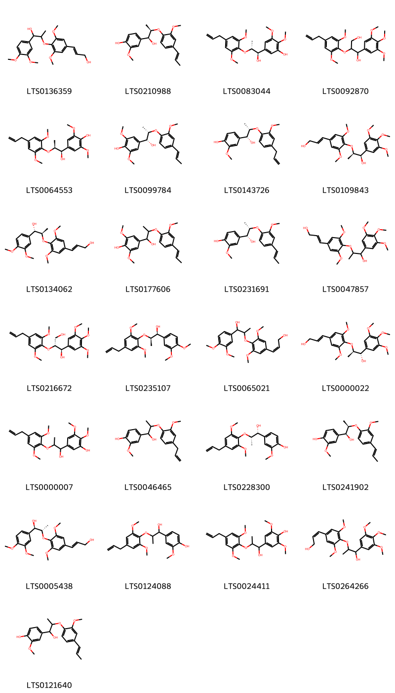
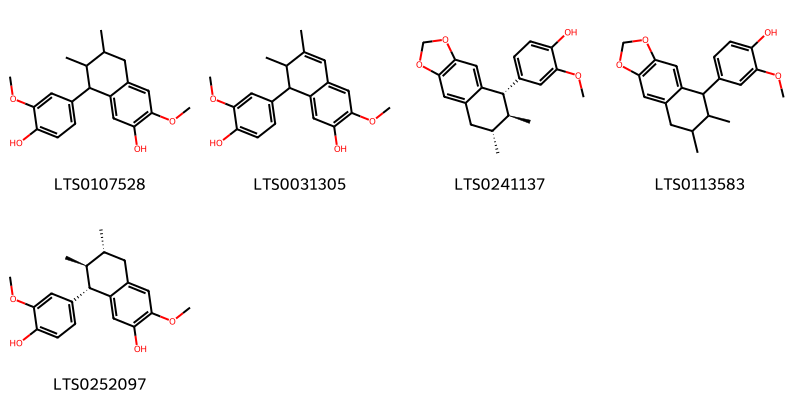
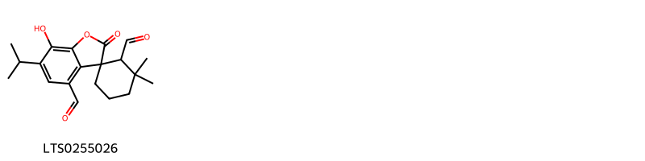
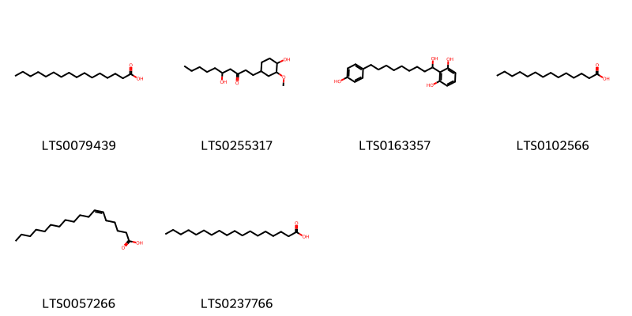
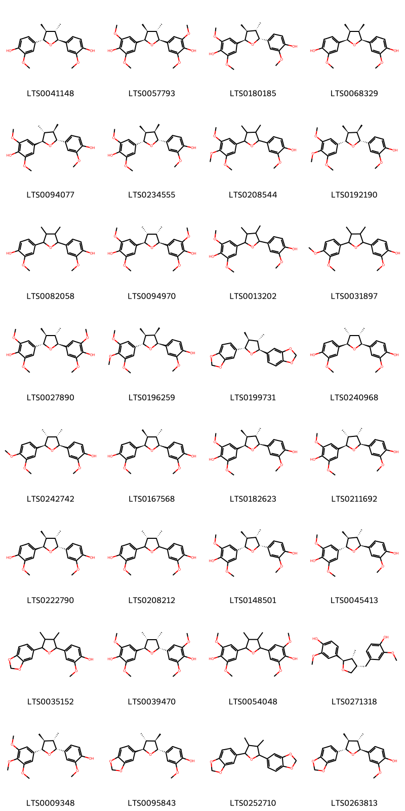
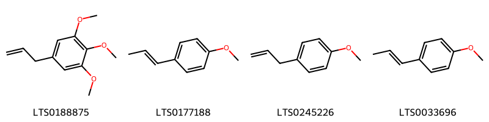

!!! abstract "Tóm tắt"

    Hạt Nhục đậu khấu (Semen Myristicae) là hạt đã phơi khô của cây Nhục đậu khấu (Myristica fragrans Houtt), thuộc họ Nhục đậu khấu (Myristicaceae). Cây có nguồn gốc từ Maluku và được du nhập vào nhiều nước trên thế giới. Tại Việt Nam, nhục đậu khấu được trồng ở miền Nam. Theo tài liệu cổ, hạt nhục đậu khấu có tính tân, ôn, quy vào kinh tỳ, vị, đại tràng. Dược liệu dùng trijiar chảy lâu ngày, đau trướng bụng, đau thượng vị, biếng ăn và nôn mửa. Một số thành phần hóa học đã phân lập được từ hạt nhục đậu khấu là các nhóm carbohydrate, chất béo, tinh dầu, chất nhựa, flavonoid, terpene, các dẫn xuất của terpene và phenylpropanoids.

## Thông tin về thực vật

Dược liệu **Nhục Đậu Khấu (Hạt)** từ bộ phận **nan** từ loài *Myristica fragrans*.

**Mô tả thực vật:** Là một cây to, cao 8-10m. Toàn thân nhẵn. Lá mọc so le, xanh tươi quanh năm, dai, phiến lá hình mác rộng, dài 5-15cm, rộng 3-7cm, mép nguyên, cuống lá dài 7-12mm. Hoa khác gốc mọc thành xim ở kẽ lá, có dáng tán. Màu hoa vàng trắng. Quả hạch, hình cầu hay quả lê, màu vàng, đường kính 5-8cm, khi chín nở theo chiều dọc thành 2 mảnh, trong có một hạt có vỏ dày cũng, bảo bọc bởi một áo hạt bị rách, màu hồng.

*Tài liệu tham khảo:* "Những cây thuốc và vị thuốc Việt Nam" - Đỗ Tất Lợi 
Trong dược điển Việt nam, một loài được sử dụng làm dược liệu là *Myristica fragrans*.

!!! info "Phân loại thực vật của *Myristica fragrans*"
    - **Kingdom:** Plantae
    - **Phylum:** Tracheophyta
    - **Order:** Magnoliales
    - **Family:** Myristicaceae
    - **Genus:** Myristica
    - **Species:** *Myristica fragrans*

**Phân bố trên thế giới:** nan, French Polynesia, El Salvador, Trinidad and Tobago, unknown or invalid, Dominican Republic, Comoros, Indonesia, Panama, Réunion, Saint Lucia, Türkiye, Papua New Guinea, Jamaica, Georgia, Micronesia (Federated States of), India, Belgium, Madagascar, Dominica, Brazil, Chinese Taipei, Tanzania, United Republic of, Sao Tome and Principe, Nicaragua, Grenada, Sri Lanka, Bangladesh, Cook Islands, Thailand, Honduras, Benin, Philippines, Puerto Rico, Malaysia, Equatorial Guinea, Mauritius, Guadeloupe, Norway, Singapore, Côte d’Ivoire, Peru, Saint Vincent and the Grenadines, France, China, Spain, Samoa, Costa Rica, United States of America, Mayotte, Seychelles, Iraq

**Phân bố tại Việt nam:** Không có ghi nhận ở Việt Nam

## Thông tin về dược liệu 

### Định danh

!!! info "Thông tin về tên gọi"

    - Dược liệu tiếng Việt: nan
    - Dược liệu tiếng Trung: nan (nan)
    - Dược liệu tiếng Anh: nan
    - Dược liệu latin thông dụng: nan
    - Dược liệu latin kiểu DĐVN: *semen myristicae*
    - Dược liệu latin kiểu DĐVN: *nan*
    - Dược liệu latin kiểu thông tư: *nan*
    - Bộ phận dùng: nan (nan)

### Mô tả dược liệu 

- **Theo dược điển Việt nam V:** nan

- **Mô tả dược liệu theo thông tư chế biến dược liệu theo phương pháp cổ truyền:** nan

### Chế biến 

- **Chế biến theo dược điển việt nam V**: nan

- **Chế biến theo thông tư:** nan

--- 

## Thành phần hóa học

- Theo tài liệu của GS. Đỗ Tất Lợi:  (1) Carbohydrate, chất béo, tinh dầu và chất nhựa, flavonoid, terpen, các dẫn xuất của terpene và phenylpropanoids
(2) Biomarker: Tinh dầu Nhục đậu khấu
    

**Thành phần hóa học từ loài **Myristica fragrans**

Theo cơ sở dữ liệu lotus, loài *Myristica fragrans* đã phân lập và xác định được **178** hoạt chất thuộc về các nhóm Fatty Acyls, Phenols, Flavonoids, Aryltetralin lignans, Furanoid lignans, Cinnamyl alcohols, Benzodioxoles, 2-arylbenzofuran flavonoids, Benzene and substituted derivatives, Stilbenes, Prenol lipids, Organooxygen compounds, Cinnamic acids and derivatives, Phenol ethers, Benzofurans, Linear 1,3-diarylpropanoids, Glycerolipids, Phenol esters, Oxepanes, Dibenzylbutane lignans trong bảng dưới đây. Danh sách các hoạt chất như sau macelignan [(LTS0157636)](https://lotus.naturalproducts.net/compound/lotus_id/LTS0157636), 4-terpineol [(LTS0253733)](https://lotus.naturalproducts.net/compound/lotus_id/LTS0253733), 4-[(2s,3s,4r,5r)-5-(4-hydroxy-3,5-dimethoxyphenyl)-3,4-dimethyloxolan-2-yl]-2,6-dimethoxyphenol [(LTS0094970)](https://lotus.naturalproducts.net/compound/lotus_id/LTS0094970), kaempherol [(LTS0155822)](https://lotus.naturalproducts.net/compound/lotus_id/LTS0155822), 4-[(1s,2r,3s)-4-(2h-1,3-benzodioxol-5-yl)-1-methoxy-2,3-dimethylbutyl]-2-methoxyphenol [(LTS0002324)](https://lotus.naturalproducts.net/compound/lotus_id/LTS0002324), α pinene [(LTS0132416)](https://lotus.naturalproducts.net/compound/lotus_id/LTS0132416), 4-[(2s,3s,4s,5r)-5-(4-hydroxy-3-methoxyphenyl)-3,4-dimethyloxolan-2-yl]-2-methoxyphenol [(LTS0167568)](https://lotus.naturalproducts.net/compound/lotus_id/LTS0167568), (+)-catechol [(LTS0117079)](https://lotus.naturalproducts.net/compound/lotus_id/LTS0117079), 4-[5-(4-hydroxy-3,5-dimethoxyphenyl)-3,4-dimethyloxolan-2-yl]-2,6-dimethoxyphenol [(LTS0054048)](https://lotus.naturalproducts.net/compound/lotus_id/LTS0054048), 4-{2-[2,6-dimethoxy-4-(prop-2-en-1-yl)phenoxy]-1-hydroxypropyl}-2,6-dimethoxyphenol [(LTS0024411)](https://lotus.naturalproducts.net/compound/lotus_id/LTS0024411), stearic acid [(LTS0237766)](https://lotus.naturalproducts.net/compound/lotus_id/LTS0237766), eugenol [(LTS0052342)](https://lotus.naturalproducts.net/compound/lotus_id/LTS0052342), 2-methoxy-4-[(2r,3r)-7-methoxy-3-methyl-5-[(1e)-prop-1-en-1-yl]-2,3-dihydro-1-benzofuran-2-yl]phenol [(LTS0179341)](https://lotus.naturalproducts.net/compound/lotus_id/LTS0179341), 4-[4-(2h-1,3-benzodioxol-5-yl)-1-methoxy-2,3-dimethylbutyl]-2-methoxyphenol [(LTS0217377)](https://lotus.naturalproducts.net/compound/lotus_id/LTS0217377), galop [(LTS0222857)](https://lotus.naturalproducts.net/compound/lotus_id/LTS0222857), 2-methoxy-4-[(2r,3r)-7-methoxy-3-methyl-5-(prop-2-en-1-yl)-2,3-dihydro-1-benzofuran-2-yl]phenol [(LTS0083644)](https://lotus.naturalproducts.net/compound/lotus_id/LTS0083644), para-coumaric acid [(LTS0266252)](https://lotus.naturalproducts.net/compound/lotus_id/LTS0266252), meso-dihydroguaiaretic acid [(LTS0242513)](https://lotus.naturalproducts.net/compound/lotus_id/LTS0242513), 4-[(1s,2r)-1-hydroxy-2-[2-methoxy-4-(prop-1-en-1-yl)phenoxy]propyl]-2-methoxyphenol [(LTS0241902)](https://lotus.naturalproducts.net/compound/lotus_id/LTS0241902), 4-[(2s,3s,4s,5s)-5-(4-hydroxy-3-methoxyphenyl)-3,4-dimethyloxolan-2-yl]-2,6-dimethoxyphenol [(LTS0045413)](https://lotus.naturalproducts.net/compound/lotus_id/LTS0045413), 4-[(2s,3s,4s,5s)-5-(4-hydroxy-3-methoxyphenyl)-3,4-dimethyloxolan-2-yl]-2-methoxyphenol [(LTS0041148)](https://lotus.naturalproducts.net/compound/lotus_id/LTS0041148), 3-(4-{[1-hydroxy-1-(3,4,5-trimethoxyphenyl)propan-2-yl]oxy}-3,5-dimethoxyphenyl)prop-2-en-1-ol [(LTS0047857)](https://lotus.naturalproducts.net/compound/lotus_id/LTS0047857), (2r,5s)-5-isopropyl-2-methylbicyclo[3.1.0]hexan-2-yl acetate [(LTS0235693)](https://lotus.naturalproducts.net/compound/lotus_id/LTS0235693), 4-[(1r,2s)-1-hydroxy-2-{2-methoxy-4-[(1e)-prop-1-en-1-yl]phenoxy}propyl]-2,6-dimethoxyphenol [(LTS0099784)](https://lotus.naturalproducts.net/compound/lotus_id/LTS0099784), 5-[(1r,2r)-2-[2,6-dimethoxy-4-(prop-2-en-1-yl)phenoxy]-1-hydroxypropyl]-2,3-dimethoxyphenol [(LTS0083044)](https://lotus.naturalproducts.net/compound/lotus_id/LTS0083044), 1-(2,6-dihydroxyphenyl)-9-(4-hydroxyphenyl)nonan-1-one [(LTS0276383)](https://lotus.naturalproducts.net/compound/lotus_id/LTS0276383), (1r,2r)-2-[2,6-dimethoxy-4-(prop-2-en-1-yl)phenoxy]-1-(3,4,5-trimethoxyphenyl)propane-1,3-diol [(LTS0216672)](https://lotus.naturalproducts.net/compound/lotus_id/LTS0216672), 7-hydroxy-6-isopropyl-3',3'-dimethyl-2-oxospiro[1-benzofuran-3,1'-cyclohexane]-2',4-dicarbaldehyde [(LTS0255026)](https://lotus.naturalproducts.net/compound/lotus_id/LTS0255026), 4-[(2s,3s,4s,5s)-5-(2h-1,3-benzodioxol-5-yl)-3,4-dimethyloxolan-2-yl]-2-methoxyphenol [(LTS0263813)](https://lotus.naturalproducts.net/compound/lotus_id/LTS0263813), 4-[(1r,2s)-1-hydroxy-2-{2-methoxy-4-[(1e)-prop-1-en-1-yl]phenoxy}propyl]-2-methoxyphenol [(LTS0231691)](https://lotus.naturalproducts.net/compound/lotus_id/LTS0231691), 3,4-dihydroxybenzoic acid [(LTS0018765)](https://lotus.naturalproducts.net/compound/lotus_id/LTS0018765), (1s,2r)-2-[2,6-dimethoxy-4-(prop-2-en-1-yl)phenoxy]-1-(3,4-dimethoxyphenyl)propan-1-ol [(LTS0235107)](https://lotus.naturalproducts.net/compound/lotus_id/LTS0235107), thymol [(LTS0168527)](https://lotus.naturalproducts.net/compound/lotus_id/LTS0168527), 2-methoxy-4-{1-methoxy-2-[2-methoxy-4-(prop-1-en-1-yl)phenoxy]propyl}phenol [(LTS0223535)](https://lotus.naturalproducts.net/compound/lotus_id/LTS0223535), petroselinic acid [(LTS0057266)](https://lotus.naturalproducts.net/compound/lotus_id/LTS0057266), 4-[(2r,3s,4s,5r)-5-(4-hydroxy-3-methoxyphenyl)-3,4-dimethyloxolan-2-yl]-2,6-dimethoxyphenol [(LTS0180185)](https://lotus.naturalproducts.net/compound/lotus_id/LTS0180185), 5-{2-[2,6-dimethoxy-4-(prop-2-en-1-yl)phenoxy]-1-hydroxypropyl}-2,3-dimethoxyphenol [(LTS0000007)](https://lotus.naturalproducts.net/compound/lotus_id/LTS0000007), myristicin [(LTS0180101)](https://lotus.naturalproducts.net/compound/lotus_id/LTS0180101), 3-[7-methoxy-2-(7-methoxy-2h-1,3-benzodioxol-5-yl)-3-methyl-2,3-dihydro-1-benzofuran-5-yl]prop-2-en-1-ol [(LTS0044522)](https://lotus.naturalproducts.net/compound/lotus_id/LTS0044522), sassafras [(LTS0136093)](https://lotus.naturalproducts.net/compound/lotus_id/LTS0136093), 5-[4-(2h-1,3-benzodioxol-5-yl)-2,3-dimethylbutyl]-2h-1,3-benzodioxole [(LTS0071689)](https://lotus.naturalproducts.net/compound/lotus_id/LTS0071689), (2s,3s)-2-(3,4-dimethoxyphenyl)-7-methoxy-3-methyl-5-[(1e)-prop-1-en-1-yl]-2,3-dihydro-1-benzofuran [(LTS0003849)](https://lotus.naturalproducts.net/compound/lotus_id/LTS0003849), 4-[(3s,4r)-5-(4-hydroxy-3-methoxyphenyl)-3,4-dimethyloxolan-2-yl]-2-methoxyphenol [(LTS0208212)](https://lotus.naturalproducts.net/compound/lotus_id/LTS0208212), 4-[(2s,3s,4s,5r)-5-(4-hydroxy-3,5-dimethoxyphenyl)-3,4-dimethyloxolan-2-yl]-2,6-dimethoxyphenol [(LTS0057793)](https://lotus.naturalproducts.net/compound/lotus_id/LTS0057793), (2e)-3-(4-{[(1s,2r)-1-(3,4-dimethoxyphenyl)-1-hydroxypropan-2-yl]oxy}-3,5-dimethoxyphenyl)prop-2-en-1-ol [(LTS0134062)](https://lotus.naturalproducts.net/compound/lotus_id/LTS0134062), 2-methoxy-4-[(1s,2s)-1-methoxy-2-{2-methoxy-4-[(1e)-prop-1-en-1-yl]phenoxy}propyl]phenol [(LTS0017841)](https://lotus.naturalproducts.net/compound/lotus_id/LTS0017841), p-propenylanisole [(LTS0177188)](https://lotus.naturalproducts.net/compound/lotus_id/LTS0177188), 4-[4-(4-hydroxy-3-methoxyphenyl)-2,3-dimethylbutyl]-2-methoxyphenol [(LTS0231938)](https://lotus.naturalproducts.net/compound/lotus_id/LTS0231938), 4-[(2r,3r)-4-(2h-1,3-benzodioxol-5-yl)-2,3-dimethylbutyl]benzene-1,2-diol [(LTS0217068)](https://lotus.naturalproducts.net/compound/lotus_id/LTS0217068), 4-[(2s,3s,4r,5r)-5-(4-hydroxy-3-methoxyphenyl)-3,4-dimethyloxolan-2-yl]-2-methoxyphenol [(LTS0240968)](https://lotus.naturalproducts.net/compound/lotus_id/LTS0240968), 4-[(2r,3s,4r,5r)-5-(4-hydroxy-3,5-dimethoxyphenyl)-3,4-dimethyloxolan-2-yl]-2,6-dimethoxyphenol [(LTS0039470)](https://lotus.naturalproducts.net/compound/lotus_id/LTS0039470), methyl eugenol [(LTS0098881)](https://lotus.naturalproducts.net/compound/lotus_id/LTS0098881), 4-[4-(2h-1,3-benzodioxol-5-yl)-1-hydroxy-2,3-dimethylbutyl]-2-methoxyphenol [(LTS0242219)](https://lotus.naturalproducts.net/compound/lotus_id/LTS0242219), terpineol [(LTS0136148)](https://lotus.naturalproducts.net/compound/lotus_id/LTS0136148), 1-(2,6-dimethoxyphenyl)-9-(4-hydroxyphenyl)nonan-1-one [(LTS0176975)](https://lotus.naturalproducts.net/compound/lotus_id/LTS0176975), 3-[2-(3,4-dimethoxyphenyl)-7-methoxy-3-methyl-2,3-dihydro-1-benzofuran-5-yl]prop-2-en-1-ol [(LTS0211877)](https://lotus.naturalproducts.net/compound/lotus_id/LTS0211877), anethole [(LTS0033696)](https://lotus.naturalproducts.net/compound/lotus_id/LTS0033696), (2e)-3-(7-methoxy-2h-1,3-benzodioxol-5-yl)prop-2-en-1-ol [(LTS0183275)](https://lotus.naturalproducts.net/compound/lotus_id/LTS0183275), 2-methoxy-4-[7-methoxy-3-methyl-5-(prop-1-en-1-yl)-2,3-dihydro-1-benzofuran-2-yl]phenol [(LTS0185228)](https://lotus.naturalproducts.net/compound/lotus_id/LTS0185228), carvacrol [(LTS0012882)](https://lotus.naturalproducts.net/compound/lotus_id/LTS0012882), 4-[(1r,2s)-2-[2,6-dimethoxy-4-(prop-2-en-1-yl)phenoxy]-1-hydroxypropyl]-2,6-dimethoxyphenol [(LTS0064553)](https://lotus.naturalproducts.net/compound/lotus_id/LTS0064553), carnosic acid [(LTS0097375)](https://lotus.naturalproducts.net/compound/lotus_id/LTS0097375), 4-[(2r,3s,4s,5r)-5-(4-hydroxy-3-methoxyphenyl)-3,4-dimethyloxolan-2-yl]-2-methoxyphenol [(LTS0222790)](https://lotus.naturalproducts.net/compound/lotus_id/LTS0222790), 4-[(2s,3s,4r,5r)-5-(3,4-dimethoxyphenyl)-3,4-dimethyloxolan-2-yl]-2-methoxyphenol [(LTS0242742)](https://lotus.naturalproducts.net/compound/lotus_id/LTS0242742), 1,4-bis(2h-1,3-benzodioxol-5-yl)-2,3-dimethylbutan-1-ol [(LTS0157048)](https://lotus.naturalproducts.net/compound/lotus_id/LTS0157048), 4-{6,7-dimethyl-2h,5h,6h,7h,8h-naphtho[2,3-d][1,3]dioxol-5-yl}-2-methoxyphenol [(LTS0113583)](https://lotus.naturalproducts.net/compound/lotus_id/LTS0113583), 2-[1-hydroxy-9-(4-hydroxyphenyl)nonyl]benzene-1,3-diol [(LTS0163357)](https://lotus.naturalproducts.net/compound/lotus_id/LTS0163357), 4-[(1s)-3-(2h-1,3-benzodioxol-5-yl)-1-hydroxypropyl]benzene-1,3-diol [(LTS0242244)](https://lotus.naturalproducts.net/compound/lotus_id/LTS0242244), 2-[1-(4-hydroxy-3-methoxyphenyl)propan-2-yl]-6-methoxy-4-(prop-2-en-1-yl)phenol [(LTS0046896)](https://lotus.naturalproducts.net/compound/lotus_id/LTS0046896), elemicin [(LTS0188875)](https://lotus.naturalproducts.net/compound/lotus_id/LTS0188875), salicyclic acid [(LTS0116548)](https://lotus.naturalproducts.net/compound/lotus_id/LTS0116548), 4-[(2s,3s,4s,5s)-5-(4-hydroxy-3,5-dimethoxyphenyl)-3,4-dimethyloxolan-2-yl]-2,6-dimethoxyphenol [(LTS0027890)](https://lotus.naturalproducts.net/compound/lotus_id/LTS0027890), 4-[(2r,3r,4r,5r)-5-(2h-1,3-benzodioxol-5-yl)-3,4-dimethyloxolan-2-yl]-2-methoxyphenol [(LTS0095843)](https://lotus.naturalproducts.net/compound/lotus_id/LTS0095843), 8-(4-hydroxy-3-methoxyphenyl)-3-methoxy-6,7-dimethyl-7,8-dihydronaphthalen-2-ol [(LTS0031305)](https://lotus.naturalproducts.net/compound/lotus_id/LTS0031305), 4-[5-(4-hydroxy-3-methoxyphenyl)-3,4-dimethyloxolan-2-yl]-2-methoxyphenol [(LTS0082058)](https://lotus.naturalproducts.net/compound/lotus_id/LTS0082058), 5-hydroxy-1-(4-hydroxy-3-methoxycyclohexyl)decan-3-one [(LTS0255317)](https://lotus.naturalproducts.net/compound/lotus_id/LTS0255317), 4-[(1r,2r,3r)-4-(2h-1,3-benzodioxol-5-yl)-1-methoxy-2,3-dimethylbutyl]-2-methoxyphenol [(LTS0013909)](https://lotus.naturalproducts.net/compound/lotus_id/LTS0013909), 3,4-dihydroxycinnamic acid [(LTS0128050)](https://lotus.naturalproducts.net/compound/lotus_id/LTS0128050), (2z)-3-(4-{[1-hydroxy-1-(3,4,5-trimethoxyphenyl)propan-2-yl]oxy}-3,5-dimethoxyphenyl)prop-2-en-1-ol [(LTS0264266)](https://lotus.naturalproducts.net/compound/lotus_id/LTS0264266), licarin a [(LTS0103625)](https://lotus.naturalproducts.net/compound/lotus_id/LTS0103625), 4-[5-(2-hydroxyethyl)-7-methoxy-3-methyl-2,3-dihydro-1-benzofuran-2-yl]-2-methoxyphenol [(LTS0015101)](https://lotus.naturalproducts.net/compound/lotus_id/LTS0015101), β-pinene [(LTS0117550)](https://lotus.naturalproducts.net/compound/lotus_id/LTS0117550), 1-(2,6-dimethoxyphenyl)-9-(4-methoxyphenyl)nonan-1-one [(LTS0055718)](https://lotus.naturalproducts.net/compound/lotus_id/LTS0055718), trimyristin [(LTS0164572)](https://lotus.naturalproducts.net/compound/lotus_id/LTS0164572), 2-methoxy-4-{7-methoxy-3-methyl-5-[(1z)-prop-1-en-1-yl]-2,3-dihydro-1-benzofuran-2-yl}phenol [(LTS0038526)](https://lotus.naturalproducts.net/compound/lotus_id/LTS0038526), eugenyl acetate [(LTS0165886)](https://lotus.naturalproducts.net/compound/lotus_id/LTS0165886), 4-[(2r,3r,4s,5s)-3,4-dimethyl-5-(3,4,5-trimethoxyphenyl)oxolan-2-yl]-2-methoxyphenol [(LTS0192190)](https://lotus.naturalproducts.net/compound/lotus_id/LTS0192190), 2-(3,4-dimethoxyphenyl)-7-methoxy-3-methyl-5-(prop-1-en-1-yl)-2,3-dihydro-1-benzofuran [(LTS0225858)](https://lotus.naturalproducts.net/compound/lotus_id/LTS0225858), macelignan [(LTS0151408)](https://lotus.naturalproducts.net/compound/lotus_id/LTS0151408), 5-[(2r,3r)-7-methoxy-3-methyl-5-[(1e)-prop-1-en-1-yl]-2,3-dihydro-1-benzofuran-2-yl]-2h-1,3-benzodioxole [(LTS0116039)](https://lotus.naturalproducts.net/compound/lotus_id/LTS0116039), isoeugenol [(LTS0136836)](https://lotus.naturalproducts.net/compound/lotus_id/LTS0136836), 4-[4-(3,4-dimethoxyphenyl)-2,3-dimethylbutyl]-2-methoxyphenol [(LTS0270070)](https://lotus.naturalproducts.net/compound/lotus_id/LTS0270070), palmitic acid [(LTS0079439)](https://lotus.naturalproducts.net/compound/lotus_id/LTS0079439), 5-[5-(2h-1,3-benzodioxol-5-yl)-3,4-dimethyloxolan-2-yl]-2h-1,3-benzodioxole [(LTS0252710)](https://lotus.naturalproducts.net/compound/lotus_id/LTS0252710), 2-methoxy-4-{7-methoxy-3-methyl-5-[(1e)-prop-1-en-1-yl]-2,3-dihydro-1-benzofuran-2-yl}phenol [(LTS0157894)](https://lotus.naturalproducts.net/compound/lotus_id/LTS0157894), 4-[(1s,2r,3r)-4-(2h-1,3-benzodioxol-5-yl)-1-hydroxy-2,3-dimethylbutyl]-2-methoxyphenol [(LTS0220279)](https://lotus.naturalproducts.net/compound/lotus_id/LTS0220279), 4-{1-hydroxy-2-[2-methoxy-4-(prop-2-en-1-yl)phenoxy]propyl}-2-methoxyphenol [(LTS0046465)](https://lotus.naturalproducts.net/compound/lotus_id/LTS0046465), (2e)-3-[(2s,3s)-2-(3,4-dimethoxyphenyl)-7-methoxy-3-methyl-2,3-dihydro-1-benzofuran-5-yl]prop-2-en-1-ol [(LTS0001731)](https://lotus.naturalproducts.net/compound/lotus_id/LTS0001731), 5-[(2r,3s)-4-(4-hydroxy-3-methoxyphenyl)-3-methylbutan-2-yl]-3-methoxybenzene-1,2-diol [(LTS0034542)](https://lotus.naturalproducts.net/compound/lotus_id/LTS0034542), 4-[(2r,3r,4s,5s)-5-(4-hydroxy-3-methoxyphenyl)-3,4-dimethyloxolan-2-yl]-2,6-dimethoxyphenol [(LTS0211692)](https://lotus.naturalproducts.net/compound/lotus_id/LTS0211692), 4-[(2r,3s,4s,5s)-3,4-dimethyl-5-(3,4,5-trimethoxyphenyl)oxolan-2-yl]-2-methoxyphenol [(LTS0009348)](https://lotus.naturalproducts.net/compound/lotus_id/LTS0009348), 4-[(2r,3s)-4-(4-hydroxy-3-methoxyphenyl)-2,3-dimethylbutyl]benzene-1,2-diol [(LTS0040930)](https://lotus.naturalproducts.net/compound/lotus_id/LTS0040930), 4-{2-[2,6-dimethoxy-4-(prop-2-en-1-yl)phenoxy]propyl}-2-methoxyphenol [(LTS0151416)](https://lotus.naturalproducts.net/compound/lotus_id/LTS0151416), galbacin [(LTS0199731)](https://lotus.naturalproducts.net/compound/lotus_id/LTS0199731), monoterpenes [(LTS0106881)](https://lotus.naturalproducts.net/compound/lotus_id/LTS0106881), 1-(2-hydroxy-6-methoxyphenyl)-9-(4-methoxyphenyl)nonan-1-one [(LTS0165750)](https://lotus.naturalproducts.net/compound/lotus_id/LTS0165750), quercetin [(LTS0004651)](https://lotus.naturalproducts.net/compound/lotus_id/LTS0004651), 4-[5-(3,4-dimethoxyphenyl)-3,4-dimethyloxolan-2-yl]-2-methoxyphenol [(LTS0031897)](https://lotus.naturalproducts.net/compound/lotus_id/LTS0031897), (2e)-3-(4-{[(1s,2r)-1-hydroxy-1-(3,4,5-trimethoxyphenyl)propan-2-yl]oxy}-3,5-dimethoxyphenyl)prop-2-en-1-ol [(LTS0000022)](https://lotus.naturalproducts.net/compound/lotus_id/LTS0000022), 4-[5-(2h-1,3-benzodioxol-5-yl)-3,4-dimethyloxolan-2-yl]-2-methoxyphenol [(LTS0035152)](https://lotus.naturalproducts.net/compound/lotus_id/LTS0035152), 4-[(2s,3s)-5-[(1s,2s)-2-hydroxy-1-methoxypropyl]-7-methoxy-3-methyl-2,3-dihydro-1-benzofuran-2-yl]-2-methoxyphenol [(LTS0013555)](https://lotus.naturalproducts.net/compound/lotus_id/LTS0013555), 4-[3,4-dimethyl-5-(3,4,5-trimethoxyphenyl)oxolan-2-yl]-2-methoxyphenol [(LTS0208544)](https://lotus.naturalproducts.net/compound/lotus_id/LTS0208544), 2-[(2s)-1-(4-hydroxy-3-methoxyphenyl)propan-2-yl]-6-methoxy-4-(prop-2-en-1-yl)phenol [(LTS0067719)](https://lotus.naturalproducts.net/compound/lotus_id/LTS0067719), (2z)-3-(4-{[1-(3,4-dimethoxyphenyl)-1-hydroxypropan-2-yl]oxy}-3,5-dimethoxyphenyl)prop-2-en-1-ol [(LTS0065021)](https://lotus.naturalproducts.net/compound/lotus_id/LTS0065021), 4-[(2r,3r,4r,5r)-5-(4-hydroxy-3-methoxyphenyl)-3,4-dimethyloxolan-2-yl]-2,6-dimethoxyphenol [(LTS0094077)](https://lotus.naturalproducts.net/compound/lotus_id/LTS0094077), (2e)-3-(3,4,5-trimethoxyphenyl)prop-2-en-1-ol [(LTS0124755)](https://lotus.naturalproducts.net/compound/lotus_id/LTS0124755), 8-(4-hydroxy-3-methoxyphenyl)-3-methoxy-6,7-dimethyl-5,6,7,8-tetrahydronaphthalen-2-ol [(LTS0107528)](https://lotus.naturalproducts.net/compound/lotus_id/LTS0107528), (2e)-3-[(2r,3r)-7-methoxy-2-(7-methoxy-2h-1,3-benzodioxol-5-yl)-3-methyl-2,3-dihydro-1-benzofuran-5-yl]prop-2-en-1-ol [(LTS0263971)](https://lotus.naturalproducts.net/compound/lotus_id/LTS0263971), tarragon [(LTS0245226)](https://lotus.naturalproducts.net/compound/lotus_id/LTS0245226), 3,4,8-trihydroxy-5-isopropyl-11,11-dimethyl-16-oxatetracyclo[7.5.2.0¹,¹⁰.0²,⁷]hexadeca-2(7),3,5-trien-15-one [(LTS0269672)](https://lotus.naturalproducts.net/compound/lotus_id/LTS0269672), 4-[5-(2-hydroxy-1-methoxypropyl)-7-methoxy-3-methyl-2,3-dihydro-1-benzofuran-2-yl]-2-methoxyphenol [(LTS0159956)](https://lotus.naturalproducts.net/compound/lotus_id/LTS0159956), 4-[(2r,3s,4s,5s)-5-(4-hydroxy-3-methoxyphenyl)-3,4-dimethyloxolan-2-yl]-2,6-dimethoxyphenol [(LTS0182623)](https://lotus.naturalproducts.net/compound/lotus_id/LTS0182623), 4-[(2s,3s)-5-(2-hydroxyethyl)-7-methoxy-3-methyl-2,3-dihydro-1-benzofuran-2-yl]-2-methoxyphenol [(LTS0220337)](https://lotus.naturalproducts.net/compound/lotus_id/LTS0220337), 5-[(2r,3r)-4-(2h-1,3-benzodioxol-5-yl)-2,3-dimethylbutyl]-2h-1,3-benzodioxole [(LTS0090134)](https://lotus.naturalproducts.net/compound/lotus_id/LTS0090134), caryophyllene [(LTS0085212)](https://lotus.naturalproducts.net/compound/lotus_id/LTS0085212), 3,4-dihydroxy-5-isopropyl-11,11-dimethyl-16-oxatetracyclo[6.6.2.0¹,¹⁰.0²,⁷]hexadeca-2(7),3,5-trien-15-one [(LTS0266849)](https://lotus.naturalproducts.net/compound/lotus_id/LTS0266849), 3-(7-methoxy-2h-1,3-benzodioxol-5-yl)prop-2-en-1-ol [(LTS0127330)](https://lotus.naturalproducts.net/compound/lotus_id/LTS0127330), 4-{1-hydroxy-2-[2-methoxy-4-(prop-1-en-1-yl)phenoxy]propyl}-2-methoxyphenol [(LTS0121640)](https://lotus.naturalproducts.net/compound/lotus_id/LTS0121640), 6-tert-butyl-m-cresol [(LTS0083347)](https://lotus.naturalproducts.net/compound/lotus_id/LTS0083347), 4-[(1r,2s)-2-[2,6-dimethoxy-4-(prop-2-en-1-yl)phenoxy]-1-hydroxypropyl]-2-methoxyphenol [(LTS0228300)](https://lotus.naturalproducts.net/compound/lotus_id/LTS0228300), rosemary acid [(LTS0207820)](https://lotus.naturalproducts.net/compound/lotus_id/LTS0207820), 3-(3,4,5-trimethoxyphenyl)prop-2-en-1-ol [(LTS0071419)](https://lotus.naturalproducts.net/compound/lotus_id/LTS0071419), 4-[(2r,3r,4s)-4-[(4-hydroxy-3-methoxyphenyl)methyl]-3-methyloxolan-2-yl]-2-methoxyphenol [(LTS0271318)](https://lotus.naturalproducts.net/compound/lotus_id/LTS0271318), 4-[(2s,3r,4s,5s)-3,4-dimethyl-5-(3,4,5-trimethoxyphenyl)oxolan-2-yl]-2-methoxyphenol [(LTS0196259)](https://lotus.naturalproducts.net/compound/lotus_id/LTS0196259), o-cymene [(LTS0096514)](https://lotus.naturalproducts.net/compound/lotus_id/LTS0096514), (2e)-3-(4-{[(1r,2r)-1-hydroxy-1-(3,4,5-trimethoxyphenyl)propan-2-yl]oxy}-3,5-dimethoxyphenyl)prop-2-en-1-ol [(LTS0109843)](https://lotus.naturalproducts.net/compound/lotus_id/LTS0109843), (1s,2r)-2-[2,6-dimethoxy-4-(prop-2-en-1-yl)phenoxy]-1-(3,4-dimethoxyphenyl)propyl acetate [(LTS0135488)](https://lotus.naturalproducts.net/compound/lotus_id/LTS0135488), (1r)-3,4-dihydroxy-5-isopropyl-11,11-dimethyl-16-oxatetracyclo[6.6.2.0¹,¹⁰.0²,⁷]hexadeca-2(7),3,5-trien-15-one [(LTS0048403)](https://lotus.naturalproducts.net/compound/lotus_id/LTS0048403), (1s,2s,3r)-1,4-bis(2h-1,3-benzodioxol-5-yl)-2,3-dimethylbutan-1-ol [(LTS0135019)](https://lotus.naturalproducts.net/compound/lotus_id/LTS0135019), 4-[(2s,3r,4s,5r)-5-(4-hydroxy-3-methoxyphenyl)-3,4-dimethyloxolan-2-yl]-2-methoxyphenol [(LTS0068329)](https://lotus.naturalproducts.net/compound/lotus_id/LTS0068329), 2-[2,6-dimethoxy-4-(prop-2-en-1-yl)phenoxy]-1-(3,4,5-trimethoxyphenyl)propane-1,3-diol [(LTS0092870)](https://lotus.naturalproducts.net/compound/lotus_id/LTS0092870), 1-[2-hydroxy-3-methoxy-5-(prop-2-en-1-yl)phenyl]ethanone [(LTS0217393)](https://lotus.naturalproducts.net/compound/lotus_id/LTS0217393), (+)-guaiacin [(LTS0252097)](https://lotus.naturalproducts.net/compound/lotus_id/LTS0252097), gingerol [(LTS0171573)](https://lotus.naturalproducts.net/compound/lotus_id/LTS0171573), myristic acid [(LTS0102566)](https://lotus.naturalproducts.net/compound/lotus_id/LTS0102566), 1-(2-hydroxy-6-methoxyphenyl)-9-(4-hydroxyphenyl)nonan-1-one [(LTS0117297)](https://lotus.naturalproducts.net/compound/lotus_id/LTS0117297), syringic acid [(LTS0210036)](https://lotus.naturalproducts.net/compound/lotus_id/LTS0210036), 4-{2-[2,6-dimethoxy-4-(prop-2-en-1-yl)phenoxy]-1-hydroxypropyl}-2-methoxyphenol [(LTS0124088)](https://lotus.naturalproducts.net/compound/lotus_id/LTS0124088), 4-[5-(4-hydroxy-3-methoxyphenyl)-3,4-dimethyloxolan-2-yl]-2,6-dimethoxyphenol [(LTS0013202)](https://lotus.naturalproducts.net/compound/lotus_id/LTS0013202), β-terpinyl acetate [(LTS0161309)](https://lotus.naturalproducts.net/compound/lotus_id/LTS0161309), 4-[(2s,3s,4s,5r)-5-(4-hydroxy-3-methoxyphenyl)-3,4-dimethyloxolan-2-yl]-2,6-dimethoxyphenol [(LTS0148501)](https://lotus.naturalproducts.net/compound/lotus_id/LTS0148501), 4-[(2s,3r)-4-(3,4-dimethoxyphenyl)-2,3-dimethylbutyl]-2-methoxyphenol [(LTS0260048)](https://lotus.naturalproducts.net/compound/lotus_id/LTS0260048), 4-[(1r,2s)-1-hydroxy-2-[2-methoxy-4-(prop-2-en-1-yl)phenoxy]propyl]-2-methoxyphenol [(LTS0143726)](https://lotus.naturalproducts.net/compound/lotus_id/LTS0143726), 4-[(5s,6s,7r)-6,7-dimethyl-2h,5h,6h,7h,8h-naphtho[2,3-d][1,3]dioxol-5-yl]-2-methoxyphenol [(LTS0241137)](https://lotus.naturalproducts.net/compound/lotus_id/LTS0241137), 4-{1-hydroxy-2-[2-methoxy-4-(prop-1-en-1-yl)phenoxy]propyl}-2,6-dimethoxyphenol [(LTS0177606)](https://lotus.naturalproducts.net/compound/lotus_id/LTS0177606), (2r,3r)-4-(2h-1,3-benzodioxol-5-yl)-2-(2h-1,3-benzodioxol-5-ylmethyl)-3-methylbutan-1-ol [(LTS0008253)](https://lotus.naturalproducts.net/compound/lotus_id/LTS0008253), 5-[(3s)-7-methoxy-3-methyl-5-[(1e)-prop-1-en-1-yl]-2,3-dihydro-1-benzofuran-2-yl]-2h-1,3-benzodioxole [(LTS0249202)](https://lotus.naturalproducts.net/compound/lotus_id/LTS0249202), 4-[(2r,3r)-5-[(1s,2r)-2-hydroxy-1-methoxypropyl]-7-methoxy-3-methyl-2,3-dihydro-1-benzofuran-2-yl]-2-methoxyphenol [(LTS0042981)](https://lotus.naturalproducts.net/compound/lotus_id/LTS0042981), (2e)-3-(4-{[(1r,2s)-1-(3,4-dimethoxyphenyl)-1-hydroxypropan-2-yl]oxy}-3,5-dimethoxyphenyl)prop-2-en-1-ol [(LTS0005438)](https://lotus.naturalproducts.net/compound/lotus_id/LTS0005438), 6-methyl-3-(propan-2-ylidene)-7-oxabicyclo[4.1.0]heptan-2-one [(LTS0194928)](https://lotus.naturalproducts.net/compound/lotus_id/LTS0194928), 3-(4-{[1-(3,4-dimethoxyphenyl)-1-hydroxypropan-2-yl]oxy}-3,5-dimethoxyphenyl)prop-2-en-1-ol [(LTS0136359)](https://lotus.naturalproducts.net/compound/lotus_id/LTS0136359), malabaricone c [(LTS0008004)](https://lotus.naturalproducts.net/compound/lotus_id/LTS0008004), (2e)-3-[7-methoxy-2-(7-methoxy-2h-1,3-benzodioxol-5-yl)-3-methyl-2,3-dihydro-1-benzofuran-5-yl]prop-2-en-1-ol [(LTS0075904)](https://lotus.naturalproducts.net/compound/lotus_id/LTS0075904), 2-methoxy-4-[7-methoxy-3-methyl-5-(prop-2-en-1-yl)-2,3-dihydro-1-benzofuran-2-yl]phenol [(LTS0193440)](https://lotus.naturalproducts.net/compound/lotus_id/LTS0193440), 2',6'-dihydroxyacetophenone [(LTS0197806)](https://lotus.naturalproducts.net/compound/lotus_id/LTS0197806), 2-methoxy-4-[(2s,3r)-7-methoxy-3-methyl-5-[(1e)-prop-1-en-1-yl]-2,3-dihydro-1-benzofuran-2-yl]phenol [(LTS0125755)](https://lotus.naturalproducts.net/compound/lotus_id/LTS0125755), limonene,  [(LTS0155981)](https://lotus.naturalproducts.net/compound/lotus_id/LTS0155981), 4-[(2s,3s,4r,5r)-5-(4-hydroxy-3-methoxyphenyl)-3,4-dimethyloxolan-2-yl]-2,6-dimethoxyphenol [(LTS0234555)](https://lotus.naturalproducts.net/compound/lotus_id/LTS0234555), 2-[9-(4-hydroxyphenyl)nonyl]benzene-1,3-diol [(LTS0169535)](https://lotus.naturalproducts.net/compound/lotus_id/LTS0169535), 4-[(1s,2r)-1-hydroxy-2-{2-methoxy-4-[(1e)-prop-1-en-1-yl]phenoxy}propyl]-2-methoxyphenol [(LTS0210988)](https://lotus.naturalproducts.net/compound/lotus_id/LTS0210988), hydroxycinnamic acid [(LTS0233023)](https://lotus.naturalproducts.net/compound/lotus_id/LTS0233023), camphene [(LTS0267242)](https://lotus.naturalproducts.net/compound/lotus_id/LTS0267242), 4-{2-[2,6-dimethoxy-4-(prop-2-en-1-yl)phenoxy]-1-methoxypropyl}-2-methoxyphenol [(LTS0078302)](https://lotus.naturalproducts.net/compound/lotus_id/LTS0078302), linalool, (+-)- [(LTS0128839)](https://lotus.naturalproducts.net/compound/lotus_id/LTS0128839), 4-[(1s,2s)-2-[2,6-dimethoxy-4-(prop-2-en-1-yl)phenoxy]-1-methoxypropyl]-2-methoxyphenol [(LTS0147588)](https://lotus.naturalproducts.net/compound/lotus_id/LTS0147588), 4-[(1s)-1-hydroxy-3-(4-hydroxy-3-methoxyphenyl)propyl]benzene-1,3-diol [(LTS0253015)](https://lotus.naturalproducts.net/compound/lotus_id/LTS0253015), (2e)-3-[2-(3,4-dimethoxyphenyl)-7-methoxy-3-methyl-2,3-dihydro-1-benzofuran-5-yl]prop-2-en-1-ol [(LTS0160235)](https://lotus.naturalproducts.net/compound/lotus_id/LTS0160235), 4-[(2s)-2-[2,6-dimethoxy-4-(prop-2-en-1-yl)phenoxy]propyl]-2-methoxyphenol [(LTS0259575)](https://lotus.naturalproducts.net/compound/lotus_id/LTS0259575). 
        
| chemicalTaxonomyClassyfireClass     |   smiles_count |
|:------------------------------------|---------------:|
|                                     |           1298 |
| 2-arylbenzofuran flavonoids         |           1107 |
| Aryltetralin lignans                |            219 |
| Benzene and substituted derivatives |            199 |
| Benzodioxoles                       |             82 |
| Benzofurans                         |             46 |
| Cinnamic acids and derivatives      |            120 |
| Cinnamyl alcohols                   |             94 |
| Dibenzylbutane lignans              |            828 |
| Fatty Acyls                         |            156 |
| Flavonoids                          |            129 |
| Furanoid lignans                    |           1855 |
| Glycerolipids                       |             62 |
| Linear 1,3-diarylpropanoids         |             84 |
| Organooxygen compounds              |            272 |
| Oxepanes                            |             22 |
| Phenol esters                       |             25 |
| Phenol ethers                       |             74 |
| Phenols                             |            401 |
| Prenol lipids                       |            425 |
| Stilbenes                           |             87 |

            
### Nhóm 
<figure markdown="span">
    { width=100% }
<figcaption>Hình ảnh cấu trúc hóa học của hoạt chất thuộc nhóm **. Tên thường gọi của các hoạt chất tương ứng là 3-(4-{[1-(3,4-dimethoxyphenyl)-1-hydroxypropan-2-yl]oxy}-3,5-dimethoxyphenyl)prop-2-en-1-ol [(LTS0136359)](https://lotus.naturalproducts.net/compound/lotus_id/LTS0136359), 4-[(1s,2r)-1-hydroxy-2-{2-methoxy-4-[(1e)-prop-1-en-1-yl]phenoxy}propyl]-2-methoxyphenol [(LTS0210988)](https://lotus.naturalproducts.net/compound/lotus_id/LTS0210988), 5-[(1r,2r)-2-[2,6-dimethoxy-4-(prop-2-en-1-yl)phenoxy]-1-hydroxypropyl]-2,3-dimethoxyphenol [(LTS0083044)](https://lotus.naturalproducts.net/compound/lotus_id/LTS0083044), 2-[2,6-dimethoxy-4-(prop-2-en-1-yl)phenoxy]-1-(3,4,5-trimethoxyphenyl)propane-1,3-diol [(LTS0092870)](https://lotus.naturalproducts.net/compound/lotus_id/LTS0092870), 4-[(1r,2s)-2-[2,6-dimethoxy-4-(prop-2-en-1-yl)phenoxy]-1-hydroxypropyl]-2,6-dimethoxyphenol [(LTS0064553)](https://lotus.naturalproducts.net/compound/lotus_id/LTS0064553), 4-[(1r,2s)-1-hydroxy-2-{2-methoxy-4-[(1e)-prop-1-en-1-yl]phenoxy}propyl]-2,6-dimethoxyphenol [(LTS0099784)](https://lotus.naturalproducts.net/compound/lotus_id/LTS0099784), 4-[(1r,2s)-1-hydroxy-2-[2-methoxy-4-(prop-2-en-1-yl)phenoxy]propyl]-2-methoxyphenol [(LTS0143726)](https://lotus.naturalproducts.net/compound/lotus_id/LTS0143726), (2e)-3-(4-{[(1r,2r)-1-hydroxy-1-(3,4,5-trimethoxyphenyl)propan-2-yl]oxy}-3,5-dimethoxyphenyl)prop-2-en-1-ol [(LTS0109843)](https://lotus.naturalproducts.net/compound/lotus_id/LTS0109843), (2e)-3-(4-{[(1s,2r)-1-(3,4-dimethoxyphenyl)-1-hydroxypropan-2-yl]oxy}-3,5-dimethoxyphenyl)prop-2-en-1-ol [(LTS0134062)](https://lotus.naturalproducts.net/compound/lotus_id/LTS0134062), 4-{1-hydroxy-2-[2-methoxy-4-(prop-1-en-1-yl)phenoxy]propyl}-2,6-dimethoxyphenol [(LTS0177606)](https://lotus.naturalproducts.net/compound/lotus_id/LTS0177606), 4-[(1r,2s)-1-hydroxy-2-{2-methoxy-4-[(1e)-prop-1-en-1-yl]phenoxy}propyl]-2-methoxyphenol [(LTS0231691)](https://lotus.naturalproducts.net/compound/lotus_id/LTS0231691), 3-(4-{[1-hydroxy-1-(3,4,5-trimethoxyphenyl)propan-2-yl]oxy}-3,5-dimethoxyphenyl)prop-2-en-1-ol [(LTS0047857)](https://lotus.naturalproducts.net/compound/lotus_id/LTS0047857), (1r,2r)-2-[2,6-dimethoxy-4-(prop-2-en-1-yl)phenoxy]-1-(3,4,5-trimethoxyphenyl)propane-1,3-diol [(LTS0216672)](https://lotus.naturalproducts.net/compound/lotus_id/LTS0216672), (1s,2r)-2-[2,6-dimethoxy-4-(prop-2-en-1-yl)phenoxy]-1-(3,4-dimethoxyphenyl)propan-1-ol [(LTS0235107)](https://lotus.naturalproducts.net/compound/lotus_id/LTS0235107), (2z)-3-(4-{[1-(3,4-dimethoxyphenyl)-1-hydroxypropan-2-yl]oxy}-3,5-dimethoxyphenyl)prop-2-en-1-ol [(LTS0065021)](https://lotus.naturalproducts.net/compound/lotus_id/LTS0065021), (2e)-3-(4-{[(1s,2r)-1-hydroxy-1-(3,4,5-trimethoxyphenyl)propan-2-yl]oxy}-3,5-dimethoxyphenyl)prop-2-en-1-ol [(LTS0000022)](https://lotus.naturalproducts.net/compound/lotus_id/LTS0000022), 5-{2-[2,6-dimethoxy-4-(prop-2-en-1-yl)phenoxy]-1-hydroxypropyl}-2,3-dimethoxyphenol [(LTS0000007)](https://lotus.naturalproducts.net/compound/lotus_id/LTS0000007), 4-{1-hydroxy-2-[2-methoxy-4-(prop-2-en-1-yl)phenoxy]propyl}-2-methoxyphenol [(LTS0046465)](https://lotus.naturalproducts.net/compound/lotus_id/LTS0046465), 4-[(1r,2s)-2-[2,6-dimethoxy-4-(prop-2-en-1-yl)phenoxy]-1-hydroxypropyl]-2-methoxyphenol [(LTS0228300)](https://lotus.naturalproducts.net/compound/lotus_id/LTS0228300), 4-[(1s,2r)-1-hydroxy-2-[2-methoxy-4-(prop-1-en-1-yl)phenoxy]propyl]-2-methoxyphenol [(LTS0241902)](https://lotus.naturalproducts.net/compound/lotus_id/LTS0241902), (2e)-3-(4-{[(1r,2s)-1-(3,4-dimethoxyphenyl)-1-hydroxypropan-2-yl]oxy}-3,5-dimethoxyphenyl)prop-2-en-1-ol [(LTS0005438)](https://lotus.naturalproducts.net/compound/lotus_id/LTS0005438), 4-{2-[2,6-dimethoxy-4-(prop-2-en-1-yl)phenoxy]-1-hydroxypropyl}-2-methoxyphenol [(LTS0124088)](https://lotus.naturalproducts.net/compound/lotus_id/LTS0124088), 4-{2-[2,6-dimethoxy-4-(prop-2-en-1-yl)phenoxy]-1-hydroxypropyl}-2,6-dimethoxyphenol [(LTS0024411)](https://lotus.naturalproducts.net/compound/lotus_id/LTS0024411), (2z)-3-(4-{[1-hydroxy-1-(3,4,5-trimethoxyphenyl)propan-2-yl]oxy}-3,5-dimethoxyphenyl)prop-2-en-1-ol [(LTS0264266)](https://lotus.naturalproducts.net/compound/lotus_id/LTS0264266), 4-{1-hydroxy-2-[2-methoxy-4-(prop-1-en-1-yl)phenoxy]propyl}-2-methoxyphenol [(LTS0121640)](https://lotus.naturalproducts.net/compound/lotus_id/LTS0121640).</figcaption>
</figure>

            
            
### Nhóm 
<figure markdown="span">
    { width=100% }
<figcaption>Hình ảnh cấu trúc hóa học của hoạt chất thuộc nhóm **. Tên thường gọi của các hoạt chất tương ứng là 3-(4-{[1-(3,4-dimethoxyphenyl)-1-hydroxypropan-2-yl]oxy}-3,5-dimethoxyphenyl)prop-2-en-1-ol [(LTS0136359)](https://lotus.naturalproducts.net/compound/lotus_id/LTS0136359), 4-[(1s,2r)-1-hydroxy-2-{2-methoxy-4-[(1e)-prop-1-en-1-yl]phenoxy}propyl]-2-methoxyphenol [(LTS0210988)](https://lotus.naturalproducts.net/compound/lotus_id/LTS0210988), 5-[(1r,2r)-2-[2,6-dimethoxy-4-(prop-2-en-1-yl)phenoxy]-1-hydroxypropyl]-2,3-dimethoxyphenol [(LTS0083044)](https://lotus.naturalproducts.net/compound/lotus_id/LTS0083044), 2-[2,6-dimethoxy-4-(prop-2-en-1-yl)phenoxy]-1-(3,4,5-trimethoxyphenyl)propane-1,3-diol [(LTS0092870)](https://lotus.naturalproducts.net/compound/lotus_id/LTS0092870), 4-[(1r,2s)-2-[2,6-dimethoxy-4-(prop-2-en-1-yl)phenoxy]-1-hydroxypropyl]-2,6-dimethoxyphenol [(LTS0064553)](https://lotus.naturalproducts.net/compound/lotus_id/LTS0064553), 4-[(1r,2s)-1-hydroxy-2-{2-methoxy-4-[(1e)-prop-1-en-1-yl]phenoxy}propyl]-2,6-dimethoxyphenol [(LTS0099784)](https://lotus.naturalproducts.net/compound/lotus_id/LTS0099784), 4-[(1r,2s)-1-hydroxy-2-[2-methoxy-4-(prop-2-en-1-yl)phenoxy]propyl]-2-methoxyphenol [(LTS0143726)](https://lotus.naturalproducts.net/compound/lotus_id/LTS0143726), (2e)-3-(4-{[(1r,2r)-1-hydroxy-1-(3,4,5-trimethoxyphenyl)propan-2-yl]oxy}-3,5-dimethoxyphenyl)prop-2-en-1-ol [(LTS0109843)](https://lotus.naturalproducts.net/compound/lotus_id/LTS0109843), (2e)-3-(4-{[(1s,2r)-1-(3,4-dimethoxyphenyl)-1-hydroxypropan-2-yl]oxy}-3,5-dimethoxyphenyl)prop-2-en-1-ol [(LTS0134062)](https://lotus.naturalproducts.net/compound/lotus_id/LTS0134062), 4-{1-hydroxy-2-[2-methoxy-4-(prop-1-en-1-yl)phenoxy]propyl}-2,6-dimethoxyphenol [(LTS0177606)](https://lotus.naturalproducts.net/compound/lotus_id/LTS0177606), 4-[(1r,2s)-1-hydroxy-2-{2-methoxy-4-[(1e)-prop-1-en-1-yl]phenoxy}propyl]-2-methoxyphenol [(LTS0231691)](https://lotus.naturalproducts.net/compound/lotus_id/LTS0231691), 3-(4-{[1-hydroxy-1-(3,4,5-trimethoxyphenyl)propan-2-yl]oxy}-3,5-dimethoxyphenyl)prop-2-en-1-ol [(LTS0047857)](https://lotus.naturalproducts.net/compound/lotus_id/LTS0047857), (1r,2r)-2-[2,6-dimethoxy-4-(prop-2-en-1-yl)phenoxy]-1-(3,4,5-trimethoxyphenyl)propane-1,3-diol [(LTS0216672)](https://lotus.naturalproducts.net/compound/lotus_id/LTS0216672), (1s,2r)-2-[2,6-dimethoxy-4-(prop-2-en-1-yl)phenoxy]-1-(3,4-dimethoxyphenyl)propan-1-ol [(LTS0235107)](https://lotus.naturalproducts.net/compound/lotus_id/LTS0235107), (2z)-3-(4-{[1-(3,4-dimethoxyphenyl)-1-hydroxypropan-2-yl]oxy}-3,5-dimethoxyphenyl)prop-2-en-1-ol [(LTS0065021)](https://lotus.naturalproducts.net/compound/lotus_id/LTS0065021), (2e)-3-(4-{[(1s,2r)-1-hydroxy-1-(3,4,5-trimethoxyphenyl)propan-2-yl]oxy}-3,5-dimethoxyphenyl)prop-2-en-1-ol [(LTS0000022)](https://lotus.naturalproducts.net/compound/lotus_id/LTS0000022), 5-{2-[2,6-dimethoxy-4-(prop-2-en-1-yl)phenoxy]-1-hydroxypropyl}-2,3-dimethoxyphenol [(LTS0000007)](https://lotus.naturalproducts.net/compound/lotus_id/LTS0000007), 4-{1-hydroxy-2-[2-methoxy-4-(prop-2-en-1-yl)phenoxy]propyl}-2-methoxyphenol [(LTS0046465)](https://lotus.naturalproducts.net/compound/lotus_id/LTS0046465), 4-[(1r,2s)-2-[2,6-dimethoxy-4-(prop-2-en-1-yl)phenoxy]-1-hydroxypropyl]-2-methoxyphenol [(LTS0228300)](https://lotus.naturalproducts.net/compound/lotus_id/LTS0228300), 4-[(1s,2r)-1-hydroxy-2-[2-methoxy-4-(prop-1-en-1-yl)phenoxy]propyl]-2-methoxyphenol [(LTS0241902)](https://lotus.naturalproducts.net/compound/lotus_id/LTS0241902), (2e)-3-(4-{[(1r,2s)-1-(3,4-dimethoxyphenyl)-1-hydroxypropan-2-yl]oxy}-3,5-dimethoxyphenyl)prop-2-en-1-ol [(LTS0005438)](https://lotus.naturalproducts.net/compound/lotus_id/LTS0005438), 4-{2-[2,6-dimethoxy-4-(prop-2-en-1-yl)phenoxy]-1-hydroxypropyl}-2-methoxyphenol [(LTS0124088)](https://lotus.naturalproducts.net/compound/lotus_id/LTS0124088), 4-{2-[2,6-dimethoxy-4-(prop-2-en-1-yl)phenoxy]-1-hydroxypropyl}-2,6-dimethoxyphenol [(LTS0024411)](https://lotus.naturalproducts.net/compound/lotus_id/LTS0024411), (2z)-3-(4-{[1-hydroxy-1-(3,4,5-trimethoxyphenyl)propan-2-yl]oxy}-3,5-dimethoxyphenyl)prop-2-en-1-ol [(LTS0264266)](https://lotus.naturalproducts.net/compound/lotus_id/LTS0264266), 4-{1-hydroxy-2-[2-methoxy-4-(prop-1-en-1-yl)phenoxy]propyl}-2-methoxyphenol [(LTS0121640)](https://lotus.naturalproducts.net/compound/lotus_id/LTS0121640).</figcaption>
</figure>

### Nhóm 2-arylbenzofuran flavonoids
<figure markdown="span">
    { width=100% }
<figcaption>Hình ảnh cấu trúc hóa học của hoạt chất thuộc nhóm *2-arylbenzofuran flavonoids*. Tên thường gọi của các hoạt chất tương ứng là (2e)-3-[7-methoxy-2-(7-methoxy-2h-1,3-benzodioxol-5-yl)-3-methyl-2,3-dihydro-1-benzofuran-5-yl]prop-2-en-1-ol [(LTS0075904)](https://lotus.naturalproducts.net/compound/lotus_id/LTS0075904), 2-methoxy-4-[(2s,3r)-7-methoxy-3-methyl-5-[(1e)-prop-1-en-1-yl]-2,3-dihydro-1-benzofuran-2-yl]phenol [(LTS0125755)](https://lotus.naturalproducts.net/compound/lotus_id/LTS0125755), 2-methoxy-4-[(2r,3r)-7-methoxy-3-methyl-5-(prop-2-en-1-yl)-2,3-dihydro-1-benzofuran-2-yl]phenol [(LTS0083644)](https://lotus.naturalproducts.net/compound/lotus_id/LTS0083644), 2-methoxy-4-[(2r,3r)-7-methoxy-3-methyl-5-[(1e)-prop-1-en-1-yl]-2,3-dihydro-1-benzofuran-2-yl]phenol [(LTS0179341)](https://lotus.naturalproducts.net/compound/lotus_id/LTS0179341), (2e)-3-[(2r,3r)-7-methoxy-2-(7-methoxy-2h-1,3-benzodioxol-5-yl)-3-methyl-2,3-dihydro-1-benzofuran-5-yl]prop-2-en-1-ol [(LTS0263971)](https://lotus.naturalproducts.net/compound/lotus_id/LTS0263971), 2-methoxy-4-{7-methoxy-3-methyl-5-[(1e)-prop-1-en-1-yl]-2,3-dihydro-1-benzofuran-2-yl}phenol [(LTS0157894)](https://lotus.naturalproducts.net/compound/lotus_id/LTS0157894), 2-methoxy-4-[7-methoxy-3-methyl-5-(prop-1-en-1-yl)-2,3-dihydro-1-benzofuran-2-yl]phenol [(LTS0185228)](https://lotus.naturalproducts.net/compound/lotus_id/LTS0185228), 4-[5-(2-hydroxy-1-methoxypropyl)-7-methoxy-3-methyl-2,3-dihydro-1-benzofuran-2-yl]-2-methoxyphenol [(LTS0159956)](https://lotus.naturalproducts.net/compound/lotus_id/LTS0159956), 2-(3,4-dimethoxyphenyl)-7-methoxy-3-methyl-5-(prop-1-en-1-yl)-2,3-dihydro-1-benzofuran [(LTS0225858)](https://lotus.naturalproducts.net/compound/lotus_id/LTS0225858), 5-[(2r,3r)-7-methoxy-3-methyl-5-[(1e)-prop-1-en-1-yl]-2,3-dihydro-1-benzofuran-2-yl]-2h-1,3-benzodioxole [(LTS0116039)](https://lotus.naturalproducts.net/compound/lotus_id/LTS0116039), (2e)-3-[2-(3,4-dimethoxyphenyl)-7-methoxy-3-methyl-2,3-dihydro-1-benzofuran-5-yl]prop-2-en-1-ol [(LTS0160235)](https://lotus.naturalproducts.net/compound/lotus_id/LTS0160235), 2-methoxy-4-[7-methoxy-3-methyl-5-(prop-2-en-1-yl)-2,3-dihydro-1-benzofuran-2-yl]phenol [(LTS0193440)](https://lotus.naturalproducts.net/compound/lotus_id/LTS0193440), 3-[2-(3,4-dimethoxyphenyl)-7-methoxy-3-methyl-2,3-dihydro-1-benzofuran-5-yl]prop-2-en-1-ol [(LTS0211877)](https://lotus.naturalproducts.net/compound/lotus_id/LTS0211877), 4-[(2s,3s)-5-(2-hydroxyethyl)-7-methoxy-3-methyl-2,3-dihydro-1-benzofuran-2-yl]-2-methoxyphenol [(LTS0220337)](https://lotus.naturalproducts.net/compound/lotus_id/LTS0220337), 5-[(3s)-7-methoxy-3-methyl-5-[(1e)-prop-1-en-1-yl]-2,3-dihydro-1-benzofuran-2-yl]-2h-1,3-benzodioxole [(LTS0249202)](https://lotus.naturalproducts.net/compound/lotus_id/LTS0249202), 2-methoxy-4-{7-methoxy-3-methyl-5-[(1z)-prop-1-en-1-yl]-2,3-dihydro-1-benzofuran-2-yl}phenol [(LTS0038526)](https://lotus.naturalproducts.net/compound/lotus_id/LTS0038526), 4-[5-(2-hydroxyethyl)-7-methoxy-3-methyl-2,3-dihydro-1-benzofuran-2-yl]-2-methoxyphenol [(LTS0015101)](https://lotus.naturalproducts.net/compound/lotus_id/LTS0015101), 4-[(2s,3s)-5-[(1s,2s)-2-hydroxy-1-methoxypropyl]-7-methoxy-3-methyl-2,3-dihydro-1-benzofuran-2-yl]-2-methoxyphenol [(LTS0013555)](https://lotus.naturalproducts.net/compound/lotus_id/LTS0013555), (2s,3s)-2-(3,4-dimethoxyphenyl)-7-methoxy-3-methyl-5-[(1e)-prop-1-en-1-yl]-2,3-dihydro-1-benzofuran [(LTS0003849)](https://lotus.naturalproducts.net/compound/lotus_id/LTS0003849), (2e)-3-[(2s,3s)-2-(3,4-dimethoxyphenyl)-7-methoxy-3-methyl-2,3-dihydro-1-benzofuran-5-yl]prop-2-en-1-ol [(LTS0001731)](https://lotus.naturalproducts.net/compound/lotus_id/LTS0001731), 4-[(2r,3r)-5-[(1s,2r)-2-hydroxy-1-methoxypropyl]-7-methoxy-3-methyl-2,3-dihydro-1-benzofuran-2-yl]-2-methoxyphenol [(LTS0042981)](https://lotus.naturalproducts.net/compound/lotus_id/LTS0042981), licarin a [(LTS0103625)](https://lotus.naturalproducts.net/compound/lotus_id/LTS0103625), 3-[7-methoxy-2-(7-methoxy-2h-1,3-benzodioxol-5-yl)-3-methyl-2,3-dihydro-1-benzofuran-5-yl]prop-2-en-1-ol [(LTS0044522)](https://lotus.naturalproducts.net/compound/lotus_id/LTS0044522).</figcaption>
</figure>

            
            
### Nhóm 
<figure markdown="span">
    { width=100% }
<figcaption>Hình ảnh cấu trúc hóa học của hoạt chất thuộc nhóm **. Tên thường gọi của các hoạt chất tương ứng là 3-(4-{[1-(3,4-dimethoxyphenyl)-1-hydroxypropan-2-yl]oxy}-3,5-dimethoxyphenyl)prop-2-en-1-ol [(LTS0136359)](https://lotus.naturalproducts.net/compound/lotus_id/LTS0136359), 4-[(1s,2r)-1-hydroxy-2-{2-methoxy-4-[(1e)-prop-1-en-1-yl]phenoxy}propyl]-2-methoxyphenol [(LTS0210988)](https://lotus.naturalproducts.net/compound/lotus_id/LTS0210988), 5-[(1r,2r)-2-[2,6-dimethoxy-4-(prop-2-en-1-yl)phenoxy]-1-hydroxypropyl]-2,3-dimethoxyphenol [(LTS0083044)](https://lotus.naturalproducts.net/compound/lotus_id/LTS0083044), 2-[2,6-dimethoxy-4-(prop-2-en-1-yl)phenoxy]-1-(3,4,5-trimethoxyphenyl)propane-1,3-diol [(LTS0092870)](https://lotus.naturalproducts.net/compound/lotus_id/LTS0092870), 4-[(1r,2s)-2-[2,6-dimethoxy-4-(prop-2-en-1-yl)phenoxy]-1-hydroxypropyl]-2,6-dimethoxyphenol [(LTS0064553)](https://lotus.naturalproducts.net/compound/lotus_id/LTS0064553), 4-[(1r,2s)-1-hydroxy-2-{2-methoxy-4-[(1e)-prop-1-en-1-yl]phenoxy}propyl]-2,6-dimethoxyphenol [(LTS0099784)](https://lotus.naturalproducts.net/compound/lotus_id/LTS0099784), 4-[(1r,2s)-1-hydroxy-2-[2-methoxy-4-(prop-2-en-1-yl)phenoxy]propyl]-2-methoxyphenol [(LTS0143726)](https://lotus.naturalproducts.net/compound/lotus_id/LTS0143726), (2e)-3-(4-{[(1r,2r)-1-hydroxy-1-(3,4,5-trimethoxyphenyl)propan-2-yl]oxy}-3,5-dimethoxyphenyl)prop-2-en-1-ol [(LTS0109843)](https://lotus.naturalproducts.net/compound/lotus_id/LTS0109843), (2e)-3-(4-{[(1s,2r)-1-(3,4-dimethoxyphenyl)-1-hydroxypropan-2-yl]oxy}-3,5-dimethoxyphenyl)prop-2-en-1-ol [(LTS0134062)](https://lotus.naturalproducts.net/compound/lotus_id/LTS0134062), 4-{1-hydroxy-2-[2-methoxy-4-(prop-1-en-1-yl)phenoxy]propyl}-2,6-dimethoxyphenol [(LTS0177606)](https://lotus.naturalproducts.net/compound/lotus_id/LTS0177606), 4-[(1r,2s)-1-hydroxy-2-{2-methoxy-4-[(1e)-prop-1-en-1-yl]phenoxy}propyl]-2-methoxyphenol [(LTS0231691)](https://lotus.naturalproducts.net/compound/lotus_id/LTS0231691), 3-(4-{[1-hydroxy-1-(3,4,5-trimethoxyphenyl)propan-2-yl]oxy}-3,5-dimethoxyphenyl)prop-2-en-1-ol [(LTS0047857)](https://lotus.naturalproducts.net/compound/lotus_id/LTS0047857), (1r,2r)-2-[2,6-dimethoxy-4-(prop-2-en-1-yl)phenoxy]-1-(3,4,5-trimethoxyphenyl)propane-1,3-diol [(LTS0216672)](https://lotus.naturalproducts.net/compound/lotus_id/LTS0216672), (1s,2r)-2-[2,6-dimethoxy-4-(prop-2-en-1-yl)phenoxy]-1-(3,4-dimethoxyphenyl)propan-1-ol [(LTS0235107)](https://lotus.naturalproducts.net/compound/lotus_id/LTS0235107), (2z)-3-(4-{[1-(3,4-dimethoxyphenyl)-1-hydroxypropan-2-yl]oxy}-3,5-dimethoxyphenyl)prop-2-en-1-ol [(LTS0065021)](https://lotus.naturalproducts.net/compound/lotus_id/LTS0065021), (2e)-3-(4-{[(1s,2r)-1-hydroxy-1-(3,4,5-trimethoxyphenyl)propan-2-yl]oxy}-3,5-dimethoxyphenyl)prop-2-en-1-ol [(LTS0000022)](https://lotus.naturalproducts.net/compound/lotus_id/LTS0000022), 5-{2-[2,6-dimethoxy-4-(prop-2-en-1-yl)phenoxy]-1-hydroxypropyl}-2,3-dimethoxyphenol [(LTS0000007)](https://lotus.naturalproducts.net/compound/lotus_id/LTS0000007), 4-{1-hydroxy-2-[2-methoxy-4-(prop-2-en-1-yl)phenoxy]propyl}-2-methoxyphenol [(LTS0046465)](https://lotus.naturalproducts.net/compound/lotus_id/LTS0046465), 4-[(1r,2s)-2-[2,6-dimethoxy-4-(prop-2-en-1-yl)phenoxy]-1-hydroxypropyl]-2-methoxyphenol [(LTS0228300)](https://lotus.naturalproducts.net/compound/lotus_id/LTS0228300), 4-[(1s,2r)-1-hydroxy-2-[2-methoxy-4-(prop-1-en-1-yl)phenoxy]propyl]-2-methoxyphenol [(LTS0241902)](https://lotus.naturalproducts.net/compound/lotus_id/LTS0241902), (2e)-3-(4-{[(1r,2s)-1-(3,4-dimethoxyphenyl)-1-hydroxypropan-2-yl]oxy}-3,5-dimethoxyphenyl)prop-2-en-1-ol [(LTS0005438)](https://lotus.naturalproducts.net/compound/lotus_id/LTS0005438), 4-{2-[2,6-dimethoxy-4-(prop-2-en-1-yl)phenoxy]-1-hydroxypropyl}-2-methoxyphenol [(LTS0124088)](https://lotus.naturalproducts.net/compound/lotus_id/LTS0124088), 4-{2-[2,6-dimethoxy-4-(prop-2-en-1-yl)phenoxy]-1-hydroxypropyl}-2,6-dimethoxyphenol [(LTS0024411)](https://lotus.naturalproducts.net/compound/lotus_id/LTS0024411), (2z)-3-(4-{[1-hydroxy-1-(3,4,5-trimethoxyphenyl)propan-2-yl]oxy}-3,5-dimethoxyphenyl)prop-2-en-1-ol [(LTS0264266)](https://lotus.naturalproducts.net/compound/lotus_id/LTS0264266), 4-{1-hydroxy-2-[2-methoxy-4-(prop-1-en-1-yl)phenoxy]propyl}-2-methoxyphenol [(LTS0121640)](https://lotus.naturalproducts.net/compound/lotus_id/LTS0121640).</figcaption>
</figure>

### Nhóm 2-arylbenzofuran flavonoids
<figure markdown="span">
    { width=100% }
<figcaption>Hình ảnh cấu trúc hóa học của hoạt chất thuộc nhóm *2-arylbenzofuran flavonoids*. Tên thường gọi của các hoạt chất tương ứng là (2e)-3-[7-methoxy-2-(7-methoxy-2h-1,3-benzodioxol-5-yl)-3-methyl-2,3-dihydro-1-benzofuran-5-yl]prop-2-en-1-ol [(LTS0075904)](https://lotus.naturalproducts.net/compound/lotus_id/LTS0075904), 2-methoxy-4-[(2s,3r)-7-methoxy-3-methyl-5-[(1e)-prop-1-en-1-yl]-2,3-dihydro-1-benzofuran-2-yl]phenol [(LTS0125755)](https://lotus.naturalproducts.net/compound/lotus_id/LTS0125755), 2-methoxy-4-[(2r,3r)-7-methoxy-3-methyl-5-(prop-2-en-1-yl)-2,3-dihydro-1-benzofuran-2-yl]phenol [(LTS0083644)](https://lotus.naturalproducts.net/compound/lotus_id/LTS0083644), 2-methoxy-4-[(2r,3r)-7-methoxy-3-methyl-5-[(1e)-prop-1-en-1-yl]-2,3-dihydro-1-benzofuran-2-yl]phenol [(LTS0179341)](https://lotus.naturalproducts.net/compound/lotus_id/LTS0179341), (2e)-3-[(2r,3r)-7-methoxy-2-(7-methoxy-2h-1,3-benzodioxol-5-yl)-3-methyl-2,3-dihydro-1-benzofuran-5-yl]prop-2-en-1-ol [(LTS0263971)](https://lotus.naturalproducts.net/compound/lotus_id/LTS0263971), 2-methoxy-4-{7-methoxy-3-methyl-5-[(1e)-prop-1-en-1-yl]-2,3-dihydro-1-benzofuran-2-yl}phenol [(LTS0157894)](https://lotus.naturalproducts.net/compound/lotus_id/LTS0157894), 2-methoxy-4-[7-methoxy-3-methyl-5-(prop-1-en-1-yl)-2,3-dihydro-1-benzofuran-2-yl]phenol [(LTS0185228)](https://lotus.naturalproducts.net/compound/lotus_id/LTS0185228), 4-[5-(2-hydroxy-1-methoxypropyl)-7-methoxy-3-methyl-2,3-dihydro-1-benzofuran-2-yl]-2-methoxyphenol [(LTS0159956)](https://lotus.naturalproducts.net/compound/lotus_id/LTS0159956), 2-(3,4-dimethoxyphenyl)-7-methoxy-3-methyl-5-(prop-1-en-1-yl)-2,3-dihydro-1-benzofuran [(LTS0225858)](https://lotus.naturalproducts.net/compound/lotus_id/LTS0225858), 5-[(2r,3r)-7-methoxy-3-methyl-5-[(1e)-prop-1-en-1-yl]-2,3-dihydro-1-benzofuran-2-yl]-2h-1,3-benzodioxole [(LTS0116039)](https://lotus.naturalproducts.net/compound/lotus_id/LTS0116039), (2e)-3-[2-(3,4-dimethoxyphenyl)-7-methoxy-3-methyl-2,3-dihydro-1-benzofuran-5-yl]prop-2-en-1-ol [(LTS0160235)](https://lotus.naturalproducts.net/compound/lotus_id/LTS0160235), 2-methoxy-4-[7-methoxy-3-methyl-5-(prop-2-en-1-yl)-2,3-dihydro-1-benzofuran-2-yl]phenol [(LTS0193440)](https://lotus.naturalproducts.net/compound/lotus_id/LTS0193440), 3-[2-(3,4-dimethoxyphenyl)-7-methoxy-3-methyl-2,3-dihydro-1-benzofuran-5-yl]prop-2-en-1-ol [(LTS0211877)](https://lotus.naturalproducts.net/compound/lotus_id/LTS0211877), 4-[(2s,3s)-5-(2-hydroxyethyl)-7-methoxy-3-methyl-2,3-dihydro-1-benzofuran-2-yl]-2-methoxyphenol [(LTS0220337)](https://lotus.naturalproducts.net/compound/lotus_id/LTS0220337), 5-[(3s)-7-methoxy-3-methyl-5-[(1e)-prop-1-en-1-yl]-2,3-dihydro-1-benzofuran-2-yl]-2h-1,3-benzodioxole [(LTS0249202)](https://lotus.naturalproducts.net/compound/lotus_id/LTS0249202), 2-methoxy-4-{7-methoxy-3-methyl-5-[(1z)-prop-1-en-1-yl]-2,3-dihydro-1-benzofuran-2-yl}phenol [(LTS0038526)](https://lotus.naturalproducts.net/compound/lotus_id/LTS0038526), 4-[5-(2-hydroxyethyl)-7-methoxy-3-methyl-2,3-dihydro-1-benzofuran-2-yl]-2-methoxyphenol [(LTS0015101)](https://lotus.naturalproducts.net/compound/lotus_id/LTS0015101), 4-[(2s,3s)-5-[(1s,2s)-2-hydroxy-1-methoxypropyl]-7-methoxy-3-methyl-2,3-dihydro-1-benzofuran-2-yl]-2-methoxyphenol [(LTS0013555)](https://lotus.naturalproducts.net/compound/lotus_id/LTS0013555), (2s,3s)-2-(3,4-dimethoxyphenyl)-7-methoxy-3-methyl-5-[(1e)-prop-1-en-1-yl]-2,3-dihydro-1-benzofuran [(LTS0003849)](https://lotus.naturalproducts.net/compound/lotus_id/LTS0003849), (2e)-3-[(2s,3s)-2-(3,4-dimethoxyphenyl)-7-methoxy-3-methyl-2,3-dihydro-1-benzofuran-5-yl]prop-2-en-1-ol [(LTS0001731)](https://lotus.naturalproducts.net/compound/lotus_id/LTS0001731), 4-[(2r,3r)-5-[(1s,2r)-2-hydroxy-1-methoxypropyl]-7-methoxy-3-methyl-2,3-dihydro-1-benzofuran-2-yl]-2-methoxyphenol [(LTS0042981)](https://lotus.naturalproducts.net/compound/lotus_id/LTS0042981), licarin a [(LTS0103625)](https://lotus.naturalproducts.net/compound/lotus_id/LTS0103625), 3-[7-methoxy-2-(7-methoxy-2h-1,3-benzodioxol-5-yl)-3-methyl-2,3-dihydro-1-benzofuran-5-yl]prop-2-en-1-ol [(LTS0044522)](https://lotus.naturalproducts.net/compound/lotus_id/LTS0044522).</figcaption>
</figure>

### Nhóm Aryltetralin lignans
<figure markdown="span">
    { width=100% }
<figcaption>Hình ảnh cấu trúc hóa học của hoạt chất thuộc nhóm *Aryltetralin lignans*. Tên thường gọi của các hoạt chất tương ứng là 8-(4-hydroxy-3-methoxyphenyl)-3-methoxy-6,7-dimethyl-5,6,7,8-tetrahydronaphthalen-2-ol [(LTS0107528)](https://lotus.naturalproducts.net/compound/lotus_id/LTS0107528), 8-(4-hydroxy-3-methoxyphenyl)-3-methoxy-6,7-dimethyl-7,8-dihydronaphthalen-2-ol [(LTS0031305)](https://lotus.naturalproducts.net/compound/lotus_id/LTS0031305), 4-[(5s,6s,7r)-6,7-dimethyl-2h,5h,6h,7h,8h-naphtho[2,3-d][1,3]dioxol-5-yl]-2-methoxyphenol [(LTS0241137)](https://lotus.naturalproducts.net/compound/lotus_id/LTS0241137), 4-{6,7-dimethyl-2h,5h,6h,7h,8h-naphtho[2,3-d][1,3]dioxol-5-yl}-2-methoxyphenol [(LTS0113583)](https://lotus.naturalproducts.net/compound/lotus_id/LTS0113583), (+)-guaiacin [(LTS0252097)](https://lotus.naturalproducts.net/compound/lotus_id/LTS0252097).</figcaption>
</figure>

            
            
### Nhóm 
<figure markdown="span">
    { width=100% }
<figcaption>Hình ảnh cấu trúc hóa học của hoạt chất thuộc nhóm **. Tên thường gọi của các hoạt chất tương ứng là 3-(4-{[1-(3,4-dimethoxyphenyl)-1-hydroxypropan-2-yl]oxy}-3,5-dimethoxyphenyl)prop-2-en-1-ol [(LTS0136359)](https://lotus.naturalproducts.net/compound/lotus_id/LTS0136359), 4-[(1s,2r)-1-hydroxy-2-{2-methoxy-4-[(1e)-prop-1-en-1-yl]phenoxy}propyl]-2-methoxyphenol [(LTS0210988)](https://lotus.naturalproducts.net/compound/lotus_id/LTS0210988), 5-[(1r,2r)-2-[2,6-dimethoxy-4-(prop-2-en-1-yl)phenoxy]-1-hydroxypropyl]-2,3-dimethoxyphenol [(LTS0083044)](https://lotus.naturalproducts.net/compound/lotus_id/LTS0083044), 2-[2,6-dimethoxy-4-(prop-2-en-1-yl)phenoxy]-1-(3,4,5-trimethoxyphenyl)propane-1,3-diol [(LTS0092870)](https://lotus.naturalproducts.net/compound/lotus_id/LTS0092870), 4-[(1r,2s)-2-[2,6-dimethoxy-4-(prop-2-en-1-yl)phenoxy]-1-hydroxypropyl]-2,6-dimethoxyphenol [(LTS0064553)](https://lotus.naturalproducts.net/compound/lotus_id/LTS0064553), 4-[(1r,2s)-1-hydroxy-2-{2-methoxy-4-[(1e)-prop-1-en-1-yl]phenoxy}propyl]-2,6-dimethoxyphenol [(LTS0099784)](https://lotus.naturalproducts.net/compound/lotus_id/LTS0099784), 4-[(1r,2s)-1-hydroxy-2-[2-methoxy-4-(prop-2-en-1-yl)phenoxy]propyl]-2-methoxyphenol [(LTS0143726)](https://lotus.naturalproducts.net/compound/lotus_id/LTS0143726), (2e)-3-(4-{[(1r,2r)-1-hydroxy-1-(3,4,5-trimethoxyphenyl)propan-2-yl]oxy}-3,5-dimethoxyphenyl)prop-2-en-1-ol [(LTS0109843)](https://lotus.naturalproducts.net/compound/lotus_id/LTS0109843), (2e)-3-(4-{[(1s,2r)-1-(3,4-dimethoxyphenyl)-1-hydroxypropan-2-yl]oxy}-3,5-dimethoxyphenyl)prop-2-en-1-ol [(LTS0134062)](https://lotus.naturalproducts.net/compound/lotus_id/LTS0134062), 4-{1-hydroxy-2-[2-methoxy-4-(prop-1-en-1-yl)phenoxy]propyl}-2,6-dimethoxyphenol [(LTS0177606)](https://lotus.naturalproducts.net/compound/lotus_id/LTS0177606), 4-[(1r,2s)-1-hydroxy-2-{2-methoxy-4-[(1e)-prop-1-en-1-yl]phenoxy}propyl]-2-methoxyphenol [(LTS0231691)](https://lotus.naturalproducts.net/compound/lotus_id/LTS0231691), 3-(4-{[1-hydroxy-1-(3,4,5-trimethoxyphenyl)propan-2-yl]oxy}-3,5-dimethoxyphenyl)prop-2-en-1-ol [(LTS0047857)](https://lotus.naturalproducts.net/compound/lotus_id/LTS0047857), (1r,2r)-2-[2,6-dimethoxy-4-(prop-2-en-1-yl)phenoxy]-1-(3,4,5-trimethoxyphenyl)propane-1,3-diol [(LTS0216672)](https://lotus.naturalproducts.net/compound/lotus_id/LTS0216672), (1s,2r)-2-[2,6-dimethoxy-4-(prop-2-en-1-yl)phenoxy]-1-(3,4-dimethoxyphenyl)propan-1-ol [(LTS0235107)](https://lotus.naturalproducts.net/compound/lotus_id/LTS0235107), (2z)-3-(4-{[1-(3,4-dimethoxyphenyl)-1-hydroxypropan-2-yl]oxy}-3,5-dimethoxyphenyl)prop-2-en-1-ol [(LTS0065021)](https://lotus.naturalproducts.net/compound/lotus_id/LTS0065021), (2e)-3-(4-{[(1s,2r)-1-hydroxy-1-(3,4,5-trimethoxyphenyl)propan-2-yl]oxy}-3,5-dimethoxyphenyl)prop-2-en-1-ol [(LTS0000022)](https://lotus.naturalproducts.net/compound/lotus_id/LTS0000022), 5-{2-[2,6-dimethoxy-4-(prop-2-en-1-yl)phenoxy]-1-hydroxypropyl}-2,3-dimethoxyphenol [(LTS0000007)](https://lotus.naturalproducts.net/compound/lotus_id/LTS0000007), 4-{1-hydroxy-2-[2-methoxy-4-(prop-2-en-1-yl)phenoxy]propyl}-2-methoxyphenol [(LTS0046465)](https://lotus.naturalproducts.net/compound/lotus_id/LTS0046465), 4-[(1r,2s)-2-[2,6-dimethoxy-4-(prop-2-en-1-yl)phenoxy]-1-hydroxypropyl]-2-methoxyphenol [(LTS0228300)](https://lotus.naturalproducts.net/compound/lotus_id/LTS0228300), 4-[(1s,2r)-1-hydroxy-2-[2-methoxy-4-(prop-1-en-1-yl)phenoxy]propyl]-2-methoxyphenol [(LTS0241902)](https://lotus.naturalproducts.net/compound/lotus_id/LTS0241902), (2e)-3-(4-{[(1r,2s)-1-(3,4-dimethoxyphenyl)-1-hydroxypropan-2-yl]oxy}-3,5-dimethoxyphenyl)prop-2-en-1-ol [(LTS0005438)](https://lotus.naturalproducts.net/compound/lotus_id/LTS0005438), 4-{2-[2,6-dimethoxy-4-(prop-2-en-1-yl)phenoxy]-1-hydroxypropyl}-2-methoxyphenol [(LTS0124088)](https://lotus.naturalproducts.net/compound/lotus_id/LTS0124088), 4-{2-[2,6-dimethoxy-4-(prop-2-en-1-yl)phenoxy]-1-hydroxypropyl}-2,6-dimethoxyphenol [(LTS0024411)](https://lotus.naturalproducts.net/compound/lotus_id/LTS0024411), (2z)-3-(4-{[1-hydroxy-1-(3,4,5-trimethoxyphenyl)propan-2-yl]oxy}-3,5-dimethoxyphenyl)prop-2-en-1-ol [(LTS0264266)](https://lotus.naturalproducts.net/compound/lotus_id/LTS0264266), 4-{1-hydroxy-2-[2-methoxy-4-(prop-1-en-1-yl)phenoxy]propyl}-2-methoxyphenol [(LTS0121640)](https://lotus.naturalproducts.net/compound/lotus_id/LTS0121640).</figcaption>
</figure>

### Nhóm 2-arylbenzofuran flavonoids
<figure markdown="span">
    { width=100% }
<figcaption>Hình ảnh cấu trúc hóa học của hoạt chất thuộc nhóm *2-arylbenzofuran flavonoids*. Tên thường gọi của các hoạt chất tương ứng là (2e)-3-[7-methoxy-2-(7-methoxy-2h-1,3-benzodioxol-5-yl)-3-methyl-2,3-dihydro-1-benzofuran-5-yl]prop-2-en-1-ol [(LTS0075904)](https://lotus.naturalproducts.net/compound/lotus_id/LTS0075904), 2-methoxy-4-[(2s,3r)-7-methoxy-3-methyl-5-[(1e)-prop-1-en-1-yl]-2,3-dihydro-1-benzofuran-2-yl]phenol [(LTS0125755)](https://lotus.naturalproducts.net/compound/lotus_id/LTS0125755), 2-methoxy-4-[(2r,3r)-7-methoxy-3-methyl-5-(prop-2-en-1-yl)-2,3-dihydro-1-benzofuran-2-yl]phenol [(LTS0083644)](https://lotus.naturalproducts.net/compound/lotus_id/LTS0083644), 2-methoxy-4-[(2r,3r)-7-methoxy-3-methyl-5-[(1e)-prop-1-en-1-yl]-2,3-dihydro-1-benzofuran-2-yl]phenol [(LTS0179341)](https://lotus.naturalproducts.net/compound/lotus_id/LTS0179341), (2e)-3-[(2r,3r)-7-methoxy-2-(7-methoxy-2h-1,3-benzodioxol-5-yl)-3-methyl-2,3-dihydro-1-benzofuran-5-yl]prop-2-en-1-ol [(LTS0263971)](https://lotus.naturalproducts.net/compound/lotus_id/LTS0263971), 2-methoxy-4-{7-methoxy-3-methyl-5-[(1e)-prop-1-en-1-yl]-2,3-dihydro-1-benzofuran-2-yl}phenol [(LTS0157894)](https://lotus.naturalproducts.net/compound/lotus_id/LTS0157894), 2-methoxy-4-[7-methoxy-3-methyl-5-(prop-1-en-1-yl)-2,3-dihydro-1-benzofuran-2-yl]phenol [(LTS0185228)](https://lotus.naturalproducts.net/compound/lotus_id/LTS0185228), 4-[5-(2-hydroxy-1-methoxypropyl)-7-methoxy-3-methyl-2,3-dihydro-1-benzofuran-2-yl]-2-methoxyphenol [(LTS0159956)](https://lotus.naturalproducts.net/compound/lotus_id/LTS0159956), 2-(3,4-dimethoxyphenyl)-7-methoxy-3-methyl-5-(prop-1-en-1-yl)-2,3-dihydro-1-benzofuran [(LTS0225858)](https://lotus.naturalproducts.net/compound/lotus_id/LTS0225858), 5-[(2r,3r)-7-methoxy-3-methyl-5-[(1e)-prop-1-en-1-yl]-2,3-dihydro-1-benzofuran-2-yl]-2h-1,3-benzodioxole [(LTS0116039)](https://lotus.naturalproducts.net/compound/lotus_id/LTS0116039), (2e)-3-[2-(3,4-dimethoxyphenyl)-7-methoxy-3-methyl-2,3-dihydro-1-benzofuran-5-yl]prop-2-en-1-ol [(LTS0160235)](https://lotus.naturalproducts.net/compound/lotus_id/LTS0160235), 2-methoxy-4-[7-methoxy-3-methyl-5-(prop-2-en-1-yl)-2,3-dihydro-1-benzofuran-2-yl]phenol [(LTS0193440)](https://lotus.naturalproducts.net/compound/lotus_id/LTS0193440), 3-[2-(3,4-dimethoxyphenyl)-7-methoxy-3-methyl-2,3-dihydro-1-benzofuran-5-yl]prop-2-en-1-ol [(LTS0211877)](https://lotus.naturalproducts.net/compound/lotus_id/LTS0211877), 4-[(2s,3s)-5-(2-hydroxyethyl)-7-methoxy-3-methyl-2,3-dihydro-1-benzofuran-2-yl]-2-methoxyphenol [(LTS0220337)](https://lotus.naturalproducts.net/compound/lotus_id/LTS0220337), 5-[(3s)-7-methoxy-3-methyl-5-[(1e)-prop-1-en-1-yl]-2,3-dihydro-1-benzofuran-2-yl]-2h-1,3-benzodioxole [(LTS0249202)](https://lotus.naturalproducts.net/compound/lotus_id/LTS0249202), 2-methoxy-4-{7-methoxy-3-methyl-5-[(1z)-prop-1-en-1-yl]-2,3-dihydro-1-benzofuran-2-yl}phenol [(LTS0038526)](https://lotus.naturalproducts.net/compound/lotus_id/LTS0038526), 4-[5-(2-hydroxyethyl)-7-methoxy-3-methyl-2,3-dihydro-1-benzofuran-2-yl]-2-methoxyphenol [(LTS0015101)](https://lotus.naturalproducts.net/compound/lotus_id/LTS0015101), 4-[(2s,3s)-5-[(1s,2s)-2-hydroxy-1-methoxypropyl]-7-methoxy-3-methyl-2,3-dihydro-1-benzofuran-2-yl]-2-methoxyphenol [(LTS0013555)](https://lotus.naturalproducts.net/compound/lotus_id/LTS0013555), (2s,3s)-2-(3,4-dimethoxyphenyl)-7-methoxy-3-methyl-5-[(1e)-prop-1-en-1-yl]-2,3-dihydro-1-benzofuran [(LTS0003849)](https://lotus.naturalproducts.net/compound/lotus_id/LTS0003849), (2e)-3-[(2s,3s)-2-(3,4-dimethoxyphenyl)-7-methoxy-3-methyl-2,3-dihydro-1-benzofuran-5-yl]prop-2-en-1-ol [(LTS0001731)](https://lotus.naturalproducts.net/compound/lotus_id/LTS0001731), 4-[(2r,3r)-5-[(1s,2r)-2-hydroxy-1-methoxypropyl]-7-methoxy-3-methyl-2,3-dihydro-1-benzofuran-2-yl]-2-methoxyphenol [(LTS0042981)](https://lotus.naturalproducts.net/compound/lotus_id/LTS0042981), licarin a [(LTS0103625)](https://lotus.naturalproducts.net/compound/lotus_id/LTS0103625), 3-[7-methoxy-2-(7-methoxy-2h-1,3-benzodioxol-5-yl)-3-methyl-2,3-dihydro-1-benzofuran-5-yl]prop-2-en-1-ol [(LTS0044522)](https://lotus.naturalproducts.net/compound/lotus_id/LTS0044522).</figcaption>
</figure>

### Nhóm Aryltetralin lignans
<figure markdown="span">
    { width=100% }
<figcaption>Hình ảnh cấu trúc hóa học của hoạt chất thuộc nhóm *Aryltetralin lignans*. Tên thường gọi của các hoạt chất tương ứng là 8-(4-hydroxy-3-methoxyphenyl)-3-methoxy-6,7-dimethyl-5,6,7,8-tetrahydronaphthalen-2-ol [(LTS0107528)](https://lotus.naturalproducts.net/compound/lotus_id/LTS0107528), 8-(4-hydroxy-3-methoxyphenyl)-3-methoxy-6,7-dimethyl-7,8-dihydronaphthalen-2-ol [(LTS0031305)](https://lotus.naturalproducts.net/compound/lotus_id/LTS0031305), 4-[(5s,6s,7r)-6,7-dimethyl-2h,5h,6h,7h,8h-naphtho[2,3-d][1,3]dioxol-5-yl]-2-methoxyphenol [(LTS0241137)](https://lotus.naturalproducts.net/compound/lotus_id/LTS0241137), 4-{6,7-dimethyl-2h,5h,6h,7h,8h-naphtho[2,3-d][1,3]dioxol-5-yl}-2-methoxyphenol [(LTS0113583)](https://lotus.naturalproducts.net/compound/lotus_id/LTS0113583), (+)-guaiacin [(LTS0252097)](https://lotus.naturalproducts.net/compound/lotus_id/LTS0252097).</figcaption>
</figure>

### Nhóm Benzene and substituted derivatives
<figure markdown="span">
    { width=100% }
<figcaption>Hình ảnh cấu trúc hóa học của hoạt chất thuộc nhóm *Benzene and substituted derivatives*. Tên thường gọi của các hoạt chất tương ứng là galop [(LTS0222857)](https://lotus.naturalproducts.net/compound/lotus_id/LTS0222857), (1s,2r)-2-[2,6-dimethoxy-4-(prop-2-en-1-yl)phenoxy]-1-(3,4-dimethoxyphenyl)propyl acetate [(LTS0135488)](https://lotus.naturalproducts.net/compound/lotus_id/LTS0135488), 6-tert-butyl-m-cresol [(LTS0083347)](https://lotus.naturalproducts.net/compound/lotus_id/LTS0083347), syringic acid [(LTS0210036)](https://lotus.naturalproducts.net/compound/lotus_id/LTS0210036), o-cymene [(LTS0096514)](https://lotus.naturalproducts.net/compound/lotus_id/LTS0096514), methyl eugenol [(LTS0098881)](https://lotus.naturalproducts.net/compound/lotus_id/LTS0098881), 3,4-dihydroxybenzoic acid [(LTS0018765)](https://lotus.naturalproducts.net/compound/lotus_id/LTS0018765), salicyclic acid [(LTS0116548)](https://lotus.naturalproducts.net/compound/lotus_id/LTS0116548).</figcaption>
</figure>

            
            
### Nhóm 
<figure markdown="span">
    { width=100% }
<figcaption>Hình ảnh cấu trúc hóa học của hoạt chất thuộc nhóm **. Tên thường gọi của các hoạt chất tương ứng là 3-(4-{[1-(3,4-dimethoxyphenyl)-1-hydroxypropan-2-yl]oxy}-3,5-dimethoxyphenyl)prop-2-en-1-ol [(LTS0136359)](https://lotus.naturalproducts.net/compound/lotus_id/LTS0136359), 4-[(1s,2r)-1-hydroxy-2-{2-methoxy-4-[(1e)-prop-1-en-1-yl]phenoxy}propyl]-2-methoxyphenol [(LTS0210988)](https://lotus.naturalproducts.net/compound/lotus_id/LTS0210988), 5-[(1r,2r)-2-[2,6-dimethoxy-4-(prop-2-en-1-yl)phenoxy]-1-hydroxypropyl]-2,3-dimethoxyphenol [(LTS0083044)](https://lotus.naturalproducts.net/compound/lotus_id/LTS0083044), 2-[2,6-dimethoxy-4-(prop-2-en-1-yl)phenoxy]-1-(3,4,5-trimethoxyphenyl)propane-1,3-diol [(LTS0092870)](https://lotus.naturalproducts.net/compound/lotus_id/LTS0092870), 4-[(1r,2s)-2-[2,6-dimethoxy-4-(prop-2-en-1-yl)phenoxy]-1-hydroxypropyl]-2,6-dimethoxyphenol [(LTS0064553)](https://lotus.naturalproducts.net/compound/lotus_id/LTS0064553), 4-[(1r,2s)-1-hydroxy-2-{2-methoxy-4-[(1e)-prop-1-en-1-yl]phenoxy}propyl]-2,6-dimethoxyphenol [(LTS0099784)](https://lotus.naturalproducts.net/compound/lotus_id/LTS0099784), 4-[(1r,2s)-1-hydroxy-2-[2-methoxy-4-(prop-2-en-1-yl)phenoxy]propyl]-2-methoxyphenol [(LTS0143726)](https://lotus.naturalproducts.net/compound/lotus_id/LTS0143726), (2e)-3-(4-{[(1r,2r)-1-hydroxy-1-(3,4,5-trimethoxyphenyl)propan-2-yl]oxy}-3,5-dimethoxyphenyl)prop-2-en-1-ol [(LTS0109843)](https://lotus.naturalproducts.net/compound/lotus_id/LTS0109843), (2e)-3-(4-{[(1s,2r)-1-(3,4-dimethoxyphenyl)-1-hydroxypropan-2-yl]oxy}-3,5-dimethoxyphenyl)prop-2-en-1-ol [(LTS0134062)](https://lotus.naturalproducts.net/compound/lotus_id/LTS0134062), 4-{1-hydroxy-2-[2-methoxy-4-(prop-1-en-1-yl)phenoxy]propyl}-2,6-dimethoxyphenol [(LTS0177606)](https://lotus.naturalproducts.net/compound/lotus_id/LTS0177606), 4-[(1r,2s)-1-hydroxy-2-{2-methoxy-4-[(1e)-prop-1-en-1-yl]phenoxy}propyl]-2-methoxyphenol [(LTS0231691)](https://lotus.naturalproducts.net/compound/lotus_id/LTS0231691), 3-(4-{[1-hydroxy-1-(3,4,5-trimethoxyphenyl)propan-2-yl]oxy}-3,5-dimethoxyphenyl)prop-2-en-1-ol [(LTS0047857)](https://lotus.naturalproducts.net/compound/lotus_id/LTS0047857), (1r,2r)-2-[2,6-dimethoxy-4-(prop-2-en-1-yl)phenoxy]-1-(3,4,5-trimethoxyphenyl)propane-1,3-diol [(LTS0216672)](https://lotus.naturalproducts.net/compound/lotus_id/LTS0216672), (1s,2r)-2-[2,6-dimethoxy-4-(prop-2-en-1-yl)phenoxy]-1-(3,4-dimethoxyphenyl)propan-1-ol [(LTS0235107)](https://lotus.naturalproducts.net/compound/lotus_id/LTS0235107), (2z)-3-(4-{[1-(3,4-dimethoxyphenyl)-1-hydroxypropan-2-yl]oxy}-3,5-dimethoxyphenyl)prop-2-en-1-ol [(LTS0065021)](https://lotus.naturalproducts.net/compound/lotus_id/LTS0065021), (2e)-3-(4-{[(1s,2r)-1-hydroxy-1-(3,4,5-trimethoxyphenyl)propan-2-yl]oxy}-3,5-dimethoxyphenyl)prop-2-en-1-ol [(LTS0000022)](https://lotus.naturalproducts.net/compound/lotus_id/LTS0000022), 5-{2-[2,6-dimethoxy-4-(prop-2-en-1-yl)phenoxy]-1-hydroxypropyl}-2,3-dimethoxyphenol [(LTS0000007)](https://lotus.naturalproducts.net/compound/lotus_id/LTS0000007), 4-{1-hydroxy-2-[2-methoxy-4-(prop-2-en-1-yl)phenoxy]propyl}-2-methoxyphenol [(LTS0046465)](https://lotus.naturalproducts.net/compound/lotus_id/LTS0046465), 4-[(1r,2s)-2-[2,6-dimethoxy-4-(prop-2-en-1-yl)phenoxy]-1-hydroxypropyl]-2-methoxyphenol [(LTS0228300)](https://lotus.naturalproducts.net/compound/lotus_id/LTS0228300), 4-[(1s,2r)-1-hydroxy-2-[2-methoxy-4-(prop-1-en-1-yl)phenoxy]propyl]-2-methoxyphenol [(LTS0241902)](https://lotus.naturalproducts.net/compound/lotus_id/LTS0241902), (2e)-3-(4-{[(1r,2s)-1-(3,4-dimethoxyphenyl)-1-hydroxypropan-2-yl]oxy}-3,5-dimethoxyphenyl)prop-2-en-1-ol [(LTS0005438)](https://lotus.naturalproducts.net/compound/lotus_id/LTS0005438), 4-{2-[2,6-dimethoxy-4-(prop-2-en-1-yl)phenoxy]-1-hydroxypropyl}-2-methoxyphenol [(LTS0124088)](https://lotus.naturalproducts.net/compound/lotus_id/LTS0124088), 4-{2-[2,6-dimethoxy-4-(prop-2-en-1-yl)phenoxy]-1-hydroxypropyl}-2,6-dimethoxyphenol [(LTS0024411)](https://lotus.naturalproducts.net/compound/lotus_id/LTS0024411), (2z)-3-(4-{[1-hydroxy-1-(3,4,5-trimethoxyphenyl)propan-2-yl]oxy}-3,5-dimethoxyphenyl)prop-2-en-1-ol [(LTS0264266)](https://lotus.naturalproducts.net/compound/lotus_id/LTS0264266), 4-{1-hydroxy-2-[2-methoxy-4-(prop-1-en-1-yl)phenoxy]propyl}-2-methoxyphenol [(LTS0121640)](https://lotus.naturalproducts.net/compound/lotus_id/LTS0121640).</figcaption>
</figure>

### Nhóm 2-arylbenzofuran flavonoids
<figure markdown="span">
    { width=100% }
<figcaption>Hình ảnh cấu trúc hóa học của hoạt chất thuộc nhóm *2-arylbenzofuran flavonoids*. Tên thường gọi của các hoạt chất tương ứng là (2e)-3-[7-methoxy-2-(7-methoxy-2h-1,3-benzodioxol-5-yl)-3-methyl-2,3-dihydro-1-benzofuran-5-yl]prop-2-en-1-ol [(LTS0075904)](https://lotus.naturalproducts.net/compound/lotus_id/LTS0075904), 2-methoxy-4-[(2s,3r)-7-methoxy-3-methyl-5-[(1e)-prop-1-en-1-yl]-2,3-dihydro-1-benzofuran-2-yl]phenol [(LTS0125755)](https://lotus.naturalproducts.net/compound/lotus_id/LTS0125755), 2-methoxy-4-[(2r,3r)-7-methoxy-3-methyl-5-(prop-2-en-1-yl)-2,3-dihydro-1-benzofuran-2-yl]phenol [(LTS0083644)](https://lotus.naturalproducts.net/compound/lotus_id/LTS0083644), 2-methoxy-4-[(2r,3r)-7-methoxy-3-methyl-5-[(1e)-prop-1-en-1-yl]-2,3-dihydro-1-benzofuran-2-yl]phenol [(LTS0179341)](https://lotus.naturalproducts.net/compound/lotus_id/LTS0179341), (2e)-3-[(2r,3r)-7-methoxy-2-(7-methoxy-2h-1,3-benzodioxol-5-yl)-3-methyl-2,3-dihydro-1-benzofuran-5-yl]prop-2-en-1-ol [(LTS0263971)](https://lotus.naturalproducts.net/compound/lotus_id/LTS0263971), 2-methoxy-4-{7-methoxy-3-methyl-5-[(1e)-prop-1-en-1-yl]-2,3-dihydro-1-benzofuran-2-yl}phenol [(LTS0157894)](https://lotus.naturalproducts.net/compound/lotus_id/LTS0157894), 2-methoxy-4-[7-methoxy-3-methyl-5-(prop-1-en-1-yl)-2,3-dihydro-1-benzofuran-2-yl]phenol [(LTS0185228)](https://lotus.naturalproducts.net/compound/lotus_id/LTS0185228), 4-[5-(2-hydroxy-1-methoxypropyl)-7-methoxy-3-methyl-2,3-dihydro-1-benzofuran-2-yl]-2-methoxyphenol [(LTS0159956)](https://lotus.naturalproducts.net/compound/lotus_id/LTS0159956), 2-(3,4-dimethoxyphenyl)-7-methoxy-3-methyl-5-(prop-1-en-1-yl)-2,3-dihydro-1-benzofuran [(LTS0225858)](https://lotus.naturalproducts.net/compound/lotus_id/LTS0225858), 5-[(2r,3r)-7-methoxy-3-methyl-5-[(1e)-prop-1-en-1-yl]-2,3-dihydro-1-benzofuran-2-yl]-2h-1,3-benzodioxole [(LTS0116039)](https://lotus.naturalproducts.net/compound/lotus_id/LTS0116039), (2e)-3-[2-(3,4-dimethoxyphenyl)-7-methoxy-3-methyl-2,3-dihydro-1-benzofuran-5-yl]prop-2-en-1-ol [(LTS0160235)](https://lotus.naturalproducts.net/compound/lotus_id/LTS0160235), 2-methoxy-4-[7-methoxy-3-methyl-5-(prop-2-en-1-yl)-2,3-dihydro-1-benzofuran-2-yl]phenol [(LTS0193440)](https://lotus.naturalproducts.net/compound/lotus_id/LTS0193440), 3-[2-(3,4-dimethoxyphenyl)-7-methoxy-3-methyl-2,3-dihydro-1-benzofuran-5-yl]prop-2-en-1-ol [(LTS0211877)](https://lotus.naturalproducts.net/compound/lotus_id/LTS0211877), 4-[(2s,3s)-5-(2-hydroxyethyl)-7-methoxy-3-methyl-2,3-dihydro-1-benzofuran-2-yl]-2-methoxyphenol [(LTS0220337)](https://lotus.naturalproducts.net/compound/lotus_id/LTS0220337), 5-[(3s)-7-methoxy-3-methyl-5-[(1e)-prop-1-en-1-yl]-2,3-dihydro-1-benzofuran-2-yl]-2h-1,3-benzodioxole [(LTS0249202)](https://lotus.naturalproducts.net/compound/lotus_id/LTS0249202), 2-methoxy-4-{7-methoxy-3-methyl-5-[(1z)-prop-1-en-1-yl]-2,3-dihydro-1-benzofuran-2-yl}phenol [(LTS0038526)](https://lotus.naturalproducts.net/compound/lotus_id/LTS0038526), 4-[5-(2-hydroxyethyl)-7-methoxy-3-methyl-2,3-dihydro-1-benzofuran-2-yl]-2-methoxyphenol [(LTS0015101)](https://lotus.naturalproducts.net/compound/lotus_id/LTS0015101), 4-[(2s,3s)-5-[(1s,2s)-2-hydroxy-1-methoxypropyl]-7-methoxy-3-methyl-2,3-dihydro-1-benzofuran-2-yl]-2-methoxyphenol [(LTS0013555)](https://lotus.naturalproducts.net/compound/lotus_id/LTS0013555), (2s,3s)-2-(3,4-dimethoxyphenyl)-7-methoxy-3-methyl-5-[(1e)-prop-1-en-1-yl]-2,3-dihydro-1-benzofuran [(LTS0003849)](https://lotus.naturalproducts.net/compound/lotus_id/LTS0003849), (2e)-3-[(2s,3s)-2-(3,4-dimethoxyphenyl)-7-methoxy-3-methyl-2,3-dihydro-1-benzofuran-5-yl]prop-2-en-1-ol [(LTS0001731)](https://lotus.naturalproducts.net/compound/lotus_id/LTS0001731), 4-[(2r,3r)-5-[(1s,2r)-2-hydroxy-1-methoxypropyl]-7-methoxy-3-methyl-2,3-dihydro-1-benzofuran-2-yl]-2-methoxyphenol [(LTS0042981)](https://lotus.naturalproducts.net/compound/lotus_id/LTS0042981), licarin a [(LTS0103625)](https://lotus.naturalproducts.net/compound/lotus_id/LTS0103625), 3-[7-methoxy-2-(7-methoxy-2h-1,3-benzodioxol-5-yl)-3-methyl-2,3-dihydro-1-benzofuran-5-yl]prop-2-en-1-ol [(LTS0044522)](https://lotus.naturalproducts.net/compound/lotus_id/LTS0044522).</figcaption>
</figure>

### Nhóm Aryltetralin lignans
<figure markdown="span">
    { width=100% }
<figcaption>Hình ảnh cấu trúc hóa học của hoạt chất thuộc nhóm *Aryltetralin lignans*. Tên thường gọi của các hoạt chất tương ứng là 8-(4-hydroxy-3-methoxyphenyl)-3-methoxy-6,7-dimethyl-5,6,7,8-tetrahydronaphthalen-2-ol [(LTS0107528)](https://lotus.naturalproducts.net/compound/lotus_id/LTS0107528), 8-(4-hydroxy-3-methoxyphenyl)-3-methoxy-6,7-dimethyl-7,8-dihydronaphthalen-2-ol [(LTS0031305)](https://lotus.naturalproducts.net/compound/lotus_id/LTS0031305), 4-[(5s,6s,7r)-6,7-dimethyl-2h,5h,6h,7h,8h-naphtho[2,3-d][1,3]dioxol-5-yl]-2-methoxyphenol [(LTS0241137)](https://lotus.naturalproducts.net/compound/lotus_id/LTS0241137), 4-{6,7-dimethyl-2h,5h,6h,7h,8h-naphtho[2,3-d][1,3]dioxol-5-yl}-2-methoxyphenol [(LTS0113583)](https://lotus.naturalproducts.net/compound/lotus_id/LTS0113583), (+)-guaiacin [(LTS0252097)](https://lotus.naturalproducts.net/compound/lotus_id/LTS0252097).</figcaption>
</figure>

### Nhóm Benzene and substituted derivatives
<figure markdown="span">
    { width=100% }
<figcaption>Hình ảnh cấu trúc hóa học của hoạt chất thuộc nhóm *Benzene and substituted derivatives*. Tên thường gọi của các hoạt chất tương ứng là galop [(LTS0222857)](https://lotus.naturalproducts.net/compound/lotus_id/LTS0222857), (1s,2r)-2-[2,6-dimethoxy-4-(prop-2-en-1-yl)phenoxy]-1-(3,4-dimethoxyphenyl)propyl acetate [(LTS0135488)](https://lotus.naturalproducts.net/compound/lotus_id/LTS0135488), 6-tert-butyl-m-cresol [(LTS0083347)](https://lotus.naturalproducts.net/compound/lotus_id/LTS0083347), syringic acid [(LTS0210036)](https://lotus.naturalproducts.net/compound/lotus_id/LTS0210036), o-cymene [(LTS0096514)](https://lotus.naturalproducts.net/compound/lotus_id/LTS0096514), methyl eugenol [(LTS0098881)](https://lotus.naturalproducts.net/compound/lotus_id/LTS0098881), 3,4-dihydroxybenzoic acid [(LTS0018765)](https://lotus.naturalproducts.net/compound/lotus_id/LTS0018765), salicyclic acid [(LTS0116548)](https://lotus.naturalproducts.net/compound/lotus_id/LTS0116548).</figcaption>
</figure>

### Nhóm Benzodioxoles
<figure markdown="span">
    { width=100% }
<figcaption>Hình ảnh cấu trúc hóa học của hoạt chất thuộc nhóm *Benzodioxoles*. Tên thường gọi của các hoạt chất tương ứng là sassafras [(LTS0136093)](https://lotus.naturalproducts.net/compound/lotus_id/LTS0136093), myristicin [(LTS0180101)](https://lotus.naturalproducts.net/compound/lotus_id/LTS0180101), 4-[(1s)-3-(2h-1,3-benzodioxol-5-yl)-1-hydroxypropyl]benzene-1,3-diol [(LTS0242244)](https://lotus.naturalproducts.net/compound/lotus_id/LTS0242244).</figcaption>
</figure>

            
            
### Nhóm 
<figure markdown="span">
    { width=100% }
<figcaption>Hình ảnh cấu trúc hóa học của hoạt chất thuộc nhóm **. Tên thường gọi của các hoạt chất tương ứng là 3-(4-{[1-(3,4-dimethoxyphenyl)-1-hydroxypropan-2-yl]oxy}-3,5-dimethoxyphenyl)prop-2-en-1-ol [(LTS0136359)](https://lotus.naturalproducts.net/compound/lotus_id/LTS0136359), 4-[(1s,2r)-1-hydroxy-2-{2-methoxy-4-[(1e)-prop-1-en-1-yl]phenoxy}propyl]-2-methoxyphenol [(LTS0210988)](https://lotus.naturalproducts.net/compound/lotus_id/LTS0210988), 5-[(1r,2r)-2-[2,6-dimethoxy-4-(prop-2-en-1-yl)phenoxy]-1-hydroxypropyl]-2,3-dimethoxyphenol [(LTS0083044)](https://lotus.naturalproducts.net/compound/lotus_id/LTS0083044), 2-[2,6-dimethoxy-4-(prop-2-en-1-yl)phenoxy]-1-(3,4,5-trimethoxyphenyl)propane-1,3-diol [(LTS0092870)](https://lotus.naturalproducts.net/compound/lotus_id/LTS0092870), 4-[(1r,2s)-2-[2,6-dimethoxy-4-(prop-2-en-1-yl)phenoxy]-1-hydroxypropyl]-2,6-dimethoxyphenol [(LTS0064553)](https://lotus.naturalproducts.net/compound/lotus_id/LTS0064553), 4-[(1r,2s)-1-hydroxy-2-{2-methoxy-4-[(1e)-prop-1-en-1-yl]phenoxy}propyl]-2,6-dimethoxyphenol [(LTS0099784)](https://lotus.naturalproducts.net/compound/lotus_id/LTS0099784), 4-[(1r,2s)-1-hydroxy-2-[2-methoxy-4-(prop-2-en-1-yl)phenoxy]propyl]-2-methoxyphenol [(LTS0143726)](https://lotus.naturalproducts.net/compound/lotus_id/LTS0143726), (2e)-3-(4-{[(1r,2r)-1-hydroxy-1-(3,4,5-trimethoxyphenyl)propan-2-yl]oxy}-3,5-dimethoxyphenyl)prop-2-en-1-ol [(LTS0109843)](https://lotus.naturalproducts.net/compound/lotus_id/LTS0109843), (2e)-3-(4-{[(1s,2r)-1-(3,4-dimethoxyphenyl)-1-hydroxypropan-2-yl]oxy}-3,5-dimethoxyphenyl)prop-2-en-1-ol [(LTS0134062)](https://lotus.naturalproducts.net/compound/lotus_id/LTS0134062), 4-{1-hydroxy-2-[2-methoxy-4-(prop-1-en-1-yl)phenoxy]propyl}-2,6-dimethoxyphenol [(LTS0177606)](https://lotus.naturalproducts.net/compound/lotus_id/LTS0177606), 4-[(1r,2s)-1-hydroxy-2-{2-methoxy-4-[(1e)-prop-1-en-1-yl]phenoxy}propyl]-2-methoxyphenol [(LTS0231691)](https://lotus.naturalproducts.net/compound/lotus_id/LTS0231691), 3-(4-{[1-hydroxy-1-(3,4,5-trimethoxyphenyl)propan-2-yl]oxy}-3,5-dimethoxyphenyl)prop-2-en-1-ol [(LTS0047857)](https://lotus.naturalproducts.net/compound/lotus_id/LTS0047857), (1r,2r)-2-[2,6-dimethoxy-4-(prop-2-en-1-yl)phenoxy]-1-(3,4,5-trimethoxyphenyl)propane-1,3-diol [(LTS0216672)](https://lotus.naturalproducts.net/compound/lotus_id/LTS0216672), (1s,2r)-2-[2,6-dimethoxy-4-(prop-2-en-1-yl)phenoxy]-1-(3,4-dimethoxyphenyl)propan-1-ol [(LTS0235107)](https://lotus.naturalproducts.net/compound/lotus_id/LTS0235107), (2z)-3-(4-{[1-(3,4-dimethoxyphenyl)-1-hydroxypropan-2-yl]oxy}-3,5-dimethoxyphenyl)prop-2-en-1-ol [(LTS0065021)](https://lotus.naturalproducts.net/compound/lotus_id/LTS0065021), (2e)-3-(4-{[(1s,2r)-1-hydroxy-1-(3,4,5-trimethoxyphenyl)propan-2-yl]oxy}-3,5-dimethoxyphenyl)prop-2-en-1-ol [(LTS0000022)](https://lotus.naturalproducts.net/compound/lotus_id/LTS0000022), 5-{2-[2,6-dimethoxy-4-(prop-2-en-1-yl)phenoxy]-1-hydroxypropyl}-2,3-dimethoxyphenol [(LTS0000007)](https://lotus.naturalproducts.net/compound/lotus_id/LTS0000007), 4-{1-hydroxy-2-[2-methoxy-4-(prop-2-en-1-yl)phenoxy]propyl}-2-methoxyphenol [(LTS0046465)](https://lotus.naturalproducts.net/compound/lotus_id/LTS0046465), 4-[(1r,2s)-2-[2,6-dimethoxy-4-(prop-2-en-1-yl)phenoxy]-1-hydroxypropyl]-2-methoxyphenol [(LTS0228300)](https://lotus.naturalproducts.net/compound/lotus_id/LTS0228300), 4-[(1s,2r)-1-hydroxy-2-[2-methoxy-4-(prop-1-en-1-yl)phenoxy]propyl]-2-methoxyphenol [(LTS0241902)](https://lotus.naturalproducts.net/compound/lotus_id/LTS0241902), (2e)-3-(4-{[(1r,2s)-1-(3,4-dimethoxyphenyl)-1-hydroxypropan-2-yl]oxy}-3,5-dimethoxyphenyl)prop-2-en-1-ol [(LTS0005438)](https://lotus.naturalproducts.net/compound/lotus_id/LTS0005438), 4-{2-[2,6-dimethoxy-4-(prop-2-en-1-yl)phenoxy]-1-hydroxypropyl}-2-methoxyphenol [(LTS0124088)](https://lotus.naturalproducts.net/compound/lotus_id/LTS0124088), 4-{2-[2,6-dimethoxy-4-(prop-2-en-1-yl)phenoxy]-1-hydroxypropyl}-2,6-dimethoxyphenol [(LTS0024411)](https://lotus.naturalproducts.net/compound/lotus_id/LTS0024411), (2z)-3-(4-{[1-hydroxy-1-(3,4,5-trimethoxyphenyl)propan-2-yl]oxy}-3,5-dimethoxyphenyl)prop-2-en-1-ol [(LTS0264266)](https://lotus.naturalproducts.net/compound/lotus_id/LTS0264266), 4-{1-hydroxy-2-[2-methoxy-4-(prop-1-en-1-yl)phenoxy]propyl}-2-methoxyphenol [(LTS0121640)](https://lotus.naturalproducts.net/compound/lotus_id/LTS0121640).</figcaption>
</figure>

### Nhóm 2-arylbenzofuran flavonoids
<figure markdown="span">
    { width=100% }
<figcaption>Hình ảnh cấu trúc hóa học của hoạt chất thuộc nhóm *2-arylbenzofuran flavonoids*. Tên thường gọi của các hoạt chất tương ứng là (2e)-3-[7-methoxy-2-(7-methoxy-2h-1,3-benzodioxol-5-yl)-3-methyl-2,3-dihydro-1-benzofuran-5-yl]prop-2-en-1-ol [(LTS0075904)](https://lotus.naturalproducts.net/compound/lotus_id/LTS0075904), 2-methoxy-4-[(2s,3r)-7-methoxy-3-methyl-5-[(1e)-prop-1-en-1-yl]-2,3-dihydro-1-benzofuran-2-yl]phenol [(LTS0125755)](https://lotus.naturalproducts.net/compound/lotus_id/LTS0125755), 2-methoxy-4-[(2r,3r)-7-methoxy-3-methyl-5-(prop-2-en-1-yl)-2,3-dihydro-1-benzofuran-2-yl]phenol [(LTS0083644)](https://lotus.naturalproducts.net/compound/lotus_id/LTS0083644), 2-methoxy-4-[(2r,3r)-7-methoxy-3-methyl-5-[(1e)-prop-1-en-1-yl]-2,3-dihydro-1-benzofuran-2-yl]phenol [(LTS0179341)](https://lotus.naturalproducts.net/compound/lotus_id/LTS0179341), (2e)-3-[(2r,3r)-7-methoxy-2-(7-methoxy-2h-1,3-benzodioxol-5-yl)-3-methyl-2,3-dihydro-1-benzofuran-5-yl]prop-2-en-1-ol [(LTS0263971)](https://lotus.naturalproducts.net/compound/lotus_id/LTS0263971), 2-methoxy-4-{7-methoxy-3-methyl-5-[(1e)-prop-1-en-1-yl]-2,3-dihydro-1-benzofuran-2-yl}phenol [(LTS0157894)](https://lotus.naturalproducts.net/compound/lotus_id/LTS0157894), 2-methoxy-4-[7-methoxy-3-methyl-5-(prop-1-en-1-yl)-2,3-dihydro-1-benzofuran-2-yl]phenol [(LTS0185228)](https://lotus.naturalproducts.net/compound/lotus_id/LTS0185228), 4-[5-(2-hydroxy-1-methoxypropyl)-7-methoxy-3-methyl-2,3-dihydro-1-benzofuran-2-yl]-2-methoxyphenol [(LTS0159956)](https://lotus.naturalproducts.net/compound/lotus_id/LTS0159956), 2-(3,4-dimethoxyphenyl)-7-methoxy-3-methyl-5-(prop-1-en-1-yl)-2,3-dihydro-1-benzofuran [(LTS0225858)](https://lotus.naturalproducts.net/compound/lotus_id/LTS0225858), 5-[(2r,3r)-7-methoxy-3-methyl-5-[(1e)-prop-1-en-1-yl]-2,3-dihydro-1-benzofuran-2-yl]-2h-1,3-benzodioxole [(LTS0116039)](https://lotus.naturalproducts.net/compound/lotus_id/LTS0116039), (2e)-3-[2-(3,4-dimethoxyphenyl)-7-methoxy-3-methyl-2,3-dihydro-1-benzofuran-5-yl]prop-2-en-1-ol [(LTS0160235)](https://lotus.naturalproducts.net/compound/lotus_id/LTS0160235), 2-methoxy-4-[7-methoxy-3-methyl-5-(prop-2-en-1-yl)-2,3-dihydro-1-benzofuran-2-yl]phenol [(LTS0193440)](https://lotus.naturalproducts.net/compound/lotus_id/LTS0193440), 3-[2-(3,4-dimethoxyphenyl)-7-methoxy-3-methyl-2,3-dihydro-1-benzofuran-5-yl]prop-2-en-1-ol [(LTS0211877)](https://lotus.naturalproducts.net/compound/lotus_id/LTS0211877), 4-[(2s,3s)-5-(2-hydroxyethyl)-7-methoxy-3-methyl-2,3-dihydro-1-benzofuran-2-yl]-2-methoxyphenol [(LTS0220337)](https://lotus.naturalproducts.net/compound/lotus_id/LTS0220337), 5-[(3s)-7-methoxy-3-methyl-5-[(1e)-prop-1-en-1-yl]-2,3-dihydro-1-benzofuran-2-yl]-2h-1,3-benzodioxole [(LTS0249202)](https://lotus.naturalproducts.net/compound/lotus_id/LTS0249202), 2-methoxy-4-{7-methoxy-3-methyl-5-[(1z)-prop-1-en-1-yl]-2,3-dihydro-1-benzofuran-2-yl}phenol [(LTS0038526)](https://lotus.naturalproducts.net/compound/lotus_id/LTS0038526), 4-[5-(2-hydroxyethyl)-7-methoxy-3-methyl-2,3-dihydro-1-benzofuran-2-yl]-2-methoxyphenol [(LTS0015101)](https://lotus.naturalproducts.net/compound/lotus_id/LTS0015101), 4-[(2s,3s)-5-[(1s,2s)-2-hydroxy-1-methoxypropyl]-7-methoxy-3-methyl-2,3-dihydro-1-benzofuran-2-yl]-2-methoxyphenol [(LTS0013555)](https://lotus.naturalproducts.net/compound/lotus_id/LTS0013555), (2s,3s)-2-(3,4-dimethoxyphenyl)-7-methoxy-3-methyl-5-[(1e)-prop-1-en-1-yl]-2,3-dihydro-1-benzofuran [(LTS0003849)](https://lotus.naturalproducts.net/compound/lotus_id/LTS0003849), (2e)-3-[(2s,3s)-2-(3,4-dimethoxyphenyl)-7-methoxy-3-methyl-2,3-dihydro-1-benzofuran-5-yl]prop-2-en-1-ol [(LTS0001731)](https://lotus.naturalproducts.net/compound/lotus_id/LTS0001731), 4-[(2r,3r)-5-[(1s,2r)-2-hydroxy-1-methoxypropyl]-7-methoxy-3-methyl-2,3-dihydro-1-benzofuran-2-yl]-2-methoxyphenol [(LTS0042981)](https://lotus.naturalproducts.net/compound/lotus_id/LTS0042981), licarin a [(LTS0103625)](https://lotus.naturalproducts.net/compound/lotus_id/LTS0103625), 3-[7-methoxy-2-(7-methoxy-2h-1,3-benzodioxol-5-yl)-3-methyl-2,3-dihydro-1-benzofuran-5-yl]prop-2-en-1-ol [(LTS0044522)](https://lotus.naturalproducts.net/compound/lotus_id/LTS0044522).</figcaption>
</figure>

### Nhóm Aryltetralin lignans
<figure markdown="span">
    { width=100% }
<figcaption>Hình ảnh cấu trúc hóa học của hoạt chất thuộc nhóm *Aryltetralin lignans*. Tên thường gọi của các hoạt chất tương ứng là 8-(4-hydroxy-3-methoxyphenyl)-3-methoxy-6,7-dimethyl-5,6,7,8-tetrahydronaphthalen-2-ol [(LTS0107528)](https://lotus.naturalproducts.net/compound/lotus_id/LTS0107528), 8-(4-hydroxy-3-methoxyphenyl)-3-methoxy-6,7-dimethyl-7,8-dihydronaphthalen-2-ol [(LTS0031305)](https://lotus.naturalproducts.net/compound/lotus_id/LTS0031305), 4-[(5s,6s,7r)-6,7-dimethyl-2h,5h,6h,7h,8h-naphtho[2,3-d][1,3]dioxol-5-yl]-2-methoxyphenol [(LTS0241137)](https://lotus.naturalproducts.net/compound/lotus_id/LTS0241137), 4-{6,7-dimethyl-2h,5h,6h,7h,8h-naphtho[2,3-d][1,3]dioxol-5-yl}-2-methoxyphenol [(LTS0113583)](https://lotus.naturalproducts.net/compound/lotus_id/LTS0113583), (+)-guaiacin [(LTS0252097)](https://lotus.naturalproducts.net/compound/lotus_id/LTS0252097).</figcaption>
</figure>

### Nhóm Benzene and substituted derivatives
<figure markdown="span">
    { width=100% }
<figcaption>Hình ảnh cấu trúc hóa học của hoạt chất thuộc nhóm *Benzene and substituted derivatives*. Tên thường gọi của các hoạt chất tương ứng là galop [(LTS0222857)](https://lotus.naturalproducts.net/compound/lotus_id/LTS0222857), (1s,2r)-2-[2,6-dimethoxy-4-(prop-2-en-1-yl)phenoxy]-1-(3,4-dimethoxyphenyl)propyl acetate [(LTS0135488)](https://lotus.naturalproducts.net/compound/lotus_id/LTS0135488), 6-tert-butyl-m-cresol [(LTS0083347)](https://lotus.naturalproducts.net/compound/lotus_id/LTS0083347), syringic acid [(LTS0210036)](https://lotus.naturalproducts.net/compound/lotus_id/LTS0210036), o-cymene [(LTS0096514)](https://lotus.naturalproducts.net/compound/lotus_id/LTS0096514), methyl eugenol [(LTS0098881)](https://lotus.naturalproducts.net/compound/lotus_id/LTS0098881), 3,4-dihydroxybenzoic acid [(LTS0018765)](https://lotus.naturalproducts.net/compound/lotus_id/LTS0018765), salicyclic acid [(LTS0116548)](https://lotus.naturalproducts.net/compound/lotus_id/LTS0116548).</figcaption>
</figure>

### Nhóm Benzodioxoles
<figure markdown="span">
    { width=100% }
<figcaption>Hình ảnh cấu trúc hóa học của hoạt chất thuộc nhóm *Benzodioxoles*. Tên thường gọi của các hoạt chất tương ứng là sassafras [(LTS0136093)](https://lotus.naturalproducts.net/compound/lotus_id/LTS0136093), myristicin [(LTS0180101)](https://lotus.naturalproducts.net/compound/lotus_id/LTS0180101), 4-[(1s)-3-(2h-1,3-benzodioxol-5-yl)-1-hydroxypropyl]benzene-1,3-diol [(LTS0242244)](https://lotus.naturalproducts.net/compound/lotus_id/LTS0242244).</figcaption>
</figure>

### Nhóm Benzofurans
<figure markdown="span">
    { width=100% }
<figcaption>Hình ảnh cấu trúc hóa học của hoạt chất thuộc nhóm *Benzofurans*. Tên thường gọi của các hoạt chất tương ứng là 7-hydroxy-6-isopropyl-3',3'-dimethyl-2-oxospiro[1-benzofuran-3,1'-cyclohexane]-2',4-dicarbaldehyde [(LTS0255026)](https://lotus.naturalproducts.net/compound/lotus_id/LTS0255026).</figcaption>
</figure>

            
            
### Nhóm 
<figure markdown="span">
    { width=100% }
<figcaption>Hình ảnh cấu trúc hóa học của hoạt chất thuộc nhóm **. Tên thường gọi của các hoạt chất tương ứng là 3-(4-{[1-(3,4-dimethoxyphenyl)-1-hydroxypropan-2-yl]oxy}-3,5-dimethoxyphenyl)prop-2-en-1-ol [(LTS0136359)](https://lotus.naturalproducts.net/compound/lotus_id/LTS0136359), 4-[(1s,2r)-1-hydroxy-2-{2-methoxy-4-[(1e)-prop-1-en-1-yl]phenoxy}propyl]-2-methoxyphenol [(LTS0210988)](https://lotus.naturalproducts.net/compound/lotus_id/LTS0210988), 5-[(1r,2r)-2-[2,6-dimethoxy-4-(prop-2-en-1-yl)phenoxy]-1-hydroxypropyl]-2,3-dimethoxyphenol [(LTS0083044)](https://lotus.naturalproducts.net/compound/lotus_id/LTS0083044), 2-[2,6-dimethoxy-4-(prop-2-en-1-yl)phenoxy]-1-(3,4,5-trimethoxyphenyl)propane-1,3-diol [(LTS0092870)](https://lotus.naturalproducts.net/compound/lotus_id/LTS0092870), 4-[(1r,2s)-2-[2,6-dimethoxy-4-(prop-2-en-1-yl)phenoxy]-1-hydroxypropyl]-2,6-dimethoxyphenol [(LTS0064553)](https://lotus.naturalproducts.net/compound/lotus_id/LTS0064553), 4-[(1r,2s)-1-hydroxy-2-{2-methoxy-4-[(1e)-prop-1-en-1-yl]phenoxy}propyl]-2,6-dimethoxyphenol [(LTS0099784)](https://lotus.naturalproducts.net/compound/lotus_id/LTS0099784), 4-[(1r,2s)-1-hydroxy-2-[2-methoxy-4-(prop-2-en-1-yl)phenoxy]propyl]-2-methoxyphenol [(LTS0143726)](https://lotus.naturalproducts.net/compound/lotus_id/LTS0143726), (2e)-3-(4-{[(1r,2r)-1-hydroxy-1-(3,4,5-trimethoxyphenyl)propan-2-yl]oxy}-3,5-dimethoxyphenyl)prop-2-en-1-ol [(LTS0109843)](https://lotus.naturalproducts.net/compound/lotus_id/LTS0109843), (2e)-3-(4-{[(1s,2r)-1-(3,4-dimethoxyphenyl)-1-hydroxypropan-2-yl]oxy}-3,5-dimethoxyphenyl)prop-2-en-1-ol [(LTS0134062)](https://lotus.naturalproducts.net/compound/lotus_id/LTS0134062), 4-{1-hydroxy-2-[2-methoxy-4-(prop-1-en-1-yl)phenoxy]propyl}-2,6-dimethoxyphenol [(LTS0177606)](https://lotus.naturalproducts.net/compound/lotus_id/LTS0177606), 4-[(1r,2s)-1-hydroxy-2-{2-methoxy-4-[(1e)-prop-1-en-1-yl]phenoxy}propyl]-2-methoxyphenol [(LTS0231691)](https://lotus.naturalproducts.net/compound/lotus_id/LTS0231691), 3-(4-{[1-hydroxy-1-(3,4,5-trimethoxyphenyl)propan-2-yl]oxy}-3,5-dimethoxyphenyl)prop-2-en-1-ol [(LTS0047857)](https://lotus.naturalproducts.net/compound/lotus_id/LTS0047857), (1r,2r)-2-[2,6-dimethoxy-4-(prop-2-en-1-yl)phenoxy]-1-(3,4,5-trimethoxyphenyl)propane-1,3-diol [(LTS0216672)](https://lotus.naturalproducts.net/compound/lotus_id/LTS0216672), (1s,2r)-2-[2,6-dimethoxy-4-(prop-2-en-1-yl)phenoxy]-1-(3,4-dimethoxyphenyl)propan-1-ol [(LTS0235107)](https://lotus.naturalproducts.net/compound/lotus_id/LTS0235107), (2z)-3-(4-{[1-(3,4-dimethoxyphenyl)-1-hydroxypropan-2-yl]oxy}-3,5-dimethoxyphenyl)prop-2-en-1-ol [(LTS0065021)](https://lotus.naturalproducts.net/compound/lotus_id/LTS0065021), (2e)-3-(4-{[(1s,2r)-1-hydroxy-1-(3,4,5-trimethoxyphenyl)propan-2-yl]oxy}-3,5-dimethoxyphenyl)prop-2-en-1-ol [(LTS0000022)](https://lotus.naturalproducts.net/compound/lotus_id/LTS0000022), 5-{2-[2,6-dimethoxy-4-(prop-2-en-1-yl)phenoxy]-1-hydroxypropyl}-2,3-dimethoxyphenol [(LTS0000007)](https://lotus.naturalproducts.net/compound/lotus_id/LTS0000007), 4-{1-hydroxy-2-[2-methoxy-4-(prop-2-en-1-yl)phenoxy]propyl}-2-methoxyphenol [(LTS0046465)](https://lotus.naturalproducts.net/compound/lotus_id/LTS0046465), 4-[(1r,2s)-2-[2,6-dimethoxy-4-(prop-2-en-1-yl)phenoxy]-1-hydroxypropyl]-2-methoxyphenol [(LTS0228300)](https://lotus.naturalproducts.net/compound/lotus_id/LTS0228300), 4-[(1s,2r)-1-hydroxy-2-[2-methoxy-4-(prop-1-en-1-yl)phenoxy]propyl]-2-methoxyphenol [(LTS0241902)](https://lotus.naturalproducts.net/compound/lotus_id/LTS0241902), (2e)-3-(4-{[(1r,2s)-1-(3,4-dimethoxyphenyl)-1-hydroxypropan-2-yl]oxy}-3,5-dimethoxyphenyl)prop-2-en-1-ol [(LTS0005438)](https://lotus.naturalproducts.net/compound/lotus_id/LTS0005438), 4-{2-[2,6-dimethoxy-4-(prop-2-en-1-yl)phenoxy]-1-hydroxypropyl}-2-methoxyphenol [(LTS0124088)](https://lotus.naturalproducts.net/compound/lotus_id/LTS0124088), 4-{2-[2,6-dimethoxy-4-(prop-2-en-1-yl)phenoxy]-1-hydroxypropyl}-2,6-dimethoxyphenol [(LTS0024411)](https://lotus.naturalproducts.net/compound/lotus_id/LTS0024411), (2z)-3-(4-{[1-hydroxy-1-(3,4,5-trimethoxyphenyl)propan-2-yl]oxy}-3,5-dimethoxyphenyl)prop-2-en-1-ol [(LTS0264266)](https://lotus.naturalproducts.net/compound/lotus_id/LTS0264266), 4-{1-hydroxy-2-[2-methoxy-4-(prop-1-en-1-yl)phenoxy]propyl}-2-methoxyphenol [(LTS0121640)](https://lotus.naturalproducts.net/compound/lotus_id/LTS0121640).</figcaption>
</figure>

### Nhóm 2-arylbenzofuran flavonoids
<figure markdown="span">
    { width=100% }
<figcaption>Hình ảnh cấu trúc hóa học của hoạt chất thuộc nhóm *2-arylbenzofuran flavonoids*. Tên thường gọi của các hoạt chất tương ứng là (2e)-3-[7-methoxy-2-(7-methoxy-2h-1,3-benzodioxol-5-yl)-3-methyl-2,3-dihydro-1-benzofuran-5-yl]prop-2-en-1-ol [(LTS0075904)](https://lotus.naturalproducts.net/compound/lotus_id/LTS0075904), 2-methoxy-4-[(2s,3r)-7-methoxy-3-methyl-5-[(1e)-prop-1-en-1-yl]-2,3-dihydro-1-benzofuran-2-yl]phenol [(LTS0125755)](https://lotus.naturalproducts.net/compound/lotus_id/LTS0125755), 2-methoxy-4-[(2r,3r)-7-methoxy-3-methyl-5-(prop-2-en-1-yl)-2,3-dihydro-1-benzofuran-2-yl]phenol [(LTS0083644)](https://lotus.naturalproducts.net/compound/lotus_id/LTS0083644), 2-methoxy-4-[(2r,3r)-7-methoxy-3-methyl-5-[(1e)-prop-1-en-1-yl]-2,3-dihydro-1-benzofuran-2-yl]phenol [(LTS0179341)](https://lotus.naturalproducts.net/compound/lotus_id/LTS0179341), (2e)-3-[(2r,3r)-7-methoxy-2-(7-methoxy-2h-1,3-benzodioxol-5-yl)-3-methyl-2,3-dihydro-1-benzofuran-5-yl]prop-2-en-1-ol [(LTS0263971)](https://lotus.naturalproducts.net/compound/lotus_id/LTS0263971), 2-methoxy-4-{7-methoxy-3-methyl-5-[(1e)-prop-1-en-1-yl]-2,3-dihydro-1-benzofuran-2-yl}phenol [(LTS0157894)](https://lotus.naturalproducts.net/compound/lotus_id/LTS0157894), 2-methoxy-4-[7-methoxy-3-methyl-5-(prop-1-en-1-yl)-2,3-dihydro-1-benzofuran-2-yl]phenol [(LTS0185228)](https://lotus.naturalproducts.net/compound/lotus_id/LTS0185228), 4-[5-(2-hydroxy-1-methoxypropyl)-7-methoxy-3-methyl-2,3-dihydro-1-benzofuran-2-yl]-2-methoxyphenol [(LTS0159956)](https://lotus.naturalproducts.net/compound/lotus_id/LTS0159956), 2-(3,4-dimethoxyphenyl)-7-methoxy-3-methyl-5-(prop-1-en-1-yl)-2,3-dihydro-1-benzofuran [(LTS0225858)](https://lotus.naturalproducts.net/compound/lotus_id/LTS0225858), 5-[(2r,3r)-7-methoxy-3-methyl-5-[(1e)-prop-1-en-1-yl]-2,3-dihydro-1-benzofuran-2-yl]-2h-1,3-benzodioxole [(LTS0116039)](https://lotus.naturalproducts.net/compound/lotus_id/LTS0116039), (2e)-3-[2-(3,4-dimethoxyphenyl)-7-methoxy-3-methyl-2,3-dihydro-1-benzofuran-5-yl]prop-2-en-1-ol [(LTS0160235)](https://lotus.naturalproducts.net/compound/lotus_id/LTS0160235), 2-methoxy-4-[7-methoxy-3-methyl-5-(prop-2-en-1-yl)-2,3-dihydro-1-benzofuran-2-yl]phenol [(LTS0193440)](https://lotus.naturalproducts.net/compound/lotus_id/LTS0193440), 3-[2-(3,4-dimethoxyphenyl)-7-methoxy-3-methyl-2,3-dihydro-1-benzofuran-5-yl]prop-2-en-1-ol [(LTS0211877)](https://lotus.naturalproducts.net/compound/lotus_id/LTS0211877), 4-[(2s,3s)-5-(2-hydroxyethyl)-7-methoxy-3-methyl-2,3-dihydro-1-benzofuran-2-yl]-2-methoxyphenol [(LTS0220337)](https://lotus.naturalproducts.net/compound/lotus_id/LTS0220337), 5-[(3s)-7-methoxy-3-methyl-5-[(1e)-prop-1-en-1-yl]-2,3-dihydro-1-benzofuran-2-yl]-2h-1,3-benzodioxole [(LTS0249202)](https://lotus.naturalproducts.net/compound/lotus_id/LTS0249202), 2-methoxy-4-{7-methoxy-3-methyl-5-[(1z)-prop-1-en-1-yl]-2,3-dihydro-1-benzofuran-2-yl}phenol [(LTS0038526)](https://lotus.naturalproducts.net/compound/lotus_id/LTS0038526), 4-[5-(2-hydroxyethyl)-7-methoxy-3-methyl-2,3-dihydro-1-benzofuran-2-yl]-2-methoxyphenol [(LTS0015101)](https://lotus.naturalproducts.net/compound/lotus_id/LTS0015101), 4-[(2s,3s)-5-[(1s,2s)-2-hydroxy-1-methoxypropyl]-7-methoxy-3-methyl-2,3-dihydro-1-benzofuran-2-yl]-2-methoxyphenol [(LTS0013555)](https://lotus.naturalproducts.net/compound/lotus_id/LTS0013555), (2s,3s)-2-(3,4-dimethoxyphenyl)-7-methoxy-3-methyl-5-[(1e)-prop-1-en-1-yl]-2,3-dihydro-1-benzofuran [(LTS0003849)](https://lotus.naturalproducts.net/compound/lotus_id/LTS0003849), (2e)-3-[(2s,3s)-2-(3,4-dimethoxyphenyl)-7-methoxy-3-methyl-2,3-dihydro-1-benzofuran-5-yl]prop-2-en-1-ol [(LTS0001731)](https://lotus.naturalproducts.net/compound/lotus_id/LTS0001731), 4-[(2r,3r)-5-[(1s,2r)-2-hydroxy-1-methoxypropyl]-7-methoxy-3-methyl-2,3-dihydro-1-benzofuran-2-yl]-2-methoxyphenol [(LTS0042981)](https://lotus.naturalproducts.net/compound/lotus_id/LTS0042981), licarin a [(LTS0103625)](https://lotus.naturalproducts.net/compound/lotus_id/LTS0103625), 3-[7-methoxy-2-(7-methoxy-2h-1,3-benzodioxol-5-yl)-3-methyl-2,3-dihydro-1-benzofuran-5-yl]prop-2-en-1-ol [(LTS0044522)](https://lotus.naturalproducts.net/compound/lotus_id/LTS0044522).</figcaption>
</figure>

### Nhóm Aryltetralin lignans
<figure markdown="span">
    { width=100% }
<figcaption>Hình ảnh cấu trúc hóa học của hoạt chất thuộc nhóm *Aryltetralin lignans*. Tên thường gọi của các hoạt chất tương ứng là 8-(4-hydroxy-3-methoxyphenyl)-3-methoxy-6,7-dimethyl-5,6,7,8-tetrahydronaphthalen-2-ol [(LTS0107528)](https://lotus.naturalproducts.net/compound/lotus_id/LTS0107528), 8-(4-hydroxy-3-methoxyphenyl)-3-methoxy-6,7-dimethyl-7,8-dihydronaphthalen-2-ol [(LTS0031305)](https://lotus.naturalproducts.net/compound/lotus_id/LTS0031305), 4-[(5s,6s,7r)-6,7-dimethyl-2h,5h,6h,7h,8h-naphtho[2,3-d][1,3]dioxol-5-yl]-2-methoxyphenol [(LTS0241137)](https://lotus.naturalproducts.net/compound/lotus_id/LTS0241137), 4-{6,7-dimethyl-2h,5h,6h,7h,8h-naphtho[2,3-d][1,3]dioxol-5-yl}-2-methoxyphenol [(LTS0113583)](https://lotus.naturalproducts.net/compound/lotus_id/LTS0113583), (+)-guaiacin [(LTS0252097)](https://lotus.naturalproducts.net/compound/lotus_id/LTS0252097).</figcaption>
</figure>

### Nhóm Benzene and substituted derivatives
<figure markdown="span">
    { width=100% }
<figcaption>Hình ảnh cấu trúc hóa học của hoạt chất thuộc nhóm *Benzene and substituted derivatives*. Tên thường gọi của các hoạt chất tương ứng là galop [(LTS0222857)](https://lotus.naturalproducts.net/compound/lotus_id/LTS0222857), (1s,2r)-2-[2,6-dimethoxy-4-(prop-2-en-1-yl)phenoxy]-1-(3,4-dimethoxyphenyl)propyl acetate [(LTS0135488)](https://lotus.naturalproducts.net/compound/lotus_id/LTS0135488), 6-tert-butyl-m-cresol [(LTS0083347)](https://lotus.naturalproducts.net/compound/lotus_id/LTS0083347), syringic acid [(LTS0210036)](https://lotus.naturalproducts.net/compound/lotus_id/LTS0210036), o-cymene [(LTS0096514)](https://lotus.naturalproducts.net/compound/lotus_id/LTS0096514), methyl eugenol [(LTS0098881)](https://lotus.naturalproducts.net/compound/lotus_id/LTS0098881), 3,4-dihydroxybenzoic acid [(LTS0018765)](https://lotus.naturalproducts.net/compound/lotus_id/LTS0018765), salicyclic acid [(LTS0116548)](https://lotus.naturalproducts.net/compound/lotus_id/LTS0116548).</figcaption>
</figure>

### Nhóm Benzodioxoles
<figure markdown="span">
    { width=100% }
<figcaption>Hình ảnh cấu trúc hóa học của hoạt chất thuộc nhóm *Benzodioxoles*. Tên thường gọi của các hoạt chất tương ứng là sassafras [(LTS0136093)](https://lotus.naturalproducts.net/compound/lotus_id/LTS0136093), myristicin [(LTS0180101)](https://lotus.naturalproducts.net/compound/lotus_id/LTS0180101), 4-[(1s)-3-(2h-1,3-benzodioxol-5-yl)-1-hydroxypropyl]benzene-1,3-diol [(LTS0242244)](https://lotus.naturalproducts.net/compound/lotus_id/LTS0242244).</figcaption>
</figure>

### Nhóm Benzofurans
<figure markdown="span">
    { width=100% }
<figcaption>Hình ảnh cấu trúc hóa học của hoạt chất thuộc nhóm *Benzofurans*. Tên thường gọi của các hoạt chất tương ứng là 7-hydroxy-6-isopropyl-3',3'-dimethyl-2-oxospiro[1-benzofuran-3,1'-cyclohexane]-2',4-dicarbaldehyde [(LTS0255026)](https://lotus.naturalproducts.net/compound/lotus_id/LTS0255026).</figcaption>
</figure>

### Nhóm Cinnamic acids and derivatives
<figure markdown="span">
    { width=100% }
<figcaption>Hình ảnh cấu trúc hóa học của hoạt chất thuộc nhóm *Cinnamic acids and derivatives*. Tên thường gọi của các hoạt chất tương ứng là 3,4-dihydroxycinnamic acid [(LTS0128050)](https://lotus.naturalproducts.net/compound/lotus_id/LTS0128050), para-coumaric acid [(LTS0266252)](https://lotus.naturalproducts.net/compound/lotus_id/LTS0266252), rosemary acid [(LTS0207820)](https://lotus.naturalproducts.net/compound/lotus_id/LTS0207820), hydroxycinnamic acid [(LTS0233023)](https://lotus.naturalproducts.net/compound/lotus_id/LTS0233023).</figcaption>
</figure>

            
            
### Nhóm 
<figure markdown="span">
    { width=100% }
<figcaption>Hình ảnh cấu trúc hóa học của hoạt chất thuộc nhóm **. Tên thường gọi của các hoạt chất tương ứng là 3-(4-{[1-(3,4-dimethoxyphenyl)-1-hydroxypropan-2-yl]oxy}-3,5-dimethoxyphenyl)prop-2-en-1-ol [(LTS0136359)](https://lotus.naturalproducts.net/compound/lotus_id/LTS0136359), 4-[(1s,2r)-1-hydroxy-2-{2-methoxy-4-[(1e)-prop-1-en-1-yl]phenoxy}propyl]-2-methoxyphenol [(LTS0210988)](https://lotus.naturalproducts.net/compound/lotus_id/LTS0210988), 5-[(1r,2r)-2-[2,6-dimethoxy-4-(prop-2-en-1-yl)phenoxy]-1-hydroxypropyl]-2,3-dimethoxyphenol [(LTS0083044)](https://lotus.naturalproducts.net/compound/lotus_id/LTS0083044), 2-[2,6-dimethoxy-4-(prop-2-en-1-yl)phenoxy]-1-(3,4,5-trimethoxyphenyl)propane-1,3-diol [(LTS0092870)](https://lotus.naturalproducts.net/compound/lotus_id/LTS0092870), 4-[(1r,2s)-2-[2,6-dimethoxy-4-(prop-2-en-1-yl)phenoxy]-1-hydroxypropyl]-2,6-dimethoxyphenol [(LTS0064553)](https://lotus.naturalproducts.net/compound/lotus_id/LTS0064553), 4-[(1r,2s)-1-hydroxy-2-{2-methoxy-4-[(1e)-prop-1-en-1-yl]phenoxy}propyl]-2,6-dimethoxyphenol [(LTS0099784)](https://lotus.naturalproducts.net/compound/lotus_id/LTS0099784), 4-[(1r,2s)-1-hydroxy-2-[2-methoxy-4-(prop-2-en-1-yl)phenoxy]propyl]-2-methoxyphenol [(LTS0143726)](https://lotus.naturalproducts.net/compound/lotus_id/LTS0143726), (2e)-3-(4-{[(1r,2r)-1-hydroxy-1-(3,4,5-trimethoxyphenyl)propan-2-yl]oxy}-3,5-dimethoxyphenyl)prop-2-en-1-ol [(LTS0109843)](https://lotus.naturalproducts.net/compound/lotus_id/LTS0109843), (2e)-3-(4-{[(1s,2r)-1-(3,4-dimethoxyphenyl)-1-hydroxypropan-2-yl]oxy}-3,5-dimethoxyphenyl)prop-2-en-1-ol [(LTS0134062)](https://lotus.naturalproducts.net/compound/lotus_id/LTS0134062), 4-{1-hydroxy-2-[2-methoxy-4-(prop-1-en-1-yl)phenoxy]propyl}-2,6-dimethoxyphenol [(LTS0177606)](https://lotus.naturalproducts.net/compound/lotus_id/LTS0177606), 4-[(1r,2s)-1-hydroxy-2-{2-methoxy-4-[(1e)-prop-1-en-1-yl]phenoxy}propyl]-2-methoxyphenol [(LTS0231691)](https://lotus.naturalproducts.net/compound/lotus_id/LTS0231691), 3-(4-{[1-hydroxy-1-(3,4,5-trimethoxyphenyl)propan-2-yl]oxy}-3,5-dimethoxyphenyl)prop-2-en-1-ol [(LTS0047857)](https://lotus.naturalproducts.net/compound/lotus_id/LTS0047857), (1r,2r)-2-[2,6-dimethoxy-4-(prop-2-en-1-yl)phenoxy]-1-(3,4,5-trimethoxyphenyl)propane-1,3-diol [(LTS0216672)](https://lotus.naturalproducts.net/compound/lotus_id/LTS0216672), (1s,2r)-2-[2,6-dimethoxy-4-(prop-2-en-1-yl)phenoxy]-1-(3,4-dimethoxyphenyl)propan-1-ol [(LTS0235107)](https://lotus.naturalproducts.net/compound/lotus_id/LTS0235107), (2z)-3-(4-{[1-(3,4-dimethoxyphenyl)-1-hydroxypropan-2-yl]oxy}-3,5-dimethoxyphenyl)prop-2-en-1-ol [(LTS0065021)](https://lotus.naturalproducts.net/compound/lotus_id/LTS0065021), (2e)-3-(4-{[(1s,2r)-1-hydroxy-1-(3,4,5-trimethoxyphenyl)propan-2-yl]oxy}-3,5-dimethoxyphenyl)prop-2-en-1-ol [(LTS0000022)](https://lotus.naturalproducts.net/compound/lotus_id/LTS0000022), 5-{2-[2,6-dimethoxy-4-(prop-2-en-1-yl)phenoxy]-1-hydroxypropyl}-2,3-dimethoxyphenol [(LTS0000007)](https://lotus.naturalproducts.net/compound/lotus_id/LTS0000007), 4-{1-hydroxy-2-[2-methoxy-4-(prop-2-en-1-yl)phenoxy]propyl}-2-methoxyphenol [(LTS0046465)](https://lotus.naturalproducts.net/compound/lotus_id/LTS0046465), 4-[(1r,2s)-2-[2,6-dimethoxy-4-(prop-2-en-1-yl)phenoxy]-1-hydroxypropyl]-2-methoxyphenol [(LTS0228300)](https://lotus.naturalproducts.net/compound/lotus_id/LTS0228300), 4-[(1s,2r)-1-hydroxy-2-[2-methoxy-4-(prop-1-en-1-yl)phenoxy]propyl]-2-methoxyphenol [(LTS0241902)](https://lotus.naturalproducts.net/compound/lotus_id/LTS0241902), (2e)-3-(4-{[(1r,2s)-1-(3,4-dimethoxyphenyl)-1-hydroxypropan-2-yl]oxy}-3,5-dimethoxyphenyl)prop-2-en-1-ol [(LTS0005438)](https://lotus.naturalproducts.net/compound/lotus_id/LTS0005438), 4-{2-[2,6-dimethoxy-4-(prop-2-en-1-yl)phenoxy]-1-hydroxypropyl}-2-methoxyphenol [(LTS0124088)](https://lotus.naturalproducts.net/compound/lotus_id/LTS0124088), 4-{2-[2,6-dimethoxy-4-(prop-2-en-1-yl)phenoxy]-1-hydroxypropyl}-2,6-dimethoxyphenol [(LTS0024411)](https://lotus.naturalproducts.net/compound/lotus_id/LTS0024411), (2z)-3-(4-{[1-hydroxy-1-(3,4,5-trimethoxyphenyl)propan-2-yl]oxy}-3,5-dimethoxyphenyl)prop-2-en-1-ol [(LTS0264266)](https://lotus.naturalproducts.net/compound/lotus_id/LTS0264266), 4-{1-hydroxy-2-[2-methoxy-4-(prop-1-en-1-yl)phenoxy]propyl}-2-methoxyphenol [(LTS0121640)](https://lotus.naturalproducts.net/compound/lotus_id/LTS0121640).</figcaption>
</figure>

### Nhóm 2-arylbenzofuran flavonoids
<figure markdown="span">
    { width=100% }
<figcaption>Hình ảnh cấu trúc hóa học của hoạt chất thuộc nhóm *2-arylbenzofuran flavonoids*. Tên thường gọi của các hoạt chất tương ứng là (2e)-3-[7-methoxy-2-(7-methoxy-2h-1,3-benzodioxol-5-yl)-3-methyl-2,3-dihydro-1-benzofuran-5-yl]prop-2-en-1-ol [(LTS0075904)](https://lotus.naturalproducts.net/compound/lotus_id/LTS0075904), 2-methoxy-4-[(2s,3r)-7-methoxy-3-methyl-5-[(1e)-prop-1-en-1-yl]-2,3-dihydro-1-benzofuran-2-yl]phenol [(LTS0125755)](https://lotus.naturalproducts.net/compound/lotus_id/LTS0125755), 2-methoxy-4-[(2r,3r)-7-methoxy-3-methyl-5-(prop-2-en-1-yl)-2,3-dihydro-1-benzofuran-2-yl]phenol [(LTS0083644)](https://lotus.naturalproducts.net/compound/lotus_id/LTS0083644), 2-methoxy-4-[(2r,3r)-7-methoxy-3-methyl-5-[(1e)-prop-1-en-1-yl]-2,3-dihydro-1-benzofuran-2-yl]phenol [(LTS0179341)](https://lotus.naturalproducts.net/compound/lotus_id/LTS0179341), (2e)-3-[(2r,3r)-7-methoxy-2-(7-methoxy-2h-1,3-benzodioxol-5-yl)-3-methyl-2,3-dihydro-1-benzofuran-5-yl]prop-2-en-1-ol [(LTS0263971)](https://lotus.naturalproducts.net/compound/lotus_id/LTS0263971), 2-methoxy-4-{7-methoxy-3-methyl-5-[(1e)-prop-1-en-1-yl]-2,3-dihydro-1-benzofuran-2-yl}phenol [(LTS0157894)](https://lotus.naturalproducts.net/compound/lotus_id/LTS0157894), 2-methoxy-4-[7-methoxy-3-methyl-5-(prop-1-en-1-yl)-2,3-dihydro-1-benzofuran-2-yl]phenol [(LTS0185228)](https://lotus.naturalproducts.net/compound/lotus_id/LTS0185228), 4-[5-(2-hydroxy-1-methoxypropyl)-7-methoxy-3-methyl-2,3-dihydro-1-benzofuran-2-yl]-2-methoxyphenol [(LTS0159956)](https://lotus.naturalproducts.net/compound/lotus_id/LTS0159956), 2-(3,4-dimethoxyphenyl)-7-methoxy-3-methyl-5-(prop-1-en-1-yl)-2,3-dihydro-1-benzofuran [(LTS0225858)](https://lotus.naturalproducts.net/compound/lotus_id/LTS0225858), 5-[(2r,3r)-7-methoxy-3-methyl-5-[(1e)-prop-1-en-1-yl]-2,3-dihydro-1-benzofuran-2-yl]-2h-1,3-benzodioxole [(LTS0116039)](https://lotus.naturalproducts.net/compound/lotus_id/LTS0116039), (2e)-3-[2-(3,4-dimethoxyphenyl)-7-methoxy-3-methyl-2,3-dihydro-1-benzofuran-5-yl]prop-2-en-1-ol [(LTS0160235)](https://lotus.naturalproducts.net/compound/lotus_id/LTS0160235), 2-methoxy-4-[7-methoxy-3-methyl-5-(prop-2-en-1-yl)-2,3-dihydro-1-benzofuran-2-yl]phenol [(LTS0193440)](https://lotus.naturalproducts.net/compound/lotus_id/LTS0193440), 3-[2-(3,4-dimethoxyphenyl)-7-methoxy-3-methyl-2,3-dihydro-1-benzofuran-5-yl]prop-2-en-1-ol [(LTS0211877)](https://lotus.naturalproducts.net/compound/lotus_id/LTS0211877), 4-[(2s,3s)-5-(2-hydroxyethyl)-7-methoxy-3-methyl-2,3-dihydro-1-benzofuran-2-yl]-2-methoxyphenol [(LTS0220337)](https://lotus.naturalproducts.net/compound/lotus_id/LTS0220337), 5-[(3s)-7-methoxy-3-methyl-5-[(1e)-prop-1-en-1-yl]-2,3-dihydro-1-benzofuran-2-yl]-2h-1,3-benzodioxole [(LTS0249202)](https://lotus.naturalproducts.net/compound/lotus_id/LTS0249202), 2-methoxy-4-{7-methoxy-3-methyl-5-[(1z)-prop-1-en-1-yl]-2,3-dihydro-1-benzofuran-2-yl}phenol [(LTS0038526)](https://lotus.naturalproducts.net/compound/lotus_id/LTS0038526), 4-[5-(2-hydroxyethyl)-7-methoxy-3-methyl-2,3-dihydro-1-benzofuran-2-yl]-2-methoxyphenol [(LTS0015101)](https://lotus.naturalproducts.net/compound/lotus_id/LTS0015101), 4-[(2s,3s)-5-[(1s,2s)-2-hydroxy-1-methoxypropyl]-7-methoxy-3-methyl-2,3-dihydro-1-benzofuran-2-yl]-2-methoxyphenol [(LTS0013555)](https://lotus.naturalproducts.net/compound/lotus_id/LTS0013555), (2s,3s)-2-(3,4-dimethoxyphenyl)-7-methoxy-3-methyl-5-[(1e)-prop-1-en-1-yl]-2,3-dihydro-1-benzofuran [(LTS0003849)](https://lotus.naturalproducts.net/compound/lotus_id/LTS0003849), (2e)-3-[(2s,3s)-2-(3,4-dimethoxyphenyl)-7-methoxy-3-methyl-2,3-dihydro-1-benzofuran-5-yl]prop-2-en-1-ol [(LTS0001731)](https://lotus.naturalproducts.net/compound/lotus_id/LTS0001731), 4-[(2r,3r)-5-[(1s,2r)-2-hydroxy-1-methoxypropyl]-7-methoxy-3-methyl-2,3-dihydro-1-benzofuran-2-yl]-2-methoxyphenol [(LTS0042981)](https://lotus.naturalproducts.net/compound/lotus_id/LTS0042981), licarin a [(LTS0103625)](https://lotus.naturalproducts.net/compound/lotus_id/LTS0103625), 3-[7-methoxy-2-(7-methoxy-2h-1,3-benzodioxol-5-yl)-3-methyl-2,3-dihydro-1-benzofuran-5-yl]prop-2-en-1-ol [(LTS0044522)](https://lotus.naturalproducts.net/compound/lotus_id/LTS0044522).</figcaption>
</figure>

### Nhóm Aryltetralin lignans
<figure markdown="span">
    { width=100% }
<figcaption>Hình ảnh cấu trúc hóa học của hoạt chất thuộc nhóm *Aryltetralin lignans*. Tên thường gọi của các hoạt chất tương ứng là 8-(4-hydroxy-3-methoxyphenyl)-3-methoxy-6,7-dimethyl-5,6,7,8-tetrahydronaphthalen-2-ol [(LTS0107528)](https://lotus.naturalproducts.net/compound/lotus_id/LTS0107528), 8-(4-hydroxy-3-methoxyphenyl)-3-methoxy-6,7-dimethyl-7,8-dihydronaphthalen-2-ol [(LTS0031305)](https://lotus.naturalproducts.net/compound/lotus_id/LTS0031305), 4-[(5s,6s,7r)-6,7-dimethyl-2h,5h,6h,7h,8h-naphtho[2,3-d][1,3]dioxol-5-yl]-2-methoxyphenol [(LTS0241137)](https://lotus.naturalproducts.net/compound/lotus_id/LTS0241137), 4-{6,7-dimethyl-2h,5h,6h,7h,8h-naphtho[2,3-d][1,3]dioxol-5-yl}-2-methoxyphenol [(LTS0113583)](https://lotus.naturalproducts.net/compound/lotus_id/LTS0113583), (+)-guaiacin [(LTS0252097)](https://lotus.naturalproducts.net/compound/lotus_id/LTS0252097).</figcaption>
</figure>

### Nhóm Benzene and substituted derivatives
<figure markdown="span">
    { width=100% }
<figcaption>Hình ảnh cấu trúc hóa học của hoạt chất thuộc nhóm *Benzene and substituted derivatives*. Tên thường gọi của các hoạt chất tương ứng là galop [(LTS0222857)](https://lotus.naturalproducts.net/compound/lotus_id/LTS0222857), (1s,2r)-2-[2,6-dimethoxy-4-(prop-2-en-1-yl)phenoxy]-1-(3,4-dimethoxyphenyl)propyl acetate [(LTS0135488)](https://lotus.naturalproducts.net/compound/lotus_id/LTS0135488), 6-tert-butyl-m-cresol [(LTS0083347)](https://lotus.naturalproducts.net/compound/lotus_id/LTS0083347), syringic acid [(LTS0210036)](https://lotus.naturalproducts.net/compound/lotus_id/LTS0210036), o-cymene [(LTS0096514)](https://lotus.naturalproducts.net/compound/lotus_id/LTS0096514), methyl eugenol [(LTS0098881)](https://lotus.naturalproducts.net/compound/lotus_id/LTS0098881), 3,4-dihydroxybenzoic acid [(LTS0018765)](https://lotus.naturalproducts.net/compound/lotus_id/LTS0018765), salicyclic acid [(LTS0116548)](https://lotus.naturalproducts.net/compound/lotus_id/LTS0116548).</figcaption>
</figure>

### Nhóm Benzodioxoles
<figure markdown="span">
    { width=100% }
<figcaption>Hình ảnh cấu trúc hóa học của hoạt chất thuộc nhóm *Benzodioxoles*. Tên thường gọi của các hoạt chất tương ứng là sassafras [(LTS0136093)](https://lotus.naturalproducts.net/compound/lotus_id/LTS0136093), myristicin [(LTS0180101)](https://lotus.naturalproducts.net/compound/lotus_id/LTS0180101), 4-[(1s)-3-(2h-1,3-benzodioxol-5-yl)-1-hydroxypropyl]benzene-1,3-diol [(LTS0242244)](https://lotus.naturalproducts.net/compound/lotus_id/LTS0242244).</figcaption>
</figure>

### Nhóm Benzofurans
<figure markdown="span">
    { width=100% }
<figcaption>Hình ảnh cấu trúc hóa học của hoạt chất thuộc nhóm *Benzofurans*. Tên thường gọi của các hoạt chất tương ứng là 7-hydroxy-6-isopropyl-3',3'-dimethyl-2-oxospiro[1-benzofuran-3,1'-cyclohexane]-2',4-dicarbaldehyde [(LTS0255026)](https://lotus.naturalproducts.net/compound/lotus_id/LTS0255026).</figcaption>
</figure>

### Nhóm Cinnamic acids and derivatives
<figure markdown="span">
    { width=100% }
<figcaption>Hình ảnh cấu trúc hóa học của hoạt chất thuộc nhóm *Cinnamic acids and derivatives*. Tên thường gọi của các hoạt chất tương ứng là 3,4-dihydroxycinnamic acid [(LTS0128050)](https://lotus.naturalproducts.net/compound/lotus_id/LTS0128050), para-coumaric acid [(LTS0266252)](https://lotus.naturalproducts.net/compound/lotus_id/LTS0266252), rosemary acid [(LTS0207820)](https://lotus.naturalproducts.net/compound/lotus_id/LTS0207820), hydroxycinnamic acid [(LTS0233023)](https://lotus.naturalproducts.net/compound/lotus_id/LTS0233023).</figcaption>
</figure>

### Nhóm Cinnamyl alcohols
<figure markdown="span">
    { width=100% }
<figcaption>Hình ảnh cấu trúc hóa học của hoạt chất thuộc nhóm *Cinnamyl alcohols*. Tên thường gọi của các hoạt chất tương ứng là 3-(3,4,5-trimethoxyphenyl)prop-2-en-1-ol [(LTS0071419)](https://lotus.naturalproducts.net/compound/lotus_id/LTS0071419), (2e)-3-(3,4,5-trimethoxyphenyl)prop-2-en-1-ol [(LTS0124755)](https://lotus.naturalproducts.net/compound/lotus_id/LTS0124755), (2e)-3-(7-methoxy-2h-1,3-benzodioxol-5-yl)prop-2-en-1-ol [(LTS0183275)](https://lotus.naturalproducts.net/compound/lotus_id/LTS0183275), 3-(7-methoxy-2h-1,3-benzodioxol-5-yl)prop-2-en-1-ol [(LTS0127330)](https://lotus.naturalproducts.net/compound/lotus_id/LTS0127330).</figcaption>
</figure>

            
            
### Nhóm 
<figure markdown="span">
    { width=100% }
<figcaption>Hình ảnh cấu trúc hóa học của hoạt chất thuộc nhóm **. Tên thường gọi của các hoạt chất tương ứng là 3-(4-{[1-(3,4-dimethoxyphenyl)-1-hydroxypropan-2-yl]oxy}-3,5-dimethoxyphenyl)prop-2-en-1-ol [(LTS0136359)](https://lotus.naturalproducts.net/compound/lotus_id/LTS0136359), 4-[(1s,2r)-1-hydroxy-2-{2-methoxy-4-[(1e)-prop-1-en-1-yl]phenoxy}propyl]-2-methoxyphenol [(LTS0210988)](https://lotus.naturalproducts.net/compound/lotus_id/LTS0210988), 5-[(1r,2r)-2-[2,6-dimethoxy-4-(prop-2-en-1-yl)phenoxy]-1-hydroxypropyl]-2,3-dimethoxyphenol [(LTS0083044)](https://lotus.naturalproducts.net/compound/lotus_id/LTS0083044), 2-[2,6-dimethoxy-4-(prop-2-en-1-yl)phenoxy]-1-(3,4,5-trimethoxyphenyl)propane-1,3-diol [(LTS0092870)](https://lotus.naturalproducts.net/compound/lotus_id/LTS0092870), 4-[(1r,2s)-2-[2,6-dimethoxy-4-(prop-2-en-1-yl)phenoxy]-1-hydroxypropyl]-2,6-dimethoxyphenol [(LTS0064553)](https://lotus.naturalproducts.net/compound/lotus_id/LTS0064553), 4-[(1r,2s)-1-hydroxy-2-{2-methoxy-4-[(1e)-prop-1-en-1-yl]phenoxy}propyl]-2,6-dimethoxyphenol [(LTS0099784)](https://lotus.naturalproducts.net/compound/lotus_id/LTS0099784), 4-[(1r,2s)-1-hydroxy-2-[2-methoxy-4-(prop-2-en-1-yl)phenoxy]propyl]-2-methoxyphenol [(LTS0143726)](https://lotus.naturalproducts.net/compound/lotus_id/LTS0143726), (2e)-3-(4-{[(1r,2r)-1-hydroxy-1-(3,4,5-trimethoxyphenyl)propan-2-yl]oxy}-3,5-dimethoxyphenyl)prop-2-en-1-ol [(LTS0109843)](https://lotus.naturalproducts.net/compound/lotus_id/LTS0109843), (2e)-3-(4-{[(1s,2r)-1-(3,4-dimethoxyphenyl)-1-hydroxypropan-2-yl]oxy}-3,5-dimethoxyphenyl)prop-2-en-1-ol [(LTS0134062)](https://lotus.naturalproducts.net/compound/lotus_id/LTS0134062), 4-{1-hydroxy-2-[2-methoxy-4-(prop-1-en-1-yl)phenoxy]propyl}-2,6-dimethoxyphenol [(LTS0177606)](https://lotus.naturalproducts.net/compound/lotus_id/LTS0177606), 4-[(1r,2s)-1-hydroxy-2-{2-methoxy-4-[(1e)-prop-1-en-1-yl]phenoxy}propyl]-2-methoxyphenol [(LTS0231691)](https://lotus.naturalproducts.net/compound/lotus_id/LTS0231691), 3-(4-{[1-hydroxy-1-(3,4,5-trimethoxyphenyl)propan-2-yl]oxy}-3,5-dimethoxyphenyl)prop-2-en-1-ol [(LTS0047857)](https://lotus.naturalproducts.net/compound/lotus_id/LTS0047857), (1r,2r)-2-[2,6-dimethoxy-4-(prop-2-en-1-yl)phenoxy]-1-(3,4,5-trimethoxyphenyl)propane-1,3-diol [(LTS0216672)](https://lotus.naturalproducts.net/compound/lotus_id/LTS0216672), (1s,2r)-2-[2,6-dimethoxy-4-(prop-2-en-1-yl)phenoxy]-1-(3,4-dimethoxyphenyl)propan-1-ol [(LTS0235107)](https://lotus.naturalproducts.net/compound/lotus_id/LTS0235107), (2z)-3-(4-{[1-(3,4-dimethoxyphenyl)-1-hydroxypropan-2-yl]oxy}-3,5-dimethoxyphenyl)prop-2-en-1-ol [(LTS0065021)](https://lotus.naturalproducts.net/compound/lotus_id/LTS0065021), (2e)-3-(4-{[(1s,2r)-1-hydroxy-1-(3,4,5-trimethoxyphenyl)propan-2-yl]oxy}-3,5-dimethoxyphenyl)prop-2-en-1-ol [(LTS0000022)](https://lotus.naturalproducts.net/compound/lotus_id/LTS0000022), 5-{2-[2,6-dimethoxy-4-(prop-2-en-1-yl)phenoxy]-1-hydroxypropyl}-2,3-dimethoxyphenol [(LTS0000007)](https://lotus.naturalproducts.net/compound/lotus_id/LTS0000007), 4-{1-hydroxy-2-[2-methoxy-4-(prop-2-en-1-yl)phenoxy]propyl}-2-methoxyphenol [(LTS0046465)](https://lotus.naturalproducts.net/compound/lotus_id/LTS0046465), 4-[(1r,2s)-2-[2,6-dimethoxy-4-(prop-2-en-1-yl)phenoxy]-1-hydroxypropyl]-2-methoxyphenol [(LTS0228300)](https://lotus.naturalproducts.net/compound/lotus_id/LTS0228300), 4-[(1s,2r)-1-hydroxy-2-[2-methoxy-4-(prop-1-en-1-yl)phenoxy]propyl]-2-methoxyphenol [(LTS0241902)](https://lotus.naturalproducts.net/compound/lotus_id/LTS0241902), (2e)-3-(4-{[(1r,2s)-1-(3,4-dimethoxyphenyl)-1-hydroxypropan-2-yl]oxy}-3,5-dimethoxyphenyl)prop-2-en-1-ol [(LTS0005438)](https://lotus.naturalproducts.net/compound/lotus_id/LTS0005438), 4-{2-[2,6-dimethoxy-4-(prop-2-en-1-yl)phenoxy]-1-hydroxypropyl}-2-methoxyphenol [(LTS0124088)](https://lotus.naturalproducts.net/compound/lotus_id/LTS0124088), 4-{2-[2,6-dimethoxy-4-(prop-2-en-1-yl)phenoxy]-1-hydroxypropyl}-2,6-dimethoxyphenol [(LTS0024411)](https://lotus.naturalproducts.net/compound/lotus_id/LTS0024411), (2z)-3-(4-{[1-hydroxy-1-(3,4,5-trimethoxyphenyl)propan-2-yl]oxy}-3,5-dimethoxyphenyl)prop-2-en-1-ol [(LTS0264266)](https://lotus.naturalproducts.net/compound/lotus_id/LTS0264266), 4-{1-hydroxy-2-[2-methoxy-4-(prop-1-en-1-yl)phenoxy]propyl}-2-methoxyphenol [(LTS0121640)](https://lotus.naturalproducts.net/compound/lotus_id/LTS0121640).</figcaption>
</figure>

### Nhóm 2-arylbenzofuran flavonoids
<figure markdown="span">
    { width=100% }
<figcaption>Hình ảnh cấu trúc hóa học của hoạt chất thuộc nhóm *2-arylbenzofuran flavonoids*. Tên thường gọi của các hoạt chất tương ứng là (2e)-3-[7-methoxy-2-(7-methoxy-2h-1,3-benzodioxol-5-yl)-3-methyl-2,3-dihydro-1-benzofuran-5-yl]prop-2-en-1-ol [(LTS0075904)](https://lotus.naturalproducts.net/compound/lotus_id/LTS0075904), 2-methoxy-4-[(2s,3r)-7-methoxy-3-methyl-5-[(1e)-prop-1-en-1-yl]-2,3-dihydro-1-benzofuran-2-yl]phenol [(LTS0125755)](https://lotus.naturalproducts.net/compound/lotus_id/LTS0125755), 2-methoxy-4-[(2r,3r)-7-methoxy-3-methyl-5-(prop-2-en-1-yl)-2,3-dihydro-1-benzofuran-2-yl]phenol [(LTS0083644)](https://lotus.naturalproducts.net/compound/lotus_id/LTS0083644), 2-methoxy-4-[(2r,3r)-7-methoxy-3-methyl-5-[(1e)-prop-1-en-1-yl]-2,3-dihydro-1-benzofuran-2-yl]phenol [(LTS0179341)](https://lotus.naturalproducts.net/compound/lotus_id/LTS0179341), (2e)-3-[(2r,3r)-7-methoxy-2-(7-methoxy-2h-1,3-benzodioxol-5-yl)-3-methyl-2,3-dihydro-1-benzofuran-5-yl]prop-2-en-1-ol [(LTS0263971)](https://lotus.naturalproducts.net/compound/lotus_id/LTS0263971), 2-methoxy-4-{7-methoxy-3-methyl-5-[(1e)-prop-1-en-1-yl]-2,3-dihydro-1-benzofuran-2-yl}phenol [(LTS0157894)](https://lotus.naturalproducts.net/compound/lotus_id/LTS0157894), 2-methoxy-4-[7-methoxy-3-methyl-5-(prop-1-en-1-yl)-2,3-dihydro-1-benzofuran-2-yl]phenol [(LTS0185228)](https://lotus.naturalproducts.net/compound/lotus_id/LTS0185228), 4-[5-(2-hydroxy-1-methoxypropyl)-7-methoxy-3-methyl-2,3-dihydro-1-benzofuran-2-yl]-2-methoxyphenol [(LTS0159956)](https://lotus.naturalproducts.net/compound/lotus_id/LTS0159956), 2-(3,4-dimethoxyphenyl)-7-methoxy-3-methyl-5-(prop-1-en-1-yl)-2,3-dihydro-1-benzofuran [(LTS0225858)](https://lotus.naturalproducts.net/compound/lotus_id/LTS0225858), 5-[(2r,3r)-7-methoxy-3-methyl-5-[(1e)-prop-1-en-1-yl]-2,3-dihydro-1-benzofuran-2-yl]-2h-1,3-benzodioxole [(LTS0116039)](https://lotus.naturalproducts.net/compound/lotus_id/LTS0116039), (2e)-3-[2-(3,4-dimethoxyphenyl)-7-methoxy-3-methyl-2,3-dihydro-1-benzofuran-5-yl]prop-2-en-1-ol [(LTS0160235)](https://lotus.naturalproducts.net/compound/lotus_id/LTS0160235), 2-methoxy-4-[7-methoxy-3-methyl-5-(prop-2-en-1-yl)-2,3-dihydro-1-benzofuran-2-yl]phenol [(LTS0193440)](https://lotus.naturalproducts.net/compound/lotus_id/LTS0193440), 3-[2-(3,4-dimethoxyphenyl)-7-methoxy-3-methyl-2,3-dihydro-1-benzofuran-5-yl]prop-2-en-1-ol [(LTS0211877)](https://lotus.naturalproducts.net/compound/lotus_id/LTS0211877), 4-[(2s,3s)-5-(2-hydroxyethyl)-7-methoxy-3-methyl-2,3-dihydro-1-benzofuran-2-yl]-2-methoxyphenol [(LTS0220337)](https://lotus.naturalproducts.net/compound/lotus_id/LTS0220337), 5-[(3s)-7-methoxy-3-methyl-5-[(1e)-prop-1-en-1-yl]-2,3-dihydro-1-benzofuran-2-yl]-2h-1,3-benzodioxole [(LTS0249202)](https://lotus.naturalproducts.net/compound/lotus_id/LTS0249202), 2-methoxy-4-{7-methoxy-3-methyl-5-[(1z)-prop-1-en-1-yl]-2,3-dihydro-1-benzofuran-2-yl}phenol [(LTS0038526)](https://lotus.naturalproducts.net/compound/lotus_id/LTS0038526), 4-[5-(2-hydroxyethyl)-7-methoxy-3-methyl-2,3-dihydro-1-benzofuran-2-yl]-2-methoxyphenol [(LTS0015101)](https://lotus.naturalproducts.net/compound/lotus_id/LTS0015101), 4-[(2s,3s)-5-[(1s,2s)-2-hydroxy-1-methoxypropyl]-7-methoxy-3-methyl-2,3-dihydro-1-benzofuran-2-yl]-2-methoxyphenol [(LTS0013555)](https://lotus.naturalproducts.net/compound/lotus_id/LTS0013555), (2s,3s)-2-(3,4-dimethoxyphenyl)-7-methoxy-3-methyl-5-[(1e)-prop-1-en-1-yl]-2,3-dihydro-1-benzofuran [(LTS0003849)](https://lotus.naturalproducts.net/compound/lotus_id/LTS0003849), (2e)-3-[(2s,3s)-2-(3,4-dimethoxyphenyl)-7-methoxy-3-methyl-2,3-dihydro-1-benzofuran-5-yl]prop-2-en-1-ol [(LTS0001731)](https://lotus.naturalproducts.net/compound/lotus_id/LTS0001731), 4-[(2r,3r)-5-[(1s,2r)-2-hydroxy-1-methoxypropyl]-7-methoxy-3-methyl-2,3-dihydro-1-benzofuran-2-yl]-2-methoxyphenol [(LTS0042981)](https://lotus.naturalproducts.net/compound/lotus_id/LTS0042981), licarin a [(LTS0103625)](https://lotus.naturalproducts.net/compound/lotus_id/LTS0103625), 3-[7-methoxy-2-(7-methoxy-2h-1,3-benzodioxol-5-yl)-3-methyl-2,3-dihydro-1-benzofuran-5-yl]prop-2-en-1-ol [(LTS0044522)](https://lotus.naturalproducts.net/compound/lotus_id/LTS0044522).</figcaption>
</figure>

### Nhóm Aryltetralin lignans
<figure markdown="span">
    { width=100% }
<figcaption>Hình ảnh cấu trúc hóa học của hoạt chất thuộc nhóm *Aryltetralin lignans*. Tên thường gọi của các hoạt chất tương ứng là 8-(4-hydroxy-3-methoxyphenyl)-3-methoxy-6,7-dimethyl-5,6,7,8-tetrahydronaphthalen-2-ol [(LTS0107528)](https://lotus.naturalproducts.net/compound/lotus_id/LTS0107528), 8-(4-hydroxy-3-methoxyphenyl)-3-methoxy-6,7-dimethyl-7,8-dihydronaphthalen-2-ol [(LTS0031305)](https://lotus.naturalproducts.net/compound/lotus_id/LTS0031305), 4-[(5s,6s,7r)-6,7-dimethyl-2h,5h,6h,7h,8h-naphtho[2,3-d][1,3]dioxol-5-yl]-2-methoxyphenol [(LTS0241137)](https://lotus.naturalproducts.net/compound/lotus_id/LTS0241137), 4-{6,7-dimethyl-2h,5h,6h,7h,8h-naphtho[2,3-d][1,3]dioxol-5-yl}-2-methoxyphenol [(LTS0113583)](https://lotus.naturalproducts.net/compound/lotus_id/LTS0113583), (+)-guaiacin [(LTS0252097)](https://lotus.naturalproducts.net/compound/lotus_id/LTS0252097).</figcaption>
</figure>

### Nhóm Benzene and substituted derivatives
<figure markdown="span">
    { width=100% }
<figcaption>Hình ảnh cấu trúc hóa học của hoạt chất thuộc nhóm *Benzene and substituted derivatives*. Tên thường gọi của các hoạt chất tương ứng là galop [(LTS0222857)](https://lotus.naturalproducts.net/compound/lotus_id/LTS0222857), (1s,2r)-2-[2,6-dimethoxy-4-(prop-2-en-1-yl)phenoxy]-1-(3,4-dimethoxyphenyl)propyl acetate [(LTS0135488)](https://lotus.naturalproducts.net/compound/lotus_id/LTS0135488), 6-tert-butyl-m-cresol [(LTS0083347)](https://lotus.naturalproducts.net/compound/lotus_id/LTS0083347), syringic acid [(LTS0210036)](https://lotus.naturalproducts.net/compound/lotus_id/LTS0210036), o-cymene [(LTS0096514)](https://lotus.naturalproducts.net/compound/lotus_id/LTS0096514), methyl eugenol [(LTS0098881)](https://lotus.naturalproducts.net/compound/lotus_id/LTS0098881), 3,4-dihydroxybenzoic acid [(LTS0018765)](https://lotus.naturalproducts.net/compound/lotus_id/LTS0018765), salicyclic acid [(LTS0116548)](https://lotus.naturalproducts.net/compound/lotus_id/LTS0116548).</figcaption>
</figure>

### Nhóm Benzodioxoles
<figure markdown="span">
    { width=100% }
<figcaption>Hình ảnh cấu trúc hóa học của hoạt chất thuộc nhóm *Benzodioxoles*. Tên thường gọi của các hoạt chất tương ứng là sassafras [(LTS0136093)](https://lotus.naturalproducts.net/compound/lotus_id/LTS0136093), myristicin [(LTS0180101)](https://lotus.naturalproducts.net/compound/lotus_id/LTS0180101), 4-[(1s)-3-(2h-1,3-benzodioxol-5-yl)-1-hydroxypropyl]benzene-1,3-diol [(LTS0242244)](https://lotus.naturalproducts.net/compound/lotus_id/LTS0242244).</figcaption>
</figure>

### Nhóm Benzofurans
<figure markdown="span">
    { width=100% }
<figcaption>Hình ảnh cấu trúc hóa học của hoạt chất thuộc nhóm *Benzofurans*. Tên thường gọi của các hoạt chất tương ứng là 7-hydroxy-6-isopropyl-3',3'-dimethyl-2-oxospiro[1-benzofuran-3,1'-cyclohexane]-2',4-dicarbaldehyde [(LTS0255026)](https://lotus.naturalproducts.net/compound/lotus_id/LTS0255026).</figcaption>
</figure>

### Nhóm Cinnamic acids and derivatives
<figure markdown="span">
    { width=100% }
<figcaption>Hình ảnh cấu trúc hóa học của hoạt chất thuộc nhóm *Cinnamic acids and derivatives*. Tên thường gọi của các hoạt chất tương ứng là 3,4-dihydroxycinnamic acid [(LTS0128050)](https://lotus.naturalproducts.net/compound/lotus_id/LTS0128050), para-coumaric acid [(LTS0266252)](https://lotus.naturalproducts.net/compound/lotus_id/LTS0266252), rosemary acid [(LTS0207820)](https://lotus.naturalproducts.net/compound/lotus_id/LTS0207820), hydroxycinnamic acid [(LTS0233023)](https://lotus.naturalproducts.net/compound/lotus_id/LTS0233023).</figcaption>
</figure>

### Nhóm Cinnamyl alcohols
<figure markdown="span">
    { width=100% }
<figcaption>Hình ảnh cấu trúc hóa học của hoạt chất thuộc nhóm *Cinnamyl alcohols*. Tên thường gọi của các hoạt chất tương ứng là 3-(3,4,5-trimethoxyphenyl)prop-2-en-1-ol [(LTS0071419)](https://lotus.naturalproducts.net/compound/lotus_id/LTS0071419), (2e)-3-(3,4,5-trimethoxyphenyl)prop-2-en-1-ol [(LTS0124755)](https://lotus.naturalproducts.net/compound/lotus_id/LTS0124755), (2e)-3-(7-methoxy-2h-1,3-benzodioxol-5-yl)prop-2-en-1-ol [(LTS0183275)](https://lotus.naturalproducts.net/compound/lotus_id/LTS0183275), 3-(7-methoxy-2h-1,3-benzodioxol-5-yl)prop-2-en-1-ol [(LTS0127330)](https://lotus.naturalproducts.net/compound/lotus_id/LTS0127330).</figcaption>
</figure>

### Nhóm Dibenzylbutane lignans
<figure markdown="span">
    { width=100% }
<figcaption>Hình ảnh cấu trúc hóa học của hoạt chất thuộc nhóm *Dibenzylbutane lignans*. Tên thường gọi của các hoạt chất tương ứng là (1s,2s,3r)-1,4-bis(2h-1,3-benzodioxol-5-yl)-2,3-dimethylbutan-1-ol [(LTS0135019)](https://lotus.naturalproducts.net/compound/lotus_id/LTS0135019), 4-[4-(4-hydroxy-3-methoxyphenyl)-2,3-dimethylbutyl]-2-methoxyphenol [(LTS0231938)](https://lotus.naturalproducts.net/compound/lotus_id/LTS0231938), 5-[(2r,3r)-4-(2h-1,3-benzodioxol-5-yl)-2,3-dimethylbutyl]-2h-1,3-benzodioxole [(LTS0090134)](https://lotus.naturalproducts.net/compound/lotus_id/LTS0090134), 1,4-bis(2h-1,3-benzodioxol-5-yl)-2,3-dimethylbutan-1-ol [(LTS0157048)](https://lotus.naturalproducts.net/compound/lotus_id/LTS0157048), macelignan [(LTS0151408)](https://lotus.naturalproducts.net/compound/lotus_id/LTS0151408), 4-[(1s,2r,3r)-4-(2h-1,3-benzodioxol-5-yl)-1-hydroxy-2,3-dimethylbutyl]-2-methoxyphenol [(LTS0220279)](https://lotus.naturalproducts.net/compound/lotus_id/LTS0220279), macelignan [(LTS0157636)](https://lotus.naturalproducts.net/compound/lotus_id/LTS0157636), 4-[4-(3,4-dimethoxyphenyl)-2,3-dimethylbutyl]-2-methoxyphenol [(LTS0270070)](https://lotus.naturalproducts.net/compound/lotus_id/LTS0270070), 4-[(2s,3r)-4-(3,4-dimethoxyphenyl)-2,3-dimethylbutyl]-2-methoxyphenol [(LTS0260048)](https://lotus.naturalproducts.net/compound/lotus_id/LTS0260048), 4-[4-(2h-1,3-benzodioxol-5-yl)-1-methoxy-2,3-dimethylbutyl]-2-methoxyphenol [(LTS0217377)](https://lotus.naturalproducts.net/compound/lotus_id/LTS0217377), 4-[(2r,3r)-4-(2h-1,3-benzodioxol-5-yl)-2,3-dimethylbutyl]benzene-1,2-diol [(LTS0217068)](https://lotus.naturalproducts.net/compound/lotus_id/LTS0217068), 5-[4-(2h-1,3-benzodioxol-5-yl)-2,3-dimethylbutyl]-2h-1,3-benzodioxole [(LTS0071689)](https://lotus.naturalproducts.net/compound/lotus_id/LTS0071689), 4-[(2r,3s)-4-(4-hydroxy-3-methoxyphenyl)-2,3-dimethylbutyl]benzene-1,2-diol [(LTS0040930)](https://lotus.naturalproducts.net/compound/lotus_id/LTS0040930), 4-[4-(2h-1,3-benzodioxol-5-yl)-1-hydroxy-2,3-dimethylbutyl]-2-methoxyphenol [(LTS0242219)](https://lotus.naturalproducts.net/compound/lotus_id/LTS0242219), meso-dihydroguaiaretic acid [(LTS0242513)](https://lotus.naturalproducts.net/compound/lotus_id/LTS0242513), (2r,3r)-4-(2h-1,3-benzodioxol-5-yl)-2-(2h-1,3-benzodioxol-5-ylmethyl)-3-methylbutan-1-ol [(LTS0008253)](https://lotus.naturalproducts.net/compound/lotus_id/LTS0008253), 4-[(1r,2r,3r)-4-(2h-1,3-benzodioxol-5-yl)-1-methoxy-2,3-dimethylbutyl]-2-methoxyphenol [(LTS0013909)](https://lotus.naturalproducts.net/compound/lotus_id/LTS0013909), 4-[(1s,2r,3s)-4-(2h-1,3-benzodioxol-5-yl)-1-methoxy-2,3-dimethylbutyl]-2-methoxyphenol [(LTS0002324)](https://lotus.naturalproducts.net/compound/lotus_id/LTS0002324).</figcaption>
</figure>

            
            
### Nhóm 
<figure markdown="span">
    { width=100% }
<figcaption>Hình ảnh cấu trúc hóa học của hoạt chất thuộc nhóm **. Tên thường gọi của các hoạt chất tương ứng là 3-(4-{[1-(3,4-dimethoxyphenyl)-1-hydroxypropan-2-yl]oxy}-3,5-dimethoxyphenyl)prop-2-en-1-ol [(LTS0136359)](https://lotus.naturalproducts.net/compound/lotus_id/LTS0136359), 4-[(1s,2r)-1-hydroxy-2-{2-methoxy-4-[(1e)-prop-1-en-1-yl]phenoxy}propyl]-2-methoxyphenol [(LTS0210988)](https://lotus.naturalproducts.net/compound/lotus_id/LTS0210988), 5-[(1r,2r)-2-[2,6-dimethoxy-4-(prop-2-en-1-yl)phenoxy]-1-hydroxypropyl]-2,3-dimethoxyphenol [(LTS0083044)](https://lotus.naturalproducts.net/compound/lotus_id/LTS0083044), 2-[2,6-dimethoxy-4-(prop-2-en-1-yl)phenoxy]-1-(3,4,5-trimethoxyphenyl)propane-1,3-diol [(LTS0092870)](https://lotus.naturalproducts.net/compound/lotus_id/LTS0092870), 4-[(1r,2s)-2-[2,6-dimethoxy-4-(prop-2-en-1-yl)phenoxy]-1-hydroxypropyl]-2,6-dimethoxyphenol [(LTS0064553)](https://lotus.naturalproducts.net/compound/lotus_id/LTS0064553), 4-[(1r,2s)-1-hydroxy-2-{2-methoxy-4-[(1e)-prop-1-en-1-yl]phenoxy}propyl]-2,6-dimethoxyphenol [(LTS0099784)](https://lotus.naturalproducts.net/compound/lotus_id/LTS0099784), 4-[(1r,2s)-1-hydroxy-2-[2-methoxy-4-(prop-2-en-1-yl)phenoxy]propyl]-2-methoxyphenol [(LTS0143726)](https://lotus.naturalproducts.net/compound/lotus_id/LTS0143726), (2e)-3-(4-{[(1r,2r)-1-hydroxy-1-(3,4,5-trimethoxyphenyl)propan-2-yl]oxy}-3,5-dimethoxyphenyl)prop-2-en-1-ol [(LTS0109843)](https://lotus.naturalproducts.net/compound/lotus_id/LTS0109843), (2e)-3-(4-{[(1s,2r)-1-(3,4-dimethoxyphenyl)-1-hydroxypropan-2-yl]oxy}-3,5-dimethoxyphenyl)prop-2-en-1-ol [(LTS0134062)](https://lotus.naturalproducts.net/compound/lotus_id/LTS0134062), 4-{1-hydroxy-2-[2-methoxy-4-(prop-1-en-1-yl)phenoxy]propyl}-2,6-dimethoxyphenol [(LTS0177606)](https://lotus.naturalproducts.net/compound/lotus_id/LTS0177606), 4-[(1r,2s)-1-hydroxy-2-{2-methoxy-4-[(1e)-prop-1-en-1-yl]phenoxy}propyl]-2-methoxyphenol [(LTS0231691)](https://lotus.naturalproducts.net/compound/lotus_id/LTS0231691), 3-(4-{[1-hydroxy-1-(3,4,5-trimethoxyphenyl)propan-2-yl]oxy}-3,5-dimethoxyphenyl)prop-2-en-1-ol [(LTS0047857)](https://lotus.naturalproducts.net/compound/lotus_id/LTS0047857), (1r,2r)-2-[2,6-dimethoxy-4-(prop-2-en-1-yl)phenoxy]-1-(3,4,5-trimethoxyphenyl)propane-1,3-diol [(LTS0216672)](https://lotus.naturalproducts.net/compound/lotus_id/LTS0216672), (1s,2r)-2-[2,6-dimethoxy-4-(prop-2-en-1-yl)phenoxy]-1-(3,4-dimethoxyphenyl)propan-1-ol [(LTS0235107)](https://lotus.naturalproducts.net/compound/lotus_id/LTS0235107), (2z)-3-(4-{[1-(3,4-dimethoxyphenyl)-1-hydroxypropan-2-yl]oxy}-3,5-dimethoxyphenyl)prop-2-en-1-ol [(LTS0065021)](https://lotus.naturalproducts.net/compound/lotus_id/LTS0065021), (2e)-3-(4-{[(1s,2r)-1-hydroxy-1-(3,4,5-trimethoxyphenyl)propan-2-yl]oxy}-3,5-dimethoxyphenyl)prop-2-en-1-ol [(LTS0000022)](https://lotus.naturalproducts.net/compound/lotus_id/LTS0000022), 5-{2-[2,6-dimethoxy-4-(prop-2-en-1-yl)phenoxy]-1-hydroxypropyl}-2,3-dimethoxyphenol [(LTS0000007)](https://lotus.naturalproducts.net/compound/lotus_id/LTS0000007), 4-{1-hydroxy-2-[2-methoxy-4-(prop-2-en-1-yl)phenoxy]propyl}-2-methoxyphenol [(LTS0046465)](https://lotus.naturalproducts.net/compound/lotus_id/LTS0046465), 4-[(1r,2s)-2-[2,6-dimethoxy-4-(prop-2-en-1-yl)phenoxy]-1-hydroxypropyl]-2-methoxyphenol [(LTS0228300)](https://lotus.naturalproducts.net/compound/lotus_id/LTS0228300), 4-[(1s,2r)-1-hydroxy-2-[2-methoxy-4-(prop-1-en-1-yl)phenoxy]propyl]-2-methoxyphenol [(LTS0241902)](https://lotus.naturalproducts.net/compound/lotus_id/LTS0241902), (2e)-3-(4-{[(1r,2s)-1-(3,4-dimethoxyphenyl)-1-hydroxypropan-2-yl]oxy}-3,5-dimethoxyphenyl)prop-2-en-1-ol [(LTS0005438)](https://lotus.naturalproducts.net/compound/lotus_id/LTS0005438), 4-{2-[2,6-dimethoxy-4-(prop-2-en-1-yl)phenoxy]-1-hydroxypropyl}-2-methoxyphenol [(LTS0124088)](https://lotus.naturalproducts.net/compound/lotus_id/LTS0124088), 4-{2-[2,6-dimethoxy-4-(prop-2-en-1-yl)phenoxy]-1-hydroxypropyl}-2,6-dimethoxyphenol [(LTS0024411)](https://lotus.naturalproducts.net/compound/lotus_id/LTS0024411), (2z)-3-(4-{[1-hydroxy-1-(3,4,5-trimethoxyphenyl)propan-2-yl]oxy}-3,5-dimethoxyphenyl)prop-2-en-1-ol [(LTS0264266)](https://lotus.naturalproducts.net/compound/lotus_id/LTS0264266), 4-{1-hydroxy-2-[2-methoxy-4-(prop-1-en-1-yl)phenoxy]propyl}-2-methoxyphenol [(LTS0121640)](https://lotus.naturalproducts.net/compound/lotus_id/LTS0121640).</figcaption>
</figure>

### Nhóm 2-arylbenzofuran flavonoids
<figure markdown="span">
    { width=100% }
<figcaption>Hình ảnh cấu trúc hóa học của hoạt chất thuộc nhóm *2-arylbenzofuran flavonoids*. Tên thường gọi của các hoạt chất tương ứng là (2e)-3-[7-methoxy-2-(7-methoxy-2h-1,3-benzodioxol-5-yl)-3-methyl-2,3-dihydro-1-benzofuran-5-yl]prop-2-en-1-ol [(LTS0075904)](https://lotus.naturalproducts.net/compound/lotus_id/LTS0075904), 2-methoxy-4-[(2s,3r)-7-methoxy-3-methyl-5-[(1e)-prop-1-en-1-yl]-2,3-dihydro-1-benzofuran-2-yl]phenol [(LTS0125755)](https://lotus.naturalproducts.net/compound/lotus_id/LTS0125755), 2-methoxy-4-[(2r,3r)-7-methoxy-3-methyl-5-(prop-2-en-1-yl)-2,3-dihydro-1-benzofuran-2-yl]phenol [(LTS0083644)](https://lotus.naturalproducts.net/compound/lotus_id/LTS0083644), 2-methoxy-4-[(2r,3r)-7-methoxy-3-methyl-5-[(1e)-prop-1-en-1-yl]-2,3-dihydro-1-benzofuran-2-yl]phenol [(LTS0179341)](https://lotus.naturalproducts.net/compound/lotus_id/LTS0179341), (2e)-3-[(2r,3r)-7-methoxy-2-(7-methoxy-2h-1,3-benzodioxol-5-yl)-3-methyl-2,3-dihydro-1-benzofuran-5-yl]prop-2-en-1-ol [(LTS0263971)](https://lotus.naturalproducts.net/compound/lotus_id/LTS0263971), 2-methoxy-4-{7-methoxy-3-methyl-5-[(1e)-prop-1-en-1-yl]-2,3-dihydro-1-benzofuran-2-yl}phenol [(LTS0157894)](https://lotus.naturalproducts.net/compound/lotus_id/LTS0157894), 2-methoxy-4-[7-methoxy-3-methyl-5-(prop-1-en-1-yl)-2,3-dihydro-1-benzofuran-2-yl]phenol [(LTS0185228)](https://lotus.naturalproducts.net/compound/lotus_id/LTS0185228), 4-[5-(2-hydroxy-1-methoxypropyl)-7-methoxy-3-methyl-2,3-dihydro-1-benzofuran-2-yl]-2-methoxyphenol [(LTS0159956)](https://lotus.naturalproducts.net/compound/lotus_id/LTS0159956), 2-(3,4-dimethoxyphenyl)-7-methoxy-3-methyl-5-(prop-1-en-1-yl)-2,3-dihydro-1-benzofuran [(LTS0225858)](https://lotus.naturalproducts.net/compound/lotus_id/LTS0225858), 5-[(2r,3r)-7-methoxy-3-methyl-5-[(1e)-prop-1-en-1-yl]-2,3-dihydro-1-benzofuran-2-yl]-2h-1,3-benzodioxole [(LTS0116039)](https://lotus.naturalproducts.net/compound/lotus_id/LTS0116039), (2e)-3-[2-(3,4-dimethoxyphenyl)-7-methoxy-3-methyl-2,3-dihydro-1-benzofuran-5-yl]prop-2-en-1-ol [(LTS0160235)](https://lotus.naturalproducts.net/compound/lotus_id/LTS0160235), 2-methoxy-4-[7-methoxy-3-methyl-5-(prop-2-en-1-yl)-2,3-dihydro-1-benzofuran-2-yl]phenol [(LTS0193440)](https://lotus.naturalproducts.net/compound/lotus_id/LTS0193440), 3-[2-(3,4-dimethoxyphenyl)-7-methoxy-3-methyl-2,3-dihydro-1-benzofuran-5-yl]prop-2-en-1-ol [(LTS0211877)](https://lotus.naturalproducts.net/compound/lotus_id/LTS0211877), 4-[(2s,3s)-5-(2-hydroxyethyl)-7-methoxy-3-methyl-2,3-dihydro-1-benzofuran-2-yl]-2-methoxyphenol [(LTS0220337)](https://lotus.naturalproducts.net/compound/lotus_id/LTS0220337), 5-[(3s)-7-methoxy-3-methyl-5-[(1e)-prop-1-en-1-yl]-2,3-dihydro-1-benzofuran-2-yl]-2h-1,3-benzodioxole [(LTS0249202)](https://lotus.naturalproducts.net/compound/lotus_id/LTS0249202), 2-methoxy-4-{7-methoxy-3-methyl-5-[(1z)-prop-1-en-1-yl]-2,3-dihydro-1-benzofuran-2-yl}phenol [(LTS0038526)](https://lotus.naturalproducts.net/compound/lotus_id/LTS0038526), 4-[5-(2-hydroxyethyl)-7-methoxy-3-methyl-2,3-dihydro-1-benzofuran-2-yl]-2-methoxyphenol [(LTS0015101)](https://lotus.naturalproducts.net/compound/lotus_id/LTS0015101), 4-[(2s,3s)-5-[(1s,2s)-2-hydroxy-1-methoxypropyl]-7-methoxy-3-methyl-2,3-dihydro-1-benzofuran-2-yl]-2-methoxyphenol [(LTS0013555)](https://lotus.naturalproducts.net/compound/lotus_id/LTS0013555), (2s,3s)-2-(3,4-dimethoxyphenyl)-7-methoxy-3-methyl-5-[(1e)-prop-1-en-1-yl]-2,3-dihydro-1-benzofuran [(LTS0003849)](https://lotus.naturalproducts.net/compound/lotus_id/LTS0003849), (2e)-3-[(2s,3s)-2-(3,4-dimethoxyphenyl)-7-methoxy-3-methyl-2,3-dihydro-1-benzofuran-5-yl]prop-2-en-1-ol [(LTS0001731)](https://lotus.naturalproducts.net/compound/lotus_id/LTS0001731), 4-[(2r,3r)-5-[(1s,2r)-2-hydroxy-1-methoxypropyl]-7-methoxy-3-methyl-2,3-dihydro-1-benzofuran-2-yl]-2-methoxyphenol [(LTS0042981)](https://lotus.naturalproducts.net/compound/lotus_id/LTS0042981), licarin a [(LTS0103625)](https://lotus.naturalproducts.net/compound/lotus_id/LTS0103625), 3-[7-methoxy-2-(7-methoxy-2h-1,3-benzodioxol-5-yl)-3-methyl-2,3-dihydro-1-benzofuran-5-yl]prop-2-en-1-ol [(LTS0044522)](https://lotus.naturalproducts.net/compound/lotus_id/LTS0044522).</figcaption>
</figure>

### Nhóm Aryltetralin lignans
<figure markdown="span">
    { width=100% }
<figcaption>Hình ảnh cấu trúc hóa học của hoạt chất thuộc nhóm *Aryltetralin lignans*. Tên thường gọi của các hoạt chất tương ứng là 8-(4-hydroxy-3-methoxyphenyl)-3-methoxy-6,7-dimethyl-5,6,7,8-tetrahydronaphthalen-2-ol [(LTS0107528)](https://lotus.naturalproducts.net/compound/lotus_id/LTS0107528), 8-(4-hydroxy-3-methoxyphenyl)-3-methoxy-6,7-dimethyl-7,8-dihydronaphthalen-2-ol [(LTS0031305)](https://lotus.naturalproducts.net/compound/lotus_id/LTS0031305), 4-[(5s,6s,7r)-6,7-dimethyl-2h,5h,6h,7h,8h-naphtho[2,3-d][1,3]dioxol-5-yl]-2-methoxyphenol [(LTS0241137)](https://lotus.naturalproducts.net/compound/lotus_id/LTS0241137), 4-{6,7-dimethyl-2h,5h,6h,7h,8h-naphtho[2,3-d][1,3]dioxol-5-yl}-2-methoxyphenol [(LTS0113583)](https://lotus.naturalproducts.net/compound/lotus_id/LTS0113583), (+)-guaiacin [(LTS0252097)](https://lotus.naturalproducts.net/compound/lotus_id/LTS0252097).</figcaption>
</figure>

### Nhóm Benzene and substituted derivatives
<figure markdown="span">
    { width=100% }
<figcaption>Hình ảnh cấu trúc hóa học của hoạt chất thuộc nhóm *Benzene and substituted derivatives*. Tên thường gọi của các hoạt chất tương ứng là galop [(LTS0222857)](https://lotus.naturalproducts.net/compound/lotus_id/LTS0222857), (1s,2r)-2-[2,6-dimethoxy-4-(prop-2-en-1-yl)phenoxy]-1-(3,4-dimethoxyphenyl)propyl acetate [(LTS0135488)](https://lotus.naturalproducts.net/compound/lotus_id/LTS0135488), 6-tert-butyl-m-cresol [(LTS0083347)](https://lotus.naturalproducts.net/compound/lotus_id/LTS0083347), syringic acid [(LTS0210036)](https://lotus.naturalproducts.net/compound/lotus_id/LTS0210036), o-cymene [(LTS0096514)](https://lotus.naturalproducts.net/compound/lotus_id/LTS0096514), methyl eugenol [(LTS0098881)](https://lotus.naturalproducts.net/compound/lotus_id/LTS0098881), 3,4-dihydroxybenzoic acid [(LTS0018765)](https://lotus.naturalproducts.net/compound/lotus_id/LTS0018765), salicyclic acid [(LTS0116548)](https://lotus.naturalproducts.net/compound/lotus_id/LTS0116548).</figcaption>
</figure>

### Nhóm Benzodioxoles
<figure markdown="span">
    { width=100% }
<figcaption>Hình ảnh cấu trúc hóa học của hoạt chất thuộc nhóm *Benzodioxoles*. Tên thường gọi của các hoạt chất tương ứng là sassafras [(LTS0136093)](https://lotus.naturalproducts.net/compound/lotus_id/LTS0136093), myristicin [(LTS0180101)](https://lotus.naturalproducts.net/compound/lotus_id/LTS0180101), 4-[(1s)-3-(2h-1,3-benzodioxol-5-yl)-1-hydroxypropyl]benzene-1,3-diol [(LTS0242244)](https://lotus.naturalproducts.net/compound/lotus_id/LTS0242244).</figcaption>
</figure>

### Nhóm Benzofurans
<figure markdown="span">
    { width=100% }
<figcaption>Hình ảnh cấu trúc hóa học của hoạt chất thuộc nhóm *Benzofurans*. Tên thường gọi của các hoạt chất tương ứng là 7-hydroxy-6-isopropyl-3',3'-dimethyl-2-oxospiro[1-benzofuran-3,1'-cyclohexane]-2',4-dicarbaldehyde [(LTS0255026)](https://lotus.naturalproducts.net/compound/lotus_id/LTS0255026).</figcaption>
</figure>

### Nhóm Cinnamic acids and derivatives
<figure markdown="span">
    { width=100% }
<figcaption>Hình ảnh cấu trúc hóa học của hoạt chất thuộc nhóm *Cinnamic acids and derivatives*. Tên thường gọi của các hoạt chất tương ứng là 3,4-dihydroxycinnamic acid [(LTS0128050)](https://lotus.naturalproducts.net/compound/lotus_id/LTS0128050), para-coumaric acid [(LTS0266252)](https://lotus.naturalproducts.net/compound/lotus_id/LTS0266252), rosemary acid [(LTS0207820)](https://lotus.naturalproducts.net/compound/lotus_id/LTS0207820), hydroxycinnamic acid [(LTS0233023)](https://lotus.naturalproducts.net/compound/lotus_id/LTS0233023).</figcaption>
</figure>

### Nhóm Cinnamyl alcohols
<figure markdown="span">
    { width=100% }
<figcaption>Hình ảnh cấu trúc hóa học của hoạt chất thuộc nhóm *Cinnamyl alcohols*. Tên thường gọi của các hoạt chất tương ứng là 3-(3,4,5-trimethoxyphenyl)prop-2-en-1-ol [(LTS0071419)](https://lotus.naturalproducts.net/compound/lotus_id/LTS0071419), (2e)-3-(3,4,5-trimethoxyphenyl)prop-2-en-1-ol [(LTS0124755)](https://lotus.naturalproducts.net/compound/lotus_id/LTS0124755), (2e)-3-(7-methoxy-2h-1,3-benzodioxol-5-yl)prop-2-en-1-ol [(LTS0183275)](https://lotus.naturalproducts.net/compound/lotus_id/LTS0183275), 3-(7-methoxy-2h-1,3-benzodioxol-5-yl)prop-2-en-1-ol [(LTS0127330)](https://lotus.naturalproducts.net/compound/lotus_id/LTS0127330).</figcaption>
</figure>

### Nhóm Dibenzylbutane lignans
<figure markdown="span">
    { width=100% }
<figcaption>Hình ảnh cấu trúc hóa học của hoạt chất thuộc nhóm *Dibenzylbutane lignans*. Tên thường gọi của các hoạt chất tương ứng là (1s,2s,3r)-1,4-bis(2h-1,3-benzodioxol-5-yl)-2,3-dimethylbutan-1-ol [(LTS0135019)](https://lotus.naturalproducts.net/compound/lotus_id/LTS0135019), 4-[4-(4-hydroxy-3-methoxyphenyl)-2,3-dimethylbutyl]-2-methoxyphenol [(LTS0231938)](https://lotus.naturalproducts.net/compound/lotus_id/LTS0231938), 5-[(2r,3r)-4-(2h-1,3-benzodioxol-5-yl)-2,3-dimethylbutyl]-2h-1,3-benzodioxole [(LTS0090134)](https://lotus.naturalproducts.net/compound/lotus_id/LTS0090134), 1,4-bis(2h-1,3-benzodioxol-5-yl)-2,3-dimethylbutan-1-ol [(LTS0157048)](https://lotus.naturalproducts.net/compound/lotus_id/LTS0157048), macelignan [(LTS0151408)](https://lotus.naturalproducts.net/compound/lotus_id/LTS0151408), 4-[(1s,2r,3r)-4-(2h-1,3-benzodioxol-5-yl)-1-hydroxy-2,3-dimethylbutyl]-2-methoxyphenol [(LTS0220279)](https://lotus.naturalproducts.net/compound/lotus_id/LTS0220279), macelignan [(LTS0157636)](https://lotus.naturalproducts.net/compound/lotus_id/LTS0157636), 4-[4-(3,4-dimethoxyphenyl)-2,3-dimethylbutyl]-2-methoxyphenol [(LTS0270070)](https://lotus.naturalproducts.net/compound/lotus_id/LTS0270070), 4-[(2s,3r)-4-(3,4-dimethoxyphenyl)-2,3-dimethylbutyl]-2-methoxyphenol [(LTS0260048)](https://lotus.naturalproducts.net/compound/lotus_id/LTS0260048), 4-[4-(2h-1,3-benzodioxol-5-yl)-1-methoxy-2,3-dimethylbutyl]-2-methoxyphenol [(LTS0217377)](https://lotus.naturalproducts.net/compound/lotus_id/LTS0217377), 4-[(2r,3r)-4-(2h-1,3-benzodioxol-5-yl)-2,3-dimethylbutyl]benzene-1,2-diol [(LTS0217068)](https://lotus.naturalproducts.net/compound/lotus_id/LTS0217068), 5-[4-(2h-1,3-benzodioxol-5-yl)-2,3-dimethylbutyl]-2h-1,3-benzodioxole [(LTS0071689)](https://lotus.naturalproducts.net/compound/lotus_id/LTS0071689), 4-[(2r,3s)-4-(4-hydroxy-3-methoxyphenyl)-2,3-dimethylbutyl]benzene-1,2-diol [(LTS0040930)](https://lotus.naturalproducts.net/compound/lotus_id/LTS0040930), 4-[4-(2h-1,3-benzodioxol-5-yl)-1-hydroxy-2,3-dimethylbutyl]-2-methoxyphenol [(LTS0242219)](https://lotus.naturalproducts.net/compound/lotus_id/LTS0242219), meso-dihydroguaiaretic acid [(LTS0242513)](https://lotus.naturalproducts.net/compound/lotus_id/LTS0242513), (2r,3r)-4-(2h-1,3-benzodioxol-5-yl)-2-(2h-1,3-benzodioxol-5-ylmethyl)-3-methylbutan-1-ol [(LTS0008253)](https://lotus.naturalproducts.net/compound/lotus_id/LTS0008253), 4-[(1r,2r,3r)-4-(2h-1,3-benzodioxol-5-yl)-1-methoxy-2,3-dimethylbutyl]-2-methoxyphenol [(LTS0013909)](https://lotus.naturalproducts.net/compound/lotus_id/LTS0013909), 4-[(1s,2r,3s)-4-(2h-1,3-benzodioxol-5-yl)-1-methoxy-2,3-dimethylbutyl]-2-methoxyphenol [(LTS0002324)](https://lotus.naturalproducts.net/compound/lotus_id/LTS0002324).</figcaption>
</figure>

### Nhóm Fatty Acyls
<figure markdown="span">
    { width=100% }
<figcaption>Hình ảnh cấu trúc hóa học của hoạt chất thuộc nhóm *Fatty Acyls*. Tên thường gọi của các hoạt chất tương ứng là palmitic acid [(LTS0079439)](https://lotus.naturalproducts.net/compound/lotus_id/LTS0079439), 5-hydroxy-1-(4-hydroxy-3-methoxycyclohexyl)decan-3-one [(LTS0255317)](https://lotus.naturalproducts.net/compound/lotus_id/LTS0255317), 2-[1-hydroxy-9-(4-hydroxyphenyl)nonyl]benzene-1,3-diol [(LTS0163357)](https://lotus.naturalproducts.net/compound/lotus_id/LTS0163357), myristic acid [(LTS0102566)](https://lotus.naturalproducts.net/compound/lotus_id/LTS0102566), petroselinic acid [(LTS0057266)](https://lotus.naturalproducts.net/compound/lotus_id/LTS0057266), stearic acid [(LTS0237766)](https://lotus.naturalproducts.net/compound/lotus_id/LTS0237766).</figcaption>
</figure>

            
            
### Nhóm 
<figure markdown="span">
    { width=100% }
<figcaption>Hình ảnh cấu trúc hóa học của hoạt chất thuộc nhóm **. Tên thường gọi của các hoạt chất tương ứng là 3-(4-{[1-(3,4-dimethoxyphenyl)-1-hydroxypropan-2-yl]oxy}-3,5-dimethoxyphenyl)prop-2-en-1-ol [(LTS0136359)](https://lotus.naturalproducts.net/compound/lotus_id/LTS0136359), 4-[(1s,2r)-1-hydroxy-2-{2-methoxy-4-[(1e)-prop-1-en-1-yl]phenoxy}propyl]-2-methoxyphenol [(LTS0210988)](https://lotus.naturalproducts.net/compound/lotus_id/LTS0210988), 5-[(1r,2r)-2-[2,6-dimethoxy-4-(prop-2-en-1-yl)phenoxy]-1-hydroxypropyl]-2,3-dimethoxyphenol [(LTS0083044)](https://lotus.naturalproducts.net/compound/lotus_id/LTS0083044), 2-[2,6-dimethoxy-4-(prop-2-en-1-yl)phenoxy]-1-(3,4,5-trimethoxyphenyl)propane-1,3-diol [(LTS0092870)](https://lotus.naturalproducts.net/compound/lotus_id/LTS0092870), 4-[(1r,2s)-2-[2,6-dimethoxy-4-(prop-2-en-1-yl)phenoxy]-1-hydroxypropyl]-2,6-dimethoxyphenol [(LTS0064553)](https://lotus.naturalproducts.net/compound/lotus_id/LTS0064553), 4-[(1r,2s)-1-hydroxy-2-{2-methoxy-4-[(1e)-prop-1-en-1-yl]phenoxy}propyl]-2,6-dimethoxyphenol [(LTS0099784)](https://lotus.naturalproducts.net/compound/lotus_id/LTS0099784), 4-[(1r,2s)-1-hydroxy-2-[2-methoxy-4-(prop-2-en-1-yl)phenoxy]propyl]-2-methoxyphenol [(LTS0143726)](https://lotus.naturalproducts.net/compound/lotus_id/LTS0143726), (2e)-3-(4-{[(1r,2r)-1-hydroxy-1-(3,4,5-trimethoxyphenyl)propan-2-yl]oxy}-3,5-dimethoxyphenyl)prop-2-en-1-ol [(LTS0109843)](https://lotus.naturalproducts.net/compound/lotus_id/LTS0109843), (2e)-3-(4-{[(1s,2r)-1-(3,4-dimethoxyphenyl)-1-hydroxypropan-2-yl]oxy}-3,5-dimethoxyphenyl)prop-2-en-1-ol [(LTS0134062)](https://lotus.naturalproducts.net/compound/lotus_id/LTS0134062), 4-{1-hydroxy-2-[2-methoxy-4-(prop-1-en-1-yl)phenoxy]propyl}-2,6-dimethoxyphenol [(LTS0177606)](https://lotus.naturalproducts.net/compound/lotus_id/LTS0177606), 4-[(1r,2s)-1-hydroxy-2-{2-methoxy-4-[(1e)-prop-1-en-1-yl]phenoxy}propyl]-2-methoxyphenol [(LTS0231691)](https://lotus.naturalproducts.net/compound/lotus_id/LTS0231691), 3-(4-{[1-hydroxy-1-(3,4,5-trimethoxyphenyl)propan-2-yl]oxy}-3,5-dimethoxyphenyl)prop-2-en-1-ol [(LTS0047857)](https://lotus.naturalproducts.net/compound/lotus_id/LTS0047857), (1r,2r)-2-[2,6-dimethoxy-4-(prop-2-en-1-yl)phenoxy]-1-(3,4,5-trimethoxyphenyl)propane-1,3-diol [(LTS0216672)](https://lotus.naturalproducts.net/compound/lotus_id/LTS0216672), (1s,2r)-2-[2,6-dimethoxy-4-(prop-2-en-1-yl)phenoxy]-1-(3,4-dimethoxyphenyl)propan-1-ol [(LTS0235107)](https://lotus.naturalproducts.net/compound/lotus_id/LTS0235107), (2z)-3-(4-{[1-(3,4-dimethoxyphenyl)-1-hydroxypropan-2-yl]oxy}-3,5-dimethoxyphenyl)prop-2-en-1-ol [(LTS0065021)](https://lotus.naturalproducts.net/compound/lotus_id/LTS0065021), (2e)-3-(4-{[(1s,2r)-1-hydroxy-1-(3,4,5-trimethoxyphenyl)propan-2-yl]oxy}-3,5-dimethoxyphenyl)prop-2-en-1-ol [(LTS0000022)](https://lotus.naturalproducts.net/compound/lotus_id/LTS0000022), 5-{2-[2,6-dimethoxy-4-(prop-2-en-1-yl)phenoxy]-1-hydroxypropyl}-2,3-dimethoxyphenol [(LTS0000007)](https://lotus.naturalproducts.net/compound/lotus_id/LTS0000007), 4-{1-hydroxy-2-[2-methoxy-4-(prop-2-en-1-yl)phenoxy]propyl}-2-methoxyphenol [(LTS0046465)](https://lotus.naturalproducts.net/compound/lotus_id/LTS0046465), 4-[(1r,2s)-2-[2,6-dimethoxy-4-(prop-2-en-1-yl)phenoxy]-1-hydroxypropyl]-2-methoxyphenol [(LTS0228300)](https://lotus.naturalproducts.net/compound/lotus_id/LTS0228300), 4-[(1s,2r)-1-hydroxy-2-[2-methoxy-4-(prop-1-en-1-yl)phenoxy]propyl]-2-methoxyphenol [(LTS0241902)](https://lotus.naturalproducts.net/compound/lotus_id/LTS0241902), (2e)-3-(4-{[(1r,2s)-1-(3,4-dimethoxyphenyl)-1-hydroxypropan-2-yl]oxy}-3,5-dimethoxyphenyl)prop-2-en-1-ol [(LTS0005438)](https://lotus.naturalproducts.net/compound/lotus_id/LTS0005438), 4-{2-[2,6-dimethoxy-4-(prop-2-en-1-yl)phenoxy]-1-hydroxypropyl}-2-methoxyphenol [(LTS0124088)](https://lotus.naturalproducts.net/compound/lotus_id/LTS0124088), 4-{2-[2,6-dimethoxy-4-(prop-2-en-1-yl)phenoxy]-1-hydroxypropyl}-2,6-dimethoxyphenol [(LTS0024411)](https://lotus.naturalproducts.net/compound/lotus_id/LTS0024411), (2z)-3-(4-{[1-hydroxy-1-(3,4,5-trimethoxyphenyl)propan-2-yl]oxy}-3,5-dimethoxyphenyl)prop-2-en-1-ol [(LTS0264266)](https://lotus.naturalproducts.net/compound/lotus_id/LTS0264266), 4-{1-hydroxy-2-[2-methoxy-4-(prop-1-en-1-yl)phenoxy]propyl}-2-methoxyphenol [(LTS0121640)](https://lotus.naturalproducts.net/compound/lotus_id/LTS0121640).</figcaption>
</figure>

### Nhóm 2-arylbenzofuran flavonoids
<figure markdown="span">
    { width=100% }
<figcaption>Hình ảnh cấu trúc hóa học của hoạt chất thuộc nhóm *2-arylbenzofuran flavonoids*. Tên thường gọi của các hoạt chất tương ứng là (2e)-3-[7-methoxy-2-(7-methoxy-2h-1,3-benzodioxol-5-yl)-3-methyl-2,3-dihydro-1-benzofuran-5-yl]prop-2-en-1-ol [(LTS0075904)](https://lotus.naturalproducts.net/compound/lotus_id/LTS0075904), 2-methoxy-4-[(2s,3r)-7-methoxy-3-methyl-5-[(1e)-prop-1-en-1-yl]-2,3-dihydro-1-benzofuran-2-yl]phenol [(LTS0125755)](https://lotus.naturalproducts.net/compound/lotus_id/LTS0125755), 2-methoxy-4-[(2r,3r)-7-methoxy-3-methyl-5-(prop-2-en-1-yl)-2,3-dihydro-1-benzofuran-2-yl]phenol [(LTS0083644)](https://lotus.naturalproducts.net/compound/lotus_id/LTS0083644), 2-methoxy-4-[(2r,3r)-7-methoxy-3-methyl-5-[(1e)-prop-1-en-1-yl]-2,3-dihydro-1-benzofuran-2-yl]phenol [(LTS0179341)](https://lotus.naturalproducts.net/compound/lotus_id/LTS0179341), (2e)-3-[(2r,3r)-7-methoxy-2-(7-methoxy-2h-1,3-benzodioxol-5-yl)-3-methyl-2,3-dihydro-1-benzofuran-5-yl]prop-2-en-1-ol [(LTS0263971)](https://lotus.naturalproducts.net/compound/lotus_id/LTS0263971), 2-methoxy-4-{7-methoxy-3-methyl-5-[(1e)-prop-1-en-1-yl]-2,3-dihydro-1-benzofuran-2-yl}phenol [(LTS0157894)](https://lotus.naturalproducts.net/compound/lotus_id/LTS0157894), 2-methoxy-4-[7-methoxy-3-methyl-5-(prop-1-en-1-yl)-2,3-dihydro-1-benzofuran-2-yl]phenol [(LTS0185228)](https://lotus.naturalproducts.net/compound/lotus_id/LTS0185228), 4-[5-(2-hydroxy-1-methoxypropyl)-7-methoxy-3-methyl-2,3-dihydro-1-benzofuran-2-yl]-2-methoxyphenol [(LTS0159956)](https://lotus.naturalproducts.net/compound/lotus_id/LTS0159956), 2-(3,4-dimethoxyphenyl)-7-methoxy-3-methyl-5-(prop-1-en-1-yl)-2,3-dihydro-1-benzofuran [(LTS0225858)](https://lotus.naturalproducts.net/compound/lotus_id/LTS0225858), 5-[(2r,3r)-7-methoxy-3-methyl-5-[(1e)-prop-1-en-1-yl]-2,3-dihydro-1-benzofuran-2-yl]-2h-1,3-benzodioxole [(LTS0116039)](https://lotus.naturalproducts.net/compound/lotus_id/LTS0116039), (2e)-3-[2-(3,4-dimethoxyphenyl)-7-methoxy-3-methyl-2,3-dihydro-1-benzofuran-5-yl]prop-2-en-1-ol [(LTS0160235)](https://lotus.naturalproducts.net/compound/lotus_id/LTS0160235), 2-methoxy-4-[7-methoxy-3-methyl-5-(prop-2-en-1-yl)-2,3-dihydro-1-benzofuran-2-yl]phenol [(LTS0193440)](https://lotus.naturalproducts.net/compound/lotus_id/LTS0193440), 3-[2-(3,4-dimethoxyphenyl)-7-methoxy-3-methyl-2,3-dihydro-1-benzofuran-5-yl]prop-2-en-1-ol [(LTS0211877)](https://lotus.naturalproducts.net/compound/lotus_id/LTS0211877), 4-[(2s,3s)-5-(2-hydroxyethyl)-7-methoxy-3-methyl-2,3-dihydro-1-benzofuran-2-yl]-2-methoxyphenol [(LTS0220337)](https://lotus.naturalproducts.net/compound/lotus_id/LTS0220337), 5-[(3s)-7-methoxy-3-methyl-5-[(1e)-prop-1-en-1-yl]-2,3-dihydro-1-benzofuran-2-yl]-2h-1,3-benzodioxole [(LTS0249202)](https://lotus.naturalproducts.net/compound/lotus_id/LTS0249202), 2-methoxy-4-{7-methoxy-3-methyl-5-[(1z)-prop-1-en-1-yl]-2,3-dihydro-1-benzofuran-2-yl}phenol [(LTS0038526)](https://lotus.naturalproducts.net/compound/lotus_id/LTS0038526), 4-[5-(2-hydroxyethyl)-7-methoxy-3-methyl-2,3-dihydro-1-benzofuran-2-yl]-2-methoxyphenol [(LTS0015101)](https://lotus.naturalproducts.net/compound/lotus_id/LTS0015101), 4-[(2s,3s)-5-[(1s,2s)-2-hydroxy-1-methoxypropyl]-7-methoxy-3-methyl-2,3-dihydro-1-benzofuran-2-yl]-2-methoxyphenol [(LTS0013555)](https://lotus.naturalproducts.net/compound/lotus_id/LTS0013555), (2s,3s)-2-(3,4-dimethoxyphenyl)-7-methoxy-3-methyl-5-[(1e)-prop-1-en-1-yl]-2,3-dihydro-1-benzofuran [(LTS0003849)](https://lotus.naturalproducts.net/compound/lotus_id/LTS0003849), (2e)-3-[(2s,3s)-2-(3,4-dimethoxyphenyl)-7-methoxy-3-methyl-2,3-dihydro-1-benzofuran-5-yl]prop-2-en-1-ol [(LTS0001731)](https://lotus.naturalproducts.net/compound/lotus_id/LTS0001731), 4-[(2r,3r)-5-[(1s,2r)-2-hydroxy-1-methoxypropyl]-7-methoxy-3-methyl-2,3-dihydro-1-benzofuran-2-yl]-2-methoxyphenol [(LTS0042981)](https://lotus.naturalproducts.net/compound/lotus_id/LTS0042981), licarin a [(LTS0103625)](https://lotus.naturalproducts.net/compound/lotus_id/LTS0103625), 3-[7-methoxy-2-(7-methoxy-2h-1,3-benzodioxol-5-yl)-3-methyl-2,3-dihydro-1-benzofuran-5-yl]prop-2-en-1-ol [(LTS0044522)](https://lotus.naturalproducts.net/compound/lotus_id/LTS0044522).</figcaption>
</figure>

### Nhóm Aryltetralin lignans
<figure markdown="span">
    { width=100% }
<figcaption>Hình ảnh cấu trúc hóa học của hoạt chất thuộc nhóm *Aryltetralin lignans*. Tên thường gọi của các hoạt chất tương ứng là 8-(4-hydroxy-3-methoxyphenyl)-3-methoxy-6,7-dimethyl-5,6,7,8-tetrahydronaphthalen-2-ol [(LTS0107528)](https://lotus.naturalproducts.net/compound/lotus_id/LTS0107528), 8-(4-hydroxy-3-methoxyphenyl)-3-methoxy-6,7-dimethyl-7,8-dihydronaphthalen-2-ol [(LTS0031305)](https://lotus.naturalproducts.net/compound/lotus_id/LTS0031305), 4-[(5s,6s,7r)-6,7-dimethyl-2h,5h,6h,7h,8h-naphtho[2,3-d][1,3]dioxol-5-yl]-2-methoxyphenol [(LTS0241137)](https://lotus.naturalproducts.net/compound/lotus_id/LTS0241137), 4-{6,7-dimethyl-2h,5h,6h,7h,8h-naphtho[2,3-d][1,3]dioxol-5-yl}-2-methoxyphenol [(LTS0113583)](https://lotus.naturalproducts.net/compound/lotus_id/LTS0113583), (+)-guaiacin [(LTS0252097)](https://lotus.naturalproducts.net/compound/lotus_id/LTS0252097).</figcaption>
</figure>

### Nhóm Benzene and substituted derivatives
<figure markdown="span">
    { width=100% }
<figcaption>Hình ảnh cấu trúc hóa học của hoạt chất thuộc nhóm *Benzene and substituted derivatives*. Tên thường gọi của các hoạt chất tương ứng là galop [(LTS0222857)](https://lotus.naturalproducts.net/compound/lotus_id/LTS0222857), (1s,2r)-2-[2,6-dimethoxy-4-(prop-2-en-1-yl)phenoxy]-1-(3,4-dimethoxyphenyl)propyl acetate [(LTS0135488)](https://lotus.naturalproducts.net/compound/lotus_id/LTS0135488), 6-tert-butyl-m-cresol [(LTS0083347)](https://lotus.naturalproducts.net/compound/lotus_id/LTS0083347), syringic acid [(LTS0210036)](https://lotus.naturalproducts.net/compound/lotus_id/LTS0210036), o-cymene [(LTS0096514)](https://lotus.naturalproducts.net/compound/lotus_id/LTS0096514), methyl eugenol [(LTS0098881)](https://lotus.naturalproducts.net/compound/lotus_id/LTS0098881), 3,4-dihydroxybenzoic acid [(LTS0018765)](https://lotus.naturalproducts.net/compound/lotus_id/LTS0018765), salicyclic acid [(LTS0116548)](https://lotus.naturalproducts.net/compound/lotus_id/LTS0116548).</figcaption>
</figure>

### Nhóm Benzodioxoles
<figure markdown="span">
    { width=100% }
<figcaption>Hình ảnh cấu trúc hóa học của hoạt chất thuộc nhóm *Benzodioxoles*. Tên thường gọi của các hoạt chất tương ứng là sassafras [(LTS0136093)](https://lotus.naturalproducts.net/compound/lotus_id/LTS0136093), myristicin [(LTS0180101)](https://lotus.naturalproducts.net/compound/lotus_id/LTS0180101), 4-[(1s)-3-(2h-1,3-benzodioxol-5-yl)-1-hydroxypropyl]benzene-1,3-diol [(LTS0242244)](https://lotus.naturalproducts.net/compound/lotus_id/LTS0242244).</figcaption>
</figure>

### Nhóm Benzofurans
<figure markdown="span">
    { width=100% }
<figcaption>Hình ảnh cấu trúc hóa học của hoạt chất thuộc nhóm *Benzofurans*. Tên thường gọi của các hoạt chất tương ứng là 7-hydroxy-6-isopropyl-3',3'-dimethyl-2-oxospiro[1-benzofuran-3,1'-cyclohexane]-2',4-dicarbaldehyde [(LTS0255026)](https://lotus.naturalproducts.net/compound/lotus_id/LTS0255026).</figcaption>
</figure>

### Nhóm Cinnamic acids and derivatives
<figure markdown="span">
    { width=100% }
<figcaption>Hình ảnh cấu trúc hóa học của hoạt chất thuộc nhóm *Cinnamic acids and derivatives*. Tên thường gọi của các hoạt chất tương ứng là 3,4-dihydroxycinnamic acid [(LTS0128050)](https://lotus.naturalproducts.net/compound/lotus_id/LTS0128050), para-coumaric acid [(LTS0266252)](https://lotus.naturalproducts.net/compound/lotus_id/LTS0266252), rosemary acid [(LTS0207820)](https://lotus.naturalproducts.net/compound/lotus_id/LTS0207820), hydroxycinnamic acid [(LTS0233023)](https://lotus.naturalproducts.net/compound/lotus_id/LTS0233023).</figcaption>
</figure>

### Nhóm Cinnamyl alcohols
<figure markdown="span">
    { width=100% }
<figcaption>Hình ảnh cấu trúc hóa học của hoạt chất thuộc nhóm *Cinnamyl alcohols*. Tên thường gọi của các hoạt chất tương ứng là 3-(3,4,5-trimethoxyphenyl)prop-2-en-1-ol [(LTS0071419)](https://lotus.naturalproducts.net/compound/lotus_id/LTS0071419), (2e)-3-(3,4,5-trimethoxyphenyl)prop-2-en-1-ol [(LTS0124755)](https://lotus.naturalproducts.net/compound/lotus_id/LTS0124755), (2e)-3-(7-methoxy-2h-1,3-benzodioxol-5-yl)prop-2-en-1-ol [(LTS0183275)](https://lotus.naturalproducts.net/compound/lotus_id/LTS0183275), 3-(7-methoxy-2h-1,3-benzodioxol-5-yl)prop-2-en-1-ol [(LTS0127330)](https://lotus.naturalproducts.net/compound/lotus_id/LTS0127330).</figcaption>
</figure>

### Nhóm Dibenzylbutane lignans
<figure markdown="span">
    { width=100% }
<figcaption>Hình ảnh cấu trúc hóa học của hoạt chất thuộc nhóm *Dibenzylbutane lignans*. Tên thường gọi của các hoạt chất tương ứng là (1s,2s,3r)-1,4-bis(2h-1,3-benzodioxol-5-yl)-2,3-dimethylbutan-1-ol [(LTS0135019)](https://lotus.naturalproducts.net/compound/lotus_id/LTS0135019), 4-[4-(4-hydroxy-3-methoxyphenyl)-2,3-dimethylbutyl]-2-methoxyphenol [(LTS0231938)](https://lotus.naturalproducts.net/compound/lotus_id/LTS0231938), 5-[(2r,3r)-4-(2h-1,3-benzodioxol-5-yl)-2,3-dimethylbutyl]-2h-1,3-benzodioxole [(LTS0090134)](https://lotus.naturalproducts.net/compound/lotus_id/LTS0090134), 1,4-bis(2h-1,3-benzodioxol-5-yl)-2,3-dimethylbutan-1-ol [(LTS0157048)](https://lotus.naturalproducts.net/compound/lotus_id/LTS0157048), macelignan [(LTS0151408)](https://lotus.naturalproducts.net/compound/lotus_id/LTS0151408), 4-[(1s,2r,3r)-4-(2h-1,3-benzodioxol-5-yl)-1-hydroxy-2,3-dimethylbutyl]-2-methoxyphenol [(LTS0220279)](https://lotus.naturalproducts.net/compound/lotus_id/LTS0220279), macelignan [(LTS0157636)](https://lotus.naturalproducts.net/compound/lotus_id/LTS0157636), 4-[4-(3,4-dimethoxyphenyl)-2,3-dimethylbutyl]-2-methoxyphenol [(LTS0270070)](https://lotus.naturalproducts.net/compound/lotus_id/LTS0270070), 4-[(2s,3r)-4-(3,4-dimethoxyphenyl)-2,3-dimethylbutyl]-2-methoxyphenol [(LTS0260048)](https://lotus.naturalproducts.net/compound/lotus_id/LTS0260048), 4-[4-(2h-1,3-benzodioxol-5-yl)-1-methoxy-2,3-dimethylbutyl]-2-methoxyphenol [(LTS0217377)](https://lotus.naturalproducts.net/compound/lotus_id/LTS0217377), 4-[(2r,3r)-4-(2h-1,3-benzodioxol-5-yl)-2,3-dimethylbutyl]benzene-1,2-diol [(LTS0217068)](https://lotus.naturalproducts.net/compound/lotus_id/LTS0217068), 5-[4-(2h-1,3-benzodioxol-5-yl)-2,3-dimethylbutyl]-2h-1,3-benzodioxole [(LTS0071689)](https://lotus.naturalproducts.net/compound/lotus_id/LTS0071689), 4-[(2r,3s)-4-(4-hydroxy-3-methoxyphenyl)-2,3-dimethylbutyl]benzene-1,2-diol [(LTS0040930)](https://lotus.naturalproducts.net/compound/lotus_id/LTS0040930), 4-[4-(2h-1,3-benzodioxol-5-yl)-1-hydroxy-2,3-dimethylbutyl]-2-methoxyphenol [(LTS0242219)](https://lotus.naturalproducts.net/compound/lotus_id/LTS0242219), meso-dihydroguaiaretic acid [(LTS0242513)](https://lotus.naturalproducts.net/compound/lotus_id/LTS0242513), (2r,3r)-4-(2h-1,3-benzodioxol-5-yl)-2-(2h-1,3-benzodioxol-5-ylmethyl)-3-methylbutan-1-ol [(LTS0008253)](https://lotus.naturalproducts.net/compound/lotus_id/LTS0008253), 4-[(1r,2r,3r)-4-(2h-1,3-benzodioxol-5-yl)-1-methoxy-2,3-dimethylbutyl]-2-methoxyphenol [(LTS0013909)](https://lotus.naturalproducts.net/compound/lotus_id/LTS0013909), 4-[(1s,2r,3s)-4-(2h-1,3-benzodioxol-5-yl)-1-methoxy-2,3-dimethylbutyl]-2-methoxyphenol [(LTS0002324)](https://lotus.naturalproducts.net/compound/lotus_id/LTS0002324).</figcaption>
</figure>

### Nhóm Fatty Acyls
<figure markdown="span">
    { width=100% }
<figcaption>Hình ảnh cấu trúc hóa học của hoạt chất thuộc nhóm *Fatty Acyls*. Tên thường gọi của các hoạt chất tương ứng là palmitic acid [(LTS0079439)](https://lotus.naturalproducts.net/compound/lotus_id/LTS0079439), 5-hydroxy-1-(4-hydroxy-3-methoxycyclohexyl)decan-3-one [(LTS0255317)](https://lotus.naturalproducts.net/compound/lotus_id/LTS0255317), 2-[1-hydroxy-9-(4-hydroxyphenyl)nonyl]benzene-1,3-diol [(LTS0163357)](https://lotus.naturalproducts.net/compound/lotus_id/LTS0163357), myristic acid [(LTS0102566)](https://lotus.naturalproducts.net/compound/lotus_id/LTS0102566), petroselinic acid [(LTS0057266)](https://lotus.naturalproducts.net/compound/lotus_id/LTS0057266), stearic acid [(LTS0237766)](https://lotus.naturalproducts.net/compound/lotus_id/LTS0237766).</figcaption>
</figure>

### Nhóm Flavonoids
<figure markdown="span">
    { width=100% }
<figcaption>Hình ảnh cấu trúc hóa học của hoạt chất thuộc nhóm *Flavonoids*. Tên thường gọi của các hoạt chất tương ứng là quercetin [(LTS0004651)](https://lotus.naturalproducts.net/compound/lotus_id/LTS0004651), kaempherol [(LTS0155822)](https://lotus.naturalproducts.net/compound/lotus_id/LTS0155822), (+)-catechol [(LTS0117079)](https://lotus.naturalproducts.net/compound/lotus_id/LTS0117079).</figcaption>
</figure>

            
            
### Nhóm 
<figure markdown="span">
    { width=100% }
<figcaption>Hình ảnh cấu trúc hóa học của hoạt chất thuộc nhóm **. Tên thường gọi của các hoạt chất tương ứng là 3-(4-{[1-(3,4-dimethoxyphenyl)-1-hydroxypropan-2-yl]oxy}-3,5-dimethoxyphenyl)prop-2-en-1-ol [(LTS0136359)](https://lotus.naturalproducts.net/compound/lotus_id/LTS0136359), 4-[(1s,2r)-1-hydroxy-2-{2-methoxy-4-[(1e)-prop-1-en-1-yl]phenoxy}propyl]-2-methoxyphenol [(LTS0210988)](https://lotus.naturalproducts.net/compound/lotus_id/LTS0210988), 5-[(1r,2r)-2-[2,6-dimethoxy-4-(prop-2-en-1-yl)phenoxy]-1-hydroxypropyl]-2,3-dimethoxyphenol [(LTS0083044)](https://lotus.naturalproducts.net/compound/lotus_id/LTS0083044), 2-[2,6-dimethoxy-4-(prop-2-en-1-yl)phenoxy]-1-(3,4,5-trimethoxyphenyl)propane-1,3-diol [(LTS0092870)](https://lotus.naturalproducts.net/compound/lotus_id/LTS0092870), 4-[(1r,2s)-2-[2,6-dimethoxy-4-(prop-2-en-1-yl)phenoxy]-1-hydroxypropyl]-2,6-dimethoxyphenol [(LTS0064553)](https://lotus.naturalproducts.net/compound/lotus_id/LTS0064553), 4-[(1r,2s)-1-hydroxy-2-{2-methoxy-4-[(1e)-prop-1-en-1-yl]phenoxy}propyl]-2,6-dimethoxyphenol [(LTS0099784)](https://lotus.naturalproducts.net/compound/lotus_id/LTS0099784), 4-[(1r,2s)-1-hydroxy-2-[2-methoxy-4-(prop-2-en-1-yl)phenoxy]propyl]-2-methoxyphenol [(LTS0143726)](https://lotus.naturalproducts.net/compound/lotus_id/LTS0143726), (2e)-3-(4-{[(1r,2r)-1-hydroxy-1-(3,4,5-trimethoxyphenyl)propan-2-yl]oxy}-3,5-dimethoxyphenyl)prop-2-en-1-ol [(LTS0109843)](https://lotus.naturalproducts.net/compound/lotus_id/LTS0109843), (2e)-3-(4-{[(1s,2r)-1-(3,4-dimethoxyphenyl)-1-hydroxypropan-2-yl]oxy}-3,5-dimethoxyphenyl)prop-2-en-1-ol [(LTS0134062)](https://lotus.naturalproducts.net/compound/lotus_id/LTS0134062), 4-{1-hydroxy-2-[2-methoxy-4-(prop-1-en-1-yl)phenoxy]propyl}-2,6-dimethoxyphenol [(LTS0177606)](https://lotus.naturalproducts.net/compound/lotus_id/LTS0177606), 4-[(1r,2s)-1-hydroxy-2-{2-methoxy-4-[(1e)-prop-1-en-1-yl]phenoxy}propyl]-2-methoxyphenol [(LTS0231691)](https://lotus.naturalproducts.net/compound/lotus_id/LTS0231691), 3-(4-{[1-hydroxy-1-(3,4,5-trimethoxyphenyl)propan-2-yl]oxy}-3,5-dimethoxyphenyl)prop-2-en-1-ol [(LTS0047857)](https://lotus.naturalproducts.net/compound/lotus_id/LTS0047857), (1r,2r)-2-[2,6-dimethoxy-4-(prop-2-en-1-yl)phenoxy]-1-(3,4,5-trimethoxyphenyl)propane-1,3-diol [(LTS0216672)](https://lotus.naturalproducts.net/compound/lotus_id/LTS0216672), (1s,2r)-2-[2,6-dimethoxy-4-(prop-2-en-1-yl)phenoxy]-1-(3,4-dimethoxyphenyl)propan-1-ol [(LTS0235107)](https://lotus.naturalproducts.net/compound/lotus_id/LTS0235107), (2z)-3-(4-{[1-(3,4-dimethoxyphenyl)-1-hydroxypropan-2-yl]oxy}-3,5-dimethoxyphenyl)prop-2-en-1-ol [(LTS0065021)](https://lotus.naturalproducts.net/compound/lotus_id/LTS0065021), (2e)-3-(4-{[(1s,2r)-1-hydroxy-1-(3,4,5-trimethoxyphenyl)propan-2-yl]oxy}-3,5-dimethoxyphenyl)prop-2-en-1-ol [(LTS0000022)](https://lotus.naturalproducts.net/compound/lotus_id/LTS0000022), 5-{2-[2,6-dimethoxy-4-(prop-2-en-1-yl)phenoxy]-1-hydroxypropyl}-2,3-dimethoxyphenol [(LTS0000007)](https://lotus.naturalproducts.net/compound/lotus_id/LTS0000007), 4-{1-hydroxy-2-[2-methoxy-4-(prop-2-en-1-yl)phenoxy]propyl}-2-methoxyphenol [(LTS0046465)](https://lotus.naturalproducts.net/compound/lotus_id/LTS0046465), 4-[(1r,2s)-2-[2,6-dimethoxy-4-(prop-2-en-1-yl)phenoxy]-1-hydroxypropyl]-2-methoxyphenol [(LTS0228300)](https://lotus.naturalproducts.net/compound/lotus_id/LTS0228300), 4-[(1s,2r)-1-hydroxy-2-[2-methoxy-4-(prop-1-en-1-yl)phenoxy]propyl]-2-methoxyphenol [(LTS0241902)](https://lotus.naturalproducts.net/compound/lotus_id/LTS0241902), (2e)-3-(4-{[(1r,2s)-1-(3,4-dimethoxyphenyl)-1-hydroxypropan-2-yl]oxy}-3,5-dimethoxyphenyl)prop-2-en-1-ol [(LTS0005438)](https://lotus.naturalproducts.net/compound/lotus_id/LTS0005438), 4-{2-[2,6-dimethoxy-4-(prop-2-en-1-yl)phenoxy]-1-hydroxypropyl}-2-methoxyphenol [(LTS0124088)](https://lotus.naturalproducts.net/compound/lotus_id/LTS0124088), 4-{2-[2,6-dimethoxy-4-(prop-2-en-1-yl)phenoxy]-1-hydroxypropyl}-2,6-dimethoxyphenol [(LTS0024411)](https://lotus.naturalproducts.net/compound/lotus_id/LTS0024411), (2z)-3-(4-{[1-hydroxy-1-(3,4,5-trimethoxyphenyl)propan-2-yl]oxy}-3,5-dimethoxyphenyl)prop-2-en-1-ol [(LTS0264266)](https://lotus.naturalproducts.net/compound/lotus_id/LTS0264266), 4-{1-hydroxy-2-[2-methoxy-4-(prop-1-en-1-yl)phenoxy]propyl}-2-methoxyphenol [(LTS0121640)](https://lotus.naturalproducts.net/compound/lotus_id/LTS0121640).</figcaption>
</figure>

### Nhóm 2-arylbenzofuran flavonoids
<figure markdown="span">
    { width=100% }
<figcaption>Hình ảnh cấu trúc hóa học của hoạt chất thuộc nhóm *2-arylbenzofuran flavonoids*. Tên thường gọi của các hoạt chất tương ứng là (2e)-3-[7-methoxy-2-(7-methoxy-2h-1,3-benzodioxol-5-yl)-3-methyl-2,3-dihydro-1-benzofuran-5-yl]prop-2-en-1-ol [(LTS0075904)](https://lotus.naturalproducts.net/compound/lotus_id/LTS0075904), 2-methoxy-4-[(2s,3r)-7-methoxy-3-methyl-5-[(1e)-prop-1-en-1-yl]-2,3-dihydro-1-benzofuran-2-yl]phenol [(LTS0125755)](https://lotus.naturalproducts.net/compound/lotus_id/LTS0125755), 2-methoxy-4-[(2r,3r)-7-methoxy-3-methyl-5-(prop-2-en-1-yl)-2,3-dihydro-1-benzofuran-2-yl]phenol [(LTS0083644)](https://lotus.naturalproducts.net/compound/lotus_id/LTS0083644), 2-methoxy-4-[(2r,3r)-7-methoxy-3-methyl-5-[(1e)-prop-1-en-1-yl]-2,3-dihydro-1-benzofuran-2-yl]phenol [(LTS0179341)](https://lotus.naturalproducts.net/compound/lotus_id/LTS0179341), (2e)-3-[(2r,3r)-7-methoxy-2-(7-methoxy-2h-1,3-benzodioxol-5-yl)-3-methyl-2,3-dihydro-1-benzofuran-5-yl]prop-2-en-1-ol [(LTS0263971)](https://lotus.naturalproducts.net/compound/lotus_id/LTS0263971), 2-methoxy-4-{7-methoxy-3-methyl-5-[(1e)-prop-1-en-1-yl]-2,3-dihydro-1-benzofuran-2-yl}phenol [(LTS0157894)](https://lotus.naturalproducts.net/compound/lotus_id/LTS0157894), 2-methoxy-4-[7-methoxy-3-methyl-5-(prop-1-en-1-yl)-2,3-dihydro-1-benzofuran-2-yl]phenol [(LTS0185228)](https://lotus.naturalproducts.net/compound/lotus_id/LTS0185228), 4-[5-(2-hydroxy-1-methoxypropyl)-7-methoxy-3-methyl-2,3-dihydro-1-benzofuran-2-yl]-2-methoxyphenol [(LTS0159956)](https://lotus.naturalproducts.net/compound/lotus_id/LTS0159956), 2-(3,4-dimethoxyphenyl)-7-methoxy-3-methyl-5-(prop-1-en-1-yl)-2,3-dihydro-1-benzofuran [(LTS0225858)](https://lotus.naturalproducts.net/compound/lotus_id/LTS0225858), 5-[(2r,3r)-7-methoxy-3-methyl-5-[(1e)-prop-1-en-1-yl]-2,3-dihydro-1-benzofuran-2-yl]-2h-1,3-benzodioxole [(LTS0116039)](https://lotus.naturalproducts.net/compound/lotus_id/LTS0116039), (2e)-3-[2-(3,4-dimethoxyphenyl)-7-methoxy-3-methyl-2,3-dihydro-1-benzofuran-5-yl]prop-2-en-1-ol [(LTS0160235)](https://lotus.naturalproducts.net/compound/lotus_id/LTS0160235), 2-methoxy-4-[7-methoxy-3-methyl-5-(prop-2-en-1-yl)-2,3-dihydro-1-benzofuran-2-yl]phenol [(LTS0193440)](https://lotus.naturalproducts.net/compound/lotus_id/LTS0193440), 3-[2-(3,4-dimethoxyphenyl)-7-methoxy-3-methyl-2,3-dihydro-1-benzofuran-5-yl]prop-2-en-1-ol [(LTS0211877)](https://lotus.naturalproducts.net/compound/lotus_id/LTS0211877), 4-[(2s,3s)-5-(2-hydroxyethyl)-7-methoxy-3-methyl-2,3-dihydro-1-benzofuran-2-yl]-2-methoxyphenol [(LTS0220337)](https://lotus.naturalproducts.net/compound/lotus_id/LTS0220337), 5-[(3s)-7-methoxy-3-methyl-5-[(1e)-prop-1-en-1-yl]-2,3-dihydro-1-benzofuran-2-yl]-2h-1,3-benzodioxole [(LTS0249202)](https://lotus.naturalproducts.net/compound/lotus_id/LTS0249202), 2-methoxy-4-{7-methoxy-3-methyl-5-[(1z)-prop-1-en-1-yl]-2,3-dihydro-1-benzofuran-2-yl}phenol [(LTS0038526)](https://lotus.naturalproducts.net/compound/lotus_id/LTS0038526), 4-[5-(2-hydroxyethyl)-7-methoxy-3-methyl-2,3-dihydro-1-benzofuran-2-yl]-2-methoxyphenol [(LTS0015101)](https://lotus.naturalproducts.net/compound/lotus_id/LTS0015101), 4-[(2s,3s)-5-[(1s,2s)-2-hydroxy-1-methoxypropyl]-7-methoxy-3-methyl-2,3-dihydro-1-benzofuran-2-yl]-2-methoxyphenol [(LTS0013555)](https://lotus.naturalproducts.net/compound/lotus_id/LTS0013555), (2s,3s)-2-(3,4-dimethoxyphenyl)-7-methoxy-3-methyl-5-[(1e)-prop-1-en-1-yl]-2,3-dihydro-1-benzofuran [(LTS0003849)](https://lotus.naturalproducts.net/compound/lotus_id/LTS0003849), (2e)-3-[(2s,3s)-2-(3,4-dimethoxyphenyl)-7-methoxy-3-methyl-2,3-dihydro-1-benzofuran-5-yl]prop-2-en-1-ol [(LTS0001731)](https://lotus.naturalproducts.net/compound/lotus_id/LTS0001731), 4-[(2r,3r)-5-[(1s,2r)-2-hydroxy-1-methoxypropyl]-7-methoxy-3-methyl-2,3-dihydro-1-benzofuran-2-yl]-2-methoxyphenol [(LTS0042981)](https://lotus.naturalproducts.net/compound/lotus_id/LTS0042981), licarin a [(LTS0103625)](https://lotus.naturalproducts.net/compound/lotus_id/LTS0103625), 3-[7-methoxy-2-(7-methoxy-2h-1,3-benzodioxol-5-yl)-3-methyl-2,3-dihydro-1-benzofuran-5-yl]prop-2-en-1-ol [(LTS0044522)](https://lotus.naturalproducts.net/compound/lotus_id/LTS0044522).</figcaption>
</figure>

### Nhóm Aryltetralin lignans
<figure markdown="span">
    { width=100% }
<figcaption>Hình ảnh cấu trúc hóa học của hoạt chất thuộc nhóm *Aryltetralin lignans*. Tên thường gọi của các hoạt chất tương ứng là 8-(4-hydroxy-3-methoxyphenyl)-3-methoxy-6,7-dimethyl-5,6,7,8-tetrahydronaphthalen-2-ol [(LTS0107528)](https://lotus.naturalproducts.net/compound/lotus_id/LTS0107528), 8-(4-hydroxy-3-methoxyphenyl)-3-methoxy-6,7-dimethyl-7,8-dihydronaphthalen-2-ol [(LTS0031305)](https://lotus.naturalproducts.net/compound/lotus_id/LTS0031305), 4-[(5s,6s,7r)-6,7-dimethyl-2h,5h,6h,7h,8h-naphtho[2,3-d][1,3]dioxol-5-yl]-2-methoxyphenol [(LTS0241137)](https://lotus.naturalproducts.net/compound/lotus_id/LTS0241137), 4-{6,7-dimethyl-2h,5h,6h,7h,8h-naphtho[2,3-d][1,3]dioxol-5-yl}-2-methoxyphenol [(LTS0113583)](https://lotus.naturalproducts.net/compound/lotus_id/LTS0113583), (+)-guaiacin [(LTS0252097)](https://lotus.naturalproducts.net/compound/lotus_id/LTS0252097).</figcaption>
</figure>

### Nhóm Benzene and substituted derivatives
<figure markdown="span">
    { width=100% }
<figcaption>Hình ảnh cấu trúc hóa học của hoạt chất thuộc nhóm *Benzene and substituted derivatives*. Tên thường gọi của các hoạt chất tương ứng là galop [(LTS0222857)](https://lotus.naturalproducts.net/compound/lotus_id/LTS0222857), (1s,2r)-2-[2,6-dimethoxy-4-(prop-2-en-1-yl)phenoxy]-1-(3,4-dimethoxyphenyl)propyl acetate [(LTS0135488)](https://lotus.naturalproducts.net/compound/lotus_id/LTS0135488), 6-tert-butyl-m-cresol [(LTS0083347)](https://lotus.naturalproducts.net/compound/lotus_id/LTS0083347), syringic acid [(LTS0210036)](https://lotus.naturalproducts.net/compound/lotus_id/LTS0210036), o-cymene [(LTS0096514)](https://lotus.naturalproducts.net/compound/lotus_id/LTS0096514), methyl eugenol [(LTS0098881)](https://lotus.naturalproducts.net/compound/lotus_id/LTS0098881), 3,4-dihydroxybenzoic acid [(LTS0018765)](https://lotus.naturalproducts.net/compound/lotus_id/LTS0018765), salicyclic acid [(LTS0116548)](https://lotus.naturalproducts.net/compound/lotus_id/LTS0116548).</figcaption>
</figure>

### Nhóm Benzodioxoles
<figure markdown="span">
    { width=100% }
<figcaption>Hình ảnh cấu trúc hóa học của hoạt chất thuộc nhóm *Benzodioxoles*. Tên thường gọi của các hoạt chất tương ứng là sassafras [(LTS0136093)](https://lotus.naturalproducts.net/compound/lotus_id/LTS0136093), myristicin [(LTS0180101)](https://lotus.naturalproducts.net/compound/lotus_id/LTS0180101), 4-[(1s)-3-(2h-1,3-benzodioxol-5-yl)-1-hydroxypropyl]benzene-1,3-diol [(LTS0242244)](https://lotus.naturalproducts.net/compound/lotus_id/LTS0242244).</figcaption>
</figure>

### Nhóm Benzofurans
<figure markdown="span">
    { width=100% }
<figcaption>Hình ảnh cấu trúc hóa học của hoạt chất thuộc nhóm *Benzofurans*. Tên thường gọi của các hoạt chất tương ứng là 7-hydroxy-6-isopropyl-3',3'-dimethyl-2-oxospiro[1-benzofuran-3,1'-cyclohexane]-2',4-dicarbaldehyde [(LTS0255026)](https://lotus.naturalproducts.net/compound/lotus_id/LTS0255026).</figcaption>
</figure>

### Nhóm Cinnamic acids and derivatives
<figure markdown="span">
    { width=100% }
<figcaption>Hình ảnh cấu trúc hóa học của hoạt chất thuộc nhóm *Cinnamic acids and derivatives*. Tên thường gọi của các hoạt chất tương ứng là 3,4-dihydroxycinnamic acid [(LTS0128050)](https://lotus.naturalproducts.net/compound/lotus_id/LTS0128050), para-coumaric acid [(LTS0266252)](https://lotus.naturalproducts.net/compound/lotus_id/LTS0266252), rosemary acid [(LTS0207820)](https://lotus.naturalproducts.net/compound/lotus_id/LTS0207820), hydroxycinnamic acid [(LTS0233023)](https://lotus.naturalproducts.net/compound/lotus_id/LTS0233023).</figcaption>
</figure>

### Nhóm Cinnamyl alcohols
<figure markdown="span">
    { width=100% }
<figcaption>Hình ảnh cấu trúc hóa học của hoạt chất thuộc nhóm *Cinnamyl alcohols*. Tên thường gọi của các hoạt chất tương ứng là 3-(3,4,5-trimethoxyphenyl)prop-2-en-1-ol [(LTS0071419)](https://lotus.naturalproducts.net/compound/lotus_id/LTS0071419), (2e)-3-(3,4,5-trimethoxyphenyl)prop-2-en-1-ol [(LTS0124755)](https://lotus.naturalproducts.net/compound/lotus_id/LTS0124755), (2e)-3-(7-methoxy-2h-1,3-benzodioxol-5-yl)prop-2-en-1-ol [(LTS0183275)](https://lotus.naturalproducts.net/compound/lotus_id/LTS0183275), 3-(7-methoxy-2h-1,3-benzodioxol-5-yl)prop-2-en-1-ol [(LTS0127330)](https://lotus.naturalproducts.net/compound/lotus_id/LTS0127330).</figcaption>
</figure>

### Nhóm Dibenzylbutane lignans
<figure markdown="span">
    { width=100% }
<figcaption>Hình ảnh cấu trúc hóa học của hoạt chất thuộc nhóm *Dibenzylbutane lignans*. Tên thường gọi của các hoạt chất tương ứng là (1s,2s,3r)-1,4-bis(2h-1,3-benzodioxol-5-yl)-2,3-dimethylbutan-1-ol [(LTS0135019)](https://lotus.naturalproducts.net/compound/lotus_id/LTS0135019), 4-[4-(4-hydroxy-3-methoxyphenyl)-2,3-dimethylbutyl]-2-methoxyphenol [(LTS0231938)](https://lotus.naturalproducts.net/compound/lotus_id/LTS0231938), 5-[(2r,3r)-4-(2h-1,3-benzodioxol-5-yl)-2,3-dimethylbutyl]-2h-1,3-benzodioxole [(LTS0090134)](https://lotus.naturalproducts.net/compound/lotus_id/LTS0090134), 1,4-bis(2h-1,3-benzodioxol-5-yl)-2,3-dimethylbutan-1-ol [(LTS0157048)](https://lotus.naturalproducts.net/compound/lotus_id/LTS0157048), macelignan [(LTS0151408)](https://lotus.naturalproducts.net/compound/lotus_id/LTS0151408), 4-[(1s,2r,3r)-4-(2h-1,3-benzodioxol-5-yl)-1-hydroxy-2,3-dimethylbutyl]-2-methoxyphenol [(LTS0220279)](https://lotus.naturalproducts.net/compound/lotus_id/LTS0220279), macelignan [(LTS0157636)](https://lotus.naturalproducts.net/compound/lotus_id/LTS0157636), 4-[4-(3,4-dimethoxyphenyl)-2,3-dimethylbutyl]-2-methoxyphenol [(LTS0270070)](https://lotus.naturalproducts.net/compound/lotus_id/LTS0270070), 4-[(2s,3r)-4-(3,4-dimethoxyphenyl)-2,3-dimethylbutyl]-2-methoxyphenol [(LTS0260048)](https://lotus.naturalproducts.net/compound/lotus_id/LTS0260048), 4-[4-(2h-1,3-benzodioxol-5-yl)-1-methoxy-2,3-dimethylbutyl]-2-methoxyphenol [(LTS0217377)](https://lotus.naturalproducts.net/compound/lotus_id/LTS0217377), 4-[(2r,3r)-4-(2h-1,3-benzodioxol-5-yl)-2,3-dimethylbutyl]benzene-1,2-diol [(LTS0217068)](https://lotus.naturalproducts.net/compound/lotus_id/LTS0217068), 5-[4-(2h-1,3-benzodioxol-5-yl)-2,3-dimethylbutyl]-2h-1,3-benzodioxole [(LTS0071689)](https://lotus.naturalproducts.net/compound/lotus_id/LTS0071689), 4-[(2r,3s)-4-(4-hydroxy-3-methoxyphenyl)-2,3-dimethylbutyl]benzene-1,2-diol [(LTS0040930)](https://lotus.naturalproducts.net/compound/lotus_id/LTS0040930), 4-[4-(2h-1,3-benzodioxol-5-yl)-1-hydroxy-2,3-dimethylbutyl]-2-methoxyphenol [(LTS0242219)](https://lotus.naturalproducts.net/compound/lotus_id/LTS0242219), meso-dihydroguaiaretic acid [(LTS0242513)](https://lotus.naturalproducts.net/compound/lotus_id/LTS0242513), (2r,3r)-4-(2h-1,3-benzodioxol-5-yl)-2-(2h-1,3-benzodioxol-5-ylmethyl)-3-methylbutan-1-ol [(LTS0008253)](https://lotus.naturalproducts.net/compound/lotus_id/LTS0008253), 4-[(1r,2r,3r)-4-(2h-1,3-benzodioxol-5-yl)-1-methoxy-2,3-dimethylbutyl]-2-methoxyphenol [(LTS0013909)](https://lotus.naturalproducts.net/compound/lotus_id/LTS0013909), 4-[(1s,2r,3s)-4-(2h-1,3-benzodioxol-5-yl)-1-methoxy-2,3-dimethylbutyl]-2-methoxyphenol [(LTS0002324)](https://lotus.naturalproducts.net/compound/lotus_id/LTS0002324).</figcaption>
</figure>

### Nhóm Fatty Acyls
<figure markdown="span">
    { width=100% }
<figcaption>Hình ảnh cấu trúc hóa học của hoạt chất thuộc nhóm *Fatty Acyls*. Tên thường gọi của các hoạt chất tương ứng là palmitic acid [(LTS0079439)](https://lotus.naturalproducts.net/compound/lotus_id/LTS0079439), 5-hydroxy-1-(4-hydroxy-3-methoxycyclohexyl)decan-3-one [(LTS0255317)](https://lotus.naturalproducts.net/compound/lotus_id/LTS0255317), 2-[1-hydroxy-9-(4-hydroxyphenyl)nonyl]benzene-1,3-diol [(LTS0163357)](https://lotus.naturalproducts.net/compound/lotus_id/LTS0163357), myristic acid [(LTS0102566)](https://lotus.naturalproducts.net/compound/lotus_id/LTS0102566), petroselinic acid [(LTS0057266)](https://lotus.naturalproducts.net/compound/lotus_id/LTS0057266), stearic acid [(LTS0237766)](https://lotus.naturalproducts.net/compound/lotus_id/LTS0237766).</figcaption>
</figure>

### Nhóm Flavonoids
<figure markdown="span">
    { width=100% }
<figcaption>Hình ảnh cấu trúc hóa học của hoạt chất thuộc nhóm *Flavonoids*. Tên thường gọi của các hoạt chất tương ứng là quercetin [(LTS0004651)](https://lotus.naturalproducts.net/compound/lotus_id/LTS0004651), kaempherol [(LTS0155822)](https://lotus.naturalproducts.net/compound/lotus_id/LTS0155822), (+)-catechol [(LTS0117079)](https://lotus.naturalproducts.net/compound/lotus_id/LTS0117079).</figcaption>
</figure>

### Nhóm Furanoid lignans
<figure markdown="span">
    { width=100% }
<figcaption>Hình ảnh cấu trúc hóa học của hoạt chất thuộc nhóm *Furanoid lignans*. Tên thường gọi của các hoạt chất tương ứng là 4-[(2s,3s,4s,5s)-5-(4-hydroxy-3-methoxyphenyl)-3,4-dimethyloxolan-2-yl]-2-methoxyphenol [(LTS0041148)](https://lotus.naturalproducts.net/compound/lotus_id/LTS0041148), 4-[(2s,3s,4s,5r)-5-(4-hydroxy-3,5-dimethoxyphenyl)-3,4-dimethyloxolan-2-yl]-2,6-dimethoxyphenol [(LTS0057793)](https://lotus.naturalproducts.net/compound/lotus_id/LTS0057793), 4-[(2r,3s,4s,5r)-5-(4-hydroxy-3-methoxyphenyl)-3,4-dimethyloxolan-2-yl]-2,6-dimethoxyphenol [(LTS0180185)](https://lotus.naturalproducts.net/compound/lotus_id/LTS0180185), 4-[(2s,3r,4s,5r)-5-(4-hydroxy-3-methoxyphenyl)-3,4-dimethyloxolan-2-yl]-2-methoxyphenol [(LTS0068329)](https://lotus.naturalproducts.net/compound/lotus_id/LTS0068329), 4-[(2r,3r,4r,5r)-5-(4-hydroxy-3-methoxyphenyl)-3,4-dimethyloxolan-2-yl]-2,6-dimethoxyphenol [(LTS0094077)](https://lotus.naturalproducts.net/compound/lotus_id/LTS0094077), 4-[(2s,3s,4r,5r)-5-(4-hydroxy-3-methoxyphenyl)-3,4-dimethyloxolan-2-yl]-2,6-dimethoxyphenol [(LTS0234555)](https://lotus.naturalproducts.net/compound/lotus_id/LTS0234555), 4-[3,4-dimethyl-5-(3,4,5-trimethoxyphenyl)oxolan-2-yl]-2-methoxyphenol [(LTS0208544)](https://lotus.naturalproducts.net/compound/lotus_id/LTS0208544), 4-[(2r,3r,4s,5s)-3,4-dimethyl-5-(3,4,5-trimethoxyphenyl)oxolan-2-yl]-2-methoxyphenol [(LTS0192190)](https://lotus.naturalproducts.net/compound/lotus_id/LTS0192190), 4-[5-(4-hydroxy-3-methoxyphenyl)-3,4-dimethyloxolan-2-yl]-2-methoxyphenol [(LTS0082058)](https://lotus.naturalproducts.net/compound/lotus_id/LTS0082058), 4-[(2s,3s,4r,5r)-5-(4-hydroxy-3,5-dimethoxyphenyl)-3,4-dimethyloxolan-2-yl]-2,6-dimethoxyphenol [(LTS0094970)](https://lotus.naturalproducts.net/compound/lotus_id/LTS0094970), 4-[5-(4-hydroxy-3-methoxyphenyl)-3,4-dimethyloxolan-2-yl]-2,6-dimethoxyphenol [(LTS0013202)](https://lotus.naturalproducts.net/compound/lotus_id/LTS0013202), 4-[5-(3,4-dimethoxyphenyl)-3,4-dimethyloxolan-2-yl]-2-methoxyphenol [(LTS0031897)](https://lotus.naturalproducts.net/compound/lotus_id/LTS0031897), 4-[(2s,3s,4s,5s)-5-(4-hydroxy-3,5-dimethoxyphenyl)-3,4-dimethyloxolan-2-yl]-2,6-dimethoxyphenol [(LTS0027890)](https://lotus.naturalproducts.net/compound/lotus_id/LTS0027890), 4-[(2s,3r,4s,5s)-3,4-dimethyl-5-(3,4,5-trimethoxyphenyl)oxolan-2-yl]-2-methoxyphenol [(LTS0196259)](https://lotus.naturalproducts.net/compound/lotus_id/LTS0196259), galbacin [(LTS0199731)](https://lotus.naturalproducts.net/compound/lotus_id/LTS0199731), 4-[(2s,3s,4r,5r)-5-(4-hydroxy-3-methoxyphenyl)-3,4-dimethyloxolan-2-yl]-2-methoxyphenol [(LTS0240968)](https://lotus.naturalproducts.net/compound/lotus_id/LTS0240968), 4-[(2s,3s,4r,5r)-5-(3,4-dimethoxyphenyl)-3,4-dimethyloxolan-2-yl]-2-methoxyphenol [(LTS0242742)](https://lotus.naturalproducts.net/compound/lotus_id/LTS0242742), 4-[(2s,3s,4s,5r)-5-(4-hydroxy-3-methoxyphenyl)-3,4-dimethyloxolan-2-yl]-2-methoxyphenol [(LTS0167568)](https://lotus.naturalproducts.net/compound/lotus_id/LTS0167568), 4-[(2r,3s,4s,5s)-5-(4-hydroxy-3-methoxyphenyl)-3,4-dimethyloxolan-2-yl]-2,6-dimethoxyphenol [(LTS0182623)](https://lotus.naturalproducts.net/compound/lotus_id/LTS0182623), 4-[(2r,3r,4s,5s)-5-(4-hydroxy-3-methoxyphenyl)-3,4-dimethyloxolan-2-yl]-2,6-dimethoxyphenol [(LTS0211692)](https://lotus.naturalproducts.net/compound/lotus_id/LTS0211692), 4-[(2r,3s,4s,5r)-5-(4-hydroxy-3-methoxyphenyl)-3,4-dimethyloxolan-2-yl]-2-methoxyphenol [(LTS0222790)](https://lotus.naturalproducts.net/compound/lotus_id/LTS0222790), 4-[(3s,4r)-5-(4-hydroxy-3-methoxyphenyl)-3,4-dimethyloxolan-2-yl]-2-methoxyphenol [(LTS0208212)](https://lotus.naturalproducts.net/compound/lotus_id/LTS0208212), 4-[(2s,3s,4s,5r)-5-(4-hydroxy-3-methoxyphenyl)-3,4-dimethyloxolan-2-yl]-2,6-dimethoxyphenol [(LTS0148501)](https://lotus.naturalproducts.net/compound/lotus_id/LTS0148501), 4-[(2s,3s,4s,5s)-5-(4-hydroxy-3-methoxyphenyl)-3,4-dimethyloxolan-2-yl]-2,6-dimethoxyphenol [(LTS0045413)](https://lotus.naturalproducts.net/compound/lotus_id/LTS0045413), 4-[5-(2h-1,3-benzodioxol-5-yl)-3,4-dimethyloxolan-2-yl]-2-methoxyphenol [(LTS0035152)](https://lotus.naturalproducts.net/compound/lotus_id/LTS0035152), 4-[(2r,3s,4r,5r)-5-(4-hydroxy-3,5-dimethoxyphenyl)-3,4-dimethyloxolan-2-yl]-2,6-dimethoxyphenol [(LTS0039470)](https://lotus.naturalproducts.net/compound/lotus_id/LTS0039470), 4-[5-(4-hydroxy-3,5-dimethoxyphenyl)-3,4-dimethyloxolan-2-yl]-2,6-dimethoxyphenol [(LTS0054048)](https://lotus.naturalproducts.net/compound/lotus_id/LTS0054048), 4-[(2r,3r,4s)-4-[(4-hydroxy-3-methoxyphenyl)methyl]-3-methyloxolan-2-yl]-2-methoxyphenol [(LTS0271318)](https://lotus.naturalproducts.net/compound/lotus_id/LTS0271318), 4-[(2r,3s,4s,5s)-3,4-dimethyl-5-(3,4,5-trimethoxyphenyl)oxolan-2-yl]-2-methoxyphenol [(LTS0009348)](https://lotus.naturalproducts.net/compound/lotus_id/LTS0009348), 4-[(2r,3r,4r,5r)-5-(2h-1,3-benzodioxol-5-yl)-3,4-dimethyloxolan-2-yl]-2-methoxyphenol [(LTS0095843)](https://lotus.naturalproducts.net/compound/lotus_id/LTS0095843), 5-[5-(2h-1,3-benzodioxol-5-yl)-3,4-dimethyloxolan-2-yl]-2h-1,3-benzodioxole [(LTS0252710)](https://lotus.naturalproducts.net/compound/lotus_id/LTS0252710), 4-[(2s,3s,4s,5s)-5-(2h-1,3-benzodioxol-5-yl)-3,4-dimethyloxolan-2-yl]-2-methoxyphenol [(LTS0263813)](https://lotus.naturalproducts.net/compound/lotus_id/LTS0263813).</figcaption>
</figure>

            
            
### Nhóm 
<figure markdown="span">
    { width=100% }
<figcaption>Hình ảnh cấu trúc hóa học của hoạt chất thuộc nhóm **. Tên thường gọi của các hoạt chất tương ứng là 3-(4-{[1-(3,4-dimethoxyphenyl)-1-hydroxypropan-2-yl]oxy}-3,5-dimethoxyphenyl)prop-2-en-1-ol [(LTS0136359)](https://lotus.naturalproducts.net/compound/lotus_id/LTS0136359), 4-[(1s,2r)-1-hydroxy-2-{2-methoxy-4-[(1e)-prop-1-en-1-yl]phenoxy}propyl]-2-methoxyphenol [(LTS0210988)](https://lotus.naturalproducts.net/compound/lotus_id/LTS0210988), 5-[(1r,2r)-2-[2,6-dimethoxy-4-(prop-2-en-1-yl)phenoxy]-1-hydroxypropyl]-2,3-dimethoxyphenol [(LTS0083044)](https://lotus.naturalproducts.net/compound/lotus_id/LTS0083044), 2-[2,6-dimethoxy-4-(prop-2-en-1-yl)phenoxy]-1-(3,4,5-trimethoxyphenyl)propane-1,3-diol [(LTS0092870)](https://lotus.naturalproducts.net/compound/lotus_id/LTS0092870), 4-[(1r,2s)-2-[2,6-dimethoxy-4-(prop-2-en-1-yl)phenoxy]-1-hydroxypropyl]-2,6-dimethoxyphenol [(LTS0064553)](https://lotus.naturalproducts.net/compound/lotus_id/LTS0064553), 4-[(1r,2s)-1-hydroxy-2-{2-methoxy-4-[(1e)-prop-1-en-1-yl]phenoxy}propyl]-2,6-dimethoxyphenol [(LTS0099784)](https://lotus.naturalproducts.net/compound/lotus_id/LTS0099784), 4-[(1r,2s)-1-hydroxy-2-[2-methoxy-4-(prop-2-en-1-yl)phenoxy]propyl]-2-methoxyphenol [(LTS0143726)](https://lotus.naturalproducts.net/compound/lotus_id/LTS0143726), (2e)-3-(4-{[(1r,2r)-1-hydroxy-1-(3,4,5-trimethoxyphenyl)propan-2-yl]oxy}-3,5-dimethoxyphenyl)prop-2-en-1-ol [(LTS0109843)](https://lotus.naturalproducts.net/compound/lotus_id/LTS0109843), (2e)-3-(4-{[(1s,2r)-1-(3,4-dimethoxyphenyl)-1-hydroxypropan-2-yl]oxy}-3,5-dimethoxyphenyl)prop-2-en-1-ol [(LTS0134062)](https://lotus.naturalproducts.net/compound/lotus_id/LTS0134062), 4-{1-hydroxy-2-[2-methoxy-4-(prop-1-en-1-yl)phenoxy]propyl}-2,6-dimethoxyphenol [(LTS0177606)](https://lotus.naturalproducts.net/compound/lotus_id/LTS0177606), 4-[(1r,2s)-1-hydroxy-2-{2-methoxy-4-[(1e)-prop-1-en-1-yl]phenoxy}propyl]-2-methoxyphenol [(LTS0231691)](https://lotus.naturalproducts.net/compound/lotus_id/LTS0231691), 3-(4-{[1-hydroxy-1-(3,4,5-trimethoxyphenyl)propan-2-yl]oxy}-3,5-dimethoxyphenyl)prop-2-en-1-ol [(LTS0047857)](https://lotus.naturalproducts.net/compound/lotus_id/LTS0047857), (1r,2r)-2-[2,6-dimethoxy-4-(prop-2-en-1-yl)phenoxy]-1-(3,4,5-trimethoxyphenyl)propane-1,3-diol [(LTS0216672)](https://lotus.naturalproducts.net/compound/lotus_id/LTS0216672), (1s,2r)-2-[2,6-dimethoxy-4-(prop-2-en-1-yl)phenoxy]-1-(3,4-dimethoxyphenyl)propan-1-ol [(LTS0235107)](https://lotus.naturalproducts.net/compound/lotus_id/LTS0235107), (2z)-3-(4-{[1-(3,4-dimethoxyphenyl)-1-hydroxypropan-2-yl]oxy}-3,5-dimethoxyphenyl)prop-2-en-1-ol [(LTS0065021)](https://lotus.naturalproducts.net/compound/lotus_id/LTS0065021), (2e)-3-(4-{[(1s,2r)-1-hydroxy-1-(3,4,5-trimethoxyphenyl)propan-2-yl]oxy}-3,5-dimethoxyphenyl)prop-2-en-1-ol [(LTS0000022)](https://lotus.naturalproducts.net/compound/lotus_id/LTS0000022), 5-{2-[2,6-dimethoxy-4-(prop-2-en-1-yl)phenoxy]-1-hydroxypropyl}-2,3-dimethoxyphenol [(LTS0000007)](https://lotus.naturalproducts.net/compound/lotus_id/LTS0000007), 4-{1-hydroxy-2-[2-methoxy-4-(prop-2-en-1-yl)phenoxy]propyl}-2-methoxyphenol [(LTS0046465)](https://lotus.naturalproducts.net/compound/lotus_id/LTS0046465), 4-[(1r,2s)-2-[2,6-dimethoxy-4-(prop-2-en-1-yl)phenoxy]-1-hydroxypropyl]-2-methoxyphenol [(LTS0228300)](https://lotus.naturalproducts.net/compound/lotus_id/LTS0228300), 4-[(1s,2r)-1-hydroxy-2-[2-methoxy-4-(prop-1-en-1-yl)phenoxy]propyl]-2-methoxyphenol [(LTS0241902)](https://lotus.naturalproducts.net/compound/lotus_id/LTS0241902), (2e)-3-(4-{[(1r,2s)-1-(3,4-dimethoxyphenyl)-1-hydroxypropan-2-yl]oxy}-3,5-dimethoxyphenyl)prop-2-en-1-ol [(LTS0005438)](https://lotus.naturalproducts.net/compound/lotus_id/LTS0005438), 4-{2-[2,6-dimethoxy-4-(prop-2-en-1-yl)phenoxy]-1-hydroxypropyl}-2-methoxyphenol [(LTS0124088)](https://lotus.naturalproducts.net/compound/lotus_id/LTS0124088), 4-{2-[2,6-dimethoxy-4-(prop-2-en-1-yl)phenoxy]-1-hydroxypropyl}-2,6-dimethoxyphenol [(LTS0024411)](https://lotus.naturalproducts.net/compound/lotus_id/LTS0024411), (2z)-3-(4-{[1-hydroxy-1-(3,4,5-trimethoxyphenyl)propan-2-yl]oxy}-3,5-dimethoxyphenyl)prop-2-en-1-ol [(LTS0264266)](https://lotus.naturalproducts.net/compound/lotus_id/LTS0264266), 4-{1-hydroxy-2-[2-methoxy-4-(prop-1-en-1-yl)phenoxy]propyl}-2-methoxyphenol [(LTS0121640)](https://lotus.naturalproducts.net/compound/lotus_id/LTS0121640).</figcaption>
</figure>

### Nhóm 2-arylbenzofuran flavonoids
<figure markdown="span">
    { width=100% }
<figcaption>Hình ảnh cấu trúc hóa học của hoạt chất thuộc nhóm *2-arylbenzofuran flavonoids*. Tên thường gọi của các hoạt chất tương ứng là (2e)-3-[7-methoxy-2-(7-methoxy-2h-1,3-benzodioxol-5-yl)-3-methyl-2,3-dihydro-1-benzofuran-5-yl]prop-2-en-1-ol [(LTS0075904)](https://lotus.naturalproducts.net/compound/lotus_id/LTS0075904), 2-methoxy-4-[(2s,3r)-7-methoxy-3-methyl-5-[(1e)-prop-1-en-1-yl]-2,3-dihydro-1-benzofuran-2-yl]phenol [(LTS0125755)](https://lotus.naturalproducts.net/compound/lotus_id/LTS0125755), 2-methoxy-4-[(2r,3r)-7-methoxy-3-methyl-5-(prop-2-en-1-yl)-2,3-dihydro-1-benzofuran-2-yl]phenol [(LTS0083644)](https://lotus.naturalproducts.net/compound/lotus_id/LTS0083644), 2-methoxy-4-[(2r,3r)-7-methoxy-3-methyl-5-[(1e)-prop-1-en-1-yl]-2,3-dihydro-1-benzofuran-2-yl]phenol [(LTS0179341)](https://lotus.naturalproducts.net/compound/lotus_id/LTS0179341), (2e)-3-[(2r,3r)-7-methoxy-2-(7-methoxy-2h-1,3-benzodioxol-5-yl)-3-methyl-2,3-dihydro-1-benzofuran-5-yl]prop-2-en-1-ol [(LTS0263971)](https://lotus.naturalproducts.net/compound/lotus_id/LTS0263971), 2-methoxy-4-{7-methoxy-3-methyl-5-[(1e)-prop-1-en-1-yl]-2,3-dihydro-1-benzofuran-2-yl}phenol [(LTS0157894)](https://lotus.naturalproducts.net/compound/lotus_id/LTS0157894), 2-methoxy-4-[7-methoxy-3-methyl-5-(prop-1-en-1-yl)-2,3-dihydro-1-benzofuran-2-yl]phenol [(LTS0185228)](https://lotus.naturalproducts.net/compound/lotus_id/LTS0185228), 4-[5-(2-hydroxy-1-methoxypropyl)-7-methoxy-3-methyl-2,3-dihydro-1-benzofuran-2-yl]-2-methoxyphenol [(LTS0159956)](https://lotus.naturalproducts.net/compound/lotus_id/LTS0159956), 2-(3,4-dimethoxyphenyl)-7-methoxy-3-methyl-5-(prop-1-en-1-yl)-2,3-dihydro-1-benzofuran [(LTS0225858)](https://lotus.naturalproducts.net/compound/lotus_id/LTS0225858), 5-[(2r,3r)-7-methoxy-3-methyl-5-[(1e)-prop-1-en-1-yl]-2,3-dihydro-1-benzofuran-2-yl]-2h-1,3-benzodioxole [(LTS0116039)](https://lotus.naturalproducts.net/compound/lotus_id/LTS0116039), (2e)-3-[2-(3,4-dimethoxyphenyl)-7-methoxy-3-methyl-2,3-dihydro-1-benzofuran-5-yl]prop-2-en-1-ol [(LTS0160235)](https://lotus.naturalproducts.net/compound/lotus_id/LTS0160235), 2-methoxy-4-[7-methoxy-3-methyl-5-(prop-2-en-1-yl)-2,3-dihydro-1-benzofuran-2-yl]phenol [(LTS0193440)](https://lotus.naturalproducts.net/compound/lotus_id/LTS0193440), 3-[2-(3,4-dimethoxyphenyl)-7-methoxy-3-methyl-2,3-dihydro-1-benzofuran-5-yl]prop-2-en-1-ol [(LTS0211877)](https://lotus.naturalproducts.net/compound/lotus_id/LTS0211877), 4-[(2s,3s)-5-(2-hydroxyethyl)-7-methoxy-3-methyl-2,3-dihydro-1-benzofuran-2-yl]-2-methoxyphenol [(LTS0220337)](https://lotus.naturalproducts.net/compound/lotus_id/LTS0220337), 5-[(3s)-7-methoxy-3-methyl-5-[(1e)-prop-1-en-1-yl]-2,3-dihydro-1-benzofuran-2-yl]-2h-1,3-benzodioxole [(LTS0249202)](https://lotus.naturalproducts.net/compound/lotus_id/LTS0249202), 2-methoxy-4-{7-methoxy-3-methyl-5-[(1z)-prop-1-en-1-yl]-2,3-dihydro-1-benzofuran-2-yl}phenol [(LTS0038526)](https://lotus.naturalproducts.net/compound/lotus_id/LTS0038526), 4-[5-(2-hydroxyethyl)-7-methoxy-3-methyl-2,3-dihydro-1-benzofuran-2-yl]-2-methoxyphenol [(LTS0015101)](https://lotus.naturalproducts.net/compound/lotus_id/LTS0015101), 4-[(2s,3s)-5-[(1s,2s)-2-hydroxy-1-methoxypropyl]-7-methoxy-3-methyl-2,3-dihydro-1-benzofuran-2-yl]-2-methoxyphenol [(LTS0013555)](https://lotus.naturalproducts.net/compound/lotus_id/LTS0013555), (2s,3s)-2-(3,4-dimethoxyphenyl)-7-methoxy-3-methyl-5-[(1e)-prop-1-en-1-yl]-2,3-dihydro-1-benzofuran [(LTS0003849)](https://lotus.naturalproducts.net/compound/lotus_id/LTS0003849), (2e)-3-[(2s,3s)-2-(3,4-dimethoxyphenyl)-7-methoxy-3-methyl-2,3-dihydro-1-benzofuran-5-yl]prop-2-en-1-ol [(LTS0001731)](https://lotus.naturalproducts.net/compound/lotus_id/LTS0001731), 4-[(2r,3r)-5-[(1s,2r)-2-hydroxy-1-methoxypropyl]-7-methoxy-3-methyl-2,3-dihydro-1-benzofuran-2-yl]-2-methoxyphenol [(LTS0042981)](https://lotus.naturalproducts.net/compound/lotus_id/LTS0042981), licarin a [(LTS0103625)](https://lotus.naturalproducts.net/compound/lotus_id/LTS0103625), 3-[7-methoxy-2-(7-methoxy-2h-1,3-benzodioxol-5-yl)-3-methyl-2,3-dihydro-1-benzofuran-5-yl]prop-2-en-1-ol [(LTS0044522)](https://lotus.naturalproducts.net/compound/lotus_id/LTS0044522).</figcaption>
</figure>

### Nhóm Aryltetralin lignans
<figure markdown="span">
    { width=100% }
<figcaption>Hình ảnh cấu trúc hóa học của hoạt chất thuộc nhóm *Aryltetralin lignans*. Tên thường gọi của các hoạt chất tương ứng là 8-(4-hydroxy-3-methoxyphenyl)-3-methoxy-6,7-dimethyl-5,6,7,8-tetrahydronaphthalen-2-ol [(LTS0107528)](https://lotus.naturalproducts.net/compound/lotus_id/LTS0107528), 8-(4-hydroxy-3-methoxyphenyl)-3-methoxy-6,7-dimethyl-7,8-dihydronaphthalen-2-ol [(LTS0031305)](https://lotus.naturalproducts.net/compound/lotus_id/LTS0031305), 4-[(5s,6s,7r)-6,7-dimethyl-2h,5h,6h,7h,8h-naphtho[2,3-d][1,3]dioxol-5-yl]-2-methoxyphenol [(LTS0241137)](https://lotus.naturalproducts.net/compound/lotus_id/LTS0241137), 4-{6,7-dimethyl-2h,5h,6h,7h,8h-naphtho[2,3-d][1,3]dioxol-5-yl}-2-methoxyphenol [(LTS0113583)](https://lotus.naturalproducts.net/compound/lotus_id/LTS0113583), (+)-guaiacin [(LTS0252097)](https://lotus.naturalproducts.net/compound/lotus_id/LTS0252097).</figcaption>
</figure>

### Nhóm Benzene and substituted derivatives
<figure markdown="span">
    { width=100% }
<figcaption>Hình ảnh cấu trúc hóa học của hoạt chất thuộc nhóm *Benzene and substituted derivatives*. Tên thường gọi của các hoạt chất tương ứng là galop [(LTS0222857)](https://lotus.naturalproducts.net/compound/lotus_id/LTS0222857), (1s,2r)-2-[2,6-dimethoxy-4-(prop-2-en-1-yl)phenoxy]-1-(3,4-dimethoxyphenyl)propyl acetate [(LTS0135488)](https://lotus.naturalproducts.net/compound/lotus_id/LTS0135488), 6-tert-butyl-m-cresol [(LTS0083347)](https://lotus.naturalproducts.net/compound/lotus_id/LTS0083347), syringic acid [(LTS0210036)](https://lotus.naturalproducts.net/compound/lotus_id/LTS0210036), o-cymene [(LTS0096514)](https://lotus.naturalproducts.net/compound/lotus_id/LTS0096514), methyl eugenol [(LTS0098881)](https://lotus.naturalproducts.net/compound/lotus_id/LTS0098881), 3,4-dihydroxybenzoic acid [(LTS0018765)](https://lotus.naturalproducts.net/compound/lotus_id/LTS0018765), salicyclic acid [(LTS0116548)](https://lotus.naturalproducts.net/compound/lotus_id/LTS0116548).</figcaption>
</figure>

### Nhóm Benzodioxoles
<figure markdown="span">
    { width=100% }
<figcaption>Hình ảnh cấu trúc hóa học của hoạt chất thuộc nhóm *Benzodioxoles*. Tên thường gọi của các hoạt chất tương ứng là sassafras [(LTS0136093)](https://lotus.naturalproducts.net/compound/lotus_id/LTS0136093), myristicin [(LTS0180101)](https://lotus.naturalproducts.net/compound/lotus_id/LTS0180101), 4-[(1s)-3-(2h-1,3-benzodioxol-5-yl)-1-hydroxypropyl]benzene-1,3-diol [(LTS0242244)](https://lotus.naturalproducts.net/compound/lotus_id/LTS0242244).</figcaption>
</figure>

### Nhóm Benzofurans
<figure markdown="span">
    { width=100% }
<figcaption>Hình ảnh cấu trúc hóa học của hoạt chất thuộc nhóm *Benzofurans*. Tên thường gọi của các hoạt chất tương ứng là 7-hydroxy-6-isopropyl-3',3'-dimethyl-2-oxospiro[1-benzofuran-3,1'-cyclohexane]-2',4-dicarbaldehyde [(LTS0255026)](https://lotus.naturalproducts.net/compound/lotus_id/LTS0255026).</figcaption>
</figure>

### Nhóm Cinnamic acids and derivatives
<figure markdown="span">
    { width=100% }
<figcaption>Hình ảnh cấu trúc hóa học của hoạt chất thuộc nhóm *Cinnamic acids and derivatives*. Tên thường gọi của các hoạt chất tương ứng là 3,4-dihydroxycinnamic acid [(LTS0128050)](https://lotus.naturalproducts.net/compound/lotus_id/LTS0128050), para-coumaric acid [(LTS0266252)](https://lotus.naturalproducts.net/compound/lotus_id/LTS0266252), rosemary acid [(LTS0207820)](https://lotus.naturalproducts.net/compound/lotus_id/LTS0207820), hydroxycinnamic acid [(LTS0233023)](https://lotus.naturalproducts.net/compound/lotus_id/LTS0233023).</figcaption>
</figure>

### Nhóm Cinnamyl alcohols
<figure markdown="span">
    { width=100% }
<figcaption>Hình ảnh cấu trúc hóa học của hoạt chất thuộc nhóm *Cinnamyl alcohols*. Tên thường gọi của các hoạt chất tương ứng là 3-(3,4,5-trimethoxyphenyl)prop-2-en-1-ol [(LTS0071419)](https://lotus.naturalproducts.net/compound/lotus_id/LTS0071419), (2e)-3-(3,4,5-trimethoxyphenyl)prop-2-en-1-ol [(LTS0124755)](https://lotus.naturalproducts.net/compound/lotus_id/LTS0124755), (2e)-3-(7-methoxy-2h-1,3-benzodioxol-5-yl)prop-2-en-1-ol [(LTS0183275)](https://lotus.naturalproducts.net/compound/lotus_id/LTS0183275), 3-(7-methoxy-2h-1,3-benzodioxol-5-yl)prop-2-en-1-ol [(LTS0127330)](https://lotus.naturalproducts.net/compound/lotus_id/LTS0127330).</figcaption>
</figure>

### Nhóm Dibenzylbutane lignans
<figure markdown="span">
    { width=100% }
<figcaption>Hình ảnh cấu trúc hóa học của hoạt chất thuộc nhóm *Dibenzylbutane lignans*. Tên thường gọi của các hoạt chất tương ứng là (1s,2s,3r)-1,4-bis(2h-1,3-benzodioxol-5-yl)-2,3-dimethylbutan-1-ol [(LTS0135019)](https://lotus.naturalproducts.net/compound/lotus_id/LTS0135019), 4-[4-(4-hydroxy-3-methoxyphenyl)-2,3-dimethylbutyl]-2-methoxyphenol [(LTS0231938)](https://lotus.naturalproducts.net/compound/lotus_id/LTS0231938), 5-[(2r,3r)-4-(2h-1,3-benzodioxol-5-yl)-2,3-dimethylbutyl]-2h-1,3-benzodioxole [(LTS0090134)](https://lotus.naturalproducts.net/compound/lotus_id/LTS0090134), 1,4-bis(2h-1,3-benzodioxol-5-yl)-2,3-dimethylbutan-1-ol [(LTS0157048)](https://lotus.naturalproducts.net/compound/lotus_id/LTS0157048), macelignan [(LTS0151408)](https://lotus.naturalproducts.net/compound/lotus_id/LTS0151408), 4-[(1s,2r,3r)-4-(2h-1,3-benzodioxol-5-yl)-1-hydroxy-2,3-dimethylbutyl]-2-methoxyphenol [(LTS0220279)](https://lotus.naturalproducts.net/compound/lotus_id/LTS0220279), macelignan [(LTS0157636)](https://lotus.naturalproducts.net/compound/lotus_id/LTS0157636), 4-[4-(3,4-dimethoxyphenyl)-2,3-dimethylbutyl]-2-methoxyphenol [(LTS0270070)](https://lotus.naturalproducts.net/compound/lotus_id/LTS0270070), 4-[(2s,3r)-4-(3,4-dimethoxyphenyl)-2,3-dimethylbutyl]-2-methoxyphenol [(LTS0260048)](https://lotus.naturalproducts.net/compound/lotus_id/LTS0260048), 4-[4-(2h-1,3-benzodioxol-5-yl)-1-methoxy-2,3-dimethylbutyl]-2-methoxyphenol [(LTS0217377)](https://lotus.naturalproducts.net/compound/lotus_id/LTS0217377), 4-[(2r,3r)-4-(2h-1,3-benzodioxol-5-yl)-2,3-dimethylbutyl]benzene-1,2-diol [(LTS0217068)](https://lotus.naturalproducts.net/compound/lotus_id/LTS0217068), 5-[4-(2h-1,3-benzodioxol-5-yl)-2,3-dimethylbutyl]-2h-1,3-benzodioxole [(LTS0071689)](https://lotus.naturalproducts.net/compound/lotus_id/LTS0071689), 4-[(2r,3s)-4-(4-hydroxy-3-methoxyphenyl)-2,3-dimethylbutyl]benzene-1,2-diol [(LTS0040930)](https://lotus.naturalproducts.net/compound/lotus_id/LTS0040930), 4-[4-(2h-1,3-benzodioxol-5-yl)-1-hydroxy-2,3-dimethylbutyl]-2-methoxyphenol [(LTS0242219)](https://lotus.naturalproducts.net/compound/lotus_id/LTS0242219), meso-dihydroguaiaretic acid [(LTS0242513)](https://lotus.naturalproducts.net/compound/lotus_id/LTS0242513), (2r,3r)-4-(2h-1,3-benzodioxol-5-yl)-2-(2h-1,3-benzodioxol-5-ylmethyl)-3-methylbutan-1-ol [(LTS0008253)](https://lotus.naturalproducts.net/compound/lotus_id/LTS0008253), 4-[(1r,2r,3r)-4-(2h-1,3-benzodioxol-5-yl)-1-methoxy-2,3-dimethylbutyl]-2-methoxyphenol [(LTS0013909)](https://lotus.naturalproducts.net/compound/lotus_id/LTS0013909), 4-[(1s,2r,3s)-4-(2h-1,3-benzodioxol-5-yl)-1-methoxy-2,3-dimethylbutyl]-2-methoxyphenol [(LTS0002324)](https://lotus.naturalproducts.net/compound/lotus_id/LTS0002324).</figcaption>
</figure>

### Nhóm Fatty Acyls
<figure markdown="span">
    { width=100% }
<figcaption>Hình ảnh cấu trúc hóa học của hoạt chất thuộc nhóm *Fatty Acyls*. Tên thường gọi của các hoạt chất tương ứng là palmitic acid [(LTS0079439)](https://lotus.naturalproducts.net/compound/lotus_id/LTS0079439), 5-hydroxy-1-(4-hydroxy-3-methoxycyclohexyl)decan-3-one [(LTS0255317)](https://lotus.naturalproducts.net/compound/lotus_id/LTS0255317), 2-[1-hydroxy-9-(4-hydroxyphenyl)nonyl]benzene-1,3-diol [(LTS0163357)](https://lotus.naturalproducts.net/compound/lotus_id/LTS0163357), myristic acid [(LTS0102566)](https://lotus.naturalproducts.net/compound/lotus_id/LTS0102566), petroselinic acid [(LTS0057266)](https://lotus.naturalproducts.net/compound/lotus_id/LTS0057266), stearic acid [(LTS0237766)](https://lotus.naturalproducts.net/compound/lotus_id/LTS0237766).</figcaption>
</figure>

### Nhóm Flavonoids
<figure markdown="span">
    { width=100% }
<figcaption>Hình ảnh cấu trúc hóa học của hoạt chất thuộc nhóm *Flavonoids*. Tên thường gọi của các hoạt chất tương ứng là quercetin [(LTS0004651)](https://lotus.naturalproducts.net/compound/lotus_id/LTS0004651), kaempherol [(LTS0155822)](https://lotus.naturalproducts.net/compound/lotus_id/LTS0155822), (+)-catechol [(LTS0117079)](https://lotus.naturalproducts.net/compound/lotus_id/LTS0117079).</figcaption>
</figure>

### Nhóm Furanoid lignans
<figure markdown="span">
    { width=100% }
<figcaption>Hình ảnh cấu trúc hóa học của hoạt chất thuộc nhóm *Furanoid lignans*. Tên thường gọi của các hoạt chất tương ứng là 4-[(2s,3s,4s,5s)-5-(4-hydroxy-3-methoxyphenyl)-3,4-dimethyloxolan-2-yl]-2-methoxyphenol [(LTS0041148)](https://lotus.naturalproducts.net/compound/lotus_id/LTS0041148), 4-[(2s,3s,4s,5r)-5-(4-hydroxy-3,5-dimethoxyphenyl)-3,4-dimethyloxolan-2-yl]-2,6-dimethoxyphenol [(LTS0057793)](https://lotus.naturalproducts.net/compound/lotus_id/LTS0057793), 4-[(2r,3s,4s,5r)-5-(4-hydroxy-3-methoxyphenyl)-3,4-dimethyloxolan-2-yl]-2,6-dimethoxyphenol [(LTS0180185)](https://lotus.naturalproducts.net/compound/lotus_id/LTS0180185), 4-[(2s,3r,4s,5r)-5-(4-hydroxy-3-methoxyphenyl)-3,4-dimethyloxolan-2-yl]-2-methoxyphenol [(LTS0068329)](https://lotus.naturalproducts.net/compound/lotus_id/LTS0068329), 4-[(2r,3r,4r,5r)-5-(4-hydroxy-3-methoxyphenyl)-3,4-dimethyloxolan-2-yl]-2,6-dimethoxyphenol [(LTS0094077)](https://lotus.naturalproducts.net/compound/lotus_id/LTS0094077), 4-[(2s,3s,4r,5r)-5-(4-hydroxy-3-methoxyphenyl)-3,4-dimethyloxolan-2-yl]-2,6-dimethoxyphenol [(LTS0234555)](https://lotus.naturalproducts.net/compound/lotus_id/LTS0234555), 4-[3,4-dimethyl-5-(3,4,5-trimethoxyphenyl)oxolan-2-yl]-2-methoxyphenol [(LTS0208544)](https://lotus.naturalproducts.net/compound/lotus_id/LTS0208544), 4-[(2r,3r,4s,5s)-3,4-dimethyl-5-(3,4,5-trimethoxyphenyl)oxolan-2-yl]-2-methoxyphenol [(LTS0192190)](https://lotus.naturalproducts.net/compound/lotus_id/LTS0192190), 4-[5-(4-hydroxy-3-methoxyphenyl)-3,4-dimethyloxolan-2-yl]-2-methoxyphenol [(LTS0082058)](https://lotus.naturalproducts.net/compound/lotus_id/LTS0082058), 4-[(2s,3s,4r,5r)-5-(4-hydroxy-3,5-dimethoxyphenyl)-3,4-dimethyloxolan-2-yl]-2,6-dimethoxyphenol [(LTS0094970)](https://lotus.naturalproducts.net/compound/lotus_id/LTS0094970), 4-[5-(4-hydroxy-3-methoxyphenyl)-3,4-dimethyloxolan-2-yl]-2,6-dimethoxyphenol [(LTS0013202)](https://lotus.naturalproducts.net/compound/lotus_id/LTS0013202), 4-[5-(3,4-dimethoxyphenyl)-3,4-dimethyloxolan-2-yl]-2-methoxyphenol [(LTS0031897)](https://lotus.naturalproducts.net/compound/lotus_id/LTS0031897), 4-[(2s,3s,4s,5s)-5-(4-hydroxy-3,5-dimethoxyphenyl)-3,4-dimethyloxolan-2-yl]-2,6-dimethoxyphenol [(LTS0027890)](https://lotus.naturalproducts.net/compound/lotus_id/LTS0027890), 4-[(2s,3r,4s,5s)-3,4-dimethyl-5-(3,4,5-trimethoxyphenyl)oxolan-2-yl]-2-methoxyphenol [(LTS0196259)](https://lotus.naturalproducts.net/compound/lotus_id/LTS0196259), galbacin [(LTS0199731)](https://lotus.naturalproducts.net/compound/lotus_id/LTS0199731), 4-[(2s,3s,4r,5r)-5-(4-hydroxy-3-methoxyphenyl)-3,4-dimethyloxolan-2-yl]-2-methoxyphenol [(LTS0240968)](https://lotus.naturalproducts.net/compound/lotus_id/LTS0240968), 4-[(2s,3s,4r,5r)-5-(3,4-dimethoxyphenyl)-3,4-dimethyloxolan-2-yl]-2-methoxyphenol [(LTS0242742)](https://lotus.naturalproducts.net/compound/lotus_id/LTS0242742), 4-[(2s,3s,4s,5r)-5-(4-hydroxy-3-methoxyphenyl)-3,4-dimethyloxolan-2-yl]-2-methoxyphenol [(LTS0167568)](https://lotus.naturalproducts.net/compound/lotus_id/LTS0167568), 4-[(2r,3s,4s,5s)-5-(4-hydroxy-3-methoxyphenyl)-3,4-dimethyloxolan-2-yl]-2,6-dimethoxyphenol [(LTS0182623)](https://lotus.naturalproducts.net/compound/lotus_id/LTS0182623), 4-[(2r,3r,4s,5s)-5-(4-hydroxy-3-methoxyphenyl)-3,4-dimethyloxolan-2-yl]-2,6-dimethoxyphenol [(LTS0211692)](https://lotus.naturalproducts.net/compound/lotus_id/LTS0211692), 4-[(2r,3s,4s,5r)-5-(4-hydroxy-3-methoxyphenyl)-3,4-dimethyloxolan-2-yl]-2-methoxyphenol [(LTS0222790)](https://lotus.naturalproducts.net/compound/lotus_id/LTS0222790), 4-[(3s,4r)-5-(4-hydroxy-3-methoxyphenyl)-3,4-dimethyloxolan-2-yl]-2-methoxyphenol [(LTS0208212)](https://lotus.naturalproducts.net/compound/lotus_id/LTS0208212), 4-[(2s,3s,4s,5r)-5-(4-hydroxy-3-methoxyphenyl)-3,4-dimethyloxolan-2-yl]-2,6-dimethoxyphenol [(LTS0148501)](https://lotus.naturalproducts.net/compound/lotus_id/LTS0148501), 4-[(2s,3s,4s,5s)-5-(4-hydroxy-3-methoxyphenyl)-3,4-dimethyloxolan-2-yl]-2,6-dimethoxyphenol [(LTS0045413)](https://lotus.naturalproducts.net/compound/lotus_id/LTS0045413), 4-[5-(2h-1,3-benzodioxol-5-yl)-3,4-dimethyloxolan-2-yl]-2-methoxyphenol [(LTS0035152)](https://lotus.naturalproducts.net/compound/lotus_id/LTS0035152), 4-[(2r,3s,4r,5r)-5-(4-hydroxy-3,5-dimethoxyphenyl)-3,4-dimethyloxolan-2-yl]-2,6-dimethoxyphenol [(LTS0039470)](https://lotus.naturalproducts.net/compound/lotus_id/LTS0039470), 4-[5-(4-hydroxy-3,5-dimethoxyphenyl)-3,4-dimethyloxolan-2-yl]-2,6-dimethoxyphenol [(LTS0054048)](https://lotus.naturalproducts.net/compound/lotus_id/LTS0054048), 4-[(2r,3r,4s)-4-[(4-hydroxy-3-methoxyphenyl)methyl]-3-methyloxolan-2-yl]-2-methoxyphenol [(LTS0271318)](https://lotus.naturalproducts.net/compound/lotus_id/LTS0271318), 4-[(2r,3s,4s,5s)-3,4-dimethyl-5-(3,4,5-trimethoxyphenyl)oxolan-2-yl]-2-methoxyphenol [(LTS0009348)](https://lotus.naturalproducts.net/compound/lotus_id/LTS0009348), 4-[(2r,3r,4r,5r)-5-(2h-1,3-benzodioxol-5-yl)-3,4-dimethyloxolan-2-yl]-2-methoxyphenol [(LTS0095843)](https://lotus.naturalproducts.net/compound/lotus_id/LTS0095843), 5-[5-(2h-1,3-benzodioxol-5-yl)-3,4-dimethyloxolan-2-yl]-2h-1,3-benzodioxole [(LTS0252710)](https://lotus.naturalproducts.net/compound/lotus_id/LTS0252710), 4-[(2s,3s,4s,5s)-5-(2h-1,3-benzodioxol-5-yl)-3,4-dimethyloxolan-2-yl]-2-methoxyphenol [(LTS0263813)](https://lotus.naturalproducts.net/compound/lotus_id/LTS0263813).</figcaption>
</figure>

### Nhóm Glycerolipids
<figure markdown="span">
    { width=100% }
<figcaption>Hình ảnh cấu trúc hóa học của hoạt chất thuộc nhóm *Glycerolipids*. Tên thường gọi của các hoạt chất tương ứng là trimyristin [(LTS0164572)](https://lotus.naturalproducts.net/compound/lotus_id/LTS0164572).</figcaption>
</figure>

            
            
### Nhóm 
<figure markdown="span">
    { width=100% }
<figcaption>Hình ảnh cấu trúc hóa học của hoạt chất thuộc nhóm **. Tên thường gọi của các hoạt chất tương ứng là 3-(4-{[1-(3,4-dimethoxyphenyl)-1-hydroxypropan-2-yl]oxy}-3,5-dimethoxyphenyl)prop-2-en-1-ol [(LTS0136359)](https://lotus.naturalproducts.net/compound/lotus_id/LTS0136359), 4-[(1s,2r)-1-hydroxy-2-{2-methoxy-4-[(1e)-prop-1-en-1-yl]phenoxy}propyl]-2-methoxyphenol [(LTS0210988)](https://lotus.naturalproducts.net/compound/lotus_id/LTS0210988), 5-[(1r,2r)-2-[2,6-dimethoxy-4-(prop-2-en-1-yl)phenoxy]-1-hydroxypropyl]-2,3-dimethoxyphenol [(LTS0083044)](https://lotus.naturalproducts.net/compound/lotus_id/LTS0083044), 2-[2,6-dimethoxy-4-(prop-2-en-1-yl)phenoxy]-1-(3,4,5-trimethoxyphenyl)propane-1,3-diol [(LTS0092870)](https://lotus.naturalproducts.net/compound/lotus_id/LTS0092870), 4-[(1r,2s)-2-[2,6-dimethoxy-4-(prop-2-en-1-yl)phenoxy]-1-hydroxypropyl]-2,6-dimethoxyphenol [(LTS0064553)](https://lotus.naturalproducts.net/compound/lotus_id/LTS0064553), 4-[(1r,2s)-1-hydroxy-2-{2-methoxy-4-[(1e)-prop-1-en-1-yl]phenoxy}propyl]-2,6-dimethoxyphenol [(LTS0099784)](https://lotus.naturalproducts.net/compound/lotus_id/LTS0099784), 4-[(1r,2s)-1-hydroxy-2-[2-methoxy-4-(prop-2-en-1-yl)phenoxy]propyl]-2-methoxyphenol [(LTS0143726)](https://lotus.naturalproducts.net/compound/lotus_id/LTS0143726), (2e)-3-(4-{[(1r,2r)-1-hydroxy-1-(3,4,5-trimethoxyphenyl)propan-2-yl]oxy}-3,5-dimethoxyphenyl)prop-2-en-1-ol [(LTS0109843)](https://lotus.naturalproducts.net/compound/lotus_id/LTS0109843), (2e)-3-(4-{[(1s,2r)-1-(3,4-dimethoxyphenyl)-1-hydroxypropan-2-yl]oxy}-3,5-dimethoxyphenyl)prop-2-en-1-ol [(LTS0134062)](https://lotus.naturalproducts.net/compound/lotus_id/LTS0134062), 4-{1-hydroxy-2-[2-methoxy-4-(prop-1-en-1-yl)phenoxy]propyl}-2,6-dimethoxyphenol [(LTS0177606)](https://lotus.naturalproducts.net/compound/lotus_id/LTS0177606), 4-[(1r,2s)-1-hydroxy-2-{2-methoxy-4-[(1e)-prop-1-en-1-yl]phenoxy}propyl]-2-methoxyphenol [(LTS0231691)](https://lotus.naturalproducts.net/compound/lotus_id/LTS0231691), 3-(4-{[1-hydroxy-1-(3,4,5-trimethoxyphenyl)propan-2-yl]oxy}-3,5-dimethoxyphenyl)prop-2-en-1-ol [(LTS0047857)](https://lotus.naturalproducts.net/compound/lotus_id/LTS0047857), (1r,2r)-2-[2,6-dimethoxy-4-(prop-2-en-1-yl)phenoxy]-1-(3,4,5-trimethoxyphenyl)propane-1,3-diol [(LTS0216672)](https://lotus.naturalproducts.net/compound/lotus_id/LTS0216672), (1s,2r)-2-[2,6-dimethoxy-4-(prop-2-en-1-yl)phenoxy]-1-(3,4-dimethoxyphenyl)propan-1-ol [(LTS0235107)](https://lotus.naturalproducts.net/compound/lotus_id/LTS0235107), (2z)-3-(4-{[1-(3,4-dimethoxyphenyl)-1-hydroxypropan-2-yl]oxy}-3,5-dimethoxyphenyl)prop-2-en-1-ol [(LTS0065021)](https://lotus.naturalproducts.net/compound/lotus_id/LTS0065021), (2e)-3-(4-{[(1s,2r)-1-hydroxy-1-(3,4,5-trimethoxyphenyl)propan-2-yl]oxy}-3,5-dimethoxyphenyl)prop-2-en-1-ol [(LTS0000022)](https://lotus.naturalproducts.net/compound/lotus_id/LTS0000022), 5-{2-[2,6-dimethoxy-4-(prop-2-en-1-yl)phenoxy]-1-hydroxypropyl}-2,3-dimethoxyphenol [(LTS0000007)](https://lotus.naturalproducts.net/compound/lotus_id/LTS0000007), 4-{1-hydroxy-2-[2-methoxy-4-(prop-2-en-1-yl)phenoxy]propyl}-2-methoxyphenol [(LTS0046465)](https://lotus.naturalproducts.net/compound/lotus_id/LTS0046465), 4-[(1r,2s)-2-[2,6-dimethoxy-4-(prop-2-en-1-yl)phenoxy]-1-hydroxypropyl]-2-methoxyphenol [(LTS0228300)](https://lotus.naturalproducts.net/compound/lotus_id/LTS0228300), 4-[(1s,2r)-1-hydroxy-2-[2-methoxy-4-(prop-1-en-1-yl)phenoxy]propyl]-2-methoxyphenol [(LTS0241902)](https://lotus.naturalproducts.net/compound/lotus_id/LTS0241902), (2e)-3-(4-{[(1r,2s)-1-(3,4-dimethoxyphenyl)-1-hydroxypropan-2-yl]oxy}-3,5-dimethoxyphenyl)prop-2-en-1-ol [(LTS0005438)](https://lotus.naturalproducts.net/compound/lotus_id/LTS0005438), 4-{2-[2,6-dimethoxy-4-(prop-2-en-1-yl)phenoxy]-1-hydroxypropyl}-2-methoxyphenol [(LTS0124088)](https://lotus.naturalproducts.net/compound/lotus_id/LTS0124088), 4-{2-[2,6-dimethoxy-4-(prop-2-en-1-yl)phenoxy]-1-hydroxypropyl}-2,6-dimethoxyphenol [(LTS0024411)](https://lotus.naturalproducts.net/compound/lotus_id/LTS0024411), (2z)-3-(4-{[1-hydroxy-1-(3,4,5-trimethoxyphenyl)propan-2-yl]oxy}-3,5-dimethoxyphenyl)prop-2-en-1-ol [(LTS0264266)](https://lotus.naturalproducts.net/compound/lotus_id/LTS0264266), 4-{1-hydroxy-2-[2-methoxy-4-(prop-1-en-1-yl)phenoxy]propyl}-2-methoxyphenol [(LTS0121640)](https://lotus.naturalproducts.net/compound/lotus_id/LTS0121640).</figcaption>
</figure>

### Nhóm 2-arylbenzofuran flavonoids
<figure markdown="span">
    { width=100% }
<figcaption>Hình ảnh cấu trúc hóa học của hoạt chất thuộc nhóm *2-arylbenzofuran flavonoids*. Tên thường gọi của các hoạt chất tương ứng là (2e)-3-[7-methoxy-2-(7-methoxy-2h-1,3-benzodioxol-5-yl)-3-methyl-2,3-dihydro-1-benzofuran-5-yl]prop-2-en-1-ol [(LTS0075904)](https://lotus.naturalproducts.net/compound/lotus_id/LTS0075904), 2-methoxy-4-[(2s,3r)-7-methoxy-3-methyl-5-[(1e)-prop-1-en-1-yl]-2,3-dihydro-1-benzofuran-2-yl]phenol [(LTS0125755)](https://lotus.naturalproducts.net/compound/lotus_id/LTS0125755), 2-methoxy-4-[(2r,3r)-7-methoxy-3-methyl-5-(prop-2-en-1-yl)-2,3-dihydro-1-benzofuran-2-yl]phenol [(LTS0083644)](https://lotus.naturalproducts.net/compound/lotus_id/LTS0083644), 2-methoxy-4-[(2r,3r)-7-methoxy-3-methyl-5-[(1e)-prop-1-en-1-yl]-2,3-dihydro-1-benzofuran-2-yl]phenol [(LTS0179341)](https://lotus.naturalproducts.net/compound/lotus_id/LTS0179341), (2e)-3-[(2r,3r)-7-methoxy-2-(7-methoxy-2h-1,3-benzodioxol-5-yl)-3-methyl-2,3-dihydro-1-benzofuran-5-yl]prop-2-en-1-ol [(LTS0263971)](https://lotus.naturalproducts.net/compound/lotus_id/LTS0263971), 2-methoxy-4-{7-methoxy-3-methyl-5-[(1e)-prop-1-en-1-yl]-2,3-dihydro-1-benzofuran-2-yl}phenol [(LTS0157894)](https://lotus.naturalproducts.net/compound/lotus_id/LTS0157894), 2-methoxy-4-[7-methoxy-3-methyl-5-(prop-1-en-1-yl)-2,3-dihydro-1-benzofuran-2-yl]phenol [(LTS0185228)](https://lotus.naturalproducts.net/compound/lotus_id/LTS0185228), 4-[5-(2-hydroxy-1-methoxypropyl)-7-methoxy-3-methyl-2,3-dihydro-1-benzofuran-2-yl]-2-methoxyphenol [(LTS0159956)](https://lotus.naturalproducts.net/compound/lotus_id/LTS0159956), 2-(3,4-dimethoxyphenyl)-7-methoxy-3-methyl-5-(prop-1-en-1-yl)-2,3-dihydro-1-benzofuran [(LTS0225858)](https://lotus.naturalproducts.net/compound/lotus_id/LTS0225858), 5-[(2r,3r)-7-methoxy-3-methyl-5-[(1e)-prop-1-en-1-yl]-2,3-dihydro-1-benzofuran-2-yl]-2h-1,3-benzodioxole [(LTS0116039)](https://lotus.naturalproducts.net/compound/lotus_id/LTS0116039), (2e)-3-[2-(3,4-dimethoxyphenyl)-7-methoxy-3-methyl-2,3-dihydro-1-benzofuran-5-yl]prop-2-en-1-ol [(LTS0160235)](https://lotus.naturalproducts.net/compound/lotus_id/LTS0160235), 2-methoxy-4-[7-methoxy-3-methyl-5-(prop-2-en-1-yl)-2,3-dihydro-1-benzofuran-2-yl]phenol [(LTS0193440)](https://lotus.naturalproducts.net/compound/lotus_id/LTS0193440), 3-[2-(3,4-dimethoxyphenyl)-7-methoxy-3-methyl-2,3-dihydro-1-benzofuran-5-yl]prop-2-en-1-ol [(LTS0211877)](https://lotus.naturalproducts.net/compound/lotus_id/LTS0211877), 4-[(2s,3s)-5-(2-hydroxyethyl)-7-methoxy-3-methyl-2,3-dihydro-1-benzofuran-2-yl]-2-methoxyphenol [(LTS0220337)](https://lotus.naturalproducts.net/compound/lotus_id/LTS0220337), 5-[(3s)-7-methoxy-3-methyl-5-[(1e)-prop-1-en-1-yl]-2,3-dihydro-1-benzofuran-2-yl]-2h-1,3-benzodioxole [(LTS0249202)](https://lotus.naturalproducts.net/compound/lotus_id/LTS0249202), 2-methoxy-4-{7-methoxy-3-methyl-5-[(1z)-prop-1-en-1-yl]-2,3-dihydro-1-benzofuran-2-yl}phenol [(LTS0038526)](https://lotus.naturalproducts.net/compound/lotus_id/LTS0038526), 4-[5-(2-hydroxyethyl)-7-methoxy-3-methyl-2,3-dihydro-1-benzofuran-2-yl]-2-methoxyphenol [(LTS0015101)](https://lotus.naturalproducts.net/compound/lotus_id/LTS0015101), 4-[(2s,3s)-5-[(1s,2s)-2-hydroxy-1-methoxypropyl]-7-methoxy-3-methyl-2,3-dihydro-1-benzofuran-2-yl]-2-methoxyphenol [(LTS0013555)](https://lotus.naturalproducts.net/compound/lotus_id/LTS0013555), (2s,3s)-2-(3,4-dimethoxyphenyl)-7-methoxy-3-methyl-5-[(1e)-prop-1-en-1-yl]-2,3-dihydro-1-benzofuran [(LTS0003849)](https://lotus.naturalproducts.net/compound/lotus_id/LTS0003849), (2e)-3-[(2s,3s)-2-(3,4-dimethoxyphenyl)-7-methoxy-3-methyl-2,3-dihydro-1-benzofuran-5-yl]prop-2-en-1-ol [(LTS0001731)](https://lotus.naturalproducts.net/compound/lotus_id/LTS0001731), 4-[(2r,3r)-5-[(1s,2r)-2-hydroxy-1-methoxypropyl]-7-methoxy-3-methyl-2,3-dihydro-1-benzofuran-2-yl]-2-methoxyphenol [(LTS0042981)](https://lotus.naturalproducts.net/compound/lotus_id/LTS0042981), licarin a [(LTS0103625)](https://lotus.naturalproducts.net/compound/lotus_id/LTS0103625), 3-[7-methoxy-2-(7-methoxy-2h-1,3-benzodioxol-5-yl)-3-methyl-2,3-dihydro-1-benzofuran-5-yl]prop-2-en-1-ol [(LTS0044522)](https://lotus.naturalproducts.net/compound/lotus_id/LTS0044522).</figcaption>
</figure>

### Nhóm Aryltetralin lignans
<figure markdown="span">
    { width=100% }
<figcaption>Hình ảnh cấu trúc hóa học của hoạt chất thuộc nhóm *Aryltetralin lignans*. Tên thường gọi của các hoạt chất tương ứng là 8-(4-hydroxy-3-methoxyphenyl)-3-methoxy-6,7-dimethyl-5,6,7,8-tetrahydronaphthalen-2-ol [(LTS0107528)](https://lotus.naturalproducts.net/compound/lotus_id/LTS0107528), 8-(4-hydroxy-3-methoxyphenyl)-3-methoxy-6,7-dimethyl-7,8-dihydronaphthalen-2-ol [(LTS0031305)](https://lotus.naturalproducts.net/compound/lotus_id/LTS0031305), 4-[(5s,6s,7r)-6,7-dimethyl-2h,5h,6h,7h,8h-naphtho[2,3-d][1,3]dioxol-5-yl]-2-methoxyphenol [(LTS0241137)](https://lotus.naturalproducts.net/compound/lotus_id/LTS0241137), 4-{6,7-dimethyl-2h,5h,6h,7h,8h-naphtho[2,3-d][1,3]dioxol-5-yl}-2-methoxyphenol [(LTS0113583)](https://lotus.naturalproducts.net/compound/lotus_id/LTS0113583), (+)-guaiacin [(LTS0252097)](https://lotus.naturalproducts.net/compound/lotus_id/LTS0252097).</figcaption>
</figure>

### Nhóm Benzene and substituted derivatives
<figure markdown="span">
    { width=100% }
<figcaption>Hình ảnh cấu trúc hóa học của hoạt chất thuộc nhóm *Benzene and substituted derivatives*. Tên thường gọi của các hoạt chất tương ứng là galop [(LTS0222857)](https://lotus.naturalproducts.net/compound/lotus_id/LTS0222857), (1s,2r)-2-[2,6-dimethoxy-4-(prop-2-en-1-yl)phenoxy]-1-(3,4-dimethoxyphenyl)propyl acetate [(LTS0135488)](https://lotus.naturalproducts.net/compound/lotus_id/LTS0135488), 6-tert-butyl-m-cresol [(LTS0083347)](https://lotus.naturalproducts.net/compound/lotus_id/LTS0083347), syringic acid [(LTS0210036)](https://lotus.naturalproducts.net/compound/lotus_id/LTS0210036), o-cymene [(LTS0096514)](https://lotus.naturalproducts.net/compound/lotus_id/LTS0096514), methyl eugenol [(LTS0098881)](https://lotus.naturalproducts.net/compound/lotus_id/LTS0098881), 3,4-dihydroxybenzoic acid [(LTS0018765)](https://lotus.naturalproducts.net/compound/lotus_id/LTS0018765), salicyclic acid [(LTS0116548)](https://lotus.naturalproducts.net/compound/lotus_id/LTS0116548).</figcaption>
</figure>

### Nhóm Benzodioxoles
<figure markdown="span">
    { width=100% }
<figcaption>Hình ảnh cấu trúc hóa học của hoạt chất thuộc nhóm *Benzodioxoles*. Tên thường gọi của các hoạt chất tương ứng là sassafras [(LTS0136093)](https://lotus.naturalproducts.net/compound/lotus_id/LTS0136093), myristicin [(LTS0180101)](https://lotus.naturalproducts.net/compound/lotus_id/LTS0180101), 4-[(1s)-3-(2h-1,3-benzodioxol-5-yl)-1-hydroxypropyl]benzene-1,3-diol [(LTS0242244)](https://lotus.naturalproducts.net/compound/lotus_id/LTS0242244).</figcaption>
</figure>

### Nhóm Benzofurans
<figure markdown="span">
    { width=100% }
<figcaption>Hình ảnh cấu trúc hóa học của hoạt chất thuộc nhóm *Benzofurans*. Tên thường gọi của các hoạt chất tương ứng là 7-hydroxy-6-isopropyl-3',3'-dimethyl-2-oxospiro[1-benzofuran-3,1'-cyclohexane]-2',4-dicarbaldehyde [(LTS0255026)](https://lotus.naturalproducts.net/compound/lotus_id/LTS0255026).</figcaption>
</figure>

### Nhóm Cinnamic acids and derivatives
<figure markdown="span">
    { width=100% }
<figcaption>Hình ảnh cấu trúc hóa học của hoạt chất thuộc nhóm *Cinnamic acids and derivatives*. Tên thường gọi của các hoạt chất tương ứng là 3,4-dihydroxycinnamic acid [(LTS0128050)](https://lotus.naturalproducts.net/compound/lotus_id/LTS0128050), para-coumaric acid [(LTS0266252)](https://lotus.naturalproducts.net/compound/lotus_id/LTS0266252), rosemary acid [(LTS0207820)](https://lotus.naturalproducts.net/compound/lotus_id/LTS0207820), hydroxycinnamic acid [(LTS0233023)](https://lotus.naturalproducts.net/compound/lotus_id/LTS0233023).</figcaption>
</figure>

### Nhóm Cinnamyl alcohols
<figure markdown="span">
    { width=100% }
<figcaption>Hình ảnh cấu trúc hóa học của hoạt chất thuộc nhóm *Cinnamyl alcohols*. Tên thường gọi của các hoạt chất tương ứng là 3-(3,4,5-trimethoxyphenyl)prop-2-en-1-ol [(LTS0071419)](https://lotus.naturalproducts.net/compound/lotus_id/LTS0071419), (2e)-3-(3,4,5-trimethoxyphenyl)prop-2-en-1-ol [(LTS0124755)](https://lotus.naturalproducts.net/compound/lotus_id/LTS0124755), (2e)-3-(7-methoxy-2h-1,3-benzodioxol-5-yl)prop-2-en-1-ol [(LTS0183275)](https://lotus.naturalproducts.net/compound/lotus_id/LTS0183275), 3-(7-methoxy-2h-1,3-benzodioxol-5-yl)prop-2-en-1-ol [(LTS0127330)](https://lotus.naturalproducts.net/compound/lotus_id/LTS0127330).</figcaption>
</figure>

### Nhóm Dibenzylbutane lignans
<figure markdown="span">
    { width=100% }
<figcaption>Hình ảnh cấu trúc hóa học của hoạt chất thuộc nhóm *Dibenzylbutane lignans*. Tên thường gọi của các hoạt chất tương ứng là (1s,2s,3r)-1,4-bis(2h-1,3-benzodioxol-5-yl)-2,3-dimethylbutan-1-ol [(LTS0135019)](https://lotus.naturalproducts.net/compound/lotus_id/LTS0135019), 4-[4-(4-hydroxy-3-methoxyphenyl)-2,3-dimethylbutyl]-2-methoxyphenol [(LTS0231938)](https://lotus.naturalproducts.net/compound/lotus_id/LTS0231938), 5-[(2r,3r)-4-(2h-1,3-benzodioxol-5-yl)-2,3-dimethylbutyl]-2h-1,3-benzodioxole [(LTS0090134)](https://lotus.naturalproducts.net/compound/lotus_id/LTS0090134), 1,4-bis(2h-1,3-benzodioxol-5-yl)-2,3-dimethylbutan-1-ol [(LTS0157048)](https://lotus.naturalproducts.net/compound/lotus_id/LTS0157048), macelignan [(LTS0151408)](https://lotus.naturalproducts.net/compound/lotus_id/LTS0151408), 4-[(1s,2r,3r)-4-(2h-1,3-benzodioxol-5-yl)-1-hydroxy-2,3-dimethylbutyl]-2-methoxyphenol [(LTS0220279)](https://lotus.naturalproducts.net/compound/lotus_id/LTS0220279), macelignan [(LTS0157636)](https://lotus.naturalproducts.net/compound/lotus_id/LTS0157636), 4-[4-(3,4-dimethoxyphenyl)-2,3-dimethylbutyl]-2-methoxyphenol [(LTS0270070)](https://lotus.naturalproducts.net/compound/lotus_id/LTS0270070), 4-[(2s,3r)-4-(3,4-dimethoxyphenyl)-2,3-dimethylbutyl]-2-methoxyphenol [(LTS0260048)](https://lotus.naturalproducts.net/compound/lotus_id/LTS0260048), 4-[4-(2h-1,3-benzodioxol-5-yl)-1-methoxy-2,3-dimethylbutyl]-2-methoxyphenol [(LTS0217377)](https://lotus.naturalproducts.net/compound/lotus_id/LTS0217377), 4-[(2r,3r)-4-(2h-1,3-benzodioxol-5-yl)-2,3-dimethylbutyl]benzene-1,2-diol [(LTS0217068)](https://lotus.naturalproducts.net/compound/lotus_id/LTS0217068), 5-[4-(2h-1,3-benzodioxol-5-yl)-2,3-dimethylbutyl]-2h-1,3-benzodioxole [(LTS0071689)](https://lotus.naturalproducts.net/compound/lotus_id/LTS0071689), 4-[(2r,3s)-4-(4-hydroxy-3-methoxyphenyl)-2,3-dimethylbutyl]benzene-1,2-diol [(LTS0040930)](https://lotus.naturalproducts.net/compound/lotus_id/LTS0040930), 4-[4-(2h-1,3-benzodioxol-5-yl)-1-hydroxy-2,3-dimethylbutyl]-2-methoxyphenol [(LTS0242219)](https://lotus.naturalproducts.net/compound/lotus_id/LTS0242219), meso-dihydroguaiaretic acid [(LTS0242513)](https://lotus.naturalproducts.net/compound/lotus_id/LTS0242513), (2r,3r)-4-(2h-1,3-benzodioxol-5-yl)-2-(2h-1,3-benzodioxol-5-ylmethyl)-3-methylbutan-1-ol [(LTS0008253)](https://lotus.naturalproducts.net/compound/lotus_id/LTS0008253), 4-[(1r,2r,3r)-4-(2h-1,3-benzodioxol-5-yl)-1-methoxy-2,3-dimethylbutyl]-2-methoxyphenol [(LTS0013909)](https://lotus.naturalproducts.net/compound/lotus_id/LTS0013909), 4-[(1s,2r,3s)-4-(2h-1,3-benzodioxol-5-yl)-1-methoxy-2,3-dimethylbutyl]-2-methoxyphenol [(LTS0002324)](https://lotus.naturalproducts.net/compound/lotus_id/LTS0002324).</figcaption>
</figure>

### Nhóm Fatty Acyls
<figure markdown="span">
    { width=100% }
<figcaption>Hình ảnh cấu trúc hóa học của hoạt chất thuộc nhóm *Fatty Acyls*. Tên thường gọi của các hoạt chất tương ứng là palmitic acid [(LTS0079439)](https://lotus.naturalproducts.net/compound/lotus_id/LTS0079439), 5-hydroxy-1-(4-hydroxy-3-methoxycyclohexyl)decan-3-one [(LTS0255317)](https://lotus.naturalproducts.net/compound/lotus_id/LTS0255317), 2-[1-hydroxy-9-(4-hydroxyphenyl)nonyl]benzene-1,3-diol [(LTS0163357)](https://lotus.naturalproducts.net/compound/lotus_id/LTS0163357), myristic acid [(LTS0102566)](https://lotus.naturalproducts.net/compound/lotus_id/LTS0102566), petroselinic acid [(LTS0057266)](https://lotus.naturalproducts.net/compound/lotus_id/LTS0057266), stearic acid [(LTS0237766)](https://lotus.naturalproducts.net/compound/lotus_id/LTS0237766).</figcaption>
</figure>

### Nhóm Flavonoids
<figure markdown="span">
    { width=100% }
<figcaption>Hình ảnh cấu trúc hóa học của hoạt chất thuộc nhóm *Flavonoids*. Tên thường gọi của các hoạt chất tương ứng là quercetin [(LTS0004651)](https://lotus.naturalproducts.net/compound/lotus_id/LTS0004651), kaempherol [(LTS0155822)](https://lotus.naturalproducts.net/compound/lotus_id/LTS0155822), (+)-catechol [(LTS0117079)](https://lotus.naturalproducts.net/compound/lotus_id/LTS0117079).</figcaption>
</figure>

### Nhóm Furanoid lignans
<figure markdown="span">
    { width=100% }
<figcaption>Hình ảnh cấu trúc hóa học của hoạt chất thuộc nhóm *Furanoid lignans*. Tên thường gọi của các hoạt chất tương ứng là 4-[(2s,3s,4s,5s)-5-(4-hydroxy-3-methoxyphenyl)-3,4-dimethyloxolan-2-yl]-2-methoxyphenol [(LTS0041148)](https://lotus.naturalproducts.net/compound/lotus_id/LTS0041148), 4-[(2s,3s,4s,5r)-5-(4-hydroxy-3,5-dimethoxyphenyl)-3,4-dimethyloxolan-2-yl]-2,6-dimethoxyphenol [(LTS0057793)](https://lotus.naturalproducts.net/compound/lotus_id/LTS0057793), 4-[(2r,3s,4s,5r)-5-(4-hydroxy-3-methoxyphenyl)-3,4-dimethyloxolan-2-yl]-2,6-dimethoxyphenol [(LTS0180185)](https://lotus.naturalproducts.net/compound/lotus_id/LTS0180185), 4-[(2s,3r,4s,5r)-5-(4-hydroxy-3-methoxyphenyl)-3,4-dimethyloxolan-2-yl]-2-methoxyphenol [(LTS0068329)](https://lotus.naturalproducts.net/compound/lotus_id/LTS0068329), 4-[(2r,3r,4r,5r)-5-(4-hydroxy-3-methoxyphenyl)-3,4-dimethyloxolan-2-yl]-2,6-dimethoxyphenol [(LTS0094077)](https://lotus.naturalproducts.net/compound/lotus_id/LTS0094077), 4-[(2s,3s,4r,5r)-5-(4-hydroxy-3-methoxyphenyl)-3,4-dimethyloxolan-2-yl]-2,6-dimethoxyphenol [(LTS0234555)](https://lotus.naturalproducts.net/compound/lotus_id/LTS0234555), 4-[3,4-dimethyl-5-(3,4,5-trimethoxyphenyl)oxolan-2-yl]-2-methoxyphenol [(LTS0208544)](https://lotus.naturalproducts.net/compound/lotus_id/LTS0208544), 4-[(2r,3r,4s,5s)-3,4-dimethyl-5-(3,4,5-trimethoxyphenyl)oxolan-2-yl]-2-methoxyphenol [(LTS0192190)](https://lotus.naturalproducts.net/compound/lotus_id/LTS0192190), 4-[5-(4-hydroxy-3-methoxyphenyl)-3,4-dimethyloxolan-2-yl]-2-methoxyphenol [(LTS0082058)](https://lotus.naturalproducts.net/compound/lotus_id/LTS0082058), 4-[(2s,3s,4r,5r)-5-(4-hydroxy-3,5-dimethoxyphenyl)-3,4-dimethyloxolan-2-yl]-2,6-dimethoxyphenol [(LTS0094970)](https://lotus.naturalproducts.net/compound/lotus_id/LTS0094970), 4-[5-(4-hydroxy-3-methoxyphenyl)-3,4-dimethyloxolan-2-yl]-2,6-dimethoxyphenol [(LTS0013202)](https://lotus.naturalproducts.net/compound/lotus_id/LTS0013202), 4-[5-(3,4-dimethoxyphenyl)-3,4-dimethyloxolan-2-yl]-2-methoxyphenol [(LTS0031897)](https://lotus.naturalproducts.net/compound/lotus_id/LTS0031897), 4-[(2s,3s,4s,5s)-5-(4-hydroxy-3,5-dimethoxyphenyl)-3,4-dimethyloxolan-2-yl]-2,6-dimethoxyphenol [(LTS0027890)](https://lotus.naturalproducts.net/compound/lotus_id/LTS0027890), 4-[(2s,3r,4s,5s)-3,4-dimethyl-5-(3,4,5-trimethoxyphenyl)oxolan-2-yl]-2-methoxyphenol [(LTS0196259)](https://lotus.naturalproducts.net/compound/lotus_id/LTS0196259), galbacin [(LTS0199731)](https://lotus.naturalproducts.net/compound/lotus_id/LTS0199731), 4-[(2s,3s,4r,5r)-5-(4-hydroxy-3-methoxyphenyl)-3,4-dimethyloxolan-2-yl]-2-methoxyphenol [(LTS0240968)](https://lotus.naturalproducts.net/compound/lotus_id/LTS0240968), 4-[(2s,3s,4r,5r)-5-(3,4-dimethoxyphenyl)-3,4-dimethyloxolan-2-yl]-2-methoxyphenol [(LTS0242742)](https://lotus.naturalproducts.net/compound/lotus_id/LTS0242742), 4-[(2s,3s,4s,5r)-5-(4-hydroxy-3-methoxyphenyl)-3,4-dimethyloxolan-2-yl]-2-methoxyphenol [(LTS0167568)](https://lotus.naturalproducts.net/compound/lotus_id/LTS0167568), 4-[(2r,3s,4s,5s)-5-(4-hydroxy-3-methoxyphenyl)-3,4-dimethyloxolan-2-yl]-2,6-dimethoxyphenol [(LTS0182623)](https://lotus.naturalproducts.net/compound/lotus_id/LTS0182623), 4-[(2r,3r,4s,5s)-5-(4-hydroxy-3-methoxyphenyl)-3,4-dimethyloxolan-2-yl]-2,6-dimethoxyphenol [(LTS0211692)](https://lotus.naturalproducts.net/compound/lotus_id/LTS0211692), 4-[(2r,3s,4s,5r)-5-(4-hydroxy-3-methoxyphenyl)-3,4-dimethyloxolan-2-yl]-2-methoxyphenol [(LTS0222790)](https://lotus.naturalproducts.net/compound/lotus_id/LTS0222790), 4-[(3s,4r)-5-(4-hydroxy-3-methoxyphenyl)-3,4-dimethyloxolan-2-yl]-2-methoxyphenol [(LTS0208212)](https://lotus.naturalproducts.net/compound/lotus_id/LTS0208212), 4-[(2s,3s,4s,5r)-5-(4-hydroxy-3-methoxyphenyl)-3,4-dimethyloxolan-2-yl]-2,6-dimethoxyphenol [(LTS0148501)](https://lotus.naturalproducts.net/compound/lotus_id/LTS0148501), 4-[(2s,3s,4s,5s)-5-(4-hydroxy-3-methoxyphenyl)-3,4-dimethyloxolan-2-yl]-2,6-dimethoxyphenol [(LTS0045413)](https://lotus.naturalproducts.net/compound/lotus_id/LTS0045413), 4-[5-(2h-1,3-benzodioxol-5-yl)-3,4-dimethyloxolan-2-yl]-2-methoxyphenol [(LTS0035152)](https://lotus.naturalproducts.net/compound/lotus_id/LTS0035152), 4-[(2r,3s,4r,5r)-5-(4-hydroxy-3,5-dimethoxyphenyl)-3,4-dimethyloxolan-2-yl]-2,6-dimethoxyphenol [(LTS0039470)](https://lotus.naturalproducts.net/compound/lotus_id/LTS0039470), 4-[5-(4-hydroxy-3,5-dimethoxyphenyl)-3,4-dimethyloxolan-2-yl]-2,6-dimethoxyphenol [(LTS0054048)](https://lotus.naturalproducts.net/compound/lotus_id/LTS0054048), 4-[(2r,3r,4s)-4-[(4-hydroxy-3-methoxyphenyl)methyl]-3-methyloxolan-2-yl]-2-methoxyphenol [(LTS0271318)](https://lotus.naturalproducts.net/compound/lotus_id/LTS0271318), 4-[(2r,3s,4s,5s)-3,4-dimethyl-5-(3,4,5-trimethoxyphenyl)oxolan-2-yl]-2-methoxyphenol [(LTS0009348)](https://lotus.naturalproducts.net/compound/lotus_id/LTS0009348), 4-[(2r,3r,4r,5r)-5-(2h-1,3-benzodioxol-5-yl)-3,4-dimethyloxolan-2-yl]-2-methoxyphenol [(LTS0095843)](https://lotus.naturalproducts.net/compound/lotus_id/LTS0095843), 5-[5-(2h-1,3-benzodioxol-5-yl)-3,4-dimethyloxolan-2-yl]-2h-1,3-benzodioxole [(LTS0252710)](https://lotus.naturalproducts.net/compound/lotus_id/LTS0252710), 4-[(2s,3s,4s,5s)-5-(2h-1,3-benzodioxol-5-yl)-3,4-dimethyloxolan-2-yl]-2-methoxyphenol [(LTS0263813)](https://lotus.naturalproducts.net/compound/lotus_id/LTS0263813).</figcaption>
</figure>

### Nhóm Glycerolipids
<figure markdown="span">
    { width=100% }
<figcaption>Hình ảnh cấu trúc hóa học của hoạt chất thuộc nhóm *Glycerolipids*. Tên thường gọi của các hoạt chất tương ứng là trimyristin [(LTS0164572)](https://lotus.naturalproducts.net/compound/lotus_id/LTS0164572).</figcaption>
</figure>

### Nhóm Linear 1,3-diarylpropanoids
<figure markdown="span">
    { width=100% }
<figcaption>Hình ảnh cấu trúc hóa học của hoạt chất thuộc nhóm *Linear 1,3-diarylpropanoids*. Tên thường gọi của các hoạt chất tương ứng là 5-[(2r,3s)-4-(4-hydroxy-3-methoxyphenyl)-3-methylbutan-2-yl]-3-methoxybenzene-1,2-diol [(LTS0034542)](https://lotus.naturalproducts.net/compound/lotus_id/LTS0034542), 4-[(1s)-1-hydroxy-3-(4-hydroxy-3-methoxyphenyl)propyl]benzene-1,3-diol [(LTS0253015)](https://lotus.naturalproducts.net/compound/lotus_id/LTS0253015).</figcaption>
</figure>

            
            
### Nhóm 
<figure markdown="span">
    { width=100% }
<figcaption>Hình ảnh cấu trúc hóa học của hoạt chất thuộc nhóm **. Tên thường gọi của các hoạt chất tương ứng là 3-(4-{[1-(3,4-dimethoxyphenyl)-1-hydroxypropan-2-yl]oxy}-3,5-dimethoxyphenyl)prop-2-en-1-ol [(LTS0136359)](https://lotus.naturalproducts.net/compound/lotus_id/LTS0136359), 4-[(1s,2r)-1-hydroxy-2-{2-methoxy-4-[(1e)-prop-1-en-1-yl]phenoxy}propyl]-2-methoxyphenol [(LTS0210988)](https://lotus.naturalproducts.net/compound/lotus_id/LTS0210988), 5-[(1r,2r)-2-[2,6-dimethoxy-4-(prop-2-en-1-yl)phenoxy]-1-hydroxypropyl]-2,3-dimethoxyphenol [(LTS0083044)](https://lotus.naturalproducts.net/compound/lotus_id/LTS0083044), 2-[2,6-dimethoxy-4-(prop-2-en-1-yl)phenoxy]-1-(3,4,5-trimethoxyphenyl)propane-1,3-diol [(LTS0092870)](https://lotus.naturalproducts.net/compound/lotus_id/LTS0092870), 4-[(1r,2s)-2-[2,6-dimethoxy-4-(prop-2-en-1-yl)phenoxy]-1-hydroxypropyl]-2,6-dimethoxyphenol [(LTS0064553)](https://lotus.naturalproducts.net/compound/lotus_id/LTS0064553), 4-[(1r,2s)-1-hydroxy-2-{2-methoxy-4-[(1e)-prop-1-en-1-yl]phenoxy}propyl]-2,6-dimethoxyphenol [(LTS0099784)](https://lotus.naturalproducts.net/compound/lotus_id/LTS0099784), 4-[(1r,2s)-1-hydroxy-2-[2-methoxy-4-(prop-2-en-1-yl)phenoxy]propyl]-2-methoxyphenol [(LTS0143726)](https://lotus.naturalproducts.net/compound/lotus_id/LTS0143726), (2e)-3-(4-{[(1r,2r)-1-hydroxy-1-(3,4,5-trimethoxyphenyl)propan-2-yl]oxy}-3,5-dimethoxyphenyl)prop-2-en-1-ol [(LTS0109843)](https://lotus.naturalproducts.net/compound/lotus_id/LTS0109843), (2e)-3-(4-{[(1s,2r)-1-(3,4-dimethoxyphenyl)-1-hydroxypropan-2-yl]oxy}-3,5-dimethoxyphenyl)prop-2-en-1-ol [(LTS0134062)](https://lotus.naturalproducts.net/compound/lotus_id/LTS0134062), 4-{1-hydroxy-2-[2-methoxy-4-(prop-1-en-1-yl)phenoxy]propyl}-2,6-dimethoxyphenol [(LTS0177606)](https://lotus.naturalproducts.net/compound/lotus_id/LTS0177606), 4-[(1r,2s)-1-hydroxy-2-{2-methoxy-4-[(1e)-prop-1-en-1-yl]phenoxy}propyl]-2-methoxyphenol [(LTS0231691)](https://lotus.naturalproducts.net/compound/lotus_id/LTS0231691), 3-(4-{[1-hydroxy-1-(3,4,5-trimethoxyphenyl)propan-2-yl]oxy}-3,5-dimethoxyphenyl)prop-2-en-1-ol [(LTS0047857)](https://lotus.naturalproducts.net/compound/lotus_id/LTS0047857), (1r,2r)-2-[2,6-dimethoxy-4-(prop-2-en-1-yl)phenoxy]-1-(3,4,5-trimethoxyphenyl)propane-1,3-diol [(LTS0216672)](https://lotus.naturalproducts.net/compound/lotus_id/LTS0216672), (1s,2r)-2-[2,6-dimethoxy-4-(prop-2-en-1-yl)phenoxy]-1-(3,4-dimethoxyphenyl)propan-1-ol [(LTS0235107)](https://lotus.naturalproducts.net/compound/lotus_id/LTS0235107), (2z)-3-(4-{[1-(3,4-dimethoxyphenyl)-1-hydroxypropan-2-yl]oxy}-3,5-dimethoxyphenyl)prop-2-en-1-ol [(LTS0065021)](https://lotus.naturalproducts.net/compound/lotus_id/LTS0065021), (2e)-3-(4-{[(1s,2r)-1-hydroxy-1-(3,4,5-trimethoxyphenyl)propan-2-yl]oxy}-3,5-dimethoxyphenyl)prop-2-en-1-ol [(LTS0000022)](https://lotus.naturalproducts.net/compound/lotus_id/LTS0000022), 5-{2-[2,6-dimethoxy-4-(prop-2-en-1-yl)phenoxy]-1-hydroxypropyl}-2,3-dimethoxyphenol [(LTS0000007)](https://lotus.naturalproducts.net/compound/lotus_id/LTS0000007), 4-{1-hydroxy-2-[2-methoxy-4-(prop-2-en-1-yl)phenoxy]propyl}-2-methoxyphenol [(LTS0046465)](https://lotus.naturalproducts.net/compound/lotus_id/LTS0046465), 4-[(1r,2s)-2-[2,6-dimethoxy-4-(prop-2-en-1-yl)phenoxy]-1-hydroxypropyl]-2-methoxyphenol [(LTS0228300)](https://lotus.naturalproducts.net/compound/lotus_id/LTS0228300), 4-[(1s,2r)-1-hydroxy-2-[2-methoxy-4-(prop-1-en-1-yl)phenoxy]propyl]-2-methoxyphenol [(LTS0241902)](https://lotus.naturalproducts.net/compound/lotus_id/LTS0241902), (2e)-3-(4-{[(1r,2s)-1-(3,4-dimethoxyphenyl)-1-hydroxypropan-2-yl]oxy}-3,5-dimethoxyphenyl)prop-2-en-1-ol [(LTS0005438)](https://lotus.naturalproducts.net/compound/lotus_id/LTS0005438), 4-{2-[2,6-dimethoxy-4-(prop-2-en-1-yl)phenoxy]-1-hydroxypropyl}-2-methoxyphenol [(LTS0124088)](https://lotus.naturalproducts.net/compound/lotus_id/LTS0124088), 4-{2-[2,6-dimethoxy-4-(prop-2-en-1-yl)phenoxy]-1-hydroxypropyl}-2,6-dimethoxyphenol [(LTS0024411)](https://lotus.naturalproducts.net/compound/lotus_id/LTS0024411), (2z)-3-(4-{[1-hydroxy-1-(3,4,5-trimethoxyphenyl)propan-2-yl]oxy}-3,5-dimethoxyphenyl)prop-2-en-1-ol [(LTS0264266)](https://lotus.naturalproducts.net/compound/lotus_id/LTS0264266), 4-{1-hydroxy-2-[2-methoxy-4-(prop-1-en-1-yl)phenoxy]propyl}-2-methoxyphenol [(LTS0121640)](https://lotus.naturalproducts.net/compound/lotus_id/LTS0121640).</figcaption>
</figure>

### Nhóm 2-arylbenzofuran flavonoids
<figure markdown="span">
    { width=100% }
<figcaption>Hình ảnh cấu trúc hóa học của hoạt chất thuộc nhóm *2-arylbenzofuran flavonoids*. Tên thường gọi của các hoạt chất tương ứng là (2e)-3-[7-methoxy-2-(7-methoxy-2h-1,3-benzodioxol-5-yl)-3-methyl-2,3-dihydro-1-benzofuran-5-yl]prop-2-en-1-ol [(LTS0075904)](https://lotus.naturalproducts.net/compound/lotus_id/LTS0075904), 2-methoxy-4-[(2s,3r)-7-methoxy-3-methyl-5-[(1e)-prop-1-en-1-yl]-2,3-dihydro-1-benzofuran-2-yl]phenol [(LTS0125755)](https://lotus.naturalproducts.net/compound/lotus_id/LTS0125755), 2-methoxy-4-[(2r,3r)-7-methoxy-3-methyl-5-(prop-2-en-1-yl)-2,3-dihydro-1-benzofuran-2-yl]phenol [(LTS0083644)](https://lotus.naturalproducts.net/compound/lotus_id/LTS0083644), 2-methoxy-4-[(2r,3r)-7-methoxy-3-methyl-5-[(1e)-prop-1-en-1-yl]-2,3-dihydro-1-benzofuran-2-yl]phenol [(LTS0179341)](https://lotus.naturalproducts.net/compound/lotus_id/LTS0179341), (2e)-3-[(2r,3r)-7-methoxy-2-(7-methoxy-2h-1,3-benzodioxol-5-yl)-3-methyl-2,3-dihydro-1-benzofuran-5-yl]prop-2-en-1-ol [(LTS0263971)](https://lotus.naturalproducts.net/compound/lotus_id/LTS0263971), 2-methoxy-4-{7-methoxy-3-methyl-5-[(1e)-prop-1-en-1-yl]-2,3-dihydro-1-benzofuran-2-yl}phenol [(LTS0157894)](https://lotus.naturalproducts.net/compound/lotus_id/LTS0157894), 2-methoxy-4-[7-methoxy-3-methyl-5-(prop-1-en-1-yl)-2,3-dihydro-1-benzofuran-2-yl]phenol [(LTS0185228)](https://lotus.naturalproducts.net/compound/lotus_id/LTS0185228), 4-[5-(2-hydroxy-1-methoxypropyl)-7-methoxy-3-methyl-2,3-dihydro-1-benzofuran-2-yl]-2-methoxyphenol [(LTS0159956)](https://lotus.naturalproducts.net/compound/lotus_id/LTS0159956), 2-(3,4-dimethoxyphenyl)-7-methoxy-3-methyl-5-(prop-1-en-1-yl)-2,3-dihydro-1-benzofuran [(LTS0225858)](https://lotus.naturalproducts.net/compound/lotus_id/LTS0225858), 5-[(2r,3r)-7-methoxy-3-methyl-5-[(1e)-prop-1-en-1-yl]-2,3-dihydro-1-benzofuran-2-yl]-2h-1,3-benzodioxole [(LTS0116039)](https://lotus.naturalproducts.net/compound/lotus_id/LTS0116039), (2e)-3-[2-(3,4-dimethoxyphenyl)-7-methoxy-3-methyl-2,3-dihydro-1-benzofuran-5-yl]prop-2-en-1-ol [(LTS0160235)](https://lotus.naturalproducts.net/compound/lotus_id/LTS0160235), 2-methoxy-4-[7-methoxy-3-methyl-5-(prop-2-en-1-yl)-2,3-dihydro-1-benzofuran-2-yl]phenol [(LTS0193440)](https://lotus.naturalproducts.net/compound/lotus_id/LTS0193440), 3-[2-(3,4-dimethoxyphenyl)-7-methoxy-3-methyl-2,3-dihydro-1-benzofuran-5-yl]prop-2-en-1-ol [(LTS0211877)](https://lotus.naturalproducts.net/compound/lotus_id/LTS0211877), 4-[(2s,3s)-5-(2-hydroxyethyl)-7-methoxy-3-methyl-2,3-dihydro-1-benzofuran-2-yl]-2-methoxyphenol [(LTS0220337)](https://lotus.naturalproducts.net/compound/lotus_id/LTS0220337), 5-[(3s)-7-methoxy-3-methyl-5-[(1e)-prop-1-en-1-yl]-2,3-dihydro-1-benzofuran-2-yl]-2h-1,3-benzodioxole [(LTS0249202)](https://lotus.naturalproducts.net/compound/lotus_id/LTS0249202), 2-methoxy-4-{7-methoxy-3-methyl-5-[(1z)-prop-1-en-1-yl]-2,3-dihydro-1-benzofuran-2-yl}phenol [(LTS0038526)](https://lotus.naturalproducts.net/compound/lotus_id/LTS0038526), 4-[5-(2-hydroxyethyl)-7-methoxy-3-methyl-2,3-dihydro-1-benzofuran-2-yl]-2-methoxyphenol [(LTS0015101)](https://lotus.naturalproducts.net/compound/lotus_id/LTS0015101), 4-[(2s,3s)-5-[(1s,2s)-2-hydroxy-1-methoxypropyl]-7-methoxy-3-methyl-2,3-dihydro-1-benzofuran-2-yl]-2-methoxyphenol [(LTS0013555)](https://lotus.naturalproducts.net/compound/lotus_id/LTS0013555), (2s,3s)-2-(3,4-dimethoxyphenyl)-7-methoxy-3-methyl-5-[(1e)-prop-1-en-1-yl]-2,3-dihydro-1-benzofuran [(LTS0003849)](https://lotus.naturalproducts.net/compound/lotus_id/LTS0003849), (2e)-3-[(2s,3s)-2-(3,4-dimethoxyphenyl)-7-methoxy-3-methyl-2,3-dihydro-1-benzofuran-5-yl]prop-2-en-1-ol [(LTS0001731)](https://lotus.naturalproducts.net/compound/lotus_id/LTS0001731), 4-[(2r,3r)-5-[(1s,2r)-2-hydroxy-1-methoxypropyl]-7-methoxy-3-methyl-2,3-dihydro-1-benzofuran-2-yl]-2-methoxyphenol [(LTS0042981)](https://lotus.naturalproducts.net/compound/lotus_id/LTS0042981), licarin a [(LTS0103625)](https://lotus.naturalproducts.net/compound/lotus_id/LTS0103625), 3-[7-methoxy-2-(7-methoxy-2h-1,3-benzodioxol-5-yl)-3-methyl-2,3-dihydro-1-benzofuran-5-yl]prop-2-en-1-ol [(LTS0044522)](https://lotus.naturalproducts.net/compound/lotus_id/LTS0044522).</figcaption>
</figure>

### Nhóm Aryltetralin lignans
<figure markdown="span">
    { width=100% }
<figcaption>Hình ảnh cấu trúc hóa học của hoạt chất thuộc nhóm *Aryltetralin lignans*. Tên thường gọi của các hoạt chất tương ứng là 8-(4-hydroxy-3-methoxyphenyl)-3-methoxy-6,7-dimethyl-5,6,7,8-tetrahydronaphthalen-2-ol [(LTS0107528)](https://lotus.naturalproducts.net/compound/lotus_id/LTS0107528), 8-(4-hydroxy-3-methoxyphenyl)-3-methoxy-6,7-dimethyl-7,8-dihydronaphthalen-2-ol [(LTS0031305)](https://lotus.naturalproducts.net/compound/lotus_id/LTS0031305), 4-[(5s,6s,7r)-6,7-dimethyl-2h,5h,6h,7h,8h-naphtho[2,3-d][1,3]dioxol-5-yl]-2-methoxyphenol [(LTS0241137)](https://lotus.naturalproducts.net/compound/lotus_id/LTS0241137), 4-{6,7-dimethyl-2h,5h,6h,7h,8h-naphtho[2,3-d][1,3]dioxol-5-yl}-2-methoxyphenol [(LTS0113583)](https://lotus.naturalproducts.net/compound/lotus_id/LTS0113583), (+)-guaiacin [(LTS0252097)](https://lotus.naturalproducts.net/compound/lotus_id/LTS0252097).</figcaption>
</figure>

### Nhóm Benzene and substituted derivatives
<figure markdown="span">
    { width=100% }
<figcaption>Hình ảnh cấu trúc hóa học của hoạt chất thuộc nhóm *Benzene and substituted derivatives*. Tên thường gọi của các hoạt chất tương ứng là galop [(LTS0222857)](https://lotus.naturalproducts.net/compound/lotus_id/LTS0222857), (1s,2r)-2-[2,6-dimethoxy-4-(prop-2-en-1-yl)phenoxy]-1-(3,4-dimethoxyphenyl)propyl acetate [(LTS0135488)](https://lotus.naturalproducts.net/compound/lotus_id/LTS0135488), 6-tert-butyl-m-cresol [(LTS0083347)](https://lotus.naturalproducts.net/compound/lotus_id/LTS0083347), syringic acid [(LTS0210036)](https://lotus.naturalproducts.net/compound/lotus_id/LTS0210036), o-cymene [(LTS0096514)](https://lotus.naturalproducts.net/compound/lotus_id/LTS0096514), methyl eugenol [(LTS0098881)](https://lotus.naturalproducts.net/compound/lotus_id/LTS0098881), 3,4-dihydroxybenzoic acid [(LTS0018765)](https://lotus.naturalproducts.net/compound/lotus_id/LTS0018765), salicyclic acid [(LTS0116548)](https://lotus.naturalproducts.net/compound/lotus_id/LTS0116548).</figcaption>
</figure>

### Nhóm Benzodioxoles
<figure markdown="span">
    { width=100% }
<figcaption>Hình ảnh cấu trúc hóa học của hoạt chất thuộc nhóm *Benzodioxoles*. Tên thường gọi của các hoạt chất tương ứng là sassafras [(LTS0136093)](https://lotus.naturalproducts.net/compound/lotus_id/LTS0136093), myristicin [(LTS0180101)](https://lotus.naturalproducts.net/compound/lotus_id/LTS0180101), 4-[(1s)-3-(2h-1,3-benzodioxol-5-yl)-1-hydroxypropyl]benzene-1,3-diol [(LTS0242244)](https://lotus.naturalproducts.net/compound/lotus_id/LTS0242244).</figcaption>
</figure>

### Nhóm Benzofurans
<figure markdown="span">
    { width=100% }
<figcaption>Hình ảnh cấu trúc hóa học của hoạt chất thuộc nhóm *Benzofurans*. Tên thường gọi của các hoạt chất tương ứng là 7-hydroxy-6-isopropyl-3',3'-dimethyl-2-oxospiro[1-benzofuran-3,1'-cyclohexane]-2',4-dicarbaldehyde [(LTS0255026)](https://lotus.naturalproducts.net/compound/lotus_id/LTS0255026).</figcaption>
</figure>

### Nhóm Cinnamic acids and derivatives
<figure markdown="span">
    { width=100% }
<figcaption>Hình ảnh cấu trúc hóa học của hoạt chất thuộc nhóm *Cinnamic acids and derivatives*. Tên thường gọi của các hoạt chất tương ứng là 3,4-dihydroxycinnamic acid [(LTS0128050)](https://lotus.naturalproducts.net/compound/lotus_id/LTS0128050), para-coumaric acid [(LTS0266252)](https://lotus.naturalproducts.net/compound/lotus_id/LTS0266252), rosemary acid [(LTS0207820)](https://lotus.naturalproducts.net/compound/lotus_id/LTS0207820), hydroxycinnamic acid [(LTS0233023)](https://lotus.naturalproducts.net/compound/lotus_id/LTS0233023).</figcaption>
</figure>

### Nhóm Cinnamyl alcohols
<figure markdown="span">
    { width=100% }
<figcaption>Hình ảnh cấu trúc hóa học của hoạt chất thuộc nhóm *Cinnamyl alcohols*. Tên thường gọi của các hoạt chất tương ứng là 3-(3,4,5-trimethoxyphenyl)prop-2-en-1-ol [(LTS0071419)](https://lotus.naturalproducts.net/compound/lotus_id/LTS0071419), (2e)-3-(3,4,5-trimethoxyphenyl)prop-2-en-1-ol [(LTS0124755)](https://lotus.naturalproducts.net/compound/lotus_id/LTS0124755), (2e)-3-(7-methoxy-2h-1,3-benzodioxol-5-yl)prop-2-en-1-ol [(LTS0183275)](https://lotus.naturalproducts.net/compound/lotus_id/LTS0183275), 3-(7-methoxy-2h-1,3-benzodioxol-5-yl)prop-2-en-1-ol [(LTS0127330)](https://lotus.naturalproducts.net/compound/lotus_id/LTS0127330).</figcaption>
</figure>

### Nhóm Dibenzylbutane lignans
<figure markdown="span">
    { width=100% }
<figcaption>Hình ảnh cấu trúc hóa học của hoạt chất thuộc nhóm *Dibenzylbutane lignans*. Tên thường gọi của các hoạt chất tương ứng là (1s,2s,3r)-1,4-bis(2h-1,3-benzodioxol-5-yl)-2,3-dimethylbutan-1-ol [(LTS0135019)](https://lotus.naturalproducts.net/compound/lotus_id/LTS0135019), 4-[4-(4-hydroxy-3-methoxyphenyl)-2,3-dimethylbutyl]-2-methoxyphenol [(LTS0231938)](https://lotus.naturalproducts.net/compound/lotus_id/LTS0231938), 5-[(2r,3r)-4-(2h-1,3-benzodioxol-5-yl)-2,3-dimethylbutyl]-2h-1,3-benzodioxole [(LTS0090134)](https://lotus.naturalproducts.net/compound/lotus_id/LTS0090134), 1,4-bis(2h-1,3-benzodioxol-5-yl)-2,3-dimethylbutan-1-ol [(LTS0157048)](https://lotus.naturalproducts.net/compound/lotus_id/LTS0157048), macelignan [(LTS0151408)](https://lotus.naturalproducts.net/compound/lotus_id/LTS0151408), 4-[(1s,2r,3r)-4-(2h-1,3-benzodioxol-5-yl)-1-hydroxy-2,3-dimethylbutyl]-2-methoxyphenol [(LTS0220279)](https://lotus.naturalproducts.net/compound/lotus_id/LTS0220279), macelignan [(LTS0157636)](https://lotus.naturalproducts.net/compound/lotus_id/LTS0157636), 4-[4-(3,4-dimethoxyphenyl)-2,3-dimethylbutyl]-2-methoxyphenol [(LTS0270070)](https://lotus.naturalproducts.net/compound/lotus_id/LTS0270070), 4-[(2s,3r)-4-(3,4-dimethoxyphenyl)-2,3-dimethylbutyl]-2-methoxyphenol [(LTS0260048)](https://lotus.naturalproducts.net/compound/lotus_id/LTS0260048), 4-[4-(2h-1,3-benzodioxol-5-yl)-1-methoxy-2,3-dimethylbutyl]-2-methoxyphenol [(LTS0217377)](https://lotus.naturalproducts.net/compound/lotus_id/LTS0217377), 4-[(2r,3r)-4-(2h-1,3-benzodioxol-5-yl)-2,3-dimethylbutyl]benzene-1,2-diol [(LTS0217068)](https://lotus.naturalproducts.net/compound/lotus_id/LTS0217068), 5-[4-(2h-1,3-benzodioxol-5-yl)-2,3-dimethylbutyl]-2h-1,3-benzodioxole [(LTS0071689)](https://lotus.naturalproducts.net/compound/lotus_id/LTS0071689), 4-[(2r,3s)-4-(4-hydroxy-3-methoxyphenyl)-2,3-dimethylbutyl]benzene-1,2-diol [(LTS0040930)](https://lotus.naturalproducts.net/compound/lotus_id/LTS0040930), 4-[4-(2h-1,3-benzodioxol-5-yl)-1-hydroxy-2,3-dimethylbutyl]-2-methoxyphenol [(LTS0242219)](https://lotus.naturalproducts.net/compound/lotus_id/LTS0242219), meso-dihydroguaiaretic acid [(LTS0242513)](https://lotus.naturalproducts.net/compound/lotus_id/LTS0242513), (2r,3r)-4-(2h-1,3-benzodioxol-5-yl)-2-(2h-1,3-benzodioxol-5-ylmethyl)-3-methylbutan-1-ol [(LTS0008253)](https://lotus.naturalproducts.net/compound/lotus_id/LTS0008253), 4-[(1r,2r,3r)-4-(2h-1,3-benzodioxol-5-yl)-1-methoxy-2,3-dimethylbutyl]-2-methoxyphenol [(LTS0013909)](https://lotus.naturalproducts.net/compound/lotus_id/LTS0013909), 4-[(1s,2r,3s)-4-(2h-1,3-benzodioxol-5-yl)-1-methoxy-2,3-dimethylbutyl]-2-methoxyphenol [(LTS0002324)](https://lotus.naturalproducts.net/compound/lotus_id/LTS0002324).</figcaption>
</figure>

### Nhóm Fatty Acyls
<figure markdown="span">
    { width=100% }
<figcaption>Hình ảnh cấu trúc hóa học của hoạt chất thuộc nhóm *Fatty Acyls*. Tên thường gọi của các hoạt chất tương ứng là palmitic acid [(LTS0079439)](https://lotus.naturalproducts.net/compound/lotus_id/LTS0079439), 5-hydroxy-1-(4-hydroxy-3-methoxycyclohexyl)decan-3-one [(LTS0255317)](https://lotus.naturalproducts.net/compound/lotus_id/LTS0255317), 2-[1-hydroxy-9-(4-hydroxyphenyl)nonyl]benzene-1,3-diol [(LTS0163357)](https://lotus.naturalproducts.net/compound/lotus_id/LTS0163357), myristic acid [(LTS0102566)](https://lotus.naturalproducts.net/compound/lotus_id/LTS0102566), petroselinic acid [(LTS0057266)](https://lotus.naturalproducts.net/compound/lotus_id/LTS0057266), stearic acid [(LTS0237766)](https://lotus.naturalproducts.net/compound/lotus_id/LTS0237766).</figcaption>
</figure>

### Nhóm Flavonoids
<figure markdown="span">
    { width=100% }
<figcaption>Hình ảnh cấu trúc hóa học của hoạt chất thuộc nhóm *Flavonoids*. Tên thường gọi của các hoạt chất tương ứng là quercetin [(LTS0004651)](https://lotus.naturalproducts.net/compound/lotus_id/LTS0004651), kaempherol [(LTS0155822)](https://lotus.naturalproducts.net/compound/lotus_id/LTS0155822), (+)-catechol [(LTS0117079)](https://lotus.naturalproducts.net/compound/lotus_id/LTS0117079).</figcaption>
</figure>

### Nhóm Furanoid lignans
<figure markdown="span">
    { width=100% }
<figcaption>Hình ảnh cấu trúc hóa học của hoạt chất thuộc nhóm *Furanoid lignans*. Tên thường gọi của các hoạt chất tương ứng là 4-[(2s,3s,4s,5s)-5-(4-hydroxy-3-methoxyphenyl)-3,4-dimethyloxolan-2-yl]-2-methoxyphenol [(LTS0041148)](https://lotus.naturalproducts.net/compound/lotus_id/LTS0041148), 4-[(2s,3s,4s,5r)-5-(4-hydroxy-3,5-dimethoxyphenyl)-3,4-dimethyloxolan-2-yl]-2,6-dimethoxyphenol [(LTS0057793)](https://lotus.naturalproducts.net/compound/lotus_id/LTS0057793), 4-[(2r,3s,4s,5r)-5-(4-hydroxy-3-methoxyphenyl)-3,4-dimethyloxolan-2-yl]-2,6-dimethoxyphenol [(LTS0180185)](https://lotus.naturalproducts.net/compound/lotus_id/LTS0180185), 4-[(2s,3r,4s,5r)-5-(4-hydroxy-3-methoxyphenyl)-3,4-dimethyloxolan-2-yl]-2-methoxyphenol [(LTS0068329)](https://lotus.naturalproducts.net/compound/lotus_id/LTS0068329), 4-[(2r,3r,4r,5r)-5-(4-hydroxy-3-methoxyphenyl)-3,4-dimethyloxolan-2-yl]-2,6-dimethoxyphenol [(LTS0094077)](https://lotus.naturalproducts.net/compound/lotus_id/LTS0094077), 4-[(2s,3s,4r,5r)-5-(4-hydroxy-3-methoxyphenyl)-3,4-dimethyloxolan-2-yl]-2,6-dimethoxyphenol [(LTS0234555)](https://lotus.naturalproducts.net/compound/lotus_id/LTS0234555), 4-[3,4-dimethyl-5-(3,4,5-trimethoxyphenyl)oxolan-2-yl]-2-methoxyphenol [(LTS0208544)](https://lotus.naturalproducts.net/compound/lotus_id/LTS0208544), 4-[(2r,3r,4s,5s)-3,4-dimethyl-5-(3,4,5-trimethoxyphenyl)oxolan-2-yl]-2-methoxyphenol [(LTS0192190)](https://lotus.naturalproducts.net/compound/lotus_id/LTS0192190), 4-[5-(4-hydroxy-3-methoxyphenyl)-3,4-dimethyloxolan-2-yl]-2-methoxyphenol [(LTS0082058)](https://lotus.naturalproducts.net/compound/lotus_id/LTS0082058), 4-[(2s,3s,4r,5r)-5-(4-hydroxy-3,5-dimethoxyphenyl)-3,4-dimethyloxolan-2-yl]-2,6-dimethoxyphenol [(LTS0094970)](https://lotus.naturalproducts.net/compound/lotus_id/LTS0094970), 4-[5-(4-hydroxy-3-methoxyphenyl)-3,4-dimethyloxolan-2-yl]-2,6-dimethoxyphenol [(LTS0013202)](https://lotus.naturalproducts.net/compound/lotus_id/LTS0013202), 4-[5-(3,4-dimethoxyphenyl)-3,4-dimethyloxolan-2-yl]-2-methoxyphenol [(LTS0031897)](https://lotus.naturalproducts.net/compound/lotus_id/LTS0031897), 4-[(2s,3s,4s,5s)-5-(4-hydroxy-3,5-dimethoxyphenyl)-3,4-dimethyloxolan-2-yl]-2,6-dimethoxyphenol [(LTS0027890)](https://lotus.naturalproducts.net/compound/lotus_id/LTS0027890), 4-[(2s,3r,4s,5s)-3,4-dimethyl-5-(3,4,5-trimethoxyphenyl)oxolan-2-yl]-2-methoxyphenol [(LTS0196259)](https://lotus.naturalproducts.net/compound/lotus_id/LTS0196259), galbacin [(LTS0199731)](https://lotus.naturalproducts.net/compound/lotus_id/LTS0199731), 4-[(2s,3s,4r,5r)-5-(4-hydroxy-3-methoxyphenyl)-3,4-dimethyloxolan-2-yl]-2-methoxyphenol [(LTS0240968)](https://lotus.naturalproducts.net/compound/lotus_id/LTS0240968), 4-[(2s,3s,4r,5r)-5-(3,4-dimethoxyphenyl)-3,4-dimethyloxolan-2-yl]-2-methoxyphenol [(LTS0242742)](https://lotus.naturalproducts.net/compound/lotus_id/LTS0242742), 4-[(2s,3s,4s,5r)-5-(4-hydroxy-3-methoxyphenyl)-3,4-dimethyloxolan-2-yl]-2-methoxyphenol [(LTS0167568)](https://lotus.naturalproducts.net/compound/lotus_id/LTS0167568), 4-[(2r,3s,4s,5s)-5-(4-hydroxy-3-methoxyphenyl)-3,4-dimethyloxolan-2-yl]-2,6-dimethoxyphenol [(LTS0182623)](https://lotus.naturalproducts.net/compound/lotus_id/LTS0182623), 4-[(2r,3r,4s,5s)-5-(4-hydroxy-3-methoxyphenyl)-3,4-dimethyloxolan-2-yl]-2,6-dimethoxyphenol [(LTS0211692)](https://lotus.naturalproducts.net/compound/lotus_id/LTS0211692), 4-[(2r,3s,4s,5r)-5-(4-hydroxy-3-methoxyphenyl)-3,4-dimethyloxolan-2-yl]-2-methoxyphenol [(LTS0222790)](https://lotus.naturalproducts.net/compound/lotus_id/LTS0222790), 4-[(3s,4r)-5-(4-hydroxy-3-methoxyphenyl)-3,4-dimethyloxolan-2-yl]-2-methoxyphenol [(LTS0208212)](https://lotus.naturalproducts.net/compound/lotus_id/LTS0208212), 4-[(2s,3s,4s,5r)-5-(4-hydroxy-3-methoxyphenyl)-3,4-dimethyloxolan-2-yl]-2,6-dimethoxyphenol [(LTS0148501)](https://lotus.naturalproducts.net/compound/lotus_id/LTS0148501), 4-[(2s,3s,4s,5s)-5-(4-hydroxy-3-methoxyphenyl)-3,4-dimethyloxolan-2-yl]-2,6-dimethoxyphenol [(LTS0045413)](https://lotus.naturalproducts.net/compound/lotus_id/LTS0045413), 4-[5-(2h-1,3-benzodioxol-5-yl)-3,4-dimethyloxolan-2-yl]-2-methoxyphenol [(LTS0035152)](https://lotus.naturalproducts.net/compound/lotus_id/LTS0035152), 4-[(2r,3s,4r,5r)-5-(4-hydroxy-3,5-dimethoxyphenyl)-3,4-dimethyloxolan-2-yl]-2,6-dimethoxyphenol [(LTS0039470)](https://lotus.naturalproducts.net/compound/lotus_id/LTS0039470), 4-[5-(4-hydroxy-3,5-dimethoxyphenyl)-3,4-dimethyloxolan-2-yl]-2,6-dimethoxyphenol [(LTS0054048)](https://lotus.naturalproducts.net/compound/lotus_id/LTS0054048), 4-[(2r,3r,4s)-4-[(4-hydroxy-3-methoxyphenyl)methyl]-3-methyloxolan-2-yl]-2-methoxyphenol [(LTS0271318)](https://lotus.naturalproducts.net/compound/lotus_id/LTS0271318), 4-[(2r,3s,4s,5s)-3,4-dimethyl-5-(3,4,5-trimethoxyphenyl)oxolan-2-yl]-2-methoxyphenol [(LTS0009348)](https://lotus.naturalproducts.net/compound/lotus_id/LTS0009348), 4-[(2r,3r,4r,5r)-5-(2h-1,3-benzodioxol-5-yl)-3,4-dimethyloxolan-2-yl]-2-methoxyphenol [(LTS0095843)](https://lotus.naturalproducts.net/compound/lotus_id/LTS0095843), 5-[5-(2h-1,3-benzodioxol-5-yl)-3,4-dimethyloxolan-2-yl]-2h-1,3-benzodioxole [(LTS0252710)](https://lotus.naturalproducts.net/compound/lotus_id/LTS0252710), 4-[(2s,3s,4s,5s)-5-(2h-1,3-benzodioxol-5-yl)-3,4-dimethyloxolan-2-yl]-2-methoxyphenol [(LTS0263813)](https://lotus.naturalproducts.net/compound/lotus_id/LTS0263813).</figcaption>
</figure>

### Nhóm Glycerolipids
<figure markdown="span">
    { width=100% }
<figcaption>Hình ảnh cấu trúc hóa học của hoạt chất thuộc nhóm *Glycerolipids*. Tên thường gọi của các hoạt chất tương ứng là trimyristin [(LTS0164572)](https://lotus.naturalproducts.net/compound/lotus_id/LTS0164572).</figcaption>
</figure>

### Nhóm Linear 1,3-diarylpropanoids
<figure markdown="span">
    { width=100% }
<figcaption>Hình ảnh cấu trúc hóa học của hoạt chất thuộc nhóm *Linear 1,3-diarylpropanoids*. Tên thường gọi của các hoạt chất tương ứng là 5-[(2r,3s)-4-(4-hydroxy-3-methoxyphenyl)-3-methylbutan-2-yl]-3-methoxybenzene-1,2-diol [(LTS0034542)](https://lotus.naturalproducts.net/compound/lotus_id/LTS0034542), 4-[(1s)-1-hydroxy-3-(4-hydroxy-3-methoxyphenyl)propyl]benzene-1,3-diol [(LTS0253015)](https://lotus.naturalproducts.net/compound/lotus_id/LTS0253015).</figcaption>
</figure>

### Nhóm Organooxygen compounds
<figure markdown="span">
    { width=100% }
<figcaption>Hình ảnh cấu trúc hóa học của hoạt chất thuộc nhóm *Organooxygen compounds*. Tên thường gọi của các hoạt chất tương ứng là 1-(2-hydroxy-6-methoxyphenyl)-9-(4-hydroxyphenyl)nonan-1-one [(LTS0117297)](https://lotus.naturalproducts.net/compound/lotus_id/LTS0117297), 2',6'-dihydroxyacetophenone [(LTS0197806)](https://lotus.naturalproducts.net/compound/lotus_id/LTS0197806), 1-(2,6-dimethoxyphenyl)-9-(4-hydroxyphenyl)nonan-1-one [(LTS0176975)](https://lotus.naturalproducts.net/compound/lotus_id/LTS0176975), 1-(2,6-dihydroxyphenyl)-9-(4-hydroxyphenyl)nonan-1-one [(LTS0276383)](https://lotus.naturalproducts.net/compound/lotus_id/LTS0276383), 1-[2-hydroxy-3-methoxy-5-(prop-2-en-1-yl)phenyl]ethanone [(LTS0217393)](https://lotus.naturalproducts.net/compound/lotus_id/LTS0217393), 1-(2-hydroxy-6-methoxyphenyl)-9-(4-methoxyphenyl)nonan-1-one [(LTS0165750)](https://lotus.naturalproducts.net/compound/lotus_id/LTS0165750), 1-(2,6-dimethoxyphenyl)-9-(4-methoxyphenyl)nonan-1-one [(LTS0055718)](https://lotus.naturalproducts.net/compound/lotus_id/LTS0055718), malabaricone c [(LTS0008004)](https://lotus.naturalproducts.net/compound/lotus_id/LTS0008004).</figcaption>
</figure>

            
            
### Nhóm 
<figure markdown="span">
    { width=100% }
<figcaption>Hình ảnh cấu trúc hóa học của hoạt chất thuộc nhóm **. Tên thường gọi của các hoạt chất tương ứng là 3-(4-{[1-(3,4-dimethoxyphenyl)-1-hydroxypropan-2-yl]oxy}-3,5-dimethoxyphenyl)prop-2-en-1-ol [(LTS0136359)](https://lotus.naturalproducts.net/compound/lotus_id/LTS0136359), 4-[(1s,2r)-1-hydroxy-2-{2-methoxy-4-[(1e)-prop-1-en-1-yl]phenoxy}propyl]-2-methoxyphenol [(LTS0210988)](https://lotus.naturalproducts.net/compound/lotus_id/LTS0210988), 5-[(1r,2r)-2-[2,6-dimethoxy-4-(prop-2-en-1-yl)phenoxy]-1-hydroxypropyl]-2,3-dimethoxyphenol [(LTS0083044)](https://lotus.naturalproducts.net/compound/lotus_id/LTS0083044), 2-[2,6-dimethoxy-4-(prop-2-en-1-yl)phenoxy]-1-(3,4,5-trimethoxyphenyl)propane-1,3-diol [(LTS0092870)](https://lotus.naturalproducts.net/compound/lotus_id/LTS0092870), 4-[(1r,2s)-2-[2,6-dimethoxy-4-(prop-2-en-1-yl)phenoxy]-1-hydroxypropyl]-2,6-dimethoxyphenol [(LTS0064553)](https://lotus.naturalproducts.net/compound/lotus_id/LTS0064553), 4-[(1r,2s)-1-hydroxy-2-{2-methoxy-4-[(1e)-prop-1-en-1-yl]phenoxy}propyl]-2,6-dimethoxyphenol [(LTS0099784)](https://lotus.naturalproducts.net/compound/lotus_id/LTS0099784), 4-[(1r,2s)-1-hydroxy-2-[2-methoxy-4-(prop-2-en-1-yl)phenoxy]propyl]-2-methoxyphenol [(LTS0143726)](https://lotus.naturalproducts.net/compound/lotus_id/LTS0143726), (2e)-3-(4-{[(1r,2r)-1-hydroxy-1-(3,4,5-trimethoxyphenyl)propan-2-yl]oxy}-3,5-dimethoxyphenyl)prop-2-en-1-ol [(LTS0109843)](https://lotus.naturalproducts.net/compound/lotus_id/LTS0109843), (2e)-3-(4-{[(1s,2r)-1-(3,4-dimethoxyphenyl)-1-hydroxypropan-2-yl]oxy}-3,5-dimethoxyphenyl)prop-2-en-1-ol [(LTS0134062)](https://lotus.naturalproducts.net/compound/lotus_id/LTS0134062), 4-{1-hydroxy-2-[2-methoxy-4-(prop-1-en-1-yl)phenoxy]propyl}-2,6-dimethoxyphenol [(LTS0177606)](https://lotus.naturalproducts.net/compound/lotus_id/LTS0177606), 4-[(1r,2s)-1-hydroxy-2-{2-methoxy-4-[(1e)-prop-1-en-1-yl]phenoxy}propyl]-2-methoxyphenol [(LTS0231691)](https://lotus.naturalproducts.net/compound/lotus_id/LTS0231691), 3-(4-{[1-hydroxy-1-(3,4,5-trimethoxyphenyl)propan-2-yl]oxy}-3,5-dimethoxyphenyl)prop-2-en-1-ol [(LTS0047857)](https://lotus.naturalproducts.net/compound/lotus_id/LTS0047857), (1r,2r)-2-[2,6-dimethoxy-4-(prop-2-en-1-yl)phenoxy]-1-(3,4,5-trimethoxyphenyl)propane-1,3-diol [(LTS0216672)](https://lotus.naturalproducts.net/compound/lotus_id/LTS0216672), (1s,2r)-2-[2,6-dimethoxy-4-(prop-2-en-1-yl)phenoxy]-1-(3,4-dimethoxyphenyl)propan-1-ol [(LTS0235107)](https://lotus.naturalproducts.net/compound/lotus_id/LTS0235107), (2z)-3-(4-{[1-(3,4-dimethoxyphenyl)-1-hydroxypropan-2-yl]oxy}-3,5-dimethoxyphenyl)prop-2-en-1-ol [(LTS0065021)](https://lotus.naturalproducts.net/compound/lotus_id/LTS0065021), (2e)-3-(4-{[(1s,2r)-1-hydroxy-1-(3,4,5-trimethoxyphenyl)propan-2-yl]oxy}-3,5-dimethoxyphenyl)prop-2-en-1-ol [(LTS0000022)](https://lotus.naturalproducts.net/compound/lotus_id/LTS0000022), 5-{2-[2,6-dimethoxy-4-(prop-2-en-1-yl)phenoxy]-1-hydroxypropyl}-2,3-dimethoxyphenol [(LTS0000007)](https://lotus.naturalproducts.net/compound/lotus_id/LTS0000007), 4-{1-hydroxy-2-[2-methoxy-4-(prop-2-en-1-yl)phenoxy]propyl}-2-methoxyphenol [(LTS0046465)](https://lotus.naturalproducts.net/compound/lotus_id/LTS0046465), 4-[(1r,2s)-2-[2,6-dimethoxy-4-(prop-2-en-1-yl)phenoxy]-1-hydroxypropyl]-2-methoxyphenol [(LTS0228300)](https://lotus.naturalproducts.net/compound/lotus_id/LTS0228300), 4-[(1s,2r)-1-hydroxy-2-[2-methoxy-4-(prop-1-en-1-yl)phenoxy]propyl]-2-methoxyphenol [(LTS0241902)](https://lotus.naturalproducts.net/compound/lotus_id/LTS0241902), (2e)-3-(4-{[(1r,2s)-1-(3,4-dimethoxyphenyl)-1-hydroxypropan-2-yl]oxy}-3,5-dimethoxyphenyl)prop-2-en-1-ol [(LTS0005438)](https://lotus.naturalproducts.net/compound/lotus_id/LTS0005438), 4-{2-[2,6-dimethoxy-4-(prop-2-en-1-yl)phenoxy]-1-hydroxypropyl}-2-methoxyphenol [(LTS0124088)](https://lotus.naturalproducts.net/compound/lotus_id/LTS0124088), 4-{2-[2,6-dimethoxy-4-(prop-2-en-1-yl)phenoxy]-1-hydroxypropyl}-2,6-dimethoxyphenol [(LTS0024411)](https://lotus.naturalproducts.net/compound/lotus_id/LTS0024411), (2z)-3-(4-{[1-hydroxy-1-(3,4,5-trimethoxyphenyl)propan-2-yl]oxy}-3,5-dimethoxyphenyl)prop-2-en-1-ol [(LTS0264266)](https://lotus.naturalproducts.net/compound/lotus_id/LTS0264266), 4-{1-hydroxy-2-[2-methoxy-4-(prop-1-en-1-yl)phenoxy]propyl}-2-methoxyphenol [(LTS0121640)](https://lotus.naturalproducts.net/compound/lotus_id/LTS0121640).</figcaption>
</figure>

### Nhóm 2-arylbenzofuran flavonoids
<figure markdown="span">
    { width=100% }
<figcaption>Hình ảnh cấu trúc hóa học của hoạt chất thuộc nhóm *2-arylbenzofuran flavonoids*. Tên thường gọi của các hoạt chất tương ứng là (2e)-3-[7-methoxy-2-(7-methoxy-2h-1,3-benzodioxol-5-yl)-3-methyl-2,3-dihydro-1-benzofuran-5-yl]prop-2-en-1-ol [(LTS0075904)](https://lotus.naturalproducts.net/compound/lotus_id/LTS0075904), 2-methoxy-4-[(2s,3r)-7-methoxy-3-methyl-5-[(1e)-prop-1-en-1-yl]-2,3-dihydro-1-benzofuran-2-yl]phenol [(LTS0125755)](https://lotus.naturalproducts.net/compound/lotus_id/LTS0125755), 2-methoxy-4-[(2r,3r)-7-methoxy-3-methyl-5-(prop-2-en-1-yl)-2,3-dihydro-1-benzofuran-2-yl]phenol [(LTS0083644)](https://lotus.naturalproducts.net/compound/lotus_id/LTS0083644), 2-methoxy-4-[(2r,3r)-7-methoxy-3-methyl-5-[(1e)-prop-1-en-1-yl]-2,3-dihydro-1-benzofuran-2-yl]phenol [(LTS0179341)](https://lotus.naturalproducts.net/compound/lotus_id/LTS0179341), (2e)-3-[(2r,3r)-7-methoxy-2-(7-methoxy-2h-1,3-benzodioxol-5-yl)-3-methyl-2,3-dihydro-1-benzofuran-5-yl]prop-2-en-1-ol [(LTS0263971)](https://lotus.naturalproducts.net/compound/lotus_id/LTS0263971), 2-methoxy-4-{7-methoxy-3-methyl-5-[(1e)-prop-1-en-1-yl]-2,3-dihydro-1-benzofuran-2-yl}phenol [(LTS0157894)](https://lotus.naturalproducts.net/compound/lotus_id/LTS0157894), 2-methoxy-4-[7-methoxy-3-methyl-5-(prop-1-en-1-yl)-2,3-dihydro-1-benzofuran-2-yl]phenol [(LTS0185228)](https://lotus.naturalproducts.net/compound/lotus_id/LTS0185228), 4-[5-(2-hydroxy-1-methoxypropyl)-7-methoxy-3-methyl-2,3-dihydro-1-benzofuran-2-yl]-2-methoxyphenol [(LTS0159956)](https://lotus.naturalproducts.net/compound/lotus_id/LTS0159956), 2-(3,4-dimethoxyphenyl)-7-methoxy-3-methyl-5-(prop-1-en-1-yl)-2,3-dihydro-1-benzofuran [(LTS0225858)](https://lotus.naturalproducts.net/compound/lotus_id/LTS0225858), 5-[(2r,3r)-7-methoxy-3-methyl-5-[(1e)-prop-1-en-1-yl]-2,3-dihydro-1-benzofuran-2-yl]-2h-1,3-benzodioxole [(LTS0116039)](https://lotus.naturalproducts.net/compound/lotus_id/LTS0116039), (2e)-3-[2-(3,4-dimethoxyphenyl)-7-methoxy-3-methyl-2,3-dihydro-1-benzofuran-5-yl]prop-2-en-1-ol [(LTS0160235)](https://lotus.naturalproducts.net/compound/lotus_id/LTS0160235), 2-methoxy-4-[7-methoxy-3-methyl-5-(prop-2-en-1-yl)-2,3-dihydro-1-benzofuran-2-yl]phenol [(LTS0193440)](https://lotus.naturalproducts.net/compound/lotus_id/LTS0193440), 3-[2-(3,4-dimethoxyphenyl)-7-methoxy-3-methyl-2,3-dihydro-1-benzofuran-5-yl]prop-2-en-1-ol [(LTS0211877)](https://lotus.naturalproducts.net/compound/lotus_id/LTS0211877), 4-[(2s,3s)-5-(2-hydroxyethyl)-7-methoxy-3-methyl-2,3-dihydro-1-benzofuran-2-yl]-2-methoxyphenol [(LTS0220337)](https://lotus.naturalproducts.net/compound/lotus_id/LTS0220337), 5-[(3s)-7-methoxy-3-methyl-5-[(1e)-prop-1-en-1-yl]-2,3-dihydro-1-benzofuran-2-yl]-2h-1,3-benzodioxole [(LTS0249202)](https://lotus.naturalproducts.net/compound/lotus_id/LTS0249202), 2-methoxy-4-{7-methoxy-3-methyl-5-[(1z)-prop-1-en-1-yl]-2,3-dihydro-1-benzofuran-2-yl}phenol [(LTS0038526)](https://lotus.naturalproducts.net/compound/lotus_id/LTS0038526), 4-[5-(2-hydroxyethyl)-7-methoxy-3-methyl-2,3-dihydro-1-benzofuran-2-yl]-2-methoxyphenol [(LTS0015101)](https://lotus.naturalproducts.net/compound/lotus_id/LTS0015101), 4-[(2s,3s)-5-[(1s,2s)-2-hydroxy-1-methoxypropyl]-7-methoxy-3-methyl-2,3-dihydro-1-benzofuran-2-yl]-2-methoxyphenol [(LTS0013555)](https://lotus.naturalproducts.net/compound/lotus_id/LTS0013555), (2s,3s)-2-(3,4-dimethoxyphenyl)-7-methoxy-3-methyl-5-[(1e)-prop-1-en-1-yl]-2,3-dihydro-1-benzofuran [(LTS0003849)](https://lotus.naturalproducts.net/compound/lotus_id/LTS0003849), (2e)-3-[(2s,3s)-2-(3,4-dimethoxyphenyl)-7-methoxy-3-methyl-2,3-dihydro-1-benzofuran-5-yl]prop-2-en-1-ol [(LTS0001731)](https://lotus.naturalproducts.net/compound/lotus_id/LTS0001731), 4-[(2r,3r)-5-[(1s,2r)-2-hydroxy-1-methoxypropyl]-7-methoxy-3-methyl-2,3-dihydro-1-benzofuran-2-yl]-2-methoxyphenol [(LTS0042981)](https://lotus.naturalproducts.net/compound/lotus_id/LTS0042981), licarin a [(LTS0103625)](https://lotus.naturalproducts.net/compound/lotus_id/LTS0103625), 3-[7-methoxy-2-(7-methoxy-2h-1,3-benzodioxol-5-yl)-3-methyl-2,3-dihydro-1-benzofuran-5-yl]prop-2-en-1-ol [(LTS0044522)](https://lotus.naturalproducts.net/compound/lotus_id/LTS0044522).</figcaption>
</figure>

### Nhóm Aryltetralin lignans
<figure markdown="span">
    { width=100% }
<figcaption>Hình ảnh cấu trúc hóa học của hoạt chất thuộc nhóm *Aryltetralin lignans*. Tên thường gọi của các hoạt chất tương ứng là 8-(4-hydroxy-3-methoxyphenyl)-3-methoxy-6,7-dimethyl-5,6,7,8-tetrahydronaphthalen-2-ol [(LTS0107528)](https://lotus.naturalproducts.net/compound/lotus_id/LTS0107528), 8-(4-hydroxy-3-methoxyphenyl)-3-methoxy-6,7-dimethyl-7,8-dihydronaphthalen-2-ol [(LTS0031305)](https://lotus.naturalproducts.net/compound/lotus_id/LTS0031305), 4-[(5s,6s,7r)-6,7-dimethyl-2h,5h,6h,7h,8h-naphtho[2,3-d][1,3]dioxol-5-yl]-2-methoxyphenol [(LTS0241137)](https://lotus.naturalproducts.net/compound/lotus_id/LTS0241137), 4-{6,7-dimethyl-2h,5h,6h,7h,8h-naphtho[2,3-d][1,3]dioxol-5-yl}-2-methoxyphenol [(LTS0113583)](https://lotus.naturalproducts.net/compound/lotus_id/LTS0113583), (+)-guaiacin [(LTS0252097)](https://lotus.naturalproducts.net/compound/lotus_id/LTS0252097).</figcaption>
</figure>

### Nhóm Benzene and substituted derivatives
<figure markdown="span">
    { width=100% }
<figcaption>Hình ảnh cấu trúc hóa học của hoạt chất thuộc nhóm *Benzene and substituted derivatives*. Tên thường gọi của các hoạt chất tương ứng là galop [(LTS0222857)](https://lotus.naturalproducts.net/compound/lotus_id/LTS0222857), (1s,2r)-2-[2,6-dimethoxy-4-(prop-2-en-1-yl)phenoxy]-1-(3,4-dimethoxyphenyl)propyl acetate [(LTS0135488)](https://lotus.naturalproducts.net/compound/lotus_id/LTS0135488), 6-tert-butyl-m-cresol [(LTS0083347)](https://lotus.naturalproducts.net/compound/lotus_id/LTS0083347), syringic acid [(LTS0210036)](https://lotus.naturalproducts.net/compound/lotus_id/LTS0210036), o-cymene [(LTS0096514)](https://lotus.naturalproducts.net/compound/lotus_id/LTS0096514), methyl eugenol [(LTS0098881)](https://lotus.naturalproducts.net/compound/lotus_id/LTS0098881), 3,4-dihydroxybenzoic acid [(LTS0018765)](https://lotus.naturalproducts.net/compound/lotus_id/LTS0018765), salicyclic acid [(LTS0116548)](https://lotus.naturalproducts.net/compound/lotus_id/LTS0116548).</figcaption>
</figure>

### Nhóm Benzodioxoles
<figure markdown="span">
    { width=100% }
<figcaption>Hình ảnh cấu trúc hóa học của hoạt chất thuộc nhóm *Benzodioxoles*. Tên thường gọi của các hoạt chất tương ứng là sassafras [(LTS0136093)](https://lotus.naturalproducts.net/compound/lotus_id/LTS0136093), myristicin [(LTS0180101)](https://lotus.naturalproducts.net/compound/lotus_id/LTS0180101), 4-[(1s)-3-(2h-1,3-benzodioxol-5-yl)-1-hydroxypropyl]benzene-1,3-diol [(LTS0242244)](https://lotus.naturalproducts.net/compound/lotus_id/LTS0242244).</figcaption>
</figure>

### Nhóm Benzofurans
<figure markdown="span">
    { width=100% }
<figcaption>Hình ảnh cấu trúc hóa học của hoạt chất thuộc nhóm *Benzofurans*. Tên thường gọi của các hoạt chất tương ứng là 7-hydroxy-6-isopropyl-3',3'-dimethyl-2-oxospiro[1-benzofuran-3,1'-cyclohexane]-2',4-dicarbaldehyde [(LTS0255026)](https://lotus.naturalproducts.net/compound/lotus_id/LTS0255026).</figcaption>
</figure>

### Nhóm Cinnamic acids and derivatives
<figure markdown="span">
    { width=100% }
<figcaption>Hình ảnh cấu trúc hóa học của hoạt chất thuộc nhóm *Cinnamic acids and derivatives*. Tên thường gọi của các hoạt chất tương ứng là 3,4-dihydroxycinnamic acid [(LTS0128050)](https://lotus.naturalproducts.net/compound/lotus_id/LTS0128050), para-coumaric acid [(LTS0266252)](https://lotus.naturalproducts.net/compound/lotus_id/LTS0266252), rosemary acid [(LTS0207820)](https://lotus.naturalproducts.net/compound/lotus_id/LTS0207820), hydroxycinnamic acid [(LTS0233023)](https://lotus.naturalproducts.net/compound/lotus_id/LTS0233023).</figcaption>
</figure>

### Nhóm Cinnamyl alcohols
<figure markdown="span">
    { width=100% }
<figcaption>Hình ảnh cấu trúc hóa học của hoạt chất thuộc nhóm *Cinnamyl alcohols*. Tên thường gọi của các hoạt chất tương ứng là 3-(3,4,5-trimethoxyphenyl)prop-2-en-1-ol [(LTS0071419)](https://lotus.naturalproducts.net/compound/lotus_id/LTS0071419), (2e)-3-(3,4,5-trimethoxyphenyl)prop-2-en-1-ol [(LTS0124755)](https://lotus.naturalproducts.net/compound/lotus_id/LTS0124755), (2e)-3-(7-methoxy-2h-1,3-benzodioxol-5-yl)prop-2-en-1-ol [(LTS0183275)](https://lotus.naturalproducts.net/compound/lotus_id/LTS0183275), 3-(7-methoxy-2h-1,3-benzodioxol-5-yl)prop-2-en-1-ol [(LTS0127330)](https://lotus.naturalproducts.net/compound/lotus_id/LTS0127330).</figcaption>
</figure>

### Nhóm Dibenzylbutane lignans
<figure markdown="span">
    { width=100% }
<figcaption>Hình ảnh cấu trúc hóa học của hoạt chất thuộc nhóm *Dibenzylbutane lignans*. Tên thường gọi của các hoạt chất tương ứng là (1s,2s,3r)-1,4-bis(2h-1,3-benzodioxol-5-yl)-2,3-dimethylbutan-1-ol [(LTS0135019)](https://lotus.naturalproducts.net/compound/lotus_id/LTS0135019), 4-[4-(4-hydroxy-3-methoxyphenyl)-2,3-dimethylbutyl]-2-methoxyphenol [(LTS0231938)](https://lotus.naturalproducts.net/compound/lotus_id/LTS0231938), 5-[(2r,3r)-4-(2h-1,3-benzodioxol-5-yl)-2,3-dimethylbutyl]-2h-1,3-benzodioxole [(LTS0090134)](https://lotus.naturalproducts.net/compound/lotus_id/LTS0090134), 1,4-bis(2h-1,3-benzodioxol-5-yl)-2,3-dimethylbutan-1-ol [(LTS0157048)](https://lotus.naturalproducts.net/compound/lotus_id/LTS0157048), macelignan [(LTS0151408)](https://lotus.naturalproducts.net/compound/lotus_id/LTS0151408), 4-[(1s,2r,3r)-4-(2h-1,3-benzodioxol-5-yl)-1-hydroxy-2,3-dimethylbutyl]-2-methoxyphenol [(LTS0220279)](https://lotus.naturalproducts.net/compound/lotus_id/LTS0220279), macelignan [(LTS0157636)](https://lotus.naturalproducts.net/compound/lotus_id/LTS0157636), 4-[4-(3,4-dimethoxyphenyl)-2,3-dimethylbutyl]-2-methoxyphenol [(LTS0270070)](https://lotus.naturalproducts.net/compound/lotus_id/LTS0270070), 4-[(2s,3r)-4-(3,4-dimethoxyphenyl)-2,3-dimethylbutyl]-2-methoxyphenol [(LTS0260048)](https://lotus.naturalproducts.net/compound/lotus_id/LTS0260048), 4-[4-(2h-1,3-benzodioxol-5-yl)-1-methoxy-2,3-dimethylbutyl]-2-methoxyphenol [(LTS0217377)](https://lotus.naturalproducts.net/compound/lotus_id/LTS0217377), 4-[(2r,3r)-4-(2h-1,3-benzodioxol-5-yl)-2,3-dimethylbutyl]benzene-1,2-diol [(LTS0217068)](https://lotus.naturalproducts.net/compound/lotus_id/LTS0217068), 5-[4-(2h-1,3-benzodioxol-5-yl)-2,3-dimethylbutyl]-2h-1,3-benzodioxole [(LTS0071689)](https://lotus.naturalproducts.net/compound/lotus_id/LTS0071689), 4-[(2r,3s)-4-(4-hydroxy-3-methoxyphenyl)-2,3-dimethylbutyl]benzene-1,2-diol [(LTS0040930)](https://lotus.naturalproducts.net/compound/lotus_id/LTS0040930), 4-[4-(2h-1,3-benzodioxol-5-yl)-1-hydroxy-2,3-dimethylbutyl]-2-methoxyphenol [(LTS0242219)](https://lotus.naturalproducts.net/compound/lotus_id/LTS0242219), meso-dihydroguaiaretic acid [(LTS0242513)](https://lotus.naturalproducts.net/compound/lotus_id/LTS0242513), (2r,3r)-4-(2h-1,3-benzodioxol-5-yl)-2-(2h-1,3-benzodioxol-5-ylmethyl)-3-methylbutan-1-ol [(LTS0008253)](https://lotus.naturalproducts.net/compound/lotus_id/LTS0008253), 4-[(1r,2r,3r)-4-(2h-1,3-benzodioxol-5-yl)-1-methoxy-2,3-dimethylbutyl]-2-methoxyphenol [(LTS0013909)](https://lotus.naturalproducts.net/compound/lotus_id/LTS0013909), 4-[(1s,2r,3s)-4-(2h-1,3-benzodioxol-5-yl)-1-methoxy-2,3-dimethylbutyl]-2-methoxyphenol [(LTS0002324)](https://lotus.naturalproducts.net/compound/lotus_id/LTS0002324).</figcaption>
</figure>

### Nhóm Fatty Acyls
<figure markdown="span">
    { width=100% }
<figcaption>Hình ảnh cấu trúc hóa học của hoạt chất thuộc nhóm *Fatty Acyls*. Tên thường gọi của các hoạt chất tương ứng là palmitic acid [(LTS0079439)](https://lotus.naturalproducts.net/compound/lotus_id/LTS0079439), 5-hydroxy-1-(4-hydroxy-3-methoxycyclohexyl)decan-3-one [(LTS0255317)](https://lotus.naturalproducts.net/compound/lotus_id/LTS0255317), 2-[1-hydroxy-9-(4-hydroxyphenyl)nonyl]benzene-1,3-diol [(LTS0163357)](https://lotus.naturalproducts.net/compound/lotus_id/LTS0163357), myristic acid [(LTS0102566)](https://lotus.naturalproducts.net/compound/lotus_id/LTS0102566), petroselinic acid [(LTS0057266)](https://lotus.naturalproducts.net/compound/lotus_id/LTS0057266), stearic acid [(LTS0237766)](https://lotus.naturalproducts.net/compound/lotus_id/LTS0237766).</figcaption>
</figure>

### Nhóm Flavonoids
<figure markdown="span">
    { width=100% }
<figcaption>Hình ảnh cấu trúc hóa học của hoạt chất thuộc nhóm *Flavonoids*. Tên thường gọi của các hoạt chất tương ứng là quercetin [(LTS0004651)](https://lotus.naturalproducts.net/compound/lotus_id/LTS0004651), kaempherol [(LTS0155822)](https://lotus.naturalproducts.net/compound/lotus_id/LTS0155822), (+)-catechol [(LTS0117079)](https://lotus.naturalproducts.net/compound/lotus_id/LTS0117079).</figcaption>
</figure>

### Nhóm Furanoid lignans
<figure markdown="span">
    { width=100% }
<figcaption>Hình ảnh cấu trúc hóa học của hoạt chất thuộc nhóm *Furanoid lignans*. Tên thường gọi của các hoạt chất tương ứng là 4-[(2s,3s,4s,5s)-5-(4-hydroxy-3-methoxyphenyl)-3,4-dimethyloxolan-2-yl]-2-methoxyphenol [(LTS0041148)](https://lotus.naturalproducts.net/compound/lotus_id/LTS0041148), 4-[(2s,3s,4s,5r)-5-(4-hydroxy-3,5-dimethoxyphenyl)-3,4-dimethyloxolan-2-yl]-2,6-dimethoxyphenol [(LTS0057793)](https://lotus.naturalproducts.net/compound/lotus_id/LTS0057793), 4-[(2r,3s,4s,5r)-5-(4-hydroxy-3-methoxyphenyl)-3,4-dimethyloxolan-2-yl]-2,6-dimethoxyphenol [(LTS0180185)](https://lotus.naturalproducts.net/compound/lotus_id/LTS0180185), 4-[(2s,3r,4s,5r)-5-(4-hydroxy-3-methoxyphenyl)-3,4-dimethyloxolan-2-yl]-2-methoxyphenol [(LTS0068329)](https://lotus.naturalproducts.net/compound/lotus_id/LTS0068329), 4-[(2r,3r,4r,5r)-5-(4-hydroxy-3-methoxyphenyl)-3,4-dimethyloxolan-2-yl]-2,6-dimethoxyphenol [(LTS0094077)](https://lotus.naturalproducts.net/compound/lotus_id/LTS0094077), 4-[(2s,3s,4r,5r)-5-(4-hydroxy-3-methoxyphenyl)-3,4-dimethyloxolan-2-yl]-2,6-dimethoxyphenol [(LTS0234555)](https://lotus.naturalproducts.net/compound/lotus_id/LTS0234555), 4-[3,4-dimethyl-5-(3,4,5-trimethoxyphenyl)oxolan-2-yl]-2-methoxyphenol [(LTS0208544)](https://lotus.naturalproducts.net/compound/lotus_id/LTS0208544), 4-[(2r,3r,4s,5s)-3,4-dimethyl-5-(3,4,5-trimethoxyphenyl)oxolan-2-yl]-2-methoxyphenol [(LTS0192190)](https://lotus.naturalproducts.net/compound/lotus_id/LTS0192190), 4-[5-(4-hydroxy-3-methoxyphenyl)-3,4-dimethyloxolan-2-yl]-2-methoxyphenol [(LTS0082058)](https://lotus.naturalproducts.net/compound/lotus_id/LTS0082058), 4-[(2s,3s,4r,5r)-5-(4-hydroxy-3,5-dimethoxyphenyl)-3,4-dimethyloxolan-2-yl]-2,6-dimethoxyphenol [(LTS0094970)](https://lotus.naturalproducts.net/compound/lotus_id/LTS0094970), 4-[5-(4-hydroxy-3-methoxyphenyl)-3,4-dimethyloxolan-2-yl]-2,6-dimethoxyphenol [(LTS0013202)](https://lotus.naturalproducts.net/compound/lotus_id/LTS0013202), 4-[5-(3,4-dimethoxyphenyl)-3,4-dimethyloxolan-2-yl]-2-methoxyphenol [(LTS0031897)](https://lotus.naturalproducts.net/compound/lotus_id/LTS0031897), 4-[(2s,3s,4s,5s)-5-(4-hydroxy-3,5-dimethoxyphenyl)-3,4-dimethyloxolan-2-yl]-2,6-dimethoxyphenol [(LTS0027890)](https://lotus.naturalproducts.net/compound/lotus_id/LTS0027890), 4-[(2s,3r,4s,5s)-3,4-dimethyl-5-(3,4,5-trimethoxyphenyl)oxolan-2-yl]-2-methoxyphenol [(LTS0196259)](https://lotus.naturalproducts.net/compound/lotus_id/LTS0196259), galbacin [(LTS0199731)](https://lotus.naturalproducts.net/compound/lotus_id/LTS0199731), 4-[(2s,3s,4r,5r)-5-(4-hydroxy-3-methoxyphenyl)-3,4-dimethyloxolan-2-yl]-2-methoxyphenol [(LTS0240968)](https://lotus.naturalproducts.net/compound/lotus_id/LTS0240968), 4-[(2s,3s,4r,5r)-5-(3,4-dimethoxyphenyl)-3,4-dimethyloxolan-2-yl]-2-methoxyphenol [(LTS0242742)](https://lotus.naturalproducts.net/compound/lotus_id/LTS0242742), 4-[(2s,3s,4s,5r)-5-(4-hydroxy-3-methoxyphenyl)-3,4-dimethyloxolan-2-yl]-2-methoxyphenol [(LTS0167568)](https://lotus.naturalproducts.net/compound/lotus_id/LTS0167568), 4-[(2r,3s,4s,5s)-5-(4-hydroxy-3-methoxyphenyl)-3,4-dimethyloxolan-2-yl]-2,6-dimethoxyphenol [(LTS0182623)](https://lotus.naturalproducts.net/compound/lotus_id/LTS0182623), 4-[(2r,3r,4s,5s)-5-(4-hydroxy-3-methoxyphenyl)-3,4-dimethyloxolan-2-yl]-2,6-dimethoxyphenol [(LTS0211692)](https://lotus.naturalproducts.net/compound/lotus_id/LTS0211692), 4-[(2r,3s,4s,5r)-5-(4-hydroxy-3-methoxyphenyl)-3,4-dimethyloxolan-2-yl]-2-methoxyphenol [(LTS0222790)](https://lotus.naturalproducts.net/compound/lotus_id/LTS0222790), 4-[(3s,4r)-5-(4-hydroxy-3-methoxyphenyl)-3,4-dimethyloxolan-2-yl]-2-methoxyphenol [(LTS0208212)](https://lotus.naturalproducts.net/compound/lotus_id/LTS0208212), 4-[(2s,3s,4s,5r)-5-(4-hydroxy-3-methoxyphenyl)-3,4-dimethyloxolan-2-yl]-2,6-dimethoxyphenol [(LTS0148501)](https://lotus.naturalproducts.net/compound/lotus_id/LTS0148501), 4-[(2s,3s,4s,5s)-5-(4-hydroxy-3-methoxyphenyl)-3,4-dimethyloxolan-2-yl]-2,6-dimethoxyphenol [(LTS0045413)](https://lotus.naturalproducts.net/compound/lotus_id/LTS0045413), 4-[5-(2h-1,3-benzodioxol-5-yl)-3,4-dimethyloxolan-2-yl]-2-methoxyphenol [(LTS0035152)](https://lotus.naturalproducts.net/compound/lotus_id/LTS0035152), 4-[(2r,3s,4r,5r)-5-(4-hydroxy-3,5-dimethoxyphenyl)-3,4-dimethyloxolan-2-yl]-2,6-dimethoxyphenol [(LTS0039470)](https://lotus.naturalproducts.net/compound/lotus_id/LTS0039470), 4-[5-(4-hydroxy-3,5-dimethoxyphenyl)-3,4-dimethyloxolan-2-yl]-2,6-dimethoxyphenol [(LTS0054048)](https://lotus.naturalproducts.net/compound/lotus_id/LTS0054048), 4-[(2r,3r,4s)-4-[(4-hydroxy-3-methoxyphenyl)methyl]-3-methyloxolan-2-yl]-2-methoxyphenol [(LTS0271318)](https://lotus.naturalproducts.net/compound/lotus_id/LTS0271318), 4-[(2r,3s,4s,5s)-3,4-dimethyl-5-(3,4,5-trimethoxyphenyl)oxolan-2-yl]-2-methoxyphenol [(LTS0009348)](https://lotus.naturalproducts.net/compound/lotus_id/LTS0009348), 4-[(2r,3r,4r,5r)-5-(2h-1,3-benzodioxol-5-yl)-3,4-dimethyloxolan-2-yl]-2-methoxyphenol [(LTS0095843)](https://lotus.naturalproducts.net/compound/lotus_id/LTS0095843), 5-[5-(2h-1,3-benzodioxol-5-yl)-3,4-dimethyloxolan-2-yl]-2h-1,3-benzodioxole [(LTS0252710)](https://lotus.naturalproducts.net/compound/lotus_id/LTS0252710), 4-[(2s,3s,4s,5s)-5-(2h-1,3-benzodioxol-5-yl)-3,4-dimethyloxolan-2-yl]-2-methoxyphenol [(LTS0263813)](https://lotus.naturalproducts.net/compound/lotus_id/LTS0263813).</figcaption>
</figure>

### Nhóm Glycerolipids
<figure markdown="span">
    { width=100% }
<figcaption>Hình ảnh cấu trúc hóa học của hoạt chất thuộc nhóm *Glycerolipids*. Tên thường gọi của các hoạt chất tương ứng là trimyristin [(LTS0164572)](https://lotus.naturalproducts.net/compound/lotus_id/LTS0164572).</figcaption>
</figure>

### Nhóm Linear 1,3-diarylpropanoids
<figure markdown="span">
    { width=100% }
<figcaption>Hình ảnh cấu trúc hóa học của hoạt chất thuộc nhóm *Linear 1,3-diarylpropanoids*. Tên thường gọi của các hoạt chất tương ứng là 5-[(2r,3s)-4-(4-hydroxy-3-methoxyphenyl)-3-methylbutan-2-yl]-3-methoxybenzene-1,2-diol [(LTS0034542)](https://lotus.naturalproducts.net/compound/lotus_id/LTS0034542), 4-[(1s)-1-hydroxy-3-(4-hydroxy-3-methoxyphenyl)propyl]benzene-1,3-diol [(LTS0253015)](https://lotus.naturalproducts.net/compound/lotus_id/LTS0253015).</figcaption>
</figure>

### Nhóm Organooxygen compounds
<figure markdown="span">
    { width=100% }
<figcaption>Hình ảnh cấu trúc hóa học của hoạt chất thuộc nhóm *Organooxygen compounds*. Tên thường gọi của các hoạt chất tương ứng là 1-(2-hydroxy-6-methoxyphenyl)-9-(4-hydroxyphenyl)nonan-1-one [(LTS0117297)](https://lotus.naturalproducts.net/compound/lotus_id/LTS0117297), 2',6'-dihydroxyacetophenone [(LTS0197806)](https://lotus.naturalproducts.net/compound/lotus_id/LTS0197806), 1-(2,6-dimethoxyphenyl)-9-(4-hydroxyphenyl)nonan-1-one [(LTS0176975)](https://lotus.naturalproducts.net/compound/lotus_id/LTS0176975), 1-(2,6-dihydroxyphenyl)-9-(4-hydroxyphenyl)nonan-1-one [(LTS0276383)](https://lotus.naturalproducts.net/compound/lotus_id/LTS0276383), 1-[2-hydroxy-3-methoxy-5-(prop-2-en-1-yl)phenyl]ethanone [(LTS0217393)](https://lotus.naturalproducts.net/compound/lotus_id/LTS0217393), 1-(2-hydroxy-6-methoxyphenyl)-9-(4-methoxyphenyl)nonan-1-one [(LTS0165750)](https://lotus.naturalproducts.net/compound/lotus_id/LTS0165750), 1-(2,6-dimethoxyphenyl)-9-(4-methoxyphenyl)nonan-1-one [(LTS0055718)](https://lotus.naturalproducts.net/compound/lotus_id/LTS0055718), malabaricone c [(LTS0008004)](https://lotus.naturalproducts.net/compound/lotus_id/LTS0008004).</figcaption>
</figure>

### Nhóm Oxepanes
<figure markdown="span">
    { width=100% }
<figcaption>Hình ảnh cấu trúc hóa học của hoạt chất thuộc nhóm *Oxepanes*. Tên thường gọi của các hoạt chất tương ứng là 6-methyl-3-(propan-2-ylidene)-7-oxabicyclo[4.1.0]heptan-2-one [(LTS0194928)](https://lotus.naturalproducts.net/compound/lotus_id/LTS0194928).</figcaption>
</figure>

            
            
### Nhóm 
<figure markdown="span">
    { width=100% }
<figcaption>Hình ảnh cấu trúc hóa học của hoạt chất thuộc nhóm **. Tên thường gọi của các hoạt chất tương ứng là 3-(4-{[1-(3,4-dimethoxyphenyl)-1-hydroxypropan-2-yl]oxy}-3,5-dimethoxyphenyl)prop-2-en-1-ol [(LTS0136359)](https://lotus.naturalproducts.net/compound/lotus_id/LTS0136359), 4-[(1s,2r)-1-hydroxy-2-{2-methoxy-4-[(1e)-prop-1-en-1-yl]phenoxy}propyl]-2-methoxyphenol [(LTS0210988)](https://lotus.naturalproducts.net/compound/lotus_id/LTS0210988), 5-[(1r,2r)-2-[2,6-dimethoxy-4-(prop-2-en-1-yl)phenoxy]-1-hydroxypropyl]-2,3-dimethoxyphenol [(LTS0083044)](https://lotus.naturalproducts.net/compound/lotus_id/LTS0083044), 2-[2,6-dimethoxy-4-(prop-2-en-1-yl)phenoxy]-1-(3,4,5-trimethoxyphenyl)propane-1,3-diol [(LTS0092870)](https://lotus.naturalproducts.net/compound/lotus_id/LTS0092870), 4-[(1r,2s)-2-[2,6-dimethoxy-4-(prop-2-en-1-yl)phenoxy]-1-hydroxypropyl]-2,6-dimethoxyphenol [(LTS0064553)](https://lotus.naturalproducts.net/compound/lotus_id/LTS0064553), 4-[(1r,2s)-1-hydroxy-2-{2-methoxy-4-[(1e)-prop-1-en-1-yl]phenoxy}propyl]-2,6-dimethoxyphenol [(LTS0099784)](https://lotus.naturalproducts.net/compound/lotus_id/LTS0099784), 4-[(1r,2s)-1-hydroxy-2-[2-methoxy-4-(prop-2-en-1-yl)phenoxy]propyl]-2-methoxyphenol [(LTS0143726)](https://lotus.naturalproducts.net/compound/lotus_id/LTS0143726), (2e)-3-(4-{[(1r,2r)-1-hydroxy-1-(3,4,5-trimethoxyphenyl)propan-2-yl]oxy}-3,5-dimethoxyphenyl)prop-2-en-1-ol [(LTS0109843)](https://lotus.naturalproducts.net/compound/lotus_id/LTS0109843), (2e)-3-(4-{[(1s,2r)-1-(3,4-dimethoxyphenyl)-1-hydroxypropan-2-yl]oxy}-3,5-dimethoxyphenyl)prop-2-en-1-ol [(LTS0134062)](https://lotus.naturalproducts.net/compound/lotus_id/LTS0134062), 4-{1-hydroxy-2-[2-methoxy-4-(prop-1-en-1-yl)phenoxy]propyl}-2,6-dimethoxyphenol [(LTS0177606)](https://lotus.naturalproducts.net/compound/lotus_id/LTS0177606), 4-[(1r,2s)-1-hydroxy-2-{2-methoxy-4-[(1e)-prop-1-en-1-yl]phenoxy}propyl]-2-methoxyphenol [(LTS0231691)](https://lotus.naturalproducts.net/compound/lotus_id/LTS0231691), 3-(4-{[1-hydroxy-1-(3,4,5-trimethoxyphenyl)propan-2-yl]oxy}-3,5-dimethoxyphenyl)prop-2-en-1-ol [(LTS0047857)](https://lotus.naturalproducts.net/compound/lotus_id/LTS0047857), (1r,2r)-2-[2,6-dimethoxy-4-(prop-2-en-1-yl)phenoxy]-1-(3,4,5-trimethoxyphenyl)propane-1,3-diol [(LTS0216672)](https://lotus.naturalproducts.net/compound/lotus_id/LTS0216672), (1s,2r)-2-[2,6-dimethoxy-4-(prop-2-en-1-yl)phenoxy]-1-(3,4-dimethoxyphenyl)propan-1-ol [(LTS0235107)](https://lotus.naturalproducts.net/compound/lotus_id/LTS0235107), (2z)-3-(4-{[1-(3,4-dimethoxyphenyl)-1-hydroxypropan-2-yl]oxy}-3,5-dimethoxyphenyl)prop-2-en-1-ol [(LTS0065021)](https://lotus.naturalproducts.net/compound/lotus_id/LTS0065021), (2e)-3-(4-{[(1s,2r)-1-hydroxy-1-(3,4,5-trimethoxyphenyl)propan-2-yl]oxy}-3,5-dimethoxyphenyl)prop-2-en-1-ol [(LTS0000022)](https://lotus.naturalproducts.net/compound/lotus_id/LTS0000022), 5-{2-[2,6-dimethoxy-4-(prop-2-en-1-yl)phenoxy]-1-hydroxypropyl}-2,3-dimethoxyphenol [(LTS0000007)](https://lotus.naturalproducts.net/compound/lotus_id/LTS0000007), 4-{1-hydroxy-2-[2-methoxy-4-(prop-2-en-1-yl)phenoxy]propyl}-2-methoxyphenol [(LTS0046465)](https://lotus.naturalproducts.net/compound/lotus_id/LTS0046465), 4-[(1r,2s)-2-[2,6-dimethoxy-4-(prop-2-en-1-yl)phenoxy]-1-hydroxypropyl]-2-methoxyphenol [(LTS0228300)](https://lotus.naturalproducts.net/compound/lotus_id/LTS0228300), 4-[(1s,2r)-1-hydroxy-2-[2-methoxy-4-(prop-1-en-1-yl)phenoxy]propyl]-2-methoxyphenol [(LTS0241902)](https://lotus.naturalproducts.net/compound/lotus_id/LTS0241902), (2e)-3-(4-{[(1r,2s)-1-(3,4-dimethoxyphenyl)-1-hydroxypropan-2-yl]oxy}-3,5-dimethoxyphenyl)prop-2-en-1-ol [(LTS0005438)](https://lotus.naturalproducts.net/compound/lotus_id/LTS0005438), 4-{2-[2,6-dimethoxy-4-(prop-2-en-1-yl)phenoxy]-1-hydroxypropyl}-2-methoxyphenol [(LTS0124088)](https://lotus.naturalproducts.net/compound/lotus_id/LTS0124088), 4-{2-[2,6-dimethoxy-4-(prop-2-en-1-yl)phenoxy]-1-hydroxypropyl}-2,6-dimethoxyphenol [(LTS0024411)](https://lotus.naturalproducts.net/compound/lotus_id/LTS0024411), (2z)-3-(4-{[1-hydroxy-1-(3,4,5-trimethoxyphenyl)propan-2-yl]oxy}-3,5-dimethoxyphenyl)prop-2-en-1-ol [(LTS0264266)](https://lotus.naturalproducts.net/compound/lotus_id/LTS0264266), 4-{1-hydroxy-2-[2-methoxy-4-(prop-1-en-1-yl)phenoxy]propyl}-2-methoxyphenol [(LTS0121640)](https://lotus.naturalproducts.net/compound/lotus_id/LTS0121640).</figcaption>
</figure>

### Nhóm 2-arylbenzofuran flavonoids
<figure markdown="span">
    { width=100% }
<figcaption>Hình ảnh cấu trúc hóa học của hoạt chất thuộc nhóm *2-arylbenzofuran flavonoids*. Tên thường gọi của các hoạt chất tương ứng là (2e)-3-[7-methoxy-2-(7-methoxy-2h-1,3-benzodioxol-5-yl)-3-methyl-2,3-dihydro-1-benzofuran-5-yl]prop-2-en-1-ol [(LTS0075904)](https://lotus.naturalproducts.net/compound/lotus_id/LTS0075904), 2-methoxy-4-[(2s,3r)-7-methoxy-3-methyl-5-[(1e)-prop-1-en-1-yl]-2,3-dihydro-1-benzofuran-2-yl]phenol [(LTS0125755)](https://lotus.naturalproducts.net/compound/lotus_id/LTS0125755), 2-methoxy-4-[(2r,3r)-7-methoxy-3-methyl-5-(prop-2-en-1-yl)-2,3-dihydro-1-benzofuran-2-yl]phenol [(LTS0083644)](https://lotus.naturalproducts.net/compound/lotus_id/LTS0083644), 2-methoxy-4-[(2r,3r)-7-methoxy-3-methyl-5-[(1e)-prop-1-en-1-yl]-2,3-dihydro-1-benzofuran-2-yl]phenol [(LTS0179341)](https://lotus.naturalproducts.net/compound/lotus_id/LTS0179341), (2e)-3-[(2r,3r)-7-methoxy-2-(7-methoxy-2h-1,3-benzodioxol-5-yl)-3-methyl-2,3-dihydro-1-benzofuran-5-yl]prop-2-en-1-ol [(LTS0263971)](https://lotus.naturalproducts.net/compound/lotus_id/LTS0263971), 2-methoxy-4-{7-methoxy-3-methyl-5-[(1e)-prop-1-en-1-yl]-2,3-dihydro-1-benzofuran-2-yl}phenol [(LTS0157894)](https://lotus.naturalproducts.net/compound/lotus_id/LTS0157894), 2-methoxy-4-[7-methoxy-3-methyl-5-(prop-1-en-1-yl)-2,3-dihydro-1-benzofuran-2-yl]phenol [(LTS0185228)](https://lotus.naturalproducts.net/compound/lotus_id/LTS0185228), 4-[5-(2-hydroxy-1-methoxypropyl)-7-methoxy-3-methyl-2,3-dihydro-1-benzofuran-2-yl]-2-methoxyphenol [(LTS0159956)](https://lotus.naturalproducts.net/compound/lotus_id/LTS0159956), 2-(3,4-dimethoxyphenyl)-7-methoxy-3-methyl-5-(prop-1-en-1-yl)-2,3-dihydro-1-benzofuran [(LTS0225858)](https://lotus.naturalproducts.net/compound/lotus_id/LTS0225858), 5-[(2r,3r)-7-methoxy-3-methyl-5-[(1e)-prop-1-en-1-yl]-2,3-dihydro-1-benzofuran-2-yl]-2h-1,3-benzodioxole [(LTS0116039)](https://lotus.naturalproducts.net/compound/lotus_id/LTS0116039), (2e)-3-[2-(3,4-dimethoxyphenyl)-7-methoxy-3-methyl-2,3-dihydro-1-benzofuran-5-yl]prop-2-en-1-ol [(LTS0160235)](https://lotus.naturalproducts.net/compound/lotus_id/LTS0160235), 2-methoxy-4-[7-methoxy-3-methyl-5-(prop-2-en-1-yl)-2,3-dihydro-1-benzofuran-2-yl]phenol [(LTS0193440)](https://lotus.naturalproducts.net/compound/lotus_id/LTS0193440), 3-[2-(3,4-dimethoxyphenyl)-7-methoxy-3-methyl-2,3-dihydro-1-benzofuran-5-yl]prop-2-en-1-ol [(LTS0211877)](https://lotus.naturalproducts.net/compound/lotus_id/LTS0211877), 4-[(2s,3s)-5-(2-hydroxyethyl)-7-methoxy-3-methyl-2,3-dihydro-1-benzofuran-2-yl]-2-methoxyphenol [(LTS0220337)](https://lotus.naturalproducts.net/compound/lotus_id/LTS0220337), 5-[(3s)-7-methoxy-3-methyl-5-[(1e)-prop-1-en-1-yl]-2,3-dihydro-1-benzofuran-2-yl]-2h-1,3-benzodioxole [(LTS0249202)](https://lotus.naturalproducts.net/compound/lotus_id/LTS0249202), 2-methoxy-4-{7-methoxy-3-methyl-5-[(1z)-prop-1-en-1-yl]-2,3-dihydro-1-benzofuran-2-yl}phenol [(LTS0038526)](https://lotus.naturalproducts.net/compound/lotus_id/LTS0038526), 4-[5-(2-hydroxyethyl)-7-methoxy-3-methyl-2,3-dihydro-1-benzofuran-2-yl]-2-methoxyphenol [(LTS0015101)](https://lotus.naturalproducts.net/compound/lotus_id/LTS0015101), 4-[(2s,3s)-5-[(1s,2s)-2-hydroxy-1-methoxypropyl]-7-methoxy-3-methyl-2,3-dihydro-1-benzofuran-2-yl]-2-methoxyphenol [(LTS0013555)](https://lotus.naturalproducts.net/compound/lotus_id/LTS0013555), (2s,3s)-2-(3,4-dimethoxyphenyl)-7-methoxy-3-methyl-5-[(1e)-prop-1-en-1-yl]-2,3-dihydro-1-benzofuran [(LTS0003849)](https://lotus.naturalproducts.net/compound/lotus_id/LTS0003849), (2e)-3-[(2s,3s)-2-(3,4-dimethoxyphenyl)-7-methoxy-3-methyl-2,3-dihydro-1-benzofuran-5-yl]prop-2-en-1-ol [(LTS0001731)](https://lotus.naturalproducts.net/compound/lotus_id/LTS0001731), 4-[(2r,3r)-5-[(1s,2r)-2-hydroxy-1-methoxypropyl]-7-methoxy-3-methyl-2,3-dihydro-1-benzofuran-2-yl]-2-methoxyphenol [(LTS0042981)](https://lotus.naturalproducts.net/compound/lotus_id/LTS0042981), licarin a [(LTS0103625)](https://lotus.naturalproducts.net/compound/lotus_id/LTS0103625), 3-[7-methoxy-2-(7-methoxy-2h-1,3-benzodioxol-5-yl)-3-methyl-2,3-dihydro-1-benzofuran-5-yl]prop-2-en-1-ol [(LTS0044522)](https://lotus.naturalproducts.net/compound/lotus_id/LTS0044522).</figcaption>
</figure>

### Nhóm Aryltetralin lignans
<figure markdown="span">
    { width=100% }
<figcaption>Hình ảnh cấu trúc hóa học của hoạt chất thuộc nhóm *Aryltetralin lignans*. Tên thường gọi của các hoạt chất tương ứng là 8-(4-hydroxy-3-methoxyphenyl)-3-methoxy-6,7-dimethyl-5,6,7,8-tetrahydronaphthalen-2-ol [(LTS0107528)](https://lotus.naturalproducts.net/compound/lotus_id/LTS0107528), 8-(4-hydroxy-3-methoxyphenyl)-3-methoxy-6,7-dimethyl-7,8-dihydronaphthalen-2-ol [(LTS0031305)](https://lotus.naturalproducts.net/compound/lotus_id/LTS0031305), 4-[(5s,6s,7r)-6,7-dimethyl-2h,5h,6h,7h,8h-naphtho[2,3-d][1,3]dioxol-5-yl]-2-methoxyphenol [(LTS0241137)](https://lotus.naturalproducts.net/compound/lotus_id/LTS0241137), 4-{6,7-dimethyl-2h,5h,6h,7h,8h-naphtho[2,3-d][1,3]dioxol-5-yl}-2-methoxyphenol [(LTS0113583)](https://lotus.naturalproducts.net/compound/lotus_id/LTS0113583), (+)-guaiacin [(LTS0252097)](https://lotus.naturalproducts.net/compound/lotus_id/LTS0252097).</figcaption>
</figure>

### Nhóm Benzene and substituted derivatives
<figure markdown="span">
    { width=100% }
<figcaption>Hình ảnh cấu trúc hóa học của hoạt chất thuộc nhóm *Benzene and substituted derivatives*. Tên thường gọi của các hoạt chất tương ứng là galop [(LTS0222857)](https://lotus.naturalproducts.net/compound/lotus_id/LTS0222857), (1s,2r)-2-[2,6-dimethoxy-4-(prop-2-en-1-yl)phenoxy]-1-(3,4-dimethoxyphenyl)propyl acetate [(LTS0135488)](https://lotus.naturalproducts.net/compound/lotus_id/LTS0135488), 6-tert-butyl-m-cresol [(LTS0083347)](https://lotus.naturalproducts.net/compound/lotus_id/LTS0083347), syringic acid [(LTS0210036)](https://lotus.naturalproducts.net/compound/lotus_id/LTS0210036), o-cymene [(LTS0096514)](https://lotus.naturalproducts.net/compound/lotus_id/LTS0096514), methyl eugenol [(LTS0098881)](https://lotus.naturalproducts.net/compound/lotus_id/LTS0098881), 3,4-dihydroxybenzoic acid [(LTS0018765)](https://lotus.naturalproducts.net/compound/lotus_id/LTS0018765), salicyclic acid [(LTS0116548)](https://lotus.naturalproducts.net/compound/lotus_id/LTS0116548).</figcaption>
</figure>

### Nhóm Benzodioxoles
<figure markdown="span">
    { width=100% }
<figcaption>Hình ảnh cấu trúc hóa học của hoạt chất thuộc nhóm *Benzodioxoles*. Tên thường gọi của các hoạt chất tương ứng là sassafras [(LTS0136093)](https://lotus.naturalproducts.net/compound/lotus_id/LTS0136093), myristicin [(LTS0180101)](https://lotus.naturalproducts.net/compound/lotus_id/LTS0180101), 4-[(1s)-3-(2h-1,3-benzodioxol-5-yl)-1-hydroxypropyl]benzene-1,3-diol [(LTS0242244)](https://lotus.naturalproducts.net/compound/lotus_id/LTS0242244).</figcaption>
</figure>

### Nhóm Benzofurans
<figure markdown="span">
    { width=100% }
<figcaption>Hình ảnh cấu trúc hóa học của hoạt chất thuộc nhóm *Benzofurans*. Tên thường gọi của các hoạt chất tương ứng là 7-hydroxy-6-isopropyl-3',3'-dimethyl-2-oxospiro[1-benzofuran-3,1'-cyclohexane]-2',4-dicarbaldehyde [(LTS0255026)](https://lotus.naturalproducts.net/compound/lotus_id/LTS0255026).</figcaption>
</figure>

### Nhóm Cinnamic acids and derivatives
<figure markdown="span">
    { width=100% }
<figcaption>Hình ảnh cấu trúc hóa học của hoạt chất thuộc nhóm *Cinnamic acids and derivatives*. Tên thường gọi của các hoạt chất tương ứng là 3,4-dihydroxycinnamic acid [(LTS0128050)](https://lotus.naturalproducts.net/compound/lotus_id/LTS0128050), para-coumaric acid [(LTS0266252)](https://lotus.naturalproducts.net/compound/lotus_id/LTS0266252), rosemary acid [(LTS0207820)](https://lotus.naturalproducts.net/compound/lotus_id/LTS0207820), hydroxycinnamic acid [(LTS0233023)](https://lotus.naturalproducts.net/compound/lotus_id/LTS0233023).</figcaption>
</figure>

### Nhóm Cinnamyl alcohols
<figure markdown="span">
    { width=100% }
<figcaption>Hình ảnh cấu trúc hóa học của hoạt chất thuộc nhóm *Cinnamyl alcohols*. Tên thường gọi của các hoạt chất tương ứng là 3-(3,4,5-trimethoxyphenyl)prop-2-en-1-ol [(LTS0071419)](https://lotus.naturalproducts.net/compound/lotus_id/LTS0071419), (2e)-3-(3,4,5-trimethoxyphenyl)prop-2-en-1-ol [(LTS0124755)](https://lotus.naturalproducts.net/compound/lotus_id/LTS0124755), (2e)-3-(7-methoxy-2h-1,3-benzodioxol-5-yl)prop-2-en-1-ol [(LTS0183275)](https://lotus.naturalproducts.net/compound/lotus_id/LTS0183275), 3-(7-methoxy-2h-1,3-benzodioxol-5-yl)prop-2-en-1-ol [(LTS0127330)](https://lotus.naturalproducts.net/compound/lotus_id/LTS0127330).</figcaption>
</figure>

### Nhóm Dibenzylbutane lignans
<figure markdown="span">
    { width=100% }
<figcaption>Hình ảnh cấu trúc hóa học của hoạt chất thuộc nhóm *Dibenzylbutane lignans*. Tên thường gọi của các hoạt chất tương ứng là (1s,2s,3r)-1,4-bis(2h-1,3-benzodioxol-5-yl)-2,3-dimethylbutan-1-ol [(LTS0135019)](https://lotus.naturalproducts.net/compound/lotus_id/LTS0135019), 4-[4-(4-hydroxy-3-methoxyphenyl)-2,3-dimethylbutyl]-2-methoxyphenol [(LTS0231938)](https://lotus.naturalproducts.net/compound/lotus_id/LTS0231938), 5-[(2r,3r)-4-(2h-1,3-benzodioxol-5-yl)-2,3-dimethylbutyl]-2h-1,3-benzodioxole [(LTS0090134)](https://lotus.naturalproducts.net/compound/lotus_id/LTS0090134), 1,4-bis(2h-1,3-benzodioxol-5-yl)-2,3-dimethylbutan-1-ol [(LTS0157048)](https://lotus.naturalproducts.net/compound/lotus_id/LTS0157048), macelignan [(LTS0151408)](https://lotus.naturalproducts.net/compound/lotus_id/LTS0151408), 4-[(1s,2r,3r)-4-(2h-1,3-benzodioxol-5-yl)-1-hydroxy-2,3-dimethylbutyl]-2-methoxyphenol [(LTS0220279)](https://lotus.naturalproducts.net/compound/lotus_id/LTS0220279), macelignan [(LTS0157636)](https://lotus.naturalproducts.net/compound/lotus_id/LTS0157636), 4-[4-(3,4-dimethoxyphenyl)-2,3-dimethylbutyl]-2-methoxyphenol [(LTS0270070)](https://lotus.naturalproducts.net/compound/lotus_id/LTS0270070), 4-[(2s,3r)-4-(3,4-dimethoxyphenyl)-2,3-dimethylbutyl]-2-methoxyphenol [(LTS0260048)](https://lotus.naturalproducts.net/compound/lotus_id/LTS0260048), 4-[4-(2h-1,3-benzodioxol-5-yl)-1-methoxy-2,3-dimethylbutyl]-2-methoxyphenol [(LTS0217377)](https://lotus.naturalproducts.net/compound/lotus_id/LTS0217377), 4-[(2r,3r)-4-(2h-1,3-benzodioxol-5-yl)-2,3-dimethylbutyl]benzene-1,2-diol [(LTS0217068)](https://lotus.naturalproducts.net/compound/lotus_id/LTS0217068), 5-[4-(2h-1,3-benzodioxol-5-yl)-2,3-dimethylbutyl]-2h-1,3-benzodioxole [(LTS0071689)](https://lotus.naturalproducts.net/compound/lotus_id/LTS0071689), 4-[(2r,3s)-4-(4-hydroxy-3-methoxyphenyl)-2,3-dimethylbutyl]benzene-1,2-diol [(LTS0040930)](https://lotus.naturalproducts.net/compound/lotus_id/LTS0040930), 4-[4-(2h-1,3-benzodioxol-5-yl)-1-hydroxy-2,3-dimethylbutyl]-2-methoxyphenol [(LTS0242219)](https://lotus.naturalproducts.net/compound/lotus_id/LTS0242219), meso-dihydroguaiaretic acid [(LTS0242513)](https://lotus.naturalproducts.net/compound/lotus_id/LTS0242513), (2r,3r)-4-(2h-1,3-benzodioxol-5-yl)-2-(2h-1,3-benzodioxol-5-ylmethyl)-3-methylbutan-1-ol [(LTS0008253)](https://lotus.naturalproducts.net/compound/lotus_id/LTS0008253), 4-[(1r,2r,3r)-4-(2h-1,3-benzodioxol-5-yl)-1-methoxy-2,3-dimethylbutyl]-2-methoxyphenol [(LTS0013909)](https://lotus.naturalproducts.net/compound/lotus_id/LTS0013909), 4-[(1s,2r,3s)-4-(2h-1,3-benzodioxol-5-yl)-1-methoxy-2,3-dimethylbutyl]-2-methoxyphenol [(LTS0002324)](https://lotus.naturalproducts.net/compound/lotus_id/LTS0002324).</figcaption>
</figure>

### Nhóm Fatty Acyls
<figure markdown="span">
    { width=100% }
<figcaption>Hình ảnh cấu trúc hóa học của hoạt chất thuộc nhóm *Fatty Acyls*. Tên thường gọi của các hoạt chất tương ứng là palmitic acid [(LTS0079439)](https://lotus.naturalproducts.net/compound/lotus_id/LTS0079439), 5-hydroxy-1-(4-hydroxy-3-methoxycyclohexyl)decan-3-one [(LTS0255317)](https://lotus.naturalproducts.net/compound/lotus_id/LTS0255317), 2-[1-hydroxy-9-(4-hydroxyphenyl)nonyl]benzene-1,3-diol [(LTS0163357)](https://lotus.naturalproducts.net/compound/lotus_id/LTS0163357), myristic acid [(LTS0102566)](https://lotus.naturalproducts.net/compound/lotus_id/LTS0102566), petroselinic acid [(LTS0057266)](https://lotus.naturalproducts.net/compound/lotus_id/LTS0057266), stearic acid [(LTS0237766)](https://lotus.naturalproducts.net/compound/lotus_id/LTS0237766).</figcaption>
</figure>

### Nhóm Flavonoids
<figure markdown="span">
    { width=100% }
<figcaption>Hình ảnh cấu trúc hóa học của hoạt chất thuộc nhóm *Flavonoids*. Tên thường gọi của các hoạt chất tương ứng là quercetin [(LTS0004651)](https://lotus.naturalproducts.net/compound/lotus_id/LTS0004651), kaempherol [(LTS0155822)](https://lotus.naturalproducts.net/compound/lotus_id/LTS0155822), (+)-catechol [(LTS0117079)](https://lotus.naturalproducts.net/compound/lotus_id/LTS0117079).</figcaption>
</figure>

### Nhóm Furanoid lignans
<figure markdown="span">
    { width=100% }
<figcaption>Hình ảnh cấu trúc hóa học của hoạt chất thuộc nhóm *Furanoid lignans*. Tên thường gọi của các hoạt chất tương ứng là 4-[(2s,3s,4s,5s)-5-(4-hydroxy-3-methoxyphenyl)-3,4-dimethyloxolan-2-yl]-2-methoxyphenol [(LTS0041148)](https://lotus.naturalproducts.net/compound/lotus_id/LTS0041148), 4-[(2s,3s,4s,5r)-5-(4-hydroxy-3,5-dimethoxyphenyl)-3,4-dimethyloxolan-2-yl]-2,6-dimethoxyphenol [(LTS0057793)](https://lotus.naturalproducts.net/compound/lotus_id/LTS0057793), 4-[(2r,3s,4s,5r)-5-(4-hydroxy-3-methoxyphenyl)-3,4-dimethyloxolan-2-yl]-2,6-dimethoxyphenol [(LTS0180185)](https://lotus.naturalproducts.net/compound/lotus_id/LTS0180185), 4-[(2s,3r,4s,5r)-5-(4-hydroxy-3-methoxyphenyl)-3,4-dimethyloxolan-2-yl]-2-methoxyphenol [(LTS0068329)](https://lotus.naturalproducts.net/compound/lotus_id/LTS0068329), 4-[(2r,3r,4r,5r)-5-(4-hydroxy-3-methoxyphenyl)-3,4-dimethyloxolan-2-yl]-2,6-dimethoxyphenol [(LTS0094077)](https://lotus.naturalproducts.net/compound/lotus_id/LTS0094077), 4-[(2s,3s,4r,5r)-5-(4-hydroxy-3-methoxyphenyl)-3,4-dimethyloxolan-2-yl]-2,6-dimethoxyphenol [(LTS0234555)](https://lotus.naturalproducts.net/compound/lotus_id/LTS0234555), 4-[3,4-dimethyl-5-(3,4,5-trimethoxyphenyl)oxolan-2-yl]-2-methoxyphenol [(LTS0208544)](https://lotus.naturalproducts.net/compound/lotus_id/LTS0208544), 4-[(2r,3r,4s,5s)-3,4-dimethyl-5-(3,4,5-trimethoxyphenyl)oxolan-2-yl]-2-methoxyphenol [(LTS0192190)](https://lotus.naturalproducts.net/compound/lotus_id/LTS0192190), 4-[5-(4-hydroxy-3-methoxyphenyl)-3,4-dimethyloxolan-2-yl]-2-methoxyphenol [(LTS0082058)](https://lotus.naturalproducts.net/compound/lotus_id/LTS0082058), 4-[(2s,3s,4r,5r)-5-(4-hydroxy-3,5-dimethoxyphenyl)-3,4-dimethyloxolan-2-yl]-2,6-dimethoxyphenol [(LTS0094970)](https://lotus.naturalproducts.net/compound/lotus_id/LTS0094970), 4-[5-(4-hydroxy-3-methoxyphenyl)-3,4-dimethyloxolan-2-yl]-2,6-dimethoxyphenol [(LTS0013202)](https://lotus.naturalproducts.net/compound/lotus_id/LTS0013202), 4-[5-(3,4-dimethoxyphenyl)-3,4-dimethyloxolan-2-yl]-2-methoxyphenol [(LTS0031897)](https://lotus.naturalproducts.net/compound/lotus_id/LTS0031897), 4-[(2s,3s,4s,5s)-5-(4-hydroxy-3,5-dimethoxyphenyl)-3,4-dimethyloxolan-2-yl]-2,6-dimethoxyphenol [(LTS0027890)](https://lotus.naturalproducts.net/compound/lotus_id/LTS0027890), 4-[(2s,3r,4s,5s)-3,4-dimethyl-5-(3,4,5-trimethoxyphenyl)oxolan-2-yl]-2-methoxyphenol [(LTS0196259)](https://lotus.naturalproducts.net/compound/lotus_id/LTS0196259), galbacin [(LTS0199731)](https://lotus.naturalproducts.net/compound/lotus_id/LTS0199731), 4-[(2s,3s,4r,5r)-5-(4-hydroxy-3-methoxyphenyl)-3,4-dimethyloxolan-2-yl]-2-methoxyphenol [(LTS0240968)](https://lotus.naturalproducts.net/compound/lotus_id/LTS0240968), 4-[(2s,3s,4r,5r)-5-(3,4-dimethoxyphenyl)-3,4-dimethyloxolan-2-yl]-2-methoxyphenol [(LTS0242742)](https://lotus.naturalproducts.net/compound/lotus_id/LTS0242742), 4-[(2s,3s,4s,5r)-5-(4-hydroxy-3-methoxyphenyl)-3,4-dimethyloxolan-2-yl]-2-methoxyphenol [(LTS0167568)](https://lotus.naturalproducts.net/compound/lotus_id/LTS0167568), 4-[(2r,3s,4s,5s)-5-(4-hydroxy-3-methoxyphenyl)-3,4-dimethyloxolan-2-yl]-2,6-dimethoxyphenol [(LTS0182623)](https://lotus.naturalproducts.net/compound/lotus_id/LTS0182623), 4-[(2r,3r,4s,5s)-5-(4-hydroxy-3-methoxyphenyl)-3,4-dimethyloxolan-2-yl]-2,6-dimethoxyphenol [(LTS0211692)](https://lotus.naturalproducts.net/compound/lotus_id/LTS0211692), 4-[(2r,3s,4s,5r)-5-(4-hydroxy-3-methoxyphenyl)-3,4-dimethyloxolan-2-yl]-2-methoxyphenol [(LTS0222790)](https://lotus.naturalproducts.net/compound/lotus_id/LTS0222790), 4-[(3s,4r)-5-(4-hydroxy-3-methoxyphenyl)-3,4-dimethyloxolan-2-yl]-2-methoxyphenol [(LTS0208212)](https://lotus.naturalproducts.net/compound/lotus_id/LTS0208212), 4-[(2s,3s,4s,5r)-5-(4-hydroxy-3-methoxyphenyl)-3,4-dimethyloxolan-2-yl]-2,6-dimethoxyphenol [(LTS0148501)](https://lotus.naturalproducts.net/compound/lotus_id/LTS0148501), 4-[(2s,3s,4s,5s)-5-(4-hydroxy-3-methoxyphenyl)-3,4-dimethyloxolan-2-yl]-2,6-dimethoxyphenol [(LTS0045413)](https://lotus.naturalproducts.net/compound/lotus_id/LTS0045413), 4-[5-(2h-1,3-benzodioxol-5-yl)-3,4-dimethyloxolan-2-yl]-2-methoxyphenol [(LTS0035152)](https://lotus.naturalproducts.net/compound/lotus_id/LTS0035152), 4-[(2r,3s,4r,5r)-5-(4-hydroxy-3,5-dimethoxyphenyl)-3,4-dimethyloxolan-2-yl]-2,6-dimethoxyphenol [(LTS0039470)](https://lotus.naturalproducts.net/compound/lotus_id/LTS0039470), 4-[5-(4-hydroxy-3,5-dimethoxyphenyl)-3,4-dimethyloxolan-2-yl]-2,6-dimethoxyphenol [(LTS0054048)](https://lotus.naturalproducts.net/compound/lotus_id/LTS0054048), 4-[(2r,3r,4s)-4-[(4-hydroxy-3-methoxyphenyl)methyl]-3-methyloxolan-2-yl]-2-methoxyphenol [(LTS0271318)](https://lotus.naturalproducts.net/compound/lotus_id/LTS0271318), 4-[(2r,3s,4s,5s)-3,4-dimethyl-5-(3,4,5-trimethoxyphenyl)oxolan-2-yl]-2-methoxyphenol [(LTS0009348)](https://lotus.naturalproducts.net/compound/lotus_id/LTS0009348), 4-[(2r,3r,4r,5r)-5-(2h-1,3-benzodioxol-5-yl)-3,4-dimethyloxolan-2-yl]-2-methoxyphenol [(LTS0095843)](https://lotus.naturalproducts.net/compound/lotus_id/LTS0095843), 5-[5-(2h-1,3-benzodioxol-5-yl)-3,4-dimethyloxolan-2-yl]-2h-1,3-benzodioxole [(LTS0252710)](https://lotus.naturalproducts.net/compound/lotus_id/LTS0252710), 4-[(2s,3s,4s,5s)-5-(2h-1,3-benzodioxol-5-yl)-3,4-dimethyloxolan-2-yl]-2-methoxyphenol [(LTS0263813)](https://lotus.naturalproducts.net/compound/lotus_id/LTS0263813).</figcaption>
</figure>

### Nhóm Glycerolipids
<figure markdown="span">
    { width=100% }
<figcaption>Hình ảnh cấu trúc hóa học của hoạt chất thuộc nhóm *Glycerolipids*. Tên thường gọi của các hoạt chất tương ứng là trimyristin [(LTS0164572)](https://lotus.naturalproducts.net/compound/lotus_id/LTS0164572).</figcaption>
</figure>

### Nhóm Linear 1,3-diarylpropanoids
<figure markdown="span">
    { width=100% }
<figcaption>Hình ảnh cấu trúc hóa học của hoạt chất thuộc nhóm *Linear 1,3-diarylpropanoids*. Tên thường gọi của các hoạt chất tương ứng là 5-[(2r,3s)-4-(4-hydroxy-3-methoxyphenyl)-3-methylbutan-2-yl]-3-methoxybenzene-1,2-diol [(LTS0034542)](https://lotus.naturalproducts.net/compound/lotus_id/LTS0034542), 4-[(1s)-1-hydroxy-3-(4-hydroxy-3-methoxyphenyl)propyl]benzene-1,3-diol [(LTS0253015)](https://lotus.naturalproducts.net/compound/lotus_id/LTS0253015).</figcaption>
</figure>

### Nhóm Organooxygen compounds
<figure markdown="span">
    { width=100% }
<figcaption>Hình ảnh cấu trúc hóa học của hoạt chất thuộc nhóm *Organooxygen compounds*. Tên thường gọi của các hoạt chất tương ứng là 1-(2-hydroxy-6-methoxyphenyl)-9-(4-hydroxyphenyl)nonan-1-one [(LTS0117297)](https://lotus.naturalproducts.net/compound/lotus_id/LTS0117297), 2',6'-dihydroxyacetophenone [(LTS0197806)](https://lotus.naturalproducts.net/compound/lotus_id/LTS0197806), 1-(2,6-dimethoxyphenyl)-9-(4-hydroxyphenyl)nonan-1-one [(LTS0176975)](https://lotus.naturalproducts.net/compound/lotus_id/LTS0176975), 1-(2,6-dihydroxyphenyl)-9-(4-hydroxyphenyl)nonan-1-one [(LTS0276383)](https://lotus.naturalproducts.net/compound/lotus_id/LTS0276383), 1-[2-hydroxy-3-methoxy-5-(prop-2-en-1-yl)phenyl]ethanone [(LTS0217393)](https://lotus.naturalproducts.net/compound/lotus_id/LTS0217393), 1-(2-hydroxy-6-methoxyphenyl)-9-(4-methoxyphenyl)nonan-1-one [(LTS0165750)](https://lotus.naturalproducts.net/compound/lotus_id/LTS0165750), 1-(2,6-dimethoxyphenyl)-9-(4-methoxyphenyl)nonan-1-one [(LTS0055718)](https://lotus.naturalproducts.net/compound/lotus_id/LTS0055718), malabaricone c [(LTS0008004)](https://lotus.naturalproducts.net/compound/lotus_id/LTS0008004).</figcaption>
</figure>

### Nhóm Oxepanes
<figure markdown="span">
    { width=100% }
<figcaption>Hình ảnh cấu trúc hóa học của hoạt chất thuộc nhóm *Oxepanes*. Tên thường gọi của các hoạt chất tương ứng là 6-methyl-3-(propan-2-ylidene)-7-oxabicyclo[4.1.0]heptan-2-one [(LTS0194928)](https://lotus.naturalproducts.net/compound/lotus_id/LTS0194928).</figcaption>
</figure>

### Nhóm Phenol esters
<figure markdown="span">
    { width=100% }
<figcaption>Hình ảnh cấu trúc hóa học của hoạt chất thuộc nhóm *Phenol esters*. Tên thường gọi của các hoạt chất tương ứng là eugenyl acetate [(LTS0165886)](https://lotus.naturalproducts.net/compound/lotus_id/LTS0165886).</figcaption>
</figure>

            
            
### Nhóm 
<figure markdown="span">
    { width=100% }
<figcaption>Hình ảnh cấu trúc hóa học của hoạt chất thuộc nhóm **. Tên thường gọi của các hoạt chất tương ứng là 3-(4-{[1-(3,4-dimethoxyphenyl)-1-hydroxypropan-2-yl]oxy}-3,5-dimethoxyphenyl)prop-2-en-1-ol [(LTS0136359)](https://lotus.naturalproducts.net/compound/lotus_id/LTS0136359), 4-[(1s,2r)-1-hydroxy-2-{2-methoxy-4-[(1e)-prop-1-en-1-yl]phenoxy}propyl]-2-methoxyphenol [(LTS0210988)](https://lotus.naturalproducts.net/compound/lotus_id/LTS0210988), 5-[(1r,2r)-2-[2,6-dimethoxy-4-(prop-2-en-1-yl)phenoxy]-1-hydroxypropyl]-2,3-dimethoxyphenol [(LTS0083044)](https://lotus.naturalproducts.net/compound/lotus_id/LTS0083044), 2-[2,6-dimethoxy-4-(prop-2-en-1-yl)phenoxy]-1-(3,4,5-trimethoxyphenyl)propane-1,3-diol [(LTS0092870)](https://lotus.naturalproducts.net/compound/lotus_id/LTS0092870), 4-[(1r,2s)-2-[2,6-dimethoxy-4-(prop-2-en-1-yl)phenoxy]-1-hydroxypropyl]-2,6-dimethoxyphenol [(LTS0064553)](https://lotus.naturalproducts.net/compound/lotus_id/LTS0064553), 4-[(1r,2s)-1-hydroxy-2-{2-methoxy-4-[(1e)-prop-1-en-1-yl]phenoxy}propyl]-2,6-dimethoxyphenol [(LTS0099784)](https://lotus.naturalproducts.net/compound/lotus_id/LTS0099784), 4-[(1r,2s)-1-hydroxy-2-[2-methoxy-4-(prop-2-en-1-yl)phenoxy]propyl]-2-methoxyphenol [(LTS0143726)](https://lotus.naturalproducts.net/compound/lotus_id/LTS0143726), (2e)-3-(4-{[(1r,2r)-1-hydroxy-1-(3,4,5-trimethoxyphenyl)propan-2-yl]oxy}-3,5-dimethoxyphenyl)prop-2-en-1-ol [(LTS0109843)](https://lotus.naturalproducts.net/compound/lotus_id/LTS0109843), (2e)-3-(4-{[(1s,2r)-1-(3,4-dimethoxyphenyl)-1-hydroxypropan-2-yl]oxy}-3,5-dimethoxyphenyl)prop-2-en-1-ol [(LTS0134062)](https://lotus.naturalproducts.net/compound/lotus_id/LTS0134062), 4-{1-hydroxy-2-[2-methoxy-4-(prop-1-en-1-yl)phenoxy]propyl}-2,6-dimethoxyphenol [(LTS0177606)](https://lotus.naturalproducts.net/compound/lotus_id/LTS0177606), 4-[(1r,2s)-1-hydroxy-2-{2-methoxy-4-[(1e)-prop-1-en-1-yl]phenoxy}propyl]-2-methoxyphenol [(LTS0231691)](https://lotus.naturalproducts.net/compound/lotus_id/LTS0231691), 3-(4-{[1-hydroxy-1-(3,4,5-trimethoxyphenyl)propan-2-yl]oxy}-3,5-dimethoxyphenyl)prop-2-en-1-ol [(LTS0047857)](https://lotus.naturalproducts.net/compound/lotus_id/LTS0047857), (1r,2r)-2-[2,6-dimethoxy-4-(prop-2-en-1-yl)phenoxy]-1-(3,4,5-trimethoxyphenyl)propane-1,3-diol [(LTS0216672)](https://lotus.naturalproducts.net/compound/lotus_id/LTS0216672), (1s,2r)-2-[2,6-dimethoxy-4-(prop-2-en-1-yl)phenoxy]-1-(3,4-dimethoxyphenyl)propan-1-ol [(LTS0235107)](https://lotus.naturalproducts.net/compound/lotus_id/LTS0235107), (2z)-3-(4-{[1-(3,4-dimethoxyphenyl)-1-hydroxypropan-2-yl]oxy}-3,5-dimethoxyphenyl)prop-2-en-1-ol [(LTS0065021)](https://lotus.naturalproducts.net/compound/lotus_id/LTS0065021), (2e)-3-(4-{[(1s,2r)-1-hydroxy-1-(3,4,5-trimethoxyphenyl)propan-2-yl]oxy}-3,5-dimethoxyphenyl)prop-2-en-1-ol [(LTS0000022)](https://lotus.naturalproducts.net/compound/lotus_id/LTS0000022), 5-{2-[2,6-dimethoxy-4-(prop-2-en-1-yl)phenoxy]-1-hydroxypropyl}-2,3-dimethoxyphenol [(LTS0000007)](https://lotus.naturalproducts.net/compound/lotus_id/LTS0000007), 4-{1-hydroxy-2-[2-methoxy-4-(prop-2-en-1-yl)phenoxy]propyl}-2-methoxyphenol [(LTS0046465)](https://lotus.naturalproducts.net/compound/lotus_id/LTS0046465), 4-[(1r,2s)-2-[2,6-dimethoxy-4-(prop-2-en-1-yl)phenoxy]-1-hydroxypropyl]-2-methoxyphenol [(LTS0228300)](https://lotus.naturalproducts.net/compound/lotus_id/LTS0228300), 4-[(1s,2r)-1-hydroxy-2-[2-methoxy-4-(prop-1-en-1-yl)phenoxy]propyl]-2-methoxyphenol [(LTS0241902)](https://lotus.naturalproducts.net/compound/lotus_id/LTS0241902), (2e)-3-(4-{[(1r,2s)-1-(3,4-dimethoxyphenyl)-1-hydroxypropan-2-yl]oxy}-3,5-dimethoxyphenyl)prop-2-en-1-ol [(LTS0005438)](https://lotus.naturalproducts.net/compound/lotus_id/LTS0005438), 4-{2-[2,6-dimethoxy-4-(prop-2-en-1-yl)phenoxy]-1-hydroxypropyl}-2-methoxyphenol [(LTS0124088)](https://lotus.naturalproducts.net/compound/lotus_id/LTS0124088), 4-{2-[2,6-dimethoxy-4-(prop-2-en-1-yl)phenoxy]-1-hydroxypropyl}-2,6-dimethoxyphenol [(LTS0024411)](https://lotus.naturalproducts.net/compound/lotus_id/LTS0024411), (2z)-3-(4-{[1-hydroxy-1-(3,4,5-trimethoxyphenyl)propan-2-yl]oxy}-3,5-dimethoxyphenyl)prop-2-en-1-ol [(LTS0264266)](https://lotus.naturalproducts.net/compound/lotus_id/LTS0264266), 4-{1-hydroxy-2-[2-methoxy-4-(prop-1-en-1-yl)phenoxy]propyl}-2-methoxyphenol [(LTS0121640)](https://lotus.naturalproducts.net/compound/lotus_id/LTS0121640).</figcaption>
</figure>

### Nhóm 2-arylbenzofuran flavonoids
<figure markdown="span">
    { width=100% }
<figcaption>Hình ảnh cấu trúc hóa học của hoạt chất thuộc nhóm *2-arylbenzofuran flavonoids*. Tên thường gọi của các hoạt chất tương ứng là (2e)-3-[7-methoxy-2-(7-methoxy-2h-1,3-benzodioxol-5-yl)-3-methyl-2,3-dihydro-1-benzofuran-5-yl]prop-2-en-1-ol [(LTS0075904)](https://lotus.naturalproducts.net/compound/lotus_id/LTS0075904), 2-methoxy-4-[(2s,3r)-7-methoxy-3-methyl-5-[(1e)-prop-1-en-1-yl]-2,3-dihydro-1-benzofuran-2-yl]phenol [(LTS0125755)](https://lotus.naturalproducts.net/compound/lotus_id/LTS0125755), 2-methoxy-4-[(2r,3r)-7-methoxy-3-methyl-5-(prop-2-en-1-yl)-2,3-dihydro-1-benzofuran-2-yl]phenol [(LTS0083644)](https://lotus.naturalproducts.net/compound/lotus_id/LTS0083644), 2-methoxy-4-[(2r,3r)-7-methoxy-3-methyl-5-[(1e)-prop-1-en-1-yl]-2,3-dihydro-1-benzofuran-2-yl]phenol [(LTS0179341)](https://lotus.naturalproducts.net/compound/lotus_id/LTS0179341), (2e)-3-[(2r,3r)-7-methoxy-2-(7-methoxy-2h-1,3-benzodioxol-5-yl)-3-methyl-2,3-dihydro-1-benzofuran-5-yl]prop-2-en-1-ol [(LTS0263971)](https://lotus.naturalproducts.net/compound/lotus_id/LTS0263971), 2-methoxy-4-{7-methoxy-3-methyl-5-[(1e)-prop-1-en-1-yl]-2,3-dihydro-1-benzofuran-2-yl}phenol [(LTS0157894)](https://lotus.naturalproducts.net/compound/lotus_id/LTS0157894), 2-methoxy-4-[7-methoxy-3-methyl-5-(prop-1-en-1-yl)-2,3-dihydro-1-benzofuran-2-yl]phenol [(LTS0185228)](https://lotus.naturalproducts.net/compound/lotus_id/LTS0185228), 4-[5-(2-hydroxy-1-methoxypropyl)-7-methoxy-3-methyl-2,3-dihydro-1-benzofuran-2-yl]-2-methoxyphenol [(LTS0159956)](https://lotus.naturalproducts.net/compound/lotus_id/LTS0159956), 2-(3,4-dimethoxyphenyl)-7-methoxy-3-methyl-5-(prop-1-en-1-yl)-2,3-dihydro-1-benzofuran [(LTS0225858)](https://lotus.naturalproducts.net/compound/lotus_id/LTS0225858), 5-[(2r,3r)-7-methoxy-3-methyl-5-[(1e)-prop-1-en-1-yl]-2,3-dihydro-1-benzofuran-2-yl]-2h-1,3-benzodioxole [(LTS0116039)](https://lotus.naturalproducts.net/compound/lotus_id/LTS0116039), (2e)-3-[2-(3,4-dimethoxyphenyl)-7-methoxy-3-methyl-2,3-dihydro-1-benzofuran-5-yl]prop-2-en-1-ol [(LTS0160235)](https://lotus.naturalproducts.net/compound/lotus_id/LTS0160235), 2-methoxy-4-[7-methoxy-3-methyl-5-(prop-2-en-1-yl)-2,3-dihydro-1-benzofuran-2-yl]phenol [(LTS0193440)](https://lotus.naturalproducts.net/compound/lotus_id/LTS0193440), 3-[2-(3,4-dimethoxyphenyl)-7-methoxy-3-methyl-2,3-dihydro-1-benzofuran-5-yl]prop-2-en-1-ol [(LTS0211877)](https://lotus.naturalproducts.net/compound/lotus_id/LTS0211877), 4-[(2s,3s)-5-(2-hydroxyethyl)-7-methoxy-3-methyl-2,3-dihydro-1-benzofuran-2-yl]-2-methoxyphenol [(LTS0220337)](https://lotus.naturalproducts.net/compound/lotus_id/LTS0220337), 5-[(3s)-7-methoxy-3-methyl-5-[(1e)-prop-1-en-1-yl]-2,3-dihydro-1-benzofuran-2-yl]-2h-1,3-benzodioxole [(LTS0249202)](https://lotus.naturalproducts.net/compound/lotus_id/LTS0249202), 2-methoxy-4-{7-methoxy-3-methyl-5-[(1z)-prop-1-en-1-yl]-2,3-dihydro-1-benzofuran-2-yl}phenol [(LTS0038526)](https://lotus.naturalproducts.net/compound/lotus_id/LTS0038526), 4-[5-(2-hydroxyethyl)-7-methoxy-3-methyl-2,3-dihydro-1-benzofuran-2-yl]-2-methoxyphenol [(LTS0015101)](https://lotus.naturalproducts.net/compound/lotus_id/LTS0015101), 4-[(2s,3s)-5-[(1s,2s)-2-hydroxy-1-methoxypropyl]-7-methoxy-3-methyl-2,3-dihydro-1-benzofuran-2-yl]-2-methoxyphenol [(LTS0013555)](https://lotus.naturalproducts.net/compound/lotus_id/LTS0013555), (2s,3s)-2-(3,4-dimethoxyphenyl)-7-methoxy-3-methyl-5-[(1e)-prop-1-en-1-yl]-2,3-dihydro-1-benzofuran [(LTS0003849)](https://lotus.naturalproducts.net/compound/lotus_id/LTS0003849), (2e)-3-[(2s,3s)-2-(3,4-dimethoxyphenyl)-7-methoxy-3-methyl-2,3-dihydro-1-benzofuran-5-yl]prop-2-en-1-ol [(LTS0001731)](https://lotus.naturalproducts.net/compound/lotus_id/LTS0001731), 4-[(2r,3r)-5-[(1s,2r)-2-hydroxy-1-methoxypropyl]-7-methoxy-3-methyl-2,3-dihydro-1-benzofuran-2-yl]-2-methoxyphenol [(LTS0042981)](https://lotus.naturalproducts.net/compound/lotus_id/LTS0042981), licarin a [(LTS0103625)](https://lotus.naturalproducts.net/compound/lotus_id/LTS0103625), 3-[7-methoxy-2-(7-methoxy-2h-1,3-benzodioxol-5-yl)-3-methyl-2,3-dihydro-1-benzofuran-5-yl]prop-2-en-1-ol [(LTS0044522)](https://lotus.naturalproducts.net/compound/lotus_id/LTS0044522).</figcaption>
</figure>

### Nhóm Aryltetralin lignans
<figure markdown="span">
    { width=100% }
<figcaption>Hình ảnh cấu trúc hóa học của hoạt chất thuộc nhóm *Aryltetralin lignans*. Tên thường gọi của các hoạt chất tương ứng là 8-(4-hydroxy-3-methoxyphenyl)-3-methoxy-6,7-dimethyl-5,6,7,8-tetrahydronaphthalen-2-ol [(LTS0107528)](https://lotus.naturalproducts.net/compound/lotus_id/LTS0107528), 8-(4-hydroxy-3-methoxyphenyl)-3-methoxy-6,7-dimethyl-7,8-dihydronaphthalen-2-ol [(LTS0031305)](https://lotus.naturalproducts.net/compound/lotus_id/LTS0031305), 4-[(5s,6s,7r)-6,7-dimethyl-2h,5h,6h,7h,8h-naphtho[2,3-d][1,3]dioxol-5-yl]-2-methoxyphenol [(LTS0241137)](https://lotus.naturalproducts.net/compound/lotus_id/LTS0241137), 4-{6,7-dimethyl-2h,5h,6h,7h,8h-naphtho[2,3-d][1,3]dioxol-5-yl}-2-methoxyphenol [(LTS0113583)](https://lotus.naturalproducts.net/compound/lotus_id/LTS0113583), (+)-guaiacin [(LTS0252097)](https://lotus.naturalproducts.net/compound/lotus_id/LTS0252097).</figcaption>
</figure>

### Nhóm Benzene and substituted derivatives
<figure markdown="span">
    { width=100% }
<figcaption>Hình ảnh cấu trúc hóa học của hoạt chất thuộc nhóm *Benzene and substituted derivatives*. Tên thường gọi của các hoạt chất tương ứng là galop [(LTS0222857)](https://lotus.naturalproducts.net/compound/lotus_id/LTS0222857), (1s,2r)-2-[2,6-dimethoxy-4-(prop-2-en-1-yl)phenoxy]-1-(3,4-dimethoxyphenyl)propyl acetate [(LTS0135488)](https://lotus.naturalproducts.net/compound/lotus_id/LTS0135488), 6-tert-butyl-m-cresol [(LTS0083347)](https://lotus.naturalproducts.net/compound/lotus_id/LTS0083347), syringic acid [(LTS0210036)](https://lotus.naturalproducts.net/compound/lotus_id/LTS0210036), o-cymene [(LTS0096514)](https://lotus.naturalproducts.net/compound/lotus_id/LTS0096514), methyl eugenol [(LTS0098881)](https://lotus.naturalproducts.net/compound/lotus_id/LTS0098881), 3,4-dihydroxybenzoic acid [(LTS0018765)](https://lotus.naturalproducts.net/compound/lotus_id/LTS0018765), salicyclic acid [(LTS0116548)](https://lotus.naturalproducts.net/compound/lotus_id/LTS0116548).</figcaption>
</figure>

### Nhóm Benzodioxoles
<figure markdown="span">
    { width=100% }
<figcaption>Hình ảnh cấu trúc hóa học của hoạt chất thuộc nhóm *Benzodioxoles*. Tên thường gọi của các hoạt chất tương ứng là sassafras [(LTS0136093)](https://lotus.naturalproducts.net/compound/lotus_id/LTS0136093), myristicin [(LTS0180101)](https://lotus.naturalproducts.net/compound/lotus_id/LTS0180101), 4-[(1s)-3-(2h-1,3-benzodioxol-5-yl)-1-hydroxypropyl]benzene-1,3-diol [(LTS0242244)](https://lotus.naturalproducts.net/compound/lotus_id/LTS0242244).</figcaption>
</figure>

### Nhóm Benzofurans
<figure markdown="span">
    { width=100% }
<figcaption>Hình ảnh cấu trúc hóa học của hoạt chất thuộc nhóm *Benzofurans*. Tên thường gọi của các hoạt chất tương ứng là 7-hydroxy-6-isopropyl-3',3'-dimethyl-2-oxospiro[1-benzofuran-3,1'-cyclohexane]-2',4-dicarbaldehyde [(LTS0255026)](https://lotus.naturalproducts.net/compound/lotus_id/LTS0255026).</figcaption>
</figure>

### Nhóm Cinnamic acids and derivatives
<figure markdown="span">
    { width=100% }
<figcaption>Hình ảnh cấu trúc hóa học của hoạt chất thuộc nhóm *Cinnamic acids and derivatives*. Tên thường gọi của các hoạt chất tương ứng là 3,4-dihydroxycinnamic acid [(LTS0128050)](https://lotus.naturalproducts.net/compound/lotus_id/LTS0128050), para-coumaric acid [(LTS0266252)](https://lotus.naturalproducts.net/compound/lotus_id/LTS0266252), rosemary acid [(LTS0207820)](https://lotus.naturalproducts.net/compound/lotus_id/LTS0207820), hydroxycinnamic acid [(LTS0233023)](https://lotus.naturalproducts.net/compound/lotus_id/LTS0233023).</figcaption>
</figure>

### Nhóm Cinnamyl alcohols
<figure markdown="span">
    { width=100% }
<figcaption>Hình ảnh cấu trúc hóa học của hoạt chất thuộc nhóm *Cinnamyl alcohols*. Tên thường gọi của các hoạt chất tương ứng là 3-(3,4,5-trimethoxyphenyl)prop-2-en-1-ol [(LTS0071419)](https://lotus.naturalproducts.net/compound/lotus_id/LTS0071419), (2e)-3-(3,4,5-trimethoxyphenyl)prop-2-en-1-ol [(LTS0124755)](https://lotus.naturalproducts.net/compound/lotus_id/LTS0124755), (2e)-3-(7-methoxy-2h-1,3-benzodioxol-5-yl)prop-2-en-1-ol [(LTS0183275)](https://lotus.naturalproducts.net/compound/lotus_id/LTS0183275), 3-(7-methoxy-2h-1,3-benzodioxol-5-yl)prop-2-en-1-ol [(LTS0127330)](https://lotus.naturalproducts.net/compound/lotus_id/LTS0127330).</figcaption>
</figure>

### Nhóm Dibenzylbutane lignans
<figure markdown="span">
    { width=100% }
<figcaption>Hình ảnh cấu trúc hóa học của hoạt chất thuộc nhóm *Dibenzylbutane lignans*. Tên thường gọi của các hoạt chất tương ứng là (1s,2s,3r)-1,4-bis(2h-1,3-benzodioxol-5-yl)-2,3-dimethylbutan-1-ol [(LTS0135019)](https://lotus.naturalproducts.net/compound/lotus_id/LTS0135019), 4-[4-(4-hydroxy-3-methoxyphenyl)-2,3-dimethylbutyl]-2-methoxyphenol [(LTS0231938)](https://lotus.naturalproducts.net/compound/lotus_id/LTS0231938), 5-[(2r,3r)-4-(2h-1,3-benzodioxol-5-yl)-2,3-dimethylbutyl]-2h-1,3-benzodioxole [(LTS0090134)](https://lotus.naturalproducts.net/compound/lotus_id/LTS0090134), 1,4-bis(2h-1,3-benzodioxol-5-yl)-2,3-dimethylbutan-1-ol [(LTS0157048)](https://lotus.naturalproducts.net/compound/lotus_id/LTS0157048), macelignan [(LTS0151408)](https://lotus.naturalproducts.net/compound/lotus_id/LTS0151408), 4-[(1s,2r,3r)-4-(2h-1,3-benzodioxol-5-yl)-1-hydroxy-2,3-dimethylbutyl]-2-methoxyphenol [(LTS0220279)](https://lotus.naturalproducts.net/compound/lotus_id/LTS0220279), macelignan [(LTS0157636)](https://lotus.naturalproducts.net/compound/lotus_id/LTS0157636), 4-[4-(3,4-dimethoxyphenyl)-2,3-dimethylbutyl]-2-methoxyphenol [(LTS0270070)](https://lotus.naturalproducts.net/compound/lotus_id/LTS0270070), 4-[(2s,3r)-4-(3,4-dimethoxyphenyl)-2,3-dimethylbutyl]-2-methoxyphenol [(LTS0260048)](https://lotus.naturalproducts.net/compound/lotus_id/LTS0260048), 4-[4-(2h-1,3-benzodioxol-5-yl)-1-methoxy-2,3-dimethylbutyl]-2-methoxyphenol [(LTS0217377)](https://lotus.naturalproducts.net/compound/lotus_id/LTS0217377), 4-[(2r,3r)-4-(2h-1,3-benzodioxol-5-yl)-2,3-dimethylbutyl]benzene-1,2-diol [(LTS0217068)](https://lotus.naturalproducts.net/compound/lotus_id/LTS0217068), 5-[4-(2h-1,3-benzodioxol-5-yl)-2,3-dimethylbutyl]-2h-1,3-benzodioxole [(LTS0071689)](https://lotus.naturalproducts.net/compound/lotus_id/LTS0071689), 4-[(2r,3s)-4-(4-hydroxy-3-methoxyphenyl)-2,3-dimethylbutyl]benzene-1,2-diol [(LTS0040930)](https://lotus.naturalproducts.net/compound/lotus_id/LTS0040930), 4-[4-(2h-1,3-benzodioxol-5-yl)-1-hydroxy-2,3-dimethylbutyl]-2-methoxyphenol [(LTS0242219)](https://lotus.naturalproducts.net/compound/lotus_id/LTS0242219), meso-dihydroguaiaretic acid [(LTS0242513)](https://lotus.naturalproducts.net/compound/lotus_id/LTS0242513), (2r,3r)-4-(2h-1,3-benzodioxol-5-yl)-2-(2h-1,3-benzodioxol-5-ylmethyl)-3-methylbutan-1-ol [(LTS0008253)](https://lotus.naturalproducts.net/compound/lotus_id/LTS0008253), 4-[(1r,2r,3r)-4-(2h-1,3-benzodioxol-5-yl)-1-methoxy-2,3-dimethylbutyl]-2-methoxyphenol [(LTS0013909)](https://lotus.naturalproducts.net/compound/lotus_id/LTS0013909), 4-[(1s,2r,3s)-4-(2h-1,3-benzodioxol-5-yl)-1-methoxy-2,3-dimethylbutyl]-2-methoxyphenol [(LTS0002324)](https://lotus.naturalproducts.net/compound/lotus_id/LTS0002324).</figcaption>
</figure>

### Nhóm Fatty Acyls
<figure markdown="span">
    { width=100% }
<figcaption>Hình ảnh cấu trúc hóa học của hoạt chất thuộc nhóm *Fatty Acyls*. Tên thường gọi của các hoạt chất tương ứng là palmitic acid [(LTS0079439)](https://lotus.naturalproducts.net/compound/lotus_id/LTS0079439), 5-hydroxy-1-(4-hydroxy-3-methoxycyclohexyl)decan-3-one [(LTS0255317)](https://lotus.naturalproducts.net/compound/lotus_id/LTS0255317), 2-[1-hydroxy-9-(4-hydroxyphenyl)nonyl]benzene-1,3-diol [(LTS0163357)](https://lotus.naturalproducts.net/compound/lotus_id/LTS0163357), myristic acid [(LTS0102566)](https://lotus.naturalproducts.net/compound/lotus_id/LTS0102566), petroselinic acid [(LTS0057266)](https://lotus.naturalproducts.net/compound/lotus_id/LTS0057266), stearic acid [(LTS0237766)](https://lotus.naturalproducts.net/compound/lotus_id/LTS0237766).</figcaption>
</figure>

### Nhóm Flavonoids
<figure markdown="span">
    { width=100% }
<figcaption>Hình ảnh cấu trúc hóa học của hoạt chất thuộc nhóm *Flavonoids*. Tên thường gọi của các hoạt chất tương ứng là quercetin [(LTS0004651)](https://lotus.naturalproducts.net/compound/lotus_id/LTS0004651), kaempherol [(LTS0155822)](https://lotus.naturalproducts.net/compound/lotus_id/LTS0155822), (+)-catechol [(LTS0117079)](https://lotus.naturalproducts.net/compound/lotus_id/LTS0117079).</figcaption>
</figure>

### Nhóm Furanoid lignans
<figure markdown="span">
    { width=100% }
<figcaption>Hình ảnh cấu trúc hóa học của hoạt chất thuộc nhóm *Furanoid lignans*. Tên thường gọi của các hoạt chất tương ứng là 4-[(2s,3s,4s,5s)-5-(4-hydroxy-3-methoxyphenyl)-3,4-dimethyloxolan-2-yl]-2-methoxyphenol [(LTS0041148)](https://lotus.naturalproducts.net/compound/lotus_id/LTS0041148), 4-[(2s,3s,4s,5r)-5-(4-hydroxy-3,5-dimethoxyphenyl)-3,4-dimethyloxolan-2-yl]-2,6-dimethoxyphenol [(LTS0057793)](https://lotus.naturalproducts.net/compound/lotus_id/LTS0057793), 4-[(2r,3s,4s,5r)-5-(4-hydroxy-3-methoxyphenyl)-3,4-dimethyloxolan-2-yl]-2,6-dimethoxyphenol [(LTS0180185)](https://lotus.naturalproducts.net/compound/lotus_id/LTS0180185), 4-[(2s,3r,4s,5r)-5-(4-hydroxy-3-methoxyphenyl)-3,4-dimethyloxolan-2-yl]-2-methoxyphenol [(LTS0068329)](https://lotus.naturalproducts.net/compound/lotus_id/LTS0068329), 4-[(2r,3r,4r,5r)-5-(4-hydroxy-3-methoxyphenyl)-3,4-dimethyloxolan-2-yl]-2,6-dimethoxyphenol [(LTS0094077)](https://lotus.naturalproducts.net/compound/lotus_id/LTS0094077), 4-[(2s,3s,4r,5r)-5-(4-hydroxy-3-methoxyphenyl)-3,4-dimethyloxolan-2-yl]-2,6-dimethoxyphenol [(LTS0234555)](https://lotus.naturalproducts.net/compound/lotus_id/LTS0234555), 4-[3,4-dimethyl-5-(3,4,5-trimethoxyphenyl)oxolan-2-yl]-2-methoxyphenol [(LTS0208544)](https://lotus.naturalproducts.net/compound/lotus_id/LTS0208544), 4-[(2r,3r,4s,5s)-3,4-dimethyl-5-(3,4,5-trimethoxyphenyl)oxolan-2-yl]-2-methoxyphenol [(LTS0192190)](https://lotus.naturalproducts.net/compound/lotus_id/LTS0192190), 4-[5-(4-hydroxy-3-methoxyphenyl)-3,4-dimethyloxolan-2-yl]-2-methoxyphenol [(LTS0082058)](https://lotus.naturalproducts.net/compound/lotus_id/LTS0082058), 4-[(2s,3s,4r,5r)-5-(4-hydroxy-3,5-dimethoxyphenyl)-3,4-dimethyloxolan-2-yl]-2,6-dimethoxyphenol [(LTS0094970)](https://lotus.naturalproducts.net/compound/lotus_id/LTS0094970), 4-[5-(4-hydroxy-3-methoxyphenyl)-3,4-dimethyloxolan-2-yl]-2,6-dimethoxyphenol [(LTS0013202)](https://lotus.naturalproducts.net/compound/lotus_id/LTS0013202), 4-[5-(3,4-dimethoxyphenyl)-3,4-dimethyloxolan-2-yl]-2-methoxyphenol [(LTS0031897)](https://lotus.naturalproducts.net/compound/lotus_id/LTS0031897), 4-[(2s,3s,4s,5s)-5-(4-hydroxy-3,5-dimethoxyphenyl)-3,4-dimethyloxolan-2-yl]-2,6-dimethoxyphenol [(LTS0027890)](https://lotus.naturalproducts.net/compound/lotus_id/LTS0027890), 4-[(2s,3r,4s,5s)-3,4-dimethyl-5-(3,4,5-trimethoxyphenyl)oxolan-2-yl]-2-methoxyphenol [(LTS0196259)](https://lotus.naturalproducts.net/compound/lotus_id/LTS0196259), galbacin [(LTS0199731)](https://lotus.naturalproducts.net/compound/lotus_id/LTS0199731), 4-[(2s,3s,4r,5r)-5-(4-hydroxy-3-methoxyphenyl)-3,4-dimethyloxolan-2-yl]-2-methoxyphenol [(LTS0240968)](https://lotus.naturalproducts.net/compound/lotus_id/LTS0240968), 4-[(2s,3s,4r,5r)-5-(3,4-dimethoxyphenyl)-3,4-dimethyloxolan-2-yl]-2-methoxyphenol [(LTS0242742)](https://lotus.naturalproducts.net/compound/lotus_id/LTS0242742), 4-[(2s,3s,4s,5r)-5-(4-hydroxy-3-methoxyphenyl)-3,4-dimethyloxolan-2-yl]-2-methoxyphenol [(LTS0167568)](https://lotus.naturalproducts.net/compound/lotus_id/LTS0167568), 4-[(2r,3s,4s,5s)-5-(4-hydroxy-3-methoxyphenyl)-3,4-dimethyloxolan-2-yl]-2,6-dimethoxyphenol [(LTS0182623)](https://lotus.naturalproducts.net/compound/lotus_id/LTS0182623), 4-[(2r,3r,4s,5s)-5-(4-hydroxy-3-methoxyphenyl)-3,4-dimethyloxolan-2-yl]-2,6-dimethoxyphenol [(LTS0211692)](https://lotus.naturalproducts.net/compound/lotus_id/LTS0211692), 4-[(2r,3s,4s,5r)-5-(4-hydroxy-3-methoxyphenyl)-3,4-dimethyloxolan-2-yl]-2-methoxyphenol [(LTS0222790)](https://lotus.naturalproducts.net/compound/lotus_id/LTS0222790), 4-[(3s,4r)-5-(4-hydroxy-3-methoxyphenyl)-3,4-dimethyloxolan-2-yl]-2-methoxyphenol [(LTS0208212)](https://lotus.naturalproducts.net/compound/lotus_id/LTS0208212), 4-[(2s,3s,4s,5r)-5-(4-hydroxy-3-methoxyphenyl)-3,4-dimethyloxolan-2-yl]-2,6-dimethoxyphenol [(LTS0148501)](https://lotus.naturalproducts.net/compound/lotus_id/LTS0148501), 4-[(2s,3s,4s,5s)-5-(4-hydroxy-3-methoxyphenyl)-3,4-dimethyloxolan-2-yl]-2,6-dimethoxyphenol [(LTS0045413)](https://lotus.naturalproducts.net/compound/lotus_id/LTS0045413), 4-[5-(2h-1,3-benzodioxol-5-yl)-3,4-dimethyloxolan-2-yl]-2-methoxyphenol [(LTS0035152)](https://lotus.naturalproducts.net/compound/lotus_id/LTS0035152), 4-[(2r,3s,4r,5r)-5-(4-hydroxy-3,5-dimethoxyphenyl)-3,4-dimethyloxolan-2-yl]-2,6-dimethoxyphenol [(LTS0039470)](https://lotus.naturalproducts.net/compound/lotus_id/LTS0039470), 4-[5-(4-hydroxy-3,5-dimethoxyphenyl)-3,4-dimethyloxolan-2-yl]-2,6-dimethoxyphenol [(LTS0054048)](https://lotus.naturalproducts.net/compound/lotus_id/LTS0054048), 4-[(2r,3r,4s)-4-[(4-hydroxy-3-methoxyphenyl)methyl]-3-methyloxolan-2-yl]-2-methoxyphenol [(LTS0271318)](https://lotus.naturalproducts.net/compound/lotus_id/LTS0271318), 4-[(2r,3s,4s,5s)-3,4-dimethyl-5-(3,4,5-trimethoxyphenyl)oxolan-2-yl]-2-methoxyphenol [(LTS0009348)](https://lotus.naturalproducts.net/compound/lotus_id/LTS0009348), 4-[(2r,3r,4r,5r)-5-(2h-1,3-benzodioxol-5-yl)-3,4-dimethyloxolan-2-yl]-2-methoxyphenol [(LTS0095843)](https://lotus.naturalproducts.net/compound/lotus_id/LTS0095843), 5-[5-(2h-1,3-benzodioxol-5-yl)-3,4-dimethyloxolan-2-yl]-2h-1,3-benzodioxole [(LTS0252710)](https://lotus.naturalproducts.net/compound/lotus_id/LTS0252710), 4-[(2s,3s,4s,5s)-5-(2h-1,3-benzodioxol-5-yl)-3,4-dimethyloxolan-2-yl]-2-methoxyphenol [(LTS0263813)](https://lotus.naturalproducts.net/compound/lotus_id/LTS0263813).</figcaption>
</figure>

### Nhóm Glycerolipids
<figure markdown="span">
    { width=100% }
<figcaption>Hình ảnh cấu trúc hóa học của hoạt chất thuộc nhóm *Glycerolipids*. Tên thường gọi của các hoạt chất tương ứng là trimyristin [(LTS0164572)](https://lotus.naturalproducts.net/compound/lotus_id/LTS0164572).</figcaption>
</figure>

### Nhóm Linear 1,3-diarylpropanoids
<figure markdown="span">
    { width=100% }
<figcaption>Hình ảnh cấu trúc hóa học của hoạt chất thuộc nhóm *Linear 1,3-diarylpropanoids*. Tên thường gọi của các hoạt chất tương ứng là 5-[(2r,3s)-4-(4-hydroxy-3-methoxyphenyl)-3-methylbutan-2-yl]-3-methoxybenzene-1,2-diol [(LTS0034542)](https://lotus.naturalproducts.net/compound/lotus_id/LTS0034542), 4-[(1s)-1-hydroxy-3-(4-hydroxy-3-methoxyphenyl)propyl]benzene-1,3-diol [(LTS0253015)](https://lotus.naturalproducts.net/compound/lotus_id/LTS0253015).</figcaption>
</figure>

### Nhóm Organooxygen compounds
<figure markdown="span">
    { width=100% }
<figcaption>Hình ảnh cấu trúc hóa học của hoạt chất thuộc nhóm *Organooxygen compounds*. Tên thường gọi của các hoạt chất tương ứng là 1-(2-hydroxy-6-methoxyphenyl)-9-(4-hydroxyphenyl)nonan-1-one [(LTS0117297)](https://lotus.naturalproducts.net/compound/lotus_id/LTS0117297), 2',6'-dihydroxyacetophenone [(LTS0197806)](https://lotus.naturalproducts.net/compound/lotus_id/LTS0197806), 1-(2,6-dimethoxyphenyl)-9-(4-hydroxyphenyl)nonan-1-one [(LTS0176975)](https://lotus.naturalproducts.net/compound/lotus_id/LTS0176975), 1-(2,6-dihydroxyphenyl)-9-(4-hydroxyphenyl)nonan-1-one [(LTS0276383)](https://lotus.naturalproducts.net/compound/lotus_id/LTS0276383), 1-[2-hydroxy-3-methoxy-5-(prop-2-en-1-yl)phenyl]ethanone [(LTS0217393)](https://lotus.naturalproducts.net/compound/lotus_id/LTS0217393), 1-(2-hydroxy-6-methoxyphenyl)-9-(4-methoxyphenyl)nonan-1-one [(LTS0165750)](https://lotus.naturalproducts.net/compound/lotus_id/LTS0165750), 1-(2,6-dimethoxyphenyl)-9-(4-methoxyphenyl)nonan-1-one [(LTS0055718)](https://lotus.naturalproducts.net/compound/lotus_id/LTS0055718), malabaricone c [(LTS0008004)](https://lotus.naturalproducts.net/compound/lotus_id/LTS0008004).</figcaption>
</figure>

### Nhóm Oxepanes
<figure markdown="span">
    { width=100% }
<figcaption>Hình ảnh cấu trúc hóa học của hoạt chất thuộc nhóm *Oxepanes*. Tên thường gọi của các hoạt chất tương ứng là 6-methyl-3-(propan-2-ylidene)-7-oxabicyclo[4.1.0]heptan-2-one [(LTS0194928)](https://lotus.naturalproducts.net/compound/lotus_id/LTS0194928).</figcaption>
</figure>

### Nhóm Phenol esters
<figure markdown="span">
    { width=100% }
<figcaption>Hình ảnh cấu trúc hóa học của hoạt chất thuộc nhóm *Phenol esters*. Tên thường gọi của các hoạt chất tương ứng là eugenyl acetate [(LTS0165886)](https://lotus.naturalproducts.net/compound/lotus_id/LTS0165886).</figcaption>
</figure>

### Nhóm Phenol ethers
<figure markdown="span">
    { width=100% }
<figcaption>Hình ảnh cấu trúc hóa học của hoạt chất thuộc nhóm *Phenol ethers*. Tên thường gọi của các hoạt chất tương ứng là elemicin [(LTS0188875)](https://lotus.naturalproducts.net/compound/lotus_id/LTS0188875), p-propenylanisole [(LTS0177188)](https://lotus.naturalproducts.net/compound/lotus_id/LTS0177188), tarragon [(LTS0245226)](https://lotus.naturalproducts.net/compound/lotus_id/LTS0245226), anethole [(LTS0033696)](https://lotus.naturalproducts.net/compound/lotus_id/LTS0033696).</figcaption>
</figure>

            
            
### Nhóm 
<figure markdown="span">
    { width=100% }
<figcaption>Hình ảnh cấu trúc hóa học của hoạt chất thuộc nhóm **. Tên thường gọi của các hoạt chất tương ứng là 3-(4-{[1-(3,4-dimethoxyphenyl)-1-hydroxypropan-2-yl]oxy}-3,5-dimethoxyphenyl)prop-2-en-1-ol [(LTS0136359)](https://lotus.naturalproducts.net/compound/lotus_id/LTS0136359), 4-[(1s,2r)-1-hydroxy-2-{2-methoxy-4-[(1e)-prop-1-en-1-yl]phenoxy}propyl]-2-methoxyphenol [(LTS0210988)](https://lotus.naturalproducts.net/compound/lotus_id/LTS0210988), 5-[(1r,2r)-2-[2,6-dimethoxy-4-(prop-2-en-1-yl)phenoxy]-1-hydroxypropyl]-2,3-dimethoxyphenol [(LTS0083044)](https://lotus.naturalproducts.net/compound/lotus_id/LTS0083044), 2-[2,6-dimethoxy-4-(prop-2-en-1-yl)phenoxy]-1-(3,4,5-trimethoxyphenyl)propane-1,3-diol [(LTS0092870)](https://lotus.naturalproducts.net/compound/lotus_id/LTS0092870), 4-[(1r,2s)-2-[2,6-dimethoxy-4-(prop-2-en-1-yl)phenoxy]-1-hydroxypropyl]-2,6-dimethoxyphenol [(LTS0064553)](https://lotus.naturalproducts.net/compound/lotus_id/LTS0064553), 4-[(1r,2s)-1-hydroxy-2-{2-methoxy-4-[(1e)-prop-1-en-1-yl]phenoxy}propyl]-2,6-dimethoxyphenol [(LTS0099784)](https://lotus.naturalproducts.net/compound/lotus_id/LTS0099784), 4-[(1r,2s)-1-hydroxy-2-[2-methoxy-4-(prop-2-en-1-yl)phenoxy]propyl]-2-methoxyphenol [(LTS0143726)](https://lotus.naturalproducts.net/compound/lotus_id/LTS0143726), (2e)-3-(4-{[(1r,2r)-1-hydroxy-1-(3,4,5-trimethoxyphenyl)propan-2-yl]oxy}-3,5-dimethoxyphenyl)prop-2-en-1-ol [(LTS0109843)](https://lotus.naturalproducts.net/compound/lotus_id/LTS0109843), (2e)-3-(4-{[(1s,2r)-1-(3,4-dimethoxyphenyl)-1-hydroxypropan-2-yl]oxy}-3,5-dimethoxyphenyl)prop-2-en-1-ol [(LTS0134062)](https://lotus.naturalproducts.net/compound/lotus_id/LTS0134062), 4-{1-hydroxy-2-[2-methoxy-4-(prop-1-en-1-yl)phenoxy]propyl}-2,6-dimethoxyphenol [(LTS0177606)](https://lotus.naturalproducts.net/compound/lotus_id/LTS0177606), 4-[(1r,2s)-1-hydroxy-2-{2-methoxy-4-[(1e)-prop-1-en-1-yl]phenoxy}propyl]-2-methoxyphenol [(LTS0231691)](https://lotus.naturalproducts.net/compound/lotus_id/LTS0231691), 3-(4-{[1-hydroxy-1-(3,4,5-trimethoxyphenyl)propan-2-yl]oxy}-3,5-dimethoxyphenyl)prop-2-en-1-ol [(LTS0047857)](https://lotus.naturalproducts.net/compound/lotus_id/LTS0047857), (1r,2r)-2-[2,6-dimethoxy-4-(prop-2-en-1-yl)phenoxy]-1-(3,4,5-trimethoxyphenyl)propane-1,3-diol [(LTS0216672)](https://lotus.naturalproducts.net/compound/lotus_id/LTS0216672), (1s,2r)-2-[2,6-dimethoxy-4-(prop-2-en-1-yl)phenoxy]-1-(3,4-dimethoxyphenyl)propan-1-ol [(LTS0235107)](https://lotus.naturalproducts.net/compound/lotus_id/LTS0235107), (2z)-3-(4-{[1-(3,4-dimethoxyphenyl)-1-hydroxypropan-2-yl]oxy}-3,5-dimethoxyphenyl)prop-2-en-1-ol [(LTS0065021)](https://lotus.naturalproducts.net/compound/lotus_id/LTS0065021), (2e)-3-(4-{[(1s,2r)-1-hydroxy-1-(3,4,5-trimethoxyphenyl)propan-2-yl]oxy}-3,5-dimethoxyphenyl)prop-2-en-1-ol [(LTS0000022)](https://lotus.naturalproducts.net/compound/lotus_id/LTS0000022), 5-{2-[2,6-dimethoxy-4-(prop-2-en-1-yl)phenoxy]-1-hydroxypropyl}-2,3-dimethoxyphenol [(LTS0000007)](https://lotus.naturalproducts.net/compound/lotus_id/LTS0000007), 4-{1-hydroxy-2-[2-methoxy-4-(prop-2-en-1-yl)phenoxy]propyl}-2-methoxyphenol [(LTS0046465)](https://lotus.naturalproducts.net/compound/lotus_id/LTS0046465), 4-[(1r,2s)-2-[2,6-dimethoxy-4-(prop-2-en-1-yl)phenoxy]-1-hydroxypropyl]-2-methoxyphenol [(LTS0228300)](https://lotus.naturalproducts.net/compound/lotus_id/LTS0228300), 4-[(1s,2r)-1-hydroxy-2-[2-methoxy-4-(prop-1-en-1-yl)phenoxy]propyl]-2-methoxyphenol [(LTS0241902)](https://lotus.naturalproducts.net/compound/lotus_id/LTS0241902), (2e)-3-(4-{[(1r,2s)-1-(3,4-dimethoxyphenyl)-1-hydroxypropan-2-yl]oxy}-3,5-dimethoxyphenyl)prop-2-en-1-ol [(LTS0005438)](https://lotus.naturalproducts.net/compound/lotus_id/LTS0005438), 4-{2-[2,6-dimethoxy-4-(prop-2-en-1-yl)phenoxy]-1-hydroxypropyl}-2-methoxyphenol [(LTS0124088)](https://lotus.naturalproducts.net/compound/lotus_id/LTS0124088), 4-{2-[2,6-dimethoxy-4-(prop-2-en-1-yl)phenoxy]-1-hydroxypropyl}-2,6-dimethoxyphenol [(LTS0024411)](https://lotus.naturalproducts.net/compound/lotus_id/LTS0024411), (2z)-3-(4-{[1-hydroxy-1-(3,4,5-trimethoxyphenyl)propan-2-yl]oxy}-3,5-dimethoxyphenyl)prop-2-en-1-ol [(LTS0264266)](https://lotus.naturalproducts.net/compound/lotus_id/LTS0264266), 4-{1-hydroxy-2-[2-methoxy-4-(prop-1-en-1-yl)phenoxy]propyl}-2-methoxyphenol [(LTS0121640)](https://lotus.naturalproducts.net/compound/lotus_id/LTS0121640).</figcaption>
</figure>

### Nhóm 2-arylbenzofuran flavonoids
<figure markdown="span">
    { width=100% }
<figcaption>Hình ảnh cấu trúc hóa học của hoạt chất thuộc nhóm *2-arylbenzofuran flavonoids*. Tên thường gọi của các hoạt chất tương ứng là (2e)-3-[7-methoxy-2-(7-methoxy-2h-1,3-benzodioxol-5-yl)-3-methyl-2,3-dihydro-1-benzofuran-5-yl]prop-2-en-1-ol [(LTS0075904)](https://lotus.naturalproducts.net/compound/lotus_id/LTS0075904), 2-methoxy-4-[(2s,3r)-7-methoxy-3-methyl-5-[(1e)-prop-1-en-1-yl]-2,3-dihydro-1-benzofuran-2-yl]phenol [(LTS0125755)](https://lotus.naturalproducts.net/compound/lotus_id/LTS0125755), 2-methoxy-4-[(2r,3r)-7-methoxy-3-methyl-5-(prop-2-en-1-yl)-2,3-dihydro-1-benzofuran-2-yl]phenol [(LTS0083644)](https://lotus.naturalproducts.net/compound/lotus_id/LTS0083644), 2-methoxy-4-[(2r,3r)-7-methoxy-3-methyl-5-[(1e)-prop-1-en-1-yl]-2,3-dihydro-1-benzofuran-2-yl]phenol [(LTS0179341)](https://lotus.naturalproducts.net/compound/lotus_id/LTS0179341), (2e)-3-[(2r,3r)-7-methoxy-2-(7-methoxy-2h-1,3-benzodioxol-5-yl)-3-methyl-2,3-dihydro-1-benzofuran-5-yl]prop-2-en-1-ol [(LTS0263971)](https://lotus.naturalproducts.net/compound/lotus_id/LTS0263971), 2-methoxy-4-{7-methoxy-3-methyl-5-[(1e)-prop-1-en-1-yl]-2,3-dihydro-1-benzofuran-2-yl}phenol [(LTS0157894)](https://lotus.naturalproducts.net/compound/lotus_id/LTS0157894), 2-methoxy-4-[7-methoxy-3-methyl-5-(prop-1-en-1-yl)-2,3-dihydro-1-benzofuran-2-yl]phenol [(LTS0185228)](https://lotus.naturalproducts.net/compound/lotus_id/LTS0185228), 4-[5-(2-hydroxy-1-methoxypropyl)-7-methoxy-3-methyl-2,3-dihydro-1-benzofuran-2-yl]-2-methoxyphenol [(LTS0159956)](https://lotus.naturalproducts.net/compound/lotus_id/LTS0159956), 2-(3,4-dimethoxyphenyl)-7-methoxy-3-methyl-5-(prop-1-en-1-yl)-2,3-dihydro-1-benzofuran [(LTS0225858)](https://lotus.naturalproducts.net/compound/lotus_id/LTS0225858), 5-[(2r,3r)-7-methoxy-3-methyl-5-[(1e)-prop-1-en-1-yl]-2,3-dihydro-1-benzofuran-2-yl]-2h-1,3-benzodioxole [(LTS0116039)](https://lotus.naturalproducts.net/compound/lotus_id/LTS0116039), (2e)-3-[2-(3,4-dimethoxyphenyl)-7-methoxy-3-methyl-2,3-dihydro-1-benzofuran-5-yl]prop-2-en-1-ol [(LTS0160235)](https://lotus.naturalproducts.net/compound/lotus_id/LTS0160235), 2-methoxy-4-[7-methoxy-3-methyl-5-(prop-2-en-1-yl)-2,3-dihydro-1-benzofuran-2-yl]phenol [(LTS0193440)](https://lotus.naturalproducts.net/compound/lotus_id/LTS0193440), 3-[2-(3,4-dimethoxyphenyl)-7-methoxy-3-methyl-2,3-dihydro-1-benzofuran-5-yl]prop-2-en-1-ol [(LTS0211877)](https://lotus.naturalproducts.net/compound/lotus_id/LTS0211877), 4-[(2s,3s)-5-(2-hydroxyethyl)-7-methoxy-3-methyl-2,3-dihydro-1-benzofuran-2-yl]-2-methoxyphenol [(LTS0220337)](https://lotus.naturalproducts.net/compound/lotus_id/LTS0220337), 5-[(3s)-7-methoxy-3-methyl-5-[(1e)-prop-1-en-1-yl]-2,3-dihydro-1-benzofuran-2-yl]-2h-1,3-benzodioxole [(LTS0249202)](https://lotus.naturalproducts.net/compound/lotus_id/LTS0249202), 2-methoxy-4-{7-methoxy-3-methyl-5-[(1z)-prop-1-en-1-yl]-2,3-dihydro-1-benzofuran-2-yl}phenol [(LTS0038526)](https://lotus.naturalproducts.net/compound/lotus_id/LTS0038526), 4-[5-(2-hydroxyethyl)-7-methoxy-3-methyl-2,3-dihydro-1-benzofuran-2-yl]-2-methoxyphenol [(LTS0015101)](https://lotus.naturalproducts.net/compound/lotus_id/LTS0015101), 4-[(2s,3s)-5-[(1s,2s)-2-hydroxy-1-methoxypropyl]-7-methoxy-3-methyl-2,3-dihydro-1-benzofuran-2-yl]-2-methoxyphenol [(LTS0013555)](https://lotus.naturalproducts.net/compound/lotus_id/LTS0013555), (2s,3s)-2-(3,4-dimethoxyphenyl)-7-methoxy-3-methyl-5-[(1e)-prop-1-en-1-yl]-2,3-dihydro-1-benzofuran [(LTS0003849)](https://lotus.naturalproducts.net/compound/lotus_id/LTS0003849), (2e)-3-[(2s,3s)-2-(3,4-dimethoxyphenyl)-7-methoxy-3-methyl-2,3-dihydro-1-benzofuran-5-yl]prop-2-en-1-ol [(LTS0001731)](https://lotus.naturalproducts.net/compound/lotus_id/LTS0001731), 4-[(2r,3r)-5-[(1s,2r)-2-hydroxy-1-methoxypropyl]-7-methoxy-3-methyl-2,3-dihydro-1-benzofuran-2-yl]-2-methoxyphenol [(LTS0042981)](https://lotus.naturalproducts.net/compound/lotus_id/LTS0042981), licarin a [(LTS0103625)](https://lotus.naturalproducts.net/compound/lotus_id/LTS0103625), 3-[7-methoxy-2-(7-methoxy-2h-1,3-benzodioxol-5-yl)-3-methyl-2,3-dihydro-1-benzofuran-5-yl]prop-2-en-1-ol [(LTS0044522)](https://lotus.naturalproducts.net/compound/lotus_id/LTS0044522).</figcaption>
</figure>

### Nhóm Aryltetralin lignans
<figure markdown="span">
    { width=100% }
<figcaption>Hình ảnh cấu trúc hóa học của hoạt chất thuộc nhóm *Aryltetralin lignans*. Tên thường gọi của các hoạt chất tương ứng là 8-(4-hydroxy-3-methoxyphenyl)-3-methoxy-6,7-dimethyl-5,6,7,8-tetrahydronaphthalen-2-ol [(LTS0107528)](https://lotus.naturalproducts.net/compound/lotus_id/LTS0107528), 8-(4-hydroxy-3-methoxyphenyl)-3-methoxy-6,7-dimethyl-7,8-dihydronaphthalen-2-ol [(LTS0031305)](https://lotus.naturalproducts.net/compound/lotus_id/LTS0031305), 4-[(5s,6s,7r)-6,7-dimethyl-2h,5h,6h,7h,8h-naphtho[2,3-d][1,3]dioxol-5-yl]-2-methoxyphenol [(LTS0241137)](https://lotus.naturalproducts.net/compound/lotus_id/LTS0241137), 4-{6,7-dimethyl-2h,5h,6h,7h,8h-naphtho[2,3-d][1,3]dioxol-5-yl}-2-methoxyphenol [(LTS0113583)](https://lotus.naturalproducts.net/compound/lotus_id/LTS0113583), (+)-guaiacin [(LTS0252097)](https://lotus.naturalproducts.net/compound/lotus_id/LTS0252097).</figcaption>
</figure>

### Nhóm Benzene and substituted derivatives
<figure markdown="span">
    { width=100% }
<figcaption>Hình ảnh cấu trúc hóa học của hoạt chất thuộc nhóm *Benzene and substituted derivatives*. Tên thường gọi của các hoạt chất tương ứng là galop [(LTS0222857)](https://lotus.naturalproducts.net/compound/lotus_id/LTS0222857), (1s,2r)-2-[2,6-dimethoxy-4-(prop-2-en-1-yl)phenoxy]-1-(3,4-dimethoxyphenyl)propyl acetate [(LTS0135488)](https://lotus.naturalproducts.net/compound/lotus_id/LTS0135488), 6-tert-butyl-m-cresol [(LTS0083347)](https://lotus.naturalproducts.net/compound/lotus_id/LTS0083347), syringic acid [(LTS0210036)](https://lotus.naturalproducts.net/compound/lotus_id/LTS0210036), o-cymene [(LTS0096514)](https://lotus.naturalproducts.net/compound/lotus_id/LTS0096514), methyl eugenol [(LTS0098881)](https://lotus.naturalproducts.net/compound/lotus_id/LTS0098881), 3,4-dihydroxybenzoic acid [(LTS0018765)](https://lotus.naturalproducts.net/compound/lotus_id/LTS0018765), salicyclic acid [(LTS0116548)](https://lotus.naturalproducts.net/compound/lotus_id/LTS0116548).</figcaption>
</figure>

### Nhóm Benzodioxoles
<figure markdown="span">
    { width=100% }
<figcaption>Hình ảnh cấu trúc hóa học của hoạt chất thuộc nhóm *Benzodioxoles*. Tên thường gọi của các hoạt chất tương ứng là sassafras [(LTS0136093)](https://lotus.naturalproducts.net/compound/lotus_id/LTS0136093), myristicin [(LTS0180101)](https://lotus.naturalproducts.net/compound/lotus_id/LTS0180101), 4-[(1s)-3-(2h-1,3-benzodioxol-5-yl)-1-hydroxypropyl]benzene-1,3-diol [(LTS0242244)](https://lotus.naturalproducts.net/compound/lotus_id/LTS0242244).</figcaption>
</figure>

### Nhóm Benzofurans
<figure markdown="span">
    { width=100% }
<figcaption>Hình ảnh cấu trúc hóa học của hoạt chất thuộc nhóm *Benzofurans*. Tên thường gọi của các hoạt chất tương ứng là 7-hydroxy-6-isopropyl-3',3'-dimethyl-2-oxospiro[1-benzofuran-3,1'-cyclohexane]-2',4-dicarbaldehyde [(LTS0255026)](https://lotus.naturalproducts.net/compound/lotus_id/LTS0255026).</figcaption>
</figure>

### Nhóm Cinnamic acids and derivatives
<figure markdown="span">
    { width=100% }
<figcaption>Hình ảnh cấu trúc hóa học của hoạt chất thuộc nhóm *Cinnamic acids and derivatives*. Tên thường gọi của các hoạt chất tương ứng là 3,4-dihydroxycinnamic acid [(LTS0128050)](https://lotus.naturalproducts.net/compound/lotus_id/LTS0128050), para-coumaric acid [(LTS0266252)](https://lotus.naturalproducts.net/compound/lotus_id/LTS0266252), rosemary acid [(LTS0207820)](https://lotus.naturalproducts.net/compound/lotus_id/LTS0207820), hydroxycinnamic acid [(LTS0233023)](https://lotus.naturalproducts.net/compound/lotus_id/LTS0233023).</figcaption>
</figure>

### Nhóm Cinnamyl alcohols
<figure markdown="span">
    { width=100% }
<figcaption>Hình ảnh cấu trúc hóa học của hoạt chất thuộc nhóm *Cinnamyl alcohols*. Tên thường gọi của các hoạt chất tương ứng là 3-(3,4,5-trimethoxyphenyl)prop-2-en-1-ol [(LTS0071419)](https://lotus.naturalproducts.net/compound/lotus_id/LTS0071419), (2e)-3-(3,4,5-trimethoxyphenyl)prop-2-en-1-ol [(LTS0124755)](https://lotus.naturalproducts.net/compound/lotus_id/LTS0124755), (2e)-3-(7-methoxy-2h-1,3-benzodioxol-5-yl)prop-2-en-1-ol [(LTS0183275)](https://lotus.naturalproducts.net/compound/lotus_id/LTS0183275), 3-(7-methoxy-2h-1,3-benzodioxol-5-yl)prop-2-en-1-ol [(LTS0127330)](https://lotus.naturalproducts.net/compound/lotus_id/LTS0127330).</figcaption>
</figure>

### Nhóm Dibenzylbutane lignans
<figure markdown="span">
    { width=100% }
<figcaption>Hình ảnh cấu trúc hóa học của hoạt chất thuộc nhóm *Dibenzylbutane lignans*. Tên thường gọi của các hoạt chất tương ứng là (1s,2s,3r)-1,4-bis(2h-1,3-benzodioxol-5-yl)-2,3-dimethylbutan-1-ol [(LTS0135019)](https://lotus.naturalproducts.net/compound/lotus_id/LTS0135019), 4-[4-(4-hydroxy-3-methoxyphenyl)-2,3-dimethylbutyl]-2-methoxyphenol [(LTS0231938)](https://lotus.naturalproducts.net/compound/lotus_id/LTS0231938), 5-[(2r,3r)-4-(2h-1,3-benzodioxol-5-yl)-2,3-dimethylbutyl]-2h-1,3-benzodioxole [(LTS0090134)](https://lotus.naturalproducts.net/compound/lotus_id/LTS0090134), 1,4-bis(2h-1,3-benzodioxol-5-yl)-2,3-dimethylbutan-1-ol [(LTS0157048)](https://lotus.naturalproducts.net/compound/lotus_id/LTS0157048), macelignan [(LTS0151408)](https://lotus.naturalproducts.net/compound/lotus_id/LTS0151408), 4-[(1s,2r,3r)-4-(2h-1,3-benzodioxol-5-yl)-1-hydroxy-2,3-dimethylbutyl]-2-methoxyphenol [(LTS0220279)](https://lotus.naturalproducts.net/compound/lotus_id/LTS0220279), macelignan [(LTS0157636)](https://lotus.naturalproducts.net/compound/lotus_id/LTS0157636), 4-[4-(3,4-dimethoxyphenyl)-2,3-dimethylbutyl]-2-methoxyphenol [(LTS0270070)](https://lotus.naturalproducts.net/compound/lotus_id/LTS0270070), 4-[(2s,3r)-4-(3,4-dimethoxyphenyl)-2,3-dimethylbutyl]-2-methoxyphenol [(LTS0260048)](https://lotus.naturalproducts.net/compound/lotus_id/LTS0260048), 4-[4-(2h-1,3-benzodioxol-5-yl)-1-methoxy-2,3-dimethylbutyl]-2-methoxyphenol [(LTS0217377)](https://lotus.naturalproducts.net/compound/lotus_id/LTS0217377), 4-[(2r,3r)-4-(2h-1,3-benzodioxol-5-yl)-2,3-dimethylbutyl]benzene-1,2-diol [(LTS0217068)](https://lotus.naturalproducts.net/compound/lotus_id/LTS0217068), 5-[4-(2h-1,3-benzodioxol-5-yl)-2,3-dimethylbutyl]-2h-1,3-benzodioxole [(LTS0071689)](https://lotus.naturalproducts.net/compound/lotus_id/LTS0071689), 4-[(2r,3s)-4-(4-hydroxy-3-methoxyphenyl)-2,3-dimethylbutyl]benzene-1,2-diol [(LTS0040930)](https://lotus.naturalproducts.net/compound/lotus_id/LTS0040930), 4-[4-(2h-1,3-benzodioxol-5-yl)-1-hydroxy-2,3-dimethylbutyl]-2-methoxyphenol [(LTS0242219)](https://lotus.naturalproducts.net/compound/lotus_id/LTS0242219), meso-dihydroguaiaretic acid [(LTS0242513)](https://lotus.naturalproducts.net/compound/lotus_id/LTS0242513), (2r,3r)-4-(2h-1,3-benzodioxol-5-yl)-2-(2h-1,3-benzodioxol-5-ylmethyl)-3-methylbutan-1-ol [(LTS0008253)](https://lotus.naturalproducts.net/compound/lotus_id/LTS0008253), 4-[(1r,2r,3r)-4-(2h-1,3-benzodioxol-5-yl)-1-methoxy-2,3-dimethylbutyl]-2-methoxyphenol [(LTS0013909)](https://lotus.naturalproducts.net/compound/lotus_id/LTS0013909), 4-[(1s,2r,3s)-4-(2h-1,3-benzodioxol-5-yl)-1-methoxy-2,3-dimethylbutyl]-2-methoxyphenol [(LTS0002324)](https://lotus.naturalproducts.net/compound/lotus_id/LTS0002324).</figcaption>
</figure>

### Nhóm Fatty Acyls
<figure markdown="span">
    { width=100% }
<figcaption>Hình ảnh cấu trúc hóa học của hoạt chất thuộc nhóm *Fatty Acyls*. Tên thường gọi của các hoạt chất tương ứng là palmitic acid [(LTS0079439)](https://lotus.naturalproducts.net/compound/lotus_id/LTS0079439), 5-hydroxy-1-(4-hydroxy-3-methoxycyclohexyl)decan-3-one [(LTS0255317)](https://lotus.naturalproducts.net/compound/lotus_id/LTS0255317), 2-[1-hydroxy-9-(4-hydroxyphenyl)nonyl]benzene-1,3-diol [(LTS0163357)](https://lotus.naturalproducts.net/compound/lotus_id/LTS0163357), myristic acid [(LTS0102566)](https://lotus.naturalproducts.net/compound/lotus_id/LTS0102566), petroselinic acid [(LTS0057266)](https://lotus.naturalproducts.net/compound/lotus_id/LTS0057266), stearic acid [(LTS0237766)](https://lotus.naturalproducts.net/compound/lotus_id/LTS0237766).</figcaption>
</figure>

### Nhóm Flavonoids
<figure markdown="span">
    { width=100% }
<figcaption>Hình ảnh cấu trúc hóa học của hoạt chất thuộc nhóm *Flavonoids*. Tên thường gọi của các hoạt chất tương ứng là quercetin [(LTS0004651)](https://lotus.naturalproducts.net/compound/lotus_id/LTS0004651), kaempherol [(LTS0155822)](https://lotus.naturalproducts.net/compound/lotus_id/LTS0155822), (+)-catechol [(LTS0117079)](https://lotus.naturalproducts.net/compound/lotus_id/LTS0117079).</figcaption>
</figure>

### Nhóm Furanoid lignans
<figure markdown="span">
    { width=100% }
<figcaption>Hình ảnh cấu trúc hóa học của hoạt chất thuộc nhóm *Furanoid lignans*. Tên thường gọi của các hoạt chất tương ứng là 4-[(2s,3s,4s,5s)-5-(4-hydroxy-3-methoxyphenyl)-3,4-dimethyloxolan-2-yl]-2-methoxyphenol [(LTS0041148)](https://lotus.naturalproducts.net/compound/lotus_id/LTS0041148), 4-[(2s,3s,4s,5r)-5-(4-hydroxy-3,5-dimethoxyphenyl)-3,4-dimethyloxolan-2-yl]-2,6-dimethoxyphenol [(LTS0057793)](https://lotus.naturalproducts.net/compound/lotus_id/LTS0057793), 4-[(2r,3s,4s,5r)-5-(4-hydroxy-3-methoxyphenyl)-3,4-dimethyloxolan-2-yl]-2,6-dimethoxyphenol [(LTS0180185)](https://lotus.naturalproducts.net/compound/lotus_id/LTS0180185), 4-[(2s,3r,4s,5r)-5-(4-hydroxy-3-methoxyphenyl)-3,4-dimethyloxolan-2-yl]-2-methoxyphenol [(LTS0068329)](https://lotus.naturalproducts.net/compound/lotus_id/LTS0068329), 4-[(2r,3r,4r,5r)-5-(4-hydroxy-3-methoxyphenyl)-3,4-dimethyloxolan-2-yl]-2,6-dimethoxyphenol [(LTS0094077)](https://lotus.naturalproducts.net/compound/lotus_id/LTS0094077), 4-[(2s,3s,4r,5r)-5-(4-hydroxy-3-methoxyphenyl)-3,4-dimethyloxolan-2-yl]-2,6-dimethoxyphenol [(LTS0234555)](https://lotus.naturalproducts.net/compound/lotus_id/LTS0234555), 4-[3,4-dimethyl-5-(3,4,5-trimethoxyphenyl)oxolan-2-yl]-2-methoxyphenol [(LTS0208544)](https://lotus.naturalproducts.net/compound/lotus_id/LTS0208544), 4-[(2r,3r,4s,5s)-3,4-dimethyl-5-(3,4,5-trimethoxyphenyl)oxolan-2-yl]-2-methoxyphenol [(LTS0192190)](https://lotus.naturalproducts.net/compound/lotus_id/LTS0192190), 4-[5-(4-hydroxy-3-methoxyphenyl)-3,4-dimethyloxolan-2-yl]-2-methoxyphenol [(LTS0082058)](https://lotus.naturalproducts.net/compound/lotus_id/LTS0082058), 4-[(2s,3s,4r,5r)-5-(4-hydroxy-3,5-dimethoxyphenyl)-3,4-dimethyloxolan-2-yl]-2,6-dimethoxyphenol [(LTS0094970)](https://lotus.naturalproducts.net/compound/lotus_id/LTS0094970), 4-[5-(4-hydroxy-3-methoxyphenyl)-3,4-dimethyloxolan-2-yl]-2,6-dimethoxyphenol [(LTS0013202)](https://lotus.naturalproducts.net/compound/lotus_id/LTS0013202), 4-[5-(3,4-dimethoxyphenyl)-3,4-dimethyloxolan-2-yl]-2-methoxyphenol [(LTS0031897)](https://lotus.naturalproducts.net/compound/lotus_id/LTS0031897), 4-[(2s,3s,4s,5s)-5-(4-hydroxy-3,5-dimethoxyphenyl)-3,4-dimethyloxolan-2-yl]-2,6-dimethoxyphenol [(LTS0027890)](https://lotus.naturalproducts.net/compound/lotus_id/LTS0027890), 4-[(2s,3r,4s,5s)-3,4-dimethyl-5-(3,4,5-trimethoxyphenyl)oxolan-2-yl]-2-methoxyphenol [(LTS0196259)](https://lotus.naturalproducts.net/compound/lotus_id/LTS0196259), galbacin [(LTS0199731)](https://lotus.naturalproducts.net/compound/lotus_id/LTS0199731), 4-[(2s,3s,4r,5r)-5-(4-hydroxy-3-methoxyphenyl)-3,4-dimethyloxolan-2-yl]-2-methoxyphenol [(LTS0240968)](https://lotus.naturalproducts.net/compound/lotus_id/LTS0240968), 4-[(2s,3s,4r,5r)-5-(3,4-dimethoxyphenyl)-3,4-dimethyloxolan-2-yl]-2-methoxyphenol [(LTS0242742)](https://lotus.naturalproducts.net/compound/lotus_id/LTS0242742), 4-[(2s,3s,4s,5r)-5-(4-hydroxy-3-methoxyphenyl)-3,4-dimethyloxolan-2-yl]-2-methoxyphenol [(LTS0167568)](https://lotus.naturalproducts.net/compound/lotus_id/LTS0167568), 4-[(2r,3s,4s,5s)-5-(4-hydroxy-3-methoxyphenyl)-3,4-dimethyloxolan-2-yl]-2,6-dimethoxyphenol [(LTS0182623)](https://lotus.naturalproducts.net/compound/lotus_id/LTS0182623), 4-[(2r,3r,4s,5s)-5-(4-hydroxy-3-methoxyphenyl)-3,4-dimethyloxolan-2-yl]-2,6-dimethoxyphenol [(LTS0211692)](https://lotus.naturalproducts.net/compound/lotus_id/LTS0211692), 4-[(2r,3s,4s,5r)-5-(4-hydroxy-3-methoxyphenyl)-3,4-dimethyloxolan-2-yl]-2-methoxyphenol [(LTS0222790)](https://lotus.naturalproducts.net/compound/lotus_id/LTS0222790), 4-[(3s,4r)-5-(4-hydroxy-3-methoxyphenyl)-3,4-dimethyloxolan-2-yl]-2-methoxyphenol [(LTS0208212)](https://lotus.naturalproducts.net/compound/lotus_id/LTS0208212), 4-[(2s,3s,4s,5r)-5-(4-hydroxy-3-methoxyphenyl)-3,4-dimethyloxolan-2-yl]-2,6-dimethoxyphenol [(LTS0148501)](https://lotus.naturalproducts.net/compound/lotus_id/LTS0148501), 4-[(2s,3s,4s,5s)-5-(4-hydroxy-3-methoxyphenyl)-3,4-dimethyloxolan-2-yl]-2,6-dimethoxyphenol [(LTS0045413)](https://lotus.naturalproducts.net/compound/lotus_id/LTS0045413), 4-[5-(2h-1,3-benzodioxol-5-yl)-3,4-dimethyloxolan-2-yl]-2-methoxyphenol [(LTS0035152)](https://lotus.naturalproducts.net/compound/lotus_id/LTS0035152), 4-[(2r,3s,4r,5r)-5-(4-hydroxy-3,5-dimethoxyphenyl)-3,4-dimethyloxolan-2-yl]-2,6-dimethoxyphenol [(LTS0039470)](https://lotus.naturalproducts.net/compound/lotus_id/LTS0039470), 4-[5-(4-hydroxy-3,5-dimethoxyphenyl)-3,4-dimethyloxolan-2-yl]-2,6-dimethoxyphenol [(LTS0054048)](https://lotus.naturalproducts.net/compound/lotus_id/LTS0054048), 4-[(2r,3r,4s)-4-[(4-hydroxy-3-methoxyphenyl)methyl]-3-methyloxolan-2-yl]-2-methoxyphenol [(LTS0271318)](https://lotus.naturalproducts.net/compound/lotus_id/LTS0271318), 4-[(2r,3s,4s,5s)-3,4-dimethyl-5-(3,4,5-trimethoxyphenyl)oxolan-2-yl]-2-methoxyphenol [(LTS0009348)](https://lotus.naturalproducts.net/compound/lotus_id/LTS0009348), 4-[(2r,3r,4r,5r)-5-(2h-1,3-benzodioxol-5-yl)-3,4-dimethyloxolan-2-yl]-2-methoxyphenol [(LTS0095843)](https://lotus.naturalproducts.net/compound/lotus_id/LTS0095843), 5-[5-(2h-1,3-benzodioxol-5-yl)-3,4-dimethyloxolan-2-yl]-2h-1,3-benzodioxole [(LTS0252710)](https://lotus.naturalproducts.net/compound/lotus_id/LTS0252710), 4-[(2s,3s,4s,5s)-5-(2h-1,3-benzodioxol-5-yl)-3,4-dimethyloxolan-2-yl]-2-methoxyphenol [(LTS0263813)](https://lotus.naturalproducts.net/compound/lotus_id/LTS0263813).</figcaption>
</figure>

### Nhóm Glycerolipids
<figure markdown="span">
    { width=100% }
<figcaption>Hình ảnh cấu trúc hóa học của hoạt chất thuộc nhóm *Glycerolipids*. Tên thường gọi của các hoạt chất tương ứng là trimyristin [(LTS0164572)](https://lotus.naturalproducts.net/compound/lotus_id/LTS0164572).</figcaption>
</figure>

### Nhóm Linear 1,3-diarylpropanoids
<figure markdown="span">
    { width=100% }
<figcaption>Hình ảnh cấu trúc hóa học của hoạt chất thuộc nhóm *Linear 1,3-diarylpropanoids*. Tên thường gọi của các hoạt chất tương ứng là 5-[(2r,3s)-4-(4-hydroxy-3-methoxyphenyl)-3-methylbutan-2-yl]-3-methoxybenzene-1,2-diol [(LTS0034542)](https://lotus.naturalproducts.net/compound/lotus_id/LTS0034542), 4-[(1s)-1-hydroxy-3-(4-hydroxy-3-methoxyphenyl)propyl]benzene-1,3-diol [(LTS0253015)](https://lotus.naturalproducts.net/compound/lotus_id/LTS0253015).</figcaption>
</figure>

### Nhóm Organooxygen compounds
<figure markdown="span">
    { width=100% }
<figcaption>Hình ảnh cấu trúc hóa học của hoạt chất thuộc nhóm *Organooxygen compounds*. Tên thường gọi của các hoạt chất tương ứng là 1-(2-hydroxy-6-methoxyphenyl)-9-(4-hydroxyphenyl)nonan-1-one [(LTS0117297)](https://lotus.naturalproducts.net/compound/lotus_id/LTS0117297), 2',6'-dihydroxyacetophenone [(LTS0197806)](https://lotus.naturalproducts.net/compound/lotus_id/LTS0197806), 1-(2,6-dimethoxyphenyl)-9-(4-hydroxyphenyl)nonan-1-one [(LTS0176975)](https://lotus.naturalproducts.net/compound/lotus_id/LTS0176975), 1-(2,6-dihydroxyphenyl)-9-(4-hydroxyphenyl)nonan-1-one [(LTS0276383)](https://lotus.naturalproducts.net/compound/lotus_id/LTS0276383), 1-[2-hydroxy-3-methoxy-5-(prop-2-en-1-yl)phenyl]ethanone [(LTS0217393)](https://lotus.naturalproducts.net/compound/lotus_id/LTS0217393), 1-(2-hydroxy-6-methoxyphenyl)-9-(4-methoxyphenyl)nonan-1-one [(LTS0165750)](https://lotus.naturalproducts.net/compound/lotus_id/LTS0165750), 1-(2,6-dimethoxyphenyl)-9-(4-methoxyphenyl)nonan-1-one [(LTS0055718)](https://lotus.naturalproducts.net/compound/lotus_id/LTS0055718), malabaricone c [(LTS0008004)](https://lotus.naturalproducts.net/compound/lotus_id/LTS0008004).</figcaption>
</figure>

### Nhóm Oxepanes
<figure markdown="span">
    { width=100% }
<figcaption>Hình ảnh cấu trúc hóa học của hoạt chất thuộc nhóm *Oxepanes*. Tên thường gọi của các hoạt chất tương ứng là 6-methyl-3-(propan-2-ylidene)-7-oxabicyclo[4.1.0]heptan-2-one [(LTS0194928)](https://lotus.naturalproducts.net/compound/lotus_id/LTS0194928).</figcaption>
</figure>

### Nhóm Phenol esters
<figure markdown="span">
    { width=100% }
<figcaption>Hình ảnh cấu trúc hóa học của hoạt chất thuộc nhóm *Phenol esters*. Tên thường gọi của các hoạt chất tương ứng là eugenyl acetate [(LTS0165886)](https://lotus.naturalproducts.net/compound/lotus_id/LTS0165886).</figcaption>
</figure>

### Nhóm Phenol ethers
<figure markdown="span">
    { width=100% }
<figcaption>Hình ảnh cấu trúc hóa học của hoạt chất thuộc nhóm *Phenol ethers*. Tên thường gọi của các hoạt chất tương ứng là elemicin [(LTS0188875)](https://lotus.naturalproducts.net/compound/lotus_id/LTS0188875), p-propenylanisole [(LTS0177188)](https://lotus.naturalproducts.net/compound/lotus_id/LTS0177188), tarragon [(LTS0245226)](https://lotus.naturalproducts.net/compound/lotus_id/LTS0245226), anethole [(LTS0033696)](https://lotus.naturalproducts.net/compound/lotus_id/LTS0033696).</figcaption>
</figure>

### Nhóm Phenols
<figure markdown="span">
    { width=100% }
<figcaption>Hình ảnh cấu trúc hóa học của hoạt chất thuộc nhóm *Phenols*. Tên thường gọi của các hoạt chất tương ứng là 4-{2-[2,6-dimethoxy-4-(prop-2-en-1-yl)phenoxy]-1-methoxypropyl}-2-methoxyphenol [(LTS0078302)](https://lotus.naturalproducts.net/compound/lotus_id/LTS0078302), eugenol [(LTS0052342)](https://lotus.naturalproducts.net/compound/lotus_id/LTS0052342), 4-[(1s,2s)-2-[2,6-dimethoxy-4-(prop-2-en-1-yl)phenoxy]-1-methoxypropyl]-2-methoxyphenol [(LTS0147588)](https://lotus.naturalproducts.net/compound/lotus_id/LTS0147588), 4-{2-[2,6-dimethoxy-4-(prop-2-en-1-yl)phenoxy]propyl}-2-methoxyphenol [(LTS0151416)](https://lotus.naturalproducts.net/compound/lotus_id/LTS0151416), gingerol [(LTS0171573)](https://lotus.naturalproducts.net/compound/lotus_id/LTS0171573), 4-[(2s)-2-[2,6-dimethoxy-4-(prop-2-en-1-yl)phenoxy]propyl]-2-methoxyphenol [(LTS0259575)](https://lotus.naturalproducts.net/compound/lotus_id/LTS0259575), 2-methoxy-4-{1-methoxy-2-[2-methoxy-4-(prop-1-en-1-yl)phenoxy]propyl}phenol [(LTS0223535)](https://lotus.naturalproducts.net/compound/lotus_id/LTS0223535), 2-[9-(4-hydroxyphenyl)nonyl]benzene-1,3-diol [(LTS0169535)](https://lotus.naturalproducts.net/compound/lotus_id/LTS0169535), 2-methoxy-4-[(1s,2s)-1-methoxy-2-{2-methoxy-4-[(1e)-prop-1-en-1-yl]phenoxy}propyl]phenol [(LTS0017841)](https://lotus.naturalproducts.net/compound/lotus_id/LTS0017841), isoeugenol [(LTS0136836)](https://lotus.naturalproducts.net/compound/lotus_id/LTS0136836).</figcaption>
</figure>

            
            
### Nhóm 
<figure markdown="span">
    { width=100% }
<figcaption>Hình ảnh cấu trúc hóa học của hoạt chất thuộc nhóm **. Tên thường gọi của các hoạt chất tương ứng là 3-(4-{[1-(3,4-dimethoxyphenyl)-1-hydroxypropan-2-yl]oxy}-3,5-dimethoxyphenyl)prop-2-en-1-ol [(LTS0136359)](https://lotus.naturalproducts.net/compound/lotus_id/LTS0136359), 4-[(1s,2r)-1-hydroxy-2-{2-methoxy-4-[(1e)-prop-1-en-1-yl]phenoxy}propyl]-2-methoxyphenol [(LTS0210988)](https://lotus.naturalproducts.net/compound/lotus_id/LTS0210988), 5-[(1r,2r)-2-[2,6-dimethoxy-4-(prop-2-en-1-yl)phenoxy]-1-hydroxypropyl]-2,3-dimethoxyphenol [(LTS0083044)](https://lotus.naturalproducts.net/compound/lotus_id/LTS0083044), 2-[2,6-dimethoxy-4-(prop-2-en-1-yl)phenoxy]-1-(3,4,5-trimethoxyphenyl)propane-1,3-diol [(LTS0092870)](https://lotus.naturalproducts.net/compound/lotus_id/LTS0092870), 4-[(1r,2s)-2-[2,6-dimethoxy-4-(prop-2-en-1-yl)phenoxy]-1-hydroxypropyl]-2,6-dimethoxyphenol [(LTS0064553)](https://lotus.naturalproducts.net/compound/lotus_id/LTS0064553), 4-[(1r,2s)-1-hydroxy-2-{2-methoxy-4-[(1e)-prop-1-en-1-yl]phenoxy}propyl]-2,6-dimethoxyphenol [(LTS0099784)](https://lotus.naturalproducts.net/compound/lotus_id/LTS0099784), 4-[(1r,2s)-1-hydroxy-2-[2-methoxy-4-(prop-2-en-1-yl)phenoxy]propyl]-2-methoxyphenol [(LTS0143726)](https://lotus.naturalproducts.net/compound/lotus_id/LTS0143726), (2e)-3-(4-{[(1r,2r)-1-hydroxy-1-(3,4,5-trimethoxyphenyl)propan-2-yl]oxy}-3,5-dimethoxyphenyl)prop-2-en-1-ol [(LTS0109843)](https://lotus.naturalproducts.net/compound/lotus_id/LTS0109843), (2e)-3-(4-{[(1s,2r)-1-(3,4-dimethoxyphenyl)-1-hydroxypropan-2-yl]oxy}-3,5-dimethoxyphenyl)prop-2-en-1-ol [(LTS0134062)](https://lotus.naturalproducts.net/compound/lotus_id/LTS0134062), 4-{1-hydroxy-2-[2-methoxy-4-(prop-1-en-1-yl)phenoxy]propyl}-2,6-dimethoxyphenol [(LTS0177606)](https://lotus.naturalproducts.net/compound/lotus_id/LTS0177606), 4-[(1r,2s)-1-hydroxy-2-{2-methoxy-4-[(1e)-prop-1-en-1-yl]phenoxy}propyl]-2-methoxyphenol [(LTS0231691)](https://lotus.naturalproducts.net/compound/lotus_id/LTS0231691), 3-(4-{[1-hydroxy-1-(3,4,5-trimethoxyphenyl)propan-2-yl]oxy}-3,5-dimethoxyphenyl)prop-2-en-1-ol [(LTS0047857)](https://lotus.naturalproducts.net/compound/lotus_id/LTS0047857), (1r,2r)-2-[2,6-dimethoxy-4-(prop-2-en-1-yl)phenoxy]-1-(3,4,5-trimethoxyphenyl)propane-1,3-diol [(LTS0216672)](https://lotus.naturalproducts.net/compound/lotus_id/LTS0216672), (1s,2r)-2-[2,6-dimethoxy-4-(prop-2-en-1-yl)phenoxy]-1-(3,4-dimethoxyphenyl)propan-1-ol [(LTS0235107)](https://lotus.naturalproducts.net/compound/lotus_id/LTS0235107), (2z)-3-(4-{[1-(3,4-dimethoxyphenyl)-1-hydroxypropan-2-yl]oxy}-3,5-dimethoxyphenyl)prop-2-en-1-ol [(LTS0065021)](https://lotus.naturalproducts.net/compound/lotus_id/LTS0065021), (2e)-3-(4-{[(1s,2r)-1-hydroxy-1-(3,4,5-trimethoxyphenyl)propan-2-yl]oxy}-3,5-dimethoxyphenyl)prop-2-en-1-ol [(LTS0000022)](https://lotus.naturalproducts.net/compound/lotus_id/LTS0000022), 5-{2-[2,6-dimethoxy-4-(prop-2-en-1-yl)phenoxy]-1-hydroxypropyl}-2,3-dimethoxyphenol [(LTS0000007)](https://lotus.naturalproducts.net/compound/lotus_id/LTS0000007), 4-{1-hydroxy-2-[2-methoxy-4-(prop-2-en-1-yl)phenoxy]propyl}-2-methoxyphenol [(LTS0046465)](https://lotus.naturalproducts.net/compound/lotus_id/LTS0046465), 4-[(1r,2s)-2-[2,6-dimethoxy-4-(prop-2-en-1-yl)phenoxy]-1-hydroxypropyl]-2-methoxyphenol [(LTS0228300)](https://lotus.naturalproducts.net/compound/lotus_id/LTS0228300), 4-[(1s,2r)-1-hydroxy-2-[2-methoxy-4-(prop-1-en-1-yl)phenoxy]propyl]-2-methoxyphenol [(LTS0241902)](https://lotus.naturalproducts.net/compound/lotus_id/LTS0241902), (2e)-3-(4-{[(1r,2s)-1-(3,4-dimethoxyphenyl)-1-hydroxypropan-2-yl]oxy}-3,5-dimethoxyphenyl)prop-2-en-1-ol [(LTS0005438)](https://lotus.naturalproducts.net/compound/lotus_id/LTS0005438), 4-{2-[2,6-dimethoxy-4-(prop-2-en-1-yl)phenoxy]-1-hydroxypropyl}-2-methoxyphenol [(LTS0124088)](https://lotus.naturalproducts.net/compound/lotus_id/LTS0124088), 4-{2-[2,6-dimethoxy-4-(prop-2-en-1-yl)phenoxy]-1-hydroxypropyl}-2,6-dimethoxyphenol [(LTS0024411)](https://lotus.naturalproducts.net/compound/lotus_id/LTS0024411), (2z)-3-(4-{[1-hydroxy-1-(3,4,5-trimethoxyphenyl)propan-2-yl]oxy}-3,5-dimethoxyphenyl)prop-2-en-1-ol [(LTS0264266)](https://lotus.naturalproducts.net/compound/lotus_id/LTS0264266), 4-{1-hydroxy-2-[2-methoxy-4-(prop-1-en-1-yl)phenoxy]propyl}-2-methoxyphenol [(LTS0121640)](https://lotus.naturalproducts.net/compound/lotus_id/LTS0121640).</figcaption>
</figure>

### Nhóm 2-arylbenzofuran flavonoids
<figure markdown="span">
    { width=100% }
<figcaption>Hình ảnh cấu trúc hóa học của hoạt chất thuộc nhóm *2-arylbenzofuran flavonoids*. Tên thường gọi của các hoạt chất tương ứng là (2e)-3-[7-methoxy-2-(7-methoxy-2h-1,3-benzodioxol-5-yl)-3-methyl-2,3-dihydro-1-benzofuran-5-yl]prop-2-en-1-ol [(LTS0075904)](https://lotus.naturalproducts.net/compound/lotus_id/LTS0075904), 2-methoxy-4-[(2s,3r)-7-methoxy-3-methyl-5-[(1e)-prop-1-en-1-yl]-2,3-dihydro-1-benzofuran-2-yl]phenol [(LTS0125755)](https://lotus.naturalproducts.net/compound/lotus_id/LTS0125755), 2-methoxy-4-[(2r,3r)-7-methoxy-3-methyl-5-(prop-2-en-1-yl)-2,3-dihydro-1-benzofuran-2-yl]phenol [(LTS0083644)](https://lotus.naturalproducts.net/compound/lotus_id/LTS0083644), 2-methoxy-4-[(2r,3r)-7-methoxy-3-methyl-5-[(1e)-prop-1-en-1-yl]-2,3-dihydro-1-benzofuran-2-yl]phenol [(LTS0179341)](https://lotus.naturalproducts.net/compound/lotus_id/LTS0179341), (2e)-3-[(2r,3r)-7-methoxy-2-(7-methoxy-2h-1,3-benzodioxol-5-yl)-3-methyl-2,3-dihydro-1-benzofuran-5-yl]prop-2-en-1-ol [(LTS0263971)](https://lotus.naturalproducts.net/compound/lotus_id/LTS0263971), 2-methoxy-4-{7-methoxy-3-methyl-5-[(1e)-prop-1-en-1-yl]-2,3-dihydro-1-benzofuran-2-yl}phenol [(LTS0157894)](https://lotus.naturalproducts.net/compound/lotus_id/LTS0157894), 2-methoxy-4-[7-methoxy-3-methyl-5-(prop-1-en-1-yl)-2,3-dihydro-1-benzofuran-2-yl]phenol [(LTS0185228)](https://lotus.naturalproducts.net/compound/lotus_id/LTS0185228), 4-[5-(2-hydroxy-1-methoxypropyl)-7-methoxy-3-methyl-2,3-dihydro-1-benzofuran-2-yl]-2-methoxyphenol [(LTS0159956)](https://lotus.naturalproducts.net/compound/lotus_id/LTS0159956), 2-(3,4-dimethoxyphenyl)-7-methoxy-3-methyl-5-(prop-1-en-1-yl)-2,3-dihydro-1-benzofuran [(LTS0225858)](https://lotus.naturalproducts.net/compound/lotus_id/LTS0225858), 5-[(2r,3r)-7-methoxy-3-methyl-5-[(1e)-prop-1-en-1-yl]-2,3-dihydro-1-benzofuran-2-yl]-2h-1,3-benzodioxole [(LTS0116039)](https://lotus.naturalproducts.net/compound/lotus_id/LTS0116039), (2e)-3-[2-(3,4-dimethoxyphenyl)-7-methoxy-3-methyl-2,3-dihydro-1-benzofuran-5-yl]prop-2-en-1-ol [(LTS0160235)](https://lotus.naturalproducts.net/compound/lotus_id/LTS0160235), 2-methoxy-4-[7-methoxy-3-methyl-5-(prop-2-en-1-yl)-2,3-dihydro-1-benzofuran-2-yl]phenol [(LTS0193440)](https://lotus.naturalproducts.net/compound/lotus_id/LTS0193440), 3-[2-(3,4-dimethoxyphenyl)-7-methoxy-3-methyl-2,3-dihydro-1-benzofuran-5-yl]prop-2-en-1-ol [(LTS0211877)](https://lotus.naturalproducts.net/compound/lotus_id/LTS0211877), 4-[(2s,3s)-5-(2-hydroxyethyl)-7-methoxy-3-methyl-2,3-dihydro-1-benzofuran-2-yl]-2-methoxyphenol [(LTS0220337)](https://lotus.naturalproducts.net/compound/lotus_id/LTS0220337), 5-[(3s)-7-methoxy-3-methyl-5-[(1e)-prop-1-en-1-yl]-2,3-dihydro-1-benzofuran-2-yl]-2h-1,3-benzodioxole [(LTS0249202)](https://lotus.naturalproducts.net/compound/lotus_id/LTS0249202), 2-methoxy-4-{7-methoxy-3-methyl-5-[(1z)-prop-1-en-1-yl]-2,3-dihydro-1-benzofuran-2-yl}phenol [(LTS0038526)](https://lotus.naturalproducts.net/compound/lotus_id/LTS0038526), 4-[5-(2-hydroxyethyl)-7-methoxy-3-methyl-2,3-dihydro-1-benzofuran-2-yl]-2-methoxyphenol [(LTS0015101)](https://lotus.naturalproducts.net/compound/lotus_id/LTS0015101), 4-[(2s,3s)-5-[(1s,2s)-2-hydroxy-1-methoxypropyl]-7-methoxy-3-methyl-2,3-dihydro-1-benzofuran-2-yl]-2-methoxyphenol [(LTS0013555)](https://lotus.naturalproducts.net/compound/lotus_id/LTS0013555), (2s,3s)-2-(3,4-dimethoxyphenyl)-7-methoxy-3-methyl-5-[(1e)-prop-1-en-1-yl]-2,3-dihydro-1-benzofuran [(LTS0003849)](https://lotus.naturalproducts.net/compound/lotus_id/LTS0003849), (2e)-3-[(2s,3s)-2-(3,4-dimethoxyphenyl)-7-methoxy-3-methyl-2,3-dihydro-1-benzofuran-5-yl]prop-2-en-1-ol [(LTS0001731)](https://lotus.naturalproducts.net/compound/lotus_id/LTS0001731), 4-[(2r,3r)-5-[(1s,2r)-2-hydroxy-1-methoxypropyl]-7-methoxy-3-methyl-2,3-dihydro-1-benzofuran-2-yl]-2-methoxyphenol [(LTS0042981)](https://lotus.naturalproducts.net/compound/lotus_id/LTS0042981), licarin a [(LTS0103625)](https://lotus.naturalproducts.net/compound/lotus_id/LTS0103625), 3-[7-methoxy-2-(7-methoxy-2h-1,3-benzodioxol-5-yl)-3-methyl-2,3-dihydro-1-benzofuran-5-yl]prop-2-en-1-ol [(LTS0044522)](https://lotus.naturalproducts.net/compound/lotus_id/LTS0044522).</figcaption>
</figure>

### Nhóm Aryltetralin lignans
<figure markdown="span">
    { width=100% }
<figcaption>Hình ảnh cấu trúc hóa học của hoạt chất thuộc nhóm *Aryltetralin lignans*. Tên thường gọi của các hoạt chất tương ứng là 8-(4-hydroxy-3-methoxyphenyl)-3-methoxy-6,7-dimethyl-5,6,7,8-tetrahydronaphthalen-2-ol [(LTS0107528)](https://lotus.naturalproducts.net/compound/lotus_id/LTS0107528), 8-(4-hydroxy-3-methoxyphenyl)-3-methoxy-6,7-dimethyl-7,8-dihydronaphthalen-2-ol [(LTS0031305)](https://lotus.naturalproducts.net/compound/lotus_id/LTS0031305), 4-[(5s,6s,7r)-6,7-dimethyl-2h,5h,6h,7h,8h-naphtho[2,3-d][1,3]dioxol-5-yl]-2-methoxyphenol [(LTS0241137)](https://lotus.naturalproducts.net/compound/lotus_id/LTS0241137), 4-{6,7-dimethyl-2h,5h,6h,7h,8h-naphtho[2,3-d][1,3]dioxol-5-yl}-2-methoxyphenol [(LTS0113583)](https://lotus.naturalproducts.net/compound/lotus_id/LTS0113583), (+)-guaiacin [(LTS0252097)](https://lotus.naturalproducts.net/compound/lotus_id/LTS0252097).</figcaption>
</figure>

### Nhóm Benzene and substituted derivatives
<figure markdown="span">
    { width=100% }
<figcaption>Hình ảnh cấu trúc hóa học của hoạt chất thuộc nhóm *Benzene and substituted derivatives*. Tên thường gọi của các hoạt chất tương ứng là galop [(LTS0222857)](https://lotus.naturalproducts.net/compound/lotus_id/LTS0222857), (1s,2r)-2-[2,6-dimethoxy-4-(prop-2-en-1-yl)phenoxy]-1-(3,4-dimethoxyphenyl)propyl acetate [(LTS0135488)](https://lotus.naturalproducts.net/compound/lotus_id/LTS0135488), 6-tert-butyl-m-cresol [(LTS0083347)](https://lotus.naturalproducts.net/compound/lotus_id/LTS0083347), syringic acid [(LTS0210036)](https://lotus.naturalproducts.net/compound/lotus_id/LTS0210036), o-cymene [(LTS0096514)](https://lotus.naturalproducts.net/compound/lotus_id/LTS0096514), methyl eugenol [(LTS0098881)](https://lotus.naturalproducts.net/compound/lotus_id/LTS0098881), 3,4-dihydroxybenzoic acid [(LTS0018765)](https://lotus.naturalproducts.net/compound/lotus_id/LTS0018765), salicyclic acid [(LTS0116548)](https://lotus.naturalproducts.net/compound/lotus_id/LTS0116548).</figcaption>
</figure>

### Nhóm Benzodioxoles
<figure markdown="span">
    { width=100% }
<figcaption>Hình ảnh cấu trúc hóa học của hoạt chất thuộc nhóm *Benzodioxoles*. Tên thường gọi của các hoạt chất tương ứng là sassafras [(LTS0136093)](https://lotus.naturalproducts.net/compound/lotus_id/LTS0136093), myristicin [(LTS0180101)](https://lotus.naturalproducts.net/compound/lotus_id/LTS0180101), 4-[(1s)-3-(2h-1,3-benzodioxol-5-yl)-1-hydroxypropyl]benzene-1,3-diol [(LTS0242244)](https://lotus.naturalproducts.net/compound/lotus_id/LTS0242244).</figcaption>
</figure>

### Nhóm Benzofurans
<figure markdown="span">
    { width=100% }
<figcaption>Hình ảnh cấu trúc hóa học của hoạt chất thuộc nhóm *Benzofurans*. Tên thường gọi của các hoạt chất tương ứng là 7-hydroxy-6-isopropyl-3',3'-dimethyl-2-oxospiro[1-benzofuran-3,1'-cyclohexane]-2',4-dicarbaldehyde [(LTS0255026)](https://lotus.naturalproducts.net/compound/lotus_id/LTS0255026).</figcaption>
</figure>

### Nhóm Cinnamic acids and derivatives
<figure markdown="span">
    { width=100% }
<figcaption>Hình ảnh cấu trúc hóa học của hoạt chất thuộc nhóm *Cinnamic acids and derivatives*. Tên thường gọi của các hoạt chất tương ứng là 3,4-dihydroxycinnamic acid [(LTS0128050)](https://lotus.naturalproducts.net/compound/lotus_id/LTS0128050), para-coumaric acid [(LTS0266252)](https://lotus.naturalproducts.net/compound/lotus_id/LTS0266252), rosemary acid [(LTS0207820)](https://lotus.naturalproducts.net/compound/lotus_id/LTS0207820), hydroxycinnamic acid [(LTS0233023)](https://lotus.naturalproducts.net/compound/lotus_id/LTS0233023).</figcaption>
</figure>

### Nhóm Cinnamyl alcohols
<figure markdown="span">
    { width=100% }
<figcaption>Hình ảnh cấu trúc hóa học của hoạt chất thuộc nhóm *Cinnamyl alcohols*. Tên thường gọi của các hoạt chất tương ứng là 3-(3,4,5-trimethoxyphenyl)prop-2-en-1-ol [(LTS0071419)](https://lotus.naturalproducts.net/compound/lotus_id/LTS0071419), (2e)-3-(3,4,5-trimethoxyphenyl)prop-2-en-1-ol [(LTS0124755)](https://lotus.naturalproducts.net/compound/lotus_id/LTS0124755), (2e)-3-(7-methoxy-2h-1,3-benzodioxol-5-yl)prop-2-en-1-ol [(LTS0183275)](https://lotus.naturalproducts.net/compound/lotus_id/LTS0183275), 3-(7-methoxy-2h-1,3-benzodioxol-5-yl)prop-2-en-1-ol [(LTS0127330)](https://lotus.naturalproducts.net/compound/lotus_id/LTS0127330).</figcaption>
</figure>

### Nhóm Dibenzylbutane lignans
<figure markdown="span">
    { width=100% }
<figcaption>Hình ảnh cấu trúc hóa học của hoạt chất thuộc nhóm *Dibenzylbutane lignans*. Tên thường gọi của các hoạt chất tương ứng là (1s,2s,3r)-1,4-bis(2h-1,3-benzodioxol-5-yl)-2,3-dimethylbutan-1-ol [(LTS0135019)](https://lotus.naturalproducts.net/compound/lotus_id/LTS0135019), 4-[4-(4-hydroxy-3-methoxyphenyl)-2,3-dimethylbutyl]-2-methoxyphenol [(LTS0231938)](https://lotus.naturalproducts.net/compound/lotus_id/LTS0231938), 5-[(2r,3r)-4-(2h-1,3-benzodioxol-5-yl)-2,3-dimethylbutyl]-2h-1,3-benzodioxole [(LTS0090134)](https://lotus.naturalproducts.net/compound/lotus_id/LTS0090134), 1,4-bis(2h-1,3-benzodioxol-5-yl)-2,3-dimethylbutan-1-ol [(LTS0157048)](https://lotus.naturalproducts.net/compound/lotus_id/LTS0157048), macelignan [(LTS0151408)](https://lotus.naturalproducts.net/compound/lotus_id/LTS0151408), 4-[(1s,2r,3r)-4-(2h-1,3-benzodioxol-5-yl)-1-hydroxy-2,3-dimethylbutyl]-2-methoxyphenol [(LTS0220279)](https://lotus.naturalproducts.net/compound/lotus_id/LTS0220279), macelignan [(LTS0157636)](https://lotus.naturalproducts.net/compound/lotus_id/LTS0157636), 4-[4-(3,4-dimethoxyphenyl)-2,3-dimethylbutyl]-2-methoxyphenol [(LTS0270070)](https://lotus.naturalproducts.net/compound/lotus_id/LTS0270070), 4-[(2s,3r)-4-(3,4-dimethoxyphenyl)-2,3-dimethylbutyl]-2-methoxyphenol [(LTS0260048)](https://lotus.naturalproducts.net/compound/lotus_id/LTS0260048), 4-[4-(2h-1,3-benzodioxol-5-yl)-1-methoxy-2,3-dimethylbutyl]-2-methoxyphenol [(LTS0217377)](https://lotus.naturalproducts.net/compound/lotus_id/LTS0217377), 4-[(2r,3r)-4-(2h-1,3-benzodioxol-5-yl)-2,3-dimethylbutyl]benzene-1,2-diol [(LTS0217068)](https://lotus.naturalproducts.net/compound/lotus_id/LTS0217068), 5-[4-(2h-1,3-benzodioxol-5-yl)-2,3-dimethylbutyl]-2h-1,3-benzodioxole [(LTS0071689)](https://lotus.naturalproducts.net/compound/lotus_id/LTS0071689), 4-[(2r,3s)-4-(4-hydroxy-3-methoxyphenyl)-2,3-dimethylbutyl]benzene-1,2-diol [(LTS0040930)](https://lotus.naturalproducts.net/compound/lotus_id/LTS0040930), 4-[4-(2h-1,3-benzodioxol-5-yl)-1-hydroxy-2,3-dimethylbutyl]-2-methoxyphenol [(LTS0242219)](https://lotus.naturalproducts.net/compound/lotus_id/LTS0242219), meso-dihydroguaiaretic acid [(LTS0242513)](https://lotus.naturalproducts.net/compound/lotus_id/LTS0242513), (2r,3r)-4-(2h-1,3-benzodioxol-5-yl)-2-(2h-1,3-benzodioxol-5-ylmethyl)-3-methylbutan-1-ol [(LTS0008253)](https://lotus.naturalproducts.net/compound/lotus_id/LTS0008253), 4-[(1r,2r,3r)-4-(2h-1,3-benzodioxol-5-yl)-1-methoxy-2,3-dimethylbutyl]-2-methoxyphenol [(LTS0013909)](https://lotus.naturalproducts.net/compound/lotus_id/LTS0013909), 4-[(1s,2r,3s)-4-(2h-1,3-benzodioxol-5-yl)-1-methoxy-2,3-dimethylbutyl]-2-methoxyphenol [(LTS0002324)](https://lotus.naturalproducts.net/compound/lotus_id/LTS0002324).</figcaption>
</figure>

### Nhóm Fatty Acyls
<figure markdown="span">
    { width=100% }
<figcaption>Hình ảnh cấu trúc hóa học của hoạt chất thuộc nhóm *Fatty Acyls*. Tên thường gọi của các hoạt chất tương ứng là palmitic acid [(LTS0079439)](https://lotus.naturalproducts.net/compound/lotus_id/LTS0079439), 5-hydroxy-1-(4-hydroxy-3-methoxycyclohexyl)decan-3-one [(LTS0255317)](https://lotus.naturalproducts.net/compound/lotus_id/LTS0255317), 2-[1-hydroxy-9-(4-hydroxyphenyl)nonyl]benzene-1,3-diol [(LTS0163357)](https://lotus.naturalproducts.net/compound/lotus_id/LTS0163357), myristic acid [(LTS0102566)](https://lotus.naturalproducts.net/compound/lotus_id/LTS0102566), petroselinic acid [(LTS0057266)](https://lotus.naturalproducts.net/compound/lotus_id/LTS0057266), stearic acid [(LTS0237766)](https://lotus.naturalproducts.net/compound/lotus_id/LTS0237766).</figcaption>
</figure>

### Nhóm Flavonoids
<figure markdown="span">
    { width=100% }
<figcaption>Hình ảnh cấu trúc hóa học của hoạt chất thuộc nhóm *Flavonoids*. Tên thường gọi của các hoạt chất tương ứng là quercetin [(LTS0004651)](https://lotus.naturalproducts.net/compound/lotus_id/LTS0004651), kaempherol [(LTS0155822)](https://lotus.naturalproducts.net/compound/lotus_id/LTS0155822), (+)-catechol [(LTS0117079)](https://lotus.naturalproducts.net/compound/lotus_id/LTS0117079).</figcaption>
</figure>

### Nhóm Furanoid lignans
<figure markdown="span">
    { width=100% }
<figcaption>Hình ảnh cấu trúc hóa học của hoạt chất thuộc nhóm *Furanoid lignans*. Tên thường gọi của các hoạt chất tương ứng là 4-[(2s,3s,4s,5s)-5-(4-hydroxy-3-methoxyphenyl)-3,4-dimethyloxolan-2-yl]-2-methoxyphenol [(LTS0041148)](https://lotus.naturalproducts.net/compound/lotus_id/LTS0041148), 4-[(2s,3s,4s,5r)-5-(4-hydroxy-3,5-dimethoxyphenyl)-3,4-dimethyloxolan-2-yl]-2,6-dimethoxyphenol [(LTS0057793)](https://lotus.naturalproducts.net/compound/lotus_id/LTS0057793), 4-[(2r,3s,4s,5r)-5-(4-hydroxy-3-methoxyphenyl)-3,4-dimethyloxolan-2-yl]-2,6-dimethoxyphenol [(LTS0180185)](https://lotus.naturalproducts.net/compound/lotus_id/LTS0180185), 4-[(2s,3r,4s,5r)-5-(4-hydroxy-3-methoxyphenyl)-3,4-dimethyloxolan-2-yl]-2-methoxyphenol [(LTS0068329)](https://lotus.naturalproducts.net/compound/lotus_id/LTS0068329), 4-[(2r,3r,4r,5r)-5-(4-hydroxy-3-methoxyphenyl)-3,4-dimethyloxolan-2-yl]-2,6-dimethoxyphenol [(LTS0094077)](https://lotus.naturalproducts.net/compound/lotus_id/LTS0094077), 4-[(2s,3s,4r,5r)-5-(4-hydroxy-3-methoxyphenyl)-3,4-dimethyloxolan-2-yl]-2,6-dimethoxyphenol [(LTS0234555)](https://lotus.naturalproducts.net/compound/lotus_id/LTS0234555), 4-[3,4-dimethyl-5-(3,4,5-trimethoxyphenyl)oxolan-2-yl]-2-methoxyphenol [(LTS0208544)](https://lotus.naturalproducts.net/compound/lotus_id/LTS0208544), 4-[(2r,3r,4s,5s)-3,4-dimethyl-5-(3,4,5-trimethoxyphenyl)oxolan-2-yl]-2-methoxyphenol [(LTS0192190)](https://lotus.naturalproducts.net/compound/lotus_id/LTS0192190), 4-[5-(4-hydroxy-3-methoxyphenyl)-3,4-dimethyloxolan-2-yl]-2-methoxyphenol [(LTS0082058)](https://lotus.naturalproducts.net/compound/lotus_id/LTS0082058), 4-[(2s,3s,4r,5r)-5-(4-hydroxy-3,5-dimethoxyphenyl)-3,4-dimethyloxolan-2-yl]-2,6-dimethoxyphenol [(LTS0094970)](https://lotus.naturalproducts.net/compound/lotus_id/LTS0094970), 4-[5-(4-hydroxy-3-methoxyphenyl)-3,4-dimethyloxolan-2-yl]-2,6-dimethoxyphenol [(LTS0013202)](https://lotus.naturalproducts.net/compound/lotus_id/LTS0013202), 4-[5-(3,4-dimethoxyphenyl)-3,4-dimethyloxolan-2-yl]-2-methoxyphenol [(LTS0031897)](https://lotus.naturalproducts.net/compound/lotus_id/LTS0031897), 4-[(2s,3s,4s,5s)-5-(4-hydroxy-3,5-dimethoxyphenyl)-3,4-dimethyloxolan-2-yl]-2,6-dimethoxyphenol [(LTS0027890)](https://lotus.naturalproducts.net/compound/lotus_id/LTS0027890), 4-[(2s,3r,4s,5s)-3,4-dimethyl-5-(3,4,5-trimethoxyphenyl)oxolan-2-yl]-2-methoxyphenol [(LTS0196259)](https://lotus.naturalproducts.net/compound/lotus_id/LTS0196259), galbacin [(LTS0199731)](https://lotus.naturalproducts.net/compound/lotus_id/LTS0199731), 4-[(2s,3s,4r,5r)-5-(4-hydroxy-3-methoxyphenyl)-3,4-dimethyloxolan-2-yl]-2-methoxyphenol [(LTS0240968)](https://lotus.naturalproducts.net/compound/lotus_id/LTS0240968), 4-[(2s,3s,4r,5r)-5-(3,4-dimethoxyphenyl)-3,4-dimethyloxolan-2-yl]-2-methoxyphenol [(LTS0242742)](https://lotus.naturalproducts.net/compound/lotus_id/LTS0242742), 4-[(2s,3s,4s,5r)-5-(4-hydroxy-3-methoxyphenyl)-3,4-dimethyloxolan-2-yl]-2-methoxyphenol [(LTS0167568)](https://lotus.naturalproducts.net/compound/lotus_id/LTS0167568), 4-[(2r,3s,4s,5s)-5-(4-hydroxy-3-methoxyphenyl)-3,4-dimethyloxolan-2-yl]-2,6-dimethoxyphenol [(LTS0182623)](https://lotus.naturalproducts.net/compound/lotus_id/LTS0182623), 4-[(2r,3r,4s,5s)-5-(4-hydroxy-3-methoxyphenyl)-3,4-dimethyloxolan-2-yl]-2,6-dimethoxyphenol [(LTS0211692)](https://lotus.naturalproducts.net/compound/lotus_id/LTS0211692), 4-[(2r,3s,4s,5r)-5-(4-hydroxy-3-methoxyphenyl)-3,4-dimethyloxolan-2-yl]-2-methoxyphenol [(LTS0222790)](https://lotus.naturalproducts.net/compound/lotus_id/LTS0222790), 4-[(3s,4r)-5-(4-hydroxy-3-methoxyphenyl)-3,4-dimethyloxolan-2-yl]-2-methoxyphenol [(LTS0208212)](https://lotus.naturalproducts.net/compound/lotus_id/LTS0208212), 4-[(2s,3s,4s,5r)-5-(4-hydroxy-3-methoxyphenyl)-3,4-dimethyloxolan-2-yl]-2,6-dimethoxyphenol [(LTS0148501)](https://lotus.naturalproducts.net/compound/lotus_id/LTS0148501), 4-[(2s,3s,4s,5s)-5-(4-hydroxy-3-methoxyphenyl)-3,4-dimethyloxolan-2-yl]-2,6-dimethoxyphenol [(LTS0045413)](https://lotus.naturalproducts.net/compound/lotus_id/LTS0045413), 4-[5-(2h-1,3-benzodioxol-5-yl)-3,4-dimethyloxolan-2-yl]-2-methoxyphenol [(LTS0035152)](https://lotus.naturalproducts.net/compound/lotus_id/LTS0035152), 4-[(2r,3s,4r,5r)-5-(4-hydroxy-3,5-dimethoxyphenyl)-3,4-dimethyloxolan-2-yl]-2,6-dimethoxyphenol [(LTS0039470)](https://lotus.naturalproducts.net/compound/lotus_id/LTS0039470), 4-[5-(4-hydroxy-3,5-dimethoxyphenyl)-3,4-dimethyloxolan-2-yl]-2,6-dimethoxyphenol [(LTS0054048)](https://lotus.naturalproducts.net/compound/lotus_id/LTS0054048), 4-[(2r,3r,4s)-4-[(4-hydroxy-3-methoxyphenyl)methyl]-3-methyloxolan-2-yl]-2-methoxyphenol [(LTS0271318)](https://lotus.naturalproducts.net/compound/lotus_id/LTS0271318), 4-[(2r,3s,4s,5s)-3,4-dimethyl-5-(3,4,5-trimethoxyphenyl)oxolan-2-yl]-2-methoxyphenol [(LTS0009348)](https://lotus.naturalproducts.net/compound/lotus_id/LTS0009348), 4-[(2r,3r,4r,5r)-5-(2h-1,3-benzodioxol-5-yl)-3,4-dimethyloxolan-2-yl]-2-methoxyphenol [(LTS0095843)](https://lotus.naturalproducts.net/compound/lotus_id/LTS0095843), 5-[5-(2h-1,3-benzodioxol-5-yl)-3,4-dimethyloxolan-2-yl]-2h-1,3-benzodioxole [(LTS0252710)](https://lotus.naturalproducts.net/compound/lotus_id/LTS0252710), 4-[(2s,3s,4s,5s)-5-(2h-1,3-benzodioxol-5-yl)-3,4-dimethyloxolan-2-yl]-2-methoxyphenol [(LTS0263813)](https://lotus.naturalproducts.net/compound/lotus_id/LTS0263813).</figcaption>
</figure>

### Nhóm Glycerolipids
<figure markdown="span">
    { width=100% }
<figcaption>Hình ảnh cấu trúc hóa học của hoạt chất thuộc nhóm *Glycerolipids*. Tên thường gọi của các hoạt chất tương ứng là trimyristin [(LTS0164572)](https://lotus.naturalproducts.net/compound/lotus_id/LTS0164572).</figcaption>
</figure>

### Nhóm Linear 1,3-diarylpropanoids
<figure markdown="span">
    { width=100% }
<figcaption>Hình ảnh cấu trúc hóa học của hoạt chất thuộc nhóm *Linear 1,3-diarylpropanoids*. Tên thường gọi của các hoạt chất tương ứng là 5-[(2r,3s)-4-(4-hydroxy-3-methoxyphenyl)-3-methylbutan-2-yl]-3-methoxybenzene-1,2-diol [(LTS0034542)](https://lotus.naturalproducts.net/compound/lotus_id/LTS0034542), 4-[(1s)-1-hydroxy-3-(4-hydroxy-3-methoxyphenyl)propyl]benzene-1,3-diol [(LTS0253015)](https://lotus.naturalproducts.net/compound/lotus_id/LTS0253015).</figcaption>
</figure>

### Nhóm Organooxygen compounds
<figure markdown="span">
    { width=100% }
<figcaption>Hình ảnh cấu trúc hóa học của hoạt chất thuộc nhóm *Organooxygen compounds*. Tên thường gọi của các hoạt chất tương ứng là 1-(2-hydroxy-6-methoxyphenyl)-9-(4-hydroxyphenyl)nonan-1-one [(LTS0117297)](https://lotus.naturalproducts.net/compound/lotus_id/LTS0117297), 2',6'-dihydroxyacetophenone [(LTS0197806)](https://lotus.naturalproducts.net/compound/lotus_id/LTS0197806), 1-(2,6-dimethoxyphenyl)-9-(4-hydroxyphenyl)nonan-1-one [(LTS0176975)](https://lotus.naturalproducts.net/compound/lotus_id/LTS0176975), 1-(2,6-dihydroxyphenyl)-9-(4-hydroxyphenyl)nonan-1-one [(LTS0276383)](https://lotus.naturalproducts.net/compound/lotus_id/LTS0276383), 1-[2-hydroxy-3-methoxy-5-(prop-2-en-1-yl)phenyl]ethanone [(LTS0217393)](https://lotus.naturalproducts.net/compound/lotus_id/LTS0217393), 1-(2-hydroxy-6-methoxyphenyl)-9-(4-methoxyphenyl)nonan-1-one [(LTS0165750)](https://lotus.naturalproducts.net/compound/lotus_id/LTS0165750), 1-(2,6-dimethoxyphenyl)-9-(4-methoxyphenyl)nonan-1-one [(LTS0055718)](https://lotus.naturalproducts.net/compound/lotus_id/LTS0055718), malabaricone c [(LTS0008004)](https://lotus.naturalproducts.net/compound/lotus_id/LTS0008004).</figcaption>
</figure>

### Nhóm Oxepanes
<figure markdown="span">
    { width=100% }
<figcaption>Hình ảnh cấu trúc hóa học của hoạt chất thuộc nhóm *Oxepanes*. Tên thường gọi của các hoạt chất tương ứng là 6-methyl-3-(propan-2-ylidene)-7-oxabicyclo[4.1.0]heptan-2-one [(LTS0194928)](https://lotus.naturalproducts.net/compound/lotus_id/LTS0194928).</figcaption>
</figure>

### Nhóm Phenol esters
<figure markdown="span">
    { width=100% }
<figcaption>Hình ảnh cấu trúc hóa học của hoạt chất thuộc nhóm *Phenol esters*. Tên thường gọi của các hoạt chất tương ứng là eugenyl acetate [(LTS0165886)](https://lotus.naturalproducts.net/compound/lotus_id/LTS0165886).</figcaption>
</figure>

### Nhóm Phenol ethers
<figure markdown="span">
    { width=100% }
<figcaption>Hình ảnh cấu trúc hóa học của hoạt chất thuộc nhóm *Phenol ethers*. Tên thường gọi của các hoạt chất tương ứng là elemicin [(LTS0188875)](https://lotus.naturalproducts.net/compound/lotus_id/LTS0188875), p-propenylanisole [(LTS0177188)](https://lotus.naturalproducts.net/compound/lotus_id/LTS0177188), tarragon [(LTS0245226)](https://lotus.naturalproducts.net/compound/lotus_id/LTS0245226), anethole [(LTS0033696)](https://lotus.naturalproducts.net/compound/lotus_id/LTS0033696).</figcaption>
</figure>

### Nhóm Phenols
<figure markdown="span">
    { width=100% }
<figcaption>Hình ảnh cấu trúc hóa học của hoạt chất thuộc nhóm *Phenols*. Tên thường gọi của các hoạt chất tương ứng là 4-{2-[2,6-dimethoxy-4-(prop-2-en-1-yl)phenoxy]-1-methoxypropyl}-2-methoxyphenol [(LTS0078302)](https://lotus.naturalproducts.net/compound/lotus_id/LTS0078302), eugenol [(LTS0052342)](https://lotus.naturalproducts.net/compound/lotus_id/LTS0052342), 4-[(1s,2s)-2-[2,6-dimethoxy-4-(prop-2-en-1-yl)phenoxy]-1-methoxypropyl]-2-methoxyphenol [(LTS0147588)](https://lotus.naturalproducts.net/compound/lotus_id/LTS0147588), 4-{2-[2,6-dimethoxy-4-(prop-2-en-1-yl)phenoxy]propyl}-2-methoxyphenol [(LTS0151416)](https://lotus.naturalproducts.net/compound/lotus_id/LTS0151416), gingerol [(LTS0171573)](https://lotus.naturalproducts.net/compound/lotus_id/LTS0171573), 4-[(2s)-2-[2,6-dimethoxy-4-(prop-2-en-1-yl)phenoxy]propyl]-2-methoxyphenol [(LTS0259575)](https://lotus.naturalproducts.net/compound/lotus_id/LTS0259575), 2-methoxy-4-{1-methoxy-2-[2-methoxy-4-(prop-1-en-1-yl)phenoxy]propyl}phenol [(LTS0223535)](https://lotus.naturalproducts.net/compound/lotus_id/LTS0223535), 2-[9-(4-hydroxyphenyl)nonyl]benzene-1,3-diol [(LTS0169535)](https://lotus.naturalproducts.net/compound/lotus_id/LTS0169535), 2-methoxy-4-[(1s,2s)-1-methoxy-2-{2-methoxy-4-[(1e)-prop-1-en-1-yl]phenoxy}propyl]phenol [(LTS0017841)](https://lotus.naturalproducts.net/compound/lotus_id/LTS0017841), isoeugenol [(LTS0136836)](https://lotus.naturalproducts.net/compound/lotus_id/LTS0136836).</figcaption>
</figure>

### Nhóm Prenol lipids
<figure markdown="span">
    { width=100% }
<figcaption>Hình ảnh cấu trúc hóa học của hoạt chất thuộc nhóm *Prenol lipids*. Tên thường gọi của các hoạt chất tương ứng là terpineol [(LTS0136148)](https://lotus.naturalproducts.net/compound/lotus_id/LTS0136148), linalool, (+-)- [(LTS0128839)](https://lotus.naturalproducts.net/compound/lotus_id/LTS0128839), β-pinene [(LTS0117550)](https://lotus.naturalproducts.net/compound/lotus_id/LTS0117550), α pinene [(LTS0132416)](https://lotus.naturalproducts.net/compound/lotus_id/LTS0132416), camphene [(LTS0267242)](https://lotus.naturalproducts.net/compound/lotus_id/LTS0267242), limonene,  [(LTS0155981)](https://lotus.naturalproducts.net/compound/lotus_id/LTS0155981), thymol [(LTS0168527)](https://lotus.naturalproducts.net/compound/lotus_id/LTS0168527), monoterpenes [(LTS0106881)](https://lotus.naturalproducts.net/compound/lotus_id/LTS0106881), (2r,5s)-5-isopropyl-2-methylbicyclo[3.1.0]hexan-2-yl acetate [(LTS0235693)](https://lotus.naturalproducts.net/compound/lotus_id/LTS0235693), β-terpinyl acetate [(LTS0161309)](https://lotus.naturalproducts.net/compound/lotus_id/LTS0161309), 4-terpineol [(LTS0253733)](https://lotus.naturalproducts.net/compound/lotus_id/LTS0253733), caryophyllene [(LTS0085212)](https://lotus.naturalproducts.net/compound/lotus_id/LTS0085212), 3,4-dihydroxy-5-isopropyl-11,11-dimethyl-16-oxatetracyclo[6.6.2.0¹,¹⁰.0²,⁷]hexadeca-2(7),3,5-trien-15-one [(LTS0266849)](https://lotus.naturalproducts.net/compound/lotus_id/LTS0266849), carnosic acid [(LTS0097375)](https://lotus.naturalproducts.net/compound/lotus_id/LTS0097375), 3,4,8-trihydroxy-5-isopropyl-11,11-dimethyl-16-oxatetracyclo[7.5.2.0¹,¹⁰.0²,⁷]hexadeca-2(7),3,5-trien-15-one [(LTS0269672)](https://lotus.naturalproducts.net/compound/lotus_id/LTS0269672), carvacrol [(LTS0012882)](https://lotus.naturalproducts.net/compound/lotus_id/LTS0012882).</figcaption>
</figure>

            
            
### Nhóm 
<figure markdown="span">
    { width=100% }
<figcaption>Hình ảnh cấu trúc hóa học của hoạt chất thuộc nhóm **. Tên thường gọi của các hoạt chất tương ứng là 3-(4-{[1-(3,4-dimethoxyphenyl)-1-hydroxypropan-2-yl]oxy}-3,5-dimethoxyphenyl)prop-2-en-1-ol [(LTS0136359)](https://lotus.naturalproducts.net/compound/lotus_id/LTS0136359), 4-[(1s,2r)-1-hydroxy-2-{2-methoxy-4-[(1e)-prop-1-en-1-yl]phenoxy}propyl]-2-methoxyphenol [(LTS0210988)](https://lotus.naturalproducts.net/compound/lotus_id/LTS0210988), 5-[(1r,2r)-2-[2,6-dimethoxy-4-(prop-2-en-1-yl)phenoxy]-1-hydroxypropyl]-2,3-dimethoxyphenol [(LTS0083044)](https://lotus.naturalproducts.net/compound/lotus_id/LTS0083044), 2-[2,6-dimethoxy-4-(prop-2-en-1-yl)phenoxy]-1-(3,4,5-trimethoxyphenyl)propane-1,3-diol [(LTS0092870)](https://lotus.naturalproducts.net/compound/lotus_id/LTS0092870), 4-[(1r,2s)-2-[2,6-dimethoxy-4-(prop-2-en-1-yl)phenoxy]-1-hydroxypropyl]-2,6-dimethoxyphenol [(LTS0064553)](https://lotus.naturalproducts.net/compound/lotus_id/LTS0064553), 4-[(1r,2s)-1-hydroxy-2-{2-methoxy-4-[(1e)-prop-1-en-1-yl]phenoxy}propyl]-2,6-dimethoxyphenol [(LTS0099784)](https://lotus.naturalproducts.net/compound/lotus_id/LTS0099784), 4-[(1r,2s)-1-hydroxy-2-[2-methoxy-4-(prop-2-en-1-yl)phenoxy]propyl]-2-methoxyphenol [(LTS0143726)](https://lotus.naturalproducts.net/compound/lotus_id/LTS0143726), (2e)-3-(4-{[(1r,2r)-1-hydroxy-1-(3,4,5-trimethoxyphenyl)propan-2-yl]oxy}-3,5-dimethoxyphenyl)prop-2-en-1-ol [(LTS0109843)](https://lotus.naturalproducts.net/compound/lotus_id/LTS0109843), (2e)-3-(4-{[(1s,2r)-1-(3,4-dimethoxyphenyl)-1-hydroxypropan-2-yl]oxy}-3,5-dimethoxyphenyl)prop-2-en-1-ol [(LTS0134062)](https://lotus.naturalproducts.net/compound/lotus_id/LTS0134062), 4-{1-hydroxy-2-[2-methoxy-4-(prop-1-en-1-yl)phenoxy]propyl}-2,6-dimethoxyphenol [(LTS0177606)](https://lotus.naturalproducts.net/compound/lotus_id/LTS0177606), 4-[(1r,2s)-1-hydroxy-2-{2-methoxy-4-[(1e)-prop-1-en-1-yl]phenoxy}propyl]-2-methoxyphenol [(LTS0231691)](https://lotus.naturalproducts.net/compound/lotus_id/LTS0231691), 3-(4-{[1-hydroxy-1-(3,4,5-trimethoxyphenyl)propan-2-yl]oxy}-3,5-dimethoxyphenyl)prop-2-en-1-ol [(LTS0047857)](https://lotus.naturalproducts.net/compound/lotus_id/LTS0047857), (1r,2r)-2-[2,6-dimethoxy-4-(prop-2-en-1-yl)phenoxy]-1-(3,4,5-trimethoxyphenyl)propane-1,3-diol [(LTS0216672)](https://lotus.naturalproducts.net/compound/lotus_id/LTS0216672), (1s,2r)-2-[2,6-dimethoxy-4-(prop-2-en-1-yl)phenoxy]-1-(3,4-dimethoxyphenyl)propan-1-ol [(LTS0235107)](https://lotus.naturalproducts.net/compound/lotus_id/LTS0235107), (2z)-3-(4-{[1-(3,4-dimethoxyphenyl)-1-hydroxypropan-2-yl]oxy}-3,5-dimethoxyphenyl)prop-2-en-1-ol [(LTS0065021)](https://lotus.naturalproducts.net/compound/lotus_id/LTS0065021), (2e)-3-(4-{[(1s,2r)-1-hydroxy-1-(3,4,5-trimethoxyphenyl)propan-2-yl]oxy}-3,5-dimethoxyphenyl)prop-2-en-1-ol [(LTS0000022)](https://lotus.naturalproducts.net/compound/lotus_id/LTS0000022), 5-{2-[2,6-dimethoxy-4-(prop-2-en-1-yl)phenoxy]-1-hydroxypropyl}-2,3-dimethoxyphenol [(LTS0000007)](https://lotus.naturalproducts.net/compound/lotus_id/LTS0000007), 4-{1-hydroxy-2-[2-methoxy-4-(prop-2-en-1-yl)phenoxy]propyl}-2-methoxyphenol [(LTS0046465)](https://lotus.naturalproducts.net/compound/lotus_id/LTS0046465), 4-[(1r,2s)-2-[2,6-dimethoxy-4-(prop-2-en-1-yl)phenoxy]-1-hydroxypropyl]-2-methoxyphenol [(LTS0228300)](https://lotus.naturalproducts.net/compound/lotus_id/LTS0228300), 4-[(1s,2r)-1-hydroxy-2-[2-methoxy-4-(prop-1-en-1-yl)phenoxy]propyl]-2-methoxyphenol [(LTS0241902)](https://lotus.naturalproducts.net/compound/lotus_id/LTS0241902), (2e)-3-(4-{[(1r,2s)-1-(3,4-dimethoxyphenyl)-1-hydroxypropan-2-yl]oxy}-3,5-dimethoxyphenyl)prop-2-en-1-ol [(LTS0005438)](https://lotus.naturalproducts.net/compound/lotus_id/LTS0005438), 4-{2-[2,6-dimethoxy-4-(prop-2-en-1-yl)phenoxy]-1-hydroxypropyl}-2-methoxyphenol [(LTS0124088)](https://lotus.naturalproducts.net/compound/lotus_id/LTS0124088), 4-{2-[2,6-dimethoxy-4-(prop-2-en-1-yl)phenoxy]-1-hydroxypropyl}-2,6-dimethoxyphenol [(LTS0024411)](https://lotus.naturalproducts.net/compound/lotus_id/LTS0024411), (2z)-3-(4-{[1-hydroxy-1-(3,4,5-trimethoxyphenyl)propan-2-yl]oxy}-3,5-dimethoxyphenyl)prop-2-en-1-ol [(LTS0264266)](https://lotus.naturalproducts.net/compound/lotus_id/LTS0264266), 4-{1-hydroxy-2-[2-methoxy-4-(prop-1-en-1-yl)phenoxy]propyl}-2-methoxyphenol [(LTS0121640)](https://lotus.naturalproducts.net/compound/lotus_id/LTS0121640).</figcaption>
</figure>

### Nhóm 2-arylbenzofuran flavonoids
<figure markdown="span">
    { width=100% }
<figcaption>Hình ảnh cấu trúc hóa học của hoạt chất thuộc nhóm *2-arylbenzofuran flavonoids*. Tên thường gọi của các hoạt chất tương ứng là (2e)-3-[7-methoxy-2-(7-methoxy-2h-1,3-benzodioxol-5-yl)-3-methyl-2,3-dihydro-1-benzofuran-5-yl]prop-2-en-1-ol [(LTS0075904)](https://lotus.naturalproducts.net/compound/lotus_id/LTS0075904), 2-methoxy-4-[(2s,3r)-7-methoxy-3-methyl-5-[(1e)-prop-1-en-1-yl]-2,3-dihydro-1-benzofuran-2-yl]phenol [(LTS0125755)](https://lotus.naturalproducts.net/compound/lotus_id/LTS0125755), 2-methoxy-4-[(2r,3r)-7-methoxy-3-methyl-5-(prop-2-en-1-yl)-2,3-dihydro-1-benzofuran-2-yl]phenol [(LTS0083644)](https://lotus.naturalproducts.net/compound/lotus_id/LTS0083644), 2-methoxy-4-[(2r,3r)-7-methoxy-3-methyl-5-[(1e)-prop-1-en-1-yl]-2,3-dihydro-1-benzofuran-2-yl]phenol [(LTS0179341)](https://lotus.naturalproducts.net/compound/lotus_id/LTS0179341), (2e)-3-[(2r,3r)-7-methoxy-2-(7-methoxy-2h-1,3-benzodioxol-5-yl)-3-methyl-2,3-dihydro-1-benzofuran-5-yl]prop-2-en-1-ol [(LTS0263971)](https://lotus.naturalproducts.net/compound/lotus_id/LTS0263971), 2-methoxy-4-{7-methoxy-3-methyl-5-[(1e)-prop-1-en-1-yl]-2,3-dihydro-1-benzofuran-2-yl}phenol [(LTS0157894)](https://lotus.naturalproducts.net/compound/lotus_id/LTS0157894), 2-methoxy-4-[7-methoxy-3-methyl-5-(prop-1-en-1-yl)-2,3-dihydro-1-benzofuran-2-yl]phenol [(LTS0185228)](https://lotus.naturalproducts.net/compound/lotus_id/LTS0185228), 4-[5-(2-hydroxy-1-methoxypropyl)-7-methoxy-3-methyl-2,3-dihydro-1-benzofuran-2-yl]-2-methoxyphenol [(LTS0159956)](https://lotus.naturalproducts.net/compound/lotus_id/LTS0159956), 2-(3,4-dimethoxyphenyl)-7-methoxy-3-methyl-5-(prop-1-en-1-yl)-2,3-dihydro-1-benzofuran [(LTS0225858)](https://lotus.naturalproducts.net/compound/lotus_id/LTS0225858), 5-[(2r,3r)-7-methoxy-3-methyl-5-[(1e)-prop-1-en-1-yl]-2,3-dihydro-1-benzofuran-2-yl]-2h-1,3-benzodioxole [(LTS0116039)](https://lotus.naturalproducts.net/compound/lotus_id/LTS0116039), (2e)-3-[2-(3,4-dimethoxyphenyl)-7-methoxy-3-methyl-2,3-dihydro-1-benzofuran-5-yl]prop-2-en-1-ol [(LTS0160235)](https://lotus.naturalproducts.net/compound/lotus_id/LTS0160235), 2-methoxy-4-[7-methoxy-3-methyl-5-(prop-2-en-1-yl)-2,3-dihydro-1-benzofuran-2-yl]phenol [(LTS0193440)](https://lotus.naturalproducts.net/compound/lotus_id/LTS0193440), 3-[2-(3,4-dimethoxyphenyl)-7-methoxy-3-methyl-2,3-dihydro-1-benzofuran-5-yl]prop-2-en-1-ol [(LTS0211877)](https://lotus.naturalproducts.net/compound/lotus_id/LTS0211877), 4-[(2s,3s)-5-(2-hydroxyethyl)-7-methoxy-3-methyl-2,3-dihydro-1-benzofuran-2-yl]-2-methoxyphenol [(LTS0220337)](https://lotus.naturalproducts.net/compound/lotus_id/LTS0220337), 5-[(3s)-7-methoxy-3-methyl-5-[(1e)-prop-1-en-1-yl]-2,3-dihydro-1-benzofuran-2-yl]-2h-1,3-benzodioxole [(LTS0249202)](https://lotus.naturalproducts.net/compound/lotus_id/LTS0249202), 2-methoxy-4-{7-methoxy-3-methyl-5-[(1z)-prop-1-en-1-yl]-2,3-dihydro-1-benzofuran-2-yl}phenol [(LTS0038526)](https://lotus.naturalproducts.net/compound/lotus_id/LTS0038526), 4-[5-(2-hydroxyethyl)-7-methoxy-3-methyl-2,3-dihydro-1-benzofuran-2-yl]-2-methoxyphenol [(LTS0015101)](https://lotus.naturalproducts.net/compound/lotus_id/LTS0015101), 4-[(2s,3s)-5-[(1s,2s)-2-hydroxy-1-methoxypropyl]-7-methoxy-3-methyl-2,3-dihydro-1-benzofuran-2-yl]-2-methoxyphenol [(LTS0013555)](https://lotus.naturalproducts.net/compound/lotus_id/LTS0013555), (2s,3s)-2-(3,4-dimethoxyphenyl)-7-methoxy-3-methyl-5-[(1e)-prop-1-en-1-yl]-2,3-dihydro-1-benzofuran [(LTS0003849)](https://lotus.naturalproducts.net/compound/lotus_id/LTS0003849), (2e)-3-[(2s,3s)-2-(3,4-dimethoxyphenyl)-7-methoxy-3-methyl-2,3-dihydro-1-benzofuran-5-yl]prop-2-en-1-ol [(LTS0001731)](https://lotus.naturalproducts.net/compound/lotus_id/LTS0001731), 4-[(2r,3r)-5-[(1s,2r)-2-hydroxy-1-methoxypropyl]-7-methoxy-3-methyl-2,3-dihydro-1-benzofuran-2-yl]-2-methoxyphenol [(LTS0042981)](https://lotus.naturalproducts.net/compound/lotus_id/LTS0042981), licarin a [(LTS0103625)](https://lotus.naturalproducts.net/compound/lotus_id/LTS0103625), 3-[7-methoxy-2-(7-methoxy-2h-1,3-benzodioxol-5-yl)-3-methyl-2,3-dihydro-1-benzofuran-5-yl]prop-2-en-1-ol [(LTS0044522)](https://lotus.naturalproducts.net/compound/lotus_id/LTS0044522).</figcaption>
</figure>

### Nhóm Aryltetralin lignans
<figure markdown="span">
    { width=100% }
<figcaption>Hình ảnh cấu trúc hóa học của hoạt chất thuộc nhóm *Aryltetralin lignans*. Tên thường gọi của các hoạt chất tương ứng là 8-(4-hydroxy-3-methoxyphenyl)-3-methoxy-6,7-dimethyl-5,6,7,8-tetrahydronaphthalen-2-ol [(LTS0107528)](https://lotus.naturalproducts.net/compound/lotus_id/LTS0107528), 8-(4-hydroxy-3-methoxyphenyl)-3-methoxy-6,7-dimethyl-7,8-dihydronaphthalen-2-ol [(LTS0031305)](https://lotus.naturalproducts.net/compound/lotus_id/LTS0031305), 4-[(5s,6s,7r)-6,7-dimethyl-2h,5h,6h,7h,8h-naphtho[2,3-d][1,3]dioxol-5-yl]-2-methoxyphenol [(LTS0241137)](https://lotus.naturalproducts.net/compound/lotus_id/LTS0241137), 4-{6,7-dimethyl-2h,5h,6h,7h,8h-naphtho[2,3-d][1,3]dioxol-5-yl}-2-methoxyphenol [(LTS0113583)](https://lotus.naturalproducts.net/compound/lotus_id/LTS0113583), (+)-guaiacin [(LTS0252097)](https://lotus.naturalproducts.net/compound/lotus_id/LTS0252097).</figcaption>
</figure>

### Nhóm Benzene and substituted derivatives
<figure markdown="span">
    { width=100% }
<figcaption>Hình ảnh cấu trúc hóa học của hoạt chất thuộc nhóm *Benzene and substituted derivatives*. Tên thường gọi của các hoạt chất tương ứng là galop [(LTS0222857)](https://lotus.naturalproducts.net/compound/lotus_id/LTS0222857), (1s,2r)-2-[2,6-dimethoxy-4-(prop-2-en-1-yl)phenoxy]-1-(3,4-dimethoxyphenyl)propyl acetate [(LTS0135488)](https://lotus.naturalproducts.net/compound/lotus_id/LTS0135488), 6-tert-butyl-m-cresol [(LTS0083347)](https://lotus.naturalproducts.net/compound/lotus_id/LTS0083347), syringic acid [(LTS0210036)](https://lotus.naturalproducts.net/compound/lotus_id/LTS0210036), o-cymene [(LTS0096514)](https://lotus.naturalproducts.net/compound/lotus_id/LTS0096514), methyl eugenol [(LTS0098881)](https://lotus.naturalproducts.net/compound/lotus_id/LTS0098881), 3,4-dihydroxybenzoic acid [(LTS0018765)](https://lotus.naturalproducts.net/compound/lotus_id/LTS0018765), salicyclic acid [(LTS0116548)](https://lotus.naturalproducts.net/compound/lotus_id/LTS0116548).</figcaption>
</figure>

### Nhóm Benzodioxoles
<figure markdown="span">
    { width=100% }
<figcaption>Hình ảnh cấu trúc hóa học của hoạt chất thuộc nhóm *Benzodioxoles*. Tên thường gọi của các hoạt chất tương ứng là sassafras [(LTS0136093)](https://lotus.naturalproducts.net/compound/lotus_id/LTS0136093), myristicin [(LTS0180101)](https://lotus.naturalproducts.net/compound/lotus_id/LTS0180101), 4-[(1s)-3-(2h-1,3-benzodioxol-5-yl)-1-hydroxypropyl]benzene-1,3-diol [(LTS0242244)](https://lotus.naturalproducts.net/compound/lotus_id/LTS0242244).</figcaption>
</figure>

### Nhóm Benzofurans
<figure markdown="span">
    { width=100% }
<figcaption>Hình ảnh cấu trúc hóa học của hoạt chất thuộc nhóm *Benzofurans*. Tên thường gọi của các hoạt chất tương ứng là 7-hydroxy-6-isopropyl-3',3'-dimethyl-2-oxospiro[1-benzofuran-3,1'-cyclohexane]-2',4-dicarbaldehyde [(LTS0255026)](https://lotus.naturalproducts.net/compound/lotus_id/LTS0255026).</figcaption>
</figure>

### Nhóm Cinnamic acids and derivatives
<figure markdown="span">
    { width=100% }
<figcaption>Hình ảnh cấu trúc hóa học của hoạt chất thuộc nhóm *Cinnamic acids and derivatives*. Tên thường gọi của các hoạt chất tương ứng là 3,4-dihydroxycinnamic acid [(LTS0128050)](https://lotus.naturalproducts.net/compound/lotus_id/LTS0128050), para-coumaric acid [(LTS0266252)](https://lotus.naturalproducts.net/compound/lotus_id/LTS0266252), rosemary acid [(LTS0207820)](https://lotus.naturalproducts.net/compound/lotus_id/LTS0207820), hydroxycinnamic acid [(LTS0233023)](https://lotus.naturalproducts.net/compound/lotus_id/LTS0233023).</figcaption>
</figure>

### Nhóm Cinnamyl alcohols
<figure markdown="span">
    { width=100% }
<figcaption>Hình ảnh cấu trúc hóa học của hoạt chất thuộc nhóm *Cinnamyl alcohols*. Tên thường gọi của các hoạt chất tương ứng là 3-(3,4,5-trimethoxyphenyl)prop-2-en-1-ol [(LTS0071419)](https://lotus.naturalproducts.net/compound/lotus_id/LTS0071419), (2e)-3-(3,4,5-trimethoxyphenyl)prop-2-en-1-ol [(LTS0124755)](https://lotus.naturalproducts.net/compound/lotus_id/LTS0124755), (2e)-3-(7-methoxy-2h-1,3-benzodioxol-5-yl)prop-2-en-1-ol [(LTS0183275)](https://lotus.naturalproducts.net/compound/lotus_id/LTS0183275), 3-(7-methoxy-2h-1,3-benzodioxol-5-yl)prop-2-en-1-ol [(LTS0127330)](https://lotus.naturalproducts.net/compound/lotus_id/LTS0127330).</figcaption>
</figure>

### Nhóm Dibenzylbutane lignans
<figure markdown="span">
    { width=100% }
<figcaption>Hình ảnh cấu trúc hóa học của hoạt chất thuộc nhóm *Dibenzylbutane lignans*. Tên thường gọi của các hoạt chất tương ứng là (1s,2s,3r)-1,4-bis(2h-1,3-benzodioxol-5-yl)-2,3-dimethylbutan-1-ol [(LTS0135019)](https://lotus.naturalproducts.net/compound/lotus_id/LTS0135019), 4-[4-(4-hydroxy-3-methoxyphenyl)-2,3-dimethylbutyl]-2-methoxyphenol [(LTS0231938)](https://lotus.naturalproducts.net/compound/lotus_id/LTS0231938), 5-[(2r,3r)-4-(2h-1,3-benzodioxol-5-yl)-2,3-dimethylbutyl]-2h-1,3-benzodioxole [(LTS0090134)](https://lotus.naturalproducts.net/compound/lotus_id/LTS0090134), 1,4-bis(2h-1,3-benzodioxol-5-yl)-2,3-dimethylbutan-1-ol [(LTS0157048)](https://lotus.naturalproducts.net/compound/lotus_id/LTS0157048), macelignan [(LTS0151408)](https://lotus.naturalproducts.net/compound/lotus_id/LTS0151408), 4-[(1s,2r,3r)-4-(2h-1,3-benzodioxol-5-yl)-1-hydroxy-2,3-dimethylbutyl]-2-methoxyphenol [(LTS0220279)](https://lotus.naturalproducts.net/compound/lotus_id/LTS0220279), macelignan [(LTS0157636)](https://lotus.naturalproducts.net/compound/lotus_id/LTS0157636), 4-[4-(3,4-dimethoxyphenyl)-2,3-dimethylbutyl]-2-methoxyphenol [(LTS0270070)](https://lotus.naturalproducts.net/compound/lotus_id/LTS0270070), 4-[(2s,3r)-4-(3,4-dimethoxyphenyl)-2,3-dimethylbutyl]-2-methoxyphenol [(LTS0260048)](https://lotus.naturalproducts.net/compound/lotus_id/LTS0260048), 4-[4-(2h-1,3-benzodioxol-5-yl)-1-methoxy-2,3-dimethylbutyl]-2-methoxyphenol [(LTS0217377)](https://lotus.naturalproducts.net/compound/lotus_id/LTS0217377), 4-[(2r,3r)-4-(2h-1,3-benzodioxol-5-yl)-2,3-dimethylbutyl]benzene-1,2-diol [(LTS0217068)](https://lotus.naturalproducts.net/compound/lotus_id/LTS0217068), 5-[4-(2h-1,3-benzodioxol-5-yl)-2,3-dimethylbutyl]-2h-1,3-benzodioxole [(LTS0071689)](https://lotus.naturalproducts.net/compound/lotus_id/LTS0071689), 4-[(2r,3s)-4-(4-hydroxy-3-methoxyphenyl)-2,3-dimethylbutyl]benzene-1,2-diol [(LTS0040930)](https://lotus.naturalproducts.net/compound/lotus_id/LTS0040930), 4-[4-(2h-1,3-benzodioxol-5-yl)-1-hydroxy-2,3-dimethylbutyl]-2-methoxyphenol [(LTS0242219)](https://lotus.naturalproducts.net/compound/lotus_id/LTS0242219), meso-dihydroguaiaretic acid [(LTS0242513)](https://lotus.naturalproducts.net/compound/lotus_id/LTS0242513), (2r,3r)-4-(2h-1,3-benzodioxol-5-yl)-2-(2h-1,3-benzodioxol-5-ylmethyl)-3-methylbutan-1-ol [(LTS0008253)](https://lotus.naturalproducts.net/compound/lotus_id/LTS0008253), 4-[(1r,2r,3r)-4-(2h-1,3-benzodioxol-5-yl)-1-methoxy-2,3-dimethylbutyl]-2-methoxyphenol [(LTS0013909)](https://lotus.naturalproducts.net/compound/lotus_id/LTS0013909), 4-[(1s,2r,3s)-4-(2h-1,3-benzodioxol-5-yl)-1-methoxy-2,3-dimethylbutyl]-2-methoxyphenol [(LTS0002324)](https://lotus.naturalproducts.net/compound/lotus_id/LTS0002324).</figcaption>
</figure>

### Nhóm Fatty Acyls
<figure markdown="span">
    { width=100% }
<figcaption>Hình ảnh cấu trúc hóa học của hoạt chất thuộc nhóm *Fatty Acyls*. Tên thường gọi của các hoạt chất tương ứng là palmitic acid [(LTS0079439)](https://lotus.naturalproducts.net/compound/lotus_id/LTS0079439), 5-hydroxy-1-(4-hydroxy-3-methoxycyclohexyl)decan-3-one [(LTS0255317)](https://lotus.naturalproducts.net/compound/lotus_id/LTS0255317), 2-[1-hydroxy-9-(4-hydroxyphenyl)nonyl]benzene-1,3-diol [(LTS0163357)](https://lotus.naturalproducts.net/compound/lotus_id/LTS0163357), myristic acid [(LTS0102566)](https://lotus.naturalproducts.net/compound/lotus_id/LTS0102566), petroselinic acid [(LTS0057266)](https://lotus.naturalproducts.net/compound/lotus_id/LTS0057266), stearic acid [(LTS0237766)](https://lotus.naturalproducts.net/compound/lotus_id/LTS0237766).</figcaption>
</figure>

### Nhóm Flavonoids
<figure markdown="span">
    { width=100% }
<figcaption>Hình ảnh cấu trúc hóa học của hoạt chất thuộc nhóm *Flavonoids*. Tên thường gọi của các hoạt chất tương ứng là quercetin [(LTS0004651)](https://lotus.naturalproducts.net/compound/lotus_id/LTS0004651), kaempherol [(LTS0155822)](https://lotus.naturalproducts.net/compound/lotus_id/LTS0155822), (+)-catechol [(LTS0117079)](https://lotus.naturalproducts.net/compound/lotus_id/LTS0117079).</figcaption>
</figure>

### Nhóm Furanoid lignans
<figure markdown="span">
    { width=100% }
<figcaption>Hình ảnh cấu trúc hóa học của hoạt chất thuộc nhóm *Furanoid lignans*. Tên thường gọi của các hoạt chất tương ứng là 4-[(2s,3s,4s,5s)-5-(4-hydroxy-3-methoxyphenyl)-3,4-dimethyloxolan-2-yl]-2-methoxyphenol [(LTS0041148)](https://lotus.naturalproducts.net/compound/lotus_id/LTS0041148), 4-[(2s,3s,4s,5r)-5-(4-hydroxy-3,5-dimethoxyphenyl)-3,4-dimethyloxolan-2-yl]-2,6-dimethoxyphenol [(LTS0057793)](https://lotus.naturalproducts.net/compound/lotus_id/LTS0057793), 4-[(2r,3s,4s,5r)-5-(4-hydroxy-3-methoxyphenyl)-3,4-dimethyloxolan-2-yl]-2,6-dimethoxyphenol [(LTS0180185)](https://lotus.naturalproducts.net/compound/lotus_id/LTS0180185), 4-[(2s,3r,4s,5r)-5-(4-hydroxy-3-methoxyphenyl)-3,4-dimethyloxolan-2-yl]-2-methoxyphenol [(LTS0068329)](https://lotus.naturalproducts.net/compound/lotus_id/LTS0068329), 4-[(2r,3r,4r,5r)-5-(4-hydroxy-3-methoxyphenyl)-3,4-dimethyloxolan-2-yl]-2,6-dimethoxyphenol [(LTS0094077)](https://lotus.naturalproducts.net/compound/lotus_id/LTS0094077), 4-[(2s,3s,4r,5r)-5-(4-hydroxy-3-methoxyphenyl)-3,4-dimethyloxolan-2-yl]-2,6-dimethoxyphenol [(LTS0234555)](https://lotus.naturalproducts.net/compound/lotus_id/LTS0234555), 4-[3,4-dimethyl-5-(3,4,5-trimethoxyphenyl)oxolan-2-yl]-2-methoxyphenol [(LTS0208544)](https://lotus.naturalproducts.net/compound/lotus_id/LTS0208544), 4-[(2r,3r,4s,5s)-3,4-dimethyl-5-(3,4,5-trimethoxyphenyl)oxolan-2-yl]-2-methoxyphenol [(LTS0192190)](https://lotus.naturalproducts.net/compound/lotus_id/LTS0192190), 4-[5-(4-hydroxy-3-methoxyphenyl)-3,4-dimethyloxolan-2-yl]-2-methoxyphenol [(LTS0082058)](https://lotus.naturalproducts.net/compound/lotus_id/LTS0082058), 4-[(2s,3s,4r,5r)-5-(4-hydroxy-3,5-dimethoxyphenyl)-3,4-dimethyloxolan-2-yl]-2,6-dimethoxyphenol [(LTS0094970)](https://lotus.naturalproducts.net/compound/lotus_id/LTS0094970), 4-[5-(4-hydroxy-3-methoxyphenyl)-3,4-dimethyloxolan-2-yl]-2,6-dimethoxyphenol [(LTS0013202)](https://lotus.naturalproducts.net/compound/lotus_id/LTS0013202), 4-[5-(3,4-dimethoxyphenyl)-3,4-dimethyloxolan-2-yl]-2-methoxyphenol [(LTS0031897)](https://lotus.naturalproducts.net/compound/lotus_id/LTS0031897), 4-[(2s,3s,4s,5s)-5-(4-hydroxy-3,5-dimethoxyphenyl)-3,4-dimethyloxolan-2-yl]-2,6-dimethoxyphenol [(LTS0027890)](https://lotus.naturalproducts.net/compound/lotus_id/LTS0027890), 4-[(2s,3r,4s,5s)-3,4-dimethyl-5-(3,4,5-trimethoxyphenyl)oxolan-2-yl]-2-methoxyphenol [(LTS0196259)](https://lotus.naturalproducts.net/compound/lotus_id/LTS0196259), galbacin [(LTS0199731)](https://lotus.naturalproducts.net/compound/lotus_id/LTS0199731), 4-[(2s,3s,4r,5r)-5-(4-hydroxy-3-methoxyphenyl)-3,4-dimethyloxolan-2-yl]-2-methoxyphenol [(LTS0240968)](https://lotus.naturalproducts.net/compound/lotus_id/LTS0240968), 4-[(2s,3s,4r,5r)-5-(3,4-dimethoxyphenyl)-3,4-dimethyloxolan-2-yl]-2-methoxyphenol [(LTS0242742)](https://lotus.naturalproducts.net/compound/lotus_id/LTS0242742), 4-[(2s,3s,4s,5r)-5-(4-hydroxy-3-methoxyphenyl)-3,4-dimethyloxolan-2-yl]-2-methoxyphenol [(LTS0167568)](https://lotus.naturalproducts.net/compound/lotus_id/LTS0167568), 4-[(2r,3s,4s,5s)-5-(4-hydroxy-3-methoxyphenyl)-3,4-dimethyloxolan-2-yl]-2,6-dimethoxyphenol [(LTS0182623)](https://lotus.naturalproducts.net/compound/lotus_id/LTS0182623), 4-[(2r,3r,4s,5s)-5-(4-hydroxy-3-methoxyphenyl)-3,4-dimethyloxolan-2-yl]-2,6-dimethoxyphenol [(LTS0211692)](https://lotus.naturalproducts.net/compound/lotus_id/LTS0211692), 4-[(2r,3s,4s,5r)-5-(4-hydroxy-3-methoxyphenyl)-3,4-dimethyloxolan-2-yl]-2-methoxyphenol [(LTS0222790)](https://lotus.naturalproducts.net/compound/lotus_id/LTS0222790), 4-[(3s,4r)-5-(4-hydroxy-3-methoxyphenyl)-3,4-dimethyloxolan-2-yl]-2-methoxyphenol [(LTS0208212)](https://lotus.naturalproducts.net/compound/lotus_id/LTS0208212), 4-[(2s,3s,4s,5r)-5-(4-hydroxy-3-methoxyphenyl)-3,4-dimethyloxolan-2-yl]-2,6-dimethoxyphenol [(LTS0148501)](https://lotus.naturalproducts.net/compound/lotus_id/LTS0148501), 4-[(2s,3s,4s,5s)-5-(4-hydroxy-3-methoxyphenyl)-3,4-dimethyloxolan-2-yl]-2,6-dimethoxyphenol [(LTS0045413)](https://lotus.naturalproducts.net/compound/lotus_id/LTS0045413), 4-[5-(2h-1,3-benzodioxol-5-yl)-3,4-dimethyloxolan-2-yl]-2-methoxyphenol [(LTS0035152)](https://lotus.naturalproducts.net/compound/lotus_id/LTS0035152), 4-[(2r,3s,4r,5r)-5-(4-hydroxy-3,5-dimethoxyphenyl)-3,4-dimethyloxolan-2-yl]-2,6-dimethoxyphenol [(LTS0039470)](https://lotus.naturalproducts.net/compound/lotus_id/LTS0039470), 4-[5-(4-hydroxy-3,5-dimethoxyphenyl)-3,4-dimethyloxolan-2-yl]-2,6-dimethoxyphenol [(LTS0054048)](https://lotus.naturalproducts.net/compound/lotus_id/LTS0054048), 4-[(2r,3r,4s)-4-[(4-hydroxy-3-methoxyphenyl)methyl]-3-methyloxolan-2-yl]-2-methoxyphenol [(LTS0271318)](https://lotus.naturalproducts.net/compound/lotus_id/LTS0271318), 4-[(2r,3s,4s,5s)-3,4-dimethyl-5-(3,4,5-trimethoxyphenyl)oxolan-2-yl]-2-methoxyphenol [(LTS0009348)](https://lotus.naturalproducts.net/compound/lotus_id/LTS0009348), 4-[(2r,3r,4r,5r)-5-(2h-1,3-benzodioxol-5-yl)-3,4-dimethyloxolan-2-yl]-2-methoxyphenol [(LTS0095843)](https://lotus.naturalproducts.net/compound/lotus_id/LTS0095843), 5-[5-(2h-1,3-benzodioxol-5-yl)-3,4-dimethyloxolan-2-yl]-2h-1,3-benzodioxole [(LTS0252710)](https://lotus.naturalproducts.net/compound/lotus_id/LTS0252710), 4-[(2s,3s,4s,5s)-5-(2h-1,3-benzodioxol-5-yl)-3,4-dimethyloxolan-2-yl]-2-methoxyphenol [(LTS0263813)](https://lotus.naturalproducts.net/compound/lotus_id/LTS0263813).</figcaption>
</figure>

### Nhóm Glycerolipids
<figure markdown="span">
    { width=100% }
<figcaption>Hình ảnh cấu trúc hóa học của hoạt chất thuộc nhóm *Glycerolipids*. Tên thường gọi của các hoạt chất tương ứng là trimyristin [(LTS0164572)](https://lotus.naturalproducts.net/compound/lotus_id/LTS0164572).</figcaption>
</figure>

### Nhóm Linear 1,3-diarylpropanoids
<figure markdown="span">
    { width=100% }
<figcaption>Hình ảnh cấu trúc hóa học của hoạt chất thuộc nhóm *Linear 1,3-diarylpropanoids*. Tên thường gọi của các hoạt chất tương ứng là 5-[(2r,3s)-4-(4-hydroxy-3-methoxyphenyl)-3-methylbutan-2-yl]-3-methoxybenzene-1,2-diol [(LTS0034542)](https://lotus.naturalproducts.net/compound/lotus_id/LTS0034542), 4-[(1s)-1-hydroxy-3-(4-hydroxy-3-methoxyphenyl)propyl]benzene-1,3-diol [(LTS0253015)](https://lotus.naturalproducts.net/compound/lotus_id/LTS0253015).</figcaption>
</figure>

### Nhóm Organooxygen compounds
<figure markdown="span">
    { width=100% }
<figcaption>Hình ảnh cấu trúc hóa học của hoạt chất thuộc nhóm *Organooxygen compounds*. Tên thường gọi của các hoạt chất tương ứng là 1-(2-hydroxy-6-methoxyphenyl)-9-(4-hydroxyphenyl)nonan-1-one [(LTS0117297)](https://lotus.naturalproducts.net/compound/lotus_id/LTS0117297), 2',6'-dihydroxyacetophenone [(LTS0197806)](https://lotus.naturalproducts.net/compound/lotus_id/LTS0197806), 1-(2,6-dimethoxyphenyl)-9-(4-hydroxyphenyl)nonan-1-one [(LTS0176975)](https://lotus.naturalproducts.net/compound/lotus_id/LTS0176975), 1-(2,6-dihydroxyphenyl)-9-(4-hydroxyphenyl)nonan-1-one [(LTS0276383)](https://lotus.naturalproducts.net/compound/lotus_id/LTS0276383), 1-[2-hydroxy-3-methoxy-5-(prop-2-en-1-yl)phenyl]ethanone [(LTS0217393)](https://lotus.naturalproducts.net/compound/lotus_id/LTS0217393), 1-(2-hydroxy-6-methoxyphenyl)-9-(4-methoxyphenyl)nonan-1-one [(LTS0165750)](https://lotus.naturalproducts.net/compound/lotus_id/LTS0165750), 1-(2,6-dimethoxyphenyl)-9-(4-methoxyphenyl)nonan-1-one [(LTS0055718)](https://lotus.naturalproducts.net/compound/lotus_id/LTS0055718), malabaricone c [(LTS0008004)](https://lotus.naturalproducts.net/compound/lotus_id/LTS0008004).</figcaption>
</figure>

### Nhóm Oxepanes
<figure markdown="span">
    { width=100% }
<figcaption>Hình ảnh cấu trúc hóa học của hoạt chất thuộc nhóm *Oxepanes*. Tên thường gọi của các hoạt chất tương ứng là 6-methyl-3-(propan-2-ylidene)-7-oxabicyclo[4.1.0]heptan-2-one [(LTS0194928)](https://lotus.naturalproducts.net/compound/lotus_id/LTS0194928).</figcaption>
</figure>

### Nhóm Phenol esters
<figure markdown="span">
    { width=100% }
<figcaption>Hình ảnh cấu trúc hóa học của hoạt chất thuộc nhóm *Phenol esters*. Tên thường gọi của các hoạt chất tương ứng là eugenyl acetate [(LTS0165886)](https://lotus.naturalproducts.net/compound/lotus_id/LTS0165886).</figcaption>
</figure>

### Nhóm Phenol ethers
<figure markdown="span">
    { width=100% }
<figcaption>Hình ảnh cấu trúc hóa học của hoạt chất thuộc nhóm *Phenol ethers*. Tên thường gọi của các hoạt chất tương ứng là elemicin [(LTS0188875)](https://lotus.naturalproducts.net/compound/lotus_id/LTS0188875), p-propenylanisole [(LTS0177188)](https://lotus.naturalproducts.net/compound/lotus_id/LTS0177188), tarragon [(LTS0245226)](https://lotus.naturalproducts.net/compound/lotus_id/LTS0245226), anethole [(LTS0033696)](https://lotus.naturalproducts.net/compound/lotus_id/LTS0033696).</figcaption>
</figure>

### Nhóm Phenols
<figure markdown="span">
    { width=100% }
<figcaption>Hình ảnh cấu trúc hóa học của hoạt chất thuộc nhóm *Phenols*. Tên thường gọi của các hoạt chất tương ứng là 4-{2-[2,6-dimethoxy-4-(prop-2-en-1-yl)phenoxy]-1-methoxypropyl}-2-methoxyphenol [(LTS0078302)](https://lotus.naturalproducts.net/compound/lotus_id/LTS0078302), eugenol [(LTS0052342)](https://lotus.naturalproducts.net/compound/lotus_id/LTS0052342), 4-[(1s,2s)-2-[2,6-dimethoxy-4-(prop-2-en-1-yl)phenoxy]-1-methoxypropyl]-2-methoxyphenol [(LTS0147588)](https://lotus.naturalproducts.net/compound/lotus_id/LTS0147588), 4-{2-[2,6-dimethoxy-4-(prop-2-en-1-yl)phenoxy]propyl}-2-methoxyphenol [(LTS0151416)](https://lotus.naturalproducts.net/compound/lotus_id/LTS0151416), gingerol [(LTS0171573)](https://lotus.naturalproducts.net/compound/lotus_id/LTS0171573), 4-[(2s)-2-[2,6-dimethoxy-4-(prop-2-en-1-yl)phenoxy]propyl]-2-methoxyphenol [(LTS0259575)](https://lotus.naturalproducts.net/compound/lotus_id/LTS0259575), 2-methoxy-4-{1-methoxy-2-[2-methoxy-4-(prop-1-en-1-yl)phenoxy]propyl}phenol [(LTS0223535)](https://lotus.naturalproducts.net/compound/lotus_id/LTS0223535), 2-[9-(4-hydroxyphenyl)nonyl]benzene-1,3-diol [(LTS0169535)](https://lotus.naturalproducts.net/compound/lotus_id/LTS0169535), 2-methoxy-4-[(1s,2s)-1-methoxy-2-{2-methoxy-4-[(1e)-prop-1-en-1-yl]phenoxy}propyl]phenol [(LTS0017841)](https://lotus.naturalproducts.net/compound/lotus_id/LTS0017841), isoeugenol [(LTS0136836)](https://lotus.naturalproducts.net/compound/lotus_id/LTS0136836).</figcaption>
</figure>

### Nhóm Prenol lipids
<figure markdown="span">
    { width=100% }
<figcaption>Hình ảnh cấu trúc hóa học của hoạt chất thuộc nhóm *Prenol lipids*. Tên thường gọi của các hoạt chất tương ứng là terpineol [(LTS0136148)](https://lotus.naturalproducts.net/compound/lotus_id/LTS0136148), linalool, (+-)- [(LTS0128839)](https://lotus.naturalproducts.net/compound/lotus_id/LTS0128839), β-pinene [(LTS0117550)](https://lotus.naturalproducts.net/compound/lotus_id/LTS0117550), α pinene [(LTS0132416)](https://lotus.naturalproducts.net/compound/lotus_id/LTS0132416), camphene [(LTS0267242)](https://lotus.naturalproducts.net/compound/lotus_id/LTS0267242), limonene,  [(LTS0155981)](https://lotus.naturalproducts.net/compound/lotus_id/LTS0155981), thymol [(LTS0168527)](https://lotus.naturalproducts.net/compound/lotus_id/LTS0168527), monoterpenes [(LTS0106881)](https://lotus.naturalproducts.net/compound/lotus_id/LTS0106881), (2r,5s)-5-isopropyl-2-methylbicyclo[3.1.0]hexan-2-yl acetate [(LTS0235693)](https://lotus.naturalproducts.net/compound/lotus_id/LTS0235693), β-terpinyl acetate [(LTS0161309)](https://lotus.naturalproducts.net/compound/lotus_id/LTS0161309), 4-terpineol [(LTS0253733)](https://lotus.naturalproducts.net/compound/lotus_id/LTS0253733), caryophyllene [(LTS0085212)](https://lotus.naturalproducts.net/compound/lotus_id/LTS0085212), 3,4-dihydroxy-5-isopropyl-11,11-dimethyl-16-oxatetracyclo[6.6.2.0¹,¹⁰.0²,⁷]hexadeca-2(7),3,5-trien-15-one [(LTS0266849)](https://lotus.naturalproducts.net/compound/lotus_id/LTS0266849), carnosic acid [(LTS0097375)](https://lotus.naturalproducts.net/compound/lotus_id/LTS0097375), 3,4,8-trihydroxy-5-isopropyl-11,11-dimethyl-16-oxatetracyclo[7.5.2.0¹,¹⁰.0²,⁷]hexadeca-2(7),3,5-trien-15-one [(LTS0269672)](https://lotus.naturalproducts.net/compound/lotus_id/LTS0269672), carvacrol [(LTS0012882)](https://lotus.naturalproducts.net/compound/lotus_id/LTS0012882).</figcaption>
</figure>

### Nhóm Stilbenes
<figure markdown="span">
    { width=100% }
<figcaption>Hình ảnh cấu trúc hóa học của hoạt chất thuộc nhóm *Stilbenes*. Tên thường gọi của các hoạt chất tương ứng là 2-[(2s)-1-(4-hydroxy-3-methoxyphenyl)propan-2-yl]-6-methoxy-4-(prop-2-en-1-yl)phenol [(LTS0067719)](https://lotus.naturalproducts.net/compound/lotus_id/LTS0067719), 2-[1-(4-hydroxy-3-methoxyphenyl)propan-2-yl]-6-methoxy-4-(prop-2-en-1-yl)phenol [(LTS0046896)](https://lotus.naturalproducts.net/compound/lotus_id/LTS0046896).</figcaption>
</figure>

            

---

## Tác dụng dược lý

Theo tài liệu "Những cây thuốc và vị thuốc Việt Nam" - Đỗ Tất Lợi:- Tác dụng kích thích. 
- Dùng với liều cao thì có thể gây độc
- Dùng ít thì xúc tiến sự bài tiết dịch vị, giúp sự tiêu hóa, kích thích nhu động ruột, gây ăn ngon nhưng uống nhiều quá sẽ làm say tẻ, có khi tiểu tiện ra huyết rồi chết.

Theo tài liệu quốc tế: nan

---

## Dược điển Việt Nam V

### Soi bột:

nan

<!-- Hình ảnh soi bột sẽ được tự động chèn vào đây sau -->

### Vi phẫu:

nan

<!-- Hình ảnh vi phẫu sẽ được tự động chèn vào đây sau -->

### Định tính

nan

### Định lượng

nan

### Thông tin khác 

- ** Độ ẩm: ** nan
- ** Bảo quản:** nan

## Dược điển Hồng kong

<!-- PDF sẽ được tự động chèn vào đây sau -->

---

## Y dược học cổ truyền

- **Tên vị thuốc:** nan
- **Tính vị quy kinh:** Tân, ôn. Quy vào kinh tỳ, vị, đại tràng
- **Công năng chủ trị:** Ôn trung, hành khí, sáp trường, chi ta. 
Chủ trị: Cưu lỵ (ỉa chảy lâu ngày) do tỳ vị hư hàn, đau trướng bụng và đau thượng vị, biếng ăn, nôn mửa.
- **Chú ý:** nan
- **Kiêng kỵ:** nan

## Bình luận

