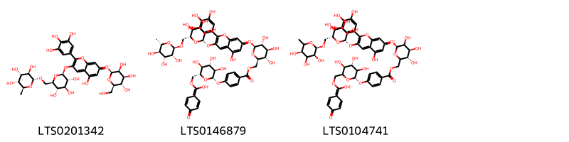

!!! abstract "Tóm tắt"

    Phụ Tử (Radix Aconiti lateralis) là rễ củ nhánh đã phơi hay sấy khô của cây Ô đầu (Aconitum fortunei Hemsl. hoặc Aconitum carmichaeli Debx.), họ Hoàng liên (Ranunculaceae). Cây phân bố rải rác khắp vùng ôn đới ấm Bắc bán cầu. Tại Việt Nam, cây được trồng tập trung ở Sapa và Hà Giang. Theo tài liệu cổ, phụ tử có tính tân, cam, đại nhiệt, có độc, vào kinh tâm, thận, tỳ. Phụ tử có tác dụng trợ tim, trị đau nhức xương khớp, lưng gối đau lạnh và chân tay phù nề. Tác dụng dược lý của dược liệu được tìm thấy trên tim, huyết áp, thần kinh, giảm đau, chống viêm,... Thành phần hóa học chứa nhiều terpenoid ester alcaloid và hợp chất quan trọng nhất là aconitine.

## Thông tin về thực vật

Dược liệu **Phụ Tử (Rễ Củ Nhánh Đã Phơi Hay Sấy Khô Của Cầy Ô Đầu )** từ bộ phận **nan** từ loài *Aconitum fortunei*.

**Mô tả thực vật:** Cây ô đầu là loại cỏ sống lâu năm, cao chừng 0,6-1m. Tên cây trước đây nhiều tác giả đã xác định là Aconitum sinense Paxt, nhưng gần đây có tác giả đã xác định lại là Aconitum carmichaeli Debx. 

Rễ phát triển thành củ, có củ mẹ, củ con như cây âu ô đầu. Củ hái ở những cây trồng có thể tới 5cm đường kính. Lá mọc so le, phiến lá rộng 5- 12cm, xẻ thành 3 thùy, 2 thùy 2 bên lại xẻ làm 2, thùy giữa lại xẻ làm 3 thùy con nữa. Mép các thủy đều có răng cưa thô, to. Cụm hoa dài 10-20cm. hoa màu xanh tím, quả dài 2mm. Hoa nở vào tháng 6-7. Quả thu hoạch vào tháng 7-8.

*Tài liệu tham khảo:* "Những cây thuốc và vị thuốc Việt Nam" - Đỗ Tất Lợi 
Trong dược điển Việt nam, một số loài có thể dùng thay thế cho nhau làm dược liệu bao gồm *Aconitum fortunei, Aconitum carmichaeli* 
Chưa có thông tin về loài này trên gibf

!!! info "Phân loại thực vật của *Aconitum carmichaelii*"
    - **Kingdom:** Plantae
    - **Phylum:** Tracheophyta
    - **Order:** Ranunculales
    - **Family:** Ranunculaceae
    - **Genus:** Aconitum
    - **Species:** *Aconitum carmichaelii*

**Phân bố trên thế giới:** France, Germany, nan, United States of America, China, Chinese Taipei, unknown or invalid, United Kingdom of Great Britain and Northern Ireland, Japan, Netherlands, Austria, Viet Nam

**Phân bố tại Việt nam:** Không có ghi nhận ở Việt Nam

## Thông tin về dược liệu 

### Định danh

!!! info "Thông tin về tên gọi"

    - Dược liệu tiếng Việt: nan
    - Dược liệu tiếng Trung: nan (nan)
    - Dược liệu tiếng Anh: nan
    - Dược liệu latin thông dụng: nan
    - Dược liệu latin kiểu DĐVN: *radix aconiti lateralis*
    - Dược liệu latin kiểu DĐVN: *nan*
    - Dược liệu latin kiểu thông tư: *nan*
    - Bộ phận dùng: nan (nan)

### Mô tả dược liệu 

- **Theo dược điển Việt nam V:** nan

- **Mô tả dược liệu theo thông tư chế biến dược liệu theo phương pháp cổ truyền:** nan

### Chế biến 

- **Chế biến theo dược điển việt nam V**: nan

- **Chế biến theo thông tư:** nan

--- 

## Thành phần hóa học

- Theo tài liệu của GS. Đỗ Tất Lợi:  - Chứa nhiều terpenoid ester alcaloid và hợp chất quan trọng nhất là aconitin.
-  Aconitin (C34H47O11N)
    

**Thành phần hóa học từ loài **Aconitum carmichaeli**

Theo cơ sở dữ liệu lotus, loài *Aconitum carmichaeli* đã phân lập và xác định được **63** hoạt chất thuộc về các nhóm Flavonoids, Cinnamic acids and derivatives, Benzene and substituted derivatives, Prenol lipids trong bảng dưới đây. Danh sách các hoạt chất như sau (1s,2r,3r,4r,5s,6s,7s,8r,9r,13r,16s,17s,18r)-8-(acetyloxy)-11-ethyl-5,7,14-trihydroxy-6,16,18-trimethoxy-13-(methoxymethyl)-11-azahexacyclo[7.7.2.1²,⁵.0¹,¹⁰.0³,⁸.0¹³,¹⁷]nonadecan-4-yl benzoate [(LTS0052369)](https://lotus.naturalproducts.net/compound/lotus_id/LTS0052369), (1r,2r,3r,4r,5r,6s,8r,9s,10s,13r,16r,17s,18s)-8-(acetyloxy)-11-ethyl-6,16,18-trimethoxy-13-(methoxymethyl)-11-azahexacyclo[7.7.2.1²,⁵.0¹,¹⁰.0³,⁸.0¹³,¹⁷]nonadecan-4-yl 4-methoxybenzoate [(LTS0191583)](https://lotus.naturalproducts.net/compound/lotus_id/LTS0191583), 11-ethyl-6-methoxy-13-(methoxymethyl)-11-azahexacyclo[7.7.2.1²,⁵.0¹,¹⁰.0³,⁸.0¹³,¹⁷]nonadecane-4,8,16,18-tetrol [(LTS0004309)](https://lotus.naturalproducts.net/compound/lotus_id/LTS0004309), (2r,3r,4r,5r,6s,7s,8r,13s,16s,17r,18r)-8-(acetyloxy)-11-ethyl-5,7-dihydroxy-6,16,18-trimethoxy-13-(methoxymethyl)-11-azahexacyclo[7.7.2.1²,⁵.0¹,¹⁰.0³,⁸.0¹³,¹⁷]nonadecan-4-yl benzoate [(LTS0046270)](https://lotus.naturalproducts.net/compound/lotus_id/LTS0046270), (5-hydroxy-3-{[(2s,3r,4s,5s,6r)-3,4,5-trihydroxy-6-({[(2r,3r,4s,5r,6s)-3,4,5-trihydroxy-6-methyloxan-2-yl]oxy}methyl)oxan-2-yl]oxy}-2-(3,4,5-trihydroxyphenyl)chromen-7-ylidene)[(2s,3s,4s,5s,6r)-3,4,5-trihydroxy-6-(hydroxymethyl)oxan-2-yl]oxidanium [(LTS0201342)](https://lotus.naturalproducts.net/compound/lotus_id/LTS0201342), mesaconitine [(LTS0042834)](https://lotus.naturalproducts.net/compound/lotus_id/LTS0042834), (1s,2r,3r,4s,5s,6s,8s,13r,16s,17r)-11-ethyl-6-methoxy-13-methyl-11-azahexacyclo[7.7.2.1²,⁵.0¹,¹⁰.0³,⁸.0¹³,¹⁷]nonadecane-4,8,16-triol [(LTS0090088)](https://lotus.naturalproducts.net/compound/lotus_id/LTS0090088), 11-ethyl-6-methoxy-13-methyl-11-azahexacyclo[7.7.2.1²,⁵.0¹,¹⁰.0³,⁸.0¹³,¹⁷]nonadecane-4,8,16-triol [(LTS0092058)](https://lotus.naturalproducts.net/compound/lotus_id/LTS0092058), (5-hydroxy-3-{[(2s,5s,6r)-3,4,5-trihydroxy-6-({[(2r,3s,5r)-3,4,5-trihydroxy-6-methyloxan-2-yl]oxy}methyl)oxan-2-yl]oxy}-2-(3,4,5-trihydroxyphenyl)chromen-7-ylidene)[(2s,4s,5s)-3,4,5-trihydroxy-6-[(4-{[(2s,4s,5s)-3,4,5-trihydroxy-6-{[hydroxy(4-oxocyclohexa-2,5-dien-1-ylidene)methoxy]methyl}oxan-2-yl]oxy}benzoyloxy)methyl]oxan-2-yl]oxidanium [(LTS0104741)](https://lotus.naturalproducts.net/compound/lotus_id/LTS0104741), (1r,2r,3r,4s,5s,6r,7s,8s,9s,10s,13s,16s,17r,18s)-11-ethyl-6,18-dimethoxy-13-(methoxymethyl)-11-azahexacyclo[7.7.2.1²,⁵.0¹,¹⁰.0³,⁸.0¹³,¹⁷]nonadecane-4,7,8,16-tetrol [(LTS0065613)](https://lotus.naturalproducts.net/compound/lotus_id/LTS0065613), (2r,3r,4s,6r,7s,8r,13s,16s,17r,18r)-11-ethyl-6,18-dimethoxy-13-(methoxymethyl)-11-azahexacyclo[7.7.2.1²,⁵.0¹,¹⁰.0³,⁸.0¹³,¹⁷]nonadecane-4,7,8,16-tetrol [(LTS0258208)](https://lotus.naturalproducts.net/compound/lotus_id/LTS0258208), [(2r,3s,4s,5r,6s)-3,4,5-trihydroxy-6-{[(2r)-5-hydroxy-3-{[(2r,3r,4s,5s,6r)-3,4,5-trihydroxy-6-({[(2r,3r,4r,5r,6s)-3,4,5-trihydroxy-6-methyloxan-2-yl]oxy}methyl)oxan-2-yl]oxy}-2-(3,4,5-trihydroxyphenyl)-2h-chromen-7-yl]oxy}oxan-2-yl]methyl 4-{[(2s,3r,4s,5s,6r)-3,4,5-trihydroxy-6-[(4-hydroxybenzoyloxy)methyl]oxan-2-yl]oxy}benzoate [(LTS0028662)](https://lotus.naturalproducts.net/compound/lotus_id/LTS0028662), (2r,3r,4s,5s,6s,8r,13s,16s,17r,18r)-11-ethyl-6,18-dimethoxy-13-(methoxymethyl)-11-azahexacyclo[7.7.2.1²,⁵.0¹,¹⁰.0³,⁸.0¹³,¹⁷]nonadecane-4,8,16-triol [(LTS0008435)](https://lotus.naturalproducts.net/compound/lotus_id/LTS0008435), (1s,2r,3r,4s,5r,6s,8s,9r,13s,16s,17r)-11-ethyl-6-methoxy-13-(methoxymethyl)-11-azahexacyclo[7.7.2.1²,⁵.0¹,¹⁰.0³,⁸.0¹³,¹⁷]nonadecane-4,8,16-triol [(LTS0057321)](https://lotus.naturalproducts.net/compound/lotus_id/LTS0057321), 8-(acetyloxy)-11-ethyl-5-hydroxy-6,16,18-trimethoxy-13-(methoxymethyl)-11-azahexacyclo[7.7.2.1²,⁵.0¹,¹⁰.0³,⁸.0¹³,¹⁷]nonadecan-4-yl 4-methoxybenzoate [(LTS0093546)](https://lotus.naturalproducts.net/compound/lotus_id/LTS0093546), karakoline [(LTS0275120)](https://lotus.naturalproducts.net/compound/lotus_id/LTS0275120), 11-ethyl-8,16-dihydroxy-6,18-dimethoxy-13-(methoxymethyl)-11-azahexacyclo[7.7.2.1²,⁵.0¹,¹⁰.0³,⁸.0¹³,¹⁷]nonadecan-4-yl 3-phenylprop-2-enoate [(LTS0239505)](https://lotus.naturalproducts.net/compound/lotus_id/LTS0239505), (1r,2r,3r,4r,5r,6s,8r,9s,10s,13r,16r,17s,18s)-11-ethyl-8,16-dihydroxy-6,18-dimethoxy-13-(methoxymethyl)-11-azahexacyclo[7.7.2.1²,⁵.0¹,¹⁰.0³,⁸.0¹³,¹⁷]nonadecan-4-yl (2e)-3-phenylprop-2-enoate [(LTS0148160)](https://lotus.naturalproducts.net/compound/lotus_id/LTS0148160), (2s,3s,5r,8r,13s,17s)-8-(acetyloxy)-5,7-dihydroxy-6,16,18-trimethoxy-13-(methoxymethyl)-11-methyl-11-azahexacyclo[7.7.2.1²,⁵.0¹,¹⁰.0³,⁸.0¹³,¹⁷]nonadecan-4-yl benzoate [(LTS0195548)](https://lotus.naturalproducts.net/compound/lotus_id/LTS0195548), (2r,3r,5r,6s,7s,8r,13r,14r,16s,17s,18r)-11-ethyl-5,7,8,14-tetrahydroxy-6,16,18-trimethoxy-13-(methoxymethyl)-11-azahexacyclo[7.7.2.1²,⁵.0¹,¹⁰.0³,⁸.0¹³,¹⁷]nonadecan-4-yl benzoate [(LTS0000276)](https://lotus.naturalproducts.net/compound/lotus_id/LTS0000276), (2s,3s,5r,8r,13s,17s)-8-(acetyloxy)-11-ethyl-6,16,18-trimethoxy-13-(methoxymethyl)-11-azahexacyclo[7.7.2.1²,⁵.0¹,¹⁰.0³,⁸.0¹³,¹⁷]nonadecan-4-yl 4-methoxybenzoate [(LTS0128384)](https://lotus.naturalproducts.net/compound/lotus_id/LTS0128384), (1s,3r,4s,5r,8s,9r,10r,11r,14r,16s,17s,18s,19s)-4,9-bis(acetyloxy)-10,19-dihydroxy-5-methyl-12-methylidene-7-azaheptacyclo[9.6.2.0¹,⁸.0⁵,¹⁷.0⁷,¹⁶.0⁹,¹⁴.0¹⁴,¹⁸]nonadecan-3-yl (2r)-2-methylbutanoate [(LTS0112781)](https://lotus.naturalproducts.net/compound/lotus_id/LTS0112781), hypaconitine [(LTS0032528)](https://lotus.naturalproducts.net/compound/lotus_id/LTS0032528), denudatine [(LTS0169115)](https://lotus.naturalproducts.net/compound/lotus_id/LTS0169115), (1s,2r,3s,4r,5s,6s,7s,8r,9s,13s,16r,17r,18s)-11-ethyl-6,18-dimethoxy-13-(methoxymethyl)-11-azahexacyclo[7.7.2.1²,⁵.0¹,¹⁰.0³,⁸.0¹³,¹⁷]nonadecane-4,7,8,16-tetrol [(LTS0189415)](https://lotus.naturalproducts.net/compound/lotus_id/LTS0189415), (1s,5s,6s,8s,13r,16s)-11-ethyl-6-methoxy-13-(methoxymethyl)-11-azahexacyclo[7.7.2.1²,⁵.0¹,¹⁰.0³,⁸.0¹³,¹⁷]nonadecane-4,8,16-triol [(LTS0264100)](https://lotus.naturalproducts.net/compound/lotus_id/LTS0264100), (2r,3r,4s,5s,6s,8s,13s,16s,17r)-11-ethyl-6,16-dimethoxy-13-(methoxymethyl)-11-azahexacyclo[7.7.2.1²,⁵.0¹,¹⁰.0³,⁸.0¹³,¹⁷]nonadecane-4,8-diol [(LTS0265095)](https://lotus.naturalproducts.net/compound/lotus_id/LTS0265095), (1r,4s,5r,8s,10s,12r,13s,14r,17s,19r)-11-ethyl-19-hydroxy-5-methyl-18-methylidene-9-oxa-11-azaheptacyclo[15.2.1.0¹,¹⁴.0²,¹².0⁴,¹³.0⁵,¹⁰.0⁸,¹³]icosan-16-one [(LTS0222839)](https://lotus.naturalproducts.net/compound/lotus_id/LTS0222839), (1r,5s,7r,8r,9r,13r)-11-ethyl-7,16-dihydroxy-13-methyl-6-methylidene-11-azahexacyclo[7.7.2.1⁵,⁸.0¹,¹⁰.0²,⁸.0¹³,¹⁷]nonadecan-4-one [(LTS0071483)](https://lotus.naturalproducts.net/compound/lotus_id/LTS0071483), (2r,3r,4s,5s,6s,8s,13r,16s,17r)-11-ethyl-6-methoxy-13-methyl-11-azahexacyclo[7.7.2.1²,⁵.0¹,¹⁰.0³,⁸.0¹³,¹⁷]nonadecane-4,8,16-triol [(LTS0253373)](https://lotus.naturalproducts.net/compound/lotus_id/LTS0253373), jesaconitine [(LTS0001669)](https://lotus.naturalproducts.net/compound/lotus_id/LTS0001669), (1s,2s,3r,4s,5r,6r,7s,8r,9r,10r,13r,14r,16s,17r,18r)-11-ethyl-5,7,8,14-tetrahydroxy-6,16,18-trimethoxy-13-(methoxymethyl)-11-azahexacyclo[7.7.2.1²,⁵.0¹,¹⁰.0³,⁸.0¹³,¹⁷]nonadecan-4-yl benzoate [(LTS0262554)](https://lotus.naturalproducts.net/compound/lotus_id/LTS0262554), (1s,2r,3r,6s,7s,8r,9r,13s,16s,18r)-5,7,8-trihydroxy-6,16,18-trimethoxy-13-(methoxymethyl)-11-methyl-11-azahexacyclo[7.7.2.1²,⁵.0¹,¹⁰.0³,⁸.0¹³,¹⁷]nonadecan-4-yl benzoate [(LTS0138581)](https://lotus.naturalproducts.net/compound/lotus_id/LTS0138581), aconitine [(LTS0031342)](https://lotus.naturalproducts.net/compound/lotus_id/LTS0031342), (5-hydroxy-3-{[(2s,3r,4r,5s,6r)-3,4,5-trihydroxy-6-({[(2r,3s,4r,5r,6r)-3,4,5-trihydroxy-6-methyloxan-2-yl]oxy}methyl)oxan-2-yl]oxy}-2-(3,4,5-trihydroxyphenyl)chromen-7-ylidene)[(2s,3r,4s,5s,6s)-3,4,5-trihydroxy-6-[(4-{[(2s,3r,4s,5s,6r)-3,4,5-trihydroxy-6-{[hydroxy(4-oxocyclohexa-2,5-dien-1-ylidene)methoxy]methyl}oxan-2-yl]oxy}benzoyloxy)methyl]oxan-2-yl]oxidanium [(LTS0051470)](https://lotus.naturalproducts.net/compound/lotus_id/LTS0051470), (1s,5r,6s,7s,8r,9r,10r,13r,14r,16s)-8-(acetyloxy)-5,7,14-trihydroxy-6,16,18-trimethoxy-13-(methoxymethyl)-11-methyl-11-azahexacyclo[7.7.2.1²,⁵.0¹,¹⁰.0³,⁸.0¹³,¹⁷]nonadecan-4-yl benzoate [(LTS0197623)](https://lotus.naturalproducts.net/compound/lotus_id/LTS0197623), 11-ethyl-6-methoxy-13-(methoxymethyl)-11-azahexacyclo[7.7.2.1²,⁵.0¹,¹⁰.0³,⁸.0¹³,¹⁷]nonadecane-4,8,16-triol [(LTS0046551)](https://lotus.naturalproducts.net/compound/lotus_id/LTS0046551), (2r,3r,5s,6s,8r,13s,17r)-8-(acetyloxy)-11-ethyl-5-hydroxy-6,16,18-trimethoxy-13-(methoxymethyl)-11-azahexacyclo[7.7.2.1²,⁵.0¹,¹⁰.0³,⁸.0¹³,¹⁷]nonadecan-4-yl 4-methoxybenzoate [(LTS0001869)](https://lotus.naturalproducts.net/compound/lotus_id/LTS0001869), (1s,2r,3r,4r,5r,6s,7s,8r,9r,13r,14r,16s,17s,18r)-11-ethyl-5,7,8,14-tetrahydroxy-6,16,18-trimethoxy-13-(methoxymethyl)-11-azahexacyclo[7.7.2.1²,⁵.0¹,¹⁰.0³,⁸.0¹³,¹⁷]nonadecan-4-yl benzoate [(LTS0052721)](https://lotus.naturalproducts.net/compound/lotus_id/LTS0052721), (1s,2r,3r,4r,5s,6s,8r,9r,13s,16s,17r,18r)-8-(acetyloxy)-11-ethyl-5-hydroxy-6,16,18-trimethoxy-13-(methoxymethyl)-11-azahexacyclo[7.7.2.1²,⁵.0¹,¹⁰.0³,⁸.0¹³,¹⁷]nonadecan-4-yl 4-methoxybenzoate [(LTS0261710)](https://lotus.naturalproducts.net/compound/lotus_id/LTS0261710), 8-(acetyloxy)-11-ethyl-6,16,18-trimethoxy-13-(methoxymethyl)-11-azahexacyclo[7.7.2.1²,⁵.0¹,¹⁰.0³,⁸.0¹³,¹⁷]nonadecan-4-yl 4-methoxybenzoate [(LTS0086937)](https://lotus.naturalproducts.net/compound/lotus_id/LTS0086937), 8-(acetyloxy)-11-ethyl-5,7,14-trihydroxy-6,16,18-trimethoxy-13-(methoxymethyl)-11-azahexacyclo[7.7.2.1²,⁵.0¹,¹⁰.0³,⁸.0¹³,¹⁷]nonadecan-4-yl benzoate [(LTS0139961)](https://lotus.naturalproducts.net/compound/lotus_id/LTS0139961), (1s,2r,3r,4s,5r,6s,8r,9s,13s,16s,17r,18r)-11-ethyl-8,16-dihydroxy-6,18-dimethoxy-13-(methoxymethyl)-11-azahexacyclo[7.7.2.1²,⁵.0¹,¹⁰.0³,⁸.0¹³,¹⁷]nonadecan-4-yl acetate [(LTS0079606)](https://lotus.naturalproducts.net/compound/lotus_id/LTS0079606), (1r,2r,3r,4s,5s,6r,7s,8s,9s,10s,13s,16s,18s)-11-ethyl-6,18-dimethoxy-13-(methoxymethyl)-11-azahexacyclo[7.7.2.1²,⁵.0¹,¹⁰.0³,⁸.0¹³,¹⁷]nonadecane-4,7,8,16-tetrol [(LTS0094832)](https://lotus.naturalproducts.net/compound/lotus_id/LTS0094832), (2r,3r,5r,6s,8r,10r,17s)-5,7,14-trihydroxy-6,8,16,18-tetramethoxy-13-(methoxymethyl)-11-methyl-11-azahexacyclo[7.7.2.1²,⁵.0¹,¹⁰.0³,⁸.0¹³,¹⁷]nonadecan-4-yl benzoate [(LTS0197341)](https://lotus.naturalproducts.net/compound/lotus_id/LTS0197341), (1s,2r,3r,4r,5r,6s,7s,8r,9r,10r,13r,14r,16s,17s,18r)-5,7,14-trihydroxy-6,8,16,18-tetramethoxy-13-(methoxymethyl)-11-methyl-11-azahexacyclo[7.7.2.1²,⁵.0¹,¹⁰.0³,⁸.0¹³,¹⁷]nonadecan-4-yl benzoate [(LTS0051720)](https://lotus.naturalproducts.net/compound/lotus_id/LTS0051720), (1s,2r,3r,4r,5r,6s,7s,8r,9r,10r,13r,14r,16s,17s,18r)-8-(acetyloxy)-11-ethyl-5,7,14-trihydroxy-6,16,18-trimethoxy-13-(methoxymethyl)-11-azahexacyclo[7.7.2.1²,⁵.0¹,¹⁰.0³,⁸.0¹³,¹⁷]nonadecan-4-yl benzoate [(LTS0130236)](https://lotus.naturalproducts.net/compound/lotus_id/LTS0130236), (1s,2r,3r,4r,5s,6s,8r,9r,10r,13s,16r,17r,18s)-11-ethyl-6-methoxy-13-(methoxymethyl)-11-azahexacyclo[7.7.2.1²,⁵.0¹,¹⁰.0³,⁸.0¹³,¹⁷]nonadecane-4,8,16,18-tetrol [(LTS0041264)](https://lotus.naturalproducts.net/compound/lotus_id/LTS0041264), hydroxycinnamic acid [(LTS0233023)](https://lotus.naturalproducts.net/compound/lotus_id/LTS0233023), (1s,2r,3r,4s,5s,6s,8r,9r,10r,13s,16s,17r,18s)-11-ethyl-6-methoxy-13-(methoxymethyl)-11-azahexacyclo[7.7.2.1²,⁵.0¹,¹⁰.0³,⁸.0¹³,¹⁷]nonadecane-4,8,16,18-tetrol [(LTS0083355)](https://lotus.naturalproducts.net/compound/lotus_id/LTS0083355), (1r,2r,3r,4s,5s,6s,8r,9s,10s,13r,16s,17s,18s)-8-(acetyloxy)-11-ethyl-5-hydroxy-6,16,18-trimethoxy-13-(methoxymethyl)-11-azahexacyclo[7.7.2.1²,⁵.0¹,¹⁰.0³,⁸.0¹³,¹⁷]nonadecan-4-yl 4-methoxybenzoate [(LTS0006923)](https://lotus.naturalproducts.net/compound/lotus_id/LTS0006923), (1s,3r,4r,6s,7s,8r,10r,13r,14r,16s,17s,18r)-5,7,8,14-tetrahydroxy-6,16,18-trimethoxy-13-(methoxymethyl)-11-methyl-11-azahexacyclo[7.7.2.1²,⁵.0¹,¹⁰.0³,⁸.0¹³,¹⁷]nonadecan-4-yl benzoate [(LTS0016425)](https://lotus.naturalproducts.net/compound/lotus_id/LTS0016425), (1s,5s,8r,10r,13s)-8-(acetyloxy)-11-ethyl-5-hydroxy-6,16,18-trimethoxy-13-(methoxymethyl)-11-azahexacyclo[7.7.2.1²,⁵.0¹,¹⁰.0³,⁸.0¹³,¹⁷]nonadecan-4-yl 4-methoxybenzoate [(LTS0110292)](https://lotus.naturalproducts.net/compound/lotus_id/LTS0110292), [3,4,5-trihydroxy-6-({5-hydroxy-3-[(3,4,5-trihydroxy-6-{[(3,4,5-trihydroxy-6-methyloxan-2-yl)oxy]methyl}oxan-2-yl)oxy]-2-(3,4,5-trihydroxyphenyl)-2h-chromen-7-yl}oxy)oxan-2-yl]methyl 4-({3,4,5-trihydroxy-6-[(4-hydroxybenzoyloxy)methyl]oxan-2-yl}oxy)benzoate [(LTS0004917)](https://lotus.naturalproducts.net/compound/lotus_id/LTS0004917), (6s,8s)-11-ethyl-6-methoxy-13-methyl-11-azahexacyclo[7.7.2.1²,⁵.0¹,¹⁰.0³,⁸.0¹³,¹⁷]nonadecane-4,8,16-triol [(LTS0093517)](https://lotus.naturalproducts.net/compound/lotus_id/LTS0093517), (1s,2r,3r,4s,5r,6s,8r,9s,13s,16s,17r,18r)-11-ethyl-8,16-dihydroxy-6,18-dimethoxy-13-(methoxymethyl)-11-azahexacyclo[7.7.2.1²,⁵.0¹,¹⁰.0³,⁸.0¹³,¹⁷]nonadecan-4-yl 4-methoxybenzoate [(LTS0255883)](https://lotus.naturalproducts.net/compound/lotus_id/LTS0255883), (6s,8s,13s)-11-ethyl-6,16-dimethoxy-13-(methoxymethyl)-11-azahexacyclo[7.7.2.1²,⁵.0¹,¹⁰.0³,⁸.0¹³,¹⁷]nonadecane-4,8-diol [(LTS0241059)](https://lotus.naturalproducts.net/compound/lotus_id/LTS0241059), honokiol [(LTS0033178)](https://lotus.naturalproducts.net/compound/lotus_id/LTS0033178), (5-hydroxy-3-{[(2s,3r,4s,5s,6r)-3,4,5-trihydroxy-6-({[(2r,3r,4r,5r,6s)-3,4,5-trihydroxy-6-methyloxan-2-yl]oxy}methyl)oxan-2-yl]oxy}-2-(3,4,5-trihydroxyphenyl)chromen-7-ylidene)[(2s,3r,4s,5s,6r)-3,4,5-trihydroxy-6-[(4-{[(2s,3r,4s,5s,6r)-3,4,5-trihydroxy-6-{[hydroxy(4-oxocyclohexa-2,5-dien-1-ylidene)methoxy]methyl}oxan-2-yl]oxy}benzoyloxy)methyl]oxan-2-yl]oxidanium [(LTS0146879)](https://lotus.naturalproducts.net/compound/lotus_id/LTS0146879), 11-ethyl-6,18-dimethoxy-13-(methoxymethyl)-11-azahexacyclo[7.7.2.1²,⁵.0¹,¹⁰.0³,⁸.0¹³,¹⁷]nonadecane-4,8,16-triol [(LTS0251734)](https://lotus.naturalproducts.net/compound/lotus_id/LTS0251734), (1s,2r,3r,4s,5s,6s,8s,9s,10r,13s,16s,17r)-11-ethyl-4-hydroxy-6,16-dimethoxy-13-(methoxymethyl)-11-azahexacyclo[7.7.2.1²,⁵.0¹,¹⁰.0³,⁸.0¹³,¹⁷]nonadecan-8-yl acetate [(LTS0235848)](https://lotus.naturalproducts.net/compound/lotus_id/LTS0235848), (1r,2r,3r,4r,5r,6s,8r,9s,10s,13r,16s,17s,18s)-11-ethyl-8,16-dihydroxy-6,18-dimethoxy-13-(methoxymethyl)-11-azahexacyclo[7.7.2.1²,⁵.0¹,¹⁰.0³,⁸.0¹³,¹⁷]nonadecan-4-yl 4-methoxybenzoate [(LTS0160229)](https://lotus.naturalproducts.net/compound/lotus_id/LTS0160229), (2s,3s,5r,8r,13s,17s)-5,7,8-trihydroxy-6,16,18-trimethoxy-13-(methoxymethyl)-11-methyl-11-azahexacyclo[7.7.2.1²,⁵.0¹,¹⁰.0³,⁸.0¹³,¹⁷]nonadecan-4-yl benzoate [(LTS0206876)](https://lotus.naturalproducts.net/compound/lotus_id/LTS0206876). 
        
| chemicalTaxonomyClassyfireClass     |   smiles_count |
|:------------------------------------|---------------:|
| Benzene and substituted derivatives |             35 |
| Cinnamic acids and derivatives      |             20 |
| Flavonoids                          |            622 |
| Prenol lipids                       |           5821 |

            
### Nhóm Benzene and substituted derivatives
<figure markdown="span">
    { width=100% }
<figcaption>Hình ảnh cấu trúc hóa học của hoạt chất thuộc nhóm *Benzene and substituted derivatives*. Tên thường gọi của các hoạt chất tương ứng là honokiol [(LTS0033178)](https://lotus.naturalproducts.net/compound/lotus_id/LTS0033178).</figcaption>
</figure>

            
            
### Nhóm Benzene and substituted derivatives
<figure markdown="span">
    { width=100% }
<figcaption>Hình ảnh cấu trúc hóa học của hoạt chất thuộc nhóm *Benzene and substituted derivatives*. Tên thường gọi của các hoạt chất tương ứng là honokiol [(LTS0033178)](https://lotus.naturalproducts.net/compound/lotus_id/LTS0033178).</figcaption>
</figure>

### Nhóm Cinnamic acids and derivatives
<figure markdown="span">
    { width=100% }
<figcaption>Hình ảnh cấu trúc hóa học của hoạt chất thuộc nhóm *Cinnamic acids and derivatives*. Tên thường gọi của các hoạt chất tương ứng là hydroxycinnamic acid [(LTS0233023)](https://lotus.naturalproducts.net/compound/lotus_id/LTS0233023).</figcaption>
</figure>

            
            
### Nhóm Benzene and substituted derivatives
<figure markdown="span">
    { width=100% }
<figcaption>Hình ảnh cấu trúc hóa học của hoạt chất thuộc nhóm *Benzene and substituted derivatives*. Tên thường gọi của các hoạt chất tương ứng là honokiol [(LTS0033178)](https://lotus.naturalproducts.net/compound/lotus_id/LTS0033178).</figcaption>
</figure>

### Nhóm Cinnamic acids and derivatives
<figure markdown="span">
    { width=100% }
<figcaption>Hình ảnh cấu trúc hóa học của hoạt chất thuộc nhóm *Cinnamic acids and derivatives*. Tên thường gọi của các hoạt chất tương ứng là hydroxycinnamic acid [(LTS0233023)](https://lotus.naturalproducts.net/compound/lotus_id/LTS0233023).</figcaption>
</figure>

### Nhóm Flavonoids
<figure markdown="span">
    { width=100% }
<figcaption>Hình ảnh cấu trúc hóa học của hoạt chất thuộc nhóm *Flavonoids*. Tên thường gọi của các hoạt chất tương ứng là (5-hydroxy-3-{[(2s,3r,4s,5s,6r)-3,4,5-trihydroxy-6-({[(2r,3r,4s,5r,6s)-3,4,5-trihydroxy-6-methyloxan-2-yl]oxy}methyl)oxan-2-yl]oxy}-2-(3,4,5-trihydroxyphenyl)chromen-7-ylidene)[(2s,3s,4s,5s,6r)-3,4,5-trihydroxy-6-(hydroxymethyl)oxan-2-yl]oxidanium [(LTS0201342)](https://lotus.naturalproducts.net/compound/lotus_id/LTS0201342), (5-hydroxy-3-{[(2s,3r,4s,5s,6r)-3,4,5-trihydroxy-6-({[(2r,3r,4r,5r,6s)-3,4,5-trihydroxy-6-methyloxan-2-yl]oxy}methyl)oxan-2-yl]oxy}-2-(3,4,5-trihydroxyphenyl)chromen-7-ylidene)[(2s,3r,4s,5s,6r)-3,4,5-trihydroxy-6-[(4-{[(2s,3r,4s,5s,6r)-3,4,5-trihydroxy-6-{[hydroxy(4-oxocyclohexa-2,5-dien-1-ylidene)methoxy]methyl}oxan-2-yl]oxy}benzoyloxy)methyl]oxan-2-yl]oxidanium [(LTS0146879)](https://lotus.naturalproducts.net/compound/lotus_id/LTS0146879), (5-hydroxy-3-{[(2s,5s,6r)-3,4,5-trihydroxy-6-({[(2r,3s,5r)-3,4,5-trihydroxy-6-methyloxan-2-yl]oxy}methyl)oxan-2-yl]oxy}-2-(3,4,5-trihydroxyphenyl)chromen-7-ylidene)[(2s,4s,5s)-3,4,5-trihydroxy-6-[(4-{[(2s,4s,5s)-3,4,5-trihydroxy-6-{[hydroxy(4-oxocyclohexa-2,5-dien-1-ylidene)methoxy]methyl}oxan-2-yl]oxy}benzoyloxy)methyl]oxan-2-yl]oxidanium [(LTS0104741)](https://lotus.naturalproducts.net/compound/lotus_id/LTS0104741).</figcaption>
</figure>

            
            
### Nhóm Benzene and substituted derivatives
<figure markdown="span">
    { width=100% }
<figcaption>Hình ảnh cấu trúc hóa học của hoạt chất thuộc nhóm *Benzene and substituted derivatives*. Tên thường gọi của các hoạt chất tương ứng là honokiol [(LTS0033178)](https://lotus.naturalproducts.net/compound/lotus_id/LTS0033178).</figcaption>
</figure>

### Nhóm Cinnamic acids and derivatives
<figure markdown="span">
    { width=100% }
<figcaption>Hình ảnh cấu trúc hóa học của hoạt chất thuộc nhóm *Cinnamic acids and derivatives*. Tên thường gọi của các hoạt chất tương ứng là hydroxycinnamic acid [(LTS0233023)](https://lotus.naturalproducts.net/compound/lotus_id/LTS0233023).</figcaption>
</figure>

### Nhóm Flavonoids
<figure markdown="span">
    { width=100% }
<figcaption>Hình ảnh cấu trúc hóa học của hoạt chất thuộc nhóm *Flavonoids*. Tên thường gọi của các hoạt chất tương ứng là (5-hydroxy-3-{[(2s,3r,4s,5s,6r)-3,4,5-trihydroxy-6-({[(2r,3r,4s,5r,6s)-3,4,5-trihydroxy-6-methyloxan-2-yl]oxy}methyl)oxan-2-yl]oxy}-2-(3,4,5-trihydroxyphenyl)chromen-7-ylidene)[(2s,3s,4s,5s,6r)-3,4,5-trihydroxy-6-(hydroxymethyl)oxan-2-yl]oxidanium [(LTS0201342)](https://lotus.naturalproducts.net/compound/lotus_id/LTS0201342), (5-hydroxy-3-{[(2s,3r,4s,5s,6r)-3,4,5-trihydroxy-6-({[(2r,3r,4r,5r,6s)-3,4,5-trihydroxy-6-methyloxan-2-yl]oxy}methyl)oxan-2-yl]oxy}-2-(3,4,5-trihydroxyphenyl)chromen-7-ylidene)[(2s,3r,4s,5s,6r)-3,4,5-trihydroxy-6-[(4-{[(2s,3r,4s,5s,6r)-3,4,5-trihydroxy-6-{[hydroxy(4-oxocyclohexa-2,5-dien-1-ylidene)methoxy]methyl}oxan-2-yl]oxy}benzoyloxy)methyl]oxan-2-yl]oxidanium [(LTS0146879)](https://lotus.naturalproducts.net/compound/lotus_id/LTS0146879), (5-hydroxy-3-{[(2s,5s,6r)-3,4,5-trihydroxy-6-({[(2r,3s,5r)-3,4,5-trihydroxy-6-methyloxan-2-yl]oxy}methyl)oxan-2-yl]oxy}-2-(3,4,5-trihydroxyphenyl)chromen-7-ylidene)[(2s,4s,5s)-3,4,5-trihydroxy-6-[(4-{[(2s,4s,5s)-3,4,5-trihydroxy-6-{[hydroxy(4-oxocyclohexa-2,5-dien-1-ylidene)methoxy]methyl}oxan-2-yl]oxy}benzoyloxy)methyl]oxan-2-yl]oxidanium [(LTS0104741)](https://lotus.naturalproducts.net/compound/lotus_id/LTS0104741).</figcaption>
</figure>

### Nhóm Prenol lipids
<figure markdown="span">
    { width=100% }
<figcaption>Hình ảnh cấu trúc hóa học của hoạt chất thuộc nhóm *Prenol lipids*. Tên thường gọi của các hoạt chất tương ứng là aconitine [(LTS0031342)](https://lotus.naturalproducts.net/compound/lotus_id/LTS0031342), 11-ethyl-6,18-dimethoxy-13-(methoxymethyl)-11-azahexacyclo[7.7.2.1²,⁵.0¹,¹⁰.0³,⁸.0¹³,¹⁷]nonadecane-4,8,16-triol [(LTS0251734)](https://lotus.naturalproducts.net/compound/lotus_id/LTS0251734), mesaconitine [(LTS0042834)](https://lotus.naturalproducts.net/compound/lotus_id/LTS0042834), 8-(acetyloxy)-11-ethyl-5,7,14-trihydroxy-6,16,18-trimethoxy-13-(methoxymethyl)-11-azahexacyclo[7.7.2.1²,⁵.0¹,¹⁰.0³,⁸.0¹³,¹⁷]nonadecan-4-yl benzoate [(LTS0139961)](https://lotus.naturalproducts.net/compound/lotus_id/LTS0139961), (1s,2r,3r,4r,5s,6s,7s,8r,9r,13r,16s,17s,18r)-8-(acetyloxy)-11-ethyl-5,7,14-trihydroxy-6,16,18-trimethoxy-13-(methoxymethyl)-11-azahexacyclo[7.7.2.1²,⁵.0¹,¹⁰.0³,⁸.0¹³,¹⁷]nonadecan-4-yl benzoate [(LTS0052369)](https://lotus.naturalproducts.net/compound/lotus_id/LTS0052369), (6s,8s,13s)-11-ethyl-6,16-dimethoxy-13-(methoxymethyl)-11-azahexacyclo[7.7.2.1²,⁵.0¹,¹⁰.0³,⁸.0¹³,¹⁷]nonadecane-4,8-diol [(LTS0241059)](https://lotus.naturalproducts.net/compound/lotus_id/LTS0241059), (2r,3r,4s,5s,6s,8r,13s,16s,17r,18r)-11-ethyl-6,18-dimethoxy-13-(methoxymethyl)-11-azahexacyclo[7.7.2.1²,⁵.0¹,¹⁰.0³,⁸.0¹³,¹⁷]nonadecane-4,8,16-triol [(LTS0008435)](https://lotus.naturalproducts.net/compound/lotus_id/LTS0008435), (2r,3r,4s,5s,6s,8s,13s,16s,17r)-11-ethyl-6,16-dimethoxy-13-(methoxymethyl)-11-azahexacyclo[7.7.2.1²,⁵.0¹,¹⁰.0³,⁸.0¹³,¹⁷]nonadecane-4,8-diol [(LTS0265095)](https://lotus.naturalproducts.net/compound/lotus_id/LTS0265095), (1r,5s,7r,8r,9r,13r)-11-ethyl-7,16-dihydroxy-13-methyl-6-methylidene-11-azahexacyclo[7.7.2.1⁵,⁸.0¹,¹⁰.0²,⁸.0¹³,¹⁷]nonadecan-4-one [(LTS0071483)](https://lotus.naturalproducts.net/compound/lotus_id/LTS0071483), hypaconitine [(LTS0032528)](https://lotus.naturalproducts.net/compound/lotus_id/LTS0032528), (1s,5r,6s,7s,8r,9r,10r,13r,14r,16s)-8-(acetyloxy)-5,7,14-trihydroxy-6,16,18-trimethoxy-13-(methoxymethyl)-11-methyl-11-azahexacyclo[7.7.2.1²,⁵.0¹,¹⁰.0³,⁸.0¹³,¹⁷]nonadecan-4-yl benzoate [(LTS0197623)](https://lotus.naturalproducts.net/compound/lotus_id/LTS0197623), (1s,2r,3r,4s,5r,6s,8s,9r,13s,16s,17r)-11-ethyl-6-methoxy-13-(methoxymethyl)-11-azahexacyclo[7.7.2.1²,⁵.0¹,¹⁰.0³,⁸.0¹³,¹⁷]nonadecane-4,8,16-triol [(LTS0057321)](https://lotus.naturalproducts.net/compound/lotus_id/LTS0057321), (2s,3s,5r,8r,13s,17s)-8-(acetyloxy)-5,7-dihydroxy-6,16,18-trimethoxy-13-(methoxymethyl)-11-methyl-11-azahexacyclo[7.7.2.1²,⁵.0¹,¹⁰.0³,⁸.0¹³,¹⁷]nonadecan-4-yl benzoate [(LTS0195548)](https://lotus.naturalproducts.net/compound/lotus_id/LTS0195548), (1s,2r,3r,4r,5r,6s,7s,8r,9r,10r,13r,14r,16s,17s,18r)-8-(acetyloxy)-11-ethyl-5,7,14-trihydroxy-6,16,18-trimethoxy-13-(methoxymethyl)-11-azahexacyclo[7.7.2.1²,⁵.0¹,¹⁰.0³,⁸.0¹³,¹⁷]nonadecan-4-yl benzoate [(LTS0130236)](https://lotus.naturalproducts.net/compound/lotus_id/LTS0130236), 11-ethyl-6-methoxy-13-(methoxymethyl)-11-azahexacyclo[7.7.2.1²,⁵.0¹,¹⁰.0³,⁸.0¹³,¹⁷]nonadecane-4,8,16-triol [(LTS0046551)](https://lotus.naturalproducts.net/compound/lotus_id/LTS0046551), karakoline [(LTS0275120)](https://lotus.naturalproducts.net/compound/lotus_id/LTS0275120), (1s,2r,3r,4s,5s,6s,8r,9r,10r,13s,16s,17r,18s)-11-ethyl-6-methoxy-13-(methoxymethyl)-11-azahexacyclo[7.7.2.1²,⁵.0¹,¹⁰.0³,⁸.0¹³,¹⁷]nonadecane-4,8,16,18-tetrol [(LTS0083355)](https://lotus.naturalproducts.net/compound/lotus_id/LTS0083355), (2r,3r,4r,5r,6s,7s,8r,13s,16s,17r,18r)-8-(acetyloxy)-11-ethyl-5,7-dihydroxy-6,16,18-trimethoxy-13-(methoxymethyl)-11-azahexacyclo[7.7.2.1²,⁵.0¹,¹⁰.0³,⁸.0¹³,¹⁷]nonadecan-4-yl benzoate [(LTS0046270)](https://lotus.naturalproducts.net/compound/lotus_id/LTS0046270), (2r,3r,5s,6s,8r,13s,17r)-8-(acetyloxy)-11-ethyl-5-hydroxy-6,16,18-trimethoxy-13-(methoxymethyl)-11-azahexacyclo[7.7.2.1²,⁵.0¹,¹⁰.0³,⁸.0¹³,¹⁷]nonadecan-4-yl 4-methoxybenzoate [(LTS0001869)](https://lotus.naturalproducts.net/compound/lotus_id/LTS0001869), 8-(acetyloxy)-11-ethyl-6,16,18-trimethoxy-13-(methoxymethyl)-11-azahexacyclo[7.7.2.1²,⁵.0¹,¹⁰.0³,⁸.0¹³,¹⁷]nonadecan-4-yl 4-methoxybenzoate [(LTS0086937)](https://lotus.naturalproducts.net/compound/lotus_id/LTS0086937), (1s,5s,8r,10r,13s)-8-(acetyloxy)-11-ethyl-5-hydroxy-6,16,18-trimethoxy-13-(methoxymethyl)-11-azahexacyclo[7.7.2.1²,⁵.0¹,¹⁰.0³,⁸.0¹³,¹⁷]nonadecan-4-yl 4-methoxybenzoate [(LTS0110292)](https://lotus.naturalproducts.net/compound/lotus_id/LTS0110292), (1s,5s,6s,8s,13r,16s)-11-ethyl-6-methoxy-13-(methoxymethyl)-11-azahexacyclo[7.7.2.1²,⁵.0¹,¹⁰.0³,⁸.0¹³,¹⁷]nonadecane-4,8,16-triol [(LTS0264100)](https://lotus.naturalproducts.net/compound/lotus_id/LTS0264100), (1s,2r,3r,4s,5s,6s,8s,13r,16s,17r)-11-ethyl-6-methoxy-13-methyl-11-azahexacyclo[7.7.2.1²,⁵.0¹,¹⁰.0³,⁸.0¹³,¹⁷]nonadecane-4,8,16-triol [(LTS0090088)](https://lotus.naturalproducts.net/compound/lotus_id/LTS0090088), 11-ethyl-6-methoxy-13-(methoxymethyl)-11-azahexacyclo[7.7.2.1²,⁵.0¹,¹⁰.0³,⁸.0¹³,¹⁷]nonadecane-4,8,16,18-tetrol [(LTS0004309)](https://lotus.naturalproducts.net/compound/lotus_id/LTS0004309), (2r,3r,5r,6s,7s,8r,13r,14r,16s,17s,18r)-11-ethyl-5,7,8,14-tetrahydroxy-6,16,18-trimethoxy-13-(methoxymethyl)-11-azahexacyclo[7.7.2.1²,⁵.0¹,¹⁰.0³,⁸.0¹³,¹⁷]nonadecan-4-yl benzoate [(LTS0000276)](https://lotus.naturalproducts.net/compound/lotus_id/LTS0000276), 11-ethyl-6-methoxy-13-methyl-11-azahexacyclo[7.7.2.1²,⁵.0¹,¹⁰.0³,⁸.0¹³,¹⁷]nonadecane-4,8,16-triol [(LTS0092058)](https://lotus.naturalproducts.net/compound/lotus_id/LTS0092058), (1r,4s,5r,8s,10s,12r,13s,14r,17s,19r)-11-ethyl-19-hydroxy-5-methyl-18-methylidene-9-oxa-11-azaheptacyclo[15.2.1.0¹,¹⁴.0²,¹².0⁴,¹³.0⁵,¹⁰.0⁸,¹³]icosan-16-one [(LTS0222839)](https://lotus.naturalproducts.net/compound/lotus_id/LTS0222839), (1s,2r,3r,4r,5r,6s,7s,8r,9r,13r,14r,16s,17s,18r)-11-ethyl-5,7,8,14-tetrahydroxy-6,16,18-trimethoxy-13-(methoxymethyl)-11-azahexacyclo[7.7.2.1²,⁵.0¹,¹⁰.0³,⁸.0¹³,¹⁷]nonadecan-4-yl benzoate [(LTS0052721)](https://lotus.naturalproducts.net/compound/lotus_id/LTS0052721), (2r,3r,5r,6s,8r,10r,17s)-5,7,14-trihydroxy-6,8,16,18-tetramethoxy-13-(methoxymethyl)-11-methyl-11-azahexacyclo[7.7.2.1²,⁵.0¹,¹⁰.0³,⁸.0¹³,¹⁷]nonadecan-4-yl benzoate [(LTS0197341)](https://lotus.naturalproducts.net/compound/lotus_id/LTS0197341), jesaconitine [(LTS0001669)](https://lotus.naturalproducts.net/compound/lotus_id/LTS0001669), (1s,3r,4r,6s,7s,8r,10r,13r,14r,16s,17s,18r)-5,7,8,14-tetrahydroxy-6,16,18-trimethoxy-13-(methoxymethyl)-11-methyl-11-azahexacyclo[7.7.2.1²,⁵.0¹,¹⁰.0³,⁸.0¹³,¹⁷]nonadecan-4-yl benzoate [(LTS0016425)](https://lotus.naturalproducts.net/compound/lotus_id/LTS0016425), (2s,3s,5r,8r,13s,17s)-8-(acetyloxy)-11-ethyl-6,16,18-trimethoxy-13-(methoxymethyl)-11-azahexacyclo[7.7.2.1²,⁵.0¹,¹⁰.0³,⁸.0¹³,¹⁷]nonadecan-4-yl 4-methoxybenzoate [(LTS0128384)](https://lotus.naturalproducts.net/compound/lotus_id/LTS0128384), (2r,3r,4s,5s,6s,8s,13r,16s,17r)-11-ethyl-6-methoxy-13-methyl-11-azahexacyclo[7.7.2.1²,⁵.0¹,¹⁰.0³,⁸.0¹³,¹⁷]nonadecane-4,8,16-triol [(LTS0253373)](https://lotus.naturalproducts.net/compound/lotus_id/LTS0253373), (1s,2r,3r,4r,5s,6s,8r,9r,10r,13s,16r,17r,18s)-11-ethyl-6-methoxy-13-(methoxymethyl)-11-azahexacyclo[7.7.2.1²,⁵.0¹,¹⁰.0³,⁸.0¹³,¹⁷]nonadecane-4,8,16,18-tetrol [(LTS0041264)](https://lotus.naturalproducts.net/compound/lotus_id/LTS0041264), (1s,2r,3r,4r,5r,6s,7s,8r,9r,10r,13r,14r,16s,17s,18r)-5,7,14-trihydroxy-6,8,16,18-tetramethoxy-13-(methoxymethyl)-11-methyl-11-azahexacyclo[7.7.2.1²,⁵.0¹,¹⁰.0³,⁸.0¹³,¹⁷]nonadecan-4-yl benzoate [(LTS0051720)](https://lotus.naturalproducts.net/compound/lotus_id/LTS0051720), (1s,2r,3r,4r,5s,6s,8r,9r,13s,16s,17r,18r)-8-(acetyloxy)-11-ethyl-5-hydroxy-6,16,18-trimethoxy-13-(methoxymethyl)-11-azahexacyclo[7.7.2.1²,⁵.0¹,¹⁰.0³,⁸.0¹³,¹⁷]nonadecan-4-yl 4-methoxybenzoate [(LTS0261710)](https://lotus.naturalproducts.net/compound/lotus_id/LTS0261710), (2s,3s,5r,8r,13s,17s)-5,7,8-trihydroxy-6,16,18-trimethoxy-13-(methoxymethyl)-11-methyl-11-azahexacyclo[7.7.2.1²,⁵.0¹,¹⁰.0³,⁸.0¹³,¹⁷]nonadecan-4-yl benzoate [(LTS0206876)](https://lotus.naturalproducts.net/compound/lotus_id/LTS0206876), denudatine [(LTS0169115)](https://lotus.naturalproducts.net/compound/lotus_id/LTS0169115), (1s,2r,3s,4r,5s,6s,7s,8r,9s,13s,16r,17r,18s)-11-ethyl-6,18-dimethoxy-13-(methoxymethyl)-11-azahexacyclo[7.7.2.1²,⁵.0¹,¹⁰.0³,⁸.0¹³,¹⁷]nonadecane-4,7,8,16-tetrol [(LTS0189415)](https://lotus.naturalproducts.net/compound/lotus_id/LTS0189415), (1s,2r,3r,4s,5s,6s,8s,9s,10r,13s,16s,17r)-11-ethyl-4-hydroxy-6,16-dimethoxy-13-(methoxymethyl)-11-azahexacyclo[7.7.2.1²,⁵.0¹,¹⁰.0³,⁸.0¹³,¹⁷]nonadecan-8-yl acetate [(LTS0235848)](https://lotus.naturalproducts.net/compound/lotus_id/LTS0235848), (2r,3r,4s,6r,7s,8r,13s,16s,17r,18r)-11-ethyl-6,18-dimethoxy-13-(methoxymethyl)-11-azahexacyclo[7.7.2.1²,⁵.0¹,¹⁰.0³,⁸.0¹³,¹⁷]nonadecane-4,7,8,16-tetrol [(LTS0258208)](https://lotus.naturalproducts.net/compound/lotus_id/LTS0258208), 11-ethyl-8,16-dihydroxy-6,18-dimethoxy-13-(methoxymethyl)-11-azahexacyclo[7.7.2.1²,⁵.0¹,¹⁰.0³,⁸.0¹³,¹⁷]nonadecan-4-yl 3-phenylprop-2-enoate [(LTS0239505)](https://lotus.naturalproducts.net/compound/lotus_id/LTS0239505), (1r,2r,3r,4s,5s,6r,7s,8s,9s,10s,13s,16s,17r,18s)-11-ethyl-6,18-dimethoxy-13-(methoxymethyl)-11-azahexacyclo[7.7.2.1²,⁵.0¹,¹⁰.0³,⁸.0¹³,¹⁷]nonadecane-4,7,8,16-tetrol [(LTS0065613)](https://lotus.naturalproducts.net/compound/lotus_id/LTS0065613), (1r,2r,3r,4s,5s,6r,7s,8s,9s,10s,13s,16s,18s)-11-ethyl-6,18-dimethoxy-13-(methoxymethyl)-11-azahexacyclo[7.7.2.1²,⁵.0¹,¹⁰.0³,⁸.0¹³,¹⁷]nonadecane-4,7,8,16-tetrol [(LTS0094832)](https://lotus.naturalproducts.net/compound/lotus_id/LTS0094832), (1r,2r,3r,4r,5r,6s,8r,9s,10s,13r,16r,17s,18s)-11-ethyl-8,16-dihydroxy-6,18-dimethoxy-13-(methoxymethyl)-11-azahexacyclo[7.7.2.1²,⁵.0¹,¹⁰.0³,⁸.0¹³,¹⁷]nonadecan-4-yl (2e)-3-phenylprop-2-enoate [(LTS0148160)](https://lotus.naturalproducts.net/compound/lotus_id/LTS0148160), (1r,2r,3r,4r,5r,6s,8r,9s,10s,13r,16r,17s,18s)-8-(acetyloxy)-11-ethyl-6,16,18-trimethoxy-13-(methoxymethyl)-11-azahexacyclo[7.7.2.1²,⁵.0¹,¹⁰.0³,⁸.0¹³,¹⁷]nonadecan-4-yl 4-methoxybenzoate [(LTS0191583)](https://lotus.naturalproducts.net/compound/lotus_id/LTS0191583), (1s,2r,3r,6s,7s,8r,9r,13s,16s,18r)-5,7,8-trihydroxy-6,16,18-trimethoxy-13-(methoxymethyl)-11-methyl-11-azahexacyclo[7.7.2.1²,⁵.0¹,¹⁰.0³,⁸.0¹³,¹⁷]nonadecan-4-yl benzoate [(LTS0138581)](https://lotus.naturalproducts.net/compound/lotus_id/LTS0138581), (1r,2r,3r,4r,5r,6s,8r,9s,10s,13r,16s,17s,18s)-11-ethyl-8,16-dihydroxy-6,18-dimethoxy-13-(methoxymethyl)-11-azahexacyclo[7.7.2.1²,⁵.0¹,¹⁰.0³,⁸.0¹³,¹⁷]nonadecan-4-yl 4-methoxybenzoate [(LTS0160229)](https://lotus.naturalproducts.net/compound/lotus_id/LTS0160229), (1s,2r,3r,4s,5r,6s,8r,9s,13s,16s,17r,18r)-11-ethyl-8,16-dihydroxy-6,18-dimethoxy-13-(methoxymethyl)-11-azahexacyclo[7.7.2.1²,⁵.0¹,¹⁰.0³,⁸.0¹³,¹⁷]nonadecan-4-yl acetate [(LTS0079606)](https://lotus.naturalproducts.net/compound/lotus_id/LTS0079606), (1s,2r,3r,4s,5r,6s,8r,9s,13s,16s,17r,18r)-11-ethyl-8,16-dihydroxy-6,18-dimethoxy-13-(methoxymethyl)-11-azahexacyclo[7.7.2.1²,⁵.0¹,¹⁰.0³,⁸.0¹³,¹⁷]nonadecan-4-yl 4-methoxybenzoate [(LTS0255883)](https://lotus.naturalproducts.net/compound/lotus_id/LTS0255883), (1s,2s,3r,4s,5r,6r,7s,8r,9r,10r,13r,14r,16s,17r,18r)-11-ethyl-5,7,8,14-tetrahydroxy-6,16,18-trimethoxy-13-(methoxymethyl)-11-azahexacyclo[7.7.2.1²,⁵.0¹,¹⁰.0³,⁸.0¹³,¹⁷]nonadecan-4-yl benzoate [(LTS0262554)](https://lotus.naturalproducts.net/compound/lotus_id/LTS0262554), (1s,3r,4s,5r,8s,9r,10r,11r,14r,16s,17s,18s,19s)-4,9-bis(acetyloxy)-10,19-dihydroxy-5-methyl-12-methylidene-7-azaheptacyclo[9.6.2.0¹,⁸.0⁵,¹⁷.0⁷,¹⁶.0⁹,¹⁴.0¹⁴,¹⁸]nonadecan-3-yl (2r)-2-methylbutanoate [(LTS0112781)](https://lotus.naturalproducts.net/compound/lotus_id/LTS0112781), (1r,2r,3r,4s,5s,6s,8r,9s,10s,13r,16s,17s,18s)-8-(acetyloxy)-11-ethyl-5-hydroxy-6,16,18-trimethoxy-13-(methoxymethyl)-11-azahexacyclo[7.7.2.1²,⁵.0¹,¹⁰.0³,⁸.0¹³,¹⁷]nonadecan-4-yl 4-methoxybenzoate [(LTS0006923)](https://lotus.naturalproducts.net/compound/lotus_id/LTS0006923), 8-(acetyloxy)-11-ethyl-5-hydroxy-6,16,18-trimethoxy-13-(methoxymethyl)-11-azahexacyclo[7.7.2.1²,⁵.0¹,¹⁰.0³,⁸.0¹³,¹⁷]nonadecan-4-yl 4-methoxybenzoate [(LTS0093546)](https://lotus.naturalproducts.net/compound/lotus_id/LTS0093546).</figcaption>
</figure>

            

---

## Tác dụng dược lý

Theo tài liệu "Những cây thuốc và vị thuốc Việt Nam" - Đỗ Tất Lợi:- Tác dụng đối với tim
- Tác dụng đối với huyết áp 
- Tác dụng giảm đau
- Tác dụng đối với hệ thần kinh
- Tác dụng chống viêm
- Một số tác dụng khác.

Theo tài liệu quốc tế: nan

---

## Dược điển Việt Nam V

### Soi bột:

nan

<!-- Hình ảnh soi bột sẽ được tự động chèn vào đây sau -->

### Vi phẫu:

nan

<!-- Hình ảnh vi phẫu sẽ được tự động chèn vào đây sau -->

### Định tính

nan

### Định lượng

nan

### Thông tin khác 

- ** Độ ẩm: ** nan
- ** Bảo quản:** nan

## Dược điển Hồng kong

<!-- PDF sẽ được tự động chèn vào đây sau -->

---

## Y dược học cổ truyền

- **Tên vị thuốc:** nan
- **Tính vị quy kinh:** Tân, cam, đại nhiệt, có độc. Vào các kinh tâm, thận, tỳ.
- **Công năng chủ trị:** Hồi dương cứu nghịch, bổ hỏa trợ dương, tán hàn, chỉ thống.

Chủ trị: Chứng vong dương, thoát dương; chân tay lạnh, đau nhức xương khớp, lưng gối đau lạnh, chân tay phù nề.
- **Chú ý:** nan
- **Kiêng kỵ:** nan

## Bình luận

