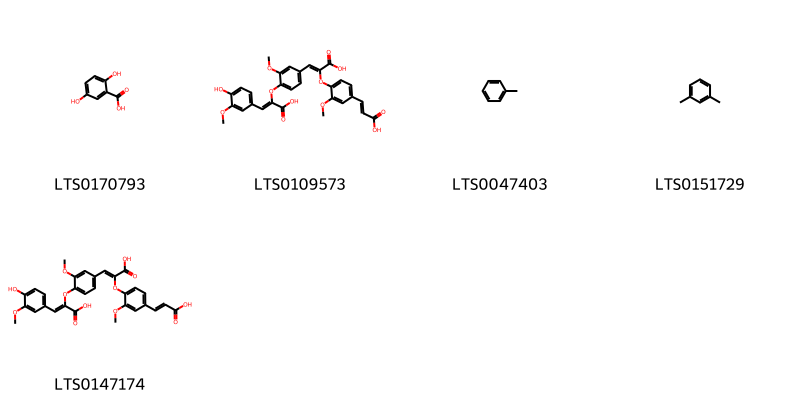
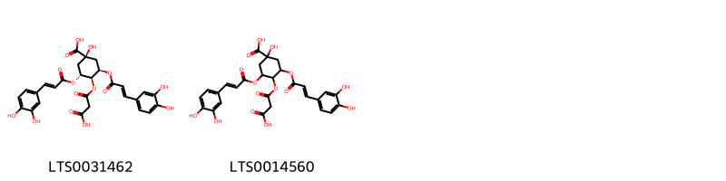
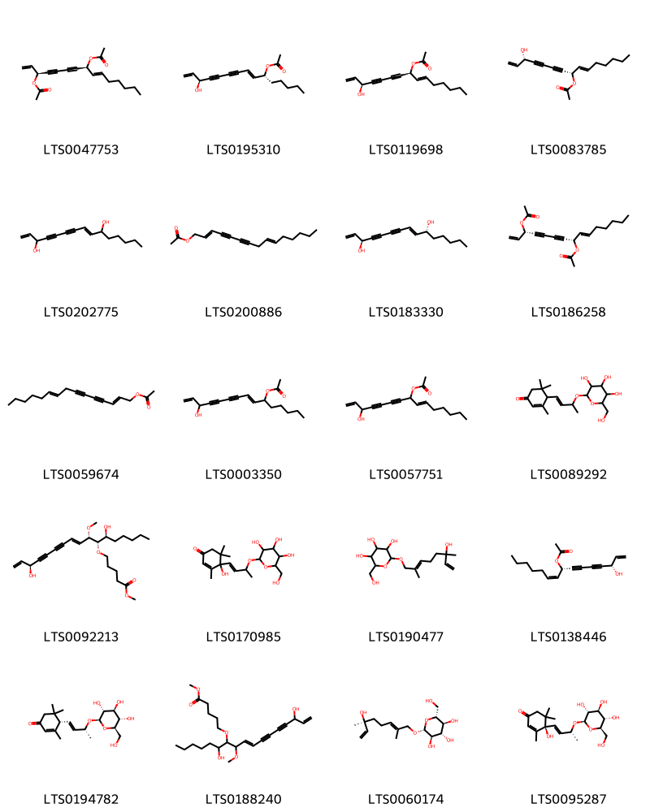
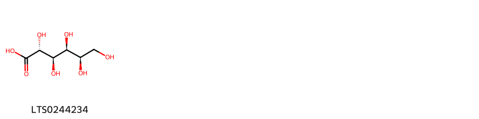
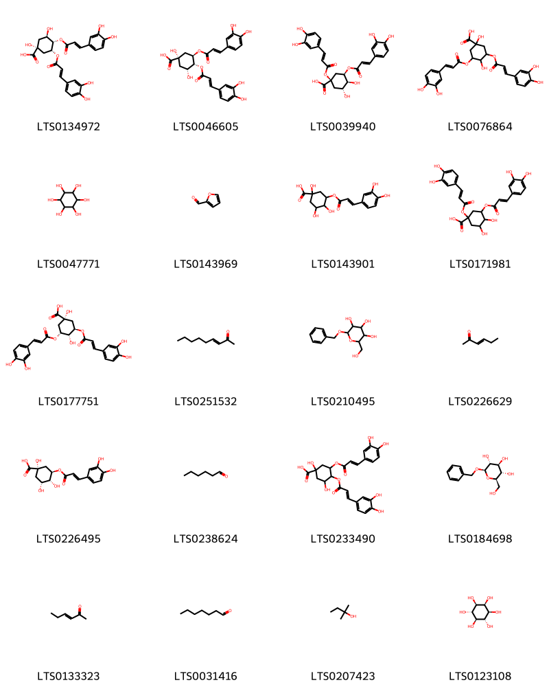
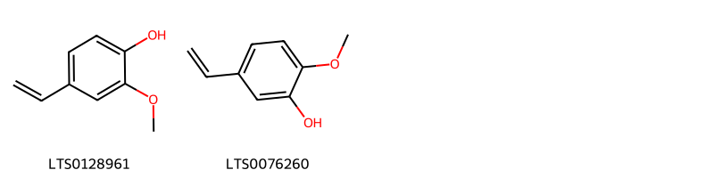

!!! abstract "Tóm tắt"

    Rau má (Centella asiatica) là toàn cây tươi hoặc phơi khô của cây Rau má (Centella asiatica Urb.), thuộc họ Hoa tán (Apiaceae). Cây phân bố ở các vùng nhiệt đới như Lào, Campuchia, Indonesia, Ấn Độ và mọc hoang khắp nơi tại Việt Nam. Trong y học dân gian, rau má được sử dụng như một vị thuốc mát, có vị ngọt, hơi đắng, tính bình, không độc, có tác dụng giải nhiệt, giải độc, thông tiểu, chữa thổ huyết, tả lỵ, khí hư, bạch đới và lợi sữa. Theo Đông y, rau má còn có tác dụng thanh nhiệt, dưỡng âm, lợi tiểu, nhuận gan và giải độc. Thành phần hóa học của rau má bao gồm alkaloid hydrocotylin, glucosid asiaticosid, centelloside và saponin (acid asiatic, axit brahmic), với cấu trúc tri-tecpen.

## Thông tin về thực vật

Dược liệu **Rau Má (Toàn Cây)** từ bộ phận **nan** từ loài *Centella asiatica*.

**Mô tả thực vật:** Rau má là một loại cỏ mọc bò, có rễ ở các mấu, thân gầy, nhẵn. Lá hình mất chim, khía tai bèo, rộng 2-4cm, cuống dài 2-4cm trong những nhánh mang hoa và dài 10-12cm trong những nhánh thường. Cụm hoa đơn mọc ở kẽ lá, gồm 1 đến 5 hoa nhỏ. Quả dẹt rộng 3-5mm, có sống hơi rõ

*Tài liệu tham khảo:* "Những cây thuốc và vị thuốc Việt Nam" - Đỗ Tất Lợi 
Trong dược điển Việt nam, một loài được sử dụng làm dược liệu là *Centella asiatica*.

!!! info "Phân loại thực vật của *Centella asiatica*"
    - **Kingdom:** Plantae
    - **Phylum:** Tracheophyta
    - **Order:** Apiales
    - **Family:** Apiaceae
    - **Genus:** Centella
    - **Species:** *Centella asiatica*

**Phân bố trên thế giới:** nan, New Caledonia, Nepal, Chile, Chinese Taipei, Hong Kong, South Africa, Australia, Indonesia, Uruguay, Niue, India, Brazil, Thailand, United States of America, China, Malaysia, New Zealand, Ecuador, Macao

**Phân bố tại Việt nam:** Không có ghi nhận ở Việt Nam

## Thông tin về dược liệu 

### Định danh

!!! info "Thông tin về tên gọi"

    - Dược liệu tiếng Việt: nan
    - Dược liệu tiếng Trung: nan (nan)
    - Dược liệu tiếng Anh: nan
    - Dược liệu latin thông dụng: nan
    - Dược liệu latin kiểu DĐVN: *centella asiatica (l.) urb.*
    - Dược liệu latin kiểu DĐVN: *nan*
    - Dược liệu latin kiểu thông tư: *nan*
    - Bộ phận dùng: nan (nan)

### Mô tả dược liệu 

- **Theo dược điển Việt nam V:** nan

- **Mô tả dược liệu theo thông tư chế biến dược liệu theo phương pháp cổ truyền:** nan

### Chế biến 

- **Chế biến theo dược điển việt nam V**: nan

- **Chế biến theo thông tư:** nan

--- 

## Thành phần hóa học

- Theo tài liệu của GS. Đỗ Tất Lợi:  Trong rau má có một ancaloit gọi là hydrocotylin với công thức C22H33O8N, Glucozit là asiaticozit với công thức C54H88O23, Glucozit khác đặt tên là xentelozit (centelloside) có tính chất gần, Saponin (axit asiatic, axit brahmic) có cấu trúc tri-tecpen như asiaticozit
    

**Thành phần hóa học từ loài **Centella asiatica**

Theo cơ sở dữ liệu lotus, loài *Centella asiatica* đã phân lập và xác định được **219** hoạt chất thuộc về các nhóm Steroids and steroid derivatives, Organooxygen compounds, Fatty Acyls, Flavonoids, Cinnamic acids and derivatives, Hydroxy acids and derivatives, Phenols, Carboxylic acids and derivatives, Benzene and substituted derivatives, Pyridines and derivatives, Glycerolipids, Unsaturated hydrocarbons, Prenol lipids trong bảng dưới đây. Danh sách các hoạt chất như sau 4-isopropyl-1,6-dimethyl-2,3,4,4a,7,8-hexahydronaphthalene [(LTS0270743)](https://lotus.naturalproducts.net/compound/lotus_id/LTS0270743), non-3-en-2-one [(LTS0251532)](https://lotus.naturalproducts.net/compound/lotus_id/LTS0251532), kaempherol [(LTS0155822)](https://lotus.naturalproducts.net/compound/lotus_id/LTS0155822), (4r)-4-hydroxy-3,5,5-trimethyl-4-[(1e,3r)-3-{[(2r,3r,4s,5s,6r)-3,4,5-trihydroxy-6-(hydroxymethyl)oxan-2-yl]oxy}but-1-en-1-yl]cyclohex-2-en-1-one [(LTS0095287)](https://lotus.naturalproducts.net/compound/lotus_id/LTS0095287), 6-({[3,4-dihydroxy-6-(hydroxymethyl)-5-[(3,4,5-trihydroxy-6-methyloxan-2-yl)oxy]oxan-2-yl]oxy}methyl)-3,4,5-trihydroxyoxan-2-yl 8,10,11-trihydroxy-9-(hydroxymethyl)-2,2,6a,6b,9,12a-hexamethyl-1,3,4,5,6,7,8,8a,10,11,12,12b,13,14b-tetradecahydropicene-4a-carboxylate [(LTS0093104)](https://lotus.naturalproducts.net/compound/lotus_id/LTS0093104), α pinene [(LTS0132416)](https://lotus.naturalproducts.net/compound/lotus_id/LTS0132416), 3,4-bis({[3-(3,4-dihydroxyphenyl)prop-2-enoyl]oxy})-1,5-dihydroxycyclohexane-1-carboxylic acid [(LTS0233490)](https://lotus.naturalproducts.net/compound/lotus_id/LTS0233490), campesterol [(LTS0046755)](https://lotus.naturalproducts.net/compound/lotus_id/LTS0046755), dgdg [(LTS0129048)](https://lotus.naturalproducts.net/compound/lotus_id/LTS0129048), (2s,3r,4s,5s,6r)-6-({[(2r,3r,4r,5s,6r)-3,4-dihydroxy-6-(hydroxymethyl)-5-{[(2s,3r,4r,5r,6s)-3,4,5-trihydroxy-6-methyloxan-2-yl]oxy}oxan-2-yl]oxy}methyl)-3,4,5-trihydroxyoxan-2-yl (4as,6as,6br,8r,8ar,10r,11r,12ar,12br,14bs)-8,10,11-trihydroxy-2,2,6a,6b,9,9,12a-heptamethyl-1,3,4,5,6,7,8,8a,10,11,12,12b,13,14b-tetradecahydropicene-4a-carboxylate [(LTS0155150)](https://lotus.naturalproducts.net/compound/lotus_id/LTS0155150), 8,10-dihydroxy-9-(hydroxymethyl)-2,2,6a,6b,9,12a-hexamethyl-1,3,4,5,6,7,8,8a,10,11,12,12b,13,14b-tetradecahydropicene-4a-carboxylic acid [(LTS0086952)](https://lotus.naturalproducts.net/compound/lotus_id/LTS0086952), 8-hydroxy-1,2,6a,6b,9,12a-hexamethyl-10,11-bis({[3,4,5-trihydroxy-6-(hydroxymethyl)oxan-2-yl]oxy})-9-({[3,4,5-trihydroxy-6-(hydroxymethyl)oxan-2-yl]oxy}methyl)-2,3,4,5,6,7,8,8a,10,11,12,12b,13,14b-tetradecahydro-1h-picene-4a-carboxylic acid [(LTS0138176)](https://lotus.naturalproducts.net/compound/lotus_id/LTS0138176), (1r,2s,4ar,6ar,6br,8ar,9r,10r,11r,12ar,12br,14ar,14br)-2,10,11-trihydroxy-9-(hydroxymethyl)-1,2,6a,6b,9,12a-hexamethyl-hexadecahydropicene-4a-carboxylic acid [(LTS0095221)](https://lotus.naturalproducts.net/compound/lotus_id/LTS0095221), (2s,3r,4s,5s,6r)-6-({[(2r,3r,4r,5s,6r)-3,4-dihydroxy-6-(hydroxymethyl)-5-{[(2s,3r,4r,5r,6s)-3,4,5-trihydroxy-6-methyloxan-2-yl]oxy}oxan-2-yl]oxy}methyl)-3,4,5-trihydroxyoxan-2-yl (1s,2r,4as,6as,6br,8as,9r,10r,11r,12ar,12br,14bs)-10,11-dihydroxy-9-(hydroxymethyl)-1,2,6a,6b,9,12a-hexamethyl-2,3,4,5,6,7,8,8a,10,11,12,12b,13,14b-tetradecahydro-1h-picene-4a-carboxylate [(LTS0163174)](https://lotus.naturalproducts.net/compound/lotus_id/LTS0163174), docosyl trans-ferulate [(LTS0073904)](https://lotus.naturalproducts.net/compound/lotus_id/LTS0073904), 6-({[3,4-dihydroxy-6-(hydroxymethyl)-5-[(3,4,5-trihydroxy-6-methyloxan-2-yl)oxy]oxan-2-yl]oxy}methyl)-3,4,5-trihydroxyoxan-2-yl 10,11-dihydroxy-1,2,6a,6b,9,9,12a-heptamethyl-2,3,4,5,6,7,8,8a,10,11,12,12b,13,14b-tetradecahydro-1h-picene-4a-carboxylate [(LTS0003131)](https://lotus.naturalproducts.net/compound/lotus_id/LTS0003131), methyl 11-hydroxy-9-(hydroxymethyl)-10-methoxy-1,2,6a,6b,9,12a-hexamethyl-2,3,4,5,6,7,8,8a,10,11,12,12b,13,14b-tetradecahydro-1h-picene-4a-carboxylate [(LTS0103060)](https://lotus.naturalproducts.net/compound/lotus_id/LTS0103060), benzyl β-d-glucoside [(LTS0184698)](https://lotus.naturalproducts.net/compound/lotus_id/LTS0184698), [8a-({[6-({[3,4-dihydroxy-6-(hydroxymethyl)-5-[(3,4,5-trihydroxy-6-methyloxan-2-yl)oxy]oxan-2-yl]oxy}methyl)-3,4,5-trihydroxyoxan-2-yl]oxy}carbonyl)-2,3-dihydroxy-4,6a,6b,11,12,14b-hexamethyl-2,3,4a,5,6,7,8,9,10,11,12,12a,14,14a-tetradecahydro-1h-picen-4-yl]methoxysulfonic acid [(LTS0157401)](https://lotus.naturalproducts.net/compound/lotus_id/LTS0157401), (2s,3r,4s,5s,6r)-3,4,5-trihydroxy-6-(hydroxymethyl)oxan-2-yl (1s,2r,4as,6as,6br,8ar,9r,10r,11r,12ar,12br,14bs)-10,11-dihydroxy-9-(hydroxymethyl)-1,2,6a,6b,9,12a-hexamethyl-2,3,4,5,6,7,8,8a,10,11,12,12b,13,14b-tetradecahydro-1h-picene-4a-carboxylate [(LTS0176769)](https://lotus.naturalproducts.net/compound/lotus_id/LTS0176769), (2s,3r,4s,5s,6r)-6-({[(2r,3r,4r,5s,6r)-3,4-dihydroxy-6-(hydroxymethyl)-5-{[(2s,3r,4r,5r,6s)-3,4,5-trihydroxy-6-methyloxan-2-yl]oxy}oxan-2-yl]oxy}methyl)-3,4,5-trihydroxyoxan-2-yl (1s,2r,4as,6as,6br,8ar,9r,10r,11r,12ar,12br,14bs)-9-[(acetyloxy)methyl]-10,11-dihydroxy-1,2,6a,6b,9,12a-hexamethyl-2,3,4,5,6,7,8,8a,10,11,12,12b,13,14b-tetradecahydro-1h-picene-4a-carboxylate [(LTS0224809)](https://lotus.naturalproducts.net/compound/lotus_id/LTS0224809), (2s,3r,4s,5s,6r)-6-({[(2r,3r,4r,5s,6r)-3,4-dihydroxy-6-(hydroxymethyl)-5-{[(2r,3r,4r,5r,6s)-3,4,5-trihydroxy-6-methyloxan-2-yl]oxy}oxan-2-yl]oxy}methyl)-3,4,5-trihydroxyoxan-2-yl (4as,6as,6br,8r,8ar,9r,10r,11r,12ar,12br,14br)-8,10,11-trihydroxy-9-(hydroxymethyl)-2,2,6a,6b,9,12a-hexamethyl-1,3,4,5,6,7,8,8a,10,11,12,12b,13,14b-tetradecahydropicene-4a-carboxylate [(LTS0088497)](https://lotus.naturalproducts.net/compound/lotus_id/LTS0088497), pentadeca-1,8-dien-4,6-diyne-3,10-diol [(LTS0202775)](https://lotus.naturalproducts.net/compound/lotus_id/LTS0202775), chlorogenic acid [(LTS0226495)](https://lotus.naturalproducts.net/compound/lotus_id/LTS0226495), cynarine [(LTS0039940)](https://lotus.naturalproducts.net/compound/lotus_id/LTS0039940), 2-[(4,5-dihydroxy-2-{[11-hydroxy-3a,3b,6,6,9a-pentamethyl-1-(6-methylhepta-2,5-dien-2-yl)-dodecahydro-1h-cyclopenta[a]phenanthren-7-yl]oxy}-6-(hydroxymethyl)oxan-3-yl)oxy]-6-(hydroxymethyl)oxane-3,4,5-triol [(LTS0006660)](https://lotus.naturalproducts.net/compound/lotus_id/LTS0006660), (2s,3r,4s,5s,6r)-2-{[(2s)-2-[(1s,3ar,3br,5ar,7s,9ar,9br,11r,11ar)-11-hydroxy-3a,3b,6,6,9a-pentamethyl-7-{[(2r,3r,4s,5s,6r)-3,4,5-trihydroxy-6-(hydroxymethyl)oxan-2-yl]oxy}-dodecahydro-1h-cyclopenta[a]phenanthren-1-yl]-6-methylhept-5-en-2-yl]oxy}-6-({[(2s,3r,4s,5r)-3,4,5-trihydroxyoxan-2-yl]oxy}methyl)oxane-3,4,5-triol [(LTS0087374)](https://lotus.naturalproducts.net/compound/lotus_id/LTS0087374), 1,10,11-trihydroxy-1,2,6a,6b,9,9,12a-heptamethyl-2,3,4,5,6,7,8,8a,10,11,12,12b,13,14b-tetradecahydropicene-4a-carboxylic acid [(LTS0013744)](https://lotus.naturalproducts.net/compound/lotus_id/LTS0013744), 2-[(2-{7,11-dihydroxy-3a,3b,6,6,9a-pentamethyl-dodecahydro-1h-cyclopenta[a]phenanthren-1-yl}-6-methylhept-5-en-2-yl)oxy]-6-{[(3,4,5-trihydroxyoxan-2-yl)oxy]methyl}oxane-3,4,5-triol [(LTS0217594)](https://lotus.naturalproducts.net/compound/lotus_id/LTS0217594), (1s,2r,4as,6as,6br,8r,8ar,9r,10r,11r,12ar,12br,14bs)-8-hydroxy-1,2,6a,6b,9,12a-hexamethyl-10,11-bis({[(2r,3r,4s,5s,6r)-3,4,5-trihydroxy-6-(hydroxymethyl)oxan-2-yl]oxy})-9-({[(2r,3r,4s,5s,6r)-3,4,5-trihydroxy-6-(hydroxymethyl)oxan-2-yl]oxy}methyl)-2,3,4,5,6,7,8,8a,10,11,12,12b,13,14b-tetradecahydro-1h-picene-4a-carboxylic acid [(LTS0136230)](https://lotus.naturalproducts.net/compound/lotus_id/LTS0136230), astragalin [(LTS0249588)](https://lotus.naturalproducts.net/compound/lotus_id/LTS0249588), (2s,3r,4s,5s,6r)-3,4,5-trihydroxy-6-({[(2r,3r,4s,5s,6r)-3,4,5-trihydroxy-6-(hydroxymethyl)oxan-2-yl]oxy}methyl)oxan-2-yl (1s,2r,4as,6as,6br,8ar,9r,10r,11r,12ar,12br,14bs)-10,11-dihydroxy-9-(hydroxymethyl)-1,2,6a,6b,9,12a-hexamethyl-2,3,4,5,6,7,8,8a,10,11,12,12b,13,14b-tetradecahydro-1h-picene-4a-carboxylate [(LTS0045058)](https://lotus.naturalproducts.net/compound/lotus_id/LTS0045058), (r)-β-bisabolene [(LTS0077209)](https://lotus.naturalproducts.net/compound/lotus_id/LTS0077209), ginsenoside mx [(LTS0164245)](https://lotus.naturalproducts.net/compound/lotus_id/LTS0164245), (2e,9e)-pentadeca-2,9-dien-4,6-diyn-1-yl acetate [(LTS0059674)](https://lotus.naturalproducts.net/compound/lotus_id/LTS0059674), ginsenoside rg5 [(LTS0094839)](https://lotus.naturalproducts.net/compound/lotus_id/LTS0094839), 6-({[3,4-dihydroxy-6-(hydroxymethyl)-5-[(3,4,5-trihydroxy-6-methyloxan-2-yl)oxy]oxan-2-yl]oxy}methyl)-3,4,5-trihydroxyoxan-2-yl 10,11-dihydroxy-1,2,6a,6b,9,12a-hexamethyl-9-(2-oxoethyl)-2,3,4,5,6,7,8,8a,10,11,12,12b,13,14b-tetradecahydro-1h-picene-4a-carboxylate [(LTS0013787)](https://lotus.naturalproducts.net/compound/lotus_id/LTS0013787), (1s,3r,4s,5r)-4-[(2-carboxyacetyl)oxy]-3,5-bis({[(2e)-3-(3,4-dihydroxyphenyl)prop-2-enoyl]oxy})-1-hydroxycyclohexane-1-carboxylic acid [(LTS0031462)](https://lotus.naturalproducts.net/compound/lotus_id/LTS0031462), 10-hydroxy-1,2,6a,6b,9,9,12a-heptamethyl-2,3,4,5,6,7,8,8a,10,11,12,12b,13,14b-tetradecahydro-1h-picene-4a-carboxylic acid [(LTS0166564)](https://lotus.naturalproducts.net/compound/lotus_id/LTS0166564), 6-({[3,4-dihydroxy-6-(hydroxymethyl)-5-[(3,4,5-trihydroxy-6-methyloxan-2-yl)oxy]oxan-2-yl]oxy}methyl)-3,4,5-trihydroxyoxan-2-yl 8,10,11-trihydroxy-1,2,6a,6b,9,9,12a-heptamethyl-2,3,4,5,6,7,8,8a,10,11,12,12b,13,14b-tetradecahydro-1h-picene-4a-carboxylate [(LTS0002074)](https://lotus.naturalproducts.net/compound/lotus_id/LTS0002074), (4as,6as,6br,8as,9r,10r,11r,12ar,12br,14bs)-10,11-dihydroxy-9-(hydroxymethyl)-2,2,6a,6b,9,12a-hexamethyl-1,3,4,5,6,7,8,8a,10,11,12,12b,13,14b-tetradecahydropicene-4a-carboxylic acid [(LTS0206611)](https://lotus.naturalproducts.net/compound/lotus_id/LTS0206611), 3,4,5-trihydroxy-6-(hydroxymethyl)oxan-2-yl 10,11-dihydroxy-9-(hydroxymethyl)-1,2,6a,6b,9,12a-hexamethyl-2,3,4,5,6,7,8,8a,10,11,12,12b,13,14b-tetradecahydro-1h-picene-4a-carboxylate [(LTS0030527)](https://lotus.naturalproducts.net/compound/lotus_id/LTS0030527), bran oil [(LTS0143969)](https://lotus.naturalproducts.net/compound/lotus_id/LTS0143969), madecassic acid [(LTS0164623)](https://lotus.naturalproducts.net/compound/lotus_id/LTS0164623), terminoloside [(LTS0166167)](https://lotus.naturalproducts.net/compound/lotus_id/LTS0166167), toluene [(LTS0047403)](https://lotus.naturalproducts.net/compound/lotus_id/LTS0047403), 10,11-dihydroxy-9-(hydroxymethyl)-2,2,6a,6b,9,12a-hexamethyl-1,3,4,5,6,7,8,8a,10,11,12,12b,13,14b-tetradecahydropicene-4a-carboxylic acid [(LTS0258848)](https://lotus.naturalproducts.net/compound/lotus_id/LTS0258848), 2-(3,4-dihydroxyphenyl)-5,7-dihydroxy-3-{[3,4,5-trihydroxy-6-(hydroxymethyl)oxan-2-yl]oxy}chromen-4-one [(LTS0195312)](https://lotus.naturalproducts.net/compound/lotus_id/LTS0195312), 2-methyl-2-butanol [(LTS0207423)](https://lotus.naturalproducts.net/compound/lotus_id/LTS0207423), (4as,6as,6br,8r,8ar,9r,10s,12ar,12br,14bs)-8,10-dihydroxy-9-(hydroxymethyl)-2,2,6a,6b,9,12a-hexamethyl-1,3,4,5,6,7,8,8a,10,11,12,12b,13,14b-tetradecahydropicene-4a-carboxylic acid [(LTS0254345)](https://lotus.naturalproducts.net/compound/lotus_id/LTS0254345), β-caryophyllene oxide [(LTS0213960)](https://lotus.naturalproducts.net/compound/lotus_id/LTS0213960), 3-[(2s)-6-methylhept-5-en-2-yl]-6-methylidenecyclohex-1-ene [(LTS0195839)](https://lotus.naturalproducts.net/compound/lotus_id/LTS0195839), 3,5-dicaffeoylquinic acid [(LTS0177751)](https://lotus.naturalproducts.net/compound/lotus_id/LTS0177751), (s)-rosmarinic acid [(LTS0124509)](https://lotus.naturalproducts.net/compound/lotus_id/LTS0124509), (1s,2r,4as,6as,6br,8ar,10s,11r,12ar,12br,14bs)-10,11-dihydroxy-1,2,6a,6b,9,9,12a-heptamethyl-2,3,4,5,6,7,8,8a,10,11,12,12b,13,14b-tetradecahydro-1h-picene-4a-carboxylic acid [(LTS0234764)](https://lotus.naturalproducts.net/compound/lotus_id/LTS0234764), 6-({[3,4-dihydroxy-6-(hydroxymethyl)-5-[(3,4,5-trihydroxy-6-methyloxan-2-yl)oxy]oxan-2-yl]oxy}methyl)-3,4,5-trihydroxyoxan-2-yl 9-[(acetyloxy)methyl]-10,11-dihydroxy-1,2,6a,6b,9,12a-hexamethyl-2,3,4,5,6,7,8,8a,10,11,12,12b,13,14b-tetradecahydro-1h-picene-4a-carboxylate [(LTS0225511)](https://lotus.naturalproducts.net/compound/lotus_id/LTS0225511), terpineol [(LTS0136148)](https://lotus.naturalproducts.net/compound/lotus_id/LTS0136148), 8,10-dihydroxy-9-(hydroxymethyl)-1,2,6a,6b,9,12a-hexamethyl-2,3,4,5,6,7,8,8a,10,11,12,12b,13,14b-tetradecahydro-1h-picene-4a-carboxylic acid [(LTS0021600)](https://lotus.naturalproducts.net/compound/lotus_id/LTS0021600), humulene [(LTS0263171)](https://lotus.naturalproducts.net/compound/lotus_id/LTS0263171), euscaphic acid [(LTS0205657)](https://lotus.naturalproducts.net/compound/lotus_id/LTS0205657), 2-(3,4-dihydroxyphenyl)-5,7-dihydroxy-4-oxochromen-3-yl (2e)-3-(3,4-dihydroxyphenyl)prop-2-enoate [(LTS0127943)](https://lotus.naturalproducts.net/compound/lotus_id/LTS0127943), 10,11-dihydroxy-2,2,6a,6b,9,9,12a-heptamethyl-1,3,4,5,6,7,8,8a,10,11,12,12b,13,14b-tetradecahydropicene-4a-carboxylic acid [(LTS0167090)](https://lotus.naturalproducts.net/compound/lotus_id/LTS0167090), ginsenoside mc [(LTS0206570)](https://lotus.naturalproducts.net/compound/lotus_id/LTS0206570), 3,4,5-trihydroxy-6-({[3,4,5-trihydroxy-6-(hydroxymethyl)oxan-2-yl]oxy}methyl)oxan-2-yl 10,11-dihydroxy-9-(hydroxymethyl)-1,2,6a,6b,9,12a-hexamethyl-2,3,4,5,6,7,8,8a,10,11,12,12b,13,14b-tetradecahydro-1h-picene-4a-carboxylate [(LTS0042765)](https://lotus.naturalproducts.net/compound/lotus_id/LTS0042765), geraniol [(LTS0258838)](https://lotus.naturalproducts.net/compound/lotus_id/LTS0258838), 2-{[2-(11-hydroxy-3a,3b,6,6,9a-pentamethyl-7-{[3,4,5-trihydroxy-6-(hydroxymethyl)oxan-2-yl]oxy}-dodecahydro-1h-cyclopenta[a]phenanthren-1-yl)-6-methylhept-5-en-2-yl]oxy}-6-{[(3,4,5-trihydroxyoxan-2-yl)oxy]methyl}oxane-3,4,5-triol [(LTS0059330)](https://lotus.naturalproducts.net/compound/lotus_id/LTS0059330), (-)-chamigrene [(LTS0274399)](https://lotus.naturalproducts.net/compound/lotus_id/LTS0274399), (2s,3r,4s,5s,6r)-6-({[(2r,3r,4r,5s,6r)-3,4-dihydroxy-6-(hydroxymethyl)-5-{[(2s,3r,4r,5r,6s)-3,4,5-trihydroxy-6-methyloxan-2-yl]oxy}oxan-2-yl]oxy}methyl)-3,4,5-trihydroxyoxan-2-yl (1s,2r,4as,6as,6br,8ar,9r,10s,12ar,12br,14bs)-10-hydroxy-9-(hydroxymethyl)-1,2,6a,6b,9,12a-hexamethyl-2,3,4,5,6,7,8,8a,10,11,12,12b,13,14b-tetradecahydro-1h-picene-4a-carboxylate [(LTS0188311)](https://lotus.naturalproducts.net/compound/lotus_id/LTS0188311), (3r,6e)-nerolidol [(LTS0145065)](https://lotus.naturalproducts.net/compound/lotus_id/LTS0145065), 2-({[3,4-dihydroxy-4-(hydroxymethyl)oxolan-2-yl]oxy}methyl)-6-({1,7,7-trimethylbicyclo[2.2.1]heptan-2-yl}oxy)oxane-3,4,5-triol [(LTS0226358)](https://lotus.naturalproducts.net/compound/lotus_id/LTS0226358), 3,4,5-trihydroxy-6-({[3,4,5-trihydroxy-6-(hydroxymethyl)oxan-2-yl]oxy}methyl)oxan-2-yl 8,10,11-trihydroxy-9-(hydroxymethyl)-1,2,6a,6b,9,12a-hexamethyl-2,3,4,5,6,7,8,8a,10,11,12,12b,13,14b-tetradecahydro-1h-picene-4a-carboxylate [(LTS0233311)](https://lotus.naturalproducts.net/compound/lotus_id/LTS0233311), 6-({[3,4-dihydroxy-6-(hydroxymethyl)-5-[(3,4,5-trihydroxy-6-methyloxan-2-yl)oxy]oxan-2-yl]oxy}methyl)-3,4,5-trihydroxyoxan-2-yl 8,10-dihydroxy-9-(hydroxymethyl)-2,2,6a,6b,9,12a-hexamethyl-1,3,4,5,6,7,8,8a,10,11,12,12b,13,14b-tetradecahydropicene-4a-carboxylate [(LTS0005164)](https://lotus.naturalproducts.net/compound/lotus_id/LTS0005164), methyl 8,11-dihydroxy-9-(hydroxymethyl)-10-methoxy-1,2,6a,6b,9,12a-hexamethyl-2,3,4,5,6,7,8,8a,10,11,12,12b,13,14b-tetradecahydro-1h-picene-4a-carboxylate [(LTS0031192)](https://lotus.naturalproducts.net/compound/lotus_id/LTS0031192), nerol [(LTS0244289)](https://lotus.naturalproducts.net/compound/lotus_id/LTS0244289), (4s)-3,5,5-trimethyl-4-[(1e,3r)-3-{[(2r,3r,4s,5s,6r)-3,4,5-trihydroxy-6-(hydroxymethyl)oxan-2-yl]oxy}but-1-en-1-yl]cyclohex-2-en-1-one [(LTS0194782)](https://lotus.naturalproducts.net/compound/lotus_id/LTS0194782), (2s,3r,4s,5s,6r)-6-({[(2r,3r,4r,5s,6r)-3,4-dihydroxy-6-(hydroxymethyl)-5-{[(2s,3r,4r,5r,6s)-3,4,5-trihydroxy-6-methyloxan-2-yl]oxy}oxan-2-yl]oxy}methyl)-3,4,5-trihydroxyoxan-2-yl (1s,2r,4as,6as,6br,8ar,9s,10r,11r,12ar,12br,14bs)-10,11-dihydroxy-1,2,6a,6b,9,12a-hexamethyl-9-(2-oxoethyl)-2,3,4,5,6,7,8,8a,10,11,12,12b,13,14b-tetradecahydro-1h-picene-4a-carboxylate [(LTS0088160)](https://lotus.naturalproducts.net/compound/lotus_id/LTS0088160), 4,11,11-trimethyl-8-methylidenebicyclo[7.2.0]undec-4-ene [(LTS0256716)](https://lotus.naturalproducts.net/compound/lotus_id/LTS0256716), (2s,3r,4s,5s,6r)-6-({[(2r,3r,4r,5s,6r)-3,4-dihydroxy-6-(hydroxymethyl)-5-{[(2s,3r,4r,5r,6s)-3,4,5-trihydroxy-6-methyloxan-2-yl]oxy}oxan-2-yl]oxy}methyl)-3,4,5-trihydroxyoxan-2-yl (1s,2r,4as,6as,6br,8r,8as,9r,10r,11r,12ar,12br,14bs)-8,10,11-trihydroxy-9-(hydroxymethyl)-1,2,6a,6b,9,12a-hexamethyl-2,3,4,5,6,7,8,8a,10,11,12,12b,13,14b-tetradecahydro-1h-picene-4a-carboxylate [(LTS0044893)](https://lotus.naturalproducts.net/compound/lotus_id/LTS0044893), (4as,6as,6br,8r,8ar,9r,10r,11r,12ar,12br,14br)-8,10,11-trihydroxy-9-(hydroxymethyl)-2,2,6a,6b,9,12a-hexamethyl-1,3,4,5,6,7,8,8a,10,11,12,12b,13,14b-tetradecahydropicene-4a-carboxylic acid [(LTS0204560)](https://lotus.naturalproducts.net/compound/lotus_id/LTS0204560), (1s,4s,5r,8r,10s,13s,14r,17s,18r,19s,20r)-10-hydroxy-4,5,9,9,13,19,20-heptamethyl-24-oxahexacyclo[15.5.2.0¹,¹⁸.0⁴,¹⁷.0⁵,¹⁴.0⁸,¹³]tetracos-15-en-23-one [(LTS0126962)](https://lotus.naturalproducts.net/compound/lotus_id/LTS0126962), (1r)-1,8-dimethyl-4-(prop-1-en-2-yl)spiro[4.5]dec-7-ene [(LTS0247635)](https://lotus.naturalproducts.net/compound/lotus_id/LTS0247635), hexanal [(LTS0238624)](https://lotus.naturalproducts.net/compound/lotus_id/LTS0238624), (1z,6z,8s)-8-isopropyl-1-methyl-5-methylidenecyclodeca-1,6-diene [(LTS0065195)](https://lotus.naturalproducts.net/compound/lotus_id/LTS0065195), (1r,2r,3s,4r,5s,6s)-cyclohexane-1,2,3,4,5,6-hexol [(LTS0123108)](https://lotus.naturalproducts.net/compound/lotus_id/LTS0123108), (2s,3r,4s,5s,6r)-6-({[(2r,3r,4r,5s,6r)-3,4-dihydroxy-6-(hydroxymethyl)-5-{[(2s,3r,4r,5r,6s)-3,4,5-trihydroxy-6-methyloxan-2-yl]oxy}oxan-2-yl]oxy}methyl)-3,4,5-trihydroxyoxan-2-yl (4as,6as,6br,8as,9r,10r,11r,12ar,12br,14bs)-10,11-dihydroxy-9-(hydroxymethyl)-2,2,6a,6b,9,12a-hexamethyl-1,3,4,5,6,7,8,8a,10,11,12,12b,13,14b-tetradecahydropicene-4a-carboxylate [(LTS0029972)](https://lotus.naturalproducts.net/compound/lotus_id/LTS0029972), nerolidol [(LTS0197738)](https://lotus.naturalproducts.net/compound/lotus_id/LTS0197738), isoquercetin [(LTS0254337)](https://lotus.naturalproducts.net/compound/lotus_id/LTS0254337), (2z)-2-{4-[(1z)-2-carboxy-2-{4-[(1e)-2-carboxyeth-1-en-1-yl]-2-methoxyphenoxy}eth-1-en-1-yl]-2-methoxyphenoxy}-3-(4-hydroxy-3-methoxyphenyl)prop-2-enoic acid [(LTS0109573)](https://lotus.naturalproducts.net/compound/lotus_id/LTS0109573), [(2r,3r,4r,4ar,6ar,6bs,8as,11r,12s,12as,14ar,14br)-8a-({[(2s,3r,4s,5s,6r)-6-({[(2r,3r,4r,5s,6r)-3,4-dihydroxy-6-(hydroxymethyl)-5-{[(2s,3r,4r,5r,6s)-3,4,5-trihydroxy-6-methyloxan-2-yl]oxy}oxan-2-yl]oxy}methyl)-3,4,5-trihydroxyoxan-2-yl]oxy}carbonyl)-2,3-dihydroxy-4,6a,6b,11,12,14b-hexamethyl-2,3,4a,5,6,7,8,9,10,11,12,12a,14,14a-tetradecahydro-1h-picen-4-yl]methoxysulfonic acid [(LTS0155161)](https://lotus.naturalproducts.net/compound/lotus_id/LTS0155161), (3s,8s)-3-(acetyloxy)pentadeca-1,9-dien-4,6-diyn-8-yl acetate [(LTS0047753)](https://lotus.naturalproducts.net/compound/lotus_id/LTS0047753), β-pinene [(LTS0117550)](https://lotus.naturalproducts.net/compound/lotus_id/LTS0117550), methyl (1s,2r,4as,6as,6br,8r,8ar,9r,10r,11r,12ar,12br,14bs)-8,11-dihydroxy-9-(hydroxymethyl)-10-methoxy-1,2,6a,6b,9,12a-hexamethyl-2,3,4,5,6,7,8,8a,10,11,12,12b,13,14b-tetradecahydro-1h-picene-4a-carboxylate [(LTS0190903)](https://lotus.naturalproducts.net/compound/lotus_id/LTS0190903), (2r,3r,4s,5s,6r)-2-{[(2e,6s)-6-hydroxy-2,6-dimethylocta-2,7-dien-1-yl]oxy}-6-(hydroxymethyl)oxane-3,4,5-triol [(LTS0060174)](https://lotus.naturalproducts.net/compound/lotus_id/LTS0060174), 2-(4-{2-carboxy-2-[4-(2-carboxyeth-1-en-1-yl)-2-methoxyphenoxy]eth-1-en-1-yl}-2-methoxyphenoxy)-3-(4-hydroxy-3-methoxyphenyl)prop-2-enoic acid [(LTS0147174)](https://lotus.naturalproducts.net/compound/lotus_id/LTS0147174), 6-({[3,4-dihydroxy-6-(hydroxymethyl)-5-[(3,4,5-trihydroxy-6-methyloxan-2-yl)oxy]oxan-2-yl]oxy}methyl)-3,4,5-trihydroxyoxan-2-yl 10,11-dihydroxy-9-(hydroxymethyl)-2,2,6a,6b,9,12a-hexamethyl-1,3,4,5,6,7,8,8a,10,11,12,12b,13,14b-tetradecahydropicene-4a-carboxylate [(LTS0254973)](https://lotus.naturalproducts.net/compound/lotus_id/LTS0254973), terminolic acid [(LTS0274412)](https://lotus.naturalproducts.net/compound/lotus_id/LTS0274412), (2s,3r,4s,5s,6r)-6-({[(2r,3r,4r,5s,6r)-3,4-dihydroxy-6-(hydroxymethyl)-5-{[(2s,3r,4r,5r,6s)-3,4,5-trihydroxy-6-methyloxan-2-yl]oxy}oxan-2-yl]oxy}methyl)-3,4,5-trihydroxyoxan-2-yl (1s,2r,4as,6as,6br,8ar,10r,11r,12ar,12br,14bs)-10,11-dihydroxy-1,2,6a,6b,9,9,12a-heptamethyl-2,3,4,5,6,7,8,8a,10,11,12,12b,13,14b-tetradecahydro-1h-picene-4a-carboxylate [(LTS0069570)](https://lotus.naturalproducts.net/compound/lotus_id/LTS0069570), (2s,3r,4s,5s,6r)-6-({[(2r,3r,4r,5s,6r)-3,4-dihydroxy-6-(hydroxymethyl)-5-{[(2r,3r,4r,5r,6s)-3,4,5-trihydroxy-6-methyloxan-2-yl]oxy}oxan-2-yl]oxy}methyl)-3,4,5-trihydroxyoxan-2-yl (1s,2s,4as,6as,6br,8r,8ar,9r,10r,11r,12ar,12br,14br)-8,10,11-trihydroxy-9-(hydroxymethyl)-1,2,6a,6b,9,12a-hexamethyl-2,3,4,5,6,7,8,8a,10,11,12,12b,13,14b-tetradecahydro-1h-picene-4a-carboxylate [(LTS0144305)](https://lotus.naturalproducts.net/compound/lotus_id/LTS0144305), 8,10,11-trihydroxy-9-(hydroxymethyl)-2,2,6a,6b,9,12a-hexamethyl-1,3,4,5,6,7,8,8a,10,11,12,12b,13,14b-tetradecahydropicene-4a-carboxylic acid [(LTS0099810)](https://lotus.naturalproducts.net/compound/lotus_id/LTS0099810), epi-maslinic acid [(LTS0044982)](https://lotus.naturalproducts.net/compound/lotus_id/LTS0044982), (4as,6as,6br,8ar,9r,12ar,12br,14bs)-8,10,11-trihydroxy-9-(hydroxymethyl)-1,2,6a,6b,9,12a-hexamethyl-2,3,4,5,6,7,8,8a,10,11,12,12b,13,14b-tetradecahydro-1h-picene-4a-carboxylic acid [(LTS0209729)](https://lotus.naturalproducts.net/compound/lotus_id/LTS0209729), (1s,2r,4as,6as,6br,8r,8as,9r,10r,11r,12ar,12br,14bs)-8,10,11-trihydroxy-9-(hydroxymethyl)-1,2,6a,6b,9,12a-hexamethyl-2,3,4,5,6,7,8,8a,10,11,12,12b,13,14b-tetradecahydro-1h-picene-4a-carboxylic acid [(LTS0077681)](https://lotus.naturalproducts.net/compound/lotus_id/LTS0077681), (2s,3r,4s,5s,6r)-6-({[(2r,3r,4r,5s,6r)-3,4-dihydroxy-6-(hydroxymethyl)-5-{[(2s,3r,4r,5r,6s)-3,4,5-trihydroxy-6-methyloxan-2-yl]oxy}oxan-2-yl]oxy}methyl)-3,4,5-trihydroxyoxan-2-yl (1s,2r,4as,6as,6br,8r,8ar,9r,10s,12ar,12br,14bs)-8,10-dihydroxy-9-(hydroxymethyl)-1,2,6a,6b,9,12a-hexamethyl-2,3,4,5,6,7,8,8a,10,11,12,12b,13,14b-tetradecahydro-1h-picene-4a-carboxylate [(LTS0174261)](https://lotus.naturalproducts.net/compound/lotus_id/LTS0174261), kaempferol 3-o-glucuronide [(LTS0189686)](https://lotus.naturalproducts.net/compound/lotus_id/LTS0189686), (2s,3r,4s,5s,6r)-6-({[(2r,3r,4r,5s,6r)-3,4-dihydroxy-6-(hydroxymethyl)-5-{[(2s,3r,4r,5r,6s)-3,4,5-trihydroxy-6-methyloxan-2-yl]oxy}oxan-2-yl]oxy}methyl)-3,4,5-trihydroxyoxan-2-yl (1s,2r,4as,6as,6br,8r,8ar,9r,10r,11r,12ar,12br,14bs)-8,10,11-trihydroxy-9-(hydroxymethyl)-1,2,6a,6b,9,12a-hexamethyl-2,3,4,5,6,7,8,8a,10,11,12,12b,13,14b-tetradecahydro-1h-picene-4a-carboxylate [(LTS0276487)](https://lotus.naturalproducts.net/compound/lotus_id/LTS0276487), m-xylene [(LTS0151729)](https://lotus.naturalproducts.net/compound/lotus_id/LTS0151729), 2-[(6-hydroxy-2,6-dimethylocta-2,7-dien-1-yl)oxy]-6-(hydroxymethyl)oxane-3,4,5-triol [(LTS0190477)](https://lotus.naturalproducts.net/compound/lotus_id/LTS0190477), bayogenin [(LTS0140065)](https://lotus.naturalproducts.net/compound/lotus_id/LTS0140065), β-sesquiphellandrene [(LTS0106193)](https://lotus.naturalproducts.net/compound/lotus_id/LTS0106193), (2s,3r,4s,5r)-2-{[(2s,3r,4s,5s,6r)-2-{[(2r,3r,4s,5s,6r)-2-{[(1s,3ar,3br,5ar,7s,9ar,9br,11r,11ar)-11-hydroxy-1-[(2r)-2-hydroxy-6-methylhept-5-en-2-yl]-3a,3b,6,6,9a-pentamethyl-dodecahydro-1h-cyclopenta[a]phenanthren-7-yl]oxy}-4,5-dihydroxy-6-(hydroxymethyl)oxan-3-yl]oxy}-4,5-dihydroxy-6-(hydroxymethyl)oxan-3-yl]oxy}oxane-3,4,5-triol [(LTS0252523)](https://lotus.naturalproducts.net/compound/lotus_id/LTS0252523), thujopsene [(LTS0181981)](https://lotus.naturalproducts.net/compound/lotus_id/LTS0181981), benzyl glucopyranoside [(LTS0210495)](https://lotus.naturalproducts.net/compound/lotus_id/LTS0210495), 2-[(4,5-dihydroxy-2-{[11-hydroxy-3a,3b,6,6,9a-pentamethyl-1-(6-methylhepta-1,5-dien-2-yl)-dodecahydro-1h-cyclopenta[a]phenanthren-7-yl]oxy}-6-(hydroxymethyl)oxan-3-yl)oxy]-6-(hydroxymethyl)oxane-3,4,5-triol [(LTS0252633)](https://lotus.naturalproducts.net/compound/lotus_id/LTS0252633), 4-[(2-carboxyacetyl)oxy]-3,5-bis({[3-(3,4-dihydroxyphenyl)prop-2-enoyl]oxy})-1-hydroxycyclohexane-1-carboxylic acid [(LTS0014560)](https://lotus.naturalproducts.net/compound/lotus_id/LTS0014560), heptanal [(LTS0031416)](https://lotus.naturalproducts.net/compound/lotus_id/LTS0031416), (2s,3r,4s,5s,6r)-6-({[(2r,3r,4r,5s,6r)-3,4-dihydroxy-6-(hydroxymethyl)-5-{[(2s,3r,4r,5r,6s)-3,4,5-trihydroxy-6-methyloxan-2-yl]oxy}oxan-2-yl]oxy}methyl)-3,4,5-trihydroxyoxan-2-yl (4as,6as,6br,8ar,9r,10r,11r,12ar,12br)-10,11-dihydroxy-9-(hydroxymethyl)-2,2,6a,6b,9,12a-hexamethyl-1,3,4,5,6,7,8,8a,10,11,12,12b,13,14-tetradecahydropicene-4a-carboxylate [(LTS0154768)](https://lotus.naturalproducts.net/compound/lotus_id/LTS0154768), patuletin [(LTS0104633)](https://lotus.naturalproducts.net/compound/lotus_id/LTS0104633), (2s,3r,4s,5s,6r)-6-({[(2r,3r,4r,5s,6r)-3,4-dihydroxy-6-(hydroxymethyl)-5-{[(2s,3r,4r,5r,6s)-3,4,5-trihydroxy-6-methyloxan-2-yl]oxy}oxan-2-yl]oxy}methyl)-3,4,5-trihydroxyoxan-2-yl (1s,2r,4as,6as,6br,8r,8ar,10r,11r,12ar,12br,14bs)-8,10,11-trihydroxy-1,2,6a,6b,9,9,12a-heptamethyl-2,3,4,5,6,7,8,8a,10,11,12,12b,13,14b-tetradecahydro-1h-picene-4a-carboxylate [(LTS0148378)](https://lotus.naturalproducts.net/compound/lotus_id/LTS0148378), pomolic acid [(LTS0196537)](https://lotus.naturalproducts.net/compound/lotus_id/LTS0196537), 6-({[3,4-dihydroxy-6-(hydroxymethyl)-5-[(3,4,5-trihydroxy-6-methyloxan-2-yl)oxy]oxan-2-yl]oxy}methyl)-3,4,5-trihydroxyoxan-2-yl 10,11-dihydroxy-9-(hydroxymethyl)-1,2,6a,6b,9,12a-hexamethyl-2,3,4,5,6,7,8,8a,10,11,12,12b,13,14b-tetradecahydro-1h-picene-4a-carboxylate [(LTS0145928)](https://lotus.naturalproducts.net/compound/lotus_id/LTS0145928), (1s,2r,4as,6as,6br,8r,8ar,9r,10r,11r,12ar,12br,14br)-8,10,11-trihydroxy-9-(hydroxymethyl)-1,2,6a,6b,9,12a-hexamethyl-2,3,4,5,6,7,8,8a,10,11,12,12b,13,14b-tetradecahydro-1h-picene-4a-carboxylic acid [(LTS0232880)](https://lotus.naturalproducts.net/compound/lotus_id/LTS0232880), farnesol [(LTS0059667)](https://lotus.naturalproducts.net/compound/lotus_id/LTS0059667), sitogluside [(LTS0201798)](https://lotus.naturalproducts.net/compound/lotus_id/LTS0201798), (2s,3r,4s,5s,6r)-6-({[(2r,3r,4r,5s,6r)-3,4-dihydroxy-6-(hydroxymethyl)-5-{[(2s,3r,4r,5r,6s)-3,4,5-trihydroxy-6-methyloxan-2-yl]oxy}oxan-2-yl]oxy}methyl)-3,4,5-trihydroxyoxan-2-yl (4as,6as,6br,8r,8ar,9r,10s,12ar,12br,14bs)-8,10-dihydroxy-9-(hydroxymethyl)-2,2,6a,6b,9,12a-hexamethyl-1,3,4,5,6,7,8,8a,10,11,12,12b,13,14b-tetradecahydropicene-4a-carboxylate [(LTS0147460)](https://lotus.naturalproducts.net/compound/lotus_id/LTS0147460), (2s,3r,4s,5s,6r)-6-({[(2r,3r,4r,5s,6r)-3,4-dihydroxy-6-(hydroxymethyl)-5-{[(2r,3r,4r,5r,6s)-3,4,5-trihydroxy-6-methyloxan-2-yl]oxy}oxan-2-yl]oxy}methyl)-3,4,5-trihydroxyoxan-2-yl (1s,2r,4as,6as,6br,8r,8ar,9r,10r,11r,12ar,12br,14br)-8,10,11-trihydroxy-9-(hydroxymethyl)-1,2,6a,6b,9,12a-hexamethyl-2,3,4,5,6,7,8,8a,10,11,12,12b,13,14b-tetradecahydro-1h-picene-4a-carboxylate [(LTS0214164)](https://lotus.naturalproducts.net/compound/lotus_id/LTS0214164), (2s,3r,4s,5s,6r)-3,4,5-trihydroxy-6-({[(2r,3r,4s,5s,6r)-3,4,5-trihydroxy-6-(hydroxymethyl)oxan-2-yl]oxy}methyl)oxan-2-yl (1s,2r,4as,6as,6br,8r,8ar,9r,10r,11r,12ar,12br,14bs)-8,10,11-trihydroxy-9-(hydroxymethyl)-1,2,6a,6b,9,12a-hexamethyl-2,3,4,5,6,7,8,8a,10,11,12,12b,13,14b-tetradecahydro-1h-picene-4a-carboxylate [(LTS0233090)](https://lotus.naturalproducts.net/compound/lotus_id/LTS0233090), (-)-thujopsene [(LTS0021824)](https://lotus.naturalproducts.net/compound/lotus_id/LTS0021824), quercetin [(LTS0004651)](https://lotus.naturalproducts.net/compound/lotus_id/LTS0004651), madecassoside [(LTS0168015)](https://lotus.naturalproducts.net/compound/lotus_id/LTS0168015), (-)-β-pinene [(LTS0108757)](https://lotus.naturalproducts.net/compound/lotus_id/LTS0108757), 3-{[3-(3,4-dihydroxyphenyl)prop-2-enoyl]oxy}-1,4,5-trihydroxycyclohexane-1-carboxylic acid [(LTS0143901)](https://lotus.naturalproducts.net/compound/lotus_id/LTS0143901), 2-[(2-{7,11-dihydroxy-3a,3b,6,6,9a-pentamethyl-dodecahydro-1h-cyclopenta[a]phenanthren-1-yl}-6-methylhept-5-en-2-yl)oxy]-6-({[3,4-dihydroxy-5-(hydroxymethyl)oxolan-2-yl]oxy}methyl)oxane-3,4,5-triol [(LTS0018482)](https://lotus.naturalproducts.net/compound/lotus_id/LTS0018482), 3,5,5-trimethyl-4-(3-{[3,4,5-trihydroxy-6-(hydroxymethyl)oxan-2-yl]oxy}but-1-en-1-yl)cyclohex-2-en-1-one [(LTS0089292)](https://lotus.naturalproducts.net/compound/lotus_id/LTS0089292), methyl (1s,2r,4as,6as,6br,8ar,9r,10r,11r,12ar,12br,14bs)-11-hydroxy-9-(hydroxymethyl)-10-methoxy-1,2,6a,6b,9,12a-hexamethyl-2,3,4,5,6,7,8,8a,10,11,12,12b,13,14b-tetradecahydro-1h-picene-4a-carboxylate [(LTS0087533)](https://lotus.naturalproducts.net/compound/lotus_id/LTS0087533), methyl 5-[(6,15-dihydroxy-8-methoxyheptadeca-9,16-dien-11,13-diyn-7-yl)oxy]pentanoate [(LTS0188240)](https://lotus.naturalproducts.net/compound/lotus_id/LTS0188240), 3-hexen-2-one [(LTS0226629)](https://lotus.naturalproducts.net/compound/lotus_id/LTS0226629), delta-cadinene [(LTS0019321)](https://lotus.naturalproducts.net/compound/lotus_id/LTS0019321), 2-({2-[(4,5-dihydroxy-2-{[11-hydroxy-1-(2-hydroxy-6-methylhept-5-en-2-yl)-3a,3b,6,6,9a-pentamethyl-dodecahydro-1h-cyclopenta[a]phenanthren-7-yl]oxy}-6-(hydroxymethyl)oxan-3-yl)oxy]-4,5-dihydroxy-6-(hydroxymethyl)oxan-3-yl}oxy)oxane-3,4,5-triol [(LTS0153122)](https://lotus.naturalproducts.net/compound/lotus_id/LTS0153122), (1s,2r,4as,6as,6br,8as,9r,10r,11r,12ar,12br,14bs)-10,11-dihydroxy-9-(hydroxymethyl)-1,2,6a,6b,9,12a-hexamethyl-2,3,4,5,6,7,8,8a,10,11,12,12b,13,14b-tetradecahydro-1h-picene-4a-carboxylic acid [(LTS0066543)](https://lotus.naturalproducts.net/compound/lotus_id/LTS0066543), 10-hydroxy-4,5,9,9,13,19,20-heptamethyl-24-oxahexacyclo[15.5.2.0¹,¹⁸.0⁴,¹⁷.0⁵,¹⁴.0⁸,¹³]tetracos-15-en-23-one [(LTS0227705)](https://lotus.naturalproducts.net/compound/lotus_id/LTS0227705), (-)-β-bisabolene [(LTS0009940)](https://lotus.naturalproducts.net/compound/lotus_id/LTS0009940), asiatic acid [(LTS0249826)](https://lotus.naturalproducts.net/compound/lotus_id/LTS0249826), isorhamnetin 3-o-glucoside [(LTS0137002)](https://lotus.naturalproducts.net/compound/lotus_id/LTS0137002), α-chamigrene [(LTS0068662)](https://lotus.naturalproducts.net/compound/lotus_id/LTS0068662), (6r,7e,13s)-13-hydroxypentadeca-7,14-dien-9,11-diyn-6-yl acetate [(LTS0195310)](https://lotus.naturalproducts.net/compound/lotus_id/LTS0195310), 2-[(4,5-dihydroxy-2-{[11-hydroxy-1-(2-hydroxy-6-methylhept-5-en-2-yl)-3a,3b,6,6,9a-pentamethyl-dodecahydro-1h-cyclopenta[a]phenanthren-7-yl]oxy}-6-(hydroxymethyl)oxan-3-yl)oxy]-6-(hydroxymethyl)oxane-3,4,5-triol [(LTS0020316)](https://lotus.naturalproducts.net/compound/lotus_id/LTS0020316), corosolic acid [(LTS0231285)](https://lotus.naturalproducts.net/compound/lotus_id/LTS0231285), (3s,8s,9e)-3-(acetyloxy)pentadeca-1,9-dien-4,6-diyn-8-yl acetate [(LTS0186258)](https://lotus.naturalproducts.net/compound/lotus_id/LTS0186258), (1r,4s,5r)-1,8-dimethyl-4-(prop-1-en-2-yl)spiro[4.5]dec-7-ene [(LTS0138267)](https://lotus.naturalproducts.net/compound/lotus_id/LTS0138267), querciturone [(LTS0168861)](https://lotus.naturalproducts.net/compound/lotus_id/LTS0168861), 2,10,11-trihydroxy-9-(hydroxymethyl)-1,2,6a,6b,9,12a-hexamethyl-hexadecahydropicene-4a-carboxylic acid [(LTS0119793)](https://lotus.naturalproducts.net/compound/lotus_id/LTS0119793), (2r,3s,4s,5r,6r)-2-({[(2r,3r,4r)-3,4-dihydroxy-4-(hydroxymethyl)oxolan-2-yl]oxy}methyl)-6-{[(1r,2s,4r)-1,7,7-trimethylbicyclo[2.2.1]heptan-2-yl]oxy}oxane-3,4,5-triol [(LTS0038221)](https://lotus.naturalproducts.net/compound/lotus_id/LTS0038221), caryophyllene [(LTS0085212)](https://lotus.naturalproducts.net/compound/lotus_id/LTS0085212), isorhamnetin 3-galactoside [(LTS0087575)](https://lotus.naturalproducts.net/compound/lotus_id/LTS0087575), 6-({[3,4-dihydroxy-6-(hydroxymethyl)-5-[(3,4,5-trihydroxy-6-methyloxan-2-yl)oxy]oxan-2-yl]oxy}methyl)-3,4,5-trihydroxyoxan-2-yl 10,11-dihydroxy-9-(hydroxymethyl)-1,2,6a,9,12a,12b-hexamethyl-1,2,3,4,4a,5,6,6b,7,8,8a,10,11,12,13,14b-hexadecahydropicene-4-carboxylate [(LTS0062259)](https://lotus.naturalproducts.net/compound/lotus_id/LTS0062259), 3-(3,4-dihydroxyphenyl)-2-{[3-(3,4-dihydroxyphenyl)prop-2-enoyl]oxy}propanoic acid [(LTS0128557)](https://lotus.naturalproducts.net/compound/lotus_id/LTS0128557), (2s,3r,4s,5s,6r)-6-({[(2r,3r,4r,5s,6r)-3,4-dihydroxy-6-(hydroxymethyl)-5-{[(2s,3r,4r,5r,6s)-3,4,5-trihydroxy-6-methyloxan-2-yl]oxy}oxan-2-yl]oxy}methyl)-3,4,5-trihydroxyoxan-2-yl (1s,2r,4as,6ar,6br,8r,8as,9r,10r,11r,12ar,12br,14bs)-8,10,11-trihydroxy-9-(hydroxymethyl)-1,2,6a,6b,9,12a-hexamethyl-2,3,4,5,6,7,8,8a,10,11,12,12b,13,14b-tetradecahydro-1h-picene-4a-carboxylate [(LTS0093183)](https://lotus.naturalproducts.net/compound/lotus_id/LTS0093183), (2s,3r,4s,5s,6r)-6-({[(2r,3r,4r,5s,6r)-3,4-dihydroxy-6-(hydroxymethyl)-5-{[(2s,3r,4r,5r,6s)-3,4,5-trihydroxy-6-methyloxan-2-yl]oxy}oxan-2-yl]oxy}methyl)-3,4,5-trihydroxyoxan-2-yl (1s,2r,4as,6as,6br,8ar,9s,10r,11r,12ar,12br,14bs)-10,11-dihydroxy-9-(hydroxymethyl)-1,2,6a,6b,9,12a-hexamethyl-2,3,4,5,6,7,8,8a,10,11,12,12b,13,14b-tetradecahydro-1h-picene-4a-carboxylate [(LTS0213440)](https://lotus.naturalproducts.net/compound/lotus_id/LTS0213440), 2-{[1-(5-ethyl-6-methylheptan-2-yl)-9a,11a-dimethyl-1h,2h,3h,3ah,3bh,4h,6h,7h,8h,9h,9bh,10h,11h-cyclopenta[a]phenanthren-7-yl]oxy}-6-(hydroxymethyl)oxane-3,4,5-triol [(LTS0158828)](https://lotus.naturalproducts.net/compound/lotus_id/LTS0158828), (3s,8s,9z)-3-hydroxypentadeca-1,9-dien-4,6-diyn-8-yl acetate [(LTS0138446)](https://lotus.naturalproducts.net/compound/lotus_id/LTS0138446), (4as,6as,6br,8ar,9r,10r,11r,12ar,12br)-10,11-dihydroxy-9-(hydroxymethyl)-2,2,6a,6b,9,12a-hexamethyl-1,3,4,5,6,7,8,8a,10,11,12,12b,13,14-tetradecahydropicene-4a-carboxylic acid [(LTS0179576)](https://lotus.naturalproducts.net/compound/lotus_id/LTS0179576), (1ar,4s,4ar,7as,7br)-1,1,4,7-tetramethyl-octahydro-1ah-cyclopropa[e]azulen-4-ol [(LTS0050572)](https://lotus.naturalproducts.net/compound/lotus_id/LTS0050572), (2s,3r,4s,5s,6r)-2-{[(2s)-2-[(1s,3ar,3br,5ar,7s,9ar,9br,11r,11ar)-11-hydroxy-3a,3b,6,6,9a-pentamethyl-7-{[(2r,3r,4s,5s,6r)-3,4,5-trihydroxy-6-(hydroxymethyl)oxan-2-yl]oxy}-dodecahydro-1h-cyclopenta[a]phenanthren-1-yl]-6-methylhept-5-en-2-yl]oxy}-6-({[(2s,3r,4s,5s)-3,4,5-trihydroxyoxan-2-yl]oxy}methyl)oxane-3,4,5-triol [(LTS0181598)](https://lotus.naturalproducts.net/compound/lotus_id/LTS0181598), α terpinene [(LTS0232891)](https://lotus.naturalproducts.net/compound/lotus_id/LTS0232891), 1,2,6a,6b,9,12a-hexamethyl-8,10,11-tris({[3,4,5-trihydroxy-6-(hydroxymethyl)oxan-2-yl]oxy})-9-({[3,4,5-trihydroxy-6-(hydroxymethyl)oxan-2-yl]oxy}methyl)-2,3,4,5,6,7,8,8a,10,11,12,12b,13,14b-tetradecahydro-1h-picene-4a-carboxylic acid [(LTS0131104)](https://lotus.naturalproducts.net/compound/lotus_id/LTS0131104), (+)-α-pinene [(LTS0211102)](https://lotus.naturalproducts.net/compound/lotus_id/LTS0211102), (-)-germacrene d [(LTS0059194)](https://lotus.naturalproducts.net/compound/lotus_id/LTS0059194), bornyl acetate [(LTS0060565)](https://lotus.naturalproducts.net/compound/lotus_id/LTS0060565), 10,11-dihydroxy-9-(hydroxymethyl)-2,2,6a,6b,9,12a-hexamethyl-1,3,4,5,6,7,8,8a,10,11,12,12b,13,14-tetradecahydropicene-4a-carboxylic acid [(LTS0245571)](https://lotus.naturalproducts.net/compound/lotus_id/LTS0245571), (2s,3r,4s,5s,6r)-2-{[(2r,3r,4s,5s,6r)-2-{[(1s,3ar,3br,5ar,7s,9ar,9br,11r,11ar)-11-hydroxy-3a,3b,6,6,9a-pentamethyl-1-(6-methylhepta-1,5-dien-2-yl)-dodecahydro-1h-cyclopenta[a]phenanthren-7-yl]oxy}-4,5-dihydroxy-6-(hydroxymethyl)oxan-3-yl]oxy}-6-(hydroxymethyl)oxane-3,4,5-triol [(LTS0122208)](https://lotus.naturalproducts.net/compound/lotus_id/LTS0122208), 6-({[3,4-dihydroxy-6-(hydroxymethyl)-5-[(3,4,5-trihydroxy-6-methyloxan-2-yl)oxy]oxan-2-yl]oxy}methyl)-3,4,5-trihydroxyoxan-2-yl 8,10,11-trihydroxy-2,2,6a,6b,9,9,12a-heptamethyl-1,3,4,5,6,7,8,8a,10,11,12,12b,13,14b-tetradecahydropicene-4a-carboxylate [(LTS0210828)](https://lotus.naturalproducts.net/compound/lotus_id/LTS0210828), (e,z)-farnesol [(LTS0182151)](https://lotus.naturalproducts.net/compound/lotus_id/LTS0182151), 6-({[3,4-dihydroxy-6-(hydroxymethyl)-5-[(3,4,5-trihydroxy-6-methyloxan-2-yl)oxy]oxan-2-yl]oxy}methyl)-3,4,5-trihydroxyoxan-2-yl 10-hydroxy-9-(hydroxymethyl)-1,2,6a,6b,9,12a-hexamethyl-2,3,4,5,6,7,8,8a,10,11,12,12b,13,14b-tetradecahydro-1h-picene-4a-carboxylate [(LTS0059853)](https://lotus.naturalproducts.net/compound/lotus_id/LTS0059853), gulonic acid [(LTS0244234)](https://lotus.naturalproducts.net/compound/lotus_id/LTS0244234), miquelianin [(LTS0045574)](https://lotus.naturalproducts.net/compound/lotus_id/LTS0045574), 3-hexen-2-one [(LTS0133323)](https://lotus.naturalproducts.net/compound/lotus_id/LTS0133323), campesterol [(LTS0029429)](https://lotus.naturalproducts.net/compound/lotus_id/LTS0029429), 4,5-dicaffeoylquinic acid [(LTS0046605)](https://lotus.naturalproducts.net/compound/lotus_id/LTS0046605), trifolin [(LTS0267055)](https://lotus.naturalproducts.net/compound/lotus_id/LTS0267055), 8,10,11-trihydroxy-9-(hydroxymethyl)-1,2,6a,6b,9,12a-hexamethyl-2,3,4,5,6,7,8,8a,10,11,12,12b,13,14b-tetradecahydro-1h-picene-4a-carboxylic acid [(LTS0070073)](https://lotus.naturalproducts.net/compound/lotus_id/LTS0070073), caryophyllene oxide [(LTS0159789)](https://lotus.naturalproducts.net/compound/lotus_id/LTS0159789), 3,5-bis({[3-(3,4-dihydroxyphenyl)prop-2-enoyl]oxy})-1,4-dihydroxycyclohexane-1-carboxylic acid [(LTS0076864)](https://lotus.naturalproducts.net/compound/lotus_id/LTS0076864), pyridine [(LTS0108275)](https://lotus.naturalproducts.net/compound/lotus_id/LTS0108275), (3s,8s,9e)-3-hydroxypentadeca-1,9-dien-4,6-diyn-8-yl acetate [(LTS0083785)](https://lotus.naturalproducts.net/compound/lotus_id/LTS0083785), 2,5-dihydroxybenzoic acid [(LTS0170793)](https://lotus.naturalproducts.net/compound/lotus_id/LTS0170793), 10,11-dihydroxy-1,2,6a,6b,9,9,12a-heptamethyl-2,3,4,5,6,7,8,8a,10,11,12,12b,13,14b-tetradecahydro-1h-picene-4a-carboxylic acid [(LTS0122037)](https://lotus.naturalproducts.net/compound/lotus_id/LTS0122037), asiatic acid [(LTS0198395)](https://lotus.naturalproducts.net/compound/lotus_id/LTS0198395), kaempferol 3-p-coumarate [(LTS0081640)](https://lotus.naturalproducts.net/compound/lotus_id/LTS0081640), 5-ethenyl-2-methoxyphenol [(LTS0076260)](https://lotus.naturalproducts.net/compound/lotus_id/LTS0076260), (-)-inositol [(LTS0047771)](https://lotus.naturalproducts.net/compound/lotus_id/LTS0047771), ursolic acid [(LTS0250838)](https://lotus.naturalproducts.net/compound/lotus_id/LTS0250838), 6-{[5,7-dihydroxy-2-(4-hydroxyphenyl)-4-oxochromen-3-yl]oxy}-3,4,5-trihydroxyoxane-2-carboxylic acid [(LTS0101639)](https://lotus.naturalproducts.net/compound/lotus_id/LTS0101639), 6-({[3,4-dihydroxy-6-(hydroxymethyl)-5-[(3,4,5-trihydroxy-6-methyloxan-2-yl)oxy]oxan-2-yl]oxy}methyl)-3,4,5-trihydroxyoxan-2-yl 10,11-dihydroxy-9-(hydroxymethyl)-2,2,6a,6b,9,12a-hexamethyl-1,3,4,5,6,7,8,8a,10,11,12,12b,13,14-tetradecahydropicene-4a-carboxylate [(LTS0037510)](https://lotus.naturalproducts.net/compound/lotus_id/LTS0037510), 13-hydroxypentadeca-7,14-dien-9,11-diyn-6-yl acetate [(LTS0003350)](https://lotus.naturalproducts.net/compound/lotus_id/LTS0003350), (3s,8s)-3-hydroxypentadeca-1,9-dien-4,6-diyn-8-yl acetate [(LTS0119698)](https://lotus.naturalproducts.net/compound/lotus_id/LTS0119698), α-myrcene [(LTS0115731)](https://lotus.naturalproducts.net/compound/lotus_id/LTS0115731), β-farnesene [(LTS0067925)](https://lotus.naturalproducts.net/compound/lotus_id/LTS0067925), 6-({[3,4-dihydroxy-6-(hydroxymethyl)-5-{[(2s)-3,4,5-trihydroxy-6-methyloxan-2-yl]oxy}oxan-2-yl]oxy}methyl)-3,4,5-trihydroxyoxan-2-yl (4as,6as,6br,8as,9r,12ar,12bs,14br)-10,11-dihydroxy-9-(hydroxymethyl)-1,2,6a,6b,9,12a-hexamethyl-2,3,4,5,6,7,8,8a,10,11,12,12b,13,14b-tetradecahydro-1h-picene-4a-carboxylate [(LTS0044998)](https://lotus.naturalproducts.net/compound/lotus_id/LTS0044998), limonene,  [(LTS0155981)](https://lotus.naturalproducts.net/compound/lotus_id/LTS0155981), (1s,2r,4as,6as,6br,8r,8ar,9r,10r,11r,12ar,12br,14bs)-1,2,6a,6b,9,12a-hexamethyl-8,10,11-tris({[(2r,3r,4s,5s,6r)-3,4,5-trihydroxy-6-(hydroxymethyl)oxan-2-yl]oxy})-9-({[(2r,3r,4s,5s,6r)-3,4,5-trihydroxy-6-(hydroxymethyl)oxan-2-yl]oxy}methyl)-2,3,4,5,6,7,8,8a,10,11,12,12b,13,14b-tetradecahydro-1h-picene-4a-carboxylic acid [(LTS0038085)](https://lotus.naturalproducts.net/compound/lotus_id/LTS0038085), 2-methoxy-4-vinyl-phenol [(LTS0128961)](https://lotus.naturalproducts.net/compound/lotus_id/LTS0128961), 3,4-dicaffeoylquinic acid [(LTS0134972)](https://lotus.naturalproducts.net/compound/lotus_id/LTS0134972), pentadeca-2,9-dien-4,6-diyn-1-yl acetate [(LTS0200886)](https://lotus.naturalproducts.net/compound/lotus_id/LTS0200886), 4-hydroxy-3,5,5-trimethyl-4-(3-{[3,4,5-trihydroxy-6-(hydroxymethyl)oxan-2-yl]oxy}but-1-en-1-yl)cyclohex-2-en-1-one [(LTS0170985)](https://lotus.naturalproducts.net/compound/lotus_id/LTS0170985), methyl 5-{[(6s,7s,8s,9e,15s)-6,15-dihydroxy-8-methoxyheptadeca-9,16-dien-11,13-diyn-7-yl]oxy}pentanoate [(LTS0092213)](https://lotus.naturalproducts.net/compound/lotus_id/LTS0092213), 1,3-bis({[3-(3,4-dihydroxyphenyl)prop-2-enoyl]oxy})-4,5-dihydroxycyclohexane-1-carboxylic acid [(LTS0171981)](https://lotus.naturalproducts.net/compound/lotus_id/LTS0171981), (2s,3r,4s,5s,6r)-6-({[(2r,3r,4r,5s,6r)-3,4-dihydroxy-6-(hydroxymethyl)-5-{[(2s,3r,4r,5r,6s)-3,4,5-trihydroxy-6-methyloxan-2-yl]oxy}oxan-2-yl]oxy}methyl)-3,4,5-trihydroxyoxan-2-yl (4as,6as,6br,8ar,9r,10r,11r,12ar,12br,14bs)-10,11-dihydroxy-9-(hydroxymethyl)-2,2,6a,6b,9,12a-hexamethyl-1,3,4,5,6,7,8,8a,10,11,12,12b,13,14b-tetradecahydropicene-4a-carboxylate [(LTS0088575)](https://lotus.naturalproducts.net/compound/lotus_id/LTS0088575), camphene [(LTS0267242)](https://lotus.naturalproducts.net/compound/lotus_id/LTS0267242), (1s,2r,4as,6as,6br,8r,8ar,9r,10s,12ar,12br,14bs)-8,10-dihydroxy-9-(hydroxymethyl)-1,2,6a,6b,9,12a-hexamethyl-2,3,4,5,6,7,8,8a,10,11,12,12b,13,14b-tetradecahydro-1h-picene-4a-carboxylic acid [(LTS0132814)](https://lotus.naturalproducts.net/compound/lotus_id/LTS0132814), (2s)-1-(octadecanoyloxy)-3-{[(2r,3r,4s,5r,6r)-3,4,5-trihydroxy-6-({[(2s,3r,4s,5r,6r)-3,4,5-trihydroxy-6-(hydroxymethyl)oxan-2-yl]oxy}methyl)oxan-2-yl]oxy}propan-2-yl octadecanoate [(LTS0156612)](https://lotus.naturalproducts.net/compound/lotus_id/LTS0156612), 3-hydroxypentadeca-1,9-dien-4,6-diyn-8-yl acetate [(LTS0057751)](https://lotus.naturalproducts.net/compound/lotus_id/LTS0057751), 1,10-dihydroxy-1,2,6a,6b,9,9,12a-heptamethyl-2,3,4,5,6,7,8,8a,10,11,12,12b,13,14b-tetradecahydropicene-4a-carboxylic acid [(LTS0147544)](https://lotus.naturalproducts.net/compound/lotus_id/LTS0147544), linalool, (+-)- [(LTS0128839)](https://lotus.naturalproducts.net/compound/lotus_id/LTS0128839), (3s,8e,10r)-pentadeca-1,8-dien-4,6-diyne-3,10-diol [(LTS0183330)](https://lotus.naturalproducts.net/compound/lotus_id/LTS0183330), asiaticoside [(LTS0212563)](https://lotus.naturalproducts.net/compound/lotus_id/LTS0212563), (20r)-ginsenoside rg3 [(LTS0115294)](https://lotus.naturalproducts.net/compound/lotus_id/LTS0115294), ginsenoside rg3 [(LTS0174795)](https://lotus.naturalproducts.net/compound/lotus_id/LTS0174795), β-farnesene [(LTS0091648)](https://lotus.naturalproducts.net/compound/lotus_id/LTS0091648), (-)-bornyl acetate [(LTS0267397)](https://lotus.naturalproducts.net/compound/lotus_id/LTS0267397). 
        
| chemicalTaxonomyClassyfireClass     |   smiles_count |
|:------------------------------------|---------------:|
| Benzene and substituted derivatives |            185 |
| Carboxylic acids and derivatives    |            179 |
| Cinnamic acids and derivatives      |            149 |
| Fatty Acyls                         |            911 |
| Flavonoids                          |            959 |
| Glycerolipids                       |            225 |
| Hydroxy acids and derivatives       |             41 |
| Organooxygen compounds              |            897 |
| Phenols                             |             36 |
| Prenol lipids                       |          15943 |
| Pyridines and derivatives           |              8 |
| Steroids and steroid derivatives    |            330 |
| Unsaturated hydrocarbons            |             91 |

            
### Nhóm Benzene and substituted derivatives
<figure markdown="span">
    { width=100% }
<figcaption>Hình ảnh cấu trúc hóa học của hoạt chất thuộc nhóm *Benzene and substituted derivatives*. Tên thường gọi của các hoạt chất tương ứng là 2,5-dihydroxybenzoic acid [(LTS0170793)](https://lotus.naturalproducts.net/compound/lotus_id/LTS0170793), (2z)-2-{4-[(1z)-2-carboxy-2-{4-[(1e)-2-carboxyeth-1-en-1-yl]-2-methoxyphenoxy}eth-1-en-1-yl]-2-methoxyphenoxy}-3-(4-hydroxy-3-methoxyphenyl)prop-2-enoic acid [(LTS0109573)](https://lotus.naturalproducts.net/compound/lotus_id/LTS0109573), toluene [(LTS0047403)](https://lotus.naturalproducts.net/compound/lotus_id/LTS0047403), m-xylene [(LTS0151729)](https://lotus.naturalproducts.net/compound/lotus_id/LTS0151729), 2-(4-{2-carboxy-2-[4-(2-carboxyeth-1-en-1-yl)-2-methoxyphenoxy]eth-1-en-1-yl}-2-methoxyphenoxy)-3-(4-hydroxy-3-methoxyphenyl)prop-2-enoic acid [(LTS0147174)](https://lotus.naturalproducts.net/compound/lotus_id/LTS0147174).</figcaption>
</figure>

            
            
### Nhóm Benzene and substituted derivatives
<figure markdown="span">
    { width=100% }
<figcaption>Hình ảnh cấu trúc hóa học của hoạt chất thuộc nhóm *Benzene and substituted derivatives*. Tên thường gọi của các hoạt chất tương ứng là 2,5-dihydroxybenzoic acid [(LTS0170793)](https://lotus.naturalproducts.net/compound/lotus_id/LTS0170793), (2z)-2-{4-[(1z)-2-carboxy-2-{4-[(1e)-2-carboxyeth-1-en-1-yl]-2-methoxyphenoxy}eth-1-en-1-yl]-2-methoxyphenoxy}-3-(4-hydroxy-3-methoxyphenyl)prop-2-enoic acid [(LTS0109573)](https://lotus.naturalproducts.net/compound/lotus_id/LTS0109573), toluene [(LTS0047403)](https://lotus.naturalproducts.net/compound/lotus_id/LTS0047403), m-xylene [(LTS0151729)](https://lotus.naturalproducts.net/compound/lotus_id/LTS0151729), 2-(4-{2-carboxy-2-[4-(2-carboxyeth-1-en-1-yl)-2-methoxyphenoxy]eth-1-en-1-yl}-2-methoxyphenoxy)-3-(4-hydroxy-3-methoxyphenyl)prop-2-enoic acid [(LTS0147174)](https://lotus.naturalproducts.net/compound/lotus_id/LTS0147174).</figcaption>
</figure>

### Nhóm Carboxylic acids and derivatives
<figure markdown="span">
    { width=100% }
<figcaption>Hình ảnh cấu trúc hóa học của hoạt chất thuộc nhóm *Carboxylic acids and derivatives*. Tên thường gọi của các hoạt chất tương ứng là (1s,3r,4s,5r)-4-[(2-carboxyacetyl)oxy]-3,5-bis({[(2e)-3-(3,4-dihydroxyphenyl)prop-2-enoyl]oxy})-1-hydroxycyclohexane-1-carboxylic acid [(LTS0031462)](https://lotus.naturalproducts.net/compound/lotus_id/LTS0031462), 4-[(2-carboxyacetyl)oxy]-3,5-bis({[3-(3,4-dihydroxyphenyl)prop-2-enoyl]oxy})-1-hydroxycyclohexane-1-carboxylic acid [(LTS0014560)](https://lotus.naturalproducts.net/compound/lotus_id/LTS0014560).</figcaption>
</figure>

            
            
### Nhóm Benzene and substituted derivatives
<figure markdown="span">
    { width=100% }
<figcaption>Hình ảnh cấu trúc hóa học của hoạt chất thuộc nhóm *Benzene and substituted derivatives*. Tên thường gọi của các hoạt chất tương ứng là 2,5-dihydroxybenzoic acid [(LTS0170793)](https://lotus.naturalproducts.net/compound/lotus_id/LTS0170793), (2z)-2-{4-[(1z)-2-carboxy-2-{4-[(1e)-2-carboxyeth-1-en-1-yl]-2-methoxyphenoxy}eth-1-en-1-yl]-2-methoxyphenoxy}-3-(4-hydroxy-3-methoxyphenyl)prop-2-enoic acid [(LTS0109573)](https://lotus.naturalproducts.net/compound/lotus_id/LTS0109573), toluene [(LTS0047403)](https://lotus.naturalproducts.net/compound/lotus_id/LTS0047403), m-xylene [(LTS0151729)](https://lotus.naturalproducts.net/compound/lotus_id/LTS0151729), 2-(4-{2-carboxy-2-[4-(2-carboxyeth-1-en-1-yl)-2-methoxyphenoxy]eth-1-en-1-yl}-2-methoxyphenoxy)-3-(4-hydroxy-3-methoxyphenyl)prop-2-enoic acid [(LTS0147174)](https://lotus.naturalproducts.net/compound/lotus_id/LTS0147174).</figcaption>
</figure>

### Nhóm Carboxylic acids and derivatives
<figure markdown="span">
    { width=100% }
<figcaption>Hình ảnh cấu trúc hóa học của hoạt chất thuộc nhóm *Carboxylic acids and derivatives*. Tên thường gọi của các hoạt chất tương ứng là (1s,3r,4s,5r)-4-[(2-carboxyacetyl)oxy]-3,5-bis({[(2e)-3-(3,4-dihydroxyphenyl)prop-2-enoyl]oxy})-1-hydroxycyclohexane-1-carboxylic acid [(LTS0031462)](https://lotus.naturalproducts.net/compound/lotus_id/LTS0031462), 4-[(2-carboxyacetyl)oxy]-3,5-bis({[3-(3,4-dihydroxyphenyl)prop-2-enoyl]oxy})-1-hydroxycyclohexane-1-carboxylic acid [(LTS0014560)](https://lotus.naturalproducts.net/compound/lotus_id/LTS0014560).</figcaption>
</figure>

### Nhóm Cinnamic acids and derivatives
<figure markdown="span">
    { width=100% }
<figcaption>Hình ảnh cấu trúc hóa học của hoạt chất thuộc nhóm *Cinnamic acids and derivatives*. Tên thường gọi của các hoạt chất tương ứng là docosyl trans-ferulate [(LTS0073904)](https://lotus.naturalproducts.net/compound/lotus_id/LTS0073904), (s)-rosmarinic acid [(LTS0124509)](https://lotus.naturalproducts.net/compound/lotus_id/LTS0124509), 3-(3,4-dihydroxyphenyl)-2-{[3-(3,4-dihydroxyphenyl)prop-2-enoyl]oxy}propanoic acid [(LTS0128557)](https://lotus.naturalproducts.net/compound/lotus_id/LTS0128557).</figcaption>
</figure>

            
            
### Nhóm Benzene and substituted derivatives
<figure markdown="span">
    { width=100% }
<figcaption>Hình ảnh cấu trúc hóa học của hoạt chất thuộc nhóm *Benzene and substituted derivatives*. Tên thường gọi của các hoạt chất tương ứng là 2,5-dihydroxybenzoic acid [(LTS0170793)](https://lotus.naturalproducts.net/compound/lotus_id/LTS0170793), (2z)-2-{4-[(1z)-2-carboxy-2-{4-[(1e)-2-carboxyeth-1-en-1-yl]-2-methoxyphenoxy}eth-1-en-1-yl]-2-methoxyphenoxy}-3-(4-hydroxy-3-methoxyphenyl)prop-2-enoic acid [(LTS0109573)](https://lotus.naturalproducts.net/compound/lotus_id/LTS0109573), toluene [(LTS0047403)](https://lotus.naturalproducts.net/compound/lotus_id/LTS0047403), m-xylene [(LTS0151729)](https://lotus.naturalproducts.net/compound/lotus_id/LTS0151729), 2-(4-{2-carboxy-2-[4-(2-carboxyeth-1-en-1-yl)-2-methoxyphenoxy]eth-1-en-1-yl}-2-methoxyphenoxy)-3-(4-hydroxy-3-methoxyphenyl)prop-2-enoic acid [(LTS0147174)](https://lotus.naturalproducts.net/compound/lotus_id/LTS0147174).</figcaption>
</figure>

### Nhóm Carboxylic acids and derivatives
<figure markdown="span">
    { width=100% }
<figcaption>Hình ảnh cấu trúc hóa học của hoạt chất thuộc nhóm *Carboxylic acids and derivatives*. Tên thường gọi của các hoạt chất tương ứng là (1s,3r,4s,5r)-4-[(2-carboxyacetyl)oxy]-3,5-bis({[(2e)-3-(3,4-dihydroxyphenyl)prop-2-enoyl]oxy})-1-hydroxycyclohexane-1-carboxylic acid [(LTS0031462)](https://lotus.naturalproducts.net/compound/lotus_id/LTS0031462), 4-[(2-carboxyacetyl)oxy]-3,5-bis({[3-(3,4-dihydroxyphenyl)prop-2-enoyl]oxy})-1-hydroxycyclohexane-1-carboxylic acid [(LTS0014560)](https://lotus.naturalproducts.net/compound/lotus_id/LTS0014560).</figcaption>
</figure>

### Nhóm Cinnamic acids and derivatives
<figure markdown="span">
    { width=100% }
<figcaption>Hình ảnh cấu trúc hóa học của hoạt chất thuộc nhóm *Cinnamic acids and derivatives*. Tên thường gọi của các hoạt chất tương ứng là docosyl trans-ferulate [(LTS0073904)](https://lotus.naturalproducts.net/compound/lotus_id/LTS0073904), (s)-rosmarinic acid [(LTS0124509)](https://lotus.naturalproducts.net/compound/lotus_id/LTS0124509), 3-(3,4-dihydroxyphenyl)-2-{[3-(3,4-dihydroxyphenyl)prop-2-enoyl]oxy}propanoic acid [(LTS0128557)](https://lotus.naturalproducts.net/compound/lotus_id/LTS0128557).</figcaption>
</figure>

### Nhóm Fatty Acyls
<figure markdown="span">
    { width=100% }
<figcaption>Hình ảnh cấu trúc hóa học của hoạt chất thuộc nhóm *Fatty Acyls*. Tên thường gọi của các hoạt chất tương ứng là (3s,8s)-3-(acetyloxy)pentadeca-1,9-dien-4,6-diyn-8-yl acetate [(LTS0047753)](https://lotus.naturalproducts.net/compound/lotus_id/LTS0047753), (6r,7e,13s)-13-hydroxypentadeca-7,14-dien-9,11-diyn-6-yl acetate [(LTS0195310)](https://lotus.naturalproducts.net/compound/lotus_id/LTS0195310), (3s,8s)-3-hydroxypentadeca-1,9-dien-4,6-diyn-8-yl acetate [(LTS0119698)](https://lotus.naturalproducts.net/compound/lotus_id/LTS0119698), (3s,8s,9e)-3-hydroxypentadeca-1,9-dien-4,6-diyn-8-yl acetate [(LTS0083785)](https://lotus.naturalproducts.net/compound/lotus_id/LTS0083785), pentadeca-1,8-dien-4,6-diyne-3,10-diol [(LTS0202775)](https://lotus.naturalproducts.net/compound/lotus_id/LTS0202775), pentadeca-2,9-dien-4,6-diyn-1-yl acetate [(LTS0200886)](https://lotus.naturalproducts.net/compound/lotus_id/LTS0200886), (3s,8e,10r)-pentadeca-1,8-dien-4,6-diyne-3,10-diol [(LTS0183330)](https://lotus.naturalproducts.net/compound/lotus_id/LTS0183330), (3s,8s,9e)-3-(acetyloxy)pentadeca-1,9-dien-4,6-diyn-8-yl acetate [(LTS0186258)](https://lotus.naturalproducts.net/compound/lotus_id/LTS0186258), (2e,9e)-pentadeca-2,9-dien-4,6-diyn-1-yl acetate [(LTS0059674)](https://lotus.naturalproducts.net/compound/lotus_id/LTS0059674), 13-hydroxypentadeca-7,14-dien-9,11-diyn-6-yl acetate [(LTS0003350)](https://lotus.naturalproducts.net/compound/lotus_id/LTS0003350), 3-hydroxypentadeca-1,9-dien-4,6-diyn-8-yl acetate [(LTS0057751)](https://lotus.naturalproducts.net/compound/lotus_id/LTS0057751), 3,5,5-trimethyl-4-(3-{[3,4,5-trihydroxy-6-(hydroxymethyl)oxan-2-yl]oxy}but-1-en-1-yl)cyclohex-2-en-1-one [(LTS0089292)](https://lotus.naturalproducts.net/compound/lotus_id/LTS0089292), methyl 5-{[(6s,7s,8s,9e,15s)-6,15-dihydroxy-8-methoxyheptadeca-9,16-dien-11,13-diyn-7-yl]oxy}pentanoate [(LTS0092213)](https://lotus.naturalproducts.net/compound/lotus_id/LTS0092213), 4-hydroxy-3,5,5-trimethyl-4-(3-{[3,4,5-trihydroxy-6-(hydroxymethyl)oxan-2-yl]oxy}but-1-en-1-yl)cyclohex-2-en-1-one [(LTS0170985)](https://lotus.naturalproducts.net/compound/lotus_id/LTS0170985), 2-[(6-hydroxy-2,6-dimethylocta-2,7-dien-1-yl)oxy]-6-(hydroxymethyl)oxane-3,4,5-triol [(LTS0190477)](https://lotus.naturalproducts.net/compound/lotus_id/LTS0190477), (3s,8s,9z)-3-hydroxypentadeca-1,9-dien-4,6-diyn-8-yl acetate [(LTS0138446)](https://lotus.naturalproducts.net/compound/lotus_id/LTS0138446), (4s)-3,5,5-trimethyl-4-[(1e,3r)-3-{[(2r,3r,4s,5s,6r)-3,4,5-trihydroxy-6-(hydroxymethyl)oxan-2-yl]oxy}but-1-en-1-yl]cyclohex-2-en-1-one [(LTS0194782)](https://lotus.naturalproducts.net/compound/lotus_id/LTS0194782), methyl 5-[(6,15-dihydroxy-8-methoxyheptadeca-9,16-dien-11,13-diyn-7-yl)oxy]pentanoate [(LTS0188240)](https://lotus.naturalproducts.net/compound/lotus_id/LTS0188240), (2r,3r,4s,5s,6r)-2-{[(2e,6s)-6-hydroxy-2,6-dimethylocta-2,7-dien-1-yl]oxy}-6-(hydroxymethyl)oxane-3,4,5-triol [(LTS0060174)](https://lotus.naturalproducts.net/compound/lotus_id/LTS0060174), (4r)-4-hydroxy-3,5,5-trimethyl-4-[(1e,3r)-3-{[(2r,3r,4s,5s,6r)-3,4,5-trihydroxy-6-(hydroxymethyl)oxan-2-yl]oxy}but-1-en-1-yl]cyclohex-2-en-1-one [(LTS0095287)](https://lotus.naturalproducts.net/compound/lotus_id/LTS0095287).</figcaption>
</figure>

            
            
### Nhóm Benzene and substituted derivatives
<figure markdown="span">
    { width=100% }
<figcaption>Hình ảnh cấu trúc hóa học của hoạt chất thuộc nhóm *Benzene and substituted derivatives*. Tên thường gọi của các hoạt chất tương ứng là 2,5-dihydroxybenzoic acid [(LTS0170793)](https://lotus.naturalproducts.net/compound/lotus_id/LTS0170793), (2z)-2-{4-[(1z)-2-carboxy-2-{4-[(1e)-2-carboxyeth-1-en-1-yl]-2-methoxyphenoxy}eth-1-en-1-yl]-2-methoxyphenoxy}-3-(4-hydroxy-3-methoxyphenyl)prop-2-enoic acid [(LTS0109573)](https://lotus.naturalproducts.net/compound/lotus_id/LTS0109573), toluene [(LTS0047403)](https://lotus.naturalproducts.net/compound/lotus_id/LTS0047403), m-xylene [(LTS0151729)](https://lotus.naturalproducts.net/compound/lotus_id/LTS0151729), 2-(4-{2-carboxy-2-[4-(2-carboxyeth-1-en-1-yl)-2-methoxyphenoxy]eth-1-en-1-yl}-2-methoxyphenoxy)-3-(4-hydroxy-3-methoxyphenyl)prop-2-enoic acid [(LTS0147174)](https://lotus.naturalproducts.net/compound/lotus_id/LTS0147174).</figcaption>
</figure>

### Nhóm Carboxylic acids and derivatives
<figure markdown="span">
    { width=100% }
<figcaption>Hình ảnh cấu trúc hóa học của hoạt chất thuộc nhóm *Carboxylic acids and derivatives*. Tên thường gọi của các hoạt chất tương ứng là (1s,3r,4s,5r)-4-[(2-carboxyacetyl)oxy]-3,5-bis({[(2e)-3-(3,4-dihydroxyphenyl)prop-2-enoyl]oxy})-1-hydroxycyclohexane-1-carboxylic acid [(LTS0031462)](https://lotus.naturalproducts.net/compound/lotus_id/LTS0031462), 4-[(2-carboxyacetyl)oxy]-3,5-bis({[3-(3,4-dihydroxyphenyl)prop-2-enoyl]oxy})-1-hydroxycyclohexane-1-carboxylic acid [(LTS0014560)](https://lotus.naturalproducts.net/compound/lotus_id/LTS0014560).</figcaption>
</figure>

### Nhóm Cinnamic acids and derivatives
<figure markdown="span">
    { width=100% }
<figcaption>Hình ảnh cấu trúc hóa học của hoạt chất thuộc nhóm *Cinnamic acids and derivatives*. Tên thường gọi của các hoạt chất tương ứng là docosyl trans-ferulate [(LTS0073904)](https://lotus.naturalproducts.net/compound/lotus_id/LTS0073904), (s)-rosmarinic acid [(LTS0124509)](https://lotus.naturalproducts.net/compound/lotus_id/LTS0124509), 3-(3,4-dihydroxyphenyl)-2-{[3-(3,4-dihydroxyphenyl)prop-2-enoyl]oxy}propanoic acid [(LTS0128557)](https://lotus.naturalproducts.net/compound/lotus_id/LTS0128557).</figcaption>
</figure>

### Nhóm Fatty Acyls
<figure markdown="span">
    { width=100% }
<figcaption>Hình ảnh cấu trúc hóa học của hoạt chất thuộc nhóm *Fatty Acyls*. Tên thường gọi của các hoạt chất tương ứng là (3s,8s)-3-(acetyloxy)pentadeca-1,9-dien-4,6-diyn-8-yl acetate [(LTS0047753)](https://lotus.naturalproducts.net/compound/lotus_id/LTS0047753), (6r,7e,13s)-13-hydroxypentadeca-7,14-dien-9,11-diyn-6-yl acetate [(LTS0195310)](https://lotus.naturalproducts.net/compound/lotus_id/LTS0195310), (3s,8s)-3-hydroxypentadeca-1,9-dien-4,6-diyn-8-yl acetate [(LTS0119698)](https://lotus.naturalproducts.net/compound/lotus_id/LTS0119698), (3s,8s,9e)-3-hydroxypentadeca-1,9-dien-4,6-diyn-8-yl acetate [(LTS0083785)](https://lotus.naturalproducts.net/compound/lotus_id/LTS0083785), pentadeca-1,8-dien-4,6-diyne-3,10-diol [(LTS0202775)](https://lotus.naturalproducts.net/compound/lotus_id/LTS0202775), pentadeca-2,9-dien-4,6-diyn-1-yl acetate [(LTS0200886)](https://lotus.naturalproducts.net/compound/lotus_id/LTS0200886), (3s,8e,10r)-pentadeca-1,8-dien-4,6-diyne-3,10-diol [(LTS0183330)](https://lotus.naturalproducts.net/compound/lotus_id/LTS0183330), (3s,8s,9e)-3-(acetyloxy)pentadeca-1,9-dien-4,6-diyn-8-yl acetate [(LTS0186258)](https://lotus.naturalproducts.net/compound/lotus_id/LTS0186258), (2e,9e)-pentadeca-2,9-dien-4,6-diyn-1-yl acetate [(LTS0059674)](https://lotus.naturalproducts.net/compound/lotus_id/LTS0059674), 13-hydroxypentadeca-7,14-dien-9,11-diyn-6-yl acetate [(LTS0003350)](https://lotus.naturalproducts.net/compound/lotus_id/LTS0003350), 3-hydroxypentadeca-1,9-dien-4,6-diyn-8-yl acetate [(LTS0057751)](https://lotus.naturalproducts.net/compound/lotus_id/LTS0057751), 3,5,5-trimethyl-4-(3-{[3,4,5-trihydroxy-6-(hydroxymethyl)oxan-2-yl]oxy}but-1-en-1-yl)cyclohex-2-en-1-one [(LTS0089292)](https://lotus.naturalproducts.net/compound/lotus_id/LTS0089292), methyl 5-{[(6s,7s,8s,9e,15s)-6,15-dihydroxy-8-methoxyheptadeca-9,16-dien-11,13-diyn-7-yl]oxy}pentanoate [(LTS0092213)](https://lotus.naturalproducts.net/compound/lotus_id/LTS0092213), 4-hydroxy-3,5,5-trimethyl-4-(3-{[3,4,5-trihydroxy-6-(hydroxymethyl)oxan-2-yl]oxy}but-1-en-1-yl)cyclohex-2-en-1-one [(LTS0170985)](https://lotus.naturalproducts.net/compound/lotus_id/LTS0170985), 2-[(6-hydroxy-2,6-dimethylocta-2,7-dien-1-yl)oxy]-6-(hydroxymethyl)oxane-3,4,5-triol [(LTS0190477)](https://lotus.naturalproducts.net/compound/lotus_id/LTS0190477), (3s,8s,9z)-3-hydroxypentadeca-1,9-dien-4,6-diyn-8-yl acetate [(LTS0138446)](https://lotus.naturalproducts.net/compound/lotus_id/LTS0138446), (4s)-3,5,5-trimethyl-4-[(1e,3r)-3-{[(2r,3r,4s,5s,6r)-3,4,5-trihydroxy-6-(hydroxymethyl)oxan-2-yl]oxy}but-1-en-1-yl]cyclohex-2-en-1-one [(LTS0194782)](https://lotus.naturalproducts.net/compound/lotus_id/LTS0194782), methyl 5-[(6,15-dihydroxy-8-methoxyheptadeca-9,16-dien-11,13-diyn-7-yl)oxy]pentanoate [(LTS0188240)](https://lotus.naturalproducts.net/compound/lotus_id/LTS0188240), (2r,3r,4s,5s,6r)-2-{[(2e,6s)-6-hydroxy-2,6-dimethylocta-2,7-dien-1-yl]oxy}-6-(hydroxymethyl)oxane-3,4,5-triol [(LTS0060174)](https://lotus.naturalproducts.net/compound/lotus_id/LTS0060174), (4r)-4-hydroxy-3,5,5-trimethyl-4-[(1e,3r)-3-{[(2r,3r,4s,5s,6r)-3,4,5-trihydroxy-6-(hydroxymethyl)oxan-2-yl]oxy}but-1-en-1-yl]cyclohex-2-en-1-one [(LTS0095287)](https://lotus.naturalproducts.net/compound/lotus_id/LTS0095287).</figcaption>
</figure>

### Nhóm Flavonoids
<figure markdown="span">
    { width=100% }
<figcaption>Hình ảnh cấu trúc hóa học của hoạt chất thuộc nhóm *Flavonoids*. Tên thường gọi của các hoạt chất tương ứng là kaempherol [(LTS0155822)](https://lotus.naturalproducts.net/compound/lotus_id/LTS0155822), quercetin [(LTS0004651)](https://lotus.naturalproducts.net/compound/lotus_id/LTS0004651), kaempferol 3-p-coumarate [(LTS0081640)](https://lotus.naturalproducts.net/compound/lotus_id/LTS0081640), isorhamnetin 3-galactoside [(LTS0087575)](https://lotus.naturalproducts.net/compound/lotus_id/LTS0087575), 2-(3,4-dihydroxyphenyl)-5,7-dihydroxy-3-{[3,4,5-trihydroxy-6-(hydroxymethyl)oxan-2-yl]oxy}chromen-4-one [(LTS0195312)](https://lotus.naturalproducts.net/compound/lotus_id/LTS0195312), patuletin [(LTS0104633)](https://lotus.naturalproducts.net/compound/lotus_id/LTS0104633), 2-(3,4-dihydroxyphenyl)-5,7-dihydroxy-4-oxochromen-3-yl (2e)-3-(3,4-dihydroxyphenyl)prop-2-enoate [(LTS0127943)](https://lotus.naturalproducts.net/compound/lotus_id/LTS0127943), kaempferol 3-o-glucuronide [(LTS0189686)](https://lotus.naturalproducts.net/compound/lotus_id/LTS0189686), isoquercetin [(LTS0254337)](https://lotus.naturalproducts.net/compound/lotus_id/LTS0254337), trifolin [(LTS0267055)](https://lotus.naturalproducts.net/compound/lotus_id/LTS0267055), 6-{[5,7-dihydroxy-2-(4-hydroxyphenyl)-4-oxochromen-3-yl]oxy}-3,4,5-trihydroxyoxane-2-carboxylic acid [(LTS0101639)](https://lotus.naturalproducts.net/compound/lotus_id/LTS0101639), querciturone [(LTS0168861)](https://lotus.naturalproducts.net/compound/lotus_id/LTS0168861), astragalin [(LTS0249588)](https://lotus.naturalproducts.net/compound/lotus_id/LTS0249588), miquelianin [(LTS0045574)](https://lotus.naturalproducts.net/compound/lotus_id/LTS0045574), isorhamnetin 3-o-glucoside [(LTS0137002)](https://lotus.naturalproducts.net/compound/lotus_id/LTS0137002).</figcaption>
</figure>

            
            
### Nhóm Benzene and substituted derivatives
<figure markdown="span">
    { width=100% }
<figcaption>Hình ảnh cấu trúc hóa học của hoạt chất thuộc nhóm *Benzene and substituted derivatives*. Tên thường gọi của các hoạt chất tương ứng là 2,5-dihydroxybenzoic acid [(LTS0170793)](https://lotus.naturalproducts.net/compound/lotus_id/LTS0170793), (2z)-2-{4-[(1z)-2-carboxy-2-{4-[(1e)-2-carboxyeth-1-en-1-yl]-2-methoxyphenoxy}eth-1-en-1-yl]-2-methoxyphenoxy}-3-(4-hydroxy-3-methoxyphenyl)prop-2-enoic acid [(LTS0109573)](https://lotus.naturalproducts.net/compound/lotus_id/LTS0109573), toluene [(LTS0047403)](https://lotus.naturalproducts.net/compound/lotus_id/LTS0047403), m-xylene [(LTS0151729)](https://lotus.naturalproducts.net/compound/lotus_id/LTS0151729), 2-(4-{2-carboxy-2-[4-(2-carboxyeth-1-en-1-yl)-2-methoxyphenoxy]eth-1-en-1-yl}-2-methoxyphenoxy)-3-(4-hydroxy-3-methoxyphenyl)prop-2-enoic acid [(LTS0147174)](https://lotus.naturalproducts.net/compound/lotus_id/LTS0147174).</figcaption>
</figure>

### Nhóm Carboxylic acids and derivatives
<figure markdown="span">
    { width=100% }
<figcaption>Hình ảnh cấu trúc hóa học của hoạt chất thuộc nhóm *Carboxylic acids and derivatives*. Tên thường gọi của các hoạt chất tương ứng là (1s,3r,4s,5r)-4-[(2-carboxyacetyl)oxy]-3,5-bis({[(2e)-3-(3,4-dihydroxyphenyl)prop-2-enoyl]oxy})-1-hydroxycyclohexane-1-carboxylic acid [(LTS0031462)](https://lotus.naturalproducts.net/compound/lotus_id/LTS0031462), 4-[(2-carboxyacetyl)oxy]-3,5-bis({[3-(3,4-dihydroxyphenyl)prop-2-enoyl]oxy})-1-hydroxycyclohexane-1-carboxylic acid [(LTS0014560)](https://lotus.naturalproducts.net/compound/lotus_id/LTS0014560).</figcaption>
</figure>

### Nhóm Cinnamic acids and derivatives
<figure markdown="span">
    { width=100% }
<figcaption>Hình ảnh cấu trúc hóa học của hoạt chất thuộc nhóm *Cinnamic acids and derivatives*. Tên thường gọi của các hoạt chất tương ứng là docosyl trans-ferulate [(LTS0073904)](https://lotus.naturalproducts.net/compound/lotus_id/LTS0073904), (s)-rosmarinic acid [(LTS0124509)](https://lotus.naturalproducts.net/compound/lotus_id/LTS0124509), 3-(3,4-dihydroxyphenyl)-2-{[3-(3,4-dihydroxyphenyl)prop-2-enoyl]oxy}propanoic acid [(LTS0128557)](https://lotus.naturalproducts.net/compound/lotus_id/LTS0128557).</figcaption>
</figure>

### Nhóm Fatty Acyls
<figure markdown="span">
    { width=100% }
<figcaption>Hình ảnh cấu trúc hóa học của hoạt chất thuộc nhóm *Fatty Acyls*. Tên thường gọi của các hoạt chất tương ứng là (3s,8s)-3-(acetyloxy)pentadeca-1,9-dien-4,6-diyn-8-yl acetate [(LTS0047753)](https://lotus.naturalproducts.net/compound/lotus_id/LTS0047753), (6r,7e,13s)-13-hydroxypentadeca-7,14-dien-9,11-diyn-6-yl acetate [(LTS0195310)](https://lotus.naturalproducts.net/compound/lotus_id/LTS0195310), (3s,8s)-3-hydroxypentadeca-1,9-dien-4,6-diyn-8-yl acetate [(LTS0119698)](https://lotus.naturalproducts.net/compound/lotus_id/LTS0119698), (3s,8s,9e)-3-hydroxypentadeca-1,9-dien-4,6-diyn-8-yl acetate [(LTS0083785)](https://lotus.naturalproducts.net/compound/lotus_id/LTS0083785), pentadeca-1,8-dien-4,6-diyne-3,10-diol [(LTS0202775)](https://lotus.naturalproducts.net/compound/lotus_id/LTS0202775), pentadeca-2,9-dien-4,6-diyn-1-yl acetate [(LTS0200886)](https://lotus.naturalproducts.net/compound/lotus_id/LTS0200886), (3s,8e,10r)-pentadeca-1,8-dien-4,6-diyne-3,10-diol [(LTS0183330)](https://lotus.naturalproducts.net/compound/lotus_id/LTS0183330), (3s,8s,9e)-3-(acetyloxy)pentadeca-1,9-dien-4,6-diyn-8-yl acetate [(LTS0186258)](https://lotus.naturalproducts.net/compound/lotus_id/LTS0186258), (2e,9e)-pentadeca-2,9-dien-4,6-diyn-1-yl acetate [(LTS0059674)](https://lotus.naturalproducts.net/compound/lotus_id/LTS0059674), 13-hydroxypentadeca-7,14-dien-9,11-diyn-6-yl acetate [(LTS0003350)](https://lotus.naturalproducts.net/compound/lotus_id/LTS0003350), 3-hydroxypentadeca-1,9-dien-4,6-diyn-8-yl acetate [(LTS0057751)](https://lotus.naturalproducts.net/compound/lotus_id/LTS0057751), 3,5,5-trimethyl-4-(3-{[3,4,5-trihydroxy-6-(hydroxymethyl)oxan-2-yl]oxy}but-1-en-1-yl)cyclohex-2-en-1-one [(LTS0089292)](https://lotus.naturalproducts.net/compound/lotus_id/LTS0089292), methyl 5-{[(6s,7s,8s,9e,15s)-6,15-dihydroxy-8-methoxyheptadeca-9,16-dien-11,13-diyn-7-yl]oxy}pentanoate [(LTS0092213)](https://lotus.naturalproducts.net/compound/lotus_id/LTS0092213), 4-hydroxy-3,5,5-trimethyl-4-(3-{[3,4,5-trihydroxy-6-(hydroxymethyl)oxan-2-yl]oxy}but-1-en-1-yl)cyclohex-2-en-1-one [(LTS0170985)](https://lotus.naturalproducts.net/compound/lotus_id/LTS0170985), 2-[(6-hydroxy-2,6-dimethylocta-2,7-dien-1-yl)oxy]-6-(hydroxymethyl)oxane-3,4,5-triol [(LTS0190477)](https://lotus.naturalproducts.net/compound/lotus_id/LTS0190477), (3s,8s,9z)-3-hydroxypentadeca-1,9-dien-4,6-diyn-8-yl acetate [(LTS0138446)](https://lotus.naturalproducts.net/compound/lotus_id/LTS0138446), (4s)-3,5,5-trimethyl-4-[(1e,3r)-3-{[(2r,3r,4s,5s,6r)-3,4,5-trihydroxy-6-(hydroxymethyl)oxan-2-yl]oxy}but-1-en-1-yl]cyclohex-2-en-1-one [(LTS0194782)](https://lotus.naturalproducts.net/compound/lotus_id/LTS0194782), methyl 5-[(6,15-dihydroxy-8-methoxyheptadeca-9,16-dien-11,13-diyn-7-yl)oxy]pentanoate [(LTS0188240)](https://lotus.naturalproducts.net/compound/lotus_id/LTS0188240), (2r,3r,4s,5s,6r)-2-{[(2e,6s)-6-hydroxy-2,6-dimethylocta-2,7-dien-1-yl]oxy}-6-(hydroxymethyl)oxane-3,4,5-triol [(LTS0060174)](https://lotus.naturalproducts.net/compound/lotus_id/LTS0060174), (4r)-4-hydroxy-3,5,5-trimethyl-4-[(1e,3r)-3-{[(2r,3r,4s,5s,6r)-3,4,5-trihydroxy-6-(hydroxymethyl)oxan-2-yl]oxy}but-1-en-1-yl]cyclohex-2-en-1-one [(LTS0095287)](https://lotus.naturalproducts.net/compound/lotus_id/LTS0095287).</figcaption>
</figure>

### Nhóm Flavonoids
<figure markdown="span">
    { width=100% }
<figcaption>Hình ảnh cấu trúc hóa học của hoạt chất thuộc nhóm *Flavonoids*. Tên thường gọi của các hoạt chất tương ứng là kaempherol [(LTS0155822)](https://lotus.naturalproducts.net/compound/lotus_id/LTS0155822), quercetin [(LTS0004651)](https://lotus.naturalproducts.net/compound/lotus_id/LTS0004651), kaempferol 3-p-coumarate [(LTS0081640)](https://lotus.naturalproducts.net/compound/lotus_id/LTS0081640), isorhamnetin 3-galactoside [(LTS0087575)](https://lotus.naturalproducts.net/compound/lotus_id/LTS0087575), 2-(3,4-dihydroxyphenyl)-5,7-dihydroxy-3-{[3,4,5-trihydroxy-6-(hydroxymethyl)oxan-2-yl]oxy}chromen-4-one [(LTS0195312)](https://lotus.naturalproducts.net/compound/lotus_id/LTS0195312), patuletin [(LTS0104633)](https://lotus.naturalproducts.net/compound/lotus_id/LTS0104633), 2-(3,4-dihydroxyphenyl)-5,7-dihydroxy-4-oxochromen-3-yl (2e)-3-(3,4-dihydroxyphenyl)prop-2-enoate [(LTS0127943)](https://lotus.naturalproducts.net/compound/lotus_id/LTS0127943), kaempferol 3-o-glucuronide [(LTS0189686)](https://lotus.naturalproducts.net/compound/lotus_id/LTS0189686), isoquercetin [(LTS0254337)](https://lotus.naturalproducts.net/compound/lotus_id/LTS0254337), trifolin [(LTS0267055)](https://lotus.naturalproducts.net/compound/lotus_id/LTS0267055), 6-{[5,7-dihydroxy-2-(4-hydroxyphenyl)-4-oxochromen-3-yl]oxy}-3,4,5-trihydroxyoxane-2-carboxylic acid [(LTS0101639)](https://lotus.naturalproducts.net/compound/lotus_id/LTS0101639), querciturone [(LTS0168861)](https://lotus.naturalproducts.net/compound/lotus_id/LTS0168861), astragalin [(LTS0249588)](https://lotus.naturalproducts.net/compound/lotus_id/LTS0249588), miquelianin [(LTS0045574)](https://lotus.naturalproducts.net/compound/lotus_id/LTS0045574), isorhamnetin 3-o-glucoside [(LTS0137002)](https://lotus.naturalproducts.net/compound/lotus_id/LTS0137002).</figcaption>
</figure>

### Nhóm Glycerolipids
<figure markdown="span">
    { width=100% }
<figcaption>Hình ảnh cấu trúc hóa học của hoạt chất thuộc nhóm *Glycerolipids*. Tên thường gọi của các hoạt chất tương ứng là dgdg [(LTS0129048)](https://lotus.naturalproducts.net/compound/lotus_id/LTS0129048), (2s)-1-(octadecanoyloxy)-3-{[(2r,3r,4s,5r,6r)-3,4,5-trihydroxy-6-({[(2s,3r,4s,5r,6r)-3,4,5-trihydroxy-6-(hydroxymethyl)oxan-2-yl]oxy}methyl)oxan-2-yl]oxy}propan-2-yl octadecanoate [(LTS0156612)](https://lotus.naturalproducts.net/compound/lotus_id/LTS0156612).</figcaption>
</figure>

            
            
### Nhóm Benzene and substituted derivatives
<figure markdown="span">
    { width=100% }
<figcaption>Hình ảnh cấu trúc hóa học của hoạt chất thuộc nhóm *Benzene and substituted derivatives*. Tên thường gọi của các hoạt chất tương ứng là 2,5-dihydroxybenzoic acid [(LTS0170793)](https://lotus.naturalproducts.net/compound/lotus_id/LTS0170793), (2z)-2-{4-[(1z)-2-carboxy-2-{4-[(1e)-2-carboxyeth-1-en-1-yl]-2-methoxyphenoxy}eth-1-en-1-yl]-2-methoxyphenoxy}-3-(4-hydroxy-3-methoxyphenyl)prop-2-enoic acid [(LTS0109573)](https://lotus.naturalproducts.net/compound/lotus_id/LTS0109573), toluene [(LTS0047403)](https://lotus.naturalproducts.net/compound/lotus_id/LTS0047403), m-xylene [(LTS0151729)](https://lotus.naturalproducts.net/compound/lotus_id/LTS0151729), 2-(4-{2-carboxy-2-[4-(2-carboxyeth-1-en-1-yl)-2-methoxyphenoxy]eth-1-en-1-yl}-2-methoxyphenoxy)-3-(4-hydroxy-3-methoxyphenyl)prop-2-enoic acid [(LTS0147174)](https://lotus.naturalproducts.net/compound/lotus_id/LTS0147174).</figcaption>
</figure>

### Nhóm Carboxylic acids and derivatives
<figure markdown="span">
    { width=100% }
<figcaption>Hình ảnh cấu trúc hóa học của hoạt chất thuộc nhóm *Carboxylic acids and derivatives*. Tên thường gọi của các hoạt chất tương ứng là (1s,3r,4s,5r)-4-[(2-carboxyacetyl)oxy]-3,5-bis({[(2e)-3-(3,4-dihydroxyphenyl)prop-2-enoyl]oxy})-1-hydroxycyclohexane-1-carboxylic acid [(LTS0031462)](https://lotus.naturalproducts.net/compound/lotus_id/LTS0031462), 4-[(2-carboxyacetyl)oxy]-3,5-bis({[3-(3,4-dihydroxyphenyl)prop-2-enoyl]oxy})-1-hydroxycyclohexane-1-carboxylic acid [(LTS0014560)](https://lotus.naturalproducts.net/compound/lotus_id/LTS0014560).</figcaption>
</figure>

### Nhóm Cinnamic acids and derivatives
<figure markdown="span">
    { width=100% }
<figcaption>Hình ảnh cấu trúc hóa học của hoạt chất thuộc nhóm *Cinnamic acids and derivatives*. Tên thường gọi của các hoạt chất tương ứng là docosyl trans-ferulate [(LTS0073904)](https://lotus.naturalproducts.net/compound/lotus_id/LTS0073904), (s)-rosmarinic acid [(LTS0124509)](https://lotus.naturalproducts.net/compound/lotus_id/LTS0124509), 3-(3,4-dihydroxyphenyl)-2-{[3-(3,4-dihydroxyphenyl)prop-2-enoyl]oxy}propanoic acid [(LTS0128557)](https://lotus.naturalproducts.net/compound/lotus_id/LTS0128557).</figcaption>
</figure>

### Nhóm Fatty Acyls
<figure markdown="span">
    { width=100% }
<figcaption>Hình ảnh cấu trúc hóa học của hoạt chất thuộc nhóm *Fatty Acyls*. Tên thường gọi của các hoạt chất tương ứng là (3s,8s)-3-(acetyloxy)pentadeca-1,9-dien-4,6-diyn-8-yl acetate [(LTS0047753)](https://lotus.naturalproducts.net/compound/lotus_id/LTS0047753), (6r,7e,13s)-13-hydroxypentadeca-7,14-dien-9,11-diyn-6-yl acetate [(LTS0195310)](https://lotus.naturalproducts.net/compound/lotus_id/LTS0195310), (3s,8s)-3-hydroxypentadeca-1,9-dien-4,6-diyn-8-yl acetate [(LTS0119698)](https://lotus.naturalproducts.net/compound/lotus_id/LTS0119698), (3s,8s,9e)-3-hydroxypentadeca-1,9-dien-4,6-diyn-8-yl acetate [(LTS0083785)](https://lotus.naturalproducts.net/compound/lotus_id/LTS0083785), pentadeca-1,8-dien-4,6-diyne-3,10-diol [(LTS0202775)](https://lotus.naturalproducts.net/compound/lotus_id/LTS0202775), pentadeca-2,9-dien-4,6-diyn-1-yl acetate [(LTS0200886)](https://lotus.naturalproducts.net/compound/lotus_id/LTS0200886), (3s,8e,10r)-pentadeca-1,8-dien-4,6-diyne-3,10-diol [(LTS0183330)](https://lotus.naturalproducts.net/compound/lotus_id/LTS0183330), (3s,8s,9e)-3-(acetyloxy)pentadeca-1,9-dien-4,6-diyn-8-yl acetate [(LTS0186258)](https://lotus.naturalproducts.net/compound/lotus_id/LTS0186258), (2e,9e)-pentadeca-2,9-dien-4,6-diyn-1-yl acetate [(LTS0059674)](https://lotus.naturalproducts.net/compound/lotus_id/LTS0059674), 13-hydroxypentadeca-7,14-dien-9,11-diyn-6-yl acetate [(LTS0003350)](https://lotus.naturalproducts.net/compound/lotus_id/LTS0003350), 3-hydroxypentadeca-1,9-dien-4,6-diyn-8-yl acetate [(LTS0057751)](https://lotus.naturalproducts.net/compound/lotus_id/LTS0057751), 3,5,5-trimethyl-4-(3-{[3,4,5-trihydroxy-6-(hydroxymethyl)oxan-2-yl]oxy}but-1-en-1-yl)cyclohex-2-en-1-one [(LTS0089292)](https://lotus.naturalproducts.net/compound/lotus_id/LTS0089292), methyl 5-{[(6s,7s,8s,9e,15s)-6,15-dihydroxy-8-methoxyheptadeca-9,16-dien-11,13-diyn-7-yl]oxy}pentanoate [(LTS0092213)](https://lotus.naturalproducts.net/compound/lotus_id/LTS0092213), 4-hydroxy-3,5,5-trimethyl-4-(3-{[3,4,5-trihydroxy-6-(hydroxymethyl)oxan-2-yl]oxy}but-1-en-1-yl)cyclohex-2-en-1-one [(LTS0170985)](https://lotus.naturalproducts.net/compound/lotus_id/LTS0170985), 2-[(6-hydroxy-2,6-dimethylocta-2,7-dien-1-yl)oxy]-6-(hydroxymethyl)oxane-3,4,5-triol [(LTS0190477)](https://lotus.naturalproducts.net/compound/lotus_id/LTS0190477), (3s,8s,9z)-3-hydroxypentadeca-1,9-dien-4,6-diyn-8-yl acetate [(LTS0138446)](https://lotus.naturalproducts.net/compound/lotus_id/LTS0138446), (4s)-3,5,5-trimethyl-4-[(1e,3r)-3-{[(2r,3r,4s,5s,6r)-3,4,5-trihydroxy-6-(hydroxymethyl)oxan-2-yl]oxy}but-1-en-1-yl]cyclohex-2-en-1-one [(LTS0194782)](https://lotus.naturalproducts.net/compound/lotus_id/LTS0194782), methyl 5-[(6,15-dihydroxy-8-methoxyheptadeca-9,16-dien-11,13-diyn-7-yl)oxy]pentanoate [(LTS0188240)](https://lotus.naturalproducts.net/compound/lotus_id/LTS0188240), (2r,3r,4s,5s,6r)-2-{[(2e,6s)-6-hydroxy-2,6-dimethylocta-2,7-dien-1-yl]oxy}-6-(hydroxymethyl)oxane-3,4,5-triol [(LTS0060174)](https://lotus.naturalproducts.net/compound/lotus_id/LTS0060174), (4r)-4-hydroxy-3,5,5-trimethyl-4-[(1e,3r)-3-{[(2r,3r,4s,5s,6r)-3,4,5-trihydroxy-6-(hydroxymethyl)oxan-2-yl]oxy}but-1-en-1-yl]cyclohex-2-en-1-one [(LTS0095287)](https://lotus.naturalproducts.net/compound/lotus_id/LTS0095287).</figcaption>
</figure>

### Nhóm Flavonoids
<figure markdown="span">
    { width=100% }
<figcaption>Hình ảnh cấu trúc hóa học của hoạt chất thuộc nhóm *Flavonoids*. Tên thường gọi của các hoạt chất tương ứng là kaempherol [(LTS0155822)](https://lotus.naturalproducts.net/compound/lotus_id/LTS0155822), quercetin [(LTS0004651)](https://lotus.naturalproducts.net/compound/lotus_id/LTS0004651), kaempferol 3-p-coumarate [(LTS0081640)](https://lotus.naturalproducts.net/compound/lotus_id/LTS0081640), isorhamnetin 3-galactoside [(LTS0087575)](https://lotus.naturalproducts.net/compound/lotus_id/LTS0087575), 2-(3,4-dihydroxyphenyl)-5,7-dihydroxy-3-{[3,4,5-trihydroxy-6-(hydroxymethyl)oxan-2-yl]oxy}chromen-4-one [(LTS0195312)](https://lotus.naturalproducts.net/compound/lotus_id/LTS0195312), patuletin [(LTS0104633)](https://lotus.naturalproducts.net/compound/lotus_id/LTS0104633), 2-(3,4-dihydroxyphenyl)-5,7-dihydroxy-4-oxochromen-3-yl (2e)-3-(3,4-dihydroxyphenyl)prop-2-enoate [(LTS0127943)](https://lotus.naturalproducts.net/compound/lotus_id/LTS0127943), kaempferol 3-o-glucuronide [(LTS0189686)](https://lotus.naturalproducts.net/compound/lotus_id/LTS0189686), isoquercetin [(LTS0254337)](https://lotus.naturalproducts.net/compound/lotus_id/LTS0254337), trifolin [(LTS0267055)](https://lotus.naturalproducts.net/compound/lotus_id/LTS0267055), 6-{[5,7-dihydroxy-2-(4-hydroxyphenyl)-4-oxochromen-3-yl]oxy}-3,4,5-trihydroxyoxane-2-carboxylic acid [(LTS0101639)](https://lotus.naturalproducts.net/compound/lotus_id/LTS0101639), querciturone [(LTS0168861)](https://lotus.naturalproducts.net/compound/lotus_id/LTS0168861), astragalin [(LTS0249588)](https://lotus.naturalproducts.net/compound/lotus_id/LTS0249588), miquelianin [(LTS0045574)](https://lotus.naturalproducts.net/compound/lotus_id/LTS0045574), isorhamnetin 3-o-glucoside [(LTS0137002)](https://lotus.naturalproducts.net/compound/lotus_id/LTS0137002).</figcaption>
</figure>

### Nhóm Glycerolipids
<figure markdown="span">
    { width=100% }
<figcaption>Hình ảnh cấu trúc hóa học của hoạt chất thuộc nhóm *Glycerolipids*. Tên thường gọi của các hoạt chất tương ứng là dgdg [(LTS0129048)](https://lotus.naturalproducts.net/compound/lotus_id/LTS0129048), (2s)-1-(octadecanoyloxy)-3-{[(2r,3r,4s,5r,6r)-3,4,5-trihydroxy-6-({[(2s,3r,4s,5r,6r)-3,4,5-trihydroxy-6-(hydroxymethyl)oxan-2-yl]oxy}methyl)oxan-2-yl]oxy}propan-2-yl octadecanoate [(LTS0156612)](https://lotus.naturalproducts.net/compound/lotus_id/LTS0156612).</figcaption>
</figure>

### Nhóm Hydroxy acids and derivatives
<figure markdown="span">
    { width=100% }
<figcaption>Hình ảnh cấu trúc hóa học của hoạt chất thuộc nhóm *Hydroxy acids and derivatives*. Tên thường gọi của các hoạt chất tương ứng là gulonic acid [(LTS0244234)](https://lotus.naturalproducts.net/compound/lotus_id/LTS0244234).</figcaption>
</figure>

            
            
### Nhóm Benzene and substituted derivatives
<figure markdown="span">
    { width=100% }
<figcaption>Hình ảnh cấu trúc hóa học của hoạt chất thuộc nhóm *Benzene and substituted derivatives*. Tên thường gọi của các hoạt chất tương ứng là 2,5-dihydroxybenzoic acid [(LTS0170793)](https://lotus.naturalproducts.net/compound/lotus_id/LTS0170793), (2z)-2-{4-[(1z)-2-carboxy-2-{4-[(1e)-2-carboxyeth-1-en-1-yl]-2-methoxyphenoxy}eth-1-en-1-yl]-2-methoxyphenoxy}-3-(4-hydroxy-3-methoxyphenyl)prop-2-enoic acid [(LTS0109573)](https://lotus.naturalproducts.net/compound/lotus_id/LTS0109573), toluene [(LTS0047403)](https://lotus.naturalproducts.net/compound/lotus_id/LTS0047403), m-xylene [(LTS0151729)](https://lotus.naturalproducts.net/compound/lotus_id/LTS0151729), 2-(4-{2-carboxy-2-[4-(2-carboxyeth-1-en-1-yl)-2-methoxyphenoxy]eth-1-en-1-yl}-2-methoxyphenoxy)-3-(4-hydroxy-3-methoxyphenyl)prop-2-enoic acid [(LTS0147174)](https://lotus.naturalproducts.net/compound/lotus_id/LTS0147174).</figcaption>
</figure>

### Nhóm Carboxylic acids and derivatives
<figure markdown="span">
    { width=100% }
<figcaption>Hình ảnh cấu trúc hóa học của hoạt chất thuộc nhóm *Carboxylic acids and derivatives*. Tên thường gọi của các hoạt chất tương ứng là (1s,3r,4s,5r)-4-[(2-carboxyacetyl)oxy]-3,5-bis({[(2e)-3-(3,4-dihydroxyphenyl)prop-2-enoyl]oxy})-1-hydroxycyclohexane-1-carboxylic acid [(LTS0031462)](https://lotus.naturalproducts.net/compound/lotus_id/LTS0031462), 4-[(2-carboxyacetyl)oxy]-3,5-bis({[3-(3,4-dihydroxyphenyl)prop-2-enoyl]oxy})-1-hydroxycyclohexane-1-carboxylic acid [(LTS0014560)](https://lotus.naturalproducts.net/compound/lotus_id/LTS0014560).</figcaption>
</figure>

### Nhóm Cinnamic acids and derivatives
<figure markdown="span">
    { width=100% }
<figcaption>Hình ảnh cấu trúc hóa học của hoạt chất thuộc nhóm *Cinnamic acids and derivatives*. Tên thường gọi của các hoạt chất tương ứng là docosyl trans-ferulate [(LTS0073904)](https://lotus.naturalproducts.net/compound/lotus_id/LTS0073904), (s)-rosmarinic acid [(LTS0124509)](https://lotus.naturalproducts.net/compound/lotus_id/LTS0124509), 3-(3,4-dihydroxyphenyl)-2-{[3-(3,4-dihydroxyphenyl)prop-2-enoyl]oxy}propanoic acid [(LTS0128557)](https://lotus.naturalproducts.net/compound/lotus_id/LTS0128557).</figcaption>
</figure>

### Nhóm Fatty Acyls
<figure markdown="span">
    { width=100% }
<figcaption>Hình ảnh cấu trúc hóa học của hoạt chất thuộc nhóm *Fatty Acyls*. Tên thường gọi của các hoạt chất tương ứng là (3s,8s)-3-(acetyloxy)pentadeca-1,9-dien-4,6-diyn-8-yl acetate [(LTS0047753)](https://lotus.naturalproducts.net/compound/lotus_id/LTS0047753), (6r,7e,13s)-13-hydroxypentadeca-7,14-dien-9,11-diyn-6-yl acetate [(LTS0195310)](https://lotus.naturalproducts.net/compound/lotus_id/LTS0195310), (3s,8s)-3-hydroxypentadeca-1,9-dien-4,6-diyn-8-yl acetate [(LTS0119698)](https://lotus.naturalproducts.net/compound/lotus_id/LTS0119698), (3s,8s,9e)-3-hydroxypentadeca-1,9-dien-4,6-diyn-8-yl acetate [(LTS0083785)](https://lotus.naturalproducts.net/compound/lotus_id/LTS0083785), pentadeca-1,8-dien-4,6-diyne-3,10-diol [(LTS0202775)](https://lotus.naturalproducts.net/compound/lotus_id/LTS0202775), pentadeca-2,9-dien-4,6-diyn-1-yl acetate [(LTS0200886)](https://lotus.naturalproducts.net/compound/lotus_id/LTS0200886), (3s,8e,10r)-pentadeca-1,8-dien-4,6-diyne-3,10-diol [(LTS0183330)](https://lotus.naturalproducts.net/compound/lotus_id/LTS0183330), (3s,8s,9e)-3-(acetyloxy)pentadeca-1,9-dien-4,6-diyn-8-yl acetate [(LTS0186258)](https://lotus.naturalproducts.net/compound/lotus_id/LTS0186258), (2e,9e)-pentadeca-2,9-dien-4,6-diyn-1-yl acetate [(LTS0059674)](https://lotus.naturalproducts.net/compound/lotus_id/LTS0059674), 13-hydroxypentadeca-7,14-dien-9,11-diyn-6-yl acetate [(LTS0003350)](https://lotus.naturalproducts.net/compound/lotus_id/LTS0003350), 3-hydroxypentadeca-1,9-dien-4,6-diyn-8-yl acetate [(LTS0057751)](https://lotus.naturalproducts.net/compound/lotus_id/LTS0057751), 3,5,5-trimethyl-4-(3-{[3,4,5-trihydroxy-6-(hydroxymethyl)oxan-2-yl]oxy}but-1-en-1-yl)cyclohex-2-en-1-one [(LTS0089292)](https://lotus.naturalproducts.net/compound/lotus_id/LTS0089292), methyl 5-{[(6s,7s,8s,9e,15s)-6,15-dihydroxy-8-methoxyheptadeca-9,16-dien-11,13-diyn-7-yl]oxy}pentanoate [(LTS0092213)](https://lotus.naturalproducts.net/compound/lotus_id/LTS0092213), 4-hydroxy-3,5,5-trimethyl-4-(3-{[3,4,5-trihydroxy-6-(hydroxymethyl)oxan-2-yl]oxy}but-1-en-1-yl)cyclohex-2-en-1-one [(LTS0170985)](https://lotus.naturalproducts.net/compound/lotus_id/LTS0170985), 2-[(6-hydroxy-2,6-dimethylocta-2,7-dien-1-yl)oxy]-6-(hydroxymethyl)oxane-3,4,5-triol [(LTS0190477)](https://lotus.naturalproducts.net/compound/lotus_id/LTS0190477), (3s,8s,9z)-3-hydroxypentadeca-1,9-dien-4,6-diyn-8-yl acetate [(LTS0138446)](https://lotus.naturalproducts.net/compound/lotus_id/LTS0138446), (4s)-3,5,5-trimethyl-4-[(1e,3r)-3-{[(2r,3r,4s,5s,6r)-3,4,5-trihydroxy-6-(hydroxymethyl)oxan-2-yl]oxy}but-1-en-1-yl]cyclohex-2-en-1-one [(LTS0194782)](https://lotus.naturalproducts.net/compound/lotus_id/LTS0194782), methyl 5-[(6,15-dihydroxy-8-methoxyheptadeca-9,16-dien-11,13-diyn-7-yl)oxy]pentanoate [(LTS0188240)](https://lotus.naturalproducts.net/compound/lotus_id/LTS0188240), (2r,3r,4s,5s,6r)-2-{[(2e,6s)-6-hydroxy-2,6-dimethylocta-2,7-dien-1-yl]oxy}-6-(hydroxymethyl)oxane-3,4,5-triol [(LTS0060174)](https://lotus.naturalproducts.net/compound/lotus_id/LTS0060174), (4r)-4-hydroxy-3,5,5-trimethyl-4-[(1e,3r)-3-{[(2r,3r,4s,5s,6r)-3,4,5-trihydroxy-6-(hydroxymethyl)oxan-2-yl]oxy}but-1-en-1-yl]cyclohex-2-en-1-one [(LTS0095287)](https://lotus.naturalproducts.net/compound/lotus_id/LTS0095287).</figcaption>
</figure>

### Nhóm Flavonoids
<figure markdown="span">
    { width=100% }
<figcaption>Hình ảnh cấu trúc hóa học của hoạt chất thuộc nhóm *Flavonoids*. Tên thường gọi của các hoạt chất tương ứng là kaempherol [(LTS0155822)](https://lotus.naturalproducts.net/compound/lotus_id/LTS0155822), quercetin [(LTS0004651)](https://lotus.naturalproducts.net/compound/lotus_id/LTS0004651), kaempferol 3-p-coumarate [(LTS0081640)](https://lotus.naturalproducts.net/compound/lotus_id/LTS0081640), isorhamnetin 3-galactoside [(LTS0087575)](https://lotus.naturalproducts.net/compound/lotus_id/LTS0087575), 2-(3,4-dihydroxyphenyl)-5,7-dihydroxy-3-{[3,4,5-trihydroxy-6-(hydroxymethyl)oxan-2-yl]oxy}chromen-4-one [(LTS0195312)](https://lotus.naturalproducts.net/compound/lotus_id/LTS0195312), patuletin [(LTS0104633)](https://lotus.naturalproducts.net/compound/lotus_id/LTS0104633), 2-(3,4-dihydroxyphenyl)-5,7-dihydroxy-4-oxochromen-3-yl (2e)-3-(3,4-dihydroxyphenyl)prop-2-enoate [(LTS0127943)](https://lotus.naturalproducts.net/compound/lotus_id/LTS0127943), kaempferol 3-o-glucuronide [(LTS0189686)](https://lotus.naturalproducts.net/compound/lotus_id/LTS0189686), isoquercetin [(LTS0254337)](https://lotus.naturalproducts.net/compound/lotus_id/LTS0254337), trifolin [(LTS0267055)](https://lotus.naturalproducts.net/compound/lotus_id/LTS0267055), 6-{[5,7-dihydroxy-2-(4-hydroxyphenyl)-4-oxochromen-3-yl]oxy}-3,4,5-trihydroxyoxane-2-carboxylic acid [(LTS0101639)](https://lotus.naturalproducts.net/compound/lotus_id/LTS0101639), querciturone [(LTS0168861)](https://lotus.naturalproducts.net/compound/lotus_id/LTS0168861), astragalin [(LTS0249588)](https://lotus.naturalproducts.net/compound/lotus_id/LTS0249588), miquelianin [(LTS0045574)](https://lotus.naturalproducts.net/compound/lotus_id/LTS0045574), isorhamnetin 3-o-glucoside [(LTS0137002)](https://lotus.naturalproducts.net/compound/lotus_id/LTS0137002).</figcaption>
</figure>

### Nhóm Glycerolipids
<figure markdown="span">
    { width=100% }
<figcaption>Hình ảnh cấu trúc hóa học của hoạt chất thuộc nhóm *Glycerolipids*. Tên thường gọi của các hoạt chất tương ứng là dgdg [(LTS0129048)](https://lotus.naturalproducts.net/compound/lotus_id/LTS0129048), (2s)-1-(octadecanoyloxy)-3-{[(2r,3r,4s,5r,6r)-3,4,5-trihydroxy-6-({[(2s,3r,4s,5r,6r)-3,4,5-trihydroxy-6-(hydroxymethyl)oxan-2-yl]oxy}methyl)oxan-2-yl]oxy}propan-2-yl octadecanoate [(LTS0156612)](https://lotus.naturalproducts.net/compound/lotus_id/LTS0156612).</figcaption>
</figure>

### Nhóm Hydroxy acids and derivatives
<figure markdown="span">
    { width=100% }
<figcaption>Hình ảnh cấu trúc hóa học của hoạt chất thuộc nhóm *Hydroxy acids and derivatives*. Tên thường gọi của các hoạt chất tương ứng là gulonic acid [(LTS0244234)](https://lotus.naturalproducts.net/compound/lotus_id/LTS0244234).</figcaption>
</figure>

### Nhóm Organooxygen compounds
<figure markdown="span">
    { width=100% }
<figcaption>Hình ảnh cấu trúc hóa học của hoạt chất thuộc nhóm *Organooxygen compounds*. Tên thường gọi của các hoạt chất tương ứng là 3,4-dicaffeoylquinic acid [(LTS0134972)](https://lotus.naturalproducts.net/compound/lotus_id/LTS0134972), 4,5-dicaffeoylquinic acid [(LTS0046605)](https://lotus.naturalproducts.net/compound/lotus_id/LTS0046605), cynarine [(LTS0039940)](https://lotus.naturalproducts.net/compound/lotus_id/LTS0039940), 3,5-bis({[3-(3,4-dihydroxyphenyl)prop-2-enoyl]oxy})-1,4-dihydroxycyclohexane-1-carboxylic acid [(LTS0076864)](https://lotus.naturalproducts.net/compound/lotus_id/LTS0076864), (-)-inositol [(LTS0047771)](https://lotus.naturalproducts.net/compound/lotus_id/LTS0047771), bran oil [(LTS0143969)](https://lotus.naturalproducts.net/compound/lotus_id/LTS0143969), 3-{[3-(3,4-dihydroxyphenyl)prop-2-enoyl]oxy}-1,4,5-trihydroxycyclohexane-1-carboxylic acid [(LTS0143901)](https://lotus.naturalproducts.net/compound/lotus_id/LTS0143901), 1,3-bis({[3-(3,4-dihydroxyphenyl)prop-2-enoyl]oxy})-4,5-dihydroxycyclohexane-1-carboxylic acid [(LTS0171981)](https://lotus.naturalproducts.net/compound/lotus_id/LTS0171981), 3,5-dicaffeoylquinic acid [(LTS0177751)](https://lotus.naturalproducts.net/compound/lotus_id/LTS0177751), non-3-en-2-one [(LTS0251532)](https://lotus.naturalproducts.net/compound/lotus_id/LTS0251532), benzyl glucopyranoside [(LTS0210495)](https://lotus.naturalproducts.net/compound/lotus_id/LTS0210495), 3-hexen-2-one [(LTS0226629)](https://lotus.naturalproducts.net/compound/lotus_id/LTS0226629), chlorogenic acid [(LTS0226495)](https://lotus.naturalproducts.net/compound/lotus_id/LTS0226495), hexanal [(LTS0238624)](https://lotus.naturalproducts.net/compound/lotus_id/LTS0238624), 3,4-bis({[3-(3,4-dihydroxyphenyl)prop-2-enoyl]oxy})-1,5-dihydroxycyclohexane-1-carboxylic acid [(LTS0233490)](https://lotus.naturalproducts.net/compound/lotus_id/LTS0233490), benzyl β-d-glucoside [(LTS0184698)](https://lotus.naturalproducts.net/compound/lotus_id/LTS0184698), 3-hexen-2-one [(LTS0133323)](https://lotus.naturalproducts.net/compound/lotus_id/LTS0133323), heptanal [(LTS0031416)](https://lotus.naturalproducts.net/compound/lotus_id/LTS0031416), 2-methyl-2-butanol [(LTS0207423)](https://lotus.naturalproducts.net/compound/lotus_id/LTS0207423), (1r,2r,3s,4r,5s,6s)-cyclohexane-1,2,3,4,5,6-hexol [(LTS0123108)](https://lotus.naturalproducts.net/compound/lotus_id/LTS0123108).</figcaption>
</figure>

            
            
### Nhóm Benzene and substituted derivatives
<figure markdown="span">
    { width=100% }
<figcaption>Hình ảnh cấu trúc hóa học của hoạt chất thuộc nhóm *Benzene and substituted derivatives*. Tên thường gọi của các hoạt chất tương ứng là 2,5-dihydroxybenzoic acid [(LTS0170793)](https://lotus.naturalproducts.net/compound/lotus_id/LTS0170793), (2z)-2-{4-[(1z)-2-carboxy-2-{4-[(1e)-2-carboxyeth-1-en-1-yl]-2-methoxyphenoxy}eth-1-en-1-yl]-2-methoxyphenoxy}-3-(4-hydroxy-3-methoxyphenyl)prop-2-enoic acid [(LTS0109573)](https://lotus.naturalproducts.net/compound/lotus_id/LTS0109573), toluene [(LTS0047403)](https://lotus.naturalproducts.net/compound/lotus_id/LTS0047403), m-xylene [(LTS0151729)](https://lotus.naturalproducts.net/compound/lotus_id/LTS0151729), 2-(4-{2-carboxy-2-[4-(2-carboxyeth-1-en-1-yl)-2-methoxyphenoxy]eth-1-en-1-yl}-2-methoxyphenoxy)-3-(4-hydroxy-3-methoxyphenyl)prop-2-enoic acid [(LTS0147174)](https://lotus.naturalproducts.net/compound/lotus_id/LTS0147174).</figcaption>
</figure>

### Nhóm Carboxylic acids and derivatives
<figure markdown="span">
    { width=100% }
<figcaption>Hình ảnh cấu trúc hóa học của hoạt chất thuộc nhóm *Carboxylic acids and derivatives*. Tên thường gọi của các hoạt chất tương ứng là (1s,3r,4s,5r)-4-[(2-carboxyacetyl)oxy]-3,5-bis({[(2e)-3-(3,4-dihydroxyphenyl)prop-2-enoyl]oxy})-1-hydroxycyclohexane-1-carboxylic acid [(LTS0031462)](https://lotus.naturalproducts.net/compound/lotus_id/LTS0031462), 4-[(2-carboxyacetyl)oxy]-3,5-bis({[3-(3,4-dihydroxyphenyl)prop-2-enoyl]oxy})-1-hydroxycyclohexane-1-carboxylic acid [(LTS0014560)](https://lotus.naturalproducts.net/compound/lotus_id/LTS0014560).</figcaption>
</figure>

### Nhóm Cinnamic acids and derivatives
<figure markdown="span">
    { width=100% }
<figcaption>Hình ảnh cấu trúc hóa học của hoạt chất thuộc nhóm *Cinnamic acids and derivatives*. Tên thường gọi của các hoạt chất tương ứng là docosyl trans-ferulate [(LTS0073904)](https://lotus.naturalproducts.net/compound/lotus_id/LTS0073904), (s)-rosmarinic acid [(LTS0124509)](https://lotus.naturalproducts.net/compound/lotus_id/LTS0124509), 3-(3,4-dihydroxyphenyl)-2-{[3-(3,4-dihydroxyphenyl)prop-2-enoyl]oxy}propanoic acid [(LTS0128557)](https://lotus.naturalproducts.net/compound/lotus_id/LTS0128557).</figcaption>
</figure>

### Nhóm Fatty Acyls
<figure markdown="span">
    { width=100% }
<figcaption>Hình ảnh cấu trúc hóa học của hoạt chất thuộc nhóm *Fatty Acyls*. Tên thường gọi của các hoạt chất tương ứng là (3s,8s)-3-(acetyloxy)pentadeca-1,9-dien-4,6-diyn-8-yl acetate [(LTS0047753)](https://lotus.naturalproducts.net/compound/lotus_id/LTS0047753), (6r,7e,13s)-13-hydroxypentadeca-7,14-dien-9,11-diyn-6-yl acetate [(LTS0195310)](https://lotus.naturalproducts.net/compound/lotus_id/LTS0195310), (3s,8s)-3-hydroxypentadeca-1,9-dien-4,6-diyn-8-yl acetate [(LTS0119698)](https://lotus.naturalproducts.net/compound/lotus_id/LTS0119698), (3s,8s,9e)-3-hydroxypentadeca-1,9-dien-4,6-diyn-8-yl acetate [(LTS0083785)](https://lotus.naturalproducts.net/compound/lotus_id/LTS0083785), pentadeca-1,8-dien-4,6-diyne-3,10-diol [(LTS0202775)](https://lotus.naturalproducts.net/compound/lotus_id/LTS0202775), pentadeca-2,9-dien-4,6-diyn-1-yl acetate [(LTS0200886)](https://lotus.naturalproducts.net/compound/lotus_id/LTS0200886), (3s,8e,10r)-pentadeca-1,8-dien-4,6-diyne-3,10-diol [(LTS0183330)](https://lotus.naturalproducts.net/compound/lotus_id/LTS0183330), (3s,8s,9e)-3-(acetyloxy)pentadeca-1,9-dien-4,6-diyn-8-yl acetate [(LTS0186258)](https://lotus.naturalproducts.net/compound/lotus_id/LTS0186258), (2e,9e)-pentadeca-2,9-dien-4,6-diyn-1-yl acetate [(LTS0059674)](https://lotus.naturalproducts.net/compound/lotus_id/LTS0059674), 13-hydroxypentadeca-7,14-dien-9,11-diyn-6-yl acetate [(LTS0003350)](https://lotus.naturalproducts.net/compound/lotus_id/LTS0003350), 3-hydroxypentadeca-1,9-dien-4,6-diyn-8-yl acetate [(LTS0057751)](https://lotus.naturalproducts.net/compound/lotus_id/LTS0057751), 3,5,5-trimethyl-4-(3-{[3,4,5-trihydroxy-6-(hydroxymethyl)oxan-2-yl]oxy}but-1-en-1-yl)cyclohex-2-en-1-one [(LTS0089292)](https://lotus.naturalproducts.net/compound/lotus_id/LTS0089292), methyl 5-{[(6s,7s,8s,9e,15s)-6,15-dihydroxy-8-methoxyheptadeca-9,16-dien-11,13-diyn-7-yl]oxy}pentanoate [(LTS0092213)](https://lotus.naturalproducts.net/compound/lotus_id/LTS0092213), 4-hydroxy-3,5,5-trimethyl-4-(3-{[3,4,5-trihydroxy-6-(hydroxymethyl)oxan-2-yl]oxy}but-1-en-1-yl)cyclohex-2-en-1-one [(LTS0170985)](https://lotus.naturalproducts.net/compound/lotus_id/LTS0170985), 2-[(6-hydroxy-2,6-dimethylocta-2,7-dien-1-yl)oxy]-6-(hydroxymethyl)oxane-3,4,5-triol [(LTS0190477)](https://lotus.naturalproducts.net/compound/lotus_id/LTS0190477), (3s,8s,9z)-3-hydroxypentadeca-1,9-dien-4,6-diyn-8-yl acetate [(LTS0138446)](https://lotus.naturalproducts.net/compound/lotus_id/LTS0138446), (4s)-3,5,5-trimethyl-4-[(1e,3r)-3-{[(2r,3r,4s,5s,6r)-3,4,5-trihydroxy-6-(hydroxymethyl)oxan-2-yl]oxy}but-1-en-1-yl]cyclohex-2-en-1-one [(LTS0194782)](https://lotus.naturalproducts.net/compound/lotus_id/LTS0194782), methyl 5-[(6,15-dihydroxy-8-methoxyheptadeca-9,16-dien-11,13-diyn-7-yl)oxy]pentanoate [(LTS0188240)](https://lotus.naturalproducts.net/compound/lotus_id/LTS0188240), (2r,3r,4s,5s,6r)-2-{[(2e,6s)-6-hydroxy-2,6-dimethylocta-2,7-dien-1-yl]oxy}-6-(hydroxymethyl)oxane-3,4,5-triol [(LTS0060174)](https://lotus.naturalproducts.net/compound/lotus_id/LTS0060174), (4r)-4-hydroxy-3,5,5-trimethyl-4-[(1e,3r)-3-{[(2r,3r,4s,5s,6r)-3,4,5-trihydroxy-6-(hydroxymethyl)oxan-2-yl]oxy}but-1-en-1-yl]cyclohex-2-en-1-one [(LTS0095287)](https://lotus.naturalproducts.net/compound/lotus_id/LTS0095287).</figcaption>
</figure>

### Nhóm Flavonoids
<figure markdown="span">
    { width=100% }
<figcaption>Hình ảnh cấu trúc hóa học của hoạt chất thuộc nhóm *Flavonoids*. Tên thường gọi của các hoạt chất tương ứng là kaempherol [(LTS0155822)](https://lotus.naturalproducts.net/compound/lotus_id/LTS0155822), quercetin [(LTS0004651)](https://lotus.naturalproducts.net/compound/lotus_id/LTS0004651), kaempferol 3-p-coumarate [(LTS0081640)](https://lotus.naturalproducts.net/compound/lotus_id/LTS0081640), isorhamnetin 3-galactoside [(LTS0087575)](https://lotus.naturalproducts.net/compound/lotus_id/LTS0087575), 2-(3,4-dihydroxyphenyl)-5,7-dihydroxy-3-{[3,4,5-trihydroxy-6-(hydroxymethyl)oxan-2-yl]oxy}chromen-4-one [(LTS0195312)](https://lotus.naturalproducts.net/compound/lotus_id/LTS0195312), patuletin [(LTS0104633)](https://lotus.naturalproducts.net/compound/lotus_id/LTS0104633), 2-(3,4-dihydroxyphenyl)-5,7-dihydroxy-4-oxochromen-3-yl (2e)-3-(3,4-dihydroxyphenyl)prop-2-enoate [(LTS0127943)](https://lotus.naturalproducts.net/compound/lotus_id/LTS0127943), kaempferol 3-o-glucuronide [(LTS0189686)](https://lotus.naturalproducts.net/compound/lotus_id/LTS0189686), isoquercetin [(LTS0254337)](https://lotus.naturalproducts.net/compound/lotus_id/LTS0254337), trifolin [(LTS0267055)](https://lotus.naturalproducts.net/compound/lotus_id/LTS0267055), 6-{[5,7-dihydroxy-2-(4-hydroxyphenyl)-4-oxochromen-3-yl]oxy}-3,4,5-trihydroxyoxane-2-carboxylic acid [(LTS0101639)](https://lotus.naturalproducts.net/compound/lotus_id/LTS0101639), querciturone [(LTS0168861)](https://lotus.naturalproducts.net/compound/lotus_id/LTS0168861), astragalin [(LTS0249588)](https://lotus.naturalproducts.net/compound/lotus_id/LTS0249588), miquelianin [(LTS0045574)](https://lotus.naturalproducts.net/compound/lotus_id/LTS0045574), isorhamnetin 3-o-glucoside [(LTS0137002)](https://lotus.naturalproducts.net/compound/lotus_id/LTS0137002).</figcaption>
</figure>

### Nhóm Glycerolipids
<figure markdown="span">
    { width=100% }
<figcaption>Hình ảnh cấu trúc hóa học của hoạt chất thuộc nhóm *Glycerolipids*. Tên thường gọi của các hoạt chất tương ứng là dgdg [(LTS0129048)](https://lotus.naturalproducts.net/compound/lotus_id/LTS0129048), (2s)-1-(octadecanoyloxy)-3-{[(2r,3r,4s,5r,6r)-3,4,5-trihydroxy-6-({[(2s,3r,4s,5r,6r)-3,4,5-trihydroxy-6-(hydroxymethyl)oxan-2-yl]oxy}methyl)oxan-2-yl]oxy}propan-2-yl octadecanoate [(LTS0156612)](https://lotus.naturalproducts.net/compound/lotus_id/LTS0156612).</figcaption>
</figure>

### Nhóm Hydroxy acids and derivatives
<figure markdown="span">
    { width=100% }
<figcaption>Hình ảnh cấu trúc hóa học của hoạt chất thuộc nhóm *Hydroxy acids and derivatives*. Tên thường gọi của các hoạt chất tương ứng là gulonic acid [(LTS0244234)](https://lotus.naturalproducts.net/compound/lotus_id/LTS0244234).</figcaption>
</figure>

### Nhóm Organooxygen compounds
<figure markdown="span">
    { width=100% }
<figcaption>Hình ảnh cấu trúc hóa học của hoạt chất thuộc nhóm *Organooxygen compounds*. Tên thường gọi của các hoạt chất tương ứng là 3,4-dicaffeoylquinic acid [(LTS0134972)](https://lotus.naturalproducts.net/compound/lotus_id/LTS0134972), 4,5-dicaffeoylquinic acid [(LTS0046605)](https://lotus.naturalproducts.net/compound/lotus_id/LTS0046605), cynarine [(LTS0039940)](https://lotus.naturalproducts.net/compound/lotus_id/LTS0039940), 3,5-bis({[3-(3,4-dihydroxyphenyl)prop-2-enoyl]oxy})-1,4-dihydroxycyclohexane-1-carboxylic acid [(LTS0076864)](https://lotus.naturalproducts.net/compound/lotus_id/LTS0076864), (-)-inositol [(LTS0047771)](https://lotus.naturalproducts.net/compound/lotus_id/LTS0047771), bran oil [(LTS0143969)](https://lotus.naturalproducts.net/compound/lotus_id/LTS0143969), 3-{[3-(3,4-dihydroxyphenyl)prop-2-enoyl]oxy}-1,4,5-trihydroxycyclohexane-1-carboxylic acid [(LTS0143901)](https://lotus.naturalproducts.net/compound/lotus_id/LTS0143901), 1,3-bis({[3-(3,4-dihydroxyphenyl)prop-2-enoyl]oxy})-4,5-dihydroxycyclohexane-1-carboxylic acid [(LTS0171981)](https://lotus.naturalproducts.net/compound/lotus_id/LTS0171981), 3,5-dicaffeoylquinic acid [(LTS0177751)](https://lotus.naturalproducts.net/compound/lotus_id/LTS0177751), non-3-en-2-one [(LTS0251532)](https://lotus.naturalproducts.net/compound/lotus_id/LTS0251532), benzyl glucopyranoside [(LTS0210495)](https://lotus.naturalproducts.net/compound/lotus_id/LTS0210495), 3-hexen-2-one [(LTS0226629)](https://lotus.naturalproducts.net/compound/lotus_id/LTS0226629), chlorogenic acid [(LTS0226495)](https://lotus.naturalproducts.net/compound/lotus_id/LTS0226495), hexanal [(LTS0238624)](https://lotus.naturalproducts.net/compound/lotus_id/LTS0238624), 3,4-bis({[3-(3,4-dihydroxyphenyl)prop-2-enoyl]oxy})-1,5-dihydroxycyclohexane-1-carboxylic acid [(LTS0233490)](https://lotus.naturalproducts.net/compound/lotus_id/LTS0233490), benzyl β-d-glucoside [(LTS0184698)](https://lotus.naturalproducts.net/compound/lotus_id/LTS0184698), 3-hexen-2-one [(LTS0133323)](https://lotus.naturalproducts.net/compound/lotus_id/LTS0133323), heptanal [(LTS0031416)](https://lotus.naturalproducts.net/compound/lotus_id/LTS0031416), 2-methyl-2-butanol [(LTS0207423)](https://lotus.naturalproducts.net/compound/lotus_id/LTS0207423), (1r,2r,3s,4r,5s,6s)-cyclohexane-1,2,3,4,5,6-hexol [(LTS0123108)](https://lotus.naturalproducts.net/compound/lotus_id/LTS0123108).</figcaption>
</figure>

### Nhóm Phenols
<figure markdown="span">
    { width=100% }
<figcaption>Hình ảnh cấu trúc hóa học của hoạt chất thuộc nhóm *Phenols*. Tên thường gọi của các hoạt chất tương ứng là 2-methoxy-4-vinyl-phenol [(LTS0128961)](https://lotus.naturalproducts.net/compound/lotus_id/LTS0128961), 5-ethenyl-2-methoxyphenol [(LTS0076260)](https://lotus.naturalproducts.net/compound/lotus_id/LTS0076260).</figcaption>
</figure>

            
            
### Nhóm Benzene and substituted derivatives
<figure markdown="span">
    { width=100% }
<figcaption>Hình ảnh cấu trúc hóa học của hoạt chất thuộc nhóm *Benzene and substituted derivatives*. Tên thường gọi của các hoạt chất tương ứng là 2,5-dihydroxybenzoic acid [(LTS0170793)](https://lotus.naturalproducts.net/compound/lotus_id/LTS0170793), (2z)-2-{4-[(1z)-2-carboxy-2-{4-[(1e)-2-carboxyeth-1-en-1-yl]-2-methoxyphenoxy}eth-1-en-1-yl]-2-methoxyphenoxy}-3-(4-hydroxy-3-methoxyphenyl)prop-2-enoic acid [(LTS0109573)](https://lotus.naturalproducts.net/compound/lotus_id/LTS0109573), toluene [(LTS0047403)](https://lotus.naturalproducts.net/compound/lotus_id/LTS0047403), m-xylene [(LTS0151729)](https://lotus.naturalproducts.net/compound/lotus_id/LTS0151729), 2-(4-{2-carboxy-2-[4-(2-carboxyeth-1-en-1-yl)-2-methoxyphenoxy]eth-1-en-1-yl}-2-methoxyphenoxy)-3-(4-hydroxy-3-methoxyphenyl)prop-2-enoic acid [(LTS0147174)](https://lotus.naturalproducts.net/compound/lotus_id/LTS0147174).</figcaption>
</figure>

### Nhóm Carboxylic acids and derivatives
<figure markdown="span">
    { width=100% }
<figcaption>Hình ảnh cấu trúc hóa học của hoạt chất thuộc nhóm *Carboxylic acids and derivatives*. Tên thường gọi của các hoạt chất tương ứng là (1s,3r,4s,5r)-4-[(2-carboxyacetyl)oxy]-3,5-bis({[(2e)-3-(3,4-dihydroxyphenyl)prop-2-enoyl]oxy})-1-hydroxycyclohexane-1-carboxylic acid [(LTS0031462)](https://lotus.naturalproducts.net/compound/lotus_id/LTS0031462), 4-[(2-carboxyacetyl)oxy]-3,5-bis({[3-(3,4-dihydroxyphenyl)prop-2-enoyl]oxy})-1-hydroxycyclohexane-1-carboxylic acid [(LTS0014560)](https://lotus.naturalproducts.net/compound/lotus_id/LTS0014560).</figcaption>
</figure>

### Nhóm Cinnamic acids and derivatives
<figure markdown="span">
    { width=100% }
<figcaption>Hình ảnh cấu trúc hóa học của hoạt chất thuộc nhóm *Cinnamic acids and derivatives*. Tên thường gọi của các hoạt chất tương ứng là docosyl trans-ferulate [(LTS0073904)](https://lotus.naturalproducts.net/compound/lotus_id/LTS0073904), (s)-rosmarinic acid [(LTS0124509)](https://lotus.naturalproducts.net/compound/lotus_id/LTS0124509), 3-(3,4-dihydroxyphenyl)-2-{[3-(3,4-dihydroxyphenyl)prop-2-enoyl]oxy}propanoic acid [(LTS0128557)](https://lotus.naturalproducts.net/compound/lotus_id/LTS0128557).</figcaption>
</figure>

### Nhóm Fatty Acyls
<figure markdown="span">
    { width=100% }
<figcaption>Hình ảnh cấu trúc hóa học của hoạt chất thuộc nhóm *Fatty Acyls*. Tên thường gọi của các hoạt chất tương ứng là (3s,8s)-3-(acetyloxy)pentadeca-1,9-dien-4,6-diyn-8-yl acetate [(LTS0047753)](https://lotus.naturalproducts.net/compound/lotus_id/LTS0047753), (6r,7e,13s)-13-hydroxypentadeca-7,14-dien-9,11-diyn-6-yl acetate [(LTS0195310)](https://lotus.naturalproducts.net/compound/lotus_id/LTS0195310), (3s,8s)-3-hydroxypentadeca-1,9-dien-4,6-diyn-8-yl acetate [(LTS0119698)](https://lotus.naturalproducts.net/compound/lotus_id/LTS0119698), (3s,8s,9e)-3-hydroxypentadeca-1,9-dien-4,6-diyn-8-yl acetate [(LTS0083785)](https://lotus.naturalproducts.net/compound/lotus_id/LTS0083785), pentadeca-1,8-dien-4,6-diyne-3,10-diol [(LTS0202775)](https://lotus.naturalproducts.net/compound/lotus_id/LTS0202775), pentadeca-2,9-dien-4,6-diyn-1-yl acetate [(LTS0200886)](https://lotus.naturalproducts.net/compound/lotus_id/LTS0200886), (3s,8e,10r)-pentadeca-1,8-dien-4,6-diyne-3,10-diol [(LTS0183330)](https://lotus.naturalproducts.net/compound/lotus_id/LTS0183330), (3s,8s,9e)-3-(acetyloxy)pentadeca-1,9-dien-4,6-diyn-8-yl acetate [(LTS0186258)](https://lotus.naturalproducts.net/compound/lotus_id/LTS0186258), (2e,9e)-pentadeca-2,9-dien-4,6-diyn-1-yl acetate [(LTS0059674)](https://lotus.naturalproducts.net/compound/lotus_id/LTS0059674), 13-hydroxypentadeca-7,14-dien-9,11-diyn-6-yl acetate [(LTS0003350)](https://lotus.naturalproducts.net/compound/lotus_id/LTS0003350), 3-hydroxypentadeca-1,9-dien-4,6-diyn-8-yl acetate [(LTS0057751)](https://lotus.naturalproducts.net/compound/lotus_id/LTS0057751), 3,5,5-trimethyl-4-(3-{[3,4,5-trihydroxy-6-(hydroxymethyl)oxan-2-yl]oxy}but-1-en-1-yl)cyclohex-2-en-1-one [(LTS0089292)](https://lotus.naturalproducts.net/compound/lotus_id/LTS0089292), methyl 5-{[(6s,7s,8s,9e,15s)-6,15-dihydroxy-8-methoxyheptadeca-9,16-dien-11,13-diyn-7-yl]oxy}pentanoate [(LTS0092213)](https://lotus.naturalproducts.net/compound/lotus_id/LTS0092213), 4-hydroxy-3,5,5-trimethyl-4-(3-{[3,4,5-trihydroxy-6-(hydroxymethyl)oxan-2-yl]oxy}but-1-en-1-yl)cyclohex-2-en-1-one [(LTS0170985)](https://lotus.naturalproducts.net/compound/lotus_id/LTS0170985), 2-[(6-hydroxy-2,6-dimethylocta-2,7-dien-1-yl)oxy]-6-(hydroxymethyl)oxane-3,4,5-triol [(LTS0190477)](https://lotus.naturalproducts.net/compound/lotus_id/LTS0190477), (3s,8s,9z)-3-hydroxypentadeca-1,9-dien-4,6-diyn-8-yl acetate [(LTS0138446)](https://lotus.naturalproducts.net/compound/lotus_id/LTS0138446), (4s)-3,5,5-trimethyl-4-[(1e,3r)-3-{[(2r,3r,4s,5s,6r)-3,4,5-trihydroxy-6-(hydroxymethyl)oxan-2-yl]oxy}but-1-en-1-yl]cyclohex-2-en-1-one [(LTS0194782)](https://lotus.naturalproducts.net/compound/lotus_id/LTS0194782), methyl 5-[(6,15-dihydroxy-8-methoxyheptadeca-9,16-dien-11,13-diyn-7-yl)oxy]pentanoate [(LTS0188240)](https://lotus.naturalproducts.net/compound/lotus_id/LTS0188240), (2r,3r,4s,5s,6r)-2-{[(2e,6s)-6-hydroxy-2,6-dimethylocta-2,7-dien-1-yl]oxy}-6-(hydroxymethyl)oxane-3,4,5-triol [(LTS0060174)](https://lotus.naturalproducts.net/compound/lotus_id/LTS0060174), (4r)-4-hydroxy-3,5,5-trimethyl-4-[(1e,3r)-3-{[(2r,3r,4s,5s,6r)-3,4,5-trihydroxy-6-(hydroxymethyl)oxan-2-yl]oxy}but-1-en-1-yl]cyclohex-2-en-1-one [(LTS0095287)](https://lotus.naturalproducts.net/compound/lotus_id/LTS0095287).</figcaption>
</figure>

### Nhóm Flavonoids
<figure markdown="span">
    { width=100% }
<figcaption>Hình ảnh cấu trúc hóa học của hoạt chất thuộc nhóm *Flavonoids*. Tên thường gọi của các hoạt chất tương ứng là kaempherol [(LTS0155822)](https://lotus.naturalproducts.net/compound/lotus_id/LTS0155822), quercetin [(LTS0004651)](https://lotus.naturalproducts.net/compound/lotus_id/LTS0004651), kaempferol 3-p-coumarate [(LTS0081640)](https://lotus.naturalproducts.net/compound/lotus_id/LTS0081640), isorhamnetin 3-galactoside [(LTS0087575)](https://lotus.naturalproducts.net/compound/lotus_id/LTS0087575), 2-(3,4-dihydroxyphenyl)-5,7-dihydroxy-3-{[3,4,5-trihydroxy-6-(hydroxymethyl)oxan-2-yl]oxy}chromen-4-one [(LTS0195312)](https://lotus.naturalproducts.net/compound/lotus_id/LTS0195312), patuletin [(LTS0104633)](https://lotus.naturalproducts.net/compound/lotus_id/LTS0104633), 2-(3,4-dihydroxyphenyl)-5,7-dihydroxy-4-oxochromen-3-yl (2e)-3-(3,4-dihydroxyphenyl)prop-2-enoate [(LTS0127943)](https://lotus.naturalproducts.net/compound/lotus_id/LTS0127943), kaempferol 3-o-glucuronide [(LTS0189686)](https://lotus.naturalproducts.net/compound/lotus_id/LTS0189686), isoquercetin [(LTS0254337)](https://lotus.naturalproducts.net/compound/lotus_id/LTS0254337), trifolin [(LTS0267055)](https://lotus.naturalproducts.net/compound/lotus_id/LTS0267055), 6-{[5,7-dihydroxy-2-(4-hydroxyphenyl)-4-oxochromen-3-yl]oxy}-3,4,5-trihydroxyoxane-2-carboxylic acid [(LTS0101639)](https://lotus.naturalproducts.net/compound/lotus_id/LTS0101639), querciturone [(LTS0168861)](https://lotus.naturalproducts.net/compound/lotus_id/LTS0168861), astragalin [(LTS0249588)](https://lotus.naturalproducts.net/compound/lotus_id/LTS0249588), miquelianin [(LTS0045574)](https://lotus.naturalproducts.net/compound/lotus_id/LTS0045574), isorhamnetin 3-o-glucoside [(LTS0137002)](https://lotus.naturalproducts.net/compound/lotus_id/LTS0137002).</figcaption>
</figure>

### Nhóm Glycerolipids
<figure markdown="span">
    { width=100% }
<figcaption>Hình ảnh cấu trúc hóa học của hoạt chất thuộc nhóm *Glycerolipids*. Tên thường gọi của các hoạt chất tương ứng là dgdg [(LTS0129048)](https://lotus.naturalproducts.net/compound/lotus_id/LTS0129048), (2s)-1-(octadecanoyloxy)-3-{[(2r,3r,4s,5r,6r)-3,4,5-trihydroxy-6-({[(2s,3r,4s,5r,6r)-3,4,5-trihydroxy-6-(hydroxymethyl)oxan-2-yl]oxy}methyl)oxan-2-yl]oxy}propan-2-yl octadecanoate [(LTS0156612)](https://lotus.naturalproducts.net/compound/lotus_id/LTS0156612).</figcaption>
</figure>

### Nhóm Hydroxy acids and derivatives
<figure markdown="span">
    { width=100% }
<figcaption>Hình ảnh cấu trúc hóa học của hoạt chất thuộc nhóm *Hydroxy acids and derivatives*. Tên thường gọi của các hoạt chất tương ứng là gulonic acid [(LTS0244234)](https://lotus.naturalproducts.net/compound/lotus_id/LTS0244234).</figcaption>
</figure>

### Nhóm Organooxygen compounds
<figure markdown="span">
    { width=100% }
<figcaption>Hình ảnh cấu trúc hóa học của hoạt chất thuộc nhóm *Organooxygen compounds*. Tên thường gọi của các hoạt chất tương ứng là 3,4-dicaffeoylquinic acid [(LTS0134972)](https://lotus.naturalproducts.net/compound/lotus_id/LTS0134972), 4,5-dicaffeoylquinic acid [(LTS0046605)](https://lotus.naturalproducts.net/compound/lotus_id/LTS0046605), cynarine [(LTS0039940)](https://lotus.naturalproducts.net/compound/lotus_id/LTS0039940), 3,5-bis({[3-(3,4-dihydroxyphenyl)prop-2-enoyl]oxy})-1,4-dihydroxycyclohexane-1-carboxylic acid [(LTS0076864)](https://lotus.naturalproducts.net/compound/lotus_id/LTS0076864), (-)-inositol [(LTS0047771)](https://lotus.naturalproducts.net/compound/lotus_id/LTS0047771), bran oil [(LTS0143969)](https://lotus.naturalproducts.net/compound/lotus_id/LTS0143969), 3-{[3-(3,4-dihydroxyphenyl)prop-2-enoyl]oxy}-1,4,5-trihydroxycyclohexane-1-carboxylic acid [(LTS0143901)](https://lotus.naturalproducts.net/compound/lotus_id/LTS0143901), 1,3-bis({[3-(3,4-dihydroxyphenyl)prop-2-enoyl]oxy})-4,5-dihydroxycyclohexane-1-carboxylic acid [(LTS0171981)](https://lotus.naturalproducts.net/compound/lotus_id/LTS0171981), 3,5-dicaffeoylquinic acid [(LTS0177751)](https://lotus.naturalproducts.net/compound/lotus_id/LTS0177751), non-3-en-2-one [(LTS0251532)](https://lotus.naturalproducts.net/compound/lotus_id/LTS0251532), benzyl glucopyranoside [(LTS0210495)](https://lotus.naturalproducts.net/compound/lotus_id/LTS0210495), 3-hexen-2-one [(LTS0226629)](https://lotus.naturalproducts.net/compound/lotus_id/LTS0226629), chlorogenic acid [(LTS0226495)](https://lotus.naturalproducts.net/compound/lotus_id/LTS0226495), hexanal [(LTS0238624)](https://lotus.naturalproducts.net/compound/lotus_id/LTS0238624), 3,4-bis({[3-(3,4-dihydroxyphenyl)prop-2-enoyl]oxy})-1,5-dihydroxycyclohexane-1-carboxylic acid [(LTS0233490)](https://lotus.naturalproducts.net/compound/lotus_id/LTS0233490), benzyl β-d-glucoside [(LTS0184698)](https://lotus.naturalproducts.net/compound/lotus_id/LTS0184698), 3-hexen-2-one [(LTS0133323)](https://lotus.naturalproducts.net/compound/lotus_id/LTS0133323), heptanal [(LTS0031416)](https://lotus.naturalproducts.net/compound/lotus_id/LTS0031416), 2-methyl-2-butanol [(LTS0207423)](https://lotus.naturalproducts.net/compound/lotus_id/LTS0207423), (1r,2r,3s,4r,5s,6s)-cyclohexane-1,2,3,4,5,6-hexol [(LTS0123108)](https://lotus.naturalproducts.net/compound/lotus_id/LTS0123108).</figcaption>
</figure>

### Nhóm Phenols
<figure markdown="span">
    { width=100% }
<figcaption>Hình ảnh cấu trúc hóa học của hoạt chất thuộc nhóm *Phenols*. Tên thường gọi của các hoạt chất tương ứng là 2-methoxy-4-vinyl-phenol [(LTS0128961)](https://lotus.naturalproducts.net/compound/lotus_id/LTS0128961), 5-ethenyl-2-methoxyphenol [(LTS0076260)](https://lotus.naturalproducts.net/compound/lotus_id/LTS0076260).</figcaption>
</figure>

### Nhóm Prenol lipids
<figure markdown="span">
    { width=100% }
<figcaption>Hình ảnh cấu trúc hóa học của hoạt chất thuộc nhóm *Prenol lipids*. Tên thường gọi của các hoạt chất tương ứng là camphene [(LTS0267242)](https://lotus.naturalproducts.net/compound/lotus_id/LTS0267242), caryophyllene [(LTS0085212)](https://lotus.naturalproducts.net/compound/lotus_id/LTS0085212), β-pinene [(LTS0117550)](https://lotus.naturalproducts.net/compound/lotus_id/LTS0117550), α pinene [(LTS0132416)](https://lotus.naturalproducts.net/compound/lotus_id/LTS0132416), terpineol [(LTS0136148)](https://lotus.naturalproducts.net/compound/lotus_id/LTS0136148), (-)-germacrene d [(LTS0059194)](https://lotus.naturalproducts.net/compound/lotus_id/LTS0059194), 10-hydroxy-1,2,6a,6b,9,9,12a-heptamethyl-2,3,4,5,6,7,8,8a,10,11,12,12b,13,14b-tetradecahydro-1h-picene-4a-carboxylic acid [(LTS0166564)](https://lotus.naturalproducts.net/compound/lotus_id/LTS0166564), (1z,6z,8s)-8-isopropyl-1-methyl-5-methylidenecyclodeca-1,6-diene [(LTS0065195)](https://lotus.naturalproducts.net/compound/lotus_id/LTS0065195), linalool, (+-)- [(LTS0128839)](https://lotus.naturalproducts.net/compound/lotus_id/LTS0128839), α-myrcene [(LTS0115731)](https://lotus.naturalproducts.net/compound/lotus_id/LTS0115731), (2s,3r,4s,5s,6r)-6-({[(2r,3r,4r,5s,6r)-3,4-dihydroxy-6-(hydroxymethyl)-5-{[(2s,3r,4r,5r,6s)-3,4,5-trihydroxy-6-methyloxan-2-yl]oxy}oxan-2-yl]oxy}methyl)-3,4,5-trihydroxyoxan-2-yl (1s,2r,4as,6as,6br,8r,8ar,9r,10r,11r,12ar,12br,14bs)-8,10,11-trihydroxy-9-(hydroxymethyl)-1,2,6a,6b,9,12a-hexamethyl-2,3,4,5,6,7,8,8a,10,11,12,12b,13,14b-tetradecahydro-1h-picene-4a-carboxylate [(LTS0276487)](https://lotus.naturalproducts.net/compound/lotus_id/LTS0276487), humulene [(LTS0263171)](https://lotus.naturalproducts.net/compound/lotus_id/LTS0263171), terminoloside [(LTS0166167)](https://lotus.naturalproducts.net/compound/lotus_id/LTS0166167), 10,11-dihydroxy-2,2,6a,6b,9,9,12a-heptamethyl-1,3,4,5,6,7,8,8a,10,11,12,12b,13,14b-tetradecahydropicene-4a-carboxylic acid [(LTS0167090)](https://lotus.naturalproducts.net/compound/lotus_id/LTS0167090), limonene,  [(LTS0155981)](https://lotus.naturalproducts.net/compound/lotus_id/LTS0155981), bornyl acetate [(LTS0060565)](https://lotus.naturalproducts.net/compound/lotus_id/LTS0060565), (1s,2r,4as,6as,6br,8r,8ar,9r,10s,12ar,12br,14bs)-8,10-dihydroxy-9-(hydroxymethyl)-1,2,6a,6b,9,12a-hexamethyl-2,3,4,5,6,7,8,8a,10,11,12,12b,13,14b-tetradecahydro-1h-picene-4a-carboxylic acid [(LTS0132814)](https://lotus.naturalproducts.net/compound/lotus_id/LTS0132814), (2s,3r,4s,5s,6r)-6-({[(2r,3r,4r,5s,6r)-3,4-dihydroxy-6-(hydroxymethyl)-5-{[(2s,3r,4r,5r,6s)-3,4,5-trihydroxy-6-methyloxan-2-yl]oxy}oxan-2-yl]oxy}methyl)-3,4,5-trihydroxyoxan-2-yl (1s,2r,4as,6as,6br,8r,8as,9r,10r,11r,12ar,12br,14bs)-8,10,11-trihydroxy-9-(hydroxymethyl)-1,2,6a,6b,9,12a-hexamethyl-2,3,4,5,6,7,8,8a,10,11,12,12b,13,14b-tetradecahydro-1h-picene-4a-carboxylate [(LTS0044893)](https://lotus.naturalproducts.net/compound/lotus_id/LTS0044893), (1s,4s,5r,8r,10s,13s,14r,17s,18r,19s,20r)-10-hydroxy-4,5,9,9,13,19,20-heptamethyl-24-oxahexacyclo[15.5.2.0¹,¹⁸.0⁴,¹⁷.0⁵,¹⁴.0⁸,¹³]tetracos-15-en-23-one [(LTS0126962)](https://lotus.naturalproducts.net/compound/lotus_id/LTS0126962), 2-[(2-{7,11-dihydroxy-3a,3b,6,6,9a-pentamethyl-dodecahydro-1h-cyclopenta[a]phenanthren-1-yl}-6-methylhept-5-en-2-yl)oxy]-6-{[(3,4,5-trihydroxyoxan-2-yl)oxy]methyl}oxane-3,4,5-triol [(LTS0217594)](https://lotus.naturalproducts.net/compound/lotus_id/LTS0217594), methyl (1s,2r,4as,6as,6br,8r,8ar,9r,10r,11r,12ar,12br,14bs)-8,11-dihydroxy-9-(hydroxymethyl)-10-methoxy-1,2,6a,6b,9,12a-hexamethyl-2,3,4,5,6,7,8,8a,10,11,12,12b,13,14b-tetradecahydro-1h-picene-4a-carboxylate [(LTS0190903)](https://lotus.naturalproducts.net/compound/lotus_id/LTS0190903), euscaphic acid [(LTS0205657)](https://lotus.naturalproducts.net/compound/lotus_id/LTS0205657), 6-({[3,4-dihydroxy-6-(hydroxymethyl)-5-[(3,4,5-trihydroxy-6-methyloxan-2-yl)oxy]oxan-2-yl]oxy}methyl)-3,4,5-trihydroxyoxan-2-yl 8,10,11-trihydroxy-2,2,6a,6b,9,9,12a-heptamethyl-1,3,4,5,6,7,8,8a,10,11,12,12b,13,14b-tetradecahydropicene-4a-carboxylate [(LTS0210828)](https://lotus.naturalproducts.net/compound/lotus_id/LTS0210828), ginsenoside mc [(LTS0206570)](https://lotus.naturalproducts.net/compound/lotus_id/LTS0206570), (2s,3r,4s,5s,6r)-6-({[(2r,3r,4r,5s,6r)-3,4-dihydroxy-6-(hydroxymethyl)-5-{[(2s,3r,4r,5r,6s)-3,4,5-trihydroxy-6-methyloxan-2-yl]oxy}oxan-2-yl]oxy}methyl)-3,4,5-trihydroxyoxan-2-yl (1s,2r,4as,6ar,6br,8r,8as,9r,10r,11r,12ar,12br,14bs)-8,10,11-trihydroxy-9-(hydroxymethyl)-1,2,6a,6b,9,12a-hexamethyl-2,3,4,5,6,7,8,8a,10,11,12,12b,13,14b-tetradecahydro-1h-picene-4a-carboxylate [(LTS0093183)](https://lotus.naturalproducts.net/compound/lotus_id/LTS0093183), 1,2,6a,6b,9,12a-hexamethyl-8,10,11-tris({[3,4,5-trihydroxy-6-(hydroxymethyl)oxan-2-yl]oxy})-9-({[3,4,5-trihydroxy-6-(hydroxymethyl)oxan-2-yl]oxy}methyl)-2,3,4,5,6,7,8,8a,10,11,12,12b,13,14b-tetradecahydro-1h-picene-4a-carboxylic acid [(LTS0131104)](https://lotus.naturalproducts.net/compound/lotus_id/LTS0131104), 8,10,11-trihydroxy-9-(hydroxymethyl)-2,2,6a,6b,9,12a-hexamethyl-1,3,4,5,6,7,8,8a,10,11,12,12b,13,14b-tetradecahydropicene-4a-carboxylic acid [(LTS0099810)](https://lotus.naturalproducts.net/compound/lotus_id/LTS0099810), (2s,3r,4s,5s,6r)-6-({[(2r,3r,4r,5s,6r)-3,4-dihydroxy-6-(hydroxymethyl)-5-{[(2s,3r,4r,5r,6s)-3,4,5-trihydroxy-6-methyloxan-2-yl]oxy}oxan-2-yl]oxy}methyl)-3,4,5-trihydroxyoxan-2-yl (1s,2r,4as,6as,6br,8ar,9s,10r,11r,12ar,12br,14bs)-10,11-dihydroxy-9-(hydroxymethyl)-1,2,6a,6b,9,12a-hexamethyl-2,3,4,5,6,7,8,8a,10,11,12,12b,13,14b-tetradecahydro-1h-picene-4a-carboxylate [(LTS0213440)](https://lotus.naturalproducts.net/compound/lotus_id/LTS0213440), (r)-β-bisabolene [(LTS0077209)](https://lotus.naturalproducts.net/compound/lotus_id/LTS0077209), 8,10,11-trihydroxy-9-(hydroxymethyl)-1,2,6a,6b,9,12a-hexamethyl-2,3,4,5,6,7,8,8a,10,11,12,12b,13,14b-tetradecahydro-1h-picene-4a-carboxylic acid [(LTS0070073)](https://lotus.naturalproducts.net/compound/lotus_id/LTS0070073), (2s,3r,4s,5s,6r)-6-({[(2r,3r,4r,5s,6r)-3,4-dihydroxy-6-(hydroxymethyl)-5-{[(2s,3r,4r,5r,6s)-3,4,5-trihydroxy-6-methyloxan-2-yl]oxy}oxan-2-yl]oxy}methyl)-3,4,5-trihydroxyoxan-2-yl (1s,2r,4as,6as,6br,8ar,10r,11r,12ar,12br,14bs)-10,11-dihydroxy-1,2,6a,6b,9,9,12a-heptamethyl-2,3,4,5,6,7,8,8a,10,11,12,12b,13,14b-tetradecahydro-1h-picene-4a-carboxylate [(LTS0069570)](https://lotus.naturalproducts.net/compound/lotus_id/LTS0069570), (2s,3r,4s,5s,6r)-3,4,5-trihydroxy-6-({[(2r,3r,4s,5s,6r)-3,4,5-trihydroxy-6-(hydroxymethyl)oxan-2-yl]oxy}methyl)oxan-2-yl (1s,2r,4as,6as,6br,8r,8ar,9r,10r,11r,12ar,12br,14bs)-8,10,11-trihydroxy-9-(hydroxymethyl)-1,2,6a,6b,9,12a-hexamethyl-2,3,4,5,6,7,8,8a,10,11,12,12b,13,14b-tetradecahydro-1h-picene-4a-carboxylate [(LTS0233090)](https://lotus.naturalproducts.net/compound/lotus_id/LTS0233090), 8,10-dihydroxy-9-(hydroxymethyl)-2,2,6a,6b,9,12a-hexamethyl-1,3,4,5,6,7,8,8a,10,11,12,12b,13,14b-tetradecahydropicene-4a-carboxylic acid [(LTS0086952)](https://lotus.naturalproducts.net/compound/lotus_id/LTS0086952), 1,10,11-trihydroxy-1,2,6a,6b,9,9,12a-heptamethyl-2,3,4,5,6,7,8,8a,10,11,12,12b,13,14b-tetradecahydropicene-4a-carboxylic acid [(LTS0013744)](https://lotus.naturalproducts.net/compound/lotus_id/LTS0013744), caryophyllene oxide [(LTS0159789)](https://lotus.naturalproducts.net/compound/lotus_id/LTS0159789), 2-[(2-{7,11-dihydroxy-3a,3b,6,6,9a-pentamethyl-dodecahydro-1h-cyclopenta[a]phenanthren-1-yl}-6-methylhept-5-en-2-yl)oxy]-6-({[3,4-dihydroxy-5-(hydroxymethyl)oxolan-2-yl]oxy}methyl)oxane-3,4,5-triol [(LTS0018482)](https://lotus.naturalproducts.net/compound/lotus_id/LTS0018482), (2s,3r,4s,5s,6r)-6-({[(2r,3r,4r,5s,6r)-3,4-dihydroxy-6-(hydroxymethyl)-5-{[(2s,3r,4r,5r,6s)-3,4,5-trihydroxy-6-methyloxan-2-yl]oxy}oxan-2-yl]oxy}methyl)-3,4,5-trihydroxyoxan-2-yl (1s,2r,4as,6as,6br,8r,8ar,9r,10s,12ar,12br,14bs)-8,10-dihydroxy-9-(hydroxymethyl)-1,2,6a,6b,9,12a-hexamethyl-2,3,4,5,6,7,8,8a,10,11,12,12b,13,14b-tetradecahydro-1h-picene-4a-carboxylate [(LTS0174261)](https://lotus.naturalproducts.net/compound/lotus_id/LTS0174261), methyl (1s,2r,4as,6as,6br,8ar,9r,10r,11r,12ar,12br,14bs)-11-hydroxy-9-(hydroxymethyl)-10-methoxy-1,2,6a,6b,9,12a-hexamethyl-2,3,4,5,6,7,8,8a,10,11,12,12b,13,14b-tetradecahydro-1h-picene-4a-carboxylate [(LTS0087533)](https://lotus.naturalproducts.net/compound/lotus_id/LTS0087533), (2s,3r,4s,5s,6r)-6-({[(2r,3r,4r,5s,6r)-3,4-dihydroxy-6-(hydroxymethyl)-5-{[(2r,3r,4r,5r,6s)-3,4,5-trihydroxy-6-methyloxan-2-yl]oxy}oxan-2-yl]oxy}methyl)-3,4,5-trihydroxyoxan-2-yl (4as,6as,6br,8r,8ar,9r,10r,11r,12ar,12br,14br)-8,10,11-trihydroxy-9-(hydroxymethyl)-2,2,6a,6b,9,12a-hexamethyl-1,3,4,5,6,7,8,8a,10,11,12,12b,13,14b-tetradecahydropicene-4a-carboxylate [(LTS0088497)](https://lotus.naturalproducts.net/compound/lotus_id/LTS0088497), β-farnesene [(LTS0091648)](https://lotus.naturalproducts.net/compound/lotus_id/LTS0091648), (e,z)-farnesol [(LTS0182151)](https://lotus.naturalproducts.net/compound/lotus_id/LTS0182151), β-sesquiphellandrene [(LTS0106193)](https://lotus.naturalproducts.net/compound/lotus_id/LTS0106193), (2r,3s,4s,5r,6r)-2-({[(2r,3r,4r)-3,4-dihydroxy-4-(hydroxymethyl)oxolan-2-yl]oxy}methyl)-6-{[(1r,2s,4r)-1,7,7-trimethylbicyclo[2.2.1]heptan-2-yl]oxy}oxane-3,4,5-triol [(LTS0038221)](https://lotus.naturalproducts.net/compound/lotus_id/LTS0038221), ginsenoside mx [(LTS0164245)](https://lotus.naturalproducts.net/compound/lotus_id/LTS0164245), (2s,3r,4s,5s,6r)-2-{[(2s)-2-[(1s,3ar,3br,5ar,7s,9ar,9br,11r,11ar)-11-hydroxy-3a,3b,6,6,9a-pentamethyl-7-{[(2r,3r,4s,5s,6r)-3,4,5-trihydroxy-6-(hydroxymethyl)oxan-2-yl]oxy}-dodecahydro-1h-cyclopenta[a]phenanthren-1-yl]-6-methylhept-5-en-2-yl]oxy}-6-({[(2s,3r,4s,5r)-3,4,5-trihydroxyoxan-2-yl]oxy}methyl)oxane-3,4,5-triol [(LTS0087374)](https://lotus.naturalproducts.net/compound/lotus_id/LTS0087374), (20r)-ginsenoside rg3 [(LTS0115294)](https://lotus.naturalproducts.net/compound/lotus_id/LTS0115294), 3-[(2s)-6-methylhept-5-en-2-yl]-6-methylidenecyclohex-1-ene [(LTS0195839)](https://lotus.naturalproducts.net/compound/lotus_id/LTS0195839), (2s,3r,4s,5s,6r)-6-({[(2r,3r,4r,5s,6r)-3,4-dihydroxy-6-(hydroxymethyl)-5-{[(2s,3r,4r,5r,6s)-3,4,5-trihydroxy-6-methyloxan-2-yl]oxy}oxan-2-yl]oxy}methyl)-3,4,5-trihydroxyoxan-2-yl (1s,2r,4as,6as,6br,8r,8ar,10r,11r,12ar,12br,14bs)-8,10,11-trihydroxy-1,2,6a,6b,9,9,12a-heptamethyl-2,3,4,5,6,7,8,8a,10,11,12,12b,13,14b-tetradecahydro-1h-picene-4a-carboxylate [(LTS0148378)](https://lotus.naturalproducts.net/compound/lotus_id/LTS0148378), nerolidol [(LTS0197738)](https://lotus.naturalproducts.net/compound/lotus_id/LTS0197738), (2s,3r,4s,5s,6r)-6-({[(2r,3r,4r,5s,6r)-3,4-dihydroxy-6-(hydroxymethyl)-5-{[(2s,3r,4r,5r,6s)-3,4,5-trihydroxy-6-methyloxan-2-yl]oxy}oxan-2-yl]oxy}methyl)-3,4,5-trihydroxyoxan-2-yl (1s,2r,4as,6as,6br,8ar,9r,10s,12ar,12br,14bs)-10-hydroxy-9-(hydroxymethyl)-1,2,6a,6b,9,12a-hexamethyl-2,3,4,5,6,7,8,8a,10,11,12,12b,13,14b-tetradecahydro-1h-picene-4a-carboxylate [(LTS0188311)](https://lotus.naturalproducts.net/compound/lotus_id/LTS0188311), (4as,6as,6br,8as,9r,10r,11r,12ar,12br,14bs)-10,11-dihydroxy-9-(hydroxymethyl)-2,2,6a,6b,9,12a-hexamethyl-1,3,4,5,6,7,8,8a,10,11,12,12b,13,14b-tetradecahydropicene-4a-carboxylic acid [(LTS0206611)](https://lotus.naturalproducts.net/compound/lotus_id/LTS0206611), (1s,2r,4as,6as,6br,8r,8ar,9r,10r,11r,12ar,12br,14bs)-8-hydroxy-1,2,6a,6b,9,12a-hexamethyl-10,11-bis({[(2r,3r,4s,5s,6r)-3,4,5-trihydroxy-6-(hydroxymethyl)oxan-2-yl]oxy})-9-({[(2r,3r,4s,5s,6r)-3,4,5-trihydroxy-6-(hydroxymethyl)oxan-2-yl]oxy}methyl)-2,3,4,5,6,7,8,8a,10,11,12,12b,13,14b-tetradecahydro-1h-picene-4a-carboxylic acid [(LTS0136230)](https://lotus.naturalproducts.net/compound/lotus_id/LTS0136230), asiatic acid [(LTS0198395)](https://lotus.naturalproducts.net/compound/lotus_id/LTS0198395), 4-isopropyl-1,6-dimethyl-2,3,4,4a,7,8-hexahydronaphthalene [(LTS0270743)](https://lotus.naturalproducts.net/compound/lotus_id/LTS0270743), 2-({2-[(4,5-dihydroxy-2-{[11-hydroxy-1-(2-hydroxy-6-methylhept-5-en-2-yl)-3a,3b,6,6,9a-pentamethyl-dodecahydro-1h-cyclopenta[a]phenanthren-7-yl]oxy}-6-(hydroxymethyl)oxan-3-yl)oxy]-4,5-dihydroxy-6-(hydroxymethyl)oxan-3-yl}oxy)oxane-3,4,5-triol [(LTS0153122)](https://lotus.naturalproducts.net/compound/lotus_id/LTS0153122), madecassic acid [(LTS0164623)](https://lotus.naturalproducts.net/compound/lotus_id/LTS0164623), (3r,6e)-nerolidol [(LTS0145065)](https://lotus.naturalproducts.net/compound/lotus_id/LTS0145065), madecassoside [(LTS0168015)](https://lotus.naturalproducts.net/compound/lotus_id/LTS0168015), 1,10-dihydroxy-1,2,6a,6b,9,9,12a-heptamethyl-2,3,4,5,6,7,8,8a,10,11,12,12b,13,14b-tetradecahydropicene-4a-carboxylic acid [(LTS0147544)](https://lotus.naturalproducts.net/compound/lotus_id/LTS0147544), (4as,6as,6br,8r,8ar,9r,10r,11r,12ar,12br,14br)-8,10,11-trihydroxy-9-(hydroxymethyl)-2,2,6a,6b,9,12a-hexamethyl-1,3,4,5,6,7,8,8a,10,11,12,12b,13,14b-tetradecahydropicene-4a-carboxylic acid [(LTS0204560)](https://lotus.naturalproducts.net/compound/lotus_id/LTS0204560), (2s,3r,4s,5s,6r)-6-({[(2r,3r,4r,5s,6r)-3,4-dihydroxy-6-(hydroxymethyl)-5-{[(2s,3r,4r,5r,6s)-3,4,5-trihydroxy-6-methyloxan-2-yl]oxy}oxan-2-yl]oxy}methyl)-3,4,5-trihydroxyoxan-2-yl (1s,2r,4as,6as,6br,8as,9r,10r,11r,12ar,12br,14bs)-10,11-dihydroxy-9-(hydroxymethyl)-1,2,6a,6b,9,12a-hexamethyl-2,3,4,5,6,7,8,8a,10,11,12,12b,13,14b-tetradecahydro-1h-picene-4a-carboxylate [(LTS0163174)](https://lotus.naturalproducts.net/compound/lotus_id/LTS0163174), (2s,3r,4s,5s,6r)-6-({[(2r,3r,4r,5s,6r)-3,4-dihydroxy-6-(hydroxymethyl)-5-{[(2s,3r,4r,5r,6s)-3,4,5-trihydroxy-6-methyloxan-2-yl]oxy}oxan-2-yl]oxy}methyl)-3,4,5-trihydroxyoxan-2-yl (4as,6as,6br,8r,8ar,9r,10s,12ar,12br,14bs)-8,10-dihydroxy-9-(hydroxymethyl)-2,2,6a,6b,9,12a-hexamethyl-1,3,4,5,6,7,8,8a,10,11,12,12b,13,14b-tetradecahydropicene-4a-carboxylate [(LTS0147460)](https://lotus.naturalproducts.net/compound/lotus_id/LTS0147460), (2s,3r,4s,5s,6r)-6-({[(2r,3r,4r,5s,6r)-3,4-dihydroxy-6-(hydroxymethyl)-5-{[(2s,3r,4r,5r,6s)-3,4,5-trihydroxy-6-methyloxan-2-yl]oxy}oxan-2-yl]oxy}methyl)-3,4,5-trihydroxyoxan-2-yl (4as,6as,6br,8ar,9r,10r,11r,12ar,12br)-10,11-dihydroxy-9-(hydroxymethyl)-2,2,6a,6b,9,12a-hexamethyl-1,3,4,5,6,7,8,8a,10,11,12,12b,13,14-tetradecahydropicene-4a-carboxylate [(LTS0154768)](https://lotus.naturalproducts.net/compound/lotus_id/LTS0154768), [(2r,3r,4r,4ar,6ar,6bs,8as,11r,12s,12as,14ar,14br)-8a-({[(2s,3r,4s,5s,6r)-6-({[(2r,3r,4r,5s,6r)-3,4-dihydroxy-6-(hydroxymethyl)-5-{[(2s,3r,4r,5r,6s)-3,4,5-trihydroxy-6-methyloxan-2-yl]oxy}oxan-2-yl]oxy}methyl)-3,4,5-trihydroxyoxan-2-yl]oxy}carbonyl)-2,3-dihydroxy-4,6a,6b,11,12,14b-hexamethyl-2,3,4a,5,6,7,8,9,10,11,12,12a,14,14a-tetradecahydro-1h-picen-4-yl]methoxysulfonic acid [(LTS0155161)](https://lotus.naturalproducts.net/compound/lotus_id/LTS0155161), 10,11-dihydroxy-1,2,6a,6b,9,9,12a-heptamethyl-2,3,4,5,6,7,8,8a,10,11,12,12b,13,14b-tetradecahydro-1h-picene-4a-carboxylic acid [(LTS0122037)](https://lotus.naturalproducts.net/compound/lotus_id/LTS0122037), bayogenin [(LTS0140065)](https://lotus.naturalproducts.net/compound/lotus_id/LTS0140065), 6-({[3,4-dihydroxy-6-(hydroxymethyl)-5-[(3,4,5-trihydroxy-6-methyloxan-2-yl)oxy]oxan-2-yl]oxy}methyl)-3,4,5-trihydroxyoxan-2-yl 10,11-dihydroxy-9-(hydroxymethyl)-1,2,6a,6b,9,12a-hexamethyl-2,3,4,5,6,7,8,8a,10,11,12,12b,13,14b-tetradecahydro-1h-picene-4a-carboxylate [(LTS0145928)](https://lotus.naturalproducts.net/compound/lotus_id/LTS0145928), (2s,3r,4s,5s,6r)-6-({[(2r,3r,4r,5s,6r)-3,4-dihydroxy-6-(hydroxymethyl)-5-{[(2s,3r,4r,5r,6s)-3,4,5-trihydroxy-6-methyloxan-2-yl]oxy}oxan-2-yl]oxy}methyl)-3,4,5-trihydroxyoxan-2-yl (4as,6as,6br,8r,8ar,10r,11r,12ar,12br,14bs)-8,10,11-trihydroxy-2,2,6a,6b,9,9,12a-heptamethyl-1,3,4,5,6,7,8,8a,10,11,12,12b,13,14b-tetradecahydropicene-4a-carboxylate [(LTS0155150)](https://lotus.naturalproducts.net/compound/lotus_id/LTS0155150), 8-hydroxy-1,2,6a,6b,9,12a-hexamethyl-10,11-bis({[3,4,5-trihydroxy-6-(hydroxymethyl)oxan-2-yl]oxy})-9-({[3,4,5-trihydroxy-6-(hydroxymethyl)oxan-2-yl]oxy}methyl)-2,3,4,5,6,7,8,8a,10,11,12,12b,13,14b-tetradecahydro-1h-picene-4a-carboxylic acid [(LTS0138176)](https://lotus.naturalproducts.net/compound/lotus_id/LTS0138176), (1s,2r,4as,6as,6br,8r,8as,9r,10r,11r,12ar,12br,14bs)-8,10,11-trihydroxy-9-(hydroxymethyl)-1,2,6a,6b,9,12a-hexamethyl-2,3,4,5,6,7,8,8a,10,11,12,12b,13,14b-tetradecahydro-1h-picene-4a-carboxylic acid [(LTS0077681)](https://lotus.naturalproducts.net/compound/lotus_id/LTS0077681), (2s,3r,4s,5r)-2-{[(2s,3r,4s,5s,6r)-2-{[(2r,3r,4s,5s,6r)-2-{[(1s,3ar,3br,5ar,7s,9ar,9br,11r,11ar)-11-hydroxy-1-[(2r)-2-hydroxy-6-methylhept-5-en-2-yl]-3a,3b,6,6,9a-pentamethyl-dodecahydro-1h-cyclopenta[a]phenanthren-7-yl]oxy}-4,5-dihydroxy-6-(hydroxymethyl)oxan-3-yl]oxy}-4,5-dihydroxy-6-(hydroxymethyl)oxan-3-yl]oxy}oxane-3,4,5-triol [(LTS0252523)](https://lotus.naturalproducts.net/compound/lotus_id/LTS0252523), ursolic acid [(LTS0250838)](https://lotus.naturalproducts.net/compound/lotus_id/LTS0250838), (2s,3r,4s,5s,6r)-6-({[(2r,3r,4r,5s,6r)-3,4-dihydroxy-6-(hydroxymethyl)-5-{[(2s,3r,4r,5r,6s)-3,4,5-trihydroxy-6-methyloxan-2-yl]oxy}oxan-2-yl]oxy}methyl)-3,4,5-trihydroxyoxan-2-yl (1s,2r,4as,6as,6br,8ar,9s,10r,11r,12ar,12br,14bs)-10,11-dihydroxy-1,2,6a,6b,9,12a-hexamethyl-9-(2-oxoethyl)-2,3,4,5,6,7,8,8a,10,11,12,12b,13,14b-tetradecahydro-1h-picene-4a-carboxylate [(LTS0088160)](https://lotus.naturalproducts.net/compound/lotus_id/LTS0088160), [8a-({[6-({[3,4-dihydroxy-6-(hydroxymethyl)-5-[(3,4,5-trihydroxy-6-methyloxan-2-yl)oxy]oxan-2-yl]oxy}methyl)-3,4,5-trihydroxyoxan-2-yl]oxy}carbonyl)-2,3-dihydroxy-4,6a,6b,11,12,14b-hexamethyl-2,3,4a,5,6,7,8,9,10,11,12,12a,14,14a-tetradecahydro-1h-picen-4-yl]methoxysulfonic acid [(LTS0157401)](https://lotus.naturalproducts.net/compound/lotus_id/LTS0157401), 10,11-dihydroxy-9-(hydroxymethyl)-2,2,6a,6b,9,12a-hexamethyl-1,3,4,5,6,7,8,8a,10,11,12,12b,13,14-tetradecahydropicene-4a-carboxylic acid [(LTS0245571)](https://lotus.naturalproducts.net/compound/lotus_id/LTS0245571), 6-({[3,4-dihydroxy-6-(hydroxymethyl)-5-[(3,4,5-trihydroxy-6-methyloxan-2-yl)oxy]oxan-2-yl]oxy}methyl)-3,4,5-trihydroxyoxan-2-yl 9-[(acetyloxy)methyl]-10,11-dihydroxy-1,2,6a,6b,9,12a-hexamethyl-2,3,4,5,6,7,8,8a,10,11,12,12b,13,14b-tetradecahydro-1h-picene-4a-carboxylate [(LTS0225511)](https://lotus.naturalproducts.net/compound/lotus_id/LTS0225511), (-)-β-pinene [(LTS0108757)](https://lotus.naturalproducts.net/compound/lotus_id/LTS0108757), 6-({[3,4-dihydroxy-6-(hydroxymethyl)-5-[(3,4,5-trihydroxy-6-methyloxan-2-yl)oxy]oxan-2-yl]oxy}methyl)-3,4,5-trihydroxyoxan-2-yl 8,10,11-trihydroxy-9-(hydroxymethyl)-2,2,6a,6b,9,12a-hexamethyl-1,3,4,5,6,7,8,8a,10,11,12,12b,13,14b-tetradecahydropicene-4a-carboxylate [(LTS0093104)](https://lotus.naturalproducts.net/compound/lotus_id/LTS0093104), asiaticoside [(LTS0212563)](https://lotus.naturalproducts.net/compound/lotus_id/LTS0212563), (2s,3r,4s,5s,6r)-6-({[(2r,3r,4r,5s,6r)-3,4-dihydroxy-6-(hydroxymethyl)-5-{[(2r,3r,4r,5r,6s)-3,4,5-trihydroxy-6-methyloxan-2-yl]oxy}oxan-2-yl]oxy}methyl)-3,4,5-trihydroxyoxan-2-yl (1s,2s,4as,6as,6br,8r,8ar,9r,10r,11r,12ar,12br,14br)-8,10,11-trihydroxy-9-(hydroxymethyl)-1,2,6a,6b,9,12a-hexamethyl-2,3,4,5,6,7,8,8a,10,11,12,12b,13,14b-tetradecahydro-1h-picene-4a-carboxylate [(LTS0144305)](https://lotus.naturalproducts.net/compound/lotus_id/LTS0144305), ginsenoside rg5 [(LTS0094839)](https://lotus.naturalproducts.net/compound/lotus_id/LTS0094839), (4as,6as,6br,8ar,9r,10r,11r,12ar,12br)-10,11-dihydroxy-9-(hydroxymethyl)-2,2,6a,6b,9,12a-hexamethyl-1,3,4,5,6,7,8,8a,10,11,12,12b,13,14-tetradecahydropicene-4a-carboxylic acid [(LTS0179576)](https://lotus.naturalproducts.net/compound/lotus_id/LTS0179576), (2s,3r,4s,5s,6r)-2-{[(2s)-2-[(1s,3ar,3br,5ar,7s,9ar,9br,11r,11ar)-11-hydroxy-3a,3b,6,6,9a-pentamethyl-7-{[(2r,3r,4s,5s,6r)-3,4,5-trihydroxy-6-(hydroxymethyl)oxan-2-yl]oxy}-dodecahydro-1h-cyclopenta[a]phenanthren-1-yl]-6-methylhept-5-en-2-yl]oxy}-6-({[(2s,3r,4s,5s)-3,4,5-trihydroxyoxan-2-yl]oxy}methyl)oxane-3,4,5-triol [(LTS0181598)](https://lotus.naturalproducts.net/compound/lotus_id/LTS0181598), thujopsene [(LTS0181981)](https://lotus.naturalproducts.net/compound/lotus_id/LTS0181981), (-)-bornyl acetate [(LTS0267397)](https://lotus.naturalproducts.net/compound/lotus_id/LTS0267397), 2-{[2-(11-hydroxy-3a,3b,6,6,9a-pentamethyl-7-{[3,4,5-trihydroxy-6-(hydroxymethyl)oxan-2-yl]oxy}-dodecahydro-1h-cyclopenta[a]phenanthren-1-yl)-6-methylhept-5-en-2-yl]oxy}-6-{[(3,4,5-trihydroxyoxan-2-yl)oxy]methyl}oxane-3,4,5-triol [(LTS0059330)](https://lotus.naturalproducts.net/compound/lotus_id/LTS0059330), 6-({[3,4-dihydroxy-6-(hydroxymethyl)-5-[(3,4,5-trihydroxy-6-methyloxan-2-yl)oxy]oxan-2-yl]oxy}methyl)-3,4,5-trihydroxyoxan-2-yl 10,11-dihydroxy-9-(hydroxymethyl)-2,2,6a,6b,9,12a-hexamethyl-1,3,4,5,6,7,8,8a,10,11,12,12b,13,14b-tetradecahydropicene-4a-carboxylate [(LTS0254973)](https://lotus.naturalproducts.net/compound/lotus_id/LTS0254973), (4as,6as,6br,8r,8ar,9r,10s,12ar,12br,14bs)-8,10-dihydroxy-9-(hydroxymethyl)-2,2,6a,6b,9,12a-hexamethyl-1,3,4,5,6,7,8,8a,10,11,12,12b,13,14b-tetradecahydropicene-4a-carboxylic acid [(LTS0254345)](https://lotus.naturalproducts.net/compound/lotus_id/LTS0254345), pomolic acid [(LTS0196537)](https://lotus.naturalproducts.net/compound/lotus_id/LTS0196537), methyl 11-hydroxy-9-(hydroxymethyl)-10-methoxy-1,2,6a,6b,9,12a-hexamethyl-2,3,4,5,6,7,8,8a,10,11,12,12b,13,14b-tetradecahydro-1h-picene-4a-carboxylate [(LTS0103060)](https://lotus.naturalproducts.net/compound/lotus_id/LTS0103060), β-farnesene [(LTS0067925)](https://lotus.naturalproducts.net/compound/lotus_id/LTS0067925), 10-hydroxy-4,5,9,9,13,19,20-heptamethyl-24-oxahexacyclo[15.5.2.0¹,¹⁸.0⁴,¹⁷.0⁵,¹⁴.0⁸,¹³]tetracos-15-en-23-one [(LTS0227705)](https://lotus.naturalproducts.net/compound/lotus_id/LTS0227705), 3,4,5-trihydroxy-6-({[3,4,5-trihydroxy-6-(hydroxymethyl)oxan-2-yl]oxy}methyl)oxan-2-yl 8,10,11-trihydroxy-9-(hydroxymethyl)-1,2,6a,6b,9,12a-hexamethyl-2,3,4,5,6,7,8,8a,10,11,12,12b,13,14b-tetradecahydro-1h-picene-4a-carboxylate [(LTS0233311)](https://lotus.naturalproducts.net/compound/lotus_id/LTS0233311), β-caryophyllene oxide [(LTS0213960)](https://lotus.naturalproducts.net/compound/lotus_id/LTS0213960), (+)-α-pinene [(LTS0211102)](https://lotus.naturalproducts.net/compound/lotus_id/LTS0211102), epi-maslinic acid [(LTS0044982)](https://lotus.naturalproducts.net/compound/lotus_id/LTS0044982), (1s,2r,4as,6as,6br,8ar,10s,11r,12ar,12br,14bs)-10,11-dihydroxy-1,2,6a,6b,9,9,12a-heptamethyl-2,3,4,5,6,7,8,8a,10,11,12,12b,13,14b-tetradecahydro-1h-picene-4a-carboxylic acid [(LTS0234764)](https://lotus.naturalproducts.net/compound/lotus_id/LTS0234764), 6-({[3,4-dihydroxy-6-(hydroxymethyl)-5-[(3,4,5-trihydroxy-6-methyloxan-2-yl)oxy]oxan-2-yl]oxy}methyl)-3,4,5-trihydroxyoxan-2-yl 10,11-dihydroxy-9-(hydroxymethyl)-2,2,6a,6b,9,12a-hexamethyl-1,3,4,5,6,7,8,8a,10,11,12,12b,13,14-tetradecahydropicene-4a-carboxylate [(LTS0037510)](https://lotus.naturalproducts.net/compound/lotus_id/LTS0037510), (1s,2r,4as,6as,6br,8r,8ar,9r,10r,11r,12ar,12br,14br)-8,10,11-trihydroxy-9-(hydroxymethyl)-1,2,6a,6b,9,12a-hexamethyl-2,3,4,5,6,7,8,8a,10,11,12,12b,13,14b-tetradecahydro-1h-picene-4a-carboxylic acid [(LTS0232880)](https://lotus.naturalproducts.net/compound/lotus_id/LTS0232880), (2s,3r,4s,5s,6r)-6-({[(2r,3r,4r,5s,6r)-3,4-dihydroxy-6-(hydroxymethyl)-5-{[(2r,3r,4r,5r,6s)-3,4,5-trihydroxy-6-methyloxan-2-yl]oxy}oxan-2-yl]oxy}methyl)-3,4,5-trihydroxyoxan-2-yl (1s,2r,4as,6as,6br,8r,8ar,9r,10r,11r,12ar,12br,14br)-8,10,11-trihydroxy-9-(hydroxymethyl)-1,2,6a,6b,9,12a-hexamethyl-2,3,4,5,6,7,8,8a,10,11,12,12b,13,14b-tetradecahydro-1h-picene-4a-carboxylate [(LTS0214164)](https://lotus.naturalproducts.net/compound/lotus_id/LTS0214164), corosolic acid [(LTS0231285)](https://lotus.naturalproducts.net/compound/lotus_id/LTS0231285), 2-({[3,4-dihydroxy-4-(hydroxymethyl)oxolan-2-yl]oxy}methyl)-6-({1,7,7-trimethylbicyclo[2.2.1]heptan-2-yl}oxy)oxane-3,4,5-triol [(LTS0226358)](https://lotus.naturalproducts.net/compound/lotus_id/LTS0226358), (2s,3r,4s,5s,6r)-3,4,5-trihydroxy-6-(hydroxymethyl)oxan-2-yl (1s,2r,4as,6as,6br,8ar,9r,10r,11r,12ar,12br,14bs)-10,11-dihydroxy-9-(hydroxymethyl)-1,2,6a,6b,9,12a-hexamethyl-2,3,4,5,6,7,8,8a,10,11,12,12b,13,14b-tetradecahydro-1h-picene-4a-carboxylate [(LTS0176769)](https://lotus.naturalproducts.net/compound/lotus_id/LTS0176769), (2s,3r,4s,5s,6r)-6-({[(2r,3r,4r,5s,6r)-3,4-dihydroxy-6-(hydroxymethyl)-5-{[(2s,3r,4r,5r,6s)-3,4,5-trihydroxy-6-methyloxan-2-yl]oxy}oxan-2-yl]oxy}methyl)-3,4,5-trihydroxyoxan-2-yl (4as,6as,6br,8as,9r,10r,11r,12ar,12br,14bs)-10,11-dihydroxy-9-(hydroxymethyl)-2,2,6a,6b,9,12a-hexamethyl-1,3,4,5,6,7,8,8a,10,11,12,12b,13,14b-tetradecahydropicene-4a-carboxylate [(LTS0029972)](https://lotus.naturalproducts.net/compound/lotus_id/LTS0029972), 3,4,5-trihydroxy-6-({[3,4,5-trihydroxy-6-(hydroxymethyl)oxan-2-yl]oxy}methyl)oxan-2-yl 10,11-dihydroxy-9-(hydroxymethyl)-1,2,6a,6b,9,12a-hexamethyl-2,3,4,5,6,7,8,8a,10,11,12,12b,13,14b-tetradecahydro-1h-picene-4a-carboxylate [(LTS0042765)](https://lotus.naturalproducts.net/compound/lotus_id/LTS0042765), 2-[(4,5-dihydroxy-2-{[11-hydroxy-3a,3b,6,6,9a-pentamethyl-1-(6-methylhepta-1,5-dien-2-yl)-dodecahydro-1h-cyclopenta[a]phenanthren-7-yl]oxy}-6-(hydroxymethyl)oxan-3-yl)oxy]-6-(hydroxymethyl)oxane-3,4,5-triol [(LTS0252633)](https://lotus.naturalproducts.net/compound/lotus_id/LTS0252633), ginsenoside rg3 [(LTS0174795)](https://lotus.naturalproducts.net/compound/lotus_id/LTS0174795), geraniol [(LTS0258838)](https://lotus.naturalproducts.net/compound/lotus_id/LTS0258838), 10,11-dihydroxy-9-(hydroxymethyl)-2,2,6a,6b,9,12a-hexamethyl-1,3,4,5,6,7,8,8a,10,11,12,12b,13,14b-tetradecahydropicene-4a-carboxylic acid [(LTS0258848)](https://lotus.naturalproducts.net/compound/lotus_id/LTS0258848), asiatic acid [(LTS0249826)](https://lotus.naturalproducts.net/compound/lotus_id/LTS0249826), (2s,3r,4s,5s,6r)-3,4,5-trihydroxy-6-({[(2r,3r,4s,5s,6r)-3,4,5-trihydroxy-6-(hydroxymethyl)oxan-2-yl]oxy}methyl)oxan-2-yl (1s,2r,4as,6as,6br,8ar,9r,10r,11r,12ar,12br,14bs)-10,11-dihydroxy-9-(hydroxymethyl)-1,2,6a,6b,9,12a-hexamethyl-2,3,4,5,6,7,8,8a,10,11,12,12b,13,14b-tetradecahydro-1h-picene-4a-carboxylate [(LTS0045058)](https://lotus.naturalproducts.net/compound/lotus_id/LTS0045058), 2,10,11-trihydroxy-9-(hydroxymethyl)-1,2,6a,6b,9,12a-hexamethyl-hexadecahydropicene-4a-carboxylic acid [(LTS0119793)](https://lotus.naturalproducts.net/compound/lotus_id/LTS0119793), 2-[(4,5-dihydroxy-2-{[11-hydroxy-3a,3b,6,6,9a-pentamethyl-1-(6-methylhepta-2,5-dien-2-yl)-dodecahydro-1h-cyclopenta[a]phenanthren-7-yl]oxy}-6-(hydroxymethyl)oxan-3-yl)oxy]-6-(hydroxymethyl)oxane-3,4,5-triol [(LTS0006660)](https://lotus.naturalproducts.net/compound/lotus_id/LTS0006660), terminolic acid [(LTS0274412)](https://lotus.naturalproducts.net/compound/lotus_id/LTS0274412), (1ar,4s,4ar,7as,7br)-1,1,4,7-tetramethyl-octahydro-1ah-cyclopropa[e]azulen-4-ol [(LTS0050572)](https://lotus.naturalproducts.net/compound/lotus_id/LTS0050572), farnesol [(LTS0059667)](https://lotus.naturalproducts.net/compound/lotus_id/LTS0059667), 6-({[3,4-dihydroxy-6-(hydroxymethyl)-5-[(3,4,5-trihydroxy-6-methyloxan-2-yl)oxy]oxan-2-yl]oxy}methyl)-3,4,5-trihydroxyoxan-2-yl 10-hydroxy-9-(hydroxymethyl)-1,2,6a,6b,9,12a-hexamethyl-2,3,4,5,6,7,8,8a,10,11,12,12b,13,14b-tetradecahydro-1h-picene-4a-carboxylate [(LTS0059853)](https://lotus.naturalproducts.net/compound/lotus_id/LTS0059853), (-)-chamigrene [(LTS0274399)](https://lotus.naturalproducts.net/compound/lotus_id/LTS0274399), methyl 8,11-dihydroxy-9-(hydroxymethyl)-10-methoxy-1,2,6a,6b,9,12a-hexamethyl-2,3,4,5,6,7,8,8a,10,11,12,12b,13,14b-tetradecahydro-1h-picene-4a-carboxylate [(LTS0031192)](https://lotus.naturalproducts.net/compound/lotus_id/LTS0031192), 6-({[3,4-dihydroxy-6-(hydroxymethyl)-5-[(3,4,5-trihydroxy-6-methyloxan-2-yl)oxy]oxan-2-yl]oxy}methyl)-3,4,5-trihydroxyoxan-2-yl 10,11-dihydroxy-1,2,6a,6b,9,12a-hexamethyl-9-(2-oxoethyl)-2,3,4,5,6,7,8,8a,10,11,12,12b,13,14b-tetradecahydro-1h-picene-4a-carboxylate [(LTS0013787)](https://lotus.naturalproducts.net/compound/lotus_id/LTS0013787), (-)-β-bisabolene [(LTS0009940)](https://lotus.naturalproducts.net/compound/lotus_id/LTS0009940), (1s,2r,4as,6as,6br,8as,9r,10r,11r,12ar,12br,14bs)-10,11-dihydroxy-9-(hydroxymethyl)-1,2,6a,6b,9,12a-hexamethyl-2,3,4,5,6,7,8,8a,10,11,12,12b,13,14b-tetradecahydro-1h-picene-4a-carboxylic acid [(LTS0066543)](https://lotus.naturalproducts.net/compound/lotus_id/LTS0066543), α-chamigrene [(LTS0068662)](https://lotus.naturalproducts.net/compound/lotus_id/LTS0068662), (2s,3r,4s,5s,6r)-2-{[(2r,3r,4s,5s,6r)-2-{[(1s,3ar,3br,5ar,7s,9ar,9br,11r,11ar)-11-hydroxy-3a,3b,6,6,9a-pentamethyl-1-(6-methylhepta-1,5-dien-2-yl)-dodecahydro-1h-cyclopenta[a]phenanthren-7-yl]oxy}-4,5-dihydroxy-6-(hydroxymethyl)oxan-3-yl]oxy}-6-(hydroxymethyl)oxane-3,4,5-triol [(LTS0122208)](https://lotus.naturalproducts.net/compound/lotus_id/LTS0122208), 2-[(4,5-dihydroxy-2-{[11-hydroxy-1-(2-hydroxy-6-methylhept-5-en-2-yl)-3a,3b,6,6,9a-pentamethyl-dodecahydro-1h-cyclopenta[a]phenanthren-7-yl]oxy}-6-(hydroxymethyl)oxan-3-yl)oxy]-6-(hydroxymethyl)oxane-3,4,5-triol [(LTS0020316)](https://lotus.naturalproducts.net/compound/lotus_id/LTS0020316), 6-({[3,4-dihydroxy-6-(hydroxymethyl)-5-[(3,4,5-trihydroxy-6-methyloxan-2-yl)oxy]oxan-2-yl]oxy}methyl)-3,4,5-trihydroxyoxan-2-yl 8,10,11-trihydroxy-1,2,6a,6b,9,9,12a-heptamethyl-2,3,4,5,6,7,8,8a,10,11,12,12b,13,14b-tetradecahydro-1h-picene-4a-carboxylate [(LTS0002074)](https://lotus.naturalproducts.net/compound/lotus_id/LTS0002074), 6-({[3,4-dihydroxy-6-(hydroxymethyl)-5-[(3,4,5-trihydroxy-6-methyloxan-2-yl)oxy]oxan-2-yl]oxy}methyl)-3,4,5-trihydroxyoxan-2-yl 10,11-dihydroxy-1,2,6a,6b,9,9,12a-heptamethyl-2,3,4,5,6,7,8,8a,10,11,12,12b,13,14b-tetradecahydro-1h-picene-4a-carboxylate [(LTS0003131)](https://lotus.naturalproducts.net/compound/lotus_id/LTS0003131), 8,10-dihydroxy-9-(hydroxymethyl)-1,2,6a,6b,9,12a-hexamethyl-2,3,4,5,6,7,8,8a,10,11,12,12b,13,14b-tetradecahydro-1h-picene-4a-carboxylic acid [(LTS0021600)](https://lotus.naturalproducts.net/compound/lotus_id/LTS0021600), 3,4,5-trihydroxy-6-(hydroxymethyl)oxan-2-yl 10,11-dihydroxy-9-(hydroxymethyl)-1,2,6a,6b,9,12a-hexamethyl-2,3,4,5,6,7,8,8a,10,11,12,12b,13,14b-tetradecahydro-1h-picene-4a-carboxylate [(LTS0030527)](https://lotus.naturalproducts.net/compound/lotus_id/LTS0030527), (-)-thujopsene [(LTS0021824)](https://lotus.naturalproducts.net/compound/lotus_id/LTS0021824), nerol [(LTS0244289)](https://lotus.naturalproducts.net/compound/lotus_id/LTS0244289), delta-cadinene [(LTS0019321)](https://lotus.naturalproducts.net/compound/lotus_id/LTS0019321), 4,11,11-trimethyl-8-methylidenebicyclo[7.2.0]undec-4-ene [(LTS0256716)](https://lotus.naturalproducts.net/compound/lotus_id/LTS0256716), (2s,3r,4s,5s,6r)-6-({[(2r,3r,4r,5s,6r)-3,4-dihydroxy-6-(hydroxymethyl)-5-{[(2s,3r,4r,5r,6s)-3,4,5-trihydroxy-6-methyloxan-2-yl]oxy}oxan-2-yl]oxy}methyl)-3,4,5-trihydroxyoxan-2-yl (1s,2r,4as,6as,6br,8ar,9r,10r,11r,12ar,12br,14bs)-9-[(acetyloxy)methyl]-10,11-dihydroxy-1,2,6a,6b,9,12a-hexamethyl-2,3,4,5,6,7,8,8a,10,11,12,12b,13,14b-tetradecahydro-1h-picene-4a-carboxylate [(LTS0224809)](https://lotus.naturalproducts.net/compound/lotus_id/LTS0224809), (4as,6as,6br,8ar,9r,12ar,12br,14bs)-8,10,11-trihydroxy-9-(hydroxymethyl)-1,2,6a,6b,9,12a-hexamethyl-2,3,4,5,6,7,8,8a,10,11,12,12b,13,14b-tetradecahydro-1h-picene-4a-carboxylic acid [(LTS0209729)](https://lotus.naturalproducts.net/compound/lotus_id/LTS0209729), 6-({[3,4-dihydroxy-6-(hydroxymethyl)-5-[(3,4,5-trihydroxy-6-methyloxan-2-yl)oxy]oxan-2-yl]oxy}methyl)-3,4,5-trihydroxyoxan-2-yl 8,10-dihydroxy-9-(hydroxymethyl)-2,2,6a,6b,9,12a-hexamethyl-1,3,4,5,6,7,8,8a,10,11,12,12b,13,14b-tetradecahydropicene-4a-carboxylate [(LTS0005164)](https://lotus.naturalproducts.net/compound/lotus_id/LTS0005164), (1r,2s,4ar,6ar,6br,8ar,9r,10r,11r,12ar,12br,14ar,14br)-2,10,11-trihydroxy-9-(hydroxymethyl)-1,2,6a,6b,9,12a-hexamethyl-hexadecahydropicene-4a-carboxylic acid [(LTS0095221)](https://lotus.naturalproducts.net/compound/lotus_id/LTS0095221), (1s,2r,4as,6as,6br,8r,8ar,9r,10r,11r,12ar,12br,14bs)-1,2,6a,6b,9,12a-hexamethyl-8,10,11-tris({[(2r,3r,4s,5s,6r)-3,4,5-trihydroxy-6-(hydroxymethyl)oxan-2-yl]oxy})-9-({[(2r,3r,4s,5s,6r)-3,4,5-trihydroxy-6-(hydroxymethyl)oxan-2-yl]oxy}methyl)-2,3,4,5,6,7,8,8a,10,11,12,12b,13,14b-tetradecahydro-1h-picene-4a-carboxylic acid [(LTS0038085)](https://lotus.naturalproducts.net/compound/lotus_id/LTS0038085), 6-({[3,4-dihydroxy-6-(hydroxymethyl)-5-{[(2s)-3,4,5-trihydroxy-6-methyloxan-2-yl]oxy}oxan-2-yl]oxy}methyl)-3,4,5-trihydroxyoxan-2-yl (4as,6as,6br,8as,9r,12ar,12bs,14br)-10,11-dihydroxy-9-(hydroxymethyl)-1,2,6a,6b,9,12a-hexamethyl-2,3,4,5,6,7,8,8a,10,11,12,12b,13,14b-tetradecahydro-1h-picene-4a-carboxylate [(LTS0044998)](https://lotus.naturalproducts.net/compound/lotus_id/LTS0044998), (2s,3r,4s,5s,6r)-6-({[(2r,3r,4r,5s,6r)-3,4-dihydroxy-6-(hydroxymethyl)-5-{[(2s,3r,4r,5r,6s)-3,4,5-trihydroxy-6-methyloxan-2-yl]oxy}oxan-2-yl]oxy}methyl)-3,4,5-trihydroxyoxan-2-yl (4as,6as,6br,8ar,9r,10r,11r,12ar,12br,14bs)-10,11-dihydroxy-9-(hydroxymethyl)-2,2,6a,6b,9,12a-hexamethyl-1,3,4,5,6,7,8,8a,10,11,12,12b,13,14b-tetradecahydropicene-4a-carboxylate [(LTS0088575)](https://lotus.naturalproducts.net/compound/lotus_id/LTS0088575).</figcaption>
</figure>

            
            
### Nhóm Benzene and substituted derivatives
<figure markdown="span">
    { width=100% }
<figcaption>Hình ảnh cấu trúc hóa học của hoạt chất thuộc nhóm *Benzene and substituted derivatives*. Tên thường gọi của các hoạt chất tương ứng là 2,5-dihydroxybenzoic acid [(LTS0170793)](https://lotus.naturalproducts.net/compound/lotus_id/LTS0170793), (2z)-2-{4-[(1z)-2-carboxy-2-{4-[(1e)-2-carboxyeth-1-en-1-yl]-2-methoxyphenoxy}eth-1-en-1-yl]-2-methoxyphenoxy}-3-(4-hydroxy-3-methoxyphenyl)prop-2-enoic acid [(LTS0109573)](https://lotus.naturalproducts.net/compound/lotus_id/LTS0109573), toluene [(LTS0047403)](https://lotus.naturalproducts.net/compound/lotus_id/LTS0047403), m-xylene [(LTS0151729)](https://lotus.naturalproducts.net/compound/lotus_id/LTS0151729), 2-(4-{2-carboxy-2-[4-(2-carboxyeth-1-en-1-yl)-2-methoxyphenoxy]eth-1-en-1-yl}-2-methoxyphenoxy)-3-(4-hydroxy-3-methoxyphenyl)prop-2-enoic acid [(LTS0147174)](https://lotus.naturalproducts.net/compound/lotus_id/LTS0147174).</figcaption>
</figure>

### Nhóm Carboxylic acids and derivatives
<figure markdown="span">
    { width=100% }
<figcaption>Hình ảnh cấu trúc hóa học của hoạt chất thuộc nhóm *Carboxylic acids and derivatives*. Tên thường gọi của các hoạt chất tương ứng là (1s,3r,4s,5r)-4-[(2-carboxyacetyl)oxy]-3,5-bis({[(2e)-3-(3,4-dihydroxyphenyl)prop-2-enoyl]oxy})-1-hydroxycyclohexane-1-carboxylic acid [(LTS0031462)](https://lotus.naturalproducts.net/compound/lotus_id/LTS0031462), 4-[(2-carboxyacetyl)oxy]-3,5-bis({[3-(3,4-dihydroxyphenyl)prop-2-enoyl]oxy})-1-hydroxycyclohexane-1-carboxylic acid [(LTS0014560)](https://lotus.naturalproducts.net/compound/lotus_id/LTS0014560).</figcaption>
</figure>

### Nhóm Cinnamic acids and derivatives
<figure markdown="span">
    { width=100% }
<figcaption>Hình ảnh cấu trúc hóa học của hoạt chất thuộc nhóm *Cinnamic acids and derivatives*. Tên thường gọi của các hoạt chất tương ứng là docosyl trans-ferulate [(LTS0073904)](https://lotus.naturalproducts.net/compound/lotus_id/LTS0073904), (s)-rosmarinic acid [(LTS0124509)](https://lotus.naturalproducts.net/compound/lotus_id/LTS0124509), 3-(3,4-dihydroxyphenyl)-2-{[3-(3,4-dihydroxyphenyl)prop-2-enoyl]oxy}propanoic acid [(LTS0128557)](https://lotus.naturalproducts.net/compound/lotus_id/LTS0128557).</figcaption>
</figure>

### Nhóm Fatty Acyls
<figure markdown="span">
    { width=100% }
<figcaption>Hình ảnh cấu trúc hóa học của hoạt chất thuộc nhóm *Fatty Acyls*. Tên thường gọi của các hoạt chất tương ứng là (3s,8s)-3-(acetyloxy)pentadeca-1,9-dien-4,6-diyn-8-yl acetate [(LTS0047753)](https://lotus.naturalproducts.net/compound/lotus_id/LTS0047753), (6r,7e,13s)-13-hydroxypentadeca-7,14-dien-9,11-diyn-6-yl acetate [(LTS0195310)](https://lotus.naturalproducts.net/compound/lotus_id/LTS0195310), (3s,8s)-3-hydroxypentadeca-1,9-dien-4,6-diyn-8-yl acetate [(LTS0119698)](https://lotus.naturalproducts.net/compound/lotus_id/LTS0119698), (3s,8s,9e)-3-hydroxypentadeca-1,9-dien-4,6-diyn-8-yl acetate [(LTS0083785)](https://lotus.naturalproducts.net/compound/lotus_id/LTS0083785), pentadeca-1,8-dien-4,6-diyne-3,10-diol [(LTS0202775)](https://lotus.naturalproducts.net/compound/lotus_id/LTS0202775), pentadeca-2,9-dien-4,6-diyn-1-yl acetate [(LTS0200886)](https://lotus.naturalproducts.net/compound/lotus_id/LTS0200886), (3s,8e,10r)-pentadeca-1,8-dien-4,6-diyne-3,10-diol [(LTS0183330)](https://lotus.naturalproducts.net/compound/lotus_id/LTS0183330), (3s,8s,9e)-3-(acetyloxy)pentadeca-1,9-dien-4,6-diyn-8-yl acetate [(LTS0186258)](https://lotus.naturalproducts.net/compound/lotus_id/LTS0186258), (2e,9e)-pentadeca-2,9-dien-4,6-diyn-1-yl acetate [(LTS0059674)](https://lotus.naturalproducts.net/compound/lotus_id/LTS0059674), 13-hydroxypentadeca-7,14-dien-9,11-diyn-6-yl acetate [(LTS0003350)](https://lotus.naturalproducts.net/compound/lotus_id/LTS0003350), 3-hydroxypentadeca-1,9-dien-4,6-diyn-8-yl acetate [(LTS0057751)](https://lotus.naturalproducts.net/compound/lotus_id/LTS0057751), 3,5,5-trimethyl-4-(3-{[3,4,5-trihydroxy-6-(hydroxymethyl)oxan-2-yl]oxy}but-1-en-1-yl)cyclohex-2-en-1-one [(LTS0089292)](https://lotus.naturalproducts.net/compound/lotus_id/LTS0089292), methyl 5-{[(6s,7s,8s,9e,15s)-6,15-dihydroxy-8-methoxyheptadeca-9,16-dien-11,13-diyn-7-yl]oxy}pentanoate [(LTS0092213)](https://lotus.naturalproducts.net/compound/lotus_id/LTS0092213), 4-hydroxy-3,5,5-trimethyl-4-(3-{[3,4,5-trihydroxy-6-(hydroxymethyl)oxan-2-yl]oxy}but-1-en-1-yl)cyclohex-2-en-1-one [(LTS0170985)](https://lotus.naturalproducts.net/compound/lotus_id/LTS0170985), 2-[(6-hydroxy-2,6-dimethylocta-2,7-dien-1-yl)oxy]-6-(hydroxymethyl)oxane-3,4,5-triol [(LTS0190477)](https://lotus.naturalproducts.net/compound/lotus_id/LTS0190477), (3s,8s,9z)-3-hydroxypentadeca-1,9-dien-4,6-diyn-8-yl acetate [(LTS0138446)](https://lotus.naturalproducts.net/compound/lotus_id/LTS0138446), (4s)-3,5,5-trimethyl-4-[(1e,3r)-3-{[(2r,3r,4s,5s,6r)-3,4,5-trihydroxy-6-(hydroxymethyl)oxan-2-yl]oxy}but-1-en-1-yl]cyclohex-2-en-1-one [(LTS0194782)](https://lotus.naturalproducts.net/compound/lotus_id/LTS0194782), methyl 5-[(6,15-dihydroxy-8-methoxyheptadeca-9,16-dien-11,13-diyn-7-yl)oxy]pentanoate [(LTS0188240)](https://lotus.naturalproducts.net/compound/lotus_id/LTS0188240), (2r,3r,4s,5s,6r)-2-{[(2e,6s)-6-hydroxy-2,6-dimethylocta-2,7-dien-1-yl]oxy}-6-(hydroxymethyl)oxane-3,4,5-triol [(LTS0060174)](https://lotus.naturalproducts.net/compound/lotus_id/LTS0060174), (4r)-4-hydroxy-3,5,5-trimethyl-4-[(1e,3r)-3-{[(2r,3r,4s,5s,6r)-3,4,5-trihydroxy-6-(hydroxymethyl)oxan-2-yl]oxy}but-1-en-1-yl]cyclohex-2-en-1-one [(LTS0095287)](https://lotus.naturalproducts.net/compound/lotus_id/LTS0095287).</figcaption>
</figure>

### Nhóm Flavonoids
<figure markdown="span">
    { width=100% }
<figcaption>Hình ảnh cấu trúc hóa học của hoạt chất thuộc nhóm *Flavonoids*. Tên thường gọi của các hoạt chất tương ứng là kaempherol [(LTS0155822)](https://lotus.naturalproducts.net/compound/lotus_id/LTS0155822), quercetin [(LTS0004651)](https://lotus.naturalproducts.net/compound/lotus_id/LTS0004651), kaempferol 3-p-coumarate [(LTS0081640)](https://lotus.naturalproducts.net/compound/lotus_id/LTS0081640), isorhamnetin 3-galactoside [(LTS0087575)](https://lotus.naturalproducts.net/compound/lotus_id/LTS0087575), 2-(3,4-dihydroxyphenyl)-5,7-dihydroxy-3-{[3,4,5-trihydroxy-6-(hydroxymethyl)oxan-2-yl]oxy}chromen-4-one [(LTS0195312)](https://lotus.naturalproducts.net/compound/lotus_id/LTS0195312), patuletin [(LTS0104633)](https://lotus.naturalproducts.net/compound/lotus_id/LTS0104633), 2-(3,4-dihydroxyphenyl)-5,7-dihydroxy-4-oxochromen-3-yl (2e)-3-(3,4-dihydroxyphenyl)prop-2-enoate [(LTS0127943)](https://lotus.naturalproducts.net/compound/lotus_id/LTS0127943), kaempferol 3-o-glucuronide [(LTS0189686)](https://lotus.naturalproducts.net/compound/lotus_id/LTS0189686), isoquercetin [(LTS0254337)](https://lotus.naturalproducts.net/compound/lotus_id/LTS0254337), trifolin [(LTS0267055)](https://lotus.naturalproducts.net/compound/lotus_id/LTS0267055), 6-{[5,7-dihydroxy-2-(4-hydroxyphenyl)-4-oxochromen-3-yl]oxy}-3,4,5-trihydroxyoxane-2-carboxylic acid [(LTS0101639)](https://lotus.naturalproducts.net/compound/lotus_id/LTS0101639), querciturone [(LTS0168861)](https://lotus.naturalproducts.net/compound/lotus_id/LTS0168861), astragalin [(LTS0249588)](https://lotus.naturalproducts.net/compound/lotus_id/LTS0249588), miquelianin [(LTS0045574)](https://lotus.naturalproducts.net/compound/lotus_id/LTS0045574), isorhamnetin 3-o-glucoside [(LTS0137002)](https://lotus.naturalproducts.net/compound/lotus_id/LTS0137002).</figcaption>
</figure>

### Nhóm Glycerolipids
<figure markdown="span">
    { width=100% }
<figcaption>Hình ảnh cấu trúc hóa học của hoạt chất thuộc nhóm *Glycerolipids*. Tên thường gọi của các hoạt chất tương ứng là dgdg [(LTS0129048)](https://lotus.naturalproducts.net/compound/lotus_id/LTS0129048), (2s)-1-(octadecanoyloxy)-3-{[(2r,3r,4s,5r,6r)-3,4,5-trihydroxy-6-({[(2s,3r,4s,5r,6r)-3,4,5-trihydroxy-6-(hydroxymethyl)oxan-2-yl]oxy}methyl)oxan-2-yl]oxy}propan-2-yl octadecanoate [(LTS0156612)](https://lotus.naturalproducts.net/compound/lotus_id/LTS0156612).</figcaption>
</figure>

### Nhóm Hydroxy acids and derivatives
<figure markdown="span">
    { width=100% }
<figcaption>Hình ảnh cấu trúc hóa học của hoạt chất thuộc nhóm *Hydroxy acids and derivatives*. Tên thường gọi của các hoạt chất tương ứng là gulonic acid [(LTS0244234)](https://lotus.naturalproducts.net/compound/lotus_id/LTS0244234).</figcaption>
</figure>

### Nhóm Organooxygen compounds
<figure markdown="span">
    { width=100% }
<figcaption>Hình ảnh cấu trúc hóa học của hoạt chất thuộc nhóm *Organooxygen compounds*. Tên thường gọi của các hoạt chất tương ứng là 3,4-dicaffeoylquinic acid [(LTS0134972)](https://lotus.naturalproducts.net/compound/lotus_id/LTS0134972), 4,5-dicaffeoylquinic acid [(LTS0046605)](https://lotus.naturalproducts.net/compound/lotus_id/LTS0046605), cynarine [(LTS0039940)](https://lotus.naturalproducts.net/compound/lotus_id/LTS0039940), 3,5-bis({[3-(3,4-dihydroxyphenyl)prop-2-enoyl]oxy})-1,4-dihydroxycyclohexane-1-carboxylic acid [(LTS0076864)](https://lotus.naturalproducts.net/compound/lotus_id/LTS0076864), (-)-inositol [(LTS0047771)](https://lotus.naturalproducts.net/compound/lotus_id/LTS0047771), bran oil [(LTS0143969)](https://lotus.naturalproducts.net/compound/lotus_id/LTS0143969), 3-{[3-(3,4-dihydroxyphenyl)prop-2-enoyl]oxy}-1,4,5-trihydroxycyclohexane-1-carboxylic acid [(LTS0143901)](https://lotus.naturalproducts.net/compound/lotus_id/LTS0143901), 1,3-bis({[3-(3,4-dihydroxyphenyl)prop-2-enoyl]oxy})-4,5-dihydroxycyclohexane-1-carboxylic acid [(LTS0171981)](https://lotus.naturalproducts.net/compound/lotus_id/LTS0171981), 3,5-dicaffeoylquinic acid [(LTS0177751)](https://lotus.naturalproducts.net/compound/lotus_id/LTS0177751), non-3-en-2-one [(LTS0251532)](https://lotus.naturalproducts.net/compound/lotus_id/LTS0251532), benzyl glucopyranoside [(LTS0210495)](https://lotus.naturalproducts.net/compound/lotus_id/LTS0210495), 3-hexen-2-one [(LTS0226629)](https://lotus.naturalproducts.net/compound/lotus_id/LTS0226629), chlorogenic acid [(LTS0226495)](https://lotus.naturalproducts.net/compound/lotus_id/LTS0226495), hexanal [(LTS0238624)](https://lotus.naturalproducts.net/compound/lotus_id/LTS0238624), 3,4-bis({[3-(3,4-dihydroxyphenyl)prop-2-enoyl]oxy})-1,5-dihydroxycyclohexane-1-carboxylic acid [(LTS0233490)](https://lotus.naturalproducts.net/compound/lotus_id/LTS0233490), benzyl β-d-glucoside [(LTS0184698)](https://lotus.naturalproducts.net/compound/lotus_id/LTS0184698), 3-hexen-2-one [(LTS0133323)](https://lotus.naturalproducts.net/compound/lotus_id/LTS0133323), heptanal [(LTS0031416)](https://lotus.naturalproducts.net/compound/lotus_id/LTS0031416), 2-methyl-2-butanol [(LTS0207423)](https://lotus.naturalproducts.net/compound/lotus_id/LTS0207423), (1r,2r,3s,4r,5s,6s)-cyclohexane-1,2,3,4,5,6-hexol [(LTS0123108)](https://lotus.naturalproducts.net/compound/lotus_id/LTS0123108).</figcaption>
</figure>

### Nhóm Phenols
<figure markdown="span">
    { width=100% }
<figcaption>Hình ảnh cấu trúc hóa học của hoạt chất thuộc nhóm *Phenols*. Tên thường gọi của các hoạt chất tương ứng là 2-methoxy-4-vinyl-phenol [(LTS0128961)](https://lotus.naturalproducts.net/compound/lotus_id/LTS0128961), 5-ethenyl-2-methoxyphenol [(LTS0076260)](https://lotus.naturalproducts.net/compound/lotus_id/LTS0076260).</figcaption>
</figure>

### Nhóm Prenol lipids
<figure markdown="span">
    { width=100% }
<figcaption>Hình ảnh cấu trúc hóa học của hoạt chất thuộc nhóm *Prenol lipids*. Tên thường gọi của các hoạt chất tương ứng là camphene [(LTS0267242)](https://lotus.naturalproducts.net/compound/lotus_id/LTS0267242), caryophyllene [(LTS0085212)](https://lotus.naturalproducts.net/compound/lotus_id/LTS0085212), β-pinene [(LTS0117550)](https://lotus.naturalproducts.net/compound/lotus_id/LTS0117550), α pinene [(LTS0132416)](https://lotus.naturalproducts.net/compound/lotus_id/LTS0132416), terpineol [(LTS0136148)](https://lotus.naturalproducts.net/compound/lotus_id/LTS0136148), (-)-germacrene d [(LTS0059194)](https://lotus.naturalproducts.net/compound/lotus_id/LTS0059194), 10-hydroxy-1,2,6a,6b,9,9,12a-heptamethyl-2,3,4,5,6,7,8,8a,10,11,12,12b,13,14b-tetradecahydro-1h-picene-4a-carboxylic acid [(LTS0166564)](https://lotus.naturalproducts.net/compound/lotus_id/LTS0166564), (1z,6z,8s)-8-isopropyl-1-methyl-5-methylidenecyclodeca-1,6-diene [(LTS0065195)](https://lotus.naturalproducts.net/compound/lotus_id/LTS0065195), linalool, (+-)- [(LTS0128839)](https://lotus.naturalproducts.net/compound/lotus_id/LTS0128839), α-myrcene [(LTS0115731)](https://lotus.naturalproducts.net/compound/lotus_id/LTS0115731), (2s,3r,4s,5s,6r)-6-({[(2r,3r,4r,5s,6r)-3,4-dihydroxy-6-(hydroxymethyl)-5-{[(2s,3r,4r,5r,6s)-3,4,5-trihydroxy-6-methyloxan-2-yl]oxy}oxan-2-yl]oxy}methyl)-3,4,5-trihydroxyoxan-2-yl (1s,2r,4as,6as,6br,8r,8ar,9r,10r,11r,12ar,12br,14bs)-8,10,11-trihydroxy-9-(hydroxymethyl)-1,2,6a,6b,9,12a-hexamethyl-2,3,4,5,6,7,8,8a,10,11,12,12b,13,14b-tetradecahydro-1h-picene-4a-carboxylate [(LTS0276487)](https://lotus.naturalproducts.net/compound/lotus_id/LTS0276487), humulene [(LTS0263171)](https://lotus.naturalproducts.net/compound/lotus_id/LTS0263171), terminoloside [(LTS0166167)](https://lotus.naturalproducts.net/compound/lotus_id/LTS0166167), 10,11-dihydroxy-2,2,6a,6b,9,9,12a-heptamethyl-1,3,4,5,6,7,8,8a,10,11,12,12b,13,14b-tetradecahydropicene-4a-carboxylic acid [(LTS0167090)](https://lotus.naturalproducts.net/compound/lotus_id/LTS0167090), limonene,  [(LTS0155981)](https://lotus.naturalproducts.net/compound/lotus_id/LTS0155981), bornyl acetate [(LTS0060565)](https://lotus.naturalproducts.net/compound/lotus_id/LTS0060565), (1s,2r,4as,6as,6br,8r,8ar,9r,10s,12ar,12br,14bs)-8,10-dihydroxy-9-(hydroxymethyl)-1,2,6a,6b,9,12a-hexamethyl-2,3,4,5,6,7,8,8a,10,11,12,12b,13,14b-tetradecahydro-1h-picene-4a-carboxylic acid [(LTS0132814)](https://lotus.naturalproducts.net/compound/lotus_id/LTS0132814), (2s,3r,4s,5s,6r)-6-({[(2r,3r,4r,5s,6r)-3,4-dihydroxy-6-(hydroxymethyl)-5-{[(2s,3r,4r,5r,6s)-3,4,5-trihydroxy-6-methyloxan-2-yl]oxy}oxan-2-yl]oxy}methyl)-3,4,5-trihydroxyoxan-2-yl (1s,2r,4as,6as,6br,8r,8as,9r,10r,11r,12ar,12br,14bs)-8,10,11-trihydroxy-9-(hydroxymethyl)-1,2,6a,6b,9,12a-hexamethyl-2,3,4,5,6,7,8,8a,10,11,12,12b,13,14b-tetradecahydro-1h-picene-4a-carboxylate [(LTS0044893)](https://lotus.naturalproducts.net/compound/lotus_id/LTS0044893), (1s,4s,5r,8r,10s,13s,14r,17s,18r,19s,20r)-10-hydroxy-4,5,9,9,13,19,20-heptamethyl-24-oxahexacyclo[15.5.2.0¹,¹⁸.0⁴,¹⁷.0⁵,¹⁴.0⁸,¹³]tetracos-15-en-23-one [(LTS0126962)](https://lotus.naturalproducts.net/compound/lotus_id/LTS0126962), 2-[(2-{7,11-dihydroxy-3a,3b,6,6,9a-pentamethyl-dodecahydro-1h-cyclopenta[a]phenanthren-1-yl}-6-methylhept-5-en-2-yl)oxy]-6-{[(3,4,5-trihydroxyoxan-2-yl)oxy]methyl}oxane-3,4,5-triol [(LTS0217594)](https://lotus.naturalproducts.net/compound/lotus_id/LTS0217594), methyl (1s,2r,4as,6as,6br,8r,8ar,9r,10r,11r,12ar,12br,14bs)-8,11-dihydroxy-9-(hydroxymethyl)-10-methoxy-1,2,6a,6b,9,12a-hexamethyl-2,3,4,5,6,7,8,8a,10,11,12,12b,13,14b-tetradecahydro-1h-picene-4a-carboxylate [(LTS0190903)](https://lotus.naturalproducts.net/compound/lotus_id/LTS0190903), euscaphic acid [(LTS0205657)](https://lotus.naturalproducts.net/compound/lotus_id/LTS0205657), 6-({[3,4-dihydroxy-6-(hydroxymethyl)-5-[(3,4,5-trihydroxy-6-methyloxan-2-yl)oxy]oxan-2-yl]oxy}methyl)-3,4,5-trihydroxyoxan-2-yl 8,10,11-trihydroxy-2,2,6a,6b,9,9,12a-heptamethyl-1,3,4,5,6,7,8,8a,10,11,12,12b,13,14b-tetradecahydropicene-4a-carboxylate [(LTS0210828)](https://lotus.naturalproducts.net/compound/lotus_id/LTS0210828), ginsenoside mc [(LTS0206570)](https://lotus.naturalproducts.net/compound/lotus_id/LTS0206570), (2s,3r,4s,5s,6r)-6-({[(2r,3r,4r,5s,6r)-3,4-dihydroxy-6-(hydroxymethyl)-5-{[(2s,3r,4r,5r,6s)-3,4,5-trihydroxy-6-methyloxan-2-yl]oxy}oxan-2-yl]oxy}methyl)-3,4,5-trihydroxyoxan-2-yl (1s,2r,4as,6ar,6br,8r,8as,9r,10r,11r,12ar,12br,14bs)-8,10,11-trihydroxy-9-(hydroxymethyl)-1,2,6a,6b,9,12a-hexamethyl-2,3,4,5,6,7,8,8a,10,11,12,12b,13,14b-tetradecahydro-1h-picene-4a-carboxylate [(LTS0093183)](https://lotus.naturalproducts.net/compound/lotus_id/LTS0093183), 1,2,6a,6b,9,12a-hexamethyl-8,10,11-tris({[3,4,5-trihydroxy-6-(hydroxymethyl)oxan-2-yl]oxy})-9-({[3,4,5-trihydroxy-6-(hydroxymethyl)oxan-2-yl]oxy}methyl)-2,3,4,5,6,7,8,8a,10,11,12,12b,13,14b-tetradecahydro-1h-picene-4a-carboxylic acid [(LTS0131104)](https://lotus.naturalproducts.net/compound/lotus_id/LTS0131104), 8,10,11-trihydroxy-9-(hydroxymethyl)-2,2,6a,6b,9,12a-hexamethyl-1,3,4,5,6,7,8,8a,10,11,12,12b,13,14b-tetradecahydropicene-4a-carboxylic acid [(LTS0099810)](https://lotus.naturalproducts.net/compound/lotus_id/LTS0099810), (2s,3r,4s,5s,6r)-6-({[(2r,3r,4r,5s,6r)-3,4-dihydroxy-6-(hydroxymethyl)-5-{[(2s,3r,4r,5r,6s)-3,4,5-trihydroxy-6-methyloxan-2-yl]oxy}oxan-2-yl]oxy}methyl)-3,4,5-trihydroxyoxan-2-yl (1s,2r,4as,6as,6br,8ar,9s,10r,11r,12ar,12br,14bs)-10,11-dihydroxy-9-(hydroxymethyl)-1,2,6a,6b,9,12a-hexamethyl-2,3,4,5,6,7,8,8a,10,11,12,12b,13,14b-tetradecahydro-1h-picene-4a-carboxylate [(LTS0213440)](https://lotus.naturalproducts.net/compound/lotus_id/LTS0213440), (r)-β-bisabolene [(LTS0077209)](https://lotus.naturalproducts.net/compound/lotus_id/LTS0077209), 8,10,11-trihydroxy-9-(hydroxymethyl)-1,2,6a,6b,9,12a-hexamethyl-2,3,4,5,6,7,8,8a,10,11,12,12b,13,14b-tetradecahydro-1h-picene-4a-carboxylic acid [(LTS0070073)](https://lotus.naturalproducts.net/compound/lotus_id/LTS0070073), (2s,3r,4s,5s,6r)-6-({[(2r,3r,4r,5s,6r)-3,4-dihydroxy-6-(hydroxymethyl)-5-{[(2s,3r,4r,5r,6s)-3,4,5-trihydroxy-6-methyloxan-2-yl]oxy}oxan-2-yl]oxy}methyl)-3,4,5-trihydroxyoxan-2-yl (1s,2r,4as,6as,6br,8ar,10r,11r,12ar,12br,14bs)-10,11-dihydroxy-1,2,6a,6b,9,9,12a-heptamethyl-2,3,4,5,6,7,8,8a,10,11,12,12b,13,14b-tetradecahydro-1h-picene-4a-carboxylate [(LTS0069570)](https://lotus.naturalproducts.net/compound/lotus_id/LTS0069570), (2s,3r,4s,5s,6r)-3,4,5-trihydroxy-6-({[(2r,3r,4s,5s,6r)-3,4,5-trihydroxy-6-(hydroxymethyl)oxan-2-yl]oxy}methyl)oxan-2-yl (1s,2r,4as,6as,6br,8r,8ar,9r,10r,11r,12ar,12br,14bs)-8,10,11-trihydroxy-9-(hydroxymethyl)-1,2,6a,6b,9,12a-hexamethyl-2,3,4,5,6,7,8,8a,10,11,12,12b,13,14b-tetradecahydro-1h-picene-4a-carboxylate [(LTS0233090)](https://lotus.naturalproducts.net/compound/lotus_id/LTS0233090), 8,10-dihydroxy-9-(hydroxymethyl)-2,2,6a,6b,9,12a-hexamethyl-1,3,4,5,6,7,8,8a,10,11,12,12b,13,14b-tetradecahydropicene-4a-carboxylic acid [(LTS0086952)](https://lotus.naturalproducts.net/compound/lotus_id/LTS0086952), 1,10,11-trihydroxy-1,2,6a,6b,9,9,12a-heptamethyl-2,3,4,5,6,7,8,8a,10,11,12,12b,13,14b-tetradecahydropicene-4a-carboxylic acid [(LTS0013744)](https://lotus.naturalproducts.net/compound/lotus_id/LTS0013744), caryophyllene oxide [(LTS0159789)](https://lotus.naturalproducts.net/compound/lotus_id/LTS0159789), 2-[(2-{7,11-dihydroxy-3a,3b,6,6,9a-pentamethyl-dodecahydro-1h-cyclopenta[a]phenanthren-1-yl}-6-methylhept-5-en-2-yl)oxy]-6-({[3,4-dihydroxy-5-(hydroxymethyl)oxolan-2-yl]oxy}methyl)oxane-3,4,5-triol [(LTS0018482)](https://lotus.naturalproducts.net/compound/lotus_id/LTS0018482), (2s,3r,4s,5s,6r)-6-({[(2r,3r,4r,5s,6r)-3,4-dihydroxy-6-(hydroxymethyl)-5-{[(2s,3r,4r,5r,6s)-3,4,5-trihydroxy-6-methyloxan-2-yl]oxy}oxan-2-yl]oxy}methyl)-3,4,5-trihydroxyoxan-2-yl (1s,2r,4as,6as,6br,8r,8ar,9r,10s,12ar,12br,14bs)-8,10-dihydroxy-9-(hydroxymethyl)-1,2,6a,6b,9,12a-hexamethyl-2,3,4,5,6,7,8,8a,10,11,12,12b,13,14b-tetradecahydro-1h-picene-4a-carboxylate [(LTS0174261)](https://lotus.naturalproducts.net/compound/lotus_id/LTS0174261), methyl (1s,2r,4as,6as,6br,8ar,9r,10r,11r,12ar,12br,14bs)-11-hydroxy-9-(hydroxymethyl)-10-methoxy-1,2,6a,6b,9,12a-hexamethyl-2,3,4,5,6,7,8,8a,10,11,12,12b,13,14b-tetradecahydro-1h-picene-4a-carboxylate [(LTS0087533)](https://lotus.naturalproducts.net/compound/lotus_id/LTS0087533), (2s,3r,4s,5s,6r)-6-({[(2r,3r,4r,5s,6r)-3,4-dihydroxy-6-(hydroxymethyl)-5-{[(2r,3r,4r,5r,6s)-3,4,5-trihydroxy-6-methyloxan-2-yl]oxy}oxan-2-yl]oxy}methyl)-3,4,5-trihydroxyoxan-2-yl (4as,6as,6br,8r,8ar,9r,10r,11r,12ar,12br,14br)-8,10,11-trihydroxy-9-(hydroxymethyl)-2,2,6a,6b,9,12a-hexamethyl-1,3,4,5,6,7,8,8a,10,11,12,12b,13,14b-tetradecahydropicene-4a-carboxylate [(LTS0088497)](https://lotus.naturalproducts.net/compound/lotus_id/LTS0088497), β-farnesene [(LTS0091648)](https://lotus.naturalproducts.net/compound/lotus_id/LTS0091648), (e,z)-farnesol [(LTS0182151)](https://lotus.naturalproducts.net/compound/lotus_id/LTS0182151), β-sesquiphellandrene [(LTS0106193)](https://lotus.naturalproducts.net/compound/lotus_id/LTS0106193), (2r,3s,4s,5r,6r)-2-({[(2r,3r,4r)-3,4-dihydroxy-4-(hydroxymethyl)oxolan-2-yl]oxy}methyl)-6-{[(1r,2s,4r)-1,7,7-trimethylbicyclo[2.2.1]heptan-2-yl]oxy}oxane-3,4,5-triol [(LTS0038221)](https://lotus.naturalproducts.net/compound/lotus_id/LTS0038221), ginsenoside mx [(LTS0164245)](https://lotus.naturalproducts.net/compound/lotus_id/LTS0164245), (2s,3r,4s,5s,6r)-2-{[(2s)-2-[(1s,3ar,3br,5ar,7s,9ar,9br,11r,11ar)-11-hydroxy-3a,3b,6,6,9a-pentamethyl-7-{[(2r,3r,4s,5s,6r)-3,4,5-trihydroxy-6-(hydroxymethyl)oxan-2-yl]oxy}-dodecahydro-1h-cyclopenta[a]phenanthren-1-yl]-6-methylhept-5-en-2-yl]oxy}-6-({[(2s,3r,4s,5r)-3,4,5-trihydroxyoxan-2-yl]oxy}methyl)oxane-3,4,5-triol [(LTS0087374)](https://lotus.naturalproducts.net/compound/lotus_id/LTS0087374), (20r)-ginsenoside rg3 [(LTS0115294)](https://lotus.naturalproducts.net/compound/lotus_id/LTS0115294), 3-[(2s)-6-methylhept-5-en-2-yl]-6-methylidenecyclohex-1-ene [(LTS0195839)](https://lotus.naturalproducts.net/compound/lotus_id/LTS0195839), (2s,3r,4s,5s,6r)-6-({[(2r,3r,4r,5s,6r)-3,4-dihydroxy-6-(hydroxymethyl)-5-{[(2s,3r,4r,5r,6s)-3,4,5-trihydroxy-6-methyloxan-2-yl]oxy}oxan-2-yl]oxy}methyl)-3,4,5-trihydroxyoxan-2-yl (1s,2r,4as,6as,6br,8r,8ar,10r,11r,12ar,12br,14bs)-8,10,11-trihydroxy-1,2,6a,6b,9,9,12a-heptamethyl-2,3,4,5,6,7,8,8a,10,11,12,12b,13,14b-tetradecahydro-1h-picene-4a-carboxylate [(LTS0148378)](https://lotus.naturalproducts.net/compound/lotus_id/LTS0148378), nerolidol [(LTS0197738)](https://lotus.naturalproducts.net/compound/lotus_id/LTS0197738), (2s,3r,4s,5s,6r)-6-({[(2r,3r,4r,5s,6r)-3,4-dihydroxy-6-(hydroxymethyl)-5-{[(2s,3r,4r,5r,6s)-3,4,5-trihydroxy-6-methyloxan-2-yl]oxy}oxan-2-yl]oxy}methyl)-3,4,5-trihydroxyoxan-2-yl (1s,2r,4as,6as,6br,8ar,9r,10s,12ar,12br,14bs)-10-hydroxy-9-(hydroxymethyl)-1,2,6a,6b,9,12a-hexamethyl-2,3,4,5,6,7,8,8a,10,11,12,12b,13,14b-tetradecahydro-1h-picene-4a-carboxylate [(LTS0188311)](https://lotus.naturalproducts.net/compound/lotus_id/LTS0188311), (4as,6as,6br,8as,9r,10r,11r,12ar,12br,14bs)-10,11-dihydroxy-9-(hydroxymethyl)-2,2,6a,6b,9,12a-hexamethyl-1,3,4,5,6,7,8,8a,10,11,12,12b,13,14b-tetradecahydropicene-4a-carboxylic acid [(LTS0206611)](https://lotus.naturalproducts.net/compound/lotus_id/LTS0206611), (1s,2r,4as,6as,6br,8r,8ar,9r,10r,11r,12ar,12br,14bs)-8-hydroxy-1,2,6a,6b,9,12a-hexamethyl-10,11-bis({[(2r,3r,4s,5s,6r)-3,4,5-trihydroxy-6-(hydroxymethyl)oxan-2-yl]oxy})-9-({[(2r,3r,4s,5s,6r)-3,4,5-trihydroxy-6-(hydroxymethyl)oxan-2-yl]oxy}methyl)-2,3,4,5,6,7,8,8a,10,11,12,12b,13,14b-tetradecahydro-1h-picene-4a-carboxylic acid [(LTS0136230)](https://lotus.naturalproducts.net/compound/lotus_id/LTS0136230), asiatic acid [(LTS0198395)](https://lotus.naturalproducts.net/compound/lotus_id/LTS0198395), 4-isopropyl-1,6-dimethyl-2,3,4,4a,7,8-hexahydronaphthalene [(LTS0270743)](https://lotus.naturalproducts.net/compound/lotus_id/LTS0270743), 2-({2-[(4,5-dihydroxy-2-{[11-hydroxy-1-(2-hydroxy-6-methylhept-5-en-2-yl)-3a,3b,6,6,9a-pentamethyl-dodecahydro-1h-cyclopenta[a]phenanthren-7-yl]oxy}-6-(hydroxymethyl)oxan-3-yl)oxy]-4,5-dihydroxy-6-(hydroxymethyl)oxan-3-yl}oxy)oxane-3,4,5-triol [(LTS0153122)](https://lotus.naturalproducts.net/compound/lotus_id/LTS0153122), madecassic acid [(LTS0164623)](https://lotus.naturalproducts.net/compound/lotus_id/LTS0164623), (3r,6e)-nerolidol [(LTS0145065)](https://lotus.naturalproducts.net/compound/lotus_id/LTS0145065), madecassoside [(LTS0168015)](https://lotus.naturalproducts.net/compound/lotus_id/LTS0168015), 1,10-dihydroxy-1,2,6a,6b,9,9,12a-heptamethyl-2,3,4,5,6,7,8,8a,10,11,12,12b,13,14b-tetradecahydropicene-4a-carboxylic acid [(LTS0147544)](https://lotus.naturalproducts.net/compound/lotus_id/LTS0147544), (4as,6as,6br,8r,8ar,9r,10r,11r,12ar,12br,14br)-8,10,11-trihydroxy-9-(hydroxymethyl)-2,2,6a,6b,9,12a-hexamethyl-1,3,4,5,6,7,8,8a,10,11,12,12b,13,14b-tetradecahydropicene-4a-carboxylic acid [(LTS0204560)](https://lotus.naturalproducts.net/compound/lotus_id/LTS0204560), (2s,3r,4s,5s,6r)-6-({[(2r,3r,4r,5s,6r)-3,4-dihydroxy-6-(hydroxymethyl)-5-{[(2s,3r,4r,5r,6s)-3,4,5-trihydroxy-6-methyloxan-2-yl]oxy}oxan-2-yl]oxy}methyl)-3,4,5-trihydroxyoxan-2-yl (1s,2r,4as,6as,6br,8as,9r,10r,11r,12ar,12br,14bs)-10,11-dihydroxy-9-(hydroxymethyl)-1,2,6a,6b,9,12a-hexamethyl-2,3,4,5,6,7,8,8a,10,11,12,12b,13,14b-tetradecahydro-1h-picene-4a-carboxylate [(LTS0163174)](https://lotus.naturalproducts.net/compound/lotus_id/LTS0163174), (2s,3r,4s,5s,6r)-6-({[(2r,3r,4r,5s,6r)-3,4-dihydroxy-6-(hydroxymethyl)-5-{[(2s,3r,4r,5r,6s)-3,4,5-trihydroxy-6-methyloxan-2-yl]oxy}oxan-2-yl]oxy}methyl)-3,4,5-trihydroxyoxan-2-yl (4as,6as,6br,8r,8ar,9r,10s,12ar,12br,14bs)-8,10-dihydroxy-9-(hydroxymethyl)-2,2,6a,6b,9,12a-hexamethyl-1,3,4,5,6,7,8,8a,10,11,12,12b,13,14b-tetradecahydropicene-4a-carboxylate [(LTS0147460)](https://lotus.naturalproducts.net/compound/lotus_id/LTS0147460), (2s,3r,4s,5s,6r)-6-({[(2r,3r,4r,5s,6r)-3,4-dihydroxy-6-(hydroxymethyl)-5-{[(2s,3r,4r,5r,6s)-3,4,5-trihydroxy-6-methyloxan-2-yl]oxy}oxan-2-yl]oxy}methyl)-3,4,5-trihydroxyoxan-2-yl (4as,6as,6br,8ar,9r,10r,11r,12ar,12br)-10,11-dihydroxy-9-(hydroxymethyl)-2,2,6a,6b,9,12a-hexamethyl-1,3,4,5,6,7,8,8a,10,11,12,12b,13,14-tetradecahydropicene-4a-carboxylate [(LTS0154768)](https://lotus.naturalproducts.net/compound/lotus_id/LTS0154768), [(2r,3r,4r,4ar,6ar,6bs,8as,11r,12s,12as,14ar,14br)-8a-({[(2s,3r,4s,5s,6r)-6-({[(2r,3r,4r,5s,6r)-3,4-dihydroxy-6-(hydroxymethyl)-5-{[(2s,3r,4r,5r,6s)-3,4,5-trihydroxy-6-methyloxan-2-yl]oxy}oxan-2-yl]oxy}methyl)-3,4,5-trihydroxyoxan-2-yl]oxy}carbonyl)-2,3-dihydroxy-4,6a,6b,11,12,14b-hexamethyl-2,3,4a,5,6,7,8,9,10,11,12,12a,14,14a-tetradecahydro-1h-picen-4-yl]methoxysulfonic acid [(LTS0155161)](https://lotus.naturalproducts.net/compound/lotus_id/LTS0155161), 10,11-dihydroxy-1,2,6a,6b,9,9,12a-heptamethyl-2,3,4,5,6,7,8,8a,10,11,12,12b,13,14b-tetradecahydro-1h-picene-4a-carboxylic acid [(LTS0122037)](https://lotus.naturalproducts.net/compound/lotus_id/LTS0122037), bayogenin [(LTS0140065)](https://lotus.naturalproducts.net/compound/lotus_id/LTS0140065), 6-({[3,4-dihydroxy-6-(hydroxymethyl)-5-[(3,4,5-trihydroxy-6-methyloxan-2-yl)oxy]oxan-2-yl]oxy}methyl)-3,4,5-trihydroxyoxan-2-yl 10,11-dihydroxy-9-(hydroxymethyl)-1,2,6a,6b,9,12a-hexamethyl-2,3,4,5,6,7,8,8a,10,11,12,12b,13,14b-tetradecahydro-1h-picene-4a-carboxylate [(LTS0145928)](https://lotus.naturalproducts.net/compound/lotus_id/LTS0145928), (2s,3r,4s,5s,6r)-6-({[(2r,3r,4r,5s,6r)-3,4-dihydroxy-6-(hydroxymethyl)-5-{[(2s,3r,4r,5r,6s)-3,4,5-trihydroxy-6-methyloxan-2-yl]oxy}oxan-2-yl]oxy}methyl)-3,4,5-trihydroxyoxan-2-yl (4as,6as,6br,8r,8ar,10r,11r,12ar,12br,14bs)-8,10,11-trihydroxy-2,2,6a,6b,9,9,12a-heptamethyl-1,3,4,5,6,7,8,8a,10,11,12,12b,13,14b-tetradecahydropicene-4a-carboxylate [(LTS0155150)](https://lotus.naturalproducts.net/compound/lotus_id/LTS0155150), 8-hydroxy-1,2,6a,6b,9,12a-hexamethyl-10,11-bis({[3,4,5-trihydroxy-6-(hydroxymethyl)oxan-2-yl]oxy})-9-({[3,4,5-trihydroxy-6-(hydroxymethyl)oxan-2-yl]oxy}methyl)-2,3,4,5,6,7,8,8a,10,11,12,12b,13,14b-tetradecahydro-1h-picene-4a-carboxylic acid [(LTS0138176)](https://lotus.naturalproducts.net/compound/lotus_id/LTS0138176), (1s,2r,4as,6as,6br,8r,8as,9r,10r,11r,12ar,12br,14bs)-8,10,11-trihydroxy-9-(hydroxymethyl)-1,2,6a,6b,9,12a-hexamethyl-2,3,4,5,6,7,8,8a,10,11,12,12b,13,14b-tetradecahydro-1h-picene-4a-carboxylic acid [(LTS0077681)](https://lotus.naturalproducts.net/compound/lotus_id/LTS0077681), (2s,3r,4s,5r)-2-{[(2s,3r,4s,5s,6r)-2-{[(2r,3r,4s,5s,6r)-2-{[(1s,3ar,3br,5ar,7s,9ar,9br,11r,11ar)-11-hydroxy-1-[(2r)-2-hydroxy-6-methylhept-5-en-2-yl]-3a,3b,6,6,9a-pentamethyl-dodecahydro-1h-cyclopenta[a]phenanthren-7-yl]oxy}-4,5-dihydroxy-6-(hydroxymethyl)oxan-3-yl]oxy}-4,5-dihydroxy-6-(hydroxymethyl)oxan-3-yl]oxy}oxane-3,4,5-triol [(LTS0252523)](https://lotus.naturalproducts.net/compound/lotus_id/LTS0252523), ursolic acid [(LTS0250838)](https://lotus.naturalproducts.net/compound/lotus_id/LTS0250838), (2s,3r,4s,5s,6r)-6-({[(2r,3r,4r,5s,6r)-3,4-dihydroxy-6-(hydroxymethyl)-5-{[(2s,3r,4r,5r,6s)-3,4,5-trihydroxy-6-methyloxan-2-yl]oxy}oxan-2-yl]oxy}methyl)-3,4,5-trihydroxyoxan-2-yl (1s,2r,4as,6as,6br,8ar,9s,10r,11r,12ar,12br,14bs)-10,11-dihydroxy-1,2,6a,6b,9,12a-hexamethyl-9-(2-oxoethyl)-2,3,4,5,6,7,8,8a,10,11,12,12b,13,14b-tetradecahydro-1h-picene-4a-carboxylate [(LTS0088160)](https://lotus.naturalproducts.net/compound/lotus_id/LTS0088160), [8a-({[6-({[3,4-dihydroxy-6-(hydroxymethyl)-5-[(3,4,5-trihydroxy-6-methyloxan-2-yl)oxy]oxan-2-yl]oxy}methyl)-3,4,5-trihydroxyoxan-2-yl]oxy}carbonyl)-2,3-dihydroxy-4,6a,6b,11,12,14b-hexamethyl-2,3,4a,5,6,7,8,9,10,11,12,12a,14,14a-tetradecahydro-1h-picen-4-yl]methoxysulfonic acid [(LTS0157401)](https://lotus.naturalproducts.net/compound/lotus_id/LTS0157401), 10,11-dihydroxy-9-(hydroxymethyl)-2,2,6a,6b,9,12a-hexamethyl-1,3,4,5,6,7,8,8a,10,11,12,12b,13,14-tetradecahydropicene-4a-carboxylic acid [(LTS0245571)](https://lotus.naturalproducts.net/compound/lotus_id/LTS0245571), 6-({[3,4-dihydroxy-6-(hydroxymethyl)-5-[(3,4,5-trihydroxy-6-methyloxan-2-yl)oxy]oxan-2-yl]oxy}methyl)-3,4,5-trihydroxyoxan-2-yl 9-[(acetyloxy)methyl]-10,11-dihydroxy-1,2,6a,6b,9,12a-hexamethyl-2,3,4,5,6,7,8,8a,10,11,12,12b,13,14b-tetradecahydro-1h-picene-4a-carboxylate [(LTS0225511)](https://lotus.naturalproducts.net/compound/lotus_id/LTS0225511), (-)-β-pinene [(LTS0108757)](https://lotus.naturalproducts.net/compound/lotus_id/LTS0108757), 6-({[3,4-dihydroxy-6-(hydroxymethyl)-5-[(3,4,5-trihydroxy-6-methyloxan-2-yl)oxy]oxan-2-yl]oxy}methyl)-3,4,5-trihydroxyoxan-2-yl 8,10,11-trihydroxy-9-(hydroxymethyl)-2,2,6a,6b,9,12a-hexamethyl-1,3,4,5,6,7,8,8a,10,11,12,12b,13,14b-tetradecahydropicene-4a-carboxylate [(LTS0093104)](https://lotus.naturalproducts.net/compound/lotus_id/LTS0093104), asiaticoside [(LTS0212563)](https://lotus.naturalproducts.net/compound/lotus_id/LTS0212563), (2s,3r,4s,5s,6r)-6-({[(2r,3r,4r,5s,6r)-3,4-dihydroxy-6-(hydroxymethyl)-5-{[(2r,3r,4r,5r,6s)-3,4,5-trihydroxy-6-methyloxan-2-yl]oxy}oxan-2-yl]oxy}methyl)-3,4,5-trihydroxyoxan-2-yl (1s,2s,4as,6as,6br,8r,8ar,9r,10r,11r,12ar,12br,14br)-8,10,11-trihydroxy-9-(hydroxymethyl)-1,2,6a,6b,9,12a-hexamethyl-2,3,4,5,6,7,8,8a,10,11,12,12b,13,14b-tetradecahydro-1h-picene-4a-carboxylate [(LTS0144305)](https://lotus.naturalproducts.net/compound/lotus_id/LTS0144305), ginsenoside rg5 [(LTS0094839)](https://lotus.naturalproducts.net/compound/lotus_id/LTS0094839), (4as,6as,6br,8ar,9r,10r,11r,12ar,12br)-10,11-dihydroxy-9-(hydroxymethyl)-2,2,6a,6b,9,12a-hexamethyl-1,3,4,5,6,7,8,8a,10,11,12,12b,13,14-tetradecahydropicene-4a-carboxylic acid [(LTS0179576)](https://lotus.naturalproducts.net/compound/lotus_id/LTS0179576), (2s,3r,4s,5s,6r)-2-{[(2s)-2-[(1s,3ar,3br,5ar,7s,9ar,9br,11r,11ar)-11-hydroxy-3a,3b,6,6,9a-pentamethyl-7-{[(2r,3r,4s,5s,6r)-3,4,5-trihydroxy-6-(hydroxymethyl)oxan-2-yl]oxy}-dodecahydro-1h-cyclopenta[a]phenanthren-1-yl]-6-methylhept-5-en-2-yl]oxy}-6-({[(2s,3r,4s,5s)-3,4,5-trihydroxyoxan-2-yl]oxy}methyl)oxane-3,4,5-triol [(LTS0181598)](https://lotus.naturalproducts.net/compound/lotus_id/LTS0181598), thujopsene [(LTS0181981)](https://lotus.naturalproducts.net/compound/lotus_id/LTS0181981), (-)-bornyl acetate [(LTS0267397)](https://lotus.naturalproducts.net/compound/lotus_id/LTS0267397), 2-{[2-(11-hydroxy-3a,3b,6,6,9a-pentamethyl-7-{[3,4,5-trihydroxy-6-(hydroxymethyl)oxan-2-yl]oxy}-dodecahydro-1h-cyclopenta[a]phenanthren-1-yl)-6-methylhept-5-en-2-yl]oxy}-6-{[(3,4,5-trihydroxyoxan-2-yl)oxy]methyl}oxane-3,4,5-triol [(LTS0059330)](https://lotus.naturalproducts.net/compound/lotus_id/LTS0059330), 6-({[3,4-dihydroxy-6-(hydroxymethyl)-5-[(3,4,5-trihydroxy-6-methyloxan-2-yl)oxy]oxan-2-yl]oxy}methyl)-3,4,5-trihydroxyoxan-2-yl 10,11-dihydroxy-9-(hydroxymethyl)-2,2,6a,6b,9,12a-hexamethyl-1,3,4,5,6,7,8,8a,10,11,12,12b,13,14b-tetradecahydropicene-4a-carboxylate [(LTS0254973)](https://lotus.naturalproducts.net/compound/lotus_id/LTS0254973), (4as,6as,6br,8r,8ar,9r,10s,12ar,12br,14bs)-8,10-dihydroxy-9-(hydroxymethyl)-2,2,6a,6b,9,12a-hexamethyl-1,3,4,5,6,7,8,8a,10,11,12,12b,13,14b-tetradecahydropicene-4a-carboxylic acid [(LTS0254345)](https://lotus.naturalproducts.net/compound/lotus_id/LTS0254345), pomolic acid [(LTS0196537)](https://lotus.naturalproducts.net/compound/lotus_id/LTS0196537), methyl 11-hydroxy-9-(hydroxymethyl)-10-methoxy-1,2,6a,6b,9,12a-hexamethyl-2,3,4,5,6,7,8,8a,10,11,12,12b,13,14b-tetradecahydro-1h-picene-4a-carboxylate [(LTS0103060)](https://lotus.naturalproducts.net/compound/lotus_id/LTS0103060), β-farnesene [(LTS0067925)](https://lotus.naturalproducts.net/compound/lotus_id/LTS0067925), 10-hydroxy-4,5,9,9,13,19,20-heptamethyl-24-oxahexacyclo[15.5.2.0¹,¹⁸.0⁴,¹⁷.0⁵,¹⁴.0⁸,¹³]tetracos-15-en-23-one [(LTS0227705)](https://lotus.naturalproducts.net/compound/lotus_id/LTS0227705), 3,4,5-trihydroxy-6-({[3,4,5-trihydroxy-6-(hydroxymethyl)oxan-2-yl]oxy}methyl)oxan-2-yl 8,10,11-trihydroxy-9-(hydroxymethyl)-1,2,6a,6b,9,12a-hexamethyl-2,3,4,5,6,7,8,8a,10,11,12,12b,13,14b-tetradecahydro-1h-picene-4a-carboxylate [(LTS0233311)](https://lotus.naturalproducts.net/compound/lotus_id/LTS0233311), β-caryophyllene oxide [(LTS0213960)](https://lotus.naturalproducts.net/compound/lotus_id/LTS0213960), (+)-α-pinene [(LTS0211102)](https://lotus.naturalproducts.net/compound/lotus_id/LTS0211102), epi-maslinic acid [(LTS0044982)](https://lotus.naturalproducts.net/compound/lotus_id/LTS0044982), (1s,2r,4as,6as,6br,8ar,10s,11r,12ar,12br,14bs)-10,11-dihydroxy-1,2,6a,6b,9,9,12a-heptamethyl-2,3,4,5,6,7,8,8a,10,11,12,12b,13,14b-tetradecahydro-1h-picene-4a-carboxylic acid [(LTS0234764)](https://lotus.naturalproducts.net/compound/lotus_id/LTS0234764), 6-({[3,4-dihydroxy-6-(hydroxymethyl)-5-[(3,4,5-trihydroxy-6-methyloxan-2-yl)oxy]oxan-2-yl]oxy}methyl)-3,4,5-trihydroxyoxan-2-yl 10,11-dihydroxy-9-(hydroxymethyl)-2,2,6a,6b,9,12a-hexamethyl-1,3,4,5,6,7,8,8a,10,11,12,12b,13,14-tetradecahydropicene-4a-carboxylate [(LTS0037510)](https://lotus.naturalproducts.net/compound/lotus_id/LTS0037510), (1s,2r,4as,6as,6br,8r,8ar,9r,10r,11r,12ar,12br,14br)-8,10,11-trihydroxy-9-(hydroxymethyl)-1,2,6a,6b,9,12a-hexamethyl-2,3,4,5,6,7,8,8a,10,11,12,12b,13,14b-tetradecahydro-1h-picene-4a-carboxylic acid [(LTS0232880)](https://lotus.naturalproducts.net/compound/lotus_id/LTS0232880), (2s,3r,4s,5s,6r)-6-({[(2r,3r,4r,5s,6r)-3,4-dihydroxy-6-(hydroxymethyl)-5-{[(2r,3r,4r,5r,6s)-3,4,5-trihydroxy-6-methyloxan-2-yl]oxy}oxan-2-yl]oxy}methyl)-3,4,5-trihydroxyoxan-2-yl (1s,2r,4as,6as,6br,8r,8ar,9r,10r,11r,12ar,12br,14br)-8,10,11-trihydroxy-9-(hydroxymethyl)-1,2,6a,6b,9,12a-hexamethyl-2,3,4,5,6,7,8,8a,10,11,12,12b,13,14b-tetradecahydro-1h-picene-4a-carboxylate [(LTS0214164)](https://lotus.naturalproducts.net/compound/lotus_id/LTS0214164), corosolic acid [(LTS0231285)](https://lotus.naturalproducts.net/compound/lotus_id/LTS0231285), 2-({[3,4-dihydroxy-4-(hydroxymethyl)oxolan-2-yl]oxy}methyl)-6-({1,7,7-trimethylbicyclo[2.2.1]heptan-2-yl}oxy)oxane-3,4,5-triol [(LTS0226358)](https://lotus.naturalproducts.net/compound/lotus_id/LTS0226358), (2s,3r,4s,5s,6r)-3,4,5-trihydroxy-6-(hydroxymethyl)oxan-2-yl (1s,2r,4as,6as,6br,8ar,9r,10r,11r,12ar,12br,14bs)-10,11-dihydroxy-9-(hydroxymethyl)-1,2,6a,6b,9,12a-hexamethyl-2,3,4,5,6,7,8,8a,10,11,12,12b,13,14b-tetradecahydro-1h-picene-4a-carboxylate [(LTS0176769)](https://lotus.naturalproducts.net/compound/lotus_id/LTS0176769), (2s,3r,4s,5s,6r)-6-({[(2r,3r,4r,5s,6r)-3,4-dihydroxy-6-(hydroxymethyl)-5-{[(2s,3r,4r,5r,6s)-3,4,5-trihydroxy-6-methyloxan-2-yl]oxy}oxan-2-yl]oxy}methyl)-3,4,5-trihydroxyoxan-2-yl (4as,6as,6br,8as,9r,10r,11r,12ar,12br,14bs)-10,11-dihydroxy-9-(hydroxymethyl)-2,2,6a,6b,9,12a-hexamethyl-1,3,4,5,6,7,8,8a,10,11,12,12b,13,14b-tetradecahydropicene-4a-carboxylate [(LTS0029972)](https://lotus.naturalproducts.net/compound/lotus_id/LTS0029972), 3,4,5-trihydroxy-6-({[3,4,5-trihydroxy-6-(hydroxymethyl)oxan-2-yl]oxy}methyl)oxan-2-yl 10,11-dihydroxy-9-(hydroxymethyl)-1,2,6a,6b,9,12a-hexamethyl-2,3,4,5,6,7,8,8a,10,11,12,12b,13,14b-tetradecahydro-1h-picene-4a-carboxylate [(LTS0042765)](https://lotus.naturalproducts.net/compound/lotus_id/LTS0042765), 2-[(4,5-dihydroxy-2-{[11-hydroxy-3a,3b,6,6,9a-pentamethyl-1-(6-methylhepta-1,5-dien-2-yl)-dodecahydro-1h-cyclopenta[a]phenanthren-7-yl]oxy}-6-(hydroxymethyl)oxan-3-yl)oxy]-6-(hydroxymethyl)oxane-3,4,5-triol [(LTS0252633)](https://lotus.naturalproducts.net/compound/lotus_id/LTS0252633), ginsenoside rg3 [(LTS0174795)](https://lotus.naturalproducts.net/compound/lotus_id/LTS0174795), geraniol [(LTS0258838)](https://lotus.naturalproducts.net/compound/lotus_id/LTS0258838), 10,11-dihydroxy-9-(hydroxymethyl)-2,2,6a,6b,9,12a-hexamethyl-1,3,4,5,6,7,8,8a,10,11,12,12b,13,14b-tetradecahydropicene-4a-carboxylic acid [(LTS0258848)](https://lotus.naturalproducts.net/compound/lotus_id/LTS0258848), asiatic acid [(LTS0249826)](https://lotus.naturalproducts.net/compound/lotus_id/LTS0249826), (2s,3r,4s,5s,6r)-3,4,5-trihydroxy-6-({[(2r,3r,4s,5s,6r)-3,4,5-trihydroxy-6-(hydroxymethyl)oxan-2-yl]oxy}methyl)oxan-2-yl (1s,2r,4as,6as,6br,8ar,9r,10r,11r,12ar,12br,14bs)-10,11-dihydroxy-9-(hydroxymethyl)-1,2,6a,6b,9,12a-hexamethyl-2,3,4,5,6,7,8,8a,10,11,12,12b,13,14b-tetradecahydro-1h-picene-4a-carboxylate [(LTS0045058)](https://lotus.naturalproducts.net/compound/lotus_id/LTS0045058), 2,10,11-trihydroxy-9-(hydroxymethyl)-1,2,6a,6b,9,12a-hexamethyl-hexadecahydropicene-4a-carboxylic acid [(LTS0119793)](https://lotus.naturalproducts.net/compound/lotus_id/LTS0119793), 2-[(4,5-dihydroxy-2-{[11-hydroxy-3a,3b,6,6,9a-pentamethyl-1-(6-methylhepta-2,5-dien-2-yl)-dodecahydro-1h-cyclopenta[a]phenanthren-7-yl]oxy}-6-(hydroxymethyl)oxan-3-yl)oxy]-6-(hydroxymethyl)oxane-3,4,5-triol [(LTS0006660)](https://lotus.naturalproducts.net/compound/lotus_id/LTS0006660), terminolic acid [(LTS0274412)](https://lotus.naturalproducts.net/compound/lotus_id/LTS0274412), (1ar,4s,4ar,7as,7br)-1,1,4,7-tetramethyl-octahydro-1ah-cyclopropa[e]azulen-4-ol [(LTS0050572)](https://lotus.naturalproducts.net/compound/lotus_id/LTS0050572), farnesol [(LTS0059667)](https://lotus.naturalproducts.net/compound/lotus_id/LTS0059667), 6-({[3,4-dihydroxy-6-(hydroxymethyl)-5-[(3,4,5-trihydroxy-6-methyloxan-2-yl)oxy]oxan-2-yl]oxy}methyl)-3,4,5-trihydroxyoxan-2-yl 10-hydroxy-9-(hydroxymethyl)-1,2,6a,6b,9,12a-hexamethyl-2,3,4,5,6,7,8,8a,10,11,12,12b,13,14b-tetradecahydro-1h-picene-4a-carboxylate [(LTS0059853)](https://lotus.naturalproducts.net/compound/lotus_id/LTS0059853), (-)-chamigrene [(LTS0274399)](https://lotus.naturalproducts.net/compound/lotus_id/LTS0274399), methyl 8,11-dihydroxy-9-(hydroxymethyl)-10-methoxy-1,2,6a,6b,9,12a-hexamethyl-2,3,4,5,6,7,8,8a,10,11,12,12b,13,14b-tetradecahydro-1h-picene-4a-carboxylate [(LTS0031192)](https://lotus.naturalproducts.net/compound/lotus_id/LTS0031192), 6-({[3,4-dihydroxy-6-(hydroxymethyl)-5-[(3,4,5-trihydroxy-6-methyloxan-2-yl)oxy]oxan-2-yl]oxy}methyl)-3,4,5-trihydroxyoxan-2-yl 10,11-dihydroxy-1,2,6a,6b,9,12a-hexamethyl-9-(2-oxoethyl)-2,3,4,5,6,7,8,8a,10,11,12,12b,13,14b-tetradecahydro-1h-picene-4a-carboxylate [(LTS0013787)](https://lotus.naturalproducts.net/compound/lotus_id/LTS0013787), (-)-β-bisabolene [(LTS0009940)](https://lotus.naturalproducts.net/compound/lotus_id/LTS0009940), (1s,2r,4as,6as,6br,8as,9r,10r,11r,12ar,12br,14bs)-10,11-dihydroxy-9-(hydroxymethyl)-1,2,6a,6b,9,12a-hexamethyl-2,3,4,5,6,7,8,8a,10,11,12,12b,13,14b-tetradecahydro-1h-picene-4a-carboxylic acid [(LTS0066543)](https://lotus.naturalproducts.net/compound/lotus_id/LTS0066543), α-chamigrene [(LTS0068662)](https://lotus.naturalproducts.net/compound/lotus_id/LTS0068662), (2s,3r,4s,5s,6r)-2-{[(2r,3r,4s,5s,6r)-2-{[(1s,3ar,3br,5ar,7s,9ar,9br,11r,11ar)-11-hydroxy-3a,3b,6,6,9a-pentamethyl-1-(6-methylhepta-1,5-dien-2-yl)-dodecahydro-1h-cyclopenta[a]phenanthren-7-yl]oxy}-4,5-dihydroxy-6-(hydroxymethyl)oxan-3-yl]oxy}-6-(hydroxymethyl)oxane-3,4,5-triol [(LTS0122208)](https://lotus.naturalproducts.net/compound/lotus_id/LTS0122208), 2-[(4,5-dihydroxy-2-{[11-hydroxy-1-(2-hydroxy-6-methylhept-5-en-2-yl)-3a,3b,6,6,9a-pentamethyl-dodecahydro-1h-cyclopenta[a]phenanthren-7-yl]oxy}-6-(hydroxymethyl)oxan-3-yl)oxy]-6-(hydroxymethyl)oxane-3,4,5-triol [(LTS0020316)](https://lotus.naturalproducts.net/compound/lotus_id/LTS0020316), 6-({[3,4-dihydroxy-6-(hydroxymethyl)-5-[(3,4,5-trihydroxy-6-methyloxan-2-yl)oxy]oxan-2-yl]oxy}methyl)-3,4,5-trihydroxyoxan-2-yl 8,10,11-trihydroxy-1,2,6a,6b,9,9,12a-heptamethyl-2,3,4,5,6,7,8,8a,10,11,12,12b,13,14b-tetradecahydro-1h-picene-4a-carboxylate [(LTS0002074)](https://lotus.naturalproducts.net/compound/lotus_id/LTS0002074), 6-({[3,4-dihydroxy-6-(hydroxymethyl)-5-[(3,4,5-trihydroxy-6-methyloxan-2-yl)oxy]oxan-2-yl]oxy}methyl)-3,4,5-trihydroxyoxan-2-yl 10,11-dihydroxy-1,2,6a,6b,9,9,12a-heptamethyl-2,3,4,5,6,7,8,8a,10,11,12,12b,13,14b-tetradecahydro-1h-picene-4a-carboxylate [(LTS0003131)](https://lotus.naturalproducts.net/compound/lotus_id/LTS0003131), 8,10-dihydroxy-9-(hydroxymethyl)-1,2,6a,6b,9,12a-hexamethyl-2,3,4,5,6,7,8,8a,10,11,12,12b,13,14b-tetradecahydro-1h-picene-4a-carboxylic acid [(LTS0021600)](https://lotus.naturalproducts.net/compound/lotus_id/LTS0021600), 3,4,5-trihydroxy-6-(hydroxymethyl)oxan-2-yl 10,11-dihydroxy-9-(hydroxymethyl)-1,2,6a,6b,9,12a-hexamethyl-2,3,4,5,6,7,8,8a,10,11,12,12b,13,14b-tetradecahydro-1h-picene-4a-carboxylate [(LTS0030527)](https://lotus.naturalproducts.net/compound/lotus_id/LTS0030527), (-)-thujopsene [(LTS0021824)](https://lotus.naturalproducts.net/compound/lotus_id/LTS0021824), nerol [(LTS0244289)](https://lotus.naturalproducts.net/compound/lotus_id/LTS0244289), delta-cadinene [(LTS0019321)](https://lotus.naturalproducts.net/compound/lotus_id/LTS0019321), 4,11,11-trimethyl-8-methylidenebicyclo[7.2.0]undec-4-ene [(LTS0256716)](https://lotus.naturalproducts.net/compound/lotus_id/LTS0256716), (2s,3r,4s,5s,6r)-6-({[(2r,3r,4r,5s,6r)-3,4-dihydroxy-6-(hydroxymethyl)-5-{[(2s,3r,4r,5r,6s)-3,4,5-trihydroxy-6-methyloxan-2-yl]oxy}oxan-2-yl]oxy}methyl)-3,4,5-trihydroxyoxan-2-yl (1s,2r,4as,6as,6br,8ar,9r,10r,11r,12ar,12br,14bs)-9-[(acetyloxy)methyl]-10,11-dihydroxy-1,2,6a,6b,9,12a-hexamethyl-2,3,4,5,6,7,8,8a,10,11,12,12b,13,14b-tetradecahydro-1h-picene-4a-carboxylate [(LTS0224809)](https://lotus.naturalproducts.net/compound/lotus_id/LTS0224809), (4as,6as,6br,8ar,9r,12ar,12br,14bs)-8,10,11-trihydroxy-9-(hydroxymethyl)-1,2,6a,6b,9,12a-hexamethyl-2,3,4,5,6,7,8,8a,10,11,12,12b,13,14b-tetradecahydro-1h-picene-4a-carboxylic acid [(LTS0209729)](https://lotus.naturalproducts.net/compound/lotus_id/LTS0209729), 6-({[3,4-dihydroxy-6-(hydroxymethyl)-5-[(3,4,5-trihydroxy-6-methyloxan-2-yl)oxy]oxan-2-yl]oxy}methyl)-3,4,5-trihydroxyoxan-2-yl 8,10-dihydroxy-9-(hydroxymethyl)-2,2,6a,6b,9,12a-hexamethyl-1,3,4,5,6,7,8,8a,10,11,12,12b,13,14b-tetradecahydropicene-4a-carboxylate [(LTS0005164)](https://lotus.naturalproducts.net/compound/lotus_id/LTS0005164), (1r,2s,4ar,6ar,6br,8ar,9r,10r,11r,12ar,12br,14ar,14br)-2,10,11-trihydroxy-9-(hydroxymethyl)-1,2,6a,6b,9,12a-hexamethyl-hexadecahydropicene-4a-carboxylic acid [(LTS0095221)](https://lotus.naturalproducts.net/compound/lotus_id/LTS0095221), (1s,2r,4as,6as,6br,8r,8ar,9r,10r,11r,12ar,12br,14bs)-1,2,6a,6b,9,12a-hexamethyl-8,10,11-tris({[(2r,3r,4s,5s,6r)-3,4,5-trihydroxy-6-(hydroxymethyl)oxan-2-yl]oxy})-9-({[(2r,3r,4s,5s,6r)-3,4,5-trihydroxy-6-(hydroxymethyl)oxan-2-yl]oxy}methyl)-2,3,4,5,6,7,8,8a,10,11,12,12b,13,14b-tetradecahydro-1h-picene-4a-carboxylic acid [(LTS0038085)](https://lotus.naturalproducts.net/compound/lotus_id/LTS0038085), 6-({[3,4-dihydroxy-6-(hydroxymethyl)-5-{[(2s)-3,4,5-trihydroxy-6-methyloxan-2-yl]oxy}oxan-2-yl]oxy}methyl)-3,4,5-trihydroxyoxan-2-yl (4as,6as,6br,8as,9r,12ar,12bs,14br)-10,11-dihydroxy-9-(hydroxymethyl)-1,2,6a,6b,9,12a-hexamethyl-2,3,4,5,6,7,8,8a,10,11,12,12b,13,14b-tetradecahydro-1h-picene-4a-carboxylate [(LTS0044998)](https://lotus.naturalproducts.net/compound/lotus_id/LTS0044998), (2s,3r,4s,5s,6r)-6-({[(2r,3r,4r,5s,6r)-3,4-dihydroxy-6-(hydroxymethyl)-5-{[(2s,3r,4r,5r,6s)-3,4,5-trihydroxy-6-methyloxan-2-yl]oxy}oxan-2-yl]oxy}methyl)-3,4,5-trihydroxyoxan-2-yl (4as,6as,6br,8ar,9r,10r,11r,12ar,12br,14bs)-10,11-dihydroxy-9-(hydroxymethyl)-2,2,6a,6b,9,12a-hexamethyl-1,3,4,5,6,7,8,8a,10,11,12,12b,13,14b-tetradecahydropicene-4a-carboxylate [(LTS0088575)](https://lotus.naturalproducts.net/compound/lotus_id/LTS0088575).</figcaption>
</figure>

### Nhóm Pyridines and derivatives
<figure markdown="span">
    { width=100% }
<figcaption>Hình ảnh cấu trúc hóa học của hoạt chất thuộc nhóm *Pyridines and derivatives*. Tên thường gọi của các hoạt chất tương ứng là pyridine [(LTS0108275)](https://lotus.naturalproducts.net/compound/lotus_id/LTS0108275).</figcaption>
</figure>

            
            
### Nhóm Benzene and substituted derivatives
<figure markdown="span">
    { width=100% }
<figcaption>Hình ảnh cấu trúc hóa học của hoạt chất thuộc nhóm *Benzene and substituted derivatives*. Tên thường gọi của các hoạt chất tương ứng là 2,5-dihydroxybenzoic acid [(LTS0170793)](https://lotus.naturalproducts.net/compound/lotus_id/LTS0170793), (2z)-2-{4-[(1z)-2-carboxy-2-{4-[(1e)-2-carboxyeth-1-en-1-yl]-2-methoxyphenoxy}eth-1-en-1-yl]-2-methoxyphenoxy}-3-(4-hydroxy-3-methoxyphenyl)prop-2-enoic acid [(LTS0109573)](https://lotus.naturalproducts.net/compound/lotus_id/LTS0109573), toluene [(LTS0047403)](https://lotus.naturalproducts.net/compound/lotus_id/LTS0047403), m-xylene [(LTS0151729)](https://lotus.naturalproducts.net/compound/lotus_id/LTS0151729), 2-(4-{2-carboxy-2-[4-(2-carboxyeth-1-en-1-yl)-2-methoxyphenoxy]eth-1-en-1-yl}-2-methoxyphenoxy)-3-(4-hydroxy-3-methoxyphenyl)prop-2-enoic acid [(LTS0147174)](https://lotus.naturalproducts.net/compound/lotus_id/LTS0147174).</figcaption>
</figure>

### Nhóm Carboxylic acids and derivatives
<figure markdown="span">
    { width=100% }
<figcaption>Hình ảnh cấu trúc hóa học của hoạt chất thuộc nhóm *Carboxylic acids and derivatives*. Tên thường gọi của các hoạt chất tương ứng là (1s,3r,4s,5r)-4-[(2-carboxyacetyl)oxy]-3,5-bis({[(2e)-3-(3,4-dihydroxyphenyl)prop-2-enoyl]oxy})-1-hydroxycyclohexane-1-carboxylic acid [(LTS0031462)](https://lotus.naturalproducts.net/compound/lotus_id/LTS0031462), 4-[(2-carboxyacetyl)oxy]-3,5-bis({[3-(3,4-dihydroxyphenyl)prop-2-enoyl]oxy})-1-hydroxycyclohexane-1-carboxylic acid [(LTS0014560)](https://lotus.naturalproducts.net/compound/lotus_id/LTS0014560).</figcaption>
</figure>

### Nhóm Cinnamic acids and derivatives
<figure markdown="span">
    { width=100% }
<figcaption>Hình ảnh cấu trúc hóa học của hoạt chất thuộc nhóm *Cinnamic acids and derivatives*. Tên thường gọi của các hoạt chất tương ứng là docosyl trans-ferulate [(LTS0073904)](https://lotus.naturalproducts.net/compound/lotus_id/LTS0073904), (s)-rosmarinic acid [(LTS0124509)](https://lotus.naturalproducts.net/compound/lotus_id/LTS0124509), 3-(3,4-dihydroxyphenyl)-2-{[3-(3,4-dihydroxyphenyl)prop-2-enoyl]oxy}propanoic acid [(LTS0128557)](https://lotus.naturalproducts.net/compound/lotus_id/LTS0128557).</figcaption>
</figure>

### Nhóm Fatty Acyls
<figure markdown="span">
    { width=100% }
<figcaption>Hình ảnh cấu trúc hóa học của hoạt chất thuộc nhóm *Fatty Acyls*. Tên thường gọi của các hoạt chất tương ứng là (3s,8s)-3-(acetyloxy)pentadeca-1,9-dien-4,6-diyn-8-yl acetate [(LTS0047753)](https://lotus.naturalproducts.net/compound/lotus_id/LTS0047753), (6r,7e,13s)-13-hydroxypentadeca-7,14-dien-9,11-diyn-6-yl acetate [(LTS0195310)](https://lotus.naturalproducts.net/compound/lotus_id/LTS0195310), (3s,8s)-3-hydroxypentadeca-1,9-dien-4,6-diyn-8-yl acetate [(LTS0119698)](https://lotus.naturalproducts.net/compound/lotus_id/LTS0119698), (3s,8s,9e)-3-hydroxypentadeca-1,9-dien-4,6-diyn-8-yl acetate [(LTS0083785)](https://lotus.naturalproducts.net/compound/lotus_id/LTS0083785), pentadeca-1,8-dien-4,6-diyne-3,10-diol [(LTS0202775)](https://lotus.naturalproducts.net/compound/lotus_id/LTS0202775), pentadeca-2,9-dien-4,6-diyn-1-yl acetate [(LTS0200886)](https://lotus.naturalproducts.net/compound/lotus_id/LTS0200886), (3s,8e,10r)-pentadeca-1,8-dien-4,6-diyne-3,10-diol [(LTS0183330)](https://lotus.naturalproducts.net/compound/lotus_id/LTS0183330), (3s,8s,9e)-3-(acetyloxy)pentadeca-1,9-dien-4,6-diyn-8-yl acetate [(LTS0186258)](https://lotus.naturalproducts.net/compound/lotus_id/LTS0186258), (2e,9e)-pentadeca-2,9-dien-4,6-diyn-1-yl acetate [(LTS0059674)](https://lotus.naturalproducts.net/compound/lotus_id/LTS0059674), 13-hydroxypentadeca-7,14-dien-9,11-diyn-6-yl acetate [(LTS0003350)](https://lotus.naturalproducts.net/compound/lotus_id/LTS0003350), 3-hydroxypentadeca-1,9-dien-4,6-diyn-8-yl acetate [(LTS0057751)](https://lotus.naturalproducts.net/compound/lotus_id/LTS0057751), 3,5,5-trimethyl-4-(3-{[3,4,5-trihydroxy-6-(hydroxymethyl)oxan-2-yl]oxy}but-1-en-1-yl)cyclohex-2-en-1-one [(LTS0089292)](https://lotus.naturalproducts.net/compound/lotus_id/LTS0089292), methyl 5-{[(6s,7s,8s,9e,15s)-6,15-dihydroxy-8-methoxyheptadeca-9,16-dien-11,13-diyn-7-yl]oxy}pentanoate [(LTS0092213)](https://lotus.naturalproducts.net/compound/lotus_id/LTS0092213), 4-hydroxy-3,5,5-trimethyl-4-(3-{[3,4,5-trihydroxy-6-(hydroxymethyl)oxan-2-yl]oxy}but-1-en-1-yl)cyclohex-2-en-1-one [(LTS0170985)](https://lotus.naturalproducts.net/compound/lotus_id/LTS0170985), 2-[(6-hydroxy-2,6-dimethylocta-2,7-dien-1-yl)oxy]-6-(hydroxymethyl)oxane-3,4,5-triol [(LTS0190477)](https://lotus.naturalproducts.net/compound/lotus_id/LTS0190477), (3s,8s,9z)-3-hydroxypentadeca-1,9-dien-4,6-diyn-8-yl acetate [(LTS0138446)](https://lotus.naturalproducts.net/compound/lotus_id/LTS0138446), (4s)-3,5,5-trimethyl-4-[(1e,3r)-3-{[(2r,3r,4s,5s,6r)-3,4,5-trihydroxy-6-(hydroxymethyl)oxan-2-yl]oxy}but-1-en-1-yl]cyclohex-2-en-1-one [(LTS0194782)](https://lotus.naturalproducts.net/compound/lotus_id/LTS0194782), methyl 5-[(6,15-dihydroxy-8-methoxyheptadeca-9,16-dien-11,13-diyn-7-yl)oxy]pentanoate [(LTS0188240)](https://lotus.naturalproducts.net/compound/lotus_id/LTS0188240), (2r,3r,4s,5s,6r)-2-{[(2e,6s)-6-hydroxy-2,6-dimethylocta-2,7-dien-1-yl]oxy}-6-(hydroxymethyl)oxane-3,4,5-triol [(LTS0060174)](https://lotus.naturalproducts.net/compound/lotus_id/LTS0060174), (4r)-4-hydroxy-3,5,5-trimethyl-4-[(1e,3r)-3-{[(2r,3r,4s,5s,6r)-3,4,5-trihydroxy-6-(hydroxymethyl)oxan-2-yl]oxy}but-1-en-1-yl]cyclohex-2-en-1-one [(LTS0095287)](https://lotus.naturalproducts.net/compound/lotus_id/LTS0095287).</figcaption>
</figure>

### Nhóm Flavonoids
<figure markdown="span">
    { width=100% }
<figcaption>Hình ảnh cấu trúc hóa học của hoạt chất thuộc nhóm *Flavonoids*. Tên thường gọi của các hoạt chất tương ứng là kaempherol [(LTS0155822)](https://lotus.naturalproducts.net/compound/lotus_id/LTS0155822), quercetin [(LTS0004651)](https://lotus.naturalproducts.net/compound/lotus_id/LTS0004651), kaempferol 3-p-coumarate [(LTS0081640)](https://lotus.naturalproducts.net/compound/lotus_id/LTS0081640), isorhamnetin 3-galactoside [(LTS0087575)](https://lotus.naturalproducts.net/compound/lotus_id/LTS0087575), 2-(3,4-dihydroxyphenyl)-5,7-dihydroxy-3-{[3,4,5-trihydroxy-6-(hydroxymethyl)oxan-2-yl]oxy}chromen-4-one [(LTS0195312)](https://lotus.naturalproducts.net/compound/lotus_id/LTS0195312), patuletin [(LTS0104633)](https://lotus.naturalproducts.net/compound/lotus_id/LTS0104633), 2-(3,4-dihydroxyphenyl)-5,7-dihydroxy-4-oxochromen-3-yl (2e)-3-(3,4-dihydroxyphenyl)prop-2-enoate [(LTS0127943)](https://lotus.naturalproducts.net/compound/lotus_id/LTS0127943), kaempferol 3-o-glucuronide [(LTS0189686)](https://lotus.naturalproducts.net/compound/lotus_id/LTS0189686), isoquercetin [(LTS0254337)](https://lotus.naturalproducts.net/compound/lotus_id/LTS0254337), trifolin [(LTS0267055)](https://lotus.naturalproducts.net/compound/lotus_id/LTS0267055), 6-{[5,7-dihydroxy-2-(4-hydroxyphenyl)-4-oxochromen-3-yl]oxy}-3,4,5-trihydroxyoxane-2-carboxylic acid [(LTS0101639)](https://lotus.naturalproducts.net/compound/lotus_id/LTS0101639), querciturone [(LTS0168861)](https://lotus.naturalproducts.net/compound/lotus_id/LTS0168861), astragalin [(LTS0249588)](https://lotus.naturalproducts.net/compound/lotus_id/LTS0249588), miquelianin [(LTS0045574)](https://lotus.naturalproducts.net/compound/lotus_id/LTS0045574), isorhamnetin 3-o-glucoside [(LTS0137002)](https://lotus.naturalproducts.net/compound/lotus_id/LTS0137002).</figcaption>
</figure>

### Nhóm Glycerolipids
<figure markdown="span">
    { width=100% }
<figcaption>Hình ảnh cấu trúc hóa học của hoạt chất thuộc nhóm *Glycerolipids*. Tên thường gọi của các hoạt chất tương ứng là dgdg [(LTS0129048)](https://lotus.naturalproducts.net/compound/lotus_id/LTS0129048), (2s)-1-(octadecanoyloxy)-3-{[(2r,3r,4s,5r,6r)-3,4,5-trihydroxy-6-({[(2s,3r,4s,5r,6r)-3,4,5-trihydroxy-6-(hydroxymethyl)oxan-2-yl]oxy}methyl)oxan-2-yl]oxy}propan-2-yl octadecanoate [(LTS0156612)](https://lotus.naturalproducts.net/compound/lotus_id/LTS0156612).</figcaption>
</figure>

### Nhóm Hydroxy acids and derivatives
<figure markdown="span">
    { width=100% }
<figcaption>Hình ảnh cấu trúc hóa học của hoạt chất thuộc nhóm *Hydroxy acids and derivatives*. Tên thường gọi của các hoạt chất tương ứng là gulonic acid [(LTS0244234)](https://lotus.naturalproducts.net/compound/lotus_id/LTS0244234).</figcaption>
</figure>

### Nhóm Organooxygen compounds
<figure markdown="span">
    { width=100% }
<figcaption>Hình ảnh cấu trúc hóa học của hoạt chất thuộc nhóm *Organooxygen compounds*. Tên thường gọi của các hoạt chất tương ứng là 3,4-dicaffeoylquinic acid [(LTS0134972)](https://lotus.naturalproducts.net/compound/lotus_id/LTS0134972), 4,5-dicaffeoylquinic acid [(LTS0046605)](https://lotus.naturalproducts.net/compound/lotus_id/LTS0046605), cynarine [(LTS0039940)](https://lotus.naturalproducts.net/compound/lotus_id/LTS0039940), 3,5-bis({[3-(3,4-dihydroxyphenyl)prop-2-enoyl]oxy})-1,4-dihydroxycyclohexane-1-carboxylic acid [(LTS0076864)](https://lotus.naturalproducts.net/compound/lotus_id/LTS0076864), (-)-inositol [(LTS0047771)](https://lotus.naturalproducts.net/compound/lotus_id/LTS0047771), bran oil [(LTS0143969)](https://lotus.naturalproducts.net/compound/lotus_id/LTS0143969), 3-{[3-(3,4-dihydroxyphenyl)prop-2-enoyl]oxy}-1,4,5-trihydroxycyclohexane-1-carboxylic acid [(LTS0143901)](https://lotus.naturalproducts.net/compound/lotus_id/LTS0143901), 1,3-bis({[3-(3,4-dihydroxyphenyl)prop-2-enoyl]oxy})-4,5-dihydroxycyclohexane-1-carboxylic acid [(LTS0171981)](https://lotus.naturalproducts.net/compound/lotus_id/LTS0171981), 3,5-dicaffeoylquinic acid [(LTS0177751)](https://lotus.naturalproducts.net/compound/lotus_id/LTS0177751), non-3-en-2-one [(LTS0251532)](https://lotus.naturalproducts.net/compound/lotus_id/LTS0251532), benzyl glucopyranoside [(LTS0210495)](https://lotus.naturalproducts.net/compound/lotus_id/LTS0210495), 3-hexen-2-one [(LTS0226629)](https://lotus.naturalproducts.net/compound/lotus_id/LTS0226629), chlorogenic acid [(LTS0226495)](https://lotus.naturalproducts.net/compound/lotus_id/LTS0226495), hexanal [(LTS0238624)](https://lotus.naturalproducts.net/compound/lotus_id/LTS0238624), 3,4-bis({[3-(3,4-dihydroxyphenyl)prop-2-enoyl]oxy})-1,5-dihydroxycyclohexane-1-carboxylic acid [(LTS0233490)](https://lotus.naturalproducts.net/compound/lotus_id/LTS0233490), benzyl β-d-glucoside [(LTS0184698)](https://lotus.naturalproducts.net/compound/lotus_id/LTS0184698), 3-hexen-2-one [(LTS0133323)](https://lotus.naturalproducts.net/compound/lotus_id/LTS0133323), heptanal [(LTS0031416)](https://lotus.naturalproducts.net/compound/lotus_id/LTS0031416), 2-methyl-2-butanol [(LTS0207423)](https://lotus.naturalproducts.net/compound/lotus_id/LTS0207423), (1r,2r,3s,4r,5s,6s)-cyclohexane-1,2,3,4,5,6-hexol [(LTS0123108)](https://lotus.naturalproducts.net/compound/lotus_id/LTS0123108).</figcaption>
</figure>

### Nhóm Phenols
<figure markdown="span">
    { width=100% }
<figcaption>Hình ảnh cấu trúc hóa học của hoạt chất thuộc nhóm *Phenols*. Tên thường gọi của các hoạt chất tương ứng là 2-methoxy-4-vinyl-phenol [(LTS0128961)](https://lotus.naturalproducts.net/compound/lotus_id/LTS0128961), 5-ethenyl-2-methoxyphenol [(LTS0076260)](https://lotus.naturalproducts.net/compound/lotus_id/LTS0076260).</figcaption>
</figure>

### Nhóm Prenol lipids
<figure markdown="span">
    { width=100% }
<figcaption>Hình ảnh cấu trúc hóa học của hoạt chất thuộc nhóm *Prenol lipids*. Tên thường gọi của các hoạt chất tương ứng là camphene [(LTS0267242)](https://lotus.naturalproducts.net/compound/lotus_id/LTS0267242), caryophyllene [(LTS0085212)](https://lotus.naturalproducts.net/compound/lotus_id/LTS0085212), β-pinene [(LTS0117550)](https://lotus.naturalproducts.net/compound/lotus_id/LTS0117550), α pinene [(LTS0132416)](https://lotus.naturalproducts.net/compound/lotus_id/LTS0132416), terpineol [(LTS0136148)](https://lotus.naturalproducts.net/compound/lotus_id/LTS0136148), (-)-germacrene d [(LTS0059194)](https://lotus.naturalproducts.net/compound/lotus_id/LTS0059194), 10-hydroxy-1,2,6a,6b,9,9,12a-heptamethyl-2,3,4,5,6,7,8,8a,10,11,12,12b,13,14b-tetradecahydro-1h-picene-4a-carboxylic acid [(LTS0166564)](https://lotus.naturalproducts.net/compound/lotus_id/LTS0166564), (1z,6z,8s)-8-isopropyl-1-methyl-5-methylidenecyclodeca-1,6-diene [(LTS0065195)](https://lotus.naturalproducts.net/compound/lotus_id/LTS0065195), linalool, (+-)- [(LTS0128839)](https://lotus.naturalproducts.net/compound/lotus_id/LTS0128839), α-myrcene [(LTS0115731)](https://lotus.naturalproducts.net/compound/lotus_id/LTS0115731), (2s,3r,4s,5s,6r)-6-({[(2r,3r,4r,5s,6r)-3,4-dihydroxy-6-(hydroxymethyl)-5-{[(2s,3r,4r,5r,6s)-3,4,5-trihydroxy-6-methyloxan-2-yl]oxy}oxan-2-yl]oxy}methyl)-3,4,5-trihydroxyoxan-2-yl (1s,2r,4as,6as,6br,8r,8ar,9r,10r,11r,12ar,12br,14bs)-8,10,11-trihydroxy-9-(hydroxymethyl)-1,2,6a,6b,9,12a-hexamethyl-2,3,4,5,6,7,8,8a,10,11,12,12b,13,14b-tetradecahydro-1h-picene-4a-carboxylate [(LTS0276487)](https://lotus.naturalproducts.net/compound/lotus_id/LTS0276487), humulene [(LTS0263171)](https://lotus.naturalproducts.net/compound/lotus_id/LTS0263171), terminoloside [(LTS0166167)](https://lotus.naturalproducts.net/compound/lotus_id/LTS0166167), 10,11-dihydroxy-2,2,6a,6b,9,9,12a-heptamethyl-1,3,4,5,6,7,8,8a,10,11,12,12b,13,14b-tetradecahydropicene-4a-carboxylic acid [(LTS0167090)](https://lotus.naturalproducts.net/compound/lotus_id/LTS0167090), limonene,  [(LTS0155981)](https://lotus.naturalproducts.net/compound/lotus_id/LTS0155981), bornyl acetate [(LTS0060565)](https://lotus.naturalproducts.net/compound/lotus_id/LTS0060565), (1s,2r,4as,6as,6br,8r,8ar,9r,10s,12ar,12br,14bs)-8,10-dihydroxy-9-(hydroxymethyl)-1,2,6a,6b,9,12a-hexamethyl-2,3,4,5,6,7,8,8a,10,11,12,12b,13,14b-tetradecahydro-1h-picene-4a-carboxylic acid [(LTS0132814)](https://lotus.naturalproducts.net/compound/lotus_id/LTS0132814), (2s,3r,4s,5s,6r)-6-({[(2r,3r,4r,5s,6r)-3,4-dihydroxy-6-(hydroxymethyl)-5-{[(2s,3r,4r,5r,6s)-3,4,5-trihydroxy-6-methyloxan-2-yl]oxy}oxan-2-yl]oxy}methyl)-3,4,5-trihydroxyoxan-2-yl (1s,2r,4as,6as,6br,8r,8as,9r,10r,11r,12ar,12br,14bs)-8,10,11-trihydroxy-9-(hydroxymethyl)-1,2,6a,6b,9,12a-hexamethyl-2,3,4,5,6,7,8,8a,10,11,12,12b,13,14b-tetradecahydro-1h-picene-4a-carboxylate [(LTS0044893)](https://lotus.naturalproducts.net/compound/lotus_id/LTS0044893), (1s,4s,5r,8r,10s,13s,14r,17s,18r,19s,20r)-10-hydroxy-4,5,9,9,13,19,20-heptamethyl-24-oxahexacyclo[15.5.2.0¹,¹⁸.0⁴,¹⁷.0⁵,¹⁴.0⁸,¹³]tetracos-15-en-23-one [(LTS0126962)](https://lotus.naturalproducts.net/compound/lotus_id/LTS0126962), 2-[(2-{7,11-dihydroxy-3a,3b,6,6,9a-pentamethyl-dodecahydro-1h-cyclopenta[a]phenanthren-1-yl}-6-methylhept-5-en-2-yl)oxy]-6-{[(3,4,5-trihydroxyoxan-2-yl)oxy]methyl}oxane-3,4,5-triol [(LTS0217594)](https://lotus.naturalproducts.net/compound/lotus_id/LTS0217594), methyl (1s,2r,4as,6as,6br,8r,8ar,9r,10r,11r,12ar,12br,14bs)-8,11-dihydroxy-9-(hydroxymethyl)-10-methoxy-1,2,6a,6b,9,12a-hexamethyl-2,3,4,5,6,7,8,8a,10,11,12,12b,13,14b-tetradecahydro-1h-picene-4a-carboxylate [(LTS0190903)](https://lotus.naturalproducts.net/compound/lotus_id/LTS0190903), euscaphic acid [(LTS0205657)](https://lotus.naturalproducts.net/compound/lotus_id/LTS0205657), 6-({[3,4-dihydroxy-6-(hydroxymethyl)-5-[(3,4,5-trihydroxy-6-methyloxan-2-yl)oxy]oxan-2-yl]oxy}methyl)-3,4,5-trihydroxyoxan-2-yl 8,10,11-trihydroxy-2,2,6a,6b,9,9,12a-heptamethyl-1,3,4,5,6,7,8,8a,10,11,12,12b,13,14b-tetradecahydropicene-4a-carboxylate [(LTS0210828)](https://lotus.naturalproducts.net/compound/lotus_id/LTS0210828), ginsenoside mc [(LTS0206570)](https://lotus.naturalproducts.net/compound/lotus_id/LTS0206570), (2s,3r,4s,5s,6r)-6-({[(2r,3r,4r,5s,6r)-3,4-dihydroxy-6-(hydroxymethyl)-5-{[(2s,3r,4r,5r,6s)-3,4,5-trihydroxy-6-methyloxan-2-yl]oxy}oxan-2-yl]oxy}methyl)-3,4,5-trihydroxyoxan-2-yl (1s,2r,4as,6ar,6br,8r,8as,9r,10r,11r,12ar,12br,14bs)-8,10,11-trihydroxy-9-(hydroxymethyl)-1,2,6a,6b,9,12a-hexamethyl-2,3,4,5,6,7,8,8a,10,11,12,12b,13,14b-tetradecahydro-1h-picene-4a-carboxylate [(LTS0093183)](https://lotus.naturalproducts.net/compound/lotus_id/LTS0093183), 1,2,6a,6b,9,12a-hexamethyl-8,10,11-tris({[3,4,5-trihydroxy-6-(hydroxymethyl)oxan-2-yl]oxy})-9-({[3,4,5-trihydroxy-6-(hydroxymethyl)oxan-2-yl]oxy}methyl)-2,3,4,5,6,7,8,8a,10,11,12,12b,13,14b-tetradecahydro-1h-picene-4a-carboxylic acid [(LTS0131104)](https://lotus.naturalproducts.net/compound/lotus_id/LTS0131104), 8,10,11-trihydroxy-9-(hydroxymethyl)-2,2,6a,6b,9,12a-hexamethyl-1,3,4,5,6,7,8,8a,10,11,12,12b,13,14b-tetradecahydropicene-4a-carboxylic acid [(LTS0099810)](https://lotus.naturalproducts.net/compound/lotus_id/LTS0099810), (2s,3r,4s,5s,6r)-6-({[(2r,3r,4r,5s,6r)-3,4-dihydroxy-6-(hydroxymethyl)-5-{[(2s,3r,4r,5r,6s)-3,4,5-trihydroxy-6-methyloxan-2-yl]oxy}oxan-2-yl]oxy}methyl)-3,4,5-trihydroxyoxan-2-yl (1s,2r,4as,6as,6br,8ar,9s,10r,11r,12ar,12br,14bs)-10,11-dihydroxy-9-(hydroxymethyl)-1,2,6a,6b,9,12a-hexamethyl-2,3,4,5,6,7,8,8a,10,11,12,12b,13,14b-tetradecahydro-1h-picene-4a-carboxylate [(LTS0213440)](https://lotus.naturalproducts.net/compound/lotus_id/LTS0213440), (r)-β-bisabolene [(LTS0077209)](https://lotus.naturalproducts.net/compound/lotus_id/LTS0077209), 8,10,11-trihydroxy-9-(hydroxymethyl)-1,2,6a,6b,9,12a-hexamethyl-2,3,4,5,6,7,8,8a,10,11,12,12b,13,14b-tetradecahydro-1h-picene-4a-carboxylic acid [(LTS0070073)](https://lotus.naturalproducts.net/compound/lotus_id/LTS0070073), (2s,3r,4s,5s,6r)-6-({[(2r,3r,4r,5s,6r)-3,4-dihydroxy-6-(hydroxymethyl)-5-{[(2s,3r,4r,5r,6s)-3,4,5-trihydroxy-6-methyloxan-2-yl]oxy}oxan-2-yl]oxy}methyl)-3,4,5-trihydroxyoxan-2-yl (1s,2r,4as,6as,6br,8ar,10r,11r,12ar,12br,14bs)-10,11-dihydroxy-1,2,6a,6b,9,9,12a-heptamethyl-2,3,4,5,6,7,8,8a,10,11,12,12b,13,14b-tetradecahydro-1h-picene-4a-carboxylate [(LTS0069570)](https://lotus.naturalproducts.net/compound/lotus_id/LTS0069570), (2s,3r,4s,5s,6r)-3,4,5-trihydroxy-6-({[(2r,3r,4s,5s,6r)-3,4,5-trihydroxy-6-(hydroxymethyl)oxan-2-yl]oxy}methyl)oxan-2-yl (1s,2r,4as,6as,6br,8r,8ar,9r,10r,11r,12ar,12br,14bs)-8,10,11-trihydroxy-9-(hydroxymethyl)-1,2,6a,6b,9,12a-hexamethyl-2,3,4,5,6,7,8,8a,10,11,12,12b,13,14b-tetradecahydro-1h-picene-4a-carboxylate [(LTS0233090)](https://lotus.naturalproducts.net/compound/lotus_id/LTS0233090), 8,10-dihydroxy-9-(hydroxymethyl)-2,2,6a,6b,9,12a-hexamethyl-1,3,4,5,6,7,8,8a,10,11,12,12b,13,14b-tetradecahydropicene-4a-carboxylic acid [(LTS0086952)](https://lotus.naturalproducts.net/compound/lotus_id/LTS0086952), 1,10,11-trihydroxy-1,2,6a,6b,9,9,12a-heptamethyl-2,3,4,5,6,7,8,8a,10,11,12,12b,13,14b-tetradecahydropicene-4a-carboxylic acid [(LTS0013744)](https://lotus.naturalproducts.net/compound/lotus_id/LTS0013744), caryophyllene oxide [(LTS0159789)](https://lotus.naturalproducts.net/compound/lotus_id/LTS0159789), 2-[(2-{7,11-dihydroxy-3a,3b,6,6,9a-pentamethyl-dodecahydro-1h-cyclopenta[a]phenanthren-1-yl}-6-methylhept-5-en-2-yl)oxy]-6-({[3,4-dihydroxy-5-(hydroxymethyl)oxolan-2-yl]oxy}methyl)oxane-3,4,5-triol [(LTS0018482)](https://lotus.naturalproducts.net/compound/lotus_id/LTS0018482), (2s,3r,4s,5s,6r)-6-({[(2r,3r,4r,5s,6r)-3,4-dihydroxy-6-(hydroxymethyl)-5-{[(2s,3r,4r,5r,6s)-3,4,5-trihydroxy-6-methyloxan-2-yl]oxy}oxan-2-yl]oxy}methyl)-3,4,5-trihydroxyoxan-2-yl (1s,2r,4as,6as,6br,8r,8ar,9r,10s,12ar,12br,14bs)-8,10-dihydroxy-9-(hydroxymethyl)-1,2,6a,6b,9,12a-hexamethyl-2,3,4,5,6,7,8,8a,10,11,12,12b,13,14b-tetradecahydro-1h-picene-4a-carboxylate [(LTS0174261)](https://lotus.naturalproducts.net/compound/lotus_id/LTS0174261), methyl (1s,2r,4as,6as,6br,8ar,9r,10r,11r,12ar,12br,14bs)-11-hydroxy-9-(hydroxymethyl)-10-methoxy-1,2,6a,6b,9,12a-hexamethyl-2,3,4,5,6,7,8,8a,10,11,12,12b,13,14b-tetradecahydro-1h-picene-4a-carboxylate [(LTS0087533)](https://lotus.naturalproducts.net/compound/lotus_id/LTS0087533), (2s,3r,4s,5s,6r)-6-({[(2r,3r,4r,5s,6r)-3,4-dihydroxy-6-(hydroxymethyl)-5-{[(2r,3r,4r,5r,6s)-3,4,5-trihydroxy-6-methyloxan-2-yl]oxy}oxan-2-yl]oxy}methyl)-3,4,5-trihydroxyoxan-2-yl (4as,6as,6br,8r,8ar,9r,10r,11r,12ar,12br,14br)-8,10,11-trihydroxy-9-(hydroxymethyl)-2,2,6a,6b,9,12a-hexamethyl-1,3,4,5,6,7,8,8a,10,11,12,12b,13,14b-tetradecahydropicene-4a-carboxylate [(LTS0088497)](https://lotus.naturalproducts.net/compound/lotus_id/LTS0088497), β-farnesene [(LTS0091648)](https://lotus.naturalproducts.net/compound/lotus_id/LTS0091648), (e,z)-farnesol [(LTS0182151)](https://lotus.naturalproducts.net/compound/lotus_id/LTS0182151), β-sesquiphellandrene [(LTS0106193)](https://lotus.naturalproducts.net/compound/lotus_id/LTS0106193), (2r,3s,4s,5r,6r)-2-({[(2r,3r,4r)-3,4-dihydroxy-4-(hydroxymethyl)oxolan-2-yl]oxy}methyl)-6-{[(1r,2s,4r)-1,7,7-trimethylbicyclo[2.2.1]heptan-2-yl]oxy}oxane-3,4,5-triol [(LTS0038221)](https://lotus.naturalproducts.net/compound/lotus_id/LTS0038221), ginsenoside mx [(LTS0164245)](https://lotus.naturalproducts.net/compound/lotus_id/LTS0164245), (2s,3r,4s,5s,6r)-2-{[(2s)-2-[(1s,3ar,3br,5ar,7s,9ar,9br,11r,11ar)-11-hydroxy-3a,3b,6,6,9a-pentamethyl-7-{[(2r,3r,4s,5s,6r)-3,4,5-trihydroxy-6-(hydroxymethyl)oxan-2-yl]oxy}-dodecahydro-1h-cyclopenta[a]phenanthren-1-yl]-6-methylhept-5-en-2-yl]oxy}-6-({[(2s,3r,4s,5r)-3,4,5-trihydroxyoxan-2-yl]oxy}methyl)oxane-3,4,5-triol [(LTS0087374)](https://lotus.naturalproducts.net/compound/lotus_id/LTS0087374), (20r)-ginsenoside rg3 [(LTS0115294)](https://lotus.naturalproducts.net/compound/lotus_id/LTS0115294), 3-[(2s)-6-methylhept-5-en-2-yl]-6-methylidenecyclohex-1-ene [(LTS0195839)](https://lotus.naturalproducts.net/compound/lotus_id/LTS0195839), (2s,3r,4s,5s,6r)-6-({[(2r,3r,4r,5s,6r)-3,4-dihydroxy-6-(hydroxymethyl)-5-{[(2s,3r,4r,5r,6s)-3,4,5-trihydroxy-6-methyloxan-2-yl]oxy}oxan-2-yl]oxy}methyl)-3,4,5-trihydroxyoxan-2-yl (1s,2r,4as,6as,6br,8r,8ar,10r,11r,12ar,12br,14bs)-8,10,11-trihydroxy-1,2,6a,6b,9,9,12a-heptamethyl-2,3,4,5,6,7,8,8a,10,11,12,12b,13,14b-tetradecahydro-1h-picene-4a-carboxylate [(LTS0148378)](https://lotus.naturalproducts.net/compound/lotus_id/LTS0148378), nerolidol [(LTS0197738)](https://lotus.naturalproducts.net/compound/lotus_id/LTS0197738), (2s,3r,4s,5s,6r)-6-({[(2r,3r,4r,5s,6r)-3,4-dihydroxy-6-(hydroxymethyl)-5-{[(2s,3r,4r,5r,6s)-3,4,5-trihydroxy-6-methyloxan-2-yl]oxy}oxan-2-yl]oxy}methyl)-3,4,5-trihydroxyoxan-2-yl (1s,2r,4as,6as,6br,8ar,9r,10s,12ar,12br,14bs)-10-hydroxy-9-(hydroxymethyl)-1,2,6a,6b,9,12a-hexamethyl-2,3,4,5,6,7,8,8a,10,11,12,12b,13,14b-tetradecahydro-1h-picene-4a-carboxylate [(LTS0188311)](https://lotus.naturalproducts.net/compound/lotus_id/LTS0188311), (4as,6as,6br,8as,9r,10r,11r,12ar,12br,14bs)-10,11-dihydroxy-9-(hydroxymethyl)-2,2,6a,6b,9,12a-hexamethyl-1,3,4,5,6,7,8,8a,10,11,12,12b,13,14b-tetradecahydropicene-4a-carboxylic acid [(LTS0206611)](https://lotus.naturalproducts.net/compound/lotus_id/LTS0206611), (1s,2r,4as,6as,6br,8r,8ar,9r,10r,11r,12ar,12br,14bs)-8-hydroxy-1,2,6a,6b,9,12a-hexamethyl-10,11-bis({[(2r,3r,4s,5s,6r)-3,4,5-trihydroxy-6-(hydroxymethyl)oxan-2-yl]oxy})-9-({[(2r,3r,4s,5s,6r)-3,4,5-trihydroxy-6-(hydroxymethyl)oxan-2-yl]oxy}methyl)-2,3,4,5,6,7,8,8a,10,11,12,12b,13,14b-tetradecahydro-1h-picene-4a-carboxylic acid [(LTS0136230)](https://lotus.naturalproducts.net/compound/lotus_id/LTS0136230), asiatic acid [(LTS0198395)](https://lotus.naturalproducts.net/compound/lotus_id/LTS0198395), 4-isopropyl-1,6-dimethyl-2,3,4,4a,7,8-hexahydronaphthalene [(LTS0270743)](https://lotus.naturalproducts.net/compound/lotus_id/LTS0270743), 2-({2-[(4,5-dihydroxy-2-{[11-hydroxy-1-(2-hydroxy-6-methylhept-5-en-2-yl)-3a,3b,6,6,9a-pentamethyl-dodecahydro-1h-cyclopenta[a]phenanthren-7-yl]oxy}-6-(hydroxymethyl)oxan-3-yl)oxy]-4,5-dihydroxy-6-(hydroxymethyl)oxan-3-yl}oxy)oxane-3,4,5-triol [(LTS0153122)](https://lotus.naturalproducts.net/compound/lotus_id/LTS0153122), madecassic acid [(LTS0164623)](https://lotus.naturalproducts.net/compound/lotus_id/LTS0164623), (3r,6e)-nerolidol [(LTS0145065)](https://lotus.naturalproducts.net/compound/lotus_id/LTS0145065), madecassoside [(LTS0168015)](https://lotus.naturalproducts.net/compound/lotus_id/LTS0168015), 1,10-dihydroxy-1,2,6a,6b,9,9,12a-heptamethyl-2,3,4,5,6,7,8,8a,10,11,12,12b,13,14b-tetradecahydropicene-4a-carboxylic acid [(LTS0147544)](https://lotus.naturalproducts.net/compound/lotus_id/LTS0147544), (4as,6as,6br,8r,8ar,9r,10r,11r,12ar,12br,14br)-8,10,11-trihydroxy-9-(hydroxymethyl)-2,2,6a,6b,9,12a-hexamethyl-1,3,4,5,6,7,8,8a,10,11,12,12b,13,14b-tetradecahydropicene-4a-carboxylic acid [(LTS0204560)](https://lotus.naturalproducts.net/compound/lotus_id/LTS0204560), (2s,3r,4s,5s,6r)-6-({[(2r,3r,4r,5s,6r)-3,4-dihydroxy-6-(hydroxymethyl)-5-{[(2s,3r,4r,5r,6s)-3,4,5-trihydroxy-6-methyloxan-2-yl]oxy}oxan-2-yl]oxy}methyl)-3,4,5-trihydroxyoxan-2-yl (1s,2r,4as,6as,6br,8as,9r,10r,11r,12ar,12br,14bs)-10,11-dihydroxy-9-(hydroxymethyl)-1,2,6a,6b,9,12a-hexamethyl-2,3,4,5,6,7,8,8a,10,11,12,12b,13,14b-tetradecahydro-1h-picene-4a-carboxylate [(LTS0163174)](https://lotus.naturalproducts.net/compound/lotus_id/LTS0163174), (2s,3r,4s,5s,6r)-6-({[(2r,3r,4r,5s,6r)-3,4-dihydroxy-6-(hydroxymethyl)-5-{[(2s,3r,4r,5r,6s)-3,4,5-trihydroxy-6-methyloxan-2-yl]oxy}oxan-2-yl]oxy}methyl)-3,4,5-trihydroxyoxan-2-yl (4as,6as,6br,8r,8ar,9r,10s,12ar,12br,14bs)-8,10-dihydroxy-9-(hydroxymethyl)-2,2,6a,6b,9,12a-hexamethyl-1,3,4,5,6,7,8,8a,10,11,12,12b,13,14b-tetradecahydropicene-4a-carboxylate [(LTS0147460)](https://lotus.naturalproducts.net/compound/lotus_id/LTS0147460), (2s,3r,4s,5s,6r)-6-({[(2r,3r,4r,5s,6r)-3,4-dihydroxy-6-(hydroxymethyl)-5-{[(2s,3r,4r,5r,6s)-3,4,5-trihydroxy-6-methyloxan-2-yl]oxy}oxan-2-yl]oxy}methyl)-3,4,5-trihydroxyoxan-2-yl (4as,6as,6br,8ar,9r,10r,11r,12ar,12br)-10,11-dihydroxy-9-(hydroxymethyl)-2,2,6a,6b,9,12a-hexamethyl-1,3,4,5,6,7,8,8a,10,11,12,12b,13,14-tetradecahydropicene-4a-carboxylate [(LTS0154768)](https://lotus.naturalproducts.net/compound/lotus_id/LTS0154768), [(2r,3r,4r,4ar,6ar,6bs,8as,11r,12s,12as,14ar,14br)-8a-({[(2s,3r,4s,5s,6r)-6-({[(2r,3r,4r,5s,6r)-3,4-dihydroxy-6-(hydroxymethyl)-5-{[(2s,3r,4r,5r,6s)-3,4,5-trihydroxy-6-methyloxan-2-yl]oxy}oxan-2-yl]oxy}methyl)-3,4,5-trihydroxyoxan-2-yl]oxy}carbonyl)-2,3-dihydroxy-4,6a,6b,11,12,14b-hexamethyl-2,3,4a,5,6,7,8,9,10,11,12,12a,14,14a-tetradecahydro-1h-picen-4-yl]methoxysulfonic acid [(LTS0155161)](https://lotus.naturalproducts.net/compound/lotus_id/LTS0155161), 10,11-dihydroxy-1,2,6a,6b,9,9,12a-heptamethyl-2,3,4,5,6,7,8,8a,10,11,12,12b,13,14b-tetradecahydro-1h-picene-4a-carboxylic acid [(LTS0122037)](https://lotus.naturalproducts.net/compound/lotus_id/LTS0122037), bayogenin [(LTS0140065)](https://lotus.naturalproducts.net/compound/lotus_id/LTS0140065), 6-({[3,4-dihydroxy-6-(hydroxymethyl)-5-[(3,4,5-trihydroxy-6-methyloxan-2-yl)oxy]oxan-2-yl]oxy}methyl)-3,4,5-trihydroxyoxan-2-yl 10,11-dihydroxy-9-(hydroxymethyl)-1,2,6a,6b,9,12a-hexamethyl-2,3,4,5,6,7,8,8a,10,11,12,12b,13,14b-tetradecahydro-1h-picene-4a-carboxylate [(LTS0145928)](https://lotus.naturalproducts.net/compound/lotus_id/LTS0145928), (2s,3r,4s,5s,6r)-6-({[(2r,3r,4r,5s,6r)-3,4-dihydroxy-6-(hydroxymethyl)-5-{[(2s,3r,4r,5r,6s)-3,4,5-trihydroxy-6-methyloxan-2-yl]oxy}oxan-2-yl]oxy}methyl)-3,4,5-trihydroxyoxan-2-yl (4as,6as,6br,8r,8ar,10r,11r,12ar,12br,14bs)-8,10,11-trihydroxy-2,2,6a,6b,9,9,12a-heptamethyl-1,3,4,5,6,7,8,8a,10,11,12,12b,13,14b-tetradecahydropicene-4a-carboxylate [(LTS0155150)](https://lotus.naturalproducts.net/compound/lotus_id/LTS0155150), 8-hydroxy-1,2,6a,6b,9,12a-hexamethyl-10,11-bis({[3,4,5-trihydroxy-6-(hydroxymethyl)oxan-2-yl]oxy})-9-({[3,4,5-trihydroxy-6-(hydroxymethyl)oxan-2-yl]oxy}methyl)-2,3,4,5,6,7,8,8a,10,11,12,12b,13,14b-tetradecahydro-1h-picene-4a-carboxylic acid [(LTS0138176)](https://lotus.naturalproducts.net/compound/lotus_id/LTS0138176), (1s,2r,4as,6as,6br,8r,8as,9r,10r,11r,12ar,12br,14bs)-8,10,11-trihydroxy-9-(hydroxymethyl)-1,2,6a,6b,9,12a-hexamethyl-2,3,4,5,6,7,8,8a,10,11,12,12b,13,14b-tetradecahydro-1h-picene-4a-carboxylic acid [(LTS0077681)](https://lotus.naturalproducts.net/compound/lotus_id/LTS0077681), (2s,3r,4s,5r)-2-{[(2s,3r,4s,5s,6r)-2-{[(2r,3r,4s,5s,6r)-2-{[(1s,3ar,3br,5ar,7s,9ar,9br,11r,11ar)-11-hydroxy-1-[(2r)-2-hydroxy-6-methylhept-5-en-2-yl]-3a,3b,6,6,9a-pentamethyl-dodecahydro-1h-cyclopenta[a]phenanthren-7-yl]oxy}-4,5-dihydroxy-6-(hydroxymethyl)oxan-3-yl]oxy}-4,5-dihydroxy-6-(hydroxymethyl)oxan-3-yl]oxy}oxane-3,4,5-triol [(LTS0252523)](https://lotus.naturalproducts.net/compound/lotus_id/LTS0252523), ursolic acid [(LTS0250838)](https://lotus.naturalproducts.net/compound/lotus_id/LTS0250838), (2s,3r,4s,5s,6r)-6-({[(2r,3r,4r,5s,6r)-3,4-dihydroxy-6-(hydroxymethyl)-5-{[(2s,3r,4r,5r,6s)-3,4,5-trihydroxy-6-methyloxan-2-yl]oxy}oxan-2-yl]oxy}methyl)-3,4,5-trihydroxyoxan-2-yl (1s,2r,4as,6as,6br,8ar,9s,10r,11r,12ar,12br,14bs)-10,11-dihydroxy-1,2,6a,6b,9,12a-hexamethyl-9-(2-oxoethyl)-2,3,4,5,6,7,8,8a,10,11,12,12b,13,14b-tetradecahydro-1h-picene-4a-carboxylate [(LTS0088160)](https://lotus.naturalproducts.net/compound/lotus_id/LTS0088160), [8a-({[6-({[3,4-dihydroxy-6-(hydroxymethyl)-5-[(3,4,5-trihydroxy-6-methyloxan-2-yl)oxy]oxan-2-yl]oxy}methyl)-3,4,5-trihydroxyoxan-2-yl]oxy}carbonyl)-2,3-dihydroxy-4,6a,6b,11,12,14b-hexamethyl-2,3,4a,5,6,7,8,9,10,11,12,12a,14,14a-tetradecahydro-1h-picen-4-yl]methoxysulfonic acid [(LTS0157401)](https://lotus.naturalproducts.net/compound/lotus_id/LTS0157401), 10,11-dihydroxy-9-(hydroxymethyl)-2,2,6a,6b,9,12a-hexamethyl-1,3,4,5,6,7,8,8a,10,11,12,12b,13,14-tetradecahydropicene-4a-carboxylic acid [(LTS0245571)](https://lotus.naturalproducts.net/compound/lotus_id/LTS0245571), 6-({[3,4-dihydroxy-6-(hydroxymethyl)-5-[(3,4,5-trihydroxy-6-methyloxan-2-yl)oxy]oxan-2-yl]oxy}methyl)-3,4,5-trihydroxyoxan-2-yl 9-[(acetyloxy)methyl]-10,11-dihydroxy-1,2,6a,6b,9,12a-hexamethyl-2,3,4,5,6,7,8,8a,10,11,12,12b,13,14b-tetradecahydro-1h-picene-4a-carboxylate [(LTS0225511)](https://lotus.naturalproducts.net/compound/lotus_id/LTS0225511), (-)-β-pinene [(LTS0108757)](https://lotus.naturalproducts.net/compound/lotus_id/LTS0108757), 6-({[3,4-dihydroxy-6-(hydroxymethyl)-5-[(3,4,5-trihydroxy-6-methyloxan-2-yl)oxy]oxan-2-yl]oxy}methyl)-3,4,5-trihydroxyoxan-2-yl 8,10,11-trihydroxy-9-(hydroxymethyl)-2,2,6a,6b,9,12a-hexamethyl-1,3,4,5,6,7,8,8a,10,11,12,12b,13,14b-tetradecahydropicene-4a-carboxylate [(LTS0093104)](https://lotus.naturalproducts.net/compound/lotus_id/LTS0093104), asiaticoside [(LTS0212563)](https://lotus.naturalproducts.net/compound/lotus_id/LTS0212563), (2s,3r,4s,5s,6r)-6-({[(2r,3r,4r,5s,6r)-3,4-dihydroxy-6-(hydroxymethyl)-5-{[(2r,3r,4r,5r,6s)-3,4,5-trihydroxy-6-methyloxan-2-yl]oxy}oxan-2-yl]oxy}methyl)-3,4,5-trihydroxyoxan-2-yl (1s,2s,4as,6as,6br,8r,8ar,9r,10r,11r,12ar,12br,14br)-8,10,11-trihydroxy-9-(hydroxymethyl)-1,2,6a,6b,9,12a-hexamethyl-2,3,4,5,6,7,8,8a,10,11,12,12b,13,14b-tetradecahydro-1h-picene-4a-carboxylate [(LTS0144305)](https://lotus.naturalproducts.net/compound/lotus_id/LTS0144305), ginsenoside rg5 [(LTS0094839)](https://lotus.naturalproducts.net/compound/lotus_id/LTS0094839), (4as,6as,6br,8ar,9r,10r,11r,12ar,12br)-10,11-dihydroxy-9-(hydroxymethyl)-2,2,6a,6b,9,12a-hexamethyl-1,3,4,5,6,7,8,8a,10,11,12,12b,13,14-tetradecahydropicene-4a-carboxylic acid [(LTS0179576)](https://lotus.naturalproducts.net/compound/lotus_id/LTS0179576), (2s,3r,4s,5s,6r)-2-{[(2s)-2-[(1s,3ar,3br,5ar,7s,9ar,9br,11r,11ar)-11-hydroxy-3a,3b,6,6,9a-pentamethyl-7-{[(2r,3r,4s,5s,6r)-3,4,5-trihydroxy-6-(hydroxymethyl)oxan-2-yl]oxy}-dodecahydro-1h-cyclopenta[a]phenanthren-1-yl]-6-methylhept-5-en-2-yl]oxy}-6-({[(2s,3r,4s,5s)-3,4,5-trihydroxyoxan-2-yl]oxy}methyl)oxane-3,4,5-triol [(LTS0181598)](https://lotus.naturalproducts.net/compound/lotus_id/LTS0181598), thujopsene [(LTS0181981)](https://lotus.naturalproducts.net/compound/lotus_id/LTS0181981), (-)-bornyl acetate [(LTS0267397)](https://lotus.naturalproducts.net/compound/lotus_id/LTS0267397), 2-{[2-(11-hydroxy-3a,3b,6,6,9a-pentamethyl-7-{[3,4,5-trihydroxy-6-(hydroxymethyl)oxan-2-yl]oxy}-dodecahydro-1h-cyclopenta[a]phenanthren-1-yl)-6-methylhept-5-en-2-yl]oxy}-6-{[(3,4,5-trihydroxyoxan-2-yl)oxy]methyl}oxane-3,4,5-triol [(LTS0059330)](https://lotus.naturalproducts.net/compound/lotus_id/LTS0059330), 6-({[3,4-dihydroxy-6-(hydroxymethyl)-5-[(3,4,5-trihydroxy-6-methyloxan-2-yl)oxy]oxan-2-yl]oxy}methyl)-3,4,5-trihydroxyoxan-2-yl 10,11-dihydroxy-9-(hydroxymethyl)-2,2,6a,6b,9,12a-hexamethyl-1,3,4,5,6,7,8,8a,10,11,12,12b,13,14b-tetradecahydropicene-4a-carboxylate [(LTS0254973)](https://lotus.naturalproducts.net/compound/lotus_id/LTS0254973), (4as,6as,6br,8r,8ar,9r,10s,12ar,12br,14bs)-8,10-dihydroxy-9-(hydroxymethyl)-2,2,6a,6b,9,12a-hexamethyl-1,3,4,5,6,7,8,8a,10,11,12,12b,13,14b-tetradecahydropicene-4a-carboxylic acid [(LTS0254345)](https://lotus.naturalproducts.net/compound/lotus_id/LTS0254345), pomolic acid [(LTS0196537)](https://lotus.naturalproducts.net/compound/lotus_id/LTS0196537), methyl 11-hydroxy-9-(hydroxymethyl)-10-methoxy-1,2,6a,6b,9,12a-hexamethyl-2,3,4,5,6,7,8,8a,10,11,12,12b,13,14b-tetradecahydro-1h-picene-4a-carboxylate [(LTS0103060)](https://lotus.naturalproducts.net/compound/lotus_id/LTS0103060), β-farnesene [(LTS0067925)](https://lotus.naturalproducts.net/compound/lotus_id/LTS0067925), 10-hydroxy-4,5,9,9,13,19,20-heptamethyl-24-oxahexacyclo[15.5.2.0¹,¹⁸.0⁴,¹⁷.0⁵,¹⁴.0⁸,¹³]tetracos-15-en-23-one [(LTS0227705)](https://lotus.naturalproducts.net/compound/lotus_id/LTS0227705), 3,4,5-trihydroxy-6-({[3,4,5-trihydroxy-6-(hydroxymethyl)oxan-2-yl]oxy}methyl)oxan-2-yl 8,10,11-trihydroxy-9-(hydroxymethyl)-1,2,6a,6b,9,12a-hexamethyl-2,3,4,5,6,7,8,8a,10,11,12,12b,13,14b-tetradecahydro-1h-picene-4a-carboxylate [(LTS0233311)](https://lotus.naturalproducts.net/compound/lotus_id/LTS0233311), β-caryophyllene oxide [(LTS0213960)](https://lotus.naturalproducts.net/compound/lotus_id/LTS0213960), (+)-α-pinene [(LTS0211102)](https://lotus.naturalproducts.net/compound/lotus_id/LTS0211102), epi-maslinic acid [(LTS0044982)](https://lotus.naturalproducts.net/compound/lotus_id/LTS0044982), (1s,2r,4as,6as,6br,8ar,10s,11r,12ar,12br,14bs)-10,11-dihydroxy-1,2,6a,6b,9,9,12a-heptamethyl-2,3,4,5,6,7,8,8a,10,11,12,12b,13,14b-tetradecahydro-1h-picene-4a-carboxylic acid [(LTS0234764)](https://lotus.naturalproducts.net/compound/lotus_id/LTS0234764), 6-({[3,4-dihydroxy-6-(hydroxymethyl)-5-[(3,4,5-trihydroxy-6-methyloxan-2-yl)oxy]oxan-2-yl]oxy}methyl)-3,4,5-trihydroxyoxan-2-yl 10,11-dihydroxy-9-(hydroxymethyl)-2,2,6a,6b,9,12a-hexamethyl-1,3,4,5,6,7,8,8a,10,11,12,12b,13,14-tetradecahydropicene-4a-carboxylate [(LTS0037510)](https://lotus.naturalproducts.net/compound/lotus_id/LTS0037510), (1s,2r,4as,6as,6br,8r,8ar,9r,10r,11r,12ar,12br,14br)-8,10,11-trihydroxy-9-(hydroxymethyl)-1,2,6a,6b,9,12a-hexamethyl-2,3,4,5,6,7,8,8a,10,11,12,12b,13,14b-tetradecahydro-1h-picene-4a-carboxylic acid [(LTS0232880)](https://lotus.naturalproducts.net/compound/lotus_id/LTS0232880), (2s,3r,4s,5s,6r)-6-({[(2r,3r,4r,5s,6r)-3,4-dihydroxy-6-(hydroxymethyl)-5-{[(2r,3r,4r,5r,6s)-3,4,5-trihydroxy-6-methyloxan-2-yl]oxy}oxan-2-yl]oxy}methyl)-3,4,5-trihydroxyoxan-2-yl (1s,2r,4as,6as,6br,8r,8ar,9r,10r,11r,12ar,12br,14br)-8,10,11-trihydroxy-9-(hydroxymethyl)-1,2,6a,6b,9,12a-hexamethyl-2,3,4,5,6,7,8,8a,10,11,12,12b,13,14b-tetradecahydro-1h-picene-4a-carboxylate [(LTS0214164)](https://lotus.naturalproducts.net/compound/lotus_id/LTS0214164), corosolic acid [(LTS0231285)](https://lotus.naturalproducts.net/compound/lotus_id/LTS0231285), 2-({[3,4-dihydroxy-4-(hydroxymethyl)oxolan-2-yl]oxy}methyl)-6-({1,7,7-trimethylbicyclo[2.2.1]heptan-2-yl}oxy)oxane-3,4,5-triol [(LTS0226358)](https://lotus.naturalproducts.net/compound/lotus_id/LTS0226358), (2s,3r,4s,5s,6r)-3,4,5-trihydroxy-6-(hydroxymethyl)oxan-2-yl (1s,2r,4as,6as,6br,8ar,9r,10r,11r,12ar,12br,14bs)-10,11-dihydroxy-9-(hydroxymethyl)-1,2,6a,6b,9,12a-hexamethyl-2,3,4,5,6,7,8,8a,10,11,12,12b,13,14b-tetradecahydro-1h-picene-4a-carboxylate [(LTS0176769)](https://lotus.naturalproducts.net/compound/lotus_id/LTS0176769), (2s,3r,4s,5s,6r)-6-({[(2r,3r,4r,5s,6r)-3,4-dihydroxy-6-(hydroxymethyl)-5-{[(2s,3r,4r,5r,6s)-3,4,5-trihydroxy-6-methyloxan-2-yl]oxy}oxan-2-yl]oxy}methyl)-3,4,5-trihydroxyoxan-2-yl (4as,6as,6br,8as,9r,10r,11r,12ar,12br,14bs)-10,11-dihydroxy-9-(hydroxymethyl)-2,2,6a,6b,9,12a-hexamethyl-1,3,4,5,6,7,8,8a,10,11,12,12b,13,14b-tetradecahydropicene-4a-carboxylate [(LTS0029972)](https://lotus.naturalproducts.net/compound/lotus_id/LTS0029972), 3,4,5-trihydroxy-6-({[3,4,5-trihydroxy-6-(hydroxymethyl)oxan-2-yl]oxy}methyl)oxan-2-yl 10,11-dihydroxy-9-(hydroxymethyl)-1,2,6a,6b,9,12a-hexamethyl-2,3,4,5,6,7,8,8a,10,11,12,12b,13,14b-tetradecahydro-1h-picene-4a-carboxylate [(LTS0042765)](https://lotus.naturalproducts.net/compound/lotus_id/LTS0042765), 2-[(4,5-dihydroxy-2-{[11-hydroxy-3a,3b,6,6,9a-pentamethyl-1-(6-methylhepta-1,5-dien-2-yl)-dodecahydro-1h-cyclopenta[a]phenanthren-7-yl]oxy}-6-(hydroxymethyl)oxan-3-yl)oxy]-6-(hydroxymethyl)oxane-3,4,5-triol [(LTS0252633)](https://lotus.naturalproducts.net/compound/lotus_id/LTS0252633), ginsenoside rg3 [(LTS0174795)](https://lotus.naturalproducts.net/compound/lotus_id/LTS0174795), geraniol [(LTS0258838)](https://lotus.naturalproducts.net/compound/lotus_id/LTS0258838), 10,11-dihydroxy-9-(hydroxymethyl)-2,2,6a,6b,9,12a-hexamethyl-1,3,4,5,6,7,8,8a,10,11,12,12b,13,14b-tetradecahydropicene-4a-carboxylic acid [(LTS0258848)](https://lotus.naturalproducts.net/compound/lotus_id/LTS0258848), asiatic acid [(LTS0249826)](https://lotus.naturalproducts.net/compound/lotus_id/LTS0249826), (2s,3r,4s,5s,6r)-3,4,5-trihydroxy-6-({[(2r,3r,4s,5s,6r)-3,4,5-trihydroxy-6-(hydroxymethyl)oxan-2-yl]oxy}methyl)oxan-2-yl (1s,2r,4as,6as,6br,8ar,9r,10r,11r,12ar,12br,14bs)-10,11-dihydroxy-9-(hydroxymethyl)-1,2,6a,6b,9,12a-hexamethyl-2,3,4,5,6,7,8,8a,10,11,12,12b,13,14b-tetradecahydro-1h-picene-4a-carboxylate [(LTS0045058)](https://lotus.naturalproducts.net/compound/lotus_id/LTS0045058), 2,10,11-trihydroxy-9-(hydroxymethyl)-1,2,6a,6b,9,12a-hexamethyl-hexadecahydropicene-4a-carboxylic acid [(LTS0119793)](https://lotus.naturalproducts.net/compound/lotus_id/LTS0119793), 2-[(4,5-dihydroxy-2-{[11-hydroxy-3a,3b,6,6,9a-pentamethyl-1-(6-methylhepta-2,5-dien-2-yl)-dodecahydro-1h-cyclopenta[a]phenanthren-7-yl]oxy}-6-(hydroxymethyl)oxan-3-yl)oxy]-6-(hydroxymethyl)oxane-3,4,5-triol [(LTS0006660)](https://lotus.naturalproducts.net/compound/lotus_id/LTS0006660), terminolic acid [(LTS0274412)](https://lotus.naturalproducts.net/compound/lotus_id/LTS0274412), (1ar,4s,4ar,7as,7br)-1,1,4,7-tetramethyl-octahydro-1ah-cyclopropa[e]azulen-4-ol [(LTS0050572)](https://lotus.naturalproducts.net/compound/lotus_id/LTS0050572), farnesol [(LTS0059667)](https://lotus.naturalproducts.net/compound/lotus_id/LTS0059667), 6-({[3,4-dihydroxy-6-(hydroxymethyl)-5-[(3,4,5-trihydroxy-6-methyloxan-2-yl)oxy]oxan-2-yl]oxy}methyl)-3,4,5-trihydroxyoxan-2-yl 10-hydroxy-9-(hydroxymethyl)-1,2,6a,6b,9,12a-hexamethyl-2,3,4,5,6,7,8,8a,10,11,12,12b,13,14b-tetradecahydro-1h-picene-4a-carboxylate [(LTS0059853)](https://lotus.naturalproducts.net/compound/lotus_id/LTS0059853), (-)-chamigrene [(LTS0274399)](https://lotus.naturalproducts.net/compound/lotus_id/LTS0274399), methyl 8,11-dihydroxy-9-(hydroxymethyl)-10-methoxy-1,2,6a,6b,9,12a-hexamethyl-2,3,4,5,6,7,8,8a,10,11,12,12b,13,14b-tetradecahydro-1h-picene-4a-carboxylate [(LTS0031192)](https://lotus.naturalproducts.net/compound/lotus_id/LTS0031192), 6-({[3,4-dihydroxy-6-(hydroxymethyl)-5-[(3,4,5-trihydroxy-6-methyloxan-2-yl)oxy]oxan-2-yl]oxy}methyl)-3,4,5-trihydroxyoxan-2-yl 10,11-dihydroxy-1,2,6a,6b,9,12a-hexamethyl-9-(2-oxoethyl)-2,3,4,5,6,7,8,8a,10,11,12,12b,13,14b-tetradecahydro-1h-picene-4a-carboxylate [(LTS0013787)](https://lotus.naturalproducts.net/compound/lotus_id/LTS0013787), (-)-β-bisabolene [(LTS0009940)](https://lotus.naturalproducts.net/compound/lotus_id/LTS0009940), (1s,2r,4as,6as,6br,8as,9r,10r,11r,12ar,12br,14bs)-10,11-dihydroxy-9-(hydroxymethyl)-1,2,6a,6b,9,12a-hexamethyl-2,3,4,5,6,7,8,8a,10,11,12,12b,13,14b-tetradecahydro-1h-picene-4a-carboxylic acid [(LTS0066543)](https://lotus.naturalproducts.net/compound/lotus_id/LTS0066543), α-chamigrene [(LTS0068662)](https://lotus.naturalproducts.net/compound/lotus_id/LTS0068662), (2s,3r,4s,5s,6r)-2-{[(2r,3r,4s,5s,6r)-2-{[(1s,3ar,3br,5ar,7s,9ar,9br,11r,11ar)-11-hydroxy-3a,3b,6,6,9a-pentamethyl-1-(6-methylhepta-1,5-dien-2-yl)-dodecahydro-1h-cyclopenta[a]phenanthren-7-yl]oxy}-4,5-dihydroxy-6-(hydroxymethyl)oxan-3-yl]oxy}-6-(hydroxymethyl)oxane-3,4,5-triol [(LTS0122208)](https://lotus.naturalproducts.net/compound/lotus_id/LTS0122208), 2-[(4,5-dihydroxy-2-{[11-hydroxy-1-(2-hydroxy-6-methylhept-5-en-2-yl)-3a,3b,6,6,9a-pentamethyl-dodecahydro-1h-cyclopenta[a]phenanthren-7-yl]oxy}-6-(hydroxymethyl)oxan-3-yl)oxy]-6-(hydroxymethyl)oxane-3,4,5-triol [(LTS0020316)](https://lotus.naturalproducts.net/compound/lotus_id/LTS0020316), 6-({[3,4-dihydroxy-6-(hydroxymethyl)-5-[(3,4,5-trihydroxy-6-methyloxan-2-yl)oxy]oxan-2-yl]oxy}methyl)-3,4,5-trihydroxyoxan-2-yl 8,10,11-trihydroxy-1,2,6a,6b,9,9,12a-heptamethyl-2,3,4,5,6,7,8,8a,10,11,12,12b,13,14b-tetradecahydro-1h-picene-4a-carboxylate [(LTS0002074)](https://lotus.naturalproducts.net/compound/lotus_id/LTS0002074), 6-({[3,4-dihydroxy-6-(hydroxymethyl)-5-[(3,4,5-trihydroxy-6-methyloxan-2-yl)oxy]oxan-2-yl]oxy}methyl)-3,4,5-trihydroxyoxan-2-yl 10,11-dihydroxy-1,2,6a,6b,9,9,12a-heptamethyl-2,3,4,5,6,7,8,8a,10,11,12,12b,13,14b-tetradecahydro-1h-picene-4a-carboxylate [(LTS0003131)](https://lotus.naturalproducts.net/compound/lotus_id/LTS0003131), 8,10-dihydroxy-9-(hydroxymethyl)-1,2,6a,6b,9,12a-hexamethyl-2,3,4,5,6,7,8,8a,10,11,12,12b,13,14b-tetradecahydro-1h-picene-4a-carboxylic acid [(LTS0021600)](https://lotus.naturalproducts.net/compound/lotus_id/LTS0021600), 3,4,5-trihydroxy-6-(hydroxymethyl)oxan-2-yl 10,11-dihydroxy-9-(hydroxymethyl)-1,2,6a,6b,9,12a-hexamethyl-2,3,4,5,6,7,8,8a,10,11,12,12b,13,14b-tetradecahydro-1h-picene-4a-carboxylate [(LTS0030527)](https://lotus.naturalproducts.net/compound/lotus_id/LTS0030527), (-)-thujopsene [(LTS0021824)](https://lotus.naturalproducts.net/compound/lotus_id/LTS0021824), nerol [(LTS0244289)](https://lotus.naturalproducts.net/compound/lotus_id/LTS0244289), delta-cadinene [(LTS0019321)](https://lotus.naturalproducts.net/compound/lotus_id/LTS0019321), 4,11,11-trimethyl-8-methylidenebicyclo[7.2.0]undec-4-ene [(LTS0256716)](https://lotus.naturalproducts.net/compound/lotus_id/LTS0256716), (2s,3r,4s,5s,6r)-6-({[(2r,3r,4r,5s,6r)-3,4-dihydroxy-6-(hydroxymethyl)-5-{[(2s,3r,4r,5r,6s)-3,4,5-trihydroxy-6-methyloxan-2-yl]oxy}oxan-2-yl]oxy}methyl)-3,4,5-trihydroxyoxan-2-yl (1s,2r,4as,6as,6br,8ar,9r,10r,11r,12ar,12br,14bs)-9-[(acetyloxy)methyl]-10,11-dihydroxy-1,2,6a,6b,9,12a-hexamethyl-2,3,4,5,6,7,8,8a,10,11,12,12b,13,14b-tetradecahydro-1h-picene-4a-carboxylate [(LTS0224809)](https://lotus.naturalproducts.net/compound/lotus_id/LTS0224809), (4as,6as,6br,8ar,9r,12ar,12br,14bs)-8,10,11-trihydroxy-9-(hydroxymethyl)-1,2,6a,6b,9,12a-hexamethyl-2,3,4,5,6,7,8,8a,10,11,12,12b,13,14b-tetradecahydro-1h-picene-4a-carboxylic acid [(LTS0209729)](https://lotus.naturalproducts.net/compound/lotus_id/LTS0209729), 6-({[3,4-dihydroxy-6-(hydroxymethyl)-5-[(3,4,5-trihydroxy-6-methyloxan-2-yl)oxy]oxan-2-yl]oxy}methyl)-3,4,5-trihydroxyoxan-2-yl 8,10-dihydroxy-9-(hydroxymethyl)-2,2,6a,6b,9,12a-hexamethyl-1,3,4,5,6,7,8,8a,10,11,12,12b,13,14b-tetradecahydropicene-4a-carboxylate [(LTS0005164)](https://lotus.naturalproducts.net/compound/lotus_id/LTS0005164), (1r,2s,4ar,6ar,6br,8ar,9r,10r,11r,12ar,12br,14ar,14br)-2,10,11-trihydroxy-9-(hydroxymethyl)-1,2,6a,6b,9,12a-hexamethyl-hexadecahydropicene-4a-carboxylic acid [(LTS0095221)](https://lotus.naturalproducts.net/compound/lotus_id/LTS0095221), (1s,2r,4as,6as,6br,8r,8ar,9r,10r,11r,12ar,12br,14bs)-1,2,6a,6b,9,12a-hexamethyl-8,10,11-tris({[(2r,3r,4s,5s,6r)-3,4,5-trihydroxy-6-(hydroxymethyl)oxan-2-yl]oxy})-9-({[(2r,3r,4s,5s,6r)-3,4,5-trihydroxy-6-(hydroxymethyl)oxan-2-yl]oxy}methyl)-2,3,4,5,6,7,8,8a,10,11,12,12b,13,14b-tetradecahydro-1h-picene-4a-carboxylic acid [(LTS0038085)](https://lotus.naturalproducts.net/compound/lotus_id/LTS0038085), 6-({[3,4-dihydroxy-6-(hydroxymethyl)-5-{[(2s)-3,4,5-trihydroxy-6-methyloxan-2-yl]oxy}oxan-2-yl]oxy}methyl)-3,4,5-trihydroxyoxan-2-yl (4as,6as,6br,8as,9r,12ar,12bs,14br)-10,11-dihydroxy-9-(hydroxymethyl)-1,2,6a,6b,9,12a-hexamethyl-2,3,4,5,6,7,8,8a,10,11,12,12b,13,14b-tetradecahydro-1h-picene-4a-carboxylate [(LTS0044998)](https://lotus.naturalproducts.net/compound/lotus_id/LTS0044998), (2s,3r,4s,5s,6r)-6-({[(2r,3r,4r,5s,6r)-3,4-dihydroxy-6-(hydroxymethyl)-5-{[(2s,3r,4r,5r,6s)-3,4,5-trihydroxy-6-methyloxan-2-yl]oxy}oxan-2-yl]oxy}methyl)-3,4,5-trihydroxyoxan-2-yl (4as,6as,6br,8ar,9r,10r,11r,12ar,12br,14bs)-10,11-dihydroxy-9-(hydroxymethyl)-2,2,6a,6b,9,12a-hexamethyl-1,3,4,5,6,7,8,8a,10,11,12,12b,13,14b-tetradecahydropicene-4a-carboxylate [(LTS0088575)](https://lotus.naturalproducts.net/compound/lotus_id/LTS0088575).</figcaption>
</figure>

### Nhóm Pyridines and derivatives
<figure markdown="span">
    { width=100% }
<figcaption>Hình ảnh cấu trúc hóa học của hoạt chất thuộc nhóm *Pyridines and derivatives*. Tên thường gọi của các hoạt chất tương ứng là pyridine [(LTS0108275)](https://lotus.naturalproducts.net/compound/lotus_id/LTS0108275).</figcaption>
</figure>

### Nhóm Steroids and steroid derivatives
<figure markdown="span">
    { width=100% }
<figcaption>Hình ảnh cấu trúc hóa học của hoạt chất thuộc nhóm *Steroids and steroid derivatives*. Tên thường gọi của các hoạt chất tương ứng là sitogluside [(LTS0201798)](https://lotus.naturalproducts.net/compound/lotus_id/LTS0201798), campesterol [(LTS0046755)](https://lotus.naturalproducts.net/compound/lotus_id/LTS0046755), 2-{[1-(5-ethyl-6-methylheptan-2-yl)-9a,11a-dimethyl-1h,2h,3h,3ah,3bh,4h,6h,7h,8h,9h,9bh,10h,11h-cyclopenta[a]phenanthren-7-yl]oxy}-6-(hydroxymethyl)oxane-3,4,5-triol [(LTS0158828)](https://lotus.naturalproducts.net/compound/lotus_id/LTS0158828), campesterol [(LTS0029429)](https://lotus.naturalproducts.net/compound/lotus_id/LTS0029429).</figcaption>
</figure>

            
            
### Nhóm Benzene and substituted derivatives
<figure markdown="span">
    { width=100% }
<figcaption>Hình ảnh cấu trúc hóa học của hoạt chất thuộc nhóm *Benzene and substituted derivatives*. Tên thường gọi của các hoạt chất tương ứng là 2,5-dihydroxybenzoic acid [(LTS0170793)](https://lotus.naturalproducts.net/compound/lotus_id/LTS0170793), (2z)-2-{4-[(1z)-2-carboxy-2-{4-[(1e)-2-carboxyeth-1-en-1-yl]-2-methoxyphenoxy}eth-1-en-1-yl]-2-methoxyphenoxy}-3-(4-hydroxy-3-methoxyphenyl)prop-2-enoic acid [(LTS0109573)](https://lotus.naturalproducts.net/compound/lotus_id/LTS0109573), toluene [(LTS0047403)](https://lotus.naturalproducts.net/compound/lotus_id/LTS0047403), m-xylene [(LTS0151729)](https://lotus.naturalproducts.net/compound/lotus_id/LTS0151729), 2-(4-{2-carboxy-2-[4-(2-carboxyeth-1-en-1-yl)-2-methoxyphenoxy]eth-1-en-1-yl}-2-methoxyphenoxy)-3-(4-hydroxy-3-methoxyphenyl)prop-2-enoic acid [(LTS0147174)](https://lotus.naturalproducts.net/compound/lotus_id/LTS0147174).</figcaption>
</figure>

### Nhóm Carboxylic acids and derivatives
<figure markdown="span">
    { width=100% }
<figcaption>Hình ảnh cấu trúc hóa học của hoạt chất thuộc nhóm *Carboxylic acids and derivatives*. Tên thường gọi của các hoạt chất tương ứng là (1s,3r,4s,5r)-4-[(2-carboxyacetyl)oxy]-3,5-bis({[(2e)-3-(3,4-dihydroxyphenyl)prop-2-enoyl]oxy})-1-hydroxycyclohexane-1-carboxylic acid [(LTS0031462)](https://lotus.naturalproducts.net/compound/lotus_id/LTS0031462), 4-[(2-carboxyacetyl)oxy]-3,5-bis({[3-(3,4-dihydroxyphenyl)prop-2-enoyl]oxy})-1-hydroxycyclohexane-1-carboxylic acid [(LTS0014560)](https://lotus.naturalproducts.net/compound/lotus_id/LTS0014560).</figcaption>
</figure>

### Nhóm Cinnamic acids and derivatives
<figure markdown="span">
    { width=100% }
<figcaption>Hình ảnh cấu trúc hóa học của hoạt chất thuộc nhóm *Cinnamic acids and derivatives*. Tên thường gọi của các hoạt chất tương ứng là docosyl trans-ferulate [(LTS0073904)](https://lotus.naturalproducts.net/compound/lotus_id/LTS0073904), (s)-rosmarinic acid [(LTS0124509)](https://lotus.naturalproducts.net/compound/lotus_id/LTS0124509), 3-(3,4-dihydroxyphenyl)-2-{[3-(3,4-dihydroxyphenyl)prop-2-enoyl]oxy}propanoic acid [(LTS0128557)](https://lotus.naturalproducts.net/compound/lotus_id/LTS0128557).</figcaption>
</figure>

### Nhóm Fatty Acyls
<figure markdown="span">
    { width=100% }
<figcaption>Hình ảnh cấu trúc hóa học của hoạt chất thuộc nhóm *Fatty Acyls*. Tên thường gọi của các hoạt chất tương ứng là (3s,8s)-3-(acetyloxy)pentadeca-1,9-dien-4,6-diyn-8-yl acetate [(LTS0047753)](https://lotus.naturalproducts.net/compound/lotus_id/LTS0047753), (6r,7e,13s)-13-hydroxypentadeca-7,14-dien-9,11-diyn-6-yl acetate [(LTS0195310)](https://lotus.naturalproducts.net/compound/lotus_id/LTS0195310), (3s,8s)-3-hydroxypentadeca-1,9-dien-4,6-diyn-8-yl acetate [(LTS0119698)](https://lotus.naturalproducts.net/compound/lotus_id/LTS0119698), (3s,8s,9e)-3-hydroxypentadeca-1,9-dien-4,6-diyn-8-yl acetate [(LTS0083785)](https://lotus.naturalproducts.net/compound/lotus_id/LTS0083785), pentadeca-1,8-dien-4,6-diyne-3,10-diol [(LTS0202775)](https://lotus.naturalproducts.net/compound/lotus_id/LTS0202775), pentadeca-2,9-dien-4,6-diyn-1-yl acetate [(LTS0200886)](https://lotus.naturalproducts.net/compound/lotus_id/LTS0200886), (3s,8e,10r)-pentadeca-1,8-dien-4,6-diyne-3,10-diol [(LTS0183330)](https://lotus.naturalproducts.net/compound/lotus_id/LTS0183330), (3s,8s,9e)-3-(acetyloxy)pentadeca-1,9-dien-4,6-diyn-8-yl acetate [(LTS0186258)](https://lotus.naturalproducts.net/compound/lotus_id/LTS0186258), (2e,9e)-pentadeca-2,9-dien-4,6-diyn-1-yl acetate [(LTS0059674)](https://lotus.naturalproducts.net/compound/lotus_id/LTS0059674), 13-hydroxypentadeca-7,14-dien-9,11-diyn-6-yl acetate [(LTS0003350)](https://lotus.naturalproducts.net/compound/lotus_id/LTS0003350), 3-hydroxypentadeca-1,9-dien-4,6-diyn-8-yl acetate [(LTS0057751)](https://lotus.naturalproducts.net/compound/lotus_id/LTS0057751), 3,5,5-trimethyl-4-(3-{[3,4,5-trihydroxy-6-(hydroxymethyl)oxan-2-yl]oxy}but-1-en-1-yl)cyclohex-2-en-1-one [(LTS0089292)](https://lotus.naturalproducts.net/compound/lotus_id/LTS0089292), methyl 5-{[(6s,7s,8s,9e,15s)-6,15-dihydroxy-8-methoxyheptadeca-9,16-dien-11,13-diyn-7-yl]oxy}pentanoate [(LTS0092213)](https://lotus.naturalproducts.net/compound/lotus_id/LTS0092213), 4-hydroxy-3,5,5-trimethyl-4-(3-{[3,4,5-trihydroxy-6-(hydroxymethyl)oxan-2-yl]oxy}but-1-en-1-yl)cyclohex-2-en-1-one [(LTS0170985)](https://lotus.naturalproducts.net/compound/lotus_id/LTS0170985), 2-[(6-hydroxy-2,6-dimethylocta-2,7-dien-1-yl)oxy]-6-(hydroxymethyl)oxane-3,4,5-triol [(LTS0190477)](https://lotus.naturalproducts.net/compound/lotus_id/LTS0190477), (3s,8s,9z)-3-hydroxypentadeca-1,9-dien-4,6-diyn-8-yl acetate [(LTS0138446)](https://lotus.naturalproducts.net/compound/lotus_id/LTS0138446), (4s)-3,5,5-trimethyl-4-[(1e,3r)-3-{[(2r,3r,4s,5s,6r)-3,4,5-trihydroxy-6-(hydroxymethyl)oxan-2-yl]oxy}but-1-en-1-yl]cyclohex-2-en-1-one [(LTS0194782)](https://lotus.naturalproducts.net/compound/lotus_id/LTS0194782), methyl 5-[(6,15-dihydroxy-8-methoxyheptadeca-9,16-dien-11,13-diyn-7-yl)oxy]pentanoate [(LTS0188240)](https://lotus.naturalproducts.net/compound/lotus_id/LTS0188240), (2r,3r,4s,5s,6r)-2-{[(2e,6s)-6-hydroxy-2,6-dimethylocta-2,7-dien-1-yl]oxy}-6-(hydroxymethyl)oxane-3,4,5-triol [(LTS0060174)](https://lotus.naturalproducts.net/compound/lotus_id/LTS0060174), (4r)-4-hydroxy-3,5,5-trimethyl-4-[(1e,3r)-3-{[(2r,3r,4s,5s,6r)-3,4,5-trihydroxy-6-(hydroxymethyl)oxan-2-yl]oxy}but-1-en-1-yl]cyclohex-2-en-1-one [(LTS0095287)](https://lotus.naturalproducts.net/compound/lotus_id/LTS0095287).</figcaption>
</figure>

### Nhóm Flavonoids
<figure markdown="span">
    { width=100% }
<figcaption>Hình ảnh cấu trúc hóa học của hoạt chất thuộc nhóm *Flavonoids*. Tên thường gọi của các hoạt chất tương ứng là kaempherol [(LTS0155822)](https://lotus.naturalproducts.net/compound/lotus_id/LTS0155822), quercetin [(LTS0004651)](https://lotus.naturalproducts.net/compound/lotus_id/LTS0004651), kaempferol 3-p-coumarate [(LTS0081640)](https://lotus.naturalproducts.net/compound/lotus_id/LTS0081640), isorhamnetin 3-galactoside [(LTS0087575)](https://lotus.naturalproducts.net/compound/lotus_id/LTS0087575), 2-(3,4-dihydroxyphenyl)-5,7-dihydroxy-3-{[3,4,5-trihydroxy-6-(hydroxymethyl)oxan-2-yl]oxy}chromen-4-one [(LTS0195312)](https://lotus.naturalproducts.net/compound/lotus_id/LTS0195312), patuletin [(LTS0104633)](https://lotus.naturalproducts.net/compound/lotus_id/LTS0104633), 2-(3,4-dihydroxyphenyl)-5,7-dihydroxy-4-oxochromen-3-yl (2e)-3-(3,4-dihydroxyphenyl)prop-2-enoate [(LTS0127943)](https://lotus.naturalproducts.net/compound/lotus_id/LTS0127943), kaempferol 3-o-glucuronide [(LTS0189686)](https://lotus.naturalproducts.net/compound/lotus_id/LTS0189686), isoquercetin [(LTS0254337)](https://lotus.naturalproducts.net/compound/lotus_id/LTS0254337), trifolin [(LTS0267055)](https://lotus.naturalproducts.net/compound/lotus_id/LTS0267055), 6-{[5,7-dihydroxy-2-(4-hydroxyphenyl)-4-oxochromen-3-yl]oxy}-3,4,5-trihydroxyoxane-2-carboxylic acid [(LTS0101639)](https://lotus.naturalproducts.net/compound/lotus_id/LTS0101639), querciturone [(LTS0168861)](https://lotus.naturalproducts.net/compound/lotus_id/LTS0168861), astragalin [(LTS0249588)](https://lotus.naturalproducts.net/compound/lotus_id/LTS0249588), miquelianin [(LTS0045574)](https://lotus.naturalproducts.net/compound/lotus_id/LTS0045574), isorhamnetin 3-o-glucoside [(LTS0137002)](https://lotus.naturalproducts.net/compound/lotus_id/LTS0137002).</figcaption>
</figure>

### Nhóm Glycerolipids
<figure markdown="span">
    { width=100% }
<figcaption>Hình ảnh cấu trúc hóa học của hoạt chất thuộc nhóm *Glycerolipids*. Tên thường gọi của các hoạt chất tương ứng là dgdg [(LTS0129048)](https://lotus.naturalproducts.net/compound/lotus_id/LTS0129048), (2s)-1-(octadecanoyloxy)-3-{[(2r,3r,4s,5r,6r)-3,4,5-trihydroxy-6-({[(2s,3r,4s,5r,6r)-3,4,5-trihydroxy-6-(hydroxymethyl)oxan-2-yl]oxy}methyl)oxan-2-yl]oxy}propan-2-yl octadecanoate [(LTS0156612)](https://lotus.naturalproducts.net/compound/lotus_id/LTS0156612).</figcaption>
</figure>

### Nhóm Hydroxy acids and derivatives
<figure markdown="span">
    { width=100% }
<figcaption>Hình ảnh cấu trúc hóa học của hoạt chất thuộc nhóm *Hydroxy acids and derivatives*. Tên thường gọi của các hoạt chất tương ứng là gulonic acid [(LTS0244234)](https://lotus.naturalproducts.net/compound/lotus_id/LTS0244234).</figcaption>
</figure>

### Nhóm Organooxygen compounds
<figure markdown="span">
    { width=100% }
<figcaption>Hình ảnh cấu trúc hóa học của hoạt chất thuộc nhóm *Organooxygen compounds*. Tên thường gọi của các hoạt chất tương ứng là 3,4-dicaffeoylquinic acid [(LTS0134972)](https://lotus.naturalproducts.net/compound/lotus_id/LTS0134972), 4,5-dicaffeoylquinic acid [(LTS0046605)](https://lotus.naturalproducts.net/compound/lotus_id/LTS0046605), cynarine [(LTS0039940)](https://lotus.naturalproducts.net/compound/lotus_id/LTS0039940), 3,5-bis({[3-(3,4-dihydroxyphenyl)prop-2-enoyl]oxy})-1,4-dihydroxycyclohexane-1-carboxylic acid [(LTS0076864)](https://lotus.naturalproducts.net/compound/lotus_id/LTS0076864), (-)-inositol [(LTS0047771)](https://lotus.naturalproducts.net/compound/lotus_id/LTS0047771), bran oil [(LTS0143969)](https://lotus.naturalproducts.net/compound/lotus_id/LTS0143969), 3-{[3-(3,4-dihydroxyphenyl)prop-2-enoyl]oxy}-1,4,5-trihydroxycyclohexane-1-carboxylic acid [(LTS0143901)](https://lotus.naturalproducts.net/compound/lotus_id/LTS0143901), 1,3-bis({[3-(3,4-dihydroxyphenyl)prop-2-enoyl]oxy})-4,5-dihydroxycyclohexane-1-carboxylic acid [(LTS0171981)](https://lotus.naturalproducts.net/compound/lotus_id/LTS0171981), 3,5-dicaffeoylquinic acid [(LTS0177751)](https://lotus.naturalproducts.net/compound/lotus_id/LTS0177751), non-3-en-2-one [(LTS0251532)](https://lotus.naturalproducts.net/compound/lotus_id/LTS0251532), benzyl glucopyranoside [(LTS0210495)](https://lotus.naturalproducts.net/compound/lotus_id/LTS0210495), 3-hexen-2-one [(LTS0226629)](https://lotus.naturalproducts.net/compound/lotus_id/LTS0226629), chlorogenic acid [(LTS0226495)](https://lotus.naturalproducts.net/compound/lotus_id/LTS0226495), hexanal [(LTS0238624)](https://lotus.naturalproducts.net/compound/lotus_id/LTS0238624), 3,4-bis({[3-(3,4-dihydroxyphenyl)prop-2-enoyl]oxy})-1,5-dihydroxycyclohexane-1-carboxylic acid [(LTS0233490)](https://lotus.naturalproducts.net/compound/lotus_id/LTS0233490), benzyl β-d-glucoside [(LTS0184698)](https://lotus.naturalproducts.net/compound/lotus_id/LTS0184698), 3-hexen-2-one [(LTS0133323)](https://lotus.naturalproducts.net/compound/lotus_id/LTS0133323), heptanal [(LTS0031416)](https://lotus.naturalproducts.net/compound/lotus_id/LTS0031416), 2-methyl-2-butanol [(LTS0207423)](https://lotus.naturalproducts.net/compound/lotus_id/LTS0207423), (1r,2r,3s,4r,5s,6s)-cyclohexane-1,2,3,4,5,6-hexol [(LTS0123108)](https://lotus.naturalproducts.net/compound/lotus_id/LTS0123108).</figcaption>
</figure>

### Nhóm Phenols
<figure markdown="span">
    { width=100% }
<figcaption>Hình ảnh cấu trúc hóa học của hoạt chất thuộc nhóm *Phenols*. Tên thường gọi của các hoạt chất tương ứng là 2-methoxy-4-vinyl-phenol [(LTS0128961)](https://lotus.naturalproducts.net/compound/lotus_id/LTS0128961), 5-ethenyl-2-methoxyphenol [(LTS0076260)](https://lotus.naturalproducts.net/compound/lotus_id/LTS0076260).</figcaption>
</figure>

### Nhóm Prenol lipids
<figure markdown="span">
    { width=100% }
<figcaption>Hình ảnh cấu trúc hóa học của hoạt chất thuộc nhóm *Prenol lipids*. Tên thường gọi của các hoạt chất tương ứng là camphene [(LTS0267242)](https://lotus.naturalproducts.net/compound/lotus_id/LTS0267242), caryophyllene [(LTS0085212)](https://lotus.naturalproducts.net/compound/lotus_id/LTS0085212), β-pinene [(LTS0117550)](https://lotus.naturalproducts.net/compound/lotus_id/LTS0117550), α pinene [(LTS0132416)](https://lotus.naturalproducts.net/compound/lotus_id/LTS0132416), terpineol [(LTS0136148)](https://lotus.naturalproducts.net/compound/lotus_id/LTS0136148), (-)-germacrene d [(LTS0059194)](https://lotus.naturalproducts.net/compound/lotus_id/LTS0059194), 10-hydroxy-1,2,6a,6b,9,9,12a-heptamethyl-2,3,4,5,6,7,8,8a,10,11,12,12b,13,14b-tetradecahydro-1h-picene-4a-carboxylic acid [(LTS0166564)](https://lotus.naturalproducts.net/compound/lotus_id/LTS0166564), (1z,6z,8s)-8-isopropyl-1-methyl-5-methylidenecyclodeca-1,6-diene [(LTS0065195)](https://lotus.naturalproducts.net/compound/lotus_id/LTS0065195), linalool, (+-)- [(LTS0128839)](https://lotus.naturalproducts.net/compound/lotus_id/LTS0128839), α-myrcene [(LTS0115731)](https://lotus.naturalproducts.net/compound/lotus_id/LTS0115731), (2s,3r,4s,5s,6r)-6-({[(2r,3r,4r,5s,6r)-3,4-dihydroxy-6-(hydroxymethyl)-5-{[(2s,3r,4r,5r,6s)-3,4,5-trihydroxy-6-methyloxan-2-yl]oxy}oxan-2-yl]oxy}methyl)-3,4,5-trihydroxyoxan-2-yl (1s,2r,4as,6as,6br,8r,8ar,9r,10r,11r,12ar,12br,14bs)-8,10,11-trihydroxy-9-(hydroxymethyl)-1,2,6a,6b,9,12a-hexamethyl-2,3,4,5,6,7,8,8a,10,11,12,12b,13,14b-tetradecahydro-1h-picene-4a-carboxylate [(LTS0276487)](https://lotus.naturalproducts.net/compound/lotus_id/LTS0276487), humulene [(LTS0263171)](https://lotus.naturalproducts.net/compound/lotus_id/LTS0263171), terminoloside [(LTS0166167)](https://lotus.naturalproducts.net/compound/lotus_id/LTS0166167), 10,11-dihydroxy-2,2,6a,6b,9,9,12a-heptamethyl-1,3,4,5,6,7,8,8a,10,11,12,12b,13,14b-tetradecahydropicene-4a-carboxylic acid [(LTS0167090)](https://lotus.naturalproducts.net/compound/lotus_id/LTS0167090), limonene,  [(LTS0155981)](https://lotus.naturalproducts.net/compound/lotus_id/LTS0155981), bornyl acetate [(LTS0060565)](https://lotus.naturalproducts.net/compound/lotus_id/LTS0060565), (1s,2r,4as,6as,6br,8r,8ar,9r,10s,12ar,12br,14bs)-8,10-dihydroxy-9-(hydroxymethyl)-1,2,6a,6b,9,12a-hexamethyl-2,3,4,5,6,7,8,8a,10,11,12,12b,13,14b-tetradecahydro-1h-picene-4a-carboxylic acid [(LTS0132814)](https://lotus.naturalproducts.net/compound/lotus_id/LTS0132814), (2s,3r,4s,5s,6r)-6-({[(2r,3r,4r,5s,6r)-3,4-dihydroxy-6-(hydroxymethyl)-5-{[(2s,3r,4r,5r,6s)-3,4,5-trihydroxy-6-methyloxan-2-yl]oxy}oxan-2-yl]oxy}methyl)-3,4,5-trihydroxyoxan-2-yl (1s,2r,4as,6as,6br,8r,8as,9r,10r,11r,12ar,12br,14bs)-8,10,11-trihydroxy-9-(hydroxymethyl)-1,2,6a,6b,9,12a-hexamethyl-2,3,4,5,6,7,8,8a,10,11,12,12b,13,14b-tetradecahydro-1h-picene-4a-carboxylate [(LTS0044893)](https://lotus.naturalproducts.net/compound/lotus_id/LTS0044893), (1s,4s,5r,8r,10s,13s,14r,17s,18r,19s,20r)-10-hydroxy-4,5,9,9,13,19,20-heptamethyl-24-oxahexacyclo[15.5.2.0¹,¹⁸.0⁴,¹⁷.0⁵,¹⁴.0⁸,¹³]tetracos-15-en-23-one [(LTS0126962)](https://lotus.naturalproducts.net/compound/lotus_id/LTS0126962), 2-[(2-{7,11-dihydroxy-3a,3b,6,6,9a-pentamethyl-dodecahydro-1h-cyclopenta[a]phenanthren-1-yl}-6-methylhept-5-en-2-yl)oxy]-6-{[(3,4,5-trihydroxyoxan-2-yl)oxy]methyl}oxane-3,4,5-triol [(LTS0217594)](https://lotus.naturalproducts.net/compound/lotus_id/LTS0217594), methyl (1s,2r,4as,6as,6br,8r,8ar,9r,10r,11r,12ar,12br,14bs)-8,11-dihydroxy-9-(hydroxymethyl)-10-methoxy-1,2,6a,6b,9,12a-hexamethyl-2,3,4,5,6,7,8,8a,10,11,12,12b,13,14b-tetradecahydro-1h-picene-4a-carboxylate [(LTS0190903)](https://lotus.naturalproducts.net/compound/lotus_id/LTS0190903), euscaphic acid [(LTS0205657)](https://lotus.naturalproducts.net/compound/lotus_id/LTS0205657), 6-({[3,4-dihydroxy-6-(hydroxymethyl)-5-[(3,4,5-trihydroxy-6-methyloxan-2-yl)oxy]oxan-2-yl]oxy}methyl)-3,4,5-trihydroxyoxan-2-yl 8,10,11-trihydroxy-2,2,6a,6b,9,9,12a-heptamethyl-1,3,4,5,6,7,8,8a,10,11,12,12b,13,14b-tetradecahydropicene-4a-carboxylate [(LTS0210828)](https://lotus.naturalproducts.net/compound/lotus_id/LTS0210828), ginsenoside mc [(LTS0206570)](https://lotus.naturalproducts.net/compound/lotus_id/LTS0206570), (2s,3r,4s,5s,6r)-6-({[(2r,3r,4r,5s,6r)-3,4-dihydroxy-6-(hydroxymethyl)-5-{[(2s,3r,4r,5r,6s)-3,4,5-trihydroxy-6-methyloxan-2-yl]oxy}oxan-2-yl]oxy}methyl)-3,4,5-trihydroxyoxan-2-yl (1s,2r,4as,6ar,6br,8r,8as,9r,10r,11r,12ar,12br,14bs)-8,10,11-trihydroxy-9-(hydroxymethyl)-1,2,6a,6b,9,12a-hexamethyl-2,3,4,5,6,7,8,8a,10,11,12,12b,13,14b-tetradecahydro-1h-picene-4a-carboxylate [(LTS0093183)](https://lotus.naturalproducts.net/compound/lotus_id/LTS0093183), 1,2,6a,6b,9,12a-hexamethyl-8,10,11-tris({[3,4,5-trihydroxy-6-(hydroxymethyl)oxan-2-yl]oxy})-9-({[3,4,5-trihydroxy-6-(hydroxymethyl)oxan-2-yl]oxy}methyl)-2,3,4,5,6,7,8,8a,10,11,12,12b,13,14b-tetradecahydro-1h-picene-4a-carboxylic acid [(LTS0131104)](https://lotus.naturalproducts.net/compound/lotus_id/LTS0131104), 8,10,11-trihydroxy-9-(hydroxymethyl)-2,2,6a,6b,9,12a-hexamethyl-1,3,4,5,6,7,8,8a,10,11,12,12b,13,14b-tetradecahydropicene-4a-carboxylic acid [(LTS0099810)](https://lotus.naturalproducts.net/compound/lotus_id/LTS0099810), (2s,3r,4s,5s,6r)-6-({[(2r,3r,4r,5s,6r)-3,4-dihydroxy-6-(hydroxymethyl)-5-{[(2s,3r,4r,5r,6s)-3,4,5-trihydroxy-6-methyloxan-2-yl]oxy}oxan-2-yl]oxy}methyl)-3,4,5-trihydroxyoxan-2-yl (1s,2r,4as,6as,6br,8ar,9s,10r,11r,12ar,12br,14bs)-10,11-dihydroxy-9-(hydroxymethyl)-1,2,6a,6b,9,12a-hexamethyl-2,3,4,5,6,7,8,8a,10,11,12,12b,13,14b-tetradecahydro-1h-picene-4a-carboxylate [(LTS0213440)](https://lotus.naturalproducts.net/compound/lotus_id/LTS0213440), (r)-β-bisabolene [(LTS0077209)](https://lotus.naturalproducts.net/compound/lotus_id/LTS0077209), 8,10,11-trihydroxy-9-(hydroxymethyl)-1,2,6a,6b,9,12a-hexamethyl-2,3,4,5,6,7,8,8a,10,11,12,12b,13,14b-tetradecahydro-1h-picene-4a-carboxylic acid [(LTS0070073)](https://lotus.naturalproducts.net/compound/lotus_id/LTS0070073), (2s,3r,4s,5s,6r)-6-({[(2r,3r,4r,5s,6r)-3,4-dihydroxy-6-(hydroxymethyl)-5-{[(2s,3r,4r,5r,6s)-3,4,5-trihydroxy-6-methyloxan-2-yl]oxy}oxan-2-yl]oxy}methyl)-3,4,5-trihydroxyoxan-2-yl (1s,2r,4as,6as,6br,8ar,10r,11r,12ar,12br,14bs)-10,11-dihydroxy-1,2,6a,6b,9,9,12a-heptamethyl-2,3,4,5,6,7,8,8a,10,11,12,12b,13,14b-tetradecahydro-1h-picene-4a-carboxylate [(LTS0069570)](https://lotus.naturalproducts.net/compound/lotus_id/LTS0069570), (2s,3r,4s,5s,6r)-3,4,5-trihydroxy-6-({[(2r,3r,4s,5s,6r)-3,4,5-trihydroxy-6-(hydroxymethyl)oxan-2-yl]oxy}methyl)oxan-2-yl (1s,2r,4as,6as,6br,8r,8ar,9r,10r,11r,12ar,12br,14bs)-8,10,11-trihydroxy-9-(hydroxymethyl)-1,2,6a,6b,9,12a-hexamethyl-2,3,4,5,6,7,8,8a,10,11,12,12b,13,14b-tetradecahydro-1h-picene-4a-carboxylate [(LTS0233090)](https://lotus.naturalproducts.net/compound/lotus_id/LTS0233090), 8,10-dihydroxy-9-(hydroxymethyl)-2,2,6a,6b,9,12a-hexamethyl-1,3,4,5,6,7,8,8a,10,11,12,12b,13,14b-tetradecahydropicene-4a-carboxylic acid [(LTS0086952)](https://lotus.naturalproducts.net/compound/lotus_id/LTS0086952), 1,10,11-trihydroxy-1,2,6a,6b,9,9,12a-heptamethyl-2,3,4,5,6,7,8,8a,10,11,12,12b,13,14b-tetradecahydropicene-4a-carboxylic acid [(LTS0013744)](https://lotus.naturalproducts.net/compound/lotus_id/LTS0013744), caryophyllene oxide [(LTS0159789)](https://lotus.naturalproducts.net/compound/lotus_id/LTS0159789), 2-[(2-{7,11-dihydroxy-3a,3b,6,6,9a-pentamethyl-dodecahydro-1h-cyclopenta[a]phenanthren-1-yl}-6-methylhept-5-en-2-yl)oxy]-6-({[3,4-dihydroxy-5-(hydroxymethyl)oxolan-2-yl]oxy}methyl)oxane-3,4,5-triol [(LTS0018482)](https://lotus.naturalproducts.net/compound/lotus_id/LTS0018482), (2s,3r,4s,5s,6r)-6-({[(2r,3r,4r,5s,6r)-3,4-dihydroxy-6-(hydroxymethyl)-5-{[(2s,3r,4r,5r,6s)-3,4,5-trihydroxy-6-methyloxan-2-yl]oxy}oxan-2-yl]oxy}methyl)-3,4,5-trihydroxyoxan-2-yl (1s,2r,4as,6as,6br,8r,8ar,9r,10s,12ar,12br,14bs)-8,10-dihydroxy-9-(hydroxymethyl)-1,2,6a,6b,9,12a-hexamethyl-2,3,4,5,6,7,8,8a,10,11,12,12b,13,14b-tetradecahydro-1h-picene-4a-carboxylate [(LTS0174261)](https://lotus.naturalproducts.net/compound/lotus_id/LTS0174261), methyl (1s,2r,4as,6as,6br,8ar,9r,10r,11r,12ar,12br,14bs)-11-hydroxy-9-(hydroxymethyl)-10-methoxy-1,2,6a,6b,9,12a-hexamethyl-2,3,4,5,6,7,8,8a,10,11,12,12b,13,14b-tetradecahydro-1h-picene-4a-carboxylate [(LTS0087533)](https://lotus.naturalproducts.net/compound/lotus_id/LTS0087533), (2s,3r,4s,5s,6r)-6-({[(2r,3r,4r,5s,6r)-3,4-dihydroxy-6-(hydroxymethyl)-5-{[(2r,3r,4r,5r,6s)-3,4,5-trihydroxy-6-methyloxan-2-yl]oxy}oxan-2-yl]oxy}methyl)-3,4,5-trihydroxyoxan-2-yl (4as,6as,6br,8r,8ar,9r,10r,11r,12ar,12br,14br)-8,10,11-trihydroxy-9-(hydroxymethyl)-2,2,6a,6b,9,12a-hexamethyl-1,3,4,5,6,7,8,8a,10,11,12,12b,13,14b-tetradecahydropicene-4a-carboxylate [(LTS0088497)](https://lotus.naturalproducts.net/compound/lotus_id/LTS0088497), β-farnesene [(LTS0091648)](https://lotus.naturalproducts.net/compound/lotus_id/LTS0091648), (e,z)-farnesol [(LTS0182151)](https://lotus.naturalproducts.net/compound/lotus_id/LTS0182151), β-sesquiphellandrene [(LTS0106193)](https://lotus.naturalproducts.net/compound/lotus_id/LTS0106193), (2r,3s,4s,5r,6r)-2-({[(2r,3r,4r)-3,4-dihydroxy-4-(hydroxymethyl)oxolan-2-yl]oxy}methyl)-6-{[(1r,2s,4r)-1,7,7-trimethylbicyclo[2.2.1]heptan-2-yl]oxy}oxane-3,4,5-triol [(LTS0038221)](https://lotus.naturalproducts.net/compound/lotus_id/LTS0038221), ginsenoside mx [(LTS0164245)](https://lotus.naturalproducts.net/compound/lotus_id/LTS0164245), (2s,3r,4s,5s,6r)-2-{[(2s)-2-[(1s,3ar,3br,5ar,7s,9ar,9br,11r,11ar)-11-hydroxy-3a,3b,6,6,9a-pentamethyl-7-{[(2r,3r,4s,5s,6r)-3,4,5-trihydroxy-6-(hydroxymethyl)oxan-2-yl]oxy}-dodecahydro-1h-cyclopenta[a]phenanthren-1-yl]-6-methylhept-5-en-2-yl]oxy}-6-({[(2s,3r,4s,5r)-3,4,5-trihydroxyoxan-2-yl]oxy}methyl)oxane-3,4,5-triol [(LTS0087374)](https://lotus.naturalproducts.net/compound/lotus_id/LTS0087374), (20r)-ginsenoside rg3 [(LTS0115294)](https://lotus.naturalproducts.net/compound/lotus_id/LTS0115294), 3-[(2s)-6-methylhept-5-en-2-yl]-6-methylidenecyclohex-1-ene [(LTS0195839)](https://lotus.naturalproducts.net/compound/lotus_id/LTS0195839), (2s,3r,4s,5s,6r)-6-({[(2r,3r,4r,5s,6r)-3,4-dihydroxy-6-(hydroxymethyl)-5-{[(2s,3r,4r,5r,6s)-3,4,5-trihydroxy-6-methyloxan-2-yl]oxy}oxan-2-yl]oxy}methyl)-3,4,5-trihydroxyoxan-2-yl (1s,2r,4as,6as,6br,8r,8ar,10r,11r,12ar,12br,14bs)-8,10,11-trihydroxy-1,2,6a,6b,9,9,12a-heptamethyl-2,3,4,5,6,7,8,8a,10,11,12,12b,13,14b-tetradecahydro-1h-picene-4a-carboxylate [(LTS0148378)](https://lotus.naturalproducts.net/compound/lotus_id/LTS0148378), nerolidol [(LTS0197738)](https://lotus.naturalproducts.net/compound/lotus_id/LTS0197738), (2s,3r,4s,5s,6r)-6-({[(2r,3r,4r,5s,6r)-3,4-dihydroxy-6-(hydroxymethyl)-5-{[(2s,3r,4r,5r,6s)-3,4,5-trihydroxy-6-methyloxan-2-yl]oxy}oxan-2-yl]oxy}methyl)-3,4,5-trihydroxyoxan-2-yl (1s,2r,4as,6as,6br,8ar,9r,10s,12ar,12br,14bs)-10-hydroxy-9-(hydroxymethyl)-1,2,6a,6b,9,12a-hexamethyl-2,3,4,5,6,7,8,8a,10,11,12,12b,13,14b-tetradecahydro-1h-picene-4a-carboxylate [(LTS0188311)](https://lotus.naturalproducts.net/compound/lotus_id/LTS0188311), (4as,6as,6br,8as,9r,10r,11r,12ar,12br,14bs)-10,11-dihydroxy-9-(hydroxymethyl)-2,2,6a,6b,9,12a-hexamethyl-1,3,4,5,6,7,8,8a,10,11,12,12b,13,14b-tetradecahydropicene-4a-carboxylic acid [(LTS0206611)](https://lotus.naturalproducts.net/compound/lotus_id/LTS0206611), (1s,2r,4as,6as,6br,8r,8ar,9r,10r,11r,12ar,12br,14bs)-8-hydroxy-1,2,6a,6b,9,12a-hexamethyl-10,11-bis({[(2r,3r,4s,5s,6r)-3,4,5-trihydroxy-6-(hydroxymethyl)oxan-2-yl]oxy})-9-({[(2r,3r,4s,5s,6r)-3,4,5-trihydroxy-6-(hydroxymethyl)oxan-2-yl]oxy}methyl)-2,3,4,5,6,7,8,8a,10,11,12,12b,13,14b-tetradecahydro-1h-picene-4a-carboxylic acid [(LTS0136230)](https://lotus.naturalproducts.net/compound/lotus_id/LTS0136230), asiatic acid [(LTS0198395)](https://lotus.naturalproducts.net/compound/lotus_id/LTS0198395), 4-isopropyl-1,6-dimethyl-2,3,4,4a,7,8-hexahydronaphthalene [(LTS0270743)](https://lotus.naturalproducts.net/compound/lotus_id/LTS0270743), 2-({2-[(4,5-dihydroxy-2-{[11-hydroxy-1-(2-hydroxy-6-methylhept-5-en-2-yl)-3a,3b,6,6,9a-pentamethyl-dodecahydro-1h-cyclopenta[a]phenanthren-7-yl]oxy}-6-(hydroxymethyl)oxan-3-yl)oxy]-4,5-dihydroxy-6-(hydroxymethyl)oxan-3-yl}oxy)oxane-3,4,5-triol [(LTS0153122)](https://lotus.naturalproducts.net/compound/lotus_id/LTS0153122), madecassic acid [(LTS0164623)](https://lotus.naturalproducts.net/compound/lotus_id/LTS0164623), (3r,6e)-nerolidol [(LTS0145065)](https://lotus.naturalproducts.net/compound/lotus_id/LTS0145065), madecassoside [(LTS0168015)](https://lotus.naturalproducts.net/compound/lotus_id/LTS0168015), 1,10-dihydroxy-1,2,6a,6b,9,9,12a-heptamethyl-2,3,4,5,6,7,8,8a,10,11,12,12b,13,14b-tetradecahydropicene-4a-carboxylic acid [(LTS0147544)](https://lotus.naturalproducts.net/compound/lotus_id/LTS0147544), (4as,6as,6br,8r,8ar,9r,10r,11r,12ar,12br,14br)-8,10,11-trihydroxy-9-(hydroxymethyl)-2,2,6a,6b,9,12a-hexamethyl-1,3,4,5,6,7,8,8a,10,11,12,12b,13,14b-tetradecahydropicene-4a-carboxylic acid [(LTS0204560)](https://lotus.naturalproducts.net/compound/lotus_id/LTS0204560), (2s,3r,4s,5s,6r)-6-({[(2r,3r,4r,5s,6r)-3,4-dihydroxy-6-(hydroxymethyl)-5-{[(2s,3r,4r,5r,6s)-3,4,5-trihydroxy-6-methyloxan-2-yl]oxy}oxan-2-yl]oxy}methyl)-3,4,5-trihydroxyoxan-2-yl (1s,2r,4as,6as,6br,8as,9r,10r,11r,12ar,12br,14bs)-10,11-dihydroxy-9-(hydroxymethyl)-1,2,6a,6b,9,12a-hexamethyl-2,3,4,5,6,7,8,8a,10,11,12,12b,13,14b-tetradecahydro-1h-picene-4a-carboxylate [(LTS0163174)](https://lotus.naturalproducts.net/compound/lotus_id/LTS0163174), (2s,3r,4s,5s,6r)-6-({[(2r,3r,4r,5s,6r)-3,4-dihydroxy-6-(hydroxymethyl)-5-{[(2s,3r,4r,5r,6s)-3,4,5-trihydroxy-6-methyloxan-2-yl]oxy}oxan-2-yl]oxy}methyl)-3,4,5-trihydroxyoxan-2-yl (4as,6as,6br,8r,8ar,9r,10s,12ar,12br,14bs)-8,10-dihydroxy-9-(hydroxymethyl)-2,2,6a,6b,9,12a-hexamethyl-1,3,4,5,6,7,8,8a,10,11,12,12b,13,14b-tetradecahydropicene-4a-carboxylate [(LTS0147460)](https://lotus.naturalproducts.net/compound/lotus_id/LTS0147460), (2s,3r,4s,5s,6r)-6-({[(2r,3r,4r,5s,6r)-3,4-dihydroxy-6-(hydroxymethyl)-5-{[(2s,3r,4r,5r,6s)-3,4,5-trihydroxy-6-methyloxan-2-yl]oxy}oxan-2-yl]oxy}methyl)-3,4,5-trihydroxyoxan-2-yl (4as,6as,6br,8ar,9r,10r,11r,12ar,12br)-10,11-dihydroxy-9-(hydroxymethyl)-2,2,6a,6b,9,12a-hexamethyl-1,3,4,5,6,7,8,8a,10,11,12,12b,13,14-tetradecahydropicene-4a-carboxylate [(LTS0154768)](https://lotus.naturalproducts.net/compound/lotus_id/LTS0154768), [(2r,3r,4r,4ar,6ar,6bs,8as,11r,12s,12as,14ar,14br)-8a-({[(2s,3r,4s,5s,6r)-6-({[(2r,3r,4r,5s,6r)-3,4-dihydroxy-6-(hydroxymethyl)-5-{[(2s,3r,4r,5r,6s)-3,4,5-trihydroxy-6-methyloxan-2-yl]oxy}oxan-2-yl]oxy}methyl)-3,4,5-trihydroxyoxan-2-yl]oxy}carbonyl)-2,3-dihydroxy-4,6a,6b,11,12,14b-hexamethyl-2,3,4a,5,6,7,8,9,10,11,12,12a,14,14a-tetradecahydro-1h-picen-4-yl]methoxysulfonic acid [(LTS0155161)](https://lotus.naturalproducts.net/compound/lotus_id/LTS0155161), 10,11-dihydroxy-1,2,6a,6b,9,9,12a-heptamethyl-2,3,4,5,6,7,8,8a,10,11,12,12b,13,14b-tetradecahydro-1h-picene-4a-carboxylic acid [(LTS0122037)](https://lotus.naturalproducts.net/compound/lotus_id/LTS0122037), bayogenin [(LTS0140065)](https://lotus.naturalproducts.net/compound/lotus_id/LTS0140065), 6-({[3,4-dihydroxy-6-(hydroxymethyl)-5-[(3,4,5-trihydroxy-6-methyloxan-2-yl)oxy]oxan-2-yl]oxy}methyl)-3,4,5-trihydroxyoxan-2-yl 10,11-dihydroxy-9-(hydroxymethyl)-1,2,6a,6b,9,12a-hexamethyl-2,3,4,5,6,7,8,8a,10,11,12,12b,13,14b-tetradecahydro-1h-picene-4a-carboxylate [(LTS0145928)](https://lotus.naturalproducts.net/compound/lotus_id/LTS0145928), (2s,3r,4s,5s,6r)-6-({[(2r,3r,4r,5s,6r)-3,4-dihydroxy-6-(hydroxymethyl)-5-{[(2s,3r,4r,5r,6s)-3,4,5-trihydroxy-6-methyloxan-2-yl]oxy}oxan-2-yl]oxy}methyl)-3,4,5-trihydroxyoxan-2-yl (4as,6as,6br,8r,8ar,10r,11r,12ar,12br,14bs)-8,10,11-trihydroxy-2,2,6a,6b,9,9,12a-heptamethyl-1,3,4,5,6,7,8,8a,10,11,12,12b,13,14b-tetradecahydropicene-4a-carboxylate [(LTS0155150)](https://lotus.naturalproducts.net/compound/lotus_id/LTS0155150), 8-hydroxy-1,2,6a,6b,9,12a-hexamethyl-10,11-bis({[3,4,5-trihydroxy-6-(hydroxymethyl)oxan-2-yl]oxy})-9-({[3,4,5-trihydroxy-6-(hydroxymethyl)oxan-2-yl]oxy}methyl)-2,3,4,5,6,7,8,8a,10,11,12,12b,13,14b-tetradecahydro-1h-picene-4a-carboxylic acid [(LTS0138176)](https://lotus.naturalproducts.net/compound/lotus_id/LTS0138176), (1s,2r,4as,6as,6br,8r,8as,9r,10r,11r,12ar,12br,14bs)-8,10,11-trihydroxy-9-(hydroxymethyl)-1,2,6a,6b,9,12a-hexamethyl-2,3,4,5,6,7,8,8a,10,11,12,12b,13,14b-tetradecahydro-1h-picene-4a-carboxylic acid [(LTS0077681)](https://lotus.naturalproducts.net/compound/lotus_id/LTS0077681), (2s,3r,4s,5r)-2-{[(2s,3r,4s,5s,6r)-2-{[(2r,3r,4s,5s,6r)-2-{[(1s,3ar,3br,5ar,7s,9ar,9br,11r,11ar)-11-hydroxy-1-[(2r)-2-hydroxy-6-methylhept-5-en-2-yl]-3a,3b,6,6,9a-pentamethyl-dodecahydro-1h-cyclopenta[a]phenanthren-7-yl]oxy}-4,5-dihydroxy-6-(hydroxymethyl)oxan-3-yl]oxy}-4,5-dihydroxy-6-(hydroxymethyl)oxan-3-yl]oxy}oxane-3,4,5-triol [(LTS0252523)](https://lotus.naturalproducts.net/compound/lotus_id/LTS0252523), ursolic acid [(LTS0250838)](https://lotus.naturalproducts.net/compound/lotus_id/LTS0250838), (2s,3r,4s,5s,6r)-6-({[(2r,3r,4r,5s,6r)-3,4-dihydroxy-6-(hydroxymethyl)-5-{[(2s,3r,4r,5r,6s)-3,4,5-trihydroxy-6-methyloxan-2-yl]oxy}oxan-2-yl]oxy}methyl)-3,4,5-trihydroxyoxan-2-yl (1s,2r,4as,6as,6br,8ar,9s,10r,11r,12ar,12br,14bs)-10,11-dihydroxy-1,2,6a,6b,9,12a-hexamethyl-9-(2-oxoethyl)-2,3,4,5,6,7,8,8a,10,11,12,12b,13,14b-tetradecahydro-1h-picene-4a-carboxylate [(LTS0088160)](https://lotus.naturalproducts.net/compound/lotus_id/LTS0088160), [8a-({[6-({[3,4-dihydroxy-6-(hydroxymethyl)-5-[(3,4,5-trihydroxy-6-methyloxan-2-yl)oxy]oxan-2-yl]oxy}methyl)-3,4,5-trihydroxyoxan-2-yl]oxy}carbonyl)-2,3-dihydroxy-4,6a,6b,11,12,14b-hexamethyl-2,3,4a,5,6,7,8,9,10,11,12,12a,14,14a-tetradecahydro-1h-picen-4-yl]methoxysulfonic acid [(LTS0157401)](https://lotus.naturalproducts.net/compound/lotus_id/LTS0157401), 10,11-dihydroxy-9-(hydroxymethyl)-2,2,6a,6b,9,12a-hexamethyl-1,3,4,5,6,7,8,8a,10,11,12,12b,13,14-tetradecahydropicene-4a-carboxylic acid [(LTS0245571)](https://lotus.naturalproducts.net/compound/lotus_id/LTS0245571), 6-({[3,4-dihydroxy-6-(hydroxymethyl)-5-[(3,4,5-trihydroxy-6-methyloxan-2-yl)oxy]oxan-2-yl]oxy}methyl)-3,4,5-trihydroxyoxan-2-yl 9-[(acetyloxy)methyl]-10,11-dihydroxy-1,2,6a,6b,9,12a-hexamethyl-2,3,4,5,6,7,8,8a,10,11,12,12b,13,14b-tetradecahydro-1h-picene-4a-carboxylate [(LTS0225511)](https://lotus.naturalproducts.net/compound/lotus_id/LTS0225511), (-)-β-pinene [(LTS0108757)](https://lotus.naturalproducts.net/compound/lotus_id/LTS0108757), 6-({[3,4-dihydroxy-6-(hydroxymethyl)-5-[(3,4,5-trihydroxy-6-methyloxan-2-yl)oxy]oxan-2-yl]oxy}methyl)-3,4,5-trihydroxyoxan-2-yl 8,10,11-trihydroxy-9-(hydroxymethyl)-2,2,6a,6b,9,12a-hexamethyl-1,3,4,5,6,7,8,8a,10,11,12,12b,13,14b-tetradecahydropicene-4a-carboxylate [(LTS0093104)](https://lotus.naturalproducts.net/compound/lotus_id/LTS0093104), asiaticoside [(LTS0212563)](https://lotus.naturalproducts.net/compound/lotus_id/LTS0212563), (2s,3r,4s,5s,6r)-6-({[(2r,3r,4r,5s,6r)-3,4-dihydroxy-6-(hydroxymethyl)-5-{[(2r,3r,4r,5r,6s)-3,4,5-trihydroxy-6-methyloxan-2-yl]oxy}oxan-2-yl]oxy}methyl)-3,4,5-trihydroxyoxan-2-yl (1s,2s,4as,6as,6br,8r,8ar,9r,10r,11r,12ar,12br,14br)-8,10,11-trihydroxy-9-(hydroxymethyl)-1,2,6a,6b,9,12a-hexamethyl-2,3,4,5,6,7,8,8a,10,11,12,12b,13,14b-tetradecahydro-1h-picene-4a-carboxylate [(LTS0144305)](https://lotus.naturalproducts.net/compound/lotus_id/LTS0144305), ginsenoside rg5 [(LTS0094839)](https://lotus.naturalproducts.net/compound/lotus_id/LTS0094839), (4as,6as,6br,8ar,9r,10r,11r,12ar,12br)-10,11-dihydroxy-9-(hydroxymethyl)-2,2,6a,6b,9,12a-hexamethyl-1,3,4,5,6,7,8,8a,10,11,12,12b,13,14-tetradecahydropicene-4a-carboxylic acid [(LTS0179576)](https://lotus.naturalproducts.net/compound/lotus_id/LTS0179576), (2s,3r,4s,5s,6r)-2-{[(2s)-2-[(1s,3ar,3br,5ar,7s,9ar,9br,11r,11ar)-11-hydroxy-3a,3b,6,6,9a-pentamethyl-7-{[(2r,3r,4s,5s,6r)-3,4,5-trihydroxy-6-(hydroxymethyl)oxan-2-yl]oxy}-dodecahydro-1h-cyclopenta[a]phenanthren-1-yl]-6-methylhept-5-en-2-yl]oxy}-6-({[(2s,3r,4s,5s)-3,4,5-trihydroxyoxan-2-yl]oxy}methyl)oxane-3,4,5-triol [(LTS0181598)](https://lotus.naturalproducts.net/compound/lotus_id/LTS0181598), thujopsene [(LTS0181981)](https://lotus.naturalproducts.net/compound/lotus_id/LTS0181981), (-)-bornyl acetate [(LTS0267397)](https://lotus.naturalproducts.net/compound/lotus_id/LTS0267397), 2-{[2-(11-hydroxy-3a,3b,6,6,9a-pentamethyl-7-{[3,4,5-trihydroxy-6-(hydroxymethyl)oxan-2-yl]oxy}-dodecahydro-1h-cyclopenta[a]phenanthren-1-yl)-6-methylhept-5-en-2-yl]oxy}-6-{[(3,4,5-trihydroxyoxan-2-yl)oxy]methyl}oxane-3,4,5-triol [(LTS0059330)](https://lotus.naturalproducts.net/compound/lotus_id/LTS0059330), 6-({[3,4-dihydroxy-6-(hydroxymethyl)-5-[(3,4,5-trihydroxy-6-methyloxan-2-yl)oxy]oxan-2-yl]oxy}methyl)-3,4,5-trihydroxyoxan-2-yl 10,11-dihydroxy-9-(hydroxymethyl)-2,2,6a,6b,9,12a-hexamethyl-1,3,4,5,6,7,8,8a,10,11,12,12b,13,14b-tetradecahydropicene-4a-carboxylate [(LTS0254973)](https://lotus.naturalproducts.net/compound/lotus_id/LTS0254973), (4as,6as,6br,8r,8ar,9r,10s,12ar,12br,14bs)-8,10-dihydroxy-9-(hydroxymethyl)-2,2,6a,6b,9,12a-hexamethyl-1,3,4,5,6,7,8,8a,10,11,12,12b,13,14b-tetradecahydropicene-4a-carboxylic acid [(LTS0254345)](https://lotus.naturalproducts.net/compound/lotus_id/LTS0254345), pomolic acid [(LTS0196537)](https://lotus.naturalproducts.net/compound/lotus_id/LTS0196537), methyl 11-hydroxy-9-(hydroxymethyl)-10-methoxy-1,2,6a,6b,9,12a-hexamethyl-2,3,4,5,6,7,8,8a,10,11,12,12b,13,14b-tetradecahydro-1h-picene-4a-carboxylate [(LTS0103060)](https://lotus.naturalproducts.net/compound/lotus_id/LTS0103060), β-farnesene [(LTS0067925)](https://lotus.naturalproducts.net/compound/lotus_id/LTS0067925), 10-hydroxy-4,5,9,9,13,19,20-heptamethyl-24-oxahexacyclo[15.5.2.0¹,¹⁸.0⁴,¹⁷.0⁵,¹⁴.0⁸,¹³]tetracos-15-en-23-one [(LTS0227705)](https://lotus.naturalproducts.net/compound/lotus_id/LTS0227705), 3,4,5-trihydroxy-6-({[3,4,5-trihydroxy-6-(hydroxymethyl)oxan-2-yl]oxy}methyl)oxan-2-yl 8,10,11-trihydroxy-9-(hydroxymethyl)-1,2,6a,6b,9,12a-hexamethyl-2,3,4,5,6,7,8,8a,10,11,12,12b,13,14b-tetradecahydro-1h-picene-4a-carboxylate [(LTS0233311)](https://lotus.naturalproducts.net/compound/lotus_id/LTS0233311), β-caryophyllene oxide [(LTS0213960)](https://lotus.naturalproducts.net/compound/lotus_id/LTS0213960), (+)-α-pinene [(LTS0211102)](https://lotus.naturalproducts.net/compound/lotus_id/LTS0211102), epi-maslinic acid [(LTS0044982)](https://lotus.naturalproducts.net/compound/lotus_id/LTS0044982), (1s,2r,4as,6as,6br,8ar,10s,11r,12ar,12br,14bs)-10,11-dihydroxy-1,2,6a,6b,9,9,12a-heptamethyl-2,3,4,5,6,7,8,8a,10,11,12,12b,13,14b-tetradecahydro-1h-picene-4a-carboxylic acid [(LTS0234764)](https://lotus.naturalproducts.net/compound/lotus_id/LTS0234764), 6-({[3,4-dihydroxy-6-(hydroxymethyl)-5-[(3,4,5-trihydroxy-6-methyloxan-2-yl)oxy]oxan-2-yl]oxy}methyl)-3,4,5-trihydroxyoxan-2-yl 10,11-dihydroxy-9-(hydroxymethyl)-2,2,6a,6b,9,12a-hexamethyl-1,3,4,5,6,7,8,8a,10,11,12,12b,13,14-tetradecahydropicene-4a-carboxylate [(LTS0037510)](https://lotus.naturalproducts.net/compound/lotus_id/LTS0037510), (1s,2r,4as,6as,6br,8r,8ar,9r,10r,11r,12ar,12br,14br)-8,10,11-trihydroxy-9-(hydroxymethyl)-1,2,6a,6b,9,12a-hexamethyl-2,3,4,5,6,7,8,8a,10,11,12,12b,13,14b-tetradecahydro-1h-picene-4a-carboxylic acid [(LTS0232880)](https://lotus.naturalproducts.net/compound/lotus_id/LTS0232880), (2s,3r,4s,5s,6r)-6-({[(2r,3r,4r,5s,6r)-3,4-dihydroxy-6-(hydroxymethyl)-5-{[(2r,3r,4r,5r,6s)-3,4,5-trihydroxy-6-methyloxan-2-yl]oxy}oxan-2-yl]oxy}methyl)-3,4,5-trihydroxyoxan-2-yl (1s,2r,4as,6as,6br,8r,8ar,9r,10r,11r,12ar,12br,14br)-8,10,11-trihydroxy-9-(hydroxymethyl)-1,2,6a,6b,9,12a-hexamethyl-2,3,4,5,6,7,8,8a,10,11,12,12b,13,14b-tetradecahydro-1h-picene-4a-carboxylate [(LTS0214164)](https://lotus.naturalproducts.net/compound/lotus_id/LTS0214164), corosolic acid [(LTS0231285)](https://lotus.naturalproducts.net/compound/lotus_id/LTS0231285), 2-({[3,4-dihydroxy-4-(hydroxymethyl)oxolan-2-yl]oxy}methyl)-6-({1,7,7-trimethylbicyclo[2.2.1]heptan-2-yl}oxy)oxane-3,4,5-triol [(LTS0226358)](https://lotus.naturalproducts.net/compound/lotus_id/LTS0226358), (2s,3r,4s,5s,6r)-3,4,5-trihydroxy-6-(hydroxymethyl)oxan-2-yl (1s,2r,4as,6as,6br,8ar,9r,10r,11r,12ar,12br,14bs)-10,11-dihydroxy-9-(hydroxymethyl)-1,2,6a,6b,9,12a-hexamethyl-2,3,4,5,6,7,8,8a,10,11,12,12b,13,14b-tetradecahydro-1h-picene-4a-carboxylate [(LTS0176769)](https://lotus.naturalproducts.net/compound/lotus_id/LTS0176769), (2s,3r,4s,5s,6r)-6-({[(2r,3r,4r,5s,6r)-3,4-dihydroxy-6-(hydroxymethyl)-5-{[(2s,3r,4r,5r,6s)-3,4,5-trihydroxy-6-methyloxan-2-yl]oxy}oxan-2-yl]oxy}methyl)-3,4,5-trihydroxyoxan-2-yl (4as,6as,6br,8as,9r,10r,11r,12ar,12br,14bs)-10,11-dihydroxy-9-(hydroxymethyl)-2,2,6a,6b,9,12a-hexamethyl-1,3,4,5,6,7,8,8a,10,11,12,12b,13,14b-tetradecahydropicene-4a-carboxylate [(LTS0029972)](https://lotus.naturalproducts.net/compound/lotus_id/LTS0029972), 3,4,5-trihydroxy-6-({[3,4,5-trihydroxy-6-(hydroxymethyl)oxan-2-yl]oxy}methyl)oxan-2-yl 10,11-dihydroxy-9-(hydroxymethyl)-1,2,6a,6b,9,12a-hexamethyl-2,3,4,5,6,7,8,8a,10,11,12,12b,13,14b-tetradecahydro-1h-picene-4a-carboxylate [(LTS0042765)](https://lotus.naturalproducts.net/compound/lotus_id/LTS0042765), 2-[(4,5-dihydroxy-2-{[11-hydroxy-3a,3b,6,6,9a-pentamethyl-1-(6-methylhepta-1,5-dien-2-yl)-dodecahydro-1h-cyclopenta[a]phenanthren-7-yl]oxy}-6-(hydroxymethyl)oxan-3-yl)oxy]-6-(hydroxymethyl)oxane-3,4,5-triol [(LTS0252633)](https://lotus.naturalproducts.net/compound/lotus_id/LTS0252633), ginsenoside rg3 [(LTS0174795)](https://lotus.naturalproducts.net/compound/lotus_id/LTS0174795), geraniol [(LTS0258838)](https://lotus.naturalproducts.net/compound/lotus_id/LTS0258838), 10,11-dihydroxy-9-(hydroxymethyl)-2,2,6a,6b,9,12a-hexamethyl-1,3,4,5,6,7,8,8a,10,11,12,12b,13,14b-tetradecahydropicene-4a-carboxylic acid [(LTS0258848)](https://lotus.naturalproducts.net/compound/lotus_id/LTS0258848), asiatic acid [(LTS0249826)](https://lotus.naturalproducts.net/compound/lotus_id/LTS0249826), (2s,3r,4s,5s,6r)-3,4,5-trihydroxy-6-({[(2r,3r,4s,5s,6r)-3,4,5-trihydroxy-6-(hydroxymethyl)oxan-2-yl]oxy}methyl)oxan-2-yl (1s,2r,4as,6as,6br,8ar,9r,10r,11r,12ar,12br,14bs)-10,11-dihydroxy-9-(hydroxymethyl)-1,2,6a,6b,9,12a-hexamethyl-2,3,4,5,6,7,8,8a,10,11,12,12b,13,14b-tetradecahydro-1h-picene-4a-carboxylate [(LTS0045058)](https://lotus.naturalproducts.net/compound/lotus_id/LTS0045058), 2,10,11-trihydroxy-9-(hydroxymethyl)-1,2,6a,6b,9,12a-hexamethyl-hexadecahydropicene-4a-carboxylic acid [(LTS0119793)](https://lotus.naturalproducts.net/compound/lotus_id/LTS0119793), 2-[(4,5-dihydroxy-2-{[11-hydroxy-3a,3b,6,6,9a-pentamethyl-1-(6-methylhepta-2,5-dien-2-yl)-dodecahydro-1h-cyclopenta[a]phenanthren-7-yl]oxy}-6-(hydroxymethyl)oxan-3-yl)oxy]-6-(hydroxymethyl)oxane-3,4,5-triol [(LTS0006660)](https://lotus.naturalproducts.net/compound/lotus_id/LTS0006660), terminolic acid [(LTS0274412)](https://lotus.naturalproducts.net/compound/lotus_id/LTS0274412), (1ar,4s,4ar,7as,7br)-1,1,4,7-tetramethyl-octahydro-1ah-cyclopropa[e]azulen-4-ol [(LTS0050572)](https://lotus.naturalproducts.net/compound/lotus_id/LTS0050572), farnesol [(LTS0059667)](https://lotus.naturalproducts.net/compound/lotus_id/LTS0059667), 6-({[3,4-dihydroxy-6-(hydroxymethyl)-5-[(3,4,5-trihydroxy-6-methyloxan-2-yl)oxy]oxan-2-yl]oxy}methyl)-3,4,5-trihydroxyoxan-2-yl 10-hydroxy-9-(hydroxymethyl)-1,2,6a,6b,9,12a-hexamethyl-2,3,4,5,6,7,8,8a,10,11,12,12b,13,14b-tetradecahydro-1h-picene-4a-carboxylate [(LTS0059853)](https://lotus.naturalproducts.net/compound/lotus_id/LTS0059853), (-)-chamigrene [(LTS0274399)](https://lotus.naturalproducts.net/compound/lotus_id/LTS0274399), methyl 8,11-dihydroxy-9-(hydroxymethyl)-10-methoxy-1,2,6a,6b,9,12a-hexamethyl-2,3,4,5,6,7,8,8a,10,11,12,12b,13,14b-tetradecahydro-1h-picene-4a-carboxylate [(LTS0031192)](https://lotus.naturalproducts.net/compound/lotus_id/LTS0031192), 6-({[3,4-dihydroxy-6-(hydroxymethyl)-5-[(3,4,5-trihydroxy-6-methyloxan-2-yl)oxy]oxan-2-yl]oxy}methyl)-3,4,5-trihydroxyoxan-2-yl 10,11-dihydroxy-1,2,6a,6b,9,12a-hexamethyl-9-(2-oxoethyl)-2,3,4,5,6,7,8,8a,10,11,12,12b,13,14b-tetradecahydro-1h-picene-4a-carboxylate [(LTS0013787)](https://lotus.naturalproducts.net/compound/lotus_id/LTS0013787), (-)-β-bisabolene [(LTS0009940)](https://lotus.naturalproducts.net/compound/lotus_id/LTS0009940), (1s,2r,4as,6as,6br,8as,9r,10r,11r,12ar,12br,14bs)-10,11-dihydroxy-9-(hydroxymethyl)-1,2,6a,6b,9,12a-hexamethyl-2,3,4,5,6,7,8,8a,10,11,12,12b,13,14b-tetradecahydro-1h-picene-4a-carboxylic acid [(LTS0066543)](https://lotus.naturalproducts.net/compound/lotus_id/LTS0066543), α-chamigrene [(LTS0068662)](https://lotus.naturalproducts.net/compound/lotus_id/LTS0068662), (2s,3r,4s,5s,6r)-2-{[(2r,3r,4s,5s,6r)-2-{[(1s,3ar,3br,5ar,7s,9ar,9br,11r,11ar)-11-hydroxy-3a,3b,6,6,9a-pentamethyl-1-(6-methylhepta-1,5-dien-2-yl)-dodecahydro-1h-cyclopenta[a]phenanthren-7-yl]oxy}-4,5-dihydroxy-6-(hydroxymethyl)oxan-3-yl]oxy}-6-(hydroxymethyl)oxane-3,4,5-triol [(LTS0122208)](https://lotus.naturalproducts.net/compound/lotus_id/LTS0122208), 2-[(4,5-dihydroxy-2-{[11-hydroxy-1-(2-hydroxy-6-methylhept-5-en-2-yl)-3a,3b,6,6,9a-pentamethyl-dodecahydro-1h-cyclopenta[a]phenanthren-7-yl]oxy}-6-(hydroxymethyl)oxan-3-yl)oxy]-6-(hydroxymethyl)oxane-3,4,5-triol [(LTS0020316)](https://lotus.naturalproducts.net/compound/lotus_id/LTS0020316), 6-({[3,4-dihydroxy-6-(hydroxymethyl)-5-[(3,4,5-trihydroxy-6-methyloxan-2-yl)oxy]oxan-2-yl]oxy}methyl)-3,4,5-trihydroxyoxan-2-yl 8,10,11-trihydroxy-1,2,6a,6b,9,9,12a-heptamethyl-2,3,4,5,6,7,8,8a,10,11,12,12b,13,14b-tetradecahydro-1h-picene-4a-carboxylate [(LTS0002074)](https://lotus.naturalproducts.net/compound/lotus_id/LTS0002074), 6-({[3,4-dihydroxy-6-(hydroxymethyl)-5-[(3,4,5-trihydroxy-6-methyloxan-2-yl)oxy]oxan-2-yl]oxy}methyl)-3,4,5-trihydroxyoxan-2-yl 10,11-dihydroxy-1,2,6a,6b,9,9,12a-heptamethyl-2,3,4,5,6,7,8,8a,10,11,12,12b,13,14b-tetradecahydro-1h-picene-4a-carboxylate [(LTS0003131)](https://lotus.naturalproducts.net/compound/lotus_id/LTS0003131), 8,10-dihydroxy-9-(hydroxymethyl)-1,2,6a,6b,9,12a-hexamethyl-2,3,4,5,6,7,8,8a,10,11,12,12b,13,14b-tetradecahydro-1h-picene-4a-carboxylic acid [(LTS0021600)](https://lotus.naturalproducts.net/compound/lotus_id/LTS0021600), 3,4,5-trihydroxy-6-(hydroxymethyl)oxan-2-yl 10,11-dihydroxy-9-(hydroxymethyl)-1,2,6a,6b,9,12a-hexamethyl-2,3,4,5,6,7,8,8a,10,11,12,12b,13,14b-tetradecahydro-1h-picene-4a-carboxylate [(LTS0030527)](https://lotus.naturalproducts.net/compound/lotus_id/LTS0030527), (-)-thujopsene [(LTS0021824)](https://lotus.naturalproducts.net/compound/lotus_id/LTS0021824), nerol [(LTS0244289)](https://lotus.naturalproducts.net/compound/lotus_id/LTS0244289), delta-cadinene [(LTS0019321)](https://lotus.naturalproducts.net/compound/lotus_id/LTS0019321), 4,11,11-trimethyl-8-methylidenebicyclo[7.2.0]undec-4-ene [(LTS0256716)](https://lotus.naturalproducts.net/compound/lotus_id/LTS0256716), (2s,3r,4s,5s,6r)-6-({[(2r,3r,4r,5s,6r)-3,4-dihydroxy-6-(hydroxymethyl)-5-{[(2s,3r,4r,5r,6s)-3,4,5-trihydroxy-6-methyloxan-2-yl]oxy}oxan-2-yl]oxy}methyl)-3,4,5-trihydroxyoxan-2-yl (1s,2r,4as,6as,6br,8ar,9r,10r,11r,12ar,12br,14bs)-9-[(acetyloxy)methyl]-10,11-dihydroxy-1,2,6a,6b,9,12a-hexamethyl-2,3,4,5,6,7,8,8a,10,11,12,12b,13,14b-tetradecahydro-1h-picene-4a-carboxylate [(LTS0224809)](https://lotus.naturalproducts.net/compound/lotus_id/LTS0224809), (4as,6as,6br,8ar,9r,12ar,12br,14bs)-8,10,11-trihydroxy-9-(hydroxymethyl)-1,2,6a,6b,9,12a-hexamethyl-2,3,4,5,6,7,8,8a,10,11,12,12b,13,14b-tetradecahydro-1h-picene-4a-carboxylic acid [(LTS0209729)](https://lotus.naturalproducts.net/compound/lotus_id/LTS0209729), 6-({[3,4-dihydroxy-6-(hydroxymethyl)-5-[(3,4,5-trihydroxy-6-methyloxan-2-yl)oxy]oxan-2-yl]oxy}methyl)-3,4,5-trihydroxyoxan-2-yl 8,10-dihydroxy-9-(hydroxymethyl)-2,2,6a,6b,9,12a-hexamethyl-1,3,4,5,6,7,8,8a,10,11,12,12b,13,14b-tetradecahydropicene-4a-carboxylate [(LTS0005164)](https://lotus.naturalproducts.net/compound/lotus_id/LTS0005164), (1r,2s,4ar,6ar,6br,8ar,9r,10r,11r,12ar,12br,14ar,14br)-2,10,11-trihydroxy-9-(hydroxymethyl)-1,2,6a,6b,9,12a-hexamethyl-hexadecahydropicene-4a-carboxylic acid [(LTS0095221)](https://lotus.naturalproducts.net/compound/lotus_id/LTS0095221), (1s,2r,4as,6as,6br,8r,8ar,9r,10r,11r,12ar,12br,14bs)-1,2,6a,6b,9,12a-hexamethyl-8,10,11-tris({[(2r,3r,4s,5s,6r)-3,4,5-trihydroxy-6-(hydroxymethyl)oxan-2-yl]oxy})-9-({[(2r,3r,4s,5s,6r)-3,4,5-trihydroxy-6-(hydroxymethyl)oxan-2-yl]oxy}methyl)-2,3,4,5,6,7,8,8a,10,11,12,12b,13,14b-tetradecahydro-1h-picene-4a-carboxylic acid [(LTS0038085)](https://lotus.naturalproducts.net/compound/lotus_id/LTS0038085), 6-({[3,4-dihydroxy-6-(hydroxymethyl)-5-{[(2s)-3,4,5-trihydroxy-6-methyloxan-2-yl]oxy}oxan-2-yl]oxy}methyl)-3,4,5-trihydroxyoxan-2-yl (4as,6as,6br,8as,9r,12ar,12bs,14br)-10,11-dihydroxy-9-(hydroxymethyl)-1,2,6a,6b,9,12a-hexamethyl-2,3,4,5,6,7,8,8a,10,11,12,12b,13,14b-tetradecahydro-1h-picene-4a-carboxylate [(LTS0044998)](https://lotus.naturalproducts.net/compound/lotus_id/LTS0044998), (2s,3r,4s,5s,6r)-6-({[(2r,3r,4r,5s,6r)-3,4-dihydroxy-6-(hydroxymethyl)-5-{[(2s,3r,4r,5r,6s)-3,4,5-trihydroxy-6-methyloxan-2-yl]oxy}oxan-2-yl]oxy}methyl)-3,4,5-trihydroxyoxan-2-yl (4as,6as,6br,8ar,9r,10r,11r,12ar,12br,14bs)-10,11-dihydroxy-9-(hydroxymethyl)-2,2,6a,6b,9,12a-hexamethyl-1,3,4,5,6,7,8,8a,10,11,12,12b,13,14b-tetradecahydropicene-4a-carboxylate [(LTS0088575)](https://lotus.naturalproducts.net/compound/lotus_id/LTS0088575).</figcaption>
</figure>

### Nhóm Pyridines and derivatives
<figure markdown="span">
    { width=100% }
<figcaption>Hình ảnh cấu trúc hóa học của hoạt chất thuộc nhóm *Pyridines and derivatives*. Tên thường gọi của các hoạt chất tương ứng là pyridine [(LTS0108275)](https://lotus.naturalproducts.net/compound/lotus_id/LTS0108275).</figcaption>
</figure>

### Nhóm Steroids and steroid derivatives
<figure markdown="span">
    { width=100% }
<figcaption>Hình ảnh cấu trúc hóa học của hoạt chất thuộc nhóm *Steroids and steroid derivatives*. Tên thường gọi của các hoạt chất tương ứng là sitogluside [(LTS0201798)](https://lotus.naturalproducts.net/compound/lotus_id/LTS0201798), campesterol [(LTS0046755)](https://lotus.naturalproducts.net/compound/lotus_id/LTS0046755), 2-{[1-(5-ethyl-6-methylheptan-2-yl)-9a,11a-dimethyl-1h,2h,3h,3ah,3bh,4h,6h,7h,8h,9h,9bh,10h,11h-cyclopenta[a]phenanthren-7-yl]oxy}-6-(hydroxymethyl)oxane-3,4,5-triol [(LTS0158828)](https://lotus.naturalproducts.net/compound/lotus_id/LTS0158828), campesterol [(LTS0029429)](https://lotus.naturalproducts.net/compound/lotus_id/LTS0029429).</figcaption>
</figure>

### Nhóm Unsaturated hydrocarbons
<figure markdown="span">
    { width=100% }
<figcaption>Hình ảnh cấu trúc hóa học của hoạt chất thuộc nhóm *Unsaturated hydrocarbons*. Tên thường gọi của các hoạt chất tương ứng là α terpinene [(LTS0232891)](https://lotus.naturalproducts.net/compound/lotus_id/LTS0232891), (1r,4s,5r)-1,8-dimethyl-4-(prop-1-en-2-yl)spiro[4.5]dec-7-ene [(LTS0138267)](https://lotus.naturalproducts.net/compound/lotus_id/LTS0138267), (1r)-1,8-dimethyl-4-(prop-1-en-2-yl)spiro[4.5]dec-7-ene [(LTS0247635)](https://lotus.naturalproducts.net/compound/lotus_id/LTS0247635).</figcaption>
</figure>

            

---

## Tác dụng dược lý

Theo tài liệu "Những cây thuốc và vị thuốc Việt Nam" - Đỗ Tất Lợi:Rau má có tác dụng thanh nhiệt, dưỡng âm, lợi tiểu, nhuận gan và giải độc.

Theo tài liệu quốc tế: nan

---

## Dược điển Việt Nam V

### Soi bột:

nan

<!-- Hình ảnh soi bột sẽ được tự động chèn vào đây sau -->

### Vi phẫu:

nan

<!-- Hình ảnh vi phẫu sẽ được tự động chèn vào đây sau -->

### Định tính

nan

### Định lượng

nan

### Thông tin khác 

- ** Độ ẩm: ** nan
- ** Bảo quản:** nan

## Dược điển Hồng kong

<!-- PDF sẽ được tự động chèn vào đây sau -->

---

## Y dược học cổ truyền

- **Tên vị thuốc:** nan
- **Tính vị quy kinh:** Khổ, tân, hàn. Vào các kinh can, tỳ. thận
- **Công năng chủ trị:** - Thanh nhiệt trừ thấp, giải độc, tiêu sưng.
- Chủ trị: Hoàng đản thấp nhiệt, tiêu chảy, thổ huyết, chảy máu cam. nhọt độc sưng. Tiểu tiện rắt buốt
- **Chú ý:** nan
- **Kiêng kỵ:** nan

## Bình luận

