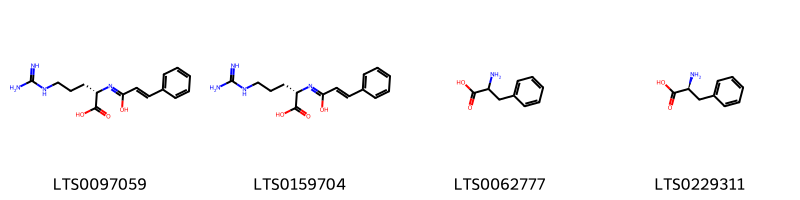
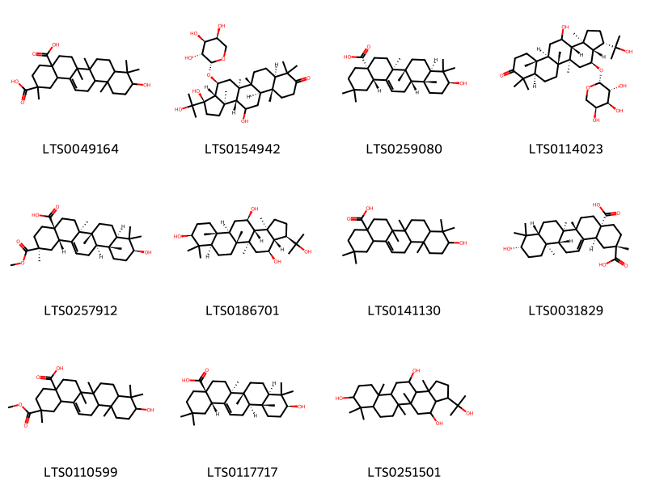
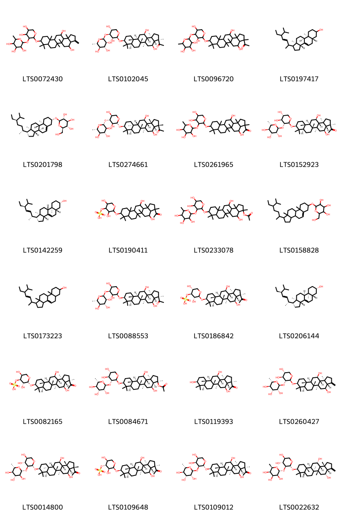

!!! abstract "Tóm tắt"

    Rau đắng đất (Herba Glinni oppositifolii) là toàn cây phơi hay sấy khô của cây Rau đắng đất [Glinus oppositifolius (L.) A. DC.], thuộc họ Rau đắng đất (Molluginaceae). Cây phân bố rộng rãi ở các vùng nhiệt đới châu Á và được tìm thấy dọc theo các tỉnh ven biển Việt Nam. Theo y học cổ truyền, rau đắng đất có vị đắng, tính mát, công năng tiêu viêm, sát trùng, giải độc, lợi tiểu và chỉ ngứa. Dược liệu này được dùng để chữa các bệnh về đường tiêu hóa như táo bón, kiết lỵ, cũng như các bệnh đường tiết niệu như tiểu buốt, viêm bàng quang, sỏi thận và viêm thận gây phù nề. Thành phần hóa học của dược liệu chủ yếu là saponin và flavonoid.

## Thông tin về thực vật

Dược liệu **Rau Đắng Đất (Toàn Cây)** từ bộ phận **Toàn cây** từ loài *Glinus oppositifolius*.

**Mô tả thực vật:** Phần trên mặt đất có dạng dây leo, sau khi phơi khô có màu vàng rơm, hoặc vàng lục, đôi khi có màu đỏ nâu. Thân và cành rất mảnh, dài khoảng 20 cm đến 200 cm, nhẵn, đường kính khoảng 0,2 mm đến 4 mm. Lá mọc vòng, to nhỏ không đều, hình mác thuôn, mép nguyên, dài 1 cm đến 1,5 cm, rộng 3 mm đến 10 mm. Cụm hoa chùm, lá bắc ở gốc hoa, hoa mọc tụm 2 đến 5 ở kẽ lá, cuống hoa dài 1 cm đến 1,5 cm, nhị 5, nhụy 3 ô.

*Tài liệu tham khảo:* Tài liệu khác 
Trong dược điển Việt nam, một loài được sử dụng làm dược liệu là *Glinus oppositifolius*.

!!! info "Phân loại thực vật của *Glinus oppositifolius*"
    - **Kingdom:** Plantae
    - **Phylum:** Tracheophyta
    - **Order:** Caryophyllales
    - **Family:** Molluginaceae
    - **Genus:** Glinus
    - **Species:** *Glinus oppositifolius*

**Phân bố trên thế giới:** Kenya, Côte d’Ivoire, Mayotte, Spain, Chinese Taipei, Timor-Leste, South Africa, Bangladesh, Australia, Indonesia, Madagascar, Myanmar, Mozambique, India, Viet Nam, Zimbabwe, Thailand, Botswana, Congo

**Phân bố tại Việt nam:** Long An

## Thông tin về dược liệu 

### Định danh

!!! info "Thông tin về tên gọi"

    - Dược liệu tiếng Việt: rau đắng đất
    - Dược liệu tiếng Trung:  ()
    - Dược liệu tiếng Anh: 
    - Dược liệu latin thông dụng: Herba Glini oppositifolii
    - Dược liệu latin kiểu DĐVN: *herba glini oppositifolii*
    - Dược liệu latin kiểu DĐVN: **
    - Dược liệu latin kiểu thông tư: **
    - Bộ phận dùng: Toàn cây (Herba)

### Mô tả dược liệu 

- **Theo dược điển Việt nam V:** Phần trên mặt đất có dạng dây leo, sau khi phơi khô có màu vàng rơm, hoặc vàng lục, đôi khi có màu đỏ nâu. Thân và cành rất mảnh, dài khoảng 20 cm đến 200 cm, nhẵn, đường kính khoảng 0,2 mm đến 4 mm. Lá mọc vòng, to nhỏ không đều, hình mác thuôn, mép nguyên, dài 1 cm đến 1,5 cm, rộng 3 mm đến 10 mm. Cụm hoa chùm, lá bắc ở gốc hoa, hoa mọc tụm 2 đến 5 ở kẽ lá, cuống hoa dài 1 cm đến 1,5 cm, nhị 5, nhụy 3 ô.

- **Mô tả dược liệu theo thông tư chế biến dược liệu theo phương pháp cổ truyền:** 

### Chế biến 

- **Chế biến theo dược điển việt nam V**: Chế biến Thu hái vào khoảng tháng 3 đến 4 trong năm, rửa sạch, phơi khô hoặc sấy khô ở nhiệt độ 50 °C đến 60 °C. Khi dùng cắt thành đoạn 3 cm đến 5 cm và vi sao.

- **Chế biến theo thông tư:** 

--- 

## Thành phần hóa học

- Theo tài liệu của GS. Đỗ Tất Lợi:  Rau đắng đất chứa chủ yếu saponin và flavonoid
    

**Thành phần hóa học từ loài **Glinus oppositifolius**

Theo cơ sở dữ liệu lotus, loài *Glinus oppositifolius* đã phân lập và xác định được **53** hoạt chất thuộc về các nhóm Steroids and steroid derivatives, Flavonoids, Purine nucleosides, Carboxylic acids and derivatives, Prenol lipids trong bảng dưới đây. Danh sách các hoạt chất như sau 2-{[1-(5-ethyl-6-methylheptan-2-yl)-9a,11a-dimethyl-1h,2h,3h,3ah,3bh,4h,6h,7h,8h,9h,9bh,10h,11h-cyclopenta[a]phenanthren-7-yl]oxy}-6-(hydroxymethyl)oxane-3,4,5-triol [(LTS0158828)](https://lotus.naturalproducts.net/compound/lotus_id/LTS0158828), oleanolic acid [(LTS0141130)](https://lotus.naturalproducts.net/compound/lotus_id/LTS0141130), 5,7-dihydroxy-2-(4-hydroxyphenyl)-6,8-bis[3,4,5-trihydroxy-6-(hydroxymethyl)oxan-2-yl]chromen-4-one [(LTS0255367)](https://lotus.naturalproducts.net/compound/lotus_id/LTS0255367), (2s)-5-carbamimidamido-2-[(1-hydroxy-3-phenylprop-2-en-1-ylidene)amino]pentanoic acid [(LTS0159704)](https://lotus.naturalproducts.net/compound/lotus_id/LTS0159704), trifolin [(LTS0237581)](https://lotus.naturalproducts.net/compound/lotus_id/LTS0237581), [(2s,3s,4r,5s)-2-{[(3r,3ar,4s,5ar,5br,7ar,9s,11ar,11br,13r,13ar,13br)-3-acetyl-4,13-dihydroxy-3,5a,5b,8,8,11a,13b-heptamethyl-tetradecahydro-1h-cyclopenta[a]chrysen-9-yl]oxy}-3,5-dihydroxyoxan-4-yl]oxidanesulfonic acid [(LTS0109648)](https://lotus.naturalproducts.net/compound/lotus_id/LTS0109648), 1-[(3r,3ar,4s,5ar,5br,7ar,9s,11ar,11br,13r,13ar,13br)-9-{[(2s,3r,4s,5r)-4,5-dihydroxy-3-{[(2s,3r,4r,5r,6s)-3,4,5-trihydroxy-6-methyloxan-2-yl]oxy}oxan-2-yl]oxy}-4,13-dihydroxy-3,5a,5b,8,8,11a,13b-heptamethyl-tetradecahydro-1h-cyclopenta[a]chrysen-3-yl]ethanone [(LTS0152923)](https://lotus.naturalproducts.net/compound/lotus_id/LTS0152923), 1-[(3s,3ar,4s,5ar,5br,7ar,9s,11as,11bs,13r,13ar,13bs)-9-{[(2r,3s,4r,5s)-3,5-dihydroxy-4-{[(2r,3s,4r,5r,6s)-3,4,5-trihydroxy-6-methyloxan-2-yl]oxy}oxan-2-yl]oxy}-4,13-dihydroxy-3,5a,5b,8,8,11a,13b-heptamethyl-tetradecahydro-1h-cyclopenta[a]chrysen-3-yl]ethanone [(LTS0274661)](https://lotus.naturalproducts.net/compound/lotus_id/LTS0274661), l-phenylalanine [(LTS0229311)](https://lotus.naturalproducts.net/compound/lotus_id/LTS0229311), vicenin-2 [(LTS0103522)](https://lotus.naturalproducts.net/compound/lotus_id/LTS0103522), phenylalanin [(LTS0062777)](https://lotus.naturalproducts.net/compound/lotus_id/LTS0062777), (2s,3r,4s,5s,6r)-4,5-dihydroxy-6-(hydroxymethyl)-2-[2-(4-hydroxyphenyl)-4-oxo-7-{[(2s,3r,4s,5s,6r)-3,4,5-trihydroxy-6-(hydroxymethyl)oxan-2-yl]oxy}chromen-8-yl]oxan-3-yl (2e)-3-(4-hydroxyphenyl)prop-2-enoate [(LTS0257444)](https://lotus.naturalproducts.net/compound/lotus_id/LTS0257444), (2r,3s,4s,5r,6r)-2-{[(2r,3s,4r,5s)-2-{[(3as,4r,5as,5bs,7as,9s,11ar,11br,13s,13ar,13br)-4,13-dihydroxy-5a,5b,8,8,11a,13b-hexamethyl-3-methylidene-tetradecahydro-1h-cyclopenta[a]chrysen-9-yl]oxy}-4,5-dihydroxyoxan-3-yl]oxy}-6-methyloxane-3,4,5-triol [(LTS0022632)](https://lotus.naturalproducts.net/compound/lotus_id/LTS0022632), 2-(4-hydroxyphenyl)-8-[3,4,5-trihydroxy-6-(hydroxymethyl)oxan-2-yl]-7-{[3,4,5-trihydroxy-6-(hydroxymethyl)oxan-2-yl]oxy}chromen-4-one [(LTS0051834)](https://lotus.naturalproducts.net/compound/lotus_id/LTS0051834), (3ar,5as,9as,9bs,11ar)-1-(5-ethyl-6-methylhept-3-en-2-yl)-9a,11a-dimethyl-1h,2h,3h,3ah,5h,5ah,6h,7h,8h,9h,9bh,10h,11h-cyclopenta[a]phenanthren-7-ol [(LTS0197417)](https://lotus.naturalproducts.net/compound/lotus_id/LTS0197417), 1-[(3r,3ar,4s,5ar,5br,7ar,9s,11ar,11br,13r,13ar,13br)-9-{[(2s,3s,4s,5s)-3,5-dihydroxy-4-{[(2s,3r,4r,5r,6s)-3,4,5-trihydroxy-6-methyloxan-2-yl]oxy}oxan-2-yl]oxy}-4,13-dihydroxy-3,5a,5b,8,8,11a,13b-heptamethyl-tetradecahydro-1h-cyclopenta[a]chrysen-3-yl]ethanone [(LTS0088553)](https://lotus.naturalproducts.net/compound/lotus_id/LTS0088553), (2s,3r,4r,5r,6s)-2-{[(2s,3r,4s,5r)-2-{[(3as,4s,5ar,5br,7ar,9s,11ar,11br,13r,13ar,13bs)-4,13-dihydroxy-5a,5b,8,8,11a,13b-hexamethyl-3-methylidene-tetradecahydro-1h-cyclopenta[a]chrysen-9-yl]oxy}-4,5-dihydroxyoxan-3-yl]oxy}-6-methyloxane-3,4,5-triol [(LTS0260427)](https://lotus.naturalproducts.net/compound/lotus_id/LTS0260427), 3-(2-hydroxypropan-2-yl)-5a,5b,8,8,11a,13b-hexamethyl-hexadecahydrocyclopenta[a]chrysene-4,9,13-triol [(LTS0251501)](https://lotus.naturalproducts.net/compound/lotus_id/LTS0251501), (2s,4ar,6as,6br,8ar,10s,12ar,12br,14bs)-10-hydroxy-2,6a,6b,9,9,12a-hexamethyl-1,3,4,5,6,7,8,8a,10,11,12,12b,13,14b-tetradecahydropicene-2,4a-dicarboxylic acid [(LTS0031829)](https://lotus.naturalproducts.net/compound/lotus_id/LTS0031829), (3s,3as,4s,5ar,5br,7ar,11ar,11br,13ar,13bs)-13-hydroxy-3-(2-hydroxypropan-2-yl)-5a,5b,8,8,11a,13b-hexamethyl-4-{[(2r,3r,4s,5s)-3,4,5-trihydroxyoxan-2-yl]oxy}-tetradecahydro-1h-cyclopenta[a]chrysen-9-one [(LTS0114023)](https://lotus.naturalproducts.net/compound/lotus_id/LTS0114023), sitogluside [(LTS0201798)](https://lotus.naturalproducts.net/compound/lotus_id/LTS0201798), 1-[9-({4,5-dihydroxy-3-[(3,4,5-trihydroxy-6-methyloxan-2-yl)oxy]oxan-2-yl}oxy)-4,13-dihydroxy-3,5a,5b,8,8,11a,13b-heptamethyl-tetradecahydro-1h-cyclopenta[a]chrysen-3-yl]ethanone [(LTS0261965)](https://lotus.naturalproducts.net/compound/lotus_id/LTS0261965), 10-hydroxy-2-(methoxycarbonyl)-2,6a,6b,9,9,12a-hexamethyl-1,3,4,5,6,7,8,8a,10,11,12,12b,13,14b-tetradecahydropicene-4a-carboxylic acid [(LTS0110599)](https://lotus.naturalproducts.net/compound/lotus_id/LTS0110599), 3-{[4,5-dihydroxy-6-(hydroxymethyl)-3-[(3,4,5-trihydroxyoxan-2-yl)oxy]oxan-2-yl]oxy}-5,7-dihydroxy-2-(4-hydroxy-3-methoxyphenyl)chromen-4-one [(LTS0225484)](https://lotus.naturalproducts.net/compound/lotus_id/LTS0225484), trifolin [(LTS0267055)](https://lotus.naturalproducts.net/compound/lotus_id/LTS0267055), [(2r,3r,4s,5s)-2-{[(3r,3ar,4s,5ar,5br,7ar,9s,11ar,11br,13r,13ar,13br)-3-acetyl-4,13-dihydroxy-3,5a,5b,8,8,11a,13b-heptamethyl-tetradecahydro-1h-cyclopenta[a]chrysen-9-yl]oxy}-3,5-dihydroxyoxan-4-yl]oxidanesulfonic acid [(LTS0082165)](https://lotus.naturalproducts.net/compound/lotus_id/LTS0082165), (3r,3ar,4s,5ar,5br,7ar,9s,11ar,11br,13r,13ar,13br)-9-{[(2s,3r,4s,5r)-4,5-dihydroxy-3-{[(2s,3r,4r,5r,6s)-3,4,5-trihydroxy-6-methyloxan-2-yl]oxy}oxan-2-yl]oxy}-4,13-dihydroxy-3,5a,5b,8,8,11a,13b-heptamethyl-tetradecahydro-1h-cyclopenta[a]chrysen-3-yl acetate [(LTS0084671)](https://lotus.naturalproducts.net/compound/lotus_id/LTS0084671), oleanolic acid [(LTS0117717)](https://lotus.naturalproducts.net/compound/lotus_id/LTS0117717), (2s)-5-carbamimidamido-2-{[(2e)-1-hydroxy-3-phenylprop-2-en-1-ylidene]amino}pentanoic acid [(LTS0097059)](https://lotus.naturalproducts.net/compound/lotus_id/LTS0097059), 2-{[2-({4,13-dihydroxy-5a,5b,8,8,11a,13b-hexamethyl-3-methylidene-tetradecahydro-1h-cyclopenta[a]chrysen-9-yl}oxy)-4,5-dihydroxyoxan-3-yl]oxy}-6-methyloxane-3,4,5-triol [(LTS0072430)](https://lotus.naturalproducts.net/compound/lotus_id/LTS0072430), [(2s,3r,4s,5r)-2-{[(3r,3ar,4s,5ar,5br,7ar,9s,11ar,11br,13r,13ar,13br)-3-acetyl-4,13-dihydroxy-3,5a,5b,8,8,11a,13b-heptamethyl-tetradecahydro-1h-cyclopenta[a]chrysen-9-yl]oxy}-3,5-dihydroxyoxan-4-yl]oxidanesulfonic acid [(LTS0186842)](https://lotus.naturalproducts.net/compound/lotus_id/LTS0186842), 9-({4,5-dihydroxy-3-[(3,4,5-trihydroxy-6-methyloxan-2-yl)oxy]oxan-2-yl}oxy)-4,13-dihydroxy-3,5a,5b,8,8,11a,13b-heptamethyl-tetradecahydro-1h-cyclopenta[a]chrysen-3-yl acetate [(LTS0233078)](https://lotus.naturalproducts.net/compound/lotus_id/LTS0233078), 4,5-dihydroxy-6-(hydroxymethyl)-2-[2-(4-hydroxyphenyl)-4-oxo-7-{[3,4,5-trihydroxy-6-(hydroxymethyl)oxan-2-yl]oxy}chromen-8-yl]oxan-3-yl 3-(4-hydroxyphenyl)prop-2-enoate [(LTS0177736)](https://lotus.naturalproducts.net/compound/lotus_id/LTS0177736), 1-[(3r,3ar,4s,5ar,5br,7ar,9s,11ar,11br,13r,13ar,13br)-9-{[(2s,3r,4s,5r)-3,5-dihydroxy-4-{[(2s,3r,4r,5r,6s)-3,4,5-trihydroxy-6-methyloxan-2-yl]oxy}oxan-2-yl]oxy}-4,13-dihydroxy-3,5a,5b,8,8,11a,13b-heptamethyl-tetradecahydro-1h-cyclopenta[a]chrysen-3-yl]ethanone [(LTS0102045)](https://lotus.naturalproducts.net/compound/lotus_id/LTS0102045), (3r,3as,4s,5ar,5br,7ar,11ar,11br,13ar,13br)-3,13-dihydroxy-3-(2-hydroxypropan-2-yl)-5a,5b,8,8,11a,13b-hexamethyl-4-{[(2r,3r,4s,5s)-3,4,5-trihydroxyoxan-2-yl]oxy}-tetradecahydrocyclopenta[a]chrysen-9-one [(LTS0154942)](https://lotus.naturalproducts.net/compound/lotus_id/LTS0154942), vitexin [(LTS0199581)](https://lotus.naturalproducts.net/compound/lotus_id/LTS0199581), (4ar,6as,6br,8ar,10s,12ar,12bs,14bs)-10-hydroxy-2,2,6a,6b,9,9,12a-heptamethyl-1,3,4,5,6,7,8,8a,10,11,12,12b,13,14b-tetradecahydropicene-4a-carboxylic acid [(LTS0259080)](https://lotus.naturalproducts.net/compound/lotus_id/LTS0259080), chondrillasterol [(LTS0142259)](https://lotus.naturalproducts.net/compound/lotus_id/LTS0142259), 1-(5-ethyl-6-methylhept-3-en-2-yl)-9a,11a-dimethyl-1h,2h,3h,3ah,5h,5ah,6h,7h,8h,9h,9bh,10h,11h-cyclopenta[a]phenanthren-7-ol [(LTS0173223)](https://lotus.naturalproducts.net/compound/lotus_id/LTS0173223), 3-{[(2s,3r,4s,5r,6r)-4,5-dihydroxy-6-(hydroxymethyl)-3-{[(2s,3r,4s,5r)-3,4,5-trihydroxyoxan-2-yl]oxy}oxan-2-yl]oxy}-5,7-dihydroxy-2-(4-hydroxy-3-methoxyphenyl)chromen-4-one [(LTS0229990)](https://lotus.naturalproducts.net/compound/lotus_id/LTS0229990), (1r,3ar,5as,7s,9as,9bs,11ar)-1-[(2r,3e,5s)-5-ethyl-6-methylhept-3-en-2-yl]-9a,11a-dimethyl-1h,2h,3h,3ah,5h,5ah,6h,7h,8h,9h,9bh,10h,11h-cyclopenta[a]phenanthren-7-ol [(LTS0206144)](https://lotus.naturalproducts.net/compound/lotus_id/LTS0206144), adenosine [(LTS0014061)](https://lotus.naturalproducts.net/compound/lotus_id/LTS0014061), 10-hydroxy-2,6a,6b,9,9,12a-hexamethyl-1,3,4,5,6,7,8,8a,10,11,12,12b,13,14b-tetradecahydropicene-2,4a-dicarboxylic acid [(LTS0049164)](https://lotus.naturalproducts.net/compound/lotus_id/LTS0049164), 1-[9-({3,5-dihydroxy-4-[(3,4,5-trihydroxy-6-methyloxan-2-yl)oxy]oxan-2-yl}oxy)-4,13-dihydroxy-3,5a,5b,8,8,11a,13b-heptamethyl-tetradecahydro-1h-cyclopenta[a]chrysen-3-yl]ethanone [(LTS0096720)](https://lotus.naturalproducts.net/compound/lotus_id/LTS0096720), adenosine [(LTS0052576)](https://lotus.naturalproducts.net/compound/lotus_id/LTS0052576), [2-({3-acetyl-4,13-dihydroxy-3,5a,5b,8,8,11a,13b-heptamethyl-tetradecahydro-1h-cyclopenta[a]chrysen-9-yl}oxy)-3,5-dihydroxyoxan-4-yl]oxidanesulfonic acid [(LTS0190411)](https://lotus.naturalproducts.net/compound/lotus_id/LTS0190411), 1-[(3r,3ar,4s,5ar,5br,7ar,9s,11ar,11br,13r,13ar,13br)-4,9,13-trihydroxy-3,5a,5b,8,8,11a,13b-heptamethyl-tetradecahydro-1h-cyclopenta[a]chrysen-3-yl]ethanone [(LTS0119393)](https://lotus.naturalproducts.net/compound/lotus_id/LTS0119393), (3r,3as,4s,5ar,5br,7ar,9s,11ar,11br,13r,13ar,13bs)-3-(2-hydroxypropan-2-yl)-5a,5b,8,8,11a,13b-hexamethyl-hexadecahydrocyclopenta[a]chrysene-4,9,13-triol [(LTS0186701)](https://lotus.naturalproducts.net/compound/lotus_id/LTS0186701), vitexin [(LTS0254648)](https://lotus.naturalproducts.net/compound/lotus_id/LTS0254648), 1-[(3r,3ar,4s,5ar,5br,7ar,9s,11ar,11br,13r,13ar,13br)-9-{[(2r,3s,4s,5s)-4,5-dihydroxy-3-{[(2s,3r,4r,5r,6s)-3,4,5-trihydroxy-6-methyloxan-2-yl]oxy}oxan-2-yl]oxy}-4,13-dihydroxy-3,5a,5b,8,8,11a,13b-heptamethyl-tetradecahydro-1h-cyclopenta[a]chrysen-3-yl]ethanone [(LTS0109012)](https://lotus.naturalproducts.net/compound/lotus_id/LTS0109012), 1-[(3s,3ar,4s,5ar,5br,7ar,9s,11as,11bs,13r,13ar,13bs)-9-{[(2r,3s,4r,5s)-4,5-dihydroxy-3-{[(2r,3s,4r,5r,6s)-3,4,5-trihydroxy-6-methyloxan-2-yl]oxy}oxan-2-yl]oxy}-4,13-dihydroxy-3,5a,5b,8,8,11a,13b-heptamethyl-tetradecahydro-1h-cyclopenta[a]chrysen-3-yl]ethanone [(LTS0014800)](https://lotus.naturalproducts.net/compound/lotus_id/LTS0014800), (2s,4ar,6as,6br,8ar,10s,12ar,12br,14bs)-10-hydroxy-2-(methoxycarbonyl)-2,6a,6b,9,9,12a-hexamethyl-1,3,4,5,6,7,8,8a,10,11,12,12b,13,14b-tetradecahydropicene-4a-carboxylic acid [(LTS0257912)](https://lotus.naturalproducts.net/compound/lotus_id/LTS0257912), 2-(4-hydroxyphenyl)-8-[(2s,3r,4r,5s,6r)-3,4,5-trihydroxy-6-(hydroxymethyl)oxan-2-yl]-7-{[(2s,3r,4s,5s,6r)-3,4,5-trihydroxy-6-(hydroxymethyl)oxan-2-yl]oxy}chromen-4-one [(LTS0230666)](https://lotus.naturalproducts.net/compound/lotus_id/LTS0230666). 
        
| chemicalTaxonomyClassyfireClass   |   smiles_count |
|:----------------------------------|---------------:|
| Carboxylic acids and derivatives  |            125 |
| Flavonoids                        |           1078 |
| Prenol lipids                     |           1054 |
| Purine nucleosides                |             76 |
| Steroids and steroid derivatives  |           3221 |

            
### Nhóm Carboxylic acids and derivatives
<figure markdown="span">
    { width=100% }
<figcaption>Hình ảnh cấu trúc hóa học của hoạt chất thuộc nhóm *Carboxylic acids and derivatives*. Tên thường gọi của các hoạt chất tương ứng là (2s)-5-carbamimidamido-2-{[(2e)-1-hydroxy-3-phenylprop-2-en-1-ylidene]amino}pentanoic acid [(LTS0097059)](https://lotus.naturalproducts.net/compound/lotus_id/LTS0097059), (2s)-5-carbamimidamido-2-[(1-hydroxy-3-phenylprop-2-en-1-ylidene)amino]pentanoic acid [(LTS0159704)](https://lotus.naturalproducts.net/compound/lotus_id/LTS0159704), phenylalanin [(LTS0062777)](https://lotus.naturalproducts.net/compound/lotus_id/LTS0062777), l-phenylalanine [(LTS0229311)](https://lotus.naturalproducts.net/compound/lotus_id/LTS0229311).</figcaption>
</figure>

            
            
### Nhóm Carboxylic acids and derivatives
<figure markdown="span">
    { width=100% }
<figcaption>Hình ảnh cấu trúc hóa học của hoạt chất thuộc nhóm *Carboxylic acids and derivatives*. Tên thường gọi của các hoạt chất tương ứng là (2s)-5-carbamimidamido-2-{[(2e)-1-hydroxy-3-phenylprop-2-en-1-ylidene]amino}pentanoic acid [(LTS0097059)](https://lotus.naturalproducts.net/compound/lotus_id/LTS0097059), (2s)-5-carbamimidamido-2-[(1-hydroxy-3-phenylprop-2-en-1-ylidene)amino]pentanoic acid [(LTS0159704)](https://lotus.naturalproducts.net/compound/lotus_id/LTS0159704), phenylalanin [(LTS0062777)](https://lotus.naturalproducts.net/compound/lotus_id/LTS0062777), l-phenylalanine [(LTS0229311)](https://lotus.naturalproducts.net/compound/lotus_id/LTS0229311).</figcaption>
</figure>

### Nhóm Flavonoids
<figure markdown="span">
    { width=100% }
<figcaption>Hình ảnh cấu trúc hóa học của hoạt chất thuộc nhóm *Flavonoids*. Tên thường gọi của các hoạt chất tương ứng là vicenin-2 [(LTS0103522)](https://lotus.naturalproducts.net/compound/lotus_id/LTS0103522), vitexin [(LTS0199581)](https://lotus.naturalproducts.net/compound/lotus_id/LTS0199581), 5,7-dihydroxy-2-(4-hydroxyphenyl)-6,8-bis[3,4,5-trihydroxy-6-(hydroxymethyl)oxan-2-yl]chromen-4-one [(LTS0255367)](https://lotus.naturalproducts.net/compound/lotus_id/LTS0255367), 3-{[4,5-dihydroxy-6-(hydroxymethyl)-3-[(3,4,5-trihydroxyoxan-2-yl)oxy]oxan-2-yl]oxy}-5,7-dihydroxy-2-(4-hydroxy-3-methoxyphenyl)chromen-4-one [(LTS0225484)](https://lotus.naturalproducts.net/compound/lotus_id/LTS0225484), (2s,3r,4s,5s,6r)-4,5-dihydroxy-6-(hydroxymethyl)-2-[2-(4-hydroxyphenyl)-4-oxo-7-{[(2s,3r,4s,5s,6r)-3,4,5-trihydroxy-6-(hydroxymethyl)oxan-2-yl]oxy}chromen-8-yl]oxan-3-yl (2e)-3-(4-hydroxyphenyl)prop-2-enoate [(LTS0257444)](https://lotus.naturalproducts.net/compound/lotus_id/LTS0257444), 4,5-dihydroxy-6-(hydroxymethyl)-2-[2-(4-hydroxyphenyl)-4-oxo-7-{[3,4,5-trihydroxy-6-(hydroxymethyl)oxan-2-yl]oxy}chromen-8-yl]oxan-3-yl 3-(4-hydroxyphenyl)prop-2-enoate [(LTS0177736)](https://lotus.naturalproducts.net/compound/lotus_id/LTS0177736), trifolin [(LTS0267055)](https://lotus.naturalproducts.net/compound/lotus_id/LTS0267055), trifolin [(LTS0237581)](https://lotus.naturalproducts.net/compound/lotus_id/LTS0237581), 2-(4-hydroxyphenyl)-8-[(2s,3r,4r,5s,6r)-3,4,5-trihydroxy-6-(hydroxymethyl)oxan-2-yl]-7-{[(2s,3r,4s,5s,6r)-3,4,5-trihydroxy-6-(hydroxymethyl)oxan-2-yl]oxy}chromen-4-one [(LTS0230666)](https://lotus.naturalproducts.net/compound/lotus_id/LTS0230666), 2-(4-hydroxyphenyl)-8-[3,4,5-trihydroxy-6-(hydroxymethyl)oxan-2-yl]-7-{[3,4,5-trihydroxy-6-(hydroxymethyl)oxan-2-yl]oxy}chromen-4-one [(LTS0051834)](https://lotus.naturalproducts.net/compound/lotus_id/LTS0051834), 3-{[(2s,3r,4s,5r,6r)-4,5-dihydroxy-6-(hydroxymethyl)-3-{[(2s,3r,4s,5r)-3,4,5-trihydroxyoxan-2-yl]oxy}oxan-2-yl]oxy}-5,7-dihydroxy-2-(4-hydroxy-3-methoxyphenyl)chromen-4-one [(LTS0229990)](https://lotus.naturalproducts.net/compound/lotus_id/LTS0229990), vitexin [(LTS0254648)](https://lotus.naturalproducts.net/compound/lotus_id/LTS0254648).</figcaption>
</figure>

            
            
### Nhóm Carboxylic acids and derivatives
<figure markdown="span">
    { width=100% }
<figcaption>Hình ảnh cấu trúc hóa học của hoạt chất thuộc nhóm *Carboxylic acids and derivatives*. Tên thường gọi của các hoạt chất tương ứng là (2s)-5-carbamimidamido-2-{[(2e)-1-hydroxy-3-phenylprop-2-en-1-ylidene]amino}pentanoic acid [(LTS0097059)](https://lotus.naturalproducts.net/compound/lotus_id/LTS0097059), (2s)-5-carbamimidamido-2-[(1-hydroxy-3-phenylprop-2-en-1-ylidene)amino]pentanoic acid [(LTS0159704)](https://lotus.naturalproducts.net/compound/lotus_id/LTS0159704), phenylalanin [(LTS0062777)](https://lotus.naturalproducts.net/compound/lotus_id/LTS0062777), l-phenylalanine [(LTS0229311)](https://lotus.naturalproducts.net/compound/lotus_id/LTS0229311).</figcaption>
</figure>

### Nhóm Flavonoids
<figure markdown="span">
    { width=100% }
<figcaption>Hình ảnh cấu trúc hóa học của hoạt chất thuộc nhóm *Flavonoids*. Tên thường gọi của các hoạt chất tương ứng là vicenin-2 [(LTS0103522)](https://lotus.naturalproducts.net/compound/lotus_id/LTS0103522), vitexin [(LTS0199581)](https://lotus.naturalproducts.net/compound/lotus_id/LTS0199581), 5,7-dihydroxy-2-(4-hydroxyphenyl)-6,8-bis[3,4,5-trihydroxy-6-(hydroxymethyl)oxan-2-yl]chromen-4-one [(LTS0255367)](https://lotus.naturalproducts.net/compound/lotus_id/LTS0255367), 3-{[4,5-dihydroxy-6-(hydroxymethyl)-3-[(3,4,5-trihydroxyoxan-2-yl)oxy]oxan-2-yl]oxy}-5,7-dihydroxy-2-(4-hydroxy-3-methoxyphenyl)chromen-4-one [(LTS0225484)](https://lotus.naturalproducts.net/compound/lotus_id/LTS0225484), (2s,3r,4s,5s,6r)-4,5-dihydroxy-6-(hydroxymethyl)-2-[2-(4-hydroxyphenyl)-4-oxo-7-{[(2s,3r,4s,5s,6r)-3,4,5-trihydroxy-6-(hydroxymethyl)oxan-2-yl]oxy}chromen-8-yl]oxan-3-yl (2e)-3-(4-hydroxyphenyl)prop-2-enoate [(LTS0257444)](https://lotus.naturalproducts.net/compound/lotus_id/LTS0257444), 4,5-dihydroxy-6-(hydroxymethyl)-2-[2-(4-hydroxyphenyl)-4-oxo-7-{[3,4,5-trihydroxy-6-(hydroxymethyl)oxan-2-yl]oxy}chromen-8-yl]oxan-3-yl 3-(4-hydroxyphenyl)prop-2-enoate [(LTS0177736)](https://lotus.naturalproducts.net/compound/lotus_id/LTS0177736), trifolin [(LTS0267055)](https://lotus.naturalproducts.net/compound/lotus_id/LTS0267055), trifolin [(LTS0237581)](https://lotus.naturalproducts.net/compound/lotus_id/LTS0237581), 2-(4-hydroxyphenyl)-8-[(2s,3r,4r,5s,6r)-3,4,5-trihydroxy-6-(hydroxymethyl)oxan-2-yl]-7-{[(2s,3r,4s,5s,6r)-3,4,5-trihydroxy-6-(hydroxymethyl)oxan-2-yl]oxy}chromen-4-one [(LTS0230666)](https://lotus.naturalproducts.net/compound/lotus_id/LTS0230666), 2-(4-hydroxyphenyl)-8-[3,4,5-trihydroxy-6-(hydroxymethyl)oxan-2-yl]-7-{[3,4,5-trihydroxy-6-(hydroxymethyl)oxan-2-yl]oxy}chromen-4-one [(LTS0051834)](https://lotus.naturalproducts.net/compound/lotus_id/LTS0051834), 3-{[(2s,3r,4s,5r,6r)-4,5-dihydroxy-6-(hydroxymethyl)-3-{[(2s,3r,4s,5r)-3,4,5-trihydroxyoxan-2-yl]oxy}oxan-2-yl]oxy}-5,7-dihydroxy-2-(4-hydroxy-3-methoxyphenyl)chromen-4-one [(LTS0229990)](https://lotus.naturalproducts.net/compound/lotus_id/LTS0229990), vitexin [(LTS0254648)](https://lotus.naturalproducts.net/compound/lotus_id/LTS0254648).</figcaption>
</figure>

### Nhóm Prenol lipids
<figure markdown="span">
    { width=100% }
<figcaption>Hình ảnh cấu trúc hóa học của hoạt chất thuộc nhóm *Prenol lipids*. Tên thường gọi của các hoạt chất tương ứng là 10-hydroxy-2,6a,6b,9,9,12a-hexamethyl-1,3,4,5,6,7,8,8a,10,11,12,12b,13,14b-tetradecahydropicene-2,4a-dicarboxylic acid [(LTS0049164)](https://lotus.naturalproducts.net/compound/lotus_id/LTS0049164), (3r,3as,4s,5ar,5br,7ar,11ar,11br,13ar,13br)-3,13-dihydroxy-3-(2-hydroxypropan-2-yl)-5a,5b,8,8,11a,13b-hexamethyl-4-{[(2r,3r,4s,5s)-3,4,5-trihydroxyoxan-2-yl]oxy}-tetradecahydrocyclopenta[a]chrysen-9-one [(LTS0154942)](https://lotus.naturalproducts.net/compound/lotus_id/LTS0154942), (4ar,6as,6br,8ar,10s,12ar,12bs,14bs)-10-hydroxy-2,2,6a,6b,9,9,12a-heptamethyl-1,3,4,5,6,7,8,8a,10,11,12,12b,13,14b-tetradecahydropicene-4a-carboxylic acid [(LTS0259080)](https://lotus.naturalproducts.net/compound/lotus_id/LTS0259080), (3s,3as,4s,5ar,5br,7ar,11ar,11br,13ar,13bs)-13-hydroxy-3-(2-hydroxypropan-2-yl)-5a,5b,8,8,11a,13b-hexamethyl-4-{[(2r,3r,4s,5s)-3,4,5-trihydroxyoxan-2-yl]oxy}-tetradecahydro-1h-cyclopenta[a]chrysen-9-one [(LTS0114023)](https://lotus.naturalproducts.net/compound/lotus_id/LTS0114023), (2s,4ar,6as,6br,8ar,10s,12ar,12br,14bs)-10-hydroxy-2-(methoxycarbonyl)-2,6a,6b,9,9,12a-hexamethyl-1,3,4,5,6,7,8,8a,10,11,12,12b,13,14b-tetradecahydropicene-4a-carboxylic acid [(LTS0257912)](https://lotus.naturalproducts.net/compound/lotus_id/LTS0257912), (3r,3as,4s,5ar,5br,7ar,9s,11ar,11br,13r,13ar,13bs)-3-(2-hydroxypropan-2-yl)-5a,5b,8,8,11a,13b-hexamethyl-hexadecahydrocyclopenta[a]chrysene-4,9,13-triol [(LTS0186701)](https://lotus.naturalproducts.net/compound/lotus_id/LTS0186701), oleanolic acid [(LTS0141130)](https://lotus.naturalproducts.net/compound/lotus_id/LTS0141130), (2s,4ar,6as,6br,8ar,10s,12ar,12br,14bs)-10-hydroxy-2,6a,6b,9,9,12a-hexamethyl-1,3,4,5,6,7,8,8a,10,11,12,12b,13,14b-tetradecahydropicene-2,4a-dicarboxylic acid [(LTS0031829)](https://lotus.naturalproducts.net/compound/lotus_id/LTS0031829), 10-hydroxy-2-(methoxycarbonyl)-2,6a,6b,9,9,12a-hexamethyl-1,3,4,5,6,7,8,8a,10,11,12,12b,13,14b-tetradecahydropicene-4a-carboxylic acid [(LTS0110599)](https://lotus.naturalproducts.net/compound/lotus_id/LTS0110599), oleanolic acid [(LTS0117717)](https://lotus.naturalproducts.net/compound/lotus_id/LTS0117717), 3-(2-hydroxypropan-2-yl)-5a,5b,8,8,11a,13b-hexamethyl-hexadecahydrocyclopenta[a]chrysene-4,9,13-triol [(LTS0251501)](https://lotus.naturalproducts.net/compound/lotus_id/LTS0251501).</figcaption>
</figure>

            
            
### Nhóm Carboxylic acids and derivatives
<figure markdown="span">
    { width=100% }
<figcaption>Hình ảnh cấu trúc hóa học của hoạt chất thuộc nhóm *Carboxylic acids and derivatives*. Tên thường gọi của các hoạt chất tương ứng là (2s)-5-carbamimidamido-2-{[(2e)-1-hydroxy-3-phenylprop-2-en-1-ylidene]amino}pentanoic acid [(LTS0097059)](https://lotus.naturalproducts.net/compound/lotus_id/LTS0097059), (2s)-5-carbamimidamido-2-[(1-hydroxy-3-phenylprop-2-en-1-ylidene)amino]pentanoic acid [(LTS0159704)](https://lotus.naturalproducts.net/compound/lotus_id/LTS0159704), phenylalanin [(LTS0062777)](https://lotus.naturalproducts.net/compound/lotus_id/LTS0062777), l-phenylalanine [(LTS0229311)](https://lotus.naturalproducts.net/compound/lotus_id/LTS0229311).</figcaption>
</figure>

### Nhóm Flavonoids
<figure markdown="span">
    { width=100% }
<figcaption>Hình ảnh cấu trúc hóa học của hoạt chất thuộc nhóm *Flavonoids*. Tên thường gọi của các hoạt chất tương ứng là vicenin-2 [(LTS0103522)](https://lotus.naturalproducts.net/compound/lotus_id/LTS0103522), vitexin [(LTS0199581)](https://lotus.naturalproducts.net/compound/lotus_id/LTS0199581), 5,7-dihydroxy-2-(4-hydroxyphenyl)-6,8-bis[3,4,5-trihydroxy-6-(hydroxymethyl)oxan-2-yl]chromen-4-one [(LTS0255367)](https://lotus.naturalproducts.net/compound/lotus_id/LTS0255367), 3-{[4,5-dihydroxy-6-(hydroxymethyl)-3-[(3,4,5-trihydroxyoxan-2-yl)oxy]oxan-2-yl]oxy}-5,7-dihydroxy-2-(4-hydroxy-3-methoxyphenyl)chromen-4-one [(LTS0225484)](https://lotus.naturalproducts.net/compound/lotus_id/LTS0225484), (2s,3r,4s,5s,6r)-4,5-dihydroxy-6-(hydroxymethyl)-2-[2-(4-hydroxyphenyl)-4-oxo-7-{[(2s,3r,4s,5s,6r)-3,4,5-trihydroxy-6-(hydroxymethyl)oxan-2-yl]oxy}chromen-8-yl]oxan-3-yl (2e)-3-(4-hydroxyphenyl)prop-2-enoate [(LTS0257444)](https://lotus.naturalproducts.net/compound/lotus_id/LTS0257444), 4,5-dihydroxy-6-(hydroxymethyl)-2-[2-(4-hydroxyphenyl)-4-oxo-7-{[3,4,5-trihydroxy-6-(hydroxymethyl)oxan-2-yl]oxy}chromen-8-yl]oxan-3-yl 3-(4-hydroxyphenyl)prop-2-enoate [(LTS0177736)](https://lotus.naturalproducts.net/compound/lotus_id/LTS0177736), trifolin [(LTS0267055)](https://lotus.naturalproducts.net/compound/lotus_id/LTS0267055), trifolin [(LTS0237581)](https://lotus.naturalproducts.net/compound/lotus_id/LTS0237581), 2-(4-hydroxyphenyl)-8-[(2s,3r,4r,5s,6r)-3,4,5-trihydroxy-6-(hydroxymethyl)oxan-2-yl]-7-{[(2s,3r,4s,5s,6r)-3,4,5-trihydroxy-6-(hydroxymethyl)oxan-2-yl]oxy}chromen-4-one [(LTS0230666)](https://lotus.naturalproducts.net/compound/lotus_id/LTS0230666), 2-(4-hydroxyphenyl)-8-[3,4,5-trihydroxy-6-(hydroxymethyl)oxan-2-yl]-7-{[3,4,5-trihydroxy-6-(hydroxymethyl)oxan-2-yl]oxy}chromen-4-one [(LTS0051834)](https://lotus.naturalproducts.net/compound/lotus_id/LTS0051834), 3-{[(2s,3r,4s,5r,6r)-4,5-dihydroxy-6-(hydroxymethyl)-3-{[(2s,3r,4s,5r)-3,4,5-trihydroxyoxan-2-yl]oxy}oxan-2-yl]oxy}-5,7-dihydroxy-2-(4-hydroxy-3-methoxyphenyl)chromen-4-one [(LTS0229990)](https://lotus.naturalproducts.net/compound/lotus_id/LTS0229990), vitexin [(LTS0254648)](https://lotus.naturalproducts.net/compound/lotus_id/LTS0254648).</figcaption>
</figure>

### Nhóm Prenol lipids
<figure markdown="span">
    { width=100% }
<figcaption>Hình ảnh cấu trúc hóa học của hoạt chất thuộc nhóm *Prenol lipids*. Tên thường gọi của các hoạt chất tương ứng là 10-hydroxy-2,6a,6b,9,9,12a-hexamethyl-1,3,4,5,6,7,8,8a,10,11,12,12b,13,14b-tetradecahydropicene-2,4a-dicarboxylic acid [(LTS0049164)](https://lotus.naturalproducts.net/compound/lotus_id/LTS0049164), (3r,3as,4s,5ar,5br,7ar,11ar,11br,13ar,13br)-3,13-dihydroxy-3-(2-hydroxypropan-2-yl)-5a,5b,8,8,11a,13b-hexamethyl-4-{[(2r,3r,4s,5s)-3,4,5-trihydroxyoxan-2-yl]oxy}-tetradecahydrocyclopenta[a]chrysen-9-one [(LTS0154942)](https://lotus.naturalproducts.net/compound/lotus_id/LTS0154942), (4ar,6as,6br,8ar,10s,12ar,12bs,14bs)-10-hydroxy-2,2,6a,6b,9,9,12a-heptamethyl-1,3,4,5,6,7,8,8a,10,11,12,12b,13,14b-tetradecahydropicene-4a-carboxylic acid [(LTS0259080)](https://lotus.naturalproducts.net/compound/lotus_id/LTS0259080), (3s,3as,4s,5ar,5br,7ar,11ar,11br,13ar,13bs)-13-hydroxy-3-(2-hydroxypropan-2-yl)-5a,5b,8,8,11a,13b-hexamethyl-4-{[(2r,3r,4s,5s)-3,4,5-trihydroxyoxan-2-yl]oxy}-tetradecahydro-1h-cyclopenta[a]chrysen-9-one [(LTS0114023)](https://lotus.naturalproducts.net/compound/lotus_id/LTS0114023), (2s,4ar,6as,6br,8ar,10s,12ar,12br,14bs)-10-hydroxy-2-(methoxycarbonyl)-2,6a,6b,9,9,12a-hexamethyl-1,3,4,5,6,7,8,8a,10,11,12,12b,13,14b-tetradecahydropicene-4a-carboxylic acid [(LTS0257912)](https://lotus.naturalproducts.net/compound/lotus_id/LTS0257912), (3r,3as,4s,5ar,5br,7ar,9s,11ar,11br,13r,13ar,13bs)-3-(2-hydroxypropan-2-yl)-5a,5b,8,8,11a,13b-hexamethyl-hexadecahydrocyclopenta[a]chrysene-4,9,13-triol [(LTS0186701)](https://lotus.naturalproducts.net/compound/lotus_id/LTS0186701), oleanolic acid [(LTS0141130)](https://lotus.naturalproducts.net/compound/lotus_id/LTS0141130), (2s,4ar,6as,6br,8ar,10s,12ar,12br,14bs)-10-hydroxy-2,6a,6b,9,9,12a-hexamethyl-1,3,4,5,6,7,8,8a,10,11,12,12b,13,14b-tetradecahydropicene-2,4a-dicarboxylic acid [(LTS0031829)](https://lotus.naturalproducts.net/compound/lotus_id/LTS0031829), 10-hydroxy-2-(methoxycarbonyl)-2,6a,6b,9,9,12a-hexamethyl-1,3,4,5,6,7,8,8a,10,11,12,12b,13,14b-tetradecahydropicene-4a-carboxylic acid [(LTS0110599)](https://lotus.naturalproducts.net/compound/lotus_id/LTS0110599), oleanolic acid [(LTS0117717)](https://lotus.naturalproducts.net/compound/lotus_id/LTS0117717), 3-(2-hydroxypropan-2-yl)-5a,5b,8,8,11a,13b-hexamethyl-hexadecahydrocyclopenta[a]chrysene-4,9,13-triol [(LTS0251501)](https://lotus.naturalproducts.net/compound/lotus_id/LTS0251501).</figcaption>
</figure>

### Nhóm Purine nucleosides
<figure markdown="span">
    { width=100% }
<figcaption>Hình ảnh cấu trúc hóa học của hoạt chất thuộc nhóm *Purine nucleosides*. Tên thường gọi của các hoạt chất tương ứng là adenosine [(LTS0052576)](https://lotus.naturalproducts.net/compound/lotus_id/LTS0052576), adenosine [(LTS0014061)](https://lotus.naturalproducts.net/compound/lotus_id/LTS0014061).</figcaption>
</figure>

            
            
### Nhóm Carboxylic acids and derivatives
<figure markdown="span">
    { width=100% }
<figcaption>Hình ảnh cấu trúc hóa học của hoạt chất thuộc nhóm *Carboxylic acids and derivatives*. Tên thường gọi của các hoạt chất tương ứng là (2s)-5-carbamimidamido-2-{[(2e)-1-hydroxy-3-phenylprop-2-en-1-ylidene]amino}pentanoic acid [(LTS0097059)](https://lotus.naturalproducts.net/compound/lotus_id/LTS0097059), (2s)-5-carbamimidamido-2-[(1-hydroxy-3-phenylprop-2-en-1-ylidene)amino]pentanoic acid [(LTS0159704)](https://lotus.naturalproducts.net/compound/lotus_id/LTS0159704), phenylalanin [(LTS0062777)](https://lotus.naturalproducts.net/compound/lotus_id/LTS0062777), l-phenylalanine [(LTS0229311)](https://lotus.naturalproducts.net/compound/lotus_id/LTS0229311).</figcaption>
</figure>

### Nhóm Flavonoids
<figure markdown="span">
    { width=100% }
<figcaption>Hình ảnh cấu trúc hóa học của hoạt chất thuộc nhóm *Flavonoids*. Tên thường gọi của các hoạt chất tương ứng là vicenin-2 [(LTS0103522)](https://lotus.naturalproducts.net/compound/lotus_id/LTS0103522), vitexin [(LTS0199581)](https://lotus.naturalproducts.net/compound/lotus_id/LTS0199581), 5,7-dihydroxy-2-(4-hydroxyphenyl)-6,8-bis[3,4,5-trihydroxy-6-(hydroxymethyl)oxan-2-yl]chromen-4-one [(LTS0255367)](https://lotus.naturalproducts.net/compound/lotus_id/LTS0255367), 3-{[4,5-dihydroxy-6-(hydroxymethyl)-3-[(3,4,5-trihydroxyoxan-2-yl)oxy]oxan-2-yl]oxy}-5,7-dihydroxy-2-(4-hydroxy-3-methoxyphenyl)chromen-4-one [(LTS0225484)](https://lotus.naturalproducts.net/compound/lotus_id/LTS0225484), (2s,3r,4s,5s,6r)-4,5-dihydroxy-6-(hydroxymethyl)-2-[2-(4-hydroxyphenyl)-4-oxo-7-{[(2s,3r,4s,5s,6r)-3,4,5-trihydroxy-6-(hydroxymethyl)oxan-2-yl]oxy}chromen-8-yl]oxan-3-yl (2e)-3-(4-hydroxyphenyl)prop-2-enoate [(LTS0257444)](https://lotus.naturalproducts.net/compound/lotus_id/LTS0257444), 4,5-dihydroxy-6-(hydroxymethyl)-2-[2-(4-hydroxyphenyl)-4-oxo-7-{[3,4,5-trihydroxy-6-(hydroxymethyl)oxan-2-yl]oxy}chromen-8-yl]oxan-3-yl 3-(4-hydroxyphenyl)prop-2-enoate [(LTS0177736)](https://lotus.naturalproducts.net/compound/lotus_id/LTS0177736), trifolin [(LTS0267055)](https://lotus.naturalproducts.net/compound/lotus_id/LTS0267055), trifolin [(LTS0237581)](https://lotus.naturalproducts.net/compound/lotus_id/LTS0237581), 2-(4-hydroxyphenyl)-8-[(2s,3r,4r,5s,6r)-3,4,5-trihydroxy-6-(hydroxymethyl)oxan-2-yl]-7-{[(2s,3r,4s,5s,6r)-3,4,5-trihydroxy-6-(hydroxymethyl)oxan-2-yl]oxy}chromen-4-one [(LTS0230666)](https://lotus.naturalproducts.net/compound/lotus_id/LTS0230666), 2-(4-hydroxyphenyl)-8-[3,4,5-trihydroxy-6-(hydroxymethyl)oxan-2-yl]-7-{[3,4,5-trihydroxy-6-(hydroxymethyl)oxan-2-yl]oxy}chromen-4-one [(LTS0051834)](https://lotus.naturalproducts.net/compound/lotus_id/LTS0051834), 3-{[(2s,3r,4s,5r,6r)-4,5-dihydroxy-6-(hydroxymethyl)-3-{[(2s,3r,4s,5r)-3,4,5-trihydroxyoxan-2-yl]oxy}oxan-2-yl]oxy}-5,7-dihydroxy-2-(4-hydroxy-3-methoxyphenyl)chromen-4-one [(LTS0229990)](https://lotus.naturalproducts.net/compound/lotus_id/LTS0229990), vitexin [(LTS0254648)](https://lotus.naturalproducts.net/compound/lotus_id/LTS0254648).</figcaption>
</figure>

### Nhóm Prenol lipids
<figure markdown="span">
    { width=100% }
<figcaption>Hình ảnh cấu trúc hóa học của hoạt chất thuộc nhóm *Prenol lipids*. Tên thường gọi của các hoạt chất tương ứng là 10-hydroxy-2,6a,6b,9,9,12a-hexamethyl-1,3,4,5,6,7,8,8a,10,11,12,12b,13,14b-tetradecahydropicene-2,4a-dicarboxylic acid [(LTS0049164)](https://lotus.naturalproducts.net/compound/lotus_id/LTS0049164), (3r,3as,4s,5ar,5br,7ar,11ar,11br,13ar,13br)-3,13-dihydroxy-3-(2-hydroxypropan-2-yl)-5a,5b,8,8,11a,13b-hexamethyl-4-{[(2r,3r,4s,5s)-3,4,5-trihydroxyoxan-2-yl]oxy}-tetradecahydrocyclopenta[a]chrysen-9-one [(LTS0154942)](https://lotus.naturalproducts.net/compound/lotus_id/LTS0154942), (4ar,6as,6br,8ar,10s,12ar,12bs,14bs)-10-hydroxy-2,2,6a,6b,9,9,12a-heptamethyl-1,3,4,5,6,7,8,8a,10,11,12,12b,13,14b-tetradecahydropicene-4a-carboxylic acid [(LTS0259080)](https://lotus.naturalproducts.net/compound/lotus_id/LTS0259080), (3s,3as,4s,5ar,5br,7ar,11ar,11br,13ar,13bs)-13-hydroxy-3-(2-hydroxypropan-2-yl)-5a,5b,8,8,11a,13b-hexamethyl-4-{[(2r,3r,4s,5s)-3,4,5-trihydroxyoxan-2-yl]oxy}-tetradecahydro-1h-cyclopenta[a]chrysen-9-one [(LTS0114023)](https://lotus.naturalproducts.net/compound/lotus_id/LTS0114023), (2s,4ar,6as,6br,8ar,10s,12ar,12br,14bs)-10-hydroxy-2-(methoxycarbonyl)-2,6a,6b,9,9,12a-hexamethyl-1,3,4,5,6,7,8,8a,10,11,12,12b,13,14b-tetradecahydropicene-4a-carboxylic acid [(LTS0257912)](https://lotus.naturalproducts.net/compound/lotus_id/LTS0257912), (3r,3as,4s,5ar,5br,7ar,9s,11ar,11br,13r,13ar,13bs)-3-(2-hydroxypropan-2-yl)-5a,5b,8,8,11a,13b-hexamethyl-hexadecahydrocyclopenta[a]chrysene-4,9,13-triol [(LTS0186701)](https://lotus.naturalproducts.net/compound/lotus_id/LTS0186701), oleanolic acid [(LTS0141130)](https://lotus.naturalproducts.net/compound/lotus_id/LTS0141130), (2s,4ar,6as,6br,8ar,10s,12ar,12br,14bs)-10-hydroxy-2,6a,6b,9,9,12a-hexamethyl-1,3,4,5,6,7,8,8a,10,11,12,12b,13,14b-tetradecahydropicene-2,4a-dicarboxylic acid [(LTS0031829)](https://lotus.naturalproducts.net/compound/lotus_id/LTS0031829), 10-hydroxy-2-(methoxycarbonyl)-2,6a,6b,9,9,12a-hexamethyl-1,3,4,5,6,7,8,8a,10,11,12,12b,13,14b-tetradecahydropicene-4a-carboxylic acid [(LTS0110599)](https://lotus.naturalproducts.net/compound/lotus_id/LTS0110599), oleanolic acid [(LTS0117717)](https://lotus.naturalproducts.net/compound/lotus_id/LTS0117717), 3-(2-hydroxypropan-2-yl)-5a,5b,8,8,11a,13b-hexamethyl-hexadecahydrocyclopenta[a]chrysene-4,9,13-triol [(LTS0251501)](https://lotus.naturalproducts.net/compound/lotus_id/LTS0251501).</figcaption>
</figure>

### Nhóm Purine nucleosides
<figure markdown="span">
    { width=100% }
<figcaption>Hình ảnh cấu trúc hóa học của hoạt chất thuộc nhóm *Purine nucleosides*. Tên thường gọi của các hoạt chất tương ứng là adenosine [(LTS0052576)](https://lotus.naturalproducts.net/compound/lotus_id/LTS0052576), adenosine [(LTS0014061)](https://lotus.naturalproducts.net/compound/lotus_id/LTS0014061).</figcaption>
</figure>

### Nhóm Steroids and steroid derivatives
<figure markdown="span">
    { width=100% }
<figcaption>Hình ảnh cấu trúc hóa học của hoạt chất thuộc nhóm *Steroids and steroid derivatives*. Tên thường gọi của các hoạt chất tương ứng là 2-{[2-({4,13-dihydroxy-5a,5b,8,8,11a,13b-hexamethyl-3-methylidene-tetradecahydro-1h-cyclopenta[a]chrysen-9-yl}oxy)-4,5-dihydroxyoxan-3-yl]oxy}-6-methyloxane-3,4,5-triol [(LTS0072430)](https://lotus.naturalproducts.net/compound/lotus_id/LTS0072430), 1-[(3r,3ar,4s,5ar,5br,7ar,9s,11ar,11br,13r,13ar,13br)-9-{[(2s,3r,4s,5r)-3,5-dihydroxy-4-{[(2s,3r,4r,5r,6s)-3,4,5-trihydroxy-6-methyloxan-2-yl]oxy}oxan-2-yl]oxy}-4,13-dihydroxy-3,5a,5b,8,8,11a,13b-heptamethyl-tetradecahydro-1h-cyclopenta[a]chrysen-3-yl]ethanone [(LTS0102045)](https://lotus.naturalproducts.net/compound/lotus_id/LTS0102045), 1-[9-({3,5-dihydroxy-4-[(3,4,5-trihydroxy-6-methyloxan-2-yl)oxy]oxan-2-yl}oxy)-4,13-dihydroxy-3,5a,5b,8,8,11a,13b-heptamethyl-tetradecahydro-1h-cyclopenta[a]chrysen-3-yl]ethanone [(LTS0096720)](https://lotus.naturalproducts.net/compound/lotus_id/LTS0096720), (3ar,5as,9as,9bs,11ar)-1-(5-ethyl-6-methylhept-3-en-2-yl)-9a,11a-dimethyl-1h,2h,3h,3ah,5h,5ah,6h,7h,8h,9h,9bh,10h,11h-cyclopenta[a]phenanthren-7-ol [(LTS0197417)](https://lotus.naturalproducts.net/compound/lotus_id/LTS0197417), sitogluside [(LTS0201798)](https://lotus.naturalproducts.net/compound/lotus_id/LTS0201798), 1-[(3s,3ar,4s,5ar,5br,7ar,9s,11as,11bs,13r,13ar,13bs)-9-{[(2r,3s,4r,5s)-3,5-dihydroxy-4-{[(2r,3s,4r,5r,6s)-3,4,5-trihydroxy-6-methyloxan-2-yl]oxy}oxan-2-yl]oxy}-4,13-dihydroxy-3,5a,5b,8,8,11a,13b-heptamethyl-tetradecahydro-1h-cyclopenta[a]chrysen-3-yl]ethanone [(LTS0274661)](https://lotus.naturalproducts.net/compound/lotus_id/LTS0274661), 1-[9-({4,5-dihydroxy-3-[(3,4,5-trihydroxy-6-methyloxan-2-yl)oxy]oxan-2-yl}oxy)-4,13-dihydroxy-3,5a,5b,8,8,11a,13b-heptamethyl-tetradecahydro-1h-cyclopenta[a]chrysen-3-yl]ethanone [(LTS0261965)](https://lotus.naturalproducts.net/compound/lotus_id/LTS0261965), 1-[(3r,3ar,4s,5ar,5br,7ar,9s,11ar,11br,13r,13ar,13br)-9-{[(2s,3r,4s,5r)-4,5-dihydroxy-3-{[(2s,3r,4r,5r,6s)-3,4,5-trihydroxy-6-methyloxan-2-yl]oxy}oxan-2-yl]oxy}-4,13-dihydroxy-3,5a,5b,8,8,11a,13b-heptamethyl-tetradecahydro-1h-cyclopenta[a]chrysen-3-yl]ethanone [(LTS0152923)](https://lotus.naturalproducts.net/compound/lotus_id/LTS0152923), chondrillasterol [(LTS0142259)](https://lotus.naturalproducts.net/compound/lotus_id/LTS0142259), [2-({3-acetyl-4,13-dihydroxy-3,5a,5b,8,8,11a,13b-heptamethyl-tetradecahydro-1h-cyclopenta[a]chrysen-9-yl}oxy)-3,5-dihydroxyoxan-4-yl]oxidanesulfonic acid [(LTS0190411)](https://lotus.naturalproducts.net/compound/lotus_id/LTS0190411), 9-({4,5-dihydroxy-3-[(3,4,5-trihydroxy-6-methyloxan-2-yl)oxy]oxan-2-yl}oxy)-4,13-dihydroxy-3,5a,5b,8,8,11a,13b-heptamethyl-tetradecahydro-1h-cyclopenta[a]chrysen-3-yl acetate [(LTS0233078)](https://lotus.naturalproducts.net/compound/lotus_id/LTS0233078), 2-{[1-(5-ethyl-6-methylheptan-2-yl)-9a,11a-dimethyl-1h,2h,3h,3ah,3bh,4h,6h,7h,8h,9h,9bh,10h,11h-cyclopenta[a]phenanthren-7-yl]oxy}-6-(hydroxymethyl)oxane-3,4,5-triol [(LTS0158828)](https://lotus.naturalproducts.net/compound/lotus_id/LTS0158828), 1-(5-ethyl-6-methylhept-3-en-2-yl)-9a,11a-dimethyl-1h,2h,3h,3ah,5h,5ah,6h,7h,8h,9h,9bh,10h,11h-cyclopenta[a]phenanthren-7-ol [(LTS0173223)](https://lotus.naturalproducts.net/compound/lotus_id/LTS0173223), 1-[(3r,3ar,4s,5ar,5br,7ar,9s,11ar,11br,13r,13ar,13br)-9-{[(2s,3s,4s,5s)-3,5-dihydroxy-4-{[(2s,3r,4r,5r,6s)-3,4,5-trihydroxy-6-methyloxan-2-yl]oxy}oxan-2-yl]oxy}-4,13-dihydroxy-3,5a,5b,8,8,11a,13b-heptamethyl-tetradecahydro-1h-cyclopenta[a]chrysen-3-yl]ethanone [(LTS0088553)](https://lotus.naturalproducts.net/compound/lotus_id/LTS0088553), [(2s,3r,4s,5r)-2-{[(3r,3ar,4s,5ar,5br,7ar,9s,11ar,11br,13r,13ar,13br)-3-acetyl-4,13-dihydroxy-3,5a,5b,8,8,11a,13b-heptamethyl-tetradecahydro-1h-cyclopenta[a]chrysen-9-yl]oxy}-3,5-dihydroxyoxan-4-yl]oxidanesulfonic acid [(LTS0186842)](https://lotus.naturalproducts.net/compound/lotus_id/LTS0186842), (1r,3ar,5as,7s,9as,9bs,11ar)-1-[(2r,3e,5s)-5-ethyl-6-methylhept-3-en-2-yl]-9a,11a-dimethyl-1h,2h,3h,3ah,5h,5ah,6h,7h,8h,9h,9bh,10h,11h-cyclopenta[a]phenanthren-7-ol [(LTS0206144)](https://lotus.naturalproducts.net/compound/lotus_id/LTS0206144), [(2r,3r,4s,5s)-2-{[(3r,3ar,4s,5ar,5br,7ar,9s,11ar,11br,13r,13ar,13br)-3-acetyl-4,13-dihydroxy-3,5a,5b,8,8,11a,13b-heptamethyl-tetradecahydro-1h-cyclopenta[a]chrysen-9-yl]oxy}-3,5-dihydroxyoxan-4-yl]oxidanesulfonic acid [(LTS0082165)](https://lotus.naturalproducts.net/compound/lotus_id/LTS0082165), (3r,3ar,4s,5ar,5br,7ar,9s,11ar,11br,13r,13ar,13br)-9-{[(2s,3r,4s,5r)-4,5-dihydroxy-3-{[(2s,3r,4r,5r,6s)-3,4,5-trihydroxy-6-methyloxan-2-yl]oxy}oxan-2-yl]oxy}-4,13-dihydroxy-3,5a,5b,8,8,11a,13b-heptamethyl-tetradecahydro-1h-cyclopenta[a]chrysen-3-yl acetate [(LTS0084671)](https://lotus.naturalproducts.net/compound/lotus_id/LTS0084671), 1-[(3r,3ar,4s,5ar,5br,7ar,9s,11ar,11br,13r,13ar,13br)-4,9,13-trihydroxy-3,5a,5b,8,8,11a,13b-heptamethyl-tetradecahydro-1h-cyclopenta[a]chrysen-3-yl]ethanone [(LTS0119393)](https://lotus.naturalproducts.net/compound/lotus_id/LTS0119393), (2s,3r,4r,5r,6s)-2-{[(2s,3r,4s,5r)-2-{[(3as,4s,5ar,5br,7ar,9s,11ar,11br,13r,13ar,13bs)-4,13-dihydroxy-5a,5b,8,8,11a,13b-hexamethyl-3-methylidene-tetradecahydro-1h-cyclopenta[a]chrysen-9-yl]oxy}-4,5-dihydroxyoxan-3-yl]oxy}-6-methyloxane-3,4,5-triol [(LTS0260427)](https://lotus.naturalproducts.net/compound/lotus_id/LTS0260427), 1-[(3s,3ar,4s,5ar,5br,7ar,9s,11as,11bs,13r,13ar,13bs)-9-{[(2r,3s,4r,5s)-4,5-dihydroxy-3-{[(2r,3s,4r,5r,6s)-3,4,5-trihydroxy-6-methyloxan-2-yl]oxy}oxan-2-yl]oxy}-4,13-dihydroxy-3,5a,5b,8,8,11a,13b-heptamethyl-tetradecahydro-1h-cyclopenta[a]chrysen-3-yl]ethanone [(LTS0014800)](https://lotus.naturalproducts.net/compound/lotus_id/LTS0014800), [(2s,3s,4r,5s)-2-{[(3r,3ar,4s,5ar,5br,7ar,9s,11ar,11br,13r,13ar,13br)-3-acetyl-4,13-dihydroxy-3,5a,5b,8,8,11a,13b-heptamethyl-tetradecahydro-1h-cyclopenta[a]chrysen-9-yl]oxy}-3,5-dihydroxyoxan-4-yl]oxidanesulfonic acid [(LTS0109648)](https://lotus.naturalproducts.net/compound/lotus_id/LTS0109648), 1-[(3r,3ar,4s,5ar,5br,7ar,9s,11ar,11br,13r,13ar,13br)-9-{[(2r,3s,4s,5s)-4,5-dihydroxy-3-{[(2s,3r,4r,5r,6s)-3,4,5-trihydroxy-6-methyloxan-2-yl]oxy}oxan-2-yl]oxy}-4,13-dihydroxy-3,5a,5b,8,8,11a,13b-heptamethyl-tetradecahydro-1h-cyclopenta[a]chrysen-3-yl]ethanone [(LTS0109012)](https://lotus.naturalproducts.net/compound/lotus_id/LTS0109012), (2r,3s,4s,5r,6r)-2-{[(2r,3s,4r,5s)-2-{[(3as,4r,5as,5bs,7as,9s,11ar,11br,13s,13ar,13br)-4,13-dihydroxy-5a,5b,8,8,11a,13b-hexamethyl-3-methylidene-tetradecahydro-1h-cyclopenta[a]chrysen-9-yl]oxy}-4,5-dihydroxyoxan-3-yl]oxy}-6-methyloxane-3,4,5-triol [(LTS0022632)](https://lotus.naturalproducts.net/compound/lotus_id/LTS0022632).</figcaption>
</figure>

            

---

## Tác dụng dược lý

Theo tài liệu Tài liệu khác:- Lợi nhiệt, lợi tiểu
- Kích thích tiêu hóa
- Nhuận gan
- Khai vị
- Sát trùng 
- Nhuận tràng  
- Kiện vị.

Theo tài liệu quốc tế: 

---

## Dược điển Việt Nam V

### Soi bột:

Màu vàng, mùi thơm nhẹ, vị nhạt. Soi dưới kính hiển vi thấy: Mảnh mô mềm màu vàng, tế bào hình đa giác, thành mỏng. Mảnh biểu bì mang lỗ khí. Tế bào mô cứng thành dày, có ống trao đổi rõ, đứng riêng lẻ hoặc thành đám, màu đỏ. Mảnh mạch xoắn. Mảnh bần gồm các tế bào thảnh mỏng. Hạt tinh bột hình tròn, rốn hạt phân nhánh. Hạt phấn hình tròn màu vàng. Tế bào lỗ khí. Tinh thể calci oxalat hình khối. Lông che chở. Sợi và bó sợi.nn

<!-- Hình ảnh soi bột sẽ được tự động chèn vào đây sau -->

### Vi phẫu:

Lá: Phần gân lá: Mặt trên lồi, mặt dưới lõm. Biểu bì trên và dưới gồm một lớp tế bào hình chữ nhật, to, xếp đều đặn, mang lông che chở. Mô mềm gồm các tế bào thành mỏng, tròn hoặc đa giác không đều, các góc có khoảng gian bào nhỏ. Bó libe-gỗ nằm giữa gân lá, libe phía ngoài, gỗ ở phía trong. Libe gồm những tế bào nhỏ, xếp thành từng bó hình nón. Phần phiến lá: Biểu bì trên và dưới gồm một lớp tế bào hình chữ nhật, xếp đều đặn, màng ngoài hóa cutin. Mô dậu cấu tạo bởi 2 đến 3 hàng tế bào hình chữ nhật xếp vuông góc với lớp biểu bì, chiếm một nửa bề dày phiến lá. Mô khuyết nằm ở phần thịt lá, cấu tạo bởi những tế bào tròn xếp lộn xộn, để hở những khuyết nhỏ. Tiếp giáp giữa mô khuyết và mô dậu là các bó libe-gỗ của gân phụ và các mạch xoắn. Thân: Mặt cắt thân cây tròn, từ ngoài vào trong có biểu bì là một hàng tế bào hình chữ nhật xếp đều đặn, mang lông che chở đơn bào, đa bào. Mô mềm vỏ là những tế bào thành mỏng, phía trong mô mềm có các tế bào thành hóa gỗ tạo thành một vòng mô cứng. Bó libe-gỗ tạo thành vòng tròn. Libe nằm bên ngoài gồm các tế bào nhỏ, xếp thành một vòng bao quanh mô gỗ. Gỗ có các mạch gỗ to xếp thành hàng dãy xuyên tâm. Mô mềm ruột ở chính giữa thân, gồm nhiều tế bào lớn hình tròn, kích thước không đều nhau, có thành rất mỏng. Rễ: Mặt cắt tròn. Từ ngoài vào trong có lớp bần gồm các tế bào nhỏ, dẹt, xếp thành dãy đồng tâm và dãy xuyên tâm. Mô mềm vỏ là những tế bào đa giác thành mỏng xếp lộn xộn. Libe-gỗ xếp thành từng bó, mỗi bó có libe phía ngoài, mạch gỗ phía trong. Các bó libe-gồ rất phát triển. Các bó libe-gỗ xếp rải rác thành bốn vòng đồng tâm. Ở tâm các bó libe-gỗ xếp sát nhau tạo thành hình tròn. Các bó libe-gỗ cách nhau bởi những tia ruột rất hẹp, xếp thành vòng gần như liên tục.

<!-- Hình ảnh vi phẫu sẽ được tự động chèn vào đây sau -->

### Định tính

A. Cho vào ống nghiệm 1 g bột dược liệu, thêm 5 ml nước, đun sôi nhẹ, lọc nóng. Dịch lọc cho vào ống nghiệm, thêm 10 ml nước. Lắc mạnh trong vòng 2 min theo chiều dọc của ống nghiệm. Xuất hiện cột bọt cao khoảng 4 cm và bền trong ít nhất 15 min. B. Lấy 2 g bột dược liệu vào ống nghiệm, thêm 10 ml ethanol 96 % (TT), đun nóng khoảng 80 °C trong 10 min, lọc nóng. Bốc hơi dịch lọc tới cạn, hòa tan cắn bằng 2 ml nước, thêm 3 ml n-hexan (TT), lẳc kỹ. Tách lấy lớp nước, cô trong cách thủy đến cạn. Thêm 1 ml cloroform (TT), lắc cho tan cặn. Thêm 1 ml acid sulfuric (TT), lắc đều, xuất hiện màu đỏ.

### Định lượng

Chất chiết được trong dược liệu Không dưới 20,0 %, tính theo dược liệu khô kiệt. Tiến hành theo phương pháp chiết nóng (Phụ lục 12.10). Dùng nước làm dung môi.

### Thông tin khác 

- ** Độ ẩm: ** Không quá 14,0 % (Phụ lục 9.6, l g, 85 °c, 3 h).
- ** Bảo quản:** Bảo quản Trong bao bì kín, để nơi khô, tránh ẩm mốc, sâu mọt. nn

## Dược điển Hồng kong

<!-- PDF sẽ được tự động chèn vào đây sau -->

---

## Y dược học cổ truyền

- **Tên vị thuốc:** 
- **Tính vị quy kinh:** - Vị đắng tính mát. Vào kinh can, đởm, bàng quang.
- **Công năng chủ trị:** - Thanh trừ thấp nhiệt. Kiện tỳ, lợi tiểu, tiêu viêm, nhuận gan mật.
- Chủ trị: Các chứng sốt cao, tiểu bí, tiểu buốt, dắt, viêm gan vàng da, ăn uống không tiêu, dị ứng mẩn ngứa, u nhọt.
- **Chú ý:** 
- **Kiêng kỵ:** 

## Bình luận

