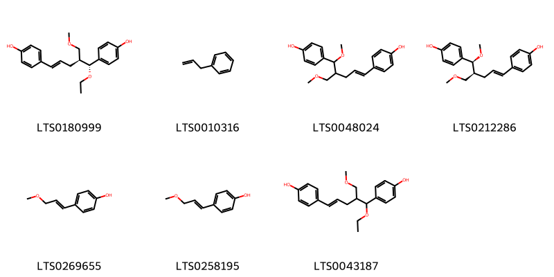
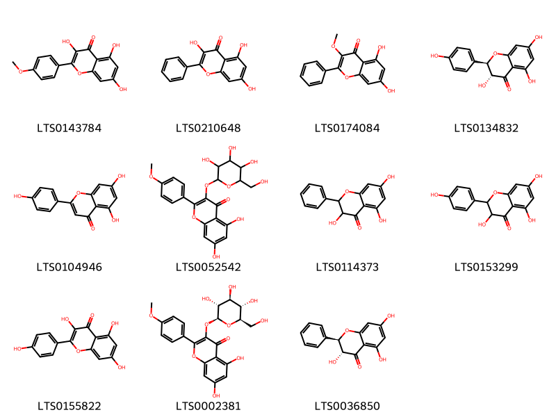

!!! abstract "Tóm tắt"

    Riềng (thân rễ) (Rhizoma Alpiniae officinari) là thân rễ đã phơi khô của cây Riềng (Alpinia officinarum Hance), họ Gừng (Zingiberaceae). Cây có ở Trung Quốc, được phân bố rộng khắp trên đất nước ta. Riềng có tính tân, nhiệt. Quy vào các kinh tỳ, vị. Dược liệu này dùng trị thượrng vị đau lạnh, nôn mửa, vị hàn ợ chua.Trong riềng có từ 0,5-1% tinh dầu chủ yếu có xineola và methylxinnamat, và ba chất có tinh thể, không có vị, đều là dẫn xuất của flavon.

## Thông tin về thực vật

Dược liệu **Riềng (Thân Rễ)** từ bộ phận **** từ loài *Alpinia officinarum*.

**Mô tả thực vật:** - Cây cỏ, nhỏ, cao 0.7 - 1.2m.
- Thân rễ mọc bò ngang, dài 12 - 18mm, màu đỏ nâu, phủ nhiều vẩy, chia thành nhiều đốt không đều nhau, màu trắng nhạt.
- Lá không có cuống, có bẹ, hình mác dài, nhẵn, dài 22 - 40cm, rộng 24mm.
- Cụm hoa hình chùy, mọc ở đầu cành, có lông măng dài chừng 10cm. 
- Hoa rất sít nhau, mặt trong màu trắng, mép hơi mỏng, kèm 2 lá bắc hình mo, một có màu xanh, một có mà trắng.
- Tràng hình ống, có 3 thùy tù, hình thon, dài từ 15 - 20mm, rộng từ 4 - 5mm, thùy giữa chỉ hơi lớn hơn các thùy khác; cánh môi hình trứng, dài 20mm, rộng 15 - 18mm, màu trắng, có vạch màu đỏ sim.
- Quả hình cầu, có lông.
- Hạt có áo hạt.

*Tài liệu tham khảo:* "Những cây thuốc và vị thuốc Việt Nam" - Đỗ Tất Lợi 
Trong dược điển Việt nam, một loài được sử dụng làm dược liệu là *Alpinia officinarum*.

!!! info "Phân loại thực vật của *Alpinia officinarum*"
    - **Kingdom:** Plantae
    - **Phylum:** Tracheophyta
    - **Order:** Zingiberales
    - **Family:** Zingiberaceae
    - **Genus:** Alpinia
    - **Species:** *Alpinia officinarum*

**Phân bố trên thế giới:** Myanmar, nan, United States of America, China, Hong Kong, unknown or invalid, Norway, Iran (Islamic Republic of), India, Sri Lanka, Viet Nam

**Phân bố tại Việt nam:** Hải Phòng

## Thông tin về dược liệu 

### Định danh

!!! info "Thông tin về tên gọi"

    - Dược liệu tiếng Việt: riềng
    - Dược liệu tiếng Trung: 高粱姜 (Gao Liang Jiang)
    - Dược liệu tiếng Anh: Lesser Galangal Rhizome
    - Dược liệu latin thông dụng: Rhizoma Alpiniae officinari
    - Dược liệu latin kiểu DĐVN: *rhizoma alpiniae officinari*
    - Dược liệu latin kiểu DĐVN: **
    - Dược liệu latin kiểu thông tư: **
    - Bộ phận dùng:  (Rhizoma)

### Mô tả dược liệu 

- **Theo dược điển Việt nam V:** Thân rễ hình trụ, thường cong và phân nhánh nhiều, dài 5 cm đến 9 em hoặc hơn, đường kính 2 cm đến 4 cm. Mặt ngoài màu nâu đỏ đến nâu sẫm, có nhiều nếp nhăn dọc và những mấu vòng màu xám; mỗi mấu dài 0,2 cm đến 1 cm, mang vết tích của rễ con. Thể chất dai, chắc, khó bẻ gẫy. Mặt gẫy màu vàng xám hay nâu đỏ. Vùng trụ chiếm 1/3 mặt cắt của thân rễ. Mùi thơm, vị hăng, cay.

- **Mô tả dược liệu theo thông tư chế biến dược liệu theo phương pháp cổ truyền:** 

### Chế biến 

- **Chế biến theo dược điển việt nam V**: Thu hoạch vào cuối mùa hạ, đầu mùa thu, loại bỏ các rễ sợi và các bè vảy lá còn sót lại. Rửa sạch, cắt đoạn và phơi khô. Bào chế Lấy dược liệu khô, loại bỏ tạp chất, rửa sạch, ủ mềm, thái lát mỏng và phơi khô.nn

- **Chế biến theo thông tư:** 

--- 

## Thành phần hóa học

- Theo tài liệu của GS. Đỗ Tất Lợi:  - Tinh dầu: Chiếm khoảng 1-3% khối lượng khô của riềng. Tinh dầu riềng có mùi thơm đặc trưng và chứa nhiều hợp chất hữu cơ có hoạt tính sinh học như:
 + Cineol: Có tác dụng kháng khuẩn, giảm đau, chống viêm.
 + Methyl cinnamat: Có hương thơm đặc trưng của riềng, giúp kích thích tiêu hóa.
 + Galangol: Một chất có vị cay, có tác dụng kích thích tiêu hóa, chống đầy hơi.
- Flavonoid: Đây là nhóm hợp chất có tác dụng chống oxy hóa mạnh, bảo vệ tế bào, giảm viêm và chống ung thư. Các flavonoid thường gặp trong riềng như:
 + Galangin: Có tác dụng chống viêm, giảm đau, bảo vệ gan.
 + Kaempferol: Có tác dụng chống oxy hóa, chống viêm, chống ung thư.
- Diarylheptanoid: Nhóm hợp chất này có tác dụng chống viêm, giảm đau, bảo vệ gan và có tiềm năng chống ung thư.
- Các thành phần khác: Ngoài ra, riềng còn chứa các chất như protein, lipid, vitamin, khoáng chất,... góp phần tạo nên giá trị dinh dưỡng và dược liệu của loại cây này.
    

**Thành phần hóa học từ loài **Alpinia officinarum**

Theo cơ sở dữ liệu lotus, loài *Alpinia officinarum* đã phân lập và xác định được **129** hoạt chất thuộc về các nhóm Diarylheptanoids, Pyrans, Steroids and steroid derivatives, Organooxygen compounds, Flavonoids, Fatty Acyls, Phenylpropanoic acids, Indoles and derivatives, Phenols, Cinnamyl alcohols, Benzene and substituted derivatives, Phenol esters trong bảng dưới đây. Danh sách các hoạt chất như sau 5-methoxy-1,7-diphenylheptan-3-one [(LTS0042133)](https://lotus.naturalproducts.net/compound/lotus_id/LTS0042133), 4-allylpyrocatechol [(LTS0106385)](https://lotus.naturalproducts.net/compound/lotus_id/LTS0106385), (5e)-1,7-diphenylhept-5-en-3-one [(LTS0080870)](https://lotus.naturalproducts.net/compound/lotus_id/LTS0080870), prenol [(LTS0257971)](https://lotus.naturalproducts.net/compound/lotus_id/LTS0257971), kaempherol [(LTS0155822)](https://lotus.naturalproducts.net/compound/lotus_id/LTS0155822), sitoindoside i [(LTS0071215)](https://lotus.naturalproducts.net/compound/lotus_id/LTS0071215), (3s,5r)-1-(4-hydroxy-3-methoxyphenyl)-7-phenylheptane-3,5-diol [(LTS0161352)](https://lotus.naturalproducts.net/compound/lotus_id/LTS0161352), 4-[(3r,5s)-3,5-dihydroxy-7-(4-hydroxy-3-methoxyphenyl)heptyl]benzene-1,2-diol [(LTS0225520)](https://lotus.naturalproducts.net/compound/lotus_id/LTS0225520), 4-[(1e,4s,5s)-5-hydroxy-5-(4-hydroxyphenyl)-4-(methoxymethyl)pent-1-en-1-yl]phenol [(LTS0250804)](https://lotus.naturalproducts.net/compound/lotus_id/LTS0250804), 1-[2,6-bis(2-phenylethyl)-5-(3-phenylpropanoyl)pyridin-3-yl]-3-phenylpropan-1-one [(LTS0207856)](https://lotus.naturalproducts.net/compound/lotus_id/LTS0207856), benzyl β-d-glucoside [(LTS0184698)](https://lotus.naturalproducts.net/compound/lotus_id/LTS0184698), (5s)-7-(4-hydroxy-3-methoxyphenyl)-1-(4-hydroxyphenyl)-5-methoxyheptan-3-one [(LTS0106212)](https://lotus.naturalproducts.net/compound/lotus_id/LTS0106212), (3s)-1-(4-hydroxyphenyl)-5-oxo-7-phenylheptan-3-yl acetate [(LTS0061542)](https://lotus.naturalproducts.net/compound/lotus_id/LTS0061542), (4z,6e)-5-hydroxy-1-(4-hydroxy-3-methoxyphenyl)-7-phenylhepta-4,6-dien-3-one [(LTS0203880)](https://lotus.naturalproducts.net/compound/lotus_id/LTS0203880), (1e,4r)-1,7-diphenyl-4-(2-phenylethyl)hept-1-ene-3,5-dione [(LTS0101202)](https://lotus.naturalproducts.net/compound/lotus_id/LTS0101202), 1-[4-(acetyloxy)phenyl]prop-2-en-1-yl acetate [(LTS0185726)](https://lotus.naturalproducts.net/compound/lotus_id/LTS0185726), 2-(hydroxymethyl)-6-({1,3,3-trimethyl-2-oxabicyclo[2.2.2]octan-6-yl}oxy)oxane-3,4,5-triol [(LTS0093611)](https://lotus.naturalproducts.net/compound/lotus_id/LTS0093611), 7-[2',6-dihydroxy-3',5-dimethoxy-5'-(3-methoxy-5-oxo-7-phenylheptyl)-[1,1'-biphenyl]-3-yl]-5-methoxy-1-phenylheptan-3-one [(LTS0042637)](https://lotus.naturalproducts.net/compound/lotus_id/LTS0042637), 5-hydroxy-7-(4-hydroxy-3-methoxyphenyl)-1-phenylhept-4-en-3-one [(LTS0087744)](https://lotus.naturalproducts.net/compound/lotus_id/LTS0087744), 4-(3-methoxyprop-1-en-1-yl)phenol [(LTS0258195)](https://lotus.naturalproducts.net/compound/lotus_id/LTS0258195), 7-(4-hydroxy-3-methoxyphenyl)-1-(4-hydroxyphenyl)hept-4-en-3-one [(LTS0100197)](https://lotus.naturalproducts.net/compound/lotus_id/LTS0100197), (5s,6e)-5-hydroxy-1,7-diphenylhept-6-en-3-one [(LTS0220784)](https://lotus.naturalproducts.net/compound/lotus_id/LTS0220784), (5s)-5-hydroxy-7-(4-hydroxyphenyl)-1-phenylheptan-3-one [(LTS0170141)](https://lotus.naturalproducts.net/compound/lotus_id/LTS0170141), 2-[4-(prop-2-en-1-yl)phenoxy]-6-{[(3,4,5-trihydroxy-6-methyloxan-2-yl)oxy]methyl}oxane-3,4,5-triol [(LTS0020713)](https://lotus.naturalproducts.net/compound/lotus_id/LTS0020713), 4-[(1e)-3-methoxyprop-1-en-1-yl]phenol [(LTS0269655)](https://lotus.naturalproducts.net/compound/lotus_id/LTS0269655), (5s)-5-hydroxy-1,7-bis(4-hydroxy-3-methoxyphenyl)heptan-3-one [(LTS0173586)](https://lotus.naturalproducts.net/compound/lotus_id/LTS0173586), (2s,3r,4s,5s,6r)-2-[4-(prop-2-en-1-yl)phenoxy]-6-({[(2r,3r,4r,5r,6s)-3,4,5-trihydroxy-6-methyloxan-2-yl]oxy}methyl)oxane-3,4,5-triol [(LTS0061891)](https://lotus.naturalproducts.net/compound/lotus_id/LTS0061891), 5-hydroxy-1-(4-hydroxy-3-methoxyphenyl)-7-phenylhepta-4,6-dien-3-one [(LTS0207118)](https://lotus.naturalproducts.net/compound/lotus_id/LTS0207118), p-coumaryl alcohol [(LTS0058896)](https://lotus.naturalproducts.net/compound/lotus_id/LTS0058896), 1,7-diphenylhept-1-en-3-one [(LTS0112176)](https://lotus.naturalproducts.net/compound/lotus_id/LTS0112176), (2r,3s,4s,5r,6s)-2-(hydroxymethyl)-6-[4-(prop-2-en-1-yl)-2-{[(2s,3r,4s,5s,6r)-3,4,5-trihydroxy-6-(hydroxymethyl)oxan-2-yl]oxy}phenoxy]oxane-3,4,5-triol [(LTS0164836)](https://lotus.naturalproducts.net/compound/lotus_id/LTS0164836), 3-phenylpropionic acid [(LTS0121890)](https://lotus.naturalproducts.net/compound/lotus_id/LTS0121890), 2-(hydroxymethyl)-6-[(3-methylbut-2-en-1-yl)oxy]oxane-3,4,5-triol [(LTS0066109)](https://lotus.naturalproducts.net/compound/lotus_id/LTS0066109), (5r)-5-hydroxy-7-(4-hydroxy-3-methoxyphenyl)-1-(4-hydroxyphenyl)heptan-3-one [(LTS0036908)](https://lotus.naturalproducts.net/compound/lotus_id/LTS0036908), (5s)-5-hydroxy-7-(4-hydroxy-3-methoxyphenyl)-1-(4-hydroxyphenyl)heptan-3-one [(LTS0043308)](https://lotus.naturalproducts.net/compound/lotus_id/LTS0043308), (5s)-5-methoxy-1,7-diphenylheptan-3-one [(LTS0227730)](https://lotus.naturalproducts.net/compound/lotus_id/LTS0227730), 2-[2-hydroxy-4-(prop-2-en-1-yl)phenoxy]-6-(hydroxymethyl)oxane-3,4,5-triol [(LTS0221173)](https://lotus.naturalproducts.net/compound/lotus_id/LTS0221173), 4-[(1r,2s,4e)-1-ethoxy-5-(4-hydroxyphenyl)-2-(methoxymethyl)pent-4-en-1-yl]phenol [(LTS0180999)](https://lotus.naturalproducts.net/compound/lotus_id/LTS0180999), 5-hydroxy-1,7-diphenylheptan-3-one [(LTS0162873)](https://lotus.naturalproducts.net/compound/lotus_id/LTS0162873), 5-hydroxy-1-(4-hydroxy-3-methoxyphenyl)-7-(4-hydroxyphenyl)heptan-3-one [(LTS0184170)](https://lotus.naturalproducts.net/compound/lotus_id/LTS0184170), 6-hydroxy-7-(4-hydroxy-3-methoxyphenyl)-1-phenylhept-4-en-3-one [(LTS0056496)](https://lotus.naturalproducts.net/compound/lotus_id/LTS0056496), 5-hydroxy-7-(4-hydroxy-3-methoxyphenyl)-1-(4-hydroxyphenyl)heptan-3-one [(LTS0176713)](https://lotus.naturalproducts.net/compound/lotus_id/LTS0176713), (5r)-7-{2',6-dihydroxy-3',5-dimethoxy-5'-[(3r)-3-methoxy-5-oxo-7-phenylheptyl]-[1,1'-biphenyl]-3-yl}-5-methoxy-1-phenylheptan-3-one [(LTS0179453)](https://lotus.naturalproducts.net/compound/lotus_id/LTS0179453), 7-(3,4-dihydroxy-5-methoxyphenyl)-5-hydroxy-1-(4-hydroxy-3-methoxyphenyl)heptan-3-one [(LTS0029629)](https://lotus.naturalproducts.net/compound/lotus_id/LTS0029629), 4-[1-ethoxy-5-(4-hydroxyphenyl)-2-(methoxymethyl)pent-4-en-1-yl]phenol [(LTS0043187)](https://lotus.naturalproducts.net/compound/lotus_id/LTS0043187), 5-hydroxy-7-(4-hydroxy-3-methoxyphenyl)-1-phenylheptan-3-one [(LTS0097032)](https://lotus.naturalproducts.net/compound/lotus_id/LTS0097032), (5s)-5-hydroxy-7-(4-hydroxy-3-methoxyphenyl)-1-phenylheptan-3-one [(LTS0230752)](https://lotus.naturalproducts.net/compound/lotus_id/LTS0230752), (2s,4e)-2-hydroxy-1,7-diphenylhept-4-en-3-one [(LTS0100843)](https://lotus.naturalproducts.net/compound/lotus_id/LTS0100843), 5,7-dihydroxy-2-(4-methoxyphenyl)-3-{[3,4,5-trihydroxy-6-(hydroxymethyl)oxan-2-yl]oxy}chromen-4-one [(LTS0052542)](https://lotus.naturalproducts.net/compound/lotus_id/LTS0052542), kaempferide [(LTS0143784)](https://lotus.naturalproducts.net/compound/lotus_id/LTS0143784), (4e)-7-(3,4-dihydroxy-5-methoxyphenyl)-1-phenylhept-4-en-3-one [(LTS0077498)](https://lotus.naturalproducts.net/compound/lotus_id/LTS0077498), 7-(4-hydroxyphenyl)-5-methoxy-1-phenylheptan-3-one [(LTS0000788)](https://lotus.naturalproducts.net/compound/lotus_id/LTS0000788), 4-[3,5-dihydroxy-7-(4-hydroxy-3-methoxyphenyl)heptyl]benzene-1,2-diol [(LTS0169657)](https://lotus.naturalproducts.net/compound/lotus_id/LTS0169657), indomethacin [(LTS0192710)](https://lotus.naturalproducts.net/compound/lotus_id/LTS0192710), 4-[(1e)-3-{[(1s,2s,4e)-1,5-bis(4-hydroxyphenyl)-2-(methoxymethyl)pent-4-en-1-yl]oxy}prop-1-en-1-yl]phenyl acetate [(LTS0042311)](https://lotus.naturalproducts.net/compound/lotus_id/LTS0042311), 7-(4-hydroxy-3-methoxyphenyl)-1-phenylhept-4-en-3-one [(LTS0070941)](https://lotus.naturalproducts.net/compound/lotus_id/LTS0070941), 7-(4-hydroxyphenyl)-1-phenylhept-4-en-3-one [(LTS0228143)](https://lotus.naturalproducts.net/compound/lotus_id/LTS0228143), galangin [(LTS0210648)](https://lotus.naturalproducts.net/compound/lotus_id/LTS0210648), 1,7-diphenylhept-4-en-3-one [(LTS0095720)](https://lotus.naturalproducts.net/compound/lotus_id/LTS0095720), (4z)-5-hydroxy-7-(4-hydroxy-3-methoxyphenyl)-1-phenylhept-4-en-3-one [(LTS0115461)](https://lotus.naturalproducts.net/compound/lotus_id/LTS0115461), (4e)-1,7-diphenylhept-4-en-3-one [(LTS0122131)](https://lotus.naturalproducts.net/compound/lotus_id/LTS0122131), (2s,3r,4s,5s,6r)-2-[2-hydroxy-5-(prop-2-en-1-yl)phenoxy]-6-(hydroxymethyl)oxane-3,4,5-triol [(LTS0261362)](https://lotus.naturalproducts.net/compound/lotus_id/LTS0261362), (4e)-7-(4-hydroxy-3-methoxyphenyl)-1-(4-hydroxyphenyl)hept-4-en-3-one [(LTS0202837)](https://lotus.naturalproducts.net/compound/lotus_id/LTS0202837), 1-(4-hydroxy-3-methoxyphenyl)-7-phenylheptane-3,5-diol [(LTS0118280)](https://lotus.naturalproducts.net/compound/lotus_id/LTS0118280), (1s,2s)-1-(4-hydroxyphenyl)-2-[(2e)-3-(4-hydroxyphenyl)prop-2-en-1-yl]propane-1,3-diol [(LTS0162309)](https://lotus.naturalproducts.net/compound/lotus_id/LTS0162309), 1,7-diphenylhept-5-en-3-one [(LTS0030575)](https://lotus.naturalproducts.net/compound/lotus_id/LTS0030575), (1e)-1,7-diphenylhept-1-en-3-one [(LTS0009549)](https://lotus.naturalproducts.net/compound/lotus_id/LTS0009549), (6-{[1-(5-ethyl-6-methylheptan-2-yl)-9a,11a-dimethyl-1h,2h,3h,3ah,3bh,4h,6h,7h,8h,9h,9bh,10h,11h-cyclopenta[a]phenanthren-7-yl]oxy}-3,4,5-trihydroxyoxan-2-yl)methyl hexadecanoate [(LTS0197284)](https://lotus.naturalproducts.net/compound/lotus_id/LTS0197284), 2-benzyl-5-(2-phenylethyl)furan [(LTS0115378)](https://lotus.naturalproducts.net/compound/lotus_id/LTS0115378), (4e)-7-(4-hydroxyphenyl)-1-phenylhept-4-en-3-one [(LTS0053797)](https://lotus.naturalproducts.net/compound/lotus_id/LTS0053797), (4e,6s)-6-hydroxy-1,7-diphenylhept-4-en-3-one [(LTS0237809)](https://lotus.naturalproducts.net/compound/lotus_id/LTS0237809), 5-hydroxy-7-(4-hydroxyphenyl)-1-phenylheptan-3-one [(LTS0169950)](https://lotus.naturalproducts.net/compound/lotus_id/LTS0169950), (2r,3s,4s,5r,6s)-2-(hydroxymethyl)-6-[4-(prop-2-en-1-yl)phenoxy]oxane-3,4,5-triol [(LTS0017337)](https://lotus.naturalproducts.net/compound/lotus_id/LTS0017337), benzyl glucopyranoside [(LTS0210495)](https://lotus.naturalproducts.net/compound/lotus_id/LTS0210495), 4-[5-(4-hydroxyphenyl)-5-methoxy-4-(methoxymethyl)pent-1-en-1-yl]phenol [(LTS0048024)](https://lotus.naturalproducts.net/compound/lotus_id/LTS0048024), (+)-dihydrokaempferol [(LTS0134832)](https://lotus.naturalproducts.net/compound/lotus_id/LTS0134832), (5r)-5-methoxy-1,7-diphenylheptan-3-one [(LTS0140966)](https://lotus.naturalproducts.net/compound/lotus_id/LTS0140966), (5r)-7-(3,4-dihydroxy-5-methoxyphenyl)-5-hydroxy-1-(4-hydroxy-3-methoxyphenyl)heptan-3-one [(LTS0087489)](https://lotus.naturalproducts.net/compound/lotus_id/LTS0087489), 2-hydroxy-1,7-diphenylhept-4-en-3-one [(LTS0005639)](https://lotus.naturalproducts.net/compound/lotus_id/LTS0005639), 7-(4-hydroxy-3-methoxyphenyl)-5-methoxy-1-phenylheptan-3-one [(LTS0189151)](https://lotus.naturalproducts.net/compound/lotus_id/LTS0189151), 6-(2-hydroxyphenyl)-4-methoxypyran-2-one [(LTS0138405)](https://lotus.naturalproducts.net/compound/lotus_id/LTS0138405), 4-hydroxycinnamyl alcohol [(LTS0037655)](https://lotus.naturalproducts.net/compound/lotus_id/LTS0037655), 2-[2-hydroxy-4-(prop-2-en-1-yl)phenoxy]-6-{[(3,4,5-trihydroxy-6-methyloxan-2-yl)oxy]methyl}oxane-3,4,5-triol [(LTS0159720)](https://lotus.naturalproducts.net/compound/lotus_id/LTS0159720), stigmast-5-en-3-ol [(LTS0071224)](https://lotus.naturalproducts.net/compound/lotus_id/LTS0071224), 1-(4-hydroxyphenyl)-2-[3-(4-hydroxyphenyl)prop-2-en-1-yl]propane-1,3-diol [(LTS0096015)](https://lotus.naturalproducts.net/compound/lotus_id/LTS0096015), 2-phenylpropionic acid [(LTS0122325)](https://lotus.naturalproducts.net/compound/lotus_id/LTS0122325), 4-(3-{[1,5-bis(4-hydroxyphenyl)-2-(methoxymethyl)pent-4-en-1-yl]oxy}prop-1-en-1-yl)phenyl acetate [(LTS0146819)](https://lotus.naturalproducts.net/compound/lotus_id/LTS0146819), 3,5,7-trihydroxyflavanone [(LTS0114373)](https://lotus.naturalproducts.net/compound/lotus_id/LTS0114373), 2-(hydroxymethyl)-6-[4-(prop-2-en-1-yl)phenoxy]oxane-3,4,5-triol [(LTS0039327)](https://lotus.naturalproducts.net/compound/lotus_id/LTS0039327), galangin 3-methyl ether [(LTS0174084)](https://lotus.naturalproducts.net/compound/lotus_id/LTS0174084), 7-(3,4-dihydroxy-5-methoxyphenyl)-1-phenylhept-4-en-3-one [(LTS0114615)](https://lotus.naturalproducts.net/compound/lotus_id/LTS0114615), (5r)-7-(4-hydroxy-3-methoxyphenyl)-5-methoxy-1-phenylheptan-3-one [(LTS0167601)](https://lotus.naturalproducts.net/compound/lotus_id/LTS0167601), 6-hydroxy-1,7-diphenylhept-4-en-3-one [(LTS0264395)](https://lotus.naturalproducts.net/compound/lotus_id/LTS0264395), 2-methoxy-4-{[5-(2-phenylethyl)furan-2-yl]methyl}phenol [(LTS0212046)](https://lotus.naturalproducts.net/compound/lotus_id/LTS0212046), hexahydrocurcumin [(LTS0000795)](https://lotus.naturalproducts.net/compound/lotus_id/LTS0000795), (4e,6r)-6-hydroxy-1,7-diphenylhept-4-en-3-one [(LTS0181105)](https://lotus.naturalproducts.net/compound/lotus_id/LTS0181105), 2-(hydroxymethyl)-6-[4-(prop-2-en-1-yl)-2-{[3,4,5-trihydroxy-6-(hydroxymethyl)oxan-2-yl]oxy}phenoxy]oxane-3,4,5-triol [(LTS0244393)](https://lotus.naturalproducts.net/compound/lotus_id/LTS0244393), (4e)-7-(4-hydroxy-3-methoxyphenyl)-1-phenylhept-4-en-3-one [(LTS0059974)](https://lotus.naturalproducts.net/compound/lotus_id/LTS0059974), (4e,6r)-6-hydroxy-7-(4-hydroxy-3-methoxyphenyl)-1-phenylhept-4-en-3-one [(LTS0264235)](https://lotus.naturalproducts.net/compound/lotus_id/LTS0264235), pinobanksin [(LTS0036850)](https://lotus.naturalproducts.net/compound/lotus_id/LTS0036850), (5s)-7-(4-hydroxyphenyl)-5-methoxy-1-phenylheptan-3-one [(LTS0085997)](https://lotus.naturalproducts.net/compound/lotus_id/LTS0085997), chamomile [(LTS0104946)](https://lotus.naturalproducts.net/compound/lotus_id/LTS0104946), 4-[(1e,4s,5s)-5-(4-hydroxyphenyl)-5-methoxy-4-(methoxymethyl)pent-1-en-1-yl]phenol [(LTS0212286)](https://lotus.naturalproducts.net/compound/lotus_id/LTS0212286), 7-(4-hydroxy-3-methoxyphenyl)-1-(4-hydroxyphenyl)-5-methoxyheptan-3-one [(LTS0183607)](https://lotus.naturalproducts.net/compound/lotus_id/LTS0183607), (5e)-7-(4-hydroxy-3-methoxyphenyl)-1-phenylhept-5-en-3-one [(LTS0149796)](https://lotus.naturalproducts.net/compound/lotus_id/LTS0149796), 5-hydroxy-1,7-diphenylhept-6-en-3-one [(LTS0167516)](https://lotus.naturalproducts.net/compound/lotus_id/LTS0167516), (3r,5r)-1-(4-hydroxyphenyl)-7-phenylheptane-3,5-diol [(LTS0209257)](https://lotus.naturalproducts.net/compound/lotus_id/LTS0209257), 1,7-diphenylheptane-3,5-diol [(LTS0142550)](https://lotus.naturalproducts.net/compound/lotus_id/LTS0142550), (3r,5r)-1,7-diphenylheptane-3,5-diol [(LTS0218693)](https://lotus.naturalproducts.net/compound/lotus_id/LTS0218693), (2s,3r,4s,5s,6r)-2-[2-hydroxy-4-(prop-2-en-1-yl)phenoxy]-6-({[(2r,3r,4r,5r,6s)-3,4,5-trihydroxy-6-methyloxan-2-yl]oxy}methyl)oxane-3,4,5-triol [(LTS0073837)](https://lotus.naturalproducts.net/compound/lotus_id/LTS0073837), (2r,3s,4s,5r,6s)-2-(hydroxymethyl)-6-{[(1r,4s,6r)-1,3,3-trimethyl-2-oxabicyclo[2.2.2]octan-6-yl]oxy}oxane-3,4,5-triol [(LTS0119798)](https://lotus.naturalproducts.net/compound/lotus_id/LTS0119798), allylbenzene [(LTS0010316)](https://lotus.naturalproducts.net/compound/lotus_id/LTS0010316), (5r)-5-hydroxy-7-(4-hydroxyphenyl)-1-phenylheptan-3-one [(LTS0185990)](https://lotus.naturalproducts.net/compound/lotus_id/LTS0185990), 1-[(1r,6r)-4-(4-methylpent-3-en-1-yl)-6-(2-phenylethyl)cyclohex-3-en-1-yl]-3-phenylpropan-1-one [(LTS0117474)](https://lotus.naturalproducts.net/compound/lotus_id/LTS0117474), (5r)-5-hydroxy-1,7-diphenylheptan-3-one [(LTS0204758)](https://lotus.naturalproducts.net/compound/lotus_id/LTS0204758), 5,7-dihydroxy-2-(4-methoxyphenyl)-3-{[(2s,3r,4s,5s,6r)-3,4,5-trihydroxy-6-(hydroxymethyl)oxan-2-yl]oxy}chromen-4-one [(LTS0002381)](https://lotus.naturalproducts.net/compound/lotus_id/LTS0002381), (5r)-5-hydroxy-7-(4-hydroxy-3-methoxyphenyl)-1-phenylheptan-3-one [(LTS0127678)](https://lotus.naturalproducts.net/compound/lotus_id/LTS0127678), (5r)-5-hydroxy-1-(4-hydroxy-3-methoxyphenyl)-7-(4-hydroxyphenyl)heptan-3-one [(LTS0096483)](https://lotus.naturalproducts.net/compound/lotus_id/LTS0096483), 1-(4-hydroxyphenyl)-7-phenylheptane-3,5-diol [(LTS0082634)](https://lotus.naturalproducts.net/compound/lotus_id/LTS0082634), 2-[2-hydroxy-5-(prop-2-en-1-yl)phenoxy]-6-(hydroxymethyl)oxane-3,4,5-triol [(LTS0095041)](https://lotus.naturalproducts.net/compound/lotus_id/LTS0095041), (2r,3s,4s,5r,6r)-2-(hydroxymethyl)-6-[(3-methylbut-2-en-1-yl)oxy]oxane-3,4,5-triol [(LTS0197992)](https://lotus.naturalproducts.net/compound/lotus_id/LTS0197992), 7-(4-hydroxy-3-methoxyphenyl)-1-phenylheptan-3-one [(LTS0248082)](https://lotus.naturalproducts.net/compound/lotus_id/LTS0248082), 1,7-diphenyl-4-(2-phenylethyl)hept-1-ene-3,5-dione [(LTS0182709)](https://lotus.naturalproducts.net/compound/lotus_id/LTS0182709), zingerone [(LTS0266587)](https://lotus.naturalproducts.net/compound/lotus_id/LTS0266587), (5s)-5-hydroxy-1,7-diphenylheptan-3-one [(LTS0206466)](https://lotus.naturalproducts.net/compound/lotus_id/LTS0206466), (2s,3r,4s,5s,6r)-2-[2-hydroxy-4-(prop-2-en-1-yl)phenoxy]-6-(hydroxymethyl)oxane-3,4,5-triol [(LTS0016198)](https://lotus.naturalproducts.net/compound/lotus_id/LTS0016198), aromadendrin [(LTS0153299)](https://lotus.naturalproducts.net/compound/lotus_id/LTS0153299), 7-(4-hydroxy-3-methoxyphenyl)-1-phenylhept-5-en-3-one [(LTS0236839)](https://lotus.naturalproducts.net/compound/lotus_id/LTS0236839), 4-[5-hydroxy-5-(4-hydroxyphenyl)-4-(methoxymethyl)pent-1-en-1-yl]phenol [(LTS0046300)](https://lotus.naturalproducts.net/compound/lotus_id/LTS0046300). 
        
| chemicalTaxonomyClassyfireClass     |   smiles_count |
|:------------------------------------|---------------:|
| Benzene and substituted derivatives |            220 |
| Cinnamyl alcohols                   |             34 |
| Diarylheptanoids                    |           2852 |
| Fatty Acyls                         |            240 |
| Flavonoids                          |            474 |
| Indoles and derivatives             |             46 |
| Organooxygen compounds              |            943 |
| Phenol esters                       |            156 |
| Phenols                             |             39 |
| Phenylpropanoic acids               |             34 |
| Pyrans                              |             26 |
| Steroids and steroid derivatives    |            327 |

            
### Nhóm Benzene and substituted derivatives
<figure markdown="span">
    { width=100% }
<figcaption>Hình ảnh cấu trúc hóa học của hoạt chất thuộc nhóm *Benzene and substituted derivatives*. Tên thường gọi của các hoạt chất tương ứng là 4-[(1r,2s,4e)-1-ethoxy-5-(4-hydroxyphenyl)-2-(methoxymethyl)pent-4-en-1-yl]phenol [(LTS0180999)](https://lotus.naturalproducts.net/compound/lotus_id/LTS0180999), allylbenzene [(LTS0010316)](https://lotus.naturalproducts.net/compound/lotus_id/LTS0010316), 4-[5-(4-hydroxyphenyl)-5-methoxy-4-(methoxymethyl)pent-1-en-1-yl]phenol [(LTS0048024)](https://lotus.naturalproducts.net/compound/lotus_id/LTS0048024), 4-[(1e,4s,5s)-5-(4-hydroxyphenyl)-5-methoxy-4-(methoxymethyl)pent-1-en-1-yl]phenol [(LTS0212286)](https://lotus.naturalproducts.net/compound/lotus_id/LTS0212286), 4-[(1e)-3-methoxyprop-1-en-1-yl]phenol [(LTS0269655)](https://lotus.naturalproducts.net/compound/lotus_id/LTS0269655), 4-(3-methoxyprop-1-en-1-yl)phenol [(LTS0258195)](https://lotus.naturalproducts.net/compound/lotus_id/LTS0258195), 4-[1-ethoxy-5-(4-hydroxyphenyl)-2-(methoxymethyl)pent-4-en-1-yl]phenol [(LTS0043187)](https://lotus.naturalproducts.net/compound/lotus_id/LTS0043187).</figcaption>
</figure>

            
            
### Nhóm Benzene and substituted derivatives
<figure markdown="span">
    { width=100% }
<figcaption>Hình ảnh cấu trúc hóa học của hoạt chất thuộc nhóm *Benzene and substituted derivatives*. Tên thường gọi của các hoạt chất tương ứng là 4-[(1r,2s,4e)-1-ethoxy-5-(4-hydroxyphenyl)-2-(methoxymethyl)pent-4-en-1-yl]phenol [(LTS0180999)](https://lotus.naturalproducts.net/compound/lotus_id/LTS0180999), allylbenzene [(LTS0010316)](https://lotus.naturalproducts.net/compound/lotus_id/LTS0010316), 4-[5-(4-hydroxyphenyl)-5-methoxy-4-(methoxymethyl)pent-1-en-1-yl]phenol [(LTS0048024)](https://lotus.naturalproducts.net/compound/lotus_id/LTS0048024), 4-[(1e,4s,5s)-5-(4-hydroxyphenyl)-5-methoxy-4-(methoxymethyl)pent-1-en-1-yl]phenol [(LTS0212286)](https://lotus.naturalproducts.net/compound/lotus_id/LTS0212286), 4-[(1e)-3-methoxyprop-1-en-1-yl]phenol [(LTS0269655)](https://lotus.naturalproducts.net/compound/lotus_id/LTS0269655), 4-(3-methoxyprop-1-en-1-yl)phenol [(LTS0258195)](https://lotus.naturalproducts.net/compound/lotus_id/LTS0258195), 4-[1-ethoxy-5-(4-hydroxyphenyl)-2-(methoxymethyl)pent-4-en-1-yl]phenol [(LTS0043187)](https://lotus.naturalproducts.net/compound/lotus_id/LTS0043187).</figcaption>
</figure>

### Nhóm Cinnamyl alcohols
<figure markdown="span">
    { width=100% }
<figcaption>Hình ảnh cấu trúc hóa học của hoạt chất thuộc nhóm *Cinnamyl alcohols*. Tên thường gọi của các hoạt chất tương ứng là 4-hydroxycinnamyl alcohol [(LTS0037655)](https://lotus.naturalproducts.net/compound/lotus_id/LTS0037655), p-coumaryl alcohol [(LTS0058896)](https://lotus.naturalproducts.net/compound/lotus_id/LTS0058896).</figcaption>
</figure>

            
            
### Nhóm Benzene and substituted derivatives
<figure markdown="span">
    { width=100% }
<figcaption>Hình ảnh cấu trúc hóa học của hoạt chất thuộc nhóm *Benzene and substituted derivatives*. Tên thường gọi của các hoạt chất tương ứng là 4-[(1r,2s,4e)-1-ethoxy-5-(4-hydroxyphenyl)-2-(methoxymethyl)pent-4-en-1-yl]phenol [(LTS0180999)](https://lotus.naturalproducts.net/compound/lotus_id/LTS0180999), allylbenzene [(LTS0010316)](https://lotus.naturalproducts.net/compound/lotus_id/LTS0010316), 4-[5-(4-hydroxyphenyl)-5-methoxy-4-(methoxymethyl)pent-1-en-1-yl]phenol [(LTS0048024)](https://lotus.naturalproducts.net/compound/lotus_id/LTS0048024), 4-[(1e,4s,5s)-5-(4-hydroxyphenyl)-5-methoxy-4-(methoxymethyl)pent-1-en-1-yl]phenol [(LTS0212286)](https://lotus.naturalproducts.net/compound/lotus_id/LTS0212286), 4-[(1e)-3-methoxyprop-1-en-1-yl]phenol [(LTS0269655)](https://lotus.naturalproducts.net/compound/lotus_id/LTS0269655), 4-(3-methoxyprop-1-en-1-yl)phenol [(LTS0258195)](https://lotus.naturalproducts.net/compound/lotus_id/LTS0258195), 4-[1-ethoxy-5-(4-hydroxyphenyl)-2-(methoxymethyl)pent-4-en-1-yl]phenol [(LTS0043187)](https://lotus.naturalproducts.net/compound/lotus_id/LTS0043187).</figcaption>
</figure>

### Nhóm Cinnamyl alcohols
<figure markdown="span">
    { width=100% }
<figcaption>Hình ảnh cấu trúc hóa học của hoạt chất thuộc nhóm *Cinnamyl alcohols*. Tên thường gọi của các hoạt chất tương ứng là 4-hydroxycinnamyl alcohol [(LTS0037655)](https://lotus.naturalproducts.net/compound/lotus_id/LTS0037655), p-coumaryl alcohol [(LTS0058896)](https://lotus.naturalproducts.net/compound/lotus_id/LTS0058896).</figcaption>
</figure>

### Nhóm Diarylheptanoids
<figure markdown="span">
    { width=100% }
<figcaption>Hình ảnh cấu trúc hóa học của hoạt chất thuộc nhóm *Diarylheptanoids*. Tên thường gọi của các hoạt chất tương ứng là 5-hydroxy-1,7-diphenylhept-6-en-3-one [(LTS0167516)](https://lotus.naturalproducts.net/compound/lotus_id/LTS0167516), 5-hydroxy-7-(4-hydroxy-3-methoxyphenyl)-1-phenylheptan-3-one [(LTS0097032)](https://lotus.naturalproducts.net/compound/lotus_id/LTS0097032), 7-(4-hydroxy-3-methoxyphenyl)-1-phenylhept-4-en-3-one [(LTS0070941)](https://lotus.naturalproducts.net/compound/lotus_id/LTS0070941), (5r)-5-hydroxy-1,7-diphenylheptan-3-one [(LTS0204758)](https://lotus.naturalproducts.net/compound/lotus_id/LTS0204758), 1,7-diphenylheptane-3,5-diol [(LTS0142550)](https://lotus.naturalproducts.net/compound/lotus_id/LTS0142550), (4e)-7-(4-hydroxy-3-methoxyphenyl)-1-phenylhept-4-en-3-one [(LTS0059974)](https://lotus.naturalproducts.net/compound/lotus_id/LTS0059974), (5s,6e)-5-hydroxy-1,7-diphenylhept-6-en-3-one [(LTS0220784)](https://lotus.naturalproducts.net/compound/lotus_id/LTS0220784), 5-hydroxy-1,7-diphenylheptan-3-one [(LTS0162873)](https://lotus.naturalproducts.net/compound/lotus_id/LTS0162873), (5s)-5-hydroxy-7-(4-hydroxy-3-methoxyphenyl)-1-phenylheptan-3-one [(LTS0230752)](https://lotus.naturalproducts.net/compound/lotus_id/LTS0230752), (4e,6r)-6-hydroxy-1,7-diphenylhept-4-en-3-one [(LTS0181105)](https://lotus.naturalproducts.net/compound/lotus_id/LTS0181105), (4z)-5-hydroxy-7-(4-hydroxy-3-methoxyphenyl)-1-phenylhept-4-en-3-one [(LTS0115461)](https://lotus.naturalproducts.net/compound/lotus_id/LTS0115461), (4e)-1,7-diphenylhept-4-en-3-one [(LTS0122131)](https://lotus.naturalproducts.net/compound/lotus_id/LTS0122131), 5-methoxy-1,7-diphenylheptan-3-one [(LTS0042133)](https://lotus.naturalproducts.net/compound/lotus_id/LTS0042133), (4e,6s)-6-hydroxy-1,7-diphenylhept-4-en-3-one [(LTS0237809)](https://lotus.naturalproducts.net/compound/lotus_id/LTS0237809), (5s)-7-(4-hydroxyphenyl)-5-methoxy-1-phenylheptan-3-one [(LTS0085997)](https://lotus.naturalproducts.net/compound/lotus_id/LTS0085997), (5e)-1,7-diphenylhept-5-en-3-one [(LTS0080870)](https://lotus.naturalproducts.net/compound/lotus_id/LTS0080870), 7-(3,4-dihydroxy-5-methoxyphenyl)-5-hydroxy-1-(4-hydroxy-3-methoxyphenyl)heptan-3-one [(LTS0029629)](https://lotus.naturalproducts.net/compound/lotus_id/LTS0029629), (5r)-5-hydroxy-1-(4-hydroxy-3-methoxyphenyl)-7-(4-hydroxyphenyl)heptan-3-one [(LTS0096483)](https://lotus.naturalproducts.net/compound/lotus_id/LTS0096483), 5-hydroxy-1-(4-hydroxy-3-methoxyphenyl)-7-(4-hydroxyphenyl)heptan-3-one [(LTS0184170)](https://lotus.naturalproducts.net/compound/lotus_id/LTS0184170), 7-[2',6-dihydroxy-3',5-dimethoxy-5'-(3-methoxy-5-oxo-7-phenylheptyl)-[1,1'-biphenyl]-3-yl]-5-methoxy-1-phenylheptan-3-one [(LTS0042637)](https://lotus.naturalproducts.net/compound/lotus_id/LTS0042637), (5r)-7-{2',6-dihydroxy-3',5-dimethoxy-5'-[(3r)-3-methoxy-5-oxo-7-phenylheptyl]-[1,1'-biphenyl]-3-yl}-5-methoxy-1-phenylheptan-3-one [(LTS0179453)](https://lotus.naturalproducts.net/compound/lotus_id/LTS0179453), (5r)-7-(3,4-dihydroxy-5-methoxyphenyl)-5-hydroxy-1-(4-hydroxy-3-methoxyphenyl)heptan-3-one [(LTS0087489)](https://lotus.naturalproducts.net/compound/lotus_id/LTS0087489), 7-(4-hydroxy-3-methoxyphenyl)-1-(4-hydroxyphenyl)hept-4-en-3-one [(LTS0100197)](https://lotus.naturalproducts.net/compound/lotus_id/LTS0100197), (1e,4r)-1,7-diphenyl-4-(2-phenylethyl)hept-1-ene-3,5-dione [(LTS0101202)](https://lotus.naturalproducts.net/compound/lotus_id/LTS0101202), (5s)-5-hydroxy-7-(4-hydroxyphenyl)-1-phenylheptan-3-one [(LTS0170141)](https://lotus.naturalproducts.net/compound/lotus_id/LTS0170141), 1-[(1r,6r)-4-(4-methylpent-3-en-1-yl)-6-(2-phenylethyl)cyclohex-3-en-1-yl]-3-phenylpropan-1-one [(LTS0117474)](https://lotus.naturalproducts.net/compound/lotus_id/LTS0117474), 1,7-diphenylhept-1-en-3-one [(LTS0112176)](https://lotus.naturalproducts.net/compound/lotus_id/LTS0112176), 7-(4-hydroxy-3-methoxyphenyl)-5-methoxy-1-phenylheptan-3-one [(LTS0189151)](https://lotus.naturalproducts.net/compound/lotus_id/LTS0189151), 1,7-diphenyl-4-(2-phenylethyl)hept-1-ene-3,5-dione [(LTS0182709)](https://lotus.naturalproducts.net/compound/lotus_id/LTS0182709), 2-benzyl-5-(2-phenylethyl)furan [(LTS0115378)](https://lotus.naturalproducts.net/compound/lotus_id/LTS0115378), 5-hydroxy-1-(4-hydroxy-3-methoxyphenyl)-7-phenylhepta-4,6-dien-3-one [(LTS0207118)](https://lotus.naturalproducts.net/compound/lotus_id/LTS0207118), (5s)-7-(4-hydroxy-3-methoxyphenyl)-1-(4-hydroxyphenyl)-5-methoxyheptan-3-one [(LTS0106212)](https://lotus.naturalproducts.net/compound/lotus_id/LTS0106212), (5r)-5-hydroxy-7-(4-hydroxy-3-methoxyphenyl)-1-(4-hydroxyphenyl)heptan-3-one [(LTS0036908)](https://lotus.naturalproducts.net/compound/lotus_id/LTS0036908), 1-(4-hydroxy-3-methoxyphenyl)-7-phenylheptane-3,5-diol [(LTS0118280)](https://lotus.naturalproducts.net/compound/lotus_id/LTS0118280), (5s)-5-hydroxy-1,7-bis(4-hydroxy-3-methoxyphenyl)heptan-3-one [(LTS0173586)](https://lotus.naturalproducts.net/compound/lotus_id/LTS0173586), (5r)-5-methoxy-1,7-diphenylheptan-3-one [(LTS0140966)](https://lotus.naturalproducts.net/compound/lotus_id/LTS0140966), (4e)-7-(4-hydroxy-3-methoxyphenyl)-1-(4-hydroxyphenyl)hept-4-en-3-one [(LTS0202837)](https://lotus.naturalproducts.net/compound/lotus_id/LTS0202837), (5e)-7-(4-hydroxy-3-methoxyphenyl)-1-phenylhept-5-en-3-one [(LTS0149796)](https://lotus.naturalproducts.net/compound/lotus_id/LTS0149796), 4-[3,5-dihydroxy-7-(4-hydroxy-3-methoxyphenyl)heptyl]benzene-1,2-diol [(LTS0169657)](https://lotus.naturalproducts.net/compound/lotus_id/LTS0169657), (2s,4e)-2-hydroxy-1,7-diphenylhept-4-en-3-one [(LTS0100843)](https://lotus.naturalproducts.net/compound/lotus_id/LTS0100843), 7-(4-hydroxy-3-methoxyphenyl)-1-phenylhept-5-en-3-one [(LTS0236839)](https://lotus.naturalproducts.net/compound/lotus_id/LTS0236839), (3s,5r)-1-(4-hydroxy-3-methoxyphenyl)-7-phenylheptane-3,5-diol [(LTS0161352)](https://lotus.naturalproducts.net/compound/lotus_id/LTS0161352), (5s)-5-methoxy-1,7-diphenylheptan-3-one [(LTS0227730)](https://lotus.naturalproducts.net/compound/lotus_id/LTS0227730), 7-(3,4-dihydroxy-5-methoxyphenyl)-1-phenylhept-4-en-3-one [(LTS0114615)](https://lotus.naturalproducts.net/compound/lotus_id/LTS0114615), (5r)-7-(4-hydroxy-3-methoxyphenyl)-5-methoxy-1-phenylheptan-3-one [(LTS0167601)](https://lotus.naturalproducts.net/compound/lotus_id/LTS0167601), 5-hydroxy-7-(4-hydroxy-3-methoxyphenyl)-1-(4-hydroxyphenyl)heptan-3-one [(LTS0176713)](https://lotus.naturalproducts.net/compound/lotus_id/LTS0176713), 6-hydroxy-1,7-diphenylhept-4-en-3-one [(LTS0264395)](https://lotus.naturalproducts.net/compound/lotus_id/LTS0264395), (5r)-5-hydroxy-7-(4-hydroxyphenyl)-1-phenylheptan-3-one [(LTS0185990)](https://lotus.naturalproducts.net/compound/lotus_id/LTS0185990), (4e)-7-(3,4-dihydroxy-5-methoxyphenyl)-1-phenylhept-4-en-3-one [(LTS0077498)](https://lotus.naturalproducts.net/compound/lotus_id/LTS0077498), (4e)-7-(4-hydroxyphenyl)-1-phenylhept-4-en-3-one [(LTS0053797)](https://lotus.naturalproducts.net/compound/lotus_id/LTS0053797), (5s)-5-hydroxy-1,7-diphenylheptan-3-one [(LTS0206466)](https://lotus.naturalproducts.net/compound/lotus_id/LTS0206466), (4z,6e)-5-hydroxy-1-(4-hydroxy-3-methoxyphenyl)-7-phenylhepta-4,6-dien-3-one [(LTS0203880)](https://lotus.naturalproducts.net/compound/lotus_id/LTS0203880), 1-[2,6-bis(2-phenylethyl)-5-(3-phenylpropanoyl)pyridin-3-yl]-3-phenylpropan-1-one [(LTS0207856)](https://lotus.naturalproducts.net/compound/lotus_id/LTS0207856), 5-hydroxy-7-(4-hydroxy-3-methoxyphenyl)-1-phenylhept-4-en-3-one [(LTS0087744)](https://lotus.naturalproducts.net/compound/lotus_id/LTS0087744), 2-methoxy-4-{[5-(2-phenylethyl)furan-2-yl]methyl}phenol [(LTS0212046)](https://lotus.naturalproducts.net/compound/lotus_id/LTS0212046), 1-(4-hydroxyphenyl)-7-phenylheptane-3,5-diol [(LTS0082634)](https://lotus.naturalproducts.net/compound/lotus_id/LTS0082634), (3r,5r)-1,7-diphenylheptane-3,5-diol [(LTS0218693)](https://lotus.naturalproducts.net/compound/lotus_id/LTS0218693), 6-hydroxy-7-(4-hydroxy-3-methoxyphenyl)-1-phenylhept-4-en-3-one [(LTS0056496)](https://lotus.naturalproducts.net/compound/lotus_id/LTS0056496), 7-(4-hydroxy-3-methoxyphenyl)-1-(4-hydroxyphenyl)-5-methoxyheptan-3-one [(LTS0183607)](https://lotus.naturalproducts.net/compound/lotus_id/LTS0183607), 7-(4-hydroxyphenyl)-1-phenylhept-4-en-3-one [(LTS0228143)](https://lotus.naturalproducts.net/compound/lotus_id/LTS0228143), 5-hydroxy-7-(4-hydroxyphenyl)-1-phenylheptan-3-one [(LTS0169950)](https://lotus.naturalproducts.net/compound/lotus_id/LTS0169950), 1,7-diphenylhept-5-en-3-one [(LTS0030575)](https://lotus.naturalproducts.net/compound/lotus_id/LTS0030575), 2-hydroxy-1,7-diphenylhept-4-en-3-one [(LTS0005639)](https://lotus.naturalproducts.net/compound/lotus_id/LTS0005639), (3s)-1-(4-hydroxyphenyl)-5-oxo-7-phenylheptan-3-yl acetate [(LTS0061542)](https://lotus.naturalproducts.net/compound/lotus_id/LTS0061542), 7-(4-hydroxyphenyl)-5-methoxy-1-phenylheptan-3-one [(LTS0000788)](https://lotus.naturalproducts.net/compound/lotus_id/LTS0000788), hexahydrocurcumin [(LTS0000795)](https://lotus.naturalproducts.net/compound/lotus_id/LTS0000795), (1e)-1,7-diphenylhept-1-en-3-one [(LTS0009549)](https://lotus.naturalproducts.net/compound/lotus_id/LTS0009549), 7-(4-hydroxy-3-methoxyphenyl)-1-phenylheptan-3-one [(LTS0248082)](https://lotus.naturalproducts.net/compound/lotus_id/LTS0248082), (3r,5r)-1-(4-hydroxyphenyl)-7-phenylheptane-3,5-diol [(LTS0209257)](https://lotus.naturalproducts.net/compound/lotus_id/LTS0209257), 4-[(3r,5s)-3,5-dihydroxy-7-(4-hydroxy-3-methoxyphenyl)heptyl]benzene-1,2-diol [(LTS0225520)](https://lotus.naturalproducts.net/compound/lotus_id/LTS0225520), 1,7-diphenylhept-4-en-3-one [(LTS0095720)](https://lotus.naturalproducts.net/compound/lotus_id/LTS0095720), (4e,6r)-6-hydroxy-7-(4-hydroxy-3-methoxyphenyl)-1-phenylhept-4-en-3-one [(LTS0264235)](https://lotus.naturalproducts.net/compound/lotus_id/LTS0264235), (5r)-5-hydroxy-7-(4-hydroxy-3-methoxyphenyl)-1-phenylheptan-3-one [(LTS0127678)](https://lotus.naturalproducts.net/compound/lotus_id/LTS0127678), (5s)-5-hydroxy-7-(4-hydroxy-3-methoxyphenyl)-1-(4-hydroxyphenyl)heptan-3-one [(LTS0043308)](https://lotus.naturalproducts.net/compound/lotus_id/LTS0043308).</figcaption>
</figure>

            
            
### Nhóm Benzene and substituted derivatives
<figure markdown="span">
    { width=100% }
<figcaption>Hình ảnh cấu trúc hóa học của hoạt chất thuộc nhóm *Benzene and substituted derivatives*. Tên thường gọi của các hoạt chất tương ứng là 4-[(1r,2s,4e)-1-ethoxy-5-(4-hydroxyphenyl)-2-(methoxymethyl)pent-4-en-1-yl]phenol [(LTS0180999)](https://lotus.naturalproducts.net/compound/lotus_id/LTS0180999), allylbenzene [(LTS0010316)](https://lotus.naturalproducts.net/compound/lotus_id/LTS0010316), 4-[5-(4-hydroxyphenyl)-5-methoxy-4-(methoxymethyl)pent-1-en-1-yl]phenol [(LTS0048024)](https://lotus.naturalproducts.net/compound/lotus_id/LTS0048024), 4-[(1e,4s,5s)-5-(4-hydroxyphenyl)-5-methoxy-4-(methoxymethyl)pent-1-en-1-yl]phenol [(LTS0212286)](https://lotus.naturalproducts.net/compound/lotus_id/LTS0212286), 4-[(1e)-3-methoxyprop-1-en-1-yl]phenol [(LTS0269655)](https://lotus.naturalproducts.net/compound/lotus_id/LTS0269655), 4-(3-methoxyprop-1-en-1-yl)phenol [(LTS0258195)](https://lotus.naturalproducts.net/compound/lotus_id/LTS0258195), 4-[1-ethoxy-5-(4-hydroxyphenyl)-2-(methoxymethyl)pent-4-en-1-yl]phenol [(LTS0043187)](https://lotus.naturalproducts.net/compound/lotus_id/LTS0043187).</figcaption>
</figure>

### Nhóm Cinnamyl alcohols
<figure markdown="span">
    { width=100% }
<figcaption>Hình ảnh cấu trúc hóa học của hoạt chất thuộc nhóm *Cinnamyl alcohols*. Tên thường gọi của các hoạt chất tương ứng là 4-hydroxycinnamyl alcohol [(LTS0037655)](https://lotus.naturalproducts.net/compound/lotus_id/LTS0037655), p-coumaryl alcohol [(LTS0058896)](https://lotus.naturalproducts.net/compound/lotus_id/LTS0058896).</figcaption>
</figure>

### Nhóm Diarylheptanoids
<figure markdown="span">
    { width=100% }
<figcaption>Hình ảnh cấu trúc hóa học của hoạt chất thuộc nhóm *Diarylheptanoids*. Tên thường gọi của các hoạt chất tương ứng là 5-hydroxy-1,7-diphenylhept-6-en-3-one [(LTS0167516)](https://lotus.naturalproducts.net/compound/lotus_id/LTS0167516), 5-hydroxy-7-(4-hydroxy-3-methoxyphenyl)-1-phenylheptan-3-one [(LTS0097032)](https://lotus.naturalproducts.net/compound/lotus_id/LTS0097032), 7-(4-hydroxy-3-methoxyphenyl)-1-phenylhept-4-en-3-one [(LTS0070941)](https://lotus.naturalproducts.net/compound/lotus_id/LTS0070941), (5r)-5-hydroxy-1,7-diphenylheptan-3-one [(LTS0204758)](https://lotus.naturalproducts.net/compound/lotus_id/LTS0204758), 1,7-diphenylheptane-3,5-diol [(LTS0142550)](https://lotus.naturalproducts.net/compound/lotus_id/LTS0142550), (4e)-7-(4-hydroxy-3-methoxyphenyl)-1-phenylhept-4-en-3-one [(LTS0059974)](https://lotus.naturalproducts.net/compound/lotus_id/LTS0059974), (5s,6e)-5-hydroxy-1,7-diphenylhept-6-en-3-one [(LTS0220784)](https://lotus.naturalproducts.net/compound/lotus_id/LTS0220784), 5-hydroxy-1,7-diphenylheptan-3-one [(LTS0162873)](https://lotus.naturalproducts.net/compound/lotus_id/LTS0162873), (5s)-5-hydroxy-7-(4-hydroxy-3-methoxyphenyl)-1-phenylheptan-3-one [(LTS0230752)](https://lotus.naturalproducts.net/compound/lotus_id/LTS0230752), (4e,6r)-6-hydroxy-1,7-diphenylhept-4-en-3-one [(LTS0181105)](https://lotus.naturalproducts.net/compound/lotus_id/LTS0181105), (4z)-5-hydroxy-7-(4-hydroxy-3-methoxyphenyl)-1-phenylhept-4-en-3-one [(LTS0115461)](https://lotus.naturalproducts.net/compound/lotus_id/LTS0115461), (4e)-1,7-diphenylhept-4-en-3-one [(LTS0122131)](https://lotus.naturalproducts.net/compound/lotus_id/LTS0122131), 5-methoxy-1,7-diphenylheptan-3-one [(LTS0042133)](https://lotus.naturalproducts.net/compound/lotus_id/LTS0042133), (4e,6s)-6-hydroxy-1,7-diphenylhept-4-en-3-one [(LTS0237809)](https://lotus.naturalproducts.net/compound/lotus_id/LTS0237809), (5s)-7-(4-hydroxyphenyl)-5-methoxy-1-phenylheptan-3-one [(LTS0085997)](https://lotus.naturalproducts.net/compound/lotus_id/LTS0085997), (5e)-1,7-diphenylhept-5-en-3-one [(LTS0080870)](https://lotus.naturalproducts.net/compound/lotus_id/LTS0080870), 7-(3,4-dihydroxy-5-methoxyphenyl)-5-hydroxy-1-(4-hydroxy-3-methoxyphenyl)heptan-3-one [(LTS0029629)](https://lotus.naturalproducts.net/compound/lotus_id/LTS0029629), (5r)-5-hydroxy-1-(4-hydroxy-3-methoxyphenyl)-7-(4-hydroxyphenyl)heptan-3-one [(LTS0096483)](https://lotus.naturalproducts.net/compound/lotus_id/LTS0096483), 5-hydroxy-1-(4-hydroxy-3-methoxyphenyl)-7-(4-hydroxyphenyl)heptan-3-one [(LTS0184170)](https://lotus.naturalproducts.net/compound/lotus_id/LTS0184170), 7-[2',6-dihydroxy-3',5-dimethoxy-5'-(3-methoxy-5-oxo-7-phenylheptyl)-[1,1'-biphenyl]-3-yl]-5-methoxy-1-phenylheptan-3-one [(LTS0042637)](https://lotus.naturalproducts.net/compound/lotus_id/LTS0042637), (5r)-7-{2',6-dihydroxy-3',5-dimethoxy-5'-[(3r)-3-methoxy-5-oxo-7-phenylheptyl]-[1,1'-biphenyl]-3-yl}-5-methoxy-1-phenylheptan-3-one [(LTS0179453)](https://lotus.naturalproducts.net/compound/lotus_id/LTS0179453), (5r)-7-(3,4-dihydroxy-5-methoxyphenyl)-5-hydroxy-1-(4-hydroxy-3-methoxyphenyl)heptan-3-one [(LTS0087489)](https://lotus.naturalproducts.net/compound/lotus_id/LTS0087489), 7-(4-hydroxy-3-methoxyphenyl)-1-(4-hydroxyphenyl)hept-4-en-3-one [(LTS0100197)](https://lotus.naturalproducts.net/compound/lotus_id/LTS0100197), (1e,4r)-1,7-diphenyl-4-(2-phenylethyl)hept-1-ene-3,5-dione [(LTS0101202)](https://lotus.naturalproducts.net/compound/lotus_id/LTS0101202), (5s)-5-hydroxy-7-(4-hydroxyphenyl)-1-phenylheptan-3-one [(LTS0170141)](https://lotus.naturalproducts.net/compound/lotus_id/LTS0170141), 1-[(1r,6r)-4-(4-methylpent-3-en-1-yl)-6-(2-phenylethyl)cyclohex-3-en-1-yl]-3-phenylpropan-1-one [(LTS0117474)](https://lotus.naturalproducts.net/compound/lotus_id/LTS0117474), 1,7-diphenylhept-1-en-3-one [(LTS0112176)](https://lotus.naturalproducts.net/compound/lotus_id/LTS0112176), 7-(4-hydroxy-3-methoxyphenyl)-5-methoxy-1-phenylheptan-3-one [(LTS0189151)](https://lotus.naturalproducts.net/compound/lotus_id/LTS0189151), 1,7-diphenyl-4-(2-phenylethyl)hept-1-ene-3,5-dione [(LTS0182709)](https://lotus.naturalproducts.net/compound/lotus_id/LTS0182709), 2-benzyl-5-(2-phenylethyl)furan [(LTS0115378)](https://lotus.naturalproducts.net/compound/lotus_id/LTS0115378), 5-hydroxy-1-(4-hydroxy-3-methoxyphenyl)-7-phenylhepta-4,6-dien-3-one [(LTS0207118)](https://lotus.naturalproducts.net/compound/lotus_id/LTS0207118), (5s)-7-(4-hydroxy-3-methoxyphenyl)-1-(4-hydroxyphenyl)-5-methoxyheptan-3-one [(LTS0106212)](https://lotus.naturalproducts.net/compound/lotus_id/LTS0106212), (5r)-5-hydroxy-7-(4-hydroxy-3-methoxyphenyl)-1-(4-hydroxyphenyl)heptan-3-one [(LTS0036908)](https://lotus.naturalproducts.net/compound/lotus_id/LTS0036908), 1-(4-hydroxy-3-methoxyphenyl)-7-phenylheptane-3,5-diol [(LTS0118280)](https://lotus.naturalproducts.net/compound/lotus_id/LTS0118280), (5s)-5-hydroxy-1,7-bis(4-hydroxy-3-methoxyphenyl)heptan-3-one [(LTS0173586)](https://lotus.naturalproducts.net/compound/lotus_id/LTS0173586), (5r)-5-methoxy-1,7-diphenylheptan-3-one [(LTS0140966)](https://lotus.naturalproducts.net/compound/lotus_id/LTS0140966), (4e)-7-(4-hydroxy-3-methoxyphenyl)-1-(4-hydroxyphenyl)hept-4-en-3-one [(LTS0202837)](https://lotus.naturalproducts.net/compound/lotus_id/LTS0202837), (5e)-7-(4-hydroxy-3-methoxyphenyl)-1-phenylhept-5-en-3-one [(LTS0149796)](https://lotus.naturalproducts.net/compound/lotus_id/LTS0149796), 4-[3,5-dihydroxy-7-(4-hydroxy-3-methoxyphenyl)heptyl]benzene-1,2-diol [(LTS0169657)](https://lotus.naturalproducts.net/compound/lotus_id/LTS0169657), (2s,4e)-2-hydroxy-1,7-diphenylhept-4-en-3-one [(LTS0100843)](https://lotus.naturalproducts.net/compound/lotus_id/LTS0100843), 7-(4-hydroxy-3-methoxyphenyl)-1-phenylhept-5-en-3-one [(LTS0236839)](https://lotus.naturalproducts.net/compound/lotus_id/LTS0236839), (3s,5r)-1-(4-hydroxy-3-methoxyphenyl)-7-phenylheptane-3,5-diol [(LTS0161352)](https://lotus.naturalproducts.net/compound/lotus_id/LTS0161352), (5s)-5-methoxy-1,7-diphenylheptan-3-one [(LTS0227730)](https://lotus.naturalproducts.net/compound/lotus_id/LTS0227730), 7-(3,4-dihydroxy-5-methoxyphenyl)-1-phenylhept-4-en-3-one [(LTS0114615)](https://lotus.naturalproducts.net/compound/lotus_id/LTS0114615), (5r)-7-(4-hydroxy-3-methoxyphenyl)-5-methoxy-1-phenylheptan-3-one [(LTS0167601)](https://lotus.naturalproducts.net/compound/lotus_id/LTS0167601), 5-hydroxy-7-(4-hydroxy-3-methoxyphenyl)-1-(4-hydroxyphenyl)heptan-3-one [(LTS0176713)](https://lotus.naturalproducts.net/compound/lotus_id/LTS0176713), 6-hydroxy-1,7-diphenylhept-4-en-3-one [(LTS0264395)](https://lotus.naturalproducts.net/compound/lotus_id/LTS0264395), (5r)-5-hydroxy-7-(4-hydroxyphenyl)-1-phenylheptan-3-one [(LTS0185990)](https://lotus.naturalproducts.net/compound/lotus_id/LTS0185990), (4e)-7-(3,4-dihydroxy-5-methoxyphenyl)-1-phenylhept-4-en-3-one [(LTS0077498)](https://lotus.naturalproducts.net/compound/lotus_id/LTS0077498), (4e)-7-(4-hydroxyphenyl)-1-phenylhept-4-en-3-one [(LTS0053797)](https://lotus.naturalproducts.net/compound/lotus_id/LTS0053797), (5s)-5-hydroxy-1,7-diphenylheptan-3-one [(LTS0206466)](https://lotus.naturalproducts.net/compound/lotus_id/LTS0206466), (4z,6e)-5-hydroxy-1-(4-hydroxy-3-methoxyphenyl)-7-phenylhepta-4,6-dien-3-one [(LTS0203880)](https://lotus.naturalproducts.net/compound/lotus_id/LTS0203880), 1-[2,6-bis(2-phenylethyl)-5-(3-phenylpropanoyl)pyridin-3-yl]-3-phenylpropan-1-one [(LTS0207856)](https://lotus.naturalproducts.net/compound/lotus_id/LTS0207856), 5-hydroxy-7-(4-hydroxy-3-methoxyphenyl)-1-phenylhept-4-en-3-one [(LTS0087744)](https://lotus.naturalproducts.net/compound/lotus_id/LTS0087744), 2-methoxy-4-{[5-(2-phenylethyl)furan-2-yl]methyl}phenol [(LTS0212046)](https://lotus.naturalproducts.net/compound/lotus_id/LTS0212046), 1-(4-hydroxyphenyl)-7-phenylheptane-3,5-diol [(LTS0082634)](https://lotus.naturalproducts.net/compound/lotus_id/LTS0082634), (3r,5r)-1,7-diphenylheptane-3,5-diol [(LTS0218693)](https://lotus.naturalproducts.net/compound/lotus_id/LTS0218693), 6-hydroxy-7-(4-hydroxy-3-methoxyphenyl)-1-phenylhept-4-en-3-one [(LTS0056496)](https://lotus.naturalproducts.net/compound/lotus_id/LTS0056496), 7-(4-hydroxy-3-methoxyphenyl)-1-(4-hydroxyphenyl)-5-methoxyheptan-3-one [(LTS0183607)](https://lotus.naturalproducts.net/compound/lotus_id/LTS0183607), 7-(4-hydroxyphenyl)-1-phenylhept-4-en-3-one [(LTS0228143)](https://lotus.naturalproducts.net/compound/lotus_id/LTS0228143), 5-hydroxy-7-(4-hydroxyphenyl)-1-phenylheptan-3-one [(LTS0169950)](https://lotus.naturalproducts.net/compound/lotus_id/LTS0169950), 1,7-diphenylhept-5-en-3-one [(LTS0030575)](https://lotus.naturalproducts.net/compound/lotus_id/LTS0030575), 2-hydroxy-1,7-diphenylhept-4-en-3-one [(LTS0005639)](https://lotus.naturalproducts.net/compound/lotus_id/LTS0005639), (3s)-1-(4-hydroxyphenyl)-5-oxo-7-phenylheptan-3-yl acetate [(LTS0061542)](https://lotus.naturalproducts.net/compound/lotus_id/LTS0061542), 7-(4-hydroxyphenyl)-5-methoxy-1-phenylheptan-3-one [(LTS0000788)](https://lotus.naturalproducts.net/compound/lotus_id/LTS0000788), hexahydrocurcumin [(LTS0000795)](https://lotus.naturalproducts.net/compound/lotus_id/LTS0000795), (1e)-1,7-diphenylhept-1-en-3-one [(LTS0009549)](https://lotus.naturalproducts.net/compound/lotus_id/LTS0009549), 7-(4-hydroxy-3-methoxyphenyl)-1-phenylheptan-3-one [(LTS0248082)](https://lotus.naturalproducts.net/compound/lotus_id/LTS0248082), (3r,5r)-1-(4-hydroxyphenyl)-7-phenylheptane-3,5-diol [(LTS0209257)](https://lotus.naturalproducts.net/compound/lotus_id/LTS0209257), 4-[(3r,5s)-3,5-dihydroxy-7-(4-hydroxy-3-methoxyphenyl)heptyl]benzene-1,2-diol [(LTS0225520)](https://lotus.naturalproducts.net/compound/lotus_id/LTS0225520), 1,7-diphenylhept-4-en-3-one [(LTS0095720)](https://lotus.naturalproducts.net/compound/lotus_id/LTS0095720), (4e,6r)-6-hydroxy-7-(4-hydroxy-3-methoxyphenyl)-1-phenylhept-4-en-3-one [(LTS0264235)](https://lotus.naturalproducts.net/compound/lotus_id/LTS0264235), (5r)-5-hydroxy-7-(4-hydroxy-3-methoxyphenyl)-1-phenylheptan-3-one [(LTS0127678)](https://lotus.naturalproducts.net/compound/lotus_id/LTS0127678), (5s)-5-hydroxy-7-(4-hydroxy-3-methoxyphenyl)-1-(4-hydroxyphenyl)heptan-3-one [(LTS0043308)](https://lotus.naturalproducts.net/compound/lotus_id/LTS0043308).</figcaption>
</figure>

### Nhóm Fatty Acyls
<figure markdown="span">
    { width=100% }
<figcaption>Hình ảnh cấu trúc hóa học của hoạt chất thuộc nhóm *Fatty Acyls*. Tên thường gọi của các hoạt chất tương ứng là (1s,2s)-1-(4-hydroxyphenyl)-2-[(2e)-3-(4-hydroxyphenyl)prop-2-en-1-yl]propane-1,3-diol [(LTS0162309)](https://lotus.naturalproducts.net/compound/lotus_id/LTS0162309), 1-(4-hydroxyphenyl)-2-[3-(4-hydroxyphenyl)prop-2-en-1-yl]propane-1,3-diol [(LTS0096015)](https://lotus.naturalproducts.net/compound/lotus_id/LTS0096015), (2r,3s,4s,5r,6r)-2-(hydroxymethyl)-6-[(3-methylbut-2-en-1-yl)oxy]oxane-3,4,5-triol [(LTS0197992)](https://lotus.naturalproducts.net/compound/lotus_id/LTS0197992), 4-[(1e,4s,5s)-5-hydroxy-5-(4-hydroxyphenyl)-4-(methoxymethyl)pent-1-en-1-yl]phenol [(LTS0250804)](https://lotus.naturalproducts.net/compound/lotus_id/LTS0250804), 2-(hydroxymethyl)-6-[(3-methylbut-2-en-1-yl)oxy]oxane-3,4,5-triol [(LTS0066109)](https://lotus.naturalproducts.net/compound/lotus_id/LTS0066109), 4-[5-hydroxy-5-(4-hydroxyphenyl)-4-(methoxymethyl)pent-1-en-1-yl]phenol [(LTS0046300)](https://lotus.naturalproducts.net/compound/lotus_id/LTS0046300).</figcaption>
</figure>

            
            
### Nhóm Benzene and substituted derivatives
<figure markdown="span">
    { width=100% }
<figcaption>Hình ảnh cấu trúc hóa học của hoạt chất thuộc nhóm *Benzene and substituted derivatives*. Tên thường gọi của các hoạt chất tương ứng là 4-[(1r,2s,4e)-1-ethoxy-5-(4-hydroxyphenyl)-2-(methoxymethyl)pent-4-en-1-yl]phenol [(LTS0180999)](https://lotus.naturalproducts.net/compound/lotus_id/LTS0180999), allylbenzene [(LTS0010316)](https://lotus.naturalproducts.net/compound/lotus_id/LTS0010316), 4-[5-(4-hydroxyphenyl)-5-methoxy-4-(methoxymethyl)pent-1-en-1-yl]phenol [(LTS0048024)](https://lotus.naturalproducts.net/compound/lotus_id/LTS0048024), 4-[(1e,4s,5s)-5-(4-hydroxyphenyl)-5-methoxy-4-(methoxymethyl)pent-1-en-1-yl]phenol [(LTS0212286)](https://lotus.naturalproducts.net/compound/lotus_id/LTS0212286), 4-[(1e)-3-methoxyprop-1-en-1-yl]phenol [(LTS0269655)](https://lotus.naturalproducts.net/compound/lotus_id/LTS0269655), 4-(3-methoxyprop-1-en-1-yl)phenol [(LTS0258195)](https://lotus.naturalproducts.net/compound/lotus_id/LTS0258195), 4-[1-ethoxy-5-(4-hydroxyphenyl)-2-(methoxymethyl)pent-4-en-1-yl]phenol [(LTS0043187)](https://lotus.naturalproducts.net/compound/lotus_id/LTS0043187).</figcaption>
</figure>

### Nhóm Cinnamyl alcohols
<figure markdown="span">
    { width=100% }
<figcaption>Hình ảnh cấu trúc hóa học của hoạt chất thuộc nhóm *Cinnamyl alcohols*. Tên thường gọi của các hoạt chất tương ứng là 4-hydroxycinnamyl alcohol [(LTS0037655)](https://lotus.naturalproducts.net/compound/lotus_id/LTS0037655), p-coumaryl alcohol [(LTS0058896)](https://lotus.naturalproducts.net/compound/lotus_id/LTS0058896).</figcaption>
</figure>

### Nhóm Diarylheptanoids
<figure markdown="span">
    { width=100% }
<figcaption>Hình ảnh cấu trúc hóa học của hoạt chất thuộc nhóm *Diarylheptanoids*. Tên thường gọi của các hoạt chất tương ứng là 5-hydroxy-1,7-diphenylhept-6-en-3-one [(LTS0167516)](https://lotus.naturalproducts.net/compound/lotus_id/LTS0167516), 5-hydroxy-7-(4-hydroxy-3-methoxyphenyl)-1-phenylheptan-3-one [(LTS0097032)](https://lotus.naturalproducts.net/compound/lotus_id/LTS0097032), 7-(4-hydroxy-3-methoxyphenyl)-1-phenylhept-4-en-3-one [(LTS0070941)](https://lotus.naturalproducts.net/compound/lotus_id/LTS0070941), (5r)-5-hydroxy-1,7-diphenylheptan-3-one [(LTS0204758)](https://lotus.naturalproducts.net/compound/lotus_id/LTS0204758), 1,7-diphenylheptane-3,5-diol [(LTS0142550)](https://lotus.naturalproducts.net/compound/lotus_id/LTS0142550), (4e)-7-(4-hydroxy-3-methoxyphenyl)-1-phenylhept-4-en-3-one [(LTS0059974)](https://lotus.naturalproducts.net/compound/lotus_id/LTS0059974), (5s,6e)-5-hydroxy-1,7-diphenylhept-6-en-3-one [(LTS0220784)](https://lotus.naturalproducts.net/compound/lotus_id/LTS0220784), 5-hydroxy-1,7-diphenylheptan-3-one [(LTS0162873)](https://lotus.naturalproducts.net/compound/lotus_id/LTS0162873), (5s)-5-hydroxy-7-(4-hydroxy-3-methoxyphenyl)-1-phenylheptan-3-one [(LTS0230752)](https://lotus.naturalproducts.net/compound/lotus_id/LTS0230752), (4e,6r)-6-hydroxy-1,7-diphenylhept-4-en-3-one [(LTS0181105)](https://lotus.naturalproducts.net/compound/lotus_id/LTS0181105), (4z)-5-hydroxy-7-(4-hydroxy-3-methoxyphenyl)-1-phenylhept-4-en-3-one [(LTS0115461)](https://lotus.naturalproducts.net/compound/lotus_id/LTS0115461), (4e)-1,7-diphenylhept-4-en-3-one [(LTS0122131)](https://lotus.naturalproducts.net/compound/lotus_id/LTS0122131), 5-methoxy-1,7-diphenylheptan-3-one [(LTS0042133)](https://lotus.naturalproducts.net/compound/lotus_id/LTS0042133), (4e,6s)-6-hydroxy-1,7-diphenylhept-4-en-3-one [(LTS0237809)](https://lotus.naturalproducts.net/compound/lotus_id/LTS0237809), (5s)-7-(4-hydroxyphenyl)-5-methoxy-1-phenylheptan-3-one [(LTS0085997)](https://lotus.naturalproducts.net/compound/lotus_id/LTS0085997), (5e)-1,7-diphenylhept-5-en-3-one [(LTS0080870)](https://lotus.naturalproducts.net/compound/lotus_id/LTS0080870), 7-(3,4-dihydroxy-5-methoxyphenyl)-5-hydroxy-1-(4-hydroxy-3-methoxyphenyl)heptan-3-one [(LTS0029629)](https://lotus.naturalproducts.net/compound/lotus_id/LTS0029629), (5r)-5-hydroxy-1-(4-hydroxy-3-methoxyphenyl)-7-(4-hydroxyphenyl)heptan-3-one [(LTS0096483)](https://lotus.naturalproducts.net/compound/lotus_id/LTS0096483), 5-hydroxy-1-(4-hydroxy-3-methoxyphenyl)-7-(4-hydroxyphenyl)heptan-3-one [(LTS0184170)](https://lotus.naturalproducts.net/compound/lotus_id/LTS0184170), 7-[2',6-dihydroxy-3',5-dimethoxy-5'-(3-methoxy-5-oxo-7-phenylheptyl)-[1,1'-biphenyl]-3-yl]-5-methoxy-1-phenylheptan-3-one [(LTS0042637)](https://lotus.naturalproducts.net/compound/lotus_id/LTS0042637), (5r)-7-{2',6-dihydroxy-3',5-dimethoxy-5'-[(3r)-3-methoxy-5-oxo-7-phenylheptyl]-[1,1'-biphenyl]-3-yl}-5-methoxy-1-phenylheptan-3-one [(LTS0179453)](https://lotus.naturalproducts.net/compound/lotus_id/LTS0179453), (5r)-7-(3,4-dihydroxy-5-methoxyphenyl)-5-hydroxy-1-(4-hydroxy-3-methoxyphenyl)heptan-3-one [(LTS0087489)](https://lotus.naturalproducts.net/compound/lotus_id/LTS0087489), 7-(4-hydroxy-3-methoxyphenyl)-1-(4-hydroxyphenyl)hept-4-en-3-one [(LTS0100197)](https://lotus.naturalproducts.net/compound/lotus_id/LTS0100197), (1e,4r)-1,7-diphenyl-4-(2-phenylethyl)hept-1-ene-3,5-dione [(LTS0101202)](https://lotus.naturalproducts.net/compound/lotus_id/LTS0101202), (5s)-5-hydroxy-7-(4-hydroxyphenyl)-1-phenylheptan-3-one [(LTS0170141)](https://lotus.naturalproducts.net/compound/lotus_id/LTS0170141), 1-[(1r,6r)-4-(4-methylpent-3-en-1-yl)-6-(2-phenylethyl)cyclohex-3-en-1-yl]-3-phenylpropan-1-one [(LTS0117474)](https://lotus.naturalproducts.net/compound/lotus_id/LTS0117474), 1,7-diphenylhept-1-en-3-one [(LTS0112176)](https://lotus.naturalproducts.net/compound/lotus_id/LTS0112176), 7-(4-hydroxy-3-methoxyphenyl)-5-methoxy-1-phenylheptan-3-one [(LTS0189151)](https://lotus.naturalproducts.net/compound/lotus_id/LTS0189151), 1,7-diphenyl-4-(2-phenylethyl)hept-1-ene-3,5-dione [(LTS0182709)](https://lotus.naturalproducts.net/compound/lotus_id/LTS0182709), 2-benzyl-5-(2-phenylethyl)furan [(LTS0115378)](https://lotus.naturalproducts.net/compound/lotus_id/LTS0115378), 5-hydroxy-1-(4-hydroxy-3-methoxyphenyl)-7-phenylhepta-4,6-dien-3-one [(LTS0207118)](https://lotus.naturalproducts.net/compound/lotus_id/LTS0207118), (5s)-7-(4-hydroxy-3-methoxyphenyl)-1-(4-hydroxyphenyl)-5-methoxyheptan-3-one [(LTS0106212)](https://lotus.naturalproducts.net/compound/lotus_id/LTS0106212), (5r)-5-hydroxy-7-(4-hydroxy-3-methoxyphenyl)-1-(4-hydroxyphenyl)heptan-3-one [(LTS0036908)](https://lotus.naturalproducts.net/compound/lotus_id/LTS0036908), 1-(4-hydroxy-3-methoxyphenyl)-7-phenylheptane-3,5-diol [(LTS0118280)](https://lotus.naturalproducts.net/compound/lotus_id/LTS0118280), (5s)-5-hydroxy-1,7-bis(4-hydroxy-3-methoxyphenyl)heptan-3-one [(LTS0173586)](https://lotus.naturalproducts.net/compound/lotus_id/LTS0173586), (5r)-5-methoxy-1,7-diphenylheptan-3-one [(LTS0140966)](https://lotus.naturalproducts.net/compound/lotus_id/LTS0140966), (4e)-7-(4-hydroxy-3-methoxyphenyl)-1-(4-hydroxyphenyl)hept-4-en-3-one [(LTS0202837)](https://lotus.naturalproducts.net/compound/lotus_id/LTS0202837), (5e)-7-(4-hydroxy-3-methoxyphenyl)-1-phenylhept-5-en-3-one [(LTS0149796)](https://lotus.naturalproducts.net/compound/lotus_id/LTS0149796), 4-[3,5-dihydroxy-7-(4-hydroxy-3-methoxyphenyl)heptyl]benzene-1,2-diol [(LTS0169657)](https://lotus.naturalproducts.net/compound/lotus_id/LTS0169657), (2s,4e)-2-hydroxy-1,7-diphenylhept-4-en-3-one [(LTS0100843)](https://lotus.naturalproducts.net/compound/lotus_id/LTS0100843), 7-(4-hydroxy-3-methoxyphenyl)-1-phenylhept-5-en-3-one [(LTS0236839)](https://lotus.naturalproducts.net/compound/lotus_id/LTS0236839), (3s,5r)-1-(4-hydroxy-3-methoxyphenyl)-7-phenylheptane-3,5-diol [(LTS0161352)](https://lotus.naturalproducts.net/compound/lotus_id/LTS0161352), (5s)-5-methoxy-1,7-diphenylheptan-3-one [(LTS0227730)](https://lotus.naturalproducts.net/compound/lotus_id/LTS0227730), 7-(3,4-dihydroxy-5-methoxyphenyl)-1-phenylhept-4-en-3-one [(LTS0114615)](https://lotus.naturalproducts.net/compound/lotus_id/LTS0114615), (5r)-7-(4-hydroxy-3-methoxyphenyl)-5-methoxy-1-phenylheptan-3-one [(LTS0167601)](https://lotus.naturalproducts.net/compound/lotus_id/LTS0167601), 5-hydroxy-7-(4-hydroxy-3-methoxyphenyl)-1-(4-hydroxyphenyl)heptan-3-one [(LTS0176713)](https://lotus.naturalproducts.net/compound/lotus_id/LTS0176713), 6-hydroxy-1,7-diphenylhept-4-en-3-one [(LTS0264395)](https://lotus.naturalproducts.net/compound/lotus_id/LTS0264395), (5r)-5-hydroxy-7-(4-hydroxyphenyl)-1-phenylheptan-3-one [(LTS0185990)](https://lotus.naturalproducts.net/compound/lotus_id/LTS0185990), (4e)-7-(3,4-dihydroxy-5-methoxyphenyl)-1-phenylhept-4-en-3-one [(LTS0077498)](https://lotus.naturalproducts.net/compound/lotus_id/LTS0077498), (4e)-7-(4-hydroxyphenyl)-1-phenylhept-4-en-3-one [(LTS0053797)](https://lotus.naturalproducts.net/compound/lotus_id/LTS0053797), (5s)-5-hydroxy-1,7-diphenylheptan-3-one [(LTS0206466)](https://lotus.naturalproducts.net/compound/lotus_id/LTS0206466), (4z,6e)-5-hydroxy-1-(4-hydroxy-3-methoxyphenyl)-7-phenylhepta-4,6-dien-3-one [(LTS0203880)](https://lotus.naturalproducts.net/compound/lotus_id/LTS0203880), 1-[2,6-bis(2-phenylethyl)-5-(3-phenylpropanoyl)pyridin-3-yl]-3-phenylpropan-1-one [(LTS0207856)](https://lotus.naturalproducts.net/compound/lotus_id/LTS0207856), 5-hydroxy-7-(4-hydroxy-3-methoxyphenyl)-1-phenylhept-4-en-3-one [(LTS0087744)](https://lotus.naturalproducts.net/compound/lotus_id/LTS0087744), 2-methoxy-4-{[5-(2-phenylethyl)furan-2-yl]methyl}phenol [(LTS0212046)](https://lotus.naturalproducts.net/compound/lotus_id/LTS0212046), 1-(4-hydroxyphenyl)-7-phenylheptane-3,5-diol [(LTS0082634)](https://lotus.naturalproducts.net/compound/lotus_id/LTS0082634), (3r,5r)-1,7-diphenylheptane-3,5-diol [(LTS0218693)](https://lotus.naturalproducts.net/compound/lotus_id/LTS0218693), 6-hydroxy-7-(4-hydroxy-3-methoxyphenyl)-1-phenylhept-4-en-3-one [(LTS0056496)](https://lotus.naturalproducts.net/compound/lotus_id/LTS0056496), 7-(4-hydroxy-3-methoxyphenyl)-1-(4-hydroxyphenyl)-5-methoxyheptan-3-one [(LTS0183607)](https://lotus.naturalproducts.net/compound/lotus_id/LTS0183607), 7-(4-hydroxyphenyl)-1-phenylhept-4-en-3-one [(LTS0228143)](https://lotus.naturalproducts.net/compound/lotus_id/LTS0228143), 5-hydroxy-7-(4-hydroxyphenyl)-1-phenylheptan-3-one [(LTS0169950)](https://lotus.naturalproducts.net/compound/lotus_id/LTS0169950), 1,7-diphenylhept-5-en-3-one [(LTS0030575)](https://lotus.naturalproducts.net/compound/lotus_id/LTS0030575), 2-hydroxy-1,7-diphenylhept-4-en-3-one [(LTS0005639)](https://lotus.naturalproducts.net/compound/lotus_id/LTS0005639), (3s)-1-(4-hydroxyphenyl)-5-oxo-7-phenylheptan-3-yl acetate [(LTS0061542)](https://lotus.naturalproducts.net/compound/lotus_id/LTS0061542), 7-(4-hydroxyphenyl)-5-methoxy-1-phenylheptan-3-one [(LTS0000788)](https://lotus.naturalproducts.net/compound/lotus_id/LTS0000788), hexahydrocurcumin [(LTS0000795)](https://lotus.naturalproducts.net/compound/lotus_id/LTS0000795), (1e)-1,7-diphenylhept-1-en-3-one [(LTS0009549)](https://lotus.naturalproducts.net/compound/lotus_id/LTS0009549), 7-(4-hydroxy-3-methoxyphenyl)-1-phenylheptan-3-one [(LTS0248082)](https://lotus.naturalproducts.net/compound/lotus_id/LTS0248082), (3r,5r)-1-(4-hydroxyphenyl)-7-phenylheptane-3,5-diol [(LTS0209257)](https://lotus.naturalproducts.net/compound/lotus_id/LTS0209257), 4-[(3r,5s)-3,5-dihydroxy-7-(4-hydroxy-3-methoxyphenyl)heptyl]benzene-1,2-diol [(LTS0225520)](https://lotus.naturalproducts.net/compound/lotus_id/LTS0225520), 1,7-diphenylhept-4-en-3-one [(LTS0095720)](https://lotus.naturalproducts.net/compound/lotus_id/LTS0095720), (4e,6r)-6-hydroxy-7-(4-hydroxy-3-methoxyphenyl)-1-phenylhept-4-en-3-one [(LTS0264235)](https://lotus.naturalproducts.net/compound/lotus_id/LTS0264235), (5r)-5-hydroxy-7-(4-hydroxy-3-methoxyphenyl)-1-phenylheptan-3-one [(LTS0127678)](https://lotus.naturalproducts.net/compound/lotus_id/LTS0127678), (5s)-5-hydroxy-7-(4-hydroxy-3-methoxyphenyl)-1-(4-hydroxyphenyl)heptan-3-one [(LTS0043308)](https://lotus.naturalproducts.net/compound/lotus_id/LTS0043308).</figcaption>
</figure>

### Nhóm Fatty Acyls
<figure markdown="span">
    { width=100% }
<figcaption>Hình ảnh cấu trúc hóa học của hoạt chất thuộc nhóm *Fatty Acyls*. Tên thường gọi của các hoạt chất tương ứng là (1s,2s)-1-(4-hydroxyphenyl)-2-[(2e)-3-(4-hydroxyphenyl)prop-2-en-1-yl]propane-1,3-diol [(LTS0162309)](https://lotus.naturalproducts.net/compound/lotus_id/LTS0162309), 1-(4-hydroxyphenyl)-2-[3-(4-hydroxyphenyl)prop-2-en-1-yl]propane-1,3-diol [(LTS0096015)](https://lotus.naturalproducts.net/compound/lotus_id/LTS0096015), (2r,3s,4s,5r,6r)-2-(hydroxymethyl)-6-[(3-methylbut-2-en-1-yl)oxy]oxane-3,4,5-triol [(LTS0197992)](https://lotus.naturalproducts.net/compound/lotus_id/LTS0197992), 4-[(1e,4s,5s)-5-hydroxy-5-(4-hydroxyphenyl)-4-(methoxymethyl)pent-1-en-1-yl]phenol [(LTS0250804)](https://lotus.naturalproducts.net/compound/lotus_id/LTS0250804), 2-(hydroxymethyl)-6-[(3-methylbut-2-en-1-yl)oxy]oxane-3,4,5-triol [(LTS0066109)](https://lotus.naturalproducts.net/compound/lotus_id/LTS0066109), 4-[5-hydroxy-5-(4-hydroxyphenyl)-4-(methoxymethyl)pent-1-en-1-yl]phenol [(LTS0046300)](https://lotus.naturalproducts.net/compound/lotus_id/LTS0046300).</figcaption>
</figure>

### Nhóm Flavonoids
<figure markdown="span">
    { width=100% }
<figcaption>Hình ảnh cấu trúc hóa học của hoạt chất thuộc nhóm *Flavonoids*. Tên thường gọi của các hoạt chất tương ứng là kaempferide [(LTS0143784)](https://lotus.naturalproducts.net/compound/lotus_id/LTS0143784), galangin [(LTS0210648)](https://lotus.naturalproducts.net/compound/lotus_id/LTS0210648), galangin 3-methyl ether [(LTS0174084)](https://lotus.naturalproducts.net/compound/lotus_id/LTS0174084), (+)-dihydrokaempferol [(LTS0134832)](https://lotus.naturalproducts.net/compound/lotus_id/LTS0134832), chamomile [(LTS0104946)](https://lotus.naturalproducts.net/compound/lotus_id/LTS0104946), 5,7-dihydroxy-2-(4-methoxyphenyl)-3-{[3,4,5-trihydroxy-6-(hydroxymethyl)oxan-2-yl]oxy}chromen-4-one [(LTS0052542)](https://lotus.naturalproducts.net/compound/lotus_id/LTS0052542), 3,5,7-trihydroxyflavanone [(LTS0114373)](https://lotus.naturalproducts.net/compound/lotus_id/LTS0114373), aromadendrin [(LTS0153299)](https://lotus.naturalproducts.net/compound/lotus_id/LTS0153299), kaempherol [(LTS0155822)](https://lotus.naturalproducts.net/compound/lotus_id/LTS0155822), 5,7-dihydroxy-2-(4-methoxyphenyl)-3-{[(2s,3r,4s,5s,6r)-3,4,5-trihydroxy-6-(hydroxymethyl)oxan-2-yl]oxy}chromen-4-one [(LTS0002381)](https://lotus.naturalproducts.net/compound/lotus_id/LTS0002381), pinobanksin [(LTS0036850)](https://lotus.naturalproducts.net/compound/lotus_id/LTS0036850).</figcaption>
</figure>

            
            
### Nhóm Benzene and substituted derivatives
<figure markdown="span">
    { width=100% }
<figcaption>Hình ảnh cấu trúc hóa học của hoạt chất thuộc nhóm *Benzene and substituted derivatives*. Tên thường gọi của các hoạt chất tương ứng là 4-[(1r,2s,4e)-1-ethoxy-5-(4-hydroxyphenyl)-2-(methoxymethyl)pent-4-en-1-yl]phenol [(LTS0180999)](https://lotus.naturalproducts.net/compound/lotus_id/LTS0180999), allylbenzene [(LTS0010316)](https://lotus.naturalproducts.net/compound/lotus_id/LTS0010316), 4-[5-(4-hydroxyphenyl)-5-methoxy-4-(methoxymethyl)pent-1-en-1-yl]phenol [(LTS0048024)](https://lotus.naturalproducts.net/compound/lotus_id/LTS0048024), 4-[(1e,4s,5s)-5-(4-hydroxyphenyl)-5-methoxy-4-(methoxymethyl)pent-1-en-1-yl]phenol [(LTS0212286)](https://lotus.naturalproducts.net/compound/lotus_id/LTS0212286), 4-[(1e)-3-methoxyprop-1-en-1-yl]phenol [(LTS0269655)](https://lotus.naturalproducts.net/compound/lotus_id/LTS0269655), 4-(3-methoxyprop-1-en-1-yl)phenol [(LTS0258195)](https://lotus.naturalproducts.net/compound/lotus_id/LTS0258195), 4-[1-ethoxy-5-(4-hydroxyphenyl)-2-(methoxymethyl)pent-4-en-1-yl]phenol [(LTS0043187)](https://lotus.naturalproducts.net/compound/lotus_id/LTS0043187).</figcaption>
</figure>

### Nhóm Cinnamyl alcohols
<figure markdown="span">
    { width=100% }
<figcaption>Hình ảnh cấu trúc hóa học của hoạt chất thuộc nhóm *Cinnamyl alcohols*. Tên thường gọi của các hoạt chất tương ứng là 4-hydroxycinnamyl alcohol [(LTS0037655)](https://lotus.naturalproducts.net/compound/lotus_id/LTS0037655), p-coumaryl alcohol [(LTS0058896)](https://lotus.naturalproducts.net/compound/lotus_id/LTS0058896).</figcaption>
</figure>

### Nhóm Diarylheptanoids
<figure markdown="span">
    { width=100% }
<figcaption>Hình ảnh cấu trúc hóa học của hoạt chất thuộc nhóm *Diarylheptanoids*. Tên thường gọi của các hoạt chất tương ứng là 5-hydroxy-1,7-diphenylhept-6-en-3-one [(LTS0167516)](https://lotus.naturalproducts.net/compound/lotus_id/LTS0167516), 5-hydroxy-7-(4-hydroxy-3-methoxyphenyl)-1-phenylheptan-3-one [(LTS0097032)](https://lotus.naturalproducts.net/compound/lotus_id/LTS0097032), 7-(4-hydroxy-3-methoxyphenyl)-1-phenylhept-4-en-3-one [(LTS0070941)](https://lotus.naturalproducts.net/compound/lotus_id/LTS0070941), (5r)-5-hydroxy-1,7-diphenylheptan-3-one [(LTS0204758)](https://lotus.naturalproducts.net/compound/lotus_id/LTS0204758), 1,7-diphenylheptane-3,5-diol [(LTS0142550)](https://lotus.naturalproducts.net/compound/lotus_id/LTS0142550), (4e)-7-(4-hydroxy-3-methoxyphenyl)-1-phenylhept-4-en-3-one [(LTS0059974)](https://lotus.naturalproducts.net/compound/lotus_id/LTS0059974), (5s,6e)-5-hydroxy-1,7-diphenylhept-6-en-3-one [(LTS0220784)](https://lotus.naturalproducts.net/compound/lotus_id/LTS0220784), 5-hydroxy-1,7-diphenylheptan-3-one [(LTS0162873)](https://lotus.naturalproducts.net/compound/lotus_id/LTS0162873), (5s)-5-hydroxy-7-(4-hydroxy-3-methoxyphenyl)-1-phenylheptan-3-one [(LTS0230752)](https://lotus.naturalproducts.net/compound/lotus_id/LTS0230752), (4e,6r)-6-hydroxy-1,7-diphenylhept-4-en-3-one [(LTS0181105)](https://lotus.naturalproducts.net/compound/lotus_id/LTS0181105), (4z)-5-hydroxy-7-(4-hydroxy-3-methoxyphenyl)-1-phenylhept-4-en-3-one [(LTS0115461)](https://lotus.naturalproducts.net/compound/lotus_id/LTS0115461), (4e)-1,7-diphenylhept-4-en-3-one [(LTS0122131)](https://lotus.naturalproducts.net/compound/lotus_id/LTS0122131), 5-methoxy-1,7-diphenylheptan-3-one [(LTS0042133)](https://lotus.naturalproducts.net/compound/lotus_id/LTS0042133), (4e,6s)-6-hydroxy-1,7-diphenylhept-4-en-3-one [(LTS0237809)](https://lotus.naturalproducts.net/compound/lotus_id/LTS0237809), (5s)-7-(4-hydroxyphenyl)-5-methoxy-1-phenylheptan-3-one [(LTS0085997)](https://lotus.naturalproducts.net/compound/lotus_id/LTS0085997), (5e)-1,7-diphenylhept-5-en-3-one [(LTS0080870)](https://lotus.naturalproducts.net/compound/lotus_id/LTS0080870), 7-(3,4-dihydroxy-5-methoxyphenyl)-5-hydroxy-1-(4-hydroxy-3-methoxyphenyl)heptan-3-one [(LTS0029629)](https://lotus.naturalproducts.net/compound/lotus_id/LTS0029629), (5r)-5-hydroxy-1-(4-hydroxy-3-methoxyphenyl)-7-(4-hydroxyphenyl)heptan-3-one [(LTS0096483)](https://lotus.naturalproducts.net/compound/lotus_id/LTS0096483), 5-hydroxy-1-(4-hydroxy-3-methoxyphenyl)-7-(4-hydroxyphenyl)heptan-3-one [(LTS0184170)](https://lotus.naturalproducts.net/compound/lotus_id/LTS0184170), 7-[2',6-dihydroxy-3',5-dimethoxy-5'-(3-methoxy-5-oxo-7-phenylheptyl)-[1,1'-biphenyl]-3-yl]-5-methoxy-1-phenylheptan-3-one [(LTS0042637)](https://lotus.naturalproducts.net/compound/lotus_id/LTS0042637), (5r)-7-{2',6-dihydroxy-3',5-dimethoxy-5'-[(3r)-3-methoxy-5-oxo-7-phenylheptyl]-[1,1'-biphenyl]-3-yl}-5-methoxy-1-phenylheptan-3-one [(LTS0179453)](https://lotus.naturalproducts.net/compound/lotus_id/LTS0179453), (5r)-7-(3,4-dihydroxy-5-methoxyphenyl)-5-hydroxy-1-(4-hydroxy-3-methoxyphenyl)heptan-3-one [(LTS0087489)](https://lotus.naturalproducts.net/compound/lotus_id/LTS0087489), 7-(4-hydroxy-3-methoxyphenyl)-1-(4-hydroxyphenyl)hept-4-en-3-one [(LTS0100197)](https://lotus.naturalproducts.net/compound/lotus_id/LTS0100197), (1e,4r)-1,7-diphenyl-4-(2-phenylethyl)hept-1-ene-3,5-dione [(LTS0101202)](https://lotus.naturalproducts.net/compound/lotus_id/LTS0101202), (5s)-5-hydroxy-7-(4-hydroxyphenyl)-1-phenylheptan-3-one [(LTS0170141)](https://lotus.naturalproducts.net/compound/lotus_id/LTS0170141), 1-[(1r,6r)-4-(4-methylpent-3-en-1-yl)-6-(2-phenylethyl)cyclohex-3-en-1-yl]-3-phenylpropan-1-one [(LTS0117474)](https://lotus.naturalproducts.net/compound/lotus_id/LTS0117474), 1,7-diphenylhept-1-en-3-one [(LTS0112176)](https://lotus.naturalproducts.net/compound/lotus_id/LTS0112176), 7-(4-hydroxy-3-methoxyphenyl)-5-methoxy-1-phenylheptan-3-one [(LTS0189151)](https://lotus.naturalproducts.net/compound/lotus_id/LTS0189151), 1,7-diphenyl-4-(2-phenylethyl)hept-1-ene-3,5-dione [(LTS0182709)](https://lotus.naturalproducts.net/compound/lotus_id/LTS0182709), 2-benzyl-5-(2-phenylethyl)furan [(LTS0115378)](https://lotus.naturalproducts.net/compound/lotus_id/LTS0115378), 5-hydroxy-1-(4-hydroxy-3-methoxyphenyl)-7-phenylhepta-4,6-dien-3-one [(LTS0207118)](https://lotus.naturalproducts.net/compound/lotus_id/LTS0207118), (5s)-7-(4-hydroxy-3-methoxyphenyl)-1-(4-hydroxyphenyl)-5-methoxyheptan-3-one [(LTS0106212)](https://lotus.naturalproducts.net/compound/lotus_id/LTS0106212), (5r)-5-hydroxy-7-(4-hydroxy-3-methoxyphenyl)-1-(4-hydroxyphenyl)heptan-3-one [(LTS0036908)](https://lotus.naturalproducts.net/compound/lotus_id/LTS0036908), 1-(4-hydroxy-3-methoxyphenyl)-7-phenylheptane-3,5-diol [(LTS0118280)](https://lotus.naturalproducts.net/compound/lotus_id/LTS0118280), (5s)-5-hydroxy-1,7-bis(4-hydroxy-3-methoxyphenyl)heptan-3-one [(LTS0173586)](https://lotus.naturalproducts.net/compound/lotus_id/LTS0173586), (5r)-5-methoxy-1,7-diphenylheptan-3-one [(LTS0140966)](https://lotus.naturalproducts.net/compound/lotus_id/LTS0140966), (4e)-7-(4-hydroxy-3-methoxyphenyl)-1-(4-hydroxyphenyl)hept-4-en-3-one [(LTS0202837)](https://lotus.naturalproducts.net/compound/lotus_id/LTS0202837), (5e)-7-(4-hydroxy-3-methoxyphenyl)-1-phenylhept-5-en-3-one [(LTS0149796)](https://lotus.naturalproducts.net/compound/lotus_id/LTS0149796), 4-[3,5-dihydroxy-7-(4-hydroxy-3-methoxyphenyl)heptyl]benzene-1,2-diol [(LTS0169657)](https://lotus.naturalproducts.net/compound/lotus_id/LTS0169657), (2s,4e)-2-hydroxy-1,7-diphenylhept-4-en-3-one [(LTS0100843)](https://lotus.naturalproducts.net/compound/lotus_id/LTS0100843), 7-(4-hydroxy-3-methoxyphenyl)-1-phenylhept-5-en-3-one [(LTS0236839)](https://lotus.naturalproducts.net/compound/lotus_id/LTS0236839), (3s,5r)-1-(4-hydroxy-3-methoxyphenyl)-7-phenylheptane-3,5-diol [(LTS0161352)](https://lotus.naturalproducts.net/compound/lotus_id/LTS0161352), (5s)-5-methoxy-1,7-diphenylheptan-3-one [(LTS0227730)](https://lotus.naturalproducts.net/compound/lotus_id/LTS0227730), 7-(3,4-dihydroxy-5-methoxyphenyl)-1-phenylhept-4-en-3-one [(LTS0114615)](https://lotus.naturalproducts.net/compound/lotus_id/LTS0114615), (5r)-7-(4-hydroxy-3-methoxyphenyl)-5-methoxy-1-phenylheptan-3-one [(LTS0167601)](https://lotus.naturalproducts.net/compound/lotus_id/LTS0167601), 5-hydroxy-7-(4-hydroxy-3-methoxyphenyl)-1-(4-hydroxyphenyl)heptan-3-one [(LTS0176713)](https://lotus.naturalproducts.net/compound/lotus_id/LTS0176713), 6-hydroxy-1,7-diphenylhept-4-en-3-one [(LTS0264395)](https://lotus.naturalproducts.net/compound/lotus_id/LTS0264395), (5r)-5-hydroxy-7-(4-hydroxyphenyl)-1-phenylheptan-3-one [(LTS0185990)](https://lotus.naturalproducts.net/compound/lotus_id/LTS0185990), (4e)-7-(3,4-dihydroxy-5-methoxyphenyl)-1-phenylhept-4-en-3-one [(LTS0077498)](https://lotus.naturalproducts.net/compound/lotus_id/LTS0077498), (4e)-7-(4-hydroxyphenyl)-1-phenylhept-4-en-3-one [(LTS0053797)](https://lotus.naturalproducts.net/compound/lotus_id/LTS0053797), (5s)-5-hydroxy-1,7-diphenylheptan-3-one [(LTS0206466)](https://lotus.naturalproducts.net/compound/lotus_id/LTS0206466), (4z,6e)-5-hydroxy-1-(4-hydroxy-3-methoxyphenyl)-7-phenylhepta-4,6-dien-3-one [(LTS0203880)](https://lotus.naturalproducts.net/compound/lotus_id/LTS0203880), 1-[2,6-bis(2-phenylethyl)-5-(3-phenylpropanoyl)pyridin-3-yl]-3-phenylpropan-1-one [(LTS0207856)](https://lotus.naturalproducts.net/compound/lotus_id/LTS0207856), 5-hydroxy-7-(4-hydroxy-3-methoxyphenyl)-1-phenylhept-4-en-3-one [(LTS0087744)](https://lotus.naturalproducts.net/compound/lotus_id/LTS0087744), 2-methoxy-4-{[5-(2-phenylethyl)furan-2-yl]methyl}phenol [(LTS0212046)](https://lotus.naturalproducts.net/compound/lotus_id/LTS0212046), 1-(4-hydroxyphenyl)-7-phenylheptane-3,5-diol [(LTS0082634)](https://lotus.naturalproducts.net/compound/lotus_id/LTS0082634), (3r,5r)-1,7-diphenylheptane-3,5-diol [(LTS0218693)](https://lotus.naturalproducts.net/compound/lotus_id/LTS0218693), 6-hydroxy-7-(4-hydroxy-3-methoxyphenyl)-1-phenylhept-4-en-3-one [(LTS0056496)](https://lotus.naturalproducts.net/compound/lotus_id/LTS0056496), 7-(4-hydroxy-3-methoxyphenyl)-1-(4-hydroxyphenyl)-5-methoxyheptan-3-one [(LTS0183607)](https://lotus.naturalproducts.net/compound/lotus_id/LTS0183607), 7-(4-hydroxyphenyl)-1-phenylhept-4-en-3-one [(LTS0228143)](https://lotus.naturalproducts.net/compound/lotus_id/LTS0228143), 5-hydroxy-7-(4-hydroxyphenyl)-1-phenylheptan-3-one [(LTS0169950)](https://lotus.naturalproducts.net/compound/lotus_id/LTS0169950), 1,7-diphenylhept-5-en-3-one [(LTS0030575)](https://lotus.naturalproducts.net/compound/lotus_id/LTS0030575), 2-hydroxy-1,7-diphenylhept-4-en-3-one [(LTS0005639)](https://lotus.naturalproducts.net/compound/lotus_id/LTS0005639), (3s)-1-(4-hydroxyphenyl)-5-oxo-7-phenylheptan-3-yl acetate [(LTS0061542)](https://lotus.naturalproducts.net/compound/lotus_id/LTS0061542), 7-(4-hydroxyphenyl)-5-methoxy-1-phenylheptan-3-one [(LTS0000788)](https://lotus.naturalproducts.net/compound/lotus_id/LTS0000788), hexahydrocurcumin [(LTS0000795)](https://lotus.naturalproducts.net/compound/lotus_id/LTS0000795), (1e)-1,7-diphenylhept-1-en-3-one [(LTS0009549)](https://lotus.naturalproducts.net/compound/lotus_id/LTS0009549), 7-(4-hydroxy-3-methoxyphenyl)-1-phenylheptan-3-one [(LTS0248082)](https://lotus.naturalproducts.net/compound/lotus_id/LTS0248082), (3r,5r)-1-(4-hydroxyphenyl)-7-phenylheptane-3,5-diol [(LTS0209257)](https://lotus.naturalproducts.net/compound/lotus_id/LTS0209257), 4-[(3r,5s)-3,5-dihydroxy-7-(4-hydroxy-3-methoxyphenyl)heptyl]benzene-1,2-diol [(LTS0225520)](https://lotus.naturalproducts.net/compound/lotus_id/LTS0225520), 1,7-diphenylhept-4-en-3-one [(LTS0095720)](https://lotus.naturalproducts.net/compound/lotus_id/LTS0095720), (4e,6r)-6-hydroxy-7-(4-hydroxy-3-methoxyphenyl)-1-phenylhept-4-en-3-one [(LTS0264235)](https://lotus.naturalproducts.net/compound/lotus_id/LTS0264235), (5r)-5-hydroxy-7-(4-hydroxy-3-methoxyphenyl)-1-phenylheptan-3-one [(LTS0127678)](https://lotus.naturalproducts.net/compound/lotus_id/LTS0127678), (5s)-5-hydroxy-7-(4-hydroxy-3-methoxyphenyl)-1-(4-hydroxyphenyl)heptan-3-one [(LTS0043308)](https://lotus.naturalproducts.net/compound/lotus_id/LTS0043308).</figcaption>
</figure>

### Nhóm Fatty Acyls
<figure markdown="span">
    { width=100% }
<figcaption>Hình ảnh cấu trúc hóa học của hoạt chất thuộc nhóm *Fatty Acyls*. Tên thường gọi của các hoạt chất tương ứng là (1s,2s)-1-(4-hydroxyphenyl)-2-[(2e)-3-(4-hydroxyphenyl)prop-2-en-1-yl]propane-1,3-diol [(LTS0162309)](https://lotus.naturalproducts.net/compound/lotus_id/LTS0162309), 1-(4-hydroxyphenyl)-2-[3-(4-hydroxyphenyl)prop-2-en-1-yl]propane-1,3-diol [(LTS0096015)](https://lotus.naturalproducts.net/compound/lotus_id/LTS0096015), (2r,3s,4s,5r,6r)-2-(hydroxymethyl)-6-[(3-methylbut-2-en-1-yl)oxy]oxane-3,4,5-triol [(LTS0197992)](https://lotus.naturalproducts.net/compound/lotus_id/LTS0197992), 4-[(1e,4s,5s)-5-hydroxy-5-(4-hydroxyphenyl)-4-(methoxymethyl)pent-1-en-1-yl]phenol [(LTS0250804)](https://lotus.naturalproducts.net/compound/lotus_id/LTS0250804), 2-(hydroxymethyl)-6-[(3-methylbut-2-en-1-yl)oxy]oxane-3,4,5-triol [(LTS0066109)](https://lotus.naturalproducts.net/compound/lotus_id/LTS0066109), 4-[5-hydroxy-5-(4-hydroxyphenyl)-4-(methoxymethyl)pent-1-en-1-yl]phenol [(LTS0046300)](https://lotus.naturalproducts.net/compound/lotus_id/LTS0046300).</figcaption>
</figure>

### Nhóm Flavonoids
<figure markdown="span">
    { width=100% }
<figcaption>Hình ảnh cấu trúc hóa học của hoạt chất thuộc nhóm *Flavonoids*. Tên thường gọi của các hoạt chất tương ứng là kaempferide [(LTS0143784)](https://lotus.naturalproducts.net/compound/lotus_id/LTS0143784), galangin [(LTS0210648)](https://lotus.naturalproducts.net/compound/lotus_id/LTS0210648), galangin 3-methyl ether [(LTS0174084)](https://lotus.naturalproducts.net/compound/lotus_id/LTS0174084), (+)-dihydrokaempferol [(LTS0134832)](https://lotus.naturalproducts.net/compound/lotus_id/LTS0134832), chamomile [(LTS0104946)](https://lotus.naturalproducts.net/compound/lotus_id/LTS0104946), 5,7-dihydroxy-2-(4-methoxyphenyl)-3-{[3,4,5-trihydroxy-6-(hydroxymethyl)oxan-2-yl]oxy}chromen-4-one [(LTS0052542)](https://lotus.naturalproducts.net/compound/lotus_id/LTS0052542), 3,5,7-trihydroxyflavanone [(LTS0114373)](https://lotus.naturalproducts.net/compound/lotus_id/LTS0114373), aromadendrin [(LTS0153299)](https://lotus.naturalproducts.net/compound/lotus_id/LTS0153299), kaempherol [(LTS0155822)](https://lotus.naturalproducts.net/compound/lotus_id/LTS0155822), 5,7-dihydroxy-2-(4-methoxyphenyl)-3-{[(2s,3r,4s,5s,6r)-3,4,5-trihydroxy-6-(hydroxymethyl)oxan-2-yl]oxy}chromen-4-one [(LTS0002381)](https://lotus.naturalproducts.net/compound/lotus_id/LTS0002381), pinobanksin [(LTS0036850)](https://lotus.naturalproducts.net/compound/lotus_id/LTS0036850).</figcaption>
</figure>

### Nhóm Indoles and derivatives
<figure markdown="span">
    { width=100% }
<figcaption>Hình ảnh cấu trúc hóa học của hoạt chất thuộc nhóm *Indoles and derivatives*. Tên thường gọi của các hoạt chất tương ứng là indomethacin [(LTS0192710)](https://lotus.naturalproducts.net/compound/lotus_id/LTS0192710).</figcaption>
</figure>

            
            
### Nhóm Benzene and substituted derivatives
<figure markdown="span">
    { width=100% }
<figcaption>Hình ảnh cấu trúc hóa học của hoạt chất thuộc nhóm *Benzene and substituted derivatives*. Tên thường gọi của các hoạt chất tương ứng là 4-[(1r,2s,4e)-1-ethoxy-5-(4-hydroxyphenyl)-2-(methoxymethyl)pent-4-en-1-yl]phenol [(LTS0180999)](https://lotus.naturalproducts.net/compound/lotus_id/LTS0180999), allylbenzene [(LTS0010316)](https://lotus.naturalproducts.net/compound/lotus_id/LTS0010316), 4-[5-(4-hydroxyphenyl)-5-methoxy-4-(methoxymethyl)pent-1-en-1-yl]phenol [(LTS0048024)](https://lotus.naturalproducts.net/compound/lotus_id/LTS0048024), 4-[(1e,4s,5s)-5-(4-hydroxyphenyl)-5-methoxy-4-(methoxymethyl)pent-1-en-1-yl]phenol [(LTS0212286)](https://lotus.naturalproducts.net/compound/lotus_id/LTS0212286), 4-[(1e)-3-methoxyprop-1-en-1-yl]phenol [(LTS0269655)](https://lotus.naturalproducts.net/compound/lotus_id/LTS0269655), 4-(3-methoxyprop-1-en-1-yl)phenol [(LTS0258195)](https://lotus.naturalproducts.net/compound/lotus_id/LTS0258195), 4-[1-ethoxy-5-(4-hydroxyphenyl)-2-(methoxymethyl)pent-4-en-1-yl]phenol [(LTS0043187)](https://lotus.naturalproducts.net/compound/lotus_id/LTS0043187).</figcaption>
</figure>

### Nhóm Cinnamyl alcohols
<figure markdown="span">
    { width=100% }
<figcaption>Hình ảnh cấu trúc hóa học của hoạt chất thuộc nhóm *Cinnamyl alcohols*. Tên thường gọi của các hoạt chất tương ứng là 4-hydroxycinnamyl alcohol [(LTS0037655)](https://lotus.naturalproducts.net/compound/lotus_id/LTS0037655), p-coumaryl alcohol [(LTS0058896)](https://lotus.naturalproducts.net/compound/lotus_id/LTS0058896).</figcaption>
</figure>

### Nhóm Diarylheptanoids
<figure markdown="span">
    { width=100% }
<figcaption>Hình ảnh cấu trúc hóa học của hoạt chất thuộc nhóm *Diarylheptanoids*. Tên thường gọi của các hoạt chất tương ứng là 5-hydroxy-1,7-diphenylhept-6-en-3-one [(LTS0167516)](https://lotus.naturalproducts.net/compound/lotus_id/LTS0167516), 5-hydroxy-7-(4-hydroxy-3-methoxyphenyl)-1-phenylheptan-3-one [(LTS0097032)](https://lotus.naturalproducts.net/compound/lotus_id/LTS0097032), 7-(4-hydroxy-3-methoxyphenyl)-1-phenylhept-4-en-3-one [(LTS0070941)](https://lotus.naturalproducts.net/compound/lotus_id/LTS0070941), (5r)-5-hydroxy-1,7-diphenylheptan-3-one [(LTS0204758)](https://lotus.naturalproducts.net/compound/lotus_id/LTS0204758), 1,7-diphenylheptane-3,5-diol [(LTS0142550)](https://lotus.naturalproducts.net/compound/lotus_id/LTS0142550), (4e)-7-(4-hydroxy-3-methoxyphenyl)-1-phenylhept-4-en-3-one [(LTS0059974)](https://lotus.naturalproducts.net/compound/lotus_id/LTS0059974), (5s,6e)-5-hydroxy-1,7-diphenylhept-6-en-3-one [(LTS0220784)](https://lotus.naturalproducts.net/compound/lotus_id/LTS0220784), 5-hydroxy-1,7-diphenylheptan-3-one [(LTS0162873)](https://lotus.naturalproducts.net/compound/lotus_id/LTS0162873), (5s)-5-hydroxy-7-(4-hydroxy-3-methoxyphenyl)-1-phenylheptan-3-one [(LTS0230752)](https://lotus.naturalproducts.net/compound/lotus_id/LTS0230752), (4e,6r)-6-hydroxy-1,7-diphenylhept-4-en-3-one [(LTS0181105)](https://lotus.naturalproducts.net/compound/lotus_id/LTS0181105), (4z)-5-hydroxy-7-(4-hydroxy-3-methoxyphenyl)-1-phenylhept-4-en-3-one [(LTS0115461)](https://lotus.naturalproducts.net/compound/lotus_id/LTS0115461), (4e)-1,7-diphenylhept-4-en-3-one [(LTS0122131)](https://lotus.naturalproducts.net/compound/lotus_id/LTS0122131), 5-methoxy-1,7-diphenylheptan-3-one [(LTS0042133)](https://lotus.naturalproducts.net/compound/lotus_id/LTS0042133), (4e,6s)-6-hydroxy-1,7-diphenylhept-4-en-3-one [(LTS0237809)](https://lotus.naturalproducts.net/compound/lotus_id/LTS0237809), (5s)-7-(4-hydroxyphenyl)-5-methoxy-1-phenylheptan-3-one [(LTS0085997)](https://lotus.naturalproducts.net/compound/lotus_id/LTS0085997), (5e)-1,7-diphenylhept-5-en-3-one [(LTS0080870)](https://lotus.naturalproducts.net/compound/lotus_id/LTS0080870), 7-(3,4-dihydroxy-5-methoxyphenyl)-5-hydroxy-1-(4-hydroxy-3-methoxyphenyl)heptan-3-one [(LTS0029629)](https://lotus.naturalproducts.net/compound/lotus_id/LTS0029629), (5r)-5-hydroxy-1-(4-hydroxy-3-methoxyphenyl)-7-(4-hydroxyphenyl)heptan-3-one [(LTS0096483)](https://lotus.naturalproducts.net/compound/lotus_id/LTS0096483), 5-hydroxy-1-(4-hydroxy-3-methoxyphenyl)-7-(4-hydroxyphenyl)heptan-3-one [(LTS0184170)](https://lotus.naturalproducts.net/compound/lotus_id/LTS0184170), 7-[2',6-dihydroxy-3',5-dimethoxy-5'-(3-methoxy-5-oxo-7-phenylheptyl)-[1,1'-biphenyl]-3-yl]-5-methoxy-1-phenylheptan-3-one [(LTS0042637)](https://lotus.naturalproducts.net/compound/lotus_id/LTS0042637), (5r)-7-{2',6-dihydroxy-3',5-dimethoxy-5'-[(3r)-3-methoxy-5-oxo-7-phenylheptyl]-[1,1'-biphenyl]-3-yl}-5-methoxy-1-phenylheptan-3-one [(LTS0179453)](https://lotus.naturalproducts.net/compound/lotus_id/LTS0179453), (5r)-7-(3,4-dihydroxy-5-methoxyphenyl)-5-hydroxy-1-(4-hydroxy-3-methoxyphenyl)heptan-3-one [(LTS0087489)](https://lotus.naturalproducts.net/compound/lotus_id/LTS0087489), 7-(4-hydroxy-3-methoxyphenyl)-1-(4-hydroxyphenyl)hept-4-en-3-one [(LTS0100197)](https://lotus.naturalproducts.net/compound/lotus_id/LTS0100197), (1e,4r)-1,7-diphenyl-4-(2-phenylethyl)hept-1-ene-3,5-dione [(LTS0101202)](https://lotus.naturalproducts.net/compound/lotus_id/LTS0101202), (5s)-5-hydroxy-7-(4-hydroxyphenyl)-1-phenylheptan-3-one [(LTS0170141)](https://lotus.naturalproducts.net/compound/lotus_id/LTS0170141), 1-[(1r,6r)-4-(4-methylpent-3-en-1-yl)-6-(2-phenylethyl)cyclohex-3-en-1-yl]-3-phenylpropan-1-one [(LTS0117474)](https://lotus.naturalproducts.net/compound/lotus_id/LTS0117474), 1,7-diphenylhept-1-en-3-one [(LTS0112176)](https://lotus.naturalproducts.net/compound/lotus_id/LTS0112176), 7-(4-hydroxy-3-methoxyphenyl)-5-methoxy-1-phenylheptan-3-one [(LTS0189151)](https://lotus.naturalproducts.net/compound/lotus_id/LTS0189151), 1,7-diphenyl-4-(2-phenylethyl)hept-1-ene-3,5-dione [(LTS0182709)](https://lotus.naturalproducts.net/compound/lotus_id/LTS0182709), 2-benzyl-5-(2-phenylethyl)furan [(LTS0115378)](https://lotus.naturalproducts.net/compound/lotus_id/LTS0115378), 5-hydroxy-1-(4-hydroxy-3-methoxyphenyl)-7-phenylhepta-4,6-dien-3-one [(LTS0207118)](https://lotus.naturalproducts.net/compound/lotus_id/LTS0207118), (5s)-7-(4-hydroxy-3-methoxyphenyl)-1-(4-hydroxyphenyl)-5-methoxyheptan-3-one [(LTS0106212)](https://lotus.naturalproducts.net/compound/lotus_id/LTS0106212), (5r)-5-hydroxy-7-(4-hydroxy-3-methoxyphenyl)-1-(4-hydroxyphenyl)heptan-3-one [(LTS0036908)](https://lotus.naturalproducts.net/compound/lotus_id/LTS0036908), 1-(4-hydroxy-3-methoxyphenyl)-7-phenylheptane-3,5-diol [(LTS0118280)](https://lotus.naturalproducts.net/compound/lotus_id/LTS0118280), (5s)-5-hydroxy-1,7-bis(4-hydroxy-3-methoxyphenyl)heptan-3-one [(LTS0173586)](https://lotus.naturalproducts.net/compound/lotus_id/LTS0173586), (5r)-5-methoxy-1,7-diphenylheptan-3-one [(LTS0140966)](https://lotus.naturalproducts.net/compound/lotus_id/LTS0140966), (4e)-7-(4-hydroxy-3-methoxyphenyl)-1-(4-hydroxyphenyl)hept-4-en-3-one [(LTS0202837)](https://lotus.naturalproducts.net/compound/lotus_id/LTS0202837), (5e)-7-(4-hydroxy-3-methoxyphenyl)-1-phenylhept-5-en-3-one [(LTS0149796)](https://lotus.naturalproducts.net/compound/lotus_id/LTS0149796), 4-[3,5-dihydroxy-7-(4-hydroxy-3-methoxyphenyl)heptyl]benzene-1,2-diol [(LTS0169657)](https://lotus.naturalproducts.net/compound/lotus_id/LTS0169657), (2s,4e)-2-hydroxy-1,7-diphenylhept-4-en-3-one [(LTS0100843)](https://lotus.naturalproducts.net/compound/lotus_id/LTS0100843), 7-(4-hydroxy-3-methoxyphenyl)-1-phenylhept-5-en-3-one [(LTS0236839)](https://lotus.naturalproducts.net/compound/lotus_id/LTS0236839), (3s,5r)-1-(4-hydroxy-3-methoxyphenyl)-7-phenylheptane-3,5-diol [(LTS0161352)](https://lotus.naturalproducts.net/compound/lotus_id/LTS0161352), (5s)-5-methoxy-1,7-diphenylheptan-3-one [(LTS0227730)](https://lotus.naturalproducts.net/compound/lotus_id/LTS0227730), 7-(3,4-dihydroxy-5-methoxyphenyl)-1-phenylhept-4-en-3-one [(LTS0114615)](https://lotus.naturalproducts.net/compound/lotus_id/LTS0114615), (5r)-7-(4-hydroxy-3-methoxyphenyl)-5-methoxy-1-phenylheptan-3-one [(LTS0167601)](https://lotus.naturalproducts.net/compound/lotus_id/LTS0167601), 5-hydroxy-7-(4-hydroxy-3-methoxyphenyl)-1-(4-hydroxyphenyl)heptan-3-one [(LTS0176713)](https://lotus.naturalproducts.net/compound/lotus_id/LTS0176713), 6-hydroxy-1,7-diphenylhept-4-en-3-one [(LTS0264395)](https://lotus.naturalproducts.net/compound/lotus_id/LTS0264395), (5r)-5-hydroxy-7-(4-hydroxyphenyl)-1-phenylheptan-3-one [(LTS0185990)](https://lotus.naturalproducts.net/compound/lotus_id/LTS0185990), (4e)-7-(3,4-dihydroxy-5-methoxyphenyl)-1-phenylhept-4-en-3-one [(LTS0077498)](https://lotus.naturalproducts.net/compound/lotus_id/LTS0077498), (4e)-7-(4-hydroxyphenyl)-1-phenylhept-4-en-3-one [(LTS0053797)](https://lotus.naturalproducts.net/compound/lotus_id/LTS0053797), (5s)-5-hydroxy-1,7-diphenylheptan-3-one [(LTS0206466)](https://lotus.naturalproducts.net/compound/lotus_id/LTS0206466), (4z,6e)-5-hydroxy-1-(4-hydroxy-3-methoxyphenyl)-7-phenylhepta-4,6-dien-3-one [(LTS0203880)](https://lotus.naturalproducts.net/compound/lotus_id/LTS0203880), 1-[2,6-bis(2-phenylethyl)-5-(3-phenylpropanoyl)pyridin-3-yl]-3-phenylpropan-1-one [(LTS0207856)](https://lotus.naturalproducts.net/compound/lotus_id/LTS0207856), 5-hydroxy-7-(4-hydroxy-3-methoxyphenyl)-1-phenylhept-4-en-3-one [(LTS0087744)](https://lotus.naturalproducts.net/compound/lotus_id/LTS0087744), 2-methoxy-4-{[5-(2-phenylethyl)furan-2-yl]methyl}phenol [(LTS0212046)](https://lotus.naturalproducts.net/compound/lotus_id/LTS0212046), 1-(4-hydroxyphenyl)-7-phenylheptane-3,5-diol [(LTS0082634)](https://lotus.naturalproducts.net/compound/lotus_id/LTS0082634), (3r,5r)-1,7-diphenylheptane-3,5-diol [(LTS0218693)](https://lotus.naturalproducts.net/compound/lotus_id/LTS0218693), 6-hydroxy-7-(4-hydroxy-3-methoxyphenyl)-1-phenylhept-4-en-3-one [(LTS0056496)](https://lotus.naturalproducts.net/compound/lotus_id/LTS0056496), 7-(4-hydroxy-3-methoxyphenyl)-1-(4-hydroxyphenyl)-5-methoxyheptan-3-one [(LTS0183607)](https://lotus.naturalproducts.net/compound/lotus_id/LTS0183607), 7-(4-hydroxyphenyl)-1-phenylhept-4-en-3-one [(LTS0228143)](https://lotus.naturalproducts.net/compound/lotus_id/LTS0228143), 5-hydroxy-7-(4-hydroxyphenyl)-1-phenylheptan-3-one [(LTS0169950)](https://lotus.naturalproducts.net/compound/lotus_id/LTS0169950), 1,7-diphenylhept-5-en-3-one [(LTS0030575)](https://lotus.naturalproducts.net/compound/lotus_id/LTS0030575), 2-hydroxy-1,7-diphenylhept-4-en-3-one [(LTS0005639)](https://lotus.naturalproducts.net/compound/lotus_id/LTS0005639), (3s)-1-(4-hydroxyphenyl)-5-oxo-7-phenylheptan-3-yl acetate [(LTS0061542)](https://lotus.naturalproducts.net/compound/lotus_id/LTS0061542), 7-(4-hydroxyphenyl)-5-methoxy-1-phenylheptan-3-one [(LTS0000788)](https://lotus.naturalproducts.net/compound/lotus_id/LTS0000788), hexahydrocurcumin [(LTS0000795)](https://lotus.naturalproducts.net/compound/lotus_id/LTS0000795), (1e)-1,7-diphenylhept-1-en-3-one [(LTS0009549)](https://lotus.naturalproducts.net/compound/lotus_id/LTS0009549), 7-(4-hydroxy-3-methoxyphenyl)-1-phenylheptan-3-one [(LTS0248082)](https://lotus.naturalproducts.net/compound/lotus_id/LTS0248082), (3r,5r)-1-(4-hydroxyphenyl)-7-phenylheptane-3,5-diol [(LTS0209257)](https://lotus.naturalproducts.net/compound/lotus_id/LTS0209257), 4-[(3r,5s)-3,5-dihydroxy-7-(4-hydroxy-3-methoxyphenyl)heptyl]benzene-1,2-diol [(LTS0225520)](https://lotus.naturalproducts.net/compound/lotus_id/LTS0225520), 1,7-diphenylhept-4-en-3-one [(LTS0095720)](https://lotus.naturalproducts.net/compound/lotus_id/LTS0095720), (4e,6r)-6-hydroxy-7-(4-hydroxy-3-methoxyphenyl)-1-phenylhept-4-en-3-one [(LTS0264235)](https://lotus.naturalproducts.net/compound/lotus_id/LTS0264235), (5r)-5-hydroxy-7-(4-hydroxy-3-methoxyphenyl)-1-phenylheptan-3-one [(LTS0127678)](https://lotus.naturalproducts.net/compound/lotus_id/LTS0127678), (5s)-5-hydroxy-7-(4-hydroxy-3-methoxyphenyl)-1-(4-hydroxyphenyl)heptan-3-one [(LTS0043308)](https://lotus.naturalproducts.net/compound/lotus_id/LTS0043308).</figcaption>
</figure>

### Nhóm Fatty Acyls
<figure markdown="span">
    { width=100% }
<figcaption>Hình ảnh cấu trúc hóa học của hoạt chất thuộc nhóm *Fatty Acyls*. Tên thường gọi của các hoạt chất tương ứng là (1s,2s)-1-(4-hydroxyphenyl)-2-[(2e)-3-(4-hydroxyphenyl)prop-2-en-1-yl]propane-1,3-diol [(LTS0162309)](https://lotus.naturalproducts.net/compound/lotus_id/LTS0162309), 1-(4-hydroxyphenyl)-2-[3-(4-hydroxyphenyl)prop-2-en-1-yl]propane-1,3-diol [(LTS0096015)](https://lotus.naturalproducts.net/compound/lotus_id/LTS0096015), (2r,3s,4s,5r,6r)-2-(hydroxymethyl)-6-[(3-methylbut-2-en-1-yl)oxy]oxane-3,4,5-triol [(LTS0197992)](https://lotus.naturalproducts.net/compound/lotus_id/LTS0197992), 4-[(1e,4s,5s)-5-hydroxy-5-(4-hydroxyphenyl)-4-(methoxymethyl)pent-1-en-1-yl]phenol [(LTS0250804)](https://lotus.naturalproducts.net/compound/lotus_id/LTS0250804), 2-(hydroxymethyl)-6-[(3-methylbut-2-en-1-yl)oxy]oxane-3,4,5-triol [(LTS0066109)](https://lotus.naturalproducts.net/compound/lotus_id/LTS0066109), 4-[5-hydroxy-5-(4-hydroxyphenyl)-4-(methoxymethyl)pent-1-en-1-yl]phenol [(LTS0046300)](https://lotus.naturalproducts.net/compound/lotus_id/LTS0046300).</figcaption>
</figure>

### Nhóm Flavonoids
<figure markdown="span">
    { width=100% }
<figcaption>Hình ảnh cấu trúc hóa học của hoạt chất thuộc nhóm *Flavonoids*. Tên thường gọi của các hoạt chất tương ứng là kaempferide [(LTS0143784)](https://lotus.naturalproducts.net/compound/lotus_id/LTS0143784), galangin [(LTS0210648)](https://lotus.naturalproducts.net/compound/lotus_id/LTS0210648), galangin 3-methyl ether [(LTS0174084)](https://lotus.naturalproducts.net/compound/lotus_id/LTS0174084), (+)-dihydrokaempferol [(LTS0134832)](https://lotus.naturalproducts.net/compound/lotus_id/LTS0134832), chamomile [(LTS0104946)](https://lotus.naturalproducts.net/compound/lotus_id/LTS0104946), 5,7-dihydroxy-2-(4-methoxyphenyl)-3-{[3,4,5-trihydroxy-6-(hydroxymethyl)oxan-2-yl]oxy}chromen-4-one [(LTS0052542)](https://lotus.naturalproducts.net/compound/lotus_id/LTS0052542), 3,5,7-trihydroxyflavanone [(LTS0114373)](https://lotus.naturalproducts.net/compound/lotus_id/LTS0114373), aromadendrin [(LTS0153299)](https://lotus.naturalproducts.net/compound/lotus_id/LTS0153299), kaempherol [(LTS0155822)](https://lotus.naturalproducts.net/compound/lotus_id/LTS0155822), 5,7-dihydroxy-2-(4-methoxyphenyl)-3-{[(2s,3r,4s,5s,6r)-3,4,5-trihydroxy-6-(hydroxymethyl)oxan-2-yl]oxy}chromen-4-one [(LTS0002381)](https://lotus.naturalproducts.net/compound/lotus_id/LTS0002381), pinobanksin [(LTS0036850)](https://lotus.naturalproducts.net/compound/lotus_id/LTS0036850).</figcaption>
</figure>

### Nhóm Indoles and derivatives
<figure markdown="span">
    { width=100% }
<figcaption>Hình ảnh cấu trúc hóa học của hoạt chất thuộc nhóm *Indoles and derivatives*. Tên thường gọi của các hoạt chất tương ứng là indomethacin [(LTS0192710)](https://lotus.naturalproducts.net/compound/lotus_id/LTS0192710).</figcaption>
</figure>

### Nhóm Organooxygen compounds
<figure markdown="span">
    { width=100% }
<figcaption>Hình ảnh cấu trúc hóa học của hoạt chất thuộc nhóm *Organooxygen compounds*. Tên thường gọi của các hoạt chất tương ứng là 2-(hydroxymethyl)-6-[4-(prop-2-en-1-yl)phenoxy]oxane-3,4,5-triol [(LTS0039327)](https://lotus.naturalproducts.net/compound/lotus_id/LTS0039327), (2r,3s,4s,5r,6s)-2-(hydroxymethyl)-6-[4-(prop-2-en-1-yl)phenoxy]oxane-3,4,5-triol [(LTS0017337)](https://lotus.naturalproducts.net/compound/lotus_id/LTS0017337), (2s,3r,4s,5s,6r)-2-[4-(prop-2-en-1-yl)phenoxy]-6-({[(2r,3r,4r,5r,6s)-3,4,5-trihydroxy-6-methyloxan-2-yl]oxy}methyl)oxane-3,4,5-triol [(LTS0061891)](https://lotus.naturalproducts.net/compound/lotus_id/LTS0061891), 2-[2-hydroxy-4-(prop-2-en-1-yl)phenoxy]-6-(hydroxymethyl)oxane-3,4,5-triol [(LTS0221173)](https://lotus.naturalproducts.net/compound/lotus_id/LTS0221173), 2-(hydroxymethyl)-6-({1,3,3-trimethyl-2-oxabicyclo[2.2.2]octan-6-yl}oxy)oxane-3,4,5-triol [(LTS0093611)](https://lotus.naturalproducts.net/compound/lotus_id/LTS0093611), (2r,3s,4s,5r,6s)-2-(hydroxymethyl)-6-{[(1r,4s,6r)-1,3,3-trimethyl-2-oxabicyclo[2.2.2]octan-6-yl]oxy}oxane-3,4,5-triol [(LTS0119798)](https://lotus.naturalproducts.net/compound/lotus_id/LTS0119798), 2-(hydroxymethyl)-6-[4-(prop-2-en-1-yl)-2-{[3,4,5-trihydroxy-6-(hydroxymethyl)oxan-2-yl]oxy}phenoxy]oxane-3,4,5-triol [(LTS0244393)](https://lotus.naturalproducts.net/compound/lotus_id/LTS0244393), (2s,3r,4s,5s,6r)-2-[2-hydroxy-4-(prop-2-en-1-yl)phenoxy]-6-({[(2r,3r,4r,5r,6s)-3,4,5-trihydroxy-6-methyloxan-2-yl]oxy}methyl)oxane-3,4,5-triol [(LTS0073837)](https://lotus.naturalproducts.net/compound/lotus_id/LTS0073837), 2-[2-hydroxy-4-(prop-2-en-1-yl)phenoxy]-6-{[(3,4,5-trihydroxy-6-methyloxan-2-yl)oxy]methyl}oxane-3,4,5-triol [(LTS0159720)](https://lotus.naturalproducts.net/compound/lotus_id/LTS0159720), 2-[2-hydroxy-5-(prop-2-en-1-yl)phenoxy]-6-(hydroxymethyl)oxane-3,4,5-triol [(LTS0095041)](https://lotus.naturalproducts.net/compound/lotus_id/LTS0095041), benzyl glucopyranoside [(LTS0210495)](https://lotus.naturalproducts.net/compound/lotus_id/LTS0210495), (2s,3r,4s,5s,6r)-2-[2-hydroxy-5-(prop-2-en-1-yl)phenoxy]-6-(hydroxymethyl)oxane-3,4,5-triol [(LTS0261362)](https://lotus.naturalproducts.net/compound/lotus_id/LTS0261362), 2-[4-(prop-2-en-1-yl)phenoxy]-6-{[(3,4,5-trihydroxy-6-methyloxan-2-yl)oxy]methyl}oxane-3,4,5-triol [(LTS0020713)](https://lotus.naturalproducts.net/compound/lotus_id/LTS0020713), (2r,3s,4s,5r,6s)-2-(hydroxymethyl)-6-[4-(prop-2-en-1-yl)-2-{[(2s,3r,4s,5s,6r)-3,4,5-trihydroxy-6-(hydroxymethyl)oxan-2-yl]oxy}phenoxy]oxane-3,4,5-triol [(LTS0164836)](https://lotus.naturalproducts.net/compound/lotus_id/LTS0164836), benzyl β-d-glucoside [(LTS0184698)](https://lotus.naturalproducts.net/compound/lotus_id/LTS0184698), (2s,3r,4s,5s,6r)-2-[2-hydroxy-4-(prop-2-en-1-yl)phenoxy]-6-(hydroxymethyl)oxane-3,4,5-triol [(LTS0016198)](https://lotus.naturalproducts.net/compound/lotus_id/LTS0016198), prenol [(LTS0257971)](https://lotus.naturalproducts.net/compound/lotus_id/LTS0257971).</figcaption>
</figure>

            
            
### Nhóm Benzene and substituted derivatives
<figure markdown="span">
    { width=100% }
<figcaption>Hình ảnh cấu trúc hóa học của hoạt chất thuộc nhóm *Benzene and substituted derivatives*. Tên thường gọi của các hoạt chất tương ứng là 4-[(1r,2s,4e)-1-ethoxy-5-(4-hydroxyphenyl)-2-(methoxymethyl)pent-4-en-1-yl]phenol [(LTS0180999)](https://lotus.naturalproducts.net/compound/lotus_id/LTS0180999), allylbenzene [(LTS0010316)](https://lotus.naturalproducts.net/compound/lotus_id/LTS0010316), 4-[5-(4-hydroxyphenyl)-5-methoxy-4-(methoxymethyl)pent-1-en-1-yl]phenol [(LTS0048024)](https://lotus.naturalproducts.net/compound/lotus_id/LTS0048024), 4-[(1e,4s,5s)-5-(4-hydroxyphenyl)-5-methoxy-4-(methoxymethyl)pent-1-en-1-yl]phenol [(LTS0212286)](https://lotus.naturalproducts.net/compound/lotus_id/LTS0212286), 4-[(1e)-3-methoxyprop-1-en-1-yl]phenol [(LTS0269655)](https://lotus.naturalproducts.net/compound/lotus_id/LTS0269655), 4-(3-methoxyprop-1-en-1-yl)phenol [(LTS0258195)](https://lotus.naturalproducts.net/compound/lotus_id/LTS0258195), 4-[1-ethoxy-5-(4-hydroxyphenyl)-2-(methoxymethyl)pent-4-en-1-yl]phenol [(LTS0043187)](https://lotus.naturalproducts.net/compound/lotus_id/LTS0043187).</figcaption>
</figure>

### Nhóm Cinnamyl alcohols
<figure markdown="span">
    { width=100% }
<figcaption>Hình ảnh cấu trúc hóa học của hoạt chất thuộc nhóm *Cinnamyl alcohols*. Tên thường gọi của các hoạt chất tương ứng là 4-hydroxycinnamyl alcohol [(LTS0037655)](https://lotus.naturalproducts.net/compound/lotus_id/LTS0037655), p-coumaryl alcohol [(LTS0058896)](https://lotus.naturalproducts.net/compound/lotus_id/LTS0058896).</figcaption>
</figure>

### Nhóm Diarylheptanoids
<figure markdown="span">
    { width=100% }
<figcaption>Hình ảnh cấu trúc hóa học của hoạt chất thuộc nhóm *Diarylheptanoids*. Tên thường gọi của các hoạt chất tương ứng là 5-hydroxy-1,7-diphenylhept-6-en-3-one [(LTS0167516)](https://lotus.naturalproducts.net/compound/lotus_id/LTS0167516), 5-hydroxy-7-(4-hydroxy-3-methoxyphenyl)-1-phenylheptan-3-one [(LTS0097032)](https://lotus.naturalproducts.net/compound/lotus_id/LTS0097032), 7-(4-hydroxy-3-methoxyphenyl)-1-phenylhept-4-en-3-one [(LTS0070941)](https://lotus.naturalproducts.net/compound/lotus_id/LTS0070941), (5r)-5-hydroxy-1,7-diphenylheptan-3-one [(LTS0204758)](https://lotus.naturalproducts.net/compound/lotus_id/LTS0204758), 1,7-diphenylheptane-3,5-diol [(LTS0142550)](https://lotus.naturalproducts.net/compound/lotus_id/LTS0142550), (4e)-7-(4-hydroxy-3-methoxyphenyl)-1-phenylhept-4-en-3-one [(LTS0059974)](https://lotus.naturalproducts.net/compound/lotus_id/LTS0059974), (5s,6e)-5-hydroxy-1,7-diphenylhept-6-en-3-one [(LTS0220784)](https://lotus.naturalproducts.net/compound/lotus_id/LTS0220784), 5-hydroxy-1,7-diphenylheptan-3-one [(LTS0162873)](https://lotus.naturalproducts.net/compound/lotus_id/LTS0162873), (5s)-5-hydroxy-7-(4-hydroxy-3-methoxyphenyl)-1-phenylheptan-3-one [(LTS0230752)](https://lotus.naturalproducts.net/compound/lotus_id/LTS0230752), (4e,6r)-6-hydroxy-1,7-diphenylhept-4-en-3-one [(LTS0181105)](https://lotus.naturalproducts.net/compound/lotus_id/LTS0181105), (4z)-5-hydroxy-7-(4-hydroxy-3-methoxyphenyl)-1-phenylhept-4-en-3-one [(LTS0115461)](https://lotus.naturalproducts.net/compound/lotus_id/LTS0115461), (4e)-1,7-diphenylhept-4-en-3-one [(LTS0122131)](https://lotus.naturalproducts.net/compound/lotus_id/LTS0122131), 5-methoxy-1,7-diphenylheptan-3-one [(LTS0042133)](https://lotus.naturalproducts.net/compound/lotus_id/LTS0042133), (4e,6s)-6-hydroxy-1,7-diphenylhept-4-en-3-one [(LTS0237809)](https://lotus.naturalproducts.net/compound/lotus_id/LTS0237809), (5s)-7-(4-hydroxyphenyl)-5-methoxy-1-phenylheptan-3-one [(LTS0085997)](https://lotus.naturalproducts.net/compound/lotus_id/LTS0085997), (5e)-1,7-diphenylhept-5-en-3-one [(LTS0080870)](https://lotus.naturalproducts.net/compound/lotus_id/LTS0080870), 7-(3,4-dihydroxy-5-methoxyphenyl)-5-hydroxy-1-(4-hydroxy-3-methoxyphenyl)heptan-3-one [(LTS0029629)](https://lotus.naturalproducts.net/compound/lotus_id/LTS0029629), (5r)-5-hydroxy-1-(4-hydroxy-3-methoxyphenyl)-7-(4-hydroxyphenyl)heptan-3-one [(LTS0096483)](https://lotus.naturalproducts.net/compound/lotus_id/LTS0096483), 5-hydroxy-1-(4-hydroxy-3-methoxyphenyl)-7-(4-hydroxyphenyl)heptan-3-one [(LTS0184170)](https://lotus.naturalproducts.net/compound/lotus_id/LTS0184170), 7-[2',6-dihydroxy-3',5-dimethoxy-5'-(3-methoxy-5-oxo-7-phenylheptyl)-[1,1'-biphenyl]-3-yl]-5-methoxy-1-phenylheptan-3-one [(LTS0042637)](https://lotus.naturalproducts.net/compound/lotus_id/LTS0042637), (5r)-7-{2',6-dihydroxy-3',5-dimethoxy-5'-[(3r)-3-methoxy-5-oxo-7-phenylheptyl]-[1,1'-biphenyl]-3-yl}-5-methoxy-1-phenylheptan-3-one [(LTS0179453)](https://lotus.naturalproducts.net/compound/lotus_id/LTS0179453), (5r)-7-(3,4-dihydroxy-5-methoxyphenyl)-5-hydroxy-1-(4-hydroxy-3-methoxyphenyl)heptan-3-one [(LTS0087489)](https://lotus.naturalproducts.net/compound/lotus_id/LTS0087489), 7-(4-hydroxy-3-methoxyphenyl)-1-(4-hydroxyphenyl)hept-4-en-3-one [(LTS0100197)](https://lotus.naturalproducts.net/compound/lotus_id/LTS0100197), (1e,4r)-1,7-diphenyl-4-(2-phenylethyl)hept-1-ene-3,5-dione [(LTS0101202)](https://lotus.naturalproducts.net/compound/lotus_id/LTS0101202), (5s)-5-hydroxy-7-(4-hydroxyphenyl)-1-phenylheptan-3-one [(LTS0170141)](https://lotus.naturalproducts.net/compound/lotus_id/LTS0170141), 1-[(1r,6r)-4-(4-methylpent-3-en-1-yl)-6-(2-phenylethyl)cyclohex-3-en-1-yl]-3-phenylpropan-1-one [(LTS0117474)](https://lotus.naturalproducts.net/compound/lotus_id/LTS0117474), 1,7-diphenylhept-1-en-3-one [(LTS0112176)](https://lotus.naturalproducts.net/compound/lotus_id/LTS0112176), 7-(4-hydroxy-3-methoxyphenyl)-5-methoxy-1-phenylheptan-3-one [(LTS0189151)](https://lotus.naturalproducts.net/compound/lotus_id/LTS0189151), 1,7-diphenyl-4-(2-phenylethyl)hept-1-ene-3,5-dione [(LTS0182709)](https://lotus.naturalproducts.net/compound/lotus_id/LTS0182709), 2-benzyl-5-(2-phenylethyl)furan [(LTS0115378)](https://lotus.naturalproducts.net/compound/lotus_id/LTS0115378), 5-hydroxy-1-(4-hydroxy-3-methoxyphenyl)-7-phenylhepta-4,6-dien-3-one [(LTS0207118)](https://lotus.naturalproducts.net/compound/lotus_id/LTS0207118), (5s)-7-(4-hydroxy-3-methoxyphenyl)-1-(4-hydroxyphenyl)-5-methoxyheptan-3-one [(LTS0106212)](https://lotus.naturalproducts.net/compound/lotus_id/LTS0106212), (5r)-5-hydroxy-7-(4-hydroxy-3-methoxyphenyl)-1-(4-hydroxyphenyl)heptan-3-one [(LTS0036908)](https://lotus.naturalproducts.net/compound/lotus_id/LTS0036908), 1-(4-hydroxy-3-methoxyphenyl)-7-phenylheptane-3,5-diol [(LTS0118280)](https://lotus.naturalproducts.net/compound/lotus_id/LTS0118280), (5s)-5-hydroxy-1,7-bis(4-hydroxy-3-methoxyphenyl)heptan-3-one [(LTS0173586)](https://lotus.naturalproducts.net/compound/lotus_id/LTS0173586), (5r)-5-methoxy-1,7-diphenylheptan-3-one [(LTS0140966)](https://lotus.naturalproducts.net/compound/lotus_id/LTS0140966), (4e)-7-(4-hydroxy-3-methoxyphenyl)-1-(4-hydroxyphenyl)hept-4-en-3-one [(LTS0202837)](https://lotus.naturalproducts.net/compound/lotus_id/LTS0202837), (5e)-7-(4-hydroxy-3-methoxyphenyl)-1-phenylhept-5-en-3-one [(LTS0149796)](https://lotus.naturalproducts.net/compound/lotus_id/LTS0149796), 4-[3,5-dihydroxy-7-(4-hydroxy-3-methoxyphenyl)heptyl]benzene-1,2-diol [(LTS0169657)](https://lotus.naturalproducts.net/compound/lotus_id/LTS0169657), (2s,4e)-2-hydroxy-1,7-diphenylhept-4-en-3-one [(LTS0100843)](https://lotus.naturalproducts.net/compound/lotus_id/LTS0100843), 7-(4-hydroxy-3-methoxyphenyl)-1-phenylhept-5-en-3-one [(LTS0236839)](https://lotus.naturalproducts.net/compound/lotus_id/LTS0236839), (3s,5r)-1-(4-hydroxy-3-methoxyphenyl)-7-phenylheptane-3,5-diol [(LTS0161352)](https://lotus.naturalproducts.net/compound/lotus_id/LTS0161352), (5s)-5-methoxy-1,7-diphenylheptan-3-one [(LTS0227730)](https://lotus.naturalproducts.net/compound/lotus_id/LTS0227730), 7-(3,4-dihydroxy-5-methoxyphenyl)-1-phenylhept-4-en-3-one [(LTS0114615)](https://lotus.naturalproducts.net/compound/lotus_id/LTS0114615), (5r)-7-(4-hydroxy-3-methoxyphenyl)-5-methoxy-1-phenylheptan-3-one [(LTS0167601)](https://lotus.naturalproducts.net/compound/lotus_id/LTS0167601), 5-hydroxy-7-(4-hydroxy-3-methoxyphenyl)-1-(4-hydroxyphenyl)heptan-3-one [(LTS0176713)](https://lotus.naturalproducts.net/compound/lotus_id/LTS0176713), 6-hydroxy-1,7-diphenylhept-4-en-3-one [(LTS0264395)](https://lotus.naturalproducts.net/compound/lotus_id/LTS0264395), (5r)-5-hydroxy-7-(4-hydroxyphenyl)-1-phenylheptan-3-one [(LTS0185990)](https://lotus.naturalproducts.net/compound/lotus_id/LTS0185990), (4e)-7-(3,4-dihydroxy-5-methoxyphenyl)-1-phenylhept-4-en-3-one [(LTS0077498)](https://lotus.naturalproducts.net/compound/lotus_id/LTS0077498), (4e)-7-(4-hydroxyphenyl)-1-phenylhept-4-en-3-one [(LTS0053797)](https://lotus.naturalproducts.net/compound/lotus_id/LTS0053797), (5s)-5-hydroxy-1,7-diphenylheptan-3-one [(LTS0206466)](https://lotus.naturalproducts.net/compound/lotus_id/LTS0206466), (4z,6e)-5-hydroxy-1-(4-hydroxy-3-methoxyphenyl)-7-phenylhepta-4,6-dien-3-one [(LTS0203880)](https://lotus.naturalproducts.net/compound/lotus_id/LTS0203880), 1-[2,6-bis(2-phenylethyl)-5-(3-phenylpropanoyl)pyridin-3-yl]-3-phenylpropan-1-one [(LTS0207856)](https://lotus.naturalproducts.net/compound/lotus_id/LTS0207856), 5-hydroxy-7-(4-hydroxy-3-methoxyphenyl)-1-phenylhept-4-en-3-one [(LTS0087744)](https://lotus.naturalproducts.net/compound/lotus_id/LTS0087744), 2-methoxy-4-{[5-(2-phenylethyl)furan-2-yl]methyl}phenol [(LTS0212046)](https://lotus.naturalproducts.net/compound/lotus_id/LTS0212046), 1-(4-hydroxyphenyl)-7-phenylheptane-3,5-diol [(LTS0082634)](https://lotus.naturalproducts.net/compound/lotus_id/LTS0082634), (3r,5r)-1,7-diphenylheptane-3,5-diol [(LTS0218693)](https://lotus.naturalproducts.net/compound/lotus_id/LTS0218693), 6-hydroxy-7-(4-hydroxy-3-methoxyphenyl)-1-phenylhept-4-en-3-one [(LTS0056496)](https://lotus.naturalproducts.net/compound/lotus_id/LTS0056496), 7-(4-hydroxy-3-methoxyphenyl)-1-(4-hydroxyphenyl)-5-methoxyheptan-3-one [(LTS0183607)](https://lotus.naturalproducts.net/compound/lotus_id/LTS0183607), 7-(4-hydroxyphenyl)-1-phenylhept-4-en-3-one [(LTS0228143)](https://lotus.naturalproducts.net/compound/lotus_id/LTS0228143), 5-hydroxy-7-(4-hydroxyphenyl)-1-phenylheptan-3-one [(LTS0169950)](https://lotus.naturalproducts.net/compound/lotus_id/LTS0169950), 1,7-diphenylhept-5-en-3-one [(LTS0030575)](https://lotus.naturalproducts.net/compound/lotus_id/LTS0030575), 2-hydroxy-1,7-diphenylhept-4-en-3-one [(LTS0005639)](https://lotus.naturalproducts.net/compound/lotus_id/LTS0005639), (3s)-1-(4-hydroxyphenyl)-5-oxo-7-phenylheptan-3-yl acetate [(LTS0061542)](https://lotus.naturalproducts.net/compound/lotus_id/LTS0061542), 7-(4-hydroxyphenyl)-5-methoxy-1-phenylheptan-3-one [(LTS0000788)](https://lotus.naturalproducts.net/compound/lotus_id/LTS0000788), hexahydrocurcumin [(LTS0000795)](https://lotus.naturalproducts.net/compound/lotus_id/LTS0000795), (1e)-1,7-diphenylhept-1-en-3-one [(LTS0009549)](https://lotus.naturalproducts.net/compound/lotus_id/LTS0009549), 7-(4-hydroxy-3-methoxyphenyl)-1-phenylheptan-3-one [(LTS0248082)](https://lotus.naturalproducts.net/compound/lotus_id/LTS0248082), (3r,5r)-1-(4-hydroxyphenyl)-7-phenylheptane-3,5-diol [(LTS0209257)](https://lotus.naturalproducts.net/compound/lotus_id/LTS0209257), 4-[(3r,5s)-3,5-dihydroxy-7-(4-hydroxy-3-methoxyphenyl)heptyl]benzene-1,2-diol [(LTS0225520)](https://lotus.naturalproducts.net/compound/lotus_id/LTS0225520), 1,7-diphenylhept-4-en-3-one [(LTS0095720)](https://lotus.naturalproducts.net/compound/lotus_id/LTS0095720), (4e,6r)-6-hydroxy-7-(4-hydroxy-3-methoxyphenyl)-1-phenylhept-4-en-3-one [(LTS0264235)](https://lotus.naturalproducts.net/compound/lotus_id/LTS0264235), (5r)-5-hydroxy-7-(4-hydroxy-3-methoxyphenyl)-1-phenylheptan-3-one [(LTS0127678)](https://lotus.naturalproducts.net/compound/lotus_id/LTS0127678), (5s)-5-hydroxy-7-(4-hydroxy-3-methoxyphenyl)-1-(4-hydroxyphenyl)heptan-3-one [(LTS0043308)](https://lotus.naturalproducts.net/compound/lotus_id/LTS0043308).</figcaption>
</figure>

### Nhóm Fatty Acyls
<figure markdown="span">
    { width=100% }
<figcaption>Hình ảnh cấu trúc hóa học của hoạt chất thuộc nhóm *Fatty Acyls*. Tên thường gọi của các hoạt chất tương ứng là (1s,2s)-1-(4-hydroxyphenyl)-2-[(2e)-3-(4-hydroxyphenyl)prop-2-en-1-yl]propane-1,3-diol [(LTS0162309)](https://lotus.naturalproducts.net/compound/lotus_id/LTS0162309), 1-(4-hydroxyphenyl)-2-[3-(4-hydroxyphenyl)prop-2-en-1-yl]propane-1,3-diol [(LTS0096015)](https://lotus.naturalproducts.net/compound/lotus_id/LTS0096015), (2r,3s,4s,5r,6r)-2-(hydroxymethyl)-6-[(3-methylbut-2-en-1-yl)oxy]oxane-3,4,5-triol [(LTS0197992)](https://lotus.naturalproducts.net/compound/lotus_id/LTS0197992), 4-[(1e,4s,5s)-5-hydroxy-5-(4-hydroxyphenyl)-4-(methoxymethyl)pent-1-en-1-yl]phenol [(LTS0250804)](https://lotus.naturalproducts.net/compound/lotus_id/LTS0250804), 2-(hydroxymethyl)-6-[(3-methylbut-2-en-1-yl)oxy]oxane-3,4,5-triol [(LTS0066109)](https://lotus.naturalproducts.net/compound/lotus_id/LTS0066109), 4-[5-hydroxy-5-(4-hydroxyphenyl)-4-(methoxymethyl)pent-1-en-1-yl]phenol [(LTS0046300)](https://lotus.naturalproducts.net/compound/lotus_id/LTS0046300).</figcaption>
</figure>

### Nhóm Flavonoids
<figure markdown="span">
    { width=100% }
<figcaption>Hình ảnh cấu trúc hóa học của hoạt chất thuộc nhóm *Flavonoids*. Tên thường gọi của các hoạt chất tương ứng là kaempferide [(LTS0143784)](https://lotus.naturalproducts.net/compound/lotus_id/LTS0143784), galangin [(LTS0210648)](https://lotus.naturalproducts.net/compound/lotus_id/LTS0210648), galangin 3-methyl ether [(LTS0174084)](https://lotus.naturalproducts.net/compound/lotus_id/LTS0174084), (+)-dihydrokaempferol [(LTS0134832)](https://lotus.naturalproducts.net/compound/lotus_id/LTS0134832), chamomile [(LTS0104946)](https://lotus.naturalproducts.net/compound/lotus_id/LTS0104946), 5,7-dihydroxy-2-(4-methoxyphenyl)-3-{[3,4,5-trihydroxy-6-(hydroxymethyl)oxan-2-yl]oxy}chromen-4-one [(LTS0052542)](https://lotus.naturalproducts.net/compound/lotus_id/LTS0052542), 3,5,7-trihydroxyflavanone [(LTS0114373)](https://lotus.naturalproducts.net/compound/lotus_id/LTS0114373), aromadendrin [(LTS0153299)](https://lotus.naturalproducts.net/compound/lotus_id/LTS0153299), kaempherol [(LTS0155822)](https://lotus.naturalproducts.net/compound/lotus_id/LTS0155822), 5,7-dihydroxy-2-(4-methoxyphenyl)-3-{[(2s,3r,4s,5s,6r)-3,4,5-trihydroxy-6-(hydroxymethyl)oxan-2-yl]oxy}chromen-4-one [(LTS0002381)](https://lotus.naturalproducts.net/compound/lotus_id/LTS0002381), pinobanksin [(LTS0036850)](https://lotus.naturalproducts.net/compound/lotus_id/LTS0036850).</figcaption>
</figure>

### Nhóm Indoles and derivatives
<figure markdown="span">
    { width=100% }
<figcaption>Hình ảnh cấu trúc hóa học của hoạt chất thuộc nhóm *Indoles and derivatives*. Tên thường gọi của các hoạt chất tương ứng là indomethacin [(LTS0192710)](https://lotus.naturalproducts.net/compound/lotus_id/LTS0192710).</figcaption>
</figure>

### Nhóm Organooxygen compounds
<figure markdown="span">
    { width=100% }
<figcaption>Hình ảnh cấu trúc hóa học của hoạt chất thuộc nhóm *Organooxygen compounds*. Tên thường gọi của các hoạt chất tương ứng là 2-(hydroxymethyl)-6-[4-(prop-2-en-1-yl)phenoxy]oxane-3,4,5-triol [(LTS0039327)](https://lotus.naturalproducts.net/compound/lotus_id/LTS0039327), (2r,3s,4s,5r,6s)-2-(hydroxymethyl)-6-[4-(prop-2-en-1-yl)phenoxy]oxane-3,4,5-triol [(LTS0017337)](https://lotus.naturalproducts.net/compound/lotus_id/LTS0017337), (2s,3r,4s,5s,6r)-2-[4-(prop-2-en-1-yl)phenoxy]-6-({[(2r,3r,4r,5r,6s)-3,4,5-trihydroxy-6-methyloxan-2-yl]oxy}methyl)oxane-3,4,5-triol [(LTS0061891)](https://lotus.naturalproducts.net/compound/lotus_id/LTS0061891), 2-[2-hydroxy-4-(prop-2-en-1-yl)phenoxy]-6-(hydroxymethyl)oxane-3,4,5-triol [(LTS0221173)](https://lotus.naturalproducts.net/compound/lotus_id/LTS0221173), 2-(hydroxymethyl)-6-({1,3,3-trimethyl-2-oxabicyclo[2.2.2]octan-6-yl}oxy)oxane-3,4,5-triol [(LTS0093611)](https://lotus.naturalproducts.net/compound/lotus_id/LTS0093611), (2r,3s,4s,5r,6s)-2-(hydroxymethyl)-6-{[(1r,4s,6r)-1,3,3-trimethyl-2-oxabicyclo[2.2.2]octan-6-yl]oxy}oxane-3,4,5-triol [(LTS0119798)](https://lotus.naturalproducts.net/compound/lotus_id/LTS0119798), 2-(hydroxymethyl)-6-[4-(prop-2-en-1-yl)-2-{[3,4,5-trihydroxy-6-(hydroxymethyl)oxan-2-yl]oxy}phenoxy]oxane-3,4,5-triol [(LTS0244393)](https://lotus.naturalproducts.net/compound/lotus_id/LTS0244393), (2s,3r,4s,5s,6r)-2-[2-hydroxy-4-(prop-2-en-1-yl)phenoxy]-6-({[(2r,3r,4r,5r,6s)-3,4,5-trihydroxy-6-methyloxan-2-yl]oxy}methyl)oxane-3,4,5-triol [(LTS0073837)](https://lotus.naturalproducts.net/compound/lotus_id/LTS0073837), 2-[2-hydroxy-4-(prop-2-en-1-yl)phenoxy]-6-{[(3,4,5-trihydroxy-6-methyloxan-2-yl)oxy]methyl}oxane-3,4,5-triol [(LTS0159720)](https://lotus.naturalproducts.net/compound/lotus_id/LTS0159720), 2-[2-hydroxy-5-(prop-2-en-1-yl)phenoxy]-6-(hydroxymethyl)oxane-3,4,5-triol [(LTS0095041)](https://lotus.naturalproducts.net/compound/lotus_id/LTS0095041), benzyl glucopyranoside [(LTS0210495)](https://lotus.naturalproducts.net/compound/lotus_id/LTS0210495), (2s,3r,4s,5s,6r)-2-[2-hydroxy-5-(prop-2-en-1-yl)phenoxy]-6-(hydroxymethyl)oxane-3,4,5-triol [(LTS0261362)](https://lotus.naturalproducts.net/compound/lotus_id/LTS0261362), 2-[4-(prop-2-en-1-yl)phenoxy]-6-{[(3,4,5-trihydroxy-6-methyloxan-2-yl)oxy]methyl}oxane-3,4,5-triol [(LTS0020713)](https://lotus.naturalproducts.net/compound/lotus_id/LTS0020713), (2r,3s,4s,5r,6s)-2-(hydroxymethyl)-6-[4-(prop-2-en-1-yl)-2-{[(2s,3r,4s,5s,6r)-3,4,5-trihydroxy-6-(hydroxymethyl)oxan-2-yl]oxy}phenoxy]oxane-3,4,5-triol [(LTS0164836)](https://lotus.naturalproducts.net/compound/lotus_id/LTS0164836), benzyl β-d-glucoside [(LTS0184698)](https://lotus.naturalproducts.net/compound/lotus_id/LTS0184698), (2s,3r,4s,5s,6r)-2-[2-hydroxy-4-(prop-2-en-1-yl)phenoxy]-6-(hydroxymethyl)oxane-3,4,5-triol [(LTS0016198)](https://lotus.naturalproducts.net/compound/lotus_id/LTS0016198), prenol [(LTS0257971)](https://lotus.naturalproducts.net/compound/lotus_id/LTS0257971).</figcaption>
</figure>

### Nhóm Phenol esters
<figure markdown="span">
    { width=100% }
<figcaption>Hình ảnh cấu trúc hóa học của hoạt chất thuộc nhóm *Phenol esters*. Tên thường gọi của các hoạt chất tương ứng là 1-[4-(acetyloxy)phenyl]prop-2-en-1-yl acetate [(LTS0185726)](https://lotus.naturalproducts.net/compound/lotus_id/LTS0185726), 4-[(1e)-3-{[(1s,2s,4e)-1,5-bis(4-hydroxyphenyl)-2-(methoxymethyl)pent-4-en-1-yl]oxy}prop-1-en-1-yl]phenyl acetate [(LTS0042311)](https://lotus.naturalproducts.net/compound/lotus_id/LTS0042311), 4-(3-{[1,5-bis(4-hydroxyphenyl)-2-(methoxymethyl)pent-4-en-1-yl]oxy}prop-1-en-1-yl)phenyl acetate [(LTS0146819)](https://lotus.naturalproducts.net/compound/lotus_id/LTS0146819).</figcaption>
</figure>

            
            
### Nhóm Benzene and substituted derivatives
<figure markdown="span">
    { width=100% }
<figcaption>Hình ảnh cấu trúc hóa học của hoạt chất thuộc nhóm *Benzene and substituted derivatives*. Tên thường gọi của các hoạt chất tương ứng là 4-[(1r,2s,4e)-1-ethoxy-5-(4-hydroxyphenyl)-2-(methoxymethyl)pent-4-en-1-yl]phenol [(LTS0180999)](https://lotus.naturalproducts.net/compound/lotus_id/LTS0180999), allylbenzene [(LTS0010316)](https://lotus.naturalproducts.net/compound/lotus_id/LTS0010316), 4-[5-(4-hydroxyphenyl)-5-methoxy-4-(methoxymethyl)pent-1-en-1-yl]phenol [(LTS0048024)](https://lotus.naturalproducts.net/compound/lotus_id/LTS0048024), 4-[(1e,4s,5s)-5-(4-hydroxyphenyl)-5-methoxy-4-(methoxymethyl)pent-1-en-1-yl]phenol [(LTS0212286)](https://lotus.naturalproducts.net/compound/lotus_id/LTS0212286), 4-[(1e)-3-methoxyprop-1-en-1-yl]phenol [(LTS0269655)](https://lotus.naturalproducts.net/compound/lotus_id/LTS0269655), 4-(3-methoxyprop-1-en-1-yl)phenol [(LTS0258195)](https://lotus.naturalproducts.net/compound/lotus_id/LTS0258195), 4-[1-ethoxy-5-(4-hydroxyphenyl)-2-(methoxymethyl)pent-4-en-1-yl]phenol [(LTS0043187)](https://lotus.naturalproducts.net/compound/lotus_id/LTS0043187).</figcaption>
</figure>

### Nhóm Cinnamyl alcohols
<figure markdown="span">
    { width=100% }
<figcaption>Hình ảnh cấu trúc hóa học của hoạt chất thuộc nhóm *Cinnamyl alcohols*. Tên thường gọi của các hoạt chất tương ứng là 4-hydroxycinnamyl alcohol [(LTS0037655)](https://lotus.naturalproducts.net/compound/lotus_id/LTS0037655), p-coumaryl alcohol [(LTS0058896)](https://lotus.naturalproducts.net/compound/lotus_id/LTS0058896).</figcaption>
</figure>

### Nhóm Diarylheptanoids
<figure markdown="span">
    { width=100% }
<figcaption>Hình ảnh cấu trúc hóa học của hoạt chất thuộc nhóm *Diarylheptanoids*. Tên thường gọi của các hoạt chất tương ứng là 5-hydroxy-1,7-diphenylhept-6-en-3-one [(LTS0167516)](https://lotus.naturalproducts.net/compound/lotus_id/LTS0167516), 5-hydroxy-7-(4-hydroxy-3-methoxyphenyl)-1-phenylheptan-3-one [(LTS0097032)](https://lotus.naturalproducts.net/compound/lotus_id/LTS0097032), 7-(4-hydroxy-3-methoxyphenyl)-1-phenylhept-4-en-3-one [(LTS0070941)](https://lotus.naturalproducts.net/compound/lotus_id/LTS0070941), (5r)-5-hydroxy-1,7-diphenylheptan-3-one [(LTS0204758)](https://lotus.naturalproducts.net/compound/lotus_id/LTS0204758), 1,7-diphenylheptane-3,5-diol [(LTS0142550)](https://lotus.naturalproducts.net/compound/lotus_id/LTS0142550), (4e)-7-(4-hydroxy-3-methoxyphenyl)-1-phenylhept-4-en-3-one [(LTS0059974)](https://lotus.naturalproducts.net/compound/lotus_id/LTS0059974), (5s,6e)-5-hydroxy-1,7-diphenylhept-6-en-3-one [(LTS0220784)](https://lotus.naturalproducts.net/compound/lotus_id/LTS0220784), 5-hydroxy-1,7-diphenylheptan-3-one [(LTS0162873)](https://lotus.naturalproducts.net/compound/lotus_id/LTS0162873), (5s)-5-hydroxy-7-(4-hydroxy-3-methoxyphenyl)-1-phenylheptan-3-one [(LTS0230752)](https://lotus.naturalproducts.net/compound/lotus_id/LTS0230752), (4e,6r)-6-hydroxy-1,7-diphenylhept-4-en-3-one [(LTS0181105)](https://lotus.naturalproducts.net/compound/lotus_id/LTS0181105), (4z)-5-hydroxy-7-(4-hydroxy-3-methoxyphenyl)-1-phenylhept-4-en-3-one [(LTS0115461)](https://lotus.naturalproducts.net/compound/lotus_id/LTS0115461), (4e)-1,7-diphenylhept-4-en-3-one [(LTS0122131)](https://lotus.naturalproducts.net/compound/lotus_id/LTS0122131), 5-methoxy-1,7-diphenylheptan-3-one [(LTS0042133)](https://lotus.naturalproducts.net/compound/lotus_id/LTS0042133), (4e,6s)-6-hydroxy-1,7-diphenylhept-4-en-3-one [(LTS0237809)](https://lotus.naturalproducts.net/compound/lotus_id/LTS0237809), (5s)-7-(4-hydroxyphenyl)-5-methoxy-1-phenylheptan-3-one [(LTS0085997)](https://lotus.naturalproducts.net/compound/lotus_id/LTS0085997), (5e)-1,7-diphenylhept-5-en-3-one [(LTS0080870)](https://lotus.naturalproducts.net/compound/lotus_id/LTS0080870), 7-(3,4-dihydroxy-5-methoxyphenyl)-5-hydroxy-1-(4-hydroxy-3-methoxyphenyl)heptan-3-one [(LTS0029629)](https://lotus.naturalproducts.net/compound/lotus_id/LTS0029629), (5r)-5-hydroxy-1-(4-hydroxy-3-methoxyphenyl)-7-(4-hydroxyphenyl)heptan-3-one [(LTS0096483)](https://lotus.naturalproducts.net/compound/lotus_id/LTS0096483), 5-hydroxy-1-(4-hydroxy-3-methoxyphenyl)-7-(4-hydroxyphenyl)heptan-3-one [(LTS0184170)](https://lotus.naturalproducts.net/compound/lotus_id/LTS0184170), 7-[2',6-dihydroxy-3',5-dimethoxy-5'-(3-methoxy-5-oxo-7-phenylheptyl)-[1,1'-biphenyl]-3-yl]-5-methoxy-1-phenylheptan-3-one [(LTS0042637)](https://lotus.naturalproducts.net/compound/lotus_id/LTS0042637), (5r)-7-{2',6-dihydroxy-3',5-dimethoxy-5'-[(3r)-3-methoxy-5-oxo-7-phenylheptyl]-[1,1'-biphenyl]-3-yl}-5-methoxy-1-phenylheptan-3-one [(LTS0179453)](https://lotus.naturalproducts.net/compound/lotus_id/LTS0179453), (5r)-7-(3,4-dihydroxy-5-methoxyphenyl)-5-hydroxy-1-(4-hydroxy-3-methoxyphenyl)heptan-3-one [(LTS0087489)](https://lotus.naturalproducts.net/compound/lotus_id/LTS0087489), 7-(4-hydroxy-3-methoxyphenyl)-1-(4-hydroxyphenyl)hept-4-en-3-one [(LTS0100197)](https://lotus.naturalproducts.net/compound/lotus_id/LTS0100197), (1e,4r)-1,7-diphenyl-4-(2-phenylethyl)hept-1-ene-3,5-dione [(LTS0101202)](https://lotus.naturalproducts.net/compound/lotus_id/LTS0101202), (5s)-5-hydroxy-7-(4-hydroxyphenyl)-1-phenylheptan-3-one [(LTS0170141)](https://lotus.naturalproducts.net/compound/lotus_id/LTS0170141), 1-[(1r,6r)-4-(4-methylpent-3-en-1-yl)-6-(2-phenylethyl)cyclohex-3-en-1-yl]-3-phenylpropan-1-one [(LTS0117474)](https://lotus.naturalproducts.net/compound/lotus_id/LTS0117474), 1,7-diphenylhept-1-en-3-one [(LTS0112176)](https://lotus.naturalproducts.net/compound/lotus_id/LTS0112176), 7-(4-hydroxy-3-methoxyphenyl)-5-methoxy-1-phenylheptan-3-one [(LTS0189151)](https://lotus.naturalproducts.net/compound/lotus_id/LTS0189151), 1,7-diphenyl-4-(2-phenylethyl)hept-1-ene-3,5-dione [(LTS0182709)](https://lotus.naturalproducts.net/compound/lotus_id/LTS0182709), 2-benzyl-5-(2-phenylethyl)furan [(LTS0115378)](https://lotus.naturalproducts.net/compound/lotus_id/LTS0115378), 5-hydroxy-1-(4-hydroxy-3-methoxyphenyl)-7-phenylhepta-4,6-dien-3-one [(LTS0207118)](https://lotus.naturalproducts.net/compound/lotus_id/LTS0207118), (5s)-7-(4-hydroxy-3-methoxyphenyl)-1-(4-hydroxyphenyl)-5-methoxyheptan-3-one [(LTS0106212)](https://lotus.naturalproducts.net/compound/lotus_id/LTS0106212), (5r)-5-hydroxy-7-(4-hydroxy-3-methoxyphenyl)-1-(4-hydroxyphenyl)heptan-3-one [(LTS0036908)](https://lotus.naturalproducts.net/compound/lotus_id/LTS0036908), 1-(4-hydroxy-3-methoxyphenyl)-7-phenylheptane-3,5-diol [(LTS0118280)](https://lotus.naturalproducts.net/compound/lotus_id/LTS0118280), (5s)-5-hydroxy-1,7-bis(4-hydroxy-3-methoxyphenyl)heptan-3-one [(LTS0173586)](https://lotus.naturalproducts.net/compound/lotus_id/LTS0173586), (5r)-5-methoxy-1,7-diphenylheptan-3-one [(LTS0140966)](https://lotus.naturalproducts.net/compound/lotus_id/LTS0140966), (4e)-7-(4-hydroxy-3-methoxyphenyl)-1-(4-hydroxyphenyl)hept-4-en-3-one [(LTS0202837)](https://lotus.naturalproducts.net/compound/lotus_id/LTS0202837), (5e)-7-(4-hydroxy-3-methoxyphenyl)-1-phenylhept-5-en-3-one [(LTS0149796)](https://lotus.naturalproducts.net/compound/lotus_id/LTS0149796), 4-[3,5-dihydroxy-7-(4-hydroxy-3-methoxyphenyl)heptyl]benzene-1,2-diol [(LTS0169657)](https://lotus.naturalproducts.net/compound/lotus_id/LTS0169657), (2s,4e)-2-hydroxy-1,7-diphenylhept-4-en-3-one [(LTS0100843)](https://lotus.naturalproducts.net/compound/lotus_id/LTS0100843), 7-(4-hydroxy-3-methoxyphenyl)-1-phenylhept-5-en-3-one [(LTS0236839)](https://lotus.naturalproducts.net/compound/lotus_id/LTS0236839), (3s,5r)-1-(4-hydroxy-3-methoxyphenyl)-7-phenylheptane-3,5-diol [(LTS0161352)](https://lotus.naturalproducts.net/compound/lotus_id/LTS0161352), (5s)-5-methoxy-1,7-diphenylheptan-3-one [(LTS0227730)](https://lotus.naturalproducts.net/compound/lotus_id/LTS0227730), 7-(3,4-dihydroxy-5-methoxyphenyl)-1-phenylhept-4-en-3-one [(LTS0114615)](https://lotus.naturalproducts.net/compound/lotus_id/LTS0114615), (5r)-7-(4-hydroxy-3-methoxyphenyl)-5-methoxy-1-phenylheptan-3-one [(LTS0167601)](https://lotus.naturalproducts.net/compound/lotus_id/LTS0167601), 5-hydroxy-7-(4-hydroxy-3-methoxyphenyl)-1-(4-hydroxyphenyl)heptan-3-one [(LTS0176713)](https://lotus.naturalproducts.net/compound/lotus_id/LTS0176713), 6-hydroxy-1,7-diphenylhept-4-en-3-one [(LTS0264395)](https://lotus.naturalproducts.net/compound/lotus_id/LTS0264395), (5r)-5-hydroxy-7-(4-hydroxyphenyl)-1-phenylheptan-3-one [(LTS0185990)](https://lotus.naturalproducts.net/compound/lotus_id/LTS0185990), (4e)-7-(3,4-dihydroxy-5-methoxyphenyl)-1-phenylhept-4-en-3-one [(LTS0077498)](https://lotus.naturalproducts.net/compound/lotus_id/LTS0077498), (4e)-7-(4-hydroxyphenyl)-1-phenylhept-4-en-3-one [(LTS0053797)](https://lotus.naturalproducts.net/compound/lotus_id/LTS0053797), (5s)-5-hydroxy-1,7-diphenylheptan-3-one [(LTS0206466)](https://lotus.naturalproducts.net/compound/lotus_id/LTS0206466), (4z,6e)-5-hydroxy-1-(4-hydroxy-3-methoxyphenyl)-7-phenylhepta-4,6-dien-3-one [(LTS0203880)](https://lotus.naturalproducts.net/compound/lotus_id/LTS0203880), 1-[2,6-bis(2-phenylethyl)-5-(3-phenylpropanoyl)pyridin-3-yl]-3-phenylpropan-1-one [(LTS0207856)](https://lotus.naturalproducts.net/compound/lotus_id/LTS0207856), 5-hydroxy-7-(4-hydroxy-3-methoxyphenyl)-1-phenylhept-4-en-3-one [(LTS0087744)](https://lotus.naturalproducts.net/compound/lotus_id/LTS0087744), 2-methoxy-4-{[5-(2-phenylethyl)furan-2-yl]methyl}phenol [(LTS0212046)](https://lotus.naturalproducts.net/compound/lotus_id/LTS0212046), 1-(4-hydroxyphenyl)-7-phenylheptane-3,5-diol [(LTS0082634)](https://lotus.naturalproducts.net/compound/lotus_id/LTS0082634), (3r,5r)-1,7-diphenylheptane-3,5-diol [(LTS0218693)](https://lotus.naturalproducts.net/compound/lotus_id/LTS0218693), 6-hydroxy-7-(4-hydroxy-3-methoxyphenyl)-1-phenylhept-4-en-3-one [(LTS0056496)](https://lotus.naturalproducts.net/compound/lotus_id/LTS0056496), 7-(4-hydroxy-3-methoxyphenyl)-1-(4-hydroxyphenyl)-5-methoxyheptan-3-one [(LTS0183607)](https://lotus.naturalproducts.net/compound/lotus_id/LTS0183607), 7-(4-hydroxyphenyl)-1-phenylhept-4-en-3-one [(LTS0228143)](https://lotus.naturalproducts.net/compound/lotus_id/LTS0228143), 5-hydroxy-7-(4-hydroxyphenyl)-1-phenylheptan-3-one [(LTS0169950)](https://lotus.naturalproducts.net/compound/lotus_id/LTS0169950), 1,7-diphenylhept-5-en-3-one [(LTS0030575)](https://lotus.naturalproducts.net/compound/lotus_id/LTS0030575), 2-hydroxy-1,7-diphenylhept-4-en-3-one [(LTS0005639)](https://lotus.naturalproducts.net/compound/lotus_id/LTS0005639), (3s)-1-(4-hydroxyphenyl)-5-oxo-7-phenylheptan-3-yl acetate [(LTS0061542)](https://lotus.naturalproducts.net/compound/lotus_id/LTS0061542), 7-(4-hydroxyphenyl)-5-methoxy-1-phenylheptan-3-one [(LTS0000788)](https://lotus.naturalproducts.net/compound/lotus_id/LTS0000788), hexahydrocurcumin [(LTS0000795)](https://lotus.naturalproducts.net/compound/lotus_id/LTS0000795), (1e)-1,7-diphenylhept-1-en-3-one [(LTS0009549)](https://lotus.naturalproducts.net/compound/lotus_id/LTS0009549), 7-(4-hydroxy-3-methoxyphenyl)-1-phenylheptan-3-one [(LTS0248082)](https://lotus.naturalproducts.net/compound/lotus_id/LTS0248082), (3r,5r)-1-(4-hydroxyphenyl)-7-phenylheptane-3,5-diol [(LTS0209257)](https://lotus.naturalproducts.net/compound/lotus_id/LTS0209257), 4-[(3r,5s)-3,5-dihydroxy-7-(4-hydroxy-3-methoxyphenyl)heptyl]benzene-1,2-diol [(LTS0225520)](https://lotus.naturalproducts.net/compound/lotus_id/LTS0225520), 1,7-diphenylhept-4-en-3-one [(LTS0095720)](https://lotus.naturalproducts.net/compound/lotus_id/LTS0095720), (4e,6r)-6-hydroxy-7-(4-hydroxy-3-methoxyphenyl)-1-phenylhept-4-en-3-one [(LTS0264235)](https://lotus.naturalproducts.net/compound/lotus_id/LTS0264235), (5r)-5-hydroxy-7-(4-hydroxy-3-methoxyphenyl)-1-phenylheptan-3-one [(LTS0127678)](https://lotus.naturalproducts.net/compound/lotus_id/LTS0127678), (5s)-5-hydroxy-7-(4-hydroxy-3-methoxyphenyl)-1-(4-hydroxyphenyl)heptan-3-one [(LTS0043308)](https://lotus.naturalproducts.net/compound/lotus_id/LTS0043308).</figcaption>
</figure>

### Nhóm Fatty Acyls
<figure markdown="span">
    { width=100% }
<figcaption>Hình ảnh cấu trúc hóa học của hoạt chất thuộc nhóm *Fatty Acyls*. Tên thường gọi của các hoạt chất tương ứng là (1s,2s)-1-(4-hydroxyphenyl)-2-[(2e)-3-(4-hydroxyphenyl)prop-2-en-1-yl]propane-1,3-diol [(LTS0162309)](https://lotus.naturalproducts.net/compound/lotus_id/LTS0162309), 1-(4-hydroxyphenyl)-2-[3-(4-hydroxyphenyl)prop-2-en-1-yl]propane-1,3-diol [(LTS0096015)](https://lotus.naturalproducts.net/compound/lotus_id/LTS0096015), (2r,3s,4s,5r,6r)-2-(hydroxymethyl)-6-[(3-methylbut-2-en-1-yl)oxy]oxane-3,4,5-triol [(LTS0197992)](https://lotus.naturalproducts.net/compound/lotus_id/LTS0197992), 4-[(1e,4s,5s)-5-hydroxy-5-(4-hydroxyphenyl)-4-(methoxymethyl)pent-1-en-1-yl]phenol [(LTS0250804)](https://lotus.naturalproducts.net/compound/lotus_id/LTS0250804), 2-(hydroxymethyl)-6-[(3-methylbut-2-en-1-yl)oxy]oxane-3,4,5-triol [(LTS0066109)](https://lotus.naturalproducts.net/compound/lotus_id/LTS0066109), 4-[5-hydroxy-5-(4-hydroxyphenyl)-4-(methoxymethyl)pent-1-en-1-yl]phenol [(LTS0046300)](https://lotus.naturalproducts.net/compound/lotus_id/LTS0046300).</figcaption>
</figure>

### Nhóm Flavonoids
<figure markdown="span">
    { width=100% }
<figcaption>Hình ảnh cấu trúc hóa học của hoạt chất thuộc nhóm *Flavonoids*. Tên thường gọi của các hoạt chất tương ứng là kaempferide [(LTS0143784)](https://lotus.naturalproducts.net/compound/lotus_id/LTS0143784), galangin [(LTS0210648)](https://lotus.naturalproducts.net/compound/lotus_id/LTS0210648), galangin 3-methyl ether [(LTS0174084)](https://lotus.naturalproducts.net/compound/lotus_id/LTS0174084), (+)-dihydrokaempferol [(LTS0134832)](https://lotus.naturalproducts.net/compound/lotus_id/LTS0134832), chamomile [(LTS0104946)](https://lotus.naturalproducts.net/compound/lotus_id/LTS0104946), 5,7-dihydroxy-2-(4-methoxyphenyl)-3-{[3,4,5-trihydroxy-6-(hydroxymethyl)oxan-2-yl]oxy}chromen-4-one [(LTS0052542)](https://lotus.naturalproducts.net/compound/lotus_id/LTS0052542), 3,5,7-trihydroxyflavanone [(LTS0114373)](https://lotus.naturalproducts.net/compound/lotus_id/LTS0114373), aromadendrin [(LTS0153299)](https://lotus.naturalproducts.net/compound/lotus_id/LTS0153299), kaempherol [(LTS0155822)](https://lotus.naturalproducts.net/compound/lotus_id/LTS0155822), 5,7-dihydroxy-2-(4-methoxyphenyl)-3-{[(2s,3r,4s,5s,6r)-3,4,5-trihydroxy-6-(hydroxymethyl)oxan-2-yl]oxy}chromen-4-one [(LTS0002381)](https://lotus.naturalproducts.net/compound/lotus_id/LTS0002381), pinobanksin [(LTS0036850)](https://lotus.naturalproducts.net/compound/lotus_id/LTS0036850).</figcaption>
</figure>

### Nhóm Indoles and derivatives
<figure markdown="span">
    { width=100% }
<figcaption>Hình ảnh cấu trúc hóa học của hoạt chất thuộc nhóm *Indoles and derivatives*. Tên thường gọi của các hoạt chất tương ứng là indomethacin [(LTS0192710)](https://lotus.naturalproducts.net/compound/lotus_id/LTS0192710).</figcaption>
</figure>

### Nhóm Organooxygen compounds
<figure markdown="span">
    { width=100% }
<figcaption>Hình ảnh cấu trúc hóa học của hoạt chất thuộc nhóm *Organooxygen compounds*. Tên thường gọi của các hoạt chất tương ứng là 2-(hydroxymethyl)-6-[4-(prop-2-en-1-yl)phenoxy]oxane-3,4,5-triol [(LTS0039327)](https://lotus.naturalproducts.net/compound/lotus_id/LTS0039327), (2r,3s,4s,5r,6s)-2-(hydroxymethyl)-6-[4-(prop-2-en-1-yl)phenoxy]oxane-3,4,5-triol [(LTS0017337)](https://lotus.naturalproducts.net/compound/lotus_id/LTS0017337), (2s,3r,4s,5s,6r)-2-[4-(prop-2-en-1-yl)phenoxy]-6-({[(2r,3r,4r,5r,6s)-3,4,5-trihydroxy-6-methyloxan-2-yl]oxy}methyl)oxane-3,4,5-triol [(LTS0061891)](https://lotus.naturalproducts.net/compound/lotus_id/LTS0061891), 2-[2-hydroxy-4-(prop-2-en-1-yl)phenoxy]-6-(hydroxymethyl)oxane-3,4,5-triol [(LTS0221173)](https://lotus.naturalproducts.net/compound/lotus_id/LTS0221173), 2-(hydroxymethyl)-6-({1,3,3-trimethyl-2-oxabicyclo[2.2.2]octan-6-yl}oxy)oxane-3,4,5-triol [(LTS0093611)](https://lotus.naturalproducts.net/compound/lotus_id/LTS0093611), (2r,3s,4s,5r,6s)-2-(hydroxymethyl)-6-{[(1r,4s,6r)-1,3,3-trimethyl-2-oxabicyclo[2.2.2]octan-6-yl]oxy}oxane-3,4,5-triol [(LTS0119798)](https://lotus.naturalproducts.net/compound/lotus_id/LTS0119798), 2-(hydroxymethyl)-6-[4-(prop-2-en-1-yl)-2-{[3,4,5-trihydroxy-6-(hydroxymethyl)oxan-2-yl]oxy}phenoxy]oxane-3,4,5-triol [(LTS0244393)](https://lotus.naturalproducts.net/compound/lotus_id/LTS0244393), (2s,3r,4s,5s,6r)-2-[2-hydroxy-4-(prop-2-en-1-yl)phenoxy]-6-({[(2r,3r,4r,5r,6s)-3,4,5-trihydroxy-6-methyloxan-2-yl]oxy}methyl)oxane-3,4,5-triol [(LTS0073837)](https://lotus.naturalproducts.net/compound/lotus_id/LTS0073837), 2-[2-hydroxy-4-(prop-2-en-1-yl)phenoxy]-6-{[(3,4,5-trihydroxy-6-methyloxan-2-yl)oxy]methyl}oxane-3,4,5-triol [(LTS0159720)](https://lotus.naturalproducts.net/compound/lotus_id/LTS0159720), 2-[2-hydroxy-5-(prop-2-en-1-yl)phenoxy]-6-(hydroxymethyl)oxane-3,4,5-triol [(LTS0095041)](https://lotus.naturalproducts.net/compound/lotus_id/LTS0095041), benzyl glucopyranoside [(LTS0210495)](https://lotus.naturalproducts.net/compound/lotus_id/LTS0210495), (2s,3r,4s,5s,6r)-2-[2-hydroxy-5-(prop-2-en-1-yl)phenoxy]-6-(hydroxymethyl)oxane-3,4,5-triol [(LTS0261362)](https://lotus.naturalproducts.net/compound/lotus_id/LTS0261362), 2-[4-(prop-2-en-1-yl)phenoxy]-6-{[(3,4,5-trihydroxy-6-methyloxan-2-yl)oxy]methyl}oxane-3,4,5-triol [(LTS0020713)](https://lotus.naturalproducts.net/compound/lotus_id/LTS0020713), (2r,3s,4s,5r,6s)-2-(hydroxymethyl)-6-[4-(prop-2-en-1-yl)-2-{[(2s,3r,4s,5s,6r)-3,4,5-trihydroxy-6-(hydroxymethyl)oxan-2-yl]oxy}phenoxy]oxane-3,4,5-triol [(LTS0164836)](https://lotus.naturalproducts.net/compound/lotus_id/LTS0164836), benzyl β-d-glucoside [(LTS0184698)](https://lotus.naturalproducts.net/compound/lotus_id/LTS0184698), (2s,3r,4s,5s,6r)-2-[2-hydroxy-4-(prop-2-en-1-yl)phenoxy]-6-(hydroxymethyl)oxane-3,4,5-triol [(LTS0016198)](https://lotus.naturalproducts.net/compound/lotus_id/LTS0016198), prenol [(LTS0257971)](https://lotus.naturalproducts.net/compound/lotus_id/LTS0257971).</figcaption>
</figure>

### Nhóm Phenol esters
<figure markdown="span">
    { width=100% }
<figcaption>Hình ảnh cấu trúc hóa học của hoạt chất thuộc nhóm *Phenol esters*. Tên thường gọi của các hoạt chất tương ứng là 1-[4-(acetyloxy)phenyl]prop-2-en-1-yl acetate [(LTS0185726)](https://lotus.naturalproducts.net/compound/lotus_id/LTS0185726), 4-[(1e)-3-{[(1s,2s,4e)-1,5-bis(4-hydroxyphenyl)-2-(methoxymethyl)pent-4-en-1-yl]oxy}prop-1-en-1-yl]phenyl acetate [(LTS0042311)](https://lotus.naturalproducts.net/compound/lotus_id/LTS0042311), 4-(3-{[1,5-bis(4-hydroxyphenyl)-2-(methoxymethyl)pent-4-en-1-yl]oxy}prop-1-en-1-yl)phenyl acetate [(LTS0146819)](https://lotus.naturalproducts.net/compound/lotus_id/LTS0146819).</figcaption>
</figure>

### Nhóm Phenols
<figure markdown="span">
    { width=100% }
<figcaption>Hình ảnh cấu trúc hóa học của hoạt chất thuộc nhóm *Phenols*. Tên thường gọi của các hoạt chất tương ứng là 4-allylpyrocatechol [(LTS0106385)](https://lotus.naturalproducts.net/compound/lotus_id/LTS0106385), zingerone [(LTS0266587)](https://lotus.naturalproducts.net/compound/lotus_id/LTS0266587).</figcaption>
</figure>

            
            
### Nhóm Benzene and substituted derivatives
<figure markdown="span">
    { width=100% }
<figcaption>Hình ảnh cấu trúc hóa học của hoạt chất thuộc nhóm *Benzene and substituted derivatives*. Tên thường gọi của các hoạt chất tương ứng là 4-[(1r,2s,4e)-1-ethoxy-5-(4-hydroxyphenyl)-2-(methoxymethyl)pent-4-en-1-yl]phenol [(LTS0180999)](https://lotus.naturalproducts.net/compound/lotus_id/LTS0180999), allylbenzene [(LTS0010316)](https://lotus.naturalproducts.net/compound/lotus_id/LTS0010316), 4-[5-(4-hydroxyphenyl)-5-methoxy-4-(methoxymethyl)pent-1-en-1-yl]phenol [(LTS0048024)](https://lotus.naturalproducts.net/compound/lotus_id/LTS0048024), 4-[(1e,4s,5s)-5-(4-hydroxyphenyl)-5-methoxy-4-(methoxymethyl)pent-1-en-1-yl]phenol [(LTS0212286)](https://lotus.naturalproducts.net/compound/lotus_id/LTS0212286), 4-[(1e)-3-methoxyprop-1-en-1-yl]phenol [(LTS0269655)](https://lotus.naturalproducts.net/compound/lotus_id/LTS0269655), 4-(3-methoxyprop-1-en-1-yl)phenol [(LTS0258195)](https://lotus.naturalproducts.net/compound/lotus_id/LTS0258195), 4-[1-ethoxy-5-(4-hydroxyphenyl)-2-(methoxymethyl)pent-4-en-1-yl]phenol [(LTS0043187)](https://lotus.naturalproducts.net/compound/lotus_id/LTS0043187).</figcaption>
</figure>

### Nhóm Cinnamyl alcohols
<figure markdown="span">
    { width=100% }
<figcaption>Hình ảnh cấu trúc hóa học của hoạt chất thuộc nhóm *Cinnamyl alcohols*. Tên thường gọi của các hoạt chất tương ứng là 4-hydroxycinnamyl alcohol [(LTS0037655)](https://lotus.naturalproducts.net/compound/lotus_id/LTS0037655), p-coumaryl alcohol [(LTS0058896)](https://lotus.naturalproducts.net/compound/lotus_id/LTS0058896).</figcaption>
</figure>

### Nhóm Diarylheptanoids
<figure markdown="span">
    { width=100% }
<figcaption>Hình ảnh cấu trúc hóa học của hoạt chất thuộc nhóm *Diarylheptanoids*. Tên thường gọi của các hoạt chất tương ứng là 5-hydroxy-1,7-diphenylhept-6-en-3-one [(LTS0167516)](https://lotus.naturalproducts.net/compound/lotus_id/LTS0167516), 5-hydroxy-7-(4-hydroxy-3-methoxyphenyl)-1-phenylheptan-3-one [(LTS0097032)](https://lotus.naturalproducts.net/compound/lotus_id/LTS0097032), 7-(4-hydroxy-3-methoxyphenyl)-1-phenylhept-4-en-3-one [(LTS0070941)](https://lotus.naturalproducts.net/compound/lotus_id/LTS0070941), (5r)-5-hydroxy-1,7-diphenylheptan-3-one [(LTS0204758)](https://lotus.naturalproducts.net/compound/lotus_id/LTS0204758), 1,7-diphenylheptane-3,5-diol [(LTS0142550)](https://lotus.naturalproducts.net/compound/lotus_id/LTS0142550), (4e)-7-(4-hydroxy-3-methoxyphenyl)-1-phenylhept-4-en-3-one [(LTS0059974)](https://lotus.naturalproducts.net/compound/lotus_id/LTS0059974), (5s,6e)-5-hydroxy-1,7-diphenylhept-6-en-3-one [(LTS0220784)](https://lotus.naturalproducts.net/compound/lotus_id/LTS0220784), 5-hydroxy-1,7-diphenylheptan-3-one [(LTS0162873)](https://lotus.naturalproducts.net/compound/lotus_id/LTS0162873), (5s)-5-hydroxy-7-(4-hydroxy-3-methoxyphenyl)-1-phenylheptan-3-one [(LTS0230752)](https://lotus.naturalproducts.net/compound/lotus_id/LTS0230752), (4e,6r)-6-hydroxy-1,7-diphenylhept-4-en-3-one [(LTS0181105)](https://lotus.naturalproducts.net/compound/lotus_id/LTS0181105), (4z)-5-hydroxy-7-(4-hydroxy-3-methoxyphenyl)-1-phenylhept-4-en-3-one [(LTS0115461)](https://lotus.naturalproducts.net/compound/lotus_id/LTS0115461), (4e)-1,7-diphenylhept-4-en-3-one [(LTS0122131)](https://lotus.naturalproducts.net/compound/lotus_id/LTS0122131), 5-methoxy-1,7-diphenylheptan-3-one [(LTS0042133)](https://lotus.naturalproducts.net/compound/lotus_id/LTS0042133), (4e,6s)-6-hydroxy-1,7-diphenylhept-4-en-3-one [(LTS0237809)](https://lotus.naturalproducts.net/compound/lotus_id/LTS0237809), (5s)-7-(4-hydroxyphenyl)-5-methoxy-1-phenylheptan-3-one [(LTS0085997)](https://lotus.naturalproducts.net/compound/lotus_id/LTS0085997), (5e)-1,7-diphenylhept-5-en-3-one [(LTS0080870)](https://lotus.naturalproducts.net/compound/lotus_id/LTS0080870), 7-(3,4-dihydroxy-5-methoxyphenyl)-5-hydroxy-1-(4-hydroxy-3-methoxyphenyl)heptan-3-one [(LTS0029629)](https://lotus.naturalproducts.net/compound/lotus_id/LTS0029629), (5r)-5-hydroxy-1-(4-hydroxy-3-methoxyphenyl)-7-(4-hydroxyphenyl)heptan-3-one [(LTS0096483)](https://lotus.naturalproducts.net/compound/lotus_id/LTS0096483), 5-hydroxy-1-(4-hydroxy-3-methoxyphenyl)-7-(4-hydroxyphenyl)heptan-3-one [(LTS0184170)](https://lotus.naturalproducts.net/compound/lotus_id/LTS0184170), 7-[2',6-dihydroxy-3',5-dimethoxy-5'-(3-methoxy-5-oxo-7-phenylheptyl)-[1,1'-biphenyl]-3-yl]-5-methoxy-1-phenylheptan-3-one [(LTS0042637)](https://lotus.naturalproducts.net/compound/lotus_id/LTS0042637), (5r)-7-{2',6-dihydroxy-3',5-dimethoxy-5'-[(3r)-3-methoxy-5-oxo-7-phenylheptyl]-[1,1'-biphenyl]-3-yl}-5-methoxy-1-phenylheptan-3-one [(LTS0179453)](https://lotus.naturalproducts.net/compound/lotus_id/LTS0179453), (5r)-7-(3,4-dihydroxy-5-methoxyphenyl)-5-hydroxy-1-(4-hydroxy-3-methoxyphenyl)heptan-3-one [(LTS0087489)](https://lotus.naturalproducts.net/compound/lotus_id/LTS0087489), 7-(4-hydroxy-3-methoxyphenyl)-1-(4-hydroxyphenyl)hept-4-en-3-one [(LTS0100197)](https://lotus.naturalproducts.net/compound/lotus_id/LTS0100197), (1e,4r)-1,7-diphenyl-4-(2-phenylethyl)hept-1-ene-3,5-dione [(LTS0101202)](https://lotus.naturalproducts.net/compound/lotus_id/LTS0101202), (5s)-5-hydroxy-7-(4-hydroxyphenyl)-1-phenylheptan-3-one [(LTS0170141)](https://lotus.naturalproducts.net/compound/lotus_id/LTS0170141), 1-[(1r,6r)-4-(4-methylpent-3-en-1-yl)-6-(2-phenylethyl)cyclohex-3-en-1-yl]-3-phenylpropan-1-one [(LTS0117474)](https://lotus.naturalproducts.net/compound/lotus_id/LTS0117474), 1,7-diphenylhept-1-en-3-one [(LTS0112176)](https://lotus.naturalproducts.net/compound/lotus_id/LTS0112176), 7-(4-hydroxy-3-methoxyphenyl)-5-methoxy-1-phenylheptan-3-one [(LTS0189151)](https://lotus.naturalproducts.net/compound/lotus_id/LTS0189151), 1,7-diphenyl-4-(2-phenylethyl)hept-1-ene-3,5-dione [(LTS0182709)](https://lotus.naturalproducts.net/compound/lotus_id/LTS0182709), 2-benzyl-5-(2-phenylethyl)furan [(LTS0115378)](https://lotus.naturalproducts.net/compound/lotus_id/LTS0115378), 5-hydroxy-1-(4-hydroxy-3-methoxyphenyl)-7-phenylhepta-4,6-dien-3-one [(LTS0207118)](https://lotus.naturalproducts.net/compound/lotus_id/LTS0207118), (5s)-7-(4-hydroxy-3-methoxyphenyl)-1-(4-hydroxyphenyl)-5-methoxyheptan-3-one [(LTS0106212)](https://lotus.naturalproducts.net/compound/lotus_id/LTS0106212), (5r)-5-hydroxy-7-(4-hydroxy-3-methoxyphenyl)-1-(4-hydroxyphenyl)heptan-3-one [(LTS0036908)](https://lotus.naturalproducts.net/compound/lotus_id/LTS0036908), 1-(4-hydroxy-3-methoxyphenyl)-7-phenylheptane-3,5-diol [(LTS0118280)](https://lotus.naturalproducts.net/compound/lotus_id/LTS0118280), (5s)-5-hydroxy-1,7-bis(4-hydroxy-3-methoxyphenyl)heptan-3-one [(LTS0173586)](https://lotus.naturalproducts.net/compound/lotus_id/LTS0173586), (5r)-5-methoxy-1,7-diphenylheptan-3-one [(LTS0140966)](https://lotus.naturalproducts.net/compound/lotus_id/LTS0140966), (4e)-7-(4-hydroxy-3-methoxyphenyl)-1-(4-hydroxyphenyl)hept-4-en-3-one [(LTS0202837)](https://lotus.naturalproducts.net/compound/lotus_id/LTS0202837), (5e)-7-(4-hydroxy-3-methoxyphenyl)-1-phenylhept-5-en-3-one [(LTS0149796)](https://lotus.naturalproducts.net/compound/lotus_id/LTS0149796), 4-[3,5-dihydroxy-7-(4-hydroxy-3-methoxyphenyl)heptyl]benzene-1,2-diol [(LTS0169657)](https://lotus.naturalproducts.net/compound/lotus_id/LTS0169657), (2s,4e)-2-hydroxy-1,7-diphenylhept-4-en-3-one [(LTS0100843)](https://lotus.naturalproducts.net/compound/lotus_id/LTS0100843), 7-(4-hydroxy-3-methoxyphenyl)-1-phenylhept-5-en-3-one [(LTS0236839)](https://lotus.naturalproducts.net/compound/lotus_id/LTS0236839), (3s,5r)-1-(4-hydroxy-3-methoxyphenyl)-7-phenylheptane-3,5-diol [(LTS0161352)](https://lotus.naturalproducts.net/compound/lotus_id/LTS0161352), (5s)-5-methoxy-1,7-diphenylheptan-3-one [(LTS0227730)](https://lotus.naturalproducts.net/compound/lotus_id/LTS0227730), 7-(3,4-dihydroxy-5-methoxyphenyl)-1-phenylhept-4-en-3-one [(LTS0114615)](https://lotus.naturalproducts.net/compound/lotus_id/LTS0114615), (5r)-7-(4-hydroxy-3-methoxyphenyl)-5-methoxy-1-phenylheptan-3-one [(LTS0167601)](https://lotus.naturalproducts.net/compound/lotus_id/LTS0167601), 5-hydroxy-7-(4-hydroxy-3-methoxyphenyl)-1-(4-hydroxyphenyl)heptan-3-one [(LTS0176713)](https://lotus.naturalproducts.net/compound/lotus_id/LTS0176713), 6-hydroxy-1,7-diphenylhept-4-en-3-one [(LTS0264395)](https://lotus.naturalproducts.net/compound/lotus_id/LTS0264395), (5r)-5-hydroxy-7-(4-hydroxyphenyl)-1-phenylheptan-3-one [(LTS0185990)](https://lotus.naturalproducts.net/compound/lotus_id/LTS0185990), (4e)-7-(3,4-dihydroxy-5-methoxyphenyl)-1-phenylhept-4-en-3-one [(LTS0077498)](https://lotus.naturalproducts.net/compound/lotus_id/LTS0077498), (4e)-7-(4-hydroxyphenyl)-1-phenylhept-4-en-3-one [(LTS0053797)](https://lotus.naturalproducts.net/compound/lotus_id/LTS0053797), (5s)-5-hydroxy-1,7-diphenylheptan-3-one [(LTS0206466)](https://lotus.naturalproducts.net/compound/lotus_id/LTS0206466), (4z,6e)-5-hydroxy-1-(4-hydroxy-3-methoxyphenyl)-7-phenylhepta-4,6-dien-3-one [(LTS0203880)](https://lotus.naturalproducts.net/compound/lotus_id/LTS0203880), 1-[2,6-bis(2-phenylethyl)-5-(3-phenylpropanoyl)pyridin-3-yl]-3-phenylpropan-1-one [(LTS0207856)](https://lotus.naturalproducts.net/compound/lotus_id/LTS0207856), 5-hydroxy-7-(4-hydroxy-3-methoxyphenyl)-1-phenylhept-4-en-3-one [(LTS0087744)](https://lotus.naturalproducts.net/compound/lotus_id/LTS0087744), 2-methoxy-4-{[5-(2-phenylethyl)furan-2-yl]methyl}phenol [(LTS0212046)](https://lotus.naturalproducts.net/compound/lotus_id/LTS0212046), 1-(4-hydroxyphenyl)-7-phenylheptane-3,5-diol [(LTS0082634)](https://lotus.naturalproducts.net/compound/lotus_id/LTS0082634), (3r,5r)-1,7-diphenylheptane-3,5-diol [(LTS0218693)](https://lotus.naturalproducts.net/compound/lotus_id/LTS0218693), 6-hydroxy-7-(4-hydroxy-3-methoxyphenyl)-1-phenylhept-4-en-3-one [(LTS0056496)](https://lotus.naturalproducts.net/compound/lotus_id/LTS0056496), 7-(4-hydroxy-3-methoxyphenyl)-1-(4-hydroxyphenyl)-5-methoxyheptan-3-one [(LTS0183607)](https://lotus.naturalproducts.net/compound/lotus_id/LTS0183607), 7-(4-hydroxyphenyl)-1-phenylhept-4-en-3-one [(LTS0228143)](https://lotus.naturalproducts.net/compound/lotus_id/LTS0228143), 5-hydroxy-7-(4-hydroxyphenyl)-1-phenylheptan-3-one [(LTS0169950)](https://lotus.naturalproducts.net/compound/lotus_id/LTS0169950), 1,7-diphenylhept-5-en-3-one [(LTS0030575)](https://lotus.naturalproducts.net/compound/lotus_id/LTS0030575), 2-hydroxy-1,7-diphenylhept-4-en-3-one [(LTS0005639)](https://lotus.naturalproducts.net/compound/lotus_id/LTS0005639), (3s)-1-(4-hydroxyphenyl)-5-oxo-7-phenylheptan-3-yl acetate [(LTS0061542)](https://lotus.naturalproducts.net/compound/lotus_id/LTS0061542), 7-(4-hydroxyphenyl)-5-methoxy-1-phenylheptan-3-one [(LTS0000788)](https://lotus.naturalproducts.net/compound/lotus_id/LTS0000788), hexahydrocurcumin [(LTS0000795)](https://lotus.naturalproducts.net/compound/lotus_id/LTS0000795), (1e)-1,7-diphenylhept-1-en-3-one [(LTS0009549)](https://lotus.naturalproducts.net/compound/lotus_id/LTS0009549), 7-(4-hydroxy-3-methoxyphenyl)-1-phenylheptan-3-one [(LTS0248082)](https://lotus.naturalproducts.net/compound/lotus_id/LTS0248082), (3r,5r)-1-(4-hydroxyphenyl)-7-phenylheptane-3,5-diol [(LTS0209257)](https://lotus.naturalproducts.net/compound/lotus_id/LTS0209257), 4-[(3r,5s)-3,5-dihydroxy-7-(4-hydroxy-3-methoxyphenyl)heptyl]benzene-1,2-diol [(LTS0225520)](https://lotus.naturalproducts.net/compound/lotus_id/LTS0225520), 1,7-diphenylhept-4-en-3-one [(LTS0095720)](https://lotus.naturalproducts.net/compound/lotus_id/LTS0095720), (4e,6r)-6-hydroxy-7-(4-hydroxy-3-methoxyphenyl)-1-phenylhept-4-en-3-one [(LTS0264235)](https://lotus.naturalproducts.net/compound/lotus_id/LTS0264235), (5r)-5-hydroxy-7-(4-hydroxy-3-methoxyphenyl)-1-phenylheptan-3-one [(LTS0127678)](https://lotus.naturalproducts.net/compound/lotus_id/LTS0127678), (5s)-5-hydroxy-7-(4-hydroxy-3-methoxyphenyl)-1-(4-hydroxyphenyl)heptan-3-one [(LTS0043308)](https://lotus.naturalproducts.net/compound/lotus_id/LTS0043308).</figcaption>
</figure>

### Nhóm Fatty Acyls
<figure markdown="span">
    { width=100% }
<figcaption>Hình ảnh cấu trúc hóa học của hoạt chất thuộc nhóm *Fatty Acyls*. Tên thường gọi của các hoạt chất tương ứng là (1s,2s)-1-(4-hydroxyphenyl)-2-[(2e)-3-(4-hydroxyphenyl)prop-2-en-1-yl]propane-1,3-diol [(LTS0162309)](https://lotus.naturalproducts.net/compound/lotus_id/LTS0162309), 1-(4-hydroxyphenyl)-2-[3-(4-hydroxyphenyl)prop-2-en-1-yl]propane-1,3-diol [(LTS0096015)](https://lotus.naturalproducts.net/compound/lotus_id/LTS0096015), (2r,3s,4s,5r,6r)-2-(hydroxymethyl)-6-[(3-methylbut-2-en-1-yl)oxy]oxane-3,4,5-triol [(LTS0197992)](https://lotus.naturalproducts.net/compound/lotus_id/LTS0197992), 4-[(1e,4s,5s)-5-hydroxy-5-(4-hydroxyphenyl)-4-(methoxymethyl)pent-1-en-1-yl]phenol [(LTS0250804)](https://lotus.naturalproducts.net/compound/lotus_id/LTS0250804), 2-(hydroxymethyl)-6-[(3-methylbut-2-en-1-yl)oxy]oxane-3,4,5-triol [(LTS0066109)](https://lotus.naturalproducts.net/compound/lotus_id/LTS0066109), 4-[5-hydroxy-5-(4-hydroxyphenyl)-4-(methoxymethyl)pent-1-en-1-yl]phenol [(LTS0046300)](https://lotus.naturalproducts.net/compound/lotus_id/LTS0046300).</figcaption>
</figure>

### Nhóm Flavonoids
<figure markdown="span">
    { width=100% }
<figcaption>Hình ảnh cấu trúc hóa học của hoạt chất thuộc nhóm *Flavonoids*. Tên thường gọi của các hoạt chất tương ứng là kaempferide [(LTS0143784)](https://lotus.naturalproducts.net/compound/lotus_id/LTS0143784), galangin [(LTS0210648)](https://lotus.naturalproducts.net/compound/lotus_id/LTS0210648), galangin 3-methyl ether [(LTS0174084)](https://lotus.naturalproducts.net/compound/lotus_id/LTS0174084), (+)-dihydrokaempferol [(LTS0134832)](https://lotus.naturalproducts.net/compound/lotus_id/LTS0134832), chamomile [(LTS0104946)](https://lotus.naturalproducts.net/compound/lotus_id/LTS0104946), 5,7-dihydroxy-2-(4-methoxyphenyl)-3-{[3,4,5-trihydroxy-6-(hydroxymethyl)oxan-2-yl]oxy}chromen-4-one [(LTS0052542)](https://lotus.naturalproducts.net/compound/lotus_id/LTS0052542), 3,5,7-trihydroxyflavanone [(LTS0114373)](https://lotus.naturalproducts.net/compound/lotus_id/LTS0114373), aromadendrin [(LTS0153299)](https://lotus.naturalproducts.net/compound/lotus_id/LTS0153299), kaempherol [(LTS0155822)](https://lotus.naturalproducts.net/compound/lotus_id/LTS0155822), 5,7-dihydroxy-2-(4-methoxyphenyl)-3-{[(2s,3r,4s,5s,6r)-3,4,5-trihydroxy-6-(hydroxymethyl)oxan-2-yl]oxy}chromen-4-one [(LTS0002381)](https://lotus.naturalproducts.net/compound/lotus_id/LTS0002381), pinobanksin [(LTS0036850)](https://lotus.naturalproducts.net/compound/lotus_id/LTS0036850).</figcaption>
</figure>

### Nhóm Indoles and derivatives
<figure markdown="span">
    { width=100% }
<figcaption>Hình ảnh cấu trúc hóa học của hoạt chất thuộc nhóm *Indoles and derivatives*. Tên thường gọi của các hoạt chất tương ứng là indomethacin [(LTS0192710)](https://lotus.naturalproducts.net/compound/lotus_id/LTS0192710).</figcaption>
</figure>

### Nhóm Organooxygen compounds
<figure markdown="span">
    { width=100% }
<figcaption>Hình ảnh cấu trúc hóa học của hoạt chất thuộc nhóm *Organooxygen compounds*. Tên thường gọi của các hoạt chất tương ứng là 2-(hydroxymethyl)-6-[4-(prop-2-en-1-yl)phenoxy]oxane-3,4,5-triol [(LTS0039327)](https://lotus.naturalproducts.net/compound/lotus_id/LTS0039327), (2r,3s,4s,5r,6s)-2-(hydroxymethyl)-6-[4-(prop-2-en-1-yl)phenoxy]oxane-3,4,5-triol [(LTS0017337)](https://lotus.naturalproducts.net/compound/lotus_id/LTS0017337), (2s,3r,4s,5s,6r)-2-[4-(prop-2-en-1-yl)phenoxy]-6-({[(2r,3r,4r,5r,6s)-3,4,5-trihydroxy-6-methyloxan-2-yl]oxy}methyl)oxane-3,4,5-triol [(LTS0061891)](https://lotus.naturalproducts.net/compound/lotus_id/LTS0061891), 2-[2-hydroxy-4-(prop-2-en-1-yl)phenoxy]-6-(hydroxymethyl)oxane-3,4,5-triol [(LTS0221173)](https://lotus.naturalproducts.net/compound/lotus_id/LTS0221173), 2-(hydroxymethyl)-6-({1,3,3-trimethyl-2-oxabicyclo[2.2.2]octan-6-yl}oxy)oxane-3,4,5-triol [(LTS0093611)](https://lotus.naturalproducts.net/compound/lotus_id/LTS0093611), (2r,3s,4s,5r,6s)-2-(hydroxymethyl)-6-{[(1r,4s,6r)-1,3,3-trimethyl-2-oxabicyclo[2.2.2]octan-6-yl]oxy}oxane-3,4,5-triol [(LTS0119798)](https://lotus.naturalproducts.net/compound/lotus_id/LTS0119798), 2-(hydroxymethyl)-6-[4-(prop-2-en-1-yl)-2-{[3,4,5-trihydroxy-6-(hydroxymethyl)oxan-2-yl]oxy}phenoxy]oxane-3,4,5-triol [(LTS0244393)](https://lotus.naturalproducts.net/compound/lotus_id/LTS0244393), (2s,3r,4s,5s,6r)-2-[2-hydroxy-4-(prop-2-en-1-yl)phenoxy]-6-({[(2r,3r,4r,5r,6s)-3,4,5-trihydroxy-6-methyloxan-2-yl]oxy}methyl)oxane-3,4,5-triol [(LTS0073837)](https://lotus.naturalproducts.net/compound/lotus_id/LTS0073837), 2-[2-hydroxy-4-(prop-2-en-1-yl)phenoxy]-6-{[(3,4,5-trihydroxy-6-methyloxan-2-yl)oxy]methyl}oxane-3,4,5-triol [(LTS0159720)](https://lotus.naturalproducts.net/compound/lotus_id/LTS0159720), 2-[2-hydroxy-5-(prop-2-en-1-yl)phenoxy]-6-(hydroxymethyl)oxane-3,4,5-triol [(LTS0095041)](https://lotus.naturalproducts.net/compound/lotus_id/LTS0095041), benzyl glucopyranoside [(LTS0210495)](https://lotus.naturalproducts.net/compound/lotus_id/LTS0210495), (2s,3r,4s,5s,6r)-2-[2-hydroxy-5-(prop-2-en-1-yl)phenoxy]-6-(hydroxymethyl)oxane-3,4,5-triol [(LTS0261362)](https://lotus.naturalproducts.net/compound/lotus_id/LTS0261362), 2-[4-(prop-2-en-1-yl)phenoxy]-6-{[(3,4,5-trihydroxy-6-methyloxan-2-yl)oxy]methyl}oxane-3,4,5-triol [(LTS0020713)](https://lotus.naturalproducts.net/compound/lotus_id/LTS0020713), (2r,3s,4s,5r,6s)-2-(hydroxymethyl)-6-[4-(prop-2-en-1-yl)-2-{[(2s,3r,4s,5s,6r)-3,4,5-trihydroxy-6-(hydroxymethyl)oxan-2-yl]oxy}phenoxy]oxane-3,4,5-triol [(LTS0164836)](https://lotus.naturalproducts.net/compound/lotus_id/LTS0164836), benzyl β-d-glucoside [(LTS0184698)](https://lotus.naturalproducts.net/compound/lotus_id/LTS0184698), (2s,3r,4s,5s,6r)-2-[2-hydroxy-4-(prop-2-en-1-yl)phenoxy]-6-(hydroxymethyl)oxane-3,4,5-triol [(LTS0016198)](https://lotus.naturalproducts.net/compound/lotus_id/LTS0016198), prenol [(LTS0257971)](https://lotus.naturalproducts.net/compound/lotus_id/LTS0257971).</figcaption>
</figure>

### Nhóm Phenol esters
<figure markdown="span">
    { width=100% }
<figcaption>Hình ảnh cấu trúc hóa học của hoạt chất thuộc nhóm *Phenol esters*. Tên thường gọi của các hoạt chất tương ứng là 1-[4-(acetyloxy)phenyl]prop-2-en-1-yl acetate [(LTS0185726)](https://lotus.naturalproducts.net/compound/lotus_id/LTS0185726), 4-[(1e)-3-{[(1s,2s,4e)-1,5-bis(4-hydroxyphenyl)-2-(methoxymethyl)pent-4-en-1-yl]oxy}prop-1-en-1-yl]phenyl acetate [(LTS0042311)](https://lotus.naturalproducts.net/compound/lotus_id/LTS0042311), 4-(3-{[1,5-bis(4-hydroxyphenyl)-2-(methoxymethyl)pent-4-en-1-yl]oxy}prop-1-en-1-yl)phenyl acetate [(LTS0146819)](https://lotus.naturalproducts.net/compound/lotus_id/LTS0146819).</figcaption>
</figure>

### Nhóm Phenols
<figure markdown="span">
    { width=100% }
<figcaption>Hình ảnh cấu trúc hóa học của hoạt chất thuộc nhóm *Phenols*. Tên thường gọi của các hoạt chất tương ứng là 4-allylpyrocatechol [(LTS0106385)](https://lotus.naturalproducts.net/compound/lotus_id/LTS0106385), zingerone [(LTS0266587)](https://lotus.naturalproducts.net/compound/lotus_id/LTS0266587).</figcaption>
</figure>

### Nhóm Phenylpropanoic acids
<figure markdown="span">
    { width=100% }
<figcaption>Hình ảnh cấu trúc hóa học của hoạt chất thuộc nhóm *Phenylpropanoic acids*. Tên thường gọi của các hoạt chất tương ứng là 3-phenylpropionic acid [(LTS0121890)](https://lotus.naturalproducts.net/compound/lotus_id/LTS0121890), 2-phenylpropionic acid [(LTS0122325)](https://lotus.naturalproducts.net/compound/lotus_id/LTS0122325).</figcaption>
</figure>

            
            
### Nhóm Benzene and substituted derivatives
<figure markdown="span">
    { width=100% }
<figcaption>Hình ảnh cấu trúc hóa học của hoạt chất thuộc nhóm *Benzene and substituted derivatives*. Tên thường gọi của các hoạt chất tương ứng là 4-[(1r,2s,4e)-1-ethoxy-5-(4-hydroxyphenyl)-2-(methoxymethyl)pent-4-en-1-yl]phenol [(LTS0180999)](https://lotus.naturalproducts.net/compound/lotus_id/LTS0180999), allylbenzene [(LTS0010316)](https://lotus.naturalproducts.net/compound/lotus_id/LTS0010316), 4-[5-(4-hydroxyphenyl)-5-methoxy-4-(methoxymethyl)pent-1-en-1-yl]phenol [(LTS0048024)](https://lotus.naturalproducts.net/compound/lotus_id/LTS0048024), 4-[(1e,4s,5s)-5-(4-hydroxyphenyl)-5-methoxy-4-(methoxymethyl)pent-1-en-1-yl]phenol [(LTS0212286)](https://lotus.naturalproducts.net/compound/lotus_id/LTS0212286), 4-[(1e)-3-methoxyprop-1-en-1-yl]phenol [(LTS0269655)](https://lotus.naturalproducts.net/compound/lotus_id/LTS0269655), 4-(3-methoxyprop-1-en-1-yl)phenol [(LTS0258195)](https://lotus.naturalproducts.net/compound/lotus_id/LTS0258195), 4-[1-ethoxy-5-(4-hydroxyphenyl)-2-(methoxymethyl)pent-4-en-1-yl]phenol [(LTS0043187)](https://lotus.naturalproducts.net/compound/lotus_id/LTS0043187).</figcaption>
</figure>

### Nhóm Cinnamyl alcohols
<figure markdown="span">
    { width=100% }
<figcaption>Hình ảnh cấu trúc hóa học của hoạt chất thuộc nhóm *Cinnamyl alcohols*. Tên thường gọi của các hoạt chất tương ứng là 4-hydroxycinnamyl alcohol [(LTS0037655)](https://lotus.naturalproducts.net/compound/lotus_id/LTS0037655), p-coumaryl alcohol [(LTS0058896)](https://lotus.naturalproducts.net/compound/lotus_id/LTS0058896).</figcaption>
</figure>

### Nhóm Diarylheptanoids
<figure markdown="span">
    { width=100% }
<figcaption>Hình ảnh cấu trúc hóa học của hoạt chất thuộc nhóm *Diarylheptanoids*. Tên thường gọi của các hoạt chất tương ứng là 5-hydroxy-1,7-diphenylhept-6-en-3-one [(LTS0167516)](https://lotus.naturalproducts.net/compound/lotus_id/LTS0167516), 5-hydroxy-7-(4-hydroxy-3-methoxyphenyl)-1-phenylheptan-3-one [(LTS0097032)](https://lotus.naturalproducts.net/compound/lotus_id/LTS0097032), 7-(4-hydroxy-3-methoxyphenyl)-1-phenylhept-4-en-3-one [(LTS0070941)](https://lotus.naturalproducts.net/compound/lotus_id/LTS0070941), (5r)-5-hydroxy-1,7-diphenylheptan-3-one [(LTS0204758)](https://lotus.naturalproducts.net/compound/lotus_id/LTS0204758), 1,7-diphenylheptane-3,5-diol [(LTS0142550)](https://lotus.naturalproducts.net/compound/lotus_id/LTS0142550), (4e)-7-(4-hydroxy-3-methoxyphenyl)-1-phenylhept-4-en-3-one [(LTS0059974)](https://lotus.naturalproducts.net/compound/lotus_id/LTS0059974), (5s,6e)-5-hydroxy-1,7-diphenylhept-6-en-3-one [(LTS0220784)](https://lotus.naturalproducts.net/compound/lotus_id/LTS0220784), 5-hydroxy-1,7-diphenylheptan-3-one [(LTS0162873)](https://lotus.naturalproducts.net/compound/lotus_id/LTS0162873), (5s)-5-hydroxy-7-(4-hydroxy-3-methoxyphenyl)-1-phenylheptan-3-one [(LTS0230752)](https://lotus.naturalproducts.net/compound/lotus_id/LTS0230752), (4e,6r)-6-hydroxy-1,7-diphenylhept-4-en-3-one [(LTS0181105)](https://lotus.naturalproducts.net/compound/lotus_id/LTS0181105), (4z)-5-hydroxy-7-(4-hydroxy-3-methoxyphenyl)-1-phenylhept-4-en-3-one [(LTS0115461)](https://lotus.naturalproducts.net/compound/lotus_id/LTS0115461), (4e)-1,7-diphenylhept-4-en-3-one [(LTS0122131)](https://lotus.naturalproducts.net/compound/lotus_id/LTS0122131), 5-methoxy-1,7-diphenylheptan-3-one [(LTS0042133)](https://lotus.naturalproducts.net/compound/lotus_id/LTS0042133), (4e,6s)-6-hydroxy-1,7-diphenylhept-4-en-3-one [(LTS0237809)](https://lotus.naturalproducts.net/compound/lotus_id/LTS0237809), (5s)-7-(4-hydroxyphenyl)-5-methoxy-1-phenylheptan-3-one [(LTS0085997)](https://lotus.naturalproducts.net/compound/lotus_id/LTS0085997), (5e)-1,7-diphenylhept-5-en-3-one [(LTS0080870)](https://lotus.naturalproducts.net/compound/lotus_id/LTS0080870), 7-(3,4-dihydroxy-5-methoxyphenyl)-5-hydroxy-1-(4-hydroxy-3-methoxyphenyl)heptan-3-one [(LTS0029629)](https://lotus.naturalproducts.net/compound/lotus_id/LTS0029629), (5r)-5-hydroxy-1-(4-hydroxy-3-methoxyphenyl)-7-(4-hydroxyphenyl)heptan-3-one [(LTS0096483)](https://lotus.naturalproducts.net/compound/lotus_id/LTS0096483), 5-hydroxy-1-(4-hydroxy-3-methoxyphenyl)-7-(4-hydroxyphenyl)heptan-3-one [(LTS0184170)](https://lotus.naturalproducts.net/compound/lotus_id/LTS0184170), 7-[2',6-dihydroxy-3',5-dimethoxy-5'-(3-methoxy-5-oxo-7-phenylheptyl)-[1,1'-biphenyl]-3-yl]-5-methoxy-1-phenylheptan-3-one [(LTS0042637)](https://lotus.naturalproducts.net/compound/lotus_id/LTS0042637), (5r)-7-{2',6-dihydroxy-3',5-dimethoxy-5'-[(3r)-3-methoxy-5-oxo-7-phenylheptyl]-[1,1'-biphenyl]-3-yl}-5-methoxy-1-phenylheptan-3-one [(LTS0179453)](https://lotus.naturalproducts.net/compound/lotus_id/LTS0179453), (5r)-7-(3,4-dihydroxy-5-methoxyphenyl)-5-hydroxy-1-(4-hydroxy-3-methoxyphenyl)heptan-3-one [(LTS0087489)](https://lotus.naturalproducts.net/compound/lotus_id/LTS0087489), 7-(4-hydroxy-3-methoxyphenyl)-1-(4-hydroxyphenyl)hept-4-en-3-one [(LTS0100197)](https://lotus.naturalproducts.net/compound/lotus_id/LTS0100197), (1e,4r)-1,7-diphenyl-4-(2-phenylethyl)hept-1-ene-3,5-dione [(LTS0101202)](https://lotus.naturalproducts.net/compound/lotus_id/LTS0101202), (5s)-5-hydroxy-7-(4-hydroxyphenyl)-1-phenylheptan-3-one [(LTS0170141)](https://lotus.naturalproducts.net/compound/lotus_id/LTS0170141), 1-[(1r,6r)-4-(4-methylpent-3-en-1-yl)-6-(2-phenylethyl)cyclohex-3-en-1-yl]-3-phenylpropan-1-one [(LTS0117474)](https://lotus.naturalproducts.net/compound/lotus_id/LTS0117474), 1,7-diphenylhept-1-en-3-one [(LTS0112176)](https://lotus.naturalproducts.net/compound/lotus_id/LTS0112176), 7-(4-hydroxy-3-methoxyphenyl)-5-methoxy-1-phenylheptan-3-one [(LTS0189151)](https://lotus.naturalproducts.net/compound/lotus_id/LTS0189151), 1,7-diphenyl-4-(2-phenylethyl)hept-1-ene-3,5-dione [(LTS0182709)](https://lotus.naturalproducts.net/compound/lotus_id/LTS0182709), 2-benzyl-5-(2-phenylethyl)furan [(LTS0115378)](https://lotus.naturalproducts.net/compound/lotus_id/LTS0115378), 5-hydroxy-1-(4-hydroxy-3-methoxyphenyl)-7-phenylhepta-4,6-dien-3-one [(LTS0207118)](https://lotus.naturalproducts.net/compound/lotus_id/LTS0207118), (5s)-7-(4-hydroxy-3-methoxyphenyl)-1-(4-hydroxyphenyl)-5-methoxyheptan-3-one [(LTS0106212)](https://lotus.naturalproducts.net/compound/lotus_id/LTS0106212), (5r)-5-hydroxy-7-(4-hydroxy-3-methoxyphenyl)-1-(4-hydroxyphenyl)heptan-3-one [(LTS0036908)](https://lotus.naturalproducts.net/compound/lotus_id/LTS0036908), 1-(4-hydroxy-3-methoxyphenyl)-7-phenylheptane-3,5-diol [(LTS0118280)](https://lotus.naturalproducts.net/compound/lotus_id/LTS0118280), (5s)-5-hydroxy-1,7-bis(4-hydroxy-3-methoxyphenyl)heptan-3-one [(LTS0173586)](https://lotus.naturalproducts.net/compound/lotus_id/LTS0173586), (5r)-5-methoxy-1,7-diphenylheptan-3-one [(LTS0140966)](https://lotus.naturalproducts.net/compound/lotus_id/LTS0140966), (4e)-7-(4-hydroxy-3-methoxyphenyl)-1-(4-hydroxyphenyl)hept-4-en-3-one [(LTS0202837)](https://lotus.naturalproducts.net/compound/lotus_id/LTS0202837), (5e)-7-(4-hydroxy-3-methoxyphenyl)-1-phenylhept-5-en-3-one [(LTS0149796)](https://lotus.naturalproducts.net/compound/lotus_id/LTS0149796), 4-[3,5-dihydroxy-7-(4-hydroxy-3-methoxyphenyl)heptyl]benzene-1,2-diol [(LTS0169657)](https://lotus.naturalproducts.net/compound/lotus_id/LTS0169657), (2s,4e)-2-hydroxy-1,7-diphenylhept-4-en-3-one [(LTS0100843)](https://lotus.naturalproducts.net/compound/lotus_id/LTS0100843), 7-(4-hydroxy-3-methoxyphenyl)-1-phenylhept-5-en-3-one [(LTS0236839)](https://lotus.naturalproducts.net/compound/lotus_id/LTS0236839), (3s,5r)-1-(4-hydroxy-3-methoxyphenyl)-7-phenylheptane-3,5-diol [(LTS0161352)](https://lotus.naturalproducts.net/compound/lotus_id/LTS0161352), (5s)-5-methoxy-1,7-diphenylheptan-3-one [(LTS0227730)](https://lotus.naturalproducts.net/compound/lotus_id/LTS0227730), 7-(3,4-dihydroxy-5-methoxyphenyl)-1-phenylhept-4-en-3-one [(LTS0114615)](https://lotus.naturalproducts.net/compound/lotus_id/LTS0114615), (5r)-7-(4-hydroxy-3-methoxyphenyl)-5-methoxy-1-phenylheptan-3-one [(LTS0167601)](https://lotus.naturalproducts.net/compound/lotus_id/LTS0167601), 5-hydroxy-7-(4-hydroxy-3-methoxyphenyl)-1-(4-hydroxyphenyl)heptan-3-one [(LTS0176713)](https://lotus.naturalproducts.net/compound/lotus_id/LTS0176713), 6-hydroxy-1,7-diphenylhept-4-en-3-one [(LTS0264395)](https://lotus.naturalproducts.net/compound/lotus_id/LTS0264395), (5r)-5-hydroxy-7-(4-hydroxyphenyl)-1-phenylheptan-3-one [(LTS0185990)](https://lotus.naturalproducts.net/compound/lotus_id/LTS0185990), (4e)-7-(3,4-dihydroxy-5-methoxyphenyl)-1-phenylhept-4-en-3-one [(LTS0077498)](https://lotus.naturalproducts.net/compound/lotus_id/LTS0077498), (4e)-7-(4-hydroxyphenyl)-1-phenylhept-4-en-3-one [(LTS0053797)](https://lotus.naturalproducts.net/compound/lotus_id/LTS0053797), (5s)-5-hydroxy-1,7-diphenylheptan-3-one [(LTS0206466)](https://lotus.naturalproducts.net/compound/lotus_id/LTS0206466), (4z,6e)-5-hydroxy-1-(4-hydroxy-3-methoxyphenyl)-7-phenylhepta-4,6-dien-3-one [(LTS0203880)](https://lotus.naturalproducts.net/compound/lotus_id/LTS0203880), 1-[2,6-bis(2-phenylethyl)-5-(3-phenylpropanoyl)pyridin-3-yl]-3-phenylpropan-1-one [(LTS0207856)](https://lotus.naturalproducts.net/compound/lotus_id/LTS0207856), 5-hydroxy-7-(4-hydroxy-3-methoxyphenyl)-1-phenylhept-4-en-3-one [(LTS0087744)](https://lotus.naturalproducts.net/compound/lotus_id/LTS0087744), 2-methoxy-4-{[5-(2-phenylethyl)furan-2-yl]methyl}phenol [(LTS0212046)](https://lotus.naturalproducts.net/compound/lotus_id/LTS0212046), 1-(4-hydroxyphenyl)-7-phenylheptane-3,5-diol [(LTS0082634)](https://lotus.naturalproducts.net/compound/lotus_id/LTS0082634), (3r,5r)-1,7-diphenylheptane-3,5-diol [(LTS0218693)](https://lotus.naturalproducts.net/compound/lotus_id/LTS0218693), 6-hydroxy-7-(4-hydroxy-3-methoxyphenyl)-1-phenylhept-4-en-3-one [(LTS0056496)](https://lotus.naturalproducts.net/compound/lotus_id/LTS0056496), 7-(4-hydroxy-3-methoxyphenyl)-1-(4-hydroxyphenyl)-5-methoxyheptan-3-one [(LTS0183607)](https://lotus.naturalproducts.net/compound/lotus_id/LTS0183607), 7-(4-hydroxyphenyl)-1-phenylhept-4-en-3-one [(LTS0228143)](https://lotus.naturalproducts.net/compound/lotus_id/LTS0228143), 5-hydroxy-7-(4-hydroxyphenyl)-1-phenylheptan-3-one [(LTS0169950)](https://lotus.naturalproducts.net/compound/lotus_id/LTS0169950), 1,7-diphenylhept-5-en-3-one [(LTS0030575)](https://lotus.naturalproducts.net/compound/lotus_id/LTS0030575), 2-hydroxy-1,7-diphenylhept-4-en-3-one [(LTS0005639)](https://lotus.naturalproducts.net/compound/lotus_id/LTS0005639), (3s)-1-(4-hydroxyphenyl)-5-oxo-7-phenylheptan-3-yl acetate [(LTS0061542)](https://lotus.naturalproducts.net/compound/lotus_id/LTS0061542), 7-(4-hydroxyphenyl)-5-methoxy-1-phenylheptan-3-one [(LTS0000788)](https://lotus.naturalproducts.net/compound/lotus_id/LTS0000788), hexahydrocurcumin [(LTS0000795)](https://lotus.naturalproducts.net/compound/lotus_id/LTS0000795), (1e)-1,7-diphenylhept-1-en-3-one [(LTS0009549)](https://lotus.naturalproducts.net/compound/lotus_id/LTS0009549), 7-(4-hydroxy-3-methoxyphenyl)-1-phenylheptan-3-one [(LTS0248082)](https://lotus.naturalproducts.net/compound/lotus_id/LTS0248082), (3r,5r)-1-(4-hydroxyphenyl)-7-phenylheptane-3,5-diol [(LTS0209257)](https://lotus.naturalproducts.net/compound/lotus_id/LTS0209257), 4-[(3r,5s)-3,5-dihydroxy-7-(4-hydroxy-3-methoxyphenyl)heptyl]benzene-1,2-diol [(LTS0225520)](https://lotus.naturalproducts.net/compound/lotus_id/LTS0225520), 1,7-diphenylhept-4-en-3-one [(LTS0095720)](https://lotus.naturalproducts.net/compound/lotus_id/LTS0095720), (4e,6r)-6-hydroxy-7-(4-hydroxy-3-methoxyphenyl)-1-phenylhept-4-en-3-one [(LTS0264235)](https://lotus.naturalproducts.net/compound/lotus_id/LTS0264235), (5r)-5-hydroxy-7-(4-hydroxy-3-methoxyphenyl)-1-phenylheptan-3-one [(LTS0127678)](https://lotus.naturalproducts.net/compound/lotus_id/LTS0127678), (5s)-5-hydroxy-7-(4-hydroxy-3-methoxyphenyl)-1-(4-hydroxyphenyl)heptan-3-one [(LTS0043308)](https://lotus.naturalproducts.net/compound/lotus_id/LTS0043308).</figcaption>
</figure>

### Nhóm Fatty Acyls
<figure markdown="span">
    { width=100% }
<figcaption>Hình ảnh cấu trúc hóa học của hoạt chất thuộc nhóm *Fatty Acyls*. Tên thường gọi của các hoạt chất tương ứng là (1s,2s)-1-(4-hydroxyphenyl)-2-[(2e)-3-(4-hydroxyphenyl)prop-2-en-1-yl]propane-1,3-diol [(LTS0162309)](https://lotus.naturalproducts.net/compound/lotus_id/LTS0162309), 1-(4-hydroxyphenyl)-2-[3-(4-hydroxyphenyl)prop-2-en-1-yl]propane-1,3-diol [(LTS0096015)](https://lotus.naturalproducts.net/compound/lotus_id/LTS0096015), (2r,3s,4s,5r,6r)-2-(hydroxymethyl)-6-[(3-methylbut-2-en-1-yl)oxy]oxane-3,4,5-triol [(LTS0197992)](https://lotus.naturalproducts.net/compound/lotus_id/LTS0197992), 4-[(1e,4s,5s)-5-hydroxy-5-(4-hydroxyphenyl)-4-(methoxymethyl)pent-1-en-1-yl]phenol [(LTS0250804)](https://lotus.naturalproducts.net/compound/lotus_id/LTS0250804), 2-(hydroxymethyl)-6-[(3-methylbut-2-en-1-yl)oxy]oxane-3,4,5-triol [(LTS0066109)](https://lotus.naturalproducts.net/compound/lotus_id/LTS0066109), 4-[5-hydroxy-5-(4-hydroxyphenyl)-4-(methoxymethyl)pent-1-en-1-yl]phenol [(LTS0046300)](https://lotus.naturalproducts.net/compound/lotus_id/LTS0046300).</figcaption>
</figure>

### Nhóm Flavonoids
<figure markdown="span">
    { width=100% }
<figcaption>Hình ảnh cấu trúc hóa học của hoạt chất thuộc nhóm *Flavonoids*. Tên thường gọi của các hoạt chất tương ứng là kaempferide [(LTS0143784)](https://lotus.naturalproducts.net/compound/lotus_id/LTS0143784), galangin [(LTS0210648)](https://lotus.naturalproducts.net/compound/lotus_id/LTS0210648), galangin 3-methyl ether [(LTS0174084)](https://lotus.naturalproducts.net/compound/lotus_id/LTS0174084), (+)-dihydrokaempferol [(LTS0134832)](https://lotus.naturalproducts.net/compound/lotus_id/LTS0134832), chamomile [(LTS0104946)](https://lotus.naturalproducts.net/compound/lotus_id/LTS0104946), 5,7-dihydroxy-2-(4-methoxyphenyl)-3-{[3,4,5-trihydroxy-6-(hydroxymethyl)oxan-2-yl]oxy}chromen-4-one [(LTS0052542)](https://lotus.naturalproducts.net/compound/lotus_id/LTS0052542), 3,5,7-trihydroxyflavanone [(LTS0114373)](https://lotus.naturalproducts.net/compound/lotus_id/LTS0114373), aromadendrin [(LTS0153299)](https://lotus.naturalproducts.net/compound/lotus_id/LTS0153299), kaempherol [(LTS0155822)](https://lotus.naturalproducts.net/compound/lotus_id/LTS0155822), 5,7-dihydroxy-2-(4-methoxyphenyl)-3-{[(2s,3r,4s,5s,6r)-3,4,5-trihydroxy-6-(hydroxymethyl)oxan-2-yl]oxy}chromen-4-one [(LTS0002381)](https://lotus.naturalproducts.net/compound/lotus_id/LTS0002381), pinobanksin [(LTS0036850)](https://lotus.naturalproducts.net/compound/lotus_id/LTS0036850).</figcaption>
</figure>

### Nhóm Indoles and derivatives
<figure markdown="span">
    { width=100% }
<figcaption>Hình ảnh cấu trúc hóa học của hoạt chất thuộc nhóm *Indoles and derivatives*. Tên thường gọi của các hoạt chất tương ứng là indomethacin [(LTS0192710)](https://lotus.naturalproducts.net/compound/lotus_id/LTS0192710).</figcaption>
</figure>

### Nhóm Organooxygen compounds
<figure markdown="span">
    { width=100% }
<figcaption>Hình ảnh cấu trúc hóa học của hoạt chất thuộc nhóm *Organooxygen compounds*. Tên thường gọi của các hoạt chất tương ứng là 2-(hydroxymethyl)-6-[4-(prop-2-en-1-yl)phenoxy]oxane-3,4,5-triol [(LTS0039327)](https://lotus.naturalproducts.net/compound/lotus_id/LTS0039327), (2r,3s,4s,5r,6s)-2-(hydroxymethyl)-6-[4-(prop-2-en-1-yl)phenoxy]oxane-3,4,5-triol [(LTS0017337)](https://lotus.naturalproducts.net/compound/lotus_id/LTS0017337), (2s,3r,4s,5s,6r)-2-[4-(prop-2-en-1-yl)phenoxy]-6-({[(2r,3r,4r,5r,6s)-3,4,5-trihydroxy-6-methyloxan-2-yl]oxy}methyl)oxane-3,4,5-triol [(LTS0061891)](https://lotus.naturalproducts.net/compound/lotus_id/LTS0061891), 2-[2-hydroxy-4-(prop-2-en-1-yl)phenoxy]-6-(hydroxymethyl)oxane-3,4,5-triol [(LTS0221173)](https://lotus.naturalproducts.net/compound/lotus_id/LTS0221173), 2-(hydroxymethyl)-6-({1,3,3-trimethyl-2-oxabicyclo[2.2.2]octan-6-yl}oxy)oxane-3,4,5-triol [(LTS0093611)](https://lotus.naturalproducts.net/compound/lotus_id/LTS0093611), (2r,3s,4s,5r,6s)-2-(hydroxymethyl)-6-{[(1r,4s,6r)-1,3,3-trimethyl-2-oxabicyclo[2.2.2]octan-6-yl]oxy}oxane-3,4,5-triol [(LTS0119798)](https://lotus.naturalproducts.net/compound/lotus_id/LTS0119798), 2-(hydroxymethyl)-6-[4-(prop-2-en-1-yl)-2-{[3,4,5-trihydroxy-6-(hydroxymethyl)oxan-2-yl]oxy}phenoxy]oxane-3,4,5-triol [(LTS0244393)](https://lotus.naturalproducts.net/compound/lotus_id/LTS0244393), (2s,3r,4s,5s,6r)-2-[2-hydroxy-4-(prop-2-en-1-yl)phenoxy]-6-({[(2r,3r,4r,5r,6s)-3,4,5-trihydroxy-6-methyloxan-2-yl]oxy}methyl)oxane-3,4,5-triol [(LTS0073837)](https://lotus.naturalproducts.net/compound/lotus_id/LTS0073837), 2-[2-hydroxy-4-(prop-2-en-1-yl)phenoxy]-6-{[(3,4,5-trihydroxy-6-methyloxan-2-yl)oxy]methyl}oxane-3,4,5-triol [(LTS0159720)](https://lotus.naturalproducts.net/compound/lotus_id/LTS0159720), 2-[2-hydroxy-5-(prop-2-en-1-yl)phenoxy]-6-(hydroxymethyl)oxane-3,4,5-triol [(LTS0095041)](https://lotus.naturalproducts.net/compound/lotus_id/LTS0095041), benzyl glucopyranoside [(LTS0210495)](https://lotus.naturalproducts.net/compound/lotus_id/LTS0210495), (2s,3r,4s,5s,6r)-2-[2-hydroxy-5-(prop-2-en-1-yl)phenoxy]-6-(hydroxymethyl)oxane-3,4,5-triol [(LTS0261362)](https://lotus.naturalproducts.net/compound/lotus_id/LTS0261362), 2-[4-(prop-2-en-1-yl)phenoxy]-6-{[(3,4,5-trihydroxy-6-methyloxan-2-yl)oxy]methyl}oxane-3,4,5-triol [(LTS0020713)](https://lotus.naturalproducts.net/compound/lotus_id/LTS0020713), (2r,3s,4s,5r,6s)-2-(hydroxymethyl)-6-[4-(prop-2-en-1-yl)-2-{[(2s,3r,4s,5s,6r)-3,4,5-trihydroxy-6-(hydroxymethyl)oxan-2-yl]oxy}phenoxy]oxane-3,4,5-triol [(LTS0164836)](https://lotus.naturalproducts.net/compound/lotus_id/LTS0164836), benzyl β-d-glucoside [(LTS0184698)](https://lotus.naturalproducts.net/compound/lotus_id/LTS0184698), (2s,3r,4s,5s,6r)-2-[2-hydroxy-4-(prop-2-en-1-yl)phenoxy]-6-(hydroxymethyl)oxane-3,4,5-triol [(LTS0016198)](https://lotus.naturalproducts.net/compound/lotus_id/LTS0016198), prenol [(LTS0257971)](https://lotus.naturalproducts.net/compound/lotus_id/LTS0257971).</figcaption>
</figure>

### Nhóm Phenol esters
<figure markdown="span">
    { width=100% }
<figcaption>Hình ảnh cấu trúc hóa học của hoạt chất thuộc nhóm *Phenol esters*. Tên thường gọi của các hoạt chất tương ứng là 1-[4-(acetyloxy)phenyl]prop-2-en-1-yl acetate [(LTS0185726)](https://lotus.naturalproducts.net/compound/lotus_id/LTS0185726), 4-[(1e)-3-{[(1s,2s,4e)-1,5-bis(4-hydroxyphenyl)-2-(methoxymethyl)pent-4-en-1-yl]oxy}prop-1-en-1-yl]phenyl acetate [(LTS0042311)](https://lotus.naturalproducts.net/compound/lotus_id/LTS0042311), 4-(3-{[1,5-bis(4-hydroxyphenyl)-2-(methoxymethyl)pent-4-en-1-yl]oxy}prop-1-en-1-yl)phenyl acetate [(LTS0146819)](https://lotus.naturalproducts.net/compound/lotus_id/LTS0146819).</figcaption>
</figure>

### Nhóm Phenols
<figure markdown="span">
    { width=100% }
<figcaption>Hình ảnh cấu trúc hóa học của hoạt chất thuộc nhóm *Phenols*. Tên thường gọi của các hoạt chất tương ứng là 4-allylpyrocatechol [(LTS0106385)](https://lotus.naturalproducts.net/compound/lotus_id/LTS0106385), zingerone [(LTS0266587)](https://lotus.naturalproducts.net/compound/lotus_id/LTS0266587).</figcaption>
</figure>

### Nhóm Phenylpropanoic acids
<figure markdown="span">
    { width=100% }
<figcaption>Hình ảnh cấu trúc hóa học của hoạt chất thuộc nhóm *Phenylpropanoic acids*. Tên thường gọi của các hoạt chất tương ứng là 3-phenylpropionic acid [(LTS0121890)](https://lotus.naturalproducts.net/compound/lotus_id/LTS0121890), 2-phenylpropionic acid [(LTS0122325)](https://lotus.naturalproducts.net/compound/lotus_id/LTS0122325).</figcaption>
</figure>

### Nhóm Pyrans
<figure markdown="span">
    { width=100% }
<figcaption>Hình ảnh cấu trúc hóa học của hoạt chất thuộc nhóm *Pyrans*. Tên thường gọi của các hoạt chất tương ứng là 6-(2-hydroxyphenyl)-4-methoxypyran-2-one [(LTS0138405)](https://lotus.naturalproducts.net/compound/lotus_id/LTS0138405).</figcaption>
</figure>

            
            
### Nhóm Benzene and substituted derivatives
<figure markdown="span">
    { width=100% }
<figcaption>Hình ảnh cấu trúc hóa học của hoạt chất thuộc nhóm *Benzene and substituted derivatives*. Tên thường gọi của các hoạt chất tương ứng là 4-[(1r,2s,4e)-1-ethoxy-5-(4-hydroxyphenyl)-2-(methoxymethyl)pent-4-en-1-yl]phenol [(LTS0180999)](https://lotus.naturalproducts.net/compound/lotus_id/LTS0180999), allylbenzene [(LTS0010316)](https://lotus.naturalproducts.net/compound/lotus_id/LTS0010316), 4-[5-(4-hydroxyphenyl)-5-methoxy-4-(methoxymethyl)pent-1-en-1-yl]phenol [(LTS0048024)](https://lotus.naturalproducts.net/compound/lotus_id/LTS0048024), 4-[(1e,4s,5s)-5-(4-hydroxyphenyl)-5-methoxy-4-(methoxymethyl)pent-1-en-1-yl]phenol [(LTS0212286)](https://lotus.naturalproducts.net/compound/lotus_id/LTS0212286), 4-[(1e)-3-methoxyprop-1-en-1-yl]phenol [(LTS0269655)](https://lotus.naturalproducts.net/compound/lotus_id/LTS0269655), 4-(3-methoxyprop-1-en-1-yl)phenol [(LTS0258195)](https://lotus.naturalproducts.net/compound/lotus_id/LTS0258195), 4-[1-ethoxy-5-(4-hydroxyphenyl)-2-(methoxymethyl)pent-4-en-1-yl]phenol [(LTS0043187)](https://lotus.naturalproducts.net/compound/lotus_id/LTS0043187).</figcaption>
</figure>

### Nhóm Cinnamyl alcohols
<figure markdown="span">
    { width=100% }
<figcaption>Hình ảnh cấu trúc hóa học của hoạt chất thuộc nhóm *Cinnamyl alcohols*. Tên thường gọi của các hoạt chất tương ứng là 4-hydroxycinnamyl alcohol [(LTS0037655)](https://lotus.naturalproducts.net/compound/lotus_id/LTS0037655), p-coumaryl alcohol [(LTS0058896)](https://lotus.naturalproducts.net/compound/lotus_id/LTS0058896).</figcaption>
</figure>

### Nhóm Diarylheptanoids
<figure markdown="span">
    { width=100% }
<figcaption>Hình ảnh cấu trúc hóa học của hoạt chất thuộc nhóm *Diarylheptanoids*. Tên thường gọi của các hoạt chất tương ứng là 5-hydroxy-1,7-diphenylhept-6-en-3-one [(LTS0167516)](https://lotus.naturalproducts.net/compound/lotus_id/LTS0167516), 5-hydroxy-7-(4-hydroxy-3-methoxyphenyl)-1-phenylheptan-3-one [(LTS0097032)](https://lotus.naturalproducts.net/compound/lotus_id/LTS0097032), 7-(4-hydroxy-3-methoxyphenyl)-1-phenylhept-4-en-3-one [(LTS0070941)](https://lotus.naturalproducts.net/compound/lotus_id/LTS0070941), (5r)-5-hydroxy-1,7-diphenylheptan-3-one [(LTS0204758)](https://lotus.naturalproducts.net/compound/lotus_id/LTS0204758), 1,7-diphenylheptane-3,5-diol [(LTS0142550)](https://lotus.naturalproducts.net/compound/lotus_id/LTS0142550), (4e)-7-(4-hydroxy-3-methoxyphenyl)-1-phenylhept-4-en-3-one [(LTS0059974)](https://lotus.naturalproducts.net/compound/lotus_id/LTS0059974), (5s,6e)-5-hydroxy-1,7-diphenylhept-6-en-3-one [(LTS0220784)](https://lotus.naturalproducts.net/compound/lotus_id/LTS0220784), 5-hydroxy-1,7-diphenylheptan-3-one [(LTS0162873)](https://lotus.naturalproducts.net/compound/lotus_id/LTS0162873), (5s)-5-hydroxy-7-(4-hydroxy-3-methoxyphenyl)-1-phenylheptan-3-one [(LTS0230752)](https://lotus.naturalproducts.net/compound/lotus_id/LTS0230752), (4e,6r)-6-hydroxy-1,7-diphenylhept-4-en-3-one [(LTS0181105)](https://lotus.naturalproducts.net/compound/lotus_id/LTS0181105), (4z)-5-hydroxy-7-(4-hydroxy-3-methoxyphenyl)-1-phenylhept-4-en-3-one [(LTS0115461)](https://lotus.naturalproducts.net/compound/lotus_id/LTS0115461), (4e)-1,7-diphenylhept-4-en-3-one [(LTS0122131)](https://lotus.naturalproducts.net/compound/lotus_id/LTS0122131), 5-methoxy-1,7-diphenylheptan-3-one [(LTS0042133)](https://lotus.naturalproducts.net/compound/lotus_id/LTS0042133), (4e,6s)-6-hydroxy-1,7-diphenylhept-4-en-3-one [(LTS0237809)](https://lotus.naturalproducts.net/compound/lotus_id/LTS0237809), (5s)-7-(4-hydroxyphenyl)-5-methoxy-1-phenylheptan-3-one [(LTS0085997)](https://lotus.naturalproducts.net/compound/lotus_id/LTS0085997), (5e)-1,7-diphenylhept-5-en-3-one [(LTS0080870)](https://lotus.naturalproducts.net/compound/lotus_id/LTS0080870), 7-(3,4-dihydroxy-5-methoxyphenyl)-5-hydroxy-1-(4-hydroxy-3-methoxyphenyl)heptan-3-one [(LTS0029629)](https://lotus.naturalproducts.net/compound/lotus_id/LTS0029629), (5r)-5-hydroxy-1-(4-hydroxy-3-methoxyphenyl)-7-(4-hydroxyphenyl)heptan-3-one [(LTS0096483)](https://lotus.naturalproducts.net/compound/lotus_id/LTS0096483), 5-hydroxy-1-(4-hydroxy-3-methoxyphenyl)-7-(4-hydroxyphenyl)heptan-3-one [(LTS0184170)](https://lotus.naturalproducts.net/compound/lotus_id/LTS0184170), 7-[2',6-dihydroxy-3',5-dimethoxy-5'-(3-methoxy-5-oxo-7-phenylheptyl)-[1,1'-biphenyl]-3-yl]-5-methoxy-1-phenylheptan-3-one [(LTS0042637)](https://lotus.naturalproducts.net/compound/lotus_id/LTS0042637), (5r)-7-{2',6-dihydroxy-3',5-dimethoxy-5'-[(3r)-3-methoxy-5-oxo-7-phenylheptyl]-[1,1'-biphenyl]-3-yl}-5-methoxy-1-phenylheptan-3-one [(LTS0179453)](https://lotus.naturalproducts.net/compound/lotus_id/LTS0179453), (5r)-7-(3,4-dihydroxy-5-methoxyphenyl)-5-hydroxy-1-(4-hydroxy-3-methoxyphenyl)heptan-3-one [(LTS0087489)](https://lotus.naturalproducts.net/compound/lotus_id/LTS0087489), 7-(4-hydroxy-3-methoxyphenyl)-1-(4-hydroxyphenyl)hept-4-en-3-one [(LTS0100197)](https://lotus.naturalproducts.net/compound/lotus_id/LTS0100197), (1e,4r)-1,7-diphenyl-4-(2-phenylethyl)hept-1-ene-3,5-dione [(LTS0101202)](https://lotus.naturalproducts.net/compound/lotus_id/LTS0101202), (5s)-5-hydroxy-7-(4-hydroxyphenyl)-1-phenylheptan-3-one [(LTS0170141)](https://lotus.naturalproducts.net/compound/lotus_id/LTS0170141), 1-[(1r,6r)-4-(4-methylpent-3-en-1-yl)-6-(2-phenylethyl)cyclohex-3-en-1-yl]-3-phenylpropan-1-one [(LTS0117474)](https://lotus.naturalproducts.net/compound/lotus_id/LTS0117474), 1,7-diphenylhept-1-en-3-one [(LTS0112176)](https://lotus.naturalproducts.net/compound/lotus_id/LTS0112176), 7-(4-hydroxy-3-methoxyphenyl)-5-methoxy-1-phenylheptan-3-one [(LTS0189151)](https://lotus.naturalproducts.net/compound/lotus_id/LTS0189151), 1,7-diphenyl-4-(2-phenylethyl)hept-1-ene-3,5-dione [(LTS0182709)](https://lotus.naturalproducts.net/compound/lotus_id/LTS0182709), 2-benzyl-5-(2-phenylethyl)furan [(LTS0115378)](https://lotus.naturalproducts.net/compound/lotus_id/LTS0115378), 5-hydroxy-1-(4-hydroxy-3-methoxyphenyl)-7-phenylhepta-4,6-dien-3-one [(LTS0207118)](https://lotus.naturalproducts.net/compound/lotus_id/LTS0207118), (5s)-7-(4-hydroxy-3-methoxyphenyl)-1-(4-hydroxyphenyl)-5-methoxyheptan-3-one [(LTS0106212)](https://lotus.naturalproducts.net/compound/lotus_id/LTS0106212), (5r)-5-hydroxy-7-(4-hydroxy-3-methoxyphenyl)-1-(4-hydroxyphenyl)heptan-3-one [(LTS0036908)](https://lotus.naturalproducts.net/compound/lotus_id/LTS0036908), 1-(4-hydroxy-3-methoxyphenyl)-7-phenylheptane-3,5-diol [(LTS0118280)](https://lotus.naturalproducts.net/compound/lotus_id/LTS0118280), (5s)-5-hydroxy-1,7-bis(4-hydroxy-3-methoxyphenyl)heptan-3-one [(LTS0173586)](https://lotus.naturalproducts.net/compound/lotus_id/LTS0173586), (5r)-5-methoxy-1,7-diphenylheptan-3-one [(LTS0140966)](https://lotus.naturalproducts.net/compound/lotus_id/LTS0140966), (4e)-7-(4-hydroxy-3-methoxyphenyl)-1-(4-hydroxyphenyl)hept-4-en-3-one [(LTS0202837)](https://lotus.naturalproducts.net/compound/lotus_id/LTS0202837), (5e)-7-(4-hydroxy-3-methoxyphenyl)-1-phenylhept-5-en-3-one [(LTS0149796)](https://lotus.naturalproducts.net/compound/lotus_id/LTS0149796), 4-[3,5-dihydroxy-7-(4-hydroxy-3-methoxyphenyl)heptyl]benzene-1,2-diol [(LTS0169657)](https://lotus.naturalproducts.net/compound/lotus_id/LTS0169657), (2s,4e)-2-hydroxy-1,7-diphenylhept-4-en-3-one [(LTS0100843)](https://lotus.naturalproducts.net/compound/lotus_id/LTS0100843), 7-(4-hydroxy-3-methoxyphenyl)-1-phenylhept-5-en-3-one [(LTS0236839)](https://lotus.naturalproducts.net/compound/lotus_id/LTS0236839), (3s,5r)-1-(4-hydroxy-3-methoxyphenyl)-7-phenylheptane-3,5-diol [(LTS0161352)](https://lotus.naturalproducts.net/compound/lotus_id/LTS0161352), (5s)-5-methoxy-1,7-diphenylheptan-3-one [(LTS0227730)](https://lotus.naturalproducts.net/compound/lotus_id/LTS0227730), 7-(3,4-dihydroxy-5-methoxyphenyl)-1-phenylhept-4-en-3-one [(LTS0114615)](https://lotus.naturalproducts.net/compound/lotus_id/LTS0114615), (5r)-7-(4-hydroxy-3-methoxyphenyl)-5-methoxy-1-phenylheptan-3-one [(LTS0167601)](https://lotus.naturalproducts.net/compound/lotus_id/LTS0167601), 5-hydroxy-7-(4-hydroxy-3-methoxyphenyl)-1-(4-hydroxyphenyl)heptan-3-one [(LTS0176713)](https://lotus.naturalproducts.net/compound/lotus_id/LTS0176713), 6-hydroxy-1,7-diphenylhept-4-en-3-one [(LTS0264395)](https://lotus.naturalproducts.net/compound/lotus_id/LTS0264395), (5r)-5-hydroxy-7-(4-hydroxyphenyl)-1-phenylheptan-3-one [(LTS0185990)](https://lotus.naturalproducts.net/compound/lotus_id/LTS0185990), (4e)-7-(3,4-dihydroxy-5-methoxyphenyl)-1-phenylhept-4-en-3-one [(LTS0077498)](https://lotus.naturalproducts.net/compound/lotus_id/LTS0077498), (4e)-7-(4-hydroxyphenyl)-1-phenylhept-4-en-3-one [(LTS0053797)](https://lotus.naturalproducts.net/compound/lotus_id/LTS0053797), (5s)-5-hydroxy-1,7-diphenylheptan-3-one [(LTS0206466)](https://lotus.naturalproducts.net/compound/lotus_id/LTS0206466), (4z,6e)-5-hydroxy-1-(4-hydroxy-3-methoxyphenyl)-7-phenylhepta-4,6-dien-3-one [(LTS0203880)](https://lotus.naturalproducts.net/compound/lotus_id/LTS0203880), 1-[2,6-bis(2-phenylethyl)-5-(3-phenylpropanoyl)pyridin-3-yl]-3-phenylpropan-1-one [(LTS0207856)](https://lotus.naturalproducts.net/compound/lotus_id/LTS0207856), 5-hydroxy-7-(4-hydroxy-3-methoxyphenyl)-1-phenylhept-4-en-3-one [(LTS0087744)](https://lotus.naturalproducts.net/compound/lotus_id/LTS0087744), 2-methoxy-4-{[5-(2-phenylethyl)furan-2-yl]methyl}phenol [(LTS0212046)](https://lotus.naturalproducts.net/compound/lotus_id/LTS0212046), 1-(4-hydroxyphenyl)-7-phenylheptane-3,5-diol [(LTS0082634)](https://lotus.naturalproducts.net/compound/lotus_id/LTS0082634), (3r,5r)-1,7-diphenylheptane-3,5-diol [(LTS0218693)](https://lotus.naturalproducts.net/compound/lotus_id/LTS0218693), 6-hydroxy-7-(4-hydroxy-3-methoxyphenyl)-1-phenylhept-4-en-3-one [(LTS0056496)](https://lotus.naturalproducts.net/compound/lotus_id/LTS0056496), 7-(4-hydroxy-3-methoxyphenyl)-1-(4-hydroxyphenyl)-5-methoxyheptan-3-one [(LTS0183607)](https://lotus.naturalproducts.net/compound/lotus_id/LTS0183607), 7-(4-hydroxyphenyl)-1-phenylhept-4-en-3-one [(LTS0228143)](https://lotus.naturalproducts.net/compound/lotus_id/LTS0228143), 5-hydroxy-7-(4-hydroxyphenyl)-1-phenylheptan-3-one [(LTS0169950)](https://lotus.naturalproducts.net/compound/lotus_id/LTS0169950), 1,7-diphenylhept-5-en-3-one [(LTS0030575)](https://lotus.naturalproducts.net/compound/lotus_id/LTS0030575), 2-hydroxy-1,7-diphenylhept-4-en-3-one [(LTS0005639)](https://lotus.naturalproducts.net/compound/lotus_id/LTS0005639), (3s)-1-(4-hydroxyphenyl)-5-oxo-7-phenylheptan-3-yl acetate [(LTS0061542)](https://lotus.naturalproducts.net/compound/lotus_id/LTS0061542), 7-(4-hydroxyphenyl)-5-methoxy-1-phenylheptan-3-one [(LTS0000788)](https://lotus.naturalproducts.net/compound/lotus_id/LTS0000788), hexahydrocurcumin [(LTS0000795)](https://lotus.naturalproducts.net/compound/lotus_id/LTS0000795), (1e)-1,7-diphenylhept-1-en-3-one [(LTS0009549)](https://lotus.naturalproducts.net/compound/lotus_id/LTS0009549), 7-(4-hydroxy-3-methoxyphenyl)-1-phenylheptan-3-one [(LTS0248082)](https://lotus.naturalproducts.net/compound/lotus_id/LTS0248082), (3r,5r)-1-(4-hydroxyphenyl)-7-phenylheptane-3,5-diol [(LTS0209257)](https://lotus.naturalproducts.net/compound/lotus_id/LTS0209257), 4-[(3r,5s)-3,5-dihydroxy-7-(4-hydroxy-3-methoxyphenyl)heptyl]benzene-1,2-diol [(LTS0225520)](https://lotus.naturalproducts.net/compound/lotus_id/LTS0225520), 1,7-diphenylhept-4-en-3-one [(LTS0095720)](https://lotus.naturalproducts.net/compound/lotus_id/LTS0095720), (4e,6r)-6-hydroxy-7-(4-hydroxy-3-methoxyphenyl)-1-phenylhept-4-en-3-one [(LTS0264235)](https://lotus.naturalproducts.net/compound/lotus_id/LTS0264235), (5r)-5-hydroxy-7-(4-hydroxy-3-methoxyphenyl)-1-phenylheptan-3-one [(LTS0127678)](https://lotus.naturalproducts.net/compound/lotus_id/LTS0127678), (5s)-5-hydroxy-7-(4-hydroxy-3-methoxyphenyl)-1-(4-hydroxyphenyl)heptan-3-one [(LTS0043308)](https://lotus.naturalproducts.net/compound/lotus_id/LTS0043308).</figcaption>
</figure>

### Nhóm Fatty Acyls
<figure markdown="span">
    { width=100% }
<figcaption>Hình ảnh cấu trúc hóa học của hoạt chất thuộc nhóm *Fatty Acyls*. Tên thường gọi của các hoạt chất tương ứng là (1s,2s)-1-(4-hydroxyphenyl)-2-[(2e)-3-(4-hydroxyphenyl)prop-2-en-1-yl]propane-1,3-diol [(LTS0162309)](https://lotus.naturalproducts.net/compound/lotus_id/LTS0162309), 1-(4-hydroxyphenyl)-2-[3-(4-hydroxyphenyl)prop-2-en-1-yl]propane-1,3-diol [(LTS0096015)](https://lotus.naturalproducts.net/compound/lotus_id/LTS0096015), (2r,3s,4s,5r,6r)-2-(hydroxymethyl)-6-[(3-methylbut-2-en-1-yl)oxy]oxane-3,4,5-triol [(LTS0197992)](https://lotus.naturalproducts.net/compound/lotus_id/LTS0197992), 4-[(1e,4s,5s)-5-hydroxy-5-(4-hydroxyphenyl)-4-(methoxymethyl)pent-1-en-1-yl]phenol [(LTS0250804)](https://lotus.naturalproducts.net/compound/lotus_id/LTS0250804), 2-(hydroxymethyl)-6-[(3-methylbut-2-en-1-yl)oxy]oxane-3,4,5-triol [(LTS0066109)](https://lotus.naturalproducts.net/compound/lotus_id/LTS0066109), 4-[5-hydroxy-5-(4-hydroxyphenyl)-4-(methoxymethyl)pent-1-en-1-yl]phenol [(LTS0046300)](https://lotus.naturalproducts.net/compound/lotus_id/LTS0046300).</figcaption>
</figure>

### Nhóm Flavonoids
<figure markdown="span">
    { width=100% }
<figcaption>Hình ảnh cấu trúc hóa học của hoạt chất thuộc nhóm *Flavonoids*. Tên thường gọi của các hoạt chất tương ứng là kaempferide [(LTS0143784)](https://lotus.naturalproducts.net/compound/lotus_id/LTS0143784), galangin [(LTS0210648)](https://lotus.naturalproducts.net/compound/lotus_id/LTS0210648), galangin 3-methyl ether [(LTS0174084)](https://lotus.naturalproducts.net/compound/lotus_id/LTS0174084), (+)-dihydrokaempferol [(LTS0134832)](https://lotus.naturalproducts.net/compound/lotus_id/LTS0134832), chamomile [(LTS0104946)](https://lotus.naturalproducts.net/compound/lotus_id/LTS0104946), 5,7-dihydroxy-2-(4-methoxyphenyl)-3-{[3,4,5-trihydroxy-6-(hydroxymethyl)oxan-2-yl]oxy}chromen-4-one [(LTS0052542)](https://lotus.naturalproducts.net/compound/lotus_id/LTS0052542), 3,5,7-trihydroxyflavanone [(LTS0114373)](https://lotus.naturalproducts.net/compound/lotus_id/LTS0114373), aromadendrin [(LTS0153299)](https://lotus.naturalproducts.net/compound/lotus_id/LTS0153299), kaempherol [(LTS0155822)](https://lotus.naturalproducts.net/compound/lotus_id/LTS0155822), 5,7-dihydroxy-2-(4-methoxyphenyl)-3-{[(2s,3r,4s,5s,6r)-3,4,5-trihydroxy-6-(hydroxymethyl)oxan-2-yl]oxy}chromen-4-one [(LTS0002381)](https://lotus.naturalproducts.net/compound/lotus_id/LTS0002381), pinobanksin [(LTS0036850)](https://lotus.naturalproducts.net/compound/lotus_id/LTS0036850).</figcaption>
</figure>

### Nhóm Indoles and derivatives
<figure markdown="span">
    { width=100% }
<figcaption>Hình ảnh cấu trúc hóa học của hoạt chất thuộc nhóm *Indoles and derivatives*. Tên thường gọi của các hoạt chất tương ứng là indomethacin [(LTS0192710)](https://lotus.naturalproducts.net/compound/lotus_id/LTS0192710).</figcaption>
</figure>

### Nhóm Organooxygen compounds
<figure markdown="span">
    { width=100% }
<figcaption>Hình ảnh cấu trúc hóa học của hoạt chất thuộc nhóm *Organooxygen compounds*. Tên thường gọi của các hoạt chất tương ứng là 2-(hydroxymethyl)-6-[4-(prop-2-en-1-yl)phenoxy]oxane-3,4,5-triol [(LTS0039327)](https://lotus.naturalproducts.net/compound/lotus_id/LTS0039327), (2r,3s,4s,5r,6s)-2-(hydroxymethyl)-6-[4-(prop-2-en-1-yl)phenoxy]oxane-3,4,5-triol [(LTS0017337)](https://lotus.naturalproducts.net/compound/lotus_id/LTS0017337), (2s,3r,4s,5s,6r)-2-[4-(prop-2-en-1-yl)phenoxy]-6-({[(2r,3r,4r,5r,6s)-3,4,5-trihydroxy-6-methyloxan-2-yl]oxy}methyl)oxane-3,4,5-triol [(LTS0061891)](https://lotus.naturalproducts.net/compound/lotus_id/LTS0061891), 2-[2-hydroxy-4-(prop-2-en-1-yl)phenoxy]-6-(hydroxymethyl)oxane-3,4,5-triol [(LTS0221173)](https://lotus.naturalproducts.net/compound/lotus_id/LTS0221173), 2-(hydroxymethyl)-6-({1,3,3-trimethyl-2-oxabicyclo[2.2.2]octan-6-yl}oxy)oxane-3,4,5-triol [(LTS0093611)](https://lotus.naturalproducts.net/compound/lotus_id/LTS0093611), (2r,3s,4s,5r,6s)-2-(hydroxymethyl)-6-{[(1r,4s,6r)-1,3,3-trimethyl-2-oxabicyclo[2.2.2]octan-6-yl]oxy}oxane-3,4,5-triol [(LTS0119798)](https://lotus.naturalproducts.net/compound/lotus_id/LTS0119798), 2-(hydroxymethyl)-6-[4-(prop-2-en-1-yl)-2-{[3,4,5-trihydroxy-6-(hydroxymethyl)oxan-2-yl]oxy}phenoxy]oxane-3,4,5-triol [(LTS0244393)](https://lotus.naturalproducts.net/compound/lotus_id/LTS0244393), (2s,3r,4s,5s,6r)-2-[2-hydroxy-4-(prop-2-en-1-yl)phenoxy]-6-({[(2r,3r,4r,5r,6s)-3,4,5-trihydroxy-6-methyloxan-2-yl]oxy}methyl)oxane-3,4,5-triol [(LTS0073837)](https://lotus.naturalproducts.net/compound/lotus_id/LTS0073837), 2-[2-hydroxy-4-(prop-2-en-1-yl)phenoxy]-6-{[(3,4,5-trihydroxy-6-methyloxan-2-yl)oxy]methyl}oxane-3,4,5-triol [(LTS0159720)](https://lotus.naturalproducts.net/compound/lotus_id/LTS0159720), 2-[2-hydroxy-5-(prop-2-en-1-yl)phenoxy]-6-(hydroxymethyl)oxane-3,4,5-triol [(LTS0095041)](https://lotus.naturalproducts.net/compound/lotus_id/LTS0095041), benzyl glucopyranoside [(LTS0210495)](https://lotus.naturalproducts.net/compound/lotus_id/LTS0210495), (2s,3r,4s,5s,6r)-2-[2-hydroxy-5-(prop-2-en-1-yl)phenoxy]-6-(hydroxymethyl)oxane-3,4,5-triol [(LTS0261362)](https://lotus.naturalproducts.net/compound/lotus_id/LTS0261362), 2-[4-(prop-2-en-1-yl)phenoxy]-6-{[(3,4,5-trihydroxy-6-methyloxan-2-yl)oxy]methyl}oxane-3,4,5-triol [(LTS0020713)](https://lotus.naturalproducts.net/compound/lotus_id/LTS0020713), (2r,3s,4s,5r,6s)-2-(hydroxymethyl)-6-[4-(prop-2-en-1-yl)-2-{[(2s,3r,4s,5s,6r)-3,4,5-trihydroxy-6-(hydroxymethyl)oxan-2-yl]oxy}phenoxy]oxane-3,4,5-triol [(LTS0164836)](https://lotus.naturalproducts.net/compound/lotus_id/LTS0164836), benzyl β-d-glucoside [(LTS0184698)](https://lotus.naturalproducts.net/compound/lotus_id/LTS0184698), (2s,3r,4s,5s,6r)-2-[2-hydroxy-4-(prop-2-en-1-yl)phenoxy]-6-(hydroxymethyl)oxane-3,4,5-triol [(LTS0016198)](https://lotus.naturalproducts.net/compound/lotus_id/LTS0016198), prenol [(LTS0257971)](https://lotus.naturalproducts.net/compound/lotus_id/LTS0257971).</figcaption>
</figure>

### Nhóm Phenol esters
<figure markdown="span">
    { width=100% }
<figcaption>Hình ảnh cấu trúc hóa học của hoạt chất thuộc nhóm *Phenol esters*. Tên thường gọi của các hoạt chất tương ứng là 1-[4-(acetyloxy)phenyl]prop-2-en-1-yl acetate [(LTS0185726)](https://lotus.naturalproducts.net/compound/lotus_id/LTS0185726), 4-[(1e)-3-{[(1s,2s,4e)-1,5-bis(4-hydroxyphenyl)-2-(methoxymethyl)pent-4-en-1-yl]oxy}prop-1-en-1-yl]phenyl acetate [(LTS0042311)](https://lotus.naturalproducts.net/compound/lotus_id/LTS0042311), 4-(3-{[1,5-bis(4-hydroxyphenyl)-2-(methoxymethyl)pent-4-en-1-yl]oxy}prop-1-en-1-yl)phenyl acetate [(LTS0146819)](https://lotus.naturalproducts.net/compound/lotus_id/LTS0146819).</figcaption>
</figure>

### Nhóm Phenols
<figure markdown="span">
    { width=100% }
<figcaption>Hình ảnh cấu trúc hóa học của hoạt chất thuộc nhóm *Phenols*. Tên thường gọi của các hoạt chất tương ứng là 4-allylpyrocatechol [(LTS0106385)](https://lotus.naturalproducts.net/compound/lotus_id/LTS0106385), zingerone [(LTS0266587)](https://lotus.naturalproducts.net/compound/lotus_id/LTS0266587).</figcaption>
</figure>

### Nhóm Phenylpropanoic acids
<figure markdown="span">
    { width=100% }
<figcaption>Hình ảnh cấu trúc hóa học của hoạt chất thuộc nhóm *Phenylpropanoic acids*. Tên thường gọi của các hoạt chất tương ứng là 3-phenylpropionic acid [(LTS0121890)](https://lotus.naturalproducts.net/compound/lotus_id/LTS0121890), 2-phenylpropionic acid [(LTS0122325)](https://lotus.naturalproducts.net/compound/lotus_id/LTS0122325).</figcaption>
</figure>

### Nhóm Pyrans
<figure markdown="span">
    { width=100% }
<figcaption>Hình ảnh cấu trúc hóa học của hoạt chất thuộc nhóm *Pyrans*. Tên thường gọi của các hoạt chất tương ứng là 6-(2-hydroxyphenyl)-4-methoxypyran-2-one [(LTS0138405)](https://lotus.naturalproducts.net/compound/lotus_id/LTS0138405).</figcaption>
</figure>

### Nhóm Steroids and steroid derivatives
<figure markdown="span">
    { width=100% }
<figcaption>Hình ảnh cấu trúc hóa học của hoạt chất thuộc nhóm *Steroids and steroid derivatives*. Tên thường gọi của các hoạt chất tương ứng là stigmast-5-en-3-ol [(LTS0071224)](https://lotus.naturalproducts.net/compound/lotus_id/LTS0071224), sitoindoside i [(LTS0071215)](https://lotus.naturalproducts.net/compound/lotus_id/LTS0071215), (6-{[1-(5-ethyl-6-methylheptan-2-yl)-9a,11a-dimethyl-1h,2h,3h,3ah,3bh,4h,6h,7h,8h,9h,9bh,10h,11h-cyclopenta[a]phenanthren-7-yl]oxy}-3,4,5-trihydroxyoxan-2-yl)methyl hexadecanoate [(LTS0197284)](https://lotus.naturalproducts.net/compound/lotus_id/LTS0197284).</figcaption>
</figure>

            

---

## Tác dụng dược lý

Theo tài liệu "Những cây thuốc và vị thuốc Việt Nam" - Đỗ Tất Lợi:- Kích thích tiêu hóa
- Chống viêm, giảm đau
- Kháng khuẩn, chống nấm
- Chống oxy hóa
- Bảo vệ gan
- Giảm đau bụng kinh
- Tăng cường hệ miễn dịch
- Điều trị các bệnh về đường tiêu hóa
- Hỗ trợ điều trị cảm cúm
- Chữa các bệnh ngoài da: Mụn nhọt, ngứa, eczema.
- Hỗ trợ điều trị ung thư

Theo tài liệu quốc tế: To dispel cold and warm the middle-jiao, alleviate pain and relieve vomiting.

---

## Dược điển Việt Nam V

### Soi bột:

Mảnh biểu bì gồm các tế bào hình đa giác, màu vàng nâu, Mảnh mô mềm gồm những tế bào hình nhiều cạnh rải rác có chứa tế bào tiết tinh dầu màu vàng nhạt. Tinh bột hình que ngắn, tròn ờ hai đầu. Sợi có thành mỏng. Khối nhựa màu nâu đỏ. Mảnh mạch vạch, mạch vòng, mạch điểm.nn

<!-- Hình ảnh soi bột sẽ được tự động chèn vào đây sau -->

### Vi phẫu:

Biểu bì gồm một lớp tế bào hình chữ nhật, nhỏ xếp tương đối đều đặn, một số tế bào còn chứa khối nhựa màu nâu đỏ. Mô mềm vỏ khuyết. Nội bì thấy rõ, sát lớp nội bì là lớp trụ bì. Các bó libe-gỗ rải rác trong phần mô mềm vỏ và mô mềm ruột, tập trung nhiều nhất ờ sát lớp nội bì. Mỗi bó hình tròn hay hình trứng có mạch gỗ và libe ờ giữa, bao quanh là các sợi, rải rác có các mạch gỗ bị cắt dọc. Nhiều tế bào tiết tinh dầu rải rác khắp mô mềm ruột và mô mềm vỏ.nn

<!-- Hình ảnh vi phẫu sẽ được tự động chèn vào đây sau -->

### Định tính

A. Lấy 5 g bột dược liệu cho vào bình nón nút mài, thêm 20 ml ethanol 96 % (TT), đun sôi, lắc đều, lọc. Lấy 2 ml dịch lọc, thêm vài giọt dung dịch sắt (III) clorid 1 % (TT), xuất hiện màu xanh đen. Lấy 5 ml dịch lọc cho vào chén sứ, cô đến cắn. Hòa cắn với 5 ml thuốc thử xanthydrol {Lấy 10 mg xanthydrol (TT) hòa tan trong 99 ml acid acetic (TT), thêm 1 ml acid hydrocloric (TT), dùng trong vòng 1 ngày đến 2 ngày}, chuyển vào ống nghiệm. Đậy ống nghiệm bằng nút bông rồi nhúng vào nước nóng trong 3 min đến 5 min, dung dịch xuất hiện màu đỏ mận. B. Phương pháp sắc ký lớp mỏng (Phụ lục 5.4). Bản mỏng: Silica gel F2U- Dung môi khai triển: Ether dầu hỏa (30 °C đến 60 °C) –  ethyl acetat (8 : 2). Dung dịch thử: Lấy 2 g bột dược liệu, thêm 5 ml cloroform (TT), lắc trong 5 min, lọc, cô dịch lọc còn khoảng 0,5 ml, lấy dịch này làm dung dịch thử. Dung dịch đổi chiếu: Lấy 2 g bột Riềng (mẫu chuẩn), chiết như mô tả ở phần Dung dịch thử. Cách tiến hành: Chấm riêng biệt lên bản mỏng 5 μl mỗi dung dịch trên. Sau khi khai triển xong, lấy bản mỏng ra để khô ờ nhiệt độ phòng rồi phun thuốc thử vanilin – sulfuric (TT). Sấy bàn mỏng ờ 110 °C cho đến khi xuất hiện vết. Quan sát dưới ánh sáng thường. Trên sắc ký đồ của dung dịch thử phải có các vết (ít nhất 5 vết) cùng màu sắc và giá trị Rf với các vết trên sắc ký đồ của dung dịch đối chiếu.

### Định lượng

Chất chiết được trong dược liệu Không dưới 5,0 %, tính theo dược liệu khô kiệt. Tiến hành theo phương pháp chiết lạnh (Phụ lục 12.10). Dùng ethanol 90 % (TT) làm dung môi.

### Thông tin khác 

- ** Độ ẩm: ** Không quá 13,0 % (Phụ lục 12.13).
- ** Bảo quản:** Nơi khô mát.nn

## Dược điển Hồng kong

<!-- PDF sẽ được tự động chèn vào đây sau -->

---

## Y dược học cổ truyền

- **Tên vị thuốc:** 
- **Tính vị quy kinh:** Tân, nhiệt. Quy vào các kinh tỳ, vị.
- **Công năng chủ trị:** - Công năng: Ôn trung tán hàn, tiêu thực và chỉ thống. 
- Chủ trị: Thượng vị đau lạnh, nôn mửa, vị hàn ợ chua.
- **Chú ý:** 
- **Kiêng kỵ:** Nôn mửa do vị hỏa và hoắc loạn do tràng nhiệt không nên dùng.nn

## Bình luận

