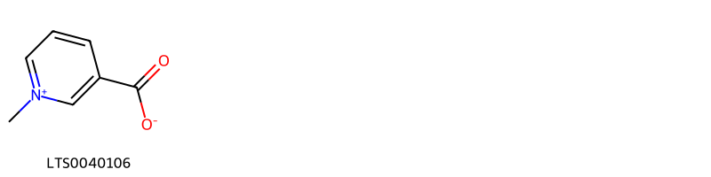
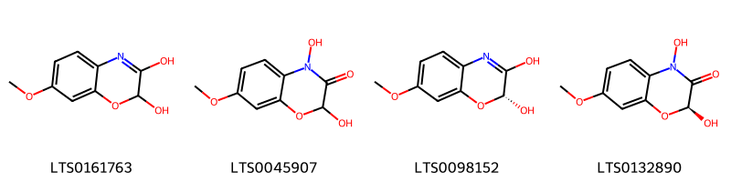
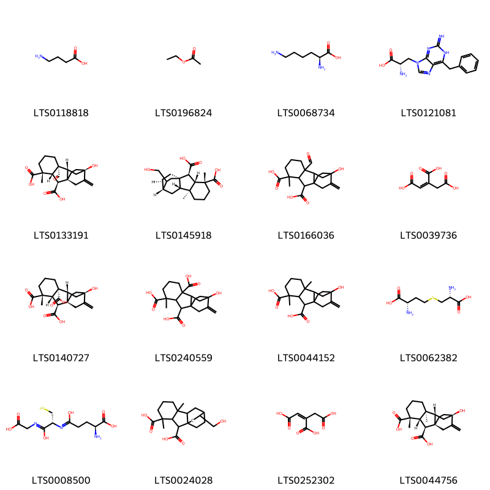
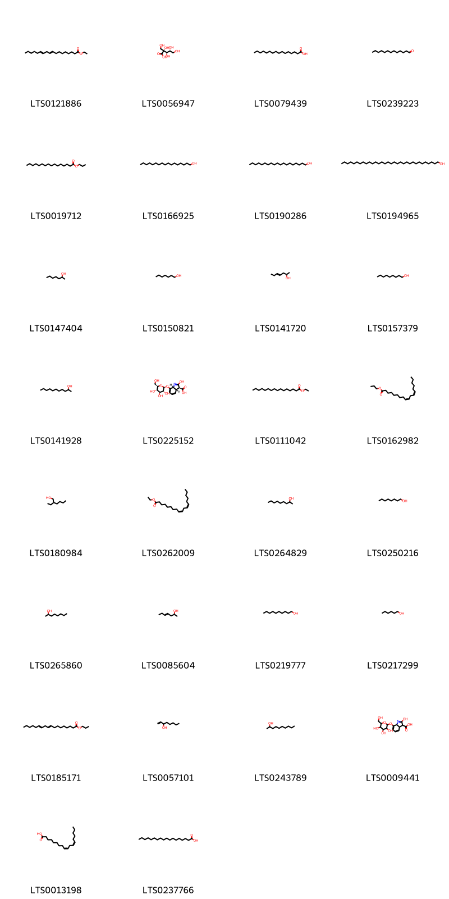
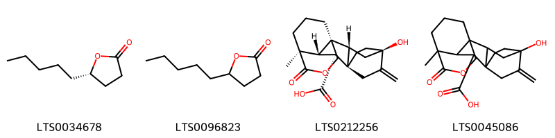
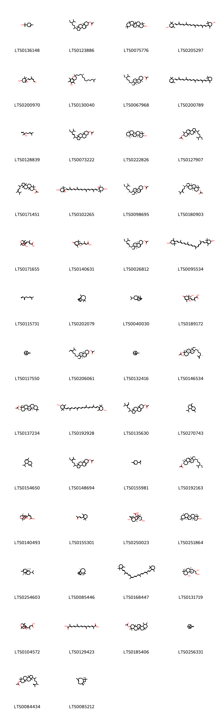
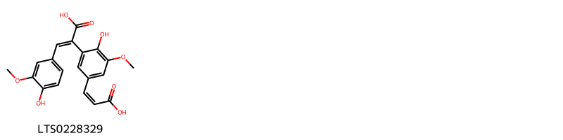

!!! abstract "Tóm tắt"

    Râu ngô (Styli et stigmata Maydis) là Là vòi và đầu nhụy của bắp cây Ngô (Zea mays L. ), họ Lúa (Poaceae), được thu hái khi bắp chín, đem phơi khô hoặc sấy khô. Cây được cho là bắt nguồn từ Mexico và Guatemala, sau đó di thực đến khắp nơi trên thế giới. Tại Việt nam, ngô được trồng ở khắp các địa phương, đặc biệt là các tỉnh trung du và miền núi. Râu ngô có vị ngọt, tính bình, vào kinh thận và bàng quang. Râu ngô dùng trị tiểu tiện buốt, dắt; nước tiểu vàng đỏ, sỏi đường tiết niệu, viêm gan, viêm túi mật, sỏi mật, tăng huyết áp, tiểu đường, chảy máu cam. Râu ngô có các thành phần hóa học như chất béo, tinh dầu, chất gôm, chất nhựa, glucosid đắng, saponin, cryptoxanthin, các vitamin C và K, sitosterol, stigmasterol, nhiều acid hữu cơ (acid malic, acid tartric…), anthocyan.

## Thông tin về thực vật

Dược liệu **Râu Ngô (Râu Ngô)** từ bộ phận **nan** từ loài *Zea mays*.

**Mô tả thực vật:** Cây thảo lớn, cao 2 – 3m. Thân thẳng, đặc, nhẵn, không phân nhánh, các đốt ở gốc mang rễ. Lá hình dải, dài 30 – 40cm, thường gập xuống, gốc nhẵn sát thân, đầu thuôn nhọn, hai mặt nháp, mép có lông dạng mi, gân giữa nổi rõ; bẹ lá nhẵn, mép có lông mềm, lưỡi bẹ ngắn, có lông mi.
	Cụm hoa đực mọc ở ngọn thân thành chùy, cuống có lông; bông nhỏ hình bầu dục mang 2 hoa, hoa có 3 nhị, bao phân thuôn, mày mềm hình mũi mác, có lông. Cụm hoa cái mọc ở kẽ lá thành bông dày hình trụ, không cuống; bông nhỏ rất ngắn mang 1 hoa, hoa ở dưới  rỗng, các hoa ở trên có bầu và vòi nhụy dài, mày mềm, khá rộng.
	Quả cứng, bóng, màu vàng, đôi khi màu đỏ hoặc nâu, tím, xếp thành nhiều dãy, bao bọc bởi mày, có vòi tồn tại rất dài và mảnh.
	Mùa hoa quả: tháng 6 – 8.

*Tài liệu tham khảo:* Tài liệu khác 
Trong dược điển Việt nam, một loài được sử dụng làm dược liệu là *Zea mays*.

!!! info "Phân loại thực vật của *Zea mays*"
    - **Kingdom:** Plantae
    - **Phylum:** Tracheophyta
    - **Order:** Poales
    - **Family:** Poaceae
    - **Genus:** Zea
    - **Species:** *Zea mays*

**Phân bố trên thế giới:** Germany, Benin, France, nan, Switzerland, Czechia, Kenya, Netherlands, Finland, Hungary, Spain, Poland, French Guiana, Mexico, Chinese Taipei, Colombia, Sweden, Australia, Panama, Belarus, Indonesia, Kyrgyzstan, Russian Federation, Portugal, Estonia, Mozambique, Romania, United Kingdom of Great Britain and Northern Ireland, Guatemala, India, Costa Rica, Argentina, Ukraine, Türkiye, Peru, Thailand, Slovakia, United States of America, Bolivia (Plurinational State of), Luxembourg, China, Ethiopia, Norway, Canada, Ecuador, Denmark, Austria, Belgium

**Phân bố tại Việt nam:** Không có ghi nhận ở Việt Nam

## Thông tin về dược liệu 

### Định danh

!!! info "Thông tin về tên gọi"

    - Dược liệu tiếng Việt: nan
    - Dược liệu tiếng Trung: nan (nan)
    - Dược liệu tiếng Anh: nan
    - Dược liệu latin thông dụng: nan
    - Dược liệu latin kiểu DĐVN: *styli et stigmata maydis*
    - Dược liệu latin kiểu DĐVN: *nan*
    - Dược liệu latin kiểu thông tư: *nan*
    - Bộ phận dùng: nan (nan)

### Mô tả dược liệu 

- **Theo dược điển Việt nam V:** nan

- **Mô tả dược liệu theo thông tư chế biến dược liệu theo phương pháp cổ truyền:** nan

### Chế biến 

- **Chế biến theo dược điển việt nam V**: nan

- **Chế biến theo thông tư:** nan

--- 

## Thành phần hóa học

- Theo tài liệu của GS. Đỗ Tất Lợi:  (1) Chất béo, tinh dầu, gôm, nhựa, glucosid đắng, saponin, cryptoxanthin, vitamin, phytosterol, acid hữu cơ...
(2) Dược điển Việt Nam V không đề cập đến biomaker. 
3 dược điển còn lại không có loài dược liệu này.
    

**Thành phần hóa học từ loài **Zea mays**

Theo cơ sở dữ liệu lotus, loài *Zea mays* đã phân lập và xác định được **497** hoạt chất thuộc về các nhóm Organonitrogen compounds, Fatty Acyls, Quinolines and derivatives, Phenols, Pteridines and derivatives, Carboxylic acids and derivatives, Unsaturated hydrocarbons, Benzoxazines, Steroids and steroid derivatives, Benzodiazepines, Flavonoids, Glycerophospholipids, Furanoid lignans, Organic phosphoric acids and derivatives, Heteroaromatic compounds, Diazines, Fluorenes, Imidazopyrimidines, Purine nucleosides, 2-arylbenzofuran flavonoids, Benzene and substituted derivatives, Stilbenes, Coumarins and derivatives, Prenol lipids, Pyrans, Polycyclic hydrocarbons, Organooxygen compounds, Naphthalenes, Cinnamic acids and derivatives, Lactones, Isoflavonoids, Indoles and derivatives, Naphthopyrans, Benzoxazoles, Pyrrolines, Dibenzylbutane lignans trong bảng dưới đây. Danh sách các hoạt chất như sau hexanol [(LTS0217299)](https://lotus.naturalproducts.net/compound/lotus_id/LTS0217299), 4-isopropyl-1,6-dimethyl-2,3,4,4a,7,8-hexahydronaphthalene [(LTS0270743)](https://lotus.naturalproducts.net/compound/lotus_id/LTS0270743), 6-methoxy-1,3-benzoxazol-2-ol [(LTS0151051)](https://lotus.naturalproducts.net/compound/lotus_id/LTS0151051), 7,8-dimethylbenzo[g]pteridine-2,4-diol [(LTS0108677)](https://lotus.naturalproducts.net/compound/lotus_id/LTS0108677), β-amyrin [(LTS0075776)](https://lotus.naturalproducts.net/compound/lotus_id/LTS0075776), 2-(6-hydroxy-2-imino-3h-purin-9-yl)-5-(hydroxymethyl)oxolane-3,4-diol [(LTS0005186)](https://lotus.naturalproducts.net/compound/lotus_id/LTS0005186), [(1r,2r,3s,4r,5s,6s)-2,3,4,5,6-pentakis(phosphonooxy)cyclohexyl]oxyphosphonic acid [(LTS0234844)](https://lotus.naturalproducts.net/compound/lotus_id/LTS0234844), 2-hydroxy-8-{[(2s,3r,4s,5s,6r)-3,4,5-trihydroxy-6-(hydroxymethyl)oxan-2-yl]oxy}quinoline-4-carboxylic acid [(LTS0035132)](https://lotus.naturalproducts.net/compound/lotus_id/LTS0035132), para-coumaric acid [(LTS0266252)](https://lotus.naturalproducts.net/compound/lotus_id/LTS0266252), aldehyde c-18 [(LTS0034678)](https://lotus.naturalproducts.net/compound/lotus_id/LTS0034678), (z)-sinapic acid [(LTS0163988)](https://lotus.naturalproducts.net/compound/lotus_id/LTS0163988), 2,3-dimethyl 4,5-bis(benzoyloxy)-7-ethenyl-8a,9-dihydroxy-1,1,4a,7-tetramethyl-8-oxo-octahydro-2h-phenanthrene-2,3-dicarboxylate [(LTS0167819)](https://lotus.naturalproducts.net/compound/lotus_id/LTS0167819), epicholestrol [(LTS0000908)](https://lotus.naturalproducts.net/compound/lotus_id/LTS0000908), campesteryl acetate [(LTS0088991)](https://lotus.naturalproducts.net/compound/lotus_id/LTS0088991), neoxanthin [(LTS0227522)](https://lotus.naturalproducts.net/compound/lotus_id/LTS0227522), chlorogenic acid [(LTS0226495)](https://lotus.naturalproducts.net/compound/lotus_id/LTS0226495), sinapoyl alcohol [(LTS0275766)](https://lotus.naturalproducts.net/compound/lotus_id/LTS0275766), β-carotene [(LTS0275716)](https://lotus.naturalproducts.net/compound/lotus_id/LTS0275716), 3a,6,6,9a,11a-pentamethyl-1-(6-methyl-5-methylideneheptan-2-yl)-dodecahydro-1h-cyclopenta[a]phenanthren-7-yl acetate [(LTS0220832)](https://lotus.naturalproducts.net/compound/lotus_id/LTS0220832), (1r,3as,3bs,7s,9ar,9bs,11ar)-1-[(2r)-5-ethyl-6-methylhept-5-en-2-yl]-9a,11a-dimethyl-1h,2h,3h,3ah,3bh,4h,6h,7h,8h,9h,9bh,10h,11h-cyclopenta[a]phenanthren-7-yl acetate [(LTS0240784)](https://lotus.naturalproducts.net/compound/lotus_id/LTS0240784), atp - adenosine triphosphate [(LTS0176098)](https://lotus.naturalproducts.net/compound/lotus_id/LTS0176098), [1-(trimethylsilyl)indol-3-yl]methyl 4,5,6-tris[(trimethylsilyl)oxy]-2-{[(trimethylsilyl)oxy]methyl}oxane-3-carboxylate [(LTS0057975)](https://lotus.naturalproducts.net/compound/lotus_id/LTS0057975), 2-[(5-chloro-3-hydroxy-7-methoxy-2h-1,4-benzoxazin-2-yl)oxy]-6-(hydroxymethyl)oxane-3,4,5-triol [(LTS0207259)](https://lotus.naturalproducts.net/compound/lotus_id/LTS0207259), 2-[(3-hydroxy-7-methoxy-2h-1,4-benzoxazin-2-yl)oxy]-6-(hydroxymethyl)oxane-3,4,5-triol [(LTS0249430)](https://lotus.naturalproducts.net/compound/lotus_id/LTS0249430), amyl alcohol [(LTS0193146)](https://lotus.naturalproducts.net/compound/lotus_id/LTS0193146), brassicasterol [(LTS0014226)](https://lotus.naturalproducts.net/compound/lotus_id/LTS0014226), isoamyl alcohol [(LTS0112297)](https://lotus.naturalproducts.net/compound/lotus_id/LTS0112297), (2z,4e)-5-[(1s,3r,5s,8s)-3,8-dihydroxy-1,5-dimethyl-6-oxabicyclo[3.2.1]octan-8-yl]-3-methylpenta-2,4-dienoic acid [(LTS0208352)](https://lotus.naturalproducts.net/compound/lotus_id/LTS0208352), 3-{[(2s,3r,4s,5s,6r)-4,5-dihydroxy-6-(hydroxymethyl)-3-{[(2s,3r,4r,5r,6s)-3,4,5-trihydroxy-6-methyloxan-2-yl]oxy}oxan-2-yl]oxy}-2-(3,4-dihydroxyphenyl)-5,7-dihydroxychromen-4-one [(LTS0203991)](https://lotus.naturalproducts.net/compound/lotus_id/LTS0203991), (2,3-dihydroxy-7-{[3,4,5-trihydroxy-6-(hydroxymethyl)oxan-2-yl]oxy}indol-3-yl)acetic acid [(LTS0144263)](https://lotus.naturalproducts.net/compound/lotus_id/LTS0144263), (1s,3r,6s,7s,8s,11s,12s,15r,16r)-7,12,16-trimethyl-15-[(2r)-6-methyl-5-methylideneheptan-2-yl]pentacyclo[9.7.0.0¹,³.0³,⁸.0¹²,¹⁶]octadecan-6-yl acetate [(LTS0230221)](https://lotus.naturalproducts.net/compound/lotus_id/LTS0230221), quercetin 3,7-diglucoside [(LTS0059170)](https://lotus.naturalproducts.net/compound/lotus_id/LTS0059170), terpineol [(LTS0136148)](https://lotus.naturalproducts.net/compound/lotus_id/LTS0136148), octanal [(LTS0055983)](https://lotus.naturalproducts.net/compound/lotus_id/LTS0055983), 1-(5,6-dimethylhept-6-en-2-yl)-9a,11a-dimethyl-1h,2h,3h,3ah,3bh,4h,6h,7h,8h,9h,9bh,10h,11h-cyclopenta[a]phenanthren-7-ol [(LTS0184081)](https://lotus.naturalproducts.net/compound/lotus_id/LTS0184081), 3-{[(2s,3r,4s,5r,6r)-4-[(2-carboxyacetyl)oxy]-6-{[(2-carboxyacetyl)oxy]methyl}-3,5-dihydroxyoxan-2-yl]oxy}-2-(3,4-dihydroxyphenyl)-5,7-dihydroxy-1λ⁴-chromen-1-ylium [(LTS0132043)](https://lotus.naturalproducts.net/compound/lotus_id/LTS0132043), 2-(3,4-dihydroxyphenyl)-5,7-dihydroxy-3-{[(2s,3r,4r,5r,6s)-3,4,5-trihydroxy-6-(hydroxymethyl)oxan-2-yl]oxy}chromen-4-one [(LTS0241372)](https://lotus.naturalproducts.net/compound/lotus_id/LTS0241372), 2-methylbutanal [(LTS0098841)](https://lotus.naturalproducts.net/compound/lotus_id/LTS0098841), 3-{[6,7-dihydroxy-3-(2-hydroxyphenyl)-2-oxo-tetrahydro-3ah-pyrano[2,3-d][1,3]oxazol-5-yl]methoxy}-3-oxopropanoic acid [(LTS0250262)](https://lotus.naturalproducts.net/compound/lotus_id/LTS0250262), bazzanene [(LTS0080333)](https://lotus.naturalproducts.net/compound/lotus_id/LTS0080333), 1-(5-ethyl-6-methylheptan-2-yl)-9a,11a-dimethyl-1h,2h,3h,3ah,3bh,4h,6h,7h,8h,9h,9bh,10h,11h-cyclopenta[a]phenanthrene-4,7-diol [(LTS0170874)](https://lotus.naturalproducts.net/compound/lotus_id/LTS0170874), (1r,3as,3bs,5as,7r,9ar,9bs,11ar)-1-[(2s,3r,4r,5s)-3,4-dihydroxy-5,6-dimethylheptan-2-yl]-7-hydroxy-9a,11a-dimethyl-tetradecahydrocyclopenta[a]phenanthren-5-one [(LTS0173949)](https://lotus.naturalproducts.net/compound/lotus_id/LTS0173949), hexanal [(LTS0238624)](https://lotus.naturalproducts.net/compound/lotus_id/LTS0238624), amyrin [(LTS0222826)](https://lotus.naturalproducts.net/compound/lotus_id/LTS0222826), 2-decanone [(LTS0127177)](https://lotus.naturalproducts.net/compound/lotus_id/LTS0127177), 1-octen-3-ol [(LTS0057101)](https://lotus.naturalproducts.net/compound/lotus_id/LTS0057101), [1-(trimethylsilyl)indol-3-yl]methyl 2-{3,4,5,6-tetrakis[(trimethylsilyl)oxy]oxan-2-yl}acetate [(LTS0242181)](https://lotus.naturalproducts.net/compound/lotus_id/LTS0242181), (2s,3r,4s,5s,6r)-2-{[(2s)-3-hydroxy-7-methoxy-2h-1,4-benzoxazin-2-yl]oxy}-6-(hydroxymethyl)oxane-3,4,5-triol [(LTS0073467)](https://lotus.naturalproducts.net/compound/lotus_id/LTS0073467), β,β-carotene [(LTS0168447)](https://lotus.naturalproducts.net/compound/lotus_id/LTS0168447), 7,7,12,16-tetramethyl-15-(6-methyl-5-methylideneheptan-2-yl)pentacyclo[9.7.0.0¹,³.0³,⁸.0¹²,¹⁶]octadecan-6-ol [(LTS0084326)](https://lotus.naturalproducts.net/compound/lotus_id/LTS0084326), 4-hydroxyphenylacetic acid [(LTS0272177)](https://lotus.naturalproducts.net/compound/lotus_id/LTS0272177), 11-hydroxy-4,8-dimethyl-12-methylidenetetracyclo[9.2.2.0¹,⁹.0³,⁸]pentadecane-2,4-dicarboxylic acid [(LTS0044152)](https://lotus.naturalproducts.net/compound/lotus_id/LTS0044152), 2-(3,4-dihydroxyphenyl)-5,7-dihydroxy-6-[(2r,3s,4s,6s)-4-hydroxy-6-methyl-5-oxo-3-{[(2s,3r,4r,5r,6s)-3,4,5-trihydroxy-6-methyloxan-2-yl]oxy}oxan-2-yl]chromen-4-one [(LTS0223651)](https://lotus.naturalproducts.net/compound/lotus_id/LTS0223651), (1r,2r,3s,4s,5r,6s)-2,3,4,5,6-pentahydroxycyclohexyl 2-(1h-indol-2-yl)acetate [(LTS0244797)](https://lotus.naturalproducts.net/compound/lotus_id/LTS0244797), 1-(5,6-dimethylhept-4-en-2-yl)-9a,11a-dimethyl-1h,2h,3h,3ah,3bh,4h,6h,7h,8h,9h,9bh,10h,11h-cyclopenta[a]phenanthren-7-ol [(LTS0205458)](https://lotus.naturalproducts.net/compound/lotus_id/LTS0205458), (1r,3as,3br,5as,7s,9as,9bs,11ar)-1-[(2r,3e,5s)-5-ethyl-6-methylhept-3-en-2-yl]-9a,11a-dimethyl-tetradecahydro-1h-cyclopenta[a]phenanthren-7-yl acetate [(LTS0017316)](https://lotus.naturalproducts.net/compound/lotus_id/LTS0017316), (1s)-1-[(2s,4as,4br,5r,8as,10as)-5-hydroxy-2,4b,8,8-tetramethyl-decahydro-1h-phenanthren-2-yl]ethane-1,2-diol [(LTS0131719)](https://lotus.naturalproducts.net/compound/lotus_id/LTS0131719), β-sitosteryl acetate [(LTS0098695)](https://lotus.naturalproducts.net/compound/lotus_id/LTS0098695), (2s,7s)-3,3,7-trimethyl-8-methylidenetricyclo[5.4.0.0²,⁹]undecane [(LTS0085446)](https://lotus.naturalproducts.net/compound/lotus_id/LTS0085446), α-amyrin [(LTS0088267)](https://lotus.naturalproducts.net/compound/lotus_id/LTS0088267), 3-{[4,5-dihydroxy-6-(hydroxymethyl)-3-[(3,4,5-trihydroxy-6-methyloxan-2-yl)oxy]oxan-2-yl]oxy}-5,7-dihydroxy-2-(4-hydroxy-3-methoxyphenyl)chromen-4-one [(LTS0095279)](https://lotus.naturalproducts.net/compound/lotus_id/LTS0095279), heptanal [(LTS0031416)](https://lotus.naturalproducts.net/compound/lotus_id/LTS0031416), (9z)-β-carotene [(LTS0252839)](https://lotus.naturalproducts.net/compound/lotus_id/LTS0252839), (1r,2s,3s,4r,8s,9s,11s,12s)-12-(hydroxymethyl)-4,8-dimethyltetracyclo[9.2.2.0¹,⁹.0³,⁸]pentadecane-2,4-dicarboxylic acid [(LTS0145918)](https://lotus.naturalproducts.net/compound/lotus_id/LTS0145918), 1-(5,6-dimethylhept-4-en-2-yl)-6,9a,11a-trimethyl-1h,2h,3h,3ah,5h,5ah,6h,7h,8h,9h,9bh,10h,11h-cyclopenta[a]phenanthren-7-yl acetate [(LTS0043893)](https://lotus.naturalproducts.net/compound/lotus_id/LTS0043893), avenasterol [(LTS0237196)](https://lotus.naturalproducts.net/compound/lotus_id/LTS0237196), pinoresinol [(LTS0057431)](https://lotus.naturalproducts.net/compound/lotus_id/LTS0057431), 1-(5-ethyl-6-methylheptan-2-yl)-9a,11a-dimethyl-tetradecahydro-1h-cyclopenta[a]phenanthren-7-yl acetate [(LTS0263148)](https://lotus.naturalproducts.net/compound/lotus_id/LTS0263148), 1-(5-ethyl-6-methylheptan-2-yl)-9a,11a-dimethyl-1h,2h,3h,3ah,3bh,4h,5h,8h,9h,9bh,10h,11h-cyclopenta[a]phenanthren-7-one [(LTS0212002)](https://lotus.naturalproducts.net/compound/lotus_id/LTS0212002), fucosterol [(LTS0178887)](https://lotus.naturalproducts.net/compound/lotus_id/LTS0178887), cycloeucalenol [(LTS0125739)](https://lotus.naturalproducts.net/compound/lotus_id/LTS0125739), (1r,2s,3s,4r,8r,9r,11r)-8-formyl-11-hydroxy-4-methyl-12-methylidenetetracyclo[9.2.2.0¹,⁹.0³,⁸]pentadecane-2,4-dicarboxylic acid [(LTS0133191)](https://lotus.naturalproducts.net/compound/lotus_id/LTS0133191), 2,3-bis[(9e)-nonadec-9-enoyloxy]propoxy(2-(trimethylammonio)ethoxy)phosphinic acid [(LTS0223825)](https://lotus.naturalproducts.net/compound/lotus_id/LTS0223825), 8-formyl-11-hydroxy-4-methyl-12-methylidenetetracyclo[9.2.2.0¹,⁹.0³,⁸]pentadecane-2,4-dicarboxylic acid [(LTS0166036)](https://lotus.naturalproducts.net/compound/lotus_id/LTS0166036), gamma-nonalactone [(LTS0096823)](https://lotus.naturalproducts.net/compound/lotus_id/LTS0096823), caryophyllene [(LTS0131870)](https://lotus.naturalproducts.net/compound/lotus_id/LTS0131870), 1-hexen-3-ol [(LTS0074606)](https://lotus.naturalproducts.net/compound/lotus_id/LTS0074606), 9a,11a-dimethyl-1-(6-methyl-5-methylideneheptan-2-yl)-1h,2h,3h,3ah,3bh,4h,6h,7h,8h,9h,9bh,10h,11h-cyclopenta[a]phenanthren-7-yl acetate [(LTS0231831)](https://lotus.naturalproducts.net/compound/lotus_id/LTS0231831), 1-(5-ethyl-6-methylheptan-2-yl)-7-hydroxy-9a,11a-dimethyl-1h,2h,3h,3ah,3bh,6h,7h,8h,9h,9bh,10h,11h-cyclopenta[a]phenanthren-4-one [(LTS0132900)](https://lotus.naturalproducts.net/compound/lotus_id/LTS0132900), 2,8-dihydroxyquinoline-4-carboxylic acid [(LTS0147618)](https://lotus.naturalproducts.net/compound/lotus_id/LTS0147618), α-muurolene [(LTS0022607)](https://lotus.naturalproducts.net/compound/lotus_id/LTS0022607), longifolene [(LTS0202079)](https://lotus.naturalproducts.net/compound/lotus_id/LTS0202079), (1r,3ar,5as,7s,9as,9br,11ar)-1-[(2r,4e)-5,6-dimethylhept-4-en-2-yl]-9a,11a-dimethyl-1h,2h,3h,3ah,5h,5ah,6h,7h,8h,9h,9bh,10h,11h-cyclopenta[a]phenanthren-7-yl acetate [(LTS0071811)](https://lotus.naturalproducts.net/compound/lotus_id/LTS0071811), 1-(5,6-dimethylheptan-2-yl)-6,9a,11a-trimethyl-1h,2h,3h,3ah,5h,5ah,6h,7h,8h,9h,9bh,10h,11h-cyclopenta[a]phenanthren-7-yl acetate [(LTS0233166)](https://lotus.naturalproducts.net/compound/lotus_id/LTS0233166), antheraxanthin [(LTS0210072)](https://lotus.naturalproducts.net/compound/lotus_id/LTS0210072), (1r,3bs,5as,7r,9ar,9bs,11as)-1-[(2s,3r,4r,5s)-3,4-dihydroxy-5,6-dimethylheptan-2-yl]-7-hydroxy-9a,11a-dimethyl-tetradecahydrocyclopenta[a]phenanthren-5-one [(LTS0043723)](https://lotus.naturalproducts.net/compound/lotus_id/LTS0043723), (2e)-2-{4-[(1z)-2-carboxyeth-1-en-1-yl]-2-methoxyphenoxy}-3-(4-hydroxy-3-methoxyphenyl)prop-2-enoic acid [(LTS0021835)](https://lotus.naturalproducts.net/compound/lotus_id/LTS0021835), 4-chloro-6,7-dimethoxy-1,3-benzoxazol-2-ol [(LTS0184548)](https://lotus.naturalproducts.net/compound/lotus_id/LTS0184548), (1r,3as,3br,5ar,7r,9ar,9bs,11ar)-3a,6,6,9a,11a-pentamethyl-1-[(2r)-6-methyl-5-methylideneheptan-2-yl]-dodecahydro-1h-cyclopenta[a]phenanthren-7-yl acetate [(LTS0241348)](https://lotus.naturalproducts.net/compound/lotus_id/LTS0241348), stigmasta-5,24-dien-3β-ol [(LTS0089699)](https://lotus.naturalproducts.net/compound/lotus_id/LTS0089699), (1r,2r,4r,7r,8s,9s,10s)-4-hydroxy-10-methyl-5-methylidene-11-oxo-12-oxapentacyclo[8.3.3.2⁴,⁷.0¹,⁹.0²,⁷]octadecane-8-carboxylic acid [(LTS0212256)](https://lotus.naturalproducts.net/compound/lotus_id/LTS0212256), dotriacontanol [(LTS0194965)](https://lotus.naturalproducts.net/compound/lotus_id/LTS0194965), 1-(5-ethyl-6-methylhept-5-en-2-yl)-9a,11a-dimethyl-1h,2h,3h,3ah,3bh,4h,6h,7h,8h,9h,9bh,10h,11h-cyclopenta[a]phenanthren-7-yl acetate [(LTS0148694)](https://lotus.naturalproducts.net/compound/lotus_id/LTS0148694), (1r,3ar,5as,7s,9as,9br,11ar)-1-[(2r,4e)-5,6-dimethylhept-4-en-2-yl]-9a,11a-dimethyl-1h,2h,3h,3ah,5h,5ah,6h,7h,8h,9h,9bh,10h,11h-cyclopenta[a]phenanthren-7-ol [(LTS0237783)](https://lotus.naturalproducts.net/compound/lotus_id/LTS0237783), 2-[(2-hydroxy-1,3-benzoxazol-6-yl)oxy]-6-(hydroxymethyl)oxane-3,4,5-triol [(LTS0250498)](https://lotus.naturalproducts.net/compound/lotus_id/LTS0250498), β-amyrin [(LTS0251864)](https://lotus.naturalproducts.net/compound/lotus_id/LTS0251864), 4-[(9e,11e,13e,15e,17e)-18-(4-hydroxy-2,6,6-trimethylcyclohex-1-en-1-yl)-3,7,12,16-tetramethyloctadeca-1,3,5,7,9,11,13,15,17-nonaen-1-yl]-3,5,5-trimethylcyclohex-3-en-1-ol [(LTS0095534)](https://lotus.naturalproducts.net/compound/lotus_id/LTS0095534), heptanol [(LTS0150821)](https://lotus.naturalproducts.net/compound/lotus_id/LTS0150821), 1-heptadecanol [(LTS0166925)](https://lotus.naturalproducts.net/compound/lotus_id/LTS0166925), 1-(5-ethyl-6-methylhept-3-en-2-yl)-9a,11a-dimethyl-1h,2h,3h,3ah,3bh,4h,6h,7h,8h,9h,9bh,10h,11h-cyclopenta[a]phenanthren-7-yl acetate [(LTS0242194)](https://lotus.naturalproducts.net/compound/lotus_id/LTS0242194), (1r,3ar,5as,6s,7s,9as,9br,11ar)-1-[(2r,5r)-5-ethyl-6-methylheptan-2-yl]-6,9a,11a-trimethyl-1h,2h,3h,3ah,5h,5ah,6h,7h,8h,9h,9bh,10h,11h-cyclopenta[a]phenanthren-7-yl acetate [(LTS0192163)](https://lotus.naturalproducts.net/compound/lotus_id/LTS0192163), cyanidin 3-glucoside [(LTS0217835)](https://lotus.naturalproducts.net/compound/lotus_id/LTS0217835), 12-(hydroxymethyl)-4,8-dimethyltetracyclo[9.2.2.0¹,⁹.0³,⁸]pentadecane-2,4-dicarboxylic acid [(LTS0024028)](https://lotus.naturalproducts.net/compound/lotus_id/LTS0024028), 2,4,5-tris[(trimethylsilyl)oxy]-6-{[(trimethylsilyl)oxy]methyl}oxan-3-yl 2-[1-(trimethylsilyl)indol-3-yl]acetate [(LTS0133986)](https://lotus.naturalproducts.net/compound/lotus_id/LTS0133986), 4-hydroxy-7-methoxy-2-{[3,4,5-trihydroxy-6-(hydroxymethyl)oxan-2-yl]oxy}-2h-1,4-benzoxazin-3-one [(LTS0010779)](https://lotus.naturalproducts.net/compound/lotus_id/LTS0010779), 5,7-dihydroxy-2-(3-methoxy-4-{[(2s,3r,4s,5s,6r)-3,4,5-trihydroxy-6-(hydroxymethyl)oxan-2-yl]oxy}phenyl)-3-{[(2s,3r,4s,5s,6r)-3,4,5-trihydroxy-6-(hydroxymethyl)oxan-2-yl]oxy}chromen-4-one [(LTS0022429)](https://lotus.naturalproducts.net/compound/lotus_id/LTS0022429), l-tryptophan [(LTS0263809)](https://lotus.naturalproducts.net/compound/lotus_id/LTS0263809), 4-hydroxy-2-{[3,4,5-trihydroxy-6-(hydroxymethyl)oxan-2-yl]oxy}-2h-1,4-benzoxazin-3-one [(LTS0056199)](https://lotus.naturalproducts.net/compound/lotus_id/LTS0056199), all-trans-phytofluene [(LTS0269894)](https://lotus.naturalproducts.net/compound/lotus_id/LTS0269894), aconitate [(LTS0252302)](https://lotus.naturalproducts.net/compound/lotus_id/LTS0252302), 1-(5,6-dimethylheptan-2-yl)-9a,11a-dimethyl-tetradecahydro-1h-cyclopenta[a]phenanthren-7-yl acetate [(LTS0003789)](https://lotus.naturalproducts.net/compound/lotus_id/LTS0003789), 6-(4,5-dihydroxy-6-methyloxan-2-yl)-5-hydroxy-2-(3-hydroxy-4-methoxyphenyl)-7-{[3,4,5-trihydroxy-6-(hydroxymethyl)oxan-2-yl]oxy}chromen-4-one [(LTS0047223)](https://lotus.naturalproducts.net/compound/lotus_id/LTS0047223), stigmastanol acetate [(LTS0067968)](https://lotus.naturalproducts.net/compound/lotus_id/LTS0067968), 2-methylnaphthalene [(LTS0036975)](https://lotus.naturalproducts.net/compound/lotus_id/LTS0036975), (1s,3r,6s,8r,11s,12s,15r,16r)-7,7,12,16-tetramethyl-15-[(2r)-6-methyl-5-methylideneheptan-2-yl]pentacyclo[9.7.0.0¹,³.0³,⁸.0¹²,¹⁶]octadecan-6-yl acetate [(LTS0199596)](https://lotus.naturalproducts.net/compound/lotus_id/LTS0199596), α-amyrin acetate [(LTS0224810)](https://lotus.naturalproducts.net/compound/lotus_id/LTS0224810), 2-heptanone [(LTS0087207)](https://lotus.naturalproducts.net/compound/lotus_id/LTS0087207), 2,3,4,5,6-pentahydroxycyclohexyl 2-(1h-indol-2-yl)acetate [(LTS0109219)](https://lotus.naturalproducts.net/compound/lotus_id/LTS0109219), ethyl palmitate [(LTS0111042)](https://lotus.naturalproducts.net/compound/lotus_id/LTS0111042), β-indole-3-acetic acid [(LTS0250222)](https://lotus.naturalproducts.net/compound/lotus_id/LTS0250222), 2-phenyl-ethanol [(LTS0206341)](https://lotus.naturalproducts.net/compound/lotus_id/LTS0206341), ethyl 3-phenylprop-2-enoate [(LTS0005299)](https://lotus.naturalproducts.net/compound/lotus_id/LTS0005299), 6-[(2s,3s,4s,5s,6r)-4,5-dihydroxy-6-methyl-3-{[(2s,3s,4r,5r,6r)-3,4,5-trihydroxy-6-methyloxan-2-yl]oxy}oxan-2-yl]-5,7-dihydroxy-2-(4-hydroxy-3-methoxyphenyl)chromen-4-one [(LTS0114570)](https://lotus.naturalproducts.net/compound/lotus_id/LTS0114570), zeatine [(LTS0032706)](https://lotus.naturalproducts.net/compound/lotus_id/LTS0032706), 22,23-dihydrobrassicasterol [(LTS0204629)](https://lotus.naturalproducts.net/compound/lotus_id/LTS0204629), 1-(5,6-dimethylhept-4-en-2-yl)-9a,11a-dimethyl-1h,2h,3h,3ah,5h,5ah,6h,7h,8h,9h,9bh,10h,11h-cyclopenta[a]phenanthren-7-ol [(LTS0103355)](https://lotus.naturalproducts.net/compound/lotus_id/LTS0103355), 6-[(4-hydroxy-3-methylbut-2-en-1-yl)amino]-3h-purin-2-ol [(LTS0048177)](https://lotus.naturalproducts.net/compound/lotus_id/LTS0048177), 3,4-dihydroxybenzoic acid [(LTS0018765)](https://lotus.naturalproducts.net/compound/lotus_id/LTS0018765), 1-(5,6-dimethylhept-3-en-2-yl)-9a,11a-dimethyl-1h,2h,3h,3ah,3bh,4h,6h,7h,8h,9h,9bh,10h,11h-cyclopenta[a]phenanthren-7-ol [(LTS0137934)](https://lotus.naturalproducts.net/compound/lotus_id/LTS0137934), typhasterol [(LTS0030045)](https://lotus.naturalproducts.net/compound/lotus_id/LTS0030045), (1r,3as,3br,5as,7s,9as,9bs,11ar)-1-[(2r,5r)-5,6-dimethylheptan-2-yl]-9a,11a-dimethyl-tetradecahydro-1h-cyclopenta[a]phenanthren-7-yl (2e)-3-(4-hydroxyphenyl)prop-2-enoate [(LTS0180240)](https://lotus.naturalproducts.net/compound/lotus_id/LTS0180240), thymol [(LTS0168527)](https://lotus.naturalproducts.net/compound/lotus_id/LTS0168527), undecan-2-one [(LTS0244143)](https://lotus.naturalproducts.net/compound/lotus_id/LTS0244143), apocynin [(LTS0211279)](https://lotus.naturalproducts.net/compound/lotus_id/LTS0211279), delta7-avenasterol [(LTS0199292)](https://lotus.naturalproducts.net/compound/lotus_id/LTS0199292), 1-(5-ethyl-6-methylheptan-2-yl)-9a,11a-dimethyl-1h,2h,3h,3ah,3bh,4h,6h,7h,8h,9h,9bh,10h,11h-cyclopenta[a]phenanthren-7-yl acetate [(LTS0123886)](https://lotus.naturalproducts.net/compound/lotus_id/LTS0123886), l-cystathionine [(LTS0062382)](https://lotus.naturalproducts.net/compound/lotus_id/LTS0062382), octanol [(LTS0250216)](https://lotus.naturalproducts.net/compound/lotus_id/LTS0250216), carotenoid [(LTS0205297)](https://lotus.naturalproducts.net/compound/lotus_id/LTS0205297), (2s)-2,4-dihydroxy-7-methoxy-2h-1,4-benzoxazin-3-one [(LTS0132890)](https://lotus.naturalproducts.net/compound/lotus_id/LTS0132890), β-ionone [(LTS0155301)](https://lotus.naturalproducts.net/compound/lotus_id/LTS0155301), (2r)-2,5,7,8-tetramethyl-2-[(4s,8s)-4,8,12-trimethyltridecyl]-3,4-dihydro-1-benzopyran-6-ol [(LTS0130040)](https://lotus.naturalproducts.net/compound/lotus_id/LTS0130040), 1,3-benzoxazol-2-ol [(LTS0129691)](https://lotus.naturalproducts.net/compound/lotus_id/LTS0129691), (2s)-2-amino-4-{[(1r)-1-(carboxymethyl-c-hydroxycarbonimidoyl)-2-sulfanylethyl]-c-hydroxycarbonimidoyl}butanoic acid [(LTS0008500)](https://lotus.naturalproducts.net/compound/lotus_id/LTS0008500), nonan-1-ol [(LTS0157379)](https://lotus.naturalproducts.net/compound/lotus_id/LTS0157379), 3-indolebutyric acid [(LTS0033298)](https://lotus.naturalproducts.net/compound/lotus_id/LTS0033298), putrescine [(LTS0238763)](https://lotus.naturalproducts.net/compound/lotus_id/LTS0238763), gamma(amino)-butyric acid [(LTS0118818)](https://lotus.naturalproducts.net/compound/lotus_id/LTS0118818), 9a,11a-dimethyl-1-(6-methyl-5-methylideneheptan-2-yl)-1h,2h,3h,3ah,5h,5ah,6h,7h,8h,9h,9bh,10h,11h-cyclopenta[a]phenanthren-7-ol [(LTS0055082)](https://lotus.naturalproducts.net/compound/lotus_id/LTS0055082), 2,4a,8,8-tetramethyl-1h,1ah,4h,5h-cyclopropa[e]naphthalene [(LTS0267234)](https://lotus.naturalproducts.net/compound/lotus_id/LTS0267234), ribonucleoside [(LTS0044502)](https://lotus.naturalproducts.net/compound/lotus_id/LTS0044502), 4-hydroxy-10-methyl-5-methylidene-11-oxo-12-oxapentacyclo[8.3.3.2⁴,⁷.0¹,⁹.0²,⁷]octadecane-8-carboxylic acid [(LTS0045086)](https://lotus.naturalproducts.net/compound/lotus_id/LTS0045086), genistein [(LTS0106538)](https://lotus.naturalproducts.net/compound/lotus_id/LTS0106538), [(3s)-2,3-dihydroxy-7-{[(2s,3r,4s,5s,6r)-3,4,5-trihydroxy-6-(hydroxymethyl)oxan-2-yl]oxy}indol-3-yl]acetic acid [(LTS0218028)](https://lotus.naturalproducts.net/compound/lotus_id/LTS0218028), 6-deoxoteasterone [(LTS0090422)](https://lotus.naturalproducts.net/compound/lotus_id/LTS0090422), 6-[(2s,3s,4s,5s,6r)-4,5-dihydroxy-6-methyl-3-{[(2s,3s,4r,5r,6s)-3,4,5-trihydroxy-6-methyloxan-2-yl]oxy}oxan-2-yl]-2-(3,4-dihydroxyphenyl)-5,7-dihydroxychromen-4-one [(LTS0192785)](https://lotus.naturalproducts.net/compound/lotus_id/LTS0192785), (2r,3r,4s,5s,6s)-2-{[(2r)-3-hydroxy-7-methoxy-2h-1,4-benzoxazin-2-yl]oxy}-6-(hydroxymethyl)oxane-3,4,5-triol [(LTS0062995)](https://lotus.naturalproducts.net/compound/lotus_id/LTS0062995), (2r,3r)-2-methyl-4-(3h-purin-6-ylamino)butane-1,2,3-triol [(LTS0209841)](https://lotus.naturalproducts.net/compound/lotus_id/LTS0209841), teasterone [(LTS0028563)](https://lotus.naturalproducts.net/compound/lotus_id/LTS0028563), castasterone [(LTS0111493)](https://lotus.naturalproducts.net/compound/lotus_id/LTS0111493), ethyl cinnamate [(LTS0031825)](https://lotus.naturalproducts.net/compound/lotus_id/LTS0031825), 1-(5,6-dimethylhept-6-en-2-yl)-3a,6,6,9a,11a-pentamethyl-dodecahydro-1h-cyclopenta[a]phenanthren-7-yl acetate [(LTS0084434)](https://lotus.naturalproducts.net/compound/lotus_id/LTS0084434), (9z,12z)-n-(2-hydroxyethyl)octadeca-9,12-dienimidic acid [(LTS0115325)](https://lotus.naturalproducts.net/compound/lotus_id/LTS0115325), propyl gallate [(LTS0038913)](https://lotus.naturalproducts.net/compound/lotus_id/LTS0038913), xanthoxin [(LTS0200970)](https://lotus.naturalproducts.net/compound/lotus_id/LTS0200970), phenylacetaldehyde [(LTS0245512)](https://lotus.naturalproducts.net/compound/lotus_id/LTS0245512), hexanone [(LTS0108749)](https://lotus.naturalproducts.net/compound/lotus_id/LTS0108749), fecosterol [(LTS0185843)](https://lotus.naturalproducts.net/compound/lotus_id/LTS0185843), 4,4,6a,6b,8a,11,11,14b-octamethyl-1,2,3,4a,5,6,7,8,9,10,12,12a,14,14a-tetradecahydropicen-3-yl acetate [(LTS0153642)](https://lotus.naturalproducts.net/compound/lotus_id/LTS0153642), aldehyde c11 [(LTS0045537)](https://lotus.naturalproducts.net/compound/lotus_id/LTS0045537), propyl linoleate [(LTS0162982)](https://lotus.naturalproducts.net/compound/lotus_id/LTS0162982), stigmasteryl acetate [(LTS0026812)](https://lotus.naturalproducts.net/compound/lotus_id/LTS0026812), cycloartenol [(LTS0060131)](https://lotus.naturalproducts.net/compound/lotus_id/LTS0060131), (2-hydroxy-3h-indol-3-yl)acetic acid [(LTS0094655)](https://lotus.naturalproducts.net/compound/lotus_id/LTS0094655), (+)-α-carotene [(LTS0200789)](https://lotus.naturalproducts.net/compound/lotus_id/LTS0200789), 5,7-dihydroxy-2-(4-hydroxy-3-methoxyphenyl)-6-[(2r,3s,4r,5s,6s)-3,4,5-trihydroxy-6-methyloxan-2-yl]chromen-4-one [(LTS0229536)](https://lotus.naturalproducts.net/compound/lotus_id/LTS0229536), (1r,2s,3s,4r,8s,9s,11r)-11-hydroxy-4,8-dimethyl-12-methylidenetetracyclo[9.2.2.0¹,⁹.0³,⁸]pentadecane-2,4-dicarboxylic acid [(LTS0044756)](https://lotus.naturalproducts.net/compound/lotus_id/LTS0044756), stigmast-5-en-3-ol, (3β)- [(LTS0204616)](https://lotus.naturalproducts.net/compound/lotus_id/LTS0204616), 6-[(2r,3s,4r,5r,6s)-4,5-dihydroxy-6-methyl-3-{[(2s,3r,4r,5r,6s)-3,4,5-trihydroxy-6-methyloxan-2-yl]oxy}oxan-2-yl]-2-(3,4-dihydroxyphenyl)-5,7-dihydroxychromen-4-one [(LTS0176895)](https://lotus.naturalproducts.net/compound/lotus_id/LTS0176895), palmitic acid [(LTS0079439)](https://lotus.naturalproducts.net/compound/lotus_id/LTS0079439), dimboa-glucoside [(LTS0189156)](https://lotus.naturalproducts.net/compound/lotus_id/LTS0189156), (1r,3ar,5as,6s,7s,9as,9br,11ar)-6,9a,11a-trimethyl-1-[(2r)-6-methylheptan-2-yl]-1h,2h,3h,3ah,5h,5ah,6h,7h,8h,9h,9bh,10h,11h-cyclopenta[a]phenanthren-7-yl acetate [(LTS0014587)](https://lotus.naturalproducts.net/compound/lotus_id/LTS0014587), 1-(5,6-dimethylhept-4-en-2-yl)-9a,11a-dimethyl-1h,2h,3h,3ah,5h,5ah,6h,7h,8h,9h,9bh,10h,11h-cyclopenta[a]phenanthren-7-yl acetate [(LTS0190875)](https://lotus.naturalproducts.net/compound/lotus_id/LTS0190875), campestanyl ferulate [(LTS0219822)](https://lotus.naturalproducts.net/compound/lotus_id/LTS0219822), 5-hydroxyferulic acid [(LTS0186587)](https://lotus.naturalproducts.net/compound/lotus_id/LTS0186587), 5-hydroxyferulate [(LTS0159766)](https://lotus.naturalproducts.net/compound/lotus_id/LTS0159766), vanillin [(LTS0136163)](https://lotus.naturalproducts.net/compound/lotus_id/LTS0136163), (1r,3ar,5as,7s,9as,9br,11ar)-9a,11a-dimethyl-1-[(2r)-6-methyl-5-methylideneheptan-2-yl]-1h,2h,3h,3ah,5h,5ah,6h,7h,8h,9h,9bh,10h,11h-cyclopenta[a]phenanthren-7-yl acetate [(LTS0090612)](https://lotus.naturalproducts.net/compound/lotus_id/LTS0090612), (1r,3ar,5as,6s,7s,9as,9br,11ar)-1-[(2r,4e)-5,6-dimethylhept-4-en-2-yl]-6,9a,11a-trimethyl-1h,2h,3h,3ah,5h,5ah,6h,7h,8h,9h,9bh,10h,11h-cyclopenta[a]phenanthren-7-yl acetate [(LTS0077490)](https://lotus.naturalproducts.net/compound/lotus_id/LTS0077490), (1s)-8-isopropyl-1,3-dimethyltricyclo[4.4.0.0²,⁷]dec-3-ene [(LTS0199723)](https://lotus.naturalproducts.net/compound/lotus_id/LTS0199723), (2r,3s,4r,5s)-2-(6-aminopurin-9-yl)-5-(hydroxymethyl)oxolane-3,4-diol [(LTS0178532)](https://lotus.naturalproducts.net/compound/lotus_id/LTS0178532), delta-cadinene [(LTS0019321)](https://lotus.naturalproducts.net/compound/lotus_id/LTS0019321), β-sitostenone [(LTS0049492)](https://lotus.naturalproducts.net/compound/lotus_id/LTS0049492), 1-(5,6-dimethylheptan-2-yl)-9a,11a-dimethyl-1h,2h,3h,3ah,3bh,4h,6h,7h,8h,9h,9bh,10h,11h-cyclopenta[a]phenanthren-7-yl acetate [(LTS0239510)](https://lotus.naturalproducts.net/compound/lotus_id/LTS0239510), (1s,3r,6s,8r,11s,12s,15r,16r)-15-[(2r,5s)-5,6-dimethylhept-6-en-2-yl]-7,7,12,16-tetramethylpentacyclo[9.7.0.0¹,³.0³,⁸.0¹²,¹⁶]octadecan-6-yl acetate [(LTS0230214)](https://lotus.naturalproducts.net/compound/lotus_id/LTS0230214), (6e,10e,14e,18e,22e,26e)-2,6,10,14,19,23,27,31-octamethyldotriaconta-2,6,10,14,18,22,26,30-octaene [(LTS0007754)](https://lotus.naturalproducts.net/compound/lotus_id/LTS0007754), violaxanthin [(LTS0102265)](https://lotus.naturalproducts.net/compound/lotus_id/LTS0102265), α-phenylbutyric acid [(LTS0194202)](https://lotus.naturalproducts.net/compound/lotus_id/LTS0194202), (1s,3r,6s,8r,11s,12s,15r,16r)-15-[(2r,4e)-5,6-dimethylhept-4-en-2-yl]-7,7,12,16-tetramethylpentacyclo[9.7.0.0¹,³.0³,⁸.0¹²,¹⁶]octadecan-6-yl acetate [(LTS0139288)](https://lotus.naturalproducts.net/compound/lotus_id/LTS0139288), 3,4,5-trihydroxy-2-propylbenzoic acid [(LTS0129562)](https://lotus.naturalproducts.net/compound/lotus_id/LTS0129562), zeatin riboside [(LTS0254495)](https://lotus.naturalproducts.net/compound/lotus_id/LTS0254495), 2-undecanol [(LTS0141928)](https://lotus.naturalproducts.net/compound/lotus_id/LTS0141928), chrysoeriol [(LTS0095766)](https://lotus.naturalproducts.net/compound/lotus_id/LTS0095766), ω-phenylacetic acid [(LTS0091846)](https://lotus.naturalproducts.net/compound/lotus_id/LTS0091846), β-copaene [(LTS0255787)](https://lotus.naturalproducts.net/compound/lotus_id/LTS0255787), 3-{[(2s,3r,4s,5s,6r)-4,5-dihydroxy-6-(hydroxymethyl)-3-{[(2s,3r,4r,5r,6s)-3,4,5-trihydroxy-6-methyloxan-2-yl]oxy}oxan-2-yl]oxy}-5,7-dihydroxy-2-(4-hydroxy-3-methoxyphenyl)chromen-4-one [(LTS0061611)](https://lotus.naturalproducts.net/compound/lotus_id/LTS0061611), 5-{8-hydroxy-1,5-dimethyl-3-oxo-6-oxabicyclo[3.2.1]octan-8-yl}-3-methylpenta-2,4-dienoic acid [(LTS0104572)](https://lotus.naturalproducts.net/compound/lotus_id/LTS0104572), (3r,6s,8r,11s,12s,15r,16r)-7,7,12,16-tetramethyl-15-[(2r)-6-methylhept-5-en-2-yl]pentacyclo[9.7.0.0¹,³.0³,⁸.0¹²,¹⁶]octadecan-6-ol [(LTS0062833)](https://lotus.naturalproducts.net/compound/lotus_id/LTS0062833), cholesteryl acetate [(LTS0004289)](https://lotus.naturalproducts.net/compound/lotus_id/LTS0004289), (3ar,5r,6s,7s,7ar)-6,7-dihydroxy-3-(2-hydroxy-4-methoxyphenyl)-5-(hydroxymethyl)-tetrahydro-3ah-pyrano[2,3-d][1,3]oxazol-2-one [(LTS0037456)](https://lotus.naturalproducts.net/compound/lotus_id/LTS0037456), 2-methyl-4-(3h-purin-6-ylamino)butane-1,2,3-triol [(LTS0208292)](https://lotus.naturalproducts.net/compound/lotus_id/LTS0208292), (2s,3r,4s,5s,6r)-2-{[(2s)-5-chloro-3-hydroxy-7-methoxy-2h-1,4-benzoxazin-2-yl]oxy}-6-(hydroxymethyl)oxane-3,4,5-triol [(LTS0139514)](https://lotus.naturalproducts.net/compound/lotus_id/LTS0139514), 6-[(2r,3s,4r,5s,6s)-4,5-dihydroxy-6-methyl-3-{[(2s,3r,4r,5r,6s)-3,4,5-trihydroxy-6-methyloxan-2-yl]oxy}oxan-2-yl]-2-(3,4-dihydroxyphenyl)-5,7-dihydroxychromen-4-one [(LTS0202371)](https://lotus.naturalproducts.net/compound/lotus_id/LTS0202371), 3-hexen-2-one [(LTS0133323)](https://lotus.naturalproducts.net/compound/lotus_id/LTS0133323), 5,7-dihydroxy-2-(4-hydroxy-3-{[(2s,3r,4s,5s,6r)-3,4,5-trihydroxy-6-(hydroxymethyl)oxan-2-yl]oxy}phenyl)-3-{[(2s,3r,4s,5s,6r)-3,4,5-trihydroxy-6-(hydroxymethyl)oxan-2-yl]oxy}chromen-4-one [(LTS0045791)](https://lotus.naturalproducts.net/compound/lotus_id/LTS0045791), 6-(4,5-dihydroxy-6-methyloxan-2-yl)-5,7-dihydroxy-2-(3-hydroxy-4-methoxyphenyl)chromen-4-one [(LTS0242251)](https://lotus.naturalproducts.net/compound/lotus_id/LTS0242251), (1r,3as,3br,5ar,7r,9ar,9bs,11ar)-1-[(2r,4e)-5,6-dimethylhept-4-en-2-yl]-3a,6,6,9a,11a-pentamethyl-dodecahydro-1h-cyclopenta[a]phenanthren-7-yl acetate [(LTS0180903)](https://lotus.naturalproducts.net/compound/lotus_id/LTS0180903), (1r,3as,3bs,7s,9bs)-1-[(2r,5r)-5,6-dimethylheptan-2-yl]-9a,11a-dimethyl-1h,2h,3h,3ah,3bh,4h,6h,7h,8h,9h,9bh,10h,11h-cyclopenta[a]phenanthren-7-ol [(LTS0057877)](https://lotus.naturalproducts.net/compound/lotus_id/LTS0057877), coprostanol [(LTS0165323)](https://lotus.naturalproducts.net/compound/lotus_id/LTS0165323), 4-isopropyl-1,6-dimethyl-3,4,4a,7,8,8a-hexahydronaphthalene [(LTS0154650)](https://lotus.naturalproducts.net/compound/lotus_id/LTS0154650), (2s)-2-amino-3-(6-benzyl-2-imino-1h-purin-9-yl)propanoic acid [(LTS0121081)](https://lotus.naturalproducts.net/compound/lotus_id/LTS0121081), 1-(5-isopropylhept-5-en-2-yl)-9a,11a-dimethyl-1h,2h,3h,3ah,3bh,4h,6h,7h,8h,9h,9bh,10h,11h-cyclopenta[a]phenanthren-7-ol [(LTS0210884)](https://lotus.naturalproducts.net/compound/lotus_id/LTS0210884), 5-ethenyl-2-methoxyphenol [(LTS0076260)](https://lotus.naturalproducts.net/compound/lotus_id/LTS0076260), sitosterol [(LTS0168132)](https://lotus.naturalproducts.net/compound/lotus_id/LTS0168132), geosmin [(LTS0091389)](https://lotus.naturalproducts.net/compound/lotus_id/LTS0091389), 24-methylenecycloartanol [(LTS0018584)](https://lotus.naturalproducts.net/compound/lotus_id/LTS0018584), β-farnesene [(LTS0067925)](https://lotus.naturalproducts.net/compound/lotus_id/LTS0067925), 5,7-dihydroxy-2-(4-hydroxy-3-methoxyphenyl)-6-[(2r,3s,4s,6s)-4-hydroxy-6-methyl-5-oxo-3-{[(2s,3r,4r,5r,6s)-3,4,5-trihydroxy-6-methyloxan-2-yl]oxy}oxan-2-yl]chromen-4-one [(LTS0105906)](https://lotus.naturalproducts.net/compound/lotus_id/LTS0105906), limonene,  [(LTS0155981)](https://lotus.naturalproducts.net/compound/lotus_id/LTS0155981), dihydrocholesterol [(LTS0048168)](https://lotus.naturalproducts.net/compound/lotus_id/LTS0048168), (1r,3as,3bs,7s,9ar,9bs,11ar)-1-[(2r,5e)-5-isopropylhept-5-en-2-yl]-9a,11a-dimethyl-1h,2h,3h,3ah,3bh,4h,6h,7h,8h,9h,9bh,10h,11h-cyclopenta[a]phenanthren-7-yl acetate [(LTS0206061)](https://lotus.naturalproducts.net/compound/lotus_id/LTS0206061), (1r,3as,3br,5as,7s,9as,9bs,11ar)-9a,11a-dimethyl-1-[(2r)-6-methylheptan-2-yl]-tetradecahydro-1h-cyclopenta[a]phenanthren-7-yl acetate [(LTS0157338)](https://lotus.naturalproducts.net/compound/lotus_id/LTS0157338), hept-4-en-2-one [(LTS0098783)](https://lotus.naturalproducts.net/compound/lotus_id/LTS0098783), 1-(5-isopropylhept-5-en-2-yl)-9a,11a-dimethyl-1h,2h,3h,3ah,3bh,4h,6h,7h,8h,9h,9bh,10h,11h-cyclopenta[a]phenanthren-7-yl acetate [(LTS0135630)](https://lotus.naturalproducts.net/compound/lotus_id/LTS0135630), cycloartanol [(LTS0176903)](https://lotus.naturalproducts.net/compound/lotus_id/LTS0176903), 7,7,12,16-tetramethyl-15-(6-methyl-5-methylideneheptan-2-yl)pentacyclo[9.7.0.0¹,³.0³,⁸.0¹²,¹⁶]octadecan-6-yl acetate [(LTS0163383)](https://lotus.naturalproducts.net/compound/lotus_id/LTS0163383), stigmasterol [(LTS0024262)](https://lotus.naturalproducts.net/compound/lotus_id/LTS0024262), diboa-glucoside [(LTS0101735)](https://lotus.naturalproducts.net/compound/lotus_id/LTS0101735), 6,7-dihydroxy-3-(2-hydroxy-4-methoxyphenyl)-5-(hydroxymethyl)-tetrahydro-3ah-pyrano[2,3-d][1,3]oxazol-2-one [(LTS0077839)](https://lotus.naturalproducts.net/compound/lotus_id/LTS0077839), 1-(5-ethyl-6-methylheptan-2-yl)-9a,11a-dimethyl-1h,2h,3h,3ah,5h,5ah,6h,7h,8h,9h,9bh,10h,11h-cyclopenta[a]phenanthren-7-ol [(LTS0266132)](https://lotus.naturalproducts.net/compound/lotus_id/LTS0266132), 5,7-dihydroxy-2-(4-hydroxy-3-methoxyphenyl)-6-{4-hydroxy-6-methyl-5-oxo-3-[(3,4,5-trihydroxy-6-methyloxan-2-yl)oxy]oxan-2-yl}chromen-4-one [(LTS0076001)](https://lotus.naturalproducts.net/compound/lotus_id/LTS0076001), (1r,3as,3bs,7s,9ar,9bs,11ar)-1-[(2r,5z)-5-isopropylhept-5-en-2-yl]-9a,11a-dimethyl-1h,2h,3h,3ah,3bh,4h,6h,7h,8h,9h,9bh,10h,11h-cyclopenta[a]phenanthren-7-yl acetate [(LTS0195939)](https://lotus.naturalproducts.net/compound/lotus_id/LTS0195939), stearic acid [(LTS0237766)](https://lotus.naturalproducts.net/compound/lotus_id/LTS0237766), (1r,3ar,5as,7s,9as,9br,11ar)-1-[(2r,5r)-5,6-dimethylheptan-2-yl]-9a,11a-dimethyl-1h,2h,3h,3ah,5h,5ah,6h,7h,8h,9h,9bh,10h,11h-cyclopenta[a]phenanthren-7-ol [(LTS0127706)](https://lotus.naturalproducts.net/compound/lotus_id/LTS0127706), 5,7-dihydroxy-2-(4-hydroxy-3-methoxyphenyl)-6-[(2s,3r,4r,6s)-4-hydroxy-6-methyl-5-oxo-3-{[(2s,3r,4r,5r,6s)-3,4,5-trihydroxy-6-methyloxan-2-yl]oxy}oxan-2-yl]chromen-4-one [(LTS0192698)](https://lotus.naturalproducts.net/compound/lotus_id/LTS0192698), 7-methoxy-2h-1,4-benzoxazine-2,3-diol [(LTS0161763)](https://lotus.naturalproducts.net/compound/lotus_id/LTS0161763), cis-ferulic acid [(LTS0160926)](https://lotus.naturalproducts.net/compound/lotus_id/LTS0160926), 2-nonanol [(LTS0264829)](https://lotus.naturalproducts.net/compound/lotus_id/LTS0264829), 7,7,12,16-tetramethyl-15-(6-methyl-5-methylideneheptan-2-yl)pentacyclo[9.7.0.0¹,³.0³,⁸.0¹²,¹⁶]octadec-8-en-6-ol [(LTS0259188)](https://lotus.naturalproducts.net/compound/lotus_id/LTS0259188), 2-hydroxy-7-{[3,4,5-trihydroxy-6-(hydroxymethyl)oxan-2-yl]oxy}-3a,7a-dihydro-3h-indole-3-carboxylic acid [(LTS0009441)](https://lotus.naturalproducts.net/compound/lotus_id/LTS0009441), (4e)-5-[(1s)-1-hydroxy-2,6,6-trimethyl-4-oxocyclohex-2-en-1-yl]-3-methylpenta-2,4-dienoic acid [(LTS0268716)](https://lotus.naturalproducts.net/compound/lotus_id/LTS0268716), 1-(5-ethyl-6-methylhept-5-en-2-yl)-9a,11a-dimethyl-1h,2h,3h,3ah,3bh,4h,6h,7h,8h,9h,9bh,10h,11h-cyclopenta[a]phenanthren-7-ol [(LTS0033754)](https://lotus.naturalproducts.net/compound/lotus_id/LTS0033754), (1r,3ar,5as,6s,7s,9as,11ar)-3a,6,9a,11a-tetramethyl-1-[(2r)-6-methyl-5-methylideneheptan-2-yl]-1h,2h,3h,4h,5h,5ah,6h,7h,8h,9h,10h,11h-cyclopenta[a]phenanthren-7-yl acetate [(LTS0265517)](https://lotus.naturalproducts.net/compound/lotus_id/LTS0265517), 6-[(2r,3s,4r,5s,6s)-4,5-dihydroxy-6-methyl-3-{[(2s,3r,4r,5r,6s)-3,4,5-trihydroxy-6-methyloxan-2-yl]oxy}oxan-2-yl]-5,7-dihydroxy-2-(4-hydroxy-3-methoxyphenyl)chromen-4-one [(LTS0087910)](https://lotus.naturalproducts.net/compound/lotus_id/LTS0087910), (1r,3as,3bs,7s,9ar,9bs,11ar)-1-[(2r,3e,5r)-5,6-dimethylhept-3-en-2-yl]-9a,11a-dimethyl-1h,2h,3h,3ah,3bh,4h,6h,7h,8h,9h,9bh,10h,11h-cyclopenta[a]phenanthren-7-yl acetate [(LTS0173928)](https://lotus.naturalproducts.net/compound/lotus_id/LTS0173928), (3β,5α)-stigmast-7-en-3-ol [(LTS0245097)](https://lotus.naturalproducts.net/compound/lotus_id/LTS0245097), 1-(5-ethyl-6-methylhept-3-en-2-yl)-9a,11a-dimethyl-tetradecahydro-1h-cyclopenta[a]phenanthren-7-yl acetate [(LTS0073222)](https://lotus.naturalproducts.net/compound/lotus_id/LTS0073222), 2-pentenal, 2-methyl- [(LTS0184149)](https://lotus.naturalproducts.net/compound/lotus_id/LTS0184149), (1r,3as,3bs,7s,9ar,9bs,11ar)-1-[(2r,5s)-5-ethyl-6-methylhept-6-en-2-yl]-9a,11a-dimethyl-1h,2h,3h,3ah,3bh,4h,6h,7h,8h,9h,9bh,10h,11h-cyclopenta[a]phenanthren-7-ol [(LTS0190573)](https://lotus.naturalproducts.net/compound/lotus_id/LTS0190573), lariciresinol [(LTS0010950)](https://lotus.naturalproducts.net/compound/lotus_id/LTS0010950), 2-(3,4-dihydroxyphenyl)-5,7-dihydroxy-6-{4-hydroxy-6-methyl-5-oxo-3-[(3,4,5-trihydroxy-6-methyloxan-2-yl)oxy]oxan-2-yl}chromen-4-one [(LTS0019198)](https://lotus.naturalproducts.net/compound/lotus_id/LTS0019198), 5,7-dihydroxy-2-(4-hydroxy-3-{[3,4,5-trihydroxy-6-(hydroxymethyl)oxan-2-yl]oxy}phenyl)-3-{[3,4,5-trihydroxy-6-(hydroxymethyl)oxan-2-yl]oxy}chromen-4-one [(LTS0147787)](https://lotus.naturalproducts.net/compound/lotus_id/LTS0147787), decan-2-ol [(LTS0243789)](https://lotus.naturalproducts.net/compound/lotus_id/LTS0243789), (1s,3r,6s,8s,11s,12s,15r,16r)-15-[(2r,5r)-5,6-dimethylheptan-2-yl]-12,16-dimethylpentacyclo[9.7.0.0¹,³.0³,⁸.0¹²,¹⁶]octadecan-6-ol [(LTS0146791)](https://lotus.naturalproducts.net/compound/lotus_id/LTS0146791), (1r,3as,3bs,7s,9ar,9bs,11ar)-1-[(2r,5s)-5-ethyl-6-methylhept-6-en-2-yl]-9a,11a-dimethyl-1h,2h,3h,3ah,3bh,4h,6h,7h,8h,9h,9bh,10h,11h-cyclopenta[a]phenanthren-7-yl acetate [(LTS0254936)](https://lotus.naturalproducts.net/compound/lotus_id/LTS0254936), 1-(5,6-dimethylheptan-2-yl)-9a,11a-dimethyl-tetradecahydro-1h-cyclopenta[a]phenanthren-7-ol [(LTS0078929)](https://lotus.naturalproducts.net/compound/lotus_id/LTS0078929), 15-(5,6-dimethylhept-4-en-2-yl)-7,7,12,16-tetramethylpentacyclo[9.7.0.0¹,³.0³,⁸.0¹²,¹⁶]octadecan-6-ol [(LTS0063057)](https://lotus.naturalproducts.net/compound/lotus_id/LTS0063057), dodecanal [(LTS0229257)](https://lotus.naturalproducts.net/compound/lotus_id/LTS0229257), 1-(5-isopropylhept-5-en-2-yl)-9a,11a-dimethyl-1h,2h,3h,3ah,5h,5ah,6h,7h,8h,9h,9bh,10h,11h-cyclopenta[a]phenanthren-7-yl acetate [(LTS0265077)](https://lotus.naturalproducts.net/compound/lotus_id/LTS0265077), 5-(1-hydroxy-2,6,6-trimethyl-4-oxocyclohex-2-en-1-yl)-3-methylpenta-2,4-dienoic acid [(LTS0021517)](https://lotus.naturalproducts.net/compound/lotus_id/LTS0021517), cycloartenol [(LTS0269561)](https://lotus.naturalproducts.net/compound/lotus_id/LTS0269561), (2z,4e)-5-[(1s,5s,8s)-8-hydroxy-1,5-dimethyl-3-oxo-6-oxabicyclo[3.2.1]octan-8-yl]-3-methylpenta-2,4-dienoic acid [(LTS0140493)](https://lotus.naturalproducts.net/compound/lotus_id/LTS0140493), methyl phenylacetate [(LTS0085009)](https://lotus.naturalproducts.net/compound/lotus_id/LTS0085009), methoxsalen [(LTS0260944)](https://lotus.naturalproducts.net/compound/lotus_id/LTS0260944), carvacrol [(LTS0012882)](https://lotus.naturalproducts.net/compound/lotus_id/LTS0012882), nonadecanol [(LTS0190286)](https://lotus.naturalproducts.net/compound/lotus_id/LTS0190286), 7,7,12,16-tetramethyl-15-(6-methylhept-5-en-2-yl)pentacyclo[9.7.0.0¹,³.0³,⁸.0¹²,¹⁶]octadecan-6-yl acetate [(LTS0026455)](https://lotus.naturalproducts.net/compound/lotus_id/LTS0026455), (3ar,3br,9ar,9bs,11ar)-1-(5-ethyl-6-methylheptan-2-yl)-9a,11a-dimethyl-1h,2h,3h,3ah,3bh,4h,6h,7h,8h,9h,9bh,10h,11h-cyclopenta[a]phenanthren-7-ol [(LTS0126002)](https://lotus.naturalproducts.net/compound/lotus_id/LTS0126002), campestanol [(LTS0233243)](https://lotus.naturalproducts.net/compound/lotus_id/LTS0233243), trigonelline [(LTS0040106)](https://lotus.naturalproducts.net/compound/lotus_id/LTS0040106), geraniol [(LTS0258838)](https://lotus.naturalproducts.net/compound/lotus_id/LTS0258838), decanol [(LTS0219777)](https://lotus.naturalproducts.net/compound/lotus_id/LTS0219777), 2-nonanone [(LTS0245014)](https://lotus.naturalproducts.net/compound/lotus_id/LTS0245014), 24-α-ethylcholesterol [(LTS0232294)](https://lotus.naturalproducts.net/compound/lotus_id/LTS0232294), salicyclic acid [(LTS0116548)](https://lotus.naturalproducts.net/compound/lotus_id/LTS0116548), dimboa [(LTS0045907)](https://lotus.naturalproducts.net/compound/lotus_id/LTS0045907), 4-[18-(4-hydroxy-2,6,6-trimethylcyclohex-1-en-1-yl)-3,7,12,16-tetramethyloctadeca-1,3,5,7,9,11,13,15,17-nonaen-1-yl]-3,5,5-trimethylcyclohex-3-en-1-ol [(LTS0119930)](https://lotus.naturalproducts.net/compound/lotus_id/LTS0119930), (2s,3r,4r,5r,6r)-2,4,5-tris[(trimethylsilyl)oxy]-6-{[(trimethylsilyl)oxy]methyl}oxan-3-yl 2-[1-(trimethylsilyl)indol-3-yl]acetate [(LTS0015298)](https://lotus.naturalproducts.net/compound/lotus_id/LTS0015298), (1r,3as,3br,5as,7s,9as,9bs,11ar)-1-[(2r,3e,5s)-5-ethyl-6-methylhept-3-en-2-yl]-9a,11a-dimethyl-tetradecahydro-1h-cyclopenta[a]phenanthren-7-ol [(LTS0245732)](https://lotus.naturalproducts.net/compound/lotus_id/LTS0245732), matairesinol [(LTS0193475)](https://lotus.naturalproducts.net/compound/lotus_id/LTS0193475), 1-(5-ethyl-6-methylhept-6-en-2-yl)-9a,11a-dimethyl-1h,2h,3h,3ah,3bh,4h,6h,7h,8h,9h,9bh,10h,11h-cyclopenta[a]phenanthren-7-yl acetate [(LTS0050233)](https://lotus.naturalproducts.net/compound/lotus_id/LTS0050233), cholesterol [(LTS0102304)](https://lotus.naturalproducts.net/compound/lotus_id/LTS0102304), 6-{4,5-dihydroxy-6-methyl-3-[(3,4,5-trihydroxy-6-methyloxan-2-yl)oxy]oxan-2-yl}-5,7-dihydroxy-2-(4-hydroxy-3-methoxyphenyl)chromen-4-one [(LTS0177750)](https://lotus.naturalproducts.net/compound/lotus_id/LTS0177750), 3,4-dihydroxycinnamic acid [(LTS0128050)](https://lotus.naturalproducts.net/compound/lotus_id/LTS0128050), 6-[(2s,3s,4r,5r,6r)-4,5-dihydroxy-6-methyl-3-{[(2s,3s,4r,5r,6s)-3,4,5-trihydroxy-6-methyloxan-2-yl]oxy}oxan-2-yl]-2-(3,4-dihydroxyphenyl)-5,7-dihydroxychromen-4-one [(LTS0047207)](https://lotus.naturalproducts.net/compound/lotus_id/LTS0047207), 24-ethyl coprostanol [(LTS0045337)](https://lotus.naturalproducts.net/compound/lotus_id/LTS0045337), β-pinene [(LTS0117550)](https://lotus.naturalproducts.net/compound/lotus_id/LTS0117550), neurosporene [(LTS0117305)](https://lotus.naturalproducts.net/compound/lotus_id/LTS0117305), 7β-hydroxysitosterol [(LTS0119261)](https://lotus.naturalproducts.net/compound/lotus_id/LTS0119261), 4-(6-hydroxy-5,5-dimethylcyclohex-1-en-1-yl)benzoic acid [(LTS0026905)](https://lotus.naturalproducts.net/compound/lotus_id/LTS0026905), phytic acid [(LTS0210346)](https://lotus.naturalproducts.net/compound/lotus_id/LTS0210346), (4e)-hept-4-en-2-ol [(LTS0141720)](https://lotus.naturalproducts.net/compound/lotus_id/LTS0141720), carene [(LTS0063902)](https://lotus.naturalproducts.net/compound/lotus_id/LTS0063902), (2,7-dihydroxy-3h-indol-3-yl)acetic acid [(LTS0226048)](https://lotus.naturalproducts.net/compound/lotus_id/LTS0226048), [1-(trimethylsilyl)indol-3-yl]methyl 2-[(2r,3r,4s,5r,6r)-3,4,5,6-tetrakis[(trimethylsilyl)oxy]oxan-2-yl]acetate [(LTS0096037)](https://lotus.naturalproducts.net/compound/lotus_id/LTS0096037), 1-(5,6-dimethylhept-4-en-2-yl)-3a,6,6,9a,11a-pentamethyl-dodecahydro-1h-cyclopenta[a]phenanthren-7-yl acetate [(LTS0171451)](https://lotus.naturalproducts.net/compound/lotus_id/LTS0171451), stigmastanol [(LTS0110500)](https://lotus.naturalproducts.net/compound/lotus_id/LTS0110500), 2-octanone [(LTS0129079)](https://lotus.naturalproducts.net/compound/lotus_id/LTS0129079), nonanal [(LTS0244398)](https://lotus.naturalproducts.net/compound/lotus_id/LTS0244398), 5-{3,8-dihydroxy-1,5-dimethyl-6-oxabicyclo[3.2.1]octan-8-yl}-3-methylpenta-2,4-dienoic acid [(LTS0171655)](https://lotus.naturalproducts.net/compound/lotus_id/LTS0171655), 1-(5,6-dimethylhept-5-en-2-yl)-9a,11a-dimethyl-1h,2h,3h,3ah,3bh,4h,6h,7h,8h,9h,9bh,10h,11h-cyclopenta[a]phenanthren-7-yl acetate [(LTS0102962)](https://lotus.naturalproducts.net/compound/lotus_id/LTS0102962), (1r,3ar,5as,6s,7s,9as,11ar)-3a,6,9a,11a-tetramethyl-1-[(2r)-6-methyl-5-methylideneheptan-2-yl]-1h,2h,3h,4h,5h,5ah,6h,7h,8h,9h,10h,11h-cyclopenta[a]phenanthren-7-ol [(LTS0243203)](https://lotus.naturalproducts.net/compound/lotus_id/LTS0243203), 6,9a,11a-trimethyl-1-(6-methylheptan-2-yl)-1h,2h,3h,3ah,5h,5ah,6h,7h,8h,9h,9bh,10h,11h-cyclopenta[a]phenanthren-7-yl acetate [(LTS0045283)](https://lotus.naturalproducts.net/compound/lotus_id/LTS0045283), (1s,3r,6s,8r,11s,12s,15r,16r)-7,7,12,16-tetramethyl-15-[(2r)-6-methylhept-5-en-2-yl]pentacyclo[9.7.0.0¹,³.0³,⁸.0¹²,¹⁶]octadecan-6-yl acetate [(LTS0217131)](https://lotus.naturalproducts.net/compound/lotus_id/LTS0217131), maysin [(LTS0132611)](https://lotus.naturalproducts.net/compound/lotus_id/LTS0132611), stigmast-5-en-3-ol [(LTS0071224)](https://lotus.naturalproducts.net/compound/lotus_id/LTS0071224), epsilon-carotene [(LTS0100429)](https://lotus.naturalproducts.net/compound/lotus_id/LTS0100429), lathosterol [(LTS0229886)](https://lotus.naturalproducts.net/compound/lotus_id/LTS0229886), 5,7-dihydroxy-2-(4-hydroxy-3-oxidophenyl)-3-{[(2s,3r,4s,5s,6r)-3,4,5-trihydroxy-6-(hydroxymethyl)oxan-2-yl]oxy}-1λ⁴-chromen-1-ylium [(LTS0083222)](https://lotus.naturalproducts.net/compound/lotus_id/LTS0083222), (2r)-7-methoxy-2h-1,4-benzoxazine-2,3-diol [(LTS0098152)](https://lotus.naturalproducts.net/compound/lotus_id/LTS0098152), 4-acetyl-3h-1,3-benzoxazol-2-one [(LTS0105519)](https://lotus.naturalproducts.net/compound/lotus_id/LTS0105519), 3-(4-hydroxyphenyl)-n-[2-(1h-indol-3-yl)ethyl]prop-2-enimidic acid [(LTS0106364)](https://lotus.naturalproducts.net/compound/lotus_id/LTS0106364), (2-oxoindol-3-yl)acetic acid [(LTS0048565)](https://lotus.naturalproducts.net/compound/lotus_id/LTS0048565), 1-(5,6-dimethylhept-6-en-2-yl)-9a,11a-dimethyl-1h,2h,3h,3ah,3bh,4h,6h,7h,8h,9h,9bh,10h,11h-cyclopenta[a]phenanthren-7-yl acetate [(LTS0261913)](https://lotus.naturalproducts.net/compound/lotus_id/LTS0261913), adenosine [(LTS0014061)](https://lotus.naturalproducts.net/compound/lotus_id/LTS0014061), [1-(trimethylsilyl)indol-3-yl]methyl (2s,3r,4s,5r,6s)-4,5,6-tris[(trimethylsilyl)oxy]-2-{[(trimethylsilyl)oxy]methyl}oxane-3-carboxylate [(LTS0121700)](https://lotus.naturalproducts.net/compound/lotus_id/LTS0121700), vanillic acid [(LTS0229113)](https://lotus.naturalproducts.net/compound/lotus_id/LTS0229113), (1r,3as,3bs,5as,7s,9ar,9bs,11ar)-1-[(2s,3r,4r,5s)-3,4-dihydroxy-5,6-dimethylheptan-2-yl]-7-hydroxy-9a,11a-dimethyl-tetradecahydrocyclopenta[a]phenanthren-5-one [(LTS0155239)](https://lotus.naturalproducts.net/compound/lotus_id/LTS0155239), 15-(5,6-dimethylhept-6-en-2-yl)-7,7,12,16-tetramethylpentacyclo[9.7.0.0¹,³.0³,⁸.0¹²,¹⁶]octadecan-6-ol [(LTS0091769)](https://lotus.naturalproducts.net/compound/lotus_id/LTS0091769), (1r,3as,3bs,7s,9ar,9bs,11ar)-1-[(2s,3e,5s)-5-ethyl-6-methylhept-3-en-2-yl]-9a,11a-dimethyl-1h,2h,3h,3ah,3bh,4h,6h,7h,8h,9h,9bh,10h,11h-cyclopenta[a]phenanthren-7-ol [(LTS0169213)](https://lotus.naturalproducts.net/compound/lotus_id/LTS0169213), 6-deoxotyphasterol [(LTS0115342)](https://lotus.naturalproducts.net/compound/lotus_id/LTS0115342), 1-{2-[(2,3,4,5,6-pentahydroxycyclohexyl)oxy]indol-1-yl}ethanone [(LTS0209659)](https://lotus.naturalproducts.net/compound/lotus_id/LTS0209659), 3-hydroxybenzoic acid [(LTS0176105)](https://lotus.naturalproducts.net/compound/lotus_id/LTS0176105), 6,6-dimethyl-4-methylidenebicyclo[3.1.1]hept-2-ene [(LTS0256331)](https://lotus.naturalproducts.net/compound/lotus_id/LTS0256331), naphthalene [(LTS0254484)](https://lotus.naturalproducts.net/compound/lotus_id/LTS0254484), 5-[1-hydroxy-6-(hydroxymethyl)-2,6-dimethyl-4-oxocyclohex-2-en-1-yl]-3-methylpenta-2,4-dienoic acid [(LTS0189172)](https://lotus.naturalproducts.net/compound/lotus_id/LTS0189172), cholesteryl acetate [(LTS0080498)](https://lotus.naturalproducts.net/compound/lotus_id/LTS0080498), 1-(5-ethyl-6-methylhept-6-en-2-yl)-9a,11a-dimethyl-1h,2h,3h,3ah,3bh,4h,6h,7h,8h,9h,9bh,10h,11h-cyclopenta[a]phenanthren-7-ol [(LTS0067478)](https://lotus.naturalproducts.net/compound/lotus_id/LTS0067478), 3-(2,3-dihydropyrrol-1-yl)propan-1-amine [(LTS0060475)](https://lotus.naturalproducts.net/compound/lotus_id/LTS0060475), l-lysine [(LTS0068734)](https://lotus.naturalproducts.net/compound/lotus_id/LTS0068734), chrysanthemin [(LTS0221391)](https://lotus.naturalproducts.net/compound/lotus_id/LTS0221391), ethyl phenylacetate [(LTS0196222)](https://lotus.naturalproducts.net/compound/lotus_id/LTS0196222), campesterol [(LTS0029429)](https://lotus.naturalproducts.net/compound/lotus_id/LTS0029429), p-hydroxybenzoic acid [(LTS0263634)](https://lotus.naturalproducts.net/compound/lotus_id/LTS0263634), chelidonic acid [(LTS0084071)](https://lotus.naturalproducts.net/compound/lotus_id/LTS0084071), 3a,6,9a,11a-tetramethyl-1-(6-methyl-5-methylideneheptan-2-yl)-1h,2h,3h,4h,5h,5ah,6h,7h,8h,9h,10h,11h-cyclopenta[a]phenanthren-7-yl acetate [(LTS0190745)](https://lotus.naturalproducts.net/compound/lotus_id/LTS0190745), methyl salicylate [(LTS0128373)](https://lotus.naturalproducts.net/compound/lotus_id/LTS0128373), 4-[(6r)-6-hydroxy-5,5-dimethylcyclohex-1-en-1-yl]benzoic acid [(LTS0233212)](https://lotus.naturalproducts.net/compound/lotus_id/LTS0233212), 2-hexanol [(LTS0106528)](https://lotus.naturalproducts.net/compound/lotus_id/LTS0106528), (2z)-3-(3,4-dihydroxy-5-methoxyphenyl)prop-2-enoic acid [(LTS0149067)](https://lotus.naturalproducts.net/compound/lotus_id/LTS0149067), 1-(2-{[(1r,2r,3s,4s,5r,6s)-2,3,4,5,6-pentahydroxycyclohexyl]oxy}indol-1-yl)ethanone [(LTS0213718)](https://lotus.naturalproducts.net/compound/lotus_id/LTS0213718), (1r,3as,3bs,7s,9ar,9bs,11ar)-1-[(2r,5s)-5,6-dimethylhept-6-en-2-yl]-9a,11a-dimethyl-1h,2h,3h,3ah,3bh,4h,6h,7h,8h,9h,9bh,10h,11h-cyclopenta[a]phenanthren-7-yl acetate [(LTS0250493)](https://lotus.naturalproducts.net/compound/lotus_id/LTS0250493), 5,7-dihydroxy-2-(3-methoxy-4-{[(2s,3r,4s,5s,6r)-3,4,5-trihydroxy-6-(hydroxymethyl)oxan-2-yl]oxy}phenyl)-3-{[(2s,3r,4r,5s,6r)-3,4,5-trihydroxy-6-(hydroxymethyl)oxan-2-yl]oxy}chromen-4-one [(LTS0004780)](https://lotus.naturalproducts.net/compound/lotus_id/LTS0004780), secoisolariciresinol [(LTS0086727)](https://lotus.naturalproducts.net/compound/lotus_id/LTS0086727), (1r,3as,3bs,4s,7s,9ar,9bs,11ar)-1-[(2r,5r)-5-ethyl-6-methylheptan-2-yl]-9a,11a-dimethyl-1h,2h,3h,3ah,3bh,4h,6h,7h,8h,9h,9bh,10h,11h-cyclopenta[a]phenanthrene-4,7-diol [(LTS0256662)](https://lotus.naturalproducts.net/compound/lotus_id/LTS0256662), 1-(5,6-dimethylhept-4-en-2-yl)-9a,11a-dimethyl-1h,2h,3h,3ah,3bh,4h,6h,7h,8h,9h,9bh,10h,11h-cyclopenta[a]phenanthren-7-yl acetate [(LTS0034959)](https://lotus.naturalproducts.net/compound/lotus_id/LTS0034959), α-myrcene [(LTS0115731)](https://lotus.naturalproducts.net/compound/lotus_id/LTS0115731), 11-hydroxy-4-methyl-12-methylidenetetracyclo[9.2.2.0¹,⁹.0³,⁸]pentadecane-2,4,8-tricarboxylic acid [(LTS0240559)](https://lotus.naturalproducts.net/compound/lotus_id/LTS0240559), (+)-8'-hydroxyabscisic acid [(LTS0241618)](https://lotus.naturalproducts.net/compound/lotus_id/LTS0241618), (1r,3as,3br,5ar,7r,9ar,9bs,11ar)-1-[(2r,5s)-5,6-dimethylhept-6-en-2-yl]-3a,6,6,9a,11a-pentamethyl-dodecahydro-1h-cyclopenta[a]phenanthren-7-yl acetate [(LTS0146534)](https://lotus.naturalproducts.net/compound/lotus_id/LTS0146534), 9a,11a-dimethyl-1-(6-methylheptan-2-yl)-tetradecahydro-1h-cyclopenta[a]phenanthren-7-yl acetate [(LTS0118479)](https://lotus.naturalproducts.net/compound/lotus_id/LTS0118479), 5,7-dihydroxy-2-(4-hydroxy-3-methoxyphenyl)-3-{[(2s,3r,4r,5s,6r)-3,4,5-trihydroxy-6-(hydroxymethyl)oxan-2-yl]oxy}-1λ⁴-chromen-1-ylium [(LTS0005321)](https://lotus.naturalproducts.net/compound/lotus_id/LTS0005321), 4-methyl-3-pentanone [(LTS0213310)](https://lotus.naturalproducts.net/compound/lotus_id/LTS0213310), (1s,3r,6s,8r,11s,12s,15r,16r)-15-[(2r,4e)-5,6-dimethylhept-4-en-2-yl]-7,7,12,16-tetramethylpentacyclo[9.7.0.0¹,³.0³,⁸.0¹²,¹⁶]octadecan-6-ol [(LTS0245021)](https://lotus.naturalproducts.net/compound/lotus_id/LTS0245021), linalool, (+-)- [(LTS0128839)](https://lotus.naturalproducts.net/compound/lotus_id/LTS0128839), 2-{7-hydroxy-9a,11a-dimethyl-tetradecahydro-1h-cyclopenta[a]phenanthren-1-yl}-5,6-dimethylheptane-3,4-diol [(LTS0234823)](https://lotus.naturalproducts.net/compound/lotus_id/LTS0234823), 15-(5,6-dimethylhept-6-en-2-yl)-7,7,12,16-tetramethylpentacyclo[9.7.0.0¹,³.0³,⁸.0¹²,¹⁶]octadecan-6-yl acetate [(LTS0238500)](https://lotus.naturalproducts.net/compound/lotus_id/LTS0238500), 3-{[(3ar,5r,6s,7s,7ar)-6,7-dihydroxy-3-(2-hydroxyphenyl)-2-oxo-tetrahydro-3ah-pyrano[2,3-d][1,3]oxazol-5-yl]methoxy}-3-oxopropanoic acid [(LTS0266063)](https://lotus.naturalproducts.net/compound/lotus_id/LTS0266063), 3-phosphoshikimic acid [(LTS0223919)](https://lotus.naturalproducts.net/compound/lotus_id/LTS0223919), α pinene [(LTS0132416)](https://lotus.naturalproducts.net/compound/lotus_id/LTS0132416), fungisterol [(LTS0020786)](https://lotus.naturalproducts.net/compound/lotus_id/LTS0020786), 1-(5-ethyl-6-methylheptan-2-yl)-6,9a,11a-trimethyl-1h,2h,3h,3ah,5h,5ah,6h,7h,8h,9h,9bh,10h,11h-cyclopenta[a]phenanthren-7-yl acetate [(LTS0127907)](https://lotus.naturalproducts.net/compound/lotus_id/LTS0127907), ferulic acid [(LTS0077328)](https://lotus.naturalproducts.net/compound/lotus_id/LTS0077328), campesterol [(LTS0046755)](https://lotus.naturalproducts.net/compound/lotus_id/LTS0046755), neoxanthin [(LTS0000701)](https://lotus.naturalproducts.net/compound/lotus_id/LTS0000701), (1r,4r,5r,7s,9r,10r,12r)-7-(acetyloxy)-12-(furan-2-yl)-4,10-dimethyl-8,14-dioxo-13-oxatetracyclo[10.2.1.0¹,¹⁰.0⁴,⁹]pentadecan-5-yl acetate [(LTS0216247)](https://lotus.naturalproducts.net/compound/lotus_id/LTS0216247), ortho-xylene [(LTS0161849)](https://lotus.naturalproducts.net/compound/lotus_id/LTS0161849), 5,7-dihydroxy-2-(3-methoxy-4-{[3,4,5-trihydroxy-6-(hydroxymethyl)oxan-2-yl]oxy}phenyl)-3-{[3,4,5-trihydroxy-6-(hydroxymethyl)oxan-2-yl]oxy}chromen-4-one [(LTS0245945)](https://lotus.naturalproducts.net/compound/lotus_id/LTS0245945), linoleic [(LTS0013198)](https://lotus.naturalproducts.net/compound/lotus_id/LTS0013198), 15-(5,6-dimethylhept-4-en-2-yl)-7,7,12,16-tetramethylpentacyclo[9.7.0.0¹,³.0³,⁸.0¹²,¹⁶]octadecan-6-yl acetate [(LTS0235740)](https://lotus.naturalproducts.net/compound/lotus_id/LTS0235740), (1r,3as,3bs,7s,9ar,9bs,11ar)-1-[(2r,4e)-5,6-dimethylhept-4-en-2-yl]-9a,11a-dimethyl-1h,2h,3h,3ah,3bh,4h,6h,7h,8h,9h,9bh,10h,11h-cyclopenta[a]phenanthren-7-yl acetate [(LTS0168064)](https://lotus.naturalproducts.net/compound/lotus_id/LTS0168064), 1-(5,6-dimethylhept-3-en-2-yl)-9a,11a-dimethyl-1h,2h,3h,3ah,3bh,4h,6h,7h,8h,9h,9bh,10h,11h-cyclopenta[a]phenanthren-7-yl acetate [(LTS0221626)](https://lotus.naturalproducts.net/compound/lotus_id/LTS0221626), phytoene [(LTS0186029)](https://lotus.naturalproducts.net/compound/lotus_id/LTS0186029), 2-pentanol [(LTS0217254)](https://lotus.naturalproducts.net/compound/lotus_id/LTS0217254), ethyl acetate [(LTS0196824)](https://lotus.naturalproducts.net/compound/lotus_id/LTS0196824), indole [(LTS0185357)](https://lotus.naturalproducts.net/compound/lotus_id/LTS0185357), 2-{6-[(4-hydroxy-3-methylbut-2-en-1-yl)amino]purin-9-yl}-5-(hydroxymethyl)oxolane-3,4-diol [(LTS0002750)](https://lotus.naturalproducts.net/compound/lotus_id/LTS0002750), astragalin [(LTS0249588)](https://lotus.naturalproducts.net/compound/lotus_id/LTS0249588), decanal [(LTS0128361)](https://lotus.naturalproducts.net/compound/lotus_id/LTS0128361), 24-α-methylcholesterol [(LTS0106857)](https://lotus.naturalproducts.net/compound/lotus_id/LTS0106857), 2-({9-[3,4-dihydroxy-5-(hydroxymethyl)oxolan-2-yl]purin-6-yl}amino)butanedioic acid [(LTS0031850)](https://lotus.naturalproducts.net/compound/lotus_id/LTS0031850), (1r,3ar,5as,6s,7s,9as,9br,11ar)-1-[(2r,5r)-5,6-dimethylheptan-2-yl]-6,9a,11a-trimethyl-1h,2h,3h,3ah,5h,5ah,6h,7h,8h,9h,9bh,10h,11h-cyclopenta[a]phenanthren-7-yl acetate [(LTS0031913)](https://lotus.naturalproducts.net/compound/lotus_id/LTS0031913), (2s,3r,4r,5r,6s)-4,5,6-trihydroxy-3-{[(2s,3r,4r,5r,6s)-3,4,5-trihydroxy-6-methyloxan-2-yl]oxy}oxane-2-carboxylic acid [(LTS0186166)](https://lotus.naturalproducts.net/compound/lotus_id/LTS0186166), cyclolaudenol [(LTS0231558)](https://lotus.naturalproducts.net/compound/lotus_id/LTS0231558), 8-isopropyl-1,2-dimethyltetracyclo[4.4.0.0²,⁴.0³,⁷]decane [(LTS0040030)](https://lotus.naturalproducts.net/compound/lotus_id/LTS0040030), α-ylangene [(LTS0254603)](https://lotus.naturalproducts.net/compound/lotus_id/LTS0254603), 1-(3,4-dihydroxy-5,6-dimethylheptan-2-yl)-7,8-dihydroxy-9a,11a-dimethyl-tetradecahydrocyclopenta[a]phenanthren-5-one [(LTS0020071)](https://lotus.naturalproducts.net/compound/lotus_id/LTS0020071), 2-trans,4-trans-xanthoxin [(LTS0019226)](https://lotus.naturalproducts.net/compound/lotus_id/LTS0019226), sinapinate [(LTS0173482)](https://lotus.naturalproducts.net/compound/lotus_id/LTS0173482), 9a,11a-dimethyl-1-(6-methyl-5-methylideneheptan-2-yl)-1h,2h,3h,3ah,3bh,4h,6h,7h,8h,9h,9bh,10h,11h-cyclopenta[a]phenanthren-7-ol [(LTS0204366)](https://lotus.naturalproducts.net/compound/lotus_id/LTS0204366), 2-(3,4-dihydroxyphenyl)-5,7-dihydroxy-3-{[3,4,5-trihydroxy-6-(hydroxymethyl)oxan-2-yl]oxy}chromen-4-one [(LTS0195312)](https://lotus.naturalproducts.net/compound/lotus_id/LTS0195312), 5,7-dihydroxy-2-(4-hydroxy-3-methoxyphenyl)-6-(3,4,5-trihydroxy-6-methyloxan-2-yl)chromen-4-one [(LTS0179333)](https://lotus.naturalproducts.net/compound/lotus_id/LTS0179333), 2-{7-hydroxy-9a,11a-dimethyl-tetradecahydro-1h-cyclopenta[a]phenanthren-1-yl}-5,6-dimethylheptan-3-ol [(LTS0249062)](https://lotus.naturalproducts.net/compound/lotus_id/LTS0249062), vitamin e [(LTS0263269)](https://lotus.naturalproducts.net/compound/lotus_id/LTS0263269), amylfuran [(LTS0044471)](https://lotus.naturalproducts.net/compound/lotus_id/LTS0044471), 1-(5-hydroxy-2,4b,8,8-tetramethyl-decahydro-1h-phenanthren-2-yl)ethane-1,2-diol [(LTS0223614)](https://lotus.naturalproducts.net/compound/lotus_id/LTS0223614), 2-(3,4-dihydroxyphenyl)-5-hydroxy-3,7-bis({[3,4,5-trihydroxy-6-(hydroxymethyl)oxan-2-yl]oxy})chromen-4-one [(LTS0206247)](https://lotus.naturalproducts.net/compound/lotus_id/LTS0206247), lomax [(LTS0185942)](https://lotus.naturalproducts.net/compound/lotus_id/LTS0185942), 4,4,6a,6b,8a,11,12,14b-octamethyl-2,3,4a,5,6,7,8,9,10,11,12,12a,14,14a-tetradecahydro-1h-picen-3-yl acetate [(LTS0185406)](https://lotus.naturalproducts.net/compound/lotus_id/LTS0185406), 6-{[(2e)-4-hydroxy-3-methylbut-2-en-1-yl]amino}-3h-purin-2-ol [(LTS0261383)](https://lotus.naturalproducts.net/compound/lotus_id/LTS0261383), hexadecanoic acid, propylester [(LTS0019712)](https://lotus.naturalproducts.net/compound/lotus_id/LTS0019712), (1r,3ar,5as,7s,9as,9br,11ar)-1-[(2r,5z)-5-isopropylhept-5-en-2-yl]-9a,11a-dimethyl-1h,2h,3h,3ah,5h,5ah,6h,7h,8h,9h,9bh,10h,11h-cyclopenta[a]phenanthren-7-yl acetate [(LTS0012138)](https://lotus.naturalproducts.net/compound/lotus_id/LTS0012138), benzaldehyde [(LTS0094193)](https://lotus.naturalproducts.net/compound/lotus_id/LTS0094193), (1r,3as,3bs,7s,9ar,9bs,11ar)-1-[(2r,4e)-5,6-dimethylhept-4-en-2-yl]-9a,11a-dimethyl-1h,2h,3h,3ah,3bh,4h,6h,7h,8h,9h,9bh,10h,11h-cyclopenta[a]phenanthren-7-ol [(LTS0104153)](https://lotus.naturalproducts.net/compound/lotus_id/LTS0104153), (2e)-3-(4-hydroxyphenyl)-n-[2-(1h-indol-3-yl)ethyl]prop-2-enimidic acid [(LTS0176591)](https://lotus.naturalproducts.net/compound/lotus_id/LTS0176591), aconitic acid [(LTS0039736)](https://lotus.naturalproducts.net/compound/lotus_id/LTS0039736), 9a,11a-dimethyl-1-(6-methyl-5-methylideneheptan-2-yl)-1h,2h,3h,3ah,5h,5ah,6h,7h,8h,9h,9bh,10h,11h-cyclopenta[a]phenanthren-7-yl acetate [(LTS0211208)](https://lotus.naturalproducts.net/compound/lotus_id/LTS0211208), 2-ethylhexanol [(LTS0180984)](https://lotus.naturalproducts.net/compound/lotus_id/LTS0180984), α-copaene [(LTS0207598)](https://lotus.naturalproducts.net/compound/lotus_id/LTS0207598), crocetin [(LTS0129423)](https://lotus.naturalproducts.net/compound/lotus_id/LTS0129423), aflatoxin [(LTS0104763)](https://lotus.naturalproducts.net/compound/lotus_id/LTS0104763), 1-(5-ethyl-6-methylhept-3-en-2-yl)-9a,11a-dimethyl-tetradecahydro-1h-cyclopenta[a]phenanthren-7-ol [(LTS0217688)](https://lotus.naturalproducts.net/compound/lotus_id/LTS0217688), 6,7-dimethoxy-1,3-benzoxazol-2-ol [(LTS0102483)](https://lotus.naturalproducts.net/compound/lotus_id/LTS0102483), diazepam [(LTS0079460)](https://lotus.naturalproducts.net/compound/lotus_id/LTS0079460), (2s,3r,4s,5s)-2-(6-hydroxy-2-imino-3h-purin-9-yl)-5-(hydroxymethyl)oxolane-3,4-diol [(LTS0090448)](https://lotus.naturalproducts.net/compound/lotus_id/LTS0090448), ethyl linoleate [(LTS0262009)](https://lotus.naturalproducts.net/compound/lotus_id/LTS0262009), (1r,5as,7s,9as,11ar)-1-[(2r,5r)-5-ethyl-6-methylheptan-2-yl]-9a,11a-dimethyl-tetradecahydro-1h-cyclopenta[a]phenanthren-7-yl (2e)-3-(4-hydroxy-3-methoxyphenyl)prop-2-enoate [(LTS0029467)](https://lotus.naturalproducts.net/compound/lotus_id/LTS0029467), (1s,3r,6s,8s,11s,12s,15r,16r)-12,16-dimethyl-15-(6-methyl-5-methylideneheptan-2-yl)pentacyclo[9.7.0.0¹,³.0³,⁸.0¹²,¹⁶]octadecan-6-ol [(LTS0232772)](https://lotus.naturalproducts.net/compound/lotus_id/LTS0232772), (1r,2s,3r,4r,8r,9r,11r)-11-hydroxy-4-methyl-12-methylidenetetracyclo[9.2.2.0¹,⁹.0³,⁸]pentadecane-2,4,8-tricarboxylic acid [(LTS0140727)](https://lotus.naturalproducts.net/compound/lotus_id/LTS0140727), (1r,3ar,5as,7s,9as,9br,11ar)-1-[(2r,5r)-5-ethyl-6-methylheptan-2-yl]-9a,11a-dimethyl-1h,2h,3h,3ah,5h,5ah,6h,7h,8h,9h,9bh,10h,11h-cyclopenta[a]phenanthren-7-yl acetate [(LTS0232290)](https://lotus.naturalproducts.net/compound/lotus_id/LTS0232290), (3s,3as,7ar)-2-hydroxy-7-{[(2s,3r,4s,5s,6r)-3,4,5-trihydroxy-6-(hydroxymethyl)oxan-2-yl]oxy}-3a,7a-dihydro-3h-indole-3-carboxylic acid [(LTS0225152)](https://lotus.naturalproducts.net/compound/lotus_id/LTS0225152), α-citral [(LTS0246122)](https://lotus.naturalproducts.net/compound/lotus_id/LTS0246122), cis-p-coumaric acid [(LTS0181455)](https://lotus.naturalproducts.net/compound/lotus_id/LTS0181455), 1-(5-ethyl-6-methylheptan-2-yl)-9a,11a-dimethyl-1h,2h,3h,3ah,5h,5ah,6h,7h,8h,9h,9bh,10h,11h-cyclopenta[a]phenanthren-7-yl acetate [(LTS0159669)](https://lotus.naturalproducts.net/compound/lotus_id/LTS0159669), (1r,3as,3bs,7s,9ar,9bs,11ar)-1-[(2r,5s)-5,6-dimethylhept-6-en-2-yl]-9a,11a-dimethyl-1h,2h,3h,3ah,3bh,4h,6h,7h,8h,9h,9bh,10h,11h-cyclopenta[a]phenanthren-7-ol [(LTS0000507)](https://lotus.naturalproducts.net/compound/lotus_id/LTS0000507), spermidine [(LTS0061428)](https://lotus.naturalproducts.net/compound/lotus_id/LTS0061428), (2s,3r)-2,3-bis[(4-hydroxy-3-methoxyphenyl)(¹³c)methyl](1-¹³c)butane-1,4-diol [(LTS0268699)](https://lotus.naturalproducts.net/compound/lotus_id/LTS0268699), avenasterol [(LTS0103350)](https://lotus.naturalproducts.net/compound/lotus_id/LTS0103350), pent-1-en-2-ol [(LTS0139059)](https://lotus.naturalproducts.net/compound/lotus_id/LTS0139059), ethyl octadeca-9,12-dienoate [(LTS0121886)](https://lotus.naturalproducts.net/compound/lotus_id/LTS0121886), 3-pentanone [(LTS0030661)](https://lotus.naturalproducts.net/compound/lotus_id/LTS0030661), (2e)-3-(4-hydroxy-3-methoxyphenyl)-n-[2-(1h-indol-3-yl)ethyl]prop-2-enimidic acid [(LTS0119446)](https://lotus.naturalproducts.net/compound/lotus_id/LTS0119446), (1r,3as,3br,5as,7s,9as,9bs,11ar)-1-[(2r,5r)-5,6-dimethylheptan-2-yl]-9a,11a-dimethyl-tetradecahydro-1h-cyclopenta[a]phenanthren-7-yl acetate [(LTS0257745)](https://lotus.naturalproducts.net/compound/lotus_id/LTS0257745), 2-heptanol [(LTS0147404)](https://lotus.naturalproducts.net/compound/lotus_id/LTS0147404), (1r,3as,3bs,7s,9ar,9bs,11ar)-1-[(2r,5s)-5,6-dimethylheptan-2-yl]-9a,11a-dimethyl-1h,2h,3h,3ah,3bh,4h,6h,7h,8h,9h,9bh,10h,11h-cyclopenta[a]phenanthren-7-yl acetate [(LTS0243478)](https://lotus.naturalproducts.net/compound/lotus_id/LTS0243478), 6-{4,5-dihydroxy-6-methyl-3-[(3,4,5-trihydroxy-6-methyloxan-2-yl)oxy]oxan-2-yl}-2-(3,4-dihydroxyphenyl)-5,7-dihydroxychromen-4-one [(LTS0157517)](https://lotus.naturalproducts.net/compound/lotus_id/LTS0157517), diferulic acid [(LTS0164735)](https://lotus.naturalproducts.net/compound/lotus_id/LTS0164735), (1r,3as,3bs,7s,9ar,9bs,11ar)-9a,11a-dimethyl-1-[(2r)-6-methyl-5-methylideneheptan-2-yl]-1h,2h,3h,3ah,3bh,4h,6h,7h,8h,9h,9bh,10h,11h-cyclopenta[a]phenanthren-7-yl acetate [(LTS0085151)](https://lotus.naturalproducts.net/compound/lotus_id/LTS0085151), 2-(3,4-dihydroxyphenyl)-5,7-dihydroxy-3-{[(2r,3r,4s,5s,6r)-3,4,5-trihydroxy-6-(hydroxymethyl)oxan-2-yl]oxy}chromen-4-one [(LTS0086516)](https://lotus.naturalproducts.net/compound/lotus_id/LTS0086516), (1r,3bs,5as,7s,9ar,9bs,11as)-1-[(2s,3r,4r,5s)-3,4-dihydroxy-5,6-dimethylheptan-2-yl]-7-hydroxy-9a,11a-dimethyl-tetradecahydrocyclopenta[a]phenanthren-5-one [(LTS0053235)](https://lotus.naturalproducts.net/compound/lotus_id/LTS0053235), (2s)-4,7-dimethoxy-2-{[(2s,3r,4s,5s,6r)-3,4,5-trihydroxy-6-(hydroxymethyl)oxan-2-yl]oxy}-2h-1,4-benzoxazin-3-one [(LTS0221192)](https://lotus.naturalproducts.net/compound/lotus_id/LTS0221192), tridecanal [(LTS0239223)](https://lotus.naturalproducts.net/compound/lotus_id/LTS0239223), 6-[(2r,4r,5s,6s)-4,5-dihydroxy-6-methyloxan-2-yl]-5,7-dihydroxy-2-(3-hydroxy-4-methoxyphenyl)chromen-4-one [(LTS0063888)](https://lotus.naturalproducts.net/compound/lotus_id/LTS0063888), 7-(acetyloxy)-12-(furan-2-yl)-4,10-dimethyl-8,14-dioxo-13-oxatetracyclo[10.2.1.0¹,¹⁰.0⁴,⁹]pentadecan-5-yl acetate [(LTS0233507)](https://lotus.naturalproducts.net/compound/lotus_id/LTS0233507), ferulic acid [(LTS0273002)](https://lotus.naturalproducts.net/compound/lotus_id/LTS0273002), fluorene [(LTS0020156)](https://lotus.naturalproducts.net/compound/lotus_id/LTS0020156), 2-octanol [(LTS0265860)](https://lotus.naturalproducts.net/compound/lotus_id/LTS0265860), (2r)-4-hydroxy-7,8-dimethoxy-2-{[(2s,3r,4s,5s,6r)-3,4,5-trihydroxy-6-(hydroxymethyl)oxan-2-yl]oxy}-2h-1,4-benzoxazin-3-one [(LTS0072602)](https://lotus.naturalproducts.net/compound/lotus_id/LTS0072602), 24-methylenecholesterol [(LTS0016921)](https://lotus.naturalproducts.net/compound/lotus_id/LTS0016921), caryophyllene [(LTS0085212)](https://lotus.naturalproducts.net/compound/lotus_id/LTS0085212), abscisic acid,  [(LTS0140631)](https://lotus.naturalproducts.net/compound/lotus_id/LTS0140631), diphenyl [(LTS0227788)](https://lotus.naturalproducts.net/compound/lotus_id/LTS0227788), gibberellin a29 [(LTS0250023)](https://lotus.naturalproducts.net/compound/lotus_id/LTS0250023), 5-[(1e)-2-carboxyeth-1-en-1-yl]-2-(4-hydroxy-3-methoxyphenyl)-7-methoxy-2,3-dihydro-1-benzofuran-3-carboxylic acid [(LTS0254386)](https://lotus.naturalproducts.net/compound/lotus_id/LTS0254386), episterol [(LTS0072150)](https://lotus.naturalproducts.net/compound/lotus_id/LTS0072150), phytosterol [(LTS0029311)](https://lotus.naturalproducts.net/compound/lotus_id/LTS0029311), (2s,3r,4s,5s,6r)-2-[(2-hydroxy-1,3-benzoxazol-6-yl)oxy]-6-(hydroxymethyl)oxane-3,4,5-triol [(LTS0258855)](https://lotus.naturalproducts.net/compound/lotus_id/LTS0258855), [(3r)-2,3-dihydroxy-7-{[(2s,3r,4s,5s,6r)-3,4,5-trihydroxy-6-(hydroxymethyl)oxan-2-yl]oxy}indol-3-yl]acetic acid [(LTS0001419)](https://lotus.naturalproducts.net/compound/lotus_id/LTS0001419), hept-4-en-2-ol [(LTS0085604)](https://lotus.naturalproducts.net/compound/lotus_id/LTS0085604), (1r,3as,3bs,7s,9ar,9bs,11ar)-1-[(2r,5r)-5-ethyl-6-methylheptan-2-yl]-7-hydroxy-9a,11a-dimethyl-1h,2h,3h,3ah,3bh,6h,7h,8h,9h,9bh,10h,11h-cyclopenta[a]phenanthren-4-one [(LTS0030881)](https://lotus.naturalproducts.net/compound/lotus_id/LTS0030881), propyl octadeca-9,12-dienoate [(LTS0185171)](https://lotus.naturalproducts.net/compound/lotus_id/LTS0185171), syringic acid [(LTS0210036)](https://lotus.naturalproducts.net/compound/lotus_id/LTS0210036), 3-(4-hydroxy-3-methoxyphenyl)-n-[2-(1h-indol-3-yl)ethyl]prop-2-enimidic acid [(LTS0000934)](https://lotus.naturalproducts.net/compound/lotus_id/LTS0000934), (2e)-2-{5-[(1z)-2-carboxyeth-1-en-1-yl]-2-hydroxy-3-methoxyphenyl}-3-(4-hydroxy-3-methoxyphenyl)prop-2-enoic acid [(LTS0228329)](https://lotus.naturalproducts.net/compound/lotus_id/LTS0228329), geranylacetone [(LTS0231623)](https://lotus.naturalproducts.net/compound/lotus_id/LTS0231623), 6-[(2r,3s,5s)-4,5-dihydroxy-6-methyl-3-{[(2s,3s,5r)-3,4,5-trihydroxy-6-methyloxan-2-yl]oxy}oxan-2-yl]-2-(3,4-dihydroxyphenyl)-5,7-dihydroxychromen-4-one [(LTS0073207)](https://lotus.naturalproducts.net/compound/lotus_id/LTS0073207), 2-methyl-1-butanol [(LTS0029080)](https://lotus.naturalproducts.net/compound/lotus_id/LTS0029080), zeaxanthin [(LTS0192928)](https://lotus.naturalproducts.net/compound/lotus_id/LTS0192928), 6-[(2r,4r,5s,6s)-4,5-dihydroxy-6-methyloxan-2-yl]-5-hydroxy-2-(3-hydroxy-4-methoxyphenyl)-7-{[(2s,3r,4s,5s,6r)-3,4,5-trihydroxy-6-(hydroxymethyl)oxan-2-yl]oxy}chromen-4-one [(LTS0188009)](https://lotus.naturalproducts.net/compound/lotus_id/LTS0188009), 6-deoxocathasterone [(LTS0015048)](https://lotus.naturalproducts.net/compound/lotus_id/LTS0015048), 2-carboxy-d-arabinitol [(LTS0056947)](https://lotus.naturalproducts.net/compound/lotus_id/LTS0056947), abscisic acid [(LTS0200774)](https://lotus.naturalproducts.net/compound/lotus_id/LTS0200774), [(3s)-2,7-dihydroxy-3h-indol-3-yl]acetic acid [(LTS0164506)](https://lotus.naturalproducts.net/compound/lotus_id/LTS0164506), 7,12,16-trimethyl-15-(6-methyl-5-methylideneheptan-2-yl)pentacyclo[9.7.0.0¹,³.0³,⁸.0¹²,¹⁶]octadecan-6-yl acetate [(LTS0095008)](https://lotus.naturalproducts.net/compound/lotus_id/LTS0095008), 2,3-dimethyl (2r,3s,4s,4as,4bs,5r,7r,8ar,9r,10as)-4,5-bis(benzoyloxy)-7-ethenyl-8a,9-dihydroxy-1,1,4a,7-tetramethyl-8-oxo-octahydro-2h-phenanthrene-2,3-dicarboxylate [(LTS0214933)](https://lotus.naturalproducts.net/compound/lotus_id/LTS0214933), pirod [(LTS0008205)](https://lotus.naturalproducts.net/compound/lotus_id/LTS0008205), hydroxycinnamic acid [(LTS0233023)](https://lotus.naturalproducts.net/compound/lotus_id/LTS0233023), 2-methoxy-4-vinyl-phenol [(LTS0128961)](https://lotus.naturalproducts.net/compound/lotus_id/LTS0128961), 3-{[4,5-dihydroxy-6-(hydroxymethyl)-3-[(3,4,5-trihydroxy-6-methyloxan-2-yl)oxy]oxan-2-yl]oxy}-2-(3,4-dihydroxyphenyl)-5,7-dihydroxychromen-4-one [(LTS0139403)](https://lotus.naturalproducts.net/compound/lotus_id/LTS0139403), 2-methyl-4-(3h-purin-6-ylamino)but-2-en-1-ol [(LTS0112277)](https://lotus.naturalproducts.net/compound/lotus_id/LTS0112277), β-amyrin acetate [(LTS0137234)](https://lotus.naturalproducts.net/compound/lotus_id/LTS0137234), (s)-(+)-abscisic acid [(LTS0260851)](https://lotus.naturalproducts.net/compound/lotus_id/LTS0260851), adenosine [(LTS0052576)](https://lotus.naturalproducts.net/compound/lotus_id/LTS0052576), (1r,2s,7s,8s)-8-isopropyl-1,3-dimethyltricyclo[4.4.0.0²,⁷]dec-3-ene [(LTS0190031)](https://lotus.naturalproducts.net/compound/lotus_id/LTS0190031), 4-hydroxy-7,8-dimethoxy-2-{[3,4,5-trihydroxy-6-(hydroxymethyl)oxan-2-yl]oxy}-2h-1,4-benzoxazin-3-one [(LTS0188541)](https://lotus.naturalproducts.net/compound/lotus_id/LTS0188541), 4,7-dimethoxy-2-{[3,4,5-trihydroxy-6-(hydroxymethyl)oxan-2-yl]oxy}-2h-1,4-benzoxazin-3-one [(LTS0123169)](https://lotus.naturalproducts.net/compound/lotus_id/LTS0123169), (1r,3as,3bs,7s,9ar,9bs,11ar)-1-[(2r)-5,6-dimethylhept-5-en-2-yl]-9a,11a-dimethyl-1h,2h,3h,3ah,3bh,4h,6h,7h,8h,9h,9bh,10h,11h-cyclopenta[a]phenanthren-7-yl acetate [(LTS0039572)](https://lotus.naturalproducts.net/compound/lotus_id/LTS0039572). 
        
| chemicalTaxonomyClassyfireClass          |   smiles_count |
|:-----------------------------------------|---------------:|
|                                          |             23 |
| 2-arylbenzofuran flavonoids              |             49 |
| Benzene and substituted derivatives      |            481 |
| Benzodiazepines                          |             67 |
| Benzoxazines                             |            111 |
| Benzoxazoles                             |            102 |
| Carboxylic acids and derivatives         |            729 |
| Cinnamic acids and derivatives           |            520 |
| Coumarins and derivatives                |             68 |
| Diazines                                 |             12 |
| Dibenzylbutane lignans                   |            116 |
| Fatty Acyls                              |            642 |
| Flavonoids                               |           3948 |
| Fluorenes                                |             22 |
| Furanoid lignans                         |            162 |
| Glycerophospholipids                     |             82 |
| Heteroaromatic compounds                 |             12 |
| Imidazopyrimidines                       |            190 |
| Indoles and derivatives                  |           1075 |
| Isoflavonoids                            |             36 |
| Lactones                                 |            159 |
| Naphthalenes                             |             29 |
| Naphthopyrans                            |            147 |
| Organic phosphoric acids and derivatives |             47 |
| Organonitrogen compounds                 |             48 |
| Organooxygen compounds                   |           1781 |
| Phenols                                  |            292 |
| Polycyclic hydrocarbons                  |             19 |
| Prenol lipids                            |           6076 |
| Pteridines and derivatives               |             28 |
| Purine nucleosides                       |            482 |
| Pyrans                                   |             26 |
| Pyrrolines                               |             12 |
| Quinolines and derivatives               |             26 |
| Steroids and steroid derivatives         |           9988 |
| Stilbenes                                |             52 |
| Unsaturated hydrocarbons                 |             34 |

            
### Nhóm 
<figure markdown="span">
    { width=100% }
<figcaption>Hình ảnh cấu trúc hóa học của hoạt chất thuộc nhóm **. Tên thường gọi của các hoạt chất tương ứng là trigonelline [(LTS0040106)](https://lotus.naturalproducts.net/compound/lotus_id/LTS0040106).</figcaption>
</figure>

            
            
### Nhóm 
<figure markdown="span">
    { width=100% }
<figcaption>Hình ảnh cấu trúc hóa học của hoạt chất thuộc nhóm **. Tên thường gọi của các hoạt chất tương ứng là trigonelline [(LTS0040106)](https://lotus.naturalproducts.net/compound/lotus_id/LTS0040106).</figcaption>
</figure>

### Nhóm 2-arylbenzofuran flavonoids
<figure markdown="span">
    { width=100% }
<figcaption>Hình ảnh cấu trúc hóa học của hoạt chất thuộc nhóm *2-arylbenzofuran flavonoids*. Tên thường gọi của các hoạt chất tương ứng là 5-[(1e)-2-carboxyeth-1-en-1-yl]-2-(4-hydroxy-3-methoxyphenyl)-7-methoxy-2,3-dihydro-1-benzofuran-3-carboxylic acid [(LTS0254386)](https://lotus.naturalproducts.net/compound/lotus_id/LTS0254386).</figcaption>
</figure>

            
            
### Nhóm 
<figure markdown="span">
    { width=100% }
<figcaption>Hình ảnh cấu trúc hóa học của hoạt chất thuộc nhóm **. Tên thường gọi của các hoạt chất tương ứng là trigonelline [(LTS0040106)](https://lotus.naturalproducts.net/compound/lotus_id/LTS0040106).</figcaption>
</figure>

### Nhóm 2-arylbenzofuran flavonoids
<figure markdown="span">
    { width=100% }
<figcaption>Hình ảnh cấu trúc hóa học của hoạt chất thuộc nhóm *2-arylbenzofuran flavonoids*. Tên thường gọi của các hoạt chất tương ứng là 5-[(1e)-2-carboxyeth-1-en-1-yl]-2-(4-hydroxy-3-methoxyphenyl)-7-methoxy-2,3-dihydro-1-benzofuran-3-carboxylic acid [(LTS0254386)](https://lotus.naturalproducts.net/compound/lotus_id/LTS0254386).</figcaption>
</figure>

### Nhóm Benzene and substituted derivatives
<figure markdown="span">
    { width=100% }
<figcaption>Hình ảnh cấu trúc hóa học của hoạt chất thuộc nhóm *Benzene and substituted derivatives*. Tên thường gọi của các hoạt chất tương ứng là methyl phenylacetate [(LTS0085009)](https://lotus.naturalproducts.net/compound/lotus_id/LTS0085009), syringic acid [(LTS0210036)](https://lotus.naturalproducts.net/compound/lotus_id/LTS0210036), propyl gallate [(LTS0038913)](https://lotus.naturalproducts.net/compound/lotus_id/LTS0038913), α-phenylbutyric acid [(LTS0194202)](https://lotus.naturalproducts.net/compound/lotus_id/LTS0194202), 2-phenyl-ethanol [(LTS0206341)](https://lotus.naturalproducts.net/compound/lotus_id/LTS0206341), benzaldehyde [(LTS0094193)](https://lotus.naturalproducts.net/compound/lotus_id/LTS0094193), 3,4,5-trihydroxy-2-propylbenzoic acid [(LTS0129562)](https://lotus.naturalproducts.net/compound/lotus_id/LTS0129562), diferulic acid [(LTS0164735)](https://lotus.naturalproducts.net/compound/lotus_id/LTS0164735), ortho-xylene [(LTS0161849)](https://lotus.naturalproducts.net/compound/lotus_id/LTS0161849), 3-hydroxybenzoic acid [(LTS0176105)](https://lotus.naturalproducts.net/compound/lotus_id/LTS0176105), p-hydroxybenzoic acid [(LTS0263634)](https://lotus.naturalproducts.net/compound/lotus_id/LTS0263634), ethyl phenylacetate [(LTS0196222)](https://lotus.naturalproducts.net/compound/lotus_id/LTS0196222), phenylacetaldehyde [(LTS0245512)](https://lotus.naturalproducts.net/compound/lotus_id/LTS0245512), diphenyl [(LTS0227788)](https://lotus.naturalproducts.net/compound/lotus_id/LTS0227788), methyl salicylate [(LTS0128373)](https://lotus.naturalproducts.net/compound/lotus_id/LTS0128373), 3,4-dihydroxybenzoic acid [(LTS0018765)](https://lotus.naturalproducts.net/compound/lotus_id/LTS0018765), ω-phenylacetic acid [(LTS0091846)](https://lotus.naturalproducts.net/compound/lotus_id/LTS0091846), 4-(6-hydroxy-5,5-dimethylcyclohex-1-en-1-yl)benzoic acid [(LTS0026905)](https://lotus.naturalproducts.net/compound/lotus_id/LTS0026905), 4-[(6r)-6-hydroxy-5,5-dimethylcyclohex-1-en-1-yl]benzoic acid [(LTS0233212)](https://lotus.naturalproducts.net/compound/lotus_id/LTS0233212), vanillic acid [(LTS0229113)](https://lotus.naturalproducts.net/compound/lotus_id/LTS0229113), (2e)-2-{4-[(1z)-2-carboxyeth-1-en-1-yl]-2-methoxyphenoxy}-3-(4-hydroxy-3-methoxyphenyl)prop-2-enoic acid [(LTS0021835)](https://lotus.naturalproducts.net/compound/lotus_id/LTS0021835), salicyclic acid [(LTS0116548)](https://lotus.naturalproducts.net/compound/lotus_id/LTS0116548).</figcaption>
</figure>

            
            
### Nhóm 
<figure markdown="span">
    { width=100% }
<figcaption>Hình ảnh cấu trúc hóa học của hoạt chất thuộc nhóm **. Tên thường gọi của các hoạt chất tương ứng là trigonelline [(LTS0040106)](https://lotus.naturalproducts.net/compound/lotus_id/LTS0040106).</figcaption>
</figure>

### Nhóm 2-arylbenzofuran flavonoids
<figure markdown="span">
    { width=100% }
<figcaption>Hình ảnh cấu trúc hóa học của hoạt chất thuộc nhóm *2-arylbenzofuran flavonoids*. Tên thường gọi của các hoạt chất tương ứng là 5-[(1e)-2-carboxyeth-1-en-1-yl]-2-(4-hydroxy-3-methoxyphenyl)-7-methoxy-2,3-dihydro-1-benzofuran-3-carboxylic acid [(LTS0254386)](https://lotus.naturalproducts.net/compound/lotus_id/LTS0254386).</figcaption>
</figure>

### Nhóm Benzene and substituted derivatives
<figure markdown="span">
    { width=100% }
<figcaption>Hình ảnh cấu trúc hóa học của hoạt chất thuộc nhóm *Benzene and substituted derivatives*. Tên thường gọi của các hoạt chất tương ứng là methyl phenylacetate [(LTS0085009)](https://lotus.naturalproducts.net/compound/lotus_id/LTS0085009), syringic acid [(LTS0210036)](https://lotus.naturalproducts.net/compound/lotus_id/LTS0210036), propyl gallate [(LTS0038913)](https://lotus.naturalproducts.net/compound/lotus_id/LTS0038913), α-phenylbutyric acid [(LTS0194202)](https://lotus.naturalproducts.net/compound/lotus_id/LTS0194202), 2-phenyl-ethanol [(LTS0206341)](https://lotus.naturalproducts.net/compound/lotus_id/LTS0206341), benzaldehyde [(LTS0094193)](https://lotus.naturalproducts.net/compound/lotus_id/LTS0094193), 3,4,5-trihydroxy-2-propylbenzoic acid [(LTS0129562)](https://lotus.naturalproducts.net/compound/lotus_id/LTS0129562), diferulic acid [(LTS0164735)](https://lotus.naturalproducts.net/compound/lotus_id/LTS0164735), ortho-xylene [(LTS0161849)](https://lotus.naturalproducts.net/compound/lotus_id/LTS0161849), 3-hydroxybenzoic acid [(LTS0176105)](https://lotus.naturalproducts.net/compound/lotus_id/LTS0176105), p-hydroxybenzoic acid [(LTS0263634)](https://lotus.naturalproducts.net/compound/lotus_id/LTS0263634), ethyl phenylacetate [(LTS0196222)](https://lotus.naturalproducts.net/compound/lotus_id/LTS0196222), phenylacetaldehyde [(LTS0245512)](https://lotus.naturalproducts.net/compound/lotus_id/LTS0245512), diphenyl [(LTS0227788)](https://lotus.naturalproducts.net/compound/lotus_id/LTS0227788), methyl salicylate [(LTS0128373)](https://lotus.naturalproducts.net/compound/lotus_id/LTS0128373), 3,4-dihydroxybenzoic acid [(LTS0018765)](https://lotus.naturalproducts.net/compound/lotus_id/LTS0018765), ω-phenylacetic acid [(LTS0091846)](https://lotus.naturalproducts.net/compound/lotus_id/LTS0091846), 4-(6-hydroxy-5,5-dimethylcyclohex-1-en-1-yl)benzoic acid [(LTS0026905)](https://lotus.naturalproducts.net/compound/lotus_id/LTS0026905), 4-[(6r)-6-hydroxy-5,5-dimethylcyclohex-1-en-1-yl]benzoic acid [(LTS0233212)](https://lotus.naturalproducts.net/compound/lotus_id/LTS0233212), vanillic acid [(LTS0229113)](https://lotus.naturalproducts.net/compound/lotus_id/LTS0229113), (2e)-2-{4-[(1z)-2-carboxyeth-1-en-1-yl]-2-methoxyphenoxy}-3-(4-hydroxy-3-methoxyphenyl)prop-2-enoic acid [(LTS0021835)](https://lotus.naturalproducts.net/compound/lotus_id/LTS0021835), salicyclic acid [(LTS0116548)](https://lotus.naturalproducts.net/compound/lotus_id/LTS0116548).</figcaption>
</figure>

### Nhóm Benzodiazepines
<figure markdown="span">
    { width=100% }
<figcaption>Hình ảnh cấu trúc hóa học của hoạt chất thuộc nhóm *Benzodiazepines*. Tên thường gọi của các hoạt chất tương ứng là diazepam [(LTS0079460)](https://lotus.naturalproducts.net/compound/lotus_id/LTS0079460), lomax [(LTS0185942)](https://lotus.naturalproducts.net/compound/lotus_id/LTS0185942).</figcaption>
</figure>

            
            
### Nhóm 
<figure markdown="span">
    { width=100% }
<figcaption>Hình ảnh cấu trúc hóa học của hoạt chất thuộc nhóm **. Tên thường gọi của các hoạt chất tương ứng là trigonelline [(LTS0040106)](https://lotus.naturalproducts.net/compound/lotus_id/LTS0040106).</figcaption>
</figure>

### Nhóm 2-arylbenzofuran flavonoids
<figure markdown="span">
    { width=100% }
<figcaption>Hình ảnh cấu trúc hóa học của hoạt chất thuộc nhóm *2-arylbenzofuran flavonoids*. Tên thường gọi của các hoạt chất tương ứng là 5-[(1e)-2-carboxyeth-1-en-1-yl]-2-(4-hydroxy-3-methoxyphenyl)-7-methoxy-2,3-dihydro-1-benzofuran-3-carboxylic acid [(LTS0254386)](https://lotus.naturalproducts.net/compound/lotus_id/LTS0254386).</figcaption>
</figure>

### Nhóm Benzene and substituted derivatives
<figure markdown="span">
    { width=100% }
<figcaption>Hình ảnh cấu trúc hóa học của hoạt chất thuộc nhóm *Benzene and substituted derivatives*. Tên thường gọi của các hoạt chất tương ứng là methyl phenylacetate [(LTS0085009)](https://lotus.naturalproducts.net/compound/lotus_id/LTS0085009), syringic acid [(LTS0210036)](https://lotus.naturalproducts.net/compound/lotus_id/LTS0210036), propyl gallate [(LTS0038913)](https://lotus.naturalproducts.net/compound/lotus_id/LTS0038913), α-phenylbutyric acid [(LTS0194202)](https://lotus.naturalproducts.net/compound/lotus_id/LTS0194202), 2-phenyl-ethanol [(LTS0206341)](https://lotus.naturalproducts.net/compound/lotus_id/LTS0206341), benzaldehyde [(LTS0094193)](https://lotus.naturalproducts.net/compound/lotus_id/LTS0094193), 3,4,5-trihydroxy-2-propylbenzoic acid [(LTS0129562)](https://lotus.naturalproducts.net/compound/lotus_id/LTS0129562), diferulic acid [(LTS0164735)](https://lotus.naturalproducts.net/compound/lotus_id/LTS0164735), ortho-xylene [(LTS0161849)](https://lotus.naturalproducts.net/compound/lotus_id/LTS0161849), 3-hydroxybenzoic acid [(LTS0176105)](https://lotus.naturalproducts.net/compound/lotus_id/LTS0176105), p-hydroxybenzoic acid [(LTS0263634)](https://lotus.naturalproducts.net/compound/lotus_id/LTS0263634), ethyl phenylacetate [(LTS0196222)](https://lotus.naturalproducts.net/compound/lotus_id/LTS0196222), phenylacetaldehyde [(LTS0245512)](https://lotus.naturalproducts.net/compound/lotus_id/LTS0245512), diphenyl [(LTS0227788)](https://lotus.naturalproducts.net/compound/lotus_id/LTS0227788), methyl salicylate [(LTS0128373)](https://lotus.naturalproducts.net/compound/lotus_id/LTS0128373), 3,4-dihydroxybenzoic acid [(LTS0018765)](https://lotus.naturalproducts.net/compound/lotus_id/LTS0018765), ω-phenylacetic acid [(LTS0091846)](https://lotus.naturalproducts.net/compound/lotus_id/LTS0091846), 4-(6-hydroxy-5,5-dimethylcyclohex-1-en-1-yl)benzoic acid [(LTS0026905)](https://lotus.naturalproducts.net/compound/lotus_id/LTS0026905), 4-[(6r)-6-hydroxy-5,5-dimethylcyclohex-1-en-1-yl]benzoic acid [(LTS0233212)](https://lotus.naturalproducts.net/compound/lotus_id/LTS0233212), vanillic acid [(LTS0229113)](https://lotus.naturalproducts.net/compound/lotus_id/LTS0229113), (2e)-2-{4-[(1z)-2-carboxyeth-1-en-1-yl]-2-methoxyphenoxy}-3-(4-hydroxy-3-methoxyphenyl)prop-2-enoic acid [(LTS0021835)](https://lotus.naturalproducts.net/compound/lotus_id/LTS0021835), salicyclic acid [(LTS0116548)](https://lotus.naturalproducts.net/compound/lotus_id/LTS0116548).</figcaption>
</figure>

### Nhóm Benzodiazepines
<figure markdown="span">
    { width=100% }
<figcaption>Hình ảnh cấu trúc hóa học của hoạt chất thuộc nhóm *Benzodiazepines*. Tên thường gọi của các hoạt chất tương ứng là diazepam [(LTS0079460)](https://lotus.naturalproducts.net/compound/lotus_id/LTS0079460), lomax [(LTS0185942)](https://lotus.naturalproducts.net/compound/lotus_id/LTS0185942).</figcaption>
</figure>

### Nhóm Benzoxazines
<figure markdown="span">
    { width=100% }
<figcaption>Hình ảnh cấu trúc hóa học của hoạt chất thuộc nhóm *Benzoxazines*. Tên thường gọi của các hoạt chất tương ứng là 7-methoxy-2h-1,4-benzoxazine-2,3-diol [(LTS0161763)](https://lotus.naturalproducts.net/compound/lotus_id/LTS0161763), dimboa [(LTS0045907)](https://lotus.naturalproducts.net/compound/lotus_id/LTS0045907), (2r)-7-methoxy-2h-1,4-benzoxazine-2,3-diol [(LTS0098152)](https://lotus.naturalproducts.net/compound/lotus_id/LTS0098152), (2s)-2,4-dihydroxy-7-methoxy-2h-1,4-benzoxazin-3-one [(LTS0132890)](https://lotus.naturalproducts.net/compound/lotus_id/LTS0132890).</figcaption>
</figure>

            
            
### Nhóm 
<figure markdown="span">
    { width=100% }
<figcaption>Hình ảnh cấu trúc hóa học của hoạt chất thuộc nhóm **. Tên thường gọi của các hoạt chất tương ứng là trigonelline [(LTS0040106)](https://lotus.naturalproducts.net/compound/lotus_id/LTS0040106).</figcaption>
</figure>

### Nhóm 2-arylbenzofuran flavonoids
<figure markdown="span">
    { width=100% }
<figcaption>Hình ảnh cấu trúc hóa học của hoạt chất thuộc nhóm *2-arylbenzofuran flavonoids*. Tên thường gọi của các hoạt chất tương ứng là 5-[(1e)-2-carboxyeth-1-en-1-yl]-2-(4-hydroxy-3-methoxyphenyl)-7-methoxy-2,3-dihydro-1-benzofuran-3-carboxylic acid [(LTS0254386)](https://lotus.naturalproducts.net/compound/lotus_id/LTS0254386).</figcaption>
</figure>

### Nhóm Benzene and substituted derivatives
<figure markdown="span">
    { width=100% }
<figcaption>Hình ảnh cấu trúc hóa học của hoạt chất thuộc nhóm *Benzene and substituted derivatives*. Tên thường gọi của các hoạt chất tương ứng là methyl phenylacetate [(LTS0085009)](https://lotus.naturalproducts.net/compound/lotus_id/LTS0085009), syringic acid [(LTS0210036)](https://lotus.naturalproducts.net/compound/lotus_id/LTS0210036), propyl gallate [(LTS0038913)](https://lotus.naturalproducts.net/compound/lotus_id/LTS0038913), α-phenylbutyric acid [(LTS0194202)](https://lotus.naturalproducts.net/compound/lotus_id/LTS0194202), 2-phenyl-ethanol [(LTS0206341)](https://lotus.naturalproducts.net/compound/lotus_id/LTS0206341), benzaldehyde [(LTS0094193)](https://lotus.naturalproducts.net/compound/lotus_id/LTS0094193), 3,4,5-trihydroxy-2-propylbenzoic acid [(LTS0129562)](https://lotus.naturalproducts.net/compound/lotus_id/LTS0129562), diferulic acid [(LTS0164735)](https://lotus.naturalproducts.net/compound/lotus_id/LTS0164735), ortho-xylene [(LTS0161849)](https://lotus.naturalproducts.net/compound/lotus_id/LTS0161849), 3-hydroxybenzoic acid [(LTS0176105)](https://lotus.naturalproducts.net/compound/lotus_id/LTS0176105), p-hydroxybenzoic acid [(LTS0263634)](https://lotus.naturalproducts.net/compound/lotus_id/LTS0263634), ethyl phenylacetate [(LTS0196222)](https://lotus.naturalproducts.net/compound/lotus_id/LTS0196222), phenylacetaldehyde [(LTS0245512)](https://lotus.naturalproducts.net/compound/lotus_id/LTS0245512), diphenyl [(LTS0227788)](https://lotus.naturalproducts.net/compound/lotus_id/LTS0227788), methyl salicylate [(LTS0128373)](https://lotus.naturalproducts.net/compound/lotus_id/LTS0128373), 3,4-dihydroxybenzoic acid [(LTS0018765)](https://lotus.naturalproducts.net/compound/lotus_id/LTS0018765), ω-phenylacetic acid [(LTS0091846)](https://lotus.naturalproducts.net/compound/lotus_id/LTS0091846), 4-(6-hydroxy-5,5-dimethylcyclohex-1-en-1-yl)benzoic acid [(LTS0026905)](https://lotus.naturalproducts.net/compound/lotus_id/LTS0026905), 4-[(6r)-6-hydroxy-5,5-dimethylcyclohex-1-en-1-yl]benzoic acid [(LTS0233212)](https://lotus.naturalproducts.net/compound/lotus_id/LTS0233212), vanillic acid [(LTS0229113)](https://lotus.naturalproducts.net/compound/lotus_id/LTS0229113), (2e)-2-{4-[(1z)-2-carboxyeth-1-en-1-yl]-2-methoxyphenoxy}-3-(4-hydroxy-3-methoxyphenyl)prop-2-enoic acid [(LTS0021835)](https://lotus.naturalproducts.net/compound/lotus_id/LTS0021835), salicyclic acid [(LTS0116548)](https://lotus.naturalproducts.net/compound/lotus_id/LTS0116548).</figcaption>
</figure>

### Nhóm Benzodiazepines
<figure markdown="span">
    { width=100% }
<figcaption>Hình ảnh cấu trúc hóa học của hoạt chất thuộc nhóm *Benzodiazepines*. Tên thường gọi của các hoạt chất tương ứng là diazepam [(LTS0079460)](https://lotus.naturalproducts.net/compound/lotus_id/LTS0079460), lomax [(LTS0185942)](https://lotus.naturalproducts.net/compound/lotus_id/LTS0185942).</figcaption>
</figure>

### Nhóm Benzoxazines
<figure markdown="span">
    { width=100% }
<figcaption>Hình ảnh cấu trúc hóa học của hoạt chất thuộc nhóm *Benzoxazines*. Tên thường gọi của các hoạt chất tương ứng là 7-methoxy-2h-1,4-benzoxazine-2,3-diol [(LTS0161763)](https://lotus.naturalproducts.net/compound/lotus_id/LTS0161763), dimboa [(LTS0045907)](https://lotus.naturalproducts.net/compound/lotus_id/LTS0045907), (2r)-7-methoxy-2h-1,4-benzoxazine-2,3-diol [(LTS0098152)](https://lotus.naturalproducts.net/compound/lotus_id/LTS0098152), (2s)-2,4-dihydroxy-7-methoxy-2h-1,4-benzoxazin-3-one [(LTS0132890)](https://lotus.naturalproducts.net/compound/lotus_id/LTS0132890).</figcaption>
</figure>

### Nhóm Benzoxazoles
<figure markdown="span">
    { width=100% }
<figcaption>Hình ảnh cấu trúc hóa học của hoạt chất thuộc nhóm *Benzoxazoles*. Tên thường gọi của các hoạt chất tương ứng là 6,7-dimethoxy-1,3-benzoxazol-2-ol [(LTS0102483)](https://lotus.naturalproducts.net/compound/lotus_id/LTS0102483), 4-chloro-6,7-dimethoxy-1,3-benzoxazol-2-ol [(LTS0184548)](https://lotus.naturalproducts.net/compound/lotus_id/LTS0184548), 6-methoxy-1,3-benzoxazol-2-ol [(LTS0151051)](https://lotus.naturalproducts.net/compound/lotus_id/LTS0151051), 4-acetyl-3h-1,3-benzoxazol-2-one [(LTS0105519)](https://lotus.naturalproducts.net/compound/lotus_id/LTS0105519), 1,3-benzoxazol-2-ol [(LTS0129691)](https://lotus.naturalproducts.net/compound/lotus_id/LTS0129691).</figcaption>
</figure>

            
            
### Nhóm 
<figure markdown="span">
    { width=100% }
<figcaption>Hình ảnh cấu trúc hóa học của hoạt chất thuộc nhóm **. Tên thường gọi của các hoạt chất tương ứng là trigonelline [(LTS0040106)](https://lotus.naturalproducts.net/compound/lotus_id/LTS0040106).</figcaption>
</figure>

### Nhóm 2-arylbenzofuran flavonoids
<figure markdown="span">
    { width=100% }
<figcaption>Hình ảnh cấu trúc hóa học của hoạt chất thuộc nhóm *2-arylbenzofuran flavonoids*. Tên thường gọi của các hoạt chất tương ứng là 5-[(1e)-2-carboxyeth-1-en-1-yl]-2-(4-hydroxy-3-methoxyphenyl)-7-methoxy-2,3-dihydro-1-benzofuran-3-carboxylic acid [(LTS0254386)](https://lotus.naturalproducts.net/compound/lotus_id/LTS0254386).</figcaption>
</figure>

### Nhóm Benzene and substituted derivatives
<figure markdown="span">
    { width=100% }
<figcaption>Hình ảnh cấu trúc hóa học của hoạt chất thuộc nhóm *Benzene and substituted derivatives*. Tên thường gọi của các hoạt chất tương ứng là methyl phenylacetate [(LTS0085009)](https://lotus.naturalproducts.net/compound/lotus_id/LTS0085009), syringic acid [(LTS0210036)](https://lotus.naturalproducts.net/compound/lotus_id/LTS0210036), propyl gallate [(LTS0038913)](https://lotus.naturalproducts.net/compound/lotus_id/LTS0038913), α-phenylbutyric acid [(LTS0194202)](https://lotus.naturalproducts.net/compound/lotus_id/LTS0194202), 2-phenyl-ethanol [(LTS0206341)](https://lotus.naturalproducts.net/compound/lotus_id/LTS0206341), benzaldehyde [(LTS0094193)](https://lotus.naturalproducts.net/compound/lotus_id/LTS0094193), 3,4,5-trihydroxy-2-propylbenzoic acid [(LTS0129562)](https://lotus.naturalproducts.net/compound/lotus_id/LTS0129562), diferulic acid [(LTS0164735)](https://lotus.naturalproducts.net/compound/lotus_id/LTS0164735), ortho-xylene [(LTS0161849)](https://lotus.naturalproducts.net/compound/lotus_id/LTS0161849), 3-hydroxybenzoic acid [(LTS0176105)](https://lotus.naturalproducts.net/compound/lotus_id/LTS0176105), p-hydroxybenzoic acid [(LTS0263634)](https://lotus.naturalproducts.net/compound/lotus_id/LTS0263634), ethyl phenylacetate [(LTS0196222)](https://lotus.naturalproducts.net/compound/lotus_id/LTS0196222), phenylacetaldehyde [(LTS0245512)](https://lotus.naturalproducts.net/compound/lotus_id/LTS0245512), diphenyl [(LTS0227788)](https://lotus.naturalproducts.net/compound/lotus_id/LTS0227788), methyl salicylate [(LTS0128373)](https://lotus.naturalproducts.net/compound/lotus_id/LTS0128373), 3,4-dihydroxybenzoic acid [(LTS0018765)](https://lotus.naturalproducts.net/compound/lotus_id/LTS0018765), ω-phenylacetic acid [(LTS0091846)](https://lotus.naturalproducts.net/compound/lotus_id/LTS0091846), 4-(6-hydroxy-5,5-dimethylcyclohex-1-en-1-yl)benzoic acid [(LTS0026905)](https://lotus.naturalproducts.net/compound/lotus_id/LTS0026905), 4-[(6r)-6-hydroxy-5,5-dimethylcyclohex-1-en-1-yl]benzoic acid [(LTS0233212)](https://lotus.naturalproducts.net/compound/lotus_id/LTS0233212), vanillic acid [(LTS0229113)](https://lotus.naturalproducts.net/compound/lotus_id/LTS0229113), (2e)-2-{4-[(1z)-2-carboxyeth-1-en-1-yl]-2-methoxyphenoxy}-3-(4-hydroxy-3-methoxyphenyl)prop-2-enoic acid [(LTS0021835)](https://lotus.naturalproducts.net/compound/lotus_id/LTS0021835), salicyclic acid [(LTS0116548)](https://lotus.naturalproducts.net/compound/lotus_id/LTS0116548).</figcaption>
</figure>

### Nhóm Benzodiazepines
<figure markdown="span">
    { width=100% }
<figcaption>Hình ảnh cấu trúc hóa học của hoạt chất thuộc nhóm *Benzodiazepines*. Tên thường gọi của các hoạt chất tương ứng là diazepam [(LTS0079460)](https://lotus.naturalproducts.net/compound/lotus_id/LTS0079460), lomax [(LTS0185942)](https://lotus.naturalproducts.net/compound/lotus_id/LTS0185942).</figcaption>
</figure>

### Nhóm Benzoxazines
<figure markdown="span">
    { width=100% }
<figcaption>Hình ảnh cấu trúc hóa học của hoạt chất thuộc nhóm *Benzoxazines*. Tên thường gọi của các hoạt chất tương ứng là 7-methoxy-2h-1,4-benzoxazine-2,3-diol [(LTS0161763)](https://lotus.naturalproducts.net/compound/lotus_id/LTS0161763), dimboa [(LTS0045907)](https://lotus.naturalproducts.net/compound/lotus_id/LTS0045907), (2r)-7-methoxy-2h-1,4-benzoxazine-2,3-diol [(LTS0098152)](https://lotus.naturalproducts.net/compound/lotus_id/LTS0098152), (2s)-2,4-dihydroxy-7-methoxy-2h-1,4-benzoxazin-3-one [(LTS0132890)](https://lotus.naturalproducts.net/compound/lotus_id/LTS0132890).</figcaption>
</figure>

### Nhóm Benzoxazoles
<figure markdown="span">
    { width=100% }
<figcaption>Hình ảnh cấu trúc hóa học của hoạt chất thuộc nhóm *Benzoxazoles*. Tên thường gọi của các hoạt chất tương ứng là 6,7-dimethoxy-1,3-benzoxazol-2-ol [(LTS0102483)](https://lotus.naturalproducts.net/compound/lotus_id/LTS0102483), 4-chloro-6,7-dimethoxy-1,3-benzoxazol-2-ol [(LTS0184548)](https://lotus.naturalproducts.net/compound/lotus_id/LTS0184548), 6-methoxy-1,3-benzoxazol-2-ol [(LTS0151051)](https://lotus.naturalproducts.net/compound/lotus_id/LTS0151051), 4-acetyl-3h-1,3-benzoxazol-2-one [(LTS0105519)](https://lotus.naturalproducts.net/compound/lotus_id/LTS0105519), 1,3-benzoxazol-2-ol [(LTS0129691)](https://lotus.naturalproducts.net/compound/lotus_id/LTS0129691).</figcaption>
</figure>

### Nhóm Carboxylic acids and derivatives
<figure markdown="span">
    { width=100% }
<figcaption>Hình ảnh cấu trúc hóa học của hoạt chất thuộc nhóm *Carboxylic acids and derivatives*. Tên thường gọi của các hoạt chất tương ứng là gamma(amino)-butyric acid [(LTS0118818)](https://lotus.naturalproducts.net/compound/lotus_id/LTS0118818), ethyl acetate [(LTS0196824)](https://lotus.naturalproducts.net/compound/lotus_id/LTS0196824), l-lysine [(LTS0068734)](https://lotus.naturalproducts.net/compound/lotus_id/LTS0068734), (2s)-2-amino-3-(6-benzyl-2-imino-1h-purin-9-yl)propanoic acid [(LTS0121081)](https://lotus.naturalproducts.net/compound/lotus_id/LTS0121081), (1r,2s,3s,4r,8r,9r,11r)-8-formyl-11-hydroxy-4-methyl-12-methylidenetetracyclo[9.2.2.0¹,⁹.0³,⁸]pentadecane-2,4-dicarboxylic acid [(LTS0133191)](https://lotus.naturalproducts.net/compound/lotus_id/LTS0133191), (1r,2s,3s,4r,8s,9s,11s,12s)-12-(hydroxymethyl)-4,8-dimethyltetracyclo[9.2.2.0¹,⁹.0³,⁸]pentadecane-2,4-dicarboxylic acid [(LTS0145918)](https://lotus.naturalproducts.net/compound/lotus_id/LTS0145918), 8-formyl-11-hydroxy-4-methyl-12-methylidenetetracyclo[9.2.2.0¹,⁹.0³,⁸]pentadecane-2,4-dicarboxylic acid [(LTS0166036)](https://lotus.naturalproducts.net/compound/lotus_id/LTS0166036), aconitic acid [(LTS0039736)](https://lotus.naturalproducts.net/compound/lotus_id/LTS0039736), (1r,2s,3r,4r,8r,9r,11r)-11-hydroxy-4-methyl-12-methylidenetetracyclo[9.2.2.0¹,⁹.0³,⁸]pentadecane-2,4,8-tricarboxylic acid [(LTS0140727)](https://lotus.naturalproducts.net/compound/lotus_id/LTS0140727), 11-hydroxy-4-methyl-12-methylidenetetracyclo[9.2.2.0¹,⁹.0³,⁸]pentadecane-2,4,8-tricarboxylic acid [(LTS0240559)](https://lotus.naturalproducts.net/compound/lotus_id/LTS0240559), 11-hydroxy-4,8-dimethyl-12-methylidenetetracyclo[9.2.2.0¹,⁹.0³,⁸]pentadecane-2,4-dicarboxylic acid [(LTS0044152)](https://lotus.naturalproducts.net/compound/lotus_id/LTS0044152), l-cystathionine [(LTS0062382)](https://lotus.naturalproducts.net/compound/lotus_id/LTS0062382), (2s)-2-amino-4-{[(1r)-1-(carboxymethyl-c-hydroxycarbonimidoyl)-2-sulfanylethyl]-c-hydroxycarbonimidoyl}butanoic acid [(LTS0008500)](https://lotus.naturalproducts.net/compound/lotus_id/LTS0008500), 12-(hydroxymethyl)-4,8-dimethyltetracyclo[9.2.2.0¹,⁹.0³,⁸]pentadecane-2,4-dicarboxylic acid [(LTS0024028)](https://lotus.naturalproducts.net/compound/lotus_id/LTS0024028), aconitate [(LTS0252302)](https://lotus.naturalproducts.net/compound/lotus_id/LTS0252302), (1r,2s,3s,4r,8s,9s,11r)-11-hydroxy-4,8-dimethyl-12-methylidenetetracyclo[9.2.2.0¹,⁹.0³,⁸]pentadecane-2,4-dicarboxylic acid [(LTS0044756)](https://lotus.naturalproducts.net/compound/lotus_id/LTS0044756).</figcaption>
</figure>

            
            
### Nhóm 
<figure markdown="span">
    { width=100% }
<figcaption>Hình ảnh cấu trúc hóa học của hoạt chất thuộc nhóm **. Tên thường gọi của các hoạt chất tương ứng là trigonelline [(LTS0040106)](https://lotus.naturalproducts.net/compound/lotus_id/LTS0040106).</figcaption>
</figure>

### Nhóm 2-arylbenzofuran flavonoids
<figure markdown="span">
    { width=100% }
<figcaption>Hình ảnh cấu trúc hóa học của hoạt chất thuộc nhóm *2-arylbenzofuran flavonoids*. Tên thường gọi của các hoạt chất tương ứng là 5-[(1e)-2-carboxyeth-1-en-1-yl]-2-(4-hydroxy-3-methoxyphenyl)-7-methoxy-2,3-dihydro-1-benzofuran-3-carboxylic acid [(LTS0254386)](https://lotus.naturalproducts.net/compound/lotus_id/LTS0254386).</figcaption>
</figure>

### Nhóm Benzene and substituted derivatives
<figure markdown="span">
    { width=100% }
<figcaption>Hình ảnh cấu trúc hóa học của hoạt chất thuộc nhóm *Benzene and substituted derivatives*. Tên thường gọi của các hoạt chất tương ứng là methyl phenylacetate [(LTS0085009)](https://lotus.naturalproducts.net/compound/lotus_id/LTS0085009), syringic acid [(LTS0210036)](https://lotus.naturalproducts.net/compound/lotus_id/LTS0210036), propyl gallate [(LTS0038913)](https://lotus.naturalproducts.net/compound/lotus_id/LTS0038913), α-phenylbutyric acid [(LTS0194202)](https://lotus.naturalproducts.net/compound/lotus_id/LTS0194202), 2-phenyl-ethanol [(LTS0206341)](https://lotus.naturalproducts.net/compound/lotus_id/LTS0206341), benzaldehyde [(LTS0094193)](https://lotus.naturalproducts.net/compound/lotus_id/LTS0094193), 3,4,5-trihydroxy-2-propylbenzoic acid [(LTS0129562)](https://lotus.naturalproducts.net/compound/lotus_id/LTS0129562), diferulic acid [(LTS0164735)](https://lotus.naturalproducts.net/compound/lotus_id/LTS0164735), ortho-xylene [(LTS0161849)](https://lotus.naturalproducts.net/compound/lotus_id/LTS0161849), 3-hydroxybenzoic acid [(LTS0176105)](https://lotus.naturalproducts.net/compound/lotus_id/LTS0176105), p-hydroxybenzoic acid [(LTS0263634)](https://lotus.naturalproducts.net/compound/lotus_id/LTS0263634), ethyl phenylacetate [(LTS0196222)](https://lotus.naturalproducts.net/compound/lotus_id/LTS0196222), phenylacetaldehyde [(LTS0245512)](https://lotus.naturalproducts.net/compound/lotus_id/LTS0245512), diphenyl [(LTS0227788)](https://lotus.naturalproducts.net/compound/lotus_id/LTS0227788), methyl salicylate [(LTS0128373)](https://lotus.naturalproducts.net/compound/lotus_id/LTS0128373), 3,4-dihydroxybenzoic acid [(LTS0018765)](https://lotus.naturalproducts.net/compound/lotus_id/LTS0018765), ω-phenylacetic acid [(LTS0091846)](https://lotus.naturalproducts.net/compound/lotus_id/LTS0091846), 4-(6-hydroxy-5,5-dimethylcyclohex-1-en-1-yl)benzoic acid [(LTS0026905)](https://lotus.naturalproducts.net/compound/lotus_id/LTS0026905), 4-[(6r)-6-hydroxy-5,5-dimethylcyclohex-1-en-1-yl]benzoic acid [(LTS0233212)](https://lotus.naturalproducts.net/compound/lotus_id/LTS0233212), vanillic acid [(LTS0229113)](https://lotus.naturalproducts.net/compound/lotus_id/LTS0229113), (2e)-2-{4-[(1z)-2-carboxyeth-1-en-1-yl]-2-methoxyphenoxy}-3-(4-hydroxy-3-methoxyphenyl)prop-2-enoic acid [(LTS0021835)](https://lotus.naturalproducts.net/compound/lotus_id/LTS0021835), salicyclic acid [(LTS0116548)](https://lotus.naturalproducts.net/compound/lotus_id/LTS0116548).</figcaption>
</figure>

### Nhóm Benzodiazepines
<figure markdown="span">
    { width=100% }
<figcaption>Hình ảnh cấu trúc hóa học của hoạt chất thuộc nhóm *Benzodiazepines*. Tên thường gọi của các hoạt chất tương ứng là diazepam [(LTS0079460)](https://lotus.naturalproducts.net/compound/lotus_id/LTS0079460), lomax [(LTS0185942)](https://lotus.naturalproducts.net/compound/lotus_id/LTS0185942).</figcaption>
</figure>

### Nhóm Benzoxazines
<figure markdown="span">
    { width=100% }
<figcaption>Hình ảnh cấu trúc hóa học của hoạt chất thuộc nhóm *Benzoxazines*. Tên thường gọi của các hoạt chất tương ứng là 7-methoxy-2h-1,4-benzoxazine-2,3-diol [(LTS0161763)](https://lotus.naturalproducts.net/compound/lotus_id/LTS0161763), dimboa [(LTS0045907)](https://lotus.naturalproducts.net/compound/lotus_id/LTS0045907), (2r)-7-methoxy-2h-1,4-benzoxazine-2,3-diol [(LTS0098152)](https://lotus.naturalproducts.net/compound/lotus_id/LTS0098152), (2s)-2,4-dihydroxy-7-methoxy-2h-1,4-benzoxazin-3-one [(LTS0132890)](https://lotus.naturalproducts.net/compound/lotus_id/LTS0132890).</figcaption>
</figure>

### Nhóm Benzoxazoles
<figure markdown="span">
    { width=100% }
<figcaption>Hình ảnh cấu trúc hóa học của hoạt chất thuộc nhóm *Benzoxazoles*. Tên thường gọi của các hoạt chất tương ứng là 6,7-dimethoxy-1,3-benzoxazol-2-ol [(LTS0102483)](https://lotus.naturalproducts.net/compound/lotus_id/LTS0102483), 4-chloro-6,7-dimethoxy-1,3-benzoxazol-2-ol [(LTS0184548)](https://lotus.naturalproducts.net/compound/lotus_id/LTS0184548), 6-methoxy-1,3-benzoxazol-2-ol [(LTS0151051)](https://lotus.naturalproducts.net/compound/lotus_id/LTS0151051), 4-acetyl-3h-1,3-benzoxazol-2-one [(LTS0105519)](https://lotus.naturalproducts.net/compound/lotus_id/LTS0105519), 1,3-benzoxazol-2-ol [(LTS0129691)](https://lotus.naturalproducts.net/compound/lotus_id/LTS0129691).</figcaption>
</figure>

### Nhóm Carboxylic acids and derivatives
<figure markdown="span">
    { width=100% }
<figcaption>Hình ảnh cấu trúc hóa học của hoạt chất thuộc nhóm *Carboxylic acids and derivatives*. Tên thường gọi của các hoạt chất tương ứng là gamma(amino)-butyric acid [(LTS0118818)](https://lotus.naturalproducts.net/compound/lotus_id/LTS0118818), ethyl acetate [(LTS0196824)](https://lotus.naturalproducts.net/compound/lotus_id/LTS0196824), l-lysine [(LTS0068734)](https://lotus.naturalproducts.net/compound/lotus_id/LTS0068734), (2s)-2-amino-3-(6-benzyl-2-imino-1h-purin-9-yl)propanoic acid [(LTS0121081)](https://lotus.naturalproducts.net/compound/lotus_id/LTS0121081), (1r,2s,3s,4r,8r,9r,11r)-8-formyl-11-hydroxy-4-methyl-12-methylidenetetracyclo[9.2.2.0¹,⁹.0³,⁸]pentadecane-2,4-dicarboxylic acid [(LTS0133191)](https://lotus.naturalproducts.net/compound/lotus_id/LTS0133191), (1r,2s,3s,4r,8s,9s,11s,12s)-12-(hydroxymethyl)-4,8-dimethyltetracyclo[9.2.2.0¹,⁹.0³,⁸]pentadecane-2,4-dicarboxylic acid [(LTS0145918)](https://lotus.naturalproducts.net/compound/lotus_id/LTS0145918), 8-formyl-11-hydroxy-4-methyl-12-methylidenetetracyclo[9.2.2.0¹,⁹.0³,⁸]pentadecane-2,4-dicarboxylic acid [(LTS0166036)](https://lotus.naturalproducts.net/compound/lotus_id/LTS0166036), aconitic acid [(LTS0039736)](https://lotus.naturalproducts.net/compound/lotus_id/LTS0039736), (1r,2s,3r,4r,8r,9r,11r)-11-hydroxy-4-methyl-12-methylidenetetracyclo[9.2.2.0¹,⁹.0³,⁸]pentadecane-2,4,8-tricarboxylic acid [(LTS0140727)](https://lotus.naturalproducts.net/compound/lotus_id/LTS0140727), 11-hydroxy-4-methyl-12-methylidenetetracyclo[9.2.2.0¹,⁹.0³,⁸]pentadecane-2,4,8-tricarboxylic acid [(LTS0240559)](https://lotus.naturalproducts.net/compound/lotus_id/LTS0240559), 11-hydroxy-4,8-dimethyl-12-methylidenetetracyclo[9.2.2.0¹,⁹.0³,⁸]pentadecane-2,4-dicarboxylic acid [(LTS0044152)](https://lotus.naturalproducts.net/compound/lotus_id/LTS0044152), l-cystathionine [(LTS0062382)](https://lotus.naturalproducts.net/compound/lotus_id/LTS0062382), (2s)-2-amino-4-{[(1r)-1-(carboxymethyl-c-hydroxycarbonimidoyl)-2-sulfanylethyl]-c-hydroxycarbonimidoyl}butanoic acid [(LTS0008500)](https://lotus.naturalproducts.net/compound/lotus_id/LTS0008500), 12-(hydroxymethyl)-4,8-dimethyltetracyclo[9.2.2.0¹,⁹.0³,⁸]pentadecane-2,4-dicarboxylic acid [(LTS0024028)](https://lotus.naturalproducts.net/compound/lotus_id/LTS0024028), aconitate [(LTS0252302)](https://lotus.naturalproducts.net/compound/lotus_id/LTS0252302), (1r,2s,3s,4r,8s,9s,11r)-11-hydroxy-4,8-dimethyl-12-methylidenetetracyclo[9.2.2.0¹,⁹.0³,⁸]pentadecane-2,4-dicarboxylic acid [(LTS0044756)](https://lotus.naturalproducts.net/compound/lotus_id/LTS0044756).</figcaption>
</figure>

### Nhóm Cinnamic acids and derivatives
<figure markdown="span">
    { width=100% }
<figcaption>Hình ảnh cấu trúc hóa học của hoạt chất thuộc nhóm *Cinnamic acids and derivatives*. Tên thường gọi của các hoạt chất tương ứng là ferulic acid [(LTS0077328)](https://lotus.naturalproducts.net/compound/lotus_id/LTS0077328), (2e)-3-(4-hydroxyphenyl)-n-[2-(1h-indol-3-yl)ethyl]prop-2-enimidic acid [(LTS0176591)](https://lotus.naturalproducts.net/compound/lotus_id/LTS0176591), sinapinate [(LTS0173482)](https://lotus.naturalproducts.net/compound/lotus_id/LTS0173482), 3-(4-hydroxyphenyl)-n-[2-(1h-indol-3-yl)ethyl]prop-2-enimidic acid [(LTS0106364)](https://lotus.naturalproducts.net/compound/lotus_id/LTS0106364), 3,4-dihydroxycinnamic acid [(LTS0128050)](https://lotus.naturalproducts.net/compound/lotus_id/LTS0128050), 5-hydroxyferulate [(LTS0159766)](https://lotus.naturalproducts.net/compound/lotus_id/LTS0159766), (2z)-3-(3,4-dihydroxy-5-methoxyphenyl)prop-2-enoic acid [(LTS0149067)](https://lotus.naturalproducts.net/compound/lotus_id/LTS0149067), (2e)-3-(4-hydroxy-3-methoxyphenyl)-n-[2-(1h-indol-3-yl)ethyl]prop-2-enimidic acid [(LTS0119446)](https://lotus.naturalproducts.net/compound/lotus_id/LTS0119446), cis-p-coumaric acid [(LTS0181455)](https://lotus.naturalproducts.net/compound/lotus_id/LTS0181455), sinapoyl alcohol [(LTS0275766)](https://lotus.naturalproducts.net/compound/lotus_id/LTS0275766), para-coumaric acid [(LTS0266252)](https://lotus.naturalproducts.net/compound/lotus_id/LTS0266252), (z)-sinapic acid [(LTS0163988)](https://lotus.naturalproducts.net/compound/lotus_id/LTS0163988), 5-hydroxyferulic acid [(LTS0186587)](https://lotus.naturalproducts.net/compound/lotus_id/LTS0186587), cis-ferulic acid [(LTS0160926)](https://lotus.naturalproducts.net/compound/lotus_id/LTS0160926), hydroxycinnamic acid [(LTS0233023)](https://lotus.naturalproducts.net/compound/lotus_id/LTS0233023), 3-(4-hydroxy-3-methoxyphenyl)-n-[2-(1h-indol-3-yl)ethyl]prop-2-enimidic acid [(LTS0000934)](https://lotus.naturalproducts.net/compound/lotus_id/LTS0000934), ethyl 3-phenylprop-2-enoate [(LTS0005299)](https://lotus.naturalproducts.net/compound/lotus_id/LTS0005299), ethyl cinnamate [(LTS0031825)](https://lotus.naturalproducts.net/compound/lotus_id/LTS0031825), ferulic acid [(LTS0273002)](https://lotus.naturalproducts.net/compound/lotus_id/LTS0273002).</figcaption>
</figure>

            
            
### Nhóm 
<figure markdown="span">
    { width=100% }
<figcaption>Hình ảnh cấu trúc hóa học của hoạt chất thuộc nhóm **. Tên thường gọi của các hoạt chất tương ứng là trigonelline [(LTS0040106)](https://lotus.naturalproducts.net/compound/lotus_id/LTS0040106).</figcaption>
</figure>

### Nhóm 2-arylbenzofuran flavonoids
<figure markdown="span">
    { width=100% }
<figcaption>Hình ảnh cấu trúc hóa học của hoạt chất thuộc nhóm *2-arylbenzofuran flavonoids*. Tên thường gọi của các hoạt chất tương ứng là 5-[(1e)-2-carboxyeth-1-en-1-yl]-2-(4-hydroxy-3-methoxyphenyl)-7-methoxy-2,3-dihydro-1-benzofuran-3-carboxylic acid [(LTS0254386)](https://lotus.naturalproducts.net/compound/lotus_id/LTS0254386).</figcaption>
</figure>

### Nhóm Benzene and substituted derivatives
<figure markdown="span">
    { width=100% }
<figcaption>Hình ảnh cấu trúc hóa học của hoạt chất thuộc nhóm *Benzene and substituted derivatives*. Tên thường gọi của các hoạt chất tương ứng là methyl phenylacetate [(LTS0085009)](https://lotus.naturalproducts.net/compound/lotus_id/LTS0085009), syringic acid [(LTS0210036)](https://lotus.naturalproducts.net/compound/lotus_id/LTS0210036), propyl gallate [(LTS0038913)](https://lotus.naturalproducts.net/compound/lotus_id/LTS0038913), α-phenylbutyric acid [(LTS0194202)](https://lotus.naturalproducts.net/compound/lotus_id/LTS0194202), 2-phenyl-ethanol [(LTS0206341)](https://lotus.naturalproducts.net/compound/lotus_id/LTS0206341), benzaldehyde [(LTS0094193)](https://lotus.naturalproducts.net/compound/lotus_id/LTS0094193), 3,4,5-trihydroxy-2-propylbenzoic acid [(LTS0129562)](https://lotus.naturalproducts.net/compound/lotus_id/LTS0129562), diferulic acid [(LTS0164735)](https://lotus.naturalproducts.net/compound/lotus_id/LTS0164735), ortho-xylene [(LTS0161849)](https://lotus.naturalproducts.net/compound/lotus_id/LTS0161849), 3-hydroxybenzoic acid [(LTS0176105)](https://lotus.naturalproducts.net/compound/lotus_id/LTS0176105), p-hydroxybenzoic acid [(LTS0263634)](https://lotus.naturalproducts.net/compound/lotus_id/LTS0263634), ethyl phenylacetate [(LTS0196222)](https://lotus.naturalproducts.net/compound/lotus_id/LTS0196222), phenylacetaldehyde [(LTS0245512)](https://lotus.naturalproducts.net/compound/lotus_id/LTS0245512), diphenyl [(LTS0227788)](https://lotus.naturalproducts.net/compound/lotus_id/LTS0227788), methyl salicylate [(LTS0128373)](https://lotus.naturalproducts.net/compound/lotus_id/LTS0128373), 3,4-dihydroxybenzoic acid [(LTS0018765)](https://lotus.naturalproducts.net/compound/lotus_id/LTS0018765), ω-phenylacetic acid [(LTS0091846)](https://lotus.naturalproducts.net/compound/lotus_id/LTS0091846), 4-(6-hydroxy-5,5-dimethylcyclohex-1-en-1-yl)benzoic acid [(LTS0026905)](https://lotus.naturalproducts.net/compound/lotus_id/LTS0026905), 4-[(6r)-6-hydroxy-5,5-dimethylcyclohex-1-en-1-yl]benzoic acid [(LTS0233212)](https://lotus.naturalproducts.net/compound/lotus_id/LTS0233212), vanillic acid [(LTS0229113)](https://lotus.naturalproducts.net/compound/lotus_id/LTS0229113), (2e)-2-{4-[(1z)-2-carboxyeth-1-en-1-yl]-2-methoxyphenoxy}-3-(4-hydroxy-3-methoxyphenyl)prop-2-enoic acid [(LTS0021835)](https://lotus.naturalproducts.net/compound/lotus_id/LTS0021835), salicyclic acid [(LTS0116548)](https://lotus.naturalproducts.net/compound/lotus_id/LTS0116548).</figcaption>
</figure>

### Nhóm Benzodiazepines
<figure markdown="span">
    { width=100% }
<figcaption>Hình ảnh cấu trúc hóa học của hoạt chất thuộc nhóm *Benzodiazepines*. Tên thường gọi của các hoạt chất tương ứng là diazepam [(LTS0079460)](https://lotus.naturalproducts.net/compound/lotus_id/LTS0079460), lomax [(LTS0185942)](https://lotus.naturalproducts.net/compound/lotus_id/LTS0185942).</figcaption>
</figure>

### Nhóm Benzoxazines
<figure markdown="span">
    { width=100% }
<figcaption>Hình ảnh cấu trúc hóa học của hoạt chất thuộc nhóm *Benzoxazines*. Tên thường gọi của các hoạt chất tương ứng là 7-methoxy-2h-1,4-benzoxazine-2,3-diol [(LTS0161763)](https://lotus.naturalproducts.net/compound/lotus_id/LTS0161763), dimboa [(LTS0045907)](https://lotus.naturalproducts.net/compound/lotus_id/LTS0045907), (2r)-7-methoxy-2h-1,4-benzoxazine-2,3-diol [(LTS0098152)](https://lotus.naturalproducts.net/compound/lotus_id/LTS0098152), (2s)-2,4-dihydroxy-7-methoxy-2h-1,4-benzoxazin-3-one [(LTS0132890)](https://lotus.naturalproducts.net/compound/lotus_id/LTS0132890).</figcaption>
</figure>

### Nhóm Benzoxazoles
<figure markdown="span">
    { width=100% }
<figcaption>Hình ảnh cấu trúc hóa học của hoạt chất thuộc nhóm *Benzoxazoles*. Tên thường gọi của các hoạt chất tương ứng là 6,7-dimethoxy-1,3-benzoxazol-2-ol [(LTS0102483)](https://lotus.naturalproducts.net/compound/lotus_id/LTS0102483), 4-chloro-6,7-dimethoxy-1,3-benzoxazol-2-ol [(LTS0184548)](https://lotus.naturalproducts.net/compound/lotus_id/LTS0184548), 6-methoxy-1,3-benzoxazol-2-ol [(LTS0151051)](https://lotus.naturalproducts.net/compound/lotus_id/LTS0151051), 4-acetyl-3h-1,3-benzoxazol-2-one [(LTS0105519)](https://lotus.naturalproducts.net/compound/lotus_id/LTS0105519), 1,3-benzoxazol-2-ol [(LTS0129691)](https://lotus.naturalproducts.net/compound/lotus_id/LTS0129691).</figcaption>
</figure>

### Nhóm Carboxylic acids and derivatives
<figure markdown="span">
    { width=100% }
<figcaption>Hình ảnh cấu trúc hóa học của hoạt chất thuộc nhóm *Carboxylic acids and derivatives*. Tên thường gọi của các hoạt chất tương ứng là gamma(amino)-butyric acid [(LTS0118818)](https://lotus.naturalproducts.net/compound/lotus_id/LTS0118818), ethyl acetate [(LTS0196824)](https://lotus.naturalproducts.net/compound/lotus_id/LTS0196824), l-lysine [(LTS0068734)](https://lotus.naturalproducts.net/compound/lotus_id/LTS0068734), (2s)-2-amino-3-(6-benzyl-2-imino-1h-purin-9-yl)propanoic acid [(LTS0121081)](https://lotus.naturalproducts.net/compound/lotus_id/LTS0121081), (1r,2s,3s,4r,8r,9r,11r)-8-formyl-11-hydroxy-4-methyl-12-methylidenetetracyclo[9.2.2.0¹,⁹.0³,⁸]pentadecane-2,4-dicarboxylic acid [(LTS0133191)](https://lotus.naturalproducts.net/compound/lotus_id/LTS0133191), (1r,2s,3s,4r,8s,9s,11s,12s)-12-(hydroxymethyl)-4,8-dimethyltetracyclo[9.2.2.0¹,⁹.0³,⁸]pentadecane-2,4-dicarboxylic acid [(LTS0145918)](https://lotus.naturalproducts.net/compound/lotus_id/LTS0145918), 8-formyl-11-hydroxy-4-methyl-12-methylidenetetracyclo[9.2.2.0¹,⁹.0³,⁸]pentadecane-2,4-dicarboxylic acid [(LTS0166036)](https://lotus.naturalproducts.net/compound/lotus_id/LTS0166036), aconitic acid [(LTS0039736)](https://lotus.naturalproducts.net/compound/lotus_id/LTS0039736), (1r,2s,3r,4r,8r,9r,11r)-11-hydroxy-4-methyl-12-methylidenetetracyclo[9.2.2.0¹,⁹.0³,⁸]pentadecane-2,4,8-tricarboxylic acid [(LTS0140727)](https://lotus.naturalproducts.net/compound/lotus_id/LTS0140727), 11-hydroxy-4-methyl-12-methylidenetetracyclo[9.2.2.0¹,⁹.0³,⁸]pentadecane-2,4,8-tricarboxylic acid [(LTS0240559)](https://lotus.naturalproducts.net/compound/lotus_id/LTS0240559), 11-hydroxy-4,8-dimethyl-12-methylidenetetracyclo[9.2.2.0¹,⁹.0³,⁸]pentadecane-2,4-dicarboxylic acid [(LTS0044152)](https://lotus.naturalproducts.net/compound/lotus_id/LTS0044152), l-cystathionine [(LTS0062382)](https://lotus.naturalproducts.net/compound/lotus_id/LTS0062382), (2s)-2-amino-4-{[(1r)-1-(carboxymethyl-c-hydroxycarbonimidoyl)-2-sulfanylethyl]-c-hydroxycarbonimidoyl}butanoic acid [(LTS0008500)](https://lotus.naturalproducts.net/compound/lotus_id/LTS0008500), 12-(hydroxymethyl)-4,8-dimethyltetracyclo[9.2.2.0¹,⁹.0³,⁸]pentadecane-2,4-dicarboxylic acid [(LTS0024028)](https://lotus.naturalproducts.net/compound/lotus_id/LTS0024028), aconitate [(LTS0252302)](https://lotus.naturalproducts.net/compound/lotus_id/LTS0252302), (1r,2s,3s,4r,8s,9s,11r)-11-hydroxy-4,8-dimethyl-12-methylidenetetracyclo[9.2.2.0¹,⁹.0³,⁸]pentadecane-2,4-dicarboxylic acid [(LTS0044756)](https://lotus.naturalproducts.net/compound/lotus_id/LTS0044756).</figcaption>
</figure>

### Nhóm Cinnamic acids and derivatives
<figure markdown="span">
    { width=100% }
<figcaption>Hình ảnh cấu trúc hóa học của hoạt chất thuộc nhóm *Cinnamic acids and derivatives*. Tên thường gọi của các hoạt chất tương ứng là ferulic acid [(LTS0077328)](https://lotus.naturalproducts.net/compound/lotus_id/LTS0077328), (2e)-3-(4-hydroxyphenyl)-n-[2-(1h-indol-3-yl)ethyl]prop-2-enimidic acid [(LTS0176591)](https://lotus.naturalproducts.net/compound/lotus_id/LTS0176591), sinapinate [(LTS0173482)](https://lotus.naturalproducts.net/compound/lotus_id/LTS0173482), 3-(4-hydroxyphenyl)-n-[2-(1h-indol-3-yl)ethyl]prop-2-enimidic acid [(LTS0106364)](https://lotus.naturalproducts.net/compound/lotus_id/LTS0106364), 3,4-dihydroxycinnamic acid [(LTS0128050)](https://lotus.naturalproducts.net/compound/lotus_id/LTS0128050), 5-hydroxyferulate [(LTS0159766)](https://lotus.naturalproducts.net/compound/lotus_id/LTS0159766), (2z)-3-(3,4-dihydroxy-5-methoxyphenyl)prop-2-enoic acid [(LTS0149067)](https://lotus.naturalproducts.net/compound/lotus_id/LTS0149067), (2e)-3-(4-hydroxy-3-methoxyphenyl)-n-[2-(1h-indol-3-yl)ethyl]prop-2-enimidic acid [(LTS0119446)](https://lotus.naturalproducts.net/compound/lotus_id/LTS0119446), cis-p-coumaric acid [(LTS0181455)](https://lotus.naturalproducts.net/compound/lotus_id/LTS0181455), sinapoyl alcohol [(LTS0275766)](https://lotus.naturalproducts.net/compound/lotus_id/LTS0275766), para-coumaric acid [(LTS0266252)](https://lotus.naturalproducts.net/compound/lotus_id/LTS0266252), (z)-sinapic acid [(LTS0163988)](https://lotus.naturalproducts.net/compound/lotus_id/LTS0163988), 5-hydroxyferulic acid [(LTS0186587)](https://lotus.naturalproducts.net/compound/lotus_id/LTS0186587), cis-ferulic acid [(LTS0160926)](https://lotus.naturalproducts.net/compound/lotus_id/LTS0160926), hydroxycinnamic acid [(LTS0233023)](https://lotus.naturalproducts.net/compound/lotus_id/LTS0233023), 3-(4-hydroxy-3-methoxyphenyl)-n-[2-(1h-indol-3-yl)ethyl]prop-2-enimidic acid [(LTS0000934)](https://lotus.naturalproducts.net/compound/lotus_id/LTS0000934), ethyl 3-phenylprop-2-enoate [(LTS0005299)](https://lotus.naturalproducts.net/compound/lotus_id/LTS0005299), ethyl cinnamate [(LTS0031825)](https://lotus.naturalproducts.net/compound/lotus_id/LTS0031825), ferulic acid [(LTS0273002)](https://lotus.naturalproducts.net/compound/lotus_id/LTS0273002).</figcaption>
</figure>

### Nhóm Coumarins and derivatives
<figure markdown="span">
    { width=100% }
<figcaption>Hình ảnh cấu trúc hóa học của hoạt chất thuộc nhóm *Coumarins and derivatives*. Tên thường gọi của các hoạt chất tương ứng là methoxsalen [(LTS0260944)](https://lotus.naturalproducts.net/compound/lotus_id/LTS0260944), aflatoxin [(LTS0104763)](https://lotus.naturalproducts.net/compound/lotus_id/LTS0104763).</figcaption>
</figure>

            
            
### Nhóm 
<figure markdown="span">
    { width=100% }
<figcaption>Hình ảnh cấu trúc hóa học của hoạt chất thuộc nhóm **. Tên thường gọi của các hoạt chất tương ứng là trigonelline [(LTS0040106)](https://lotus.naturalproducts.net/compound/lotus_id/LTS0040106).</figcaption>
</figure>

### Nhóm 2-arylbenzofuran flavonoids
<figure markdown="span">
    { width=100% }
<figcaption>Hình ảnh cấu trúc hóa học của hoạt chất thuộc nhóm *2-arylbenzofuran flavonoids*. Tên thường gọi của các hoạt chất tương ứng là 5-[(1e)-2-carboxyeth-1-en-1-yl]-2-(4-hydroxy-3-methoxyphenyl)-7-methoxy-2,3-dihydro-1-benzofuran-3-carboxylic acid [(LTS0254386)](https://lotus.naturalproducts.net/compound/lotus_id/LTS0254386).</figcaption>
</figure>

### Nhóm Benzene and substituted derivatives
<figure markdown="span">
    { width=100% }
<figcaption>Hình ảnh cấu trúc hóa học của hoạt chất thuộc nhóm *Benzene and substituted derivatives*. Tên thường gọi của các hoạt chất tương ứng là methyl phenylacetate [(LTS0085009)](https://lotus.naturalproducts.net/compound/lotus_id/LTS0085009), syringic acid [(LTS0210036)](https://lotus.naturalproducts.net/compound/lotus_id/LTS0210036), propyl gallate [(LTS0038913)](https://lotus.naturalproducts.net/compound/lotus_id/LTS0038913), α-phenylbutyric acid [(LTS0194202)](https://lotus.naturalproducts.net/compound/lotus_id/LTS0194202), 2-phenyl-ethanol [(LTS0206341)](https://lotus.naturalproducts.net/compound/lotus_id/LTS0206341), benzaldehyde [(LTS0094193)](https://lotus.naturalproducts.net/compound/lotus_id/LTS0094193), 3,4,5-trihydroxy-2-propylbenzoic acid [(LTS0129562)](https://lotus.naturalproducts.net/compound/lotus_id/LTS0129562), diferulic acid [(LTS0164735)](https://lotus.naturalproducts.net/compound/lotus_id/LTS0164735), ortho-xylene [(LTS0161849)](https://lotus.naturalproducts.net/compound/lotus_id/LTS0161849), 3-hydroxybenzoic acid [(LTS0176105)](https://lotus.naturalproducts.net/compound/lotus_id/LTS0176105), p-hydroxybenzoic acid [(LTS0263634)](https://lotus.naturalproducts.net/compound/lotus_id/LTS0263634), ethyl phenylacetate [(LTS0196222)](https://lotus.naturalproducts.net/compound/lotus_id/LTS0196222), phenylacetaldehyde [(LTS0245512)](https://lotus.naturalproducts.net/compound/lotus_id/LTS0245512), diphenyl [(LTS0227788)](https://lotus.naturalproducts.net/compound/lotus_id/LTS0227788), methyl salicylate [(LTS0128373)](https://lotus.naturalproducts.net/compound/lotus_id/LTS0128373), 3,4-dihydroxybenzoic acid [(LTS0018765)](https://lotus.naturalproducts.net/compound/lotus_id/LTS0018765), ω-phenylacetic acid [(LTS0091846)](https://lotus.naturalproducts.net/compound/lotus_id/LTS0091846), 4-(6-hydroxy-5,5-dimethylcyclohex-1-en-1-yl)benzoic acid [(LTS0026905)](https://lotus.naturalproducts.net/compound/lotus_id/LTS0026905), 4-[(6r)-6-hydroxy-5,5-dimethylcyclohex-1-en-1-yl]benzoic acid [(LTS0233212)](https://lotus.naturalproducts.net/compound/lotus_id/LTS0233212), vanillic acid [(LTS0229113)](https://lotus.naturalproducts.net/compound/lotus_id/LTS0229113), (2e)-2-{4-[(1z)-2-carboxyeth-1-en-1-yl]-2-methoxyphenoxy}-3-(4-hydroxy-3-methoxyphenyl)prop-2-enoic acid [(LTS0021835)](https://lotus.naturalproducts.net/compound/lotus_id/LTS0021835), salicyclic acid [(LTS0116548)](https://lotus.naturalproducts.net/compound/lotus_id/LTS0116548).</figcaption>
</figure>

### Nhóm Benzodiazepines
<figure markdown="span">
    { width=100% }
<figcaption>Hình ảnh cấu trúc hóa học của hoạt chất thuộc nhóm *Benzodiazepines*. Tên thường gọi của các hoạt chất tương ứng là diazepam [(LTS0079460)](https://lotus.naturalproducts.net/compound/lotus_id/LTS0079460), lomax [(LTS0185942)](https://lotus.naturalproducts.net/compound/lotus_id/LTS0185942).</figcaption>
</figure>

### Nhóm Benzoxazines
<figure markdown="span">
    { width=100% }
<figcaption>Hình ảnh cấu trúc hóa học của hoạt chất thuộc nhóm *Benzoxazines*. Tên thường gọi của các hoạt chất tương ứng là 7-methoxy-2h-1,4-benzoxazine-2,3-diol [(LTS0161763)](https://lotus.naturalproducts.net/compound/lotus_id/LTS0161763), dimboa [(LTS0045907)](https://lotus.naturalproducts.net/compound/lotus_id/LTS0045907), (2r)-7-methoxy-2h-1,4-benzoxazine-2,3-diol [(LTS0098152)](https://lotus.naturalproducts.net/compound/lotus_id/LTS0098152), (2s)-2,4-dihydroxy-7-methoxy-2h-1,4-benzoxazin-3-one [(LTS0132890)](https://lotus.naturalproducts.net/compound/lotus_id/LTS0132890).</figcaption>
</figure>

### Nhóm Benzoxazoles
<figure markdown="span">
    { width=100% }
<figcaption>Hình ảnh cấu trúc hóa học của hoạt chất thuộc nhóm *Benzoxazoles*. Tên thường gọi của các hoạt chất tương ứng là 6,7-dimethoxy-1,3-benzoxazol-2-ol [(LTS0102483)](https://lotus.naturalproducts.net/compound/lotus_id/LTS0102483), 4-chloro-6,7-dimethoxy-1,3-benzoxazol-2-ol [(LTS0184548)](https://lotus.naturalproducts.net/compound/lotus_id/LTS0184548), 6-methoxy-1,3-benzoxazol-2-ol [(LTS0151051)](https://lotus.naturalproducts.net/compound/lotus_id/LTS0151051), 4-acetyl-3h-1,3-benzoxazol-2-one [(LTS0105519)](https://lotus.naturalproducts.net/compound/lotus_id/LTS0105519), 1,3-benzoxazol-2-ol [(LTS0129691)](https://lotus.naturalproducts.net/compound/lotus_id/LTS0129691).</figcaption>
</figure>

### Nhóm Carboxylic acids and derivatives
<figure markdown="span">
    { width=100% }
<figcaption>Hình ảnh cấu trúc hóa học của hoạt chất thuộc nhóm *Carboxylic acids and derivatives*. Tên thường gọi của các hoạt chất tương ứng là gamma(amino)-butyric acid [(LTS0118818)](https://lotus.naturalproducts.net/compound/lotus_id/LTS0118818), ethyl acetate [(LTS0196824)](https://lotus.naturalproducts.net/compound/lotus_id/LTS0196824), l-lysine [(LTS0068734)](https://lotus.naturalproducts.net/compound/lotus_id/LTS0068734), (2s)-2-amino-3-(6-benzyl-2-imino-1h-purin-9-yl)propanoic acid [(LTS0121081)](https://lotus.naturalproducts.net/compound/lotus_id/LTS0121081), (1r,2s,3s,4r,8r,9r,11r)-8-formyl-11-hydroxy-4-methyl-12-methylidenetetracyclo[9.2.2.0¹,⁹.0³,⁸]pentadecane-2,4-dicarboxylic acid [(LTS0133191)](https://lotus.naturalproducts.net/compound/lotus_id/LTS0133191), (1r,2s,3s,4r,8s,9s,11s,12s)-12-(hydroxymethyl)-4,8-dimethyltetracyclo[9.2.2.0¹,⁹.0³,⁸]pentadecane-2,4-dicarboxylic acid [(LTS0145918)](https://lotus.naturalproducts.net/compound/lotus_id/LTS0145918), 8-formyl-11-hydroxy-4-methyl-12-methylidenetetracyclo[9.2.2.0¹,⁹.0³,⁸]pentadecane-2,4-dicarboxylic acid [(LTS0166036)](https://lotus.naturalproducts.net/compound/lotus_id/LTS0166036), aconitic acid [(LTS0039736)](https://lotus.naturalproducts.net/compound/lotus_id/LTS0039736), (1r,2s,3r,4r,8r,9r,11r)-11-hydroxy-4-methyl-12-methylidenetetracyclo[9.2.2.0¹,⁹.0³,⁸]pentadecane-2,4,8-tricarboxylic acid [(LTS0140727)](https://lotus.naturalproducts.net/compound/lotus_id/LTS0140727), 11-hydroxy-4-methyl-12-methylidenetetracyclo[9.2.2.0¹,⁹.0³,⁸]pentadecane-2,4,8-tricarboxylic acid [(LTS0240559)](https://lotus.naturalproducts.net/compound/lotus_id/LTS0240559), 11-hydroxy-4,8-dimethyl-12-methylidenetetracyclo[9.2.2.0¹,⁹.0³,⁸]pentadecane-2,4-dicarboxylic acid [(LTS0044152)](https://lotus.naturalproducts.net/compound/lotus_id/LTS0044152), l-cystathionine [(LTS0062382)](https://lotus.naturalproducts.net/compound/lotus_id/LTS0062382), (2s)-2-amino-4-{[(1r)-1-(carboxymethyl-c-hydroxycarbonimidoyl)-2-sulfanylethyl]-c-hydroxycarbonimidoyl}butanoic acid [(LTS0008500)](https://lotus.naturalproducts.net/compound/lotus_id/LTS0008500), 12-(hydroxymethyl)-4,8-dimethyltetracyclo[9.2.2.0¹,⁹.0³,⁸]pentadecane-2,4-dicarboxylic acid [(LTS0024028)](https://lotus.naturalproducts.net/compound/lotus_id/LTS0024028), aconitate [(LTS0252302)](https://lotus.naturalproducts.net/compound/lotus_id/LTS0252302), (1r,2s,3s,4r,8s,9s,11r)-11-hydroxy-4,8-dimethyl-12-methylidenetetracyclo[9.2.2.0¹,⁹.0³,⁸]pentadecane-2,4-dicarboxylic acid [(LTS0044756)](https://lotus.naturalproducts.net/compound/lotus_id/LTS0044756).</figcaption>
</figure>

### Nhóm Cinnamic acids and derivatives
<figure markdown="span">
    { width=100% }
<figcaption>Hình ảnh cấu trúc hóa học của hoạt chất thuộc nhóm *Cinnamic acids and derivatives*. Tên thường gọi của các hoạt chất tương ứng là ferulic acid [(LTS0077328)](https://lotus.naturalproducts.net/compound/lotus_id/LTS0077328), (2e)-3-(4-hydroxyphenyl)-n-[2-(1h-indol-3-yl)ethyl]prop-2-enimidic acid [(LTS0176591)](https://lotus.naturalproducts.net/compound/lotus_id/LTS0176591), sinapinate [(LTS0173482)](https://lotus.naturalproducts.net/compound/lotus_id/LTS0173482), 3-(4-hydroxyphenyl)-n-[2-(1h-indol-3-yl)ethyl]prop-2-enimidic acid [(LTS0106364)](https://lotus.naturalproducts.net/compound/lotus_id/LTS0106364), 3,4-dihydroxycinnamic acid [(LTS0128050)](https://lotus.naturalproducts.net/compound/lotus_id/LTS0128050), 5-hydroxyferulate [(LTS0159766)](https://lotus.naturalproducts.net/compound/lotus_id/LTS0159766), (2z)-3-(3,4-dihydroxy-5-methoxyphenyl)prop-2-enoic acid [(LTS0149067)](https://lotus.naturalproducts.net/compound/lotus_id/LTS0149067), (2e)-3-(4-hydroxy-3-methoxyphenyl)-n-[2-(1h-indol-3-yl)ethyl]prop-2-enimidic acid [(LTS0119446)](https://lotus.naturalproducts.net/compound/lotus_id/LTS0119446), cis-p-coumaric acid [(LTS0181455)](https://lotus.naturalproducts.net/compound/lotus_id/LTS0181455), sinapoyl alcohol [(LTS0275766)](https://lotus.naturalproducts.net/compound/lotus_id/LTS0275766), para-coumaric acid [(LTS0266252)](https://lotus.naturalproducts.net/compound/lotus_id/LTS0266252), (z)-sinapic acid [(LTS0163988)](https://lotus.naturalproducts.net/compound/lotus_id/LTS0163988), 5-hydroxyferulic acid [(LTS0186587)](https://lotus.naturalproducts.net/compound/lotus_id/LTS0186587), cis-ferulic acid [(LTS0160926)](https://lotus.naturalproducts.net/compound/lotus_id/LTS0160926), hydroxycinnamic acid [(LTS0233023)](https://lotus.naturalproducts.net/compound/lotus_id/LTS0233023), 3-(4-hydroxy-3-methoxyphenyl)-n-[2-(1h-indol-3-yl)ethyl]prop-2-enimidic acid [(LTS0000934)](https://lotus.naturalproducts.net/compound/lotus_id/LTS0000934), ethyl 3-phenylprop-2-enoate [(LTS0005299)](https://lotus.naturalproducts.net/compound/lotus_id/LTS0005299), ethyl cinnamate [(LTS0031825)](https://lotus.naturalproducts.net/compound/lotus_id/LTS0031825), ferulic acid [(LTS0273002)](https://lotus.naturalproducts.net/compound/lotus_id/LTS0273002).</figcaption>
</figure>

### Nhóm Coumarins and derivatives
<figure markdown="span">
    { width=100% }
<figcaption>Hình ảnh cấu trúc hóa học của hoạt chất thuộc nhóm *Coumarins and derivatives*. Tên thường gọi của các hoạt chất tương ứng là methoxsalen [(LTS0260944)](https://lotus.naturalproducts.net/compound/lotus_id/LTS0260944), aflatoxin [(LTS0104763)](https://lotus.naturalproducts.net/compound/lotus_id/LTS0104763).</figcaption>
</figure>

### Nhóm Diazines
<figure markdown="span">
    { width=100% }
<figcaption>Hình ảnh cấu trúc hóa học của hoạt chất thuộc nhóm *Diazines*. Tên thường gọi của các hoạt chất tương ứng là pirod [(LTS0008205)](https://lotus.naturalproducts.net/compound/lotus_id/LTS0008205).</figcaption>
</figure>

            
            
### Nhóm 
<figure markdown="span">
    { width=100% }
<figcaption>Hình ảnh cấu trúc hóa học của hoạt chất thuộc nhóm **. Tên thường gọi của các hoạt chất tương ứng là trigonelline [(LTS0040106)](https://lotus.naturalproducts.net/compound/lotus_id/LTS0040106).</figcaption>
</figure>

### Nhóm 2-arylbenzofuran flavonoids
<figure markdown="span">
    { width=100% }
<figcaption>Hình ảnh cấu trúc hóa học của hoạt chất thuộc nhóm *2-arylbenzofuran flavonoids*. Tên thường gọi của các hoạt chất tương ứng là 5-[(1e)-2-carboxyeth-1-en-1-yl]-2-(4-hydroxy-3-methoxyphenyl)-7-methoxy-2,3-dihydro-1-benzofuran-3-carboxylic acid [(LTS0254386)](https://lotus.naturalproducts.net/compound/lotus_id/LTS0254386).</figcaption>
</figure>

### Nhóm Benzene and substituted derivatives
<figure markdown="span">
    { width=100% }
<figcaption>Hình ảnh cấu trúc hóa học của hoạt chất thuộc nhóm *Benzene and substituted derivatives*. Tên thường gọi của các hoạt chất tương ứng là methyl phenylacetate [(LTS0085009)](https://lotus.naturalproducts.net/compound/lotus_id/LTS0085009), syringic acid [(LTS0210036)](https://lotus.naturalproducts.net/compound/lotus_id/LTS0210036), propyl gallate [(LTS0038913)](https://lotus.naturalproducts.net/compound/lotus_id/LTS0038913), α-phenylbutyric acid [(LTS0194202)](https://lotus.naturalproducts.net/compound/lotus_id/LTS0194202), 2-phenyl-ethanol [(LTS0206341)](https://lotus.naturalproducts.net/compound/lotus_id/LTS0206341), benzaldehyde [(LTS0094193)](https://lotus.naturalproducts.net/compound/lotus_id/LTS0094193), 3,4,5-trihydroxy-2-propylbenzoic acid [(LTS0129562)](https://lotus.naturalproducts.net/compound/lotus_id/LTS0129562), diferulic acid [(LTS0164735)](https://lotus.naturalproducts.net/compound/lotus_id/LTS0164735), ortho-xylene [(LTS0161849)](https://lotus.naturalproducts.net/compound/lotus_id/LTS0161849), 3-hydroxybenzoic acid [(LTS0176105)](https://lotus.naturalproducts.net/compound/lotus_id/LTS0176105), p-hydroxybenzoic acid [(LTS0263634)](https://lotus.naturalproducts.net/compound/lotus_id/LTS0263634), ethyl phenylacetate [(LTS0196222)](https://lotus.naturalproducts.net/compound/lotus_id/LTS0196222), phenylacetaldehyde [(LTS0245512)](https://lotus.naturalproducts.net/compound/lotus_id/LTS0245512), diphenyl [(LTS0227788)](https://lotus.naturalproducts.net/compound/lotus_id/LTS0227788), methyl salicylate [(LTS0128373)](https://lotus.naturalproducts.net/compound/lotus_id/LTS0128373), 3,4-dihydroxybenzoic acid [(LTS0018765)](https://lotus.naturalproducts.net/compound/lotus_id/LTS0018765), ω-phenylacetic acid [(LTS0091846)](https://lotus.naturalproducts.net/compound/lotus_id/LTS0091846), 4-(6-hydroxy-5,5-dimethylcyclohex-1-en-1-yl)benzoic acid [(LTS0026905)](https://lotus.naturalproducts.net/compound/lotus_id/LTS0026905), 4-[(6r)-6-hydroxy-5,5-dimethylcyclohex-1-en-1-yl]benzoic acid [(LTS0233212)](https://lotus.naturalproducts.net/compound/lotus_id/LTS0233212), vanillic acid [(LTS0229113)](https://lotus.naturalproducts.net/compound/lotus_id/LTS0229113), (2e)-2-{4-[(1z)-2-carboxyeth-1-en-1-yl]-2-methoxyphenoxy}-3-(4-hydroxy-3-methoxyphenyl)prop-2-enoic acid [(LTS0021835)](https://lotus.naturalproducts.net/compound/lotus_id/LTS0021835), salicyclic acid [(LTS0116548)](https://lotus.naturalproducts.net/compound/lotus_id/LTS0116548).</figcaption>
</figure>

### Nhóm Benzodiazepines
<figure markdown="span">
    { width=100% }
<figcaption>Hình ảnh cấu trúc hóa học của hoạt chất thuộc nhóm *Benzodiazepines*. Tên thường gọi của các hoạt chất tương ứng là diazepam [(LTS0079460)](https://lotus.naturalproducts.net/compound/lotus_id/LTS0079460), lomax [(LTS0185942)](https://lotus.naturalproducts.net/compound/lotus_id/LTS0185942).</figcaption>
</figure>

### Nhóm Benzoxazines
<figure markdown="span">
    { width=100% }
<figcaption>Hình ảnh cấu trúc hóa học của hoạt chất thuộc nhóm *Benzoxazines*. Tên thường gọi của các hoạt chất tương ứng là 7-methoxy-2h-1,4-benzoxazine-2,3-diol [(LTS0161763)](https://lotus.naturalproducts.net/compound/lotus_id/LTS0161763), dimboa [(LTS0045907)](https://lotus.naturalproducts.net/compound/lotus_id/LTS0045907), (2r)-7-methoxy-2h-1,4-benzoxazine-2,3-diol [(LTS0098152)](https://lotus.naturalproducts.net/compound/lotus_id/LTS0098152), (2s)-2,4-dihydroxy-7-methoxy-2h-1,4-benzoxazin-3-one [(LTS0132890)](https://lotus.naturalproducts.net/compound/lotus_id/LTS0132890).</figcaption>
</figure>

### Nhóm Benzoxazoles
<figure markdown="span">
    { width=100% }
<figcaption>Hình ảnh cấu trúc hóa học của hoạt chất thuộc nhóm *Benzoxazoles*. Tên thường gọi của các hoạt chất tương ứng là 6,7-dimethoxy-1,3-benzoxazol-2-ol [(LTS0102483)](https://lotus.naturalproducts.net/compound/lotus_id/LTS0102483), 4-chloro-6,7-dimethoxy-1,3-benzoxazol-2-ol [(LTS0184548)](https://lotus.naturalproducts.net/compound/lotus_id/LTS0184548), 6-methoxy-1,3-benzoxazol-2-ol [(LTS0151051)](https://lotus.naturalproducts.net/compound/lotus_id/LTS0151051), 4-acetyl-3h-1,3-benzoxazol-2-one [(LTS0105519)](https://lotus.naturalproducts.net/compound/lotus_id/LTS0105519), 1,3-benzoxazol-2-ol [(LTS0129691)](https://lotus.naturalproducts.net/compound/lotus_id/LTS0129691).</figcaption>
</figure>

### Nhóm Carboxylic acids and derivatives
<figure markdown="span">
    { width=100% }
<figcaption>Hình ảnh cấu trúc hóa học của hoạt chất thuộc nhóm *Carboxylic acids and derivatives*. Tên thường gọi của các hoạt chất tương ứng là gamma(amino)-butyric acid [(LTS0118818)](https://lotus.naturalproducts.net/compound/lotus_id/LTS0118818), ethyl acetate [(LTS0196824)](https://lotus.naturalproducts.net/compound/lotus_id/LTS0196824), l-lysine [(LTS0068734)](https://lotus.naturalproducts.net/compound/lotus_id/LTS0068734), (2s)-2-amino-3-(6-benzyl-2-imino-1h-purin-9-yl)propanoic acid [(LTS0121081)](https://lotus.naturalproducts.net/compound/lotus_id/LTS0121081), (1r,2s,3s,4r,8r,9r,11r)-8-formyl-11-hydroxy-4-methyl-12-methylidenetetracyclo[9.2.2.0¹,⁹.0³,⁸]pentadecane-2,4-dicarboxylic acid [(LTS0133191)](https://lotus.naturalproducts.net/compound/lotus_id/LTS0133191), (1r,2s,3s,4r,8s,9s,11s,12s)-12-(hydroxymethyl)-4,8-dimethyltetracyclo[9.2.2.0¹,⁹.0³,⁸]pentadecane-2,4-dicarboxylic acid [(LTS0145918)](https://lotus.naturalproducts.net/compound/lotus_id/LTS0145918), 8-formyl-11-hydroxy-4-methyl-12-methylidenetetracyclo[9.2.2.0¹,⁹.0³,⁸]pentadecane-2,4-dicarboxylic acid [(LTS0166036)](https://lotus.naturalproducts.net/compound/lotus_id/LTS0166036), aconitic acid [(LTS0039736)](https://lotus.naturalproducts.net/compound/lotus_id/LTS0039736), (1r,2s,3r,4r,8r,9r,11r)-11-hydroxy-4-methyl-12-methylidenetetracyclo[9.2.2.0¹,⁹.0³,⁸]pentadecane-2,4,8-tricarboxylic acid [(LTS0140727)](https://lotus.naturalproducts.net/compound/lotus_id/LTS0140727), 11-hydroxy-4-methyl-12-methylidenetetracyclo[9.2.2.0¹,⁹.0³,⁸]pentadecane-2,4,8-tricarboxylic acid [(LTS0240559)](https://lotus.naturalproducts.net/compound/lotus_id/LTS0240559), 11-hydroxy-4,8-dimethyl-12-methylidenetetracyclo[9.2.2.0¹,⁹.0³,⁸]pentadecane-2,4-dicarboxylic acid [(LTS0044152)](https://lotus.naturalproducts.net/compound/lotus_id/LTS0044152), l-cystathionine [(LTS0062382)](https://lotus.naturalproducts.net/compound/lotus_id/LTS0062382), (2s)-2-amino-4-{[(1r)-1-(carboxymethyl-c-hydroxycarbonimidoyl)-2-sulfanylethyl]-c-hydroxycarbonimidoyl}butanoic acid [(LTS0008500)](https://lotus.naturalproducts.net/compound/lotus_id/LTS0008500), 12-(hydroxymethyl)-4,8-dimethyltetracyclo[9.2.2.0¹,⁹.0³,⁸]pentadecane-2,4-dicarboxylic acid [(LTS0024028)](https://lotus.naturalproducts.net/compound/lotus_id/LTS0024028), aconitate [(LTS0252302)](https://lotus.naturalproducts.net/compound/lotus_id/LTS0252302), (1r,2s,3s,4r,8s,9s,11r)-11-hydroxy-4,8-dimethyl-12-methylidenetetracyclo[9.2.2.0¹,⁹.0³,⁸]pentadecane-2,4-dicarboxylic acid [(LTS0044756)](https://lotus.naturalproducts.net/compound/lotus_id/LTS0044756).</figcaption>
</figure>

### Nhóm Cinnamic acids and derivatives
<figure markdown="span">
    { width=100% }
<figcaption>Hình ảnh cấu trúc hóa học của hoạt chất thuộc nhóm *Cinnamic acids and derivatives*. Tên thường gọi của các hoạt chất tương ứng là ferulic acid [(LTS0077328)](https://lotus.naturalproducts.net/compound/lotus_id/LTS0077328), (2e)-3-(4-hydroxyphenyl)-n-[2-(1h-indol-3-yl)ethyl]prop-2-enimidic acid [(LTS0176591)](https://lotus.naturalproducts.net/compound/lotus_id/LTS0176591), sinapinate [(LTS0173482)](https://lotus.naturalproducts.net/compound/lotus_id/LTS0173482), 3-(4-hydroxyphenyl)-n-[2-(1h-indol-3-yl)ethyl]prop-2-enimidic acid [(LTS0106364)](https://lotus.naturalproducts.net/compound/lotus_id/LTS0106364), 3,4-dihydroxycinnamic acid [(LTS0128050)](https://lotus.naturalproducts.net/compound/lotus_id/LTS0128050), 5-hydroxyferulate [(LTS0159766)](https://lotus.naturalproducts.net/compound/lotus_id/LTS0159766), (2z)-3-(3,4-dihydroxy-5-methoxyphenyl)prop-2-enoic acid [(LTS0149067)](https://lotus.naturalproducts.net/compound/lotus_id/LTS0149067), (2e)-3-(4-hydroxy-3-methoxyphenyl)-n-[2-(1h-indol-3-yl)ethyl]prop-2-enimidic acid [(LTS0119446)](https://lotus.naturalproducts.net/compound/lotus_id/LTS0119446), cis-p-coumaric acid [(LTS0181455)](https://lotus.naturalproducts.net/compound/lotus_id/LTS0181455), sinapoyl alcohol [(LTS0275766)](https://lotus.naturalproducts.net/compound/lotus_id/LTS0275766), para-coumaric acid [(LTS0266252)](https://lotus.naturalproducts.net/compound/lotus_id/LTS0266252), (z)-sinapic acid [(LTS0163988)](https://lotus.naturalproducts.net/compound/lotus_id/LTS0163988), 5-hydroxyferulic acid [(LTS0186587)](https://lotus.naturalproducts.net/compound/lotus_id/LTS0186587), cis-ferulic acid [(LTS0160926)](https://lotus.naturalproducts.net/compound/lotus_id/LTS0160926), hydroxycinnamic acid [(LTS0233023)](https://lotus.naturalproducts.net/compound/lotus_id/LTS0233023), 3-(4-hydroxy-3-methoxyphenyl)-n-[2-(1h-indol-3-yl)ethyl]prop-2-enimidic acid [(LTS0000934)](https://lotus.naturalproducts.net/compound/lotus_id/LTS0000934), ethyl 3-phenylprop-2-enoate [(LTS0005299)](https://lotus.naturalproducts.net/compound/lotus_id/LTS0005299), ethyl cinnamate [(LTS0031825)](https://lotus.naturalproducts.net/compound/lotus_id/LTS0031825), ferulic acid [(LTS0273002)](https://lotus.naturalproducts.net/compound/lotus_id/LTS0273002).</figcaption>
</figure>

### Nhóm Coumarins and derivatives
<figure markdown="span">
    { width=100% }
<figcaption>Hình ảnh cấu trúc hóa học của hoạt chất thuộc nhóm *Coumarins and derivatives*. Tên thường gọi của các hoạt chất tương ứng là methoxsalen [(LTS0260944)](https://lotus.naturalproducts.net/compound/lotus_id/LTS0260944), aflatoxin [(LTS0104763)](https://lotus.naturalproducts.net/compound/lotus_id/LTS0104763).</figcaption>
</figure>

### Nhóm Diazines
<figure markdown="span">
    { width=100% }
<figcaption>Hình ảnh cấu trúc hóa học của hoạt chất thuộc nhóm *Diazines*. Tên thường gọi của các hoạt chất tương ứng là pirod [(LTS0008205)](https://lotus.naturalproducts.net/compound/lotus_id/LTS0008205).</figcaption>
</figure>

### Nhóm Dibenzylbutane lignans
<figure markdown="span">
    { width=100% }
<figcaption>Hình ảnh cấu trúc hóa học của hoạt chất thuộc nhóm *Dibenzylbutane lignans*. Tên thường gọi của các hoạt chất tương ứng là (2s,3r)-2,3-bis[(4-hydroxy-3-methoxyphenyl)(¹³c)methyl](1-¹³c)butane-1,4-diol [(LTS0268699)](https://lotus.naturalproducts.net/compound/lotus_id/LTS0268699), secoisolariciresinol [(LTS0086727)](https://lotus.naturalproducts.net/compound/lotus_id/LTS0086727).</figcaption>
</figure>

            
            
### Nhóm 
<figure markdown="span">
    { width=100% }
<figcaption>Hình ảnh cấu trúc hóa học của hoạt chất thuộc nhóm **. Tên thường gọi của các hoạt chất tương ứng là trigonelline [(LTS0040106)](https://lotus.naturalproducts.net/compound/lotus_id/LTS0040106).</figcaption>
</figure>

### Nhóm 2-arylbenzofuran flavonoids
<figure markdown="span">
    { width=100% }
<figcaption>Hình ảnh cấu trúc hóa học của hoạt chất thuộc nhóm *2-arylbenzofuran flavonoids*. Tên thường gọi của các hoạt chất tương ứng là 5-[(1e)-2-carboxyeth-1-en-1-yl]-2-(4-hydroxy-3-methoxyphenyl)-7-methoxy-2,3-dihydro-1-benzofuran-3-carboxylic acid [(LTS0254386)](https://lotus.naturalproducts.net/compound/lotus_id/LTS0254386).</figcaption>
</figure>

### Nhóm Benzene and substituted derivatives
<figure markdown="span">
    { width=100% }
<figcaption>Hình ảnh cấu trúc hóa học của hoạt chất thuộc nhóm *Benzene and substituted derivatives*. Tên thường gọi của các hoạt chất tương ứng là methyl phenylacetate [(LTS0085009)](https://lotus.naturalproducts.net/compound/lotus_id/LTS0085009), syringic acid [(LTS0210036)](https://lotus.naturalproducts.net/compound/lotus_id/LTS0210036), propyl gallate [(LTS0038913)](https://lotus.naturalproducts.net/compound/lotus_id/LTS0038913), α-phenylbutyric acid [(LTS0194202)](https://lotus.naturalproducts.net/compound/lotus_id/LTS0194202), 2-phenyl-ethanol [(LTS0206341)](https://lotus.naturalproducts.net/compound/lotus_id/LTS0206341), benzaldehyde [(LTS0094193)](https://lotus.naturalproducts.net/compound/lotus_id/LTS0094193), 3,4,5-trihydroxy-2-propylbenzoic acid [(LTS0129562)](https://lotus.naturalproducts.net/compound/lotus_id/LTS0129562), diferulic acid [(LTS0164735)](https://lotus.naturalproducts.net/compound/lotus_id/LTS0164735), ortho-xylene [(LTS0161849)](https://lotus.naturalproducts.net/compound/lotus_id/LTS0161849), 3-hydroxybenzoic acid [(LTS0176105)](https://lotus.naturalproducts.net/compound/lotus_id/LTS0176105), p-hydroxybenzoic acid [(LTS0263634)](https://lotus.naturalproducts.net/compound/lotus_id/LTS0263634), ethyl phenylacetate [(LTS0196222)](https://lotus.naturalproducts.net/compound/lotus_id/LTS0196222), phenylacetaldehyde [(LTS0245512)](https://lotus.naturalproducts.net/compound/lotus_id/LTS0245512), diphenyl [(LTS0227788)](https://lotus.naturalproducts.net/compound/lotus_id/LTS0227788), methyl salicylate [(LTS0128373)](https://lotus.naturalproducts.net/compound/lotus_id/LTS0128373), 3,4-dihydroxybenzoic acid [(LTS0018765)](https://lotus.naturalproducts.net/compound/lotus_id/LTS0018765), ω-phenylacetic acid [(LTS0091846)](https://lotus.naturalproducts.net/compound/lotus_id/LTS0091846), 4-(6-hydroxy-5,5-dimethylcyclohex-1-en-1-yl)benzoic acid [(LTS0026905)](https://lotus.naturalproducts.net/compound/lotus_id/LTS0026905), 4-[(6r)-6-hydroxy-5,5-dimethylcyclohex-1-en-1-yl]benzoic acid [(LTS0233212)](https://lotus.naturalproducts.net/compound/lotus_id/LTS0233212), vanillic acid [(LTS0229113)](https://lotus.naturalproducts.net/compound/lotus_id/LTS0229113), (2e)-2-{4-[(1z)-2-carboxyeth-1-en-1-yl]-2-methoxyphenoxy}-3-(4-hydroxy-3-methoxyphenyl)prop-2-enoic acid [(LTS0021835)](https://lotus.naturalproducts.net/compound/lotus_id/LTS0021835), salicyclic acid [(LTS0116548)](https://lotus.naturalproducts.net/compound/lotus_id/LTS0116548).</figcaption>
</figure>

### Nhóm Benzodiazepines
<figure markdown="span">
    { width=100% }
<figcaption>Hình ảnh cấu trúc hóa học của hoạt chất thuộc nhóm *Benzodiazepines*. Tên thường gọi của các hoạt chất tương ứng là diazepam [(LTS0079460)](https://lotus.naturalproducts.net/compound/lotus_id/LTS0079460), lomax [(LTS0185942)](https://lotus.naturalproducts.net/compound/lotus_id/LTS0185942).</figcaption>
</figure>

### Nhóm Benzoxazines
<figure markdown="span">
    { width=100% }
<figcaption>Hình ảnh cấu trúc hóa học của hoạt chất thuộc nhóm *Benzoxazines*. Tên thường gọi của các hoạt chất tương ứng là 7-methoxy-2h-1,4-benzoxazine-2,3-diol [(LTS0161763)](https://lotus.naturalproducts.net/compound/lotus_id/LTS0161763), dimboa [(LTS0045907)](https://lotus.naturalproducts.net/compound/lotus_id/LTS0045907), (2r)-7-methoxy-2h-1,4-benzoxazine-2,3-diol [(LTS0098152)](https://lotus.naturalproducts.net/compound/lotus_id/LTS0098152), (2s)-2,4-dihydroxy-7-methoxy-2h-1,4-benzoxazin-3-one [(LTS0132890)](https://lotus.naturalproducts.net/compound/lotus_id/LTS0132890).</figcaption>
</figure>

### Nhóm Benzoxazoles
<figure markdown="span">
    { width=100% }
<figcaption>Hình ảnh cấu trúc hóa học của hoạt chất thuộc nhóm *Benzoxazoles*. Tên thường gọi của các hoạt chất tương ứng là 6,7-dimethoxy-1,3-benzoxazol-2-ol [(LTS0102483)](https://lotus.naturalproducts.net/compound/lotus_id/LTS0102483), 4-chloro-6,7-dimethoxy-1,3-benzoxazol-2-ol [(LTS0184548)](https://lotus.naturalproducts.net/compound/lotus_id/LTS0184548), 6-methoxy-1,3-benzoxazol-2-ol [(LTS0151051)](https://lotus.naturalproducts.net/compound/lotus_id/LTS0151051), 4-acetyl-3h-1,3-benzoxazol-2-one [(LTS0105519)](https://lotus.naturalproducts.net/compound/lotus_id/LTS0105519), 1,3-benzoxazol-2-ol [(LTS0129691)](https://lotus.naturalproducts.net/compound/lotus_id/LTS0129691).</figcaption>
</figure>

### Nhóm Carboxylic acids and derivatives
<figure markdown="span">
    { width=100% }
<figcaption>Hình ảnh cấu trúc hóa học của hoạt chất thuộc nhóm *Carboxylic acids and derivatives*. Tên thường gọi của các hoạt chất tương ứng là gamma(amino)-butyric acid [(LTS0118818)](https://lotus.naturalproducts.net/compound/lotus_id/LTS0118818), ethyl acetate [(LTS0196824)](https://lotus.naturalproducts.net/compound/lotus_id/LTS0196824), l-lysine [(LTS0068734)](https://lotus.naturalproducts.net/compound/lotus_id/LTS0068734), (2s)-2-amino-3-(6-benzyl-2-imino-1h-purin-9-yl)propanoic acid [(LTS0121081)](https://lotus.naturalproducts.net/compound/lotus_id/LTS0121081), (1r,2s,3s,4r,8r,9r,11r)-8-formyl-11-hydroxy-4-methyl-12-methylidenetetracyclo[9.2.2.0¹,⁹.0³,⁸]pentadecane-2,4-dicarboxylic acid [(LTS0133191)](https://lotus.naturalproducts.net/compound/lotus_id/LTS0133191), (1r,2s,3s,4r,8s,9s,11s,12s)-12-(hydroxymethyl)-4,8-dimethyltetracyclo[9.2.2.0¹,⁹.0³,⁸]pentadecane-2,4-dicarboxylic acid [(LTS0145918)](https://lotus.naturalproducts.net/compound/lotus_id/LTS0145918), 8-formyl-11-hydroxy-4-methyl-12-methylidenetetracyclo[9.2.2.0¹,⁹.0³,⁸]pentadecane-2,4-dicarboxylic acid [(LTS0166036)](https://lotus.naturalproducts.net/compound/lotus_id/LTS0166036), aconitic acid [(LTS0039736)](https://lotus.naturalproducts.net/compound/lotus_id/LTS0039736), (1r,2s,3r,4r,8r,9r,11r)-11-hydroxy-4-methyl-12-methylidenetetracyclo[9.2.2.0¹,⁹.0³,⁸]pentadecane-2,4,8-tricarboxylic acid [(LTS0140727)](https://lotus.naturalproducts.net/compound/lotus_id/LTS0140727), 11-hydroxy-4-methyl-12-methylidenetetracyclo[9.2.2.0¹,⁹.0³,⁸]pentadecane-2,4,8-tricarboxylic acid [(LTS0240559)](https://lotus.naturalproducts.net/compound/lotus_id/LTS0240559), 11-hydroxy-4,8-dimethyl-12-methylidenetetracyclo[9.2.2.0¹,⁹.0³,⁸]pentadecane-2,4-dicarboxylic acid [(LTS0044152)](https://lotus.naturalproducts.net/compound/lotus_id/LTS0044152), l-cystathionine [(LTS0062382)](https://lotus.naturalproducts.net/compound/lotus_id/LTS0062382), (2s)-2-amino-4-{[(1r)-1-(carboxymethyl-c-hydroxycarbonimidoyl)-2-sulfanylethyl]-c-hydroxycarbonimidoyl}butanoic acid [(LTS0008500)](https://lotus.naturalproducts.net/compound/lotus_id/LTS0008500), 12-(hydroxymethyl)-4,8-dimethyltetracyclo[9.2.2.0¹,⁹.0³,⁸]pentadecane-2,4-dicarboxylic acid [(LTS0024028)](https://lotus.naturalproducts.net/compound/lotus_id/LTS0024028), aconitate [(LTS0252302)](https://lotus.naturalproducts.net/compound/lotus_id/LTS0252302), (1r,2s,3s,4r,8s,9s,11r)-11-hydroxy-4,8-dimethyl-12-methylidenetetracyclo[9.2.2.0¹,⁹.0³,⁸]pentadecane-2,4-dicarboxylic acid [(LTS0044756)](https://lotus.naturalproducts.net/compound/lotus_id/LTS0044756).</figcaption>
</figure>

### Nhóm Cinnamic acids and derivatives
<figure markdown="span">
    { width=100% }
<figcaption>Hình ảnh cấu trúc hóa học của hoạt chất thuộc nhóm *Cinnamic acids and derivatives*. Tên thường gọi của các hoạt chất tương ứng là ferulic acid [(LTS0077328)](https://lotus.naturalproducts.net/compound/lotus_id/LTS0077328), (2e)-3-(4-hydroxyphenyl)-n-[2-(1h-indol-3-yl)ethyl]prop-2-enimidic acid [(LTS0176591)](https://lotus.naturalproducts.net/compound/lotus_id/LTS0176591), sinapinate [(LTS0173482)](https://lotus.naturalproducts.net/compound/lotus_id/LTS0173482), 3-(4-hydroxyphenyl)-n-[2-(1h-indol-3-yl)ethyl]prop-2-enimidic acid [(LTS0106364)](https://lotus.naturalproducts.net/compound/lotus_id/LTS0106364), 3,4-dihydroxycinnamic acid [(LTS0128050)](https://lotus.naturalproducts.net/compound/lotus_id/LTS0128050), 5-hydroxyferulate [(LTS0159766)](https://lotus.naturalproducts.net/compound/lotus_id/LTS0159766), (2z)-3-(3,4-dihydroxy-5-methoxyphenyl)prop-2-enoic acid [(LTS0149067)](https://lotus.naturalproducts.net/compound/lotus_id/LTS0149067), (2e)-3-(4-hydroxy-3-methoxyphenyl)-n-[2-(1h-indol-3-yl)ethyl]prop-2-enimidic acid [(LTS0119446)](https://lotus.naturalproducts.net/compound/lotus_id/LTS0119446), cis-p-coumaric acid [(LTS0181455)](https://lotus.naturalproducts.net/compound/lotus_id/LTS0181455), sinapoyl alcohol [(LTS0275766)](https://lotus.naturalproducts.net/compound/lotus_id/LTS0275766), para-coumaric acid [(LTS0266252)](https://lotus.naturalproducts.net/compound/lotus_id/LTS0266252), (z)-sinapic acid [(LTS0163988)](https://lotus.naturalproducts.net/compound/lotus_id/LTS0163988), 5-hydroxyferulic acid [(LTS0186587)](https://lotus.naturalproducts.net/compound/lotus_id/LTS0186587), cis-ferulic acid [(LTS0160926)](https://lotus.naturalproducts.net/compound/lotus_id/LTS0160926), hydroxycinnamic acid [(LTS0233023)](https://lotus.naturalproducts.net/compound/lotus_id/LTS0233023), 3-(4-hydroxy-3-methoxyphenyl)-n-[2-(1h-indol-3-yl)ethyl]prop-2-enimidic acid [(LTS0000934)](https://lotus.naturalproducts.net/compound/lotus_id/LTS0000934), ethyl 3-phenylprop-2-enoate [(LTS0005299)](https://lotus.naturalproducts.net/compound/lotus_id/LTS0005299), ethyl cinnamate [(LTS0031825)](https://lotus.naturalproducts.net/compound/lotus_id/LTS0031825), ferulic acid [(LTS0273002)](https://lotus.naturalproducts.net/compound/lotus_id/LTS0273002).</figcaption>
</figure>

### Nhóm Coumarins and derivatives
<figure markdown="span">
    { width=100% }
<figcaption>Hình ảnh cấu trúc hóa học của hoạt chất thuộc nhóm *Coumarins and derivatives*. Tên thường gọi của các hoạt chất tương ứng là methoxsalen [(LTS0260944)](https://lotus.naturalproducts.net/compound/lotus_id/LTS0260944), aflatoxin [(LTS0104763)](https://lotus.naturalproducts.net/compound/lotus_id/LTS0104763).</figcaption>
</figure>

### Nhóm Diazines
<figure markdown="span">
    { width=100% }
<figcaption>Hình ảnh cấu trúc hóa học của hoạt chất thuộc nhóm *Diazines*. Tên thường gọi của các hoạt chất tương ứng là pirod [(LTS0008205)](https://lotus.naturalproducts.net/compound/lotus_id/LTS0008205).</figcaption>
</figure>

### Nhóm Dibenzylbutane lignans
<figure markdown="span">
    { width=100% }
<figcaption>Hình ảnh cấu trúc hóa học của hoạt chất thuộc nhóm *Dibenzylbutane lignans*. Tên thường gọi của các hoạt chất tương ứng là (2s,3r)-2,3-bis[(4-hydroxy-3-methoxyphenyl)(¹³c)methyl](1-¹³c)butane-1,4-diol [(LTS0268699)](https://lotus.naturalproducts.net/compound/lotus_id/LTS0268699), secoisolariciresinol [(LTS0086727)](https://lotus.naturalproducts.net/compound/lotus_id/LTS0086727).</figcaption>
</figure>

### Nhóm Fatty Acyls
<figure markdown="span">
    { width=100% }
<figcaption>Hình ảnh cấu trúc hóa học của hoạt chất thuộc nhóm *Fatty Acyls*. Tên thường gọi của các hoạt chất tương ứng là ethyl octadeca-9,12-dienoate [(LTS0121886)](https://lotus.naturalproducts.net/compound/lotus_id/LTS0121886), 2-carboxy-d-arabinitol [(LTS0056947)](https://lotus.naturalproducts.net/compound/lotus_id/LTS0056947), palmitic acid [(LTS0079439)](https://lotus.naturalproducts.net/compound/lotus_id/LTS0079439), tridecanal [(LTS0239223)](https://lotus.naturalproducts.net/compound/lotus_id/LTS0239223), hexadecanoic acid, propylester [(LTS0019712)](https://lotus.naturalproducts.net/compound/lotus_id/LTS0019712), 1-heptadecanol [(LTS0166925)](https://lotus.naturalproducts.net/compound/lotus_id/LTS0166925), nonadecanol [(LTS0190286)](https://lotus.naturalproducts.net/compound/lotus_id/LTS0190286), dotriacontanol [(LTS0194965)](https://lotus.naturalproducts.net/compound/lotus_id/LTS0194965), 2-heptanol [(LTS0147404)](https://lotus.naturalproducts.net/compound/lotus_id/LTS0147404), heptanol [(LTS0150821)](https://lotus.naturalproducts.net/compound/lotus_id/LTS0150821), (4e)-hept-4-en-2-ol [(LTS0141720)](https://lotus.naturalproducts.net/compound/lotus_id/LTS0141720), nonan-1-ol [(LTS0157379)](https://lotus.naturalproducts.net/compound/lotus_id/LTS0157379), 2-undecanol [(LTS0141928)](https://lotus.naturalproducts.net/compound/lotus_id/LTS0141928), (3s,3as,7ar)-2-hydroxy-7-{[(2s,3r,4s,5s,6r)-3,4,5-trihydroxy-6-(hydroxymethyl)oxan-2-yl]oxy}-3a,7a-dihydro-3h-indole-3-carboxylic acid [(LTS0225152)](https://lotus.naturalproducts.net/compound/lotus_id/LTS0225152), ethyl palmitate [(LTS0111042)](https://lotus.naturalproducts.net/compound/lotus_id/LTS0111042), propyl linoleate [(LTS0162982)](https://lotus.naturalproducts.net/compound/lotus_id/LTS0162982), 2-ethylhexanol [(LTS0180984)](https://lotus.naturalproducts.net/compound/lotus_id/LTS0180984), ethyl linoleate [(LTS0262009)](https://lotus.naturalproducts.net/compound/lotus_id/LTS0262009), 2-nonanol [(LTS0264829)](https://lotus.naturalproducts.net/compound/lotus_id/LTS0264829), octanol [(LTS0250216)](https://lotus.naturalproducts.net/compound/lotus_id/LTS0250216), 2-octanol [(LTS0265860)](https://lotus.naturalproducts.net/compound/lotus_id/LTS0265860), hept-4-en-2-ol [(LTS0085604)](https://lotus.naturalproducts.net/compound/lotus_id/LTS0085604), decanol [(LTS0219777)](https://lotus.naturalproducts.net/compound/lotus_id/LTS0219777), hexanol [(LTS0217299)](https://lotus.naturalproducts.net/compound/lotus_id/LTS0217299), propyl octadeca-9,12-dienoate [(LTS0185171)](https://lotus.naturalproducts.net/compound/lotus_id/LTS0185171), 1-octen-3-ol [(LTS0057101)](https://lotus.naturalproducts.net/compound/lotus_id/LTS0057101), decan-2-ol [(LTS0243789)](https://lotus.naturalproducts.net/compound/lotus_id/LTS0243789), 2-hydroxy-7-{[3,4,5-trihydroxy-6-(hydroxymethyl)oxan-2-yl]oxy}-3a,7a-dihydro-3h-indole-3-carboxylic acid [(LTS0009441)](https://lotus.naturalproducts.net/compound/lotus_id/LTS0009441), linoleic [(LTS0013198)](https://lotus.naturalproducts.net/compound/lotus_id/LTS0013198), stearic acid [(LTS0237766)](https://lotus.naturalproducts.net/compound/lotus_id/LTS0237766).</figcaption>
</figure>

            
            
### Nhóm 
<figure markdown="span">
    { width=100% }
<figcaption>Hình ảnh cấu trúc hóa học của hoạt chất thuộc nhóm **. Tên thường gọi của các hoạt chất tương ứng là trigonelline [(LTS0040106)](https://lotus.naturalproducts.net/compound/lotus_id/LTS0040106).</figcaption>
</figure>

### Nhóm 2-arylbenzofuran flavonoids
<figure markdown="span">
    { width=100% }
<figcaption>Hình ảnh cấu trúc hóa học của hoạt chất thuộc nhóm *2-arylbenzofuran flavonoids*. Tên thường gọi của các hoạt chất tương ứng là 5-[(1e)-2-carboxyeth-1-en-1-yl]-2-(4-hydroxy-3-methoxyphenyl)-7-methoxy-2,3-dihydro-1-benzofuran-3-carboxylic acid [(LTS0254386)](https://lotus.naturalproducts.net/compound/lotus_id/LTS0254386).</figcaption>
</figure>

### Nhóm Benzene and substituted derivatives
<figure markdown="span">
    { width=100% }
<figcaption>Hình ảnh cấu trúc hóa học của hoạt chất thuộc nhóm *Benzene and substituted derivatives*. Tên thường gọi của các hoạt chất tương ứng là methyl phenylacetate [(LTS0085009)](https://lotus.naturalproducts.net/compound/lotus_id/LTS0085009), syringic acid [(LTS0210036)](https://lotus.naturalproducts.net/compound/lotus_id/LTS0210036), propyl gallate [(LTS0038913)](https://lotus.naturalproducts.net/compound/lotus_id/LTS0038913), α-phenylbutyric acid [(LTS0194202)](https://lotus.naturalproducts.net/compound/lotus_id/LTS0194202), 2-phenyl-ethanol [(LTS0206341)](https://lotus.naturalproducts.net/compound/lotus_id/LTS0206341), benzaldehyde [(LTS0094193)](https://lotus.naturalproducts.net/compound/lotus_id/LTS0094193), 3,4,5-trihydroxy-2-propylbenzoic acid [(LTS0129562)](https://lotus.naturalproducts.net/compound/lotus_id/LTS0129562), diferulic acid [(LTS0164735)](https://lotus.naturalproducts.net/compound/lotus_id/LTS0164735), ortho-xylene [(LTS0161849)](https://lotus.naturalproducts.net/compound/lotus_id/LTS0161849), 3-hydroxybenzoic acid [(LTS0176105)](https://lotus.naturalproducts.net/compound/lotus_id/LTS0176105), p-hydroxybenzoic acid [(LTS0263634)](https://lotus.naturalproducts.net/compound/lotus_id/LTS0263634), ethyl phenylacetate [(LTS0196222)](https://lotus.naturalproducts.net/compound/lotus_id/LTS0196222), phenylacetaldehyde [(LTS0245512)](https://lotus.naturalproducts.net/compound/lotus_id/LTS0245512), diphenyl [(LTS0227788)](https://lotus.naturalproducts.net/compound/lotus_id/LTS0227788), methyl salicylate [(LTS0128373)](https://lotus.naturalproducts.net/compound/lotus_id/LTS0128373), 3,4-dihydroxybenzoic acid [(LTS0018765)](https://lotus.naturalproducts.net/compound/lotus_id/LTS0018765), ω-phenylacetic acid [(LTS0091846)](https://lotus.naturalproducts.net/compound/lotus_id/LTS0091846), 4-(6-hydroxy-5,5-dimethylcyclohex-1-en-1-yl)benzoic acid [(LTS0026905)](https://lotus.naturalproducts.net/compound/lotus_id/LTS0026905), 4-[(6r)-6-hydroxy-5,5-dimethylcyclohex-1-en-1-yl]benzoic acid [(LTS0233212)](https://lotus.naturalproducts.net/compound/lotus_id/LTS0233212), vanillic acid [(LTS0229113)](https://lotus.naturalproducts.net/compound/lotus_id/LTS0229113), (2e)-2-{4-[(1z)-2-carboxyeth-1-en-1-yl]-2-methoxyphenoxy}-3-(4-hydroxy-3-methoxyphenyl)prop-2-enoic acid [(LTS0021835)](https://lotus.naturalproducts.net/compound/lotus_id/LTS0021835), salicyclic acid [(LTS0116548)](https://lotus.naturalproducts.net/compound/lotus_id/LTS0116548).</figcaption>
</figure>

### Nhóm Benzodiazepines
<figure markdown="span">
    { width=100% }
<figcaption>Hình ảnh cấu trúc hóa học của hoạt chất thuộc nhóm *Benzodiazepines*. Tên thường gọi của các hoạt chất tương ứng là diazepam [(LTS0079460)](https://lotus.naturalproducts.net/compound/lotus_id/LTS0079460), lomax [(LTS0185942)](https://lotus.naturalproducts.net/compound/lotus_id/LTS0185942).</figcaption>
</figure>

### Nhóm Benzoxazines
<figure markdown="span">
    { width=100% }
<figcaption>Hình ảnh cấu trúc hóa học của hoạt chất thuộc nhóm *Benzoxazines*. Tên thường gọi của các hoạt chất tương ứng là 7-methoxy-2h-1,4-benzoxazine-2,3-diol [(LTS0161763)](https://lotus.naturalproducts.net/compound/lotus_id/LTS0161763), dimboa [(LTS0045907)](https://lotus.naturalproducts.net/compound/lotus_id/LTS0045907), (2r)-7-methoxy-2h-1,4-benzoxazine-2,3-diol [(LTS0098152)](https://lotus.naturalproducts.net/compound/lotus_id/LTS0098152), (2s)-2,4-dihydroxy-7-methoxy-2h-1,4-benzoxazin-3-one [(LTS0132890)](https://lotus.naturalproducts.net/compound/lotus_id/LTS0132890).</figcaption>
</figure>

### Nhóm Benzoxazoles
<figure markdown="span">
    { width=100% }
<figcaption>Hình ảnh cấu trúc hóa học của hoạt chất thuộc nhóm *Benzoxazoles*. Tên thường gọi của các hoạt chất tương ứng là 6,7-dimethoxy-1,3-benzoxazol-2-ol [(LTS0102483)](https://lotus.naturalproducts.net/compound/lotus_id/LTS0102483), 4-chloro-6,7-dimethoxy-1,3-benzoxazol-2-ol [(LTS0184548)](https://lotus.naturalproducts.net/compound/lotus_id/LTS0184548), 6-methoxy-1,3-benzoxazol-2-ol [(LTS0151051)](https://lotus.naturalproducts.net/compound/lotus_id/LTS0151051), 4-acetyl-3h-1,3-benzoxazol-2-one [(LTS0105519)](https://lotus.naturalproducts.net/compound/lotus_id/LTS0105519), 1,3-benzoxazol-2-ol [(LTS0129691)](https://lotus.naturalproducts.net/compound/lotus_id/LTS0129691).</figcaption>
</figure>

### Nhóm Carboxylic acids and derivatives
<figure markdown="span">
    { width=100% }
<figcaption>Hình ảnh cấu trúc hóa học của hoạt chất thuộc nhóm *Carboxylic acids and derivatives*. Tên thường gọi của các hoạt chất tương ứng là gamma(amino)-butyric acid [(LTS0118818)](https://lotus.naturalproducts.net/compound/lotus_id/LTS0118818), ethyl acetate [(LTS0196824)](https://lotus.naturalproducts.net/compound/lotus_id/LTS0196824), l-lysine [(LTS0068734)](https://lotus.naturalproducts.net/compound/lotus_id/LTS0068734), (2s)-2-amino-3-(6-benzyl-2-imino-1h-purin-9-yl)propanoic acid [(LTS0121081)](https://lotus.naturalproducts.net/compound/lotus_id/LTS0121081), (1r,2s,3s,4r,8r,9r,11r)-8-formyl-11-hydroxy-4-methyl-12-methylidenetetracyclo[9.2.2.0¹,⁹.0³,⁸]pentadecane-2,4-dicarboxylic acid [(LTS0133191)](https://lotus.naturalproducts.net/compound/lotus_id/LTS0133191), (1r,2s,3s,4r,8s,9s,11s,12s)-12-(hydroxymethyl)-4,8-dimethyltetracyclo[9.2.2.0¹,⁹.0³,⁸]pentadecane-2,4-dicarboxylic acid [(LTS0145918)](https://lotus.naturalproducts.net/compound/lotus_id/LTS0145918), 8-formyl-11-hydroxy-4-methyl-12-methylidenetetracyclo[9.2.2.0¹,⁹.0³,⁸]pentadecane-2,4-dicarboxylic acid [(LTS0166036)](https://lotus.naturalproducts.net/compound/lotus_id/LTS0166036), aconitic acid [(LTS0039736)](https://lotus.naturalproducts.net/compound/lotus_id/LTS0039736), (1r,2s,3r,4r,8r,9r,11r)-11-hydroxy-4-methyl-12-methylidenetetracyclo[9.2.2.0¹,⁹.0³,⁸]pentadecane-2,4,8-tricarboxylic acid [(LTS0140727)](https://lotus.naturalproducts.net/compound/lotus_id/LTS0140727), 11-hydroxy-4-methyl-12-methylidenetetracyclo[9.2.2.0¹,⁹.0³,⁸]pentadecane-2,4,8-tricarboxylic acid [(LTS0240559)](https://lotus.naturalproducts.net/compound/lotus_id/LTS0240559), 11-hydroxy-4,8-dimethyl-12-methylidenetetracyclo[9.2.2.0¹,⁹.0³,⁸]pentadecane-2,4-dicarboxylic acid [(LTS0044152)](https://lotus.naturalproducts.net/compound/lotus_id/LTS0044152), l-cystathionine [(LTS0062382)](https://lotus.naturalproducts.net/compound/lotus_id/LTS0062382), (2s)-2-amino-4-{[(1r)-1-(carboxymethyl-c-hydroxycarbonimidoyl)-2-sulfanylethyl]-c-hydroxycarbonimidoyl}butanoic acid [(LTS0008500)](https://lotus.naturalproducts.net/compound/lotus_id/LTS0008500), 12-(hydroxymethyl)-4,8-dimethyltetracyclo[9.2.2.0¹,⁹.0³,⁸]pentadecane-2,4-dicarboxylic acid [(LTS0024028)](https://lotus.naturalproducts.net/compound/lotus_id/LTS0024028), aconitate [(LTS0252302)](https://lotus.naturalproducts.net/compound/lotus_id/LTS0252302), (1r,2s,3s,4r,8s,9s,11r)-11-hydroxy-4,8-dimethyl-12-methylidenetetracyclo[9.2.2.0¹,⁹.0³,⁸]pentadecane-2,4-dicarboxylic acid [(LTS0044756)](https://lotus.naturalproducts.net/compound/lotus_id/LTS0044756).</figcaption>
</figure>

### Nhóm Cinnamic acids and derivatives
<figure markdown="span">
    { width=100% }
<figcaption>Hình ảnh cấu trúc hóa học của hoạt chất thuộc nhóm *Cinnamic acids and derivatives*. Tên thường gọi của các hoạt chất tương ứng là ferulic acid [(LTS0077328)](https://lotus.naturalproducts.net/compound/lotus_id/LTS0077328), (2e)-3-(4-hydroxyphenyl)-n-[2-(1h-indol-3-yl)ethyl]prop-2-enimidic acid [(LTS0176591)](https://lotus.naturalproducts.net/compound/lotus_id/LTS0176591), sinapinate [(LTS0173482)](https://lotus.naturalproducts.net/compound/lotus_id/LTS0173482), 3-(4-hydroxyphenyl)-n-[2-(1h-indol-3-yl)ethyl]prop-2-enimidic acid [(LTS0106364)](https://lotus.naturalproducts.net/compound/lotus_id/LTS0106364), 3,4-dihydroxycinnamic acid [(LTS0128050)](https://lotus.naturalproducts.net/compound/lotus_id/LTS0128050), 5-hydroxyferulate [(LTS0159766)](https://lotus.naturalproducts.net/compound/lotus_id/LTS0159766), (2z)-3-(3,4-dihydroxy-5-methoxyphenyl)prop-2-enoic acid [(LTS0149067)](https://lotus.naturalproducts.net/compound/lotus_id/LTS0149067), (2e)-3-(4-hydroxy-3-methoxyphenyl)-n-[2-(1h-indol-3-yl)ethyl]prop-2-enimidic acid [(LTS0119446)](https://lotus.naturalproducts.net/compound/lotus_id/LTS0119446), cis-p-coumaric acid [(LTS0181455)](https://lotus.naturalproducts.net/compound/lotus_id/LTS0181455), sinapoyl alcohol [(LTS0275766)](https://lotus.naturalproducts.net/compound/lotus_id/LTS0275766), para-coumaric acid [(LTS0266252)](https://lotus.naturalproducts.net/compound/lotus_id/LTS0266252), (z)-sinapic acid [(LTS0163988)](https://lotus.naturalproducts.net/compound/lotus_id/LTS0163988), 5-hydroxyferulic acid [(LTS0186587)](https://lotus.naturalproducts.net/compound/lotus_id/LTS0186587), cis-ferulic acid [(LTS0160926)](https://lotus.naturalproducts.net/compound/lotus_id/LTS0160926), hydroxycinnamic acid [(LTS0233023)](https://lotus.naturalproducts.net/compound/lotus_id/LTS0233023), 3-(4-hydroxy-3-methoxyphenyl)-n-[2-(1h-indol-3-yl)ethyl]prop-2-enimidic acid [(LTS0000934)](https://lotus.naturalproducts.net/compound/lotus_id/LTS0000934), ethyl 3-phenylprop-2-enoate [(LTS0005299)](https://lotus.naturalproducts.net/compound/lotus_id/LTS0005299), ethyl cinnamate [(LTS0031825)](https://lotus.naturalproducts.net/compound/lotus_id/LTS0031825), ferulic acid [(LTS0273002)](https://lotus.naturalproducts.net/compound/lotus_id/LTS0273002).</figcaption>
</figure>

### Nhóm Coumarins and derivatives
<figure markdown="span">
    { width=100% }
<figcaption>Hình ảnh cấu trúc hóa học của hoạt chất thuộc nhóm *Coumarins and derivatives*. Tên thường gọi của các hoạt chất tương ứng là methoxsalen [(LTS0260944)](https://lotus.naturalproducts.net/compound/lotus_id/LTS0260944), aflatoxin [(LTS0104763)](https://lotus.naturalproducts.net/compound/lotus_id/LTS0104763).</figcaption>
</figure>

### Nhóm Diazines
<figure markdown="span">
    { width=100% }
<figcaption>Hình ảnh cấu trúc hóa học của hoạt chất thuộc nhóm *Diazines*. Tên thường gọi của các hoạt chất tương ứng là pirod [(LTS0008205)](https://lotus.naturalproducts.net/compound/lotus_id/LTS0008205).</figcaption>
</figure>

### Nhóm Dibenzylbutane lignans
<figure markdown="span">
    { width=100% }
<figcaption>Hình ảnh cấu trúc hóa học của hoạt chất thuộc nhóm *Dibenzylbutane lignans*. Tên thường gọi của các hoạt chất tương ứng là (2s,3r)-2,3-bis[(4-hydroxy-3-methoxyphenyl)(¹³c)methyl](1-¹³c)butane-1,4-diol [(LTS0268699)](https://lotus.naturalproducts.net/compound/lotus_id/LTS0268699), secoisolariciresinol [(LTS0086727)](https://lotus.naturalproducts.net/compound/lotus_id/LTS0086727).</figcaption>
</figure>

### Nhóm Fatty Acyls
<figure markdown="span">
    { width=100% }
<figcaption>Hình ảnh cấu trúc hóa học của hoạt chất thuộc nhóm *Fatty Acyls*. Tên thường gọi của các hoạt chất tương ứng là ethyl octadeca-9,12-dienoate [(LTS0121886)](https://lotus.naturalproducts.net/compound/lotus_id/LTS0121886), 2-carboxy-d-arabinitol [(LTS0056947)](https://lotus.naturalproducts.net/compound/lotus_id/LTS0056947), palmitic acid [(LTS0079439)](https://lotus.naturalproducts.net/compound/lotus_id/LTS0079439), tridecanal [(LTS0239223)](https://lotus.naturalproducts.net/compound/lotus_id/LTS0239223), hexadecanoic acid, propylester [(LTS0019712)](https://lotus.naturalproducts.net/compound/lotus_id/LTS0019712), 1-heptadecanol [(LTS0166925)](https://lotus.naturalproducts.net/compound/lotus_id/LTS0166925), nonadecanol [(LTS0190286)](https://lotus.naturalproducts.net/compound/lotus_id/LTS0190286), dotriacontanol [(LTS0194965)](https://lotus.naturalproducts.net/compound/lotus_id/LTS0194965), 2-heptanol [(LTS0147404)](https://lotus.naturalproducts.net/compound/lotus_id/LTS0147404), heptanol [(LTS0150821)](https://lotus.naturalproducts.net/compound/lotus_id/LTS0150821), (4e)-hept-4-en-2-ol [(LTS0141720)](https://lotus.naturalproducts.net/compound/lotus_id/LTS0141720), nonan-1-ol [(LTS0157379)](https://lotus.naturalproducts.net/compound/lotus_id/LTS0157379), 2-undecanol [(LTS0141928)](https://lotus.naturalproducts.net/compound/lotus_id/LTS0141928), (3s,3as,7ar)-2-hydroxy-7-{[(2s,3r,4s,5s,6r)-3,4,5-trihydroxy-6-(hydroxymethyl)oxan-2-yl]oxy}-3a,7a-dihydro-3h-indole-3-carboxylic acid [(LTS0225152)](https://lotus.naturalproducts.net/compound/lotus_id/LTS0225152), ethyl palmitate [(LTS0111042)](https://lotus.naturalproducts.net/compound/lotus_id/LTS0111042), propyl linoleate [(LTS0162982)](https://lotus.naturalproducts.net/compound/lotus_id/LTS0162982), 2-ethylhexanol [(LTS0180984)](https://lotus.naturalproducts.net/compound/lotus_id/LTS0180984), ethyl linoleate [(LTS0262009)](https://lotus.naturalproducts.net/compound/lotus_id/LTS0262009), 2-nonanol [(LTS0264829)](https://lotus.naturalproducts.net/compound/lotus_id/LTS0264829), octanol [(LTS0250216)](https://lotus.naturalproducts.net/compound/lotus_id/LTS0250216), 2-octanol [(LTS0265860)](https://lotus.naturalproducts.net/compound/lotus_id/LTS0265860), hept-4-en-2-ol [(LTS0085604)](https://lotus.naturalproducts.net/compound/lotus_id/LTS0085604), decanol [(LTS0219777)](https://lotus.naturalproducts.net/compound/lotus_id/LTS0219777), hexanol [(LTS0217299)](https://lotus.naturalproducts.net/compound/lotus_id/LTS0217299), propyl octadeca-9,12-dienoate [(LTS0185171)](https://lotus.naturalproducts.net/compound/lotus_id/LTS0185171), 1-octen-3-ol [(LTS0057101)](https://lotus.naturalproducts.net/compound/lotus_id/LTS0057101), decan-2-ol [(LTS0243789)](https://lotus.naturalproducts.net/compound/lotus_id/LTS0243789), 2-hydroxy-7-{[3,4,5-trihydroxy-6-(hydroxymethyl)oxan-2-yl]oxy}-3a,7a-dihydro-3h-indole-3-carboxylic acid [(LTS0009441)](https://lotus.naturalproducts.net/compound/lotus_id/LTS0009441), linoleic [(LTS0013198)](https://lotus.naturalproducts.net/compound/lotus_id/LTS0013198), stearic acid [(LTS0237766)](https://lotus.naturalproducts.net/compound/lotus_id/LTS0237766).</figcaption>
</figure>

### Nhóm Flavonoids
<figure markdown="span">
    { width=100% }
<figcaption>Hình ảnh cấu trúc hóa học của hoạt chất thuộc nhóm *Flavonoids*. Tên thường gọi của các hoạt chất tương ứng là 2-(3,4-dihydroxyphenyl)-5,7-dihydroxy-6-[(2r,3s,4s,6s)-4-hydroxy-6-methyl-5-oxo-3-{[(2s,3r,4r,5r,6s)-3,4,5-trihydroxy-6-methyloxan-2-yl]oxy}oxan-2-yl]chromen-4-one [(LTS0223651)](https://lotus.naturalproducts.net/compound/lotus_id/LTS0223651), 6-[(2r,3s,4r,5s,6s)-4,5-dihydroxy-6-methyl-3-{[(2s,3r,4r,5r,6s)-3,4,5-trihydroxy-6-methyloxan-2-yl]oxy}oxan-2-yl]-2-(3,4-dihydroxyphenyl)-5,7-dihydroxychromen-4-one [(LTS0202371)](https://lotus.naturalproducts.net/compound/lotus_id/LTS0202371), 6-[(2r,4r,5s,6s)-4,5-dihydroxy-6-methyloxan-2-yl]-5,7-dihydroxy-2-(3-hydroxy-4-methoxyphenyl)chromen-4-one [(LTS0063888)](https://lotus.naturalproducts.net/compound/lotus_id/LTS0063888), 5,7-dihydroxy-2-(4-hydroxy-3-methoxyphenyl)-6-[(2s,3r,4r,6s)-4-hydroxy-6-methyl-5-oxo-3-{[(2s,3r,4r,5r,6s)-3,4,5-trihydroxy-6-methyloxan-2-yl]oxy}oxan-2-yl]chromen-4-one [(LTS0192698)](https://lotus.naturalproducts.net/compound/lotus_id/LTS0192698), maysin [(LTS0132611)](https://lotus.naturalproducts.net/compound/lotus_id/LTS0132611), 5,7-dihydroxy-2-(4-hydroxy-3-methoxyphenyl)-6-{4-hydroxy-6-methyl-5-oxo-3-[(3,4,5-trihydroxy-6-methyloxan-2-yl)oxy]oxan-2-yl}chromen-4-one [(LTS0076001)](https://lotus.naturalproducts.net/compound/lotus_id/LTS0076001), 3-{[(2s,3r,4s,5s,6r)-4,5-dihydroxy-6-(hydroxymethyl)-3-{[(2s,3r,4r,5r,6s)-3,4,5-trihydroxy-6-methyloxan-2-yl]oxy}oxan-2-yl]oxy}-5,7-dihydroxy-2-(4-hydroxy-3-methoxyphenyl)chromen-4-one [(LTS0061611)](https://lotus.naturalproducts.net/compound/lotus_id/LTS0061611), 2-(3,4-dihydroxyphenyl)-5-hydroxy-3,7-bis({[3,4,5-trihydroxy-6-(hydroxymethyl)oxan-2-yl]oxy})chromen-4-one [(LTS0206247)](https://lotus.naturalproducts.net/compound/lotus_id/LTS0206247), chrysoeriol [(LTS0095766)](https://lotus.naturalproducts.net/compound/lotus_id/LTS0095766), 6-[(2s,3s,4r,5r,6r)-4,5-dihydroxy-6-methyl-3-{[(2s,3s,4r,5r,6s)-3,4,5-trihydroxy-6-methyloxan-2-yl]oxy}oxan-2-yl]-2-(3,4-dihydroxyphenyl)-5,7-dihydroxychromen-4-one [(LTS0047207)](https://lotus.naturalproducts.net/compound/lotus_id/LTS0047207), 6-{4,5-dihydroxy-6-methyl-3-[(3,4,5-trihydroxy-6-methyloxan-2-yl)oxy]oxan-2-yl}-2-(3,4-dihydroxyphenyl)-5,7-dihydroxychromen-4-one [(LTS0157517)](https://lotus.naturalproducts.net/compound/lotus_id/LTS0157517), 6-{4,5-dihydroxy-6-methyl-3-[(3,4,5-trihydroxy-6-methyloxan-2-yl)oxy]oxan-2-yl}-5,7-dihydroxy-2-(4-hydroxy-3-methoxyphenyl)chromen-4-one [(LTS0177750)](https://lotus.naturalproducts.net/compound/lotus_id/LTS0177750), 6-[(2r,3s,4r,5s,6s)-4,5-dihydroxy-6-methyl-3-{[(2s,3r,4r,5r,6s)-3,4,5-trihydroxy-6-methyloxan-2-yl]oxy}oxan-2-yl]-5,7-dihydroxy-2-(4-hydroxy-3-methoxyphenyl)chromen-4-one [(LTS0087910)](https://lotus.naturalproducts.net/compound/lotus_id/LTS0087910), 5,7-dihydroxy-2-(4-hydroxy-3-methoxyphenyl)-6-[(2r,3s,4s,6s)-4-hydroxy-6-methyl-5-oxo-3-{[(2s,3r,4r,5r,6s)-3,4,5-trihydroxy-6-methyloxan-2-yl]oxy}oxan-2-yl]chromen-4-one [(LTS0105906)](https://lotus.naturalproducts.net/compound/lotus_id/LTS0105906), 2-(3,4-dihydroxyphenyl)-5,7-dihydroxy-3-{[3,4,5-trihydroxy-6-(hydroxymethyl)oxan-2-yl]oxy}chromen-4-one [(LTS0195312)](https://lotus.naturalproducts.net/compound/lotus_id/LTS0195312), 5,7-dihydroxy-2-(4-hydroxy-3-methoxyphenyl)-6-(3,4,5-trihydroxy-6-methyloxan-2-yl)chromen-4-one [(LTS0179333)](https://lotus.naturalproducts.net/compound/lotus_id/LTS0179333), 6-[(2s,3s,4s,5s,6r)-4,5-dihydroxy-6-methyl-3-{[(2s,3s,4r,5r,6r)-3,4,5-trihydroxy-6-methyloxan-2-yl]oxy}oxan-2-yl]-5,7-dihydroxy-2-(4-hydroxy-3-methoxyphenyl)chromen-4-one [(LTS0114570)](https://lotus.naturalproducts.net/compound/lotus_id/LTS0114570), 3-{[(2s,3r,4s,5r,6r)-4-[(2-carboxyacetyl)oxy]-6-{[(2-carboxyacetyl)oxy]methyl}-3,5-dihydroxyoxan-2-yl]oxy}-2-(3,4-dihydroxyphenyl)-5,7-dihydroxy-1λ⁴-chromen-1-ylium [(LTS0132043)](https://lotus.naturalproducts.net/compound/lotus_id/LTS0132043), 3-{[4,5-dihydroxy-6-(hydroxymethyl)-3-[(3,4,5-trihydroxy-6-methyloxan-2-yl)oxy]oxan-2-yl]oxy}-2-(3,4-dihydroxyphenyl)-5,7-dihydroxychromen-4-one [(LTS0139403)](https://lotus.naturalproducts.net/compound/lotus_id/LTS0139403), 5,7-dihydroxy-2-(4-hydroxy-3-{[3,4,5-trihydroxy-6-(hydroxymethyl)oxan-2-yl]oxy}phenyl)-3-{[3,4,5-trihydroxy-6-(hydroxymethyl)oxan-2-yl]oxy}chromen-4-one [(LTS0147787)](https://lotus.naturalproducts.net/compound/lotus_id/LTS0147787), 6-[(2r,4r,5s,6s)-4,5-dihydroxy-6-methyloxan-2-yl]-5-hydroxy-2-(3-hydroxy-4-methoxyphenyl)-7-{[(2s,3r,4s,5s,6r)-3,4,5-trihydroxy-6-(hydroxymethyl)oxan-2-yl]oxy}chromen-4-one [(LTS0188009)](https://lotus.naturalproducts.net/compound/lotus_id/LTS0188009), 5,7-dihydroxy-2-(3-methoxy-4-{[3,4,5-trihydroxy-6-(hydroxymethyl)oxan-2-yl]oxy}phenyl)-3-{[3,4,5-trihydroxy-6-(hydroxymethyl)oxan-2-yl]oxy}chromen-4-one [(LTS0245945)](https://lotus.naturalproducts.net/compound/lotus_id/LTS0245945), 6-[(2r,3s,4r,5r,6s)-4,5-dihydroxy-6-methyl-3-{[(2s,3r,4r,5r,6s)-3,4,5-trihydroxy-6-methyloxan-2-yl]oxy}oxan-2-yl]-2-(3,4-dihydroxyphenyl)-5,7-dihydroxychromen-4-one [(LTS0176895)](https://lotus.naturalproducts.net/compound/lotus_id/LTS0176895), 5,7-dihydroxy-2-(4-hydroxy-3-oxidophenyl)-3-{[(2s,3r,4s,5s,6r)-3,4,5-trihydroxy-6-(hydroxymethyl)oxan-2-yl]oxy}-1λ⁴-chromen-1-ylium [(LTS0083222)](https://lotus.naturalproducts.net/compound/lotus_id/LTS0083222), cyanidin 3-glucoside [(LTS0217835)](https://lotus.naturalproducts.net/compound/lotus_id/LTS0217835), 5,7-dihydroxy-2-(4-hydroxy-3-{[(2s,3r,4s,5s,6r)-3,4,5-trihydroxy-6-(hydroxymethyl)oxan-2-yl]oxy}phenyl)-3-{[(2s,3r,4s,5s,6r)-3,4,5-trihydroxy-6-(hydroxymethyl)oxan-2-yl]oxy}chromen-4-one [(LTS0045791)](https://lotus.naturalproducts.net/compound/lotus_id/LTS0045791), 6-[(2s,3s,4s,5s,6r)-4,5-dihydroxy-6-methyl-3-{[(2s,3s,4r,5r,6s)-3,4,5-trihydroxy-6-methyloxan-2-yl]oxy}oxan-2-yl]-2-(3,4-dihydroxyphenyl)-5,7-dihydroxychromen-4-one [(LTS0192785)](https://lotus.naturalproducts.net/compound/lotus_id/LTS0192785), 3-{[(2s,3r,4s,5s,6r)-4,5-dihydroxy-6-(hydroxymethyl)-3-{[(2s,3r,4r,5r,6s)-3,4,5-trihydroxy-6-methyloxan-2-yl]oxy}oxan-2-yl]oxy}-2-(3,4-dihydroxyphenyl)-5,7-dihydroxychromen-4-one [(LTS0203991)](https://lotus.naturalproducts.net/compound/lotus_id/LTS0203991), 3-{[4,5-dihydroxy-6-(hydroxymethyl)-3-[(3,4,5-trihydroxy-6-methyloxan-2-yl)oxy]oxan-2-yl]oxy}-5,7-dihydroxy-2-(4-hydroxy-3-methoxyphenyl)chromen-4-one [(LTS0095279)](https://lotus.naturalproducts.net/compound/lotus_id/LTS0095279), 6-[(2r,3s,5s)-4,5-dihydroxy-6-methyl-3-{[(2s,3s,5r)-3,4,5-trihydroxy-6-methyloxan-2-yl]oxy}oxan-2-yl]-2-(3,4-dihydroxyphenyl)-5,7-dihydroxychromen-4-one [(LTS0073207)](https://lotus.naturalproducts.net/compound/lotus_id/LTS0073207), chrysanthemin [(LTS0221391)](https://lotus.naturalproducts.net/compound/lotus_id/LTS0221391), 2-(3,4-dihydroxyphenyl)-5,7-dihydroxy-3-{[(2r,3r,4s,5s,6r)-3,4,5-trihydroxy-6-(hydroxymethyl)oxan-2-yl]oxy}chromen-4-one [(LTS0086516)](https://lotus.naturalproducts.net/compound/lotus_id/LTS0086516), 2-(3,4-dihydroxyphenyl)-5,7-dihydroxy-3-{[(2s,3r,4r,5r,6s)-3,4,5-trihydroxy-6-(hydroxymethyl)oxan-2-yl]oxy}chromen-4-one [(LTS0241372)](https://lotus.naturalproducts.net/compound/lotus_id/LTS0241372), astragalin [(LTS0249588)](https://lotus.naturalproducts.net/compound/lotus_id/LTS0249588), 6-(4,5-dihydroxy-6-methyloxan-2-yl)-5,7-dihydroxy-2-(3-hydroxy-4-methoxyphenyl)chromen-4-one [(LTS0242251)](https://lotus.naturalproducts.net/compound/lotus_id/LTS0242251), quercetin 3,7-diglucoside [(LTS0059170)](https://lotus.naturalproducts.net/compound/lotus_id/LTS0059170), 6-(4,5-dihydroxy-6-methyloxan-2-yl)-5-hydroxy-2-(3-hydroxy-4-methoxyphenyl)-7-{[3,4,5-trihydroxy-6-(hydroxymethyl)oxan-2-yl]oxy}chromen-4-one [(LTS0047223)](https://lotus.naturalproducts.net/compound/lotus_id/LTS0047223), 5,7-dihydroxy-2-(4-hydroxy-3-methoxyphenyl)-3-{[(2s,3r,4r,5s,6r)-3,4,5-trihydroxy-6-(hydroxymethyl)oxan-2-yl]oxy}-1λ⁴-chromen-1-ylium [(LTS0005321)](https://lotus.naturalproducts.net/compound/lotus_id/LTS0005321), 5,7-dihydroxy-2-(3-methoxy-4-{[(2s,3r,4s,5s,6r)-3,4,5-trihydroxy-6-(hydroxymethyl)oxan-2-yl]oxy}phenyl)-3-{[(2s,3r,4r,5s,6r)-3,4,5-trihydroxy-6-(hydroxymethyl)oxan-2-yl]oxy}chromen-4-one [(LTS0004780)](https://lotus.naturalproducts.net/compound/lotus_id/LTS0004780), 5,7-dihydroxy-2-(4-hydroxy-3-methoxyphenyl)-6-[(2r,3s,4r,5s,6s)-3,4,5-trihydroxy-6-methyloxan-2-yl]chromen-4-one [(LTS0229536)](https://lotus.naturalproducts.net/compound/lotus_id/LTS0229536), 5,7-dihydroxy-2-(3-methoxy-4-{[(2s,3r,4s,5s,6r)-3,4,5-trihydroxy-6-(hydroxymethyl)oxan-2-yl]oxy}phenyl)-3-{[(2s,3r,4s,5s,6r)-3,4,5-trihydroxy-6-(hydroxymethyl)oxan-2-yl]oxy}chromen-4-one [(LTS0022429)](https://lotus.naturalproducts.net/compound/lotus_id/LTS0022429), 2-(3,4-dihydroxyphenyl)-5,7-dihydroxy-6-{4-hydroxy-6-methyl-5-oxo-3-[(3,4,5-trihydroxy-6-methyloxan-2-yl)oxy]oxan-2-yl}chromen-4-one [(LTS0019198)](https://lotus.naturalproducts.net/compound/lotus_id/LTS0019198).</figcaption>
</figure>

            
            
### Nhóm 
<figure markdown="span">
    { width=100% }
<figcaption>Hình ảnh cấu trúc hóa học của hoạt chất thuộc nhóm **. Tên thường gọi của các hoạt chất tương ứng là trigonelline [(LTS0040106)](https://lotus.naturalproducts.net/compound/lotus_id/LTS0040106).</figcaption>
</figure>

### Nhóm 2-arylbenzofuran flavonoids
<figure markdown="span">
    { width=100% }
<figcaption>Hình ảnh cấu trúc hóa học của hoạt chất thuộc nhóm *2-arylbenzofuran flavonoids*. Tên thường gọi của các hoạt chất tương ứng là 5-[(1e)-2-carboxyeth-1-en-1-yl]-2-(4-hydroxy-3-methoxyphenyl)-7-methoxy-2,3-dihydro-1-benzofuran-3-carboxylic acid [(LTS0254386)](https://lotus.naturalproducts.net/compound/lotus_id/LTS0254386).</figcaption>
</figure>

### Nhóm Benzene and substituted derivatives
<figure markdown="span">
    { width=100% }
<figcaption>Hình ảnh cấu trúc hóa học của hoạt chất thuộc nhóm *Benzene and substituted derivatives*. Tên thường gọi của các hoạt chất tương ứng là methyl phenylacetate [(LTS0085009)](https://lotus.naturalproducts.net/compound/lotus_id/LTS0085009), syringic acid [(LTS0210036)](https://lotus.naturalproducts.net/compound/lotus_id/LTS0210036), propyl gallate [(LTS0038913)](https://lotus.naturalproducts.net/compound/lotus_id/LTS0038913), α-phenylbutyric acid [(LTS0194202)](https://lotus.naturalproducts.net/compound/lotus_id/LTS0194202), 2-phenyl-ethanol [(LTS0206341)](https://lotus.naturalproducts.net/compound/lotus_id/LTS0206341), benzaldehyde [(LTS0094193)](https://lotus.naturalproducts.net/compound/lotus_id/LTS0094193), 3,4,5-trihydroxy-2-propylbenzoic acid [(LTS0129562)](https://lotus.naturalproducts.net/compound/lotus_id/LTS0129562), diferulic acid [(LTS0164735)](https://lotus.naturalproducts.net/compound/lotus_id/LTS0164735), ortho-xylene [(LTS0161849)](https://lotus.naturalproducts.net/compound/lotus_id/LTS0161849), 3-hydroxybenzoic acid [(LTS0176105)](https://lotus.naturalproducts.net/compound/lotus_id/LTS0176105), p-hydroxybenzoic acid [(LTS0263634)](https://lotus.naturalproducts.net/compound/lotus_id/LTS0263634), ethyl phenylacetate [(LTS0196222)](https://lotus.naturalproducts.net/compound/lotus_id/LTS0196222), phenylacetaldehyde [(LTS0245512)](https://lotus.naturalproducts.net/compound/lotus_id/LTS0245512), diphenyl [(LTS0227788)](https://lotus.naturalproducts.net/compound/lotus_id/LTS0227788), methyl salicylate [(LTS0128373)](https://lotus.naturalproducts.net/compound/lotus_id/LTS0128373), 3,4-dihydroxybenzoic acid [(LTS0018765)](https://lotus.naturalproducts.net/compound/lotus_id/LTS0018765), ω-phenylacetic acid [(LTS0091846)](https://lotus.naturalproducts.net/compound/lotus_id/LTS0091846), 4-(6-hydroxy-5,5-dimethylcyclohex-1-en-1-yl)benzoic acid [(LTS0026905)](https://lotus.naturalproducts.net/compound/lotus_id/LTS0026905), 4-[(6r)-6-hydroxy-5,5-dimethylcyclohex-1-en-1-yl]benzoic acid [(LTS0233212)](https://lotus.naturalproducts.net/compound/lotus_id/LTS0233212), vanillic acid [(LTS0229113)](https://lotus.naturalproducts.net/compound/lotus_id/LTS0229113), (2e)-2-{4-[(1z)-2-carboxyeth-1-en-1-yl]-2-methoxyphenoxy}-3-(4-hydroxy-3-methoxyphenyl)prop-2-enoic acid [(LTS0021835)](https://lotus.naturalproducts.net/compound/lotus_id/LTS0021835), salicyclic acid [(LTS0116548)](https://lotus.naturalproducts.net/compound/lotus_id/LTS0116548).</figcaption>
</figure>

### Nhóm Benzodiazepines
<figure markdown="span">
    { width=100% }
<figcaption>Hình ảnh cấu trúc hóa học của hoạt chất thuộc nhóm *Benzodiazepines*. Tên thường gọi của các hoạt chất tương ứng là diazepam [(LTS0079460)](https://lotus.naturalproducts.net/compound/lotus_id/LTS0079460), lomax [(LTS0185942)](https://lotus.naturalproducts.net/compound/lotus_id/LTS0185942).</figcaption>
</figure>

### Nhóm Benzoxazines
<figure markdown="span">
    { width=100% }
<figcaption>Hình ảnh cấu trúc hóa học của hoạt chất thuộc nhóm *Benzoxazines*. Tên thường gọi của các hoạt chất tương ứng là 7-methoxy-2h-1,4-benzoxazine-2,3-diol [(LTS0161763)](https://lotus.naturalproducts.net/compound/lotus_id/LTS0161763), dimboa [(LTS0045907)](https://lotus.naturalproducts.net/compound/lotus_id/LTS0045907), (2r)-7-methoxy-2h-1,4-benzoxazine-2,3-diol [(LTS0098152)](https://lotus.naturalproducts.net/compound/lotus_id/LTS0098152), (2s)-2,4-dihydroxy-7-methoxy-2h-1,4-benzoxazin-3-one [(LTS0132890)](https://lotus.naturalproducts.net/compound/lotus_id/LTS0132890).</figcaption>
</figure>

### Nhóm Benzoxazoles
<figure markdown="span">
    { width=100% }
<figcaption>Hình ảnh cấu trúc hóa học của hoạt chất thuộc nhóm *Benzoxazoles*. Tên thường gọi của các hoạt chất tương ứng là 6,7-dimethoxy-1,3-benzoxazol-2-ol [(LTS0102483)](https://lotus.naturalproducts.net/compound/lotus_id/LTS0102483), 4-chloro-6,7-dimethoxy-1,3-benzoxazol-2-ol [(LTS0184548)](https://lotus.naturalproducts.net/compound/lotus_id/LTS0184548), 6-methoxy-1,3-benzoxazol-2-ol [(LTS0151051)](https://lotus.naturalproducts.net/compound/lotus_id/LTS0151051), 4-acetyl-3h-1,3-benzoxazol-2-one [(LTS0105519)](https://lotus.naturalproducts.net/compound/lotus_id/LTS0105519), 1,3-benzoxazol-2-ol [(LTS0129691)](https://lotus.naturalproducts.net/compound/lotus_id/LTS0129691).</figcaption>
</figure>

### Nhóm Carboxylic acids and derivatives
<figure markdown="span">
    { width=100% }
<figcaption>Hình ảnh cấu trúc hóa học của hoạt chất thuộc nhóm *Carboxylic acids and derivatives*. Tên thường gọi của các hoạt chất tương ứng là gamma(amino)-butyric acid [(LTS0118818)](https://lotus.naturalproducts.net/compound/lotus_id/LTS0118818), ethyl acetate [(LTS0196824)](https://lotus.naturalproducts.net/compound/lotus_id/LTS0196824), l-lysine [(LTS0068734)](https://lotus.naturalproducts.net/compound/lotus_id/LTS0068734), (2s)-2-amino-3-(6-benzyl-2-imino-1h-purin-9-yl)propanoic acid [(LTS0121081)](https://lotus.naturalproducts.net/compound/lotus_id/LTS0121081), (1r,2s,3s,4r,8r,9r,11r)-8-formyl-11-hydroxy-4-methyl-12-methylidenetetracyclo[9.2.2.0¹,⁹.0³,⁸]pentadecane-2,4-dicarboxylic acid [(LTS0133191)](https://lotus.naturalproducts.net/compound/lotus_id/LTS0133191), (1r,2s,3s,4r,8s,9s,11s,12s)-12-(hydroxymethyl)-4,8-dimethyltetracyclo[9.2.2.0¹,⁹.0³,⁸]pentadecane-2,4-dicarboxylic acid [(LTS0145918)](https://lotus.naturalproducts.net/compound/lotus_id/LTS0145918), 8-formyl-11-hydroxy-4-methyl-12-methylidenetetracyclo[9.2.2.0¹,⁹.0³,⁸]pentadecane-2,4-dicarboxylic acid [(LTS0166036)](https://lotus.naturalproducts.net/compound/lotus_id/LTS0166036), aconitic acid [(LTS0039736)](https://lotus.naturalproducts.net/compound/lotus_id/LTS0039736), (1r,2s,3r,4r,8r,9r,11r)-11-hydroxy-4-methyl-12-methylidenetetracyclo[9.2.2.0¹,⁹.0³,⁸]pentadecane-2,4,8-tricarboxylic acid [(LTS0140727)](https://lotus.naturalproducts.net/compound/lotus_id/LTS0140727), 11-hydroxy-4-methyl-12-methylidenetetracyclo[9.2.2.0¹,⁹.0³,⁸]pentadecane-2,4,8-tricarboxylic acid [(LTS0240559)](https://lotus.naturalproducts.net/compound/lotus_id/LTS0240559), 11-hydroxy-4,8-dimethyl-12-methylidenetetracyclo[9.2.2.0¹,⁹.0³,⁸]pentadecane-2,4-dicarboxylic acid [(LTS0044152)](https://lotus.naturalproducts.net/compound/lotus_id/LTS0044152), l-cystathionine [(LTS0062382)](https://lotus.naturalproducts.net/compound/lotus_id/LTS0062382), (2s)-2-amino-4-{[(1r)-1-(carboxymethyl-c-hydroxycarbonimidoyl)-2-sulfanylethyl]-c-hydroxycarbonimidoyl}butanoic acid [(LTS0008500)](https://lotus.naturalproducts.net/compound/lotus_id/LTS0008500), 12-(hydroxymethyl)-4,8-dimethyltetracyclo[9.2.2.0¹,⁹.0³,⁸]pentadecane-2,4-dicarboxylic acid [(LTS0024028)](https://lotus.naturalproducts.net/compound/lotus_id/LTS0024028), aconitate [(LTS0252302)](https://lotus.naturalproducts.net/compound/lotus_id/LTS0252302), (1r,2s,3s,4r,8s,9s,11r)-11-hydroxy-4,8-dimethyl-12-methylidenetetracyclo[9.2.2.0¹,⁹.0³,⁸]pentadecane-2,4-dicarboxylic acid [(LTS0044756)](https://lotus.naturalproducts.net/compound/lotus_id/LTS0044756).</figcaption>
</figure>

### Nhóm Cinnamic acids and derivatives
<figure markdown="span">
    { width=100% }
<figcaption>Hình ảnh cấu trúc hóa học của hoạt chất thuộc nhóm *Cinnamic acids and derivatives*. Tên thường gọi của các hoạt chất tương ứng là ferulic acid [(LTS0077328)](https://lotus.naturalproducts.net/compound/lotus_id/LTS0077328), (2e)-3-(4-hydroxyphenyl)-n-[2-(1h-indol-3-yl)ethyl]prop-2-enimidic acid [(LTS0176591)](https://lotus.naturalproducts.net/compound/lotus_id/LTS0176591), sinapinate [(LTS0173482)](https://lotus.naturalproducts.net/compound/lotus_id/LTS0173482), 3-(4-hydroxyphenyl)-n-[2-(1h-indol-3-yl)ethyl]prop-2-enimidic acid [(LTS0106364)](https://lotus.naturalproducts.net/compound/lotus_id/LTS0106364), 3,4-dihydroxycinnamic acid [(LTS0128050)](https://lotus.naturalproducts.net/compound/lotus_id/LTS0128050), 5-hydroxyferulate [(LTS0159766)](https://lotus.naturalproducts.net/compound/lotus_id/LTS0159766), (2z)-3-(3,4-dihydroxy-5-methoxyphenyl)prop-2-enoic acid [(LTS0149067)](https://lotus.naturalproducts.net/compound/lotus_id/LTS0149067), (2e)-3-(4-hydroxy-3-methoxyphenyl)-n-[2-(1h-indol-3-yl)ethyl]prop-2-enimidic acid [(LTS0119446)](https://lotus.naturalproducts.net/compound/lotus_id/LTS0119446), cis-p-coumaric acid [(LTS0181455)](https://lotus.naturalproducts.net/compound/lotus_id/LTS0181455), sinapoyl alcohol [(LTS0275766)](https://lotus.naturalproducts.net/compound/lotus_id/LTS0275766), para-coumaric acid [(LTS0266252)](https://lotus.naturalproducts.net/compound/lotus_id/LTS0266252), (z)-sinapic acid [(LTS0163988)](https://lotus.naturalproducts.net/compound/lotus_id/LTS0163988), 5-hydroxyferulic acid [(LTS0186587)](https://lotus.naturalproducts.net/compound/lotus_id/LTS0186587), cis-ferulic acid [(LTS0160926)](https://lotus.naturalproducts.net/compound/lotus_id/LTS0160926), hydroxycinnamic acid [(LTS0233023)](https://lotus.naturalproducts.net/compound/lotus_id/LTS0233023), 3-(4-hydroxy-3-methoxyphenyl)-n-[2-(1h-indol-3-yl)ethyl]prop-2-enimidic acid [(LTS0000934)](https://lotus.naturalproducts.net/compound/lotus_id/LTS0000934), ethyl 3-phenylprop-2-enoate [(LTS0005299)](https://lotus.naturalproducts.net/compound/lotus_id/LTS0005299), ethyl cinnamate [(LTS0031825)](https://lotus.naturalproducts.net/compound/lotus_id/LTS0031825), ferulic acid [(LTS0273002)](https://lotus.naturalproducts.net/compound/lotus_id/LTS0273002).</figcaption>
</figure>

### Nhóm Coumarins and derivatives
<figure markdown="span">
    { width=100% }
<figcaption>Hình ảnh cấu trúc hóa học của hoạt chất thuộc nhóm *Coumarins and derivatives*. Tên thường gọi của các hoạt chất tương ứng là methoxsalen [(LTS0260944)](https://lotus.naturalproducts.net/compound/lotus_id/LTS0260944), aflatoxin [(LTS0104763)](https://lotus.naturalproducts.net/compound/lotus_id/LTS0104763).</figcaption>
</figure>

### Nhóm Diazines
<figure markdown="span">
    { width=100% }
<figcaption>Hình ảnh cấu trúc hóa học của hoạt chất thuộc nhóm *Diazines*. Tên thường gọi của các hoạt chất tương ứng là pirod [(LTS0008205)](https://lotus.naturalproducts.net/compound/lotus_id/LTS0008205).</figcaption>
</figure>

### Nhóm Dibenzylbutane lignans
<figure markdown="span">
    { width=100% }
<figcaption>Hình ảnh cấu trúc hóa học của hoạt chất thuộc nhóm *Dibenzylbutane lignans*. Tên thường gọi của các hoạt chất tương ứng là (2s,3r)-2,3-bis[(4-hydroxy-3-methoxyphenyl)(¹³c)methyl](1-¹³c)butane-1,4-diol [(LTS0268699)](https://lotus.naturalproducts.net/compound/lotus_id/LTS0268699), secoisolariciresinol [(LTS0086727)](https://lotus.naturalproducts.net/compound/lotus_id/LTS0086727).</figcaption>
</figure>

### Nhóm Fatty Acyls
<figure markdown="span">
    { width=100% }
<figcaption>Hình ảnh cấu trúc hóa học của hoạt chất thuộc nhóm *Fatty Acyls*. Tên thường gọi của các hoạt chất tương ứng là ethyl octadeca-9,12-dienoate [(LTS0121886)](https://lotus.naturalproducts.net/compound/lotus_id/LTS0121886), 2-carboxy-d-arabinitol [(LTS0056947)](https://lotus.naturalproducts.net/compound/lotus_id/LTS0056947), palmitic acid [(LTS0079439)](https://lotus.naturalproducts.net/compound/lotus_id/LTS0079439), tridecanal [(LTS0239223)](https://lotus.naturalproducts.net/compound/lotus_id/LTS0239223), hexadecanoic acid, propylester [(LTS0019712)](https://lotus.naturalproducts.net/compound/lotus_id/LTS0019712), 1-heptadecanol [(LTS0166925)](https://lotus.naturalproducts.net/compound/lotus_id/LTS0166925), nonadecanol [(LTS0190286)](https://lotus.naturalproducts.net/compound/lotus_id/LTS0190286), dotriacontanol [(LTS0194965)](https://lotus.naturalproducts.net/compound/lotus_id/LTS0194965), 2-heptanol [(LTS0147404)](https://lotus.naturalproducts.net/compound/lotus_id/LTS0147404), heptanol [(LTS0150821)](https://lotus.naturalproducts.net/compound/lotus_id/LTS0150821), (4e)-hept-4-en-2-ol [(LTS0141720)](https://lotus.naturalproducts.net/compound/lotus_id/LTS0141720), nonan-1-ol [(LTS0157379)](https://lotus.naturalproducts.net/compound/lotus_id/LTS0157379), 2-undecanol [(LTS0141928)](https://lotus.naturalproducts.net/compound/lotus_id/LTS0141928), (3s,3as,7ar)-2-hydroxy-7-{[(2s,3r,4s,5s,6r)-3,4,5-trihydroxy-6-(hydroxymethyl)oxan-2-yl]oxy}-3a,7a-dihydro-3h-indole-3-carboxylic acid [(LTS0225152)](https://lotus.naturalproducts.net/compound/lotus_id/LTS0225152), ethyl palmitate [(LTS0111042)](https://lotus.naturalproducts.net/compound/lotus_id/LTS0111042), propyl linoleate [(LTS0162982)](https://lotus.naturalproducts.net/compound/lotus_id/LTS0162982), 2-ethylhexanol [(LTS0180984)](https://lotus.naturalproducts.net/compound/lotus_id/LTS0180984), ethyl linoleate [(LTS0262009)](https://lotus.naturalproducts.net/compound/lotus_id/LTS0262009), 2-nonanol [(LTS0264829)](https://lotus.naturalproducts.net/compound/lotus_id/LTS0264829), octanol [(LTS0250216)](https://lotus.naturalproducts.net/compound/lotus_id/LTS0250216), 2-octanol [(LTS0265860)](https://lotus.naturalproducts.net/compound/lotus_id/LTS0265860), hept-4-en-2-ol [(LTS0085604)](https://lotus.naturalproducts.net/compound/lotus_id/LTS0085604), decanol [(LTS0219777)](https://lotus.naturalproducts.net/compound/lotus_id/LTS0219777), hexanol [(LTS0217299)](https://lotus.naturalproducts.net/compound/lotus_id/LTS0217299), propyl octadeca-9,12-dienoate [(LTS0185171)](https://lotus.naturalproducts.net/compound/lotus_id/LTS0185171), 1-octen-3-ol [(LTS0057101)](https://lotus.naturalproducts.net/compound/lotus_id/LTS0057101), decan-2-ol [(LTS0243789)](https://lotus.naturalproducts.net/compound/lotus_id/LTS0243789), 2-hydroxy-7-{[3,4,5-trihydroxy-6-(hydroxymethyl)oxan-2-yl]oxy}-3a,7a-dihydro-3h-indole-3-carboxylic acid [(LTS0009441)](https://lotus.naturalproducts.net/compound/lotus_id/LTS0009441), linoleic [(LTS0013198)](https://lotus.naturalproducts.net/compound/lotus_id/LTS0013198), stearic acid [(LTS0237766)](https://lotus.naturalproducts.net/compound/lotus_id/LTS0237766).</figcaption>
</figure>

### Nhóm Flavonoids
<figure markdown="span">
    { width=100% }
<figcaption>Hình ảnh cấu trúc hóa học của hoạt chất thuộc nhóm *Flavonoids*. Tên thường gọi của các hoạt chất tương ứng là 2-(3,4-dihydroxyphenyl)-5,7-dihydroxy-6-[(2r,3s,4s,6s)-4-hydroxy-6-methyl-5-oxo-3-{[(2s,3r,4r,5r,6s)-3,4,5-trihydroxy-6-methyloxan-2-yl]oxy}oxan-2-yl]chromen-4-one [(LTS0223651)](https://lotus.naturalproducts.net/compound/lotus_id/LTS0223651), 6-[(2r,3s,4r,5s,6s)-4,5-dihydroxy-6-methyl-3-{[(2s,3r,4r,5r,6s)-3,4,5-trihydroxy-6-methyloxan-2-yl]oxy}oxan-2-yl]-2-(3,4-dihydroxyphenyl)-5,7-dihydroxychromen-4-one [(LTS0202371)](https://lotus.naturalproducts.net/compound/lotus_id/LTS0202371), 6-[(2r,4r,5s,6s)-4,5-dihydroxy-6-methyloxan-2-yl]-5,7-dihydroxy-2-(3-hydroxy-4-methoxyphenyl)chromen-4-one [(LTS0063888)](https://lotus.naturalproducts.net/compound/lotus_id/LTS0063888), 5,7-dihydroxy-2-(4-hydroxy-3-methoxyphenyl)-6-[(2s,3r,4r,6s)-4-hydroxy-6-methyl-5-oxo-3-{[(2s,3r,4r,5r,6s)-3,4,5-trihydroxy-6-methyloxan-2-yl]oxy}oxan-2-yl]chromen-4-one [(LTS0192698)](https://lotus.naturalproducts.net/compound/lotus_id/LTS0192698), maysin [(LTS0132611)](https://lotus.naturalproducts.net/compound/lotus_id/LTS0132611), 5,7-dihydroxy-2-(4-hydroxy-3-methoxyphenyl)-6-{4-hydroxy-6-methyl-5-oxo-3-[(3,4,5-trihydroxy-6-methyloxan-2-yl)oxy]oxan-2-yl}chromen-4-one [(LTS0076001)](https://lotus.naturalproducts.net/compound/lotus_id/LTS0076001), 3-{[(2s,3r,4s,5s,6r)-4,5-dihydroxy-6-(hydroxymethyl)-3-{[(2s,3r,4r,5r,6s)-3,4,5-trihydroxy-6-methyloxan-2-yl]oxy}oxan-2-yl]oxy}-5,7-dihydroxy-2-(4-hydroxy-3-methoxyphenyl)chromen-4-one [(LTS0061611)](https://lotus.naturalproducts.net/compound/lotus_id/LTS0061611), 2-(3,4-dihydroxyphenyl)-5-hydroxy-3,7-bis({[3,4,5-trihydroxy-6-(hydroxymethyl)oxan-2-yl]oxy})chromen-4-one [(LTS0206247)](https://lotus.naturalproducts.net/compound/lotus_id/LTS0206247), chrysoeriol [(LTS0095766)](https://lotus.naturalproducts.net/compound/lotus_id/LTS0095766), 6-[(2s,3s,4r,5r,6r)-4,5-dihydroxy-6-methyl-3-{[(2s,3s,4r,5r,6s)-3,4,5-trihydroxy-6-methyloxan-2-yl]oxy}oxan-2-yl]-2-(3,4-dihydroxyphenyl)-5,7-dihydroxychromen-4-one [(LTS0047207)](https://lotus.naturalproducts.net/compound/lotus_id/LTS0047207), 6-{4,5-dihydroxy-6-methyl-3-[(3,4,5-trihydroxy-6-methyloxan-2-yl)oxy]oxan-2-yl}-2-(3,4-dihydroxyphenyl)-5,7-dihydroxychromen-4-one [(LTS0157517)](https://lotus.naturalproducts.net/compound/lotus_id/LTS0157517), 6-{4,5-dihydroxy-6-methyl-3-[(3,4,5-trihydroxy-6-methyloxan-2-yl)oxy]oxan-2-yl}-5,7-dihydroxy-2-(4-hydroxy-3-methoxyphenyl)chromen-4-one [(LTS0177750)](https://lotus.naturalproducts.net/compound/lotus_id/LTS0177750), 6-[(2r,3s,4r,5s,6s)-4,5-dihydroxy-6-methyl-3-{[(2s,3r,4r,5r,6s)-3,4,5-trihydroxy-6-methyloxan-2-yl]oxy}oxan-2-yl]-5,7-dihydroxy-2-(4-hydroxy-3-methoxyphenyl)chromen-4-one [(LTS0087910)](https://lotus.naturalproducts.net/compound/lotus_id/LTS0087910), 5,7-dihydroxy-2-(4-hydroxy-3-methoxyphenyl)-6-[(2r,3s,4s,6s)-4-hydroxy-6-methyl-5-oxo-3-{[(2s,3r,4r,5r,6s)-3,4,5-trihydroxy-6-methyloxan-2-yl]oxy}oxan-2-yl]chromen-4-one [(LTS0105906)](https://lotus.naturalproducts.net/compound/lotus_id/LTS0105906), 2-(3,4-dihydroxyphenyl)-5,7-dihydroxy-3-{[3,4,5-trihydroxy-6-(hydroxymethyl)oxan-2-yl]oxy}chromen-4-one [(LTS0195312)](https://lotus.naturalproducts.net/compound/lotus_id/LTS0195312), 5,7-dihydroxy-2-(4-hydroxy-3-methoxyphenyl)-6-(3,4,5-trihydroxy-6-methyloxan-2-yl)chromen-4-one [(LTS0179333)](https://lotus.naturalproducts.net/compound/lotus_id/LTS0179333), 6-[(2s,3s,4s,5s,6r)-4,5-dihydroxy-6-methyl-3-{[(2s,3s,4r,5r,6r)-3,4,5-trihydroxy-6-methyloxan-2-yl]oxy}oxan-2-yl]-5,7-dihydroxy-2-(4-hydroxy-3-methoxyphenyl)chromen-4-one [(LTS0114570)](https://lotus.naturalproducts.net/compound/lotus_id/LTS0114570), 3-{[(2s,3r,4s,5r,6r)-4-[(2-carboxyacetyl)oxy]-6-{[(2-carboxyacetyl)oxy]methyl}-3,5-dihydroxyoxan-2-yl]oxy}-2-(3,4-dihydroxyphenyl)-5,7-dihydroxy-1λ⁴-chromen-1-ylium [(LTS0132043)](https://lotus.naturalproducts.net/compound/lotus_id/LTS0132043), 3-{[4,5-dihydroxy-6-(hydroxymethyl)-3-[(3,4,5-trihydroxy-6-methyloxan-2-yl)oxy]oxan-2-yl]oxy}-2-(3,4-dihydroxyphenyl)-5,7-dihydroxychromen-4-one [(LTS0139403)](https://lotus.naturalproducts.net/compound/lotus_id/LTS0139403), 5,7-dihydroxy-2-(4-hydroxy-3-{[3,4,5-trihydroxy-6-(hydroxymethyl)oxan-2-yl]oxy}phenyl)-3-{[3,4,5-trihydroxy-6-(hydroxymethyl)oxan-2-yl]oxy}chromen-4-one [(LTS0147787)](https://lotus.naturalproducts.net/compound/lotus_id/LTS0147787), 6-[(2r,4r,5s,6s)-4,5-dihydroxy-6-methyloxan-2-yl]-5-hydroxy-2-(3-hydroxy-4-methoxyphenyl)-7-{[(2s,3r,4s,5s,6r)-3,4,5-trihydroxy-6-(hydroxymethyl)oxan-2-yl]oxy}chromen-4-one [(LTS0188009)](https://lotus.naturalproducts.net/compound/lotus_id/LTS0188009), 5,7-dihydroxy-2-(3-methoxy-4-{[3,4,5-trihydroxy-6-(hydroxymethyl)oxan-2-yl]oxy}phenyl)-3-{[3,4,5-trihydroxy-6-(hydroxymethyl)oxan-2-yl]oxy}chromen-4-one [(LTS0245945)](https://lotus.naturalproducts.net/compound/lotus_id/LTS0245945), 6-[(2r,3s,4r,5r,6s)-4,5-dihydroxy-6-methyl-3-{[(2s,3r,4r,5r,6s)-3,4,5-trihydroxy-6-methyloxan-2-yl]oxy}oxan-2-yl]-2-(3,4-dihydroxyphenyl)-5,7-dihydroxychromen-4-one [(LTS0176895)](https://lotus.naturalproducts.net/compound/lotus_id/LTS0176895), 5,7-dihydroxy-2-(4-hydroxy-3-oxidophenyl)-3-{[(2s,3r,4s,5s,6r)-3,4,5-trihydroxy-6-(hydroxymethyl)oxan-2-yl]oxy}-1λ⁴-chromen-1-ylium [(LTS0083222)](https://lotus.naturalproducts.net/compound/lotus_id/LTS0083222), cyanidin 3-glucoside [(LTS0217835)](https://lotus.naturalproducts.net/compound/lotus_id/LTS0217835), 5,7-dihydroxy-2-(4-hydroxy-3-{[(2s,3r,4s,5s,6r)-3,4,5-trihydroxy-6-(hydroxymethyl)oxan-2-yl]oxy}phenyl)-3-{[(2s,3r,4s,5s,6r)-3,4,5-trihydroxy-6-(hydroxymethyl)oxan-2-yl]oxy}chromen-4-one [(LTS0045791)](https://lotus.naturalproducts.net/compound/lotus_id/LTS0045791), 6-[(2s,3s,4s,5s,6r)-4,5-dihydroxy-6-methyl-3-{[(2s,3s,4r,5r,6s)-3,4,5-trihydroxy-6-methyloxan-2-yl]oxy}oxan-2-yl]-2-(3,4-dihydroxyphenyl)-5,7-dihydroxychromen-4-one [(LTS0192785)](https://lotus.naturalproducts.net/compound/lotus_id/LTS0192785), 3-{[(2s,3r,4s,5s,6r)-4,5-dihydroxy-6-(hydroxymethyl)-3-{[(2s,3r,4r,5r,6s)-3,4,5-trihydroxy-6-methyloxan-2-yl]oxy}oxan-2-yl]oxy}-2-(3,4-dihydroxyphenyl)-5,7-dihydroxychromen-4-one [(LTS0203991)](https://lotus.naturalproducts.net/compound/lotus_id/LTS0203991), 3-{[4,5-dihydroxy-6-(hydroxymethyl)-3-[(3,4,5-trihydroxy-6-methyloxan-2-yl)oxy]oxan-2-yl]oxy}-5,7-dihydroxy-2-(4-hydroxy-3-methoxyphenyl)chromen-4-one [(LTS0095279)](https://lotus.naturalproducts.net/compound/lotus_id/LTS0095279), 6-[(2r,3s,5s)-4,5-dihydroxy-6-methyl-3-{[(2s,3s,5r)-3,4,5-trihydroxy-6-methyloxan-2-yl]oxy}oxan-2-yl]-2-(3,4-dihydroxyphenyl)-5,7-dihydroxychromen-4-one [(LTS0073207)](https://lotus.naturalproducts.net/compound/lotus_id/LTS0073207), chrysanthemin [(LTS0221391)](https://lotus.naturalproducts.net/compound/lotus_id/LTS0221391), 2-(3,4-dihydroxyphenyl)-5,7-dihydroxy-3-{[(2r,3r,4s,5s,6r)-3,4,5-trihydroxy-6-(hydroxymethyl)oxan-2-yl]oxy}chromen-4-one [(LTS0086516)](https://lotus.naturalproducts.net/compound/lotus_id/LTS0086516), 2-(3,4-dihydroxyphenyl)-5,7-dihydroxy-3-{[(2s,3r,4r,5r,6s)-3,4,5-trihydroxy-6-(hydroxymethyl)oxan-2-yl]oxy}chromen-4-one [(LTS0241372)](https://lotus.naturalproducts.net/compound/lotus_id/LTS0241372), astragalin [(LTS0249588)](https://lotus.naturalproducts.net/compound/lotus_id/LTS0249588), 6-(4,5-dihydroxy-6-methyloxan-2-yl)-5,7-dihydroxy-2-(3-hydroxy-4-methoxyphenyl)chromen-4-one [(LTS0242251)](https://lotus.naturalproducts.net/compound/lotus_id/LTS0242251), quercetin 3,7-diglucoside [(LTS0059170)](https://lotus.naturalproducts.net/compound/lotus_id/LTS0059170), 6-(4,5-dihydroxy-6-methyloxan-2-yl)-5-hydroxy-2-(3-hydroxy-4-methoxyphenyl)-7-{[3,4,5-trihydroxy-6-(hydroxymethyl)oxan-2-yl]oxy}chromen-4-one [(LTS0047223)](https://lotus.naturalproducts.net/compound/lotus_id/LTS0047223), 5,7-dihydroxy-2-(4-hydroxy-3-methoxyphenyl)-3-{[(2s,3r,4r,5s,6r)-3,4,5-trihydroxy-6-(hydroxymethyl)oxan-2-yl]oxy}-1λ⁴-chromen-1-ylium [(LTS0005321)](https://lotus.naturalproducts.net/compound/lotus_id/LTS0005321), 5,7-dihydroxy-2-(3-methoxy-4-{[(2s,3r,4s,5s,6r)-3,4,5-trihydroxy-6-(hydroxymethyl)oxan-2-yl]oxy}phenyl)-3-{[(2s,3r,4r,5s,6r)-3,4,5-trihydroxy-6-(hydroxymethyl)oxan-2-yl]oxy}chromen-4-one [(LTS0004780)](https://lotus.naturalproducts.net/compound/lotus_id/LTS0004780), 5,7-dihydroxy-2-(4-hydroxy-3-methoxyphenyl)-6-[(2r,3s,4r,5s,6s)-3,4,5-trihydroxy-6-methyloxan-2-yl]chromen-4-one [(LTS0229536)](https://lotus.naturalproducts.net/compound/lotus_id/LTS0229536), 5,7-dihydroxy-2-(3-methoxy-4-{[(2s,3r,4s,5s,6r)-3,4,5-trihydroxy-6-(hydroxymethyl)oxan-2-yl]oxy}phenyl)-3-{[(2s,3r,4s,5s,6r)-3,4,5-trihydroxy-6-(hydroxymethyl)oxan-2-yl]oxy}chromen-4-one [(LTS0022429)](https://lotus.naturalproducts.net/compound/lotus_id/LTS0022429), 2-(3,4-dihydroxyphenyl)-5,7-dihydroxy-6-{4-hydroxy-6-methyl-5-oxo-3-[(3,4,5-trihydroxy-6-methyloxan-2-yl)oxy]oxan-2-yl}chromen-4-one [(LTS0019198)](https://lotus.naturalproducts.net/compound/lotus_id/LTS0019198).</figcaption>
</figure>

### Nhóm Fluorenes
<figure markdown="span">
    { width=100% }
<figcaption>Hình ảnh cấu trúc hóa học của hoạt chất thuộc nhóm *Fluorenes*. Tên thường gọi của các hoạt chất tương ứng là fluorene [(LTS0020156)](https://lotus.naturalproducts.net/compound/lotus_id/LTS0020156).</figcaption>
</figure>

            
            
### Nhóm 
<figure markdown="span">
    { width=100% }
<figcaption>Hình ảnh cấu trúc hóa học của hoạt chất thuộc nhóm **. Tên thường gọi của các hoạt chất tương ứng là trigonelline [(LTS0040106)](https://lotus.naturalproducts.net/compound/lotus_id/LTS0040106).</figcaption>
</figure>

### Nhóm 2-arylbenzofuran flavonoids
<figure markdown="span">
    { width=100% }
<figcaption>Hình ảnh cấu trúc hóa học của hoạt chất thuộc nhóm *2-arylbenzofuran flavonoids*. Tên thường gọi của các hoạt chất tương ứng là 5-[(1e)-2-carboxyeth-1-en-1-yl]-2-(4-hydroxy-3-methoxyphenyl)-7-methoxy-2,3-dihydro-1-benzofuran-3-carboxylic acid [(LTS0254386)](https://lotus.naturalproducts.net/compound/lotus_id/LTS0254386).</figcaption>
</figure>

### Nhóm Benzene and substituted derivatives
<figure markdown="span">
    { width=100% }
<figcaption>Hình ảnh cấu trúc hóa học của hoạt chất thuộc nhóm *Benzene and substituted derivatives*. Tên thường gọi của các hoạt chất tương ứng là methyl phenylacetate [(LTS0085009)](https://lotus.naturalproducts.net/compound/lotus_id/LTS0085009), syringic acid [(LTS0210036)](https://lotus.naturalproducts.net/compound/lotus_id/LTS0210036), propyl gallate [(LTS0038913)](https://lotus.naturalproducts.net/compound/lotus_id/LTS0038913), α-phenylbutyric acid [(LTS0194202)](https://lotus.naturalproducts.net/compound/lotus_id/LTS0194202), 2-phenyl-ethanol [(LTS0206341)](https://lotus.naturalproducts.net/compound/lotus_id/LTS0206341), benzaldehyde [(LTS0094193)](https://lotus.naturalproducts.net/compound/lotus_id/LTS0094193), 3,4,5-trihydroxy-2-propylbenzoic acid [(LTS0129562)](https://lotus.naturalproducts.net/compound/lotus_id/LTS0129562), diferulic acid [(LTS0164735)](https://lotus.naturalproducts.net/compound/lotus_id/LTS0164735), ortho-xylene [(LTS0161849)](https://lotus.naturalproducts.net/compound/lotus_id/LTS0161849), 3-hydroxybenzoic acid [(LTS0176105)](https://lotus.naturalproducts.net/compound/lotus_id/LTS0176105), p-hydroxybenzoic acid [(LTS0263634)](https://lotus.naturalproducts.net/compound/lotus_id/LTS0263634), ethyl phenylacetate [(LTS0196222)](https://lotus.naturalproducts.net/compound/lotus_id/LTS0196222), phenylacetaldehyde [(LTS0245512)](https://lotus.naturalproducts.net/compound/lotus_id/LTS0245512), diphenyl [(LTS0227788)](https://lotus.naturalproducts.net/compound/lotus_id/LTS0227788), methyl salicylate [(LTS0128373)](https://lotus.naturalproducts.net/compound/lotus_id/LTS0128373), 3,4-dihydroxybenzoic acid [(LTS0018765)](https://lotus.naturalproducts.net/compound/lotus_id/LTS0018765), ω-phenylacetic acid [(LTS0091846)](https://lotus.naturalproducts.net/compound/lotus_id/LTS0091846), 4-(6-hydroxy-5,5-dimethylcyclohex-1-en-1-yl)benzoic acid [(LTS0026905)](https://lotus.naturalproducts.net/compound/lotus_id/LTS0026905), 4-[(6r)-6-hydroxy-5,5-dimethylcyclohex-1-en-1-yl]benzoic acid [(LTS0233212)](https://lotus.naturalproducts.net/compound/lotus_id/LTS0233212), vanillic acid [(LTS0229113)](https://lotus.naturalproducts.net/compound/lotus_id/LTS0229113), (2e)-2-{4-[(1z)-2-carboxyeth-1-en-1-yl]-2-methoxyphenoxy}-3-(4-hydroxy-3-methoxyphenyl)prop-2-enoic acid [(LTS0021835)](https://lotus.naturalproducts.net/compound/lotus_id/LTS0021835), salicyclic acid [(LTS0116548)](https://lotus.naturalproducts.net/compound/lotus_id/LTS0116548).</figcaption>
</figure>

### Nhóm Benzodiazepines
<figure markdown="span">
    { width=100% }
<figcaption>Hình ảnh cấu trúc hóa học của hoạt chất thuộc nhóm *Benzodiazepines*. Tên thường gọi của các hoạt chất tương ứng là diazepam [(LTS0079460)](https://lotus.naturalproducts.net/compound/lotus_id/LTS0079460), lomax [(LTS0185942)](https://lotus.naturalproducts.net/compound/lotus_id/LTS0185942).</figcaption>
</figure>

### Nhóm Benzoxazines
<figure markdown="span">
    { width=100% }
<figcaption>Hình ảnh cấu trúc hóa học của hoạt chất thuộc nhóm *Benzoxazines*. Tên thường gọi của các hoạt chất tương ứng là 7-methoxy-2h-1,4-benzoxazine-2,3-diol [(LTS0161763)](https://lotus.naturalproducts.net/compound/lotus_id/LTS0161763), dimboa [(LTS0045907)](https://lotus.naturalproducts.net/compound/lotus_id/LTS0045907), (2r)-7-methoxy-2h-1,4-benzoxazine-2,3-diol [(LTS0098152)](https://lotus.naturalproducts.net/compound/lotus_id/LTS0098152), (2s)-2,4-dihydroxy-7-methoxy-2h-1,4-benzoxazin-3-one [(LTS0132890)](https://lotus.naturalproducts.net/compound/lotus_id/LTS0132890).</figcaption>
</figure>

### Nhóm Benzoxazoles
<figure markdown="span">
    { width=100% }
<figcaption>Hình ảnh cấu trúc hóa học của hoạt chất thuộc nhóm *Benzoxazoles*. Tên thường gọi của các hoạt chất tương ứng là 6,7-dimethoxy-1,3-benzoxazol-2-ol [(LTS0102483)](https://lotus.naturalproducts.net/compound/lotus_id/LTS0102483), 4-chloro-6,7-dimethoxy-1,3-benzoxazol-2-ol [(LTS0184548)](https://lotus.naturalproducts.net/compound/lotus_id/LTS0184548), 6-methoxy-1,3-benzoxazol-2-ol [(LTS0151051)](https://lotus.naturalproducts.net/compound/lotus_id/LTS0151051), 4-acetyl-3h-1,3-benzoxazol-2-one [(LTS0105519)](https://lotus.naturalproducts.net/compound/lotus_id/LTS0105519), 1,3-benzoxazol-2-ol [(LTS0129691)](https://lotus.naturalproducts.net/compound/lotus_id/LTS0129691).</figcaption>
</figure>

### Nhóm Carboxylic acids and derivatives
<figure markdown="span">
    { width=100% }
<figcaption>Hình ảnh cấu trúc hóa học của hoạt chất thuộc nhóm *Carboxylic acids and derivatives*. Tên thường gọi của các hoạt chất tương ứng là gamma(amino)-butyric acid [(LTS0118818)](https://lotus.naturalproducts.net/compound/lotus_id/LTS0118818), ethyl acetate [(LTS0196824)](https://lotus.naturalproducts.net/compound/lotus_id/LTS0196824), l-lysine [(LTS0068734)](https://lotus.naturalproducts.net/compound/lotus_id/LTS0068734), (2s)-2-amino-3-(6-benzyl-2-imino-1h-purin-9-yl)propanoic acid [(LTS0121081)](https://lotus.naturalproducts.net/compound/lotus_id/LTS0121081), (1r,2s,3s,4r,8r,9r,11r)-8-formyl-11-hydroxy-4-methyl-12-methylidenetetracyclo[9.2.2.0¹,⁹.0³,⁸]pentadecane-2,4-dicarboxylic acid [(LTS0133191)](https://lotus.naturalproducts.net/compound/lotus_id/LTS0133191), (1r,2s,3s,4r,8s,9s,11s,12s)-12-(hydroxymethyl)-4,8-dimethyltetracyclo[9.2.2.0¹,⁹.0³,⁸]pentadecane-2,4-dicarboxylic acid [(LTS0145918)](https://lotus.naturalproducts.net/compound/lotus_id/LTS0145918), 8-formyl-11-hydroxy-4-methyl-12-methylidenetetracyclo[9.2.2.0¹,⁹.0³,⁸]pentadecane-2,4-dicarboxylic acid [(LTS0166036)](https://lotus.naturalproducts.net/compound/lotus_id/LTS0166036), aconitic acid [(LTS0039736)](https://lotus.naturalproducts.net/compound/lotus_id/LTS0039736), (1r,2s,3r,4r,8r,9r,11r)-11-hydroxy-4-methyl-12-methylidenetetracyclo[9.2.2.0¹,⁹.0³,⁸]pentadecane-2,4,8-tricarboxylic acid [(LTS0140727)](https://lotus.naturalproducts.net/compound/lotus_id/LTS0140727), 11-hydroxy-4-methyl-12-methylidenetetracyclo[9.2.2.0¹,⁹.0³,⁸]pentadecane-2,4,8-tricarboxylic acid [(LTS0240559)](https://lotus.naturalproducts.net/compound/lotus_id/LTS0240559), 11-hydroxy-4,8-dimethyl-12-methylidenetetracyclo[9.2.2.0¹,⁹.0³,⁸]pentadecane-2,4-dicarboxylic acid [(LTS0044152)](https://lotus.naturalproducts.net/compound/lotus_id/LTS0044152), l-cystathionine [(LTS0062382)](https://lotus.naturalproducts.net/compound/lotus_id/LTS0062382), (2s)-2-amino-4-{[(1r)-1-(carboxymethyl-c-hydroxycarbonimidoyl)-2-sulfanylethyl]-c-hydroxycarbonimidoyl}butanoic acid [(LTS0008500)](https://lotus.naturalproducts.net/compound/lotus_id/LTS0008500), 12-(hydroxymethyl)-4,8-dimethyltetracyclo[9.2.2.0¹,⁹.0³,⁸]pentadecane-2,4-dicarboxylic acid [(LTS0024028)](https://lotus.naturalproducts.net/compound/lotus_id/LTS0024028), aconitate [(LTS0252302)](https://lotus.naturalproducts.net/compound/lotus_id/LTS0252302), (1r,2s,3s,4r,8s,9s,11r)-11-hydroxy-4,8-dimethyl-12-methylidenetetracyclo[9.2.2.0¹,⁹.0³,⁸]pentadecane-2,4-dicarboxylic acid [(LTS0044756)](https://lotus.naturalproducts.net/compound/lotus_id/LTS0044756).</figcaption>
</figure>

### Nhóm Cinnamic acids and derivatives
<figure markdown="span">
    { width=100% }
<figcaption>Hình ảnh cấu trúc hóa học của hoạt chất thuộc nhóm *Cinnamic acids and derivatives*. Tên thường gọi của các hoạt chất tương ứng là ferulic acid [(LTS0077328)](https://lotus.naturalproducts.net/compound/lotus_id/LTS0077328), (2e)-3-(4-hydroxyphenyl)-n-[2-(1h-indol-3-yl)ethyl]prop-2-enimidic acid [(LTS0176591)](https://lotus.naturalproducts.net/compound/lotus_id/LTS0176591), sinapinate [(LTS0173482)](https://lotus.naturalproducts.net/compound/lotus_id/LTS0173482), 3-(4-hydroxyphenyl)-n-[2-(1h-indol-3-yl)ethyl]prop-2-enimidic acid [(LTS0106364)](https://lotus.naturalproducts.net/compound/lotus_id/LTS0106364), 3,4-dihydroxycinnamic acid [(LTS0128050)](https://lotus.naturalproducts.net/compound/lotus_id/LTS0128050), 5-hydroxyferulate [(LTS0159766)](https://lotus.naturalproducts.net/compound/lotus_id/LTS0159766), (2z)-3-(3,4-dihydroxy-5-methoxyphenyl)prop-2-enoic acid [(LTS0149067)](https://lotus.naturalproducts.net/compound/lotus_id/LTS0149067), (2e)-3-(4-hydroxy-3-methoxyphenyl)-n-[2-(1h-indol-3-yl)ethyl]prop-2-enimidic acid [(LTS0119446)](https://lotus.naturalproducts.net/compound/lotus_id/LTS0119446), cis-p-coumaric acid [(LTS0181455)](https://lotus.naturalproducts.net/compound/lotus_id/LTS0181455), sinapoyl alcohol [(LTS0275766)](https://lotus.naturalproducts.net/compound/lotus_id/LTS0275766), para-coumaric acid [(LTS0266252)](https://lotus.naturalproducts.net/compound/lotus_id/LTS0266252), (z)-sinapic acid [(LTS0163988)](https://lotus.naturalproducts.net/compound/lotus_id/LTS0163988), 5-hydroxyferulic acid [(LTS0186587)](https://lotus.naturalproducts.net/compound/lotus_id/LTS0186587), cis-ferulic acid [(LTS0160926)](https://lotus.naturalproducts.net/compound/lotus_id/LTS0160926), hydroxycinnamic acid [(LTS0233023)](https://lotus.naturalproducts.net/compound/lotus_id/LTS0233023), 3-(4-hydroxy-3-methoxyphenyl)-n-[2-(1h-indol-3-yl)ethyl]prop-2-enimidic acid [(LTS0000934)](https://lotus.naturalproducts.net/compound/lotus_id/LTS0000934), ethyl 3-phenylprop-2-enoate [(LTS0005299)](https://lotus.naturalproducts.net/compound/lotus_id/LTS0005299), ethyl cinnamate [(LTS0031825)](https://lotus.naturalproducts.net/compound/lotus_id/LTS0031825), ferulic acid [(LTS0273002)](https://lotus.naturalproducts.net/compound/lotus_id/LTS0273002).</figcaption>
</figure>

### Nhóm Coumarins and derivatives
<figure markdown="span">
    { width=100% }
<figcaption>Hình ảnh cấu trúc hóa học của hoạt chất thuộc nhóm *Coumarins and derivatives*. Tên thường gọi của các hoạt chất tương ứng là methoxsalen [(LTS0260944)](https://lotus.naturalproducts.net/compound/lotus_id/LTS0260944), aflatoxin [(LTS0104763)](https://lotus.naturalproducts.net/compound/lotus_id/LTS0104763).</figcaption>
</figure>

### Nhóm Diazines
<figure markdown="span">
    { width=100% }
<figcaption>Hình ảnh cấu trúc hóa học của hoạt chất thuộc nhóm *Diazines*. Tên thường gọi của các hoạt chất tương ứng là pirod [(LTS0008205)](https://lotus.naturalproducts.net/compound/lotus_id/LTS0008205).</figcaption>
</figure>

### Nhóm Dibenzylbutane lignans
<figure markdown="span">
    { width=100% }
<figcaption>Hình ảnh cấu trúc hóa học của hoạt chất thuộc nhóm *Dibenzylbutane lignans*. Tên thường gọi của các hoạt chất tương ứng là (2s,3r)-2,3-bis[(4-hydroxy-3-methoxyphenyl)(¹³c)methyl](1-¹³c)butane-1,4-diol [(LTS0268699)](https://lotus.naturalproducts.net/compound/lotus_id/LTS0268699), secoisolariciresinol [(LTS0086727)](https://lotus.naturalproducts.net/compound/lotus_id/LTS0086727).</figcaption>
</figure>

### Nhóm Fatty Acyls
<figure markdown="span">
    { width=100% }
<figcaption>Hình ảnh cấu trúc hóa học của hoạt chất thuộc nhóm *Fatty Acyls*. Tên thường gọi của các hoạt chất tương ứng là ethyl octadeca-9,12-dienoate [(LTS0121886)](https://lotus.naturalproducts.net/compound/lotus_id/LTS0121886), 2-carboxy-d-arabinitol [(LTS0056947)](https://lotus.naturalproducts.net/compound/lotus_id/LTS0056947), palmitic acid [(LTS0079439)](https://lotus.naturalproducts.net/compound/lotus_id/LTS0079439), tridecanal [(LTS0239223)](https://lotus.naturalproducts.net/compound/lotus_id/LTS0239223), hexadecanoic acid, propylester [(LTS0019712)](https://lotus.naturalproducts.net/compound/lotus_id/LTS0019712), 1-heptadecanol [(LTS0166925)](https://lotus.naturalproducts.net/compound/lotus_id/LTS0166925), nonadecanol [(LTS0190286)](https://lotus.naturalproducts.net/compound/lotus_id/LTS0190286), dotriacontanol [(LTS0194965)](https://lotus.naturalproducts.net/compound/lotus_id/LTS0194965), 2-heptanol [(LTS0147404)](https://lotus.naturalproducts.net/compound/lotus_id/LTS0147404), heptanol [(LTS0150821)](https://lotus.naturalproducts.net/compound/lotus_id/LTS0150821), (4e)-hept-4-en-2-ol [(LTS0141720)](https://lotus.naturalproducts.net/compound/lotus_id/LTS0141720), nonan-1-ol [(LTS0157379)](https://lotus.naturalproducts.net/compound/lotus_id/LTS0157379), 2-undecanol [(LTS0141928)](https://lotus.naturalproducts.net/compound/lotus_id/LTS0141928), (3s,3as,7ar)-2-hydroxy-7-{[(2s,3r,4s,5s,6r)-3,4,5-trihydroxy-6-(hydroxymethyl)oxan-2-yl]oxy}-3a,7a-dihydro-3h-indole-3-carboxylic acid [(LTS0225152)](https://lotus.naturalproducts.net/compound/lotus_id/LTS0225152), ethyl palmitate [(LTS0111042)](https://lotus.naturalproducts.net/compound/lotus_id/LTS0111042), propyl linoleate [(LTS0162982)](https://lotus.naturalproducts.net/compound/lotus_id/LTS0162982), 2-ethylhexanol [(LTS0180984)](https://lotus.naturalproducts.net/compound/lotus_id/LTS0180984), ethyl linoleate [(LTS0262009)](https://lotus.naturalproducts.net/compound/lotus_id/LTS0262009), 2-nonanol [(LTS0264829)](https://lotus.naturalproducts.net/compound/lotus_id/LTS0264829), octanol [(LTS0250216)](https://lotus.naturalproducts.net/compound/lotus_id/LTS0250216), 2-octanol [(LTS0265860)](https://lotus.naturalproducts.net/compound/lotus_id/LTS0265860), hept-4-en-2-ol [(LTS0085604)](https://lotus.naturalproducts.net/compound/lotus_id/LTS0085604), decanol [(LTS0219777)](https://lotus.naturalproducts.net/compound/lotus_id/LTS0219777), hexanol [(LTS0217299)](https://lotus.naturalproducts.net/compound/lotus_id/LTS0217299), propyl octadeca-9,12-dienoate [(LTS0185171)](https://lotus.naturalproducts.net/compound/lotus_id/LTS0185171), 1-octen-3-ol [(LTS0057101)](https://lotus.naturalproducts.net/compound/lotus_id/LTS0057101), decan-2-ol [(LTS0243789)](https://lotus.naturalproducts.net/compound/lotus_id/LTS0243789), 2-hydroxy-7-{[3,4,5-trihydroxy-6-(hydroxymethyl)oxan-2-yl]oxy}-3a,7a-dihydro-3h-indole-3-carboxylic acid [(LTS0009441)](https://lotus.naturalproducts.net/compound/lotus_id/LTS0009441), linoleic [(LTS0013198)](https://lotus.naturalproducts.net/compound/lotus_id/LTS0013198), stearic acid [(LTS0237766)](https://lotus.naturalproducts.net/compound/lotus_id/LTS0237766).</figcaption>
</figure>

### Nhóm Flavonoids
<figure markdown="span">
    { width=100% }
<figcaption>Hình ảnh cấu trúc hóa học của hoạt chất thuộc nhóm *Flavonoids*. Tên thường gọi của các hoạt chất tương ứng là 2-(3,4-dihydroxyphenyl)-5,7-dihydroxy-6-[(2r,3s,4s,6s)-4-hydroxy-6-methyl-5-oxo-3-{[(2s,3r,4r,5r,6s)-3,4,5-trihydroxy-6-methyloxan-2-yl]oxy}oxan-2-yl]chromen-4-one [(LTS0223651)](https://lotus.naturalproducts.net/compound/lotus_id/LTS0223651), 6-[(2r,3s,4r,5s,6s)-4,5-dihydroxy-6-methyl-3-{[(2s,3r,4r,5r,6s)-3,4,5-trihydroxy-6-methyloxan-2-yl]oxy}oxan-2-yl]-2-(3,4-dihydroxyphenyl)-5,7-dihydroxychromen-4-one [(LTS0202371)](https://lotus.naturalproducts.net/compound/lotus_id/LTS0202371), 6-[(2r,4r,5s,6s)-4,5-dihydroxy-6-methyloxan-2-yl]-5,7-dihydroxy-2-(3-hydroxy-4-methoxyphenyl)chromen-4-one [(LTS0063888)](https://lotus.naturalproducts.net/compound/lotus_id/LTS0063888), 5,7-dihydroxy-2-(4-hydroxy-3-methoxyphenyl)-6-[(2s,3r,4r,6s)-4-hydroxy-6-methyl-5-oxo-3-{[(2s,3r,4r,5r,6s)-3,4,5-trihydroxy-6-methyloxan-2-yl]oxy}oxan-2-yl]chromen-4-one [(LTS0192698)](https://lotus.naturalproducts.net/compound/lotus_id/LTS0192698), maysin [(LTS0132611)](https://lotus.naturalproducts.net/compound/lotus_id/LTS0132611), 5,7-dihydroxy-2-(4-hydroxy-3-methoxyphenyl)-6-{4-hydroxy-6-methyl-5-oxo-3-[(3,4,5-trihydroxy-6-methyloxan-2-yl)oxy]oxan-2-yl}chromen-4-one [(LTS0076001)](https://lotus.naturalproducts.net/compound/lotus_id/LTS0076001), 3-{[(2s,3r,4s,5s,6r)-4,5-dihydroxy-6-(hydroxymethyl)-3-{[(2s,3r,4r,5r,6s)-3,4,5-trihydroxy-6-methyloxan-2-yl]oxy}oxan-2-yl]oxy}-5,7-dihydroxy-2-(4-hydroxy-3-methoxyphenyl)chromen-4-one [(LTS0061611)](https://lotus.naturalproducts.net/compound/lotus_id/LTS0061611), 2-(3,4-dihydroxyphenyl)-5-hydroxy-3,7-bis({[3,4,5-trihydroxy-6-(hydroxymethyl)oxan-2-yl]oxy})chromen-4-one [(LTS0206247)](https://lotus.naturalproducts.net/compound/lotus_id/LTS0206247), chrysoeriol [(LTS0095766)](https://lotus.naturalproducts.net/compound/lotus_id/LTS0095766), 6-[(2s,3s,4r,5r,6r)-4,5-dihydroxy-6-methyl-3-{[(2s,3s,4r,5r,6s)-3,4,5-trihydroxy-6-methyloxan-2-yl]oxy}oxan-2-yl]-2-(3,4-dihydroxyphenyl)-5,7-dihydroxychromen-4-one [(LTS0047207)](https://lotus.naturalproducts.net/compound/lotus_id/LTS0047207), 6-{4,5-dihydroxy-6-methyl-3-[(3,4,5-trihydroxy-6-methyloxan-2-yl)oxy]oxan-2-yl}-2-(3,4-dihydroxyphenyl)-5,7-dihydroxychromen-4-one [(LTS0157517)](https://lotus.naturalproducts.net/compound/lotus_id/LTS0157517), 6-{4,5-dihydroxy-6-methyl-3-[(3,4,5-trihydroxy-6-methyloxan-2-yl)oxy]oxan-2-yl}-5,7-dihydroxy-2-(4-hydroxy-3-methoxyphenyl)chromen-4-one [(LTS0177750)](https://lotus.naturalproducts.net/compound/lotus_id/LTS0177750), 6-[(2r,3s,4r,5s,6s)-4,5-dihydroxy-6-methyl-3-{[(2s,3r,4r,5r,6s)-3,4,5-trihydroxy-6-methyloxan-2-yl]oxy}oxan-2-yl]-5,7-dihydroxy-2-(4-hydroxy-3-methoxyphenyl)chromen-4-one [(LTS0087910)](https://lotus.naturalproducts.net/compound/lotus_id/LTS0087910), 5,7-dihydroxy-2-(4-hydroxy-3-methoxyphenyl)-6-[(2r,3s,4s,6s)-4-hydroxy-6-methyl-5-oxo-3-{[(2s,3r,4r,5r,6s)-3,4,5-trihydroxy-6-methyloxan-2-yl]oxy}oxan-2-yl]chromen-4-one [(LTS0105906)](https://lotus.naturalproducts.net/compound/lotus_id/LTS0105906), 2-(3,4-dihydroxyphenyl)-5,7-dihydroxy-3-{[3,4,5-trihydroxy-6-(hydroxymethyl)oxan-2-yl]oxy}chromen-4-one [(LTS0195312)](https://lotus.naturalproducts.net/compound/lotus_id/LTS0195312), 5,7-dihydroxy-2-(4-hydroxy-3-methoxyphenyl)-6-(3,4,5-trihydroxy-6-methyloxan-2-yl)chromen-4-one [(LTS0179333)](https://lotus.naturalproducts.net/compound/lotus_id/LTS0179333), 6-[(2s,3s,4s,5s,6r)-4,5-dihydroxy-6-methyl-3-{[(2s,3s,4r,5r,6r)-3,4,5-trihydroxy-6-methyloxan-2-yl]oxy}oxan-2-yl]-5,7-dihydroxy-2-(4-hydroxy-3-methoxyphenyl)chromen-4-one [(LTS0114570)](https://lotus.naturalproducts.net/compound/lotus_id/LTS0114570), 3-{[(2s,3r,4s,5r,6r)-4-[(2-carboxyacetyl)oxy]-6-{[(2-carboxyacetyl)oxy]methyl}-3,5-dihydroxyoxan-2-yl]oxy}-2-(3,4-dihydroxyphenyl)-5,7-dihydroxy-1λ⁴-chromen-1-ylium [(LTS0132043)](https://lotus.naturalproducts.net/compound/lotus_id/LTS0132043), 3-{[4,5-dihydroxy-6-(hydroxymethyl)-3-[(3,4,5-trihydroxy-6-methyloxan-2-yl)oxy]oxan-2-yl]oxy}-2-(3,4-dihydroxyphenyl)-5,7-dihydroxychromen-4-one [(LTS0139403)](https://lotus.naturalproducts.net/compound/lotus_id/LTS0139403), 5,7-dihydroxy-2-(4-hydroxy-3-{[3,4,5-trihydroxy-6-(hydroxymethyl)oxan-2-yl]oxy}phenyl)-3-{[3,4,5-trihydroxy-6-(hydroxymethyl)oxan-2-yl]oxy}chromen-4-one [(LTS0147787)](https://lotus.naturalproducts.net/compound/lotus_id/LTS0147787), 6-[(2r,4r,5s,6s)-4,5-dihydroxy-6-methyloxan-2-yl]-5-hydroxy-2-(3-hydroxy-4-methoxyphenyl)-7-{[(2s,3r,4s,5s,6r)-3,4,5-trihydroxy-6-(hydroxymethyl)oxan-2-yl]oxy}chromen-4-one [(LTS0188009)](https://lotus.naturalproducts.net/compound/lotus_id/LTS0188009), 5,7-dihydroxy-2-(3-methoxy-4-{[3,4,5-trihydroxy-6-(hydroxymethyl)oxan-2-yl]oxy}phenyl)-3-{[3,4,5-trihydroxy-6-(hydroxymethyl)oxan-2-yl]oxy}chromen-4-one [(LTS0245945)](https://lotus.naturalproducts.net/compound/lotus_id/LTS0245945), 6-[(2r,3s,4r,5r,6s)-4,5-dihydroxy-6-methyl-3-{[(2s,3r,4r,5r,6s)-3,4,5-trihydroxy-6-methyloxan-2-yl]oxy}oxan-2-yl]-2-(3,4-dihydroxyphenyl)-5,7-dihydroxychromen-4-one [(LTS0176895)](https://lotus.naturalproducts.net/compound/lotus_id/LTS0176895), 5,7-dihydroxy-2-(4-hydroxy-3-oxidophenyl)-3-{[(2s,3r,4s,5s,6r)-3,4,5-trihydroxy-6-(hydroxymethyl)oxan-2-yl]oxy}-1λ⁴-chromen-1-ylium [(LTS0083222)](https://lotus.naturalproducts.net/compound/lotus_id/LTS0083222), cyanidin 3-glucoside [(LTS0217835)](https://lotus.naturalproducts.net/compound/lotus_id/LTS0217835), 5,7-dihydroxy-2-(4-hydroxy-3-{[(2s,3r,4s,5s,6r)-3,4,5-trihydroxy-6-(hydroxymethyl)oxan-2-yl]oxy}phenyl)-3-{[(2s,3r,4s,5s,6r)-3,4,5-trihydroxy-6-(hydroxymethyl)oxan-2-yl]oxy}chromen-4-one [(LTS0045791)](https://lotus.naturalproducts.net/compound/lotus_id/LTS0045791), 6-[(2s,3s,4s,5s,6r)-4,5-dihydroxy-6-methyl-3-{[(2s,3s,4r,5r,6s)-3,4,5-trihydroxy-6-methyloxan-2-yl]oxy}oxan-2-yl]-2-(3,4-dihydroxyphenyl)-5,7-dihydroxychromen-4-one [(LTS0192785)](https://lotus.naturalproducts.net/compound/lotus_id/LTS0192785), 3-{[(2s,3r,4s,5s,6r)-4,5-dihydroxy-6-(hydroxymethyl)-3-{[(2s,3r,4r,5r,6s)-3,4,5-trihydroxy-6-methyloxan-2-yl]oxy}oxan-2-yl]oxy}-2-(3,4-dihydroxyphenyl)-5,7-dihydroxychromen-4-one [(LTS0203991)](https://lotus.naturalproducts.net/compound/lotus_id/LTS0203991), 3-{[4,5-dihydroxy-6-(hydroxymethyl)-3-[(3,4,5-trihydroxy-6-methyloxan-2-yl)oxy]oxan-2-yl]oxy}-5,7-dihydroxy-2-(4-hydroxy-3-methoxyphenyl)chromen-4-one [(LTS0095279)](https://lotus.naturalproducts.net/compound/lotus_id/LTS0095279), 6-[(2r,3s,5s)-4,5-dihydroxy-6-methyl-3-{[(2s,3s,5r)-3,4,5-trihydroxy-6-methyloxan-2-yl]oxy}oxan-2-yl]-2-(3,4-dihydroxyphenyl)-5,7-dihydroxychromen-4-one [(LTS0073207)](https://lotus.naturalproducts.net/compound/lotus_id/LTS0073207), chrysanthemin [(LTS0221391)](https://lotus.naturalproducts.net/compound/lotus_id/LTS0221391), 2-(3,4-dihydroxyphenyl)-5,7-dihydroxy-3-{[(2r,3r,4s,5s,6r)-3,4,5-trihydroxy-6-(hydroxymethyl)oxan-2-yl]oxy}chromen-4-one [(LTS0086516)](https://lotus.naturalproducts.net/compound/lotus_id/LTS0086516), 2-(3,4-dihydroxyphenyl)-5,7-dihydroxy-3-{[(2s,3r,4r,5r,6s)-3,4,5-trihydroxy-6-(hydroxymethyl)oxan-2-yl]oxy}chromen-4-one [(LTS0241372)](https://lotus.naturalproducts.net/compound/lotus_id/LTS0241372), astragalin [(LTS0249588)](https://lotus.naturalproducts.net/compound/lotus_id/LTS0249588), 6-(4,5-dihydroxy-6-methyloxan-2-yl)-5,7-dihydroxy-2-(3-hydroxy-4-methoxyphenyl)chromen-4-one [(LTS0242251)](https://lotus.naturalproducts.net/compound/lotus_id/LTS0242251), quercetin 3,7-diglucoside [(LTS0059170)](https://lotus.naturalproducts.net/compound/lotus_id/LTS0059170), 6-(4,5-dihydroxy-6-methyloxan-2-yl)-5-hydroxy-2-(3-hydroxy-4-methoxyphenyl)-7-{[3,4,5-trihydroxy-6-(hydroxymethyl)oxan-2-yl]oxy}chromen-4-one [(LTS0047223)](https://lotus.naturalproducts.net/compound/lotus_id/LTS0047223), 5,7-dihydroxy-2-(4-hydroxy-3-methoxyphenyl)-3-{[(2s,3r,4r,5s,6r)-3,4,5-trihydroxy-6-(hydroxymethyl)oxan-2-yl]oxy}-1λ⁴-chromen-1-ylium [(LTS0005321)](https://lotus.naturalproducts.net/compound/lotus_id/LTS0005321), 5,7-dihydroxy-2-(3-methoxy-4-{[(2s,3r,4s,5s,6r)-3,4,5-trihydroxy-6-(hydroxymethyl)oxan-2-yl]oxy}phenyl)-3-{[(2s,3r,4r,5s,6r)-3,4,5-trihydroxy-6-(hydroxymethyl)oxan-2-yl]oxy}chromen-4-one [(LTS0004780)](https://lotus.naturalproducts.net/compound/lotus_id/LTS0004780), 5,7-dihydroxy-2-(4-hydroxy-3-methoxyphenyl)-6-[(2r,3s,4r,5s,6s)-3,4,5-trihydroxy-6-methyloxan-2-yl]chromen-4-one [(LTS0229536)](https://lotus.naturalproducts.net/compound/lotus_id/LTS0229536), 5,7-dihydroxy-2-(3-methoxy-4-{[(2s,3r,4s,5s,6r)-3,4,5-trihydroxy-6-(hydroxymethyl)oxan-2-yl]oxy}phenyl)-3-{[(2s,3r,4s,5s,6r)-3,4,5-trihydroxy-6-(hydroxymethyl)oxan-2-yl]oxy}chromen-4-one [(LTS0022429)](https://lotus.naturalproducts.net/compound/lotus_id/LTS0022429), 2-(3,4-dihydroxyphenyl)-5,7-dihydroxy-6-{4-hydroxy-6-methyl-5-oxo-3-[(3,4,5-trihydroxy-6-methyloxan-2-yl)oxy]oxan-2-yl}chromen-4-one [(LTS0019198)](https://lotus.naturalproducts.net/compound/lotus_id/LTS0019198).</figcaption>
</figure>

### Nhóm Fluorenes
<figure markdown="span">
    { width=100% }
<figcaption>Hình ảnh cấu trúc hóa học của hoạt chất thuộc nhóm *Fluorenes*. Tên thường gọi của các hoạt chất tương ứng là fluorene [(LTS0020156)](https://lotus.naturalproducts.net/compound/lotus_id/LTS0020156).</figcaption>
</figure>

### Nhóm Furanoid lignans
<figure markdown="span">
    { width=100% }
<figcaption>Hình ảnh cấu trúc hóa học của hoạt chất thuộc nhóm *Furanoid lignans*. Tên thường gọi của các hoạt chất tương ứng là pinoresinol [(LTS0057431)](https://lotus.naturalproducts.net/compound/lotus_id/LTS0057431), matairesinol [(LTS0193475)](https://lotus.naturalproducts.net/compound/lotus_id/LTS0193475), lariciresinol [(LTS0010950)](https://lotus.naturalproducts.net/compound/lotus_id/LTS0010950).</figcaption>
</figure>

            
            
### Nhóm 
<figure markdown="span">
    { width=100% }
<figcaption>Hình ảnh cấu trúc hóa học của hoạt chất thuộc nhóm **. Tên thường gọi của các hoạt chất tương ứng là trigonelline [(LTS0040106)](https://lotus.naturalproducts.net/compound/lotus_id/LTS0040106).</figcaption>
</figure>

### Nhóm 2-arylbenzofuran flavonoids
<figure markdown="span">
    { width=100% }
<figcaption>Hình ảnh cấu trúc hóa học của hoạt chất thuộc nhóm *2-arylbenzofuran flavonoids*. Tên thường gọi của các hoạt chất tương ứng là 5-[(1e)-2-carboxyeth-1-en-1-yl]-2-(4-hydroxy-3-methoxyphenyl)-7-methoxy-2,3-dihydro-1-benzofuran-3-carboxylic acid [(LTS0254386)](https://lotus.naturalproducts.net/compound/lotus_id/LTS0254386).</figcaption>
</figure>

### Nhóm Benzene and substituted derivatives
<figure markdown="span">
    { width=100% }
<figcaption>Hình ảnh cấu trúc hóa học của hoạt chất thuộc nhóm *Benzene and substituted derivatives*. Tên thường gọi của các hoạt chất tương ứng là methyl phenylacetate [(LTS0085009)](https://lotus.naturalproducts.net/compound/lotus_id/LTS0085009), syringic acid [(LTS0210036)](https://lotus.naturalproducts.net/compound/lotus_id/LTS0210036), propyl gallate [(LTS0038913)](https://lotus.naturalproducts.net/compound/lotus_id/LTS0038913), α-phenylbutyric acid [(LTS0194202)](https://lotus.naturalproducts.net/compound/lotus_id/LTS0194202), 2-phenyl-ethanol [(LTS0206341)](https://lotus.naturalproducts.net/compound/lotus_id/LTS0206341), benzaldehyde [(LTS0094193)](https://lotus.naturalproducts.net/compound/lotus_id/LTS0094193), 3,4,5-trihydroxy-2-propylbenzoic acid [(LTS0129562)](https://lotus.naturalproducts.net/compound/lotus_id/LTS0129562), diferulic acid [(LTS0164735)](https://lotus.naturalproducts.net/compound/lotus_id/LTS0164735), ortho-xylene [(LTS0161849)](https://lotus.naturalproducts.net/compound/lotus_id/LTS0161849), 3-hydroxybenzoic acid [(LTS0176105)](https://lotus.naturalproducts.net/compound/lotus_id/LTS0176105), p-hydroxybenzoic acid [(LTS0263634)](https://lotus.naturalproducts.net/compound/lotus_id/LTS0263634), ethyl phenylacetate [(LTS0196222)](https://lotus.naturalproducts.net/compound/lotus_id/LTS0196222), phenylacetaldehyde [(LTS0245512)](https://lotus.naturalproducts.net/compound/lotus_id/LTS0245512), diphenyl [(LTS0227788)](https://lotus.naturalproducts.net/compound/lotus_id/LTS0227788), methyl salicylate [(LTS0128373)](https://lotus.naturalproducts.net/compound/lotus_id/LTS0128373), 3,4-dihydroxybenzoic acid [(LTS0018765)](https://lotus.naturalproducts.net/compound/lotus_id/LTS0018765), ω-phenylacetic acid [(LTS0091846)](https://lotus.naturalproducts.net/compound/lotus_id/LTS0091846), 4-(6-hydroxy-5,5-dimethylcyclohex-1-en-1-yl)benzoic acid [(LTS0026905)](https://lotus.naturalproducts.net/compound/lotus_id/LTS0026905), 4-[(6r)-6-hydroxy-5,5-dimethylcyclohex-1-en-1-yl]benzoic acid [(LTS0233212)](https://lotus.naturalproducts.net/compound/lotus_id/LTS0233212), vanillic acid [(LTS0229113)](https://lotus.naturalproducts.net/compound/lotus_id/LTS0229113), (2e)-2-{4-[(1z)-2-carboxyeth-1-en-1-yl]-2-methoxyphenoxy}-3-(4-hydroxy-3-methoxyphenyl)prop-2-enoic acid [(LTS0021835)](https://lotus.naturalproducts.net/compound/lotus_id/LTS0021835), salicyclic acid [(LTS0116548)](https://lotus.naturalproducts.net/compound/lotus_id/LTS0116548).</figcaption>
</figure>

### Nhóm Benzodiazepines
<figure markdown="span">
    { width=100% }
<figcaption>Hình ảnh cấu trúc hóa học của hoạt chất thuộc nhóm *Benzodiazepines*. Tên thường gọi của các hoạt chất tương ứng là diazepam [(LTS0079460)](https://lotus.naturalproducts.net/compound/lotus_id/LTS0079460), lomax [(LTS0185942)](https://lotus.naturalproducts.net/compound/lotus_id/LTS0185942).</figcaption>
</figure>

### Nhóm Benzoxazines
<figure markdown="span">
    { width=100% }
<figcaption>Hình ảnh cấu trúc hóa học của hoạt chất thuộc nhóm *Benzoxazines*. Tên thường gọi của các hoạt chất tương ứng là 7-methoxy-2h-1,4-benzoxazine-2,3-diol [(LTS0161763)](https://lotus.naturalproducts.net/compound/lotus_id/LTS0161763), dimboa [(LTS0045907)](https://lotus.naturalproducts.net/compound/lotus_id/LTS0045907), (2r)-7-methoxy-2h-1,4-benzoxazine-2,3-diol [(LTS0098152)](https://lotus.naturalproducts.net/compound/lotus_id/LTS0098152), (2s)-2,4-dihydroxy-7-methoxy-2h-1,4-benzoxazin-3-one [(LTS0132890)](https://lotus.naturalproducts.net/compound/lotus_id/LTS0132890).</figcaption>
</figure>

### Nhóm Benzoxazoles
<figure markdown="span">
    { width=100% }
<figcaption>Hình ảnh cấu trúc hóa học của hoạt chất thuộc nhóm *Benzoxazoles*. Tên thường gọi của các hoạt chất tương ứng là 6,7-dimethoxy-1,3-benzoxazol-2-ol [(LTS0102483)](https://lotus.naturalproducts.net/compound/lotus_id/LTS0102483), 4-chloro-6,7-dimethoxy-1,3-benzoxazol-2-ol [(LTS0184548)](https://lotus.naturalproducts.net/compound/lotus_id/LTS0184548), 6-methoxy-1,3-benzoxazol-2-ol [(LTS0151051)](https://lotus.naturalproducts.net/compound/lotus_id/LTS0151051), 4-acetyl-3h-1,3-benzoxazol-2-one [(LTS0105519)](https://lotus.naturalproducts.net/compound/lotus_id/LTS0105519), 1,3-benzoxazol-2-ol [(LTS0129691)](https://lotus.naturalproducts.net/compound/lotus_id/LTS0129691).</figcaption>
</figure>

### Nhóm Carboxylic acids and derivatives
<figure markdown="span">
    { width=100% }
<figcaption>Hình ảnh cấu trúc hóa học của hoạt chất thuộc nhóm *Carboxylic acids and derivatives*. Tên thường gọi của các hoạt chất tương ứng là gamma(amino)-butyric acid [(LTS0118818)](https://lotus.naturalproducts.net/compound/lotus_id/LTS0118818), ethyl acetate [(LTS0196824)](https://lotus.naturalproducts.net/compound/lotus_id/LTS0196824), l-lysine [(LTS0068734)](https://lotus.naturalproducts.net/compound/lotus_id/LTS0068734), (2s)-2-amino-3-(6-benzyl-2-imino-1h-purin-9-yl)propanoic acid [(LTS0121081)](https://lotus.naturalproducts.net/compound/lotus_id/LTS0121081), (1r,2s,3s,4r,8r,9r,11r)-8-formyl-11-hydroxy-4-methyl-12-methylidenetetracyclo[9.2.2.0¹,⁹.0³,⁸]pentadecane-2,4-dicarboxylic acid [(LTS0133191)](https://lotus.naturalproducts.net/compound/lotus_id/LTS0133191), (1r,2s,3s,4r,8s,9s,11s,12s)-12-(hydroxymethyl)-4,8-dimethyltetracyclo[9.2.2.0¹,⁹.0³,⁸]pentadecane-2,4-dicarboxylic acid [(LTS0145918)](https://lotus.naturalproducts.net/compound/lotus_id/LTS0145918), 8-formyl-11-hydroxy-4-methyl-12-methylidenetetracyclo[9.2.2.0¹,⁹.0³,⁸]pentadecane-2,4-dicarboxylic acid [(LTS0166036)](https://lotus.naturalproducts.net/compound/lotus_id/LTS0166036), aconitic acid [(LTS0039736)](https://lotus.naturalproducts.net/compound/lotus_id/LTS0039736), (1r,2s,3r,4r,8r,9r,11r)-11-hydroxy-4-methyl-12-methylidenetetracyclo[9.2.2.0¹,⁹.0³,⁸]pentadecane-2,4,8-tricarboxylic acid [(LTS0140727)](https://lotus.naturalproducts.net/compound/lotus_id/LTS0140727), 11-hydroxy-4-methyl-12-methylidenetetracyclo[9.2.2.0¹,⁹.0³,⁸]pentadecane-2,4,8-tricarboxylic acid [(LTS0240559)](https://lotus.naturalproducts.net/compound/lotus_id/LTS0240559), 11-hydroxy-4,8-dimethyl-12-methylidenetetracyclo[9.2.2.0¹,⁹.0³,⁸]pentadecane-2,4-dicarboxylic acid [(LTS0044152)](https://lotus.naturalproducts.net/compound/lotus_id/LTS0044152), l-cystathionine [(LTS0062382)](https://lotus.naturalproducts.net/compound/lotus_id/LTS0062382), (2s)-2-amino-4-{[(1r)-1-(carboxymethyl-c-hydroxycarbonimidoyl)-2-sulfanylethyl]-c-hydroxycarbonimidoyl}butanoic acid [(LTS0008500)](https://lotus.naturalproducts.net/compound/lotus_id/LTS0008500), 12-(hydroxymethyl)-4,8-dimethyltetracyclo[9.2.2.0¹,⁹.0³,⁸]pentadecane-2,4-dicarboxylic acid [(LTS0024028)](https://lotus.naturalproducts.net/compound/lotus_id/LTS0024028), aconitate [(LTS0252302)](https://lotus.naturalproducts.net/compound/lotus_id/LTS0252302), (1r,2s,3s,4r,8s,9s,11r)-11-hydroxy-4,8-dimethyl-12-methylidenetetracyclo[9.2.2.0¹,⁹.0³,⁸]pentadecane-2,4-dicarboxylic acid [(LTS0044756)](https://lotus.naturalproducts.net/compound/lotus_id/LTS0044756).</figcaption>
</figure>

### Nhóm Cinnamic acids and derivatives
<figure markdown="span">
    { width=100% }
<figcaption>Hình ảnh cấu trúc hóa học của hoạt chất thuộc nhóm *Cinnamic acids and derivatives*. Tên thường gọi của các hoạt chất tương ứng là ferulic acid [(LTS0077328)](https://lotus.naturalproducts.net/compound/lotus_id/LTS0077328), (2e)-3-(4-hydroxyphenyl)-n-[2-(1h-indol-3-yl)ethyl]prop-2-enimidic acid [(LTS0176591)](https://lotus.naturalproducts.net/compound/lotus_id/LTS0176591), sinapinate [(LTS0173482)](https://lotus.naturalproducts.net/compound/lotus_id/LTS0173482), 3-(4-hydroxyphenyl)-n-[2-(1h-indol-3-yl)ethyl]prop-2-enimidic acid [(LTS0106364)](https://lotus.naturalproducts.net/compound/lotus_id/LTS0106364), 3,4-dihydroxycinnamic acid [(LTS0128050)](https://lotus.naturalproducts.net/compound/lotus_id/LTS0128050), 5-hydroxyferulate [(LTS0159766)](https://lotus.naturalproducts.net/compound/lotus_id/LTS0159766), (2z)-3-(3,4-dihydroxy-5-methoxyphenyl)prop-2-enoic acid [(LTS0149067)](https://lotus.naturalproducts.net/compound/lotus_id/LTS0149067), (2e)-3-(4-hydroxy-3-methoxyphenyl)-n-[2-(1h-indol-3-yl)ethyl]prop-2-enimidic acid [(LTS0119446)](https://lotus.naturalproducts.net/compound/lotus_id/LTS0119446), cis-p-coumaric acid [(LTS0181455)](https://lotus.naturalproducts.net/compound/lotus_id/LTS0181455), sinapoyl alcohol [(LTS0275766)](https://lotus.naturalproducts.net/compound/lotus_id/LTS0275766), para-coumaric acid [(LTS0266252)](https://lotus.naturalproducts.net/compound/lotus_id/LTS0266252), (z)-sinapic acid [(LTS0163988)](https://lotus.naturalproducts.net/compound/lotus_id/LTS0163988), 5-hydroxyferulic acid [(LTS0186587)](https://lotus.naturalproducts.net/compound/lotus_id/LTS0186587), cis-ferulic acid [(LTS0160926)](https://lotus.naturalproducts.net/compound/lotus_id/LTS0160926), hydroxycinnamic acid [(LTS0233023)](https://lotus.naturalproducts.net/compound/lotus_id/LTS0233023), 3-(4-hydroxy-3-methoxyphenyl)-n-[2-(1h-indol-3-yl)ethyl]prop-2-enimidic acid [(LTS0000934)](https://lotus.naturalproducts.net/compound/lotus_id/LTS0000934), ethyl 3-phenylprop-2-enoate [(LTS0005299)](https://lotus.naturalproducts.net/compound/lotus_id/LTS0005299), ethyl cinnamate [(LTS0031825)](https://lotus.naturalproducts.net/compound/lotus_id/LTS0031825), ferulic acid [(LTS0273002)](https://lotus.naturalproducts.net/compound/lotus_id/LTS0273002).</figcaption>
</figure>

### Nhóm Coumarins and derivatives
<figure markdown="span">
    { width=100% }
<figcaption>Hình ảnh cấu trúc hóa học của hoạt chất thuộc nhóm *Coumarins and derivatives*. Tên thường gọi của các hoạt chất tương ứng là methoxsalen [(LTS0260944)](https://lotus.naturalproducts.net/compound/lotus_id/LTS0260944), aflatoxin [(LTS0104763)](https://lotus.naturalproducts.net/compound/lotus_id/LTS0104763).</figcaption>
</figure>

### Nhóm Diazines
<figure markdown="span">
    { width=100% }
<figcaption>Hình ảnh cấu trúc hóa học của hoạt chất thuộc nhóm *Diazines*. Tên thường gọi của các hoạt chất tương ứng là pirod [(LTS0008205)](https://lotus.naturalproducts.net/compound/lotus_id/LTS0008205).</figcaption>
</figure>

### Nhóm Dibenzylbutane lignans
<figure markdown="span">
    { width=100% }
<figcaption>Hình ảnh cấu trúc hóa học của hoạt chất thuộc nhóm *Dibenzylbutane lignans*. Tên thường gọi của các hoạt chất tương ứng là (2s,3r)-2,3-bis[(4-hydroxy-3-methoxyphenyl)(¹³c)methyl](1-¹³c)butane-1,4-diol [(LTS0268699)](https://lotus.naturalproducts.net/compound/lotus_id/LTS0268699), secoisolariciresinol [(LTS0086727)](https://lotus.naturalproducts.net/compound/lotus_id/LTS0086727).</figcaption>
</figure>

### Nhóm Fatty Acyls
<figure markdown="span">
    { width=100% }
<figcaption>Hình ảnh cấu trúc hóa học của hoạt chất thuộc nhóm *Fatty Acyls*. Tên thường gọi của các hoạt chất tương ứng là ethyl octadeca-9,12-dienoate [(LTS0121886)](https://lotus.naturalproducts.net/compound/lotus_id/LTS0121886), 2-carboxy-d-arabinitol [(LTS0056947)](https://lotus.naturalproducts.net/compound/lotus_id/LTS0056947), palmitic acid [(LTS0079439)](https://lotus.naturalproducts.net/compound/lotus_id/LTS0079439), tridecanal [(LTS0239223)](https://lotus.naturalproducts.net/compound/lotus_id/LTS0239223), hexadecanoic acid, propylester [(LTS0019712)](https://lotus.naturalproducts.net/compound/lotus_id/LTS0019712), 1-heptadecanol [(LTS0166925)](https://lotus.naturalproducts.net/compound/lotus_id/LTS0166925), nonadecanol [(LTS0190286)](https://lotus.naturalproducts.net/compound/lotus_id/LTS0190286), dotriacontanol [(LTS0194965)](https://lotus.naturalproducts.net/compound/lotus_id/LTS0194965), 2-heptanol [(LTS0147404)](https://lotus.naturalproducts.net/compound/lotus_id/LTS0147404), heptanol [(LTS0150821)](https://lotus.naturalproducts.net/compound/lotus_id/LTS0150821), (4e)-hept-4-en-2-ol [(LTS0141720)](https://lotus.naturalproducts.net/compound/lotus_id/LTS0141720), nonan-1-ol [(LTS0157379)](https://lotus.naturalproducts.net/compound/lotus_id/LTS0157379), 2-undecanol [(LTS0141928)](https://lotus.naturalproducts.net/compound/lotus_id/LTS0141928), (3s,3as,7ar)-2-hydroxy-7-{[(2s,3r,4s,5s,6r)-3,4,5-trihydroxy-6-(hydroxymethyl)oxan-2-yl]oxy}-3a,7a-dihydro-3h-indole-3-carboxylic acid [(LTS0225152)](https://lotus.naturalproducts.net/compound/lotus_id/LTS0225152), ethyl palmitate [(LTS0111042)](https://lotus.naturalproducts.net/compound/lotus_id/LTS0111042), propyl linoleate [(LTS0162982)](https://lotus.naturalproducts.net/compound/lotus_id/LTS0162982), 2-ethylhexanol [(LTS0180984)](https://lotus.naturalproducts.net/compound/lotus_id/LTS0180984), ethyl linoleate [(LTS0262009)](https://lotus.naturalproducts.net/compound/lotus_id/LTS0262009), 2-nonanol [(LTS0264829)](https://lotus.naturalproducts.net/compound/lotus_id/LTS0264829), octanol [(LTS0250216)](https://lotus.naturalproducts.net/compound/lotus_id/LTS0250216), 2-octanol [(LTS0265860)](https://lotus.naturalproducts.net/compound/lotus_id/LTS0265860), hept-4-en-2-ol [(LTS0085604)](https://lotus.naturalproducts.net/compound/lotus_id/LTS0085604), decanol [(LTS0219777)](https://lotus.naturalproducts.net/compound/lotus_id/LTS0219777), hexanol [(LTS0217299)](https://lotus.naturalproducts.net/compound/lotus_id/LTS0217299), propyl octadeca-9,12-dienoate [(LTS0185171)](https://lotus.naturalproducts.net/compound/lotus_id/LTS0185171), 1-octen-3-ol [(LTS0057101)](https://lotus.naturalproducts.net/compound/lotus_id/LTS0057101), decan-2-ol [(LTS0243789)](https://lotus.naturalproducts.net/compound/lotus_id/LTS0243789), 2-hydroxy-7-{[3,4,5-trihydroxy-6-(hydroxymethyl)oxan-2-yl]oxy}-3a,7a-dihydro-3h-indole-3-carboxylic acid [(LTS0009441)](https://lotus.naturalproducts.net/compound/lotus_id/LTS0009441), linoleic [(LTS0013198)](https://lotus.naturalproducts.net/compound/lotus_id/LTS0013198), stearic acid [(LTS0237766)](https://lotus.naturalproducts.net/compound/lotus_id/LTS0237766).</figcaption>
</figure>

### Nhóm Flavonoids
<figure markdown="span">
    { width=100% }
<figcaption>Hình ảnh cấu trúc hóa học của hoạt chất thuộc nhóm *Flavonoids*. Tên thường gọi của các hoạt chất tương ứng là 2-(3,4-dihydroxyphenyl)-5,7-dihydroxy-6-[(2r,3s,4s,6s)-4-hydroxy-6-methyl-5-oxo-3-{[(2s,3r,4r,5r,6s)-3,4,5-trihydroxy-6-methyloxan-2-yl]oxy}oxan-2-yl]chromen-4-one [(LTS0223651)](https://lotus.naturalproducts.net/compound/lotus_id/LTS0223651), 6-[(2r,3s,4r,5s,6s)-4,5-dihydroxy-6-methyl-3-{[(2s,3r,4r,5r,6s)-3,4,5-trihydroxy-6-methyloxan-2-yl]oxy}oxan-2-yl]-2-(3,4-dihydroxyphenyl)-5,7-dihydroxychromen-4-one [(LTS0202371)](https://lotus.naturalproducts.net/compound/lotus_id/LTS0202371), 6-[(2r,4r,5s,6s)-4,5-dihydroxy-6-methyloxan-2-yl]-5,7-dihydroxy-2-(3-hydroxy-4-methoxyphenyl)chromen-4-one [(LTS0063888)](https://lotus.naturalproducts.net/compound/lotus_id/LTS0063888), 5,7-dihydroxy-2-(4-hydroxy-3-methoxyphenyl)-6-[(2s,3r,4r,6s)-4-hydroxy-6-methyl-5-oxo-3-{[(2s,3r,4r,5r,6s)-3,4,5-trihydroxy-6-methyloxan-2-yl]oxy}oxan-2-yl]chromen-4-one [(LTS0192698)](https://lotus.naturalproducts.net/compound/lotus_id/LTS0192698), maysin [(LTS0132611)](https://lotus.naturalproducts.net/compound/lotus_id/LTS0132611), 5,7-dihydroxy-2-(4-hydroxy-3-methoxyphenyl)-6-{4-hydroxy-6-methyl-5-oxo-3-[(3,4,5-trihydroxy-6-methyloxan-2-yl)oxy]oxan-2-yl}chromen-4-one [(LTS0076001)](https://lotus.naturalproducts.net/compound/lotus_id/LTS0076001), 3-{[(2s,3r,4s,5s,6r)-4,5-dihydroxy-6-(hydroxymethyl)-3-{[(2s,3r,4r,5r,6s)-3,4,5-trihydroxy-6-methyloxan-2-yl]oxy}oxan-2-yl]oxy}-5,7-dihydroxy-2-(4-hydroxy-3-methoxyphenyl)chromen-4-one [(LTS0061611)](https://lotus.naturalproducts.net/compound/lotus_id/LTS0061611), 2-(3,4-dihydroxyphenyl)-5-hydroxy-3,7-bis({[3,4,5-trihydroxy-6-(hydroxymethyl)oxan-2-yl]oxy})chromen-4-one [(LTS0206247)](https://lotus.naturalproducts.net/compound/lotus_id/LTS0206247), chrysoeriol [(LTS0095766)](https://lotus.naturalproducts.net/compound/lotus_id/LTS0095766), 6-[(2s,3s,4r,5r,6r)-4,5-dihydroxy-6-methyl-3-{[(2s,3s,4r,5r,6s)-3,4,5-trihydroxy-6-methyloxan-2-yl]oxy}oxan-2-yl]-2-(3,4-dihydroxyphenyl)-5,7-dihydroxychromen-4-one [(LTS0047207)](https://lotus.naturalproducts.net/compound/lotus_id/LTS0047207), 6-{4,5-dihydroxy-6-methyl-3-[(3,4,5-trihydroxy-6-methyloxan-2-yl)oxy]oxan-2-yl}-2-(3,4-dihydroxyphenyl)-5,7-dihydroxychromen-4-one [(LTS0157517)](https://lotus.naturalproducts.net/compound/lotus_id/LTS0157517), 6-{4,5-dihydroxy-6-methyl-3-[(3,4,5-trihydroxy-6-methyloxan-2-yl)oxy]oxan-2-yl}-5,7-dihydroxy-2-(4-hydroxy-3-methoxyphenyl)chromen-4-one [(LTS0177750)](https://lotus.naturalproducts.net/compound/lotus_id/LTS0177750), 6-[(2r,3s,4r,5s,6s)-4,5-dihydroxy-6-methyl-3-{[(2s,3r,4r,5r,6s)-3,4,5-trihydroxy-6-methyloxan-2-yl]oxy}oxan-2-yl]-5,7-dihydroxy-2-(4-hydroxy-3-methoxyphenyl)chromen-4-one [(LTS0087910)](https://lotus.naturalproducts.net/compound/lotus_id/LTS0087910), 5,7-dihydroxy-2-(4-hydroxy-3-methoxyphenyl)-6-[(2r,3s,4s,6s)-4-hydroxy-6-methyl-5-oxo-3-{[(2s,3r,4r,5r,6s)-3,4,5-trihydroxy-6-methyloxan-2-yl]oxy}oxan-2-yl]chromen-4-one [(LTS0105906)](https://lotus.naturalproducts.net/compound/lotus_id/LTS0105906), 2-(3,4-dihydroxyphenyl)-5,7-dihydroxy-3-{[3,4,5-trihydroxy-6-(hydroxymethyl)oxan-2-yl]oxy}chromen-4-one [(LTS0195312)](https://lotus.naturalproducts.net/compound/lotus_id/LTS0195312), 5,7-dihydroxy-2-(4-hydroxy-3-methoxyphenyl)-6-(3,4,5-trihydroxy-6-methyloxan-2-yl)chromen-4-one [(LTS0179333)](https://lotus.naturalproducts.net/compound/lotus_id/LTS0179333), 6-[(2s,3s,4s,5s,6r)-4,5-dihydroxy-6-methyl-3-{[(2s,3s,4r,5r,6r)-3,4,5-trihydroxy-6-methyloxan-2-yl]oxy}oxan-2-yl]-5,7-dihydroxy-2-(4-hydroxy-3-methoxyphenyl)chromen-4-one [(LTS0114570)](https://lotus.naturalproducts.net/compound/lotus_id/LTS0114570), 3-{[(2s,3r,4s,5r,6r)-4-[(2-carboxyacetyl)oxy]-6-{[(2-carboxyacetyl)oxy]methyl}-3,5-dihydroxyoxan-2-yl]oxy}-2-(3,4-dihydroxyphenyl)-5,7-dihydroxy-1λ⁴-chromen-1-ylium [(LTS0132043)](https://lotus.naturalproducts.net/compound/lotus_id/LTS0132043), 3-{[4,5-dihydroxy-6-(hydroxymethyl)-3-[(3,4,5-trihydroxy-6-methyloxan-2-yl)oxy]oxan-2-yl]oxy}-2-(3,4-dihydroxyphenyl)-5,7-dihydroxychromen-4-one [(LTS0139403)](https://lotus.naturalproducts.net/compound/lotus_id/LTS0139403), 5,7-dihydroxy-2-(4-hydroxy-3-{[3,4,5-trihydroxy-6-(hydroxymethyl)oxan-2-yl]oxy}phenyl)-3-{[3,4,5-trihydroxy-6-(hydroxymethyl)oxan-2-yl]oxy}chromen-4-one [(LTS0147787)](https://lotus.naturalproducts.net/compound/lotus_id/LTS0147787), 6-[(2r,4r,5s,6s)-4,5-dihydroxy-6-methyloxan-2-yl]-5-hydroxy-2-(3-hydroxy-4-methoxyphenyl)-7-{[(2s,3r,4s,5s,6r)-3,4,5-trihydroxy-6-(hydroxymethyl)oxan-2-yl]oxy}chromen-4-one [(LTS0188009)](https://lotus.naturalproducts.net/compound/lotus_id/LTS0188009), 5,7-dihydroxy-2-(3-methoxy-4-{[3,4,5-trihydroxy-6-(hydroxymethyl)oxan-2-yl]oxy}phenyl)-3-{[3,4,5-trihydroxy-6-(hydroxymethyl)oxan-2-yl]oxy}chromen-4-one [(LTS0245945)](https://lotus.naturalproducts.net/compound/lotus_id/LTS0245945), 6-[(2r,3s,4r,5r,6s)-4,5-dihydroxy-6-methyl-3-{[(2s,3r,4r,5r,6s)-3,4,5-trihydroxy-6-methyloxan-2-yl]oxy}oxan-2-yl]-2-(3,4-dihydroxyphenyl)-5,7-dihydroxychromen-4-one [(LTS0176895)](https://lotus.naturalproducts.net/compound/lotus_id/LTS0176895), 5,7-dihydroxy-2-(4-hydroxy-3-oxidophenyl)-3-{[(2s,3r,4s,5s,6r)-3,4,5-trihydroxy-6-(hydroxymethyl)oxan-2-yl]oxy}-1λ⁴-chromen-1-ylium [(LTS0083222)](https://lotus.naturalproducts.net/compound/lotus_id/LTS0083222), cyanidin 3-glucoside [(LTS0217835)](https://lotus.naturalproducts.net/compound/lotus_id/LTS0217835), 5,7-dihydroxy-2-(4-hydroxy-3-{[(2s,3r,4s,5s,6r)-3,4,5-trihydroxy-6-(hydroxymethyl)oxan-2-yl]oxy}phenyl)-3-{[(2s,3r,4s,5s,6r)-3,4,5-trihydroxy-6-(hydroxymethyl)oxan-2-yl]oxy}chromen-4-one [(LTS0045791)](https://lotus.naturalproducts.net/compound/lotus_id/LTS0045791), 6-[(2s,3s,4s,5s,6r)-4,5-dihydroxy-6-methyl-3-{[(2s,3s,4r,5r,6s)-3,4,5-trihydroxy-6-methyloxan-2-yl]oxy}oxan-2-yl]-2-(3,4-dihydroxyphenyl)-5,7-dihydroxychromen-4-one [(LTS0192785)](https://lotus.naturalproducts.net/compound/lotus_id/LTS0192785), 3-{[(2s,3r,4s,5s,6r)-4,5-dihydroxy-6-(hydroxymethyl)-3-{[(2s,3r,4r,5r,6s)-3,4,5-trihydroxy-6-methyloxan-2-yl]oxy}oxan-2-yl]oxy}-2-(3,4-dihydroxyphenyl)-5,7-dihydroxychromen-4-one [(LTS0203991)](https://lotus.naturalproducts.net/compound/lotus_id/LTS0203991), 3-{[4,5-dihydroxy-6-(hydroxymethyl)-3-[(3,4,5-trihydroxy-6-methyloxan-2-yl)oxy]oxan-2-yl]oxy}-5,7-dihydroxy-2-(4-hydroxy-3-methoxyphenyl)chromen-4-one [(LTS0095279)](https://lotus.naturalproducts.net/compound/lotus_id/LTS0095279), 6-[(2r,3s,5s)-4,5-dihydroxy-6-methyl-3-{[(2s,3s,5r)-3,4,5-trihydroxy-6-methyloxan-2-yl]oxy}oxan-2-yl]-2-(3,4-dihydroxyphenyl)-5,7-dihydroxychromen-4-one [(LTS0073207)](https://lotus.naturalproducts.net/compound/lotus_id/LTS0073207), chrysanthemin [(LTS0221391)](https://lotus.naturalproducts.net/compound/lotus_id/LTS0221391), 2-(3,4-dihydroxyphenyl)-5,7-dihydroxy-3-{[(2r,3r,4s,5s,6r)-3,4,5-trihydroxy-6-(hydroxymethyl)oxan-2-yl]oxy}chromen-4-one [(LTS0086516)](https://lotus.naturalproducts.net/compound/lotus_id/LTS0086516), 2-(3,4-dihydroxyphenyl)-5,7-dihydroxy-3-{[(2s,3r,4r,5r,6s)-3,4,5-trihydroxy-6-(hydroxymethyl)oxan-2-yl]oxy}chromen-4-one [(LTS0241372)](https://lotus.naturalproducts.net/compound/lotus_id/LTS0241372), astragalin [(LTS0249588)](https://lotus.naturalproducts.net/compound/lotus_id/LTS0249588), 6-(4,5-dihydroxy-6-methyloxan-2-yl)-5,7-dihydroxy-2-(3-hydroxy-4-methoxyphenyl)chromen-4-one [(LTS0242251)](https://lotus.naturalproducts.net/compound/lotus_id/LTS0242251), quercetin 3,7-diglucoside [(LTS0059170)](https://lotus.naturalproducts.net/compound/lotus_id/LTS0059170), 6-(4,5-dihydroxy-6-methyloxan-2-yl)-5-hydroxy-2-(3-hydroxy-4-methoxyphenyl)-7-{[3,4,5-trihydroxy-6-(hydroxymethyl)oxan-2-yl]oxy}chromen-4-one [(LTS0047223)](https://lotus.naturalproducts.net/compound/lotus_id/LTS0047223), 5,7-dihydroxy-2-(4-hydroxy-3-methoxyphenyl)-3-{[(2s,3r,4r,5s,6r)-3,4,5-trihydroxy-6-(hydroxymethyl)oxan-2-yl]oxy}-1λ⁴-chromen-1-ylium [(LTS0005321)](https://lotus.naturalproducts.net/compound/lotus_id/LTS0005321), 5,7-dihydroxy-2-(3-methoxy-4-{[(2s,3r,4s,5s,6r)-3,4,5-trihydroxy-6-(hydroxymethyl)oxan-2-yl]oxy}phenyl)-3-{[(2s,3r,4r,5s,6r)-3,4,5-trihydroxy-6-(hydroxymethyl)oxan-2-yl]oxy}chromen-4-one [(LTS0004780)](https://lotus.naturalproducts.net/compound/lotus_id/LTS0004780), 5,7-dihydroxy-2-(4-hydroxy-3-methoxyphenyl)-6-[(2r,3s,4r,5s,6s)-3,4,5-trihydroxy-6-methyloxan-2-yl]chromen-4-one [(LTS0229536)](https://lotus.naturalproducts.net/compound/lotus_id/LTS0229536), 5,7-dihydroxy-2-(3-methoxy-4-{[(2s,3r,4s,5s,6r)-3,4,5-trihydroxy-6-(hydroxymethyl)oxan-2-yl]oxy}phenyl)-3-{[(2s,3r,4s,5s,6r)-3,4,5-trihydroxy-6-(hydroxymethyl)oxan-2-yl]oxy}chromen-4-one [(LTS0022429)](https://lotus.naturalproducts.net/compound/lotus_id/LTS0022429), 2-(3,4-dihydroxyphenyl)-5,7-dihydroxy-6-{4-hydroxy-6-methyl-5-oxo-3-[(3,4,5-trihydroxy-6-methyloxan-2-yl)oxy]oxan-2-yl}chromen-4-one [(LTS0019198)](https://lotus.naturalproducts.net/compound/lotus_id/LTS0019198).</figcaption>
</figure>

### Nhóm Fluorenes
<figure markdown="span">
    { width=100% }
<figcaption>Hình ảnh cấu trúc hóa học của hoạt chất thuộc nhóm *Fluorenes*. Tên thường gọi của các hoạt chất tương ứng là fluorene [(LTS0020156)](https://lotus.naturalproducts.net/compound/lotus_id/LTS0020156).</figcaption>
</figure>

### Nhóm Furanoid lignans
<figure markdown="span">
    { width=100% }
<figcaption>Hình ảnh cấu trúc hóa học của hoạt chất thuộc nhóm *Furanoid lignans*. Tên thường gọi của các hoạt chất tương ứng là pinoresinol [(LTS0057431)](https://lotus.naturalproducts.net/compound/lotus_id/LTS0057431), matairesinol [(LTS0193475)](https://lotus.naturalproducts.net/compound/lotus_id/LTS0193475), lariciresinol [(LTS0010950)](https://lotus.naturalproducts.net/compound/lotus_id/LTS0010950).</figcaption>
</figure>

### Nhóm Glycerophospholipids
<figure markdown="span">
    { width=100% }
<figcaption>Hình ảnh cấu trúc hóa học của hoạt chất thuộc nhóm *Glycerophospholipids*. Tên thường gọi của các hoạt chất tương ứng là 2,3-bis[(9e)-nonadec-9-enoyloxy]propoxy(2-(trimethylammonio)ethoxy)phosphinic acid [(LTS0223825)](https://lotus.naturalproducts.net/compound/lotus_id/LTS0223825).</figcaption>
</figure>

            
            
### Nhóm 
<figure markdown="span">
    { width=100% }
<figcaption>Hình ảnh cấu trúc hóa học của hoạt chất thuộc nhóm **. Tên thường gọi của các hoạt chất tương ứng là trigonelline [(LTS0040106)](https://lotus.naturalproducts.net/compound/lotus_id/LTS0040106).</figcaption>
</figure>

### Nhóm 2-arylbenzofuran flavonoids
<figure markdown="span">
    { width=100% }
<figcaption>Hình ảnh cấu trúc hóa học của hoạt chất thuộc nhóm *2-arylbenzofuran flavonoids*. Tên thường gọi của các hoạt chất tương ứng là 5-[(1e)-2-carboxyeth-1-en-1-yl]-2-(4-hydroxy-3-methoxyphenyl)-7-methoxy-2,3-dihydro-1-benzofuran-3-carboxylic acid [(LTS0254386)](https://lotus.naturalproducts.net/compound/lotus_id/LTS0254386).</figcaption>
</figure>

### Nhóm Benzene and substituted derivatives
<figure markdown="span">
    { width=100% }
<figcaption>Hình ảnh cấu trúc hóa học của hoạt chất thuộc nhóm *Benzene and substituted derivatives*. Tên thường gọi của các hoạt chất tương ứng là methyl phenylacetate [(LTS0085009)](https://lotus.naturalproducts.net/compound/lotus_id/LTS0085009), syringic acid [(LTS0210036)](https://lotus.naturalproducts.net/compound/lotus_id/LTS0210036), propyl gallate [(LTS0038913)](https://lotus.naturalproducts.net/compound/lotus_id/LTS0038913), α-phenylbutyric acid [(LTS0194202)](https://lotus.naturalproducts.net/compound/lotus_id/LTS0194202), 2-phenyl-ethanol [(LTS0206341)](https://lotus.naturalproducts.net/compound/lotus_id/LTS0206341), benzaldehyde [(LTS0094193)](https://lotus.naturalproducts.net/compound/lotus_id/LTS0094193), 3,4,5-trihydroxy-2-propylbenzoic acid [(LTS0129562)](https://lotus.naturalproducts.net/compound/lotus_id/LTS0129562), diferulic acid [(LTS0164735)](https://lotus.naturalproducts.net/compound/lotus_id/LTS0164735), ortho-xylene [(LTS0161849)](https://lotus.naturalproducts.net/compound/lotus_id/LTS0161849), 3-hydroxybenzoic acid [(LTS0176105)](https://lotus.naturalproducts.net/compound/lotus_id/LTS0176105), p-hydroxybenzoic acid [(LTS0263634)](https://lotus.naturalproducts.net/compound/lotus_id/LTS0263634), ethyl phenylacetate [(LTS0196222)](https://lotus.naturalproducts.net/compound/lotus_id/LTS0196222), phenylacetaldehyde [(LTS0245512)](https://lotus.naturalproducts.net/compound/lotus_id/LTS0245512), diphenyl [(LTS0227788)](https://lotus.naturalproducts.net/compound/lotus_id/LTS0227788), methyl salicylate [(LTS0128373)](https://lotus.naturalproducts.net/compound/lotus_id/LTS0128373), 3,4-dihydroxybenzoic acid [(LTS0018765)](https://lotus.naturalproducts.net/compound/lotus_id/LTS0018765), ω-phenylacetic acid [(LTS0091846)](https://lotus.naturalproducts.net/compound/lotus_id/LTS0091846), 4-(6-hydroxy-5,5-dimethylcyclohex-1-en-1-yl)benzoic acid [(LTS0026905)](https://lotus.naturalproducts.net/compound/lotus_id/LTS0026905), 4-[(6r)-6-hydroxy-5,5-dimethylcyclohex-1-en-1-yl]benzoic acid [(LTS0233212)](https://lotus.naturalproducts.net/compound/lotus_id/LTS0233212), vanillic acid [(LTS0229113)](https://lotus.naturalproducts.net/compound/lotus_id/LTS0229113), (2e)-2-{4-[(1z)-2-carboxyeth-1-en-1-yl]-2-methoxyphenoxy}-3-(4-hydroxy-3-methoxyphenyl)prop-2-enoic acid [(LTS0021835)](https://lotus.naturalproducts.net/compound/lotus_id/LTS0021835), salicyclic acid [(LTS0116548)](https://lotus.naturalproducts.net/compound/lotus_id/LTS0116548).</figcaption>
</figure>

### Nhóm Benzodiazepines
<figure markdown="span">
    { width=100% }
<figcaption>Hình ảnh cấu trúc hóa học của hoạt chất thuộc nhóm *Benzodiazepines*. Tên thường gọi của các hoạt chất tương ứng là diazepam [(LTS0079460)](https://lotus.naturalproducts.net/compound/lotus_id/LTS0079460), lomax [(LTS0185942)](https://lotus.naturalproducts.net/compound/lotus_id/LTS0185942).</figcaption>
</figure>

### Nhóm Benzoxazines
<figure markdown="span">
    { width=100% }
<figcaption>Hình ảnh cấu trúc hóa học của hoạt chất thuộc nhóm *Benzoxazines*. Tên thường gọi của các hoạt chất tương ứng là 7-methoxy-2h-1,4-benzoxazine-2,3-diol [(LTS0161763)](https://lotus.naturalproducts.net/compound/lotus_id/LTS0161763), dimboa [(LTS0045907)](https://lotus.naturalproducts.net/compound/lotus_id/LTS0045907), (2r)-7-methoxy-2h-1,4-benzoxazine-2,3-diol [(LTS0098152)](https://lotus.naturalproducts.net/compound/lotus_id/LTS0098152), (2s)-2,4-dihydroxy-7-methoxy-2h-1,4-benzoxazin-3-one [(LTS0132890)](https://lotus.naturalproducts.net/compound/lotus_id/LTS0132890).</figcaption>
</figure>

### Nhóm Benzoxazoles
<figure markdown="span">
    { width=100% }
<figcaption>Hình ảnh cấu trúc hóa học của hoạt chất thuộc nhóm *Benzoxazoles*. Tên thường gọi của các hoạt chất tương ứng là 6,7-dimethoxy-1,3-benzoxazol-2-ol [(LTS0102483)](https://lotus.naturalproducts.net/compound/lotus_id/LTS0102483), 4-chloro-6,7-dimethoxy-1,3-benzoxazol-2-ol [(LTS0184548)](https://lotus.naturalproducts.net/compound/lotus_id/LTS0184548), 6-methoxy-1,3-benzoxazol-2-ol [(LTS0151051)](https://lotus.naturalproducts.net/compound/lotus_id/LTS0151051), 4-acetyl-3h-1,3-benzoxazol-2-one [(LTS0105519)](https://lotus.naturalproducts.net/compound/lotus_id/LTS0105519), 1,3-benzoxazol-2-ol [(LTS0129691)](https://lotus.naturalproducts.net/compound/lotus_id/LTS0129691).</figcaption>
</figure>

### Nhóm Carboxylic acids and derivatives
<figure markdown="span">
    { width=100% }
<figcaption>Hình ảnh cấu trúc hóa học của hoạt chất thuộc nhóm *Carboxylic acids and derivatives*. Tên thường gọi của các hoạt chất tương ứng là gamma(amino)-butyric acid [(LTS0118818)](https://lotus.naturalproducts.net/compound/lotus_id/LTS0118818), ethyl acetate [(LTS0196824)](https://lotus.naturalproducts.net/compound/lotus_id/LTS0196824), l-lysine [(LTS0068734)](https://lotus.naturalproducts.net/compound/lotus_id/LTS0068734), (2s)-2-amino-3-(6-benzyl-2-imino-1h-purin-9-yl)propanoic acid [(LTS0121081)](https://lotus.naturalproducts.net/compound/lotus_id/LTS0121081), (1r,2s,3s,4r,8r,9r,11r)-8-formyl-11-hydroxy-4-methyl-12-methylidenetetracyclo[9.2.2.0¹,⁹.0³,⁸]pentadecane-2,4-dicarboxylic acid [(LTS0133191)](https://lotus.naturalproducts.net/compound/lotus_id/LTS0133191), (1r,2s,3s,4r,8s,9s,11s,12s)-12-(hydroxymethyl)-4,8-dimethyltetracyclo[9.2.2.0¹,⁹.0³,⁸]pentadecane-2,4-dicarboxylic acid [(LTS0145918)](https://lotus.naturalproducts.net/compound/lotus_id/LTS0145918), 8-formyl-11-hydroxy-4-methyl-12-methylidenetetracyclo[9.2.2.0¹,⁹.0³,⁸]pentadecane-2,4-dicarboxylic acid [(LTS0166036)](https://lotus.naturalproducts.net/compound/lotus_id/LTS0166036), aconitic acid [(LTS0039736)](https://lotus.naturalproducts.net/compound/lotus_id/LTS0039736), (1r,2s,3r,4r,8r,9r,11r)-11-hydroxy-4-methyl-12-methylidenetetracyclo[9.2.2.0¹,⁹.0³,⁸]pentadecane-2,4,8-tricarboxylic acid [(LTS0140727)](https://lotus.naturalproducts.net/compound/lotus_id/LTS0140727), 11-hydroxy-4-methyl-12-methylidenetetracyclo[9.2.2.0¹,⁹.0³,⁸]pentadecane-2,4,8-tricarboxylic acid [(LTS0240559)](https://lotus.naturalproducts.net/compound/lotus_id/LTS0240559), 11-hydroxy-4,8-dimethyl-12-methylidenetetracyclo[9.2.2.0¹,⁹.0³,⁸]pentadecane-2,4-dicarboxylic acid [(LTS0044152)](https://lotus.naturalproducts.net/compound/lotus_id/LTS0044152), l-cystathionine [(LTS0062382)](https://lotus.naturalproducts.net/compound/lotus_id/LTS0062382), (2s)-2-amino-4-{[(1r)-1-(carboxymethyl-c-hydroxycarbonimidoyl)-2-sulfanylethyl]-c-hydroxycarbonimidoyl}butanoic acid [(LTS0008500)](https://lotus.naturalproducts.net/compound/lotus_id/LTS0008500), 12-(hydroxymethyl)-4,8-dimethyltetracyclo[9.2.2.0¹,⁹.0³,⁸]pentadecane-2,4-dicarboxylic acid [(LTS0024028)](https://lotus.naturalproducts.net/compound/lotus_id/LTS0024028), aconitate [(LTS0252302)](https://lotus.naturalproducts.net/compound/lotus_id/LTS0252302), (1r,2s,3s,4r,8s,9s,11r)-11-hydroxy-4,8-dimethyl-12-methylidenetetracyclo[9.2.2.0¹,⁹.0³,⁸]pentadecane-2,4-dicarboxylic acid [(LTS0044756)](https://lotus.naturalproducts.net/compound/lotus_id/LTS0044756).</figcaption>
</figure>

### Nhóm Cinnamic acids and derivatives
<figure markdown="span">
    { width=100% }
<figcaption>Hình ảnh cấu trúc hóa học của hoạt chất thuộc nhóm *Cinnamic acids and derivatives*. Tên thường gọi của các hoạt chất tương ứng là ferulic acid [(LTS0077328)](https://lotus.naturalproducts.net/compound/lotus_id/LTS0077328), (2e)-3-(4-hydroxyphenyl)-n-[2-(1h-indol-3-yl)ethyl]prop-2-enimidic acid [(LTS0176591)](https://lotus.naturalproducts.net/compound/lotus_id/LTS0176591), sinapinate [(LTS0173482)](https://lotus.naturalproducts.net/compound/lotus_id/LTS0173482), 3-(4-hydroxyphenyl)-n-[2-(1h-indol-3-yl)ethyl]prop-2-enimidic acid [(LTS0106364)](https://lotus.naturalproducts.net/compound/lotus_id/LTS0106364), 3,4-dihydroxycinnamic acid [(LTS0128050)](https://lotus.naturalproducts.net/compound/lotus_id/LTS0128050), 5-hydroxyferulate [(LTS0159766)](https://lotus.naturalproducts.net/compound/lotus_id/LTS0159766), (2z)-3-(3,4-dihydroxy-5-methoxyphenyl)prop-2-enoic acid [(LTS0149067)](https://lotus.naturalproducts.net/compound/lotus_id/LTS0149067), (2e)-3-(4-hydroxy-3-methoxyphenyl)-n-[2-(1h-indol-3-yl)ethyl]prop-2-enimidic acid [(LTS0119446)](https://lotus.naturalproducts.net/compound/lotus_id/LTS0119446), cis-p-coumaric acid [(LTS0181455)](https://lotus.naturalproducts.net/compound/lotus_id/LTS0181455), sinapoyl alcohol [(LTS0275766)](https://lotus.naturalproducts.net/compound/lotus_id/LTS0275766), para-coumaric acid [(LTS0266252)](https://lotus.naturalproducts.net/compound/lotus_id/LTS0266252), (z)-sinapic acid [(LTS0163988)](https://lotus.naturalproducts.net/compound/lotus_id/LTS0163988), 5-hydroxyferulic acid [(LTS0186587)](https://lotus.naturalproducts.net/compound/lotus_id/LTS0186587), cis-ferulic acid [(LTS0160926)](https://lotus.naturalproducts.net/compound/lotus_id/LTS0160926), hydroxycinnamic acid [(LTS0233023)](https://lotus.naturalproducts.net/compound/lotus_id/LTS0233023), 3-(4-hydroxy-3-methoxyphenyl)-n-[2-(1h-indol-3-yl)ethyl]prop-2-enimidic acid [(LTS0000934)](https://lotus.naturalproducts.net/compound/lotus_id/LTS0000934), ethyl 3-phenylprop-2-enoate [(LTS0005299)](https://lotus.naturalproducts.net/compound/lotus_id/LTS0005299), ethyl cinnamate [(LTS0031825)](https://lotus.naturalproducts.net/compound/lotus_id/LTS0031825), ferulic acid [(LTS0273002)](https://lotus.naturalproducts.net/compound/lotus_id/LTS0273002).</figcaption>
</figure>

### Nhóm Coumarins and derivatives
<figure markdown="span">
    { width=100% }
<figcaption>Hình ảnh cấu trúc hóa học của hoạt chất thuộc nhóm *Coumarins and derivatives*. Tên thường gọi của các hoạt chất tương ứng là methoxsalen [(LTS0260944)](https://lotus.naturalproducts.net/compound/lotus_id/LTS0260944), aflatoxin [(LTS0104763)](https://lotus.naturalproducts.net/compound/lotus_id/LTS0104763).</figcaption>
</figure>

### Nhóm Diazines
<figure markdown="span">
    { width=100% }
<figcaption>Hình ảnh cấu trúc hóa học của hoạt chất thuộc nhóm *Diazines*. Tên thường gọi của các hoạt chất tương ứng là pirod [(LTS0008205)](https://lotus.naturalproducts.net/compound/lotus_id/LTS0008205).</figcaption>
</figure>

### Nhóm Dibenzylbutane lignans
<figure markdown="span">
    { width=100% }
<figcaption>Hình ảnh cấu trúc hóa học của hoạt chất thuộc nhóm *Dibenzylbutane lignans*. Tên thường gọi của các hoạt chất tương ứng là (2s,3r)-2,3-bis[(4-hydroxy-3-methoxyphenyl)(¹³c)methyl](1-¹³c)butane-1,4-diol [(LTS0268699)](https://lotus.naturalproducts.net/compound/lotus_id/LTS0268699), secoisolariciresinol [(LTS0086727)](https://lotus.naturalproducts.net/compound/lotus_id/LTS0086727).</figcaption>
</figure>

### Nhóm Fatty Acyls
<figure markdown="span">
    { width=100% }
<figcaption>Hình ảnh cấu trúc hóa học của hoạt chất thuộc nhóm *Fatty Acyls*. Tên thường gọi của các hoạt chất tương ứng là ethyl octadeca-9,12-dienoate [(LTS0121886)](https://lotus.naturalproducts.net/compound/lotus_id/LTS0121886), 2-carboxy-d-arabinitol [(LTS0056947)](https://lotus.naturalproducts.net/compound/lotus_id/LTS0056947), palmitic acid [(LTS0079439)](https://lotus.naturalproducts.net/compound/lotus_id/LTS0079439), tridecanal [(LTS0239223)](https://lotus.naturalproducts.net/compound/lotus_id/LTS0239223), hexadecanoic acid, propylester [(LTS0019712)](https://lotus.naturalproducts.net/compound/lotus_id/LTS0019712), 1-heptadecanol [(LTS0166925)](https://lotus.naturalproducts.net/compound/lotus_id/LTS0166925), nonadecanol [(LTS0190286)](https://lotus.naturalproducts.net/compound/lotus_id/LTS0190286), dotriacontanol [(LTS0194965)](https://lotus.naturalproducts.net/compound/lotus_id/LTS0194965), 2-heptanol [(LTS0147404)](https://lotus.naturalproducts.net/compound/lotus_id/LTS0147404), heptanol [(LTS0150821)](https://lotus.naturalproducts.net/compound/lotus_id/LTS0150821), (4e)-hept-4-en-2-ol [(LTS0141720)](https://lotus.naturalproducts.net/compound/lotus_id/LTS0141720), nonan-1-ol [(LTS0157379)](https://lotus.naturalproducts.net/compound/lotus_id/LTS0157379), 2-undecanol [(LTS0141928)](https://lotus.naturalproducts.net/compound/lotus_id/LTS0141928), (3s,3as,7ar)-2-hydroxy-7-{[(2s,3r,4s,5s,6r)-3,4,5-trihydroxy-6-(hydroxymethyl)oxan-2-yl]oxy}-3a,7a-dihydro-3h-indole-3-carboxylic acid [(LTS0225152)](https://lotus.naturalproducts.net/compound/lotus_id/LTS0225152), ethyl palmitate [(LTS0111042)](https://lotus.naturalproducts.net/compound/lotus_id/LTS0111042), propyl linoleate [(LTS0162982)](https://lotus.naturalproducts.net/compound/lotus_id/LTS0162982), 2-ethylhexanol [(LTS0180984)](https://lotus.naturalproducts.net/compound/lotus_id/LTS0180984), ethyl linoleate [(LTS0262009)](https://lotus.naturalproducts.net/compound/lotus_id/LTS0262009), 2-nonanol [(LTS0264829)](https://lotus.naturalproducts.net/compound/lotus_id/LTS0264829), octanol [(LTS0250216)](https://lotus.naturalproducts.net/compound/lotus_id/LTS0250216), 2-octanol [(LTS0265860)](https://lotus.naturalproducts.net/compound/lotus_id/LTS0265860), hept-4-en-2-ol [(LTS0085604)](https://lotus.naturalproducts.net/compound/lotus_id/LTS0085604), decanol [(LTS0219777)](https://lotus.naturalproducts.net/compound/lotus_id/LTS0219777), hexanol [(LTS0217299)](https://lotus.naturalproducts.net/compound/lotus_id/LTS0217299), propyl octadeca-9,12-dienoate [(LTS0185171)](https://lotus.naturalproducts.net/compound/lotus_id/LTS0185171), 1-octen-3-ol [(LTS0057101)](https://lotus.naturalproducts.net/compound/lotus_id/LTS0057101), decan-2-ol [(LTS0243789)](https://lotus.naturalproducts.net/compound/lotus_id/LTS0243789), 2-hydroxy-7-{[3,4,5-trihydroxy-6-(hydroxymethyl)oxan-2-yl]oxy}-3a,7a-dihydro-3h-indole-3-carboxylic acid [(LTS0009441)](https://lotus.naturalproducts.net/compound/lotus_id/LTS0009441), linoleic [(LTS0013198)](https://lotus.naturalproducts.net/compound/lotus_id/LTS0013198), stearic acid [(LTS0237766)](https://lotus.naturalproducts.net/compound/lotus_id/LTS0237766).</figcaption>
</figure>

### Nhóm Flavonoids
<figure markdown="span">
    { width=100% }
<figcaption>Hình ảnh cấu trúc hóa học của hoạt chất thuộc nhóm *Flavonoids*. Tên thường gọi của các hoạt chất tương ứng là 2-(3,4-dihydroxyphenyl)-5,7-dihydroxy-6-[(2r,3s,4s,6s)-4-hydroxy-6-methyl-5-oxo-3-{[(2s,3r,4r,5r,6s)-3,4,5-trihydroxy-6-methyloxan-2-yl]oxy}oxan-2-yl]chromen-4-one [(LTS0223651)](https://lotus.naturalproducts.net/compound/lotus_id/LTS0223651), 6-[(2r,3s,4r,5s,6s)-4,5-dihydroxy-6-methyl-3-{[(2s,3r,4r,5r,6s)-3,4,5-trihydroxy-6-methyloxan-2-yl]oxy}oxan-2-yl]-2-(3,4-dihydroxyphenyl)-5,7-dihydroxychromen-4-one [(LTS0202371)](https://lotus.naturalproducts.net/compound/lotus_id/LTS0202371), 6-[(2r,4r,5s,6s)-4,5-dihydroxy-6-methyloxan-2-yl]-5,7-dihydroxy-2-(3-hydroxy-4-methoxyphenyl)chromen-4-one [(LTS0063888)](https://lotus.naturalproducts.net/compound/lotus_id/LTS0063888), 5,7-dihydroxy-2-(4-hydroxy-3-methoxyphenyl)-6-[(2s,3r,4r,6s)-4-hydroxy-6-methyl-5-oxo-3-{[(2s,3r,4r,5r,6s)-3,4,5-trihydroxy-6-methyloxan-2-yl]oxy}oxan-2-yl]chromen-4-one [(LTS0192698)](https://lotus.naturalproducts.net/compound/lotus_id/LTS0192698), maysin [(LTS0132611)](https://lotus.naturalproducts.net/compound/lotus_id/LTS0132611), 5,7-dihydroxy-2-(4-hydroxy-3-methoxyphenyl)-6-{4-hydroxy-6-methyl-5-oxo-3-[(3,4,5-trihydroxy-6-methyloxan-2-yl)oxy]oxan-2-yl}chromen-4-one [(LTS0076001)](https://lotus.naturalproducts.net/compound/lotus_id/LTS0076001), 3-{[(2s,3r,4s,5s,6r)-4,5-dihydroxy-6-(hydroxymethyl)-3-{[(2s,3r,4r,5r,6s)-3,4,5-trihydroxy-6-methyloxan-2-yl]oxy}oxan-2-yl]oxy}-5,7-dihydroxy-2-(4-hydroxy-3-methoxyphenyl)chromen-4-one [(LTS0061611)](https://lotus.naturalproducts.net/compound/lotus_id/LTS0061611), 2-(3,4-dihydroxyphenyl)-5-hydroxy-3,7-bis({[3,4,5-trihydroxy-6-(hydroxymethyl)oxan-2-yl]oxy})chromen-4-one [(LTS0206247)](https://lotus.naturalproducts.net/compound/lotus_id/LTS0206247), chrysoeriol [(LTS0095766)](https://lotus.naturalproducts.net/compound/lotus_id/LTS0095766), 6-[(2s,3s,4r,5r,6r)-4,5-dihydroxy-6-methyl-3-{[(2s,3s,4r,5r,6s)-3,4,5-trihydroxy-6-methyloxan-2-yl]oxy}oxan-2-yl]-2-(3,4-dihydroxyphenyl)-5,7-dihydroxychromen-4-one [(LTS0047207)](https://lotus.naturalproducts.net/compound/lotus_id/LTS0047207), 6-{4,5-dihydroxy-6-methyl-3-[(3,4,5-trihydroxy-6-methyloxan-2-yl)oxy]oxan-2-yl}-2-(3,4-dihydroxyphenyl)-5,7-dihydroxychromen-4-one [(LTS0157517)](https://lotus.naturalproducts.net/compound/lotus_id/LTS0157517), 6-{4,5-dihydroxy-6-methyl-3-[(3,4,5-trihydroxy-6-methyloxan-2-yl)oxy]oxan-2-yl}-5,7-dihydroxy-2-(4-hydroxy-3-methoxyphenyl)chromen-4-one [(LTS0177750)](https://lotus.naturalproducts.net/compound/lotus_id/LTS0177750), 6-[(2r,3s,4r,5s,6s)-4,5-dihydroxy-6-methyl-3-{[(2s,3r,4r,5r,6s)-3,4,5-trihydroxy-6-methyloxan-2-yl]oxy}oxan-2-yl]-5,7-dihydroxy-2-(4-hydroxy-3-methoxyphenyl)chromen-4-one [(LTS0087910)](https://lotus.naturalproducts.net/compound/lotus_id/LTS0087910), 5,7-dihydroxy-2-(4-hydroxy-3-methoxyphenyl)-6-[(2r,3s,4s,6s)-4-hydroxy-6-methyl-5-oxo-3-{[(2s,3r,4r,5r,6s)-3,4,5-trihydroxy-6-methyloxan-2-yl]oxy}oxan-2-yl]chromen-4-one [(LTS0105906)](https://lotus.naturalproducts.net/compound/lotus_id/LTS0105906), 2-(3,4-dihydroxyphenyl)-5,7-dihydroxy-3-{[3,4,5-trihydroxy-6-(hydroxymethyl)oxan-2-yl]oxy}chromen-4-one [(LTS0195312)](https://lotus.naturalproducts.net/compound/lotus_id/LTS0195312), 5,7-dihydroxy-2-(4-hydroxy-3-methoxyphenyl)-6-(3,4,5-trihydroxy-6-methyloxan-2-yl)chromen-4-one [(LTS0179333)](https://lotus.naturalproducts.net/compound/lotus_id/LTS0179333), 6-[(2s,3s,4s,5s,6r)-4,5-dihydroxy-6-methyl-3-{[(2s,3s,4r,5r,6r)-3,4,5-trihydroxy-6-methyloxan-2-yl]oxy}oxan-2-yl]-5,7-dihydroxy-2-(4-hydroxy-3-methoxyphenyl)chromen-4-one [(LTS0114570)](https://lotus.naturalproducts.net/compound/lotus_id/LTS0114570), 3-{[(2s,3r,4s,5r,6r)-4-[(2-carboxyacetyl)oxy]-6-{[(2-carboxyacetyl)oxy]methyl}-3,5-dihydroxyoxan-2-yl]oxy}-2-(3,4-dihydroxyphenyl)-5,7-dihydroxy-1λ⁴-chromen-1-ylium [(LTS0132043)](https://lotus.naturalproducts.net/compound/lotus_id/LTS0132043), 3-{[4,5-dihydroxy-6-(hydroxymethyl)-3-[(3,4,5-trihydroxy-6-methyloxan-2-yl)oxy]oxan-2-yl]oxy}-2-(3,4-dihydroxyphenyl)-5,7-dihydroxychromen-4-one [(LTS0139403)](https://lotus.naturalproducts.net/compound/lotus_id/LTS0139403), 5,7-dihydroxy-2-(4-hydroxy-3-{[3,4,5-trihydroxy-6-(hydroxymethyl)oxan-2-yl]oxy}phenyl)-3-{[3,4,5-trihydroxy-6-(hydroxymethyl)oxan-2-yl]oxy}chromen-4-one [(LTS0147787)](https://lotus.naturalproducts.net/compound/lotus_id/LTS0147787), 6-[(2r,4r,5s,6s)-4,5-dihydroxy-6-methyloxan-2-yl]-5-hydroxy-2-(3-hydroxy-4-methoxyphenyl)-7-{[(2s,3r,4s,5s,6r)-3,4,5-trihydroxy-6-(hydroxymethyl)oxan-2-yl]oxy}chromen-4-one [(LTS0188009)](https://lotus.naturalproducts.net/compound/lotus_id/LTS0188009), 5,7-dihydroxy-2-(3-methoxy-4-{[3,4,5-trihydroxy-6-(hydroxymethyl)oxan-2-yl]oxy}phenyl)-3-{[3,4,5-trihydroxy-6-(hydroxymethyl)oxan-2-yl]oxy}chromen-4-one [(LTS0245945)](https://lotus.naturalproducts.net/compound/lotus_id/LTS0245945), 6-[(2r,3s,4r,5r,6s)-4,5-dihydroxy-6-methyl-3-{[(2s,3r,4r,5r,6s)-3,4,5-trihydroxy-6-methyloxan-2-yl]oxy}oxan-2-yl]-2-(3,4-dihydroxyphenyl)-5,7-dihydroxychromen-4-one [(LTS0176895)](https://lotus.naturalproducts.net/compound/lotus_id/LTS0176895), 5,7-dihydroxy-2-(4-hydroxy-3-oxidophenyl)-3-{[(2s,3r,4s,5s,6r)-3,4,5-trihydroxy-6-(hydroxymethyl)oxan-2-yl]oxy}-1λ⁴-chromen-1-ylium [(LTS0083222)](https://lotus.naturalproducts.net/compound/lotus_id/LTS0083222), cyanidin 3-glucoside [(LTS0217835)](https://lotus.naturalproducts.net/compound/lotus_id/LTS0217835), 5,7-dihydroxy-2-(4-hydroxy-3-{[(2s,3r,4s,5s,6r)-3,4,5-trihydroxy-6-(hydroxymethyl)oxan-2-yl]oxy}phenyl)-3-{[(2s,3r,4s,5s,6r)-3,4,5-trihydroxy-6-(hydroxymethyl)oxan-2-yl]oxy}chromen-4-one [(LTS0045791)](https://lotus.naturalproducts.net/compound/lotus_id/LTS0045791), 6-[(2s,3s,4s,5s,6r)-4,5-dihydroxy-6-methyl-3-{[(2s,3s,4r,5r,6s)-3,4,5-trihydroxy-6-methyloxan-2-yl]oxy}oxan-2-yl]-2-(3,4-dihydroxyphenyl)-5,7-dihydroxychromen-4-one [(LTS0192785)](https://lotus.naturalproducts.net/compound/lotus_id/LTS0192785), 3-{[(2s,3r,4s,5s,6r)-4,5-dihydroxy-6-(hydroxymethyl)-3-{[(2s,3r,4r,5r,6s)-3,4,5-trihydroxy-6-methyloxan-2-yl]oxy}oxan-2-yl]oxy}-2-(3,4-dihydroxyphenyl)-5,7-dihydroxychromen-4-one [(LTS0203991)](https://lotus.naturalproducts.net/compound/lotus_id/LTS0203991), 3-{[4,5-dihydroxy-6-(hydroxymethyl)-3-[(3,4,5-trihydroxy-6-methyloxan-2-yl)oxy]oxan-2-yl]oxy}-5,7-dihydroxy-2-(4-hydroxy-3-methoxyphenyl)chromen-4-one [(LTS0095279)](https://lotus.naturalproducts.net/compound/lotus_id/LTS0095279), 6-[(2r,3s,5s)-4,5-dihydroxy-6-methyl-3-{[(2s,3s,5r)-3,4,5-trihydroxy-6-methyloxan-2-yl]oxy}oxan-2-yl]-2-(3,4-dihydroxyphenyl)-5,7-dihydroxychromen-4-one [(LTS0073207)](https://lotus.naturalproducts.net/compound/lotus_id/LTS0073207), chrysanthemin [(LTS0221391)](https://lotus.naturalproducts.net/compound/lotus_id/LTS0221391), 2-(3,4-dihydroxyphenyl)-5,7-dihydroxy-3-{[(2r,3r,4s,5s,6r)-3,4,5-trihydroxy-6-(hydroxymethyl)oxan-2-yl]oxy}chromen-4-one [(LTS0086516)](https://lotus.naturalproducts.net/compound/lotus_id/LTS0086516), 2-(3,4-dihydroxyphenyl)-5,7-dihydroxy-3-{[(2s,3r,4r,5r,6s)-3,4,5-trihydroxy-6-(hydroxymethyl)oxan-2-yl]oxy}chromen-4-one [(LTS0241372)](https://lotus.naturalproducts.net/compound/lotus_id/LTS0241372), astragalin [(LTS0249588)](https://lotus.naturalproducts.net/compound/lotus_id/LTS0249588), 6-(4,5-dihydroxy-6-methyloxan-2-yl)-5,7-dihydroxy-2-(3-hydroxy-4-methoxyphenyl)chromen-4-one [(LTS0242251)](https://lotus.naturalproducts.net/compound/lotus_id/LTS0242251), quercetin 3,7-diglucoside [(LTS0059170)](https://lotus.naturalproducts.net/compound/lotus_id/LTS0059170), 6-(4,5-dihydroxy-6-methyloxan-2-yl)-5-hydroxy-2-(3-hydroxy-4-methoxyphenyl)-7-{[3,4,5-trihydroxy-6-(hydroxymethyl)oxan-2-yl]oxy}chromen-4-one [(LTS0047223)](https://lotus.naturalproducts.net/compound/lotus_id/LTS0047223), 5,7-dihydroxy-2-(4-hydroxy-3-methoxyphenyl)-3-{[(2s,3r,4r,5s,6r)-3,4,5-trihydroxy-6-(hydroxymethyl)oxan-2-yl]oxy}-1λ⁴-chromen-1-ylium [(LTS0005321)](https://lotus.naturalproducts.net/compound/lotus_id/LTS0005321), 5,7-dihydroxy-2-(3-methoxy-4-{[(2s,3r,4s,5s,6r)-3,4,5-trihydroxy-6-(hydroxymethyl)oxan-2-yl]oxy}phenyl)-3-{[(2s,3r,4r,5s,6r)-3,4,5-trihydroxy-6-(hydroxymethyl)oxan-2-yl]oxy}chromen-4-one [(LTS0004780)](https://lotus.naturalproducts.net/compound/lotus_id/LTS0004780), 5,7-dihydroxy-2-(4-hydroxy-3-methoxyphenyl)-6-[(2r,3s,4r,5s,6s)-3,4,5-trihydroxy-6-methyloxan-2-yl]chromen-4-one [(LTS0229536)](https://lotus.naturalproducts.net/compound/lotus_id/LTS0229536), 5,7-dihydroxy-2-(3-methoxy-4-{[(2s,3r,4s,5s,6r)-3,4,5-trihydroxy-6-(hydroxymethyl)oxan-2-yl]oxy}phenyl)-3-{[(2s,3r,4s,5s,6r)-3,4,5-trihydroxy-6-(hydroxymethyl)oxan-2-yl]oxy}chromen-4-one [(LTS0022429)](https://lotus.naturalproducts.net/compound/lotus_id/LTS0022429), 2-(3,4-dihydroxyphenyl)-5,7-dihydroxy-6-{4-hydroxy-6-methyl-5-oxo-3-[(3,4,5-trihydroxy-6-methyloxan-2-yl)oxy]oxan-2-yl}chromen-4-one [(LTS0019198)](https://lotus.naturalproducts.net/compound/lotus_id/LTS0019198).</figcaption>
</figure>

### Nhóm Fluorenes
<figure markdown="span">
    { width=100% }
<figcaption>Hình ảnh cấu trúc hóa học của hoạt chất thuộc nhóm *Fluorenes*. Tên thường gọi của các hoạt chất tương ứng là fluorene [(LTS0020156)](https://lotus.naturalproducts.net/compound/lotus_id/LTS0020156).</figcaption>
</figure>

### Nhóm Furanoid lignans
<figure markdown="span">
    { width=100% }
<figcaption>Hình ảnh cấu trúc hóa học của hoạt chất thuộc nhóm *Furanoid lignans*. Tên thường gọi của các hoạt chất tương ứng là pinoresinol [(LTS0057431)](https://lotus.naturalproducts.net/compound/lotus_id/LTS0057431), matairesinol [(LTS0193475)](https://lotus.naturalproducts.net/compound/lotus_id/LTS0193475), lariciresinol [(LTS0010950)](https://lotus.naturalproducts.net/compound/lotus_id/LTS0010950).</figcaption>
</figure>

### Nhóm Glycerophospholipids
<figure markdown="span">
    { width=100% }
<figcaption>Hình ảnh cấu trúc hóa học của hoạt chất thuộc nhóm *Glycerophospholipids*. Tên thường gọi của các hoạt chất tương ứng là 2,3-bis[(9e)-nonadec-9-enoyloxy]propoxy(2-(trimethylammonio)ethoxy)phosphinic acid [(LTS0223825)](https://lotus.naturalproducts.net/compound/lotus_id/LTS0223825).</figcaption>
</figure>

### Nhóm Heteroaromatic compounds
<figure markdown="span">
    { width=100% }
<figcaption>Hình ảnh cấu trúc hóa học của hoạt chất thuộc nhóm *Heteroaromatic compounds*. Tên thường gọi của các hoạt chất tương ứng là amylfuran [(LTS0044471)](https://lotus.naturalproducts.net/compound/lotus_id/LTS0044471).</figcaption>
</figure>

            
            
### Nhóm 
<figure markdown="span">
    { width=100% }
<figcaption>Hình ảnh cấu trúc hóa học của hoạt chất thuộc nhóm **. Tên thường gọi của các hoạt chất tương ứng là trigonelline [(LTS0040106)](https://lotus.naturalproducts.net/compound/lotus_id/LTS0040106).</figcaption>
</figure>

### Nhóm 2-arylbenzofuran flavonoids
<figure markdown="span">
    { width=100% }
<figcaption>Hình ảnh cấu trúc hóa học của hoạt chất thuộc nhóm *2-arylbenzofuran flavonoids*. Tên thường gọi của các hoạt chất tương ứng là 5-[(1e)-2-carboxyeth-1-en-1-yl]-2-(4-hydroxy-3-methoxyphenyl)-7-methoxy-2,3-dihydro-1-benzofuran-3-carboxylic acid [(LTS0254386)](https://lotus.naturalproducts.net/compound/lotus_id/LTS0254386).</figcaption>
</figure>

### Nhóm Benzene and substituted derivatives
<figure markdown="span">
    { width=100% }
<figcaption>Hình ảnh cấu trúc hóa học của hoạt chất thuộc nhóm *Benzene and substituted derivatives*. Tên thường gọi của các hoạt chất tương ứng là methyl phenylacetate [(LTS0085009)](https://lotus.naturalproducts.net/compound/lotus_id/LTS0085009), syringic acid [(LTS0210036)](https://lotus.naturalproducts.net/compound/lotus_id/LTS0210036), propyl gallate [(LTS0038913)](https://lotus.naturalproducts.net/compound/lotus_id/LTS0038913), α-phenylbutyric acid [(LTS0194202)](https://lotus.naturalproducts.net/compound/lotus_id/LTS0194202), 2-phenyl-ethanol [(LTS0206341)](https://lotus.naturalproducts.net/compound/lotus_id/LTS0206341), benzaldehyde [(LTS0094193)](https://lotus.naturalproducts.net/compound/lotus_id/LTS0094193), 3,4,5-trihydroxy-2-propylbenzoic acid [(LTS0129562)](https://lotus.naturalproducts.net/compound/lotus_id/LTS0129562), diferulic acid [(LTS0164735)](https://lotus.naturalproducts.net/compound/lotus_id/LTS0164735), ortho-xylene [(LTS0161849)](https://lotus.naturalproducts.net/compound/lotus_id/LTS0161849), 3-hydroxybenzoic acid [(LTS0176105)](https://lotus.naturalproducts.net/compound/lotus_id/LTS0176105), p-hydroxybenzoic acid [(LTS0263634)](https://lotus.naturalproducts.net/compound/lotus_id/LTS0263634), ethyl phenylacetate [(LTS0196222)](https://lotus.naturalproducts.net/compound/lotus_id/LTS0196222), phenylacetaldehyde [(LTS0245512)](https://lotus.naturalproducts.net/compound/lotus_id/LTS0245512), diphenyl [(LTS0227788)](https://lotus.naturalproducts.net/compound/lotus_id/LTS0227788), methyl salicylate [(LTS0128373)](https://lotus.naturalproducts.net/compound/lotus_id/LTS0128373), 3,4-dihydroxybenzoic acid [(LTS0018765)](https://lotus.naturalproducts.net/compound/lotus_id/LTS0018765), ω-phenylacetic acid [(LTS0091846)](https://lotus.naturalproducts.net/compound/lotus_id/LTS0091846), 4-(6-hydroxy-5,5-dimethylcyclohex-1-en-1-yl)benzoic acid [(LTS0026905)](https://lotus.naturalproducts.net/compound/lotus_id/LTS0026905), 4-[(6r)-6-hydroxy-5,5-dimethylcyclohex-1-en-1-yl]benzoic acid [(LTS0233212)](https://lotus.naturalproducts.net/compound/lotus_id/LTS0233212), vanillic acid [(LTS0229113)](https://lotus.naturalproducts.net/compound/lotus_id/LTS0229113), (2e)-2-{4-[(1z)-2-carboxyeth-1-en-1-yl]-2-methoxyphenoxy}-3-(4-hydroxy-3-methoxyphenyl)prop-2-enoic acid [(LTS0021835)](https://lotus.naturalproducts.net/compound/lotus_id/LTS0021835), salicyclic acid [(LTS0116548)](https://lotus.naturalproducts.net/compound/lotus_id/LTS0116548).</figcaption>
</figure>

### Nhóm Benzodiazepines
<figure markdown="span">
    { width=100% }
<figcaption>Hình ảnh cấu trúc hóa học của hoạt chất thuộc nhóm *Benzodiazepines*. Tên thường gọi của các hoạt chất tương ứng là diazepam [(LTS0079460)](https://lotus.naturalproducts.net/compound/lotus_id/LTS0079460), lomax [(LTS0185942)](https://lotus.naturalproducts.net/compound/lotus_id/LTS0185942).</figcaption>
</figure>

### Nhóm Benzoxazines
<figure markdown="span">
    { width=100% }
<figcaption>Hình ảnh cấu trúc hóa học của hoạt chất thuộc nhóm *Benzoxazines*. Tên thường gọi của các hoạt chất tương ứng là 7-methoxy-2h-1,4-benzoxazine-2,3-diol [(LTS0161763)](https://lotus.naturalproducts.net/compound/lotus_id/LTS0161763), dimboa [(LTS0045907)](https://lotus.naturalproducts.net/compound/lotus_id/LTS0045907), (2r)-7-methoxy-2h-1,4-benzoxazine-2,3-diol [(LTS0098152)](https://lotus.naturalproducts.net/compound/lotus_id/LTS0098152), (2s)-2,4-dihydroxy-7-methoxy-2h-1,4-benzoxazin-3-one [(LTS0132890)](https://lotus.naturalproducts.net/compound/lotus_id/LTS0132890).</figcaption>
</figure>

### Nhóm Benzoxazoles
<figure markdown="span">
    { width=100% }
<figcaption>Hình ảnh cấu trúc hóa học của hoạt chất thuộc nhóm *Benzoxazoles*. Tên thường gọi của các hoạt chất tương ứng là 6,7-dimethoxy-1,3-benzoxazol-2-ol [(LTS0102483)](https://lotus.naturalproducts.net/compound/lotus_id/LTS0102483), 4-chloro-6,7-dimethoxy-1,3-benzoxazol-2-ol [(LTS0184548)](https://lotus.naturalproducts.net/compound/lotus_id/LTS0184548), 6-methoxy-1,3-benzoxazol-2-ol [(LTS0151051)](https://lotus.naturalproducts.net/compound/lotus_id/LTS0151051), 4-acetyl-3h-1,3-benzoxazol-2-one [(LTS0105519)](https://lotus.naturalproducts.net/compound/lotus_id/LTS0105519), 1,3-benzoxazol-2-ol [(LTS0129691)](https://lotus.naturalproducts.net/compound/lotus_id/LTS0129691).</figcaption>
</figure>

### Nhóm Carboxylic acids and derivatives
<figure markdown="span">
    { width=100% }
<figcaption>Hình ảnh cấu trúc hóa học của hoạt chất thuộc nhóm *Carboxylic acids and derivatives*. Tên thường gọi của các hoạt chất tương ứng là gamma(amino)-butyric acid [(LTS0118818)](https://lotus.naturalproducts.net/compound/lotus_id/LTS0118818), ethyl acetate [(LTS0196824)](https://lotus.naturalproducts.net/compound/lotus_id/LTS0196824), l-lysine [(LTS0068734)](https://lotus.naturalproducts.net/compound/lotus_id/LTS0068734), (2s)-2-amino-3-(6-benzyl-2-imino-1h-purin-9-yl)propanoic acid [(LTS0121081)](https://lotus.naturalproducts.net/compound/lotus_id/LTS0121081), (1r,2s,3s,4r,8r,9r,11r)-8-formyl-11-hydroxy-4-methyl-12-methylidenetetracyclo[9.2.2.0¹,⁹.0³,⁸]pentadecane-2,4-dicarboxylic acid [(LTS0133191)](https://lotus.naturalproducts.net/compound/lotus_id/LTS0133191), (1r,2s,3s,4r,8s,9s,11s,12s)-12-(hydroxymethyl)-4,8-dimethyltetracyclo[9.2.2.0¹,⁹.0³,⁸]pentadecane-2,4-dicarboxylic acid [(LTS0145918)](https://lotus.naturalproducts.net/compound/lotus_id/LTS0145918), 8-formyl-11-hydroxy-4-methyl-12-methylidenetetracyclo[9.2.2.0¹,⁹.0³,⁸]pentadecane-2,4-dicarboxylic acid [(LTS0166036)](https://lotus.naturalproducts.net/compound/lotus_id/LTS0166036), aconitic acid [(LTS0039736)](https://lotus.naturalproducts.net/compound/lotus_id/LTS0039736), (1r,2s,3r,4r,8r,9r,11r)-11-hydroxy-4-methyl-12-methylidenetetracyclo[9.2.2.0¹,⁹.0³,⁸]pentadecane-2,4,8-tricarboxylic acid [(LTS0140727)](https://lotus.naturalproducts.net/compound/lotus_id/LTS0140727), 11-hydroxy-4-methyl-12-methylidenetetracyclo[9.2.2.0¹,⁹.0³,⁸]pentadecane-2,4,8-tricarboxylic acid [(LTS0240559)](https://lotus.naturalproducts.net/compound/lotus_id/LTS0240559), 11-hydroxy-4,8-dimethyl-12-methylidenetetracyclo[9.2.2.0¹,⁹.0³,⁸]pentadecane-2,4-dicarboxylic acid [(LTS0044152)](https://lotus.naturalproducts.net/compound/lotus_id/LTS0044152), l-cystathionine [(LTS0062382)](https://lotus.naturalproducts.net/compound/lotus_id/LTS0062382), (2s)-2-amino-4-{[(1r)-1-(carboxymethyl-c-hydroxycarbonimidoyl)-2-sulfanylethyl]-c-hydroxycarbonimidoyl}butanoic acid [(LTS0008500)](https://lotus.naturalproducts.net/compound/lotus_id/LTS0008500), 12-(hydroxymethyl)-4,8-dimethyltetracyclo[9.2.2.0¹,⁹.0³,⁸]pentadecane-2,4-dicarboxylic acid [(LTS0024028)](https://lotus.naturalproducts.net/compound/lotus_id/LTS0024028), aconitate [(LTS0252302)](https://lotus.naturalproducts.net/compound/lotus_id/LTS0252302), (1r,2s,3s,4r,8s,9s,11r)-11-hydroxy-4,8-dimethyl-12-methylidenetetracyclo[9.2.2.0¹,⁹.0³,⁸]pentadecane-2,4-dicarboxylic acid [(LTS0044756)](https://lotus.naturalproducts.net/compound/lotus_id/LTS0044756).</figcaption>
</figure>

### Nhóm Cinnamic acids and derivatives
<figure markdown="span">
    { width=100% }
<figcaption>Hình ảnh cấu trúc hóa học của hoạt chất thuộc nhóm *Cinnamic acids and derivatives*. Tên thường gọi của các hoạt chất tương ứng là ferulic acid [(LTS0077328)](https://lotus.naturalproducts.net/compound/lotus_id/LTS0077328), (2e)-3-(4-hydroxyphenyl)-n-[2-(1h-indol-3-yl)ethyl]prop-2-enimidic acid [(LTS0176591)](https://lotus.naturalproducts.net/compound/lotus_id/LTS0176591), sinapinate [(LTS0173482)](https://lotus.naturalproducts.net/compound/lotus_id/LTS0173482), 3-(4-hydroxyphenyl)-n-[2-(1h-indol-3-yl)ethyl]prop-2-enimidic acid [(LTS0106364)](https://lotus.naturalproducts.net/compound/lotus_id/LTS0106364), 3,4-dihydroxycinnamic acid [(LTS0128050)](https://lotus.naturalproducts.net/compound/lotus_id/LTS0128050), 5-hydroxyferulate [(LTS0159766)](https://lotus.naturalproducts.net/compound/lotus_id/LTS0159766), (2z)-3-(3,4-dihydroxy-5-methoxyphenyl)prop-2-enoic acid [(LTS0149067)](https://lotus.naturalproducts.net/compound/lotus_id/LTS0149067), (2e)-3-(4-hydroxy-3-methoxyphenyl)-n-[2-(1h-indol-3-yl)ethyl]prop-2-enimidic acid [(LTS0119446)](https://lotus.naturalproducts.net/compound/lotus_id/LTS0119446), cis-p-coumaric acid [(LTS0181455)](https://lotus.naturalproducts.net/compound/lotus_id/LTS0181455), sinapoyl alcohol [(LTS0275766)](https://lotus.naturalproducts.net/compound/lotus_id/LTS0275766), para-coumaric acid [(LTS0266252)](https://lotus.naturalproducts.net/compound/lotus_id/LTS0266252), (z)-sinapic acid [(LTS0163988)](https://lotus.naturalproducts.net/compound/lotus_id/LTS0163988), 5-hydroxyferulic acid [(LTS0186587)](https://lotus.naturalproducts.net/compound/lotus_id/LTS0186587), cis-ferulic acid [(LTS0160926)](https://lotus.naturalproducts.net/compound/lotus_id/LTS0160926), hydroxycinnamic acid [(LTS0233023)](https://lotus.naturalproducts.net/compound/lotus_id/LTS0233023), 3-(4-hydroxy-3-methoxyphenyl)-n-[2-(1h-indol-3-yl)ethyl]prop-2-enimidic acid [(LTS0000934)](https://lotus.naturalproducts.net/compound/lotus_id/LTS0000934), ethyl 3-phenylprop-2-enoate [(LTS0005299)](https://lotus.naturalproducts.net/compound/lotus_id/LTS0005299), ethyl cinnamate [(LTS0031825)](https://lotus.naturalproducts.net/compound/lotus_id/LTS0031825), ferulic acid [(LTS0273002)](https://lotus.naturalproducts.net/compound/lotus_id/LTS0273002).</figcaption>
</figure>

### Nhóm Coumarins and derivatives
<figure markdown="span">
    { width=100% }
<figcaption>Hình ảnh cấu trúc hóa học của hoạt chất thuộc nhóm *Coumarins and derivatives*. Tên thường gọi của các hoạt chất tương ứng là methoxsalen [(LTS0260944)](https://lotus.naturalproducts.net/compound/lotus_id/LTS0260944), aflatoxin [(LTS0104763)](https://lotus.naturalproducts.net/compound/lotus_id/LTS0104763).</figcaption>
</figure>

### Nhóm Diazines
<figure markdown="span">
    { width=100% }
<figcaption>Hình ảnh cấu trúc hóa học của hoạt chất thuộc nhóm *Diazines*. Tên thường gọi của các hoạt chất tương ứng là pirod [(LTS0008205)](https://lotus.naturalproducts.net/compound/lotus_id/LTS0008205).</figcaption>
</figure>

### Nhóm Dibenzylbutane lignans
<figure markdown="span">
    { width=100% }
<figcaption>Hình ảnh cấu trúc hóa học của hoạt chất thuộc nhóm *Dibenzylbutane lignans*. Tên thường gọi của các hoạt chất tương ứng là (2s,3r)-2,3-bis[(4-hydroxy-3-methoxyphenyl)(¹³c)methyl](1-¹³c)butane-1,4-diol [(LTS0268699)](https://lotus.naturalproducts.net/compound/lotus_id/LTS0268699), secoisolariciresinol [(LTS0086727)](https://lotus.naturalproducts.net/compound/lotus_id/LTS0086727).</figcaption>
</figure>

### Nhóm Fatty Acyls
<figure markdown="span">
    { width=100% }
<figcaption>Hình ảnh cấu trúc hóa học của hoạt chất thuộc nhóm *Fatty Acyls*. Tên thường gọi của các hoạt chất tương ứng là ethyl octadeca-9,12-dienoate [(LTS0121886)](https://lotus.naturalproducts.net/compound/lotus_id/LTS0121886), 2-carboxy-d-arabinitol [(LTS0056947)](https://lotus.naturalproducts.net/compound/lotus_id/LTS0056947), palmitic acid [(LTS0079439)](https://lotus.naturalproducts.net/compound/lotus_id/LTS0079439), tridecanal [(LTS0239223)](https://lotus.naturalproducts.net/compound/lotus_id/LTS0239223), hexadecanoic acid, propylester [(LTS0019712)](https://lotus.naturalproducts.net/compound/lotus_id/LTS0019712), 1-heptadecanol [(LTS0166925)](https://lotus.naturalproducts.net/compound/lotus_id/LTS0166925), nonadecanol [(LTS0190286)](https://lotus.naturalproducts.net/compound/lotus_id/LTS0190286), dotriacontanol [(LTS0194965)](https://lotus.naturalproducts.net/compound/lotus_id/LTS0194965), 2-heptanol [(LTS0147404)](https://lotus.naturalproducts.net/compound/lotus_id/LTS0147404), heptanol [(LTS0150821)](https://lotus.naturalproducts.net/compound/lotus_id/LTS0150821), (4e)-hept-4-en-2-ol [(LTS0141720)](https://lotus.naturalproducts.net/compound/lotus_id/LTS0141720), nonan-1-ol [(LTS0157379)](https://lotus.naturalproducts.net/compound/lotus_id/LTS0157379), 2-undecanol [(LTS0141928)](https://lotus.naturalproducts.net/compound/lotus_id/LTS0141928), (3s,3as,7ar)-2-hydroxy-7-{[(2s,3r,4s,5s,6r)-3,4,5-trihydroxy-6-(hydroxymethyl)oxan-2-yl]oxy}-3a,7a-dihydro-3h-indole-3-carboxylic acid [(LTS0225152)](https://lotus.naturalproducts.net/compound/lotus_id/LTS0225152), ethyl palmitate [(LTS0111042)](https://lotus.naturalproducts.net/compound/lotus_id/LTS0111042), propyl linoleate [(LTS0162982)](https://lotus.naturalproducts.net/compound/lotus_id/LTS0162982), 2-ethylhexanol [(LTS0180984)](https://lotus.naturalproducts.net/compound/lotus_id/LTS0180984), ethyl linoleate [(LTS0262009)](https://lotus.naturalproducts.net/compound/lotus_id/LTS0262009), 2-nonanol [(LTS0264829)](https://lotus.naturalproducts.net/compound/lotus_id/LTS0264829), octanol [(LTS0250216)](https://lotus.naturalproducts.net/compound/lotus_id/LTS0250216), 2-octanol [(LTS0265860)](https://lotus.naturalproducts.net/compound/lotus_id/LTS0265860), hept-4-en-2-ol [(LTS0085604)](https://lotus.naturalproducts.net/compound/lotus_id/LTS0085604), decanol [(LTS0219777)](https://lotus.naturalproducts.net/compound/lotus_id/LTS0219777), hexanol [(LTS0217299)](https://lotus.naturalproducts.net/compound/lotus_id/LTS0217299), propyl octadeca-9,12-dienoate [(LTS0185171)](https://lotus.naturalproducts.net/compound/lotus_id/LTS0185171), 1-octen-3-ol [(LTS0057101)](https://lotus.naturalproducts.net/compound/lotus_id/LTS0057101), decan-2-ol [(LTS0243789)](https://lotus.naturalproducts.net/compound/lotus_id/LTS0243789), 2-hydroxy-7-{[3,4,5-trihydroxy-6-(hydroxymethyl)oxan-2-yl]oxy}-3a,7a-dihydro-3h-indole-3-carboxylic acid [(LTS0009441)](https://lotus.naturalproducts.net/compound/lotus_id/LTS0009441), linoleic [(LTS0013198)](https://lotus.naturalproducts.net/compound/lotus_id/LTS0013198), stearic acid [(LTS0237766)](https://lotus.naturalproducts.net/compound/lotus_id/LTS0237766).</figcaption>
</figure>

### Nhóm Flavonoids
<figure markdown="span">
    { width=100% }
<figcaption>Hình ảnh cấu trúc hóa học của hoạt chất thuộc nhóm *Flavonoids*. Tên thường gọi của các hoạt chất tương ứng là 2-(3,4-dihydroxyphenyl)-5,7-dihydroxy-6-[(2r,3s,4s,6s)-4-hydroxy-6-methyl-5-oxo-3-{[(2s,3r,4r,5r,6s)-3,4,5-trihydroxy-6-methyloxan-2-yl]oxy}oxan-2-yl]chromen-4-one [(LTS0223651)](https://lotus.naturalproducts.net/compound/lotus_id/LTS0223651), 6-[(2r,3s,4r,5s,6s)-4,5-dihydroxy-6-methyl-3-{[(2s,3r,4r,5r,6s)-3,4,5-trihydroxy-6-methyloxan-2-yl]oxy}oxan-2-yl]-2-(3,4-dihydroxyphenyl)-5,7-dihydroxychromen-4-one [(LTS0202371)](https://lotus.naturalproducts.net/compound/lotus_id/LTS0202371), 6-[(2r,4r,5s,6s)-4,5-dihydroxy-6-methyloxan-2-yl]-5,7-dihydroxy-2-(3-hydroxy-4-methoxyphenyl)chromen-4-one [(LTS0063888)](https://lotus.naturalproducts.net/compound/lotus_id/LTS0063888), 5,7-dihydroxy-2-(4-hydroxy-3-methoxyphenyl)-6-[(2s,3r,4r,6s)-4-hydroxy-6-methyl-5-oxo-3-{[(2s,3r,4r,5r,6s)-3,4,5-trihydroxy-6-methyloxan-2-yl]oxy}oxan-2-yl]chromen-4-one [(LTS0192698)](https://lotus.naturalproducts.net/compound/lotus_id/LTS0192698), maysin [(LTS0132611)](https://lotus.naturalproducts.net/compound/lotus_id/LTS0132611), 5,7-dihydroxy-2-(4-hydroxy-3-methoxyphenyl)-6-{4-hydroxy-6-methyl-5-oxo-3-[(3,4,5-trihydroxy-6-methyloxan-2-yl)oxy]oxan-2-yl}chromen-4-one [(LTS0076001)](https://lotus.naturalproducts.net/compound/lotus_id/LTS0076001), 3-{[(2s,3r,4s,5s,6r)-4,5-dihydroxy-6-(hydroxymethyl)-3-{[(2s,3r,4r,5r,6s)-3,4,5-trihydroxy-6-methyloxan-2-yl]oxy}oxan-2-yl]oxy}-5,7-dihydroxy-2-(4-hydroxy-3-methoxyphenyl)chromen-4-one [(LTS0061611)](https://lotus.naturalproducts.net/compound/lotus_id/LTS0061611), 2-(3,4-dihydroxyphenyl)-5-hydroxy-3,7-bis({[3,4,5-trihydroxy-6-(hydroxymethyl)oxan-2-yl]oxy})chromen-4-one [(LTS0206247)](https://lotus.naturalproducts.net/compound/lotus_id/LTS0206247), chrysoeriol [(LTS0095766)](https://lotus.naturalproducts.net/compound/lotus_id/LTS0095766), 6-[(2s,3s,4r,5r,6r)-4,5-dihydroxy-6-methyl-3-{[(2s,3s,4r,5r,6s)-3,4,5-trihydroxy-6-methyloxan-2-yl]oxy}oxan-2-yl]-2-(3,4-dihydroxyphenyl)-5,7-dihydroxychromen-4-one [(LTS0047207)](https://lotus.naturalproducts.net/compound/lotus_id/LTS0047207), 6-{4,5-dihydroxy-6-methyl-3-[(3,4,5-trihydroxy-6-methyloxan-2-yl)oxy]oxan-2-yl}-2-(3,4-dihydroxyphenyl)-5,7-dihydroxychromen-4-one [(LTS0157517)](https://lotus.naturalproducts.net/compound/lotus_id/LTS0157517), 6-{4,5-dihydroxy-6-methyl-3-[(3,4,5-trihydroxy-6-methyloxan-2-yl)oxy]oxan-2-yl}-5,7-dihydroxy-2-(4-hydroxy-3-methoxyphenyl)chromen-4-one [(LTS0177750)](https://lotus.naturalproducts.net/compound/lotus_id/LTS0177750), 6-[(2r,3s,4r,5s,6s)-4,5-dihydroxy-6-methyl-3-{[(2s,3r,4r,5r,6s)-3,4,5-trihydroxy-6-methyloxan-2-yl]oxy}oxan-2-yl]-5,7-dihydroxy-2-(4-hydroxy-3-methoxyphenyl)chromen-4-one [(LTS0087910)](https://lotus.naturalproducts.net/compound/lotus_id/LTS0087910), 5,7-dihydroxy-2-(4-hydroxy-3-methoxyphenyl)-6-[(2r,3s,4s,6s)-4-hydroxy-6-methyl-5-oxo-3-{[(2s,3r,4r,5r,6s)-3,4,5-trihydroxy-6-methyloxan-2-yl]oxy}oxan-2-yl]chromen-4-one [(LTS0105906)](https://lotus.naturalproducts.net/compound/lotus_id/LTS0105906), 2-(3,4-dihydroxyphenyl)-5,7-dihydroxy-3-{[3,4,5-trihydroxy-6-(hydroxymethyl)oxan-2-yl]oxy}chromen-4-one [(LTS0195312)](https://lotus.naturalproducts.net/compound/lotus_id/LTS0195312), 5,7-dihydroxy-2-(4-hydroxy-3-methoxyphenyl)-6-(3,4,5-trihydroxy-6-methyloxan-2-yl)chromen-4-one [(LTS0179333)](https://lotus.naturalproducts.net/compound/lotus_id/LTS0179333), 6-[(2s,3s,4s,5s,6r)-4,5-dihydroxy-6-methyl-3-{[(2s,3s,4r,5r,6r)-3,4,5-trihydroxy-6-methyloxan-2-yl]oxy}oxan-2-yl]-5,7-dihydroxy-2-(4-hydroxy-3-methoxyphenyl)chromen-4-one [(LTS0114570)](https://lotus.naturalproducts.net/compound/lotus_id/LTS0114570), 3-{[(2s,3r,4s,5r,6r)-4-[(2-carboxyacetyl)oxy]-6-{[(2-carboxyacetyl)oxy]methyl}-3,5-dihydroxyoxan-2-yl]oxy}-2-(3,4-dihydroxyphenyl)-5,7-dihydroxy-1λ⁴-chromen-1-ylium [(LTS0132043)](https://lotus.naturalproducts.net/compound/lotus_id/LTS0132043), 3-{[4,5-dihydroxy-6-(hydroxymethyl)-3-[(3,4,5-trihydroxy-6-methyloxan-2-yl)oxy]oxan-2-yl]oxy}-2-(3,4-dihydroxyphenyl)-5,7-dihydroxychromen-4-one [(LTS0139403)](https://lotus.naturalproducts.net/compound/lotus_id/LTS0139403), 5,7-dihydroxy-2-(4-hydroxy-3-{[3,4,5-trihydroxy-6-(hydroxymethyl)oxan-2-yl]oxy}phenyl)-3-{[3,4,5-trihydroxy-6-(hydroxymethyl)oxan-2-yl]oxy}chromen-4-one [(LTS0147787)](https://lotus.naturalproducts.net/compound/lotus_id/LTS0147787), 6-[(2r,4r,5s,6s)-4,5-dihydroxy-6-methyloxan-2-yl]-5-hydroxy-2-(3-hydroxy-4-methoxyphenyl)-7-{[(2s,3r,4s,5s,6r)-3,4,5-trihydroxy-6-(hydroxymethyl)oxan-2-yl]oxy}chromen-4-one [(LTS0188009)](https://lotus.naturalproducts.net/compound/lotus_id/LTS0188009), 5,7-dihydroxy-2-(3-methoxy-4-{[3,4,5-trihydroxy-6-(hydroxymethyl)oxan-2-yl]oxy}phenyl)-3-{[3,4,5-trihydroxy-6-(hydroxymethyl)oxan-2-yl]oxy}chromen-4-one [(LTS0245945)](https://lotus.naturalproducts.net/compound/lotus_id/LTS0245945), 6-[(2r,3s,4r,5r,6s)-4,5-dihydroxy-6-methyl-3-{[(2s,3r,4r,5r,6s)-3,4,5-trihydroxy-6-methyloxan-2-yl]oxy}oxan-2-yl]-2-(3,4-dihydroxyphenyl)-5,7-dihydroxychromen-4-one [(LTS0176895)](https://lotus.naturalproducts.net/compound/lotus_id/LTS0176895), 5,7-dihydroxy-2-(4-hydroxy-3-oxidophenyl)-3-{[(2s,3r,4s,5s,6r)-3,4,5-trihydroxy-6-(hydroxymethyl)oxan-2-yl]oxy}-1λ⁴-chromen-1-ylium [(LTS0083222)](https://lotus.naturalproducts.net/compound/lotus_id/LTS0083222), cyanidin 3-glucoside [(LTS0217835)](https://lotus.naturalproducts.net/compound/lotus_id/LTS0217835), 5,7-dihydroxy-2-(4-hydroxy-3-{[(2s,3r,4s,5s,6r)-3,4,5-trihydroxy-6-(hydroxymethyl)oxan-2-yl]oxy}phenyl)-3-{[(2s,3r,4s,5s,6r)-3,4,5-trihydroxy-6-(hydroxymethyl)oxan-2-yl]oxy}chromen-4-one [(LTS0045791)](https://lotus.naturalproducts.net/compound/lotus_id/LTS0045791), 6-[(2s,3s,4s,5s,6r)-4,5-dihydroxy-6-methyl-3-{[(2s,3s,4r,5r,6s)-3,4,5-trihydroxy-6-methyloxan-2-yl]oxy}oxan-2-yl]-2-(3,4-dihydroxyphenyl)-5,7-dihydroxychromen-4-one [(LTS0192785)](https://lotus.naturalproducts.net/compound/lotus_id/LTS0192785), 3-{[(2s,3r,4s,5s,6r)-4,5-dihydroxy-6-(hydroxymethyl)-3-{[(2s,3r,4r,5r,6s)-3,4,5-trihydroxy-6-methyloxan-2-yl]oxy}oxan-2-yl]oxy}-2-(3,4-dihydroxyphenyl)-5,7-dihydroxychromen-4-one [(LTS0203991)](https://lotus.naturalproducts.net/compound/lotus_id/LTS0203991), 3-{[4,5-dihydroxy-6-(hydroxymethyl)-3-[(3,4,5-trihydroxy-6-methyloxan-2-yl)oxy]oxan-2-yl]oxy}-5,7-dihydroxy-2-(4-hydroxy-3-methoxyphenyl)chromen-4-one [(LTS0095279)](https://lotus.naturalproducts.net/compound/lotus_id/LTS0095279), 6-[(2r,3s,5s)-4,5-dihydroxy-6-methyl-3-{[(2s,3s,5r)-3,4,5-trihydroxy-6-methyloxan-2-yl]oxy}oxan-2-yl]-2-(3,4-dihydroxyphenyl)-5,7-dihydroxychromen-4-one [(LTS0073207)](https://lotus.naturalproducts.net/compound/lotus_id/LTS0073207), chrysanthemin [(LTS0221391)](https://lotus.naturalproducts.net/compound/lotus_id/LTS0221391), 2-(3,4-dihydroxyphenyl)-5,7-dihydroxy-3-{[(2r,3r,4s,5s,6r)-3,4,5-trihydroxy-6-(hydroxymethyl)oxan-2-yl]oxy}chromen-4-one [(LTS0086516)](https://lotus.naturalproducts.net/compound/lotus_id/LTS0086516), 2-(3,4-dihydroxyphenyl)-5,7-dihydroxy-3-{[(2s,3r,4r,5r,6s)-3,4,5-trihydroxy-6-(hydroxymethyl)oxan-2-yl]oxy}chromen-4-one [(LTS0241372)](https://lotus.naturalproducts.net/compound/lotus_id/LTS0241372), astragalin [(LTS0249588)](https://lotus.naturalproducts.net/compound/lotus_id/LTS0249588), 6-(4,5-dihydroxy-6-methyloxan-2-yl)-5,7-dihydroxy-2-(3-hydroxy-4-methoxyphenyl)chromen-4-one [(LTS0242251)](https://lotus.naturalproducts.net/compound/lotus_id/LTS0242251), quercetin 3,7-diglucoside [(LTS0059170)](https://lotus.naturalproducts.net/compound/lotus_id/LTS0059170), 6-(4,5-dihydroxy-6-methyloxan-2-yl)-5-hydroxy-2-(3-hydroxy-4-methoxyphenyl)-7-{[3,4,5-trihydroxy-6-(hydroxymethyl)oxan-2-yl]oxy}chromen-4-one [(LTS0047223)](https://lotus.naturalproducts.net/compound/lotus_id/LTS0047223), 5,7-dihydroxy-2-(4-hydroxy-3-methoxyphenyl)-3-{[(2s,3r,4r,5s,6r)-3,4,5-trihydroxy-6-(hydroxymethyl)oxan-2-yl]oxy}-1λ⁴-chromen-1-ylium [(LTS0005321)](https://lotus.naturalproducts.net/compound/lotus_id/LTS0005321), 5,7-dihydroxy-2-(3-methoxy-4-{[(2s,3r,4s,5s,6r)-3,4,5-trihydroxy-6-(hydroxymethyl)oxan-2-yl]oxy}phenyl)-3-{[(2s,3r,4r,5s,6r)-3,4,5-trihydroxy-6-(hydroxymethyl)oxan-2-yl]oxy}chromen-4-one [(LTS0004780)](https://lotus.naturalproducts.net/compound/lotus_id/LTS0004780), 5,7-dihydroxy-2-(4-hydroxy-3-methoxyphenyl)-6-[(2r,3s,4r,5s,6s)-3,4,5-trihydroxy-6-methyloxan-2-yl]chromen-4-one [(LTS0229536)](https://lotus.naturalproducts.net/compound/lotus_id/LTS0229536), 5,7-dihydroxy-2-(3-methoxy-4-{[(2s,3r,4s,5s,6r)-3,4,5-trihydroxy-6-(hydroxymethyl)oxan-2-yl]oxy}phenyl)-3-{[(2s,3r,4s,5s,6r)-3,4,5-trihydroxy-6-(hydroxymethyl)oxan-2-yl]oxy}chromen-4-one [(LTS0022429)](https://lotus.naturalproducts.net/compound/lotus_id/LTS0022429), 2-(3,4-dihydroxyphenyl)-5,7-dihydroxy-6-{4-hydroxy-6-methyl-5-oxo-3-[(3,4,5-trihydroxy-6-methyloxan-2-yl)oxy]oxan-2-yl}chromen-4-one [(LTS0019198)](https://lotus.naturalproducts.net/compound/lotus_id/LTS0019198).</figcaption>
</figure>

### Nhóm Fluorenes
<figure markdown="span">
    { width=100% }
<figcaption>Hình ảnh cấu trúc hóa học của hoạt chất thuộc nhóm *Fluorenes*. Tên thường gọi của các hoạt chất tương ứng là fluorene [(LTS0020156)](https://lotus.naturalproducts.net/compound/lotus_id/LTS0020156).</figcaption>
</figure>

### Nhóm Furanoid lignans
<figure markdown="span">
    { width=100% }
<figcaption>Hình ảnh cấu trúc hóa học của hoạt chất thuộc nhóm *Furanoid lignans*. Tên thường gọi của các hoạt chất tương ứng là pinoresinol [(LTS0057431)](https://lotus.naturalproducts.net/compound/lotus_id/LTS0057431), matairesinol [(LTS0193475)](https://lotus.naturalproducts.net/compound/lotus_id/LTS0193475), lariciresinol [(LTS0010950)](https://lotus.naturalproducts.net/compound/lotus_id/LTS0010950).</figcaption>
</figure>

### Nhóm Glycerophospholipids
<figure markdown="span">
    { width=100% }
<figcaption>Hình ảnh cấu trúc hóa học của hoạt chất thuộc nhóm *Glycerophospholipids*. Tên thường gọi của các hoạt chất tương ứng là 2,3-bis[(9e)-nonadec-9-enoyloxy]propoxy(2-(trimethylammonio)ethoxy)phosphinic acid [(LTS0223825)](https://lotus.naturalproducts.net/compound/lotus_id/LTS0223825).</figcaption>
</figure>

### Nhóm Heteroaromatic compounds
<figure markdown="span">
    { width=100% }
<figcaption>Hình ảnh cấu trúc hóa học của hoạt chất thuộc nhóm *Heteroaromatic compounds*. Tên thường gọi của các hoạt chất tương ứng là amylfuran [(LTS0044471)](https://lotus.naturalproducts.net/compound/lotus_id/LTS0044471).</figcaption>
</figure>

### Nhóm Imidazopyrimidines
<figure markdown="span">
    { width=100% }
<figcaption>Hình ảnh cấu trúc hóa học của hoạt chất thuộc nhóm *Imidazopyrimidines*. Tên thường gọi của các hoạt chất tương ứng là 2-methyl-4-(3h-purin-6-ylamino)but-2-en-1-ol [(LTS0112277)](https://lotus.naturalproducts.net/compound/lotus_id/LTS0112277), 6-{[(2e)-4-hydroxy-3-methylbut-2-en-1-yl]amino}-3h-purin-2-ol [(LTS0261383)](https://lotus.naturalproducts.net/compound/lotus_id/LTS0261383), 2-methyl-4-(3h-purin-6-ylamino)butane-1,2,3-triol [(LTS0208292)](https://lotus.naturalproducts.net/compound/lotus_id/LTS0208292), (2r,3r)-2-methyl-4-(3h-purin-6-ylamino)butane-1,2,3-triol [(LTS0209841)](https://lotus.naturalproducts.net/compound/lotus_id/LTS0209841), 6-[(4-hydroxy-3-methylbut-2-en-1-yl)amino]-3h-purin-2-ol [(LTS0048177)](https://lotus.naturalproducts.net/compound/lotus_id/LTS0048177), zeatine [(LTS0032706)](https://lotus.naturalproducts.net/compound/lotus_id/LTS0032706).</figcaption>
</figure>

            
            
### Nhóm 
<figure markdown="span">
    { width=100% }
<figcaption>Hình ảnh cấu trúc hóa học của hoạt chất thuộc nhóm **. Tên thường gọi của các hoạt chất tương ứng là trigonelline [(LTS0040106)](https://lotus.naturalproducts.net/compound/lotus_id/LTS0040106).</figcaption>
</figure>

### Nhóm 2-arylbenzofuran flavonoids
<figure markdown="span">
    { width=100% }
<figcaption>Hình ảnh cấu trúc hóa học của hoạt chất thuộc nhóm *2-arylbenzofuran flavonoids*. Tên thường gọi của các hoạt chất tương ứng là 5-[(1e)-2-carboxyeth-1-en-1-yl]-2-(4-hydroxy-3-methoxyphenyl)-7-methoxy-2,3-dihydro-1-benzofuran-3-carboxylic acid [(LTS0254386)](https://lotus.naturalproducts.net/compound/lotus_id/LTS0254386).</figcaption>
</figure>

### Nhóm Benzene and substituted derivatives
<figure markdown="span">
    { width=100% }
<figcaption>Hình ảnh cấu trúc hóa học của hoạt chất thuộc nhóm *Benzene and substituted derivatives*. Tên thường gọi của các hoạt chất tương ứng là methyl phenylacetate [(LTS0085009)](https://lotus.naturalproducts.net/compound/lotus_id/LTS0085009), syringic acid [(LTS0210036)](https://lotus.naturalproducts.net/compound/lotus_id/LTS0210036), propyl gallate [(LTS0038913)](https://lotus.naturalproducts.net/compound/lotus_id/LTS0038913), α-phenylbutyric acid [(LTS0194202)](https://lotus.naturalproducts.net/compound/lotus_id/LTS0194202), 2-phenyl-ethanol [(LTS0206341)](https://lotus.naturalproducts.net/compound/lotus_id/LTS0206341), benzaldehyde [(LTS0094193)](https://lotus.naturalproducts.net/compound/lotus_id/LTS0094193), 3,4,5-trihydroxy-2-propylbenzoic acid [(LTS0129562)](https://lotus.naturalproducts.net/compound/lotus_id/LTS0129562), diferulic acid [(LTS0164735)](https://lotus.naturalproducts.net/compound/lotus_id/LTS0164735), ortho-xylene [(LTS0161849)](https://lotus.naturalproducts.net/compound/lotus_id/LTS0161849), 3-hydroxybenzoic acid [(LTS0176105)](https://lotus.naturalproducts.net/compound/lotus_id/LTS0176105), p-hydroxybenzoic acid [(LTS0263634)](https://lotus.naturalproducts.net/compound/lotus_id/LTS0263634), ethyl phenylacetate [(LTS0196222)](https://lotus.naturalproducts.net/compound/lotus_id/LTS0196222), phenylacetaldehyde [(LTS0245512)](https://lotus.naturalproducts.net/compound/lotus_id/LTS0245512), diphenyl [(LTS0227788)](https://lotus.naturalproducts.net/compound/lotus_id/LTS0227788), methyl salicylate [(LTS0128373)](https://lotus.naturalproducts.net/compound/lotus_id/LTS0128373), 3,4-dihydroxybenzoic acid [(LTS0018765)](https://lotus.naturalproducts.net/compound/lotus_id/LTS0018765), ω-phenylacetic acid [(LTS0091846)](https://lotus.naturalproducts.net/compound/lotus_id/LTS0091846), 4-(6-hydroxy-5,5-dimethylcyclohex-1-en-1-yl)benzoic acid [(LTS0026905)](https://lotus.naturalproducts.net/compound/lotus_id/LTS0026905), 4-[(6r)-6-hydroxy-5,5-dimethylcyclohex-1-en-1-yl]benzoic acid [(LTS0233212)](https://lotus.naturalproducts.net/compound/lotus_id/LTS0233212), vanillic acid [(LTS0229113)](https://lotus.naturalproducts.net/compound/lotus_id/LTS0229113), (2e)-2-{4-[(1z)-2-carboxyeth-1-en-1-yl]-2-methoxyphenoxy}-3-(4-hydroxy-3-methoxyphenyl)prop-2-enoic acid [(LTS0021835)](https://lotus.naturalproducts.net/compound/lotus_id/LTS0021835), salicyclic acid [(LTS0116548)](https://lotus.naturalproducts.net/compound/lotus_id/LTS0116548).</figcaption>
</figure>

### Nhóm Benzodiazepines
<figure markdown="span">
    { width=100% }
<figcaption>Hình ảnh cấu trúc hóa học của hoạt chất thuộc nhóm *Benzodiazepines*. Tên thường gọi của các hoạt chất tương ứng là diazepam [(LTS0079460)](https://lotus.naturalproducts.net/compound/lotus_id/LTS0079460), lomax [(LTS0185942)](https://lotus.naturalproducts.net/compound/lotus_id/LTS0185942).</figcaption>
</figure>

### Nhóm Benzoxazines
<figure markdown="span">
    { width=100% }
<figcaption>Hình ảnh cấu trúc hóa học của hoạt chất thuộc nhóm *Benzoxazines*. Tên thường gọi của các hoạt chất tương ứng là 7-methoxy-2h-1,4-benzoxazine-2,3-diol [(LTS0161763)](https://lotus.naturalproducts.net/compound/lotus_id/LTS0161763), dimboa [(LTS0045907)](https://lotus.naturalproducts.net/compound/lotus_id/LTS0045907), (2r)-7-methoxy-2h-1,4-benzoxazine-2,3-diol [(LTS0098152)](https://lotus.naturalproducts.net/compound/lotus_id/LTS0098152), (2s)-2,4-dihydroxy-7-methoxy-2h-1,4-benzoxazin-3-one [(LTS0132890)](https://lotus.naturalproducts.net/compound/lotus_id/LTS0132890).</figcaption>
</figure>

### Nhóm Benzoxazoles
<figure markdown="span">
    { width=100% }
<figcaption>Hình ảnh cấu trúc hóa học của hoạt chất thuộc nhóm *Benzoxazoles*. Tên thường gọi của các hoạt chất tương ứng là 6,7-dimethoxy-1,3-benzoxazol-2-ol [(LTS0102483)](https://lotus.naturalproducts.net/compound/lotus_id/LTS0102483), 4-chloro-6,7-dimethoxy-1,3-benzoxazol-2-ol [(LTS0184548)](https://lotus.naturalproducts.net/compound/lotus_id/LTS0184548), 6-methoxy-1,3-benzoxazol-2-ol [(LTS0151051)](https://lotus.naturalproducts.net/compound/lotus_id/LTS0151051), 4-acetyl-3h-1,3-benzoxazol-2-one [(LTS0105519)](https://lotus.naturalproducts.net/compound/lotus_id/LTS0105519), 1,3-benzoxazol-2-ol [(LTS0129691)](https://lotus.naturalproducts.net/compound/lotus_id/LTS0129691).</figcaption>
</figure>

### Nhóm Carboxylic acids and derivatives
<figure markdown="span">
    { width=100% }
<figcaption>Hình ảnh cấu trúc hóa học của hoạt chất thuộc nhóm *Carboxylic acids and derivatives*. Tên thường gọi của các hoạt chất tương ứng là gamma(amino)-butyric acid [(LTS0118818)](https://lotus.naturalproducts.net/compound/lotus_id/LTS0118818), ethyl acetate [(LTS0196824)](https://lotus.naturalproducts.net/compound/lotus_id/LTS0196824), l-lysine [(LTS0068734)](https://lotus.naturalproducts.net/compound/lotus_id/LTS0068734), (2s)-2-amino-3-(6-benzyl-2-imino-1h-purin-9-yl)propanoic acid [(LTS0121081)](https://lotus.naturalproducts.net/compound/lotus_id/LTS0121081), (1r,2s,3s,4r,8r,9r,11r)-8-formyl-11-hydroxy-4-methyl-12-methylidenetetracyclo[9.2.2.0¹,⁹.0³,⁸]pentadecane-2,4-dicarboxylic acid [(LTS0133191)](https://lotus.naturalproducts.net/compound/lotus_id/LTS0133191), (1r,2s,3s,4r,8s,9s,11s,12s)-12-(hydroxymethyl)-4,8-dimethyltetracyclo[9.2.2.0¹,⁹.0³,⁸]pentadecane-2,4-dicarboxylic acid [(LTS0145918)](https://lotus.naturalproducts.net/compound/lotus_id/LTS0145918), 8-formyl-11-hydroxy-4-methyl-12-methylidenetetracyclo[9.2.2.0¹,⁹.0³,⁸]pentadecane-2,4-dicarboxylic acid [(LTS0166036)](https://lotus.naturalproducts.net/compound/lotus_id/LTS0166036), aconitic acid [(LTS0039736)](https://lotus.naturalproducts.net/compound/lotus_id/LTS0039736), (1r,2s,3r,4r,8r,9r,11r)-11-hydroxy-4-methyl-12-methylidenetetracyclo[9.2.2.0¹,⁹.0³,⁸]pentadecane-2,4,8-tricarboxylic acid [(LTS0140727)](https://lotus.naturalproducts.net/compound/lotus_id/LTS0140727), 11-hydroxy-4-methyl-12-methylidenetetracyclo[9.2.2.0¹,⁹.0³,⁸]pentadecane-2,4,8-tricarboxylic acid [(LTS0240559)](https://lotus.naturalproducts.net/compound/lotus_id/LTS0240559), 11-hydroxy-4,8-dimethyl-12-methylidenetetracyclo[9.2.2.0¹,⁹.0³,⁸]pentadecane-2,4-dicarboxylic acid [(LTS0044152)](https://lotus.naturalproducts.net/compound/lotus_id/LTS0044152), l-cystathionine [(LTS0062382)](https://lotus.naturalproducts.net/compound/lotus_id/LTS0062382), (2s)-2-amino-4-{[(1r)-1-(carboxymethyl-c-hydroxycarbonimidoyl)-2-sulfanylethyl]-c-hydroxycarbonimidoyl}butanoic acid [(LTS0008500)](https://lotus.naturalproducts.net/compound/lotus_id/LTS0008500), 12-(hydroxymethyl)-4,8-dimethyltetracyclo[9.2.2.0¹,⁹.0³,⁸]pentadecane-2,4-dicarboxylic acid [(LTS0024028)](https://lotus.naturalproducts.net/compound/lotus_id/LTS0024028), aconitate [(LTS0252302)](https://lotus.naturalproducts.net/compound/lotus_id/LTS0252302), (1r,2s,3s,4r,8s,9s,11r)-11-hydroxy-4,8-dimethyl-12-methylidenetetracyclo[9.2.2.0¹,⁹.0³,⁸]pentadecane-2,4-dicarboxylic acid [(LTS0044756)](https://lotus.naturalproducts.net/compound/lotus_id/LTS0044756).</figcaption>
</figure>

### Nhóm Cinnamic acids and derivatives
<figure markdown="span">
    { width=100% }
<figcaption>Hình ảnh cấu trúc hóa học của hoạt chất thuộc nhóm *Cinnamic acids and derivatives*. Tên thường gọi của các hoạt chất tương ứng là ferulic acid [(LTS0077328)](https://lotus.naturalproducts.net/compound/lotus_id/LTS0077328), (2e)-3-(4-hydroxyphenyl)-n-[2-(1h-indol-3-yl)ethyl]prop-2-enimidic acid [(LTS0176591)](https://lotus.naturalproducts.net/compound/lotus_id/LTS0176591), sinapinate [(LTS0173482)](https://lotus.naturalproducts.net/compound/lotus_id/LTS0173482), 3-(4-hydroxyphenyl)-n-[2-(1h-indol-3-yl)ethyl]prop-2-enimidic acid [(LTS0106364)](https://lotus.naturalproducts.net/compound/lotus_id/LTS0106364), 3,4-dihydroxycinnamic acid [(LTS0128050)](https://lotus.naturalproducts.net/compound/lotus_id/LTS0128050), 5-hydroxyferulate [(LTS0159766)](https://lotus.naturalproducts.net/compound/lotus_id/LTS0159766), (2z)-3-(3,4-dihydroxy-5-methoxyphenyl)prop-2-enoic acid [(LTS0149067)](https://lotus.naturalproducts.net/compound/lotus_id/LTS0149067), (2e)-3-(4-hydroxy-3-methoxyphenyl)-n-[2-(1h-indol-3-yl)ethyl]prop-2-enimidic acid [(LTS0119446)](https://lotus.naturalproducts.net/compound/lotus_id/LTS0119446), cis-p-coumaric acid [(LTS0181455)](https://lotus.naturalproducts.net/compound/lotus_id/LTS0181455), sinapoyl alcohol [(LTS0275766)](https://lotus.naturalproducts.net/compound/lotus_id/LTS0275766), para-coumaric acid [(LTS0266252)](https://lotus.naturalproducts.net/compound/lotus_id/LTS0266252), (z)-sinapic acid [(LTS0163988)](https://lotus.naturalproducts.net/compound/lotus_id/LTS0163988), 5-hydroxyferulic acid [(LTS0186587)](https://lotus.naturalproducts.net/compound/lotus_id/LTS0186587), cis-ferulic acid [(LTS0160926)](https://lotus.naturalproducts.net/compound/lotus_id/LTS0160926), hydroxycinnamic acid [(LTS0233023)](https://lotus.naturalproducts.net/compound/lotus_id/LTS0233023), 3-(4-hydroxy-3-methoxyphenyl)-n-[2-(1h-indol-3-yl)ethyl]prop-2-enimidic acid [(LTS0000934)](https://lotus.naturalproducts.net/compound/lotus_id/LTS0000934), ethyl 3-phenylprop-2-enoate [(LTS0005299)](https://lotus.naturalproducts.net/compound/lotus_id/LTS0005299), ethyl cinnamate [(LTS0031825)](https://lotus.naturalproducts.net/compound/lotus_id/LTS0031825), ferulic acid [(LTS0273002)](https://lotus.naturalproducts.net/compound/lotus_id/LTS0273002).</figcaption>
</figure>

### Nhóm Coumarins and derivatives
<figure markdown="span">
    { width=100% }
<figcaption>Hình ảnh cấu trúc hóa học của hoạt chất thuộc nhóm *Coumarins and derivatives*. Tên thường gọi của các hoạt chất tương ứng là methoxsalen [(LTS0260944)](https://lotus.naturalproducts.net/compound/lotus_id/LTS0260944), aflatoxin [(LTS0104763)](https://lotus.naturalproducts.net/compound/lotus_id/LTS0104763).</figcaption>
</figure>

### Nhóm Diazines
<figure markdown="span">
    { width=100% }
<figcaption>Hình ảnh cấu trúc hóa học của hoạt chất thuộc nhóm *Diazines*. Tên thường gọi của các hoạt chất tương ứng là pirod [(LTS0008205)](https://lotus.naturalproducts.net/compound/lotus_id/LTS0008205).</figcaption>
</figure>

### Nhóm Dibenzylbutane lignans
<figure markdown="span">
    { width=100% }
<figcaption>Hình ảnh cấu trúc hóa học của hoạt chất thuộc nhóm *Dibenzylbutane lignans*. Tên thường gọi của các hoạt chất tương ứng là (2s,3r)-2,3-bis[(4-hydroxy-3-methoxyphenyl)(¹³c)methyl](1-¹³c)butane-1,4-diol [(LTS0268699)](https://lotus.naturalproducts.net/compound/lotus_id/LTS0268699), secoisolariciresinol [(LTS0086727)](https://lotus.naturalproducts.net/compound/lotus_id/LTS0086727).</figcaption>
</figure>

### Nhóm Fatty Acyls
<figure markdown="span">
    { width=100% }
<figcaption>Hình ảnh cấu trúc hóa học của hoạt chất thuộc nhóm *Fatty Acyls*. Tên thường gọi của các hoạt chất tương ứng là ethyl octadeca-9,12-dienoate [(LTS0121886)](https://lotus.naturalproducts.net/compound/lotus_id/LTS0121886), 2-carboxy-d-arabinitol [(LTS0056947)](https://lotus.naturalproducts.net/compound/lotus_id/LTS0056947), palmitic acid [(LTS0079439)](https://lotus.naturalproducts.net/compound/lotus_id/LTS0079439), tridecanal [(LTS0239223)](https://lotus.naturalproducts.net/compound/lotus_id/LTS0239223), hexadecanoic acid, propylester [(LTS0019712)](https://lotus.naturalproducts.net/compound/lotus_id/LTS0019712), 1-heptadecanol [(LTS0166925)](https://lotus.naturalproducts.net/compound/lotus_id/LTS0166925), nonadecanol [(LTS0190286)](https://lotus.naturalproducts.net/compound/lotus_id/LTS0190286), dotriacontanol [(LTS0194965)](https://lotus.naturalproducts.net/compound/lotus_id/LTS0194965), 2-heptanol [(LTS0147404)](https://lotus.naturalproducts.net/compound/lotus_id/LTS0147404), heptanol [(LTS0150821)](https://lotus.naturalproducts.net/compound/lotus_id/LTS0150821), (4e)-hept-4-en-2-ol [(LTS0141720)](https://lotus.naturalproducts.net/compound/lotus_id/LTS0141720), nonan-1-ol [(LTS0157379)](https://lotus.naturalproducts.net/compound/lotus_id/LTS0157379), 2-undecanol [(LTS0141928)](https://lotus.naturalproducts.net/compound/lotus_id/LTS0141928), (3s,3as,7ar)-2-hydroxy-7-{[(2s,3r,4s,5s,6r)-3,4,5-trihydroxy-6-(hydroxymethyl)oxan-2-yl]oxy}-3a,7a-dihydro-3h-indole-3-carboxylic acid [(LTS0225152)](https://lotus.naturalproducts.net/compound/lotus_id/LTS0225152), ethyl palmitate [(LTS0111042)](https://lotus.naturalproducts.net/compound/lotus_id/LTS0111042), propyl linoleate [(LTS0162982)](https://lotus.naturalproducts.net/compound/lotus_id/LTS0162982), 2-ethylhexanol [(LTS0180984)](https://lotus.naturalproducts.net/compound/lotus_id/LTS0180984), ethyl linoleate [(LTS0262009)](https://lotus.naturalproducts.net/compound/lotus_id/LTS0262009), 2-nonanol [(LTS0264829)](https://lotus.naturalproducts.net/compound/lotus_id/LTS0264829), octanol [(LTS0250216)](https://lotus.naturalproducts.net/compound/lotus_id/LTS0250216), 2-octanol [(LTS0265860)](https://lotus.naturalproducts.net/compound/lotus_id/LTS0265860), hept-4-en-2-ol [(LTS0085604)](https://lotus.naturalproducts.net/compound/lotus_id/LTS0085604), decanol [(LTS0219777)](https://lotus.naturalproducts.net/compound/lotus_id/LTS0219777), hexanol [(LTS0217299)](https://lotus.naturalproducts.net/compound/lotus_id/LTS0217299), propyl octadeca-9,12-dienoate [(LTS0185171)](https://lotus.naturalproducts.net/compound/lotus_id/LTS0185171), 1-octen-3-ol [(LTS0057101)](https://lotus.naturalproducts.net/compound/lotus_id/LTS0057101), decan-2-ol [(LTS0243789)](https://lotus.naturalproducts.net/compound/lotus_id/LTS0243789), 2-hydroxy-7-{[3,4,5-trihydroxy-6-(hydroxymethyl)oxan-2-yl]oxy}-3a,7a-dihydro-3h-indole-3-carboxylic acid [(LTS0009441)](https://lotus.naturalproducts.net/compound/lotus_id/LTS0009441), linoleic [(LTS0013198)](https://lotus.naturalproducts.net/compound/lotus_id/LTS0013198), stearic acid [(LTS0237766)](https://lotus.naturalproducts.net/compound/lotus_id/LTS0237766).</figcaption>
</figure>

### Nhóm Flavonoids
<figure markdown="span">
    { width=100% }
<figcaption>Hình ảnh cấu trúc hóa học của hoạt chất thuộc nhóm *Flavonoids*. Tên thường gọi của các hoạt chất tương ứng là 2-(3,4-dihydroxyphenyl)-5,7-dihydroxy-6-[(2r,3s,4s,6s)-4-hydroxy-6-methyl-5-oxo-3-{[(2s,3r,4r,5r,6s)-3,4,5-trihydroxy-6-methyloxan-2-yl]oxy}oxan-2-yl]chromen-4-one [(LTS0223651)](https://lotus.naturalproducts.net/compound/lotus_id/LTS0223651), 6-[(2r,3s,4r,5s,6s)-4,5-dihydroxy-6-methyl-3-{[(2s,3r,4r,5r,6s)-3,4,5-trihydroxy-6-methyloxan-2-yl]oxy}oxan-2-yl]-2-(3,4-dihydroxyphenyl)-5,7-dihydroxychromen-4-one [(LTS0202371)](https://lotus.naturalproducts.net/compound/lotus_id/LTS0202371), 6-[(2r,4r,5s,6s)-4,5-dihydroxy-6-methyloxan-2-yl]-5,7-dihydroxy-2-(3-hydroxy-4-methoxyphenyl)chromen-4-one [(LTS0063888)](https://lotus.naturalproducts.net/compound/lotus_id/LTS0063888), 5,7-dihydroxy-2-(4-hydroxy-3-methoxyphenyl)-6-[(2s,3r,4r,6s)-4-hydroxy-6-methyl-5-oxo-3-{[(2s,3r,4r,5r,6s)-3,4,5-trihydroxy-6-methyloxan-2-yl]oxy}oxan-2-yl]chromen-4-one [(LTS0192698)](https://lotus.naturalproducts.net/compound/lotus_id/LTS0192698), maysin [(LTS0132611)](https://lotus.naturalproducts.net/compound/lotus_id/LTS0132611), 5,7-dihydroxy-2-(4-hydroxy-3-methoxyphenyl)-6-{4-hydroxy-6-methyl-5-oxo-3-[(3,4,5-trihydroxy-6-methyloxan-2-yl)oxy]oxan-2-yl}chromen-4-one [(LTS0076001)](https://lotus.naturalproducts.net/compound/lotus_id/LTS0076001), 3-{[(2s,3r,4s,5s,6r)-4,5-dihydroxy-6-(hydroxymethyl)-3-{[(2s,3r,4r,5r,6s)-3,4,5-trihydroxy-6-methyloxan-2-yl]oxy}oxan-2-yl]oxy}-5,7-dihydroxy-2-(4-hydroxy-3-methoxyphenyl)chromen-4-one [(LTS0061611)](https://lotus.naturalproducts.net/compound/lotus_id/LTS0061611), 2-(3,4-dihydroxyphenyl)-5-hydroxy-3,7-bis({[3,4,5-trihydroxy-6-(hydroxymethyl)oxan-2-yl]oxy})chromen-4-one [(LTS0206247)](https://lotus.naturalproducts.net/compound/lotus_id/LTS0206247), chrysoeriol [(LTS0095766)](https://lotus.naturalproducts.net/compound/lotus_id/LTS0095766), 6-[(2s,3s,4r,5r,6r)-4,5-dihydroxy-6-methyl-3-{[(2s,3s,4r,5r,6s)-3,4,5-trihydroxy-6-methyloxan-2-yl]oxy}oxan-2-yl]-2-(3,4-dihydroxyphenyl)-5,7-dihydroxychromen-4-one [(LTS0047207)](https://lotus.naturalproducts.net/compound/lotus_id/LTS0047207), 6-{4,5-dihydroxy-6-methyl-3-[(3,4,5-trihydroxy-6-methyloxan-2-yl)oxy]oxan-2-yl}-2-(3,4-dihydroxyphenyl)-5,7-dihydroxychromen-4-one [(LTS0157517)](https://lotus.naturalproducts.net/compound/lotus_id/LTS0157517), 6-{4,5-dihydroxy-6-methyl-3-[(3,4,5-trihydroxy-6-methyloxan-2-yl)oxy]oxan-2-yl}-5,7-dihydroxy-2-(4-hydroxy-3-methoxyphenyl)chromen-4-one [(LTS0177750)](https://lotus.naturalproducts.net/compound/lotus_id/LTS0177750), 6-[(2r,3s,4r,5s,6s)-4,5-dihydroxy-6-methyl-3-{[(2s,3r,4r,5r,6s)-3,4,5-trihydroxy-6-methyloxan-2-yl]oxy}oxan-2-yl]-5,7-dihydroxy-2-(4-hydroxy-3-methoxyphenyl)chromen-4-one [(LTS0087910)](https://lotus.naturalproducts.net/compound/lotus_id/LTS0087910), 5,7-dihydroxy-2-(4-hydroxy-3-methoxyphenyl)-6-[(2r,3s,4s,6s)-4-hydroxy-6-methyl-5-oxo-3-{[(2s,3r,4r,5r,6s)-3,4,5-trihydroxy-6-methyloxan-2-yl]oxy}oxan-2-yl]chromen-4-one [(LTS0105906)](https://lotus.naturalproducts.net/compound/lotus_id/LTS0105906), 2-(3,4-dihydroxyphenyl)-5,7-dihydroxy-3-{[3,4,5-trihydroxy-6-(hydroxymethyl)oxan-2-yl]oxy}chromen-4-one [(LTS0195312)](https://lotus.naturalproducts.net/compound/lotus_id/LTS0195312), 5,7-dihydroxy-2-(4-hydroxy-3-methoxyphenyl)-6-(3,4,5-trihydroxy-6-methyloxan-2-yl)chromen-4-one [(LTS0179333)](https://lotus.naturalproducts.net/compound/lotus_id/LTS0179333), 6-[(2s,3s,4s,5s,6r)-4,5-dihydroxy-6-methyl-3-{[(2s,3s,4r,5r,6r)-3,4,5-trihydroxy-6-methyloxan-2-yl]oxy}oxan-2-yl]-5,7-dihydroxy-2-(4-hydroxy-3-methoxyphenyl)chromen-4-one [(LTS0114570)](https://lotus.naturalproducts.net/compound/lotus_id/LTS0114570), 3-{[(2s,3r,4s,5r,6r)-4-[(2-carboxyacetyl)oxy]-6-{[(2-carboxyacetyl)oxy]methyl}-3,5-dihydroxyoxan-2-yl]oxy}-2-(3,4-dihydroxyphenyl)-5,7-dihydroxy-1λ⁴-chromen-1-ylium [(LTS0132043)](https://lotus.naturalproducts.net/compound/lotus_id/LTS0132043), 3-{[4,5-dihydroxy-6-(hydroxymethyl)-3-[(3,4,5-trihydroxy-6-methyloxan-2-yl)oxy]oxan-2-yl]oxy}-2-(3,4-dihydroxyphenyl)-5,7-dihydroxychromen-4-one [(LTS0139403)](https://lotus.naturalproducts.net/compound/lotus_id/LTS0139403), 5,7-dihydroxy-2-(4-hydroxy-3-{[3,4,5-trihydroxy-6-(hydroxymethyl)oxan-2-yl]oxy}phenyl)-3-{[3,4,5-trihydroxy-6-(hydroxymethyl)oxan-2-yl]oxy}chromen-4-one [(LTS0147787)](https://lotus.naturalproducts.net/compound/lotus_id/LTS0147787), 6-[(2r,4r,5s,6s)-4,5-dihydroxy-6-methyloxan-2-yl]-5-hydroxy-2-(3-hydroxy-4-methoxyphenyl)-7-{[(2s,3r,4s,5s,6r)-3,4,5-trihydroxy-6-(hydroxymethyl)oxan-2-yl]oxy}chromen-4-one [(LTS0188009)](https://lotus.naturalproducts.net/compound/lotus_id/LTS0188009), 5,7-dihydroxy-2-(3-methoxy-4-{[3,4,5-trihydroxy-6-(hydroxymethyl)oxan-2-yl]oxy}phenyl)-3-{[3,4,5-trihydroxy-6-(hydroxymethyl)oxan-2-yl]oxy}chromen-4-one [(LTS0245945)](https://lotus.naturalproducts.net/compound/lotus_id/LTS0245945), 6-[(2r,3s,4r,5r,6s)-4,5-dihydroxy-6-methyl-3-{[(2s,3r,4r,5r,6s)-3,4,5-trihydroxy-6-methyloxan-2-yl]oxy}oxan-2-yl]-2-(3,4-dihydroxyphenyl)-5,7-dihydroxychromen-4-one [(LTS0176895)](https://lotus.naturalproducts.net/compound/lotus_id/LTS0176895), 5,7-dihydroxy-2-(4-hydroxy-3-oxidophenyl)-3-{[(2s,3r,4s,5s,6r)-3,4,5-trihydroxy-6-(hydroxymethyl)oxan-2-yl]oxy}-1λ⁴-chromen-1-ylium [(LTS0083222)](https://lotus.naturalproducts.net/compound/lotus_id/LTS0083222), cyanidin 3-glucoside [(LTS0217835)](https://lotus.naturalproducts.net/compound/lotus_id/LTS0217835), 5,7-dihydroxy-2-(4-hydroxy-3-{[(2s,3r,4s,5s,6r)-3,4,5-trihydroxy-6-(hydroxymethyl)oxan-2-yl]oxy}phenyl)-3-{[(2s,3r,4s,5s,6r)-3,4,5-trihydroxy-6-(hydroxymethyl)oxan-2-yl]oxy}chromen-4-one [(LTS0045791)](https://lotus.naturalproducts.net/compound/lotus_id/LTS0045791), 6-[(2s,3s,4s,5s,6r)-4,5-dihydroxy-6-methyl-3-{[(2s,3s,4r,5r,6s)-3,4,5-trihydroxy-6-methyloxan-2-yl]oxy}oxan-2-yl]-2-(3,4-dihydroxyphenyl)-5,7-dihydroxychromen-4-one [(LTS0192785)](https://lotus.naturalproducts.net/compound/lotus_id/LTS0192785), 3-{[(2s,3r,4s,5s,6r)-4,5-dihydroxy-6-(hydroxymethyl)-3-{[(2s,3r,4r,5r,6s)-3,4,5-trihydroxy-6-methyloxan-2-yl]oxy}oxan-2-yl]oxy}-2-(3,4-dihydroxyphenyl)-5,7-dihydroxychromen-4-one [(LTS0203991)](https://lotus.naturalproducts.net/compound/lotus_id/LTS0203991), 3-{[4,5-dihydroxy-6-(hydroxymethyl)-3-[(3,4,5-trihydroxy-6-methyloxan-2-yl)oxy]oxan-2-yl]oxy}-5,7-dihydroxy-2-(4-hydroxy-3-methoxyphenyl)chromen-4-one [(LTS0095279)](https://lotus.naturalproducts.net/compound/lotus_id/LTS0095279), 6-[(2r,3s,5s)-4,5-dihydroxy-6-methyl-3-{[(2s,3s,5r)-3,4,5-trihydroxy-6-methyloxan-2-yl]oxy}oxan-2-yl]-2-(3,4-dihydroxyphenyl)-5,7-dihydroxychromen-4-one [(LTS0073207)](https://lotus.naturalproducts.net/compound/lotus_id/LTS0073207), chrysanthemin [(LTS0221391)](https://lotus.naturalproducts.net/compound/lotus_id/LTS0221391), 2-(3,4-dihydroxyphenyl)-5,7-dihydroxy-3-{[(2r,3r,4s,5s,6r)-3,4,5-trihydroxy-6-(hydroxymethyl)oxan-2-yl]oxy}chromen-4-one [(LTS0086516)](https://lotus.naturalproducts.net/compound/lotus_id/LTS0086516), 2-(3,4-dihydroxyphenyl)-5,7-dihydroxy-3-{[(2s,3r,4r,5r,6s)-3,4,5-trihydroxy-6-(hydroxymethyl)oxan-2-yl]oxy}chromen-4-one [(LTS0241372)](https://lotus.naturalproducts.net/compound/lotus_id/LTS0241372), astragalin [(LTS0249588)](https://lotus.naturalproducts.net/compound/lotus_id/LTS0249588), 6-(4,5-dihydroxy-6-methyloxan-2-yl)-5,7-dihydroxy-2-(3-hydroxy-4-methoxyphenyl)chromen-4-one [(LTS0242251)](https://lotus.naturalproducts.net/compound/lotus_id/LTS0242251), quercetin 3,7-diglucoside [(LTS0059170)](https://lotus.naturalproducts.net/compound/lotus_id/LTS0059170), 6-(4,5-dihydroxy-6-methyloxan-2-yl)-5-hydroxy-2-(3-hydroxy-4-methoxyphenyl)-7-{[3,4,5-trihydroxy-6-(hydroxymethyl)oxan-2-yl]oxy}chromen-4-one [(LTS0047223)](https://lotus.naturalproducts.net/compound/lotus_id/LTS0047223), 5,7-dihydroxy-2-(4-hydroxy-3-methoxyphenyl)-3-{[(2s,3r,4r,5s,6r)-3,4,5-trihydroxy-6-(hydroxymethyl)oxan-2-yl]oxy}-1λ⁴-chromen-1-ylium [(LTS0005321)](https://lotus.naturalproducts.net/compound/lotus_id/LTS0005321), 5,7-dihydroxy-2-(3-methoxy-4-{[(2s,3r,4s,5s,6r)-3,4,5-trihydroxy-6-(hydroxymethyl)oxan-2-yl]oxy}phenyl)-3-{[(2s,3r,4r,5s,6r)-3,4,5-trihydroxy-6-(hydroxymethyl)oxan-2-yl]oxy}chromen-4-one [(LTS0004780)](https://lotus.naturalproducts.net/compound/lotus_id/LTS0004780), 5,7-dihydroxy-2-(4-hydroxy-3-methoxyphenyl)-6-[(2r,3s,4r,5s,6s)-3,4,5-trihydroxy-6-methyloxan-2-yl]chromen-4-one [(LTS0229536)](https://lotus.naturalproducts.net/compound/lotus_id/LTS0229536), 5,7-dihydroxy-2-(3-methoxy-4-{[(2s,3r,4s,5s,6r)-3,4,5-trihydroxy-6-(hydroxymethyl)oxan-2-yl]oxy}phenyl)-3-{[(2s,3r,4s,5s,6r)-3,4,5-trihydroxy-6-(hydroxymethyl)oxan-2-yl]oxy}chromen-4-one [(LTS0022429)](https://lotus.naturalproducts.net/compound/lotus_id/LTS0022429), 2-(3,4-dihydroxyphenyl)-5,7-dihydroxy-6-{4-hydroxy-6-methyl-5-oxo-3-[(3,4,5-trihydroxy-6-methyloxan-2-yl)oxy]oxan-2-yl}chromen-4-one [(LTS0019198)](https://lotus.naturalproducts.net/compound/lotus_id/LTS0019198).</figcaption>
</figure>

### Nhóm Fluorenes
<figure markdown="span">
    { width=100% }
<figcaption>Hình ảnh cấu trúc hóa học của hoạt chất thuộc nhóm *Fluorenes*. Tên thường gọi của các hoạt chất tương ứng là fluorene [(LTS0020156)](https://lotus.naturalproducts.net/compound/lotus_id/LTS0020156).</figcaption>
</figure>

### Nhóm Furanoid lignans
<figure markdown="span">
    { width=100% }
<figcaption>Hình ảnh cấu trúc hóa học của hoạt chất thuộc nhóm *Furanoid lignans*. Tên thường gọi của các hoạt chất tương ứng là pinoresinol [(LTS0057431)](https://lotus.naturalproducts.net/compound/lotus_id/LTS0057431), matairesinol [(LTS0193475)](https://lotus.naturalproducts.net/compound/lotus_id/LTS0193475), lariciresinol [(LTS0010950)](https://lotus.naturalproducts.net/compound/lotus_id/LTS0010950).</figcaption>
</figure>

### Nhóm Glycerophospholipids
<figure markdown="span">
    { width=100% }
<figcaption>Hình ảnh cấu trúc hóa học của hoạt chất thuộc nhóm *Glycerophospholipids*. Tên thường gọi của các hoạt chất tương ứng là 2,3-bis[(9e)-nonadec-9-enoyloxy]propoxy(2-(trimethylammonio)ethoxy)phosphinic acid [(LTS0223825)](https://lotus.naturalproducts.net/compound/lotus_id/LTS0223825).</figcaption>
</figure>

### Nhóm Heteroaromatic compounds
<figure markdown="span">
    { width=100% }
<figcaption>Hình ảnh cấu trúc hóa học của hoạt chất thuộc nhóm *Heteroaromatic compounds*. Tên thường gọi của các hoạt chất tương ứng là amylfuran [(LTS0044471)](https://lotus.naturalproducts.net/compound/lotus_id/LTS0044471).</figcaption>
</figure>

### Nhóm Imidazopyrimidines
<figure markdown="span">
    { width=100% }
<figcaption>Hình ảnh cấu trúc hóa học của hoạt chất thuộc nhóm *Imidazopyrimidines*. Tên thường gọi của các hoạt chất tương ứng là 2-methyl-4-(3h-purin-6-ylamino)but-2-en-1-ol [(LTS0112277)](https://lotus.naturalproducts.net/compound/lotus_id/LTS0112277), 6-{[(2e)-4-hydroxy-3-methylbut-2-en-1-yl]amino}-3h-purin-2-ol [(LTS0261383)](https://lotus.naturalproducts.net/compound/lotus_id/LTS0261383), 2-methyl-4-(3h-purin-6-ylamino)butane-1,2,3-triol [(LTS0208292)](https://lotus.naturalproducts.net/compound/lotus_id/LTS0208292), (2r,3r)-2-methyl-4-(3h-purin-6-ylamino)butane-1,2,3-triol [(LTS0209841)](https://lotus.naturalproducts.net/compound/lotus_id/LTS0209841), 6-[(4-hydroxy-3-methylbut-2-en-1-yl)amino]-3h-purin-2-ol [(LTS0048177)](https://lotus.naturalproducts.net/compound/lotus_id/LTS0048177), zeatine [(LTS0032706)](https://lotus.naturalproducts.net/compound/lotus_id/LTS0032706).</figcaption>
</figure>

### Nhóm Indoles and derivatives
<figure markdown="span">
    { width=100% }
<figcaption>Hình ảnh cấu trúc hóa học của hoạt chất thuộc nhóm *Indoles and derivatives*. Tên thường gọi của các hoạt chất tương ứng là [1-(trimethylsilyl)indol-3-yl]methyl 2-[(2r,3r,4s,5r,6r)-3,4,5,6-tetrakis[(trimethylsilyl)oxy]oxan-2-yl]acetate [(LTS0096037)](https://lotus.naturalproducts.net/compound/lotus_id/LTS0096037), 1-(2-{[(1r,2r,3s,4s,5r,6s)-2,3,4,5,6-pentahydroxycyclohexyl]oxy}indol-1-yl)ethanone [(LTS0213718)](https://lotus.naturalproducts.net/compound/lotus_id/LTS0213718), (2-hydroxy-3h-indol-3-yl)acetic acid [(LTS0094655)](https://lotus.naturalproducts.net/compound/lotus_id/LTS0094655), [(3s)-2,7-dihydroxy-3h-indol-3-yl]acetic acid [(LTS0164506)](https://lotus.naturalproducts.net/compound/lotus_id/LTS0164506), [1-(trimethylsilyl)indol-3-yl]methyl 4,5,6-tris[(trimethylsilyl)oxy]-2-{[(trimethylsilyl)oxy]methyl}oxane-3-carboxylate [(LTS0057975)](https://lotus.naturalproducts.net/compound/lotus_id/LTS0057975), indole [(LTS0185357)](https://lotus.naturalproducts.net/compound/lotus_id/LTS0185357), [1-(trimethylsilyl)indol-3-yl]methyl (2s,3r,4s,5r,6s)-4,5,6-tris[(trimethylsilyl)oxy]-2-{[(trimethylsilyl)oxy]methyl}oxane-3-carboxylate [(LTS0121700)](https://lotus.naturalproducts.net/compound/lotus_id/LTS0121700), β-indole-3-acetic acid [(LTS0250222)](https://lotus.naturalproducts.net/compound/lotus_id/LTS0250222), l-tryptophan [(LTS0263809)](https://lotus.naturalproducts.net/compound/lotus_id/LTS0263809), 1-{2-[(2,3,4,5,6-pentahydroxycyclohexyl)oxy]indol-1-yl}ethanone [(LTS0209659)](https://lotus.naturalproducts.net/compound/lotus_id/LTS0209659), [1-(trimethylsilyl)indol-3-yl]methyl 2-{3,4,5,6-tetrakis[(trimethylsilyl)oxy]oxan-2-yl}acetate [(LTS0242181)](https://lotus.naturalproducts.net/compound/lotus_id/LTS0242181), (1r,2r,3s,4s,5r,6s)-2,3,4,5,6-pentahydroxycyclohexyl 2-(1h-indol-2-yl)acetate [(LTS0244797)](https://lotus.naturalproducts.net/compound/lotus_id/LTS0244797), 2,4,5-tris[(trimethylsilyl)oxy]-6-{[(trimethylsilyl)oxy]methyl}oxan-3-yl 2-[1-(trimethylsilyl)indol-3-yl]acetate [(LTS0133986)](https://lotus.naturalproducts.net/compound/lotus_id/LTS0133986), 3-indolebutyric acid [(LTS0033298)](https://lotus.naturalproducts.net/compound/lotus_id/LTS0033298), (2s,3r,4r,5r,6r)-2,4,5-tris[(trimethylsilyl)oxy]-6-{[(trimethylsilyl)oxy]methyl}oxan-3-yl 2-[1-(trimethylsilyl)indol-3-yl]acetate [(LTS0015298)](https://lotus.naturalproducts.net/compound/lotus_id/LTS0015298), (2,7-dihydroxy-3h-indol-3-yl)acetic acid [(LTS0226048)](https://lotus.naturalproducts.net/compound/lotus_id/LTS0226048), 2,3,4,5,6-pentahydroxycyclohexyl 2-(1h-indol-2-yl)acetate [(LTS0109219)](https://lotus.naturalproducts.net/compound/lotus_id/LTS0109219), (2-oxoindol-3-yl)acetic acid [(LTS0048565)](https://lotus.naturalproducts.net/compound/lotus_id/LTS0048565).</figcaption>
</figure>

            
            
### Nhóm 
<figure markdown="span">
    { width=100% }
<figcaption>Hình ảnh cấu trúc hóa học của hoạt chất thuộc nhóm **. Tên thường gọi của các hoạt chất tương ứng là trigonelline [(LTS0040106)](https://lotus.naturalproducts.net/compound/lotus_id/LTS0040106).</figcaption>
</figure>

### Nhóm 2-arylbenzofuran flavonoids
<figure markdown="span">
    { width=100% }
<figcaption>Hình ảnh cấu trúc hóa học của hoạt chất thuộc nhóm *2-arylbenzofuran flavonoids*. Tên thường gọi của các hoạt chất tương ứng là 5-[(1e)-2-carboxyeth-1-en-1-yl]-2-(4-hydroxy-3-methoxyphenyl)-7-methoxy-2,3-dihydro-1-benzofuran-3-carboxylic acid [(LTS0254386)](https://lotus.naturalproducts.net/compound/lotus_id/LTS0254386).</figcaption>
</figure>

### Nhóm Benzene and substituted derivatives
<figure markdown="span">
    { width=100% }
<figcaption>Hình ảnh cấu trúc hóa học của hoạt chất thuộc nhóm *Benzene and substituted derivatives*. Tên thường gọi của các hoạt chất tương ứng là methyl phenylacetate [(LTS0085009)](https://lotus.naturalproducts.net/compound/lotus_id/LTS0085009), syringic acid [(LTS0210036)](https://lotus.naturalproducts.net/compound/lotus_id/LTS0210036), propyl gallate [(LTS0038913)](https://lotus.naturalproducts.net/compound/lotus_id/LTS0038913), α-phenylbutyric acid [(LTS0194202)](https://lotus.naturalproducts.net/compound/lotus_id/LTS0194202), 2-phenyl-ethanol [(LTS0206341)](https://lotus.naturalproducts.net/compound/lotus_id/LTS0206341), benzaldehyde [(LTS0094193)](https://lotus.naturalproducts.net/compound/lotus_id/LTS0094193), 3,4,5-trihydroxy-2-propylbenzoic acid [(LTS0129562)](https://lotus.naturalproducts.net/compound/lotus_id/LTS0129562), diferulic acid [(LTS0164735)](https://lotus.naturalproducts.net/compound/lotus_id/LTS0164735), ortho-xylene [(LTS0161849)](https://lotus.naturalproducts.net/compound/lotus_id/LTS0161849), 3-hydroxybenzoic acid [(LTS0176105)](https://lotus.naturalproducts.net/compound/lotus_id/LTS0176105), p-hydroxybenzoic acid [(LTS0263634)](https://lotus.naturalproducts.net/compound/lotus_id/LTS0263634), ethyl phenylacetate [(LTS0196222)](https://lotus.naturalproducts.net/compound/lotus_id/LTS0196222), phenylacetaldehyde [(LTS0245512)](https://lotus.naturalproducts.net/compound/lotus_id/LTS0245512), diphenyl [(LTS0227788)](https://lotus.naturalproducts.net/compound/lotus_id/LTS0227788), methyl salicylate [(LTS0128373)](https://lotus.naturalproducts.net/compound/lotus_id/LTS0128373), 3,4-dihydroxybenzoic acid [(LTS0018765)](https://lotus.naturalproducts.net/compound/lotus_id/LTS0018765), ω-phenylacetic acid [(LTS0091846)](https://lotus.naturalproducts.net/compound/lotus_id/LTS0091846), 4-(6-hydroxy-5,5-dimethylcyclohex-1-en-1-yl)benzoic acid [(LTS0026905)](https://lotus.naturalproducts.net/compound/lotus_id/LTS0026905), 4-[(6r)-6-hydroxy-5,5-dimethylcyclohex-1-en-1-yl]benzoic acid [(LTS0233212)](https://lotus.naturalproducts.net/compound/lotus_id/LTS0233212), vanillic acid [(LTS0229113)](https://lotus.naturalproducts.net/compound/lotus_id/LTS0229113), (2e)-2-{4-[(1z)-2-carboxyeth-1-en-1-yl]-2-methoxyphenoxy}-3-(4-hydroxy-3-methoxyphenyl)prop-2-enoic acid [(LTS0021835)](https://lotus.naturalproducts.net/compound/lotus_id/LTS0021835), salicyclic acid [(LTS0116548)](https://lotus.naturalproducts.net/compound/lotus_id/LTS0116548).</figcaption>
</figure>

### Nhóm Benzodiazepines
<figure markdown="span">
    { width=100% }
<figcaption>Hình ảnh cấu trúc hóa học của hoạt chất thuộc nhóm *Benzodiazepines*. Tên thường gọi của các hoạt chất tương ứng là diazepam [(LTS0079460)](https://lotus.naturalproducts.net/compound/lotus_id/LTS0079460), lomax [(LTS0185942)](https://lotus.naturalproducts.net/compound/lotus_id/LTS0185942).</figcaption>
</figure>

### Nhóm Benzoxazines
<figure markdown="span">
    { width=100% }
<figcaption>Hình ảnh cấu trúc hóa học của hoạt chất thuộc nhóm *Benzoxazines*. Tên thường gọi của các hoạt chất tương ứng là 7-methoxy-2h-1,4-benzoxazine-2,3-diol [(LTS0161763)](https://lotus.naturalproducts.net/compound/lotus_id/LTS0161763), dimboa [(LTS0045907)](https://lotus.naturalproducts.net/compound/lotus_id/LTS0045907), (2r)-7-methoxy-2h-1,4-benzoxazine-2,3-diol [(LTS0098152)](https://lotus.naturalproducts.net/compound/lotus_id/LTS0098152), (2s)-2,4-dihydroxy-7-methoxy-2h-1,4-benzoxazin-3-one [(LTS0132890)](https://lotus.naturalproducts.net/compound/lotus_id/LTS0132890).</figcaption>
</figure>

### Nhóm Benzoxazoles
<figure markdown="span">
    { width=100% }
<figcaption>Hình ảnh cấu trúc hóa học của hoạt chất thuộc nhóm *Benzoxazoles*. Tên thường gọi của các hoạt chất tương ứng là 6,7-dimethoxy-1,3-benzoxazol-2-ol [(LTS0102483)](https://lotus.naturalproducts.net/compound/lotus_id/LTS0102483), 4-chloro-6,7-dimethoxy-1,3-benzoxazol-2-ol [(LTS0184548)](https://lotus.naturalproducts.net/compound/lotus_id/LTS0184548), 6-methoxy-1,3-benzoxazol-2-ol [(LTS0151051)](https://lotus.naturalproducts.net/compound/lotus_id/LTS0151051), 4-acetyl-3h-1,3-benzoxazol-2-one [(LTS0105519)](https://lotus.naturalproducts.net/compound/lotus_id/LTS0105519), 1,3-benzoxazol-2-ol [(LTS0129691)](https://lotus.naturalproducts.net/compound/lotus_id/LTS0129691).</figcaption>
</figure>

### Nhóm Carboxylic acids and derivatives
<figure markdown="span">
    { width=100% }
<figcaption>Hình ảnh cấu trúc hóa học của hoạt chất thuộc nhóm *Carboxylic acids and derivatives*. Tên thường gọi của các hoạt chất tương ứng là gamma(amino)-butyric acid [(LTS0118818)](https://lotus.naturalproducts.net/compound/lotus_id/LTS0118818), ethyl acetate [(LTS0196824)](https://lotus.naturalproducts.net/compound/lotus_id/LTS0196824), l-lysine [(LTS0068734)](https://lotus.naturalproducts.net/compound/lotus_id/LTS0068734), (2s)-2-amino-3-(6-benzyl-2-imino-1h-purin-9-yl)propanoic acid [(LTS0121081)](https://lotus.naturalproducts.net/compound/lotus_id/LTS0121081), (1r,2s,3s,4r,8r,9r,11r)-8-formyl-11-hydroxy-4-methyl-12-methylidenetetracyclo[9.2.2.0¹,⁹.0³,⁸]pentadecane-2,4-dicarboxylic acid [(LTS0133191)](https://lotus.naturalproducts.net/compound/lotus_id/LTS0133191), (1r,2s,3s,4r,8s,9s,11s,12s)-12-(hydroxymethyl)-4,8-dimethyltetracyclo[9.2.2.0¹,⁹.0³,⁸]pentadecane-2,4-dicarboxylic acid [(LTS0145918)](https://lotus.naturalproducts.net/compound/lotus_id/LTS0145918), 8-formyl-11-hydroxy-4-methyl-12-methylidenetetracyclo[9.2.2.0¹,⁹.0³,⁸]pentadecane-2,4-dicarboxylic acid [(LTS0166036)](https://lotus.naturalproducts.net/compound/lotus_id/LTS0166036), aconitic acid [(LTS0039736)](https://lotus.naturalproducts.net/compound/lotus_id/LTS0039736), (1r,2s,3r,4r,8r,9r,11r)-11-hydroxy-4-methyl-12-methylidenetetracyclo[9.2.2.0¹,⁹.0³,⁸]pentadecane-2,4,8-tricarboxylic acid [(LTS0140727)](https://lotus.naturalproducts.net/compound/lotus_id/LTS0140727), 11-hydroxy-4-methyl-12-methylidenetetracyclo[9.2.2.0¹,⁹.0³,⁸]pentadecane-2,4,8-tricarboxylic acid [(LTS0240559)](https://lotus.naturalproducts.net/compound/lotus_id/LTS0240559), 11-hydroxy-4,8-dimethyl-12-methylidenetetracyclo[9.2.2.0¹,⁹.0³,⁸]pentadecane-2,4-dicarboxylic acid [(LTS0044152)](https://lotus.naturalproducts.net/compound/lotus_id/LTS0044152), l-cystathionine [(LTS0062382)](https://lotus.naturalproducts.net/compound/lotus_id/LTS0062382), (2s)-2-amino-4-{[(1r)-1-(carboxymethyl-c-hydroxycarbonimidoyl)-2-sulfanylethyl]-c-hydroxycarbonimidoyl}butanoic acid [(LTS0008500)](https://lotus.naturalproducts.net/compound/lotus_id/LTS0008500), 12-(hydroxymethyl)-4,8-dimethyltetracyclo[9.2.2.0¹,⁹.0³,⁸]pentadecane-2,4-dicarboxylic acid [(LTS0024028)](https://lotus.naturalproducts.net/compound/lotus_id/LTS0024028), aconitate [(LTS0252302)](https://lotus.naturalproducts.net/compound/lotus_id/LTS0252302), (1r,2s,3s,4r,8s,9s,11r)-11-hydroxy-4,8-dimethyl-12-methylidenetetracyclo[9.2.2.0¹,⁹.0³,⁸]pentadecane-2,4-dicarboxylic acid [(LTS0044756)](https://lotus.naturalproducts.net/compound/lotus_id/LTS0044756).</figcaption>
</figure>

### Nhóm Cinnamic acids and derivatives
<figure markdown="span">
    { width=100% }
<figcaption>Hình ảnh cấu trúc hóa học của hoạt chất thuộc nhóm *Cinnamic acids and derivatives*. Tên thường gọi của các hoạt chất tương ứng là ferulic acid [(LTS0077328)](https://lotus.naturalproducts.net/compound/lotus_id/LTS0077328), (2e)-3-(4-hydroxyphenyl)-n-[2-(1h-indol-3-yl)ethyl]prop-2-enimidic acid [(LTS0176591)](https://lotus.naturalproducts.net/compound/lotus_id/LTS0176591), sinapinate [(LTS0173482)](https://lotus.naturalproducts.net/compound/lotus_id/LTS0173482), 3-(4-hydroxyphenyl)-n-[2-(1h-indol-3-yl)ethyl]prop-2-enimidic acid [(LTS0106364)](https://lotus.naturalproducts.net/compound/lotus_id/LTS0106364), 3,4-dihydroxycinnamic acid [(LTS0128050)](https://lotus.naturalproducts.net/compound/lotus_id/LTS0128050), 5-hydroxyferulate [(LTS0159766)](https://lotus.naturalproducts.net/compound/lotus_id/LTS0159766), (2z)-3-(3,4-dihydroxy-5-methoxyphenyl)prop-2-enoic acid [(LTS0149067)](https://lotus.naturalproducts.net/compound/lotus_id/LTS0149067), (2e)-3-(4-hydroxy-3-methoxyphenyl)-n-[2-(1h-indol-3-yl)ethyl]prop-2-enimidic acid [(LTS0119446)](https://lotus.naturalproducts.net/compound/lotus_id/LTS0119446), cis-p-coumaric acid [(LTS0181455)](https://lotus.naturalproducts.net/compound/lotus_id/LTS0181455), sinapoyl alcohol [(LTS0275766)](https://lotus.naturalproducts.net/compound/lotus_id/LTS0275766), para-coumaric acid [(LTS0266252)](https://lotus.naturalproducts.net/compound/lotus_id/LTS0266252), (z)-sinapic acid [(LTS0163988)](https://lotus.naturalproducts.net/compound/lotus_id/LTS0163988), 5-hydroxyferulic acid [(LTS0186587)](https://lotus.naturalproducts.net/compound/lotus_id/LTS0186587), cis-ferulic acid [(LTS0160926)](https://lotus.naturalproducts.net/compound/lotus_id/LTS0160926), hydroxycinnamic acid [(LTS0233023)](https://lotus.naturalproducts.net/compound/lotus_id/LTS0233023), 3-(4-hydroxy-3-methoxyphenyl)-n-[2-(1h-indol-3-yl)ethyl]prop-2-enimidic acid [(LTS0000934)](https://lotus.naturalproducts.net/compound/lotus_id/LTS0000934), ethyl 3-phenylprop-2-enoate [(LTS0005299)](https://lotus.naturalproducts.net/compound/lotus_id/LTS0005299), ethyl cinnamate [(LTS0031825)](https://lotus.naturalproducts.net/compound/lotus_id/LTS0031825), ferulic acid [(LTS0273002)](https://lotus.naturalproducts.net/compound/lotus_id/LTS0273002).</figcaption>
</figure>

### Nhóm Coumarins and derivatives
<figure markdown="span">
    { width=100% }
<figcaption>Hình ảnh cấu trúc hóa học của hoạt chất thuộc nhóm *Coumarins and derivatives*. Tên thường gọi của các hoạt chất tương ứng là methoxsalen [(LTS0260944)](https://lotus.naturalproducts.net/compound/lotus_id/LTS0260944), aflatoxin [(LTS0104763)](https://lotus.naturalproducts.net/compound/lotus_id/LTS0104763).</figcaption>
</figure>

### Nhóm Diazines
<figure markdown="span">
    { width=100% }
<figcaption>Hình ảnh cấu trúc hóa học của hoạt chất thuộc nhóm *Diazines*. Tên thường gọi của các hoạt chất tương ứng là pirod [(LTS0008205)](https://lotus.naturalproducts.net/compound/lotus_id/LTS0008205).</figcaption>
</figure>

### Nhóm Dibenzylbutane lignans
<figure markdown="span">
    { width=100% }
<figcaption>Hình ảnh cấu trúc hóa học của hoạt chất thuộc nhóm *Dibenzylbutane lignans*. Tên thường gọi của các hoạt chất tương ứng là (2s,3r)-2,3-bis[(4-hydroxy-3-methoxyphenyl)(¹³c)methyl](1-¹³c)butane-1,4-diol [(LTS0268699)](https://lotus.naturalproducts.net/compound/lotus_id/LTS0268699), secoisolariciresinol [(LTS0086727)](https://lotus.naturalproducts.net/compound/lotus_id/LTS0086727).</figcaption>
</figure>

### Nhóm Fatty Acyls
<figure markdown="span">
    { width=100% }
<figcaption>Hình ảnh cấu trúc hóa học của hoạt chất thuộc nhóm *Fatty Acyls*. Tên thường gọi của các hoạt chất tương ứng là ethyl octadeca-9,12-dienoate [(LTS0121886)](https://lotus.naturalproducts.net/compound/lotus_id/LTS0121886), 2-carboxy-d-arabinitol [(LTS0056947)](https://lotus.naturalproducts.net/compound/lotus_id/LTS0056947), palmitic acid [(LTS0079439)](https://lotus.naturalproducts.net/compound/lotus_id/LTS0079439), tridecanal [(LTS0239223)](https://lotus.naturalproducts.net/compound/lotus_id/LTS0239223), hexadecanoic acid, propylester [(LTS0019712)](https://lotus.naturalproducts.net/compound/lotus_id/LTS0019712), 1-heptadecanol [(LTS0166925)](https://lotus.naturalproducts.net/compound/lotus_id/LTS0166925), nonadecanol [(LTS0190286)](https://lotus.naturalproducts.net/compound/lotus_id/LTS0190286), dotriacontanol [(LTS0194965)](https://lotus.naturalproducts.net/compound/lotus_id/LTS0194965), 2-heptanol [(LTS0147404)](https://lotus.naturalproducts.net/compound/lotus_id/LTS0147404), heptanol [(LTS0150821)](https://lotus.naturalproducts.net/compound/lotus_id/LTS0150821), (4e)-hept-4-en-2-ol [(LTS0141720)](https://lotus.naturalproducts.net/compound/lotus_id/LTS0141720), nonan-1-ol [(LTS0157379)](https://lotus.naturalproducts.net/compound/lotus_id/LTS0157379), 2-undecanol [(LTS0141928)](https://lotus.naturalproducts.net/compound/lotus_id/LTS0141928), (3s,3as,7ar)-2-hydroxy-7-{[(2s,3r,4s,5s,6r)-3,4,5-trihydroxy-6-(hydroxymethyl)oxan-2-yl]oxy}-3a,7a-dihydro-3h-indole-3-carboxylic acid [(LTS0225152)](https://lotus.naturalproducts.net/compound/lotus_id/LTS0225152), ethyl palmitate [(LTS0111042)](https://lotus.naturalproducts.net/compound/lotus_id/LTS0111042), propyl linoleate [(LTS0162982)](https://lotus.naturalproducts.net/compound/lotus_id/LTS0162982), 2-ethylhexanol [(LTS0180984)](https://lotus.naturalproducts.net/compound/lotus_id/LTS0180984), ethyl linoleate [(LTS0262009)](https://lotus.naturalproducts.net/compound/lotus_id/LTS0262009), 2-nonanol [(LTS0264829)](https://lotus.naturalproducts.net/compound/lotus_id/LTS0264829), octanol [(LTS0250216)](https://lotus.naturalproducts.net/compound/lotus_id/LTS0250216), 2-octanol [(LTS0265860)](https://lotus.naturalproducts.net/compound/lotus_id/LTS0265860), hept-4-en-2-ol [(LTS0085604)](https://lotus.naturalproducts.net/compound/lotus_id/LTS0085604), decanol [(LTS0219777)](https://lotus.naturalproducts.net/compound/lotus_id/LTS0219777), hexanol [(LTS0217299)](https://lotus.naturalproducts.net/compound/lotus_id/LTS0217299), propyl octadeca-9,12-dienoate [(LTS0185171)](https://lotus.naturalproducts.net/compound/lotus_id/LTS0185171), 1-octen-3-ol [(LTS0057101)](https://lotus.naturalproducts.net/compound/lotus_id/LTS0057101), decan-2-ol [(LTS0243789)](https://lotus.naturalproducts.net/compound/lotus_id/LTS0243789), 2-hydroxy-7-{[3,4,5-trihydroxy-6-(hydroxymethyl)oxan-2-yl]oxy}-3a,7a-dihydro-3h-indole-3-carboxylic acid [(LTS0009441)](https://lotus.naturalproducts.net/compound/lotus_id/LTS0009441), linoleic [(LTS0013198)](https://lotus.naturalproducts.net/compound/lotus_id/LTS0013198), stearic acid [(LTS0237766)](https://lotus.naturalproducts.net/compound/lotus_id/LTS0237766).</figcaption>
</figure>

### Nhóm Flavonoids
<figure markdown="span">
    { width=100% }
<figcaption>Hình ảnh cấu trúc hóa học của hoạt chất thuộc nhóm *Flavonoids*. Tên thường gọi của các hoạt chất tương ứng là 2-(3,4-dihydroxyphenyl)-5,7-dihydroxy-6-[(2r,3s,4s,6s)-4-hydroxy-6-methyl-5-oxo-3-{[(2s,3r,4r,5r,6s)-3,4,5-trihydroxy-6-methyloxan-2-yl]oxy}oxan-2-yl]chromen-4-one [(LTS0223651)](https://lotus.naturalproducts.net/compound/lotus_id/LTS0223651), 6-[(2r,3s,4r,5s,6s)-4,5-dihydroxy-6-methyl-3-{[(2s,3r,4r,5r,6s)-3,4,5-trihydroxy-6-methyloxan-2-yl]oxy}oxan-2-yl]-2-(3,4-dihydroxyphenyl)-5,7-dihydroxychromen-4-one [(LTS0202371)](https://lotus.naturalproducts.net/compound/lotus_id/LTS0202371), 6-[(2r,4r,5s,6s)-4,5-dihydroxy-6-methyloxan-2-yl]-5,7-dihydroxy-2-(3-hydroxy-4-methoxyphenyl)chromen-4-one [(LTS0063888)](https://lotus.naturalproducts.net/compound/lotus_id/LTS0063888), 5,7-dihydroxy-2-(4-hydroxy-3-methoxyphenyl)-6-[(2s,3r,4r,6s)-4-hydroxy-6-methyl-5-oxo-3-{[(2s,3r,4r,5r,6s)-3,4,5-trihydroxy-6-methyloxan-2-yl]oxy}oxan-2-yl]chromen-4-one [(LTS0192698)](https://lotus.naturalproducts.net/compound/lotus_id/LTS0192698), maysin [(LTS0132611)](https://lotus.naturalproducts.net/compound/lotus_id/LTS0132611), 5,7-dihydroxy-2-(4-hydroxy-3-methoxyphenyl)-6-{4-hydroxy-6-methyl-5-oxo-3-[(3,4,5-trihydroxy-6-methyloxan-2-yl)oxy]oxan-2-yl}chromen-4-one [(LTS0076001)](https://lotus.naturalproducts.net/compound/lotus_id/LTS0076001), 3-{[(2s,3r,4s,5s,6r)-4,5-dihydroxy-6-(hydroxymethyl)-3-{[(2s,3r,4r,5r,6s)-3,4,5-trihydroxy-6-methyloxan-2-yl]oxy}oxan-2-yl]oxy}-5,7-dihydroxy-2-(4-hydroxy-3-methoxyphenyl)chromen-4-one [(LTS0061611)](https://lotus.naturalproducts.net/compound/lotus_id/LTS0061611), 2-(3,4-dihydroxyphenyl)-5-hydroxy-3,7-bis({[3,4,5-trihydroxy-6-(hydroxymethyl)oxan-2-yl]oxy})chromen-4-one [(LTS0206247)](https://lotus.naturalproducts.net/compound/lotus_id/LTS0206247), chrysoeriol [(LTS0095766)](https://lotus.naturalproducts.net/compound/lotus_id/LTS0095766), 6-[(2s,3s,4r,5r,6r)-4,5-dihydroxy-6-methyl-3-{[(2s,3s,4r,5r,6s)-3,4,5-trihydroxy-6-methyloxan-2-yl]oxy}oxan-2-yl]-2-(3,4-dihydroxyphenyl)-5,7-dihydroxychromen-4-one [(LTS0047207)](https://lotus.naturalproducts.net/compound/lotus_id/LTS0047207), 6-{4,5-dihydroxy-6-methyl-3-[(3,4,5-trihydroxy-6-methyloxan-2-yl)oxy]oxan-2-yl}-2-(3,4-dihydroxyphenyl)-5,7-dihydroxychromen-4-one [(LTS0157517)](https://lotus.naturalproducts.net/compound/lotus_id/LTS0157517), 6-{4,5-dihydroxy-6-methyl-3-[(3,4,5-trihydroxy-6-methyloxan-2-yl)oxy]oxan-2-yl}-5,7-dihydroxy-2-(4-hydroxy-3-methoxyphenyl)chromen-4-one [(LTS0177750)](https://lotus.naturalproducts.net/compound/lotus_id/LTS0177750), 6-[(2r,3s,4r,5s,6s)-4,5-dihydroxy-6-methyl-3-{[(2s,3r,4r,5r,6s)-3,4,5-trihydroxy-6-methyloxan-2-yl]oxy}oxan-2-yl]-5,7-dihydroxy-2-(4-hydroxy-3-methoxyphenyl)chromen-4-one [(LTS0087910)](https://lotus.naturalproducts.net/compound/lotus_id/LTS0087910), 5,7-dihydroxy-2-(4-hydroxy-3-methoxyphenyl)-6-[(2r,3s,4s,6s)-4-hydroxy-6-methyl-5-oxo-3-{[(2s,3r,4r,5r,6s)-3,4,5-trihydroxy-6-methyloxan-2-yl]oxy}oxan-2-yl]chromen-4-one [(LTS0105906)](https://lotus.naturalproducts.net/compound/lotus_id/LTS0105906), 2-(3,4-dihydroxyphenyl)-5,7-dihydroxy-3-{[3,4,5-trihydroxy-6-(hydroxymethyl)oxan-2-yl]oxy}chromen-4-one [(LTS0195312)](https://lotus.naturalproducts.net/compound/lotus_id/LTS0195312), 5,7-dihydroxy-2-(4-hydroxy-3-methoxyphenyl)-6-(3,4,5-trihydroxy-6-methyloxan-2-yl)chromen-4-one [(LTS0179333)](https://lotus.naturalproducts.net/compound/lotus_id/LTS0179333), 6-[(2s,3s,4s,5s,6r)-4,5-dihydroxy-6-methyl-3-{[(2s,3s,4r,5r,6r)-3,4,5-trihydroxy-6-methyloxan-2-yl]oxy}oxan-2-yl]-5,7-dihydroxy-2-(4-hydroxy-3-methoxyphenyl)chromen-4-one [(LTS0114570)](https://lotus.naturalproducts.net/compound/lotus_id/LTS0114570), 3-{[(2s,3r,4s,5r,6r)-4-[(2-carboxyacetyl)oxy]-6-{[(2-carboxyacetyl)oxy]methyl}-3,5-dihydroxyoxan-2-yl]oxy}-2-(3,4-dihydroxyphenyl)-5,7-dihydroxy-1λ⁴-chromen-1-ylium [(LTS0132043)](https://lotus.naturalproducts.net/compound/lotus_id/LTS0132043), 3-{[4,5-dihydroxy-6-(hydroxymethyl)-3-[(3,4,5-trihydroxy-6-methyloxan-2-yl)oxy]oxan-2-yl]oxy}-2-(3,4-dihydroxyphenyl)-5,7-dihydroxychromen-4-one [(LTS0139403)](https://lotus.naturalproducts.net/compound/lotus_id/LTS0139403), 5,7-dihydroxy-2-(4-hydroxy-3-{[3,4,5-trihydroxy-6-(hydroxymethyl)oxan-2-yl]oxy}phenyl)-3-{[3,4,5-trihydroxy-6-(hydroxymethyl)oxan-2-yl]oxy}chromen-4-one [(LTS0147787)](https://lotus.naturalproducts.net/compound/lotus_id/LTS0147787), 6-[(2r,4r,5s,6s)-4,5-dihydroxy-6-methyloxan-2-yl]-5-hydroxy-2-(3-hydroxy-4-methoxyphenyl)-7-{[(2s,3r,4s,5s,6r)-3,4,5-trihydroxy-6-(hydroxymethyl)oxan-2-yl]oxy}chromen-4-one [(LTS0188009)](https://lotus.naturalproducts.net/compound/lotus_id/LTS0188009), 5,7-dihydroxy-2-(3-methoxy-4-{[3,4,5-trihydroxy-6-(hydroxymethyl)oxan-2-yl]oxy}phenyl)-3-{[3,4,5-trihydroxy-6-(hydroxymethyl)oxan-2-yl]oxy}chromen-4-one [(LTS0245945)](https://lotus.naturalproducts.net/compound/lotus_id/LTS0245945), 6-[(2r,3s,4r,5r,6s)-4,5-dihydroxy-6-methyl-3-{[(2s,3r,4r,5r,6s)-3,4,5-trihydroxy-6-methyloxan-2-yl]oxy}oxan-2-yl]-2-(3,4-dihydroxyphenyl)-5,7-dihydroxychromen-4-one [(LTS0176895)](https://lotus.naturalproducts.net/compound/lotus_id/LTS0176895), 5,7-dihydroxy-2-(4-hydroxy-3-oxidophenyl)-3-{[(2s,3r,4s,5s,6r)-3,4,5-trihydroxy-6-(hydroxymethyl)oxan-2-yl]oxy}-1λ⁴-chromen-1-ylium [(LTS0083222)](https://lotus.naturalproducts.net/compound/lotus_id/LTS0083222), cyanidin 3-glucoside [(LTS0217835)](https://lotus.naturalproducts.net/compound/lotus_id/LTS0217835), 5,7-dihydroxy-2-(4-hydroxy-3-{[(2s,3r,4s,5s,6r)-3,4,5-trihydroxy-6-(hydroxymethyl)oxan-2-yl]oxy}phenyl)-3-{[(2s,3r,4s,5s,6r)-3,4,5-trihydroxy-6-(hydroxymethyl)oxan-2-yl]oxy}chromen-4-one [(LTS0045791)](https://lotus.naturalproducts.net/compound/lotus_id/LTS0045791), 6-[(2s,3s,4s,5s,6r)-4,5-dihydroxy-6-methyl-3-{[(2s,3s,4r,5r,6s)-3,4,5-trihydroxy-6-methyloxan-2-yl]oxy}oxan-2-yl]-2-(3,4-dihydroxyphenyl)-5,7-dihydroxychromen-4-one [(LTS0192785)](https://lotus.naturalproducts.net/compound/lotus_id/LTS0192785), 3-{[(2s,3r,4s,5s,6r)-4,5-dihydroxy-6-(hydroxymethyl)-3-{[(2s,3r,4r,5r,6s)-3,4,5-trihydroxy-6-methyloxan-2-yl]oxy}oxan-2-yl]oxy}-2-(3,4-dihydroxyphenyl)-5,7-dihydroxychromen-4-one [(LTS0203991)](https://lotus.naturalproducts.net/compound/lotus_id/LTS0203991), 3-{[4,5-dihydroxy-6-(hydroxymethyl)-3-[(3,4,5-trihydroxy-6-methyloxan-2-yl)oxy]oxan-2-yl]oxy}-5,7-dihydroxy-2-(4-hydroxy-3-methoxyphenyl)chromen-4-one [(LTS0095279)](https://lotus.naturalproducts.net/compound/lotus_id/LTS0095279), 6-[(2r,3s,5s)-4,5-dihydroxy-6-methyl-3-{[(2s,3s,5r)-3,4,5-trihydroxy-6-methyloxan-2-yl]oxy}oxan-2-yl]-2-(3,4-dihydroxyphenyl)-5,7-dihydroxychromen-4-one [(LTS0073207)](https://lotus.naturalproducts.net/compound/lotus_id/LTS0073207), chrysanthemin [(LTS0221391)](https://lotus.naturalproducts.net/compound/lotus_id/LTS0221391), 2-(3,4-dihydroxyphenyl)-5,7-dihydroxy-3-{[(2r,3r,4s,5s,6r)-3,4,5-trihydroxy-6-(hydroxymethyl)oxan-2-yl]oxy}chromen-4-one [(LTS0086516)](https://lotus.naturalproducts.net/compound/lotus_id/LTS0086516), 2-(3,4-dihydroxyphenyl)-5,7-dihydroxy-3-{[(2s,3r,4r,5r,6s)-3,4,5-trihydroxy-6-(hydroxymethyl)oxan-2-yl]oxy}chromen-4-one [(LTS0241372)](https://lotus.naturalproducts.net/compound/lotus_id/LTS0241372), astragalin [(LTS0249588)](https://lotus.naturalproducts.net/compound/lotus_id/LTS0249588), 6-(4,5-dihydroxy-6-methyloxan-2-yl)-5,7-dihydroxy-2-(3-hydroxy-4-methoxyphenyl)chromen-4-one [(LTS0242251)](https://lotus.naturalproducts.net/compound/lotus_id/LTS0242251), quercetin 3,7-diglucoside [(LTS0059170)](https://lotus.naturalproducts.net/compound/lotus_id/LTS0059170), 6-(4,5-dihydroxy-6-methyloxan-2-yl)-5-hydroxy-2-(3-hydroxy-4-methoxyphenyl)-7-{[3,4,5-trihydroxy-6-(hydroxymethyl)oxan-2-yl]oxy}chromen-4-one [(LTS0047223)](https://lotus.naturalproducts.net/compound/lotus_id/LTS0047223), 5,7-dihydroxy-2-(4-hydroxy-3-methoxyphenyl)-3-{[(2s,3r,4r,5s,6r)-3,4,5-trihydroxy-6-(hydroxymethyl)oxan-2-yl]oxy}-1λ⁴-chromen-1-ylium [(LTS0005321)](https://lotus.naturalproducts.net/compound/lotus_id/LTS0005321), 5,7-dihydroxy-2-(3-methoxy-4-{[(2s,3r,4s,5s,6r)-3,4,5-trihydroxy-6-(hydroxymethyl)oxan-2-yl]oxy}phenyl)-3-{[(2s,3r,4r,5s,6r)-3,4,5-trihydroxy-6-(hydroxymethyl)oxan-2-yl]oxy}chromen-4-one [(LTS0004780)](https://lotus.naturalproducts.net/compound/lotus_id/LTS0004780), 5,7-dihydroxy-2-(4-hydroxy-3-methoxyphenyl)-6-[(2r,3s,4r,5s,6s)-3,4,5-trihydroxy-6-methyloxan-2-yl]chromen-4-one [(LTS0229536)](https://lotus.naturalproducts.net/compound/lotus_id/LTS0229536), 5,7-dihydroxy-2-(3-methoxy-4-{[(2s,3r,4s,5s,6r)-3,4,5-trihydroxy-6-(hydroxymethyl)oxan-2-yl]oxy}phenyl)-3-{[(2s,3r,4s,5s,6r)-3,4,5-trihydroxy-6-(hydroxymethyl)oxan-2-yl]oxy}chromen-4-one [(LTS0022429)](https://lotus.naturalproducts.net/compound/lotus_id/LTS0022429), 2-(3,4-dihydroxyphenyl)-5,7-dihydroxy-6-{4-hydroxy-6-methyl-5-oxo-3-[(3,4,5-trihydroxy-6-methyloxan-2-yl)oxy]oxan-2-yl}chromen-4-one [(LTS0019198)](https://lotus.naturalproducts.net/compound/lotus_id/LTS0019198).</figcaption>
</figure>

### Nhóm Fluorenes
<figure markdown="span">
    { width=100% }
<figcaption>Hình ảnh cấu trúc hóa học của hoạt chất thuộc nhóm *Fluorenes*. Tên thường gọi của các hoạt chất tương ứng là fluorene [(LTS0020156)](https://lotus.naturalproducts.net/compound/lotus_id/LTS0020156).</figcaption>
</figure>

### Nhóm Furanoid lignans
<figure markdown="span">
    { width=100% }
<figcaption>Hình ảnh cấu trúc hóa học của hoạt chất thuộc nhóm *Furanoid lignans*. Tên thường gọi của các hoạt chất tương ứng là pinoresinol [(LTS0057431)](https://lotus.naturalproducts.net/compound/lotus_id/LTS0057431), matairesinol [(LTS0193475)](https://lotus.naturalproducts.net/compound/lotus_id/LTS0193475), lariciresinol [(LTS0010950)](https://lotus.naturalproducts.net/compound/lotus_id/LTS0010950).</figcaption>
</figure>

### Nhóm Glycerophospholipids
<figure markdown="span">
    { width=100% }
<figcaption>Hình ảnh cấu trúc hóa học của hoạt chất thuộc nhóm *Glycerophospholipids*. Tên thường gọi của các hoạt chất tương ứng là 2,3-bis[(9e)-nonadec-9-enoyloxy]propoxy(2-(trimethylammonio)ethoxy)phosphinic acid [(LTS0223825)](https://lotus.naturalproducts.net/compound/lotus_id/LTS0223825).</figcaption>
</figure>

### Nhóm Heteroaromatic compounds
<figure markdown="span">
    { width=100% }
<figcaption>Hình ảnh cấu trúc hóa học của hoạt chất thuộc nhóm *Heteroaromatic compounds*. Tên thường gọi của các hoạt chất tương ứng là amylfuran [(LTS0044471)](https://lotus.naturalproducts.net/compound/lotus_id/LTS0044471).</figcaption>
</figure>

### Nhóm Imidazopyrimidines
<figure markdown="span">
    { width=100% }
<figcaption>Hình ảnh cấu trúc hóa học của hoạt chất thuộc nhóm *Imidazopyrimidines*. Tên thường gọi của các hoạt chất tương ứng là 2-methyl-4-(3h-purin-6-ylamino)but-2-en-1-ol [(LTS0112277)](https://lotus.naturalproducts.net/compound/lotus_id/LTS0112277), 6-{[(2e)-4-hydroxy-3-methylbut-2-en-1-yl]amino}-3h-purin-2-ol [(LTS0261383)](https://lotus.naturalproducts.net/compound/lotus_id/LTS0261383), 2-methyl-4-(3h-purin-6-ylamino)butane-1,2,3-triol [(LTS0208292)](https://lotus.naturalproducts.net/compound/lotus_id/LTS0208292), (2r,3r)-2-methyl-4-(3h-purin-6-ylamino)butane-1,2,3-triol [(LTS0209841)](https://lotus.naturalproducts.net/compound/lotus_id/LTS0209841), 6-[(4-hydroxy-3-methylbut-2-en-1-yl)amino]-3h-purin-2-ol [(LTS0048177)](https://lotus.naturalproducts.net/compound/lotus_id/LTS0048177), zeatine [(LTS0032706)](https://lotus.naturalproducts.net/compound/lotus_id/LTS0032706).</figcaption>
</figure>

### Nhóm Indoles and derivatives
<figure markdown="span">
    { width=100% }
<figcaption>Hình ảnh cấu trúc hóa học của hoạt chất thuộc nhóm *Indoles and derivatives*. Tên thường gọi của các hoạt chất tương ứng là [1-(trimethylsilyl)indol-3-yl]methyl 2-[(2r,3r,4s,5r,6r)-3,4,5,6-tetrakis[(trimethylsilyl)oxy]oxan-2-yl]acetate [(LTS0096037)](https://lotus.naturalproducts.net/compound/lotus_id/LTS0096037), 1-(2-{[(1r,2r,3s,4s,5r,6s)-2,3,4,5,6-pentahydroxycyclohexyl]oxy}indol-1-yl)ethanone [(LTS0213718)](https://lotus.naturalproducts.net/compound/lotus_id/LTS0213718), (2-hydroxy-3h-indol-3-yl)acetic acid [(LTS0094655)](https://lotus.naturalproducts.net/compound/lotus_id/LTS0094655), [(3s)-2,7-dihydroxy-3h-indol-3-yl]acetic acid [(LTS0164506)](https://lotus.naturalproducts.net/compound/lotus_id/LTS0164506), [1-(trimethylsilyl)indol-3-yl]methyl 4,5,6-tris[(trimethylsilyl)oxy]-2-{[(trimethylsilyl)oxy]methyl}oxane-3-carboxylate [(LTS0057975)](https://lotus.naturalproducts.net/compound/lotus_id/LTS0057975), indole [(LTS0185357)](https://lotus.naturalproducts.net/compound/lotus_id/LTS0185357), [1-(trimethylsilyl)indol-3-yl]methyl (2s,3r,4s,5r,6s)-4,5,6-tris[(trimethylsilyl)oxy]-2-{[(trimethylsilyl)oxy]methyl}oxane-3-carboxylate [(LTS0121700)](https://lotus.naturalproducts.net/compound/lotus_id/LTS0121700), β-indole-3-acetic acid [(LTS0250222)](https://lotus.naturalproducts.net/compound/lotus_id/LTS0250222), l-tryptophan [(LTS0263809)](https://lotus.naturalproducts.net/compound/lotus_id/LTS0263809), 1-{2-[(2,3,4,5,6-pentahydroxycyclohexyl)oxy]indol-1-yl}ethanone [(LTS0209659)](https://lotus.naturalproducts.net/compound/lotus_id/LTS0209659), [1-(trimethylsilyl)indol-3-yl]methyl 2-{3,4,5,6-tetrakis[(trimethylsilyl)oxy]oxan-2-yl}acetate [(LTS0242181)](https://lotus.naturalproducts.net/compound/lotus_id/LTS0242181), (1r,2r,3s,4s,5r,6s)-2,3,4,5,6-pentahydroxycyclohexyl 2-(1h-indol-2-yl)acetate [(LTS0244797)](https://lotus.naturalproducts.net/compound/lotus_id/LTS0244797), 2,4,5-tris[(trimethylsilyl)oxy]-6-{[(trimethylsilyl)oxy]methyl}oxan-3-yl 2-[1-(trimethylsilyl)indol-3-yl]acetate [(LTS0133986)](https://lotus.naturalproducts.net/compound/lotus_id/LTS0133986), 3-indolebutyric acid [(LTS0033298)](https://lotus.naturalproducts.net/compound/lotus_id/LTS0033298), (2s,3r,4r,5r,6r)-2,4,5-tris[(trimethylsilyl)oxy]-6-{[(trimethylsilyl)oxy]methyl}oxan-3-yl 2-[1-(trimethylsilyl)indol-3-yl]acetate [(LTS0015298)](https://lotus.naturalproducts.net/compound/lotus_id/LTS0015298), (2,7-dihydroxy-3h-indol-3-yl)acetic acid [(LTS0226048)](https://lotus.naturalproducts.net/compound/lotus_id/LTS0226048), 2,3,4,5,6-pentahydroxycyclohexyl 2-(1h-indol-2-yl)acetate [(LTS0109219)](https://lotus.naturalproducts.net/compound/lotus_id/LTS0109219), (2-oxoindol-3-yl)acetic acid [(LTS0048565)](https://lotus.naturalproducts.net/compound/lotus_id/LTS0048565).</figcaption>
</figure>

### Nhóm Isoflavonoids
<figure markdown="span">
    { width=100% }
<figcaption>Hình ảnh cấu trúc hóa học của hoạt chất thuộc nhóm *Isoflavonoids*. Tên thường gọi của các hoạt chất tương ứng là genistein [(LTS0106538)](https://lotus.naturalproducts.net/compound/lotus_id/LTS0106538).</figcaption>
</figure>

            
            
### Nhóm 
<figure markdown="span">
    { width=100% }
<figcaption>Hình ảnh cấu trúc hóa học của hoạt chất thuộc nhóm **. Tên thường gọi của các hoạt chất tương ứng là trigonelline [(LTS0040106)](https://lotus.naturalproducts.net/compound/lotus_id/LTS0040106).</figcaption>
</figure>

### Nhóm 2-arylbenzofuran flavonoids
<figure markdown="span">
    { width=100% }
<figcaption>Hình ảnh cấu trúc hóa học của hoạt chất thuộc nhóm *2-arylbenzofuran flavonoids*. Tên thường gọi của các hoạt chất tương ứng là 5-[(1e)-2-carboxyeth-1-en-1-yl]-2-(4-hydroxy-3-methoxyphenyl)-7-methoxy-2,3-dihydro-1-benzofuran-3-carboxylic acid [(LTS0254386)](https://lotus.naturalproducts.net/compound/lotus_id/LTS0254386).</figcaption>
</figure>

### Nhóm Benzene and substituted derivatives
<figure markdown="span">
    { width=100% }
<figcaption>Hình ảnh cấu trúc hóa học của hoạt chất thuộc nhóm *Benzene and substituted derivatives*. Tên thường gọi của các hoạt chất tương ứng là methyl phenylacetate [(LTS0085009)](https://lotus.naturalproducts.net/compound/lotus_id/LTS0085009), syringic acid [(LTS0210036)](https://lotus.naturalproducts.net/compound/lotus_id/LTS0210036), propyl gallate [(LTS0038913)](https://lotus.naturalproducts.net/compound/lotus_id/LTS0038913), α-phenylbutyric acid [(LTS0194202)](https://lotus.naturalproducts.net/compound/lotus_id/LTS0194202), 2-phenyl-ethanol [(LTS0206341)](https://lotus.naturalproducts.net/compound/lotus_id/LTS0206341), benzaldehyde [(LTS0094193)](https://lotus.naturalproducts.net/compound/lotus_id/LTS0094193), 3,4,5-trihydroxy-2-propylbenzoic acid [(LTS0129562)](https://lotus.naturalproducts.net/compound/lotus_id/LTS0129562), diferulic acid [(LTS0164735)](https://lotus.naturalproducts.net/compound/lotus_id/LTS0164735), ortho-xylene [(LTS0161849)](https://lotus.naturalproducts.net/compound/lotus_id/LTS0161849), 3-hydroxybenzoic acid [(LTS0176105)](https://lotus.naturalproducts.net/compound/lotus_id/LTS0176105), p-hydroxybenzoic acid [(LTS0263634)](https://lotus.naturalproducts.net/compound/lotus_id/LTS0263634), ethyl phenylacetate [(LTS0196222)](https://lotus.naturalproducts.net/compound/lotus_id/LTS0196222), phenylacetaldehyde [(LTS0245512)](https://lotus.naturalproducts.net/compound/lotus_id/LTS0245512), diphenyl [(LTS0227788)](https://lotus.naturalproducts.net/compound/lotus_id/LTS0227788), methyl salicylate [(LTS0128373)](https://lotus.naturalproducts.net/compound/lotus_id/LTS0128373), 3,4-dihydroxybenzoic acid [(LTS0018765)](https://lotus.naturalproducts.net/compound/lotus_id/LTS0018765), ω-phenylacetic acid [(LTS0091846)](https://lotus.naturalproducts.net/compound/lotus_id/LTS0091846), 4-(6-hydroxy-5,5-dimethylcyclohex-1-en-1-yl)benzoic acid [(LTS0026905)](https://lotus.naturalproducts.net/compound/lotus_id/LTS0026905), 4-[(6r)-6-hydroxy-5,5-dimethylcyclohex-1-en-1-yl]benzoic acid [(LTS0233212)](https://lotus.naturalproducts.net/compound/lotus_id/LTS0233212), vanillic acid [(LTS0229113)](https://lotus.naturalproducts.net/compound/lotus_id/LTS0229113), (2e)-2-{4-[(1z)-2-carboxyeth-1-en-1-yl]-2-methoxyphenoxy}-3-(4-hydroxy-3-methoxyphenyl)prop-2-enoic acid [(LTS0021835)](https://lotus.naturalproducts.net/compound/lotus_id/LTS0021835), salicyclic acid [(LTS0116548)](https://lotus.naturalproducts.net/compound/lotus_id/LTS0116548).</figcaption>
</figure>

### Nhóm Benzodiazepines
<figure markdown="span">
    { width=100% }
<figcaption>Hình ảnh cấu trúc hóa học của hoạt chất thuộc nhóm *Benzodiazepines*. Tên thường gọi của các hoạt chất tương ứng là diazepam [(LTS0079460)](https://lotus.naturalproducts.net/compound/lotus_id/LTS0079460), lomax [(LTS0185942)](https://lotus.naturalproducts.net/compound/lotus_id/LTS0185942).</figcaption>
</figure>

### Nhóm Benzoxazines
<figure markdown="span">
    { width=100% }
<figcaption>Hình ảnh cấu trúc hóa học của hoạt chất thuộc nhóm *Benzoxazines*. Tên thường gọi của các hoạt chất tương ứng là 7-methoxy-2h-1,4-benzoxazine-2,3-diol [(LTS0161763)](https://lotus.naturalproducts.net/compound/lotus_id/LTS0161763), dimboa [(LTS0045907)](https://lotus.naturalproducts.net/compound/lotus_id/LTS0045907), (2r)-7-methoxy-2h-1,4-benzoxazine-2,3-diol [(LTS0098152)](https://lotus.naturalproducts.net/compound/lotus_id/LTS0098152), (2s)-2,4-dihydroxy-7-methoxy-2h-1,4-benzoxazin-3-one [(LTS0132890)](https://lotus.naturalproducts.net/compound/lotus_id/LTS0132890).</figcaption>
</figure>

### Nhóm Benzoxazoles
<figure markdown="span">
    { width=100% }
<figcaption>Hình ảnh cấu trúc hóa học của hoạt chất thuộc nhóm *Benzoxazoles*. Tên thường gọi của các hoạt chất tương ứng là 6,7-dimethoxy-1,3-benzoxazol-2-ol [(LTS0102483)](https://lotus.naturalproducts.net/compound/lotus_id/LTS0102483), 4-chloro-6,7-dimethoxy-1,3-benzoxazol-2-ol [(LTS0184548)](https://lotus.naturalproducts.net/compound/lotus_id/LTS0184548), 6-methoxy-1,3-benzoxazol-2-ol [(LTS0151051)](https://lotus.naturalproducts.net/compound/lotus_id/LTS0151051), 4-acetyl-3h-1,3-benzoxazol-2-one [(LTS0105519)](https://lotus.naturalproducts.net/compound/lotus_id/LTS0105519), 1,3-benzoxazol-2-ol [(LTS0129691)](https://lotus.naturalproducts.net/compound/lotus_id/LTS0129691).</figcaption>
</figure>

### Nhóm Carboxylic acids and derivatives
<figure markdown="span">
    { width=100% }
<figcaption>Hình ảnh cấu trúc hóa học của hoạt chất thuộc nhóm *Carboxylic acids and derivatives*. Tên thường gọi của các hoạt chất tương ứng là gamma(amino)-butyric acid [(LTS0118818)](https://lotus.naturalproducts.net/compound/lotus_id/LTS0118818), ethyl acetate [(LTS0196824)](https://lotus.naturalproducts.net/compound/lotus_id/LTS0196824), l-lysine [(LTS0068734)](https://lotus.naturalproducts.net/compound/lotus_id/LTS0068734), (2s)-2-amino-3-(6-benzyl-2-imino-1h-purin-9-yl)propanoic acid [(LTS0121081)](https://lotus.naturalproducts.net/compound/lotus_id/LTS0121081), (1r,2s,3s,4r,8r,9r,11r)-8-formyl-11-hydroxy-4-methyl-12-methylidenetetracyclo[9.2.2.0¹,⁹.0³,⁸]pentadecane-2,4-dicarboxylic acid [(LTS0133191)](https://lotus.naturalproducts.net/compound/lotus_id/LTS0133191), (1r,2s,3s,4r,8s,9s,11s,12s)-12-(hydroxymethyl)-4,8-dimethyltetracyclo[9.2.2.0¹,⁹.0³,⁸]pentadecane-2,4-dicarboxylic acid [(LTS0145918)](https://lotus.naturalproducts.net/compound/lotus_id/LTS0145918), 8-formyl-11-hydroxy-4-methyl-12-methylidenetetracyclo[9.2.2.0¹,⁹.0³,⁸]pentadecane-2,4-dicarboxylic acid [(LTS0166036)](https://lotus.naturalproducts.net/compound/lotus_id/LTS0166036), aconitic acid [(LTS0039736)](https://lotus.naturalproducts.net/compound/lotus_id/LTS0039736), (1r,2s,3r,4r,8r,9r,11r)-11-hydroxy-4-methyl-12-methylidenetetracyclo[9.2.2.0¹,⁹.0³,⁸]pentadecane-2,4,8-tricarboxylic acid [(LTS0140727)](https://lotus.naturalproducts.net/compound/lotus_id/LTS0140727), 11-hydroxy-4-methyl-12-methylidenetetracyclo[9.2.2.0¹,⁹.0³,⁸]pentadecane-2,4,8-tricarboxylic acid [(LTS0240559)](https://lotus.naturalproducts.net/compound/lotus_id/LTS0240559), 11-hydroxy-4,8-dimethyl-12-methylidenetetracyclo[9.2.2.0¹,⁹.0³,⁸]pentadecane-2,4-dicarboxylic acid [(LTS0044152)](https://lotus.naturalproducts.net/compound/lotus_id/LTS0044152), l-cystathionine [(LTS0062382)](https://lotus.naturalproducts.net/compound/lotus_id/LTS0062382), (2s)-2-amino-4-{[(1r)-1-(carboxymethyl-c-hydroxycarbonimidoyl)-2-sulfanylethyl]-c-hydroxycarbonimidoyl}butanoic acid [(LTS0008500)](https://lotus.naturalproducts.net/compound/lotus_id/LTS0008500), 12-(hydroxymethyl)-4,8-dimethyltetracyclo[9.2.2.0¹,⁹.0³,⁸]pentadecane-2,4-dicarboxylic acid [(LTS0024028)](https://lotus.naturalproducts.net/compound/lotus_id/LTS0024028), aconitate [(LTS0252302)](https://lotus.naturalproducts.net/compound/lotus_id/LTS0252302), (1r,2s,3s,4r,8s,9s,11r)-11-hydroxy-4,8-dimethyl-12-methylidenetetracyclo[9.2.2.0¹,⁹.0³,⁸]pentadecane-2,4-dicarboxylic acid [(LTS0044756)](https://lotus.naturalproducts.net/compound/lotus_id/LTS0044756).</figcaption>
</figure>

### Nhóm Cinnamic acids and derivatives
<figure markdown="span">
    { width=100% }
<figcaption>Hình ảnh cấu trúc hóa học của hoạt chất thuộc nhóm *Cinnamic acids and derivatives*. Tên thường gọi của các hoạt chất tương ứng là ferulic acid [(LTS0077328)](https://lotus.naturalproducts.net/compound/lotus_id/LTS0077328), (2e)-3-(4-hydroxyphenyl)-n-[2-(1h-indol-3-yl)ethyl]prop-2-enimidic acid [(LTS0176591)](https://lotus.naturalproducts.net/compound/lotus_id/LTS0176591), sinapinate [(LTS0173482)](https://lotus.naturalproducts.net/compound/lotus_id/LTS0173482), 3-(4-hydroxyphenyl)-n-[2-(1h-indol-3-yl)ethyl]prop-2-enimidic acid [(LTS0106364)](https://lotus.naturalproducts.net/compound/lotus_id/LTS0106364), 3,4-dihydroxycinnamic acid [(LTS0128050)](https://lotus.naturalproducts.net/compound/lotus_id/LTS0128050), 5-hydroxyferulate [(LTS0159766)](https://lotus.naturalproducts.net/compound/lotus_id/LTS0159766), (2z)-3-(3,4-dihydroxy-5-methoxyphenyl)prop-2-enoic acid [(LTS0149067)](https://lotus.naturalproducts.net/compound/lotus_id/LTS0149067), (2e)-3-(4-hydroxy-3-methoxyphenyl)-n-[2-(1h-indol-3-yl)ethyl]prop-2-enimidic acid [(LTS0119446)](https://lotus.naturalproducts.net/compound/lotus_id/LTS0119446), cis-p-coumaric acid [(LTS0181455)](https://lotus.naturalproducts.net/compound/lotus_id/LTS0181455), sinapoyl alcohol [(LTS0275766)](https://lotus.naturalproducts.net/compound/lotus_id/LTS0275766), para-coumaric acid [(LTS0266252)](https://lotus.naturalproducts.net/compound/lotus_id/LTS0266252), (z)-sinapic acid [(LTS0163988)](https://lotus.naturalproducts.net/compound/lotus_id/LTS0163988), 5-hydroxyferulic acid [(LTS0186587)](https://lotus.naturalproducts.net/compound/lotus_id/LTS0186587), cis-ferulic acid [(LTS0160926)](https://lotus.naturalproducts.net/compound/lotus_id/LTS0160926), hydroxycinnamic acid [(LTS0233023)](https://lotus.naturalproducts.net/compound/lotus_id/LTS0233023), 3-(4-hydroxy-3-methoxyphenyl)-n-[2-(1h-indol-3-yl)ethyl]prop-2-enimidic acid [(LTS0000934)](https://lotus.naturalproducts.net/compound/lotus_id/LTS0000934), ethyl 3-phenylprop-2-enoate [(LTS0005299)](https://lotus.naturalproducts.net/compound/lotus_id/LTS0005299), ethyl cinnamate [(LTS0031825)](https://lotus.naturalproducts.net/compound/lotus_id/LTS0031825), ferulic acid [(LTS0273002)](https://lotus.naturalproducts.net/compound/lotus_id/LTS0273002).</figcaption>
</figure>

### Nhóm Coumarins and derivatives
<figure markdown="span">
    { width=100% }
<figcaption>Hình ảnh cấu trúc hóa học của hoạt chất thuộc nhóm *Coumarins and derivatives*. Tên thường gọi của các hoạt chất tương ứng là methoxsalen [(LTS0260944)](https://lotus.naturalproducts.net/compound/lotus_id/LTS0260944), aflatoxin [(LTS0104763)](https://lotus.naturalproducts.net/compound/lotus_id/LTS0104763).</figcaption>
</figure>

### Nhóm Diazines
<figure markdown="span">
    { width=100% }
<figcaption>Hình ảnh cấu trúc hóa học của hoạt chất thuộc nhóm *Diazines*. Tên thường gọi của các hoạt chất tương ứng là pirod [(LTS0008205)](https://lotus.naturalproducts.net/compound/lotus_id/LTS0008205).</figcaption>
</figure>

### Nhóm Dibenzylbutane lignans
<figure markdown="span">
    { width=100% }
<figcaption>Hình ảnh cấu trúc hóa học của hoạt chất thuộc nhóm *Dibenzylbutane lignans*. Tên thường gọi của các hoạt chất tương ứng là (2s,3r)-2,3-bis[(4-hydroxy-3-methoxyphenyl)(¹³c)methyl](1-¹³c)butane-1,4-diol [(LTS0268699)](https://lotus.naturalproducts.net/compound/lotus_id/LTS0268699), secoisolariciresinol [(LTS0086727)](https://lotus.naturalproducts.net/compound/lotus_id/LTS0086727).</figcaption>
</figure>

### Nhóm Fatty Acyls
<figure markdown="span">
    { width=100% }
<figcaption>Hình ảnh cấu trúc hóa học của hoạt chất thuộc nhóm *Fatty Acyls*. Tên thường gọi của các hoạt chất tương ứng là ethyl octadeca-9,12-dienoate [(LTS0121886)](https://lotus.naturalproducts.net/compound/lotus_id/LTS0121886), 2-carboxy-d-arabinitol [(LTS0056947)](https://lotus.naturalproducts.net/compound/lotus_id/LTS0056947), palmitic acid [(LTS0079439)](https://lotus.naturalproducts.net/compound/lotus_id/LTS0079439), tridecanal [(LTS0239223)](https://lotus.naturalproducts.net/compound/lotus_id/LTS0239223), hexadecanoic acid, propylester [(LTS0019712)](https://lotus.naturalproducts.net/compound/lotus_id/LTS0019712), 1-heptadecanol [(LTS0166925)](https://lotus.naturalproducts.net/compound/lotus_id/LTS0166925), nonadecanol [(LTS0190286)](https://lotus.naturalproducts.net/compound/lotus_id/LTS0190286), dotriacontanol [(LTS0194965)](https://lotus.naturalproducts.net/compound/lotus_id/LTS0194965), 2-heptanol [(LTS0147404)](https://lotus.naturalproducts.net/compound/lotus_id/LTS0147404), heptanol [(LTS0150821)](https://lotus.naturalproducts.net/compound/lotus_id/LTS0150821), (4e)-hept-4-en-2-ol [(LTS0141720)](https://lotus.naturalproducts.net/compound/lotus_id/LTS0141720), nonan-1-ol [(LTS0157379)](https://lotus.naturalproducts.net/compound/lotus_id/LTS0157379), 2-undecanol [(LTS0141928)](https://lotus.naturalproducts.net/compound/lotus_id/LTS0141928), (3s,3as,7ar)-2-hydroxy-7-{[(2s,3r,4s,5s,6r)-3,4,5-trihydroxy-6-(hydroxymethyl)oxan-2-yl]oxy}-3a,7a-dihydro-3h-indole-3-carboxylic acid [(LTS0225152)](https://lotus.naturalproducts.net/compound/lotus_id/LTS0225152), ethyl palmitate [(LTS0111042)](https://lotus.naturalproducts.net/compound/lotus_id/LTS0111042), propyl linoleate [(LTS0162982)](https://lotus.naturalproducts.net/compound/lotus_id/LTS0162982), 2-ethylhexanol [(LTS0180984)](https://lotus.naturalproducts.net/compound/lotus_id/LTS0180984), ethyl linoleate [(LTS0262009)](https://lotus.naturalproducts.net/compound/lotus_id/LTS0262009), 2-nonanol [(LTS0264829)](https://lotus.naturalproducts.net/compound/lotus_id/LTS0264829), octanol [(LTS0250216)](https://lotus.naturalproducts.net/compound/lotus_id/LTS0250216), 2-octanol [(LTS0265860)](https://lotus.naturalproducts.net/compound/lotus_id/LTS0265860), hept-4-en-2-ol [(LTS0085604)](https://lotus.naturalproducts.net/compound/lotus_id/LTS0085604), decanol [(LTS0219777)](https://lotus.naturalproducts.net/compound/lotus_id/LTS0219777), hexanol [(LTS0217299)](https://lotus.naturalproducts.net/compound/lotus_id/LTS0217299), propyl octadeca-9,12-dienoate [(LTS0185171)](https://lotus.naturalproducts.net/compound/lotus_id/LTS0185171), 1-octen-3-ol [(LTS0057101)](https://lotus.naturalproducts.net/compound/lotus_id/LTS0057101), decan-2-ol [(LTS0243789)](https://lotus.naturalproducts.net/compound/lotus_id/LTS0243789), 2-hydroxy-7-{[3,4,5-trihydroxy-6-(hydroxymethyl)oxan-2-yl]oxy}-3a,7a-dihydro-3h-indole-3-carboxylic acid [(LTS0009441)](https://lotus.naturalproducts.net/compound/lotus_id/LTS0009441), linoleic [(LTS0013198)](https://lotus.naturalproducts.net/compound/lotus_id/LTS0013198), stearic acid [(LTS0237766)](https://lotus.naturalproducts.net/compound/lotus_id/LTS0237766).</figcaption>
</figure>

### Nhóm Flavonoids
<figure markdown="span">
    { width=100% }
<figcaption>Hình ảnh cấu trúc hóa học của hoạt chất thuộc nhóm *Flavonoids*. Tên thường gọi của các hoạt chất tương ứng là 2-(3,4-dihydroxyphenyl)-5,7-dihydroxy-6-[(2r,3s,4s,6s)-4-hydroxy-6-methyl-5-oxo-3-{[(2s,3r,4r,5r,6s)-3,4,5-trihydroxy-6-methyloxan-2-yl]oxy}oxan-2-yl]chromen-4-one [(LTS0223651)](https://lotus.naturalproducts.net/compound/lotus_id/LTS0223651), 6-[(2r,3s,4r,5s,6s)-4,5-dihydroxy-6-methyl-3-{[(2s,3r,4r,5r,6s)-3,4,5-trihydroxy-6-methyloxan-2-yl]oxy}oxan-2-yl]-2-(3,4-dihydroxyphenyl)-5,7-dihydroxychromen-4-one [(LTS0202371)](https://lotus.naturalproducts.net/compound/lotus_id/LTS0202371), 6-[(2r,4r,5s,6s)-4,5-dihydroxy-6-methyloxan-2-yl]-5,7-dihydroxy-2-(3-hydroxy-4-methoxyphenyl)chromen-4-one [(LTS0063888)](https://lotus.naturalproducts.net/compound/lotus_id/LTS0063888), 5,7-dihydroxy-2-(4-hydroxy-3-methoxyphenyl)-6-[(2s,3r,4r,6s)-4-hydroxy-6-methyl-5-oxo-3-{[(2s,3r,4r,5r,6s)-3,4,5-trihydroxy-6-methyloxan-2-yl]oxy}oxan-2-yl]chromen-4-one [(LTS0192698)](https://lotus.naturalproducts.net/compound/lotus_id/LTS0192698), maysin [(LTS0132611)](https://lotus.naturalproducts.net/compound/lotus_id/LTS0132611), 5,7-dihydroxy-2-(4-hydroxy-3-methoxyphenyl)-6-{4-hydroxy-6-methyl-5-oxo-3-[(3,4,5-trihydroxy-6-methyloxan-2-yl)oxy]oxan-2-yl}chromen-4-one [(LTS0076001)](https://lotus.naturalproducts.net/compound/lotus_id/LTS0076001), 3-{[(2s,3r,4s,5s,6r)-4,5-dihydroxy-6-(hydroxymethyl)-3-{[(2s,3r,4r,5r,6s)-3,4,5-trihydroxy-6-methyloxan-2-yl]oxy}oxan-2-yl]oxy}-5,7-dihydroxy-2-(4-hydroxy-3-methoxyphenyl)chromen-4-one [(LTS0061611)](https://lotus.naturalproducts.net/compound/lotus_id/LTS0061611), 2-(3,4-dihydroxyphenyl)-5-hydroxy-3,7-bis({[3,4,5-trihydroxy-6-(hydroxymethyl)oxan-2-yl]oxy})chromen-4-one [(LTS0206247)](https://lotus.naturalproducts.net/compound/lotus_id/LTS0206247), chrysoeriol [(LTS0095766)](https://lotus.naturalproducts.net/compound/lotus_id/LTS0095766), 6-[(2s,3s,4r,5r,6r)-4,5-dihydroxy-6-methyl-3-{[(2s,3s,4r,5r,6s)-3,4,5-trihydroxy-6-methyloxan-2-yl]oxy}oxan-2-yl]-2-(3,4-dihydroxyphenyl)-5,7-dihydroxychromen-4-one [(LTS0047207)](https://lotus.naturalproducts.net/compound/lotus_id/LTS0047207), 6-{4,5-dihydroxy-6-methyl-3-[(3,4,5-trihydroxy-6-methyloxan-2-yl)oxy]oxan-2-yl}-2-(3,4-dihydroxyphenyl)-5,7-dihydroxychromen-4-one [(LTS0157517)](https://lotus.naturalproducts.net/compound/lotus_id/LTS0157517), 6-{4,5-dihydroxy-6-methyl-3-[(3,4,5-trihydroxy-6-methyloxan-2-yl)oxy]oxan-2-yl}-5,7-dihydroxy-2-(4-hydroxy-3-methoxyphenyl)chromen-4-one [(LTS0177750)](https://lotus.naturalproducts.net/compound/lotus_id/LTS0177750), 6-[(2r,3s,4r,5s,6s)-4,5-dihydroxy-6-methyl-3-{[(2s,3r,4r,5r,6s)-3,4,5-trihydroxy-6-methyloxan-2-yl]oxy}oxan-2-yl]-5,7-dihydroxy-2-(4-hydroxy-3-methoxyphenyl)chromen-4-one [(LTS0087910)](https://lotus.naturalproducts.net/compound/lotus_id/LTS0087910), 5,7-dihydroxy-2-(4-hydroxy-3-methoxyphenyl)-6-[(2r,3s,4s,6s)-4-hydroxy-6-methyl-5-oxo-3-{[(2s,3r,4r,5r,6s)-3,4,5-trihydroxy-6-methyloxan-2-yl]oxy}oxan-2-yl]chromen-4-one [(LTS0105906)](https://lotus.naturalproducts.net/compound/lotus_id/LTS0105906), 2-(3,4-dihydroxyphenyl)-5,7-dihydroxy-3-{[3,4,5-trihydroxy-6-(hydroxymethyl)oxan-2-yl]oxy}chromen-4-one [(LTS0195312)](https://lotus.naturalproducts.net/compound/lotus_id/LTS0195312), 5,7-dihydroxy-2-(4-hydroxy-3-methoxyphenyl)-6-(3,4,5-trihydroxy-6-methyloxan-2-yl)chromen-4-one [(LTS0179333)](https://lotus.naturalproducts.net/compound/lotus_id/LTS0179333), 6-[(2s,3s,4s,5s,6r)-4,5-dihydroxy-6-methyl-3-{[(2s,3s,4r,5r,6r)-3,4,5-trihydroxy-6-methyloxan-2-yl]oxy}oxan-2-yl]-5,7-dihydroxy-2-(4-hydroxy-3-methoxyphenyl)chromen-4-one [(LTS0114570)](https://lotus.naturalproducts.net/compound/lotus_id/LTS0114570), 3-{[(2s,3r,4s,5r,6r)-4-[(2-carboxyacetyl)oxy]-6-{[(2-carboxyacetyl)oxy]methyl}-3,5-dihydroxyoxan-2-yl]oxy}-2-(3,4-dihydroxyphenyl)-5,7-dihydroxy-1λ⁴-chromen-1-ylium [(LTS0132043)](https://lotus.naturalproducts.net/compound/lotus_id/LTS0132043), 3-{[4,5-dihydroxy-6-(hydroxymethyl)-3-[(3,4,5-trihydroxy-6-methyloxan-2-yl)oxy]oxan-2-yl]oxy}-2-(3,4-dihydroxyphenyl)-5,7-dihydroxychromen-4-one [(LTS0139403)](https://lotus.naturalproducts.net/compound/lotus_id/LTS0139403), 5,7-dihydroxy-2-(4-hydroxy-3-{[3,4,5-trihydroxy-6-(hydroxymethyl)oxan-2-yl]oxy}phenyl)-3-{[3,4,5-trihydroxy-6-(hydroxymethyl)oxan-2-yl]oxy}chromen-4-one [(LTS0147787)](https://lotus.naturalproducts.net/compound/lotus_id/LTS0147787), 6-[(2r,4r,5s,6s)-4,5-dihydroxy-6-methyloxan-2-yl]-5-hydroxy-2-(3-hydroxy-4-methoxyphenyl)-7-{[(2s,3r,4s,5s,6r)-3,4,5-trihydroxy-6-(hydroxymethyl)oxan-2-yl]oxy}chromen-4-one [(LTS0188009)](https://lotus.naturalproducts.net/compound/lotus_id/LTS0188009), 5,7-dihydroxy-2-(3-methoxy-4-{[3,4,5-trihydroxy-6-(hydroxymethyl)oxan-2-yl]oxy}phenyl)-3-{[3,4,5-trihydroxy-6-(hydroxymethyl)oxan-2-yl]oxy}chromen-4-one [(LTS0245945)](https://lotus.naturalproducts.net/compound/lotus_id/LTS0245945), 6-[(2r,3s,4r,5r,6s)-4,5-dihydroxy-6-methyl-3-{[(2s,3r,4r,5r,6s)-3,4,5-trihydroxy-6-methyloxan-2-yl]oxy}oxan-2-yl]-2-(3,4-dihydroxyphenyl)-5,7-dihydroxychromen-4-one [(LTS0176895)](https://lotus.naturalproducts.net/compound/lotus_id/LTS0176895), 5,7-dihydroxy-2-(4-hydroxy-3-oxidophenyl)-3-{[(2s,3r,4s,5s,6r)-3,4,5-trihydroxy-6-(hydroxymethyl)oxan-2-yl]oxy}-1λ⁴-chromen-1-ylium [(LTS0083222)](https://lotus.naturalproducts.net/compound/lotus_id/LTS0083222), cyanidin 3-glucoside [(LTS0217835)](https://lotus.naturalproducts.net/compound/lotus_id/LTS0217835), 5,7-dihydroxy-2-(4-hydroxy-3-{[(2s,3r,4s,5s,6r)-3,4,5-trihydroxy-6-(hydroxymethyl)oxan-2-yl]oxy}phenyl)-3-{[(2s,3r,4s,5s,6r)-3,4,5-trihydroxy-6-(hydroxymethyl)oxan-2-yl]oxy}chromen-4-one [(LTS0045791)](https://lotus.naturalproducts.net/compound/lotus_id/LTS0045791), 6-[(2s,3s,4s,5s,6r)-4,5-dihydroxy-6-methyl-3-{[(2s,3s,4r,5r,6s)-3,4,5-trihydroxy-6-methyloxan-2-yl]oxy}oxan-2-yl]-2-(3,4-dihydroxyphenyl)-5,7-dihydroxychromen-4-one [(LTS0192785)](https://lotus.naturalproducts.net/compound/lotus_id/LTS0192785), 3-{[(2s,3r,4s,5s,6r)-4,5-dihydroxy-6-(hydroxymethyl)-3-{[(2s,3r,4r,5r,6s)-3,4,5-trihydroxy-6-methyloxan-2-yl]oxy}oxan-2-yl]oxy}-2-(3,4-dihydroxyphenyl)-5,7-dihydroxychromen-4-one [(LTS0203991)](https://lotus.naturalproducts.net/compound/lotus_id/LTS0203991), 3-{[4,5-dihydroxy-6-(hydroxymethyl)-3-[(3,4,5-trihydroxy-6-methyloxan-2-yl)oxy]oxan-2-yl]oxy}-5,7-dihydroxy-2-(4-hydroxy-3-methoxyphenyl)chromen-4-one [(LTS0095279)](https://lotus.naturalproducts.net/compound/lotus_id/LTS0095279), 6-[(2r,3s,5s)-4,5-dihydroxy-6-methyl-3-{[(2s,3s,5r)-3,4,5-trihydroxy-6-methyloxan-2-yl]oxy}oxan-2-yl]-2-(3,4-dihydroxyphenyl)-5,7-dihydroxychromen-4-one [(LTS0073207)](https://lotus.naturalproducts.net/compound/lotus_id/LTS0073207), chrysanthemin [(LTS0221391)](https://lotus.naturalproducts.net/compound/lotus_id/LTS0221391), 2-(3,4-dihydroxyphenyl)-5,7-dihydroxy-3-{[(2r,3r,4s,5s,6r)-3,4,5-trihydroxy-6-(hydroxymethyl)oxan-2-yl]oxy}chromen-4-one [(LTS0086516)](https://lotus.naturalproducts.net/compound/lotus_id/LTS0086516), 2-(3,4-dihydroxyphenyl)-5,7-dihydroxy-3-{[(2s,3r,4r,5r,6s)-3,4,5-trihydroxy-6-(hydroxymethyl)oxan-2-yl]oxy}chromen-4-one [(LTS0241372)](https://lotus.naturalproducts.net/compound/lotus_id/LTS0241372), astragalin [(LTS0249588)](https://lotus.naturalproducts.net/compound/lotus_id/LTS0249588), 6-(4,5-dihydroxy-6-methyloxan-2-yl)-5,7-dihydroxy-2-(3-hydroxy-4-methoxyphenyl)chromen-4-one [(LTS0242251)](https://lotus.naturalproducts.net/compound/lotus_id/LTS0242251), quercetin 3,7-diglucoside [(LTS0059170)](https://lotus.naturalproducts.net/compound/lotus_id/LTS0059170), 6-(4,5-dihydroxy-6-methyloxan-2-yl)-5-hydroxy-2-(3-hydroxy-4-methoxyphenyl)-7-{[3,4,5-trihydroxy-6-(hydroxymethyl)oxan-2-yl]oxy}chromen-4-one [(LTS0047223)](https://lotus.naturalproducts.net/compound/lotus_id/LTS0047223), 5,7-dihydroxy-2-(4-hydroxy-3-methoxyphenyl)-3-{[(2s,3r,4r,5s,6r)-3,4,5-trihydroxy-6-(hydroxymethyl)oxan-2-yl]oxy}-1λ⁴-chromen-1-ylium [(LTS0005321)](https://lotus.naturalproducts.net/compound/lotus_id/LTS0005321), 5,7-dihydroxy-2-(3-methoxy-4-{[(2s,3r,4s,5s,6r)-3,4,5-trihydroxy-6-(hydroxymethyl)oxan-2-yl]oxy}phenyl)-3-{[(2s,3r,4r,5s,6r)-3,4,5-trihydroxy-6-(hydroxymethyl)oxan-2-yl]oxy}chromen-4-one [(LTS0004780)](https://lotus.naturalproducts.net/compound/lotus_id/LTS0004780), 5,7-dihydroxy-2-(4-hydroxy-3-methoxyphenyl)-6-[(2r,3s,4r,5s,6s)-3,4,5-trihydroxy-6-methyloxan-2-yl]chromen-4-one [(LTS0229536)](https://lotus.naturalproducts.net/compound/lotus_id/LTS0229536), 5,7-dihydroxy-2-(3-methoxy-4-{[(2s,3r,4s,5s,6r)-3,4,5-trihydroxy-6-(hydroxymethyl)oxan-2-yl]oxy}phenyl)-3-{[(2s,3r,4s,5s,6r)-3,4,5-trihydroxy-6-(hydroxymethyl)oxan-2-yl]oxy}chromen-4-one [(LTS0022429)](https://lotus.naturalproducts.net/compound/lotus_id/LTS0022429), 2-(3,4-dihydroxyphenyl)-5,7-dihydroxy-6-{4-hydroxy-6-methyl-5-oxo-3-[(3,4,5-trihydroxy-6-methyloxan-2-yl)oxy]oxan-2-yl}chromen-4-one [(LTS0019198)](https://lotus.naturalproducts.net/compound/lotus_id/LTS0019198).</figcaption>
</figure>

### Nhóm Fluorenes
<figure markdown="span">
    { width=100% }
<figcaption>Hình ảnh cấu trúc hóa học của hoạt chất thuộc nhóm *Fluorenes*. Tên thường gọi của các hoạt chất tương ứng là fluorene [(LTS0020156)](https://lotus.naturalproducts.net/compound/lotus_id/LTS0020156).</figcaption>
</figure>

### Nhóm Furanoid lignans
<figure markdown="span">
    { width=100% }
<figcaption>Hình ảnh cấu trúc hóa học của hoạt chất thuộc nhóm *Furanoid lignans*. Tên thường gọi của các hoạt chất tương ứng là pinoresinol [(LTS0057431)](https://lotus.naturalproducts.net/compound/lotus_id/LTS0057431), matairesinol [(LTS0193475)](https://lotus.naturalproducts.net/compound/lotus_id/LTS0193475), lariciresinol [(LTS0010950)](https://lotus.naturalproducts.net/compound/lotus_id/LTS0010950).</figcaption>
</figure>

### Nhóm Glycerophospholipids
<figure markdown="span">
    { width=100% }
<figcaption>Hình ảnh cấu trúc hóa học của hoạt chất thuộc nhóm *Glycerophospholipids*. Tên thường gọi của các hoạt chất tương ứng là 2,3-bis[(9e)-nonadec-9-enoyloxy]propoxy(2-(trimethylammonio)ethoxy)phosphinic acid [(LTS0223825)](https://lotus.naturalproducts.net/compound/lotus_id/LTS0223825).</figcaption>
</figure>

### Nhóm Heteroaromatic compounds
<figure markdown="span">
    { width=100% }
<figcaption>Hình ảnh cấu trúc hóa học của hoạt chất thuộc nhóm *Heteroaromatic compounds*. Tên thường gọi của các hoạt chất tương ứng là amylfuran [(LTS0044471)](https://lotus.naturalproducts.net/compound/lotus_id/LTS0044471).</figcaption>
</figure>

### Nhóm Imidazopyrimidines
<figure markdown="span">
    { width=100% }
<figcaption>Hình ảnh cấu trúc hóa học của hoạt chất thuộc nhóm *Imidazopyrimidines*. Tên thường gọi của các hoạt chất tương ứng là 2-methyl-4-(3h-purin-6-ylamino)but-2-en-1-ol [(LTS0112277)](https://lotus.naturalproducts.net/compound/lotus_id/LTS0112277), 6-{[(2e)-4-hydroxy-3-methylbut-2-en-1-yl]amino}-3h-purin-2-ol [(LTS0261383)](https://lotus.naturalproducts.net/compound/lotus_id/LTS0261383), 2-methyl-4-(3h-purin-6-ylamino)butane-1,2,3-triol [(LTS0208292)](https://lotus.naturalproducts.net/compound/lotus_id/LTS0208292), (2r,3r)-2-methyl-4-(3h-purin-6-ylamino)butane-1,2,3-triol [(LTS0209841)](https://lotus.naturalproducts.net/compound/lotus_id/LTS0209841), 6-[(4-hydroxy-3-methylbut-2-en-1-yl)amino]-3h-purin-2-ol [(LTS0048177)](https://lotus.naturalproducts.net/compound/lotus_id/LTS0048177), zeatine [(LTS0032706)](https://lotus.naturalproducts.net/compound/lotus_id/LTS0032706).</figcaption>
</figure>

### Nhóm Indoles and derivatives
<figure markdown="span">
    { width=100% }
<figcaption>Hình ảnh cấu trúc hóa học của hoạt chất thuộc nhóm *Indoles and derivatives*. Tên thường gọi của các hoạt chất tương ứng là [1-(trimethylsilyl)indol-3-yl]methyl 2-[(2r,3r,4s,5r,6r)-3,4,5,6-tetrakis[(trimethylsilyl)oxy]oxan-2-yl]acetate [(LTS0096037)](https://lotus.naturalproducts.net/compound/lotus_id/LTS0096037), 1-(2-{[(1r,2r,3s,4s,5r,6s)-2,3,4,5,6-pentahydroxycyclohexyl]oxy}indol-1-yl)ethanone [(LTS0213718)](https://lotus.naturalproducts.net/compound/lotus_id/LTS0213718), (2-hydroxy-3h-indol-3-yl)acetic acid [(LTS0094655)](https://lotus.naturalproducts.net/compound/lotus_id/LTS0094655), [(3s)-2,7-dihydroxy-3h-indol-3-yl]acetic acid [(LTS0164506)](https://lotus.naturalproducts.net/compound/lotus_id/LTS0164506), [1-(trimethylsilyl)indol-3-yl]methyl 4,5,6-tris[(trimethylsilyl)oxy]-2-{[(trimethylsilyl)oxy]methyl}oxane-3-carboxylate [(LTS0057975)](https://lotus.naturalproducts.net/compound/lotus_id/LTS0057975), indole [(LTS0185357)](https://lotus.naturalproducts.net/compound/lotus_id/LTS0185357), [1-(trimethylsilyl)indol-3-yl]methyl (2s,3r,4s,5r,6s)-4,5,6-tris[(trimethylsilyl)oxy]-2-{[(trimethylsilyl)oxy]methyl}oxane-3-carboxylate [(LTS0121700)](https://lotus.naturalproducts.net/compound/lotus_id/LTS0121700), β-indole-3-acetic acid [(LTS0250222)](https://lotus.naturalproducts.net/compound/lotus_id/LTS0250222), l-tryptophan [(LTS0263809)](https://lotus.naturalproducts.net/compound/lotus_id/LTS0263809), 1-{2-[(2,3,4,5,6-pentahydroxycyclohexyl)oxy]indol-1-yl}ethanone [(LTS0209659)](https://lotus.naturalproducts.net/compound/lotus_id/LTS0209659), [1-(trimethylsilyl)indol-3-yl]methyl 2-{3,4,5,6-tetrakis[(trimethylsilyl)oxy]oxan-2-yl}acetate [(LTS0242181)](https://lotus.naturalproducts.net/compound/lotus_id/LTS0242181), (1r,2r,3s,4s,5r,6s)-2,3,4,5,6-pentahydroxycyclohexyl 2-(1h-indol-2-yl)acetate [(LTS0244797)](https://lotus.naturalproducts.net/compound/lotus_id/LTS0244797), 2,4,5-tris[(trimethylsilyl)oxy]-6-{[(trimethylsilyl)oxy]methyl}oxan-3-yl 2-[1-(trimethylsilyl)indol-3-yl]acetate [(LTS0133986)](https://lotus.naturalproducts.net/compound/lotus_id/LTS0133986), 3-indolebutyric acid [(LTS0033298)](https://lotus.naturalproducts.net/compound/lotus_id/LTS0033298), (2s,3r,4r,5r,6r)-2,4,5-tris[(trimethylsilyl)oxy]-6-{[(trimethylsilyl)oxy]methyl}oxan-3-yl 2-[1-(trimethylsilyl)indol-3-yl]acetate [(LTS0015298)](https://lotus.naturalproducts.net/compound/lotus_id/LTS0015298), (2,7-dihydroxy-3h-indol-3-yl)acetic acid [(LTS0226048)](https://lotus.naturalproducts.net/compound/lotus_id/LTS0226048), 2,3,4,5,6-pentahydroxycyclohexyl 2-(1h-indol-2-yl)acetate [(LTS0109219)](https://lotus.naturalproducts.net/compound/lotus_id/LTS0109219), (2-oxoindol-3-yl)acetic acid [(LTS0048565)](https://lotus.naturalproducts.net/compound/lotus_id/LTS0048565).</figcaption>
</figure>

### Nhóm Isoflavonoids
<figure markdown="span">
    { width=100% }
<figcaption>Hình ảnh cấu trúc hóa học của hoạt chất thuộc nhóm *Isoflavonoids*. Tên thường gọi của các hoạt chất tương ứng là genistein [(LTS0106538)](https://lotus.naturalproducts.net/compound/lotus_id/LTS0106538).</figcaption>
</figure>

### Nhóm Lactones
<figure markdown="span">
    { width=100% }
<figcaption>Hình ảnh cấu trúc hóa học của hoạt chất thuộc nhóm *Lactones*. Tên thường gọi của các hoạt chất tương ứng là aldehyde c-18 [(LTS0034678)](https://lotus.naturalproducts.net/compound/lotus_id/LTS0034678), gamma-nonalactone [(LTS0096823)](https://lotus.naturalproducts.net/compound/lotus_id/LTS0096823), (1r,2r,4r,7r,8s,9s,10s)-4-hydroxy-10-methyl-5-methylidene-11-oxo-12-oxapentacyclo[8.3.3.2⁴,⁷.0¹,⁹.0²,⁷]octadecane-8-carboxylic acid [(LTS0212256)](https://lotus.naturalproducts.net/compound/lotus_id/LTS0212256), 4-hydroxy-10-methyl-5-methylidene-11-oxo-12-oxapentacyclo[8.3.3.2⁴,⁷.0¹,⁹.0²,⁷]octadecane-8-carboxylic acid [(LTS0045086)](https://lotus.naturalproducts.net/compound/lotus_id/LTS0045086).</figcaption>
</figure>

            
            
### Nhóm 
<figure markdown="span">
    { width=100% }
<figcaption>Hình ảnh cấu trúc hóa học của hoạt chất thuộc nhóm **. Tên thường gọi của các hoạt chất tương ứng là trigonelline [(LTS0040106)](https://lotus.naturalproducts.net/compound/lotus_id/LTS0040106).</figcaption>
</figure>

### Nhóm 2-arylbenzofuran flavonoids
<figure markdown="span">
    { width=100% }
<figcaption>Hình ảnh cấu trúc hóa học của hoạt chất thuộc nhóm *2-arylbenzofuran flavonoids*. Tên thường gọi của các hoạt chất tương ứng là 5-[(1e)-2-carboxyeth-1-en-1-yl]-2-(4-hydroxy-3-methoxyphenyl)-7-methoxy-2,3-dihydro-1-benzofuran-3-carboxylic acid [(LTS0254386)](https://lotus.naturalproducts.net/compound/lotus_id/LTS0254386).</figcaption>
</figure>

### Nhóm Benzene and substituted derivatives
<figure markdown="span">
    { width=100% }
<figcaption>Hình ảnh cấu trúc hóa học của hoạt chất thuộc nhóm *Benzene and substituted derivatives*. Tên thường gọi của các hoạt chất tương ứng là methyl phenylacetate [(LTS0085009)](https://lotus.naturalproducts.net/compound/lotus_id/LTS0085009), syringic acid [(LTS0210036)](https://lotus.naturalproducts.net/compound/lotus_id/LTS0210036), propyl gallate [(LTS0038913)](https://lotus.naturalproducts.net/compound/lotus_id/LTS0038913), α-phenylbutyric acid [(LTS0194202)](https://lotus.naturalproducts.net/compound/lotus_id/LTS0194202), 2-phenyl-ethanol [(LTS0206341)](https://lotus.naturalproducts.net/compound/lotus_id/LTS0206341), benzaldehyde [(LTS0094193)](https://lotus.naturalproducts.net/compound/lotus_id/LTS0094193), 3,4,5-trihydroxy-2-propylbenzoic acid [(LTS0129562)](https://lotus.naturalproducts.net/compound/lotus_id/LTS0129562), diferulic acid [(LTS0164735)](https://lotus.naturalproducts.net/compound/lotus_id/LTS0164735), ortho-xylene [(LTS0161849)](https://lotus.naturalproducts.net/compound/lotus_id/LTS0161849), 3-hydroxybenzoic acid [(LTS0176105)](https://lotus.naturalproducts.net/compound/lotus_id/LTS0176105), p-hydroxybenzoic acid [(LTS0263634)](https://lotus.naturalproducts.net/compound/lotus_id/LTS0263634), ethyl phenylacetate [(LTS0196222)](https://lotus.naturalproducts.net/compound/lotus_id/LTS0196222), phenylacetaldehyde [(LTS0245512)](https://lotus.naturalproducts.net/compound/lotus_id/LTS0245512), diphenyl [(LTS0227788)](https://lotus.naturalproducts.net/compound/lotus_id/LTS0227788), methyl salicylate [(LTS0128373)](https://lotus.naturalproducts.net/compound/lotus_id/LTS0128373), 3,4-dihydroxybenzoic acid [(LTS0018765)](https://lotus.naturalproducts.net/compound/lotus_id/LTS0018765), ω-phenylacetic acid [(LTS0091846)](https://lotus.naturalproducts.net/compound/lotus_id/LTS0091846), 4-(6-hydroxy-5,5-dimethylcyclohex-1-en-1-yl)benzoic acid [(LTS0026905)](https://lotus.naturalproducts.net/compound/lotus_id/LTS0026905), 4-[(6r)-6-hydroxy-5,5-dimethylcyclohex-1-en-1-yl]benzoic acid [(LTS0233212)](https://lotus.naturalproducts.net/compound/lotus_id/LTS0233212), vanillic acid [(LTS0229113)](https://lotus.naturalproducts.net/compound/lotus_id/LTS0229113), (2e)-2-{4-[(1z)-2-carboxyeth-1-en-1-yl]-2-methoxyphenoxy}-3-(4-hydroxy-3-methoxyphenyl)prop-2-enoic acid [(LTS0021835)](https://lotus.naturalproducts.net/compound/lotus_id/LTS0021835), salicyclic acid [(LTS0116548)](https://lotus.naturalproducts.net/compound/lotus_id/LTS0116548).</figcaption>
</figure>

### Nhóm Benzodiazepines
<figure markdown="span">
    { width=100% }
<figcaption>Hình ảnh cấu trúc hóa học của hoạt chất thuộc nhóm *Benzodiazepines*. Tên thường gọi của các hoạt chất tương ứng là diazepam [(LTS0079460)](https://lotus.naturalproducts.net/compound/lotus_id/LTS0079460), lomax [(LTS0185942)](https://lotus.naturalproducts.net/compound/lotus_id/LTS0185942).</figcaption>
</figure>

### Nhóm Benzoxazines
<figure markdown="span">
    { width=100% }
<figcaption>Hình ảnh cấu trúc hóa học của hoạt chất thuộc nhóm *Benzoxazines*. Tên thường gọi của các hoạt chất tương ứng là 7-methoxy-2h-1,4-benzoxazine-2,3-diol [(LTS0161763)](https://lotus.naturalproducts.net/compound/lotus_id/LTS0161763), dimboa [(LTS0045907)](https://lotus.naturalproducts.net/compound/lotus_id/LTS0045907), (2r)-7-methoxy-2h-1,4-benzoxazine-2,3-diol [(LTS0098152)](https://lotus.naturalproducts.net/compound/lotus_id/LTS0098152), (2s)-2,4-dihydroxy-7-methoxy-2h-1,4-benzoxazin-3-one [(LTS0132890)](https://lotus.naturalproducts.net/compound/lotus_id/LTS0132890).</figcaption>
</figure>

### Nhóm Benzoxazoles
<figure markdown="span">
    { width=100% }
<figcaption>Hình ảnh cấu trúc hóa học của hoạt chất thuộc nhóm *Benzoxazoles*. Tên thường gọi của các hoạt chất tương ứng là 6,7-dimethoxy-1,3-benzoxazol-2-ol [(LTS0102483)](https://lotus.naturalproducts.net/compound/lotus_id/LTS0102483), 4-chloro-6,7-dimethoxy-1,3-benzoxazol-2-ol [(LTS0184548)](https://lotus.naturalproducts.net/compound/lotus_id/LTS0184548), 6-methoxy-1,3-benzoxazol-2-ol [(LTS0151051)](https://lotus.naturalproducts.net/compound/lotus_id/LTS0151051), 4-acetyl-3h-1,3-benzoxazol-2-one [(LTS0105519)](https://lotus.naturalproducts.net/compound/lotus_id/LTS0105519), 1,3-benzoxazol-2-ol [(LTS0129691)](https://lotus.naturalproducts.net/compound/lotus_id/LTS0129691).</figcaption>
</figure>

### Nhóm Carboxylic acids and derivatives
<figure markdown="span">
    { width=100% }
<figcaption>Hình ảnh cấu trúc hóa học của hoạt chất thuộc nhóm *Carboxylic acids and derivatives*. Tên thường gọi của các hoạt chất tương ứng là gamma(amino)-butyric acid [(LTS0118818)](https://lotus.naturalproducts.net/compound/lotus_id/LTS0118818), ethyl acetate [(LTS0196824)](https://lotus.naturalproducts.net/compound/lotus_id/LTS0196824), l-lysine [(LTS0068734)](https://lotus.naturalproducts.net/compound/lotus_id/LTS0068734), (2s)-2-amino-3-(6-benzyl-2-imino-1h-purin-9-yl)propanoic acid [(LTS0121081)](https://lotus.naturalproducts.net/compound/lotus_id/LTS0121081), (1r,2s,3s,4r,8r,9r,11r)-8-formyl-11-hydroxy-4-methyl-12-methylidenetetracyclo[9.2.2.0¹,⁹.0³,⁸]pentadecane-2,4-dicarboxylic acid [(LTS0133191)](https://lotus.naturalproducts.net/compound/lotus_id/LTS0133191), (1r,2s,3s,4r,8s,9s,11s,12s)-12-(hydroxymethyl)-4,8-dimethyltetracyclo[9.2.2.0¹,⁹.0³,⁸]pentadecane-2,4-dicarboxylic acid [(LTS0145918)](https://lotus.naturalproducts.net/compound/lotus_id/LTS0145918), 8-formyl-11-hydroxy-4-methyl-12-methylidenetetracyclo[9.2.2.0¹,⁹.0³,⁸]pentadecane-2,4-dicarboxylic acid [(LTS0166036)](https://lotus.naturalproducts.net/compound/lotus_id/LTS0166036), aconitic acid [(LTS0039736)](https://lotus.naturalproducts.net/compound/lotus_id/LTS0039736), (1r,2s,3r,4r,8r,9r,11r)-11-hydroxy-4-methyl-12-methylidenetetracyclo[9.2.2.0¹,⁹.0³,⁸]pentadecane-2,4,8-tricarboxylic acid [(LTS0140727)](https://lotus.naturalproducts.net/compound/lotus_id/LTS0140727), 11-hydroxy-4-methyl-12-methylidenetetracyclo[9.2.2.0¹,⁹.0³,⁸]pentadecane-2,4,8-tricarboxylic acid [(LTS0240559)](https://lotus.naturalproducts.net/compound/lotus_id/LTS0240559), 11-hydroxy-4,8-dimethyl-12-methylidenetetracyclo[9.2.2.0¹,⁹.0³,⁸]pentadecane-2,4-dicarboxylic acid [(LTS0044152)](https://lotus.naturalproducts.net/compound/lotus_id/LTS0044152), l-cystathionine [(LTS0062382)](https://lotus.naturalproducts.net/compound/lotus_id/LTS0062382), (2s)-2-amino-4-{[(1r)-1-(carboxymethyl-c-hydroxycarbonimidoyl)-2-sulfanylethyl]-c-hydroxycarbonimidoyl}butanoic acid [(LTS0008500)](https://lotus.naturalproducts.net/compound/lotus_id/LTS0008500), 12-(hydroxymethyl)-4,8-dimethyltetracyclo[9.2.2.0¹,⁹.0³,⁸]pentadecane-2,4-dicarboxylic acid [(LTS0024028)](https://lotus.naturalproducts.net/compound/lotus_id/LTS0024028), aconitate [(LTS0252302)](https://lotus.naturalproducts.net/compound/lotus_id/LTS0252302), (1r,2s,3s,4r,8s,9s,11r)-11-hydroxy-4,8-dimethyl-12-methylidenetetracyclo[9.2.2.0¹,⁹.0³,⁸]pentadecane-2,4-dicarboxylic acid [(LTS0044756)](https://lotus.naturalproducts.net/compound/lotus_id/LTS0044756).</figcaption>
</figure>

### Nhóm Cinnamic acids and derivatives
<figure markdown="span">
    { width=100% }
<figcaption>Hình ảnh cấu trúc hóa học của hoạt chất thuộc nhóm *Cinnamic acids and derivatives*. Tên thường gọi của các hoạt chất tương ứng là ferulic acid [(LTS0077328)](https://lotus.naturalproducts.net/compound/lotus_id/LTS0077328), (2e)-3-(4-hydroxyphenyl)-n-[2-(1h-indol-3-yl)ethyl]prop-2-enimidic acid [(LTS0176591)](https://lotus.naturalproducts.net/compound/lotus_id/LTS0176591), sinapinate [(LTS0173482)](https://lotus.naturalproducts.net/compound/lotus_id/LTS0173482), 3-(4-hydroxyphenyl)-n-[2-(1h-indol-3-yl)ethyl]prop-2-enimidic acid [(LTS0106364)](https://lotus.naturalproducts.net/compound/lotus_id/LTS0106364), 3,4-dihydroxycinnamic acid [(LTS0128050)](https://lotus.naturalproducts.net/compound/lotus_id/LTS0128050), 5-hydroxyferulate [(LTS0159766)](https://lotus.naturalproducts.net/compound/lotus_id/LTS0159766), (2z)-3-(3,4-dihydroxy-5-methoxyphenyl)prop-2-enoic acid [(LTS0149067)](https://lotus.naturalproducts.net/compound/lotus_id/LTS0149067), (2e)-3-(4-hydroxy-3-methoxyphenyl)-n-[2-(1h-indol-3-yl)ethyl]prop-2-enimidic acid [(LTS0119446)](https://lotus.naturalproducts.net/compound/lotus_id/LTS0119446), cis-p-coumaric acid [(LTS0181455)](https://lotus.naturalproducts.net/compound/lotus_id/LTS0181455), sinapoyl alcohol [(LTS0275766)](https://lotus.naturalproducts.net/compound/lotus_id/LTS0275766), para-coumaric acid [(LTS0266252)](https://lotus.naturalproducts.net/compound/lotus_id/LTS0266252), (z)-sinapic acid [(LTS0163988)](https://lotus.naturalproducts.net/compound/lotus_id/LTS0163988), 5-hydroxyferulic acid [(LTS0186587)](https://lotus.naturalproducts.net/compound/lotus_id/LTS0186587), cis-ferulic acid [(LTS0160926)](https://lotus.naturalproducts.net/compound/lotus_id/LTS0160926), hydroxycinnamic acid [(LTS0233023)](https://lotus.naturalproducts.net/compound/lotus_id/LTS0233023), 3-(4-hydroxy-3-methoxyphenyl)-n-[2-(1h-indol-3-yl)ethyl]prop-2-enimidic acid [(LTS0000934)](https://lotus.naturalproducts.net/compound/lotus_id/LTS0000934), ethyl 3-phenylprop-2-enoate [(LTS0005299)](https://lotus.naturalproducts.net/compound/lotus_id/LTS0005299), ethyl cinnamate [(LTS0031825)](https://lotus.naturalproducts.net/compound/lotus_id/LTS0031825), ferulic acid [(LTS0273002)](https://lotus.naturalproducts.net/compound/lotus_id/LTS0273002).</figcaption>
</figure>

### Nhóm Coumarins and derivatives
<figure markdown="span">
    { width=100% }
<figcaption>Hình ảnh cấu trúc hóa học của hoạt chất thuộc nhóm *Coumarins and derivatives*. Tên thường gọi của các hoạt chất tương ứng là methoxsalen [(LTS0260944)](https://lotus.naturalproducts.net/compound/lotus_id/LTS0260944), aflatoxin [(LTS0104763)](https://lotus.naturalproducts.net/compound/lotus_id/LTS0104763).</figcaption>
</figure>

### Nhóm Diazines
<figure markdown="span">
    { width=100% }
<figcaption>Hình ảnh cấu trúc hóa học của hoạt chất thuộc nhóm *Diazines*. Tên thường gọi của các hoạt chất tương ứng là pirod [(LTS0008205)](https://lotus.naturalproducts.net/compound/lotus_id/LTS0008205).</figcaption>
</figure>

### Nhóm Dibenzylbutane lignans
<figure markdown="span">
    { width=100% }
<figcaption>Hình ảnh cấu trúc hóa học của hoạt chất thuộc nhóm *Dibenzylbutane lignans*. Tên thường gọi của các hoạt chất tương ứng là (2s,3r)-2,3-bis[(4-hydroxy-3-methoxyphenyl)(¹³c)methyl](1-¹³c)butane-1,4-diol [(LTS0268699)](https://lotus.naturalproducts.net/compound/lotus_id/LTS0268699), secoisolariciresinol [(LTS0086727)](https://lotus.naturalproducts.net/compound/lotus_id/LTS0086727).</figcaption>
</figure>

### Nhóm Fatty Acyls
<figure markdown="span">
    { width=100% }
<figcaption>Hình ảnh cấu trúc hóa học của hoạt chất thuộc nhóm *Fatty Acyls*. Tên thường gọi của các hoạt chất tương ứng là ethyl octadeca-9,12-dienoate [(LTS0121886)](https://lotus.naturalproducts.net/compound/lotus_id/LTS0121886), 2-carboxy-d-arabinitol [(LTS0056947)](https://lotus.naturalproducts.net/compound/lotus_id/LTS0056947), palmitic acid [(LTS0079439)](https://lotus.naturalproducts.net/compound/lotus_id/LTS0079439), tridecanal [(LTS0239223)](https://lotus.naturalproducts.net/compound/lotus_id/LTS0239223), hexadecanoic acid, propylester [(LTS0019712)](https://lotus.naturalproducts.net/compound/lotus_id/LTS0019712), 1-heptadecanol [(LTS0166925)](https://lotus.naturalproducts.net/compound/lotus_id/LTS0166925), nonadecanol [(LTS0190286)](https://lotus.naturalproducts.net/compound/lotus_id/LTS0190286), dotriacontanol [(LTS0194965)](https://lotus.naturalproducts.net/compound/lotus_id/LTS0194965), 2-heptanol [(LTS0147404)](https://lotus.naturalproducts.net/compound/lotus_id/LTS0147404), heptanol [(LTS0150821)](https://lotus.naturalproducts.net/compound/lotus_id/LTS0150821), (4e)-hept-4-en-2-ol [(LTS0141720)](https://lotus.naturalproducts.net/compound/lotus_id/LTS0141720), nonan-1-ol [(LTS0157379)](https://lotus.naturalproducts.net/compound/lotus_id/LTS0157379), 2-undecanol [(LTS0141928)](https://lotus.naturalproducts.net/compound/lotus_id/LTS0141928), (3s,3as,7ar)-2-hydroxy-7-{[(2s,3r,4s,5s,6r)-3,4,5-trihydroxy-6-(hydroxymethyl)oxan-2-yl]oxy}-3a,7a-dihydro-3h-indole-3-carboxylic acid [(LTS0225152)](https://lotus.naturalproducts.net/compound/lotus_id/LTS0225152), ethyl palmitate [(LTS0111042)](https://lotus.naturalproducts.net/compound/lotus_id/LTS0111042), propyl linoleate [(LTS0162982)](https://lotus.naturalproducts.net/compound/lotus_id/LTS0162982), 2-ethylhexanol [(LTS0180984)](https://lotus.naturalproducts.net/compound/lotus_id/LTS0180984), ethyl linoleate [(LTS0262009)](https://lotus.naturalproducts.net/compound/lotus_id/LTS0262009), 2-nonanol [(LTS0264829)](https://lotus.naturalproducts.net/compound/lotus_id/LTS0264829), octanol [(LTS0250216)](https://lotus.naturalproducts.net/compound/lotus_id/LTS0250216), 2-octanol [(LTS0265860)](https://lotus.naturalproducts.net/compound/lotus_id/LTS0265860), hept-4-en-2-ol [(LTS0085604)](https://lotus.naturalproducts.net/compound/lotus_id/LTS0085604), decanol [(LTS0219777)](https://lotus.naturalproducts.net/compound/lotus_id/LTS0219777), hexanol [(LTS0217299)](https://lotus.naturalproducts.net/compound/lotus_id/LTS0217299), propyl octadeca-9,12-dienoate [(LTS0185171)](https://lotus.naturalproducts.net/compound/lotus_id/LTS0185171), 1-octen-3-ol [(LTS0057101)](https://lotus.naturalproducts.net/compound/lotus_id/LTS0057101), decan-2-ol [(LTS0243789)](https://lotus.naturalproducts.net/compound/lotus_id/LTS0243789), 2-hydroxy-7-{[3,4,5-trihydroxy-6-(hydroxymethyl)oxan-2-yl]oxy}-3a,7a-dihydro-3h-indole-3-carboxylic acid [(LTS0009441)](https://lotus.naturalproducts.net/compound/lotus_id/LTS0009441), linoleic [(LTS0013198)](https://lotus.naturalproducts.net/compound/lotus_id/LTS0013198), stearic acid [(LTS0237766)](https://lotus.naturalproducts.net/compound/lotus_id/LTS0237766).</figcaption>
</figure>

### Nhóm Flavonoids
<figure markdown="span">
    { width=100% }
<figcaption>Hình ảnh cấu trúc hóa học của hoạt chất thuộc nhóm *Flavonoids*. Tên thường gọi của các hoạt chất tương ứng là 2-(3,4-dihydroxyphenyl)-5,7-dihydroxy-6-[(2r,3s,4s,6s)-4-hydroxy-6-methyl-5-oxo-3-{[(2s,3r,4r,5r,6s)-3,4,5-trihydroxy-6-methyloxan-2-yl]oxy}oxan-2-yl]chromen-4-one [(LTS0223651)](https://lotus.naturalproducts.net/compound/lotus_id/LTS0223651), 6-[(2r,3s,4r,5s,6s)-4,5-dihydroxy-6-methyl-3-{[(2s,3r,4r,5r,6s)-3,4,5-trihydroxy-6-methyloxan-2-yl]oxy}oxan-2-yl]-2-(3,4-dihydroxyphenyl)-5,7-dihydroxychromen-4-one [(LTS0202371)](https://lotus.naturalproducts.net/compound/lotus_id/LTS0202371), 6-[(2r,4r,5s,6s)-4,5-dihydroxy-6-methyloxan-2-yl]-5,7-dihydroxy-2-(3-hydroxy-4-methoxyphenyl)chromen-4-one [(LTS0063888)](https://lotus.naturalproducts.net/compound/lotus_id/LTS0063888), 5,7-dihydroxy-2-(4-hydroxy-3-methoxyphenyl)-6-[(2s,3r,4r,6s)-4-hydroxy-6-methyl-5-oxo-3-{[(2s,3r,4r,5r,6s)-3,4,5-trihydroxy-6-methyloxan-2-yl]oxy}oxan-2-yl]chromen-4-one [(LTS0192698)](https://lotus.naturalproducts.net/compound/lotus_id/LTS0192698), maysin [(LTS0132611)](https://lotus.naturalproducts.net/compound/lotus_id/LTS0132611), 5,7-dihydroxy-2-(4-hydroxy-3-methoxyphenyl)-6-{4-hydroxy-6-methyl-5-oxo-3-[(3,4,5-trihydroxy-6-methyloxan-2-yl)oxy]oxan-2-yl}chromen-4-one [(LTS0076001)](https://lotus.naturalproducts.net/compound/lotus_id/LTS0076001), 3-{[(2s,3r,4s,5s,6r)-4,5-dihydroxy-6-(hydroxymethyl)-3-{[(2s,3r,4r,5r,6s)-3,4,5-trihydroxy-6-methyloxan-2-yl]oxy}oxan-2-yl]oxy}-5,7-dihydroxy-2-(4-hydroxy-3-methoxyphenyl)chromen-4-one [(LTS0061611)](https://lotus.naturalproducts.net/compound/lotus_id/LTS0061611), 2-(3,4-dihydroxyphenyl)-5-hydroxy-3,7-bis({[3,4,5-trihydroxy-6-(hydroxymethyl)oxan-2-yl]oxy})chromen-4-one [(LTS0206247)](https://lotus.naturalproducts.net/compound/lotus_id/LTS0206247), chrysoeriol [(LTS0095766)](https://lotus.naturalproducts.net/compound/lotus_id/LTS0095766), 6-[(2s,3s,4r,5r,6r)-4,5-dihydroxy-6-methyl-3-{[(2s,3s,4r,5r,6s)-3,4,5-trihydroxy-6-methyloxan-2-yl]oxy}oxan-2-yl]-2-(3,4-dihydroxyphenyl)-5,7-dihydroxychromen-4-one [(LTS0047207)](https://lotus.naturalproducts.net/compound/lotus_id/LTS0047207), 6-{4,5-dihydroxy-6-methyl-3-[(3,4,5-trihydroxy-6-methyloxan-2-yl)oxy]oxan-2-yl}-2-(3,4-dihydroxyphenyl)-5,7-dihydroxychromen-4-one [(LTS0157517)](https://lotus.naturalproducts.net/compound/lotus_id/LTS0157517), 6-{4,5-dihydroxy-6-methyl-3-[(3,4,5-trihydroxy-6-methyloxan-2-yl)oxy]oxan-2-yl}-5,7-dihydroxy-2-(4-hydroxy-3-methoxyphenyl)chromen-4-one [(LTS0177750)](https://lotus.naturalproducts.net/compound/lotus_id/LTS0177750), 6-[(2r,3s,4r,5s,6s)-4,5-dihydroxy-6-methyl-3-{[(2s,3r,4r,5r,6s)-3,4,5-trihydroxy-6-methyloxan-2-yl]oxy}oxan-2-yl]-5,7-dihydroxy-2-(4-hydroxy-3-methoxyphenyl)chromen-4-one [(LTS0087910)](https://lotus.naturalproducts.net/compound/lotus_id/LTS0087910), 5,7-dihydroxy-2-(4-hydroxy-3-methoxyphenyl)-6-[(2r,3s,4s,6s)-4-hydroxy-6-methyl-5-oxo-3-{[(2s,3r,4r,5r,6s)-3,4,5-trihydroxy-6-methyloxan-2-yl]oxy}oxan-2-yl]chromen-4-one [(LTS0105906)](https://lotus.naturalproducts.net/compound/lotus_id/LTS0105906), 2-(3,4-dihydroxyphenyl)-5,7-dihydroxy-3-{[3,4,5-trihydroxy-6-(hydroxymethyl)oxan-2-yl]oxy}chromen-4-one [(LTS0195312)](https://lotus.naturalproducts.net/compound/lotus_id/LTS0195312), 5,7-dihydroxy-2-(4-hydroxy-3-methoxyphenyl)-6-(3,4,5-trihydroxy-6-methyloxan-2-yl)chromen-4-one [(LTS0179333)](https://lotus.naturalproducts.net/compound/lotus_id/LTS0179333), 6-[(2s,3s,4s,5s,6r)-4,5-dihydroxy-6-methyl-3-{[(2s,3s,4r,5r,6r)-3,4,5-trihydroxy-6-methyloxan-2-yl]oxy}oxan-2-yl]-5,7-dihydroxy-2-(4-hydroxy-3-methoxyphenyl)chromen-4-one [(LTS0114570)](https://lotus.naturalproducts.net/compound/lotus_id/LTS0114570), 3-{[(2s,3r,4s,5r,6r)-4-[(2-carboxyacetyl)oxy]-6-{[(2-carboxyacetyl)oxy]methyl}-3,5-dihydroxyoxan-2-yl]oxy}-2-(3,4-dihydroxyphenyl)-5,7-dihydroxy-1λ⁴-chromen-1-ylium [(LTS0132043)](https://lotus.naturalproducts.net/compound/lotus_id/LTS0132043), 3-{[4,5-dihydroxy-6-(hydroxymethyl)-3-[(3,4,5-trihydroxy-6-methyloxan-2-yl)oxy]oxan-2-yl]oxy}-2-(3,4-dihydroxyphenyl)-5,7-dihydroxychromen-4-one [(LTS0139403)](https://lotus.naturalproducts.net/compound/lotus_id/LTS0139403), 5,7-dihydroxy-2-(4-hydroxy-3-{[3,4,5-trihydroxy-6-(hydroxymethyl)oxan-2-yl]oxy}phenyl)-3-{[3,4,5-trihydroxy-6-(hydroxymethyl)oxan-2-yl]oxy}chromen-4-one [(LTS0147787)](https://lotus.naturalproducts.net/compound/lotus_id/LTS0147787), 6-[(2r,4r,5s,6s)-4,5-dihydroxy-6-methyloxan-2-yl]-5-hydroxy-2-(3-hydroxy-4-methoxyphenyl)-7-{[(2s,3r,4s,5s,6r)-3,4,5-trihydroxy-6-(hydroxymethyl)oxan-2-yl]oxy}chromen-4-one [(LTS0188009)](https://lotus.naturalproducts.net/compound/lotus_id/LTS0188009), 5,7-dihydroxy-2-(3-methoxy-4-{[3,4,5-trihydroxy-6-(hydroxymethyl)oxan-2-yl]oxy}phenyl)-3-{[3,4,5-trihydroxy-6-(hydroxymethyl)oxan-2-yl]oxy}chromen-4-one [(LTS0245945)](https://lotus.naturalproducts.net/compound/lotus_id/LTS0245945), 6-[(2r,3s,4r,5r,6s)-4,5-dihydroxy-6-methyl-3-{[(2s,3r,4r,5r,6s)-3,4,5-trihydroxy-6-methyloxan-2-yl]oxy}oxan-2-yl]-2-(3,4-dihydroxyphenyl)-5,7-dihydroxychromen-4-one [(LTS0176895)](https://lotus.naturalproducts.net/compound/lotus_id/LTS0176895), 5,7-dihydroxy-2-(4-hydroxy-3-oxidophenyl)-3-{[(2s,3r,4s,5s,6r)-3,4,5-trihydroxy-6-(hydroxymethyl)oxan-2-yl]oxy}-1λ⁴-chromen-1-ylium [(LTS0083222)](https://lotus.naturalproducts.net/compound/lotus_id/LTS0083222), cyanidin 3-glucoside [(LTS0217835)](https://lotus.naturalproducts.net/compound/lotus_id/LTS0217835), 5,7-dihydroxy-2-(4-hydroxy-3-{[(2s,3r,4s,5s,6r)-3,4,5-trihydroxy-6-(hydroxymethyl)oxan-2-yl]oxy}phenyl)-3-{[(2s,3r,4s,5s,6r)-3,4,5-trihydroxy-6-(hydroxymethyl)oxan-2-yl]oxy}chromen-4-one [(LTS0045791)](https://lotus.naturalproducts.net/compound/lotus_id/LTS0045791), 6-[(2s,3s,4s,5s,6r)-4,5-dihydroxy-6-methyl-3-{[(2s,3s,4r,5r,6s)-3,4,5-trihydroxy-6-methyloxan-2-yl]oxy}oxan-2-yl]-2-(3,4-dihydroxyphenyl)-5,7-dihydroxychromen-4-one [(LTS0192785)](https://lotus.naturalproducts.net/compound/lotus_id/LTS0192785), 3-{[(2s,3r,4s,5s,6r)-4,5-dihydroxy-6-(hydroxymethyl)-3-{[(2s,3r,4r,5r,6s)-3,4,5-trihydroxy-6-methyloxan-2-yl]oxy}oxan-2-yl]oxy}-2-(3,4-dihydroxyphenyl)-5,7-dihydroxychromen-4-one [(LTS0203991)](https://lotus.naturalproducts.net/compound/lotus_id/LTS0203991), 3-{[4,5-dihydroxy-6-(hydroxymethyl)-3-[(3,4,5-trihydroxy-6-methyloxan-2-yl)oxy]oxan-2-yl]oxy}-5,7-dihydroxy-2-(4-hydroxy-3-methoxyphenyl)chromen-4-one [(LTS0095279)](https://lotus.naturalproducts.net/compound/lotus_id/LTS0095279), 6-[(2r,3s,5s)-4,5-dihydroxy-6-methyl-3-{[(2s,3s,5r)-3,4,5-trihydroxy-6-methyloxan-2-yl]oxy}oxan-2-yl]-2-(3,4-dihydroxyphenyl)-5,7-dihydroxychromen-4-one [(LTS0073207)](https://lotus.naturalproducts.net/compound/lotus_id/LTS0073207), chrysanthemin [(LTS0221391)](https://lotus.naturalproducts.net/compound/lotus_id/LTS0221391), 2-(3,4-dihydroxyphenyl)-5,7-dihydroxy-3-{[(2r,3r,4s,5s,6r)-3,4,5-trihydroxy-6-(hydroxymethyl)oxan-2-yl]oxy}chromen-4-one [(LTS0086516)](https://lotus.naturalproducts.net/compound/lotus_id/LTS0086516), 2-(3,4-dihydroxyphenyl)-5,7-dihydroxy-3-{[(2s,3r,4r,5r,6s)-3,4,5-trihydroxy-6-(hydroxymethyl)oxan-2-yl]oxy}chromen-4-one [(LTS0241372)](https://lotus.naturalproducts.net/compound/lotus_id/LTS0241372), astragalin [(LTS0249588)](https://lotus.naturalproducts.net/compound/lotus_id/LTS0249588), 6-(4,5-dihydroxy-6-methyloxan-2-yl)-5,7-dihydroxy-2-(3-hydroxy-4-methoxyphenyl)chromen-4-one [(LTS0242251)](https://lotus.naturalproducts.net/compound/lotus_id/LTS0242251), quercetin 3,7-diglucoside [(LTS0059170)](https://lotus.naturalproducts.net/compound/lotus_id/LTS0059170), 6-(4,5-dihydroxy-6-methyloxan-2-yl)-5-hydroxy-2-(3-hydroxy-4-methoxyphenyl)-7-{[3,4,5-trihydroxy-6-(hydroxymethyl)oxan-2-yl]oxy}chromen-4-one [(LTS0047223)](https://lotus.naturalproducts.net/compound/lotus_id/LTS0047223), 5,7-dihydroxy-2-(4-hydroxy-3-methoxyphenyl)-3-{[(2s,3r,4r,5s,6r)-3,4,5-trihydroxy-6-(hydroxymethyl)oxan-2-yl]oxy}-1λ⁴-chromen-1-ylium [(LTS0005321)](https://lotus.naturalproducts.net/compound/lotus_id/LTS0005321), 5,7-dihydroxy-2-(3-methoxy-4-{[(2s,3r,4s,5s,6r)-3,4,5-trihydroxy-6-(hydroxymethyl)oxan-2-yl]oxy}phenyl)-3-{[(2s,3r,4r,5s,6r)-3,4,5-trihydroxy-6-(hydroxymethyl)oxan-2-yl]oxy}chromen-4-one [(LTS0004780)](https://lotus.naturalproducts.net/compound/lotus_id/LTS0004780), 5,7-dihydroxy-2-(4-hydroxy-3-methoxyphenyl)-6-[(2r,3s,4r,5s,6s)-3,4,5-trihydroxy-6-methyloxan-2-yl]chromen-4-one [(LTS0229536)](https://lotus.naturalproducts.net/compound/lotus_id/LTS0229536), 5,7-dihydroxy-2-(3-methoxy-4-{[(2s,3r,4s,5s,6r)-3,4,5-trihydroxy-6-(hydroxymethyl)oxan-2-yl]oxy}phenyl)-3-{[(2s,3r,4s,5s,6r)-3,4,5-trihydroxy-6-(hydroxymethyl)oxan-2-yl]oxy}chromen-4-one [(LTS0022429)](https://lotus.naturalproducts.net/compound/lotus_id/LTS0022429), 2-(3,4-dihydroxyphenyl)-5,7-dihydroxy-6-{4-hydroxy-6-methyl-5-oxo-3-[(3,4,5-trihydroxy-6-methyloxan-2-yl)oxy]oxan-2-yl}chromen-4-one [(LTS0019198)](https://lotus.naturalproducts.net/compound/lotus_id/LTS0019198).</figcaption>
</figure>

### Nhóm Fluorenes
<figure markdown="span">
    { width=100% }
<figcaption>Hình ảnh cấu trúc hóa học của hoạt chất thuộc nhóm *Fluorenes*. Tên thường gọi của các hoạt chất tương ứng là fluorene [(LTS0020156)](https://lotus.naturalproducts.net/compound/lotus_id/LTS0020156).</figcaption>
</figure>

### Nhóm Furanoid lignans
<figure markdown="span">
    { width=100% }
<figcaption>Hình ảnh cấu trúc hóa học của hoạt chất thuộc nhóm *Furanoid lignans*. Tên thường gọi của các hoạt chất tương ứng là pinoresinol [(LTS0057431)](https://lotus.naturalproducts.net/compound/lotus_id/LTS0057431), matairesinol [(LTS0193475)](https://lotus.naturalproducts.net/compound/lotus_id/LTS0193475), lariciresinol [(LTS0010950)](https://lotus.naturalproducts.net/compound/lotus_id/LTS0010950).</figcaption>
</figure>

### Nhóm Glycerophospholipids
<figure markdown="span">
    { width=100% }
<figcaption>Hình ảnh cấu trúc hóa học của hoạt chất thuộc nhóm *Glycerophospholipids*. Tên thường gọi của các hoạt chất tương ứng là 2,3-bis[(9e)-nonadec-9-enoyloxy]propoxy(2-(trimethylammonio)ethoxy)phosphinic acid [(LTS0223825)](https://lotus.naturalproducts.net/compound/lotus_id/LTS0223825).</figcaption>
</figure>

### Nhóm Heteroaromatic compounds
<figure markdown="span">
    { width=100% }
<figcaption>Hình ảnh cấu trúc hóa học của hoạt chất thuộc nhóm *Heteroaromatic compounds*. Tên thường gọi của các hoạt chất tương ứng là amylfuran [(LTS0044471)](https://lotus.naturalproducts.net/compound/lotus_id/LTS0044471).</figcaption>
</figure>

### Nhóm Imidazopyrimidines
<figure markdown="span">
    { width=100% }
<figcaption>Hình ảnh cấu trúc hóa học của hoạt chất thuộc nhóm *Imidazopyrimidines*. Tên thường gọi của các hoạt chất tương ứng là 2-methyl-4-(3h-purin-6-ylamino)but-2-en-1-ol [(LTS0112277)](https://lotus.naturalproducts.net/compound/lotus_id/LTS0112277), 6-{[(2e)-4-hydroxy-3-methylbut-2-en-1-yl]amino}-3h-purin-2-ol [(LTS0261383)](https://lotus.naturalproducts.net/compound/lotus_id/LTS0261383), 2-methyl-4-(3h-purin-6-ylamino)butane-1,2,3-triol [(LTS0208292)](https://lotus.naturalproducts.net/compound/lotus_id/LTS0208292), (2r,3r)-2-methyl-4-(3h-purin-6-ylamino)butane-1,2,3-triol [(LTS0209841)](https://lotus.naturalproducts.net/compound/lotus_id/LTS0209841), 6-[(4-hydroxy-3-methylbut-2-en-1-yl)amino]-3h-purin-2-ol [(LTS0048177)](https://lotus.naturalproducts.net/compound/lotus_id/LTS0048177), zeatine [(LTS0032706)](https://lotus.naturalproducts.net/compound/lotus_id/LTS0032706).</figcaption>
</figure>

### Nhóm Indoles and derivatives
<figure markdown="span">
    { width=100% }
<figcaption>Hình ảnh cấu trúc hóa học của hoạt chất thuộc nhóm *Indoles and derivatives*. Tên thường gọi của các hoạt chất tương ứng là [1-(trimethylsilyl)indol-3-yl]methyl 2-[(2r,3r,4s,5r,6r)-3,4,5,6-tetrakis[(trimethylsilyl)oxy]oxan-2-yl]acetate [(LTS0096037)](https://lotus.naturalproducts.net/compound/lotus_id/LTS0096037), 1-(2-{[(1r,2r,3s,4s,5r,6s)-2,3,4,5,6-pentahydroxycyclohexyl]oxy}indol-1-yl)ethanone [(LTS0213718)](https://lotus.naturalproducts.net/compound/lotus_id/LTS0213718), (2-hydroxy-3h-indol-3-yl)acetic acid [(LTS0094655)](https://lotus.naturalproducts.net/compound/lotus_id/LTS0094655), [(3s)-2,7-dihydroxy-3h-indol-3-yl]acetic acid [(LTS0164506)](https://lotus.naturalproducts.net/compound/lotus_id/LTS0164506), [1-(trimethylsilyl)indol-3-yl]methyl 4,5,6-tris[(trimethylsilyl)oxy]-2-{[(trimethylsilyl)oxy]methyl}oxane-3-carboxylate [(LTS0057975)](https://lotus.naturalproducts.net/compound/lotus_id/LTS0057975), indole [(LTS0185357)](https://lotus.naturalproducts.net/compound/lotus_id/LTS0185357), [1-(trimethylsilyl)indol-3-yl]methyl (2s,3r,4s,5r,6s)-4,5,6-tris[(trimethylsilyl)oxy]-2-{[(trimethylsilyl)oxy]methyl}oxane-3-carboxylate [(LTS0121700)](https://lotus.naturalproducts.net/compound/lotus_id/LTS0121700), β-indole-3-acetic acid [(LTS0250222)](https://lotus.naturalproducts.net/compound/lotus_id/LTS0250222), l-tryptophan [(LTS0263809)](https://lotus.naturalproducts.net/compound/lotus_id/LTS0263809), 1-{2-[(2,3,4,5,6-pentahydroxycyclohexyl)oxy]indol-1-yl}ethanone [(LTS0209659)](https://lotus.naturalproducts.net/compound/lotus_id/LTS0209659), [1-(trimethylsilyl)indol-3-yl]methyl 2-{3,4,5,6-tetrakis[(trimethylsilyl)oxy]oxan-2-yl}acetate [(LTS0242181)](https://lotus.naturalproducts.net/compound/lotus_id/LTS0242181), (1r,2r,3s,4s,5r,6s)-2,3,4,5,6-pentahydroxycyclohexyl 2-(1h-indol-2-yl)acetate [(LTS0244797)](https://lotus.naturalproducts.net/compound/lotus_id/LTS0244797), 2,4,5-tris[(trimethylsilyl)oxy]-6-{[(trimethylsilyl)oxy]methyl}oxan-3-yl 2-[1-(trimethylsilyl)indol-3-yl]acetate [(LTS0133986)](https://lotus.naturalproducts.net/compound/lotus_id/LTS0133986), 3-indolebutyric acid [(LTS0033298)](https://lotus.naturalproducts.net/compound/lotus_id/LTS0033298), (2s,3r,4r,5r,6r)-2,4,5-tris[(trimethylsilyl)oxy]-6-{[(trimethylsilyl)oxy]methyl}oxan-3-yl 2-[1-(trimethylsilyl)indol-3-yl]acetate [(LTS0015298)](https://lotus.naturalproducts.net/compound/lotus_id/LTS0015298), (2,7-dihydroxy-3h-indol-3-yl)acetic acid [(LTS0226048)](https://lotus.naturalproducts.net/compound/lotus_id/LTS0226048), 2,3,4,5,6-pentahydroxycyclohexyl 2-(1h-indol-2-yl)acetate [(LTS0109219)](https://lotus.naturalproducts.net/compound/lotus_id/LTS0109219), (2-oxoindol-3-yl)acetic acid [(LTS0048565)](https://lotus.naturalproducts.net/compound/lotus_id/LTS0048565).</figcaption>
</figure>

### Nhóm Isoflavonoids
<figure markdown="span">
    { width=100% }
<figcaption>Hình ảnh cấu trúc hóa học của hoạt chất thuộc nhóm *Isoflavonoids*. Tên thường gọi của các hoạt chất tương ứng là genistein [(LTS0106538)](https://lotus.naturalproducts.net/compound/lotus_id/LTS0106538).</figcaption>
</figure>

### Nhóm Lactones
<figure markdown="span">
    { width=100% }
<figcaption>Hình ảnh cấu trúc hóa học của hoạt chất thuộc nhóm *Lactones*. Tên thường gọi của các hoạt chất tương ứng là aldehyde c-18 [(LTS0034678)](https://lotus.naturalproducts.net/compound/lotus_id/LTS0034678), gamma-nonalactone [(LTS0096823)](https://lotus.naturalproducts.net/compound/lotus_id/LTS0096823), (1r,2r,4r,7r,8s,9s,10s)-4-hydroxy-10-methyl-5-methylidene-11-oxo-12-oxapentacyclo[8.3.3.2⁴,⁷.0¹,⁹.0²,⁷]octadecane-8-carboxylic acid [(LTS0212256)](https://lotus.naturalproducts.net/compound/lotus_id/LTS0212256), 4-hydroxy-10-methyl-5-methylidene-11-oxo-12-oxapentacyclo[8.3.3.2⁴,⁷.0¹,⁹.0²,⁷]octadecane-8-carboxylic acid [(LTS0045086)](https://lotus.naturalproducts.net/compound/lotus_id/LTS0045086).</figcaption>
</figure>

### Nhóm Naphthalenes
<figure markdown="span">
    { width=100% }
<figcaption>Hình ảnh cấu trúc hóa học của hoạt chất thuộc nhóm *Naphthalenes*. Tên thường gọi của các hoạt chất tương ứng là naphthalene [(LTS0254484)](https://lotus.naturalproducts.net/compound/lotus_id/LTS0254484), 2-methylnaphthalene [(LTS0036975)](https://lotus.naturalproducts.net/compound/lotus_id/LTS0036975).</figcaption>
</figure>

            
            
### Nhóm 
<figure markdown="span">
    { width=100% }
<figcaption>Hình ảnh cấu trúc hóa học của hoạt chất thuộc nhóm **. Tên thường gọi của các hoạt chất tương ứng là trigonelline [(LTS0040106)](https://lotus.naturalproducts.net/compound/lotus_id/LTS0040106).</figcaption>
</figure>

### Nhóm 2-arylbenzofuran flavonoids
<figure markdown="span">
    { width=100% }
<figcaption>Hình ảnh cấu trúc hóa học của hoạt chất thuộc nhóm *2-arylbenzofuran flavonoids*. Tên thường gọi của các hoạt chất tương ứng là 5-[(1e)-2-carboxyeth-1-en-1-yl]-2-(4-hydroxy-3-methoxyphenyl)-7-methoxy-2,3-dihydro-1-benzofuran-3-carboxylic acid [(LTS0254386)](https://lotus.naturalproducts.net/compound/lotus_id/LTS0254386).</figcaption>
</figure>

### Nhóm Benzene and substituted derivatives
<figure markdown="span">
    { width=100% }
<figcaption>Hình ảnh cấu trúc hóa học của hoạt chất thuộc nhóm *Benzene and substituted derivatives*. Tên thường gọi của các hoạt chất tương ứng là methyl phenylacetate [(LTS0085009)](https://lotus.naturalproducts.net/compound/lotus_id/LTS0085009), syringic acid [(LTS0210036)](https://lotus.naturalproducts.net/compound/lotus_id/LTS0210036), propyl gallate [(LTS0038913)](https://lotus.naturalproducts.net/compound/lotus_id/LTS0038913), α-phenylbutyric acid [(LTS0194202)](https://lotus.naturalproducts.net/compound/lotus_id/LTS0194202), 2-phenyl-ethanol [(LTS0206341)](https://lotus.naturalproducts.net/compound/lotus_id/LTS0206341), benzaldehyde [(LTS0094193)](https://lotus.naturalproducts.net/compound/lotus_id/LTS0094193), 3,4,5-trihydroxy-2-propylbenzoic acid [(LTS0129562)](https://lotus.naturalproducts.net/compound/lotus_id/LTS0129562), diferulic acid [(LTS0164735)](https://lotus.naturalproducts.net/compound/lotus_id/LTS0164735), ortho-xylene [(LTS0161849)](https://lotus.naturalproducts.net/compound/lotus_id/LTS0161849), 3-hydroxybenzoic acid [(LTS0176105)](https://lotus.naturalproducts.net/compound/lotus_id/LTS0176105), p-hydroxybenzoic acid [(LTS0263634)](https://lotus.naturalproducts.net/compound/lotus_id/LTS0263634), ethyl phenylacetate [(LTS0196222)](https://lotus.naturalproducts.net/compound/lotus_id/LTS0196222), phenylacetaldehyde [(LTS0245512)](https://lotus.naturalproducts.net/compound/lotus_id/LTS0245512), diphenyl [(LTS0227788)](https://lotus.naturalproducts.net/compound/lotus_id/LTS0227788), methyl salicylate [(LTS0128373)](https://lotus.naturalproducts.net/compound/lotus_id/LTS0128373), 3,4-dihydroxybenzoic acid [(LTS0018765)](https://lotus.naturalproducts.net/compound/lotus_id/LTS0018765), ω-phenylacetic acid [(LTS0091846)](https://lotus.naturalproducts.net/compound/lotus_id/LTS0091846), 4-(6-hydroxy-5,5-dimethylcyclohex-1-en-1-yl)benzoic acid [(LTS0026905)](https://lotus.naturalproducts.net/compound/lotus_id/LTS0026905), 4-[(6r)-6-hydroxy-5,5-dimethylcyclohex-1-en-1-yl]benzoic acid [(LTS0233212)](https://lotus.naturalproducts.net/compound/lotus_id/LTS0233212), vanillic acid [(LTS0229113)](https://lotus.naturalproducts.net/compound/lotus_id/LTS0229113), (2e)-2-{4-[(1z)-2-carboxyeth-1-en-1-yl]-2-methoxyphenoxy}-3-(4-hydroxy-3-methoxyphenyl)prop-2-enoic acid [(LTS0021835)](https://lotus.naturalproducts.net/compound/lotus_id/LTS0021835), salicyclic acid [(LTS0116548)](https://lotus.naturalproducts.net/compound/lotus_id/LTS0116548).</figcaption>
</figure>

### Nhóm Benzodiazepines
<figure markdown="span">
    { width=100% }
<figcaption>Hình ảnh cấu trúc hóa học của hoạt chất thuộc nhóm *Benzodiazepines*. Tên thường gọi của các hoạt chất tương ứng là diazepam [(LTS0079460)](https://lotus.naturalproducts.net/compound/lotus_id/LTS0079460), lomax [(LTS0185942)](https://lotus.naturalproducts.net/compound/lotus_id/LTS0185942).</figcaption>
</figure>

### Nhóm Benzoxazines
<figure markdown="span">
    { width=100% }
<figcaption>Hình ảnh cấu trúc hóa học của hoạt chất thuộc nhóm *Benzoxazines*. Tên thường gọi của các hoạt chất tương ứng là 7-methoxy-2h-1,4-benzoxazine-2,3-diol [(LTS0161763)](https://lotus.naturalproducts.net/compound/lotus_id/LTS0161763), dimboa [(LTS0045907)](https://lotus.naturalproducts.net/compound/lotus_id/LTS0045907), (2r)-7-methoxy-2h-1,4-benzoxazine-2,3-diol [(LTS0098152)](https://lotus.naturalproducts.net/compound/lotus_id/LTS0098152), (2s)-2,4-dihydroxy-7-methoxy-2h-1,4-benzoxazin-3-one [(LTS0132890)](https://lotus.naturalproducts.net/compound/lotus_id/LTS0132890).</figcaption>
</figure>

### Nhóm Benzoxazoles
<figure markdown="span">
    { width=100% }
<figcaption>Hình ảnh cấu trúc hóa học của hoạt chất thuộc nhóm *Benzoxazoles*. Tên thường gọi của các hoạt chất tương ứng là 6,7-dimethoxy-1,3-benzoxazol-2-ol [(LTS0102483)](https://lotus.naturalproducts.net/compound/lotus_id/LTS0102483), 4-chloro-6,7-dimethoxy-1,3-benzoxazol-2-ol [(LTS0184548)](https://lotus.naturalproducts.net/compound/lotus_id/LTS0184548), 6-methoxy-1,3-benzoxazol-2-ol [(LTS0151051)](https://lotus.naturalproducts.net/compound/lotus_id/LTS0151051), 4-acetyl-3h-1,3-benzoxazol-2-one [(LTS0105519)](https://lotus.naturalproducts.net/compound/lotus_id/LTS0105519), 1,3-benzoxazol-2-ol [(LTS0129691)](https://lotus.naturalproducts.net/compound/lotus_id/LTS0129691).</figcaption>
</figure>

### Nhóm Carboxylic acids and derivatives
<figure markdown="span">
    { width=100% }
<figcaption>Hình ảnh cấu trúc hóa học của hoạt chất thuộc nhóm *Carboxylic acids and derivatives*. Tên thường gọi của các hoạt chất tương ứng là gamma(amino)-butyric acid [(LTS0118818)](https://lotus.naturalproducts.net/compound/lotus_id/LTS0118818), ethyl acetate [(LTS0196824)](https://lotus.naturalproducts.net/compound/lotus_id/LTS0196824), l-lysine [(LTS0068734)](https://lotus.naturalproducts.net/compound/lotus_id/LTS0068734), (2s)-2-amino-3-(6-benzyl-2-imino-1h-purin-9-yl)propanoic acid [(LTS0121081)](https://lotus.naturalproducts.net/compound/lotus_id/LTS0121081), (1r,2s,3s,4r,8r,9r,11r)-8-formyl-11-hydroxy-4-methyl-12-methylidenetetracyclo[9.2.2.0¹,⁹.0³,⁸]pentadecane-2,4-dicarboxylic acid [(LTS0133191)](https://lotus.naturalproducts.net/compound/lotus_id/LTS0133191), (1r,2s,3s,4r,8s,9s,11s,12s)-12-(hydroxymethyl)-4,8-dimethyltetracyclo[9.2.2.0¹,⁹.0³,⁸]pentadecane-2,4-dicarboxylic acid [(LTS0145918)](https://lotus.naturalproducts.net/compound/lotus_id/LTS0145918), 8-formyl-11-hydroxy-4-methyl-12-methylidenetetracyclo[9.2.2.0¹,⁹.0³,⁸]pentadecane-2,4-dicarboxylic acid [(LTS0166036)](https://lotus.naturalproducts.net/compound/lotus_id/LTS0166036), aconitic acid [(LTS0039736)](https://lotus.naturalproducts.net/compound/lotus_id/LTS0039736), (1r,2s,3r,4r,8r,9r,11r)-11-hydroxy-4-methyl-12-methylidenetetracyclo[9.2.2.0¹,⁹.0³,⁸]pentadecane-2,4,8-tricarboxylic acid [(LTS0140727)](https://lotus.naturalproducts.net/compound/lotus_id/LTS0140727), 11-hydroxy-4-methyl-12-methylidenetetracyclo[9.2.2.0¹,⁹.0³,⁸]pentadecane-2,4,8-tricarboxylic acid [(LTS0240559)](https://lotus.naturalproducts.net/compound/lotus_id/LTS0240559), 11-hydroxy-4,8-dimethyl-12-methylidenetetracyclo[9.2.2.0¹,⁹.0³,⁸]pentadecane-2,4-dicarboxylic acid [(LTS0044152)](https://lotus.naturalproducts.net/compound/lotus_id/LTS0044152), l-cystathionine [(LTS0062382)](https://lotus.naturalproducts.net/compound/lotus_id/LTS0062382), (2s)-2-amino-4-{[(1r)-1-(carboxymethyl-c-hydroxycarbonimidoyl)-2-sulfanylethyl]-c-hydroxycarbonimidoyl}butanoic acid [(LTS0008500)](https://lotus.naturalproducts.net/compound/lotus_id/LTS0008500), 12-(hydroxymethyl)-4,8-dimethyltetracyclo[9.2.2.0¹,⁹.0³,⁸]pentadecane-2,4-dicarboxylic acid [(LTS0024028)](https://lotus.naturalproducts.net/compound/lotus_id/LTS0024028), aconitate [(LTS0252302)](https://lotus.naturalproducts.net/compound/lotus_id/LTS0252302), (1r,2s,3s,4r,8s,9s,11r)-11-hydroxy-4,8-dimethyl-12-methylidenetetracyclo[9.2.2.0¹,⁹.0³,⁸]pentadecane-2,4-dicarboxylic acid [(LTS0044756)](https://lotus.naturalproducts.net/compound/lotus_id/LTS0044756).</figcaption>
</figure>

### Nhóm Cinnamic acids and derivatives
<figure markdown="span">
    { width=100% }
<figcaption>Hình ảnh cấu trúc hóa học của hoạt chất thuộc nhóm *Cinnamic acids and derivatives*. Tên thường gọi của các hoạt chất tương ứng là ferulic acid [(LTS0077328)](https://lotus.naturalproducts.net/compound/lotus_id/LTS0077328), (2e)-3-(4-hydroxyphenyl)-n-[2-(1h-indol-3-yl)ethyl]prop-2-enimidic acid [(LTS0176591)](https://lotus.naturalproducts.net/compound/lotus_id/LTS0176591), sinapinate [(LTS0173482)](https://lotus.naturalproducts.net/compound/lotus_id/LTS0173482), 3-(4-hydroxyphenyl)-n-[2-(1h-indol-3-yl)ethyl]prop-2-enimidic acid [(LTS0106364)](https://lotus.naturalproducts.net/compound/lotus_id/LTS0106364), 3,4-dihydroxycinnamic acid [(LTS0128050)](https://lotus.naturalproducts.net/compound/lotus_id/LTS0128050), 5-hydroxyferulate [(LTS0159766)](https://lotus.naturalproducts.net/compound/lotus_id/LTS0159766), (2z)-3-(3,4-dihydroxy-5-methoxyphenyl)prop-2-enoic acid [(LTS0149067)](https://lotus.naturalproducts.net/compound/lotus_id/LTS0149067), (2e)-3-(4-hydroxy-3-methoxyphenyl)-n-[2-(1h-indol-3-yl)ethyl]prop-2-enimidic acid [(LTS0119446)](https://lotus.naturalproducts.net/compound/lotus_id/LTS0119446), cis-p-coumaric acid [(LTS0181455)](https://lotus.naturalproducts.net/compound/lotus_id/LTS0181455), sinapoyl alcohol [(LTS0275766)](https://lotus.naturalproducts.net/compound/lotus_id/LTS0275766), para-coumaric acid [(LTS0266252)](https://lotus.naturalproducts.net/compound/lotus_id/LTS0266252), (z)-sinapic acid [(LTS0163988)](https://lotus.naturalproducts.net/compound/lotus_id/LTS0163988), 5-hydroxyferulic acid [(LTS0186587)](https://lotus.naturalproducts.net/compound/lotus_id/LTS0186587), cis-ferulic acid [(LTS0160926)](https://lotus.naturalproducts.net/compound/lotus_id/LTS0160926), hydroxycinnamic acid [(LTS0233023)](https://lotus.naturalproducts.net/compound/lotus_id/LTS0233023), 3-(4-hydroxy-3-methoxyphenyl)-n-[2-(1h-indol-3-yl)ethyl]prop-2-enimidic acid [(LTS0000934)](https://lotus.naturalproducts.net/compound/lotus_id/LTS0000934), ethyl 3-phenylprop-2-enoate [(LTS0005299)](https://lotus.naturalproducts.net/compound/lotus_id/LTS0005299), ethyl cinnamate [(LTS0031825)](https://lotus.naturalproducts.net/compound/lotus_id/LTS0031825), ferulic acid [(LTS0273002)](https://lotus.naturalproducts.net/compound/lotus_id/LTS0273002).</figcaption>
</figure>

### Nhóm Coumarins and derivatives
<figure markdown="span">
    { width=100% }
<figcaption>Hình ảnh cấu trúc hóa học của hoạt chất thuộc nhóm *Coumarins and derivatives*. Tên thường gọi của các hoạt chất tương ứng là methoxsalen [(LTS0260944)](https://lotus.naturalproducts.net/compound/lotus_id/LTS0260944), aflatoxin [(LTS0104763)](https://lotus.naturalproducts.net/compound/lotus_id/LTS0104763).</figcaption>
</figure>

### Nhóm Diazines
<figure markdown="span">
    { width=100% }
<figcaption>Hình ảnh cấu trúc hóa học của hoạt chất thuộc nhóm *Diazines*. Tên thường gọi của các hoạt chất tương ứng là pirod [(LTS0008205)](https://lotus.naturalproducts.net/compound/lotus_id/LTS0008205).</figcaption>
</figure>

### Nhóm Dibenzylbutane lignans
<figure markdown="span">
    { width=100% }
<figcaption>Hình ảnh cấu trúc hóa học của hoạt chất thuộc nhóm *Dibenzylbutane lignans*. Tên thường gọi của các hoạt chất tương ứng là (2s,3r)-2,3-bis[(4-hydroxy-3-methoxyphenyl)(¹³c)methyl](1-¹³c)butane-1,4-diol [(LTS0268699)](https://lotus.naturalproducts.net/compound/lotus_id/LTS0268699), secoisolariciresinol [(LTS0086727)](https://lotus.naturalproducts.net/compound/lotus_id/LTS0086727).</figcaption>
</figure>

### Nhóm Fatty Acyls
<figure markdown="span">
    { width=100% }
<figcaption>Hình ảnh cấu trúc hóa học của hoạt chất thuộc nhóm *Fatty Acyls*. Tên thường gọi của các hoạt chất tương ứng là ethyl octadeca-9,12-dienoate [(LTS0121886)](https://lotus.naturalproducts.net/compound/lotus_id/LTS0121886), 2-carboxy-d-arabinitol [(LTS0056947)](https://lotus.naturalproducts.net/compound/lotus_id/LTS0056947), palmitic acid [(LTS0079439)](https://lotus.naturalproducts.net/compound/lotus_id/LTS0079439), tridecanal [(LTS0239223)](https://lotus.naturalproducts.net/compound/lotus_id/LTS0239223), hexadecanoic acid, propylester [(LTS0019712)](https://lotus.naturalproducts.net/compound/lotus_id/LTS0019712), 1-heptadecanol [(LTS0166925)](https://lotus.naturalproducts.net/compound/lotus_id/LTS0166925), nonadecanol [(LTS0190286)](https://lotus.naturalproducts.net/compound/lotus_id/LTS0190286), dotriacontanol [(LTS0194965)](https://lotus.naturalproducts.net/compound/lotus_id/LTS0194965), 2-heptanol [(LTS0147404)](https://lotus.naturalproducts.net/compound/lotus_id/LTS0147404), heptanol [(LTS0150821)](https://lotus.naturalproducts.net/compound/lotus_id/LTS0150821), (4e)-hept-4-en-2-ol [(LTS0141720)](https://lotus.naturalproducts.net/compound/lotus_id/LTS0141720), nonan-1-ol [(LTS0157379)](https://lotus.naturalproducts.net/compound/lotus_id/LTS0157379), 2-undecanol [(LTS0141928)](https://lotus.naturalproducts.net/compound/lotus_id/LTS0141928), (3s,3as,7ar)-2-hydroxy-7-{[(2s,3r,4s,5s,6r)-3,4,5-trihydroxy-6-(hydroxymethyl)oxan-2-yl]oxy}-3a,7a-dihydro-3h-indole-3-carboxylic acid [(LTS0225152)](https://lotus.naturalproducts.net/compound/lotus_id/LTS0225152), ethyl palmitate [(LTS0111042)](https://lotus.naturalproducts.net/compound/lotus_id/LTS0111042), propyl linoleate [(LTS0162982)](https://lotus.naturalproducts.net/compound/lotus_id/LTS0162982), 2-ethylhexanol [(LTS0180984)](https://lotus.naturalproducts.net/compound/lotus_id/LTS0180984), ethyl linoleate [(LTS0262009)](https://lotus.naturalproducts.net/compound/lotus_id/LTS0262009), 2-nonanol [(LTS0264829)](https://lotus.naturalproducts.net/compound/lotus_id/LTS0264829), octanol [(LTS0250216)](https://lotus.naturalproducts.net/compound/lotus_id/LTS0250216), 2-octanol [(LTS0265860)](https://lotus.naturalproducts.net/compound/lotus_id/LTS0265860), hept-4-en-2-ol [(LTS0085604)](https://lotus.naturalproducts.net/compound/lotus_id/LTS0085604), decanol [(LTS0219777)](https://lotus.naturalproducts.net/compound/lotus_id/LTS0219777), hexanol [(LTS0217299)](https://lotus.naturalproducts.net/compound/lotus_id/LTS0217299), propyl octadeca-9,12-dienoate [(LTS0185171)](https://lotus.naturalproducts.net/compound/lotus_id/LTS0185171), 1-octen-3-ol [(LTS0057101)](https://lotus.naturalproducts.net/compound/lotus_id/LTS0057101), decan-2-ol [(LTS0243789)](https://lotus.naturalproducts.net/compound/lotus_id/LTS0243789), 2-hydroxy-7-{[3,4,5-trihydroxy-6-(hydroxymethyl)oxan-2-yl]oxy}-3a,7a-dihydro-3h-indole-3-carboxylic acid [(LTS0009441)](https://lotus.naturalproducts.net/compound/lotus_id/LTS0009441), linoleic [(LTS0013198)](https://lotus.naturalproducts.net/compound/lotus_id/LTS0013198), stearic acid [(LTS0237766)](https://lotus.naturalproducts.net/compound/lotus_id/LTS0237766).</figcaption>
</figure>

### Nhóm Flavonoids
<figure markdown="span">
    { width=100% }
<figcaption>Hình ảnh cấu trúc hóa học của hoạt chất thuộc nhóm *Flavonoids*. Tên thường gọi của các hoạt chất tương ứng là 2-(3,4-dihydroxyphenyl)-5,7-dihydroxy-6-[(2r,3s,4s,6s)-4-hydroxy-6-methyl-5-oxo-3-{[(2s,3r,4r,5r,6s)-3,4,5-trihydroxy-6-methyloxan-2-yl]oxy}oxan-2-yl]chromen-4-one [(LTS0223651)](https://lotus.naturalproducts.net/compound/lotus_id/LTS0223651), 6-[(2r,3s,4r,5s,6s)-4,5-dihydroxy-6-methyl-3-{[(2s,3r,4r,5r,6s)-3,4,5-trihydroxy-6-methyloxan-2-yl]oxy}oxan-2-yl]-2-(3,4-dihydroxyphenyl)-5,7-dihydroxychromen-4-one [(LTS0202371)](https://lotus.naturalproducts.net/compound/lotus_id/LTS0202371), 6-[(2r,4r,5s,6s)-4,5-dihydroxy-6-methyloxan-2-yl]-5,7-dihydroxy-2-(3-hydroxy-4-methoxyphenyl)chromen-4-one [(LTS0063888)](https://lotus.naturalproducts.net/compound/lotus_id/LTS0063888), 5,7-dihydroxy-2-(4-hydroxy-3-methoxyphenyl)-6-[(2s,3r,4r,6s)-4-hydroxy-6-methyl-5-oxo-3-{[(2s,3r,4r,5r,6s)-3,4,5-trihydroxy-6-methyloxan-2-yl]oxy}oxan-2-yl]chromen-4-one [(LTS0192698)](https://lotus.naturalproducts.net/compound/lotus_id/LTS0192698), maysin [(LTS0132611)](https://lotus.naturalproducts.net/compound/lotus_id/LTS0132611), 5,7-dihydroxy-2-(4-hydroxy-3-methoxyphenyl)-6-{4-hydroxy-6-methyl-5-oxo-3-[(3,4,5-trihydroxy-6-methyloxan-2-yl)oxy]oxan-2-yl}chromen-4-one [(LTS0076001)](https://lotus.naturalproducts.net/compound/lotus_id/LTS0076001), 3-{[(2s,3r,4s,5s,6r)-4,5-dihydroxy-6-(hydroxymethyl)-3-{[(2s,3r,4r,5r,6s)-3,4,5-trihydroxy-6-methyloxan-2-yl]oxy}oxan-2-yl]oxy}-5,7-dihydroxy-2-(4-hydroxy-3-methoxyphenyl)chromen-4-one [(LTS0061611)](https://lotus.naturalproducts.net/compound/lotus_id/LTS0061611), 2-(3,4-dihydroxyphenyl)-5-hydroxy-3,7-bis({[3,4,5-trihydroxy-6-(hydroxymethyl)oxan-2-yl]oxy})chromen-4-one [(LTS0206247)](https://lotus.naturalproducts.net/compound/lotus_id/LTS0206247), chrysoeriol [(LTS0095766)](https://lotus.naturalproducts.net/compound/lotus_id/LTS0095766), 6-[(2s,3s,4r,5r,6r)-4,5-dihydroxy-6-methyl-3-{[(2s,3s,4r,5r,6s)-3,4,5-trihydroxy-6-methyloxan-2-yl]oxy}oxan-2-yl]-2-(3,4-dihydroxyphenyl)-5,7-dihydroxychromen-4-one [(LTS0047207)](https://lotus.naturalproducts.net/compound/lotus_id/LTS0047207), 6-{4,5-dihydroxy-6-methyl-3-[(3,4,5-trihydroxy-6-methyloxan-2-yl)oxy]oxan-2-yl}-2-(3,4-dihydroxyphenyl)-5,7-dihydroxychromen-4-one [(LTS0157517)](https://lotus.naturalproducts.net/compound/lotus_id/LTS0157517), 6-{4,5-dihydroxy-6-methyl-3-[(3,4,5-trihydroxy-6-methyloxan-2-yl)oxy]oxan-2-yl}-5,7-dihydroxy-2-(4-hydroxy-3-methoxyphenyl)chromen-4-one [(LTS0177750)](https://lotus.naturalproducts.net/compound/lotus_id/LTS0177750), 6-[(2r,3s,4r,5s,6s)-4,5-dihydroxy-6-methyl-3-{[(2s,3r,4r,5r,6s)-3,4,5-trihydroxy-6-methyloxan-2-yl]oxy}oxan-2-yl]-5,7-dihydroxy-2-(4-hydroxy-3-methoxyphenyl)chromen-4-one [(LTS0087910)](https://lotus.naturalproducts.net/compound/lotus_id/LTS0087910), 5,7-dihydroxy-2-(4-hydroxy-3-methoxyphenyl)-6-[(2r,3s,4s,6s)-4-hydroxy-6-methyl-5-oxo-3-{[(2s,3r,4r,5r,6s)-3,4,5-trihydroxy-6-methyloxan-2-yl]oxy}oxan-2-yl]chromen-4-one [(LTS0105906)](https://lotus.naturalproducts.net/compound/lotus_id/LTS0105906), 2-(3,4-dihydroxyphenyl)-5,7-dihydroxy-3-{[3,4,5-trihydroxy-6-(hydroxymethyl)oxan-2-yl]oxy}chromen-4-one [(LTS0195312)](https://lotus.naturalproducts.net/compound/lotus_id/LTS0195312), 5,7-dihydroxy-2-(4-hydroxy-3-methoxyphenyl)-6-(3,4,5-trihydroxy-6-methyloxan-2-yl)chromen-4-one [(LTS0179333)](https://lotus.naturalproducts.net/compound/lotus_id/LTS0179333), 6-[(2s,3s,4s,5s,6r)-4,5-dihydroxy-6-methyl-3-{[(2s,3s,4r,5r,6r)-3,4,5-trihydroxy-6-methyloxan-2-yl]oxy}oxan-2-yl]-5,7-dihydroxy-2-(4-hydroxy-3-methoxyphenyl)chromen-4-one [(LTS0114570)](https://lotus.naturalproducts.net/compound/lotus_id/LTS0114570), 3-{[(2s,3r,4s,5r,6r)-4-[(2-carboxyacetyl)oxy]-6-{[(2-carboxyacetyl)oxy]methyl}-3,5-dihydroxyoxan-2-yl]oxy}-2-(3,4-dihydroxyphenyl)-5,7-dihydroxy-1λ⁴-chromen-1-ylium [(LTS0132043)](https://lotus.naturalproducts.net/compound/lotus_id/LTS0132043), 3-{[4,5-dihydroxy-6-(hydroxymethyl)-3-[(3,4,5-trihydroxy-6-methyloxan-2-yl)oxy]oxan-2-yl]oxy}-2-(3,4-dihydroxyphenyl)-5,7-dihydroxychromen-4-one [(LTS0139403)](https://lotus.naturalproducts.net/compound/lotus_id/LTS0139403), 5,7-dihydroxy-2-(4-hydroxy-3-{[3,4,5-trihydroxy-6-(hydroxymethyl)oxan-2-yl]oxy}phenyl)-3-{[3,4,5-trihydroxy-6-(hydroxymethyl)oxan-2-yl]oxy}chromen-4-one [(LTS0147787)](https://lotus.naturalproducts.net/compound/lotus_id/LTS0147787), 6-[(2r,4r,5s,6s)-4,5-dihydroxy-6-methyloxan-2-yl]-5-hydroxy-2-(3-hydroxy-4-methoxyphenyl)-7-{[(2s,3r,4s,5s,6r)-3,4,5-trihydroxy-6-(hydroxymethyl)oxan-2-yl]oxy}chromen-4-one [(LTS0188009)](https://lotus.naturalproducts.net/compound/lotus_id/LTS0188009), 5,7-dihydroxy-2-(3-methoxy-4-{[3,4,5-trihydroxy-6-(hydroxymethyl)oxan-2-yl]oxy}phenyl)-3-{[3,4,5-trihydroxy-6-(hydroxymethyl)oxan-2-yl]oxy}chromen-4-one [(LTS0245945)](https://lotus.naturalproducts.net/compound/lotus_id/LTS0245945), 6-[(2r,3s,4r,5r,6s)-4,5-dihydroxy-6-methyl-3-{[(2s,3r,4r,5r,6s)-3,4,5-trihydroxy-6-methyloxan-2-yl]oxy}oxan-2-yl]-2-(3,4-dihydroxyphenyl)-5,7-dihydroxychromen-4-one [(LTS0176895)](https://lotus.naturalproducts.net/compound/lotus_id/LTS0176895), 5,7-dihydroxy-2-(4-hydroxy-3-oxidophenyl)-3-{[(2s,3r,4s,5s,6r)-3,4,5-trihydroxy-6-(hydroxymethyl)oxan-2-yl]oxy}-1λ⁴-chromen-1-ylium [(LTS0083222)](https://lotus.naturalproducts.net/compound/lotus_id/LTS0083222), cyanidin 3-glucoside [(LTS0217835)](https://lotus.naturalproducts.net/compound/lotus_id/LTS0217835), 5,7-dihydroxy-2-(4-hydroxy-3-{[(2s,3r,4s,5s,6r)-3,4,5-trihydroxy-6-(hydroxymethyl)oxan-2-yl]oxy}phenyl)-3-{[(2s,3r,4s,5s,6r)-3,4,5-trihydroxy-6-(hydroxymethyl)oxan-2-yl]oxy}chromen-4-one [(LTS0045791)](https://lotus.naturalproducts.net/compound/lotus_id/LTS0045791), 6-[(2s,3s,4s,5s,6r)-4,5-dihydroxy-6-methyl-3-{[(2s,3s,4r,5r,6s)-3,4,5-trihydroxy-6-methyloxan-2-yl]oxy}oxan-2-yl]-2-(3,4-dihydroxyphenyl)-5,7-dihydroxychromen-4-one [(LTS0192785)](https://lotus.naturalproducts.net/compound/lotus_id/LTS0192785), 3-{[(2s,3r,4s,5s,6r)-4,5-dihydroxy-6-(hydroxymethyl)-3-{[(2s,3r,4r,5r,6s)-3,4,5-trihydroxy-6-methyloxan-2-yl]oxy}oxan-2-yl]oxy}-2-(3,4-dihydroxyphenyl)-5,7-dihydroxychromen-4-one [(LTS0203991)](https://lotus.naturalproducts.net/compound/lotus_id/LTS0203991), 3-{[4,5-dihydroxy-6-(hydroxymethyl)-3-[(3,4,5-trihydroxy-6-methyloxan-2-yl)oxy]oxan-2-yl]oxy}-5,7-dihydroxy-2-(4-hydroxy-3-methoxyphenyl)chromen-4-one [(LTS0095279)](https://lotus.naturalproducts.net/compound/lotus_id/LTS0095279), 6-[(2r,3s,5s)-4,5-dihydroxy-6-methyl-3-{[(2s,3s,5r)-3,4,5-trihydroxy-6-methyloxan-2-yl]oxy}oxan-2-yl]-2-(3,4-dihydroxyphenyl)-5,7-dihydroxychromen-4-one [(LTS0073207)](https://lotus.naturalproducts.net/compound/lotus_id/LTS0073207), chrysanthemin [(LTS0221391)](https://lotus.naturalproducts.net/compound/lotus_id/LTS0221391), 2-(3,4-dihydroxyphenyl)-5,7-dihydroxy-3-{[(2r,3r,4s,5s,6r)-3,4,5-trihydroxy-6-(hydroxymethyl)oxan-2-yl]oxy}chromen-4-one [(LTS0086516)](https://lotus.naturalproducts.net/compound/lotus_id/LTS0086516), 2-(3,4-dihydroxyphenyl)-5,7-dihydroxy-3-{[(2s,3r,4r,5r,6s)-3,4,5-trihydroxy-6-(hydroxymethyl)oxan-2-yl]oxy}chromen-4-one [(LTS0241372)](https://lotus.naturalproducts.net/compound/lotus_id/LTS0241372), astragalin [(LTS0249588)](https://lotus.naturalproducts.net/compound/lotus_id/LTS0249588), 6-(4,5-dihydroxy-6-methyloxan-2-yl)-5,7-dihydroxy-2-(3-hydroxy-4-methoxyphenyl)chromen-4-one [(LTS0242251)](https://lotus.naturalproducts.net/compound/lotus_id/LTS0242251), quercetin 3,7-diglucoside [(LTS0059170)](https://lotus.naturalproducts.net/compound/lotus_id/LTS0059170), 6-(4,5-dihydroxy-6-methyloxan-2-yl)-5-hydroxy-2-(3-hydroxy-4-methoxyphenyl)-7-{[3,4,5-trihydroxy-6-(hydroxymethyl)oxan-2-yl]oxy}chromen-4-one [(LTS0047223)](https://lotus.naturalproducts.net/compound/lotus_id/LTS0047223), 5,7-dihydroxy-2-(4-hydroxy-3-methoxyphenyl)-3-{[(2s,3r,4r,5s,6r)-3,4,5-trihydroxy-6-(hydroxymethyl)oxan-2-yl]oxy}-1λ⁴-chromen-1-ylium [(LTS0005321)](https://lotus.naturalproducts.net/compound/lotus_id/LTS0005321), 5,7-dihydroxy-2-(3-methoxy-4-{[(2s,3r,4s,5s,6r)-3,4,5-trihydroxy-6-(hydroxymethyl)oxan-2-yl]oxy}phenyl)-3-{[(2s,3r,4r,5s,6r)-3,4,5-trihydroxy-6-(hydroxymethyl)oxan-2-yl]oxy}chromen-4-one [(LTS0004780)](https://lotus.naturalproducts.net/compound/lotus_id/LTS0004780), 5,7-dihydroxy-2-(4-hydroxy-3-methoxyphenyl)-6-[(2r,3s,4r,5s,6s)-3,4,5-trihydroxy-6-methyloxan-2-yl]chromen-4-one [(LTS0229536)](https://lotus.naturalproducts.net/compound/lotus_id/LTS0229536), 5,7-dihydroxy-2-(3-methoxy-4-{[(2s,3r,4s,5s,6r)-3,4,5-trihydroxy-6-(hydroxymethyl)oxan-2-yl]oxy}phenyl)-3-{[(2s,3r,4s,5s,6r)-3,4,5-trihydroxy-6-(hydroxymethyl)oxan-2-yl]oxy}chromen-4-one [(LTS0022429)](https://lotus.naturalproducts.net/compound/lotus_id/LTS0022429), 2-(3,4-dihydroxyphenyl)-5,7-dihydroxy-6-{4-hydroxy-6-methyl-5-oxo-3-[(3,4,5-trihydroxy-6-methyloxan-2-yl)oxy]oxan-2-yl}chromen-4-one [(LTS0019198)](https://lotus.naturalproducts.net/compound/lotus_id/LTS0019198).</figcaption>
</figure>

### Nhóm Fluorenes
<figure markdown="span">
    { width=100% }
<figcaption>Hình ảnh cấu trúc hóa học của hoạt chất thuộc nhóm *Fluorenes*. Tên thường gọi của các hoạt chất tương ứng là fluorene [(LTS0020156)](https://lotus.naturalproducts.net/compound/lotus_id/LTS0020156).</figcaption>
</figure>

### Nhóm Furanoid lignans
<figure markdown="span">
    { width=100% }
<figcaption>Hình ảnh cấu trúc hóa học của hoạt chất thuộc nhóm *Furanoid lignans*. Tên thường gọi của các hoạt chất tương ứng là pinoresinol [(LTS0057431)](https://lotus.naturalproducts.net/compound/lotus_id/LTS0057431), matairesinol [(LTS0193475)](https://lotus.naturalproducts.net/compound/lotus_id/LTS0193475), lariciresinol [(LTS0010950)](https://lotus.naturalproducts.net/compound/lotus_id/LTS0010950).</figcaption>
</figure>

### Nhóm Glycerophospholipids
<figure markdown="span">
    { width=100% }
<figcaption>Hình ảnh cấu trúc hóa học của hoạt chất thuộc nhóm *Glycerophospholipids*. Tên thường gọi của các hoạt chất tương ứng là 2,3-bis[(9e)-nonadec-9-enoyloxy]propoxy(2-(trimethylammonio)ethoxy)phosphinic acid [(LTS0223825)](https://lotus.naturalproducts.net/compound/lotus_id/LTS0223825).</figcaption>
</figure>

### Nhóm Heteroaromatic compounds
<figure markdown="span">
    { width=100% }
<figcaption>Hình ảnh cấu trúc hóa học của hoạt chất thuộc nhóm *Heteroaromatic compounds*. Tên thường gọi của các hoạt chất tương ứng là amylfuran [(LTS0044471)](https://lotus.naturalproducts.net/compound/lotus_id/LTS0044471).</figcaption>
</figure>

### Nhóm Imidazopyrimidines
<figure markdown="span">
    { width=100% }
<figcaption>Hình ảnh cấu trúc hóa học của hoạt chất thuộc nhóm *Imidazopyrimidines*. Tên thường gọi của các hoạt chất tương ứng là 2-methyl-4-(3h-purin-6-ylamino)but-2-en-1-ol [(LTS0112277)](https://lotus.naturalproducts.net/compound/lotus_id/LTS0112277), 6-{[(2e)-4-hydroxy-3-methylbut-2-en-1-yl]amino}-3h-purin-2-ol [(LTS0261383)](https://lotus.naturalproducts.net/compound/lotus_id/LTS0261383), 2-methyl-4-(3h-purin-6-ylamino)butane-1,2,3-triol [(LTS0208292)](https://lotus.naturalproducts.net/compound/lotus_id/LTS0208292), (2r,3r)-2-methyl-4-(3h-purin-6-ylamino)butane-1,2,3-triol [(LTS0209841)](https://lotus.naturalproducts.net/compound/lotus_id/LTS0209841), 6-[(4-hydroxy-3-methylbut-2-en-1-yl)amino]-3h-purin-2-ol [(LTS0048177)](https://lotus.naturalproducts.net/compound/lotus_id/LTS0048177), zeatine [(LTS0032706)](https://lotus.naturalproducts.net/compound/lotus_id/LTS0032706).</figcaption>
</figure>

### Nhóm Indoles and derivatives
<figure markdown="span">
    { width=100% }
<figcaption>Hình ảnh cấu trúc hóa học của hoạt chất thuộc nhóm *Indoles and derivatives*. Tên thường gọi của các hoạt chất tương ứng là [1-(trimethylsilyl)indol-3-yl]methyl 2-[(2r,3r,4s,5r,6r)-3,4,5,6-tetrakis[(trimethylsilyl)oxy]oxan-2-yl]acetate [(LTS0096037)](https://lotus.naturalproducts.net/compound/lotus_id/LTS0096037), 1-(2-{[(1r,2r,3s,4s,5r,6s)-2,3,4,5,6-pentahydroxycyclohexyl]oxy}indol-1-yl)ethanone [(LTS0213718)](https://lotus.naturalproducts.net/compound/lotus_id/LTS0213718), (2-hydroxy-3h-indol-3-yl)acetic acid [(LTS0094655)](https://lotus.naturalproducts.net/compound/lotus_id/LTS0094655), [(3s)-2,7-dihydroxy-3h-indol-3-yl]acetic acid [(LTS0164506)](https://lotus.naturalproducts.net/compound/lotus_id/LTS0164506), [1-(trimethylsilyl)indol-3-yl]methyl 4,5,6-tris[(trimethylsilyl)oxy]-2-{[(trimethylsilyl)oxy]methyl}oxane-3-carboxylate [(LTS0057975)](https://lotus.naturalproducts.net/compound/lotus_id/LTS0057975), indole [(LTS0185357)](https://lotus.naturalproducts.net/compound/lotus_id/LTS0185357), [1-(trimethylsilyl)indol-3-yl]methyl (2s,3r,4s,5r,6s)-4,5,6-tris[(trimethylsilyl)oxy]-2-{[(trimethylsilyl)oxy]methyl}oxane-3-carboxylate [(LTS0121700)](https://lotus.naturalproducts.net/compound/lotus_id/LTS0121700), β-indole-3-acetic acid [(LTS0250222)](https://lotus.naturalproducts.net/compound/lotus_id/LTS0250222), l-tryptophan [(LTS0263809)](https://lotus.naturalproducts.net/compound/lotus_id/LTS0263809), 1-{2-[(2,3,4,5,6-pentahydroxycyclohexyl)oxy]indol-1-yl}ethanone [(LTS0209659)](https://lotus.naturalproducts.net/compound/lotus_id/LTS0209659), [1-(trimethylsilyl)indol-3-yl]methyl 2-{3,4,5,6-tetrakis[(trimethylsilyl)oxy]oxan-2-yl}acetate [(LTS0242181)](https://lotus.naturalproducts.net/compound/lotus_id/LTS0242181), (1r,2r,3s,4s,5r,6s)-2,3,4,5,6-pentahydroxycyclohexyl 2-(1h-indol-2-yl)acetate [(LTS0244797)](https://lotus.naturalproducts.net/compound/lotus_id/LTS0244797), 2,4,5-tris[(trimethylsilyl)oxy]-6-{[(trimethylsilyl)oxy]methyl}oxan-3-yl 2-[1-(trimethylsilyl)indol-3-yl]acetate [(LTS0133986)](https://lotus.naturalproducts.net/compound/lotus_id/LTS0133986), 3-indolebutyric acid [(LTS0033298)](https://lotus.naturalproducts.net/compound/lotus_id/LTS0033298), (2s,3r,4r,5r,6r)-2,4,5-tris[(trimethylsilyl)oxy]-6-{[(trimethylsilyl)oxy]methyl}oxan-3-yl 2-[1-(trimethylsilyl)indol-3-yl]acetate [(LTS0015298)](https://lotus.naturalproducts.net/compound/lotus_id/LTS0015298), (2,7-dihydroxy-3h-indol-3-yl)acetic acid [(LTS0226048)](https://lotus.naturalproducts.net/compound/lotus_id/LTS0226048), 2,3,4,5,6-pentahydroxycyclohexyl 2-(1h-indol-2-yl)acetate [(LTS0109219)](https://lotus.naturalproducts.net/compound/lotus_id/LTS0109219), (2-oxoindol-3-yl)acetic acid [(LTS0048565)](https://lotus.naturalproducts.net/compound/lotus_id/LTS0048565).</figcaption>
</figure>

### Nhóm Isoflavonoids
<figure markdown="span">
    { width=100% }
<figcaption>Hình ảnh cấu trúc hóa học của hoạt chất thuộc nhóm *Isoflavonoids*. Tên thường gọi của các hoạt chất tương ứng là genistein [(LTS0106538)](https://lotus.naturalproducts.net/compound/lotus_id/LTS0106538).</figcaption>
</figure>

### Nhóm Lactones
<figure markdown="span">
    { width=100% }
<figcaption>Hình ảnh cấu trúc hóa học của hoạt chất thuộc nhóm *Lactones*. Tên thường gọi của các hoạt chất tương ứng là aldehyde c-18 [(LTS0034678)](https://lotus.naturalproducts.net/compound/lotus_id/LTS0034678), gamma-nonalactone [(LTS0096823)](https://lotus.naturalproducts.net/compound/lotus_id/LTS0096823), (1r,2r,4r,7r,8s,9s,10s)-4-hydroxy-10-methyl-5-methylidene-11-oxo-12-oxapentacyclo[8.3.3.2⁴,⁷.0¹,⁹.0²,⁷]octadecane-8-carboxylic acid [(LTS0212256)](https://lotus.naturalproducts.net/compound/lotus_id/LTS0212256), 4-hydroxy-10-methyl-5-methylidene-11-oxo-12-oxapentacyclo[8.3.3.2⁴,⁷.0¹,⁹.0²,⁷]octadecane-8-carboxylic acid [(LTS0045086)](https://lotus.naturalproducts.net/compound/lotus_id/LTS0045086).</figcaption>
</figure>

### Nhóm Naphthalenes
<figure markdown="span">
    { width=100% }
<figcaption>Hình ảnh cấu trúc hóa học của hoạt chất thuộc nhóm *Naphthalenes*. Tên thường gọi của các hoạt chất tương ứng là naphthalene [(LTS0254484)](https://lotus.naturalproducts.net/compound/lotus_id/LTS0254484), 2-methylnaphthalene [(LTS0036975)](https://lotus.naturalproducts.net/compound/lotus_id/LTS0036975).</figcaption>
</figure>

### Nhóm Naphthopyrans
<figure markdown="span">
    { width=100% }
<figcaption>Hình ảnh cấu trúc hóa học của hoạt chất thuộc nhóm *Naphthopyrans*. Tên thường gọi của các hoạt chất tương ứng là (1r,4r,5r,7s,9r,10r,12r)-7-(acetyloxy)-12-(furan-2-yl)-4,10-dimethyl-8,14-dioxo-13-oxatetracyclo[10.2.1.0¹,¹⁰.0⁴,⁹]pentadecan-5-yl acetate [(LTS0216247)](https://lotus.naturalproducts.net/compound/lotus_id/LTS0216247), 7-(acetyloxy)-12-(furan-2-yl)-4,10-dimethyl-8,14-dioxo-13-oxatetracyclo[10.2.1.0¹,¹⁰.0⁴,⁹]pentadecan-5-yl acetate [(LTS0233507)](https://lotus.naturalproducts.net/compound/lotus_id/LTS0233507).</figcaption>
</figure>

            
            
### Nhóm 
<figure markdown="span">
    { width=100% }
<figcaption>Hình ảnh cấu trúc hóa học của hoạt chất thuộc nhóm **. Tên thường gọi của các hoạt chất tương ứng là trigonelline [(LTS0040106)](https://lotus.naturalproducts.net/compound/lotus_id/LTS0040106).</figcaption>
</figure>

### Nhóm 2-arylbenzofuran flavonoids
<figure markdown="span">
    { width=100% }
<figcaption>Hình ảnh cấu trúc hóa học của hoạt chất thuộc nhóm *2-arylbenzofuran flavonoids*. Tên thường gọi của các hoạt chất tương ứng là 5-[(1e)-2-carboxyeth-1-en-1-yl]-2-(4-hydroxy-3-methoxyphenyl)-7-methoxy-2,3-dihydro-1-benzofuran-3-carboxylic acid [(LTS0254386)](https://lotus.naturalproducts.net/compound/lotus_id/LTS0254386).</figcaption>
</figure>

### Nhóm Benzene and substituted derivatives
<figure markdown="span">
    { width=100% }
<figcaption>Hình ảnh cấu trúc hóa học của hoạt chất thuộc nhóm *Benzene and substituted derivatives*. Tên thường gọi của các hoạt chất tương ứng là methyl phenylacetate [(LTS0085009)](https://lotus.naturalproducts.net/compound/lotus_id/LTS0085009), syringic acid [(LTS0210036)](https://lotus.naturalproducts.net/compound/lotus_id/LTS0210036), propyl gallate [(LTS0038913)](https://lotus.naturalproducts.net/compound/lotus_id/LTS0038913), α-phenylbutyric acid [(LTS0194202)](https://lotus.naturalproducts.net/compound/lotus_id/LTS0194202), 2-phenyl-ethanol [(LTS0206341)](https://lotus.naturalproducts.net/compound/lotus_id/LTS0206341), benzaldehyde [(LTS0094193)](https://lotus.naturalproducts.net/compound/lotus_id/LTS0094193), 3,4,5-trihydroxy-2-propylbenzoic acid [(LTS0129562)](https://lotus.naturalproducts.net/compound/lotus_id/LTS0129562), diferulic acid [(LTS0164735)](https://lotus.naturalproducts.net/compound/lotus_id/LTS0164735), ortho-xylene [(LTS0161849)](https://lotus.naturalproducts.net/compound/lotus_id/LTS0161849), 3-hydroxybenzoic acid [(LTS0176105)](https://lotus.naturalproducts.net/compound/lotus_id/LTS0176105), p-hydroxybenzoic acid [(LTS0263634)](https://lotus.naturalproducts.net/compound/lotus_id/LTS0263634), ethyl phenylacetate [(LTS0196222)](https://lotus.naturalproducts.net/compound/lotus_id/LTS0196222), phenylacetaldehyde [(LTS0245512)](https://lotus.naturalproducts.net/compound/lotus_id/LTS0245512), diphenyl [(LTS0227788)](https://lotus.naturalproducts.net/compound/lotus_id/LTS0227788), methyl salicylate [(LTS0128373)](https://lotus.naturalproducts.net/compound/lotus_id/LTS0128373), 3,4-dihydroxybenzoic acid [(LTS0018765)](https://lotus.naturalproducts.net/compound/lotus_id/LTS0018765), ω-phenylacetic acid [(LTS0091846)](https://lotus.naturalproducts.net/compound/lotus_id/LTS0091846), 4-(6-hydroxy-5,5-dimethylcyclohex-1-en-1-yl)benzoic acid [(LTS0026905)](https://lotus.naturalproducts.net/compound/lotus_id/LTS0026905), 4-[(6r)-6-hydroxy-5,5-dimethylcyclohex-1-en-1-yl]benzoic acid [(LTS0233212)](https://lotus.naturalproducts.net/compound/lotus_id/LTS0233212), vanillic acid [(LTS0229113)](https://lotus.naturalproducts.net/compound/lotus_id/LTS0229113), (2e)-2-{4-[(1z)-2-carboxyeth-1-en-1-yl]-2-methoxyphenoxy}-3-(4-hydroxy-3-methoxyphenyl)prop-2-enoic acid [(LTS0021835)](https://lotus.naturalproducts.net/compound/lotus_id/LTS0021835), salicyclic acid [(LTS0116548)](https://lotus.naturalproducts.net/compound/lotus_id/LTS0116548).</figcaption>
</figure>

### Nhóm Benzodiazepines
<figure markdown="span">
    { width=100% }
<figcaption>Hình ảnh cấu trúc hóa học của hoạt chất thuộc nhóm *Benzodiazepines*. Tên thường gọi của các hoạt chất tương ứng là diazepam [(LTS0079460)](https://lotus.naturalproducts.net/compound/lotus_id/LTS0079460), lomax [(LTS0185942)](https://lotus.naturalproducts.net/compound/lotus_id/LTS0185942).</figcaption>
</figure>

### Nhóm Benzoxazines
<figure markdown="span">
    { width=100% }
<figcaption>Hình ảnh cấu trúc hóa học của hoạt chất thuộc nhóm *Benzoxazines*. Tên thường gọi của các hoạt chất tương ứng là 7-methoxy-2h-1,4-benzoxazine-2,3-diol [(LTS0161763)](https://lotus.naturalproducts.net/compound/lotus_id/LTS0161763), dimboa [(LTS0045907)](https://lotus.naturalproducts.net/compound/lotus_id/LTS0045907), (2r)-7-methoxy-2h-1,4-benzoxazine-2,3-diol [(LTS0098152)](https://lotus.naturalproducts.net/compound/lotus_id/LTS0098152), (2s)-2,4-dihydroxy-7-methoxy-2h-1,4-benzoxazin-3-one [(LTS0132890)](https://lotus.naturalproducts.net/compound/lotus_id/LTS0132890).</figcaption>
</figure>

### Nhóm Benzoxazoles
<figure markdown="span">
    { width=100% }
<figcaption>Hình ảnh cấu trúc hóa học của hoạt chất thuộc nhóm *Benzoxazoles*. Tên thường gọi của các hoạt chất tương ứng là 6,7-dimethoxy-1,3-benzoxazol-2-ol [(LTS0102483)](https://lotus.naturalproducts.net/compound/lotus_id/LTS0102483), 4-chloro-6,7-dimethoxy-1,3-benzoxazol-2-ol [(LTS0184548)](https://lotus.naturalproducts.net/compound/lotus_id/LTS0184548), 6-methoxy-1,3-benzoxazol-2-ol [(LTS0151051)](https://lotus.naturalproducts.net/compound/lotus_id/LTS0151051), 4-acetyl-3h-1,3-benzoxazol-2-one [(LTS0105519)](https://lotus.naturalproducts.net/compound/lotus_id/LTS0105519), 1,3-benzoxazol-2-ol [(LTS0129691)](https://lotus.naturalproducts.net/compound/lotus_id/LTS0129691).</figcaption>
</figure>

### Nhóm Carboxylic acids and derivatives
<figure markdown="span">
    { width=100% }
<figcaption>Hình ảnh cấu trúc hóa học của hoạt chất thuộc nhóm *Carboxylic acids and derivatives*. Tên thường gọi của các hoạt chất tương ứng là gamma(amino)-butyric acid [(LTS0118818)](https://lotus.naturalproducts.net/compound/lotus_id/LTS0118818), ethyl acetate [(LTS0196824)](https://lotus.naturalproducts.net/compound/lotus_id/LTS0196824), l-lysine [(LTS0068734)](https://lotus.naturalproducts.net/compound/lotus_id/LTS0068734), (2s)-2-amino-3-(6-benzyl-2-imino-1h-purin-9-yl)propanoic acid [(LTS0121081)](https://lotus.naturalproducts.net/compound/lotus_id/LTS0121081), (1r,2s,3s,4r,8r,9r,11r)-8-formyl-11-hydroxy-4-methyl-12-methylidenetetracyclo[9.2.2.0¹,⁹.0³,⁸]pentadecane-2,4-dicarboxylic acid [(LTS0133191)](https://lotus.naturalproducts.net/compound/lotus_id/LTS0133191), (1r,2s,3s,4r,8s,9s,11s,12s)-12-(hydroxymethyl)-4,8-dimethyltetracyclo[9.2.2.0¹,⁹.0³,⁸]pentadecane-2,4-dicarboxylic acid [(LTS0145918)](https://lotus.naturalproducts.net/compound/lotus_id/LTS0145918), 8-formyl-11-hydroxy-4-methyl-12-methylidenetetracyclo[9.2.2.0¹,⁹.0³,⁸]pentadecane-2,4-dicarboxylic acid [(LTS0166036)](https://lotus.naturalproducts.net/compound/lotus_id/LTS0166036), aconitic acid [(LTS0039736)](https://lotus.naturalproducts.net/compound/lotus_id/LTS0039736), (1r,2s,3r,4r,8r,9r,11r)-11-hydroxy-4-methyl-12-methylidenetetracyclo[9.2.2.0¹,⁹.0³,⁸]pentadecane-2,4,8-tricarboxylic acid [(LTS0140727)](https://lotus.naturalproducts.net/compound/lotus_id/LTS0140727), 11-hydroxy-4-methyl-12-methylidenetetracyclo[9.2.2.0¹,⁹.0³,⁸]pentadecane-2,4,8-tricarboxylic acid [(LTS0240559)](https://lotus.naturalproducts.net/compound/lotus_id/LTS0240559), 11-hydroxy-4,8-dimethyl-12-methylidenetetracyclo[9.2.2.0¹,⁹.0³,⁸]pentadecane-2,4-dicarboxylic acid [(LTS0044152)](https://lotus.naturalproducts.net/compound/lotus_id/LTS0044152), l-cystathionine [(LTS0062382)](https://lotus.naturalproducts.net/compound/lotus_id/LTS0062382), (2s)-2-amino-4-{[(1r)-1-(carboxymethyl-c-hydroxycarbonimidoyl)-2-sulfanylethyl]-c-hydroxycarbonimidoyl}butanoic acid [(LTS0008500)](https://lotus.naturalproducts.net/compound/lotus_id/LTS0008500), 12-(hydroxymethyl)-4,8-dimethyltetracyclo[9.2.2.0¹,⁹.0³,⁸]pentadecane-2,4-dicarboxylic acid [(LTS0024028)](https://lotus.naturalproducts.net/compound/lotus_id/LTS0024028), aconitate [(LTS0252302)](https://lotus.naturalproducts.net/compound/lotus_id/LTS0252302), (1r,2s,3s,4r,8s,9s,11r)-11-hydroxy-4,8-dimethyl-12-methylidenetetracyclo[9.2.2.0¹,⁹.0³,⁸]pentadecane-2,4-dicarboxylic acid [(LTS0044756)](https://lotus.naturalproducts.net/compound/lotus_id/LTS0044756).</figcaption>
</figure>

### Nhóm Cinnamic acids and derivatives
<figure markdown="span">
    { width=100% }
<figcaption>Hình ảnh cấu trúc hóa học của hoạt chất thuộc nhóm *Cinnamic acids and derivatives*. Tên thường gọi của các hoạt chất tương ứng là ferulic acid [(LTS0077328)](https://lotus.naturalproducts.net/compound/lotus_id/LTS0077328), (2e)-3-(4-hydroxyphenyl)-n-[2-(1h-indol-3-yl)ethyl]prop-2-enimidic acid [(LTS0176591)](https://lotus.naturalproducts.net/compound/lotus_id/LTS0176591), sinapinate [(LTS0173482)](https://lotus.naturalproducts.net/compound/lotus_id/LTS0173482), 3-(4-hydroxyphenyl)-n-[2-(1h-indol-3-yl)ethyl]prop-2-enimidic acid [(LTS0106364)](https://lotus.naturalproducts.net/compound/lotus_id/LTS0106364), 3,4-dihydroxycinnamic acid [(LTS0128050)](https://lotus.naturalproducts.net/compound/lotus_id/LTS0128050), 5-hydroxyferulate [(LTS0159766)](https://lotus.naturalproducts.net/compound/lotus_id/LTS0159766), (2z)-3-(3,4-dihydroxy-5-methoxyphenyl)prop-2-enoic acid [(LTS0149067)](https://lotus.naturalproducts.net/compound/lotus_id/LTS0149067), (2e)-3-(4-hydroxy-3-methoxyphenyl)-n-[2-(1h-indol-3-yl)ethyl]prop-2-enimidic acid [(LTS0119446)](https://lotus.naturalproducts.net/compound/lotus_id/LTS0119446), cis-p-coumaric acid [(LTS0181455)](https://lotus.naturalproducts.net/compound/lotus_id/LTS0181455), sinapoyl alcohol [(LTS0275766)](https://lotus.naturalproducts.net/compound/lotus_id/LTS0275766), para-coumaric acid [(LTS0266252)](https://lotus.naturalproducts.net/compound/lotus_id/LTS0266252), (z)-sinapic acid [(LTS0163988)](https://lotus.naturalproducts.net/compound/lotus_id/LTS0163988), 5-hydroxyferulic acid [(LTS0186587)](https://lotus.naturalproducts.net/compound/lotus_id/LTS0186587), cis-ferulic acid [(LTS0160926)](https://lotus.naturalproducts.net/compound/lotus_id/LTS0160926), hydroxycinnamic acid [(LTS0233023)](https://lotus.naturalproducts.net/compound/lotus_id/LTS0233023), 3-(4-hydroxy-3-methoxyphenyl)-n-[2-(1h-indol-3-yl)ethyl]prop-2-enimidic acid [(LTS0000934)](https://lotus.naturalproducts.net/compound/lotus_id/LTS0000934), ethyl 3-phenylprop-2-enoate [(LTS0005299)](https://lotus.naturalproducts.net/compound/lotus_id/LTS0005299), ethyl cinnamate [(LTS0031825)](https://lotus.naturalproducts.net/compound/lotus_id/LTS0031825), ferulic acid [(LTS0273002)](https://lotus.naturalproducts.net/compound/lotus_id/LTS0273002).</figcaption>
</figure>

### Nhóm Coumarins and derivatives
<figure markdown="span">
    { width=100% }
<figcaption>Hình ảnh cấu trúc hóa học của hoạt chất thuộc nhóm *Coumarins and derivatives*. Tên thường gọi của các hoạt chất tương ứng là methoxsalen [(LTS0260944)](https://lotus.naturalproducts.net/compound/lotus_id/LTS0260944), aflatoxin [(LTS0104763)](https://lotus.naturalproducts.net/compound/lotus_id/LTS0104763).</figcaption>
</figure>

### Nhóm Diazines
<figure markdown="span">
    { width=100% }
<figcaption>Hình ảnh cấu trúc hóa học của hoạt chất thuộc nhóm *Diazines*. Tên thường gọi của các hoạt chất tương ứng là pirod [(LTS0008205)](https://lotus.naturalproducts.net/compound/lotus_id/LTS0008205).</figcaption>
</figure>

### Nhóm Dibenzylbutane lignans
<figure markdown="span">
    { width=100% }
<figcaption>Hình ảnh cấu trúc hóa học của hoạt chất thuộc nhóm *Dibenzylbutane lignans*. Tên thường gọi của các hoạt chất tương ứng là (2s,3r)-2,3-bis[(4-hydroxy-3-methoxyphenyl)(¹³c)methyl](1-¹³c)butane-1,4-diol [(LTS0268699)](https://lotus.naturalproducts.net/compound/lotus_id/LTS0268699), secoisolariciresinol [(LTS0086727)](https://lotus.naturalproducts.net/compound/lotus_id/LTS0086727).</figcaption>
</figure>

### Nhóm Fatty Acyls
<figure markdown="span">
    { width=100% }
<figcaption>Hình ảnh cấu trúc hóa học của hoạt chất thuộc nhóm *Fatty Acyls*. Tên thường gọi của các hoạt chất tương ứng là ethyl octadeca-9,12-dienoate [(LTS0121886)](https://lotus.naturalproducts.net/compound/lotus_id/LTS0121886), 2-carboxy-d-arabinitol [(LTS0056947)](https://lotus.naturalproducts.net/compound/lotus_id/LTS0056947), palmitic acid [(LTS0079439)](https://lotus.naturalproducts.net/compound/lotus_id/LTS0079439), tridecanal [(LTS0239223)](https://lotus.naturalproducts.net/compound/lotus_id/LTS0239223), hexadecanoic acid, propylester [(LTS0019712)](https://lotus.naturalproducts.net/compound/lotus_id/LTS0019712), 1-heptadecanol [(LTS0166925)](https://lotus.naturalproducts.net/compound/lotus_id/LTS0166925), nonadecanol [(LTS0190286)](https://lotus.naturalproducts.net/compound/lotus_id/LTS0190286), dotriacontanol [(LTS0194965)](https://lotus.naturalproducts.net/compound/lotus_id/LTS0194965), 2-heptanol [(LTS0147404)](https://lotus.naturalproducts.net/compound/lotus_id/LTS0147404), heptanol [(LTS0150821)](https://lotus.naturalproducts.net/compound/lotus_id/LTS0150821), (4e)-hept-4-en-2-ol [(LTS0141720)](https://lotus.naturalproducts.net/compound/lotus_id/LTS0141720), nonan-1-ol [(LTS0157379)](https://lotus.naturalproducts.net/compound/lotus_id/LTS0157379), 2-undecanol [(LTS0141928)](https://lotus.naturalproducts.net/compound/lotus_id/LTS0141928), (3s,3as,7ar)-2-hydroxy-7-{[(2s,3r,4s,5s,6r)-3,4,5-trihydroxy-6-(hydroxymethyl)oxan-2-yl]oxy}-3a,7a-dihydro-3h-indole-3-carboxylic acid [(LTS0225152)](https://lotus.naturalproducts.net/compound/lotus_id/LTS0225152), ethyl palmitate [(LTS0111042)](https://lotus.naturalproducts.net/compound/lotus_id/LTS0111042), propyl linoleate [(LTS0162982)](https://lotus.naturalproducts.net/compound/lotus_id/LTS0162982), 2-ethylhexanol [(LTS0180984)](https://lotus.naturalproducts.net/compound/lotus_id/LTS0180984), ethyl linoleate [(LTS0262009)](https://lotus.naturalproducts.net/compound/lotus_id/LTS0262009), 2-nonanol [(LTS0264829)](https://lotus.naturalproducts.net/compound/lotus_id/LTS0264829), octanol [(LTS0250216)](https://lotus.naturalproducts.net/compound/lotus_id/LTS0250216), 2-octanol [(LTS0265860)](https://lotus.naturalproducts.net/compound/lotus_id/LTS0265860), hept-4-en-2-ol [(LTS0085604)](https://lotus.naturalproducts.net/compound/lotus_id/LTS0085604), decanol [(LTS0219777)](https://lotus.naturalproducts.net/compound/lotus_id/LTS0219777), hexanol [(LTS0217299)](https://lotus.naturalproducts.net/compound/lotus_id/LTS0217299), propyl octadeca-9,12-dienoate [(LTS0185171)](https://lotus.naturalproducts.net/compound/lotus_id/LTS0185171), 1-octen-3-ol [(LTS0057101)](https://lotus.naturalproducts.net/compound/lotus_id/LTS0057101), decan-2-ol [(LTS0243789)](https://lotus.naturalproducts.net/compound/lotus_id/LTS0243789), 2-hydroxy-7-{[3,4,5-trihydroxy-6-(hydroxymethyl)oxan-2-yl]oxy}-3a,7a-dihydro-3h-indole-3-carboxylic acid [(LTS0009441)](https://lotus.naturalproducts.net/compound/lotus_id/LTS0009441), linoleic [(LTS0013198)](https://lotus.naturalproducts.net/compound/lotus_id/LTS0013198), stearic acid [(LTS0237766)](https://lotus.naturalproducts.net/compound/lotus_id/LTS0237766).</figcaption>
</figure>

### Nhóm Flavonoids
<figure markdown="span">
    { width=100% }
<figcaption>Hình ảnh cấu trúc hóa học của hoạt chất thuộc nhóm *Flavonoids*. Tên thường gọi của các hoạt chất tương ứng là 2-(3,4-dihydroxyphenyl)-5,7-dihydroxy-6-[(2r,3s,4s,6s)-4-hydroxy-6-methyl-5-oxo-3-{[(2s,3r,4r,5r,6s)-3,4,5-trihydroxy-6-methyloxan-2-yl]oxy}oxan-2-yl]chromen-4-one [(LTS0223651)](https://lotus.naturalproducts.net/compound/lotus_id/LTS0223651), 6-[(2r,3s,4r,5s,6s)-4,5-dihydroxy-6-methyl-3-{[(2s,3r,4r,5r,6s)-3,4,5-trihydroxy-6-methyloxan-2-yl]oxy}oxan-2-yl]-2-(3,4-dihydroxyphenyl)-5,7-dihydroxychromen-4-one [(LTS0202371)](https://lotus.naturalproducts.net/compound/lotus_id/LTS0202371), 6-[(2r,4r,5s,6s)-4,5-dihydroxy-6-methyloxan-2-yl]-5,7-dihydroxy-2-(3-hydroxy-4-methoxyphenyl)chromen-4-one [(LTS0063888)](https://lotus.naturalproducts.net/compound/lotus_id/LTS0063888), 5,7-dihydroxy-2-(4-hydroxy-3-methoxyphenyl)-6-[(2s,3r,4r,6s)-4-hydroxy-6-methyl-5-oxo-3-{[(2s,3r,4r,5r,6s)-3,4,5-trihydroxy-6-methyloxan-2-yl]oxy}oxan-2-yl]chromen-4-one [(LTS0192698)](https://lotus.naturalproducts.net/compound/lotus_id/LTS0192698), maysin [(LTS0132611)](https://lotus.naturalproducts.net/compound/lotus_id/LTS0132611), 5,7-dihydroxy-2-(4-hydroxy-3-methoxyphenyl)-6-{4-hydroxy-6-methyl-5-oxo-3-[(3,4,5-trihydroxy-6-methyloxan-2-yl)oxy]oxan-2-yl}chromen-4-one [(LTS0076001)](https://lotus.naturalproducts.net/compound/lotus_id/LTS0076001), 3-{[(2s,3r,4s,5s,6r)-4,5-dihydroxy-6-(hydroxymethyl)-3-{[(2s,3r,4r,5r,6s)-3,4,5-trihydroxy-6-methyloxan-2-yl]oxy}oxan-2-yl]oxy}-5,7-dihydroxy-2-(4-hydroxy-3-methoxyphenyl)chromen-4-one [(LTS0061611)](https://lotus.naturalproducts.net/compound/lotus_id/LTS0061611), 2-(3,4-dihydroxyphenyl)-5-hydroxy-3,7-bis({[3,4,5-trihydroxy-6-(hydroxymethyl)oxan-2-yl]oxy})chromen-4-one [(LTS0206247)](https://lotus.naturalproducts.net/compound/lotus_id/LTS0206247), chrysoeriol [(LTS0095766)](https://lotus.naturalproducts.net/compound/lotus_id/LTS0095766), 6-[(2s,3s,4r,5r,6r)-4,5-dihydroxy-6-methyl-3-{[(2s,3s,4r,5r,6s)-3,4,5-trihydroxy-6-methyloxan-2-yl]oxy}oxan-2-yl]-2-(3,4-dihydroxyphenyl)-5,7-dihydroxychromen-4-one [(LTS0047207)](https://lotus.naturalproducts.net/compound/lotus_id/LTS0047207), 6-{4,5-dihydroxy-6-methyl-3-[(3,4,5-trihydroxy-6-methyloxan-2-yl)oxy]oxan-2-yl}-2-(3,4-dihydroxyphenyl)-5,7-dihydroxychromen-4-one [(LTS0157517)](https://lotus.naturalproducts.net/compound/lotus_id/LTS0157517), 6-{4,5-dihydroxy-6-methyl-3-[(3,4,5-trihydroxy-6-methyloxan-2-yl)oxy]oxan-2-yl}-5,7-dihydroxy-2-(4-hydroxy-3-methoxyphenyl)chromen-4-one [(LTS0177750)](https://lotus.naturalproducts.net/compound/lotus_id/LTS0177750), 6-[(2r,3s,4r,5s,6s)-4,5-dihydroxy-6-methyl-3-{[(2s,3r,4r,5r,6s)-3,4,5-trihydroxy-6-methyloxan-2-yl]oxy}oxan-2-yl]-5,7-dihydroxy-2-(4-hydroxy-3-methoxyphenyl)chromen-4-one [(LTS0087910)](https://lotus.naturalproducts.net/compound/lotus_id/LTS0087910), 5,7-dihydroxy-2-(4-hydroxy-3-methoxyphenyl)-6-[(2r,3s,4s,6s)-4-hydroxy-6-methyl-5-oxo-3-{[(2s,3r,4r,5r,6s)-3,4,5-trihydroxy-6-methyloxan-2-yl]oxy}oxan-2-yl]chromen-4-one [(LTS0105906)](https://lotus.naturalproducts.net/compound/lotus_id/LTS0105906), 2-(3,4-dihydroxyphenyl)-5,7-dihydroxy-3-{[3,4,5-trihydroxy-6-(hydroxymethyl)oxan-2-yl]oxy}chromen-4-one [(LTS0195312)](https://lotus.naturalproducts.net/compound/lotus_id/LTS0195312), 5,7-dihydroxy-2-(4-hydroxy-3-methoxyphenyl)-6-(3,4,5-trihydroxy-6-methyloxan-2-yl)chromen-4-one [(LTS0179333)](https://lotus.naturalproducts.net/compound/lotus_id/LTS0179333), 6-[(2s,3s,4s,5s,6r)-4,5-dihydroxy-6-methyl-3-{[(2s,3s,4r,5r,6r)-3,4,5-trihydroxy-6-methyloxan-2-yl]oxy}oxan-2-yl]-5,7-dihydroxy-2-(4-hydroxy-3-methoxyphenyl)chromen-4-one [(LTS0114570)](https://lotus.naturalproducts.net/compound/lotus_id/LTS0114570), 3-{[(2s,3r,4s,5r,6r)-4-[(2-carboxyacetyl)oxy]-6-{[(2-carboxyacetyl)oxy]methyl}-3,5-dihydroxyoxan-2-yl]oxy}-2-(3,4-dihydroxyphenyl)-5,7-dihydroxy-1λ⁴-chromen-1-ylium [(LTS0132043)](https://lotus.naturalproducts.net/compound/lotus_id/LTS0132043), 3-{[4,5-dihydroxy-6-(hydroxymethyl)-3-[(3,4,5-trihydroxy-6-methyloxan-2-yl)oxy]oxan-2-yl]oxy}-2-(3,4-dihydroxyphenyl)-5,7-dihydroxychromen-4-one [(LTS0139403)](https://lotus.naturalproducts.net/compound/lotus_id/LTS0139403), 5,7-dihydroxy-2-(4-hydroxy-3-{[3,4,5-trihydroxy-6-(hydroxymethyl)oxan-2-yl]oxy}phenyl)-3-{[3,4,5-trihydroxy-6-(hydroxymethyl)oxan-2-yl]oxy}chromen-4-one [(LTS0147787)](https://lotus.naturalproducts.net/compound/lotus_id/LTS0147787), 6-[(2r,4r,5s,6s)-4,5-dihydroxy-6-methyloxan-2-yl]-5-hydroxy-2-(3-hydroxy-4-methoxyphenyl)-7-{[(2s,3r,4s,5s,6r)-3,4,5-trihydroxy-6-(hydroxymethyl)oxan-2-yl]oxy}chromen-4-one [(LTS0188009)](https://lotus.naturalproducts.net/compound/lotus_id/LTS0188009), 5,7-dihydroxy-2-(3-methoxy-4-{[3,4,5-trihydroxy-6-(hydroxymethyl)oxan-2-yl]oxy}phenyl)-3-{[3,4,5-trihydroxy-6-(hydroxymethyl)oxan-2-yl]oxy}chromen-4-one [(LTS0245945)](https://lotus.naturalproducts.net/compound/lotus_id/LTS0245945), 6-[(2r,3s,4r,5r,6s)-4,5-dihydroxy-6-methyl-3-{[(2s,3r,4r,5r,6s)-3,4,5-trihydroxy-6-methyloxan-2-yl]oxy}oxan-2-yl]-2-(3,4-dihydroxyphenyl)-5,7-dihydroxychromen-4-one [(LTS0176895)](https://lotus.naturalproducts.net/compound/lotus_id/LTS0176895), 5,7-dihydroxy-2-(4-hydroxy-3-oxidophenyl)-3-{[(2s,3r,4s,5s,6r)-3,4,5-trihydroxy-6-(hydroxymethyl)oxan-2-yl]oxy}-1λ⁴-chromen-1-ylium [(LTS0083222)](https://lotus.naturalproducts.net/compound/lotus_id/LTS0083222), cyanidin 3-glucoside [(LTS0217835)](https://lotus.naturalproducts.net/compound/lotus_id/LTS0217835), 5,7-dihydroxy-2-(4-hydroxy-3-{[(2s,3r,4s,5s,6r)-3,4,5-trihydroxy-6-(hydroxymethyl)oxan-2-yl]oxy}phenyl)-3-{[(2s,3r,4s,5s,6r)-3,4,5-trihydroxy-6-(hydroxymethyl)oxan-2-yl]oxy}chromen-4-one [(LTS0045791)](https://lotus.naturalproducts.net/compound/lotus_id/LTS0045791), 6-[(2s,3s,4s,5s,6r)-4,5-dihydroxy-6-methyl-3-{[(2s,3s,4r,5r,6s)-3,4,5-trihydroxy-6-methyloxan-2-yl]oxy}oxan-2-yl]-2-(3,4-dihydroxyphenyl)-5,7-dihydroxychromen-4-one [(LTS0192785)](https://lotus.naturalproducts.net/compound/lotus_id/LTS0192785), 3-{[(2s,3r,4s,5s,6r)-4,5-dihydroxy-6-(hydroxymethyl)-3-{[(2s,3r,4r,5r,6s)-3,4,5-trihydroxy-6-methyloxan-2-yl]oxy}oxan-2-yl]oxy}-2-(3,4-dihydroxyphenyl)-5,7-dihydroxychromen-4-one [(LTS0203991)](https://lotus.naturalproducts.net/compound/lotus_id/LTS0203991), 3-{[4,5-dihydroxy-6-(hydroxymethyl)-3-[(3,4,5-trihydroxy-6-methyloxan-2-yl)oxy]oxan-2-yl]oxy}-5,7-dihydroxy-2-(4-hydroxy-3-methoxyphenyl)chromen-4-one [(LTS0095279)](https://lotus.naturalproducts.net/compound/lotus_id/LTS0095279), 6-[(2r,3s,5s)-4,5-dihydroxy-6-methyl-3-{[(2s,3s,5r)-3,4,5-trihydroxy-6-methyloxan-2-yl]oxy}oxan-2-yl]-2-(3,4-dihydroxyphenyl)-5,7-dihydroxychromen-4-one [(LTS0073207)](https://lotus.naturalproducts.net/compound/lotus_id/LTS0073207), chrysanthemin [(LTS0221391)](https://lotus.naturalproducts.net/compound/lotus_id/LTS0221391), 2-(3,4-dihydroxyphenyl)-5,7-dihydroxy-3-{[(2r,3r,4s,5s,6r)-3,4,5-trihydroxy-6-(hydroxymethyl)oxan-2-yl]oxy}chromen-4-one [(LTS0086516)](https://lotus.naturalproducts.net/compound/lotus_id/LTS0086516), 2-(3,4-dihydroxyphenyl)-5,7-dihydroxy-3-{[(2s,3r,4r,5r,6s)-3,4,5-trihydroxy-6-(hydroxymethyl)oxan-2-yl]oxy}chromen-4-one [(LTS0241372)](https://lotus.naturalproducts.net/compound/lotus_id/LTS0241372), astragalin [(LTS0249588)](https://lotus.naturalproducts.net/compound/lotus_id/LTS0249588), 6-(4,5-dihydroxy-6-methyloxan-2-yl)-5,7-dihydroxy-2-(3-hydroxy-4-methoxyphenyl)chromen-4-one [(LTS0242251)](https://lotus.naturalproducts.net/compound/lotus_id/LTS0242251), quercetin 3,7-diglucoside [(LTS0059170)](https://lotus.naturalproducts.net/compound/lotus_id/LTS0059170), 6-(4,5-dihydroxy-6-methyloxan-2-yl)-5-hydroxy-2-(3-hydroxy-4-methoxyphenyl)-7-{[3,4,5-trihydroxy-6-(hydroxymethyl)oxan-2-yl]oxy}chromen-4-one [(LTS0047223)](https://lotus.naturalproducts.net/compound/lotus_id/LTS0047223), 5,7-dihydroxy-2-(4-hydroxy-3-methoxyphenyl)-3-{[(2s,3r,4r,5s,6r)-3,4,5-trihydroxy-6-(hydroxymethyl)oxan-2-yl]oxy}-1λ⁴-chromen-1-ylium [(LTS0005321)](https://lotus.naturalproducts.net/compound/lotus_id/LTS0005321), 5,7-dihydroxy-2-(3-methoxy-4-{[(2s,3r,4s,5s,6r)-3,4,5-trihydroxy-6-(hydroxymethyl)oxan-2-yl]oxy}phenyl)-3-{[(2s,3r,4r,5s,6r)-3,4,5-trihydroxy-6-(hydroxymethyl)oxan-2-yl]oxy}chromen-4-one [(LTS0004780)](https://lotus.naturalproducts.net/compound/lotus_id/LTS0004780), 5,7-dihydroxy-2-(4-hydroxy-3-methoxyphenyl)-6-[(2r,3s,4r,5s,6s)-3,4,5-trihydroxy-6-methyloxan-2-yl]chromen-4-one [(LTS0229536)](https://lotus.naturalproducts.net/compound/lotus_id/LTS0229536), 5,7-dihydroxy-2-(3-methoxy-4-{[(2s,3r,4s,5s,6r)-3,4,5-trihydroxy-6-(hydroxymethyl)oxan-2-yl]oxy}phenyl)-3-{[(2s,3r,4s,5s,6r)-3,4,5-trihydroxy-6-(hydroxymethyl)oxan-2-yl]oxy}chromen-4-one [(LTS0022429)](https://lotus.naturalproducts.net/compound/lotus_id/LTS0022429), 2-(3,4-dihydroxyphenyl)-5,7-dihydroxy-6-{4-hydroxy-6-methyl-5-oxo-3-[(3,4,5-trihydroxy-6-methyloxan-2-yl)oxy]oxan-2-yl}chromen-4-one [(LTS0019198)](https://lotus.naturalproducts.net/compound/lotus_id/LTS0019198).</figcaption>
</figure>

### Nhóm Fluorenes
<figure markdown="span">
    { width=100% }
<figcaption>Hình ảnh cấu trúc hóa học của hoạt chất thuộc nhóm *Fluorenes*. Tên thường gọi của các hoạt chất tương ứng là fluorene [(LTS0020156)](https://lotus.naturalproducts.net/compound/lotus_id/LTS0020156).</figcaption>
</figure>

### Nhóm Furanoid lignans
<figure markdown="span">
    { width=100% }
<figcaption>Hình ảnh cấu trúc hóa học của hoạt chất thuộc nhóm *Furanoid lignans*. Tên thường gọi của các hoạt chất tương ứng là pinoresinol [(LTS0057431)](https://lotus.naturalproducts.net/compound/lotus_id/LTS0057431), matairesinol [(LTS0193475)](https://lotus.naturalproducts.net/compound/lotus_id/LTS0193475), lariciresinol [(LTS0010950)](https://lotus.naturalproducts.net/compound/lotus_id/LTS0010950).</figcaption>
</figure>

### Nhóm Glycerophospholipids
<figure markdown="span">
    { width=100% }
<figcaption>Hình ảnh cấu trúc hóa học của hoạt chất thuộc nhóm *Glycerophospholipids*. Tên thường gọi của các hoạt chất tương ứng là 2,3-bis[(9e)-nonadec-9-enoyloxy]propoxy(2-(trimethylammonio)ethoxy)phosphinic acid [(LTS0223825)](https://lotus.naturalproducts.net/compound/lotus_id/LTS0223825).</figcaption>
</figure>

### Nhóm Heteroaromatic compounds
<figure markdown="span">
    { width=100% }
<figcaption>Hình ảnh cấu trúc hóa học của hoạt chất thuộc nhóm *Heteroaromatic compounds*. Tên thường gọi của các hoạt chất tương ứng là amylfuran [(LTS0044471)](https://lotus.naturalproducts.net/compound/lotus_id/LTS0044471).</figcaption>
</figure>

### Nhóm Imidazopyrimidines
<figure markdown="span">
    { width=100% }
<figcaption>Hình ảnh cấu trúc hóa học của hoạt chất thuộc nhóm *Imidazopyrimidines*. Tên thường gọi của các hoạt chất tương ứng là 2-methyl-4-(3h-purin-6-ylamino)but-2-en-1-ol [(LTS0112277)](https://lotus.naturalproducts.net/compound/lotus_id/LTS0112277), 6-{[(2e)-4-hydroxy-3-methylbut-2-en-1-yl]amino}-3h-purin-2-ol [(LTS0261383)](https://lotus.naturalproducts.net/compound/lotus_id/LTS0261383), 2-methyl-4-(3h-purin-6-ylamino)butane-1,2,3-triol [(LTS0208292)](https://lotus.naturalproducts.net/compound/lotus_id/LTS0208292), (2r,3r)-2-methyl-4-(3h-purin-6-ylamino)butane-1,2,3-triol [(LTS0209841)](https://lotus.naturalproducts.net/compound/lotus_id/LTS0209841), 6-[(4-hydroxy-3-methylbut-2-en-1-yl)amino]-3h-purin-2-ol [(LTS0048177)](https://lotus.naturalproducts.net/compound/lotus_id/LTS0048177), zeatine [(LTS0032706)](https://lotus.naturalproducts.net/compound/lotus_id/LTS0032706).</figcaption>
</figure>

### Nhóm Indoles and derivatives
<figure markdown="span">
    { width=100% }
<figcaption>Hình ảnh cấu trúc hóa học của hoạt chất thuộc nhóm *Indoles and derivatives*. Tên thường gọi của các hoạt chất tương ứng là [1-(trimethylsilyl)indol-3-yl]methyl 2-[(2r,3r,4s,5r,6r)-3,4,5,6-tetrakis[(trimethylsilyl)oxy]oxan-2-yl]acetate [(LTS0096037)](https://lotus.naturalproducts.net/compound/lotus_id/LTS0096037), 1-(2-{[(1r,2r,3s,4s,5r,6s)-2,3,4,5,6-pentahydroxycyclohexyl]oxy}indol-1-yl)ethanone [(LTS0213718)](https://lotus.naturalproducts.net/compound/lotus_id/LTS0213718), (2-hydroxy-3h-indol-3-yl)acetic acid [(LTS0094655)](https://lotus.naturalproducts.net/compound/lotus_id/LTS0094655), [(3s)-2,7-dihydroxy-3h-indol-3-yl]acetic acid [(LTS0164506)](https://lotus.naturalproducts.net/compound/lotus_id/LTS0164506), [1-(trimethylsilyl)indol-3-yl]methyl 4,5,6-tris[(trimethylsilyl)oxy]-2-{[(trimethylsilyl)oxy]methyl}oxane-3-carboxylate [(LTS0057975)](https://lotus.naturalproducts.net/compound/lotus_id/LTS0057975), indole [(LTS0185357)](https://lotus.naturalproducts.net/compound/lotus_id/LTS0185357), [1-(trimethylsilyl)indol-3-yl]methyl (2s,3r,4s,5r,6s)-4,5,6-tris[(trimethylsilyl)oxy]-2-{[(trimethylsilyl)oxy]methyl}oxane-3-carboxylate [(LTS0121700)](https://lotus.naturalproducts.net/compound/lotus_id/LTS0121700), β-indole-3-acetic acid [(LTS0250222)](https://lotus.naturalproducts.net/compound/lotus_id/LTS0250222), l-tryptophan [(LTS0263809)](https://lotus.naturalproducts.net/compound/lotus_id/LTS0263809), 1-{2-[(2,3,4,5,6-pentahydroxycyclohexyl)oxy]indol-1-yl}ethanone [(LTS0209659)](https://lotus.naturalproducts.net/compound/lotus_id/LTS0209659), [1-(trimethylsilyl)indol-3-yl]methyl 2-{3,4,5,6-tetrakis[(trimethylsilyl)oxy]oxan-2-yl}acetate [(LTS0242181)](https://lotus.naturalproducts.net/compound/lotus_id/LTS0242181), (1r,2r,3s,4s,5r,6s)-2,3,4,5,6-pentahydroxycyclohexyl 2-(1h-indol-2-yl)acetate [(LTS0244797)](https://lotus.naturalproducts.net/compound/lotus_id/LTS0244797), 2,4,5-tris[(trimethylsilyl)oxy]-6-{[(trimethylsilyl)oxy]methyl}oxan-3-yl 2-[1-(trimethylsilyl)indol-3-yl]acetate [(LTS0133986)](https://lotus.naturalproducts.net/compound/lotus_id/LTS0133986), 3-indolebutyric acid [(LTS0033298)](https://lotus.naturalproducts.net/compound/lotus_id/LTS0033298), (2s,3r,4r,5r,6r)-2,4,5-tris[(trimethylsilyl)oxy]-6-{[(trimethylsilyl)oxy]methyl}oxan-3-yl 2-[1-(trimethylsilyl)indol-3-yl]acetate [(LTS0015298)](https://lotus.naturalproducts.net/compound/lotus_id/LTS0015298), (2,7-dihydroxy-3h-indol-3-yl)acetic acid [(LTS0226048)](https://lotus.naturalproducts.net/compound/lotus_id/LTS0226048), 2,3,4,5,6-pentahydroxycyclohexyl 2-(1h-indol-2-yl)acetate [(LTS0109219)](https://lotus.naturalproducts.net/compound/lotus_id/LTS0109219), (2-oxoindol-3-yl)acetic acid [(LTS0048565)](https://lotus.naturalproducts.net/compound/lotus_id/LTS0048565).</figcaption>
</figure>

### Nhóm Isoflavonoids
<figure markdown="span">
    { width=100% }
<figcaption>Hình ảnh cấu trúc hóa học của hoạt chất thuộc nhóm *Isoflavonoids*. Tên thường gọi của các hoạt chất tương ứng là genistein [(LTS0106538)](https://lotus.naturalproducts.net/compound/lotus_id/LTS0106538).</figcaption>
</figure>

### Nhóm Lactones
<figure markdown="span">
    { width=100% }
<figcaption>Hình ảnh cấu trúc hóa học của hoạt chất thuộc nhóm *Lactones*. Tên thường gọi của các hoạt chất tương ứng là aldehyde c-18 [(LTS0034678)](https://lotus.naturalproducts.net/compound/lotus_id/LTS0034678), gamma-nonalactone [(LTS0096823)](https://lotus.naturalproducts.net/compound/lotus_id/LTS0096823), (1r,2r,4r,7r,8s,9s,10s)-4-hydroxy-10-methyl-5-methylidene-11-oxo-12-oxapentacyclo[8.3.3.2⁴,⁷.0¹,⁹.0²,⁷]octadecane-8-carboxylic acid [(LTS0212256)](https://lotus.naturalproducts.net/compound/lotus_id/LTS0212256), 4-hydroxy-10-methyl-5-methylidene-11-oxo-12-oxapentacyclo[8.3.3.2⁴,⁷.0¹,⁹.0²,⁷]octadecane-8-carboxylic acid [(LTS0045086)](https://lotus.naturalproducts.net/compound/lotus_id/LTS0045086).</figcaption>
</figure>

### Nhóm Naphthalenes
<figure markdown="span">
    { width=100% }
<figcaption>Hình ảnh cấu trúc hóa học của hoạt chất thuộc nhóm *Naphthalenes*. Tên thường gọi của các hoạt chất tương ứng là naphthalene [(LTS0254484)](https://lotus.naturalproducts.net/compound/lotus_id/LTS0254484), 2-methylnaphthalene [(LTS0036975)](https://lotus.naturalproducts.net/compound/lotus_id/LTS0036975).</figcaption>
</figure>

### Nhóm Naphthopyrans
<figure markdown="span">
    { width=100% }
<figcaption>Hình ảnh cấu trúc hóa học của hoạt chất thuộc nhóm *Naphthopyrans*. Tên thường gọi của các hoạt chất tương ứng là (1r,4r,5r,7s,9r,10r,12r)-7-(acetyloxy)-12-(furan-2-yl)-4,10-dimethyl-8,14-dioxo-13-oxatetracyclo[10.2.1.0¹,¹⁰.0⁴,⁹]pentadecan-5-yl acetate [(LTS0216247)](https://lotus.naturalproducts.net/compound/lotus_id/LTS0216247), 7-(acetyloxy)-12-(furan-2-yl)-4,10-dimethyl-8,14-dioxo-13-oxatetracyclo[10.2.1.0¹,¹⁰.0⁴,⁹]pentadecan-5-yl acetate [(LTS0233507)](https://lotus.naturalproducts.net/compound/lotus_id/LTS0233507).</figcaption>
</figure>

### Nhóm Organic phosphoric acids and derivatives
<figure markdown="span">
    { width=100% }
<figcaption>Hình ảnh cấu trúc hóa học của hoạt chất thuộc nhóm *Organic phosphoric acids and derivatives*. Tên thường gọi của các hoạt chất tương ứng là 3-phosphoshikimic acid [(LTS0223919)](https://lotus.naturalproducts.net/compound/lotus_id/LTS0223919).</figcaption>
</figure>

            
            
### Nhóm 
<figure markdown="span">
    { width=100% }
<figcaption>Hình ảnh cấu trúc hóa học của hoạt chất thuộc nhóm **. Tên thường gọi của các hoạt chất tương ứng là trigonelline [(LTS0040106)](https://lotus.naturalproducts.net/compound/lotus_id/LTS0040106).</figcaption>
</figure>

### Nhóm 2-arylbenzofuran flavonoids
<figure markdown="span">
    { width=100% }
<figcaption>Hình ảnh cấu trúc hóa học của hoạt chất thuộc nhóm *2-arylbenzofuran flavonoids*. Tên thường gọi của các hoạt chất tương ứng là 5-[(1e)-2-carboxyeth-1-en-1-yl]-2-(4-hydroxy-3-methoxyphenyl)-7-methoxy-2,3-dihydro-1-benzofuran-3-carboxylic acid [(LTS0254386)](https://lotus.naturalproducts.net/compound/lotus_id/LTS0254386).</figcaption>
</figure>

### Nhóm Benzene and substituted derivatives
<figure markdown="span">
    { width=100% }
<figcaption>Hình ảnh cấu trúc hóa học của hoạt chất thuộc nhóm *Benzene and substituted derivatives*. Tên thường gọi của các hoạt chất tương ứng là methyl phenylacetate [(LTS0085009)](https://lotus.naturalproducts.net/compound/lotus_id/LTS0085009), syringic acid [(LTS0210036)](https://lotus.naturalproducts.net/compound/lotus_id/LTS0210036), propyl gallate [(LTS0038913)](https://lotus.naturalproducts.net/compound/lotus_id/LTS0038913), α-phenylbutyric acid [(LTS0194202)](https://lotus.naturalproducts.net/compound/lotus_id/LTS0194202), 2-phenyl-ethanol [(LTS0206341)](https://lotus.naturalproducts.net/compound/lotus_id/LTS0206341), benzaldehyde [(LTS0094193)](https://lotus.naturalproducts.net/compound/lotus_id/LTS0094193), 3,4,5-trihydroxy-2-propylbenzoic acid [(LTS0129562)](https://lotus.naturalproducts.net/compound/lotus_id/LTS0129562), diferulic acid [(LTS0164735)](https://lotus.naturalproducts.net/compound/lotus_id/LTS0164735), ortho-xylene [(LTS0161849)](https://lotus.naturalproducts.net/compound/lotus_id/LTS0161849), 3-hydroxybenzoic acid [(LTS0176105)](https://lotus.naturalproducts.net/compound/lotus_id/LTS0176105), p-hydroxybenzoic acid [(LTS0263634)](https://lotus.naturalproducts.net/compound/lotus_id/LTS0263634), ethyl phenylacetate [(LTS0196222)](https://lotus.naturalproducts.net/compound/lotus_id/LTS0196222), phenylacetaldehyde [(LTS0245512)](https://lotus.naturalproducts.net/compound/lotus_id/LTS0245512), diphenyl [(LTS0227788)](https://lotus.naturalproducts.net/compound/lotus_id/LTS0227788), methyl salicylate [(LTS0128373)](https://lotus.naturalproducts.net/compound/lotus_id/LTS0128373), 3,4-dihydroxybenzoic acid [(LTS0018765)](https://lotus.naturalproducts.net/compound/lotus_id/LTS0018765), ω-phenylacetic acid [(LTS0091846)](https://lotus.naturalproducts.net/compound/lotus_id/LTS0091846), 4-(6-hydroxy-5,5-dimethylcyclohex-1-en-1-yl)benzoic acid [(LTS0026905)](https://lotus.naturalproducts.net/compound/lotus_id/LTS0026905), 4-[(6r)-6-hydroxy-5,5-dimethylcyclohex-1-en-1-yl]benzoic acid [(LTS0233212)](https://lotus.naturalproducts.net/compound/lotus_id/LTS0233212), vanillic acid [(LTS0229113)](https://lotus.naturalproducts.net/compound/lotus_id/LTS0229113), (2e)-2-{4-[(1z)-2-carboxyeth-1-en-1-yl]-2-methoxyphenoxy}-3-(4-hydroxy-3-methoxyphenyl)prop-2-enoic acid [(LTS0021835)](https://lotus.naturalproducts.net/compound/lotus_id/LTS0021835), salicyclic acid [(LTS0116548)](https://lotus.naturalproducts.net/compound/lotus_id/LTS0116548).</figcaption>
</figure>

### Nhóm Benzodiazepines
<figure markdown="span">
    { width=100% }
<figcaption>Hình ảnh cấu trúc hóa học của hoạt chất thuộc nhóm *Benzodiazepines*. Tên thường gọi của các hoạt chất tương ứng là diazepam [(LTS0079460)](https://lotus.naturalproducts.net/compound/lotus_id/LTS0079460), lomax [(LTS0185942)](https://lotus.naturalproducts.net/compound/lotus_id/LTS0185942).</figcaption>
</figure>

### Nhóm Benzoxazines
<figure markdown="span">
    { width=100% }
<figcaption>Hình ảnh cấu trúc hóa học của hoạt chất thuộc nhóm *Benzoxazines*. Tên thường gọi của các hoạt chất tương ứng là 7-methoxy-2h-1,4-benzoxazine-2,3-diol [(LTS0161763)](https://lotus.naturalproducts.net/compound/lotus_id/LTS0161763), dimboa [(LTS0045907)](https://lotus.naturalproducts.net/compound/lotus_id/LTS0045907), (2r)-7-methoxy-2h-1,4-benzoxazine-2,3-diol [(LTS0098152)](https://lotus.naturalproducts.net/compound/lotus_id/LTS0098152), (2s)-2,4-dihydroxy-7-methoxy-2h-1,4-benzoxazin-3-one [(LTS0132890)](https://lotus.naturalproducts.net/compound/lotus_id/LTS0132890).</figcaption>
</figure>

### Nhóm Benzoxazoles
<figure markdown="span">
    { width=100% }
<figcaption>Hình ảnh cấu trúc hóa học của hoạt chất thuộc nhóm *Benzoxazoles*. Tên thường gọi của các hoạt chất tương ứng là 6,7-dimethoxy-1,3-benzoxazol-2-ol [(LTS0102483)](https://lotus.naturalproducts.net/compound/lotus_id/LTS0102483), 4-chloro-6,7-dimethoxy-1,3-benzoxazol-2-ol [(LTS0184548)](https://lotus.naturalproducts.net/compound/lotus_id/LTS0184548), 6-methoxy-1,3-benzoxazol-2-ol [(LTS0151051)](https://lotus.naturalproducts.net/compound/lotus_id/LTS0151051), 4-acetyl-3h-1,3-benzoxazol-2-one [(LTS0105519)](https://lotus.naturalproducts.net/compound/lotus_id/LTS0105519), 1,3-benzoxazol-2-ol [(LTS0129691)](https://lotus.naturalproducts.net/compound/lotus_id/LTS0129691).</figcaption>
</figure>

### Nhóm Carboxylic acids and derivatives
<figure markdown="span">
    { width=100% }
<figcaption>Hình ảnh cấu trúc hóa học của hoạt chất thuộc nhóm *Carboxylic acids and derivatives*. Tên thường gọi của các hoạt chất tương ứng là gamma(amino)-butyric acid [(LTS0118818)](https://lotus.naturalproducts.net/compound/lotus_id/LTS0118818), ethyl acetate [(LTS0196824)](https://lotus.naturalproducts.net/compound/lotus_id/LTS0196824), l-lysine [(LTS0068734)](https://lotus.naturalproducts.net/compound/lotus_id/LTS0068734), (2s)-2-amino-3-(6-benzyl-2-imino-1h-purin-9-yl)propanoic acid [(LTS0121081)](https://lotus.naturalproducts.net/compound/lotus_id/LTS0121081), (1r,2s,3s,4r,8r,9r,11r)-8-formyl-11-hydroxy-4-methyl-12-methylidenetetracyclo[9.2.2.0¹,⁹.0³,⁸]pentadecane-2,4-dicarboxylic acid [(LTS0133191)](https://lotus.naturalproducts.net/compound/lotus_id/LTS0133191), (1r,2s,3s,4r,8s,9s,11s,12s)-12-(hydroxymethyl)-4,8-dimethyltetracyclo[9.2.2.0¹,⁹.0³,⁸]pentadecane-2,4-dicarboxylic acid [(LTS0145918)](https://lotus.naturalproducts.net/compound/lotus_id/LTS0145918), 8-formyl-11-hydroxy-4-methyl-12-methylidenetetracyclo[9.2.2.0¹,⁹.0³,⁸]pentadecane-2,4-dicarboxylic acid [(LTS0166036)](https://lotus.naturalproducts.net/compound/lotus_id/LTS0166036), aconitic acid [(LTS0039736)](https://lotus.naturalproducts.net/compound/lotus_id/LTS0039736), (1r,2s,3r,4r,8r,9r,11r)-11-hydroxy-4-methyl-12-methylidenetetracyclo[9.2.2.0¹,⁹.0³,⁸]pentadecane-2,4,8-tricarboxylic acid [(LTS0140727)](https://lotus.naturalproducts.net/compound/lotus_id/LTS0140727), 11-hydroxy-4-methyl-12-methylidenetetracyclo[9.2.2.0¹,⁹.0³,⁸]pentadecane-2,4,8-tricarboxylic acid [(LTS0240559)](https://lotus.naturalproducts.net/compound/lotus_id/LTS0240559), 11-hydroxy-4,8-dimethyl-12-methylidenetetracyclo[9.2.2.0¹,⁹.0³,⁸]pentadecane-2,4-dicarboxylic acid [(LTS0044152)](https://lotus.naturalproducts.net/compound/lotus_id/LTS0044152), l-cystathionine [(LTS0062382)](https://lotus.naturalproducts.net/compound/lotus_id/LTS0062382), (2s)-2-amino-4-{[(1r)-1-(carboxymethyl-c-hydroxycarbonimidoyl)-2-sulfanylethyl]-c-hydroxycarbonimidoyl}butanoic acid [(LTS0008500)](https://lotus.naturalproducts.net/compound/lotus_id/LTS0008500), 12-(hydroxymethyl)-4,8-dimethyltetracyclo[9.2.2.0¹,⁹.0³,⁸]pentadecane-2,4-dicarboxylic acid [(LTS0024028)](https://lotus.naturalproducts.net/compound/lotus_id/LTS0024028), aconitate [(LTS0252302)](https://lotus.naturalproducts.net/compound/lotus_id/LTS0252302), (1r,2s,3s,4r,8s,9s,11r)-11-hydroxy-4,8-dimethyl-12-methylidenetetracyclo[9.2.2.0¹,⁹.0³,⁸]pentadecane-2,4-dicarboxylic acid [(LTS0044756)](https://lotus.naturalproducts.net/compound/lotus_id/LTS0044756).</figcaption>
</figure>

### Nhóm Cinnamic acids and derivatives
<figure markdown="span">
    { width=100% }
<figcaption>Hình ảnh cấu trúc hóa học của hoạt chất thuộc nhóm *Cinnamic acids and derivatives*. Tên thường gọi của các hoạt chất tương ứng là ferulic acid [(LTS0077328)](https://lotus.naturalproducts.net/compound/lotus_id/LTS0077328), (2e)-3-(4-hydroxyphenyl)-n-[2-(1h-indol-3-yl)ethyl]prop-2-enimidic acid [(LTS0176591)](https://lotus.naturalproducts.net/compound/lotus_id/LTS0176591), sinapinate [(LTS0173482)](https://lotus.naturalproducts.net/compound/lotus_id/LTS0173482), 3-(4-hydroxyphenyl)-n-[2-(1h-indol-3-yl)ethyl]prop-2-enimidic acid [(LTS0106364)](https://lotus.naturalproducts.net/compound/lotus_id/LTS0106364), 3,4-dihydroxycinnamic acid [(LTS0128050)](https://lotus.naturalproducts.net/compound/lotus_id/LTS0128050), 5-hydroxyferulate [(LTS0159766)](https://lotus.naturalproducts.net/compound/lotus_id/LTS0159766), (2z)-3-(3,4-dihydroxy-5-methoxyphenyl)prop-2-enoic acid [(LTS0149067)](https://lotus.naturalproducts.net/compound/lotus_id/LTS0149067), (2e)-3-(4-hydroxy-3-methoxyphenyl)-n-[2-(1h-indol-3-yl)ethyl]prop-2-enimidic acid [(LTS0119446)](https://lotus.naturalproducts.net/compound/lotus_id/LTS0119446), cis-p-coumaric acid [(LTS0181455)](https://lotus.naturalproducts.net/compound/lotus_id/LTS0181455), sinapoyl alcohol [(LTS0275766)](https://lotus.naturalproducts.net/compound/lotus_id/LTS0275766), para-coumaric acid [(LTS0266252)](https://lotus.naturalproducts.net/compound/lotus_id/LTS0266252), (z)-sinapic acid [(LTS0163988)](https://lotus.naturalproducts.net/compound/lotus_id/LTS0163988), 5-hydroxyferulic acid [(LTS0186587)](https://lotus.naturalproducts.net/compound/lotus_id/LTS0186587), cis-ferulic acid [(LTS0160926)](https://lotus.naturalproducts.net/compound/lotus_id/LTS0160926), hydroxycinnamic acid [(LTS0233023)](https://lotus.naturalproducts.net/compound/lotus_id/LTS0233023), 3-(4-hydroxy-3-methoxyphenyl)-n-[2-(1h-indol-3-yl)ethyl]prop-2-enimidic acid [(LTS0000934)](https://lotus.naturalproducts.net/compound/lotus_id/LTS0000934), ethyl 3-phenylprop-2-enoate [(LTS0005299)](https://lotus.naturalproducts.net/compound/lotus_id/LTS0005299), ethyl cinnamate [(LTS0031825)](https://lotus.naturalproducts.net/compound/lotus_id/LTS0031825), ferulic acid [(LTS0273002)](https://lotus.naturalproducts.net/compound/lotus_id/LTS0273002).</figcaption>
</figure>

### Nhóm Coumarins and derivatives
<figure markdown="span">
    { width=100% }
<figcaption>Hình ảnh cấu trúc hóa học của hoạt chất thuộc nhóm *Coumarins and derivatives*. Tên thường gọi của các hoạt chất tương ứng là methoxsalen [(LTS0260944)](https://lotus.naturalproducts.net/compound/lotus_id/LTS0260944), aflatoxin [(LTS0104763)](https://lotus.naturalproducts.net/compound/lotus_id/LTS0104763).</figcaption>
</figure>

### Nhóm Diazines
<figure markdown="span">
    { width=100% }
<figcaption>Hình ảnh cấu trúc hóa học của hoạt chất thuộc nhóm *Diazines*. Tên thường gọi của các hoạt chất tương ứng là pirod [(LTS0008205)](https://lotus.naturalproducts.net/compound/lotus_id/LTS0008205).</figcaption>
</figure>

### Nhóm Dibenzylbutane lignans
<figure markdown="span">
    { width=100% }
<figcaption>Hình ảnh cấu trúc hóa học của hoạt chất thuộc nhóm *Dibenzylbutane lignans*. Tên thường gọi của các hoạt chất tương ứng là (2s,3r)-2,3-bis[(4-hydroxy-3-methoxyphenyl)(¹³c)methyl](1-¹³c)butane-1,4-diol [(LTS0268699)](https://lotus.naturalproducts.net/compound/lotus_id/LTS0268699), secoisolariciresinol [(LTS0086727)](https://lotus.naturalproducts.net/compound/lotus_id/LTS0086727).</figcaption>
</figure>

### Nhóm Fatty Acyls
<figure markdown="span">
    { width=100% }
<figcaption>Hình ảnh cấu trúc hóa học của hoạt chất thuộc nhóm *Fatty Acyls*. Tên thường gọi của các hoạt chất tương ứng là ethyl octadeca-9,12-dienoate [(LTS0121886)](https://lotus.naturalproducts.net/compound/lotus_id/LTS0121886), 2-carboxy-d-arabinitol [(LTS0056947)](https://lotus.naturalproducts.net/compound/lotus_id/LTS0056947), palmitic acid [(LTS0079439)](https://lotus.naturalproducts.net/compound/lotus_id/LTS0079439), tridecanal [(LTS0239223)](https://lotus.naturalproducts.net/compound/lotus_id/LTS0239223), hexadecanoic acid, propylester [(LTS0019712)](https://lotus.naturalproducts.net/compound/lotus_id/LTS0019712), 1-heptadecanol [(LTS0166925)](https://lotus.naturalproducts.net/compound/lotus_id/LTS0166925), nonadecanol [(LTS0190286)](https://lotus.naturalproducts.net/compound/lotus_id/LTS0190286), dotriacontanol [(LTS0194965)](https://lotus.naturalproducts.net/compound/lotus_id/LTS0194965), 2-heptanol [(LTS0147404)](https://lotus.naturalproducts.net/compound/lotus_id/LTS0147404), heptanol [(LTS0150821)](https://lotus.naturalproducts.net/compound/lotus_id/LTS0150821), (4e)-hept-4-en-2-ol [(LTS0141720)](https://lotus.naturalproducts.net/compound/lotus_id/LTS0141720), nonan-1-ol [(LTS0157379)](https://lotus.naturalproducts.net/compound/lotus_id/LTS0157379), 2-undecanol [(LTS0141928)](https://lotus.naturalproducts.net/compound/lotus_id/LTS0141928), (3s,3as,7ar)-2-hydroxy-7-{[(2s,3r,4s,5s,6r)-3,4,5-trihydroxy-6-(hydroxymethyl)oxan-2-yl]oxy}-3a,7a-dihydro-3h-indole-3-carboxylic acid [(LTS0225152)](https://lotus.naturalproducts.net/compound/lotus_id/LTS0225152), ethyl palmitate [(LTS0111042)](https://lotus.naturalproducts.net/compound/lotus_id/LTS0111042), propyl linoleate [(LTS0162982)](https://lotus.naturalproducts.net/compound/lotus_id/LTS0162982), 2-ethylhexanol [(LTS0180984)](https://lotus.naturalproducts.net/compound/lotus_id/LTS0180984), ethyl linoleate [(LTS0262009)](https://lotus.naturalproducts.net/compound/lotus_id/LTS0262009), 2-nonanol [(LTS0264829)](https://lotus.naturalproducts.net/compound/lotus_id/LTS0264829), octanol [(LTS0250216)](https://lotus.naturalproducts.net/compound/lotus_id/LTS0250216), 2-octanol [(LTS0265860)](https://lotus.naturalproducts.net/compound/lotus_id/LTS0265860), hept-4-en-2-ol [(LTS0085604)](https://lotus.naturalproducts.net/compound/lotus_id/LTS0085604), decanol [(LTS0219777)](https://lotus.naturalproducts.net/compound/lotus_id/LTS0219777), hexanol [(LTS0217299)](https://lotus.naturalproducts.net/compound/lotus_id/LTS0217299), propyl octadeca-9,12-dienoate [(LTS0185171)](https://lotus.naturalproducts.net/compound/lotus_id/LTS0185171), 1-octen-3-ol [(LTS0057101)](https://lotus.naturalproducts.net/compound/lotus_id/LTS0057101), decan-2-ol [(LTS0243789)](https://lotus.naturalproducts.net/compound/lotus_id/LTS0243789), 2-hydroxy-7-{[3,4,5-trihydroxy-6-(hydroxymethyl)oxan-2-yl]oxy}-3a,7a-dihydro-3h-indole-3-carboxylic acid [(LTS0009441)](https://lotus.naturalproducts.net/compound/lotus_id/LTS0009441), linoleic [(LTS0013198)](https://lotus.naturalproducts.net/compound/lotus_id/LTS0013198), stearic acid [(LTS0237766)](https://lotus.naturalproducts.net/compound/lotus_id/LTS0237766).</figcaption>
</figure>

### Nhóm Flavonoids
<figure markdown="span">
    { width=100% }
<figcaption>Hình ảnh cấu trúc hóa học của hoạt chất thuộc nhóm *Flavonoids*. Tên thường gọi của các hoạt chất tương ứng là 2-(3,4-dihydroxyphenyl)-5,7-dihydroxy-6-[(2r,3s,4s,6s)-4-hydroxy-6-methyl-5-oxo-3-{[(2s,3r,4r,5r,6s)-3,4,5-trihydroxy-6-methyloxan-2-yl]oxy}oxan-2-yl]chromen-4-one [(LTS0223651)](https://lotus.naturalproducts.net/compound/lotus_id/LTS0223651), 6-[(2r,3s,4r,5s,6s)-4,5-dihydroxy-6-methyl-3-{[(2s,3r,4r,5r,6s)-3,4,5-trihydroxy-6-methyloxan-2-yl]oxy}oxan-2-yl]-2-(3,4-dihydroxyphenyl)-5,7-dihydroxychromen-4-one [(LTS0202371)](https://lotus.naturalproducts.net/compound/lotus_id/LTS0202371), 6-[(2r,4r,5s,6s)-4,5-dihydroxy-6-methyloxan-2-yl]-5,7-dihydroxy-2-(3-hydroxy-4-methoxyphenyl)chromen-4-one [(LTS0063888)](https://lotus.naturalproducts.net/compound/lotus_id/LTS0063888), 5,7-dihydroxy-2-(4-hydroxy-3-methoxyphenyl)-6-[(2s,3r,4r,6s)-4-hydroxy-6-methyl-5-oxo-3-{[(2s,3r,4r,5r,6s)-3,4,5-trihydroxy-6-methyloxan-2-yl]oxy}oxan-2-yl]chromen-4-one [(LTS0192698)](https://lotus.naturalproducts.net/compound/lotus_id/LTS0192698), maysin [(LTS0132611)](https://lotus.naturalproducts.net/compound/lotus_id/LTS0132611), 5,7-dihydroxy-2-(4-hydroxy-3-methoxyphenyl)-6-{4-hydroxy-6-methyl-5-oxo-3-[(3,4,5-trihydroxy-6-methyloxan-2-yl)oxy]oxan-2-yl}chromen-4-one [(LTS0076001)](https://lotus.naturalproducts.net/compound/lotus_id/LTS0076001), 3-{[(2s,3r,4s,5s,6r)-4,5-dihydroxy-6-(hydroxymethyl)-3-{[(2s,3r,4r,5r,6s)-3,4,5-trihydroxy-6-methyloxan-2-yl]oxy}oxan-2-yl]oxy}-5,7-dihydroxy-2-(4-hydroxy-3-methoxyphenyl)chromen-4-one [(LTS0061611)](https://lotus.naturalproducts.net/compound/lotus_id/LTS0061611), 2-(3,4-dihydroxyphenyl)-5-hydroxy-3,7-bis({[3,4,5-trihydroxy-6-(hydroxymethyl)oxan-2-yl]oxy})chromen-4-one [(LTS0206247)](https://lotus.naturalproducts.net/compound/lotus_id/LTS0206247), chrysoeriol [(LTS0095766)](https://lotus.naturalproducts.net/compound/lotus_id/LTS0095766), 6-[(2s,3s,4r,5r,6r)-4,5-dihydroxy-6-methyl-3-{[(2s,3s,4r,5r,6s)-3,4,5-trihydroxy-6-methyloxan-2-yl]oxy}oxan-2-yl]-2-(3,4-dihydroxyphenyl)-5,7-dihydroxychromen-4-one [(LTS0047207)](https://lotus.naturalproducts.net/compound/lotus_id/LTS0047207), 6-{4,5-dihydroxy-6-methyl-3-[(3,4,5-trihydroxy-6-methyloxan-2-yl)oxy]oxan-2-yl}-2-(3,4-dihydroxyphenyl)-5,7-dihydroxychromen-4-one [(LTS0157517)](https://lotus.naturalproducts.net/compound/lotus_id/LTS0157517), 6-{4,5-dihydroxy-6-methyl-3-[(3,4,5-trihydroxy-6-methyloxan-2-yl)oxy]oxan-2-yl}-5,7-dihydroxy-2-(4-hydroxy-3-methoxyphenyl)chromen-4-one [(LTS0177750)](https://lotus.naturalproducts.net/compound/lotus_id/LTS0177750), 6-[(2r,3s,4r,5s,6s)-4,5-dihydroxy-6-methyl-3-{[(2s,3r,4r,5r,6s)-3,4,5-trihydroxy-6-methyloxan-2-yl]oxy}oxan-2-yl]-5,7-dihydroxy-2-(4-hydroxy-3-methoxyphenyl)chromen-4-one [(LTS0087910)](https://lotus.naturalproducts.net/compound/lotus_id/LTS0087910), 5,7-dihydroxy-2-(4-hydroxy-3-methoxyphenyl)-6-[(2r,3s,4s,6s)-4-hydroxy-6-methyl-5-oxo-3-{[(2s,3r,4r,5r,6s)-3,4,5-trihydroxy-6-methyloxan-2-yl]oxy}oxan-2-yl]chromen-4-one [(LTS0105906)](https://lotus.naturalproducts.net/compound/lotus_id/LTS0105906), 2-(3,4-dihydroxyphenyl)-5,7-dihydroxy-3-{[3,4,5-trihydroxy-6-(hydroxymethyl)oxan-2-yl]oxy}chromen-4-one [(LTS0195312)](https://lotus.naturalproducts.net/compound/lotus_id/LTS0195312), 5,7-dihydroxy-2-(4-hydroxy-3-methoxyphenyl)-6-(3,4,5-trihydroxy-6-methyloxan-2-yl)chromen-4-one [(LTS0179333)](https://lotus.naturalproducts.net/compound/lotus_id/LTS0179333), 6-[(2s,3s,4s,5s,6r)-4,5-dihydroxy-6-methyl-3-{[(2s,3s,4r,5r,6r)-3,4,5-trihydroxy-6-methyloxan-2-yl]oxy}oxan-2-yl]-5,7-dihydroxy-2-(4-hydroxy-3-methoxyphenyl)chromen-4-one [(LTS0114570)](https://lotus.naturalproducts.net/compound/lotus_id/LTS0114570), 3-{[(2s,3r,4s,5r,6r)-4-[(2-carboxyacetyl)oxy]-6-{[(2-carboxyacetyl)oxy]methyl}-3,5-dihydroxyoxan-2-yl]oxy}-2-(3,4-dihydroxyphenyl)-5,7-dihydroxy-1λ⁴-chromen-1-ylium [(LTS0132043)](https://lotus.naturalproducts.net/compound/lotus_id/LTS0132043), 3-{[4,5-dihydroxy-6-(hydroxymethyl)-3-[(3,4,5-trihydroxy-6-methyloxan-2-yl)oxy]oxan-2-yl]oxy}-2-(3,4-dihydroxyphenyl)-5,7-dihydroxychromen-4-one [(LTS0139403)](https://lotus.naturalproducts.net/compound/lotus_id/LTS0139403), 5,7-dihydroxy-2-(4-hydroxy-3-{[3,4,5-trihydroxy-6-(hydroxymethyl)oxan-2-yl]oxy}phenyl)-3-{[3,4,5-trihydroxy-6-(hydroxymethyl)oxan-2-yl]oxy}chromen-4-one [(LTS0147787)](https://lotus.naturalproducts.net/compound/lotus_id/LTS0147787), 6-[(2r,4r,5s,6s)-4,5-dihydroxy-6-methyloxan-2-yl]-5-hydroxy-2-(3-hydroxy-4-methoxyphenyl)-7-{[(2s,3r,4s,5s,6r)-3,4,5-trihydroxy-6-(hydroxymethyl)oxan-2-yl]oxy}chromen-4-one [(LTS0188009)](https://lotus.naturalproducts.net/compound/lotus_id/LTS0188009), 5,7-dihydroxy-2-(3-methoxy-4-{[3,4,5-trihydroxy-6-(hydroxymethyl)oxan-2-yl]oxy}phenyl)-3-{[3,4,5-trihydroxy-6-(hydroxymethyl)oxan-2-yl]oxy}chromen-4-one [(LTS0245945)](https://lotus.naturalproducts.net/compound/lotus_id/LTS0245945), 6-[(2r,3s,4r,5r,6s)-4,5-dihydroxy-6-methyl-3-{[(2s,3r,4r,5r,6s)-3,4,5-trihydroxy-6-methyloxan-2-yl]oxy}oxan-2-yl]-2-(3,4-dihydroxyphenyl)-5,7-dihydroxychromen-4-one [(LTS0176895)](https://lotus.naturalproducts.net/compound/lotus_id/LTS0176895), 5,7-dihydroxy-2-(4-hydroxy-3-oxidophenyl)-3-{[(2s,3r,4s,5s,6r)-3,4,5-trihydroxy-6-(hydroxymethyl)oxan-2-yl]oxy}-1λ⁴-chromen-1-ylium [(LTS0083222)](https://lotus.naturalproducts.net/compound/lotus_id/LTS0083222), cyanidin 3-glucoside [(LTS0217835)](https://lotus.naturalproducts.net/compound/lotus_id/LTS0217835), 5,7-dihydroxy-2-(4-hydroxy-3-{[(2s,3r,4s,5s,6r)-3,4,5-trihydroxy-6-(hydroxymethyl)oxan-2-yl]oxy}phenyl)-3-{[(2s,3r,4s,5s,6r)-3,4,5-trihydroxy-6-(hydroxymethyl)oxan-2-yl]oxy}chromen-4-one [(LTS0045791)](https://lotus.naturalproducts.net/compound/lotus_id/LTS0045791), 6-[(2s,3s,4s,5s,6r)-4,5-dihydroxy-6-methyl-3-{[(2s,3s,4r,5r,6s)-3,4,5-trihydroxy-6-methyloxan-2-yl]oxy}oxan-2-yl]-2-(3,4-dihydroxyphenyl)-5,7-dihydroxychromen-4-one [(LTS0192785)](https://lotus.naturalproducts.net/compound/lotus_id/LTS0192785), 3-{[(2s,3r,4s,5s,6r)-4,5-dihydroxy-6-(hydroxymethyl)-3-{[(2s,3r,4r,5r,6s)-3,4,5-trihydroxy-6-methyloxan-2-yl]oxy}oxan-2-yl]oxy}-2-(3,4-dihydroxyphenyl)-5,7-dihydroxychromen-4-one [(LTS0203991)](https://lotus.naturalproducts.net/compound/lotus_id/LTS0203991), 3-{[4,5-dihydroxy-6-(hydroxymethyl)-3-[(3,4,5-trihydroxy-6-methyloxan-2-yl)oxy]oxan-2-yl]oxy}-5,7-dihydroxy-2-(4-hydroxy-3-methoxyphenyl)chromen-4-one [(LTS0095279)](https://lotus.naturalproducts.net/compound/lotus_id/LTS0095279), 6-[(2r,3s,5s)-4,5-dihydroxy-6-methyl-3-{[(2s,3s,5r)-3,4,5-trihydroxy-6-methyloxan-2-yl]oxy}oxan-2-yl]-2-(3,4-dihydroxyphenyl)-5,7-dihydroxychromen-4-one [(LTS0073207)](https://lotus.naturalproducts.net/compound/lotus_id/LTS0073207), chrysanthemin [(LTS0221391)](https://lotus.naturalproducts.net/compound/lotus_id/LTS0221391), 2-(3,4-dihydroxyphenyl)-5,7-dihydroxy-3-{[(2r,3r,4s,5s,6r)-3,4,5-trihydroxy-6-(hydroxymethyl)oxan-2-yl]oxy}chromen-4-one [(LTS0086516)](https://lotus.naturalproducts.net/compound/lotus_id/LTS0086516), 2-(3,4-dihydroxyphenyl)-5,7-dihydroxy-3-{[(2s,3r,4r,5r,6s)-3,4,5-trihydroxy-6-(hydroxymethyl)oxan-2-yl]oxy}chromen-4-one [(LTS0241372)](https://lotus.naturalproducts.net/compound/lotus_id/LTS0241372), astragalin [(LTS0249588)](https://lotus.naturalproducts.net/compound/lotus_id/LTS0249588), 6-(4,5-dihydroxy-6-methyloxan-2-yl)-5,7-dihydroxy-2-(3-hydroxy-4-methoxyphenyl)chromen-4-one [(LTS0242251)](https://lotus.naturalproducts.net/compound/lotus_id/LTS0242251), quercetin 3,7-diglucoside [(LTS0059170)](https://lotus.naturalproducts.net/compound/lotus_id/LTS0059170), 6-(4,5-dihydroxy-6-methyloxan-2-yl)-5-hydroxy-2-(3-hydroxy-4-methoxyphenyl)-7-{[3,4,5-trihydroxy-6-(hydroxymethyl)oxan-2-yl]oxy}chromen-4-one [(LTS0047223)](https://lotus.naturalproducts.net/compound/lotus_id/LTS0047223), 5,7-dihydroxy-2-(4-hydroxy-3-methoxyphenyl)-3-{[(2s,3r,4r,5s,6r)-3,4,5-trihydroxy-6-(hydroxymethyl)oxan-2-yl]oxy}-1λ⁴-chromen-1-ylium [(LTS0005321)](https://lotus.naturalproducts.net/compound/lotus_id/LTS0005321), 5,7-dihydroxy-2-(3-methoxy-4-{[(2s,3r,4s,5s,6r)-3,4,5-trihydroxy-6-(hydroxymethyl)oxan-2-yl]oxy}phenyl)-3-{[(2s,3r,4r,5s,6r)-3,4,5-trihydroxy-6-(hydroxymethyl)oxan-2-yl]oxy}chromen-4-one [(LTS0004780)](https://lotus.naturalproducts.net/compound/lotus_id/LTS0004780), 5,7-dihydroxy-2-(4-hydroxy-3-methoxyphenyl)-6-[(2r,3s,4r,5s,6s)-3,4,5-trihydroxy-6-methyloxan-2-yl]chromen-4-one [(LTS0229536)](https://lotus.naturalproducts.net/compound/lotus_id/LTS0229536), 5,7-dihydroxy-2-(3-methoxy-4-{[(2s,3r,4s,5s,6r)-3,4,5-trihydroxy-6-(hydroxymethyl)oxan-2-yl]oxy}phenyl)-3-{[(2s,3r,4s,5s,6r)-3,4,5-trihydroxy-6-(hydroxymethyl)oxan-2-yl]oxy}chromen-4-one [(LTS0022429)](https://lotus.naturalproducts.net/compound/lotus_id/LTS0022429), 2-(3,4-dihydroxyphenyl)-5,7-dihydroxy-6-{4-hydroxy-6-methyl-5-oxo-3-[(3,4,5-trihydroxy-6-methyloxan-2-yl)oxy]oxan-2-yl}chromen-4-one [(LTS0019198)](https://lotus.naturalproducts.net/compound/lotus_id/LTS0019198).</figcaption>
</figure>

### Nhóm Fluorenes
<figure markdown="span">
    { width=100% }
<figcaption>Hình ảnh cấu trúc hóa học của hoạt chất thuộc nhóm *Fluorenes*. Tên thường gọi của các hoạt chất tương ứng là fluorene [(LTS0020156)](https://lotus.naturalproducts.net/compound/lotus_id/LTS0020156).</figcaption>
</figure>

### Nhóm Furanoid lignans
<figure markdown="span">
    { width=100% }
<figcaption>Hình ảnh cấu trúc hóa học của hoạt chất thuộc nhóm *Furanoid lignans*. Tên thường gọi của các hoạt chất tương ứng là pinoresinol [(LTS0057431)](https://lotus.naturalproducts.net/compound/lotus_id/LTS0057431), matairesinol [(LTS0193475)](https://lotus.naturalproducts.net/compound/lotus_id/LTS0193475), lariciresinol [(LTS0010950)](https://lotus.naturalproducts.net/compound/lotus_id/LTS0010950).</figcaption>
</figure>

### Nhóm Glycerophospholipids
<figure markdown="span">
    { width=100% }
<figcaption>Hình ảnh cấu trúc hóa học của hoạt chất thuộc nhóm *Glycerophospholipids*. Tên thường gọi của các hoạt chất tương ứng là 2,3-bis[(9e)-nonadec-9-enoyloxy]propoxy(2-(trimethylammonio)ethoxy)phosphinic acid [(LTS0223825)](https://lotus.naturalproducts.net/compound/lotus_id/LTS0223825).</figcaption>
</figure>

### Nhóm Heteroaromatic compounds
<figure markdown="span">
    { width=100% }
<figcaption>Hình ảnh cấu trúc hóa học của hoạt chất thuộc nhóm *Heteroaromatic compounds*. Tên thường gọi của các hoạt chất tương ứng là amylfuran [(LTS0044471)](https://lotus.naturalproducts.net/compound/lotus_id/LTS0044471).</figcaption>
</figure>

### Nhóm Imidazopyrimidines
<figure markdown="span">
    { width=100% }
<figcaption>Hình ảnh cấu trúc hóa học của hoạt chất thuộc nhóm *Imidazopyrimidines*. Tên thường gọi của các hoạt chất tương ứng là 2-methyl-4-(3h-purin-6-ylamino)but-2-en-1-ol [(LTS0112277)](https://lotus.naturalproducts.net/compound/lotus_id/LTS0112277), 6-{[(2e)-4-hydroxy-3-methylbut-2-en-1-yl]amino}-3h-purin-2-ol [(LTS0261383)](https://lotus.naturalproducts.net/compound/lotus_id/LTS0261383), 2-methyl-4-(3h-purin-6-ylamino)butane-1,2,3-triol [(LTS0208292)](https://lotus.naturalproducts.net/compound/lotus_id/LTS0208292), (2r,3r)-2-methyl-4-(3h-purin-6-ylamino)butane-1,2,3-triol [(LTS0209841)](https://lotus.naturalproducts.net/compound/lotus_id/LTS0209841), 6-[(4-hydroxy-3-methylbut-2-en-1-yl)amino]-3h-purin-2-ol [(LTS0048177)](https://lotus.naturalproducts.net/compound/lotus_id/LTS0048177), zeatine [(LTS0032706)](https://lotus.naturalproducts.net/compound/lotus_id/LTS0032706).</figcaption>
</figure>

### Nhóm Indoles and derivatives
<figure markdown="span">
    { width=100% }
<figcaption>Hình ảnh cấu trúc hóa học của hoạt chất thuộc nhóm *Indoles and derivatives*. Tên thường gọi của các hoạt chất tương ứng là [1-(trimethylsilyl)indol-3-yl]methyl 2-[(2r,3r,4s,5r,6r)-3,4,5,6-tetrakis[(trimethylsilyl)oxy]oxan-2-yl]acetate [(LTS0096037)](https://lotus.naturalproducts.net/compound/lotus_id/LTS0096037), 1-(2-{[(1r,2r,3s,4s,5r,6s)-2,3,4,5,6-pentahydroxycyclohexyl]oxy}indol-1-yl)ethanone [(LTS0213718)](https://lotus.naturalproducts.net/compound/lotus_id/LTS0213718), (2-hydroxy-3h-indol-3-yl)acetic acid [(LTS0094655)](https://lotus.naturalproducts.net/compound/lotus_id/LTS0094655), [(3s)-2,7-dihydroxy-3h-indol-3-yl]acetic acid [(LTS0164506)](https://lotus.naturalproducts.net/compound/lotus_id/LTS0164506), [1-(trimethylsilyl)indol-3-yl]methyl 4,5,6-tris[(trimethylsilyl)oxy]-2-{[(trimethylsilyl)oxy]methyl}oxane-3-carboxylate [(LTS0057975)](https://lotus.naturalproducts.net/compound/lotus_id/LTS0057975), indole [(LTS0185357)](https://lotus.naturalproducts.net/compound/lotus_id/LTS0185357), [1-(trimethylsilyl)indol-3-yl]methyl (2s,3r,4s,5r,6s)-4,5,6-tris[(trimethylsilyl)oxy]-2-{[(trimethylsilyl)oxy]methyl}oxane-3-carboxylate [(LTS0121700)](https://lotus.naturalproducts.net/compound/lotus_id/LTS0121700), β-indole-3-acetic acid [(LTS0250222)](https://lotus.naturalproducts.net/compound/lotus_id/LTS0250222), l-tryptophan [(LTS0263809)](https://lotus.naturalproducts.net/compound/lotus_id/LTS0263809), 1-{2-[(2,3,4,5,6-pentahydroxycyclohexyl)oxy]indol-1-yl}ethanone [(LTS0209659)](https://lotus.naturalproducts.net/compound/lotus_id/LTS0209659), [1-(trimethylsilyl)indol-3-yl]methyl 2-{3,4,5,6-tetrakis[(trimethylsilyl)oxy]oxan-2-yl}acetate [(LTS0242181)](https://lotus.naturalproducts.net/compound/lotus_id/LTS0242181), (1r,2r,3s,4s,5r,6s)-2,3,4,5,6-pentahydroxycyclohexyl 2-(1h-indol-2-yl)acetate [(LTS0244797)](https://lotus.naturalproducts.net/compound/lotus_id/LTS0244797), 2,4,5-tris[(trimethylsilyl)oxy]-6-{[(trimethylsilyl)oxy]methyl}oxan-3-yl 2-[1-(trimethylsilyl)indol-3-yl]acetate [(LTS0133986)](https://lotus.naturalproducts.net/compound/lotus_id/LTS0133986), 3-indolebutyric acid [(LTS0033298)](https://lotus.naturalproducts.net/compound/lotus_id/LTS0033298), (2s,3r,4r,5r,6r)-2,4,5-tris[(trimethylsilyl)oxy]-6-{[(trimethylsilyl)oxy]methyl}oxan-3-yl 2-[1-(trimethylsilyl)indol-3-yl]acetate [(LTS0015298)](https://lotus.naturalproducts.net/compound/lotus_id/LTS0015298), (2,7-dihydroxy-3h-indol-3-yl)acetic acid [(LTS0226048)](https://lotus.naturalproducts.net/compound/lotus_id/LTS0226048), 2,3,4,5,6-pentahydroxycyclohexyl 2-(1h-indol-2-yl)acetate [(LTS0109219)](https://lotus.naturalproducts.net/compound/lotus_id/LTS0109219), (2-oxoindol-3-yl)acetic acid [(LTS0048565)](https://lotus.naturalproducts.net/compound/lotus_id/LTS0048565).</figcaption>
</figure>

### Nhóm Isoflavonoids
<figure markdown="span">
    { width=100% }
<figcaption>Hình ảnh cấu trúc hóa học của hoạt chất thuộc nhóm *Isoflavonoids*. Tên thường gọi của các hoạt chất tương ứng là genistein [(LTS0106538)](https://lotus.naturalproducts.net/compound/lotus_id/LTS0106538).</figcaption>
</figure>

### Nhóm Lactones
<figure markdown="span">
    { width=100% }
<figcaption>Hình ảnh cấu trúc hóa học của hoạt chất thuộc nhóm *Lactones*. Tên thường gọi của các hoạt chất tương ứng là aldehyde c-18 [(LTS0034678)](https://lotus.naturalproducts.net/compound/lotus_id/LTS0034678), gamma-nonalactone [(LTS0096823)](https://lotus.naturalproducts.net/compound/lotus_id/LTS0096823), (1r,2r,4r,7r,8s,9s,10s)-4-hydroxy-10-methyl-5-methylidene-11-oxo-12-oxapentacyclo[8.3.3.2⁴,⁷.0¹,⁹.0²,⁷]octadecane-8-carboxylic acid [(LTS0212256)](https://lotus.naturalproducts.net/compound/lotus_id/LTS0212256), 4-hydroxy-10-methyl-5-methylidene-11-oxo-12-oxapentacyclo[8.3.3.2⁴,⁷.0¹,⁹.0²,⁷]octadecane-8-carboxylic acid [(LTS0045086)](https://lotus.naturalproducts.net/compound/lotus_id/LTS0045086).</figcaption>
</figure>

### Nhóm Naphthalenes
<figure markdown="span">
    { width=100% }
<figcaption>Hình ảnh cấu trúc hóa học của hoạt chất thuộc nhóm *Naphthalenes*. Tên thường gọi của các hoạt chất tương ứng là naphthalene [(LTS0254484)](https://lotus.naturalproducts.net/compound/lotus_id/LTS0254484), 2-methylnaphthalene [(LTS0036975)](https://lotus.naturalproducts.net/compound/lotus_id/LTS0036975).</figcaption>
</figure>

### Nhóm Naphthopyrans
<figure markdown="span">
    { width=100% }
<figcaption>Hình ảnh cấu trúc hóa học của hoạt chất thuộc nhóm *Naphthopyrans*. Tên thường gọi của các hoạt chất tương ứng là (1r,4r,5r,7s,9r,10r,12r)-7-(acetyloxy)-12-(furan-2-yl)-4,10-dimethyl-8,14-dioxo-13-oxatetracyclo[10.2.1.0¹,¹⁰.0⁴,⁹]pentadecan-5-yl acetate [(LTS0216247)](https://lotus.naturalproducts.net/compound/lotus_id/LTS0216247), 7-(acetyloxy)-12-(furan-2-yl)-4,10-dimethyl-8,14-dioxo-13-oxatetracyclo[10.2.1.0¹,¹⁰.0⁴,⁹]pentadecan-5-yl acetate [(LTS0233507)](https://lotus.naturalproducts.net/compound/lotus_id/LTS0233507).</figcaption>
</figure>

### Nhóm Organic phosphoric acids and derivatives
<figure markdown="span">
    { width=100% }
<figcaption>Hình ảnh cấu trúc hóa học của hoạt chất thuộc nhóm *Organic phosphoric acids and derivatives*. Tên thường gọi của các hoạt chất tương ứng là 3-phosphoshikimic acid [(LTS0223919)](https://lotus.naturalproducts.net/compound/lotus_id/LTS0223919).</figcaption>
</figure>

### Nhóm Organonitrogen compounds
<figure markdown="span">
    { width=100% }
<figcaption>Hình ảnh cấu trúc hóa học của hoạt chất thuộc nhóm *Organonitrogen compounds*. Tên thường gọi của các hoạt chất tương ứng là putrescine [(LTS0238763)](https://lotus.naturalproducts.net/compound/lotus_id/LTS0238763), (9z,12z)-n-(2-hydroxyethyl)octadeca-9,12-dienimidic acid [(LTS0115325)](https://lotus.naturalproducts.net/compound/lotus_id/LTS0115325), spermidine [(LTS0061428)](https://lotus.naturalproducts.net/compound/lotus_id/LTS0061428).</figcaption>
</figure>

            
            
### Nhóm 
<figure markdown="span">
    { width=100% }
<figcaption>Hình ảnh cấu trúc hóa học của hoạt chất thuộc nhóm **. Tên thường gọi của các hoạt chất tương ứng là trigonelline [(LTS0040106)](https://lotus.naturalproducts.net/compound/lotus_id/LTS0040106).</figcaption>
</figure>

### Nhóm 2-arylbenzofuran flavonoids
<figure markdown="span">
    { width=100% }
<figcaption>Hình ảnh cấu trúc hóa học của hoạt chất thuộc nhóm *2-arylbenzofuran flavonoids*. Tên thường gọi của các hoạt chất tương ứng là 5-[(1e)-2-carboxyeth-1-en-1-yl]-2-(4-hydroxy-3-methoxyphenyl)-7-methoxy-2,3-dihydro-1-benzofuran-3-carboxylic acid [(LTS0254386)](https://lotus.naturalproducts.net/compound/lotus_id/LTS0254386).</figcaption>
</figure>

### Nhóm Benzene and substituted derivatives
<figure markdown="span">
    { width=100% }
<figcaption>Hình ảnh cấu trúc hóa học của hoạt chất thuộc nhóm *Benzene and substituted derivatives*. Tên thường gọi của các hoạt chất tương ứng là methyl phenylacetate [(LTS0085009)](https://lotus.naturalproducts.net/compound/lotus_id/LTS0085009), syringic acid [(LTS0210036)](https://lotus.naturalproducts.net/compound/lotus_id/LTS0210036), propyl gallate [(LTS0038913)](https://lotus.naturalproducts.net/compound/lotus_id/LTS0038913), α-phenylbutyric acid [(LTS0194202)](https://lotus.naturalproducts.net/compound/lotus_id/LTS0194202), 2-phenyl-ethanol [(LTS0206341)](https://lotus.naturalproducts.net/compound/lotus_id/LTS0206341), benzaldehyde [(LTS0094193)](https://lotus.naturalproducts.net/compound/lotus_id/LTS0094193), 3,4,5-trihydroxy-2-propylbenzoic acid [(LTS0129562)](https://lotus.naturalproducts.net/compound/lotus_id/LTS0129562), diferulic acid [(LTS0164735)](https://lotus.naturalproducts.net/compound/lotus_id/LTS0164735), ortho-xylene [(LTS0161849)](https://lotus.naturalproducts.net/compound/lotus_id/LTS0161849), 3-hydroxybenzoic acid [(LTS0176105)](https://lotus.naturalproducts.net/compound/lotus_id/LTS0176105), p-hydroxybenzoic acid [(LTS0263634)](https://lotus.naturalproducts.net/compound/lotus_id/LTS0263634), ethyl phenylacetate [(LTS0196222)](https://lotus.naturalproducts.net/compound/lotus_id/LTS0196222), phenylacetaldehyde [(LTS0245512)](https://lotus.naturalproducts.net/compound/lotus_id/LTS0245512), diphenyl [(LTS0227788)](https://lotus.naturalproducts.net/compound/lotus_id/LTS0227788), methyl salicylate [(LTS0128373)](https://lotus.naturalproducts.net/compound/lotus_id/LTS0128373), 3,4-dihydroxybenzoic acid [(LTS0018765)](https://lotus.naturalproducts.net/compound/lotus_id/LTS0018765), ω-phenylacetic acid [(LTS0091846)](https://lotus.naturalproducts.net/compound/lotus_id/LTS0091846), 4-(6-hydroxy-5,5-dimethylcyclohex-1-en-1-yl)benzoic acid [(LTS0026905)](https://lotus.naturalproducts.net/compound/lotus_id/LTS0026905), 4-[(6r)-6-hydroxy-5,5-dimethylcyclohex-1-en-1-yl]benzoic acid [(LTS0233212)](https://lotus.naturalproducts.net/compound/lotus_id/LTS0233212), vanillic acid [(LTS0229113)](https://lotus.naturalproducts.net/compound/lotus_id/LTS0229113), (2e)-2-{4-[(1z)-2-carboxyeth-1-en-1-yl]-2-methoxyphenoxy}-3-(4-hydroxy-3-methoxyphenyl)prop-2-enoic acid [(LTS0021835)](https://lotus.naturalproducts.net/compound/lotus_id/LTS0021835), salicyclic acid [(LTS0116548)](https://lotus.naturalproducts.net/compound/lotus_id/LTS0116548).</figcaption>
</figure>

### Nhóm Benzodiazepines
<figure markdown="span">
    { width=100% }
<figcaption>Hình ảnh cấu trúc hóa học của hoạt chất thuộc nhóm *Benzodiazepines*. Tên thường gọi của các hoạt chất tương ứng là diazepam [(LTS0079460)](https://lotus.naturalproducts.net/compound/lotus_id/LTS0079460), lomax [(LTS0185942)](https://lotus.naturalproducts.net/compound/lotus_id/LTS0185942).</figcaption>
</figure>

### Nhóm Benzoxazines
<figure markdown="span">
    { width=100% }
<figcaption>Hình ảnh cấu trúc hóa học của hoạt chất thuộc nhóm *Benzoxazines*. Tên thường gọi của các hoạt chất tương ứng là 7-methoxy-2h-1,4-benzoxazine-2,3-diol [(LTS0161763)](https://lotus.naturalproducts.net/compound/lotus_id/LTS0161763), dimboa [(LTS0045907)](https://lotus.naturalproducts.net/compound/lotus_id/LTS0045907), (2r)-7-methoxy-2h-1,4-benzoxazine-2,3-diol [(LTS0098152)](https://lotus.naturalproducts.net/compound/lotus_id/LTS0098152), (2s)-2,4-dihydroxy-7-methoxy-2h-1,4-benzoxazin-3-one [(LTS0132890)](https://lotus.naturalproducts.net/compound/lotus_id/LTS0132890).</figcaption>
</figure>

### Nhóm Benzoxazoles
<figure markdown="span">
    { width=100% }
<figcaption>Hình ảnh cấu trúc hóa học của hoạt chất thuộc nhóm *Benzoxazoles*. Tên thường gọi của các hoạt chất tương ứng là 6,7-dimethoxy-1,3-benzoxazol-2-ol [(LTS0102483)](https://lotus.naturalproducts.net/compound/lotus_id/LTS0102483), 4-chloro-6,7-dimethoxy-1,3-benzoxazol-2-ol [(LTS0184548)](https://lotus.naturalproducts.net/compound/lotus_id/LTS0184548), 6-methoxy-1,3-benzoxazol-2-ol [(LTS0151051)](https://lotus.naturalproducts.net/compound/lotus_id/LTS0151051), 4-acetyl-3h-1,3-benzoxazol-2-one [(LTS0105519)](https://lotus.naturalproducts.net/compound/lotus_id/LTS0105519), 1,3-benzoxazol-2-ol [(LTS0129691)](https://lotus.naturalproducts.net/compound/lotus_id/LTS0129691).</figcaption>
</figure>

### Nhóm Carboxylic acids and derivatives
<figure markdown="span">
    { width=100% }
<figcaption>Hình ảnh cấu trúc hóa học của hoạt chất thuộc nhóm *Carboxylic acids and derivatives*. Tên thường gọi của các hoạt chất tương ứng là gamma(amino)-butyric acid [(LTS0118818)](https://lotus.naturalproducts.net/compound/lotus_id/LTS0118818), ethyl acetate [(LTS0196824)](https://lotus.naturalproducts.net/compound/lotus_id/LTS0196824), l-lysine [(LTS0068734)](https://lotus.naturalproducts.net/compound/lotus_id/LTS0068734), (2s)-2-amino-3-(6-benzyl-2-imino-1h-purin-9-yl)propanoic acid [(LTS0121081)](https://lotus.naturalproducts.net/compound/lotus_id/LTS0121081), (1r,2s,3s,4r,8r,9r,11r)-8-formyl-11-hydroxy-4-methyl-12-methylidenetetracyclo[9.2.2.0¹,⁹.0³,⁸]pentadecane-2,4-dicarboxylic acid [(LTS0133191)](https://lotus.naturalproducts.net/compound/lotus_id/LTS0133191), (1r,2s,3s,4r,8s,9s,11s,12s)-12-(hydroxymethyl)-4,8-dimethyltetracyclo[9.2.2.0¹,⁹.0³,⁸]pentadecane-2,4-dicarboxylic acid [(LTS0145918)](https://lotus.naturalproducts.net/compound/lotus_id/LTS0145918), 8-formyl-11-hydroxy-4-methyl-12-methylidenetetracyclo[9.2.2.0¹,⁹.0³,⁸]pentadecane-2,4-dicarboxylic acid [(LTS0166036)](https://lotus.naturalproducts.net/compound/lotus_id/LTS0166036), aconitic acid [(LTS0039736)](https://lotus.naturalproducts.net/compound/lotus_id/LTS0039736), (1r,2s,3r,4r,8r,9r,11r)-11-hydroxy-4-methyl-12-methylidenetetracyclo[9.2.2.0¹,⁹.0³,⁸]pentadecane-2,4,8-tricarboxylic acid [(LTS0140727)](https://lotus.naturalproducts.net/compound/lotus_id/LTS0140727), 11-hydroxy-4-methyl-12-methylidenetetracyclo[9.2.2.0¹,⁹.0³,⁸]pentadecane-2,4,8-tricarboxylic acid [(LTS0240559)](https://lotus.naturalproducts.net/compound/lotus_id/LTS0240559), 11-hydroxy-4,8-dimethyl-12-methylidenetetracyclo[9.2.2.0¹,⁹.0³,⁸]pentadecane-2,4-dicarboxylic acid [(LTS0044152)](https://lotus.naturalproducts.net/compound/lotus_id/LTS0044152), l-cystathionine [(LTS0062382)](https://lotus.naturalproducts.net/compound/lotus_id/LTS0062382), (2s)-2-amino-4-{[(1r)-1-(carboxymethyl-c-hydroxycarbonimidoyl)-2-sulfanylethyl]-c-hydroxycarbonimidoyl}butanoic acid [(LTS0008500)](https://lotus.naturalproducts.net/compound/lotus_id/LTS0008500), 12-(hydroxymethyl)-4,8-dimethyltetracyclo[9.2.2.0¹,⁹.0³,⁸]pentadecane-2,4-dicarboxylic acid [(LTS0024028)](https://lotus.naturalproducts.net/compound/lotus_id/LTS0024028), aconitate [(LTS0252302)](https://lotus.naturalproducts.net/compound/lotus_id/LTS0252302), (1r,2s,3s,4r,8s,9s,11r)-11-hydroxy-4,8-dimethyl-12-methylidenetetracyclo[9.2.2.0¹,⁹.0³,⁸]pentadecane-2,4-dicarboxylic acid [(LTS0044756)](https://lotus.naturalproducts.net/compound/lotus_id/LTS0044756).</figcaption>
</figure>

### Nhóm Cinnamic acids and derivatives
<figure markdown="span">
    { width=100% }
<figcaption>Hình ảnh cấu trúc hóa học của hoạt chất thuộc nhóm *Cinnamic acids and derivatives*. Tên thường gọi của các hoạt chất tương ứng là ferulic acid [(LTS0077328)](https://lotus.naturalproducts.net/compound/lotus_id/LTS0077328), (2e)-3-(4-hydroxyphenyl)-n-[2-(1h-indol-3-yl)ethyl]prop-2-enimidic acid [(LTS0176591)](https://lotus.naturalproducts.net/compound/lotus_id/LTS0176591), sinapinate [(LTS0173482)](https://lotus.naturalproducts.net/compound/lotus_id/LTS0173482), 3-(4-hydroxyphenyl)-n-[2-(1h-indol-3-yl)ethyl]prop-2-enimidic acid [(LTS0106364)](https://lotus.naturalproducts.net/compound/lotus_id/LTS0106364), 3,4-dihydroxycinnamic acid [(LTS0128050)](https://lotus.naturalproducts.net/compound/lotus_id/LTS0128050), 5-hydroxyferulate [(LTS0159766)](https://lotus.naturalproducts.net/compound/lotus_id/LTS0159766), (2z)-3-(3,4-dihydroxy-5-methoxyphenyl)prop-2-enoic acid [(LTS0149067)](https://lotus.naturalproducts.net/compound/lotus_id/LTS0149067), (2e)-3-(4-hydroxy-3-methoxyphenyl)-n-[2-(1h-indol-3-yl)ethyl]prop-2-enimidic acid [(LTS0119446)](https://lotus.naturalproducts.net/compound/lotus_id/LTS0119446), cis-p-coumaric acid [(LTS0181455)](https://lotus.naturalproducts.net/compound/lotus_id/LTS0181455), sinapoyl alcohol [(LTS0275766)](https://lotus.naturalproducts.net/compound/lotus_id/LTS0275766), para-coumaric acid [(LTS0266252)](https://lotus.naturalproducts.net/compound/lotus_id/LTS0266252), (z)-sinapic acid [(LTS0163988)](https://lotus.naturalproducts.net/compound/lotus_id/LTS0163988), 5-hydroxyferulic acid [(LTS0186587)](https://lotus.naturalproducts.net/compound/lotus_id/LTS0186587), cis-ferulic acid [(LTS0160926)](https://lotus.naturalproducts.net/compound/lotus_id/LTS0160926), hydroxycinnamic acid [(LTS0233023)](https://lotus.naturalproducts.net/compound/lotus_id/LTS0233023), 3-(4-hydroxy-3-methoxyphenyl)-n-[2-(1h-indol-3-yl)ethyl]prop-2-enimidic acid [(LTS0000934)](https://lotus.naturalproducts.net/compound/lotus_id/LTS0000934), ethyl 3-phenylprop-2-enoate [(LTS0005299)](https://lotus.naturalproducts.net/compound/lotus_id/LTS0005299), ethyl cinnamate [(LTS0031825)](https://lotus.naturalproducts.net/compound/lotus_id/LTS0031825), ferulic acid [(LTS0273002)](https://lotus.naturalproducts.net/compound/lotus_id/LTS0273002).</figcaption>
</figure>

### Nhóm Coumarins and derivatives
<figure markdown="span">
    { width=100% }
<figcaption>Hình ảnh cấu trúc hóa học của hoạt chất thuộc nhóm *Coumarins and derivatives*. Tên thường gọi của các hoạt chất tương ứng là methoxsalen [(LTS0260944)](https://lotus.naturalproducts.net/compound/lotus_id/LTS0260944), aflatoxin [(LTS0104763)](https://lotus.naturalproducts.net/compound/lotus_id/LTS0104763).</figcaption>
</figure>

### Nhóm Diazines
<figure markdown="span">
    { width=100% }
<figcaption>Hình ảnh cấu trúc hóa học của hoạt chất thuộc nhóm *Diazines*. Tên thường gọi của các hoạt chất tương ứng là pirod [(LTS0008205)](https://lotus.naturalproducts.net/compound/lotus_id/LTS0008205).</figcaption>
</figure>

### Nhóm Dibenzylbutane lignans
<figure markdown="span">
    { width=100% }
<figcaption>Hình ảnh cấu trúc hóa học của hoạt chất thuộc nhóm *Dibenzylbutane lignans*. Tên thường gọi của các hoạt chất tương ứng là (2s,3r)-2,3-bis[(4-hydroxy-3-methoxyphenyl)(¹³c)methyl](1-¹³c)butane-1,4-diol [(LTS0268699)](https://lotus.naturalproducts.net/compound/lotus_id/LTS0268699), secoisolariciresinol [(LTS0086727)](https://lotus.naturalproducts.net/compound/lotus_id/LTS0086727).</figcaption>
</figure>

### Nhóm Fatty Acyls
<figure markdown="span">
    { width=100% }
<figcaption>Hình ảnh cấu trúc hóa học của hoạt chất thuộc nhóm *Fatty Acyls*. Tên thường gọi của các hoạt chất tương ứng là ethyl octadeca-9,12-dienoate [(LTS0121886)](https://lotus.naturalproducts.net/compound/lotus_id/LTS0121886), 2-carboxy-d-arabinitol [(LTS0056947)](https://lotus.naturalproducts.net/compound/lotus_id/LTS0056947), palmitic acid [(LTS0079439)](https://lotus.naturalproducts.net/compound/lotus_id/LTS0079439), tridecanal [(LTS0239223)](https://lotus.naturalproducts.net/compound/lotus_id/LTS0239223), hexadecanoic acid, propylester [(LTS0019712)](https://lotus.naturalproducts.net/compound/lotus_id/LTS0019712), 1-heptadecanol [(LTS0166925)](https://lotus.naturalproducts.net/compound/lotus_id/LTS0166925), nonadecanol [(LTS0190286)](https://lotus.naturalproducts.net/compound/lotus_id/LTS0190286), dotriacontanol [(LTS0194965)](https://lotus.naturalproducts.net/compound/lotus_id/LTS0194965), 2-heptanol [(LTS0147404)](https://lotus.naturalproducts.net/compound/lotus_id/LTS0147404), heptanol [(LTS0150821)](https://lotus.naturalproducts.net/compound/lotus_id/LTS0150821), (4e)-hept-4-en-2-ol [(LTS0141720)](https://lotus.naturalproducts.net/compound/lotus_id/LTS0141720), nonan-1-ol [(LTS0157379)](https://lotus.naturalproducts.net/compound/lotus_id/LTS0157379), 2-undecanol [(LTS0141928)](https://lotus.naturalproducts.net/compound/lotus_id/LTS0141928), (3s,3as,7ar)-2-hydroxy-7-{[(2s,3r,4s,5s,6r)-3,4,5-trihydroxy-6-(hydroxymethyl)oxan-2-yl]oxy}-3a,7a-dihydro-3h-indole-3-carboxylic acid [(LTS0225152)](https://lotus.naturalproducts.net/compound/lotus_id/LTS0225152), ethyl palmitate [(LTS0111042)](https://lotus.naturalproducts.net/compound/lotus_id/LTS0111042), propyl linoleate [(LTS0162982)](https://lotus.naturalproducts.net/compound/lotus_id/LTS0162982), 2-ethylhexanol [(LTS0180984)](https://lotus.naturalproducts.net/compound/lotus_id/LTS0180984), ethyl linoleate [(LTS0262009)](https://lotus.naturalproducts.net/compound/lotus_id/LTS0262009), 2-nonanol [(LTS0264829)](https://lotus.naturalproducts.net/compound/lotus_id/LTS0264829), octanol [(LTS0250216)](https://lotus.naturalproducts.net/compound/lotus_id/LTS0250216), 2-octanol [(LTS0265860)](https://lotus.naturalproducts.net/compound/lotus_id/LTS0265860), hept-4-en-2-ol [(LTS0085604)](https://lotus.naturalproducts.net/compound/lotus_id/LTS0085604), decanol [(LTS0219777)](https://lotus.naturalproducts.net/compound/lotus_id/LTS0219777), hexanol [(LTS0217299)](https://lotus.naturalproducts.net/compound/lotus_id/LTS0217299), propyl octadeca-9,12-dienoate [(LTS0185171)](https://lotus.naturalproducts.net/compound/lotus_id/LTS0185171), 1-octen-3-ol [(LTS0057101)](https://lotus.naturalproducts.net/compound/lotus_id/LTS0057101), decan-2-ol [(LTS0243789)](https://lotus.naturalproducts.net/compound/lotus_id/LTS0243789), 2-hydroxy-7-{[3,4,5-trihydroxy-6-(hydroxymethyl)oxan-2-yl]oxy}-3a,7a-dihydro-3h-indole-3-carboxylic acid [(LTS0009441)](https://lotus.naturalproducts.net/compound/lotus_id/LTS0009441), linoleic [(LTS0013198)](https://lotus.naturalproducts.net/compound/lotus_id/LTS0013198), stearic acid [(LTS0237766)](https://lotus.naturalproducts.net/compound/lotus_id/LTS0237766).</figcaption>
</figure>

### Nhóm Flavonoids
<figure markdown="span">
    { width=100% }
<figcaption>Hình ảnh cấu trúc hóa học của hoạt chất thuộc nhóm *Flavonoids*. Tên thường gọi của các hoạt chất tương ứng là 2-(3,4-dihydroxyphenyl)-5,7-dihydroxy-6-[(2r,3s,4s,6s)-4-hydroxy-6-methyl-5-oxo-3-{[(2s,3r,4r,5r,6s)-3,4,5-trihydroxy-6-methyloxan-2-yl]oxy}oxan-2-yl]chromen-4-one [(LTS0223651)](https://lotus.naturalproducts.net/compound/lotus_id/LTS0223651), 6-[(2r,3s,4r,5s,6s)-4,5-dihydroxy-6-methyl-3-{[(2s,3r,4r,5r,6s)-3,4,5-trihydroxy-6-methyloxan-2-yl]oxy}oxan-2-yl]-2-(3,4-dihydroxyphenyl)-5,7-dihydroxychromen-4-one [(LTS0202371)](https://lotus.naturalproducts.net/compound/lotus_id/LTS0202371), 6-[(2r,4r,5s,6s)-4,5-dihydroxy-6-methyloxan-2-yl]-5,7-dihydroxy-2-(3-hydroxy-4-methoxyphenyl)chromen-4-one [(LTS0063888)](https://lotus.naturalproducts.net/compound/lotus_id/LTS0063888), 5,7-dihydroxy-2-(4-hydroxy-3-methoxyphenyl)-6-[(2s,3r,4r,6s)-4-hydroxy-6-methyl-5-oxo-3-{[(2s,3r,4r,5r,6s)-3,4,5-trihydroxy-6-methyloxan-2-yl]oxy}oxan-2-yl]chromen-4-one [(LTS0192698)](https://lotus.naturalproducts.net/compound/lotus_id/LTS0192698), maysin [(LTS0132611)](https://lotus.naturalproducts.net/compound/lotus_id/LTS0132611), 5,7-dihydroxy-2-(4-hydroxy-3-methoxyphenyl)-6-{4-hydroxy-6-methyl-5-oxo-3-[(3,4,5-trihydroxy-6-methyloxan-2-yl)oxy]oxan-2-yl}chromen-4-one [(LTS0076001)](https://lotus.naturalproducts.net/compound/lotus_id/LTS0076001), 3-{[(2s,3r,4s,5s,6r)-4,5-dihydroxy-6-(hydroxymethyl)-3-{[(2s,3r,4r,5r,6s)-3,4,5-trihydroxy-6-methyloxan-2-yl]oxy}oxan-2-yl]oxy}-5,7-dihydroxy-2-(4-hydroxy-3-methoxyphenyl)chromen-4-one [(LTS0061611)](https://lotus.naturalproducts.net/compound/lotus_id/LTS0061611), 2-(3,4-dihydroxyphenyl)-5-hydroxy-3,7-bis({[3,4,5-trihydroxy-6-(hydroxymethyl)oxan-2-yl]oxy})chromen-4-one [(LTS0206247)](https://lotus.naturalproducts.net/compound/lotus_id/LTS0206247), chrysoeriol [(LTS0095766)](https://lotus.naturalproducts.net/compound/lotus_id/LTS0095766), 6-[(2s,3s,4r,5r,6r)-4,5-dihydroxy-6-methyl-3-{[(2s,3s,4r,5r,6s)-3,4,5-trihydroxy-6-methyloxan-2-yl]oxy}oxan-2-yl]-2-(3,4-dihydroxyphenyl)-5,7-dihydroxychromen-4-one [(LTS0047207)](https://lotus.naturalproducts.net/compound/lotus_id/LTS0047207), 6-{4,5-dihydroxy-6-methyl-3-[(3,4,5-trihydroxy-6-methyloxan-2-yl)oxy]oxan-2-yl}-2-(3,4-dihydroxyphenyl)-5,7-dihydroxychromen-4-one [(LTS0157517)](https://lotus.naturalproducts.net/compound/lotus_id/LTS0157517), 6-{4,5-dihydroxy-6-methyl-3-[(3,4,5-trihydroxy-6-methyloxan-2-yl)oxy]oxan-2-yl}-5,7-dihydroxy-2-(4-hydroxy-3-methoxyphenyl)chromen-4-one [(LTS0177750)](https://lotus.naturalproducts.net/compound/lotus_id/LTS0177750), 6-[(2r,3s,4r,5s,6s)-4,5-dihydroxy-6-methyl-3-{[(2s,3r,4r,5r,6s)-3,4,5-trihydroxy-6-methyloxan-2-yl]oxy}oxan-2-yl]-5,7-dihydroxy-2-(4-hydroxy-3-methoxyphenyl)chromen-4-one [(LTS0087910)](https://lotus.naturalproducts.net/compound/lotus_id/LTS0087910), 5,7-dihydroxy-2-(4-hydroxy-3-methoxyphenyl)-6-[(2r,3s,4s,6s)-4-hydroxy-6-methyl-5-oxo-3-{[(2s,3r,4r,5r,6s)-3,4,5-trihydroxy-6-methyloxan-2-yl]oxy}oxan-2-yl]chromen-4-one [(LTS0105906)](https://lotus.naturalproducts.net/compound/lotus_id/LTS0105906), 2-(3,4-dihydroxyphenyl)-5,7-dihydroxy-3-{[3,4,5-trihydroxy-6-(hydroxymethyl)oxan-2-yl]oxy}chromen-4-one [(LTS0195312)](https://lotus.naturalproducts.net/compound/lotus_id/LTS0195312), 5,7-dihydroxy-2-(4-hydroxy-3-methoxyphenyl)-6-(3,4,5-trihydroxy-6-methyloxan-2-yl)chromen-4-one [(LTS0179333)](https://lotus.naturalproducts.net/compound/lotus_id/LTS0179333), 6-[(2s,3s,4s,5s,6r)-4,5-dihydroxy-6-methyl-3-{[(2s,3s,4r,5r,6r)-3,4,5-trihydroxy-6-methyloxan-2-yl]oxy}oxan-2-yl]-5,7-dihydroxy-2-(4-hydroxy-3-methoxyphenyl)chromen-4-one [(LTS0114570)](https://lotus.naturalproducts.net/compound/lotus_id/LTS0114570), 3-{[(2s,3r,4s,5r,6r)-4-[(2-carboxyacetyl)oxy]-6-{[(2-carboxyacetyl)oxy]methyl}-3,5-dihydroxyoxan-2-yl]oxy}-2-(3,4-dihydroxyphenyl)-5,7-dihydroxy-1λ⁴-chromen-1-ylium [(LTS0132043)](https://lotus.naturalproducts.net/compound/lotus_id/LTS0132043), 3-{[4,5-dihydroxy-6-(hydroxymethyl)-3-[(3,4,5-trihydroxy-6-methyloxan-2-yl)oxy]oxan-2-yl]oxy}-2-(3,4-dihydroxyphenyl)-5,7-dihydroxychromen-4-one [(LTS0139403)](https://lotus.naturalproducts.net/compound/lotus_id/LTS0139403), 5,7-dihydroxy-2-(4-hydroxy-3-{[3,4,5-trihydroxy-6-(hydroxymethyl)oxan-2-yl]oxy}phenyl)-3-{[3,4,5-trihydroxy-6-(hydroxymethyl)oxan-2-yl]oxy}chromen-4-one [(LTS0147787)](https://lotus.naturalproducts.net/compound/lotus_id/LTS0147787), 6-[(2r,4r,5s,6s)-4,5-dihydroxy-6-methyloxan-2-yl]-5-hydroxy-2-(3-hydroxy-4-methoxyphenyl)-7-{[(2s,3r,4s,5s,6r)-3,4,5-trihydroxy-6-(hydroxymethyl)oxan-2-yl]oxy}chromen-4-one [(LTS0188009)](https://lotus.naturalproducts.net/compound/lotus_id/LTS0188009), 5,7-dihydroxy-2-(3-methoxy-4-{[3,4,5-trihydroxy-6-(hydroxymethyl)oxan-2-yl]oxy}phenyl)-3-{[3,4,5-trihydroxy-6-(hydroxymethyl)oxan-2-yl]oxy}chromen-4-one [(LTS0245945)](https://lotus.naturalproducts.net/compound/lotus_id/LTS0245945), 6-[(2r,3s,4r,5r,6s)-4,5-dihydroxy-6-methyl-3-{[(2s,3r,4r,5r,6s)-3,4,5-trihydroxy-6-methyloxan-2-yl]oxy}oxan-2-yl]-2-(3,4-dihydroxyphenyl)-5,7-dihydroxychromen-4-one [(LTS0176895)](https://lotus.naturalproducts.net/compound/lotus_id/LTS0176895), 5,7-dihydroxy-2-(4-hydroxy-3-oxidophenyl)-3-{[(2s,3r,4s,5s,6r)-3,4,5-trihydroxy-6-(hydroxymethyl)oxan-2-yl]oxy}-1λ⁴-chromen-1-ylium [(LTS0083222)](https://lotus.naturalproducts.net/compound/lotus_id/LTS0083222), cyanidin 3-glucoside [(LTS0217835)](https://lotus.naturalproducts.net/compound/lotus_id/LTS0217835), 5,7-dihydroxy-2-(4-hydroxy-3-{[(2s,3r,4s,5s,6r)-3,4,5-trihydroxy-6-(hydroxymethyl)oxan-2-yl]oxy}phenyl)-3-{[(2s,3r,4s,5s,6r)-3,4,5-trihydroxy-6-(hydroxymethyl)oxan-2-yl]oxy}chromen-4-one [(LTS0045791)](https://lotus.naturalproducts.net/compound/lotus_id/LTS0045791), 6-[(2s,3s,4s,5s,6r)-4,5-dihydroxy-6-methyl-3-{[(2s,3s,4r,5r,6s)-3,4,5-trihydroxy-6-methyloxan-2-yl]oxy}oxan-2-yl]-2-(3,4-dihydroxyphenyl)-5,7-dihydroxychromen-4-one [(LTS0192785)](https://lotus.naturalproducts.net/compound/lotus_id/LTS0192785), 3-{[(2s,3r,4s,5s,6r)-4,5-dihydroxy-6-(hydroxymethyl)-3-{[(2s,3r,4r,5r,6s)-3,4,5-trihydroxy-6-methyloxan-2-yl]oxy}oxan-2-yl]oxy}-2-(3,4-dihydroxyphenyl)-5,7-dihydroxychromen-4-one [(LTS0203991)](https://lotus.naturalproducts.net/compound/lotus_id/LTS0203991), 3-{[4,5-dihydroxy-6-(hydroxymethyl)-3-[(3,4,5-trihydroxy-6-methyloxan-2-yl)oxy]oxan-2-yl]oxy}-5,7-dihydroxy-2-(4-hydroxy-3-methoxyphenyl)chromen-4-one [(LTS0095279)](https://lotus.naturalproducts.net/compound/lotus_id/LTS0095279), 6-[(2r,3s,5s)-4,5-dihydroxy-6-methyl-3-{[(2s,3s,5r)-3,4,5-trihydroxy-6-methyloxan-2-yl]oxy}oxan-2-yl]-2-(3,4-dihydroxyphenyl)-5,7-dihydroxychromen-4-one [(LTS0073207)](https://lotus.naturalproducts.net/compound/lotus_id/LTS0073207), chrysanthemin [(LTS0221391)](https://lotus.naturalproducts.net/compound/lotus_id/LTS0221391), 2-(3,4-dihydroxyphenyl)-5,7-dihydroxy-3-{[(2r,3r,4s,5s,6r)-3,4,5-trihydroxy-6-(hydroxymethyl)oxan-2-yl]oxy}chromen-4-one [(LTS0086516)](https://lotus.naturalproducts.net/compound/lotus_id/LTS0086516), 2-(3,4-dihydroxyphenyl)-5,7-dihydroxy-3-{[(2s,3r,4r,5r,6s)-3,4,5-trihydroxy-6-(hydroxymethyl)oxan-2-yl]oxy}chromen-4-one [(LTS0241372)](https://lotus.naturalproducts.net/compound/lotus_id/LTS0241372), astragalin [(LTS0249588)](https://lotus.naturalproducts.net/compound/lotus_id/LTS0249588), 6-(4,5-dihydroxy-6-methyloxan-2-yl)-5,7-dihydroxy-2-(3-hydroxy-4-methoxyphenyl)chromen-4-one [(LTS0242251)](https://lotus.naturalproducts.net/compound/lotus_id/LTS0242251), quercetin 3,7-diglucoside [(LTS0059170)](https://lotus.naturalproducts.net/compound/lotus_id/LTS0059170), 6-(4,5-dihydroxy-6-methyloxan-2-yl)-5-hydroxy-2-(3-hydroxy-4-methoxyphenyl)-7-{[3,4,5-trihydroxy-6-(hydroxymethyl)oxan-2-yl]oxy}chromen-4-one [(LTS0047223)](https://lotus.naturalproducts.net/compound/lotus_id/LTS0047223), 5,7-dihydroxy-2-(4-hydroxy-3-methoxyphenyl)-3-{[(2s,3r,4r,5s,6r)-3,4,5-trihydroxy-6-(hydroxymethyl)oxan-2-yl]oxy}-1λ⁴-chromen-1-ylium [(LTS0005321)](https://lotus.naturalproducts.net/compound/lotus_id/LTS0005321), 5,7-dihydroxy-2-(3-methoxy-4-{[(2s,3r,4s,5s,6r)-3,4,5-trihydroxy-6-(hydroxymethyl)oxan-2-yl]oxy}phenyl)-3-{[(2s,3r,4r,5s,6r)-3,4,5-trihydroxy-6-(hydroxymethyl)oxan-2-yl]oxy}chromen-4-one [(LTS0004780)](https://lotus.naturalproducts.net/compound/lotus_id/LTS0004780), 5,7-dihydroxy-2-(4-hydroxy-3-methoxyphenyl)-6-[(2r,3s,4r,5s,6s)-3,4,5-trihydroxy-6-methyloxan-2-yl]chromen-4-one [(LTS0229536)](https://lotus.naturalproducts.net/compound/lotus_id/LTS0229536), 5,7-dihydroxy-2-(3-methoxy-4-{[(2s,3r,4s,5s,6r)-3,4,5-trihydroxy-6-(hydroxymethyl)oxan-2-yl]oxy}phenyl)-3-{[(2s,3r,4s,5s,6r)-3,4,5-trihydroxy-6-(hydroxymethyl)oxan-2-yl]oxy}chromen-4-one [(LTS0022429)](https://lotus.naturalproducts.net/compound/lotus_id/LTS0022429), 2-(3,4-dihydroxyphenyl)-5,7-dihydroxy-6-{4-hydroxy-6-methyl-5-oxo-3-[(3,4,5-trihydroxy-6-methyloxan-2-yl)oxy]oxan-2-yl}chromen-4-one [(LTS0019198)](https://lotus.naturalproducts.net/compound/lotus_id/LTS0019198).</figcaption>
</figure>

### Nhóm Fluorenes
<figure markdown="span">
    { width=100% }
<figcaption>Hình ảnh cấu trúc hóa học của hoạt chất thuộc nhóm *Fluorenes*. Tên thường gọi của các hoạt chất tương ứng là fluorene [(LTS0020156)](https://lotus.naturalproducts.net/compound/lotus_id/LTS0020156).</figcaption>
</figure>

### Nhóm Furanoid lignans
<figure markdown="span">
    { width=100% }
<figcaption>Hình ảnh cấu trúc hóa học của hoạt chất thuộc nhóm *Furanoid lignans*. Tên thường gọi của các hoạt chất tương ứng là pinoresinol [(LTS0057431)](https://lotus.naturalproducts.net/compound/lotus_id/LTS0057431), matairesinol [(LTS0193475)](https://lotus.naturalproducts.net/compound/lotus_id/LTS0193475), lariciresinol [(LTS0010950)](https://lotus.naturalproducts.net/compound/lotus_id/LTS0010950).</figcaption>
</figure>

### Nhóm Glycerophospholipids
<figure markdown="span">
    { width=100% }
<figcaption>Hình ảnh cấu trúc hóa học của hoạt chất thuộc nhóm *Glycerophospholipids*. Tên thường gọi của các hoạt chất tương ứng là 2,3-bis[(9e)-nonadec-9-enoyloxy]propoxy(2-(trimethylammonio)ethoxy)phosphinic acid [(LTS0223825)](https://lotus.naturalproducts.net/compound/lotus_id/LTS0223825).</figcaption>
</figure>

### Nhóm Heteroaromatic compounds
<figure markdown="span">
    { width=100% }
<figcaption>Hình ảnh cấu trúc hóa học của hoạt chất thuộc nhóm *Heteroaromatic compounds*. Tên thường gọi của các hoạt chất tương ứng là amylfuran [(LTS0044471)](https://lotus.naturalproducts.net/compound/lotus_id/LTS0044471).</figcaption>
</figure>

### Nhóm Imidazopyrimidines
<figure markdown="span">
    { width=100% }
<figcaption>Hình ảnh cấu trúc hóa học của hoạt chất thuộc nhóm *Imidazopyrimidines*. Tên thường gọi của các hoạt chất tương ứng là 2-methyl-4-(3h-purin-6-ylamino)but-2-en-1-ol [(LTS0112277)](https://lotus.naturalproducts.net/compound/lotus_id/LTS0112277), 6-{[(2e)-4-hydroxy-3-methylbut-2-en-1-yl]amino}-3h-purin-2-ol [(LTS0261383)](https://lotus.naturalproducts.net/compound/lotus_id/LTS0261383), 2-methyl-4-(3h-purin-6-ylamino)butane-1,2,3-triol [(LTS0208292)](https://lotus.naturalproducts.net/compound/lotus_id/LTS0208292), (2r,3r)-2-methyl-4-(3h-purin-6-ylamino)butane-1,2,3-triol [(LTS0209841)](https://lotus.naturalproducts.net/compound/lotus_id/LTS0209841), 6-[(4-hydroxy-3-methylbut-2-en-1-yl)amino]-3h-purin-2-ol [(LTS0048177)](https://lotus.naturalproducts.net/compound/lotus_id/LTS0048177), zeatine [(LTS0032706)](https://lotus.naturalproducts.net/compound/lotus_id/LTS0032706).</figcaption>
</figure>

### Nhóm Indoles and derivatives
<figure markdown="span">
    { width=100% }
<figcaption>Hình ảnh cấu trúc hóa học của hoạt chất thuộc nhóm *Indoles and derivatives*. Tên thường gọi của các hoạt chất tương ứng là [1-(trimethylsilyl)indol-3-yl]methyl 2-[(2r,3r,4s,5r,6r)-3,4,5,6-tetrakis[(trimethylsilyl)oxy]oxan-2-yl]acetate [(LTS0096037)](https://lotus.naturalproducts.net/compound/lotus_id/LTS0096037), 1-(2-{[(1r,2r,3s,4s,5r,6s)-2,3,4,5,6-pentahydroxycyclohexyl]oxy}indol-1-yl)ethanone [(LTS0213718)](https://lotus.naturalproducts.net/compound/lotus_id/LTS0213718), (2-hydroxy-3h-indol-3-yl)acetic acid [(LTS0094655)](https://lotus.naturalproducts.net/compound/lotus_id/LTS0094655), [(3s)-2,7-dihydroxy-3h-indol-3-yl]acetic acid [(LTS0164506)](https://lotus.naturalproducts.net/compound/lotus_id/LTS0164506), [1-(trimethylsilyl)indol-3-yl]methyl 4,5,6-tris[(trimethylsilyl)oxy]-2-{[(trimethylsilyl)oxy]methyl}oxane-3-carboxylate [(LTS0057975)](https://lotus.naturalproducts.net/compound/lotus_id/LTS0057975), indole [(LTS0185357)](https://lotus.naturalproducts.net/compound/lotus_id/LTS0185357), [1-(trimethylsilyl)indol-3-yl]methyl (2s,3r,4s,5r,6s)-4,5,6-tris[(trimethylsilyl)oxy]-2-{[(trimethylsilyl)oxy]methyl}oxane-3-carboxylate [(LTS0121700)](https://lotus.naturalproducts.net/compound/lotus_id/LTS0121700), β-indole-3-acetic acid [(LTS0250222)](https://lotus.naturalproducts.net/compound/lotus_id/LTS0250222), l-tryptophan [(LTS0263809)](https://lotus.naturalproducts.net/compound/lotus_id/LTS0263809), 1-{2-[(2,3,4,5,6-pentahydroxycyclohexyl)oxy]indol-1-yl}ethanone [(LTS0209659)](https://lotus.naturalproducts.net/compound/lotus_id/LTS0209659), [1-(trimethylsilyl)indol-3-yl]methyl 2-{3,4,5,6-tetrakis[(trimethylsilyl)oxy]oxan-2-yl}acetate [(LTS0242181)](https://lotus.naturalproducts.net/compound/lotus_id/LTS0242181), (1r,2r,3s,4s,5r,6s)-2,3,4,5,6-pentahydroxycyclohexyl 2-(1h-indol-2-yl)acetate [(LTS0244797)](https://lotus.naturalproducts.net/compound/lotus_id/LTS0244797), 2,4,5-tris[(trimethylsilyl)oxy]-6-{[(trimethylsilyl)oxy]methyl}oxan-3-yl 2-[1-(trimethylsilyl)indol-3-yl]acetate [(LTS0133986)](https://lotus.naturalproducts.net/compound/lotus_id/LTS0133986), 3-indolebutyric acid [(LTS0033298)](https://lotus.naturalproducts.net/compound/lotus_id/LTS0033298), (2s,3r,4r,5r,6r)-2,4,5-tris[(trimethylsilyl)oxy]-6-{[(trimethylsilyl)oxy]methyl}oxan-3-yl 2-[1-(trimethylsilyl)indol-3-yl]acetate [(LTS0015298)](https://lotus.naturalproducts.net/compound/lotus_id/LTS0015298), (2,7-dihydroxy-3h-indol-3-yl)acetic acid [(LTS0226048)](https://lotus.naturalproducts.net/compound/lotus_id/LTS0226048), 2,3,4,5,6-pentahydroxycyclohexyl 2-(1h-indol-2-yl)acetate [(LTS0109219)](https://lotus.naturalproducts.net/compound/lotus_id/LTS0109219), (2-oxoindol-3-yl)acetic acid [(LTS0048565)](https://lotus.naturalproducts.net/compound/lotus_id/LTS0048565).</figcaption>
</figure>

### Nhóm Isoflavonoids
<figure markdown="span">
    { width=100% }
<figcaption>Hình ảnh cấu trúc hóa học của hoạt chất thuộc nhóm *Isoflavonoids*. Tên thường gọi của các hoạt chất tương ứng là genistein [(LTS0106538)](https://lotus.naturalproducts.net/compound/lotus_id/LTS0106538).</figcaption>
</figure>

### Nhóm Lactones
<figure markdown="span">
    { width=100% }
<figcaption>Hình ảnh cấu trúc hóa học của hoạt chất thuộc nhóm *Lactones*. Tên thường gọi của các hoạt chất tương ứng là aldehyde c-18 [(LTS0034678)](https://lotus.naturalproducts.net/compound/lotus_id/LTS0034678), gamma-nonalactone [(LTS0096823)](https://lotus.naturalproducts.net/compound/lotus_id/LTS0096823), (1r,2r,4r,7r,8s,9s,10s)-4-hydroxy-10-methyl-5-methylidene-11-oxo-12-oxapentacyclo[8.3.3.2⁴,⁷.0¹,⁹.0²,⁷]octadecane-8-carboxylic acid [(LTS0212256)](https://lotus.naturalproducts.net/compound/lotus_id/LTS0212256), 4-hydroxy-10-methyl-5-methylidene-11-oxo-12-oxapentacyclo[8.3.3.2⁴,⁷.0¹,⁹.0²,⁷]octadecane-8-carboxylic acid [(LTS0045086)](https://lotus.naturalproducts.net/compound/lotus_id/LTS0045086).</figcaption>
</figure>

### Nhóm Naphthalenes
<figure markdown="span">
    { width=100% }
<figcaption>Hình ảnh cấu trúc hóa học của hoạt chất thuộc nhóm *Naphthalenes*. Tên thường gọi của các hoạt chất tương ứng là naphthalene [(LTS0254484)](https://lotus.naturalproducts.net/compound/lotus_id/LTS0254484), 2-methylnaphthalene [(LTS0036975)](https://lotus.naturalproducts.net/compound/lotus_id/LTS0036975).</figcaption>
</figure>

### Nhóm Naphthopyrans
<figure markdown="span">
    { width=100% }
<figcaption>Hình ảnh cấu trúc hóa học của hoạt chất thuộc nhóm *Naphthopyrans*. Tên thường gọi của các hoạt chất tương ứng là (1r,4r,5r,7s,9r,10r,12r)-7-(acetyloxy)-12-(furan-2-yl)-4,10-dimethyl-8,14-dioxo-13-oxatetracyclo[10.2.1.0¹,¹⁰.0⁴,⁹]pentadecan-5-yl acetate [(LTS0216247)](https://lotus.naturalproducts.net/compound/lotus_id/LTS0216247), 7-(acetyloxy)-12-(furan-2-yl)-4,10-dimethyl-8,14-dioxo-13-oxatetracyclo[10.2.1.0¹,¹⁰.0⁴,⁹]pentadecan-5-yl acetate [(LTS0233507)](https://lotus.naturalproducts.net/compound/lotus_id/LTS0233507).</figcaption>
</figure>

### Nhóm Organic phosphoric acids and derivatives
<figure markdown="span">
    { width=100% }
<figcaption>Hình ảnh cấu trúc hóa học của hoạt chất thuộc nhóm *Organic phosphoric acids and derivatives*. Tên thường gọi của các hoạt chất tương ứng là 3-phosphoshikimic acid [(LTS0223919)](https://lotus.naturalproducts.net/compound/lotus_id/LTS0223919).</figcaption>
</figure>

### Nhóm Organonitrogen compounds
<figure markdown="span">
    { width=100% }
<figcaption>Hình ảnh cấu trúc hóa học của hoạt chất thuộc nhóm *Organonitrogen compounds*. Tên thường gọi của các hoạt chất tương ứng là putrescine [(LTS0238763)](https://lotus.naturalproducts.net/compound/lotus_id/LTS0238763), (9z,12z)-n-(2-hydroxyethyl)octadeca-9,12-dienimidic acid [(LTS0115325)](https://lotus.naturalproducts.net/compound/lotus_id/LTS0115325), spermidine [(LTS0061428)](https://lotus.naturalproducts.net/compound/lotus_id/LTS0061428).</figcaption>
</figure>

### Nhóm Organooxygen compounds
<figure markdown="span">
    { width=100% }
<figcaption>Hình ảnh cấu trúc hóa học của hoạt chất thuộc nhóm *Organooxygen compounds*. Tên thường gọi của các hoạt chất tương ứng là [(3s)-2,3-dihydroxy-7-{[(2s,3r,4s,5s,6r)-3,4,5-trihydroxy-6-(hydroxymethyl)oxan-2-yl]oxy}indol-3-yl]acetic acid [(LTS0218028)](https://lotus.naturalproducts.net/compound/lotus_id/LTS0218028), decanal [(LTS0128361)](https://lotus.naturalproducts.net/compound/lotus_id/LTS0128361), octanal [(LTS0055983)](https://lotus.naturalproducts.net/compound/lotus_id/LTS0055983), 4-hydroxy-2-{[3,4,5-trihydroxy-6-(hydroxymethyl)oxan-2-yl]oxy}-2h-1,4-benzoxazin-3-one [(LTS0056199)](https://lotus.naturalproducts.net/compound/lotus_id/LTS0056199), phytic acid [(LTS0210346)](https://lotus.naturalproducts.net/compound/lotus_id/LTS0210346), amyl alcohol [(LTS0193146)](https://lotus.naturalproducts.net/compound/lotus_id/LTS0193146), 4,7-dimethoxy-2-{[3,4,5-trihydroxy-6-(hydroxymethyl)oxan-2-yl]oxy}-2h-1,4-benzoxazin-3-one [(LTS0123169)](https://lotus.naturalproducts.net/compound/lotus_id/LTS0123169), 2-[(5-chloro-3-hydroxy-7-methoxy-2h-1,4-benzoxazin-2-yl)oxy]-6-(hydroxymethyl)oxane-3,4,5-triol [(LTS0207259)](https://lotus.naturalproducts.net/compound/lotus_id/LTS0207259), (2s,3r,4s,5s,6r)-2-{[(2s)-3-hydroxy-7-methoxy-2h-1,4-benzoxazin-2-yl]oxy}-6-(hydroxymethyl)oxane-3,4,5-triol [(LTS0073467)](https://lotus.naturalproducts.net/compound/lotus_id/LTS0073467), 2-octanone [(LTS0129079)](https://lotus.naturalproducts.net/compound/lotus_id/LTS0129079), hept-4-en-2-one [(LTS0098783)](https://lotus.naturalproducts.net/compound/lotus_id/LTS0098783), diboa-glucoside [(LTS0101735)](https://lotus.naturalproducts.net/compound/lotus_id/LTS0101735), 2-heptanone [(LTS0087207)](https://lotus.naturalproducts.net/compound/lotus_id/LTS0087207), geosmin [(LTS0091389)](https://lotus.naturalproducts.net/compound/lotus_id/LTS0091389), dimboa-glucoside [(LTS0189156)](https://lotus.naturalproducts.net/compound/lotus_id/LTS0189156), 2-methylbutanal [(LTS0098841)](https://lotus.naturalproducts.net/compound/lotus_id/LTS0098841), (2s,3r,4r,5r,6s)-4,5,6-trihydroxy-3-{[(2s,3r,4r,5r,6s)-3,4,5-trihydroxy-6-methyloxan-2-yl]oxy}oxane-2-carboxylic acid [(LTS0186166)](https://lotus.naturalproducts.net/compound/lotus_id/LTS0186166), 2-hydroxy-8-{[(2s,3r,4s,5s,6r)-3,4,5-trihydroxy-6-(hydroxymethyl)oxan-2-yl]oxy}quinoline-4-carboxylic acid [(LTS0035132)](https://lotus.naturalproducts.net/compound/lotus_id/LTS0035132), 2-decanone [(LTS0127177)](https://lotus.naturalproducts.net/compound/lotus_id/LTS0127177), (2,3-dihydroxy-7-{[3,4,5-trihydroxy-6-(hydroxymethyl)oxan-2-yl]oxy}indol-3-yl)acetic acid [(LTS0144263)](https://lotus.naturalproducts.net/compound/lotus_id/LTS0144263), pent-1-en-2-ol [(LTS0139059)](https://lotus.naturalproducts.net/compound/lotus_id/LTS0139059), (2s,3r,4s,5s,6r)-2-{[(2s)-5-chloro-3-hydroxy-7-methoxy-2h-1,4-benzoxazin-2-yl]oxy}-6-(hydroxymethyl)oxane-3,4,5-triol [(LTS0139514)](https://lotus.naturalproducts.net/compound/lotus_id/LTS0139514), dodecanal [(LTS0229257)](https://lotus.naturalproducts.net/compound/lotus_id/LTS0229257), 4-hydroxy-7,8-dimethoxy-2-{[3,4,5-trihydroxy-6-(hydroxymethyl)oxan-2-yl]oxy}-2h-1,4-benzoxazin-3-one [(LTS0188541)](https://lotus.naturalproducts.net/compound/lotus_id/LTS0188541), nonanal [(LTS0244398)](https://lotus.naturalproducts.net/compound/lotus_id/LTS0244398), aldehyde c11 [(LTS0045537)](https://lotus.naturalproducts.net/compound/lotus_id/LTS0045537), (2r,3r,4s,5s,6s)-2-{[(2r)-3-hydroxy-7-methoxy-2h-1,4-benzoxazin-2-yl]oxy}-6-(hydroxymethyl)oxane-3,4,5-triol [(LTS0062995)](https://lotus.naturalproducts.net/compound/lotus_id/LTS0062995), 4-methyl-3-pentanone [(LTS0213310)](https://lotus.naturalproducts.net/compound/lotus_id/LTS0213310), 2-pentanol [(LTS0217254)](https://lotus.naturalproducts.net/compound/lotus_id/LTS0217254), 1-hexen-3-ol [(LTS0074606)](https://lotus.naturalproducts.net/compound/lotus_id/LTS0074606), (2r)-4-hydroxy-7,8-dimethoxy-2-{[(2s,3r,4s,5s,6r)-3,4,5-trihydroxy-6-(hydroxymethyl)oxan-2-yl]oxy}-2h-1,4-benzoxazin-3-one [(LTS0072602)](https://lotus.naturalproducts.net/compound/lotus_id/LTS0072602), (2s)-4,7-dimethoxy-2-{[(2s,3r,4s,5s,6r)-3,4,5-trihydroxy-6-(hydroxymethyl)oxan-2-yl]oxy}-2h-1,4-benzoxazin-3-one [(LTS0221192)](https://lotus.naturalproducts.net/compound/lotus_id/LTS0221192), 2-pentenal, 2-methyl- [(LTS0184149)](https://lotus.naturalproducts.net/compound/lotus_id/LTS0184149), chlorogenic acid [(LTS0226495)](https://lotus.naturalproducts.net/compound/lotus_id/LTS0226495), [(1r,2r,3s,4r,5s,6s)-2,3,4,5,6-pentakis(phosphonooxy)cyclohexyl]oxyphosphonic acid [(LTS0234844)](https://lotus.naturalproducts.net/compound/lotus_id/LTS0234844), hexanal [(LTS0238624)](https://lotus.naturalproducts.net/compound/lotus_id/LTS0238624), apocynin [(LTS0211279)](https://lotus.naturalproducts.net/compound/lotus_id/LTS0211279), 2-[(3-hydroxy-7-methoxy-2h-1,4-benzoxazin-2-yl)oxy]-6-(hydroxymethyl)oxane-3,4,5-triol [(LTS0249430)](https://lotus.naturalproducts.net/compound/lotus_id/LTS0249430), 2-hexanol [(LTS0106528)](https://lotus.naturalproducts.net/compound/lotus_id/LTS0106528), 2-methyl-1-butanol [(LTS0029080)](https://lotus.naturalproducts.net/compound/lotus_id/LTS0029080), 3-hexen-2-one [(LTS0133323)](https://lotus.naturalproducts.net/compound/lotus_id/LTS0133323), [(3r)-2,3-dihydroxy-7-{[(2s,3r,4s,5s,6r)-3,4,5-trihydroxy-6-(hydroxymethyl)oxan-2-yl]oxy}indol-3-yl]acetic acid [(LTS0001419)](https://lotus.naturalproducts.net/compound/lotus_id/LTS0001419), 4-hydroxy-7-methoxy-2-{[3,4,5-trihydroxy-6-(hydroxymethyl)oxan-2-yl]oxy}-2h-1,4-benzoxazin-3-one [(LTS0010779)](https://lotus.naturalproducts.net/compound/lotus_id/LTS0010779), 3-pentanone [(LTS0030661)](https://lotus.naturalproducts.net/compound/lotus_id/LTS0030661), 2-nonanone [(LTS0245014)](https://lotus.naturalproducts.net/compound/lotus_id/LTS0245014), (2s,3r,4s,5s,6r)-2-[(2-hydroxy-1,3-benzoxazol-6-yl)oxy]-6-(hydroxymethyl)oxane-3,4,5-triol [(LTS0258855)](https://lotus.naturalproducts.net/compound/lotus_id/LTS0258855), hexanone [(LTS0108749)](https://lotus.naturalproducts.net/compound/lotus_id/LTS0108749), heptanal [(LTS0031416)](https://lotus.naturalproducts.net/compound/lotus_id/LTS0031416), undecan-2-one [(LTS0244143)](https://lotus.naturalproducts.net/compound/lotus_id/LTS0244143), 2-[(2-hydroxy-1,3-benzoxazol-6-yl)oxy]-6-(hydroxymethyl)oxane-3,4,5-triol [(LTS0250498)](https://lotus.naturalproducts.net/compound/lotus_id/LTS0250498), isoamyl alcohol [(LTS0112297)](https://lotus.naturalproducts.net/compound/lotus_id/LTS0112297).</figcaption>
</figure>

            
            
### Nhóm 
<figure markdown="span">
    { width=100% }
<figcaption>Hình ảnh cấu trúc hóa học của hoạt chất thuộc nhóm **. Tên thường gọi của các hoạt chất tương ứng là trigonelline [(LTS0040106)](https://lotus.naturalproducts.net/compound/lotus_id/LTS0040106).</figcaption>
</figure>

### Nhóm 2-arylbenzofuran flavonoids
<figure markdown="span">
    { width=100% }
<figcaption>Hình ảnh cấu trúc hóa học của hoạt chất thuộc nhóm *2-arylbenzofuran flavonoids*. Tên thường gọi của các hoạt chất tương ứng là 5-[(1e)-2-carboxyeth-1-en-1-yl]-2-(4-hydroxy-3-methoxyphenyl)-7-methoxy-2,3-dihydro-1-benzofuran-3-carboxylic acid [(LTS0254386)](https://lotus.naturalproducts.net/compound/lotus_id/LTS0254386).</figcaption>
</figure>

### Nhóm Benzene and substituted derivatives
<figure markdown="span">
    { width=100% }
<figcaption>Hình ảnh cấu trúc hóa học của hoạt chất thuộc nhóm *Benzene and substituted derivatives*. Tên thường gọi của các hoạt chất tương ứng là methyl phenylacetate [(LTS0085009)](https://lotus.naturalproducts.net/compound/lotus_id/LTS0085009), syringic acid [(LTS0210036)](https://lotus.naturalproducts.net/compound/lotus_id/LTS0210036), propyl gallate [(LTS0038913)](https://lotus.naturalproducts.net/compound/lotus_id/LTS0038913), α-phenylbutyric acid [(LTS0194202)](https://lotus.naturalproducts.net/compound/lotus_id/LTS0194202), 2-phenyl-ethanol [(LTS0206341)](https://lotus.naturalproducts.net/compound/lotus_id/LTS0206341), benzaldehyde [(LTS0094193)](https://lotus.naturalproducts.net/compound/lotus_id/LTS0094193), 3,4,5-trihydroxy-2-propylbenzoic acid [(LTS0129562)](https://lotus.naturalproducts.net/compound/lotus_id/LTS0129562), diferulic acid [(LTS0164735)](https://lotus.naturalproducts.net/compound/lotus_id/LTS0164735), ortho-xylene [(LTS0161849)](https://lotus.naturalproducts.net/compound/lotus_id/LTS0161849), 3-hydroxybenzoic acid [(LTS0176105)](https://lotus.naturalproducts.net/compound/lotus_id/LTS0176105), p-hydroxybenzoic acid [(LTS0263634)](https://lotus.naturalproducts.net/compound/lotus_id/LTS0263634), ethyl phenylacetate [(LTS0196222)](https://lotus.naturalproducts.net/compound/lotus_id/LTS0196222), phenylacetaldehyde [(LTS0245512)](https://lotus.naturalproducts.net/compound/lotus_id/LTS0245512), diphenyl [(LTS0227788)](https://lotus.naturalproducts.net/compound/lotus_id/LTS0227788), methyl salicylate [(LTS0128373)](https://lotus.naturalproducts.net/compound/lotus_id/LTS0128373), 3,4-dihydroxybenzoic acid [(LTS0018765)](https://lotus.naturalproducts.net/compound/lotus_id/LTS0018765), ω-phenylacetic acid [(LTS0091846)](https://lotus.naturalproducts.net/compound/lotus_id/LTS0091846), 4-(6-hydroxy-5,5-dimethylcyclohex-1-en-1-yl)benzoic acid [(LTS0026905)](https://lotus.naturalproducts.net/compound/lotus_id/LTS0026905), 4-[(6r)-6-hydroxy-5,5-dimethylcyclohex-1-en-1-yl]benzoic acid [(LTS0233212)](https://lotus.naturalproducts.net/compound/lotus_id/LTS0233212), vanillic acid [(LTS0229113)](https://lotus.naturalproducts.net/compound/lotus_id/LTS0229113), (2e)-2-{4-[(1z)-2-carboxyeth-1-en-1-yl]-2-methoxyphenoxy}-3-(4-hydroxy-3-methoxyphenyl)prop-2-enoic acid [(LTS0021835)](https://lotus.naturalproducts.net/compound/lotus_id/LTS0021835), salicyclic acid [(LTS0116548)](https://lotus.naturalproducts.net/compound/lotus_id/LTS0116548).</figcaption>
</figure>

### Nhóm Benzodiazepines
<figure markdown="span">
    { width=100% }
<figcaption>Hình ảnh cấu trúc hóa học của hoạt chất thuộc nhóm *Benzodiazepines*. Tên thường gọi của các hoạt chất tương ứng là diazepam [(LTS0079460)](https://lotus.naturalproducts.net/compound/lotus_id/LTS0079460), lomax [(LTS0185942)](https://lotus.naturalproducts.net/compound/lotus_id/LTS0185942).</figcaption>
</figure>

### Nhóm Benzoxazines
<figure markdown="span">
    { width=100% }
<figcaption>Hình ảnh cấu trúc hóa học của hoạt chất thuộc nhóm *Benzoxazines*. Tên thường gọi của các hoạt chất tương ứng là 7-methoxy-2h-1,4-benzoxazine-2,3-diol [(LTS0161763)](https://lotus.naturalproducts.net/compound/lotus_id/LTS0161763), dimboa [(LTS0045907)](https://lotus.naturalproducts.net/compound/lotus_id/LTS0045907), (2r)-7-methoxy-2h-1,4-benzoxazine-2,3-diol [(LTS0098152)](https://lotus.naturalproducts.net/compound/lotus_id/LTS0098152), (2s)-2,4-dihydroxy-7-methoxy-2h-1,4-benzoxazin-3-one [(LTS0132890)](https://lotus.naturalproducts.net/compound/lotus_id/LTS0132890).</figcaption>
</figure>

### Nhóm Benzoxazoles
<figure markdown="span">
    { width=100% }
<figcaption>Hình ảnh cấu trúc hóa học của hoạt chất thuộc nhóm *Benzoxazoles*. Tên thường gọi của các hoạt chất tương ứng là 6,7-dimethoxy-1,3-benzoxazol-2-ol [(LTS0102483)](https://lotus.naturalproducts.net/compound/lotus_id/LTS0102483), 4-chloro-6,7-dimethoxy-1,3-benzoxazol-2-ol [(LTS0184548)](https://lotus.naturalproducts.net/compound/lotus_id/LTS0184548), 6-methoxy-1,3-benzoxazol-2-ol [(LTS0151051)](https://lotus.naturalproducts.net/compound/lotus_id/LTS0151051), 4-acetyl-3h-1,3-benzoxazol-2-one [(LTS0105519)](https://lotus.naturalproducts.net/compound/lotus_id/LTS0105519), 1,3-benzoxazol-2-ol [(LTS0129691)](https://lotus.naturalproducts.net/compound/lotus_id/LTS0129691).</figcaption>
</figure>

### Nhóm Carboxylic acids and derivatives
<figure markdown="span">
    { width=100% }
<figcaption>Hình ảnh cấu trúc hóa học của hoạt chất thuộc nhóm *Carboxylic acids and derivatives*. Tên thường gọi của các hoạt chất tương ứng là gamma(amino)-butyric acid [(LTS0118818)](https://lotus.naturalproducts.net/compound/lotus_id/LTS0118818), ethyl acetate [(LTS0196824)](https://lotus.naturalproducts.net/compound/lotus_id/LTS0196824), l-lysine [(LTS0068734)](https://lotus.naturalproducts.net/compound/lotus_id/LTS0068734), (2s)-2-amino-3-(6-benzyl-2-imino-1h-purin-9-yl)propanoic acid [(LTS0121081)](https://lotus.naturalproducts.net/compound/lotus_id/LTS0121081), (1r,2s,3s,4r,8r,9r,11r)-8-formyl-11-hydroxy-4-methyl-12-methylidenetetracyclo[9.2.2.0¹,⁹.0³,⁸]pentadecane-2,4-dicarboxylic acid [(LTS0133191)](https://lotus.naturalproducts.net/compound/lotus_id/LTS0133191), (1r,2s,3s,4r,8s,9s,11s,12s)-12-(hydroxymethyl)-4,8-dimethyltetracyclo[9.2.2.0¹,⁹.0³,⁸]pentadecane-2,4-dicarboxylic acid [(LTS0145918)](https://lotus.naturalproducts.net/compound/lotus_id/LTS0145918), 8-formyl-11-hydroxy-4-methyl-12-methylidenetetracyclo[9.2.2.0¹,⁹.0³,⁸]pentadecane-2,4-dicarboxylic acid [(LTS0166036)](https://lotus.naturalproducts.net/compound/lotus_id/LTS0166036), aconitic acid [(LTS0039736)](https://lotus.naturalproducts.net/compound/lotus_id/LTS0039736), (1r,2s,3r,4r,8r,9r,11r)-11-hydroxy-4-methyl-12-methylidenetetracyclo[9.2.2.0¹,⁹.0³,⁸]pentadecane-2,4,8-tricarboxylic acid [(LTS0140727)](https://lotus.naturalproducts.net/compound/lotus_id/LTS0140727), 11-hydroxy-4-methyl-12-methylidenetetracyclo[9.2.2.0¹,⁹.0³,⁸]pentadecane-2,4,8-tricarboxylic acid [(LTS0240559)](https://lotus.naturalproducts.net/compound/lotus_id/LTS0240559), 11-hydroxy-4,8-dimethyl-12-methylidenetetracyclo[9.2.2.0¹,⁹.0³,⁸]pentadecane-2,4-dicarboxylic acid [(LTS0044152)](https://lotus.naturalproducts.net/compound/lotus_id/LTS0044152), l-cystathionine [(LTS0062382)](https://lotus.naturalproducts.net/compound/lotus_id/LTS0062382), (2s)-2-amino-4-{[(1r)-1-(carboxymethyl-c-hydroxycarbonimidoyl)-2-sulfanylethyl]-c-hydroxycarbonimidoyl}butanoic acid [(LTS0008500)](https://lotus.naturalproducts.net/compound/lotus_id/LTS0008500), 12-(hydroxymethyl)-4,8-dimethyltetracyclo[9.2.2.0¹,⁹.0³,⁸]pentadecane-2,4-dicarboxylic acid [(LTS0024028)](https://lotus.naturalproducts.net/compound/lotus_id/LTS0024028), aconitate [(LTS0252302)](https://lotus.naturalproducts.net/compound/lotus_id/LTS0252302), (1r,2s,3s,4r,8s,9s,11r)-11-hydroxy-4,8-dimethyl-12-methylidenetetracyclo[9.2.2.0¹,⁹.0³,⁸]pentadecane-2,4-dicarboxylic acid [(LTS0044756)](https://lotus.naturalproducts.net/compound/lotus_id/LTS0044756).</figcaption>
</figure>

### Nhóm Cinnamic acids and derivatives
<figure markdown="span">
    { width=100% }
<figcaption>Hình ảnh cấu trúc hóa học của hoạt chất thuộc nhóm *Cinnamic acids and derivatives*. Tên thường gọi của các hoạt chất tương ứng là ferulic acid [(LTS0077328)](https://lotus.naturalproducts.net/compound/lotus_id/LTS0077328), (2e)-3-(4-hydroxyphenyl)-n-[2-(1h-indol-3-yl)ethyl]prop-2-enimidic acid [(LTS0176591)](https://lotus.naturalproducts.net/compound/lotus_id/LTS0176591), sinapinate [(LTS0173482)](https://lotus.naturalproducts.net/compound/lotus_id/LTS0173482), 3-(4-hydroxyphenyl)-n-[2-(1h-indol-3-yl)ethyl]prop-2-enimidic acid [(LTS0106364)](https://lotus.naturalproducts.net/compound/lotus_id/LTS0106364), 3,4-dihydroxycinnamic acid [(LTS0128050)](https://lotus.naturalproducts.net/compound/lotus_id/LTS0128050), 5-hydroxyferulate [(LTS0159766)](https://lotus.naturalproducts.net/compound/lotus_id/LTS0159766), (2z)-3-(3,4-dihydroxy-5-methoxyphenyl)prop-2-enoic acid [(LTS0149067)](https://lotus.naturalproducts.net/compound/lotus_id/LTS0149067), (2e)-3-(4-hydroxy-3-methoxyphenyl)-n-[2-(1h-indol-3-yl)ethyl]prop-2-enimidic acid [(LTS0119446)](https://lotus.naturalproducts.net/compound/lotus_id/LTS0119446), cis-p-coumaric acid [(LTS0181455)](https://lotus.naturalproducts.net/compound/lotus_id/LTS0181455), sinapoyl alcohol [(LTS0275766)](https://lotus.naturalproducts.net/compound/lotus_id/LTS0275766), para-coumaric acid [(LTS0266252)](https://lotus.naturalproducts.net/compound/lotus_id/LTS0266252), (z)-sinapic acid [(LTS0163988)](https://lotus.naturalproducts.net/compound/lotus_id/LTS0163988), 5-hydroxyferulic acid [(LTS0186587)](https://lotus.naturalproducts.net/compound/lotus_id/LTS0186587), cis-ferulic acid [(LTS0160926)](https://lotus.naturalproducts.net/compound/lotus_id/LTS0160926), hydroxycinnamic acid [(LTS0233023)](https://lotus.naturalproducts.net/compound/lotus_id/LTS0233023), 3-(4-hydroxy-3-methoxyphenyl)-n-[2-(1h-indol-3-yl)ethyl]prop-2-enimidic acid [(LTS0000934)](https://lotus.naturalproducts.net/compound/lotus_id/LTS0000934), ethyl 3-phenylprop-2-enoate [(LTS0005299)](https://lotus.naturalproducts.net/compound/lotus_id/LTS0005299), ethyl cinnamate [(LTS0031825)](https://lotus.naturalproducts.net/compound/lotus_id/LTS0031825), ferulic acid [(LTS0273002)](https://lotus.naturalproducts.net/compound/lotus_id/LTS0273002).</figcaption>
</figure>

### Nhóm Coumarins and derivatives
<figure markdown="span">
    { width=100% }
<figcaption>Hình ảnh cấu trúc hóa học của hoạt chất thuộc nhóm *Coumarins and derivatives*. Tên thường gọi của các hoạt chất tương ứng là methoxsalen [(LTS0260944)](https://lotus.naturalproducts.net/compound/lotus_id/LTS0260944), aflatoxin [(LTS0104763)](https://lotus.naturalproducts.net/compound/lotus_id/LTS0104763).</figcaption>
</figure>

### Nhóm Diazines
<figure markdown="span">
    { width=100% }
<figcaption>Hình ảnh cấu trúc hóa học của hoạt chất thuộc nhóm *Diazines*. Tên thường gọi của các hoạt chất tương ứng là pirod [(LTS0008205)](https://lotus.naturalproducts.net/compound/lotus_id/LTS0008205).</figcaption>
</figure>

### Nhóm Dibenzylbutane lignans
<figure markdown="span">
    { width=100% }
<figcaption>Hình ảnh cấu trúc hóa học của hoạt chất thuộc nhóm *Dibenzylbutane lignans*. Tên thường gọi của các hoạt chất tương ứng là (2s,3r)-2,3-bis[(4-hydroxy-3-methoxyphenyl)(¹³c)methyl](1-¹³c)butane-1,4-diol [(LTS0268699)](https://lotus.naturalproducts.net/compound/lotus_id/LTS0268699), secoisolariciresinol [(LTS0086727)](https://lotus.naturalproducts.net/compound/lotus_id/LTS0086727).</figcaption>
</figure>

### Nhóm Fatty Acyls
<figure markdown="span">
    { width=100% }
<figcaption>Hình ảnh cấu trúc hóa học của hoạt chất thuộc nhóm *Fatty Acyls*. Tên thường gọi của các hoạt chất tương ứng là ethyl octadeca-9,12-dienoate [(LTS0121886)](https://lotus.naturalproducts.net/compound/lotus_id/LTS0121886), 2-carboxy-d-arabinitol [(LTS0056947)](https://lotus.naturalproducts.net/compound/lotus_id/LTS0056947), palmitic acid [(LTS0079439)](https://lotus.naturalproducts.net/compound/lotus_id/LTS0079439), tridecanal [(LTS0239223)](https://lotus.naturalproducts.net/compound/lotus_id/LTS0239223), hexadecanoic acid, propylester [(LTS0019712)](https://lotus.naturalproducts.net/compound/lotus_id/LTS0019712), 1-heptadecanol [(LTS0166925)](https://lotus.naturalproducts.net/compound/lotus_id/LTS0166925), nonadecanol [(LTS0190286)](https://lotus.naturalproducts.net/compound/lotus_id/LTS0190286), dotriacontanol [(LTS0194965)](https://lotus.naturalproducts.net/compound/lotus_id/LTS0194965), 2-heptanol [(LTS0147404)](https://lotus.naturalproducts.net/compound/lotus_id/LTS0147404), heptanol [(LTS0150821)](https://lotus.naturalproducts.net/compound/lotus_id/LTS0150821), (4e)-hept-4-en-2-ol [(LTS0141720)](https://lotus.naturalproducts.net/compound/lotus_id/LTS0141720), nonan-1-ol [(LTS0157379)](https://lotus.naturalproducts.net/compound/lotus_id/LTS0157379), 2-undecanol [(LTS0141928)](https://lotus.naturalproducts.net/compound/lotus_id/LTS0141928), (3s,3as,7ar)-2-hydroxy-7-{[(2s,3r,4s,5s,6r)-3,4,5-trihydroxy-6-(hydroxymethyl)oxan-2-yl]oxy}-3a,7a-dihydro-3h-indole-3-carboxylic acid [(LTS0225152)](https://lotus.naturalproducts.net/compound/lotus_id/LTS0225152), ethyl palmitate [(LTS0111042)](https://lotus.naturalproducts.net/compound/lotus_id/LTS0111042), propyl linoleate [(LTS0162982)](https://lotus.naturalproducts.net/compound/lotus_id/LTS0162982), 2-ethylhexanol [(LTS0180984)](https://lotus.naturalproducts.net/compound/lotus_id/LTS0180984), ethyl linoleate [(LTS0262009)](https://lotus.naturalproducts.net/compound/lotus_id/LTS0262009), 2-nonanol [(LTS0264829)](https://lotus.naturalproducts.net/compound/lotus_id/LTS0264829), octanol [(LTS0250216)](https://lotus.naturalproducts.net/compound/lotus_id/LTS0250216), 2-octanol [(LTS0265860)](https://lotus.naturalproducts.net/compound/lotus_id/LTS0265860), hept-4-en-2-ol [(LTS0085604)](https://lotus.naturalproducts.net/compound/lotus_id/LTS0085604), decanol [(LTS0219777)](https://lotus.naturalproducts.net/compound/lotus_id/LTS0219777), hexanol [(LTS0217299)](https://lotus.naturalproducts.net/compound/lotus_id/LTS0217299), propyl octadeca-9,12-dienoate [(LTS0185171)](https://lotus.naturalproducts.net/compound/lotus_id/LTS0185171), 1-octen-3-ol [(LTS0057101)](https://lotus.naturalproducts.net/compound/lotus_id/LTS0057101), decan-2-ol [(LTS0243789)](https://lotus.naturalproducts.net/compound/lotus_id/LTS0243789), 2-hydroxy-7-{[3,4,5-trihydroxy-6-(hydroxymethyl)oxan-2-yl]oxy}-3a,7a-dihydro-3h-indole-3-carboxylic acid [(LTS0009441)](https://lotus.naturalproducts.net/compound/lotus_id/LTS0009441), linoleic [(LTS0013198)](https://lotus.naturalproducts.net/compound/lotus_id/LTS0013198), stearic acid [(LTS0237766)](https://lotus.naturalproducts.net/compound/lotus_id/LTS0237766).</figcaption>
</figure>

### Nhóm Flavonoids
<figure markdown="span">
    { width=100% }
<figcaption>Hình ảnh cấu trúc hóa học của hoạt chất thuộc nhóm *Flavonoids*. Tên thường gọi của các hoạt chất tương ứng là 2-(3,4-dihydroxyphenyl)-5,7-dihydroxy-6-[(2r,3s,4s,6s)-4-hydroxy-6-methyl-5-oxo-3-{[(2s,3r,4r,5r,6s)-3,4,5-trihydroxy-6-methyloxan-2-yl]oxy}oxan-2-yl]chromen-4-one [(LTS0223651)](https://lotus.naturalproducts.net/compound/lotus_id/LTS0223651), 6-[(2r,3s,4r,5s,6s)-4,5-dihydroxy-6-methyl-3-{[(2s,3r,4r,5r,6s)-3,4,5-trihydroxy-6-methyloxan-2-yl]oxy}oxan-2-yl]-2-(3,4-dihydroxyphenyl)-5,7-dihydroxychromen-4-one [(LTS0202371)](https://lotus.naturalproducts.net/compound/lotus_id/LTS0202371), 6-[(2r,4r,5s,6s)-4,5-dihydroxy-6-methyloxan-2-yl]-5,7-dihydroxy-2-(3-hydroxy-4-methoxyphenyl)chromen-4-one [(LTS0063888)](https://lotus.naturalproducts.net/compound/lotus_id/LTS0063888), 5,7-dihydroxy-2-(4-hydroxy-3-methoxyphenyl)-6-[(2s,3r,4r,6s)-4-hydroxy-6-methyl-5-oxo-3-{[(2s,3r,4r,5r,6s)-3,4,5-trihydroxy-6-methyloxan-2-yl]oxy}oxan-2-yl]chromen-4-one [(LTS0192698)](https://lotus.naturalproducts.net/compound/lotus_id/LTS0192698), maysin [(LTS0132611)](https://lotus.naturalproducts.net/compound/lotus_id/LTS0132611), 5,7-dihydroxy-2-(4-hydroxy-3-methoxyphenyl)-6-{4-hydroxy-6-methyl-5-oxo-3-[(3,4,5-trihydroxy-6-methyloxan-2-yl)oxy]oxan-2-yl}chromen-4-one [(LTS0076001)](https://lotus.naturalproducts.net/compound/lotus_id/LTS0076001), 3-{[(2s,3r,4s,5s,6r)-4,5-dihydroxy-6-(hydroxymethyl)-3-{[(2s,3r,4r,5r,6s)-3,4,5-trihydroxy-6-methyloxan-2-yl]oxy}oxan-2-yl]oxy}-5,7-dihydroxy-2-(4-hydroxy-3-methoxyphenyl)chromen-4-one [(LTS0061611)](https://lotus.naturalproducts.net/compound/lotus_id/LTS0061611), 2-(3,4-dihydroxyphenyl)-5-hydroxy-3,7-bis({[3,4,5-trihydroxy-6-(hydroxymethyl)oxan-2-yl]oxy})chromen-4-one [(LTS0206247)](https://lotus.naturalproducts.net/compound/lotus_id/LTS0206247), chrysoeriol [(LTS0095766)](https://lotus.naturalproducts.net/compound/lotus_id/LTS0095766), 6-[(2s,3s,4r,5r,6r)-4,5-dihydroxy-6-methyl-3-{[(2s,3s,4r,5r,6s)-3,4,5-trihydroxy-6-methyloxan-2-yl]oxy}oxan-2-yl]-2-(3,4-dihydroxyphenyl)-5,7-dihydroxychromen-4-one [(LTS0047207)](https://lotus.naturalproducts.net/compound/lotus_id/LTS0047207), 6-{4,5-dihydroxy-6-methyl-3-[(3,4,5-trihydroxy-6-methyloxan-2-yl)oxy]oxan-2-yl}-2-(3,4-dihydroxyphenyl)-5,7-dihydroxychromen-4-one [(LTS0157517)](https://lotus.naturalproducts.net/compound/lotus_id/LTS0157517), 6-{4,5-dihydroxy-6-methyl-3-[(3,4,5-trihydroxy-6-methyloxan-2-yl)oxy]oxan-2-yl}-5,7-dihydroxy-2-(4-hydroxy-3-methoxyphenyl)chromen-4-one [(LTS0177750)](https://lotus.naturalproducts.net/compound/lotus_id/LTS0177750), 6-[(2r,3s,4r,5s,6s)-4,5-dihydroxy-6-methyl-3-{[(2s,3r,4r,5r,6s)-3,4,5-trihydroxy-6-methyloxan-2-yl]oxy}oxan-2-yl]-5,7-dihydroxy-2-(4-hydroxy-3-methoxyphenyl)chromen-4-one [(LTS0087910)](https://lotus.naturalproducts.net/compound/lotus_id/LTS0087910), 5,7-dihydroxy-2-(4-hydroxy-3-methoxyphenyl)-6-[(2r,3s,4s,6s)-4-hydroxy-6-methyl-5-oxo-3-{[(2s,3r,4r,5r,6s)-3,4,5-trihydroxy-6-methyloxan-2-yl]oxy}oxan-2-yl]chromen-4-one [(LTS0105906)](https://lotus.naturalproducts.net/compound/lotus_id/LTS0105906), 2-(3,4-dihydroxyphenyl)-5,7-dihydroxy-3-{[3,4,5-trihydroxy-6-(hydroxymethyl)oxan-2-yl]oxy}chromen-4-one [(LTS0195312)](https://lotus.naturalproducts.net/compound/lotus_id/LTS0195312), 5,7-dihydroxy-2-(4-hydroxy-3-methoxyphenyl)-6-(3,4,5-trihydroxy-6-methyloxan-2-yl)chromen-4-one [(LTS0179333)](https://lotus.naturalproducts.net/compound/lotus_id/LTS0179333), 6-[(2s,3s,4s,5s,6r)-4,5-dihydroxy-6-methyl-3-{[(2s,3s,4r,5r,6r)-3,4,5-trihydroxy-6-methyloxan-2-yl]oxy}oxan-2-yl]-5,7-dihydroxy-2-(4-hydroxy-3-methoxyphenyl)chromen-4-one [(LTS0114570)](https://lotus.naturalproducts.net/compound/lotus_id/LTS0114570), 3-{[(2s,3r,4s,5r,6r)-4-[(2-carboxyacetyl)oxy]-6-{[(2-carboxyacetyl)oxy]methyl}-3,5-dihydroxyoxan-2-yl]oxy}-2-(3,4-dihydroxyphenyl)-5,7-dihydroxy-1λ⁴-chromen-1-ylium [(LTS0132043)](https://lotus.naturalproducts.net/compound/lotus_id/LTS0132043), 3-{[4,5-dihydroxy-6-(hydroxymethyl)-3-[(3,4,5-trihydroxy-6-methyloxan-2-yl)oxy]oxan-2-yl]oxy}-2-(3,4-dihydroxyphenyl)-5,7-dihydroxychromen-4-one [(LTS0139403)](https://lotus.naturalproducts.net/compound/lotus_id/LTS0139403), 5,7-dihydroxy-2-(4-hydroxy-3-{[3,4,5-trihydroxy-6-(hydroxymethyl)oxan-2-yl]oxy}phenyl)-3-{[3,4,5-trihydroxy-6-(hydroxymethyl)oxan-2-yl]oxy}chromen-4-one [(LTS0147787)](https://lotus.naturalproducts.net/compound/lotus_id/LTS0147787), 6-[(2r,4r,5s,6s)-4,5-dihydroxy-6-methyloxan-2-yl]-5-hydroxy-2-(3-hydroxy-4-methoxyphenyl)-7-{[(2s,3r,4s,5s,6r)-3,4,5-trihydroxy-6-(hydroxymethyl)oxan-2-yl]oxy}chromen-4-one [(LTS0188009)](https://lotus.naturalproducts.net/compound/lotus_id/LTS0188009), 5,7-dihydroxy-2-(3-methoxy-4-{[3,4,5-trihydroxy-6-(hydroxymethyl)oxan-2-yl]oxy}phenyl)-3-{[3,4,5-trihydroxy-6-(hydroxymethyl)oxan-2-yl]oxy}chromen-4-one [(LTS0245945)](https://lotus.naturalproducts.net/compound/lotus_id/LTS0245945), 6-[(2r,3s,4r,5r,6s)-4,5-dihydroxy-6-methyl-3-{[(2s,3r,4r,5r,6s)-3,4,5-trihydroxy-6-methyloxan-2-yl]oxy}oxan-2-yl]-2-(3,4-dihydroxyphenyl)-5,7-dihydroxychromen-4-one [(LTS0176895)](https://lotus.naturalproducts.net/compound/lotus_id/LTS0176895), 5,7-dihydroxy-2-(4-hydroxy-3-oxidophenyl)-3-{[(2s,3r,4s,5s,6r)-3,4,5-trihydroxy-6-(hydroxymethyl)oxan-2-yl]oxy}-1λ⁴-chromen-1-ylium [(LTS0083222)](https://lotus.naturalproducts.net/compound/lotus_id/LTS0083222), cyanidin 3-glucoside [(LTS0217835)](https://lotus.naturalproducts.net/compound/lotus_id/LTS0217835), 5,7-dihydroxy-2-(4-hydroxy-3-{[(2s,3r,4s,5s,6r)-3,4,5-trihydroxy-6-(hydroxymethyl)oxan-2-yl]oxy}phenyl)-3-{[(2s,3r,4s,5s,6r)-3,4,5-trihydroxy-6-(hydroxymethyl)oxan-2-yl]oxy}chromen-4-one [(LTS0045791)](https://lotus.naturalproducts.net/compound/lotus_id/LTS0045791), 6-[(2s,3s,4s,5s,6r)-4,5-dihydroxy-6-methyl-3-{[(2s,3s,4r,5r,6s)-3,4,5-trihydroxy-6-methyloxan-2-yl]oxy}oxan-2-yl]-2-(3,4-dihydroxyphenyl)-5,7-dihydroxychromen-4-one [(LTS0192785)](https://lotus.naturalproducts.net/compound/lotus_id/LTS0192785), 3-{[(2s,3r,4s,5s,6r)-4,5-dihydroxy-6-(hydroxymethyl)-3-{[(2s,3r,4r,5r,6s)-3,4,5-trihydroxy-6-methyloxan-2-yl]oxy}oxan-2-yl]oxy}-2-(3,4-dihydroxyphenyl)-5,7-dihydroxychromen-4-one [(LTS0203991)](https://lotus.naturalproducts.net/compound/lotus_id/LTS0203991), 3-{[4,5-dihydroxy-6-(hydroxymethyl)-3-[(3,4,5-trihydroxy-6-methyloxan-2-yl)oxy]oxan-2-yl]oxy}-5,7-dihydroxy-2-(4-hydroxy-3-methoxyphenyl)chromen-4-one [(LTS0095279)](https://lotus.naturalproducts.net/compound/lotus_id/LTS0095279), 6-[(2r,3s,5s)-4,5-dihydroxy-6-methyl-3-{[(2s,3s,5r)-3,4,5-trihydroxy-6-methyloxan-2-yl]oxy}oxan-2-yl]-2-(3,4-dihydroxyphenyl)-5,7-dihydroxychromen-4-one [(LTS0073207)](https://lotus.naturalproducts.net/compound/lotus_id/LTS0073207), chrysanthemin [(LTS0221391)](https://lotus.naturalproducts.net/compound/lotus_id/LTS0221391), 2-(3,4-dihydroxyphenyl)-5,7-dihydroxy-3-{[(2r,3r,4s,5s,6r)-3,4,5-trihydroxy-6-(hydroxymethyl)oxan-2-yl]oxy}chromen-4-one [(LTS0086516)](https://lotus.naturalproducts.net/compound/lotus_id/LTS0086516), 2-(3,4-dihydroxyphenyl)-5,7-dihydroxy-3-{[(2s,3r,4r,5r,6s)-3,4,5-trihydroxy-6-(hydroxymethyl)oxan-2-yl]oxy}chromen-4-one [(LTS0241372)](https://lotus.naturalproducts.net/compound/lotus_id/LTS0241372), astragalin [(LTS0249588)](https://lotus.naturalproducts.net/compound/lotus_id/LTS0249588), 6-(4,5-dihydroxy-6-methyloxan-2-yl)-5,7-dihydroxy-2-(3-hydroxy-4-methoxyphenyl)chromen-4-one [(LTS0242251)](https://lotus.naturalproducts.net/compound/lotus_id/LTS0242251), quercetin 3,7-diglucoside [(LTS0059170)](https://lotus.naturalproducts.net/compound/lotus_id/LTS0059170), 6-(4,5-dihydroxy-6-methyloxan-2-yl)-5-hydroxy-2-(3-hydroxy-4-methoxyphenyl)-7-{[3,4,5-trihydroxy-6-(hydroxymethyl)oxan-2-yl]oxy}chromen-4-one [(LTS0047223)](https://lotus.naturalproducts.net/compound/lotus_id/LTS0047223), 5,7-dihydroxy-2-(4-hydroxy-3-methoxyphenyl)-3-{[(2s,3r,4r,5s,6r)-3,4,5-trihydroxy-6-(hydroxymethyl)oxan-2-yl]oxy}-1λ⁴-chromen-1-ylium [(LTS0005321)](https://lotus.naturalproducts.net/compound/lotus_id/LTS0005321), 5,7-dihydroxy-2-(3-methoxy-4-{[(2s,3r,4s,5s,6r)-3,4,5-trihydroxy-6-(hydroxymethyl)oxan-2-yl]oxy}phenyl)-3-{[(2s,3r,4r,5s,6r)-3,4,5-trihydroxy-6-(hydroxymethyl)oxan-2-yl]oxy}chromen-4-one [(LTS0004780)](https://lotus.naturalproducts.net/compound/lotus_id/LTS0004780), 5,7-dihydroxy-2-(4-hydroxy-3-methoxyphenyl)-6-[(2r,3s,4r,5s,6s)-3,4,5-trihydroxy-6-methyloxan-2-yl]chromen-4-one [(LTS0229536)](https://lotus.naturalproducts.net/compound/lotus_id/LTS0229536), 5,7-dihydroxy-2-(3-methoxy-4-{[(2s,3r,4s,5s,6r)-3,4,5-trihydroxy-6-(hydroxymethyl)oxan-2-yl]oxy}phenyl)-3-{[(2s,3r,4s,5s,6r)-3,4,5-trihydroxy-6-(hydroxymethyl)oxan-2-yl]oxy}chromen-4-one [(LTS0022429)](https://lotus.naturalproducts.net/compound/lotus_id/LTS0022429), 2-(3,4-dihydroxyphenyl)-5,7-dihydroxy-6-{4-hydroxy-6-methyl-5-oxo-3-[(3,4,5-trihydroxy-6-methyloxan-2-yl)oxy]oxan-2-yl}chromen-4-one [(LTS0019198)](https://lotus.naturalproducts.net/compound/lotus_id/LTS0019198).</figcaption>
</figure>

### Nhóm Fluorenes
<figure markdown="span">
    { width=100% }
<figcaption>Hình ảnh cấu trúc hóa học của hoạt chất thuộc nhóm *Fluorenes*. Tên thường gọi của các hoạt chất tương ứng là fluorene [(LTS0020156)](https://lotus.naturalproducts.net/compound/lotus_id/LTS0020156).</figcaption>
</figure>

### Nhóm Furanoid lignans
<figure markdown="span">
    { width=100% }
<figcaption>Hình ảnh cấu trúc hóa học của hoạt chất thuộc nhóm *Furanoid lignans*. Tên thường gọi của các hoạt chất tương ứng là pinoresinol [(LTS0057431)](https://lotus.naturalproducts.net/compound/lotus_id/LTS0057431), matairesinol [(LTS0193475)](https://lotus.naturalproducts.net/compound/lotus_id/LTS0193475), lariciresinol [(LTS0010950)](https://lotus.naturalproducts.net/compound/lotus_id/LTS0010950).</figcaption>
</figure>

### Nhóm Glycerophospholipids
<figure markdown="span">
    { width=100% }
<figcaption>Hình ảnh cấu trúc hóa học của hoạt chất thuộc nhóm *Glycerophospholipids*. Tên thường gọi của các hoạt chất tương ứng là 2,3-bis[(9e)-nonadec-9-enoyloxy]propoxy(2-(trimethylammonio)ethoxy)phosphinic acid [(LTS0223825)](https://lotus.naturalproducts.net/compound/lotus_id/LTS0223825).</figcaption>
</figure>

### Nhóm Heteroaromatic compounds
<figure markdown="span">
    { width=100% }
<figcaption>Hình ảnh cấu trúc hóa học của hoạt chất thuộc nhóm *Heteroaromatic compounds*. Tên thường gọi của các hoạt chất tương ứng là amylfuran [(LTS0044471)](https://lotus.naturalproducts.net/compound/lotus_id/LTS0044471).</figcaption>
</figure>

### Nhóm Imidazopyrimidines
<figure markdown="span">
    { width=100% }
<figcaption>Hình ảnh cấu trúc hóa học của hoạt chất thuộc nhóm *Imidazopyrimidines*. Tên thường gọi của các hoạt chất tương ứng là 2-methyl-4-(3h-purin-6-ylamino)but-2-en-1-ol [(LTS0112277)](https://lotus.naturalproducts.net/compound/lotus_id/LTS0112277), 6-{[(2e)-4-hydroxy-3-methylbut-2-en-1-yl]amino}-3h-purin-2-ol [(LTS0261383)](https://lotus.naturalproducts.net/compound/lotus_id/LTS0261383), 2-methyl-4-(3h-purin-6-ylamino)butane-1,2,3-triol [(LTS0208292)](https://lotus.naturalproducts.net/compound/lotus_id/LTS0208292), (2r,3r)-2-methyl-4-(3h-purin-6-ylamino)butane-1,2,3-triol [(LTS0209841)](https://lotus.naturalproducts.net/compound/lotus_id/LTS0209841), 6-[(4-hydroxy-3-methylbut-2-en-1-yl)amino]-3h-purin-2-ol [(LTS0048177)](https://lotus.naturalproducts.net/compound/lotus_id/LTS0048177), zeatine [(LTS0032706)](https://lotus.naturalproducts.net/compound/lotus_id/LTS0032706).</figcaption>
</figure>

### Nhóm Indoles and derivatives
<figure markdown="span">
    { width=100% }
<figcaption>Hình ảnh cấu trúc hóa học của hoạt chất thuộc nhóm *Indoles and derivatives*. Tên thường gọi của các hoạt chất tương ứng là [1-(trimethylsilyl)indol-3-yl]methyl 2-[(2r,3r,4s,5r,6r)-3,4,5,6-tetrakis[(trimethylsilyl)oxy]oxan-2-yl]acetate [(LTS0096037)](https://lotus.naturalproducts.net/compound/lotus_id/LTS0096037), 1-(2-{[(1r,2r,3s,4s,5r,6s)-2,3,4,5,6-pentahydroxycyclohexyl]oxy}indol-1-yl)ethanone [(LTS0213718)](https://lotus.naturalproducts.net/compound/lotus_id/LTS0213718), (2-hydroxy-3h-indol-3-yl)acetic acid [(LTS0094655)](https://lotus.naturalproducts.net/compound/lotus_id/LTS0094655), [(3s)-2,7-dihydroxy-3h-indol-3-yl]acetic acid [(LTS0164506)](https://lotus.naturalproducts.net/compound/lotus_id/LTS0164506), [1-(trimethylsilyl)indol-3-yl]methyl 4,5,6-tris[(trimethylsilyl)oxy]-2-{[(trimethylsilyl)oxy]methyl}oxane-3-carboxylate [(LTS0057975)](https://lotus.naturalproducts.net/compound/lotus_id/LTS0057975), indole [(LTS0185357)](https://lotus.naturalproducts.net/compound/lotus_id/LTS0185357), [1-(trimethylsilyl)indol-3-yl]methyl (2s,3r,4s,5r,6s)-4,5,6-tris[(trimethylsilyl)oxy]-2-{[(trimethylsilyl)oxy]methyl}oxane-3-carboxylate [(LTS0121700)](https://lotus.naturalproducts.net/compound/lotus_id/LTS0121700), β-indole-3-acetic acid [(LTS0250222)](https://lotus.naturalproducts.net/compound/lotus_id/LTS0250222), l-tryptophan [(LTS0263809)](https://lotus.naturalproducts.net/compound/lotus_id/LTS0263809), 1-{2-[(2,3,4,5,6-pentahydroxycyclohexyl)oxy]indol-1-yl}ethanone [(LTS0209659)](https://lotus.naturalproducts.net/compound/lotus_id/LTS0209659), [1-(trimethylsilyl)indol-3-yl]methyl 2-{3,4,5,6-tetrakis[(trimethylsilyl)oxy]oxan-2-yl}acetate [(LTS0242181)](https://lotus.naturalproducts.net/compound/lotus_id/LTS0242181), (1r,2r,3s,4s,5r,6s)-2,3,4,5,6-pentahydroxycyclohexyl 2-(1h-indol-2-yl)acetate [(LTS0244797)](https://lotus.naturalproducts.net/compound/lotus_id/LTS0244797), 2,4,5-tris[(trimethylsilyl)oxy]-6-{[(trimethylsilyl)oxy]methyl}oxan-3-yl 2-[1-(trimethylsilyl)indol-3-yl]acetate [(LTS0133986)](https://lotus.naturalproducts.net/compound/lotus_id/LTS0133986), 3-indolebutyric acid [(LTS0033298)](https://lotus.naturalproducts.net/compound/lotus_id/LTS0033298), (2s,3r,4r,5r,6r)-2,4,5-tris[(trimethylsilyl)oxy]-6-{[(trimethylsilyl)oxy]methyl}oxan-3-yl 2-[1-(trimethylsilyl)indol-3-yl]acetate [(LTS0015298)](https://lotus.naturalproducts.net/compound/lotus_id/LTS0015298), (2,7-dihydroxy-3h-indol-3-yl)acetic acid [(LTS0226048)](https://lotus.naturalproducts.net/compound/lotus_id/LTS0226048), 2,3,4,5,6-pentahydroxycyclohexyl 2-(1h-indol-2-yl)acetate [(LTS0109219)](https://lotus.naturalproducts.net/compound/lotus_id/LTS0109219), (2-oxoindol-3-yl)acetic acid [(LTS0048565)](https://lotus.naturalproducts.net/compound/lotus_id/LTS0048565).</figcaption>
</figure>

### Nhóm Isoflavonoids
<figure markdown="span">
    { width=100% }
<figcaption>Hình ảnh cấu trúc hóa học của hoạt chất thuộc nhóm *Isoflavonoids*. Tên thường gọi của các hoạt chất tương ứng là genistein [(LTS0106538)](https://lotus.naturalproducts.net/compound/lotus_id/LTS0106538).</figcaption>
</figure>

### Nhóm Lactones
<figure markdown="span">
    { width=100% }
<figcaption>Hình ảnh cấu trúc hóa học của hoạt chất thuộc nhóm *Lactones*. Tên thường gọi của các hoạt chất tương ứng là aldehyde c-18 [(LTS0034678)](https://lotus.naturalproducts.net/compound/lotus_id/LTS0034678), gamma-nonalactone [(LTS0096823)](https://lotus.naturalproducts.net/compound/lotus_id/LTS0096823), (1r,2r,4r,7r,8s,9s,10s)-4-hydroxy-10-methyl-5-methylidene-11-oxo-12-oxapentacyclo[8.3.3.2⁴,⁷.0¹,⁹.0²,⁷]octadecane-8-carboxylic acid [(LTS0212256)](https://lotus.naturalproducts.net/compound/lotus_id/LTS0212256), 4-hydroxy-10-methyl-5-methylidene-11-oxo-12-oxapentacyclo[8.3.3.2⁴,⁷.0¹,⁹.0²,⁷]octadecane-8-carboxylic acid [(LTS0045086)](https://lotus.naturalproducts.net/compound/lotus_id/LTS0045086).</figcaption>
</figure>

### Nhóm Naphthalenes
<figure markdown="span">
    { width=100% }
<figcaption>Hình ảnh cấu trúc hóa học của hoạt chất thuộc nhóm *Naphthalenes*. Tên thường gọi của các hoạt chất tương ứng là naphthalene [(LTS0254484)](https://lotus.naturalproducts.net/compound/lotus_id/LTS0254484), 2-methylnaphthalene [(LTS0036975)](https://lotus.naturalproducts.net/compound/lotus_id/LTS0036975).</figcaption>
</figure>

### Nhóm Naphthopyrans
<figure markdown="span">
    { width=100% }
<figcaption>Hình ảnh cấu trúc hóa học của hoạt chất thuộc nhóm *Naphthopyrans*. Tên thường gọi của các hoạt chất tương ứng là (1r,4r,5r,7s,9r,10r,12r)-7-(acetyloxy)-12-(furan-2-yl)-4,10-dimethyl-8,14-dioxo-13-oxatetracyclo[10.2.1.0¹,¹⁰.0⁴,⁹]pentadecan-5-yl acetate [(LTS0216247)](https://lotus.naturalproducts.net/compound/lotus_id/LTS0216247), 7-(acetyloxy)-12-(furan-2-yl)-4,10-dimethyl-8,14-dioxo-13-oxatetracyclo[10.2.1.0¹,¹⁰.0⁴,⁹]pentadecan-5-yl acetate [(LTS0233507)](https://lotus.naturalproducts.net/compound/lotus_id/LTS0233507).</figcaption>
</figure>

### Nhóm Organic phosphoric acids and derivatives
<figure markdown="span">
    { width=100% }
<figcaption>Hình ảnh cấu trúc hóa học của hoạt chất thuộc nhóm *Organic phosphoric acids and derivatives*. Tên thường gọi của các hoạt chất tương ứng là 3-phosphoshikimic acid [(LTS0223919)](https://lotus.naturalproducts.net/compound/lotus_id/LTS0223919).</figcaption>
</figure>

### Nhóm Organonitrogen compounds
<figure markdown="span">
    { width=100% }
<figcaption>Hình ảnh cấu trúc hóa học của hoạt chất thuộc nhóm *Organonitrogen compounds*. Tên thường gọi của các hoạt chất tương ứng là putrescine [(LTS0238763)](https://lotus.naturalproducts.net/compound/lotus_id/LTS0238763), (9z,12z)-n-(2-hydroxyethyl)octadeca-9,12-dienimidic acid [(LTS0115325)](https://lotus.naturalproducts.net/compound/lotus_id/LTS0115325), spermidine [(LTS0061428)](https://lotus.naturalproducts.net/compound/lotus_id/LTS0061428).</figcaption>
</figure>

### Nhóm Organooxygen compounds
<figure markdown="span">
    { width=100% }
<figcaption>Hình ảnh cấu trúc hóa học của hoạt chất thuộc nhóm *Organooxygen compounds*. Tên thường gọi của các hoạt chất tương ứng là [(3s)-2,3-dihydroxy-7-{[(2s,3r,4s,5s,6r)-3,4,5-trihydroxy-6-(hydroxymethyl)oxan-2-yl]oxy}indol-3-yl]acetic acid [(LTS0218028)](https://lotus.naturalproducts.net/compound/lotus_id/LTS0218028), decanal [(LTS0128361)](https://lotus.naturalproducts.net/compound/lotus_id/LTS0128361), octanal [(LTS0055983)](https://lotus.naturalproducts.net/compound/lotus_id/LTS0055983), 4-hydroxy-2-{[3,4,5-trihydroxy-6-(hydroxymethyl)oxan-2-yl]oxy}-2h-1,4-benzoxazin-3-one [(LTS0056199)](https://lotus.naturalproducts.net/compound/lotus_id/LTS0056199), phytic acid [(LTS0210346)](https://lotus.naturalproducts.net/compound/lotus_id/LTS0210346), amyl alcohol [(LTS0193146)](https://lotus.naturalproducts.net/compound/lotus_id/LTS0193146), 4,7-dimethoxy-2-{[3,4,5-trihydroxy-6-(hydroxymethyl)oxan-2-yl]oxy}-2h-1,4-benzoxazin-3-one [(LTS0123169)](https://lotus.naturalproducts.net/compound/lotus_id/LTS0123169), 2-[(5-chloro-3-hydroxy-7-methoxy-2h-1,4-benzoxazin-2-yl)oxy]-6-(hydroxymethyl)oxane-3,4,5-triol [(LTS0207259)](https://lotus.naturalproducts.net/compound/lotus_id/LTS0207259), (2s,3r,4s,5s,6r)-2-{[(2s)-3-hydroxy-7-methoxy-2h-1,4-benzoxazin-2-yl]oxy}-6-(hydroxymethyl)oxane-3,4,5-triol [(LTS0073467)](https://lotus.naturalproducts.net/compound/lotus_id/LTS0073467), 2-octanone [(LTS0129079)](https://lotus.naturalproducts.net/compound/lotus_id/LTS0129079), hept-4-en-2-one [(LTS0098783)](https://lotus.naturalproducts.net/compound/lotus_id/LTS0098783), diboa-glucoside [(LTS0101735)](https://lotus.naturalproducts.net/compound/lotus_id/LTS0101735), 2-heptanone [(LTS0087207)](https://lotus.naturalproducts.net/compound/lotus_id/LTS0087207), geosmin [(LTS0091389)](https://lotus.naturalproducts.net/compound/lotus_id/LTS0091389), dimboa-glucoside [(LTS0189156)](https://lotus.naturalproducts.net/compound/lotus_id/LTS0189156), 2-methylbutanal [(LTS0098841)](https://lotus.naturalproducts.net/compound/lotus_id/LTS0098841), (2s,3r,4r,5r,6s)-4,5,6-trihydroxy-3-{[(2s,3r,4r,5r,6s)-3,4,5-trihydroxy-6-methyloxan-2-yl]oxy}oxane-2-carboxylic acid [(LTS0186166)](https://lotus.naturalproducts.net/compound/lotus_id/LTS0186166), 2-hydroxy-8-{[(2s,3r,4s,5s,6r)-3,4,5-trihydroxy-6-(hydroxymethyl)oxan-2-yl]oxy}quinoline-4-carboxylic acid [(LTS0035132)](https://lotus.naturalproducts.net/compound/lotus_id/LTS0035132), 2-decanone [(LTS0127177)](https://lotus.naturalproducts.net/compound/lotus_id/LTS0127177), (2,3-dihydroxy-7-{[3,4,5-trihydroxy-6-(hydroxymethyl)oxan-2-yl]oxy}indol-3-yl)acetic acid [(LTS0144263)](https://lotus.naturalproducts.net/compound/lotus_id/LTS0144263), pent-1-en-2-ol [(LTS0139059)](https://lotus.naturalproducts.net/compound/lotus_id/LTS0139059), (2s,3r,4s,5s,6r)-2-{[(2s)-5-chloro-3-hydroxy-7-methoxy-2h-1,4-benzoxazin-2-yl]oxy}-6-(hydroxymethyl)oxane-3,4,5-triol [(LTS0139514)](https://lotus.naturalproducts.net/compound/lotus_id/LTS0139514), dodecanal [(LTS0229257)](https://lotus.naturalproducts.net/compound/lotus_id/LTS0229257), 4-hydroxy-7,8-dimethoxy-2-{[3,4,5-trihydroxy-6-(hydroxymethyl)oxan-2-yl]oxy}-2h-1,4-benzoxazin-3-one [(LTS0188541)](https://lotus.naturalproducts.net/compound/lotus_id/LTS0188541), nonanal [(LTS0244398)](https://lotus.naturalproducts.net/compound/lotus_id/LTS0244398), aldehyde c11 [(LTS0045537)](https://lotus.naturalproducts.net/compound/lotus_id/LTS0045537), (2r,3r,4s,5s,6s)-2-{[(2r)-3-hydroxy-7-methoxy-2h-1,4-benzoxazin-2-yl]oxy}-6-(hydroxymethyl)oxane-3,4,5-triol [(LTS0062995)](https://lotus.naturalproducts.net/compound/lotus_id/LTS0062995), 4-methyl-3-pentanone [(LTS0213310)](https://lotus.naturalproducts.net/compound/lotus_id/LTS0213310), 2-pentanol [(LTS0217254)](https://lotus.naturalproducts.net/compound/lotus_id/LTS0217254), 1-hexen-3-ol [(LTS0074606)](https://lotus.naturalproducts.net/compound/lotus_id/LTS0074606), (2r)-4-hydroxy-7,8-dimethoxy-2-{[(2s,3r,4s,5s,6r)-3,4,5-trihydroxy-6-(hydroxymethyl)oxan-2-yl]oxy}-2h-1,4-benzoxazin-3-one [(LTS0072602)](https://lotus.naturalproducts.net/compound/lotus_id/LTS0072602), (2s)-4,7-dimethoxy-2-{[(2s,3r,4s,5s,6r)-3,4,5-trihydroxy-6-(hydroxymethyl)oxan-2-yl]oxy}-2h-1,4-benzoxazin-3-one [(LTS0221192)](https://lotus.naturalproducts.net/compound/lotus_id/LTS0221192), 2-pentenal, 2-methyl- [(LTS0184149)](https://lotus.naturalproducts.net/compound/lotus_id/LTS0184149), chlorogenic acid [(LTS0226495)](https://lotus.naturalproducts.net/compound/lotus_id/LTS0226495), [(1r,2r,3s,4r,5s,6s)-2,3,4,5,6-pentakis(phosphonooxy)cyclohexyl]oxyphosphonic acid [(LTS0234844)](https://lotus.naturalproducts.net/compound/lotus_id/LTS0234844), hexanal [(LTS0238624)](https://lotus.naturalproducts.net/compound/lotus_id/LTS0238624), apocynin [(LTS0211279)](https://lotus.naturalproducts.net/compound/lotus_id/LTS0211279), 2-[(3-hydroxy-7-methoxy-2h-1,4-benzoxazin-2-yl)oxy]-6-(hydroxymethyl)oxane-3,4,5-triol [(LTS0249430)](https://lotus.naturalproducts.net/compound/lotus_id/LTS0249430), 2-hexanol [(LTS0106528)](https://lotus.naturalproducts.net/compound/lotus_id/LTS0106528), 2-methyl-1-butanol [(LTS0029080)](https://lotus.naturalproducts.net/compound/lotus_id/LTS0029080), 3-hexen-2-one [(LTS0133323)](https://lotus.naturalproducts.net/compound/lotus_id/LTS0133323), [(3r)-2,3-dihydroxy-7-{[(2s,3r,4s,5s,6r)-3,4,5-trihydroxy-6-(hydroxymethyl)oxan-2-yl]oxy}indol-3-yl]acetic acid [(LTS0001419)](https://lotus.naturalproducts.net/compound/lotus_id/LTS0001419), 4-hydroxy-7-methoxy-2-{[3,4,5-trihydroxy-6-(hydroxymethyl)oxan-2-yl]oxy}-2h-1,4-benzoxazin-3-one [(LTS0010779)](https://lotus.naturalproducts.net/compound/lotus_id/LTS0010779), 3-pentanone [(LTS0030661)](https://lotus.naturalproducts.net/compound/lotus_id/LTS0030661), 2-nonanone [(LTS0245014)](https://lotus.naturalproducts.net/compound/lotus_id/LTS0245014), (2s,3r,4s,5s,6r)-2-[(2-hydroxy-1,3-benzoxazol-6-yl)oxy]-6-(hydroxymethyl)oxane-3,4,5-triol [(LTS0258855)](https://lotus.naturalproducts.net/compound/lotus_id/LTS0258855), hexanone [(LTS0108749)](https://lotus.naturalproducts.net/compound/lotus_id/LTS0108749), heptanal [(LTS0031416)](https://lotus.naturalproducts.net/compound/lotus_id/LTS0031416), undecan-2-one [(LTS0244143)](https://lotus.naturalproducts.net/compound/lotus_id/LTS0244143), 2-[(2-hydroxy-1,3-benzoxazol-6-yl)oxy]-6-(hydroxymethyl)oxane-3,4,5-triol [(LTS0250498)](https://lotus.naturalproducts.net/compound/lotus_id/LTS0250498), isoamyl alcohol [(LTS0112297)](https://lotus.naturalproducts.net/compound/lotus_id/LTS0112297).</figcaption>
</figure>

### Nhóm Phenols
<figure markdown="span">
    { width=100% }
<figcaption>Hình ảnh cấu trúc hóa học của hoạt chất thuộc nhóm *Phenols*. Tên thường gọi của các hoạt chất tương ứng là vanillin [(LTS0136163)](https://lotus.naturalproducts.net/compound/lotus_id/LTS0136163), 6,7-dihydroxy-3-(2-hydroxy-4-methoxyphenyl)-5-(hydroxymethyl)-tetrahydro-3ah-pyrano[2,3-d][1,3]oxazol-2-one [(LTS0077839)](https://lotus.naturalproducts.net/compound/lotus_id/LTS0077839), 2-methoxy-4-vinyl-phenol [(LTS0128961)](https://lotus.naturalproducts.net/compound/lotus_id/LTS0128961), 3-{[(3ar,5r,6s,7s,7ar)-6,7-dihydroxy-3-(2-hydroxyphenyl)-2-oxo-tetrahydro-3ah-pyrano[2,3-d][1,3]oxazol-5-yl]methoxy}-3-oxopropanoic acid [(LTS0266063)](https://lotus.naturalproducts.net/compound/lotus_id/LTS0266063), 4-hydroxyphenylacetic acid [(LTS0272177)](https://lotus.naturalproducts.net/compound/lotus_id/LTS0272177), 3-{[6,7-dihydroxy-3-(2-hydroxyphenyl)-2-oxo-tetrahydro-3ah-pyrano[2,3-d][1,3]oxazol-5-yl]methoxy}-3-oxopropanoic acid [(LTS0250262)](https://lotus.naturalproducts.net/compound/lotus_id/LTS0250262), (3ar,5r,6s,7s,7ar)-6,7-dihydroxy-3-(2-hydroxy-4-methoxyphenyl)-5-(hydroxymethyl)-tetrahydro-3ah-pyrano[2,3-d][1,3]oxazol-2-one [(LTS0037456)](https://lotus.naturalproducts.net/compound/lotus_id/LTS0037456), 5-ethenyl-2-methoxyphenol [(LTS0076260)](https://lotus.naturalproducts.net/compound/lotus_id/LTS0076260).</figcaption>
</figure>

            
            
### Nhóm 
<figure markdown="span">
    { width=100% }
<figcaption>Hình ảnh cấu trúc hóa học của hoạt chất thuộc nhóm **. Tên thường gọi của các hoạt chất tương ứng là trigonelline [(LTS0040106)](https://lotus.naturalproducts.net/compound/lotus_id/LTS0040106).</figcaption>
</figure>

### Nhóm 2-arylbenzofuran flavonoids
<figure markdown="span">
    { width=100% }
<figcaption>Hình ảnh cấu trúc hóa học của hoạt chất thuộc nhóm *2-arylbenzofuran flavonoids*. Tên thường gọi của các hoạt chất tương ứng là 5-[(1e)-2-carboxyeth-1-en-1-yl]-2-(4-hydroxy-3-methoxyphenyl)-7-methoxy-2,3-dihydro-1-benzofuran-3-carboxylic acid [(LTS0254386)](https://lotus.naturalproducts.net/compound/lotus_id/LTS0254386).</figcaption>
</figure>

### Nhóm Benzene and substituted derivatives
<figure markdown="span">
    { width=100% }
<figcaption>Hình ảnh cấu trúc hóa học của hoạt chất thuộc nhóm *Benzene and substituted derivatives*. Tên thường gọi của các hoạt chất tương ứng là methyl phenylacetate [(LTS0085009)](https://lotus.naturalproducts.net/compound/lotus_id/LTS0085009), syringic acid [(LTS0210036)](https://lotus.naturalproducts.net/compound/lotus_id/LTS0210036), propyl gallate [(LTS0038913)](https://lotus.naturalproducts.net/compound/lotus_id/LTS0038913), α-phenylbutyric acid [(LTS0194202)](https://lotus.naturalproducts.net/compound/lotus_id/LTS0194202), 2-phenyl-ethanol [(LTS0206341)](https://lotus.naturalproducts.net/compound/lotus_id/LTS0206341), benzaldehyde [(LTS0094193)](https://lotus.naturalproducts.net/compound/lotus_id/LTS0094193), 3,4,5-trihydroxy-2-propylbenzoic acid [(LTS0129562)](https://lotus.naturalproducts.net/compound/lotus_id/LTS0129562), diferulic acid [(LTS0164735)](https://lotus.naturalproducts.net/compound/lotus_id/LTS0164735), ortho-xylene [(LTS0161849)](https://lotus.naturalproducts.net/compound/lotus_id/LTS0161849), 3-hydroxybenzoic acid [(LTS0176105)](https://lotus.naturalproducts.net/compound/lotus_id/LTS0176105), p-hydroxybenzoic acid [(LTS0263634)](https://lotus.naturalproducts.net/compound/lotus_id/LTS0263634), ethyl phenylacetate [(LTS0196222)](https://lotus.naturalproducts.net/compound/lotus_id/LTS0196222), phenylacetaldehyde [(LTS0245512)](https://lotus.naturalproducts.net/compound/lotus_id/LTS0245512), diphenyl [(LTS0227788)](https://lotus.naturalproducts.net/compound/lotus_id/LTS0227788), methyl salicylate [(LTS0128373)](https://lotus.naturalproducts.net/compound/lotus_id/LTS0128373), 3,4-dihydroxybenzoic acid [(LTS0018765)](https://lotus.naturalproducts.net/compound/lotus_id/LTS0018765), ω-phenylacetic acid [(LTS0091846)](https://lotus.naturalproducts.net/compound/lotus_id/LTS0091846), 4-(6-hydroxy-5,5-dimethylcyclohex-1-en-1-yl)benzoic acid [(LTS0026905)](https://lotus.naturalproducts.net/compound/lotus_id/LTS0026905), 4-[(6r)-6-hydroxy-5,5-dimethylcyclohex-1-en-1-yl]benzoic acid [(LTS0233212)](https://lotus.naturalproducts.net/compound/lotus_id/LTS0233212), vanillic acid [(LTS0229113)](https://lotus.naturalproducts.net/compound/lotus_id/LTS0229113), (2e)-2-{4-[(1z)-2-carboxyeth-1-en-1-yl]-2-methoxyphenoxy}-3-(4-hydroxy-3-methoxyphenyl)prop-2-enoic acid [(LTS0021835)](https://lotus.naturalproducts.net/compound/lotus_id/LTS0021835), salicyclic acid [(LTS0116548)](https://lotus.naturalproducts.net/compound/lotus_id/LTS0116548).</figcaption>
</figure>

### Nhóm Benzodiazepines
<figure markdown="span">
    { width=100% }
<figcaption>Hình ảnh cấu trúc hóa học của hoạt chất thuộc nhóm *Benzodiazepines*. Tên thường gọi của các hoạt chất tương ứng là diazepam [(LTS0079460)](https://lotus.naturalproducts.net/compound/lotus_id/LTS0079460), lomax [(LTS0185942)](https://lotus.naturalproducts.net/compound/lotus_id/LTS0185942).</figcaption>
</figure>

### Nhóm Benzoxazines
<figure markdown="span">
    { width=100% }
<figcaption>Hình ảnh cấu trúc hóa học của hoạt chất thuộc nhóm *Benzoxazines*. Tên thường gọi của các hoạt chất tương ứng là 7-methoxy-2h-1,4-benzoxazine-2,3-diol [(LTS0161763)](https://lotus.naturalproducts.net/compound/lotus_id/LTS0161763), dimboa [(LTS0045907)](https://lotus.naturalproducts.net/compound/lotus_id/LTS0045907), (2r)-7-methoxy-2h-1,4-benzoxazine-2,3-diol [(LTS0098152)](https://lotus.naturalproducts.net/compound/lotus_id/LTS0098152), (2s)-2,4-dihydroxy-7-methoxy-2h-1,4-benzoxazin-3-one [(LTS0132890)](https://lotus.naturalproducts.net/compound/lotus_id/LTS0132890).</figcaption>
</figure>

### Nhóm Benzoxazoles
<figure markdown="span">
    { width=100% }
<figcaption>Hình ảnh cấu trúc hóa học của hoạt chất thuộc nhóm *Benzoxazoles*. Tên thường gọi của các hoạt chất tương ứng là 6,7-dimethoxy-1,3-benzoxazol-2-ol [(LTS0102483)](https://lotus.naturalproducts.net/compound/lotus_id/LTS0102483), 4-chloro-6,7-dimethoxy-1,3-benzoxazol-2-ol [(LTS0184548)](https://lotus.naturalproducts.net/compound/lotus_id/LTS0184548), 6-methoxy-1,3-benzoxazol-2-ol [(LTS0151051)](https://lotus.naturalproducts.net/compound/lotus_id/LTS0151051), 4-acetyl-3h-1,3-benzoxazol-2-one [(LTS0105519)](https://lotus.naturalproducts.net/compound/lotus_id/LTS0105519), 1,3-benzoxazol-2-ol [(LTS0129691)](https://lotus.naturalproducts.net/compound/lotus_id/LTS0129691).</figcaption>
</figure>

### Nhóm Carboxylic acids and derivatives
<figure markdown="span">
    { width=100% }
<figcaption>Hình ảnh cấu trúc hóa học của hoạt chất thuộc nhóm *Carboxylic acids and derivatives*. Tên thường gọi của các hoạt chất tương ứng là gamma(amino)-butyric acid [(LTS0118818)](https://lotus.naturalproducts.net/compound/lotus_id/LTS0118818), ethyl acetate [(LTS0196824)](https://lotus.naturalproducts.net/compound/lotus_id/LTS0196824), l-lysine [(LTS0068734)](https://lotus.naturalproducts.net/compound/lotus_id/LTS0068734), (2s)-2-amino-3-(6-benzyl-2-imino-1h-purin-9-yl)propanoic acid [(LTS0121081)](https://lotus.naturalproducts.net/compound/lotus_id/LTS0121081), (1r,2s,3s,4r,8r,9r,11r)-8-formyl-11-hydroxy-4-methyl-12-methylidenetetracyclo[9.2.2.0¹,⁹.0³,⁸]pentadecane-2,4-dicarboxylic acid [(LTS0133191)](https://lotus.naturalproducts.net/compound/lotus_id/LTS0133191), (1r,2s,3s,4r,8s,9s,11s,12s)-12-(hydroxymethyl)-4,8-dimethyltetracyclo[9.2.2.0¹,⁹.0³,⁸]pentadecane-2,4-dicarboxylic acid [(LTS0145918)](https://lotus.naturalproducts.net/compound/lotus_id/LTS0145918), 8-formyl-11-hydroxy-4-methyl-12-methylidenetetracyclo[9.2.2.0¹,⁹.0³,⁸]pentadecane-2,4-dicarboxylic acid [(LTS0166036)](https://lotus.naturalproducts.net/compound/lotus_id/LTS0166036), aconitic acid [(LTS0039736)](https://lotus.naturalproducts.net/compound/lotus_id/LTS0039736), (1r,2s,3r,4r,8r,9r,11r)-11-hydroxy-4-methyl-12-methylidenetetracyclo[9.2.2.0¹,⁹.0³,⁸]pentadecane-2,4,8-tricarboxylic acid [(LTS0140727)](https://lotus.naturalproducts.net/compound/lotus_id/LTS0140727), 11-hydroxy-4-methyl-12-methylidenetetracyclo[9.2.2.0¹,⁹.0³,⁸]pentadecane-2,4,8-tricarboxylic acid [(LTS0240559)](https://lotus.naturalproducts.net/compound/lotus_id/LTS0240559), 11-hydroxy-4,8-dimethyl-12-methylidenetetracyclo[9.2.2.0¹,⁹.0³,⁸]pentadecane-2,4-dicarboxylic acid [(LTS0044152)](https://lotus.naturalproducts.net/compound/lotus_id/LTS0044152), l-cystathionine [(LTS0062382)](https://lotus.naturalproducts.net/compound/lotus_id/LTS0062382), (2s)-2-amino-4-{[(1r)-1-(carboxymethyl-c-hydroxycarbonimidoyl)-2-sulfanylethyl]-c-hydroxycarbonimidoyl}butanoic acid [(LTS0008500)](https://lotus.naturalproducts.net/compound/lotus_id/LTS0008500), 12-(hydroxymethyl)-4,8-dimethyltetracyclo[9.2.2.0¹,⁹.0³,⁸]pentadecane-2,4-dicarboxylic acid [(LTS0024028)](https://lotus.naturalproducts.net/compound/lotus_id/LTS0024028), aconitate [(LTS0252302)](https://lotus.naturalproducts.net/compound/lotus_id/LTS0252302), (1r,2s,3s,4r,8s,9s,11r)-11-hydroxy-4,8-dimethyl-12-methylidenetetracyclo[9.2.2.0¹,⁹.0³,⁸]pentadecane-2,4-dicarboxylic acid [(LTS0044756)](https://lotus.naturalproducts.net/compound/lotus_id/LTS0044756).</figcaption>
</figure>

### Nhóm Cinnamic acids and derivatives
<figure markdown="span">
    { width=100% }
<figcaption>Hình ảnh cấu trúc hóa học của hoạt chất thuộc nhóm *Cinnamic acids and derivatives*. Tên thường gọi của các hoạt chất tương ứng là ferulic acid [(LTS0077328)](https://lotus.naturalproducts.net/compound/lotus_id/LTS0077328), (2e)-3-(4-hydroxyphenyl)-n-[2-(1h-indol-3-yl)ethyl]prop-2-enimidic acid [(LTS0176591)](https://lotus.naturalproducts.net/compound/lotus_id/LTS0176591), sinapinate [(LTS0173482)](https://lotus.naturalproducts.net/compound/lotus_id/LTS0173482), 3-(4-hydroxyphenyl)-n-[2-(1h-indol-3-yl)ethyl]prop-2-enimidic acid [(LTS0106364)](https://lotus.naturalproducts.net/compound/lotus_id/LTS0106364), 3,4-dihydroxycinnamic acid [(LTS0128050)](https://lotus.naturalproducts.net/compound/lotus_id/LTS0128050), 5-hydroxyferulate [(LTS0159766)](https://lotus.naturalproducts.net/compound/lotus_id/LTS0159766), (2z)-3-(3,4-dihydroxy-5-methoxyphenyl)prop-2-enoic acid [(LTS0149067)](https://lotus.naturalproducts.net/compound/lotus_id/LTS0149067), (2e)-3-(4-hydroxy-3-methoxyphenyl)-n-[2-(1h-indol-3-yl)ethyl]prop-2-enimidic acid [(LTS0119446)](https://lotus.naturalproducts.net/compound/lotus_id/LTS0119446), cis-p-coumaric acid [(LTS0181455)](https://lotus.naturalproducts.net/compound/lotus_id/LTS0181455), sinapoyl alcohol [(LTS0275766)](https://lotus.naturalproducts.net/compound/lotus_id/LTS0275766), para-coumaric acid [(LTS0266252)](https://lotus.naturalproducts.net/compound/lotus_id/LTS0266252), (z)-sinapic acid [(LTS0163988)](https://lotus.naturalproducts.net/compound/lotus_id/LTS0163988), 5-hydroxyferulic acid [(LTS0186587)](https://lotus.naturalproducts.net/compound/lotus_id/LTS0186587), cis-ferulic acid [(LTS0160926)](https://lotus.naturalproducts.net/compound/lotus_id/LTS0160926), hydroxycinnamic acid [(LTS0233023)](https://lotus.naturalproducts.net/compound/lotus_id/LTS0233023), 3-(4-hydroxy-3-methoxyphenyl)-n-[2-(1h-indol-3-yl)ethyl]prop-2-enimidic acid [(LTS0000934)](https://lotus.naturalproducts.net/compound/lotus_id/LTS0000934), ethyl 3-phenylprop-2-enoate [(LTS0005299)](https://lotus.naturalproducts.net/compound/lotus_id/LTS0005299), ethyl cinnamate [(LTS0031825)](https://lotus.naturalproducts.net/compound/lotus_id/LTS0031825), ferulic acid [(LTS0273002)](https://lotus.naturalproducts.net/compound/lotus_id/LTS0273002).</figcaption>
</figure>

### Nhóm Coumarins and derivatives
<figure markdown="span">
    { width=100% }
<figcaption>Hình ảnh cấu trúc hóa học của hoạt chất thuộc nhóm *Coumarins and derivatives*. Tên thường gọi của các hoạt chất tương ứng là methoxsalen [(LTS0260944)](https://lotus.naturalproducts.net/compound/lotus_id/LTS0260944), aflatoxin [(LTS0104763)](https://lotus.naturalproducts.net/compound/lotus_id/LTS0104763).</figcaption>
</figure>

### Nhóm Diazines
<figure markdown="span">
    { width=100% }
<figcaption>Hình ảnh cấu trúc hóa học của hoạt chất thuộc nhóm *Diazines*. Tên thường gọi của các hoạt chất tương ứng là pirod [(LTS0008205)](https://lotus.naturalproducts.net/compound/lotus_id/LTS0008205).</figcaption>
</figure>

### Nhóm Dibenzylbutane lignans
<figure markdown="span">
    { width=100% }
<figcaption>Hình ảnh cấu trúc hóa học của hoạt chất thuộc nhóm *Dibenzylbutane lignans*. Tên thường gọi của các hoạt chất tương ứng là (2s,3r)-2,3-bis[(4-hydroxy-3-methoxyphenyl)(¹³c)methyl](1-¹³c)butane-1,4-diol [(LTS0268699)](https://lotus.naturalproducts.net/compound/lotus_id/LTS0268699), secoisolariciresinol [(LTS0086727)](https://lotus.naturalproducts.net/compound/lotus_id/LTS0086727).</figcaption>
</figure>

### Nhóm Fatty Acyls
<figure markdown="span">
    { width=100% }
<figcaption>Hình ảnh cấu trúc hóa học của hoạt chất thuộc nhóm *Fatty Acyls*. Tên thường gọi của các hoạt chất tương ứng là ethyl octadeca-9,12-dienoate [(LTS0121886)](https://lotus.naturalproducts.net/compound/lotus_id/LTS0121886), 2-carboxy-d-arabinitol [(LTS0056947)](https://lotus.naturalproducts.net/compound/lotus_id/LTS0056947), palmitic acid [(LTS0079439)](https://lotus.naturalproducts.net/compound/lotus_id/LTS0079439), tridecanal [(LTS0239223)](https://lotus.naturalproducts.net/compound/lotus_id/LTS0239223), hexadecanoic acid, propylester [(LTS0019712)](https://lotus.naturalproducts.net/compound/lotus_id/LTS0019712), 1-heptadecanol [(LTS0166925)](https://lotus.naturalproducts.net/compound/lotus_id/LTS0166925), nonadecanol [(LTS0190286)](https://lotus.naturalproducts.net/compound/lotus_id/LTS0190286), dotriacontanol [(LTS0194965)](https://lotus.naturalproducts.net/compound/lotus_id/LTS0194965), 2-heptanol [(LTS0147404)](https://lotus.naturalproducts.net/compound/lotus_id/LTS0147404), heptanol [(LTS0150821)](https://lotus.naturalproducts.net/compound/lotus_id/LTS0150821), (4e)-hept-4-en-2-ol [(LTS0141720)](https://lotus.naturalproducts.net/compound/lotus_id/LTS0141720), nonan-1-ol [(LTS0157379)](https://lotus.naturalproducts.net/compound/lotus_id/LTS0157379), 2-undecanol [(LTS0141928)](https://lotus.naturalproducts.net/compound/lotus_id/LTS0141928), (3s,3as,7ar)-2-hydroxy-7-{[(2s,3r,4s,5s,6r)-3,4,5-trihydroxy-6-(hydroxymethyl)oxan-2-yl]oxy}-3a,7a-dihydro-3h-indole-3-carboxylic acid [(LTS0225152)](https://lotus.naturalproducts.net/compound/lotus_id/LTS0225152), ethyl palmitate [(LTS0111042)](https://lotus.naturalproducts.net/compound/lotus_id/LTS0111042), propyl linoleate [(LTS0162982)](https://lotus.naturalproducts.net/compound/lotus_id/LTS0162982), 2-ethylhexanol [(LTS0180984)](https://lotus.naturalproducts.net/compound/lotus_id/LTS0180984), ethyl linoleate [(LTS0262009)](https://lotus.naturalproducts.net/compound/lotus_id/LTS0262009), 2-nonanol [(LTS0264829)](https://lotus.naturalproducts.net/compound/lotus_id/LTS0264829), octanol [(LTS0250216)](https://lotus.naturalproducts.net/compound/lotus_id/LTS0250216), 2-octanol [(LTS0265860)](https://lotus.naturalproducts.net/compound/lotus_id/LTS0265860), hept-4-en-2-ol [(LTS0085604)](https://lotus.naturalproducts.net/compound/lotus_id/LTS0085604), decanol [(LTS0219777)](https://lotus.naturalproducts.net/compound/lotus_id/LTS0219777), hexanol [(LTS0217299)](https://lotus.naturalproducts.net/compound/lotus_id/LTS0217299), propyl octadeca-9,12-dienoate [(LTS0185171)](https://lotus.naturalproducts.net/compound/lotus_id/LTS0185171), 1-octen-3-ol [(LTS0057101)](https://lotus.naturalproducts.net/compound/lotus_id/LTS0057101), decan-2-ol [(LTS0243789)](https://lotus.naturalproducts.net/compound/lotus_id/LTS0243789), 2-hydroxy-7-{[3,4,5-trihydroxy-6-(hydroxymethyl)oxan-2-yl]oxy}-3a,7a-dihydro-3h-indole-3-carboxylic acid [(LTS0009441)](https://lotus.naturalproducts.net/compound/lotus_id/LTS0009441), linoleic [(LTS0013198)](https://lotus.naturalproducts.net/compound/lotus_id/LTS0013198), stearic acid [(LTS0237766)](https://lotus.naturalproducts.net/compound/lotus_id/LTS0237766).</figcaption>
</figure>

### Nhóm Flavonoids
<figure markdown="span">
    { width=100% }
<figcaption>Hình ảnh cấu trúc hóa học của hoạt chất thuộc nhóm *Flavonoids*. Tên thường gọi của các hoạt chất tương ứng là 2-(3,4-dihydroxyphenyl)-5,7-dihydroxy-6-[(2r,3s,4s,6s)-4-hydroxy-6-methyl-5-oxo-3-{[(2s,3r,4r,5r,6s)-3,4,5-trihydroxy-6-methyloxan-2-yl]oxy}oxan-2-yl]chromen-4-one [(LTS0223651)](https://lotus.naturalproducts.net/compound/lotus_id/LTS0223651), 6-[(2r,3s,4r,5s,6s)-4,5-dihydroxy-6-methyl-3-{[(2s,3r,4r,5r,6s)-3,4,5-trihydroxy-6-methyloxan-2-yl]oxy}oxan-2-yl]-2-(3,4-dihydroxyphenyl)-5,7-dihydroxychromen-4-one [(LTS0202371)](https://lotus.naturalproducts.net/compound/lotus_id/LTS0202371), 6-[(2r,4r,5s,6s)-4,5-dihydroxy-6-methyloxan-2-yl]-5,7-dihydroxy-2-(3-hydroxy-4-methoxyphenyl)chromen-4-one [(LTS0063888)](https://lotus.naturalproducts.net/compound/lotus_id/LTS0063888), 5,7-dihydroxy-2-(4-hydroxy-3-methoxyphenyl)-6-[(2s,3r,4r,6s)-4-hydroxy-6-methyl-5-oxo-3-{[(2s,3r,4r,5r,6s)-3,4,5-trihydroxy-6-methyloxan-2-yl]oxy}oxan-2-yl]chromen-4-one [(LTS0192698)](https://lotus.naturalproducts.net/compound/lotus_id/LTS0192698), maysin [(LTS0132611)](https://lotus.naturalproducts.net/compound/lotus_id/LTS0132611), 5,7-dihydroxy-2-(4-hydroxy-3-methoxyphenyl)-6-{4-hydroxy-6-methyl-5-oxo-3-[(3,4,5-trihydroxy-6-methyloxan-2-yl)oxy]oxan-2-yl}chromen-4-one [(LTS0076001)](https://lotus.naturalproducts.net/compound/lotus_id/LTS0076001), 3-{[(2s,3r,4s,5s,6r)-4,5-dihydroxy-6-(hydroxymethyl)-3-{[(2s,3r,4r,5r,6s)-3,4,5-trihydroxy-6-methyloxan-2-yl]oxy}oxan-2-yl]oxy}-5,7-dihydroxy-2-(4-hydroxy-3-methoxyphenyl)chromen-4-one [(LTS0061611)](https://lotus.naturalproducts.net/compound/lotus_id/LTS0061611), 2-(3,4-dihydroxyphenyl)-5-hydroxy-3,7-bis({[3,4,5-trihydroxy-6-(hydroxymethyl)oxan-2-yl]oxy})chromen-4-one [(LTS0206247)](https://lotus.naturalproducts.net/compound/lotus_id/LTS0206247), chrysoeriol [(LTS0095766)](https://lotus.naturalproducts.net/compound/lotus_id/LTS0095766), 6-[(2s,3s,4r,5r,6r)-4,5-dihydroxy-6-methyl-3-{[(2s,3s,4r,5r,6s)-3,4,5-trihydroxy-6-methyloxan-2-yl]oxy}oxan-2-yl]-2-(3,4-dihydroxyphenyl)-5,7-dihydroxychromen-4-one [(LTS0047207)](https://lotus.naturalproducts.net/compound/lotus_id/LTS0047207), 6-{4,5-dihydroxy-6-methyl-3-[(3,4,5-trihydroxy-6-methyloxan-2-yl)oxy]oxan-2-yl}-2-(3,4-dihydroxyphenyl)-5,7-dihydroxychromen-4-one [(LTS0157517)](https://lotus.naturalproducts.net/compound/lotus_id/LTS0157517), 6-{4,5-dihydroxy-6-methyl-3-[(3,4,5-trihydroxy-6-methyloxan-2-yl)oxy]oxan-2-yl}-5,7-dihydroxy-2-(4-hydroxy-3-methoxyphenyl)chromen-4-one [(LTS0177750)](https://lotus.naturalproducts.net/compound/lotus_id/LTS0177750), 6-[(2r,3s,4r,5s,6s)-4,5-dihydroxy-6-methyl-3-{[(2s,3r,4r,5r,6s)-3,4,5-trihydroxy-6-methyloxan-2-yl]oxy}oxan-2-yl]-5,7-dihydroxy-2-(4-hydroxy-3-methoxyphenyl)chromen-4-one [(LTS0087910)](https://lotus.naturalproducts.net/compound/lotus_id/LTS0087910), 5,7-dihydroxy-2-(4-hydroxy-3-methoxyphenyl)-6-[(2r,3s,4s,6s)-4-hydroxy-6-methyl-5-oxo-3-{[(2s,3r,4r,5r,6s)-3,4,5-trihydroxy-6-methyloxan-2-yl]oxy}oxan-2-yl]chromen-4-one [(LTS0105906)](https://lotus.naturalproducts.net/compound/lotus_id/LTS0105906), 2-(3,4-dihydroxyphenyl)-5,7-dihydroxy-3-{[3,4,5-trihydroxy-6-(hydroxymethyl)oxan-2-yl]oxy}chromen-4-one [(LTS0195312)](https://lotus.naturalproducts.net/compound/lotus_id/LTS0195312), 5,7-dihydroxy-2-(4-hydroxy-3-methoxyphenyl)-6-(3,4,5-trihydroxy-6-methyloxan-2-yl)chromen-4-one [(LTS0179333)](https://lotus.naturalproducts.net/compound/lotus_id/LTS0179333), 6-[(2s,3s,4s,5s,6r)-4,5-dihydroxy-6-methyl-3-{[(2s,3s,4r,5r,6r)-3,4,5-trihydroxy-6-methyloxan-2-yl]oxy}oxan-2-yl]-5,7-dihydroxy-2-(4-hydroxy-3-methoxyphenyl)chromen-4-one [(LTS0114570)](https://lotus.naturalproducts.net/compound/lotus_id/LTS0114570), 3-{[(2s,3r,4s,5r,6r)-4-[(2-carboxyacetyl)oxy]-6-{[(2-carboxyacetyl)oxy]methyl}-3,5-dihydroxyoxan-2-yl]oxy}-2-(3,4-dihydroxyphenyl)-5,7-dihydroxy-1λ⁴-chromen-1-ylium [(LTS0132043)](https://lotus.naturalproducts.net/compound/lotus_id/LTS0132043), 3-{[4,5-dihydroxy-6-(hydroxymethyl)-3-[(3,4,5-trihydroxy-6-methyloxan-2-yl)oxy]oxan-2-yl]oxy}-2-(3,4-dihydroxyphenyl)-5,7-dihydroxychromen-4-one [(LTS0139403)](https://lotus.naturalproducts.net/compound/lotus_id/LTS0139403), 5,7-dihydroxy-2-(4-hydroxy-3-{[3,4,5-trihydroxy-6-(hydroxymethyl)oxan-2-yl]oxy}phenyl)-3-{[3,4,5-trihydroxy-6-(hydroxymethyl)oxan-2-yl]oxy}chromen-4-one [(LTS0147787)](https://lotus.naturalproducts.net/compound/lotus_id/LTS0147787), 6-[(2r,4r,5s,6s)-4,5-dihydroxy-6-methyloxan-2-yl]-5-hydroxy-2-(3-hydroxy-4-methoxyphenyl)-7-{[(2s,3r,4s,5s,6r)-3,4,5-trihydroxy-6-(hydroxymethyl)oxan-2-yl]oxy}chromen-4-one [(LTS0188009)](https://lotus.naturalproducts.net/compound/lotus_id/LTS0188009), 5,7-dihydroxy-2-(3-methoxy-4-{[3,4,5-trihydroxy-6-(hydroxymethyl)oxan-2-yl]oxy}phenyl)-3-{[3,4,5-trihydroxy-6-(hydroxymethyl)oxan-2-yl]oxy}chromen-4-one [(LTS0245945)](https://lotus.naturalproducts.net/compound/lotus_id/LTS0245945), 6-[(2r,3s,4r,5r,6s)-4,5-dihydroxy-6-methyl-3-{[(2s,3r,4r,5r,6s)-3,4,5-trihydroxy-6-methyloxan-2-yl]oxy}oxan-2-yl]-2-(3,4-dihydroxyphenyl)-5,7-dihydroxychromen-4-one [(LTS0176895)](https://lotus.naturalproducts.net/compound/lotus_id/LTS0176895), 5,7-dihydroxy-2-(4-hydroxy-3-oxidophenyl)-3-{[(2s,3r,4s,5s,6r)-3,4,5-trihydroxy-6-(hydroxymethyl)oxan-2-yl]oxy}-1λ⁴-chromen-1-ylium [(LTS0083222)](https://lotus.naturalproducts.net/compound/lotus_id/LTS0083222), cyanidin 3-glucoside [(LTS0217835)](https://lotus.naturalproducts.net/compound/lotus_id/LTS0217835), 5,7-dihydroxy-2-(4-hydroxy-3-{[(2s,3r,4s,5s,6r)-3,4,5-trihydroxy-6-(hydroxymethyl)oxan-2-yl]oxy}phenyl)-3-{[(2s,3r,4s,5s,6r)-3,4,5-trihydroxy-6-(hydroxymethyl)oxan-2-yl]oxy}chromen-4-one [(LTS0045791)](https://lotus.naturalproducts.net/compound/lotus_id/LTS0045791), 6-[(2s,3s,4s,5s,6r)-4,5-dihydroxy-6-methyl-3-{[(2s,3s,4r,5r,6s)-3,4,5-trihydroxy-6-methyloxan-2-yl]oxy}oxan-2-yl]-2-(3,4-dihydroxyphenyl)-5,7-dihydroxychromen-4-one [(LTS0192785)](https://lotus.naturalproducts.net/compound/lotus_id/LTS0192785), 3-{[(2s,3r,4s,5s,6r)-4,5-dihydroxy-6-(hydroxymethyl)-3-{[(2s,3r,4r,5r,6s)-3,4,5-trihydroxy-6-methyloxan-2-yl]oxy}oxan-2-yl]oxy}-2-(3,4-dihydroxyphenyl)-5,7-dihydroxychromen-4-one [(LTS0203991)](https://lotus.naturalproducts.net/compound/lotus_id/LTS0203991), 3-{[4,5-dihydroxy-6-(hydroxymethyl)-3-[(3,4,5-trihydroxy-6-methyloxan-2-yl)oxy]oxan-2-yl]oxy}-5,7-dihydroxy-2-(4-hydroxy-3-methoxyphenyl)chromen-4-one [(LTS0095279)](https://lotus.naturalproducts.net/compound/lotus_id/LTS0095279), 6-[(2r,3s,5s)-4,5-dihydroxy-6-methyl-3-{[(2s,3s,5r)-3,4,5-trihydroxy-6-methyloxan-2-yl]oxy}oxan-2-yl]-2-(3,4-dihydroxyphenyl)-5,7-dihydroxychromen-4-one [(LTS0073207)](https://lotus.naturalproducts.net/compound/lotus_id/LTS0073207), chrysanthemin [(LTS0221391)](https://lotus.naturalproducts.net/compound/lotus_id/LTS0221391), 2-(3,4-dihydroxyphenyl)-5,7-dihydroxy-3-{[(2r,3r,4s,5s,6r)-3,4,5-trihydroxy-6-(hydroxymethyl)oxan-2-yl]oxy}chromen-4-one [(LTS0086516)](https://lotus.naturalproducts.net/compound/lotus_id/LTS0086516), 2-(3,4-dihydroxyphenyl)-5,7-dihydroxy-3-{[(2s,3r,4r,5r,6s)-3,4,5-trihydroxy-6-(hydroxymethyl)oxan-2-yl]oxy}chromen-4-one [(LTS0241372)](https://lotus.naturalproducts.net/compound/lotus_id/LTS0241372), astragalin [(LTS0249588)](https://lotus.naturalproducts.net/compound/lotus_id/LTS0249588), 6-(4,5-dihydroxy-6-methyloxan-2-yl)-5,7-dihydroxy-2-(3-hydroxy-4-methoxyphenyl)chromen-4-one [(LTS0242251)](https://lotus.naturalproducts.net/compound/lotus_id/LTS0242251), quercetin 3,7-diglucoside [(LTS0059170)](https://lotus.naturalproducts.net/compound/lotus_id/LTS0059170), 6-(4,5-dihydroxy-6-methyloxan-2-yl)-5-hydroxy-2-(3-hydroxy-4-methoxyphenyl)-7-{[3,4,5-trihydroxy-6-(hydroxymethyl)oxan-2-yl]oxy}chromen-4-one [(LTS0047223)](https://lotus.naturalproducts.net/compound/lotus_id/LTS0047223), 5,7-dihydroxy-2-(4-hydroxy-3-methoxyphenyl)-3-{[(2s,3r,4r,5s,6r)-3,4,5-trihydroxy-6-(hydroxymethyl)oxan-2-yl]oxy}-1λ⁴-chromen-1-ylium [(LTS0005321)](https://lotus.naturalproducts.net/compound/lotus_id/LTS0005321), 5,7-dihydroxy-2-(3-methoxy-4-{[(2s,3r,4s,5s,6r)-3,4,5-trihydroxy-6-(hydroxymethyl)oxan-2-yl]oxy}phenyl)-3-{[(2s,3r,4r,5s,6r)-3,4,5-trihydroxy-6-(hydroxymethyl)oxan-2-yl]oxy}chromen-4-one [(LTS0004780)](https://lotus.naturalproducts.net/compound/lotus_id/LTS0004780), 5,7-dihydroxy-2-(4-hydroxy-3-methoxyphenyl)-6-[(2r,3s,4r,5s,6s)-3,4,5-trihydroxy-6-methyloxan-2-yl]chromen-4-one [(LTS0229536)](https://lotus.naturalproducts.net/compound/lotus_id/LTS0229536), 5,7-dihydroxy-2-(3-methoxy-4-{[(2s,3r,4s,5s,6r)-3,4,5-trihydroxy-6-(hydroxymethyl)oxan-2-yl]oxy}phenyl)-3-{[(2s,3r,4s,5s,6r)-3,4,5-trihydroxy-6-(hydroxymethyl)oxan-2-yl]oxy}chromen-4-one [(LTS0022429)](https://lotus.naturalproducts.net/compound/lotus_id/LTS0022429), 2-(3,4-dihydroxyphenyl)-5,7-dihydroxy-6-{4-hydroxy-6-methyl-5-oxo-3-[(3,4,5-trihydroxy-6-methyloxan-2-yl)oxy]oxan-2-yl}chromen-4-one [(LTS0019198)](https://lotus.naturalproducts.net/compound/lotus_id/LTS0019198).</figcaption>
</figure>

### Nhóm Fluorenes
<figure markdown="span">
    { width=100% }
<figcaption>Hình ảnh cấu trúc hóa học của hoạt chất thuộc nhóm *Fluorenes*. Tên thường gọi của các hoạt chất tương ứng là fluorene [(LTS0020156)](https://lotus.naturalproducts.net/compound/lotus_id/LTS0020156).</figcaption>
</figure>

### Nhóm Furanoid lignans
<figure markdown="span">
    { width=100% }
<figcaption>Hình ảnh cấu trúc hóa học của hoạt chất thuộc nhóm *Furanoid lignans*. Tên thường gọi của các hoạt chất tương ứng là pinoresinol [(LTS0057431)](https://lotus.naturalproducts.net/compound/lotus_id/LTS0057431), matairesinol [(LTS0193475)](https://lotus.naturalproducts.net/compound/lotus_id/LTS0193475), lariciresinol [(LTS0010950)](https://lotus.naturalproducts.net/compound/lotus_id/LTS0010950).</figcaption>
</figure>

### Nhóm Glycerophospholipids
<figure markdown="span">
    { width=100% }
<figcaption>Hình ảnh cấu trúc hóa học của hoạt chất thuộc nhóm *Glycerophospholipids*. Tên thường gọi của các hoạt chất tương ứng là 2,3-bis[(9e)-nonadec-9-enoyloxy]propoxy(2-(trimethylammonio)ethoxy)phosphinic acid [(LTS0223825)](https://lotus.naturalproducts.net/compound/lotus_id/LTS0223825).</figcaption>
</figure>

### Nhóm Heteroaromatic compounds
<figure markdown="span">
    { width=100% }
<figcaption>Hình ảnh cấu trúc hóa học của hoạt chất thuộc nhóm *Heteroaromatic compounds*. Tên thường gọi của các hoạt chất tương ứng là amylfuran [(LTS0044471)](https://lotus.naturalproducts.net/compound/lotus_id/LTS0044471).</figcaption>
</figure>

### Nhóm Imidazopyrimidines
<figure markdown="span">
    { width=100% }
<figcaption>Hình ảnh cấu trúc hóa học của hoạt chất thuộc nhóm *Imidazopyrimidines*. Tên thường gọi của các hoạt chất tương ứng là 2-methyl-4-(3h-purin-6-ylamino)but-2-en-1-ol [(LTS0112277)](https://lotus.naturalproducts.net/compound/lotus_id/LTS0112277), 6-{[(2e)-4-hydroxy-3-methylbut-2-en-1-yl]amino}-3h-purin-2-ol [(LTS0261383)](https://lotus.naturalproducts.net/compound/lotus_id/LTS0261383), 2-methyl-4-(3h-purin-6-ylamino)butane-1,2,3-triol [(LTS0208292)](https://lotus.naturalproducts.net/compound/lotus_id/LTS0208292), (2r,3r)-2-methyl-4-(3h-purin-6-ylamino)butane-1,2,3-triol [(LTS0209841)](https://lotus.naturalproducts.net/compound/lotus_id/LTS0209841), 6-[(4-hydroxy-3-methylbut-2-en-1-yl)amino]-3h-purin-2-ol [(LTS0048177)](https://lotus.naturalproducts.net/compound/lotus_id/LTS0048177), zeatine [(LTS0032706)](https://lotus.naturalproducts.net/compound/lotus_id/LTS0032706).</figcaption>
</figure>

### Nhóm Indoles and derivatives
<figure markdown="span">
    { width=100% }
<figcaption>Hình ảnh cấu trúc hóa học của hoạt chất thuộc nhóm *Indoles and derivatives*. Tên thường gọi của các hoạt chất tương ứng là [1-(trimethylsilyl)indol-3-yl]methyl 2-[(2r,3r,4s,5r,6r)-3,4,5,6-tetrakis[(trimethylsilyl)oxy]oxan-2-yl]acetate [(LTS0096037)](https://lotus.naturalproducts.net/compound/lotus_id/LTS0096037), 1-(2-{[(1r,2r,3s,4s,5r,6s)-2,3,4,5,6-pentahydroxycyclohexyl]oxy}indol-1-yl)ethanone [(LTS0213718)](https://lotus.naturalproducts.net/compound/lotus_id/LTS0213718), (2-hydroxy-3h-indol-3-yl)acetic acid [(LTS0094655)](https://lotus.naturalproducts.net/compound/lotus_id/LTS0094655), [(3s)-2,7-dihydroxy-3h-indol-3-yl]acetic acid [(LTS0164506)](https://lotus.naturalproducts.net/compound/lotus_id/LTS0164506), [1-(trimethylsilyl)indol-3-yl]methyl 4,5,6-tris[(trimethylsilyl)oxy]-2-{[(trimethylsilyl)oxy]methyl}oxane-3-carboxylate [(LTS0057975)](https://lotus.naturalproducts.net/compound/lotus_id/LTS0057975), indole [(LTS0185357)](https://lotus.naturalproducts.net/compound/lotus_id/LTS0185357), [1-(trimethylsilyl)indol-3-yl]methyl (2s,3r,4s,5r,6s)-4,5,6-tris[(trimethylsilyl)oxy]-2-{[(trimethylsilyl)oxy]methyl}oxane-3-carboxylate [(LTS0121700)](https://lotus.naturalproducts.net/compound/lotus_id/LTS0121700), β-indole-3-acetic acid [(LTS0250222)](https://lotus.naturalproducts.net/compound/lotus_id/LTS0250222), l-tryptophan [(LTS0263809)](https://lotus.naturalproducts.net/compound/lotus_id/LTS0263809), 1-{2-[(2,3,4,5,6-pentahydroxycyclohexyl)oxy]indol-1-yl}ethanone [(LTS0209659)](https://lotus.naturalproducts.net/compound/lotus_id/LTS0209659), [1-(trimethylsilyl)indol-3-yl]methyl 2-{3,4,5,6-tetrakis[(trimethylsilyl)oxy]oxan-2-yl}acetate [(LTS0242181)](https://lotus.naturalproducts.net/compound/lotus_id/LTS0242181), (1r,2r,3s,4s,5r,6s)-2,3,4,5,6-pentahydroxycyclohexyl 2-(1h-indol-2-yl)acetate [(LTS0244797)](https://lotus.naturalproducts.net/compound/lotus_id/LTS0244797), 2,4,5-tris[(trimethylsilyl)oxy]-6-{[(trimethylsilyl)oxy]methyl}oxan-3-yl 2-[1-(trimethylsilyl)indol-3-yl]acetate [(LTS0133986)](https://lotus.naturalproducts.net/compound/lotus_id/LTS0133986), 3-indolebutyric acid [(LTS0033298)](https://lotus.naturalproducts.net/compound/lotus_id/LTS0033298), (2s,3r,4r,5r,6r)-2,4,5-tris[(trimethylsilyl)oxy]-6-{[(trimethylsilyl)oxy]methyl}oxan-3-yl 2-[1-(trimethylsilyl)indol-3-yl]acetate [(LTS0015298)](https://lotus.naturalproducts.net/compound/lotus_id/LTS0015298), (2,7-dihydroxy-3h-indol-3-yl)acetic acid [(LTS0226048)](https://lotus.naturalproducts.net/compound/lotus_id/LTS0226048), 2,3,4,5,6-pentahydroxycyclohexyl 2-(1h-indol-2-yl)acetate [(LTS0109219)](https://lotus.naturalproducts.net/compound/lotus_id/LTS0109219), (2-oxoindol-3-yl)acetic acid [(LTS0048565)](https://lotus.naturalproducts.net/compound/lotus_id/LTS0048565).</figcaption>
</figure>

### Nhóm Isoflavonoids
<figure markdown="span">
    { width=100% }
<figcaption>Hình ảnh cấu trúc hóa học của hoạt chất thuộc nhóm *Isoflavonoids*. Tên thường gọi của các hoạt chất tương ứng là genistein [(LTS0106538)](https://lotus.naturalproducts.net/compound/lotus_id/LTS0106538).</figcaption>
</figure>

### Nhóm Lactones
<figure markdown="span">
    { width=100% }
<figcaption>Hình ảnh cấu trúc hóa học của hoạt chất thuộc nhóm *Lactones*. Tên thường gọi của các hoạt chất tương ứng là aldehyde c-18 [(LTS0034678)](https://lotus.naturalproducts.net/compound/lotus_id/LTS0034678), gamma-nonalactone [(LTS0096823)](https://lotus.naturalproducts.net/compound/lotus_id/LTS0096823), (1r,2r,4r,7r,8s,9s,10s)-4-hydroxy-10-methyl-5-methylidene-11-oxo-12-oxapentacyclo[8.3.3.2⁴,⁷.0¹,⁹.0²,⁷]octadecane-8-carboxylic acid [(LTS0212256)](https://lotus.naturalproducts.net/compound/lotus_id/LTS0212256), 4-hydroxy-10-methyl-5-methylidene-11-oxo-12-oxapentacyclo[8.3.3.2⁴,⁷.0¹,⁹.0²,⁷]octadecane-8-carboxylic acid [(LTS0045086)](https://lotus.naturalproducts.net/compound/lotus_id/LTS0045086).</figcaption>
</figure>

### Nhóm Naphthalenes
<figure markdown="span">
    { width=100% }
<figcaption>Hình ảnh cấu trúc hóa học của hoạt chất thuộc nhóm *Naphthalenes*. Tên thường gọi của các hoạt chất tương ứng là naphthalene [(LTS0254484)](https://lotus.naturalproducts.net/compound/lotus_id/LTS0254484), 2-methylnaphthalene [(LTS0036975)](https://lotus.naturalproducts.net/compound/lotus_id/LTS0036975).</figcaption>
</figure>

### Nhóm Naphthopyrans
<figure markdown="span">
    { width=100% }
<figcaption>Hình ảnh cấu trúc hóa học của hoạt chất thuộc nhóm *Naphthopyrans*. Tên thường gọi của các hoạt chất tương ứng là (1r,4r,5r,7s,9r,10r,12r)-7-(acetyloxy)-12-(furan-2-yl)-4,10-dimethyl-8,14-dioxo-13-oxatetracyclo[10.2.1.0¹,¹⁰.0⁴,⁹]pentadecan-5-yl acetate [(LTS0216247)](https://lotus.naturalproducts.net/compound/lotus_id/LTS0216247), 7-(acetyloxy)-12-(furan-2-yl)-4,10-dimethyl-8,14-dioxo-13-oxatetracyclo[10.2.1.0¹,¹⁰.0⁴,⁹]pentadecan-5-yl acetate [(LTS0233507)](https://lotus.naturalproducts.net/compound/lotus_id/LTS0233507).</figcaption>
</figure>

### Nhóm Organic phosphoric acids and derivatives
<figure markdown="span">
    { width=100% }
<figcaption>Hình ảnh cấu trúc hóa học của hoạt chất thuộc nhóm *Organic phosphoric acids and derivatives*. Tên thường gọi của các hoạt chất tương ứng là 3-phosphoshikimic acid [(LTS0223919)](https://lotus.naturalproducts.net/compound/lotus_id/LTS0223919).</figcaption>
</figure>

### Nhóm Organonitrogen compounds
<figure markdown="span">
    { width=100% }
<figcaption>Hình ảnh cấu trúc hóa học của hoạt chất thuộc nhóm *Organonitrogen compounds*. Tên thường gọi của các hoạt chất tương ứng là putrescine [(LTS0238763)](https://lotus.naturalproducts.net/compound/lotus_id/LTS0238763), (9z,12z)-n-(2-hydroxyethyl)octadeca-9,12-dienimidic acid [(LTS0115325)](https://lotus.naturalproducts.net/compound/lotus_id/LTS0115325), spermidine [(LTS0061428)](https://lotus.naturalproducts.net/compound/lotus_id/LTS0061428).</figcaption>
</figure>

### Nhóm Organooxygen compounds
<figure markdown="span">
    { width=100% }
<figcaption>Hình ảnh cấu trúc hóa học của hoạt chất thuộc nhóm *Organooxygen compounds*. Tên thường gọi của các hoạt chất tương ứng là [(3s)-2,3-dihydroxy-7-{[(2s,3r,4s,5s,6r)-3,4,5-trihydroxy-6-(hydroxymethyl)oxan-2-yl]oxy}indol-3-yl]acetic acid [(LTS0218028)](https://lotus.naturalproducts.net/compound/lotus_id/LTS0218028), decanal [(LTS0128361)](https://lotus.naturalproducts.net/compound/lotus_id/LTS0128361), octanal [(LTS0055983)](https://lotus.naturalproducts.net/compound/lotus_id/LTS0055983), 4-hydroxy-2-{[3,4,5-trihydroxy-6-(hydroxymethyl)oxan-2-yl]oxy}-2h-1,4-benzoxazin-3-one [(LTS0056199)](https://lotus.naturalproducts.net/compound/lotus_id/LTS0056199), phytic acid [(LTS0210346)](https://lotus.naturalproducts.net/compound/lotus_id/LTS0210346), amyl alcohol [(LTS0193146)](https://lotus.naturalproducts.net/compound/lotus_id/LTS0193146), 4,7-dimethoxy-2-{[3,4,5-trihydroxy-6-(hydroxymethyl)oxan-2-yl]oxy}-2h-1,4-benzoxazin-3-one [(LTS0123169)](https://lotus.naturalproducts.net/compound/lotus_id/LTS0123169), 2-[(5-chloro-3-hydroxy-7-methoxy-2h-1,4-benzoxazin-2-yl)oxy]-6-(hydroxymethyl)oxane-3,4,5-triol [(LTS0207259)](https://lotus.naturalproducts.net/compound/lotus_id/LTS0207259), (2s,3r,4s,5s,6r)-2-{[(2s)-3-hydroxy-7-methoxy-2h-1,4-benzoxazin-2-yl]oxy}-6-(hydroxymethyl)oxane-3,4,5-triol [(LTS0073467)](https://lotus.naturalproducts.net/compound/lotus_id/LTS0073467), 2-octanone [(LTS0129079)](https://lotus.naturalproducts.net/compound/lotus_id/LTS0129079), hept-4-en-2-one [(LTS0098783)](https://lotus.naturalproducts.net/compound/lotus_id/LTS0098783), diboa-glucoside [(LTS0101735)](https://lotus.naturalproducts.net/compound/lotus_id/LTS0101735), 2-heptanone [(LTS0087207)](https://lotus.naturalproducts.net/compound/lotus_id/LTS0087207), geosmin [(LTS0091389)](https://lotus.naturalproducts.net/compound/lotus_id/LTS0091389), dimboa-glucoside [(LTS0189156)](https://lotus.naturalproducts.net/compound/lotus_id/LTS0189156), 2-methylbutanal [(LTS0098841)](https://lotus.naturalproducts.net/compound/lotus_id/LTS0098841), (2s,3r,4r,5r,6s)-4,5,6-trihydroxy-3-{[(2s,3r,4r,5r,6s)-3,4,5-trihydroxy-6-methyloxan-2-yl]oxy}oxane-2-carboxylic acid [(LTS0186166)](https://lotus.naturalproducts.net/compound/lotus_id/LTS0186166), 2-hydroxy-8-{[(2s,3r,4s,5s,6r)-3,4,5-trihydroxy-6-(hydroxymethyl)oxan-2-yl]oxy}quinoline-4-carboxylic acid [(LTS0035132)](https://lotus.naturalproducts.net/compound/lotus_id/LTS0035132), 2-decanone [(LTS0127177)](https://lotus.naturalproducts.net/compound/lotus_id/LTS0127177), (2,3-dihydroxy-7-{[3,4,5-trihydroxy-6-(hydroxymethyl)oxan-2-yl]oxy}indol-3-yl)acetic acid [(LTS0144263)](https://lotus.naturalproducts.net/compound/lotus_id/LTS0144263), pent-1-en-2-ol [(LTS0139059)](https://lotus.naturalproducts.net/compound/lotus_id/LTS0139059), (2s,3r,4s,5s,6r)-2-{[(2s)-5-chloro-3-hydroxy-7-methoxy-2h-1,4-benzoxazin-2-yl]oxy}-6-(hydroxymethyl)oxane-3,4,5-triol [(LTS0139514)](https://lotus.naturalproducts.net/compound/lotus_id/LTS0139514), dodecanal [(LTS0229257)](https://lotus.naturalproducts.net/compound/lotus_id/LTS0229257), 4-hydroxy-7,8-dimethoxy-2-{[3,4,5-trihydroxy-6-(hydroxymethyl)oxan-2-yl]oxy}-2h-1,4-benzoxazin-3-one [(LTS0188541)](https://lotus.naturalproducts.net/compound/lotus_id/LTS0188541), nonanal [(LTS0244398)](https://lotus.naturalproducts.net/compound/lotus_id/LTS0244398), aldehyde c11 [(LTS0045537)](https://lotus.naturalproducts.net/compound/lotus_id/LTS0045537), (2r,3r,4s,5s,6s)-2-{[(2r)-3-hydroxy-7-methoxy-2h-1,4-benzoxazin-2-yl]oxy}-6-(hydroxymethyl)oxane-3,4,5-triol [(LTS0062995)](https://lotus.naturalproducts.net/compound/lotus_id/LTS0062995), 4-methyl-3-pentanone [(LTS0213310)](https://lotus.naturalproducts.net/compound/lotus_id/LTS0213310), 2-pentanol [(LTS0217254)](https://lotus.naturalproducts.net/compound/lotus_id/LTS0217254), 1-hexen-3-ol [(LTS0074606)](https://lotus.naturalproducts.net/compound/lotus_id/LTS0074606), (2r)-4-hydroxy-7,8-dimethoxy-2-{[(2s,3r,4s,5s,6r)-3,4,5-trihydroxy-6-(hydroxymethyl)oxan-2-yl]oxy}-2h-1,4-benzoxazin-3-one [(LTS0072602)](https://lotus.naturalproducts.net/compound/lotus_id/LTS0072602), (2s)-4,7-dimethoxy-2-{[(2s,3r,4s,5s,6r)-3,4,5-trihydroxy-6-(hydroxymethyl)oxan-2-yl]oxy}-2h-1,4-benzoxazin-3-one [(LTS0221192)](https://lotus.naturalproducts.net/compound/lotus_id/LTS0221192), 2-pentenal, 2-methyl- [(LTS0184149)](https://lotus.naturalproducts.net/compound/lotus_id/LTS0184149), chlorogenic acid [(LTS0226495)](https://lotus.naturalproducts.net/compound/lotus_id/LTS0226495), [(1r,2r,3s,4r,5s,6s)-2,3,4,5,6-pentakis(phosphonooxy)cyclohexyl]oxyphosphonic acid [(LTS0234844)](https://lotus.naturalproducts.net/compound/lotus_id/LTS0234844), hexanal [(LTS0238624)](https://lotus.naturalproducts.net/compound/lotus_id/LTS0238624), apocynin [(LTS0211279)](https://lotus.naturalproducts.net/compound/lotus_id/LTS0211279), 2-[(3-hydroxy-7-methoxy-2h-1,4-benzoxazin-2-yl)oxy]-6-(hydroxymethyl)oxane-3,4,5-triol [(LTS0249430)](https://lotus.naturalproducts.net/compound/lotus_id/LTS0249430), 2-hexanol [(LTS0106528)](https://lotus.naturalproducts.net/compound/lotus_id/LTS0106528), 2-methyl-1-butanol [(LTS0029080)](https://lotus.naturalproducts.net/compound/lotus_id/LTS0029080), 3-hexen-2-one [(LTS0133323)](https://lotus.naturalproducts.net/compound/lotus_id/LTS0133323), [(3r)-2,3-dihydroxy-7-{[(2s,3r,4s,5s,6r)-3,4,5-trihydroxy-6-(hydroxymethyl)oxan-2-yl]oxy}indol-3-yl]acetic acid [(LTS0001419)](https://lotus.naturalproducts.net/compound/lotus_id/LTS0001419), 4-hydroxy-7-methoxy-2-{[3,4,5-trihydroxy-6-(hydroxymethyl)oxan-2-yl]oxy}-2h-1,4-benzoxazin-3-one [(LTS0010779)](https://lotus.naturalproducts.net/compound/lotus_id/LTS0010779), 3-pentanone [(LTS0030661)](https://lotus.naturalproducts.net/compound/lotus_id/LTS0030661), 2-nonanone [(LTS0245014)](https://lotus.naturalproducts.net/compound/lotus_id/LTS0245014), (2s,3r,4s,5s,6r)-2-[(2-hydroxy-1,3-benzoxazol-6-yl)oxy]-6-(hydroxymethyl)oxane-3,4,5-triol [(LTS0258855)](https://lotus.naturalproducts.net/compound/lotus_id/LTS0258855), hexanone [(LTS0108749)](https://lotus.naturalproducts.net/compound/lotus_id/LTS0108749), heptanal [(LTS0031416)](https://lotus.naturalproducts.net/compound/lotus_id/LTS0031416), undecan-2-one [(LTS0244143)](https://lotus.naturalproducts.net/compound/lotus_id/LTS0244143), 2-[(2-hydroxy-1,3-benzoxazol-6-yl)oxy]-6-(hydroxymethyl)oxane-3,4,5-triol [(LTS0250498)](https://lotus.naturalproducts.net/compound/lotus_id/LTS0250498), isoamyl alcohol [(LTS0112297)](https://lotus.naturalproducts.net/compound/lotus_id/LTS0112297).</figcaption>
</figure>

### Nhóm Phenols
<figure markdown="span">
    { width=100% }
<figcaption>Hình ảnh cấu trúc hóa học của hoạt chất thuộc nhóm *Phenols*. Tên thường gọi của các hoạt chất tương ứng là vanillin [(LTS0136163)](https://lotus.naturalproducts.net/compound/lotus_id/LTS0136163), 6,7-dihydroxy-3-(2-hydroxy-4-methoxyphenyl)-5-(hydroxymethyl)-tetrahydro-3ah-pyrano[2,3-d][1,3]oxazol-2-one [(LTS0077839)](https://lotus.naturalproducts.net/compound/lotus_id/LTS0077839), 2-methoxy-4-vinyl-phenol [(LTS0128961)](https://lotus.naturalproducts.net/compound/lotus_id/LTS0128961), 3-{[(3ar,5r,6s,7s,7ar)-6,7-dihydroxy-3-(2-hydroxyphenyl)-2-oxo-tetrahydro-3ah-pyrano[2,3-d][1,3]oxazol-5-yl]methoxy}-3-oxopropanoic acid [(LTS0266063)](https://lotus.naturalproducts.net/compound/lotus_id/LTS0266063), 4-hydroxyphenylacetic acid [(LTS0272177)](https://lotus.naturalproducts.net/compound/lotus_id/LTS0272177), 3-{[6,7-dihydroxy-3-(2-hydroxyphenyl)-2-oxo-tetrahydro-3ah-pyrano[2,3-d][1,3]oxazol-5-yl]methoxy}-3-oxopropanoic acid [(LTS0250262)](https://lotus.naturalproducts.net/compound/lotus_id/LTS0250262), (3ar,5r,6s,7s,7ar)-6,7-dihydroxy-3-(2-hydroxy-4-methoxyphenyl)-5-(hydroxymethyl)-tetrahydro-3ah-pyrano[2,3-d][1,3]oxazol-2-one [(LTS0037456)](https://lotus.naturalproducts.net/compound/lotus_id/LTS0037456), 5-ethenyl-2-methoxyphenol [(LTS0076260)](https://lotus.naturalproducts.net/compound/lotus_id/LTS0076260).</figcaption>
</figure>

### Nhóm Polycyclic hydrocarbons
<figure markdown="span">
    { width=100% }
<figcaption>Hình ảnh cấu trúc hóa học của hoạt chất thuộc nhóm *Polycyclic hydrocarbons*. Tên thường gọi của các hoạt chất tương ứng là carene [(LTS0063902)](https://lotus.naturalproducts.net/compound/lotus_id/LTS0063902).</figcaption>
</figure>

            
            
### Nhóm 
<figure markdown="span">
    { width=100% }
<figcaption>Hình ảnh cấu trúc hóa học của hoạt chất thuộc nhóm **. Tên thường gọi của các hoạt chất tương ứng là trigonelline [(LTS0040106)](https://lotus.naturalproducts.net/compound/lotus_id/LTS0040106).</figcaption>
</figure>

### Nhóm 2-arylbenzofuran flavonoids
<figure markdown="span">
    { width=100% }
<figcaption>Hình ảnh cấu trúc hóa học của hoạt chất thuộc nhóm *2-arylbenzofuran flavonoids*. Tên thường gọi của các hoạt chất tương ứng là 5-[(1e)-2-carboxyeth-1-en-1-yl]-2-(4-hydroxy-3-methoxyphenyl)-7-methoxy-2,3-dihydro-1-benzofuran-3-carboxylic acid [(LTS0254386)](https://lotus.naturalproducts.net/compound/lotus_id/LTS0254386).</figcaption>
</figure>

### Nhóm Benzene and substituted derivatives
<figure markdown="span">
    { width=100% }
<figcaption>Hình ảnh cấu trúc hóa học của hoạt chất thuộc nhóm *Benzene and substituted derivatives*. Tên thường gọi của các hoạt chất tương ứng là methyl phenylacetate [(LTS0085009)](https://lotus.naturalproducts.net/compound/lotus_id/LTS0085009), syringic acid [(LTS0210036)](https://lotus.naturalproducts.net/compound/lotus_id/LTS0210036), propyl gallate [(LTS0038913)](https://lotus.naturalproducts.net/compound/lotus_id/LTS0038913), α-phenylbutyric acid [(LTS0194202)](https://lotus.naturalproducts.net/compound/lotus_id/LTS0194202), 2-phenyl-ethanol [(LTS0206341)](https://lotus.naturalproducts.net/compound/lotus_id/LTS0206341), benzaldehyde [(LTS0094193)](https://lotus.naturalproducts.net/compound/lotus_id/LTS0094193), 3,4,5-trihydroxy-2-propylbenzoic acid [(LTS0129562)](https://lotus.naturalproducts.net/compound/lotus_id/LTS0129562), diferulic acid [(LTS0164735)](https://lotus.naturalproducts.net/compound/lotus_id/LTS0164735), ortho-xylene [(LTS0161849)](https://lotus.naturalproducts.net/compound/lotus_id/LTS0161849), 3-hydroxybenzoic acid [(LTS0176105)](https://lotus.naturalproducts.net/compound/lotus_id/LTS0176105), p-hydroxybenzoic acid [(LTS0263634)](https://lotus.naturalproducts.net/compound/lotus_id/LTS0263634), ethyl phenylacetate [(LTS0196222)](https://lotus.naturalproducts.net/compound/lotus_id/LTS0196222), phenylacetaldehyde [(LTS0245512)](https://lotus.naturalproducts.net/compound/lotus_id/LTS0245512), diphenyl [(LTS0227788)](https://lotus.naturalproducts.net/compound/lotus_id/LTS0227788), methyl salicylate [(LTS0128373)](https://lotus.naturalproducts.net/compound/lotus_id/LTS0128373), 3,4-dihydroxybenzoic acid [(LTS0018765)](https://lotus.naturalproducts.net/compound/lotus_id/LTS0018765), ω-phenylacetic acid [(LTS0091846)](https://lotus.naturalproducts.net/compound/lotus_id/LTS0091846), 4-(6-hydroxy-5,5-dimethylcyclohex-1-en-1-yl)benzoic acid [(LTS0026905)](https://lotus.naturalproducts.net/compound/lotus_id/LTS0026905), 4-[(6r)-6-hydroxy-5,5-dimethylcyclohex-1-en-1-yl]benzoic acid [(LTS0233212)](https://lotus.naturalproducts.net/compound/lotus_id/LTS0233212), vanillic acid [(LTS0229113)](https://lotus.naturalproducts.net/compound/lotus_id/LTS0229113), (2e)-2-{4-[(1z)-2-carboxyeth-1-en-1-yl]-2-methoxyphenoxy}-3-(4-hydroxy-3-methoxyphenyl)prop-2-enoic acid [(LTS0021835)](https://lotus.naturalproducts.net/compound/lotus_id/LTS0021835), salicyclic acid [(LTS0116548)](https://lotus.naturalproducts.net/compound/lotus_id/LTS0116548).</figcaption>
</figure>

### Nhóm Benzodiazepines
<figure markdown="span">
    { width=100% }
<figcaption>Hình ảnh cấu trúc hóa học của hoạt chất thuộc nhóm *Benzodiazepines*. Tên thường gọi của các hoạt chất tương ứng là diazepam [(LTS0079460)](https://lotus.naturalproducts.net/compound/lotus_id/LTS0079460), lomax [(LTS0185942)](https://lotus.naturalproducts.net/compound/lotus_id/LTS0185942).</figcaption>
</figure>

### Nhóm Benzoxazines
<figure markdown="span">
    { width=100% }
<figcaption>Hình ảnh cấu trúc hóa học của hoạt chất thuộc nhóm *Benzoxazines*. Tên thường gọi của các hoạt chất tương ứng là 7-methoxy-2h-1,4-benzoxazine-2,3-diol [(LTS0161763)](https://lotus.naturalproducts.net/compound/lotus_id/LTS0161763), dimboa [(LTS0045907)](https://lotus.naturalproducts.net/compound/lotus_id/LTS0045907), (2r)-7-methoxy-2h-1,4-benzoxazine-2,3-diol [(LTS0098152)](https://lotus.naturalproducts.net/compound/lotus_id/LTS0098152), (2s)-2,4-dihydroxy-7-methoxy-2h-1,4-benzoxazin-3-one [(LTS0132890)](https://lotus.naturalproducts.net/compound/lotus_id/LTS0132890).</figcaption>
</figure>

### Nhóm Benzoxazoles
<figure markdown="span">
    { width=100% }
<figcaption>Hình ảnh cấu trúc hóa học của hoạt chất thuộc nhóm *Benzoxazoles*. Tên thường gọi của các hoạt chất tương ứng là 6,7-dimethoxy-1,3-benzoxazol-2-ol [(LTS0102483)](https://lotus.naturalproducts.net/compound/lotus_id/LTS0102483), 4-chloro-6,7-dimethoxy-1,3-benzoxazol-2-ol [(LTS0184548)](https://lotus.naturalproducts.net/compound/lotus_id/LTS0184548), 6-methoxy-1,3-benzoxazol-2-ol [(LTS0151051)](https://lotus.naturalproducts.net/compound/lotus_id/LTS0151051), 4-acetyl-3h-1,3-benzoxazol-2-one [(LTS0105519)](https://lotus.naturalproducts.net/compound/lotus_id/LTS0105519), 1,3-benzoxazol-2-ol [(LTS0129691)](https://lotus.naturalproducts.net/compound/lotus_id/LTS0129691).</figcaption>
</figure>

### Nhóm Carboxylic acids and derivatives
<figure markdown="span">
    { width=100% }
<figcaption>Hình ảnh cấu trúc hóa học của hoạt chất thuộc nhóm *Carboxylic acids and derivatives*. Tên thường gọi của các hoạt chất tương ứng là gamma(amino)-butyric acid [(LTS0118818)](https://lotus.naturalproducts.net/compound/lotus_id/LTS0118818), ethyl acetate [(LTS0196824)](https://lotus.naturalproducts.net/compound/lotus_id/LTS0196824), l-lysine [(LTS0068734)](https://lotus.naturalproducts.net/compound/lotus_id/LTS0068734), (2s)-2-amino-3-(6-benzyl-2-imino-1h-purin-9-yl)propanoic acid [(LTS0121081)](https://lotus.naturalproducts.net/compound/lotus_id/LTS0121081), (1r,2s,3s,4r,8r,9r,11r)-8-formyl-11-hydroxy-4-methyl-12-methylidenetetracyclo[9.2.2.0¹,⁹.0³,⁸]pentadecane-2,4-dicarboxylic acid [(LTS0133191)](https://lotus.naturalproducts.net/compound/lotus_id/LTS0133191), (1r,2s,3s,4r,8s,9s,11s,12s)-12-(hydroxymethyl)-4,8-dimethyltetracyclo[9.2.2.0¹,⁹.0³,⁸]pentadecane-2,4-dicarboxylic acid [(LTS0145918)](https://lotus.naturalproducts.net/compound/lotus_id/LTS0145918), 8-formyl-11-hydroxy-4-methyl-12-methylidenetetracyclo[9.2.2.0¹,⁹.0³,⁸]pentadecane-2,4-dicarboxylic acid [(LTS0166036)](https://lotus.naturalproducts.net/compound/lotus_id/LTS0166036), aconitic acid [(LTS0039736)](https://lotus.naturalproducts.net/compound/lotus_id/LTS0039736), (1r,2s,3r,4r,8r,9r,11r)-11-hydroxy-4-methyl-12-methylidenetetracyclo[9.2.2.0¹,⁹.0³,⁸]pentadecane-2,4,8-tricarboxylic acid [(LTS0140727)](https://lotus.naturalproducts.net/compound/lotus_id/LTS0140727), 11-hydroxy-4-methyl-12-methylidenetetracyclo[9.2.2.0¹,⁹.0³,⁸]pentadecane-2,4,8-tricarboxylic acid [(LTS0240559)](https://lotus.naturalproducts.net/compound/lotus_id/LTS0240559), 11-hydroxy-4,8-dimethyl-12-methylidenetetracyclo[9.2.2.0¹,⁹.0³,⁸]pentadecane-2,4-dicarboxylic acid [(LTS0044152)](https://lotus.naturalproducts.net/compound/lotus_id/LTS0044152), l-cystathionine [(LTS0062382)](https://lotus.naturalproducts.net/compound/lotus_id/LTS0062382), (2s)-2-amino-4-{[(1r)-1-(carboxymethyl-c-hydroxycarbonimidoyl)-2-sulfanylethyl]-c-hydroxycarbonimidoyl}butanoic acid [(LTS0008500)](https://lotus.naturalproducts.net/compound/lotus_id/LTS0008500), 12-(hydroxymethyl)-4,8-dimethyltetracyclo[9.2.2.0¹,⁹.0³,⁸]pentadecane-2,4-dicarboxylic acid [(LTS0024028)](https://lotus.naturalproducts.net/compound/lotus_id/LTS0024028), aconitate [(LTS0252302)](https://lotus.naturalproducts.net/compound/lotus_id/LTS0252302), (1r,2s,3s,4r,8s,9s,11r)-11-hydroxy-4,8-dimethyl-12-methylidenetetracyclo[9.2.2.0¹,⁹.0³,⁸]pentadecane-2,4-dicarboxylic acid [(LTS0044756)](https://lotus.naturalproducts.net/compound/lotus_id/LTS0044756).</figcaption>
</figure>

### Nhóm Cinnamic acids and derivatives
<figure markdown="span">
    { width=100% }
<figcaption>Hình ảnh cấu trúc hóa học của hoạt chất thuộc nhóm *Cinnamic acids and derivatives*. Tên thường gọi của các hoạt chất tương ứng là ferulic acid [(LTS0077328)](https://lotus.naturalproducts.net/compound/lotus_id/LTS0077328), (2e)-3-(4-hydroxyphenyl)-n-[2-(1h-indol-3-yl)ethyl]prop-2-enimidic acid [(LTS0176591)](https://lotus.naturalproducts.net/compound/lotus_id/LTS0176591), sinapinate [(LTS0173482)](https://lotus.naturalproducts.net/compound/lotus_id/LTS0173482), 3-(4-hydroxyphenyl)-n-[2-(1h-indol-3-yl)ethyl]prop-2-enimidic acid [(LTS0106364)](https://lotus.naturalproducts.net/compound/lotus_id/LTS0106364), 3,4-dihydroxycinnamic acid [(LTS0128050)](https://lotus.naturalproducts.net/compound/lotus_id/LTS0128050), 5-hydroxyferulate [(LTS0159766)](https://lotus.naturalproducts.net/compound/lotus_id/LTS0159766), (2z)-3-(3,4-dihydroxy-5-methoxyphenyl)prop-2-enoic acid [(LTS0149067)](https://lotus.naturalproducts.net/compound/lotus_id/LTS0149067), (2e)-3-(4-hydroxy-3-methoxyphenyl)-n-[2-(1h-indol-3-yl)ethyl]prop-2-enimidic acid [(LTS0119446)](https://lotus.naturalproducts.net/compound/lotus_id/LTS0119446), cis-p-coumaric acid [(LTS0181455)](https://lotus.naturalproducts.net/compound/lotus_id/LTS0181455), sinapoyl alcohol [(LTS0275766)](https://lotus.naturalproducts.net/compound/lotus_id/LTS0275766), para-coumaric acid [(LTS0266252)](https://lotus.naturalproducts.net/compound/lotus_id/LTS0266252), (z)-sinapic acid [(LTS0163988)](https://lotus.naturalproducts.net/compound/lotus_id/LTS0163988), 5-hydroxyferulic acid [(LTS0186587)](https://lotus.naturalproducts.net/compound/lotus_id/LTS0186587), cis-ferulic acid [(LTS0160926)](https://lotus.naturalproducts.net/compound/lotus_id/LTS0160926), hydroxycinnamic acid [(LTS0233023)](https://lotus.naturalproducts.net/compound/lotus_id/LTS0233023), 3-(4-hydroxy-3-methoxyphenyl)-n-[2-(1h-indol-3-yl)ethyl]prop-2-enimidic acid [(LTS0000934)](https://lotus.naturalproducts.net/compound/lotus_id/LTS0000934), ethyl 3-phenylprop-2-enoate [(LTS0005299)](https://lotus.naturalproducts.net/compound/lotus_id/LTS0005299), ethyl cinnamate [(LTS0031825)](https://lotus.naturalproducts.net/compound/lotus_id/LTS0031825), ferulic acid [(LTS0273002)](https://lotus.naturalproducts.net/compound/lotus_id/LTS0273002).</figcaption>
</figure>

### Nhóm Coumarins and derivatives
<figure markdown="span">
    { width=100% }
<figcaption>Hình ảnh cấu trúc hóa học của hoạt chất thuộc nhóm *Coumarins and derivatives*. Tên thường gọi của các hoạt chất tương ứng là methoxsalen [(LTS0260944)](https://lotus.naturalproducts.net/compound/lotus_id/LTS0260944), aflatoxin [(LTS0104763)](https://lotus.naturalproducts.net/compound/lotus_id/LTS0104763).</figcaption>
</figure>

### Nhóm Diazines
<figure markdown="span">
    { width=100% }
<figcaption>Hình ảnh cấu trúc hóa học của hoạt chất thuộc nhóm *Diazines*. Tên thường gọi của các hoạt chất tương ứng là pirod [(LTS0008205)](https://lotus.naturalproducts.net/compound/lotus_id/LTS0008205).</figcaption>
</figure>

### Nhóm Dibenzylbutane lignans
<figure markdown="span">
    { width=100% }
<figcaption>Hình ảnh cấu trúc hóa học của hoạt chất thuộc nhóm *Dibenzylbutane lignans*. Tên thường gọi của các hoạt chất tương ứng là (2s,3r)-2,3-bis[(4-hydroxy-3-methoxyphenyl)(¹³c)methyl](1-¹³c)butane-1,4-diol [(LTS0268699)](https://lotus.naturalproducts.net/compound/lotus_id/LTS0268699), secoisolariciresinol [(LTS0086727)](https://lotus.naturalproducts.net/compound/lotus_id/LTS0086727).</figcaption>
</figure>

### Nhóm Fatty Acyls
<figure markdown="span">
    { width=100% }
<figcaption>Hình ảnh cấu trúc hóa học của hoạt chất thuộc nhóm *Fatty Acyls*. Tên thường gọi của các hoạt chất tương ứng là ethyl octadeca-9,12-dienoate [(LTS0121886)](https://lotus.naturalproducts.net/compound/lotus_id/LTS0121886), 2-carboxy-d-arabinitol [(LTS0056947)](https://lotus.naturalproducts.net/compound/lotus_id/LTS0056947), palmitic acid [(LTS0079439)](https://lotus.naturalproducts.net/compound/lotus_id/LTS0079439), tridecanal [(LTS0239223)](https://lotus.naturalproducts.net/compound/lotus_id/LTS0239223), hexadecanoic acid, propylester [(LTS0019712)](https://lotus.naturalproducts.net/compound/lotus_id/LTS0019712), 1-heptadecanol [(LTS0166925)](https://lotus.naturalproducts.net/compound/lotus_id/LTS0166925), nonadecanol [(LTS0190286)](https://lotus.naturalproducts.net/compound/lotus_id/LTS0190286), dotriacontanol [(LTS0194965)](https://lotus.naturalproducts.net/compound/lotus_id/LTS0194965), 2-heptanol [(LTS0147404)](https://lotus.naturalproducts.net/compound/lotus_id/LTS0147404), heptanol [(LTS0150821)](https://lotus.naturalproducts.net/compound/lotus_id/LTS0150821), (4e)-hept-4-en-2-ol [(LTS0141720)](https://lotus.naturalproducts.net/compound/lotus_id/LTS0141720), nonan-1-ol [(LTS0157379)](https://lotus.naturalproducts.net/compound/lotus_id/LTS0157379), 2-undecanol [(LTS0141928)](https://lotus.naturalproducts.net/compound/lotus_id/LTS0141928), (3s,3as,7ar)-2-hydroxy-7-{[(2s,3r,4s,5s,6r)-3,4,5-trihydroxy-6-(hydroxymethyl)oxan-2-yl]oxy}-3a,7a-dihydro-3h-indole-3-carboxylic acid [(LTS0225152)](https://lotus.naturalproducts.net/compound/lotus_id/LTS0225152), ethyl palmitate [(LTS0111042)](https://lotus.naturalproducts.net/compound/lotus_id/LTS0111042), propyl linoleate [(LTS0162982)](https://lotus.naturalproducts.net/compound/lotus_id/LTS0162982), 2-ethylhexanol [(LTS0180984)](https://lotus.naturalproducts.net/compound/lotus_id/LTS0180984), ethyl linoleate [(LTS0262009)](https://lotus.naturalproducts.net/compound/lotus_id/LTS0262009), 2-nonanol [(LTS0264829)](https://lotus.naturalproducts.net/compound/lotus_id/LTS0264829), octanol [(LTS0250216)](https://lotus.naturalproducts.net/compound/lotus_id/LTS0250216), 2-octanol [(LTS0265860)](https://lotus.naturalproducts.net/compound/lotus_id/LTS0265860), hept-4-en-2-ol [(LTS0085604)](https://lotus.naturalproducts.net/compound/lotus_id/LTS0085604), decanol [(LTS0219777)](https://lotus.naturalproducts.net/compound/lotus_id/LTS0219777), hexanol [(LTS0217299)](https://lotus.naturalproducts.net/compound/lotus_id/LTS0217299), propyl octadeca-9,12-dienoate [(LTS0185171)](https://lotus.naturalproducts.net/compound/lotus_id/LTS0185171), 1-octen-3-ol [(LTS0057101)](https://lotus.naturalproducts.net/compound/lotus_id/LTS0057101), decan-2-ol [(LTS0243789)](https://lotus.naturalproducts.net/compound/lotus_id/LTS0243789), 2-hydroxy-7-{[3,4,5-trihydroxy-6-(hydroxymethyl)oxan-2-yl]oxy}-3a,7a-dihydro-3h-indole-3-carboxylic acid [(LTS0009441)](https://lotus.naturalproducts.net/compound/lotus_id/LTS0009441), linoleic [(LTS0013198)](https://lotus.naturalproducts.net/compound/lotus_id/LTS0013198), stearic acid [(LTS0237766)](https://lotus.naturalproducts.net/compound/lotus_id/LTS0237766).</figcaption>
</figure>

### Nhóm Flavonoids
<figure markdown="span">
    { width=100% }
<figcaption>Hình ảnh cấu trúc hóa học của hoạt chất thuộc nhóm *Flavonoids*. Tên thường gọi của các hoạt chất tương ứng là 2-(3,4-dihydroxyphenyl)-5,7-dihydroxy-6-[(2r,3s,4s,6s)-4-hydroxy-6-methyl-5-oxo-3-{[(2s,3r,4r,5r,6s)-3,4,5-trihydroxy-6-methyloxan-2-yl]oxy}oxan-2-yl]chromen-4-one [(LTS0223651)](https://lotus.naturalproducts.net/compound/lotus_id/LTS0223651), 6-[(2r,3s,4r,5s,6s)-4,5-dihydroxy-6-methyl-3-{[(2s,3r,4r,5r,6s)-3,4,5-trihydroxy-6-methyloxan-2-yl]oxy}oxan-2-yl]-2-(3,4-dihydroxyphenyl)-5,7-dihydroxychromen-4-one [(LTS0202371)](https://lotus.naturalproducts.net/compound/lotus_id/LTS0202371), 6-[(2r,4r,5s,6s)-4,5-dihydroxy-6-methyloxan-2-yl]-5,7-dihydroxy-2-(3-hydroxy-4-methoxyphenyl)chromen-4-one [(LTS0063888)](https://lotus.naturalproducts.net/compound/lotus_id/LTS0063888), 5,7-dihydroxy-2-(4-hydroxy-3-methoxyphenyl)-6-[(2s,3r,4r,6s)-4-hydroxy-6-methyl-5-oxo-3-{[(2s,3r,4r,5r,6s)-3,4,5-trihydroxy-6-methyloxan-2-yl]oxy}oxan-2-yl]chromen-4-one [(LTS0192698)](https://lotus.naturalproducts.net/compound/lotus_id/LTS0192698), maysin [(LTS0132611)](https://lotus.naturalproducts.net/compound/lotus_id/LTS0132611), 5,7-dihydroxy-2-(4-hydroxy-3-methoxyphenyl)-6-{4-hydroxy-6-methyl-5-oxo-3-[(3,4,5-trihydroxy-6-methyloxan-2-yl)oxy]oxan-2-yl}chromen-4-one [(LTS0076001)](https://lotus.naturalproducts.net/compound/lotus_id/LTS0076001), 3-{[(2s,3r,4s,5s,6r)-4,5-dihydroxy-6-(hydroxymethyl)-3-{[(2s,3r,4r,5r,6s)-3,4,5-trihydroxy-6-methyloxan-2-yl]oxy}oxan-2-yl]oxy}-5,7-dihydroxy-2-(4-hydroxy-3-methoxyphenyl)chromen-4-one [(LTS0061611)](https://lotus.naturalproducts.net/compound/lotus_id/LTS0061611), 2-(3,4-dihydroxyphenyl)-5-hydroxy-3,7-bis({[3,4,5-trihydroxy-6-(hydroxymethyl)oxan-2-yl]oxy})chromen-4-one [(LTS0206247)](https://lotus.naturalproducts.net/compound/lotus_id/LTS0206247), chrysoeriol [(LTS0095766)](https://lotus.naturalproducts.net/compound/lotus_id/LTS0095766), 6-[(2s,3s,4r,5r,6r)-4,5-dihydroxy-6-methyl-3-{[(2s,3s,4r,5r,6s)-3,4,5-trihydroxy-6-methyloxan-2-yl]oxy}oxan-2-yl]-2-(3,4-dihydroxyphenyl)-5,7-dihydroxychromen-4-one [(LTS0047207)](https://lotus.naturalproducts.net/compound/lotus_id/LTS0047207), 6-{4,5-dihydroxy-6-methyl-3-[(3,4,5-trihydroxy-6-methyloxan-2-yl)oxy]oxan-2-yl}-2-(3,4-dihydroxyphenyl)-5,7-dihydroxychromen-4-one [(LTS0157517)](https://lotus.naturalproducts.net/compound/lotus_id/LTS0157517), 6-{4,5-dihydroxy-6-methyl-3-[(3,4,5-trihydroxy-6-methyloxan-2-yl)oxy]oxan-2-yl}-5,7-dihydroxy-2-(4-hydroxy-3-methoxyphenyl)chromen-4-one [(LTS0177750)](https://lotus.naturalproducts.net/compound/lotus_id/LTS0177750), 6-[(2r,3s,4r,5s,6s)-4,5-dihydroxy-6-methyl-3-{[(2s,3r,4r,5r,6s)-3,4,5-trihydroxy-6-methyloxan-2-yl]oxy}oxan-2-yl]-5,7-dihydroxy-2-(4-hydroxy-3-methoxyphenyl)chromen-4-one [(LTS0087910)](https://lotus.naturalproducts.net/compound/lotus_id/LTS0087910), 5,7-dihydroxy-2-(4-hydroxy-3-methoxyphenyl)-6-[(2r,3s,4s,6s)-4-hydroxy-6-methyl-5-oxo-3-{[(2s,3r,4r,5r,6s)-3,4,5-trihydroxy-6-methyloxan-2-yl]oxy}oxan-2-yl]chromen-4-one [(LTS0105906)](https://lotus.naturalproducts.net/compound/lotus_id/LTS0105906), 2-(3,4-dihydroxyphenyl)-5,7-dihydroxy-3-{[3,4,5-trihydroxy-6-(hydroxymethyl)oxan-2-yl]oxy}chromen-4-one [(LTS0195312)](https://lotus.naturalproducts.net/compound/lotus_id/LTS0195312), 5,7-dihydroxy-2-(4-hydroxy-3-methoxyphenyl)-6-(3,4,5-trihydroxy-6-methyloxan-2-yl)chromen-4-one [(LTS0179333)](https://lotus.naturalproducts.net/compound/lotus_id/LTS0179333), 6-[(2s,3s,4s,5s,6r)-4,5-dihydroxy-6-methyl-3-{[(2s,3s,4r,5r,6r)-3,4,5-trihydroxy-6-methyloxan-2-yl]oxy}oxan-2-yl]-5,7-dihydroxy-2-(4-hydroxy-3-methoxyphenyl)chromen-4-one [(LTS0114570)](https://lotus.naturalproducts.net/compound/lotus_id/LTS0114570), 3-{[(2s,3r,4s,5r,6r)-4-[(2-carboxyacetyl)oxy]-6-{[(2-carboxyacetyl)oxy]methyl}-3,5-dihydroxyoxan-2-yl]oxy}-2-(3,4-dihydroxyphenyl)-5,7-dihydroxy-1λ⁴-chromen-1-ylium [(LTS0132043)](https://lotus.naturalproducts.net/compound/lotus_id/LTS0132043), 3-{[4,5-dihydroxy-6-(hydroxymethyl)-3-[(3,4,5-trihydroxy-6-methyloxan-2-yl)oxy]oxan-2-yl]oxy}-2-(3,4-dihydroxyphenyl)-5,7-dihydroxychromen-4-one [(LTS0139403)](https://lotus.naturalproducts.net/compound/lotus_id/LTS0139403), 5,7-dihydroxy-2-(4-hydroxy-3-{[3,4,5-trihydroxy-6-(hydroxymethyl)oxan-2-yl]oxy}phenyl)-3-{[3,4,5-trihydroxy-6-(hydroxymethyl)oxan-2-yl]oxy}chromen-4-one [(LTS0147787)](https://lotus.naturalproducts.net/compound/lotus_id/LTS0147787), 6-[(2r,4r,5s,6s)-4,5-dihydroxy-6-methyloxan-2-yl]-5-hydroxy-2-(3-hydroxy-4-methoxyphenyl)-7-{[(2s,3r,4s,5s,6r)-3,4,5-trihydroxy-6-(hydroxymethyl)oxan-2-yl]oxy}chromen-4-one [(LTS0188009)](https://lotus.naturalproducts.net/compound/lotus_id/LTS0188009), 5,7-dihydroxy-2-(3-methoxy-4-{[3,4,5-trihydroxy-6-(hydroxymethyl)oxan-2-yl]oxy}phenyl)-3-{[3,4,5-trihydroxy-6-(hydroxymethyl)oxan-2-yl]oxy}chromen-4-one [(LTS0245945)](https://lotus.naturalproducts.net/compound/lotus_id/LTS0245945), 6-[(2r,3s,4r,5r,6s)-4,5-dihydroxy-6-methyl-3-{[(2s,3r,4r,5r,6s)-3,4,5-trihydroxy-6-methyloxan-2-yl]oxy}oxan-2-yl]-2-(3,4-dihydroxyphenyl)-5,7-dihydroxychromen-4-one [(LTS0176895)](https://lotus.naturalproducts.net/compound/lotus_id/LTS0176895), 5,7-dihydroxy-2-(4-hydroxy-3-oxidophenyl)-3-{[(2s,3r,4s,5s,6r)-3,4,5-trihydroxy-6-(hydroxymethyl)oxan-2-yl]oxy}-1λ⁴-chromen-1-ylium [(LTS0083222)](https://lotus.naturalproducts.net/compound/lotus_id/LTS0083222), cyanidin 3-glucoside [(LTS0217835)](https://lotus.naturalproducts.net/compound/lotus_id/LTS0217835), 5,7-dihydroxy-2-(4-hydroxy-3-{[(2s,3r,4s,5s,6r)-3,4,5-trihydroxy-6-(hydroxymethyl)oxan-2-yl]oxy}phenyl)-3-{[(2s,3r,4s,5s,6r)-3,4,5-trihydroxy-6-(hydroxymethyl)oxan-2-yl]oxy}chromen-4-one [(LTS0045791)](https://lotus.naturalproducts.net/compound/lotus_id/LTS0045791), 6-[(2s,3s,4s,5s,6r)-4,5-dihydroxy-6-methyl-3-{[(2s,3s,4r,5r,6s)-3,4,5-trihydroxy-6-methyloxan-2-yl]oxy}oxan-2-yl]-2-(3,4-dihydroxyphenyl)-5,7-dihydroxychromen-4-one [(LTS0192785)](https://lotus.naturalproducts.net/compound/lotus_id/LTS0192785), 3-{[(2s,3r,4s,5s,6r)-4,5-dihydroxy-6-(hydroxymethyl)-3-{[(2s,3r,4r,5r,6s)-3,4,5-trihydroxy-6-methyloxan-2-yl]oxy}oxan-2-yl]oxy}-2-(3,4-dihydroxyphenyl)-5,7-dihydroxychromen-4-one [(LTS0203991)](https://lotus.naturalproducts.net/compound/lotus_id/LTS0203991), 3-{[4,5-dihydroxy-6-(hydroxymethyl)-3-[(3,4,5-trihydroxy-6-methyloxan-2-yl)oxy]oxan-2-yl]oxy}-5,7-dihydroxy-2-(4-hydroxy-3-methoxyphenyl)chromen-4-one [(LTS0095279)](https://lotus.naturalproducts.net/compound/lotus_id/LTS0095279), 6-[(2r,3s,5s)-4,5-dihydroxy-6-methyl-3-{[(2s,3s,5r)-3,4,5-trihydroxy-6-methyloxan-2-yl]oxy}oxan-2-yl]-2-(3,4-dihydroxyphenyl)-5,7-dihydroxychromen-4-one [(LTS0073207)](https://lotus.naturalproducts.net/compound/lotus_id/LTS0073207), chrysanthemin [(LTS0221391)](https://lotus.naturalproducts.net/compound/lotus_id/LTS0221391), 2-(3,4-dihydroxyphenyl)-5,7-dihydroxy-3-{[(2r,3r,4s,5s,6r)-3,4,5-trihydroxy-6-(hydroxymethyl)oxan-2-yl]oxy}chromen-4-one [(LTS0086516)](https://lotus.naturalproducts.net/compound/lotus_id/LTS0086516), 2-(3,4-dihydroxyphenyl)-5,7-dihydroxy-3-{[(2s,3r,4r,5r,6s)-3,4,5-trihydroxy-6-(hydroxymethyl)oxan-2-yl]oxy}chromen-4-one [(LTS0241372)](https://lotus.naturalproducts.net/compound/lotus_id/LTS0241372), astragalin [(LTS0249588)](https://lotus.naturalproducts.net/compound/lotus_id/LTS0249588), 6-(4,5-dihydroxy-6-methyloxan-2-yl)-5,7-dihydroxy-2-(3-hydroxy-4-methoxyphenyl)chromen-4-one [(LTS0242251)](https://lotus.naturalproducts.net/compound/lotus_id/LTS0242251), quercetin 3,7-diglucoside [(LTS0059170)](https://lotus.naturalproducts.net/compound/lotus_id/LTS0059170), 6-(4,5-dihydroxy-6-methyloxan-2-yl)-5-hydroxy-2-(3-hydroxy-4-methoxyphenyl)-7-{[3,4,5-trihydroxy-6-(hydroxymethyl)oxan-2-yl]oxy}chromen-4-one [(LTS0047223)](https://lotus.naturalproducts.net/compound/lotus_id/LTS0047223), 5,7-dihydroxy-2-(4-hydroxy-3-methoxyphenyl)-3-{[(2s,3r,4r,5s,6r)-3,4,5-trihydroxy-6-(hydroxymethyl)oxan-2-yl]oxy}-1λ⁴-chromen-1-ylium [(LTS0005321)](https://lotus.naturalproducts.net/compound/lotus_id/LTS0005321), 5,7-dihydroxy-2-(3-methoxy-4-{[(2s,3r,4s,5s,6r)-3,4,5-trihydroxy-6-(hydroxymethyl)oxan-2-yl]oxy}phenyl)-3-{[(2s,3r,4r,5s,6r)-3,4,5-trihydroxy-6-(hydroxymethyl)oxan-2-yl]oxy}chromen-4-one [(LTS0004780)](https://lotus.naturalproducts.net/compound/lotus_id/LTS0004780), 5,7-dihydroxy-2-(4-hydroxy-3-methoxyphenyl)-6-[(2r,3s,4r,5s,6s)-3,4,5-trihydroxy-6-methyloxan-2-yl]chromen-4-one [(LTS0229536)](https://lotus.naturalproducts.net/compound/lotus_id/LTS0229536), 5,7-dihydroxy-2-(3-methoxy-4-{[(2s,3r,4s,5s,6r)-3,4,5-trihydroxy-6-(hydroxymethyl)oxan-2-yl]oxy}phenyl)-3-{[(2s,3r,4s,5s,6r)-3,4,5-trihydroxy-6-(hydroxymethyl)oxan-2-yl]oxy}chromen-4-one [(LTS0022429)](https://lotus.naturalproducts.net/compound/lotus_id/LTS0022429), 2-(3,4-dihydroxyphenyl)-5,7-dihydroxy-6-{4-hydroxy-6-methyl-5-oxo-3-[(3,4,5-trihydroxy-6-methyloxan-2-yl)oxy]oxan-2-yl}chromen-4-one [(LTS0019198)](https://lotus.naturalproducts.net/compound/lotus_id/LTS0019198).</figcaption>
</figure>

### Nhóm Fluorenes
<figure markdown="span">
    { width=100% }
<figcaption>Hình ảnh cấu trúc hóa học của hoạt chất thuộc nhóm *Fluorenes*. Tên thường gọi của các hoạt chất tương ứng là fluorene [(LTS0020156)](https://lotus.naturalproducts.net/compound/lotus_id/LTS0020156).</figcaption>
</figure>

### Nhóm Furanoid lignans
<figure markdown="span">
    { width=100% }
<figcaption>Hình ảnh cấu trúc hóa học của hoạt chất thuộc nhóm *Furanoid lignans*. Tên thường gọi của các hoạt chất tương ứng là pinoresinol [(LTS0057431)](https://lotus.naturalproducts.net/compound/lotus_id/LTS0057431), matairesinol [(LTS0193475)](https://lotus.naturalproducts.net/compound/lotus_id/LTS0193475), lariciresinol [(LTS0010950)](https://lotus.naturalproducts.net/compound/lotus_id/LTS0010950).</figcaption>
</figure>

### Nhóm Glycerophospholipids
<figure markdown="span">
    { width=100% }
<figcaption>Hình ảnh cấu trúc hóa học của hoạt chất thuộc nhóm *Glycerophospholipids*. Tên thường gọi của các hoạt chất tương ứng là 2,3-bis[(9e)-nonadec-9-enoyloxy]propoxy(2-(trimethylammonio)ethoxy)phosphinic acid [(LTS0223825)](https://lotus.naturalproducts.net/compound/lotus_id/LTS0223825).</figcaption>
</figure>

### Nhóm Heteroaromatic compounds
<figure markdown="span">
    { width=100% }
<figcaption>Hình ảnh cấu trúc hóa học của hoạt chất thuộc nhóm *Heteroaromatic compounds*. Tên thường gọi của các hoạt chất tương ứng là amylfuran [(LTS0044471)](https://lotus.naturalproducts.net/compound/lotus_id/LTS0044471).</figcaption>
</figure>

### Nhóm Imidazopyrimidines
<figure markdown="span">
    { width=100% }
<figcaption>Hình ảnh cấu trúc hóa học của hoạt chất thuộc nhóm *Imidazopyrimidines*. Tên thường gọi của các hoạt chất tương ứng là 2-methyl-4-(3h-purin-6-ylamino)but-2-en-1-ol [(LTS0112277)](https://lotus.naturalproducts.net/compound/lotus_id/LTS0112277), 6-{[(2e)-4-hydroxy-3-methylbut-2-en-1-yl]amino}-3h-purin-2-ol [(LTS0261383)](https://lotus.naturalproducts.net/compound/lotus_id/LTS0261383), 2-methyl-4-(3h-purin-6-ylamino)butane-1,2,3-triol [(LTS0208292)](https://lotus.naturalproducts.net/compound/lotus_id/LTS0208292), (2r,3r)-2-methyl-4-(3h-purin-6-ylamino)butane-1,2,3-triol [(LTS0209841)](https://lotus.naturalproducts.net/compound/lotus_id/LTS0209841), 6-[(4-hydroxy-3-methylbut-2-en-1-yl)amino]-3h-purin-2-ol [(LTS0048177)](https://lotus.naturalproducts.net/compound/lotus_id/LTS0048177), zeatine [(LTS0032706)](https://lotus.naturalproducts.net/compound/lotus_id/LTS0032706).</figcaption>
</figure>

### Nhóm Indoles and derivatives
<figure markdown="span">
    { width=100% }
<figcaption>Hình ảnh cấu trúc hóa học của hoạt chất thuộc nhóm *Indoles and derivatives*. Tên thường gọi của các hoạt chất tương ứng là [1-(trimethylsilyl)indol-3-yl]methyl 2-[(2r,3r,4s,5r,6r)-3,4,5,6-tetrakis[(trimethylsilyl)oxy]oxan-2-yl]acetate [(LTS0096037)](https://lotus.naturalproducts.net/compound/lotus_id/LTS0096037), 1-(2-{[(1r,2r,3s,4s,5r,6s)-2,3,4,5,6-pentahydroxycyclohexyl]oxy}indol-1-yl)ethanone [(LTS0213718)](https://lotus.naturalproducts.net/compound/lotus_id/LTS0213718), (2-hydroxy-3h-indol-3-yl)acetic acid [(LTS0094655)](https://lotus.naturalproducts.net/compound/lotus_id/LTS0094655), [(3s)-2,7-dihydroxy-3h-indol-3-yl]acetic acid [(LTS0164506)](https://lotus.naturalproducts.net/compound/lotus_id/LTS0164506), [1-(trimethylsilyl)indol-3-yl]methyl 4,5,6-tris[(trimethylsilyl)oxy]-2-{[(trimethylsilyl)oxy]methyl}oxane-3-carboxylate [(LTS0057975)](https://lotus.naturalproducts.net/compound/lotus_id/LTS0057975), indole [(LTS0185357)](https://lotus.naturalproducts.net/compound/lotus_id/LTS0185357), [1-(trimethylsilyl)indol-3-yl]methyl (2s,3r,4s,5r,6s)-4,5,6-tris[(trimethylsilyl)oxy]-2-{[(trimethylsilyl)oxy]methyl}oxane-3-carboxylate [(LTS0121700)](https://lotus.naturalproducts.net/compound/lotus_id/LTS0121700), β-indole-3-acetic acid [(LTS0250222)](https://lotus.naturalproducts.net/compound/lotus_id/LTS0250222), l-tryptophan [(LTS0263809)](https://lotus.naturalproducts.net/compound/lotus_id/LTS0263809), 1-{2-[(2,3,4,5,6-pentahydroxycyclohexyl)oxy]indol-1-yl}ethanone [(LTS0209659)](https://lotus.naturalproducts.net/compound/lotus_id/LTS0209659), [1-(trimethylsilyl)indol-3-yl]methyl 2-{3,4,5,6-tetrakis[(trimethylsilyl)oxy]oxan-2-yl}acetate [(LTS0242181)](https://lotus.naturalproducts.net/compound/lotus_id/LTS0242181), (1r,2r,3s,4s,5r,6s)-2,3,4,5,6-pentahydroxycyclohexyl 2-(1h-indol-2-yl)acetate [(LTS0244797)](https://lotus.naturalproducts.net/compound/lotus_id/LTS0244797), 2,4,5-tris[(trimethylsilyl)oxy]-6-{[(trimethylsilyl)oxy]methyl}oxan-3-yl 2-[1-(trimethylsilyl)indol-3-yl]acetate [(LTS0133986)](https://lotus.naturalproducts.net/compound/lotus_id/LTS0133986), 3-indolebutyric acid [(LTS0033298)](https://lotus.naturalproducts.net/compound/lotus_id/LTS0033298), (2s,3r,4r,5r,6r)-2,4,5-tris[(trimethylsilyl)oxy]-6-{[(trimethylsilyl)oxy]methyl}oxan-3-yl 2-[1-(trimethylsilyl)indol-3-yl]acetate [(LTS0015298)](https://lotus.naturalproducts.net/compound/lotus_id/LTS0015298), (2,7-dihydroxy-3h-indol-3-yl)acetic acid [(LTS0226048)](https://lotus.naturalproducts.net/compound/lotus_id/LTS0226048), 2,3,4,5,6-pentahydroxycyclohexyl 2-(1h-indol-2-yl)acetate [(LTS0109219)](https://lotus.naturalproducts.net/compound/lotus_id/LTS0109219), (2-oxoindol-3-yl)acetic acid [(LTS0048565)](https://lotus.naturalproducts.net/compound/lotus_id/LTS0048565).</figcaption>
</figure>

### Nhóm Isoflavonoids
<figure markdown="span">
    { width=100% }
<figcaption>Hình ảnh cấu trúc hóa học của hoạt chất thuộc nhóm *Isoflavonoids*. Tên thường gọi của các hoạt chất tương ứng là genistein [(LTS0106538)](https://lotus.naturalproducts.net/compound/lotus_id/LTS0106538).</figcaption>
</figure>

### Nhóm Lactones
<figure markdown="span">
    { width=100% }
<figcaption>Hình ảnh cấu trúc hóa học của hoạt chất thuộc nhóm *Lactones*. Tên thường gọi của các hoạt chất tương ứng là aldehyde c-18 [(LTS0034678)](https://lotus.naturalproducts.net/compound/lotus_id/LTS0034678), gamma-nonalactone [(LTS0096823)](https://lotus.naturalproducts.net/compound/lotus_id/LTS0096823), (1r,2r,4r,7r,8s,9s,10s)-4-hydroxy-10-methyl-5-methylidene-11-oxo-12-oxapentacyclo[8.3.3.2⁴,⁷.0¹,⁹.0²,⁷]octadecane-8-carboxylic acid [(LTS0212256)](https://lotus.naturalproducts.net/compound/lotus_id/LTS0212256), 4-hydroxy-10-methyl-5-methylidene-11-oxo-12-oxapentacyclo[8.3.3.2⁴,⁷.0¹,⁹.0²,⁷]octadecane-8-carboxylic acid [(LTS0045086)](https://lotus.naturalproducts.net/compound/lotus_id/LTS0045086).</figcaption>
</figure>

### Nhóm Naphthalenes
<figure markdown="span">
    { width=100% }
<figcaption>Hình ảnh cấu trúc hóa học của hoạt chất thuộc nhóm *Naphthalenes*. Tên thường gọi của các hoạt chất tương ứng là naphthalene [(LTS0254484)](https://lotus.naturalproducts.net/compound/lotus_id/LTS0254484), 2-methylnaphthalene [(LTS0036975)](https://lotus.naturalproducts.net/compound/lotus_id/LTS0036975).</figcaption>
</figure>

### Nhóm Naphthopyrans
<figure markdown="span">
    { width=100% }
<figcaption>Hình ảnh cấu trúc hóa học của hoạt chất thuộc nhóm *Naphthopyrans*. Tên thường gọi của các hoạt chất tương ứng là (1r,4r,5r,7s,9r,10r,12r)-7-(acetyloxy)-12-(furan-2-yl)-4,10-dimethyl-8,14-dioxo-13-oxatetracyclo[10.2.1.0¹,¹⁰.0⁴,⁹]pentadecan-5-yl acetate [(LTS0216247)](https://lotus.naturalproducts.net/compound/lotus_id/LTS0216247), 7-(acetyloxy)-12-(furan-2-yl)-4,10-dimethyl-8,14-dioxo-13-oxatetracyclo[10.2.1.0¹,¹⁰.0⁴,⁹]pentadecan-5-yl acetate [(LTS0233507)](https://lotus.naturalproducts.net/compound/lotus_id/LTS0233507).</figcaption>
</figure>

### Nhóm Organic phosphoric acids and derivatives
<figure markdown="span">
    { width=100% }
<figcaption>Hình ảnh cấu trúc hóa học của hoạt chất thuộc nhóm *Organic phosphoric acids and derivatives*. Tên thường gọi của các hoạt chất tương ứng là 3-phosphoshikimic acid [(LTS0223919)](https://lotus.naturalproducts.net/compound/lotus_id/LTS0223919).</figcaption>
</figure>

### Nhóm Organonitrogen compounds
<figure markdown="span">
    { width=100% }
<figcaption>Hình ảnh cấu trúc hóa học của hoạt chất thuộc nhóm *Organonitrogen compounds*. Tên thường gọi của các hoạt chất tương ứng là putrescine [(LTS0238763)](https://lotus.naturalproducts.net/compound/lotus_id/LTS0238763), (9z,12z)-n-(2-hydroxyethyl)octadeca-9,12-dienimidic acid [(LTS0115325)](https://lotus.naturalproducts.net/compound/lotus_id/LTS0115325), spermidine [(LTS0061428)](https://lotus.naturalproducts.net/compound/lotus_id/LTS0061428).</figcaption>
</figure>

### Nhóm Organooxygen compounds
<figure markdown="span">
    { width=100% }
<figcaption>Hình ảnh cấu trúc hóa học của hoạt chất thuộc nhóm *Organooxygen compounds*. Tên thường gọi của các hoạt chất tương ứng là [(3s)-2,3-dihydroxy-7-{[(2s,3r,4s,5s,6r)-3,4,5-trihydroxy-6-(hydroxymethyl)oxan-2-yl]oxy}indol-3-yl]acetic acid [(LTS0218028)](https://lotus.naturalproducts.net/compound/lotus_id/LTS0218028), decanal [(LTS0128361)](https://lotus.naturalproducts.net/compound/lotus_id/LTS0128361), octanal [(LTS0055983)](https://lotus.naturalproducts.net/compound/lotus_id/LTS0055983), 4-hydroxy-2-{[3,4,5-trihydroxy-6-(hydroxymethyl)oxan-2-yl]oxy}-2h-1,4-benzoxazin-3-one [(LTS0056199)](https://lotus.naturalproducts.net/compound/lotus_id/LTS0056199), phytic acid [(LTS0210346)](https://lotus.naturalproducts.net/compound/lotus_id/LTS0210346), amyl alcohol [(LTS0193146)](https://lotus.naturalproducts.net/compound/lotus_id/LTS0193146), 4,7-dimethoxy-2-{[3,4,5-trihydroxy-6-(hydroxymethyl)oxan-2-yl]oxy}-2h-1,4-benzoxazin-3-one [(LTS0123169)](https://lotus.naturalproducts.net/compound/lotus_id/LTS0123169), 2-[(5-chloro-3-hydroxy-7-methoxy-2h-1,4-benzoxazin-2-yl)oxy]-6-(hydroxymethyl)oxane-3,4,5-triol [(LTS0207259)](https://lotus.naturalproducts.net/compound/lotus_id/LTS0207259), (2s,3r,4s,5s,6r)-2-{[(2s)-3-hydroxy-7-methoxy-2h-1,4-benzoxazin-2-yl]oxy}-6-(hydroxymethyl)oxane-3,4,5-triol [(LTS0073467)](https://lotus.naturalproducts.net/compound/lotus_id/LTS0073467), 2-octanone [(LTS0129079)](https://lotus.naturalproducts.net/compound/lotus_id/LTS0129079), hept-4-en-2-one [(LTS0098783)](https://lotus.naturalproducts.net/compound/lotus_id/LTS0098783), diboa-glucoside [(LTS0101735)](https://lotus.naturalproducts.net/compound/lotus_id/LTS0101735), 2-heptanone [(LTS0087207)](https://lotus.naturalproducts.net/compound/lotus_id/LTS0087207), geosmin [(LTS0091389)](https://lotus.naturalproducts.net/compound/lotus_id/LTS0091389), dimboa-glucoside [(LTS0189156)](https://lotus.naturalproducts.net/compound/lotus_id/LTS0189156), 2-methylbutanal [(LTS0098841)](https://lotus.naturalproducts.net/compound/lotus_id/LTS0098841), (2s,3r,4r,5r,6s)-4,5,6-trihydroxy-3-{[(2s,3r,4r,5r,6s)-3,4,5-trihydroxy-6-methyloxan-2-yl]oxy}oxane-2-carboxylic acid [(LTS0186166)](https://lotus.naturalproducts.net/compound/lotus_id/LTS0186166), 2-hydroxy-8-{[(2s,3r,4s,5s,6r)-3,4,5-trihydroxy-6-(hydroxymethyl)oxan-2-yl]oxy}quinoline-4-carboxylic acid [(LTS0035132)](https://lotus.naturalproducts.net/compound/lotus_id/LTS0035132), 2-decanone [(LTS0127177)](https://lotus.naturalproducts.net/compound/lotus_id/LTS0127177), (2,3-dihydroxy-7-{[3,4,5-trihydroxy-6-(hydroxymethyl)oxan-2-yl]oxy}indol-3-yl)acetic acid [(LTS0144263)](https://lotus.naturalproducts.net/compound/lotus_id/LTS0144263), pent-1-en-2-ol [(LTS0139059)](https://lotus.naturalproducts.net/compound/lotus_id/LTS0139059), (2s,3r,4s,5s,6r)-2-{[(2s)-5-chloro-3-hydroxy-7-methoxy-2h-1,4-benzoxazin-2-yl]oxy}-6-(hydroxymethyl)oxane-3,4,5-triol [(LTS0139514)](https://lotus.naturalproducts.net/compound/lotus_id/LTS0139514), dodecanal [(LTS0229257)](https://lotus.naturalproducts.net/compound/lotus_id/LTS0229257), 4-hydroxy-7,8-dimethoxy-2-{[3,4,5-trihydroxy-6-(hydroxymethyl)oxan-2-yl]oxy}-2h-1,4-benzoxazin-3-one [(LTS0188541)](https://lotus.naturalproducts.net/compound/lotus_id/LTS0188541), nonanal [(LTS0244398)](https://lotus.naturalproducts.net/compound/lotus_id/LTS0244398), aldehyde c11 [(LTS0045537)](https://lotus.naturalproducts.net/compound/lotus_id/LTS0045537), (2r,3r,4s,5s,6s)-2-{[(2r)-3-hydroxy-7-methoxy-2h-1,4-benzoxazin-2-yl]oxy}-6-(hydroxymethyl)oxane-3,4,5-triol [(LTS0062995)](https://lotus.naturalproducts.net/compound/lotus_id/LTS0062995), 4-methyl-3-pentanone [(LTS0213310)](https://lotus.naturalproducts.net/compound/lotus_id/LTS0213310), 2-pentanol [(LTS0217254)](https://lotus.naturalproducts.net/compound/lotus_id/LTS0217254), 1-hexen-3-ol [(LTS0074606)](https://lotus.naturalproducts.net/compound/lotus_id/LTS0074606), (2r)-4-hydroxy-7,8-dimethoxy-2-{[(2s,3r,4s,5s,6r)-3,4,5-trihydroxy-6-(hydroxymethyl)oxan-2-yl]oxy}-2h-1,4-benzoxazin-3-one [(LTS0072602)](https://lotus.naturalproducts.net/compound/lotus_id/LTS0072602), (2s)-4,7-dimethoxy-2-{[(2s,3r,4s,5s,6r)-3,4,5-trihydroxy-6-(hydroxymethyl)oxan-2-yl]oxy}-2h-1,4-benzoxazin-3-one [(LTS0221192)](https://lotus.naturalproducts.net/compound/lotus_id/LTS0221192), 2-pentenal, 2-methyl- [(LTS0184149)](https://lotus.naturalproducts.net/compound/lotus_id/LTS0184149), chlorogenic acid [(LTS0226495)](https://lotus.naturalproducts.net/compound/lotus_id/LTS0226495), [(1r,2r,3s,4r,5s,6s)-2,3,4,5,6-pentakis(phosphonooxy)cyclohexyl]oxyphosphonic acid [(LTS0234844)](https://lotus.naturalproducts.net/compound/lotus_id/LTS0234844), hexanal [(LTS0238624)](https://lotus.naturalproducts.net/compound/lotus_id/LTS0238624), apocynin [(LTS0211279)](https://lotus.naturalproducts.net/compound/lotus_id/LTS0211279), 2-[(3-hydroxy-7-methoxy-2h-1,4-benzoxazin-2-yl)oxy]-6-(hydroxymethyl)oxane-3,4,5-triol [(LTS0249430)](https://lotus.naturalproducts.net/compound/lotus_id/LTS0249430), 2-hexanol [(LTS0106528)](https://lotus.naturalproducts.net/compound/lotus_id/LTS0106528), 2-methyl-1-butanol [(LTS0029080)](https://lotus.naturalproducts.net/compound/lotus_id/LTS0029080), 3-hexen-2-one [(LTS0133323)](https://lotus.naturalproducts.net/compound/lotus_id/LTS0133323), [(3r)-2,3-dihydroxy-7-{[(2s,3r,4s,5s,6r)-3,4,5-trihydroxy-6-(hydroxymethyl)oxan-2-yl]oxy}indol-3-yl]acetic acid [(LTS0001419)](https://lotus.naturalproducts.net/compound/lotus_id/LTS0001419), 4-hydroxy-7-methoxy-2-{[3,4,5-trihydroxy-6-(hydroxymethyl)oxan-2-yl]oxy}-2h-1,4-benzoxazin-3-one [(LTS0010779)](https://lotus.naturalproducts.net/compound/lotus_id/LTS0010779), 3-pentanone [(LTS0030661)](https://lotus.naturalproducts.net/compound/lotus_id/LTS0030661), 2-nonanone [(LTS0245014)](https://lotus.naturalproducts.net/compound/lotus_id/LTS0245014), (2s,3r,4s,5s,6r)-2-[(2-hydroxy-1,3-benzoxazol-6-yl)oxy]-6-(hydroxymethyl)oxane-3,4,5-triol [(LTS0258855)](https://lotus.naturalproducts.net/compound/lotus_id/LTS0258855), hexanone [(LTS0108749)](https://lotus.naturalproducts.net/compound/lotus_id/LTS0108749), heptanal [(LTS0031416)](https://lotus.naturalproducts.net/compound/lotus_id/LTS0031416), undecan-2-one [(LTS0244143)](https://lotus.naturalproducts.net/compound/lotus_id/LTS0244143), 2-[(2-hydroxy-1,3-benzoxazol-6-yl)oxy]-6-(hydroxymethyl)oxane-3,4,5-triol [(LTS0250498)](https://lotus.naturalproducts.net/compound/lotus_id/LTS0250498), isoamyl alcohol [(LTS0112297)](https://lotus.naturalproducts.net/compound/lotus_id/LTS0112297).</figcaption>
</figure>

### Nhóm Phenols
<figure markdown="span">
    { width=100% }
<figcaption>Hình ảnh cấu trúc hóa học của hoạt chất thuộc nhóm *Phenols*. Tên thường gọi của các hoạt chất tương ứng là vanillin [(LTS0136163)](https://lotus.naturalproducts.net/compound/lotus_id/LTS0136163), 6,7-dihydroxy-3-(2-hydroxy-4-methoxyphenyl)-5-(hydroxymethyl)-tetrahydro-3ah-pyrano[2,3-d][1,3]oxazol-2-one [(LTS0077839)](https://lotus.naturalproducts.net/compound/lotus_id/LTS0077839), 2-methoxy-4-vinyl-phenol [(LTS0128961)](https://lotus.naturalproducts.net/compound/lotus_id/LTS0128961), 3-{[(3ar,5r,6s,7s,7ar)-6,7-dihydroxy-3-(2-hydroxyphenyl)-2-oxo-tetrahydro-3ah-pyrano[2,3-d][1,3]oxazol-5-yl]methoxy}-3-oxopropanoic acid [(LTS0266063)](https://lotus.naturalproducts.net/compound/lotus_id/LTS0266063), 4-hydroxyphenylacetic acid [(LTS0272177)](https://lotus.naturalproducts.net/compound/lotus_id/LTS0272177), 3-{[6,7-dihydroxy-3-(2-hydroxyphenyl)-2-oxo-tetrahydro-3ah-pyrano[2,3-d][1,3]oxazol-5-yl]methoxy}-3-oxopropanoic acid [(LTS0250262)](https://lotus.naturalproducts.net/compound/lotus_id/LTS0250262), (3ar,5r,6s,7s,7ar)-6,7-dihydroxy-3-(2-hydroxy-4-methoxyphenyl)-5-(hydroxymethyl)-tetrahydro-3ah-pyrano[2,3-d][1,3]oxazol-2-one [(LTS0037456)](https://lotus.naturalproducts.net/compound/lotus_id/LTS0037456), 5-ethenyl-2-methoxyphenol [(LTS0076260)](https://lotus.naturalproducts.net/compound/lotus_id/LTS0076260).</figcaption>
</figure>

### Nhóm Polycyclic hydrocarbons
<figure markdown="span">
    { width=100% }
<figcaption>Hình ảnh cấu trúc hóa học của hoạt chất thuộc nhóm *Polycyclic hydrocarbons*. Tên thường gọi của các hoạt chất tương ứng là carene [(LTS0063902)](https://lotus.naturalproducts.net/compound/lotus_id/LTS0063902).</figcaption>
</figure>

### Nhóm Prenol lipids
<figure markdown="span">
    { width=100% }
<figcaption>Hình ảnh cấu trúc hóa học của hoạt chất thuộc nhóm *Prenol lipids*. Tên thường gọi của các hoạt chất tương ứng là terpineol [(LTS0136148)](https://lotus.naturalproducts.net/compound/lotus_id/LTS0136148), 1-(5-ethyl-6-methylheptan-2-yl)-9a,11a-dimethyl-1h,2h,3h,3ah,3bh,4h,6h,7h,8h,9h,9bh,10h,11h-cyclopenta[a]phenanthren-7-yl acetate [(LTS0123886)](https://lotus.naturalproducts.net/compound/lotus_id/LTS0123886), β-amyrin [(LTS0075776)](https://lotus.naturalproducts.net/compound/lotus_id/LTS0075776), carotenoid [(LTS0205297)](https://lotus.naturalproducts.net/compound/lotus_id/LTS0205297), xanthoxin [(LTS0200970)](https://lotus.naturalproducts.net/compound/lotus_id/LTS0200970), (2r)-2,5,7,8-tetramethyl-2-[(4s,8s)-4,8,12-trimethyltridecyl]-3,4-dihydro-1-benzopyran-6-ol [(LTS0130040)](https://lotus.naturalproducts.net/compound/lotus_id/LTS0130040), stigmastanol acetate [(LTS0067968)](https://lotus.naturalproducts.net/compound/lotus_id/LTS0067968), (+)-α-carotene [(LTS0200789)](https://lotus.naturalproducts.net/compound/lotus_id/LTS0200789), linalool, (+-)- [(LTS0128839)](https://lotus.naturalproducts.net/compound/lotus_id/LTS0128839), 1-(5-ethyl-6-methylhept-3-en-2-yl)-9a,11a-dimethyl-tetradecahydro-1h-cyclopenta[a]phenanthren-7-yl acetate [(LTS0073222)](https://lotus.naturalproducts.net/compound/lotus_id/LTS0073222), amyrin [(LTS0222826)](https://lotus.naturalproducts.net/compound/lotus_id/LTS0222826), 1-(5-ethyl-6-methylheptan-2-yl)-6,9a,11a-trimethyl-1h,2h,3h,3ah,5h,5ah,6h,7h,8h,9h,9bh,10h,11h-cyclopenta[a]phenanthren-7-yl acetate [(LTS0127907)](https://lotus.naturalproducts.net/compound/lotus_id/LTS0127907), 1-(5,6-dimethylhept-4-en-2-yl)-3a,6,6,9a,11a-pentamethyl-dodecahydro-1h-cyclopenta[a]phenanthren-7-yl acetate [(LTS0171451)](https://lotus.naturalproducts.net/compound/lotus_id/LTS0171451), violaxanthin [(LTS0102265)](https://lotus.naturalproducts.net/compound/lotus_id/LTS0102265), β-sitosteryl acetate [(LTS0098695)](https://lotus.naturalproducts.net/compound/lotus_id/LTS0098695), (1r,3as,3br,5ar,7r,9ar,9bs,11ar)-1-[(2r,4e)-5,6-dimethylhept-4-en-2-yl]-3a,6,6,9a,11a-pentamethyl-dodecahydro-1h-cyclopenta[a]phenanthren-7-yl acetate [(LTS0180903)](https://lotus.naturalproducts.net/compound/lotus_id/LTS0180903), 5-{3,8-dihydroxy-1,5-dimethyl-6-oxabicyclo[3.2.1]octan-8-yl}-3-methylpenta-2,4-dienoic acid [(LTS0171655)](https://lotus.naturalproducts.net/compound/lotus_id/LTS0171655), abscisic acid,  [(LTS0140631)](https://lotus.naturalproducts.net/compound/lotus_id/LTS0140631), stigmasteryl acetate [(LTS0026812)](https://lotus.naturalproducts.net/compound/lotus_id/LTS0026812), 4-[(9e,11e,13e,15e,17e)-18-(4-hydroxy-2,6,6-trimethylcyclohex-1-en-1-yl)-3,7,12,16-tetramethyloctadeca-1,3,5,7,9,11,13,15,17-nonaen-1-yl]-3,5,5-trimethylcyclohex-3-en-1-ol [(LTS0095534)](https://lotus.naturalproducts.net/compound/lotus_id/LTS0095534), α-myrcene [(LTS0115731)](https://lotus.naturalproducts.net/compound/lotus_id/LTS0115731), longifolene [(LTS0202079)](https://lotus.naturalproducts.net/compound/lotus_id/LTS0202079), 8-isopropyl-1,2-dimethyltetracyclo[4.4.0.0²,⁴.0³,⁷]decane [(LTS0040030)](https://lotus.naturalproducts.net/compound/lotus_id/LTS0040030), 5-[1-hydroxy-6-(hydroxymethyl)-2,6-dimethyl-4-oxocyclohex-2-en-1-yl]-3-methylpenta-2,4-dienoic acid [(LTS0189172)](https://lotus.naturalproducts.net/compound/lotus_id/LTS0189172), β-pinene [(LTS0117550)](https://lotus.naturalproducts.net/compound/lotus_id/LTS0117550), (1r,3as,3bs,7s,9ar,9bs,11ar)-1-[(2r,5e)-5-isopropylhept-5-en-2-yl]-9a,11a-dimethyl-1h,2h,3h,3ah,3bh,4h,6h,7h,8h,9h,9bh,10h,11h-cyclopenta[a]phenanthren-7-yl acetate [(LTS0206061)](https://lotus.naturalproducts.net/compound/lotus_id/LTS0206061), α pinene [(LTS0132416)](https://lotus.naturalproducts.net/compound/lotus_id/LTS0132416), (1r,3as,3br,5ar,7r,9ar,9bs,11ar)-1-[(2r,5s)-5,6-dimethylhept-6-en-2-yl]-3a,6,6,9a,11a-pentamethyl-dodecahydro-1h-cyclopenta[a]phenanthren-7-yl acetate [(LTS0146534)](https://lotus.naturalproducts.net/compound/lotus_id/LTS0146534), β-amyrin acetate [(LTS0137234)](https://lotus.naturalproducts.net/compound/lotus_id/LTS0137234), zeaxanthin [(LTS0192928)](https://lotus.naturalproducts.net/compound/lotus_id/LTS0192928), 1-(5-isopropylhept-5-en-2-yl)-9a,11a-dimethyl-1h,2h,3h,3ah,3bh,4h,6h,7h,8h,9h,9bh,10h,11h-cyclopenta[a]phenanthren-7-yl acetate [(LTS0135630)](https://lotus.naturalproducts.net/compound/lotus_id/LTS0135630), 4-isopropyl-1,6-dimethyl-2,3,4,4a,7,8-hexahydronaphthalene [(LTS0270743)](https://lotus.naturalproducts.net/compound/lotus_id/LTS0270743), 4-isopropyl-1,6-dimethyl-3,4,4a,7,8,8a-hexahydronaphthalene [(LTS0154650)](https://lotus.naturalproducts.net/compound/lotus_id/LTS0154650), 1-(5-ethyl-6-methylhept-5-en-2-yl)-9a,11a-dimethyl-1h,2h,3h,3ah,3bh,4h,6h,7h,8h,9h,9bh,10h,11h-cyclopenta[a]phenanthren-7-yl acetate [(LTS0148694)](https://lotus.naturalproducts.net/compound/lotus_id/LTS0148694), limonene,  [(LTS0155981)](https://lotus.naturalproducts.net/compound/lotus_id/LTS0155981), (1r,3ar,5as,6s,7s,9as,9br,11ar)-1-[(2r,5r)-5-ethyl-6-methylheptan-2-yl]-6,9a,11a-trimethyl-1h,2h,3h,3ah,5h,5ah,6h,7h,8h,9h,9bh,10h,11h-cyclopenta[a]phenanthren-7-yl acetate [(LTS0192163)](https://lotus.naturalproducts.net/compound/lotus_id/LTS0192163), (2z,4e)-5-[(1s,5s,8s)-8-hydroxy-1,5-dimethyl-3-oxo-6-oxabicyclo[3.2.1]octan-8-yl]-3-methylpenta-2,4-dienoic acid [(LTS0140493)](https://lotus.naturalproducts.net/compound/lotus_id/LTS0140493), β-ionone [(LTS0155301)](https://lotus.naturalproducts.net/compound/lotus_id/LTS0155301), gibberellin a29 [(LTS0250023)](https://lotus.naturalproducts.net/compound/lotus_id/LTS0250023), β-amyrin [(LTS0251864)](https://lotus.naturalproducts.net/compound/lotus_id/LTS0251864), α-ylangene [(LTS0254603)](https://lotus.naturalproducts.net/compound/lotus_id/LTS0254603), (2s,7s)-3,3,7-trimethyl-8-methylidenetricyclo[5.4.0.0²,⁹]undecane [(LTS0085446)](https://lotus.naturalproducts.net/compound/lotus_id/LTS0085446), β,β-carotene [(LTS0168447)](https://lotus.naturalproducts.net/compound/lotus_id/LTS0168447), (1s)-1-[(2s,4as,4br,5r,8as,10as)-5-hydroxy-2,4b,8,8-tetramethyl-decahydro-1h-phenanthren-2-yl]ethane-1,2-diol [(LTS0131719)](https://lotus.naturalproducts.net/compound/lotus_id/LTS0131719), 5-{8-hydroxy-1,5-dimethyl-3-oxo-6-oxabicyclo[3.2.1]octan-8-yl}-3-methylpenta-2,4-dienoic acid [(LTS0104572)](https://lotus.naturalproducts.net/compound/lotus_id/LTS0104572), crocetin [(LTS0129423)](https://lotus.naturalproducts.net/compound/lotus_id/LTS0129423), 4,4,6a,6b,8a,11,12,14b-octamethyl-2,3,4a,5,6,7,8,9,10,11,12,12a,14,14a-tetradecahydro-1h-picen-3-yl acetate [(LTS0185406)](https://lotus.naturalproducts.net/compound/lotus_id/LTS0185406), 6,6-dimethyl-4-methylidenebicyclo[3.1.1]hept-2-ene [(LTS0256331)](https://lotus.naturalproducts.net/compound/lotus_id/LTS0256331), 1-(5,6-dimethylhept-6-en-2-yl)-3a,6,6,9a,11a-pentamethyl-dodecahydro-1h-cyclopenta[a]phenanthren-7-yl acetate [(LTS0084434)](https://lotus.naturalproducts.net/compound/lotus_id/LTS0084434), caryophyllene [(LTS0085212)](https://lotus.naturalproducts.net/compound/lotus_id/LTS0085212), 2,4a,8,8-tetramethyl-1h,1ah,4h,5h-cyclopropa[e]naphthalene [(LTS0267234)](https://lotus.naturalproducts.net/compound/lotus_id/LTS0267234), 1-(5-isopropylhept-5-en-2-yl)-9a,11a-dimethyl-1h,2h,3h,3ah,5h,5ah,6h,7h,8h,9h,9bh,10h,11h-cyclopenta[a]phenanthren-7-yl acetate [(LTS0265077)](https://lotus.naturalproducts.net/compound/lotus_id/LTS0265077), β-carotene [(LTS0275716)](https://lotus.naturalproducts.net/compound/lotus_id/LTS0275716), 1-(5-ethyl-6-methylhept-3-en-2-yl)-9a,11a-dimethyl-1h,2h,3h,3ah,3bh,4h,6h,7h,8h,9h,9bh,10h,11h-cyclopenta[a]phenanthren-7-yl acetate [(LTS0242194)](https://lotus.naturalproducts.net/compound/lotus_id/LTS0242194), (1r,3as,3bs,7s,9ar,9bs,11ar)-1-[(2r,5z)-5-isopropylhept-5-en-2-yl]-9a,11a-dimethyl-1h,2h,3h,3ah,3bh,4h,6h,7h,8h,9h,9bh,10h,11h-cyclopenta[a]phenanthren-7-yl acetate [(LTS0195939)](https://lotus.naturalproducts.net/compound/lotus_id/LTS0195939), vitamin e [(LTS0263269)](https://lotus.naturalproducts.net/compound/lotus_id/LTS0263269), (1s)-8-isopropyl-1,3-dimethyltricyclo[4.4.0.0²,⁷]dec-3-ene [(LTS0199723)](https://lotus.naturalproducts.net/compound/lotus_id/LTS0199723), β-farnesene [(LTS0067925)](https://lotus.naturalproducts.net/compound/lotus_id/LTS0067925), abscisic acid [(LTS0200774)](https://lotus.naturalproducts.net/compound/lotus_id/LTS0200774), antheraxanthin [(LTS0210072)](https://lotus.naturalproducts.net/compound/lotus_id/LTS0210072), (+)-8'-hydroxyabscisic acid [(LTS0241618)](https://lotus.naturalproducts.net/compound/lotus_id/LTS0241618), (s)-(+)-abscisic acid [(LTS0260851)](https://lotus.naturalproducts.net/compound/lotus_id/LTS0260851), (2z,4e)-5-[(1s,3r,5s,8s)-3,8-dihydroxy-1,5-dimethyl-6-oxabicyclo[3.2.1]octan-8-yl]-3-methylpenta-2,4-dienoic acid [(LTS0208352)](https://lotus.naturalproducts.net/compound/lotus_id/LTS0208352), (1r,3ar,5as,7s,9as,9br,11ar)-1-[(2r,5r)-5-ethyl-6-methylheptan-2-yl]-9a,11a-dimethyl-1h,2h,3h,3ah,5h,5ah,6h,7h,8h,9h,9bh,10h,11h-cyclopenta[a]phenanthren-7-yl acetate [(LTS0232290)](https://lotus.naturalproducts.net/compound/lotus_id/LTS0232290), α-copaene [(LTS0207598)](https://lotus.naturalproducts.net/compound/lotus_id/LTS0207598), 3a,6,6,9a,11a-pentamethyl-1-(6-methyl-5-methylideneheptan-2-yl)-dodecahydro-1h-cyclopenta[a]phenanthren-7-yl acetate [(LTS0220832)](https://lotus.naturalproducts.net/compound/lotus_id/LTS0220832), 4,4,6a,6b,8a,11,11,14b-octamethyl-1,2,3,4a,5,6,7,8,9,10,12,12a,14,14a-tetradecahydropicen-3-yl acetate [(LTS0153642)](https://lotus.naturalproducts.net/compound/lotus_id/LTS0153642), thymol [(LTS0168527)](https://lotus.naturalproducts.net/compound/lotus_id/LTS0168527), neoxanthin [(LTS0227522)](https://lotus.naturalproducts.net/compound/lotus_id/LTS0227522), (1r,3as,3bs,7s,9ar,9bs,11ar)-1-[(2r)-5-ethyl-6-methylhept-5-en-2-yl]-9a,11a-dimethyl-1h,2h,3h,3ah,3bh,4h,6h,7h,8h,9h,9bh,10h,11h-cyclopenta[a]phenanthren-7-yl acetate [(LTS0240784)](https://lotus.naturalproducts.net/compound/lotus_id/LTS0240784), (1r,5as,7s,9as,11ar)-1-[(2r,5r)-5-ethyl-6-methylheptan-2-yl]-9a,11a-dimethyl-tetradecahydro-1h-cyclopenta[a]phenanthren-7-yl (2e)-3-(4-hydroxy-3-methoxyphenyl)prop-2-enoate [(LTS0029467)](https://lotus.naturalproducts.net/compound/lotus_id/LTS0029467), (9z)-β-carotene [(LTS0252839)](https://lotus.naturalproducts.net/compound/lotus_id/LTS0252839), (1r,3as,3br,5ar,7r,9ar,9bs,11ar)-3a,6,6,9a,11a-pentamethyl-1-[(2r)-6-methyl-5-methylideneheptan-2-yl]-dodecahydro-1h-cyclopenta[a]phenanthren-7-yl acetate [(LTS0241348)](https://lotus.naturalproducts.net/compound/lotus_id/LTS0241348), β-copaene [(LTS0255787)](https://lotus.naturalproducts.net/compound/lotus_id/LTS0255787), geraniol [(LTS0258838)](https://lotus.naturalproducts.net/compound/lotus_id/LTS0258838), 1-(5-ethyl-6-methylhept-6-en-2-yl)-9a,11a-dimethyl-1h,2h,3h,3ah,3bh,4h,6h,7h,8h,9h,9bh,10h,11h-cyclopenta[a]phenanthren-7-yl acetate [(LTS0050233)](https://lotus.naturalproducts.net/compound/lotus_id/LTS0050233), 1-(5-ethyl-6-methylheptan-2-yl)-9a,11a-dimethyl-1h,2h,3h,3ah,5h,5ah,6h,7h,8h,9h,9bh,10h,11h-cyclopenta[a]phenanthren-7-yl acetate [(LTS0159669)](https://lotus.naturalproducts.net/compound/lotus_id/LTS0159669), (1r,2s,7s,8s)-8-isopropyl-1,3-dimethyltricyclo[4.4.0.0²,⁷]dec-3-ene [(LTS0190031)](https://lotus.naturalproducts.net/compound/lotus_id/LTS0190031), phytoene [(LTS0186029)](https://lotus.naturalproducts.net/compound/lotus_id/LTS0186029), all-trans-phytofluene [(LTS0269894)](https://lotus.naturalproducts.net/compound/lotus_id/LTS0269894), caryophyllene [(LTS0131870)](https://lotus.naturalproducts.net/compound/lotus_id/LTS0131870), 1-(5-ethyl-6-methylheptan-2-yl)-9a,11a-dimethyl-tetradecahydro-1h-cyclopenta[a]phenanthren-7-yl acetate [(LTS0263148)](https://lotus.naturalproducts.net/compound/lotus_id/LTS0263148), α-muurolene [(LTS0022607)](https://lotus.naturalproducts.net/compound/lotus_id/LTS0022607), neoxanthin [(LTS0000701)](https://lotus.naturalproducts.net/compound/lotus_id/LTS0000701), (6e,10e,14e,18e,22e,26e)-2,6,10,14,19,23,27,31-octamethyldotriaconta-2,6,10,14,18,22,26,30-octaene [(LTS0007754)](https://lotus.naturalproducts.net/compound/lotus_id/LTS0007754), carvacrol [(LTS0012882)](https://lotus.naturalproducts.net/compound/lotus_id/LTS0012882), (1r,3ar,5as,7s,9as,9br,11ar)-1-[(2r,5z)-5-isopropylhept-5-en-2-yl]-9a,11a-dimethyl-1h,2h,3h,3ah,5h,5ah,6h,7h,8h,9h,9bh,10h,11h-cyclopenta[a]phenanthren-7-yl acetate [(LTS0012138)](https://lotus.naturalproducts.net/compound/lotus_id/LTS0012138), 1-(5-hydroxy-2,4b,8,8-tetramethyl-decahydro-1h-phenanthren-2-yl)ethane-1,2-diol [(LTS0223614)](https://lotus.naturalproducts.net/compound/lotus_id/LTS0223614), (1r,3as,3bs,7s,9ar,9bs,11ar)-1-[(2r,5s)-5-ethyl-6-methylhept-6-en-2-yl]-9a,11a-dimethyl-1h,2h,3h,3ah,3bh,4h,6h,7h,8h,9h,9bh,10h,11h-cyclopenta[a]phenanthren-7-yl acetate [(LTS0254936)](https://lotus.naturalproducts.net/compound/lotus_id/LTS0254936), delta-cadinene [(LTS0019321)](https://lotus.naturalproducts.net/compound/lotus_id/LTS0019321), α-amyrin acetate [(LTS0224810)](https://lotus.naturalproducts.net/compound/lotus_id/LTS0224810), α-amyrin [(LTS0088267)](https://lotus.naturalproducts.net/compound/lotus_id/LTS0088267), epsilon-carotene [(LTS0100429)](https://lotus.naturalproducts.net/compound/lotus_id/LTS0100429), 2-trans,4-trans-xanthoxin [(LTS0019226)](https://lotus.naturalproducts.net/compound/lotus_id/LTS0019226), (4e)-5-[(1s)-1-hydroxy-2,6,6-trimethyl-4-oxocyclohex-2-en-1-yl]-3-methylpenta-2,4-dienoic acid [(LTS0268716)](https://lotus.naturalproducts.net/compound/lotus_id/LTS0268716), α-citral [(LTS0246122)](https://lotus.naturalproducts.net/compound/lotus_id/LTS0246122), 4-[18-(4-hydroxy-2,6,6-trimethylcyclohex-1-en-1-yl)-3,7,12,16-tetramethyloctadeca-1,3,5,7,9,11,13,15,17-nonaen-1-yl]-3,5,5-trimethylcyclohex-3-en-1-ol [(LTS0119930)](https://lotus.naturalproducts.net/compound/lotus_id/LTS0119930), geranylacetone [(LTS0231623)](https://lotus.naturalproducts.net/compound/lotus_id/LTS0231623), (1r,3as,3br,5as,7s,9as,9bs,11ar)-1-[(2r,3e,5s)-5-ethyl-6-methylhept-3-en-2-yl]-9a,11a-dimethyl-tetradecahydro-1h-cyclopenta[a]phenanthren-7-yl acetate [(LTS0017316)](https://lotus.naturalproducts.net/compound/lotus_id/LTS0017316), 5-(1-hydroxy-2,6,6-trimethyl-4-oxocyclohex-2-en-1-yl)-3-methylpenta-2,4-dienoic acid [(LTS0021517)](https://lotus.naturalproducts.net/compound/lotus_id/LTS0021517), neurosporene [(LTS0117305)](https://lotus.naturalproducts.net/compound/lotus_id/LTS0117305).</figcaption>
</figure>

            
            
### Nhóm 
<figure markdown="span">
    { width=100% }
<figcaption>Hình ảnh cấu trúc hóa học của hoạt chất thuộc nhóm **. Tên thường gọi của các hoạt chất tương ứng là trigonelline [(LTS0040106)](https://lotus.naturalproducts.net/compound/lotus_id/LTS0040106).</figcaption>
</figure>

### Nhóm 2-arylbenzofuran flavonoids
<figure markdown="span">
    { width=100% }
<figcaption>Hình ảnh cấu trúc hóa học của hoạt chất thuộc nhóm *2-arylbenzofuran flavonoids*. Tên thường gọi của các hoạt chất tương ứng là 5-[(1e)-2-carboxyeth-1-en-1-yl]-2-(4-hydroxy-3-methoxyphenyl)-7-methoxy-2,3-dihydro-1-benzofuran-3-carboxylic acid [(LTS0254386)](https://lotus.naturalproducts.net/compound/lotus_id/LTS0254386).</figcaption>
</figure>

### Nhóm Benzene and substituted derivatives
<figure markdown="span">
    { width=100% }
<figcaption>Hình ảnh cấu trúc hóa học của hoạt chất thuộc nhóm *Benzene and substituted derivatives*. Tên thường gọi của các hoạt chất tương ứng là methyl phenylacetate [(LTS0085009)](https://lotus.naturalproducts.net/compound/lotus_id/LTS0085009), syringic acid [(LTS0210036)](https://lotus.naturalproducts.net/compound/lotus_id/LTS0210036), propyl gallate [(LTS0038913)](https://lotus.naturalproducts.net/compound/lotus_id/LTS0038913), α-phenylbutyric acid [(LTS0194202)](https://lotus.naturalproducts.net/compound/lotus_id/LTS0194202), 2-phenyl-ethanol [(LTS0206341)](https://lotus.naturalproducts.net/compound/lotus_id/LTS0206341), benzaldehyde [(LTS0094193)](https://lotus.naturalproducts.net/compound/lotus_id/LTS0094193), 3,4,5-trihydroxy-2-propylbenzoic acid [(LTS0129562)](https://lotus.naturalproducts.net/compound/lotus_id/LTS0129562), diferulic acid [(LTS0164735)](https://lotus.naturalproducts.net/compound/lotus_id/LTS0164735), ortho-xylene [(LTS0161849)](https://lotus.naturalproducts.net/compound/lotus_id/LTS0161849), 3-hydroxybenzoic acid [(LTS0176105)](https://lotus.naturalproducts.net/compound/lotus_id/LTS0176105), p-hydroxybenzoic acid [(LTS0263634)](https://lotus.naturalproducts.net/compound/lotus_id/LTS0263634), ethyl phenylacetate [(LTS0196222)](https://lotus.naturalproducts.net/compound/lotus_id/LTS0196222), phenylacetaldehyde [(LTS0245512)](https://lotus.naturalproducts.net/compound/lotus_id/LTS0245512), diphenyl [(LTS0227788)](https://lotus.naturalproducts.net/compound/lotus_id/LTS0227788), methyl salicylate [(LTS0128373)](https://lotus.naturalproducts.net/compound/lotus_id/LTS0128373), 3,4-dihydroxybenzoic acid [(LTS0018765)](https://lotus.naturalproducts.net/compound/lotus_id/LTS0018765), ω-phenylacetic acid [(LTS0091846)](https://lotus.naturalproducts.net/compound/lotus_id/LTS0091846), 4-(6-hydroxy-5,5-dimethylcyclohex-1-en-1-yl)benzoic acid [(LTS0026905)](https://lotus.naturalproducts.net/compound/lotus_id/LTS0026905), 4-[(6r)-6-hydroxy-5,5-dimethylcyclohex-1-en-1-yl]benzoic acid [(LTS0233212)](https://lotus.naturalproducts.net/compound/lotus_id/LTS0233212), vanillic acid [(LTS0229113)](https://lotus.naturalproducts.net/compound/lotus_id/LTS0229113), (2e)-2-{4-[(1z)-2-carboxyeth-1-en-1-yl]-2-methoxyphenoxy}-3-(4-hydroxy-3-methoxyphenyl)prop-2-enoic acid [(LTS0021835)](https://lotus.naturalproducts.net/compound/lotus_id/LTS0021835), salicyclic acid [(LTS0116548)](https://lotus.naturalproducts.net/compound/lotus_id/LTS0116548).</figcaption>
</figure>

### Nhóm Benzodiazepines
<figure markdown="span">
    { width=100% }
<figcaption>Hình ảnh cấu trúc hóa học của hoạt chất thuộc nhóm *Benzodiazepines*. Tên thường gọi của các hoạt chất tương ứng là diazepam [(LTS0079460)](https://lotus.naturalproducts.net/compound/lotus_id/LTS0079460), lomax [(LTS0185942)](https://lotus.naturalproducts.net/compound/lotus_id/LTS0185942).</figcaption>
</figure>

### Nhóm Benzoxazines
<figure markdown="span">
    { width=100% }
<figcaption>Hình ảnh cấu trúc hóa học của hoạt chất thuộc nhóm *Benzoxazines*. Tên thường gọi của các hoạt chất tương ứng là 7-methoxy-2h-1,4-benzoxazine-2,3-diol [(LTS0161763)](https://lotus.naturalproducts.net/compound/lotus_id/LTS0161763), dimboa [(LTS0045907)](https://lotus.naturalproducts.net/compound/lotus_id/LTS0045907), (2r)-7-methoxy-2h-1,4-benzoxazine-2,3-diol [(LTS0098152)](https://lotus.naturalproducts.net/compound/lotus_id/LTS0098152), (2s)-2,4-dihydroxy-7-methoxy-2h-1,4-benzoxazin-3-one [(LTS0132890)](https://lotus.naturalproducts.net/compound/lotus_id/LTS0132890).</figcaption>
</figure>

### Nhóm Benzoxazoles
<figure markdown="span">
    { width=100% }
<figcaption>Hình ảnh cấu trúc hóa học của hoạt chất thuộc nhóm *Benzoxazoles*. Tên thường gọi của các hoạt chất tương ứng là 6,7-dimethoxy-1,3-benzoxazol-2-ol [(LTS0102483)](https://lotus.naturalproducts.net/compound/lotus_id/LTS0102483), 4-chloro-6,7-dimethoxy-1,3-benzoxazol-2-ol [(LTS0184548)](https://lotus.naturalproducts.net/compound/lotus_id/LTS0184548), 6-methoxy-1,3-benzoxazol-2-ol [(LTS0151051)](https://lotus.naturalproducts.net/compound/lotus_id/LTS0151051), 4-acetyl-3h-1,3-benzoxazol-2-one [(LTS0105519)](https://lotus.naturalproducts.net/compound/lotus_id/LTS0105519), 1,3-benzoxazol-2-ol [(LTS0129691)](https://lotus.naturalproducts.net/compound/lotus_id/LTS0129691).</figcaption>
</figure>

### Nhóm Carboxylic acids and derivatives
<figure markdown="span">
    { width=100% }
<figcaption>Hình ảnh cấu trúc hóa học của hoạt chất thuộc nhóm *Carboxylic acids and derivatives*. Tên thường gọi của các hoạt chất tương ứng là gamma(amino)-butyric acid [(LTS0118818)](https://lotus.naturalproducts.net/compound/lotus_id/LTS0118818), ethyl acetate [(LTS0196824)](https://lotus.naturalproducts.net/compound/lotus_id/LTS0196824), l-lysine [(LTS0068734)](https://lotus.naturalproducts.net/compound/lotus_id/LTS0068734), (2s)-2-amino-3-(6-benzyl-2-imino-1h-purin-9-yl)propanoic acid [(LTS0121081)](https://lotus.naturalproducts.net/compound/lotus_id/LTS0121081), (1r,2s,3s,4r,8r,9r,11r)-8-formyl-11-hydroxy-4-methyl-12-methylidenetetracyclo[9.2.2.0¹,⁹.0³,⁸]pentadecane-2,4-dicarboxylic acid [(LTS0133191)](https://lotus.naturalproducts.net/compound/lotus_id/LTS0133191), (1r,2s,3s,4r,8s,9s,11s,12s)-12-(hydroxymethyl)-4,8-dimethyltetracyclo[9.2.2.0¹,⁹.0³,⁸]pentadecane-2,4-dicarboxylic acid [(LTS0145918)](https://lotus.naturalproducts.net/compound/lotus_id/LTS0145918), 8-formyl-11-hydroxy-4-methyl-12-methylidenetetracyclo[9.2.2.0¹,⁹.0³,⁸]pentadecane-2,4-dicarboxylic acid [(LTS0166036)](https://lotus.naturalproducts.net/compound/lotus_id/LTS0166036), aconitic acid [(LTS0039736)](https://lotus.naturalproducts.net/compound/lotus_id/LTS0039736), (1r,2s,3r,4r,8r,9r,11r)-11-hydroxy-4-methyl-12-methylidenetetracyclo[9.2.2.0¹,⁹.0³,⁸]pentadecane-2,4,8-tricarboxylic acid [(LTS0140727)](https://lotus.naturalproducts.net/compound/lotus_id/LTS0140727), 11-hydroxy-4-methyl-12-methylidenetetracyclo[9.2.2.0¹,⁹.0³,⁸]pentadecane-2,4,8-tricarboxylic acid [(LTS0240559)](https://lotus.naturalproducts.net/compound/lotus_id/LTS0240559), 11-hydroxy-4,8-dimethyl-12-methylidenetetracyclo[9.2.2.0¹,⁹.0³,⁸]pentadecane-2,4-dicarboxylic acid [(LTS0044152)](https://lotus.naturalproducts.net/compound/lotus_id/LTS0044152), l-cystathionine [(LTS0062382)](https://lotus.naturalproducts.net/compound/lotus_id/LTS0062382), (2s)-2-amino-4-{[(1r)-1-(carboxymethyl-c-hydroxycarbonimidoyl)-2-sulfanylethyl]-c-hydroxycarbonimidoyl}butanoic acid [(LTS0008500)](https://lotus.naturalproducts.net/compound/lotus_id/LTS0008500), 12-(hydroxymethyl)-4,8-dimethyltetracyclo[9.2.2.0¹,⁹.0³,⁸]pentadecane-2,4-dicarboxylic acid [(LTS0024028)](https://lotus.naturalproducts.net/compound/lotus_id/LTS0024028), aconitate [(LTS0252302)](https://lotus.naturalproducts.net/compound/lotus_id/LTS0252302), (1r,2s,3s,4r,8s,9s,11r)-11-hydroxy-4,8-dimethyl-12-methylidenetetracyclo[9.2.2.0¹,⁹.0³,⁸]pentadecane-2,4-dicarboxylic acid [(LTS0044756)](https://lotus.naturalproducts.net/compound/lotus_id/LTS0044756).</figcaption>
</figure>

### Nhóm Cinnamic acids and derivatives
<figure markdown="span">
    { width=100% }
<figcaption>Hình ảnh cấu trúc hóa học của hoạt chất thuộc nhóm *Cinnamic acids and derivatives*. Tên thường gọi của các hoạt chất tương ứng là ferulic acid [(LTS0077328)](https://lotus.naturalproducts.net/compound/lotus_id/LTS0077328), (2e)-3-(4-hydroxyphenyl)-n-[2-(1h-indol-3-yl)ethyl]prop-2-enimidic acid [(LTS0176591)](https://lotus.naturalproducts.net/compound/lotus_id/LTS0176591), sinapinate [(LTS0173482)](https://lotus.naturalproducts.net/compound/lotus_id/LTS0173482), 3-(4-hydroxyphenyl)-n-[2-(1h-indol-3-yl)ethyl]prop-2-enimidic acid [(LTS0106364)](https://lotus.naturalproducts.net/compound/lotus_id/LTS0106364), 3,4-dihydroxycinnamic acid [(LTS0128050)](https://lotus.naturalproducts.net/compound/lotus_id/LTS0128050), 5-hydroxyferulate [(LTS0159766)](https://lotus.naturalproducts.net/compound/lotus_id/LTS0159766), (2z)-3-(3,4-dihydroxy-5-methoxyphenyl)prop-2-enoic acid [(LTS0149067)](https://lotus.naturalproducts.net/compound/lotus_id/LTS0149067), (2e)-3-(4-hydroxy-3-methoxyphenyl)-n-[2-(1h-indol-3-yl)ethyl]prop-2-enimidic acid [(LTS0119446)](https://lotus.naturalproducts.net/compound/lotus_id/LTS0119446), cis-p-coumaric acid [(LTS0181455)](https://lotus.naturalproducts.net/compound/lotus_id/LTS0181455), sinapoyl alcohol [(LTS0275766)](https://lotus.naturalproducts.net/compound/lotus_id/LTS0275766), para-coumaric acid [(LTS0266252)](https://lotus.naturalproducts.net/compound/lotus_id/LTS0266252), (z)-sinapic acid [(LTS0163988)](https://lotus.naturalproducts.net/compound/lotus_id/LTS0163988), 5-hydroxyferulic acid [(LTS0186587)](https://lotus.naturalproducts.net/compound/lotus_id/LTS0186587), cis-ferulic acid [(LTS0160926)](https://lotus.naturalproducts.net/compound/lotus_id/LTS0160926), hydroxycinnamic acid [(LTS0233023)](https://lotus.naturalproducts.net/compound/lotus_id/LTS0233023), 3-(4-hydroxy-3-methoxyphenyl)-n-[2-(1h-indol-3-yl)ethyl]prop-2-enimidic acid [(LTS0000934)](https://lotus.naturalproducts.net/compound/lotus_id/LTS0000934), ethyl 3-phenylprop-2-enoate [(LTS0005299)](https://lotus.naturalproducts.net/compound/lotus_id/LTS0005299), ethyl cinnamate [(LTS0031825)](https://lotus.naturalproducts.net/compound/lotus_id/LTS0031825), ferulic acid [(LTS0273002)](https://lotus.naturalproducts.net/compound/lotus_id/LTS0273002).</figcaption>
</figure>

### Nhóm Coumarins and derivatives
<figure markdown="span">
    { width=100% }
<figcaption>Hình ảnh cấu trúc hóa học của hoạt chất thuộc nhóm *Coumarins and derivatives*. Tên thường gọi của các hoạt chất tương ứng là methoxsalen [(LTS0260944)](https://lotus.naturalproducts.net/compound/lotus_id/LTS0260944), aflatoxin [(LTS0104763)](https://lotus.naturalproducts.net/compound/lotus_id/LTS0104763).</figcaption>
</figure>

### Nhóm Diazines
<figure markdown="span">
    { width=100% }
<figcaption>Hình ảnh cấu trúc hóa học của hoạt chất thuộc nhóm *Diazines*. Tên thường gọi của các hoạt chất tương ứng là pirod [(LTS0008205)](https://lotus.naturalproducts.net/compound/lotus_id/LTS0008205).</figcaption>
</figure>

### Nhóm Dibenzylbutane lignans
<figure markdown="span">
    { width=100% }
<figcaption>Hình ảnh cấu trúc hóa học của hoạt chất thuộc nhóm *Dibenzylbutane lignans*. Tên thường gọi của các hoạt chất tương ứng là (2s,3r)-2,3-bis[(4-hydroxy-3-methoxyphenyl)(¹³c)methyl](1-¹³c)butane-1,4-diol [(LTS0268699)](https://lotus.naturalproducts.net/compound/lotus_id/LTS0268699), secoisolariciresinol [(LTS0086727)](https://lotus.naturalproducts.net/compound/lotus_id/LTS0086727).</figcaption>
</figure>

### Nhóm Fatty Acyls
<figure markdown="span">
    { width=100% }
<figcaption>Hình ảnh cấu trúc hóa học của hoạt chất thuộc nhóm *Fatty Acyls*. Tên thường gọi của các hoạt chất tương ứng là ethyl octadeca-9,12-dienoate [(LTS0121886)](https://lotus.naturalproducts.net/compound/lotus_id/LTS0121886), 2-carboxy-d-arabinitol [(LTS0056947)](https://lotus.naturalproducts.net/compound/lotus_id/LTS0056947), palmitic acid [(LTS0079439)](https://lotus.naturalproducts.net/compound/lotus_id/LTS0079439), tridecanal [(LTS0239223)](https://lotus.naturalproducts.net/compound/lotus_id/LTS0239223), hexadecanoic acid, propylester [(LTS0019712)](https://lotus.naturalproducts.net/compound/lotus_id/LTS0019712), 1-heptadecanol [(LTS0166925)](https://lotus.naturalproducts.net/compound/lotus_id/LTS0166925), nonadecanol [(LTS0190286)](https://lotus.naturalproducts.net/compound/lotus_id/LTS0190286), dotriacontanol [(LTS0194965)](https://lotus.naturalproducts.net/compound/lotus_id/LTS0194965), 2-heptanol [(LTS0147404)](https://lotus.naturalproducts.net/compound/lotus_id/LTS0147404), heptanol [(LTS0150821)](https://lotus.naturalproducts.net/compound/lotus_id/LTS0150821), (4e)-hept-4-en-2-ol [(LTS0141720)](https://lotus.naturalproducts.net/compound/lotus_id/LTS0141720), nonan-1-ol [(LTS0157379)](https://lotus.naturalproducts.net/compound/lotus_id/LTS0157379), 2-undecanol [(LTS0141928)](https://lotus.naturalproducts.net/compound/lotus_id/LTS0141928), (3s,3as,7ar)-2-hydroxy-7-{[(2s,3r,4s,5s,6r)-3,4,5-trihydroxy-6-(hydroxymethyl)oxan-2-yl]oxy}-3a,7a-dihydro-3h-indole-3-carboxylic acid [(LTS0225152)](https://lotus.naturalproducts.net/compound/lotus_id/LTS0225152), ethyl palmitate [(LTS0111042)](https://lotus.naturalproducts.net/compound/lotus_id/LTS0111042), propyl linoleate [(LTS0162982)](https://lotus.naturalproducts.net/compound/lotus_id/LTS0162982), 2-ethylhexanol [(LTS0180984)](https://lotus.naturalproducts.net/compound/lotus_id/LTS0180984), ethyl linoleate [(LTS0262009)](https://lotus.naturalproducts.net/compound/lotus_id/LTS0262009), 2-nonanol [(LTS0264829)](https://lotus.naturalproducts.net/compound/lotus_id/LTS0264829), octanol [(LTS0250216)](https://lotus.naturalproducts.net/compound/lotus_id/LTS0250216), 2-octanol [(LTS0265860)](https://lotus.naturalproducts.net/compound/lotus_id/LTS0265860), hept-4-en-2-ol [(LTS0085604)](https://lotus.naturalproducts.net/compound/lotus_id/LTS0085604), decanol [(LTS0219777)](https://lotus.naturalproducts.net/compound/lotus_id/LTS0219777), hexanol [(LTS0217299)](https://lotus.naturalproducts.net/compound/lotus_id/LTS0217299), propyl octadeca-9,12-dienoate [(LTS0185171)](https://lotus.naturalproducts.net/compound/lotus_id/LTS0185171), 1-octen-3-ol [(LTS0057101)](https://lotus.naturalproducts.net/compound/lotus_id/LTS0057101), decan-2-ol [(LTS0243789)](https://lotus.naturalproducts.net/compound/lotus_id/LTS0243789), 2-hydroxy-7-{[3,4,5-trihydroxy-6-(hydroxymethyl)oxan-2-yl]oxy}-3a,7a-dihydro-3h-indole-3-carboxylic acid [(LTS0009441)](https://lotus.naturalproducts.net/compound/lotus_id/LTS0009441), linoleic [(LTS0013198)](https://lotus.naturalproducts.net/compound/lotus_id/LTS0013198), stearic acid [(LTS0237766)](https://lotus.naturalproducts.net/compound/lotus_id/LTS0237766).</figcaption>
</figure>

### Nhóm Flavonoids
<figure markdown="span">
    { width=100% }
<figcaption>Hình ảnh cấu trúc hóa học của hoạt chất thuộc nhóm *Flavonoids*. Tên thường gọi của các hoạt chất tương ứng là 2-(3,4-dihydroxyphenyl)-5,7-dihydroxy-6-[(2r,3s,4s,6s)-4-hydroxy-6-methyl-5-oxo-3-{[(2s,3r,4r,5r,6s)-3,4,5-trihydroxy-6-methyloxan-2-yl]oxy}oxan-2-yl]chromen-4-one [(LTS0223651)](https://lotus.naturalproducts.net/compound/lotus_id/LTS0223651), 6-[(2r,3s,4r,5s,6s)-4,5-dihydroxy-6-methyl-3-{[(2s,3r,4r,5r,6s)-3,4,5-trihydroxy-6-methyloxan-2-yl]oxy}oxan-2-yl]-2-(3,4-dihydroxyphenyl)-5,7-dihydroxychromen-4-one [(LTS0202371)](https://lotus.naturalproducts.net/compound/lotus_id/LTS0202371), 6-[(2r,4r,5s,6s)-4,5-dihydroxy-6-methyloxan-2-yl]-5,7-dihydroxy-2-(3-hydroxy-4-methoxyphenyl)chromen-4-one [(LTS0063888)](https://lotus.naturalproducts.net/compound/lotus_id/LTS0063888), 5,7-dihydroxy-2-(4-hydroxy-3-methoxyphenyl)-6-[(2s,3r,4r,6s)-4-hydroxy-6-methyl-5-oxo-3-{[(2s,3r,4r,5r,6s)-3,4,5-trihydroxy-6-methyloxan-2-yl]oxy}oxan-2-yl]chromen-4-one [(LTS0192698)](https://lotus.naturalproducts.net/compound/lotus_id/LTS0192698), maysin [(LTS0132611)](https://lotus.naturalproducts.net/compound/lotus_id/LTS0132611), 5,7-dihydroxy-2-(4-hydroxy-3-methoxyphenyl)-6-{4-hydroxy-6-methyl-5-oxo-3-[(3,4,5-trihydroxy-6-methyloxan-2-yl)oxy]oxan-2-yl}chromen-4-one [(LTS0076001)](https://lotus.naturalproducts.net/compound/lotus_id/LTS0076001), 3-{[(2s,3r,4s,5s,6r)-4,5-dihydroxy-6-(hydroxymethyl)-3-{[(2s,3r,4r,5r,6s)-3,4,5-trihydroxy-6-methyloxan-2-yl]oxy}oxan-2-yl]oxy}-5,7-dihydroxy-2-(4-hydroxy-3-methoxyphenyl)chromen-4-one [(LTS0061611)](https://lotus.naturalproducts.net/compound/lotus_id/LTS0061611), 2-(3,4-dihydroxyphenyl)-5-hydroxy-3,7-bis({[3,4,5-trihydroxy-6-(hydroxymethyl)oxan-2-yl]oxy})chromen-4-one [(LTS0206247)](https://lotus.naturalproducts.net/compound/lotus_id/LTS0206247), chrysoeriol [(LTS0095766)](https://lotus.naturalproducts.net/compound/lotus_id/LTS0095766), 6-[(2s,3s,4r,5r,6r)-4,5-dihydroxy-6-methyl-3-{[(2s,3s,4r,5r,6s)-3,4,5-trihydroxy-6-methyloxan-2-yl]oxy}oxan-2-yl]-2-(3,4-dihydroxyphenyl)-5,7-dihydroxychromen-4-one [(LTS0047207)](https://lotus.naturalproducts.net/compound/lotus_id/LTS0047207), 6-{4,5-dihydroxy-6-methyl-3-[(3,4,5-trihydroxy-6-methyloxan-2-yl)oxy]oxan-2-yl}-2-(3,4-dihydroxyphenyl)-5,7-dihydroxychromen-4-one [(LTS0157517)](https://lotus.naturalproducts.net/compound/lotus_id/LTS0157517), 6-{4,5-dihydroxy-6-methyl-3-[(3,4,5-trihydroxy-6-methyloxan-2-yl)oxy]oxan-2-yl}-5,7-dihydroxy-2-(4-hydroxy-3-methoxyphenyl)chromen-4-one [(LTS0177750)](https://lotus.naturalproducts.net/compound/lotus_id/LTS0177750), 6-[(2r,3s,4r,5s,6s)-4,5-dihydroxy-6-methyl-3-{[(2s,3r,4r,5r,6s)-3,4,5-trihydroxy-6-methyloxan-2-yl]oxy}oxan-2-yl]-5,7-dihydroxy-2-(4-hydroxy-3-methoxyphenyl)chromen-4-one [(LTS0087910)](https://lotus.naturalproducts.net/compound/lotus_id/LTS0087910), 5,7-dihydroxy-2-(4-hydroxy-3-methoxyphenyl)-6-[(2r,3s,4s,6s)-4-hydroxy-6-methyl-5-oxo-3-{[(2s,3r,4r,5r,6s)-3,4,5-trihydroxy-6-methyloxan-2-yl]oxy}oxan-2-yl]chromen-4-one [(LTS0105906)](https://lotus.naturalproducts.net/compound/lotus_id/LTS0105906), 2-(3,4-dihydroxyphenyl)-5,7-dihydroxy-3-{[3,4,5-trihydroxy-6-(hydroxymethyl)oxan-2-yl]oxy}chromen-4-one [(LTS0195312)](https://lotus.naturalproducts.net/compound/lotus_id/LTS0195312), 5,7-dihydroxy-2-(4-hydroxy-3-methoxyphenyl)-6-(3,4,5-trihydroxy-6-methyloxan-2-yl)chromen-4-one [(LTS0179333)](https://lotus.naturalproducts.net/compound/lotus_id/LTS0179333), 6-[(2s,3s,4s,5s,6r)-4,5-dihydroxy-6-methyl-3-{[(2s,3s,4r,5r,6r)-3,4,5-trihydroxy-6-methyloxan-2-yl]oxy}oxan-2-yl]-5,7-dihydroxy-2-(4-hydroxy-3-methoxyphenyl)chromen-4-one [(LTS0114570)](https://lotus.naturalproducts.net/compound/lotus_id/LTS0114570), 3-{[(2s,3r,4s,5r,6r)-4-[(2-carboxyacetyl)oxy]-6-{[(2-carboxyacetyl)oxy]methyl}-3,5-dihydroxyoxan-2-yl]oxy}-2-(3,4-dihydroxyphenyl)-5,7-dihydroxy-1λ⁴-chromen-1-ylium [(LTS0132043)](https://lotus.naturalproducts.net/compound/lotus_id/LTS0132043), 3-{[4,5-dihydroxy-6-(hydroxymethyl)-3-[(3,4,5-trihydroxy-6-methyloxan-2-yl)oxy]oxan-2-yl]oxy}-2-(3,4-dihydroxyphenyl)-5,7-dihydroxychromen-4-one [(LTS0139403)](https://lotus.naturalproducts.net/compound/lotus_id/LTS0139403), 5,7-dihydroxy-2-(4-hydroxy-3-{[3,4,5-trihydroxy-6-(hydroxymethyl)oxan-2-yl]oxy}phenyl)-3-{[3,4,5-trihydroxy-6-(hydroxymethyl)oxan-2-yl]oxy}chromen-4-one [(LTS0147787)](https://lotus.naturalproducts.net/compound/lotus_id/LTS0147787), 6-[(2r,4r,5s,6s)-4,5-dihydroxy-6-methyloxan-2-yl]-5-hydroxy-2-(3-hydroxy-4-methoxyphenyl)-7-{[(2s,3r,4s,5s,6r)-3,4,5-trihydroxy-6-(hydroxymethyl)oxan-2-yl]oxy}chromen-4-one [(LTS0188009)](https://lotus.naturalproducts.net/compound/lotus_id/LTS0188009), 5,7-dihydroxy-2-(3-methoxy-4-{[3,4,5-trihydroxy-6-(hydroxymethyl)oxan-2-yl]oxy}phenyl)-3-{[3,4,5-trihydroxy-6-(hydroxymethyl)oxan-2-yl]oxy}chromen-4-one [(LTS0245945)](https://lotus.naturalproducts.net/compound/lotus_id/LTS0245945), 6-[(2r,3s,4r,5r,6s)-4,5-dihydroxy-6-methyl-3-{[(2s,3r,4r,5r,6s)-3,4,5-trihydroxy-6-methyloxan-2-yl]oxy}oxan-2-yl]-2-(3,4-dihydroxyphenyl)-5,7-dihydroxychromen-4-one [(LTS0176895)](https://lotus.naturalproducts.net/compound/lotus_id/LTS0176895), 5,7-dihydroxy-2-(4-hydroxy-3-oxidophenyl)-3-{[(2s,3r,4s,5s,6r)-3,4,5-trihydroxy-6-(hydroxymethyl)oxan-2-yl]oxy}-1λ⁴-chromen-1-ylium [(LTS0083222)](https://lotus.naturalproducts.net/compound/lotus_id/LTS0083222), cyanidin 3-glucoside [(LTS0217835)](https://lotus.naturalproducts.net/compound/lotus_id/LTS0217835), 5,7-dihydroxy-2-(4-hydroxy-3-{[(2s,3r,4s,5s,6r)-3,4,5-trihydroxy-6-(hydroxymethyl)oxan-2-yl]oxy}phenyl)-3-{[(2s,3r,4s,5s,6r)-3,4,5-trihydroxy-6-(hydroxymethyl)oxan-2-yl]oxy}chromen-4-one [(LTS0045791)](https://lotus.naturalproducts.net/compound/lotus_id/LTS0045791), 6-[(2s,3s,4s,5s,6r)-4,5-dihydroxy-6-methyl-3-{[(2s,3s,4r,5r,6s)-3,4,5-trihydroxy-6-methyloxan-2-yl]oxy}oxan-2-yl]-2-(3,4-dihydroxyphenyl)-5,7-dihydroxychromen-4-one [(LTS0192785)](https://lotus.naturalproducts.net/compound/lotus_id/LTS0192785), 3-{[(2s,3r,4s,5s,6r)-4,5-dihydroxy-6-(hydroxymethyl)-3-{[(2s,3r,4r,5r,6s)-3,4,5-trihydroxy-6-methyloxan-2-yl]oxy}oxan-2-yl]oxy}-2-(3,4-dihydroxyphenyl)-5,7-dihydroxychromen-4-one [(LTS0203991)](https://lotus.naturalproducts.net/compound/lotus_id/LTS0203991), 3-{[4,5-dihydroxy-6-(hydroxymethyl)-3-[(3,4,5-trihydroxy-6-methyloxan-2-yl)oxy]oxan-2-yl]oxy}-5,7-dihydroxy-2-(4-hydroxy-3-methoxyphenyl)chromen-4-one [(LTS0095279)](https://lotus.naturalproducts.net/compound/lotus_id/LTS0095279), 6-[(2r,3s,5s)-4,5-dihydroxy-6-methyl-3-{[(2s,3s,5r)-3,4,5-trihydroxy-6-methyloxan-2-yl]oxy}oxan-2-yl]-2-(3,4-dihydroxyphenyl)-5,7-dihydroxychromen-4-one [(LTS0073207)](https://lotus.naturalproducts.net/compound/lotus_id/LTS0073207), chrysanthemin [(LTS0221391)](https://lotus.naturalproducts.net/compound/lotus_id/LTS0221391), 2-(3,4-dihydroxyphenyl)-5,7-dihydroxy-3-{[(2r,3r,4s,5s,6r)-3,4,5-trihydroxy-6-(hydroxymethyl)oxan-2-yl]oxy}chromen-4-one [(LTS0086516)](https://lotus.naturalproducts.net/compound/lotus_id/LTS0086516), 2-(3,4-dihydroxyphenyl)-5,7-dihydroxy-3-{[(2s,3r,4r,5r,6s)-3,4,5-trihydroxy-6-(hydroxymethyl)oxan-2-yl]oxy}chromen-4-one [(LTS0241372)](https://lotus.naturalproducts.net/compound/lotus_id/LTS0241372), astragalin [(LTS0249588)](https://lotus.naturalproducts.net/compound/lotus_id/LTS0249588), 6-(4,5-dihydroxy-6-methyloxan-2-yl)-5,7-dihydroxy-2-(3-hydroxy-4-methoxyphenyl)chromen-4-one [(LTS0242251)](https://lotus.naturalproducts.net/compound/lotus_id/LTS0242251), quercetin 3,7-diglucoside [(LTS0059170)](https://lotus.naturalproducts.net/compound/lotus_id/LTS0059170), 6-(4,5-dihydroxy-6-methyloxan-2-yl)-5-hydroxy-2-(3-hydroxy-4-methoxyphenyl)-7-{[3,4,5-trihydroxy-6-(hydroxymethyl)oxan-2-yl]oxy}chromen-4-one [(LTS0047223)](https://lotus.naturalproducts.net/compound/lotus_id/LTS0047223), 5,7-dihydroxy-2-(4-hydroxy-3-methoxyphenyl)-3-{[(2s,3r,4r,5s,6r)-3,4,5-trihydroxy-6-(hydroxymethyl)oxan-2-yl]oxy}-1λ⁴-chromen-1-ylium [(LTS0005321)](https://lotus.naturalproducts.net/compound/lotus_id/LTS0005321), 5,7-dihydroxy-2-(3-methoxy-4-{[(2s,3r,4s,5s,6r)-3,4,5-trihydroxy-6-(hydroxymethyl)oxan-2-yl]oxy}phenyl)-3-{[(2s,3r,4r,5s,6r)-3,4,5-trihydroxy-6-(hydroxymethyl)oxan-2-yl]oxy}chromen-4-one [(LTS0004780)](https://lotus.naturalproducts.net/compound/lotus_id/LTS0004780), 5,7-dihydroxy-2-(4-hydroxy-3-methoxyphenyl)-6-[(2r,3s,4r,5s,6s)-3,4,5-trihydroxy-6-methyloxan-2-yl]chromen-4-one [(LTS0229536)](https://lotus.naturalproducts.net/compound/lotus_id/LTS0229536), 5,7-dihydroxy-2-(3-methoxy-4-{[(2s,3r,4s,5s,6r)-3,4,5-trihydroxy-6-(hydroxymethyl)oxan-2-yl]oxy}phenyl)-3-{[(2s,3r,4s,5s,6r)-3,4,5-trihydroxy-6-(hydroxymethyl)oxan-2-yl]oxy}chromen-4-one [(LTS0022429)](https://lotus.naturalproducts.net/compound/lotus_id/LTS0022429), 2-(3,4-dihydroxyphenyl)-5,7-dihydroxy-6-{4-hydroxy-6-methyl-5-oxo-3-[(3,4,5-trihydroxy-6-methyloxan-2-yl)oxy]oxan-2-yl}chromen-4-one [(LTS0019198)](https://lotus.naturalproducts.net/compound/lotus_id/LTS0019198).</figcaption>
</figure>

### Nhóm Fluorenes
<figure markdown="span">
    { width=100% }
<figcaption>Hình ảnh cấu trúc hóa học của hoạt chất thuộc nhóm *Fluorenes*. Tên thường gọi của các hoạt chất tương ứng là fluorene [(LTS0020156)](https://lotus.naturalproducts.net/compound/lotus_id/LTS0020156).</figcaption>
</figure>

### Nhóm Furanoid lignans
<figure markdown="span">
    { width=100% }
<figcaption>Hình ảnh cấu trúc hóa học của hoạt chất thuộc nhóm *Furanoid lignans*. Tên thường gọi của các hoạt chất tương ứng là pinoresinol [(LTS0057431)](https://lotus.naturalproducts.net/compound/lotus_id/LTS0057431), matairesinol [(LTS0193475)](https://lotus.naturalproducts.net/compound/lotus_id/LTS0193475), lariciresinol [(LTS0010950)](https://lotus.naturalproducts.net/compound/lotus_id/LTS0010950).</figcaption>
</figure>

### Nhóm Glycerophospholipids
<figure markdown="span">
    { width=100% }
<figcaption>Hình ảnh cấu trúc hóa học của hoạt chất thuộc nhóm *Glycerophospholipids*. Tên thường gọi của các hoạt chất tương ứng là 2,3-bis[(9e)-nonadec-9-enoyloxy]propoxy(2-(trimethylammonio)ethoxy)phosphinic acid [(LTS0223825)](https://lotus.naturalproducts.net/compound/lotus_id/LTS0223825).</figcaption>
</figure>

### Nhóm Heteroaromatic compounds
<figure markdown="span">
    { width=100% }
<figcaption>Hình ảnh cấu trúc hóa học của hoạt chất thuộc nhóm *Heteroaromatic compounds*. Tên thường gọi của các hoạt chất tương ứng là amylfuran [(LTS0044471)](https://lotus.naturalproducts.net/compound/lotus_id/LTS0044471).</figcaption>
</figure>

### Nhóm Imidazopyrimidines
<figure markdown="span">
    { width=100% }
<figcaption>Hình ảnh cấu trúc hóa học của hoạt chất thuộc nhóm *Imidazopyrimidines*. Tên thường gọi của các hoạt chất tương ứng là 2-methyl-4-(3h-purin-6-ylamino)but-2-en-1-ol [(LTS0112277)](https://lotus.naturalproducts.net/compound/lotus_id/LTS0112277), 6-{[(2e)-4-hydroxy-3-methylbut-2-en-1-yl]amino}-3h-purin-2-ol [(LTS0261383)](https://lotus.naturalproducts.net/compound/lotus_id/LTS0261383), 2-methyl-4-(3h-purin-6-ylamino)butane-1,2,3-triol [(LTS0208292)](https://lotus.naturalproducts.net/compound/lotus_id/LTS0208292), (2r,3r)-2-methyl-4-(3h-purin-6-ylamino)butane-1,2,3-triol [(LTS0209841)](https://lotus.naturalproducts.net/compound/lotus_id/LTS0209841), 6-[(4-hydroxy-3-methylbut-2-en-1-yl)amino]-3h-purin-2-ol [(LTS0048177)](https://lotus.naturalproducts.net/compound/lotus_id/LTS0048177), zeatine [(LTS0032706)](https://lotus.naturalproducts.net/compound/lotus_id/LTS0032706).</figcaption>
</figure>

### Nhóm Indoles and derivatives
<figure markdown="span">
    { width=100% }
<figcaption>Hình ảnh cấu trúc hóa học của hoạt chất thuộc nhóm *Indoles and derivatives*. Tên thường gọi của các hoạt chất tương ứng là [1-(trimethylsilyl)indol-3-yl]methyl 2-[(2r,3r,4s,5r,6r)-3,4,5,6-tetrakis[(trimethylsilyl)oxy]oxan-2-yl]acetate [(LTS0096037)](https://lotus.naturalproducts.net/compound/lotus_id/LTS0096037), 1-(2-{[(1r,2r,3s,4s,5r,6s)-2,3,4,5,6-pentahydroxycyclohexyl]oxy}indol-1-yl)ethanone [(LTS0213718)](https://lotus.naturalproducts.net/compound/lotus_id/LTS0213718), (2-hydroxy-3h-indol-3-yl)acetic acid [(LTS0094655)](https://lotus.naturalproducts.net/compound/lotus_id/LTS0094655), [(3s)-2,7-dihydroxy-3h-indol-3-yl]acetic acid [(LTS0164506)](https://lotus.naturalproducts.net/compound/lotus_id/LTS0164506), [1-(trimethylsilyl)indol-3-yl]methyl 4,5,6-tris[(trimethylsilyl)oxy]-2-{[(trimethylsilyl)oxy]methyl}oxane-3-carboxylate [(LTS0057975)](https://lotus.naturalproducts.net/compound/lotus_id/LTS0057975), indole [(LTS0185357)](https://lotus.naturalproducts.net/compound/lotus_id/LTS0185357), [1-(trimethylsilyl)indol-3-yl]methyl (2s,3r,4s,5r,6s)-4,5,6-tris[(trimethylsilyl)oxy]-2-{[(trimethylsilyl)oxy]methyl}oxane-3-carboxylate [(LTS0121700)](https://lotus.naturalproducts.net/compound/lotus_id/LTS0121700), β-indole-3-acetic acid [(LTS0250222)](https://lotus.naturalproducts.net/compound/lotus_id/LTS0250222), l-tryptophan [(LTS0263809)](https://lotus.naturalproducts.net/compound/lotus_id/LTS0263809), 1-{2-[(2,3,4,5,6-pentahydroxycyclohexyl)oxy]indol-1-yl}ethanone [(LTS0209659)](https://lotus.naturalproducts.net/compound/lotus_id/LTS0209659), [1-(trimethylsilyl)indol-3-yl]methyl 2-{3,4,5,6-tetrakis[(trimethylsilyl)oxy]oxan-2-yl}acetate [(LTS0242181)](https://lotus.naturalproducts.net/compound/lotus_id/LTS0242181), (1r,2r,3s,4s,5r,6s)-2,3,4,5,6-pentahydroxycyclohexyl 2-(1h-indol-2-yl)acetate [(LTS0244797)](https://lotus.naturalproducts.net/compound/lotus_id/LTS0244797), 2,4,5-tris[(trimethylsilyl)oxy]-6-{[(trimethylsilyl)oxy]methyl}oxan-3-yl 2-[1-(trimethylsilyl)indol-3-yl]acetate [(LTS0133986)](https://lotus.naturalproducts.net/compound/lotus_id/LTS0133986), 3-indolebutyric acid [(LTS0033298)](https://lotus.naturalproducts.net/compound/lotus_id/LTS0033298), (2s,3r,4r,5r,6r)-2,4,5-tris[(trimethylsilyl)oxy]-6-{[(trimethylsilyl)oxy]methyl}oxan-3-yl 2-[1-(trimethylsilyl)indol-3-yl]acetate [(LTS0015298)](https://lotus.naturalproducts.net/compound/lotus_id/LTS0015298), (2,7-dihydroxy-3h-indol-3-yl)acetic acid [(LTS0226048)](https://lotus.naturalproducts.net/compound/lotus_id/LTS0226048), 2,3,4,5,6-pentahydroxycyclohexyl 2-(1h-indol-2-yl)acetate [(LTS0109219)](https://lotus.naturalproducts.net/compound/lotus_id/LTS0109219), (2-oxoindol-3-yl)acetic acid [(LTS0048565)](https://lotus.naturalproducts.net/compound/lotus_id/LTS0048565).</figcaption>
</figure>

### Nhóm Isoflavonoids
<figure markdown="span">
    { width=100% }
<figcaption>Hình ảnh cấu trúc hóa học của hoạt chất thuộc nhóm *Isoflavonoids*. Tên thường gọi của các hoạt chất tương ứng là genistein [(LTS0106538)](https://lotus.naturalproducts.net/compound/lotus_id/LTS0106538).</figcaption>
</figure>

### Nhóm Lactones
<figure markdown="span">
    { width=100% }
<figcaption>Hình ảnh cấu trúc hóa học của hoạt chất thuộc nhóm *Lactones*. Tên thường gọi của các hoạt chất tương ứng là aldehyde c-18 [(LTS0034678)](https://lotus.naturalproducts.net/compound/lotus_id/LTS0034678), gamma-nonalactone [(LTS0096823)](https://lotus.naturalproducts.net/compound/lotus_id/LTS0096823), (1r,2r,4r,7r,8s,9s,10s)-4-hydroxy-10-methyl-5-methylidene-11-oxo-12-oxapentacyclo[8.3.3.2⁴,⁷.0¹,⁹.0²,⁷]octadecane-8-carboxylic acid [(LTS0212256)](https://lotus.naturalproducts.net/compound/lotus_id/LTS0212256), 4-hydroxy-10-methyl-5-methylidene-11-oxo-12-oxapentacyclo[8.3.3.2⁴,⁷.0¹,⁹.0²,⁷]octadecane-8-carboxylic acid [(LTS0045086)](https://lotus.naturalproducts.net/compound/lotus_id/LTS0045086).</figcaption>
</figure>

### Nhóm Naphthalenes
<figure markdown="span">
    { width=100% }
<figcaption>Hình ảnh cấu trúc hóa học của hoạt chất thuộc nhóm *Naphthalenes*. Tên thường gọi của các hoạt chất tương ứng là naphthalene [(LTS0254484)](https://lotus.naturalproducts.net/compound/lotus_id/LTS0254484), 2-methylnaphthalene [(LTS0036975)](https://lotus.naturalproducts.net/compound/lotus_id/LTS0036975).</figcaption>
</figure>

### Nhóm Naphthopyrans
<figure markdown="span">
    { width=100% }
<figcaption>Hình ảnh cấu trúc hóa học của hoạt chất thuộc nhóm *Naphthopyrans*. Tên thường gọi của các hoạt chất tương ứng là (1r,4r,5r,7s,9r,10r,12r)-7-(acetyloxy)-12-(furan-2-yl)-4,10-dimethyl-8,14-dioxo-13-oxatetracyclo[10.2.1.0¹,¹⁰.0⁴,⁹]pentadecan-5-yl acetate [(LTS0216247)](https://lotus.naturalproducts.net/compound/lotus_id/LTS0216247), 7-(acetyloxy)-12-(furan-2-yl)-4,10-dimethyl-8,14-dioxo-13-oxatetracyclo[10.2.1.0¹,¹⁰.0⁴,⁹]pentadecan-5-yl acetate [(LTS0233507)](https://lotus.naturalproducts.net/compound/lotus_id/LTS0233507).</figcaption>
</figure>

### Nhóm Organic phosphoric acids and derivatives
<figure markdown="span">
    { width=100% }
<figcaption>Hình ảnh cấu trúc hóa học của hoạt chất thuộc nhóm *Organic phosphoric acids and derivatives*. Tên thường gọi của các hoạt chất tương ứng là 3-phosphoshikimic acid [(LTS0223919)](https://lotus.naturalproducts.net/compound/lotus_id/LTS0223919).</figcaption>
</figure>

### Nhóm Organonitrogen compounds
<figure markdown="span">
    { width=100% }
<figcaption>Hình ảnh cấu trúc hóa học của hoạt chất thuộc nhóm *Organonitrogen compounds*. Tên thường gọi của các hoạt chất tương ứng là putrescine [(LTS0238763)](https://lotus.naturalproducts.net/compound/lotus_id/LTS0238763), (9z,12z)-n-(2-hydroxyethyl)octadeca-9,12-dienimidic acid [(LTS0115325)](https://lotus.naturalproducts.net/compound/lotus_id/LTS0115325), spermidine [(LTS0061428)](https://lotus.naturalproducts.net/compound/lotus_id/LTS0061428).</figcaption>
</figure>

### Nhóm Organooxygen compounds
<figure markdown="span">
    { width=100% }
<figcaption>Hình ảnh cấu trúc hóa học của hoạt chất thuộc nhóm *Organooxygen compounds*. Tên thường gọi của các hoạt chất tương ứng là [(3s)-2,3-dihydroxy-7-{[(2s,3r,4s,5s,6r)-3,4,5-trihydroxy-6-(hydroxymethyl)oxan-2-yl]oxy}indol-3-yl]acetic acid [(LTS0218028)](https://lotus.naturalproducts.net/compound/lotus_id/LTS0218028), decanal [(LTS0128361)](https://lotus.naturalproducts.net/compound/lotus_id/LTS0128361), octanal [(LTS0055983)](https://lotus.naturalproducts.net/compound/lotus_id/LTS0055983), 4-hydroxy-2-{[3,4,5-trihydroxy-6-(hydroxymethyl)oxan-2-yl]oxy}-2h-1,4-benzoxazin-3-one [(LTS0056199)](https://lotus.naturalproducts.net/compound/lotus_id/LTS0056199), phytic acid [(LTS0210346)](https://lotus.naturalproducts.net/compound/lotus_id/LTS0210346), amyl alcohol [(LTS0193146)](https://lotus.naturalproducts.net/compound/lotus_id/LTS0193146), 4,7-dimethoxy-2-{[3,4,5-trihydroxy-6-(hydroxymethyl)oxan-2-yl]oxy}-2h-1,4-benzoxazin-3-one [(LTS0123169)](https://lotus.naturalproducts.net/compound/lotus_id/LTS0123169), 2-[(5-chloro-3-hydroxy-7-methoxy-2h-1,4-benzoxazin-2-yl)oxy]-6-(hydroxymethyl)oxane-3,4,5-triol [(LTS0207259)](https://lotus.naturalproducts.net/compound/lotus_id/LTS0207259), (2s,3r,4s,5s,6r)-2-{[(2s)-3-hydroxy-7-methoxy-2h-1,4-benzoxazin-2-yl]oxy}-6-(hydroxymethyl)oxane-3,4,5-triol [(LTS0073467)](https://lotus.naturalproducts.net/compound/lotus_id/LTS0073467), 2-octanone [(LTS0129079)](https://lotus.naturalproducts.net/compound/lotus_id/LTS0129079), hept-4-en-2-one [(LTS0098783)](https://lotus.naturalproducts.net/compound/lotus_id/LTS0098783), diboa-glucoside [(LTS0101735)](https://lotus.naturalproducts.net/compound/lotus_id/LTS0101735), 2-heptanone [(LTS0087207)](https://lotus.naturalproducts.net/compound/lotus_id/LTS0087207), geosmin [(LTS0091389)](https://lotus.naturalproducts.net/compound/lotus_id/LTS0091389), dimboa-glucoside [(LTS0189156)](https://lotus.naturalproducts.net/compound/lotus_id/LTS0189156), 2-methylbutanal [(LTS0098841)](https://lotus.naturalproducts.net/compound/lotus_id/LTS0098841), (2s,3r,4r,5r,6s)-4,5,6-trihydroxy-3-{[(2s,3r,4r,5r,6s)-3,4,5-trihydroxy-6-methyloxan-2-yl]oxy}oxane-2-carboxylic acid [(LTS0186166)](https://lotus.naturalproducts.net/compound/lotus_id/LTS0186166), 2-hydroxy-8-{[(2s,3r,4s,5s,6r)-3,4,5-trihydroxy-6-(hydroxymethyl)oxan-2-yl]oxy}quinoline-4-carboxylic acid [(LTS0035132)](https://lotus.naturalproducts.net/compound/lotus_id/LTS0035132), 2-decanone [(LTS0127177)](https://lotus.naturalproducts.net/compound/lotus_id/LTS0127177), (2,3-dihydroxy-7-{[3,4,5-trihydroxy-6-(hydroxymethyl)oxan-2-yl]oxy}indol-3-yl)acetic acid [(LTS0144263)](https://lotus.naturalproducts.net/compound/lotus_id/LTS0144263), pent-1-en-2-ol [(LTS0139059)](https://lotus.naturalproducts.net/compound/lotus_id/LTS0139059), (2s,3r,4s,5s,6r)-2-{[(2s)-5-chloro-3-hydroxy-7-methoxy-2h-1,4-benzoxazin-2-yl]oxy}-6-(hydroxymethyl)oxane-3,4,5-triol [(LTS0139514)](https://lotus.naturalproducts.net/compound/lotus_id/LTS0139514), dodecanal [(LTS0229257)](https://lotus.naturalproducts.net/compound/lotus_id/LTS0229257), 4-hydroxy-7,8-dimethoxy-2-{[3,4,5-trihydroxy-6-(hydroxymethyl)oxan-2-yl]oxy}-2h-1,4-benzoxazin-3-one [(LTS0188541)](https://lotus.naturalproducts.net/compound/lotus_id/LTS0188541), nonanal [(LTS0244398)](https://lotus.naturalproducts.net/compound/lotus_id/LTS0244398), aldehyde c11 [(LTS0045537)](https://lotus.naturalproducts.net/compound/lotus_id/LTS0045537), (2r,3r,4s,5s,6s)-2-{[(2r)-3-hydroxy-7-methoxy-2h-1,4-benzoxazin-2-yl]oxy}-6-(hydroxymethyl)oxane-3,4,5-triol [(LTS0062995)](https://lotus.naturalproducts.net/compound/lotus_id/LTS0062995), 4-methyl-3-pentanone [(LTS0213310)](https://lotus.naturalproducts.net/compound/lotus_id/LTS0213310), 2-pentanol [(LTS0217254)](https://lotus.naturalproducts.net/compound/lotus_id/LTS0217254), 1-hexen-3-ol [(LTS0074606)](https://lotus.naturalproducts.net/compound/lotus_id/LTS0074606), (2r)-4-hydroxy-7,8-dimethoxy-2-{[(2s,3r,4s,5s,6r)-3,4,5-trihydroxy-6-(hydroxymethyl)oxan-2-yl]oxy}-2h-1,4-benzoxazin-3-one [(LTS0072602)](https://lotus.naturalproducts.net/compound/lotus_id/LTS0072602), (2s)-4,7-dimethoxy-2-{[(2s,3r,4s,5s,6r)-3,4,5-trihydroxy-6-(hydroxymethyl)oxan-2-yl]oxy}-2h-1,4-benzoxazin-3-one [(LTS0221192)](https://lotus.naturalproducts.net/compound/lotus_id/LTS0221192), 2-pentenal, 2-methyl- [(LTS0184149)](https://lotus.naturalproducts.net/compound/lotus_id/LTS0184149), chlorogenic acid [(LTS0226495)](https://lotus.naturalproducts.net/compound/lotus_id/LTS0226495), [(1r,2r,3s,4r,5s,6s)-2,3,4,5,6-pentakis(phosphonooxy)cyclohexyl]oxyphosphonic acid [(LTS0234844)](https://lotus.naturalproducts.net/compound/lotus_id/LTS0234844), hexanal [(LTS0238624)](https://lotus.naturalproducts.net/compound/lotus_id/LTS0238624), apocynin [(LTS0211279)](https://lotus.naturalproducts.net/compound/lotus_id/LTS0211279), 2-[(3-hydroxy-7-methoxy-2h-1,4-benzoxazin-2-yl)oxy]-6-(hydroxymethyl)oxane-3,4,5-triol [(LTS0249430)](https://lotus.naturalproducts.net/compound/lotus_id/LTS0249430), 2-hexanol [(LTS0106528)](https://lotus.naturalproducts.net/compound/lotus_id/LTS0106528), 2-methyl-1-butanol [(LTS0029080)](https://lotus.naturalproducts.net/compound/lotus_id/LTS0029080), 3-hexen-2-one [(LTS0133323)](https://lotus.naturalproducts.net/compound/lotus_id/LTS0133323), [(3r)-2,3-dihydroxy-7-{[(2s,3r,4s,5s,6r)-3,4,5-trihydroxy-6-(hydroxymethyl)oxan-2-yl]oxy}indol-3-yl]acetic acid [(LTS0001419)](https://lotus.naturalproducts.net/compound/lotus_id/LTS0001419), 4-hydroxy-7-methoxy-2-{[3,4,5-trihydroxy-6-(hydroxymethyl)oxan-2-yl]oxy}-2h-1,4-benzoxazin-3-one [(LTS0010779)](https://lotus.naturalproducts.net/compound/lotus_id/LTS0010779), 3-pentanone [(LTS0030661)](https://lotus.naturalproducts.net/compound/lotus_id/LTS0030661), 2-nonanone [(LTS0245014)](https://lotus.naturalproducts.net/compound/lotus_id/LTS0245014), (2s,3r,4s,5s,6r)-2-[(2-hydroxy-1,3-benzoxazol-6-yl)oxy]-6-(hydroxymethyl)oxane-3,4,5-triol [(LTS0258855)](https://lotus.naturalproducts.net/compound/lotus_id/LTS0258855), hexanone [(LTS0108749)](https://lotus.naturalproducts.net/compound/lotus_id/LTS0108749), heptanal [(LTS0031416)](https://lotus.naturalproducts.net/compound/lotus_id/LTS0031416), undecan-2-one [(LTS0244143)](https://lotus.naturalproducts.net/compound/lotus_id/LTS0244143), 2-[(2-hydroxy-1,3-benzoxazol-6-yl)oxy]-6-(hydroxymethyl)oxane-3,4,5-triol [(LTS0250498)](https://lotus.naturalproducts.net/compound/lotus_id/LTS0250498), isoamyl alcohol [(LTS0112297)](https://lotus.naturalproducts.net/compound/lotus_id/LTS0112297).</figcaption>
</figure>

### Nhóm Phenols
<figure markdown="span">
    { width=100% }
<figcaption>Hình ảnh cấu trúc hóa học của hoạt chất thuộc nhóm *Phenols*. Tên thường gọi của các hoạt chất tương ứng là vanillin [(LTS0136163)](https://lotus.naturalproducts.net/compound/lotus_id/LTS0136163), 6,7-dihydroxy-3-(2-hydroxy-4-methoxyphenyl)-5-(hydroxymethyl)-tetrahydro-3ah-pyrano[2,3-d][1,3]oxazol-2-one [(LTS0077839)](https://lotus.naturalproducts.net/compound/lotus_id/LTS0077839), 2-methoxy-4-vinyl-phenol [(LTS0128961)](https://lotus.naturalproducts.net/compound/lotus_id/LTS0128961), 3-{[(3ar,5r,6s,7s,7ar)-6,7-dihydroxy-3-(2-hydroxyphenyl)-2-oxo-tetrahydro-3ah-pyrano[2,3-d][1,3]oxazol-5-yl]methoxy}-3-oxopropanoic acid [(LTS0266063)](https://lotus.naturalproducts.net/compound/lotus_id/LTS0266063), 4-hydroxyphenylacetic acid [(LTS0272177)](https://lotus.naturalproducts.net/compound/lotus_id/LTS0272177), 3-{[6,7-dihydroxy-3-(2-hydroxyphenyl)-2-oxo-tetrahydro-3ah-pyrano[2,3-d][1,3]oxazol-5-yl]methoxy}-3-oxopropanoic acid [(LTS0250262)](https://lotus.naturalproducts.net/compound/lotus_id/LTS0250262), (3ar,5r,6s,7s,7ar)-6,7-dihydroxy-3-(2-hydroxy-4-methoxyphenyl)-5-(hydroxymethyl)-tetrahydro-3ah-pyrano[2,3-d][1,3]oxazol-2-one [(LTS0037456)](https://lotus.naturalproducts.net/compound/lotus_id/LTS0037456), 5-ethenyl-2-methoxyphenol [(LTS0076260)](https://lotus.naturalproducts.net/compound/lotus_id/LTS0076260).</figcaption>
</figure>

### Nhóm Polycyclic hydrocarbons
<figure markdown="span">
    { width=100% }
<figcaption>Hình ảnh cấu trúc hóa học của hoạt chất thuộc nhóm *Polycyclic hydrocarbons*. Tên thường gọi của các hoạt chất tương ứng là carene [(LTS0063902)](https://lotus.naturalproducts.net/compound/lotus_id/LTS0063902).</figcaption>
</figure>

### Nhóm Prenol lipids
<figure markdown="span">
    { width=100% }
<figcaption>Hình ảnh cấu trúc hóa học của hoạt chất thuộc nhóm *Prenol lipids*. Tên thường gọi của các hoạt chất tương ứng là terpineol [(LTS0136148)](https://lotus.naturalproducts.net/compound/lotus_id/LTS0136148), 1-(5-ethyl-6-methylheptan-2-yl)-9a,11a-dimethyl-1h,2h,3h,3ah,3bh,4h,6h,7h,8h,9h,9bh,10h,11h-cyclopenta[a]phenanthren-7-yl acetate [(LTS0123886)](https://lotus.naturalproducts.net/compound/lotus_id/LTS0123886), β-amyrin [(LTS0075776)](https://lotus.naturalproducts.net/compound/lotus_id/LTS0075776), carotenoid [(LTS0205297)](https://lotus.naturalproducts.net/compound/lotus_id/LTS0205297), xanthoxin [(LTS0200970)](https://lotus.naturalproducts.net/compound/lotus_id/LTS0200970), (2r)-2,5,7,8-tetramethyl-2-[(4s,8s)-4,8,12-trimethyltridecyl]-3,4-dihydro-1-benzopyran-6-ol [(LTS0130040)](https://lotus.naturalproducts.net/compound/lotus_id/LTS0130040), stigmastanol acetate [(LTS0067968)](https://lotus.naturalproducts.net/compound/lotus_id/LTS0067968), (+)-α-carotene [(LTS0200789)](https://lotus.naturalproducts.net/compound/lotus_id/LTS0200789), linalool, (+-)- [(LTS0128839)](https://lotus.naturalproducts.net/compound/lotus_id/LTS0128839), 1-(5-ethyl-6-methylhept-3-en-2-yl)-9a,11a-dimethyl-tetradecahydro-1h-cyclopenta[a]phenanthren-7-yl acetate [(LTS0073222)](https://lotus.naturalproducts.net/compound/lotus_id/LTS0073222), amyrin [(LTS0222826)](https://lotus.naturalproducts.net/compound/lotus_id/LTS0222826), 1-(5-ethyl-6-methylheptan-2-yl)-6,9a,11a-trimethyl-1h,2h,3h,3ah,5h,5ah,6h,7h,8h,9h,9bh,10h,11h-cyclopenta[a]phenanthren-7-yl acetate [(LTS0127907)](https://lotus.naturalproducts.net/compound/lotus_id/LTS0127907), 1-(5,6-dimethylhept-4-en-2-yl)-3a,6,6,9a,11a-pentamethyl-dodecahydro-1h-cyclopenta[a]phenanthren-7-yl acetate [(LTS0171451)](https://lotus.naturalproducts.net/compound/lotus_id/LTS0171451), violaxanthin [(LTS0102265)](https://lotus.naturalproducts.net/compound/lotus_id/LTS0102265), β-sitosteryl acetate [(LTS0098695)](https://lotus.naturalproducts.net/compound/lotus_id/LTS0098695), (1r,3as,3br,5ar,7r,9ar,9bs,11ar)-1-[(2r,4e)-5,6-dimethylhept-4-en-2-yl]-3a,6,6,9a,11a-pentamethyl-dodecahydro-1h-cyclopenta[a]phenanthren-7-yl acetate [(LTS0180903)](https://lotus.naturalproducts.net/compound/lotus_id/LTS0180903), 5-{3,8-dihydroxy-1,5-dimethyl-6-oxabicyclo[3.2.1]octan-8-yl}-3-methylpenta-2,4-dienoic acid [(LTS0171655)](https://lotus.naturalproducts.net/compound/lotus_id/LTS0171655), abscisic acid,  [(LTS0140631)](https://lotus.naturalproducts.net/compound/lotus_id/LTS0140631), stigmasteryl acetate [(LTS0026812)](https://lotus.naturalproducts.net/compound/lotus_id/LTS0026812), 4-[(9e,11e,13e,15e,17e)-18-(4-hydroxy-2,6,6-trimethylcyclohex-1-en-1-yl)-3,7,12,16-tetramethyloctadeca-1,3,5,7,9,11,13,15,17-nonaen-1-yl]-3,5,5-trimethylcyclohex-3-en-1-ol [(LTS0095534)](https://lotus.naturalproducts.net/compound/lotus_id/LTS0095534), α-myrcene [(LTS0115731)](https://lotus.naturalproducts.net/compound/lotus_id/LTS0115731), longifolene [(LTS0202079)](https://lotus.naturalproducts.net/compound/lotus_id/LTS0202079), 8-isopropyl-1,2-dimethyltetracyclo[4.4.0.0²,⁴.0³,⁷]decane [(LTS0040030)](https://lotus.naturalproducts.net/compound/lotus_id/LTS0040030), 5-[1-hydroxy-6-(hydroxymethyl)-2,6-dimethyl-4-oxocyclohex-2-en-1-yl]-3-methylpenta-2,4-dienoic acid [(LTS0189172)](https://lotus.naturalproducts.net/compound/lotus_id/LTS0189172), β-pinene [(LTS0117550)](https://lotus.naturalproducts.net/compound/lotus_id/LTS0117550), (1r,3as,3bs,7s,9ar,9bs,11ar)-1-[(2r,5e)-5-isopropylhept-5-en-2-yl]-9a,11a-dimethyl-1h,2h,3h,3ah,3bh,4h,6h,7h,8h,9h,9bh,10h,11h-cyclopenta[a]phenanthren-7-yl acetate [(LTS0206061)](https://lotus.naturalproducts.net/compound/lotus_id/LTS0206061), α pinene [(LTS0132416)](https://lotus.naturalproducts.net/compound/lotus_id/LTS0132416), (1r,3as,3br,5ar,7r,9ar,9bs,11ar)-1-[(2r,5s)-5,6-dimethylhept-6-en-2-yl]-3a,6,6,9a,11a-pentamethyl-dodecahydro-1h-cyclopenta[a]phenanthren-7-yl acetate [(LTS0146534)](https://lotus.naturalproducts.net/compound/lotus_id/LTS0146534), β-amyrin acetate [(LTS0137234)](https://lotus.naturalproducts.net/compound/lotus_id/LTS0137234), zeaxanthin [(LTS0192928)](https://lotus.naturalproducts.net/compound/lotus_id/LTS0192928), 1-(5-isopropylhept-5-en-2-yl)-9a,11a-dimethyl-1h,2h,3h,3ah,3bh,4h,6h,7h,8h,9h,9bh,10h,11h-cyclopenta[a]phenanthren-7-yl acetate [(LTS0135630)](https://lotus.naturalproducts.net/compound/lotus_id/LTS0135630), 4-isopropyl-1,6-dimethyl-2,3,4,4a,7,8-hexahydronaphthalene [(LTS0270743)](https://lotus.naturalproducts.net/compound/lotus_id/LTS0270743), 4-isopropyl-1,6-dimethyl-3,4,4a,7,8,8a-hexahydronaphthalene [(LTS0154650)](https://lotus.naturalproducts.net/compound/lotus_id/LTS0154650), 1-(5-ethyl-6-methylhept-5-en-2-yl)-9a,11a-dimethyl-1h,2h,3h,3ah,3bh,4h,6h,7h,8h,9h,9bh,10h,11h-cyclopenta[a]phenanthren-7-yl acetate [(LTS0148694)](https://lotus.naturalproducts.net/compound/lotus_id/LTS0148694), limonene,  [(LTS0155981)](https://lotus.naturalproducts.net/compound/lotus_id/LTS0155981), (1r,3ar,5as,6s,7s,9as,9br,11ar)-1-[(2r,5r)-5-ethyl-6-methylheptan-2-yl]-6,9a,11a-trimethyl-1h,2h,3h,3ah,5h,5ah,6h,7h,8h,9h,9bh,10h,11h-cyclopenta[a]phenanthren-7-yl acetate [(LTS0192163)](https://lotus.naturalproducts.net/compound/lotus_id/LTS0192163), (2z,4e)-5-[(1s,5s,8s)-8-hydroxy-1,5-dimethyl-3-oxo-6-oxabicyclo[3.2.1]octan-8-yl]-3-methylpenta-2,4-dienoic acid [(LTS0140493)](https://lotus.naturalproducts.net/compound/lotus_id/LTS0140493), β-ionone [(LTS0155301)](https://lotus.naturalproducts.net/compound/lotus_id/LTS0155301), gibberellin a29 [(LTS0250023)](https://lotus.naturalproducts.net/compound/lotus_id/LTS0250023), β-amyrin [(LTS0251864)](https://lotus.naturalproducts.net/compound/lotus_id/LTS0251864), α-ylangene [(LTS0254603)](https://lotus.naturalproducts.net/compound/lotus_id/LTS0254603), (2s,7s)-3,3,7-trimethyl-8-methylidenetricyclo[5.4.0.0²,⁹]undecane [(LTS0085446)](https://lotus.naturalproducts.net/compound/lotus_id/LTS0085446), β,β-carotene [(LTS0168447)](https://lotus.naturalproducts.net/compound/lotus_id/LTS0168447), (1s)-1-[(2s,4as,4br,5r,8as,10as)-5-hydroxy-2,4b,8,8-tetramethyl-decahydro-1h-phenanthren-2-yl]ethane-1,2-diol [(LTS0131719)](https://lotus.naturalproducts.net/compound/lotus_id/LTS0131719), 5-{8-hydroxy-1,5-dimethyl-3-oxo-6-oxabicyclo[3.2.1]octan-8-yl}-3-methylpenta-2,4-dienoic acid [(LTS0104572)](https://lotus.naturalproducts.net/compound/lotus_id/LTS0104572), crocetin [(LTS0129423)](https://lotus.naturalproducts.net/compound/lotus_id/LTS0129423), 4,4,6a,6b,8a,11,12,14b-octamethyl-2,3,4a,5,6,7,8,9,10,11,12,12a,14,14a-tetradecahydro-1h-picen-3-yl acetate [(LTS0185406)](https://lotus.naturalproducts.net/compound/lotus_id/LTS0185406), 6,6-dimethyl-4-methylidenebicyclo[3.1.1]hept-2-ene [(LTS0256331)](https://lotus.naturalproducts.net/compound/lotus_id/LTS0256331), 1-(5,6-dimethylhept-6-en-2-yl)-3a,6,6,9a,11a-pentamethyl-dodecahydro-1h-cyclopenta[a]phenanthren-7-yl acetate [(LTS0084434)](https://lotus.naturalproducts.net/compound/lotus_id/LTS0084434), caryophyllene [(LTS0085212)](https://lotus.naturalproducts.net/compound/lotus_id/LTS0085212), 2,4a,8,8-tetramethyl-1h,1ah,4h,5h-cyclopropa[e]naphthalene [(LTS0267234)](https://lotus.naturalproducts.net/compound/lotus_id/LTS0267234), 1-(5-isopropylhept-5-en-2-yl)-9a,11a-dimethyl-1h,2h,3h,3ah,5h,5ah,6h,7h,8h,9h,9bh,10h,11h-cyclopenta[a]phenanthren-7-yl acetate [(LTS0265077)](https://lotus.naturalproducts.net/compound/lotus_id/LTS0265077), β-carotene [(LTS0275716)](https://lotus.naturalproducts.net/compound/lotus_id/LTS0275716), 1-(5-ethyl-6-methylhept-3-en-2-yl)-9a,11a-dimethyl-1h,2h,3h,3ah,3bh,4h,6h,7h,8h,9h,9bh,10h,11h-cyclopenta[a]phenanthren-7-yl acetate [(LTS0242194)](https://lotus.naturalproducts.net/compound/lotus_id/LTS0242194), (1r,3as,3bs,7s,9ar,9bs,11ar)-1-[(2r,5z)-5-isopropylhept-5-en-2-yl]-9a,11a-dimethyl-1h,2h,3h,3ah,3bh,4h,6h,7h,8h,9h,9bh,10h,11h-cyclopenta[a]phenanthren-7-yl acetate [(LTS0195939)](https://lotus.naturalproducts.net/compound/lotus_id/LTS0195939), vitamin e [(LTS0263269)](https://lotus.naturalproducts.net/compound/lotus_id/LTS0263269), (1s)-8-isopropyl-1,3-dimethyltricyclo[4.4.0.0²,⁷]dec-3-ene [(LTS0199723)](https://lotus.naturalproducts.net/compound/lotus_id/LTS0199723), β-farnesene [(LTS0067925)](https://lotus.naturalproducts.net/compound/lotus_id/LTS0067925), abscisic acid [(LTS0200774)](https://lotus.naturalproducts.net/compound/lotus_id/LTS0200774), antheraxanthin [(LTS0210072)](https://lotus.naturalproducts.net/compound/lotus_id/LTS0210072), (+)-8'-hydroxyabscisic acid [(LTS0241618)](https://lotus.naturalproducts.net/compound/lotus_id/LTS0241618), (s)-(+)-abscisic acid [(LTS0260851)](https://lotus.naturalproducts.net/compound/lotus_id/LTS0260851), (2z,4e)-5-[(1s,3r,5s,8s)-3,8-dihydroxy-1,5-dimethyl-6-oxabicyclo[3.2.1]octan-8-yl]-3-methylpenta-2,4-dienoic acid [(LTS0208352)](https://lotus.naturalproducts.net/compound/lotus_id/LTS0208352), (1r,3ar,5as,7s,9as,9br,11ar)-1-[(2r,5r)-5-ethyl-6-methylheptan-2-yl]-9a,11a-dimethyl-1h,2h,3h,3ah,5h,5ah,6h,7h,8h,9h,9bh,10h,11h-cyclopenta[a]phenanthren-7-yl acetate [(LTS0232290)](https://lotus.naturalproducts.net/compound/lotus_id/LTS0232290), α-copaene [(LTS0207598)](https://lotus.naturalproducts.net/compound/lotus_id/LTS0207598), 3a,6,6,9a,11a-pentamethyl-1-(6-methyl-5-methylideneheptan-2-yl)-dodecahydro-1h-cyclopenta[a]phenanthren-7-yl acetate [(LTS0220832)](https://lotus.naturalproducts.net/compound/lotus_id/LTS0220832), 4,4,6a,6b,8a,11,11,14b-octamethyl-1,2,3,4a,5,6,7,8,9,10,12,12a,14,14a-tetradecahydropicen-3-yl acetate [(LTS0153642)](https://lotus.naturalproducts.net/compound/lotus_id/LTS0153642), thymol [(LTS0168527)](https://lotus.naturalproducts.net/compound/lotus_id/LTS0168527), neoxanthin [(LTS0227522)](https://lotus.naturalproducts.net/compound/lotus_id/LTS0227522), (1r,3as,3bs,7s,9ar,9bs,11ar)-1-[(2r)-5-ethyl-6-methylhept-5-en-2-yl]-9a,11a-dimethyl-1h,2h,3h,3ah,3bh,4h,6h,7h,8h,9h,9bh,10h,11h-cyclopenta[a]phenanthren-7-yl acetate [(LTS0240784)](https://lotus.naturalproducts.net/compound/lotus_id/LTS0240784), (1r,5as,7s,9as,11ar)-1-[(2r,5r)-5-ethyl-6-methylheptan-2-yl]-9a,11a-dimethyl-tetradecahydro-1h-cyclopenta[a]phenanthren-7-yl (2e)-3-(4-hydroxy-3-methoxyphenyl)prop-2-enoate [(LTS0029467)](https://lotus.naturalproducts.net/compound/lotus_id/LTS0029467), (9z)-β-carotene [(LTS0252839)](https://lotus.naturalproducts.net/compound/lotus_id/LTS0252839), (1r,3as,3br,5ar,7r,9ar,9bs,11ar)-3a,6,6,9a,11a-pentamethyl-1-[(2r)-6-methyl-5-methylideneheptan-2-yl]-dodecahydro-1h-cyclopenta[a]phenanthren-7-yl acetate [(LTS0241348)](https://lotus.naturalproducts.net/compound/lotus_id/LTS0241348), β-copaene [(LTS0255787)](https://lotus.naturalproducts.net/compound/lotus_id/LTS0255787), geraniol [(LTS0258838)](https://lotus.naturalproducts.net/compound/lotus_id/LTS0258838), 1-(5-ethyl-6-methylhept-6-en-2-yl)-9a,11a-dimethyl-1h,2h,3h,3ah,3bh,4h,6h,7h,8h,9h,9bh,10h,11h-cyclopenta[a]phenanthren-7-yl acetate [(LTS0050233)](https://lotus.naturalproducts.net/compound/lotus_id/LTS0050233), 1-(5-ethyl-6-methylheptan-2-yl)-9a,11a-dimethyl-1h,2h,3h,3ah,5h,5ah,6h,7h,8h,9h,9bh,10h,11h-cyclopenta[a]phenanthren-7-yl acetate [(LTS0159669)](https://lotus.naturalproducts.net/compound/lotus_id/LTS0159669), (1r,2s,7s,8s)-8-isopropyl-1,3-dimethyltricyclo[4.4.0.0²,⁷]dec-3-ene [(LTS0190031)](https://lotus.naturalproducts.net/compound/lotus_id/LTS0190031), phytoene [(LTS0186029)](https://lotus.naturalproducts.net/compound/lotus_id/LTS0186029), all-trans-phytofluene [(LTS0269894)](https://lotus.naturalproducts.net/compound/lotus_id/LTS0269894), caryophyllene [(LTS0131870)](https://lotus.naturalproducts.net/compound/lotus_id/LTS0131870), 1-(5-ethyl-6-methylheptan-2-yl)-9a,11a-dimethyl-tetradecahydro-1h-cyclopenta[a]phenanthren-7-yl acetate [(LTS0263148)](https://lotus.naturalproducts.net/compound/lotus_id/LTS0263148), α-muurolene [(LTS0022607)](https://lotus.naturalproducts.net/compound/lotus_id/LTS0022607), neoxanthin [(LTS0000701)](https://lotus.naturalproducts.net/compound/lotus_id/LTS0000701), (6e,10e,14e,18e,22e,26e)-2,6,10,14,19,23,27,31-octamethyldotriaconta-2,6,10,14,18,22,26,30-octaene [(LTS0007754)](https://lotus.naturalproducts.net/compound/lotus_id/LTS0007754), carvacrol [(LTS0012882)](https://lotus.naturalproducts.net/compound/lotus_id/LTS0012882), (1r,3ar,5as,7s,9as,9br,11ar)-1-[(2r,5z)-5-isopropylhept-5-en-2-yl]-9a,11a-dimethyl-1h,2h,3h,3ah,5h,5ah,6h,7h,8h,9h,9bh,10h,11h-cyclopenta[a]phenanthren-7-yl acetate [(LTS0012138)](https://lotus.naturalproducts.net/compound/lotus_id/LTS0012138), 1-(5-hydroxy-2,4b,8,8-tetramethyl-decahydro-1h-phenanthren-2-yl)ethane-1,2-diol [(LTS0223614)](https://lotus.naturalproducts.net/compound/lotus_id/LTS0223614), (1r,3as,3bs,7s,9ar,9bs,11ar)-1-[(2r,5s)-5-ethyl-6-methylhept-6-en-2-yl]-9a,11a-dimethyl-1h,2h,3h,3ah,3bh,4h,6h,7h,8h,9h,9bh,10h,11h-cyclopenta[a]phenanthren-7-yl acetate [(LTS0254936)](https://lotus.naturalproducts.net/compound/lotus_id/LTS0254936), delta-cadinene [(LTS0019321)](https://lotus.naturalproducts.net/compound/lotus_id/LTS0019321), α-amyrin acetate [(LTS0224810)](https://lotus.naturalproducts.net/compound/lotus_id/LTS0224810), α-amyrin [(LTS0088267)](https://lotus.naturalproducts.net/compound/lotus_id/LTS0088267), epsilon-carotene [(LTS0100429)](https://lotus.naturalproducts.net/compound/lotus_id/LTS0100429), 2-trans,4-trans-xanthoxin [(LTS0019226)](https://lotus.naturalproducts.net/compound/lotus_id/LTS0019226), (4e)-5-[(1s)-1-hydroxy-2,6,6-trimethyl-4-oxocyclohex-2-en-1-yl]-3-methylpenta-2,4-dienoic acid [(LTS0268716)](https://lotus.naturalproducts.net/compound/lotus_id/LTS0268716), α-citral [(LTS0246122)](https://lotus.naturalproducts.net/compound/lotus_id/LTS0246122), 4-[18-(4-hydroxy-2,6,6-trimethylcyclohex-1-en-1-yl)-3,7,12,16-tetramethyloctadeca-1,3,5,7,9,11,13,15,17-nonaen-1-yl]-3,5,5-trimethylcyclohex-3-en-1-ol [(LTS0119930)](https://lotus.naturalproducts.net/compound/lotus_id/LTS0119930), geranylacetone [(LTS0231623)](https://lotus.naturalproducts.net/compound/lotus_id/LTS0231623), (1r,3as,3br,5as,7s,9as,9bs,11ar)-1-[(2r,3e,5s)-5-ethyl-6-methylhept-3-en-2-yl]-9a,11a-dimethyl-tetradecahydro-1h-cyclopenta[a]phenanthren-7-yl acetate [(LTS0017316)](https://lotus.naturalproducts.net/compound/lotus_id/LTS0017316), 5-(1-hydroxy-2,6,6-trimethyl-4-oxocyclohex-2-en-1-yl)-3-methylpenta-2,4-dienoic acid [(LTS0021517)](https://lotus.naturalproducts.net/compound/lotus_id/LTS0021517), neurosporene [(LTS0117305)](https://lotus.naturalproducts.net/compound/lotus_id/LTS0117305).</figcaption>
</figure>

### Nhóm Pteridines and derivatives
<figure markdown="span">
    { width=100% }
<figcaption>Hình ảnh cấu trúc hóa học của hoạt chất thuộc nhóm *Pteridines and derivatives*. Tên thường gọi của các hoạt chất tương ứng là 7,8-dimethylbenzo[g]pteridine-2,4-diol [(LTS0108677)](https://lotus.naturalproducts.net/compound/lotus_id/LTS0108677).</figcaption>
</figure>

            
            
### Nhóm 
<figure markdown="span">
    { width=100% }
<figcaption>Hình ảnh cấu trúc hóa học của hoạt chất thuộc nhóm **. Tên thường gọi của các hoạt chất tương ứng là trigonelline [(LTS0040106)](https://lotus.naturalproducts.net/compound/lotus_id/LTS0040106).</figcaption>
</figure>

### Nhóm 2-arylbenzofuran flavonoids
<figure markdown="span">
    { width=100% }
<figcaption>Hình ảnh cấu trúc hóa học của hoạt chất thuộc nhóm *2-arylbenzofuran flavonoids*. Tên thường gọi của các hoạt chất tương ứng là 5-[(1e)-2-carboxyeth-1-en-1-yl]-2-(4-hydroxy-3-methoxyphenyl)-7-methoxy-2,3-dihydro-1-benzofuran-3-carboxylic acid [(LTS0254386)](https://lotus.naturalproducts.net/compound/lotus_id/LTS0254386).</figcaption>
</figure>

### Nhóm Benzene and substituted derivatives
<figure markdown="span">
    { width=100% }
<figcaption>Hình ảnh cấu trúc hóa học của hoạt chất thuộc nhóm *Benzene and substituted derivatives*. Tên thường gọi của các hoạt chất tương ứng là methyl phenylacetate [(LTS0085009)](https://lotus.naturalproducts.net/compound/lotus_id/LTS0085009), syringic acid [(LTS0210036)](https://lotus.naturalproducts.net/compound/lotus_id/LTS0210036), propyl gallate [(LTS0038913)](https://lotus.naturalproducts.net/compound/lotus_id/LTS0038913), α-phenylbutyric acid [(LTS0194202)](https://lotus.naturalproducts.net/compound/lotus_id/LTS0194202), 2-phenyl-ethanol [(LTS0206341)](https://lotus.naturalproducts.net/compound/lotus_id/LTS0206341), benzaldehyde [(LTS0094193)](https://lotus.naturalproducts.net/compound/lotus_id/LTS0094193), 3,4,5-trihydroxy-2-propylbenzoic acid [(LTS0129562)](https://lotus.naturalproducts.net/compound/lotus_id/LTS0129562), diferulic acid [(LTS0164735)](https://lotus.naturalproducts.net/compound/lotus_id/LTS0164735), ortho-xylene [(LTS0161849)](https://lotus.naturalproducts.net/compound/lotus_id/LTS0161849), 3-hydroxybenzoic acid [(LTS0176105)](https://lotus.naturalproducts.net/compound/lotus_id/LTS0176105), p-hydroxybenzoic acid [(LTS0263634)](https://lotus.naturalproducts.net/compound/lotus_id/LTS0263634), ethyl phenylacetate [(LTS0196222)](https://lotus.naturalproducts.net/compound/lotus_id/LTS0196222), phenylacetaldehyde [(LTS0245512)](https://lotus.naturalproducts.net/compound/lotus_id/LTS0245512), diphenyl [(LTS0227788)](https://lotus.naturalproducts.net/compound/lotus_id/LTS0227788), methyl salicylate [(LTS0128373)](https://lotus.naturalproducts.net/compound/lotus_id/LTS0128373), 3,4-dihydroxybenzoic acid [(LTS0018765)](https://lotus.naturalproducts.net/compound/lotus_id/LTS0018765), ω-phenylacetic acid [(LTS0091846)](https://lotus.naturalproducts.net/compound/lotus_id/LTS0091846), 4-(6-hydroxy-5,5-dimethylcyclohex-1-en-1-yl)benzoic acid [(LTS0026905)](https://lotus.naturalproducts.net/compound/lotus_id/LTS0026905), 4-[(6r)-6-hydroxy-5,5-dimethylcyclohex-1-en-1-yl]benzoic acid [(LTS0233212)](https://lotus.naturalproducts.net/compound/lotus_id/LTS0233212), vanillic acid [(LTS0229113)](https://lotus.naturalproducts.net/compound/lotus_id/LTS0229113), (2e)-2-{4-[(1z)-2-carboxyeth-1-en-1-yl]-2-methoxyphenoxy}-3-(4-hydroxy-3-methoxyphenyl)prop-2-enoic acid [(LTS0021835)](https://lotus.naturalproducts.net/compound/lotus_id/LTS0021835), salicyclic acid [(LTS0116548)](https://lotus.naturalproducts.net/compound/lotus_id/LTS0116548).</figcaption>
</figure>

### Nhóm Benzodiazepines
<figure markdown="span">
    { width=100% }
<figcaption>Hình ảnh cấu trúc hóa học của hoạt chất thuộc nhóm *Benzodiazepines*. Tên thường gọi của các hoạt chất tương ứng là diazepam [(LTS0079460)](https://lotus.naturalproducts.net/compound/lotus_id/LTS0079460), lomax [(LTS0185942)](https://lotus.naturalproducts.net/compound/lotus_id/LTS0185942).</figcaption>
</figure>

### Nhóm Benzoxazines
<figure markdown="span">
    { width=100% }
<figcaption>Hình ảnh cấu trúc hóa học của hoạt chất thuộc nhóm *Benzoxazines*. Tên thường gọi của các hoạt chất tương ứng là 7-methoxy-2h-1,4-benzoxazine-2,3-diol [(LTS0161763)](https://lotus.naturalproducts.net/compound/lotus_id/LTS0161763), dimboa [(LTS0045907)](https://lotus.naturalproducts.net/compound/lotus_id/LTS0045907), (2r)-7-methoxy-2h-1,4-benzoxazine-2,3-diol [(LTS0098152)](https://lotus.naturalproducts.net/compound/lotus_id/LTS0098152), (2s)-2,4-dihydroxy-7-methoxy-2h-1,4-benzoxazin-3-one [(LTS0132890)](https://lotus.naturalproducts.net/compound/lotus_id/LTS0132890).</figcaption>
</figure>

### Nhóm Benzoxazoles
<figure markdown="span">
    { width=100% }
<figcaption>Hình ảnh cấu trúc hóa học của hoạt chất thuộc nhóm *Benzoxazoles*. Tên thường gọi của các hoạt chất tương ứng là 6,7-dimethoxy-1,3-benzoxazol-2-ol [(LTS0102483)](https://lotus.naturalproducts.net/compound/lotus_id/LTS0102483), 4-chloro-6,7-dimethoxy-1,3-benzoxazol-2-ol [(LTS0184548)](https://lotus.naturalproducts.net/compound/lotus_id/LTS0184548), 6-methoxy-1,3-benzoxazol-2-ol [(LTS0151051)](https://lotus.naturalproducts.net/compound/lotus_id/LTS0151051), 4-acetyl-3h-1,3-benzoxazol-2-one [(LTS0105519)](https://lotus.naturalproducts.net/compound/lotus_id/LTS0105519), 1,3-benzoxazol-2-ol [(LTS0129691)](https://lotus.naturalproducts.net/compound/lotus_id/LTS0129691).</figcaption>
</figure>

### Nhóm Carboxylic acids and derivatives
<figure markdown="span">
    { width=100% }
<figcaption>Hình ảnh cấu trúc hóa học của hoạt chất thuộc nhóm *Carboxylic acids and derivatives*. Tên thường gọi của các hoạt chất tương ứng là gamma(amino)-butyric acid [(LTS0118818)](https://lotus.naturalproducts.net/compound/lotus_id/LTS0118818), ethyl acetate [(LTS0196824)](https://lotus.naturalproducts.net/compound/lotus_id/LTS0196824), l-lysine [(LTS0068734)](https://lotus.naturalproducts.net/compound/lotus_id/LTS0068734), (2s)-2-amino-3-(6-benzyl-2-imino-1h-purin-9-yl)propanoic acid [(LTS0121081)](https://lotus.naturalproducts.net/compound/lotus_id/LTS0121081), (1r,2s,3s,4r,8r,9r,11r)-8-formyl-11-hydroxy-4-methyl-12-methylidenetetracyclo[9.2.2.0¹,⁹.0³,⁸]pentadecane-2,4-dicarboxylic acid [(LTS0133191)](https://lotus.naturalproducts.net/compound/lotus_id/LTS0133191), (1r,2s,3s,4r,8s,9s,11s,12s)-12-(hydroxymethyl)-4,8-dimethyltetracyclo[9.2.2.0¹,⁹.0³,⁸]pentadecane-2,4-dicarboxylic acid [(LTS0145918)](https://lotus.naturalproducts.net/compound/lotus_id/LTS0145918), 8-formyl-11-hydroxy-4-methyl-12-methylidenetetracyclo[9.2.2.0¹,⁹.0³,⁸]pentadecane-2,4-dicarboxylic acid [(LTS0166036)](https://lotus.naturalproducts.net/compound/lotus_id/LTS0166036), aconitic acid [(LTS0039736)](https://lotus.naturalproducts.net/compound/lotus_id/LTS0039736), (1r,2s,3r,4r,8r,9r,11r)-11-hydroxy-4-methyl-12-methylidenetetracyclo[9.2.2.0¹,⁹.0³,⁸]pentadecane-2,4,8-tricarboxylic acid [(LTS0140727)](https://lotus.naturalproducts.net/compound/lotus_id/LTS0140727), 11-hydroxy-4-methyl-12-methylidenetetracyclo[9.2.2.0¹,⁹.0³,⁸]pentadecane-2,4,8-tricarboxylic acid [(LTS0240559)](https://lotus.naturalproducts.net/compound/lotus_id/LTS0240559), 11-hydroxy-4,8-dimethyl-12-methylidenetetracyclo[9.2.2.0¹,⁹.0³,⁸]pentadecane-2,4-dicarboxylic acid [(LTS0044152)](https://lotus.naturalproducts.net/compound/lotus_id/LTS0044152), l-cystathionine [(LTS0062382)](https://lotus.naturalproducts.net/compound/lotus_id/LTS0062382), (2s)-2-amino-4-{[(1r)-1-(carboxymethyl-c-hydroxycarbonimidoyl)-2-sulfanylethyl]-c-hydroxycarbonimidoyl}butanoic acid [(LTS0008500)](https://lotus.naturalproducts.net/compound/lotus_id/LTS0008500), 12-(hydroxymethyl)-4,8-dimethyltetracyclo[9.2.2.0¹,⁹.0³,⁸]pentadecane-2,4-dicarboxylic acid [(LTS0024028)](https://lotus.naturalproducts.net/compound/lotus_id/LTS0024028), aconitate [(LTS0252302)](https://lotus.naturalproducts.net/compound/lotus_id/LTS0252302), (1r,2s,3s,4r,8s,9s,11r)-11-hydroxy-4,8-dimethyl-12-methylidenetetracyclo[9.2.2.0¹,⁹.0³,⁸]pentadecane-2,4-dicarboxylic acid [(LTS0044756)](https://lotus.naturalproducts.net/compound/lotus_id/LTS0044756).</figcaption>
</figure>

### Nhóm Cinnamic acids and derivatives
<figure markdown="span">
    { width=100% }
<figcaption>Hình ảnh cấu trúc hóa học của hoạt chất thuộc nhóm *Cinnamic acids and derivatives*. Tên thường gọi của các hoạt chất tương ứng là ferulic acid [(LTS0077328)](https://lotus.naturalproducts.net/compound/lotus_id/LTS0077328), (2e)-3-(4-hydroxyphenyl)-n-[2-(1h-indol-3-yl)ethyl]prop-2-enimidic acid [(LTS0176591)](https://lotus.naturalproducts.net/compound/lotus_id/LTS0176591), sinapinate [(LTS0173482)](https://lotus.naturalproducts.net/compound/lotus_id/LTS0173482), 3-(4-hydroxyphenyl)-n-[2-(1h-indol-3-yl)ethyl]prop-2-enimidic acid [(LTS0106364)](https://lotus.naturalproducts.net/compound/lotus_id/LTS0106364), 3,4-dihydroxycinnamic acid [(LTS0128050)](https://lotus.naturalproducts.net/compound/lotus_id/LTS0128050), 5-hydroxyferulate [(LTS0159766)](https://lotus.naturalproducts.net/compound/lotus_id/LTS0159766), (2z)-3-(3,4-dihydroxy-5-methoxyphenyl)prop-2-enoic acid [(LTS0149067)](https://lotus.naturalproducts.net/compound/lotus_id/LTS0149067), (2e)-3-(4-hydroxy-3-methoxyphenyl)-n-[2-(1h-indol-3-yl)ethyl]prop-2-enimidic acid [(LTS0119446)](https://lotus.naturalproducts.net/compound/lotus_id/LTS0119446), cis-p-coumaric acid [(LTS0181455)](https://lotus.naturalproducts.net/compound/lotus_id/LTS0181455), sinapoyl alcohol [(LTS0275766)](https://lotus.naturalproducts.net/compound/lotus_id/LTS0275766), para-coumaric acid [(LTS0266252)](https://lotus.naturalproducts.net/compound/lotus_id/LTS0266252), (z)-sinapic acid [(LTS0163988)](https://lotus.naturalproducts.net/compound/lotus_id/LTS0163988), 5-hydroxyferulic acid [(LTS0186587)](https://lotus.naturalproducts.net/compound/lotus_id/LTS0186587), cis-ferulic acid [(LTS0160926)](https://lotus.naturalproducts.net/compound/lotus_id/LTS0160926), hydroxycinnamic acid [(LTS0233023)](https://lotus.naturalproducts.net/compound/lotus_id/LTS0233023), 3-(4-hydroxy-3-methoxyphenyl)-n-[2-(1h-indol-3-yl)ethyl]prop-2-enimidic acid [(LTS0000934)](https://lotus.naturalproducts.net/compound/lotus_id/LTS0000934), ethyl 3-phenylprop-2-enoate [(LTS0005299)](https://lotus.naturalproducts.net/compound/lotus_id/LTS0005299), ethyl cinnamate [(LTS0031825)](https://lotus.naturalproducts.net/compound/lotus_id/LTS0031825), ferulic acid [(LTS0273002)](https://lotus.naturalproducts.net/compound/lotus_id/LTS0273002).</figcaption>
</figure>

### Nhóm Coumarins and derivatives
<figure markdown="span">
    { width=100% }
<figcaption>Hình ảnh cấu trúc hóa học của hoạt chất thuộc nhóm *Coumarins and derivatives*. Tên thường gọi của các hoạt chất tương ứng là methoxsalen [(LTS0260944)](https://lotus.naturalproducts.net/compound/lotus_id/LTS0260944), aflatoxin [(LTS0104763)](https://lotus.naturalproducts.net/compound/lotus_id/LTS0104763).</figcaption>
</figure>

### Nhóm Diazines
<figure markdown="span">
    { width=100% }
<figcaption>Hình ảnh cấu trúc hóa học của hoạt chất thuộc nhóm *Diazines*. Tên thường gọi của các hoạt chất tương ứng là pirod [(LTS0008205)](https://lotus.naturalproducts.net/compound/lotus_id/LTS0008205).</figcaption>
</figure>

### Nhóm Dibenzylbutane lignans
<figure markdown="span">
    { width=100% }
<figcaption>Hình ảnh cấu trúc hóa học của hoạt chất thuộc nhóm *Dibenzylbutane lignans*. Tên thường gọi của các hoạt chất tương ứng là (2s,3r)-2,3-bis[(4-hydroxy-3-methoxyphenyl)(¹³c)methyl](1-¹³c)butane-1,4-diol [(LTS0268699)](https://lotus.naturalproducts.net/compound/lotus_id/LTS0268699), secoisolariciresinol [(LTS0086727)](https://lotus.naturalproducts.net/compound/lotus_id/LTS0086727).</figcaption>
</figure>

### Nhóm Fatty Acyls
<figure markdown="span">
    { width=100% }
<figcaption>Hình ảnh cấu trúc hóa học của hoạt chất thuộc nhóm *Fatty Acyls*. Tên thường gọi của các hoạt chất tương ứng là ethyl octadeca-9,12-dienoate [(LTS0121886)](https://lotus.naturalproducts.net/compound/lotus_id/LTS0121886), 2-carboxy-d-arabinitol [(LTS0056947)](https://lotus.naturalproducts.net/compound/lotus_id/LTS0056947), palmitic acid [(LTS0079439)](https://lotus.naturalproducts.net/compound/lotus_id/LTS0079439), tridecanal [(LTS0239223)](https://lotus.naturalproducts.net/compound/lotus_id/LTS0239223), hexadecanoic acid, propylester [(LTS0019712)](https://lotus.naturalproducts.net/compound/lotus_id/LTS0019712), 1-heptadecanol [(LTS0166925)](https://lotus.naturalproducts.net/compound/lotus_id/LTS0166925), nonadecanol [(LTS0190286)](https://lotus.naturalproducts.net/compound/lotus_id/LTS0190286), dotriacontanol [(LTS0194965)](https://lotus.naturalproducts.net/compound/lotus_id/LTS0194965), 2-heptanol [(LTS0147404)](https://lotus.naturalproducts.net/compound/lotus_id/LTS0147404), heptanol [(LTS0150821)](https://lotus.naturalproducts.net/compound/lotus_id/LTS0150821), (4e)-hept-4-en-2-ol [(LTS0141720)](https://lotus.naturalproducts.net/compound/lotus_id/LTS0141720), nonan-1-ol [(LTS0157379)](https://lotus.naturalproducts.net/compound/lotus_id/LTS0157379), 2-undecanol [(LTS0141928)](https://lotus.naturalproducts.net/compound/lotus_id/LTS0141928), (3s,3as,7ar)-2-hydroxy-7-{[(2s,3r,4s,5s,6r)-3,4,5-trihydroxy-6-(hydroxymethyl)oxan-2-yl]oxy}-3a,7a-dihydro-3h-indole-3-carboxylic acid [(LTS0225152)](https://lotus.naturalproducts.net/compound/lotus_id/LTS0225152), ethyl palmitate [(LTS0111042)](https://lotus.naturalproducts.net/compound/lotus_id/LTS0111042), propyl linoleate [(LTS0162982)](https://lotus.naturalproducts.net/compound/lotus_id/LTS0162982), 2-ethylhexanol [(LTS0180984)](https://lotus.naturalproducts.net/compound/lotus_id/LTS0180984), ethyl linoleate [(LTS0262009)](https://lotus.naturalproducts.net/compound/lotus_id/LTS0262009), 2-nonanol [(LTS0264829)](https://lotus.naturalproducts.net/compound/lotus_id/LTS0264829), octanol [(LTS0250216)](https://lotus.naturalproducts.net/compound/lotus_id/LTS0250216), 2-octanol [(LTS0265860)](https://lotus.naturalproducts.net/compound/lotus_id/LTS0265860), hept-4-en-2-ol [(LTS0085604)](https://lotus.naturalproducts.net/compound/lotus_id/LTS0085604), decanol [(LTS0219777)](https://lotus.naturalproducts.net/compound/lotus_id/LTS0219777), hexanol [(LTS0217299)](https://lotus.naturalproducts.net/compound/lotus_id/LTS0217299), propyl octadeca-9,12-dienoate [(LTS0185171)](https://lotus.naturalproducts.net/compound/lotus_id/LTS0185171), 1-octen-3-ol [(LTS0057101)](https://lotus.naturalproducts.net/compound/lotus_id/LTS0057101), decan-2-ol [(LTS0243789)](https://lotus.naturalproducts.net/compound/lotus_id/LTS0243789), 2-hydroxy-7-{[3,4,5-trihydroxy-6-(hydroxymethyl)oxan-2-yl]oxy}-3a,7a-dihydro-3h-indole-3-carboxylic acid [(LTS0009441)](https://lotus.naturalproducts.net/compound/lotus_id/LTS0009441), linoleic [(LTS0013198)](https://lotus.naturalproducts.net/compound/lotus_id/LTS0013198), stearic acid [(LTS0237766)](https://lotus.naturalproducts.net/compound/lotus_id/LTS0237766).</figcaption>
</figure>

### Nhóm Flavonoids
<figure markdown="span">
    { width=100% }
<figcaption>Hình ảnh cấu trúc hóa học của hoạt chất thuộc nhóm *Flavonoids*. Tên thường gọi của các hoạt chất tương ứng là 2-(3,4-dihydroxyphenyl)-5,7-dihydroxy-6-[(2r,3s,4s,6s)-4-hydroxy-6-methyl-5-oxo-3-{[(2s,3r,4r,5r,6s)-3,4,5-trihydroxy-6-methyloxan-2-yl]oxy}oxan-2-yl]chromen-4-one [(LTS0223651)](https://lotus.naturalproducts.net/compound/lotus_id/LTS0223651), 6-[(2r,3s,4r,5s,6s)-4,5-dihydroxy-6-methyl-3-{[(2s,3r,4r,5r,6s)-3,4,5-trihydroxy-6-methyloxan-2-yl]oxy}oxan-2-yl]-2-(3,4-dihydroxyphenyl)-5,7-dihydroxychromen-4-one [(LTS0202371)](https://lotus.naturalproducts.net/compound/lotus_id/LTS0202371), 6-[(2r,4r,5s,6s)-4,5-dihydroxy-6-methyloxan-2-yl]-5,7-dihydroxy-2-(3-hydroxy-4-methoxyphenyl)chromen-4-one [(LTS0063888)](https://lotus.naturalproducts.net/compound/lotus_id/LTS0063888), 5,7-dihydroxy-2-(4-hydroxy-3-methoxyphenyl)-6-[(2s,3r,4r,6s)-4-hydroxy-6-methyl-5-oxo-3-{[(2s,3r,4r,5r,6s)-3,4,5-trihydroxy-6-methyloxan-2-yl]oxy}oxan-2-yl]chromen-4-one [(LTS0192698)](https://lotus.naturalproducts.net/compound/lotus_id/LTS0192698), maysin [(LTS0132611)](https://lotus.naturalproducts.net/compound/lotus_id/LTS0132611), 5,7-dihydroxy-2-(4-hydroxy-3-methoxyphenyl)-6-{4-hydroxy-6-methyl-5-oxo-3-[(3,4,5-trihydroxy-6-methyloxan-2-yl)oxy]oxan-2-yl}chromen-4-one [(LTS0076001)](https://lotus.naturalproducts.net/compound/lotus_id/LTS0076001), 3-{[(2s,3r,4s,5s,6r)-4,5-dihydroxy-6-(hydroxymethyl)-3-{[(2s,3r,4r,5r,6s)-3,4,5-trihydroxy-6-methyloxan-2-yl]oxy}oxan-2-yl]oxy}-5,7-dihydroxy-2-(4-hydroxy-3-methoxyphenyl)chromen-4-one [(LTS0061611)](https://lotus.naturalproducts.net/compound/lotus_id/LTS0061611), 2-(3,4-dihydroxyphenyl)-5-hydroxy-3,7-bis({[3,4,5-trihydroxy-6-(hydroxymethyl)oxan-2-yl]oxy})chromen-4-one [(LTS0206247)](https://lotus.naturalproducts.net/compound/lotus_id/LTS0206247), chrysoeriol [(LTS0095766)](https://lotus.naturalproducts.net/compound/lotus_id/LTS0095766), 6-[(2s,3s,4r,5r,6r)-4,5-dihydroxy-6-methyl-3-{[(2s,3s,4r,5r,6s)-3,4,5-trihydroxy-6-methyloxan-2-yl]oxy}oxan-2-yl]-2-(3,4-dihydroxyphenyl)-5,7-dihydroxychromen-4-one [(LTS0047207)](https://lotus.naturalproducts.net/compound/lotus_id/LTS0047207), 6-{4,5-dihydroxy-6-methyl-3-[(3,4,5-trihydroxy-6-methyloxan-2-yl)oxy]oxan-2-yl}-2-(3,4-dihydroxyphenyl)-5,7-dihydroxychromen-4-one [(LTS0157517)](https://lotus.naturalproducts.net/compound/lotus_id/LTS0157517), 6-{4,5-dihydroxy-6-methyl-3-[(3,4,5-trihydroxy-6-methyloxan-2-yl)oxy]oxan-2-yl}-5,7-dihydroxy-2-(4-hydroxy-3-methoxyphenyl)chromen-4-one [(LTS0177750)](https://lotus.naturalproducts.net/compound/lotus_id/LTS0177750), 6-[(2r,3s,4r,5s,6s)-4,5-dihydroxy-6-methyl-3-{[(2s,3r,4r,5r,6s)-3,4,5-trihydroxy-6-methyloxan-2-yl]oxy}oxan-2-yl]-5,7-dihydroxy-2-(4-hydroxy-3-methoxyphenyl)chromen-4-one [(LTS0087910)](https://lotus.naturalproducts.net/compound/lotus_id/LTS0087910), 5,7-dihydroxy-2-(4-hydroxy-3-methoxyphenyl)-6-[(2r,3s,4s,6s)-4-hydroxy-6-methyl-5-oxo-3-{[(2s,3r,4r,5r,6s)-3,4,5-trihydroxy-6-methyloxan-2-yl]oxy}oxan-2-yl]chromen-4-one [(LTS0105906)](https://lotus.naturalproducts.net/compound/lotus_id/LTS0105906), 2-(3,4-dihydroxyphenyl)-5,7-dihydroxy-3-{[3,4,5-trihydroxy-6-(hydroxymethyl)oxan-2-yl]oxy}chromen-4-one [(LTS0195312)](https://lotus.naturalproducts.net/compound/lotus_id/LTS0195312), 5,7-dihydroxy-2-(4-hydroxy-3-methoxyphenyl)-6-(3,4,5-trihydroxy-6-methyloxan-2-yl)chromen-4-one [(LTS0179333)](https://lotus.naturalproducts.net/compound/lotus_id/LTS0179333), 6-[(2s,3s,4s,5s,6r)-4,5-dihydroxy-6-methyl-3-{[(2s,3s,4r,5r,6r)-3,4,5-trihydroxy-6-methyloxan-2-yl]oxy}oxan-2-yl]-5,7-dihydroxy-2-(4-hydroxy-3-methoxyphenyl)chromen-4-one [(LTS0114570)](https://lotus.naturalproducts.net/compound/lotus_id/LTS0114570), 3-{[(2s,3r,4s,5r,6r)-4-[(2-carboxyacetyl)oxy]-6-{[(2-carboxyacetyl)oxy]methyl}-3,5-dihydroxyoxan-2-yl]oxy}-2-(3,4-dihydroxyphenyl)-5,7-dihydroxy-1λ⁴-chromen-1-ylium [(LTS0132043)](https://lotus.naturalproducts.net/compound/lotus_id/LTS0132043), 3-{[4,5-dihydroxy-6-(hydroxymethyl)-3-[(3,4,5-trihydroxy-6-methyloxan-2-yl)oxy]oxan-2-yl]oxy}-2-(3,4-dihydroxyphenyl)-5,7-dihydroxychromen-4-one [(LTS0139403)](https://lotus.naturalproducts.net/compound/lotus_id/LTS0139403), 5,7-dihydroxy-2-(4-hydroxy-3-{[3,4,5-trihydroxy-6-(hydroxymethyl)oxan-2-yl]oxy}phenyl)-3-{[3,4,5-trihydroxy-6-(hydroxymethyl)oxan-2-yl]oxy}chromen-4-one [(LTS0147787)](https://lotus.naturalproducts.net/compound/lotus_id/LTS0147787), 6-[(2r,4r,5s,6s)-4,5-dihydroxy-6-methyloxan-2-yl]-5-hydroxy-2-(3-hydroxy-4-methoxyphenyl)-7-{[(2s,3r,4s,5s,6r)-3,4,5-trihydroxy-6-(hydroxymethyl)oxan-2-yl]oxy}chromen-4-one [(LTS0188009)](https://lotus.naturalproducts.net/compound/lotus_id/LTS0188009), 5,7-dihydroxy-2-(3-methoxy-4-{[3,4,5-trihydroxy-6-(hydroxymethyl)oxan-2-yl]oxy}phenyl)-3-{[3,4,5-trihydroxy-6-(hydroxymethyl)oxan-2-yl]oxy}chromen-4-one [(LTS0245945)](https://lotus.naturalproducts.net/compound/lotus_id/LTS0245945), 6-[(2r,3s,4r,5r,6s)-4,5-dihydroxy-6-methyl-3-{[(2s,3r,4r,5r,6s)-3,4,5-trihydroxy-6-methyloxan-2-yl]oxy}oxan-2-yl]-2-(3,4-dihydroxyphenyl)-5,7-dihydroxychromen-4-one [(LTS0176895)](https://lotus.naturalproducts.net/compound/lotus_id/LTS0176895), 5,7-dihydroxy-2-(4-hydroxy-3-oxidophenyl)-3-{[(2s,3r,4s,5s,6r)-3,4,5-trihydroxy-6-(hydroxymethyl)oxan-2-yl]oxy}-1λ⁴-chromen-1-ylium [(LTS0083222)](https://lotus.naturalproducts.net/compound/lotus_id/LTS0083222), cyanidin 3-glucoside [(LTS0217835)](https://lotus.naturalproducts.net/compound/lotus_id/LTS0217835), 5,7-dihydroxy-2-(4-hydroxy-3-{[(2s,3r,4s,5s,6r)-3,4,5-trihydroxy-6-(hydroxymethyl)oxan-2-yl]oxy}phenyl)-3-{[(2s,3r,4s,5s,6r)-3,4,5-trihydroxy-6-(hydroxymethyl)oxan-2-yl]oxy}chromen-4-one [(LTS0045791)](https://lotus.naturalproducts.net/compound/lotus_id/LTS0045791), 6-[(2s,3s,4s,5s,6r)-4,5-dihydroxy-6-methyl-3-{[(2s,3s,4r,5r,6s)-3,4,5-trihydroxy-6-methyloxan-2-yl]oxy}oxan-2-yl]-2-(3,4-dihydroxyphenyl)-5,7-dihydroxychromen-4-one [(LTS0192785)](https://lotus.naturalproducts.net/compound/lotus_id/LTS0192785), 3-{[(2s,3r,4s,5s,6r)-4,5-dihydroxy-6-(hydroxymethyl)-3-{[(2s,3r,4r,5r,6s)-3,4,5-trihydroxy-6-methyloxan-2-yl]oxy}oxan-2-yl]oxy}-2-(3,4-dihydroxyphenyl)-5,7-dihydroxychromen-4-one [(LTS0203991)](https://lotus.naturalproducts.net/compound/lotus_id/LTS0203991), 3-{[4,5-dihydroxy-6-(hydroxymethyl)-3-[(3,4,5-trihydroxy-6-methyloxan-2-yl)oxy]oxan-2-yl]oxy}-5,7-dihydroxy-2-(4-hydroxy-3-methoxyphenyl)chromen-4-one [(LTS0095279)](https://lotus.naturalproducts.net/compound/lotus_id/LTS0095279), 6-[(2r,3s,5s)-4,5-dihydroxy-6-methyl-3-{[(2s,3s,5r)-3,4,5-trihydroxy-6-methyloxan-2-yl]oxy}oxan-2-yl]-2-(3,4-dihydroxyphenyl)-5,7-dihydroxychromen-4-one [(LTS0073207)](https://lotus.naturalproducts.net/compound/lotus_id/LTS0073207), chrysanthemin [(LTS0221391)](https://lotus.naturalproducts.net/compound/lotus_id/LTS0221391), 2-(3,4-dihydroxyphenyl)-5,7-dihydroxy-3-{[(2r,3r,4s,5s,6r)-3,4,5-trihydroxy-6-(hydroxymethyl)oxan-2-yl]oxy}chromen-4-one [(LTS0086516)](https://lotus.naturalproducts.net/compound/lotus_id/LTS0086516), 2-(3,4-dihydroxyphenyl)-5,7-dihydroxy-3-{[(2s,3r,4r,5r,6s)-3,4,5-trihydroxy-6-(hydroxymethyl)oxan-2-yl]oxy}chromen-4-one [(LTS0241372)](https://lotus.naturalproducts.net/compound/lotus_id/LTS0241372), astragalin [(LTS0249588)](https://lotus.naturalproducts.net/compound/lotus_id/LTS0249588), 6-(4,5-dihydroxy-6-methyloxan-2-yl)-5,7-dihydroxy-2-(3-hydroxy-4-methoxyphenyl)chromen-4-one [(LTS0242251)](https://lotus.naturalproducts.net/compound/lotus_id/LTS0242251), quercetin 3,7-diglucoside [(LTS0059170)](https://lotus.naturalproducts.net/compound/lotus_id/LTS0059170), 6-(4,5-dihydroxy-6-methyloxan-2-yl)-5-hydroxy-2-(3-hydroxy-4-methoxyphenyl)-7-{[3,4,5-trihydroxy-6-(hydroxymethyl)oxan-2-yl]oxy}chromen-4-one [(LTS0047223)](https://lotus.naturalproducts.net/compound/lotus_id/LTS0047223), 5,7-dihydroxy-2-(4-hydroxy-3-methoxyphenyl)-3-{[(2s,3r,4r,5s,6r)-3,4,5-trihydroxy-6-(hydroxymethyl)oxan-2-yl]oxy}-1λ⁴-chromen-1-ylium [(LTS0005321)](https://lotus.naturalproducts.net/compound/lotus_id/LTS0005321), 5,7-dihydroxy-2-(3-methoxy-4-{[(2s,3r,4s,5s,6r)-3,4,5-trihydroxy-6-(hydroxymethyl)oxan-2-yl]oxy}phenyl)-3-{[(2s,3r,4r,5s,6r)-3,4,5-trihydroxy-6-(hydroxymethyl)oxan-2-yl]oxy}chromen-4-one [(LTS0004780)](https://lotus.naturalproducts.net/compound/lotus_id/LTS0004780), 5,7-dihydroxy-2-(4-hydroxy-3-methoxyphenyl)-6-[(2r,3s,4r,5s,6s)-3,4,5-trihydroxy-6-methyloxan-2-yl]chromen-4-one [(LTS0229536)](https://lotus.naturalproducts.net/compound/lotus_id/LTS0229536), 5,7-dihydroxy-2-(3-methoxy-4-{[(2s,3r,4s,5s,6r)-3,4,5-trihydroxy-6-(hydroxymethyl)oxan-2-yl]oxy}phenyl)-3-{[(2s,3r,4s,5s,6r)-3,4,5-trihydroxy-6-(hydroxymethyl)oxan-2-yl]oxy}chromen-4-one [(LTS0022429)](https://lotus.naturalproducts.net/compound/lotus_id/LTS0022429), 2-(3,4-dihydroxyphenyl)-5,7-dihydroxy-6-{4-hydroxy-6-methyl-5-oxo-3-[(3,4,5-trihydroxy-6-methyloxan-2-yl)oxy]oxan-2-yl}chromen-4-one [(LTS0019198)](https://lotus.naturalproducts.net/compound/lotus_id/LTS0019198).</figcaption>
</figure>

### Nhóm Fluorenes
<figure markdown="span">
    { width=100% }
<figcaption>Hình ảnh cấu trúc hóa học của hoạt chất thuộc nhóm *Fluorenes*. Tên thường gọi của các hoạt chất tương ứng là fluorene [(LTS0020156)](https://lotus.naturalproducts.net/compound/lotus_id/LTS0020156).</figcaption>
</figure>

### Nhóm Furanoid lignans
<figure markdown="span">
    { width=100% }
<figcaption>Hình ảnh cấu trúc hóa học của hoạt chất thuộc nhóm *Furanoid lignans*. Tên thường gọi của các hoạt chất tương ứng là pinoresinol [(LTS0057431)](https://lotus.naturalproducts.net/compound/lotus_id/LTS0057431), matairesinol [(LTS0193475)](https://lotus.naturalproducts.net/compound/lotus_id/LTS0193475), lariciresinol [(LTS0010950)](https://lotus.naturalproducts.net/compound/lotus_id/LTS0010950).</figcaption>
</figure>

### Nhóm Glycerophospholipids
<figure markdown="span">
    { width=100% }
<figcaption>Hình ảnh cấu trúc hóa học của hoạt chất thuộc nhóm *Glycerophospholipids*. Tên thường gọi của các hoạt chất tương ứng là 2,3-bis[(9e)-nonadec-9-enoyloxy]propoxy(2-(trimethylammonio)ethoxy)phosphinic acid [(LTS0223825)](https://lotus.naturalproducts.net/compound/lotus_id/LTS0223825).</figcaption>
</figure>

### Nhóm Heteroaromatic compounds
<figure markdown="span">
    { width=100% }
<figcaption>Hình ảnh cấu trúc hóa học của hoạt chất thuộc nhóm *Heteroaromatic compounds*. Tên thường gọi của các hoạt chất tương ứng là amylfuran [(LTS0044471)](https://lotus.naturalproducts.net/compound/lotus_id/LTS0044471).</figcaption>
</figure>

### Nhóm Imidazopyrimidines
<figure markdown="span">
    { width=100% }
<figcaption>Hình ảnh cấu trúc hóa học của hoạt chất thuộc nhóm *Imidazopyrimidines*. Tên thường gọi của các hoạt chất tương ứng là 2-methyl-4-(3h-purin-6-ylamino)but-2-en-1-ol [(LTS0112277)](https://lotus.naturalproducts.net/compound/lotus_id/LTS0112277), 6-{[(2e)-4-hydroxy-3-methylbut-2-en-1-yl]amino}-3h-purin-2-ol [(LTS0261383)](https://lotus.naturalproducts.net/compound/lotus_id/LTS0261383), 2-methyl-4-(3h-purin-6-ylamino)butane-1,2,3-triol [(LTS0208292)](https://lotus.naturalproducts.net/compound/lotus_id/LTS0208292), (2r,3r)-2-methyl-4-(3h-purin-6-ylamino)butane-1,2,3-triol [(LTS0209841)](https://lotus.naturalproducts.net/compound/lotus_id/LTS0209841), 6-[(4-hydroxy-3-methylbut-2-en-1-yl)amino]-3h-purin-2-ol [(LTS0048177)](https://lotus.naturalproducts.net/compound/lotus_id/LTS0048177), zeatine [(LTS0032706)](https://lotus.naturalproducts.net/compound/lotus_id/LTS0032706).</figcaption>
</figure>

### Nhóm Indoles and derivatives
<figure markdown="span">
    { width=100% }
<figcaption>Hình ảnh cấu trúc hóa học của hoạt chất thuộc nhóm *Indoles and derivatives*. Tên thường gọi của các hoạt chất tương ứng là [1-(trimethylsilyl)indol-3-yl]methyl 2-[(2r,3r,4s,5r,6r)-3,4,5,6-tetrakis[(trimethylsilyl)oxy]oxan-2-yl]acetate [(LTS0096037)](https://lotus.naturalproducts.net/compound/lotus_id/LTS0096037), 1-(2-{[(1r,2r,3s,4s,5r,6s)-2,3,4,5,6-pentahydroxycyclohexyl]oxy}indol-1-yl)ethanone [(LTS0213718)](https://lotus.naturalproducts.net/compound/lotus_id/LTS0213718), (2-hydroxy-3h-indol-3-yl)acetic acid [(LTS0094655)](https://lotus.naturalproducts.net/compound/lotus_id/LTS0094655), [(3s)-2,7-dihydroxy-3h-indol-3-yl]acetic acid [(LTS0164506)](https://lotus.naturalproducts.net/compound/lotus_id/LTS0164506), [1-(trimethylsilyl)indol-3-yl]methyl 4,5,6-tris[(trimethylsilyl)oxy]-2-{[(trimethylsilyl)oxy]methyl}oxane-3-carboxylate [(LTS0057975)](https://lotus.naturalproducts.net/compound/lotus_id/LTS0057975), indole [(LTS0185357)](https://lotus.naturalproducts.net/compound/lotus_id/LTS0185357), [1-(trimethylsilyl)indol-3-yl]methyl (2s,3r,4s,5r,6s)-4,5,6-tris[(trimethylsilyl)oxy]-2-{[(trimethylsilyl)oxy]methyl}oxane-3-carboxylate [(LTS0121700)](https://lotus.naturalproducts.net/compound/lotus_id/LTS0121700), β-indole-3-acetic acid [(LTS0250222)](https://lotus.naturalproducts.net/compound/lotus_id/LTS0250222), l-tryptophan [(LTS0263809)](https://lotus.naturalproducts.net/compound/lotus_id/LTS0263809), 1-{2-[(2,3,4,5,6-pentahydroxycyclohexyl)oxy]indol-1-yl}ethanone [(LTS0209659)](https://lotus.naturalproducts.net/compound/lotus_id/LTS0209659), [1-(trimethylsilyl)indol-3-yl]methyl 2-{3,4,5,6-tetrakis[(trimethylsilyl)oxy]oxan-2-yl}acetate [(LTS0242181)](https://lotus.naturalproducts.net/compound/lotus_id/LTS0242181), (1r,2r,3s,4s,5r,6s)-2,3,4,5,6-pentahydroxycyclohexyl 2-(1h-indol-2-yl)acetate [(LTS0244797)](https://lotus.naturalproducts.net/compound/lotus_id/LTS0244797), 2,4,5-tris[(trimethylsilyl)oxy]-6-{[(trimethylsilyl)oxy]methyl}oxan-3-yl 2-[1-(trimethylsilyl)indol-3-yl]acetate [(LTS0133986)](https://lotus.naturalproducts.net/compound/lotus_id/LTS0133986), 3-indolebutyric acid [(LTS0033298)](https://lotus.naturalproducts.net/compound/lotus_id/LTS0033298), (2s,3r,4r,5r,6r)-2,4,5-tris[(trimethylsilyl)oxy]-6-{[(trimethylsilyl)oxy]methyl}oxan-3-yl 2-[1-(trimethylsilyl)indol-3-yl]acetate [(LTS0015298)](https://lotus.naturalproducts.net/compound/lotus_id/LTS0015298), (2,7-dihydroxy-3h-indol-3-yl)acetic acid [(LTS0226048)](https://lotus.naturalproducts.net/compound/lotus_id/LTS0226048), 2,3,4,5,6-pentahydroxycyclohexyl 2-(1h-indol-2-yl)acetate [(LTS0109219)](https://lotus.naturalproducts.net/compound/lotus_id/LTS0109219), (2-oxoindol-3-yl)acetic acid [(LTS0048565)](https://lotus.naturalproducts.net/compound/lotus_id/LTS0048565).</figcaption>
</figure>

### Nhóm Isoflavonoids
<figure markdown="span">
    { width=100% }
<figcaption>Hình ảnh cấu trúc hóa học của hoạt chất thuộc nhóm *Isoflavonoids*. Tên thường gọi của các hoạt chất tương ứng là genistein [(LTS0106538)](https://lotus.naturalproducts.net/compound/lotus_id/LTS0106538).</figcaption>
</figure>

### Nhóm Lactones
<figure markdown="span">
    { width=100% }
<figcaption>Hình ảnh cấu trúc hóa học của hoạt chất thuộc nhóm *Lactones*. Tên thường gọi của các hoạt chất tương ứng là aldehyde c-18 [(LTS0034678)](https://lotus.naturalproducts.net/compound/lotus_id/LTS0034678), gamma-nonalactone [(LTS0096823)](https://lotus.naturalproducts.net/compound/lotus_id/LTS0096823), (1r,2r,4r,7r,8s,9s,10s)-4-hydroxy-10-methyl-5-methylidene-11-oxo-12-oxapentacyclo[8.3.3.2⁴,⁷.0¹,⁹.0²,⁷]octadecane-8-carboxylic acid [(LTS0212256)](https://lotus.naturalproducts.net/compound/lotus_id/LTS0212256), 4-hydroxy-10-methyl-5-methylidene-11-oxo-12-oxapentacyclo[8.3.3.2⁴,⁷.0¹,⁹.0²,⁷]octadecane-8-carboxylic acid [(LTS0045086)](https://lotus.naturalproducts.net/compound/lotus_id/LTS0045086).</figcaption>
</figure>

### Nhóm Naphthalenes
<figure markdown="span">
    { width=100% }
<figcaption>Hình ảnh cấu trúc hóa học của hoạt chất thuộc nhóm *Naphthalenes*. Tên thường gọi của các hoạt chất tương ứng là naphthalene [(LTS0254484)](https://lotus.naturalproducts.net/compound/lotus_id/LTS0254484), 2-methylnaphthalene [(LTS0036975)](https://lotus.naturalproducts.net/compound/lotus_id/LTS0036975).</figcaption>
</figure>

### Nhóm Naphthopyrans
<figure markdown="span">
    { width=100% }
<figcaption>Hình ảnh cấu trúc hóa học của hoạt chất thuộc nhóm *Naphthopyrans*. Tên thường gọi của các hoạt chất tương ứng là (1r,4r,5r,7s,9r,10r,12r)-7-(acetyloxy)-12-(furan-2-yl)-4,10-dimethyl-8,14-dioxo-13-oxatetracyclo[10.2.1.0¹,¹⁰.0⁴,⁹]pentadecan-5-yl acetate [(LTS0216247)](https://lotus.naturalproducts.net/compound/lotus_id/LTS0216247), 7-(acetyloxy)-12-(furan-2-yl)-4,10-dimethyl-8,14-dioxo-13-oxatetracyclo[10.2.1.0¹,¹⁰.0⁴,⁹]pentadecan-5-yl acetate [(LTS0233507)](https://lotus.naturalproducts.net/compound/lotus_id/LTS0233507).</figcaption>
</figure>

### Nhóm Organic phosphoric acids and derivatives
<figure markdown="span">
    { width=100% }
<figcaption>Hình ảnh cấu trúc hóa học của hoạt chất thuộc nhóm *Organic phosphoric acids and derivatives*. Tên thường gọi của các hoạt chất tương ứng là 3-phosphoshikimic acid [(LTS0223919)](https://lotus.naturalproducts.net/compound/lotus_id/LTS0223919).</figcaption>
</figure>

### Nhóm Organonitrogen compounds
<figure markdown="span">
    { width=100% }
<figcaption>Hình ảnh cấu trúc hóa học của hoạt chất thuộc nhóm *Organonitrogen compounds*. Tên thường gọi của các hoạt chất tương ứng là putrescine [(LTS0238763)](https://lotus.naturalproducts.net/compound/lotus_id/LTS0238763), (9z,12z)-n-(2-hydroxyethyl)octadeca-9,12-dienimidic acid [(LTS0115325)](https://lotus.naturalproducts.net/compound/lotus_id/LTS0115325), spermidine [(LTS0061428)](https://lotus.naturalproducts.net/compound/lotus_id/LTS0061428).</figcaption>
</figure>

### Nhóm Organooxygen compounds
<figure markdown="span">
    { width=100% }
<figcaption>Hình ảnh cấu trúc hóa học của hoạt chất thuộc nhóm *Organooxygen compounds*. Tên thường gọi của các hoạt chất tương ứng là [(3s)-2,3-dihydroxy-7-{[(2s,3r,4s,5s,6r)-3,4,5-trihydroxy-6-(hydroxymethyl)oxan-2-yl]oxy}indol-3-yl]acetic acid [(LTS0218028)](https://lotus.naturalproducts.net/compound/lotus_id/LTS0218028), decanal [(LTS0128361)](https://lotus.naturalproducts.net/compound/lotus_id/LTS0128361), octanal [(LTS0055983)](https://lotus.naturalproducts.net/compound/lotus_id/LTS0055983), 4-hydroxy-2-{[3,4,5-trihydroxy-6-(hydroxymethyl)oxan-2-yl]oxy}-2h-1,4-benzoxazin-3-one [(LTS0056199)](https://lotus.naturalproducts.net/compound/lotus_id/LTS0056199), phytic acid [(LTS0210346)](https://lotus.naturalproducts.net/compound/lotus_id/LTS0210346), amyl alcohol [(LTS0193146)](https://lotus.naturalproducts.net/compound/lotus_id/LTS0193146), 4,7-dimethoxy-2-{[3,4,5-trihydroxy-6-(hydroxymethyl)oxan-2-yl]oxy}-2h-1,4-benzoxazin-3-one [(LTS0123169)](https://lotus.naturalproducts.net/compound/lotus_id/LTS0123169), 2-[(5-chloro-3-hydroxy-7-methoxy-2h-1,4-benzoxazin-2-yl)oxy]-6-(hydroxymethyl)oxane-3,4,5-triol [(LTS0207259)](https://lotus.naturalproducts.net/compound/lotus_id/LTS0207259), (2s,3r,4s,5s,6r)-2-{[(2s)-3-hydroxy-7-methoxy-2h-1,4-benzoxazin-2-yl]oxy}-6-(hydroxymethyl)oxane-3,4,5-triol [(LTS0073467)](https://lotus.naturalproducts.net/compound/lotus_id/LTS0073467), 2-octanone [(LTS0129079)](https://lotus.naturalproducts.net/compound/lotus_id/LTS0129079), hept-4-en-2-one [(LTS0098783)](https://lotus.naturalproducts.net/compound/lotus_id/LTS0098783), diboa-glucoside [(LTS0101735)](https://lotus.naturalproducts.net/compound/lotus_id/LTS0101735), 2-heptanone [(LTS0087207)](https://lotus.naturalproducts.net/compound/lotus_id/LTS0087207), geosmin [(LTS0091389)](https://lotus.naturalproducts.net/compound/lotus_id/LTS0091389), dimboa-glucoside [(LTS0189156)](https://lotus.naturalproducts.net/compound/lotus_id/LTS0189156), 2-methylbutanal [(LTS0098841)](https://lotus.naturalproducts.net/compound/lotus_id/LTS0098841), (2s,3r,4r,5r,6s)-4,5,6-trihydroxy-3-{[(2s,3r,4r,5r,6s)-3,4,5-trihydroxy-6-methyloxan-2-yl]oxy}oxane-2-carboxylic acid [(LTS0186166)](https://lotus.naturalproducts.net/compound/lotus_id/LTS0186166), 2-hydroxy-8-{[(2s,3r,4s,5s,6r)-3,4,5-trihydroxy-6-(hydroxymethyl)oxan-2-yl]oxy}quinoline-4-carboxylic acid [(LTS0035132)](https://lotus.naturalproducts.net/compound/lotus_id/LTS0035132), 2-decanone [(LTS0127177)](https://lotus.naturalproducts.net/compound/lotus_id/LTS0127177), (2,3-dihydroxy-7-{[3,4,5-trihydroxy-6-(hydroxymethyl)oxan-2-yl]oxy}indol-3-yl)acetic acid [(LTS0144263)](https://lotus.naturalproducts.net/compound/lotus_id/LTS0144263), pent-1-en-2-ol [(LTS0139059)](https://lotus.naturalproducts.net/compound/lotus_id/LTS0139059), (2s,3r,4s,5s,6r)-2-{[(2s)-5-chloro-3-hydroxy-7-methoxy-2h-1,4-benzoxazin-2-yl]oxy}-6-(hydroxymethyl)oxane-3,4,5-triol [(LTS0139514)](https://lotus.naturalproducts.net/compound/lotus_id/LTS0139514), dodecanal [(LTS0229257)](https://lotus.naturalproducts.net/compound/lotus_id/LTS0229257), 4-hydroxy-7,8-dimethoxy-2-{[3,4,5-trihydroxy-6-(hydroxymethyl)oxan-2-yl]oxy}-2h-1,4-benzoxazin-3-one [(LTS0188541)](https://lotus.naturalproducts.net/compound/lotus_id/LTS0188541), nonanal [(LTS0244398)](https://lotus.naturalproducts.net/compound/lotus_id/LTS0244398), aldehyde c11 [(LTS0045537)](https://lotus.naturalproducts.net/compound/lotus_id/LTS0045537), (2r,3r,4s,5s,6s)-2-{[(2r)-3-hydroxy-7-methoxy-2h-1,4-benzoxazin-2-yl]oxy}-6-(hydroxymethyl)oxane-3,4,5-triol [(LTS0062995)](https://lotus.naturalproducts.net/compound/lotus_id/LTS0062995), 4-methyl-3-pentanone [(LTS0213310)](https://lotus.naturalproducts.net/compound/lotus_id/LTS0213310), 2-pentanol [(LTS0217254)](https://lotus.naturalproducts.net/compound/lotus_id/LTS0217254), 1-hexen-3-ol [(LTS0074606)](https://lotus.naturalproducts.net/compound/lotus_id/LTS0074606), (2r)-4-hydroxy-7,8-dimethoxy-2-{[(2s,3r,4s,5s,6r)-3,4,5-trihydroxy-6-(hydroxymethyl)oxan-2-yl]oxy}-2h-1,4-benzoxazin-3-one [(LTS0072602)](https://lotus.naturalproducts.net/compound/lotus_id/LTS0072602), (2s)-4,7-dimethoxy-2-{[(2s,3r,4s,5s,6r)-3,4,5-trihydroxy-6-(hydroxymethyl)oxan-2-yl]oxy}-2h-1,4-benzoxazin-3-one [(LTS0221192)](https://lotus.naturalproducts.net/compound/lotus_id/LTS0221192), 2-pentenal, 2-methyl- [(LTS0184149)](https://lotus.naturalproducts.net/compound/lotus_id/LTS0184149), chlorogenic acid [(LTS0226495)](https://lotus.naturalproducts.net/compound/lotus_id/LTS0226495), [(1r,2r,3s,4r,5s,6s)-2,3,4,5,6-pentakis(phosphonooxy)cyclohexyl]oxyphosphonic acid [(LTS0234844)](https://lotus.naturalproducts.net/compound/lotus_id/LTS0234844), hexanal [(LTS0238624)](https://lotus.naturalproducts.net/compound/lotus_id/LTS0238624), apocynin [(LTS0211279)](https://lotus.naturalproducts.net/compound/lotus_id/LTS0211279), 2-[(3-hydroxy-7-methoxy-2h-1,4-benzoxazin-2-yl)oxy]-6-(hydroxymethyl)oxane-3,4,5-triol [(LTS0249430)](https://lotus.naturalproducts.net/compound/lotus_id/LTS0249430), 2-hexanol [(LTS0106528)](https://lotus.naturalproducts.net/compound/lotus_id/LTS0106528), 2-methyl-1-butanol [(LTS0029080)](https://lotus.naturalproducts.net/compound/lotus_id/LTS0029080), 3-hexen-2-one [(LTS0133323)](https://lotus.naturalproducts.net/compound/lotus_id/LTS0133323), [(3r)-2,3-dihydroxy-7-{[(2s,3r,4s,5s,6r)-3,4,5-trihydroxy-6-(hydroxymethyl)oxan-2-yl]oxy}indol-3-yl]acetic acid [(LTS0001419)](https://lotus.naturalproducts.net/compound/lotus_id/LTS0001419), 4-hydroxy-7-methoxy-2-{[3,4,5-trihydroxy-6-(hydroxymethyl)oxan-2-yl]oxy}-2h-1,4-benzoxazin-3-one [(LTS0010779)](https://lotus.naturalproducts.net/compound/lotus_id/LTS0010779), 3-pentanone [(LTS0030661)](https://lotus.naturalproducts.net/compound/lotus_id/LTS0030661), 2-nonanone [(LTS0245014)](https://lotus.naturalproducts.net/compound/lotus_id/LTS0245014), (2s,3r,4s,5s,6r)-2-[(2-hydroxy-1,3-benzoxazol-6-yl)oxy]-6-(hydroxymethyl)oxane-3,4,5-triol [(LTS0258855)](https://lotus.naturalproducts.net/compound/lotus_id/LTS0258855), hexanone [(LTS0108749)](https://lotus.naturalproducts.net/compound/lotus_id/LTS0108749), heptanal [(LTS0031416)](https://lotus.naturalproducts.net/compound/lotus_id/LTS0031416), undecan-2-one [(LTS0244143)](https://lotus.naturalproducts.net/compound/lotus_id/LTS0244143), 2-[(2-hydroxy-1,3-benzoxazol-6-yl)oxy]-6-(hydroxymethyl)oxane-3,4,5-triol [(LTS0250498)](https://lotus.naturalproducts.net/compound/lotus_id/LTS0250498), isoamyl alcohol [(LTS0112297)](https://lotus.naturalproducts.net/compound/lotus_id/LTS0112297).</figcaption>
</figure>

### Nhóm Phenols
<figure markdown="span">
    { width=100% }
<figcaption>Hình ảnh cấu trúc hóa học của hoạt chất thuộc nhóm *Phenols*. Tên thường gọi của các hoạt chất tương ứng là vanillin [(LTS0136163)](https://lotus.naturalproducts.net/compound/lotus_id/LTS0136163), 6,7-dihydroxy-3-(2-hydroxy-4-methoxyphenyl)-5-(hydroxymethyl)-tetrahydro-3ah-pyrano[2,3-d][1,3]oxazol-2-one [(LTS0077839)](https://lotus.naturalproducts.net/compound/lotus_id/LTS0077839), 2-methoxy-4-vinyl-phenol [(LTS0128961)](https://lotus.naturalproducts.net/compound/lotus_id/LTS0128961), 3-{[(3ar,5r,6s,7s,7ar)-6,7-dihydroxy-3-(2-hydroxyphenyl)-2-oxo-tetrahydro-3ah-pyrano[2,3-d][1,3]oxazol-5-yl]methoxy}-3-oxopropanoic acid [(LTS0266063)](https://lotus.naturalproducts.net/compound/lotus_id/LTS0266063), 4-hydroxyphenylacetic acid [(LTS0272177)](https://lotus.naturalproducts.net/compound/lotus_id/LTS0272177), 3-{[6,7-dihydroxy-3-(2-hydroxyphenyl)-2-oxo-tetrahydro-3ah-pyrano[2,3-d][1,3]oxazol-5-yl]methoxy}-3-oxopropanoic acid [(LTS0250262)](https://lotus.naturalproducts.net/compound/lotus_id/LTS0250262), (3ar,5r,6s,7s,7ar)-6,7-dihydroxy-3-(2-hydroxy-4-methoxyphenyl)-5-(hydroxymethyl)-tetrahydro-3ah-pyrano[2,3-d][1,3]oxazol-2-one [(LTS0037456)](https://lotus.naturalproducts.net/compound/lotus_id/LTS0037456), 5-ethenyl-2-methoxyphenol [(LTS0076260)](https://lotus.naturalproducts.net/compound/lotus_id/LTS0076260).</figcaption>
</figure>

### Nhóm Polycyclic hydrocarbons
<figure markdown="span">
    { width=100% }
<figcaption>Hình ảnh cấu trúc hóa học của hoạt chất thuộc nhóm *Polycyclic hydrocarbons*. Tên thường gọi của các hoạt chất tương ứng là carene [(LTS0063902)](https://lotus.naturalproducts.net/compound/lotus_id/LTS0063902).</figcaption>
</figure>

### Nhóm Prenol lipids
<figure markdown="span">
    { width=100% }
<figcaption>Hình ảnh cấu trúc hóa học của hoạt chất thuộc nhóm *Prenol lipids*. Tên thường gọi của các hoạt chất tương ứng là terpineol [(LTS0136148)](https://lotus.naturalproducts.net/compound/lotus_id/LTS0136148), 1-(5-ethyl-6-methylheptan-2-yl)-9a,11a-dimethyl-1h,2h,3h,3ah,3bh,4h,6h,7h,8h,9h,9bh,10h,11h-cyclopenta[a]phenanthren-7-yl acetate [(LTS0123886)](https://lotus.naturalproducts.net/compound/lotus_id/LTS0123886), β-amyrin [(LTS0075776)](https://lotus.naturalproducts.net/compound/lotus_id/LTS0075776), carotenoid [(LTS0205297)](https://lotus.naturalproducts.net/compound/lotus_id/LTS0205297), xanthoxin [(LTS0200970)](https://lotus.naturalproducts.net/compound/lotus_id/LTS0200970), (2r)-2,5,7,8-tetramethyl-2-[(4s,8s)-4,8,12-trimethyltridecyl]-3,4-dihydro-1-benzopyran-6-ol [(LTS0130040)](https://lotus.naturalproducts.net/compound/lotus_id/LTS0130040), stigmastanol acetate [(LTS0067968)](https://lotus.naturalproducts.net/compound/lotus_id/LTS0067968), (+)-α-carotene [(LTS0200789)](https://lotus.naturalproducts.net/compound/lotus_id/LTS0200789), linalool, (+-)- [(LTS0128839)](https://lotus.naturalproducts.net/compound/lotus_id/LTS0128839), 1-(5-ethyl-6-methylhept-3-en-2-yl)-9a,11a-dimethyl-tetradecahydro-1h-cyclopenta[a]phenanthren-7-yl acetate [(LTS0073222)](https://lotus.naturalproducts.net/compound/lotus_id/LTS0073222), amyrin [(LTS0222826)](https://lotus.naturalproducts.net/compound/lotus_id/LTS0222826), 1-(5-ethyl-6-methylheptan-2-yl)-6,9a,11a-trimethyl-1h,2h,3h,3ah,5h,5ah,6h,7h,8h,9h,9bh,10h,11h-cyclopenta[a]phenanthren-7-yl acetate [(LTS0127907)](https://lotus.naturalproducts.net/compound/lotus_id/LTS0127907), 1-(5,6-dimethylhept-4-en-2-yl)-3a,6,6,9a,11a-pentamethyl-dodecahydro-1h-cyclopenta[a]phenanthren-7-yl acetate [(LTS0171451)](https://lotus.naturalproducts.net/compound/lotus_id/LTS0171451), violaxanthin [(LTS0102265)](https://lotus.naturalproducts.net/compound/lotus_id/LTS0102265), β-sitosteryl acetate [(LTS0098695)](https://lotus.naturalproducts.net/compound/lotus_id/LTS0098695), (1r,3as,3br,5ar,7r,9ar,9bs,11ar)-1-[(2r,4e)-5,6-dimethylhept-4-en-2-yl]-3a,6,6,9a,11a-pentamethyl-dodecahydro-1h-cyclopenta[a]phenanthren-7-yl acetate [(LTS0180903)](https://lotus.naturalproducts.net/compound/lotus_id/LTS0180903), 5-{3,8-dihydroxy-1,5-dimethyl-6-oxabicyclo[3.2.1]octan-8-yl}-3-methylpenta-2,4-dienoic acid [(LTS0171655)](https://lotus.naturalproducts.net/compound/lotus_id/LTS0171655), abscisic acid,  [(LTS0140631)](https://lotus.naturalproducts.net/compound/lotus_id/LTS0140631), stigmasteryl acetate [(LTS0026812)](https://lotus.naturalproducts.net/compound/lotus_id/LTS0026812), 4-[(9e,11e,13e,15e,17e)-18-(4-hydroxy-2,6,6-trimethylcyclohex-1-en-1-yl)-3,7,12,16-tetramethyloctadeca-1,3,5,7,9,11,13,15,17-nonaen-1-yl]-3,5,5-trimethylcyclohex-3-en-1-ol [(LTS0095534)](https://lotus.naturalproducts.net/compound/lotus_id/LTS0095534), α-myrcene [(LTS0115731)](https://lotus.naturalproducts.net/compound/lotus_id/LTS0115731), longifolene [(LTS0202079)](https://lotus.naturalproducts.net/compound/lotus_id/LTS0202079), 8-isopropyl-1,2-dimethyltetracyclo[4.4.0.0²,⁴.0³,⁷]decane [(LTS0040030)](https://lotus.naturalproducts.net/compound/lotus_id/LTS0040030), 5-[1-hydroxy-6-(hydroxymethyl)-2,6-dimethyl-4-oxocyclohex-2-en-1-yl]-3-methylpenta-2,4-dienoic acid [(LTS0189172)](https://lotus.naturalproducts.net/compound/lotus_id/LTS0189172), β-pinene [(LTS0117550)](https://lotus.naturalproducts.net/compound/lotus_id/LTS0117550), (1r,3as,3bs,7s,9ar,9bs,11ar)-1-[(2r,5e)-5-isopropylhept-5-en-2-yl]-9a,11a-dimethyl-1h,2h,3h,3ah,3bh,4h,6h,7h,8h,9h,9bh,10h,11h-cyclopenta[a]phenanthren-7-yl acetate [(LTS0206061)](https://lotus.naturalproducts.net/compound/lotus_id/LTS0206061), α pinene [(LTS0132416)](https://lotus.naturalproducts.net/compound/lotus_id/LTS0132416), (1r,3as,3br,5ar,7r,9ar,9bs,11ar)-1-[(2r,5s)-5,6-dimethylhept-6-en-2-yl]-3a,6,6,9a,11a-pentamethyl-dodecahydro-1h-cyclopenta[a]phenanthren-7-yl acetate [(LTS0146534)](https://lotus.naturalproducts.net/compound/lotus_id/LTS0146534), β-amyrin acetate [(LTS0137234)](https://lotus.naturalproducts.net/compound/lotus_id/LTS0137234), zeaxanthin [(LTS0192928)](https://lotus.naturalproducts.net/compound/lotus_id/LTS0192928), 1-(5-isopropylhept-5-en-2-yl)-9a,11a-dimethyl-1h,2h,3h,3ah,3bh,4h,6h,7h,8h,9h,9bh,10h,11h-cyclopenta[a]phenanthren-7-yl acetate [(LTS0135630)](https://lotus.naturalproducts.net/compound/lotus_id/LTS0135630), 4-isopropyl-1,6-dimethyl-2,3,4,4a,7,8-hexahydronaphthalene [(LTS0270743)](https://lotus.naturalproducts.net/compound/lotus_id/LTS0270743), 4-isopropyl-1,6-dimethyl-3,4,4a,7,8,8a-hexahydronaphthalene [(LTS0154650)](https://lotus.naturalproducts.net/compound/lotus_id/LTS0154650), 1-(5-ethyl-6-methylhept-5-en-2-yl)-9a,11a-dimethyl-1h,2h,3h,3ah,3bh,4h,6h,7h,8h,9h,9bh,10h,11h-cyclopenta[a]phenanthren-7-yl acetate [(LTS0148694)](https://lotus.naturalproducts.net/compound/lotus_id/LTS0148694), limonene,  [(LTS0155981)](https://lotus.naturalproducts.net/compound/lotus_id/LTS0155981), (1r,3ar,5as,6s,7s,9as,9br,11ar)-1-[(2r,5r)-5-ethyl-6-methylheptan-2-yl]-6,9a,11a-trimethyl-1h,2h,3h,3ah,5h,5ah,6h,7h,8h,9h,9bh,10h,11h-cyclopenta[a]phenanthren-7-yl acetate [(LTS0192163)](https://lotus.naturalproducts.net/compound/lotus_id/LTS0192163), (2z,4e)-5-[(1s,5s,8s)-8-hydroxy-1,5-dimethyl-3-oxo-6-oxabicyclo[3.2.1]octan-8-yl]-3-methylpenta-2,4-dienoic acid [(LTS0140493)](https://lotus.naturalproducts.net/compound/lotus_id/LTS0140493), β-ionone [(LTS0155301)](https://lotus.naturalproducts.net/compound/lotus_id/LTS0155301), gibberellin a29 [(LTS0250023)](https://lotus.naturalproducts.net/compound/lotus_id/LTS0250023), β-amyrin [(LTS0251864)](https://lotus.naturalproducts.net/compound/lotus_id/LTS0251864), α-ylangene [(LTS0254603)](https://lotus.naturalproducts.net/compound/lotus_id/LTS0254603), (2s,7s)-3,3,7-trimethyl-8-methylidenetricyclo[5.4.0.0²,⁹]undecane [(LTS0085446)](https://lotus.naturalproducts.net/compound/lotus_id/LTS0085446), β,β-carotene [(LTS0168447)](https://lotus.naturalproducts.net/compound/lotus_id/LTS0168447), (1s)-1-[(2s,4as,4br,5r,8as,10as)-5-hydroxy-2,4b,8,8-tetramethyl-decahydro-1h-phenanthren-2-yl]ethane-1,2-diol [(LTS0131719)](https://lotus.naturalproducts.net/compound/lotus_id/LTS0131719), 5-{8-hydroxy-1,5-dimethyl-3-oxo-6-oxabicyclo[3.2.1]octan-8-yl}-3-methylpenta-2,4-dienoic acid [(LTS0104572)](https://lotus.naturalproducts.net/compound/lotus_id/LTS0104572), crocetin [(LTS0129423)](https://lotus.naturalproducts.net/compound/lotus_id/LTS0129423), 4,4,6a,6b,8a,11,12,14b-octamethyl-2,3,4a,5,6,7,8,9,10,11,12,12a,14,14a-tetradecahydro-1h-picen-3-yl acetate [(LTS0185406)](https://lotus.naturalproducts.net/compound/lotus_id/LTS0185406), 6,6-dimethyl-4-methylidenebicyclo[3.1.1]hept-2-ene [(LTS0256331)](https://lotus.naturalproducts.net/compound/lotus_id/LTS0256331), 1-(5,6-dimethylhept-6-en-2-yl)-3a,6,6,9a,11a-pentamethyl-dodecahydro-1h-cyclopenta[a]phenanthren-7-yl acetate [(LTS0084434)](https://lotus.naturalproducts.net/compound/lotus_id/LTS0084434), caryophyllene [(LTS0085212)](https://lotus.naturalproducts.net/compound/lotus_id/LTS0085212), 2,4a,8,8-tetramethyl-1h,1ah,4h,5h-cyclopropa[e]naphthalene [(LTS0267234)](https://lotus.naturalproducts.net/compound/lotus_id/LTS0267234), 1-(5-isopropylhept-5-en-2-yl)-9a,11a-dimethyl-1h,2h,3h,3ah,5h,5ah,6h,7h,8h,9h,9bh,10h,11h-cyclopenta[a]phenanthren-7-yl acetate [(LTS0265077)](https://lotus.naturalproducts.net/compound/lotus_id/LTS0265077), β-carotene [(LTS0275716)](https://lotus.naturalproducts.net/compound/lotus_id/LTS0275716), 1-(5-ethyl-6-methylhept-3-en-2-yl)-9a,11a-dimethyl-1h,2h,3h,3ah,3bh,4h,6h,7h,8h,9h,9bh,10h,11h-cyclopenta[a]phenanthren-7-yl acetate [(LTS0242194)](https://lotus.naturalproducts.net/compound/lotus_id/LTS0242194), (1r,3as,3bs,7s,9ar,9bs,11ar)-1-[(2r,5z)-5-isopropylhept-5-en-2-yl]-9a,11a-dimethyl-1h,2h,3h,3ah,3bh,4h,6h,7h,8h,9h,9bh,10h,11h-cyclopenta[a]phenanthren-7-yl acetate [(LTS0195939)](https://lotus.naturalproducts.net/compound/lotus_id/LTS0195939), vitamin e [(LTS0263269)](https://lotus.naturalproducts.net/compound/lotus_id/LTS0263269), (1s)-8-isopropyl-1,3-dimethyltricyclo[4.4.0.0²,⁷]dec-3-ene [(LTS0199723)](https://lotus.naturalproducts.net/compound/lotus_id/LTS0199723), β-farnesene [(LTS0067925)](https://lotus.naturalproducts.net/compound/lotus_id/LTS0067925), abscisic acid [(LTS0200774)](https://lotus.naturalproducts.net/compound/lotus_id/LTS0200774), antheraxanthin [(LTS0210072)](https://lotus.naturalproducts.net/compound/lotus_id/LTS0210072), (+)-8'-hydroxyabscisic acid [(LTS0241618)](https://lotus.naturalproducts.net/compound/lotus_id/LTS0241618), (s)-(+)-abscisic acid [(LTS0260851)](https://lotus.naturalproducts.net/compound/lotus_id/LTS0260851), (2z,4e)-5-[(1s,3r,5s,8s)-3,8-dihydroxy-1,5-dimethyl-6-oxabicyclo[3.2.1]octan-8-yl]-3-methylpenta-2,4-dienoic acid [(LTS0208352)](https://lotus.naturalproducts.net/compound/lotus_id/LTS0208352), (1r,3ar,5as,7s,9as,9br,11ar)-1-[(2r,5r)-5-ethyl-6-methylheptan-2-yl]-9a,11a-dimethyl-1h,2h,3h,3ah,5h,5ah,6h,7h,8h,9h,9bh,10h,11h-cyclopenta[a]phenanthren-7-yl acetate [(LTS0232290)](https://lotus.naturalproducts.net/compound/lotus_id/LTS0232290), α-copaene [(LTS0207598)](https://lotus.naturalproducts.net/compound/lotus_id/LTS0207598), 3a,6,6,9a,11a-pentamethyl-1-(6-methyl-5-methylideneheptan-2-yl)-dodecahydro-1h-cyclopenta[a]phenanthren-7-yl acetate [(LTS0220832)](https://lotus.naturalproducts.net/compound/lotus_id/LTS0220832), 4,4,6a,6b,8a,11,11,14b-octamethyl-1,2,3,4a,5,6,7,8,9,10,12,12a,14,14a-tetradecahydropicen-3-yl acetate [(LTS0153642)](https://lotus.naturalproducts.net/compound/lotus_id/LTS0153642), thymol [(LTS0168527)](https://lotus.naturalproducts.net/compound/lotus_id/LTS0168527), neoxanthin [(LTS0227522)](https://lotus.naturalproducts.net/compound/lotus_id/LTS0227522), (1r,3as,3bs,7s,9ar,9bs,11ar)-1-[(2r)-5-ethyl-6-methylhept-5-en-2-yl]-9a,11a-dimethyl-1h,2h,3h,3ah,3bh,4h,6h,7h,8h,9h,9bh,10h,11h-cyclopenta[a]phenanthren-7-yl acetate [(LTS0240784)](https://lotus.naturalproducts.net/compound/lotus_id/LTS0240784), (1r,5as,7s,9as,11ar)-1-[(2r,5r)-5-ethyl-6-methylheptan-2-yl]-9a,11a-dimethyl-tetradecahydro-1h-cyclopenta[a]phenanthren-7-yl (2e)-3-(4-hydroxy-3-methoxyphenyl)prop-2-enoate [(LTS0029467)](https://lotus.naturalproducts.net/compound/lotus_id/LTS0029467), (9z)-β-carotene [(LTS0252839)](https://lotus.naturalproducts.net/compound/lotus_id/LTS0252839), (1r,3as,3br,5ar,7r,9ar,9bs,11ar)-3a,6,6,9a,11a-pentamethyl-1-[(2r)-6-methyl-5-methylideneheptan-2-yl]-dodecahydro-1h-cyclopenta[a]phenanthren-7-yl acetate [(LTS0241348)](https://lotus.naturalproducts.net/compound/lotus_id/LTS0241348), β-copaene [(LTS0255787)](https://lotus.naturalproducts.net/compound/lotus_id/LTS0255787), geraniol [(LTS0258838)](https://lotus.naturalproducts.net/compound/lotus_id/LTS0258838), 1-(5-ethyl-6-methylhept-6-en-2-yl)-9a,11a-dimethyl-1h,2h,3h,3ah,3bh,4h,6h,7h,8h,9h,9bh,10h,11h-cyclopenta[a]phenanthren-7-yl acetate [(LTS0050233)](https://lotus.naturalproducts.net/compound/lotus_id/LTS0050233), 1-(5-ethyl-6-methylheptan-2-yl)-9a,11a-dimethyl-1h,2h,3h,3ah,5h,5ah,6h,7h,8h,9h,9bh,10h,11h-cyclopenta[a]phenanthren-7-yl acetate [(LTS0159669)](https://lotus.naturalproducts.net/compound/lotus_id/LTS0159669), (1r,2s,7s,8s)-8-isopropyl-1,3-dimethyltricyclo[4.4.0.0²,⁷]dec-3-ene [(LTS0190031)](https://lotus.naturalproducts.net/compound/lotus_id/LTS0190031), phytoene [(LTS0186029)](https://lotus.naturalproducts.net/compound/lotus_id/LTS0186029), all-trans-phytofluene [(LTS0269894)](https://lotus.naturalproducts.net/compound/lotus_id/LTS0269894), caryophyllene [(LTS0131870)](https://lotus.naturalproducts.net/compound/lotus_id/LTS0131870), 1-(5-ethyl-6-methylheptan-2-yl)-9a,11a-dimethyl-tetradecahydro-1h-cyclopenta[a]phenanthren-7-yl acetate [(LTS0263148)](https://lotus.naturalproducts.net/compound/lotus_id/LTS0263148), α-muurolene [(LTS0022607)](https://lotus.naturalproducts.net/compound/lotus_id/LTS0022607), neoxanthin [(LTS0000701)](https://lotus.naturalproducts.net/compound/lotus_id/LTS0000701), (6e,10e,14e,18e,22e,26e)-2,6,10,14,19,23,27,31-octamethyldotriaconta-2,6,10,14,18,22,26,30-octaene [(LTS0007754)](https://lotus.naturalproducts.net/compound/lotus_id/LTS0007754), carvacrol [(LTS0012882)](https://lotus.naturalproducts.net/compound/lotus_id/LTS0012882), (1r,3ar,5as,7s,9as,9br,11ar)-1-[(2r,5z)-5-isopropylhept-5-en-2-yl]-9a,11a-dimethyl-1h,2h,3h,3ah,5h,5ah,6h,7h,8h,9h,9bh,10h,11h-cyclopenta[a]phenanthren-7-yl acetate [(LTS0012138)](https://lotus.naturalproducts.net/compound/lotus_id/LTS0012138), 1-(5-hydroxy-2,4b,8,8-tetramethyl-decahydro-1h-phenanthren-2-yl)ethane-1,2-diol [(LTS0223614)](https://lotus.naturalproducts.net/compound/lotus_id/LTS0223614), (1r,3as,3bs,7s,9ar,9bs,11ar)-1-[(2r,5s)-5-ethyl-6-methylhept-6-en-2-yl]-9a,11a-dimethyl-1h,2h,3h,3ah,3bh,4h,6h,7h,8h,9h,9bh,10h,11h-cyclopenta[a]phenanthren-7-yl acetate [(LTS0254936)](https://lotus.naturalproducts.net/compound/lotus_id/LTS0254936), delta-cadinene [(LTS0019321)](https://lotus.naturalproducts.net/compound/lotus_id/LTS0019321), α-amyrin acetate [(LTS0224810)](https://lotus.naturalproducts.net/compound/lotus_id/LTS0224810), α-amyrin [(LTS0088267)](https://lotus.naturalproducts.net/compound/lotus_id/LTS0088267), epsilon-carotene [(LTS0100429)](https://lotus.naturalproducts.net/compound/lotus_id/LTS0100429), 2-trans,4-trans-xanthoxin [(LTS0019226)](https://lotus.naturalproducts.net/compound/lotus_id/LTS0019226), (4e)-5-[(1s)-1-hydroxy-2,6,6-trimethyl-4-oxocyclohex-2-en-1-yl]-3-methylpenta-2,4-dienoic acid [(LTS0268716)](https://lotus.naturalproducts.net/compound/lotus_id/LTS0268716), α-citral [(LTS0246122)](https://lotus.naturalproducts.net/compound/lotus_id/LTS0246122), 4-[18-(4-hydroxy-2,6,6-trimethylcyclohex-1-en-1-yl)-3,7,12,16-tetramethyloctadeca-1,3,5,7,9,11,13,15,17-nonaen-1-yl]-3,5,5-trimethylcyclohex-3-en-1-ol [(LTS0119930)](https://lotus.naturalproducts.net/compound/lotus_id/LTS0119930), geranylacetone [(LTS0231623)](https://lotus.naturalproducts.net/compound/lotus_id/LTS0231623), (1r,3as,3br,5as,7s,9as,9bs,11ar)-1-[(2r,3e,5s)-5-ethyl-6-methylhept-3-en-2-yl]-9a,11a-dimethyl-tetradecahydro-1h-cyclopenta[a]phenanthren-7-yl acetate [(LTS0017316)](https://lotus.naturalproducts.net/compound/lotus_id/LTS0017316), 5-(1-hydroxy-2,6,6-trimethyl-4-oxocyclohex-2-en-1-yl)-3-methylpenta-2,4-dienoic acid [(LTS0021517)](https://lotus.naturalproducts.net/compound/lotus_id/LTS0021517), neurosporene [(LTS0117305)](https://lotus.naturalproducts.net/compound/lotus_id/LTS0117305).</figcaption>
</figure>

### Nhóm Pteridines and derivatives
<figure markdown="span">
    { width=100% }
<figcaption>Hình ảnh cấu trúc hóa học của hoạt chất thuộc nhóm *Pteridines and derivatives*. Tên thường gọi của các hoạt chất tương ứng là 7,8-dimethylbenzo[g]pteridine-2,4-diol [(LTS0108677)](https://lotus.naturalproducts.net/compound/lotus_id/LTS0108677).</figcaption>
</figure>

### Nhóm Purine nucleosides
<figure markdown="span">
    { width=100% }
<figcaption>Hình ảnh cấu trúc hóa học của hoạt chất thuộc nhóm *Purine nucleosides*. Tên thường gọi của các hoạt chất tương ứng là (2r,3s,4r,5s)-2-(6-aminopurin-9-yl)-5-(hydroxymethyl)oxolane-3,4-diol [(LTS0178532)](https://lotus.naturalproducts.net/compound/lotus_id/LTS0178532), zeatin riboside [(LTS0254495)](https://lotus.naturalproducts.net/compound/lotus_id/LTS0254495), atp - adenosine triphosphate [(LTS0176098)](https://lotus.naturalproducts.net/compound/lotus_id/LTS0176098), adenosine [(LTS0052576)](https://lotus.naturalproducts.net/compound/lotus_id/LTS0052576), 2-(6-hydroxy-2-imino-3h-purin-9-yl)-5-(hydroxymethyl)oxolane-3,4-diol [(LTS0005186)](https://lotus.naturalproducts.net/compound/lotus_id/LTS0005186), 2-{6-[(4-hydroxy-3-methylbut-2-en-1-yl)amino]purin-9-yl}-5-(hydroxymethyl)oxolane-3,4-diol [(LTS0002750)](https://lotus.naturalproducts.net/compound/lotus_id/LTS0002750), adenosine [(LTS0014061)](https://lotus.naturalproducts.net/compound/lotus_id/LTS0014061), 2-({9-[3,4-dihydroxy-5-(hydroxymethyl)oxolan-2-yl]purin-6-yl}amino)butanedioic acid [(LTS0031850)](https://lotus.naturalproducts.net/compound/lotus_id/LTS0031850), (2s,3r,4s,5s)-2-(6-hydroxy-2-imino-3h-purin-9-yl)-5-(hydroxymethyl)oxolane-3,4-diol [(LTS0090448)](https://lotus.naturalproducts.net/compound/lotus_id/LTS0090448), ribonucleoside [(LTS0044502)](https://lotus.naturalproducts.net/compound/lotus_id/LTS0044502).</figcaption>
</figure>

            
            
### Nhóm 
<figure markdown="span">
    { width=100% }
<figcaption>Hình ảnh cấu trúc hóa học của hoạt chất thuộc nhóm **. Tên thường gọi của các hoạt chất tương ứng là trigonelline [(LTS0040106)](https://lotus.naturalproducts.net/compound/lotus_id/LTS0040106).</figcaption>
</figure>

### Nhóm 2-arylbenzofuran flavonoids
<figure markdown="span">
    { width=100% }
<figcaption>Hình ảnh cấu trúc hóa học của hoạt chất thuộc nhóm *2-arylbenzofuran flavonoids*. Tên thường gọi của các hoạt chất tương ứng là 5-[(1e)-2-carboxyeth-1-en-1-yl]-2-(4-hydroxy-3-methoxyphenyl)-7-methoxy-2,3-dihydro-1-benzofuran-3-carboxylic acid [(LTS0254386)](https://lotus.naturalproducts.net/compound/lotus_id/LTS0254386).</figcaption>
</figure>

### Nhóm Benzene and substituted derivatives
<figure markdown="span">
    { width=100% }
<figcaption>Hình ảnh cấu trúc hóa học của hoạt chất thuộc nhóm *Benzene and substituted derivatives*. Tên thường gọi của các hoạt chất tương ứng là methyl phenylacetate [(LTS0085009)](https://lotus.naturalproducts.net/compound/lotus_id/LTS0085009), syringic acid [(LTS0210036)](https://lotus.naturalproducts.net/compound/lotus_id/LTS0210036), propyl gallate [(LTS0038913)](https://lotus.naturalproducts.net/compound/lotus_id/LTS0038913), α-phenylbutyric acid [(LTS0194202)](https://lotus.naturalproducts.net/compound/lotus_id/LTS0194202), 2-phenyl-ethanol [(LTS0206341)](https://lotus.naturalproducts.net/compound/lotus_id/LTS0206341), benzaldehyde [(LTS0094193)](https://lotus.naturalproducts.net/compound/lotus_id/LTS0094193), 3,4,5-trihydroxy-2-propylbenzoic acid [(LTS0129562)](https://lotus.naturalproducts.net/compound/lotus_id/LTS0129562), diferulic acid [(LTS0164735)](https://lotus.naturalproducts.net/compound/lotus_id/LTS0164735), ortho-xylene [(LTS0161849)](https://lotus.naturalproducts.net/compound/lotus_id/LTS0161849), 3-hydroxybenzoic acid [(LTS0176105)](https://lotus.naturalproducts.net/compound/lotus_id/LTS0176105), p-hydroxybenzoic acid [(LTS0263634)](https://lotus.naturalproducts.net/compound/lotus_id/LTS0263634), ethyl phenylacetate [(LTS0196222)](https://lotus.naturalproducts.net/compound/lotus_id/LTS0196222), phenylacetaldehyde [(LTS0245512)](https://lotus.naturalproducts.net/compound/lotus_id/LTS0245512), diphenyl [(LTS0227788)](https://lotus.naturalproducts.net/compound/lotus_id/LTS0227788), methyl salicylate [(LTS0128373)](https://lotus.naturalproducts.net/compound/lotus_id/LTS0128373), 3,4-dihydroxybenzoic acid [(LTS0018765)](https://lotus.naturalproducts.net/compound/lotus_id/LTS0018765), ω-phenylacetic acid [(LTS0091846)](https://lotus.naturalproducts.net/compound/lotus_id/LTS0091846), 4-(6-hydroxy-5,5-dimethylcyclohex-1-en-1-yl)benzoic acid [(LTS0026905)](https://lotus.naturalproducts.net/compound/lotus_id/LTS0026905), 4-[(6r)-6-hydroxy-5,5-dimethylcyclohex-1-en-1-yl]benzoic acid [(LTS0233212)](https://lotus.naturalproducts.net/compound/lotus_id/LTS0233212), vanillic acid [(LTS0229113)](https://lotus.naturalproducts.net/compound/lotus_id/LTS0229113), (2e)-2-{4-[(1z)-2-carboxyeth-1-en-1-yl]-2-methoxyphenoxy}-3-(4-hydroxy-3-methoxyphenyl)prop-2-enoic acid [(LTS0021835)](https://lotus.naturalproducts.net/compound/lotus_id/LTS0021835), salicyclic acid [(LTS0116548)](https://lotus.naturalproducts.net/compound/lotus_id/LTS0116548).</figcaption>
</figure>

### Nhóm Benzodiazepines
<figure markdown="span">
    { width=100% }
<figcaption>Hình ảnh cấu trúc hóa học của hoạt chất thuộc nhóm *Benzodiazepines*. Tên thường gọi của các hoạt chất tương ứng là diazepam [(LTS0079460)](https://lotus.naturalproducts.net/compound/lotus_id/LTS0079460), lomax [(LTS0185942)](https://lotus.naturalproducts.net/compound/lotus_id/LTS0185942).</figcaption>
</figure>

### Nhóm Benzoxazines
<figure markdown="span">
    { width=100% }
<figcaption>Hình ảnh cấu trúc hóa học của hoạt chất thuộc nhóm *Benzoxazines*. Tên thường gọi của các hoạt chất tương ứng là 7-methoxy-2h-1,4-benzoxazine-2,3-diol [(LTS0161763)](https://lotus.naturalproducts.net/compound/lotus_id/LTS0161763), dimboa [(LTS0045907)](https://lotus.naturalproducts.net/compound/lotus_id/LTS0045907), (2r)-7-methoxy-2h-1,4-benzoxazine-2,3-diol [(LTS0098152)](https://lotus.naturalproducts.net/compound/lotus_id/LTS0098152), (2s)-2,4-dihydroxy-7-methoxy-2h-1,4-benzoxazin-3-one [(LTS0132890)](https://lotus.naturalproducts.net/compound/lotus_id/LTS0132890).</figcaption>
</figure>

### Nhóm Benzoxazoles
<figure markdown="span">
    { width=100% }
<figcaption>Hình ảnh cấu trúc hóa học của hoạt chất thuộc nhóm *Benzoxazoles*. Tên thường gọi của các hoạt chất tương ứng là 6,7-dimethoxy-1,3-benzoxazol-2-ol [(LTS0102483)](https://lotus.naturalproducts.net/compound/lotus_id/LTS0102483), 4-chloro-6,7-dimethoxy-1,3-benzoxazol-2-ol [(LTS0184548)](https://lotus.naturalproducts.net/compound/lotus_id/LTS0184548), 6-methoxy-1,3-benzoxazol-2-ol [(LTS0151051)](https://lotus.naturalproducts.net/compound/lotus_id/LTS0151051), 4-acetyl-3h-1,3-benzoxazol-2-one [(LTS0105519)](https://lotus.naturalproducts.net/compound/lotus_id/LTS0105519), 1,3-benzoxazol-2-ol [(LTS0129691)](https://lotus.naturalproducts.net/compound/lotus_id/LTS0129691).</figcaption>
</figure>

### Nhóm Carboxylic acids and derivatives
<figure markdown="span">
    { width=100% }
<figcaption>Hình ảnh cấu trúc hóa học của hoạt chất thuộc nhóm *Carboxylic acids and derivatives*. Tên thường gọi của các hoạt chất tương ứng là gamma(amino)-butyric acid [(LTS0118818)](https://lotus.naturalproducts.net/compound/lotus_id/LTS0118818), ethyl acetate [(LTS0196824)](https://lotus.naturalproducts.net/compound/lotus_id/LTS0196824), l-lysine [(LTS0068734)](https://lotus.naturalproducts.net/compound/lotus_id/LTS0068734), (2s)-2-amino-3-(6-benzyl-2-imino-1h-purin-9-yl)propanoic acid [(LTS0121081)](https://lotus.naturalproducts.net/compound/lotus_id/LTS0121081), (1r,2s,3s,4r,8r,9r,11r)-8-formyl-11-hydroxy-4-methyl-12-methylidenetetracyclo[9.2.2.0¹,⁹.0³,⁸]pentadecane-2,4-dicarboxylic acid [(LTS0133191)](https://lotus.naturalproducts.net/compound/lotus_id/LTS0133191), (1r,2s,3s,4r,8s,9s,11s,12s)-12-(hydroxymethyl)-4,8-dimethyltetracyclo[9.2.2.0¹,⁹.0³,⁸]pentadecane-2,4-dicarboxylic acid [(LTS0145918)](https://lotus.naturalproducts.net/compound/lotus_id/LTS0145918), 8-formyl-11-hydroxy-4-methyl-12-methylidenetetracyclo[9.2.2.0¹,⁹.0³,⁸]pentadecane-2,4-dicarboxylic acid [(LTS0166036)](https://lotus.naturalproducts.net/compound/lotus_id/LTS0166036), aconitic acid [(LTS0039736)](https://lotus.naturalproducts.net/compound/lotus_id/LTS0039736), (1r,2s,3r,4r,8r,9r,11r)-11-hydroxy-4-methyl-12-methylidenetetracyclo[9.2.2.0¹,⁹.0³,⁸]pentadecane-2,4,8-tricarboxylic acid [(LTS0140727)](https://lotus.naturalproducts.net/compound/lotus_id/LTS0140727), 11-hydroxy-4-methyl-12-methylidenetetracyclo[9.2.2.0¹,⁹.0³,⁸]pentadecane-2,4,8-tricarboxylic acid [(LTS0240559)](https://lotus.naturalproducts.net/compound/lotus_id/LTS0240559), 11-hydroxy-4,8-dimethyl-12-methylidenetetracyclo[9.2.2.0¹,⁹.0³,⁸]pentadecane-2,4-dicarboxylic acid [(LTS0044152)](https://lotus.naturalproducts.net/compound/lotus_id/LTS0044152), l-cystathionine [(LTS0062382)](https://lotus.naturalproducts.net/compound/lotus_id/LTS0062382), (2s)-2-amino-4-{[(1r)-1-(carboxymethyl-c-hydroxycarbonimidoyl)-2-sulfanylethyl]-c-hydroxycarbonimidoyl}butanoic acid [(LTS0008500)](https://lotus.naturalproducts.net/compound/lotus_id/LTS0008500), 12-(hydroxymethyl)-4,8-dimethyltetracyclo[9.2.2.0¹,⁹.0³,⁸]pentadecane-2,4-dicarboxylic acid [(LTS0024028)](https://lotus.naturalproducts.net/compound/lotus_id/LTS0024028), aconitate [(LTS0252302)](https://lotus.naturalproducts.net/compound/lotus_id/LTS0252302), (1r,2s,3s,4r,8s,9s,11r)-11-hydroxy-4,8-dimethyl-12-methylidenetetracyclo[9.2.2.0¹,⁹.0³,⁸]pentadecane-2,4-dicarboxylic acid [(LTS0044756)](https://lotus.naturalproducts.net/compound/lotus_id/LTS0044756).</figcaption>
</figure>

### Nhóm Cinnamic acids and derivatives
<figure markdown="span">
    { width=100% }
<figcaption>Hình ảnh cấu trúc hóa học của hoạt chất thuộc nhóm *Cinnamic acids and derivatives*. Tên thường gọi của các hoạt chất tương ứng là ferulic acid [(LTS0077328)](https://lotus.naturalproducts.net/compound/lotus_id/LTS0077328), (2e)-3-(4-hydroxyphenyl)-n-[2-(1h-indol-3-yl)ethyl]prop-2-enimidic acid [(LTS0176591)](https://lotus.naturalproducts.net/compound/lotus_id/LTS0176591), sinapinate [(LTS0173482)](https://lotus.naturalproducts.net/compound/lotus_id/LTS0173482), 3-(4-hydroxyphenyl)-n-[2-(1h-indol-3-yl)ethyl]prop-2-enimidic acid [(LTS0106364)](https://lotus.naturalproducts.net/compound/lotus_id/LTS0106364), 3,4-dihydroxycinnamic acid [(LTS0128050)](https://lotus.naturalproducts.net/compound/lotus_id/LTS0128050), 5-hydroxyferulate [(LTS0159766)](https://lotus.naturalproducts.net/compound/lotus_id/LTS0159766), (2z)-3-(3,4-dihydroxy-5-methoxyphenyl)prop-2-enoic acid [(LTS0149067)](https://lotus.naturalproducts.net/compound/lotus_id/LTS0149067), (2e)-3-(4-hydroxy-3-methoxyphenyl)-n-[2-(1h-indol-3-yl)ethyl]prop-2-enimidic acid [(LTS0119446)](https://lotus.naturalproducts.net/compound/lotus_id/LTS0119446), cis-p-coumaric acid [(LTS0181455)](https://lotus.naturalproducts.net/compound/lotus_id/LTS0181455), sinapoyl alcohol [(LTS0275766)](https://lotus.naturalproducts.net/compound/lotus_id/LTS0275766), para-coumaric acid [(LTS0266252)](https://lotus.naturalproducts.net/compound/lotus_id/LTS0266252), (z)-sinapic acid [(LTS0163988)](https://lotus.naturalproducts.net/compound/lotus_id/LTS0163988), 5-hydroxyferulic acid [(LTS0186587)](https://lotus.naturalproducts.net/compound/lotus_id/LTS0186587), cis-ferulic acid [(LTS0160926)](https://lotus.naturalproducts.net/compound/lotus_id/LTS0160926), hydroxycinnamic acid [(LTS0233023)](https://lotus.naturalproducts.net/compound/lotus_id/LTS0233023), 3-(4-hydroxy-3-methoxyphenyl)-n-[2-(1h-indol-3-yl)ethyl]prop-2-enimidic acid [(LTS0000934)](https://lotus.naturalproducts.net/compound/lotus_id/LTS0000934), ethyl 3-phenylprop-2-enoate [(LTS0005299)](https://lotus.naturalproducts.net/compound/lotus_id/LTS0005299), ethyl cinnamate [(LTS0031825)](https://lotus.naturalproducts.net/compound/lotus_id/LTS0031825), ferulic acid [(LTS0273002)](https://lotus.naturalproducts.net/compound/lotus_id/LTS0273002).</figcaption>
</figure>

### Nhóm Coumarins and derivatives
<figure markdown="span">
    { width=100% }
<figcaption>Hình ảnh cấu trúc hóa học của hoạt chất thuộc nhóm *Coumarins and derivatives*. Tên thường gọi của các hoạt chất tương ứng là methoxsalen [(LTS0260944)](https://lotus.naturalproducts.net/compound/lotus_id/LTS0260944), aflatoxin [(LTS0104763)](https://lotus.naturalproducts.net/compound/lotus_id/LTS0104763).</figcaption>
</figure>

### Nhóm Diazines
<figure markdown="span">
    { width=100% }
<figcaption>Hình ảnh cấu trúc hóa học của hoạt chất thuộc nhóm *Diazines*. Tên thường gọi của các hoạt chất tương ứng là pirod [(LTS0008205)](https://lotus.naturalproducts.net/compound/lotus_id/LTS0008205).</figcaption>
</figure>

### Nhóm Dibenzylbutane lignans
<figure markdown="span">
    { width=100% }
<figcaption>Hình ảnh cấu trúc hóa học của hoạt chất thuộc nhóm *Dibenzylbutane lignans*. Tên thường gọi của các hoạt chất tương ứng là (2s,3r)-2,3-bis[(4-hydroxy-3-methoxyphenyl)(¹³c)methyl](1-¹³c)butane-1,4-diol [(LTS0268699)](https://lotus.naturalproducts.net/compound/lotus_id/LTS0268699), secoisolariciresinol [(LTS0086727)](https://lotus.naturalproducts.net/compound/lotus_id/LTS0086727).</figcaption>
</figure>

### Nhóm Fatty Acyls
<figure markdown="span">
    { width=100% }
<figcaption>Hình ảnh cấu trúc hóa học của hoạt chất thuộc nhóm *Fatty Acyls*. Tên thường gọi của các hoạt chất tương ứng là ethyl octadeca-9,12-dienoate [(LTS0121886)](https://lotus.naturalproducts.net/compound/lotus_id/LTS0121886), 2-carboxy-d-arabinitol [(LTS0056947)](https://lotus.naturalproducts.net/compound/lotus_id/LTS0056947), palmitic acid [(LTS0079439)](https://lotus.naturalproducts.net/compound/lotus_id/LTS0079439), tridecanal [(LTS0239223)](https://lotus.naturalproducts.net/compound/lotus_id/LTS0239223), hexadecanoic acid, propylester [(LTS0019712)](https://lotus.naturalproducts.net/compound/lotus_id/LTS0019712), 1-heptadecanol [(LTS0166925)](https://lotus.naturalproducts.net/compound/lotus_id/LTS0166925), nonadecanol [(LTS0190286)](https://lotus.naturalproducts.net/compound/lotus_id/LTS0190286), dotriacontanol [(LTS0194965)](https://lotus.naturalproducts.net/compound/lotus_id/LTS0194965), 2-heptanol [(LTS0147404)](https://lotus.naturalproducts.net/compound/lotus_id/LTS0147404), heptanol [(LTS0150821)](https://lotus.naturalproducts.net/compound/lotus_id/LTS0150821), (4e)-hept-4-en-2-ol [(LTS0141720)](https://lotus.naturalproducts.net/compound/lotus_id/LTS0141720), nonan-1-ol [(LTS0157379)](https://lotus.naturalproducts.net/compound/lotus_id/LTS0157379), 2-undecanol [(LTS0141928)](https://lotus.naturalproducts.net/compound/lotus_id/LTS0141928), (3s,3as,7ar)-2-hydroxy-7-{[(2s,3r,4s,5s,6r)-3,4,5-trihydroxy-6-(hydroxymethyl)oxan-2-yl]oxy}-3a,7a-dihydro-3h-indole-3-carboxylic acid [(LTS0225152)](https://lotus.naturalproducts.net/compound/lotus_id/LTS0225152), ethyl palmitate [(LTS0111042)](https://lotus.naturalproducts.net/compound/lotus_id/LTS0111042), propyl linoleate [(LTS0162982)](https://lotus.naturalproducts.net/compound/lotus_id/LTS0162982), 2-ethylhexanol [(LTS0180984)](https://lotus.naturalproducts.net/compound/lotus_id/LTS0180984), ethyl linoleate [(LTS0262009)](https://lotus.naturalproducts.net/compound/lotus_id/LTS0262009), 2-nonanol [(LTS0264829)](https://lotus.naturalproducts.net/compound/lotus_id/LTS0264829), octanol [(LTS0250216)](https://lotus.naturalproducts.net/compound/lotus_id/LTS0250216), 2-octanol [(LTS0265860)](https://lotus.naturalproducts.net/compound/lotus_id/LTS0265860), hept-4-en-2-ol [(LTS0085604)](https://lotus.naturalproducts.net/compound/lotus_id/LTS0085604), decanol [(LTS0219777)](https://lotus.naturalproducts.net/compound/lotus_id/LTS0219777), hexanol [(LTS0217299)](https://lotus.naturalproducts.net/compound/lotus_id/LTS0217299), propyl octadeca-9,12-dienoate [(LTS0185171)](https://lotus.naturalproducts.net/compound/lotus_id/LTS0185171), 1-octen-3-ol [(LTS0057101)](https://lotus.naturalproducts.net/compound/lotus_id/LTS0057101), decan-2-ol [(LTS0243789)](https://lotus.naturalproducts.net/compound/lotus_id/LTS0243789), 2-hydroxy-7-{[3,4,5-trihydroxy-6-(hydroxymethyl)oxan-2-yl]oxy}-3a,7a-dihydro-3h-indole-3-carboxylic acid [(LTS0009441)](https://lotus.naturalproducts.net/compound/lotus_id/LTS0009441), linoleic [(LTS0013198)](https://lotus.naturalproducts.net/compound/lotus_id/LTS0013198), stearic acid [(LTS0237766)](https://lotus.naturalproducts.net/compound/lotus_id/LTS0237766).</figcaption>
</figure>

### Nhóm Flavonoids
<figure markdown="span">
    { width=100% }
<figcaption>Hình ảnh cấu trúc hóa học của hoạt chất thuộc nhóm *Flavonoids*. Tên thường gọi của các hoạt chất tương ứng là 2-(3,4-dihydroxyphenyl)-5,7-dihydroxy-6-[(2r,3s,4s,6s)-4-hydroxy-6-methyl-5-oxo-3-{[(2s,3r,4r,5r,6s)-3,4,5-trihydroxy-6-methyloxan-2-yl]oxy}oxan-2-yl]chromen-4-one [(LTS0223651)](https://lotus.naturalproducts.net/compound/lotus_id/LTS0223651), 6-[(2r,3s,4r,5s,6s)-4,5-dihydroxy-6-methyl-3-{[(2s,3r,4r,5r,6s)-3,4,5-trihydroxy-6-methyloxan-2-yl]oxy}oxan-2-yl]-2-(3,4-dihydroxyphenyl)-5,7-dihydroxychromen-4-one [(LTS0202371)](https://lotus.naturalproducts.net/compound/lotus_id/LTS0202371), 6-[(2r,4r,5s,6s)-4,5-dihydroxy-6-methyloxan-2-yl]-5,7-dihydroxy-2-(3-hydroxy-4-methoxyphenyl)chromen-4-one [(LTS0063888)](https://lotus.naturalproducts.net/compound/lotus_id/LTS0063888), 5,7-dihydroxy-2-(4-hydroxy-3-methoxyphenyl)-6-[(2s,3r,4r,6s)-4-hydroxy-6-methyl-5-oxo-3-{[(2s,3r,4r,5r,6s)-3,4,5-trihydroxy-6-methyloxan-2-yl]oxy}oxan-2-yl]chromen-4-one [(LTS0192698)](https://lotus.naturalproducts.net/compound/lotus_id/LTS0192698), maysin [(LTS0132611)](https://lotus.naturalproducts.net/compound/lotus_id/LTS0132611), 5,7-dihydroxy-2-(4-hydroxy-3-methoxyphenyl)-6-{4-hydroxy-6-methyl-5-oxo-3-[(3,4,5-trihydroxy-6-methyloxan-2-yl)oxy]oxan-2-yl}chromen-4-one [(LTS0076001)](https://lotus.naturalproducts.net/compound/lotus_id/LTS0076001), 3-{[(2s,3r,4s,5s,6r)-4,5-dihydroxy-6-(hydroxymethyl)-3-{[(2s,3r,4r,5r,6s)-3,4,5-trihydroxy-6-methyloxan-2-yl]oxy}oxan-2-yl]oxy}-5,7-dihydroxy-2-(4-hydroxy-3-methoxyphenyl)chromen-4-one [(LTS0061611)](https://lotus.naturalproducts.net/compound/lotus_id/LTS0061611), 2-(3,4-dihydroxyphenyl)-5-hydroxy-3,7-bis({[3,4,5-trihydroxy-6-(hydroxymethyl)oxan-2-yl]oxy})chromen-4-one [(LTS0206247)](https://lotus.naturalproducts.net/compound/lotus_id/LTS0206247), chrysoeriol [(LTS0095766)](https://lotus.naturalproducts.net/compound/lotus_id/LTS0095766), 6-[(2s,3s,4r,5r,6r)-4,5-dihydroxy-6-methyl-3-{[(2s,3s,4r,5r,6s)-3,4,5-trihydroxy-6-methyloxan-2-yl]oxy}oxan-2-yl]-2-(3,4-dihydroxyphenyl)-5,7-dihydroxychromen-4-one [(LTS0047207)](https://lotus.naturalproducts.net/compound/lotus_id/LTS0047207), 6-{4,5-dihydroxy-6-methyl-3-[(3,4,5-trihydroxy-6-methyloxan-2-yl)oxy]oxan-2-yl}-2-(3,4-dihydroxyphenyl)-5,7-dihydroxychromen-4-one [(LTS0157517)](https://lotus.naturalproducts.net/compound/lotus_id/LTS0157517), 6-{4,5-dihydroxy-6-methyl-3-[(3,4,5-trihydroxy-6-methyloxan-2-yl)oxy]oxan-2-yl}-5,7-dihydroxy-2-(4-hydroxy-3-methoxyphenyl)chromen-4-one [(LTS0177750)](https://lotus.naturalproducts.net/compound/lotus_id/LTS0177750), 6-[(2r,3s,4r,5s,6s)-4,5-dihydroxy-6-methyl-3-{[(2s,3r,4r,5r,6s)-3,4,5-trihydroxy-6-methyloxan-2-yl]oxy}oxan-2-yl]-5,7-dihydroxy-2-(4-hydroxy-3-methoxyphenyl)chromen-4-one [(LTS0087910)](https://lotus.naturalproducts.net/compound/lotus_id/LTS0087910), 5,7-dihydroxy-2-(4-hydroxy-3-methoxyphenyl)-6-[(2r,3s,4s,6s)-4-hydroxy-6-methyl-5-oxo-3-{[(2s,3r,4r,5r,6s)-3,4,5-trihydroxy-6-methyloxan-2-yl]oxy}oxan-2-yl]chromen-4-one [(LTS0105906)](https://lotus.naturalproducts.net/compound/lotus_id/LTS0105906), 2-(3,4-dihydroxyphenyl)-5,7-dihydroxy-3-{[3,4,5-trihydroxy-6-(hydroxymethyl)oxan-2-yl]oxy}chromen-4-one [(LTS0195312)](https://lotus.naturalproducts.net/compound/lotus_id/LTS0195312), 5,7-dihydroxy-2-(4-hydroxy-3-methoxyphenyl)-6-(3,4,5-trihydroxy-6-methyloxan-2-yl)chromen-4-one [(LTS0179333)](https://lotus.naturalproducts.net/compound/lotus_id/LTS0179333), 6-[(2s,3s,4s,5s,6r)-4,5-dihydroxy-6-methyl-3-{[(2s,3s,4r,5r,6r)-3,4,5-trihydroxy-6-methyloxan-2-yl]oxy}oxan-2-yl]-5,7-dihydroxy-2-(4-hydroxy-3-methoxyphenyl)chromen-4-one [(LTS0114570)](https://lotus.naturalproducts.net/compound/lotus_id/LTS0114570), 3-{[(2s,3r,4s,5r,6r)-4-[(2-carboxyacetyl)oxy]-6-{[(2-carboxyacetyl)oxy]methyl}-3,5-dihydroxyoxan-2-yl]oxy}-2-(3,4-dihydroxyphenyl)-5,7-dihydroxy-1λ⁴-chromen-1-ylium [(LTS0132043)](https://lotus.naturalproducts.net/compound/lotus_id/LTS0132043), 3-{[4,5-dihydroxy-6-(hydroxymethyl)-3-[(3,4,5-trihydroxy-6-methyloxan-2-yl)oxy]oxan-2-yl]oxy}-2-(3,4-dihydroxyphenyl)-5,7-dihydroxychromen-4-one [(LTS0139403)](https://lotus.naturalproducts.net/compound/lotus_id/LTS0139403), 5,7-dihydroxy-2-(4-hydroxy-3-{[3,4,5-trihydroxy-6-(hydroxymethyl)oxan-2-yl]oxy}phenyl)-3-{[3,4,5-trihydroxy-6-(hydroxymethyl)oxan-2-yl]oxy}chromen-4-one [(LTS0147787)](https://lotus.naturalproducts.net/compound/lotus_id/LTS0147787), 6-[(2r,4r,5s,6s)-4,5-dihydroxy-6-methyloxan-2-yl]-5-hydroxy-2-(3-hydroxy-4-methoxyphenyl)-7-{[(2s,3r,4s,5s,6r)-3,4,5-trihydroxy-6-(hydroxymethyl)oxan-2-yl]oxy}chromen-4-one [(LTS0188009)](https://lotus.naturalproducts.net/compound/lotus_id/LTS0188009), 5,7-dihydroxy-2-(3-methoxy-4-{[3,4,5-trihydroxy-6-(hydroxymethyl)oxan-2-yl]oxy}phenyl)-3-{[3,4,5-trihydroxy-6-(hydroxymethyl)oxan-2-yl]oxy}chromen-4-one [(LTS0245945)](https://lotus.naturalproducts.net/compound/lotus_id/LTS0245945), 6-[(2r,3s,4r,5r,6s)-4,5-dihydroxy-6-methyl-3-{[(2s,3r,4r,5r,6s)-3,4,5-trihydroxy-6-methyloxan-2-yl]oxy}oxan-2-yl]-2-(3,4-dihydroxyphenyl)-5,7-dihydroxychromen-4-one [(LTS0176895)](https://lotus.naturalproducts.net/compound/lotus_id/LTS0176895), 5,7-dihydroxy-2-(4-hydroxy-3-oxidophenyl)-3-{[(2s,3r,4s,5s,6r)-3,4,5-trihydroxy-6-(hydroxymethyl)oxan-2-yl]oxy}-1λ⁴-chromen-1-ylium [(LTS0083222)](https://lotus.naturalproducts.net/compound/lotus_id/LTS0083222), cyanidin 3-glucoside [(LTS0217835)](https://lotus.naturalproducts.net/compound/lotus_id/LTS0217835), 5,7-dihydroxy-2-(4-hydroxy-3-{[(2s,3r,4s,5s,6r)-3,4,5-trihydroxy-6-(hydroxymethyl)oxan-2-yl]oxy}phenyl)-3-{[(2s,3r,4s,5s,6r)-3,4,5-trihydroxy-6-(hydroxymethyl)oxan-2-yl]oxy}chromen-4-one [(LTS0045791)](https://lotus.naturalproducts.net/compound/lotus_id/LTS0045791), 6-[(2s,3s,4s,5s,6r)-4,5-dihydroxy-6-methyl-3-{[(2s,3s,4r,5r,6s)-3,4,5-trihydroxy-6-methyloxan-2-yl]oxy}oxan-2-yl]-2-(3,4-dihydroxyphenyl)-5,7-dihydroxychromen-4-one [(LTS0192785)](https://lotus.naturalproducts.net/compound/lotus_id/LTS0192785), 3-{[(2s,3r,4s,5s,6r)-4,5-dihydroxy-6-(hydroxymethyl)-3-{[(2s,3r,4r,5r,6s)-3,4,5-trihydroxy-6-methyloxan-2-yl]oxy}oxan-2-yl]oxy}-2-(3,4-dihydroxyphenyl)-5,7-dihydroxychromen-4-one [(LTS0203991)](https://lotus.naturalproducts.net/compound/lotus_id/LTS0203991), 3-{[4,5-dihydroxy-6-(hydroxymethyl)-3-[(3,4,5-trihydroxy-6-methyloxan-2-yl)oxy]oxan-2-yl]oxy}-5,7-dihydroxy-2-(4-hydroxy-3-methoxyphenyl)chromen-4-one [(LTS0095279)](https://lotus.naturalproducts.net/compound/lotus_id/LTS0095279), 6-[(2r,3s,5s)-4,5-dihydroxy-6-methyl-3-{[(2s,3s,5r)-3,4,5-trihydroxy-6-methyloxan-2-yl]oxy}oxan-2-yl]-2-(3,4-dihydroxyphenyl)-5,7-dihydroxychromen-4-one [(LTS0073207)](https://lotus.naturalproducts.net/compound/lotus_id/LTS0073207), chrysanthemin [(LTS0221391)](https://lotus.naturalproducts.net/compound/lotus_id/LTS0221391), 2-(3,4-dihydroxyphenyl)-5,7-dihydroxy-3-{[(2r,3r,4s,5s,6r)-3,4,5-trihydroxy-6-(hydroxymethyl)oxan-2-yl]oxy}chromen-4-one [(LTS0086516)](https://lotus.naturalproducts.net/compound/lotus_id/LTS0086516), 2-(3,4-dihydroxyphenyl)-5,7-dihydroxy-3-{[(2s,3r,4r,5r,6s)-3,4,5-trihydroxy-6-(hydroxymethyl)oxan-2-yl]oxy}chromen-4-one [(LTS0241372)](https://lotus.naturalproducts.net/compound/lotus_id/LTS0241372), astragalin [(LTS0249588)](https://lotus.naturalproducts.net/compound/lotus_id/LTS0249588), 6-(4,5-dihydroxy-6-methyloxan-2-yl)-5,7-dihydroxy-2-(3-hydroxy-4-methoxyphenyl)chromen-4-one [(LTS0242251)](https://lotus.naturalproducts.net/compound/lotus_id/LTS0242251), quercetin 3,7-diglucoside [(LTS0059170)](https://lotus.naturalproducts.net/compound/lotus_id/LTS0059170), 6-(4,5-dihydroxy-6-methyloxan-2-yl)-5-hydroxy-2-(3-hydroxy-4-methoxyphenyl)-7-{[3,4,5-trihydroxy-6-(hydroxymethyl)oxan-2-yl]oxy}chromen-4-one [(LTS0047223)](https://lotus.naturalproducts.net/compound/lotus_id/LTS0047223), 5,7-dihydroxy-2-(4-hydroxy-3-methoxyphenyl)-3-{[(2s,3r,4r,5s,6r)-3,4,5-trihydroxy-6-(hydroxymethyl)oxan-2-yl]oxy}-1λ⁴-chromen-1-ylium [(LTS0005321)](https://lotus.naturalproducts.net/compound/lotus_id/LTS0005321), 5,7-dihydroxy-2-(3-methoxy-4-{[(2s,3r,4s,5s,6r)-3,4,5-trihydroxy-6-(hydroxymethyl)oxan-2-yl]oxy}phenyl)-3-{[(2s,3r,4r,5s,6r)-3,4,5-trihydroxy-6-(hydroxymethyl)oxan-2-yl]oxy}chromen-4-one [(LTS0004780)](https://lotus.naturalproducts.net/compound/lotus_id/LTS0004780), 5,7-dihydroxy-2-(4-hydroxy-3-methoxyphenyl)-6-[(2r,3s,4r,5s,6s)-3,4,5-trihydroxy-6-methyloxan-2-yl]chromen-4-one [(LTS0229536)](https://lotus.naturalproducts.net/compound/lotus_id/LTS0229536), 5,7-dihydroxy-2-(3-methoxy-4-{[(2s,3r,4s,5s,6r)-3,4,5-trihydroxy-6-(hydroxymethyl)oxan-2-yl]oxy}phenyl)-3-{[(2s,3r,4s,5s,6r)-3,4,5-trihydroxy-6-(hydroxymethyl)oxan-2-yl]oxy}chromen-4-one [(LTS0022429)](https://lotus.naturalproducts.net/compound/lotus_id/LTS0022429), 2-(3,4-dihydroxyphenyl)-5,7-dihydroxy-6-{4-hydroxy-6-methyl-5-oxo-3-[(3,4,5-trihydroxy-6-methyloxan-2-yl)oxy]oxan-2-yl}chromen-4-one [(LTS0019198)](https://lotus.naturalproducts.net/compound/lotus_id/LTS0019198).</figcaption>
</figure>

### Nhóm Fluorenes
<figure markdown="span">
    { width=100% }
<figcaption>Hình ảnh cấu trúc hóa học của hoạt chất thuộc nhóm *Fluorenes*. Tên thường gọi của các hoạt chất tương ứng là fluorene [(LTS0020156)](https://lotus.naturalproducts.net/compound/lotus_id/LTS0020156).</figcaption>
</figure>

### Nhóm Furanoid lignans
<figure markdown="span">
    { width=100% }
<figcaption>Hình ảnh cấu trúc hóa học của hoạt chất thuộc nhóm *Furanoid lignans*. Tên thường gọi của các hoạt chất tương ứng là pinoresinol [(LTS0057431)](https://lotus.naturalproducts.net/compound/lotus_id/LTS0057431), matairesinol [(LTS0193475)](https://lotus.naturalproducts.net/compound/lotus_id/LTS0193475), lariciresinol [(LTS0010950)](https://lotus.naturalproducts.net/compound/lotus_id/LTS0010950).</figcaption>
</figure>

### Nhóm Glycerophospholipids
<figure markdown="span">
    { width=100% }
<figcaption>Hình ảnh cấu trúc hóa học của hoạt chất thuộc nhóm *Glycerophospholipids*. Tên thường gọi của các hoạt chất tương ứng là 2,3-bis[(9e)-nonadec-9-enoyloxy]propoxy(2-(trimethylammonio)ethoxy)phosphinic acid [(LTS0223825)](https://lotus.naturalproducts.net/compound/lotus_id/LTS0223825).</figcaption>
</figure>

### Nhóm Heteroaromatic compounds
<figure markdown="span">
    { width=100% }
<figcaption>Hình ảnh cấu trúc hóa học của hoạt chất thuộc nhóm *Heteroaromatic compounds*. Tên thường gọi của các hoạt chất tương ứng là amylfuran [(LTS0044471)](https://lotus.naturalproducts.net/compound/lotus_id/LTS0044471).</figcaption>
</figure>

### Nhóm Imidazopyrimidines
<figure markdown="span">
    { width=100% }
<figcaption>Hình ảnh cấu trúc hóa học của hoạt chất thuộc nhóm *Imidazopyrimidines*. Tên thường gọi của các hoạt chất tương ứng là 2-methyl-4-(3h-purin-6-ylamino)but-2-en-1-ol [(LTS0112277)](https://lotus.naturalproducts.net/compound/lotus_id/LTS0112277), 6-{[(2e)-4-hydroxy-3-methylbut-2-en-1-yl]amino}-3h-purin-2-ol [(LTS0261383)](https://lotus.naturalproducts.net/compound/lotus_id/LTS0261383), 2-methyl-4-(3h-purin-6-ylamino)butane-1,2,3-triol [(LTS0208292)](https://lotus.naturalproducts.net/compound/lotus_id/LTS0208292), (2r,3r)-2-methyl-4-(3h-purin-6-ylamino)butane-1,2,3-triol [(LTS0209841)](https://lotus.naturalproducts.net/compound/lotus_id/LTS0209841), 6-[(4-hydroxy-3-methylbut-2-en-1-yl)amino]-3h-purin-2-ol [(LTS0048177)](https://lotus.naturalproducts.net/compound/lotus_id/LTS0048177), zeatine [(LTS0032706)](https://lotus.naturalproducts.net/compound/lotus_id/LTS0032706).</figcaption>
</figure>

### Nhóm Indoles and derivatives
<figure markdown="span">
    { width=100% }
<figcaption>Hình ảnh cấu trúc hóa học của hoạt chất thuộc nhóm *Indoles and derivatives*. Tên thường gọi của các hoạt chất tương ứng là [1-(trimethylsilyl)indol-3-yl]methyl 2-[(2r,3r,4s,5r,6r)-3,4,5,6-tetrakis[(trimethylsilyl)oxy]oxan-2-yl]acetate [(LTS0096037)](https://lotus.naturalproducts.net/compound/lotus_id/LTS0096037), 1-(2-{[(1r,2r,3s,4s,5r,6s)-2,3,4,5,6-pentahydroxycyclohexyl]oxy}indol-1-yl)ethanone [(LTS0213718)](https://lotus.naturalproducts.net/compound/lotus_id/LTS0213718), (2-hydroxy-3h-indol-3-yl)acetic acid [(LTS0094655)](https://lotus.naturalproducts.net/compound/lotus_id/LTS0094655), [(3s)-2,7-dihydroxy-3h-indol-3-yl]acetic acid [(LTS0164506)](https://lotus.naturalproducts.net/compound/lotus_id/LTS0164506), [1-(trimethylsilyl)indol-3-yl]methyl 4,5,6-tris[(trimethylsilyl)oxy]-2-{[(trimethylsilyl)oxy]methyl}oxane-3-carboxylate [(LTS0057975)](https://lotus.naturalproducts.net/compound/lotus_id/LTS0057975), indole [(LTS0185357)](https://lotus.naturalproducts.net/compound/lotus_id/LTS0185357), [1-(trimethylsilyl)indol-3-yl]methyl (2s,3r,4s,5r,6s)-4,5,6-tris[(trimethylsilyl)oxy]-2-{[(trimethylsilyl)oxy]methyl}oxane-3-carboxylate [(LTS0121700)](https://lotus.naturalproducts.net/compound/lotus_id/LTS0121700), β-indole-3-acetic acid [(LTS0250222)](https://lotus.naturalproducts.net/compound/lotus_id/LTS0250222), l-tryptophan [(LTS0263809)](https://lotus.naturalproducts.net/compound/lotus_id/LTS0263809), 1-{2-[(2,3,4,5,6-pentahydroxycyclohexyl)oxy]indol-1-yl}ethanone [(LTS0209659)](https://lotus.naturalproducts.net/compound/lotus_id/LTS0209659), [1-(trimethylsilyl)indol-3-yl]methyl 2-{3,4,5,6-tetrakis[(trimethylsilyl)oxy]oxan-2-yl}acetate [(LTS0242181)](https://lotus.naturalproducts.net/compound/lotus_id/LTS0242181), (1r,2r,3s,4s,5r,6s)-2,3,4,5,6-pentahydroxycyclohexyl 2-(1h-indol-2-yl)acetate [(LTS0244797)](https://lotus.naturalproducts.net/compound/lotus_id/LTS0244797), 2,4,5-tris[(trimethylsilyl)oxy]-6-{[(trimethylsilyl)oxy]methyl}oxan-3-yl 2-[1-(trimethylsilyl)indol-3-yl]acetate [(LTS0133986)](https://lotus.naturalproducts.net/compound/lotus_id/LTS0133986), 3-indolebutyric acid [(LTS0033298)](https://lotus.naturalproducts.net/compound/lotus_id/LTS0033298), (2s,3r,4r,5r,6r)-2,4,5-tris[(trimethylsilyl)oxy]-6-{[(trimethylsilyl)oxy]methyl}oxan-3-yl 2-[1-(trimethylsilyl)indol-3-yl]acetate [(LTS0015298)](https://lotus.naturalproducts.net/compound/lotus_id/LTS0015298), (2,7-dihydroxy-3h-indol-3-yl)acetic acid [(LTS0226048)](https://lotus.naturalproducts.net/compound/lotus_id/LTS0226048), 2,3,4,5,6-pentahydroxycyclohexyl 2-(1h-indol-2-yl)acetate [(LTS0109219)](https://lotus.naturalproducts.net/compound/lotus_id/LTS0109219), (2-oxoindol-3-yl)acetic acid [(LTS0048565)](https://lotus.naturalproducts.net/compound/lotus_id/LTS0048565).</figcaption>
</figure>

### Nhóm Isoflavonoids
<figure markdown="span">
    { width=100% }
<figcaption>Hình ảnh cấu trúc hóa học của hoạt chất thuộc nhóm *Isoflavonoids*. Tên thường gọi của các hoạt chất tương ứng là genistein [(LTS0106538)](https://lotus.naturalproducts.net/compound/lotus_id/LTS0106538).</figcaption>
</figure>

### Nhóm Lactones
<figure markdown="span">
    { width=100% }
<figcaption>Hình ảnh cấu trúc hóa học của hoạt chất thuộc nhóm *Lactones*. Tên thường gọi của các hoạt chất tương ứng là aldehyde c-18 [(LTS0034678)](https://lotus.naturalproducts.net/compound/lotus_id/LTS0034678), gamma-nonalactone [(LTS0096823)](https://lotus.naturalproducts.net/compound/lotus_id/LTS0096823), (1r,2r,4r,7r,8s,9s,10s)-4-hydroxy-10-methyl-5-methylidene-11-oxo-12-oxapentacyclo[8.3.3.2⁴,⁷.0¹,⁹.0²,⁷]octadecane-8-carboxylic acid [(LTS0212256)](https://lotus.naturalproducts.net/compound/lotus_id/LTS0212256), 4-hydroxy-10-methyl-5-methylidene-11-oxo-12-oxapentacyclo[8.3.3.2⁴,⁷.0¹,⁹.0²,⁷]octadecane-8-carboxylic acid [(LTS0045086)](https://lotus.naturalproducts.net/compound/lotus_id/LTS0045086).</figcaption>
</figure>

### Nhóm Naphthalenes
<figure markdown="span">
    { width=100% }
<figcaption>Hình ảnh cấu trúc hóa học của hoạt chất thuộc nhóm *Naphthalenes*. Tên thường gọi của các hoạt chất tương ứng là naphthalene [(LTS0254484)](https://lotus.naturalproducts.net/compound/lotus_id/LTS0254484), 2-methylnaphthalene [(LTS0036975)](https://lotus.naturalproducts.net/compound/lotus_id/LTS0036975).</figcaption>
</figure>

### Nhóm Naphthopyrans
<figure markdown="span">
    { width=100% }
<figcaption>Hình ảnh cấu trúc hóa học của hoạt chất thuộc nhóm *Naphthopyrans*. Tên thường gọi của các hoạt chất tương ứng là (1r,4r,5r,7s,9r,10r,12r)-7-(acetyloxy)-12-(furan-2-yl)-4,10-dimethyl-8,14-dioxo-13-oxatetracyclo[10.2.1.0¹,¹⁰.0⁴,⁹]pentadecan-5-yl acetate [(LTS0216247)](https://lotus.naturalproducts.net/compound/lotus_id/LTS0216247), 7-(acetyloxy)-12-(furan-2-yl)-4,10-dimethyl-8,14-dioxo-13-oxatetracyclo[10.2.1.0¹,¹⁰.0⁴,⁹]pentadecan-5-yl acetate [(LTS0233507)](https://lotus.naturalproducts.net/compound/lotus_id/LTS0233507).</figcaption>
</figure>

### Nhóm Organic phosphoric acids and derivatives
<figure markdown="span">
    { width=100% }
<figcaption>Hình ảnh cấu trúc hóa học của hoạt chất thuộc nhóm *Organic phosphoric acids and derivatives*. Tên thường gọi của các hoạt chất tương ứng là 3-phosphoshikimic acid [(LTS0223919)](https://lotus.naturalproducts.net/compound/lotus_id/LTS0223919).</figcaption>
</figure>

### Nhóm Organonitrogen compounds
<figure markdown="span">
    { width=100% }
<figcaption>Hình ảnh cấu trúc hóa học của hoạt chất thuộc nhóm *Organonitrogen compounds*. Tên thường gọi của các hoạt chất tương ứng là putrescine [(LTS0238763)](https://lotus.naturalproducts.net/compound/lotus_id/LTS0238763), (9z,12z)-n-(2-hydroxyethyl)octadeca-9,12-dienimidic acid [(LTS0115325)](https://lotus.naturalproducts.net/compound/lotus_id/LTS0115325), spermidine [(LTS0061428)](https://lotus.naturalproducts.net/compound/lotus_id/LTS0061428).</figcaption>
</figure>

### Nhóm Organooxygen compounds
<figure markdown="span">
    { width=100% }
<figcaption>Hình ảnh cấu trúc hóa học của hoạt chất thuộc nhóm *Organooxygen compounds*. Tên thường gọi của các hoạt chất tương ứng là [(3s)-2,3-dihydroxy-7-{[(2s,3r,4s,5s,6r)-3,4,5-trihydroxy-6-(hydroxymethyl)oxan-2-yl]oxy}indol-3-yl]acetic acid [(LTS0218028)](https://lotus.naturalproducts.net/compound/lotus_id/LTS0218028), decanal [(LTS0128361)](https://lotus.naturalproducts.net/compound/lotus_id/LTS0128361), octanal [(LTS0055983)](https://lotus.naturalproducts.net/compound/lotus_id/LTS0055983), 4-hydroxy-2-{[3,4,5-trihydroxy-6-(hydroxymethyl)oxan-2-yl]oxy}-2h-1,4-benzoxazin-3-one [(LTS0056199)](https://lotus.naturalproducts.net/compound/lotus_id/LTS0056199), phytic acid [(LTS0210346)](https://lotus.naturalproducts.net/compound/lotus_id/LTS0210346), amyl alcohol [(LTS0193146)](https://lotus.naturalproducts.net/compound/lotus_id/LTS0193146), 4,7-dimethoxy-2-{[3,4,5-trihydroxy-6-(hydroxymethyl)oxan-2-yl]oxy}-2h-1,4-benzoxazin-3-one [(LTS0123169)](https://lotus.naturalproducts.net/compound/lotus_id/LTS0123169), 2-[(5-chloro-3-hydroxy-7-methoxy-2h-1,4-benzoxazin-2-yl)oxy]-6-(hydroxymethyl)oxane-3,4,5-triol [(LTS0207259)](https://lotus.naturalproducts.net/compound/lotus_id/LTS0207259), (2s,3r,4s,5s,6r)-2-{[(2s)-3-hydroxy-7-methoxy-2h-1,4-benzoxazin-2-yl]oxy}-6-(hydroxymethyl)oxane-3,4,5-triol [(LTS0073467)](https://lotus.naturalproducts.net/compound/lotus_id/LTS0073467), 2-octanone [(LTS0129079)](https://lotus.naturalproducts.net/compound/lotus_id/LTS0129079), hept-4-en-2-one [(LTS0098783)](https://lotus.naturalproducts.net/compound/lotus_id/LTS0098783), diboa-glucoside [(LTS0101735)](https://lotus.naturalproducts.net/compound/lotus_id/LTS0101735), 2-heptanone [(LTS0087207)](https://lotus.naturalproducts.net/compound/lotus_id/LTS0087207), geosmin [(LTS0091389)](https://lotus.naturalproducts.net/compound/lotus_id/LTS0091389), dimboa-glucoside [(LTS0189156)](https://lotus.naturalproducts.net/compound/lotus_id/LTS0189156), 2-methylbutanal [(LTS0098841)](https://lotus.naturalproducts.net/compound/lotus_id/LTS0098841), (2s,3r,4r,5r,6s)-4,5,6-trihydroxy-3-{[(2s,3r,4r,5r,6s)-3,4,5-trihydroxy-6-methyloxan-2-yl]oxy}oxane-2-carboxylic acid [(LTS0186166)](https://lotus.naturalproducts.net/compound/lotus_id/LTS0186166), 2-hydroxy-8-{[(2s,3r,4s,5s,6r)-3,4,5-trihydroxy-6-(hydroxymethyl)oxan-2-yl]oxy}quinoline-4-carboxylic acid [(LTS0035132)](https://lotus.naturalproducts.net/compound/lotus_id/LTS0035132), 2-decanone [(LTS0127177)](https://lotus.naturalproducts.net/compound/lotus_id/LTS0127177), (2,3-dihydroxy-7-{[3,4,5-trihydroxy-6-(hydroxymethyl)oxan-2-yl]oxy}indol-3-yl)acetic acid [(LTS0144263)](https://lotus.naturalproducts.net/compound/lotus_id/LTS0144263), pent-1-en-2-ol [(LTS0139059)](https://lotus.naturalproducts.net/compound/lotus_id/LTS0139059), (2s,3r,4s,5s,6r)-2-{[(2s)-5-chloro-3-hydroxy-7-methoxy-2h-1,4-benzoxazin-2-yl]oxy}-6-(hydroxymethyl)oxane-3,4,5-triol [(LTS0139514)](https://lotus.naturalproducts.net/compound/lotus_id/LTS0139514), dodecanal [(LTS0229257)](https://lotus.naturalproducts.net/compound/lotus_id/LTS0229257), 4-hydroxy-7,8-dimethoxy-2-{[3,4,5-trihydroxy-6-(hydroxymethyl)oxan-2-yl]oxy}-2h-1,4-benzoxazin-3-one [(LTS0188541)](https://lotus.naturalproducts.net/compound/lotus_id/LTS0188541), nonanal [(LTS0244398)](https://lotus.naturalproducts.net/compound/lotus_id/LTS0244398), aldehyde c11 [(LTS0045537)](https://lotus.naturalproducts.net/compound/lotus_id/LTS0045537), (2r,3r,4s,5s,6s)-2-{[(2r)-3-hydroxy-7-methoxy-2h-1,4-benzoxazin-2-yl]oxy}-6-(hydroxymethyl)oxane-3,4,5-triol [(LTS0062995)](https://lotus.naturalproducts.net/compound/lotus_id/LTS0062995), 4-methyl-3-pentanone [(LTS0213310)](https://lotus.naturalproducts.net/compound/lotus_id/LTS0213310), 2-pentanol [(LTS0217254)](https://lotus.naturalproducts.net/compound/lotus_id/LTS0217254), 1-hexen-3-ol [(LTS0074606)](https://lotus.naturalproducts.net/compound/lotus_id/LTS0074606), (2r)-4-hydroxy-7,8-dimethoxy-2-{[(2s,3r,4s,5s,6r)-3,4,5-trihydroxy-6-(hydroxymethyl)oxan-2-yl]oxy}-2h-1,4-benzoxazin-3-one [(LTS0072602)](https://lotus.naturalproducts.net/compound/lotus_id/LTS0072602), (2s)-4,7-dimethoxy-2-{[(2s,3r,4s,5s,6r)-3,4,5-trihydroxy-6-(hydroxymethyl)oxan-2-yl]oxy}-2h-1,4-benzoxazin-3-one [(LTS0221192)](https://lotus.naturalproducts.net/compound/lotus_id/LTS0221192), 2-pentenal, 2-methyl- [(LTS0184149)](https://lotus.naturalproducts.net/compound/lotus_id/LTS0184149), chlorogenic acid [(LTS0226495)](https://lotus.naturalproducts.net/compound/lotus_id/LTS0226495), [(1r,2r,3s,4r,5s,6s)-2,3,4,5,6-pentakis(phosphonooxy)cyclohexyl]oxyphosphonic acid [(LTS0234844)](https://lotus.naturalproducts.net/compound/lotus_id/LTS0234844), hexanal [(LTS0238624)](https://lotus.naturalproducts.net/compound/lotus_id/LTS0238624), apocynin [(LTS0211279)](https://lotus.naturalproducts.net/compound/lotus_id/LTS0211279), 2-[(3-hydroxy-7-methoxy-2h-1,4-benzoxazin-2-yl)oxy]-6-(hydroxymethyl)oxane-3,4,5-triol [(LTS0249430)](https://lotus.naturalproducts.net/compound/lotus_id/LTS0249430), 2-hexanol [(LTS0106528)](https://lotus.naturalproducts.net/compound/lotus_id/LTS0106528), 2-methyl-1-butanol [(LTS0029080)](https://lotus.naturalproducts.net/compound/lotus_id/LTS0029080), 3-hexen-2-one [(LTS0133323)](https://lotus.naturalproducts.net/compound/lotus_id/LTS0133323), [(3r)-2,3-dihydroxy-7-{[(2s,3r,4s,5s,6r)-3,4,5-trihydroxy-6-(hydroxymethyl)oxan-2-yl]oxy}indol-3-yl]acetic acid [(LTS0001419)](https://lotus.naturalproducts.net/compound/lotus_id/LTS0001419), 4-hydroxy-7-methoxy-2-{[3,4,5-trihydroxy-6-(hydroxymethyl)oxan-2-yl]oxy}-2h-1,4-benzoxazin-3-one [(LTS0010779)](https://lotus.naturalproducts.net/compound/lotus_id/LTS0010779), 3-pentanone [(LTS0030661)](https://lotus.naturalproducts.net/compound/lotus_id/LTS0030661), 2-nonanone [(LTS0245014)](https://lotus.naturalproducts.net/compound/lotus_id/LTS0245014), (2s,3r,4s,5s,6r)-2-[(2-hydroxy-1,3-benzoxazol-6-yl)oxy]-6-(hydroxymethyl)oxane-3,4,5-triol [(LTS0258855)](https://lotus.naturalproducts.net/compound/lotus_id/LTS0258855), hexanone [(LTS0108749)](https://lotus.naturalproducts.net/compound/lotus_id/LTS0108749), heptanal [(LTS0031416)](https://lotus.naturalproducts.net/compound/lotus_id/LTS0031416), undecan-2-one [(LTS0244143)](https://lotus.naturalproducts.net/compound/lotus_id/LTS0244143), 2-[(2-hydroxy-1,3-benzoxazol-6-yl)oxy]-6-(hydroxymethyl)oxane-3,4,5-triol [(LTS0250498)](https://lotus.naturalproducts.net/compound/lotus_id/LTS0250498), isoamyl alcohol [(LTS0112297)](https://lotus.naturalproducts.net/compound/lotus_id/LTS0112297).</figcaption>
</figure>

### Nhóm Phenols
<figure markdown="span">
    { width=100% }
<figcaption>Hình ảnh cấu trúc hóa học của hoạt chất thuộc nhóm *Phenols*. Tên thường gọi của các hoạt chất tương ứng là vanillin [(LTS0136163)](https://lotus.naturalproducts.net/compound/lotus_id/LTS0136163), 6,7-dihydroxy-3-(2-hydroxy-4-methoxyphenyl)-5-(hydroxymethyl)-tetrahydro-3ah-pyrano[2,3-d][1,3]oxazol-2-one [(LTS0077839)](https://lotus.naturalproducts.net/compound/lotus_id/LTS0077839), 2-methoxy-4-vinyl-phenol [(LTS0128961)](https://lotus.naturalproducts.net/compound/lotus_id/LTS0128961), 3-{[(3ar,5r,6s,7s,7ar)-6,7-dihydroxy-3-(2-hydroxyphenyl)-2-oxo-tetrahydro-3ah-pyrano[2,3-d][1,3]oxazol-5-yl]methoxy}-3-oxopropanoic acid [(LTS0266063)](https://lotus.naturalproducts.net/compound/lotus_id/LTS0266063), 4-hydroxyphenylacetic acid [(LTS0272177)](https://lotus.naturalproducts.net/compound/lotus_id/LTS0272177), 3-{[6,7-dihydroxy-3-(2-hydroxyphenyl)-2-oxo-tetrahydro-3ah-pyrano[2,3-d][1,3]oxazol-5-yl]methoxy}-3-oxopropanoic acid [(LTS0250262)](https://lotus.naturalproducts.net/compound/lotus_id/LTS0250262), (3ar,5r,6s,7s,7ar)-6,7-dihydroxy-3-(2-hydroxy-4-methoxyphenyl)-5-(hydroxymethyl)-tetrahydro-3ah-pyrano[2,3-d][1,3]oxazol-2-one [(LTS0037456)](https://lotus.naturalproducts.net/compound/lotus_id/LTS0037456), 5-ethenyl-2-methoxyphenol [(LTS0076260)](https://lotus.naturalproducts.net/compound/lotus_id/LTS0076260).</figcaption>
</figure>

### Nhóm Polycyclic hydrocarbons
<figure markdown="span">
    { width=100% }
<figcaption>Hình ảnh cấu trúc hóa học của hoạt chất thuộc nhóm *Polycyclic hydrocarbons*. Tên thường gọi của các hoạt chất tương ứng là carene [(LTS0063902)](https://lotus.naturalproducts.net/compound/lotus_id/LTS0063902).</figcaption>
</figure>

### Nhóm Prenol lipids
<figure markdown="span">
    { width=100% }
<figcaption>Hình ảnh cấu trúc hóa học của hoạt chất thuộc nhóm *Prenol lipids*. Tên thường gọi của các hoạt chất tương ứng là terpineol [(LTS0136148)](https://lotus.naturalproducts.net/compound/lotus_id/LTS0136148), 1-(5-ethyl-6-methylheptan-2-yl)-9a,11a-dimethyl-1h,2h,3h,3ah,3bh,4h,6h,7h,8h,9h,9bh,10h,11h-cyclopenta[a]phenanthren-7-yl acetate [(LTS0123886)](https://lotus.naturalproducts.net/compound/lotus_id/LTS0123886), β-amyrin [(LTS0075776)](https://lotus.naturalproducts.net/compound/lotus_id/LTS0075776), carotenoid [(LTS0205297)](https://lotus.naturalproducts.net/compound/lotus_id/LTS0205297), xanthoxin [(LTS0200970)](https://lotus.naturalproducts.net/compound/lotus_id/LTS0200970), (2r)-2,5,7,8-tetramethyl-2-[(4s,8s)-4,8,12-trimethyltridecyl]-3,4-dihydro-1-benzopyran-6-ol [(LTS0130040)](https://lotus.naturalproducts.net/compound/lotus_id/LTS0130040), stigmastanol acetate [(LTS0067968)](https://lotus.naturalproducts.net/compound/lotus_id/LTS0067968), (+)-α-carotene [(LTS0200789)](https://lotus.naturalproducts.net/compound/lotus_id/LTS0200789), linalool, (+-)- [(LTS0128839)](https://lotus.naturalproducts.net/compound/lotus_id/LTS0128839), 1-(5-ethyl-6-methylhept-3-en-2-yl)-9a,11a-dimethyl-tetradecahydro-1h-cyclopenta[a]phenanthren-7-yl acetate [(LTS0073222)](https://lotus.naturalproducts.net/compound/lotus_id/LTS0073222), amyrin [(LTS0222826)](https://lotus.naturalproducts.net/compound/lotus_id/LTS0222826), 1-(5-ethyl-6-methylheptan-2-yl)-6,9a,11a-trimethyl-1h,2h,3h,3ah,5h,5ah,6h,7h,8h,9h,9bh,10h,11h-cyclopenta[a]phenanthren-7-yl acetate [(LTS0127907)](https://lotus.naturalproducts.net/compound/lotus_id/LTS0127907), 1-(5,6-dimethylhept-4-en-2-yl)-3a,6,6,9a,11a-pentamethyl-dodecahydro-1h-cyclopenta[a]phenanthren-7-yl acetate [(LTS0171451)](https://lotus.naturalproducts.net/compound/lotus_id/LTS0171451), violaxanthin [(LTS0102265)](https://lotus.naturalproducts.net/compound/lotus_id/LTS0102265), β-sitosteryl acetate [(LTS0098695)](https://lotus.naturalproducts.net/compound/lotus_id/LTS0098695), (1r,3as,3br,5ar,7r,9ar,9bs,11ar)-1-[(2r,4e)-5,6-dimethylhept-4-en-2-yl]-3a,6,6,9a,11a-pentamethyl-dodecahydro-1h-cyclopenta[a]phenanthren-7-yl acetate [(LTS0180903)](https://lotus.naturalproducts.net/compound/lotus_id/LTS0180903), 5-{3,8-dihydroxy-1,5-dimethyl-6-oxabicyclo[3.2.1]octan-8-yl}-3-methylpenta-2,4-dienoic acid [(LTS0171655)](https://lotus.naturalproducts.net/compound/lotus_id/LTS0171655), abscisic acid,  [(LTS0140631)](https://lotus.naturalproducts.net/compound/lotus_id/LTS0140631), stigmasteryl acetate [(LTS0026812)](https://lotus.naturalproducts.net/compound/lotus_id/LTS0026812), 4-[(9e,11e,13e,15e,17e)-18-(4-hydroxy-2,6,6-trimethylcyclohex-1-en-1-yl)-3,7,12,16-tetramethyloctadeca-1,3,5,7,9,11,13,15,17-nonaen-1-yl]-3,5,5-trimethylcyclohex-3-en-1-ol [(LTS0095534)](https://lotus.naturalproducts.net/compound/lotus_id/LTS0095534), α-myrcene [(LTS0115731)](https://lotus.naturalproducts.net/compound/lotus_id/LTS0115731), longifolene [(LTS0202079)](https://lotus.naturalproducts.net/compound/lotus_id/LTS0202079), 8-isopropyl-1,2-dimethyltetracyclo[4.4.0.0²,⁴.0³,⁷]decane [(LTS0040030)](https://lotus.naturalproducts.net/compound/lotus_id/LTS0040030), 5-[1-hydroxy-6-(hydroxymethyl)-2,6-dimethyl-4-oxocyclohex-2-en-1-yl]-3-methylpenta-2,4-dienoic acid [(LTS0189172)](https://lotus.naturalproducts.net/compound/lotus_id/LTS0189172), β-pinene [(LTS0117550)](https://lotus.naturalproducts.net/compound/lotus_id/LTS0117550), (1r,3as,3bs,7s,9ar,9bs,11ar)-1-[(2r,5e)-5-isopropylhept-5-en-2-yl]-9a,11a-dimethyl-1h,2h,3h,3ah,3bh,4h,6h,7h,8h,9h,9bh,10h,11h-cyclopenta[a]phenanthren-7-yl acetate [(LTS0206061)](https://lotus.naturalproducts.net/compound/lotus_id/LTS0206061), α pinene [(LTS0132416)](https://lotus.naturalproducts.net/compound/lotus_id/LTS0132416), (1r,3as,3br,5ar,7r,9ar,9bs,11ar)-1-[(2r,5s)-5,6-dimethylhept-6-en-2-yl]-3a,6,6,9a,11a-pentamethyl-dodecahydro-1h-cyclopenta[a]phenanthren-7-yl acetate [(LTS0146534)](https://lotus.naturalproducts.net/compound/lotus_id/LTS0146534), β-amyrin acetate [(LTS0137234)](https://lotus.naturalproducts.net/compound/lotus_id/LTS0137234), zeaxanthin [(LTS0192928)](https://lotus.naturalproducts.net/compound/lotus_id/LTS0192928), 1-(5-isopropylhept-5-en-2-yl)-9a,11a-dimethyl-1h,2h,3h,3ah,3bh,4h,6h,7h,8h,9h,9bh,10h,11h-cyclopenta[a]phenanthren-7-yl acetate [(LTS0135630)](https://lotus.naturalproducts.net/compound/lotus_id/LTS0135630), 4-isopropyl-1,6-dimethyl-2,3,4,4a,7,8-hexahydronaphthalene [(LTS0270743)](https://lotus.naturalproducts.net/compound/lotus_id/LTS0270743), 4-isopropyl-1,6-dimethyl-3,4,4a,7,8,8a-hexahydronaphthalene [(LTS0154650)](https://lotus.naturalproducts.net/compound/lotus_id/LTS0154650), 1-(5-ethyl-6-methylhept-5-en-2-yl)-9a,11a-dimethyl-1h,2h,3h,3ah,3bh,4h,6h,7h,8h,9h,9bh,10h,11h-cyclopenta[a]phenanthren-7-yl acetate [(LTS0148694)](https://lotus.naturalproducts.net/compound/lotus_id/LTS0148694), limonene,  [(LTS0155981)](https://lotus.naturalproducts.net/compound/lotus_id/LTS0155981), (1r,3ar,5as,6s,7s,9as,9br,11ar)-1-[(2r,5r)-5-ethyl-6-methylheptan-2-yl]-6,9a,11a-trimethyl-1h,2h,3h,3ah,5h,5ah,6h,7h,8h,9h,9bh,10h,11h-cyclopenta[a]phenanthren-7-yl acetate [(LTS0192163)](https://lotus.naturalproducts.net/compound/lotus_id/LTS0192163), (2z,4e)-5-[(1s,5s,8s)-8-hydroxy-1,5-dimethyl-3-oxo-6-oxabicyclo[3.2.1]octan-8-yl]-3-methylpenta-2,4-dienoic acid [(LTS0140493)](https://lotus.naturalproducts.net/compound/lotus_id/LTS0140493), β-ionone [(LTS0155301)](https://lotus.naturalproducts.net/compound/lotus_id/LTS0155301), gibberellin a29 [(LTS0250023)](https://lotus.naturalproducts.net/compound/lotus_id/LTS0250023), β-amyrin [(LTS0251864)](https://lotus.naturalproducts.net/compound/lotus_id/LTS0251864), α-ylangene [(LTS0254603)](https://lotus.naturalproducts.net/compound/lotus_id/LTS0254603), (2s,7s)-3,3,7-trimethyl-8-methylidenetricyclo[5.4.0.0²,⁹]undecane [(LTS0085446)](https://lotus.naturalproducts.net/compound/lotus_id/LTS0085446), β,β-carotene [(LTS0168447)](https://lotus.naturalproducts.net/compound/lotus_id/LTS0168447), (1s)-1-[(2s,4as,4br,5r,8as,10as)-5-hydroxy-2,4b,8,8-tetramethyl-decahydro-1h-phenanthren-2-yl]ethane-1,2-diol [(LTS0131719)](https://lotus.naturalproducts.net/compound/lotus_id/LTS0131719), 5-{8-hydroxy-1,5-dimethyl-3-oxo-6-oxabicyclo[3.2.1]octan-8-yl}-3-methylpenta-2,4-dienoic acid [(LTS0104572)](https://lotus.naturalproducts.net/compound/lotus_id/LTS0104572), crocetin [(LTS0129423)](https://lotus.naturalproducts.net/compound/lotus_id/LTS0129423), 4,4,6a,6b,8a,11,12,14b-octamethyl-2,3,4a,5,6,7,8,9,10,11,12,12a,14,14a-tetradecahydro-1h-picen-3-yl acetate [(LTS0185406)](https://lotus.naturalproducts.net/compound/lotus_id/LTS0185406), 6,6-dimethyl-4-methylidenebicyclo[3.1.1]hept-2-ene [(LTS0256331)](https://lotus.naturalproducts.net/compound/lotus_id/LTS0256331), 1-(5,6-dimethylhept-6-en-2-yl)-3a,6,6,9a,11a-pentamethyl-dodecahydro-1h-cyclopenta[a]phenanthren-7-yl acetate [(LTS0084434)](https://lotus.naturalproducts.net/compound/lotus_id/LTS0084434), caryophyllene [(LTS0085212)](https://lotus.naturalproducts.net/compound/lotus_id/LTS0085212), 2,4a,8,8-tetramethyl-1h,1ah,4h,5h-cyclopropa[e]naphthalene [(LTS0267234)](https://lotus.naturalproducts.net/compound/lotus_id/LTS0267234), 1-(5-isopropylhept-5-en-2-yl)-9a,11a-dimethyl-1h,2h,3h,3ah,5h,5ah,6h,7h,8h,9h,9bh,10h,11h-cyclopenta[a]phenanthren-7-yl acetate [(LTS0265077)](https://lotus.naturalproducts.net/compound/lotus_id/LTS0265077), β-carotene [(LTS0275716)](https://lotus.naturalproducts.net/compound/lotus_id/LTS0275716), 1-(5-ethyl-6-methylhept-3-en-2-yl)-9a,11a-dimethyl-1h,2h,3h,3ah,3bh,4h,6h,7h,8h,9h,9bh,10h,11h-cyclopenta[a]phenanthren-7-yl acetate [(LTS0242194)](https://lotus.naturalproducts.net/compound/lotus_id/LTS0242194), (1r,3as,3bs,7s,9ar,9bs,11ar)-1-[(2r,5z)-5-isopropylhept-5-en-2-yl]-9a,11a-dimethyl-1h,2h,3h,3ah,3bh,4h,6h,7h,8h,9h,9bh,10h,11h-cyclopenta[a]phenanthren-7-yl acetate [(LTS0195939)](https://lotus.naturalproducts.net/compound/lotus_id/LTS0195939), vitamin e [(LTS0263269)](https://lotus.naturalproducts.net/compound/lotus_id/LTS0263269), (1s)-8-isopropyl-1,3-dimethyltricyclo[4.4.0.0²,⁷]dec-3-ene [(LTS0199723)](https://lotus.naturalproducts.net/compound/lotus_id/LTS0199723), β-farnesene [(LTS0067925)](https://lotus.naturalproducts.net/compound/lotus_id/LTS0067925), abscisic acid [(LTS0200774)](https://lotus.naturalproducts.net/compound/lotus_id/LTS0200774), antheraxanthin [(LTS0210072)](https://lotus.naturalproducts.net/compound/lotus_id/LTS0210072), (+)-8'-hydroxyabscisic acid [(LTS0241618)](https://lotus.naturalproducts.net/compound/lotus_id/LTS0241618), (s)-(+)-abscisic acid [(LTS0260851)](https://lotus.naturalproducts.net/compound/lotus_id/LTS0260851), (2z,4e)-5-[(1s,3r,5s,8s)-3,8-dihydroxy-1,5-dimethyl-6-oxabicyclo[3.2.1]octan-8-yl]-3-methylpenta-2,4-dienoic acid [(LTS0208352)](https://lotus.naturalproducts.net/compound/lotus_id/LTS0208352), (1r,3ar,5as,7s,9as,9br,11ar)-1-[(2r,5r)-5-ethyl-6-methylheptan-2-yl]-9a,11a-dimethyl-1h,2h,3h,3ah,5h,5ah,6h,7h,8h,9h,9bh,10h,11h-cyclopenta[a]phenanthren-7-yl acetate [(LTS0232290)](https://lotus.naturalproducts.net/compound/lotus_id/LTS0232290), α-copaene [(LTS0207598)](https://lotus.naturalproducts.net/compound/lotus_id/LTS0207598), 3a,6,6,9a,11a-pentamethyl-1-(6-methyl-5-methylideneheptan-2-yl)-dodecahydro-1h-cyclopenta[a]phenanthren-7-yl acetate [(LTS0220832)](https://lotus.naturalproducts.net/compound/lotus_id/LTS0220832), 4,4,6a,6b,8a,11,11,14b-octamethyl-1,2,3,4a,5,6,7,8,9,10,12,12a,14,14a-tetradecahydropicen-3-yl acetate [(LTS0153642)](https://lotus.naturalproducts.net/compound/lotus_id/LTS0153642), thymol [(LTS0168527)](https://lotus.naturalproducts.net/compound/lotus_id/LTS0168527), neoxanthin [(LTS0227522)](https://lotus.naturalproducts.net/compound/lotus_id/LTS0227522), (1r,3as,3bs,7s,9ar,9bs,11ar)-1-[(2r)-5-ethyl-6-methylhept-5-en-2-yl]-9a,11a-dimethyl-1h,2h,3h,3ah,3bh,4h,6h,7h,8h,9h,9bh,10h,11h-cyclopenta[a]phenanthren-7-yl acetate [(LTS0240784)](https://lotus.naturalproducts.net/compound/lotus_id/LTS0240784), (1r,5as,7s,9as,11ar)-1-[(2r,5r)-5-ethyl-6-methylheptan-2-yl]-9a,11a-dimethyl-tetradecahydro-1h-cyclopenta[a]phenanthren-7-yl (2e)-3-(4-hydroxy-3-methoxyphenyl)prop-2-enoate [(LTS0029467)](https://lotus.naturalproducts.net/compound/lotus_id/LTS0029467), (9z)-β-carotene [(LTS0252839)](https://lotus.naturalproducts.net/compound/lotus_id/LTS0252839), (1r,3as,3br,5ar,7r,9ar,9bs,11ar)-3a,6,6,9a,11a-pentamethyl-1-[(2r)-6-methyl-5-methylideneheptan-2-yl]-dodecahydro-1h-cyclopenta[a]phenanthren-7-yl acetate [(LTS0241348)](https://lotus.naturalproducts.net/compound/lotus_id/LTS0241348), β-copaene [(LTS0255787)](https://lotus.naturalproducts.net/compound/lotus_id/LTS0255787), geraniol [(LTS0258838)](https://lotus.naturalproducts.net/compound/lotus_id/LTS0258838), 1-(5-ethyl-6-methylhept-6-en-2-yl)-9a,11a-dimethyl-1h,2h,3h,3ah,3bh,4h,6h,7h,8h,9h,9bh,10h,11h-cyclopenta[a]phenanthren-7-yl acetate [(LTS0050233)](https://lotus.naturalproducts.net/compound/lotus_id/LTS0050233), 1-(5-ethyl-6-methylheptan-2-yl)-9a,11a-dimethyl-1h,2h,3h,3ah,5h,5ah,6h,7h,8h,9h,9bh,10h,11h-cyclopenta[a]phenanthren-7-yl acetate [(LTS0159669)](https://lotus.naturalproducts.net/compound/lotus_id/LTS0159669), (1r,2s,7s,8s)-8-isopropyl-1,3-dimethyltricyclo[4.4.0.0²,⁷]dec-3-ene [(LTS0190031)](https://lotus.naturalproducts.net/compound/lotus_id/LTS0190031), phytoene [(LTS0186029)](https://lotus.naturalproducts.net/compound/lotus_id/LTS0186029), all-trans-phytofluene [(LTS0269894)](https://lotus.naturalproducts.net/compound/lotus_id/LTS0269894), caryophyllene [(LTS0131870)](https://lotus.naturalproducts.net/compound/lotus_id/LTS0131870), 1-(5-ethyl-6-methylheptan-2-yl)-9a,11a-dimethyl-tetradecahydro-1h-cyclopenta[a]phenanthren-7-yl acetate [(LTS0263148)](https://lotus.naturalproducts.net/compound/lotus_id/LTS0263148), α-muurolene [(LTS0022607)](https://lotus.naturalproducts.net/compound/lotus_id/LTS0022607), neoxanthin [(LTS0000701)](https://lotus.naturalproducts.net/compound/lotus_id/LTS0000701), (6e,10e,14e,18e,22e,26e)-2,6,10,14,19,23,27,31-octamethyldotriaconta-2,6,10,14,18,22,26,30-octaene [(LTS0007754)](https://lotus.naturalproducts.net/compound/lotus_id/LTS0007754), carvacrol [(LTS0012882)](https://lotus.naturalproducts.net/compound/lotus_id/LTS0012882), (1r,3ar,5as,7s,9as,9br,11ar)-1-[(2r,5z)-5-isopropylhept-5-en-2-yl]-9a,11a-dimethyl-1h,2h,3h,3ah,5h,5ah,6h,7h,8h,9h,9bh,10h,11h-cyclopenta[a]phenanthren-7-yl acetate [(LTS0012138)](https://lotus.naturalproducts.net/compound/lotus_id/LTS0012138), 1-(5-hydroxy-2,4b,8,8-tetramethyl-decahydro-1h-phenanthren-2-yl)ethane-1,2-diol [(LTS0223614)](https://lotus.naturalproducts.net/compound/lotus_id/LTS0223614), (1r,3as,3bs,7s,9ar,9bs,11ar)-1-[(2r,5s)-5-ethyl-6-methylhept-6-en-2-yl]-9a,11a-dimethyl-1h,2h,3h,3ah,3bh,4h,6h,7h,8h,9h,9bh,10h,11h-cyclopenta[a]phenanthren-7-yl acetate [(LTS0254936)](https://lotus.naturalproducts.net/compound/lotus_id/LTS0254936), delta-cadinene [(LTS0019321)](https://lotus.naturalproducts.net/compound/lotus_id/LTS0019321), α-amyrin acetate [(LTS0224810)](https://lotus.naturalproducts.net/compound/lotus_id/LTS0224810), α-amyrin [(LTS0088267)](https://lotus.naturalproducts.net/compound/lotus_id/LTS0088267), epsilon-carotene [(LTS0100429)](https://lotus.naturalproducts.net/compound/lotus_id/LTS0100429), 2-trans,4-trans-xanthoxin [(LTS0019226)](https://lotus.naturalproducts.net/compound/lotus_id/LTS0019226), (4e)-5-[(1s)-1-hydroxy-2,6,6-trimethyl-4-oxocyclohex-2-en-1-yl]-3-methylpenta-2,4-dienoic acid [(LTS0268716)](https://lotus.naturalproducts.net/compound/lotus_id/LTS0268716), α-citral [(LTS0246122)](https://lotus.naturalproducts.net/compound/lotus_id/LTS0246122), 4-[18-(4-hydroxy-2,6,6-trimethylcyclohex-1-en-1-yl)-3,7,12,16-tetramethyloctadeca-1,3,5,7,9,11,13,15,17-nonaen-1-yl]-3,5,5-trimethylcyclohex-3-en-1-ol [(LTS0119930)](https://lotus.naturalproducts.net/compound/lotus_id/LTS0119930), geranylacetone [(LTS0231623)](https://lotus.naturalproducts.net/compound/lotus_id/LTS0231623), (1r,3as,3br,5as,7s,9as,9bs,11ar)-1-[(2r,3e,5s)-5-ethyl-6-methylhept-3-en-2-yl]-9a,11a-dimethyl-tetradecahydro-1h-cyclopenta[a]phenanthren-7-yl acetate [(LTS0017316)](https://lotus.naturalproducts.net/compound/lotus_id/LTS0017316), 5-(1-hydroxy-2,6,6-trimethyl-4-oxocyclohex-2-en-1-yl)-3-methylpenta-2,4-dienoic acid [(LTS0021517)](https://lotus.naturalproducts.net/compound/lotus_id/LTS0021517), neurosporene [(LTS0117305)](https://lotus.naturalproducts.net/compound/lotus_id/LTS0117305).</figcaption>
</figure>

### Nhóm Pteridines and derivatives
<figure markdown="span">
    { width=100% }
<figcaption>Hình ảnh cấu trúc hóa học của hoạt chất thuộc nhóm *Pteridines and derivatives*. Tên thường gọi của các hoạt chất tương ứng là 7,8-dimethylbenzo[g]pteridine-2,4-diol [(LTS0108677)](https://lotus.naturalproducts.net/compound/lotus_id/LTS0108677).</figcaption>
</figure>

### Nhóm Purine nucleosides
<figure markdown="span">
    { width=100% }
<figcaption>Hình ảnh cấu trúc hóa học của hoạt chất thuộc nhóm *Purine nucleosides*. Tên thường gọi của các hoạt chất tương ứng là (2r,3s,4r,5s)-2-(6-aminopurin-9-yl)-5-(hydroxymethyl)oxolane-3,4-diol [(LTS0178532)](https://lotus.naturalproducts.net/compound/lotus_id/LTS0178532), zeatin riboside [(LTS0254495)](https://lotus.naturalproducts.net/compound/lotus_id/LTS0254495), atp - adenosine triphosphate [(LTS0176098)](https://lotus.naturalproducts.net/compound/lotus_id/LTS0176098), adenosine [(LTS0052576)](https://lotus.naturalproducts.net/compound/lotus_id/LTS0052576), 2-(6-hydroxy-2-imino-3h-purin-9-yl)-5-(hydroxymethyl)oxolane-3,4-diol [(LTS0005186)](https://lotus.naturalproducts.net/compound/lotus_id/LTS0005186), 2-{6-[(4-hydroxy-3-methylbut-2-en-1-yl)amino]purin-9-yl}-5-(hydroxymethyl)oxolane-3,4-diol [(LTS0002750)](https://lotus.naturalproducts.net/compound/lotus_id/LTS0002750), adenosine [(LTS0014061)](https://lotus.naturalproducts.net/compound/lotus_id/LTS0014061), 2-({9-[3,4-dihydroxy-5-(hydroxymethyl)oxolan-2-yl]purin-6-yl}amino)butanedioic acid [(LTS0031850)](https://lotus.naturalproducts.net/compound/lotus_id/LTS0031850), (2s,3r,4s,5s)-2-(6-hydroxy-2-imino-3h-purin-9-yl)-5-(hydroxymethyl)oxolane-3,4-diol [(LTS0090448)](https://lotus.naturalproducts.net/compound/lotus_id/LTS0090448), ribonucleoside [(LTS0044502)](https://lotus.naturalproducts.net/compound/lotus_id/LTS0044502).</figcaption>
</figure>

### Nhóm Pyrans
<figure markdown="span">
    { width=100% }
<figcaption>Hình ảnh cấu trúc hóa học của hoạt chất thuộc nhóm *Pyrans*. Tên thường gọi của các hoạt chất tương ứng là chelidonic acid [(LTS0084071)](https://lotus.naturalproducts.net/compound/lotus_id/LTS0084071).</figcaption>
</figure>

            
            
### Nhóm 
<figure markdown="span">
    { width=100% }
<figcaption>Hình ảnh cấu trúc hóa học của hoạt chất thuộc nhóm **. Tên thường gọi của các hoạt chất tương ứng là trigonelline [(LTS0040106)](https://lotus.naturalproducts.net/compound/lotus_id/LTS0040106).</figcaption>
</figure>

### Nhóm 2-arylbenzofuran flavonoids
<figure markdown="span">
    { width=100% }
<figcaption>Hình ảnh cấu trúc hóa học của hoạt chất thuộc nhóm *2-arylbenzofuran flavonoids*. Tên thường gọi của các hoạt chất tương ứng là 5-[(1e)-2-carboxyeth-1-en-1-yl]-2-(4-hydroxy-3-methoxyphenyl)-7-methoxy-2,3-dihydro-1-benzofuran-3-carboxylic acid [(LTS0254386)](https://lotus.naturalproducts.net/compound/lotus_id/LTS0254386).</figcaption>
</figure>

### Nhóm Benzene and substituted derivatives
<figure markdown="span">
    { width=100% }
<figcaption>Hình ảnh cấu trúc hóa học của hoạt chất thuộc nhóm *Benzene and substituted derivatives*. Tên thường gọi của các hoạt chất tương ứng là methyl phenylacetate [(LTS0085009)](https://lotus.naturalproducts.net/compound/lotus_id/LTS0085009), syringic acid [(LTS0210036)](https://lotus.naturalproducts.net/compound/lotus_id/LTS0210036), propyl gallate [(LTS0038913)](https://lotus.naturalproducts.net/compound/lotus_id/LTS0038913), α-phenylbutyric acid [(LTS0194202)](https://lotus.naturalproducts.net/compound/lotus_id/LTS0194202), 2-phenyl-ethanol [(LTS0206341)](https://lotus.naturalproducts.net/compound/lotus_id/LTS0206341), benzaldehyde [(LTS0094193)](https://lotus.naturalproducts.net/compound/lotus_id/LTS0094193), 3,4,5-trihydroxy-2-propylbenzoic acid [(LTS0129562)](https://lotus.naturalproducts.net/compound/lotus_id/LTS0129562), diferulic acid [(LTS0164735)](https://lotus.naturalproducts.net/compound/lotus_id/LTS0164735), ortho-xylene [(LTS0161849)](https://lotus.naturalproducts.net/compound/lotus_id/LTS0161849), 3-hydroxybenzoic acid [(LTS0176105)](https://lotus.naturalproducts.net/compound/lotus_id/LTS0176105), p-hydroxybenzoic acid [(LTS0263634)](https://lotus.naturalproducts.net/compound/lotus_id/LTS0263634), ethyl phenylacetate [(LTS0196222)](https://lotus.naturalproducts.net/compound/lotus_id/LTS0196222), phenylacetaldehyde [(LTS0245512)](https://lotus.naturalproducts.net/compound/lotus_id/LTS0245512), diphenyl [(LTS0227788)](https://lotus.naturalproducts.net/compound/lotus_id/LTS0227788), methyl salicylate [(LTS0128373)](https://lotus.naturalproducts.net/compound/lotus_id/LTS0128373), 3,4-dihydroxybenzoic acid [(LTS0018765)](https://lotus.naturalproducts.net/compound/lotus_id/LTS0018765), ω-phenylacetic acid [(LTS0091846)](https://lotus.naturalproducts.net/compound/lotus_id/LTS0091846), 4-(6-hydroxy-5,5-dimethylcyclohex-1-en-1-yl)benzoic acid [(LTS0026905)](https://lotus.naturalproducts.net/compound/lotus_id/LTS0026905), 4-[(6r)-6-hydroxy-5,5-dimethylcyclohex-1-en-1-yl]benzoic acid [(LTS0233212)](https://lotus.naturalproducts.net/compound/lotus_id/LTS0233212), vanillic acid [(LTS0229113)](https://lotus.naturalproducts.net/compound/lotus_id/LTS0229113), (2e)-2-{4-[(1z)-2-carboxyeth-1-en-1-yl]-2-methoxyphenoxy}-3-(4-hydroxy-3-methoxyphenyl)prop-2-enoic acid [(LTS0021835)](https://lotus.naturalproducts.net/compound/lotus_id/LTS0021835), salicyclic acid [(LTS0116548)](https://lotus.naturalproducts.net/compound/lotus_id/LTS0116548).</figcaption>
</figure>

### Nhóm Benzodiazepines
<figure markdown="span">
    { width=100% }
<figcaption>Hình ảnh cấu trúc hóa học của hoạt chất thuộc nhóm *Benzodiazepines*. Tên thường gọi của các hoạt chất tương ứng là diazepam [(LTS0079460)](https://lotus.naturalproducts.net/compound/lotus_id/LTS0079460), lomax [(LTS0185942)](https://lotus.naturalproducts.net/compound/lotus_id/LTS0185942).</figcaption>
</figure>

### Nhóm Benzoxazines
<figure markdown="span">
    { width=100% }
<figcaption>Hình ảnh cấu trúc hóa học của hoạt chất thuộc nhóm *Benzoxazines*. Tên thường gọi của các hoạt chất tương ứng là 7-methoxy-2h-1,4-benzoxazine-2,3-diol [(LTS0161763)](https://lotus.naturalproducts.net/compound/lotus_id/LTS0161763), dimboa [(LTS0045907)](https://lotus.naturalproducts.net/compound/lotus_id/LTS0045907), (2r)-7-methoxy-2h-1,4-benzoxazine-2,3-diol [(LTS0098152)](https://lotus.naturalproducts.net/compound/lotus_id/LTS0098152), (2s)-2,4-dihydroxy-7-methoxy-2h-1,4-benzoxazin-3-one [(LTS0132890)](https://lotus.naturalproducts.net/compound/lotus_id/LTS0132890).</figcaption>
</figure>

### Nhóm Benzoxazoles
<figure markdown="span">
    { width=100% }
<figcaption>Hình ảnh cấu trúc hóa học của hoạt chất thuộc nhóm *Benzoxazoles*. Tên thường gọi của các hoạt chất tương ứng là 6,7-dimethoxy-1,3-benzoxazol-2-ol [(LTS0102483)](https://lotus.naturalproducts.net/compound/lotus_id/LTS0102483), 4-chloro-6,7-dimethoxy-1,3-benzoxazol-2-ol [(LTS0184548)](https://lotus.naturalproducts.net/compound/lotus_id/LTS0184548), 6-methoxy-1,3-benzoxazol-2-ol [(LTS0151051)](https://lotus.naturalproducts.net/compound/lotus_id/LTS0151051), 4-acetyl-3h-1,3-benzoxazol-2-one [(LTS0105519)](https://lotus.naturalproducts.net/compound/lotus_id/LTS0105519), 1,3-benzoxazol-2-ol [(LTS0129691)](https://lotus.naturalproducts.net/compound/lotus_id/LTS0129691).</figcaption>
</figure>

### Nhóm Carboxylic acids and derivatives
<figure markdown="span">
    { width=100% }
<figcaption>Hình ảnh cấu trúc hóa học của hoạt chất thuộc nhóm *Carboxylic acids and derivatives*. Tên thường gọi của các hoạt chất tương ứng là gamma(amino)-butyric acid [(LTS0118818)](https://lotus.naturalproducts.net/compound/lotus_id/LTS0118818), ethyl acetate [(LTS0196824)](https://lotus.naturalproducts.net/compound/lotus_id/LTS0196824), l-lysine [(LTS0068734)](https://lotus.naturalproducts.net/compound/lotus_id/LTS0068734), (2s)-2-amino-3-(6-benzyl-2-imino-1h-purin-9-yl)propanoic acid [(LTS0121081)](https://lotus.naturalproducts.net/compound/lotus_id/LTS0121081), (1r,2s,3s,4r,8r,9r,11r)-8-formyl-11-hydroxy-4-methyl-12-methylidenetetracyclo[9.2.2.0¹,⁹.0³,⁸]pentadecane-2,4-dicarboxylic acid [(LTS0133191)](https://lotus.naturalproducts.net/compound/lotus_id/LTS0133191), (1r,2s,3s,4r,8s,9s,11s,12s)-12-(hydroxymethyl)-4,8-dimethyltetracyclo[9.2.2.0¹,⁹.0³,⁸]pentadecane-2,4-dicarboxylic acid [(LTS0145918)](https://lotus.naturalproducts.net/compound/lotus_id/LTS0145918), 8-formyl-11-hydroxy-4-methyl-12-methylidenetetracyclo[9.2.2.0¹,⁹.0³,⁸]pentadecane-2,4-dicarboxylic acid [(LTS0166036)](https://lotus.naturalproducts.net/compound/lotus_id/LTS0166036), aconitic acid [(LTS0039736)](https://lotus.naturalproducts.net/compound/lotus_id/LTS0039736), (1r,2s,3r,4r,8r,9r,11r)-11-hydroxy-4-methyl-12-methylidenetetracyclo[9.2.2.0¹,⁹.0³,⁸]pentadecane-2,4,8-tricarboxylic acid [(LTS0140727)](https://lotus.naturalproducts.net/compound/lotus_id/LTS0140727), 11-hydroxy-4-methyl-12-methylidenetetracyclo[9.2.2.0¹,⁹.0³,⁸]pentadecane-2,4,8-tricarboxylic acid [(LTS0240559)](https://lotus.naturalproducts.net/compound/lotus_id/LTS0240559), 11-hydroxy-4,8-dimethyl-12-methylidenetetracyclo[9.2.2.0¹,⁹.0³,⁸]pentadecane-2,4-dicarboxylic acid [(LTS0044152)](https://lotus.naturalproducts.net/compound/lotus_id/LTS0044152), l-cystathionine [(LTS0062382)](https://lotus.naturalproducts.net/compound/lotus_id/LTS0062382), (2s)-2-amino-4-{[(1r)-1-(carboxymethyl-c-hydroxycarbonimidoyl)-2-sulfanylethyl]-c-hydroxycarbonimidoyl}butanoic acid [(LTS0008500)](https://lotus.naturalproducts.net/compound/lotus_id/LTS0008500), 12-(hydroxymethyl)-4,8-dimethyltetracyclo[9.2.2.0¹,⁹.0³,⁸]pentadecane-2,4-dicarboxylic acid [(LTS0024028)](https://lotus.naturalproducts.net/compound/lotus_id/LTS0024028), aconitate [(LTS0252302)](https://lotus.naturalproducts.net/compound/lotus_id/LTS0252302), (1r,2s,3s,4r,8s,9s,11r)-11-hydroxy-4,8-dimethyl-12-methylidenetetracyclo[9.2.2.0¹,⁹.0³,⁸]pentadecane-2,4-dicarboxylic acid [(LTS0044756)](https://lotus.naturalproducts.net/compound/lotus_id/LTS0044756).</figcaption>
</figure>

### Nhóm Cinnamic acids and derivatives
<figure markdown="span">
    { width=100% }
<figcaption>Hình ảnh cấu trúc hóa học của hoạt chất thuộc nhóm *Cinnamic acids and derivatives*. Tên thường gọi của các hoạt chất tương ứng là ferulic acid [(LTS0077328)](https://lotus.naturalproducts.net/compound/lotus_id/LTS0077328), (2e)-3-(4-hydroxyphenyl)-n-[2-(1h-indol-3-yl)ethyl]prop-2-enimidic acid [(LTS0176591)](https://lotus.naturalproducts.net/compound/lotus_id/LTS0176591), sinapinate [(LTS0173482)](https://lotus.naturalproducts.net/compound/lotus_id/LTS0173482), 3-(4-hydroxyphenyl)-n-[2-(1h-indol-3-yl)ethyl]prop-2-enimidic acid [(LTS0106364)](https://lotus.naturalproducts.net/compound/lotus_id/LTS0106364), 3,4-dihydroxycinnamic acid [(LTS0128050)](https://lotus.naturalproducts.net/compound/lotus_id/LTS0128050), 5-hydroxyferulate [(LTS0159766)](https://lotus.naturalproducts.net/compound/lotus_id/LTS0159766), (2z)-3-(3,4-dihydroxy-5-methoxyphenyl)prop-2-enoic acid [(LTS0149067)](https://lotus.naturalproducts.net/compound/lotus_id/LTS0149067), (2e)-3-(4-hydroxy-3-methoxyphenyl)-n-[2-(1h-indol-3-yl)ethyl]prop-2-enimidic acid [(LTS0119446)](https://lotus.naturalproducts.net/compound/lotus_id/LTS0119446), cis-p-coumaric acid [(LTS0181455)](https://lotus.naturalproducts.net/compound/lotus_id/LTS0181455), sinapoyl alcohol [(LTS0275766)](https://lotus.naturalproducts.net/compound/lotus_id/LTS0275766), para-coumaric acid [(LTS0266252)](https://lotus.naturalproducts.net/compound/lotus_id/LTS0266252), (z)-sinapic acid [(LTS0163988)](https://lotus.naturalproducts.net/compound/lotus_id/LTS0163988), 5-hydroxyferulic acid [(LTS0186587)](https://lotus.naturalproducts.net/compound/lotus_id/LTS0186587), cis-ferulic acid [(LTS0160926)](https://lotus.naturalproducts.net/compound/lotus_id/LTS0160926), hydroxycinnamic acid [(LTS0233023)](https://lotus.naturalproducts.net/compound/lotus_id/LTS0233023), 3-(4-hydroxy-3-methoxyphenyl)-n-[2-(1h-indol-3-yl)ethyl]prop-2-enimidic acid [(LTS0000934)](https://lotus.naturalproducts.net/compound/lotus_id/LTS0000934), ethyl 3-phenylprop-2-enoate [(LTS0005299)](https://lotus.naturalproducts.net/compound/lotus_id/LTS0005299), ethyl cinnamate [(LTS0031825)](https://lotus.naturalproducts.net/compound/lotus_id/LTS0031825), ferulic acid [(LTS0273002)](https://lotus.naturalproducts.net/compound/lotus_id/LTS0273002).</figcaption>
</figure>

### Nhóm Coumarins and derivatives
<figure markdown="span">
    { width=100% }
<figcaption>Hình ảnh cấu trúc hóa học của hoạt chất thuộc nhóm *Coumarins and derivatives*. Tên thường gọi của các hoạt chất tương ứng là methoxsalen [(LTS0260944)](https://lotus.naturalproducts.net/compound/lotus_id/LTS0260944), aflatoxin [(LTS0104763)](https://lotus.naturalproducts.net/compound/lotus_id/LTS0104763).</figcaption>
</figure>

### Nhóm Diazines
<figure markdown="span">
    { width=100% }
<figcaption>Hình ảnh cấu trúc hóa học của hoạt chất thuộc nhóm *Diazines*. Tên thường gọi của các hoạt chất tương ứng là pirod [(LTS0008205)](https://lotus.naturalproducts.net/compound/lotus_id/LTS0008205).</figcaption>
</figure>

### Nhóm Dibenzylbutane lignans
<figure markdown="span">
    { width=100% }
<figcaption>Hình ảnh cấu trúc hóa học của hoạt chất thuộc nhóm *Dibenzylbutane lignans*. Tên thường gọi của các hoạt chất tương ứng là (2s,3r)-2,3-bis[(4-hydroxy-3-methoxyphenyl)(¹³c)methyl](1-¹³c)butane-1,4-diol [(LTS0268699)](https://lotus.naturalproducts.net/compound/lotus_id/LTS0268699), secoisolariciresinol [(LTS0086727)](https://lotus.naturalproducts.net/compound/lotus_id/LTS0086727).</figcaption>
</figure>

### Nhóm Fatty Acyls
<figure markdown="span">
    { width=100% }
<figcaption>Hình ảnh cấu trúc hóa học của hoạt chất thuộc nhóm *Fatty Acyls*. Tên thường gọi của các hoạt chất tương ứng là ethyl octadeca-9,12-dienoate [(LTS0121886)](https://lotus.naturalproducts.net/compound/lotus_id/LTS0121886), 2-carboxy-d-arabinitol [(LTS0056947)](https://lotus.naturalproducts.net/compound/lotus_id/LTS0056947), palmitic acid [(LTS0079439)](https://lotus.naturalproducts.net/compound/lotus_id/LTS0079439), tridecanal [(LTS0239223)](https://lotus.naturalproducts.net/compound/lotus_id/LTS0239223), hexadecanoic acid, propylester [(LTS0019712)](https://lotus.naturalproducts.net/compound/lotus_id/LTS0019712), 1-heptadecanol [(LTS0166925)](https://lotus.naturalproducts.net/compound/lotus_id/LTS0166925), nonadecanol [(LTS0190286)](https://lotus.naturalproducts.net/compound/lotus_id/LTS0190286), dotriacontanol [(LTS0194965)](https://lotus.naturalproducts.net/compound/lotus_id/LTS0194965), 2-heptanol [(LTS0147404)](https://lotus.naturalproducts.net/compound/lotus_id/LTS0147404), heptanol [(LTS0150821)](https://lotus.naturalproducts.net/compound/lotus_id/LTS0150821), (4e)-hept-4-en-2-ol [(LTS0141720)](https://lotus.naturalproducts.net/compound/lotus_id/LTS0141720), nonan-1-ol [(LTS0157379)](https://lotus.naturalproducts.net/compound/lotus_id/LTS0157379), 2-undecanol [(LTS0141928)](https://lotus.naturalproducts.net/compound/lotus_id/LTS0141928), (3s,3as,7ar)-2-hydroxy-7-{[(2s,3r,4s,5s,6r)-3,4,5-trihydroxy-6-(hydroxymethyl)oxan-2-yl]oxy}-3a,7a-dihydro-3h-indole-3-carboxylic acid [(LTS0225152)](https://lotus.naturalproducts.net/compound/lotus_id/LTS0225152), ethyl palmitate [(LTS0111042)](https://lotus.naturalproducts.net/compound/lotus_id/LTS0111042), propyl linoleate [(LTS0162982)](https://lotus.naturalproducts.net/compound/lotus_id/LTS0162982), 2-ethylhexanol [(LTS0180984)](https://lotus.naturalproducts.net/compound/lotus_id/LTS0180984), ethyl linoleate [(LTS0262009)](https://lotus.naturalproducts.net/compound/lotus_id/LTS0262009), 2-nonanol [(LTS0264829)](https://lotus.naturalproducts.net/compound/lotus_id/LTS0264829), octanol [(LTS0250216)](https://lotus.naturalproducts.net/compound/lotus_id/LTS0250216), 2-octanol [(LTS0265860)](https://lotus.naturalproducts.net/compound/lotus_id/LTS0265860), hept-4-en-2-ol [(LTS0085604)](https://lotus.naturalproducts.net/compound/lotus_id/LTS0085604), decanol [(LTS0219777)](https://lotus.naturalproducts.net/compound/lotus_id/LTS0219777), hexanol [(LTS0217299)](https://lotus.naturalproducts.net/compound/lotus_id/LTS0217299), propyl octadeca-9,12-dienoate [(LTS0185171)](https://lotus.naturalproducts.net/compound/lotus_id/LTS0185171), 1-octen-3-ol [(LTS0057101)](https://lotus.naturalproducts.net/compound/lotus_id/LTS0057101), decan-2-ol [(LTS0243789)](https://lotus.naturalproducts.net/compound/lotus_id/LTS0243789), 2-hydroxy-7-{[3,4,5-trihydroxy-6-(hydroxymethyl)oxan-2-yl]oxy}-3a,7a-dihydro-3h-indole-3-carboxylic acid [(LTS0009441)](https://lotus.naturalproducts.net/compound/lotus_id/LTS0009441), linoleic [(LTS0013198)](https://lotus.naturalproducts.net/compound/lotus_id/LTS0013198), stearic acid [(LTS0237766)](https://lotus.naturalproducts.net/compound/lotus_id/LTS0237766).</figcaption>
</figure>

### Nhóm Flavonoids
<figure markdown="span">
    { width=100% }
<figcaption>Hình ảnh cấu trúc hóa học của hoạt chất thuộc nhóm *Flavonoids*. Tên thường gọi của các hoạt chất tương ứng là 2-(3,4-dihydroxyphenyl)-5,7-dihydroxy-6-[(2r,3s,4s,6s)-4-hydroxy-6-methyl-5-oxo-3-{[(2s,3r,4r,5r,6s)-3,4,5-trihydroxy-6-methyloxan-2-yl]oxy}oxan-2-yl]chromen-4-one [(LTS0223651)](https://lotus.naturalproducts.net/compound/lotus_id/LTS0223651), 6-[(2r,3s,4r,5s,6s)-4,5-dihydroxy-6-methyl-3-{[(2s,3r,4r,5r,6s)-3,4,5-trihydroxy-6-methyloxan-2-yl]oxy}oxan-2-yl]-2-(3,4-dihydroxyphenyl)-5,7-dihydroxychromen-4-one [(LTS0202371)](https://lotus.naturalproducts.net/compound/lotus_id/LTS0202371), 6-[(2r,4r,5s,6s)-4,5-dihydroxy-6-methyloxan-2-yl]-5,7-dihydroxy-2-(3-hydroxy-4-methoxyphenyl)chromen-4-one [(LTS0063888)](https://lotus.naturalproducts.net/compound/lotus_id/LTS0063888), 5,7-dihydroxy-2-(4-hydroxy-3-methoxyphenyl)-6-[(2s,3r,4r,6s)-4-hydroxy-6-methyl-5-oxo-3-{[(2s,3r,4r,5r,6s)-3,4,5-trihydroxy-6-methyloxan-2-yl]oxy}oxan-2-yl]chromen-4-one [(LTS0192698)](https://lotus.naturalproducts.net/compound/lotus_id/LTS0192698), maysin [(LTS0132611)](https://lotus.naturalproducts.net/compound/lotus_id/LTS0132611), 5,7-dihydroxy-2-(4-hydroxy-3-methoxyphenyl)-6-{4-hydroxy-6-methyl-5-oxo-3-[(3,4,5-trihydroxy-6-methyloxan-2-yl)oxy]oxan-2-yl}chromen-4-one [(LTS0076001)](https://lotus.naturalproducts.net/compound/lotus_id/LTS0076001), 3-{[(2s,3r,4s,5s,6r)-4,5-dihydroxy-6-(hydroxymethyl)-3-{[(2s,3r,4r,5r,6s)-3,4,5-trihydroxy-6-methyloxan-2-yl]oxy}oxan-2-yl]oxy}-5,7-dihydroxy-2-(4-hydroxy-3-methoxyphenyl)chromen-4-one [(LTS0061611)](https://lotus.naturalproducts.net/compound/lotus_id/LTS0061611), 2-(3,4-dihydroxyphenyl)-5-hydroxy-3,7-bis({[3,4,5-trihydroxy-6-(hydroxymethyl)oxan-2-yl]oxy})chromen-4-one [(LTS0206247)](https://lotus.naturalproducts.net/compound/lotus_id/LTS0206247), chrysoeriol [(LTS0095766)](https://lotus.naturalproducts.net/compound/lotus_id/LTS0095766), 6-[(2s,3s,4r,5r,6r)-4,5-dihydroxy-6-methyl-3-{[(2s,3s,4r,5r,6s)-3,4,5-trihydroxy-6-methyloxan-2-yl]oxy}oxan-2-yl]-2-(3,4-dihydroxyphenyl)-5,7-dihydroxychromen-4-one [(LTS0047207)](https://lotus.naturalproducts.net/compound/lotus_id/LTS0047207), 6-{4,5-dihydroxy-6-methyl-3-[(3,4,5-trihydroxy-6-methyloxan-2-yl)oxy]oxan-2-yl}-2-(3,4-dihydroxyphenyl)-5,7-dihydroxychromen-4-one [(LTS0157517)](https://lotus.naturalproducts.net/compound/lotus_id/LTS0157517), 6-{4,5-dihydroxy-6-methyl-3-[(3,4,5-trihydroxy-6-methyloxan-2-yl)oxy]oxan-2-yl}-5,7-dihydroxy-2-(4-hydroxy-3-methoxyphenyl)chromen-4-one [(LTS0177750)](https://lotus.naturalproducts.net/compound/lotus_id/LTS0177750), 6-[(2r,3s,4r,5s,6s)-4,5-dihydroxy-6-methyl-3-{[(2s,3r,4r,5r,6s)-3,4,5-trihydroxy-6-methyloxan-2-yl]oxy}oxan-2-yl]-5,7-dihydroxy-2-(4-hydroxy-3-methoxyphenyl)chromen-4-one [(LTS0087910)](https://lotus.naturalproducts.net/compound/lotus_id/LTS0087910), 5,7-dihydroxy-2-(4-hydroxy-3-methoxyphenyl)-6-[(2r,3s,4s,6s)-4-hydroxy-6-methyl-5-oxo-3-{[(2s,3r,4r,5r,6s)-3,4,5-trihydroxy-6-methyloxan-2-yl]oxy}oxan-2-yl]chromen-4-one [(LTS0105906)](https://lotus.naturalproducts.net/compound/lotus_id/LTS0105906), 2-(3,4-dihydroxyphenyl)-5,7-dihydroxy-3-{[3,4,5-trihydroxy-6-(hydroxymethyl)oxan-2-yl]oxy}chromen-4-one [(LTS0195312)](https://lotus.naturalproducts.net/compound/lotus_id/LTS0195312), 5,7-dihydroxy-2-(4-hydroxy-3-methoxyphenyl)-6-(3,4,5-trihydroxy-6-methyloxan-2-yl)chromen-4-one [(LTS0179333)](https://lotus.naturalproducts.net/compound/lotus_id/LTS0179333), 6-[(2s,3s,4s,5s,6r)-4,5-dihydroxy-6-methyl-3-{[(2s,3s,4r,5r,6r)-3,4,5-trihydroxy-6-methyloxan-2-yl]oxy}oxan-2-yl]-5,7-dihydroxy-2-(4-hydroxy-3-methoxyphenyl)chromen-4-one [(LTS0114570)](https://lotus.naturalproducts.net/compound/lotus_id/LTS0114570), 3-{[(2s,3r,4s,5r,6r)-4-[(2-carboxyacetyl)oxy]-6-{[(2-carboxyacetyl)oxy]methyl}-3,5-dihydroxyoxan-2-yl]oxy}-2-(3,4-dihydroxyphenyl)-5,7-dihydroxy-1λ⁴-chromen-1-ylium [(LTS0132043)](https://lotus.naturalproducts.net/compound/lotus_id/LTS0132043), 3-{[4,5-dihydroxy-6-(hydroxymethyl)-3-[(3,4,5-trihydroxy-6-methyloxan-2-yl)oxy]oxan-2-yl]oxy}-2-(3,4-dihydroxyphenyl)-5,7-dihydroxychromen-4-one [(LTS0139403)](https://lotus.naturalproducts.net/compound/lotus_id/LTS0139403), 5,7-dihydroxy-2-(4-hydroxy-3-{[3,4,5-trihydroxy-6-(hydroxymethyl)oxan-2-yl]oxy}phenyl)-3-{[3,4,5-trihydroxy-6-(hydroxymethyl)oxan-2-yl]oxy}chromen-4-one [(LTS0147787)](https://lotus.naturalproducts.net/compound/lotus_id/LTS0147787), 6-[(2r,4r,5s,6s)-4,5-dihydroxy-6-methyloxan-2-yl]-5-hydroxy-2-(3-hydroxy-4-methoxyphenyl)-7-{[(2s,3r,4s,5s,6r)-3,4,5-trihydroxy-6-(hydroxymethyl)oxan-2-yl]oxy}chromen-4-one [(LTS0188009)](https://lotus.naturalproducts.net/compound/lotus_id/LTS0188009), 5,7-dihydroxy-2-(3-methoxy-4-{[3,4,5-trihydroxy-6-(hydroxymethyl)oxan-2-yl]oxy}phenyl)-3-{[3,4,5-trihydroxy-6-(hydroxymethyl)oxan-2-yl]oxy}chromen-4-one [(LTS0245945)](https://lotus.naturalproducts.net/compound/lotus_id/LTS0245945), 6-[(2r,3s,4r,5r,6s)-4,5-dihydroxy-6-methyl-3-{[(2s,3r,4r,5r,6s)-3,4,5-trihydroxy-6-methyloxan-2-yl]oxy}oxan-2-yl]-2-(3,4-dihydroxyphenyl)-5,7-dihydroxychromen-4-one [(LTS0176895)](https://lotus.naturalproducts.net/compound/lotus_id/LTS0176895), 5,7-dihydroxy-2-(4-hydroxy-3-oxidophenyl)-3-{[(2s,3r,4s,5s,6r)-3,4,5-trihydroxy-6-(hydroxymethyl)oxan-2-yl]oxy}-1λ⁴-chromen-1-ylium [(LTS0083222)](https://lotus.naturalproducts.net/compound/lotus_id/LTS0083222), cyanidin 3-glucoside [(LTS0217835)](https://lotus.naturalproducts.net/compound/lotus_id/LTS0217835), 5,7-dihydroxy-2-(4-hydroxy-3-{[(2s,3r,4s,5s,6r)-3,4,5-trihydroxy-6-(hydroxymethyl)oxan-2-yl]oxy}phenyl)-3-{[(2s,3r,4s,5s,6r)-3,4,5-trihydroxy-6-(hydroxymethyl)oxan-2-yl]oxy}chromen-4-one [(LTS0045791)](https://lotus.naturalproducts.net/compound/lotus_id/LTS0045791), 6-[(2s,3s,4s,5s,6r)-4,5-dihydroxy-6-methyl-3-{[(2s,3s,4r,5r,6s)-3,4,5-trihydroxy-6-methyloxan-2-yl]oxy}oxan-2-yl]-2-(3,4-dihydroxyphenyl)-5,7-dihydroxychromen-4-one [(LTS0192785)](https://lotus.naturalproducts.net/compound/lotus_id/LTS0192785), 3-{[(2s,3r,4s,5s,6r)-4,5-dihydroxy-6-(hydroxymethyl)-3-{[(2s,3r,4r,5r,6s)-3,4,5-trihydroxy-6-methyloxan-2-yl]oxy}oxan-2-yl]oxy}-2-(3,4-dihydroxyphenyl)-5,7-dihydroxychromen-4-one [(LTS0203991)](https://lotus.naturalproducts.net/compound/lotus_id/LTS0203991), 3-{[4,5-dihydroxy-6-(hydroxymethyl)-3-[(3,4,5-trihydroxy-6-methyloxan-2-yl)oxy]oxan-2-yl]oxy}-5,7-dihydroxy-2-(4-hydroxy-3-methoxyphenyl)chromen-4-one [(LTS0095279)](https://lotus.naturalproducts.net/compound/lotus_id/LTS0095279), 6-[(2r,3s,5s)-4,5-dihydroxy-6-methyl-3-{[(2s,3s,5r)-3,4,5-trihydroxy-6-methyloxan-2-yl]oxy}oxan-2-yl]-2-(3,4-dihydroxyphenyl)-5,7-dihydroxychromen-4-one [(LTS0073207)](https://lotus.naturalproducts.net/compound/lotus_id/LTS0073207), chrysanthemin [(LTS0221391)](https://lotus.naturalproducts.net/compound/lotus_id/LTS0221391), 2-(3,4-dihydroxyphenyl)-5,7-dihydroxy-3-{[(2r,3r,4s,5s,6r)-3,4,5-trihydroxy-6-(hydroxymethyl)oxan-2-yl]oxy}chromen-4-one [(LTS0086516)](https://lotus.naturalproducts.net/compound/lotus_id/LTS0086516), 2-(3,4-dihydroxyphenyl)-5,7-dihydroxy-3-{[(2s,3r,4r,5r,6s)-3,4,5-trihydroxy-6-(hydroxymethyl)oxan-2-yl]oxy}chromen-4-one [(LTS0241372)](https://lotus.naturalproducts.net/compound/lotus_id/LTS0241372), astragalin [(LTS0249588)](https://lotus.naturalproducts.net/compound/lotus_id/LTS0249588), 6-(4,5-dihydroxy-6-methyloxan-2-yl)-5,7-dihydroxy-2-(3-hydroxy-4-methoxyphenyl)chromen-4-one [(LTS0242251)](https://lotus.naturalproducts.net/compound/lotus_id/LTS0242251), quercetin 3,7-diglucoside [(LTS0059170)](https://lotus.naturalproducts.net/compound/lotus_id/LTS0059170), 6-(4,5-dihydroxy-6-methyloxan-2-yl)-5-hydroxy-2-(3-hydroxy-4-methoxyphenyl)-7-{[3,4,5-trihydroxy-6-(hydroxymethyl)oxan-2-yl]oxy}chromen-4-one [(LTS0047223)](https://lotus.naturalproducts.net/compound/lotus_id/LTS0047223), 5,7-dihydroxy-2-(4-hydroxy-3-methoxyphenyl)-3-{[(2s,3r,4r,5s,6r)-3,4,5-trihydroxy-6-(hydroxymethyl)oxan-2-yl]oxy}-1λ⁴-chromen-1-ylium [(LTS0005321)](https://lotus.naturalproducts.net/compound/lotus_id/LTS0005321), 5,7-dihydroxy-2-(3-methoxy-4-{[(2s,3r,4s,5s,6r)-3,4,5-trihydroxy-6-(hydroxymethyl)oxan-2-yl]oxy}phenyl)-3-{[(2s,3r,4r,5s,6r)-3,4,5-trihydroxy-6-(hydroxymethyl)oxan-2-yl]oxy}chromen-4-one [(LTS0004780)](https://lotus.naturalproducts.net/compound/lotus_id/LTS0004780), 5,7-dihydroxy-2-(4-hydroxy-3-methoxyphenyl)-6-[(2r,3s,4r,5s,6s)-3,4,5-trihydroxy-6-methyloxan-2-yl]chromen-4-one [(LTS0229536)](https://lotus.naturalproducts.net/compound/lotus_id/LTS0229536), 5,7-dihydroxy-2-(3-methoxy-4-{[(2s,3r,4s,5s,6r)-3,4,5-trihydroxy-6-(hydroxymethyl)oxan-2-yl]oxy}phenyl)-3-{[(2s,3r,4s,5s,6r)-3,4,5-trihydroxy-6-(hydroxymethyl)oxan-2-yl]oxy}chromen-4-one [(LTS0022429)](https://lotus.naturalproducts.net/compound/lotus_id/LTS0022429), 2-(3,4-dihydroxyphenyl)-5,7-dihydroxy-6-{4-hydroxy-6-methyl-5-oxo-3-[(3,4,5-trihydroxy-6-methyloxan-2-yl)oxy]oxan-2-yl}chromen-4-one [(LTS0019198)](https://lotus.naturalproducts.net/compound/lotus_id/LTS0019198).</figcaption>
</figure>

### Nhóm Fluorenes
<figure markdown="span">
    { width=100% }
<figcaption>Hình ảnh cấu trúc hóa học của hoạt chất thuộc nhóm *Fluorenes*. Tên thường gọi của các hoạt chất tương ứng là fluorene [(LTS0020156)](https://lotus.naturalproducts.net/compound/lotus_id/LTS0020156).</figcaption>
</figure>

### Nhóm Furanoid lignans
<figure markdown="span">
    { width=100% }
<figcaption>Hình ảnh cấu trúc hóa học của hoạt chất thuộc nhóm *Furanoid lignans*. Tên thường gọi của các hoạt chất tương ứng là pinoresinol [(LTS0057431)](https://lotus.naturalproducts.net/compound/lotus_id/LTS0057431), matairesinol [(LTS0193475)](https://lotus.naturalproducts.net/compound/lotus_id/LTS0193475), lariciresinol [(LTS0010950)](https://lotus.naturalproducts.net/compound/lotus_id/LTS0010950).</figcaption>
</figure>

### Nhóm Glycerophospholipids
<figure markdown="span">
    { width=100% }
<figcaption>Hình ảnh cấu trúc hóa học của hoạt chất thuộc nhóm *Glycerophospholipids*. Tên thường gọi của các hoạt chất tương ứng là 2,3-bis[(9e)-nonadec-9-enoyloxy]propoxy(2-(trimethylammonio)ethoxy)phosphinic acid [(LTS0223825)](https://lotus.naturalproducts.net/compound/lotus_id/LTS0223825).</figcaption>
</figure>

### Nhóm Heteroaromatic compounds
<figure markdown="span">
    { width=100% }
<figcaption>Hình ảnh cấu trúc hóa học của hoạt chất thuộc nhóm *Heteroaromatic compounds*. Tên thường gọi của các hoạt chất tương ứng là amylfuran [(LTS0044471)](https://lotus.naturalproducts.net/compound/lotus_id/LTS0044471).</figcaption>
</figure>

### Nhóm Imidazopyrimidines
<figure markdown="span">
    { width=100% }
<figcaption>Hình ảnh cấu trúc hóa học của hoạt chất thuộc nhóm *Imidazopyrimidines*. Tên thường gọi của các hoạt chất tương ứng là 2-methyl-4-(3h-purin-6-ylamino)but-2-en-1-ol [(LTS0112277)](https://lotus.naturalproducts.net/compound/lotus_id/LTS0112277), 6-{[(2e)-4-hydroxy-3-methylbut-2-en-1-yl]amino}-3h-purin-2-ol [(LTS0261383)](https://lotus.naturalproducts.net/compound/lotus_id/LTS0261383), 2-methyl-4-(3h-purin-6-ylamino)butane-1,2,3-triol [(LTS0208292)](https://lotus.naturalproducts.net/compound/lotus_id/LTS0208292), (2r,3r)-2-methyl-4-(3h-purin-6-ylamino)butane-1,2,3-triol [(LTS0209841)](https://lotus.naturalproducts.net/compound/lotus_id/LTS0209841), 6-[(4-hydroxy-3-methylbut-2-en-1-yl)amino]-3h-purin-2-ol [(LTS0048177)](https://lotus.naturalproducts.net/compound/lotus_id/LTS0048177), zeatine [(LTS0032706)](https://lotus.naturalproducts.net/compound/lotus_id/LTS0032706).</figcaption>
</figure>

### Nhóm Indoles and derivatives
<figure markdown="span">
    { width=100% }
<figcaption>Hình ảnh cấu trúc hóa học của hoạt chất thuộc nhóm *Indoles and derivatives*. Tên thường gọi của các hoạt chất tương ứng là [1-(trimethylsilyl)indol-3-yl]methyl 2-[(2r,3r,4s,5r,6r)-3,4,5,6-tetrakis[(trimethylsilyl)oxy]oxan-2-yl]acetate [(LTS0096037)](https://lotus.naturalproducts.net/compound/lotus_id/LTS0096037), 1-(2-{[(1r,2r,3s,4s,5r,6s)-2,3,4,5,6-pentahydroxycyclohexyl]oxy}indol-1-yl)ethanone [(LTS0213718)](https://lotus.naturalproducts.net/compound/lotus_id/LTS0213718), (2-hydroxy-3h-indol-3-yl)acetic acid [(LTS0094655)](https://lotus.naturalproducts.net/compound/lotus_id/LTS0094655), [(3s)-2,7-dihydroxy-3h-indol-3-yl]acetic acid [(LTS0164506)](https://lotus.naturalproducts.net/compound/lotus_id/LTS0164506), [1-(trimethylsilyl)indol-3-yl]methyl 4,5,6-tris[(trimethylsilyl)oxy]-2-{[(trimethylsilyl)oxy]methyl}oxane-3-carboxylate [(LTS0057975)](https://lotus.naturalproducts.net/compound/lotus_id/LTS0057975), indole [(LTS0185357)](https://lotus.naturalproducts.net/compound/lotus_id/LTS0185357), [1-(trimethylsilyl)indol-3-yl]methyl (2s,3r,4s,5r,6s)-4,5,6-tris[(trimethylsilyl)oxy]-2-{[(trimethylsilyl)oxy]methyl}oxane-3-carboxylate [(LTS0121700)](https://lotus.naturalproducts.net/compound/lotus_id/LTS0121700), β-indole-3-acetic acid [(LTS0250222)](https://lotus.naturalproducts.net/compound/lotus_id/LTS0250222), l-tryptophan [(LTS0263809)](https://lotus.naturalproducts.net/compound/lotus_id/LTS0263809), 1-{2-[(2,3,4,5,6-pentahydroxycyclohexyl)oxy]indol-1-yl}ethanone [(LTS0209659)](https://lotus.naturalproducts.net/compound/lotus_id/LTS0209659), [1-(trimethylsilyl)indol-3-yl]methyl 2-{3,4,5,6-tetrakis[(trimethylsilyl)oxy]oxan-2-yl}acetate [(LTS0242181)](https://lotus.naturalproducts.net/compound/lotus_id/LTS0242181), (1r,2r,3s,4s,5r,6s)-2,3,4,5,6-pentahydroxycyclohexyl 2-(1h-indol-2-yl)acetate [(LTS0244797)](https://lotus.naturalproducts.net/compound/lotus_id/LTS0244797), 2,4,5-tris[(trimethylsilyl)oxy]-6-{[(trimethylsilyl)oxy]methyl}oxan-3-yl 2-[1-(trimethylsilyl)indol-3-yl]acetate [(LTS0133986)](https://lotus.naturalproducts.net/compound/lotus_id/LTS0133986), 3-indolebutyric acid [(LTS0033298)](https://lotus.naturalproducts.net/compound/lotus_id/LTS0033298), (2s,3r,4r,5r,6r)-2,4,5-tris[(trimethylsilyl)oxy]-6-{[(trimethylsilyl)oxy]methyl}oxan-3-yl 2-[1-(trimethylsilyl)indol-3-yl]acetate [(LTS0015298)](https://lotus.naturalproducts.net/compound/lotus_id/LTS0015298), (2,7-dihydroxy-3h-indol-3-yl)acetic acid [(LTS0226048)](https://lotus.naturalproducts.net/compound/lotus_id/LTS0226048), 2,3,4,5,6-pentahydroxycyclohexyl 2-(1h-indol-2-yl)acetate [(LTS0109219)](https://lotus.naturalproducts.net/compound/lotus_id/LTS0109219), (2-oxoindol-3-yl)acetic acid [(LTS0048565)](https://lotus.naturalproducts.net/compound/lotus_id/LTS0048565).</figcaption>
</figure>

### Nhóm Isoflavonoids
<figure markdown="span">
    { width=100% }
<figcaption>Hình ảnh cấu trúc hóa học của hoạt chất thuộc nhóm *Isoflavonoids*. Tên thường gọi của các hoạt chất tương ứng là genistein [(LTS0106538)](https://lotus.naturalproducts.net/compound/lotus_id/LTS0106538).</figcaption>
</figure>

### Nhóm Lactones
<figure markdown="span">
    { width=100% }
<figcaption>Hình ảnh cấu trúc hóa học của hoạt chất thuộc nhóm *Lactones*. Tên thường gọi của các hoạt chất tương ứng là aldehyde c-18 [(LTS0034678)](https://lotus.naturalproducts.net/compound/lotus_id/LTS0034678), gamma-nonalactone [(LTS0096823)](https://lotus.naturalproducts.net/compound/lotus_id/LTS0096823), (1r,2r,4r,7r,8s,9s,10s)-4-hydroxy-10-methyl-5-methylidene-11-oxo-12-oxapentacyclo[8.3.3.2⁴,⁷.0¹,⁹.0²,⁷]octadecane-8-carboxylic acid [(LTS0212256)](https://lotus.naturalproducts.net/compound/lotus_id/LTS0212256), 4-hydroxy-10-methyl-5-methylidene-11-oxo-12-oxapentacyclo[8.3.3.2⁴,⁷.0¹,⁹.0²,⁷]octadecane-8-carboxylic acid [(LTS0045086)](https://lotus.naturalproducts.net/compound/lotus_id/LTS0045086).</figcaption>
</figure>

### Nhóm Naphthalenes
<figure markdown="span">
    { width=100% }
<figcaption>Hình ảnh cấu trúc hóa học của hoạt chất thuộc nhóm *Naphthalenes*. Tên thường gọi của các hoạt chất tương ứng là naphthalene [(LTS0254484)](https://lotus.naturalproducts.net/compound/lotus_id/LTS0254484), 2-methylnaphthalene [(LTS0036975)](https://lotus.naturalproducts.net/compound/lotus_id/LTS0036975).</figcaption>
</figure>

### Nhóm Naphthopyrans
<figure markdown="span">
    { width=100% }
<figcaption>Hình ảnh cấu trúc hóa học của hoạt chất thuộc nhóm *Naphthopyrans*. Tên thường gọi của các hoạt chất tương ứng là (1r,4r,5r,7s,9r,10r,12r)-7-(acetyloxy)-12-(furan-2-yl)-4,10-dimethyl-8,14-dioxo-13-oxatetracyclo[10.2.1.0¹,¹⁰.0⁴,⁹]pentadecan-5-yl acetate [(LTS0216247)](https://lotus.naturalproducts.net/compound/lotus_id/LTS0216247), 7-(acetyloxy)-12-(furan-2-yl)-4,10-dimethyl-8,14-dioxo-13-oxatetracyclo[10.2.1.0¹,¹⁰.0⁴,⁹]pentadecan-5-yl acetate [(LTS0233507)](https://lotus.naturalproducts.net/compound/lotus_id/LTS0233507).</figcaption>
</figure>

### Nhóm Organic phosphoric acids and derivatives
<figure markdown="span">
    { width=100% }
<figcaption>Hình ảnh cấu trúc hóa học của hoạt chất thuộc nhóm *Organic phosphoric acids and derivatives*. Tên thường gọi của các hoạt chất tương ứng là 3-phosphoshikimic acid [(LTS0223919)](https://lotus.naturalproducts.net/compound/lotus_id/LTS0223919).</figcaption>
</figure>

### Nhóm Organonitrogen compounds
<figure markdown="span">
    { width=100% }
<figcaption>Hình ảnh cấu trúc hóa học của hoạt chất thuộc nhóm *Organonitrogen compounds*. Tên thường gọi của các hoạt chất tương ứng là putrescine [(LTS0238763)](https://lotus.naturalproducts.net/compound/lotus_id/LTS0238763), (9z,12z)-n-(2-hydroxyethyl)octadeca-9,12-dienimidic acid [(LTS0115325)](https://lotus.naturalproducts.net/compound/lotus_id/LTS0115325), spermidine [(LTS0061428)](https://lotus.naturalproducts.net/compound/lotus_id/LTS0061428).</figcaption>
</figure>

### Nhóm Organooxygen compounds
<figure markdown="span">
    { width=100% }
<figcaption>Hình ảnh cấu trúc hóa học của hoạt chất thuộc nhóm *Organooxygen compounds*. Tên thường gọi của các hoạt chất tương ứng là [(3s)-2,3-dihydroxy-7-{[(2s,3r,4s,5s,6r)-3,4,5-trihydroxy-6-(hydroxymethyl)oxan-2-yl]oxy}indol-3-yl]acetic acid [(LTS0218028)](https://lotus.naturalproducts.net/compound/lotus_id/LTS0218028), decanal [(LTS0128361)](https://lotus.naturalproducts.net/compound/lotus_id/LTS0128361), octanal [(LTS0055983)](https://lotus.naturalproducts.net/compound/lotus_id/LTS0055983), 4-hydroxy-2-{[3,4,5-trihydroxy-6-(hydroxymethyl)oxan-2-yl]oxy}-2h-1,4-benzoxazin-3-one [(LTS0056199)](https://lotus.naturalproducts.net/compound/lotus_id/LTS0056199), phytic acid [(LTS0210346)](https://lotus.naturalproducts.net/compound/lotus_id/LTS0210346), amyl alcohol [(LTS0193146)](https://lotus.naturalproducts.net/compound/lotus_id/LTS0193146), 4,7-dimethoxy-2-{[3,4,5-trihydroxy-6-(hydroxymethyl)oxan-2-yl]oxy}-2h-1,4-benzoxazin-3-one [(LTS0123169)](https://lotus.naturalproducts.net/compound/lotus_id/LTS0123169), 2-[(5-chloro-3-hydroxy-7-methoxy-2h-1,4-benzoxazin-2-yl)oxy]-6-(hydroxymethyl)oxane-3,4,5-triol [(LTS0207259)](https://lotus.naturalproducts.net/compound/lotus_id/LTS0207259), (2s,3r,4s,5s,6r)-2-{[(2s)-3-hydroxy-7-methoxy-2h-1,4-benzoxazin-2-yl]oxy}-6-(hydroxymethyl)oxane-3,4,5-triol [(LTS0073467)](https://lotus.naturalproducts.net/compound/lotus_id/LTS0073467), 2-octanone [(LTS0129079)](https://lotus.naturalproducts.net/compound/lotus_id/LTS0129079), hept-4-en-2-one [(LTS0098783)](https://lotus.naturalproducts.net/compound/lotus_id/LTS0098783), diboa-glucoside [(LTS0101735)](https://lotus.naturalproducts.net/compound/lotus_id/LTS0101735), 2-heptanone [(LTS0087207)](https://lotus.naturalproducts.net/compound/lotus_id/LTS0087207), geosmin [(LTS0091389)](https://lotus.naturalproducts.net/compound/lotus_id/LTS0091389), dimboa-glucoside [(LTS0189156)](https://lotus.naturalproducts.net/compound/lotus_id/LTS0189156), 2-methylbutanal [(LTS0098841)](https://lotus.naturalproducts.net/compound/lotus_id/LTS0098841), (2s,3r,4r,5r,6s)-4,5,6-trihydroxy-3-{[(2s,3r,4r,5r,6s)-3,4,5-trihydroxy-6-methyloxan-2-yl]oxy}oxane-2-carboxylic acid [(LTS0186166)](https://lotus.naturalproducts.net/compound/lotus_id/LTS0186166), 2-hydroxy-8-{[(2s,3r,4s,5s,6r)-3,4,5-trihydroxy-6-(hydroxymethyl)oxan-2-yl]oxy}quinoline-4-carboxylic acid [(LTS0035132)](https://lotus.naturalproducts.net/compound/lotus_id/LTS0035132), 2-decanone [(LTS0127177)](https://lotus.naturalproducts.net/compound/lotus_id/LTS0127177), (2,3-dihydroxy-7-{[3,4,5-trihydroxy-6-(hydroxymethyl)oxan-2-yl]oxy}indol-3-yl)acetic acid [(LTS0144263)](https://lotus.naturalproducts.net/compound/lotus_id/LTS0144263), pent-1-en-2-ol [(LTS0139059)](https://lotus.naturalproducts.net/compound/lotus_id/LTS0139059), (2s,3r,4s,5s,6r)-2-{[(2s)-5-chloro-3-hydroxy-7-methoxy-2h-1,4-benzoxazin-2-yl]oxy}-6-(hydroxymethyl)oxane-3,4,5-triol [(LTS0139514)](https://lotus.naturalproducts.net/compound/lotus_id/LTS0139514), dodecanal [(LTS0229257)](https://lotus.naturalproducts.net/compound/lotus_id/LTS0229257), 4-hydroxy-7,8-dimethoxy-2-{[3,4,5-trihydroxy-6-(hydroxymethyl)oxan-2-yl]oxy}-2h-1,4-benzoxazin-3-one [(LTS0188541)](https://lotus.naturalproducts.net/compound/lotus_id/LTS0188541), nonanal [(LTS0244398)](https://lotus.naturalproducts.net/compound/lotus_id/LTS0244398), aldehyde c11 [(LTS0045537)](https://lotus.naturalproducts.net/compound/lotus_id/LTS0045537), (2r,3r,4s,5s,6s)-2-{[(2r)-3-hydroxy-7-methoxy-2h-1,4-benzoxazin-2-yl]oxy}-6-(hydroxymethyl)oxane-3,4,5-triol [(LTS0062995)](https://lotus.naturalproducts.net/compound/lotus_id/LTS0062995), 4-methyl-3-pentanone [(LTS0213310)](https://lotus.naturalproducts.net/compound/lotus_id/LTS0213310), 2-pentanol [(LTS0217254)](https://lotus.naturalproducts.net/compound/lotus_id/LTS0217254), 1-hexen-3-ol [(LTS0074606)](https://lotus.naturalproducts.net/compound/lotus_id/LTS0074606), (2r)-4-hydroxy-7,8-dimethoxy-2-{[(2s,3r,4s,5s,6r)-3,4,5-trihydroxy-6-(hydroxymethyl)oxan-2-yl]oxy}-2h-1,4-benzoxazin-3-one [(LTS0072602)](https://lotus.naturalproducts.net/compound/lotus_id/LTS0072602), (2s)-4,7-dimethoxy-2-{[(2s,3r,4s,5s,6r)-3,4,5-trihydroxy-6-(hydroxymethyl)oxan-2-yl]oxy}-2h-1,4-benzoxazin-3-one [(LTS0221192)](https://lotus.naturalproducts.net/compound/lotus_id/LTS0221192), 2-pentenal, 2-methyl- [(LTS0184149)](https://lotus.naturalproducts.net/compound/lotus_id/LTS0184149), chlorogenic acid [(LTS0226495)](https://lotus.naturalproducts.net/compound/lotus_id/LTS0226495), [(1r,2r,3s,4r,5s,6s)-2,3,4,5,6-pentakis(phosphonooxy)cyclohexyl]oxyphosphonic acid [(LTS0234844)](https://lotus.naturalproducts.net/compound/lotus_id/LTS0234844), hexanal [(LTS0238624)](https://lotus.naturalproducts.net/compound/lotus_id/LTS0238624), apocynin [(LTS0211279)](https://lotus.naturalproducts.net/compound/lotus_id/LTS0211279), 2-[(3-hydroxy-7-methoxy-2h-1,4-benzoxazin-2-yl)oxy]-6-(hydroxymethyl)oxane-3,4,5-triol [(LTS0249430)](https://lotus.naturalproducts.net/compound/lotus_id/LTS0249430), 2-hexanol [(LTS0106528)](https://lotus.naturalproducts.net/compound/lotus_id/LTS0106528), 2-methyl-1-butanol [(LTS0029080)](https://lotus.naturalproducts.net/compound/lotus_id/LTS0029080), 3-hexen-2-one [(LTS0133323)](https://lotus.naturalproducts.net/compound/lotus_id/LTS0133323), [(3r)-2,3-dihydroxy-7-{[(2s,3r,4s,5s,6r)-3,4,5-trihydroxy-6-(hydroxymethyl)oxan-2-yl]oxy}indol-3-yl]acetic acid [(LTS0001419)](https://lotus.naturalproducts.net/compound/lotus_id/LTS0001419), 4-hydroxy-7-methoxy-2-{[3,4,5-trihydroxy-6-(hydroxymethyl)oxan-2-yl]oxy}-2h-1,4-benzoxazin-3-one [(LTS0010779)](https://lotus.naturalproducts.net/compound/lotus_id/LTS0010779), 3-pentanone [(LTS0030661)](https://lotus.naturalproducts.net/compound/lotus_id/LTS0030661), 2-nonanone [(LTS0245014)](https://lotus.naturalproducts.net/compound/lotus_id/LTS0245014), (2s,3r,4s,5s,6r)-2-[(2-hydroxy-1,3-benzoxazol-6-yl)oxy]-6-(hydroxymethyl)oxane-3,4,5-triol [(LTS0258855)](https://lotus.naturalproducts.net/compound/lotus_id/LTS0258855), hexanone [(LTS0108749)](https://lotus.naturalproducts.net/compound/lotus_id/LTS0108749), heptanal [(LTS0031416)](https://lotus.naturalproducts.net/compound/lotus_id/LTS0031416), undecan-2-one [(LTS0244143)](https://lotus.naturalproducts.net/compound/lotus_id/LTS0244143), 2-[(2-hydroxy-1,3-benzoxazol-6-yl)oxy]-6-(hydroxymethyl)oxane-3,4,5-triol [(LTS0250498)](https://lotus.naturalproducts.net/compound/lotus_id/LTS0250498), isoamyl alcohol [(LTS0112297)](https://lotus.naturalproducts.net/compound/lotus_id/LTS0112297).</figcaption>
</figure>

### Nhóm Phenols
<figure markdown="span">
    { width=100% }
<figcaption>Hình ảnh cấu trúc hóa học của hoạt chất thuộc nhóm *Phenols*. Tên thường gọi của các hoạt chất tương ứng là vanillin [(LTS0136163)](https://lotus.naturalproducts.net/compound/lotus_id/LTS0136163), 6,7-dihydroxy-3-(2-hydroxy-4-methoxyphenyl)-5-(hydroxymethyl)-tetrahydro-3ah-pyrano[2,3-d][1,3]oxazol-2-one [(LTS0077839)](https://lotus.naturalproducts.net/compound/lotus_id/LTS0077839), 2-methoxy-4-vinyl-phenol [(LTS0128961)](https://lotus.naturalproducts.net/compound/lotus_id/LTS0128961), 3-{[(3ar,5r,6s,7s,7ar)-6,7-dihydroxy-3-(2-hydroxyphenyl)-2-oxo-tetrahydro-3ah-pyrano[2,3-d][1,3]oxazol-5-yl]methoxy}-3-oxopropanoic acid [(LTS0266063)](https://lotus.naturalproducts.net/compound/lotus_id/LTS0266063), 4-hydroxyphenylacetic acid [(LTS0272177)](https://lotus.naturalproducts.net/compound/lotus_id/LTS0272177), 3-{[6,7-dihydroxy-3-(2-hydroxyphenyl)-2-oxo-tetrahydro-3ah-pyrano[2,3-d][1,3]oxazol-5-yl]methoxy}-3-oxopropanoic acid [(LTS0250262)](https://lotus.naturalproducts.net/compound/lotus_id/LTS0250262), (3ar,5r,6s,7s,7ar)-6,7-dihydroxy-3-(2-hydroxy-4-methoxyphenyl)-5-(hydroxymethyl)-tetrahydro-3ah-pyrano[2,3-d][1,3]oxazol-2-one [(LTS0037456)](https://lotus.naturalproducts.net/compound/lotus_id/LTS0037456), 5-ethenyl-2-methoxyphenol [(LTS0076260)](https://lotus.naturalproducts.net/compound/lotus_id/LTS0076260).</figcaption>
</figure>

### Nhóm Polycyclic hydrocarbons
<figure markdown="span">
    { width=100% }
<figcaption>Hình ảnh cấu trúc hóa học của hoạt chất thuộc nhóm *Polycyclic hydrocarbons*. Tên thường gọi của các hoạt chất tương ứng là carene [(LTS0063902)](https://lotus.naturalproducts.net/compound/lotus_id/LTS0063902).</figcaption>
</figure>

### Nhóm Prenol lipids
<figure markdown="span">
    { width=100% }
<figcaption>Hình ảnh cấu trúc hóa học của hoạt chất thuộc nhóm *Prenol lipids*. Tên thường gọi của các hoạt chất tương ứng là terpineol [(LTS0136148)](https://lotus.naturalproducts.net/compound/lotus_id/LTS0136148), 1-(5-ethyl-6-methylheptan-2-yl)-9a,11a-dimethyl-1h,2h,3h,3ah,3bh,4h,6h,7h,8h,9h,9bh,10h,11h-cyclopenta[a]phenanthren-7-yl acetate [(LTS0123886)](https://lotus.naturalproducts.net/compound/lotus_id/LTS0123886), β-amyrin [(LTS0075776)](https://lotus.naturalproducts.net/compound/lotus_id/LTS0075776), carotenoid [(LTS0205297)](https://lotus.naturalproducts.net/compound/lotus_id/LTS0205297), xanthoxin [(LTS0200970)](https://lotus.naturalproducts.net/compound/lotus_id/LTS0200970), (2r)-2,5,7,8-tetramethyl-2-[(4s,8s)-4,8,12-trimethyltridecyl]-3,4-dihydro-1-benzopyran-6-ol [(LTS0130040)](https://lotus.naturalproducts.net/compound/lotus_id/LTS0130040), stigmastanol acetate [(LTS0067968)](https://lotus.naturalproducts.net/compound/lotus_id/LTS0067968), (+)-α-carotene [(LTS0200789)](https://lotus.naturalproducts.net/compound/lotus_id/LTS0200789), linalool, (+-)- [(LTS0128839)](https://lotus.naturalproducts.net/compound/lotus_id/LTS0128839), 1-(5-ethyl-6-methylhept-3-en-2-yl)-9a,11a-dimethyl-tetradecahydro-1h-cyclopenta[a]phenanthren-7-yl acetate [(LTS0073222)](https://lotus.naturalproducts.net/compound/lotus_id/LTS0073222), amyrin [(LTS0222826)](https://lotus.naturalproducts.net/compound/lotus_id/LTS0222826), 1-(5-ethyl-6-methylheptan-2-yl)-6,9a,11a-trimethyl-1h,2h,3h,3ah,5h,5ah,6h,7h,8h,9h,9bh,10h,11h-cyclopenta[a]phenanthren-7-yl acetate [(LTS0127907)](https://lotus.naturalproducts.net/compound/lotus_id/LTS0127907), 1-(5,6-dimethylhept-4-en-2-yl)-3a,6,6,9a,11a-pentamethyl-dodecahydro-1h-cyclopenta[a]phenanthren-7-yl acetate [(LTS0171451)](https://lotus.naturalproducts.net/compound/lotus_id/LTS0171451), violaxanthin [(LTS0102265)](https://lotus.naturalproducts.net/compound/lotus_id/LTS0102265), β-sitosteryl acetate [(LTS0098695)](https://lotus.naturalproducts.net/compound/lotus_id/LTS0098695), (1r,3as,3br,5ar,7r,9ar,9bs,11ar)-1-[(2r,4e)-5,6-dimethylhept-4-en-2-yl]-3a,6,6,9a,11a-pentamethyl-dodecahydro-1h-cyclopenta[a]phenanthren-7-yl acetate [(LTS0180903)](https://lotus.naturalproducts.net/compound/lotus_id/LTS0180903), 5-{3,8-dihydroxy-1,5-dimethyl-6-oxabicyclo[3.2.1]octan-8-yl}-3-methylpenta-2,4-dienoic acid [(LTS0171655)](https://lotus.naturalproducts.net/compound/lotus_id/LTS0171655), abscisic acid,  [(LTS0140631)](https://lotus.naturalproducts.net/compound/lotus_id/LTS0140631), stigmasteryl acetate [(LTS0026812)](https://lotus.naturalproducts.net/compound/lotus_id/LTS0026812), 4-[(9e,11e,13e,15e,17e)-18-(4-hydroxy-2,6,6-trimethylcyclohex-1-en-1-yl)-3,7,12,16-tetramethyloctadeca-1,3,5,7,9,11,13,15,17-nonaen-1-yl]-3,5,5-trimethylcyclohex-3-en-1-ol [(LTS0095534)](https://lotus.naturalproducts.net/compound/lotus_id/LTS0095534), α-myrcene [(LTS0115731)](https://lotus.naturalproducts.net/compound/lotus_id/LTS0115731), longifolene [(LTS0202079)](https://lotus.naturalproducts.net/compound/lotus_id/LTS0202079), 8-isopropyl-1,2-dimethyltetracyclo[4.4.0.0²,⁴.0³,⁷]decane [(LTS0040030)](https://lotus.naturalproducts.net/compound/lotus_id/LTS0040030), 5-[1-hydroxy-6-(hydroxymethyl)-2,6-dimethyl-4-oxocyclohex-2-en-1-yl]-3-methylpenta-2,4-dienoic acid [(LTS0189172)](https://lotus.naturalproducts.net/compound/lotus_id/LTS0189172), β-pinene [(LTS0117550)](https://lotus.naturalproducts.net/compound/lotus_id/LTS0117550), (1r,3as,3bs,7s,9ar,9bs,11ar)-1-[(2r,5e)-5-isopropylhept-5-en-2-yl]-9a,11a-dimethyl-1h,2h,3h,3ah,3bh,4h,6h,7h,8h,9h,9bh,10h,11h-cyclopenta[a]phenanthren-7-yl acetate [(LTS0206061)](https://lotus.naturalproducts.net/compound/lotus_id/LTS0206061), α pinene [(LTS0132416)](https://lotus.naturalproducts.net/compound/lotus_id/LTS0132416), (1r,3as,3br,5ar,7r,9ar,9bs,11ar)-1-[(2r,5s)-5,6-dimethylhept-6-en-2-yl]-3a,6,6,9a,11a-pentamethyl-dodecahydro-1h-cyclopenta[a]phenanthren-7-yl acetate [(LTS0146534)](https://lotus.naturalproducts.net/compound/lotus_id/LTS0146534), β-amyrin acetate [(LTS0137234)](https://lotus.naturalproducts.net/compound/lotus_id/LTS0137234), zeaxanthin [(LTS0192928)](https://lotus.naturalproducts.net/compound/lotus_id/LTS0192928), 1-(5-isopropylhept-5-en-2-yl)-9a,11a-dimethyl-1h,2h,3h,3ah,3bh,4h,6h,7h,8h,9h,9bh,10h,11h-cyclopenta[a]phenanthren-7-yl acetate [(LTS0135630)](https://lotus.naturalproducts.net/compound/lotus_id/LTS0135630), 4-isopropyl-1,6-dimethyl-2,3,4,4a,7,8-hexahydronaphthalene [(LTS0270743)](https://lotus.naturalproducts.net/compound/lotus_id/LTS0270743), 4-isopropyl-1,6-dimethyl-3,4,4a,7,8,8a-hexahydronaphthalene [(LTS0154650)](https://lotus.naturalproducts.net/compound/lotus_id/LTS0154650), 1-(5-ethyl-6-methylhept-5-en-2-yl)-9a,11a-dimethyl-1h,2h,3h,3ah,3bh,4h,6h,7h,8h,9h,9bh,10h,11h-cyclopenta[a]phenanthren-7-yl acetate [(LTS0148694)](https://lotus.naturalproducts.net/compound/lotus_id/LTS0148694), limonene,  [(LTS0155981)](https://lotus.naturalproducts.net/compound/lotus_id/LTS0155981), (1r,3ar,5as,6s,7s,9as,9br,11ar)-1-[(2r,5r)-5-ethyl-6-methylheptan-2-yl]-6,9a,11a-trimethyl-1h,2h,3h,3ah,5h,5ah,6h,7h,8h,9h,9bh,10h,11h-cyclopenta[a]phenanthren-7-yl acetate [(LTS0192163)](https://lotus.naturalproducts.net/compound/lotus_id/LTS0192163), (2z,4e)-5-[(1s,5s,8s)-8-hydroxy-1,5-dimethyl-3-oxo-6-oxabicyclo[3.2.1]octan-8-yl]-3-methylpenta-2,4-dienoic acid [(LTS0140493)](https://lotus.naturalproducts.net/compound/lotus_id/LTS0140493), β-ionone [(LTS0155301)](https://lotus.naturalproducts.net/compound/lotus_id/LTS0155301), gibberellin a29 [(LTS0250023)](https://lotus.naturalproducts.net/compound/lotus_id/LTS0250023), β-amyrin [(LTS0251864)](https://lotus.naturalproducts.net/compound/lotus_id/LTS0251864), α-ylangene [(LTS0254603)](https://lotus.naturalproducts.net/compound/lotus_id/LTS0254603), (2s,7s)-3,3,7-trimethyl-8-methylidenetricyclo[5.4.0.0²,⁹]undecane [(LTS0085446)](https://lotus.naturalproducts.net/compound/lotus_id/LTS0085446), β,β-carotene [(LTS0168447)](https://lotus.naturalproducts.net/compound/lotus_id/LTS0168447), (1s)-1-[(2s,4as,4br,5r,8as,10as)-5-hydroxy-2,4b,8,8-tetramethyl-decahydro-1h-phenanthren-2-yl]ethane-1,2-diol [(LTS0131719)](https://lotus.naturalproducts.net/compound/lotus_id/LTS0131719), 5-{8-hydroxy-1,5-dimethyl-3-oxo-6-oxabicyclo[3.2.1]octan-8-yl}-3-methylpenta-2,4-dienoic acid [(LTS0104572)](https://lotus.naturalproducts.net/compound/lotus_id/LTS0104572), crocetin [(LTS0129423)](https://lotus.naturalproducts.net/compound/lotus_id/LTS0129423), 4,4,6a,6b,8a,11,12,14b-octamethyl-2,3,4a,5,6,7,8,9,10,11,12,12a,14,14a-tetradecahydro-1h-picen-3-yl acetate [(LTS0185406)](https://lotus.naturalproducts.net/compound/lotus_id/LTS0185406), 6,6-dimethyl-4-methylidenebicyclo[3.1.1]hept-2-ene [(LTS0256331)](https://lotus.naturalproducts.net/compound/lotus_id/LTS0256331), 1-(5,6-dimethylhept-6-en-2-yl)-3a,6,6,9a,11a-pentamethyl-dodecahydro-1h-cyclopenta[a]phenanthren-7-yl acetate [(LTS0084434)](https://lotus.naturalproducts.net/compound/lotus_id/LTS0084434), caryophyllene [(LTS0085212)](https://lotus.naturalproducts.net/compound/lotus_id/LTS0085212), 2,4a,8,8-tetramethyl-1h,1ah,4h,5h-cyclopropa[e]naphthalene [(LTS0267234)](https://lotus.naturalproducts.net/compound/lotus_id/LTS0267234), 1-(5-isopropylhept-5-en-2-yl)-9a,11a-dimethyl-1h,2h,3h,3ah,5h,5ah,6h,7h,8h,9h,9bh,10h,11h-cyclopenta[a]phenanthren-7-yl acetate [(LTS0265077)](https://lotus.naturalproducts.net/compound/lotus_id/LTS0265077), β-carotene [(LTS0275716)](https://lotus.naturalproducts.net/compound/lotus_id/LTS0275716), 1-(5-ethyl-6-methylhept-3-en-2-yl)-9a,11a-dimethyl-1h,2h,3h,3ah,3bh,4h,6h,7h,8h,9h,9bh,10h,11h-cyclopenta[a]phenanthren-7-yl acetate [(LTS0242194)](https://lotus.naturalproducts.net/compound/lotus_id/LTS0242194), (1r,3as,3bs,7s,9ar,9bs,11ar)-1-[(2r,5z)-5-isopropylhept-5-en-2-yl]-9a,11a-dimethyl-1h,2h,3h,3ah,3bh,4h,6h,7h,8h,9h,9bh,10h,11h-cyclopenta[a]phenanthren-7-yl acetate [(LTS0195939)](https://lotus.naturalproducts.net/compound/lotus_id/LTS0195939), vitamin e [(LTS0263269)](https://lotus.naturalproducts.net/compound/lotus_id/LTS0263269), (1s)-8-isopropyl-1,3-dimethyltricyclo[4.4.0.0²,⁷]dec-3-ene [(LTS0199723)](https://lotus.naturalproducts.net/compound/lotus_id/LTS0199723), β-farnesene [(LTS0067925)](https://lotus.naturalproducts.net/compound/lotus_id/LTS0067925), abscisic acid [(LTS0200774)](https://lotus.naturalproducts.net/compound/lotus_id/LTS0200774), antheraxanthin [(LTS0210072)](https://lotus.naturalproducts.net/compound/lotus_id/LTS0210072), (+)-8'-hydroxyabscisic acid [(LTS0241618)](https://lotus.naturalproducts.net/compound/lotus_id/LTS0241618), (s)-(+)-abscisic acid [(LTS0260851)](https://lotus.naturalproducts.net/compound/lotus_id/LTS0260851), (2z,4e)-5-[(1s,3r,5s,8s)-3,8-dihydroxy-1,5-dimethyl-6-oxabicyclo[3.2.1]octan-8-yl]-3-methylpenta-2,4-dienoic acid [(LTS0208352)](https://lotus.naturalproducts.net/compound/lotus_id/LTS0208352), (1r,3ar,5as,7s,9as,9br,11ar)-1-[(2r,5r)-5-ethyl-6-methylheptan-2-yl]-9a,11a-dimethyl-1h,2h,3h,3ah,5h,5ah,6h,7h,8h,9h,9bh,10h,11h-cyclopenta[a]phenanthren-7-yl acetate [(LTS0232290)](https://lotus.naturalproducts.net/compound/lotus_id/LTS0232290), α-copaene [(LTS0207598)](https://lotus.naturalproducts.net/compound/lotus_id/LTS0207598), 3a,6,6,9a,11a-pentamethyl-1-(6-methyl-5-methylideneheptan-2-yl)-dodecahydro-1h-cyclopenta[a]phenanthren-7-yl acetate [(LTS0220832)](https://lotus.naturalproducts.net/compound/lotus_id/LTS0220832), 4,4,6a,6b,8a,11,11,14b-octamethyl-1,2,3,4a,5,6,7,8,9,10,12,12a,14,14a-tetradecahydropicen-3-yl acetate [(LTS0153642)](https://lotus.naturalproducts.net/compound/lotus_id/LTS0153642), thymol [(LTS0168527)](https://lotus.naturalproducts.net/compound/lotus_id/LTS0168527), neoxanthin [(LTS0227522)](https://lotus.naturalproducts.net/compound/lotus_id/LTS0227522), (1r,3as,3bs,7s,9ar,9bs,11ar)-1-[(2r)-5-ethyl-6-methylhept-5-en-2-yl]-9a,11a-dimethyl-1h,2h,3h,3ah,3bh,4h,6h,7h,8h,9h,9bh,10h,11h-cyclopenta[a]phenanthren-7-yl acetate [(LTS0240784)](https://lotus.naturalproducts.net/compound/lotus_id/LTS0240784), (1r,5as,7s,9as,11ar)-1-[(2r,5r)-5-ethyl-6-methylheptan-2-yl]-9a,11a-dimethyl-tetradecahydro-1h-cyclopenta[a]phenanthren-7-yl (2e)-3-(4-hydroxy-3-methoxyphenyl)prop-2-enoate [(LTS0029467)](https://lotus.naturalproducts.net/compound/lotus_id/LTS0029467), (9z)-β-carotene [(LTS0252839)](https://lotus.naturalproducts.net/compound/lotus_id/LTS0252839), (1r,3as,3br,5ar,7r,9ar,9bs,11ar)-3a,6,6,9a,11a-pentamethyl-1-[(2r)-6-methyl-5-methylideneheptan-2-yl]-dodecahydro-1h-cyclopenta[a]phenanthren-7-yl acetate [(LTS0241348)](https://lotus.naturalproducts.net/compound/lotus_id/LTS0241348), β-copaene [(LTS0255787)](https://lotus.naturalproducts.net/compound/lotus_id/LTS0255787), geraniol [(LTS0258838)](https://lotus.naturalproducts.net/compound/lotus_id/LTS0258838), 1-(5-ethyl-6-methylhept-6-en-2-yl)-9a,11a-dimethyl-1h,2h,3h,3ah,3bh,4h,6h,7h,8h,9h,9bh,10h,11h-cyclopenta[a]phenanthren-7-yl acetate [(LTS0050233)](https://lotus.naturalproducts.net/compound/lotus_id/LTS0050233), 1-(5-ethyl-6-methylheptan-2-yl)-9a,11a-dimethyl-1h,2h,3h,3ah,5h,5ah,6h,7h,8h,9h,9bh,10h,11h-cyclopenta[a]phenanthren-7-yl acetate [(LTS0159669)](https://lotus.naturalproducts.net/compound/lotus_id/LTS0159669), (1r,2s,7s,8s)-8-isopropyl-1,3-dimethyltricyclo[4.4.0.0²,⁷]dec-3-ene [(LTS0190031)](https://lotus.naturalproducts.net/compound/lotus_id/LTS0190031), phytoene [(LTS0186029)](https://lotus.naturalproducts.net/compound/lotus_id/LTS0186029), all-trans-phytofluene [(LTS0269894)](https://lotus.naturalproducts.net/compound/lotus_id/LTS0269894), caryophyllene [(LTS0131870)](https://lotus.naturalproducts.net/compound/lotus_id/LTS0131870), 1-(5-ethyl-6-methylheptan-2-yl)-9a,11a-dimethyl-tetradecahydro-1h-cyclopenta[a]phenanthren-7-yl acetate [(LTS0263148)](https://lotus.naturalproducts.net/compound/lotus_id/LTS0263148), α-muurolene [(LTS0022607)](https://lotus.naturalproducts.net/compound/lotus_id/LTS0022607), neoxanthin [(LTS0000701)](https://lotus.naturalproducts.net/compound/lotus_id/LTS0000701), (6e,10e,14e,18e,22e,26e)-2,6,10,14,19,23,27,31-octamethyldotriaconta-2,6,10,14,18,22,26,30-octaene [(LTS0007754)](https://lotus.naturalproducts.net/compound/lotus_id/LTS0007754), carvacrol [(LTS0012882)](https://lotus.naturalproducts.net/compound/lotus_id/LTS0012882), (1r,3ar,5as,7s,9as,9br,11ar)-1-[(2r,5z)-5-isopropylhept-5-en-2-yl]-9a,11a-dimethyl-1h,2h,3h,3ah,5h,5ah,6h,7h,8h,9h,9bh,10h,11h-cyclopenta[a]phenanthren-7-yl acetate [(LTS0012138)](https://lotus.naturalproducts.net/compound/lotus_id/LTS0012138), 1-(5-hydroxy-2,4b,8,8-tetramethyl-decahydro-1h-phenanthren-2-yl)ethane-1,2-diol [(LTS0223614)](https://lotus.naturalproducts.net/compound/lotus_id/LTS0223614), (1r,3as,3bs,7s,9ar,9bs,11ar)-1-[(2r,5s)-5-ethyl-6-methylhept-6-en-2-yl]-9a,11a-dimethyl-1h,2h,3h,3ah,3bh,4h,6h,7h,8h,9h,9bh,10h,11h-cyclopenta[a]phenanthren-7-yl acetate [(LTS0254936)](https://lotus.naturalproducts.net/compound/lotus_id/LTS0254936), delta-cadinene [(LTS0019321)](https://lotus.naturalproducts.net/compound/lotus_id/LTS0019321), α-amyrin acetate [(LTS0224810)](https://lotus.naturalproducts.net/compound/lotus_id/LTS0224810), α-amyrin [(LTS0088267)](https://lotus.naturalproducts.net/compound/lotus_id/LTS0088267), epsilon-carotene [(LTS0100429)](https://lotus.naturalproducts.net/compound/lotus_id/LTS0100429), 2-trans,4-trans-xanthoxin [(LTS0019226)](https://lotus.naturalproducts.net/compound/lotus_id/LTS0019226), (4e)-5-[(1s)-1-hydroxy-2,6,6-trimethyl-4-oxocyclohex-2-en-1-yl]-3-methylpenta-2,4-dienoic acid [(LTS0268716)](https://lotus.naturalproducts.net/compound/lotus_id/LTS0268716), α-citral [(LTS0246122)](https://lotus.naturalproducts.net/compound/lotus_id/LTS0246122), 4-[18-(4-hydroxy-2,6,6-trimethylcyclohex-1-en-1-yl)-3,7,12,16-tetramethyloctadeca-1,3,5,7,9,11,13,15,17-nonaen-1-yl]-3,5,5-trimethylcyclohex-3-en-1-ol [(LTS0119930)](https://lotus.naturalproducts.net/compound/lotus_id/LTS0119930), geranylacetone [(LTS0231623)](https://lotus.naturalproducts.net/compound/lotus_id/LTS0231623), (1r,3as,3br,5as,7s,9as,9bs,11ar)-1-[(2r,3e,5s)-5-ethyl-6-methylhept-3-en-2-yl]-9a,11a-dimethyl-tetradecahydro-1h-cyclopenta[a]phenanthren-7-yl acetate [(LTS0017316)](https://lotus.naturalproducts.net/compound/lotus_id/LTS0017316), 5-(1-hydroxy-2,6,6-trimethyl-4-oxocyclohex-2-en-1-yl)-3-methylpenta-2,4-dienoic acid [(LTS0021517)](https://lotus.naturalproducts.net/compound/lotus_id/LTS0021517), neurosporene [(LTS0117305)](https://lotus.naturalproducts.net/compound/lotus_id/LTS0117305).</figcaption>
</figure>

### Nhóm Pteridines and derivatives
<figure markdown="span">
    { width=100% }
<figcaption>Hình ảnh cấu trúc hóa học của hoạt chất thuộc nhóm *Pteridines and derivatives*. Tên thường gọi của các hoạt chất tương ứng là 7,8-dimethylbenzo[g]pteridine-2,4-diol [(LTS0108677)](https://lotus.naturalproducts.net/compound/lotus_id/LTS0108677).</figcaption>
</figure>

### Nhóm Purine nucleosides
<figure markdown="span">
    { width=100% }
<figcaption>Hình ảnh cấu trúc hóa học của hoạt chất thuộc nhóm *Purine nucleosides*. Tên thường gọi của các hoạt chất tương ứng là (2r,3s,4r,5s)-2-(6-aminopurin-9-yl)-5-(hydroxymethyl)oxolane-3,4-diol [(LTS0178532)](https://lotus.naturalproducts.net/compound/lotus_id/LTS0178532), zeatin riboside [(LTS0254495)](https://lotus.naturalproducts.net/compound/lotus_id/LTS0254495), atp - adenosine triphosphate [(LTS0176098)](https://lotus.naturalproducts.net/compound/lotus_id/LTS0176098), adenosine [(LTS0052576)](https://lotus.naturalproducts.net/compound/lotus_id/LTS0052576), 2-(6-hydroxy-2-imino-3h-purin-9-yl)-5-(hydroxymethyl)oxolane-3,4-diol [(LTS0005186)](https://lotus.naturalproducts.net/compound/lotus_id/LTS0005186), 2-{6-[(4-hydroxy-3-methylbut-2-en-1-yl)amino]purin-9-yl}-5-(hydroxymethyl)oxolane-3,4-diol [(LTS0002750)](https://lotus.naturalproducts.net/compound/lotus_id/LTS0002750), adenosine [(LTS0014061)](https://lotus.naturalproducts.net/compound/lotus_id/LTS0014061), 2-({9-[3,4-dihydroxy-5-(hydroxymethyl)oxolan-2-yl]purin-6-yl}amino)butanedioic acid [(LTS0031850)](https://lotus.naturalproducts.net/compound/lotus_id/LTS0031850), (2s,3r,4s,5s)-2-(6-hydroxy-2-imino-3h-purin-9-yl)-5-(hydroxymethyl)oxolane-3,4-diol [(LTS0090448)](https://lotus.naturalproducts.net/compound/lotus_id/LTS0090448), ribonucleoside [(LTS0044502)](https://lotus.naturalproducts.net/compound/lotus_id/LTS0044502).</figcaption>
</figure>

### Nhóm Pyrans
<figure markdown="span">
    { width=100% }
<figcaption>Hình ảnh cấu trúc hóa học của hoạt chất thuộc nhóm *Pyrans*. Tên thường gọi của các hoạt chất tương ứng là chelidonic acid [(LTS0084071)](https://lotus.naturalproducts.net/compound/lotus_id/LTS0084071).</figcaption>
</figure>

### Nhóm Pyrrolines
<figure markdown="span">
    { width=100% }
<figcaption>Hình ảnh cấu trúc hóa học của hoạt chất thuộc nhóm *Pyrrolines*. Tên thường gọi của các hoạt chất tương ứng là 3-(2,3-dihydropyrrol-1-yl)propan-1-amine [(LTS0060475)](https://lotus.naturalproducts.net/compound/lotus_id/LTS0060475).</figcaption>
</figure>

            
            
### Nhóm 
<figure markdown="span">
    { width=100% }
<figcaption>Hình ảnh cấu trúc hóa học của hoạt chất thuộc nhóm **. Tên thường gọi của các hoạt chất tương ứng là trigonelline [(LTS0040106)](https://lotus.naturalproducts.net/compound/lotus_id/LTS0040106).</figcaption>
</figure>

### Nhóm 2-arylbenzofuran flavonoids
<figure markdown="span">
    { width=100% }
<figcaption>Hình ảnh cấu trúc hóa học của hoạt chất thuộc nhóm *2-arylbenzofuran flavonoids*. Tên thường gọi của các hoạt chất tương ứng là 5-[(1e)-2-carboxyeth-1-en-1-yl]-2-(4-hydroxy-3-methoxyphenyl)-7-methoxy-2,3-dihydro-1-benzofuran-3-carboxylic acid [(LTS0254386)](https://lotus.naturalproducts.net/compound/lotus_id/LTS0254386).</figcaption>
</figure>

### Nhóm Benzene and substituted derivatives
<figure markdown="span">
    { width=100% }
<figcaption>Hình ảnh cấu trúc hóa học của hoạt chất thuộc nhóm *Benzene and substituted derivatives*. Tên thường gọi của các hoạt chất tương ứng là methyl phenylacetate [(LTS0085009)](https://lotus.naturalproducts.net/compound/lotus_id/LTS0085009), syringic acid [(LTS0210036)](https://lotus.naturalproducts.net/compound/lotus_id/LTS0210036), propyl gallate [(LTS0038913)](https://lotus.naturalproducts.net/compound/lotus_id/LTS0038913), α-phenylbutyric acid [(LTS0194202)](https://lotus.naturalproducts.net/compound/lotus_id/LTS0194202), 2-phenyl-ethanol [(LTS0206341)](https://lotus.naturalproducts.net/compound/lotus_id/LTS0206341), benzaldehyde [(LTS0094193)](https://lotus.naturalproducts.net/compound/lotus_id/LTS0094193), 3,4,5-trihydroxy-2-propylbenzoic acid [(LTS0129562)](https://lotus.naturalproducts.net/compound/lotus_id/LTS0129562), diferulic acid [(LTS0164735)](https://lotus.naturalproducts.net/compound/lotus_id/LTS0164735), ortho-xylene [(LTS0161849)](https://lotus.naturalproducts.net/compound/lotus_id/LTS0161849), 3-hydroxybenzoic acid [(LTS0176105)](https://lotus.naturalproducts.net/compound/lotus_id/LTS0176105), p-hydroxybenzoic acid [(LTS0263634)](https://lotus.naturalproducts.net/compound/lotus_id/LTS0263634), ethyl phenylacetate [(LTS0196222)](https://lotus.naturalproducts.net/compound/lotus_id/LTS0196222), phenylacetaldehyde [(LTS0245512)](https://lotus.naturalproducts.net/compound/lotus_id/LTS0245512), diphenyl [(LTS0227788)](https://lotus.naturalproducts.net/compound/lotus_id/LTS0227788), methyl salicylate [(LTS0128373)](https://lotus.naturalproducts.net/compound/lotus_id/LTS0128373), 3,4-dihydroxybenzoic acid [(LTS0018765)](https://lotus.naturalproducts.net/compound/lotus_id/LTS0018765), ω-phenylacetic acid [(LTS0091846)](https://lotus.naturalproducts.net/compound/lotus_id/LTS0091846), 4-(6-hydroxy-5,5-dimethylcyclohex-1-en-1-yl)benzoic acid [(LTS0026905)](https://lotus.naturalproducts.net/compound/lotus_id/LTS0026905), 4-[(6r)-6-hydroxy-5,5-dimethylcyclohex-1-en-1-yl]benzoic acid [(LTS0233212)](https://lotus.naturalproducts.net/compound/lotus_id/LTS0233212), vanillic acid [(LTS0229113)](https://lotus.naturalproducts.net/compound/lotus_id/LTS0229113), (2e)-2-{4-[(1z)-2-carboxyeth-1-en-1-yl]-2-methoxyphenoxy}-3-(4-hydroxy-3-methoxyphenyl)prop-2-enoic acid [(LTS0021835)](https://lotus.naturalproducts.net/compound/lotus_id/LTS0021835), salicyclic acid [(LTS0116548)](https://lotus.naturalproducts.net/compound/lotus_id/LTS0116548).</figcaption>
</figure>

### Nhóm Benzodiazepines
<figure markdown="span">
    { width=100% }
<figcaption>Hình ảnh cấu trúc hóa học của hoạt chất thuộc nhóm *Benzodiazepines*. Tên thường gọi của các hoạt chất tương ứng là diazepam [(LTS0079460)](https://lotus.naturalproducts.net/compound/lotus_id/LTS0079460), lomax [(LTS0185942)](https://lotus.naturalproducts.net/compound/lotus_id/LTS0185942).</figcaption>
</figure>

### Nhóm Benzoxazines
<figure markdown="span">
    { width=100% }
<figcaption>Hình ảnh cấu trúc hóa học của hoạt chất thuộc nhóm *Benzoxazines*. Tên thường gọi của các hoạt chất tương ứng là 7-methoxy-2h-1,4-benzoxazine-2,3-diol [(LTS0161763)](https://lotus.naturalproducts.net/compound/lotus_id/LTS0161763), dimboa [(LTS0045907)](https://lotus.naturalproducts.net/compound/lotus_id/LTS0045907), (2r)-7-methoxy-2h-1,4-benzoxazine-2,3-diol [(LTS0098152)](https://lotus.naturalproducts.net/compound/lotus_id/LTS0098152), (2s)-2,4-dihydroxy-7-methoxy-2h-1,4-benzoxazin-3-one [(LTS0132890)](https://lotus.naturalproducts.net/compound/lotus_id/LTS0132890).</figcaption>
</figure>

### Nhóm Benzoxazoles
<figure markdown="span">
    { width=100% }
<figcaption>Hình ảnh cấu trúc hóa học của hoạt chất thuộc nhóm *Benzoxazoles*. Tên thường gọi của các hoạt chất tương ứng là 6,7-dimethoxy-1,3-benzoxazol-2-ol [(LTS0102483)](https://lotus.naturalproducts.net/compound/lotus_id/LTS0102483), 4-chloro-6,7-dimethoxy-1,3-benzoxazol-2-ol [(LTS0184548)](https://lotus.naturalproducts.net/compound/lotus_id/LTS0184548), 6-methoxy-1,3-benzoxazol-2-ol [(LTS0151051)](https://lotus.naturalproducts.net/compound/lotus_id/LTS0151051), 4-acetyl-3h-1,3-benzoxazol-2-one [(LTS0105519)](https://lotus.naturalproducts.net/compound/lotus_id/LTS0105519), 1,3-benzoxazol-2-ol [(LTS0129691)](https://lotus.naturalproducts.net/compound/lotus_id/LTS0129691).</figcaption>
</figure>

### Nhóm Carboxylic acids and derivatives
<figure markdown="span">
    { width=100% }
<figcaption>Hình ảnh cấu trúc hóa học của hoạt chất thuộc nhóm *Carboxylic acids and derivatives*. Tên thường gọi của các hoạt chất tương ứng là gamma(amino)-butyric acid [(LTS0118818)](https://lotus.naturalproducts.net/compound/lotus_id/LTS0118818), ethyl acetate [(LTS0196824)](https://lotus.naturalproducts.net/compound/lotus_id/LTS0196824), l-lysine [(LTS0068734)](https://lotus.naturalproducts.net/compound/lotus_id/LTS0068734), (2s)-2-amino-3-(6-benzyl-2-imino-1h-purin-9-yl)propanoic acid [(LTS0121081)](https://lotus.naturalproducts.net/compound/lotus_id/LTS0121081), (1r,2s,3s,4r,8r,9r,11r)-8-formyl-11-hydroxy-4-methyl-12-methylidenetetracyclo[9.2.2.0¹,⁹.0³,⁸]pentadecane-2,4-dicarboxylic acid [(LTS0133191)](https://lotus.naturalproducts.net/compound/lotus_id/LTS0133191), (1r,2s,3s,4r,8s,9s,11s,12s)-12-(hydroxymethyl)-4,8-dimethyltetracyclo[9.2.2.0¹,⁹.0³,⁸]pentadecane-2,4-dicarboxylic acid [(LTS0145918)](https://lotus.naturalproducts.net/compound/lotus_id/LTS0145918), 8-formyl-11-hydroxy-4-methyl-12-methylidenetetracyclo[9.2.2.0¹,⁹.0³,⁸]pentadecane-2,4-dicarboxylic acid [(LTS0166036)](https://lotus.naturalproducts.net/compound/lotus_id/LTS0166036), aconitic acid [(LTS0039736)](https://lotus.naturalproducts.net/compound/lotus_id/LTS0039736), (1r,2s,3r,4r,8r,9r,11r)-11-hydroxy-4-methyl-12-methylidenetetracyclo[9.2.2.0¹,⁹.0³,⁸]pentadecane-2,4,8-tricarboxylic acid [(LTS0140727)](https://lotus.naturalproducts.net/compound/lotus_id/LTS0140727), 11-hydroxy-4-methyl-12-methylidenetetracyclo[9.2.2.0¹,⁹.0³,⁸]pentadecane-2,4,8-tricarboxylic acid [(LTS0240559)](https://lotus.naturalproducts.net/compound/lotus_id/LTS0240559), 11-hydroxy-4,8-dimethyl-12-methylidenetetracyclo[9.2.2.0¹,⁹.0³,⁸]pentadecane-2,4-dicarboxylic acid [(LTS0044152)](https://lotus.naturalproducts.net/compound/lotus_id/LTS0044152), l-cystathionine [(LTS0062382)](https://lotus.naturalproducts.net/compound/lotus_id/LTS0062382), (2s)-2-amino-4-{[(1r)-1-(carboxymethyl-c-hydroxycarbonimidoyl)-2-sulfanylethyl]-c-hydroxycarbonimidoyl}butanoic acid [(LTS0008500)](https://lotus.naturalproducts.net/compound/lotus_id/LTS0008500), 12-(hydroxymethyl)-4,8-dimethyltetracyclo[9.2.2.0¹,⁹.0³,⁸]pentadecane-2,4-dicarboxylic acid [(LTS0024028)](https://lotus.naturalproducts.net/compound/lotus_id/LTS0024028), aconitate [(LTS0252302)](https://lotus.naturalproducts.net/compound/lotus_id/LTS0252302), (1r,2s,3s,4r,8s,9s,11r)-11-hydroxy-4,8-dimethyl-12-methylidenetetracyclo[9.2.2.0¹,⁹.0³,⁸]pentadecane-2,4-dicarboxylic acid [(LTS0044756)](https://lotus.naturalproducts.net/compound/lotus_id/LTS0044756).</figcaption>
</figure>

### Nhóm Cinnamic acids and derivatives
<figure markdown="span">
    { width=100% }
<figcaption>Hình ảnh cấu trúc hóa học của hoạt chất thuộc nhóm *Cinnamic acids and derivatives*. Tên thường gọi của các hoạt chất tương ứng là ferulic acid [(LTS0077328)](https://lotus.naturalproducts.net/compound/lotus_id/LTS0077328), (2e)-3-(4-hydroxyphenyl)-n-[2-(1h-indol-3-yl)ethyl]prop-2-enimidic acid [(LTS0176591)](https://lotus.naturalproducts.net/compound/lotus_id/LTS0176591), sinapinate [(LTS0173482)](https://lotus.naturalproducts.net/compound/lotus_id/LTS0173482), 3-(4-hydroxyphenyl)-n-[2-(1h-indol-3-yl)ethyl]prop-2-enimidic acid [(LTS0106364)](https://lotus.naturalproducts.net/compound/lotus_id/LTS0106364), 3,4-dihydroxycinnamic acid [(LTS0128050)](https://lotus.naturalproducts.net/compound/lotus_id/LTS0128050), 5-hydroxyferulate [(LTS0159766)](https://lotus.naturalproducts.net/compound/lotus_id/LTS0159766), (2z)-3-(3,4-dihydroxy-5-methoxyphenyl)prop-2-enoic acid [(LTS0149067)](https://lotus.naturalproducts.net/compound/lotus_id/LTS0149067), (2e)-3-(4-hydroxy-3-methoxyphenyl)-n-[2-(1h-indol-3-yl)ethyl]prop-2-enimidic acid [(LTS0119446)](https://lotus.naturalproducts.net/compound/lotus_id/LTS0119446), cis-p-coumaric acid [(LTS0181455)](https://lotus.naturalproducts.net/compound/lotus_id/LTS0181455), sinapoyl alcohol [(LTS0275766)](https://lotus.naturalproducts.net/compound/lotus_id/LTS0275766), para-coumaric acid [(LTS0266252)](https://lotus.naturalproducts.net/compound/lotus_id/LTS0266252), (z)-sinapic acid [(LTS0163988)](https://lotus.naturalproducts.net/compound/lotus_id/LTS0163988), 5-hydroxyferulic acid [(LTS0186587)](https://lotus.naturalproducts.net/compound/lotus_id/LTS0186587), cis-ferulic acid [(LTS0160926)](https://lotus.naturalproducts.net/compound/lotus_id/LTS0160926), hydroxycinnamic acid [(LTS0233023)](https://lotus.naturalproducts.net/compound/lotus_id/LTS0233023), 3-(4-hydroxy-3-methoxyphenyl)-n-[2-(1h-indol-3-yl)ethyl]prop-2-enimidic acid [(LTS0000934)](https://lotus.naturalproducts.net/compound/lotus_id/LTS0000934), ethyl 3-phenylprop-2-enoate [(LTS0005299)](https://lotus.naturalproducts.net/compound/lotus_id/LTS0005299), ethyl cinnamate [(LTS0031825)](https://lotus.naturalproducts.net/compound/lotus_id/LTS0031825), ferulic acid [(LTS0273002)](https://lotus.naturalproducts.net/compound/lotus_id/LTS0273002).</figcaption>
</figure>

### Nhóm Coumarins and derivatives
<figure markdown="span">
    { width=100% }
<figcaption>Hình ảnh cấu trúc hóa học của hoạt chất thuộc nhóm *Coumarins and derivatives*. Tên thường gọi của các hoạt chất tương ứng là methoxsalen [(LTS0260944)](https://lotus.naturalproducts.net/compound/lotus_id/LTS0260944), aflatoxin [(LTS0104763)](https://lotus.naturalproducts.net/compound/lotus_id/LTS0104763).</figcaption>
</figure>

### Nhóm Diazines
<figure markdown="span">
    { width=100% }
<figcaption>Hình ảnh cấu trúc hóa học của hoạt chất thuộc nhóm *Diazines*. Tên thường gọi của các hoạt chất tương ứng là pirod [(LTS0008205)](https://lotus.naturalproducts.net/compound/lotus_id/LTS0008205).</figcaption>
</figure>

### Nhóm Dibenzylbutane lignans
<figure markdown="span">
    { width=100% }
<figcaption>Hình ảnh cấu trúc hóa học của hoạt chất thuộc nhóm *Dibenzylbutane lignans*. Tên thường gọi của các hoạt chất tương ứng là (2s,3r)-2,3-bis[(4-hydroxy-3-methoxyphenyl)(¹³c)methyl](1-¹³c)butane-1,4-diol [(LTS0268699)](https://lotus.naturalproducts.net/compound/lotus_id/LTS0268699), secoisolariciresinol [(LTS0086727)](https://lotus.naturalproducts.net/compound/lotus_id/LTS0086727).</figcaption>
</figure>

### Nhóm Fatty Acyls
<figure markdown="span">
    { width=100% }
<figcaption>Hình ảnh cấu trúc hóa học của hoạt chất thuộc nhóm *Fatty Acyls*. Tên thường gọi của các hoạt chất tương ứng là ethyl octadeca-9,12-dienoate [(LTS0121886)](https://lotus.naturalproducts.net/compound/lotus_id/LTS0121886), 2-carboxy-d-arabinitol [(LTS0056947)](https://lotus.naturalproducts.net/compound/lotus_id/LTS0056947), palmitic acid [(LTS0079439)](https://lotus.naturalproducts.net/compound/lotus_id/LTS0079439), tridecanal [(LTS0239223)](https://lotus.naturalproducts.net/compound/lotus_id/LTS0239223), hexadecanoic acid, propylester [(LTS0019712)](https://lotus.naturalproducts.net/compound/lotus_id/LTS0019712), 1-heptadecanol [(LTS0166925)](https://lotus.naturalproducts.net/compound/lotus_id/LTS0166925), nonadecanol [(LTS0190286)](https://lotus.naturalproducts.net/compound/lotus_id/LTS0190286), dotriacontanol [(LTS0194965)](https://lotus.naturalproducts.net/compound/lotus_id/LTS0194965), 2-heptanol [(LTS0147404)](https://lotus.naturalproducts.net/compound/lotus_id/LTS0147404), heptanol [(LTS0150821)](https://lotus.naturalproducts.net/compound/lotus_id/LTS0150821), (4e)-hept-4-en-2-ol [(LTS0141720)](https://lotus.naturalproducts.net/compound/lotus_id/LTS0141720), nonan-1-ol [(LTS0157379)](https://lotus.naturalproducts.net/compound/lotus_id/LTS0157379), 2-undecanol [(LTS0141928)](https://lotus.naturalproducts.net/compound/lotus_id/LTS0141928), (3s,3as,7ar)-2-hydroxy-7-{[(2s,3r,4s,5s,6r)-3,4,5-trihydroxy-6-(hydroxymethyl)oxan-2-yl]oxy}-3a,7a-dihydro-3h-indole-3-carboxylic acid [(LTS0225152)](https://lotus.naturalproducts.net/compound/lotus_id/LTS0225152), ethyl palmitate [(LTS0111042)](https://lotus.naturalproducts.net/compound/lotus_id/LTS0111042), propyl linoleate [(LTS0162982)](https://lotus.naturalproducts.net/compound/lotus_id/LTS0162982), 2-ethylhexanol [(LTS0180984)](https://lotus.naturalproducts.net/compound/lotus_id/LTS0180984), ethyl linoleate [(LTS0262009)](https://lotus.naturalproducts.net/compound/lotus_id/LTS0262009), 2-nonanol [(LTS0264829)](https://lotus.naturalproducts.net/compound/lotus_id/LTS0264829), octanol [(LTS0250216)](https://lotus.naturalproducts.net/compound/lotus_id/LTS0250216), 2-octanol [(LTS0265860)](https://lotus.naturalproducts.net/compound/lotus_id/LTS0265860), hept-4-en-2-ol [(LTS0085604)](https://lotus.naturalproducts.net/compound/lotus_id/LTS0085604), decanol [(LTS0219777)](https://lotus.naturalproducts.net/compound/lotus_id/LTS0219777), hexanol [(LTS0217299)](https://lotus.naturalproducts.net/compound/lotus_id/LTS0217299), propyl octadeca-9,12-dienoate [(LTS0185171)](https://lotus.naturalproducts.net/compound/lotus_id/LTS0185171), 1-octen-3-ol [(LTS0057101)](https://lotus.naturalproducts.net/compound/lotus_id/LTS0057101), decan-2-ol [(LTS0243789)](https://lotus.naturalproducts.net/compound/lotus_id/LTS0243789), 2-hydroxy-7-{[3,4,5-trihydroxy-6-(hydroxymethyl)oxan-2-yl]oxy}-3a,7a-dihydro-3h-indole-3-carboxylic acid [(LTS0009441)](https://lotus.naturalproducts.net/compound/lotus_id/LTS0009441), linoleic [(LTS0013198)](https://lotus.naturalproducts.net/compound/lotus_id/LTS0013198), stearic acid [(LTS0237766)](https://lotus.naturalproducts.net/compound/lotus_id/LTS0237766).</figcaption>
</figure>

### Nhóm Flavonoids
<figure markdown="span">
    { width=100% }
<figcaption>Hình ảnh cấu trúc hóa học của hoạt chất thuộc nhóm *Flavonoids*. Tên thường gọi của các hoạt chất tương ứng là 2-(3,4-dihydroxyphenyl)-5,7-dihydroxy-6-[(2r,3s,4s,6s)-4-hydroxy-6-methyl-5-oxo-3-{[(2s,3r,4r,5r,6s)-3,4,5-trihydroxy-6-methyloxan-2-yl]oxy}oxan-2-yl]chromen-4-one [(LTS0223651)](https://lotus.naturalproducts.net/compound/lotus_id/LTS0223651), 6-[(2r,3s,4r,5s,6s)-4,5-dihydroxy-6-methyl-3-{[(2s,3r,4r,5r,6s)-3,4,5-trihydroxy-6-methyloxan-2-yl]oxy}oxan-2-yl]-2-(3,4-dihydroxyphenyl)-5,7-dihydroxychromen-4-one [(LTS0202371)](https://lotus.naturalproducts.net/compound/lotus_id/LTS0202371), 6-[(2r,4r,5s,6s)-4,5-dihydroxy-6-methyloxan-2-yl]-5,7-dihydroxy-2-(3-hydroxy-4-methoxyphenyl)chromen-4-one [(LTS0063888)](https://lotus.naturalproducts.net/compound/lotus_id/LTS0063888), 5,7-dihydroxy-2-(4-hydroxy-3-methoxyphenyl)-6-[(2s,3r,4r,6s)-4-hydroxy-6-methyl-5-oxo-3-{[(2s,3r,4r,5r,6s)-3,4,5-trihydroxy-6-methyloxan-2-yl]oxy}oxan-2-yl]chromen-4-one [(LTS0192698)](https://lotus.naturalproducts.net/compound/lotus_id/LTS0192698), maysin [(LTS0132611)](https://lotus.naturalproducts.net/compound/lotus_id/LTS0132611), 5,7-dihydroxy-2-(4-hydroxy-3-methoxyphenyl)-6-{4-hydroxy-6-methyl-5-oxo-3-[(3,4,5-trihydroxy-6-methyloxan-2-yl)oxy]oxan-2-yl}chromen-4-one [(LTS0076001)](https://lotus.naturalproducts.net/compound/lotus_id/LTS0076001), 3-{[(2s,3r,4s,5s,6r)-4,5-dihydroxy-6-(hydroxymethyl)-3-{[(2s,3r,4r,5r,6s)-3,4,5-trihydroxy-6-methyloxan-2-yl]oxy}oxan-2-yl]oxy}-5,7-dihydroxy-2-(4-hydroxy-3-methoxyphenyl)chromen-4-one [(LTS0061611)](https://lotus.naturalproducts.net/compound/lotus_id/LTS0061611), 2-(3,4-dihydroxyphenyl)-5-hydroxy-3,7-bis({[3,4,5-trihydroxy-6-(hydroxymethyl)oxan-2-yl]oxy})chromen-4-one [(LTS0206247)](https://lotus.naturalproducts.net/compound/lotus_id/LTS0206247), chrysoeriol [(LTS0095766)](https://lotus.naturalproducts.net/compound/lotus_id/LTS0095766), 6-[(2s,3s,4r,5r,6r)-4,5-dihydroxy-6-methyl-3-{[(2s,3s,4r,5r,6s)-3,4,5-trihydroxy-6-methyloxan-2-yl]oxy}oxan-2-yl]-2-(3,4-dihydroxyphenyl)-5,7-dihydroxychromen-4-one [(LTS0047207)](https://lotus.naturalproducts.net/compound/lotus_id/LTS0047207), 6-{4,5-dihydroxy-6-methyl-3-[(3,4,5-trihydroxy-6-methyloxan-2-yl)oxy]oxan-2-yl}-2-(3,4-dihydroxyphenyl)-5,7-dihydroxychromen-4-one [(LTS0157517)](https://lotus.naturalproducts.net/compound/lotus_id/LTS0157517), 6-{4,5-dihydroxy-6-methyl-3-[(3,4,5-trihydroxy-6-methyloxan-2-yl)oxy]oxan-2-yl}-5,7-dihydroxy-2-(4-hydroxy-3-methoxyphenyl)chromen-4-one [(LTS0177750)](https://lotus.naturalproducts.net/compound/lotus_id/LTS0177750), 6-[(2r,3s,4r,5s,6s)-4,5-dihydroxy-6-methyl-3-{[(2s,3r,4r,5r,6s)-3,4,5-trihydroxy-6-methyloxan-2-yl]oxy}oxan-2-yl]-5,7-dihydroxy-2-(4-hydroxy-3-methoxyphenyl)chromen-4-one [(LTS0087910)](https://lotus.naturalproducts.net/compound/lotus_id/LTS0087910), 5,7-dihydroxy-2-(4-hydroxy-3-methoxyphenyl)-6-[(2r,3s,4s,6s)-4-hydroxy-6-methyl-5-oxo-3-{[(2s,3r,4r,5r,6s)-3,4,5-trihydroxy-6-methyloxan-2-yl]oxy}oxan-2-yl]chromen-4-one [(LTS0105906)](https://lotus.naturalproducts.net/compound/lotus_id/LTS0105906), 2-(3,4-dihydroxyphenyl)-5,7-dihydroxy-3-{[3,4,5-trihydroxy-6-(hydroxymethyl)oxan-2-yl]oxy}chromen-4-one [(LTS0195312)](https://lotus.naturalproducts.net/compound/lotus_id/LTS0195312), 5,7-dihydroxy-2-(4-hydroxy-3-methoxyphenyl)-6-(3,4,5-trihydroxy-6-methyloxan-2-yl)chromen-4-one [(LTS0179333)](https://lotus.naturalproducts.net/compound/lotus_id/LTS0179333), 6-[(2s,3s,4s,5s,6r)-4,5-dihydroxy-6-methyl-3-{[(2s,3s,4r,5r,6r)-3,4,5-trihydroxy-6-methyloxan-2-yl]oxy}oxan-2-yl]-5,7-dihydroxy-2-(4-hydroxy-3-methoxyphenyl)chromen-4-one [(LTS0114570)](https://lotus.naturalproducts.net/compound/lotus_id/LTS0114570), 3-{[(2s,3r,4s,5r,6r)-4-[(2-carboxyacetyl)oxy]-6-{[(2-carboxyacetyl)oxy]methyl}-3,5-dihydroxyoxan-2-yl]oxy}-2-(3,4-dihydroxyphenyl)-5,7-dihydroxy-1λ⁴-chromen-1-ylium [(LTS0132043)](https://lotus.naturalproducts.net/compound/lotus_id/LTS0132043), 3-{[4,5-dihydroxy-6-(hydroxymethyl)-3-[(3,4,5-trihydroxy-6-methyloxan-2-yl)oxy]oxan-2-yl]oxy}-2-(3,4-dihydroxyphenyl)-5,7-dihydroxychromen-4-one [(LTS0139403)](https://lotus.naturalproducts.net/compound/lotus_id/LTS0139403), 5,7-dihydroxy-2-(4-hydroxy-3-{[3,4,5-trihydroxy-6-(hydroxymethyl)oxan-2-yl]oxy}phenyl)-3-{[3,4,5-trihydroxy-6-(hydroxymethyl)oxan-2-yl]oxy}chromen-4-one [(LTS0147787)](https://lotus.naturalproducts.net/compound/lotus_id/LTS0147787), 6-[(2r,4r,5s,6s)-4,5-dihydroxy-6-methyloxan-2-yl]-5-hydroxy-2-(3-hydroxy-4-methoxyphenyl)-7-{[(2s,3r,4s,5s,6r)-3,4,5-trihydroxy-6-(hydroxymethyl)oxan-2-yl]oxy}chromen-4-one [(LTS0188009)](https://lotus.naturalproducts.net/compound/lotus_id/LTS0188009), 5,7-dihydroxy-2-(3-methoxy-4-{[3,4,5-trihydroxy-6-(hydroxymethyl)oxan-2-yl]oxy}phenyl)-3-{[3,4,5-trihydroxy-6-(hydroxymethyl)oxan-2-yl]oxy}chromen-4-one [(LTS0245945)](https://lotus.naturalproducts.net/compound/lotus_id/LTS0245945), 6-[(2r,3s,4r,5r,6s)-4,5-dihydroxy-6-methyl-3-{[(2s,3r,4r,5r,6s)-3,4,5-trihydroxy-6-methyloxan-2-yl]oxy}oxan-2-yl]-2-(3,4-dihydroxyphenyl)-5,7-dihydroxychromen-4-one [(LTS0176895)](https://lotus.naturalproducts.net/compound/lotus_id/LTS0176895), 5,7-dihydroxy-2-(4-hydroxy-3-oxidophenyl)-3-{[(2s,3r,4s,5s,6r)-3,4,5-trihydroxy-6-(hydroxymethyl)oxan-2-yl]oxy}-1λ⁴-chromen-1-ylium [(LTS0083222)](https://lotus.naturalproducts.net/compound/lotus_id/LTS0083222), cyanidin 3-glucoside [(LTS0217835)](https://lotus.naturalproducts.net/compound/lotus_id/LTS0217835), 5,7-dihydroxy-2-(4-hydroxy-3-{[(2s,3r,4s,5s,6r)-3,4,5-trihydroxy-6-(hydroxymethyl)oxan-2-yl]oxy}phenyl)-3-{[(2s,3r,4s,5s,6r)-3,4,5-trihydroxy-6-(hydroxymethyl)oxan-2-yl]oxy}chromen-4-one [(LTS0045791)](https://lotus.naturalproducts.net/compound/lotus_id/LTS0045791), 6-[(2s,3s,4s,5s,6r)-4,5-dihydroxy-6-methyl-3-{[(2s,3s,4r,5r,6s)-3,4,5-trihydroxy-6-methyloxan-2-yl]oxy}oxan-2-yl]-2-(3,4-dihydroxyphenyl)-5,7-dihydroxychromen-4-one [(LTS0192785)](https://lotus.naturalproducts.net/compound/lotus_id/LTS0192785), 3-{[(2s,3r,4s,5s,6r)-4,5-dihydroxy-6-(hydroxymethyl)-3-{[(2s,3r,4r,5r,6s)-3,4,5-trihydroxy-6-methyloxan-2-yl]oxy}oxan-2-yl]oxy}-2-(3,4-dihydroxyphenyl)-5,7-dihydroxychromen-4-one [(LTS0203991)](https://lotus.naturalproducts.net/compound/lotus_id/LTS0203991), 3-{[4,5-dihydroxy-6-(hydroxymethyl)-3-[(3,4,5-trihydroxy-6-methyloxan-2-yl)oxy]oxan-2-yl]oxy}-5,7-dihydroxy-2-(4-hydroxy-3-methoxyphenyl)chromen-4-one [(LTS0095279)](https://lotus.naturalproducts.net/compound/lotus_id/LTS0095279), 6-[(2r,3s,5s)-4,5-dihydroxy-6-methyl-3-{[(2s,3s,5r)-3,4,5-trihydroxy-6-methyloxan-2-yl]oxy}oxan-2-yl]-2-(3,4-dihydroxyphenyl)-5,7-dihydroxychromen-4-one [(LTS0073207)](https://lotus.naturalproducts.net/compound/lotus_id/LTS0073207), chrysanthemin [(LTS0221391)](https://lotus.naturalproducts.net/compound/lotus_id/LTS0221391), 2-(3,4-dihydroxyphenyl)-5,7-dihydroxy-3-{[(2r,3r,4s,5s,6r)-3,4,5-trihydroxy-6-(hydroxymethyl)oxan-2-yl]oxy}chromen-4-one [(LTS0086516)](https://lotus.naturalproducts.net/compound/lotus_id/LTS0086516), 2-(3,4-dihydroxyphenyl)-5,7-dihydroxy-3-{[(2s,3r,4r,5r,6s)-3,4,5-trihydroxy-6-(hydroxymethyl)oxan-2-yl]oxy}chromen-4-one [(LTS0241372)](https://lotus.naturalproducts.net/compound/lotus_id/LTS0241372), astragalin [(LTS0249588)](https://lotus.naturalproducts.net/compound/lotus_id/LTS0249588), 6-(4,5-dihydroxy-6-methyloxan-2-yl)-5,7-dihydroxy-2-(3-hydroxy-4-methoxyphenyl)chromen-4-one [(LTS0242251)](https://lotus.naturalproducts.net/compound/lotus_id/LTS0242251), quercetin 3,7-diglucoside [(LTS0059170)](https://lotus.naturalproducts.net/compound/lotus_id/LTS0059170), 6-(4,5-dihydroxy-6-methyloxan-2-yl)-5-hydroxy-2-(3-hydroxy-4-methoxyphenyl)-7-{[3,4,5-trihydroxy-6-(hydroxymethyl)oxan-2-yl]oxy}chromen-4-one [(LTS0047223)](https://lotus.naturalproducts.net/compound/lotus_id/LTS0047223), 5,7-dihydroxy-2-(4-hydroxy-3-methoxyphenyl)-3-{[(2s,3r,4r,5s,6r)-3,4,5-trihydroxy-6-(hydroxymethyl)oxan-2-yl]oxy}-1λ⁴-chromen-1-ylium [(LTS0005321)](https://lotus.naturalproducts.net/compound/lotus_id/LTS0005321), 5,7-dihydroxy-2-(3-methoxy-4-{[(2s,3r,4s,5s,6r)-3,4,5-trihydroxy-6-(hydroxymethyl)oxan-2-yl]oxy}phenyl)-3-{[(2s,3r,4r,5s,6r)-3,4,5-trihydroxy-6-(hydroxymethyl)oxan-2-yl]oxy}chromen-4-one [(LTS0004780)](https://lotus.naturalproducts.net/compound/lotus_id/LTS0004780), 5,7-dihydroxy-2-(4-hydroxy-3-methoxyphenyl)-6-[(2r,3s,4r,5s,6s)-3,4,5-trihydroxy-6-methyloxan-2-yl]chromen-4-one [(LTS0229536)](https://lotus.naturalproducts.net/compound/lotus_id/LTS0229536), 5,7-dihydroxy-2-(3-methoxy-4-{[(2s,3r,4s,5s,6r)-3,4,5-trihydroxy-6-(hydroxymethyl)oxan-2-yl]oxy}phenyl)-3-{[(2s,3r,4s,5s,6r)-3,4,5-trihydroxy-6-(hydroxymethyl)oxan-2-yl]oxy}chromen-4-one [(LTS0022429)](https://lotus.naturalproducts.net/compound/lotus_id/LTS0022429), 2-(3,4-dihydroxyphenyl)-5,7-dihydroxy-6-{4-hydroxy-6-methyl-5-oxo-3-[(3,4,5-trihydroxy-6-methyloxan-2-yl)oxy]oxan-2-yl}chromen-4-one [(LTS0019198)](https://lotus.naturalproducts.net/compound/lotus_id/LTS0019198).</figcaption>
</figure>

### Nhóm Fluorenes
<figure markdown="span">
    { width=100% }
<figcaption>Hình ảnh cấu trúc hóa học của hoạt chất thuộc nhóm *Fluorenes*. Tên thường gọi của các hoạt chất tương ứng là fluorene [(LTS0020156)](https://lotus.naturalproducts.net/compound/lotus_id/LTS0020156).</figcaption>
</figure>

### Nhóm Furanoid lignans
<figure markdown="span">
    { width=100% }
<figcaption>Hình ảnh cấu trúc hóa học của hoạt chất thuộc nhóm *Furanoid lignans*. Tên thường gọi của các hoạt chất tương ứng là pinoresinol [(LTS0057431)](https://lotus.naturalproducts.net/compound/lotus_id/LTS0057431), matairesinol [(LTS0193475)](https://lotus.naturalproducts.net/compound/lotus_id/LTS0193475), lariciresinol [(LTS0010950)](https://lotus.naturalproducts.net/compound/lotus_id/LTS0010950).</figcaption>
</figure>

### Nhóm Glycerophospholipids
<figure markdown="span">
    { width=100% }
<figcaption>Hình ảnh cấu trúc hóa học của hoạt chất thuộc nhóm *Glycerophospholipids*. Tên thường gọi của các hoạt chất tương ứng là 2,3-bis[(9e)-nonadec-9-enoyloxy]propoxy(2-(trimethylammonio)ethoxy)phosphinic acid [(LTS0223825)](https://lotus.naturalproducts.net/compound/lotus_id/LTS0223825).</figcaption>
</figure>

### Nhóm Heteroaromatic compounds
<figure markdown="span">
    { width=100% }
<figcaption>Hình ảnh cấu trúc hóa học của hoạt chất thuộc nhóm *Heteroaromatic compounds*. Tên thường gọi của các hoạt chất tương ứng là amylfuran [(LTS0044471)](https://lotus.naturalproducts.net/compound/lotus_id/LTS0044471).</figcaption>
</figure>

### Nhóm Imidazopyrimidines
<figure markdown="span">
    { width=100% }
<figcaption>Hình ảnh cấu trúc hóa học của hoạt chất thuộc nhóm *Imidazopyrimidines*. Tên thường gọi của các hoạt chất tương ứng là 2-methyl-4-(3h-purin-6-ylamino)but-2-en-1-ol [(LTS0112277)](https://lotus.naturalproducts.net/compound/lotus_id/LTS0112277), 6-{[(2e)-4-hydroxy-3-methylbut-2-en-1-yl]amino}-3h-purin-2-ol [(LTS0261383)](https://lotus.naturalproducts.net/compound/lotus_id/LTS0261383), 2-methyl-4-(3h-purin-6-ylamino)butane-1,2,3-triol [(LTS0208292)](https://lotus.naturalproducts.net/compound/lotus_id/LTS0208292), (2r,3r)-2-methyl-4-(3h-purin-6-ylamino)butane-1,2,3-triol [(LTS0209841)](https://lotus.naturalproducts.net/compound/lotus_id/LTS0209841), 6-[(4-hydroxy-3-methylbut-2-en-1-yl)amino]-3h-purin-2-ol [(LTS0048177)](https://lotus.naturalproducts.net/compound/lotus_id/LTS0048177), zeatine [(LTS0032706)](https://lotus.naturalproducts.net/compound/lotus_id/LTS0032706).</figcaption>
</figure>

### Nhóm Indoles and derivatives
<figure markdown="span">
    { width=100% }
<figcaption>Hình ảnh cấu trúc hóa học của hoạt chất thuộc nhóm *Indoles and derivatives*. Tên thường gọi của các hoạt chất tương ứng là [1-(trimethylsilyl)indol-3-yl]methyl 2-[(2r,3r,4s,5r,6r)-3,4,5,6-tetrakis[(trimethylsilyl)oxy]oxan-2-yl]acetate [(LTS0096037)](https://lotus.naturalproducts.net/compound/lotus_id/LTS0096037), 1-(2-{[(1r,2r,3s,4s,5r,6s)-2,3,4,5,6-pentahydroxycyclohexyl]oxy}indol-1-yl)ethanone [(LTS0213718)](https://lotus.naturalproducts.net/compound/lotus_id/LTS0213718), (2-hydroxy-3h-indol-3-yl)acetic acid [(LTS0094655)](https://lotus.naturalproducts.net/compound/lotus_id/LTS0094655), [(3s)-2,7-dihydroxy-3h-indol-3-yl]acetic acid [(LTS0164506)](https://lotus.naturalproducts.net/compound/lotus_id/LTS0164506), [1-(trimethylsilyl)indol-3-yl]methyl 4,5,6-tris[(trimethylsilyl)oxy]-2-{[(trimethylsilyl)oxy]methyl}oxane-3-carboxylate [(LTS0057975)](https://lotus.naturalproducts.net/compound/lotus_id/LTS0057975), indole [(LTS0185357)](https://lotus.naturalproducts.net/compound/lotus_id/LTS0185357), [1-(trimethylsilyl)indol-3-yl]methyl (2s,3r,4s,5r,6s)-4,5,6-tris[(trimethylsilyl)oxy]-2-{[(trimethylsilyl)oxy]methyl}oxane-3-carboxylate [(LTS0121700)](https://lotus.naturalproducts.net/compound/lotus_id/LTS0121700), β-indole-3-acetic acid [(LTS0250222)](https://lotus.naturalproducts.net/compound/lotus_id/LTS0250222), l-tryptophan [(LTS0263809)](https://lotus.naturalproducts.net/compound/lotus_id/LTS0263809), 1-{2-[(2,3,4,5,6-pentahydroxycyclohexyl)oxy]indol-1-yl}ethanone [(LTS0209659)](https://lotus.naturalproducts.net/compound/lotus_id/LTS0209659), [1-(trimethylsilyl)indol-3-yl]methyl 2-{3,4,5,6-tetrakis[(trimethylsilyl)oxy]oxan-2-yl}acetate [(LTS0242181)](https://lotus.naturalproducts.net/compound/lotus_id/LTS0242181), (1r,2r,3s,4s,5r,6s)-2,3,4,5,6-pentahydroxycyclohexyl 2-(1h-indol-2-yl)acetate [(LTS0244797)](https://lotus.naturalproducts.net/compound/lotus_id/LTS0244797), 2,4,5-tris[(trimethylsilyl)oxy]-6-{[(trimethylsilyl)oxy]methyl}oxan-3-yl 2-[1-(trimethylsilyl)indol-3-yl]acetate [(LTS0133986)](https://lotus.naturalproducts.net/compound/lotus_id/LTS0133986), 3-indolebutyric acid [(LTS0033298)](https://lotus.naturalproducts.net/compound/lotus_id/LTS0033298), (2s,3r,4r,5r,6r)-2,4,5-tris[(trimethylsilyl)oxy]-6-{[(trimethylsilyl)oxy]methyl}oxan-3-yl 2-[1-(trimethylsilyl)indol-3-yl]acetate [(LTS0015298)](https://lotus.naturalproducts.net/compound/lotus_id/LTS0015298), (2,7-dihydroxy-3h-indol-3-yl)acetic acid [(LTS0226048)](https://lotus.naturalproducts.net/compound/lotus_id/LTS0226048), 2,3,4,5,6-pentahydroxycyclohexyl 2-(1h-indol-2-yl)acetate [(LTS0109219)](https://lotus.naturalproducts.net/compound/lotus_id/LTS0109219), (2-oxoindol-3-yl)acetic acid [(LTS0048565)](https://lotus.naturalproducts.net/compound/lotus_id/LTS0048565).</figcaption>
</figure>

### Nhóm Isoflavonoids
<figure markdown="span">
    { width=100% }
<figcaption>Hình ảnh cấu trúc hóa học của hoạt chất thuộc nhóm *Isoflavonoids*. Tên thường gọi của các hoạt chất tương ứng là genistein [(LTS0106538)](https://lotus.naturalproducts.net/compound/lotus_id/LTS0106538).</figcaption>
</figure>

### Nhóm Lactones
<figure markdown="span">
    { width=100% }
<figcaption>Hình ảnh cấu trúc hóa học của hoạt chất thuộc nhóm *Lactones*. Tên thường gọi của các hoạt chất tương ứng là aldehyde c-18 [(LTS0034678)](https://lotus.naturalproducts.net/compound/lotus_id/LTS0034678), gamma-nonalactone [(LTS0096823)](https://lotus.naturalproducts.net/compound/lotus_id/LTS0096823), (1r,2r,4r,7r,8s,9s,10s)-4-hydroxy-10-methyl-5-methylidene-11-oxo-12-oxapentacyclo[8.3.3.2⁴,⁷.0¹,⁹.0²,⁷]octadecane-8-carboxylic acid [(LTS0212256)](https://lotus.naturalproducts.net/compound/lotus_id/LTS0212256), 4-hydroxy-10-methyl-5-methylidene-11-oxo-12-oxapentacyclo[8.3.3.2⁴,⁷.0¹,⁹.0²,⁷]octadecane-8-carboxylic acid [(LTS0045086)](https://lotus.naturalproducts.net/compound/lotus_id/LTS0045086).</figcaption>
</figure>

### Nhóm Naphthalenes
<figure markdown="span">
    { width=100% }
<figcaption>Hình ảnh cấu trúc hóa học của hoạt chất thuộc nhóm *Naphthalenes*. Tên thường gọi của các hoạt chất tương ứng là naphthalene [(LTS0254484)](https://lotus.naturalproducts.net/compound/lotus_id/LTS0254484), 2-methylnaphthalene [(LTS0036975)](https://lotus.naturalproducts.net/compound/lotus_id/LTS0036975).</figcaption>
</figure>

### Nhóm Naphthopyrans
<figure markdown="span">
    { width=100% }
<figcaption>Hình ảnh cấu trúc hóa học của hoạt chất thuộc nhóm *Naphthopyrans*. Tên thường gọi của các hoạt chất tương ứng là (1r,4r,5r,7s,9r,10r,12r)-7-(acetyloxy)-12-(furan-2-yl)-4,10-dimethyl-8,14-dioxo-13-oxatetracyclo[10.2.1.0¹,¹⁰.0⁴,⁹]pentadecan-5-yl acetate [(LTS0216247)](https://lotus.naturalproducts.net/compound/lotus_id/LTS0216247), 7-(acetyloxy)-12-(furan-2-yl)-4,10-dimethyl-8,14-dioxo-13-oxatetracyclo[10.2.1.0¹,¹⁰.0⁴,⁹]pentadecan-5-yl acetate [(LTS0233507)](https://lotus.naturalproducts.net/compound/lotus_id/LTS0233507).</figcaption>
</figure>

### Nhóm Organic phosphoric acids and derivatives
<figure markdown="span">
    { width=100% }
<figcaption>Hình ảnh cấu trúc hóa học của hoạt chất thuộc nhóm *Organic phosphoric acids and derivatives*. Tên thường gọi của các hoạt chất tương ứng là 3-phosphoshikimic acid [(LTS0223919)](https://lotus.naturalproducts.net/compound/lotus_id/LTS0223919).</figcaption>
</figure>

### Nhóm Organonitrogen compounds
<figure markdown="span">
    { width=100% }
<figcaption>Hình ảnh cấu trúc hóa học của hoạt chất thuộc nhóm *Organonitrogen compounds*. Tên thường gọi của các hoạt chất tương ứng là putrescine [(LTS0238763)](https://lotus.naturalproducts.net/compound/lotus_id/LTS0238763), (9z,12z)-n-(2-hydroxyethyl)octadeca-9,12-dienimidic acid [(LTS0115325)](https://lotus.naturalproducts.net/compound/lotus_id/LTS0115325), spermidine [(LTS0061428)](https://lotus.naturalproducts.net/compound/lotus_id/LTS0061428).</figcaption>
</figure>

### Nhóm Organooxygen compounds
<figure markdown="span">
    { width=100% }
<figcaption>Hình ảnh cấu trúc hóa học của hoạt chất thuộc nhóm *Organooxygen compounds*. Tên thường gọi của các hoạt chất tương ứng là [(3s)-2,3-dihydroxy-7-{[(2s,3r,4s,5s,6r)-3,4,5-trihydroxy-6-(hydroxymethyl)oxan-2-yl]oxy}indol-3-yl]acetic acid [(LTS0218028)](https://lotus.naturalproducts.net/compound/lotus_id/LTS0218028), decanal [(LTS0128361)](https://lotus.naturalproducts.net/compound/lotus_id/LTS0128361), octanal [(LTS0055983)](https://lotus.naturalproducts.net/compound/lotus_id/LTS0055983), 4-hydroxy-2-{[3,4,5-trihydroxy-6-(hydroxymethyl)oxan-2-yl]oxy}-2h-1,4-benzoxazin-3-one [(LTS0056199)](https://lotus.naturalproducts.net/compound/lotus_id/LTS0056199), phytic acid [(LTS0210346)](https://lotus.naturalproducts.net/compound/lotus_id/LTS0210346), amyl alcohol [(LTS0193146)](https://lotus.naturalproducts.net/compound/lotus_id/LTS0193146), 4,7-dimethoxy-2-{[3,4,5-trihydroxy-6-(hydroxymethyl)oxan-2-yl]oxy}-2h-1,4-benzoxazin-3-one [(LTS0123169)](https://lotus.naturalproducts.net/compound/lotus_id/LTS0123169), 2-[(5-chloro-3-hydroxy-7-methoxy-2h-1,4-benzoxazin-2-yl)oxy]-6-(hydroxymethyl)oxane-3,4,5-triol [(LTS0207259)](https://lotus.naturalproducts.net/compound/lotus_id/LTS0207259), (2s,3r,4s,5s,6r)-2-{[(2s)-3-hydroxy-7-methoxy-2h-1,4-benzoxazin-2-yl]oxy}-6-(hydroxymethyl)oxane-3,4,5-triol [(LTS0073467)](https://lotus.naturalproducts.net/compound/lotus_id/LTS0073467), 2-octanone [(LTS0129079)](https://lotus.naturalproducts.net/compound/lotus_id/LTS0129079), hept-4-en-2-one [(LTS0098783)](https://lotus.naturalproducts.net/compound/lotus_id/LTS0098783), diboa-glucoside [(LTS0101735)](https://lotus.naturalproducts.net/compound/lotus_id/LTS0101735), 2-heptanone [(LTS0087207)](https://lotus.naturalproducts.net/compound/lotus_id/LTS0087207), geosmin [(LTS0091389)](https://lotus.naturalproducts.net/compound/lotus_id/LTS0091389), dimboa-glucoside [(LTS0189156)](https://lotus.naturalproducts.net/compound/lotus_id/LTS0189156), 2-methylbutanal [(LTS0098841)](https://lotus.naturalproducts.net/compound/lotus_id/LTS0098841), (2s,3r,4r,5r,6s)-4,5,6-trihydroxy-3-{[(2s,3r,4r,5r,6s)-3,4,5-trihydroxy-6-methyloxan-2-yl]oxy}oxane-2-carboxylic acid [(LTS0186166)](https://lotus.naturalproducts.net/compound/lotus_id/LTS0186166), 2-hydroxy-8-{[(2s,3r,4s,5s,6r)-3,4,5-trihydroxy-6-(hydroxymethyl)oxan-2-yl]oxy}quinoline-4-carboxylic acid [(LTS0035132)](https://lotus.naturalproducts.net/compound/lotus_id/LTS0035132), 2-decanone [(LTS0127177)](https://lotus.naturalproducts.net/compound/lotus_id/LTS0127177), (2,3-dihydroxy-7-{[3,4,5-trihydroxy-6-(hydroxymethyl)oxan-2-yl]oxy}indol-3-yl)acetic acid [(LTS0144263)](https://lotus.naturalproducts.net/compound/lotus_id/LTS0144263), pent-1-en-2-ol [(LTS0139059)](https://lotus.naturalproducts.net/compound/lotus_id/LTS0139059), (2s,3r,4s,5s,6r)-2-{[(2s)-5-chloro-3-hydroxy-7-methoxy-2h-1,4-benzoxazin-2-yl]oxy}-6-(hydroxymethyl)oxane-3,4,5-triol [(LTS0139514)](https://lotus.naturalproducts.net/compound/lotus_id/LTS0139514), dodecanal [(LTS0229257)](https://lotus.naturalproducts.net/compound/lotus_id/LTS0229257), 4-hydroxy-7,8-dimethoxy-2-{[3,4,5-trihydroxy-6-(hydroxymethyl)oxan-2-yl]oxy}-2h-1,4-benzoxazin-3-one [(LTS0188541)](https://lotus.naturalproducts.net/compound/lotus_id/LTS0188541), nonanal [(LTS0244398)](https://lotus.naturalproducts.net/compound/lotus_id/LTS0244398), aldehyde c11 [(LTS0045537)](https://lotus.naturalproducts.net/compound/lotus_id/LTS0045537), (2r,3r,4s,5s,6s)-2-{[(2r)-3-hydroxy-7-methoxy-2h-1,4-benzoxazin-2-yl]oxy}-6-(hydroxymethyl)oxane-3,4,5-triol [(LTS0062995)](https://lotus.naturalproducts.net/compound/lotus_id/LTS0062995), 4-methyl-3-pentanone [(LTS0213310)](https://lotus.naturalproducts.net/compound/lotus_id/LTS0213310), 2-pentanol [(LTS0217254)](https://lotus.naturalproducts.net/compound/lotus_id/LTS0217254), 1-hexen-3-ol [(LTS0074606)](https://lotus.naturalproducts.net/compound/lotus_id/LTS0074606), (2r)-4-hydroxy-7,8-dimethoxy-2-{[(2s,3r,4s,5s,6r)-3,4,5-trihydroxy-6-(hydroxymethyl)oxan-2-yl]oxy}-2h-1,4-benzoxazin-3-one [(LTS0072602)](https://lotus.naturalproducts.net/compound/lotus_id/LTS0072602), (2s)-4,7-dimethoxy-2-{[(2s,3r,4s,5s,6r)-3,4,5-trihydroxy-6-(hydroxymethyl)oxan-2-yl]oxy}-2h-1,4-benzoxazin-3-one [(LTS0221192)](https://lotus.naturalproducts.net/compound/lotus_id/LTS0221192), 2-pentenal, 2-methyl- [(LTS0184149)](https://lotus.naturalproducts.net/compound/lotus_id/LTS0184149), chlorogenic acid [(LTS0226495)](https://lotus.naturalproducts.net/compound/lotus_id/LTS0226495), [(1r,2r,3s,4r,5s,6s)-2,3,4,5,6-pentakis(phosphonooxy)cyclohexyl]oxyphosphonic acid [(LTS0234844)](https://lotus.naturalproducts.net/compound/lotus_id/LTS0234844), hexanal [(LTS0238624)](https://lotus.naturalproducts.net/compound/lotus_id/LTS0238624), apocynin [(LTS0211279)](https://lotus.naturalproducts.net/compound/lotus_id/LTS0211279), 2-[(3-hydroxy-7-methoxy-2h-1,4-benzoxazin-2-yl)oxy]-6-(hydroxymethyl)oxane-3,4,5-triol [(LTS0249430)](https://lotus.naturalproducts.net/compound/lotus_id/LTS0249430), 2-hexanol [(LTS0106528)](https://lotus.naturalproducts.net/compound/lotus_id/LTS0106528), 2-methyl-1-butanol [(LTS0029080)](https://lotus.naturalproducts.net/compound/lotus_id/LTS0029080), 3-hexen-2-one [(LTS0133323)](https://lotus.naturalproducts.net/compound/lotus_id/LTS0133323), [(3r)-2,3-dihydroxy-7-{[(2s,3r,4s,5s,6r)-3,4,5-trihydroxy-6-(hydroxymethyl)oxan-2-yl]oxy}indol-3-yl]acetic acid [(LTS0001419)](https://lotus.naturalproducts.net/compound/lotus_id/LTS0001419), 4-hydroxy-7-methoxy-2-{[3,4,5-trihydroxy-6-(hydroxymethyl)oxan-2-yl]oxy}-2h-1,4-benzoxazin-3-one [(LTS0010779)](https://lotus.naturalproducts.net/compound/lotus_id/LTS0010779), 3-pentanone [(LTS0030661)](https://lotus.naturalproducts.net/compound/lotus_id/LTS0030661), 2-nonanone [(LTS0245014)](https://lotus.naturalproducts.net/compound/lotus_id/LTS0245014), (2s,3r,4s,5s,6r)-2-[(2-hydroxy-1,3-benzoxazol-6-yl)oxy]-6-(hydroxymethyl)oxane-3,4,5-triol [(LTS0258855)](https://lotus.naturalproducts.net/compound/lotus_id/LTS0258855), hexanone [(LTS0108749)](https://lotus.naturalproducts.net/compound/lotus_id/LTS0108749), heptanal [(LTS0031416)](https://lotus.naturalproducts.net/compound/lotus_id/LTS0031416), undecan-2-one [(LTS0244143)](https://lotus.naturalproducts.net/compound/lotus_id/LTS0244143), 2-[(2-hydroxy-1,3-benzoxazol-6-yl)oxy]-6-(hydroxymethyl)oxane-3,4,5-triol [(LTS0250498)](https://lotus.naturalproducts.net/compound/lotus_id/LTS0250498), isoamyl alcohol [(LTS0112297)](https://lotus.naturalproducts.net/compound/lotus_id/LTS0112297).</figcaption>
</figure>

### Nhóm Phenols
<figure markdown="span">
    { width=100% }
<figcaption>Hình ảnh cấu trúc hóa học của hoạt chất thuộc nhóm *Phenols*. Tên thường gọi của các hoạt chất tương ứng là vanillin [(LTS0136163)](https://lotus.naturalproducts.net/compound/lotus_id/LTS0136163), 6,7-dihydroxy-3-(2-hydroxy-4-methoxyphenyl)-5-(hydroxymethyl)-tetrahydro-3ah-pyrano[2,3-d][1,3]oxazol-2-one [(LTS0077839)](https://lotus.naturalproducts.net/compound/lotus_id/LTS0077839), 2-methoxy-4-vinyl-phenol [(LTS0128961)](https://lotus.naturalproducts.net/compound/lotus_id/LTS0128961), 3-{[(3ar,5r,6s,7s,7ar)-6,7-dihydroxy-3-(2-hydroxyphenyl)-2-oxo-tetrahydro-3ah-pyrano[2,3-d][1,3]oxazol-5-yl]methoxy}-3-oxopropanoic acid [(LTS0266063)](https://lotus.naturalproducts.net/compound/lotus_id/LTS0266063), 4-hydroxyphenylacetic acid [(LTS0272177)](https://lotus.naturalproducts.net/compound/lotus_id/LTS0272177), 3-{[6,7-dihydroxy-3-(2-hydroxyphenyl)-2-oxo-tetrahydro-3ah-pyrano[2,3-d][1,3]oxazol-5-yl]methoxy}-3-oxopropanoic acid [(LTS0250262)](https://lotus.naturalproducts.net/compound/lotus_id/LTS0250262), (3ar,5r,6s,7s,7ar)-6,7-dihydroxy-3-(2-hydroxy-4-methoxyphenyl)-5-(hydroxymethyl)-tetrahydro-3ah-pyrano[2,3-d][1,3]oxazol-2-one [(LTS0037456)](https://lotus.naturalproducts.net/compound/lotus_id/LTS0037456), 5-ethenyl-2-methoxyphenol [(LTS0076260)](https://lotus.naturalproducts.net/compound/lotus_id/LTS0076260).</figcaption>
</figure>

### Nhóm Polycyclic hydrocarbons
<figure markdown="span">
    { width=100% }
<figcaption>Hình ảnh cấu trúc hóa học của hoạt chất thuộc nhóm *Polycyclic hydrocarbons*. Tên thường gọi của các hoạt chất tương ứng là carene [(LTS0063902)](https://lotus.naturalproducts.net/compound/lotus_id/LTS0063902).</figcaption>
</figure>

### Nhóm Prenol lipids
<figure markdown="span">
    { width=100% }
<figcaption>Hình ảnh cấu trúc hóa học của hoạt chất thuộc nhóm *Prenol lipids*. Tên thường gọi của các hoạt chất tương ứng là terpineol [(LTS0136148)](https://lotus.naturalproducts.net/compound/lotus_id/LTS0136148), 1-(5-ethyl-6-methylheptan-2-yl)-9a,11a-dimethyl-1h,2h,3h,3ah,3bh,4h,6h,7h,8h,9h,9bh,10h,11h-cyclopenta[a]phenanthren-7-yl acetate [(LTS0123886)](https://lotus.naturalproducts.net/compound/lotus_id/LTS0123886), β-amyrin [(LTS0075776)](https://lotus.naturalproducts.net/compound/lotus_id/LTS0075776), carotenoid [(LTS0205297)](https://lotus.naturalproducts.net/compound/lotus_id/LTS0205297), xanthoxin [(LTS0200970)](https://lotus.naturalproducts.net/compound/lotus_id/LTS0200970), (2r)-2,5,7,8-tetramethyl-2-[(4s,8s)-4,8,12-trimethyltridecyl]-3,4-dihydro-1-benzopyran-6-ol [(LTS0130040)](https://lotus.naturalproducts.net/compound/lotus_id/LTS0130040), stigmastanol acetate [(LTS0067968)](https://lotus.naturalproducts.net/compound/lotus_id/LTS0067968), (+)-α-carotene [(LTS0200789)](https://lotus.naturalproducts.net/compound/lotus_id/LTS0200789), linalool, (+-)- [(LTS0128839)](https://lotus.naturalproducts.net/compound/lotus_id/LTS0128839), 1-(5-ethyl-6-methylhept-3-en-2-yl)-9a,11a-dimethyl-tetradecahydro-1h-cyclopenta[a]phenanthren-7-yl acetate [(LTS0073222)](https://lotus.naturalproducts.net/compound/lotus_id/LTS0073222), amyrin [(LTS0222826)](https://lotus.naturalproducts.net/compound/lotus_id/LTS0222826), 1-(5-ethyl-6-methylheptan-2-yl)-6,9a,11a-trimethyl-1h,2h,3h,3ah,5h,5ah,6h,7h,8h,9h,9bh,10h,11h-cyclopenta[a]phenanthren-7-yl acetate [(LTS0127907)](https://lotus.naturalproducts.net/compound/lotus_id/LTS0127907), 1-(5,6-dimethylhept-4-en-2-yl)-3a,6,6,9a,11a-pentamethyl-dodecahydro-1h-cyclopenta[a]phenanthren-7-yl acetate [(LTS0171451)](https://lotus.naturalproducts.net/compound/lotus_id/LTS0171451), violaxanthin [(LTS0102265)](https://lotus.naturalproducts.net/compound/lotus_id/LTS0102265), β-sitosteryl acetate [(LTS0098695)](https://lotus.naturalproducts.net/compound/lotus_id/LTS0098695), (1r,3as,3br,5ar,7r,9ar,9bs,11ar)-1-[(2r,4e)-5,6-dimethylhept-4-en-2-yl]-3a,6,6,9a,11a-pentamethyl-dodecahydro-1h-cyclopenta[a]phenanthren-7-yl acetate [(LTS0180903)](https://lotus.naturalproducts.net/compound/lotus_id/LTS0180903), 5-{3,8-dihydroxy-1,5-dimethyl-6-oxabicyclo[3.2.1]octan-8-yl}-3-methylpenta-2,4-dienoic acid [(LTS0171655)](https://lotus.naturalproducts.net/compound/lotus_id/LTS0171655), abscisic acid,  [(LTS0140631)](https://lotus.naturalproducts.net/compound/lotus_id/LTS0140631), stigmasteryl acetate [(LTS0026812)](https://lotus.naturalproducts.net/compound/lotus_id/LTS0026812), 4-[(9e,11e,13e,15e,17e)-18-(4-hydroxy-2,6,6-trimethylcyclohex-1-en-1-yl)-3,7,12,16-tetramethyloctadeca-1,3,5,7,9,11,13,15,17-nonaen-1-yl]-3,5,5-trimethylcyclohex-3-en-1-ol [(LTS0095534)](https://lotus.naturalproducts.net/compound/lotus_id/LTS0095534), α-myrcene [(LTS0115731)](https://lotus.naturalproducts.net/compound/lotus_id/LTS0115731), longifolene [(LTS0202079)](https://lotus.naturalproducts.net/compound/lotus_id/LTS0202079), 8-isopropyl-1,2-dimethyltetracyclo[4.4.0.0²,⁴.0³,⁷]decane [(LTS0040030)](https://lotus.naturalproducts.net/compound/lotus_id/LTS0040030), 5-[1-hydroxy-6-(hydroxymethyl)-2,6-dimethyl-4-oxocyclohex-2-en-1-yl]-3-methylpenta-2,4-dienoic acid [(LTS0189172)](https://lotus.naturalproducts.net/compound/lotus_id/LTS0189172), β-pinene [(LTS0117550)](https://lotus.naturalproducts.net/compound/lotus_id/LTS0117550), (1r,3as,3bs,7s,9ar,9bs,11ar)-1-[(2r,5e)-5-isopropylhept-5-en-2-yl]-9a,11a-dimethyl-1h,2h,3h,3ah,3bh,4h,6h,7h,8h,9h,9bh,10h,11h-cyclopenta[a]phenanthren-7-yl acetate [(LTS0206061)](https://lotus.naturalproducts.net/compound/lotus_id/LTS0206061), α pinene [(LTS0132416)](https://lotus.naturalproducts.net/compound/lotus_id/LTS0132416), (1r,3as,3br,5ar,7r,9ar,9bs,11ar)-1-[(2r,5s)-5,6-dimethylhept-6-en-2-yl]-3a,6,6,9a,11a-pentamethyl-dodecahydro-1h-cyclopenta[a]phenanthren-7-yl acetate [(LTS0146534)](https://lotus.naturalproducts.net/compound/lotus_id/LTS0146534), β-amyrin acetate [(LTS0137234)](https://lotus.naturalproducts.net/compound/lotus_id/LTS0137234), zeaxanthin [(LTS0192928)](https://lotus.naturalproducts.net/compound/lotus_id/LTS0192928), 1-(5-isopropylhept-5-en-2-yl)-9a,11a-dimethyl-1h,2h,3h,3ah,3bh,4h,6h,7h,8h,9h,9bh,10h,11h-cyclopenta[a]phenanthren-7-yl acetate [(LTS0135630)](https://lotus.naturalproducts.net/compound/lotus_id/LTS0135630), 4-isopropyl-1,6-dimethyl-2,3,4,4a,7,8-hexahydronaphthalene [(LTS0270743)](https://lotus.naturalproducts.net/compound/lotus_id/LTS0270743), 4-isopropyl-1,6-dimethyl-3,4,4a,7,8,8a-hexahydronaphthalene [(LTS0154650)](https://lotus.naturalproducts.net/compound/lotus_id/LTS0154650), 1-(5-ethyl-6-methylhept-5-en-2-yl)-9a,11a-dimethyl-1h,2h,3h,3ah,3bh,4h,6h,7h,8h,9h,9bh,10h,11h-cyclopenta[a]phenanthren-7-yl acetate [(LTS0148694)](https://lotus.naturalproducts.net/compound/lotus_id/LTS0148694), limonene,  [(LTS0155981)](https://lotus.naturalproducts.net/compound/lotus_id/LTS0155981), (1r,3ar,5as,6s,7s,9as,9br,11ar)-1-[(2r,5r)-5-ethyl-6-methylheptan-2-yl]-6,9a,11a-trimethyl-1h,2h,3h,3ah,5h,5ah,6h,7h,8h,9h,9bh,10h,11h-cyclopenta[a]phenanthren-7-yl acetate [(LTS0192163)](https://lotus.naturalproducts.net/compound/lotus_id/LTS0192163), (2z,4e)-5-[(1s,5s,8s)-8-hydroxy-1,5-dimethyl-3-oxo-6-oxabicyclo[3.2.1]octan-8-yl]-3-methylpenta-2,4-dienoic acid [(LTS0140493)](https://lotus.naturalproducts.net/compound/lotus_id/LTS0140493), β-ionone [(LTS0155301)](https://lotus.naturalproducts.net/compound/lotus_id/LTS0155301), gibberellin a29 [(LTS0250023)](https://lotus.naturalproducts.net/compound/lotus_id/LTS0250023), β-amyrin [(LTS0251864)](https://lotus.naturalproducts.net/compound/lotus_id/LTS0251864), α-ylangene [(LTS0254603)](https://lotus.naturalproducts.net/compound/lotus_id/LTS0254603), (2s,7s)-3,3,7-trimethyl-8-methylidenetricyclo[5.4.0.0²,⁹]undecane [(LTS0085446)](https://lotus.naturalproducts.net/compound/lotus_id/LTS0085446), β,β-carotene [(LTS0168447)](https://lotus.naturalproducts.net/compound/lotus_id/LTS0168447), (1s)-1-[(2s,4as,4br,5r,8as,10as)-5-hydroxy-2,4b,8,8-tetramethyl-decahydro-1h-phenanthren-2-yl]ethane-1,2-diol [(LTS0131719)](https://lotus.naturalproducts.net/compound/lotus_id/LTS0131719), 5-{8-hydroxy-1,5-dimethyl-3-oxo-6-oxabicyclo[3.2.1]octan-8-yl}-3-methylpenta-2,4-dienoic acid [(LTS0104572)](https://lotus.naturalproducts.net/compound/lotus_id/LTS0104572), crocetin [(LTS0129423)](https://lotus.naturalproducts.net/compound/lotus_id/LTS0129423), 4,4,6a,6b,8a,11,12,14b-octamethyl-2,3,4a,5,6,7,8,9,10,11,12,12a,14,14a-tetradecahydro-1h-picen-3-yl acetate [(LTS0185406)](https://lotus.naturalproducts.net/compound/lotus_id/LTS0185406), 6,6-dimethyl-4-methylidenebicyclo[3.1.1]hept-2-ene [(LTS0256331)](https://lotus.naturalproducts.net/compound/lotus_id/LTS0256331), 1-(5,6-dimethylhept-6-en-2-yl)-3a,6,6,9a,11a-pentamethyl-dodecahydro-1h-cyclopenta[a]phenanthren-7-yl acetate [(LTS0084434)](https://lotus.naturalproducts.net/compound/lotus_id/LTS0084434), caryophyllene [(LTS0085212)](https://lotus.naturalproducts.net/compound/lotus_id/LTS0085212), 2,4a,8,8-tetramethyl-1h,1ah,4h,5h-cyclopropa[e]naphthalene [(LTS0267234)](https://lotus.naturalproducts.net/compound/lotus_id/LTS0267234), 1-(5-isopropylhept-5-en-2-yl)-9a,11a-dimethyl-1h,2h,3h,3ah,5h,5ah,6h,7h,8h,9h,9bh,10h,11h-cyclopenta[a]phenanthren-7-yl acetate [(LTS0265077)](https://lotus.naturalproducts.net/compound/lotus_id/LTS0265077), β-carotene [(LTS0275716)](https://lotus.naturalproducts.net/compound/lotus_id/LTS0275716), 1-(5-ethyl-6-methylhept-3-en-2-yl)-9a,11a-dimethyl-1h,2h,3h,3ah,3bh,4h,6h,7h,8h,9h,9bh,10h,11h-cyclopenta[a]phenanthren-7-yl acetate [(LTS0242194)](https://lotus.naturalproducts.net/compound/lotus_id/LTS0242194), (1r,3as,3bs,7s,9ar,9bs,11ar)-1-[(2r,5z)-5-isopropylhept-5-en-2-yl]-9a,11a-dimethyl-1h,2h,3h,3ah,3bh,4h,6h,7h,8h,9h,9bh,10h,11h-cyclopenta[a]phenanthren-7-yl acetate [(LTS0195939)](https://lotus.naturalproducts.net/compound/lotus_id/LTS0195939), vitamin e [(LTS0263269)](https://lotus.naturalproducts.net/compound/lotus_id/LTS0263269), (1s)-8-isopropyl-1,3-dimethyltricyclo[4.4.0.0²,⁷]dec-3-ene [(LTS0199723)](https://lotus.naturalproducts.net/compound/lotus_id/LTS0199723), β-farnesene [(LTS0067925)](https://lotus.naturalproducts.net/compound/lotus_id/LTS0067925), abscisic acid [(LTS0200774)](https://lotus.naturalproducts.net/compound/lotus_id/LTS0200774), antheraxanthin [(LTS0210072)](https://lotus.naturalproducts.net/compound/lotus_id/LTS0210072), (+)-8'-hydroxyabscisic acid [(LTS0241618)](https://lotus.naturalproducts.net/compound/lotus_id/LTS0241618), (s)-(+)-abscisic acid [(LTS0260851)](https://lotus.naturalproducts.net/compound/lotus_id/LTS0260851), (2z,4e)-5-[(1s,3r,5s,8s)-3,8-dihydroxy-1,5-dimethyl-6-oxabicyclo[3.2.1]octan-8-yl]-3-methylpenta-2,4-dienoic acid [(LTS0208352)](https://lotus.naturalproducts.net/compound/lotus_id/LTS0208352), (1r,3ar,5as,7s,9as,9br,11ar)-1-[(2r,5r)-5-ethyl-6-methylheptan-2-yl]-9a,11a-dimethyl-1h,2h,3h,3ah,5h,5ah,6h,7h,8h,9h,9bh,10h,11h-cyclopenta[a]phenanthren-7-yl acetate [(LTS0232290)](https://lotus.naturalproducts.net/compound/lotus_id/LTS0232290), α-copaene [(LTS0207598)](https://lotus.naturalproducts.net/compound/lotus_id/LTS0207598), 3a,6,6,9a,11a-pentamethyl-1-(6-methyl-5-methylideneheptan-2-yl)-dodecahydro-1h-cyclopenta[a]phenanthren-7-yl acetate [(LTS0220832)](https://lotus.naturalproducts.net/compound/lotus_id/LTS0220832), 4,4,6a,6b,8a,11,11,14b-octamethyl-1,2,3,4a,5,6,7,8,9,10,12,12a,14,14a-tetradecahydropicen-3-yl acetate [(LTS0153642)](https://lotus.naturalproducts.net/compound/lotus_id/LTS0153642), thymol [(LTS0168527)](https://lotus.naturalproducts.net/compound/lotus_id/LTS0168527), neoxanthin [(LTS0227522)](https://lotus.naturalproducts.net/compound/lotus_id/LTS0227522), (1r,3as,3bs,7s,9ar,9bs,11ar)-1-[(2r)-5-ethyl-6-methylhept-5-en-2-yl]-9a,11a-dimethyl-1h,2h,3h,3ah,3bh,4h,6h,7h,8h,9h,9bh,10h,11h-cyclopenta[a]phenanthren-7-yl acetate [(LTS0240784)](https://lotus.naturalproducts.net/compound/lotus_id/LTS0240784), (1r,5as,7s,9as,11ar)-1-[(2r,5r)-5-ethyl-6-methylheptan-2-yl]-9a,11a-dimethyl-tetradecahydro-1h-cyclopenta[a]phenanthren-7-yl (2e)-3-(4-hydroxy-3-methoxyphenyl)prop-2-enoate [(LTS0029467)](https://lotus.naturalproducts.net/compound/lotus_id/LTS0029467), (9z)-β-carotene [(LTS0252839)](https://lotus.naturalproducts.net/compound/lotus_id/LTS0252839), (1r,3as,3br,5ar,7r,9ar,9bs,11ar)-3a,6,6,9a,11a-pentamethyl-1-[(2r)-6-methyl-5-methylideneheptan-2-yl]-dodecahydro-1h-cyclopenta[a]phenanthren-7-yl acetate [(LTS0241348)](https://lotus.naturalproducts.net/compound/lotus_id/LTS0241348), β-copaene [(LTS0255787)](https://lotus.naturalproducts.net/compound/lotus_id/LTS0255787), geraniol [(LTS0258838)](https://lotus.naturalproducts.net/compound/lotus_id/LTS0258838), 1-(5-ethyl-6-methylhept-6-en-2-yl)-9a,11a-dimethyl-1h,2h,3h,3ah,3bh,4h,6h,7h,8h,9h,9bh,10h,11h-cyclopenta[a]phenanthren-7-yl acetate [(LTS0050233)](https://lotus.naturalproducts.net/compound/lotus_id/LTS0050233), 1-(5-ethyl-6-methylheptan-2-yl)-9a,11a-dimethyl-1h,2h,3h,3ah,5h,5ah,6h,7h,8h,9h,9bh,10h,11h-cyclopenta[a]phenanthren-7-yl acetate [(LTS0159669)](https://lotus.naturalproducts.net/compound/lotus_id/LTS0159669), (1r,2s,7s,8s)-8-isopropyl-1,3-dimethyltricyclo[4.4.0.0²,⁷]dec-3-ene [(LTS0190031)](https://lotus.naturalproducts.net/compound/lotus_id/LTS0190031), phytoene [(LTS0186029)](https://lotus.naturalproducts.net/compound/lotus_id/LTS0186029), all-trans-phytofluene [(LTS0269894)](https://lotus.naturalproducts.net/compound/lotus_id/LTS0269894), caryophyllene [(LTS0131870)](https://lotus.naturalproducts.net/compound/lotus_id/LTS0131870), 1-(5-ethyl-6-methylheptan-2-yl)-9a,11a-dimethyl-tetradecahydro-1h-cyclopenta[a]phenanthren-7-yl acetate [(LTS0263148)](https://lotus.naturalproducts.net/compound/lotus_id/LTS0263148), α-muurolene [(LTS0022607)](https://lotus.naturalproducts.net/compound/lotus_id/LTS0022607), neoxanthin [(LTS0000701)](https://lotus.naturalproducts.net/compound/lotus_id/LTS0000701), (6e,10e,14e,18e,22e,26e)-2,6,10,14,19,23,27,31-octamethyldotriaconta-2,6,10,14,18,22,26,30-octaene [(LTS0007754)](https://lotus.naturalproducts.net/compound/lotus_id/LTS0007754), carvacrol [(LTS0012882)](https://lotus.naturalproducts.net/compound/lotus_id/LTS0012882), (1r,3ar,5as,7s,9as,9br,11ar)-1-[(2r,5z)-5-isopropylhept-5-en-2-yl]-9a,11a-dimethyl-1h,2h,3h,3ah,5h,5ah,6h,7h,8h,9h,9bh,10h,11h-cyclopenta[a]phenanthren-7-yl acetate [(LTS0012138)](https://lotus.naturalproducts.net/compound/lotus_id/LTS0012138), 1-(5-hydroxy-2,4b,8,8-tetramethyl-decahydro-1h-phenanthren-2-yl)ethane-1,2-diol [(LTS0223614)](https://lotus.naturalproducts.net/compound/lotus_id/LTS0223614), (1r,3as,3bs,7s,9ar,9bs,11ar)-1-[(2r,5s)-5-ethyl-6-methylhept-6-en-2-yl]-9a,11a-dimethyl-1h,2h,3h,3ah,3bh,4h,6h,7h,8h,9h,9bh,10h,11h-cyclopenta[a]phenanthren-7-yl acetate [(LTS0254936)](https://lotus.naturalproducts.net/compound/lotus_id/LTS0254936), delta-cadinene [(LTS0019321)](https://lotus.naturalproducts.net/compound/lotus_id/LTS0019321), α-amyrin acetate [(LTS0224810)](https://lotus.naturalproducts.net/compound/lotus_id/LTS0224810), α-amyrin [(LTS0088267)](https://lotus.naturalproducts.net/compound/lotus_id/LTS0088267), epsilon-carotene [(LTS0100429)](https://lotus.naturalproducts.net/compound/lotus_id/LTS0100429), 2-trans,4-trans-xanthoxin [(LTS0019226)](https://lotus.naturalproducts.net/compound/lotus_id/LTS0019226), (4e)-5-[(1s)-1-hydroxy-2,6,6-trimethyl-4-oxocyclohex-2-en-1-yl]-3-methylpenta-2,4-dienoic acid [(LTS0268716)](https://lotus.naturalproducts.net/compound/lotus_id/LTS0268716), α-citral [(LTS0246122)](https://lotus.naturalproducts.net/compound/lotus_id/LTS0246122), 4-[18-(4-hydroxy-2,6,6-trimethylcyclohex-1-en-1-yl)-3,7,12,16-tetramethyloctadeca-1,3,5,7,9,11,13,15,17-nonaen-1-yl]-3,5,5-trimethylcyclohex-3-en-1-ol [(LTS0119930)](https://lotus.naturalproducts.net/compound/lotus_id/LTS0119930), geranylacetone [(LTS0231623)](https://lotus.naturalproducts.net/compound/lotus_id/LTS0231623), (1r,3as,3br,5as,7s,9as,9bs,11ar)-1-[(2r,3e,5s)-5-ethyl-6-methylhept-3-en-2-yl]-9a,11a-dimethyl-tetradecahydro-1h-cyclopenta[a]phenanthren-7-yl acetate [(LTS0017316)](https://lotus.naturalproducts.net/compound/lotus_id/LTS0017316), 5-(1-hydroxy-2,6,6-trimethyl-4-oxocyclohex-2-en-1-yl)-3-methylpenta-2,4-dienoic acid [(LTS0021517)](https://lotus.naturalproducts.net/compound/lotus_id/LTS0021517), neurosporene [(LTS0117305)](https://lotus.naturalproducts.net/compound/lotus_id/LTS0117305).</figcaption>
</figure>

### Nhóm Pteridines and derivatives
<figure markdown="span">
    { width=100% }
<figcaption>Hình ảnh cấu trúc hóa học của hoạt chất thuộc nhóm *Pteridines and derivatives*. Tên thường gọi của các hoạt chất tương ứng là 7,8-dimethylbenzo[g]pteridine-2,4-diol [(LTS0108677)](https://lotus.naturalproducts.net/compound/lotus_id/LTS0108677).</figcaption>
</figure>

### Nhóm Purine nucleosides
<figure markdown="span">
    { width=100% }
<figcaption>Hình ảnh cấu trúc hóa học của hoạt chất thuộc nhóm *Purine nucleosides*. Tên thường gọi của các hoạt chất tương ứng là (2r,3s,4r,5s)-2-(6-aminopurin-9-yl)-5-(hydroxymethyl)oxolane-3,4-diol [(LTS0178532)](https://lotus.naturalproducts.net/compound/lotus_id/LTS0178532), zeatin riboside [(LTS0254495)](https://lotus.naturalproducts.net/compound/lotus_id/LTS0254495), atp - adenosine triphosphate [(LTS0176098)](https://lotus.naturalproducts.net/compound/lotus_id/LTS0176098), adenosine [(LTS0052576)](https://lotus.naturalproducts.net/compound/lotus_id/LTS0052576), 2-(6-hydroxy-2-imino-3h-purin-9-yl)-5-(hydroxymethyl)oxolane-3,4-diol [(LTS0005186)](https://lotus.naturalproducts.net/compound/lotus_id/LTS0005186), 2-{6-[(4-hydroxy-3-methylbut-2-en-1-yl)amino]purin-9-yl}-5-(hydroxymethyl)oxolane-3,4-diol [(LTS0002750)](https://lotus.naturalproducts.net/compound/lotus_id/LTS0002750), adenosine [(LTS0014061)](https://lotus.naturalproducts.net/compound/lotus_id/LTS0014061), 2-({9-[3,4-dihydroxy-5-(hydroxymethyl)oxolan-2-yl]purin-6-yl}amino)butanedioic acid [(LTS0031850)](https://lotus.naturalproducts.net/compound/lotus_id/LTS0031850), (2s,3r,4s,5s)-2-(6-hydroxy-2-imino-3h-purin-9-yl)-5-(hydroxymethyl)oxolane-3,4-diol [(LTS0090448)](https://lotus.naturalproducts.net/compound/lotus_id/LTS0090448), ribonucleoside [(LTS0044502)](https://lotus.naturalproducts.net/compound/lotus_id/LTS0044502).</figcaption>
</figure>

### Nhóm Pyrans
<figure markdown="span">
    { width=100% }
<figcaption>Hình ảnh cấu trúc hóa học của hoạt chất thuộc nhóm *Pyrans*. Tên thường gọi của các hoạt chất tương ứng là chelidonic acid [(LTS0084071)](https://lotus.naturalproducts.net/compound/lotus_id/LTS0084071).</figcaption>
</figure>

### Nhóm Pyrrolines
<figure markdown="span">
    { width=100% }
<figcaption>Hình ảnh cấu trúc hóa học của hoạt chất thuộc nhóm *Pyrrolines*. Tên thường gọi của các hoạt chất tương ứng là 3-(2,3-dihydropyrrol-1-yl)propan-1-amine [(LTS0060475)](https://lotus.naturalproducts.net/compound/lotus_id/LTS0060475).</figcaption>
</figure>

### Nhóm Quinolines and derivatives
<figure markdown="span">
    { width=100% }
<figcaption>Hình ảnh cấu trúc hóa học của hoạt chất thuộc nhóm *Quinolines and derivatives*. Tên thường gọi của các hoạt chất tương ứng là 2,8-dihydroxyquinoline-4-carboxylic acid [(LTS0147618)](https://lotus.naturalproducts.net/compound/lotus_id/LTS0147618).</figcaption>
</figure>

            
            
### Nhóm 
<figure markdown="span">
    { width=100% }
<figcaption>Hình ảnh cấu trúc hóa học của hoạt chất thuộc nhóm **. Tên thường gọi của các hoạt chất tương ứng là trigonelline [(LTS0040106)](https://lotus.naturalproducts.net/compound/lotus_id/LTS0040106).</figcaption>
</figure>

### Nhóm 2-arylbenzofuran flavonoids
<figure markdown="span">
    { width=100% }
<figcaption>Hình ảnh cấu trúc hóa học của hoạt chất thuộc nhóm *2-arylbenzofuran flavonoids*. Tên thường gọi của các hoạt chất tương ứng là 5-[(1e)-2-carboxyeth-1-en-1-yl]-2-(4-hydroxy-3-methoxyphenyl)-7-methoxy-2,3-dihydro-1-benzofuran-3-carboxylic acid [(LTS0254386)](https://lotus.naturalproducts.net/compound/lotus_id/LTS0254386).</figcaption>
</figure>

### Nhóm Benzene and substituted derivatives
<figure markdown="span">
    { width=100% }
<figcaption>Hình ảnh cấu trúc hóa học của hoạt chất thuộc nhóm *Benzene and substituted derivatives*. Tên thường gọi của các hoạt chất tương ứng là methyl phenylacetate [(LTS0085009)](https://lotus.naturalproducts.net/compound/lotus_id/LTS0085009), syringic acid [(LTS0210036)](https://lotus.naturalproducts.net/compound/lotus_id/LTS0210036), propyl gallate [(LTS0038913)](https://lotus.naturalproducts.net/compound/lotus_id/LTS0038913), α-phenylbutyric acid [(LTS0194202)](https://lotus.naturalproducts.net/compound/lotus_id/LTS0194202), 2-phenyl-ethanol [(LTS0206341)](https://lotus.naturalproducts.net/compound/lotus_id/LTS0206341), benzaldehyde [(LTS0094193)](https://lotus.naturalproducts.net/compound/lotus_id/LTS0094193), 3,4,5-trihydroxy-2-propylbenzoic acid [(LTS0129562)](https://lotus.naturalproducts.net/compound/lotus_id/LTS0129562), diferulic acid [(LTS0164735)](https://lotus.naturalproducts.net/compound/lotus_id/LTS0164735), ortho-xylene [(LTS0161849)](https://lotus.naturalproducts.net/compound/lotus_id/LTS0161849), 3-hydroxybenzoic acid [(LTS0176105)](https://lotus.naturalproducts.net/compound/lotus_id/LTS0176105), p-hydroxybenzoic acid [(LTS0263634)](https://lotus.naturalproducts.net/compound/lotus_id/LTS0263634), ethyl phenylacetate [(LTS0196222)](https://lotus.naturalproducts.net/compound/lotus_id/LTS0196222), phenylacetaldehyde [(LTS0245512)](https://lotus.naturalproducts.net/compound/lotus_id/LTS0245512), diphenyl [(LTS0227788)](https://lotus.naturalproducts.net/compound/lotus_id/LTS0227788), methyl salicylate [(LTS0128373)](https://lotus.naturalproducts.net/compound/lotus_id/LTS0128373), 3,4-dihydroxybenzoic acid [(LTS0018765)](https://lotus.naturalproducts.net/compound/lotus_id/LTS0018765), ω-phenylacetic acid [(LTS0091846)](https://lotus.naturalproducts.net/compound/lotus_id/LTS0091846), 4-(6-hydroxy-5,5-dimethylcyclohex-1-en-1-yl)benzoic acid [(LTS0026905)](https://lotus.naturalproducts.net/compound/lotus_id/LTS0026905), 4-[(6r)-6-hydroxy-5,5-dimethylcyclohex-1-en-1-yl]benzoic acid [(LTS0233212)](https://lotus.naturalproducts.net/compound/lotus_id/LTS0233212), vanillic acid [(LTS0229113)](https://lotus.naturalproducts.net/compound/lotus_id/LTS0229113), (2e)-2-{4-[(1z)-2-carboxyeth-1-en-1-yl]-2-methoxyphenoxy}-3-(4-hydroxy-3-methoxyphenyl)prop-2-enoic acid [(LTS0021835)](https://lotus.naturalproducts.net/compound/lotus_id/LTS0021835), salicyclic acid [(LTS0116548)](https://lotus.naturalproducts.net/compound/lotus_id/LTS0116548).</figcaption>
</figure>

### Nhóm Benzodiazepines
<figure markdown="span">
    { width=100% }
<figcaption>Hình ảnh cấu trúc hóa học của hoạt chất thuộc nhóm *Benzodiazepines*. Tên thường gọi của các hoạt chất tương ứng là diazepam [(LTS0079460)](https://lotus.naturalproducts.net/compound/lotus_id/LTS0079460), lomax [(LTS0185942)](https://lotus.naturalproducts.net/compound/lotus_id/LTS0185942).</figcaption>
</figure>

### Nhóm Benzoxazines
<figure markdown="span">
    { width=100% }
<figcaption>Hình ảnh cấu trúc hóa học của hoạt chất thuộc nhóm *Benzoxazines*. Tên thường gọi của các hoạt chất tương ứng là 7-methoxy-2h-1,4-benzoxazine-2,3-diol [(LTS0161763)](https://lotus.naturalproducts.net/compound/lotus_id/LTS0161763), dimboa [(LTS0045907)](https://lotus.naturalproducts.net/compound/lotus_id/LTS0045907), (2r)-7-methoxy-2h-1,4-benzoxazine-2,3-diol [(LTS0098152)](https://lotus.naturalproducts.net/compound/lotus_id/LTS0098152), (2s)-2,4-dihydroxy-7-methoxy-2h-1,4-benzoxazin-3-one [(LTS0132890)](https://lotus.naturalproducts.net/compound/lotus_id/LTS0132890).</figcaption>
</figure>

### Nhóm Benzoxazoles
<figure markdown="span">
    { width=100% }
<figcaption>Hình ảnh cấu trúc hóa học của hoạt chất thuộc nhóm *Benzoxazoles*. Tên thường gọi của các hoạt chất tương ứng là 6,7-dimethoxy-1,3-benzoxazol-2-ol [(LTS0102483)](https://lotus.naturalproducts.net/compound/lotus_id/LTS0102483), 4-chloro-6,7-dimethoxy-1,3-benzoxazol-2-ol [(LTS0184548)](https://lotus.naturalproducts.net/compound/lotus_id/LTS0184548), 6-methoxy-1,3-benzoxazol-2-ol [(LTS0151051)](https://lotus.naturalproducts.net/compound/lotus_id/LTS0151051), 4-acetyl-3h-1,3-benzoxazol-2-one [(LTS0105519)](https://lotus.naturalproducts.net/compound/lotus_id/LTS0105519), 1,3-benzoxazol-2-ol [(LTS0129691)](https://lotus.naturalproducts.net/compound/lotus_id/LTS0129691).</figcaption>
</figure>

### Nhóm Carboxylic acids and derivatives
<figure markdown="span">
    { width=100% }
<figcaption>Hình ảnh cấu trúc hóa học của hoạt chất thuộc nhóm *Carboxylic acids and derivatives*. Tên thường gọi của các hoạt chất tương ứng là gamma(amino)-butyric acid [(LTS0118818)](https://lotus.naturalproducts.net/compound/lotus_id/LTS0118818), ethyl acetate [(LTS0196824)](https://lotus.naturalproducts.net/compound/lotus_id/LTS0196824), l-lysine [(LTS0068734)](https://lotus.naturalproducts.net/compound/lotus_id/LTS0068734), (2s)-2-amino-3-(6-benzyl-2-imino-1h-purin-9-yl)propanoic acid [(LTS0121081)](https://lotus.naturalproducts.net/compound/lotus_id/LTS0121081), (1r,2s,3s,4r,8r,9r,11r)-8-formyl-11-hydroxy-4-methyl-12-methylidenetetracyclo[9.2.2.0¹,⁹.0³,⁸]pentadecane-2,4-dicarboxylic acid [(LTS0133191)](https://lotus.naturalproducts.net/compound/lotus_id/LTS0133191), (1r,2s,3s,4r,8s,9s,11s,12s)-12-(hydroxymethyl)-4,8-dimethyltetracyclo[9.2.2.0¹,⁹.0³,⁸]pentadecane-2,4-dicarboxylic acid [(LTS0145918)](https://lotus.naturalproducts.net/compound/lotus_id/LTS0145918), 8-formyl-11-hydroxy-4-methyl-12-methylidenetetracyclo[9.2.2.0¹,⁹.0³,⁸]pentadecane-2,4-dicarboxylic acid [(LTS0166036)](https://lotus.naturalproducts.net/compound/lotus_id/LTS0166036), aconitic acid [(LTS0039736)](https://lotus.naturalproducts.net/compound/lotus_id/LTS0039736), (1r,2s,3r,4r,8r,9r,11r)-11-hydroxy-4-methyl-12-methylidenetetracyclo[9.2.2.0¹,⁹.0³,⁸]pentadecane-2,4,8-tricarboxylic acid [(LTS0140727)](https://lotus.naturalproducts.net/compound/lotus_id/LTS0140727), 11-hydroxy-4-methyl-12-methylidenetetracyclo[9.2.2.0¹,⁹.0³,⁸]pentadecane-2,4,8-tricarboxylic acid [(LTS0240559)](https://lotus.naturalproducts.net/compound/lotus_id/LTS0240559), 11-hydroxy-4,8-dimethyl-12-methylidenetetracyclo[9.2.2.0¹,⁹.0³,⁸]pentadecane-2,4-dicarboxylic acid [(LTS0044152)](https://lotus.naturalproducts.net/compound/lotus_id/LTS0044152), l-cystathionine [(LTS0062382)](https://lotus.naturalproducts.net/compound/lotus_id/LTS0062382), (2s)-2-amino-4-{[(1r)-1-(carboxymethyl-c-hydroxycarbonimidoyl)-2-sulfanylethyl]-c-hydroxycarbonimidoyl}butanoic acid [(LTS0008500)](https://lotus.naturalproducts.net/compound/lotus_id/LTS0008500), 12-(hydroxymethyl)-4,8-dimethyltetracyclo[9.2.2.0¹,⁹.0³,⁸]pentadecane-2,4-dicarboxylic acid [(LTS0024028)](https://lotus.naturalproducts.net/compound/lotus_id/LTS0024028), aconitate [(LTS0252302)](https://lotus.naturalproducts.net/compound/lotus_id/LTS0252302), (1r,2s,3s,4r,8s,9s,11r)-11-hydroxy-4,8-dimethyl-12-methylidenetetracyclo[9.2.2.0¹,⁹.0³,⁸]pentadecane-2,4-dicarboxylic acid [(LTS0044756)](https://lotus.naturalproducts.net/compound/lotus_id/LTS0044756).</figcaption>
</figure>

### Nhóm Cinnamic acids and derivatives
<figure markdown="span">
    { width=100% }
<figcaption>Hình ảnh cấu trúc hóa học của hoạt chất thuộc nhóm *Cinnamic acids and derivatives*. Tên thường gọi của các hoạt chất tương ứng là ferulic acid [(LTS0077328)](https://lotus.naturalproducts.net/compound/lotus_id/LTS0077328), (2e)-3-(4-hydroxyphenyl)-n-[2-(1h-indol-3-yl)ethyl]prop-2-enimidic acid [(LTS0176591)](https://lotus.naturalproducts.net/compound/lotus_id/LTS0176591), sinapinate [(LTS0173482)](https://lotus.naturalproducts.net/compound/lotus_id/LTS0173482), 3-(4-hydroxyphenyl)-n-[2-(1h-indol-3-yl)ethyl]prop-2-enimidic acid [(LTS0106364)](https://lotus.naturalproducts.net/compound/lotus_id/LTS0106364), 3,4-dihydroxycinnamic acid [(LTS0128050)](https://lotus.naturalproducts.net/compound/lotus_id/LTS0128050), 5-hydroxyferulate [(LTS0159766)](https://lotus.naturalproducts.net/compound/lotus_id/LTS0159766), (2z)-3-(3,4-dihydroxy-5-methoxyphenyl)prop-2-enoic acid [(LTS0149067)](https://lotus.naturalproducts.net/compound/lotus_id/LTS0149067), (2e)-3-(4-hydroxy-3-methoxyphenyl)-n-[2-(1h-indol-3-yl)ethyl]prop-2-enimidic acid [(LTS0119446)](https://lotus.naturalproducts.net/compound/lotus_id/LTS0119446), cis-p-coumaric acid [(LTS0181455)](https://lotus.naturalproducts.net/compound/lotus_id/LTS0181455), sinapoyl alcohol [(LTS0275766)](https://lotus.naturalproducts.net/compound/lotus_id/LTS0275766), para-coumaric acid [(LTS0266252)](https://lotus.naturalproducts.net/compound/lotus_id/LTS0266252), (z)-sinapic acid [(LTS0163988)](https://lotus.naturalproducts.net/compound/lotus_id/LTS0163988), 5-hydroxyferulic acid [(LTS0186587)](https://lotus.naturalproducts.net/compound/lotus_id/LTS0186587), cis-ferulic acid [(LTS0160926)](https://lotus.naturalproducts.net/compound/lotus_id/LTS0160926), hydroxycinnamic acid [(LTS0233023)](https://lotus.naturalproducts.net/compound/lotus_id/LTS0233023), 3-(4-hydroxy-3-methoxyphenyl)-n-[2-(1h-indol-3-yl)ethyl]prop-2-enimidic acid [(LTS0000934)](https://lotus.naturalproducts.net/compound/lotus_id/LTS0000934), ethyl 3-phenylprop-2-enoate [(LTS0005299)](https://lotus.naturalproducts.net/compound/lotus_id/LTS0005299), ethyl cinnamate [(LTS0031825)](https://lotus.naturalproducts.net/compound/lotus_id/LTS0031825), ferulic acid [(LTS0273002)](https://lotus.naturalproducts.net/compound/lotus_id/LTS0273002).</figcaption>
</figure>

### Nhóm Coumarins and derivatives
<figure markdown="span">
    { width=100% }
<figcaption>Hình ảnh cấu trúc hóa học của hoạt chất thuộc nhóm *Coumarins and derivatives*. Tên thường gọi của các hoạt chất tương ứng là methoxsalen [(LTS0260944)](https://lotus.naturalproducts.net/compound/lotus_id/LTS0260944), aflatoxin [(LTS0104763)](https://lotus.naturalproducts.net/compound/lotus_id/LTS0104763).</figcaption>
</figure>

### Nhóm Diazines
<figure markdown="span">
    { width=100% }
<figcaption>Hình ảnh cấu trúc hóa học của hoạt chất thuộc nhóm *Diazines*. Tên thường gọi của các hoạt chất tương ứng là pirod [(LTS0008205)](https://lotus.naturalproducts.net/compound/lotus_id/LTS0008205).</figcaption>
</figure>

### Nhóm Dibenzylbutane lignans
<figure markdown="span">
    { width=100% }
<figcaption>Hình ảnh cấu trúc hóa học của hoạt chất thuộc nhóm *Dibenzylbutane lignans*. Tên thường gọi của các hoạt chất tương ứng là (2s,3r)-2,3-bis[(4-hydroxy-3-methoxyphenyl)(¹³c)methyl](1-¹³c)butane-1,4-diol [(LTS0268699)](https://lotus.naturalproducts.net/compound/lotus_id/LTS0268699), secoisolariciresinol [(LTS0086727)](https://lotus.naturalproducts.net/compound/lotus_id/LTS0086727).</figcaption>
</figure>

### Nhóm Fatty Acyls
<figure markdown="span">
    { width=100% }
<figcaption>Hình ảnh cấu trúc hóa học của hoạt chất thuộc nhóm *Fatty Acyls*. Tên thường gọi của các hoạt chất tương ứng là ethyl octadeca-9,12-dienoate [(LTS0121886)](https://lotus.naturalproducts.net/compound/lotus_id/LTS0121886), 2-carboxy-d-arabinitol [(LTS0056947)](https://lotus.naturalproducts.net/compound/lotus_id/LTS0056947), palmitic acid [(LTS0079439)](https://lotus.naturalproducts.net/compound/lotus_id/LTS0079439), tridecanal [(LTS0239223)](https://lotus.naturalproducts.net/compound/lotus_id/LTS0239223), hexadecanoic acid, propylester [(LTS0019712)](https://lotus.naturalproducts.net/compound/lotus_id/LTS0019712), 1-heptadecanol [(LTS0166925)](https://lotus.naturalproducts.net/compound/lotus_id/LTS0166925), nonadecanol [(LTS0190286)](https://lotus.naturalproducts.net/compound/lotus_id/LTS0190286), dotriacontanol [(LTS0194965)](https://lotus.naturalproducts.net/compound/lotus_id/LTS0194965), 2-heptanol [(LTS0147404)](https://lotus.naturalproducts.net/compound/lotus_id/LTS0147404), heptanol [(LTS0150821)](https://lotus.naturalproducts.net/compound/lotus_id/LTS0150821), (4e)-hept-4-en-2-ol [(LTS0141720)](https://lotus.naturalproducts.net/compound/lotus_id/LTS0141720), nonan-1-ol [(LTS0157379)](https://lotus.naturalproducts.net/compound/lotus_id/LTS0157379), 2-undecanol [(LTS0141928)](https://lotus.naturalproducts.net/compound/lotus_id/LTS0141928), (3s,3as,7ar)-2-hydroxy-7-{[(2s,3r,4s,5s,6r)-3,4,5-trihydroxy-6-(hydroxymethyl)oxan-2-yl]oxy}-3a,7a-dihydro-3h-indole-3-carboxylic acid [(LTS0225152)](https://lotus.naturalproducts.net/compound/lotus_id/LTS0225152), ethyl palmitate [(LTS0111042)](https://lotus.naturalproducts.net/compound/lotus_id/LTS0111042), propyl linoleate [(LTS0162982)](https://lotus.naturalproducts.net/compound/lotus_id/LTS0162982), 2-ethylhexanol [(LTS0180984)](https://lotus.naturalproducts.net/compound/lotus_id/LTS0180984), ethyl linoleate [(LTS0262009)](https://lotus.naturalproducts.net/compound/lotus_id/LTS0262009), 2-nonanol [(LTS0264829)](https://lotus.naturalproducts.net/compound/lotus_id/LTS0264829), octanol [(LTS0250216)](https://lotus.naturalproducts.net/compound/lotus_id/LTS0250216), 2-octanol [(LTS0265860)](https://lotus.naturalproducts.net/compound/lotus_id/LTS0265860), hept-4-en-2-ol [(LTS0085604)](https://lotus.naturalproducts.net/compound/lotus_id/LTS0085604), decanol [(LTS0219777)](https://lotus.naturalproducts.net/compound/lotus_id/LTS0219777), hexanol [(LTS0217299)](https://lotus.naturalproducts.net/compound/lotus_id/LTS0217299), propyl octadeca-9,12-dienoate [(LTS0185171)](https://lotus.naturalproducts.net/compound/lotus_id/LTS0185171), 1-octen-3-ol [(LTS0057101)](https://lotus.naturalproducts.net/compound/lotus_id/LTS0057101), decan-2-ol [(LTS0243789)](https://lotus.naturalproducts.net/compound/lotus_id/LTS0243789), 2-hydroxy-7-{[3,4,5-trihydroxy-6-(hydroxymethyl)oxan-2-yl]oxy}-3a,7a-dihydro-3h-indole-3-carboxylic acid [(LTS0009441)](https://lotus.naturalproducts.net/compound/lotus_id/LTS0009441), linoleic [(LTS0013198)](https://lotus.naturalproducts.net/compound/lotus_id/LTS0013198), stearic acid [(LTS0237766)](https://lotus.naturalproducts.net/compound/lotus_id/LTS0237766).</figcaption>
</figure>

### Nhóm Flavonoids
<figure markdown="span">
    { width=100% }
<figcaption>Hình ảnh cấu trúc hóa học của hoạt chất thuộc nhóm *Flavonoids*. Tên thường gọi của các hoạt chất tương ứng là 2-(3,4-dihydroxyphenyl)-5,7-dihydroxy-6-[(2r,3s,4s,6s)-4-hydroxy-6-methyl-5-oxo-3-{[(2s,3r,4r,5r,6s)-3,4,5-trihydroxy-6-methyloxan-2-yl]oxy}oxan-2-yl]chromen-4-one [(LTS0223651)](https://lotus.naturalproducts.net/compound/lotus_id/LTS0223651), 6-[(2r,3s,4r,5s,6s)-4,5-dihydroxy-6-methyl-3-{[(2s,3r,4r,5r,6s)-3,4,5-trihydroxy-6-methyloxan-2-yl]oxy}oxan-2-yl]-2-(3,4-dihydroxyphenyl)-5,7-dihydroxychromen-4-one [(LTS0202371)](https://lotus.naturalproducts.net/compound/lotus_id/LTS0202371), 6-[(2r,4r,5s,6s)-4,5-dihydroxy-6-methyloxan-2-yl]-5,7-dihydroxy-2-(3-hydroxy-4-methoxyphenyl)chromen-4-one [(LTS0063888)](https://lotus.naturalproducts.net/compound/lotus_id/LTS0063888), 5,7-dihydroxy-2-(4-hydroxy-3-methoxyphenyl)-6-[(2s,3r,4r,6s)-4-hydroxy-6-methyl-5-oxo-3-{[(2s,3r,4r,5r,6s)-3,4,5-trihydroxy-6-methyloxan-2-yl]oxy}oxan-2-yl]chromen-4-one [(LTS0192698)](https://lotus.naturalproducts.net/compound/lotus_id/LTS0192698), maysin [(LTS0132611)](https://lotus.naturalproducts.net/compound/lotus_id/LTS0132611), 5,7-dihydroxy-2-(4-hydroxy-3-methoxyphenyl)-6-{4-hydroxy-6-methyl-5-oxo-3-[(3,4,5-trihydroxy-6-methyloxan-2-yl)oxy]oxan-2-yl}chromen-4-one [(LTS0076001)](https://lotus.naturalproducts.net/compound/lotus_id/LTS0076001), 3-{[(2s,3r,4s,5s,6r)-4,5-dihydroxy-6-(hydroxymethyl)-3-{[(2s,3r,4r,5r,6s)-3,4,5-trihydroxy-6-methyloxan-2-yl]oxy}oxan-2-yl]oxy}-5,7-dihydroxy-2-(4-hydroxy-3-methoxyphenyl)chromen-4-one [(LTS0061611)](https://lotus.naturalproducts.net/compound/lotus_id/LTS0061611), 2-(3,4-dihydroxyphenyl)-5-hydroxy-3,7-bis({[3,4,5-trihydroxy-6-(hydroxymethyl)oxan-2-yl]oxy})chromen-4-one [(LTS0206247)](https://lotus.naturalproducts.net/compound/lotus_id/LTS0206247), chrysoeriol [(LTS0095766)](https://lotus.naturalproducts.net/compound/lotus_id/LTS0095766), 6-[(2s,3s,4r,5r,6r)-4,5-dihydroxy-6-methyl-3-{[(2s,3s,4r,5r,6s)-3,4,5-trihydroxy-6-methyloxan-2-yl]oxy}oxan-2-yl]-2-(3,4-dihydroxyphenyl)-5,7-dihydroxychromen-4-one [(LTS0047207)](https://lotus.naturalproducts.net/compound/lotus_id/LTS0047207), 6-{4,5-dihydroxy-6-methyl-3-[(3,4,5-trihydroxy-6-methyloxan-2-yl)oxy]oxan-2-yl}-2-(3,4-dihydroxyphenyl)-5,7-dihydroxychromen-4-one [(LTS0157517)](https://lotus.naturalproducts.net/compound/lotus_id/LTS0157517), 6-{4,5-dihydroxy-6-methyl-3-[(3,4,5-trihydroxy-6-methyloxan-2-yl)oxy]oxan-2-yl}-5,7-dihydroxy-2-(4-hydroxy-3-methoxyphenyl)chromen-4-one [(LTS0177750)](https://lotus.naturalproducts.net/compound/lotus_id/LTS0177750), 6-[(2r,3s,4r,5s,6s)-4,5-dihydroxy-6-methyl-3-{[(2s,3r,4r,5r,6s)-3,4,5-trihydroxy-6-methyloxan-2-yl]oxy}oxan-2-yl]-5,7-dihydroxy-2-(4-hydroxy-3-methoxyphenyl)chromen-4-one [(LTS0087910)](https://lotus.naturalproducts.net/compound/lotus_id/LTS0087910), 5,7-dihydroxy-2-(4-hydroxy-3-methoxyphenyl)-6-[(2r,3s,4s,6s)-4-hydroxy-6-methyl-5-oxo-3-{[(2s,3r,4r,5r,6s)-3,4,5-trihydroxy-6-methyloxan-2-yl]oxy}oxan-2-yl]chromen-4-one [(LTS0105906)](https://lotus.naturalproducts.net/compound/lotus_id/LTS0105906), 2-(3,4-dihydroxyphenyl)-5,7-dihydroxy-3-{[3,4,5-trihydroxy-6-(hydroxymethyl)oxan-2-yl]oxy}chromen-4-one [(LTS0195312)](https://lotus.naturalproducts.net/compound/lotus_id/LTS0195312), 5,7-dihydroxy-2-(4-hydroxy-3-methoxyphenyl)-6-(3,4,5-trihydroxy-6-methyloxan-2-yl)chromen-4-one [(LTS0179333)](https://lotus.naturalproducts.net/compound/lotus_id/LTS0179333), 6-[(2s,3s,4s,5s,6r)-4,5-dihydroxy-6-methyl-3-{[(2s,3s,4r,5r,6r)-3,4,5-trihydroxy-6-methyloxan-2-yl]oxy}oxan-2-yl]-5,7-dihydroxy-2-(4-hydroxy-3-methoxyphenyl)chromen-4-one [(LTS0114570)](https://lotus.naturalproducts.net/compound/lotus_id/LTS0114570), 3-{[(2s,3r,4s,5r,6r)-4-[(2-carboxyacetyl)oxy]-6-{[(2-carboxyacetyl)oxy]methyl}-3,5-dihydroxyoxan-2-yl]oxy}-2-(3,4-dihydroxyphenyl)-5,7-dihydroxy-1λ⁴-chromen-1-ylium [(LTS0132043)](https://lotus.naturalproducts.net/compound/lotus_id/LTS0132043), 3-{[4,5-dihydroxy-6-(hydroxymethyl)-3-[(3,4,5-trihydroxy-6-methyloxan-2-yl)oxy]oxan-2-yl]oxy}-2-(3,4-dihydroxyphenyl)-5,7-dihydroxychromen-4-one [(LTS0139403)](https://lotus.naturalproducts.net/compound/lotus_id/LTS0139403), 5,7-dihydroxy-2-(4-hydroxy-3-{[3,4,5-trihydroxy-6-(hydroxymethyl)oxan-2-yl]oxy}phenyl)-3-{[3,4,5-trihydroxy-6-(hydroxymethyl)oxan-2-yl]oxy}chromen-4-one [(LTS0147787)](https://lotus.naturalproducts.net/compound/lotus_id/LTS0147787), 6-[(2r,4r,5s,6s)-4,5-dihydroxy-6-methyloxan-2-yl]-5-hydroxy-2-(3-hydroxy-4-methoxyphenyl)-7-{[(2s,3r,4s,5s,6r)-3,4,5-trihydroxy-6-(hydroxymethyl)oxan-2-yl]oxy}chromen-4-one [(LTS0188009)](https://lotus.naturalproducts.net/compound/lotus_id/LTS0188009), 5,7-dihydroxy-2-(3-methoxy-4-{[3,4,5-trihydroxy-6-(hydroxymethyl)oxan-2-yl]oxy}phenyl)-3-{[3,4,5-trihydroxy-6-(hydroxymethyl)oxan-2-yl]oxy}chromen-4-one [(LTS0245945)](https://lotus.naturalproducts.net/compound/lotus_id/LTS0245945), 6-[(2r,3s,4r,5r,6s)-4,5-dihydroxy-6-methyl-3-{[(2s,3r,4r,5r,6s)-3,4,5-trihydroxy-6-methyloxan-2-yl]oxy}oxan-2-yl]-2-(3,4-dihydroxyphenyl)-5,7-dihydroxychromen-4-one [(LTS0176895)](https://lotus.naturalproducts.net/compound/lotus_id/LTS0176895), 5,7-dihydroxy-2-(4-hydroxy-3-oxidophenyl)-3-{[(2s,3r,4s,5s,6r)-3,4,5-trihydroxy-6-(hydroxymethyl)oxan-2-yl]oxy}-1λ⁴-chromen-1-ylium [(LTS0083222)](https://lotus.naturalproducts.net/compound/lotus_id/LTS0083222), cyanidin 3-glucoside [(LTS0217835)](https://lotus.naturalproducts.net/compound/lotus_id/LTS0217835), 5,7-dihydroxy-2-(4-hydroxy-3-{[(2s,3r,4s,5s,6r)-3,4,5-trihydroxy-6-(hydroxymethyl)oxan-2-yl]oxy}phenyl)-3-{[(2s,3r,4s,5s,6r)-3,4,5-trihydroxy-6-(hydroxymethyl)oxan-2-yl]oxy}chromen-4-one [(LTS0045791)](https://lotus.naturalproducts.net/compound/lotus_id/LTS0045791), 6-[(2s,3s,4s,5s,6r)-4,5-dihydroxy-6-methyl-3-{[(2s,3s,4r,5r,6s)-3,4,5-trihydroxy-6-methyloxan-2-yl]oxy}oxan-2-yl]-2-(3,4-dihydroxyphenyl)-5,7-dihydroxychromen-4-one [(LTS0192785)](https://lotus.naturalproducts.net/compound/lotus_id/LTS0192785), 3-{[(2s,3r,4s,5s,6r)-4,5-dihydroxy-6-(hydroxymethyl)-3-{[(2s,3r,4r,5r,6s)-3,4,5-trihydroxy-6-methyloxan-2-yl]oxy}oxan-2-yl]oxy}-2-(3,4-dihydroxyphenyl)-5,7-dihydroxychromen-4-one [(LTS0203991)](https://lotus.naturalproducts.net/compound/lotus_id/LTS0203991), 3-{[4,5-dihydroxy-6-(hydroxymethyl)-3-[(3,4,5-trihydroxy-6-methyloxan-2-yl)oxy]oxan-2-yl]oxy}-5,7-dihydroxy-2-(4-hydroxy-3-methoxyphenyl)chromen-4-one [(LTS0095279)](https://lotus.naturalproducts.net/compound/lotus_id/LTS0095279), 6-[(2r,3s,5s)-4,5-dihydroxy-6-methyl-3-{[(2s,3s,5r)-3,4,5-trihydroxy-6-methyloxan-2-yl]oxy}oxan-2-yl]-2-(3,4-dihydroxyphenyl)-5,7-dihydroxychromen-4-one [(LTS0073207)](https://lotus.naturalproducts.net/compound/lotus_id/LTS0073207), chrysanthemin [(LTS0221391)](https://lotus.naturalproducts.net/compound/lotus_id/LTS0221391), 2-(3,4-dihydroxyphenyl)-5,7-dihydroxy-3-{[(2r,3r,4s,5s,6r)-3,4,5-trihydroxy-6-(hydroxymethyl)oxan-2-yl]oxy}chromen-4-one [(LTS0086516)](https://lotus.naturalproducts.net/compound/lotus_id/LTS0086516), 2-(3,4-dihydroxyphenyl)-5,7-dihydroxy-3-{[(2s,3r,4r,5r,6s)-3,4,5-trihydroxy-6-(hydroxymethyl)oxan-2-yl]oxy}chromen-4-one [(LTS0241372)](https://lotus.naturalproducts.net/compound/lotus_id/LTS0241372), astragalin [(LTS0249588)](https://lotus.naturalproducts.net/compound/lotus_id/LTS0249588), 6-(4,5-dihydroxy-6-methyloxan-2-yl)-5,7-dihydroxy-2-(3-hydroxy-4-methoxyphenyl)chromen-4-one [(LTS0242251)](https://lotus.naturalproducts.net/compound/lotus_id/LTS0242251), quercetin 3,7-diglucoside [(LTS0059170)](https://lotus.naturalproducts.net/compound/lotus_id/LTS0059170), 6-(4,5-dihydroxy-6-methyloxan-2-yl)-5-hydroxy-2-(3-hydroxy-4-methoxyphenyl)-7-{[3,4,5-trihydroxy-6-(hydroxymethyl)oxan-2-yl]oxy}chromen-4-one [(LTS0047223)](https://lotus.naturalproducts.net/compound/lotus_id/LTS0047223), 5,7-dihydroxy-2-(4-hydroxy-3-methoxyphenyl)-3-{[(2s,3r,4r,5s,6r)-3,4,5-trihydroxy-6-(hydroxymethyl)oxan-2-yl]oxy}-1λ⁴-chromen-1-ylium [(LTS0005321)](https://lotus.naturalproducts.net/compound/lotus_id/LTS0005321), 5,7-dihydroxy-2-(3-methoxy-4-{[(2s,3r,4s,5s,6r)-3,4,5-trihydroxy-6-(hydroxymethyl)oxan-2-yl]oxy}phenyl)-3-{[(2s,3r,4r,5s,6r)-3,4,5-trihydroxy-6-(hydroxymethyl)oxan-2-yl]oxy}chromen-4-one [(LTS0004780)](https://lotus.naturalproducts.net/compound/lotus_id/LTS0004780), 5,7-dihydroxy-2-(4-hydroxy-3-methoxyphenyl)-6-[(2r,3s,4r,5s,6s)-3,4,5-trihydroxy-6-methyloxan-2-yl]chromen-4-one [(LTS0229536)](https://lotus.naturalproducts.net/compound/lotus_id/LTS0229536), 5,7-dihydroxy-2-(3-methoxy-4-{[(2s,3r,4s,5s,6r)-3,4,5-trihydroxy-6-(hydroxymethyl)oxan-2-yl]oxy}phenyl)-3-{[(2s,3r,4s,5s,6r)-3,4,5-trihydroxy-6-(hydroxymethyl)oxan-2-yl]oxy}chromen-4-one [(LTS0022429)](https://lotus.naturalproducts.net/compound/lotus_id/LTS0022429), 2-(3,4-dihydroxyphenyl)-5,7-dihydroxy-6-{4-hydroxy-6-methyl-5-oxo-3-[(3,4,5-trihydroxy-6-methyloxan-2-yl)oxy]oxan-2-yl}chromen-4-one [(LTS0019198)](https://lotus.naturalproducts.net/compound/lotus_id/LTS0019198).</figcaption>
</figure>

### Nhóm Fluorenes
<figure markdown="span">
    { width=100% }
<figcaption>Hình ảnh cấu trúc hóa học của hoạt chất thuộc nhóm *Fluorenes*. Tên thường gọi của các hoạt chất tương ứng là fluorene [(LTS0020156)](https://lotus.naturalproducts.net/compound/lotus_id/LTS0020156).</figcaption>
</figure>

### Nhóm Furanoid lignans
<figure markdown="span">
    { width=100% }
<figcaption>Hình ảnh cấu trúc hóa học của hoạt chất thuộc nhóm *Furanoid lignans*. Tên thường gọi của các hoạt chất tương ứng là pinoresinol [(LTS0057431)](https://lotus.naturalproducts.net/compound/lotus_id/LTS0057431), matairesinol [(LTS0193475)](https://lotus.naturalproducts.net/compound/lotus_id/LTS0193475), lariciresinol [(LTS0010950)](https://lotus.naturalproducts.net/compound/lotus_id/LTS0010950).</figcaption>
</figure>

### Nhóm Glycerophospholipids
<figure markdown="span">
    { width=100% }
<figcaption>Hình ảnh cấu trúc hóa học của hoạt chất thuộc nhóm *Glycerophospholipids*. Tên thường gọi của các hoạt chất tương ứng là 2,3-bis[(9e)-nonadec-9-enoyloxy]propoxy(2-(trimethylammonio)ethoxy)phosphinic acid [(LTS0223825)](https://lotus.naturalproducts.net/compound/lotus_id/LTS0223825).</figcaption>
</figure>

### Nhóm Heteroaromatic compounds
<figure markdown="span">
    { width=100% }
<figcaption>Hình ảnh cấu trúc hóa học của hoạt chất thuộc nhóm *Heteroaromatic compounds*. Tên thường gọi của các hoạt chất tương ứng là amylfuran [(LTS0044471)](https://lotus.naturalproducts.net/compound/lotus_id/LTS0044471).</figcaption>
</figure>

### Nhóm Imidazopyrimidines
<figure markdown="span">
    { width=100% }
<figcaption>Hình ảnh cấu trúc hóa học của hoạt chất thuộc nhóm *Imidazopyrimidines*. Tên thường gọi của các hoạt chất tương ứng là 2-methyl-4-(3h-purin-6-ylamino)but-2-en-1-ol [(LTS0112277)](https://lotus.naturalproducts.net/compound/lotus_id/LTS0112277), 6-{[(2e)-4-hydroxy-3-methylbut-2-en-1-yl]amino}-3h-purin-2-ol [(LTS0261383)](https://lotus.naturalproducts.net/compound/lotus_id/LTS0261383), 2-methyl-4-(3h-purin-6-ylamino)butane-1,2,3-triol [(LTS0208292)](https://lotus.naturalproducts.net/compound/lotus_id/LTS0208292), (2r,3r)-2-methyl-4-(3h-purin-6-ylamino)butane-1,2,3-triol [(LTS0209841)](https://lotus.naturalproducts.net/compound/lotus_id/LTS0209841), 6-[(4-hydroxy-3-methylbut-2-en-1-yl)amino]-3h-purin-2-ol [(LTS0048177)](https://lotus.naturalproducts.net/compound/lotus_id/LTS0048177), zeatine [(LTS0032706)](https://lotus.naturalproducts.net/compound/lotus_id/LTS0032706).</figcaption>
</figure>

### Nhóm Indoles and derivatives
<figure markdown="span">
    { width=100% }
<figcaption>Hình ảnh cấu trúc hóa học của hoạt chất thuộc nhóm *Indoles and derivatives*. Tên thường gọi của các hoạt chất tương ứng là [1-(trimethylsilyl)indol-3-yl]methyl 2-[(2r,3r,4s,5r,6r)-3,4,5,6-tetrakis[(trimethylsilyl)oxy]oxan-2-yl]acetate [(LTS0096037)](https://lotus.naturalproducts.net/compound/lotus_id/LTS0096037), 1-(2-{[(1r,2r,3s,4s,5r,6s)-2,3,4,5,6-pentahydroxycyclohexyl]oxy}indol-1-yl)ethanone [(LTS0213718)](https://lotus.naturalproducts.net/compound/lotus_id/LTS0213718), (2-hydroxy-3h-indol-3-yl)acetic acid [(LTS0094655)](https://lotus.naturalproducts.net/compound/lotus_id/LTS0094655), [(3s)-2,7-dihydroxy-3h-indol-3-yl]acetic acid [(LTS0164506)](https://lotus.naturalproducts.net/compound/lotus_id/LTS0164506), [1-(trimethylsilyl)indol-3-yl]methyl 4,5,6-tris[(trimethylsilyl)oxy]-2-{[(trimethylsilyl)oxy]methyl}oxane-3-carboxylate [(LTS0057975)](https://lotus.naturalproducts.net/compound/lotus_id/LTS0057975), indole [(LTS0185357)](https://lotus.naturalproducts.net/compound/lotus_id/LTS0185357), [1-(trimethylsilyl)indol-3-yl]methyl (2s,3r,4s,5r,6s)-4,5,6-tris[(trimethylsilyl)oxy]-2-{[(trimethylsilyl)oxy]methyl}oxane-3-carboxylate [(LTS0121700)](https://lotus.naturalproducts.net/compound/lotus_id/LTS0121700), β-indole-3-acetic acid [(LTS0250222)](https://lotus.naturalproducts.net/compound/lotus_id/LTS0250222), l-tryptophan [(LTS0263809)](https://lotus.naturalproducts.net/compound/lotus_id/LTS0263809), 1-{2-[(2,3,4,5,6-pentahydroxycyclohexyl)oxy]indol-1-yl}ethanone [(LTS0209659)](https://lotus.naturalproducts.net/compound/lotus_id/LTS0209659), [1-(trimethylsilyl)indol-3-yl]methyl 2-{3,4,5,6-tetrakis[(trimethylsilyl)oxy]oxan-2-yl}acetate [(LTS0242181)](https://lotus.naturalproducts.net/compound/lotus_id/LTS0242181), (1r,2r,3s,4s,5r,6s)-2,3,4,5,6-pentahydroxycyclohexyl 2-(1h-indol-2-yl)acetate [(LTS0244797)](https://lotus.naturalproducts.net/compound/lotus_id/LTS0244797), 2,4,5-tris[(trimethylsilyl)oxy]-6-{[(trimethylsilyl)oxy]methyl}oxan-3-yl 2-[1-(trimethylsilyl)indol-3-yl]acetate [(LTS0133986)](https://lotus.naturalproducts.net/compound/lotus_id/LTS0133986), 3-indolebutyric acid [(LTS0033298)](https://lotus.naturalproducts.net/compound/lotus_id/LTS0033298), (2s,3r,4r,5r,6r)-2,4,5-tris[(trimethylsilyl)oxy]-6-{[(trimethylsilyl)oxy]methyl}oxan-3-yl 2-[1-(trimethylsilyl)indol-3-yl]acetate [(LTS0015298)](https://lotus.naturalproducts.net/compound/lotus_id/LTS0015298), (2,7-dihydroxy-3h-indol-3-yl)acetic acid [(LTS0226048)](https://lotus.naturalproducts.net/compound/lotus_id/LTS0226048), 2,3,4,5,6-pentahydroxycyclohexyl 2-(1h-indol-2-yl)acetate [(LTS0109219)](https://lotus.naturalproducts.net/compound/lotus_id/LTS0109219), (2-oxoindol-3-yl)acetic acid [(LTS0048565)](https://lotus.naturalproducts.net/compound/lotus_id/LTS0048565).</figcaption>
</figure>

### Nhóm Isoflavonoids
<figure markdown="span">
    { width=100% }
<figcaption>Hình ảnh cấu trúc hóa học của hoạt chất thuộc nhóm *Isoflavonoids*. Tên thường gọi của các hoạt chất tương ứng là genistein [(LTS0106538)](https://lotus.naturalproducts.net/compound/lotus_id/LTS0106538).</figcaption>
</figure>

### Nhóm Lactones
<figure markdown="span">
    { width=100% }
<figcaption>Hình ảnh cấu trúc hóa học của hoạt chất thuộc nhóm *Lactones*. Tên thường gọi của các hoạt chất tương ứng là aldehyde c-18 [(LTS0034678)](https://lotus.naturalproducts.net/compound/lotus_id/LTS0034678), gamma-nonalactone [(LTS0096823)](https://lotus.naturalproducts.net/compound/lotus_id/LTS0096823), (1r,2r,4r,7r,8s,9s,10s)-4-hydroxy-10-methyl-5-methylidene-11-oxo-12-oxapentacyclo[8.3.3.2⁴,⁷.0¹,⁹.0²,⁷]octadecane-8-carboxylic acid [(LTS0212256)](https://lotus.naturalproducts.net/compound/lotus_id/LTS0212256), 4-hydroxy-10-methyl-5-methylidene-11-oxo-12-oxapentacyclo[8.3.3.2⁴,⁷.0¹,⁹.0²,⁷]octadecane-8-carboxylic acid [(LTS0045086)](https://lotus.naturalproducts.net/compound/lotus_id/LTS0045086).</figcaption>
</figure>

### Nhóm Naphthalenes
<figure markdown="span">
    { width=100% }
<figcaption>Hình ảnh cấu trúc hóa học của hoạt chất thuộc nhóm *Naphthalenes*. Tên thường gọi của các hoạt chất tương ứng là naphthalene [(LTS0254484)](https://lotus.naturalproducts.net/compound/lotus_id/LTS0254484), 2-methylnaphthalene [(LTS0036975)](https://lotus.naturalproducts.net/compound/lotus_id/LTS0036975).</figcaption>
</figure>

### Nhóm Naphthopyrans
<figure markdown="span">
    { width=100% }
<figcaption>Hình ảnh cấu trúc hóa học của hoạt chất thuộc nhóm *Naphthopyrans*. Tên thường gọi của các hoạt chất tương ứng là (1r,4r,5r,7s,9r,10r,12r)-7-(acetyloxy)-12-(furan-2-yl)-4,10-dimethyl-8,14-dioxo-13-oxatetracyclo[10.2.1.0¹,¹⁰.0⁴,⁹]pentadecan-5-yl acetate [(LTS0216247)](https://lotus.naturalproducts.net/compound/lotus_id/LTS0216247), 7-(acetyloxy)-12-(furan-2-yl)-4,10-dimethyl-8,14-dioxo-13-oxatetracyclo[10.2.1.0¹,¹⁰.0⁴,⁹]pentadecan-5-yl acetate [(LTS0233507)](https://lotus.naturalproducts.net/compound/lotus_id/LTS0233507).</figcaption>
</figure>

### Nhóm Organic phosphoric acids and derivatives
<figure markdown="span">
    { width=100% }
<figcaption>Hình ảnh cấu trúc hóa học của hoạt chất thuộc nhóm *Organic phosphoric acids and derivatives*. Tên thường gọi của các hoạt chất tương ứng là 3-phosphoshikimic acid [(LTS0223919)](https://lotus.naturalproducts.net/compound/lotus_id/LTS0223919).</figcaption>
</figure>

### Nhóm Organonitrogen compounds
<figure markdown="span">
    { width=100% }
<figcaption>Hình ảnh cấu trúc hóa học của hoạt chất thuộc nhóm *Organonitrogen compounds*. Tên thường gọi của các hoạt chất tương ứng là putrescine [(LTS0238763)](https://lotus.naturalproducts.net/compound/lotus_id/LTS0238763), (9z,12z)-n-(2-hydroxyethyl)octadeca-9,12-dienimidic acid [(LTS0115325)](https://lotus.naturalproducts.net/compound/lotus_id/LTS0115325), spermidine [(LTS0061428)](https://lotus.naturalproducts.net/compound/lotus_id/LTS0061428).</figcaption>
</figure>

### Nhóm Organooxygen compounds
<figure markdown="span">
    { width=100% }
<figcaption>Hình ảnh cấu trúc hóa học của hoạt chất thuộc nhóm *Organooxygen compounds*. Tên thường gọi của các hoạt chất tương ứng là [(3s)-2,3-dihydroxy-7-{[(2s,3r,4s,5s,6r)-3,4,5-trihydroxy-6-(hydroxymethyl)oxan-2-yl]oxy}indol-3-yl]acetic acid [(LTS0218028)](https://lotus.naturalproducts.net/compound/lotus_id/LTS0218028), decanal [(LTS0128361)](https://lotus.naturalproducts.net/compound/lotus_id/LTS0128361), octanal [(LTS0055983)](https://lotus.naturalproducts.net/compound/lotus_id/LTS0055983), 4-hydroxy-2-{[3,4,5-trihydroxy-6-(hydroxymethyl)oxan-2-yl]oxy}-2h-1,4-benzoxazin-3-one [(LTS0056199)](https://lotus.naturalproducts.net/compound/lotus_id/LTS0056199), phytic acid [(LTS0210346)](https://lotus.naturalproducts.net/compound/lotus_id/LTS0210346), amyl alcohol [(LTS0193146)](https://lotus.naturalproducts.net/compound/lotus_id/LTS0193146), 4,7-dimethoxy-2-{[3,4,5-trihydroxy-6-(hydroxymethyl)oxan-2-yl]oxy}-2h-1,4-benzoxazin-3-one [(LTS0123169)](https://lotus.naturalproducts.net/compound/lotus_id/LTS0123169), 2-[(5-chloro-3-hydroxy-7-methoxy-2h-1,4-benzoxazin-2-yl)oxy]-6-(hydroxymethyl)oxane-3,4,5-triol [(LTS0207259)](https://lotus.naturalproducts.net/compound/lotus_id/LTS0207259), (2s,3r,4s,5s,6r)-2-{[(2s)-3-hydroxy-7-methoxy-2h-1,4-benzoxazin-2-yl]oxy}-6-(hydroxymethyl)oxane-3,4,5-triol [(LTS0073467)](https://lotus.naturalproducts.net/compound/lotus_id/LTS0073467), 2-octanone [(LTS0129079)](https://lotus.naturalproducts.net/compound/lotus_id/LTS0129079), hept-4-en-2-one [(LTS0098783)](https://lotus.naturalproducts.net/compound/lotus_id/LTS0098783), diboa-glucoside [(LTS0101735)](https://lotus.naturalproducts.net/compound/lotus_id/LTS0101735), 2-heptanone [(LTS0087207)](https://lotus.naturalproducts.net/compound/lotus_id/LTS0087207), geosmin [(LTS0091389)](https://lotus.naturalproducts.net/compound/lotus_id/LTS0091389), dimboa-glucoside [(LTS0189156)](https://lotus.naturalproducts.net/compound/lotus_id/LTS0189156), 2-methylbutanal [(LTS0098841)](https://lotus.naturalproducts.net/compound/lotus_id/LTS0098841), (2s,3r,4r,5r,6s)-4,5,6-trihydroxy-3-{[(2s,3r,4r,5r,6s)-3,4,5-trihydroxy-6-methyloxan-2-yl]oxy}oxane-2-carboxylic acid [(LTS0186166)](https://lotus.naturalproducts.net/compound/lotus_id/LTS0186166), 2-hydroxy-8-{[(2s,3r,4s,5s,6r)-3,4,5-trihydroxy-6-(hydroxymethyl)oxan-2-yl]oxy}quinoline-4-carboxylic acid [(LTS0035132)](https://lotus.naturalproducts.net/compound/lotus_id/LTS0035132), 2-decanone [(LTS0127177)](https://lotus.naturalproducts.net/compound/lotus_id/LTS0127177), (2,3-dihydroxy-7-{[3,4,5-trihydroxy-6-(hydroxymethyl)oxan-2-yl]oxy}indol-3-yl)acetic acid [(LTS0144263)](https://lotus.naturalproducts.net/compound/lotus_id/LTS0144263), pent-1-en-2-ol [(LTS0139059)](https://lotus.naturalproducts.net/compound/lotus_id/LTS0139059), (2s,3r,4s,5s,6r)-2-{[(2s)-5-chloro-3-hydroxy-7-methoxy-2h-1,4-benzoxazin-2-yl]oxy}-6-(hydroxymethyl)oxane-3,4,5-triol [(LTS0139514)](https://lotus.naturalproducts.net/compound/lotus_id/LTS0139514), dodecanal [(LTS0229257)](https://lotus.naturalproducts.net/compound/lotus_id/LTS0229257), 4-hydroxy-7,8-dimethoxy-2-{[3,4,5-trihydroxy-6-(hydroxymethyl)oxan-2-yl]oxy}-2h-1,4-benzoxazin-3-one [(LTS0188541)](https://lotus.naturalproducts.net/compound/lotus_id/LTS0188541), nonanal [(LTS0244398)](https://lotus.naturalproducts.net/compound/lotus_id/LTS0244398), aldehyde c11 [(LTS0045537)](https://lotus.naturalproducts.net/compound/lotus_id/LTS0045537), (2r,3r,4s,5s,6s)-2-{[(2r)-3-hydroxy-7-methoxy-2h-1,4-benzoxazin-2-yl]oxy}-6-(hydroxymethyl)oxane-3,4,5-triol [(LTS0062995)](https://lotus.naturalproducts.net/compound/lotus_id/LTS0062995), 4-methyl-3-pentanone [(LTS0213310)](https://lotus.naturalproducts.net/compound/lotus_id/LTS0213310), 2-pentanol [(LTS0217254)](https://lotus.naturalproducts.net/compound/lotus_id/LTS0217254), 1-hexen-3-ol [(LTS0074606)](https://lotus.naturalproducts.net/compound/lotus_id/LTS0074606), (2r)-4-hydroxy-7,8-dimethoxy-2-{[(2s,3r,4s,5s,6r)-3,4,5-trihydroxy-6-(hydroxymethyl)oxan-2-yl]oxy}-2h-1,4-benzoxazin-3-one [(LTS0072602)](https://lotus.naturalproducts.net/compound/lotus_id/LTS0072602), (2s)-4,7-dimethoxy-2-{[(2s,3r,4s,5s,6r)-3,4,5-trihydroxy-6-(hydroxymethyl)oxan-2-yl]oxy}-2h-1,4-benzoxazin-3-one [(LTS0221192)](https://lotus.naturalproducts.net/compound/lotus_id/LTS0221192), 2-pentenal, 2-methyl- [(LTS0184149)](https://lotus.naturalproducts.net/compound/lotus_id/LTS0184149), chlorogenic acid [(LTS0226495)](https://lotus.naturalproducts.net/compound/lotus_id/LTS0226495), [(1r,2r,3s,4r,5s,6s)-2,3,4,5,6-pentakis(phosphonooxy)cyclohexyl]oxyphosphonic acid [(LTS0234844)](https://lotus.naturalproducts.net/compound/lotus_id/LTS0234844), hexanal [(LTS0238624)](https://lotus.naturalproducts.net/compound/lotus_id/LTS0238624), apocynin [(LTS0211279)](https://lotus.naturalproducts.net/compound/lotus_id/LTS0211279), 2-[(3-hydroxy-7-methoxy-2h-1,4-benzoxazin-2-yl)oxy]-6-(hydroxymethyl)oxane-3,4,5-triol [(LTS0249430)](https://lotus.naturalproducts.net/compound/lotus_id/LTS0249430), 2-hexanol [(LTS0106528)](https://lotus.naturalproducts.net/compound/lotus_id/LTS0106528), 2-methyl-1-butanol [(LTS0029080)](https://lotus.naturalproducts.net/compound/lotus_id/LTS0029080), 3-hexen-2-one [(LTS0133323)](https://lotus.naturalproducts.net/compound/lotus_id/LTS0133323), [(3r)-2,3-dihydroxy-7-{[(2s,3r,4s,5s,6r)-3,4,5-trihydroxy-6-(hydroxymethyl)oxan-2-yl]oxy}indol-3-yl]acetic acid [(LTS0001419)](https://lotus.naturalproducts.net/compound/lotus_id/LTS0001419), 4-hydroxy-7-methoxy-2-{[3,4,5-trihydroxy-6-(hydroxymethyl)oxan-2-yl]oxy}-2h-1,4-benzoxazin-3-one [(LTS0010779)](https://lotus.naturalproducts.net/compound/lotus_id/LTS0010779), 3-pentanone [(LTS0030661)](https://lotus.naturalproducts.net/compound/lotus_id/LTS0030661), 2-nonanone [(LTS0245014)](https://lotus.naturalproducts.net/compound/lotus_id/LTS0245014), (2s,3r,4s,5s,6r)-2-[(2-hydroxy-1,3-benzoxazol-6-yl)oxy]-6-(hydroxymethyl)oxane-3,4,5-triol [(LTS0258855)](https://lotus.naturalproducts.net/compound/lotus_id/LTS0258855), hexanone [(LTS0108749)](https://lotus.naturalproducts.net/compound/lotus_id/LTS0108749), heptanal [(LTS0031416)](https://lotus.naturalproducts.net/compound/lotus_id/LTS0031416), undecan-2-one [(LTS0244143)](https://lotus.naturalproducts.net/compound/lotus_id/LTS0244143), 2-[(2-hydroxy-1,3-benzoxazol-6-yl)oxy]-6-(hydroxymethyl)oxane-3,4,5-triol [(LTS0250498)](https://lotus.naturalproducts.net/compound/lotus_id/LTS0250498), isoamyl alcohol [(LTS0112297)](https://lotus.naturalproducts.net/compound/lotus_id/LTS0112297).</figcaption>
</figure>

### Nhóm Phenols
<figure markdown="span">
    { width=100% }
<figcaption>Hình ảnh cấu trúc hóa học của hoạt chất thuộc nhóm *Phenols*. Tên thường gọi của các hoạt chất tương ứng là vanillin [(LTS0136163)](https://lotus.naturalproducts.net/compound/lotus_id/LTS0136163), 6,7-dihydroxy-3-(2-hydroxy-4-methoxyphenyl)-5-(hydroxymethyl)-tetrahydro-3ah-pyrano[2,3-d][1,3]oxazol-2-one [(LTS0077839)](https://lotus.naturalproducts.net/compound/lotus_id/LTS0077839), 2-methoxy-4-vinyl-phenol [(LTS0128961)](https://lotus.naturalproducts.net/compound/lotus_id/LTS0128961), 3-{[(3ar,5r,6s,7s,7ar)-6,7-dihydroxy-3-(2-hydroxyphenyl)-2-oxo-tetrahydro-3ah-pyrano[2,3-d][1,3]oxazol-5-yl]methoxy}-3-oxopropanoic acid [(LTS0266063)](https://lotus.naturalproducts.net/compound/lotus_id/LTS0266063), 4-hydroxyphenylacetic acid [(LTS0272177)](https://lotus.naturalproducts.net/compound/lotus_id/LTS0272177), 3-{[6,7-dihydroxy-3-(2-hydroxyphenyl)-2-oxo-tetrahydro-3ah-pyrano[2,3-d][1,3]oxazol-5-yl]methoxy}-3-oxopropanoic acid [(LTS0250262)](https://lotus.naturalproducts.net/compound/lotus_id/LTS0250262), (3ar,5r,6s,7s,7ar)-6,7-dihydroxy-3-(2-hydroxy-4-methoxyphenyl)-5-(hydroxymethyl)-tetrahydro-3ah-pyrano[2,3-d][1,3]oxazol-2-one [(LTS0037456)](https://lotus.naturalproducts.net/compound/lotus_id/LTS0037456), 5-ethenyl-2-methoxyphenol [(LTS0076260)](https://lotus.naturalproducts.net/compound/lotus_id/LTS0076260).</figcaption>
</figure>

### Nhóm Polycyclic hydrocarbons
<figure markdown="span">
    { width=100% }
<figcaption>Hình ảnh cấu trúc hóa học của hoạt chất thuộc nhóm *Polycyclic hydrocarbons*. Tên thường gọi của các hoạt chất tương ứng là carene [(LTS0063902)](https://lotus.naturalproducts.net/compound/lotus_id/LTS0063902).</figcaption>
</figure>

### Nhóm Prenol lipids
<figure markdown="span">
    { width=100% }
<figcaption>Hình ảnh cấu trúc hóa học của hoạt chất thuộc nhóm *Prenol lipids*. Tên thường gọi của các hoạt chất tương ứng là terpineol [(LTS0136148)](https://lotus.naturalproducts.net/compound/lotus_id/LTS0136148), 1-(5-ethyl-6-methylheptan-2-yl)-9a,11a-dimethyl-1h,2h,3h,3ah,3bh,4h,6h,7h,8h,9h,9bh,10h,11h-cyclopenta[a]phenanthren-7-yl acetate [(LTS0123886)](https://lotus.naturalproducts.net/compound/lotus_id/LTS0123886), β-amyrin [(LTS0075776)](https://lotus.naturalproducts.net/compound/lotus_id/LTS0075776), carotenoid [(LTS0205297)](https://lotus.naturalproducts.net/compound/lotus_id/LTS0205297), xanthoxin [(LTS0200970)](https://lotus.naturalproducts.net/compound/lotus_id/LTS0200970), (2r)-2,5,7,8-tetramethyl-2-[(4s,8s)-4,8,12-trimethyltridecyl]-3,4-dihydro-1-benzopyran-6-ol [(LTS0130040)](https://lotus.naturalproducts.net/compound/lotus_id/LTS0130040), stigmastanol acetate [(LTS0067968)](https://lotus.naturalproducts.net/compound/lotus_id/LTS0067968), (+)-α-carotene [(LTS0200789)](https://lotus.naturalproducts.net/compound/lotus_id/LTS0200789), linalool, (+-)- [(LTS0128839)](https://lotus.naturalproducts.net/compound/lotus_id/LTS0128839), 1-(5-ethyl-6-methylhept-3-en-2-yl)-9a,11a-dimethyl-tetradecahydro-1h-cyclopenta[a]phenanthren-7-yl acetate [(LTS0073222)](https://lotus.naturalproducts.net/compound/lotus_id/LTS0073222), amyrin [(LTS0222826)](https://lotus.naturalproducts.net/compound/lotus_id/LTS0222826), 1-(5-ethyl-6-methylheptan-2-yl)-6,9a,11a-trimethyl-1h,2h,3h,3ah,5h,5ah,6h,7h,8h,9h,9bh,10h,11h-cyclopenta[a]phenanthren-7-yl acetate [(LTS0127907)](https://lotus.naturalproducts.net/compound/lotus_id/LTS0127907), 1-(5,6-dimethylhept-4-en-2-yl)-3a,6,6,9a,11a-pentamethyl-dodecahydro-1h-cyclopenta[a]phenanthren-7-yl acetate [(LTS0171451)](https://lotus.naturalproducts.net/compound/lotus_id/LTS0171451), violaxanthin [(LTS0102265)](https://lotus.naturalproducts.net/compound/lotus_id/LTS0102265), β-sitosteryl acetate [(LTS0098695)](https://lotus.naturalproducts.net/compound/lotus_id/LTS0098695), (1r,3as,3br,5ar,7r,9ar,9bs,11ar)-1-[(2r,4e)-5,6-dimethylhept-4-en-2-yl]-3a,6,6,9a,11a-pentamethyl-dodecahydro-1h-cyclopenta[a]phenanthren-7-yl acetate [(LTS0180903)](https://lotus.naturalproducts.net/compound/lotus_id/LTS0180903), 5-{3,8-dihydroxy-1,5-dimethyl-6-oxabicyclo[3.2.1]octan-8-yl}-3-methylpenta-2,4-dienoic acid [(LTS0171655)](https://lotus.naturalproducts.net/compound/lotus_id/LTS0171655), abscisic acid,  [(LTS0140631)](https://lotus.naturalproducts.net/compound/lotus_id/LTS0140631), stigmasteryl acetate [(LTS0026812)](https://lotus.naturalproducts.net/compound/lotus_id/LTS0026812), 4-[(9e,11e,13e,15e,17e)-18-(4-hydroxy-2,6,6-trimethylcyclohex-1-en-1-yl)-3,7,12,16-tetramethyloctadeca-1,3,5,7,9,11,13,15,17-nonaen-1-yl]-3,5,5-trimethylcyclohex-3-en-1-ol [(LTS0095534)](https://lotus.naturalproducts.net/compound/lotus_id/LTS0095534), α-myrcene [(LTS0115731)](https://lotus.naturalproducts.net/compound/lotus_id/LTS0115731), longifolene [(LTS0202079)](https://lotus.naturalproducts.net/compound/lotus_id/LTS0202079), 8-isopropyl-1,2-dimethyltetracyclo[4.4.0.0²,⁴.0³,⁷]decane [(LTS0040030)](https://lotus.naturalproducts.net/compound/lotus_id/LTS0040030), 5-[1-hydroxy-6-(hydroxymethyl)-2,6-dimethyl-4-oxocyclohex-2-en-1-yl]-3-methylpenta-2,4-dienoic acid [(LTS0189172)](https://lotus.naturalproducts.net/compound/lotus_id/LTS0189172), β-pinene [(LTS0117550)](https://lotus.naturalproducts.net/compound/lotus_id/LTS0117550), (1r,3as,3bs,7s,9ar,9bs,11ar)-1-[(2r,5e)-5-isopropylhept-5-en-2-yl]-9a,11a-dimethyl-1h,2h,3h,3ah,3bh,4h,6h,7h,8h,9h,9bh,10h,11h-cyclopenta[a]phenanthren-7-yl acetate [(LTS0206061)](https://lotus.naturalproducts.net/compound/lotus_id/LTS0206061), α pinene [(LTS0132416)](https://lotus.naturalproducts.net/compound/lotus_id/LTS0132416), (1r,3as,3br,5ar,7r,9ar,9bs,11ar)-1-[(2r,5s)-5,6-dimethylhept-6-en-2-yl]-3a,6,6,9a,11a-pentamethyl-dodecahydro-1h-cyclopenta[a]phenanthren-7-yl acetate [(LTS0146534)](https://lotus.naturalproducts.net/compound/lotus_id/LTS0146534), β-amyrin acetate [(LTS0137234)](https://lotus.naturalproducts.net/compound/lotus_id/LTS0137234), zeaxanthin [(LTS0192928)](https://lotus.naturalproducts.net/compound/lotus_id/LTS0192928), 1-(5-isopropylhept-5-en-2-yl)-9a,11a-dimethyl-1h,2h,3h,3ah,3bh,4h,6h,7h,8h,9h,9bh,10h,11h-cyclopenta[a]phenanthren-7-yl acetate [(LTS0135630)](https://lotus.naturalproducts.net/compound/lotus_id/LTS0135630), 4-isopropyl-1,6-dimethyl-2,3,4,4a,7,8-hexahydronaphthalene [(LTS0270743)](https://lotus.naturalproducts.net/compound/lotus_id/LTS0270743), 4-isopropyl-1,6-dimethyl-3,4,4a,7,8,8a-hexahydronaphthalene [(LTS0154650)](https://lotus.naturalproducts.net/compound/lotus_id/LTS0154650), 1-(5-ethyl-6-methylhept-5-en-2-yl)-9a,11a-dimethyl-1h,2h,3h,3ah,3bh,4h,6h,7h,8h,9h,9bh,10h,11h-cyclopenta[a]phenanthren-7-yl acetate [(LTS0148694)](https://lotus.naturalproducts.net/compound/lotus_id/LTS0148694), limonene,  [(LTS0155981)](https://lotus.naturalproducts.net/compound/lotus_id/LTS0155981), (1r,3ar,5as,6s,7s,9as,9br,11ar)-1-[(2r,5r)-5-ethyl-6-methylheptan-2-yl]-6,9a,11a-trimethyl-1h,2h,3h,3ah,5h,5ah,6h,7h,8h,9h,9bh,10h,11h-cyclopenta[a]phenanthren-7-yl acetate [(LTS0192163)](https://lotus.naturalproducts.net/compound/lotus_id/LTS0192163), (2z,4e)-5-[(1s,5s,8s)-8-hydroxy-1,5-dimethyl-3-oxo-6-oxabicyclo[3.2.1]octan-8-yl]-3-methylpenta-2,4-dienoic acid [(LTS0140493)](https://lotus.naturalproducts.net/compound/lotus_id/LTS0140493), β-ionone [(LTS0155301)](https://lotus.naturalproducts.net/compound/lotus_id/LTS0155301), gibberellin a29 [(LTS0250023)](https://lotus.naturalproducts.net/compound/lotus_id/LTS0250023), β-amyrin [(LTS0251864)](https://lotus.naturalproducts.net/compound/lotus_id/LTS0251864), α-ylangene [(LTS0254603)](https://lotus.naturalproducts.net/compound/lotus_id/LTS0254603), (2s,7s)-3,3,7-trimethyl-8-methylidenetricyclo[5.4.0.0²,⁹]undecane [(LTS0085446)](https://lotus.naturalproducts.net/compound/lotus_id/LTS0085446), β,β-carotene [(LTS0168447)](https://lotus.naturalproducts.net/compound/lotus_id/LTS0168447), (1s)-1-[(2s,4as,4br,5r,8as,10as)-5-hydroxy-2,4b,8,8-tetramethyl-decahydro-1h-phenanthren-2-yl]ethane-1,2-diol [(LTS0131719)](https://lotus.naturalproducts.net/compound/lotus_id/LTS0131719), 5-{8-hydroxy-1,5-dimethyl-3-oxo-6-oxabicyclo[3.2.1]octan-8-yl}-3-methylpenta-2,4-dienoic acid [(LTS0104572)](https://lotus.naturalproducts.net/compound/lotus_id/LTS0104572), crocetin [(LTS0129423)](https://lotus.naturalproducts.net/compound/lotus_id/LTS0129423), 4,4,6a,6b,8a,11,12,14b-octamethyl-2,3,4a,5,6,7,8,9,10,11,12,12a,14,14a-tetradecahydro-1h-picen-3-yl acetate [(LTS0185406)](https://lotus.naturalproducts.net/compound/lotus_id/LTS0185406), 6,6-dimethyl-4-methylidenebicyclo[3.1.1]hept-2-ene [(LTS0256331)](https://lotus.naturalproducts.net/compound/lotus_id/LTS0256331), 1-(5,6-dimethylhept-6-en-2-yl)-3a,6,6,9a,11a-pentamethyl-dodecahydro-1h-cyclopenta[a]phenanthren-7-yl acetate [(LTS0084434)](https://lotus.naturalproducts.net/compound/lotus_id/LTS0084434), caryophyllene [(LTS0085212)](https://lotus.naturalproducts.net/compound/lotus_id/LTS0085212), 2,4a,8,8-tetramethyl-1h,1ah,4h,5h-cyclopropa[e]naphthalene [(LTS0267234)](https://lotus.naturalproducts.net/compound/lotus_id/LTS0267234), 1-(5-isopropylhept-5-en-2-yl)-9a,11a-dimethyl-1h,2h,3h,3ah,5h,5ah,6h,7h,8h,9h,9bh,10h,11h-cyclopenta[a]phenanthren-7-yl acetate [(LTS0265077)](https://lotus.naturalproducts.net/compound/lotus_id/LTS0265077), β-carotene [(LTS0275716)](https://lotus.naturalproducts.net/compound/lotus_id/LTS0275716), 1-(5-ethyl-6-methylhept-3-en-2-yl)-9a,11a-dimethyl-1h,2h,3h,3ah,3bh,4h,6h,7h,8h,9h,9bh,10h,11h-cyclopenta[a]phenanthren-7-yl acetate [(LTS0242194)](https://lotus.naturalproducts.net/compound/lotus_id/LTS0242194), (1r,3as,3bs,7s,9ar,9bs,11ar)-1-[(2r,5z)-5-isopropylhept-5-en-2-yl]-9a,11a-dimethyl-1h,2h,3h,3ah,3bh,4h,6h,7h,8h,9h,9bh,10h,11h-cyclopenta[a]phenanthren-7-yl acetate [(LTS0195939)](https://lotus.naturalproducts.net/compound/lotus_id/LTS0195939), vitamin e [(LTS0263269)](https://lotus.naturalproducts.net/compound/lotus_id/LTS0263269), (1s)-8-isopropyl-1,3-dimethyltricyclo[4.4.0.0²,⁷]dec-3-ene [(LTS0199723)](https://lotus.naturalproducts.net/compound/lotus_id/LTS0199723), β-farnesene [(LTS0067925)](https://lotus.naturalproducts.net/compound/lotus_id/LTS0067925), abscisic acid [(LTS0200774)](https://lotus.naturalproducts.net/compound/lotus_id/LTS0200774), antheraxanthin [(LTS0210072)](https://lotus.naturalproducts.net/compound/lotus_id/LTS0210072), (+)-8'-hydroxyabscisic acid [(LTS0241618)](https://lotus.naturalproducts.net/compound/lotus_id/LTS0241618), (s)-(+)-abscisic acid [(LTS0260851)](https://lotus.naturalproducts.net/compound/lotus_id/LTS0260851), (2z,4e)-5-[(1s,3r,5s,8s)-3,8-dihydroxy-1,5-dimethyl-6-oxabicyclo[3.2.1]octan-8-yl]-3-methylpenta-2,4-dienoic acid [(LTS0208352)](https://lotus.naturalproducts.net/compound/lotus_id/LTS0208352), (1r,3ar,5as,7s,9as,9br,11ar)-1-[(2r,5r)-5-ethyl-6-methylheptan-2-yl]-9a,11a-dimethyl-1h,2h,3h,3ah,5h,5ah,6h,7h,8h,9h,9bh,10h,11h-cyclopenta[a]phenanthren-7-yl acetate [(LTS0232290)](https://lotus.naturalproducts.net/compound/lotus_id/LTS0232290), α-copaene [(LTS0207598)](https://lotus.naturalproducts.net/compound/lotus_id/LTS0207598), 3a,6,6,9a,11a-pentamethyl-1-(6-methyl-5-methylideneheptan-2-yl)-dodecahydro-1h-cyclopenta[a]phenanthren-7-yl acetate [(LTS0220832)](https://lotus.naturalproducts.net/compound/lotus_id/LTS0220832), 4,4,6a,6b,8a,11,11,14b-octamethyl-1,2,3,4a,5,6,7,8,9,10,12,12a,14,14a-tetradecahydropicen-3-yl acetate [(LTS0153642)](https://lotus.naturalproducts.net/compound/lotus_id/LTS0153642), thymol [(LTS0168527)](https://lotus.naturalproducts.net/compound/lotus_id/LTS0168527), neoxanthin [(LTS0227522)](https://lotus.naturalproducts.net/compound/lotus_id/LTS0227522), (1r,3as,3bs,7s,9ar,9bs,11ar)-1-[(2r)-5-ethyl-6-methylhept-5-en-2-yl]-9a,11a-dimethyl-1h,2h,3h,3ah,3bh,4h,6h,7h,8h,9h,9bh,10h,11h-cyclopenta[a]phenanthren-7-yl acetate [(LTS0240784)](https://lotus.naturalproducts.net/compound/lotus_id/LTS0240784), (1r,5as,7s,9as,11ar)-1-[(2r,5r)-5-ethyl-6-methylheptan-2-yl]-9a,11a-dimethyl-tetradecahydro-1h-cyclopenta[a]phenanthren-7-yl (2e)-3-(4-hydroxy-3-methoxyphenyl)prop-2-enoate [(LTS0029467)](https://lotus.naturalproducts.net/compound/lotus_id/LTS0029467), (9z)-β-carotene [(LTS0252839)](https://lotus.naturalproducts.net/compound/lotus_id/LTS0252839), (1r,3as,3br,5ar,7r,9ar,9bs,11ar)-3a,6,6,9a,11a-pentamethyl-1-[(2r)-6-methyl-5-methylideneheptan-2-yl]-dodecahydro-1h-cyclopenta[a]phenanthren-7-yl acetate [(LTS0241348)](https://lotus.naturalproducts.net/compound/lotus_id/LTS0241348), β-copaene [(LTS0255787)](https://lotus.naturalproducts.net/compound/lotus_id/LTS0255787), geraniol [(LTS0258838)](https://lotus.naturalproducts.net/compound/lotus_id/LTS0258838), 1-(5-ethyl-6-methylhept-6-en-2-yl)-9a,11a-dimethyl-1h,2h,3h,3ah,3bh,4h,6h,7h,8h,9h,9bh,10h,11h-cyclopenta[a]phenanthren-7-yl acetate [(LTS0050233)](https://lotus.naturalproducts.net/compound/lotus_id/LTS0050233), 1-(5-ethyl-6-methylheptan-2-yl)-9a,11a-dimethyl-1h,2h,3h,3ah,5h,5ah,6h,7h,8h,9h,9bh,10h,11h-cyclopenta[a]phenanthren-7-yl acetate [(LTS0159669)](https://lotus.naturalproducts.net/compound/lotus_id/LTS0159669), (1r,2s,7s,8s)-8-isopropyl-1,3-dimethyltricyclo[4.4.0.0²,⁷]dec-3-ene [(LTS0190031)](https://lotus.naturalproducts.net/compound/lotus_id/LTS0190031), phytoene [(LTS0186029)](https://lotus.naturalproducts.net/compound/lotus_id/LTS0186029), all-trans-phytofluene [(LTS0269894)](https://lotus.naturalproducts.net/compound/lotus_id/LTS0269894), caryophyllene [(LTS0131870)](https://lotus.naturalproducts.net/compound/lotus_id/LTS0131870), 1-(5-ethyl-6-methylheptan-2-yl)-9a,11a-dimethyl-tetradecahydro-1h-cyclopenta[a]phenanthren-7-yl acetate [(LTS0263148)](https://lotus.naturalproducts.net/compound/lotus_id/LTS0263148), α-muurolene [(LTS0022607)](https://lotus.naturalproducts.net/compound/lotus_id/LTS0022607), neoxanthin [(LTS0000701)](https://lotus.naturalproducts.net/compound/lotus_id/LTS0000701), (6e,10e,14e,18e,22e,26e)-2,6,10,14,19,23,27,31-octamethyldotriaconta-2,6,10,14,18,22,26,30-octaene [(LTS0007754)](https://lotus.naturalproducts.net/compound/lotus_id/LTS0007754), carvacrol [(LTS0012882)](https://lotus.naturalproducts.net/compound/lotus_id/LTS0012882), (1r,3ar,5as,7s,9as,9br,11ar)-1-[(2r,5z)-5-isopropylhept-5-en-2-yl]-9a,11a-dimethyl-1h,2h,3h,3ah,5h,5ah,6h,7h,8h,9h,9bh,10h,11h-cyclopenta[a]phenanthren-7-yl acetate [(LTS0012138)](https://lotus.naturalproducts.net/compound/lotus_id/LTS0012138), 1-(5-hydroxy-2,4b,8,8-tetramethyl-decahydro-1h-phenanthren-2-yl)ethane-1,2-diol [(LTS0223614)](https://lotus.naturalproducts.net/compound/lotus_id/LTS0223614), (1r,3as,3bs,7s,9ar,9bs,11ar)-1-[(2r,5s)-5-ethyl-6-methylhept-6-en-2-yl]-9a,11a-dimethyl-1h,2h,3h,3ah,3bh,4h,6h,7h,8h,9h,9bh,10h,11h-cyclopenta[a]phenanthren-7-yl acetate [(LTS0254936)](https://lotus.naturalproducts.net/compound/lotus_id/LTS0254936), delta-cadinene [(LTS0019321)](https://lotus.naturalproducts.net/compound/lotus_id/LTS0019321), α-amyrin acetate [(LTS0224810)](https://lotus.naturalproducts.net/compound/lotus_id/LTS0224810), α-amyrin [(LTS0088267)](https://lotus.naturalproducts.net/compound/lotus_id/LTS0088267), epsilon-carotene [(LTS0100429)](https://lotus.naturalproducts.net/compound/lotus_id/LTS0100429), 2-trans,4-trans-xanthoxin [(LTS0019226)](https://lotus.naturalproducts.net/compound/lotus_id/LTS0019226), (4e)-5-[(1s)-1-hydroxy-2,6,6-trimethyl-4-oxocyclohex-2-en-1-yl]-3-methylpenta-2,4-dienoic acid [(LTS0268716)](https://lotus.naturalproducts.net/compound/lotus_id/LTS0268716), α-citral [(LTS0246122)](https://lotus.naturalproducts.net/compound/lotus_id/LTS0246122), 4-[18-(4-hydroxy-2,6,6-trimethylcyclohex-1-en-1-yl)-3,7,12,16-tetramethyloctadeca-1,3,5,7,9,11,13,15,17-nonaen-1-yl]-3,5,5-trimethylcyclohex-3-en-1-ol [(LTS0119930)](https://lotus.naturalproducts.net/compound/lotus_id/LTS0119930), geranylacetone [(LTS0231623)](https://lotus.naturalproducts.net/compound/lotus_id/LTS0231623), (1r,3as,3br,5as,7s,9as,9bs,11ar)-1-[(2r,3e,5s)-5-ethyl-6-methylhept-3-en-2-yl]-9a,11a-dimethyl-tetradecahydro-1h-cyclopenta[a]phenanthren-7-yl acetate [(LTS0017316)](https://lotus.naturalproducts.net/compound/lotus_id/LTS0017316), 5-(1-hydroxy-2,6,6-trimethyl-4-oxocyclohex-2-en-1-yl)-3-methylpenta-2,4-dienoic acid [(LTS0021517)](https://lotus.naturalproducts.net/compound/lotus_id/LTS0021517), neurosporene [(LTS0117305)](https://lotus.naturalproducts.net/compound/lotus_id/LTS0117305).</figcaption>
</figure>

### Nhóm Pteridines and derivatives
<figure markdown="span">
    { width=100% }
<figcaption>Hình ảnh cấu trúc hóa học của hoạt chất thuộc nhóm *Pteridines and derivatives*. Tên thường gọi của các hoạt chất tương ứng là 7,8-dimethylbenzo[g]pteridine-2,4-diol [(LTS0108677)](https://lotus.naturalproducts.net/compound/lotus_id/LTS0108677).</figcaption>
</figure>

### Nhóm Purine nucleosides
<figure markdown="span">
    { width=100% }
<figcaption>Hình ảnh cấu trúc hóa học của hoạt chất thuộc nhóm *Purine nucleosides*. Tên thường gọi của các hoạt chất tương ứng là (2r,3s,4r,5s)-2-(6-aminopurin-9-yl)-5-(hydroxymethyl)oxolane-3,4-diol [(LTS0178532)](https://lotus.naturalproducts.net/compound/lotus_id/LTS0178532), zeatin riboside [(LTS0254495)](https://lotus.naturalproducts.net/compound/lotus_id/LTS0254495), atp - adenosine triphosphate [(LTS0176098)](https://lotus.naturalproducts.net/compound/lotus_id/LTS0176098), adenosine [(LTS0052576)](https://lotus.naturalproducts.net/compound/lotus_id/LTS0052576), 2-(6-hydroxy-2-imino-3h-purin-9-yl)-5-(hydroxymethyl)oxolane-3,4-diol [(LTS0005186)](https://lotus.naturalproducts.net/compound/lotus_id/LTS0005186), 2-{6-[(4-hydroxy-3-methylbut-2-en-1-yl)amino]purin-9-yl}-5-(hydroxymethyl)oxolane-3,4-diol [(LTS0002750)](https://lotus.naturalproducts.net/compound/lotus_id/LTS0002750), adenosine [(LTS0014061)](https://lotus.naturalproducts.net/compound/lotus_id/LTS0014061), 2-({9-[3,4-dihydroxy-5-(hydroxymethyl)oxolan-2-yl]purin-6-yl}amino)butanedioic acid [(LTS0031850)](https://lotus.naturalproducts.net/compound/lotus_id/LTS0031850), (2s,3r,4s,5s)-2-(6-hydroxy-2-imino-3h-purin-9-yl)-5-(hydroxymethyl)oxolane-3,4-diol [(LTS0090448)](https://lotus.naturalproducts.net/compound/lotus_id/LTS0090448), ribonucleoside [(LTS0044502)](https://lotus.naturalproducts.net/compound/lotus_id/LTS0044502).</figcaption>
</figure>

### Nhóm Pyrans
<figure markdown="span">
    { width=100% }
<figcaption>Hình ảnh cấu trúc hóa học của hoạt chất thuộc nhóm *Pyrans*. Tên thường gọi của các hoạt chất tương ứng là chelidonic acid [(LTS0084071)](https://lotus.naturalproducts.net/compound/lotus_id/LTS0084071).</figcaption>
</figure>

### Nhóm Pyrrolines
<figure markdown="span">
    { width=100% }
<figcaption>Hình ảnh cấu trúc hóa học của hoạt chất thuộc nhóm *Pyrrolines*. Tên thường gọi của các hoạt chất tương ứng là 3-(2,3-dihydropyrrol-1-yl)propan-1-amine [(LTS0060475)](https://lotus.naturalproducts.net/compound/lotus_id/LTS0060475).</figcaption>
</figure>

### Nhóm Quinolines and derivatives
<figure markdown="span">
    { width=100% }
<figcaption>Hình ảnh cấu trúc hóa học của hoạt chất thuộc nhóm *Quinolines and derivatives*. Tên thường gọi của các hoạt chất tương ứng là 2,8-dihydroxyquinoline-4-carboxylic acid [(LTS0147618)](https://lotus.naturalproducts.net/compound/lotus_id/LTS0147618).</figcaption>
</figure>

### Nhóm Steroids and steroid derivatives
<figure markdown="span">
    { width=100% }
<figcaption>Hình ảnh cấu trúc hóa học của hoạt chất thuộc nhóm *Steroids and steroid derivatives*. Tên thường gọi của các hoạt chất tương ứng là (1r,3ar,5as,7s,9as,9br,11ar)-1-[(2r,5r)-5,6-dimethylheptan-2-yl]-9a,11a-dimethyl-1h,2h,3h,3ah,5h,5ah,6h,7h,8h,9h,9bh,10h,11h-cyclopenta[a]phenanthren-7-ol [(LTS0127706)](https://lotus.naturalproducts.net/compound/lotus_id/LTS0127706), 1-(5-ethyl-6-methylheptan-2-yl)-7-hydroxy-9a,11a-dimethyl-1h,2h,3h,3ah,3bh,6h,7h,8h,9h,9bh,10h,11h-cyclopenta[a]phenanthren-4-one [(LTS0132900)](https://lotus.naturalproducts.net/compound/lotus_id/LTS0132900), 1-(5,6-dimethylhept-4-en-2-yl)-9a,11a-dimethyl-1h,2h,3h,3ah,3bh,4h,6h,7h,8h,9h,9bh,10h,11h-cyclopenta[a]phenanthren-7-ol [(LTS0205458)](https://lotus.naturalproducts.net/compound/lotus_id/LTS0205458), castasterone [(LTS0111493)](https://lotus.naturalproducts.net/compound/lotus_id/LTS0111493), stigmast-5-en-3-ol [(LTS0071224)](https://lotus.naturalproducts.net/compound/lotus_id/LTS0071224), delta7-avenasterol [(LTS0199292)](https://lotus.naturalproducts.net/compound/lotus_id/LTS0199292), (1r,3as,3bs,7s,9ar,9bs,11ar)-9a,11a-dimethyl-1-[(2r)-6-methyl-5-methylideneheptan-2-yl]-1h,2h,3h,3ah,3bh,4h,6h,7h,8h,9h,9bh,10h,11h-cyclopenta[a]phenanthren-7-yl acetate [(LTS0085151)](https://lotus.naturalproducts.net/compound/lotus_id/LTS0085151), (1r,3ar,5as,7s,9as,9br,11ar)-1-[(2r,4e)-5,6-dimethylhept-4-en-2-yl]-9a,11a-dimethyl-1h,2h,3h,3ah,5h,5ah,6h,7h,8h,9h,9bh,10h,11h-cyclopenta[a]phenanthren-7-yl acetate [(LTS0071811)](https://lotus.naturalproducts.net/compound/lotus_id/LTS0071811), (1r,3ar,5as,6s,7s,9as,9br,11ar)-1-[(2r,4e)-5,6-dimethylhept-4-en-2-yl]-6,9a,11a-trimethyl-1h,2h,3h,3ah,5h,5ah,6h,7h,8h,9h,9bh,10h,11h-cyclopenta[a]phenanthren-7-yl acetate [(LTS0077490)](https://lotus.naturalproducts.net/compound/lotus_id/LTS0077490), cholesteryl acetate [(LTS0080498)](https://lotus.naturalproducts.net/compound/lotus_id/LTS0080498), 6,9a,11a-trimethyl-1-(6-methylheptan-2-yl)-1h,2h,3h,3ah,5h,5ah,6h,7h,8h,9h,9bh,10h,11h-cyclopenta[a]phenanthren-7-yl acetate [(LTS0045283)](https://lotus.naturalproducts.net/compound/lotus_id/LTS0045283), 1-(5,6-dimethylhept-4-en-2-yl)-9a,11a-dimethyl-1h,2h,3h,3ah,5h,5ah,6h,7h,8h,9h,9bh,10h,11h-cyclopenta[a]phenanthren-7-ol [(LTS0103355)](https://lotus.naturalproducts.net/compound/lotus_id/LTS0103355), 6-deoxoteasterone [(LTS0090422)](https://lotus.naturalproducts.net/compound/lotus_id/LTS0090422), teasterone [(LTS0028563)](https://lotus.naturalproducts.net/compound/lotus_id/LTS0028563), 2,3-dimethyl 4,5-bis(benzoyloxy)-7-ethenyl-8a,9-dihydroxy-1,1,4a,7-tetramethyl-8-oxo-octahydro-2h-phenanthrene-2,3-dicarboxylate [(LTS0167819)](https://lotus.naturalproducts.net/compound/lotus_id/LTS0167819), sitosterol [(LTS0168132)](https://lotus.naturalproducts.net/compound/lotus_id/LTS0168132), avenasterol [(LTS0103350)](https://lotus.naturalproducts.net/compound/lotus_id/LTS0103350), 1-(5-ethyl-6-methylhept-5-en-2-yl)-9a,11a-dimethyl-1h,2h,3h,3ah,3bh,4h,6h,7h,8h,9h,9bh,10h,11h-cyclopenta[a]phenanthren-7-ol [(LTS0033754)](https://lotus.naturalproducts.net/compound/lotus_id/LTS0033754), 1-(5-ethyl-6-methylhept-6-en-2-yl)-9a,11a-dimethyl-1h,2h,3h,3ah,3bh,4h,6h,7h,8h,9h,9bh,10h,11h-cyclopenta[a]phenanthren-7-ol [(LTS0067478)](https://lotus.naturalproducts.net/compound/lotus_id/LTS0067478), 7β-hydroxysitosterol [(LTS0119261)](https://lotus.naturalproducts.net/compound/lotus_id/LTS0119261), 9a,11a-dimethyl-1-(6-methylheptan-2-yl)-tetradecahydro-1h-cyclopenta[a]phenanthren-7-yl acetate [(LTS0118479)](https://lotus.naturalproducts.net/compound/lotus_id/LTS0118479), 1-(5,6-dimethylhept-6-en-2-yl)-9a,11a-dimethyl-1h,2h,3h,3ah,3bh,4h,6h,7h,8h,9h,9bh,10h,11h-cyclopenta[a]phenanthren-7-ol [(LTS0184081)](https://lotus.naturalproducts.net/compound/lotus_id/LTS0184081), 9a,11a-dimethyl-1-(6-methyl-5-methylideneheptan-2-yl)-1h,2h,3h,3ah,3bh,4h,6h,7h,8h,9h,9bh,10h,11h-cyclopenta[a]phenanthren-7-ol [(LTS0204366)](https://lotus.naturalproducts.net/compound/lotus_id/LTS0204366), 24-α-methylcholesterol [(LTS0106857)](https://lotus.naturalproducts.net/compound/lotus_id/LTS0106857), (1r,3bs,5as,7s,9ar,9bs,11as)-1-[(2s,3r,4r,5s)-3,4-dihydroxy-5,6-dimethylheptan-2-yl]-7-hydroxy-9a,11a-dimethyl-tetradecahydrocyclopenta[a]phenanthren-5-one [(LTS0053235)](https://lotus.naturalproducts.net/compound/lotus_id/LTS0053235), 1-(5,6-dimethylhept-4-en-2-yl)-9a,11a-dimethyl-1h,2h,3h,3ah,3bh,4h,6h,7h,8h,9h,9bh,10h,11h-cyclopenta[a]phenanthren-7-yl acetate [(LTS0034959)](https://lotus.naturalproducts.net/compound/lotus_id/LTS0034959), 2-{7-hydroxy-9a,11a-dimethyl-tetradecahydro-1h-cyclopenta[a]phenanthren-1-yl}-5,6-dimethylheptan-3-ol [(LTS0249062)](https://lotus.naturalproducts.net/compound/lotus_id/LTS0249062), 1-(5-ethyl-6-methylheptan-2-yl)-9a,11a-dimethyl-1h,2h,3h,3ah,5h,5ah,6h,7h,8h,9h,9bh,10h,11h-cyclopenta[a]phenanthren-7-ol [(LTS0266132)](https://lotus.naturalproducts.net/compound/lotus_id/LTS0266132), stigmast-5-en-3-ol, (3β)- [(LTS0204616)](https://lotus.naturalproducts.net/compound/lotus_id/LTS0204616), 22,23-dihydrobrassicasterol [(LTS0204629)](https://lotus.naturalproducts.net/compound/lotus_id/LTS0204629), (1s,3r,6s,8r,11s,12s,15r,16r)-15-[(2r,4e)-5,6-dimethylhept-4-en-2-yl]-7,7,12,16-tetramethylpentacyclo[9.7.0.0¹,³.0³,⁸.0¹²,¹⁶]octadecan-6-yl acetate [(LTS0139288)](https://lotus.naturalproducts.net/compound/lotus_id/LTS0139288), 1-(5,6-dimethylhept-3-en-2-yl)-9a,11a-dimethyl-1h,2h,3h,3ah,3bh,4h,6h,7h,8h,9h,9bh,10h,11h-cyclopenta[a]phenanthren-7-ol [(LTS0137934)](https://lotus.naturalproducts.net/compound/lotus_id/LTS0137934), (1s,3r,6s,8r,11s,12s,15r,16r)-7,7,12,16-tetramethyl-15-[(2r)-6-methyl-5-methylideneheptan-2-yl]pentacyclo[9.7.0.0¹,³.0³,⁸.0¹²,¹⁶]octadecan-6-yl acetate [(LTS0199596)](https://lotus.naturalproducts.net/compound/lotus_id/LTS0199596), (1r,3as,3bs,5as,7s,9ar,9bs,11ar)-1-[(2s,3r,4r,5s)-3,4-dihydroxy-5,6-dimethylheptan-2-yl]-7-hydroxy-9a,11a-dimethyl-tetradecahydrocyclopenta[a]phenanthren-5-one [(LTS0155239)](https://lotus.naturalproducts.net/compound/lotus_id/LTS0155239), 7,7,12,16-tetramethyl-15-(6-methyl-5-methylideneheptan-2-yl)pentacyclo[9.7.0.0¹,³.0³,⁸.0¹²,¹⁶]octadecan-6-yl acetate [(LTS0163383)](https://lotus.naturalproducts.net/compound/lotus_id/LTS0163383), (1s,3r,6s,8s,11s,12s,15r,16r)-15-[(2r,5r)-5,6-dimethylheptan-2-yl]-12,16-dimethylpentacyclo[9.7.0.0¹,³.0³,⁸.0¹²,¹⁶]octadecan-6-ol [(LTS0146791)](https://lotus.naturalproducts.net/compound/lotus_id/LTS0146791), 1-(5,6-dimethylheptan-2-yl)-9a,11a-dimethyl-tetradecahydro-1h-cyclopenta[a]phenanthren-7-ol [(LTS0078929)](https://lotus.naturalproducts.net/compound/lotus_id/LTS0078929), (1r,3ar,5as,7s,9as,9br,11ar)-1-[(2r,4e)-5,6-dimethylhept-4-en-2-yl]-9a,11a-dimethyl-1h,2h,3h,3ah,5h,5ah,6h,7h,8h,9h,9bh,10h,11h-cyclopenta[a]phenanthren-7-ol [(LTS0237783)](https://lotus.naturalproducts.net/compound/lotus_id/LTS0237783), 7,12,16-trimethyl-15-(6-methyl-5-methylideneheptan-2-yl)pentacyclo[9.7.0.0¹,³.0³,⁸.0¹²,¹⁶]octadecan-6-yl acetate [(LTS0095008)](https://lotus.naturalproducts.net/compound/lotus_id/LTS0095008), 15-(5,6-dimethylhept-6-en-2-yl)-7,7,12,16-tetramethylpentacyclo[9.7.0.0¹,³.0³,⁸.0¹²,¹⁶]octadecan-6-yl acetate [(LTS0238500)](https://lotus.naturalproducts.net/compound/lotus_id/LTS0238500), 6-deoxotyphasterol [(LTS0115342)](https://lotus.naturalproducts.net/compound/lotus_id/LTS0115342), campesteryl acetate [(LTS0088991)](https://lotus.naturalproducts.net/compound/lotus_id/LTS0088991), (1r,3as,3br,5as,7s,9as,9bs,11ar)-9a,11a-dimethyl-1-[(2r)-6-methylheptan-2-yl]-tetradecahydro-1h-cyclopenta[a]phenanthren-7-yl acetate [(LTS0157338)](https://lotus.naturalproducts.net/compound/lotus_id/LTS0157338), 15-(5,6-dimethylhept-6-en-2-yl)-7,7,12,16-tetramethylpentacyclo[9.7.0.0¹,³.0³,⁸.0¹²,¹⁶]octadecan-6-ol [(LTS0091769)](https://lotus.naturalproducts.net/compound/lotus_id/LTS0091769), stigmasta-5,24-dien-3β-ol [(LTS0089699)](https://lotus.naturalproducts.net/compound/lotus_id/LTS0089699), lathosterol [(LTS0229886)](https://lotus.naturalproducts.net/compound/lotus_id/LTS0229886), (1r,3as,3br,5as,7s,9as,9bs,11ar)-1-[(2r,5r)-5,6-dimethylheptan-2-yl]-9a,11a-dimethyl-tetradecahydro-1h-cyclopenta[a]phenanthren-7-yl (2e)-3-(4-hydroxyphenyl)prop-2-enoate [(LTS0180240)](https://lotus.naturalproducts.net/compound/lotus_id/LTS0180240), (1r,3as,3bs,7s,9ar,9bs,11ar)-1-[(2r,4e)-5,6-dimethylhept-4-en-2-yl]-9a,11a-dimethyl-1h,2h,3h,3ah,3bh,4h,6h,7h,8h,9h,9bh,10h,11h-cyclopenta[a]phenanthren-7-ol [(LTS0104153)](https://lotus.naturalproducts.net/compound/lotus_id/LTS0104153), (1r,3ar,5as,6s,7s,9as,11ar)-3a,6,9a,11a-tetramethyl-1-[(2r)-6-methyl-5-methylideneheptan-2-yl]-1h,2h,3h,4h,5h,5ah,6h,7h,8h,9h,10h,11h-cyclopenta[a]phenanthren-7-yl acetate [(LTS0265517)](https://lotus.naturalproducts.net/compound/lotus_id/LTS0265517), fucosterol [(LTS0178887)](https://lotus.naturalproducts.net/compound/lotus_id/LTS0178887), (3ar,3br,9ar,9bs,11ar)-1-(5-ethyl-6-methylheptan-2-yl)-9a,11a-dimethyl-1h,2h,3h,3ah,3bh,4h,6h,7h,8h,9h,9bh,10h,11h-cyclopenta[a]phenanthren-7-ol [(LTS0126002)](https://lotus.naturalproducts.net/compound/lotus_id/LTS0126002), (1r,3as,3bs,5as,7r,9ar,9bs,11ar)-1-[(2s,3r,4r,5s)-3,4-dihydroxy-5,6-dimethylheptan-2-yl]-7-hydroxy-9a,11a-dimethyl-tetradecahydrocyclopenta[a]phenanthren-5-one [(LTS0173949)](https://lotus.naturalproducts.net/compound/lotus_id/LTS0173949), cycloartanol [(LTS0176903)](https://lotus.naturalproducts.net/compound/lotus_id/LTS0176903), (1r,3ar,5as,7s,9as,9br,11ar)-9a,11a-dimethyl-1-[(2r)-6-methyl-5-methylideneheptan-2-yl]-1h,2h,3h,3ah,5h,5ah,6h,7h,8h,9h,9bh,10h,11h-cyclopenta[a]phenanthren-7-yl acetate [(LTS0090612)](https://lotus.naturalproducts.net/compound/lotus_id/LTS0090612), 7,7,12,16-tetramethyl-15-(6-methyl-5-methylideneheptan-2-yl)pentacyclo[9.7.0.0¹,³.0³,⁸.0¹²,¹⁶]octadec-8-en-6-ol [(LTS0259188)](https://lotus.naturalproducts.net/compound/lotus_id/LTS0259188), fecosterol [(LTS0185843)](https://lotus.naturalproducts.net/compound/lotus_id/LTS0185843), 3a,6,9a,11a-tetramethyl-1-(6-methyl-5-methylideneheptan-2-yl)-1h,2h,3h,4h,5h,5ah,6h,7h,8h,9h,10h,11h-cyclopenta[a]phenanthren-7-yl acetate [(LTS0190745)](https://lotus.naturalproducts.net/compound/lotus_id/LTS0190745), 1-(5,6-dimethylhept-4-en-2-yl)-9a,11a-dimethyl-1h,2h,3h,3ah,5h,5ah,6h,7h,8h,9h,9bh,10h,11h-cyclopenta[a]phenanthren-7-yl acetate [(LTS0190875)](https://lotus.naturalproducts.net/compound/lotus_id/LTS0190875), 1-(5,6-dimethylhept-6-en-2-yl)-9a,11a-dimethyl-1h,2h,3h,3ah,3bh,4h,6h,7h,8h,9h,9bh,10h,11h-cyclopenta[a]phenanthren-7-yl acetate [(LTS0261913)](https://lotus.naturalproducts.net/compound/lotus_id/LTS0261913), (1r,3as,3bs,7s,9ar,9bs,11ar)-1-[(2r,5s)-5-ethyl-6-methylhept-6-en-2-yl]-9a,11a-dimethyl-1h,2h,3h,3ah,3bh,4h,6h,7h,8h,9h,9bh,10h,11h-cyclopenta[a]phenanthren-7-ol [(LTS0190573)](https://lotus.naturalproducts.net/compound/lotus_id/LTS0190573), (3r,6s,8r,11s,12s,15r,16r)-7,7,12,16-tetramethyl-15-[(2r)-6-methylhept-5-en-2-yl]pentacyclo[9.7.0.0¹,³.0³,⁸.0¹²,¹⁶]octadecan-6-ol [(LTS0062833)](https://lotus.naturalproducts.net/compound/lotus_id/LTS0062833), 2-{7-hydroxy-9a,11a-dimethyl-tetradecahydro-1h-cyclopenta[a]phenanthren-1-yl}-5,6-dimethylheptane-3,4-diol [(LTS0234823)](https://lotus.naturalproducts.net/compound/lotus_id/LTS0234823), 1-(5,6-dimethylhept-5-en-2-yl)-9a,11a-dimethyl-1h,2h,3h,3ah,3bh,4h,6h,7h,8h,9h,9bh,10h,11h-cyclopenta[a]phenanthren-7-yl acetate [(LTS0102962)](https://lotus.naturalproducts.net/compound/lotus_id/LTS0102962), 2,3-dimethyl (2r,3s,4s,4as,4bs,5r,7r,8ar,9r,10as)-4,5-bis(benzoyloxy)-7-ethenyl-8a,9-dihydroxy-1,1,4a,7-tetramethyl-8-oxo-octahydro-2h-phenanthrene-2,3-dicarboxylate [(LTS0214933)](https://lotus.naturalproducts.net/compound/lotus_id/LTS0214933), episterol [(LTS0072150)](https://lotus.naturalproducts.net/compound/lotus_id/LTS0072150), 1-(5-ethyl-6-methylheptan-2-yl)-9a,11a-dimethyl-1h,2h,3h,3ah,3bh,4h,5h,8h,9h,9bh,10h,11h-cyclopenta[a]phenanthren-7-one [(LTS0212002)](https://lotus.naturalproducts.net/compound/lotus_id/LTS0212002), 24-α-ethylcholesterol [(LTS0232294)](https://lotus.naturalproducts.net/compound/lotus_id/LTS0232294), cycloartenol [(LTS0060131)](https://lotus.naturalproducts.net/compound/lotus_id/LTS0060131), 7,7,12,16-tetramethyl-15-(6-methyl-5-methylideneheptan-2-yl)pentacyclo[9.7.0.0¹,³.0³,⁸.0¹²,¹⁶]octadecan-6-ol [(LTS0084326)](https://lotus.naturalproducts.net/compound/lotus_id/LTS0084326), 1-(5-isopropylhept-5-en-2-yl)-9a,11a-dimethyl-1h,2h,3h,3ah,3bh,4h,6h,7h,8h,9h,9bh,10h,11h-cyclopenta[a]phenanthren-7-ol [(LTS0210884)](https://lotus.naturalproducts.net/compound/lotus_id/LTS0210884), (1s,3r,6s,8r,11s,12s,15r,16r)-7,7,12,16-tetramethyl-15-[(2r)-6-methylhept-5-en-2-yl]pentacyclo[9.7.0.0¹,³.0³,⁸.0¹²,¹⁶]octadecan-6-yl acetate [(LTS0217131)](https://lotus.naturalproducts.net/compound/lotus_id/LTS0217131), (1s,3r,6s,7s,8s,11s,12s,15r,16r)-7,12,16-trimethyl-15-[(2r)-6-methyl-5-methylideneheptan-2-yl]pentacyclo[9.7.0.0¹,³.0³,⁸.0¹²,¹⁶]octadecan-6-yl acetate [(LTS0230221)](https://lotus.naturalproducts.net/compound/lotus_id/LTS0230221), 9a,11a-dimethyl-1-(6-methyl-5-methylideneheptan-2-yl)-1h,2h,3h,3ah,5h,5ah,6h,7h,8h,9h,9bh,10h,11h-cyclopenta[a]phenanthren-7-yl acetate [(LTS0211208)](https://lotus.naturalproducts.net/compound/lotus_id/LTS0211208), campestanyl ferulate [(LTS0219822)](https://lotus.naturalproducts.net/compound/lotus_id/LTS0219822), 1-(5,6-dimethylhept-3-en-2-yl)-9a,11a-dimethyl-1h,2h,3h,3ah,3bh,4h,6h,7h,8h,9h,9bh,10h,11h-cyclopenta[a]phenanthren-7-yl acetate [(LTS0221626)](https://lotus.naturalproducts.net/compound/lotus_id/LTS0221626), cyclolaudenol [(LTS0231558)](https://lotus.naturalproducts.net/compound/lotus_id/LTS0231558), coprostanol [(LTS0165323)](https://lotus.naturalproducts.net/compound/lotus_id/LTS0165323), 1-(5-ethyl-6-methylhept-3-en-2-yl)-9a,11a-dimethyl-tetradecahydro-1h-cyclopenta[a]phenanthren-7-ol [(LTS0217688)](https://lotus.naturalproducts.net/compound/lotus_id/LTS0217688), β-sitostenone [(LTS0049492)](https://lotus.naturalproducts.net/compound/lotus_id/LTS0049492), (1s,3r,6s,8r,11s,12s,15r,16r)-15-[(2r,5s)-5,6-dimethylhept-6-en-2-yl]-7,7,12,16-tetramethylpentacyclo[9.7.0.0¹,³.0³,⁸.0¹²,¹⁶]octadecan-6-yl acetate [(LTS0230214)](https://lotus.naturalproducts.net/compound/lotus_id/LTS0230214), (1s,3r,6s,8s,11s,12s,15r,16r)-12,16-dimethyl-15-(6-methyl-5-methylideneheptan-2-yl)pentacyclo[9.7.0.0¹,³.0³,⁸.0¹²,¹⁶]octadecan-6-ol [(LTS0232772)](https://lotus.naturalproducts.net/compound/lotus_id/LTS0232772), campestanol [(LTS0233243)](https://lotus.naturalproducts.net/compound/lotus_id/LTS0233243), 9a,11a-dimethyl-1-(6-methyl-5-methylideneheptan-2-yl)-1h,2h,3h,3ah,3bh,4h,6h,7h,8h,9h,9bh,10h,11h-cyclopenta[a]phenanthren-7-yl acetate [(LTS0231831)](https://lotus.naturalproducts.net/compound/lotus_id/LTS0231831), (1r,3as,3bs,7s,9ar,9bs,11ar)-1-[(2r,5s)-5,6-dimethylhept-6-en-2-yl]-9a,11a-dimethyl-1h,2h,3h,3ah,3bh,4h,6h,7h,8h,9h,9bh,10h,11h-cyclopenta[a]phenanthren-7-ol [(LTS0000507)](https://lotus.naturalproducts.net/compound/lotus_id/LTS0000507), 1-(5-ethyl-6-methylheptan-2-yl)-9a,11a-dimethyl-1h,2h,3h,3ah,3bh,4h,6h,7h,8h,9h,9bh,10h,11h-cyclopenta[a]phenanthrene-4,7-diol [(LTS0170874)](https://lotus.naturalproducts.net/compound/lotus_id/LTS0170874), (1r,3as,3bs,7s,9ar,9bs,11ar)-1-[(2s,3e,5s)-5-ethyl-6-methylhept-3-en-2-yl]-9a,11a-dimethyl-1h,2h,3h,3ah,3bh,4h,6h,7h,8h,9h,9bh,10h,11h-cyclopenta[a]phenanthren-7-ol [(LTS0169213)](https://lotus.naturalproducts.net/compound/lotus_id/LTS0169213), (1r,3as,3bs,7s,9ar,9bs,11ar)-1-[(2r,4e)-5,6-dimethylhept-4-en-2-yl]-9a,11a-dimethyl-1h,2h,3h,3ah,3bh,4h,6h,7h,8h,9h,9bh,10h,11h-cyclopenta[a]phenanthren-7-yl acetate [(LTS0168064)](https://lotus.naturalproducts.net/compound/lotus_id/LTS0168064), cholesteryl acetate [(LTS0004289)](https://lotus.naturalproducts.net/compound/lotus_id/LTS0004289), campesterol [(LTS0029429)](https://lotus.naturalproducts.net/compound/lotus_id/LTS0029429), 1-(5,6-dimethylhept-4-en-2-yl)-6,9a,11a-trimethyl-1h,2h,3h,3ah,5h,5ah,6h,7h,8h,9h,9bh,10h,11h-cyclopenta[a]phenanthren-7-yl acetate [(LTS0043893)](https://lotus.naturalproducts.net/compound/lotus_id/LTS0043893), avenasterol [(LTS0237196)](https://lotus.naturalproducts.net/compound/lotus_id/LTS0237196), 9a,11a-dimethyl-1-(6-methyl-5-methylideneheptan-2-yl)-1h,2h,3h,3ah,5h,5ah,6h,7h,8h,9h,9bh,10h,11h-cyclopenta[a]phenanthren-7-ol [(LTS0055082)](https://lotus.naturalproducts.net/compound/lotus_id/LTS0055082), phytosterol [(LTS0029311)](https://lotus.naturalproducts.net/compound/lotus_id/LTS0029311), (1r,3as,3bs,7s,9ar,9bs,11ar)-1-[(2r,5s)-5,6-dimethylhept-6-en-2-yl]-9a,11a-dimethyl-1h,2h,3h,3ah,3bh,4h,6h,7h,8h,9h,9bh,10h,11h-cyclopenta[a]phenanthren-7-yl acetate [(LTS0250493)](https://lotus.naturalproducts.net/compound/lotus_id/LTS0250493), typhasterol [(LTS0030045)](https://lotus.naturalproducts.net/compound/lotus_id/LTS0030045), (1r,3as,3bs,7s,9ar,9bs,11ar)-1-[(2r,3e,5r)-5,6-dimethylhept-3-en-2-yl]-9a,11a-dimethyl-1h,2h,3h,3ah,3bh,4h,6h,7h,8h,9h,9bh,10h,11h-cyclopenta[a]phenanthren-7-yl acetate [(LTS0173928)](https://lotus.naturalproducts.net/compound/lotus_id/LTS0173928), stigmasterol [(LTS0024262)](https://lotus.naturalproducts.net/compound/lotus_id/LTS0024262), (1r,3as,3bs,7s,9ar,9bs,11ar)-1-[(2r,5s)-5,6-dimethylheptan-2-yl]-9a,11a-dimethyl-1h,2h,3h,3ah,3bh,4h,6h,7h,8h,9h,9bh,10h,11h-cyclopenta[a]phenanthren-7-yl acetate [(LTS0243478)](https://lotus.naturalproducts.net/compound/lotus_id/LTS0243478), dihydrocholesterol [(LTS0048168)](https://lotus.naturalproducts.net/compound/lotus_id/LTS0048168), (3β,5α)-stigmast-7-en-3-ol [(LTS0245097)](https://lotus.naturalproducts.net/compound/lotus_id/LTS0245097), (1r,3as,3br,5as,7s,9as,9bs,11ar)-1-[(2r,3e,5s)-5-ethyl-6-methylhept-3-en-2-yl]-9a,11a-dimethyl-tetradecahydro-1h-cyclopenta[a]phenanthren-7-ol [(LTS0245732)](https://lotus.naturalproducts.net/compound/lotus_id/LTS0245732), (1r,3as,3bs,7s,9bs)-1-[(2r,5r)-5,6-dimethylheptan-2-yl]-9a,11a-dimethyl-1h,2h,3h,3ah,3bh,4h,6h,7h,8h,9h,9bh,10h,11h-cyclopenta[a]phenanthren-7-ol [(LTS0057877)](https://lotus.naturalproducts.net/compound/lotus_id/LTS0057877), campesterol [(LTS0046755)](https://lotus.naturalproducts.net/compound/lotus_id/LTS0046755), cycloartenol [(LTS0269561)](https://lotus.naturalproducts.net/compound/lotus_id/LTS0269561), (1r,3as,3bs,7s,9ar,9bs,11ar)-1-[(2r)-5,6-dimethylhept-5-en-2-yl]-9a,11a-dimethyl-1h,2h,3h,3ah,3bh,4h,6h,7h,8h,9h,9bh,10h,11h-cyclopenta[a]phenanthren-7-yl acetate [(LTS0039572)](https://lotus.naturalproducts.net/compound/lotus_id/LTS0039572), 6-deoxocathasterone [(LTS0015048)](https://lotus.naturalproducts.net/compound/lotus_id/LTS0015048), (1r,3ar,5as,6s,7s,9as,9br,11ar)-1-[(2r,5r)-5,6-dimethylheptan-2-yl]-6,9a,11a-trimethyl-1h,2h,3h,3ah,5h,5ah,6h,7h,8h,9h,9bh,10h,11h-cyclopenta[a]phenanthren-7-yl acetate [(LTS0031913)](https://lotus.naturalproducts.net/compound/lotus_id/LTS0031913), (1r,3as,3bs,7s,9ar,9bs,11ar)-1-[(2r,5r)-5-ethyl-6-methylheptan-2-yl]-7-hydroxy-9a,11a-dimethyl-1h,2h,3h,3ah,3bh,6h,7h,8h,9h,9bh,10h,11h-cyclopenta[a]phenanthren-4-one [(LTS0030881)](https://lotus.naturalproducts.net/compound/lotus_id/LTS0030881), 15-(5,6-dimethylhept-4-en-2-yl)-7,7,12,16-tetramethylpentacyclo[9.7.0.0¹,³.0³,⁸.0¹²,¹⁶]octadecan-6-ol [(LTS0063057)](https://lotus.naturalproducts.net/compound/lotus_id/LTS0063057), (1r,3ar,5as,6s,7s,9as,9br,11ar)-6,9a,11a-trimethyl-1-[(2r)-6-methylheptan-2-yl]-1h,2h,3h,3ah,5h,5ah,6h,7h,8h,9h,9bh,10h,11h-cyclopenta[a]phenanthren-7-yl acetate [(LTS0014587)](https://lotus.naturalproducts.net/compound/lotus_id/LTS0014587), 1-(5,6-dimethylheptan-2-yl)-9a,11a-dimethyl-tetradecahydro-1h-cyclopenta[a]phenanthren-7-yl acetate [(LTS0003789)](https://lotus.naturalproducts.net/compound/lotus_id/LTS0003789), 24-methylenecholesterol [(LTS0016921)](https://lotus.naturalproducts.net/compound/lotus_id/LTS0016921), brassicasterol [(LTS0014226)](https://lotus.naturalproducts.net/compound/lotus_id/LTS0014226), 1-(3,4-dihydroxy-5,6-dimethylheptan-2-yl)-7,8-dihydroxy-9a,11a-dimethyl-tetradecahydrocyclopenta[a]phenanthren-5-one [(LTS0020071)](https://lotus.naturalproducts.net/compound/lotus_id/LTS0020071), epicholestrol [(LTS0000908)](https://lotus.naturalproducts.net/compound/lotus_id/LTS0000908), fungisterol [(LTS0020786)](https://lotus.naturalproducts.net/compound/lotus_id/LTS0020786), 1-(5,6-dimethylheptan-2-yl)-9a,11a-dimethyl-1h,2h,3h,3ah,3bh,4h,6h,7h,8h,9h,9bh,10h,11h-cyclopenta[a]phenanthren-7-yl acetate [(LTS0239510)](https://lotus.naturalproducts.net/compound/lotus_id/LTS0239510), 24-methylenecycloartanol [(LTS0018584)](https://lotus.naturalproducts.net/compound/lotus_id/LTS0018584), 1-(5,6-dimethylheptan-2-yl)-6,9a,11a-trimethyl-1h,2h,3h,3ah,5h,5ah,6h,7h,8h,9h,9bh,10h,11h-cyclopenta[a]phenanthren-7-yl acetate [(LTS0233166)](https://lotus.naturalproducts.net/compound/lotus_id/LTS0233166), 15-(5,6-dimethylhept-4-en-2-yl)-7,7,12,16-tetramethylpentacyclo[9.7.0.0¹,³.0³,⁸.0¹²,¹⁶]octadecan-6-yl acetate [(LTS0235740)](https://lotus.naturalproducts.net/compound/lotus_id/LTS0235740), cholesterol [(LTS0102304)](https://lotus.naturalproducts.net/compound/lotus_id/LTS0102304), (1r,3as,3br,5as,7s,9as,9bs,11ar)-1-[(2r,5r)-5,6-dimethylheptan-2-yl]-9a,11a-dimethyl-tetradecahydro-1h-cyclopenta[a]phenanthren-7-yl acetate [(LTS0257745)](https://lotus.naturalproducts.net/compound/lotus_id/LTS0257745), 7,7,12,16-tetramethyl-15-(6-methylhept-5-en-2-yl)pentacyclo[9.7.0.0¹,³.0³,⁸.0¹²,¹⁶]octadecan-6-yl acetate [(LTS0026455)](https://lotus.naturalproducts.net/compound/lotus_id/LTS0026455), 24-ethyl coprostanol [(LTS0045337)](https://lotus.naturalproducts.net/compound/lotus_id/LTS0045337), stigmastanol [(LTS0110500)](https://lotus.naturalproducts.net/compound/lotus_id/LTS0110500), cycloeucalenol [(LTS0125739)](https://lotus.naturalproducts.net/compound/lotus_id/LTS0125739), (1s,3r,6s,8r,11s,12s,15r,16r)-15-[(2r,4e)-5,6-dimethylhept-4-en-2-yl]-7,7,12,16-tetramethylpentacyclo[9.7.0.0¹,³.0³,⁸.0¹²,¹⁶]octadecan-6-ol [(LTS0245021)](https://lotus.naturalproducts.net/compound/lotus_id/LTS0245021), (1r,3ar,5as,6s,7s,9as,11ar)-3a,6,9a,11a-tetramethyl-1-[(2r)-6-methyl-5-methylideneheptan-2-yl]-1h,2h,3h,4h,5h,5ah,6h,7h,8h,9h,10h,11h-cyclopenta[a]phenanthren-7-ol [(LTS0243203)](https://lotus.naturalproducts.net/compound/lotus_id/LTS0243203), (1r,3as,3bs,4s,7s,9ar,9bs,11ar)-1-[(2r,5r)-5-ethyl-6-methylheptan-2-yl]-9a,11a-dimethyl-1h,2h,3h,3ah,3bh,4h,6h,7h,8h,9h,9bh,10h,11h-cyclopenta[a]phenanthrene-4,7-diol [(LTS0256662)](https://lotus.naturalproducts.net/compound/lotus_id/LTS0256662).</figcaption>
</figure>

            
            
### Nhóm 
<figure markdown="span">
    { width=100% }
<figcaption>Hình ảnh cấu trúc hóa học của hoạt chất thuộc nhóm **. Tên thường gọi của các hoạt chất tương ứng là trigonelline [(LTS0040106)](https://lotus.naturalproducts.net/compound/lotus_id/LTS0040106).</figcaption>
</figure>

### Nhóm 2-arylbenzofuran flavonoids
<figure markdown="span">
    { width=100% }
<figcaption>Hình ảnh cấu trúc hóa học của hoạt chất thuộc nhóm *2-arylbenzofuran flavonoids*. Tên thường gọi của các hoạt chất tương ứng là 5-[(1e)-2-carboxyeth-1-en-1-yl]-2-(4-hydroxy-3-methoxyphenyl)-7-methoxy-2,3-dihydro-1-benzofuran-3-carboxylic acid [(LTS0254386)](https://lotus.naturalproducts.net/compound/lotus_id/LTS0254386).</figcaption>
</figure>

### Nhóm Benzene and substituted derivatives
<figure markdown="span">
    { width=100% }
<figcaption>Hình ảnh cấu trúc hóa học của hoạt chất thuộc nhóm *Benzene and substituted derivatives*. Tên thường gọi của các hoạt chất tương ứng là methyl phenylacetate [(LTS0085009)](https://lotus.naturalproducts.net/compound/lotus_id/LTS0085009), syringic acid [(LTS0210036)](https://lotus.naturalproducts.net/compound/lotus_id/LTS0210036), propyl gallate [(LTS0038913)](https://lotus.naturalproducts.net/compound/lotus_id/LTS0038913), α-phenylbutyric acid [(LTS0194202)](https://lotus.naturalproducts.net/compound/lotus_id/LTS0194202), 2-phenyl-ethanol [(LTS0206341)](https://lotus.naturalproducts.net/compound/lotus_id/LTS0206341), benzaldehyde [(LTS0094193)](https://lotus.naturalproducts.net/compound/lotus_id/LTS0094193), 3,4,5-trihydroxy-2-propylbenzoic acid [(LTS0129562)](https://lotus.naturalproducts.net/compound/lotus_id/LTS0129562), diferulic acid [(LTS0164735)](https://lotus.naturalproducts.net/compound/lotus_id/LTS0164735), ortho-xylene [(LTS0161849)](https://lotus.naturalproducts.net/compound/lotus_id/LTS0161849), 3-hydroxybenzoic acid [(LTS0176105)](https://lotus.naturalproducts.net/compound/lotus_id/LTS0176105), p-hydroxybenzoic acid [(LTS0263634)](https://lotus.naturalproducts.net/compound/lotus_id/LTS0263634), ethyl phenylacetate [(LTS0196222)](https://lotus.naturalproducts.net/compound/lotus_id/LTS0196222), phenylacetaldehyde [(LTS0245512)](https://lotus.naturalproducts.net/compound/lotus_id/LTS0245512), diphenyl [(LTS0227788)](https://lotus.naturalproducts.net/compound/lotus_id/LTS0227788), methyl salicylate [(LTS0128373)](https://lotus.naturalproducts.net/compound/lotus_id/LTS0128373), 3,4-dihydroxybenzoic acid [(LTS0018765)](https://lotus.naturalproducts.net/compound/lotus_id/LTS0018765), ω-phenylacetic acid [(LTS0091846)](https://lotus.naturalproducts.net/compound/lotus_id/LTS0091846), 4-(6-hydroxy-5,5-dimethylcyclohex-1-en-1-yl)benzoic acid [(LTS0026905)](https://lotus.naturalproducts.net/compound/lotus_id/LTS0026905), 4-[(6r)-6-hydroxy-5,5-dimethylcyclohex-1-en-1-yl]benzoic acid [(LTS0233212)](https://lotus.naturalproducts.net/compound/lotus_id/LTS0233212), vanillic acid [(LTS0229113)](https://lotus.naturalproducts.net/compound/lotus_id/LTS0229113), (2e)-2-{4-[(1z)-2-carboxyeth-1-en-1-yl]-2-methoxyphenoxy}-3-(4-hydroxy-3-methoxyphenyl)prop-2-enoic acid [(LTS0021835)](https://lotus.naturalproducts.net/compound/lotus_id/LTS0021835), salicyclic acid [(LTS0116548)](https://lotus.naturalproducts.net/compound/lotus_id/LTS0116548).</figcaption>
</figure>

### Nhóm Benzodiazepines
<figure markdown="span">
    { width=100% }
<figcaption>Hình ảnh cấu trúc hóa học của hoạt chất thuộc nhóm *Benzodiazepines*. Tên thường gọi của các hoạt chất tương ứng là diazepam [(LTS0079460)](https://lotus.naturalproducts.net/compound/lotus_id/LTS0079460), lomax [(LTS0185942)](https://lotus.naturalproducts.net/compound/lotus_id/LTS0185942).</figcaption>
</figure>

### Nhóm Benzoxazines
<figure markdown="span">
    { width=100% }
<figcaption>Hình ảnh cấu trúc hóa học của hoạt chất thuộc nhóm *Benzoxazines*. Tên thường gọi của các hoạt chất tương ứng là 7-methoxy-2h-1,4-benzoxazine-2,3-diol [(LTS0161763)](https://lotus.naturalproducts.net/compound/lotus_id/LTS0161763), dimboa [(LTS0045907)](https://lotus.naturalproducts.net/compound/lotus_id/LTS0045907), (2r)-7-methoxy-2h-1,4-benzoxazine-2,3-diol [(LTS0098152)](https://lotus.naturalproducts.net/compound/lotus_id/LTS0098152), (2s)-2,4-dihydroxy-7-methoxy-2h-1,4-benzoxazin-3-one [(LTS0132890)](https://lotus.naturalproducts.net/compound/lotus_id/LTS0132890).</figcaption>
</figure>

### Nhóm Benzoxazoles
<figure markdown="span">
    { width=100% }
<figcaption>Hình ảnh cấu trúc hóa học của hoạt chất thuộc nhóm *Benzoxazoles*. Tên thường gọi của các hoạt chất tương ứng là 6,7-dimethoxy-1,3-benzoxazol-2-ol [(LTS0102483)](https://lotus.naturalproducts.net/compound/lotus_id/LTS0102483), 4-chloro-6,7-dimethoxy-1,3-benzoxazol-2-ol [(LTS0184548)](https://lotus.naturalproducts.net/compound/lotus_id/LTS0184548), 6-methoxy-1,3-benzoxazol-2-ol [(LTS0151051)](https://lotus.naturalproducts.net/compound/lotus_id/LTS0151051), 4-acetyl-3h-1,3-benzoxazol-2-one [(LTS0105519)](https://lotus.naturalproducts.net/compound/lotus_id/LTS0105519), 1,3-benzoxazol-2-ol [(LTS0129691)](https://lotus.naturalproducts.net/compound/lotus_id/LTS0129691).</figcaption>
</figure>

### Nhóm Carboxylic acids and derivatives
<figure markdown="span">
    { width=100% }
<figcaption>Hình ảnh cấu trúc hóa học của hoạt chất thuộc nhóm *Carboxylic acids and derivatives*. Tên thường gọi của các hoạt chất tương ứng là gamma(amino)-butyric acid [(LTS0118818)](https://lotus.naturalproducts.net/compound/lotus_id/LTS0118818), ethyl acetate [(LTS0196824)](https://lotus.naturalproducts.net/compound/lotus_id/LTS0196824), l-lysine [(LTS0068734)](https://lotus.naturalproducts.net/compound/lotus_id/LTS0068734), (2s)-2-amino-3-(6-benzyl-2-imino-1h-purin-9-yl)propanoic acid [(LTS0121081)](https://lotus.naturalproducts.net/compound/lotus_id/LTS0121081), (1r,2s,3s,4r,8r,9r,11r)-8-formyl-11-hydroxy-4-methyl-12-methylidenetetracyclo[9.2.2.0¹,⁹.0³,⁸]pentadecane-2,4-dicarboxylic acid [(LTS0133191)](https://lotus.naturalproducts.net/compound/lotus_id/LTS0133191), (1r,2s,3s,4r,8s,9s,11s,12s)-12-(hydroxymethyl)-4,8-dimethyltetracyclo[9.2.2.0¹,⁹.0³,⁸]pentadecane-2,4-dicarboxylic acid [(LTS0145918)](https://lotus.naturalproducts.net/compound/lotus_id/LTS0145918), 8-formyl-11-hydroxy-4-methyl-12-methylidenetetracyclo[9.2.2.0¹,⁹.0³,⁸]pentadecane-2,4-dicarboxylic acid [(LTS0166036)](https://lotus.naturalproducts.net/compound/lotus_id/LTS0166036), aconitic acid [(LTS0039736)](https://lotus.naturalproducts.net/compound/lotus_id/LTS0039736), (1r,2s,3r,4r,8r,9r,11r)-11-hydroxy-4-methyl-12-methylidenetetracyclo[9.2.2.0¹,⁹.0³,⁸]pentadecane-2,4,8-tricarboxylic acid [(LTS0140727)](https://lotus.naturalproducts.net/compound/lotus_id/LTS0140727), 11-hydroxy-4-methyl-12-methylidenetetracyclo[9.2.2.0¹,⁹.0³,⁸]pentadecane-2,4,8-tricarboxylic acid [(LTS0240559)](https://lotus.naturalproducts.net/compound/lotus_id/LTS0240559), 11-hydroxy-4,8-dimethyl-12-methylidenetetracyclo[9.2.2.0¹,⁹.0³,⁸]pentadecane-2,4-dicarboxylic acid [(LTS0044152)](https://lotus.naturalproducts.net/compound/lotus_id/LTS0044152), l-cystathionine [(LTS0062382)](https://lotus.naturalproducts.net/compound/lotus_id/LTS0062382), (2s)-2-amino-4-{[(1r)-1-(carboxymethyl-c-hydroxycarbonimidoyl)-2-sulfanylethyl]-c-hydroxycarbonimidoyl}butanoic acid [(LTS0008500)](https://lotus.naturalproducts.net/compound/lotus_id/LTS0008500), 12-(hydroxymethyl)-4,8-dimethyltetracyclo[9.2.2.0¹,⁹.0³,⁸]pentadecane-2,4-dicarboxylic acid [(LTS0024028)](https://lotus.naturalproducts.net/compound/lotus_id/LTS0024028), aconitate [(LTS0252302)](https://lotus.naturalproducts.net/compound/lotus_id/LTS0252302), (1r,2s,3s,4r,8s,9s,11r)-11-hydroxy-4,8-dimethyl-12-methylidenetetracyclo[9.2.2.0¹,⁹.0³,⁸]pentadecane-2,4-dicarboxylic acid [(LTS0044756)](https://lotus.naturalproducts.net/compound/lotus_id/LTS0044756).</figcaption>
</figure>

### Nhóm Cinnamic acids and derivatives
<figure markdown="span">
    { width=100% }
<figcaption>Hình ảnh cấu trúc hóa học của hoạt chất thuộc nhóm *Cinnamic acids and derivatives*. Tên thường gọi của các hoạt chất tương ứng là ferulic acid [(LTS0077328)](https://lotus.naturalproducts.net/compound/lotus_id/LTS0077328), (2e)-3-(4-hydroxyphenyl)-n-[2-(1h-indol-3-yl)ethyl]prop-2-enimidic acid [(LTS0176591)](https://lotus.naturalproducts.net/compound/lotus_id/LTS0176591), sinapinate [(LTS0173482)](https://lotus.naturalproducts.net/compound/lotus_id/LTS0173482), 3-(4-hydroxyphenyl)-n-[2-(1h-indol-3-yl)ethyl]prop-2-enimidic acid [(LTS0106364)](https://lotus.naturalproducts.net/compound/lotus_id/LTS0106364), 3,4-dihydroxycinnamic acid [(LTS0128050)](https://lotus.naturalproducts.net/compound/lotus_id/LTS0128050), 5-hydroxyferulate [(LTS0159766)](https://lotus.naturalproducts.net/compound/lotus_id/LTS0159766), (2z)-3-(3,4-dihydroxy-5-methoxyphenyl)prop-2-enoic acid [(LTS0149067)](https://lotus.naturalproducts.net/compound/lotus_id/LTS0149067), (2e)-3-(4-hydroxy-3-methoxyphenyl)-n-[2-(1h-indol-3-yl)ethyl]prop-2-enimidic acid [(LTS0119446)](https://lotus.naturalproducts.net/compound/lotus_id/LTS0119446), cis-p-coumaric acid [(LTS0181455)](https://lotus.naturalproducts.net/compound/lotus_id/LTS0181455), sinapoyl alcohol [(LTS0275766)](https://lotus.naturalproducts.net/compound/lotus_id/LTS0275766), para-coumaric acid [(LTS0266252)](https://lotus.naturalproducts.net/compound/lotus_id/LTS0266252), (z)-sinapic acid [(LTS0163988)](https://lotus.naturalproducts.net/compound/lotus_id/LTS0163988), 5-hydroxyferulic acid [(LTS0186587)](https://lotus.naturalproducts.net/compound/lotus_id/LTS0186587), cis-ferulic acid [(LTS0160926)](https://lotus.naturalproducts.net/compound/lotus_id/LTS0160926), hydroxycinnamic acid [(LTS0233023)](https://lotus.naturalproducts.net/compound/lotus_id/LTS0233023), 3-(4-hydroxy-3-methoxyphenyl)-n-[2-(1h-indol-3-yl)ethyl]prop-2-enimidic acid [(LTS0000934)](https://lotus.naturalproducts.net/compound/lotus_id/LTS0000934), ethyl 3-phenylprop-2-enoate [(LTS0005299)](https://lotus.naturalproducts.net/compound/lotus_id/LTS0005299), ethyl cinnamate [(LTS0031825)](https://lotus.naturalproducts.net/compound/lotus_id/LTS0031825), ferulic acid [(LTS0273002)](https://lotus.naturalproducts.net/compound/lotus_id/LTS0273002).</figcaption>
</figure>

### Nhóm Coumarins and derivatives
<figure markdown="span">
    { width=100% }
<figcaption>Hình ảnh cấu trúc hóa học của hoạt chất thuộc nhóm *Coumarins and derivatives*. Tên thường gọi của các hoạt chất tương ứng là methoxsalen [(LTS0260944)](https://lotus.naturalproducts.net/compound/lotus_id/LTS0260944), aflatoxin [(LTS0104763)](https://lotus.naturalproducts.net/compound/lotus_id/LTS0104763).</figcaption>
</figure>

### Nhóm Diazines
<figure markdown="span">
    { width=100% }
<figcaption>Hình ảnh cấu trúc hóa học của hoạt chất thuộc nhóm *Diazines*. Tên thường gọi của các hoạt chất tương ứng là pirod [(LTS0008205)](https://lotus.naturalproducts.net/compound/lotus_id/LTS0008205).</figcaption>
</figure>

### Nhóm Dibenzylbutane lignans
<figure markdown="span">
    { width=100% }
<figcaption>Hình ảnh cấu trúc hóa học của hoạt chất thuộc nhóm *Dibenzylbutane lignans*. Tên thường gọi của các hoạt chất tương ứng là (2s,3r)-2,3-bis[(4-hydroxy-3-methoxyphenyl)(¹³c)methyl](1-¹³c)butane-1,4-diol [(LTS0268699)](https://lotus.naturalproducts.net/compound/lotus_id/LTS0268699), secoisolariciresinol [(LTS0086727)](https://lotus.naturalproducts.net/compound/lotus_id/LTS0086727).</figcaption>
</figure>

### Nhóm Fatty Acyls
<figure markdown="span">
    { width=100% }
<figcaption>Hình ảnh cấu trúc hóa học của hoạt chất thuộc nhóm *Fatty Acyls*. Tên thường gọi của các hoạt chất tương ứng là ethyl octadeca-9,12-dienoate [(LTS0121886)](https://lotus.naturalproducts.net/compound/lotus_id/LTS0121886), 2-carboxy-d-arabinitol [(LTS0056947)](https://lotus.naturalproducts.net/compound/lotus_id/LTS0056947), palmitic acid [(LTS0079439)](https://lotus.naturalproducts.net/compound/lotus_id/LTS0079439), tridecanal [(LTS0239223)](https://lotus.naturalproducts.net/compound/lotus_id/LTS0239223), hexadecanoic acid, propylester [(LTS0019712)](https://lotus.naturalproducts.net/compound/lotus_id/LTS0019712), 1-heptadecanol [(LTS0166925)](https://lotus.naturalproducts.net/compound/lotus_id/LTS0166925), nonadecanol [(LTS0190286)](https://lotus.naturalproducts.net/compound/lotus_id/LTS0190286), dotriacontanol [(LTS0194965)](https://lotus.naturalproducts.net/compound/lotus_id/LTS0194965), 2-heptanol [(LTS0147404)](https://lotus.naturalproducts.net/compound/lotus_id/LTS0147404), heptanol [(LTS0150821)](https://lotus.naturalproducts.net/compound/lotus_id/LTS0150821), (4e)-hept-4-en-2-ol [(LTS0141720)](https://lotus.naturalproducts.net/compound/lotus_id/LTS0141720), nonan-1-ol [(LTS0157379)](https://lotus.naturalproducts.net/compound/lotus_id/LTS0157379), 2-undecanol [(LTS0141928)](https://lotus.naturalproducts.net/compound/lotus_id/LTS0141928), (3s,3as,7ar)-2-hydroxy-7-{[(2s,3r,4s,5s,6r)-3,4,5-trihydroxy-6-(hydroxymethyl)oxan-2-yl]oxy}-3a,7a-dihydro-3h-indole-3-carboxylic acid [(LTS0225152)](https://lotus.naturalproducts.net/compound/lotus_id/LTS0225152), ethyl palmitate [(LTS0111042)](https://lotus.naturalproducts.net/compound/lotus_id/LTS0111042), propyl linoleate [(LTS0162982)](https://lotus.naturalproducts.net/compound/lotus_id/LTS0162982), 2-ethylhexanol [(LTS0180984)](https://lotus.naturalproducts.net/compound/lotus_id/LTS0180984), ethyl linoleate [(LTS0262009)](https://lotus.naturalproducts.net/compound/lotus_id/LTS0262009), 2-nonanol [(LTS0264829)](https://lotus.naturalproducts.net/compound/lotus_id/LTS0264829), octanol [(LTS0250216)](https://lotus.naturalproducts.net/compound/lotus_id/LTS0250216), 2-octanol [(LTS0265860)](https://lotus.naturalproducts.net/compound/lotus_id/LTS0265860), hept-4-en-2-ol [(LTS0085604)](https://lotus.naturalproducts.net/compound/lotus_id/LTS0085604), decanol [(LTS0219777)](https://lotus.naturalproducts.net/compound/lotus_id/LTS0219777), hexanol [(LTS0217299)](https://lotus.naturalproducts.net/compound/lotus_id/LTS0217299), propyl octadeca-9,12-dienoate [(LTS0185171)](https://lotus.naturalproducts.net/compound/lotus_id/LTS0185171), 1-octen-3-ol [(LTS0057101)](https://lotus.naturalproducts.net/compound/lotus_id/LTS0057101), decan-2-ol [(LTS0243789)](https://lotus.naturalproducts.net/compound/lotus_id/LTS0243789), 2-hydroxy-7-{[3,4,5-trihydroxy-6-(hydroxymethyl)oxan-2-yl]oxy}-3a,7a-dihydro-3h-indole-3-carboxylic acid [(LTS0009441)](https://lotus.naturalproducts.net/compound/lotus_id/LTS0009441), linoleic [(LTS0013198)](https://lotus.naturalproducts.net/compound/lotus_id/LTS0013198), stearic acid [(LTS0237766)](https://lotus.naturalproducts.net/compound/lotus_id/LTS0237766).</figcaption>
</figure>

### Nhóm Flavonoids
<figure markdown="span">
    { width=100% }
<figcaption>Hình ảnh cấu trúc hóa học của hoạt chất thuộc nhóm *Flavonoids*. Tên thường gọi của các hoạt chất tương ứng là 2-(3,4-dihydroxyphenyl)-5,7-dihydroxy-6-[(2r,3s,4s,6s)-4-hydroxy-6-methyl-5-oxo-3-{[(2s,3r,4r,5r,6s)-3,4,5-trihydroxy-6-methyloxan-2-yl]oxy}oxan-2-yl]chromen-4-one [(LTS0223651)](https://lotus.naturalproducts.net/compound/lotus_id/LTS0223651), 6-[(2r,3s,4r,5s,6s)-4,5-dihydroxy-6-methyl-3-{[(2s,3r,4r,5r,6s)-3,4,5-trihydroxy-6-methyloxan-2-yl]oxy}oxan-2-yl]-2-(3,4-dihydroxyphenyl)-5,7-dihydroxychromen-4-one [(LTS0202371)](https://lotus.naturalproducts.net/compound/lotus_id/LTS0202371), 6-[(2r,4r,5s,6s)-4,5-dihydroxy-6-methyloxan-2-yl]-5,7-dihydroxy-2-(3-hydroxy-4-methoxyphenyl)chromen-4-one [(LTS0063888)](https://lotus.naturalproducts.net/compound/lotus_id/LTS0063888), 5,7-dihydroxy-2-(4-hydroxy-3-methoxyphenyl)-6-[(2s,3r,4r,6s)-4-hydroxy-6-methyl-5-oxo-3-{[(2s,3r,4r,5r,6s)-3,4,5-trihydroxy-6-methyloxan-2-yl]oxy}oxan-2-yl]chromen-4-one [(LTS0192698)](https://lotus.naturalproducts.net/compound/lotus_id/LTS0192698), maysin [(LTS0132611)](https://lotus.naturalproducts.net/compound/lotus_id/LTS0132611), 5,7-dihydroxy-2-(4-hydroxy-3-methoxyphenyl)-6-{4-hydroxy-6-methyl-5-oxo-3-[(3,4,5-trihydroxy-6-methyloxan-2-yl)oxy]oxan-2-yl}chromen-4-one [(LTS0076001)](https://lotus.naturalproducts.net/compound/lotus_id/LTS0076001), 3-{[(2s,3r,4s,5s,6r)-4,5-dihydroxy-6-(hydroxymethyl)-3-{[(2s,3r,4r,5r,6s)-3,4,5-trihydroxy-6-methyloxan-2-yl]oxy}oxan-2-yl]oxy}-5,7-dihydroxy-2-(4-hydroxy-3-methoxyphenyl)chromen-4-one [(LTS0061611)](https://lotus.naturalproducts.net/compound/lotus_id/LTS0061611), 2-(3,4-dihydroxyphenyl)-5-hydroxy-3,7-bis({[3,4,5-trihydroxy-6-(hydroxymethyl)oxan-2-yl]oxy})chromen-4-one [(LTS0206247)](https://lotus.naturalproducts.net/compound/lotus_id/LTS0206247), chrysoeriol [(LTS0095766)](https://lotus.naturalproducts.net/compound/lotus_id/LTS0095766), 6-[(2s,3s,4r,5r,6r)-4,5-dihydroxy-6-methyl-3-{[(2s,3s,4r,5r,6s)-3,4,5-trihydroxy-6-methyloxan-2-yl]oxy}oxan-2-yl]-2-(3,4-dihydroxyphenyl)-5,7-dihydroxychromen-4-one [(LTS0047207)](https://lotus.naturalproducts.net/compound/lotus_id/LTS0047207), 6-{4,5-dihydroxy-6-methyl-3-[(3,4,5-trihydroxy-6-methyloxan-2-yl)oxy]oxan-2-yl}-2-(3,4-dihydroxyphenyl)-5,7-dihydroxychromen-4-one [(LTS0157517)](https://lotus.naturalproducts.net/compound/lotus_id/LTS0157517), 6-{4,5-dihydroxy-6-methyl-3-[(3,4,5-trihydroxy-6-methyloxan-2-yl)oxy]oxan-2-yl}-5,7-dihydroxy-2-(4-hydroxy-3-methoxyphenyl)chromen-4-one [(LTS0177750)](https://lotus.naturalproducts.net/compound/lotus_id/LTS0177750), 6-[(2r,3s,4r,5s,6s)-4,5-dihydroxy-6-methyl-3-{[(2s,3r,4r,5r,6s)-3,4,5-trihydroxy-6-methyloxan-2-yl]oxy}oxan-2-yl]-5,7-dihydroxy-2-(4-hydroxy-3-methoxyphenyl)chromen-4-one [(LTS0087910)](https://lotus.naturalproducts.net/compound/lotus_id/LTS0087910), 5,7-dihydroxy-2-(4-hydroxy-3-methoxyphenyl)-6-[(2r,3s,4s,6s)-4-hydroxy-6-methyl-5-oxo-3-{[(2s,3r,4r,5r,6s)-3,4,5-trihydroxy-6-methyloxan-2-yl]oxy}oxan-2-yl]chromen-4-one [(LTS0105906)](https://lotus.naturalproducts.net/compound/lotus_id/LTS0105906), 2-(3,4-dihydroxyphenyl)-5,7-dihydroxy-3-{[3,4,5-trihydroxy-6-(hydroxymethyl)oxan-2-yl]oxy}chromen-4-one [(LTS0195312)](https://lotus.naturalproducts.net/compound/lotus_id/LTS0195312), 5,7-dihydroxy-2-(4-hydroxy-3-methoxyphenyl)-6-(3,4,5-trihydroxy-6-methyloxan-2-yl)chromen-4-one [(LTS0179333)](https://lotus.naturalproducts.net/compound/lotus_id/LTS0179333), 6-[(2s,3s,4s,5s,6r)-4,5-dihydroxy-6-methyl-3-{[(2s,3s,4r,5r,6r)-3,4,5-trihydroxy-6-methyloxan-2-yl]oxy}oxan-2-yl]-5,7-dihydroxy-2-(4-hydroxy-3-methoxyphenyl)chromen-4-one [(LTS0114570)](https://lotus.naturalproducts.net/compound/lotus_id/LTS0114570), 3-{[(2s,3r,4s,5r,6r)-4-[(2-carboxyacetyl)oxy]-6-{[(2-carboxyacetyl)oxy]methyl}-3,5-dihydroxyoxan-2-yl]oxy}-2-(3,4-dihydroxyphenyl)-5,7-dihydroxy-1λ⁴-chromen-1-ylium [(LTS0132043)](https://lotus.naturalproducts.net/compound/lotus_id/LTS0132043), 3-{[4,5-dihydroxy-6-(hydroxymethyl)-3-[(3,4,5-trihydroxy-6-methyloxan-2-yl)oxy]oxan-2-yl]oxy}-2-(3,4-dihydroxyphenyl)-5,7-dihydroxychromen-4-one [(LTS0139403)](https://lotus.naturalproducts.net/compound/lotus_id/LTS0139403), 5,7-dihydroxy-2-(4-hydroxy-3-{[3,4,5-trihydroxy-6-(hydroxymethyl)oxan-2-yl]oxy}phenyl)-3-{[3,4,5-trihydroxy-6-(hydroxymethyl)oxan-2-yl]oxy}chromen-4-one [(LTS0147787)](https://lotus.naturalproducts.net/compound/lotus_id/LTS0147787), 6-[(2r,4r,5s,6s)-4,5-dihydroxy-6-methyloxan-2-yl]-5-hydroxy-2-(3-hydroxy-4-methoxyphenyl)-7-{[(2s,3r,4s,5s,6r)-3,4,5-trihydroxy-6-(hydroxymethyl)oxan-2-yl]oxy}chromen-4-one [(LTS0188009)](https://lotus.naturalproducts.net/compound/lotus_id/LTS0188009), 5,7-dihydroxy-2-(3-methoxy-4-{[3,4,5-trihydroxy-6-(hydroxymethyl)oxan-2-yl]oxy}phenyl)-3-{[3,4,5-trihydroxy-6-(hydroxymethyl)oxan-2-yl]oxy}chromen-4-one [(LTS0245945)](https://lotus.naturalproducts.net/compound/lotus_id/LTS0245945), 6-[(2r,3s,4r,5r,6s)-4,5-dihydroxy-6-methyl-3-{[(2s,3r,4r,5r,6s)-3,4,5-trihydroxy-6-methyloxan-2-yl]oxy}oxan-2-yl]-2-(3,4-dihydroxyphenyl)-5,7-dihydroxychromen-4-one [(LTS0176895)](https://lotus.naturalproducts.net/compound/lotus_id/LTS0176895), 5,7-dihydroxy-2-(4-hydroxy-3-oxidophenyl)-3-{[(2s,3r,4s,5s,6r)-3,4,5-trihydroxy-6-(hydroxymethyl)oxan-2-yl]oxy}-1λ⁴-chromen-1-ylium [(LTS0083222)](https://lotus.naturalproducts.net/compound/lotus_id/LTS0083222), cyanidin 3-glucoside [(LTS0217835)](https://lotus.naturalproducts.net/compound/lotus_id/LTS0217835), 5,7-dihydroxy-2-(4-hydroxy-3-{[(2s,3r,4s,5s,6r)-3,4,5-trihydroxy-6-(hydroxymethyl)oxan-2-yl]oxy}phenyl)-3-{[(2s,3r,4s,5s,6r)-3,4,5-trihydroxy-6-(hydroxymethyl)oxan-2-yl]oxy}chromen-4-one [(LTS0045791)](https://lotus.naturalproducts.net/compound/lotus_id/LTS0045791), 6-[(2s,3s,4s,5s,6r)-4,5-dihydroxy-6-methyl-3-{[(2s,3s,4r,5r,6s)-3,4,5-trihydroxy-6-methyloxan-2-yl]oxy}oxan-2-yl]-2-(3,4-dihydroxyphenyl)-5,7-dihydroxychromen-4-one [(LTS0192785)](https://lotus.naturalproducts.net/compound/lotus_id/LTS0192785), 3-{[(2s,3r,4s,5s,6r)-4,5-dihydroxy-6-(hydroxymethyl)-3-{[(2s,3r,4r,5r,6s)-3,4,5-trihydroxy-6-methyloxan-2-yl]oxy}oxan-2-yl]oxy}-2-(3,4-dihydroxyphenyl)-5,7-dihydroxychromen-4-one [(LTS0203991)](https://lotus.naturalproducts.net/compound/lotus_id/LTS0203991), 3-{[4,5-dihydroxy-6-(hydroxymethyl)-3-[(3,4,5-trihydroxy-6-methyloxan-2-yl)oxy]oxan-2-yl]oxy}-5,7-dihydroxy-2-(4-hydroxy-3-methoxyphenyl)chromen-4-one [(LTS0095279)](https://lotus.naturalproducts.net/compound/lotus_id/LTS0095279), 6-[(2r,3s,5s)-4,5-dihydroxy-6-methyl-3-{[(2s,3s,5r)-3,4,5-trihydroxy-6-methyloxan-2-yl]oxy}oxan-2-yl]-2-(3,4-dihydroxyphenyl)-5,7-dihydroxychromen-4-one [(LTS0073207)](https://lotus.naturalproducts.net/compound/lotus_id/LTS0073207), chrysanthemin [(LTS0221391)](https://lotus.naturalproducts.net/compound/lotus_id/LTS0221391), 2-(3,4-dihydroxyphenyl)-5,7-dihydroxy-3-{[(2r,3r,4s,5s,6r)-3,4,5-trihydroxy-6-(hydroxymethyl)oxan-2-yl]oxy}chromen-4-one [(LTS0086516)](https://lotus.naturalproducts.net/compound/lotus_id/LTS0086516), 2-(3,4-dihydroxyphenyl)-5,7-dihydroxy-3-{[(2s,3r,4r,5r,6s)-3,4,5-trihydroxy-6-(hydroxymethyl)oxan-2-yl]oxy}chromen-4-one [(LTS0241372)](https://lotus.naturalproducts.net/compound/lotus_id/LTS0241372), astragalin [(LTS0249588)](https://lotus.naturalproducts.net/compound/lotus_id/LTS0249588), 6-(4,5-dihydroxy-6-methyloxan-2-yl)-5,7-dihydroxy-2-(3-hydroxy-4-methoxyphenyl)chromen-4-one [(LTS0242251)](https://lotus.naturalproducts.net/compound/lotus_id/LTS0242251), quercetin 3,7-diglucoside [(LTS0059170)](https://lotus.naturalproducts.net/compound/lotus_id/LTS0059170), 6-(4,5-dihydroxy-6-methyloxan-2-yl)-5-hydroxy-2-(3-hydroxy-4-methoxyphenyl)-7-{[3,4,5-trihydroxy-6-(hydroxymethyl)oxan-2-yl]oxy}chromen-4-one [(LTS0047223)](https://lotus.naturalproducts.net/compound/lotus_id/LTS0047223), 5,7-dihydroxy-2-(4-hydroxy-3-methoxyphenyl)-3-{[(2s,3r,4r,5s,6r)-3,4,5-trihydroxy-6-(hydroxymethyl)oxan-2-yl]oxy}-1λ⁴-chromen-1-ylium [(LTS0005321)](https://lotus.naturalproducts.net/compound/lotus_id/LTS0005321), 5,7-dihydroxy-2-(3-methoxy-4-{[(2s,3r,4s,5s,6r)-3,4,5-trihydroxy-6-(hydroxymethyl)oxan-2-yl]oxy}phenyl)-3-{[(2s,3r,4r,5s,6r)-3,4,5-trihydroxy-6-(hydroxymethyl)oxan-2-yl]oxy}chromen-4-one [(LTS0004780)](https://lotus.naturalproducts.net/compound/lotus_id/LTS0004780), 5,7-dihydroxy-2-(4-hydroxy-3-methoxyphenyl)-6-[(2r,3s,4r,5s,6s)-3,4,5-trihydroxy-6-methyloxan-2-yl]chromen-4-one [(LTS0229536)](https://lotus.naturalproducts.net/compound/lotus_id/LTS0229536), 5,7-dihydroxy-2-(3-methoxy-4-{[(2s,3r,4s,5s,6r)-3,4,5-trihydroxy-6-(hydroxymethyl)oxan-2-yl]oxy}phenyl)-3-{[(2s,3r,4s,5s,6r)-3,4,5-trihydroxy-6-(hydroxymethyl)oxan-2-yl]oxy}chromen-4-one [(LTS0022429)](https://lotus.naturalproducts.net/compound/lotus_id/LTS0022429), 2-(3,4-dihydroxyphenyl)-5,7-dihydroxy-6-{4-hydroxy-6-methyl-5-oxo-3-[(3,4,5-trihydroxy-6-methyloxan-2-yl)oxy]oxan-2-yl}chromen-4-one [(LTS0019198)](https://lotus.naturalproducts.net/compound/lotus_id/LTS0019198).</figcaption>
</figure>

### Nhóm Fluorenes
<figure markdown="span">
    { width=100% }
<figcaption>Hình ảnh cấu trúc hóa học của hoạt chất thuộc nhóm *Fluorenes*. Tên thường gọi của các hoạt chất tương ứng là fluorene [(LTS0020156)](https://lotus.naturalproducts.net/compound/lotus_id/LTS0020156).</figcaption>
</figure>

### Nhóm Furanoid lignans
<figure markdown="span">
    { width=100% }
<figcaption>Hình ảnh cấu trúc hóa học của hoạt chất thuộc nhóm *Furanoid lignans*. Tên thường gọi của các hoạt chất tương ứng là pinoresinol [(LTS0057431)](https://lotus.naturalproducts.net/compound/lotus_id/LTS0057431), matairesinol [(LTS0193475)](https://lotus.naturalproducts.net/compound/lotus_id/LTS0193475), lariciresinol [(LTS0010950)](https://lotus.naturalproducts.net/compound/lotus_id/LTS0010950).</figcaption>
</figure>

### Nhóm Glycerophospholipids
<figure markdown="span">
    { width=100% }
<figcaption>Hình ảnh cấu trúc hóa học của hoạt chất thuộc nhóm *Glycerophospholipids*. Tên thường gọi của các hoạt chất tương ứng là 2,3-bis[(9e)-nonadec-9-enoyloxy]propoxy(2-(trimethylammonio)ethoxy)phosphinic acid [(LTS0223825)](https://lotus.naturalproducts.net/compound/lotus_id/LTS0223825).</figcaption>
</figure>

### Nhóm Heteroaromatic compounds
<figure markdown="span">
    { width=100% }
<figcaption>Hình ảnh cấu trúc hóa học của hoạt chất thuộc nhóm *Heteroaromatic compounds*. Tên thường gọi của các hoạt chất tương ứng là amylfuran [(LTS0044471)](https://lotus.naturalproducts.net/compound/lotus_id/LTS0044471).</figcaption>
</figure>

### Nhóm Imidazopyrimidines
<figure markdown="span">
    { width=100% }
<figcaption>Hình ảnh cấu trúc hóa học của hoạt chất thuộc nhóm *Imidazopyrimidines*. Tên thường gọi của các hoạt chất tương ứng là 2-methyl-4-(3h-purin-6-ylamino)but-2-en-1-ol [(LTS0112277)](https://lotus.naturalproducts.net/compound/lotus_id/LTS0112277), 6-{[(2e)-4-hydroxy-3-methylbut-2-en-1-yl]amino}-3h-purin-2-ol [(LTS0261383)](https://lotus.naturalproducts.net/compound/lotus_id/LTS0261383), 2-methyl-4-(3h-purin-6-ylamino)butane-1,2,3-triol [(LTS0208292)](https://lotus.naturalproducts.net/compound/lotus_id/LTS0208292), (2r,3r)-2-methyl-4-(3h-purin-6-ylamino)butane-1,2,3-triol [(LTS0209841)](https://lotus.naturalproducts.net/compound/lotus_id/LTS0209841), 6-[(4-hydroxy-3-methylbut-2-en-1-yl)amino]-3h-purin-2-ol [(LTS0048177)](https://lotus.naturalproducts.net/compound/lotus_id/LTS0048177), zeatine [(LTS0032706)](https://lotus.naturalproducts.net/compound/lotus_id/LTS0032706).</figcaption>
</figure>

### Nhóm Indoles and derivatives
<figure markdown="span">
    { width=100% }
<figcaption>Hình ảnh cấu trúc hóa học của hoạt chất thuộc nhóm *Indoles and derivatives*. Tên thường gọi của các hoạt chất tương ứng là [1-(trimethylsilyl)indol-3-yl]methyl 2-[(2r,3r,4s,5r,6r)-3,4,5,6-tetrakis[(trimethylsilyl)oxy]oxan-2-yl]acetate [(LTS0096037)](https://lotus.naturalproducts.net/compound/lotus_id/LTS0096037), 1-(2-{[(1r,2r,3s,4s,5r,6s)-2,3,4,5,6-pentahydroxycyclohexyl]oxy}indol-1-yl)ethanone [(LTS0213718)](https://lotus.naturalproducts.net/compound/lotus_id/LTS0213718), (2-hydroxy-3h-indol-3-yl)acetic acid [(LTS0094655)](https://lotus.naturalproducts.net/compound/lotus_id/LTS0094655), [(3s)-2,7-dihydroxy-3h-indol-3-yl]acetic acid [(LTS0164506)](https://lotus.naturalproducts.net/compound/lotus_id/LTS0164506), [1-(trimethylsilyl)indol-3-yl]methyl 4,5,6-tris[(trimethylsilyl)oxy]-2-{[(trimethylsilyl)oxy]methyl}oxane-3-carboxylate [(LTS0057975)](https://lotus.naturalproducts.net/compound/lotus_id/LTS0057975), indole [(LTS0185357)](https://lotus.naturalproducts.net/compound/lotus_id/LTS0185357), [1-(trimethylsilyl)indol-3-yl]methyl (2s,3r,4s,5r,6s)-4,5,6-tris[(trimethylsilyl)oxy]-2-{[(trimethylsilyl)oxy]methyl}oxane-3-carboxylate [(LTS0121700)](https://lotus.naturalproducts.net/compound/lotus_id/LTS0121700), β-indole-3-acetic acid [(LTS0250222)](https://lotus.naturalproducts.net/compound/lotus_id/LTS0250222), l-tryptophan [(LTS0263809)](https://lotus.naturalproducts.net/compound/lotus_id/LTS0263809), 1-{2-[(2,3,4,5,6-pentahydroxycyclohexyl)oxy]indol-1-yl}ethanone [(LTS0209659)](https://lotus.naturalproducts.net/compound/lotus_id/LTS0209659), [1-(trimethylsilyl)indol-3-yl]methyl 2-{3,4,5,6-tetrakis[(trimethylsilyl)oxy]oxan-2-yl}acetate [(LTS0242181)](https://lotus.naturalproducts.net/compound/lotus_id/LTS0242181), (1r,2r,3s,4s,5r,6s)-2,3,4,5,6-pentahydroxycyclohexyl 2-(1h-indol-2-yl)acetate [(LTS0244797)](https://lotus.naturalproducts.net/compound/lotus_id/LTS0244797), 2,4,5-tris[(trimethylsilyl)oxy]-6-{[(trimethylsilyl)oxy]methyl}oxan-3-yl 2-[1-(trimethylsilyl)indol-3-yl]acetate [(LTS0133986)](https://lotus.naturalproducts.net/compound/lotus_id/LTS0133986), 3-indolebutyric acid [(LTS0033298)](https://lotus.naturalproducts.net/compound/lotus_id/LTS0033298), (2s,3r,4r,5r,6r)-2,4,5-tris[(trimethylsilyl)oxy]-6-{[(trimethylsilyl)oxy]methyl}oxan-3-yl 2-[1-(trimethylsilyl)indol-3-yl]acetate [(LTS0015298)](https://lotus.naturalproducts.net/compound/lotus_id/LTS0015298), (2,7-dihydroxy-3h-indol-3-yl)acetic acid [(LTS0226048)](https://lotus.naturalproducts.net/compound/lotus_id/LTS0226048), 2,3,4,5,6-pentahydroxycyclohexyl 2-(1h-indol-2-yl)acetate [(LTS0109219)](https://lotus.naturalproducts.net/compound/lotus_id/LTS0109219), (2-oxoindol-3-yl)acetic acid [(LTS0048565)](https://lotus.naturalproducts.net/compound/lotus_id/LTS0048565).</figcaption>
</figure>

### Nhóm Isoflavonoids
<figure markdown="span">
    { width=100% }
<figcaption>Hình ảnh cấu trúc hóa học của hoạt chất thuộc nhóm *Isoflavonoids*. Tên thường gọi của các hoạt chất tương ứng là genistein [(LTS0106538)](https://lotus.naturalproducts.net/compound/lotus_id/LTS0106538).</figcaption>
</figure>

### Nhóm Lactones
<figure markdown="span">
    { width=100% }
<figcaption>Hình ảnh cấu trúc hóa học của hoạt chất thuộc nhóm *Lactones*. Tên thường gọi của các hoạt chất tương ứng là aldehyde c-18 [(LTS0034678)](https://lotus.naturalproducts.net/compound/lotus_id/LTS0034678), gamma-nonalactone [(LTS0096823)](https://lotus.naturalproducts.net/compound/lotus_id/LTS0096823), (1r,2r,4r,7r,8s,9s,10s)-4-hydroxy-10-methyl-5-methylidene-11-oxo-12-oxapentacyclo[8.3.3.2⁴,⁷.0¹,⁹.0²,⁷]octadecane-8-carboxylic acid [(LTS0212256)](https://lotus.naturalproducts.net/compound/lotus_id/LTS0212256), 4-hydroxy-10-methyl-5-methylidene-11-oxo-12-oxapentacyclo[8.3.3.2⁴,⁷.0¹,⁹.0²,⁷]octadecane-8-carboxylic acid [(LTS0045086)](https://lotus.naturalproducts.net/compound/lotus_id/LTS0045086).</figcaption>
</figure>

### Nhóm Naphthalenes
<figure markdown="span">
    { width=100% }
<figcaption>Hình ảnh cấu trúc hóa học của hoạt chất thuộc nhóm *Naphthalenes*. Tên thường gọi của các hoạt chất tương ứng là naphthalene [(LTS0254484)](https://lotus.naturalproducts.net/compound/lotus_id/LTS0254484), 2-methylnaphthalene [(LTS0036975)](https://lotus.naturalproducts.net/compound/lotus_id/LTS0036975).</figcaption>
</figure>

### Nhóm Naphthopyrans
<figure markdown="span">
    { width=100% }
<figcaption>Hình ảnh cấu trúc hóa học của hoạt chất thuộc nhóm *Naphthopyrans*. Tên thường gọi của các hoạt chất tương ứng là (1r,4r,5r,7s,9r,10r,12r)-7-(acetyloxy)-12-(furan-2-yl)-4,10-dimethyl-8,14-dioxo-13-oxatetracyclo[10.2.1.0¹,¹⁰.0⁴,⁹]pentadecan-5-yl acetate [(LTS0216247)](https://lotus.naturalproducts.net/compound/lotus_id/LTS0216247), 7-(acetyloxy)-12-(furan-2-yl)-4,10-dimethyl-8,14-dioxo-13-oxatetracyclo[10.2.1.0¹,¹⁰.0⁴,⁹]pentadecan-5-yl acetate [(LTS0233507)](https://lotus.naturalproducts.net/compound/lotus_id/LTS0233507).</figcaption>
</figure>

### Nhóm Organic phosphoric acids and derivatives
<figure markdown="span">
    { width=100% }
<figcaption>Hình ảnh cấu trúc hóa học của hoạt chất thuộc nhóm *Organic phosphoric acids and derivatives*. Tên thường gọi của các hoạt chất tương ứng là 3-phosphoshikimic acid [(LTS0223919)](https://lotus.naturalproducts.net/compound/lotus_id/LTS0223919).</figcaption>
</figure>

### Nhóm Organonitrogen compounds
<figure markdown="span">
    { width=100% }
<figcaption>Hình ảnh cấu trúc hóa học của hoạt chất thuộc nhóm *Organonitrogen compounds*. Tên thường gọi của các hoạt chất tương ứng là putrescine [(LTS0238763)](https://lotus.naturalproducts.net/compound/lotus_id/LTS0238763), (9z,12z)-n-(2-hydroxyethyl)octadeca-9,12-dienimidic acid [(LTS0115325)](https://lotus.naturalproducts.net/compound/lotus_id/LTS0115325), spermidine [(LTS0061428)](https://lotus.naturalproducts.net/compound/lotus_id/LTS0061428).</figcaption>
</figure>

### Nhóm Organooxygen compounds
<figure markdown="span">
    { width=100% }
<figcaption>Hình ảnh cấu trúc hóa học của hoạt chất thuộc nhóm *Organooxygen compounds*. Tên thường gọi của các hoạt chất tương ứng là [(3s)-2,3-dihydroxy-7-{[(2s,3r,4s,5s,6r)-3,4,5-trihydroxy-6-(hydroxymethyl)oxan-2-yl]oxy}indol-3-yl]acetic acid [(LTS0218028)](https://lotus.naturalproducts.net/compound/lotus_id/LTS0218028), decanal [(LTS0128361)](https://lotus.naturalproducts.net/compound/lotus_id/LTS0128361), octanal [(LTS0055983)](https://lotus.naturalproducts.net/compound/lotus_id/LTS0055983), 4-hydroxy-2-{[3,4,5-trihydroxy-6-(hydroxymethyl)oxan-2-yl]oxy}-2h-1,4-benzoxazin-3-one [(LTS0056199)](https://lotus.naturalproducts.net/compound/lotus_id/LTS0056199), phytic acid [(LTS0210346)](https://lotus.naturalproducts.net/compound/lotus_id/LTS0210346), amyl alcohol [(LTS0193146)](https://lotus.naturalproducts.net/compound/lotus_id/LTS0193146), 4,7-dimethoxy-2-{[3,4,5-trihydroxy-6-(hydroxymethyl)oxan-2-yl]oxy}-2h-1,4-benzoxazin-3-one [(LTS0123169)](https://lotus.naturalproducts.net/compound/lotus_id/LTS0123169), 2-[(5-chloro-3-hydroxy-7-methoxy-2h-1,4-benzoxazin-2-yl)oxy]-6-(hydroxymethyl)oxane-3,4,5-triol [(LTS0207259)](https://lotus.naturalproducts.net/compound/lotus_id/LTS0207259), (2s,3r,4s,5s,6r)-2-{[(2s)-3-hydroxy-7-methoxy-2h-1,4-benzoxazin-2-yl]oxy}-6-(hydroxymethyl)oxane-3,4,5-triol [(LTS0073467)](https://lotus.naturalproducts.net/compound/lotus_id/LTS0073467), 2-octanone [(LTS0129079)](https://lotus.naturalproducts.net/compound/lotus_id/LTS0129079), hept-4-en-2-one [(LTS0098783)](https://lotus.naturalproducts.net/compound/lotus_id/LTS0098783), diboa-glucoside [(LTS0101735)](https://lotus.naturalproducts.net/compound/lotus_id/LTS0101735), 2-heptanone [(LTS0087207)](https://lotus.naturalproducts.net/compound/lotus_id/LTS0087207), geosmin [(LTS0091389)](https://lotus.naturalproducts.net/compound/lotus_id/LTS0091389), dimboa-glucoside [(LTS0189156)](https://lotus.naturalproducts.net/compound/lotus_id/LTS0189156), 2-methylbutanal [(LTS0098841)](https://lotus.naturalproducts.net/compound/lotus_id/LTS0098841), (2s,3r,4r,5r,6s)-4,5,6-trihydroxy-3-{[(2s,3r,4r,5r,6s)-3,4,5-trihydroxy-6-methyloxan-2-yl]oxy}oxane-2-carboxylic acid [(LTS0186166)](https://lotus.naturalproducts.net/compound/lotus_id/LTS0186166), 2-hydroxy-8-{[(2s,3r,4s,5s,6r)-3,4,5-trihydroxy-6-(hydroxymethyl)oxan-2-yl]oxy}quinoline-4-carboxylic acid [(LTS0035132)](https://lotus.naturalproducts.net/compound/lotus_id/LTS0035132), 2-decanone [(LTS0127177)](https://lotus.naturalproducts.net/compound/lotus_id/LTS0127177), (2,3-dihydroxy-7-{[3,4,5-trihydroxy-6-(hydroxymethyl)oxan-2-yl]oxy}indol-3-yl)acetic acid [(LTS0144263)](https://lotus.naturalproducts.net/compound/lotus_id/LTS0144263), pent-1-en-2-ol [(LTS0139059)](https://lotus.naturalproducts.net/compound/lotus_id/LTS0139059), (2s,3r,4s,5s,6r)-2-{[(2s)-5-chloro-3-hydroxy-7-methoxy-2h-1,4-benzoxazin-2-yl]oxy}-6-(hydroxymethyl)oxane-3,4,5-triol [(LTS0139514)](https://lotus.naturalproducts.net/compound/lotus_id/LTS0139514), dodecanal [(LTS0229257)](https://lotus.naturalproducts.net/compound/lotus_id/LTS0229257), 4-hydroxy-7,8-dimethoxy-2-{[3,4,5-trihydroxy-6-(hydroxymethyl)oxan-2-yl]oxy}-2h-1,4-benzoxazin-3-one [(LTS0188541)](https://lotus.naturalproducts.net/compound/lotus_id/LTS0188541), nonanal [(LTS0244398)](https://lotus.naturalproducts.net/compound/lotus_id/LTS0244398), aldehyde c11 [(LTS0045537)](https://lotus.naturalproducts.net/compound/lotus_id/LTS0045537), (2r,3r,4s,5s,6s)-2-{[(2r)-3-hydroxy-7-methoxy-2h-1,4-benzoxazin-2-yl]oxy}-6-(hydroxymethyl)oxane-3,4,5-triol [(LTS0062995)](https://lotus.naturalproducts.net/compound/lotus_id/LTS0062995), 4-methyl-3-pentanone [(LTS0213310)](https://lotus.naturalproducts.net/compound/lotus_id/LTS0213310), 2-pentanol [(LTS0217254)](https://lotus.naturalproducts.net/compound/lotus_id/LTS0217254), 1-hexen-3-ol [(LTS0074606)](https://lotus.naturalproducts.net/compound/lotus_id/LTS0074606), (2r)-4-hydroxy-7,8-dimethoxy-2-{[(2s,3r,4s,5s,6r)-3,4,5-trihydroxy-6-(hydroxymethyl)oxan-2-yl]oxy}-2h-1,4-benzoxazin-3-one [(LTS0072602)](https://lotus.naturalproducts.net/compound/lotus_id/LTS0072602), (2s)-4,7-dimethoxy-2-{[(2s,3r,4s,5s,6r)-3,4,5-trihydroxy-6-(hydroxymethyl)oxan-2-yl]oxy}-2h-1,4-benzoxazin-3-one [(LTS0221192)](https://lotus.naturalproducts.net/compound/lotus_id/LTS0221192), 2-pentenal, 2-methyl- [(LTS0184149)](https://lotus.naturalproducts.net/compound/lotus_id/LTS0184149), chlorogenic acid [(LTS0226495)](https://lotus.naturalproducts.net/compound/lotus_id/LTS0226495), [(1r,2r,3s,4r,5s,6s)-2,3,4,5,6-pentakis(phosphonooxy)cyclohexyl]oxyphosphonic acid [(LTS0234844)](https://lotus.naturalproducts.net/compound/lotus_id/LTS0234844), hexanal [(LTS0238624)](https://lotus.naturalproducts.net/compound/lotus_id/LTS0238624), apocynin [(LTS0211279)](https://lotus.naturalproducts.net/compound/lotus_id/LTS0211279), 2-[(3-hydroxy-7-methoxy-2h-1,4-benzoxazin-2-yl)oxy]-6-(hydroxymethyl)oxane-3,4,5-triol [(LTS0249430)](https://lotus.naturalproducts.net/compound/lotus_id/LTS0249430), 2-hexanol [(LTS0106528)](https://lotus.naturalproducts.net/compound/lotus_id/LTS0106528), 2-methyl-1-butanol [(LTS0029080)](https://lotus.naturalproducts.net/compound/lotus_id/LTS0029080), 3-hexen-2-one [(LTS0133323)](https://lotus.naturalproducts.net/compound/lotus_id/LTS0133323), [(3r)-2,3-dihydroxy-7-{[(2s,3r,4s,5s,6r)-3,4,5-trihydroxy-6-(hydroxymethyl)oxan-2-yl]oxy}indol-3-yl]acetic acid [(LTS0001419)](https://lotus.naturalproducts.net/compound/lotus_id/LTS0001419), 4-hydroxy-7-methoxy-2-{[3,4,5-trihydroxy-6-(hydroxymethyl)oxan-2-yl]oxy}-2h-1,4-benzoxazin-3-one [(LTS0010779)](https://lotus.naturalproducts.net/compound/lotus_id/LTS0010779), 3-pentanone [(LTS0030661)](https://lotus.naturalproducts.net/compound/lotus_id/LTS0030661), 2-nonanone [(LTS0245014)](https://lotus.naturalproducts.net/compound/lotus_id/LTS0245014), (2s,3r,4s,5s,6r)-2-[(2-hydroxy-1,3-benzoxazol-6-yl)oxy]-6-(hydroxymethyl)oxane-3,4,5-triol [(LTS0258855)](https://lotus.naturalproducts.net/compound/lotus_id/LTS0258855), hexanone [(LTS0108749)](https://lotus.naturalproducts.net/compound/lotus_id/LTS0108749), heptanal [(LTS0031416)](https://lotus.naturalproducts.net/compound/lotus_id/LTS0031416), undecan-2-one [(LTS0244143)](https://lotus.naturalproducts.net/compound/lotus_id/LTS0244143), 2-[(2-hydroxy-1,3-benzoxazol-6-yl)oxy]-6-(hydroxymethyl)oxane-3,4,5-triol [(LTS0250498)](https://lotus.naturalproducts.net/compound/lotus_id/LTS0250498), isoamyl alcohol [(LTS0112297)](https://lotus.naturalproducts.net/compound/lotus_id/LTS0112297).</figcaption>
</figure>

### Nhóm Phenols
<figure markdown="span">
    { width=100% }
<figcaption>Hình ảnh cấu trúc hóa học của hoạt chất thuộc nhóm *Phenols*. Tên thường gọi của các hoạt chất tương ứng là vanillin [(LTS0136163)](https://lotus.naturalproducts.net/compound/lotus_id/LTS0136163), 6,7-dihydroxy-3-(2-hydroxy-4-methoxyphenyl)-5-(hydroxymethyl)-tetrahydro-3ah-pyrano[2,3-d][1,3]oxazol-2-one [(LTS0077839)](https://lotus.naturalproducts.net/compound/lotus_id/LTS0077839), 2-methoxy-4-vinyl-phenol [(LTS0128961)](https://lotus.naturalproducts.net/compound/lotus_id/LTS0128961), 3-{[(3ar,5r,6s,7s,7ar)-6,7-dihydroxy-3-(2-hydroxyphenyl)-2-oxo-tetrahydro-3ah-pyrano[2,3-d][1,3]oxazol-5-yl]methoxy}-3-oxopropanoic acid [(LTS0266063)](https://lotus.naturalproducts.net/compound/lotus_id/LTS0266063), 4-hydroxyphenylacetic acid [(LTS0272177)](https://lotus.naturalproducts.net/compound/lotus_id/LTS0272177), 3-{[6,7-dihydroxy-3-(2-hydroxyphenyl)-2-oxo-tetrahydro-3ah-pyrano[2,3-d][1,3]oxazol-5-yl]methoxy}-3-oxopropanoic acid [(LTS0250262)](https://lotus.naturalproducts.net/compound/lotus_id/LTS0250262), (3ar,5r,6s,7s,7ar)-6,7-dihydroxy-3-(2-hydroxy-4-methoxyphenyl)-5-(hydroxymethyl)-tetrahydro-3ah-pyrano[2,3-d][1,3]oxazol-2-one [(LTS0037456)](https://lotus.naturalproducts.net/compound/lotus_id/LTS0037456), 5-ethenyl-2-methoxyphenol [(LTS0076260)](https://lotus.naturalproducts.net/compound/lotus_id/LTS0076260).</figcaption>
</figure>

### Nhóm Polycyclic hydrocarbons
<figure markdown="span">
    { width=100% }
<figcaption>Hình ảnh cấu trúc hóa học của hoạt chất thuộc nhóm *Polycyclic hydrocarbons*. Tên thường gọi của các hoạt chất tương ứng là carene [(LTS0063902)](https://lotus.naturalproducts.net/compound/lotus_id/LTS0063902).</figcaption>
</figure>

### Nhóm Prenol lipids
<figure markdown="span">
    { width=100% }
<figcaption>Hình ảnh cấu trúc hóa học của hoạt chất thuộc nhóm *Prenol lipids*. Tên thường gọi của các hoạt chất tương ứng là terpineol [(LTS0136148)](https://lotus.naturalproducts.net/compound/lotus_id/LTS0136148), 1-(5-ethyl-6-methylheptan-2-yl)-9a,11a-dimethyl-1h,2h,3h,3ah,3bh,4h,6h,7h,8h,9h,9bh,10h,11h-cyclopenta[a]phenanthren-7-yl acetate [(LTS0123886)](https://lotus.naturalproducts.net/compound/lotus_id/LTS0123886), β-amyrin [(LTS0075776)](https://lotus.naturalproducts.net/compound/lotus_id/LTS0075776), carotenoid [(LTS0205297)](https://lotus.naturalproducts.net/compound/lotus_id/LTS0205297), xanthoxin [(LTS0200970)](https://lotus.naturalproducts.net/compound/lotus_id/LTS0200970), (2r)-2,5,7,8-tetramethyl-2-[(4s,8s)-4,8,12-trimethyltridecyl]-3,4-dihydro-1-benzopyran-6-ol [(LTS0130040)](https://lotus.naturalproducts.net/compound/lotus_id/LTS0130040), stigmastanol acetate [(LTS0067968)](https://lotus.naturalproducts.net/compound/lotus_id/LTS0067968), (+)-α-carotene [(LTS0200789)](https://lotus.naturalproducts.net/compound/lotus_id/LTS0200789), linalool, (+-)- [(LTS0128839)](https://lotus.naturalproducts.net/compound/lotus_id/LTS0128839), 1-(5-ethyl-6-methylhept-3-en-2-yl)-9a,11a-dimethyl-tetradecahydro-1h-cyclopenta[a]phenanthren-7-yl acetate [(LTS0073222)](https://lotus.naturalproducts.net/compound/lotus_id/LTS0073222), amyrin [(LTS0222826)](https://lotus.naturalproducts.net/compound/lotus_id/LTS0222826), 1-(5-ethyl-6-methylheptan-2-yl)-6,9a,11a-trimethyl-1h,2h,3h,3ah,5h,5ah,6h,7h,8h,9h,9bh,10h,11h-cyclopenta[a]phenanthren-7-yl acetate [(LTS0127907)](https://lotus.naturalproducts.net/compound/lotus_id/LTS0127907), 1-(5,6-dimethylhept-4-en-2-yl)-3a,6,6,9a,11a-pentamethyl-dodecahydro-1h-cyclopenta[a]phenanthren-7-yl acetate [(LTS0171451)](https://lotus.naturalproducts.net/compound/lotus_id/LTS0171451), violaxanthin [(LTS0102265)](https://lotus.naturalproducts.net/compound/lotus_id/LTS0102265), β-sitosteryl acetate [(LTS0098695)](https://lotus.naturalproducts.net/compound/lotus_id/LTS0098695), (1r,3as,3br,5ar,7r,9ar,9bs,11ar)-1-[(2r,4e)-5,6-dimethylhept-4-en-2-yl]-3a,6,6,9a,11a-pentamethyl-dodecahydro-1h-cyclopenta[a]phenanthren-7-yl acetate [(LTS0180903)](https://lotus.naturalproducts.net/compound/lotus_id/LTS0180903), 5-{3,8-dihydroxy-1,5-dimethyl-6-oxabicyclo[3.2.1]octan-8-yl}-3-methylpenta-2,4-dienoic acid [(LTS0171655)](https://lotus.naturalproducts.net/compound/lotus_id/LTS0171655), abscisic acid,  [(LTS0140631)](https://lotus.naturalproducts.net/compound/lotus_id/LTS0140631), stigmasteryl acetate [(LTS0026812)](https://lotus.naturalproducts.net/compound/lotus_id/LTS0026812), 4-[(9e,11e,13e,15e,17e)-18-(4-hydroxy-2,6,6-trimethylcyclohex-1-en-1-yl)-3,7,12,16-tetramethyloctadeca-1,3,5,7,9,11,13,15,17-nonaen-1-yl]-3,5,5-trimethylcyclohex-3-en-1-ol [(LTS0095534)](https://lotus.naturalproducts.net/compound/lotus_id/LTS0095534), α-myrcene [(LTS0115731)](https://lotus.naturalproducts.net/compound/lotus_id/LTS0115731), longifolene [(LTS0202079)](https://lotus.naturalproducts.net/compound/lotus_id/LTS0202079), 8-isopropyl-1,2-dimethyltetracyclo[4.4.0.0²,⁴.0³,⁷]decane [(LTS0040030)](https://lotus.naturalproducts.net/compound/lotus_id/LTS0040030), 5-[1-hydroxy-6-(hydroxymethyl)-2,6-dimethyl-4-oxocyclohex-2-en-1-yl]-3-methylpenta-2,4-dienoic acid [(LTS0189172)](https://lotus.naturalproducts.net/compound/lotus_id/LTS0189172), β-pinene [(LTS0117550)](https://lotus.naturalproducts.net/compound/lotus_id/LTS0117550), (1r,3as,3bs,7s,9ar,9bs,11ar)-1-[(2r,5e)-5-isopropylhept-5-en-2-yl]-9a,11a-dimethyl-1h,2h,3h,3ah,3bh,4h,6h,7h,8h,9h,9bh,10h,11h-cyclopenta[a]phenanthren-7-yl acetate [(LTS0206061)](https://lotus.naturalproducts.net/compound/lotus_id/LTS0206061), α pinene [(LTS0132416)](https://lotus.naturalproducts.net/compound/lotus_id/LTS0132416), (1r,3as,3br,5ar,7r,9ar,9bs,11ar)-1-[(2r,5s)-5,6-dimethylhept-6-en-2-yl]-3a,6,6,9a,11a-pentamethyl-dodecahydro-1h-cyclopenta[a]phenanthren-7-yl acetate [(LTS0146534)](https://lotus.naturalproducts.net/compound/lotus_id/LTS0146534), β-amyrin acetate [(LTS0137234)](https://lotus.naturalproducts.net/compound/lotus_id/LTS0137234), zeaxanthin [(LTS0192928)](https://lotus.naturalproducts.net/compound/lotus_id/LTS0192928), 1-(5-isopropylhept-5-en-2-yl)-9a,11a-dimethyl-1h,2h,3h,3ah,3bh,4h,6h,7h,8h,9h,9bh,10h,11h-cyclopenta[a]phenanthren-7-yl acetate [(LTS0135630)](https://lotus.naturalproducts.net/compound/lotus_id/LTS0135630), 4-isopropyl-1,6-dimethyl-2,3,4,4a,7,8-hexahydronaphthalene [(LTS0270743)](https://lotus.naturalproducts.net/compound/lotus_id/LTS0270743), 4-isopropyl-1,6-dimethyl-3,4,4a,7,8,8a-hexahydronaphthalene [(LTS0154650)](https://lotus.naturalproducts.net/compound/lotus_id/LTS0154650), 1-(5-ethyl-6-methylhept-5-en-2-yl)-9a,11a-dimethyl-1h,2h,3h,3ah,3bh,4h,6h,7h,8h,9h,9bh,10h,11h-cyclopenta[a]phenanthren-7-yl acetate [(LTS0148694)](https://lotus.naturalproducts.net/compound/lotus_id/LTS0148694), limonene,  [(LTS0155981)](https://lotus.naturalproducts.net/compound/lotus_id/LTS0155981), (1r,3ar,5as,6s,7s,9as,9br,11ar)-1-[(2r,5r)-5-ethyl-6-methylheptan-2-yl]-6,9a,11a-trimethyl-1h,2h,3h,3ah,5h,5ah,6h,7h,8h,9h,9bh,10h,11h-cyclopenta[a]phenanthren-7-yl acetate [(LTS0192163)](https://lotus.naturalproducts.net/compound/lotus_id/LTS0192163), (2z,4e)-5-[(1s,5s,8s)-8-hydroxy-1,5-dimethyl-3-oxo-6-oxabicyclo[3.2.1]octan-8-yl]-3-methylpenta-2,4-dienoic acid [(LTS0140493)](https://lotus.naturalproducts.net/compound/lotus_id/LTS0140493), β-ionone [(LTS0155301)](https://lotus.naturalproducts.net/compound/lotus_id/LTS0155301), gibberellin a29 [(LTS0250023)](https://lotus.naturalproducts.net/compound/lotus_id/LTS0250023), β-amyrin [(LTS0251864)](https://lotus.naturalproducts.net/compound/lotus_id/LTS0251864), α-ylangene [(LTS0254603)](https://lotus.naturalproducts.net/compound/lotus_id/LTS0254603), (2s,7s)-3,3,7-trimethyl-8-methylidenetricyclo[5.4.0.0²,⁹]undecane [(LTS0085446)](https://lotus.naturalproducts.net/compound/lotus_id/LTS0085446), β,β-carotene [(LTS0168447)](https://lotus.naturalproducts.net/compound/lotus_id/LTS0168447), (1s)-1-[(2s,4as,4br,5r,8as,10as)-5-hydroxy-2,4b,8,8-tetramethyl-decahydro-1h-phenanthren-2-yl]ethane-1,2-diol [(LTS0131719)](https://lotus.naturalproducts.net/compound/lotus_id/LTS0131719), 5-{8-hydroxy-1,5-dimethyl-3-oxo-6-oxabicyclo[3.2.1]octan-8-yl}-3-methylpenta-2,4-dienoic acid [(LTS0104572)](https://lotus.naturalproducts.net/compound/lotus_id/LTS0104572), crocetin [(LTS0129423)](https://lotus.naturalproducts.net/compound/lotus_id/LTS0129423), 4,4,6a,6b,8a,11,12,14b-octamethyl-2,3,4a,5,6,7,8,9,10,11,12,12a,14,14a-tetradecahydro-1h-picen-3-yl acetate [(LTS0185406)](https://lotus.naturalproducts.net/compound/lotus_id/LTS0185406), 6,6-dimethyl-4-methylidenebicyclo[3.1.1]hept-2-ene [(LTS0256331)](https://lotus.naturalproducts.net/compound/lotus_id/LTS0256331), 1-(5,6-dimethylhept-6-en-2-yl)-3a,6,6,9a,11a-pentamethyl-dodecahydro-1h-cyclopenta[a]phenanthren-7-yl acetate [(LTS0084434)](https://lotus.naturalproducts.net/compound/lotus_id/LTS0084434), caryophyllene [(LTS0085212)](https://lotus.naturalproducts.net/compound/lotus_id/LTS0085212), 2,4a,8,8-tetramethyl-1h,1ah,4h,5h-cyclopropa[e]naphthalene [(LTS0267234)](https://lotus.naturalproducts.net/compound/lotus_id/LTS0267234), 1-(5-isopropylhept-5-en-2-yl)-9a,11a-dimethyl-1h,2h,3h,3ah,5h,5ah,6h,7h,8h,9h,9bh,10h,11h-cyclopenta[a]phenanthren-7-yl acetate [(LTS0265077)](https://lotus.naturalproducts.net/compound/lotus_id/LTS0265077), β-carotene [(LTS0275716)](https://lotus.naturalproducts.net/compound/lotus_id/LTS0275716), 1-(5-ethyl-6-methylhept-3-en-2-yl)-9a,11a-dimethyl-1h,2h,3h,3ah,3bh,4h,6h,7h,8h,9h,9bh,10h,11h-cyclopenta[a]phenanthren-7-yl acetate [(LTS0242194)](https://lotus.naturalproducts.net/compound/lotus_id/LTS0242194), (1r,3as,3bs,7s,9ar,9bs,11ar)-1-[(2r,5z)-5-isopropylhept-5-en-2-yl]-9a,11a-dimethyl-1h,2h,3h,3ah,3bh,4h,6h,7h,8h,9h,9bh,10h,11h-cyclopenta[a]phenanthren-7-yl acetate [(LTS0195939)](https://lotus.naturalproducts.net/compound/lotus_id/LTS0195939), vitamin e [(LTS0263269)](https://lotus.naturalproducts.net/compound/lotus_id/LTS0263269), (1s)-8-isopropyl-1,3-dimethyltricyclo[4.4.0.0²,⁷]dec-3-ene [(LTS0199723)](https://lotus.naturalproducts.net/compound/lotus_id/LTS0199723), β-farnesene [(LTS0067925)](https://lotus.naturalproducts.net/compound/lotus_id/LTS0067925), abscisic acid [(LTS0200774)](https://lotus.naturalproducts.net/compound/lotus_id/LTS0200774), antheraxanthin [(LTS0210072)](https://lotus.naturalproducts.net/compound/lotus_id/LTS0210072), (+)-8'-hydroxyabscisic acid [(LTS0241618)](https://lotus.naturalproducts.net/compound/lotus_id/LTS0241618), (s)-(+)-abscisic acid [(LTS0260851)](https://lotus.naturalproducts.net/compound/lotus_id/LTS0260851), (2z,4e)-5-[(1s,3r,5s,8s)-3,8-dihydroxy-1,5-dimethyl-6-oxabicyclo[3.2.1]octan-8-yl]-3-methylpenta-2,4-dienoic acid [(LTS0208352)](https://lotus.naturalproducts.net/compound/lotus_id/LTS0208352), (1r,3ar,5as,7s,9as,9br,11ar)-1-[(2r,5r)-5-ethyl-6-methylheptan-2-yl]-9a,11a-dimethyl-1h,2h,3h,3ah,5h,5ah,6h,7h,8h,9h,9bh,10h,11h-cyclopenta[a]phenanthren-7-yl acetate [(LTS0232290)](https://lotus.naturalproducts.net/compound/lotus_id/LTS0232290), α-copaene [(LTS0207598)](https://lotus.naturalproducts.net/compound/lotus_id/LTS0207598), 3a,6,6,9a,11a-pentamethyl-1-(6-methyl-5-methylideneheptan-2-yl)-dodecahydro-1h-cyclopenta[a]phenanthren-7-yl acetate [(LTS0220832)](https://lotus.naturalproducts.net/compound/lotus_id/LTS0220832), 4,4,6a,6b,8a,11,11,14b-octamethyl-1,2,3,4a,5,6,7,8,9,10,12,12a,14,14a-tetradecahydropicen-3-yl acetate [(LTS0153642)](https://lotus.naturalproducts.net/compound/lotus_id/LTS0153642), thymol [(LTS0168527)](https://lotus.naturalproducts.net/compound/lotus_id/LTS0168527), neoxanthin [(LTS0227522)](https://lotus.naturalproducts.net/compound/lotus_id/LTS0227522), (1r,3as,3bs,7s,9ar,9bs,11ar)-1-[(2r)-5-ethyl-6-methylhept-5-en-2-yl]-9a,11a-dimethyl-1h,2h,3h,3ah,3bh,4h,6h,7h,8h,9h,9bh,10h,11h-cyclopenta[a]phenanthren-7-yl acetate [(LTS0240784)](https://lotus.naturalproducts.net/compound/lotus_id/LTS0240784), (1r,5as,7s,9as,11ar)-1-[(2r,5r)-5-ethyl-6-methylheptan-2-yl]-9a,11a-dimethyl-tetradecahydro-1h-cyclopenta[a]phenanthren-7-yl (2e)-3-(4-hydroxy-3-methoxyphenyl)prop-2-enoate [(LTS0029467)](https://lotus.naturalproducts.net/compound/lotus_id/LTS0029467), (9z)-β-carotene [(LTS0252839)](https://lotus.naturalproducts.net/compound/lotus_id/LTS0252839), (1r,3as,3br,5ar,7r,9ar,9bs,11ar)-3a,6,6,9a,11a-pentamethyl-1-[(2r)-6-methyl-5-methylideneheptan-2-yl]-dodecahydro-1h-cyclopenta[a]phenanthren-7-yl acetate [(LTS0241348)](https://lotus.naturalproducts.net/compound/lotus_id/LTS0241348), β-copaene [(LTS0255787)](https://lotus.naturalproducts.net/compound/lotus_id/LTS0255787), geraniol [(LTS0258838)](https://lotus.naturalproducts.net/compound/lotus_id/LTS0258838), 1-(5-ethyl-6-methylhept-6-en-2-yl)-9a,11a-dimethyl-1h,2h,3h,3ah,3bh,4h,6h,7h,8h,9h,9bh,10h,11h-cyclopenta[a]phenanthren-7-yl acetate [(LTS0050233)](https://lotus.naturalproducts.net/compound/lotus_id/LTS0050233), 1-(5-ethyl-6-methylheptan-2-yl)-9a,11a-dimethyl-1h,2h,3h,3ah,5h,5ah,6h,7h,8h,9h,9bh,10h,11h-cyclopenta[a]phenanthren-7-yl acetate [(LTS0159669)](https://lotus.naturalproducts.net/compound/lotus_id/LTS0159669), (1r,2s,7s,8s)-8-isopropyl-1,3-dimethyltricyclo[4.4.0.0²,⁷]dec-3-ene [(LTS0190031)](https://lotus.naturalproducts.net/compound/lotus_id/LTS0190031), phytoene [(LTS0186029)](https://lotus.naturalproducts.net/compound/lotus_id/LTS0186029), all-trans-phytofluene [(LTS0269894)](https://lotus.naturalproducts.net/compound/lotus_id/LTS0269894), caryophyllene [(LTS0131870)](https://lotus.naturalproducts.net/compound/lotus_id/LTS0131870), 1-(5-ethyl-6-methylheptan-2-yl)-9a,11a-dimethyl-tetradecahydro-1h-cyclopenta[a]phenanthren-7-yl acetate [(LTS0263148)](https://lotus.naturalproducts.net/compound/lotus_id/LTS0263148), α-muurolene [(LTS0022607)](https://lotus.naturalproducts.net/compound/lotus_id/LTS0022607), neoxanthin [(LTS0000701)](https://lotus.naturalproducts.net/compound/lotus_id/LTS0000701), (6e,10e,14e,18e,22e,26e)-2,6,10,14,19,23,27,31-octamethyldotriaconta-2,6,10,14,18,22,26,30-octaene [(LTS0007754)](https://lotus.naturalproducts.net/compound/lotus_id/LTS0007754), carvacrol [(LTS0012882)](https://lotus.naturalproducts.net/compound/lotus_id/LTS0012882), (1r,3ar,5as,7s,9as,9br,11ar)-1-[(2r,5z)-5-isopropylhept-5-en-2-yl]-9a,11a-dimethyl-1h,2h,3h,3ah,5h,5ah,6h,7h,8h,9h,9bh,10h,11h-cyclopenta[a]phenanthren-7-yl acetate [(LTS0012138)](https://lotus.naturalproducts.net/compound/lotus_id/LTS0012138), 1-(5-hydroxy-2,4b,8,8-tetramethyl-decahydro-1h-phenanthren-2-yl)ethane-1,2-diol [(LTS0223614)](https://lotus.naturalproducts.net/compound/lotus_id/LTS0223614), (1r,3as,3bs,7s,9ar,9bs,11ar)-1-[(2r,5s)-5-ethyl-6-methylhept-6-en-2-yl]-9a,11a-dimethyl-1h,2h,3h,3ah,3bh,4h,6h,7h,8h,9h,9bh,10h,11h-cyclopenta[a]phenanthren-7-yl acetate [(LTS0254936)](https://lotus.naturalproducts.net/compound/lotus_id/LTS0254936), delta-cadinene [(LTS0019321)](https://lotus.naturalproducts.net/compound/lotus_id/LTS0019321), α-amyrin acetate [(LTS0224810)](https://lotus.naturalproducts.net/compound/lotus_id/LTS0224810), α-amyrin [(LTS0088267)](https://lotus.naturalproducts.net/compound/lotus_id/LTS0088267), epsilon-carotene [(LTS0100429)](https://lotus.naturalproducts.net/compound/lotus_id/LTS0100429), 2-trans,4-trans-xanthoxin [(LTS0019226)](https://lotus.naturalproducts.net/compound/lotus_id/LTS0019226), (4e)-5-[(1s)-1-hydroxy-2,6,6-trimethyl-4-oxocyclohex-2-en-1-yl]-3-methylpenta-2,4-dienoic acid [(LTS0268716)](https://lotus.naturalproducts.net/compound/lotus_id/LTS0268716), α-citral [(LTS0246122)](https://lotus.naturalproducts.net/compound/lotus_id/LTS0246122), 4-[18-(4-hydroxy-2,6,6-trimethylcyclohex-1-en-1-yl)-3,7,12,16-tetramethyloctadeca-1,3,5,7,9,11,13,15,17-nonaen-1-yl]-3,5,5-trimethylcyclohex-3-en-1-ol [(LTS0119930)](https://lotus.naturalproducts.net/compound/lotus_id/LTS0119930), geranylacetone [(LTS0231623)](https://lotus.naturalproducts.net/compound/lotus_id/LTS0231623), (1r,3as,3br,5as,7s,9as,9bs,11ar)-1-[(2r,3e,5s)-5-ethyl-6-methylhept-3-en-2-yl]-9a,11a-dimethyl-tetradecahydro-1h-cyclopenta[a]phenanthren-7-yl acetate [(LTS0017316)](https://lotus.naturalproducts.net/compound/lotus_id/LTS0017316), 5-(1-hydroxy-2,6,6-trimethyl-4-oxocyclohex-2-en-1-yl)-3-methylpenta-2,4-dienoic acid [(LTS0021517)](https://lotus.naturalproducts.net/compound/lotus_id/LTS0021517), neurosporene [(LTS0117305)](https://lotus.naturalproducts.net/compound/lotus_id/LTS0117305).</figcaption>
</figure>

### Nhóm Pteridines and derivatives
<figure markdown="span">
    { width=100% }
<figcaption>Hình ảnh cấu trúc hóa học của hoạt chất thuộc nhóm *Pteridines and derivatives*. Tên thường gọi của các hoạt chất tương ứng là 7,8-dimethylbenzo[g]pteridine-2,4-diol [(LTS0108677)](https://lotus.naturalproducts.net/compound/lotus_id/LTS0108677).</figcaption>
</figure>

### Nhóm Purine nucleosides
<figure markdown="span">
    { width=100% }
<figcaption>Hình ảnh cấu trúc hóa học của hoạt chất thuộc nhóm *Purine nucleosides*. Tên thường gọi của các hoạt chất tương ứng là (2r,3s,4r,5s)-2-(6-aminopurin-9-yl)-5-(hydroxymethyl)oxolane-3,4-diol [(LTS0178532)](https://lotus.naturalproducts.net/compound/lotus_id/LTS0178532), zeatin riboside [(LTS0254495)](https://lotus.naturalproducts.net/compound/lotus_id/LTS0254495), atp - adenosine triphosphate [(LTS0176098)](https://lotus.naturalproducts.net/compound/lotus_id/LTS0176098), adenosine [(LTS0052576)](https://lotus.naturalproducts.net/compound/lotus_id/LTS0052576), 2-(6-hydroxy-2-imino-3h-purin-9-yl)-5-(hydroxymethyl)oxolane-3,4-diol [(LTS0005186)](https://lotus.naturalproducts.net/compound/lotus_id/LTS0005186), 2-{6-[(4-hydroxy-3-methylbut-2-en-1-yl)amino]purin-9-yl}-5-(hydroxymethyl)oxolane-3,4-diol [(LTS0002750)](https://lotus.naturalproducts.net/compound/lotus_id/LTS0002750), adenosine [(LTS0014061)](https://lotus.naturalproducts.net/compound/lotus_id/LTS0014061), 2-({9-[3,4-dihydroxy-5-(hydroxymethyl)oxolan-2-yl]purin-6-yl}amino)butanedioic acid [(LTS0031850)](https://lotus.naturalproducts.net/compound/lotus_id/LTS0031850), (2s,3r,4s,5s)-2-(6-hydroxy-2-imino-3h-purin-9-yl)-5-(hydroxymethyl)oxolane-3,4-diol [(LTS0090448)](https://lotus.naturalproducts.net/compound/lotus_id/LTS0090448), ribonucleoside [(LTS0044502)](https://lotus.naturalproducts.net/compound/lotus_id/LTS0044502).</figcaption>
</figure>

### Nhóm Pyrans
<figure markdown="span">
    { width=100% }
<figcaption>Hình ảnh cấu trúc hóa học của hoạt chất thuộc nhóm *Pyrans*. Tên thường gọi của các hoạt chất tương ứng là chelidonic acid [(LTS0084071)](https://lotus.naturalproducts.net/compound/lotus_id/LTS0084071).</figcaption>
</figure>

### Nhóm Pyrrolines
<figure markdown="span">
    { width=100% }
<figcaption>Hình ảnh cấu trúc hóa học của hoạt chất thuộc nhóm *Pyrrolines*. Tên thường gọi của các hoạt chất tương ứng là 3-(2,3-dihydropyrrol-1-yl)propan-1-amine [(LTS0060475)](https://lotus.naturalproducts.net/compound/lotus_id/LTS0060475).</figcaption>
</figure>

### Nhóm Quinolines and derivatives
<figure markdown="span">
    { width=100% }
<figcaption>Hình ảnh cấu trúc hóa học của hoạt chất thuộc nhóm *Quinolines and derivatives*. Tên thường gọi của các hoạt chất tương ứng là 2,8-dihydroxyquinoline-4-carboxylic acid [(LTS0147618)](https://lotus.naturalproducts.net/compound/lotus_id/LTS0147618).</figcaption>
</figure>

### Nhóm Steroids and steroid derivatives
<figure markdown="span">
    { width=100% }
<figcaption>Hình ảnh cấu trúc hóa học của hoạt chất thuộc nhóm *Steroids and steroid derivatives*. Tên thường gọi của các hoạt chất tương ứng là (1r,3ar,5as,7s,9as,9br,11ar)-1-[(2r,5r)-5,6-dimethylheptan-2-yl]-9a,11a-dimethyl-1h,2h,3h,3ah,5h,5ah,6h,7h,8h,9h,9bh,10h,11h-cyclopenta[a]phenanthren-7-ol [(LTS0127706)](https://lotus.naturalproducts.net/compound/lotus_id/LTS0127706), 1-(5-ethyl-6-methylheptan-2-yl)-7-hydroxy-9a,11a-dimethyl-1h,2h,3h,3ah,3bh,6h,7h,8h,9h,9bh,10h,11h-cyclopenta[a]phenanthren-4-one [(LTS0132900)](https://lotus.naturalproducts.net/compound/lotus_id/LTS0132900), 1-(5,6-dimethylhept-4-en-2-yl)-9a,11a-dimethyl-1h,2h,3h,3ah,3bh,4h,6h,7h,8h,9h,9bh,10h,11h-cyclopenta[a]phenanthren-7-ol [(LTS0205458)](https://lotus.naturalproducts.net/compound/lotus_id/LTS0205458), castasterone [(LTS0111493)](https://lotus.naturalproducts.net/compound/lotus_id/LTS0111493), stigmast-5-en-3-ol [(LTS0071224)](https://lotus.naturalproducts.net/compound/lotus_id/LTS0071224), delta7-avenasterol [(LTS0199292)](https://lotus.naturalproducts.net/compound/lotus_id/LTS0199292), (1r,3as,3bs,7s,9ar,9bs,11ar)-9a,11a-dimethyl-1-[(2r)-6-methyl-5-methylideneheptan-2-yl]-1h,2h,3h,3ah,3bh,4h,6h,7h,8h,9h,9bh,10h,11h-cyclopenta[a]phenanthren-7-yl acetate [(LTS0085151)](https://lotus.naturalproducts.net/compound/lotus_id/LTS0085151), (1r,3ar,5as,7s,9as,9br,11ar)-1-[(2r,4e)-5,6-dimethylhept-4-en-2-yl]-9a,11a-dimethyl-1h,2h,3h,3ah,5h,5ah,6h,7h,8h,9h,9bh,10h,11h-cyclopenta[a]phenanthren-7-yl acetate [(LTS0071811)](https://lotus.naturalproducts.net/compound/lotus_id/LTS0071811), (1r,3ar,5as,6s,7s,9as,9br,11ar)-1-[(2r,4e)-5,6-dimethylhept-4-en-2-yl]-6,9a,11a-trimethyl-1h,2h,3h,3ah,5h,5ah,6h,7h,8h,9h,9bh,10h,11h-cyclopenta[a]phenanthren-7-yl acetate [(LTS0077490)](https://lotus.naturalproducts.net/compound/lotus_id/LTS0077490), cholesteryl acetate [(LTS0080498)](https://lotus.naturalproducts.net/compound/lotus_id/LTS0080498), 6,9a,11a-trimethyl-1-(6-methylheptan-2-yl)-1h,2h,3h,3ah,5h,5ah,6h,7h,8h,9h,9bh,10h,11h-cyclopenta[a]phenanthren-7-yl acetate [(LTS0045283)](https://lotus.naturalproducts.net/compound/lotus_id/LTS0045283), 1-(5,6-dimethylhept-4-en-2-yl)-9a,11a-dimethyl-1h,2h,3h,3ah,5h,5ah,6h,7h,8h,9h,9bh,10h,11h-cyclopenta[a]phenanthren-7-ol [(LTS0103355)](https://lotus.naturalproducts.net/compound/lotus_id/LTS0103355), 6-deoxoteasterone [(LTS0090422)](https://lotus.naturalproducts.net/compound/lotus_id/LTS0090422), teasterone [(LTS0028563)](https://lotus.naturalproducts.net/compound/lotus_id/LTS0028563), 2,3-dimethyl 4,5-bis(benzoyloxy)-7-ethenyl-8a,9-dihydroxy-1,1,4a,7-tetramethyl-8-oxo-octahydro-2h-phenanthrene-2,3-dicarboxylate [(LTS0167819)](https://lotus.naturalproducts.net/compound/lotus_id/LTS0167819), sitosterol [(LTS0168132)](https://lotus.naturalproducts.net/compound/lotus_id/LTS0168132), avenasterol [(LTS0103350)](https://lotus.naturalproducts.net/compound/lotus_id/LTS0103350), 1-(5-ethyl-6-methylhept-5-en-2-yl)-9a,11a-dimethyl-1h,2h,3h,3ah,3bh,4h,6h,7h,8h,9h,9bh,10h,11h-cyclopenta[a]phenanthren-7-ol [(LTS0033754)](https://lotus.naturalproducts.net/compound/lotus_id/LTS0033754), 1-(5-ethyl-6-methylhept-6-en-2-yl)-9a,11a-dimethyl-1h,2h,3h,3ah,3bh,4h,6h,7h,8h,9h,9bh,10h,11h-cyclopenta[a]phenanthren-7-ol [(LTS0067478)](https://lotus.naturalproducts.net/compound/lotus_id/LTS0067478), 7β-hydroxysitosterol [(LTS0119261)](https://lotus.naturalproducts.net/compound/lotus_id/LTS0119261), 9a,11a-dimethyl-1-(6-methylheptan-2-yl)-tetradecahydro-1h-cyclopenta[a]phenanthren-7-yl acetate [(LTS0118479)](https://lotus.naturalproducts.net/compound/lotus_id/LTS0118479), 1-(5,6-dimethylhept-6-en-2-yl)-9a,11a-dimethyl-1h,2h,3h,3ah,3bh,4h,6h,7h,8h,9h,9bh,10h,11h-cyclopenta[a]phenanthren-7-ol [(LTS0184081)](https://lotus.naturalproducts.net/compound/lotus_id/LTS0184081), 9a,11a-dimethyl-1-(6-methyl-5-methylideneheptan-2-yl)-1h,2h,3h,3ah,3bh,4h,6h,7h,8h,9h,9bh,10h,11h-cyclopenta[a]phenanthren-7-ol [(LTS0204366)](https://lotus.naturalproducts.net/compound/lotus_id/LTS0204366), 24-α-methylcholesterol [(LTS0106857)](https://lotus.naturalproducts.net/compound/lotus_id/LTS0106857), (1r,3bs,5as,7s,9ar,9bs,11as)-1-[(2s,3r,4r,5s)-3,4-dihydroxy-5,6-dimethylheptan-2-yl]-7-hydroxy-9a,11a-dimethyl-tetradecahydrocyclopenta[a]phenanthren-5-one [(LTS0053235)](https://lotus.naturalproducts.net/compound/lotus_id/LTS0053235), 1-(5,6-dimethylhept-4-en-2-yl)-9a,11a-dimethyl-1h,2h,3h,3ah,3bh,4h,6h,7h,8h,9h,9bh,10h,11h-cyclopenta[a]phenanthren-7-yl acetate [(LTS0034959)](https://lotus.naturalproducts.net/compound/lotus_id/LTS0034959), 2-{7-hydroxy-9a,11a-dimethyl-tetradecahydro-1h-cyclopenta[a]phenanthren-1-yl}-5,6-dimethylheptan-3-ol [(LTS0249062)](https://lotus.naturalproducts.net/compound/lotus_id/LTS0249062), 1-(5-ethyl-6-methylheptan-2-yl)-9a,11a-dimethyl-1h,2h,3h,3ah,5h,5ah,6h,7h,8h,9h,9bh,10h,11h-cyclopenta[a]phenanthren-7-ol [(LTS0266132)](https://lotus.naturalproducts.net/compound/lotus_id/LTS0266132), stigmast-5-en-3-ol, (3β)- [(LTS0204616)](https://lotus.naturalproducts.net/compound/lotus_id/LTS0204616), 22,23-dihydrobrassicasterol [(LTS0204629)](https://lotus.naturalproducts.net/compound/lotus_id/LTS0204629), (1s,3r,6s,8r,11s,12s,15r,16r)-15-[(2r,4e)-5,6-dimethylhept-4-en-2-yl]-7,7,12,16-tetramethylpentacyclo[9.7.0.0¹,³.0³,⁸.0¹²,¹⁶]octadecan-6-yl acetate [(LTS0139288)](https://lotus.naturalproducts.net/compound/lotus_id/LTS0139288), 1-(5,6-dimethylhept-3-en-2-yl)-9a,11a-dimethyl-1h,2h,3h,3ah,3bh,4h,6h,7h,8h,9h,9bh,10h,11h-cyclopenta[a]phenanthren-7-ol [(LTS0137934)](https://lotus.naturalproducts.net/compound/lotus_id/LTS0137934), (1s,3r,6s,8r,11s,12s,15r,16r)-7,7,12,16-tetramethyl-15-[(2r)-6-methyl-5-methylideneheptan-2-yl]pentacyclo[9.7.0.0¹,³.0³,⁸.0¹²,¹⁶]octadecan-6-yl acetate [(LTS0199596)](https://lotus.naturalproducts.net/compound/lotus_id/LTS0199596), (1r,3as,3bs,5as,7s,9ar,9bs,11ar)-1-[(2s,3r,4r,5s)-3,4-dihydroxy-5,6-dimethylheptan-2-yl]-7-hydroxy-9a,11a-dimethyl-tetradecahydrocyclopenta[a]phenanthren-5-one [(LTS0155239)](https://lotus.naturalproducts.net/compound/lotus_id/LTS0155239), 7,7,12,16-tetramethyl-15-(6-methyl-5-methylideneheptan-2-yl)pentacyclo[9.7.0.0¹,³.0³,⁸.0¹²,¹⁶]octadecan-6-yl acetate [(LTS0163383)](https://lotus.naturalproducts.net/compound/lotus_id/LTS0163383), (1s,3r,6s,8s,11s,12s,15r,16r)-15-[(2r,5r)-5,6-dimethylheptan-2-yl]-12,16-dimethylpentacyclo[9.7.0.0¹,³.0³,⁸.0¹²,¹⁶]octadecan-6-ol [(LTS0146791)](https://lotus.naturalproducts.net/compound/lotus_id/LTS0146791), 1-(5,6-dimethylheptan-2-yl)-9a,11a-dimethyl-tetradecahydro-1h-cyclopenta[a]phenanthren-7-ol [(LTS0078929)](https://lotus.naturalproducts.net/compound/lotus_id/LTS0078929), (1r,3ar,5as,7s,9as,9br,11ar)-1-[(2r,4e)-5,6-dimethylhept-4-en-2-yl]-9a,11a-dimethyl-1h,2h,3h,3ah,5h,5ah,6h,7h,8h,9h,9bh,10h,11h-cyclopenta[a]phenanthren-7-ol [(LTS0237783)](https://lotus.naturalproducts.net/compound/lotus_id/LTS0237783), 7,12,16-trimethyl-15-(6-methyl-5-methylideneheptan-2-yl)pentacyclo[9.7.0.0¹,³.0³,⁸.0¹²,¹⁶]octadecan-6-yl acetate [(LTS0095008)](https://lotus.naturalproducts.net/compound/lotus_id/LTS0095008), 15-(5,6-dimethylhept-6-en-2-yl)-7,7,12,16-tetramethylpentacyclo[9.7.0.0¹,³.0³,⁸.0¹²,¹⁶]octadecan-6-yl acetate [(LTS0238500)](https://lotus.naturalproducts.net/compound/lotus_id/LTS0238500), 6-deoxotyphasterol [(LTS0115342)](https://lotus.naturalproducts.net/compound/lotus_id/LTS0115342), campesteryl acetate [(LTS0088991)](https://lotus.naturalproducts.net/compound/lotus_id/LTS0088991), (1r,3as,3br,5as,7s,9as,9bs,11ar)-9a,11a-dimethyl-1-[(2r)-6-methylheptan-2-yl]-tetradecahydro-1h-cyclopenta[a]phenanthren-7-yl acetate [(LTS0157338)](https://lotus.naturalproducts.net/compound/lotus_id/LTS0157338), 15-(5,6-dimethylhept-6-en-2-yl)-7,7,12,16-tetramethylpentacyclo[9.7.0.0¹,³.0³,⁸.0¹²,¹⁶]octadecan-6-ol [(LTS0091769)](https://lotus.naturalproducts.net/compound/lotus_id/LTS0091769), stigmasta-5,24-dien-3β-ol [(LTS0089699)](https://lotus.naturalproducts.net/compound/lotus_id/LTS0089699), lathosterol [(LTS0229886)](https://lotus.naturalproducts.net/compound/lotus_id/LTS0229886), (1r,3as,3br,5as,7s,9as,9bs,11ar)-1-[(2r,5r)-5,6-dimethylheptan-2-yl]-9a,11a-dimethyl-tetradecahydro-1h-cyclopenta[a]phenanthren-7-yl (2e)-3-(4-hydroxyphenyl)prop-2-enoate [(LTS0180240)](https://lotus.naturalproducts.net/compound/lotus_id/LTS0180240), (1r,3as,3bs,7s,9ar,9bs,11ar)-1-[(2r,4e)-5,6-dimethylhept-4-en-2-yl]-9a,11a-dimethyl-1h,2h,3h,3ah,3bh,4h,6h,7h,8h,9h,9bh,10h,11h-cyclopenta[a]phenanthren-7-ol [(LTS0104153)](https://lotus.naturalproducts.net/compound/lotus_id/LTS0104153), (1r,3ar,5as,6s,7s,9as,11ar)-3a,6,9a,11a-tetramethyl-1-[(2r)-6-methyl-5-methylideneheptan-2-yl]-1h,2h,3h,4h,5h,5ah,6h,7h,8h,9h,10h,11h-cyclopenta[a]phenanthren-7-yl acetate [(LTS0265517)](https://lotus.naturalproducts.net/compound/lotus_id/LTS0265517), fucosterol [(LTS0178887)](https://lotus.naturalproducts.net/compound/lotus_id/LTS0178887), (3ar,3br,9ar,9bs,11ar)-1-(5-ethyl-6-methylheptan-2-yl)-9a,11a-dimethyl-1h,2h,3h,3ah,3bh,4h,6h,7h,8h,9h,9bh,10h,11h-cyclopenta[a]phenanthren-7-ol [(LTS0126002)](https://lotus.naturalproducts.net/compound/lotus_id/LTS0126002), (1r,3as,3bs,5as,7r,9ar,9bs,11ar)-1-[(2s,3r,4r,5s)-3,4-dihydroxy-5,6-dimethylheptan-2-yl]-7-hydroxy-9a,11a-dimethyl-tetradecahydrocyclopenta[a]phenanthren-5-one [(LTS0173949)](https://lotus.naturalproducts.net/compound/lotus_id/LTS0173949), cycloartanol [(LTS0176903)](https://lotus.naturalproducts.net/compound/lotus_id/LTS0176903), (1r,3ar,5as,7s,9as,9br,11ar)-9a,11a-dimethyl-1-[(2r)-6-methyl-5-methylideneheptan-2-yl]-1h,2h,3h,3ah,5h,5ah,6h,7h,8h,9h,9bh,10h,11h-cyclopenta[a]phenanthren-7-yl acetate [(LTS0090612)](https://lotus.naturalproducts.net/compound/lotus_id/LTS0090612), 7,7,12,16-tetramethyl-15-(6-methyl-5-methylideneheptan-2-yl)pentacyclo[9.7.0.0¹,³.0³,⁸.0¹²,¹⁶]octadec-8-en-6-ol [(LTS0259188)](https://lotus.naturalproducts.net/compound/lotus_id/LTS0259188), fecosterol [(LTS0185843)](https://lotus.naturalproducts.net/compound/lotus_id/LTS0185843), 3a,6,9a,11a-tetramethyl-1-(6-methyl-5-methylideneheptan-2-yl)-1h,2h,3h,4h,5h,5ah,6h,7h,8h,9h,10h,11h-cyclopenta[a]phenanthren-7-yl acetate [(LTS0190745)](https://lotus.naturalproducts.net/compound/lotus_id/LTS0190745), 1-(5,6-dimethylhept-4-en-2-yl)-9a,11a-dimethyl-1h,2h,3h,3ah,5h,5ah,6h,7h,8h,9h,9bh,10h,11h-cyclopenta[a]phenanthren-7-yl acetate [(LTS0190875)](https://lotus.naturalproducts.net/compound/lotus_id/LTS0190875), 1-(5,6-dimethylhept-6-en-2-yl)-9a,11a-dimethyl-1h,2h,3h,3ah,3bh,4h,6h,7h,8h,9h,9bh,10h,11h-cyclopenta[a]phenanthren-7-yl acetate [(LTS0261913)](https://lotus.naturalproducts.net/compound/lotus_id/LTS0261913), (1r,3as,3bs,7s,9ar,9bs,11ar)-1-[(2r,5s)-5-ethyl-6-methylhept-6-en-2-yl]-9a,11a-dimethyl-1h,2h,3h,3ah,3bh,4h,6h,7h,8h,9h,9bh,10h,11h-cyclopenta[a]phenanthren-7-ol [(LTS0190573)](https://lotus.naturalproducts.net/compound/lotus_id/LTS0190573), (3r,6s,8r,11s,12s,15r,16r)-7,7,12,16-tetramethyl-15-[(2r)-6-methylhept-5-en-2-yl]pentacyclo[9.7.0.0¹,³.0³,⁸.0¹²,¹⁶]octadecan-6-ol [(LTS0062833)](https://lotus.naturalproducts.net/compound/lotus_id/LTS0062833), 2-{7-hydroxy-9a,11a-dimethyl-tetradecahydro-1h-cyclopenta[a]phenanthren-1-yl}-5,6-dimethylheptane-3,4-diol [(LTS0234823)](https://lotus.naturalproducts.net/compound/lotus_id/LTS0234823), 1-(5,6-dimethylhept-5-en-2-yl)-9a,11a-dimethyl-1h,2h,3h,3ah,3bh,4h,6h,7h,8h,9h,9bh,10h,11h-cyclopenta[a]phenanthren-7-yl acetate [(LTS0102962)](https://lotus.naturalproducts.net/compound/lotus_id/LTS0102962), 2,3-dimethyl (2r,3s,4s,4as,4bs,5r,7r,8ar,9r,10as)-4,5-bis(benzoyloxy)-7-ethenyl-8a,9-dihydroxy-1,1,4a,7-tetramethyl-8-oxo-octahydro-2h-phenanthrene-2,3-dicarboxylate [(LTS0214933)](https://lotus.naturalproducts.net/compound/lotus_id/LTS0214933), episterol [(LTS0072150)](https://lotus.naturalproducts.net/compound/lotus_id/LTS0072150), 1-(5-ethyl-6-methylheptan-2-yl)-9a,11a-dimethyl-1h,2h,3h,3ah,3bh,4h,5h,8h,9h,9bh,10h,11h-cyclopenta[a]phenanthren-7-one [(LTS0212002)](https://lotus.naturalproducts.net/compound/lotus_id/LTS0212002), 24-α-ethylcholesterol [(LTS0232294)](https://lotus.naturalproducts.net/compound/lotus_id/LTS0232294), cycloartenol [(LTS0060131)](https://lotus.naturalproducts.net/compound/lotus_id/LTS0060131), 7,7,12,16-tetramethyl-15-(6-methyl-5-methylideneheptan-2-yl)pentacyclo[9.7.0.0¹,³.0³,⁸.0¹²,¹⁶]octadecan-6-ol [(LTS0084326)](https://lotus.naturalproducts.net/compound/lotus_id/LTS0084326), 1-(5-isopropylhept-5-en-2-yl)-9a,11a-dimethyl-1h,2h,3h,3ah,3bh,4h,6h,7h,8h,9h,9bh,10h,11h-cyclopenta[a]phenanthren-7-ol [(LTS0210884)](https://lotus.naturalproducts.net/compound/lotus_id/LTS0210884), (1s,3r,6s,8r,11s,12s,15r,16r)-7,7,12,16-tetramethyl-15-[(2r)-6-methylhept-5-en-2-yl]pentacyclo[9.7.0.0¹,³.0³,⁸.0¹²,¹⁶]octadecan-6-yl acetate [(LTS0217131)](https://lotus.naturalproducts.net/compound/lotus_id/LTS0217131), (1s,3r,6s,7s,8s,11s,12s,15r,16r)-7,12,16-trimethyl-15-[(2r)-6-methyl-5-methylideneheptan-2-yl]pentacyclo[9.7.0.0¹,³.0³,⁸.0¹²,¹⁶]octadecan-6-yl acetate [(LTS0230221)](https://lotus.naturalproducts.net/compound/lotus_id/LTS0230221), 9a,11a-dimethyl-1-(6-methyl-5-methylideneheptan-2-yl)-1h,2h,3h,3ah,5h,5ah,6h,7h,8h,9h,9bh,10h,11h-cyclopenta[a]phenanthren-7-yl acetate [(LTS0211208)](https://lotus.naturalproducts.net/compound/lotus_id/LTS0211208), campestanyl ferulate [(LTS0219822)](https://lotus.naturalproducts.net/compound/lotus_id/LTS0219822), 1-(5,6-dimethylhept-3-en-2-yl)-9a,11a-dimethyl-1h,2h,3h,3ah,3bh,4h,6h,7h,8h,9h,9bh,10h,11h-cyclopenta[a]phenanthren-7-yl acetate [(LTS0221626)](https://lotus.naturalproducts.net/compound/lotus_id/LTS0221626), cyclolaudenol [(LTS0231558)](https://lotus.naturalproducts.net/compound/lotus_id/LTS0231558), coprostanol [(LTS0165323)](https://lotus.naturalproducts.net/compound/lotus_id/LTS0165323), 1-(5-ethyl-6-methylhept-3-en-2-yl)-9a,11a-dimethyl-tetradecahydro-1h-cyclopenta[a]phenanthren-7-ol [(LTS0217688)](https://lotus.naturalproducts.net/compound/lotus_id/LTS0217688), β-sitostenone [(LTS0049492)](https://lotus.naturalproducts.net/compound/lotus_id/LTS0049492), (1s,3r,6s,8r,11s,12s,15r,16r)-15-[(2r,5s)-5,6-dimethylhept-6-en-2-yl]-7,7,12,16-tetramethylpentacyclo[9.7.0.0¹,³.0³,⁸.0¹²,¹⁶]octadecan-6-yl acetate [(LTS0230214)](https://lotus.naturalproducts.net/compound/lotus_id/LTS0230214), (1s,3r,6s,8s,11s,12s,15r,16r)-12,16-dimethyl-15-(6-methyl-5-methylideneheptan-2-yl)pentacyclo[9.7.0.0¹,³.0³,⁸.0¹²,¹⁶]octadecan-6-ol [(LTS0232772)](https://lotus.naturalproducts.net/compound/lotus_id/LTS0232772), campestanol [(LTS0233243)](https://lotus.naturalproducts.net/compound/lotus_id/LTS0233243), 9a,11a-dimethyl-1-(6-methyl-5-methylideneheptan-2-yl)-1h,2h,3h,3ah,3bh,4h,6h,7h,8h,9h,9bh,10h,11h-cyclopenta[a]phenanthren-7-yl acetate [(LTS0231831)](https://lotus.naturalproducts.net/compound/lotus_id/LTS0231831), (1r,3as,3bs,7s,9ar,9bs,11ar)-1-[(2r,5s)-5,6-dimethylhept-6-en-2-yl]-9a,11a-dimethyl-1h,2h,3h,3ah,3bh,4h,6h,7h,8h,9h,9bh,10h,11h-cyclopenta[a]phenanthren-7-ol [(LTS0000507)](https://lotus.naturalproducts.net/compound/lotus_id/LTS0000507), 1-(5-ethyl-6-methylheptan-2-yl)-9a,11a-dimethyl-1h,2h,3h,3ah,3bh,4h,6h,7h,8h,9h,9bh,10h,11h-cyclopenta[a]phenanthrene-4,7-diol [(LTS0170874)](https://lotus.naturalproducts.net/compound/lotus_id/LTS0170874), (1r,3as,3bs,7s,9ar,9bs,11ar)-1-[(2s,3e,5s)-5-ethyl-6-methylhept-3-en-2-yl]-9a,11a-dimethyl-1h,2h,3h,3ah,3bh,4h,6h,7h,8h,9h,9bh,10h,11h-cyclopenta[a]phenanthren-7-ol [(LTS0169213)](https://lotus.naturalproducts.net/compound/lotus_id/LTS0169213), (1r,3as,3bs,7s,9ar,9bs,11ar)-1-[(2r,4e)-5,6-dimethylhept-4-en-2-yl]-9a,11a-dimethyl-1h,2h,3h,3ah,3bh,4h,6h,7h,8h,9h,9bh,10h,11h-cyclopenta[a]phenanthren-7-yl acetate [(LTS0168064)](https://lotus.naturalproducts.net/compound/lotus_id/LTS0168064), cholesteryl acetate [(LTS0004289)](https://lotus.naturalproducts.net/compound/lotus_id/LTS0004289), campesterol [(LTS0029429)](https://lotus.naturalproducts.net/compound/lotus_id/LTS0029429), 1-(5,6-dimethylhept-4-en-2-yl)-6,9a,11a-trimethyl-1h,2h,3h,3ah,5h,5ah,6h,7h,8h,9h,9bh,10h,11h-cyclopenta[a]phenanthren-7-yl acetate [(LTS0043893)](https://lotus.naturalproducts.net/compound/lotus_id/LTS0043893), avenasterol [(LTS0237196)](https://lotus.naturalproducts.net/compound/lotus_id/LTS0237196), 9a,11a-dimethyl-1-(6-methyl-5-methylideneheptan-2-yl)-1h,2h,3h,3ah,5h,5ah,6h,7h,8h,9h,9bh,10h,11h-cyclopenta[a]phenanthren-7-ol [(LTS0055082)](https://lotus.naturalproducts.net/compound/lotus_id/LTS0055082), phytosterol [(LTS0029311)](https://lotus.naturalproducts.net/compound/lotus_id/LTS0029311), (1r,3as,3bs,7s,9ar,9bs,11ar)-1-[(2r,5s)-5,6-dimethylhept-6-en-2-yl]-9a,11a-dimethyl-1h,2h,3h,3ah,3bh,4h,6h,7h,8h,9h,9bh,10h,11h-cyclopenta[a]phenanthren-7-yl acetate [(LTS0250493)](https://lotus.naturalproducts.net/compound/lotus_id/LTS0250493), typhasterol [(LTS0030045)](https://lotus.naturalproducts.net/compound/lotus_id/LTS0030045), (1r,3as,3bs,7s,9ar,9bs,11ar)-1-[(2r,3e,5r)-5,6-dimethylhept-3-en-2-yl]-9a,11a-dimethyl-1h,2h,3h,3ah,3bh,4h,6h,7h,8h,9h,9bh,10h,11h-cyclopenta[a]phenanthren-7-yl acetate [(LTS0173928)](https://lotus.naturalproducts.net/compound/lotus_id/LTS0173928), stigmasterol [(LTS0024262)](https://lotus.naturalproducts.net/compound/lotus_id/LTS0024262), (1r,3as,3bs,7s,9ar,9bs,11ar)-1-[(2r,5s)-5,6-dimethylheptan-2-yl]-9a,11a-dimethyl-1h,2h,3h,3ah,3bh,4h,6h,7h,8h,9h,9bh,10h,11h-cyclopenta[a]phenanthren-7-yl acetate [(LTS0243478)](https://lotus.naturalproducts.net/compound/lotus_id/LTS0243478), dihydrocholesterol [(LTS0048168)](https://lotus.naturalproducts.net/compound/lotus_id/LTS0048168), (3β,5α)-stigmast-7-en-3-ol [(LTS0245097)](https://lotus.naturalproducts.net/compound/lotus_id/LTS0245097), (1r,3as,3br,5as,7s,9as,9bs,11ar)-1-[(2r,3e,5s)-5-ethyl-6-methylhept-3-en-2-yl]-9a,11a-dimethyl-tetradecahydro-1h-cyclopenta[a]phenanthren-7-ol [(LTS0245732)](https://lotus.naturalproducts.net/compound/lotus_id/LTS0245732), (1r,3as,3bs,7s,9bs)-1-[(2r,5r)-5,6-dimethylheptan-2-yl]-9a,11a-dimethyl-1h,2h,3h,3ah,3bh,4h,6h,7h,8h,9h,9bh,10h,11h-cyclopenta[a]phenanthren-7-ol [(LTS0057877)](https://lotus.naturalproducts.net/compound/lotus_id/LTS0057877), campesterol [(LTS0046755)](https://lotus.naturalproducts.net/compound/lotus_id/LTS0046755), cycloartenol [(LTS0269561)](https://lotus.naturalproducts.net/compound/lotus_id/LTS0269561), (1r,3as,3bs,7s,9ar,9bs,11ar)-1-[(2r)-5,6-dimethylhept-5-en-2-yl]-9a,11a-dimethyl-1h,2h,3h,3ah,3bh,4h,6h,7h,8h,9h,9bh,10h,11h-cyclopenta[a]phenanthren-7-yl acetate [(LTS0039572)](https://lotus.naturalproducts.net/compound/lotus_id/LTS0039572), 6-deoxocathasterone [(LTS0015048)](https://lotus.naturalproducts.net/compound/lotus_id/LTS0015048), (1r,3ar,5as,6s,7s,9as,9br,11ar)-1-[(2r,5r)-5,6-dimethylheptan-2-yl]-6,9a,11a-trimethyl-1h,2h,3h,3ah,5h,5ah,6h,7h,8h,9h,9bh,10h,11h-cyclopenta[a]phenanthren-7-yl acetate [(LTS0031913)](https://lotus.naturalproducts.net/compound/lotus_id/LTS0031913), (1r,3as,3bs,7s,9ar,9bs,11ar)-1-[(2r,5r)-5-ethyl-6-methylheptan-2-yl]-7-hydroxy-9a,11a-dimethyl-1h,2h,3h,3ah,3bh,6h,7h,8h,9h,9bh,10h,11h-cyclopenta[a]phenanthren-4-one [(LTS0030881)](https://lotus.naturalproducts.net/compound/lotus_id/LTS0030881), 15-(5,6-dimethylhept-4-en-2-yl)-7,7,12,16-tetramethylpentacyclo[9.7.0.0¹,³.0³,⁸.0¹²,¹⁶]octadecan-6-ol [(LTS0063057)](https://lotus.naturalproducts.net/compound/lotus_id/LTS0063057), (1r,3ar,5as,6s,7s,9as,9br,11ar)-6,9a,11a-trimethyl-1-[(2r)-6-methylheptan-2-yl]-1h,2h,3h,3ah,5h,5ah,6h,7h,8h,9h,9bh,10h,11h-cyclopenta[a]phenanthren-7-yl acetate [(LTS0014587)](https://lotus.naturalproducts.net/compound/lotus_id/LTS0014587), 1-(5,6-dimethylheptan-2-yl)-9a,11a-dimethyl-tetradecahydro-1h-cyclopenta[a]phenanthren-7-yl acetate [(LTS0003789)](https://lotus.naturalproducts.net/compound/lotus_id/LTS0003789), 24-methylenecholesterol [(LTS0016921)](https://lotus.naturalproducts.net/compound/lotus_id/LTS0016921), brassicasterol [(LTS0014226)](https://lotus.naturalproducts.net/compound/lotus_id/LTS0014226), 1-(3,4-dihydroxy-5,6-dimethylheptan-2-yl)-7,8-dihydroxy-9a,11a-dimethyl-tetradecahydrocyclopenta[a]phenanthren-5-one [(LTS0020071)](https://lotus.naturalproducts.net/compound/lotus_id/LTS0020071), epicholestrol [(LTS0000908)](https://lotus.naturalproducts.net/compound/lotus_id/LTS0000908), fungisterol [(LTS0020786)](https://lotus.naturalproducts.net/compound/lotus_id/LTS0020786), 1-(5,6-dimethylheptan-2-yl)-9a,11a-dimethyl-1h,2h,3h,3ah,3bh,4h,6h,7h,8h,9h,9bh,10h,11h-cyclopenta[a]phenanthren-7-yl acetate [(LTS0239510)](https://lotus.naturalproducts.net/compound/lotus_id/LTS0239510), 24-methylenecycloartanol [(LTS0018584)](https://lotus.naturalproducts.net/compound/lotus_id/LTS0018584), 1-(5,6-dimethylheptan-2-yl)-6,9a,11a-trimethyl-1h,2h,3h,3ah,5h,5ah,6h,7h,8h,9h,9bh,10h,11h-cyclopenta[a]phenanthren-7-yl acetate [(LTS0233166)](https://lotus.naturalproducts.net/compound/lotus_id/LTS0233166), 15-(5,6-dimethylhept-4-en-2-yl)-7,7,12,16-tetramethylpentacyclo[9.7.0.0¹,³.0³,⁸.0¹²,¹⁶]octadecan-6-yl acetate [(LTS0235740)](https://lotus.naturalproducts.net/compound/lotus_id/LTS0235740), cholesterol [(LTS0102304)](https://lotus.naturalproducts.net/compound/lotus_id/LTS0102304), (1r,3as,3br,5as,7s,9as,9bs,11ar)-1-[(2r,5r)-5,6-dimethylheptan-2-yl]-9a,11a-dimethyl-tetradecahydro-1h-cyclopenta[a]phenanthren-7-yl acetate [(LTS0257745)](https://lotus.naturalproducts.net/compound/lotus_id/LTS0257745), 7,7,12,16-tetramethyl-15-(6-methylhept-5-en-2-yl)pentacyclo[9.7.0.0¹,³.0³,⁸.0¹²,¹⁶]octadecan-6-yl acetate [(LTS0026455)](https://lotus.naturalproducts.net/compound/lotus_id/LTS0026455), 24-ethyl coprostanol [(LTS0045337)](https://lotus.naturalproducts.net/compound/lotus_id/LTS0045337), stigmastanol [(LTS0110500)](https://lotus.naturalproducts.net/compound/lotus_id/LTS0110500), cycloeucalenol [(LTS0125739)](https://lotus.naturalproducts.net/compound/lotus_id/LTS0125739), (1s,3r,6s,8r,11s,12s,15r,16r)-15-[(2r,4e)-5,6-dimethylhept-4-en-2-yl]-7,7,12,16-tetramethylpentacyclo[9.7.0.0¹,³.0³,⁸.0¹²,¹⁶]octadecan-6-ol [(LTS0245021)](https://lotus.naturalproducts.net/compound/lotus_id/LTS0245021), (1r,3ar,5as,6s,7s,9as,11ar)-3a,6,9a,11a-tetramethyl-1-[(2r)-6-methyl-5-methylideneheptan-2-yl]-1h,2h,3h,4h,5h,5ah,6h,7h,8h,9h,10h,11h-cyclopenta[a]phenanthren-7-ol [(LTS0243203)](https://lotus.naturalproducts.net/compound/lotus_id/LTS0243203), (1r,3as,3bs,4s,7s,9ar,9bs,11ar)-1-[(2r,5r)-5-ethyl-6-methylheptan-2-yl]-9a,11a-dimethyl-1h,2h,3h,3ah,3bh,4h,6h,7h,8h,9h,9bh,10h,11h-cyclopenta[a]phenanthrene-4,7-diol [(LTS0256662)](https://lotus.naturalproducts.net/compound/lotus_id/LTS0256662).</figcaption>
</figure>

### Nhóm Stilbenes
<figure markdown="span">
    { width=100% }
<figcaption>Hình ảnh cấu trúc hóa học của hoạt chất thuộc nhóm *Stilbenes*. Tên thường gọi của các hoạt chất tương ứng là (2e)-2-{5-[(1z)-2-carboxyeth-1-en-1-yl]-2-hydroxy-3-methoxyphenyl}-3-(4-hydroxy-3-methoxyphenyl)prop-2-enoic acid [(LTS0228329)](https://lotus.naturalproducts.net/compound/lotus_id/LTS0228329).</figcaption>
</figure>

            
            
### Nhóm 
<figure markdown="span">
    { width=100% }
<figcaption>Hình ảnh cấu trúc hóa học của hoạt chất thuộc nhóm **. Tên thường gọi của các hoạt chất tương ứng là trigonelline [(LTS0040106)](https://lotus.naturalproducts.net/compound/lotus_id/LTS0040106).</figcaption>
</figure>

### Nhóm 2-arylbenzofuran flavonoids
<figure markdown="span">
    { width=100% }
<figcaption>Hình ảnh cấu trúc hóa học của hoạt chất thuộc nhóm *2-arylbenzofuran flavonoids*. Tên thường gọi của các hoạt chất tương ứng là 5-[(1e)-2-carboxyeth-1-en-1-yl]-2-(4-hydroxy-3-methoxyphenyl)-7-methoxy-2,3-dihydro-1-benzofuran-3-carboxylic acid [(LTS0254386)](https://lotus.naturalproducts.net/compound/lotus_id/LTS0254386).</figcaption>
</figure>

### Nhóm Benzene and substituted derivatives
<figure markdown="span">
    { width=100% }
<figcaption>Hình ảnh cấu trúc hóa học của hoạt chất thuộc nhóm *Benzene and substituted derivatives*. Tên thường gọi của các hoạt chất tương ứng là methyl phenylacetate [(LTS0085009)](https://lotus.naturalproducts.net/compound/lotus_id/LTS0085009), syringic acid [(LTS0210036)](https://lotus.naturalproducts.net/compound/lotus_id/LTS0210036), propyl gallate [(LTS0038913)](https://lotus.naturalproducts.net/compound/lotus_id/LTS0038913), α-phenylbutyric acid [(LTS0194202)](https://lotus.naturalproducts.net/compound/lotus_id/LTS0194202), 2-phenyl-ethanol [(LTS0206341)](https://lotus.naturalproducts.net/compound/lotus_id/LTS0206341), benzaldehyde [(LTS0094193)](https://lotus.naturalproducts.net/compound/lotus_id/LTS0094193), 3,4,5-trihydroxy-2-propylbenzoic acid [(LTS0129562)](https://lotus.naturalproducts.net/compound/lotus_id/LTS0129562), diferulic acid [(LTS0164735)](https://lotus.naturalproducts.net/compound/lotus_id/LTS0164735), ortho-xylene [(LTS0161849)](https://lotus.naturalproducts.net/compound/lotus_id/LTS0161849), 3-hydroxybenzoic acid [(LTS0176105)](https://lotus.naturalproducts.net/compound/lotus_id/LTS0176105), p-hydroxybenzoic acid [(LTS0263634)](https://lotus.naturalproducts.net/compound/lotus_id/LTS0263634), ethyl phenylacetate [(LTS0196222)](https://lotus.naturalproducts.net/compound/lotus_id/LTS0196222), phenylacetaldehyde [(LTS0245512)](https://lotus.naturalproducts.net/compound/lotus_id/LTS0245512), diphenyl [(LTS0227788)](https://lotus.naturalproducts.net/compound/lotus_id/LTS0227788), methyl salicylate [(LTS0128373)](https://lotus.naturalproducts.net/compound/lotus_id/LTS0128373), 3,4-dihydroxybenzoic acid [(LTS0018765)](https://lotus.naturalproducts.net/compound/lotus_id/LTS0018765), ω-phenylacetic acid [(LTS0091846)](https://lotus.naturalproducts.net/compound/lotus_id/LTS0091846), 4-(6-hydroxy-5,5-dimethylcyclohex-1-en-1-yl)benzoic acid [(LTS0026905)](https://lotus.naturalproducts.net/compound/lotus_id/LTS0026905), 4-[(6r)-6-hydroxy-5,5-dimethylcyclohex-1-en-1-yl]benzoic acid [(LTS0233212)](https://lotus.naturalproducts.net/compound/lotus_id/LTS0233212), vanillic acid [(LTS0229113)](https://lotus.naturalproducts.net/compound/lotus_id/LTS0229113), (2e)-2-{4-[(1z)-2-carboxyeth-1-en-1-yl]-2-methoxyphenoxy}-3-(4-hydroxy-3-methoxyphenyl)prop-2-enoic acid [(LTS0021835)](https://lotus.naturalproducts.net/compound/lotus_id/LTS0021835), salicyclic acid [(LTS0116548)](https://lotus.naturalproducts.net/compound/lotus_id/LTS0116548).</figcaption>
</figure>

### Nhóm Benzodiazepines
<figure markdown="span">
    { width=100% }
<figcaption>Hình ảnh cấu trúc hóa học của hoạt chất thuộc nhóm *Benzodiazepines*. Tên thường gọi của các hoạt chất tương ứng là diazepam [(LTS0079460)](https://lotus.naturalproducts.net/compound/lotus_id/LTS0079460), lomax [(LTS0185942)](https://lotus.naturalproducts.net/compound/lotus_id/LTS0185942).</figcaption>
</figure>

### Nhóm Benzoxazines
<figure markdown="span">
    { width=100% }
<figcaption>Hình ảnh cấu trúc hóa học của hoạt chất thuộc nhóm *Benzoxazines*. Tên thường gọi của các hoạt chất tương ứng là 7-methoxy-2h-1,4-benzoxazine-2,3-diol [(LTS0161763)](https://lotus.naturalproducts.net/compound/lotus_id/LTS0161763), dimboa [(LTS0045907)](https://lotus.naturalproducts.net/compound/lotus_id/LTS0045907), (2r)-7-methoxy-2h-1,4-benzoxazine-2,3-diol [(LTS0098152)](https://lotus.naturalproducts.net/compound/lotus_id/LTS0098152), (2s)-2,4-dihydroxy-7-methoxy-2h-1,4-benzoxazin-3-one [(LTS0132890)](https://lotus.naturalproducts.net/compound/lotus_id/LTS0132890).</figcaption>
</figure>

### Nhóm Benzoxazoles
<figure markdown="span">
    { width=100% }
<figcaption>Hình ảnh cấu trúc hóa học của hoạt chất thuộc nhóm *Benzoxazoles*. Tên thường gọi của các hoạt chất tương ứng là 6,7-dimethoxy-1,3-benzoxazol-2-ol [(LTS0102483)](https://lotus.naturalproducts.net/compound/lotus_id/LTS0102483), 4-chloro-6,7-dimethoxy-1,3-benzoxazol-2-ol [(LTS0184548)](https://lotus.naturalproducts.net/compound/lotus_id/LTS0184548), 6-methoxy-1,3-benzoxazol-2-ol [(LTS0151051)](https://lotus.naturalproducts.net/compound/lotus_id/LTS0151051), 4-acetyl-3h-1,3-benzoxazol-2-one [(LTS0105519)](https://lotus.naturalproducts.net/compound/lotus_id/LTS0105519), 1,3-benzoxazol-2-ol [(LTS0129691)](https://lotus.naturalproducts.net/compound/lotus_id/LTS0129691).</figcaption>
</figure>

### Nhóm Carboxylic acids and derivatives
<figure markdown="span">
    { width=100% }
<figcaption>Hình ảnh cấu trúc hóa học của hoạt chất thuộc nhóm *Carboxylic acids and derivatives*. Tên thường gọi của các hoạt chất tương ứng là gamma(amino)-butyric acid [(LTS0118818)](https://lotus.naturalproducts.net/compound/lotus_id/LTS0118818), ethyl acetate [(LTS0196824)](https://lotus.naturalproducts.net/compound/lotus_id/LTS0196824), l-lysine [(LTS0068734)](https://lotus.naturalproducts.net/compound/lotus_id/LTS0068734), (2s)-2-amino-3-(6-benzyl-2-imino-1h-purin-9-yl)propanoic acid [(LTS0121081)](https://lotus.naturalproducts.net/compound/lotus_id/LTS0121081), (1r,2s,3s,4r,8r,9r,11r)-8-formyl-11-hydroxy-4-methyl-12-methylidenetetracyclo[9.2.2.0¹,⁹.0³,⁸]pentadecane-2,4-dicarboxylic acid [(LTS0133191)](https://lotus.naturalproducts.net/compound/lotus_id/LTS0133191), (1r,2s,3s,4r,8s,9s,11s,12s)-12-(hydroxymethyl)-4,8-dimethyltetracyclo[9.2.2.0¹,⁹.0³,⁸]pentadecane-2,4-dicarboxylic acid [(LTS0145918)](https://lotus.naturalproducts.net/compound/lotus_id/LTS0145918), 8-formyl-11-hydroxy-4-methyl-12-methylidenetetracyclo[9.2.2.0¹,⁹.0³,⁸]pentadecane-2,4-dicarboxylic acid [(LTS0166036)](https://lotus.naturalproducts.net/compound/lotus_id/LTS0166036), aconitic acid [(LTS0039736)](https://lotus.naturalproducts.net/compound/lotus_id/LTS0039736), (1r,2s,3r,4r,8r,9r,11r)-11-hydroxy-4-methyl-12-methylidenetetracyclo[9.2.2.0¹,⁹.0³,⁸]pentadecane-2,4,8-tricarboxylic acid [(LTS0140727)](https://lotus.naturalproducts.net/compound/lotus_id/LTS0140727), 11-hydroxy-4-methyl-12-methylidenetetracyclo[9.2.2.0¹,⁹.0³,⁸]pentadecane-2,4,8-tricarboxylic acid [(LTS0240559)](https://lotus.naturalproducts.net/compound/lotus_id/LTS0240559), 11-hydroxy-4,8-dimethyl-12-methylidenetetracyclo[9.2.2.0¹,⁹.0³,⁸]pentadecane-2,4-dicarboxylic acid [(LTS0044152)](https://lotus.naturalproducts.net/compound/lotus_id/LTS0044152), l-cystathionine [(LTS0062382)](https://lotus.naturalproducts.net/compound/lotus_id/LTS0062382), (2s)-2-amino-4-{[(1r)-1-(carboxymethyl-c-hydroxycarbonimidoyl)-2-sulfanylethyl]-c-hydroxycarbonimidoyl}butanoic acid [(LTS0008500)](https://lotus.naturalproducts.net/compound/lotus_id/LTS0008500), 12-(hydroxymethyl)-4,8-dimethyltetracyclo[9.2.2.0¹,⁹.0³,⁸]pentadecane-2,4-dicarboxylic acid [(LTS0024028)](https://lotus.naturalproducts.net/compound/lotus_id/LTS0024028), aconitate [(LTS0252302)](https://lotus.naturalproducts.net/compound/lotus_id/LTS0252302), (1r,2s,3s,4r,8s,9s,11r)-11-hydroxy-4,8-dimethyl-12-methylidenetetracyclo[9.2.2.0¹,⁹.0³,⁸]pentadecane-2,4-dicarboxylic acid [(LTS0044756)](https://lotus.naturalproducts.net/compound/lotus_id/LTS0044756).</figcaption>
</figure>

### Nhóm Cinnamic acids and derivatives
<figure markdown="span">
    { width=100% }
<figcaption>Hình ảnh cấu trúc hóa học của hoạt chất thuộc nhóm *Cinnamic acids and derivatives*. Tên thường gọi của các hoạt chất tương ứng là ferulic acid [(LTS0077328)](https://lotus.naturalproducts.net/compound/lotus_id/LTS0077328), (2e)-3-(4-hydroxyphenyl)-n-[2-(1h-indol-3-yl)ethyl]prop-2-enimidic acid [(LTS0176591)](https://lotus.naturalproducts.net/compound/lotus_id/LTS0176591), sinapinate [(LTS0173482)](https://lotus.naturalproducts.net/compound/lotus_id/LTS0173482), 3-(4-hydroxyphenyl)-n-[2-(1h-indol-3-yl)ethyl]prop-2-enimidic acid [(LTS0106364)](https://lotus.naturalproducts.net/compound/lotus_id/LTS0106364), 3,4-dihydroxycinnamic acid [(LTS0128050)](https://lotus.naturalproducts.net/compound/lotus_id/LTS0128050), 5-hydroxyferulate [(LTS0159766)](https://lotus.naturalproducts.net/compound/lotus_id/LTS0159766), (2z)-3-(3,4-dihydroxy-5-methoxyphenyl)prop-2-enoic acid [(LTS0149067)](https://lotus.naturalproducts.net/compound/lotus_id/LTS0149067), (2e)-3-(4-hydroxy-3-methoxyphenyl)-n-[2-(1h-indol-3-yl)ethyl]prop-2-enimidic acid [(LTS0119446)](https://lotus.naturalproducts.net/compound/lotus_id/LTS0119446), cis-p-coumaric acid [(LTS0181455)](https://lotus.naturalproducts.net/compound/lotus_id/LTS0181455), sinapoyl alcohol [(LTS0275766)](https://lotus.naturalproducts.net/compound/lotus_id/LTS0275766), para-coumaric acid [(LTS0266252)](https://lotus.naturalproducts.net/compound/lotus_id/LTS0266252), (z)-sinapic acid [(LTS0163988)](https://lotus.naturalproducts.net/compound/lotus_id/LTS0163988), 5-hydroxyferulic acid [(LTS0186587)](https://lotus.naturalproducts.net/compound/lotus_id/LTS0186587), cis-ferulic acid [(LTS0160926)](https://lotus.naturalproducts.net/compound/lotus_id/LTS0160926), hydroxycinnamic acid [(LTS0233023)](https://lotus.naturalproducts.net/compound/lotus_id/LTS0233023), 3-(4-hydroxy-3-methoxyphenyl)-n-[2-(1h-indol-3-yl)ethyl]prop-2-enimidic acid [(LTS0000934)](https://lotus.naturalproducts.net/compound/lotus_id/LTS0000934), ethyl 3-phenylprop-2-enoate [(LTS0005299)](https://lotus.naturalproducts.net/compound/lotus_id/LTS0005299), ethyl cinnamate [(LTS0031825)](https://lotus.naturalproducts.net/compound/lotus_id/LTS0031825), ferulic acid [(LTS0273002)](https://lotus.naturalproducts.net/compound/lotus_id/LTS0273002).</figcaption>
</figure>

### Nhóm Coumarins and derivatives
<figure markdown="span">
    { width=100% }
<figcaption>Hình ảnh cấu trúc hóa học của hoạt chất thuộc nhóm *Coumarins and derivatives*. Tên thường gọi của các hoạt chất tương ứng là methoxsalen [(LTS0260944)](https://lotus.naturalproducts.net/compound/lotus_id/LTS0260944), aflatoxin [(LTS0104763)](https://lotus.naturalproducts.net/compound/lotus_id/LTS0104763).</figcaption>
</figure>

### Nhóm Diazines
<figure markdown="span">
    { width=100% }
<figcaption>Hình ảnh cấu trúc hóa học của hoạt chất thuộc nhóm *Diazines*. Tên thường gọi của các hoạt chất tương ứng là pirod [(LTS0008205)](https://lotus.naturalproducts.net/compound/lotus_id/LTS0008205).</figcaption>
</figure>

### Nhóm Dibenzylbutane lignans
<figure markdown="span">
    { width=100% }
<figcaption>Hình ảnh cấu trúc hóa học của hoạt chất thuộc nhóm *Dibenzylbutane lignans*. Tên thường gọi của các hoạt chất tương ứng là (2s,3r)-2,3-bis[(4-hydroxy-3-methoxyphenyl)(¹³c)methyl](1-¹³c)butane-1,4-diol [(LTS0268699)](https://lotus.naturalproducts.net/compound/lotus_id/LTS0268699), secoisolariciresinol [(LTS0086727)](https://lotus.naturalproducts.net/compound/lotus_id/LTS0086727).</figcaption>
</figure>

### Nhóm Fatty Acyls
<figure markdown="span">
    { width=100% }
<figcaption>Hình ảnh cấu trúc hóa học của hoạt chất thuộc nhóm *Fatty Acyls*. Tên thường gọi của các hoạt chất tương ứng là ethyl octadeca-9,12-dienoate [(LTS0121886)](https://lotus.naturalproducts.net/compound/lotus_id/LTS0121886), 2-carboxy-d-arabinitol [(LTS0056947)](https://lotus.naturalproducts.net/compound/lotus_id/LTS0056947), palmitic acid [(LTS0079439)](https://lotus.naturalproducts.net/compound/lotus_id/LTS0079439), tridecanal [(LTS0239223)](https://lotus.naturalproducts.net/compound/lotus_id/LTS0239223), hexadecanoic acid, propylester [(LTS0019712)](https://lotus.naturalproducts.net/compound/lotus_id/LTS0019712), 1-heptadecanol [(LTS0166925)](https://lotus.naturalproducts.net/compound/lotus_id/LTS0166925), nonadecanol [(LTS0190286)](https://lotus.naturalproducts.net/compound/lotus_id/LTS0190286), dotriacontanol [(LTS0194965)](https://lotus.naturalproducts.net/compound/lotus_id/LTS0194965), 2-heptanol [(LTS0147404)](https://lotus.naturalproducts.net/compound/lotus_id/LTS0147404), heptanol [(LTS0150821)](https://lotus.naturalproducts.net/compound/lotus_id/LTS0150821), (4e)-hept-4-en-2-ol [(LTS0141720)](https://lotus.naturalproducts.net/compound/lotus_id/LTS0141720), nonan-1-ol [(LTS0157379)](https://lotus.naturalproducts.net/compound/lotus_id/LTS0157379), 2-undecanol [(LTS0141928)](https://lotus.naturalproducts.net/compound/lotus_id/LTS0141928), (3s,3as,7ar)-2-hydroxy-7-{[(2s,3r,4s,5s,6r)-3,4,5-trihydroxy-6-(hydroxymethyl)oxan-2-yl]oxy}-3a,7a-dihydro-3h-indole-3-carboxylic acid [(LTS0225152)](https://lotus.naturalproducts.net/compound/lotus_id/LTS0225152), ethyl palmitate [(LTS0111042)](https://lotus.naturalproducts.net/compound/lotus_id/LTS0111042), propyl linoleate [(LTS0162982)](https://lotus.naturalproducts.net/compound/lotus_id/LTS0162982), 2-ethylhexanol [(LTS0180984)](https://lotus.naturalproducts.net/compound/lotus_id/LTS0180984), ethyl linoleate [(LTS0262009)](https://lotus.naturalproducts.net/compound/lotus_id/LTS0262009), 2-nonanol [(LTS0264829)](https://lotus.naturalproducts.net/compound/lotus_id/LTS0264829), octanol [(LTS0250216)](https://lotus.naturalproducts.net/compound/lotus_id/LTS0250216), 2-octanol [(LTS0265860)](https://lotus.naturalproducts.net/compound/lotus_id/LTS0265860), hept-4-en-2-ol [(LTS0085604)](https://lotus.naturalproducts.net/compound/lotus_id/LTS0085604), decanol [(LTS0219777)](https://lotus.naturalproducts.net/compound/lotus_id/LTS0219777), hexanol [(LTS0217299)](https://lotus.naturalproducts.net/compound/lotus_id/LTS0217299), propyl octadeca-9,12-dienoate [(LTS0185171)](https://lotus.naturalproducts.net/compound/lotus_id/LTS0185171), 1-octen-3-ol [(LTS0057101)](https://lotus.naturalproducts.net/compound/lotus_id/LTS0057101), decan-2-ol [(LTS0243789)](https://lotus.naturalproducts.net/compound/lotus_id/LTS0243789), 2-hydroxy-7-{[3,4,5-trihydroxy-6-(hydroxymethyl)oxan-2-yl]oxy}-3a,7a-dihydro-3h-indole-3-carboxylic acid [(LTS0009441)](https://lotus.naturalproducts.net/compound/lotus_id/LTS0009441), linoleic [(LTS0013198)](https://lotus.naturalproducts.net/compound/lotus_id/LTS0013198), stearic acid [(LTS0237766)](https://lotus.naturalproducts.net/compound/lotus_id/LTS0237766).</figcaption>
</figure>

### Nhóm Flavonoids
<figure markdown="span">
    { width=100% }
<figcaption>Hình ảnh cấu trúc hóa học của hoạt chất thuộc nhóm *Flavonoids*. Tên thường gọi của các hoạt chất tương ứng là 2-(3,4-dihydroxyphenyl)-5,7-dihydroxy-6-[(2r,3s,4s,6s)-4-hydroxy-6-methyl-5-oxo-3-{[(2s,3r,4r,5r,6s)-3,4,5-trihydroxy-6-methyloxan-2-yl]oxy}oxan-2-yl]chromen-4-one [(LTS0223651)](https://lotus.naturalproducts.net/compound/lotus_id/LTS0223651), 6-[(2r,3s,4r,5s,6s)-4,5-dihydroxy-6-methyl-3-{[(2s,3r,4r,5r,6s)-3,4,5-trihydroxy-6-methyloxan-2-yl]oxy}oxan-2-yl]-2-(3,4-dihydroxyphenyl)-5,7-dihydroxychromen-4-one [(LTS0202371)](https://lotus.naturalproducts.net/compound/lotus_id/LTS0202371), 6-[(2r,4r,5s,6s)-4,5-dihydroxy-6-methyloxan-2-yl]-5,7-dihydroxy-2-(3-hydroxy-4-methoxyphenyl)chromen-4-one [(LTS0063888)](https://lotus.naturalproducts.net/compound/lotus_id/LTS0063888), 5,7-dihydroxy-2-(4-hydroxy-3-methoxyphenyl)-6-[(2s,3r,4r,6s)-4-hydroxy-6-methyl-5-oxo-3-{[(2s,3r,4r,5r,6s)-3,4,5-trihydroxy-6-methyloxan-2-yl]oxy}oxan-2-yl]chromen-4-one [(LTS0192698)](https://lotus.naturalproducts.net/compound/lotus_id/LTS0192698), maysin [(LTS0132611)](https://lotus.naturalproducts.net/compound/lotus_id/LTS0132611), 5,7-dihydroxy-2-(4-hydroxy-3-methoxyphenyl)-6-{4-hydroxy-6-methyl-5-oxo-3-[(3,4,5-trihydroxy-6-methyloxan-2-yl)oxy]oxan-2-yl}chromen-4-one [(LTS0076001)](https://lotus.naturalproducts.net/compound/lotus_id/LTS0076001), 3-{[(2s,3r,4s,5s,6r)-4,5-dihydroxy-6-(hydroxymethyl)-3-{[(2s,3r,4r,5r,6s)-3,4,5-trihydroxy-6-methyloxan-2-yl]oxy}oxan-2-yl]oxy}-5,7-dihydroxy-2-(4-hydroxy-3-methoxyphenyl)chromen-4-one [(LTS0061611)](https://lotus.naturalproducts.net/compound/lotus_id/LTS0061611), 2-(3,4-dihydroxyphenyl)-5-hydroxy-3,7-bis({[3,4,5-trihydroxy-6-(hydroxymethyl)oxan-2-yl]oxy})chromen-4-one [(LTS0206247)](https://lotus.naturalproducts.net/compound/lotus_id/LTS0206247), chrysoeriol [(LTS0095766)](https://lotus.naturalproducts.net/compound/lotus_id/LTS0095766), 6-[(2s,3s,4r,5r,6r)-4,5-dihydroxy-6-methyl-3-{[(2s,3s,4r,5r,6s)-3,4,5-trihydroxy-6-methyloxan-2-yl]oxy}oxan-2-yl]-2-(3,4-dihydroxyphenyl)-5,7-dihydroxychromen-4-one [(LTS0047207)](https://lotus.naturalproducts.net/compound/lotus_id/LTS0047207), 6-{4,5-dihydroxy-6-methyl-3-[(3,4,5-trihydroxy-6-methyloxan-2-yl)oxy]oxan-2-yl}-2-(3,4-dihydroxyphenyl)-5,7-dihydroxychromen-4-one [(LTS0157517)](https://lotus.naturalproducts.net/compound/lotus_id/LTS0157517), 6-{4,5-dihydroxy-6-methyl-3-[(3,4,5-trihydroxy-6-methyloxan-2-yl)oxy]oxan-2-yl}-5,7-dihydroxy-2-(4-hydroxy-3-methoxyphenyl)chromen-4-one [(LTS0177750)](https://lotus.naturalproducts.net/compound/lotus_id/LTS0177750), 6-[(2r,3s,4r,5s,6s)-4,5-dihydroxy-6-methyl-3-{[(2s,3r,4r,5r,6s)-3,4,5-trihydroxy-6-methyloxan-2-yl]oxy}oxan-2-yl]-5,7-dihydroxy-2-(4-hydroxy-3-methoxyphenyl)chromen-4-one [(LTS0087910)](https://lotus.naturalproducts.net/compound/lotus_id/LTS0087910), 5,7-dihydroxy-2-(4-hydroxy-3-methoxyphenyl)-6-[(2r,3s,4s,6s)-4-hydroxy-6-methyl-5-oxo-3-{[(2s,3r,4r,5r,6s)-3,4,5-trihydroxy-6-methyloxan-2-yl]oxy}oxan-2-yl]chromen-4-one [(LTS0105906)](https://lotus.naturalproducts.net/compound/lotus_id/LTS0105906), 2-(3,4-dihydroxyphenyl)-5,7-dihydroxy-3-{[3,4,5-trihydroxy-6-(hydroxymethyl)oxan-2-yl]oxy}chromen-4-one [(LTS0195312)](https://lotus.naturalproducts.net/compound/lotus_id/LTS0195312), 5,7-dihydroxy-2-(4-hydroxy-3-methoxyphenyl)-6-(3,4,5-trihydroxy-6-methyloxan-2-yl)chromen-4-one [(LTS0179333)](https://lotus.naturalproducts.net/compound/lotus_id/LTS0179333), 6-[(2s,3s,4s,5s,6r)-4,5-dihydroxy-6-methyl-3-{[(2s,3s,4r,5r,6r)-3,4,5-trihydroxy-6-methyloxan-2-yl]oxy}oxan-2-yl]-5,7-dihydroxy-2-(4-hydroxy-3-methoxyphenyl)chromen-4-one [(LTS0114570)](https://lotus.naturalproducts.net/compound/lotus_id/LTS0114570), 3-{[(2s,3r,4s,5r,6r)-4-[(2-carboxyacetyl)oxy]-6-{[(2-carboxyacetyl)oxy]methyl}-3,5-dihydroxyoxan-2-yl]oxy}-2-(3,4-dihydroxyphenyl)-5,7-dihydroxy-1λ⁴-chromen-1-ylium [(LTS0132043)](https://lotus.naturalproducts.net/compound/lotus_id/LTS0132043), 3-{[4,5-dihydroxy-6-(hydroxymethyl)-3-[(3,4,5-trihydroxy-6-methyloxan-2-yl)oxy]oxan-2-yl]oxy}-2-(3,4-dihydroxyphenyl)-5,7-dihydroxychromen-4-one [(LTS0139403)](https://lotus.naturalproducts.net/compound/lotus_id/LTS0139403), 5,7-dihydroxy-2-(4-hydroxy-3-{[3,4,5-trihydroxy-6-(hydroxymethyl)oxan-2-yl]oxy}phenyl)-3-{[3,4,5-trihydroxy-6-(hydroxymethyl)oxan-2-yl]oxy}chromen-4-one [(LTS0147787)](https://lotus.naturalproducts.net/compound/lotus_id/LTS0147787), 6-[(2r,4r,5s,6s)-4,5-dihydroxy-6-methyloxan-2-yl]-5-hydroxy-2-(3-hydroxy-4-methoxyphenyl)-7-{[(2s,3r,4s,5s,6r)-3,4,5-trihydroxy-6-(hydroxymethyl)oxan-2-yl]oxy}chromen-4-one [(LTS0188009)](https://lotus.naturalproducts.net/compound/lotus_id/LTS0188009), 5,7-dihydroxy-2-(3-methoxy-4-{[3,4,5-trihydroxy-6-(hydroxymethyl)oxan-2-yl]oxy}phenyl)-3-{[3,4,5-trihydroxy-6-(hydroxymethyl)oxan-2-yl]oxy}chromen-4-one [(LTS0245945)](https://lotus.naturalproducts.net/compound/lotus_id/LTS0245945), 6-[(2r,3s,4r,5r,6s)-4,5-dihydroxy-6-methyl-3-{[(2s,3r,4r,5r,6s)-3,4,5-trihydroxy-6-methyloxan-2-yl]oxy}oxan-2-yl]-2-(3,4-dihydroxyphenyl)-5,7-dihydroxychromen-4-one [(LTS0176895)](https://lotus.naturalproducts.net/compound/lotus_id/LTS0176895), 5,7-dihydroxy-2-(4-hydroxy-3-oxidophenyl)-3-{[(2s,3r,4s,5s,6r)-3,4,5-trihydroxy-6-(hydroxymethyl)oxan-2-yl]oxy}-1λ⁴-chromen-1-ylium [(LTS0083222)](https://lotus.naturalproducts.net/compound/lotus_id/LTS0083222), cyanidin 3-glucoside [(LTS0217835)](https://lotus.naturalproducts.net/compound/lotus_id/LTS0217835), 5,7-dihydroxy-2-(4-hydroxy-3-{[(2s,3r,4s,5s,6r)-3,4,5-trihydroxy-6-(hydroxymethyl)oxan-2-yl]oxy}phenyl)-3-{[(2s,3r,4s,5s,6r)-3,4,5-trihydroxy-6-(hydroxymethyl)oxan-2-yl]oxy}chromen-4-one [(LTS0045791)](https://lotus.naturalproducts.net/compound/lotus_id/LTS0045791), 6-[(2s,3s,4s,5s,6r)-4,5-dihydroxy-6-methyl-3-{[(2s,3s,4r,5r,6s)-3,4,5-trihydroxy-6-methyloxan-2-yl]oxy}oxan-2-yl]-2-(3,4-dihydroxyphenyl)-5,7-dihydroxychromen-4-one [(LTS0192785)](https://lotus.naturalproducts.net/compound/lotus_id/LTS0192785), 3-{[(2s,3r,4s,5s,6r)-4,5-dihydroxy-6-(hydroxymethyl)-3-{[(2s,3r,4r,5r,6s)-3,4,5-trihydroxy-6-methyloxan-2-yl]oxy}oxan-2-yl]oxy}-2-(3,4-dihydroxyphenyl)-5,7-dihydroxychromen-4-one [(LTS0203991)](https://lotus.naturalproducts.net/compound/lotus_id/LTS0203991), 3-{[4,5-dihydroxy-6-(hydroxymethyl)-3-[(3,4,5-trihydroxy-6-methyloxan-2-yl)oxy]oxan-2-yl]oxy}-5,7-dihydroxy-2-(4-hydroxy-3-methoxyphenyl)chromen-4-one [(LTS0095279)](https://lotus.naturalproducts.net/compound/lotus_id/LTS0095279), 6-[(2r,3s,5s)-4,5-dihydroxy-6-methyl-3-{[(2s,3s,5r)-3,4,5-trihydroxy-6-methyloxan-2-yl]oxy}oxan-2-yl]-2-(3,4-dihydroxyphenyl)-5,7-dihydroxychromen-4-one [(LTS0073207)](https://lotus.naturalproducts.net/compound/lotus_id/LTS0073207), chrysanthemin [(LTS0221391)](https://lotus.naturalproducts.net/compound/lotus_id/LTS0221391), 2-(3,4-dihydroxyphenyl)-5,7-dihydroxy-3-{[(2r,3r,4s,5s,6r)-3,4,5-trihydroxy-6-(hydroxymethyl)oxan-2-yl]oxy}chromen-4-one [(LTS0086516)](https://lotus.naturalproducts.net/compound/lotus_id/LTS0086516), 2-(3,4-dihydroxyphenyl)-5,7-dihydroxy-3-{[(2s,3r,4r,5r,6s)-3,4,5-trihydroxy-6-(hydroxymethyl)oxan-2-yl]oxy}chromen-4-one [(LTS0241372)](https://lotus.naturalproducts.net/compound/lotus_id/LTS0241372), astragalin [(LTS0249588)](https://lotus.naturalproducts.net/compound/lotus_id/LTS0249588), 6-(4,5-dihydroxy-6-methyloxan-2-yl)-5,7-dihydroxy-2-(3-hydroxy-4-methoxyphenyl)chromen-4-one [(LTS0242251)](https://lotus.naturalproducts.net/compound/lotus_id/LTS0242251), quercetin 3,7-diglucoside [(LTS0059170)](https://lotus.naturalproducts.net/compound/lotus_id/LTS0059170), 6-(4,5-dihydroxy-6-methyloxan-2-yl)-5-hydroxy-2-(3-hydroxy-4-methoxyphenyl)-7-{[3,4,5-trihydroxy-6-(hydroxymethyl)oxan-2-yl]oxy}chromen-4-one [(LTS0047223)](https://lotus.naturalproducts.net/compound/lotus_id/LTS0047223), 5,7-dihydroxy-2-(4-hydroxy-3-methoxyphenyl)-3-{[(2s,3r,4r,5s,6r)-3,4,5-trihydroxy-6-(hydroxymethyl)oxan-2-yl]oxy}-1λ⁴-chromen-1-ylium [(LTS0005321)](https://lotus.naturalproducts.net/compound/lotus_id/LTS0005321), 5,7-dihydroxy-2-(3-methoxy-4-{[(2s,3r,4s,5s,6r)-3,4,5-trihydroxy-6-(hydroxymethyl)oxan-2-yl]oxy}phenyl)-3-{[(2s,3r,4r,5s,6r)-3,4,5-trihydroxy-6-(hydroxymethyl)oxan-2-yl]oxy}chromen-4-one [(LTS0004780)](https://lotus.naturalproducts.net/compound/lotus_id/LTS0004780), 5,7-dihydroxy-2-(4-hydroxy-3-methoxyphenyl)-6-[(2r,3s,4r,5s,6s)-3,4,5-trihydroxy-6-methyloxan-2-yl]chromen-4-one [(LTS0229536)](https://lotus.naturalproducts.net/compound/lotus_id/LTS0229536), 5,7-dihydroxy-2-(3-methoxy-4-{[(2s,3r,4s,5s,6r)-3,4,5-trihydroxy-6-(hydroxymethyl)oxan-2-yl]oxy}phenyl)-3-{[(2s,3r,4s,5s,6r)-3,4,5-trihydroxy-6-(hydroxymethyl)oxan-2-yl]oxy}chromen-4-one [(LTS0022429)](https://lotus.naturalproducts.net/compound/lotus_id/LTS0022429), 2-(3,4-dihydroxyphenyl)-5,7-dihydroxy-6-{4-hydroxy-6-methyl-5-oxo-3-[(3,4,5-trihydroxy-6-methyloxan-2-yl)oxy]oxan-2-yl}chromen-4-one [(LTS0019198)](https://lotus.naturalproducts.net/compound/lotus_id/LTS0019198).</figcaption>
</figure>

### Nhóm Fluorenes
<figure markdown="span">
    { width=100% }
<figcaption>Hình ảnh cấu trúc hóa học của hoạt chất thuộc nhóm *Fluorenes*. Tên thường gọi của các hoạt chất tương ứng là fluorene [(LTS0020156)](https://lotus.naturalproducts.net/compound/lotus_id/LTS0020156).</figcaption>
</figure>

### Nhóm Furanoid lignans
<figure markdown="span">
    { width=100% }
<figcaption>Hình ảnh cấu trúc hóa học của hoạt chất thuộc nhóm *Furanoid lignans*. Tên thường gọi của các hoạt chất tương ứng là pinoresinol [(LTS0057431)](https://lotus.naturalproducts.net/compound/lotus_id/LTS0057431), matairesinol [(LTS0193475)](https://lotus.naturalproducts.net/compound/lotus_id/LTS0193475), lariciresinol [(LTS0010950)](https://lotus.naturalproducts.net/compound/lotus_id/LTS0010950).</figcaption>
</figure>

### Nhóm Glycerophospholipids
<figure markdown="span">
    { width=100% }
<figcaption>Hình ảnh cấu trúc hóa học của hoạt chất thuộc nhóm *Glycerophospholipids*. Tên thường gọi của các hoạt chất tương ứng là 2,3-bis[(9e)-nonadec-9-enoyloxy]propoxy(2-(trimethylammonio)ethoxy)phosphinic acid [(LTS0223825)](https://lotus.naturalproducts.net/compound/lotus_id/LTS0223825).</figcaption>
</figure>

### Nhóm Heteroaromatic compounds
<figure markdown="span">
    { width=100% }
<figcaption>Hình ảnh cấu trúc hóa học của hoạt chất thuộc nhóm *Heteroaromatic compounds*. Tên thường gọi của các hoạt chất tương ứng là amylfuran [(LTS0044471)](https://lotus.naturalproducts.net/compound/lotus_id/LTS0044471).</figcaption>
</figure>

### Nhóm Imidazopyrimidines
<figure markdown="span">
    { width=100% }
<figcaption>Hình ảnh cấu trúc hóa học của hoạt chất thuộc nhóm *Imidazopyrimidines*. Tên thường gọi của các hoạt chất tương ứng là 2-methyl-4-(3h-purin-6-ylamino)but-2-en-1-ol [(LTS0112277)](https://lotus.naturalproducts.net/compound/lotus_id/LTS0112277), 6-{[(2e)-4-hydroxy-3-methylbut-2-en-1-yl]amino}-3h-purin-2-ol [(LTS0261383)](https://lotus.naturalproducts.net/compound/lotus_id/LTS0261383), 2-methyl-4-(3h-purin-6-ylamino)butane-1,2,3-triol [(LTS0208292)](https://lotus.naturalproducts.net/compound/lotus_id/LTS0208292), (2r,3r)-2-methyl-4-(3h-purin-6-ylamino)butane-1,2,3-triol [(LTS0209841)](https://lotus.naturalproducts.net/compound/lotus_id/LTS0209841), 6-[(4-hydroxy-3-methylbut-2-en-1-yl)amino]-3h-purin-2-ol [(LTS0048177)](https://lotus.naturalproducts.net/compound/lotus_id/LTS0048177), zeatine [(LTS0032706)](https://lotus.naturalproducts.net/compound/lotus_id/LTS0032706).</figcaption>
</figure>

### Nhóm Indoles and derivatives
<figure markdown="span">
    { width=100% }
<figcaption>Hình ảnh cấu trúc hóa học của hoạt chất thuộc nhóm *Indoles and derivatives*. Tên thường gọi của các hoạt chất tương ứng là [1-(trimethylsilyl)indol-3-yl]methyl 2-[(2r,3r,4s,5r,6r)-3,4,5,6-tetrakis[(trimethylsilyl)oxy]oxan-2-yl]acetate [(LTS0096037)](https://lotus.naturalproducts.net/compound/lotus_id/LTS0096037), 1-(2-{[(1r,2r,3s,4s,5r,6s)-2,3,4,5,6-pentahydroxycyclohexyl]oxy}indol-1-yl)ethanone [(LTS0213718)](https://lotus.naturalproducts.net/compound/lotus_id/LTS0213718), (2-hydroxy-3h-indol-3-yl)acetic acid [(LTS0094655)](https://lotus.naturalproducts.net/compound/lotus_id/LTS0094655), [(3s)-2,7-dihydroxy-3h-indol-3-yl]acetic acid [(LTS0164506)](https://lotus.naturalproducts.net/compound/lotus_id/LTS0164506), [1-(trimethylsilyl)indol-3-yl]methyl 4,5,6-tris[(trimethylsilyl)oxy]-2-{[(trimethylsilyl)oxy]methyl}oxane-3-carboxylate [(LTS0057975)](https://lotus.naturalproducts.net/compound/lotus_id/LTS0057975), indole [(LTS0185357)](https://lotus.naturalproducts.net/compound/lotus_id/LTS0185357), [1-(trimethylsilyl)indol-3-yl]methyl (2s,3r,4s,5r,6s)-4,5,6-tris[(trimethylsilyl)oxy]-2-{[(trimethylsilyl)oxy]methyl}oxane-3-carboxylate [(LTS0121700)](https://lotus.naturalproducts.net/compound/lotus_id/LTS0121700), β-indole-3-acetic acid [(LTS0250222)](https://lotus.naturalproducts.net/compound/lotus_id/LTS0250222), l-tryptophan [(LTS0263809)](https://lotus.naturalproducts.net/compound/lotus_id/LTS0263809), 1-{2-[(2,3,4,5,6-pentahydroxycyclohexyl)oxy]indol-1-yl}ethanone [(LTS0209659)](https://lotus.naturalproducts.net/compound/lotus_id/LTS0209659), [1-(trimethylsilyl)indol-3-yl]methyl 2-{3,4,5,6-tetrakis[(trimethylsilyl)oxy]oxan-2-yl}acetate [(LTS0242181)](https://lotus.naturalproducts.net/compound/lotus_id/LTS0242181), (1r,2r,3s,4s,5r,6s)-2,3,4,5,6-pentahydroxycyclohexyl 2-(1h-indol-2-yl)acetate [(LTS0244797)](https://lotus.naturalproducts.net/compound/lotus_id/LTS0244797), 2,4,5-tris[(trimethylsilyl)oxy]-6-{[(trimethylsilyl)oxy]methyl}oxan-3-yl 2-[1-(trimethylsilyl)indol-3-yl]acetate [(LTS0133986)](https://lotus.naturalproducts.net/compound/lotus_id/LTS0133986), 3-indolebutyric acid [(LTS0033298)](https://lotus.naturalproducts.net/compound/lotus_id/LTS0033298), (2s,3r,4r,5r,6r)-2,4,5-tris[(trimethylsilyl)oxy]-6-{[(trimethylsilyl)oxy]methyl}oxan-3-yl 2-[1-(trimethylsilyl)indol-3-yl]acetate [(LTS0015298)](https://lotus.naturalproducts.net/compound/lotus_id/LTS0015298), (2,7-dihydroxy-3h-indol-3-yl)acetic acid [(LTS0226048)](https://lotus.naturalproducts.net/compound/lotus_id/LTS0226048), 2,3,4,5,6-pentahydroxycyclohexyl 2-(1h-indol-2-yl)acetate [(LTS0109219)](https://lotus.naturalproducts.net/compound/lotus_id/LTS0109219), (2-oxoindol-3-yl)acetic acid [(LTS0048565)](https://lotus.naturalproducts.net/compound/lotus_id/LTS0048565).</figcaption>
</figure>

### Nhóm Isoflavonoids
<figure markdown="span">
    { width=100% }
<figcaption>Hình ảnh cấu trúc hóa học của hoạt chất thuộc nhóm *Isoflavonoids*. Tên thường gọi của các hoạt chất tương ứng là genistein [(LTS0106538)](https://lotus.naturalproducts.net/compound/lotus_id/LTS0106538).</figcaption>
</figure>

### Nhóm Lactones
<figure markdown="span">
    { width=100% }
<figcaption>Hình ảnh cấu trúc hóa học của hoạt chất thuộc nhóm *Lactones*. Tên thường gọi của các hoạt chất tương ứng là aldehyde c-18 [(LTS0034678)](https://lotus.naturalproducts.net/compound/lotus_id/LTS0034678), gamma-nonalactone [(LTS0096823)](https://lotus.naturalproducts.net/compound/lotus_id/LTS0096823), (1r,2r,4r,7r,8s,9s,10s)-4-hydroxy-10-methyl-5-methylidene-11-oxo-12-oxapentacyclo[8.3.3.2⁴,⁷.0¹,⁹.0²,⁷]octadecane-8-carboxylic acid [(LTS0212256)](https://lotus.naturalproducts.net/compound/lotus_id/LTS0212256), 4-hydroxy-10-methyl-5-methylidene-11-oxo-12-oxapentacyclo[8.3.3.2⁴,⁷.0¹,⁹.0²,⁷]octadecane-8-carboxylic acid [(LTS0045086)](https://lotus.naturalproducts.net/compound/lotus_id/LTS0045086).</figcaption>
</figure>

### Nhóm Naphthalenes
<figure markdown="span">
    { width=100% }
<figcaption>Hình ảnh cấu trúc hóa học của hoạt chất thuộc nhóm *Naphthalenes*. Tên thường gọi của các hoạt chất tương ứng là naphthalene [(LTS0254484)](https://lotus.naturalproducts.net/compound/lotus_id/LTS0254484), 2-methylnaphthalene [(LTS0036975)](https://lotus.naturalproducts.net/compound/lotus_id/LTS0036975).</figcaption>
</figure>

### Nhóm Naphthopyrans
<figure markdown="span">
    { width=100% }
<figcaption>Hình ảnh cấu trúc hóa học của hoạt chất thuộc nhóm *Naphthopyrans*. Tên thường gọi của các hoạt chất tương ứng là (1r,4r,5r,7s,9r,10r,12r)-7-(acetyloxy)-12-(furan-2-yl)-4,10-dimethyl-8,14-dioxo-13-oxatetracyclo[10.2.1.0¹,¹⁰.0⁴,⁹]pentadecan-5-yl acetate [(LTS0216247)](https://lotus.naturalproducts.net/compound/lotus_id/LTS0216247), 7-(acetyloxy)-12-(furan-2-yl)-4,10-dimethyl-8,14-dioxo-13-oxatetracyclo[10.2.1.0¹,¹⁰.0⁴,⁹]pentadecan-5-yl acetate [(LTS0233507)](https://lotus.naturalproducts.net/compound/lotus_id/LTS0233507).</figcaption>
</figure>

### Nhóm Organic phosphoric acids and derivatives
<figure markdown="span">
    { width=100% }
<figcaption>Hình ảnh cấu trúc hóa học của hoạt chất thuộc nhóm *Organic phosphoric acids and derivatives*. Tên thường gọi của các hoạt chất tương ứng là 3-phosphoshikimic acid [(LTS0223919)](https://lotus.naturalproducts.net/compound/lotus_id/LTS0223919).</figcaption>
</figure>

### Nhóm Organonitrogen compounds
<figure markdown="span">
    { width=100% }
<figcaption>Hình ảnh cấu trúc hóa học của hoạt chất thuộc nhóm *Organonitrogen compounds*. Tên thường gọi của các hoạt chất tương ứng là putrescine [(LTS0238763)](https://lotus.naturalproducts.net/compound/lotus_id/LTS0238763), (9z,12z)-n-(2-hydroxyethyl)octadeca-9,12-dienimidic acid [(LTS0115325)](https://lotus.naturalproducts.net/compound/lotus_id/LTS0115325), spermidine [(LTS0061428)](https://lotus.naturalproducts.net/compound/lotus_id/LTS0061428).</figcaption>
</figure>

### Nhóm Organooxygen compounds
<figure markdown="span">
    { width=100% }
<figcaption>Hình ảnh cấu trúc hóa học của hoạt chất thuộc nhóm *Organooxygen compounds*. Tên thường gọi của các hoạt chất tương ứng là [(3s)-2,3-dihydroxy-7-{[(2s,3r,4s,5s,6r)-3,4,5-trihydroxy-6-(hydroxymethyl)oxan-2-yl]oxy}indol-3-yl]acetic acid [(LTS0218028)](https://lotus.naturalproducts.net/compound/lotus_id/LTS0218028), decanal [(LTS0128361)](https://lotus.naturalproducts.net/compound/lotus_id/LTS0128361), octanal [(LTS0055983)](https://lotus.naturalproducts.net/compound/lotus_id/LTS0055983), 4-hydroxy-2-{[3,4,5-trihydroxy-6-(hydroxymethyl)oxan-2-yl]oxy}-2h-1,4-benzoxazin-3-one [(LTS0056199)](https://lotus.naturalproducts.net/compound/lotus_id/LTS0056199), phytic acid [(LTS0210346)](https://lotus.naturalproducts.net/compound/lotus_id/LTS0210346), amyl alcohol [(LTS0193146)](https://lotus.naturalproducts.net/compound/lotus_id/LTS0193146), 4,7-dimethoxy-2-{[3,4,5-trihydroxy-6-(hydroxymethyl)oxan-2-yl]oxy}-2h-1,4-benzoxazin-3-one [(LTS0123169)](https://lotus.naturalproducts.net/compound/lotus_id/LTS0123169), 2-[(5-chloro-3-hydroxy-7-methoxy-2h-1,4-benzoxazin-2-yl)oxy]-6-(hydroxymethyl)oxane-3,4,5-triol [(LTS0207259)](https://lotus.naturalproducts.net/compound/lotus_id/LTS0207259), (2s,3r,4s,5s,6r)-2-{[(2s)-3-hydroxy-7-methoxy-2h-1,4-benzoxazin-2-yl]oxy}-6-(hydroxymethyl)oxane-3,4,5-triol [(LTS0073467)](https://lotus.naturalproducts.net/compound/lotus_id/LTS0073467), 2-octanone [(LTS0129079)](https://lotus.naturalproducts.net/compound/lotus_id/LTS0129079), hept-4-en-2-one [(LTS0098783)](https://lotus.naturalproducts.net/compound/lotus_id/LTS0098783), diboa-glucoside [(LTS0101735)](https://lotus.naturalproducts.net/compound/lotus_id/LTS0101735), 2-heptanone [(LTS0087207)](https://lotus.naturalproducts.net/compound/lotus_id/LTS0087207), geosmin [(LTS0091389)](https://lotus.naturalproducts.net/compound/lotus_id/LTS0091389), dimboa-glucoside [(LTS0189156)](https://lotus.naturalproducts.net/compound/lotus_id/LTS0189156), 2-methylbutanal [(LTS0098841)](https://lotus.naturalproducts.net/compound/lotus_id/LTS0098841), (2s,3r,4r,5r,6s)-4,5,6-trihydroxy-3-{[(2s,3r,4r,5r,6s)-3,4,5-trihydroxy-6-methyloxan-2-yl]oxy}oxane-2-carboxylic acid [(LTS0186166)](https://lotus.naturalproducts.net/compound/lotus_id/LTS0186166), 2-hydroxy-8-{[(2s,3r,4s,5s,6r)-3,4,5-trihydroxy-6-(hydroxymethyl)oxan-2-yl]oxy}quinoline-4-carboxylic acid [(LTS0035132)](https://lotus.naturalproducts.net/compound/lotus_id/LTS0035132), 2-decanone [(LTS0127177)](https://lotus.naturalproducts.net/compound/lotus_id/LTS0127177), (2,3-dihydroxy-7-{[3,4,5-trihydroxy-6-(hydroxymethyl)oxan-2-yl]oxy}indol-3-yl)acetic acid [(LTS0144263)](https://lotus.naturalproducts.net/compound/lotus_id/LTS0144263), pent-1-en-2-ol [(LTS0139059)](https://lotus.naturalproducts.net/compound/lotus_id/LTS0139059), (2s,3r,4s,5s,6r)-2-{[(2s)-5-chloro-3-hydroxy-7-methoxy-2h-1,4-benzoxazin-2-yl]oxy}-6-(hydroxymethyl)oxane-3,4,5-triol [(LTS0139514)](https://lotus.naturalproducts.net/compound/lotus_id/LTS0139514), dodecanal [(LTS0229257)](https://lotus.naturalproducts.net/compound/lotus_id/LTS0229257), 4-hydroxy-7,8-dimethoxy-2-{[3,4,5-trihydroxy-6-(hydroxymethyl)oxan-2-yl]oxy}-2h-1,4-benzoxazin-3-one [(LTS0188541)](https://lotus.naturalproducts.net/compound/lotus_id/LTS0188541), nonanal [(LTS0244398)](https://lotus.naturalproducts.net/compound/lotus_id/LTS0244398), aldehyde c11 [(LTS0045537)](https://lotus.naturalproducts.net/compound/lotus_id/LTS0045537), (2r,3r,4s,5s,6s)-2-{[(2r)-3-hydroxy-7-methoxy-2h-1,4-benzoxazin-2-yl]oxy}-6-(hydroxymethyl)oxane-3,4,5-triol [(LTS0062995)](https://lotus.naturalproducts.net/compound/lotus_id/LTS0062995), 4-methyl-3-pentanone [(LTS0213310)](https://lotus.naturalproducts.net/compound/lotus_id/LTS0213310), 2-pentanol [(LTS0217254)](https://lotus.naturalproducts.net/compound/lotus_id/LTS0217254), 1-hexen-3-ol [(LTS0074606)](https://lotus.naturalproducts.net/compound/lotus_id/LTS0074606), (2r)-4-hydroxy-7,8-dimethoxy-2-{[(2s,3r,4s,5s,6r)-3,4,5-trihydroxy-6-(hydroxymethyl)oxan-2-yl]oxy}-2h-1,4-benzoxazin-3-one [(LTS0072602)](https://lotus.naturalproducts.net/compound/lotus_id/LTS0072602), (2s)-4,7-dimethoxy-2-{[(2s,3r,4s,5s,6r)-3,4,5-trihydroxy-6-(hydroxymethyl)oxan-2-yl]oxy}-2h-1,4-benzoxazin-3-one [(LTS0221192)](https://lotus.naturalproducts.net/compound/lotus_id/LTS0221192), 2-pentenal, 2-methyl- [(LTS0184149)](https://lotus.naturalproducts.net/compound/lotus_id/LTS0184149), chlorogenic acid [(LTS0226495)](https://lotus.naturalproducts.net/compound/lotus_id/LTS0226495), [(1r,2r,3s,4r,5s,6s)-2,3,4,5,6-pentakis(phosphonooxy)cyclohexyl]oxyphosphonic acid [(LTS0234844)](https://lotus.naturalproducts.net/compound/lotus_id/LTS0234844), hexanal [(LTS0238624)](https://lotus.naturalproducts.net/compound/lotus_id/LTS0238624), apocynin [(LTS0211279)](https://lotus.naturalproducts.net/compound/lotus_id/LTS0211279), 2-[(3-hydroxy-7-methoxy-2h-1,4-benzoxazin-2-yl)oxy]-6-(hydroxymethyl)oxane-3,4,5-triol [(LTS0249430)](https://lotus.naturalproducts.net/compound/lotus_id/LTS0249430), 2-hexanol [(LTS0106528)](https://lotus.naturalproducts.net/compound/lotus_id/LTS0106528), 2-methyl-1-butanol [(LTS0029080)](https://lotus.naturalproducts.net/compound/lotus_id/LTS0029080), 3-hexen-2-one [(LTS0133323)](https://lotus.naturalproducts.net/compound/lotus_id/LTS0133323), [(3r)-2,3-dihydroxy-7-{[(2s,3r,4s,5s,6r)-3,4,5-trihydroxy-6-(hydroxymethyl)oxan-2-yl]oxy}indol-3-yl]acetic acid [(LTS0001419)](https://lotus.naturalproducts.net/compound/lotus_id/LTS0001419), 4-hydroxy-7-methoxy-2-{[3,4,5-trihydroxy-6-(hydroxymethyl)oxan-2-yl]oxy}-2h-1,4-benzoxazin-3-one [(LTS0010779)](https://lotus.naturalproducts.net/compound/lotus_id/LTS0010779), 3-pentanone [(LTS0030661)](https://lotus.naturalproducts.net/compound/lotus_id/LTS0030661), 2-nonanone [(LTS0245014)](https://lotus.naturalproducts.net/compound/lotus_id/LTS0245014), (2s,3r,4s,5s,6r)-2-[(2-hydroxy-1,3-benzoxazol-6-yl)oxy]-6-(hydroxymethyl)oxane-3,4,5-triol [(LTS0258855)](https://lotus.naturalproducts.net/compound/lotus_id/LTS0258855), hexanone [(LTS0108749)](https://lotus.naturalproducts.net/compound/lotus_id/LTS0108749), heptanal [(LTS0031416)](https://lotus.naturalproducts.net/compound/lotus_id/LTS0031416), undecan-2-one [(LTS0244143)](https://lotus.naturalproducts.net/compound/lotus_id/LTS0244143), 2-[(2-hydroxy-1,3-benzoxazol-6-yl)oxy]-6-(hydroxymethyl)oxane-3,4,5-triol [(LTS0250498)](https://lotus.naturalproducts.net/compound/lotus_id/LTS0250498), isoamyl alcohol [(LTS0112297)](https://lotus.naturalproducts.net/compound/lotus_id/LTS0112297).</figcaption>
</figure>

### Nhóm Phenols
<figure markdown="span">
    { width=100% }
<figcaption>Hình ảnh cấu trúc hóa học của hoạt chất thuộc nhóm *Phenols*. Tên thường gọi của các hoạt chất tương ứng là vanillin [(LTS0136163)](https://lotus.naturalproducts.net/compound/lotus_id/LTS0136163), 6,7-dihydroxy-3-(2-hydroxy-4-methoxyphenyl)-5-(hydroxymethyl)-tetrahydro-3ah-pyrano[2,3-d][1,3]oxazol-2-one [(LTS0077839)](https://lotus.naturalproducts.net/compound/lotus_id/LTS0077839), 2-methoxy-4-vinyl-phenol [(LTS0128961)](https://lotus.naturalproducts.net/compound/lotus_id/LTS0128961), 3-{[(3ar,5r,6s,7s,7ar)-6,7-dihydroxy-3-(2-hydroxyphenyl)-2-oxo-tetrahydro-3ah-pyrano[2,3-d][1,3]oxazol-5-yl]methoxy}-3-oxopropanoic acid [(LTS0266063)](https://lotus.naturalproducts.net/compound/lotus_id/LTS0266063), 4-hydroxyphenylacetic acid [(LTS0272177)](https://lotus.naturalproducts.net/compound/lotus_id/LTS0272177), 3-{[6,7-dihydroxy-3-(2-hydroxyphenyl)-2-oxo-tetrahydro-3ah-pyrano[2,3-d][1,3]oxazol-5-yl]methoxy}-3-oxopropanoic acid [(LTS0250262)](https://lotus.naturalproducts.net/compound/lotus_id/LTS0250262), (3ar,5r,6s,7s,7ar)-6,7-dihydroxy-3-(2-hydroxy-4-methoxyphenyl)-5-(hydroxymethyl)-tetrahydro-3ah-pyrano[2,3-d][1,3]oxazol-2-one [(LTS0037456)](https://lotus.naturalproducts.net/compound/lotus_id/LTS0037456), 5-ethenyl-2-methoxyphenol [(LTS0076260)](https://lotus.naturalproducts.net/compound/lotus_id/LTS0076260).</figcaption>
</figure>

### Nhóm Polycyclic hydrocarbons
<figure markdown="span">
    { width=100% }
<figcaption>Hình ảnh cấu trúc hóa học của hoạt chất thuộc nhóm *Polycyclic hydrocarbons*. Tên thường gọi của các hoạt chất tương ứng là carene [(LTS0063902)](https://lotus.naturalproducts.net/compound/lotus_id/LTS0063902).</figcaption>
</figure>

### Nhóm Prenol lipids
<figure markdown="span">
    { width=100% }
<figcaption>Hình ảnh cấu trúc hóa học của hoạt chất thuộc nhóm *Prenol lipids*. Tên thường gọi của các hoạt chất tương ứng là terpineol [(LTS0136148)](https://lotus.naturalproducts.net/compound/lotus_id/LTS0136148), 1-(5-ethyl-6-methylheptan-2-yl)-9a,11a-dimethyl-1h,2h,3h,3ah,3bh,4h,6h,7h,8h,9h,9bh,10h,11h-cyclopenta[a]phenanthren-7-yl acetate [(LTS0123886)](https://lotus.naturalproducts.net/compound/lotus_id/LTS0123886), β-amyrin [(LTS0075776)](https://lotus.naturalproducts.net/compound/lotus_id/LTS0075776), carotenoid [(LTS0205297)](https://lotus.naturalproducts.net/compound/lotus_id/LTS0205297), xanthoxin [(LTS0200970)](https://lotus.naturalproducts.net/compound/lotus_id/LTS0200970), (2r)-2,5,7,8-tetramethyl-2-[(4s,8s)-4,8,12-trimethyltridecyl]-3,4-dihydro-1-benzopyran-6-ol [(LTS0130040)](https://lotus.naturalproducts.net/compound/lotus_id/LTS0130040), stigmastanol acetate [(LTS0067968)](https://lotus.naturalproducts.net/compound/lotus_id/LTS0067968), (+)-α-carotene [(LTS0200789)](https://lotus.naturalproducts.net/compound/lotus_id/LTS0200789), linalool, (+-)- [(LTS0128839)](https://lotus.naturalproducts.net/compound/lotus_id/LTS0128839), 1-(5-ethyl-6-methylhept-3-en-2-yl)-9a,11a-dimethyl-tetradecahydro-1h-cyclopenta[a]phenanthren-7-yl acetate [(LTS0073222)](https://lotus.naturalproducts.net/compound/lotus_id/LTS0073222), amyrin [(LTS0222826)](https://lotus.naturalproducts.net/compound/lotus_id/LTS0222826), 1-(5-ethyl-6-methylheptan-2-yl)-6,9a,11a-trimethyl-1h,2h,3h,3ah,5h,5ah,6h,7h,8h,9h,9bh,10h,11h-cyclopenta[a]phenanthren-7-yl acetate [(LTS0127907)](https://lotus.naturalproducts.net/compound/lotus_id/LTS0127907), 1-(5,6-dimethylhept-4-en-2-yl)-3a,6,6,9a,11a-pentamethyl-dodecahydro-1h-cyclopenta[a]phenanthren-7-yl acetate [(LTS0171451)](https://lotus.naturalproducts.net/compound/lotus_id/LTS0171451), violaxanthin [(LTS0102265)](https://lotus.naturalproducts.net/compound/lotus_id/LTS0102265), β-sitosteryl acetate [(LTS0098695)](https://lotus.naturalproducts.net/compound/lotus_id/LTS0098695), (1r,3as,3br,5ar,7r,9ar,9bs,11ar)-1-[(2r,4e)-5,6-dimethylhept-4-en-2-yl]-3a,6,6,9a,11a-pentamethyl-dodecahydro-1h-cyclopenta[a]phenanthren-7-yl acetate [(LTS0180903)](https://lotus.naturalproducts.net/compound/lotus_id/LTS0180903), 5-{3,8-dihydroxy-1,5-dimethyl-6-oxabicyclo[3.2.1]octan-8-yl}-3-methylpenta-2,4-dienoic acid [(LTS0171655)](https://lotus.naturalproducts.net/compound/lotus_id/LTS0171655), abscisic acid,  [(LTS0140631)](https://lotus.naturalproducts.net/compound/lotus_id/LTS0140631), stigmasteryl acetate [(LTS0026812)](https://lotus.naturalproducts.net/compound/lotus_id/LTS0026812), 4-[(9e,11e,13e,15e,17e)-18-(4-hydroxy-2,6,6-trimethylcyclohex-1-en-1-yl)-3,7,12,16-tetramethyloctadeca-1,3,5,7,9,11,13,15,17-nonaen-1-yl]-3,5,5-trimethylcyclohex-3-en-1-ol [(LTS0095534)](https://lotus.naturalproducts.net/compound/lotus_id/LTS0095534), α-myrcene [(LTS0115731)](https://lotus.naturalproducts.net/compound/lotus_id/LTS0115731), longifolene [(LTS0202079)](https://lotus.naturalproducts.net/compound/lotus_id/LTS0202079), 8-isopropyl-1,2-dimethyltetracyclo[4.4.0.0²,⁴.0³,⁷]decane [(LTS0040030)](https://lotus.naturalproducts.net/compound/lotus_id/LTS0040030), 5-[1-hydroxy-6-(hydroxymethyl)-2,6-dimethyl-4-oxocyclohex-2-en-1-yl]-3-methylpenta-2,4-dienoic acid [(LTS0189172)](https://lotus.naturalproducts.net/compound/lotus_id/LTS0189172), β-pinene [(LTS0117550)](https://lotus.naturalproducts.net/compound/lotus_id/LTS0117550), (1r,3as,3bs,7s,9ar,9bs,11ar)-1-[(2r,5e)-5-isopropylhept-5-en-2-yl]-9a,11a-dimethyl-1h,2h,3h,3ah,3bh,4h,6h,7h,8h,9h,9bh,10h,11h-cyclopenta[a]phenanthren-7-yl acetate [(LTS0206061)](https://lotus.naturalproducts.net/compound/lotus_id/LTS0206061), α pinene [(LTS0132416)](https://lotus.naturalproducts.net/compound/lotus_id/LTS0132416), (1r,3as,3br,5ar,7r,9ar,9bs,11ar)-1-[(2r,5s)-5,6-dimethylhept-6-en-2-yl]-3a,6,6,9a,11a-pentamethyl-dodecahydro-1h-cyclopenta[a]phenanthren-7-yl acetate [(LTS0146534)](https://lotus.naturalproducts.net/compound/lotus_id/LTS0146534), β-amyrin acetate [(LTS0137234)](https://lotus.naturalproducts.net/compound/lotus_id/LTS0137234), zeaxanthin [(LTS0192928)](https://lotus.naturalproducts.net/compound/lotus_id/LTS0192928), 1-(5-isopropylhept-5-en-2-yl)-9a,11a-dimethyl-1h,2h,3h,3ah,3bh,4h,6h,7h,8h,9h,9bh,10h,11h-cyclopenta[a]phenanthren-7-yl acetate [(LTS0135630)](https://lotus.naturalproducts.net/compound/lotus_id/LTS0135630), 4-isopropyl-1,6-dimethyl-2,3,4,4a,7,8-hexahydronaphthalene [(LTS0270743)](https://lotus.naturalproducts.net/compound/lotus_id/LTS0270743), 4-isopropyl-1,6-dimethyl-3,4,4a,7,8,8a-hexahydronaphthalene [(LTS0154650)](https://lotus.naturalproducts.net/compound/lotus_id/LTS0154650), 1-(5-ethyl-6-methylhept-5-en-2-yl)-9a,11a-dimethyl-1h,2h,3h,3ah,3bh,4h,6h,7h,8h,9h,9bh,10h,11h-cyclopenta[a]phenanthren-7-yl acetate [(LTS0148694)](https://lotus.naturalproducts.net/compound/lotus_id/LTS0148694), limonene,  [(LTS0155981)](https://lotus.naturalproducts.net/compound/lotus_id/LTS0155981), (1r,3ar,5as,6s,7s,9as,9br,11ar)-1-[(2r,5r)-5-ethyl-6-methylheptan-2-yl]-6,9a,11a-trimethyl-1h,2h,3h,3ah,5h,5ah,6h,7h,8h,9h,9bh,10h,11h-cyclopenta[a]phenanthren-7-yl acetate [(LTS0192163)](https://lotus.naturalproducts.net/compound/lotus_id/LTS0192163), (2z,4e)-5-[(1s,5s,8s)-8-hydroxy-1,5-dimethyl-3-oxo-6-oxabicyclo[3.2.1]octan-8-yl]-3-methylpenta-2,4-dienoic acid [(LTS0140493)](https://lotus.naturalproducts.net/compound/lotus_id/LTS0140493), β-ionone [(LTS0155301)](https://lotus.naturalproducts.net/compound/lotus_id/LTS0155301), gibberellin a29 [(LTS0250023)](https://lotus.naturalproducts.net/compound/lotus_id/LTS0250023), β-amyrin [(LTS0251864)](https://lotus.naturalproducts.net/compound/lotus_id/LTS0251864), α-ylangene [(LTS0254603)](https://lotus.naturalproducts.net/compound/lotus_id/LTS0254603), (2s,7s)-3,3,7-trimethyl-8-methylidenetricyclo[5.4.0.0²,⁹]undecane [(LTS0085446)](https://lotus.naturalproducts.net/compound/lotus_id/LTS0085446), β,β-carotene [(LTS0168447)](https://lotus.naturalproducts.net/compound/lotus_id/LTS0168447), (1s)-1-[(2s,4as,4br,5r,8as,10as)-5-hydroxy-2,4b,8,8-tetramethyl-decahydro-1h-phenanthren-2-yl]ethane-1,2-diol [(LTS0131719)](https://lotus.naturalproducts.net/compound/lotus_id/LTS0131719), 5-{8-hydroxy-1,5-dimethyl-3-oxo-6-oxabicyclo[3.2.1]octan-8-yl}-3-methylpenta-2,4-dienoic acid [(LTS0104572)](https://lotus.naturalproducts.net/compound/lotus_id/LTS0104572), crocetin [(LTS0129423)](https://lotus.naturalproducts.net/compound/lotus_id/LTS0129423), 4,4,6a,6b,8a,11,12,14b-octamethyl-2,3,4a,5,6,7,8,9,10,11,12,12a,14,14a-tetradecahydro-1h-picen-3-yl acetate [(LTS0185406)](https://lotus.naturalproducts.net/compound/lotus_id/LTS0185406), 6,6-dimethyl-4-methylidenebicyclo[3.1.1]hept-2-ene [(LTS0256331)](https://lotus.naturalproducts.net/compound/lotus_id/LTS0256331), 1-(5,6-dimethylhept-6-en-2-yl)-3a,6,6,9a,11a-pentamethyl-dodecahydro-1h-cyclopenta[a]phenanthren-7-yl acetate [(LTS0084434)](https://lotus.naturalproducts.net/compound/lotus_id/LTS0084434), caryophyllene [(LTS0085212)](https://lotus.naturalproducts.net/compound/lotus_id/LTS0085212), 2,4a,8,8-tetramethyl-1h,1ah,4h,5h-cyclopropa[e]naphthalene [(LTS0267234)](https://lotus.naturalproducts.net/compound/lotus_id/LTS0267234), 1-(5-isopropylhept-5-en-2-yl)-9a,11a-dimethyl-1h,2h,3h,3ah,5h,5ah,6h,7h,8h,9h,9bh,10h,11h-cyclopenta[a]phenanthren-7-yl acetate [(LTS0265077)](https://lotus.naturalproducts.net/compound/lotus_id/LTS0265077), β-carotene [(LTS0275716)](https://lotus.naturalproducts.net/compound/lotus_id/LTS0275716), 1-(5-ethyl-6-methylhept-3-en-2-yl)-9a,11a-dimethyl-1h,2h,3h,3ah,3bh,4h,6h,7h,8h,9h,9bh,10h,11h-cyclopenta[a]phenanthren-7-yl acetate [(LTS0242194)](https://lotus.naturalproducts.net/compound/lotus_id/LTS0242194), (1r,3as,3bs,7s,9ar,9bs,11ar)-1-[(2r,5z)-5-isopropylhept-5-en-2-yl]-9a,11a-dimethyl-1h,2h,3h,3ah,3bh,4h,6h,7h,8h,9h,9bh,10h,11h-cyclopenta[a]phenanthren-7-yl acetate [(LTS0195939)](https://lotus.naturalproducts.net/compound/lotus_id/LTS0195939), vitamin e [(LTS0263269)](https://lotus.naturalproducts.net/compound/lotus_id/LTS0263269), (1s)-8-isopropyl-1,3-dimethyltricyclo[4.4.0.0²,⁷]dec-3-ene [(LTS0199723)](https://lotus.naturalproducts.net/compound/lotus_id/LTS0199723), β-farnesene [(LTS0067925)](https://lotus.naturalproducts.net/compound/lotus_id/LTS0067925), abscisic acid [(LTS0200774)](https://lotus.naturalproducts.net/compound/lotus_id/LTS0200774), antheraxanthin [(LTS0210072)](https://lotus.naturalproducts.net/compound/lotus_id/LTS0210072), (+)-8'-hydroxyabscisic acid [(LTS0241618)](https://lotus.naturalproducts.net/compound/lotus_id/LTS0241618), (s)-(+)-abscisic acid [(LTS0260851)](https://lotus.naturalproducts.net/compound/lotus_id/LTS0260851), (2z,4e)-5-[(1s,3r,5s,8s)-3,8-dihydroxy-1,5-dimethyl-6-oxabicyclo[3.2.1]octan-8-yl]-3-methylpenta-2,4-dienoic acid [(LTS0208352)](https://lotus.naturalproducts.net/compound/lotus_id/LTS0208352), (1r,3ar,5as,7s,9as,9br,11ar)-1-[(2r,5r)-5-ethyl-6-methylheptan-2-yl]-9a,11a-dimethyl-1h,2h,3h,3ah,5h,5ah,6h,7h,8h,9h,9bh,10h,11h-cyclopenta[a]phenanthren-7-yl acetate [(LTS0232290)](https://lotus.naturalproducts.net/compound/lotus_id/LTS0232290), α-copaene [(LTS0207598)](https://lotus.naturalproducts.net/compound/lotus_id/LTS0207598), 3a,6,6,9a,11a-pentamethyl-1-(6-methyl-5-methylideneheptan-2-yl)-dodecahydro-1h-cyclopenta[a]phenanthren-7-yl acetate [(LTS0220832)](https://lotus.naturalproducts.net/compound/lotus_id/LTS0220832), 4,4,6a,6b,8a,11,11,14b-octamethyl-1,2,3,4a,5,6,7,8,9,10,12,12a,14,14a-tetradecahydropicen-3-yl acetate [(LTS0153642)](https://lotus.naturalproducts.net/compound/lotus_id/LTS0153642), thymol [(LTS0168527)](https://lotus.naturalproducts.net/compound/lotus_id/LTS0168527), neoxanthin [(LTS0227522)](https://lotus.naturalproducts.net/compound/lotus_id/LTS0227522), (1r,3as,3bs,7s,9ar,9bs,11ar)-1-[(2r)-5-ethyl-6-methylhept-5-en-2-yl]-9a,11a-dimethyl-1h,2h,3h,3ah,3bh,4h,6h,7h,8h,9h,9bh,10h,11h-cyclopenta[a]phenanthren-7-yl acetate [(LTS0240784)](https://lotus.naturalproducts.net/compound/lotus_id/LTS0240784), (1r,5as,7s,9as,11ar)-1-[(2r,5r)-5-ethyl-6-methylheptan-2-yl]-9a,11a-dimethyl-tetradecahydro-1h-cyclopenta[a]phenanthren-7-yl (2e)-3-(4-hydroxy-3-methoxyphenyl)prop-2-enoate [(LTS0029467)](https://lotus.naturalproducts.net/compound/lotus_id/LTS0029467), (9z)-β-carotene [(LTS0252839)](https://lotus.naturalproducts.net/compound/lotus_id/LTS0252839), (1r,3as,3br,5ar,7r,9ar,9bs,11ar)-3a,6,6,9a,11a-pentamethyl-1-[(2r)-6-methyl-5-methylideneheptan-2-yl]-dodecahydro-1h-cyclopenta[a]phenanthren-7-yl acetate [(LTS0241348)](https://lotus.naturalproducts.net/compound/lotus_id/LTS0241348), β-copaene [(LTS0255787)](https://lotus.naturalproducts.net/compound/lotus_id/LTS0255787), geraniol [(LTS0258838)](https://lotus.naturalproducts.net/compound/lotus_id/LTS0258838), 1-(5-ethyl-6-methylhept-6-en-2-yl)-9a,11a-dimethyl-1h,2h,3h,3ah,3bh,4h,6h,7h,8h,9h,9bh,10h,11h-cyclopenta[a]phenanthren-7-yl acetate [(LTS0050233)](https://lotus.naturalproducts.net/compound/lotus_id/LTS0050233), 1-(5-ethyl-6-methylheptan-2-yl)-9a,11a-dimethyl-1h,2h,3h,3ah,5h,5ah,6h,7h,8h,9h,9bh,10h,11h-cyclopenta[a]phenanthren-7-yl acetate [(LTS0159669)](https://lotus.naturalproducts.net/compound/lotus_id/LTS0159669), (1r,2s,7s,8s)-8-isopropyl-1,3-dimethyltricyclo[4.4.0.0²,⁷]dec-3-ene [(LTS0190031)](https://lotus.naturalproducts.net/compound/lotus_id/LTS0190031), phytoene [(LTS0186029)](https://lotus.naturalproducts.net/compound/lotus_id/LTS0186029), all-trans-phytofluene [(LTS0269894)](https://lotus.naturalproducts.net/compound/lotus_id/LTS0269894), caryophyllene [(LTS0131870)](https://lotus.naturalproducts.net/compound/lotus_id/LTS0131870), 1-(5-ethyl-6-methylheptan-2-yl)-9a,11a-dimethyl-tetradecahydro-1h-cyclopenta[a]phenanthren-7-yl acetate [(LTS0263148)](https://lotus.naturalproducts.net/compound/lotus_id/LTS0263148), α-muurolene [(LTS0022607)](https://lotus.naturalproducts.net/compound/lotus_id/LTS0022607), neoxanthin [(LTS0000701)](https://lotus.naturalproducts.net/compound/lotus_id/LTS0000701), (6e,10e,14e,18e,22e,26e)-2,6,10,14,19,23,27,31-octamethyldotriaconta-2,6,10,14,18,22,26,30-octaene [(LTS0007754)](https://lotus.naturalproducts.net/compound/lotus_id/LTS0007754), carvacrol [(LTS0012882)](https://lotus.naturalproducts.net/compound/lotus_id/LTS0012882), (1r,3ar,5as,7s,9as,9br,11ar)-1-[(2r,5z)-5-isopropylhept-5-en-2-yl]-9a,11a-dimethyl-1h,2h,3h,3ah,5h,5ah,6h,7h,8h,9h,9bh,10h,11h-cyclopenta[a]phenanthren-7-yl acetate [(LTS0012138)](https://lotus.naturalproducts.net/compound/lotus_id/LTS0012138), 1-(5-hydroxy-2,4b,8,8-tetramethyl-decahydro-1h-phenanthren-2-yl)ethane-1,2-diol [(LTS0223614)](https://lotus.naturalproducts.net/compound/lotus_id/LTS0223614), (1r,3as,3bs,7s,9ar,9bs,11ar)-1-[(2r,5s)-5-ethyl-6-methylhept-6-en-2-yl]-9a,11a-dimethyl-1h,2h,3h,3ah,3bh,4h,6h,7h,8h,9h,9bh,10h,11h-cyclopenta[a]phenanthren-7-yl acetate [(LTS0254936)](https://lotus.naturalproducts.net/compound/lotus_id/LTS0254936), delta-cadinene [(LTS0019321)](https://lotus.naturalproducts.net/compound/lotus_id/LTS0019321), α-amyrin acetate [(LTS0224810)](https://lotus.naturalproducts.net/compound/lotus_id/LTS0224810), α-amyrin [(LTS0088267)](https://lotus.naturalproducts.net/compound/lotus_id/LTS0088267), epsilon-carotene [(LTS0100429)](https://lotus.naturalproducts.net/compound/lotus_id/LTS0100429), 2-trans,4-trans-xanthoxin [(LTS0019226)](https://lotus.naturalproducts.net/compound/lotus_id/LTS0019226), (4e)-5-[(1s)-1-hydroxy-2,6,6-trimethyl-4-oxocyclohex-2-en-1-yl]-3-methylpenta-2,4-dienoic acid [(LTS0268716)](https://lotus.naturalproducts.net/compound/lotus_id/LTS0268716), α-citral [(LTS0246122)](https://lotus.naturalproducts.net/compound/lotus_id/LTS0246122), 4-[18-(4-hydroxy-2,6,6-trimethylcyclohex-1-en-1-yl)-3,7,12,16-tetramethyloctadeca-1,3,5,7,9,11,13,15,17-nonaen-1-yl]-3,5,5-trimethylcyclohex-3-en-1-ol [(LTS0119930)](https://lotus.naturalproducts.net/compound/lotus_id/LTS0119930), geranylacetone [(LTS0231623)](https://lotus.naturalproducts.net/compound/lotus_id/LTS0231623), (1r,3as,3br,5as,7s,9as,9bs,11ar)-1-[(2r,3e,5s)-5-ethyl-6-methylhept-3-en-2-yl]-9a,11a-dimethyl-tetradecahydro-1h-cyclopenta[a]phenanthren-7-yl acetate [(LTS0017316)](https://lotus.naturalproducts.net/compound/lotus_id/LTS0017316), 5-(1-hydroxy-2,6,6-trimethyl-4-oxocyclohex-2-en-1-yl)-3-methylpenta-2,4-dienoic acid [(LTS0021517)](https://lotus.naturalproducts.net/compound/lotus_id/LTS0021517), neurosporene [(LTS0117305)](https://lotus.naturalproducts.net/compound/lotus_id/LTS0117305).</figcaption>
</figure>

### Nhóm Pteridines and derivatives
<figure markdown="span">
    { width=100% }
<figcaption>Hình ảnh cấu trúc hóa học của hoạt chất thuộc nhóm *Pteridines and derivatives*. Tên thường gọi của các hoạt chất tương ứng là 7,8-dimethylbenzo[g]pteridine-2,4-diol [(LTS0108677)](https://lotus.naturalproducts.net/compound/lotus_id/LTS0108677).</figcaption>
</figure>

### Nhóm Purine nucleosides
<figure markdown="span">
    { width=100% }
<figcaption>Hình ảnh cấu trúc hóa học của hoạt chất thuộc nhóm *Purine nucleosides*. Tên thường gọi của các hoạt chất tương ứng là (2r,3s,4r,5s)-2-(6-aminopurin-9-yl)-5-(hydroxymethyl)oxolane-3,4-diol [(LTS0178532)](https://lotus.naturalproducts.net/compound/lotus_id/LTS0178532), zeatin riboside [(LTS0254495)](https://lotus.naturalproducts.net/compound/lotus_id/LTS0254495), atp - adenosine triphosphate [(LTS0176098)](https://lotus.naturalproducts.net/compound/lotus_id/LTS0176098), adenosine [(LTS0052576)](https://lotus.naturalproducts.net/compound/lotus_id/LTS0052576), 2-(6-hydroxy-2-imino-3h-purin-9-yl)-5-(hydroxymethyl)oxolane-3,4-diol [(LTS0005186)](https://lotus.naturalproducts.net/compound/lotus_id/LTS0005186), 2-{6-[(4-hydroxy-3-methylbut-2-en-1-yl)amino]purin-9-yl}-5-(hydroxymethyl)oxolane-3,4-diol [(LTS0002750)](https://lotus.naturalproducts.net/compound/lotus_id/LTS0002750), adenosine [(LTS0014061)](https://lotus.naturalproducts.net/compound/lotus_id/LTS0014061), 2-({9-[3,4-dihydroxy-5-(hydroxymethyl)oxolan-2-yl]purin-6-yl}amino)butanedioic acid [(LTS0031850)](https://lotus.naturalproducts.net/compound/lotus_id/LTS0031850), (2s,3r,4s,5s)-2-(6-hydroxy-2-imino-3h-purin-9-yl)-5-(hydroxymethyl)oxolane-3,4-diol [(LTS0090448)](https://lotus.naturalproducts.net/compound/lotus_id/LTS0090448), ribonucleoside [(LTS0044502)](https://lotus.naturalproducts.net/compound/lotus_id/LTS0044502).</figcaption>
</figure>

### Nhóm Pyrans
<figure markdown="span">
    { width=100% }
<figcaption>Hình ảnh cấu trúc hóa học của hoạt chất thuộc nhóm *Pyrans*. Tên thường gọi của các hoạt chất tương ứng là chelidonic acid [(LTS0084071)](https://lotus.naturalproducts.net/compound/lotus_id/LTS0084071).</figcaption>
</figure>

### Nhóm Pyrrolines
<figure markdown="span">
    { width=100% }
<figcaption>Hình ảnh cấu trúc hóa học của hoạt chất thuộc nhóm *Pyrrolines*. Tên thường gọi của các hoạt chất tương ứng là 3-(2,3-dihydropyrrol-1-yl)propan-1-amine [(LTS0060475)](https://lotus.naturalproducts.net/compound/lotus_id/LTS0060475).</figcaption>
</figure>

### Nhóm Quinolines and derivatives
<figure markdown="span">
    { width=100% }
<figcaption>Hình ảnh cấu trúc hóa học của hoạt chất thuộc nhóm *Quinolines and derivatives*. Tên thường gọi của các hoạt chất tương ứng là 2,8-dihydroxyquinoline-4-carboxylic acid [(LTS0147618)](https://lotus.naturalproducts.net/compound/lotus_id/LTS0147618).</figcaption>
</figure>

### Nhóm Steroids and steroid derivatives
<figure markdown="span">
    { width=100% }
<figcaption>Hình ảnh cấu trúc hóa học của hoạt chất thuộc nhóm *Steroids and steroid derivatives*. Tên thường gọi của các hoạt chất tương ứng là (1r,3ar,5as,7s,9as,9br,11ar)-1-[(2r,5r)-5,6-dimethylheptan-2-yl]-9a,11a-dimethyl-1h,2h,3h,3ah,5h,5ah,6h,7h,8h,9h,9bh,10h,11h-cyclopenta[a]phenanthren-7-ol [(LTS0127706)](https://lotus.naturalproducts.net/compound/lotus_id/LTS0127706), 1-(5-ethyl-6-methylheptan-2-yl)-7-hydroxy-9a,11a-dimethyl-1h,2h,3h,3ah,3bh,6h,7h,8h,9h,9bh,10h,11h-cyclopenta[a]phenanthren-4-one [(LTS0132900)](https://lotus.naturalproducts.net/compound/lotus_id/LTS0132900), 1-(5,6-dimethylhept-4-en-2-yl)-9a,11a-dimethyl-1h,2h,3h,3ah,3bh,4h,6h,7h,8h,9h,9bh,10h,11h-cyclopenta[a]phenanthren-7-ol [(LTS0205458)](https://lotus.naturalproducts.net/compound/lotus_id/LTS0205458), castasterone [(LTS0111493)](https://lotus.naturalproducts.net/compound/lotus_id/LTS0111493), stigmast-5-en-3-ol [(LTS0071224)](https://lotus.naturalproducts.net/compound/lotus_id/LTS0071224), delta7-avenasterol [(LTS0199292)](https://lotus.naturalproducts.net/compound/lotus_id/LTS0199292), (1r,3as,3bs,7s,9ar,9bs,11ar)-9a,11a-dimethyl-1-[(2r)-6-methyl-5-methylideneheptan-2-yl]-1h,2h,3h,3ah,3bh,4h,6h,7h,8h,9h,9bh,10h,11h-cyclopenta[a]phenanthren-7-yl acetate [(LTS0085151)](https://lotus.naturalproducts.net/compound/lotus_id/LTS0085151), (1r,3ar,5as,7s,9as,9br,11ar)-1-[(2r,4e)-5,6-dimethylhept-4-en-2-yl]-9a,11a-dimethyl-1h,2h,3h,3ah,5h,5ah,6h,7h,8h,9h,9bh,10h,11h-cyclopenta[a]phenanthren-7-yl acetate [(LTS0071811)](https://lotus.naturalproducts.net/compound/lotus_id/LTS0071811), (1r,3ar,5as,6s,7s,9as,9br,11ar)-1-[(2r,4e)-5,6-dimethylhept-4-en-2-yl]-6,9a,11a-trimethyl-1h,2h,3h,3ah,5h,5ah,6h,7h,8h,9h,9bh,10h,11h-cyclopenta[a]phenanthren-7-yl acetate [(LTS0077490)](https://lotus.naturalproducts.net/compound/lotus_id/LTS0077490), cholesteryl acetate [(LTS0080498)](https://lotus.naturalproducts.net/compound/lotus_id/LTS0080498), 6,9a,11a-trimethyl-1-(6-methylheptan-2-yl)-1h,2h,3h,3ah,5h,5ah,6h,7h,8h,9h,9bh,10h,11h-cyclopenta[a]phenanthren-7-yl acetate [(LTS0045283)](https://lotus.naturalproducts.net/compound/lotus_id/LTS0045283), 1-(5,6-dimethylhept-4-en-2-yl)-9a,11a-dimethyl-1h,2h,3h,3ah,5h,5ah,6h,7h,8h,9h,9bh,10h,11h-cyclopenta[a]phenanthren-7-ol [(LTS0103355)](https://lotus.naturalproducts.net/compound/lotus_id/LTS0103355), 6-deoxoteasterone [(LTS0090422)](https://lotus.naturalproducts.net/compound/lotus_id/LTS0090422), teasterone [(LTS0028563)](https://lotus.naturalproducts.net/compound/lotus_id/LTS0028563), 2,3-dimethyl 4,5-bis(benzoyloxy)-7-ethenyl-8a,9-dihydroxy-1,1,4a,7-tetramethyl-8-oxo-octahydro-2h-phenanthrene-2,3-dicarboxylate [(LTS0167819)](https://lotus.naturalproducts.net/compound/lotus_id/LTS0167819), sitosterol [(LTS0168132)](https://lotus.naturalproducts.net/compound/lotus_id/LTS0168132), avenasterol [(LTS0103350)](https://lotus.naturalproducts.net/compound/lotus_id/LTS0103350), 1-(5-ethyl-6-methylhept-5-en-2-yl)-9a,11a-dimethyl-1h,2h,3h,3ah,3bh,4h,6h,7h,8h,9h,9bh,10h,11h-cyclopenta[a]phenanthren-7-ol [(LTS0033754)](https://lotus.naturalproducts.net/compound/lotus_id/LTS0033754), 1-(5-ethyl-6-methylhept-6-en-2-yl)-9a,11a-dimethyl-1h,2h,3h,3ah,3bh,4h,6h,7h,8h,9h,9bh,10h,11h-cyclopenta[a]phenanthren-7-ol [(LTS0067478)](https://lotus.naturalproducts.net/compound/lotus_id/LTS0067478), 7β-hydroxysitosterol [(LTS0119261)](https://lotus.naturalproducts.net/compound/lotus_id/LTS0119261), 9a,11a-dimethyl-1-(6-methylheptan-2-yl)-tetradecahydro-1h-cyclopenta[a]phenanthren-7-yl acetate [(LTS0118479)](https://lotus.naturalproducts.net/compound/lotus_id/LTS0118479), 1-(5,6-dimethylhept-6-en-2-yl)-9a,11a-dimethyl-1h,2h,3h,3ah,3bh,4h,6h,7h,8h,9h,9bh,10h,11h-cyclopenta[a]phenanthren-7-ol [(LTS0184081)](https://lotus.naturalproducts.net/compound/lotus_id/LTS0184081), 9a,11a-dimethyl-1-(6-methyl-5-methylideneheptan-2-yl)-1h,2h,3h,3ah,3bh,4h,6h,7h,8h,9h,9bh,10h,11h-cyclopenta[a]phenanthren-7-ol [(LTS0204366)](https://lotus.naturalproducts.net/compound/lotus_id/LTS0204366), 24-α-methylcholesterol [(LTS0106857)](https://lotus.naturalproducts.net/compound/lotus_id/LTS0106857), (1r,3bs,5as,7s,9ar,9bs,11as)-1-[(2s,3r,4r,5s)-3,4-dihydroxy-5,6-dimethylheptan-2-yl]-7-hydroxy-9a,11a-dimethyl-tetradecahydrocyclopenta[a]phenanthren-5-one [(LTS0053235)](https://lotus.naturalproducts.net/compound/lotus_id/LTS0053235), 1-(5,6-dimethylhept-4-en-2-yl)-9a,11a-dimethyl-1h,2h,3h,3ah,3bh,4h,6h,7h,8h,9h,9bh,10h,11h-cyclopenta[a]phenanthren-7-yl acetate [(LTS0034959)](https://lotus.naturalproducts.net/compound/lotus_id/LTS0034959), 2-{7-hydroxy-9a,11a-dimethyl-tetradecahydro-1h-cyclopenta[a]phenanthren-1-yl}-5,6-dimethylheptan-3-ol [(LTS0249062)](https://lotus.naturalproducts.net/compound/lotus_id/LTS0249062), 1-(5-ethyl-6-methylheptan-2-yl)-9a,11a-dimethyl-1h,2h,3h,3ah,5h,5ah,6h,7h,8h,9h,9bh,10h,11h-cyclopenta[a]phenanthren-7-ol [(LTS0266132)](https://lotus.naturalproducts.net/compound/lotus_id/LTS0266132), stigmast-5-en-3-ol, (3β)- [(LTS0204616)](https://lotus.naturalproducts.net/compound/lotus_id/LTS0204616), 22,23-dihydrobrassicasterol [(LTS0204629)](https://lotus.naturalproducts.net/compound/lotus_id/LTS0204629), (1s,3r,6s,8r,11s,12s,15r,16r)-15-[(2r,4e)-5,6-dimethylhept-4-en-2-yl]-7,7,12,16-tetramethylpentacyclo[9.7.0.0¹,³.0³,⁸.0¹²,¹⁶]octadecan-6-yl acetate [(LTS0139288)](https://lotus.naturalproducts.net/compound/lotus_id/LTS0139288), 1-(5,6-dimethylhept-3-en-2-yl)-9a,11a-dimethyl-1h,2h,3h,3ah,3bh,4h,6h,7h,8h,9h,9bh,10h,11h-cyclopenta[a]phenanthren-7-ol [(LTS0137934)](https://lotus.naturalproducts.net/compound/lotus_id/LTS0137934), (1s,3r,6s,8r,11s,12s,15r,16r)-7,7,12,16-tetramethyl-15-[(2r)-6-methyl-5-methylideneheptan-2-yl]pentacyclo[9.7.0.0¹,³.0³,⁸.0¹²,¹⁶]octadecan-6-yl acetate [(LTS0199596)](https://lotus.naturalproducts.net/compound/lotus_id/LTS0199596), (1r,3as,3bs,5as,7s,9ar,9bs,11ar)-1-[(2s,3r,4r,5s)-3,4-dihydroxy-5,6-dimethylheptan-2-yl]-7-hydroxy-9a,11a-dimethyl-tetradecahydrocyclopenta[a]phenanthren-5-one [(LTS0155239)](https://lotus.naturalproducts.net/compound/lotus_id/LTS0155239), 7,7,12,16-tetramethyl-15-(6-methyl-5-methylideneheptan-2-yl)pentacyclo[9.7.0.0¹,³.0³,⁸.0¹²,¹⁶]octadecan-6-yl acetate [(LTS0163383)](https://lotus.naturalproducts.net/compound/lotus_id/LTS0163383), (1s,3r,6s,8s,11s,12s,15r,16r)-15-[(2r,5r)-5,6-dimethylheptan-2-yl]-12,16-dimethylpentacyclo[9.7.0.0¹,³.0³,⁸.0¹²,¹⁶]octadecan-6-ol [(LTS0146791)](https://lotus.naturalproducts.net/compound/lotus_id/LTS0146791), 1-(5,6-dimethylheptan-2-yl)-9a,11a-dimethyl-tetradecahydro-1h-cyclopenta[a]phenanthren-7-ol [(LTS0078929)](https://lotus.naturalproducts.net/compound/lotus_id/LTS0078929), (1r,3ar,5as,7s,9as,9br,11ar)-1-[(2r,4e)-5,6-dimethylhept-4-en-2-yl]-9a,11a-dimethyl-1h,2h,3h,3ah,5h,5ah,6h,7h,8h,9h,9bh,10h,11h-cyclopenta[a]phenanthren-7-ol [(LTS0237783)](https://lotus.naturalproducts.net/compound/lotus_id/LTS0237783), 7,12,16-trimethyl-15-(6-methyl-5-methylideneheptan-2-yl)pentacyclo[9.7.0.0¹,³.0³,⁸.0¹²,¹⁶]octadecan-6-yl acetate [(LTS0095008)](https://lotus.naturalproducts.net/compound/lotus_id/LTS0095008), 15-(5,6-dimethylhept-6-en-2-yl)-7,7,12,16-tetramethylpentacyclo[9.7.0.0¹,³.0³,⁸.0¹²,¹⁶]octadecan-6-yl acetate [(LTS0238500)](https://lotus.naturalproducts.net/compound/lotus_id/LTS0238500), 6-deoxotyphasterol [(LTS0115342)](https://lotus.naturalproducts.net/compound/lotus_id/LTS0115342), campesteryl acetate [(LTS0088991)](https://lotus.naturalproducts.net/compound/lotus_id/LTS0088991), (1r,3as,3br,5as,7s,9as,9bs,11ar)-9a,11a-dimethyl-1-[(2r)-6-methylheptan-2-yl]-tetradecahydro-1h-cyclopenta[a]phenanthren-7-yl acetate [(LTS0157338)](https://lotus.naturalproducts.net/compound/lotus_id/LTS0157338), 15-(5,6-dimethylhept-6-en-2-yl)-7,7,12,16-tetramethylpentacyclo[9.7.0.0¹,³.0³,⁸.0¹²,¹⁶]octadecan-6-ol [(LTS0091769)](https://lotus.naturalproducts.net/compound/lotus_id/LTS0091769), stigmasta-5,24-dien-3β-ol [(LTS0089699)](https://lotus.naturalproducts.net/compound/lotus_id/LTS0089699), lathosterol [(LTS0229886)](https://lotus.naturalproducts.net/compound/lotus_id/LTS0229886), (1r,3as,3br,5as,7s,9as,9bs,11ar)-1-[(2r,5r)-5,6-dimethylheptan-2-yl]-9a,11a-dimethyl-tetradecahydro-1h-cyclopenta[a]phenanthren-7-yl (2e)-3-(4-hydroxyphenyl)prop-2-enoate [(LTS0180240)](https://lotus.naturalproducts.net/compound/lotus_id/LTS0180240), (1r,3as,3bs,7s,9ar,9bs,11ar)-1-[(2r,4e)-5,6-dimethylhept-4-en-2-yl]-9a,11a-dimethyl-1h,2h,3h,3ah,3bh,4h,6h,7h,8h,9h,9bh,10h,11h-cyclopenta[a]phenanthren-7-ol [(LTS0104153)](https://lotus.naturalproducts.net/compound/lotus_id/LTS0104153), (1r,3ar,5as,6s,7s,9as,11ar)-3a,6,9a,11a-tetramethyl-1-[(2r)-6-methyl-5-methylideneheptan-2-yl]-1h,2h,3h,4h,5h,5ah,6h,7h,8h,9h,10h,11h-cyclopenta[a]phenanthren-7-yl acetate [(LTS0265517)](https://lotus.naturalproducts.net/compound/lotus_id/LTS0265517), fucosterol [(LTS0178887)](https://lotus.naturalproducts.net/compound/lotus_id/LTS0178887), (3ar,3br,9ar,9bs,11ar)-1-(5-ethyl-6-methylheptan-2-yl)-9a,11a-dimethyl-1h,2h,3h,3ah,3bh,4h,6h,7h,8h,9h,9bh,10h,11h-cyclopenta[a]phenanthren-7-ol [(LTS0126002)](https://lotus.naturalproducts.net/compound/lotus_id/LTS0126002), (1r,3as,3bs,5as,7r,9ar,9bs,11ar)-1-[(2s,3r,4r,5s)-3,4-dihydroxy-5,6-dimethylheptan-2-yl]-7-hydroxy-9a,11a-dimethyl-tetradecahydrocyclopenta[a]phenanthren-5-one [(LTS0173949)](https://lotus.naturalproducts.net/compound/lotus_id/LTS0173949), cycloartanol [(LTS0176903)](https://lotus.naturalproducts.net/compound/lotus_id/LTS0176903), (1r,3ar,5as,7s,9as,9br,11ar)-9a,11a-dimethyl-1-[(2r)-6-methyl-5-methylideneheptan-2-yl]-1h,2h,3h,3ah,5h,5ah,6h,7h,8h,9h,9bh,10h,11h-cyclopenta[a]phenanthren-7-yl acetate [(LTS0090612)](https://lotus.naturalproducts.net/compound/lotus_id/LTS0090612), 7,7,12,16-tetramethyl-15-(6-methyl-5-methylideneheptan-2-yl)pentacyclo[9.7.0.0¹,³.0³,⁸.0¹²,¹⁶]octadec-8-en-6-ol [(LTS0259188)](https://lotus.naturalproducts.net/compound/lotus_id/LTS0259188), fecosterol [(LTS0185843)](https://lotus.naturalproducts.net/compound/lotus_id/LTS0185843), 3a,6,9a,11a-tetramethyl-1-(6-methyl-5-methylideneheptan-2-yl)-1h,2h,3h,4h,5h,5ah,6h,7h,8h,9h,10h,11h-cyclopenta[a]phenanthren-7-yl acetate [(LTS0190745)](https://lotus.naturalproducts.net/compound/lotus_id/LTS0190745), 1-(5,6-dimethylhept-4-en-2-yl)-9a,11a-dimethyl-1h,2h,3h,3ah,5h,5ah,6h,7h,8h,9h,9bh,10h,11h-cyclopenta[a]phenanthren-7-yl acetate [(LTS0190875)](https://lotus.naturalproducts.net/compound/lotus_id/LTS0190875), 1-(5,6-dimethylhept-6-en-2-yl)-9a,11a-dimethyl-1h,2h,3h,3ah,3bh,4h,6h,7h,8h,9h,9bh,10h,11h-cyclopenta[a]phenanthren-7-yl acetate [(LTS0261913)](https://lotus.naturalproducts.net/compound/lotus_id/LTS0261913), (1r,3as,3bs,7s,9ar,9bs,11ar)-1-[(2r,5s)-5-ethyl-6-methylhept-6-en-2-yl]-9a,11a-dimethyl-1h,2h,3h,3ah,3bh,4h,6h,7h,8h,9h,9bh,10h,11h-cyclopenta[a]phenanthren-7-ol [(LTS0190573)](https://lotus.naturalproducts.net/compound/lotus_id/LTS0190573), (3r,6s,8r,11s,12s,15r,16r)-7,7,12,16-tetramethyl-15-[(2r)-6-methylhept-5-en-2-yl]pentacyclo[9.7.0.0¹,³.0³,⁸.0¹²,¹⁶]octadecan-6-ol [(LTS0062833)](https://lotus.naturalproducts.net/compound/lotus_id/LTS0062833), 2-{7-hydroxy-9a,11a-dimethyl-tetradecahydro-1h-cyclopenta[a]phenanthren-1-yl}-5,6-dimethylheptane-3,4-diol [(LTS0234823)](https://lotus.naturalproducts.net/compound/lotus_id/LTS0234823), 1-(5,6-dimethylhept-5-en-2-yl)-9a,11a-dimethyl-1h,2h,3h,3ah,3bh,4h,6h,7h,8h,9h,9bh,10h,11h-cyclopenta[a]phenanthren-7-yl acetate [(LTS0102962)](https://lotus.naturalproducts.net/compound/lotus_id/LTS0102962), 2,3-dimethyl (2r,3s,4s,4as,4bs,5r,7r,8ar,9r,10as)-4,5-bis(benzoyloxy)-7-ethenyl-8a,9-dihydroxy-1,1,4a,7-tetramethyl-8-oxo-octahydro-2h-phenanthrene-2,3-dicarboxylate [(LTS0214933)](https://lotus.naturalproducts.net/compound/lotus_id/LTS0214933), episterol [(LTS0072150)](https://lotus.naturalproducts.net/compound/lotus_id/LTS0072150), 1-(5-ethyl-6-methylheptan-2-yl)-9a,11a-dimethyl-1h,2h,3h,3ah,3bh,4h,5h,8h,9h,9bh,10h,11h-cyclopenta[a]phenanthren-7-one [(LTS0212002)](https://lotus.naturalproducts.net/compound/lotus_id/LTS0212002), 24-α-ethylcholesterol [(LTS0232294)](https://lotus.naturalproducts.net/compound/lotus_id/LTS0232294), cycloartenol [(LTS0060131)](https://lotus.naturalproducts.net/compound/lotus_id/LTS0060131), 7,7,12,16-tetramethyl-15-(6-methyl-5-methylideneheptan-2-yl)pentacyclo[9.7.0.0¹,³.0³,⁸.0¹²,¹⁶]octadecan-6-ol [(LTS0084326)](https://lotus.naturalproducts.net/compound/lotus_id/LTS0084326), 1-(5-isopropylhept-5-en-2-yl)-9a,11a-dimethyl-1h,2h,3h,3ah,3bh,4h,6h,7h,8h,9h,9bh,10h,11h-cyclopenta[a]phenanthren-7-ol [(LTS0210884)](https://lotus.naturalproducts.net/compound/lotus_id/LTS0210884), (1s,3r,6s,8r,11s,12s,15r,16r)-7,7,12,16-tetramethyl-15-[(2r)-6-methylhept-5-en-2-yl]pentacyclo[9.7.0.0¹,³.0³,⁸.0¹²,¹⁶]octadecan-6-yl acetate [(LTS0217131)](https://lotus.naturalproducts.net/compound/lotus_id/LTS0217131), (1s,3r,6s,7s,8s,11s,12s,15r,16r)-7,12,16-trimethyl-15-[(2r)-6-methyl-5-methylideneheptan-2-yl]pentacyclo[9.7.0.0¹,³.0³,⁸.0¹²,¹⁶]octadecan-6-yl acetate [(LTS0230221)](https://lotus.naturalproducts.net/compound/lotus_id/LTS0230221), 9a,11a-dimethyl-1-(6-methyl-5-methylideneheptan-2-yl)-1h,2h,3h,3ah,5h,5ah,6h,7h,8h,9h,9bh,10h,11h-cyclopenta[a]phenanthren-7-yl acetate [(LTS0211208)](https://lotus.naturalproducts.net/compound/lotus_id/LTS0211208), campestanyl ferulate [(LTS0219822)](https://lotus.naturalproducts.net/compound/lotus_id/LTS0219822), 1-(5,6-dimethylhept-3-en-2-yl)-9a,11a-dimethyl-1h,2h,3h,3ah,3bh,4h,6h,7h,8h,9h,9bh,10h,11h-cyclopenta[a]phenanthren-7-yl acetate [(LTS0221626)](https://lotus.naturalproducts.net/compound/lotus_id/LTS0221626), cyclolaudenol [(LTS0231558)](https://lotus.naturalproducts.net/compound/lotus_id/LTS0231558), coprostanol [(LTS0165323)](https://lotus.naturalproducts.net/compound/lotus_id/LTS0165323), 1-(5-ethyl-6-methylhept-3-en-2-yl)-9a,11a-dimethyl-tetradecahydro-1h-cyclopenta[a]phenanthren-7-ol [(LTS0217688)](https://lotus.naturalproducts.net/compound/lotus_id/LTS0217688), β-sitostenone [(LTS0049492)](https://lotus.naturalproducts.net/compound/lotus_id/LTS0049492), (1s,3r,6s,8r,11s,12s,15r,16r)-15-[(2r,5s)-5,6-dimethylhept-6-en-2-yl]-7,7,12,16-tetramethylpentacyclo[9.7.0.0¹,³.0³,⁸.0¹²,¹⁶]octadecan-6-yl acetate [(LTS0230214)](https://lotus.naturalproducts.net/compound/lotus_id/LTS0230214), (1s,3r,6s,8s,11s,12s,15r,16r)-12,16-dimethyl-15-(6-methyl-5-methylideneheptan-2-yl)pentacyclo[9.7.0.0¹,³.0³,⁸.0¹²,¹⁶]octadecan-6-ol [(LTS0232772)](https://lotus.naturalproducts.net/compound/lotus_id/LTS0232772), campestanol [(LTS0233243)](https://lotus.naturalproducts.net/compound/lotus_id/LTS0233243), 9a,11a-dimethyl-1-(6-methyl-5-methylideneheptan-2-yl)-1h,2h,3h,3ah,3bh,4h,6h,7h,8h,9h,9bh,10h,11h-cyclopenta[a]phenanthren-7-yl acetate [(LTS0231831)](https://lotus.naturalproducts.net/compound/lotus_id/LTS0231831), (1r,3as,3bs,7s,9ar,9bs,11ar)-1-[(2r,5s)-5,6-dimethylhept-6-en-2-yl]-9a,11a-dimethyl-1h,2h,3h,3ah,3bh,4h,6h,7h,8h,9h,9bh,10h,11h-cyclopenta[a]phenanthren-7-ol [(LTS0000507)](https://lotus.naturalproducts.net/compound/lotus_id/LTS0000507), 1-(5-ethyl-6-methylheptan-2-yl)-9a,11a-dimethyl-1h,2h,3h,3ah,3bh,4h,6h,7h,8h,9h,9bh,10h,11h-cyclopenta[a]phenanthrene-4,7-diol [(LTS0170874)](https://lotus.naturalproducts.net/compound/lotus_id/LTS0170874), (1r,3as,3bs,7s,9ar,9bs,11ar)-1-[(2s,3e,5s)-5-ethyl-6-methylhept-3-en-2-yl]-9a,11a-dimethyl-1h,2h,3h,3ah,3bh,4h,6h,7h,8h,9h,9bh,10h,11h-cyclopenta[a]phenanthren-7-ol [(LTS0169213)](https://lotus.naturalproducts.net/compound/lotus_id/LTS0169213), (1r,3as,3bs,7s,9ar,9bs,11ar)-1-[(2r,4e)-5,6-dimethylhept-4-en-2-yl]-9a,11a-dimethyl-1h,2h,3h,3ah,3bh,4h,6h,7h,8h,9h,9bh,10h,11h-cyclopenta[a]phenanthren-7-yl acetate [(LTS0168064)](https://lotus.naturalproducts.net/compound/lotus_id/LTS0168064), cholesteryl acetate [(LTS0004289)](https://lotus.naturalproducts.net/compound/lotus_id/LTS0004289), campesterol [(LTS0029429)](https://lotus.naturalproducts.net/compound/lotus_id/LTS0029429), 1-(5,6-dimethylhept-4-en-2-yl)-6,9a,11a-trimethyl-1h,2h,3h,3ah,5h,5ah,6h,7h,8h,9h,9bh,10h,11h-cyclopenta[a]phenanthren-7-yl acetate [(LTS0043893)](https://lotus.naturalproducts.net/compound/lotus_id/LTS0043893), avenasterol [(LTS0237196)](https://lotus.naturalproducts.net/compound/lotus_id/LTS0237196), 9a,11a-dimethyl-1-(6-methyl-5-methylideneheptan-2-yl)-1h,2h,3h,3ah,5h,5ah,6h,7h,8h,9h,9bh,10h,11h-cyclopenta[a]phenanthren-7-ol [(LTS0055082)](https://lotus.naturalproducts.net/compound/lotus_id/LTS0055082), phytosterol [(LTS0029311)](https://lotus.naturalproducts.net/compound/lotus_id/LTS0029311), (1r,3as,3bs,7s,9ar,9bs,11ar)-1-[(2r,5s)-5,6-dimethylhept-6-en-2-yl]-9a,11a-dimethyl-1h,2h,3h,3ah,3bh,4h,6h,7h,8h,9h,9bh,10h,11h-cyclopenta[a]phenanthren-7-yl acetate [(LTS0250493)](https://lotus.naturalproducts.net/compound/lotus_id/LTS0250493), typhasterol [(LTS0030045)](https://lotus.naturalproducts.net/compound/lotus_id/LTS0030045), (1r,3as,3bs,7s,9ar,9bs,11ar)-1-[(2r,3e,5r)-5,6-dimethylhept-3-en-2-yl]-9a,11a-dimethyl-1h,2h,3h,3ah,3bh,4h,6h,7h,8h,9h,9bh,10h,11h-cyclopenta[a]phenanthren-7-yl acetate [(LTS0173928)](https://lotus.naturalproducts.net/compound/lotus_id/LTS0173928), stigmasterol [(LTS0024262)](https://lotus.naturalproducts.net/compound/lotus_id/LTS0024262), (1r,3as,3bs,7s,9ar,9bs,11ar)-1-[(2r,5s)-5,6-dimethylheptan-2-yl]-9a,11a-dimethyl-1h,2h,3h,3ah,3bh,4h,6h,7h,8h,9h,9bh,10h,11h-cyclopenta[a]phenanthren-7-yl acetate [(LTS0243478)](https://lotus.naturalproducts.net/compound/lotus_id/LTS0243478), dihydrocholesterol [(LTS0048168)](https://lotus.naturalproducts.net/compound/lotus_id/LTS0048168), (3β,5α)-stigmast-7-en-3-ol [(LTS0245097)](https://lotus.naturalproducts.net/compound/lotus_id/LTS0245097), (1r,3as,3br,5as,7s,9as,9bs,11ar)-1-[(2r,3e,5s)-5-ethyl-6-methylhept-3-en-2-yl]-9a,11a-dimethyl-tetradecahydro-1h-cyclopenta[a]phenanthren-7-ol [(LTS0245732)](https://lotus.naturalproducts.net/compound/lotus_id/LTS0245732), (1r,3as,3bs,7s,9bs)-1-[(2r,5r)-5,6-dimethylheptan-2-yl]-9a,11a-dimethyl-1h,2h,3h,3ah,3bh,4h,6h,7h,8h,9h,9bh,10h,11h-cyclopenta[a]phenanthren-7-ol [(LTS0057877)](https://lotus.naturalproducts.net/compound/lotus_id/LTS0057877), campesterol [(LTS0046755)](https://lotus.naturalproducts.net/compound/lotus_id/LTS0046755), cycloartenol [(LTS0269561)](https://lotus.naturalproducts.net/compound/lotus_id/LTS0269561), (1r,3as,3bs,7s,9ar,9bs,11ar)-1-[(2r)-5,6-dimethylhept-5-en-2-yl]-9a,11a-dimethyl-1h,2h,3h,3ah,3bh,4h,6h,7h,8h,9h,9bh,10h,11h-cyclopenta[a]phenanthren-7-yl acetate [(LTS0039572)](https://lotus.naturalproducts.net/compound/lotus_id/LTS0039572), 6-deoxocathasterone [(LTS0015048)](https://lotus.naturalproducts.net/compound/lotus_id/LTS0015048), (1r,3ar,5as,6s,7s,9as,9br,11ar)-1-[(2r,5r)-5,6-dimethylheptan-2-yl]-6,9a,11a-trimethyl-1h,2h,3h,3ah,5h,5ah,6h,7h,8h,9h,9bh,10h,11h-cyclopenta[a]phenanthren-7-yl acetate [(LTS0031913)](https://lotus.naturalproducts.net/compound/lotus_id/LTS0031913), (1r,3as,3bs,7s,9ar,9bs,11ar)-1-[(2r,5r)-5-ethyl-6-methylheptan-2-yl]-7-hydroxy-9a,11a-dimethyl-1h,2h,3h,3ah,3bh,6h,7h,8h,9h,9bh,10h,11h-cyclopenta[a]phenanthren-4-one [(LTS0030881)](https://lotus.naturalproducts.net/compound/lotus_id/LTS0030881), 15-(5,6-dimethylhept-4-en-2-yl)-7,7,12,16-tetramethylpentacyclo[9.7.0.0¹,³.0³,⁸.0¹²,¹⁶]octadecan-6-ol [(LTS0063057)](https://lotus.naturalproducts.net/compound/lotus_id/LTS0063057), (1r,3ar,5as,6s,7s,9as,9br,11ar)-6,9a,11a-trimethyl-1-[(2r)-6-methylheptan-2-yl]-1h,2h,3h,3ah,5h,5ah,6h,7h,8h,9h,9bh,10h,11h-cyclopenta[a]phenanthren-7-yl acetate [(LTS0014587)](https://lotus.naturalproducts.net/compound/lotus_id/LTS0014587), 1-(5,6-dimethylheptan-2-yl)-9a,11a-dimethyl-tetradecahydro-1h-cyclopenta[a]phenanthren-7-yl acetate [(LTS0003789)](https://lotus.naturalproducts.net/compound/lotus_id/LTS0003789), 24-methylenecholesterol [(LTS0016921)](https://lotus.naturalproducts.net/compound/lotus_id/LTS0016921), brassicasterol [(LTS0014226)](https://lotus.naturalproducts.net/compound/lotus_id/LTS0014226), 1-(3,4-dihydroxy-5,6-dimethylheptan-2-yl)-7,8-dihydroxy-9a,11a-dimethyl-tetradecahydrocyclopenta[a]phenanthren-5-one [(LTS0020071)](https://lotus.naturalproducts.net/compound/lotus_id/LTS0020071), epicholestrol [(LTS0000908)](https://lotus.naturalproducts.net/compound/lotus_id/LTS0000908), fungisterol [(LTS0020786)](https://lotus.naturalproducts.net/compound/lotus_id/LTS0020786), 1-(5,6-dimethylheptan-2-yl)-9a,11a-dimethyl-1h,2h,3h,3ah,3bh,4h,6h,7h,8h,9h,9bh,10h,11h-cyclopenta[a]phenanthren-7-yl acetate [(LTS0239510)](https://lotus.naturalproducts.net/compound/lotus_id/LTS0239510), 24-methylenecycloartanol [(LTS0018584)](https://lotus.naturalproducts.net/compound/lotus_id/LTS0018584), 1-(5,6-dimethylheptan-2-yl)-6,9a,11a-trimethyl-1h,2h,3h,3ah,5h,5ah,6h,7h,8h,9h,9bh,10h,11h-cyclopenta[a]phenanthren-7-yl acetate [(LTS0233166)](https://lotus.naturalproducts.net/compound/lotus_id/LTS0233166), 15-(5,6-dimethylhept-4-en-2-yl)-7,7,12,16-tetramethylpentacyclo[9.7.0.0¹,³.0³,⁸.0¹²,¹⁶]octadecan-6-yl acetate [(LTS0235740)](https://lotus.naturalproducts.net/compound/lotus_id/LTS0235740), cholesterol [(LTS0102304)](https://lotus.naturalproducts.net/compound/lotus_id/LTS0102304), (1r,3as,3br,5as,7s,9as,9bs,11ar)-1-[(2r,5r)-5,6-dimethylheptan-2-yl]-9a,11a-dimethyl-tetradecahydro-1h-cyclopenta[a]phenanthren-7-yl acetate [(LTS0257745)](https://lotus.naturalproducts.net/compound/lotus_id/LTS0257745), 7,7,12,16-tetramethyl-15-(6-methylhept-5-en-2-yl)pentacyclo[9.7.0.0¹,³.0³,⁸.0¹²,¹⁶]octadecan-6-yl acetate [(LTS0026455)](https://lotus.naturalproducts.net/compound/lotus_id/LTS0026455), 24-ethyl coprostanol [(LTS0045337)](https://lotus.naturalproducts.net/compound/lotus_id/LTS0045337), stigmastanol [(LTS0110500)](https://lotus.naturalproducts.net/compound/lotus_id/LTS0110500), cycloeucalenol [(LTS0125739)](https://lotus.naturalproducts.net/compound/lotus_id/LTS0125739), (1s,3r,6s,8r,11s,12s,15r,16r)-15-[(2r,4e)-5,6-dimethylhept-4-en-2-yl]-7,7,12,16-tetramethylpentacyclo[9.7.0.0¹,³.0³,⁸.0¹²,¹⁶]octadecan-6-ol [(LTS0245021)](https://lotus.naturalproducts.net/compound/lotus_id/LTS0245021), (1r,3ar,5as,6s,7s,9as,11ar)-3a,6,9a,11a-tetramethyl-1-[(2r)-6-methyl-5-methylideneheptan-2-yl]-1h,2h,3h,4h,5h,5ah,6h,7h,8h,9h,10h,11h-cyclopenta[a]phenanthren-7-ol [(LTS0243203)](https://lotus.naturalproducts.net/compound/lotus_id/LTS0243203), (1r,3as,3bs,4s,7s,9ar,9bs,11ar)-1-[(2r,5r)-5-ethyl-6-methylheptan-2-yl]-9a,11a-dimethyl-1h,2h,3h,3ah,3bh,4h,6h,7h,8h,9h,9bh,10h,11h-cyclopenta[a]phenanthrene-4,7-diol [(LTS0256662)](https://lotus.naturalproducts.net/compound/lotus_id/LTS0256662).</figcaption>
</figure>

### Nhóm Stilbenes
<figure markdown="span">
    { width=100% }
<figcaption>Hình ảnh cấu trúc hóa học của hoạt chất thuộc nhóm *Stilbenes*. Tên thường gọi của các hoạt chất tương ứng là (2e)-2-{5-[(1z)-2-carboxyeth-1-en-1-yl]-2-hydroxy-3-methoxyphenyl}-3-(4-hydroxy-3-methoxyphenyl)prop-2-enoic acid [(LTS0228329)](https://lotus.naturalproducts.net/compound/lotus_id/LTS0228329).</figcaption>
</figure>

### Nhóm Unsaturated hydrocarbons
<figure markdown="span">
    { width=100% }
<figcaption>Hình ảnh cấu trúc hóa học của hoạt chất thuộc nhóm *Unsaturated hydrocarbons*. Tên thường gọi của các hoạt chất tương ứng là bazzanene [(LTS0080333)](https://lotus.naturalproducts.net/compound/lotus_id/LTS0080333).</figcaption>
</figure>

            

---

## Tác dụng dược lý

Theo tài liệu Tài liệu khác:- Lợi tiểu
- Tăng thải trừ clorid
- Tăng bài tiết mật
- Làm giảm lượng bilirubin 
- Làm tăng lượng prothrombin trong máu và do đó làm máu chóng đông.

Theo tài liệu quốc tế: nan

---

## Dược điển Việt Nam V

### Soi bột:

nan

<!-- Hình ảnh soi bột sẽ được tự động chèn vào đây sau -->

### Vi phẫu:

nan

<!-- Hình ảnh vi phẫu sẽ được tự động chèn vào đây sau -->

### Định tính

nan

### Định lượng

nan

### Thông tin khác 

- ** Độ ẩm: ** nan
- ** Bảo quản:** nan

## Dược điển Hồng kong

<!-- PDF sẽ được tự động chèn vào đây sau -->

---

## Y dược học cổ truyền

- **Tên vị thuốc:** nan
- **Tính vị quy kinh:** Vị ngọt. Tính bình. Vào kinh thận và bàng quang.
- **Công năng chủ trị:** Lợi tiểu, thông mật, hạ huyết áp, hạ đường huyết, cầm máu.
Chủ trị: Tiểu tiện buốt, dắt; nước tiểu vàng đỏ, sỏi đường tiết niệu, viêm gan, viêm túi mật, sỏi mật, tăng huyết áp, tiểu đường, chảy máu cam.
- **Chú ý:** nan
- **Kiêng kỵ:** nan

## Bình luận

