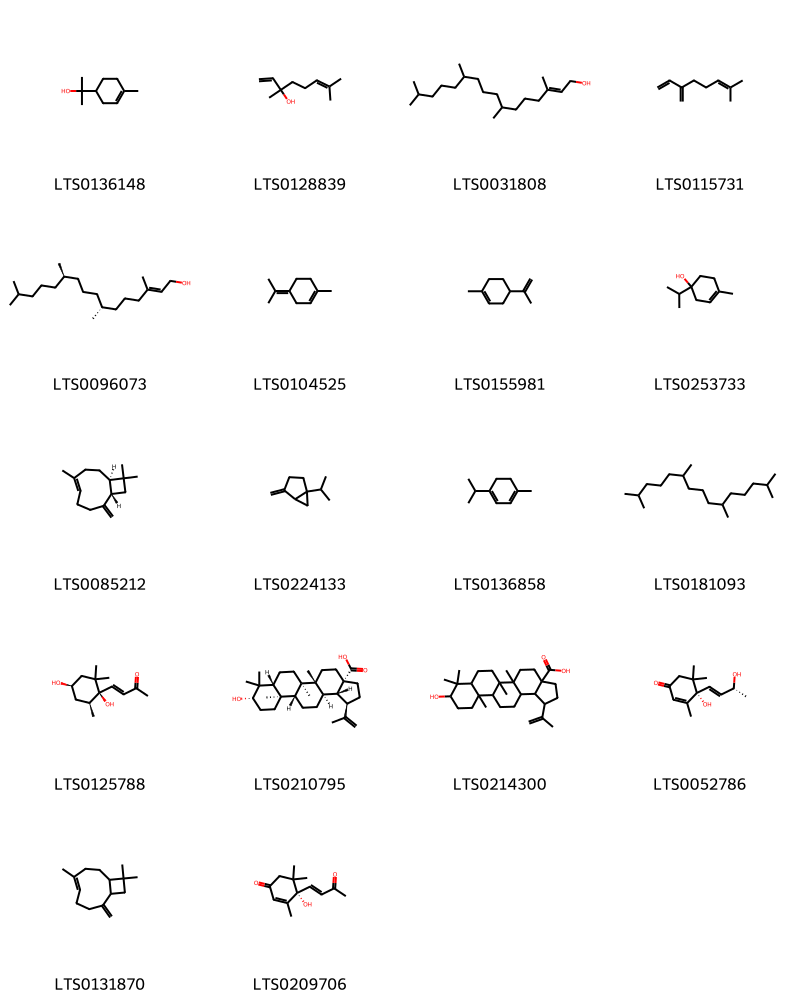
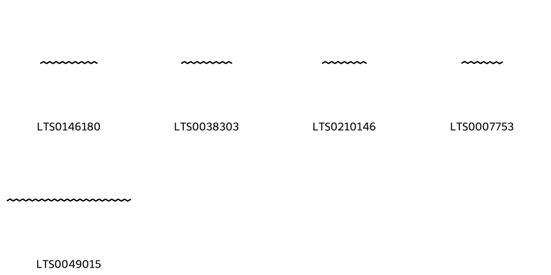
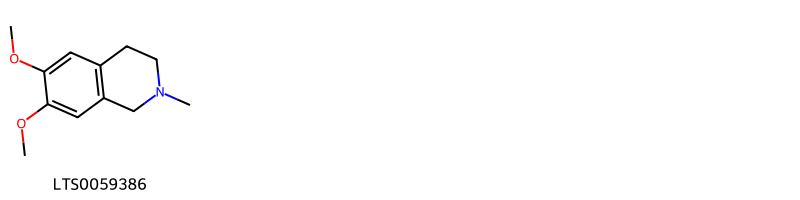

!!! abstract "Tóm tắt"

    Lá sen (Folium Nelumbinis nuciferae), một phần của cây sen (Nelumbo nucifera Gaertn.) thuộc họ Sen (Nelumbonaceae). Cây phân bố rộng rãi khắp Việt Nam. Từ xa xưa, nhân dân ta đã sử dụng lá sen như một bài thuốc giúp tháng thanh tán ứ, thanh thử hành thuỷ. Dùng chữa thử thấp tiết tả, thuỷ chí phù thũng, lỗi đầu phong, nôn ra máu, máu cam, băng trung huyết lỵ. Y học hiện đại đã chứng minh, trong lá sen chứa nhiều thành phần hóa học như tanin, alkaloid, flavonoid… Chính những chất này đã giúp lá sen có tác dụng dược lý an thần, bình tĩnh dục tính, ổn định nhịp tim, cầm máu và ứng dụng trong nhiều loại thuốc hiện nay.

## Thông tin về thực vật

Dược liệu **Sen (Lá)** từ bộ phận **Lá** từ loài *Nelumbo nucifera*.

**Mô tả thực vật:** Sen là một loại cây mọc ở dưới nước, thân rễ hình trụ mọc ở trong bùn thường gọi là ngó sen hay ngẫu tiết, ăn được, lá (liên diệp) mọc lên khỏi mặt nước, cuống lá dài, có gai nhỏ, phiến lá hình khiên, to, đường kính 60-70cm có gần toả tròn. Hoa to màu trắng hay đỏ hồng, đều lưỡng tính. Đài 3-5, màu lục. Tràng gồm rất nhiều cánh màu hồng hay trắng một phần, những cánh ngoài còn có màu lục như lá đài. Nhị nhiều, bao phấn 2 ô, nứt theo một kẽ dọc. Trung đới mọc dài ra thành một phần hình trắng thường gọi là gạo sen dùng để ướp chè. Nhiều lá noãn rời nhau đựng trong một để hoa loe ra thành hình ngược gọi là gương sen hay liên phòng. Mỗi lá noãn có 1-2 tiểu noãn. Quả (thường gọi là hạt sen) chứa một hạt (liên nhục) không nội nhũ. Hai lá mầm dày. Chồi mầm (liên tâm) gồm 4 lá non gập vào phía trong.

*Tài liệu tham khảo:* "Những cây thuốc và vị thuốc Việt Nam" - Đỗ Tất Lợi 
Trong dược điển Việt nam, một loài được sử dụng làm dược liệu là *Nelumbo nucifera*. 
Chưa có thông tin về loài này trên gibf

## Thông tin về dược liệu 

### Định danh

!!! info "Thông tin về tên gọi"

    - Dược liệu tiếng Việt: Liên diệp
    - Dược liệu tiếng Trung: None (None)
    - Dược liệu tiếng Anh: None
    - Dược liệu latin thông dụng: Folium Nelumbinis
    - Dược liệu latin kiểu DĐVN: *folium nelumbinis nuciferae*
    - Dược liệu latin kiểu DĐVN: *None*
    - Dược liệu latin kiểu thông tư: *Folium Nelumbinis*
    - Bộ phận dùng: Lá (Folium)

### Mô tả dược liệu 

- **Theo dược điển Việt nam V:** 
Lá nguyên hình tròn, nhăn nheo, nhàu nát, đường kính 30 cm đến 60 cm, mặt trên màu lục tro, hơi nháp, mặt dưới màu lục nâu, nhẵn bóng, mép nguyên, ở giữa lá có vết tích của cuống lá lồi lên màu nâu. Lá có từ 17 đến 23 gân tỏa tròn hình nan hoa bánh xe. Gân lồi về phía mặt dưới lá. Lá khô giòn, dễ vụn nát, có mùi thơm.

- **Mô tả dược liệu theo thông tư chế biến dược liệu theo phương pháp cổ truyền:** 

### Chế biến 

- **Chế biến theo dược điển việt nam V**: 
Thu hái vào mùa hạ và mùa thu, khi cây bắt đầu nở hoa, cắt lấy lá bánh tẻ, phơi nắng cho khô 7 đến 8 phần 10, cẳt bò cuống, gấp lá thành hình bán nguyệt, phơi tiếp đến khô.

Lá Sen (Hà diệp) khô, phun nước cho hơi mềm, thái thành các dải, miếng, phơi hoặc sấy khô. Lá sen thán sao (Hà diệp thán, thán lá sen): Lấy lá Sen sạch đã thái thành dải, cho vào nồi kín, nung chín kỳ, để nguội, lấy ra.

- **Chế biến theo thông tư:** 

--- 

## Thành phần hóa học

- Theo tài liệu của GS. Đỗ Tất Lợi:  (1) Nhóm hóa học:
- Tanin
- Alcaloid: nuciferin, anonain, roemerin, pronuciferin, N-nornuciferin, O-nornuciferin, N-methyl- coclaurin, 4-methyl-N-methylcoclaurin, nepherin, liriodenin, dehydroroemerin, armepavin, dehydronuciferin, dehydroanonain, N-methylsococlaurin. Trong đó,  Nuciferin là thành phần chính. 
- Flavonoid:quercetin, isoquercitrin, bucocyanidin, leucodelphinidin.
(2) Biomaker
- Nuciferin
- Quercetin
    

**Thành phần hóa học từ loài **Nelumbo nucifera**

Theo cơ sở dữ liệu lotus, loài *Nelumbo nucifera* đã phân lập và xác định được **169** hoạt chất thuộc về các nhóm Fatty Acyls, Phenols, Saturated hydrocarbons, Unsaturated hydrocarbons, Steroids and steroid derivatives, Flavonoids, Diazines, Sulfonyl halides, Purine nucleosides, Isoquinolines and derivatives, Benzene and substituted derivatives, Prenol lipids, Organooxygen compounds, Tetrahydroisoquinolines, Cinnamic acids and derivatives, Aporphines, Phenol ethers, Proaporphines, Benzofurans, Glycerolipids trong bảng dưới đây. Danh sách các hoạt chất như sau 4-terpineol [(LTS0253733)](https://lotus.naturalproducts.net/compound/lotus_id/LTS0253733), 2,3-dihydroquercetin [(LTS0040950)](https://lotus.naturalproducts.net/compound/lotus_id/LTS0040950), kaempherol [(LTS0155822)](https://lotus.naturalproducts.net/compound/lotus_id/LTS0155822), (9s)-15-methoxy-10-methyl-10-azatetracyclo[7.7.1.0²,⁷.0¹³,¹⁷]heptadeca-1(16),2,4,6,13(17),14-hexaen-16-ol [(LTS0147423)](https://lotus.naturalproducts.net/compound/lotus_id/LTS0147423), heptadecane [(LTS0038303)](https://lotus.naturalproducts.net/compound/lotus_id/LTS0038303), (+)-catechol [(LTS0117079)](https://lotus.naturalproducts.net/compound/lotus_id/LTS0117079), glyceryl 1-linoleate [(LTS0216344)](https://lotus.naturalproducts.net/compound/lotus_id/LTS0216344), pristane [(LTS0181093)](https://lotus.naturalproducts.net/compound/lotus_id/LTS0181093), methanone, dicyclohexyl- [(LTS0069653)](https://lotus.naturalproducts.net/compound/lotus_id/LTS0069653), 15,16-dimethoxy-10-methyl-10-azatetracyclo[7.7.1.0²,⁷.0¹³,¹⁷]heptadeca-1(17),2(7),3,5,8,13,15-heptaene-11,12-dione [(LTS0109417)](https://lotus.naturalproducts.net/compound/lotus_id/LTS0109417), 9-hydroxy-5a,5b,8,8,11a-pentamethyl-1-(prop-1-en-2-yl)-hexadecahydrocyclopenta[a]chrysene-3a-carboxylic acid [(LTS0214300)](https://lotus.naturalproducts.net/compound/lotus_id/LTS0214300), 15-methoxy-10-azatetracyclo[7.7.1.0²,⁷.0¹³,¹⁷]heptadeca-1(16),2,4,6,13(17),14-hexaen-16-ol [(LTS0228757)](https://lotus.naturalproducts.net/compound/lotus_id/LTS0228757), 4-[(6,7-dimethoxy-2-methyl-3,4-dihydro-1h-isoquinolin-1-yl)methyl]-2-({6-methoxy-1-[(4-methoxyphenyl)methyl]-2-methyl-3,4-dihydro-1h-isoquinolin-7-yl}oxy)phenol [(LTS0251766)](https://lotus.naturalproducts.net/compound/lotus_id/LTS0251766), nuciferine [(LTS0076096)](https://lotus.naturalproducts.net/compound/lotus_id/LTS0076096), 2-{[(6-methylheptyl)oxy]carbonyl}benzoic acid [(LTS0145170)](https://lotus.naturalproducts.net/compound/lotus_id/LTS0145170), lysicamine [(LTS0013970)](https://lotus.naturalproducts.net/compound/lotus_id/LTS0013970), astragalin [(LTS0249588)](https://lotus.naturalproducts.net/compound/lotus_id/LTS0249588), heneicosanoic acid [(LTS0022159)](https://lotus.naturalproducts.net/compound/lotus_id/LTS0022159), mono-n-butylphthalate [(LTS0020034)](https://lotus.naturalproducts.net/compound/lotus_id/LTS0020034), nuciferine [(LTS0249488)](https://lotus.naturalproducts.net/compound/lotus_id/LTS0249488), 2-{2,4-dioxabicyclo[1.1.0]butan-1-yl}-6-methylhept-5-en-2-ol [(LTS0060806)](https://lotus.naturalproducts.net/compound/lotus_id/LTS0060806), (12r)-11-methyl-3,5-dioxa-11-azapentacyclo[10.7.1.0²,⁶.0⁸,²⁰.0¹⁴,¹⁹]icosa-1(20),2(6),7,14,16,18-hexaene [(LTS0244800)](https://lotus.naturalproducts.net/compound/lotus_id/LTS0244800), hyperoside [(LTS0089156)](https://lotus.naturalproducts.net/compound/lotus_id/LTS0089156), anonaine [(LTS0160152)](https://lotus.naturalproducts.net/compound/lotus_id/LTS0160152), 2-(5-oxohexyl)cyclopentan-1-one [(LTS0145004)](https://lotus.naturalproducts.net/compound/lotus_id/LTS0145004), luteolin [(LTS0017052)](https://lotus.naturalproducts.net/compound/lotus_id/LTS0017052), megastigmatrienone a [(LTS0169544)](https://lotus.naturalproducts.net/compound/lotus_id/LTS0169544), hexahydropseudoionone [(LTS0263144)](https://lotus.naturalproducts.net/compound/lotus_id/LTS0263144), 2-(3,4-dihydroxyphenyl)-5,7-dihydroxy-3-{[3,4,5-trihydroxy-6-(hydroxymethyl)oxan-2-yl]oxy}chromen-4-one [(LTS0195312)](https://lotus.naturalproducts.net/compound/lotus_id/LTS0195312), 5-[(6,7-dimethoxy-2-methyl-3,4-dihydro-1h-isoquinolin-1-yl)methyl]-2-({6-methoxy-1-[(4-methoxyphenyl)methyl]-2-methyl-3,4-dihydro-1h-isoquinolin-7-yl}oxy)phenol [(LTS0075222)](https://lotus.naturalproducts.net/compound/lotus_id/LTS0075222), 16-methoxy-10-azatetracyclo[7.7.1.0²,⁷.0¹³,¹⁷]heptadeca-1(17),2,4,6,13,15-hexaen-15-ol [(LTS0093098)](https://lotus.naturalproducts.net/compound/lotus_id/LTS0093098), cycloartenol [(LTS0269561)](https://lotus.naturalproducts.net/compound/lotus_id/LTS0269561), dodecyl 3-sulfanylpropanoate [(LTS0240343)](https://lotus.naturalproducts.net/compound/lotus_id/LTS0240343), higenamine [(LTS0113417)](https://lotus.naturalproducts.net/compound/lotus_id/LTS0113417), 3-{[5-(1,2-dihydroxyethyl)-3,4-dihydroxyoxolan-2-yl]oxy}-2-(3,4-dihydroxyphenyl)-5,7-dihydroxychromen-4-one [(LTS0258961)](https://lotus.naturalproducts.net/compound/lotus_id/LTS0258961), arbutin [(LTS0210780)](https://lotus.naturalproducts.net/compound/lotus_id/LTS0210780), α catechin [(LTS0088008)](https://lotus.naturalproducts.net/compound/lotus_id/LTS0088008), (3e)-4-[(1r,4r,6s)-1,4-dihydroxy-2,2,6-trimethylcyclohexyl]but-3-en-2-one [(LTS0125788)](https://lotus.naturalproducts.net/compound/lotus_id/LTS0125788), betulinic acid [(LTS0210795)](https://lotus.naturalproducts.net/compound/lotus_id/LTS0210795), terpineol [(LTS0136148)](https://lotus.naturalproducts.net/compound/lotus_id/LTS0136148), (2e)-3-(4-hydroxyphenyl)-n-[2-(4-hydroxyphenyl)ethyl]prop-2-enimidic acid [(LTS0067822)](https://lotus.naturalproducts.net/compound/lotus_id/LTS0067822), (+)-epitaxifolin [(LTS0096746)](https://lotus.naturalproducts.net/compound/lotus_id/LTS0096746), (2r,3s,4r)-2-(3,4-dihydroxyphenyl)-4-[(2r,3r)-2-(3,4-dihydroxyphenyl)-3,5,7-trihydroxy-3,4-dihydro-2h-1-benzopyran-6-yl]-3,4-dihydro-2h-1-benzopyran-3,5,7-triol [(LTS0076760)](https://lotus.naturalproducts.net/compound/lotus_id/LTS0076760), 2-({[3,4,5-trihydroxy-6-(hydroxymethyl)oxan-2-yl]oxy}methyl)-6-[(2,6,6-trimethylcyclohex-1-en-1-yl)methoxy]oxane-3,4,5-triol [(LTS0266467)](https://lotus.naturalproducts.net/compound/lotus_id/LTS0266467), 3-(4-hydroxy-3-methoxyphenyl)-n-[2-(4-hydroxyphenyl)ethyl]prop-2-enimidic acid [(LTS0240896)](https://lotus.naturalproducts.net/compound/lotus_id/LTS0240896), thalifolin [(LTS0202583)](https://lotus.naturalproducts.net/compound/lotus_id/LTS0202583), (12s)-3,5-dioxa-11-azapentacyclo[10.7.1.0²,⁶.0⁸,²⁰.0¹⁴,¹⁹]icosa-1(20),2(6),7,14,16,18-hexaene [(LTS0109421)](https://lotus.naturalproducts.net/compound/lotus_id/LTS0109421), 1-(5-ethyl-6-methylhept-3-en-2-yl)-9a,11a-dimethyl-1h,2h,3h,3ah,3bh,4h,5h,8h,9h,9bh,10h,11h-cyclopenta[a]phenanthren-7-one [(LTS0047688)](https://lotus.naturalproducts.net/compound/lotus_id/LTS0047688), 10',11'-dimethoxy-5'-methyl-5'-azaspiro[cyclohexane-1,2'-tricyclo[6.3.1.0⁴,¹²]dodecane]-1'(11'),2,5,8'(12'),9'-pentaen-4-one [(LTS0272760)](https://lotus.naturalproducts.net/compound/lotus_id/LTS0272760), 4-vinylanisole [(LTS0020637)](https://lotus.naturalproducts.net/compound/lotus_id/LTS0020637), 1-chlorooctadecane [(LTS0150451)](https://lotus.naturalproducts.net/compound/lotus_id/LTS0150451), (+)-armepavine [(LTS0241944)](https://lotus.naturalproducts.net/compound/lotus_id/LTS0241944), 11-methyl-3,5-dioxa-11-azapentacyclo[10.7.1.0²,⁶.0⁸,²⁰.0¹⁴,¹⁹]icosa-1(20),2(6),7,12,14(19),15,17-heptaene [(LTS0105471)](https://lotus.naturalproducts.net/compound/lotus_id/LTS0105471), (1r)-1-[(4-hydroxy-3-{[(1r)-6-methoxy-1-[(4-methoxyphenyl)methyl]-2-methyl-3,4-dihydro-1h-isoquinolin-7-yl]oxy}phenyl)methyl]-6-methoxy-2-methyl-3,4-dihydro-1h-isoquinolin-7-ol [(LTS0213252)](https://lotus.naturalproducts.net/compound/lotus_id/LTS0213252), 3,5-dioxa-11-azapentacyclo[10.7.1.0²,⁶.0⁸,²⁰.0¹⁴,¹⁹]icosa-1(20),2(6),7,14,16,18-hexaene [(LTS0117403)](https://lotus.naturalproducts.net/compound/lotus_id/LTS0117403), tridecanol [(LTS0234524)](https://lotus.naturalproducts.net/compound/lotus_id/LTS0234524), benzo(f)quinoline [(LTS0208627)](https://lotus.naturalproducts.net/compound/lotus_id/LTS0208627), dauricine [(LTS0229813)](https://lotus.naturalproducts.net/compound/lotus_id/LTS0229813), hexadecane-1-sulfonyl chloride [(LTS0238455)](https://lotus.naturalproducts.net/compound/lotus_id/LTS0238455), 14-bromopentadecanoic acid [(LTS0030989)](https://lotus.naturalproducts.net/compound/lotus_id/LTS0030989), nonadecane [(LTS0146180)](https://lotus.naturalproducts.net/compound/lotus_id/LTS0146180), (9r)-16-methoxy-10-methyl-10-azatetracyclo[7.7.1.0²,⁷.0¹³,¹⁷]heptadeca-1(17),2,4,6,13,15-hexaen-15-ol [(LTS0064124)](https://lotus.naturalproducts.net/compound/lotus_id/LTS0064124), (9s)-15,16-dimethoxy-10-azatetracyclo[7.7.1.0²,⁷.0¹³,¹⁷]heptadeca-1(16),2,4,6,13(17),14-hexaene [(LTS0161962)](https://lotus.naturalproducts.net/compound/lotus_id/LTS0161962), 1-dodecanol [(LTS0116183)](https://lotus.naturalproducts.net/compound/lotus_id/LTS0116183), 5,7-dihydroxy-3-{[3,4,5-trihydroxy-6-(hydroxymethyl)oxan-2-yl]oxy}-2-(3,4,5-trihydroxyphenyl)chromen-4-one [(LTS0197005)](https://lotus.naturalproducts.net/compound/lotus_id/LTS0197005), (rs)-coclaurine [(LTS0003620)](https://lotus.naturalproducts.net/compound/lotus_id/LTS0003620), isoquercetin [(LTS0254337)](https://lotus.naturalproducts.net/compound/lotus_id/LTS0254337), heptadecene [(LTS0016494)](https://lotus.naturalproducts.net/compound/lotus_id/LTS0016494), phytol [(LTS0096073)](https://lotus.naturalproducts.net/compound/lotus_id/LTS0096073), (2r,3r,4s,5r)-2-(6-aminopurin-9-yl)-5-(methoxymethyl)oxolane-3,4-diol [(LTS0028647)](https://lotus.naturalproducts.net/compound/lotus_id/LTS0028647), tridec-2-yn-1-yl 4-fluorobenzoate [(LTS0237388)](https://lotus.naturalproducts.net/compound/lotus_id/LTS0237388), tricosanoic acid [(LTS0260192)](https://lotus.naturalproducts.net/compound/lotus_id/LTS0260192), cis-11-eicosenoic acid [(LTS0121218)](https://lotus.naturalproducts.net/compound/lotus_id/LTS0121218), pentadecyl prop-2-enoate [(LTS0032899)](https://lotus.naturalproducts.net/compound/lotus_id/LTS0032899), (-)-caaverine [(LTS0156427)](https://lotus.naturalproducts.net/compound/lotus_id/LTS0156427), cycloartenol [(LTS0060131)](https://lotus.naturalproducts.net/compound/lotus_id/LTS0060131), (2r,3s,4s,5r,6r)-2-({[(2r,3r,4s,5s,6r)-3,4,5-trihydroxy-6-(hydroxymethyl)oxan-2-yl]oxy}methyl)-6-[(2,6,6-trimethylcyclohex-1-en-1-yl)methoxy]oxane-3,4,5-triol [(LTS0154578)](https://lotus.naturalproducts.net/compound/lotus_id/LTS0154578), 5,7-dihydroxy-3-{[(2r,3r,4s,5s,6r)-3,4,5-trihydroxy-6-(hydroxymethyl)oxan-2-yl]oxy}-2-(3,4,5-trihydroxyphenyl)chromen-4-one [(LTS0190797)](https://lotus.naturalproducts.net/compound/lotus_id/LTS0190797), stigmast-5-en-3-ol, (3β)- [(LTS0204616)](https://lotus.naturalproducts.net/compound/lotus_id/LTS0204616), trifolin [(LTS0237581)](https://lotus.naturalproducts.net/compound/lotus_id/LTS0237581), 5-{[(1r)-6,7-dimethoxy-2-methyl-3,4-dihydro-1h-isoquinolin-1-yl]methyl}-2-{[(1r)-6-methoxy-1-[(4-methoxyphenyl)methyl]-2-methyl-3,4-dihydro-1h-isoquinolin-7-yl]oxy}phenol [(LTS0123021)](https://lotus.naturalproducts.net/compound/lotus_id/LTS0123021), (9r)-16-methoxy-10-methyl-10-azatetracyclo[7.7.1.0²,⁷.0¹³,¹⁷]heptadeca-1(17),2,4,6,13,15-hexaene [(LTS0210898)](https://lotus.naturalproducts.net/compound/lotus_id/LTS0210898), vitamin a acetate [(LTS0025681)](https://lotus.naturalproducts.net/compound/lotus_id/LTS0025681), 2-(hydroxymethyl)-6-[4-(hydroxymethyl)-2-methoxyphenoxy]oxane-3,4,5-triol [(LTS0098044)](https://lotus.naturalproducts.net/compound/lotus_id/LTS0098044), palmitic acid [(LTS0079439)](https://lotus.naturalproducts.net/compound/lotus_id/LTS0079439), nornuciferine [(LTS0034266)](https://lotus.naturalproducts.net/compound/lotus_id/LTS0034266), 15,16-dimethoxy-10-methyl-10-azatetracyclo[7.7.1.0²,⁷.0¹³,¹⁷]heptadeca-1(17),2(7),3,5,8,13,15-heptaen-8-ol [(LTS0193508)](https://lotus.naturalproducts.net/compound/lotus_id/LTS0193508), vanilloloside [(LTS0157289)](https://lotus.naturalproducts.net/compound/lotus_id/LTS0157289), (+)-coclaurine [(LTS0259496)](https://lotus.naturalproducts.net/compound/lotus_id/LTS0259496), oleoyl glycerol [(LTS0013965)](https://lotus.naturalproducts.net/compound/lotus_id/LTS0013965), ethyl arachidonate [(LTS0040332)](https://lotus.naturalproducts.net/compound/lotus_id/LTS0040332), sitogluside [(LTS0201798)](https://lotus.naturalproducts.net/compound/lotus_id/LTS0201798), (2z)-3-(4-hydroxy-3-methoxyphenyl)-n-[2-(4-hydroxyphenyl)ethyl]prop-2-enimidic acid [(LTS0255533)](https://lotus.naturalproducts.net/compound/lotus_id/LTS0255533), 1-(5-ethyl-6-methylheptan-2-yl)-9a,11a-dimethyl-1h,2h,3h,3ah,3bh,4h,5h,8h,9h,9bh,10h,11h-cyclopenta[a]phenanthren-7-one [(LTS0212002)](https://lotus.naturalproducts.net/compound/lotus_id/LTS0212002), 6,7-dimethoxy-2-methyl-3,4-dihydro-1h-isoquinoline [(LTS0059386)](https://lotus.naturalproducts.net/compound/lotus_id/LTS0059386), catechol [(LTS0090912)](https://lotus.naturalproducts.net/compound/lotus_id/LTS0090912), 3-rutinosyl quercetin [(LTS0032845)](https://lotus.naturalproducts.net/compound/lotus_id/LTS0032845), ethyl hexadec-9-enoate [(LTS0147439)](https://lotus.naturalproducts.net/compound/lotus_id/LTS0147439), 1-pentadecene [(LTS0248601)](https://lotus.naturalproducts.net/compound/lotus_id/LTS0248601), butyloctanol [(LTS0066074)](https://lotus.naturalproducts.net/compound/lotus_id/LTS0066074), quercetin [(LTS0004651)](https://lotus.naturalproducts.net/compound/lotus_id/LTS0004651), ethylmyristate [(LTS0033616)](https://lotus.naturalproducts.net/compound/lotus_id/LTS0033616), terpinolene [(LTS0104525)](https://lotus.naturalproducts.net/compound/lotus_id/LTS0104525), (+/-)-armepavine [(LTS0002502)](https://lotus.naturalproducts.net/compound/lotus_id/LTS0002502), 2(3h)-furanone [(LTS0235219)](https://lotus.naturalproducts.net/compound/lotus_id/LTS0235219), (9z)-1-chlorooctadec-9-ene [(LTS0036296)](https://lotus.naturalproducts.net/compound/lotus_id/LTS0036296), pyrazine [(LTS0074122)](https://lotus.naturalproducts.net/compound/lotus_id/LTS0074122), 4-{[(1r)-6,7-dimethoxy-2-methyl-3,4-dihydro-1h-isoquinolin-1-yl]methyl}-2-({6-methoxy-1-[(4-methoxyphenyl)methyl]-2-methyl-3,4-dihydro-1h-isoquinolin-7-yl}oxy)phenol [(LTS0275704)](https://lotus.naturalproducts.net/compound/lotus_id/LTS0275704), tetracontane [(LTS0049015)](https://lotus.naturalproducts.net/compound/lotus_id/LTS0049015), dehydrovomifoliol [(LTS0209706)](https://lotus.naturalproducts.net/compound/lotus_id/LTS0209706), β-sitostenone [(LTS0049492)](https://lotus.naturalproducts.net/compound/lotus_id/LTS0049492), p-anisic acid [(LTS0123492)](https://lotus.naturalproducts.net/compound/lotus_id/LTS0123492), 4-{[(1r)-6,7-dimethoxy-2-methyl-3,4-dihydro-1h-isoquinolin-1-yl]methyl}-2-{[(1r)-1-[(4-hydroxyphenyl)methyl]-6-methoxy-2-methyl-3,4-dihydro-1h-isoquinolin-7-yl]oxy}phenol [(LTS0196456)](https://lotus.naturalproducts.net/compound/lotus_id/LTS0196456), caryophyllene [(LTS0131870)](https://lotus.naturalproducts.net/compound/lotus_id/LTS0131870), arachidyl alcohol [(LTS0230409)](https://lotus.naturalproducts.net/compound/lotus_id/LTS0230409), (6r,7ar)-6-hydroxy-4,4,7a-trimethyl-6,7-dihydro-5h-1-benzofuran-2-one [(LTS0027877)](https://lotus.naturalproducts.net/compound/lotus_id/LTS0027877), lotusine [(LTS0050545)](https://lotus.naturalproducts.net/compound/lotus_id/LTS0050545), 1-{[4-hydroxy-3-({6-methoxy-1-[(4-methoxyphenyl)methyl]-2-methyl-3,4-dihydro-1h-isoquinolin-7-yl}oxy)phenyl]methyl}-6-methoxy-2-methyl-3,4-dihydro-1h-isoquinolin-7-ol [(LTS0059076)](https://lotus.naturalproducts.net/compound/lotus_id/LTS0059076), dec-3-en-5-one [(LTS0233346)](https://lotus.naturalproducts.net/compound/lotus_id/LTS0233346), (+)-taxifolin [(LTS0090664)](https://lotus.naturalproducts.net/compound/lotus_id/LTS0090664), phytol [(LTS0031808)](https://lotus.naturalproducts.net/compound/lotus_id/LTS0031808), querciturone [(LTS0168861)](https://lotus.naturalproducts.net/compound/lotus_id/LTS0168861), 3-{[(2s,3r,4s,5s,6r)-4,5-dihydroxy-6-(hydroxymethyl)-3-{[(2s,3r,4s,5r)-3,4,5-trihydroxyoxan-2-yl]oxy}oxan-2-yl]oxy}-2-(3,4-dihydroxyphenyl)-5,7-dihydroxychromen-4-one [(LTS0005222)](https://lotus.naturalproducts.net/compound/lotus_id/LTS0005222), pronuciferine [(LTS0129107)](https://lotus.naturalproducts.net/compound/lotus_id/LTS0129107), asimilobine [(LTS0213923)](https://lotus.naturalproducts.net/compound/lotus_id/LTS0213923), caryophyllene [(LTS0085212)](https://lotus.naturalproducts.net/compound/lotus_id/LTS0085212), (e)-2-hexenal [(LTS0207868)](https://lotus.naturalproducts.net/compound/lotus_id/LTS0207868), narcissin [(LTS0177843)](https://lotus.naturalproducts.net/compound/lotus_id/LTS0177843), 2-methyl-1betah-coclaurine [(LTS0123407)](https://lotus.naturalproducts.net/compound/lotus_id/LTS0123407), 2-{[1-(5-ethyl-6-methylheptan-2-yl)-9a,11a-dimethyl-1h,2h,3h,3ah,3bh,4h,6h,7h,8h,9h,9bh,10h,11h-cyclopenta[a]phenanthren-7-yl]oxy}-6-(hydroxymethyl)oxane-3,4,5-triol [(LTS0158828)](https://lotus.naturalproducts.net/compound/lotus_id/LTS0158828), (7z)-hexadec-7-enal [(LTS0249616)](https://lotus.naturalproducts.net/compound/lotus_id/LTS0249616), α terpinene [(LTS0232891)](https://lotus.naturalproducts.net/compound/lotus_id/LTS0232891), r-(-)-asimilobine [(LTS0061350)](https://lotus.naturalproducts.net/compound/lotus_id/LTS0061350), 6-methoxy-1-[(4-methoxyphenyl)methyl]-2-methyl-3,4-dihydro-1h-isoquinoline [(LTS0109282)](https://lotus.naturalproducts.net/compound/lotus_id/LTS0109282), terpinene [(LTS0136858)](https://lotus.naturalproducts.net/compound/lotus_id/LTS0136858), sabinene [(LTS0224133)](https://lotus.naturalproducts.net/compound/lotus_id/LTS0224133), armepavine [(LTS0132808)](https://lotus.naturalproducts.net/compound/lotus_id/LTS0132808), decyl propionate [(LTS0054787)](https://lotus.naturalproducts.net/compound/lotus_id/LTS0054787), (9r)-15,16-dimethoxy-10-azatetracyclo[7.7.1.0²,⁷.0¹³,¹⁷]heptadeca-1(16),2,4,6,13(17),14-hexaene [(LTS0131511)](https://lotus.naturalproducts.net/compound/lotus_id/LTS0131511), liriodenine [(LTS0132761)](https://lotus.naturalproducts.net/compound/lotus_id/LTS0132761), 16-methoxy-10-methyl-10-azatetracyclo[7.7.1.0²,⁷.0¹³,¹⁷]heptadeca-1(17),2,4,6,13,15-hexaene [(LTS0134913)](https://lotus.naturalproducts.net/compound/lotus_id/LTS0134913), miquelianin [(LTS0045574)](https://lotus.naturalproducts.net/compound/lotus_id/LTS0045574), diacetone alcohol [(LTS0034046)](https://lotus.naturalproducts.net/compound/lotus_id/LTS0034046), pentadecane [(LTS0210146)](https://lotus.naturalproducts.net/compound/lotus_id/LTS0210146), (-)-higenamine [(LTS0191904)](https://lotus.naturalproducts.net/compound/lotus_id/LTS0191904), trifolin [(LTS0267055)](https://lotus.naturalproducts.net/compound/lotus_id/LTS0267055), p-hydroxybenzoic acid [(LTS0263634)](https://lotus.naturalproducts.net/compound/lotus_id/LTS0263634), 4-[(6,7-dimethoxy-2-methyl-3,4-dihydro-1h-isoquinolin-1-yl)methyl]-2-({1-[(4-hydroxyphenyl)methyl]-6-methoxy-2-methyl-3,4-dihydro-1h-isoquinolin-7-yl}oxy)phenol [(LTS0186661)](https://lotus.naturalproducts.net/compound/lotus_id/LTS0186661), 16-methoxy-10-methyl-10-azatetracyclo[7.7.1.0²,⁷.0¹³,¹⁷]heptadeca-1(17),2,4,6,13,15-hexaen-15-ol [(LTS0068370)](https://lotus.naturalproducts.net/compound/lotus_id/LTS0068370), tetradecane [(LTS0007753)](https://lotus.naturalproducts.net/compound/lotus_id/LTS0007753), hexyldecanol [(LTS0268745)](https://lotus.naturalproducts.net/compound/lotus_id/LTS0268745), quercetin-3-glucoside [(LTS0154393)](https://lotus.naturalproducts.net/compound/lotus_id/LTS0154393), 1-[(4-hydroxyphenyl)methyl]-6-methoxy-2-methyl-3,4-dihydro-1h-isoquinolin-7-ol [(LTS0108577)](https://lotus.naturalproducts.net/compound/lotus_id/LTS0108577), 4-{[(1r)-6,7-dimethoxy-2-methyl-3,4-dihydro-1h-isoquinolin-1-yl]methyl}-2-{[(1r)-6-methoxy-1-[(4-methoxyphenyl)methyl]-2-methyl-3,4-dihydro-1h-isoquinolin-7-yl]oxy}phenol [(LTS0084841)](https://lotus.naturalproducts.net/compound/lotus_id/LTS0084841), (-)-inositol [(LTS0047771)](https://lotus.naturalproducts.net/compound/lotus_id/LTS0047771), glyceryl palmitate [(LTS0073260)](https://lotus.naturalproducts.net/compound/lotus_id/LTS0073260), syringetin [(LTS0048042)](https://lotus.naturalproducts.net/compound/lotus_id/LTS0048042), myricetin 3-o-glucuronide [(LTS0016453)](https://lotus.naturalproducts.net/compound/lotus_id/LTS0016453), 3-{[4,5-dihydroxy-6-(hydroxymethyl)-3-[(3,4,5-trihydroxyoxan-2-yl)oxy]oxan-2-yl]oxy}-2-(3,4-dihydroxyphenyl)-5,7-dihydroxychromen-4-one [(LTS0030005)](https://lotus.naturalproducts.net/compound/lotus_id/LTS0030005), α-myrcene [(LTS0115731)](https://lotus.naturalproducts.net/compound/lotus_id/LTS0115731), limonene,  [(LTS0155981)](https://lotus.naturalproducts.net/compound/lotus_id/LTS0155981), glyceryl 2-palmitate [(LTS0114003)](https://lotus.naturalproducts.net/compound/lotus_id/LTS0114003), 11-methyl-3,5-dioxa-11-azapentacyclo[10.7.1.0²,⁶.0⁸,²⁰.0¹⁴,¹⁹]icosa-1(20),2(6),7,14,16,18-hexaene [(LTS0155012)](https://lotus.naturalproducts.net/compound/lotus_id/LTS0155012), (6s,9r)-vomifoliol [(LTS0052786)](https://lotus.naturalproducts.net/compound/lotus_id/LTS0052786), (1r,3as,3bs,9ar,9bs,11ar)-1-[(2r,3e,5s)-5-ethyl-6-methylhept-3-en-2-yl]-9a,11a-dimethyl-1h,2h,3h,3ah,3bh,4h,5h,8h,9h,9bh,10h,11h-cyclopenta[a]phenanthren-7-one [(LTS0039266)](https://lotus.naturalproducts.net/compound/lotus_id/LTS0039266), (2r,3s,4r)-2-(3,4-dihydroxyphenyl)-4-[(2r,3s)-2-(3,4-dihydroxyphenyl)-3,5,7-trihydroxy-3,4-dihydro-2h-1-benzopyran-6-yl]-3,4-dihydro-2h-1-benzopyran-3,5,7-triol [(LTS0173939)](https://lotus.naturalproducts.net/compound/lotus_id/LTS0173939), linalool, (+-)- [(LTS0128839)](https://lotus.naturalproducts.net/compound/lotus_id/LTS0128839), rutin [(LTS0042292)](https://lotus.naturalproducts.net/compound/lotus_id/LTS0042292), (2e)-3-(4-hydroxy-3-methoxyphenyl)-n-[2-(4-hydroxyphenyl)ethyl]prop-2-enimidic acid [(LTS0187051)](https://lotus.naturalproducts.net/compound/lotus_id/LTS0187051). 
        
| chemicalTaxonomyClassyfireClass     |   smiles_count |
|:------------------------------------|---------------:|
| Aporphines                          |            889 |
| Benzene and substituted derivatives |             59 |
| Benzofurans                         |             37 |
| Cinnamic acids and derivatives      |            107 |
| Diazines                            |              8 |
| Fatty Acyls                         |            286 |
| Flavonoids                          |           2120 |
| Glycerolipids                       |             89 |
| Isoquinolines and derivatives       |           1191 |
| Organooxygen compounds              |            365 |
| Phenol ethers                       |             15 |
| Phenols                             |             37 |
| Prenol lipids                       |            604 |
| Proaporphines                       |             88 |
| Purine nucleosides                  |             50 |
| Saturated hydrocarbons              |            105 |
| Steroids and steroid derivatives    |            661 |
| Sulfonyl halides                    |             27 |
| Tetrahydroisoquinolines             |             23 |
| Unsaturated hydrocarbons            |             52 |

            
### Nhóm Aporphines
<figure markdown="span">
    { width=100% }
<figcaption>Hình ảnh cấu trúc hóa học của hoạt chất thuộc nhóm *Aporphines*. Tên thường gọi của các hoạt chất tương ứng là (9s)-15,16-dimethoxy-10-azatetracyclo[7.7.1.0²,⁷.0¹³,¹⁷]heptadeca-1(16),2,4,6,13(17),14-hexaene [(LTS0161962)](https://lotus.naturalproducts.net/compound/lotus_id/LTS0161962), 16-methoxy-10-methyl-10-azatetracyclo[7.7.1.0²,⁷.0¹³,¹⁷]heptadeca-1(17),2,4,6,13,15-hexaen-15-ol [(LTS0068370)](https://lotus.naturalproducts.net/compound/lotus_id/LTS0068370), nuciferine [(LTS0076096)](https://lotus.naturalproducts.net/compound/lotus_id/LTS0076096), (12s)-3,5-dioxa-11-azapentacyclo[10.7.1.0²,⁶.0⁸,²⁰.0¹⁴,¹⁹]icosa-1(20),2(6),7,14,16,18-hexaene [(LTS0109421)](https://lotus.naturalproducts.net/compound/lotus_id/LTS0109421), 11-methyl-3,5-dioxa-11-azapentacyclo[10.7.1.0²,⁶.0⁸,²⁰.0¹⁴,¹⁹]icosa-1(20),2(6),7,14,16,18-hexaene [(LTS0155012)](https://lotus.naturalproducts.net/compound/lotus_id/LTS0155012), 3,5-dioxa-11-azapentacyclo[10.7.1.0²,⁶.0⁸,²⁰.0¹⁴,¹⁹]icosa-1(20),2(6),7,14,16,18-hexaene [(LTS0117403)](https://lotus.naturalproducts.net/compound/lotus_id/LTS0117403), (12r)-11-methyl-3,5-dioxa-11-azapentacyclo[10.7.1.0²,⁶.0⁸,²⁰.0¹⁴,¹⁹]icosa-1(20),2(6),7,14,16,18-hexaene [(LTS0244800)](https://lotus.naturalproducts.net/compound/lotus_id/LTS0244800), nornuciferine [(LTS0034266)](https://lotus.naturalproducts.net/compound/lotus_id/LTS0034266), nuciferine [(LTS0249488)](https://lotus.naturalproducts.net/compound/lotus_id/LTS0249488), (9r)-16-methoxy-10-methyl-10-azatetracyclo[7.7.1.0²,⁷.0¹³,¹⁷]heptadeca-1(17),2,4,6,13,15-hexaen-15-ol [(LTS0064124)](https://lotus.naturalproducts.net/compound/lotus_id/LTS0064124), r-(-)-asimilobine [(LTS0061350)](https://lotus.naturalproducts.net/compound/lotus_id/LTS0061350), lysicamine [(LTS0013970)](https://lotus.naturalproducts.net/compound/lotus_id/LTS0013970), 16-methoxy-10-methyl-10-azatetracyclo[7.7.1.0²,⁷.0¹³,¹⁷]heptadeca-1(17),2,4,6,13,15-hexaene [(LTS0134913)](https://lotus.naturalproducts.net/compound/lotus_id/LTS0134913), (9r)-15,16-dimethoxy-10-azatetracyclo[7.7.1.0²,⁷.0¹³,¹⁷]heptadeca-1(16),2,4,6,13(17),14-hexaene [(LTS0131511)](https://lotus.naturalproducts.net/compound/lotus_id/LTS0131511), anonaine [(LTS0160152)](https://lotus.naturalproducts.net/compound/lotus_id/LTS0160152), 11-methyl-3,5-dioxa-11-azapentacyclo[10.7.1.0²,⁶.0⁸,²⁰.0¹⁴,¹⁹]icosa-1(20),2(6),7,12,14(19),15,17-heptaene [(LTS0105471)](https://lotus.naturalproducts.net/compound/lotus_id/LTS0105471), liriodenine [(LTS0132761)](https://lotus.naturalproducts.net/compound/lotus_id/LTS0132761), (9s)-15-methoxy-10-methyl-10-azatetracyclo[7.7.1.0²,⁷.0¹³,¹⁷]heptadeca-1(16),2,4,6,13(17),14-hexaen-16-ol [(LTS0147423)](https://lotus.naturalproducts.net/compound/lotus_id/LTS0147423), 15,16-dimethoxy-10-methyl-10-azatetracyclo[7.7.1.0²,⁷.0¹³,¹⁷]heptadeca-1(17),2(7),3,5,8,13,15-heptaen-8-ol [(LTS0193508)](https://lotus.naturalproducts.net/compound/lotus_id/LTS0193508), 16-methoxy-10-azatetracyclo[7.7.1.0²,⁷.0¹³,¹⁷]heptadeca-1(17),2,4,6,13,15-hexaen-15-ol [(LTS0093098)](https://lotus.naturalproducts.net/compound/lotus_id/LTS0093098), 15,16-dimethoxy-10-methyl-10-azatetracyclo[7.7.1.0²,⁷.0¹³,¹⁷]heptadeca-1(17),2(7),3,5,8,13,15-heptaene-11,12-dione [(LTS0109417)](https://lotus.naturalproducts.net/compound/lotus_id/LTS0109417), (-)-caaverine [(LTS0156427)](https://lotus.naturalproducts.net/compound/lotus_id/LTS0156427), asimilobine [(LTS0213923)](https://lotus.naturalproducts.net/compound/lotus_id/LTS0213923), (9r)-16-methoxy-10-methyl-10-azatetracyclo[7.7.1.0²,⁷.0¹³,¹⁷]heptadeca-1(17),2,4,6,13,15-hexaene [(LTS0210898)](https://lotus.naturalproducts.net/compound/lotus_id/LTS0210898), 15-methoxy-10-azatetracyclo[7.7.1.0²,⁷.0¹³,¹⁷]heptadeca-1(16),2,4,6,13(17),14-hexaen-16-ol [(LTS0228757)](https://lotus.naturalproducts.net/compound/lotus_id/LTS0228757).</figcaption>
</figure>

            
            
### Nhóm Aporphines
<figure markdown="span">
    { width=100% }
<figcaption>Hình ảnh cấu trúc hóa học của hoạt chất thuộc nhóm *Aporphines*. Tên thường gọi của các hoạt chất tương ứng là (9s)-15,16-dimethoxy-10-azatetracyclo[7.7.1.0²,⁷.0¹³,¹⁷]heptadeca-1(16),2,4,6,13(17),14-hexaene [(LTS0161962)](https://lotus.naturalproducts.net/compound/lotus_id/LTS0161962), 16-methoxy-10-methyl-10-azatetracyclo[7.7.1.0²,⁷.0¹³,¹⁷]heptadeca-1(17),2,4,6,13,15-hexaen-15-ol [(LTS0068370)](https://lotus.naturalproducts.net/compound/lotus_id/LTS0068370), nuciferine [(LTS0076096)](https://lotus.naturalproducts.net/compound/lotus_id/LTS0076096), (12s)-3,5-dioxa-11-azapentacyclo[10.7.1.0²,⁶.0⁸,²⁰.0¹⁴,¹⁹]icosa-1(20),2(6),7,14,16,18-hexaene [(LTS0109421)](https://lotus.naturalproducts.net/compound/lotus_id/LTS0109421), 11-methyl-3,5-dioxa-11-azapentacyclo[10.7.1.0²,⁶.0⁸,²⁰.0¹⁴,¹⁹]icosa-1(20),2(6),7,14,16,18-hexaene [(LTS0155012)](https://lotus.naturalproducts.net/compound/lotus_id/LTS0155012), 3,5-dioxa-11-azapentacyclo[10.7.1.0²,⁶.0⁸,²⁰.0¹⁴,¹⁹]icosa-1(20),2(6),7,14,16,18-hexaene [(LTS0117403)](https://lotus.naturalproducts.net/compound/lotus_id/LTS0117403), (12r)-11-methyl-3,5-dioxa-11-azapentacyclo[10.7.1.0²,⁶.0⁸,²⁰.0¹⁴,¹⁹]icosa-1(20),2(6),7,14,16,18-hexaene [(LTS0244800)](https://lotus.naturalproducts.net/compound/lotus_id/LTS0244800), nornuciferine [(LTS0034266)](https://lotus.naturalproducts.net/compound/lotus_id/LTS0034266), nuciferine [(LTS0249488)](https://lotus.naturalproducts.net/compound/lotus_id/LTS0249488), (9r)-16-methoxy-10-methyl-10-azatetracyclo[7.7.1.0²,⁷.0¹³,¹⁷]heptadeca-1(17),2,4,6,13,15-hexaen-15-ol [(LTS0064124)](https://lotus.naturalproducts.net/compound/lotus_id/LTS0064124), r-(-)-asimilobine [(LTS0061350)](https://lotus.naturalproducts.net/compound/lotus_id/LTS0061350), lysicamine [(LTS0013970)](https://lotus.naturalproducts.net/compound/lotus_id/LTS0013970), 16-methoxy-10-methyl-10-azatetracyclo[7.7.1.0²,⁷.0¹³,¹⁷]heptadeca-1(17),2,4,6,13,15-hexaene [(LTS0134913)](https://lotus.naturalproducts.net/compound/lotus_id/LTS0134913), (9r)-15,16-dimethoxy-10-azatetracyclo[7.7.1.0²,⁷.0¹³,¹⁷]heptadeca-1(16),2,4,6,13(17),14-hexaene [(LTS0131511)](https://lotus.naturalproducts.net/compound/lotus_id/LTS0131511), anonaine [(LTS0160152)](https://lotus.naturalproducts.net/compound/lotus_id/LTS0160152), 11-methyl-3,5-dioxa-11-azapentacyclo[10.7.1.0²,⁶.0⁸,²⁰.0¹⁴,¹⁹]icosa-1(20),2(6),7,12,14(19),15,17-heptaene [(LTS0105471)](https://lotus.naturalproducts.net/compound/lotus_id/LTS0105471), liriodenine [(LTS0132761)](https://lotus.naturalproducts.net/compound/lotus_id/LTS0132761), (9s)-15-methoxy-10-methyl-10-azatetracyclo[7.7.1.0²,⁷.0¹³,¹⁷]heptadeca-1(16),2,4,6,13(17),14-hexaen-16-ol [(LTS0147423)](https://lotus.naturalproducts.net/compound/lotus_id/LTS0147423), 15,16-dimethoxy-10-methyl-10-azatetracyclo[7.7.1.0²,⁷.0¹³,¹⁷]heptadeca-1(17),2(7),3,5,8,13,15-heptaen-8-ol [(LTS0193508)](https://lotus.naturalproducts.net/compound/lotus_id/LTS0193508), 16-methoxy-10-azatetracyclo[7.7.1.0²,⁷.0¹³,¹⁷]heptadeca-1(17),2,4,6,13,15-hexaen-15-ol [(LTS0093098)](https://lotus.naturalproducts.net/compound/lotus_id/LTS0093098), 15,16-dimethoxy-10-methyl-10-azatetracyclo[7.7.1.0²,⁷.0¹³,¹⁷]heptadeca-1(17),2(7),3,5,8,13,15-heptaene-11,12-dione [(LTS0109417)](https://lotus.naturalproducts.net/compound/lotus_id/LTS0109417), (-)-caaverine [(LTS0156427)](https://lotus.naturalproducts.net/compound/lotus_id/LTS0156427), asimilobine [(LTS0213923)](https://lotus.naturalproducts.net/compound/lotus_id/LTS0213923), (9r)-16-methoxy-10-methyl-10-azatetracyclo[7.7.1.0²,⁷.0¹³,¹⁷]heptadeca-1(17),2,4,6,13,15-hexaene [(LTS0210898)](https://lotus.naturalproducts.net/compound/lotus_id/LTS0210898), 15-methoxy-10-azatetracyclo[7.7.1.0²,⁷.0¹³,¹⁷]heptadeca-1(16),2,4,6,13(17),14-hexaen-16-ol [(LTS0228757)](https://lotus.naturalproducts.net/compound/lotus_id/LTS0228757).</figcaption>
</figure>

### Nhóm Benzene and substituted derivatives
<figure markdown="span">
    { width=100% }
<figcaption>Hình ảnh cấu trúc hóa học của hoạt chất thuộc nhóm *Benzene and substituted derivatives*. Tên thường gọi của các hoạt chất tương ứng là mono-n-butylphthalate [(LTS0020034)](https://lotus.naturalproducts.net/compound/lotus_id/LTS0020034), p-anisic acid [(LTS0123492)](https://lotus.naturalproducts.net/compound/lotus_id/LTS0123492), p-hydroxybenzoic acid [(LTS0263634)](https://lotus.naturalproducts.net/compound/lotus_id/LTS0263634).</figcaption>
</figure>

            
            
### Nhóm Aporphines
<figure markdown="span">
    { width=100% }
<figcaption>Hình ảnh cấu trúc hóa học của hoạt chất thuộc nhóm *Aporphines*. Tên thường gọi của các hoạt chất tương ứng là (9s)-15,16-dimethoxy-10-azatetracyclo[7.7.1.0²,⁷.0¹³,¹⁷]heptadeca-1(16),2,4,6,13(17),14-hexaene [(LTS0161962)](https://lotus.naturalproducts.net/compound/lotus_id/LTS0161962), 16-methoxy-10-methyl-10-azatetracyclo[7.7.1.0²,⁷.0¹³,¹⁷]heptadeca-1(17),2,4,6,13,15-hexaen-15-ol [(LTS0068370)](https://lotus.naturalproducts.net/compound/lotus_id/LTS0068370), nuciferine [(LTS0076096)](https://lotus.naturalproducts.net/compound/lotus_id/LTS0076096), (12s)-3,5-dioxa-11-azapentacyclo[10.7.1.0²,⁶.0⁸,²⁰.0¹⁴,¹⁹]icosa-1(20),2(6),7,14,16,18-hexaene [(LTS0109421)](https://lotus.naturalproducts.net/compound/lotus_id/LTS0109421), 11-methyl-3,5-dioxa-11-azapentacyclo[10.7.1.0²,⁶.0⁸,²⁰.0¹⁴,¹⁹]icosa-1(20),2(6),7,14,16,18-hexaene [(LTS0155012)](https://lotus.naturalproducts.net/compound/lotus_id/LTS0155012), 3,5-dioxa-11-azapentacyclo[10.7.1.0²,⁶.0⁸,²⁰.0¹⁴,¹⁹]icosa-1(20),2(6),7,14,16,18-hexaene [(LTS0117403)](https://lotus.naturalproducts.net/compound/lotus_id/LTS0117403), (12r)-11-methyl-3,5-dioxa-11-azapentacyclo[10.7.1.0²,⁶.0⁸,²⁰.0¹⁴,¹⁹]icosa-1(20),2(6),7,14,16,18-hexaene [(LTS0244800)](https://lotus.naturalproducts.net/compound/lotus_id/LTS0244800), nornuciferine [(LTS0034266)](https://lotus.naturalproducts.net/compound/lotus_id/LTS0034266), nuciferine [(LTS0249488)](https://lotus.naturalproducts.net/compound/lotus_id/LTS0249488), (9r)-16-methoxy-10-methyl-10-azatetracyclo[7.7.1.0²,⁷.0¹³,¹⁷]heptadeca-1(17),2,4,6,13,15-hexaen-15-ol [(LTS0064124)](https://lotus.naturalproducts.net/compound/lotus_id/LTS0064124), r-(-)-asimilobine [(LTS0061350)](https://lotus.naturalproducts.net/compound/lotus_id/LTS0061350), lysicamine [(LTS0013970)](https://lotus.naturalproducts.net/compound/lotus_id/LTS0013970), 16-methoxy-10-methyl-10-azatetracyclo[7.7.1.0²,⁷.0¹³,¹⁷]heptadeca-1(17),2,4,6,13,15-hexaene [(LTS0134913)](https://lotus.naturalproducts.net/compound/lotus_id/LTS0134913), (9r)-15,16-dimethoxy-10-azatetracyclo[7.7.1.0²,⁷.0¹³,¹⁷]heptadeca-1(16),2,4,6,13(17),14-hexaene [(LTS0131511)](https://lotus.naturalproducts.net/compound/lotus_id/LTS0131511), anonaine [(LTS0160152)](https://lotus.naturalproducts.net/compound/lotus_id/LTS0160152), 11-methyl-3,5-dioxa-11-azapentacyclo[10.7.1.0²,⁶.0⁸,²⁰.0¹⁴,¹⁹]icosa-1(20),2(6),7,12,14(19),15,17-heptaene [(LTS0105471)](https://lotus.naturalproducts.net/compound/lotus_id/LTS0105471), liriodenine [(LTS0132761)](https://lotus.naturalproducts.net/compound/lotus_id/LTS0132761), (9s)-15-methoxy-10-methyl-10-azatetracyclo[7.7.1.0²,⁷.0¹³,¹⁷]heptadeca-1(16),2,4,6,13(17),14-hexaen-16-ol [(LTS0147423)](https://lotus.naturalproducts.net/compound/lotus_id/LTS0147423), 15,16-dimethoxy-10-methyl-10-azatetracyclo[7.7.1.0²,⁷.0¹³,¹⁷]heptadeca-1(17),2(7),3,5,8,13,15-heptaen-8-ol [(LTS0193508)](https://lotus.naturalproducts.net/compound/lotus_id/LTS0193508), 16-methoxy-10-azatetracyclo[7.7.1.0²,⁷.0¹³,¹⁷]heptadeca-1(17),2,4,6,13,15-hexaen-15-ol [(LTS0093098)](https://lotus.naturalproducts.net/compound/lotus_id/LTS0093098), 15,16-dimethoxy-10-methyl-10-azatetracyclo[7.7.1.0²,⁷.0¹³,¹⁷]heptadeca-1(17),2(7),3,5,8,13,15-heptaene-11,12-dione [(LTS0109417)](https://lotus.naturalproducts.net/compound/lotus_id/LTS0109417), (-)-caaverine [(LTS0156427)](https://lotus.naturalproducts.net/compound/lotus_id/LTS0156427), asimilobine [(LTS0213923)](https://lotus.naturalproducts.net/compound/lotus_id/LTS0213923), (9r)-16-methoxy-10-methyl-10-azatetracyclo[7.7.1.0²,⁷.0¹³,¹⁷]heptadeca-1(17),2,4,6,13,15-hexaene [(LTS0210898)](https://lotus.naturalproducts.net/compound/lotus_id/LTS0210898), 15-methoxy-10-azatetracyclo[7.7.1.0²,⁷.0¹³,¹⁷]heptadeca-1(16),2,4,6,13(17),14-hexaen-16-ol [(LTS0228757)](https://lotus.naturalproducts.net/compound/lotus_id/LTS0228757).</figcaption>
</figure>

### Nhóm Benzene and substituted derivatives
<figure markdown="span">
    { width=100% }
<figcaption>Hình ảnh cấu trúc hóa học của hoạt chất thuộc nhóm *Benzene and substituted derivatives*. Tên thường gọi của các hoạt chất tương ứng là mono-n-butylphthalate [(LTS0020034)](https://lotus.naturalproducts.net/compound/lotus_id/LTS0020034), p-anisic acid [(LTS0123492)](https://lotus.naturalproducts.net/compound/lotus_id/LTS0123492), p-hydroxybenzoic acid [(LTS0263634)](https://lotus.naturalproducts.net/compound/lotus_id/LTS0263634).</figcaption>
</figure>

### Nhóm Benzofurans
<figure markdown="span">
    { width=100% }
<figcaption>Hình ảnh cấu trúc hóa học của hoạt chất thuộc nhóm *Benzofurans*. Tên thường gọi của các hoạt chất tương ứng là (6r,7ar)-6-hydroxy-4,4,7a-trimethyl-6,7-dihydro-5h-1-benzofuran-2-one [(LTS0027877)](https://lotus.naturalproducts.net/compound/lotus_id/LTS0027877).</figcaption>
</figure>

            
            
### Nhóm Aporphines
<figure markdown="span">
    { width=100% }
<figcaption>Hình ảnh cấu trúc hóa học của hoạt chất thuộc nhóm *Aporphines*. Tên thường gọi của các hoạt chất tương ứng là (9s)-15,16-dimethoxy-10-azatetracyclo[7.7.1.0²,⁷.0¹³,¹⁷]heptadeca-1(16),2,4,6,13(17),14-hexaene [(LTS0161962)](https://lotus.naturalproducts.net/compound/lotus_id/LTS0161962), 16-methoxy-10-methyl-10-azatetracyclo[7.7.1.0²,⁷.0¹³,¹⁷]heptadeca-1(17),2,4,6,13,15-hexaen-15-ol [(LTS0068370)](https://lotus.naturalproducts.net/compound/lotus_id/LTS0068370), nuciferine [(LTS0076096)](https://lotus.naturalproducts.net/compound/lotus_id/LTS0076096), (12s)-3,5-dioxa-11-azapentacyclo[10.7.1.0²,⁶.0⁸,²⁰.0¹⁴,¹⁹]icosa-1(20),2(6),7,14,16,18-hexaene [(LTS0109421)](https://lotus.naturalproducts.net/compound/lotus_id/LTS0109421), 11-methyl-3,5-dioxa-11-azapentacyclo[10.7.1.0²,⁶.0⁸,²⁰.0¹⁴,¹⁹]icosa-1(20),2(6),7,14,16,18-hexaene [(LTS0155012)](https://lotus.naturalproducts.net/compound/lotus_id/LTS0155012), 3,5-dioxa-11-azapentacyclo[10.7.1.0²,⁶.0⁸,²⁰.0¹⁴,¹⁹]icosa-1(20),2(6),7,14,16,18-hexaene [(LTS0117403)](https://lotus.naturalproducts.net/compound/lotus_id/LTS0117403), (12r)-11-methyl-3,5-dioxa-11-azapentacyclo[10.7.1.0²,⁶.0⁸,²⁰.0¹⁴,¹⁹]icosa-1(20),2(6),7,14,16,18-hexaene [(LTS0244800)](https://lotus.naturalproducts.net/compound/lotus_id/LTS0244800), nornuciferine [(LTS0034266)](https://lotus.naturalproducts.net/compound/lotus_id/LTS0034266), nuciferine [(LTS0249488)](https://lotus.naturalproducts.net/compound/lotus_id/LTS0249488), (9r)-16-methoxy-10-methyl-10-azatetracyclo[7.7.1.0²,⁷.0¹³,¹⁷]heptadeca-1(17),2,4,6,13,15-hexaen-15-ol [(LTS0064124)](https://lotus.naturalproducts.net/compound/lotus_id/LTS0064124), r-(-)-asimilobine [(LTS0061350)](https://lotus.naturalproducts.net/compound/lotus_id/LTS0061350), lysicamine [(LTS0013970)](https://lotus.naturalproducts.net/compound/lotus_id/LTS0013970), 16-methoxy-10-methyl-10-azatetracyclo[7.7.1.0²,⁷.0¹³,¹⁷]heptadeca-1(17),2,4,6,13,15-hexaene [(LTS0134913)](https://lotus.naturalproducts.net/compound/lotus_id/LTS0134913), (9r)-15,16-dimethoxy-10-azatetracyclo[7.7.1.0²,⁷.0¹³,¹⁷]heptadeca-1(16),2,4,6,13(17),14-hexaene [(LTS0131511)](https://lotus.naturalproducts.net/compound/lotus_id/LTS0131511), anonaine [(LTS0160152)](https://lotus.naturalproducts.net/compound/lotus_id/LTS0160152), 11-methyl-3,5-dioxa-11-azapentacyclo[10.7.1.0²,⁶.0⁸,²⁰.0¹⁴,¹⁹]icosa-1(20),2(6),7,12,14(19),15,17-heptaene [(LTS0105471)](https://lotus.naturalproducts.net/compound/lotus_id/LTS0105471), liriodenine [(LTS0132761)](https://lotus.naturalproducts.net/compound/lotus_id/LTS0132761), (9s)-15-methoxy-10-methyl-10-azatetracyclo[7.7.1.0²,⁷.0¹³,¹⁷]heptadeca-1(16),2,4,6,13(17),14-hexaen-16-ol [(LTS0147423)](https://lotus.naturalproducts.net/compound/lotus_id/LTS0147423), 15,16-dimethoxy-10-methyl-10-azatetracyclo[7.7.1.0²,⁷.0¹³,¹⁷]heptadeca-1(17),2(7),3,5,8,13,15-heptaen-8-ol [(LTS0193508)](https://lotus.naturalproducts.net/compound/lotus_id/LTS0193508), 16-methoxy-10-azatetracyclo[7.7.1.0²,⁷.0¹³,¹⁷]heptadeca-1(17),2,4,6,13,15-hexaen-15-ol [(LTS0093098)](https://lotus.naturalproducts.net/compound/lotus_id/LTS0093098), 15,16-dimethoxy-10-methyl-10-azatetracyclo[7.7.1.0²,⁷.0¹³,¹⁷]heptadeca-1(17),2(7),3,5,8,13,15-heptaene-11,12-dione [(LTS0109417)](https://lotus.naturalproducts.net/compound/lotus_id/LTS0109417), (-)-caaverine [(LTS0156427)](https://lotus.naturalproducts.net/compound/lotus_id/LTS0156427), asimilobine [(LTS0213923)](https://lotus.naturalproducts.net/compound/lotus_id/LTS0213923), (9r)-16-methoxy-10-methyl-10-azatetracyclo[7.7.1.0²,⁷.0¹³,¹⁷]heptadeca-1(17),2,4,6,13,15-hexaene [(LTS0210898)](https://lotus.naturalproducts.net/compound/lotus_id/LTS0210898), 15-methoxy-10-azatetracyclo[7.7.1.0²,⁷.0¹³,¹⁷]heptadeca-1(16),2,4,6,13(17),14-hexaen-16-ol [(LTS0228757)](https://lotus.naturalproducts.net/compound/lotus_id/LTS0228757).</figcaption>
</figure>

### Nhóm Benzene and substituted derivatives
<figure markdown="span">
    { width=100% }
<figcaption>Hình ảnh cấu trúc hóa học của hoạt chất thuộc nhóm *Benzene and substituted derivatives*. Tên thường gọi của các hoạt chất tương ứng là mono-n-butylphthalate [(LTS0020034)](https://lotus.naturalproducts.net/compound/lotus_id/LTS0020034), p-anisic acid [(LTS0123492)](https://lotus.naturalproducts.net/compound/lotus_id/LTS0123492), p-hydroxybenzoic acid [(LTS0263634)](https://lotus.naturalproducts.net/compound/lotus_id/LTS0263634).</figcaption>
</figure>

### Nhóm Benzofurans
<figure markdown="span">
    { width=100% }
<figcaption>Hình ảnh cấu trúc hóa học của hoạt chất thuộc nhóm *Benzofurans*. Tên thường gọi của các hoạt chất tương ứng là (6r,7ar)-6-hydroxy-4,4,7a-trimethyl-6,7-dihydro-5h-1-benzofuran-2-one [(LTS0027877)](https://lotus.naturalproducts.net/compound/lotus_id/LTS0027877).</figcaption>
</figure>

### Nhóm Cinnamic acids and derivatives
<figure markdown="span">
    { width=100% }
<figcaption>Hình ảnh cấu trúc hóa học của hoạt chất thuộc nhóm *Cinnamic acids and derivatives*. Tên thường gọi của các hoạt chất tương ứng là 3-(4-hydroxy-3-methoxyphenyl)-n-[2-(4-hydroxyphenyl)ethyl]prop-2-enimidic acid [(LTS0240896)](https://lotus.naturalproducts.net/compound/lotus_id/LTS0240896), (2e)-3-(4-hydroxyphenyl)-n-[2-(4-hydroxyphenyl)ethyl]prop-2-enimidic acid [(LTS0067822)](https://lotus.naturalproducts.net/compound/lotus_id/LTS0067822), (2z)-3-(4-hydroxy-3-methoxyphenyl)-n-[2-(4-hydroxyphenyl)ethyl]prop-2-enimidic acid [(LTS0255533)](https://lotus.naturalproducts.net/compound/lotus_id/LTS0255533).</figcaption>
</figure>

            
            
### Nhóm Aporphines
<figure markdown="span">
    { width=100% }
<figcaption>Hình ảnh cấu trúc hóa học của hoạt chất thuộc nhóm *Aporphines*. Tên thường gọi của các hoạt chất tương ứng là (9s)-15,16-dimethoxy-10-azatetracyclo[7.7.1.0²,⁷.0¹³,¹⁷]heptadeca-1(16),2,4,6,13(17),14-hexaene [(LTS0161962)](https://lotus.naturalproducts.net/compound/lotus_id/LTS0161962), 16-methoxy-10-methyl-10-azatetracyclo[7.7.1.0²,⁷.0¹³,¹⁷]heptadeca-1(17),2,4,6,13,15-hexaen-15-ol [(LTS0068370)](https://lotus.naturalproducts.net/compound/lotus_id/LTS0068370), nuciferine [(LTS0076096)](https://lotus.naturalproducts.net/compound/lotus_id/LTS0076096), (12s)-3,5-dioxa-11-azapentacyclo[10.7.1.0²,⁶.0⁸,²⁰.0¹⁴,¹⁹]icosa-1(20),2(6),7,14,16,18-hexaene [(LTS0109421)](https://lotus.naturalproducts.net/compound/lotus_id/LTS0109421), 11-methyl-3,5-dioxa-11-azapentacyclo[10.7.1.0²,⁶.0⁸,²⁰.0¹⁴,¹⁹]icosa-1(20),2(6),7,14,16,18-hexaene [(LTS0155012)](https://lotus.naturalproducts.net/compound/lotus_id/LTS0155012), 3,5-dioxa-11-azapentacyclo[10.7.1.0²,⁶.0⁸,²⁰.0¹⁴,¹⁹]icosa-1(20),2(6),7,14,16,18-hexaene [(LTS0117403)](https://lotus.naturalproducts.net/compound/lotus_id/LTS0117403), (12r)-11-methyl-3,5-dioxa-11-azapentacyclo[10.7.1.0²,⁶.0⁸,²⁰.0¹⁴,¹⁹]icosa-1(20),2(6),7,14,16,18-hexaene [(LTS0244800)](https://lotus.naturalproducts.net/compound/lotus_id/LTS0244800), nornuciferine [(LTS0034266)](https://lotus.naturalproducts.net/compound/lotus_id/LTS0034266), nuciferine [(LTS0249488)](https://lotus.naturalproducts.net/compound/lotus_id/LTS0249488), (9r)-16-methoxy-10-methyl-10-azatetracyclo[7.7.1.0²,⁷.0¹³,¹⁷]heptadeca-1(17),2,4,6,13,15-hexaen-15-ol [(LTS0064124)](https://lotus.naturalproducts.net/compound/lotus_id/LTS0064124), r-(-)-asimilobine [(LTS0061350)](https://lotus.naturalproducts.net/compound/lotus_id/LTS0061350), lysicamine [(LTS0013970)](https://lotus.naturalproducts.net/compound/lotus_id/LTS0013970), 16-methoxy-10-methyl-10-azatetracyclo[7.7.1.0²,⁷.0¹³,¹⁷]heptadeca-1(17),2,4,6,13,15-hexaene [(LTS0134913)](https://lotus.naturalproducts.net/compound/lotus_id/LTS0134913), (9r)-15,16-dimethoxy-10-azatetracyclo[7.7.1.0²,⁷.0¹³,¹⁷]heptadeca-1(16),2,4,6,13(17),14-hexaene [(LTS0131511)](https://lotus.naturalproducts.net/compound/lotus_id/LTS0131511), anonaine [(LTS0160152)](https://lotus.naturalproducts.net/compound/lotus_id/LTS0160152), 11-methyl-3,5-dioxa-11-azapentacyclo[10.7.1.0²,⁶.0⁸,²⁰.0¹⁴,¹⁹]icosa-1(20),2(6),7,12,14(19),15,17-heptaene [(LTS0105471)](https://lotus.naturalproducts.net/compound/lotus_id/LTS0105471), liriodenine [(LTS0132761)](https://lotus.naturalproducts.net/compound/lotus_id/LTS0132761), (9s)-15-methoxy-10-methyl-10-azatetracyclo[7.7.1.0²,⁷.0¹³,¹⁷]heptadeca-1(16),2,4,6,13(17),14-hexaen-16-ol [(LTS0147423)](https://lotus.naturalproducts.net/compound/lotus_id/LTS0147423), 15,16-dimethoxy-10-methyl-10-azatetracyclo[7.7.1.0²,⁷.0¹³,¹⁷]heptadeca-1(17),2(7),3,5,8,13,15-heptaen-8-ol [(LTS0193508)](https://lotus.naturalproducts.net/compound/lotus_id/LTS0193508), 16-methoxy-10-azatetracyclo[7.7.1.0²,⁷.0¹³,¹⁷]heptadeca-1(17),2,4,6,13,15-hexaen-15-ol [(LTS0093098)](https://lotus.naturalproducts.net/compound/lotus_id/LTS0093098), 15,16-dimethoxy-10-methyl-10-azatetracyclo[7.7.1.0²,⁷.0¹³,¹⁷]heptadeca-1(17),2(7),3,5,8,13,15-heptaene-11,12-dione [(LTS0109417)](https://lotus.naturalproducts.net/compound/lotus_id/LTS0109417), (-)-caaverine [(LTS0156427)](https://lotus.naturalproducts.net/compound/lotus_id/LTS0156427), asimilobine [(LTS0213923)](https://lotus.naturalproducts.net/compound/lotus_id/LTS0213923), (9r)-16-methoxy-10-methyl-10-azatetracyclo[7.7.1.0²,⁷.0¹³,¹⁷]heptadeca-1(17),2,4,6,13,15-hexaene [(LTS0210898)](https://lotus.naturalproducts.net/compound/lotus_id/LTS0210898), 15-methoxy-10-azatetracyclo[7.7.1.0²,⁷.0¹³,¹⁷]heptadeca-1(16),2,4,6,13(17),14-hexaen-16-ol [(LTS0228757)](https://lotus.naturalproducts.net/compound/lotus_id/LTS0228757).</figcaption>
</figure>

### Nhóm Benzene and substituted derivatives
<figure markdown="span">
    { width=100% }
<figcaption>Hình ảnh cấu trúc hóa học của hoạt chất thuộc nhóm *Benzene and substituted derivatives*. Tên thường gọi của các hoạt chất tương ứng là mono-n-butylphthalate [(LTS0020034)](https://lotus.naturalproducts.net/compound/lotus_id/LTS0020034), p-anisic acid [(LTS0123492)](https://lotus.naturalproducts.net/compound/lotus_id/LTS0123492), p-hydroxybenzoic acid [(LTS0263634)](https://lotus.naturalproducts.net/compound/lotus_id/LTS0263634).</figcaption>
</figure>

### Nhóm Benzofurans
<figure markdown="span">
    { width=100% }
<figcaption>Hình ảnh cấu trúc hóa học của hoạt chất thuộc nhóm *Benzofurans*. Tên thường gọi của các hoạt chất tương ứng là (6r,7ar)-6-hydroxy-4,4,7a-trimethyl-6,7-dihydro-5h-1-benzofuran-2-one [(LTS0027877)](https://lotus.naturalproducts.net/compound/lotus_id/LTS0027877).</figcaption>
</figure>

### Nhóm Cinnamic acids and derivatives
<figure markdown="span">
    { width=100% }
<figcaption>Hình ảnh cấu trúc hóa học của hoạt chất thuộc nhóm *Cinnamic acids and derivatives*. Tên thường gọi của các hoạt chất tương ứng là 3-(4-hydroxy-3-methoxyphenyl)-n-[2-(4-hydroxyphenyl)ethyl]prop-2-enimidic acid [(LTS0240896)](https://lotus.naturalproducts.net/compound/lotus_id/LTS0240896), (2e)-3-(4-hydroxyphenyl)-n-[2-(4-hydroxyphenyl)ethyl]prop-2-enimidic acid [(LTS0067822)](https://lotus.naturalproducts.net/compound/lotus_id/LTS0067822), (2z)-3-(4-hydroxy-3-methoxyphenyl)-n-[2-(4-hydroxyphenyl)ethyl]prop-2-enimidic acid [(LTS0255533)](https://lotus.naturalproducts.net/compound/lotus_id/LTS0255533).</figcaption>
</figure>

### Nhóm Diazines
<figure markdown="span">
    { width=100% }
<figcaption>Hình ảnh cấu trúc hóa học của hoạt chất thuộc nhóm *Diazines*. Tên thường gọi của các hoạt chất tương ứng là pyrazine [(LTS0074122)](https://lotus.naturalproducts.net/compound/lotus_id/LTS0074122).</figcaption>
</figure>

            
            
### Nhóm Aporphines
<figure markdown="span">
    { width=100% }
<figcaption>Hình ảnh cấu trúc hóa học của hoạt chất thuộc nhóm *Aporphines*. Tên thường gọi của các hoạt chất tương ứng là (9s)-15,16-dimethoxy-10-azatetracyclo[7.7.1.0²,⁷.0¹³,¹⁷]heptadeca-1(16),2,4,6,13(17),14-hexaene [(LTS0161962)](https://lotus.naturalproducts.net/compound/lotus_id/LTS0161962), 16-methoxy-10-methyl-10-azatetracyclo[7.7.1.0²,⁷.0¹³,¹⁷]heptadeca-1(17),2,4,6,13,15-hexaen-15-ol [(LTS0068370)](https://lotus.naturalproducts.net/compound/lotus_id/LTS0068370), nuciferine [(LTS0076096)](https://lotus.naturalproducts.net/compound/lotus_id/LTS0076096), (12s)-3,5-dioxa-11-azapentacyclo[10.7.1.0²,⁶.0⁸,²⁰.0¹⁴,¹⁹]icosa-1(20),2(6),7,14,16,18-hexaene [(LTS0109421)](https://lotus.naturalproducts.net/compound/lotus_id/LTS0109421), 11-methyl-3,5-dioxa-11-azapentacyclo[10.7.1.0²,⁶.0⁸,²⁰.0¹⁴,¹⁹]icosa-1(20),2(6),7,14,16,18-hexaene [(LTS0155012)](https://lotus.naturalproducts.net/compound/lotus_id/LTS0155012), 3,5-dioxa-11-azapentacyclo[10.7.1.0²,⁶.0⁸,²⁰.0¹⁴,¹⁹]icosa-1(20),2(6),7,14,16,18-hexaene [(LTS0117403)](https://lotus.naturalproducts.net/compound/lotus_id/LTS0117403), (12r)-11-methyl-3,5-dioxa-11-azapentacyclo[10.7.1.0²,⁶.0⁸,²⁰.0¹⁴,¹⁹]icosa-1(20),2(6),7,14,16,18-hexaene [(LTS0244800)](https://lotus.naturalproducts.net/compound/lotus_id/LTS0244800), nornuciferine [(LTS0034266)](https://lotus.naturalproducts.net/compound/lotus_id/LTS0034266), nuciferine [(LTS0249488)](https://lotus.naturalproducts.net/compound/lotus_id/LTS0249488), (9r)-16-methoxy-10-methyl-10-azatetracyclo[7.7.1.0²,⁷.0¹³,¹⁷]heptadeca-1(17),2,4,6,13,15-hexaen-15-ol [(LTS0064124)](https://lotus.naturalproducts.net/compound/lotus_id/LTS0064124), r-(-)-asimilobine [(LTS0061350)](https://lotus.naturalproducts.net/compound/lotus_id/LTS0061350), lysicamine [(LTS0013970)](https://lotus.naturalproducts.net/compound/lotus_id/LTS0013970), 16-methoxy-10-methyl-10-azatetracyclo[7.7.1.0²,⁷.0¹³,¹⁷]heptadeca-1(17),2,4,6,13,15-hexaene [(LTS0134913)](https://lotus.naturalproducts.net/compound/lotus_id/LTS0134913), (9r)-15,16-dimethoxy-10-azatetracyclo[7.7.1.0²,⁷.0¹³,¹⁷]heptadeca-1(16),2,4,6,13(17),14-hexaene [(LTS0131511)](https://lotus.naturalproducts.net/compound/lotus_id/LTS0131511), anonaine [(LTS0160152)](https://lotus.naturalproducts.net/compound/lotus_id/LTS0160152), 11-methyl-3,5-dioxa-11-azapentacyclo[10.7.1.0²,⁶.0⁸,²⁰.0¹⁴,¹⁹]icosa-1(20),2(6),7,12,14(19),15,17-heptaene [(LTS0105471)](https://lotus.naturalproducts.net/compound/lotus_id/LTS0105471), liriodenine [(LTS0132761)](https://lotus.naturalproducts.net/compound/lotus_id/LTS0132761), (9s)-15-methoxy-10-methyl-10-azatetracyclo[7.7.1.0²,⁷.0¹³,¹⁷]heptadeca-1(16),2,4,6,13(17),14-hexaen-16-ol [(LTS0147423)](https://lotus.naturalproducts.net/compound/lotus_id/LTS0147423), 15,16-dimethoxy-10-methyl-10-azatetracyclo[7.7.1.0²,⁷.0¹³,¹⁷]heptadeca-1(17),2(7),3,5,8,13,15-heptaen-8-ol [(LTS0193508)](https://lotus.naturalproducts.net/compound/lotus_id/LTS0193508), 16-methoxy-10-azatetracyclo[7.7.1.0²,⁷.0¹³,¹⁷]heptadeca-1(17),2,4,6,13,15-hexaen-15-ol [(LTS0093098)](https://lotus.naturalproducts.net/compound/lotus_id/LTS0093098), 15,16-dimethoxy-10-methyl-10-azatetracyclo[7.7.1.0²,⁷.0¹³,¹⁷]heptadeca-1(17),2(7),3,5,8,13,15-heptaene-11,12-dione [(LTS0109417)](https://lotus.naturalproducts.net/compound/lotus_id/LTS0109417), (-)-caaverine [(LTS0156427)](https://lotus.naturalproducts.net/compound/lotus_id/LTS0156427), asimilobine [(LTS0213923)](https://lotus.naturalproducts.net/compound/lotus_id/LTS0213923), (9r)-16-methoxy-10-methyl-10-azatetracyclo[7.7.1.0²,⁷.0¹³,¹⁷]heptadeca-1(17),2,4,6,13,15-hexaene [(LTS0210898)](https://lotus.naturalproducts.net/compound/lotus_id/LTS0210898), 15-methoxy-10-azatetracyclo[7.7.1.0²,⁷.0¹³,¹⁷]heptadeca-1(16),2,4,6,13(17),14-hexaen-16-ol [(LTS0228757)](https://lotus.naturalproducts.net/compound/lotus_id/LTS0228757).</figcaption>
</figure>

### Nhóm Benzene and substituted derivatives
<figure markdown="span">
    { width=100% }
<figcaption>Hình ảnh cấu trúc hóa học của hoạt chất thuộc nhóm *Benzene and substituted derivatives*. Tên thường gọi của các hoạt chất tương ứng là mono-n-butylphthalate [(LTS0020034)](https://lotus.naturalproducts.net/compound/lotus_id/LTS0020034), p-anisic acid [(LTS0123492)](https://lotus.naturalproducts.net/compound/lotus_id/LTS0123492), p-hydroxybenzoic acid [(LTS0263634)](https://lotus.naturalproducts.net/compound/lotus_id/LTS0263634).</figcaption>
</figure>

### Nhóm Benzofurans
<figure markdown="span">
    { width=100% }
<figcaption>Hình ảnh cấu trúc hóa học của hoạt chất thuộc nhóm *Benzofurans*. Tên thường gọi của các hoạt chất tương ứng là (6r,7ar)-6-hydroxy-4,4,7a-trimethyl-6,7-dihydro-5h-1-benzofuran-2-one [(LTS0027877)](https://lotus.naturalproducts.net/compound/lotus_id/LTS0027877).</figcaption>
</figure>

### Nhóm Cinnamic acids and derivatives
<figure markdown="span">
    { width=100% }
<figcaption>Hình ảnh cấu trúc hóa học của hoạt chất thuộc nhóm *Cinnamic acids and derivatives*. Tên thường gọi của các hoạt chất tương ứng là 3-(4-hydroxy-3-methoxyphenyl)-n-[2-(4-hydroxyphenyl)ethyl]prop-2-enimidic acid [(LTS0240896)](https://lotus.naturalproducts.net/compound/lotus_id/LTS0240896), (2e)-3-(4-hydroxyphenyl)-n-[2-(4-hydroxyphenyl)ethyl]prop-2-enimidic acid [(LTS0067822)](https://lotus.naturalproducts.net/compound/lotus_id/LTS0067822), (2z)-3-(4-hydroxy-3-methoxyphenyl)-n-[2-(4-hydroxyphenyl)ethyl]prop-2-enimidic acid [(LTS0255533)](https://lotus.naturalproducts.net/compound/lotus_id/LTS0255533).</figcaption>
</figure>

### Nhóm Diazines
<figure markdown="span">
    { width=100% }
<figcaption>Hình ảnh cấu trúc hóa học của hoạt chất thuộc nhóm *Diazines*. Tên thường gọi của các hoạt chất tương ứng là pyrazine [(LTS0074122)](https://lotus.naturalproducts.net/compound/lotus_id/LTS0074122).</figcaption>
</figure>

### Nhóm Fatty Acyls
<figure markdown="span">
    { width=100% }
<figcaption>Hình ảnh cấu trúc hóa học của hoạt chất thuộc nhóm *Fatty Acyls*. Tên thường gọi của các hoạt chất tương ứng là palmitic acid [(LTS0079439)](https://lotus.naturalproducts.net/compound/lotus_id/LTS0079439), ethyl hexadec-9-enoate [(LTS0147439)](https://lotus.naturalproducts.net/compound/lotus_id/LTS0147439), arachidyl alcohol [(LTS0230409)](https://lotus.naturalproducts.net/compound/lotus_id/LTS0230409), ethyl arachidonate [(LTS0040332)](https://lotus.naturalproducts.net/compound/lotus_id/LTS0040332), butyloctanol [(LTS0066074)](https://lotus.naturalproducts.net/compound/lotus_id/LTS0066074), tridecanol [(LTS0234524)](https://lotus.naturalproducts.net/compound/lotus_id/LTS0234524), heneicosanoic acid [(LTS0022159)](https://lotus.naturalproducts.net/compound/lotus_id/LTS0022159), ethylmyristate [(LTS0033616)](https://lotus.naturalproducts.net/compound/lotus_id/LTS0033616), 1-dodecanol [(LTS0116183)](https://lotus.naturalproducts.net/compound/lotus_id/LTS0116183), cis-11-eicosenoic acid [(LTS0121218)](https://lotus.naturalproducts.net/compound/lotus_id/LTS0121218), glyceryl 1-linoleate [(LTS0216344)](https://lotus.naturalproducts.net/compound/lotus_id/LTS0216344), tricosanoic acid [(LTS0260192)](https://lotus.naturalproducts.net/compound/lotus_id/LTS0260192).</figcaption>
</figure>

            
            
### Nhóm Aporphines
<figure markdown="span">
    { width=100% }
<figcaption>Hình ảnh cấu trúc hóa học của hoạt chất thuộc nhóm *Aporphines*. Tên thường gọi của các hoạt chất tương ứng là (9s)-15,16-dimethoxy-10-azatetracyclo[7.7.1.0²,⁷.0¹³,¹⁷]heptadeca-1(16),2,4,6,13(17),14-hexaene [(LTS0161962)](https://lotus.naturalproducts.net/compound/lotus_id/LTS0161962), 16-methoxy-10-methyl-10-azatetracyclo[7.7.1.0²,⁷.0¹³,¹⁷]heptadeca-1(17),2,4,6,13,15-hexaen-15-ol [(LTS0068370)](https://lotus.naturalproducts.net/compound/lotus_id/LTS0068370), nuciferine [(LTS0076096)](https://lotus.naturalproducts.net/compound/lotus_id/LTS0076096), (12s)-3,5-dioxa-11-azapentacyclo[10.7.1.0²,⁶.0⁸,²⁰.0¹⁴,¹⁹]icosa-1(20),2(6),7,14,16,18-hexaene [(LTS0109421)](https://lotus.naturalproducts.net/compound/lotus_id/LTS0109421), 11-methyl-3,5-dioxa-11-azapentacyclo[10.7.1.0²,⁶.0⁸,²⁰.0¹⁴,¹⁹]icosa-1(20),2(6),7,14,16,18-hexaene [(LTS0155012)](https://lotus.naturalproducts.net/compound/lotus_id/LTS0155012), 3,5-dioxa-11-azapentacyclo[10.7.1.0²,⁶.0⁸,²⁰.0¹⁴,¹⁹]icosa-1(20),2(6),7,14,16,18-hexaene [(LTS0117403)](https://lotus.naturalproducts.net/compound/lotus_id/LTS0117403), (12r)-11-methyl-3,5-dioxa-11-azapentacyclo[10.7.1.0²,⁶.0⁸,²⁰.0¹⁴,¹⁹]icosa-1(20),2(6),7,14,16,18-hexaene [(LTS0244800)](https://lotus.naturalproducts.net/compound/lotus_id/LTS0244800), nornuciferine [(LTS0034266)](https://lotus.naturalproducts.net/compound/lotus_id/LTS0034266), nuciferine [(LTS0249488)](https://lotus.naturalproducts.net/compound/lotus_id/LTS0249488), (9r)-16-methoxy-10-methyl-10-azatetracyclo[7.7.1.0²,⁷.0¹³,¹⁷]heptadeca-1(17),2,4,6,13,15-hexaen-15-ol [(LTS0064124)](https://lotus.naturalproducts.net/compound/lotus_id/LTS0064124), r-(-)-asimilobine [(LTS0061350)](https://lotus.naturalproducts.net/compound/lotus_id/LTS0061350), lysicamine [(LTS0013970)](https://lotus.naturalproducts.net/compound/lotus_id/LTS0013970), 16-methoxy-10-methyl-10-azatetracyclo[7.7.1.0²,⁷.0¹³,¹⁷]heptadeca-1(17),2,4,6,13,15-hexaene [(LTS0134913)](https://lotus.naturalproducts.net/compound/lotus_id/LTS0134913), (9r)-15,16-dimethoxy-10-azatetracyclo[7.7.1.0²,⁷.0¹³,¹⁷]heptadeca-1(16),2,4,6,13(17),14-hexaene [(LTS0131511)](https://lotus.naturalproducts.net/compound/lotus_id/LTS0131511), anonaine [(LTS0160152)](https://lotus.naturalproducts.net/compound/lotus_id/LTS0160152), 11-methyl-3,5-dioxa-11-azapentacyclo[10.7.1.0²,⁶.0⁸,²⁰.0¹⁴,¹⁹]icosa-1(20),2(6),7,12,14(19),15,17-heptaene [(LTS0105471)](https://lotus.naturalproducts.net/compound/lotus_id/LTS0105471), liriodenine [(LTS0132761)](https://lotus.naturalproducts.net/compound/lotus_id/LTS0132761), (9s)-15-methoxy-10-methyl-10-azatetracyclo[7.7.1.0²,⁷.0¹³,¹⁷]heptadeca-1(16),2,4,6,13(17),14-hexaen-16-ol [(LTS0147423)](https://lotus.naturalproducts.net/compound/lotus_id/LTS0147423), 15,16-dimethoxy-10-methyl-10-azatetracyclo[7.7.1.0²,⁷.0¹³,¹⁷]heptadeca-1(17),2(7),3,5,8,13,15-heptaen-8-ol [(LTS0193508)](https://lotus.naturalproducts.net/compound/lotus_id/LTS0193508), 16-methoxy-10-azatetracyclo[7.7.1.0²,⁷.0¹³,¹⁷]heptadeca-1(17),2,4,6,13,15-hexaen-15-ol [(LTS0093098)](https://lotus.naturalproducts.net/compound/lotus_id/LTS0093098), 15,16-dimethoxy-10-methyl-10-azatetracyclo[7.7.1.0²,⁷.0¹³,¹⁷]heptadeca-1(17),2(7),3,5,8,13,15-heptaene-11,12-dione [(LTS0109417)](https://lotus.naturalproducts.net/compound/lotus_id/LTS0109417), (-)-caaverine [(LTS0156427)](https://lotus.naturalproducts.net/compound/lotus_id/LTS0156427), asimilobine [(LTS0213923)](https://lotus.naturalproducts.net/compound/lotus_id/LTS0213923), (9r)-16-methoxy-10-methyl-10-azatetracyclo[7.7.1.0²,⁷.0¹³,¹⁷]heptadeca-1(17),2,4,6,13,15-hexaene [(LTS0210898)](https://lotus.naturalproducts.net/compound/lotus_id/LTS0210898), 15-methoxy-10-azatetracyclo[7.7.1.0²,⁷.0¹³,¹⁷]heptadeca-1(16),2,4,6,13(17),14-hexaen-16-ol [(LTS0228757)](https://lotus.naturalproducts.net/compound/lotus_id/LTS0228757).</figcaption>
</figure>

### Nhóm Benzene and substituted derivatives
<figure markdown="span">
    { width=100% }
<figcaption>Hình ảnh cấu trúc hóa học của hoạt chất thuộc nhóm *Benzene and substituted derivatives*. Tên thường gọi của các hoạt chất tương ứng là mono-n-butylphthalate [(LTS0020034)](https://lotus.naturalproducts.net/compound/lotus_id/LTS0020034), p-anisic acid [(LTS0123492)](https://lotus.naturalproducts.net/compound/lotus_id/LTS0123492), p-hydroxybenzoic acid [(LTS0263634)](https://lotus.naturalproducts.net/compound/lotus_id/LTS0263634).</figcaption>
</figure>

### Nhóm Benzofurans
<figure markdown="span">
    { width=100% }
<figcaption>Hình ảnh cấu trúc hóa học của hoạt chất thuộc nhóm *Benzofurans*. Tên thường gọi của các hoạt chất tương ứng là (6r,7ar)-6-hydroxy-4,4,7a-trimethyl-6,7-dihydro-5h-1-benzofuran-2-one [(LTS0027877)](https://lotus.naturalproducts.net/compound/lotus_id/LTS0027877).</figcaption>
</figure>

### Nhóm Cinnamic acids and derivatives
<figure markdown="span">
    { width=100% }
<figcaption>Hình ảnh cấu trúc hóa học của hoạt chất thuộc nhóm *Cinnamic acids and derivatives*. Tên thường gọi của các hoạt chất tương ứng là 3-(4-hydroxy-3-methoxyphenyl)-n-[2-(4-hydroxyphenyl)ethyl]prop-2-enimidic acid [(LTS0240896)](https://lotus.naturalproducts.net/compound/lotus_id/LTS0240896), (2e)-3-(4-hydroxyphenyl)-n-[2-(4-hydroxyphenyl)ethyl]prop-2-enimidic acid [(LTS0067822)](https://lotus.naturalproducts.net/compound/lotus_id/LTS0067822), (2z)-3-(4-hydroxy-3-methoxyphenyl)-n-[2-(4-hydroxyphenyl)ethyl]prop-2-enimidic acid [(LTS0255533)](https://lotus.naturalproducts.net/compound/lotus_id/LTS0255533).</figcaption>
</figure>

### Nhóm Diazines
<figure markdown="span">
    { width=100% }
<figcaption>Hình ảnh cấu trúc hóa học của hoạt chất thuộc nhóm *Diazines*. Tên thường gọi của các hoạt chất tương ứng là pyrazine [(LTS0074122)](https://lotus.naturalproducts.net/compound/lotus_id/LTS0074122).</figcaption>
</figure>

### Nhóm Fatty Acyls
<figure markdown="span">
    { width=100% }
<figcaption>Hình ảnh cấu trúc hóa học của hoạt chất thuộc nhóm *Fatty Acyls*. Tên thường gọi của các hoạt chất tương ứng là palmitic acid [(LTS0079439)](https://lotus.naturalproducts.net/compound/lotus_id/LTS0079439), ethyl hexadec-9-enoate [(LTS0147439)](https://lotus.naturalproducts.net/compound/lotus_id/LTS0147439), arachidyl alcohol [(LTS0230409)](https://lotus.naturalproducts.net/compound/lotus_id/LTS0230409), ethyl arachidonate [(LTS0040332)](https://lotus.naturalproducts.net/compound/lotus_id/LTS0040332), butyloctanol [(LTS0066074)](https://lotus.naturalproducts.net/compound/lotus_id/LTS0066074), tridecanol [(LTS0234524)](https://lotus.naturalproducts.net/compound/lotus_id/LTS0234524), heneicosanoic acid [(LTS0022159)](https://lotus.naturalproducts.net/compound/lotus_id/LTS0022159), ethylmyristate [(LTS0033616)](https://lotus.naturalproducts.net/compound/lotus_id/LTS0033616), 1-dodecanol [(LTS0116183)](https://lotus.naturalproducts.net/compound/lotus_id/LTS0116183), cis-11-eicosenoic acid [(LTS0121218)](https://lotus.naturalproducts.net/compound/lotus_id/LTS0121218), glyceryl 1-linoleate [(LTS0216344)](https://lotus.naturalproducts.net/compound/lotus_id/LTS0216344), tricosanoic acid [(LTS0260192)](https://lotus.naturalproducts.net/compound/lotus_id/LTS0260192).</figcaption>
</figure>

### Nhóm Flavonoids
<figure markdown="span">
    { width=100% }
<figcaption>Hình ảnh cấu trúc hóa học của hoạt chất thuộc nhóm *Flavonoids*. Tên thường gọi của các hoạt chất tương ứng là isoquercetin [(LTS0254337)](https://lotus.naturalproducts.net/compound/lotus_id/LTS0254337), (+)-catechol [(LTS0117079)](https://lotus.naturalproducts.net/compound/lotus_id/LTS0117079), (+)-taxifolin [(LTS0090664)](https://lotus.naturalproducts.net/compound/lotus_id/LTS0090664), rutin [(LTS0042292)](https://lotus.naturalproducts.net/compound/lotus_id/LTS0042292), hyperoside [(LTS0089156)](https://lotus.naturalproducts.net/compound/lotus_id/LTS0089156), α catechin [(LTS0088008)](https://lotus.naturalproducts.net/compound/lotus_id/LTS0088008), (+)-epitaxifolin [(LTS0096746)](https://lotus.naturalproducts.net/compound/lotus_id/LTS0096746), 2-(3,4-dihydroxyphenyl)-5,7-dihydroxy-3-{[3,4,5-trihydroxy-6-(hydroxymethyl)oxan-2-yl]oxy}chromen-4-one [(LTS0195312)](https://lotus.naturalproducts.net/compound/lotus_id/LTS0195312), (2r,3s,4r)-2-(3,4-dihydroxyphenyl)-4-[(2r,3s)-2-(3,4-dihydroxyphenyl)-3,5,7-trihydroxy-3,4-dihydro-2h-1-benzopyran-6-yl]-3,4-dihydro-2h-1-benzopyran-3,5,7-triol [(LTS0173939)](https://lotus.naturalproducts.net/compound/lotus_id/LTS0173939), quercetin-3-glucoside [(LTS0154393)](https://lotus.naturalproducts.net/compound/lotus_id/LTS0154393), kaempherol [(LTS0155822)](https://lotus.naturalproducts.net/compound/lotus_id/LTS0155822), narcissin [(LTS0177843)](https://lotus.naturalproducts.net/compound/lotus_id/LTS0177843), 3-{[5-(1,2-dihydroxyethyl)-3,4-dihydroxyoxolan-2-yl]oxy}-2-(3,4-dihydroxyphenyl)-5,7-dihydroxychromen-4-one [(LTS0258961)](https://lotus.naturalproducts.net/compound/lotus_id/LTS0258961), trifolin [(LTS0267055)](https://lotus.naturalproducts.net/compound/lotus_id/LTS0267055), trifolin [(LTS0237581)](https://lotus.naturalproducts.net/compound/lotus_id/LTS0237581), 5,7-dihydroxy-3-{[(2r,3r,4s,5s,6r)-3,4,5-trihydroxy-6-(hydroxymethyl)oxan-2-yl]oxy}-2-(3,4,5-trihydroxyphenyl)chromen-4-one [(LTS0190797)](https://lotus.naturalproducts.net/compound/lotus_id/LTS0190797), 2,3-dihydroquercetin [(LTS0040950)](https://lotus.naturalproducts.net/compound/lotus_id/LTS0040950), querciturone [(LTS0168861)](https://lotus.naturalproducts.net/compound/lotus_id/LTS0168861), astragalin [(LTS0249588)](https://lotus.naturalproducts.net/compound/lotus_id/LTS0249588), miquelianin [(LTS0045574)](https://lotus.naturalproducts.net/compound/lotus_id/LTS0045574), 5,7-dihydroxy-3-{[3,4,5-trihydroxy-6-(hydroxymethyl)oxan-2-yl]oxy}-2-(3,4,5-trihydroxyphenyl)chromen-4-one [(LTS0197005)](https://lotus.naturalproducts.net/compound/lotus_id/LTS0197005), quercetin [(LTS0004651)](https://lotus.naturalproducts.net/compound/lotus_id/LTS0004651), luteolin [(LTS0017052)](https://lotus.naturalproducts.net/compound/lotus_id/LTS0017052), 3-{[(2s,3r,4s,5s,6r)-4,5-dihydroxy-6-(hydroxymethyl)-3-{[(2s,3r,4s,5r)-3,4,5-trihydroxyoxan-2-yl]oxy}oxan-2-yl]oxy}-2-(3,4-dihydroxyphenyl)-5,7-dihydroxychromen-4-one [(LTS0005222)](https://lotus.naturalproducts.net/compound/lotus_id/LTS0005222), myricetin 3-o-glucuronide [(LTS0016453)](https://lotus.naturalproducts.net/compound/lotus_id/LTS0016453), 3-rutinosyl quercetin [(LTS0032845)](https://lotus.naturalproducts.net/compound/lotus_id/LTS0032845), 3-{[4,5-dihydroxy-6-(hydroxymethyl)-3-[(3,4,5-trihydroxyoxan-2-yl)oxy]oxan-2-yl]oxy}-2-(3,4-dihydroxyphenyl)-5,7-dihydroxychromen-4-one [(LTS0030005)](https://lotus.naturalproducts.net/compound/lotus_id/LTS0030005), catechol [(LTS0090912)](https://lotus.naturalproducts.net/compound/lotus_id/LTS0090912), (2r,3s,4r)-2-(3,4-dihydroxyphenyl)-4-[(2r,3r)-2-(3,4-dihydroxyphenyl)-3,5,7-trihydroxy-3,4-dihydro-2h-1-benzopyran-6-yl]-3,4-dihydro-2h-1-benzopyran-3,5,7-triol [(LTS0076760)](https://lotus.naturalproducts.net/compound/lotus_id/LTS0076760), syringetin [(LTS0048042)](https://lotus.naturalproducts.net/compound/lotus_id/LTS0048042).</figcaption>
</figure>

            
            
### Nhóm Aporphines
<figure markdown="span">
    { width=100% }
<figcaption>Hình ảnh cấu trúc hóa học của hoạt chất thuộc nhóm *Aporphines*. Tên thường gọi của các hoạt chất tương ứng là (9s)-15,16-dimethoxy-10-azatetracyclo[7.7.1.0²,⁷.0¹³,¹⁷]heptadeca-1(16),2,4,6,13(17),14-hexaene [(LTS0161962)](https://lotus.naturalproducts.net/compound/lotus_id/LTS0161962), 16-methoxy-10-methyl-10-azatetracyclo[7.7.1.0²,⁷.0¹³,¹⁷]heptadeca-1(17),2,4,6,13,15-hexaen-15-ol [(LTS0068370)](https://lotus.naturalproducts.net/compound/lotus_id/LTS0068370), nuciferine [(LTS0076096)](https://lotus.naturalproducts.net/compound/lotus_id/LTS0076096), (12s)-3,5-dioxa-11-azapentacyclo[10.7.1.0²,⁶.0⁸,²⁰.0¹⁴,¹⁹]icosa-1(20),2(6),7,14,16,18-hexaene [(LTS0109421)](https://lotus.naturalproducts.net/compound/lotus_id/LTS0109421), 11-methyl-3,5-dioxa-11-azapentacyclo[10.7.1.0²,⁶.0⁸,²⁰.0¹⁴,¹⁹]icosa-1(20),2(6),7,14,16,18-hexaene [(LTS0155012)](https://lotus.naturalproducts.net/compound/lotus_id/LTS0155012), 3,5-dioxa-11-azapentacyclo[10.7.1.0²,⁶.0⁸,²⁰.0¹⁴,¹⁹]icosa-1(20),2(6),7,14,16,18-hexaene [(LTS0117403)](https://lotus.naturalproducts.net/compound/lotus_id/LTS0117403), (12r)-11-methyl-3,5-dioxa-11-azapentacyclo[10.7.1.0²,⁶.0⁸,²⁰.0¹⁴,¹⁹]icosa-1(20),2(6),7,14,16,18-hexaene [(LTS0244800)](https://lotus.naturalproducts.net/compound/lotus_id/LTS0244800), nornuciferine [(LTS0034266)](https://lotus.naturalproducts.net/compound/lotus_id/LTS0034266), nuciferine [(LTS0249488)](https://lotus.naturalproducts.net/compound/lotus_id/LTS0249488), (9r)-16-methoxy-10-methyl-10-azatetracyclo[7.7.1.0²,⁷.0¹³,¹⁷]heptadeca-1(17),2,4,6,13,15-hexaen-15-ol [(LTS0064124)](https://lotus.naturalproducts.net/compound/lotus_id/LTS0064124), r-(-)-asimilobine [(LTS0061350)](https://lotus.naturalproducts.net/compound/lotus_id/LTS0061350), lysicamine [(LTS0013970)](https://lotus.naturalproducts.net/compound/lotus_id/LTS0013970), 16-methoxy-10-methyl-10-azatetracyclo[7.7.1.0²,⁷.0¹³,¹⁷]heptadeca-1(17),2,4,6,13,15-hexaene [(LTS0134913)](https://lotus.naturalproducts.net/compound/lotus_id/LTS0134913), (9r)-15,16-dimethoxy-10-azatetracyclo[7.7.1.0²,⁷.0¹³,¹⁷]heptadeca-1(16),2,4,6,13(17),14-hexaene [(LTS0131511)](https://lotus.naturalproducts.net/compound/lotus_id/LTS0131511), anonaine [(LTS0160152)](https://lotus.naturalproducts.net/compound/lotus_id/LTS0160152), 11-methyl-3,5-dioxa-11-azapentacyclo[10.7.1.0²,⁶.0⁸,²⁰.0¹⁴,¹⁹]icosa-1(20),2(6),7,12,14(19),15,17-heptaene [(LTS0105471)](https://lotus.naturalproducts.net/compound/lotus_id/LTS0105471), liriodenine [(LTS0132761)](https://lotus.naturalproducts.net/compound/lotus_id/LTS0132761), (9s)-15-methoxy-10-methyl-10-azatetracyclo[7.7.1.0²,⁷.0¹³,¹⁷]heptadeca-1(16),2,4,6,13(17),14-hexaen-16-ol [(LTS0147423)](https://lotus.naturalproducts.net/compound/lotus_id/LTS0147423), 15,16-dimethoxy-10-methyl-10-azatetracyclo[7.7.1.0²,⁷.0¹³,¹⁷]heptadeca-1(17),2(7),3,5,8,13,15-heptaen-8-ol [(LTS0193508)](https://lotus.naturalproducts.net/compound/lotus_id/LTS0193508), 16-methoxy-10-azatetracyclo[7.7.1.0²,⁷.0¹³,¹⁷]heptadeca-1(17),2,4,6,13,15-hexaen-15-ol [(LTS0093098)](https://lotus.naturalproducts.net/compound/lotus_id/LTS0093098), 15,16-dimethoxy-10-methyl-10-azatetracyclo[7.7.1.0²,⁷.0¹³,¹⁷]heptadeca-1(17),2(7),3,5,8,13,15-heptaene-11,12-dione [(LTS0109417)](https://lotus.naturalproducts.net/compound/lotus_id/LTS0109417), (-)-caaverine [(LTS0156427)](https://lotus.naturalproducts.net/compound/lotus_id/LTS0156427), asimilobine [(LTS0213923)](https://lotus.naturalproducts.net/compound/lotus_id/LTS0213923), (9r)-16-methoxy-10-methyl-10-azatetracyclo[7.7.1.0²,⁷.0¹³,¹⁷]heptadeca-1(17),2,4,6,13,15-hexaene [(LTS0210898)](https://lotus.naturalproducts.net/compound/lotus_id/LTS0210898), 15-methoxy-10-azatetracyclo[7.7.1.0²,⁷.0¹³,¹⁷]heptadeca-1(16),2,4,6,13(17),14-hexaen-16-ol [(LTS0228757)](https://lotus.naturalproducts.net/compound/lotus_id/LTS0228757).</figcaption>
</figure>

### Nhóm Benzene and substituted derivatives
<figure markdown="span">
    { width=100% }
<figcaption>Hình ảnh cấu trúc hóa học của hoạt chất thuộc nhóm *Benzene and substituted derivatives*. Tên thường gọi của các hoạt chất tương ứng là mono-n-butylphthalate [(LTS0020034)](https://lotus.naturalproducts.net/compound/lotus_id/LTS0020034), p-anisic acid [(LTS0123492)](https://lotus.naturalproducts.net/compound/lotus_id/LTS0123492), p-hydroxybenzoic acid [(LTS0263634)](https://lotus.naturalproducts.net/compound/lotus_id/LTS0263634).</figcaption>
</figure>

### Nhóm Benzofurans
<figure markdown="span">
    { width=100% }
<figcaption>Hình ảnh cấu trúc hóa học của hoạt chất thuộc nhóm *Benzofurans*. Tên thường gọi của các hoạt chất tương ứng là (6r,7ar)-6-hydroxy-4,4,7a-trimethyl-6,7-dihydro-5h-1-benzofuran-2-one [(LTS0027877)](https://lotus.naturalproducts.net/compound/lotus_id/LTS0027877).</figcaption>
</figure>

### Nhóm Cinnamic acids and derivatives
<figure markdown="span">
    { width=100% }
<figcaption>Hình ảnh cấu trúc hóa học của hoạt chất thuộc nhóm *Cinnamic acids and derivatives*. Tên thường gọi của các hoạt chất tương ứng là 3-(4-hydroxy-3-methoxyphenyl)-n-[2-(4-hydroxyphenyl)ethyl]prop-2-enimidic acid [(LTS0240896)](https://lotus.naturalproducts.net/compound/lotus_id/LTS0240896), (2e)-3-(4-hydroxyphenyl)-n-[2-(4-hydroxyphenyl)ethyl]prop-2-enimidic acid [(LTS0067822)](https://lotus.naturalproducts.net/compound/lotus_id/LTS0067822), (2z)-3-(4-hydroxy-3-methoxyphenyl)-n-[2-(4-hydroxyphenyl)ethyl]prop-2-enimidic acid [(LTS0255533)](https://lotus.naturalproducts.net/compound/lotus_id/LTS0255533).</figcaption>
</figure>

### Nhóm Diazines
<figure markdown="span">
    { width=100% }
<figcaption>Hình ảnh cấu trúc hóa học của hoạt chất thuộc nhóm *Diazines*. Tên thường gọi của các hoạt chất tương ứng là pyrazine [(LTS0074122)](https://lotus.naturalproducts.net/compound/lotus_id/LTS0074122).</figcaption>
</figure>

### Nhóm Fatty Acyls
<figure markdown="span">
    { width=100% }
<figcaption>Hình ảnh cấu trúc hóa học của hoạt chất thuộc nhóm *Fatty Acyls*. Tên thường gọi của các hoạt chất tương ứng là palmitic acid [(LTS0079439)](https://lotus.naturalproducts.net/compound/lotus_id/LTS0079439), ethyl hexadec-9-enoate [(LTS0147439)](https://lotus.naturalproducts.net/compound/lotus_id/LTS0147439), arachidyl alcohol [(LTS0230409)](https://lotus.naturalproducts.net/compound/lotus_id/LTS0230409), ethyl arachidonate [(LTS0040332)](https://lotus.naturalproducts.net/compound/lotus_id/LTS0040332), butyloctanol [(LTS0066074)](https://lotus.naturalproducts.net/compound/lotus_id/LTS0066074), tridecanol [(LTS0234524)](https://lotus.naturalproducts.net/compound/lotus_id/LTS0234524), heneicosanoic acid [(LTS0022159)](https://lotus.naturalproducts.net/compound/lotus_id/LTS0022159), ethylmyristate [(LTS0033616)](https://lotus.naturalproducts.net/compound/lotus_id/LTS0033616), 1-dodecanol [(LTS0116183)](https://lotus.naturalproducts.net/compound/lotus_id/LTS0116183), cis-11-eicosenoic acid [(LTS0121218)](https://lotus.naturalproducts.net/compound/lotus_id/LTS0121218), glyceryl 1-linoleate [(LTS0216344)](https://lotus.naturalproducts.net/compound/lotus_id/LTS0216344), tricosanoic acid [(LTS0260192)](https://lotus.naturalproducts.net/compound/lotus_id/LTS0260192).</figcaption>
</figure>

### Nhóm Flavonoids
<figure markdown="span">
    { width=100% }
<figcaption>Hình ảnh cấu trúc hóa học của hoạt chất thuộc nhóm *Flavonoids*. Tên thường gọi của các hoạt chất tương ứng là isoquercetin [(LTS0254337)](https://lotus.naturalproducts.net/compound/lotus_id/LTS0254337), (+)-catechol [(LTS0117079)](https://lotus.naturalproducts.net/compound/lotus_id/LTS0117079), (+)-taxifolin [(LTS0090664)](https://lotus.naturalproducts.net/compound/lotus_id/LTS0090664), rutin [(LTS0042292)](https://lotus.naturalproducts.net/compound/lotus_id/LTS0042292), hyperoside [(LTS0089156)](https://lotus.naturalproducts.net/compound/lotus_id/LTS0089156), α catechin [(LTS0088008)](https://lotus.naturalproducts.net/compound/lotus_id/LTS0088008), (+)-epitaxifolin [(LTS0096746)](https://lotus.naturalproducts.net/compound/lotus_id/LTS0096746), 2-(3,4-dihydroxyphenyl)-5,7-dihydroxy-3-{[3,4,5-trihydroxy-6-(hydroxymethyl)oxan-2-yl]oxy}chromen-4-one [(LTS0195312)](https://lotus.naturalproducts.net/compound/lotus_id/LTS0195312), (2r,3s,4r)-2-(3,4-dihydroxyphenyl)-4-[(2r,3s)-2-(3,4-dihydroxyphenyl)-3,5,7-trihydroxy-3,4-dihydro-2h-1-benzopyran-6-yl]-3,4-dihydro-2h-1-benzopyran-3,5,7-triol [(LTS0173939)](https://lotus.naturalproducts.net/compound/lotus_id/LTS0173939), quercetin-3-glucoside [(LTS0154393)](https://lotus.naturalproducts.net/compound/lotus_id/LTS0154393), kaempherol [(LTS0155822)](https://lotus.naturalproducts.net/compound/lotus_id/LTS0155822), narcissin [(LTS0177843)](https://lotus.naturalproducts.net/compound/lotus_id/LTS0177843), 3-{[5-(1,2-dihydroxyethyl)-3,4-dihydroxyoxolan-2-yl]oxy}-2-(3,4-dihydroxyphenyl)-5,7-dihydroxychromen-4-one [(LTS0258961)](https://lotus.naturalproducts.net/compound/lotus_id/LTS0258961), trifolin [(LTS0267055)](https://lotus.naturalproducts.net/compound/lotus_id/LTS0267055), trifolin [(LTS0237581)](https://lotus.naturalproducts.net/compound/lotus_id/LTS0237581), 5,7-dihydroxy-3-{[(2r,3r,4s,5s,6r)-3,4,5-trihydroxy-6-(hydroxymethyl)oxan-2-yl]oxy}-2-(3,4,5-trihydroxyphenyl)chromen-4-one [(LTS0190797)](https://lotus.naturalproducts.net/compound/lotus_id/LTS0190797), 2,3-dihydroquercetin [(LTS0040950)](https://lotus.naturalproducts.net/compound/lotus_id/LTS0040950), querciturone [(LTS0168861)](https://lotus.naturalproducts.net/compound/lotus_id/LTS0168861), astragalin [(LTS0249588)](https://lotus.naturalproducts.net/compound/lotus_id/LTS0249588), miquelianin [(LTS0045574)](https://lotus.naturalproducts.net/compound/lotus_id/LTS0045574), 5,7-dihydroxy-3-{[3,4,5-trihydroxy-6-(hydroxymethyl)oxan-2-yl]oxy}-2-(3,4,5-trihydroxyphenyl)chromen-4-one [(LTS0197005)](https://lotus.naturalproducts.net/compound/lotus_id/LTS0197005), quercetin [(LTS0004651)](https://lotus.naturalproducts.net/compound/lotus_id/LTS0004651), luteolin [(LTS0017052)](https://lotus.naturalproducts.net/compound/lotus_id/LTS0017052), 3-{[(2s,3r,4s,5s,6r)-4,5-dihydroxy-6-(hydroxymethyl)-3-{[(2s,3r,4s,5r)-3,4,5-trihydroxyoxan-2-yl]oxy}oxan-2-yl]oxy}-2-(3,4-dihydroxyphenyl)-5,7-dihydroxychromen-4-one [(LTS0005222)](https://lotus.naturalproducts.net/compound/lotus_id/LTS0005222), myricetin 3-o-glucuronide [(LTS0016453)](https://lotus.naturalproducts.net/compound/lotus_id/LTS0016453), 3-rutinosyl quercetin [(LTS0032845)](https://lotus.naturalproducts.net/compound/lotus_id/LTS0032845), 3-{[4,5-dihydroxy-6-(hydroxymethyl)-3-[(3,4,5-trihydroxyoxan-2-yl)oxy]oxan-2-yl]oxy}-2-(3,4-dihydroxyphenyl)-5,7-dihydroxychromen-4-one [(LTS0030005)](https://lotus.naturalproducts.net/compound/lotus_id/LTS0030005), catechol [(LTS0090912)](https://lotus.naturalproducts.net/compound/lotus_id/LTS0090912), (2r,3s,4r)-2-(3,4-dihydroxyphenyl)-4-[(2r,3r)-2-(3,4-dihydroxyphenyl)-3,5,7-trihydroxy-3,4-dihydro-2h-1-benzopyran-6-yl]-3,4-dihydro-2h-1-benzopyran-3,5,7-triol [(LTS0076760)](https://lotus.naturalproducts.net/compound/lotus_id/LTS0076760), syringetin [(LTS0048042)](https://lotus.naturalproducts.net/compound/lotus_id/LTS0048042).</figcaption>
</figure>

### Nhóm Glycerolipids
<figure markdown="span">
    { width=100% }
<figcaption>Hình ảnh cấu trúc hóa học của hoạt chất thuộc nhóm *Glycerolipids*. Tên thường gọi của các hoạt chất tương ứng là oleoyl glycerol [(LTS0013965)](https://lotus.naturalproducts.net/compound/lotus_id/LTS0013965), glyceryl 2-palmitate [(LTS0114003)](https://lotus.naturalproducts.net/compound/lotus_id/LTS0114003), glyceryl palmitate [(LTS0073260)](https://lotus.naturalproducts.net/compound/lotus_id/LTS0073260).</figcaption>
</figure>

            
            
### Nhóm Aporphines
<figure markdown="span">
    { width=100% }
<figcaption>Hình ảnh cấu trúc hóa học của hoạt chất thuộc nhóm *Aporphines*. Tên thường gọi của các hoạt chất tương ứng là (9s)-15,16-dimethoxy-10-azatetracyclo[7.7.1.0²,⁷.0¹³,¹⁷]heptadeca-1(16),2,4,6,13(17),14-hexaene [(LTS0161962)](https://lotus.naturalproducts.net/compound/lotus_id/LTS0161962), 16-methoxy-10-methyl-10-azatetracyclo[7.7.1.0²,⁷.0¹³,¹⁷]heptadeca-1(17),2,4,6,13,15-hexaen-15-ol [(LTS0068370)](https://lotus.naturalproducts.net/compound/lotus_id/LTS0068370), nuciferine [(LTS0076096)](https://lotus.naturalproducts.net/compound/lotus_id/LTS0076096), (12s)-3,5-dioxa-11-azapentacyclo[10.7.1.0²,⁶.0⁸,²⁰.0¹⁴,¹⁹]icosa-1(20),2(6),7,14,16,18-hexaene [(LTS0109421)](https://lotus.naturalproducts.net/compound/lotus_id/LTS0109421), 11-methyl-3,5-dioxa-11-azapentacyclo[10.7.1.0²,⁶.0⁸,²⁰.0¹⁴,¹⁹]icosa-1(20),2(6),7,14,16,18-hexaene [(LTS0155012)](https://lotus.naturalproducts.net/compound/lotus_id/LTS0155012), 3,5-dioxa-11-azapentacyclo[10.7.1.0²,⁶.0⁸,²⁰.0¹⁴,¹⁹]icosa-1(20),2(6),7,14,16,18-hexaene [(LTS0117403)](https://lotus.naturalproducts.net/compound/lotus_id/LTS0117403), (12r)-11-methyl-3,5-dioxa-11-azapentacyclo[10.7.1.0²,⁶.0⁸,²⁰.0¹⁴,¹⁹]icosa-1(20),2(6),7,14,16,18-hexaene [(LTS0244800)](https://lotus.naturalproducts.net/compound/lotus_id/LTS0244800), nornuciferine [(LTS0034266)](https://lotus.naturalproducts.net/compound/lotus_id/LTS0034266), nuciferine [(LTS0249488)](https://lotus.naturalproducts.net/compound/lotus_id/LTS0249488), (9r)-16-methoxy-10-methyl-10-azatetracyclo[7.7.1.0²,⁷.0¹³,¹⁷]heptadeca-1(17),2,4,6,13,15-hexaen-15-ol [(LTS0064124)](https://lotus.naturalproducts.net/compound/lotus_id/LTS0064124), r-(-)-asimilobine [(LTS0061350)](https://lotus.naturalproducts.net/compound/lotus_id/LTS0061350), lysicamine [(LTS0013970)](https://lotus.naturalproducts.net/compound/lotus_id/LTS0013970), 16-methoxy-10-methyl-10-azatetracyclo[7.7.1.0²,⁷.0¹³,¹⁷]heptadeca-1(17),2,4,6,13,15-hexaene [(LTS0134913)](https://lotus.naturalproducts.net/compound/lotus_id/LTS0134913), (9r)-15,16-dimethoxy-10-azatetracyclo[7.7.1.0²,⁷.0¹³,¹⁷]heptadeca-1(16),2,4,6,13(17),14-hexaene [(LTS0131511)](https://lotus.naturalproducts.net/compound/lotus_id/LTS0131511), anonaine [(LTS0160152)](https://lotus.naturalproducts.net/compound/lotus_id/LTS0160152), 11-methyl-3,5-dioxa-11-azapentacyclo[10.7.1.0²,⁶.0⁸,²⁰.0¹⁴,¹⁹]icosa-1(20),2(6),7,12,14(19),15,17-heptaene [(LTS0105471)](https://lotus.naturalproducts.net/compound/lotus_id/LTS0105471), liriodenine [(LTS0132761)](https://lotus.naturalproducts.net/compound/lotus_id/LTS0132761), (9s)-15-methoxy-10-methyl-10-azatetracyclo[7.7.1.0²,⁷.0¹³,¹⁷]heptadeca-1(16),2,4,6,13(17),14-hexaen-16-ol [(LTS0147423)](https://lotus.naturalproducts.net/compound/lotus_id/LTS0147423), 15,16-dimethoxy-10-methyl-10-azatetracyclo[7.7.1.0²,⁷.0¹³,¹⁷]heptadeca-1(17),2(7),3,5,8,13,15-heptaen-8-ol [(LTS0193508)](https://lotus.naturalproducts.net/compound/lotus_id/LTS0193508), 16-methoxy-10-azatetracyclo[7.7.1.0²,⁷.0¹³,¹⁷]heptadeca-1(17),2,4,6,13,15-hexaen-15-ol [(LTS0093098)](https://lotus.naturalproducts.net/compound/lotus_id/LTS0093098), 15,16-dimethoxy-10-methyl-10-azatetracyclo[7.7.1.0²,⁷.0¹³,¹⁷]heptadeca-1(17),2(7),3,5,8,13,15-heptaene-11,12-dione [(LTS0109417)](https://lotus.naturalproducts.net/compound/lotus_id/LTS0109417), (-)-caaverine [(LTS0156427)](https://lotus.naturalproducts.net/compound/lotus_id/LTS0156427), asimilobine [(LTS0213923)](https://lotus.naturalproducts.net/compound/lotus_id/LTS0213923), (9r)-16-methoxy-10-methyl-10-azatetracyclo[7.7.1.0²,⁷.0¹³,¹⁷]heptadeca-1(17),2,4,6,13,15-hexaene [(LTS0210898)](https://lotus.naturalproducts.net/compound/lotus_id/LTS0210898), 15-methoxy-10-azatetracyclo[7.7.1.0²,⁷.0¹³,¹⁷]heptadeca-1(16),2,4,6,13(17),14-hexaen-16-ol [(LTS0228757)](https://lotus.naturalproducts.net/compound/lotus_id/LTS0228757).</figcaption>
</figure>

### Nhóm Benzene and substituted derivatives
<figure markdown="span">
    { width=100% }
<figcaption>Hình ảnh cấu trúc hóa học của hoạt chất thuộc nhóm *Benzene and substituted derivatives*. Tên thường gọi của các hoạt chất tương ứng là mono-n-butylphthalate [(LTS0020034)](https://lotus.naturalproducts.net/compound/lotus_id/LTS0020034), p-anisic acid [(LTS0123492)](https://lotus.naturalproducts.net/compound/lotus_id/LTS0123492), p-hydroxybenzoic acid [(LTS0263634)](https://lotus.naturalproducts.net/compound/lotus_id/LTS0263634).</figcaption>
</figure>

### Nhóm Benzofurans
<figure markdown="span">
    { width=100% }
<figcaption>Hình ảnh cấu trúc hóa học của hoạt chất thuộc nhóm *Benzofurans*. Tên thường gọi của các hoạt chất tương ứng là (6r,7ar)-6-hydroxy-4,4,7a-trimethyl-6,7-dihydro-5h-1-benzofuran-2-one [(LTS0027877)](https://lotus.naturalproducts.net/compound/lotus_id/LTS0027877).</figcaption>
</figure>

### Nhóm Cinnamic acids and derivatives
<figure markdown="span">
    { width=100% }
<figcaption>Hình ảnh cấu trúc hóa học của hoạt chất thuộc nhóm *Cinnamic acids and derivatives*. Tên thường gọi của các hoạt chất tương ứng là 3-(4-hydroxy-3-methoxyphenyl)-n-[2-(4-hydroxyphenyl)ethyl]prop-2-enimidic acid [(LTS0240896)](https://lotus.naturalproducts.net/compound/lotus_id/LTS0240896), (2e)-3-(4-hydroxyphenyl)-n-[2-(4-hydroxyphenyl)ethyl]prop-2-enimidic acid [(LTS0067822)](https://lotus.naturalproducts.net/compound/lotus_id/LTS0067822), (2z)-3-(4-hydroxy-3-methoxyphenyl)-n-[2-(4-hydroxyphenyl)ethyl]prop-2-enimidic acid [(LTS0255533)](https://lotus.naturalproducts.net/compound/lotus_id/LTS0255533).</figcaption>
</figure>

### Nhóm Diazines
<figure markdown="span">
    { width=100% }
<figcaption>Hình ảnh cấu trúc hóa học của hoạt chất thuộc nhóm *Diazines*. Tên thường gọi của các hoạt chất tương ứng là pyrazine [(LTS0074122)](https://lotus.naturalproducts.net/compound/lotus_id/LTS0074122).</figcaption>
</figure>

### Nhóm Fatty Acyls
<figure markdown="span">
    { width=100% }
<figcaption>Hình ảnh cấu trúc hóa học của hoạt chất thuộc nhóm *Fatty Acyls*. Tên thường gọi của các hoạt chất tương ứng là palmitic acid [(LTS0079439)](https://lotus.naturalproducts.net/compound/lotus_id/LTS0079439), ethyl hexadec-9-enoate [(LTS0147439)](https://lotus.naturalproducts.net/compound/lotus_id/LTS0147439), arachidyl alcohol [(LTS0230409)](https://lotus.naturalproducts.net/compound/lotus_id/LTS0230409), ethyl arachidonate [(LTS0040332)](https://lotus.naturalproducts.net/compound/lotus_id/LTS0040332), butyloctanol [(LTS0066074)](https://lotus.naturalproducts.net/compound/lotus_id/LTS0066074), tridecanol [(LTS0234524)](https://lotus.naturalproducts.net/compound/lotus_id/LTS0234524), heneicosanoic acid [(LTS0022159)](https://lotus.naturalproducts.net/compound/lotus_id/LTS0022159), ethylmyristate [(LTS0033616)](https://lotus.naturalproducts.net/compound/lotus_id/LTS0033616), 1-dodecanol [(LTS0116183)](https://lotus.naturalproducts.net/compound/lotus_id/LTS0116183), cis-11-eicosenoic acid [(LTS0121218)](https://lotus.naturalproducts.net/compound/lotus_id/LTS0121218), glyceryl 1-linoleate [(LTS0216344)](https://lotus.naturalproducts.net/compound/lotus_id/LTS0216344), tricosanoic acid [(LTS0260192)](https://lotus.naturalproducts.net/compound/lotus_id/LTS0260192).</figcaption>
</figure>

### Nhóm Flavonoids
<figure markdown="span">
    { width=100% }
<figcaption>Hình ảnh cấu trúc hóa học của hoạt chất thuộc nhóm *Flavonoids*. Tên thường gọi của các hoạt chất tương ứng là isoquercetin [(LTS0254337)](https://lotus.naturalproducts.net/compound/lotus_id/LTS0254337), (+)-catechol [(LTS0117079)](https://lotus.naturalproducts.net/compound/lotus_id/LTS0117079), (+)-taxifolin [(LTS0090664)](https://lotus.naturalproducts.net/compound/lotus_id/LTS0090664), rutin [(LTS0042292)](https://lotus.naturalproducts.net/compound/lotus_id/LTS0042292), hyperoside [(LTS0089156)](https://lotus.naturalproducts.net/compound/lotus_id/LTS0089156), α catechin [(LTS0088008)](https://lotus.naturalproducts.net/compound/lotus_id/LTS0088008), (+)-epitaxifolin [(LTS0096746)](https://lotus.naturalproducts.net/compound/lotus_id/LTS0096746), 2-(3,4-dihydroxyphenyl)-5,7-dihydroxy-3-{[3,4,5-trihydroxy-6-(hydroxymethyl)oxan-2-yl]oxy}chromen-4-one [(LTS0195312)](https://lotus.naturalproducts.net/compound/lotus_id/LTS0195312), (2r,3s,4r)-2-(3,4-dihydroxyphenyl)-4-[(2r,3s)-2-(3,4-dihydroxyphenyl)-3,5,7-trihydroxy-3,4-dihydro-2h-1-benzopyran-6-yl]-3,4-dihydro-2h-1-benzopyran-3,5,7-triol [(LTS0173939)](https://lotus.naturalproducts.net/compound/lotus_id/LTS0173939), quercetin-3-glucoside [(LTS0154393)](https://lotus.naturalproducts.net/compound/lotus_id/LTS0154393), kaempherol [(LTS0155822)](https://lotus.naturalproducts.net/compound/lotus_id/LTS0155822), narcissin [(LTS0177843)](https://lotus.naturalproducts.net/compound/lotus_id/LTS0177843), 3-{[5-(1,2-dihydroxyethyl)-3,4-dihydroxyoxolan-2-yl]oxy}-2-(3,4-dihydroxyphenyl)-5,7-dihydroxychromen-4-one [(LTS0258961)](https://lotus.naturalproducts.net/compound/lotus_id/LTS0258961), trifolin [(LTS0267055)](https://lotus.naturalproducts.net/compound/lotus_id/LTS0267055), trifolin [(LTS0237581)](https://lotus.naturalproducts.net/compound/lotus_id/LTS0237581), 5,7-dihydroxy-3-{[(2r,3r,4s,5s,6r)-3,4,5-trihydroxy-6-(hydroxymethyl)oxan-2-yl]oxy}-2-(3,4,5-trihydroxyphenyl)chromen-4-one [(LTS0190797)](https://lotus.naturalproducts.net/compound/lotus_id/LTS0190797), 2,3-dihydroquercetin [(LTS0040950)](https://lotus.naturalproducts.net/compound/lotus_id/LTS0040950), querciturone [(LTS0168861)](https://lotus.naturalproducts.net/compound/lotus_id/LTS0168861), astragalin [(LTS0249588)](https://lotus.naturalproducts.net/compound/lotus_id/LTS0249588), miquelianin [(LTS0045574)](https://lotus.naturalproducts.net/compound/lotus_id/LTS0045574), 5,7-dihydroxy-3-{[3,4,5-trihydroxy-6-(hydroxymethyl)oxan-2-yl]oxy}-2-(3,4,5-trihydroxyphenyl)chromen-4-one [(LTS0197005)](https://lotus.naturalproducts.net/compound/lotus_id/LTS0197005), quercetin [(LTS0004651)](https://lotus.naturalproducts.net/compound/lotus_id/LTS0004651), luteolin [(LTS0017052)](https://lotus.naturalproducts.net/compound/lotus_id/LTS0017052), 3-{[(2s,3r,4s,5s,6r)-4,5-dihydroxy-6-(hydroxymethyl)-3-{[(2s,3r,4s,5r)-3,4,5-trihydroxyoxan-2-yl]oxy}oxan-2-yl]oxy}-2-(3,4-dihydroxyphenyl)-5,7-dihydroxychromen-4-one [(LTS0005222)](https://lotus.naturalproducts.net/compound/lotus_id/LTS0005222), myricetin 3-o-glucuronide [(LTS0016453)](https://lotus.naturalproducts.net/compound/lotus_id/LTS0016453), 3-rutinosyl quercetin [(LTS0032845)](https://lotus.naturalproducts.net/compound/lotus_id/LTS0032845), 3-{[4,5-dihydroxy-6-(hydroxymethyl)-3-[(3,4,5-trihydroxyoxan-2-yl)oxy]oxan-2-yl]oxy}-2-(3,4-dihydroxyphenyl)-5,7-dihydroxychromen-4-one [(LTS0030005)](https://lotus.naturalproducts.net/compound/lotus_id/LTS0030005), catechol [(LTS0090912)](https://lotus.naturalproducts.net/compound/lotus_id/LTS0090912), (2r,3s,4r)-2-(3,4-dihydroxyphenyl)-4-[(2r,3r)-2-(3,4-dihydroxyphenyl)-3,5,7-trihydroxy-3,4-dihydro-2h-1-benzopyran-6-yl]-3,4-dihydro-2h-1-benzopyran-3,5,7-triol [(LTS0076760)](https://lotus.naturalproducts.net/compound/lotus_id/LTS0076760), syringetin [(LTS0048042)](https://lotus.naturalproducts.net/compound/lotus_id/LTS0048042).</figcaption>
</figure>

### Nhóm Glycerolipids
<figure markdown="span">
    { width=100% }
<figcaption>Hình ảnh cấu trúc hóa học của hoạt chất thuộc nhóm *Glycerolipids*. Tên thường gọi của các hoạt chất tương ứng là oleoyl glycerol [(LTS0013965)](https://lotus.naturalproducts.net/compound/lotus_id/LTS0013965), glyceryl 2-palmitate [(LTS0114003)](https://lotus.naturalproducts.net/compound/lotus_id/LTS0114003), glyceryl palmitate [(LTS0073260)](https://lotus.naturalproducts.net/compound/lotus_id/LTS0073260).</figcaption>
</figure>

### Nhóm Isoquinolines and derivatives
<figure markdown="span">
    { width=100% }
<figcaption>Hình ảnh cấu trúc hóa học của hoạt chất thuộc nhóm *Isoquinolines and derivatives*. Tên thường gọi của các hoạt chất tương ứng là armepavine [(LTS0132808)](https://lotus.naturalproducts.net/compound/lotus_id/LTS0132808), (+/-)-armepavine [(LTS0002502)](https://lotus.naturalproducts.net/compound/lotus_id/LTS0002502), (rs)-coclaurine [(LTS0003620)](https://lotus.naturalproducts.net/compound/lotus_id/LTS0003620), 1-[(4-hydroxyphenyl)methyl]-6-methoxy-2-methyl-3,4-dihydro-1h-isoquinolin-7-ol [(LTS0108577)](https://lotus.naturalproducts.net/compound/lotus_id/LTS0108577), 5-{[(1r)-6,7-dimethoxy-2-methyl-3,4-dihydro-1h-isoquinolin-1-yl]methyl}-2-{[(1r)-6-methoxy-1-[(4-methoxyphenyl)methyl]-2-methyl-3,4-dihydro-1h-isoquinolin-7-yl]oxy}phenol [(LTS0123021)](https://lotus.naturalproducts.net/compound/lotus_id/LTS0123021), 4-{[(1r)-6,7-dimethoxy-2-methyl-3,4-dihydro-1h-isoquinolin-1-yl]methyl}-2-{[(1r)-6-methoxy-1-[(4-methoxyphenyl)methyl]-2-methyl-3,4-dihydro-1h-isoquinolin-7-yl]oxy}phenol [(LTS0084841)](https://lotus.naturalproducts.net/compound/lotus_id/LTS0084841), 2-methyl-1betah-coclaurine [(LTS0123407)](https://lotus.naturalproducts.net/compound/lotus_id/LTS0123407), 4-{[(1r)-6,7-dimethoxy-2-methyl-3,4-dihydro-1h-isoquinolin-1-yl]methyl}-2-{[(1r)-1-[(4-hydroxyphenyl)methyl]-6-methoxy-2-methyl-3,4-dihydro-1h-isoquinolin-7-yl]oxy}phenol [(LTS0196456)](https://lotus.naturalproducts.net/compound/lotus_id/LTS0196456), thalifolin [(LTS0202583)](https://lotus.naturalproducts.net/compound/lotus_id/LTS0202583), (+)-armepavine [(LTS0241944)](https://lotus.naturalproducts.net/compound/lotus_id/LTS0241944), (-)-higenamine [(LTS0191904)](https://lotus.naturalproducts.net/compound/lotus_id/LTS0191904), 4-{[(1r)-6,7-dimethoxy-2-methyl-3,4-dihydro-1h-isoquinolin-1-yl]methyl}-2-({6-methoxy-1-[(4-methoxyphenyl)methyl]-2-methyl-3,4-dihydro-1h-isoquinolin-7-yl}oxy)phenol [(LTS0275704)](https://lotus.naturalproducts.net/compound/lotus_id/LTS0275704), (1r)-1-[(4-hydroxy-3-{[(1r)-6-methoxy-1-[(4-methoxyphenyl)methyl]-2-methyl-3,4-dihydro-1h-isoquinolin-7-yl]oxy}phenyl)methyl]-6-methoxy-2-methyl-3,4-dihydro-1h-isoquinolin-7-ol [(LTS0213252)](https://lotus.naturalproducts.net/compound/lotus_id/LTS0213252), 5-[(6,7-dimethoxy-2-methyl-3,4-dihydro-1h-isoquinolin-1-yl)methyl]-2-({6-methoxy-1-[(4-methoxyphenyl)methyl]-2-methyl-3,4-dihydro-1h-isoquinolin-7-yl}oxy)phenol [(LTS0075222)](https://lotus.naturalproducts.net/compound/lotus_id/LTS0075222), (+)-coclaurine [(LTS0259496)](https://lotus.naturalproducts.net/compound/lotus_id/LTS0259496), dauricine [(LTS0229813)](https://lotus.naturalproducts.net/compound/lotus_id/LTS0229813), 4-[(6,7-dimethoxy-2-methyl-3,4-dihydro-1h-isoquinolin-1-yl)methyl]-2-({1-[(4-hydroxyphenyl)methyl]-6-methoxy-2-methyl-3,4-dihydro-1h-isoquinolin-7-yl}oxy)phenol [(LTS0186661)](https://lotus.naturalproducts.net/compound/lotus_id/LTS0186661), 4-[(6,7-dimethoxy-2-methyl-3,4-dihydro-1h-isoquinolin-1-yl)methyl]-2-({6-methoxy-1-[(4-methoxyphenyl)methyl]-2-methyl-3,4-dihydro-1h-isoquinolin-7-yl}oxy)phenol [(LTS0251766)](https://lotus.naturalproducts.net/compound/lotus_id/LTS0251766), 1-{[4-hydroxy-3-({6-methoxy-1-[(4-methoxyphenyl)methyl]-2-methyl-3,4-dihydro-1h-isoquinolin-7-yl}oxy)phenyl]methyl}-6-methoxy-2-methyl-3,4-dihydro-1h-isoquinolin-7-ol [(LTS0059076)](https://lotus.naturalproducts.net/compound/lotus_id/LTS0059076), lotusine [(LTS0050545)](https://lotus.naturalproducts.net/compound/lotus_id/LTS0050545), higenamine [(LTS0113417)](https://lotus.naturalproducts.net/compound/lotus_id/LTS0113417), 6-methoxy-1-[(4-methoxyphenyl)methyl]-2-methyl-3,4-dihydro-1h-isoquinoline [(LTS0109282)](https://lotus.naturalproducts.net/compound/lotus_id/LTS0109282).</figcaption>
</figure>

            
            
### Nhóm Aporphines
<figure markdown="span">
    { width=100% }
<figcaption>Hình ảnh cấu trúc hóa học của hoạt chất thuộc nhóm *Aporphines*. Tên thường gọi của các hoạt chất tương ứng là (9s)-15,16-dimethoxy-10-azatetracyclo[7.7.1.0²,⁷.0¹³,¹⁷]heptadeca-1(16),2,4,6,13(17),14-hexaene [(LTS0161962)](https://lotus.naturalproducts.net/compound/lotus_id/LTS0161962), 16-methoxy-10-methyl-10-azatetracyclo[7.7.1.0²,⁷.0¹³,¹⁷]heptadeca-1(17),2,4,6,13,15-hexaen-15-ol [(LTS0068370)](https://lotus.naturalproducts.net/compound/lotus_id/LTS0068370), nuciferine [(LTS0076096)](https://lotus.naturalproducts.net/compound/lotus_id/LTS0076096), (12s)-3,5-dioxa-11-azapentacyclo[10.7.1.0²,⁶.0⁸,²⁰.0¹⁴,¹⁹]icosa-1(20),2(6),7,14,16,18-hexaene [(LTS0109421)](https://lotus.naturalproducts.net/compound/lotus_id/LTS0109421), 11-methyl-3,5-dioxa-11-azapentacyclo[10.7.1.0²,⁶.0⁸,²⁰.0¹⁴,¹⁹]icosa-1(20),2(6),7,14,16,18-hexaene [(LTS0155012)](https://lotus.naturalproducts.net/compound/lotus_id/LTS0155012), 3,5-dioxa-11-azapentacyclo[10.7.1.0²,⁶.0⁸,²⁰.0¹⁴,¹⁹]icosa-1(20),2(6),7,14,16,18-hexaene [(LTS0117403)](https://lotus.naturalproducts.net/compound/lotus_id/LTS0117403), (12r)-11-methyl-3,5-dioxa-11-azapentacyclo[10.7.1.0²,⁶.0⁸,²⁰.0¹⁴,¹⁹]icosa-1(20),2(6),7,14,16,18-hexaene [(LTS0244800)](https://lotus.naturalproducts.net/compound/lotus_id/LTS0244800), nornuciferine [(LTS0034266)](https://lotus.naturalproducts.net/compound/lotus_id/LTS0034266), nuciferine [(LTS0249488)](https://lotus.naturalproducts.net/compound/lotus_id/LTS0249488), (9r)-16-methoxy-10-methyl-10-azatetracyclo[7.7.1.0²,⁷.0¹³,¹⁷]heptadeca-1(17),2,4,6,13,15-hexaen-15-ol [(LTS0064124)](https://lotus.naturalproducts.net/compound/lotus_id/LTS0064124), r-(-)-asimilobine [(LTS0061350)](https://lotus.naturalproducts.net/compound/lotus_id/LTS0061350), lysicamine [(LTS0013970)](https://lotus.naturalproducts.net/compound/lotus_id/LTS0013970), 16-methoxy-10-methyl-10-azatetracyclo[7.7.1.0²,⁷.0¹³,¹⁷]heptadeca-1(17),2,4,6,13,15-hexaene [(LTS0134913)](https://lotus.naturalproducts.net/compound/lotus_id/LTS0134913), (9r)-15,16-dimethoxy-10-azatetracyclo[7.7.1.0²,⁷.0¹³,¹⁷]heptadeca-1(16),2,4,6,13(17),14-hexaene [(LTS0131511)](https://lotus.naturalproducts.net/compound/lotus_id/LTS0131511), anonaine [(LTS0160152)](https://lotus.naturalproducts.net/compound/lotus_id/LTS0160152), 11-methyl-3,5-dioxa-11-azapentacyclo[10.7.1.0²,⁶.0⁸,²⁰.0¹⁴,¹⁹]icosa-1(20),2(6),7,12,14(19),15,17-heptaene [(LTS0105471)](https://lotus.naturalproducts.net/compound/lotus_id/LTS0105471), liriodenine [(LTS0132761)](https://lotus.naturalproducts.net/compound/lotus_id/LTS0132761), (9s)-15-methoxy-10-methyl-10-azatetracyclo[7.7.1.0²,⁷.0¹³,¹⁷]heptadeca-1(16),2,4,6,13(17),14-hexaen-16-ol [(LTS0147423)](https://lotus.naturalproducts.net/compound/lotus_id/LTS0147423), 15,16-dimethoxy-10-methyl-10-azatetracyclo[7.7.1.0²,⁷.0¹³,¹⁷]heptadeca-1(17),2(7),3,5,8,13,15-heptaen-8-ol [(LTS0193508)](https://lotus.naturalproducts.net/compound/lotus_id/LTS0193508), 16-methoxy-10-azatetracyclo[7.7.1.0²,⁷.0¹³,¹⁷]heptadeca-1(17),2,4,6,13,15-hexaen-15-ol [(LTS0093098)](https://lotus.naturalproducts.net/compound/lotus_id/LTS0093098), 15,16-dimethoxy-10-methyl-10-azatetracyclo[7.7.1.0²,⁷.0¹³,¹⁷]heptadeca-1(17),2(7),3,5,8,13,15-heptaene-11,12-dione [(LTS0109417)](https://lotus.naturalproducts.net/compound/lotus_id/LTS0109417), (-)-caaverine [(LTS0156427)](https://lotus.naturalproducts.net/compound/lotus_id/LTS0156427), asimilobine [(LTS0213923)](https://lotus.naturalproducts.net/compound/lotus_id/LTS0213923), (9r)-16-methoxy-10-methyl-10-azatetracyclo[7.7.1.0²,⁷.0¹³,¹⁷]heptadeca-1(17),2,4,6,13,15-hexaene [(LTS0210898)](https://lotus.naturalproducts.net/compound/lotus_id/LTS0210898), 15-methoxy-10-azatetracyclo[7.7.1.0²,⁷.0¹³,¹⁷]heptadeca-1(16),2,4,6,13(17),14-hexaen-16-ol [(LTS0228757)](https://lotus.naturalproducts.net/compound/lotus_id/LTS0228757).</figcaption>
</figure>

### Nhóm Benzene and substituted derivatives
<figure markdown="span">
    { width=100% }
<figcaption>Hình ảnh cấu trúc hóa học của hoạt chất thuộc nhóm *Benzene and substituted derivatives*. Tên thường gọi của các hoạt chất tương ứng là mono-n-butylphthalate [(LTS0020034)](https://lotus.naturalproducts.net/compound/lotus_id/LTS0020034), p-anisic acid [(LTS0123492)](https://lotus.naturalproducts.net/compound/lotus_id/LTS0123492), p-hydroxybenzoic acid [(LTS0263634)](https://lotus.naturalproducts.net/compound/lotus_id/LTS0263634).</figcaption>
</figure>

### Nhóm Benzofurans
<figure markdown="span">
    { width=100% }
<figcaption>Hình ảnh cấu trúc hóa học của hoạt chất thuộc nhóm *Benzofurans*. Tên thường gọi của các hoạt chất tương ứng là (6r,7ar)-6-hydroxy-4,4,7a-trimethyl-6,7-dihydro-5h-1-benzofuran-2-one [(LTS0027877)](https://lotus.naturalproducts.net/compound/lotus_id/LTS0027877).</figcaption>
</figure>

### Nhóm Cinnamic acids and derivatives
<figure markdown="span">
    { width=100% }
<figcaption>Hình ảnh cấu trúc hóa học của hoạt chất thuộc nhóm *Cinnamic acids and derivatives*. Tên thường gọi của các hoạt chất tương ứng là 3-(4-hydroxy-3-methoxyphenyl)-n-[2-(4-hydroxyphenyl)ethyl]prop-2-enimidic acid [(LTS0240896)](https://lotus.naturalproducts.net/compound/lotus_id/LTS0240896), (2e)-3-(4-hydroxyphenyl)-n-[2-(4-hydroxyphenyl)ethyl]prop-2-enimidic acid [(LTS0067822)](https://lotus.naturalproducts.net/compound/lotus_id/LTS0067822), (2z)-3-(4-hydroxy-3-methoxyphenyl)-n-[2-(4-hydroxyphenyl)ethyl]prop-2-enimidic acid [(LTS0255533)](https://lotus.naturalproducts.net/compound/lotus_id/LTS0255533).</figcaption>
</figure>

### Nhóm Diazines
<figure markdown="span">
    { width=100% }
<figcaption>Hình ảnh cấu trúc hóa học của hoạt chất thuộc nhóm *Diazines*. Tên thường gọi của các hoạt chất tương ứng là pyrazine [(LTS0074122)](https://lotus.naturalproducts.net/compound/lotus_id/LTS0074122).</figcaption>
</figure>

### Nhóm Fatty Acyls
<figure markdown="span">
    { width=100% }
<figcaption>Hình ảnh cấu trúc hóa học của hoạt chất thuộc nhóm *Fatty Acyls*. Tên thường gọi của các hoạt chất tương ứng là palmitic acid [(LTS0079439)](https://lotus.naturalproducts.net/compound/lotus_id/LTS0079439), ethyl hexadec-9-enoate [(LTS0147439)](https://lotus.naturalproducts.net/compound/lotus_id/LTS0147439), arachidyl alcohol [(LTS0230409)](https://lotus.naturalproducts.net/compound/lotus_id/LTS0230409), ethyl arachidonate [(LTS0040332)](https://lotus.naturalproducts.net/compound/lotus_id/LTS0040332), butyloctanol [(LTS0066074)](https://lotus.naturalproducts.net/compound/lotus_id/LTS0066074), tridecanol [(LTS0234524)](https://lotus.naturalproducts.net/compound/lotus_id/LTS0234524), heneicosanoic acid [(LTS0022159)](https://lotus.naturalproducts.net/compound/lotus_id/LTS0022159), ethylmyristate [(LTS0033616)](https://lotus.naturalproducts.net/compound/lotus_id/LTS0033616), 1-dodecanol [(LTS0116183)](https://lotus.naturalproducts.net/compound/lotus_id/LTS0116183), cis-11-eicosenoic acid [(LTS0121218)](https://lotus.naturalproducts.net/compound/lotus_id/LTS0121218), glyceryl 1-linoleate [(LTS0216344)](https://lotus.naturalproducts.net/compound/lotus_id/LTS0216344), tricosanoic acid [(LTS0260192)](https://lotus.naturalproducts.net/compound/lotus_id/LTS0260192).</figcaption>
</figure>

### Nhóm Flavonoids
<figure markdown="span">
    { width=100% }
<figcaption>Hình ảnh cấu trúc hóa học của hoạt chất thuộc nhóm *Flavonoids*. Tên thường gọi của các hoạt chất tương ứng là isoquercetin [(LTS0254337)](https://lotus.naturalproducts.net/compound/lotus_id/LTS0254337), (+)-catechol [(LTS0117079)](https://lotus.naturalproducts.net/compound/lotus_id/LTS0117079), (+)-taxifolin [(LTS0090664)](https://lotus.naturalproducts.net/compound/lotus_id/LTS0090664), rutin [(LTS0042292)](https://lotus.naturalproducts.net/compound/lotus_id/LTS0042292), hyperoside [(LTS0089156)](https://lotus.naturalproducts.net/compound/lotus_id/LTS0089156), α catechin [(LTS0088008)](https://lotus.naturalproducts.net/compound/lotus_id/LTS0088008), (+)-epitaxifolin [(LTS0096746)](https://lotus.naturalproducts.net/compound/lotus_id/LTS0096746), 2-(3,4-dihydroxyphenyl)-5,7-dihydroxy-3-{[3,4,5-trihydroxy-6-(hydroxymethyl)oxan-2-yl]oxy}chromen-4-one [(LTS0195312)](https://lotus.naturalproducts.net/compound/lotus_id/LTS0195312), (2r,3s,4r)-2-(3,4-dihydroxyphenyl)-4-[(2r,3s)-2-(3,4-dihydroxyphenyl)-3,5,7-trihydroxy-3,4-dihydro-2h-1-benzopyran-6-yl]-3,4-dihydro-2h-1-benzopyran-3,5,7-triol [(LTS0173939)](https://lotus.naturalproducts.net/compound/lotus_id/LTS0173939), quercetin-3-glucoside [(LTS0154393)](https://lotus.naturalproducts.net/compound/lotus_id/LTS0154393), kaempherol [(LTS0155822)](https://lotus.naturalproducts.net/compound/lotus_id/LTS0155822), narcissin [(LTS0177843)](https://lotus.naturalproducts.net/compound/lotus_id/LTS0177843), 3-{[5-(1,2-dihydroxyethyl)-3,4-dihydroxyoxolan-2-yl]oxy}-2-(3,4-dihydroxyphenyl)-5,7-dihydroxychromen-4-one [(LTS0258961)](https://lotus.naturalproducts.net/compound/lotus_id/LTS0258961), trifolin [(LTS0267055)](https://lotus.naturalproducts.net/compound/lotus_id/LTS0267055), trifolin [(LTS0237581)](https://lotus.naturalproducts.net/compound/lotus_id/LTS0237581), 5,7-dihydroxy-3-{[(2r,3r,4s,5s,6r)-3,4,5-trihydroxy-6-(hydroxymethyl)oxan-2-yl]oxy}-2-(3,4,5-trihydroxyphenyl)chromen-4-one [(LTS0190797)](https://lotus.naturalproducts.net/compound/lotus_id/LTS0190797), 2,3-dihydroquercetin [(LTS0040950)](https://lotus.naturalproducts.net/compound/lotus_id/LTS0040950), querciturone [(LTS0168861)](https://lotus.naturalproducts.net/compound/lotus_id/LTS0168861), astragalin [(LTS0249588)](https://lotus.naturalproducts.net/compound/lotus_id/LTS0249588), miquelianin [(LTS0045574)](https://lotus.naturalproducts.net/compound/lotus_id/LTS0045574), 5,7-dihydroxy-3-{[3,4,5-trihydroxy-6-(hydroxymethyl)oxan-2-yl]oxy}-2-(3,4,5-trihydroxyphenyl)chromen-4-one [(LTS0197005)](https://lotus.naturalproducts.net/compound/lotus_id/LTS0197005), quercetin [(LTS0004651)](https://lotus.naturalproducts.net/compound/lotus_id/LTS0004651), luteolin [(LTS0017052)](https://lotus.naturalproducts.net/compound/lotus_id/LTS0017052), 3-{[(2s,3r,4s,5s,6r)-4,5-dihydroxy-6-(hydroxymethyl)-3-{[(2s,3r,4s,5r)-3,4,5-trihydroxyoxan-2-yl]oxy}oxan-2-yl]oxy}-2-(3,4-dihydroxyphenyl)-5,7-dihydroxychromen-4-one [(LTS0005222)](https://lotus.naturalproducts.net/compound/lotus_id/LTS0005222), myricetin 3-o-glucuronide [(LTS0016453)](https://lotus.naturalproducts.net/compound/lotus_id/LTS0016453), 3-rutinosyl quercetin [(LTS0032845)](https://lotus.naturalproducts.net/compound/lotus_id/LTS0032845), 3-{[4,5-dihydroxy-6-(hydroxymethyl)-3-[(3,4,5-trihydroxyoxan-2-yl)oxy]oxan-2-yl]oxy}-2-(3,4-dihydroxyphenyl)-5,7-dihydroxychromen-4-one [(LTS0030005)](https://lotus.naturalproducts.net/compound/lotus_id/LTS0030005), catechol [(LTS0090912)](https://lotus.naturalproducts.net/compound/lotus_id/LTS0090912), (2r,3s,4r)-2-(3,4-dihydroxyphenyl)-4-[(2r,3r)-2-(3,4-dihydroxyphenyl)-3,5,7-trihydroxy-3,4-dihydro-2h-1-benzopyran-6-yl]-3,4-dihydro-2h-1-benzopyran-3,5,7-triol [(LTS0076760)](https://lotus.naturalproducts.net/compound/lotus_id/LTS0076760), syringetin [(LTS0048042)](https://lotus.naturalproducts.net/compound/lotus_id/LTS0048042).</figcaption>
</figure>

### Nhóm Glycerolipids
<figure markdown="span">
    { width=100% }
<figcaption>Hình ảnh cấu trúc hóa học của hoạt chất thuộc nhóm *Glycerolipids*. Tên thường gọi của các hoạt chất tương ứng là oleoyl glycerol [(LTS0013965)](https://lotus.naturalproducts.net/compound/lotus_id/LTS0013965), glyceryl 2-palmitate [(LTS0114003)](https://lotus.naturalproducts.net/compound/lotus_id/LTS0114003), glyceryl palmitate [(LTS0073260)](https://lotus.naturalproducts.net/compound/lotus_id/LTS0073260).</figcaption>
</figure>

### Nhóm Isoquinolines and derivatives
<figure markdown="span">
    { width=100% }
<figcaption>Hình ảnh cấu trúc hóa học của hoạt chất thuộc nhóm *Isoquinolines and derivatives*. Tên thường gọi của các hoạt chất tương ứng là armepavine [(LTS0132808)](https://lotus.naturalproducts.net/compound/lotus_id/LTS0132808), (+/-)-armepavine [(LTS0002502)](https://lotus.naturalproducts.net/compound/lotus_id/LTS0002502), (rs)-coclaurine [(LTS0003620)](https://lotus.naturalproducts.net/compound/lotus_id/LTS0003620), 1-[(4-hydroxyphenyl)methyl]-6-methoxy-2-methyl-3,4-dihydro-1h-isoquinolin-7-ol [(LTS0108577)](https://lotus.naturalproducts.net/compound/lotus_id/LTS0108577), 5-{[(1r)-6,7-dimethoxy-2-methyl-3,4-dihydro-1h-isoquinolin-1-yl]methyl}-2-{[(1r)-6-methoxy-1-[(4-methoxyphenyl)methyl]-2-methyl-3,4-dihydro-1h-isoquinolin-7-yl]oxy}phenol [(LTS0123021)](https://lotus.naturalproducts.net/compound/lotus_id/LTS0123021), 4-{[(1r)-6,7-dimethoxy-2-methyl-3,4-dihydro-1h-isoquinolin-1-yl]methyl}-2-{[(1r)-6-methoxy-1-[(4-methoxyphenyl)methyl]-2-methyl-3,4-dihydro-1h-isoquinolin-7-yl]oxy}phenol [(LTS0084841)](https://lotus.naturalproducts.net/compound/lotus_id/LTS0084841), 2-methyl-1betah-coclaurine [(LTS0123407)](https://lotus.naturalproducts.net/compound/lotus_id/LTS0123407), 4-{[(1r)-6,7-dimethoxy-2-methyl-3,4-dihydro-1h-isoquinolin-1-yl]methyl}-2-{[(1r)-1-[(4-hydroxyphenyl)methyl]-6-methoxy-2-methyl-3,4-dihydro-1h-isoquinolin-7-yl]oxy}phenol [(LTS0196456)](https://lotus.naturalproducts.net/compound/lotus_id/LTS0196456), thalifolin [(LTS0202583)](https://lotus.naturalproducts.net/compound/lotus_id/LTS0202583), (+)-armepavine [(LTS0241944)](https://lotus.naturalproducts.net/compound/lotus_id/LTS0241944), (-)-higenamine [(LTS0191904)](https://lotus.naturalproducts.net/compound/lotus_id/LTS0191904), 4-{[(1r)-6,7-dimethoxy-2-methyl-3,4-dihydro-1h-isoquinolin-1-yl]methyl}-2-({6-methoxy-1-[(4-methoxyphenyl)methyl]-2-methyl-3,4-dihydro-1h-isoquinolin-7-yl}oxy)phenol [(LTS0275704)](https://lotus.naturalproducts.net/compound/lotus_id/LTS0275704), (1r)-1-[(4-hydroxy-3-{[(1r)-6-methoxy-1-[(4-methoxyphenyl)methyl]-2-methyl-3,4-dihydro-1h-isoquinolin-7-yl]oxy}phenyl)methyl]-6-methoxy-2-methyl-3,4-dihydro-1h-isoquinolin-7-ol [(LTS0213252)](https://lotus.naturalproducts.net/compound/lotus_id/LTS0213252), 5-[(6,7-dimethoxy-2-methyl-3,4-dihydro-1h-isoquinolin-1-yl)methyl]-2-({6-methoxy-1-[(4-methoxyphenyl)methyl]-2-methyl-3,4-dihydro-1h-isoquinolin-7-yl}oxy)phenol [(LTS0075222)](https://lotus.naturalproducts.net/compound/lotus_id/LTS0075222), (+)-coclaurine [(LTS0259496)](https://lotus.naturalproducts.net/compound/lotus_id/LTS0259496), dauricine [(LTS0229813)](https://lotus.naturalproducts.net/compound/lotus_id/LTS0229813), 4-[(6,7-dimethoxy-2-methyl-3,4-dihydro-1h-isoquinolin-1-yl)methyl]-2-({1-[(4-hydroxyphenyl)methyl]-6-methoxy-2-methyl-3,4-dihydro-1h-isoquinolin-7-yl}oxy)phenol [(LTS0186661)](https://lotus.naturalproducts.net/compound/lotus_id/LTS0186661), 4-[(6,7-dimethoxy-2-methyl-3,4-dihydro-1h-isoquinolin-1-yl)methyl]-2-({6-methoxy-1-[(4-methoxyphenyl)methyl]-2-methyl-3,4-dihydro-1h-isoquinolin-7-yl}oxy)phenol [(LTS0251766)](https://lotus.naturalproducts.net/compound/lotus_id/LTS0251766), 1-{[4-hydroxy-3-({6-methoxy-1-[(4-methoxyphenyl)methyl]-2-methyl-3,4-dihydro-1h-isoquinolin-7-yl}oxy)phenyl]methyl}-6-methoxy-2-methyl-3,4-dihydro-1h-isoquinolin-7-ol [(LTS0059076)](https://lotus.naturalproducts.net/compound/lotus_id/LTS0059076), lotusine [(LTS0050545)](https://lotus.naturalproducts.net/compound/lotus_id/LTS0050545), higenamine [(LTS0113417)](https://lotus.naturalproducts.net/compound/lotus_id/LTS0113417), 6-methoxy-1-[(4-methoxyphenyl)methyl]-2-methyl-3,4-dihydro-1h-isoquinoline [(LTS0109282)](https://lotus.naturalproducts.net/compound/lotus_id/LTS0109282).</figcaption>
</figure>

### Nhóm Organooxygen compounds
<figure markdown="span">
    { width=100% }
<figcaption>Hình ảnh cấu trúc hóa học của hoạt chất thuộc nhóm *Organooxygen compounds*. Tên thường gọi của các hoạt chất tương ứng là methanone, dicyclohexyl- [(LTS0069653)](https://lotus.naturalproducts.net/compound/lotus_id/LTS0069653), dec-3-en-5-one [(LTS0233346)](https://lotus.naturalproducts.net/compound/lotus_id/LTS0233346), (e)-2-hexenal [(LTS0207868)](https://lotus.naturalproducts.net/compound/lotus_id/LTS0207868), diacetone alcohol [(LTS0034046)](https://lotus.naturalproducts.net/compound/lotus_id/LTS0034046), vanilloloside [(LTS0157289)](https://lotus.naturalproducts.net/compound/lotus_id/LTS0157289), (-)-inositol [(LTS0047771)](https://lotus.naturalproducts.net/compound/lotus_id/LTS0047771), (2r,3s,4s,5r,6r)-2-({[(2r,3r,4s,5s,6r)-3,4,5-trihydroxy-6-(hydroxymethyl)oxan-2-yl]oxy}methyl)-6-[(2,6,6-trimethylcyclohex-1-en-1-yl)methoxy]oxane-3,4,5-triol [(LTS0154578)](https://lotus.naturalproducts.net/compound/lotus_id/LTS0154578), arbutin [(LTS0210780)](https://lotus.naturalproducts.net/compound/lotus_id/LTS0210780), 2-({[3,4,5-trihydroxy-6-(hydroxymethyl)oxan-2-yl]oxy}methyl)-6-[(2,6,6-trimethylcyclohex-1-en-1-yl)methoxy]oxane-3,4,5-triol [(LTS0266467)](https://lotus.naturalproducts.net/compound/lotus_id/LTS0266467), 2-(hydroxymethyl)-6-[4-(hydroxymethyl)-2-methoxyphenoxy]oxane-3,4,5-triol [(LTS0098044)](https://lotus.naturalproducts.net/compound/lotus_id/LTS0098044).</figcaption>
</figure>

            
            
### Nhóm Aporphines
<figure markdown="span">
    { width=100% }
<figcaption>Hình ảnh cấu trúc hóa học của hoạt chất thuộc nhóm *Aporphines*. Tên thường gọi của các hoạt chất tương ứng là (9s)-15,16-dimethoxy-10-azatetracyclo[7.7.1.0²,⁷.0¹³,¹⁷]heptadeca-1(16),2,4,6,13(17),14-hexaene [(LTS0161962)](https://lotus.naturalproducts.net/compound/lotus_id/LTS0161962), 16-methoxy-10-methyl-10-azatetracyclo[7.7.1.0²,⁷.0¹³,¹⁷]heptadeca-1(17),2,4,6,13,15-hexaen-15-ol [(LTS0068370)](https://lotus.naturalproducts.net/compound/lotus_id/LTS0068370), nuciferine [(LTS0076096)](https://lotus.naturalproducts.net/compound/lotus_id/LTS0076096), (12s)-3,5-dioxa-11-azapentacyclo[10.7.1.0²,⁶.0⁸,²⁰.0¹⁴,¹⁹]icosa-1(20),2(6),7,14,16,18-hexaene [(LTS0109421)](https://lotus.naturalproducts.net/compound/lotus_id/LTS0109421), 11-methyl-3,5-dioxa-11-azapentacyclo[10.7.1.0²,⁶.0⁸,²⁰.0¹⁴,¹⁹]icosa-1(20),2(6),7,14,16,18-hexaene [(LTS0155012)](https://lotus.naturalproducts.net/compound/lotus_id/LTS0155012), 3,5-dioxa-11-azapentacyclo[10.7.1.0²,⁶.0⁸,²⁰.0¹⁴,¹⁹]icosa-1(20),2(6),7,14,16,18-hexaene [(LTS0117403)](https://lotus.naturalproducts.net/compound/lotus_id/LTS0117403), (12r)-11-methyl-3,5-dioxa-11-azapentacyclo[10.7.1.0²,⁶.0⁸,²⁰.0¹⁴,¹⁹]icosa-1(20),2(6),7,14,16,18-hexaene [(LTS0244800)](https://lotus.naturalproducts.net/compound/lotus_id/LTS0244800), nornuciferine [(LTS0034266)](https://lotus.naturalproducts.net/compound/lotus_id/LTS0034266), nuciferine [(LTS0249488)](https://lotus.naturalproducts.net/compound/lotus_id/LTS0249488), (9r)-16-methoxy-10-methyl-10-azatetracyclo[7.7.1.0²,⁷.0¹³,¹⁷]heptadeca-1(17),2,4,6,13,15-hexaen-15-ol [(LTS0064124)](https://lotus.naturalproducts.net/compound/lotus_id/LTS0064124), r-(-)-asimilobine [(LTS0061350)](https://lotus.naturalproducts.net/compound/lotus_id/LTS0061350), lysicamine [(LTS0013970)](https://lotus.naturalproducts.net/compound/lotus_id/LTS0013970), 16-methoxy-10-methyl-10-azatetracyclo[7.7.1.0²,⁷.0¹³,¹⁷]heptadeca-1(17),2,4,6,13,15-hexaene [(LTS0134913)](https://lotus.naturalproducts.net/compound/lotus_id/LTS0134913), (9r)-15,16-dimethoxy-10-azatetracyclo[7.7.1.0²,⁷.0¹³,¹⁷]heptadeca-1(16),2,4,6,13(17),14-hexaene [(LTS0131511)](https://lotus.naturalproducts.net/compound/lotus_id/LTS0131511), anonaine [(LTS0160152)](https://lotus.naturalproducts.net/compound/lotus_id/LTS0160152), 11-methyl-3,5-dioxa-11-azapentacyclo[10.7.1.0²,⁶.0⁸,²⁰.0¹⁴,¹⁹]icosa-1(20),2(6),7,12,14(19),15,17-heptaene [(LTS0105471)](https://lotus.naturalproducts.net/compound/lotus_id/LTS0105471), liriodenine [(LTS0132761)](https://lotus.naturalproducts.net/compound/lotus_id/LTS0132761), (9s)-15-methoxy-10-methyl-10-azatetracyclo[7.7.1.0²,⁷.0¹³,¹⁷]heptadeca-1(16),2,4,6,13(17),14-hexaen-16-ol [(LTS0147423)](https://lotus.naturalproducts.net/compound/lotus_id/LTS0147423), 15,16-dimethoxy-10-methyl-10-azatetracyclo[7.7.1.0²,⁷.0¹³,¹⁷]heptadeca-1(17),2(7),3,5,8,13,15-heptaen-8-ol [(LTS0193508)](https://lotus.naturalproducts.net/compound/lotus_id/LTS0193508), 16-methoxy-10-azatetracyclo[7.7.1.0²,⁷.0¹³,¹⁷]heptadeca-1(17),2,4,6,13,15-hexaen-15-ol [(LTS0093098)](https://lotus.naturalproducts.net/compound/lotus_id/LTS0093098), 15,16-dimethoxy-10-methyl-10-azatetracyclo[7.7.1.0²,⁷.0¹³,¹⁷]heptadeca-1(17),2(7),3,5,8,13,15-heptaene-11,12-dione [(LTS0109417)](https://lotus.naturalproducts.net/compound/lotus_id/LTS0109417), (-)-caaverine [(LTS0156427)](https://lotus.naturalproducts.net/compound/lotus_id/LTS0156427), asimilobine [(LTS0213923)](https://lotus.naturalproducts.net/compound/lotus_id/LTS0213923), (9r)-16-methoxy-10-methyl-10-azatetracyclo[7.7.1.0²,⁷.0¹³,¹⁷]heptadeca-1(17),2,4,6,13,15-hexaene [(LTS0210898)](https://lotus.naturalproducts.net/compound/lotus_id/LTS0210898), 15-methoxy-10-azatetracyclo[7.7.1.0²,⁷.0¹³,¹⁷]heptadeca-1(16),2,4,6,13(17),14-hexaen-16-ol [(LTS0228757)](https://lotus.naturalproducts.net/compound/lotus_id/LTS0228757).</figcaption>
</figure>

### Nhóm Benzene and substituted derivatives
<figure markdown="span">
    { width=100% }
<figcaption>Hình ảnh cấu trúc hóa học của hoạt chất thuộc nhóm *Benzene and substituted derivatives*. Tên thường gọi của các hoạt chất tương ứng là mono-n-butylphthalate [(LTS0020034)](https://lotus.naturalproducts.net/compound/lotus_id/LTS0020034), p-anisic acid [(LTS0123492)](https://lotus.naturalproducts.net/compound/lotus_id/LTS0123492), p-hydroxybenzoic acid [(LTS0263634)](https://lotus.naturalproducts.net/compound/lotus_id/LTS0263634).</figcaption>
</figure>

### Nhóm Benzofurans
<figure markdown="span">
    { width=100% }
<figcaption>Hình ảnh cấu trúc hóa học của hoạt chất thuộc nhóm *Benzofurans*. Tên thường gọi của các hoạt chất tương ứng là (6r,7ar)-6-hydroxy-4,4,7a-trimethyl-6,7-dihydro-5h-1-benzofuran-2-one [(LTS0027877)](https://lotus.naturalproducts.net/compound/lotus_id/LTS0027877).</figcaption>
</figure>

### Nhóm Cinnamic acids and derivatives
<figure markdown="span">
    { width=100% }
<figcaption>Hình ảnh cấu trúc hóa học của hoạt chất thuộc nhóm *Cinnamic acids and derivatives*. Tên thường gọi của các hoạt chất tương ứng là 3-(4-hydroxy-3-methoxyphenyl)-n-[2-(4-hydroxyphenyl)ethyl]prop-2-enimidic acid [(LTS0240896)](https://lotus.naturalproducts.net/compound/lotus_id/LTS0240896), (2e)-3-(4-hydroxyphenyl)-n-[2-(4-hydroxyphenyl)ethyl]prop-2-enimidic acid [(LTS0067822)](https://lotus.naturalproducts.net/compound/lotus_id/LTS0067822), (2z)-3-(4-hydroxy-3-methoxyphenyl)-n-[2-(4-hydroxyphenyl)ethyl]prop-2-enimidic acid [(LTS0255533)](https://lotus.naturalproducts.net/compound/lotus_id/LTS0255533).</figcaption>
</figure>

### Nhóm Diazines
<figure markdown="span">
    { width=100% }
<figcaption>Hình ảnh cấu trúc hóa học của hoạt chất thuộc nhóm *Diazines*. Tên thường gọi của các hoạt chất tương ứng là pyrazine [(LTS0074122)](https://lotus.naturalproducts.net/compound/lotus_id/LTS0074122).</figcaption>
</figure>

### Nhóm Fatty Acyls
<figure markdown="span">
    { width=100% }
<figcaption>Hình ảnh cấu trúc hóa học của hoạt chất thuộc nhóm *Fatty Acyls*. Tên thường gọi của các hoạt chất tương ứng là palmitic acid [(LTS0079439)](https://lotus.naturalproducts.net/compound/lotus_id/LTS0079439), ethyl hexadec-9-enoate [(LTS0147439)](https://lotus.naturalproducts.net/compound/lotus_id/LTS0147439), arachidyl alcohol [(LTS0230409)](https://lotus.naturalproducts.net/compound/lotus_id/LTS0230409), ethyl arachidonate [(LTS0040332)](https://lotus.naturalproducts.net/compound/lotus_id/LTS0040332), butyloctanol [(LTS0066074)](https://lotus.naturalproducts.net/compound/lotus_id/LTS0066074), tridecanol [(LTS0234524)](https://lotus.naturalproducts.net/compound/lotus_id/LTS0234524), heneicosanoic acid [(LTS0022159)](https://lotus.naturalproducts.net/compound/lotus_id/LTS0022159), ethylmyristate [(LTS0033616)](https://lotus.naturalproducts.net/compound/lotus_id/LTS0033616), 1-dodecanol [(LTS0116183)](https://lotus.naturalproducts.net/compound/lotus_id/LTS0116183), cis-11-eicosenoic acid [(LTS0121218)](https://lotus.naturalproducts.net/compound/lotus_id/LTS0121218), glyceryl 1-linoleate [(LTS0216344)](https://lotus.naturalproducts.net/compound/lotus_id/LTS0216344), tricosanoic acid [(LTS0260192)](https://lotus.naturalproducts.net/compound/lotus_id/LTS0260192).</figcaption>
</figure>

### Nhóm Flavonoids
<figure markdown="span">
    { width=100% }
<figcaption>Hình ảnh cấu trúc hóa học của hoạt chất thuộc nhóm *Flavonoids*. Tên thường gọi của các hoạt chất tương ứng là isoquercetin [(LTS0254337)](https://lotus.naturalproducts.net/compound/lotus_id/LTS0254337), (+)-catechol [(LTS0117079)](https://lotus.naturalproducts.net/compound/lotus_id/LTS0117079), (+)-taxifolin [(LTS0090664)](https://lotus.naturalproducts.net/compound/lotus_id/LTS0090664), rutin [(LTS0042292)](https://lotus.naturalproducts.net/compound/lotus_id/LTS0042292), hyperoside [(LTS0089156)](https://lotus.naturalproducts.net/compound/lotus_id/LTS0089156), α catechin [(LTS0088008)](https://lotus.naturalproducts.net/compound/lotus_id/LTS0088008), (+)-epitaxifolin [(LTS0096746)](https://lotus.naturalproducts.net/compound/lotus_id/LTS0096746), 2-(3,4-dihydroxyphenyl)-5,7-dihydroxy-3-{[3,4,5-trihydroxy-6-(hydroxymethyl)oxan-2-yl]oxy}chromen-4-one [(LTS0195312)](https://lotus.naturalproducts.net/compound/lotus_id/LTS0195312), (2r,3s,4r)-2-(3,4-dihydroxyphenyl)-4-[(2r,3s)-2-(3,4-dihydroxyphenyl)-3,5,7-trihydroxy-3,4-dihydro-2h-1-benzopyran-6-yl]-3,4-dihydro-2h-1-benzopyran-3,5,7-triol [(LTS0173939)](https://lotus.naturalproducts.net/compound/lotus_id/LTS0173939), quercetin-3-glucoside [(LTS0154393)](https://lotus.naturalproducts.net/compound/lotus_id/LTS0154393), kaempherol [(LTS0155822)](https://lotus.naturalproducts.net/compound/lotus_id/LTS0155822), narcissin [(LTS0177843)](https://lotus.naturalproducts.net/compound/lotus_id/LTS0177843), 3-{[5-(1,2-dihydroxyethyl)-3,4-dihydroxyoxolan-2-yl]oxy}-2-(3,4-dihydroxyphenyl)-5,7-dihydroxychromen-4-one [(LTS0258961)](https://lotus.naturalproducts.net/compound/lotus_id/LTS0258961), trifolin [(LTS0267055)](https://lotus.naturalproducts.net/compound/lotus_id/LTS0267055), trifolin [(LTS0237581)](https://lotus.naturalproducts.net/compound/lotus_id/LTS0237581), 5,7-dihydroxy-3-{[(2r,3r,4s,5s,6r)-3,4,5-trihydroxy-6-(hydroxymethyl)oxan-2-yl]oxy}-2-(3,4,5-trihydroxyphenyl)chromen-4-one [(LTS0190797)](https://lotus.naturalproducts.net/compound/lotus_id/LTS0190797), 2,3-dihydroquercetin [(LTS0040950)](https://lotus.naturalproducts.net/compound/lotus_id/LTS0040950), querciturone [(LTS0168861)](https://lotus.naturalproducts.net/compound/lotus_id/LTS0168861), astragalin [(LTS0249588)](https://lotus.naturalproducts.net/compound/lotus_id/LTS0249588), miquelianin [(LTS0045574)](https://lotus.naturalproducts.net/compound/lotus_id/LTS0045574), 5,7-dihydroxy-3-{[3,4,5-trihydroxy-6-(hydroxymethyl)oxan-2-yl]oxy}-2-(3,4,5-trihydroxyphenyl)chromen-4-one [(LTS0197005)](https://lotus.naturalproducts.net/compound/lotus_id/LTS0197005), quercetin [(LTS0004651)](https://lotus.naturalproducts.net/compound/lotus_id/LTS0004651), luteolin [(LTS0017052)](https://lotus.naturalproducts.net/compound/lotus_id/LTS0017052), 3-{[(2s,3r,4s,5s,6r)-4,5-dihydroxy-6-(hydroxymethyl)-3-{[(2s,3r,4s,5r)-3,4,5-trihydroxyoxan-2-yl]oxy}oxan-2-yl]oxy}-2-(3,4-dihydroxyphenyl)-5,7-dihydroxychromen-4-one [(LTS0005222)](https://lotus.naturalproducts.net/compound/lotus_id/LTS0005222), myricetin 3-o-glucuronide [(LTS0016453)](https://lotus.naturalproducts.net/compound/lotus_id/LTS0016453), 3-rutinosyl quercetin [(LTS0032845)](https://lotus.naturalproducts.net/compound/lotus_id/LTS0032845), 3-{[4,5-dihydroxy-6-(hydroxymethyl)-3-[(3,4,5-trihydroxyoxan-2-yl)oxy]oxan-2-yl]oxy}-2-(3,4-dihydroxyphenyl)-5,7-dihydroxychromen-4-one [(LTS0030005)](https://lotus.naturalproducts.net/compound/lotus_id/LTS0030005), catechol [(LTS0090912)](https://lotus.naturalproducts.net/compound/lotus_id/LTS0090912), (2r,3s,4r)-2-(3,4-dihydroxyphenyl)-4-[(2r,3r)-2-(3,4-dihydroxyphenyl)-3,5,7-trihydroxy-3,4-dihydro-2h-1-benzopyran-6-yl]-3,4-dihydro-2h-1-benzopyran-3,5,7-triol [(LTS0076760)](https://lotus.naturalproducts.net/compound/lotus_id/LTS0076760), syringetin [(LTS0048042)](https://lotus.naturalproducts.net/compound/lotus_id/LTS0048042).</figcaption>
</figure>

### Nhóm Glycerolipids
<figure markdown="span">
    { width=100% }
<figcaption>Hình ảnh cấu trúc hóa học của hoạt chất thuộc nhóm *Glycerolipids*. Tên thường gọi của các hoạt chất tương ứng là oleoyl glycerol [(LTS0013965)](https://lotus.naturalproducts.net/compound/lotus_id/LTS0013965), glyceryl 2-palmitate [(LTS0114003)](https://lotus.naturalproducts.net/compound/lotus_id/LTS0114003), glyceryl palmitate [(LTS0073260)](https://lotus.naturalproducts.net/compound/lotus_id/LTS0073260).</figcaption>
</figure>

### Nhóm Isoquinolines and derivatives
<figure markdown="span">
    { width=100% }
<figcaption>Hình ảnh cấu trúc hóa học của hoạt chất thuộc nhóm *Isoquinolines and derivatives*. Tên thường gọi của các hoạt chất tương ứng là armepavine [(LTS0132808)](https://lotus.naturalproducts.net/compound/lotus_id/LTS0132808), (+/-)-armepavine [(LTS0002502)](https://lotus.naturalproducts.net/compound/lotus_id/LTS0002502), (rs)-coclaurine [(LTS0003620)](https://lotus.naturalproducts.net/compound/lotus_id/LTS0003620), 1-[(4-hydroxyphenyl)methyl]-6-methoxy-2-methyl-3,4-dihydro-1h-isoquinolin-7-ol [(LTS0108577)](https://lotus.naturalproducts.net/compound/lotus_id/LTS0108577), 5-{[(1r)-6,7-dimethoxy-2-methyl-3,4-dihydro-1h-isoquinolin-1-yl]methyl}-2-{[(1r)-6-methoxy-1-[(4-methoxyphenyl)methyl]-2-methyl-3,4-dihydro-1h-isoquinolin-7-yl]oxy}phenol [(LTS0123021)](https://lotus.naturalproducts.net/compound/lotus_id/LTS0123021), 4-{[(1r)-6,7-dimethoxy-2-methyl-3,4-dihydro-1h-isoquinolin-1-yl]methyl}-2-{[(1r)-6-methoxy-1-[(4-methoxyphenyl)methyl]-2-methyl-3,4-dihydro-1h-isoquinolin-7-yl]oxy}phenol [(LTS0084841)](https://lotus.naturalproducts.net/compound/lotus_id/LTS0084841), 2-methyl-1betah-coclaurine [(LTS0123407)](https://lotus.naturalproducts.net/compound/lotus_id/LTS0123407), 4-{[(1r)-6,7-dimethoxy-2-methyl-3,4-dihydro-1h-isoquinolin-1-yl]methyl}-2-{[(1r)-1-[(4-hydroxyphenyl)methyl]-6-methoxy-2-methyl-3,4-dihydro-1h-isoquinolin-7-yl]oxy}phenol [(LTS0196456)](https://lotus.naturalproducts.net/compound/lotus_id/LTS0196456), thalifolin [(LTS0202583)](https://lotus.naturalproducts.net/compound/lotus_id/LTS0202583), (+)-armepavine [(LTS0241944)](https://lotus.naturalproducts.net/compound/lotus_id/LTS0241944), (-)-higenamine [(LTS0191904)](https://lotus.naturalproducts.net/compound/lotus_id/LTS0191904), 4-{[(1r)-6,7-dimethoxy-2-methyl-3,4-dihydro-1h-isoquinolin-1-yl]methyl}-2-({6-methoxy-1-[(4-methoxyphenyl)methyl]-2-methyl-3,4-dihydro-1h-isoquinolin-7-yl}oxy)phenol [(LTS0275704)](https://lotus.naturalproducts.net/compound/lotus_id/LTS0275704), (1r)-1-[(4-hydroxy-3-{[(1r)-6-methoxy-1-[(4-methoxyphenyl)methyl]-2-methyl-3,4-dihydro-1h-isoquinolin-7-yl]oxy}phenyl)methyl]-6-methoxy-2-methyl-3,4-dihydro-1h-isoquinolin-7-ol [(LTS0213252)](https://lotus.naturalproducts.net/compound/lotus_id/LTS0213252), 5-[(6,7-dimethoxy-2-methyl-3,4-dihydro-1h-isoquinolin-1-yl)methyl]-2-({6-methoxy-1-[(4-methoxyphenyl)methyl]-2-methyl-3,4-dihydro-1h-isoquinolin-7-yl}oxy)phenol [(LTS0075222)](https://lotus.naturalproducts.net/compound/lotus_id/LTS0075222), (+)-coclaurine [(LTS0259496)](https://lotus.naturalproducts.net/compound/lotus_id/LTS0259496), dauricine [(LTS0229813)](https://lotus.naturalproducts.net/compound/lotus_id/LTS0229813), 4-[(6,7-dimethoxy-2-methyl-3,4-dihydro-1h-isoquinolin-1-yl)methyl]-2-({1-[(4-hydroxyphenyl)methyl]-6-methoxy-2-methyl-3,4-dihydro-1h-isoquinolin-7-yl}oxy)phenol [(LTS0186661)](https://lotus.naturalproducts.net/compound/lotus_id/LTS0186661), 4-[(6,7-dimethoxy-2-methyl-3,4-dihydro-1h-isoquinolin-1-yl)methyl]-2-({6-methoxy-1-[(4-methoxyphenyl)methyl]-2-methyl-3,4-dihydro-1h-isoquinolin-7-yl}oxy)phenol [(LTS0251766)](https://lotus.naturalproducts.net/compound/lotus_id/LTS0251766), 1-{[4-hydroxy-3-({6-methoxy-1-[(4-methoxyphenyl)methyl]-2-methyl-3,4-dihydro-1h-isoquinolin-7-yl}oxy)phenyl]methyl}-6-methoxy-2-methyl-3,4-dihydro-1h-isoquinolin-7-ol [(LTS0059076)](https://lotus.naturalproducts.net/compound/lotus_id/LTS0059076), lotusine [(LTS0050545)](https://lotus.naturalproducts.net/compound/lotus_id/LTS0050545), higenamine [(LTS0113417)](https://lotus.naturalproducts.net/compound/lotus_id/LTS0113417), 6-methoxy-1-[(4-methoxyphenyl)methyl]-2-methyl-3,4-dihydro-1h-isoquinoline [(LTS0109282)](https://lotus.naturalproducts.net/compound/lotus_id/LTS0109282).</figcaption>
</figure>

### Nhóm Organooxygen compounds
<figure markdown="span">
    { width=100% }
<figcaption>Hình ảnh cấu trúc hóa học của hoạt chất thuộc nhóm *Organooxygen compounds*. Tên thường gọi của các hoạt chất tương ứng là methanone, dicyclohexyl- [(LTS0069653)](https://lotus.naturalproducts.net/compound/lotus_id/LTS0069653), dec-3-en-5-one [(LTS0233346)](https://lotus.naturalproducts.net/compound/lotus_id/LTS0233346), (e)-2-hexenal [(LTS0207868)](https://lotus.naturalproducts.net/compound/lotus_id/LTS0207868), diacetone alcohol [(LTS0034046)](https://lotus.naturalproducts.net/compound/lotus_id/LTS0034046), vanilloloside [(LTS0157289)](https://lotus.naturalproducts.net/compound/lotus_id/LTS0157289), (-)-inositol [(LTS0047771)](https://lotus.naturalproducts.net/compound/lotus_id/LTS0047771), (2r,3s,4s,5r,6r)-2-({[(2r,3r,4s,5s,6r)-3,4,5-trihydroxy-6-(hydroxymethyl)oxan-2-yl]oxy}methyl)-6-[(2,6,6-trimethylcyclohex-1-en-1-yl)methoxy]oxane-3,4,5-triol [(LTS0154578)](https://lotus.naturalproducts.net/compound/lotus_id/LTS0154578), arbutin [(LTS0210780)](https://lotus.naturalproducts.net/compound/lotus_id/LTS0210780), 2-({[3,4,5-trihydroxy-6-(hydroxymethyl)oxan-2-yl]oxy}methyl)-6-[(2,6,6-trimethylcyclohex-1-en-1-yl)methoxy]oxane-3,4,5-triol [(LTS0266467)](https://lotus.naturalproducts.net/compound/lotus_id/LTS0266467), 2-(hydroxymethyl)-6-[4-(hydroxymethyl)-2-methoxyphenoxy]oxane-3,4,5-triol [(LTS0098044)](https://lotus.naturalproducts.net/compound/lotus_id/LTS0098044).</figcaption>
</figure>

### Nhóm Phenol ethers
<figure markdown="span">
    { width=100% }
<figcaption>Hình ảnh cấu trúc hóa học của hoạt chất thuộc nhóm *Phenol ethers*. Tên thường gọi của các hoạt chất tương ứng là 4-vinylanisole [(LTS0020637)](https://lotus.naturalproducts.net/compound/lotus_id/LTS0020637).</figcaption>
</figure>

            
            
### Nhóm Aporphines
<figure markdown="span">
    { width=100% }
<figcaption>Hình ảnh cấu trúc hóa học của hoạt chất thuộc nhóm *Aporphines*. Tên thường gọi của các hoạt chất tương ứng là (9s)-15,16-dimethoxy-10-azatetracyclo[7.7.1.0²,⁷.0¹³,¹⁷]heptadeca-1(16),2,4,6,13(17),14-hexaene [(LTS0161962)](https://lotus.naturalproducts.net/compound/lotus_id/LTS0161962), 16-methoxy-10-methyl-10-azatetracyclo[7.7.1.0²,⁷.0¹³,¹⁷]heptadeca-1(17),2,4,6,13,15-hexaen-15-ol [(LTS0068370)](https://lotus.naturalproducts.net/compound/lotus_id/LTS0068370), nuciferine [(LTS0076096)](https://lotus.naturalproducts.net/compound/lotus_id/LTS0076096), (12s)-3,5-dioxa-11-azapentacyclo[10.7.1.0²,⁶.0⁸,²⁰.0¹⁴,¹⁹]icosa-1(20),2(6),7,14,16,18-hexaene [(LTS0109421)](https://lotus.naturalproducts.net/compound/lotus_id/LTS0109421), 11-methyl-3,5-dioxa-11-azapentacyclo[10.7.1.0²,⁶.0⁸,²⁰.0¹⁴,¹⁹]icosa-1(20),2(6),7,14,16,18-hexaene [(LTS0155012)](https://lotus.naturalproducts.net/compound/lotus_id/LTS0155012), 3,5-dioxa-11-azapentacyclo[10.7.1.0²,⁶.0⁸,²⁰.0¹⁴,¹⁹]icosa-1(20),2(6),7,14,16,18-hexaene [(LTS0117403)](https://lotus.naturalproducts.net/compound/lotus_id/LTS0117403), (12r)-11-methyl-3,5-dioxa-11-azapentacyclo[10.7.1.0²,⁶.0⁸,²⁰.0¹⁴,¹⁹]icosa-1(20),2(6),7,14,16,18-hexaene [(LTS0244800)](https://lotus.naturalproducts.net/compound/lotus_id/LTS0244800), nornuciferine [(LTS0034266)](https://lotus.naturalproducts.net/compound/lotus_id/LTS0034266), nuciferine [(LTS0249488)](https://lotus.naturalproducts.net/compound/lotus_id/LTS0249488), (9r)-16-methoxy-10-methyl-10-azatetracyclo[7.7.1.0²,⁷.0¹³,¹⁷]heptadeca-1(17),2,4,6,13,15-hexaen-15-ol [(LTS0064124)](https://lotus.naturalproducts.net/compound/lotus_id/LTS0064124), r-(-)-asimilobine [(LTS0061350)](https://lotus.naturalproducts.net/compound/lotus_id/LTS0061350), lysicamine [(LTS0013970)](https://lotus.naturalproducts.net/compound/lotus_id/LTS0013970), 16-methoxy-10-methyl-10-azatetracyclo[7.7.1.0²,⁷.0¹³,¹⁷]heptadeca-1(17),2,4,6,13,15-hexaene [(LTS0134913)](https://lotus.naturalproducts.net/compound/lotus_id/LTS0134913), (9r)-15,16-dimethoxy-10-azatetracyclo[7.7.1.0²,⁷.0¹³,¹⁷]heptadeca-1(16),2,4,6,13(17),14-hexaene [(LTS0131511)](https://lotus.naturalproducts.net/compound/lotus_id/LTS0131511), anonaine [(LTS0160152)](https://lotus.naturalproducts.net/compound/lotus_id/LTS0160152), 11-methyl-3,5-dioxa-11-azapentacyclo[10.7.1.0²,⁶.0⁸,²⁰.0¹⁴,¹⁹]icosa-1(20),2(6),7,12,14(19),15,17-heptaene [(LTS0105471)](https://lotus.naturalproducts.net/compound/lotus_id/LTS0105471), liriodenine [(LTS0132761)](https://lotus.naturalproducts.net/compound/lotus_id/LTS0132761), (9s)-15-methoxy-10-methyl-10-azatetracyclo[7.7.1.0²,⁷.0¹³,¹⁷]heptadeca-1(16),2,4,6,13(17),14-hexaen-16-ol [(LTS0147423)](https://lotus.naturalproducts.net/compound/lotus_id/LTS0147423), 15,16-dimethoxy-10-methyl-10-azatetracyclo[7.7.1.0²,⁷.0¹³,¹⁷]heptadeca-1(17),2(7),3,5,8,13,15-heptaen-8-ol [(LTS0193508)](https://lotus.naturalproducts.net/compound/lotus_id/LTS0193508), 16-methoxy-10-azatetracyclo[7.7.1.0²,⁷.0¹³,¹⁷]heptadeca-1(17),2,4,6,13,15-hexaen-15-ol [(LTS0093098)](https://lotus.naturalproducts.net/compound/lotus_id/LTS0093098), 15,16-dimethoxy-10-methyl-10-azatetracyclo[7.7.1.0²,⁷.0¹³,¹⁷]heptadeca-1(17),2(7),3,5,8,13,15-heptaene-11,12-dione [(LTS0109417)](https://lotus.naturalproducts.net/compound/lotus_id/LTS0109417), (-)-caaverine [(LTS0156427)](https://lotus.naturalproducts.net/compound/lotus_id/LTS0156427), asimilobine [(LTS0213923)](https://lotus.naturalproducts.net/compound/lotus_id/LTS0213923), (9r)-16-methoxy-10-methyl-10-azatetracyclo[7.7.1.0²,⁷.0¹³,¹⁷]heptadeca-1(17),2,4,6,13,15-hexaene [(LTS0210898)](https://lotus.naturalproducts.net/compound/lotus_id/LTS0210898), 15-methoxy-10-azatetracyclo[7.7.1.0²,⁷.0¹³,¹⁷]heptadeca-1(16),2,4,6,13(17),14-hexaen-16-ol [(LTS0228757)](https://lotus.naturalproducts.net/compound/lotus_id/LTS0228757).</figcaption>
</figure>

### Nhóm Benzene and substituted derivatives
<figure markdown="span">
    { width=100% }
<figcaption>Hình ảnh cấu trúc hóa học của hoạt chất thuộc nhóm *Benzene and substituted derivatives*. Tên thường gọi của các hoạt chất tương ứng là mono-n-butylphthalate [(LTS0020034)](https://lotus.naturalproducts.net/compound/lotus_id/LTS0020034), p-anisic acid [(LTS0123492)](https://lotus.naturalproducts.net/compound/lotus_id/LTS0123492), p-hydroxybenzoic acid [(LTS0263634)](https://lotus.naturalproducts.net/compound/lotus_id/LTS0263634).</figcaption>
</figure>

### Nhóm Benzofurans
<figure markdown="span">
    { width=100% }
<figcaption>Hình ảnh cấu trúc hóa học của hoạt chất thuộc nhóm *Benzofurans*. Tên thường gọi của các hoạt chất tương ứng là (6r,7ar)-6-hydroxy-4,4,7a-trimethyl-6,7-dihydro-5h-1-benzofuran-2-one [(LTS0027877)](https://lotus.naturalproducts.net/compound/lotus_id/LTS0027877).</figcaption>
</figure>

### Nhóm Cinnamic acids and derivatives
<figure markdown="span">
    { width=100% }
<figcaption>Hình ảnh cấu trúc hóa học của hoạt chất thuộc nhóm *Cinnamic acids and derivatives*. Tên thường gọi của các hoạt chất tương ứng là 3-(4-hydroxy-3-methoxyphenyl)-n-[2-(4-hydroxyphenyl)ethyl]prop-2-enimidic acid [(LTS0240896)](https://lotus.naturalproducts.net/compound/lotus_id/LTS0240896), (2e)-3-(4-hydroxyphenyl)-n-[2-(4-hydroxyphenyl)ethyl]prop-2-enimidic acid [(LTS0067822)](https://lotus.naturalproducts.net/compound/lotus_id/LTS0067822), (2z)-3-(4-hydroxy-3-methoxyphenyl)-n-[2-(4-hydroxyphenyl)ethyl]prop-2-enimidic acid [(LTS0255533)](https://lotus.naturalproducts.net/compound/lotus_id/LTS0255533).</figcaption>
</figure>

### Nhóm Diazines
<figure markdown="span">
    { width=100% }
<figcaption>Hình ảnh cấu trúc hóa học của hoạt chất thuộc nhóm *Diazines*. Tên thường gọi của các hoạt chất tương ứng là pyrazine [(LTS0074122)](https://lotus.naturalproducts.net/compound/lotus_id/LTS0074122).</figcaption>
</figure>

### Nhóm Fatty Acyls
<figure markdown="span">
    { width=100% }
<figcaption>Hình ảnh cấu trúc hóa học của hoạt chất thuộc nhóm *Fatty Acyls*. Tên thường gọi của các hoạt chất tương ứng là palmitic acid [(LTS0079439)](https://lotus.naturalproducts.net/compound/lotus_id/LTS0079439), ethyl hexadec-9-enoate [(LTS0147439)](https://lotus.naturalproducts.net/compound/lotus_id/LTS0147439), arachidyl alcohol [(LTS0230409)](https://lotus.naturalproducts.net/compound/lotus_id/LTS0230409), ethyl arachidonate [(LTS0040332)](https://lotus.naturalproducts.net/compound/lotus_id/LTS0040332), butyloctanol [(LTS0066074)](https://lotus.naturalproducts.net/compound/lotus_id/LTS0066074), tridecanol [(LTS0234524)](https://lotus.naturalproducts.net/compound/lotus_id/LTS0234524), heneicosanoic acid [(LTS0022159)](https://lotus.naturalproducts.net/compound/lotus_id/LTS0022159), ethylmyristate [(LTS0033616)](https://lotus.naturalproducts.net/compound/lotus_id/LTS0033616), 1-dodecanol [(LTS0116183)](https://lotus.naturalproducts.net/compound/lotus_id/LTS0116183), cis-11-eicosenoic acid [(LTS0121218)](https://lotus.naturalproducts.net/compound/lotus_id/LTS0121218), glyceryl 1-linoleate [(LTS0216344)](https://lotus.naturalproducts.net/compound/lotus_id/LTS0216344), tricosanoic acid [(LTS0260192)](https://lotus.naturalproducts.net/compound/lotus_id/LTS0260192).</figcaption>
</figure>

### Nhóm Flavonoids
<figure markdown="span">
    { width=100% }
<figcaption>Hình ảnh cấu trúc hóa học của hoạt chất thuộc nhóm *Flavonoids*. Tên thường gọi của các hoạt chất tương ứng là isoquercetin [(LTS0254337)](https://lotus.naturalproducts.net/compound/lotus_id/LTS0254337), (+)-catechol [(LTS0117079)](https://lotus.naturalproducts.net/compound/lotus_id/LTS0117079), (+)-taxifolin [(LTS0090664)](https://lotus.naturalproducts.net/compound/lotus_id/LTS0090664), rutin [(LTS0042292)](https://lotus.naturalproducts.net/compound/lotus_id/LTS0042292), hyperoside [(LTS0089156)](https://lotus.naturalproducts.net/compound/lotus_id/LTS0089156), α catechin [(LTS0088008)](https://lotus.naturalproducts.net/compound/lotus_id/LTS0088008), (+)-epitaxifolin [(LTS0096746)](https://lotus.naturalproducts.net/compound/lotus_id/LTS0096746), 2-(3,4-dihydroxyphenyl)-5,7-dihydroxy-3-{[3,4,5-trihydroxy-6-(hydroxymethyl)oxan-2-yl]oxy}chromen-4-one [(LTS0195312)](https://lotus.naturalproducts.net/compound/lotus_id/LTS0195312), (2r,3s,4r)-2-(3,4-dihydroxyphenyl)-4-[(2r,3s)-2-(3,4-dihydroxyphenyl)-3,5,7-trihydroxy-3,4-dihydro-2h-1-benzopyran-6-yl]-3,4-dihydro-2h-1-benzopyran-3,5,7-triol [(LTS0173939)](https://lotus.naturalproducts.net/compound/lotus_id/LTS0173939), quercetin-3-glucoside [(LTS0154393)](https://lotus.naturalproducts.net/compound/lotus_id/LTS0154393), kaempherol [(LTS0155822)](https://lotus.naturalproducts.net/compound/lotus_id/LTS0155822), narcissin [(LTS0177843)](https://lotus.naturalproducts.net/compound/lotus_id/LTS0177843), 3-{[5-(1,2-dihydroxyethyl)-3,4-dihydroxyoxolan-2-yl]oxy}-2-(3,4-dihydroxyphenyl)-5,7-dihydroxychromen-4-one [(LTS0258961)](https://lotus.naturalproducts.net/compound/lotus_id/LTS0258961), trifolin [(LTS0267055)](https://lotus.naturalproducts.net/compound/lotus_id/LTS0267055), trifolin [(LTS0237581)](https://lotus.naturalproducts.net/compound/lotus_id/LTS0237581), 5,7-dihydroxy-3-{[(2r,3r,4s,5s,6r)-3,4,5-trihydroxy-6-(hydroxymethyl)oxan-2-yl]oxy}-2-(3,4,5-trihydroxyphenyl)chromen-4-one [(LTS0190797)](https://lotus.naturalproducts.net/compound/lotus_id/LTS0190797), 2,3-dihydroquercetin [(LTS0040950)](https://lotus.naturalproducts.net/compound/lotus_id/LTS0040950), querciturone [(LTS0168861)](https://lotus.naturalproducts.net/compound/lotus_id/LTS0168861), astragalin [(LTS0249588)](https://lotus.naturalproducts.net/compound/lotus_id/LTS0249588), miquelianin [(LTS0045574)](https://lotus.naturalproducts.net/compound/lotus_id/LTS0045574), 5,7-dihydroxy-3-{[3,4,5-trihydroxy-6-(hydroxymethyl)oxan-2-yl]oxy}-2-(3,4,5-trihydroxyphenyl)chromen-4-one [(LTS0197005)](https://lotus.naturalproducts.net/compound/lotus_id/LTS0197005), quercetin [(LTS0004651)](https://lotus.naturalproducts.net/compound/lotus_id/LTS0004651), luteolin [(LTS0017052)](https://lotus.naturalproducts.net/compound/lotus_id/LTS0017052), 3-{[(2s,3r,4s,5s,6r)-4,5-dihydroxy-6-(hydroxymethyl)-3-{[(2s,3r,4s,5r)-3,4,5-trihydroxyoxan-2-yl]oxy}oxan-2-yl]oxy}-2-(3,4-dihydroxyphenyl)-5,7-dihydroxychromen-4-one [(LTS0005222)](https://lotus.naturalproducts.net/compound/lotus_id/LTS0005222), myricetin 3-o-glucuronide [(LTS0016453)](https://lotus.naturalproducts.net/compound/lotus_id/LTS0016453), 3-rutinosyl quercetin [(LTS0032845)](https://lotus.naturalproducts.net/compound/lotus_id/LTS0032845), 3-{[4,5-dihydroxy-6-(hydroxymethyl)-3-[(3,4,5-trihydroxyoxan-2-yl)oxy]oxan-2-yl]oxy}-2-(3,4-dihydroxyphenyl)-5,7-dihydroxychromen-4-one [(LTS0030005)](https://lotus.naturalproducts.net/compound/lotus_id/LTS0030005), catechol [(LTS0090912)](https://lotus.naturalproducts.net/compound/lotus_id/LTS0090912), (2r,3s,4r)-2-(3,4-dihydroxyphenyl)-4-[(2r,3r)-2-(3,4-dihydroxyphenyl)-3,5,7-trihydroxy-3,4-dihydro-2h-1-benzopyran-6-yl]-3,4-dihydro-2h-1-benzopyran-3,5,7-triol [(LTS0076760)](https://lotus.naturalproducts.net/compound/lotus_id/LTS0076760), syringetin [(LTS0048042)](https://lotus.naturalproducts.net/compound/lotus_id/LTS0048042).</figcaption>
</figure>

### Nhóm Glycerolipids
<figure markdown="span">
    { width=100% }
<figcaption>Hình ảnh cấu trúc hóa học của hoạt chất thuộc nhóm *Glycerolipids*. Tên thường gọi của các hoạt chất tương ứng là oleoyl glycerol [(LTS0013965)](https://lotus.naturalproducts.net/compound/lotus_id/LTS0013965), glyceryl 2-palmitate [(LTS0114003)](https://lotus.naturalproducts.net/compound/lotus_id/LTS0114003), glyceryl palmitate [(LTS0073260)](https://lotus.naturalproducts.net/compound/lotus_id/LTS0073260).</figcaption>
</figure>

### Nhóm Isoquinolines and derivatives
<figure markdown="span">
    { width=100% }
<figcaption>Hình ảnh cấu trúc hóa học của hoạt chất thuộc nhóm *Isoquinolines and derivatives*. Tên thường gọi của các hoạt chất tương ứng là armepavine [(LTS0132808)](https://lotus.naturalproducts.net/compound/lotus_id/LTS0132808), (+/-)-armepavine [(LTS0002502)](https://lotus.naturalproducts.net/compound/lotus_id/LTS0002502), (rs)-coclaurine [(LTS0003620)](https://lotus.naturalproducts.net/compound/lotus_id/LTS0003620), 1-[(4-hydroxyphenyl)methyl]-6-methoxy-2-methyl-3,4-dihydro-1h-isoquinolin-7-ol [(LTS0108577)](https://lotus.naturalproducts.net/compound/lotus_id/LTS0108577), 5-{[(1r)-6,7-dimethoxy-2-methyl-3,4-dihydro-1h-isoquinolin-1-yl]methyl}-2-{[(1r)-6-methoxy-1-[(4-methoxyphenyl)methyl]-2-methyl-3,4-dihydro-1h-isoquinolin-7-yl]oxy}phenol [(LTS0123021)](https://lotus.naturalproducts.net/compound/lotus_id/LTS0123021), 4-{[(1r)-6,7-dimethoxy-2-methyl-3,4-dihydro-1h-isoquinolin-1-yl]methyl}-2-{[(1r)-6-methoxy-1-[(4-methoxyphenyl)methyl]-2-methyl-3,4-dihydro-1h-isoquinolin-7-yl]oxy}phenol [(LTS0084841)](https://lotus.naturalproducts.net/compound/lotus_id/LTS0084841), 2-methyl-1betah-coclaurine [(LTS0123407)](https://lotus.naturalproducts.net/compound/lotus_id/LTS0123407), 4-{[(1r)-6,7-dimethoxy-2-methyl-3,4-dihydro-1h-isoquinolin-1-yl]methyl}-2-{[(1r)-1-[(4-hydroxyphenyl)methyl]-6-methoxy-2-methyl-3,4-dihydro-1h-isoquinolin-7-yl]oxy}phenol [(LTS0196456)](https://lotus.naturalproducts.net/compound/lotus_id/LTS0196456), thalifolin [(LTS0202583)](https://lotus.naturalproducts.net/compound/lotus_id/LTS0202583), (+)-armepavine [(LTS0241944)](https://lotus.naturalproducts.net/compound/lotus_id/LTS0241944), (-)-higenamine [(LTS0191904)](https://lotus.naturalproducts.net/compound/lotus_id/LTS0191904), 4-{[(1r)-6,7-dimethoxy-2-methyl-3,4-dihydro-1h-isoquinolin-1-yl]methyl}-2-({6-methoxy-1-[(4-methoxyphenyl)methyl]-2-methyl-3,4-dihydro-1h-isoquinolin-7-yl}oxy)phenol [(LTS0275704)](https://lotus.naturalproducts.net/compound/lotus_id/LTS0275704), (1r)-1-[(4-hydroxy-3-{[(1r)-6-methoxy-1-[(4-methoxyphenyl)methyl]-2-methyl-3,4-dihydro-1h-isoquinolin-7-yl]oxy}phenyl)methyl]-6-methoxy-2-methyl-3,4-dihydro-1h-isoquinolin-7-ol [(LTS0213252)](https://lotus.naturalproducts.net/compound/lotus_id/LTS0213252), 5-[(6,7-dimethoxy-2-methyl-3,4-dihydro-1h-isoquinolin-1-yl)methyl]-2-({6-methoxy-1-[(4-methoxyphenyl)methyl]-2-methyl-3,4-dihydro-1h-isoquinolin-7-yl}oxy)phenol [(LTS0075222)](https://lotus.naturalproducts.net/compound/lotus_id/LTS0075222), (+)-coclaurine [(LTS0259496)](https://lotus.naturalproducts.net/compound/lotus_id/LTS0259496), dauricine [(LTS0229813)](https://lotus.naturalproducts.net/compound/lotus_id/LTS0229813), 4-[(6,7-dimethoxy-2-methyl-3,4-dihydro-1h-isoquinolin-1-yl)methyl]-2-({1-[(4-hydroxyphenyl)methyl]-6-methoxy-2-methyl-3,4-dihydro-1h-isoquinolin-7-yl}oxy)phenol [(LTS0186661)](https://lotus.naturalproducts.net/compound/lotus_id/LTS0186661), 4-[(6,7-dimethoxy-2-methyl-3,4-dihydro-1h-isoquinolin-1-yl)methyl]-2-({6-methoxy-1-[(4-methoxyphenyl)methyl]-2-methyl-3,4-dihydro-1h-isoquinolin-7-yl}oxy)phenol [(LTS0251766)](https://lotus.naturalproducts.net/compound/lotus_id/LTS0251766), 1-{[4-hydroxy-3-({6-methoxy-1-[(4-methoxyphenyl)methyl]-2-methyl-3,4-dihydro-1h-isoquinolin-7-yl}oxy)phenyl]methyl}-6-methoxy-2-methyl-3,4-dihydro-1h-isoquinolin-7-ol [(LTS0059076)](https://lotus.naturalproducts.net/compound/lotus_id/LTS0059076), lotusine [(LTS0050545)](https://lotus.naturalproducts.net/compound/lotus_id/LTS0050545), higenamine [(LTS0113417)](https://lotus.naturalproducts.net/compound/lotus_id/LTS0113417), 6-methoxy-1-[(4-methoxyphenyl)methyl]-2-methyl-3,4-dihydro-1h-isoquinoline [(LTS0109282)](https://lotus.naturalproducts.net/compound/lotus_id/LTS0109282).</figcaption>
</figure>

### Nhóm Organooxygen compounds
<figure markdown="span">
    { width=100% }
<figcaption>Hình ảnh cấu trúc hóa học của hoạt chất thuộc nhóm *Organooxygen compounds*. Tên thường gọi của các hoạt chất tương ứng là methanone, dicyclohexyl- [(LTS0069653)](https://lotus.naturalproducts.net/compound/lotus_id/LTS0069653), dec-3-en-5-one [(LTS0233346)](https://lotus.naturalproducts.net/compound/lotus_id/LTS0233346), (e)-2-hexenal [(LTS0207868)](https://lotus.naturalproducts.net/compound/lotus_id/LTS0207868), diacetone alcohol [(LTS0034046)](https://lotus.naturalproducts.net/compound/lotus_id/LTS0034046), vanilloloside [(LTS0157289)](https://lotus.naturalproducts.net/compound/lotus_id/LTS0157289), (-)-inositol [(LTS0047771)](https://lotus.naturalproducts.net/compound/lotus_id/LTS0047771), (2r,3s,4s,5r,6r)-2-({[(2r,3r,4s,5s,6r)-3,4,5-trihydroxy-6-(hydroxymethyl)oxan-2-yl]oxy}methyl)-6-[(2,6,6-trimethylcyclohex-1-en-1-yl)methoxy]oxane-3,4,5-triol [(LTS0154578)](https://lotus.naturalproducts.net/compound/lotus_id/LTS0154578), arbutin [(LTS0210780)](https://lotus.naturalproducts.net/compound/lotus_id/LTS0210780), 2-({[3,4,5-trihydroxy-6-(hydroxymethyl)oxan-2-yl]oxy}methyl)-6-[(2,6,6-trimethylcyclohex-1-en-1-yl)methoxy]oxane-3,4,5-triol [(LTS0266467)](https://lotus.naturalproducts.net/compound/lotus_id/LTS0266467), 2-(hydroxymethyl)-6-[4-(hydroxymethyl)-2-methoxyphenoxy]oxane-3,4,5-triol [(LTS0098044)](https://lotus.naturalproducts.net/compound/lotus_id/LTS0098044).</figcaption>
</figure>

### Nhóm Phenol ethers
<figure markdown="span">
    { width=100% }
<figcaption>Hình ảnh cấu trúc hóa học của hoạt chất thuộc nhóm *Phenol ethers*. Tên thường gọi của các hoạt chất tương ứng là 4-vinylanisole [(LTS0020637)](https://lotus.naturalproducts.net/compound/lotus_id/LTS0020637).</figcaption>
</figure>

### Nhóm Phenols
<figure markdown="span">
    { width=100% }
<figcaption>Hình ảnh cấu trúc hóa học của hoạt chất thuộc nhóm *Phenols*. Tên thường gọi của các hoạt chất tương ứng là (2e)-3-(4-hydroxy-3-methoxyphenyl)-n-[2-(4-hydroxyphenyl)ethyl]prop-2-enimidic acid [(LTS0187051)](https://lotus.naturalproducts.net/compound/lotus_id/LTS0187051).</figcaption>
</figure>

            
            
### Nhóm Aporphines
<figure markdown="span">
    { width=100% }
<figcaption>Hình ảnh cấu trúc hóa học của hoạt chất thuộc nhóm *Aporphines*. Tên thường gọi của các hoạt chất tương ứng là (9s)-15,16-dimethoxy-10-azatetracyclo[7.7.1.0²,⁷.0¹³,¹⁷]heptadeca-1(16),2,4,6,13(17),14-hexaene [(LTS0161962)](https://lotus.naturalproducts.net/compound/lotus_id/LTS0161962), 16-methoxy-10-methyl-10-azatetracyclo[7.7.1.0²,⁷.0¹³,¹⁷]heptadeca-1(17),2,4,6,13,15-hexaen-15-ol [(LTS0068370)](https://lotus.naturalproducts.net/compound/lotus_id/LTS0068370), nuciferine [(LTS0076096)](https://lotus.naturalproducts.net/compound/lotus_id/LTS0076096), (12s)-3,5-dioxa-11-azapentacyclo[10.7.1.0²,⁶.0⁸,²⁰.0¹⁴,¹⁹]icosa-1(20),2(6),7,14,16,18-hexaene [(LTS0109421)](https://lotus.naturalproducts.net/compound/lotus_id/LTS0109421), 11-methyl-3,5-dioxa-11-azapentacyclo[10.7.1.0²,⁶.0⁸,²⁰.0¹⁴,¹⁹]icosa-1(20),2(6),7,14,16,18-hexaene [(LTS0155012)](https://lotus.naturalproducts.net/compound/lotus_id/LTS0155012), 3,5-dioxa-11-azapentacyclo[10.7.1.0²,⁶.0⁸,²⁰.0¹⁴,¹⁹]icosa-1(20),2(6),7,14,16,18-hexaene [(LTS0117403)](https://lotus.naturalproducts.net/compound/lotus_id/LTS0117403), (12r)-11-methyl-3,5-dioxa-11-azapentacyclo[10.7.1.0²,⁶.0⁸,²⁰.0¹⁴,¹⁹]icosa-1(20),2(6),7,14,16,18-hexaene [(LTS0244800)](https://lotus.naturalproducts.net/compound/lotus_id/LTS0244800), nornuciferine [(LTS0034266)](https://lotus.naturalproducts.net/compound/lotus_id/LTS0034266), nuciferine [(LTS0249488)](https://lotus.naturalproducts.net/compound/lotus_id/LTS0249488), (9r)-16-methoxy-10-methyl-10-azatetracyclo[7.7.1.0²,⁷.0¹³,¹⁷]heptadeca-1(17),2,4,6,13,15-hexaen-15-ol [(LTS0064124)](https://lotus.naturalproducts.net/compound/lotus_id/LTS0064124), r-(-)-asimilobine [(LTS0061350)](https://lotus.naturalproducts.net/compound/lotus_id/LTS0061350), lysicamine [(LTS0013970)](https://lotus.naturalproducts.net/compound/lotus_id/LTS0013970), 16-methoxy-10-methyl-10-azatetracyclo[7.7.1.0²,⁷.0¹³,¹⁷]heptadeca-1(17),2,4,6,13,15-hexaene [(LTS0134913)](https://lotus.naturalproducts.net/compound/lotus_id/LTS0134913), (9r)-15,16-dimethoxy-10-azatetracyclo[7.7.1.0²,⁷.0¹³,¹⁷]heptadeca-1(16),2,4,6,13(17),14-hexaene [(LTS0131511)](https://lotus.naturalproducts.net/compound/lotus_id/LTS0131511), anonaine [(LTS0160152)](https://lotus.naturalproducts.net/compound/lotus_id/LTS0160152), 11-methyl-3,5-dioxa-11-azapentacyclo[10.7.1.0²,⁶.0⁸,²⁰.0¹⁴,¹⁹]icosa-1(20),2(6),7,12,14(19),15,17-heptaene [(LTS0105471)](https://lotus.naturalproducts.net/compound/lotus_id/LTS0105471), liriodenine [(LTS0132761)](https://lotus.naturalproducts.net/compound/lotus_id/LTS0132761), (9s)-15-methoxy-10-methyl-10-azatetracyclo[7.7.1.0²,⁷.0¹³,¹⁷]heptadeca-1(16),2,4,6,13(17),14-hexaen-16-ol [(LTS0147423)](https://lotus.naturalproducts.net/compound/lotus_id/LTS0147423), 15,16-dimethoxy-10-methyl-10-azatetracyclo[7.7.1.0²,⁷.0¹³,¹⁷]heptadeca-1(17),2(7),3,5,8,13,15-heptaen-8-ol [(LTS0193508)](https://lotus.naturalproducts.net/compound/lotus_id/LTS0193508), 16-methoxy-10-azatetracyclo[7.7.1.0²,⁷.0¹³,¹⁷]heptadeca-1(17),2,4,6,13,15-hexaen-15-ol [(LTS0093098)](https://lotus.naturalproducts.net/compound/lotus_id/LTS0093098), 15,16-dimethoxy-10-methyl-10-azatetracyclo[7.7.1.0²,⁷.0¹³,¹⁷]heptadeca-1(17),2(7),3,5,8,13,15-heptaene-11,12-dione [(LTS0109417)](https://lotus.naturalproducts.net/compound/lotus_id/LTS0109417), (-)-caaverine [(LTS0156427)](https://lotus.naturalproducts.net/compound/lotus_id/LTS0156427), asimilobine [(LTS0213923)](https://lotus.naturalproducts.net/compound/lotus_id/LTS0213923), (9r)-16-methoxy-10-methyl-10-azatetracyclo[7.7.1.0²,⁷.0¹³,¹⁷]heptadeca-1(17),2,4,6,13,15-hexaene [(LTS0210898)](https://lotus.naturalproducts.net/compound/lotus_id/LTS0210898), 15-methoxy-10-azatetracyclo[7.7.1.0²,⁷.0¹³,¹⁷]heptadeca-1(16),2,4,6,13(17),14-hexaen-16-ol [(LTS0228757)](https://lotus.naturalproducts.net/compound/lotus_id/LTS0228757).</figcaption>
</figure>

### Nhóm Benzene and substituted derivatives
<figure markdown="span">
    { width=100% }
<figcaption>Hình ảnh cấu trúc hóa học của hoạt chất thuộc nhóm *Benzene and substituted derivatives*. Tên thường gọi của các hoạt chất tương ứng là mono-n-butylphthalate [(LTS0020034)](https://lotus.naturalproducts.net/compound/lotus_id/LTS0020034), p-anisic acid [(LTS0123492)](https://lotus.naturalproducts.net/compound/lotus_id/LTS0123492), p-hydroxybenzoic acid [(LTS0263634)](https://lotus.naturalproducts.net/compound/lotus_id/LTS0263634).</figcaption>
</figure>

### Nhóm Benzofurans
<figure markdown="span">
    { width=100% }
<figcaption>Hình ảnh cấu trúc hóa học của hoạt chất thuộc nhóm *Benzofurans*. Tên thường gọi của các hoạt chất tương ứng là (6r,7ar)-6-hydroxy-4,4,7a-trimethyl-6,7-dihydro-5h-1-benzofuran-2-one [(LTS0027877)](https://lotus.naturalproducts.net/compound/lotus_id/LTS0027877).</figcaption>
</figure>

### Nhóm Cinnamic acids and derivatives
<figure markdown="span">
    { width=100% }
<figcaption>Hình ảnh cấu trúc hóa học của hoạt chất thuộc nhóm *Cinnamic acids and derivatives*. Tên thường gọi của các hoạt chất tương ứng là 3-(4-hydroxy-3-methoxyphenyl)-n-[2-(4-hydroxyphenyl)ethyl]prop-2-enimidic acid [(LTS0240896)](https://lotus.naturalproducts.net/compound/lotus_id/LTS0240896), (2e)-3-(4-hydroxyphenyl)-n-[2-(4-hydroxyphenyl)ethyl]prop-2-enimidic acid [(LTS0067822)](https://lotus.naturalproducts.net/compound/lotus_id/LTS0067822), (2z)-3-(4-hydroxy-3-methoxyphenyl)-n-[2-(4-hydroxyphenyl)ethyl]prop-2-enimidic acid [(LTS0255533)](https://lotus.naturalproducts.net/compound/lotus_id/LTS0255533).</figcaption>
</figure>

### Nhóm Diazines
<figure markdown="span">
    { width=100% }
<figcaption>Hình ảnh cấu trúc hóa học của hoạt chất thuộc nhóm *Diazines*. Tên thường gọi của các hoạt chất tương ứng là pyrazine [(LTS0074122)](https://lotus.naturalproducts.net/compound/lotus_id/LTS0074122).</figcaption>
</figure>

### Nhóm Fatty Acyls
<figure markdown="span">
    { width=100% }
<figcaption>Hình ảnh cấu trúc hóa học của hoạt chất thuộc nhóm *Fatty Acyls*. Tên thường gọi của các hoạt chất tương ứng là palmitic acid [(LTS0079439)](https://lotus.naturalproducts.net/compound/lotus_id/LTS0079439), ethyl hexadec-9-enoate [(LTS0147439)](https://lotus.naturalproducts.net/compound/lotus_id/LTS0147439), arachidyl alcohol [(LTS0230409)](https://lotus.naturalproducts.net/compound/lotus_id/LTS0230409), ethyl arachidonate [(LTS0040332)](https://lotus.naturalproducts.net/compound/lotus_id/LTS0040332), butyloctanol [(LTS0066074)](https://lotus.naturalproducts.net/compound/lotus_id/LTS0066074), tridecanol [(LTS0234524)](https://lotus.naturalproducts.net/compound/lotus_id/LTS0234524), heneicosanoic acid [(LTS0022159)](https://lotus.naturalproducts.net/compound/lotus_id/LTS0022159), ethylmyristate [(LTS0033616)](https://lotus.naturalproducts.net/compound/lotus_id/LTS0033616), 1-dodecanol [(LTS0116183)](https://lotus.naturalproducts.net/compound/lotus_id/LTS0116183), cis-11-eicosenoic acid [(LTS0121218)](https://lotus.naturalproducts.net/compound/lotus_id/LTS0121218), glyceryl 1-linoleate [(LTS0216344)](https://lotus.naturalproducts.net/compound/lotus_id/LTS0216344), tricosanoic acid [(LTS0260192)](https://lotus.naturalproducts.net/compound/lotus_id/LTS0260192).</figcaption>
</figure>

### Nhóm Flavonoids
<figure markdown="span">
    { width=100% }
<figcaption>Hình ảnh cấu trúc hóa học của hoạt chất thuộc nhóm *Flavonoids*. Tên thường gọi của các hoạt chất tương ứng là isoquercetin [(LTS0254337)](https://lotus.naturalproducts.net/compound/lotus_id/LTS0254337), (+)-catechol [(LTS0117079)](https://lotus.naturalproducts.net/compound/lotus_id/LTS0117079), (+)-taxifolin [(LTS0090664)](https://lotus.naturalproducts.net/compound/lotus_id/LTS0090664), rutin [(LTS0042292)](https://lotus.naturalproducts.net/compound/lotus_id/LTS0042292), hyperoside [(LTS0089156)](https://lotus.naturalproducts.net/compound/lotus_id/LTS0089156), α catechin [(LTS0088008)](https://lotus.naturalproducts.net/compound/lotus_id/LTS0088008), (+)-epitaxifolin [(LTS0096746)](https://lotus.naturalproducts.net/compound/lotus_id/LTS0096746), 2-(3,4-dihydroxyphenyl)-5,7-dihydroxy-3-{[3,4,5-trihydroxy-6-(hydroxymethyl)oxan-2-yl]oxy}chromen-4-one [(LTS0195312)](https://lotus.naturalproducts.net/compound/lotus_id/LTS0195312), (2r,3s,4r)-2-(3,4-dihydroxyphenyl)-4-[(2r,3s)-2-(3,4-dihydroxyphenyl)-3,5,7-trihydroxy-3,4-dihydro-2h-1-benzopyran-6-yl]-3,4-dihydro-2h-1-benzopyran-3,5,7-triol [(LTS0173939)](https://lotus.naturalproducts.net/compound/lotus_id/LTS0173939), quercetin-3-glucoside [(LTS0154393)](https://lotus.naturalproducts.net/compound/lotus_id/LTS0154393), kaempherol [(LTS0155822)](https://lotus.naturalproducts.net/compound/lotus_id/LTS0155822), narcissin [(LTS0177843)](https://lotus.naturalproducts.net/compound/lotus_id/LTS0177843), 3-{[5-(1,2-dihydroxyethyl)-3,4-dihydroxyoxolan-2-yl]oxy}-2-(3,4-dihydroxyphenyl)-5,7-dihydroxychromen-4-one [(LTS0258961)](https://lotus.naturalproducts.net/compound/lotus_id/LTS0258961), trifolin [(LTS0267055)](https://lotus.naturalproducts.net/compound/lotus_id/LTS0267055), trifolin [(LTS0237581)](https://lotus.naturalproducts.net/compound/lotus_id/LTS0237581), 5,7-dihydroxy-3-{[(2r,3r,4s,5s,6r)-3,4,5-trihydroxy-6-(hydroxymethyl)oxan-2-yl]oxy}-2-(3,4,5-trihydroxyphenyl)chromen-4-one [(LTS0190797)](https://lotus.naturalproducts.net/compound/lotus_id/LTS0190797), 2,3-dihydroquercetin [(LTS0040950)](https://lotus.naturalproducts.net/compound/lotus_id/LTS0040950), querciturone [(LTS0168861)](https://lotus.naturalproducts.net/compound/lotus_id/LTS0168861), astragalin [(LTS0249588)](https://lotus.naturalproducts.net/compound/lotus_id/LTS0249588), miquelianin [(LTS0045574)](https://lotus.naturalproducts.net/compound/lotus_id/LTS0045574), 5,7-dihydroxy-3-{[3,4,5-trihydroxy-6-(hydroxymethyl)oxan-2-yl]oxy}-2-(3,4,5-trihydroxyphenyl)chromen-4-one [(LTS0197005)](https://lotus.naturalproducts.net/compound/lotus_id/LTS0197005), quercetin [(LTS0004651)](https://lotus.naturalproducts.net/compound/lotus_id/LTS0004651), luteolin [(LTS0017052)](https://lotus.naturalproducts.net/compound/lotus_id/LTS0017052), 3-{[(2s,3r,4s,5s,6r)-4,5-dihydroxy-6-(hydroxymethyl)-3-{[(2s,3r,4s,5r)-3,4,5-trihydroxyoxan-2-yl]oxy}oxan-2-yl]oxy}-2-(3,4-dihydroxyphenyl)-5,7-dihydroxychromen-4-one [(LTS0005222)](https://lotus.naturalproducts.net/compound/lotus_id/LTS0005222), myricetin 3-o-glucuronide [(LTS0016453)](https://lotus.naturalproducts.net/compound/lotus_id/LTS0016453), 3-rutinosyl quercetin [(LTS0032845)](https://lotus.naturalproducts.net/compound/lotus_id/LTS0032845), 3-{[4,5-dihydroxy-6-(hydroxymethyl)-3-[(3,4,5-trihydroxyoxan-2-yl)oxy]oxan-2-yl]oxy}-2-(3,4-dihydroxyphenyl)-5,7-dihydroxychromen-4-one [(LTS0030005)](https://lotus.naturalproducts.net/compound/lotus_id/LTS0030005), catechol [(LTS0090912)](https://lotus.naturalproducts.net/compound/lotus_id/LTS0090912), (2r,3s,4r)-2-(3,4-dihydroxyphenyl)-4-[(2r,3r)-2-(3,4-dihydroxyphenyl)-3,5,7-trihydroxy-3,4-dihydro-2h-1-benzopyran-6-yl]-3,4-dihydro-2h-1-benzopyran-3,5,7-triol [(LTS0076760)](https://lotus.naturalproducts.net/compound/lotus_id/LTS0076760), syringetin [(LTS0048042)](https://lotus.naturalproducts.net/compound/lotus_id/LTS0048042).</figcaption>
</figure>

### Nhóm Glycerolipids
<figure markdown="span">
    { width=100% }
<figcaption>Hình ảnh cấu trúc hóa học của hoạt chất thuộc nhóm *Glycerolipids*. Tên thường gọi của các hoạt chất tương ứng là oleoyl glycerol [(LTS0013965)](https://lotus.naturalproducts.net/compound/lotus_id/LTS0013965), glyceryl 2-palmitate [(LTS0114003)](https://lotus.naturalproducts.net/compound/lotus_id/LTS0114003), glyceryl palmitate [(LTS0073260)](https://lotus.naturalproducts.net/compound/lotus_id/LTS0073260).</figcaption>
</figure>

### Nhóm Isoquinolines and derivatives
<figure markdown="span">
    { width=100% }
<figcaption>Hình ảnh cấu trúc hóa học của hoạt chất thuộc nhóm *Isoquinolines and derivatives*. Tên thường gọi của các hoạt chất tương ứng là armepavine [(LTS0132808)](https://lotus.naturalproducts.net/compound/lotus_id/LTS0132808), (+/-)-armepavine [(LTS0002502)](https://lotus.naturalproducts.net/compound/lotus_id/LTS0002502), (rs)-coclaurine [(LTS0003620)](https://lotus.naturalproducts.net/compound/lotus_id/LTS0003620), 1-[(4-hydroxyphenyl)methyl]-6-methoxy-2-methyl-3,4-dihydro-1h-isoquinolin-7-ol [(LTS0108577)](https://lotus.naturalproducts.net/compound/lotus_id/LTS0108577), 5-{[(1r)-6,7-dimethoxy-2-methyl-3,4-dihydro-1h-isoquinolin-1-yl]methyl}-2-{[(1r)-6-methoxy-1-[(4-methoxyphenyl)methyl]-2-methyl-3,4-dihydro-1h-isoquinolin-7-yl]oxy}phenol [(LTS0123021)](https://lotus.naturalproducts.net/compound/lotus_id/LTS0123021), 4-{[(1r)-6,7-dimethoxy-2-methyl-3,4-dihydro-1h-isoquinolin-1-yl]methyl}-2-{[(1r)-6-methoxy-1-[(4-methoxyphenyl)methyl]-2-methyl-3,4-dihydro-1h-isoquinolin-7-yl]oxy}phenol [(LTS0084841)](https://lotus.naturalproducts.net/compound/lotus_id/LTS0084841), 2-methyl-1betah-coclaurine [(LTS0123407)](https://lotus.naturalproducts.net/compound/lotus_id/LTS0123407), 4-{[(1r)-6,7-dimethoxy-2-methyl-3,4-dihydro-1h-isoquinolin-1-yl]methyl}-2-{[(1r)-1-[(4-hydroxyphenyl)methyl]-6-methoxy-2-methyl-3,4-dihydro-1h-isoquinolin-7-yl]oxy}phenol [(LTS0196456)](https://lotus.naturalproducts.net/compound/lotus_id/LTS0196456), thalifolin [(LTS0202583)](https://lotus.naturalproducts.net/compound/lotus_id/LTS0202583), (+)-armepavine [(LTS0241944)](https://lotus.naturalproducts.net/compound/lotus_id/LTS0241944), (-)-higenamine [(LTS0191904)](https://lotus.naturalproducts.net/compound/lotus_id/LTS0191904), 4-{[(1r)-6,7-dimethoxy-2-methyl-3,4-dihydro-1h-isoquinolin-1-yl]methyl}-2-({6-methoxy-1-[(4-methoxyphenyl)methyl]-2-methyl-3,4-dihydro-1h-isoquinolin-7-yl}oxy)phenol [(LTS0275704)](https://lotus.naturalproducts.net/compound/lotus_id/LTS0275704), (1r)-1-[(4-hydroxy-3-{[(1r)-6-methoxy-1-[(4-methoxyphenyl)methyl]-2-methyl-3,4-dihydro-1h-isoquinolin-7-yl]oxy}phenyl)methyl]-6-methoxy-2-methyl-3,4-dihydro-1h-isoquinolin-7-ol [(LTS0213252)](https://lotus.naturalproducts.net/compound/lotus_id/LTS0213252), 5-[(6,7-dimethoxy-2-methyl-3,4-dihydro-1h-isoquinolin-1-yl)methyl]-2-({6-methoxy-1-[(4-methoxyphenyl)methyl]-2-methyl-3,4-dihydro-1h-isoquinolin-7-yl}oxy)phenol [(LTS0075222)](https://lotus.naturalproducts.net/compound/lotus_id/LTS0075222), (+)-coclaurine [(LTS0259496)](https://lotus.naturalproducts.net/compound/lotus_id/LTS0259496), dauricine [(LTS0229813)](https://lotus.naturalproducts.net/compound/lotus_id/LTS0229813), 4-[(6,7-dimethoxy-2-methyl-3,4-dihydro-1h-isoquinolin-1-yl)methyl]-2-({1-[(4-hydroxyphenyl)methyl]-6-methoxy-2-methyl-3,4-dihydro-1h-isoquinolin-7-yl}oxy)phenol [(LTS0186661)](https://lotus.naturalproducts.net/compound/lotus_id/LTS0186661), 4-[(6,7-dimethoxy-2-methyl-3,4-dihydro-1h-isoquinolin-1-yl)methyl]-2-({6-methoxy-1-[(4-methoxyphenyl)methyl]-2-methyl-3,4-dihydro-1h-isoquinolin-7-yl}oxy)phenol [(LTS0251766)](https://lotus.naturalproducts.net/compound/lotus_id/LTS0251766), 1-{[4-hydroxy-3-({6-methoxy-1-[(4-methoxyphenyl)methyl]-2-methyl-3,4-dihydro-1h-isoquinolin-7-yl}oxy)phenyl]methyl}-6-methoxy-2-methyl-3,4-dihydro-1h-isoquinolin-7-ol [(LTS0059076)](https://lotus.naturalproducts.net/compound/lotus_id/LTS0059076), lotusine [(LTS0050545)](https://lotus.naturalproducts.net/compound/lotus_id/LTS0050545), higenamine [(LTS0113417)](https://lotus.naturalproducts.net/compound/lotus_id/LTS0113417), 6-methoxy-1-[(4-methoxyphenyl)methyl]-2-methyl-3,4-dihydro-1h-isoquinoline [(LTS0109282)](https://lotus.naturalproducts.net/compound/lotus_id/LTS0109282).</figcaption>
</figure>

### Nhóm Organooxygen compounds
<figure markdown="span">
    { width=100% }
<figcaption>Hình ảnh cấu trúc hóa học của hoạt chất thuộc nhóm *Organooxygen compounds*. Tên thường gọi của các hoạt chất tương ứng là methanone, dicyclohexyl- [(LTS0069653)](https://lotus.naturalproducts.net/compound/lotus_id/LTS0069653), dec-3-en-5-one [(LTS0233346)](https://lotus.naturalproducts.net/compound/lotus_id/LTS0233346), (e)-2-hexenal [(LTS0207868)](https://lotus.naturalproducts.net/compound/lotus_id/LTS0207868), diacetone alcohol [(LTS0034046)](https://lotus.naturalproducts.net/compound/lotus_id/LTS0034046), vanilloloside [(LTS0157289)](https://lotus.naturalproducts.net/compound/lotus_id/LTS0157289), (-)-inositol [(LTS0047771)](https://lotus.naturalproducts.net/compound/lotus_id/LTS0047771), (2r,3s,4s,5r,6r)-2-({[(2r,3r,4s,5s,6r)-3,4,5-trihydroxy-6-(hydroxymethyl)oxan-2-yl]oxy}methyl)-6-[(2,6,6-trimethylcyclohex-1-en-1-yl)methoxy]oxane-3,4,5-triol [(LTS0154578)](https://lotus.naturalproducts.net/compound/lotus_id/LTS0154578), arbutin [(LTS0210780)](https://lotus.naturalproducts.net/compound/lotus_id/LTS0210780), 2-({[3,4,5-trihydroxy-6-(hydroxymethyl)oxan-2-yl]oxy}methyl)-6-[(2,6,6-trimethylcyclohex-1-en-1-yl)methoxy]oxane-3,4,5-triol [(LTS0266467)](https://lotus.naturalproducts.net/compound/lotus_id/LTS0266467), 2-(hydroxymethyl)-6-[4-(hydroxymethyl)-2-methoxyphenoxy]oxane-3,4,5-triol [(LTS0098044)](https://lotus.naturalproducts.net/compound/lotus_id/LTS0098044).</figcaption>
</figure>

### Nhóm Phenol ethers
<figure markdown="span">
    { width=100% }
<figcaption>Hình ảnh cấu trúc hóa học của hoạt chất thuộc nhóm *Phenol ethers*. Tên thường gọi của các hoạt chất tương ứng là 4-vinylanisole [(LTS0020637)](https://lotus.naturalproducts.net/compound/lotus_id/LTS0020637).</figcaption>
</figure>

### Nhóm Phenols
<figure markdown="span">
    { width=100% }
<figcaption>Hình ảnh cấu trúc hóa học của hoạt chất thuộc nhóm *Phenols*. Tên thường gọi của các hoạt chất tương ứng là (2e)-3-(4-hydroxy-3-methoxyphenyl)-n-[2-(4-hydroxyphenyl)ethyl]prop-2-enimidic acid [(LTS0187051)](https://lotus.naturalproducts.net/compound/lotus_id/LTS0187051).</figcaption>
</figure>

### Nhóm Prenol lipids
<figure markdown="span">
    { width=100% }
<figcaption>Hình ảnh cấu trúc hóa học của hoạt chất thuộc nhóm *Prenol lipids*. Tên thường gọi của các hoạt chất tương ứng là terpineol [(LTS0136148)](https://lotus.naturalproducts.net/compound/lotus_id/LTS0136148), linalool, (+-)- [(LTS0128839)](https://lotus.naturalproducts.net/compound/lotus_id/LTS0128839), phytol [(LTS0031808)](https://lotus.naturalproducts.net/compound/lotus_id/LTS0031808), α-myrcene [(LTS0115731)](https://lotus.naturalproducts.net/compound/lotus_id/LTS0115731), phytol [(LTS0096073)](https://lotus.naturalproducts.net/compound/lotus_id/LTS0096073), terpinolene [(LTS0104525)](https://lotus.naturalproducts.net/compound/lotus_id/LTS0104525), limonene,  [(LTS0155981)](https://lotus.naturalproducts.net/compound/lotus_id/LTS0155981), 4-terpineol [(LTS0253733)](https://lotus.naturalproducts.net/compound/lotus_id/LTS0253733), caryophyllene [(LTS0085212)](https://lotus.naturalproducts.net/compound/lotus_id/LTS0085212), sabinene [(LTS0224133)](https://lotus.naturalproducts.net/compound/lotus_id/LTS0224133), terpinene [(LTS0136858)](https://lotus.naturalproducts.net/compound/lotus_id/LTS0136858), pristane [(LTS0181093)](https://lotus.naturalproducts.net/compound/lotus_id/LTS0181093), (3e)-4-[(1r,4r,6s)-1,4-dihydroxy-2,2,6-trimethylcyclohexyl]but-3-en-2-one [(LTS0125788)](https://lotus.naturalproducts.net/compound/lotus_id/LTS0125788), betulinic acid [(LTS0210795)](https://lotus.naturalproducts.net/compound/lotus_id/LTS0210795), 9-hydroxy-5a,5b,8,8,11a-pentamethyl-1-(prop-1-en-2-yl)-hexadecahydrocyclopenta[a]chrysene-3a-carboxylic acid [(LTS0214300)](https://lotus.naturalproducts.net/compound/lotus_id/LTS0214300), (6s,9r)-vomifoliol [(LTS0052786)](https://lotus.naturalproducts.net/compound/lotus_id/LTS0052786), caryophyllene [(LTS0131870)](https://lotus.naturalproducts.net/compound/lotus_id/LTS0131870), dehydrovomifoliol [(LTS0209706)](https://lotus.naturalproducts.net/compound/lotus_id/LTS0209706).</figcaption>
</figure>

            
            
### Nhóm Aporphines
<figure markdown="span">
    { width=100% }
<figcaption>Hình ảnh cấu trúc hóa học của hoạt chất thuộc nhóm *Aporphines*. Tên thường gọi của các hoạt chất tương ứng là (9s)-15,16-dimethoxy-10-azatetracyclo[7.7.1.0²,⁷.0¹³,¹⁷]heptadeca-1(16),2,4,6,13(17),14-hexaene [(LTS0161962)](https://lotus.naturalproducts.net/compound/lotus_id/LTS0161962), 16-methoxy-10-methyl-10-azatetracyclo[7.7.1.0²,⁷.0¹³,¹⁷]heptadeca-1(17),2,4,6,13,15-hexaen-15-ol [(LTS0068370)](https://lotus.naturalproducts.net/compound/lotus_id/LTS0068370), nuciferine [(LTS0076096)](https://lotus.naturalproducts.net/compound/lotus_id/LTS0076096), (12s)-3,5-dioxa-11-azapentacyclo[10.7.1.0²,⁶.0⁸,²⁰.0¹⁴,¹⁹]icosa-1(20),2(6),7,14,16,18-hexaene [(LTS0109421)](https://lotus.naturalproducts.net/compound/lotus_id/LTS0109421), 11-methyl-3,5-dioxa-11-azapentacyclo[10.7.1.0²,⁶.0⁸,²⁰.0¹⁴,¹⁹]icosa-1(20),2(6),7,14,16,18-hexaene [(LTS0155012)](https://lotus.naturalproducts.net/compound/lotus_id/LTS0155012), 3,5-dioxa-11-azapentacyclo[10.7.1.0²,⁶.0⁸,²⁰.0¹⁴,¹⁹]icosa-1(20),2(6),7,14,16,18-hexaene [(LTS0117403)](https://lotus.naturalproducts.net/compound/lotus_id/LTS0117403), (12r)-11-methyl-3,5-dioxa-11-azapentacyclo[10.7.1.0²,⁶.0⁸,²⁰.0¹⁴,¹⁹]icosa-1(20),2(6),7,14,16,18-hexaene [(LTS0244800)](https://lotus.naturalproducts.net/compound/lotus_id/LTS0244800), nornuciferine [(LTS0034266)](https://lotus.naturalproducts.net/compound/lotus_id/LTS0034266), nuciferine [(LTS0249488)](https://lotus.naturalproducts.net/compound/lotus_id/LTS0249488), (9r)-16-methoxy-10-methyl-10-azatetracyclo[7.7.1.0²,⁷.0¹³,¹⁷]heptadeca-1(17),2,4,6,13,15-hexaen-15-ol [(LTS0064124)](https://lotus.naturalproducts.net/compound/lotus_id/LTS0064124), r-(-)-asimilobine [(LTS0061350)](https://lotus.naturalproducts.net/compound/lotus_id/LTS0061350), lysicamine [(LTS0013970)](https://lotus.naturalproducts.net/compound/lotus_id/LTS0013970), 16-methoxy-10-methyl-10-azatetracyclo[7.7.1.0²,⁷.0¹³,¹⁷]heptadeca-1(17),2,4,6,13,15-hexaene [(LTS0134913)](https://lotus.naturalproducts.net/compound/lotus_id/LTS0134913), (9r)-15,16-dimethoxy-10-azatetracyclo[7.7.1.0²,⁷.0¹³,¹⁷]heptadeca-1(16),2,4,6,13(17),14-hexaene [(LTS0131511)](https://lotus.naturalproducts.net/compound/lotus_id/LTS0131511), anonaine [(LTS0160152)](https://lotus.naturalproducts.net/compound/lotus_id/LTS0160152), 11-methyl-3,5-dioxa-11-azapentacyclo[10.7.1.0²,⁶.0⁸,²⁰.0¹⁴,¹⁹]icosa-1(20),2(6),7,12,14(19),15,17-heptaene [(LTS0105471)](https://lotus.naturalproducts.net/compound/lotus_id/LTS0105471), liriodenine [(LTS0132761)](https://lotus.naturalproducts.net/compound/lotus_id/LTS0132761), (9s)-15-methoxy-10-methyl-10-azatetracyclo[7.7.1.0²,⁷.0¹³,¹⁷]heptadeca-1(16),2,4,6,13(17),14-hexaen-16-ol [(LTS0147423)](https://lotus.naturalproducts.net/compound/lotus_id/LTS0147423), 15,16-dimethoxy-10-methyl-10-azatetracyclo[7.7.1.0²,⁷.0¹³,¹⁷]heptadeca-1(17),2(7),3,5,8,13,15-heptaen-8-ol [(LTS0193508)](https://lotus.naturalproducts.net/compound/lotus_id/LTS0193508), 16-methoxy-10-azatetracyclo[7.7.1.0²,⁷.0¹³,¹⁷]heptadeca-1(17),2,4,6,13,15-hexaen-15-ol [(LTS0093098)](https://lotus.naturalproducts.net/compound/lotus_id/LTS0093098), 15,16-dimethoxy-10-methyl-10-azatetracyclo[7.7.1.0²,⁷.0¹³,¹⁷]heptadeca-1(17),2(7),3,5,8,13,15-heptaene-11,12-dione [(LTS0109417)](https://lotus.naturalproducts.net/compound/lotus_id/LTS0109417), (-)-caaverine [(LTS0156427)](https://lotus.naturalproducts.net/compound/lotus_id/LTS0156427), asimilobine [(LTS0213923)](https://lotus.naturalproducts.net/compound/lotus_id/LTS0213923), (9r)-16-methoxy-10-methyl-10-azatetracyclo[7.7.1.0²,⁷.0¹³,¹⁷]heptadeca-1(17),2,4,6,13,15-hexaene [(LTS0210898)](https://lotus.naturalproducts.net/compound/lotus_id/LTS0210898), 15-methoxy-10-azatetracyclo[7.7.1.0²,⁷.0¹³,¹⁷]heptadeca-1(16),2,4,6,13(17),14-hexaen-16-ol [(LTS0228757)](https://lotus.naturalproducts.net/compound/lotus_id/LTS0228757).</figcaption>
</figure>

### Nhóm Benzene and substituted derivatives
<figure markdown="span">
    { width=100% }
<figcaption>Hình ảnh cấu trúc hóa học của hoạt chất thuộc nhóm *Benzene and substituted derivatives*. Tên thường gọi của các hoạt chất tương ứng là mono-n-butylphthalate [(LTS0020034)](https://lotus.naturalproducts.net/compound/lotus_id/LTS0020034), p-anisic acid [(LTS0123492)](https://lotus.naturalproducts.net/compound/lotus_id/LTS0123492), p-hydroxybenzoic acid [(LTS0263634)](https://lotus.naturalproducts.net/compound/lotus_id/LTS0263634).</figcaption>
</figure>

### Nhóm Benzofurans
<figure markdown="span">
    { width=100% }
<figcaption>Hình ảnh cấu trúc hóa học của hoạt chất thuộc nhóm *Benzofurans*. Tên thường gọi của các hoạt chất tương ứng là (6r,7ar)-6-hydroxy-4,4,7a-trimethyl-6,7-dihydro-5h-1-benzofuran-2-one [(LTS0027877)](https://lotus.naturalproducts.net/compound/lotus_id/LTS0027877).</figcaption>
</figure>

### Nhóm Cinnamic acids and derivatives
<figure markdown="span">
    { width=100% }
<figcaption>Hình ảnh cấu trúc hóa học của hoạt chất thuộc nhóm *Cinnamic acids and derivatives*. Tên thường gọi của các hoạt chất tương ứng là 3-(4-hydroxy-3-methoxyphenyl)-n-[2-(4-hydroxyphenyl)ethyl]prop-2-enimidic acid [(LTS0240896)](https://lotus.naturalproducts.net/compound/lotus_id/LTS0240896), (2e)-3-(4-hydroxyphenyl)-n-[2-(4-hydroxyphenyl)ethyl]prop-2-enimidic acid [(LTS0067822)](https://lotus.naturalproducts.net/compound/lotus_id/LTS0067822), (2z)-3-(4-hydroxy-3-methoxyphenyl)-n-[2-(4-hydroxyphenyl)ethyl]prop-2-enimidic acid [(LTS0255533)](https://lotus.naturalproducts.net/compound/lotus_id/LTS0255533).</figcaption>
</figure>

### Nhóm Diazines
<figure markdown="span">
    { width=100% }
<figcaption>Hình ảnh cấu trúc hóa học của hoạt chất thuộc nhóm *Diazines*. Tên thường gọi của các hoạt chất tương ứng là pyrazine [(LTS0074122)](https://lotus.naturalproducts.net/compound/lotus_id/LTS0074122).</figcaption>
</figure>

### Nhóm Fatty Acyls
<figure markdown="span">
    { width=100% }
<figcaption>Hình ảnh cấu trúc hóa học của hoạt chất thuộc nhóm *Fatty Acyls*. Tên thường gọi của các hoạt chất tương ứng là palmitic acid [(LTS0079439)](https://lotus.naturalproducts.net/compound/lotus_id/LTS0079439), ethyl hexadec-9-enoate [(LTS0147439)](https://lotus.naturalproducts.net/compound/lotus_id/LTS0147439), arachidyl alcohol [(LTS0230409)](https://lotus.naturalproducts.net/compound/lotus_id/LTS0230409), ethyl arachidonate [(LTS0040332)](https://lotus.naturalproducts.net/compound/lotus_id/LTS0040332), butyloctanol [(LTS0066074)](https://lotus.naturalproducts.net/compound/lotus_id/LTS0066074), tridecanol [(LTS0234524)](https://lotus.naturalproducts.net/compound/lotus_id/LTS0234524), heneicosanoic acid [(LTS0022159)](https://lotus.naturalproducts.net/compound/lotus_id/LTS0022159), ethylmyristate [(LTS0033616)](https://lotus.naturalproducts.net/compound/lotus_id/LTS0033616), 1-dodecanol [(LTS0116183)](https://lotus.naturalproducts.net/compound/lotus_id/LTS0116183), cis-11-eicosenoic acid [(LTS0121218)](https://lotus.naturalproducts.net/compound/lotus_id/LTS0121218), glyceryl 1-linoleate [(LTS0216344)](https://lotus.naturalproducts.net/compound/lotus_id/LTS0216344), tricosanoic acid [(LTS0260192)](https://lotus.naturalproducts.net/compound/lotus_id/LTS0260192).</figcaption>
</figure>

### Nhóm Flavonoids
<figure markdown="span">
    { width=100% }
<figcaption>Hình ảnh cấu trúc hóa học của hoạt chất thuộc nhóm *Flavonoids*. Tên thường gọi của các hoạt chất tương ứng là isoquercetin [(LTS0254337)](https://lotus.naturalproducts.net/compound/lotus_id/LTS0254337), (+)-catechol [(LTS0117079)](https://lotus.naturalproducts.net/compound/lotus_id/LTS0117079), (+)-taxifolin [(LTS0090664)](https://lotus.naturalproducts.net/compound/lotus_id/LTS0090664), rutin [(LTS0042292)](https://lotus.naturalproducts.net/compound/lotus_id/LTS0042292), hyperoside [(LTS0089156)](https://lotus.naturalproducts.net/compound/lotus_id/LTS0089156), α catechin [(LTS0088008)](https://lotus.naturalproducts.net/compound/lotus_id/LTS0088008), (+)-epitaxifolin [(LTS0096746)](https://lotus.naturalproducts.net/compound/lotus_id/LTS0096746), 2-(3,4-dihydroxyphenyl)-5,7-dihydroxy-3-{[3,4,5-trihydroxy-6-(hydroxymethyl)oxan-2-yl]oxy}chromen-4-one [(LTS0195312)](https://lotus.naturalproducts.net/compound/lotus_id/LTS0195312), (2r,3s,4r)-2-(3,4-dihydroxyphenyl)-4-[(2r,3s)-2-(3,4-dihydroxyphenyl)-3,5,7-trihydroxy-3,4-dihydro-2h-1-benzopyran-6-yl]-3,4-dihydro-2h-1-benzopyran-3,5,7-triol [(LTS0173939)](https://lotus.naturalproducts.net/compound/lotus_id/LTS0173939), quercetin-3-glucoside [(LTS0154393)](https://lotus.naturalproducts.net/compound/lotus_id/LTS0154393), kaempherol [(LTS0155822)](https://lotus.naturalproducts.net/compound/lotus_id/LTS0155822), narcissin [(LTS0177843)](https://lotus.naturalproducts.net/compound/lotus_id/LTS0177843), 3-{[5-(1,2-dihydroxyethyl)-3,4-dihydroxyoxolan-2-yl]oxy}-2-(3,4-dihydroxyphenyl)-5,7-dihydroxychromen-4-one [(LTS0258961)](https://lotus.naturalproducts.net/compound/lotus_id/LTS0258961), trifolin [(LTS0267055)](https://lotus.naturalproducts.net/compound/lotus_id/LTS0267055), trifolin [(LTS0237581)](https://lotus.naturalproducts.net/compound/lotus_id/LTS0237581), 5,7-dihydroxy-3-{[(2r,3r,4s,5s,6r)-3,4,5-trihydroxy-6-(hydroxymethyl)oxan-2-yl]oxy}-2-(3,4,5-trihydroxyphenyl)chromen-4-one [(LTS0190797)](https://lotus.naturalproducts.net/compound/lotus_id/LTS0190797), 2,3-dihydroquercetin [(LTS0040950)](https://lotus.naturalproducts.net/compound/lotus_id/LTS0040950), querciturone [(LTS0168861)](https://lotus.naturalproducts.net/compound/lotus_id/LTS0168861), astragalin [(LTS0249588)](https://lotus.naturalproducts.net/compound/lotus_id/LTS0249588), miquelianin [(LTS0045574)](https://lotus.naturalproducts.net/compound/lotus_id/LTS0045574), 5,7-dihydroxy-3-{[3,4,5-trihydroxy-6-(hydroxymethyl)oxan-2-yl]oxy}-2-(3,4,5-trihydroxyphenyl)chromen-4-one [(LTS0197005)](https://lotus.naturalproducts.net/compound/lotus_id/LTS0197005), quercetin [(LTS0004651)](https://lotus.naturalproducts.net/compound/lotus_id/LTS0004651), luteolin [(LTS0017052)](https://lotus.naturalproducts.net/compound/lotus_id/LTS0017052), 3-{[(2s,3r,4s,5s,6r)-4,5-dihydroxy-6-(hydroxymethyl)-3-{[(2s,3r,4s,5r)-3,4,5-trihydroxyoxan-2-yl]oxy}oxan-2-yl]oxy}-2-(3,4-dihydroxyphenyl)-5,7-dihydroxychromen-4-one [(LTS0005222)](https://lotus.naturalproducts.net/compound/lotus_id/LTS0005222), myricetin 3-o-glucuronide [(LTS0016453)](https://lotus.naturalproducts.net/compound/lotus_id/LTS0016453), 3-rutinosyl quercetin [(LTS0032845)](https://lotus.naturalproducts.net/compound/lotus_id/LTS0032845), 3-{[4,5-dihydroxy-6-(hydroxymethyl)-3-[(3,4,5-trihydroxyoxan-2-yl)oxy]oxan-2-yl]oxy}-2-(3,4-dihydroxyphenyl)-5,7-dihydroxychromen-4-one [(LTS0030005)](https://lotus.naturalproducts.net/compound/lotus_id/LTS0030005), catechol [(LTS0090912)](https://lotus.naturalproducts.net/compound/lotus_id/LTS0090912), (2r,3s,4r)-2-(3,4-dihydroxyphenyl)-4-[(2r,3r)-2-(3,4-dihydroxyphenyl)-3,5,7-trihydroxy-3,4-dihydro-2h-1-benzopyran-6-yl]-3,4-dihydro-2h-1-benzopyran-3,5,7-triol [(LTS0076760)](https://lotus.naturalproducts.net/compound/lotus_id/LTS0076760), syringetin [(LTS0048042)](https://lotus.naturalproducts.net/compound/lotus_id/LTS0048042).</figcaption>
</figure>

### Nhóm Glycerolipids
<figure markdown="span">
    { width=100% }
<figcaption>Hình ảnh cấu trúc hóa học của hoạt chất thuộc nhóm *Glycerolipids*. Tên thường gọi của các hoạt chất tương ứng là oleoyl glycerol [(LTS0013965)](https://lotus.naturalproducts.net/compound/lotus_id/LTS0013965), glyceryl 2-palmitate [(LTS0114003)](https://lotus.naturalproducts.net/compound/lotus_id/LTS0114003), glyceryl palmitate [(LTS0073260)](https://lotus.naturalproducts.net/compound/lotus_id/LTS0073260).</figcaption>
</figure>

### Nhóm Isoquinolines and derivatives
<figure markdown="span">
    { width=100% }
<figcaption>Hình ảnh cấu trúc hóa học của hoạt chất thuộc nhóm *Isoquinolines and derivatives*. Tên thường gọi của các hoạt chất tương ứng là armepavine [(LTS0132808)](https://lotus.naturalproducts.net/compound/lotus_id/LTS0132808), (+/-)-armepavine [(LTS0002502)](https://lotus.naturalproducts.net/compound/lotus_id/LTS0002502), (rs)-coclaurine [(LTS0003620)](https://lotus.naturalproducts.net/compound/lotus_id/LTS0003620), 1-[(4-hydroxyphenyl)methyl]-6-methoxy-2-methyl-3,4-dihydro-1h-isoquinolin-7-ol [(LTS0108577)](https://lotus.naturalproducts.net/compound/lotus_id/LTS0108577), 5-{[(1r)-6,7-dimethoxy-2-methyl-3,4-dihydro-1h-isoquinolin-1-yl]methyl}-2-{[(1r)-6-methoxy-1-[(4-methoxyphenyl)methyl]-2-methyl-3,4-dihydro-1h-isoquinolin-7-yl]oxy}phenol [(LTS0123021)](https://lotus.naturalproducts.net/compound/lotus_id/LTS0123021), 4-{[(1r)-6,7-dimethoxy-2-methyl-3,4-dihydro-1h-isoquinolin-1-yl]methyl}-2-{[(1r)-6-methoxy-1-[(4-methoxyphenyl)methyl]-2-methyl-3,4-dihydro-1h-isoquinolin-7-yl]oxy}phenol [(LTS0084841)](https://lotus.naturalproducts.net/compound/lotus_id/LTS0084841), 2-methyl-1betah-coclaurine [(LTS0123407)](https://lotus.naturalproducts.net/compound/lotus_id/LTS0123407), 4-{[(1r)-6,7-dimethoxy-2-methyl-3,4-dihydro-1h-isoquinolin-1-yl]methyl}-2-{[(1r)-1-[(4-hydroxyphenyl)methyl]-6-methoxy-2-methyl-3,4-dihydro-1h-isoquinolin-7-yl]oxy}phenol [(LTS0196456)](https://lotus.naturalproducts.net/compound/lotus_id/LTS0196456), thalifolin [(LTS0202583)](https://lotus.naturalproducts.net/compound/lotus_id/LTS0202583), (+)-armepavine [(LTS0241944)](https://lotus.naturalproducts.net/compound/lotus_id/LTS0241944), (-)-higenamine [(LTS0191904)](https://lotus.naturalproducts.net/compound/lotus_id/LTS0191904), 4-{[(1r)-6,7-dimethoxy-2-methyl-3,4-dihydro-1h-isoquinolin-1-yl]methyl}-2-({6-methoxy-1-[(4-methoxyphenyl)methyl]-2-methyl-3,4-dihydro-1h-isoquinolin-7-yl}oxy)phenol [(LTS0275704)](https://lotus.naturalproducts.net/compound/lotus_id/LTS0275704), (1r)-1-[(4-hydroxy-3-{[(1r)-6-methoxy-1-[(4-methoxyphenyl)methyl]-2-methyl-3,4-dihydro-1h-isoquinolin-7-yl]oxy}phenyl)methyl]-6-methoxy-2-methyl-3,4-dihydro-1h-isoquinolin-7-ol [(LTS0213252)](https://lotus.naturalproducts.net/compound/lotus_id/LTS0213252), 5-[(6,7-dimethoxy-2-methyl-3,4-dihydro-1h-isoquinolin-1-yl)methyl]-2-({6-methoxy-1-[(4-methoxyphenyl)methyl]-2-methyl-3,4-dihydro-1h-isoquinolin-7-yl}oxy)phenol [(LTS0075222)](https://lotus.naturalproducts.net/compound/lotus_id/LTS0075222), (+)-coclaurine [(LTS0259496)](https://lotus.naturalproducts.net/compound/lotus_id/LTS0259496), dauricine [(LTS0229813)](https://lotus.naturalproducts.net/compound/lotus_id/LTS0229813), 4-[(6,7-dimethoxy-2-methyl-3,4-dihydro-1h-isoquinolin-1-yl)methyl]-2-({1-[(4-hydroxyphenyl)methyl]-6-methoxy-2-methyl-3,4-dihydro-1h-isoquinolin-7-yl}oxy)phenol [(LTS0186661)](https://lotus.naturalproducts.net/compound/lotus_id/LTS0186661), 4-[(6,7-dimethoxy-2-methyl-3,4-dihydro-1h-isoquinolin-1-yl)methyl]-2-({6-methoxy-1-[(4-methoxyphenyl)methyl]-2-methyl-3,4-dihydro-1h-isoquinolin-7-yl}oxy)phenol [(LTS0251766)](https://lotus.naturalproducts.net/compound/lotus_id/LTS0251766), 1-{[4-hydroxy-3-({6-methoxy-1-[(4-methoxyphenyl)methyl]-2-methyl-3,4-dihydro-1h-isoquinolin-7-yl}oxy)phenyl]methyl}-6-methoxy-2-methyl-3,4-dihydro-1h-isoquinolin-7-ol [(LTS0059076)](https://lotus.naturalproducts.net/compound/lotus_id/LTS0059076), lotusine [(LTS0050545)](https://lotus.naturalproducts.net/compound/lotus_id/LTS0050545), higenamine [(LTS0113417)](https://lotus.naturalproducts.net/compound/lotus_id/LTS0113417), 6-methoxy-1-[(4-methoxyphenyl)methyl]-2-methyl-3,4-dihydro-1h-isoquinoline [(LTS0109282)](https://lotus.naturalproducts.net/compound/lotus_id/LTS0109282).</figcaption>
</figure>

### Nhóm Organooxygen compounds
<figure markdown="span">
    { width=100% }
<figcaption>Hình ảnh cấu trúc hóa học của hoạt chất thuộc nhóm *Organooxygen compounds*. Tên thường gọi của các hoạt chất tương ứng là methanone, dicyclohexyl- [(LTS0069653)](https://lotus.naturalproducts.net/compound/lotus_id/LTS0069653), dec-3-en-5-one [(LTS0233346)](https://lotus.naturalproducts.net/compound/lotus_id/LTS0233346), (e)-2-hexenal [(LTS0207868)](https://lotus.naturalproducts.net/compound/lotus_id/LTS0207868), diacetone alcohol [(LTS0034046)](https://lotus.naturalproducts.net/compound/lotus_id/LTS0034046), vanilloloside [(LTS0157289)](https://lotus.naturalproducts.net/compound/lotus_id/LTS0157289), (-)-inositol [(LTS0047771)](https://lotus.naturalproducts.net/compound/lotus_id/LTS0047771), (2r,3s,4s,5r,6r)-2-({[(2r,3r,4s,5s,6r)-3,4,5-trihydroxy-6-(hydroxymethyl)oxan-2-yl]oxy}methyl)-6-[(2,6,6-trimethylcyclohex-1-en-1-yl)methoxy]oxane-3,4,5-triol [(LTS0154578)](https://lotus.naturalproducts.net/compound/lotus_id/LTS0154578), arbutin [(LTS0210780)](https://lotus.naturalproducts.net/compound/lotus_id/LTS0210780), 2-({[3,4,5-trihydroxy-6-(hydroxymethyl)oxan-2-yl]oxy}methyl)-6-[(2,6,6-trimethylcyclohex-1-en-1-yl)methoxy]oxane-3,4,5-triol [(LTS0266467)](https://lotus.naturalproducts.net/compound/lotus_id/LTS0266467), 2-(hydroxymethyl)-6-[4-(hydroxymethyl)-2-methoxyphenoxy]oxane-3,4,5-triol [(LTS0098044)](https://lotus.naturalproducts.net/compound/lotus_id/LTS0098044).</figcaption>
</figure>

### Nhóm Phenol ethers
<figure markdown="span">
    { width=100% }
<figcaption>Hình ảnh cấu trúc hóa học của hoạt chất thuộc nhóm *Phenol ethers*. Tên thường gọi của các hoạt chất tương ứng là 4-vinylanisole [(LTS0020637)](https://lotus.naturalproducts.net/compound/lotus_id/LTS0020637).</figcaption>
</figure>

### Nhóm Phenols
<figure markdown="span">
    { width=100% }
<figcaption>Hình ảnh cấu trúc hóa học của hoạt chất thuộc nhóm *Phenols*. Tên thường gọi của các hoạt chất tương ứng là (2e)-3-(4-hydroxy-3-methoxyphenyl)-n-[2-(4-hydroxyphenyl)ethyl]prop-2-enimidic acid [(LTS0187051)](https://lotus.naturalproducts.net/compound/lotus_id/LTS0187051).</figcaption>
</figure>

### Nhóm Prenol lipids
<figure markdown="span">
    { width=100% }
<figcaption>Hình ảnh cấu trúc hóa học của hoạt chất thuộc nhóm *Prenol lipids*. Tên thường gọi của các hoạt chất tương ứng là terpineol [(LTS0136148)](https://lotus.naturalproducts.net/compound/lotus_id/LTS0136148), linalool, (+-)- [(LTS0128839)](https://lotus.naturalproducts.net/compound/lotus_id/LTS0128839), phytol [(LTS0031808)](https://lotus.naturalproducts.net/compound/lotus_id/LTS0031808), α-myrcene [(LTS0115731)](https://lotus.naturalproducts.net/compound/lotus_id/LTS0115731), phytol [(LTS0096073)](https://lotus.naturalproducts.net/compound/lotus_id/LTS0096073), terpinolene [(LTS0104525)](https://lotus.naturalproducts.net/compound/lotus_id/LTS0104525), limonene,  [(LTS0155981)](https://lotus.naturalproducts.net/compound/lotus_id/LTS0155981), 4-terpineol [(LTS0253733)](https://lotus.naturalproducts.net/compound/lotus_id/LTS0253733), caryophyllene [(LTS0085212)](https://lotus.naturalproducts.net/compound/lotus_id/LTS0085212), sabinene [(LTS0224133)](https://lotus.naturalproducts.net/compound/lotus_id/LTS0224133), terpinene [(LTS0136858)](https://lotus.naturalproducts.net/compound/lotus_id/LTS0136858), pristane [(LTS0181093)](https://lotus.naturalproducts.net/compound/lotus_id/LTS0181093), (3e)-4-[(1r,4r,6s)-1,4-dihydroxy-2,2,6-trimethylcyclohexyl]but-3-en-2-one [(LTS0125788)](https://lotus.naturalproducts.net/compound/lotus_id/LTS0125788), betulinic acid [(LTS0210795)](https://lotus.naturalproducts.net/compound/lotus_id/LTS0210795), 9-hydroxy-5a,5b,8,8,11a-pentamethyl-1-(prop-1-en-2-yl)-hexadecahydrocyclopenta[a]chrysene-3a-carboxylic acid [(LTS0214300)](https://lotus.naturalproducts.net/compound/lotus_id/LTS0214300), (6s,9r)-vomifoliol [(LTS0052786)](https://lotus.naturalproducts.net/compound/lotus_id/LTS0052786), caryophyllene [(LTS0131870)](https://lotus.naturalproducts.net/compound/lotus_id/LTS0131870), dehydrovomifoliol [(LTS0209706)](https://lotus.naturalproducts.net/compound/lotus_id/LTS0209706).</figcaption>
</figure>

### Nhóm Proaporphines
<figure markdown="span">
    { width=100% }
<figcaption>Hình ảnh cấu trúc hóa học của hoạt chất thuộc nhóm *Proaporphines*. Tên thường gọi của các hoạt chất tương ứng là pronuciferine [(LTS0129107)](https://lotus.naturalproducts.net/compound/lotus_id/LTS0129107), 10',11'-dimethoxy-5'-methyl-5'-azaspiro[cyclohexane-1,2'-tricyclo[6.3.1.0⁴,¹²]dodecane]-1'(11'),2,5,8'(12'),9'-pentaen-4-one [(LTS0272760)](https://lotus.naturalproducts.net/compound/lotus_id/LTS0272760).</figcaption>
</figure>

            
            
### Nhóm Aporphines
<figure markdown="span">
    { width=100% }
<figcaption>Hình ảnh cấu trúc hóa học của hoạt chất thuộc nhóm *Aporphines*. Tên thường gọi của các hoạt chất tương ứng là (9s)-15,16-dimethoxy-10-azatetracyclo[7.7.1.0²,⁷.0¹³,¹⁷]heptadeca-1(16),2,4,6,13(17),14-hexaene [(LTS0161962)](https://lotus.naturalproducts.net/compound/lotus_id/LTS0161962), 16-methoxy-10-methyl-10-azatetracyclo[7.7.1.0²,⁷.0¹³,¹⁷]heptadeca-1(17),2,4,6,13,15-hexaen-15-ol [(LTS0068370)](https://lotus.naturalproducts.net/compound/lotus_id/LTS0068370), nuciferine [(LTS0076096)](https://lotus.naturalproducts.net/compound/lotus_id/LTS0076096), (12s)-3,5-dioxa-11-azapentacyclo[10.7.1.0²,⁶.0⁸,²⁰.0¹⁴,¹⁹]icosa-1(20),2(6),7,14,16,18-hexaene [(LTS0109421)](https://lotus.naturalproducts.net/compound/lotus_id/LTS0109421), 11-methyl-3,5-dioxa-11-azapentacyclo[10.7.1.0²,⁶.0⁸,²⁰.0¹⁴,¹⁹]icosa-1(20),2(6),7,14,16,18-hexaene [(LTS0155012)](https://lotus.naturalproducts.net/compound/lotus_id/LTS0155012), 3,5-dioxa-11-azapentacyclo[10.7.1.0²,⁶.0⁸,²⁰.0¹⁴,¹⁹]icosa-1(20),2(6),7,14,16,18-hexaene [(LTS0117403)](https://lotus.naturalproducts.net/compound/lotus_id/LTS0117403), (12r)-11-methyl-3,5-dioxa-11-azapentacyclo[10.7.1.0²,⁶.0⁸,²⁰.0¹⁴,¹⁹]icosa-1(20),2(6),7,14,16,18-hexaene [(LTS0244800)](https://lotus.naturalproducts.net/compound/lotus_id/LTS0244800), nornuciferine [(LTS0034266)](https://lotus.naturalproducts.net/compound/lotus_id/LTS0034266), nuciferine [(LTS0249488)](https://lotus.naturalproducts.net/compound/lotus_id/LTS0249488), (9r)-16-methoxy-10-methyl-10-azatetracyclo[7.7.1.0²,⁷.0¹³,¹⁷]heptadeca-1(17),2,4,6,13,15-hexaen-15-ol [(LTS0064124)](https://lotus.naturalproducts.net/compound/lotus_id/LTS0064124), r-(-)-asimilobine [(LTS0061350)](https://lotus.naturalproducts.net/compound/lotus_id/LTS0061350), lysicamine [(LTS0013970)](https://lotus.naturalproducts.net/compound/lotus_id/LTS0013970), 16-methoxy-10-methyl-10-azatetracyclo[7.7.1.0²,⁷.0¹³,¹⁷]heptadeca-1(17),2,4,6,13,15-hexaene [(LTS0134913)](https://lotus.naturalproducts.net/compound/lotus_id/LTS0134913), (9r)-15,16-dimethoxy-10-azatetracyclo[7.7.1.0²,⁷.0¹³,¹⁷]heptadeca-1(16),2,4,6,13(17),14-hexaene [(LTS0131511)](https://lotus.naturalproducts.net/compound/lotus_id/LTS0131511), anonaine [(LTS0160152)](https://lotus.naturalproducts.net/compound/lotus_id/LTS0160152), 11-methyl-3,5-dioxa-11-azapentacyclo[10.7.1.0²,⁶.0⁸,²⁰.0¹⁴,¹⁹]icosa-1(20),2(6),7,12,14(19),15,17-heptaene [(LTS0105471)](https://lotus.naturalproducts.net/compound/lotus_id/LTS0105471), liriodenine [(LTS0132761)](https://lotus.naturalproducts.net/compound/lotus_id/LTS0132761), (9s)-15-methoxy-10-methyl-10-azatetracyclo[7.7.1.0²,⁷.0¹³,¹⁷]heptadeca-1(16),2,4,6,13(17),14-hexaen-16-ol [(LTS0147423)](https://lotus.naturalproducts.net/compound/lotus_id/LTS0147423), 15,16-dimethoxy-10-methyl-10-azatetracyclo[7.7.1.0²,⁷.0¹³,¹⁷]heptadeca-1(17),2(7),3,5,8,13,15-heptaen-8-ol [(LTS0193508)](https://lotus.naturalproducts.net/compound/lotus_id/LTS0193508), 16-methoxy-10-azatetracyclo[7.7.1.0²,⁷.0¹³,¹⁷]heptadeca-1(17),2,4,6,13,15-hexaen-15-ol [(LTS0093098)](https://lotus.naturalproducts.net/compound/lotus_id/LTS0093098), 15,16-dimethoxy-10-methyl-10-azatetracyclo[7.7.1.0²,⁷.0¹³,¹⁷]heptadeca-1(17),2(7),3,5,8,13,15-heptaene-11,12-dione [(LTS0109417)](https://lotus.naturalproducts.net/compound/lotus_id/LTS0109417), (-)-caaverine [(LTS0156427)](https://lotus.naturalproducts.net/compound/lotus_id/LTS0156427), asimilobine [(LTS0213923)](https://lotus.naturalproducts.net/compound/lotus_id/LTS0213923), (9r)-16-methoxy-10-methyl-10-azatetracyclo[7.7.1.0²,⁷.0¹³,¹⁷]heptadeca-1(17),2,4,6,13,15-hexaene [(LTS0210898)](https://lotus.naturalproducts.net/compound/lotus_id/LTS0210898), 15-methoxy-10-azatetracyclo[7.7.1.0²,⁷.0¹³,¹⁷]heptadeca-1(16),2,4,6,13(17),14-hexaen-16-ol [(LTS0228757)](https://lotus.naturalproducts.net/compound/lotus_id/LTS0228757).</figcaption>
</figure>

### Nhóm Benzene and substituted derivatives
<figure markdown="span">
    { width=100% }
<figcaption>Hình ảnh cấu trúc hóa học của hoạt chất thuộc nhóm *Benzene and substituted derivatives*. Tên thường gọi của các hoạt chất tương ứng là mono-n-butylphthalate [(LTS0020034)](https://lotus.naturalproducts.net/compound/lotus_id/LTS0020034), p-anisic acid [(LTS0123492)](https://lotus.naturalproducts.net/compound/lotus_id/LTS0123492), p-hydroxybenzoic acid [(LTS0263634)](https://lotus.naturalproducts.net/compound/lotus_id/LTS0263634).</figcaption>
</figure>

### Nhóm Benzofurans
<figure markdown="span">
    { width=100% }
<figcaption>Hình ảnh cấu trúc hóa học của hoạt chất thuộc nhóm *Benzofurans*. Tên thường gọi của các hoạt chất tương ứng là (6r,7ar)-6-hydroxy-4,4,7a-trimethyl-6,7-dihydro-5h-1-benzofuran-2-one [(LTS0027877)](https://lotus.naturalproducts.net/compound/lotus_id/LTS0027877).</figcaption>
</figure>

### Nhóm Cinnamic acids and derivatives
<figure markdown="span">
    { width=100% }
<figcaption>Hình ảnh cấu trúc hóa học của hoạt chất thuộc nhóm *Cinnamic acids and derivatives*. Tên thường gọi của các hoạt chất tương ứng là 3-(4-hydroxy-3-methoxyphenyl)-n-[2-(4-hydroxyphenyl)ethyl]prop-2-enimidic acid [(LTS0240896)](https://lotus.naturalproducts.net/compound/lotus_id/LTS0240896), (2e)-3-(4-hydroxyphenyl)-n-[2-(4-hydroxyphenyl)ethyl]prop-2-enimidic acid [(LTS0067822)](https://lotus.naturalproducts.net/compound/lotus_id/LTS0067822), (2z)-3-(4-hydroxy-3-methoxyphenyl)-n-[2-(4-hydroxyphenyl)ethyl]prop-2-enimidic acid [(LTS0255533)](https://lotus.naturalproducts.net/compound/lotus_id/LTS0255533).</figcaption>
</figure>

### Nhóm Diazines
<figure markdown="span">
    { width=100% }
<figcaption>Hình ảnh cấu trúc hóa học của hoạt chất thuộc nhóm *Diazines*. Tên thường gọi của các hoạt chất tương ứng là pyrazine [(LTS0074122)](https://lotus.naturalproducts.net/compound/lotus_id/LTS0074122).</figcaption>
</figure>

### Nhóm Fatty Acyls
<figure markdown="span">
    { width=100% }
<figcaption>Hình ảnh cấu trúc hóa học của hoạt chất thuộc nhóm *Fatty Acyls*. Tên thường gọi của các hoạt chất tương ứng là palmitic acid [(LTS0079439)](https://lotus.naturalproducts.net/compound/lotus_id/LTS0079439), ethyl hexadec-9-enoate [(LTS0147439)](https://lotus.naturalproducts.net/compound/lotus_id/LTS0147439), arachidyl alcohol [(LTS0230409)](https://lotus.naturalproducts.net/compound/lotus_id/LTS0230409), ethyl arachidonate [(LTS0040332)](https://lotus.naturalproducts.net/compound/lotus_id/LTS0040332), butyloctanol [(LTS0066074)](https://lotus.naturalproducts.net/compound/lotus_id/LTS0066074), tridecanol [(LTS0234524)](https://lotus.naturalproducts.net/compound/lotus_id/LTS0234524), heneicosanoic acid [(LTS0022159)](https://lotus.naturalproducts.net/compound/lotus_id/LTS0022159), ethylmyristate [(LTS0033616)](https://lotus.naturalproducts.net/compound/lotus_id/LTS0033616), 1-dodecanol [(LTS0116183)](https://lotus.naturalproducts.net/compound/lotus_id/LTS0116183), cis-11-eicosenoic acid [(LTS0121218)](https://lotus.naturalproducts.net/compound/lotus_id/LTS0121218), glyceryl 1-linoleate [(LTS0216344)](https://lotus.naturalproducts.net/compound/lotus_id/LTS0216344), tricosanoic acid [(LTS0260192)](https://lotus.naturalproducts.net/compound/lotus_id/LTS0260192).</figcaption>
</figure>

### Nhóm Flavonoids
<figure markdown="span">
    { width=100% }
<figcaption>Hình ảnh cấu trúc hóa học của hoạt chất thuộc nhóm *Flavonoids*. Tên thường gọi của các hoạt chất tương ứng là isoquercetin [(LTS0254337)](https://lotus.naturalproducts.net/compound/lotus_id/LTS0254337), (+)-catechol [(LTS0117079)](https://lotus.naturalproducts.net/compound/lotus_id/LTS0117079), (+)-taxifolin [(LTS0090664)](https://lotus.naturalproducts.net/compound/lotus_id/LTS0090664), rutin [(LTS0042292)](https://lotus.naturalproducts.net/compound/lotus_id/LTS0042292), hyperoside [(LTS0089156)](https://lotus.naturalproducts.net/compound/lotus_id/LTS0089156), α catechin [(LTS0088008)](https://lotus.naturalproducts.net/compound/lotus_id/LTS0088008), (+)-epitaxifolin [(LTS0096746)](https://lotus.naturalproducts.net/compound/lotus_id/LTS0096746), 2-(3,4-dihydroxyphenyl)-5,7-dihydroxy-3-{[3,4,5-trihydroxy-6-(hydroxymethyl)oxan-2-yl]oxy}chromen-4-one [(LTS0195312)](https://lotus.naturalproducts.net/compound/lotus_id/LTS0195312), (2r,3s,4r)-2-(3,4-dihydroxyphenyl)-4-[(2r,3s)-2-(3,4-dihydroxyphenyl)-3,5,7-trihydroxy-3,4-dihydro-2h-1-benzopyran-6-yl]-3,4-dihydro-2h-1-benzopyran-3,5,7-triol [(LTS0173939)](https://lotus.naturalproducts.net/compound/lotus_id/LTS0173939), quercetin-3-glucoside [(LTS0154393)](https://lotus.naturalproducts.net/compound/lotus_id/LTS0154393), kaempherol [(LTS0155822)](https://lotus.naturalproducts.net/compound/lotus_id/LTS0155822), narcissin [(LTS0177843)](https://lotus.naturalproducts.net/compound/lotus_id/LTS0177843), 3-{[5-(1,2-dihydroxyethyl)-3,4-dihydroxyoxolan-2-yl]oxy}-2-(3,4-dihydroxyphenyl)-5,7-dihydroxychromen-4-one [(LTS0258961)](https://lotus.naturalproducts.net/compound/lotus_id/LTS0258961), trifolin [(LTS0267055)](https://lotus.naturalproducts.net/compound/lotus_id/LTS0267055), trifolin [(LTS0237581)](https://lotus.naturalproducts.net/compound/lotus_id/LTS0237581), 5,7-dihydroxy-3-{[(2r,3r,4s,5s,6r)-3,4,5-trihydroxy-6-(hydroxymethyl)oxan-2-yl]oxy}-2-(3,4,5-trihydroxyphenyl)chromen-4-one [(LTS0190797)](https://lotus.naturalproducts.net/compound/lotus_id/LTS0190797), 2,3-dihydroquercetin [(LTS0040950)](https://lotus.naturalproducts.net/compound/lotus_id/LTS0040950), querciturone [(LTS0168861)](https://lotus.naturalproducts.net/compound/lotus_id/LTS0168861), astragalin [(LTS0249588)](https://lotus.naturalproducts.net/compound/lotus_id/LTS0249588), miquelianin [(LTS0045574)](https://lotus.naturalproducts.net/compound/lotus_id/LTS0045574), 5,7-dihydroxy-3-{[3,4,5-trihydroxy-6-(hydroxymethyl)oxan-2-yl]oxy}-2-(3,4,5-trihydroxyphenyl)chromen-4-one [(LTS0197005)](https://lotus.naturalproducts.net/compound/lotus_id/LTS0197005), quercetin [(LTS0004651)](https://lotus.naturalproducts.net/compound/lotus_id/LTS0004651), luteolin [(LTS0017052)](https://lotus.naturalproducts.net/compound/lotus_id/LTS0017052), 3-{[(2s,3r,4s,5s,6r)-4,5-dihydroxy-6-(hydroxymethyl)-3-{[(2s,3r,4s,5r)-3,4,5-trihydroxyoxan-2-yl]oxy}oxan-2-yl]oxy}-2-(3,4-dihydroxyphenyl)-5,7-dihydroxychromen-4-one [(LTS0005222)](https://lotus.naturalproducts.net/compound/lotus_id/LTS0005222), myricetin 3-o-glucuronide [(LTS0016453)](https://lotus.naturalproducts.net/compound/lotus_id/LTS0016453), 3-rutinosyl quercetin [(LTS0032845)](https://lotus.naturalproducts.net/compound/lotus_id/LTS0032845), 3-{[4,5-dihydroxy-6-(hydroxymethyl)-3-[(3,4,5-trihydroxyoxan-2-yl)oxy]oxan-2-yl]oxy}-2-(3,4-dihydroxyphenyl)-5,7-dihydroxychromen-4-one [(LTS0030005)](https://lotus.naturalproducts.net/compound/lotus_id/LTS0030005), catechol [(LTS0090912)](https://lotus.naturalproducts.net/compound/lotus_id/LTS0090912), (2r,3s,4r)-2-(3,4-dihydroxyphenyl)-4-[(2r,3r)-2-(3,4-dihydroxyphenyl)-3,5,7-trihydroxy-3,4-dihydro-2h-1-benzopyran-6-yl]-3,4-dihydro-2h-1-benzopyran-3,5,7-triol [(LTS0076760)](https://lotus.naturalproducts.net/compound/lotus_id/LTS0076760), syringetin [(LTS0048042)](https://lotus.naturalproducts.net/compound/lotus_id/LTS0048042).</figcaption>
</figure>

### Nhóm Glycerolipids
<figure markdown="span">
    { width=100% }
<figcaption>Hình ảnh cấu trúc hóa học của hoạt chất thuộc nhóm *Glycerolipids*. Tên thường gọi của các hoạt chất tương ứng là oleoyl glycerol [(LTS0013965)](https://lotus.naturalproducts.net/compound/lotus_id/LTS0013965), glyceryl 2-palmitate [(LTS0114003)](https://lotus.naturalproducts.net/compound/lotus_id/LTS0114003), glyceryl palmitate [(LTS0073260)](https://lotus.naturalproducts.net/compound/lotus_id/LTS0073260).</figcaption>
</figure>

### Nhóm Isoquinolines and derivatives
<figure markdown="span">
    { width=100% }
<figcaption>Hình ảnh cấu trúc hóa học của hoạt chất thuộc nhóm *Isoquinolines and derivatives*. Tên thường gọi của các hoạt chất tương ứng là armepavine [(LTS0132808)](https://lotus.naturalproducts.net/compound/lotus_id/LTS0132808), (+/-)-armepavine [(LTS0002502)](https://lotus.naturalproducts.net/compound/lotus_id/LTS0002502), (rs)-coclaurine [(LTS0003620)](https://lotus.naturalproducts.net/compound/lotus_id/LTS0003620), 1-[(4-hydroxyphenyl)methyl]-6-methoxy-2-methyl-3,4-dihydro-1h-isoquinolin-7-ol [(LTS0108577)](https://lotus.naturalproducts.net/compound/lotus_id/LTS0108577), 5-{[(1r)-6,7-dimethoxy-2-methyl-3,4-dihydro-1h-isoquinolin-1-yl]methyl}-2-{[(1r)-6-methoxy-1-[(4-methoxyphenyl)methyl]-2-methyl-3,4-dihydro-1h-isoquinolin-7-yl]oxy}phenol [(LTS0123021)](https://lotus.naturalproducts.net/compound/lotus_id/LTS0123021), 4-{[(1r)-6,7-dimethoxy-2-methyl-3,4-dihydro-1h-isoquinolin-1-yl]methyl}-2-{[(1r)-6-methoxy-1-[(4-methoxyphenyl)methyl]-2-methyl-3,4-dihydro-1h-isoquinolin-7-yl]oxy}phenol [(LTS0084841)](https://lotus.naturalproducts.net/compound/lotus_id/LTS0084841), 2-methyl-1betah-coclaurine [(LTS0123407)](https://lotus.naturalproducts.net/compound/lotus_id/LTS0123407), 4-{[(1r)-6,7-dimethoxy-2-methyl-3,4-dihydro-1h-isoquinolin-1-yl]methyl}-2-{[(1r)-1-[(4-hydroxyphenyl)methyl]-6-methoxy-2-methyl-3,4-dihydro-1h-isoquinolin-7-yl]oxy}phenol [(LTS0196456)](https://lotus.naturalproducts.net/compound/lotus_id/LTS0196456), thalifolin [(LTS0202583)](https://lotus.naturalproducts.net/compound/lotus_id/LTS0202583), (+)-armepavine [(LTS0241944)](https://lotus.naturalproducts.net/compound/lotus_id/LTS0241944), (-)-higenamine [(LTS0191904)](https://lotus.naturalproducts.net/compound/lotus_id/LTS0191904), 4-{[(1r)-6,7-dimethoxy-2-methyl-3,4-dihydro-1h-isoquinolin-1-yl]methyl}-2-({6-methoxy-1-[(4-methoxyphenyl)methyl]-2-methyl-3,4-dihydro-1h-isoquinolin-7-yl}oxy)phenol [(LTS0275704)](https://lotus.naturalproducts.net/compound/lotus_id/LTS0275704), (1r)-1-[(4-hydroxy-3-{[(1r)-6-methoxy-1-[(4-methoxyphenyl)methyl]-2-methyl-3,4-dihydro-1h-isoquinolin-7-yl]oxy}phenyl)methyl]-6-methoxy-2-methyl-3,4-dihydro-1h-isoquinolin-7-ol [(LTS0213252)](https://lotus.naturalproducts.net/compound/lotus_id/LTS0213252), 5-[(6,7-dimethoxy-2-methyl-3,4-dihydro-1h-isoquinolin-1-yl)methyl]-2-({6-methoxy-1-[(4-methoxyphenyl)methyl]-2-methyl-3,4-dihydro-1h-isoquinolin-7-yl}oxy)phenol [(LTS0075222)](https://lotus.naturalproducts.net/compound/lotus_id/LTS0075222), (+)-coclaurine [(LTS0259496)](https://lotus.naturalproducts.net/compound/lotus_id/LTS0259496), dauricine [(LTS0229813)](https://lotus.naturalproducts.net/compound/lotus_id/LTS0229813), 4-[(6,7-dimethoxy-2-methyl-3,4-dihydro-1h-isoquinolin-1-yl)methyl]-2-({1-[(4-hydroxyphenyl)methyl]-6-methoxy-2-methyl-3,4-dihydro-1h-isoquinolin-7-yl}oxy)phenol [(LTS0186661)](https://lotus.naturalproducts.net/compound/lotus_id/LTS0186661), 4-[(6,7-dimethoxy-2-methyl-3,4-dihydro-1h-isoquinolin-1-yl)methyl]-2-({6-methoxy-1-[(4-methoxyphenyl)methyl]-2-methyl-3,4-dihydro-1h-isoquinolin-7-yl}oxy)phenol [(LTS0251766)](https://lotus.naturalproducts.net/compound/lotus_id/LTS0251766), 1-{[4-hydroxy-3-({6-methoxy-1-[(4-methoxyphenyl)methyl]-2-methyl-3,4-dihydro-1h-isoquinolin-7-yl}oxy)phenyl]methyl}-6-methoxy-2-methyl-3,4-dihydro-1h-isoquinolin-7-ol [(LTS0059076)](https://lotus.naturalproducts.net/compound/lotus_id/LTS0059076), lotusine [(LTS0050545)](https://lotus.naturalproducts.net/compound/lotus_id/LTS0050545), higenamine [(LTS0113417)](https://lotus.naturalproducts.net/compound/lotus_id/LTS0113417), 6-methoxy-1-[(4-methoxyphenyl)methyl]-2-methyl-3,4-dihydro-1h-isoquinoline [(LTS0109282)](https://lotus.naturalproducts.net/compound/lotus_id/LTS0109282).</figcaption>
</figure>

### Nhóm Organooxygen compounds
<figure markdown="span">
    { width=100% }
<figcaption>Hình ảnh cấu trúc hóa học của hoạt chất thuộc nhóm *Organooxygen compounds*. Tên thường gọi của các hoạt chất tương ứng là methanone, dicyclohexyl- [(LTS0069653)](https://lotus.naturalproducts.net/compound/lotus_id/LTS0069653), dec-3-en-5-one [(LTS0233346)](https://lotus.naturalproducts.net/compound/lotus_id/LTS0233346), (e)-2-hexenal [(LTS0207868)](https://lotus.naturalproducts.net/compound/lotus_id/LTS0207868), diacetone alcohol [(LTS0034046)](https://lotus.naturalproducts.net/compound/lotus_id/LTS0034046), vanilloloside [(LTS0157289)](https://lotus.naturalproducts.net/compound/lotus_id/LTS0157289), (-)-inositol [(LTS0047771)](https://lotus.naturalproducts.net/compound/lotus_id/LTS0047771), (2r,3s,4s,5r,6r)-2-({[(2r,3r,4s,5s,6r)-3,4,5-trihydroxy-6-(hydroxymethyl)oxan-2-yl]oxy}methyl)-6-[(2,6,6-trimethylcyclohex-1-en-1-yl)methoxy]oxane-3,4,5-triol [(LTS0154578)](https://lotus.naturalproducts.net/compound/lotus_id/LTS0154578), arbutin [(LTS0210780)](https://lotus.naturalproducts.net/compound/lotus_id/LTS0210780), 2-({[3,4,5-trihydroxy-6-(hydroxymethyl)oxan-2-yl]oxy}methyl)-6-[(2,6,6-trimethylcyclohex-1-en-1-yl)methoxy]oxane-3,4,5-triol [(LTS0266467)](https://lotus.naturalproducts.net/compound/lotus_id/LTS0266467), 2-(hydroxymethyl)-6-[4-(hydroxymethyl)-2-methoxyphenoxy]oxane-3,4,5-triol [(LTS0098044)](https://lotus.naturalproducts.net/compound/lotus_id/LTS0098044).</figcaption>
</figure>

### Nhóm Phenol ethers
<figure markdown="span">
    { width=100% }
<figcaption>Hình ảnh cấu trúc hóa học của hoạt chất thuộc nhóm *Phenol ethers*. Tên thường gọi của các hoạt chất tương ứng là 4-vinylanisole [(LTS0020637)](https://lotus.naturalproducts.net/compound/lotus_id/LTS0020637).</figcaption>
</figure>

### Nhóm Phenols
<figure markdown="span">
    { width=100% }
<figcaption>Hình ảnh cấu trúc hóa học của hoạt chất thuộc nhóm *Phenols*. Tên thường gọi của các hoạt chất tương ứng là (2e)-3-(4-hydroxy-3-methoxyphenyl)-n-[2-(4-hydroxyphenyl)ethyl]prop-2-enimidic acid [(LTS0187051)](https://lotus.naturalproducts.net/compound/lotus_id/LTS0187051).</figcaption>
</figure>

### Nhóm Prenol lipids
<figure markdown="span">
    { width=100% }
<figcaption>Hình ảnh cấu trúc hóa học của hoạt chất thuộc nhóm *Prenol lipids*. Tên thường gọi của các hoạt chất tương ứng là terpineol [(LTS0136148)](https://lotus.naturalproducts.net/compound/lotus_id/LTS0136148), linalool, (+-)- [(LTS0128839)](https://lotus.naturalproducts.net/compound/lotus_id/LTS0128839), phytol [(LTS0031808)](https://lotus.naturalproducts.net/compound/lotus_id/LTS0031808), α-myrcene [(LTS0115731)](https://lotus.naturalproducts.net/compound/lotus_id/LTS0115731), phytol [(LTS0096073)](https://lotus.naturalproducts.net/compound/lotus_id/LTS0096073), terpinolene [(LTS0104525)](https://lotus.naturalproducts.net/compound/lotus_id/LTS0104525), limonene,  [(LTS0155981)](https://lotus.naturalproducts.net/compound/lotus_id/LTS0155981), 4-terpineol [(LTS0253733)](https://lotus.naturalproducts.net/compound/lotus_id/LTS0253733), caryophyllene [(LTS0085212)](https://lotus.naturalproducts.net/compound/lotus_id/LTS0085212), sabinene [(LTS0224133)](https://lotus.naturalproducts.net/compound/lotus_id/LTS0224133), terpinene [(LTS0136858)](https://lotus.naturalproducts.net/compound/lotus_id/LTS0136858), pristane [(LTS0181093)](https://lotus.naturalproducts.net/compound/lotus_id/LTS0181093), (3e)-4-[(1r,4r,6s)-1,4-dihydroxy-2,2,6-trimethylcyclohexyl]but-3-en-2-one [(LTS0125788)](https://lotus.naturalproducts.net/compound/lotus_id/LTS0125788), betulinic acid [(LTS0210795)](https://lotus.naturalproducts.net/compound/lotus_id/LTS0210795), 9-hydroxy-5a,5b,8,8,11a-pentamethyl-1-(prop-1-en-2-yl)-hexadecahydrocyclopenta[a]chrysene-3a-carboxylic acid [(LTS0214300)](https://lotus.naturalproducts.net/compound/lotus_id/LTS0214300), (6s,9r)-vomifoliol [(LTS0052786)](https://lotus.naturalproducts.net/compound/lotus_id/LTS0052786), caryophyllene [(LTS0131870)](https://lotus.naturalproducts.net/compound/lotus_id/LTS0131870), dehydrovomifoliol [(LTS0209706)](https://lotus.naturalproducts.net/compound/lotus_id/LTS0209706).</figcaption>
</figure>

### Nhóm Proaporphines
<figure markdown="span">
    { width=100% }
<figcaption>Hình ảnh cấu trúc hóa học của hoạt chất thuộc nhóm *Proaporphines*. Tên thường gọi của các hoạt chất tương ứng là pronuciferine [(LTS0129107)](https://lotus.naturalproducts.net/compound/lotus_id/LTS0129107), 10',11'-dimethoxy-5'-methyl-5'-azaspiro[cyclohexane-1,2'-tricyclo[6.3.1.0⁴,¹²]dodecane]-1'(11'),2,5,8'(12'),9'-pentaen-4-one [(LTS0272760)](https://lotus.naturalproducts.net/compound/lotus_id/LTS0272760).</figcaption>
</figure>

### Nhóm Purine nucleosides
<figure markdown="span">
    { width=100% }
<figcaption>Hình ảnh cấu trúc hóa học của hoạt chất thuộc nhóm *Purine nucleosides*. Tên thường gọi của các hoạt chất tương ứng là (2r,3r,4s,5r)-2-(6-aminopurin-9-yl)-5-(methoxymethyl)oxolane-3,4-diol [(LTS0028647)](https://lotus.naturalproducts.net/compound/lotus_id/LTS0028647).</figcaption>
</figure>

            
            
### Nhóm Aporphines
<figure markdown="span">
    { width=100% }
<figcaption>Hình ảnh cấu trúc hóa học của hoạt chất thuộc nhóm *Aporphines*. Tên thường gọi của các hoạt chất tương ứng là (9s)-15,16-dimethoxy-10-azatetracyclo[7.7.1.0²,⁷.0¹³,¹⁷]heptadeca-1(16),2,4,6,13(17),14-hexaene [(LTS0161962)](https://lotus.naturalproducts.net/compound/lotus_id/LTS0161962), 16-methoxy-10-methyl-10-azatetracyclo[7.7.1.0²,⁷.0¹³,¹⁷]heptadeca-1(17),2,4,6,13,15-hexaen-15-ol [(LTS0068370)](https://lotus.naturalproducts.net/compound/lotus_id/LTS0068370), nuciferine [(LTS0076096)](https://lotus.naturalproducts.net/compound/lotus_id/LTS0076096), (12s)-3,5-dioxa-11-azapentacyclo[10.7.1.0²,⁶.0⁸,²⁰.0¹⁴,¹⁹]icosa-1(20),2(6),7,14,16,18-hexaene [(LTS0109421)](https://lotus.naturalproducts.net/compound/lotus_id/LTS0109421), 11-methyl-3,5-dioxa-11-azapentacyclo[10.7.1.0²,⁶.0⁸,²⁰.0¹⁴,¹⁹]icosa-1(20),2(6),7,14,16,18-hexaene [(LTS0155012)](https://lotus.naturalproducts.net/compound/lotus_id/LTS0155012), 3,5-dioxa-11-azapentacyclo[10.7.1.0²,⁶.0⁸,²⁰.0¹⁴,¹⁹]icosa-1(20),2(6),7,14,16,18-hexaene [(LTS0117403)](https://lotus.naturalproducts.net/compound/lotus_id/LTS0117403), (12r)-11-methyl-3,5-dioxa-11-azapentacyclo[10.7.1.0²,⁶.0⁸,²⁰.0¹⁴,¹⁹]icosa-1(20),2(6),7,14,16,18-hexaene [(LTS0244800)](https://lotus.naturalproducts.net/compound/lotus_id/LTS0244800), nornuciferine [(LTS0034266)](https://lotus.naturalproducts.net/compound/lotus_id/LTS0034266), nuciferine [(LTS0249488)](https://lotus.naturalproducts.net/compound/lotus_id/LTS0249488), (9r)-16-methoxy-10-methyl-10-azatetracyclo[7.7.1.0²,⁷.0¹³,¹⁷]heptadeca-1(17),2,4,6,13,15-hexaen-15-ol [(LTS0064124)](https://lotus.naturalproducts.net/compound/lotus_id/LTS0064124), r-(-)-asimilobine [(LTS0061350)](https://lotus.naturalproducts.net/compound/lotus_id/LTS0061350), lysicamine [(LTS0013970)](https://lotus.naturalproducts.net/compound/lotus_id/LTS0013970), 16-methoxy-10-methyl-10-azatetracyclo[7.7.1.0²,⁷.0¹³,¹⁷]heptadeca-1(17),2,4,6,13,15-hexaene [(LTS0134913)](https://lotus.naturalproducts.net/compound/lotus_id/LTS0134913), (9r)-15,16-dimethoxy-10-azatetracyclo[7.7.1.0²,⁷.0¹³,¹⁷]heptadeca-1(16),2,4,6,13(17),14-hexaene [(LTS0131511)](https://lotus.naturalproducts.net/compound/lotus_id/LTS0131511), anonaine [(LTS0160152)](https://lotus.naturalproducts.net/compound/lotus_id/LTS0160152), 11-methyl-3,5-dioxa-11-azapentacyclo[10.7.1.0²,⁶.0⁸,²⁰.0¹⁴,¹⁹]icosa-1(20),2(6),7,12,14(19),15,17-heptaene [(LTS0105471)](https://lotus.naturalproducts.net/compound/lotus_id/LTS0105471), liriodenine [(LTS0132761)](https://lotus.naturalproducts.net/compound/lotus_id/LTS0132761), (9s)-15-methoxy-10-methyl-10-azatetracyclo[7.7.1.0²,⁷.0¹³,¹⁷]heptadeca-1(16),2,4,6,13(17),14-hexaen-16-ol [(LTS0147423)](https://lotus.naturalproducts.net/compound/lotus_id/LTS0147423), 15,16-dimethoxy-10-methyl-10-azatetracyclo[7.7.1.0²,⁷.0¹³,¹⁷]heptadeca-1(17),2(7),3,5,8,13,15-heptaen-8-ol [(LTS0193508)](https://lotus.naturalproducts.net/compound/lotus_id/LTS0193508), 16-methoxy-10-azatetracyclo[7.7.1.0²,⁷.0¹³,¹⁷]heptadeca-1(17),2,4,6,13,15-hexaen-15-ol [(LTS0093098)](https://lotus.naturalproducts.net/compound/lotus_id/LTS0093098), 15,16-dimethoxy-10-methyl-10-azatetracyclo[7.7.1.0²,⁷.0¹³,¹⁷]heptadeca-1(17),2(7),3,5,8,13,15-heptaene-11,12-dione [(LTS0109417)](https://lotus.naturalproducts.net/compound/lotus_id/LTS0109417), (-)-caaverine [(LTS0156427)](https://lotus.naturalproducts.net/compound/lotus_id/LTS0156427), asimilobine [(LTS0213923)](https://lotus.naturalproducts.net/compound/lotus_id/LTS0213923), (9r)-16-methoxy-10-methyl-10-azatetracyclo[7.7.1.0²,⁷.0¹³,¹⁷]heptadeca-1(17),2,4,6,13,15-hexaene [(LTS0210898)](https://lotus.naturalproducts.net/compound/lotus_id/LTS0210898), 15-methoxy-10-azatetracyclo[7.7.1.0²,⁷.0¹³,¹⁷]heptadeca-1(16),2,4,6,13(17),14-hexaen-16-ol [(LTS0228757)](https://lotus.naturalproducts.net/compound/lotus_id/LTS0228757).</figcaption>
</figure>

### Nhóm Benzene and substituted derivatives
<figure markdown="span">
    { width=100% }
<figcaption>Hình ảnh cấu trúc hóa học của hoạt chất thuộc nhóm *Benzene and substituted derivatives*. Tên thường gọi của các hoạt chất tương ứng là mono-n-butylphthalate [(LTS0020034)](https://lotus.naturalproducts.net/compound/lotus_id/LTS0020034), p-anisic acid [(LTS0123492)](https://lotus.naturalproducts.net/compound/lotus_id/LTS0123492), p-hydroxybenzoic acid [(LTS0263634)](https://lotus.naturalproducts.net/compound/lotus_id/LTS0263634).</figcaption>
</figure>

### Nhóm Benzofurans
<figure markdown="span">
    { width=100% }
<figcaption>Hình ảnh cấu trúc hóa học của hoạt chất thuộc nhóm *Benzofurans*. Tên thường gọi của các hoạt chất tương ứng là (6r,7ar)-6-hydroxy-4,4,7a-trimethyl-6,7-dihydro-5h-1-benzofuran-2-one [(LTS0027877)](https://lotus.naturalproducts.net/compound/lotus_id/LTS0027877).</figcaption>
</figure>

### Nhóm Cinnamic acids and derivatives
<figure markdown="span">
    { width=100% }
<figcaption>Hình ảnh cấu trúc hóa học của hoạt chất thuộc nhóm *Cinnamic acids and derivatives*. Tên thường gọi của các hoạt chất tương ứng là 3-(4-hydroxy-3-methoxyphenyl)-n-[2-(4-hydroxyphenyl)ethyl]prop-2-enimidic acid [(LTS0240896)](https://lotus.naturalproducts.net/compound/lotus_id/LTS0240896), (2e)-3-(4-hydroxyphenyl)-n-[2-(4-hydroxyphenyl)ethyl]prop-2-enimidic acid [(LTS0067822)](https://lotus.naturalproducts.net/compound/lotus_id/LTS0067822), (2z)-3-(4-hydroxy-3-methoxyphenyl)-n-[2-(4-hydroxyphenyl)ethyl]prop-2-enimidic acid [(LTS0255533)](https://lotus.naturalproducts.net/compound/lotus_id/LTS0255533).</figcaption>
</figure>

### Nhóm Diazines
<figure markdown="span">
    { width=100% }
<figcaption>Hình ảnh cấu trúc hóa học của hoạt chất thuộc nhóm *Diazines*. Tên thường gọi của các hoạt chất tương ứng là pyrazine [(LTS0074122)](https://lotus.naturalproducts.net/compound/lotus_id/LTS0074122).</figcaption>
</figure>

### Nhóm Fatty Acyls
<figure markdown="span">
    { width=100% }
<figcaption>Hình ảnh cấu trúc hóa học của hoạt chất thuộc nhóm *Fatty Acyls*. Tên thường gọi của các hoạt chất tương ứng là palmitic acid [(LTS0079439)](https://lotus.naturalproducts.net/compound/lotus_id/LTS0079439), ethyl hexadec-9-enoate [(LTS0147439)](https://lotus.naturalproducts.net/compound/lotus_id/LTS0147439), arachidyl alcohol [(LTS0230409)](https://lotus.naturalproducts.net/compound/lotus_id/LTS0230409), ethyl arachidonate [(LTS0040332)](https://lotus.naturalproducts.net/compound/lotus_id/LTS0040332), butyloctanol [(LTS0066074)](https://lotus.naturalproducts.net/compound/lotus_id/LTS0066074), tridecanol [(LTS0234524)](https://lotus.naturalproducts.net/compound/lotus_id/LTS0234524), heneicosanoic acid [(LTS0022159)](https://lotus.naturalproducts.net/compound/lotus_id/LTS0022159), ethylmyristate [(LTS0033616)](https://lotus.naturalproducts.net/compound/lotus_id/LTS0033616), 1-dodecanol [(LTS0116183)](https://lotus.naturalproducts.net/compound/lotus_id/LTS0116183), cis-11-eicosenoic acid [(LTS0121218)](https://lotus.naturalproducts.net/compound/lotus_id/LTS0121218), glyceryl 1-linoleate [(LTS0216344)](https://lotus.naturalproducts.net/compound/lotus_id/LTS0216344), tricosanoic acid [(LTS0260192)](https://lotus.naturalproducts.net/compound/lotus_id/LTS0260192).</figcaption>
</figure>

### Nhóm Flavonoids
<figure markdown="span">
    { width=100% }
<figcaption>Hình ảnh cấu trúc hóa học của hoạt chất thuộc nhóm *Flavonoids*. Tên thường gọi của các hoạt chất tương ứng là isoquercetin [(LTS0254337)](https://lotus.naturalproducts.net/compound/lotus_id/LTS0254337), (+)-catechol [(LTS0117079)](https://lotus.naturalproducts.net/compound/lotus_id/LTS0117079), (+)-taxifolin [(LTS0090664)](https://lotus.naturalproducts.net/compound/lotus_id/LTS0090664), rutin [(LTS0042292)](https://lotus.naturalproducts.net/compound/lotus_id/LTS0042292), hyperoside [(LTS0089156)](https://lotus.naturalproducts.net/compound/lotus_id/LTS0089156), α catechin [(LTS0088008)](https://lotus.naturalproducts.net/compound/lotus_id/LTS0088008), (+)-epitaxifolin [(LTS0096746)](https://lotus.naturalproducts.net/compound/lotus_id/LTS0096746), 2-(3,4-dihydroxyphenyl)-5,7-dihydroxy-3-{[3,4,5-trihydroxy-6-(hydroxymethyl)oxan-2-yl]oxy}chromen-4-one [(LTS0195312)](https://lotus.naturalproducts.net/compound/lotus_id/LTS0195312), (2r,3s,4r)-2-(3,4-dihydroxyphenyl)-4-[(2r,3s)-2-(3,4-dihydroxyphenyl)-3,5,7-trihydroxy-3,4-dihydro-2h-1-benzopyran-6-yl]-3,4-dihydro-2h-1-benzopyran-3,5,7-triol [(LTS0173939)](https://lotus.naturalproducts.net/compound/lotus_id/LTS0173939), quercetin-3-glucoside [(LTS0154393)](https://lotus.naturalproducts.net/compound/lotus_id/LTS0154393), kaempherol [(LTS0155822)](https://lotus.naturalproducts.net/compound/lotus_id/LTS0155822), narcissin [(LTS0177843)](https://lotus.naturalproducts.net/compound/lotus_id/LTS0177843), 3-{[5-(1,2-dihydroxyethyl)-3,4-dihydroxyoxolan-2-yl]oxy}-2-(3,4-dihydroxyphenyl)-5,7-dihydroxychromen-4-one [(LTS0258961)](https://lotus.naturalproducts.net/compound/lotus_id/LTS0258961), trifolin [(LTS0267055)](https://lotus.naturalproducts.net/compound/lotus_id/LTS0267055), trifolin [(LTS0237581)](https://lotus.naturalproducts.net/compound/lotus_id/LTS0237581), 5,7-dihydroxy-3-{[(2r,3r,4s,5s,6r)-3,4,5-trihydroxy-6-(hydroxymethyl)oxan-2-yl]oxy}-2-(3,4,5-trihydroxyphenyl)chromen-4-one [(LTS0190797)](https://lotus.naturalproducts.net/compound/lotus_id/LTS0190797), 2,3-dihydroquercetin [(LTS0040950)](https://lotus.naturalproducts.net/compound/lotus_id/LTS0040950), querciturone [(LTS0168861)](https://lotus.naturalproducts.net/compound/lotus_id/LTS0168861), astragalin [(LTS0249588)](https://lotus.naturalproducts.net/compound/lotus_id/LTS0249588), miquelianin [(LTS0045574)](https://lotus.naturalproducts.net/compound/lotus_id/LTS0045574), 5,7-dihydroxy-3-{[3,4,5-trihydroxy-6-(hydroxymethyl)oxan-2-yl]oxy}-2-(3,4,5-trihydroxyphenyl)chromen-4-one [(LTS0197005)](https://lotus.naturalproducts.net/compound/lotus_id/LTS0197005), quercetin [(LTS0004651)](https://lotus.naturalproducts.net/compound/lotus_id/LTS0004651), luteolin [(LTS0017052)](https://lotus.naturalproducts.net/compound/lotus_id/LTS0017052), 3-{[(2s,3r,4s,5s,6r)-4,5-dihydroxy-6-(hydroxymethyl)-3-{[(2s,3r,4s,5r)-3,4,5-trihydroxyoxan-2-yl]oxy}oxan-2-yl]oxy}-2-(3,4-dihydroxyphenyl)-5,7-dihydroxychromen-4-one [(LTS0005222)](https://lotus.naturalproducts.net/compound/lotus_id/LTS0005222), myricetin 3-o-glucuronide [(LTS0016453)](https://lotus.naturalproducts.net/compound/lotus_id/LTS0016453), 3-rutinosyl quercetin [(LTS0032845)](https://lotus.naturalproducts.net/compound/lotus_id/LTS0032845), 3-{[4,5-dihydroxy-6-(hydroxymethyl)-3-[(3,4,5-trihydroxyoxan-2-yl)oxy]oxan-2-yl]oxy}-2-(3,4-dihydroxyphenyl)-5,7-dihydroxychromen-4-one [(LTS0030005)](https://lotus.naturalproducts.net/compound/lotus_id/LTS0030005), catechol [(LTS0090912)](https://lotus.naturalproducts.net/compound/lotus_id/LTS0090912), (2r,3s,4r)-2-(3,4-dihydroxyphenyl)-4-[(2r,3r)-2-(3,4-dihydroxyphenyl)-3,5,7-trihydroxy-3,4-dihydro-2h-1-benzopyran-6-yl]-3,4-dihydro-2h-1-benzopyran-3,5,7-triol [(LTS0076760)](https://lotus.naturalproducts.net/compound/lotus_id/LTS0076760), syringetin [(LTS0048042)](https://lotus.naturalproducts.net/compound/lotus_id/LTS0048042).</figcaption>
</figure>

### Nhóm Glycerolipids
<figure markdown="span">
    { width=100% }
<figcaption>Hình ảnh cấu trúc hóa học của hoạt chất thuộc nhóm *Glycerolipids*. Tên thường gọi của các hoạt chất tương ứng là oleoyl glycerol [(LTS0013965)](https://lotus.naturalproducts.net/compound/lotus_id/LTS0013965), glyceryl 2-palmitate [(LTS0114003)](https://lotus.naturalproducts.net/compound/lotus_id/LTS0114003), glyceryl palmitate [(LTS0073260)](https://lotus.naturalproducts.net/compound/lotus_id/LTS0073260).</figcaption>
</figure>

### Nhóm Isoquinolines and derivatives
<figure markdown="span">
    { width=100% }
<figcaption>Hình ảnh cấu trúc hóa học của hoạt chất thuộc nhóm *Isoquinolines and derivatives*. Tên thường gọi của các hoạt chất tương ứng là armepavine [(LTS0132808)](https://lotus.naturalproducts.net/compound/lotus_id/LTS0132808), (+/-)-armepavine [(LTS0002502)](https://lotus.naturalproducts.net/compound/lotus_id/LTS0002502), (rs)-coclaurine [(LTS0003620)](https://lotus.naturalproducts.net/compound/lotus_id/LTS0003620), 1-[(4-hydroxyphenyl)methyl]-6-methoxy-2-methyl-3,4-dihydro-1h-isoquinolin-7-ol [(LTS0108577)](https://lotus.naturalproducts.net/compound/lotus_id/LTS0108577), 5-{[(1r)-6,7-dimethoxy-2-methyl-3,4-dihydro-1h-isoquinolin-1-yl]methyl}-2-{[(1r)-6-methoxy-1-[(4-methoxyphenyl)methyl]-2-methyl-3,4-dihydro-1h-isoquinolin-7-yl]oxy}phenol [(LTS0123021)](https://lotus.naturalproducts.net/compound/lotus_id/LTS0123021), 4-{[(1r)-6,7-dimethoxy-2-methyl-3,4-dihydro-1h-isoquinolin-1-yl]methyl}-2-{[(1r)-6-methoxy-1-[(4-methoxyphenyl)methyl]-2-methyl-3,4-dihydro-1h-isoquinolin-7-yl]oxy}phenol [(LTS0084841)](https://lotus.naturalproducts.net/compound/lotus_id/LTS0084841), 2-methyl-1betah-coclaurine [(LTS0123407)](https://lotus.naturalproducts.net/compound/lotus_id/LTS0123407), 4-{[(1r)-6,7-dimethoxy-2-methyl-3,4-dihydro-1h-isoquinolin-1-yl]methyl}-2-{[(1r)-1-[(4-hydroxyphenyl)methyl]-6-methoxy-2-methyl-3,4-dihydro-1h-isoquinolin-7-yl]oxy}phenol [(LTS0196456)](https://lotus.naturalproducts.net/compound/lotus_id/LTS0196456), thalifolin [(LTS0202583)](https://lotus.naturalproducts.net/compound/lotus_id/LTS0202583), (+)-armepavine [(LTS0241944)](https://lotus.naturalproducts.net/compound/lotus_id/LTS0241944), (-)-higenamine [(LTS0191904)](https://lotus.naturalproducts.net/compound/lotus_id/LTS0191904), 4-{[(1r)-6,7-dimethoxy-2-methyl-3,4-dihydro-1h-isoquinolin-1-yl]methyl}-2-({6-methoxy-1-[(4-methoxyphenyl)methyl]-2-methyl-3,4-dihydro-1h-isoquinolin-7-yl}oxy)phenol [(LTS0275704)](https://lotus.naturalproducts.net/compound/lotus_id/LTS0275704), (1r)-1-[(4-hydroxy-3-{[(1r)-6-methoxy-1-[(4-methoxyphenyl)methyl]-2-methyl-3,4-dihydro-1h-isoquinolin-7-yl]oxy}phenyl)methyl]-6-methoxy-2-methyl-3,4-dihydro-1h-isoquinolin-7-ol [(LTS0213252)](https://lotus.naturalproducts.net/compound/lotus_id/LTS0213252), 5-[(6,7-dimethoxy-2-methyl-3,4-dihydro-1h-isoquinolin-1-yl)methyl]-2-({6-methoxy-1-[(4-methoxyphenyl)methyl]-2-methyl-3,4-dihydro-1h-isoquinolin-7-yl}oxy)phenol [(LTS0075222)](https://lotus.naturalproducts.net/compound/lotus_id/LTS0075222), (+)-coclaurine [(LTS0259496)](https://lotus.naturalproducts.net/compound/lotus_id/LTS0259496), dauricine [(LTS0229813)](https://lotus.naturalproducts.net/compound/lotus_id/LTS0229813), 4-[(6,7-dimethoxy-2-methyl-3,4-dihydro-1h-isoquinolin-1-yl)methyl]-2-({1-[(4-hydroxyphenyl)methyl]-6-methoxy-2-methyl-3,4-dihydro-1h-isoquinolin-7-yl}oxy)phenol [(LTS0186661)](https://lotus.naturalproducts.net/compound/lotus_id/LTS0186661), 4-[(6,7-dimethoxy-2-methyl-3,4-dihydro-1h-isoquinolin-1-yl)methyl]-2-({6-methoxy-1-[(4-methoxyphenyl)methyl]-2-methyl-3,4-dihydro-1h-isoquinolin-7-yl}oxy)phenol [(LTS0251766)](https://lotus.naturalproducts.net/compound/lotus_id/LTS0251766), 1-{[4-hydroxy-3-({6-methoxy-1-[(4-methoxyphenyl)methyl]-2-methyl-3,4-dihydro-1h-isoquinolin-7-yl}oxy)phenyl]methyl}-6-methoxy-2-methyl-3,4-dihydro-1h-isoquinolin-7-ol [(LTS0059076)](https://lotus.naturalproducts.net/compound/lotus_id/LTS0059076), lotusine [(LTS0050545)](https://lotus.naturalproducts.net/compound/lotus_id/LTS0050545), higenamine [(LTS0113417)](https://lotus.naturalproducts.net/compound/lotus_id/LTS0113417), 6-methoxy-1-[(4-methoxyphenyl)methyl]-2-methyl-3,4-dihydro-1h-isoquinoline [(LTS0109282)](https://lotus.naturalproducts.net/compound/lotus_id/LTS0109282).</figcaption>
</figure>

### Nhóm Organooxygen compounds
<figure markdown="span">
    { width=100% }
<figcaption>Hình ảnh cấu trúc hóa học của hoạt chất thuộc nhóm *Organooxygen compounds*. Tên thường gọi của các hoạt chất tương ứng là methanone, dicyclohexyl- [(LTS0069653)](https://lotus.naturalproducts.net/compound/lotus_id/LTS0069653), dec-3-en-5-one [(LTS0233346)](https://lotus.naturalproducts.net/compound/lotus_id/LTS0233346), (e)-2-hexenal [(LTS0207868)](https://lotus.naturalproducts.net/compound/lotus_id/LTS0207868), diacetone alcohol [(LTS0034046)](https://lotus.naturalproducts.net/compound/lotus_id/LTS0034046), vanilloloside [(LTS0157289)](https://lotus.naturalproducts.net/compound/lotus_id/LTS0157289), (-)-inositol [(LTS0047771)](https://lotus.naturalproducts.net/compound/lotus_id/LTS0047771), (2r,3s,4s,5r,6r)-2-({[(2r,3r,4s,5s,6r)-3,4,5-trihydroxy-6-(hydroxymethyl)oxan-2-yl]oxy}methyl)-6-[(2,6,6-trimethylcyclohex-1-en-1-yl)methoxy]oxane-3,4,5-triol [(LTS0154578)](https://lotus.naturalproducts.net/compound/lotus_id/LTS0154578), arbutin [(LTS0210780)](https://lotus.naturalproducts.net/compound/lotus_id/LTS0210780), 2-({[3,4,5-trihydroxy-6-(hydroxymethyl)oxan-2-yl]oxy}methyl)-6-[(2,6,6-trimethylcyclohex-1-en-1-yl)methoxy]oxane-3,4,5-triol [(LTS0266467)](https://lotus.naturalproducts.net/compound/lotus_id/LTS0266467), 2-(hydroxymethyl)-6-[4-(hydroxymethyl)-2-methoxyphenoxy]oxane-3,4,5-triol [(LTS0098044)](https://lotus.naturalproducts.net/compound/lotus_id/LTS0098044).</figcaption>
</figure>

### Nhóm Phenol ethers
<figure markdown="span">
    { width=100% }
<figcaption>Hình ảnh cấu trúc hóa học của hoạt chất thuộc nhóm *Phenol ethers*. Tên thường gọi của các hoạt chất tương ứng là 4-vinylanisole [(LTS0020637)](https://lotus.naturalproducts.net/compound/lotus_id/LTS0020637).</figcaption>
</figure>

### Nhóm Phenols
<figure markdown="span">
    { width=100% }
<figcaption>Hình ảnh cấu trúc hóa học của hoạt chất thuộc nhóm *Phenols*. Tên thường gọi của các hoạt chất tương ứng là (2e)-3-(4-hydroxy-3-methoxyphenyl)-n-[2-(4-hydroxyphenyl)ethyl]prop-2-enimidic acid [(LTS0187051)](https://lotus.naturalproducts.net/compound/lotus_id/LTS0187051).</figcaption>
</figure>

### Nhóm Prenol lipids
<figure markdown="span">
    { width=100% }
<figcaption>Hình ảnh cấu trúc hóa học của hoạt chất thuộc nhóm *Prenol lipids*. Tên thường gọi của các hoạt chất tương ứng là terpineol [(LTS0136148)](https://lotus.naturalproducts.net/compound/lotus_id/LTS0136148), linalool, (+-)- [(LTS0128839)](https://lotus.naturalproducts.net/compound/lotus_id/LTS0128839), phytol [(LTS0031808)](https://lotus.naturalproducts.net/compound/lotus_id/LTS0031808), α-myrcene [(LTS0115731)](https://lotus.naturalproducts.net/compound/lotus_id/LTS0115731), phytol [(LTS0096073)](https://lotus.naturalproducts.net/compound/lotus_id/LTS0096073), terpinolene [(LTS0104525)](https://lotus.naturalproducts.net/compound/lotus_id/LTS0104525), limonene,  [(LTS0155981)](https://lotus.naturalproducts.net/compound/lotus_id/LTS0155981), 4-terpineol [(LTS0253733)](https://lotus.naturalproducts.net/compound/lotus_id/LTS0253733), caryophyllene [(LTS0085212)](https://lotus.naturalproducts.net/compound/lotus_id/LTS0085212), sabinene [(LTS0224133)](https://lotus.naturalproducts.net/compound/lotus_id/LTS0224133), terpinene [(LTS0136858)](https://lotus.naturalproducts.net/compound/lotus_id/LTS0136858), pristane [(LTS0181093)](https://lotus.naturalproducts.net/compound/lotus_id/LTS0181093), (3e)-4-[(1r,4r,6s)-1,4-dihydroxy-2,2,6-trimethylcyclohexyl]but-3-en-2-one [(LTS0125788)](https://lotus.naturalproducts.net/compound/lotus_id/LTS0125788), betulinic acid [(LTS0210795)](https://lotus.naturalproducts.net/compound/lotus_id/LTS0210795), 9-hydroxy-5a,5b,8,8,11a-pentamethyl-1-(prop-1-en-2-yl)-hexadecahydrocyclopenta[a]chrysene-3a-carboxylic acid [(LTS0214300)](https://lotus.naturalproducts.net/compound/lotus_id/LTS0214300), (6s,9r)-vomifoliol [(LTS0052786)](https://lotus.naturalproducts.net/compound/lotus_id/LTS0052786), caryophyllene [(LTS0131870)](https://lotus.naturalproducts.net/compound/lotus_id/LTS0131870), dehydrovomifoliol [(LTS0209706)](https://lotus.naturalproducts.net/compound/lotus_id/LTS0209706).</figcaption>
</figure>

### Nhóm Proaporphines
<figure markdown="span">
    { width=100% }
<figcaption>Hình ảnh cấu trúc hóa học của hoạt chất thuộc nhóm *Proaporphines*. Tên thường gọi của các hoạt chất tương ứng là pronuciferine [(LTS0129107)](https://lotus.naturalproducts.net/compound/lotus_id/LTS0129107), 10',11'-dimethoxy-5'-methyl-5'-azaspiro[cyclohexane-1,2'-tricyclo[6.3.1.0⁴,¹²]dodecane]-1'(11'),2,5,8'(12'),9'-pentaen-4-one [(LTS0272760)](https://lotus.naturalproducts.net/compound/lotus_id/LTS0272760).</figcaption>
</figure>

### Nhóm Purine nucleosides
<figure markdown="span">
    { width=100% }
<figcaption>Hình ảnh cấu trúc hóa học của hoạt chất thuộc nhóm *Purine nucleosides*. Tên thường gọi của các hoạt chất tương ứng là (2r,3r,4s,5r)-2-(6-aminopurin-9-yl)-5-(methoxymethyl)oxolane-3,4-diol [(LTS0028647)](https://lotus.naturalproducts.net/compound/lotus_id/LTS0028647).</figcaption>
</figure>

### Nhóm Saturated hydrocarbons
<figure markdown="span">
    { width=100% }
<figcaption>Hình ảnh cấu trúc hóa học của hoạt chất thuộc nhóm *Saturated hydrocarbons*. Tên thường gọi của các hoạt chất tương ứng là nonadecane [(LTS0146180)](https://lotus.naturalproducts.net/compound/lotus_id/LTS0146180), heptadecane [(LTS0038303)](https://lotus.naturalproducts.net/compound/lotus_id/LTS0038303), pentadecane [(LTS0210146)](https://lotus.naturalproducts.net/compound/lotus_id/LTS0210146), tetradecane [(LTS0007753)](https://lotus.naturalproducts.net/compound/lotus_id/LTS0007753), tetracontane [(LTS0049015)](https://lotus.naturalproducts.net/compound/lotus_id/LTS0049015).</figcaption>
</figure>

            
            
### Nhóm Aporphines
<figure markdown="span">
    { width=100% }
<figcaption>Hình ảnh cấu trúc hóa học của hoạt chất thuộc nhóm *Aporphines*. Tên thường gọi của các hoạt chất tương ứng là (9s)-15,16-dimethoxy-10-azatetracyclo[7.7.1.0²,⁷.0¹³,¹⁷]heptadeca-1(16),2,4,6,13(17),14-hexaene [(LTS0161962)](https://lotus.naturalproducts.net/compound/lotus_id/LTS0161962), 16-methoxy-10-methyl-10-azatetracyclo[7.7.1.0²,⁷.0¹³,¹⁷]heptadeca-1(17),2,4,6,13,15-hexaen-15-ol [(LTS0068370)](https://lotus.naturalproducts.net/compound/lotus_id/LTS0068370), nuciferine [(LTS0076096)](https://lotus.naturalproducts.net/compound/lotus_id/LTS0076096), (12s)-3,5-dioxa-11-azapentacyclo[10.7.1.0²,⁶.0⁸,²⁰.0¹⁴,¹⁹]icosa-1(20),2(6),7,14,16,18-hexaene [(LTS0109421)](https://lotus.naturalproducts.net/compound/lotus_id/LTS0109421), 11-methyl-3,5-dioxa-11-azapentacyclo[10.7.1.0²,⁶.0⁸,²⁰.0¹⁴,¹⁹]icosa-1(20),2(6),7,14,16,18-hexaene [(LTS0155012)](https://lotus.naturalproducts.net/compound/lotus_id/LTS0155012), 3,5-dioxa-11-azapentacyclo[10.7.1.0²,⁶.0⁸,²⁰.0¹⁴,¹⁹]icosa-1(20),2(6),7,14,16,18-hexaene [(LTS0117403)](https://lotus.naturalproducts.net/compound/lotus_id/LTS0117403), (12r)-11-methyl-3,5-dioxa-11-azapentacyclo[10.7.1.0²,⁶.0⁸,²⁰.0¹⁴,¹⁹]icosa-1(20),2(6),7,14,16,18-hexaene [(LTS0244800)](https://lotus.naturalproducts.net/compound/lotus_id/LTS0244800), nornuciferine [(LTS0034266)](https://lotus.naturalproducts.net/compound/lotus_id/LTS0034266), nuciferine [(LTS0249488)](https://lotus.naturalproducts.net/compound/lotus_id/LTS0249488), (9r)-16-methoxy-10-methyl-10-azatetracyclo[7.7.1.0²,⁷.0¹³,¹⁷]heptadeca-1(17),2,4,6,13,15-hexaen-15-ol [(LTS0064124)](https://lotus.naturalproducts.net/compound/lotus_id/LTS0064124), r-(-)-asimilobine [(LTS0061350)](https://lotus.naturalproducts.net/compound/lotus_id/LTS0061350), lysicamine [(LTS0013970)](https://lotus.naturalproducts.net/compound/lotus_id/LTS0013970), 16-methoxy-10-methyl-10-azatetracyclo[7.7.1.0²,⁷.0¹³,¹⁷]heptadeca-1(17),2,4,6,13,15-hexaene [(LTS0134913)](https://lotus.naturalproducts.net/compound/lotus_id/LTS0134913), (9r)-15,16-dimethoxy-10-azatetracyclo[7.7.1.0²,⁷.0¹³,¹⁷]heptadeca-1(16),2,4,6,13(17),14-hexaene [(LTS0131511)](https://lotus.naturalproducts.net/compound/lotus_id/LTS0131511), anonaine [(LTS0160152)](https://lotus.naturalproducts.net/compound/lotus_id/LTS0160152), 11-methyl-3,5-dioxa-11-azapentacyclo[10.7.1.0²,⁶.0⁸,²⁰.0¹⁴,¹⁹]icosa-1(20),2(6),7,12,14(19),15,17-heptaene [(LTS0105471)](https://lotus.naturalproducts.net/compound/lotus_id/LTS0105471), liriodenine [(LTS0132761)](https://lotus.naturalproducts.net/compound/lotus_id/LTS0132761), (9s)-15-methoxy-10-methyl-10-azatetracyclo[7.7.1.0²,⁷.0¹³,¹⁷]heptadeca-1(16),2,4,6,13(17),14-hexaen-16-ol [(LTS0147423)](https://lotus.naturalproducts.net/compound/lotus_id/LTS0147423), 15,16-dimethoxy-10-methyl-10-azatetracyclo[7.7.1.0²,⁷.0¹³,¹⁷]heptadeca-1(17),2(7),3,5,8,13,15-heptaen-8-ol [(LTS0193508)](https://lotus.naturalproducts.net/compound/lotus_id/LTS0193508), 16-methoxy-10-azatetracyclo[7.7.1.0²,⁷.0¹³,¹⁷]heptadeca-1(17),2,4,6,13,15-hexaen-15-ol [(LTS0093098)](https://lotus.naturalproducts.net/compound/lotus_id/LTS0093098), 15,16-dimethoxy-10-methyl-10-azatetracyclo[7.7.1.0²,⁷.0¹³,¹⁷]heptadeca-1(17),2(7),3,5,8,13,15-heptaene-11,12-dione [(LTS0109417)](https://lotus.naturalproducts.net/compound/lotus_id/LTS0109417), (-)-caaverine [(LTS0156427)](https://lotus.naturalproducts.net/compound/lotus_id/LTS0156427), asimilobine [(LTS0213923)](https://lotus.naturalproducts.net/compound/lotus_id/LTS0213923), (9r)-16-methoxy-10-methyl-10-azatetracyclo[7.7.1.0²,⁷.0¹³,¹⁷]heptadeca-1(17),2,4,6,13,15-hexaene [(LTS0210898)](https://lotus.naturalproducts.net/compound/lotus_id/LTS0210898), 15-methoxy-10-azatetracyclo[7.7.1.0²,⁷.0¹³,¹⁷]heptadeca-1(16),2,4,6,13(17),14-hexaen-16-ol [(LTS0228757)](https://lotus.naturalproducts.net/compound/lotus_id/LTS0228757).</figcaption>
</figure>

### Nhóm Benzene and substituted derivatives
<figure markdown="span">
    { width=100% }
<figcaption>Hình ảnh cấu trúc hóa học của hoạt chất thuộc nhóm *Benzene and substituted derivatives*. Tên thường gọi của các hoạt chất tương ứng là mono-n-butylphthalate [(LTS0020034)](https://lotus.naturalproducts.net/compound/lotus_id/LTS0020034), p-anisic acid [(LTS0123492)](https://lotus.naturalproducts.net/compound/lotus_id/LTS0123492), p-hydroxybenzoic acid [(LTS0263634)](https://lotus.naturalproducts.net/compound/lotus_id/LTS0263634).</figcaption>
</figure>

### Nhóm Benzofurans
<figure markdown="span">
    { width=100% }
<figcaption>Hình ảnh cấu trúc hóa học của hoạt chất thuộc nhóm *Benzofurans*. Tên thường gọi của các hoạt chất tương ứng là (6r,7ar)-6-hydroxy-4,4,7a-trimethyl-6,7-dihydro-5h-1-benzofuran-2-one [(LTS0027877)](https://lotus.naturalproducts.net/compound/lotus_id/LTS0027877).</figcaption>
</figure>

### Nhóm Cinnamic acids and derivatives
<figure markdown="span">
    { width=100% }
<figcaption>Hình ảnh cấu trúc hóa học của hoạt chất thuộc nhóm *Cinnamic acids and derivatives*. Tên thường gọi của các hoạt chất tương ứng là 3-(4-hydroxy-3-methoxyphenyl)-n-[2-(4-hydroxyphenyl)ethyl]prop-2-enimidic acid [(LTS0240896)](https://lotus.naturalproducts.net/compound/lotus_id/LTS0240896), (2e)-3-(4-hydroxyphenyl)-n-[2-(4-hydroxyphenyl)ethyl]prop-2-enimidic acid [(LTS0067822)](https://lotus.naturalproducts.net/compound/lotus_id/LTS0067822), (2z)-3-(4-hydroxy-3-methoxyphenyl)-n-[2-(4-hydroxyphenyl)ethyl]prop-2-enimidic acid [(LTS0255533)](https://lotus.naturalproducts.net/compound/lotus_id/LTS0255533).</figcaption>
</figure>

### Nhóm Diazines
<figure markdown="span">
    { width=100% }
<figcaption>Hình ảnh cấu trúc hóa học của hoạt chất thuộc nhóm *Diazines*. Tên thường gọi của các hoạt chất tương ứng là pyrazine [(LTS0074122)](https://lotus.naturalproducts.net/compound/lotus_id/LTS0074122).</figcaption>
</figure>

### Nhóm Fatty Acyls
<figure markdown="span">
    { width=100% }
<figcaption>Hình ảnh cấu trúc hóa học của hoạt chất thuộc nhóm *Fatty Acyls*. Tên thường gọi của các hoạt chất tương ứng là palmitic acid [(LTS0079439)](https://lotus.naturalproducts.net/compound/lotus_id/LTS0079439), ethyl hexadec-9-enoate [(LTS0147439)](https://lotus.naturalproducts.net/compound/lotus_id/LTS0147439), arachidyl alcohol [(LTS0230409)](https://lotus.naturalproducts.net/compound/lotus_id/LTS0230409), ethyl arachidonate [(LTS0040332)](https://lotus.naturalproducts.net/compound/lotus_id/LTS0040332), butyloctanol [(LTS0066074)](https://lotus.naturalproducts.net/compound/lotus_id/LTS0066074), tridecanol [(LTS0234524)](https://lotus.naturalproducts.net/compound/lotus_id/LTS0234524), heneicosanoic acid [(LTS0022159)](https://lotus.naturalproducts.net/compound/lotus_id/LTS0022159), ethylmyristate [(LTS0033616)](https://lotus.naturalproducts.net/compound/lotus_id/LTS0033616), 1-dodecanol [(LTS0116183)](https://lotus.naturalproducts.net/compound/lotus_id/LTS0116183), cis-11-eicosenoic acid [(LTS0121218)](https://lotus.naturalproducts.net/compound/lotus_id/LTS0121218), glyceryl 1-linoleate [(LTS0216344)](https://lotus.naturalproducts.net/compound/lotus_id/LTS0216344), tricosanoic acid [(LTS0260192)](https://lotus.naturalproducts.net/compound/lotus_id/LTS0260192).</figcaption>
</figure>

### Nhóm Flavonoids
<figure markdown="span">
    { width=100% }
<figcaption>Hình ảnh cấu trúc hóa học của hoạt chất thuộc nhóm *Flavonoids*. Tên thường gọi của các hoạt chất tương ứng là isoquercetin [(LTS0254337)](https://lotus.naturalproducts.net/compound/lotus_id/LTS0254337), (+)-catechol [(LTS0117079)](https://lotus.naturalproducts.net/compound/lotus_id/LTS0117079), (+)-taxifolin [(LTS0090664)](https://lotus.naturalproducts.net/compound/lotus_id/LTS0090664), rutin [(LTS0042292)](https://lotus.naturalproducts.net/compound/lotus_id/LTS0042292), hyperoside [(LTS0089156)](https://lotus.naturalproducts.net/compound/lotus_id/LTS0089156), α catechin [(LTS0088008)](https://lotus.naturalproducts.net/compound/lotus_id/LTS0088008), (+)-epitaxifolin [(LTS0096746)](https://lotus.naturalproducts.net/compound/lotus_id/LTS0096746), 2-(3,4-dihydroxyphenyl)-5,7-dihydroxy-3-{[3,4,5-trihydroxy-6-(hydroxymethyl)oxan-2-yl]oxy}chromen-4-one [(LTS0195312)](https://lotus.naturalproducts.net/compound/lotus_id/LTS0195312), (2r,3s,4r)-2-(3,4-dihydroxyphenyl)-4-[(2r,3s)-2-(3,4-dihydroxyphenyl)-3,5,7-trihydroxy-3,4-dihydro-2h-1-benzopyran-6-yl]-3,4-dihydro-2h-1-benzopyran-3,5,7-triol [(LTS0173939)](https://lotus.naturalproducts.net/compound/lotus_id/LTS0173939), quercetin-3-glucoside [(LTS0154393)](https://lotus.naturalproducts.net/compound/lotus_id/LTS0154393), kaempherol [(LTS0155822)](https://lotus.naturalproducts.net/compound/lotus_id/LTS0155822), narcissin [(LTS0177843)](https://lotus.naturalproducts.net/compound/lotus_id/LTS0177843), 3-{[5-(1,2-dihydroxyethyl)-3,4-dihydroxyoxolan-2-yl]oxy}-2-(3,4-dihydroxyphenyl)-5,7-dihydroxychromen-4-one [(LTS0258961)](https://lotus.naturalproducts.net/compound/lotus_id/LTS0258961), trifolin [(LTS0267055)](https://lotus.naturalproducts.net/compound/lotus_id/LTS0267055), trifolin [(LTS0237581)](https://lotus.naturalproducts.net/compound/lotus_id/LTS0237581), 5,7-dihydroxy-3-{[(2r,3r,4s,5s,6r)-3,4,5-trihydroxy-6-(hydroxymethyl)oxan-2-yl]oxy}-2-(3,4,5-trihydroxyphenyl)chromen-4-one [(LTS0190797)](https://lotus.naturalproducts.net/compound/lotus_id/LTS0190797), 2,3-dihydroquercetin [(LTS0040950)](https://lotus.naturalproducts.net/compound/lotus_id/LTS0040950), querciturone [(LTS0168861)](https://lotus.naturalproducts.net/compound/lotus_id/LTS0168861), astragalin [(LTS0249588)](https://lotus.naturalproducts.net/compound/lotus_id/LTS0249588), miquelianin [(LTS0045574)](https://lotus.naturalproducts.net/compound/lotus_id/LTS0045574), 5,7-dihydroxy-3-{[3,4,5-trihydroxy-6-(hydroxymethyl)oxan-2-yl]oxy}-2-(3,4,5-trihydroxyphenyl)chromen-4-one [(LTS0197005)](https://lotus.naturalproducts.net/compound/lotus_id/LTS0197005), quercetin [(LTS0004651)](https://lotus.naturalproducts.net/compound/lotus_id/LTS0004651), luteolin [(LTS0017052)](https://lotus.naturalproducts.net/compound/lotus_id/LTS0017052), 3-{[(2s,3r,4s,5s,6r)-4,5-dihydroxy-6-(hydroxymethyl)-3-{[(2s,3r,4s,5r)-3,4,5-trihydroxyoxan-2-yl]oxy}oxan-2-yl]oxy}-2-(3,4-dihydroxyphenyl)-5,7-dihydroxychromen-4-one [(LTS0005222)](https://lotus.naturalproducts.net/compound/lotus_id/LTS0005222), myricetin 3-o-glucuronide [(LTS0016453)](https://lotus.naturalproducts.net/compound/lotus_id/LTS0016453), 3-rutinosyl quercetin [(LTS0032845)](https://lotus.naturalproducts.net/compound/lotus_id/LTS0032845), 3-{[4,5-dihydroxy-6-(hydroxymethyl)-3-[(3,4,5-trihydroxyoxan-2-yl)oxy]oxan-2-yl]oxy}-2-(3,4-dihydroxyphenyl)-5,7-dihydroxychromen-4-one [(LTS0030005)](https://lotus.naturalproducts.net/compound/lotus_id/LTS0030005), catechol [(LTS0090912)](https://lotus.naturalproducts.net/compound/lotus_id/LTS0090912), (2r,3s,4r)-2-(3,4-dihydroxyphenyl)-4-[(2r,3r)-2-(3,4-dihydroxyphenyl)-3,5,7-trihydroxy-3,4-dihydro-2h-1-benzopyran-6-yl]-3,4-dihydro-2h-1-benzopyran-3,5,7-triol [(LTS0076760)](https://lotus.naturalproducts.net/compound/lotus_id/LTS0076760), syringetin [(LTS0048042)](https://lotus.naturalproducts.net/compound/lotus_id/LTS0048042).</figcaption>
</figure>

### Nhóm Glycerolipids
<figure markdown="span">
    { width=100% }
<figcaption>Hình ảnh cấu trúc hóa học của hoạt chất thuộc nhóm *Glycerolipids*. Tên thường gọi của các hoạt chất tương ứng là oleoyl glycerol [(LTS0013965)](https://lotus.naturalproducts.net/compound/lotus_id/LTS0013965), glyceryl 2-palmitate [(LTS0114003)](https://lotus.naturalproducts.net/compound/lotus_id/LTS0114003), glyceryl palmitate [(LTS0073260)](https://lotus.naturalproducts.net/compound/lotus_id/LTS0073260).</figcaption>
</figure>

### Nhóm Isoquinolines and derivatives
<figure markdown="span">
    { width=100% }
<figcaption>Hình ảnh cấu trúc hóa học của hoạt chất thuộc nhóm *Isoquinolines and derivatives*. Tên thường gọi của các hoạt chất tương ứng là armepavine [(LTS0132808)](https://lotus.naturalproducts.net/compound/lotus_id/LTS0132808), (+/-)-armepavine [(LTS0002502)](https://lotus.naturalproducts.net/compound/lotus_id/LTS0002502), (rs)-coclaurine [(LTS0003620)](https://lotus.naturalproducts.net/compound/lotus_id/LTS0003620), 1-[(4-hydroxyphenyl)methyl]-6-methoxy-2-methyl-3,4-dihydro-1h-isoquinolin-7-ol [(LTS0108577)](https://lotus.naturalproducts.net/compound/lotus_id/LTS0108577), 5-{[(1r)-6,7-dimethoxy-2-methyl-3,4-dihydro-1h-isoquinolin-1-yl]methyl}-2-{[(1r)-6-methoxy-1-[(4-methoxyphenyl)methyl]-2-methyl-3,4-dihydro-1h-isoquinolin-7-yl]oxy}phenol [(LTS0123021)](https://lotus.naturalproducts.net/compound/lotus_id/LTS0123021), 4-{[(1r)-6,7-dimethoxy-2-methyl-3,4-dihydro-1h-isoquinolin-1-yl]methyl}-2-{[(1r)-6-methoxy-1-[(4-methoxyphenyl)methyl]-2-methyl-3,4-dihydro-1h-isoquinolin-7-yl]oxy}phenol [(LTS0084841)](https://lotus.naturalproducts.net/compound/lotus_id/LTS0084841), 2-methyl-1betah-coclaurine [(LTS0123407)](https://lotus.naturalproducts.net/compound/lotus_id/LTS0123407), 4-{[(1r)-6,7-dimethoxy-2-methyl-3,4-dihydro-1h-isoquinolin-1-yl]methyl}-2-{[(1r)-1-[(4-hydroxyphenyl)methyl]-6-methoxy-2-methyl-3,4-dihydro-1h-isoquinolin-7-yl]oxy}phenol [(LTS0196456)](https://lotus.naturalproducts.net/compound/lotus_id/LTS0196456), thalifolin [(LTS0202583)](https://lotus.naturalproducts.net/compound/lotus_id/LTS0202583), (+)-armepavine [(LTS0241944)](https://lotus.naturalproducts.net/compound/lotus_id/LTS0241944), (-)-higenamine [(LTS0191904)](https://lotus.naturalproducts.net/compound/lotus_id/LTS0191904), 4-{[(1r)-6,7-dimethoxy-2-methyl-3,4-dihydro-1h-isoquinolin-1-yl]methyl}-2-({6-methoxy-1-[(4-methoxyphenyl)methyl]-2-methyl-3,4-dihydro-1h-isoquinolin-7-yl}oxy)phenol [(LTS0275704)](https://lotus.naturalproducts.net/compound/lotus_id/LTS0275704), (1r)-1-[(4-hydroxy-3-{[(1r)-6-methoxy-1-[(4-methoxyphenyl)methyl]-2-methyl-3,4-dihydro-1h-isoquinolin-7-yl]oxy}phenyl)methyl]-6-methoxy-2-methyl-3,4-dihydro-1h-isoquinolin-7-ol [(LTS0213252)](https://lotus.naturalproducts.net/compound/lotus_id/LTS0213252), 5-[(6,7-dimethoxy-2-methyl-3,4-dihydro-1h-isoquinolin-1-yl)methyl]-2-({6-methoxy-1-[(4-methoxyphenyl)methyl]-2-methyl-3,4-dihydro-1h-isoquinolin-7-yl}oxy)phenol [(LTS0075222)](https://lotus.naturalproducts.net/compound/lotus_id/LTS0075222), (+)-coclaurine [(LTS0259496)](https://lotus.naturalproducts.net/compound/lotus_id/LTS0259496), dauricine [(LTS0229813)](https://lotus.naturalproducts.net/compound/lotus_id/LTS0229813), 4-[(6,7-dimethoxy-2-methyl-3,4-dihydro-1h-isoquinolin-1-yl)methyl]-2-({1-[(4-hydroxyphenyl)methyl]-6-methoxy-2-methyl-3,4-dihydro-1h-isoquinolin-7-yl}oxy)phenol [(LTS0186661)](https://lotus.naturalproducts.net/compound/lotus_id/LTS0186661), 4-[(6,7-dimethoxy-2-methyl-3,4-dihydro-1h-isoquinolin-1-yl)methyl]-2-({6-methoxy-1-[(4-methoxyphenyl)methyl]-2-methyl-3,4-dihydro-1h-isoquinolin-7-yl}oxy)phenol [(LTS0251766)](https://lotus.naturalproducts.net/compound/lotus_id/LTS0251766), 1-{[4-hydroxy-3-({6-methoxy-1-[(4-methoxyphenyl)methyl]-2-methyl-3,4-dihydro-1h-isoquinolin-7-yl}oxy)phenyl]methyl}-6-methoxy-2-methyl-3,4-dihydro-1h-isoquinolin-7-ol [(LTS0059076)](https://lotus.naturalproducts.net/compound/lotus_id/LTS0059076), lotusine [(LTS0050545)](https://lotus.naturalproducts.net/compound/lotus_id/LTS0050545), higenamine [(LTS0113417)](https://lotus.naturalproducts.net/compound/lotus_id/LTS0113417), 6-methoxy-1-[(4-methoxyphenyl)methyl]-2-methyl-3,4-dihydro-1h-isoquinoline [(LTS0109282)](https://lotus.naturalproducts.net/compound/lotus_id/LTS0109282).</figcaption>
</figure>

### Nhóm Organooxygen compounds
<figure markdown="span">
    { width=100% }
<figcaption>Hình ảnh cấu trúc hóa học của hoạt chất thuộc nhóm *Organooxygen compounds*. Tên thường gọi của các hoạt chất tương ứng là methanone, dicyclohexyl- [(LTS0069653)](https://lotus.naturalproducts.net/compound/lotus_id/LTS0069653), dec-3-en-5-one [(LTS0233346)](https://lotus.naturalproducts.net/compound/lotus_id/LTS0233346), (e)-2-hexenal [(LTS0207868)](https://lotus.naturalproducts.net/compound/lotus_id/LTS0207868), diacetone alcohol [(LTS0034046)](https://lotus.naturalproducts.net/compound/lotus_id/LTS0034046), vanilloloside [(LTS0157289)](https://lotus.naturalproducts.net/compound/lotus_id/LTS0157289), (-)-inositol [(LTS0047771)](https://lotus.naturalproducts.net/compound/lotus_id/LTS0047771), (2r,3s,4s,5r,6r)-2-({[(2r,3r,4s,5s,6r)-3,4,5-trihydroxy-6-(hydroxymethyl)oxan-2-yl]oxy}methyl)-6-[(2,6,6-trimethylcyclohex-1-en-1-yl)methoxy]oxane-3,4,5-triol [(LTS0154578)](https://lotus.naturalproducts.net/compound/lotus_id/LTS0154578), arbutin [(LTS0210780)](https://lotus.naturalproducts.net/compound/lotus_id/LTS0210780), 2-({[3,4,5-trihydroxy-6-(hydroxymethyl)oxan-2-yl]oxy}methyl)-6-[(2,6,6-trimethylcyclohex-1-en-1-yl)methoxy]oxane-3,4,5-triol [(LTS0266467)](https://lotus.naturalproducts.net/compound/lotus_id/LTS0266467), 2-(hydroxymethyl)-6-[4-(hydroxymethyl)-2-methoxyphenoxy]oxane-3,4,5-triol [(LTS0098044)](https://lotus.naturalproducts.net/compound/lotus_id/LTS0098044).</figcaption>
</figure>

### Nhóm Phenol ethers
<figure markdown="span">
    { width=100% }
<figcaption>Hình ảnh cấu trúc hóa học của hoạt chất thuộc nhóm *Phenol ethers*. Tên thường gọi của các hoạt chất tương ứng là 4-vinylanisole [(LTS0020637)](https://lotus.naturalproducts.net/compound/lotus_id/LTS0020637).</figcaption>
</figure>

### Nhóm Phenols
<figure markdown="span">
    { width=100% }
<figcaption>Hình ảnh cấu trúc hóa học của hoạt chất thuộc nhóm *Phenols*. Tên thường gọi của các hoạt chất tương ứng là (2e)-3-(4-hydroxy-3-methoxyphenyl)-n-[2-(4-hydroxyphenyl)ethyl]prop-2-enimidic acid [(LTS0187051)](https://lotus.naturalproducts.net/compound/lotus_id/LTS0187051).</figcaption>
</figure>

### Nhóm Prenol lipids
<figure markdown="span">
    { width=100% }
<figcaption>Hình ảnh cấu trúc hóa học của hoạt chất thuộc nhóm *Prenol lipids*. Tên thường gọi của các hoạt chất tương ứng là terpineol [(LTS0136148)](https://lotus.naturalproducts.net/compound/lotus_id/LTS0136148), linalool, (+-)- [(LTS0128839)](https://lotus.naturalproducts.net/compound/lotus_id/LTS0128839), phytol [(LTS0031808)](https://lotus.naturalproducts.net/compound/lotus_id/LTS0031808), α-myrcene [(LTS0115731)](https://lotus.naturalproducts.net/compound/lotus_id/LTS0115731), phytol [(LTS0096073)](https://lotus.naturalproducts.net/compound/lotus_id/LTS0096073), terpinolene [(LTS0104525)](https://lotus.naturalproducts.net/compound/lotus_id/LTS0104525), limonene,  [(LTS0155981)](https://lotus.naturalproducts.net/compound/lotus_id/LTS0155981), 4-terpineol [(LTS0253733)](https://lotus.naturalproducts.net/compound/lotus_id/LTS0253733), caryophyllene [(LTS0085212)](https://lotus.naturalproducts.net/compound/lotus_id/LTS0085212), sabinene [(LTS0224133)](https://lotus.naturalproducts.net/compound/lotus_id/LTS0224133), terpinene [(LTS0136858)](https://lotus.naturalproducts.net/compound/lotus_id/LTS0136858), pristane [(LTS0181093)](https://lotus.naturalproducts.net/compound/lotus_id/LTS0181093), (3e)-4-[(1r,4r,6s)-1,4-dihydroxy-2,2,6-trimethylcyclohexyl]but-3-en-2-one [(LTS0125788)](https://lotus.naturalproducts.net/compound/lotus_id/LTS0125788), betulinic acid [(LTS0210795)](https://lotus.naturalproducts.net/compound/lotus_id/LTS0210795), 9-hydroxy-5a,5b,8,8,11a-pentamethyl-1-(prop-1-en-2-yl)-hexadecahydrocyclopenta[a]chrysene-3a-carboxylic acid [(LTS0214300)](https://lotus.naturalproducts.net/compound/lotus_id/LTS0214300), (6s,9r)-vomifoliol [(LTS0052786)](https://lotus.naturalproducts.net/compound/lotus_id/LTS0052786), caryophyllene [(LTS0131870)](https://lotus.naturalproducts.net/compound/lotus_id/LTS0131870), dehydrovomifoliol [(LTS0209706)](https://lotus.naturalproducts.net/compound/lotus_id/LTS0209706).</figcaption>
</figure>

### Nhóm Proaporphines
<figure markdown="span">
    { width=100% }
<figcaption>Hình ảnh cấu trúc hóa học của hoạt chất thuộc nhóm *Proaporphines*. Tên thường gọi của các hoạt chất tương ứng là pronuciferine [(LTS0129107)](https://lotus.naturalproducts.net/compound/lotus_id/LTS0129107), 10',11'-dimethoxy-5'-methyl-5'-azaspiro[cyclohexane-1,2'-tricyclo[6.3.1.0⁴,¹²]dodecane]-1'(11'),2,5,8'(12'),9'-pentaen-4-one [(LTS0272760)](https://lotus.naturalproducts.net/compound/lotus_id/LTS0272760).</figcaption>
</figure>

### Nhóm Purine nucleosides
<figure markdown="span">
    { width=100% }
<figcaption>Hình ảnh cấu trúc hóa học của hoạt chất thuộc nhóm *Purine nucleosides*. Tên thường gọi của các hoạt chất tương ứng là (2r,3r,4s,5r)-2-(6-aminopurin-9-yl)-5-(methoxymethyl)oxolane-3,4-diol [(LTS0028647)](https://lotus.naturalproducts.net/compound/lotus_id/LTS0028647).</figcaption>
</figure>

### Nhóm Saturated hydrocarbons
<figure markdown="span">
    { width=100% }
<figcaption>Hình ảnh cấu trúc hóa học của hoạt chất thuộc nhóm *Saturated hydrocarbons*. Tên thường gọi của các hoạt chất tương ứng là nonadecane [(LTS0146180)](https://lotus.naturalproducts.net/compound/lotus_id/LTS0146180), heptadecane [(LTS0038303)](https://lotus.naturalproducts.net/compound/lotus_id/LTS0038303), pentadecane [(LTS0210146)](https://lotus.naturalproducts.net/compound/lotus_id/LTS0210146), tetradecane [(LTS0007753)](https://lotus.naturalproducts.net/compound/lotus_id/LTS0007753), tetracontane [(LTS0049015)](https://lotus.naturalproducts.net/compound/lotus_id/LTS0049015).</figcaption>
</figure>

### Nhóm Steroids and steroid derivatives
<figure markdown="span">
    { width=100% }
<figcaption>Hình ảnh cấu trúc hóa học của hoạt chất thuộc nhóm *Steroids and steroid derivatives*. Tên thường gọi của các hoạt chất tương ứng là stigmast-5-en-3-ol, (3β)- [(LTS0204616)](https://lotus.naturalproducts.net/compound/lotus_id/LTS0204616), sitogluside [(LTS0201798)](https://lotus.naturalproducts.net/compound/lotus_id/LTS0201798), 2-{[1-(5-ethyl-6-methylheptan-2-yl)-9a,11a-dimethyl-1h,2h,3h,3ah,3bh,4h,6h,7h,8h,9h,9bh,10h,11h-cyclopenta[a]phenanthren-7-yl]oxy}-6-(hydroxymethyl)oxane-3,4,5-triol [(LTS0158828)](https://lotus.naturalproducts.net/compound/lotus_id/LTS0158828), 1-(5-ethyl-6-methylheptan-2-yl)-9a,11a-dimethyl-1h,2h,3h,3ah,3bh,4h,5h,8h,9h,9bh,10h,11h-cyclopenta[a]phenanthren-7-one [(LTS0212002)](https://lotus.naturalproducts.net/compound/lotus_id/LTS0212002), cycloartenol [(LTS0060131)](https://lotus.naturalproducts.net/compound/lotus_id/LTS0060131), β-sitostenone [(LTS0049492)](https://lotus.naturalproducts.net/compound/lotus_id/LTS0049492), (1r,3as,3bs,9ar,9bs,11ar)-1-[(2r,3e,5s)-5-ethyl-6-methylhept-3-en-2-yl]-9a,11a-dimethyl-1h,2h,3h,3ah,3bh,4h,5h,8h,9h,9bh,10h,11h-cyclopenta[a]phenanthren-7-one [(LTS0039266)](https://lotus.naturalproducts.net/compound/lotus_id/LTS0039266), 1-(5-ethyl-6-methylhept-3-en-2-yl)-9a,11a-dimethyl-1h,2h,3h,3ah,3bh,4h,5h,8h,9h,9bh,10h,11h-cyclopenta[a]phenanthren-7-one [(LTS0047688)](https://lotus.naturalproducts.net/compound/lotus_id/LTS0047688), cycloartenol [(LTS0269561)](https://lotus.naturalproducts.net/compound/lotus_id/LTS0269561).</figcaption>
</figure>

            
            
### Nhóm Aporphines
<figure markdown="span">
    { width=100% }
<figcaption>Hình ảnh cấu trúc hóa học của hoạt chất thuộc nhóm *Aporphines*. Tên thường gọi của các hoạt chất tương ứng là (9s)-15,16-dimethoxy-10-azatetracyclo[7.7.1.0²,⁷.0¹³,¹⁷]heptadeca-1(16),2,4,6,13(17),14-hexaene [(LTS0161962)](https://lotus.naturalproducts.net/compound/lotus_id/LTS0161962), 16-methoxy-10-methyl-10-azatetracyclo[7.7.1.0²,⁷.0¹³,¹⁷]heptadeca-1(17),2,4,6,13,15-hexaen-15-ol [(LTS0068370)](https://lotus.naturalproducts.net/compound/lotus_id/LTS0068370), nuciferine [(LTS0076096)](https://lotus.naturalproducts.net/compound/lotus_id/LTS0076096), (12s)-3,5-dioxa-11-azapentacyclo[10.7.1.0²,⁶.0⁸,²⁰.0¹⁴,¹⁹]icosa-1(20),2(6),7,14,16,18-hexaene [(LTS0109421)](https://lotus.naturalproducts.net/compound/lotus_id/LTS0109421), 11-methyl-3,5-dioxa-11-azapentacyclo[10.7.1.0²,⁶.0⁸,²⁰.0¹⁴,¹⁹]icosa-1(20),2(6),7,14,16,18-hexaene [(LTS0155012)](https://lotus.naturalproducts.net/compound/lotus_id/LTS0155012), 3,5-dioxa-11-azapentacyclo[10.7.1.0²,⁶.0⁸,²⁰.0¹⁴,¹⁹]icosa-1(20),2(6),7,14,16,18-hexaene [(LTS0117403)](https://lotus.naturalproducts.net/compound/lotus_id/LTS0117403), (12r)-11-methyl-3,5-dioxa-11-azapentacyclo[10.7.1.0²,⁶.0⁸,²⁰.0¹⁴,¹⁹]icosa-1(20),2(6),7,14,16,18-hexaene [(LTS0244800)](https://lotus.naturalproducts.net/compound/lotus_id/LTS0244800), nornuciferine [(LTS0034266)](https://lotus.naturalproducts.net/compound/lotus_id/LTS0034266), nuciferine [(LTS0249488)](https://lotus.naturalproducts.net/compound/lotus_id/LTS0249488), (9r)-16-methoxy-10-methyl-10-azatetracyclo[7.7.1.0²,⁷.0¹³,¹⁷]heptadeca-1(17),2,4,6,13,15-hexaen-15-ol [(LTS0064124)](https://lotus.naturalproducts.net/compound/lotus_id/LTS0064124), r-(-)-asimilobine [(LTS0061350)](https://lotus.naturalproducts.net/compound/lotus_id/LTS0061350), lysicamine [(LTS0013970)](https://lotus.naturalproducts.net/compound/lotus_id/LTS0013970), 16-methoxy-10-methyl-10-azatetracyclo[7.7.1.0²,⁷.0¹³,¹⁷]heptadeca-1(17),2,4,6,13,15-hexaene [(LTS0134913)](https://lotus.naturalproducts.net/compound/lotus_id/LTS0134913), (9r)-15,16-dimethoxy-10-azatetracyclo[7.7.1.0²,⁷.0¹³,¹⁷]heptadeca-1(16),2,4,6,13(17),14-hexaene [(LTS0131511)](https://lotus.naturalproducts.net/compound/lotus_id/LTS0131511), anonaine [(LTS0160152)](https://lotus.naturalproducts.net/compound/lotus_id/LTS0160152), 11-methyl-3,5-dioxa-11-azapentacyclo[10.7.1.0²,⁶.0⁸,²⁰.0¹⁴,¹⁹]icosa-1(20),2(6),7,12,14(19),15,17-heptaene [(LTS0105471)](https://lotus.naturalproducts.net/compound/lotus_id/LTS0105471), liriodenine [(LTS0132761)](https://lotus.naturalproducts.net/compound/lotus_id/LTS0132761), (9s)-15-methoxy-10-methyl-10-azatetracyclo[7.7.1.0²,⁷.0¹³,¹⁷]heptadeca-1(16),2,4,6,13(17),14-hexaen-16-ol [(LTS0147423)](https://lotus.naturalproducts.net/compound/lotus_id/LTS0147423), 15,16-dimethoxy-10-methyl-10-azatetracyclo[7.7.1.0²,⁷.0¹³,¹⁷]heptadeca-1(17),2(7),3,5,8,13,15-heptaen-8-ol [(LTS0193508)](https://lotus.naturalproducts.net/compound/lotus_id/LTS0193508), 16-methoxy-10-azatetracyclo[7.7.1.0²,⁷.0¹³,¹⁷]heptadeca-1(17),2,4,6,13,15-hexaen-15-ol [(LTS0093098)](https://lotus.naturalproducts.net/compound/lotus_id/LTS0093098), 15,16-dimethoxy-10-methyl-10-azatetracyclo[7.7.1.0²,⁷.0¹³,¹⁷]heptadeca-1(17),2(7),3,5,8,13,15-heptaene-11,12-dione [(LTS0109417)](https://lotus.naturalproducts.net/compound/lotus_id/LTS0109417), (-)-caaverine [(LTS0156427)](https://lotus.naturalproducts.net/compound/lotus_id/LTS0156427), asimilobine [(LTS0213923)](https://lotus.naturalproducts.net/compound/lotus_id/LTS0213923), (9r)-16-methoxy-10-methyl-10-azatetracyclo[7.7.1.0²,⁷.0¹³,¹⁷]heptadeca-1(17),2,4,6,13,15-hexaene [(LTS0210898)](https://lotus.naturalproducts.net/compound/lotus_id/LTS0210898), 15-methoxy-10-azatetracyclo[7.7.1.0²,⁷.0¹³,¹⁷]heptadeca-1(16),2,4,6,13(17),14-hexaen-16-ol [(LTS0228757)](https://lotus.naturalproducts.net/compound/lotus_id/LTS0228757).</figcaption>
</figure>

### Nhóm Benzene and substituted derivatives
<figure markdown="span">
    { width=100% }
<figcaption>Hình ảnh cấu trúc hóa học của hoạt chất thuộc nhóm *Benzene and substituted derivatives*. Tên thường gọi của các hoạt chất tương ứng là mono-n-butylphthalate [(LTS0020034)](https://lotus.naturalproducts.net/compound/lotus_id/LTS0020034), p-anisic acid [(LTS0123492)](https://lotus.naturalproducts.net/compound/lotus_id/LTS0123492), p-hydroxybenzoic acid [(LTS0263634)](https://lotus.naturalproducts.net/compound/lotus_id/LTS0263634).</figcaption>
</figure>

### Nhóm Benzofurans
<figure markdown="span">
    { width=100% }
<figcaption>Hình ảnh cấu trúc hóa học của hoạt chất thuộc nhóm *Benzofurans*. Tên thường gọi của các hoạt chất tương ứng là (6r,7ar)-6-hydroxy-4,4,7a-trimethyl-6,7-dihydro-5h-1-benzofuran-2-one [(LTS0027877)](https://lotus.naturalproducts.net/compound/lotus_id/LTS0027877).</figcaption>
</figure>

### Nhóm Cinnamic acids and derivatives
<figure markdown="span">
    { width=100% }
<figcaption>Hình ảnh cấu trúc hóa học của hoạt chất thuộc nhóm *Cinnamic acids and derivatives*. Tên thường gọi của các hoạt chất tương ứng là 3-(4-hydroxy-3-methoxyphenyl)-n-[2-(4-hydroxyphenyl)ethyl]prop-2-enimidic acid [(LTS0240896)](https://lotus.naturalproducts.net/compound/lotus_id/LTS0240896), (2e)-3-(4-hydroxyphenyl)-n-[2-(4-hydroxyphenyl)ethyl]prop-2-enimidic acid [(LTS0067822)](https://lotus.naturalproducts.net/compound/lotus_id/LTS0067822), (2z)-3-(4-hydroxy-3-methoxyphenyl)-n-[2-(4-hydroxyphenyl)ethyl]prop-2-enimidic acid [(LTS0255533)](https://lotus.naturalproducts.net/compound/lotus_id/LTS0255533).</figcaption>
</figure>

### Nhóm Diazines
<figure markdown="span">
    { width=100% }
<figcaption>Hình ảnh cấu trúc hóa học của hoạt chất thuộc nhóm *Diazines*. Tên thường gọi của các hoạt chất tương ứng là pyrazine [(LTS0074122)](https://lotus.naturalproducts.net/compound/lotus_id/LTS0074122).</figcaption>
</figure>

### Nhóm Fatty Acyls
<figure markdown="span">
    { width=100% }
<figcaption>Hình ảnh cấu trúc hóa học của hoạt chất thuộc nhóm *Fatty Acyls*. Tên thường gọi của các hoạt chất tương ứng là palmitic acid [(LTS0079439)](https://lotus.naturalproducts.net/compound/lotus_id/LTS0079439), ethyl hexadec-9-enoate [(LTS0147439)](https://lotus.naturalproducts.net/compound/lotus_id/LTS0147439), arachidyl alcohol [(LTS0230409)](https://lotus.naturalproducts.net/compound/lotus_id/LTS0230409), ethyl arachidonate [(LTS0040332)](https://lotus.naturalproducts.net/compound/lotus_id/LTS0040332), butyloctanol [(LTS0066074)](https://lotus.naturalproducts.net/compound/lotus_id/LTS0066074), tridecanol [(LTS0234524)](https://lotus.naturalproducts.net/compound/lotus_id/LTS0234524), heneicosanoic acid [(LTS0022159)](https://lotus.naturalproducts.net/compound/lotus_id/LTS0022159), ethylmyristate [(LTS0033616)](https://lotus.naturalproducts.net/compound/lotus_id/LTS0033616), 1-dodecanol [(LTS0116183)](https://lotus.naturalproducts.net/compound/lotus_id/LTS0116183), cis-11-eicosenoic acid [(LTS0121218)](https://lotus.naturalproducts.net/compound/lotus_id/LTS0121218), glyceryl 1-linoleate [(LTS0216344)](https://lotus.naturalproducts.net/compound/lotus_id/LTS0216344), tricosanoic acid [(LTS0260192)](https://lotus.naturalproducts.net/compound/lotus_id/LTS0260192).</figcaption>
</figure>

### Nhóm Flavonoids
<figure markdown="span">
    { width=100% }
<figcaption>Hình ảnh cấu trúc hóa học của hoạt chất thuộc nhóm *Flavonoids*. Tên thường gọi của các hoạt chất tương ứng là isoquercetin [(LTS0254337)](https://lotus.naturalproducts.net/compound/lotus_id/LTS0254337), (+)-catechol [(LTS0117079)](https://lotus.naturalproducts.net/compound/lotus_id/LTS0117079), (+)-taxifolin [(LTS0090664)](https://lotus.naturalproducts.net/compound/lotus_id/LTS0090664), rutin [(LTS0042292)](https://lotus.naturalproducts.net/compound/lotus_id/LTS0042292), hyperoside [(LTS0089156)](https://lotus.naturalproducts.net/compound/lotus_id/LTS0089156), α catechin [(LTS0088008)](https://lotus.naturalproducts.net/compound/lotus_id/LTS0088008), (+)-epitaxifolin [(LTS0096746)](https://lotus.naturalproducts.net/compound/lotus_id/LTS0096746), 2-(3,4-dihydroxyphenyl)-5,7-dihydroxy-3-{[3,4,5-trihydroxy-6-(hydroxymethyl)oxan-2-yl]oxy}chromen-4-one [(LTS0195312)](https://lotus.naturalproducts.net/compound/lotus_id/LTS0195312), (2r,3s,4r)-2-(3,4-dihydroxyphenyl)-4-[(2r,3s)-2-(3,4-dihydroxyphenyl)-3,5,7-trihydroxy-3,4-dihydro-2h-1-benzopyran-6-yl]-3,4-dihydro-2h-1-benzopyran-3,5,7-triol [(LTS0173939)](https://lotus.naturalproducts.net/compound/lotus_id/LTS0173939), quercetin-3-glucoside [(LTS0154393)](https://lotus.naturalproducts.net/compound/lotus_id/LTS0154393), kaempherol [(LTS0155822)](https://lotus.naturalproducts.net/compound/lotus_id/LTS0155822), narcissin [(LTS0177843)](https://lotus.naturalproducts.net/compound/lotus_id/LTS0177843), 3-{[5-(1,2-dihydroxyethyl)-3,4-dihydroxyoxolan-2-yl]oxy}-2-(3,4-dihydroxyphenyl)-5,7-dihydroxychromen-4-one [(LTS0258961)](https://lotus.naturalproducts.net/compound/lotus_id/LTS0258961), trifolin [(LTS0267055)](https://lotus.naturalproducts.net/compound/lotus_id/LTS0267055), trifolin [(LTS0237581)](https://lotus.naturalproducts.net/compound/lotus_id/LTS0237581), 5,7-dihydroxy-3-{[(2r,3r,4s,5s,6r)-3,4,5-trihydroxy-6-(hydroxymethyl)oxan-2-yl]oxy}-2-(3,4,5-trihydroxyphenyl)chromen-4-one [(LTS0190797)](https://lotus.naturalproducts.net/compound/lotus_id/LTS0190797), 2,3-dihydroquercetin [(LTS0040950)](https://lotus.naturalproducts.net/compound/lotus_id/LTS0040950), querciturone [(LTS0168861)](https://lotus.naturalproducts.net/compound/lotus_id/LTS0168861), astragalin [(LTS0249588)](https://lotus.naturalproducts.net/compound/lotus_id/LTS0249588), miquelianin [(LTS0045574)](https://lotus.naturalproducts.net/compound/lotus_id/LTS0045574), 5,7-dihydroxy-3-{[3,4,5-trihydroxy-6-(hydroxymethyl)oxan-2-yl]oxy}-2-(3,4,5-trihydroxyphenyl)chromen-4-one [(LTS0197005)](https://lotus.naturalproducts.net/compound/lotus_id/LTS0197005), quercetin [(LTS0004651)](https://lotus.naturalproducts.net/compound/lotus_id/LTS0004651), luteolin [(LTS0017052)](https://lotus.naturalproducts.net/compound/lotus_id/LTS0017052), 3-{[(2s,3r,4s,5s,6r)-4,5-dihydroxy-6-(hydroxymethyl)-3-{[(2s,3r,4s,5r)-3,4,5-trihydroxyoxan-2-yl]oxy}oxan-2-yl]oxy}-2-(3,4-dihydroxyphenyl)-5,7-dihydroxychromen-4-one [(LTS0005222)](https://lotus.naturalproducts.net/compound/lotus_id/LTS0005222), myricetin 3-o-glucuronide [(LTS0016453)](https://lotus.naturalproducts.net/compound/lotus_id/LTS0016453), 3-rutinosyl quercetin [(LTS0032845)](https://lotus.naturalproducts.net/compound/lotus_id/LTS0032845), 3-{[4,5-dihydroxy-6-(hydroxymethyl)-3-[(3,4,5-trihydroxyoxan-2-yl)oxy]oxan-2-yl]oxy}-2-(3,4-dihydroxyphenyl)-5,7-dihydroxychromen-4-one [(LTS0030005)](https://lotus.naturalproducts.net/compound/lotus_id/LTS0030005), catechol [(LTS0090912)](https://lotus.naturalproducts.net/compound/lotus_id/LTS0090912), (2r,3s,4r)-2-(3,4-dihydroxyphenyl)-4-[(2r,3r)-2-(3,4-dihydroxyphenyl)-3,5,7-trihydroxy-3,4-dihydro-2h-1-benzopyran-6-yl]-3,4-dihydro-2h-1-benzopyran-3,5,7-triol [(LTS0076760)](https://lotus.naturalproducts.net/compound/lotus_id/LTS0076760), syringetin [(LTS0048042)](https://lotus.naturalproducts.net/compound/lotus_id/LTS0048042).</figcaption>
</figure>

### Nhóm Glycerolipids
<figure markdown="span">
    { width=100% }
<figcaption>Hình ảnh cấu trúc hóa học của hoạt chất thuộc nhóm *Glycerolipids*. Tên thường gọi của các hoạt chất tương ứng là oleoyl glycerol [(LTS0013965)](https://lotus.naturalproducts.net/compound/lotus_id/LTS0013965), glyceryl 2-palmitate [(LTS0114003)](https://lotus.naturalproducts.net/compound/lotus_id/LTS0114003), glyceryl palmitate [(LTS0073260)](https://lotus.naturalproducts.net/compound/lotus_id/LTS0073260).</figcaption>
</figure>

### Nhóm Isoquinolines and derivatives
<figure markdown="span">
    { width=100% }
<figcaption>Hình ảnh cấu trúc hóa học của hoạt chất thuộc nhóm *Isoquinolines and derivatives*. Tên thường gọi của các hoạt chất tương ứng là armepavine [(LTS0132808)](https://lotus.naturalproducts.net/compound/lotus_id/LTS0132808), (+/-)-armepavine [(LTS0002502)](https://lotus.naturalproducts.net/compound/lotus_id/LTS0002502), (rs)-coclaurine [(LTS0003620)](https://lotus.naturalproducts.net/compound/lotus_id/LTS0003620), 1-[(4-hydroxyphenyl)methyl]-6-methoxy-2-methyl-3,4-dihydro-1h-isoquinolin-7-ol [(LTS0108577)](https://lotus.naturalproducts.net/compound/lotus_id/LTS0108577), 5-{[(1r)-6,7-dimethoxy-2-methyl-3,4-dihydro-1h-isoquinolin-1-yl]methyl}-2-{[(1r)-6-methoxy-1-[(4-methoxyphenyl)methyl]-2-methyl-3,4-dihydro-1h-isoquinolin-7-yl]oxy}phenol [(LTS0123021)](https://lotus.naturalproducts.net/compound/lotus_id/LTS0123021), 4-{[(1r)-6,7-dimethoxy-2-methyl-3,4-dihydro-1h-isoquinolin-1-yl]methyl}-2-{[(1r)-6-methoxy-1-[(4-methoxyphenyl)methyl]-2-methyl-3,4-dihydro-1h-isoquinolin-7-yl]oxy}phenol [(LTS0084841)](https://lotus.naturalproducts.net/compound/lotus_id/LTS0084841), 2-methyl-1betah-coclaurine [(LTS0123407)](https://lotus.naturalproducts.net/compound/lotus_id/LTS0123407), 4-{[(1r)-6,7-dimethoxy-2-methyl-3,4-dihydro-1h-isoquinolin-1-yl]methyl}-2-{[(1r)-1-[(4-hydroxyphenyl)methyl]-6-methoxy-2-methyl-3,4-dihydro-1h-isoquinolin-7-yl]oxy}phenol [(LTS0196456)](https://lotus.naturalproducts.net/compound/lotus_id/LTS0196456), thalifolin [(LTS0202583)](https://lotus.naturalproducts.net/compound/lotus_id/LTS0202583), (+)-armepavine [(LTS0241944)](https://lotus.naturalproducts.net/compound/lotus_id/LTS0241944), (-)-higenamine [(LTS0191904)](https://lotus.naturalproducts.net/compound/lotus_id/LTS0191904), 4-{[(1r)-6,7-dimethoxy-2-methyl-3,4-dihydro-1h-isoquinolin-1-yl]methyl}-2-({6-methoxy-1-[(4-methoxyphenyl)methyl]-2-methyl-3,4-dihydro-1h-isoquinolin-7-yl}oxy)phenol [(LTS0275704)](https://lotus.naturalproducts.net/compound/lotus_id/LTS0275704), (1r)-1-[(4-hydroxy-3-{[(1r)-6-methoxy-1-[(4-methoxyphenyl)methyl]-2-methyl-3,4-dihydro-1h-isoquinolin-7-yl]oxy}phenyl)methyl]-6-methoxy-2-methyl-3,4-dihydro-1h-isoquinolin-7-ol [(LTS0213252)](https://lotus.naturalproducts.net/compound/lotus_id/LTS0213252), 5-[(6,7-dimethoxy-2-methyl-3,4-dihydro-1h-isoquinolin-1-yl)methyl]-2-({6-methoxy-1-[(4-methoxyphenyl)methyl]-2-methyl-3,4-dihydro-1h-isoquinolin-7-yl}oxy)phenol [(LTS0075222)](https://lotus.naturalproducts.net/compound/lotus_id/LTS0075222), (+)-coclaurine [(LTS0259496)](https://lotus.naturalproducts.net/compound/lotus_id/LTS0259496), dauricine [(LTS0229813)](https://lotus.naturalproducts.net/compound/lotus_id/LTS0229813), 4-[(6,7-dimethoxy-2-methyl-3,4-dihydro-1h-isoquinolin-1-yl)methyl]-2-({1-[(4-hydroxyphenyl)methyl]-6-methoxy-2-methyl-3,4-dihydro-1h-isoquinolin-7-yl}oxy)phenol [(LTS0186661)](https://lotus.naturalproducts.net/compound/lotus_id/LTS0186661), 4-[(6,7-dimethoxy-2-methyl-3,4-dihydro-1h-isoquinolin-1-yl)methyl]-2-({6-methoxy-1-[(4-methoxyphenyl)methyl]-2-methyl-3,4-dihydro-1h-isoquinolin-7-yl}oxy)phenol [(LTS0251766)](https://lotus.naturalproducts.net/compound/lotus_id/LTS0251766), 1-{[4-hydroxy-3-({6-methoxy-1-[(4-methoxyphenyl)methyl]-2-methyl-3,4-dihydro-1h-isoquinolin-7-yl}oxy)phenyl]methyl}-6-methoxy-2-methyl-3,4-dihydro-1h-isoquinolin-7-ol [(LTS0059076)](https://lotus.naturalproducts.net/compound/lotus_id/LTS0059076), lotusine [(LTS0050545)](https://lotus.naturalproducts.net/compound/lotus_id/LTS0050545), higenamine [(LTS0113417)](https://lotus.naturalproducts.net/compound/lotus_id/LTS0113417), 6-methoxy-1-[(4-methoxyphenyl)methyl]-2-methyl-3,4-dihydro-1h-isoquinoline [(LTS0109282)](https://lotus.naturalproducts.net/compound/lotus_id/LTS0109282).</figcaption>
</figure>

### Nhóm Organooxygen compounds
<figure markdown="span">
    { width=100% }
<figcaption>Hình ảnh cấu trúc hóa học của hoạt chất thuộc nhóm *Organooxygen compounds*. Tên thường gọi của các hoạt chất tương ứng là methanone, dicyclohexyl- [(LTS0069653)](https://lotus.naturalproducts.net/compound/lotus_id/LTS0069653), dec-3-en-5-one [(LTS0233346)](https://lotus.naturalproducts.net/compound/lotus_id/LTS0233346), (e)-2-hexenal [(LTS0207868)](https://lotus.naturalproducts.net/compound/lotus_id/LTS0207868), diacetone alcohol [(LTS0034046)](https://lotus.naturalproducts.net/compound/lotus_id/LTS0034046), vanilloloside [(LTS0157289)](https://lotus.naturalproducts.net/compound/lotus_id/LTS0157289), (-)-inositol [(LTS0047771)](https://lotus.naturalproducts.net/compound/lotus_id/LTS0047771), (2r,3s,4s,5r,6r)-2-({[(2r,3r,4s,5s,6r)-3,4,5-trihydroxy-6-(hydroxymethyl)oxan-2-yl]oxy}methyl)-6-[(2,6,6-trimethylcyclohex-1-en-1-yl)methoxy]oxane-3,4,5-triol [(LTS0154578)](https://lotus.naturalproducts.net/compound/lotus_id/LTS0154578), arbutin [(LTS0210780)](https://lotus.naturalproducts.net/compound/lotus_id/LTS0210780), 2-({[3,4,5-trihydroxy-6-(hydroxymethyl)oxan-2-yl]oxy}methyl)-6-[(2,6,6-trimethylcyclohex-1-en-1-yl)methoxy]oxane-3,4,5-triol [(LTS0266467)](https://lotus.naturalproducts.net/compound/lotus_id/LTS0266467), 2-(hydroxymethyl)-6-[4-(hydroxymethyl)-2-methoxyphenoxy]oxane-3,4,5-triol [(LTS0098044)](https://lotus.naturalproducts.net/compound/lotus_id/LTS0098044).</figcaption>
</figure>

### Nhóm Phenol ethers
<figure markdown="span">
    { width=100% }
<figcaption>Hình ảnh cấu trúc hóa học của hoạt chất thuộc nhóm *Phenol ethers*. Tên thường gọi của các hoạt chất tương ứng là 4-vinylanisole [(LTS0020637)](https://lotus.naturalproducts.net/compound/lotus_id/LTS0020637).</figcaption>
</figure>

### Nhóm Phenols
<figure markdown="span">
    { width=100% }
<figcaption>Hình ảnh cấu trúc hóa học của hoạt chất thuộc nhóm *Phenols*. Tên thường gọi của các hoạt chất tương ứng là (2e)-3-(4-hydroxy-3-methoxyphenyl)-n-[2-(4-hydroxyphenyl)ethyl]prop-2-enimidic acid [(LTS0187051)](https://lotus.naturalproducts.net/compound/lotus_id/LTS0187051).</figcaption>
</figure>

### Nhóm Prenol lipids
<figure markdown="span">
    { width=100% }
<figcaption>Hình ảnh cấu trúc hóa học của hoạt chất thuộc nhóm *Prenol lipids*. Tên thường gọi của các hoạt chất tương ứng là terpineol [(LTS0136148)](https://lotus.naturalproducts.net/compound/lotus_id/LTS0136148), linalool, (+-)- [(LTS0128839)](https://lotus.naturalproducts.net/compound/lotus_id/LTS0128839), phytol [(LTS0031808)](https://lotus.naturalproducts.net/compound/lotus_id/LTS0031808), α-myrcene [(LTS0115731)](https://lotus.naturalproducts.net/compound/lotus_id/LTS0115731), phytol [(LTS0096073)](https://lotus.naturalproducts.net/compound/lotus_id/LTS0096073), terpinolene [(LTS0104525)](https://lotus.naturalproducts.net/compound/lotus_id/LTS0104525), limonene,  [(LTS0155981)](https://lotus.naturalproducts.net/compound/lotus_id/LTS0155981), 4-terpineol [(LTS0253733)](https://lotus.naturalproducts.net/compound/lotus_id/LTS0253733), caryophyllene [(LTS0085212)](https://lotus.naturalproducts.net/compound/lotus_id/LTS0085212), sabinene [(LTS0224133)](https://lotus.naturalproducts.net/compound/lotus_id/LTS0224133), terpinene [(LTS0136858)](https://lotus.naturalproducts.net/compound/lotus_id/LTS0136858), pristane [(LTS0181093)](https://lotus.naturalproducts.net/compound/lotus_id/LTS0181093), (3e)-4-[(1r,4r,6s)-1,4-dihydroxy-2,2,6-trimethylcyclohexyl]but-3-en-2-one [(LTS0125788)](https://lotus.naturalproducts.net/compound/lotus_id/LTS0125788), betulinic acid [(LTS0210795)](https://lotus.naturalproducts.net/compound/lotus_id/LTS0210795), 9-hydroxy-5a,5b,8,8,11a-pentamethyl-1-(prop-1-en-2-yl)-hexadecahydrocyclopenta[a]chrysene-3a-carboxylic acid [(LTS0214300)](https://lotus.naturalproducts.net/compound/lotus_id/LTS0214300), (6s,9r)-vomifoliol [(LTS0052786)](https://lotus.naturalproducts.net/compound/lotus_id/LTS0052786), caryophyllene [(LTS0131870)](https://lotus.naturalproducts.net/compound/lotus_id/LTS0131870), dehydrovomifoliol [(LTS0209706)](https://lotus.naturalproducts.net/compound/lotus_id/LTS0209706).</figcaption>
</figure>

### Nhóm Proaporphines
<figure markdown="span">
    { width=100% }
<figcaption>Hình ảnh cấu trúc hóa học của hoạt chất thuộc nhóm *Proaporphines*. Tên thường gọi của các hoạt chất tương ứng là pronuciferine [(LTS0129107)](https://lotus.naturalproducts.net/compound/lotus_id/LTS0129107), 10',11'-dimethoxy-5'-methyl-5'-azaspiro[cyclohexane-1,2'-tricyclo[6.3.1.0⁴,¹²]dodecane]-1'(11'),2,5,8'(12'),9'-pentaen-4-one [(LTS0272760)](https://lotus.naturalproducts.net/compound/lotus_id/LTS0272760).</figcaption>
</figure>

### Nhóm Purine nucleosides
<figure markdown="span">
    { width=100% }
<figcaption>Hình ảnh cấu trúc hóa học của hoạt chất thuộc nhóm *Purine nucleosides*. Tên thường gọi của các hoạt chất tương ứng là (2r,3r,4s,5r)-2-(6-aminopurin-9-yl)-5-(methoxymethyl)oxolane-3,4-diol [(LTS0028647)](https://lotus.naturalproducts.net/compound/lotus_id/LTS0028647).</figcaption>
</figure>

### Nhóm Saturated hydrocarbons
<figure markdown="span">
    { width=100% }
<figcaption>Hình ảnh cấu trúc hóa học của hoạt chất thuộc nhóm *Saturated hydrocarbons*. Tên thường gọi của các hoạt chất tương ứng là nonadecane [(LTS0146180)](https://lotus.naturalproducts.net/compound/lotus_id/LTS0146180), heptadecane [(LTS0038303)](https://lotus.naturalproducts.net/compound/lotus_id/LTS0038303), pentadecane [(LTS0210146)](https://lotus.naturalproducts.net/compound/lotus_id/LTS0210146), tetradecane [(LTS0007753)](https://lotus.naturalproducts.net/compound/lotus_id/LTS0007753), tetracontane [(LTS0049015)](https://lotus.naturalproducts.net/compound/lotus_id/LTS0049015).</figcaption>
</figure>

### Nhóm Steroids and steroid derivatives
<figure markdown="span">
    { width=100% }
<figcaption>Hình ảnh cấu trúc hóa học của hoạt chất thuộc nhóm *Steroids and steroid derivatives*. Tên thường gọi của các hoạt chất tương ứng là stigmast-5-en-3-ol, (3β)- [(LTS0204616)](https://lotus.naturalproducts.net/compound/lotus_id/LTS0204616), sitogluside [(LTS0201798)](https://lotus.naturalproducts.net/compound/lotus_id/LTS0201798), 2-{[1-(5-ethyl-6-methylheptan-2-yl)-9a,11a-dimethyl-1h,2h,3h,3ah,3bh,4h,6h,7h,8h,9h,9bh,10h,11h-cyclopenta[a]phenanthren-7-yl]oxy}-6-(hydroxymethyl)oxane-3,4,5-triol [(LTS0158828)](https://lotus.naturalproducts.net/compound/lotus_id/LTS0158828), 1-(5-ethyl-6-methylheptan-2-yl)-9a,11a-dimethyl-1h,2h,3h,3ah,3bh,4h,5h,8h,9h,9bh,10h,11h-cyclopenta[a]phenanthren-7-one [(LTS0212002)](https://lotus.naturalproducts.net/compound/lotus_id/LTS0212002), cycloartenol [(LTS0060131)](https://lotus.naturalproducts.net/compound/lotus_id/LTS0060131), β-sitostenone [(LTS0049492)](https://lotus.naturalproducts.net/compound/lotus_id/LTS0049492), (1r,3as,3bs,9ar,9bs,11ar)-1-[(2r,3e,5s)-5-ethyl-6-methylhept-3-en-2-yl]-9a,11a-dimethyl-1h,2h,3h,3ah,3bh,4h,5h,8h,9h,9bh,10h,11h-cyclopenta[a]phenanthren-7-one [(LTS0039266)](https://lotus.naturalproducts.net/compound/lotus_id/LTS0039266), 1-(5-ethyl-6-methylhept-3-en-2-yl)-9a,11a-dimethyl-1h,2h,3h,3ah,3bh,4h,5h,8h,9h,9bh,10h,11h-cyclopenta[a]phenanthren-7-one [(LTS0047688)](https://lotus.naturalproducts.net/compound/lotus_id/LTS0047688), cycloartenol [(LTS0269561)](https://lotus.naturalproducts.net/compound/lotus_id/LTS0269561).</figcaption>
</figure>

### Nhóm Sulfonyl halides
<figure markdown="span">
    { width=100% }
<figcaption>Hình ảnh cấu trúc hóa học của hoạt chất thuộc nhóm *Sulfonyl halides*. Tên thường gọi của các hoạt chất tương ứng là hexadecane-1-sulfonyl chloride [(LTS0238455)](https://lotus.naturalproducts.net/compound/lotus_id/LTS0238455).</figcaption>
</figure>

            
            
### Nhóm Aporphines
<figure markdown="span">
    { width=100% }
<figcaption>Hình ảnh cấu trúc hóa học của hoạt chất thuộc nhóm *Aporphines*. Tên thường gọi của các hoạt chất tương ứng là (9s)-15,16-dimethoxy-10-azatetracyclo[7.7.1.0²,⁷.0¹³,¹⁷]heptadeca-1(16),2,4,6,13(17),14-hexaene [(LTS0161962)](https://lotus.naturalproducts.net/compound/lotus_id/LTS0161962), 16-methoxy-10-methyl-10-azatetracyclo[7.7.1.0²,⁷.0¹³,¹⁷]heptadeca-1(17),2,4,6,13,15-hexaen-15-ol [(LTS0068370)](https://lotus.naturalproducts.net/compound/lotus_id/LTS0068370), nuciferine [(LTS0076096)](https://lotus.naturalproducts.net/compound/lotus_id/LTS0076096), (12s)-3,5-dioxa-11-azapentacyclo[10.7.1.0²,⁶.0⁸,²⁰.0¹⁴,¹⁹]icosa-1(20),2(6),7,14,16,18-hexaene [(LTS0109421)](https://lotus.naturalproducts.net/compound/lotus_id/LTS0109421), 11-methyl-3,5-dioxa-11-azapentacyclo[10.7.1.0²,⁶.0⁸,²⁰.0¹⁴,¹⁹]icosa-1(20),2(6),7,14,16,18-hexaene [(LTS0155012)](https://lotus.naturalproducts.net/compound/lotus_id/LTS0155012), 3,5-dioxa-11-azapentacyclo[10.7.1.0²,⁶.0⁸,²⁰.0¹⁴,¹⁹]icosa-1(20),2(6),7,14,16,18-hexaene [(LTS0117403)](https://lotus.naturalproducts.net/compound/lotus_id/LTS0117403), (12r)-11-methyl-3,5-dioxa-11-azapentacyclo[10.7.1.0²,⁶.0⁸,²⁰.0¹⁴,¹⁹]icosa-1(20),2(6),7,14,16,18-hexaene [(LTS0244800)](https://lotus.naturalproducts.net/compound/lotus_id/LTS0244800), nornuciferine [(LTS0034266)](https://lotus.naturalproducts.net/compound/lotus_id/LTS0034266), nuciferine [(LTS0249488)](https://lotus.naturalproducts.net/compound/lotus_id/LTS0249488), (9r)-16-methoxy-10-methyl-10-azatetracyclo[7.7.1.0²,⁷.0¹³,¹⁷]heptadeca-1(17),2,4,6,13,15-hexaen-15-ol [(LTS0064124)](https://lotus.naturalproducts.net/compound/lotus_id/LTS0064124), r-(-)-asimilobine [(LTS0061350)](https://lotus.naturalproducts.net/compound/lotus_id/LTS0061350), lysicamine [(LTS0013970)](https://lotus.naturalproducts.net/compound/lotus_id/LTS0013970), 16-methoxy-10-methyl-10-azatetracyclo[7.7.1.0²,⁷.0¹³,¹⁷]heptadeca-1(17),2,4,6,13,15-hexaene [(LTS0134913)](https://lotus.naturalproducts.net/compound/lotus_id/LTS0134913), (9r)-15,16-dimethoxy-10-azatetracyclo[7.7.1.0²,⁷.0¹³,¹⁷]heptadeca-1(16),2,4,6,13(17),14-hexaene [(LTS0131511)](https://lotus.naturalproducts.net/compound/lotus_id/LTS0131511), anonaine [(LTS0160152)](https://lotus.naturalproducts.net/compound/lotus_id/LTS0160152), 11-methyl-3,5-dioxa-11-azapentacyclo[10.7.1.0²,⁶.0⁸,²⁰.0¹⁴,¹⁹]icosa-1(20),2(6),7,12,14(19),15,17-heptaene [(LTS0105471)](https://lotus.naturalproducts.net/compound/lotus_id/LTS0105471), liriodenine [(LTS0132761)](https://lotus.naturalproducts.net/compound/lotus_id/LTS0132761), (9s)-15-methoxy-10-methyl-10-azatetracyclo[7.7.1.0²,⁷.0¹³,¹⁷]heptadeca-1(16),2,4,6,13(17),14-hexaen-16-ol [(LTS0147423)](https://lotus.naturalproducts.net/compound/lotus_id/LTS0147423), 15,16-dimethoxy-10-methyl-10-azatetracyclo[7.7.1.0²,⁷.0¹³,¹⁷]heptadeca-1(17),2(7),3,5,8,13,15-heptaen-8-ol [(LTS0193508)](https://lotus.naturalproducts.net/compound/lotus_id/LTS0193508), 16-methoxy-10-azatetracyclo[7.7.1.0²,⁷.0¹³,¹⁷]heptadeca-1(17),2,4,6,13,15-hexaen-15-ol [(LTS0093098)](https://lotus.naturalproducts.net/compound/lotus_id/LTS0093098), 15,16-dimethoxy-10-methyl-10-azatetracyclo[7.7.1.0²,⁷.0¹³,¹⁷]heptadeca-1(17),2(7),3,5,8,13,15-heptaene-11,12-dione [(LTS0109417)](https://lotus.naturalproducts.net/compound/lotus_id/LTS0109417), (-)-caaverine [(LTS0156427)](https://lotus.naturalproducts.net/compound/lotus_id/LTS0156427), asimilobine [(LTS0213923)](https://lotus.naturalproducts.net/compound/lotus_id/LTS0213923), (9r)-16-methoxy-10-methyl-10-azatetracyclo[7.7.1.0²,⁷.0¹³,¹⁷]heptadeca-1(17),2,4,6,13,15-hexaene [(LTS0210898)](https://lotus.naturalproducts.net/compound/lotus_id/LTS0210898), 15-methoxy-10-azatetracyclo[7.7.1.0²,⁷.0¹³,¹⁷]heptadeca-1(16),2,4,6,13(17),14-hexaen-16-ol [(LTS0228757)](https://lotus.naturalproducts.net/compound/lotus_id/LTS0228757).</figcaption>
</figure>

### Nhóm Benzene and substituted derivatives
<figure markdown="span">
    { width=100% }
<figcaption>Hình ảnh cấu trúc hóa học của hoạt chất thuộc nhóm *Benzene and substituted derivatives*. Tên thường gọi của các hoạt chất tương ứng là mono-n-butylphthalate [(LTS0020034)](https://lotus.naturalproducts.net/compound/lotus_id/LTS0020034), p-anisic acid [(LTS0123492)](https://lotus.naturalproducts.net/compound/lotus_id/LTS0123492), p-hydroxybenzoic acid [(LTS0263634)](https://lotus.naturalproducts.net/compound/lotus_id/LTS0263634).</figcaption>
</figure>

### Nhóm Benzofurans
<figure markdown="span">
    { width=100% }
<figcaption>Hình ảnh cấu trúc hóa học của hoạt chất thuộc nhóm *Benzofurans*. Tên thường gọi của các hoạt chất tương ứng là (6r,7ar)-6-hydroxy-4,4,7a-trimethyl-6,7-dihydro-5h-1-benzofuran-2-one [(LTS0027877)](https://lotus.naturalproducts.net/compound/lotus_id/LTS0027877).</figcaption>
</figure>

### Nhóm Cinnamic acids and derivatives
<figure markdown="span">
    { width=100% }
<figcaption>Hình ảnh cấu trúc hóa học của hoạt chất thuộc nhóm *Cinnamic acids and derivatives*. Tên thường gọi của các hoạt chất tương ứng là 3-(4-hydroxy-3-methoxyphenyl)-n-[2-(4-hydroxyphenyl)ethyl]prop-2-enimidic acid [(LTS0240896)](https://lotus.naturalproducts.net/compound/lotus_id/LTS0240896), (2e)-3-(4-hydroxyphenyl)-n-[2-(4-hydroxyphenyl)ethyl]prop-2-enimidic acid [(LTS0067822)](https://lotus.naturalproducts.net/compound/lotus_id/LTS0067822), (2z)-3-(4-hydroxy-3-methoxyphenyl)-n-[2-(4-hydroxyphenyl)ethyl]prop-2-enimidic acid [(LTS0255533)](https://lotus.naturalproducts.net/compound/lotus_id/LTS0255533).</figcaption>
</figure>

### Nhóm Diazines
<figure markdown="span">
    { width=100% }
<figcaption>Hình ảnh cấu trúc hóa học của hoạt chất thuộc nhóm *Diazines*. Tên thường gọi của các hoạt chất tương ứng là pyrazine [(LTS0074122)](https://lotus.naturalproducts.net/compound/lotus_id/LTS0074122).</figcaption>
</figure>

### Nhóm Fatty Acyls
<figure markdown="span">
    { width=100% }
<figcaption>Hình ảnh cấu trúc hóa học của hoạt chất thuộc nhóm *Fatty Acyls*. Tên thường gọi của các hoạt chất tương ứng là palmitic acid [(LTS0079439)](https://lotus.naturalproducts.net/compound/lotus_id/LTS0079439), ethyl hexadec-9-enoate [(LTS0147439)](https://lotus.naturalproducts.net/compound/lotus_id/LTS0147439), arachidyl alcohol [(LTS0230409)](https://lotus.naturalproducts.net/compound/lotus_id/LTS0230409), ethyl arachidonate [(LTS0040332)](https://lotus.naturalproducts.net/compound/lotus_id/LTS0040332), butyloctanol [(LTS0066074)](https://lotus.naturalproducts.net/compound/lotus_id/LTS0066074), tridecanol [(LTS0234524)](https://lotus.naturalproducts.net/compound/lotus_id/LTS0234524), heneicosanoic acid [(LTS0022159)](https://lotus.naturalproducts.net/compound/lotus_id/LTS0022159), ethylmyristate [(LTS0033616)](https://lotus.naturalproducts.net/compound/lotus_id/LTS0033616), 1-dodecanol [(LTS0116183)](https://lotus.naturalproducts.net/compound/lotus_id/LTS0116183), cis-11-eicosenoic acid [(LTS0121218)](https://lotus.naturalproducts.net/compound/lotus_id/LTS0121218), glyceryl 1-linoleate [(LTS0216344)](https://lotus.naturalproducts.net/compound/lotus_id/LTS0216344), tricosanoic acid [(LTS0260192)](https://lotus.naturalproducts.net/compound/lotus_id/LTS0260192).</figcaption>
</figure>

### Nhóm Flavonoids
<figure markdown="span">
    { width=100% }
<figcaption>Hình ảnh cấu trúc hóa học của hoạt chất thuộc nhóm *Flavonoids*. Tên thường gọi của các hoạt chất tương ứng là isoquercetin [(LTS0254337)](https://lotus.naturalproducts.net/compound/lotus_id/LTS0254337), (+)-catechol [(LTS0117079)](https://lotus.naturalproducts.net/compound/lotus_id/LTS0117079), (+)-taxifolin [(LTS0090664)](https://lotus.naturalproducts.net/compound/lotus_id/LTS0090664), rutin [(LTS0042292)](https://lotus.naturalproducts.net/compound/lotus_id/LTS0042292), hyperoside [(LTS0089156)](https://lotus.naturalproducts.net/compound/lotus_id/LTS0089156), α catechin [(LTS0088008)](https://lotus.naturalproducts.net/compound/lotus_id/LTS0088008), (+)-epitaxifolin [(LTS0096746)](https://lotus.naturalproducts.net/compound/lotus_id/LTS0096746), 2-(3,4-dihydroxyphenyl)-5,7-dihydroxy-3-{[3,4,5-trihydroxy-6-(hydroxymethyl)oxan-2-yl]oxy}chromen-4-one [(LTS0195312)](https://lotus.naturalproducts.net/compound/lotus_id/LTS0195312), (2r,3s,4r)-2-(3,4-dihydroxyphenyl)-4-[(2r,3s)-2-(3,4-dihydroxyphenyl)-3,5,7-trihydroxy-3,4-dihydro-2h-1-benzopyran-6-yl]-3,4-dihydro-2h-1-benzopyran-3,5,7-triol [(LTS0173939)](https://lotus.naturalproducts.net/compound/lotus_id/LTS0173939), quercetin-3-glucoside [(LTS0154393)](https://lotus.naturalproducts.net/compound/lotus_id/LTS0154393), kaempherol [(LTS0155822)](https://lotus.naturalproducts.net/compound/lotus_id/LTS0155822), narcissin [(LTS0177843)](https://lotus.naturalproducts.net/compound/lotus_id/LTS0177843), 3-{[5-(1,2-dihydroxyethyl)-3,4-dihydroxyoxolan-2-yl]oxy}-2-(3,4-dihydroxyphenyl)-5,7-dihydroxychromen-4-one [(LTS0258961)](https://lotus.naturalproducts.net/compound/lotus_id/LTS0258961), trifolin [(LTS0267055)](https://lotus.naturalproducts.net/compound/lotus_id/LTS0267055), trifolin [(LTS0237581)](https://lotus.naturalproducts.net/compound/lotus_id/LTS0237581), 5,7-dihydroxy-3-{[(2r,3r,4s,5s,6r)-3,4,5-trihydroxy-6-(hydroxymethyl)oxan-2-yl]oxy}-2-(3,4,5-trihydroxyphenyl)chromen-4-one [(LTS0190797)](https://lotus.naturalproducts.net/compound/lotus_id/LTS0190797), 2,3-dihydroquercetin [(LTS0040950)](https://lotus.naturalproducts.net/compound/lotus_id/LTS0040950), querciturone [(LTS0168861)](https://lotus.naturalproducts.net/compound/lotus_id/LTS0168861), astragalin [(LTS0249588)](https://lotus.naturalproducts.net/compound/lotus_id/LTS0249588), miquelianin [(LTS0045574)](https://lotus.naturalproducts.net/compound/lotus_id/LTS0045574), 5,7-dihydroxy-3-{[3,4,5-trihydroxy-6-(hydroxymethyl)oxan-2-yl]oxy}-2-(3,4,5-trihydroxyphenyl)chromen-4-one [(LTS0197005)](https://lotus.naturalproducts.net/compound/lotus_id/LTS0197005), quercetin [(LTS0004651)](https://lotus.naturalproducts.net/compound/lotus_id/LTS0004651), luteolin [(LTS0017052)](https://lotus.naturalproducts.net/compound/lotus_id/LTS0017052), 3-{[(2s,3r,4s,5s,6r)-4,5-dihydroxy-6-(hydroxymethyl)-3-{[(2s,3r,4s,5r)-3,4,5-trihydroxyoxan-2-yl]oxy}oxan-2-yl]oxy}-2-(3,4-dihydroxyphenyl)-5,7-dihydroxychromen-4-one [(LTS0005222)](https://lotus.naturalproducts.net/compound/lotus_id/LTS0005222), myricetin 3-o-glucuronide [(LTS0016453)](https://lotus.naturalproducts.net/compound/lotus_id/LTS0016453), 3-rutinosyl quercetin [(LTS0032845)](https://lotus.naturalproducts.net/compound/lotus_id/LTS0032845), 3-{[4,5-dihydroxy-6-(hydroxymethyl)-3-[(3,4,5-trihydroxyoxan-2-yl)oxy]oxan-2-yl]oxy}-2-(3,4-dihydroxyphenyl)-5,7-dihydroxychromen-4-one [(LTS0030005)](https://lotus.naturalproducts.net/compound/lotus_id/LTS0030005), catechol [(LTS0090912)](https://lotus.naturalproducts.net/compound/lotus_id/LTS0090912), (2r,3s,4r)-2-(3,4-dihydroxyphenyl)-4-[(2r,3r)-2-(3,4-dihydroxyphenyl)-3,5,7-trihydroxy-3,4-dihydro-2h-1-benzopyran-6-yl]-3,4-dihydro-2h-1-benzopyran-3,5,7-triol [(LTS0076760)](https://lotus.naturalproducts.net/compound/lotus_id/LTS0076760), syringetin [(LTS0048042)](https://lotus.naturalproducts.net/compound/lotus_id/LTS0048042).</figcaption>
</figure>

### Nhóm Glycerolipids
<figure markdown="span">
    { width=100% }
<figcaption>Hình ảnh cấu trúc hóa học của hoạt chất thuộc nhóm *Glycerolipids*. Tên thường gọi của các hoạt chất tương ứng là oleoyl glycerol [(LTS0013965)](https://lotus.naturalproducts.net/compound/lotus_id/LTS0013965), glyceryl 2-palmitate [(LTS0114003)](https://lotus.naturalproducts.net/compound/lotus_id/LTS0114003), glyceryl palmitate [(LTS0073260)](https://lotus.naturalproducts.net/compound/lotus_id/LTS0073260).</figcaption>
</figure>

### Nhóm Isoquinolines and derivatives
<figure markdown="span">
    { width=100% }
<figcaption>Hình ảnh cấu trúc hóa học của hoạt chất thuộc nhóm *Isoquinolines and derivatives*. Tên thường gọi của các hoạt chất tương ứng là armepavine [(LTS0132808)](https://lotus.naturalproducts.net/compound/lotus_id/LTS0132808), (+/-)-armepavine [(LTS0002502)](https://lotus.naturalproducts.net/compound/lotus_id/LTS0002502), (rs)-coclaurine [(LTS0003620)](https://lotus.naturalproducts.net/compound/lotus_id/LTS0003620), 1-[(4-hydroxyphenyl)methyl]-6-methoxy-2-methyl-3,4-dihydro-1h-isoquinolin-7-ol [(LTS0108577)](https://lotus.naturalproducts.net/compound/lotus_id/LTS0108577), 5-{[(1r)-6,7-dimethoxy-2-methyl-3,4-dihydro-1h-isoquinolin-1-yl]methyl}-2-{[(1r)-6-methoxy-1-[(4-methoxyphenyl)methyl]-2-methyl-3,4-dihydro-1h-isoquinolin-7-yl]oxy}phenol [(LTS0123021)](https://lotus.naturalproducts.net/compound/lotus_id/LTS0123021), 4-{[(1r)-6,7-dimethoxy-2-methyl-3,4-dihydro-1h-isoquinolin-1-yl]methyl}-2-{[(1r)-6-methoxy-1-[(4-methoxyphenyl)methyl]-2-methyl-3,4-dihydro-1h-isoquinolin-7-yl]oxy}phenol [(LTS0084841)](https://lotus.naturalproducts.net/compound/lotus_id/LTS0084841), 2-methyl-1betah-coclaurine [(LTS0123407)](https://lotus.naturalproducts.net/compound/lotus_id/LTS0123407), 4-{[(1r)-6,7-dimethoxy-2-methyl-3,4-dihydro-1h-isoquinolin-1-yl]methyl}-2-{[(1r)-1-[(4-hydroxyphenyl)methyl]-6-methoxy-2-methyl-3,4-dihydro-1h-isoquinolin-7-yl]oxy}phenol [(LTS0196456)](https://lotus.naturalproducts.net/compound/lotus_id/LTS0196456), thalifolin [(LTS0202583)](https://lotus.naturalproducts.net/compound/lotus_id/LTS0202583), (+)-armepavine [(LTS0241944)](https://lotus.naturalproducts.net/compound/lotus_id/LTS0241944), (-)-higenamine [(LTS0191904)](https://lotus.naturalproducts.net/compound/lotus_id/LTS0191904), 4-{[(1r)-6,7-dimethoxy-2-methyl-3,4-dihydro-1h-isoquinolin-1-yl]methyl}-2-({6-methoxy-1-[(4-methoxyphenyl)methyl]-2-methyl-3,4-dihydro-1h-isoquinolin-7-yl}oxy)phenol [(LTS0275704)](https://lotus.naturalproducts.net/compound/lotus_id/LTS0275704), (1r)-1-[(4-hydroxy-3-{[(1r)-6-methoxy-1-[(4-methoxyphenyl)methyl]-2-methyl-3,4-dihydro-1h-isoquinolin-7-yl]oxy}phenyl)methyl]-6-methoxy-2-methyl-3,4-dihydro-1h-isoquinolin-7-ol [(LTS0213252)](https://lotus.naturalproducts.net/compound/lotus_id/LTS0213252), 5-[(6,7-dimethoxy-2-methyl-3,4-dihydro-1h-isoquinolin-1-yl)methyl]-2-({6-methoxy-1-[(4-methoxyphenyl)methyl]-2-methyl-3,4-dihydro-1h-isoquinolin-7-yl}oxy)phenol [(LTS0075222)](https://lotus.naturalproducts.net/compound/lotus_id/LTS0075222), (+)-coclaurine [(LTS0259496)](https://lotus.naturalproducts.net/compound/lotus_id/LTS0259496), dauricine [(LTS0229813)](https://lotus.naturalproducts.net/compound/lotus_id/LTS0229813), 4-[(6,7-dimethoxy-2-methyl-3,4-dihydro-1h-isoquinolin-1-yl)methyl]-2-({1-[(4-hydroxyphenyl)methyl]-6-methoxy-2-methyl-3,4-dihydro-1h-isoquinolin-7-yl}oxy)phenol [(LTS0186661)](https://lotus.naturalproducts.net/compound/lotus_id/LTS0186661), 4-[(6,7-dimethoxy-2-methyl-3,4-dihydro-1h-isoquinolin-1-yl)methyl]-2-({6-methoxy-1-[(4-methoxyphenyl)methyl]-2-methyl-3,4-dihydro-1h-isoquinolin-7-yl}oxy)phenol [(LTS0251766)](https://lotus.naturalproducts.net/compound/lotus_id/LTS0251766), 1-{[4-hydroxy-3-({6-methoxy-1-[(4-methoxyphenyl)methyl]-2-methyl-3,4-dihydro-1h-isoquinolin-7-yl}oxy)phenyl]methyl}-6-methoxy-2-methyl-3,4-dihydro-1h-isoquinolin-7-ol [(LTS0059076)](https://lotus.naturalproducts.net/compound/lotus_id/LTS0059076), lotusine [(LTS0050545)](https://lotus.naturalproducts.net/compound/lotus_id/LTS0050545), higenamine [(LTS0113417)](https://lotus.naturalproducts.net/compound/lotus_id/LTS0113417), 6-methoxy-1-[(4-methoxyphenyl)methyl]-2-methyl-3,4-dihydro-1h-isoquinoline [(LTS0109282)](https://lotus.naturalproducts.net/compound/lotus_id/LTS0109282).</figcaption>
</figure>

### Nhóm Organooxygen compounds
<figure markdown="span">
    { width=100% }
<figcaption>Hình ảnh cấu trúc hóa học của hoạt chất thuộc nhóm *Organooxygen compounds*. Tên thường gọi của các hoạt chất tương ứng là methanone, dicyclohexyl- [(LTS0069653)](https://lotus.naturalproducts.net/compound/lotus_id/LTS0069653), dec-3-en-5-one [(LTS0233346)](https://lotus.naturalproducts.net/compound/lotus_id/LTS0233346), (e)-2-hexenal [(LTS0207868)](https://lotus.naturalproducts.net/compound/lotus_id/LTS0207868), diacetone alcohol [(LTS0034046)](https://lotus.naturalproducts.net/compound/lotus_id/LTS0034046), vanilloloside [(LTS0157289)](https://lotus.naturalproducts.net/compound/lotus_id/LTS0157289), (-)-inositol [(LTS0047771)](https://lotus.naturalproducts.net/compound/lotus_id/LTS0047771), (2r,3s,4s,5r,6r)-2-({[(2r,3r,4s,5s,6r)-3,4,5-trihydroxy-6-(hydroxymethyl)oxan-2-yl]oxy}methyl)-6-[(2,6,6-trimethylcyclohex-1-en-1-yl)methoxy]oxane-3,4,5-triol [(LTS0154578)](https://lotus.naturalproducts.net/compound/lotus_id/LTS0154578), arbutin [(LTS0210780)](https://lotus.naturalproducts.net/compound/lotus_id/LTS0210780), 2-({[3,4,5-trihydroxy-6-(hydroxymethyl)oxan-2-yl]oxy}methyl)-6-[(2,6,6-trimethylcyclohex-1-en-1-yl)methoxy]oxane-3,4,5-triol [(LTS0266467)](https://lotus.naturalproducts.net/compound/lotus_id/LTS0266467), 2-(hydroxymethyl)-6-[4-(hydroxymethyl)-2-methoxyphenoxy]oxane-3,4,5-triol [(LTS0098044)](https://lotus.naturalproducts.net/compound/lotus_id/LTS0098044).</figcaption>
</figure>

### Nhóm Phenol ethers
<figure markdown="span">
    { width=100% }
<figcaption>Hình ảnh cấu trúc hóa học của hoạt chất thuộc nhóm *Phenol ethers*. Tên thường gọi của các hoạt chất tương ứng là 4-vinylanisole [(LTS0020637)](https://lotus.naturalproducts.net/compound/lotus_id/LTS0020637).</figcaption>
</figure>

### Nhóm Phenols
<figure markdown="span">
    { width=100% }
<figcaption>Hình ảnh cấu trúc hóa học của hoạt chất thuộc nhóm *Phenols*. Tên thường gọi của các hoạt chất tương ứng là (2e)-3-(4-hydroxy-3-methoxyphenyl)-n-[2-(4-hydroxyphenyl)ethyl]prop-2-enimidic acid [(LTS0187051)](https://lotus.naturalproducts.net/compound/lotus_id/LTS0187051).</figcaption>
</figure>

### Nhóm Prenol lipids
<figure markdown="span">
    { width=100% }
<figcaption>Hình ảnh cấu trúc hóa học của hoạt chất thuộc nhóm *Prenol lipids*. Tên thường gọi của các hoạt chất tương ứng là terpineol [(LTS0136148)](https://lotus.naturalproducts.net/compound/lotus_id/LTS0136148), linalool, (+-)- [(LTS0128839)](https://lotus.naturalproducts.net/compound/lotus_id/LTS0128839), phytol [(LTS0031808)](https://lotus.naturalproducts.net/compound/lotus_id/LTS0031808), α-myrcene [(LTS0115731)](https://lotus.naturalproducts.net/compound/lotus_id/LTS0115731), phytol [(LTS0096073)](https://lotus.naturalproducts.net/compound/lotus_id/LTS0096073), terpinolene [(LTS0104525)](https://lotus.naturalproducts.net/compound/lotus_id/LTS0104525), limonene,  [(LTS0155981)](https://lotus.naturalproducts.net/compound/lotus_id/LTS0155981), 4-terpineol [(LTS0253733)](https://lotus.naturalproducts.net/compound/lotus_id/LTS0253733), caryophyllene [(LTS0085212)](https://lotus.naturalproducts.net/compound/lotus_id/LTS0085212), sabinene [(LTS0224133)](https://lotus.naturalproducts.net/compound/lotus_id/LTS0224133), terpinene [(LTS0136858)](https://lotus.naturalproducts.net/compound/lotus_id/LTS0136858), pristane [(LTS0181093)](https://lotus.naturalproducts.net/compound/lotus_id/LTS0181093), (3e)-4-[(1r,4r,6s)-1,4-dihydroxy-2,2,6-trimethylcyclohexyl]but-3-en-2-one [(LTS0125788)](https://lotus.naturalproducts.net/compound/lotus_id/LTS0125788), betulinic acid [(LTS0210795)](https://lotus.naturalproducts.net/compound/lotus_id/LTS0210795), 9-hydroxy-5a,5b,8,8,11a-pentamethyl-1-(prop-1-en-2-yl)-hexadecahydrocyclopenta[a]chrysene-3a-carboxylic acid [(LTS0214300)](https://lotus.naturalproducts.net/compound/lotus_id/LTS0214300), (6s,9r)-vomifoliol [(LTS0052786)](https://lotus.naturalproducts.net/compound/lotus_id/LTS0052786), caryophyllene [(LTS0131870)](https://lotus.naturalproducts.net/compound/lotus_id/LTS0131870), dehydrovomifoliol [(LTS0209706)](https://lotus.naturalproducts.net/compound/lotus_id/LTS0209706).</figcaption>
</figure>

### Nhóm Proaporphines
<figure markdown="span">
    { width=100% }
<figcaption>Hình ảnh cấu trúc hóa học của hoạt chất thuộc nhóm *Proaporphines*. Tên thường gọi của các hoạt chất tương ứng là pronuciferine [(LTS0129107)](https://lotus.naturalproducts.net/compound/lotus_id/LTS0129107), 10',11'-dimethoxy-5'-methyl-5'-azaspiro[cyclohexane-1,2'-tricyclo[6.3.1.0⁴,¹²]dodecane]-1'(11'),2,5,8'(12'),9'-pentaen-4-one [(LTS0272760)](https://lotus.naturalproducts.net/compound/lotus_id/LTS0272760).</figcaption>
</figure>

### Nhóm Purine nucleosides
<figure markdown="span">
    { width=100% }
<figcaption>Hình ảnh cấu trúc hóa học của hoạt chất thuộc nhóm *Purine nucleosides*. Tên thường gọi của các hoạt chất tương ứng là (2r,3r,4s,5r)-2-(6-aminopurin-9-yl)-5-(methoxymethyl)oxolane-3,4-diol [(LTS0028647)](https://lotus.naturalproducts.net/compound/lotus_id/LTS0028647).</figcaption>
</figure>

### Nhóm Saturated hydrocarbons
<figure markdown="span">
    { width=100% }
<figcaption>Hình ảnh cấu trúc hóa học của hoạt chất thuộc nhóm *Saturated hydrocarbons*. Tên thường gọi của các hoạt chất tương ứng là nonadecane [(LTS0146180)](https://lotus.naturalproducts.net/compound/lotus_id/LTS0146180), heptadecane [(LTS0038303)](https://lotus.naturalproducts.net/compound/lotus_id/LTS0038303), pentadecane [(LTS0210146)](https://lotus.naturalproducts.net/compound/lotus_id/LTS0210146), tetradecane [(LTS0007753)](https://lotus.naturalproducts.net/compound/lotus_id/LTS0007753), tetracontane [(LTS0049015)](https://lotus.naturalproducts.net/compound/lotus_id/LTS0049015).</figcaption>
</figure>

### Nhóm Steroids and steroid derivatives
<figure markdown="span">
    { width=100% }
<figcaption>Hình ảnh cấu trúc hóa học của hoạt chất thuộc nhóm *Steroids and steroid derivatives*. Tên thường gọi của các hoạt chất tương ứng là stigmast-5-en-3-ol, (3β)- [(LTS0204616)](https://lotus.naturalproducts.net/compound/lotus_id/LTS0204616), sitogluside [(LTS0201798)](https://lotus.naturalproducts.net/compound/lotus_id/LTS0201798), 2-{[1-(5-ethyl-6-methylheptan-2-yl)-9a,11a-dimethyl-1h,2h,3h,3ah,3bh,4h,6h,7h,8h,9h,9bh,10h,11h-cyclopenta[a]phenanthren-7-yl]oxy}-6-(hydroxymethyl)oxane-3,4,5-triol [(LTS0158828)](https://lotus.naturalproducts.net/compound/lotus_id/LTS0158828), 1-(5-ethyl-6-methylheptan-2-yl)-9a,11a-dimethyl-1h,2h,3h,3ah,3bh,4h,5h,8h,9h,9bh,10h,11h-cyclopenta[a]phenanthren-7-one [(LTS0212002)](https://lotus.naturalproducts.net/compound/lotus_id/LTS0212002), cycloartenol [(LTS0060131)](https://lotus.naturalproducts.net/compound/lotus_id/LTS0060131), β-sitostenone [(LTS0049492)](https://lotus.naturalproducts.net/compound/lotus_id/LTS0049492), (1r,3as,3bs,9ar,9bs,11ar)-1-[(2r,3e,5s)-5-ethyl-6-methylhept-3-en-2-yl]-9a,11a-dimethyl-1h,2h,3h,3ah,3bh,4h,5h,8h,9h,9bh,10h,11h-cyclopenta[a]phenanthren-7-one [(LTS0039266)](https://lotus.naturalproducts.net/compound/lotus_id/LTS0039266), 1-(5-ethyl-6-methylhept-3-en-2-yl)-9a,11a-dimethyl-1h,2h,3h,3ah,3bh,4h,5h,8h,9h,9bh,10h,11h-cyclopenta[a]phenanthren-7-one [(LTS0047688)](https://lotus.naturalproducts.net/compound/lotus_id/LTS0047688), cycloartenol [(LTS0269561)](https://lotus.naturalproducts.net/compound/lotus_id/LTS0269561).</figcaption>
</figure>

### Nhóm Sulfonyl halides
<figure markdown="span">
    { width=100% }
<figcaption>Hình ảnh cấu trúc hóa học của hoạt chất thuộc nhóm *Sulfonyl halides*. Tên thường gọi của các hoạt chất tương ứng là hexadecane-1-sulfonyl chloride [(LTS0238455)](https://lotus.naturalproducts.net/compound/lotus_id/LTS0238455).</figcaption>
</figure>

### Nhóm Tetrahydroisoquinolines
<figure markdown="span">
    { width=100% }
<figcaption>Hình ảnh cấu trúc hóa học của hoạt chất thuộc nhóm *Tetrahydroisoquinolines*. Tên thường gọi của các hoạt chất tương ứng là 6,7-dimethoxy-2-methyl-3,4-dihydro-1h-isoquinoline [(LTS0059386)](https://lotus.naturalproducts.net/compound/lotus_id/LTS0059386).</figcaption>
</figure>

            
            
### Nhóm Aporphines
<figure markdown="span">
    { width=100% }
<figcaption>Hình ảnh cấu trúc hóa học của hoạt chất thuộc nhóm *Aporphines*. Tên thường gọi của các hoạt chất tương ứng là (9s)-15,16-dimethoxy-10-azatetracyclo[7.7.1.0²,⁷.0¹³,¹⁷]heptadeca-1(16),2,4,6,13(17),14-hexaene [(LTS0161962)](https://lotus.naturalproducts.net/compound/lotus_id/LTS0161962), 16-methoxy-10-methyl-10-azatetracyclo[7.7.1.0²,⁷.0¹³,¹⁷]heptadeca-1(17),2,4,6,13,15-hexaen-15-ol [(LTS0068370)](https://lotus.naturalproducts.net/compound/lotus_id/LTS0068370), nuciferine [(LTS0076096)](https://lotus.naturalproducts.net/compound/lotus_id/LTS0076096), (12s)-3,5-dioxa-11-azapentacyclo[10.7.1.0²,⁶.0⁸,²⁰.0¹⁴,¹⁹]icosa-1(20),2(6),7,14,16,18-hexaene [(LTS0109421)](https://lotus.naturalproducts.net/compound/lotus_id/LTS0109421), 11-methyl-3,5-dioxa-11-azapentacyclo[10.7.1.0²,⁶.0⁸,²⁰.0¹⁴,¹⁹]icosa-1(20),2(6),7,14,16,18-hexaene [(LTS0155012)](https://lotus.naturalproducts.net/compound/lotus_id/LTS0155012), 3,5-dioxa-11-azapentacyclo[10.7.1.0²,⁶.0⁸,²⁰.0¹⁴,¹⁹]icosa-1(20),2(6),7,14,16,18-hexaene [(LTS0117403)](https://lotus.naturalproducts.net/compound/lotus_id/LTS0117403), (12r)-11-methyl-3,5-dioxa-11-azapentacyclo[10.7.1.0²,⁶.0⁸,²⁰.0¹⁴,¹⁹]icosa-1(20),2(6),7,14,16,18-hexaene [(LTS0244800)](https://lotus.naturalproducts.net/compound/lotus_id/LTS0244800), nornuciferine [(LTS0034266)](https://lotus.naturalproducts.net/compound/lotus_id/LTS0034266), nuciferine [(LTS0249488)](https://lotus.naturalproducts.net/compound/lotus_id/LTS0249488), (9r)-16-methoxy-10-methyl-10-azatetracyclo[7.7.1.0²,⁷.0¹³,¹⁷]heptadeca-1(17),2,4,6,13,15-hexaen-15-ol [(LTS0064124)](https://lotus.naturalproducts.net/compound/lotus_id/LTS0064124), r-(-)-asimilobine [(LTS0061350)](https://lotus.naturalproducts.net/compound/lotus_id/LTS0061350), lysicamine [(LTS0013970)](https://lotus.naturalproducts.net/compound/lotus_id/LTS0013970), 16-methoxy-10-methyl-10-azatetracyclo[7.7.1.0²,⁷.0¹³,¹⁷]heptadeca-1(17),2,4,6,13,15-hexaene [(LTS0134913)](https://lotus.naturalproducts.net/compound/lotus_id/LTS0134913), (9r)-15,16-dimethoxy-10-azatetracyclo[7.7.1.0²,⁷.0¹³,¹⁷]heptadeca-1(16),2,4,6,13(17),14-hexaene [(LTS0131511)](https://lotus.naturalproducts.net/compound/lotus_id/LTS0131511), anonaine [(LTS0160152)](https://lotus.naturalproducts.net/compound/lotus_id/LTS0160152), 11-methyl-3,5-dioxa-11-azapentacyclo[10.7.1.0²,⁶.0⁸,²⁰.0¹⁴,¹⁹]icosa-1(20),2(6),7,12,14(19),15,17-heptaene [(LTS0105471)](https://lotus.naturalproducts.net/compound/lotus_id/LTS0105471), liriodenine [(LTS0132761)](https://lotus.naturalproducts.net/compound/lotus_id/LTS0132761), (9s)-15-methoxy-10-methyl-10-azatetracyclo[7.7.1.0²,⁷.0¹³,¹⁷]heptadeca-1(16),2,4,6,13(17),14-hexaen-16-ol [(LTS0147423)](https://lotus.naturalproducts.net/compound/lotus_id/LTS0147423), 15,16-dimethoxy-10-methyl-10-azatetracyclo[7.7.1.0²,⁷.0¹³,¹⁷]heptadeca-1(17),2(7),3,5,8,13,15-heptaen-8-ol [(LTS0193508)](https://lotus.naturalproducts.net/compound/lotus_id/LTS0193508), 16-methoxy-10-azatetracyclo[7.7.1.0²,⁷.0¹³,¹⁷]heptadeca-1(17),2,4,6,13,15-hexaen-15-ol [(LTS0093098)](https://lotus.naturalproducts.net/compound/lotus_id/LTS0093098), 15,16-dimethoxy-10-methyl-10-azatetracyclo[7.7.1.0²,⁷.0¹³,¹⁷]heptadeca-1(17),2(7),3,5,8,13,15-heptaene-11,12-dione [(LTS0109417)](https://lotus.naturalproducts.net/compound/lotus_id/LTS0109417), (-)-caaverine [(LTS0156427)](https://lotus.naturalproducts.net/compound/lotus_id/LTS0156427), asimilobine [(LTS0213923)](https://lotus.naturalproducts.net/compound/lotus_id/LTS0213923), (9r)-16-methoxy-10-methyl-10-azatetracyclo[7.7.1.0²,⁷.0¹³,¹⁷]heptadeca-1(17),2,4,6,13,15-hexaene [(LTS0210898)](https://lotus.naturalproducts.net/compound/lotus_id/LTS0210898), 15-methoxy-10-azatetracyclo[7.7.1.0²,⁷.0¹³,¹⁷]heptadeca-1(16),2,4,6,13(17),14-hexaen-16-ol [(LTS0228757)](https://lotus.naturalproducts.net/compound/lotus_id/LTS0228757).</figcaption>
</figure>

### Nhóm Benzene and substituted derivatives
<figure markdown="span">
    { width=100% }
<figcaption>Hình ảnh cấu trúc hóa học của hoạt chất thuộc nhóm *Benzene and substituted derivatives*. Tên thường gọi của các hoạt chất tương ứng là mono-n-butylphthalate [(LTS0020034)](https://lotus.naturalproducts.net/compound/lotus_id/LTS0020034), p-anisic acid [(LTS0123492)](https://lotus.naturalproducts.net/compound/lotus_id/LTS0123492), p-hydroxybenzoic acid [(LTS0263634)](https://lotus.naturalproducts.net/compound/lotus_id/LTS0263634).</figcaption>
</figure>

### Nhóm Benzofurans
<figure markdown="span">
    { width=100% }
<figcaption>Hình ảnh cấu trúc hóa học của hoạt chất thuộc nhóm *Benzofurans*. Tên thường gọi của các hoạt chất tương ứng là (6r,7ar)-6-hydroxy-4,4,7a-trimethyl-6,7-dihydro-5h-1-benzofuran-2-one [(LTS0027877)](https://lotus.naturalproducts.net/compound/lotus_id/LTS0027877).</figcaption>
</figure>

### Nhóm Cinnamic acids and derivatives
<figure markdown="span">
    { width=100% }
<figcaption>Hình ảnh cấu trúc hóa học của hoạt chất thuộc nhóm *Cinnamic acids and derivatives*. Tên thường gọi của các hoạt chất tương ứng là 3-(4-hydroxy-3-methoxyphenyl)-n-[2-(4-hydroxyphenyl)ethyl]prop-2-enimidic acid [(LTS0240896)](https://lotus.naturalproducts.net/compound/lotus_id/LTS0240896), (2e)-3-(4-hydroxyphenyl)-n-[2-(4-hydroxyphenyl)ethyl]prop-2-enimidic acid [(LTS0067822)](https://lotus.naturalproducts.net/compound/lotus_id/LTS0067822), (2z)-3-(4-hydroxy-3-methoxyphenyl)-n-[2-(4-hydroxyphenyl)ethyl]prop-2-enimidic acid [(LTS0255533)](https://lotus.naturalproducts.net/compound/lotus_id/LTS0255533).</figcaption>
</figure>

### Nhóm Diazines
<figure markdown="span">
    { width=100% }
<figcaption>Hình ảnh cấu trúc hóa học của hoạt chất thuộc nhóm *Diazines*. Tên thường gọi của các hoạt chất tương ứng là pyrazine [(LTS0074122)](https://lotus.naturalproducts.net/compound/lotus_id/LTS0074122).</figcaption>
</figure>

### Nhóm Fatty Acyls
<figure markdown="span">
    { width=100% }
<figcaption>Hình ảnh cấu trúc hóa học của hoạt chất thuộc nhóm *Fatty Acyls*. Tên thường gọi của các hoạt chất tương ứng là palmitic acid [(LTS0079439)](https://lotus.naturalproducts.net/compound/lotus_id/LTS0079439), ethyl hexadec-9-enoate [(LTS0147439)](https://lotus.naturalproducts.net/compound/lotus_id/LTS0147439), arachidyl alcohol [(LTS0230409)](https://lotus.naturalproducts.net/compound/lotus_id/LTS0230409), ethyl arachidonate [(LTS0040332)](https://lotus.naturalproducts.net/compound/lotus_id/LTS0040332), butyloctanol [(LTS0066074)](https://lotus.naturalproducts.net/compound/lotus_id/LTS0066074), tridecanol [(LTS0234524)](https://lotus.naturalproducts.net/compound/lotus_id/LTS0234524), heneicosanoic acid [(LTS0022159)](https://lotus.naturalproducts.net/compound/lotus_id/LTS0022159), ethylmyristate [(LTS0033616)](https://lotus.naturalproducts.net/compound/lotus_id/LTS0033616), 1-dodecanol [(LTS0116183)](https://lotus.naturalproducts.net/compound/lotus_id/LTS0116183), cis-11-eicosenoic acid [(LTS0121218)](https://lotus.naturalproducts.net/compound/lotus_id/LTS0121218), glyceryl 1-linoleate [(LTS0216344)](https://lotus.naturalproducts.net/compound/lotus_id/LTS0216344), tricosanoic acid [(LTS0260192)](https://lotus.naturalproducts.net/compound/lotus_id/LTS0260192).</figcaption>
</figure>

### Nhóm Flavonoids
<figure markdown="span">
    { width=100% }
<figcaption>Hình ảnh cấu trúc hóa học của hoạt chất thuộc nhóm *Flavonoids*. Tên thường gọi của các hoạt chất tương ứng là isoquercetin [(LTS0254337)](https://lotus.naturalproducts.net/compound/lotus_id/LTS0254337), (+)-catechol [(LTS0117079)](https://lotus.naturalproducts.net/compound/lotus_id/LTS0117079), (+)-taxifolin [(LTS0090664)](https://lotus.naturalproducts.net/compound/lotus_id/LTS0090664), rutin [(LTS0042292)](https://lotus.naturalproducts.net/compound/lotus_id/LTS0042292), hyperoside [(LTS0089156)](https://lotus.naturalproducts.net/compound/lotus_id/LTS0089156), α catechin [(LTS0088008)](https://lotus.naturalproducts.net/compound/lotus_id/LTS0088008), (+)-epitaxifolin [(LTS0096746)](https://lotus.naturalproducts.net/compound/lotus_id/LTS0096746), 2-(3,4-dihydroxyphenyl)-5,7-dihydroxy-3-{[3,4,5-trihydroxy-6-(hydroxymethyl)oxan-2-yl]oxy}chromen-4-one [(LTS0195312)](https://lotus.naturalproducts.net/compound/lotus_id/LTS0195312), (2r,3s,4r)-2-(3,4-dihydroxyphenyl)-4-[(2r,3s)-2-(3,4-dihydroxyphenyl)-3,5,7-trihydroxy-3,4-dihydro-2h-1-benzopyran-6-yl]-3,4-dihydro-2h-1-benzopyran-3,5,7-triol [(LTS0173939)](https://lotus.naturalproducts.net/compound/lotus_id/LTS0173939), quercetin-3-glucoside [(LTS0154393)](https://lotus.naturalproducts.net/compound/lotus_id/LTS0154393), kaempherol [(LTS0155822)](https://lotus.naturalproducts.net/compound/lotus_id/LTS0155822), narcissin [(LTS0177843)](https://lotus.naturalproducts.net/compound/lotus_id/LTS0177843), 3-{[5-(1,2-dihydroxyethyl)-3,4-dihydroxyoxolan-2-yl]oxy}-2-(3,4-dihydroxyphenyl)-5,7-dihydroxychromen-4-one [(LTS0258961)](https://lotus.naturalproducts.net/compound/lotus_id/LTS0258961), trifolin [(LTS0267055)](https://lotus.naturalproducts.net/compound/lotus_id/LTS0267055), trifolin [(LTS0237581)](https://lotus.naturalproducts.net/compound/lotus_id/LTS0237581), 5,7-dihydroxy-3-{[(2r,3r,4s,5s,6r)-3,4,5-trihydroxy-6-(hydroxymethyl)oxan-2-yl]oxy}-2-(3,4,5-trihydroxyphenyl)chromen-4-one [(LTS0190797)](https://lotus.naturalproducts.net/compound/lotus_id/LTS0190797), 2,3-dihydroquercetin [(LTS0040950)](https://lotus.naturalproducts.net/compound/lotus_id/LTS0040950), querciturone [(LTS0168861)](https://lotus.naturalproducts.net/compound/lotus_id/LTS0168861), astragalin [(LTS0249588)](https://lotus.naturalproducts.net/compound/lotus_id/LTS0249588), miquelianin [(LTS0045574)](https://lotus.naturalproducts.net/compound/lotus_id/LTS0045574), 5,7-dihydroxy-3-{[3,4,5-trihydroxy-6-(hydroxymethyl)oxan-2-yl]oxy}-2-(3,4,5-trihydroxyphenyl)chromen-4-one [(LTS0197005)](https://lotus.naturalproducts.net/compound/lotus_id/LTS0197005), quercetin [(LTS0004651)](https://lotus.naturalproducts.net/compound/lotus_id/LTS0004651), luteolin [(LTS0017052)](https://lotus.naturalproducts.net/compound/lotus_id/LTS0017052), 3-{[(2s,3r,4s,5s,6r)-4,5-dihydroxy-6-(hydroxymethyl)-3-{[(2s,3r,4s,5r)-3,4,5-trihydroxyoxan-2-yl]oxy}oxan-2-yl]oxy}-2-(3,4-dihydroxyphenyl)-5,7-dihydroxychromen-4-one [(LTS0005222)](https://lotus.naturalproducts.net/compound/lotus_id/LTS0005222), myricetin 3-o-glucuronide [(LTS0016453)](https://lotus.naturalproducts.net/compound/lotus_id/LTS0016453), 3-rutinosyl quercetin [(LTS0032845)](https://lotus.naturalproducts.net/compound/lotus_id/LTS0032845), 3-{[4,5-dihydroxy-6-(hydroxymethyl)-3-[(3,4,5-trihydroxyoxan-2-yl)oxy]oxan-2-yl]oxy}-2-(3,4-dihydroxyphenyl)-5,7-dihydroxychromen-4-one [(LTS0030005)](https://lotus.naturalproducts.net/compound/lotus_id/LTS0030005), catechol [(LTS0090912)](https://lotus.naturalproducts.net/compound/lotus_id/LTS0090912), (2r,3s,4r)-2-(3,4-dihydroxyphenyl)-4-[(2r,3r)-2-(3,4-dihydroxyphenyl)-3,5,7-trihydroxy-3,4-dihydro-2h-1-benzopyran-6-yl]-3,4-dihydro-2h-1-benzopyran-3,5,7-triol [(LTS0076760)](https://lotus.naturalproducts.net/compound/lotus_id/LTS0076760), syringetin [(LTS0048042)](https://lotus.naturalproducts.net/compound/lotus_id/LTS0048042).</figcaption>
</figure>

### Nhóm Glycerolipids
<figure markdown="span">
    { width=100% }
<figcaption>Hình ảnh cấu trúc hóa học của hoạt chất thuộc nhóm *Glycerolipids*. Tên thường gọi của các hoạt chất tương ứng là oleoyl glycerol [(LTS0013965)](https://lotus.naturalproducts.net/compound/lotus_id/LTS0013965), glyceryl 2-palmitate [(LTS0114003)](https://lotus.naturalproducts.net/compound/lotus_id/LTS0114003), glyceryl palmitate [(LTS0073260)](https://lotus.naturalproducts.net/compound/lotus_id/LTS0073260).</figcaption>
</figure>

### Nhóm Isoquinolines and derivatives
<figure markdown="span">
    { width=100% }
<figcaption>Hình ảnh cấu trúc hóa học của hoạt chất thuộc nhóm *Isoquinolines and derivatives*. Tên thường gọi của các hoạt chất tương ứng là armepavine [(LTS0132808)](https://lotus.naturalproducts.net/compound/lotus_id/LTS0132808), (+/-)-armepavine [(LTS0002502)](https://lotus.naturalproducts.net/compound/lotus_id/LTS0002502), (rs)-coclaurine [(LTS0003620)](https://lotus.naturalproducts.net/compound/lotus_id/LTS0003620), 1-[(4-hydroxyphenyl)methyl]-6-methoxy-2-methyl-3,4-dihydro-1h-isoquinolin-7-ol [(LTS0108577)](https://lotus.naturalproducts.net/compound/lotus_id/LTS0108577), 5-{[(1r)-6,7-dimethoxy-2-methyl-3,4-dihydro-1h-isoquinolin-1-yl]methyl}-2-{[(1r)-6-methoxy-1-[(4-methoxyphenyl)methyl]-2-methyl-3,4-dihydro-1h-isoquinolin-7-yl]oxy}phenol [(LTS0123021)](https://lotus.naturalproducts.net/compound/lotus_id/LTS0123021), 4-{[(1r)-6,7-dimethoxy-2-methyl-3,4-dihydro-1h-isoquinolin-1-yl]methyl}-2-{[(1r)-6-methoxy-1-[(4-methoxyphenyl)methyl]-2-methyl-3,4-dihydro-1h-isoquinolin-7-yl]oxy}phenol [(LTS0084841)](https://lotus.naturalproducts.net/compound/lotus_id/LTS0084841), 2-methyl-1betah-coclaurine [(LTS0123407)](https://lotus.naturalproducts.net/compound/lotus_id/LTS0123407), 4-{[(1r)-6,7-dimethoxy-2-methyl-3,4-dihydro-1h-isoquinolin-1-yl]methyl}-2-{[(1r)-1-[(4-hydroxyphenyl)methyl]-6-methoxy-2-methyl-3,4-dihydro-1h-isoquinolin-7-yl]oxy}phenol [(LTS0196456)](https://lotus.naturalproducts.net/compound/lotus_id/LTS0196456), thalifolin [(LTS0202583)](https://lotus.naturalproducts.net/compound/lotus_id/LTS0202583), (+)-armepavine [(LTS0241944)](https://lotus.naturalproducts.net/compound/lotus_id/LTS0241944), (-)-higenamine [(LTS0191904)](https://lotus.naturalproducts.net/compound/lotus_id/LTS0191904), 4-{[(1r)-6,7-dimethoxy-2-methyl-3,4-dihydro-1h-isoquinolin-1-yl]methyl}-2-({6-methoxy-1-[(4-methoxyphenyl)methyl]-2-methyl-3,4-dihydro-1h-isoquinolin-7-yl}oxy)phenol [(LTS0275704)](https://lotus.naturalproducts.net/compound/lotus_id/LTS0275704), (1r)-1-[(4-hydroxy-3-{[(1r)-6-methoxy-1-[(4-methoxyphenyl)methyl]-2-methyl-3,4-dihydro-1h-isoquinolin-7-yl]oxy}phenyl)methyl]-6-methoxy-2-methyl-3,4-dihydro-1h-isoquinolin-7-ol [(LTS0213252)](https://lotus.naturalproducts.net/compound/lotus_id/LTS0213252), 5-[(6,7-dimethoxy-2-methyl-3,4-dihydro-1h-isoquinolin-1-yl)methyl]-2-({6-methoxy-1-[(4-methoxyphenyl)methyl]-2-methyl-3,4-dihydro-1h-isoquinolin-7-yl}oxy)phenol [(LTS0075222)](https://lotus.naturalproducts.net/compound/lotus_id/LTS0075222), (+)-coclaurine [(LTS0259496)](https://lotus.naturalproducts.net/compound/lotus_id/LTS0259496), dauricine [(LTS0229813)](https://lotus.naturalproducts.net/compound/lotus_id/LTS0229813), 4-[(6,7-dimethoxy-2-methyl-3,4-dihydro-1h-isoquinolin-1-yl)methyl]-2-({1-[(4-hydroxyphenyl)methyl]-6-methoxy-2-methyl-3,4-dihydro-1h-isoquinolin-7-yl}oxy)phenol [(LTS0186661)](https://lotus.naturalproducts.net/compound/lotus_id/LTS0186661), 4-[(6,7-dimethoxy-2-methyl-3,4-dihydro-1h-isoquinolin-1-yl)methyl]-2-({6-methoxy-1-[(4-methoxyphenyl)methyl]-2-methyl-3,4-dihydro-1h-isoquinolin-7-yl}oxy)phenol [(LTS0251766)](https://lotus.naturalproducts.net/compound/lotus_id/LTS0251766), 1-{[4-hydroxy-3-({6-methoxy-1-[(4-methoxyphenyl)methyl]-2-methyl-3,4-dihydro-1h-isoquinolin-7-yl}oxy)phenyl]methyl}-6-methoxy-2-methyl-3,4-dihydro-1h-isoquinolin-7-ol [(LTS0059076)](https://lotus.naturalproducts.net/compound/lotus_id/LTS0059076), lotusine [(LTS0050545)](https://lotus.naturalproducts.net/compound/lotus_id/LTS0050545), higenamine [(LTS0113417)](https://lotus.naturalproducts.net/compound/lotus_id/LTS0113417), 6-methoxy-1-[(4-methoxyphenyl)methyl]-2-methyl-3,4-dihydro-1h-isoquinoline [(LTS0109282)](https://lotus.naturalproducts.net/compound/lotus_id/LTS0109282).</figcaption>
</figure>

### Nhóm Organooxygen compounds
<figure markdown="span">
    { width=100% }
<figcaption>Hình ảnh cấu trúc hóa học của hoạt chất thuộc nhóm *Organooxygen compounds*. Tên thường gọi của các hoạt chất tương ứng là methanone, dicyclohexyl- [(LTS0069653)](https://lotus.naturalproducts.net/compound/lotus_id/LTS0069653), dec-3-en-5-one [(LTS0233346)](https://lotus.naturalproducts.net/compound/lotus_id/LTS0233346), (e)-2-hexenal [(LTS0207868)](https://lotus.naturalproducts.net/compound/lotus_id/LTS0207868), diacetone alcohol [(LTS0034046)](https://lotus.naturalproducts.net/compound/lotus_id/LTS0034046), vanilloloside [(LTS0157289)](https://lotus.naturalproducts.net/compound/lotus_id/LTS0157289), (-)-inositol [(LTS0047771)](https://lotus.naturalproducts.net/compound/lotus_id/LTS0047771), (2r,3s,4s,5r,6r)-2-({[(2r,3r,4s,5s,6r)-3,4,5-trihydroxy-6-(hydroxymethyl)oxan-2-yl]oxy}methyl)-6-[(2,6,6-trimethylcyclohex-1-en-1-yl)methoxy]oxane-3,4,5-triol [(LTS0154578)](https://lotus.naturalproducts.net/compound/lotus_id/LTS0154578), arbutin [(LTS0210780)](https://lotus.naturalproducts.net/compound/lotus_id/LTS0210780), 2-({[3,4,5-trihydroxy-6-(hydroxymethyl)oxan-2-yl]oxy}methyl)-6-[(2,6,6-trimethylcyclohex-1-en-1-yl)methoxy]oxane-3,4,5-triol [(LTS0266467)](https://lotus.naturalproducts.net/compound/lotus_id/LTS0266467), 2-(hydroxymethyl)-6-[4-(hydroxymethyl)-2-methoxyphenoxy]oxane-3,4,5-triol [(LTS0098044)](https://lotus.naturalproducts.net/compound/lotus_id/LTS0098044).</figcaption>
</figure>

### Nhóm Phenol ethers
<figure markdown="span">
    { width=100% }
<figcaption>Hình ảnh cấu trúc hóa học của hoạt chất thuộc nhóm *Phenol ethers*. Tên thường gọi của các hoạt chất tương ứng là 4-vinylanisole [(LTS0020637)](https://lotus.naturalproducts.net/compound/lotus_id/LTS0020637).</figcaption>
</figure>

### Nhóm Phenols
<figure markdown="span">
    { width=100% }
<figcaption>Hình ảnh cấu trúc hóa học của hoạt chất thuộc nhóm *Phenols*. Tên thường gọi của các hoạt chất tương ứng là (2e)-3-(4-hydroxy-3-methoxyphenyl)-n-[2-(4-hydroxyphenyl)ethyl]prop-2-enimidic acid [(LTS0187051)](https://lotus.naturalproducts.net/compound/lotus_id/LTS0187051).</figcaption>
</figure>

### Nhóm Prenol lipids
<figure markdown="span">
    { width=100% }
<figcaption>Hình ảnh cấu trúc hóa học của hoạt chất thuộc nhóm *Prenol lipids*. Tên thường gọi của các hoạt chất tương ứng là terpineol [(LTS0136148)](https://lotus.naturalproducts.net/compound/lotus_id/LTS0136148), linalool, (+-)- [(LTS0128839)](https://lotus.naturalproducts.net/compound/lotus_id/LTS0128839), phytol [(LTS0031808)](https://lotus.naturalproducts.net/compound/lotus_id/LTS0031808), α-myrcene [(LTS0115731)](https://lotus.naturalproducts.net/compound/lotus_id/LTS0115731), phytol [(LTS0096073)](https://lotus.naturalproducts.net/compound/lotus_id/LTS0096073), terpinolene [(LTS0104525)](https://lotus.naturalproducts.net/compound/lotus_id/LTS0104525), limonene,  [(LTS0155981)](https://lotus.naturalproducts.net/compound/lotus_id/LTS0155981), 4-terpineol [(LTS0253733)](https://lotus.naturalproducts.net/compound/lotus_id/LTS0253733), caryophyllene [(LTS0085212)](https://lotus.naturalproducts.net/compound/lotus_id/LTS0085212), sabinene [(LTS0224133)](https://lotus.naturalproducts.net/compound/lotus_id/LTS0224133), terpinene [(LTS0136858)](https://lotus.naturalproducts.net/compound/lotus_id/LTS0136858), pristane [(LTS0181093)](https://lotus.naturalproducts.net/compound/lotus_id/LTS0181093), (3e)-4-[(1r,4r,6s)-1,4-dihydroxy-2,2,6-trimethylcyclohexyl]but-3-en-2-one [(LTS0125788)](https://lotus.naturalproducts.net/compound/lotus_id/LTS0125788), betulinic acid [(LTS0210795)](https://lotus.naturalproducts.net/compound/lotus_id/LTS0210795), 9-hydroxy-5a,5b,8,8,11a-pentamethyl-1-(prop-1-en-2-yl)-hexadecahydrocyclopenta[a]chrysene-3a-carboxylic acid [(LTS0214300)](https://lotus.naturalproducts.net/compound/lotus_id/LTS0214300), (6s,9r)-vomifoliol [(LTS0052786)](https://lotus.naturalproducts.net/compound/lotus_id/LTS0052786), caryophyllene [(LTS0131870)](https://lotus.naturalproducts.net/compound/lotus_id/LTS0131870), dehydrovomifoliol [(LTS0209706)](https://lotus.naturalproducts.net/compound/lotus_id/LTS0209706).</figcaption>
</figure>

### Nhóm Proaporphines
<figure markdown="span">
    { width=100% }
<figcaption>Hình ảnh cấu trúc hóa học của hoạt chất thuộc nhóm *Proaporphines*. Tên thường gọi của các hoạt chất tương ứng là pronuciferine [(LTS0129107)](https://lotus.naturalproducts.net/compound/lotus_id/LTS0129107), 10',11'-dimethoxy-5'-methyl-5'-azaspiro[cyclohexane-1,2'-tricyclo[6.3.1.0⁴,¹²]dodecane]-1'(11'),2,5,8'(12'),9'-pentaen-4-one [(LTS0272760)](https://lotus.naturalproducts.net/compound/lotus_id/LTS0272760).</figcaption>
</figure>

### Nhóm Purine nucleosides
<figure markdown="span">
    { width=100% }
<figcaption>Hình ảnh cấu trúc hóa học của hoạt chất thuộc nhóm *Purine nucleosides*. Tên thường gọi của các hoạt chất tương ứng là (2r,3r,4s,5r)-2-(6-aminopurin-9-yl)-5-(methoxymethyl)oxolane-3,4-diol [(LTS0028647)](https://lotus.naturalproducts.net/compound/lotus_id/LTS0028647).</figcaption>
</figure>

### Nhóm Saturated hydrocarbons
<figure markdown="span">
    { width=100% }
<figcaption>Hình ảnh cấu trúc hóa học của hoạt chất thuộc nhóm *Saturated hydrocarbons*. Tên thường gọi của các hoạt chất tương ứng là nonadecane [(LTS0146180)](https://lotus.naturalproducts.net/compound/lotus_id/LTS0146180), heptadecane [(LTS0038303)](https://lotus.naturalproducts.net/compound/lotus_id/LTS0038303), pentadecane [(LTS0210146)](https://lotus.naturalproducts.net/compound/lotus_id/LTS0210146), tetradecane [(LTS0007753)](https://lotus.naturalproducts.net/compound/lotus_id/LTS0007753), tetracontane [(LTS0049015)](https://lotus.naturalproducts.net/compound/lotus_id/LTS0049015).</figcaption>
</figure>

### Nhóm Steroids and steroid derivatives
<figure markdown="span">
    { width=100% }
<figcaption>Hình ảnh cấu trúc hóa học của hoạt chất thuộc nhóm *Steroids and steroid derivatives*. Tên thường gọi của các hoạt chất tương ứng là stigmast-5-en-3-ol, (3β)- [(LTS0204616)](https://lotus.naturalproducts.net/compound/lotus_id/LTS0204616), sitogluside [(LTS0201798)](https://lotus.naturalproducts.net/compound/lotus_id/LTS0201798), 2-{[1-(5-ethyl-6-methylheptan-2-yl)-9a,11a-dimethyl-1h,2h,3h,3ah,3bh,4h,6h,7h,8h,9h,9bh,10h,11h-cyclopenta[a]phenanthren-7-yl]oxy}-6-(hydroxymethyl)oxane-3,4,5-triol [(LTS0158828)](https://lotus.naturalproducts.net/compound/lotus_id/LTS0158828), 1-(5-ethyl-6-methylheptan-2-yl)-9a,11a-dimethyl-1h,2h,3h,3ah,3bh,4h,5h,8h,9h,9bh,10h,11h-cyclopenta[a]phenanthren-7-one [(LTS0212002)](https://lotus.naturalproducts.net/compound/lotus_id/LTS0212002), cycloartenol [(LTS0060131)](https://lotus.naturalproducts.net/compound/lotus_id/LTS0060131), β-sitostenone [(LTS0049492)](https://lotus.naturalproducts.net/compound/lotus_id/LTS0049492), (1r,3as,3bs,9ar,9bs,11ar)-1-[(2r,3e,5s)-5-ethyl-6-methylhept-3-en-2-yl]-9a,11a-dimethyl-1h,2h,3h,3ah,3bh,4h,5h,8h,9h,9bh,10h,11h-cyclopenta[a]phenanthren-7-one [(LTS0039266)](https://lotus.naturalproducts.net/compound/lotus_id/LTS0039266), 1-(5-ethyl-6-methylhept-3-en-2-yl)-9a,11a-dimethyl-1h,2h,3h,3ah,3bh,4h,5h,8h,9h,9bh,10h,11h-cyclopenta[a]phenanthren-7-one [(LTS0047688)](https://lotus.naturalproducts.net/compound/lotus_id/LTS0047688), cycloartenol [(LTS0269561)](https://lotus.naturalproducts.net/compound/lotus_id/LTS0269561).</figcaption>
</figure>

### Nhóm Sulfonyl halides
<figure markdown="span">
    { width=100% }
<figcaption>Hình ảnh cấu trúc hóa học của hoạt chất thuộc nhóm *Sulfonyl halides*. Tên thường gọi của các hoạt chất tương ứng là hexadecane-1-sulfonyl chloride [(LTS0238455)](https://lotus.naturalproducts.net/compound/lotus_id/LTS0238455).</figcaption>
</figure>

### Nhóm Tetrahydroisoquinolines
<figure markdown="span">
    { width=100% }
<figcaption>Hình ảnh cấu trúc hóa học của hoạt chất thuộc nhóm *Tetrahydroisoquinolines*. Tên thường gọi của các hoạt chất tương ứng là 6,7-dimethoxy-2-methyl-3,4-dihydro-1h-isoquinoline [(LTS0059386)](https://lotus.naturalproducts.net/compound/lotus_id/LTS0059386).</figcaption>
</figure>

### Nhóm Unsaturated hydrocarbons
<figure markdown="span">
    { width=100% }
<figcaption>Hình ảnh cấu trúc hóa học của hoạt chất thuộc nhóm *Unsaturated hydrocarbons*. Tên thường gọi của các hoạt chất tương ứng là α terpinene [(LTS0232891)](https://lotus.naturalproducts.net/compound/lotus_id/LTS0232891), heptadecene [(LTS0016494)](https://lotus.naturalproducts.net/compound/lotus_id/LTS0016494), 1-pentadecene [(LTS0248601)](https://lotus.naturalproducts.net/compound/lotus_id/LTS0248601).</figcaption>
</figure>

            

---

## Tác dụng dược lý

Theo tài liệu "Những cây thuốc và vị thuốc Việt Nam" - Đỗ Tất Lợi:- An thần
- Bình tĩnh dục tính
- Ổn định nhịp tim
- Cầm máu.

Theo tài liệu quốc tế: 

---

## Dược điển Việt Nam V

### Soi bột:

Mảnh biểu bì trên gồm tế bào hình nhiều cạnh, kích thước không đều, thành ít nhăn nheo, có lỗ khí ở dạng biến thiên. Thành phía ngoài của tế bào biểu bì có nhiều núm lồi lên. Núm nhìn phía dưới mặt lá những vòng tròn nhỏ, rải rác có những núm bị tách khỏi biểu bì hình ba cạnh hay hình chuông. Mảnh biểu bì dưới gồm tế bào thành nhăn nheo. Sợi thành hơi dày, có khoang rộng. Có mảnh mạch mạng, mạch xoắn. Tinh thể calci oxalat hình cầu gai, đường kính 25 μm đến 36 μm.

<!-- Hình ảnh soi bột sẽ được tự động chèn vào đây sau -->

### Vi phẫu:

Biểu bì trên gồm một lớp tế bào hình chữ nhật nhỏ, mặt ngoài có núm lồi lên. Biểu bì dưới có tầng cutin dày. Mô mềm giậu có một lớp tế bào xếp sát biểu bì trên, chạy từ phiến lá qua gân lá. Mô dày ở gân lá cấu tạo bởi tế bào thành hơi dày, xếp thành đám sát biểu bì dưới. Tế bào mô mềm có thành mỏng. Xen kẽ giữa những tế bào mô mềm có nhiều khuyết to, kích thước không đều, xung quanh mỗi khuyết có nhiều tinh thể calci oxalat hình cầu gai. Nhiều bó libe-gỗ kích thước khác nhau, ở giữa gân có 2 bó libe-gỗ to, những bó libe-gỗ nhỏ xếp rải rác xung quanh. Mỗi bó libe-gỗ có vòng mô cứng bao bọc, gỗ phía trên, libe phía dưới.

<!-- Hình ảnh vi phẫu sẽ được tự động chèn vào đây sau -->

### Định tính

A. Lấy 1 g bột dược liệu, thêm 10 ml nước đun sôi, lắc, lọc. Lấy 1 ml dịch lọc thêm 1 giọt đến 2 giọt <i>dung dịch sắt (III) clorid 5 % (TT)</i> sẽ xuất hiện tủa xanh đen. B. Lấy 5 g bột dược liệu cho vào bình nón có dung tích 100 ml, thêm <i>50 ml ethanol 90 % (TT)</i>, lắc kỹ, rồi đun trong cách thủy sôi trong 30 min, lọc. Cô dịch lọc còn khoảng 3 ml. Lấy 2 ml dịch lọc, thêm 5 giọt đến <i>10 giọt acid hydrocloric (TT)</i> và một ít <i>bột magnesi (TT</i>) hoặc <i>bột kẽm (TT)</i>. Đun cách thủy 2 min đến 3 min, dung dịch chuyển từ màu vàng sang đỏ. C. Lấy 2 g bột dược liệu, thêm <i>20 ml dung dịch acid hydrocloric 1 % (TT)</i>, lắc 15 min, lọc. Kiềm hóa dịch lọc bằng <i>dung dịch amoniac 10% (TT)</i> đến pH 9 đến 10. Chiết alcaloid bằng <i>cloroform (TT)</i> ba lần, mỗi lần 5 ml. Gộp dịch chiết cloroform (dịch chiết A). Để lại 1 ml dịch chiết A làm dung dịch thử trong phép thử D; phần còn lại đem lắc với dung dịch <i>acid hydrocioric 1 % (TT)</i> hai lần, mỗi lần 5 ml. Gộp dịch chiết acid chia vào 4 ống nghiệm: Ống 1 : Thêm 1 đến 2 giọt <i>thuốc thử Mayer (TT)</i>, sẽ xuất hiện tủa trắng. Ống 2: Thêm 1 đến 2 giọt <i>thuốc thử Bouchardat (TT)</i>, sẽ xuất hiện tủa đỏ nâu. Ống 3: Thêm 1 đến 2 giọt <i>thuốc thử Dragendorff (TT)</i>, sẽ xuất hiện tủa đỏ cam. Ống 4: Thêm 1 đến 2 giọt <i>dung dịch acid picric 10 % (TT)</i>, sẽ xuất hiện tủa vàng. D. Phương pháp sắc ký lớp mỏng (Phụ lục 5.4). <i>Bản mỏng: Silica gel G.</i> <i>Dung môi khai triển: Cloroform – methanol – amoniac đậm đặc (50 : 9 : 1).</i> <i>Dung dịch thử:</i> Lấy 1 ml dung dịch A cô trên cách thủy đến còn khoảng 0,5 ml. <i>Dung dịch đối chiếu:</i> Hòa tan 1 mg nuciferin chuẩn trong <i>1 ml cloroform (TT)</i>. Nếu không có nuciferin, có thể dùng Lá sen (mẫu chuẩn) và chiết như mô tả ở phần Dung dịch thử. Cách tiến hành: Chấm riêng biệt lên bản mỏng 20 μl mỗi dung dịch trên. Sau khi triển khai sắc ký, lấy bản mỏng ra, để khô ở nhiệt độ phòng. Phun <i>thuốc thử Dragendorff (TT)</i>. Quan sát dưới ánh sáng thường. Trên sắc ký đồ của dung dịch thử xuất hiện nhiều vết, trong đó có vết cùng màu sắc và giá trị Rf  với vết của nuciferin trên sắc ký đồ của dung dịch đối chiếu. Nếu dùng lá Sen để chiết dung dịch đối chiếu thì trên sắc ký đồ của dung dịch thử phải có các vết cùng màu và giá trị Rf với các vết trên sắc ký đồ của dung dịch đối chiếu.

### Định lượng

Cân chính xác khoảng 2 g bột dược liệu (qua rây số 355), thấm ẩm bằng amoniac đậm đặc (TT), để 1 h, sau đó cho vào túi làm bằng giấy lọc, đặt vào bình Soxhlet, chiết bằng <i>ethanol 96 % (TT)</i> cho đến kiêt alcaloid (Phụ lục 32.3, dùng thuốc thử Bouchardat). cất thu hồi dung môi, hòa tan cắn trong dung dịch <i>acid hydrocloric 5 % (TT)</i> (5 lần, mỗi lần 5 ml). Lọc, rửa dịch lọc acid bằng ether dầu hỏa (TT) 3 lần, mỗi lần 10 ml. Kiềm hóa dịch chiết acid bằng <i>amoniac đậm đặc (TT)</i> đến pH 10, sau đó lắc với <i>cloroform (TT)</i> 5 lần, mỗi lần 10 ml. Gộp dịch chiết cloroform, rửa dịch <i>cloroform</i> bằng nước cất đến pH trung tính rồi bốc hơi dung môi tới khô. Hòa tan cắn với một lượng chính xác <i>10 ml dung dịch acid hydrocloric 0,1 N (CĐ)</i>. Thêm 5 ml nước cất và <i>2 giọt đỏ methyl (TT)</i>. Chuẩn độ dung dịch acid hydrocloric 0,1 N thừa bằng <i>dung dịch na tri hydroxyd 0,1 N (CĐ)</i>. Hàm lượng alcaloid toàn phần (X%) trong lá Sen tính theo công thức sau:

Trong đó: n là số ml dung dịch natri hydroxyd 0,1 N (CĐ) đã dùng; a là khối lượng bột dược liệu đem định lượng đã trừ độ ẩm(g). Dược liệu phải chứa ít nhất 0,8 % alcaloid toàn phần tính theo nucifenn (C19H21O2N) trên dược liệu khô kiệt.

### Thông tin khác 

- ** Độ ẩm: ** 
Không quá 13,0 % (Phụ lục 9.6, 1 g, 105 °C, 4 h).

- ** Bảo quản:** 
Để nơi khô. mát, tránh mốc mọt.

## Dược điển Hồng kong

<!-- PDF sẽ được tự động chèn vào đây sau -->

---

## Y dược học cổ truyền

- **Tên vị thuốc:** Hà diệp
- **Tính vị quy kinh:** Vi khổ, lương. Vào ba kinh can, tỳ, vị.
- **Công năng chủ trị:** - Thanh thử, lợi thấp, lương huyết, chỉ huyết. 
- Chủ trị: Trúng thử, háo khát, ỉa chảy do thử thấp, huyết lị, nôn máu, do máu cam, tiểu tiện ra máu do huyết nhiệt. 
- Thân lá Sen: Chỉ huyết hóa ứ, chữa các loại chảy máu và băng kinh rong huyết.
- **Chú ý:** 
- **Kiêng kỵ:** 

## Bình luận

