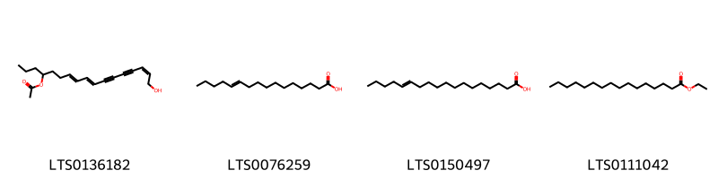

!!! abstract "Tóm tắt"

    Rễ Sài hồ (Radix Bupleuri chinensis) là rễ đã phơi hay sấy khô của cây Bắc Sài hồ (Bupleurum chinense DC.), họ Hoa tán (Apiaceae). Cây phân bố ở nhiều nơi trên thế giới như Trung Quốc, Nội Mông, Hàn Quốc, chưa có ở Việt Nam. Theo tài liệu cổ, rễ sài hồ có tính khổ, tân, vi, hàn, quy vào các kinh: can, đởm, tâm bào, tam liêu. Rễ sài hồ được sử dụng để chữa bệnh sốt và sốt rét. Một số thành phần hóa học đã được phát hiện và xác định cấu trúc thuộc các nhóm saponin, tinh dầu, flavonoid, triterpenoid, carbohydrate.

## Thông tin về thực vật

Dược liệu **Sài Hồ (Rễ)** từ bộ phận **Rễ** từ loài *Bupleurum chinense*.

**Mô tả thực vật:** Sài hồ là một cây sống lâu năm, cao 45-70cm, rễ nhỏ, hình trụ, phân nhánh hoặc không phân nhánh. Thân mọc thẳng, phân cành hình chữ chi. Lá mọc cách, mép nguyên, hình mác, dài 3-6cm, rộng 6-13mm, đầu lá nhọn, có 7-9 đường gần song song. Lá phía dưới có cuống ngắn, phía trên không có cuống. Cụm hoa hình tán kép, mọc ở kẽ lá hoặc đầu cành. Trục cụm hoa chung. nhỏ và dài, có từ 4-10 cụm hoa phụ không dài nhỏ và dài, có từ 4-10 cụm hoa phụ không dài bằng nhau. Hoa nhỏ màu vàng. Quả hình bầu dục, dài độ 5mm, nhưng góc quả rất rõ, 3 ống tinh dầu nằm ở mặt tiếp giáp.

*Tài liệu tham khảo:* "Những cây thuốc và vị thuốc Việt Nam" - Đỗ Tất Lợi 
Trong dược điển Việt nam, một loài được sử dụng làm dược liệu là *Bupleurum chinense*.

!!! info "Phân loại thực vật của *Bupleurum chinense*"
    - **Kingdom:** Plantae
    - **Phylum:** Tracheophyta
    - **Order:** Apiales
    - **Family:** Apiaceae
    - **Genus:** Bupleurum
    - **Species:** *Bupleurum chinense*

**Phân bố trên thế giới:** nan, United States of America, China, unknown or invalid, Japan

**Phân bố tại Việt nam:** Không có ghi nhận ở Việt Nam

## Thông tin về dược liệu 

### Định danh

!!! info "Thông tin về tên gọi"

    - Dược liệu tiếng Việt: sài hồ
    - Dược liệu tiếng Trung: 柴胡 (Chai Hu)
    - Dược liệu tiếng Anh: Root of Chinese Thorowax
    - Dược liệu latin thông dụng: Radix Bupleuri chinensisnRadix Bupleuri
    - Dược liệu latin kiểu DĐVN: *radix bupleuri chinensis*
    - Dược liệu latin kiểu DĐVN: *Radix Bupleuri*
    - Dược liệu latin kiểu thông tư: **
    - Bộ phận dùng: Rễ (Radix)

### Mô tả dược liệu 

- **Theo dược điển Việt nam V:** Rễ hình trụ hoặc hình nón thon dài, dài 6 cm đến 15 cm, đường kính 0,3 cm đến 0,8 cm. Phần đầu rễ phình to; ở đỉnh rễ có từ 3 đến 15 gốc thân hoặc có gốc lá dạng sợi ngắn. Phần dưới của rễ phân nhánh. Mặt ngoài màu nâu đen hoặc nâu sẫm, có nhiều vết nhăn dọc, vết sẹo của rễ con và lỗ vỏ. Chất cứng và dai, khó bẻ gãy, mặt gãy có những lớp sợi, vỏ màu nâu sáng, phần gỗ màu trắng ngà. Mùi thơm nhẹ, vị hơi đắng. Sài hồ phiến: Những phiến dày không đều. Bên ngoài màu nâu đen hoặc nâu nhạt, có các nếp nhăn dọc và vết sẹo của rễ con. Bề mặt phiến hơi trắng ngà, có xơ. Chất cứng. Mùi thơm nhẹ, vị hơi đắng.

- **Mô tả dược liệu theo thông tư chế biến dược liệu theo phương pháp cổ truyền:** 

### Chế biến 

- **Chế biến theo dược điển việt nam V**: Thu hoạch vào mùa xuân hay mùa thu, đào lấy rễ, cắt bỏ thân, lá trên mặt đất, rũ sạch đất cát, phơi hoặc sấy khô. Sài hồ phiến: Loại bỏ tạp chất và phần sót lại của thân, lá, rửa sạch, ủ mềm, thái lát dày, phơi hoặc sấy khô. Thố Sải hồ (Sài hồ sao dấm): Lấy Sài hồ phiến, cho dấm vào trộn đều, ủ cho đến khi dấm thấm hết vào lõi, cho vào chảo, sao nhỏ lửa, đảo đều đến khô. Dùng 12 L dấm cho 100 kg Sài hồ.

- **Chế biến theo thông tư:** 

--- 

## Thành phần hóa học

- Theo tài liệu của GS. Đỗ Tất Lợi:  (1) Saponin, tinh dầu, flavonoid, triterpenoid, carbohydrate.
(2) Biomarker: Saikosaponin
    

**Thành phần hóa học từ loài **Bupleurum chinense**

Theo cơ sở dữ liệu lotus, loài *Bupleurum chinense* đã phân lập và xác định được **51** hoạt chất thuộc về các nhóm Steroids and steroid derivatives, Organooxygen compounds, Flavonoids, Fatty Acyls, Lactones, Isoflavonoids, Indoles and derivatives, Prenol lipids trong bảng dưới đây. Danh sách các hoạt chất như sau (2r,3r,4s,5r,6r)-2-{[(3s,4r,4ar,6ar,6bs,8s,8as,14ar,14bs)-8-hydroxy-4,8a-bis(hydroxymethyl)-4,6a,6b,11,11,14b-hexamethyl-1,2,3,4a,5,6,7,8,9,10,12,14a-dodecahydropicen-3-yl]oxy}-6-methyloxane-3,4,5-triol [(LTS0274651)](https://lotus.naturalproducts.net/compound/lotus_id/LTS0274651), (2s,3r,4r,5r,6s)-2-{[(2r,3s,4r,5r,6r)-4,5-dihydroxy-6-{[(1s,2s,4s,5r,8r,10s,13s,14r,17s,18r)-2-hydroxy-4,5,9,9,13,20,20-heptamethyl-24-oxahexacyclo[15.5.2.0¹,¹⁸.0⁴,¹⁷.0⁵,¹⁴.0⁸,¹³]tetracos-15-en-10-yl]oxy}-2-({[(2r,3r,4s,5s,6r)-3,4,5-trihydroxy-6-(hydroxymethyl)oxan-2-yl]oxy}methyl)oxan-3-yl]oxy}-6-methyloxane-3,4,5-triol [(LTS0144521)](https://lotus.naturalproducts.net/compound/lotus_id/LTS0144521), 3-{[(2r,3s,4s,5r,6s)-6-{[(2r,3r,4s,5s,6r)-3,5-dihydroxy-2-{[(2r,4s,5r,9r,10s,13s,18r)-2-hydroxy-9-(hydroxymethyl)-4,5,9,13,20,20-hexamethyl-24-oxahexacyclo[15.5.2.0¹,¹⁸.0⁴,¹⁷.0⁵,¹⁴.0⁸,¹³]tetracos-15-en-10-yl]oxy}-6-methyloxan-4-yl]oxy}-3,4,5-trihydroxyoxan-2-yl]methoxy}-3-oxopropanoic acid [(LTS0194897)](https://lotus.naturalproducts.net/compound/lotus_id/LTS0194897), saikosaponin d [(LTS0233747)](https://lotus.naturalproducts.net/compound/lotus_id/LTS0233747), {3,4,5-trihydroxy-6-[(2,3,4,5-tetrahydroxypentyl)oxy]oxan-2-yl}methyl 10-[(3,5-dihydroxy-6-methyl-4-{[3,4,5-trihydroxy-6-(hydroxymethyl)oxan-2-yl]oxy}oxan-2-yl)oxy]-5-hydroxy-4a,9-bis(hydroxymethyl)-2,6a,6b,9,12a-pentamethyl-1,3,4,5,6,7,8,8a,10,11,12,12b-dodecahydropicene-2-carboxylate [(LTS0200244)](https://lotus.naturalproducts.net/compound/lotus_id/LTS0200244), kaempherol [(LTS0155822)](https://lotus.naturalproducts.net/compound/lotus_id/LTS0155822), (2r,3r,4s,5r,6r)-2-{[(3s,4ar,6ar,6bs,8s,8as,12as,14r,14ar,14bs)-8-hydroxy-8a-(hydroxymethyl)-14-methoxy-4,4,6a,6b,11,11,14b-heptamethyl-1,2,3,4a,5,6,7,8,9,10,12,12a,14,14a-tetradecahydropicen-3-yl]oxy}-6-methyloxane-3,4,5-triol [(LTS0095246)](https://lotus.naturalproducts.net/compound/lotus_id/LTS0095246), (2s,3r,4s,5r,6r)-2-{[(2r,3r,4s,5s,6r)-3,5-dihydroxy-2-{[(1s,2r,4s,5r,8r,9r,10s,13s,14r,17s,18r)-2-hydroxy-9-(hydroxymethyl)-4,5,9,13,20,20-hexamethyl-24-oxahexacyclo[15.5.2.0¹,¹⁸.0⁴,¹⁷.0⁵,¹⁴.0⁸,¹³]tetracos-15-en-10-yl]oxy}-6-methyloxan-4-yl]oxy}-3,5-dihydroxy-6-(hydroxymethyl)oxan-4-yl acetate [(LTS0215679)](https://lotus.naturalproducts.net/compound/lotus_id/LTS0215679), (2r,3r,4s,5r,6r)-2-{[(1s,2s,4s,5r,8r,9r,10s,13s,14r,17s,18r)-2-hydroxy-9-(hydroxymethyl)-4,5,9,13,20,20-hexamethyl-24-oxahexacyclo[15.5.2.0¹,¹⁸.0⁴,¹⁷.0⁵,¹⁴.0⁸,¹³]tetracos-15-en-10-yl]oxy}-6-methyloxane-3,4,5-triol [(LTS0109352)](https://lotus.naturalproducts.net/compound/lotus_id/LTS0109352), (2s)-2-{[(2r)-3,5-dihydroxy-2-{[(1s,4s,5r,8r,9r,13s,14r,17s,18r)-2-hydroxy-9-(hydroxymethyl)-4,5,9,13,20,20-hexamethyl-24-oxahexacyclo[15.5.2.0¹,¹⁸.0⁴,¹⁷.0⁵,¹⁴.0⁸,¹³]tetracos-15-en-10-yl]oxy}-6-methyloxan-4-yl]oxy}-6-(hydroxymethyl)oxane-3,4,5-triol [(LTS0238261)](https://lotus.naturalproducts.net/compound/lotus_id/LTS0238261), (7e,9e,15z)-17-hydroxyheptadeca-7,9,15-trien-11,13-diyn-4-yl acetate [(LTS0136182)](https://lotus.naturalproducts.net/compound/lotus_id/LTS0136182), 11-hexadecenoic acid [(LTS0076259)](https://lotus.naturalproducts.net/compound/lotus_id/LTS0076259), (2s,3r,4s,5s,6r)-2-{[(2r,3r,4s,5s,6r)-3,5-dihydroxy-2-{[8-hydroxy-4,8a,11-tris(hydroxymethyl)-4,6a,6b,11,14b-pentamethyl-1,2,3,4a,5,6,7,8,9,10,12,14a-dodecahydropicen-3-yl]oxy}-6-methyloxan-4-yl]oxy}-6-(hydroxymethyl)oxane-3,4,5-triol [(LTS0162666)](https://lotus.naturalproducts.net/compound/lotus_id/LTS0162666), [(1s,2s,4s,5r,8r,9r,10s,13s,14r,17s,18r)-10-{[(2r,3r,4s,5s,6r)-3,5-dihydroxy-6-methyl-4-{[(2s,3r,4s,5s,6r)-3,4,5-trihydroxy-6-(hydroxymethyl)oxan-2-yl]oxy}oxan-2-yl]oxy}-2-hydroxy-4,5,9,13,20,20-hexamethyl-24-oxahexacyclo[15.5.2.0¹,¹⁸.0⁴,¹⁷.0⁵,¹⁴.0⁸,¹³]tetracos-15-en-9-yl]methyl acetate [(LTS0246064)](https://lotus.naturalproducts.net/compound/lotus_id/LTS0246064), ethyl palmitate [(LTS0111042)](https://lotus.naturalproducts.net/compound/lotus_id/LTS0111042), octadec-13-enoic acid [(LTS0150497)](https://lotus.naturalproducts.net/compound/lotus_id/LTS0150497), kaempferitrin [(LTS0269109)](https://lotus.naturalproducts.net/compound/lotus_id/LTS0269109), (2r,3r,4s,5r,6r)-2-{[(3s,4r,4ar,6ar,6bs,8s,8as,12as,14r,14ar,14bs)-8-hydroxy-4,8a-bis(hydroxymethyl)-14-methoxy-4,6a,6b,11,11,14b-hexamethyl-1,2,3,4a,5,6,7,8,9,10,12,12a,14,14a-tetradecahydropicen-3-yl]oxy}-6-methyloxane-3,4,5-triol [(LTS0081987)](https://lotus.naturalproducts.net/compound/lotus_id/LTS0081987), 2-{[4,5-dihydroxy-6-({2-hydroxy-4,5,9,9,13,20,20-heptamethyl-24-oxahexacyclo[15.5.2.0¹,¹⁸.0⁴,¹⁷.0⁵,¹⁴.0⁸,¹³]tetracos-15-en-10-yl}oxy)-2-({[3,4,5-trihydroxy-6-(hydroxymethyl)oxan-2-yl]oxy}methyl)oxan-3-yl]oxy}-6-methyloxane-3,4,5-triol [(LTS0103466)](https://lotus.naturalproducts.net/compound/lotus_id/LTS0103466), [(2r,3r,4s,5r,6r)-3,4,5-trihydroxy-6-{[(2s,3r,4r)-2,3,4,5-tetrahydroxypentyl]oxy}oxan-2-yl]methyl (2s,4ar,5r,6ar,6bs,8as,9s,10s,12ar,12br)-10-{[(2r,3r,4s,5r,6s)-3,5-dihydroxy-6-methyl-4-{[(2s,3s,4s,5r,6r)-3,4,5-trihydroxy-6-(hydroxymethyl)oxan-2-yl]oxy}oxan-2-yl]oxy}-5-hydroxy-4a,9-bis(hydroxymethyl)-2,6a,6b,9,12a-pentamethyl-1,3,4,5,6,7,8,8a,10,11,12,12b-dodecahydropicene-2-carboxylate [(LTS0013706)](https://lotus.naturalproducts.net/compound/lotus_id/LTS0013706), (2s,3r,4s,5s,6r)-2-{[(2r,3r,4s,5s,6r)-3,5-dihydroxy-2-{[(1s,2s,6r,7s,10s)-21-hydroxy-6,20-bis(hydroxymethyl)-1,2,6,10,17,17-hexamethyl-12-oxapentacyclo[12.8.0.0²,¹¹.0⁵,¹⁰.0¹⁵,²⁰]docos-13-en-7-yl]oxy}-6-methyloxan-4-yl]oxy}-6-(hydroxymethyl)oxane-3,4,5-triol [(LTS0175115)](https://lotus.naturalproducts.net/compound/lotus_id/LTS0175115), (2s,3r,4s,5s,6r)-2-{[(2r,3r,4s,5s,6r)-3,5-dihydroxy-2-{[(1s,2s,4s,5r,8r,9r,10s,13s,14r,17s,18r)-2-hydroxy-9-(hydroxymethyl)-4,5,9,13,20,20-hexamethyl-24-oxahexacyclo[15.5.2.0¹,¹⁸.0⁴,¹⁷.0⁵,¹⁴.0⁸,¹³]tetracos-15-en-10-yl]oxy}-6-methyloxan-4-yl]oxy}-4,5-dihydroxy-6-(hydroxymethyl)oxan-3-yl acetate [(LTS0006191)](https://lotus.naturalproducts.net/compound/lotus_id/LTS0006191), (1s,4s,5r,8r,9r,10s,13s,14r,17s,18r)-10-{[(2r,3r,4s,5s,6r)-3,5-dihydroxy-6-methyl-4-{[(2s,3r,4s,5s,6r)-3,4,5-trihydroxy-6-(hydroxymethyl)oxan-2-yl]oxy}oxan-2-yl]oxy}-9-(hydroxymethyl)-4,5,9,13,20,20-hexamethyl-24-oxahexacyclo[15.5.2.0¹,¹⁸.0⁴,¹⁷.0⁵,¹⁴.0⁸,¹³]tetracos-15-en-2-one [(LTS0024744)](https://lotus.naturalproducts.net/compound/lotus_id/LTS0024744), 3-rutinosyl quercetin [(LTS0032845)](https://lotus.naturalproducts.net/compound/lotus_id/LTS0032845), (2z,8e,10e)-heptadeca-2,8,10-trien-4,6-diyne-1,14-diol [(LTS0134228)](https://lotus.naturalproducts.net/compound/lotus_id/LTS0134228), [(2r,3s,4s,5r,6s)-6-{[(2r,3r,4s,5s,6r)-3,5-dihydroxy-2-{[(1s,2s,4s,5r,8r,9r,10s,13s,14r,17s,18r)-2-hydroxy-9-(hydroxymethyl)-4,5,9,13,20,20-hexamethyl-24-oxahexacyclo[15.5.2.0¹,¹⁸.0⁴,¹⁷.0⁵,¹⁴.0⁸,¹³]tetracos-15-en-10-yl]oxy}-6-methyloxan-4-yl]oxy}-3,4,5-trihydroxyoxan-2-yl]methyl acetate [(LTS0191998)](https://lotus.naturalproducts.net/compound/lotus_id/LTS0191998), γ-decalactone [(LTS0263005)](https://lotus.naturalproducts.net/compound/lotus_id/LTS0263005), (2s,3s,4s,5r,6r)-6-{[(3s,4ar,6ar,6bs,8as,12as,14ar,14br)-4,4,6a,6b,11,11,14b-heptamethyl-8a-({[(2s,3r,4s,5s,6r)-3,4,5-trihydroxy-6-(hydroxymethyl)oxan-2-yl]oxy}carbonyl)-1,2,3,4a,5,6,7,8,9,10,12,12a,14,14a-tetradecahydropicen-3-yl]oxy}-3,5-dihydroxy-4-{[(2s,3r,4s,5s)-3,4,5-trihydroxyoxan-2-yl]oxy}oxane-2-carboxylic acid [(LTS0197225)](https://lotus.naturalproducts.net/compound/lotus_id/LTS0197225), quercetin [(LTS0004651)](https://lotus.naturalproducts.net/compound/lotus_id/LTS0004651), (2r,3r,4s,5r,6r)-2-{[(1s,2r,4s,5r,8r,9r,10s,13s,14r,17s,18r)-2-hydroxy-9-(hydroxymethyl)-4,5,9,13,20,20-hexamethyl-24-oxahexacyclo[15.5.2.0¹,¹⁸.0⁴,¹⁷.0⁵,¹⁴.0⁸,¹³]tetracos-15-en-10-yl]oxy}-6-methyloxane-3,4,5-triol [(LTS0178707)](https://lotus.naturalproducts.net/compound/lotus_id/LTS0178707), (2s,3r,4s,5s,6r)-2-{[(2r,3r,4s,5s,6r)-2-{[(3s,4r,4ar,6ar,6bs,8r,8as,14r,14ar,14bs)-8-hydroxy-4,8a-bis(hydroxymethyl)-14-methoxy-4,6a,6b,11,11,14b-hexamethyl-1,2,3,4a,5,6,7,8,9,10,12,12a,14,14a-tetradecahydropicen-3-yl]oxy}-3,5-dihydroxy-6-methyloxan-4-yl]oxy}-6-(hydroxymethyl)oxane-3,4,5-triol [(LTS0170359)](https://lotus.naturalproducts.net/compound/lotus_id/LTS0170359), (2r,3r,4s,5r,6r)-2-{[(3s,4r,4ar,6ar,6bs,8r,8as,14ar,14bs)-8-hydroxy-4,8a-bis(hydroxymethyl)-4,6a,6b,11,11,14b-hexamethyl-1,2,3,4a,5,6,7,8,9,10,12,14a-dodecahydropicen-3-yl]oxy}-6-methyloxane-3,4,5-triol [(LTS0050901)](https://lotus.naturalproducts.net/compound/lotus_id/LTS0050901), isorhamnetin [(LTS0107505)](https://lotus.naturalproducts.net/compound/lotus_id/LTS0107505), [(2r,3s,4s,5r,6s)-6-{[(2r,3r,4s,5s,6r)-3,5-dihydroxy-2-{[(1s,2r,4s,5r,8r,9r,10s,13s,14r,17s,18r)-2-hydroxy-9-(hydroxymethyl)-4,5,9,13,20,20-hexamethyl-24-oxahexacyclo[15.5.2.0¹,¹⁸.0⁴,¹⁷.0⁵,¹⁴.0⁸,¹³]tetracos-15-en-10-yl]oxy}-6-methyloxan-4-yl]oxy}-3,4,5-trihydroxyoxan-2-yl]methyl acetate [(LTS0147344)](https://lotus.naturalproducts.net/compound/lotus_id/LTS0147344), kaempferol-7-rhamnoside [(LTS0124511)](https://lotus.naturalproducts.net/compound/lotus_id/LTS0124511), (2s,3r,4r,5r,6s)-2-{[(2r,3s,4r,5r,6r)-4,5-dihydroxy-6-{[8-hydroxy-4,8a-bis(hydroxymethyl)-4,6a,6b,11,11,14b-hexamethyl-1,2,3,4a,5,6,7,8,9,10,12,14a-dodecahydropicen-3-yl]oxy}-2-({[(2r,3r,4s,5s,6r)-3,4,5-trihydroxy-6-(hydroxymethyl)oxan-2-yl]oxy}methyl)oxan-3-yl]oxy}-6-methyloxane-3,4,5-triol [(LTS0114340)](https://lotus.naturalproducts.net/compound/lotus_id/LTS0114340), l-tryptophan [(LTS0263809)](https://lotus.naturalproducts.net/compound/lotus_id/LTS0263809), 6-{[4,4,6a,6b,11,11,14b-heptamethyl-8a-({[3,4,5-trihydroxy-6-(hydroxymethyl)oxan-2-yl]oxy}carbonyl)-1,2,3,4a,5,6,7,8,9,10,12,12a,14,14a-tetradecahydropicen-3-yl]oxy}-3,5-dihydroxy-4-[(3,4,5-trihydroxyoxan-2-yl)oxy]oxane-2-carboxylic acid [(LTS0237067)](https://lotus.naturalproducts.net/compound/lotus_id/LTS0237067), (2s,3r,4s,5s,6r)-2-{[(2r,3r,4s,5s,6r)-2-{[(3s,4r,4ar,6ar,6bs,8s,8as,14ar,14bs)-8-hydroxy-4,8a-bis(hydroxymethyl)-4,6a,6b,11,11,14b-hexamethyl-1,2,3,4a,5,6,7,8,9,10,12,14a-dodecahydropicen-3-yl]oxy}-3,5-dihydroxy-6-methyloxan-4-yl]oxy}-6-(hydroxymethyl)oxane-3,4,5-triol [(LTS0260314)](https://lotus.naturalproducts.net/compound/lotus_id/LTS0260314), saikosaponin bk1 [(LTS0165734)](https://lotus.naturalproducts.net/compound/lotus_id/LTS0165734), γ-heptalactone [(LTS0176406)](https://lotus.naturalproducts.net/compound/lotus_id/LTS0176406), (2s,3r,4s,5r,6r)-2-{[(2r,3r,4s,5s,6r)-3,5-dihydroxy-2-{[(1s,2s,4s,5r,8r,9r,10s,13s,14r,17s,18r)-2-hydroxy-9-(hydroxymethyl)-4,5,9,13,20,20-hexamethyl-24-oxahexacyclo[15.5.2.0¹,¹⁸.0⁴,¹⁷.0⁵,¹⁴.0⁸,¹³]tetracos-15-en-10-yl]oxy}-6-methyloxan-4-yl]oxy}-3,5-dihydroxy-6-(hydroxymethyl)oxan-4-yl acetate [(LTS0031889)](https://lotus.naturalproducts.net/compound/lotus_id/LTS0031889), saikosaponin a [(LTS0211551)](https://lotus.naturalproducts.net/compound/lotus_id/LTS0211551), [(1s,2s,4s,5r,8r,9r,10s,13s,14r,17s,18r)-2-hydroxy-4,5,9,13,20,20-hexamethyl-10-{[(2r,3r,4s,5r,6r)-3,4,5-trihydroxy-6-methyloxan-2-yl]oxy}-24-oxahexacyclo[15.5.2.0¹,¹⁸.0⁴,¹⁷.0⁵,¹⁴.0⁸,¹³]tetracos-15-en-9-yl]methyl acetate [(LTS0264777)](https://lotus.naturalproducts.net/compound/lotus_id/LTS0264777), 5-hydroxy-7-methoxy-2-({[(2r,3r,4s,5s,6r)-3,4,5-trihydroxy-6-(hydroxymethyl)oxan-2-yl]oxy}methyl)chromen-4-one [(LTS0046871)](https://lotus.naturalproducts.net/compound/lotus_id/LTS0046871), (2s)-2-{[(2s)-3,5-dihydroxy-2-{[(1s,4s,5r,8s,9r,13s,14r,17s,18s)-2-hydroxy-9-(hydroxymethyl)-4,5,9,13,20,20-hexamethyl-24-oxahexacyclo[15.5.2.0¹,¹⁸.0⁴,¹⁷.0⁵,¹⁴.0⁸,¹³]tetracos-15-en-10-yl]oxy}-6-methyloxan-4-yl]oxy}-6-(hydroxymethyl)oxane-3,4,5-triol [(LTS0090674)](https://lotus.naturalproducts.net/compound/lotus_id/LTS0090674), puerarin [(LTS0010346)](https://lotus.naturalproducts.net/compound/lotus_id/LTS0010346), (2s,3r,4r,5r,6s)-2-{[(2r,3s,4r,5r,6r)-4,5-dihydroxy-6-{[(2s,5r,10s,13s,18r)-2-hydroxy-4,5,9,9,13,20,20-heptamethyl-24-oxahexacyclo[15.5.2.0¹,¹⁸.0⁴,¹⁷.0⁵,¹⁴.0⁸,¹³]tetracos-15-en-10-yl]oxy}-2-({[(2r,3r,4s,5s,6r)-3,4,5-trihydroxy-6-(hydroxymethyl)oxan-2-yl]oxy}methyl)oxan-3-yl]oxy}-6-methyloxane-3,4,5-triol [(LTS0223242)](https://lotus.naturalproducts.net/compound/lotus_id/LTS0223242), (2s,3r,4s,5s,6r)-2-{[(2r,3r,4s,5s,6r)-3,5-dihydroxy-2-{[(1s,2s,4s,5r,8r,10s,13s,14r,17s,18r)-2-hydroxy-4,5,9,9,13,20,20-heptamethyl-24-oxahexacyclo[15.5.2.0¹,¹⁸.0⁴,¹⁷.0⁵,¹⁴.0⁸,¹³]tetracos-15-en-10-yl]oxy}-6-methyloxan-4-yl]oxy}-6-(hydroxymethyl)oxane-3,4,5-triol [(LTS0127917)](https://lotus.naturalproducts.net/compound/lotus_id/LTS0127917), 7-hydroxy-3-(4-hydroxyphenyl)-8-[(2s,3s,5s)-3,4,5-trihydroxy-6-(hydroxymethyl)oxan-2-yl]chromen-4-one [(LTS0243045)](https://lotus.naturalproducts.net/compound/lotus_id/LTS0243045), (4as,6as,6br,8ar,9r,10s,12as,12br)-10-{[(2r,3r,4s,5s,6r)-3,5-dihydroxy-6-methyl-4-{[(2s,3r,4s,5s,6r)-3,4,5-trihydroxy-6-(hydroxymethyl)oxan-2-yl]oxy}oxan-2-yl]oxy}-4a,9-bis(hydroxymethyl)-2,2,6a,6b,9,12a-hexamethyl-3,4,6,7,8,8a,10,11,12,12b-decahydro-1h-picen-5-one [(LTS0145327)](https://lotus.naturalproducts.net/compound/lotus_id/LTS0145327). 
        
| chemicalTaxonomyClassyfireClass   |   smiles_count |
|:----------------------------------|---------------:|
| Fatty Acyls                       |            106 |
| Flavonoids                        |            421 |
| Indoles and derivatives           |             32 |
| Isoflavonoids                     |            145 |
| Lactones                          |             31 |
| Organooxygen compounds            |             68 |
| Prenol lipids                     |           5574 |
| Steroids and steroid derivatives  |            333 |

            
### Nhóm Fatty Acyls
<figure markdown="span">
    { width=100% }
<figcaption>Hình ảnh cấu trúc hóa học của hoạt chất thuộc nhóm *Fatty Acyls*. Tên thường gọi của các hoạt chất tương ứng là (7e,9e,15z)-17-hydroxyheptadeca-7,9,15-trien-11,13-diyn-4-yl acetate [(LTS0136182)](https://lotus.naturalproducts.net/compound/lotus_id/LTS0136182), 11-hexadecenoic acid [(LTS0076259)](https://lotus.naturalproducts.net/compound/lotus_id/LTS0076259), octadec-13-enoic acid [(LTS0150497)](https://lotus.naturalproducts.net/compound/lotus_id/LTS0150497), ethyl palmitate [(LTS0111042)](https://lotus.naturalproducts.net/compound/lotus_id/LTS0111042).</figcaption>
</figure>

            
            
### Nhóm Fatty Acyls
<figure markdown="span">
    { width=100% }
<figcaption>Hình ảnh cấu trúc hóa học của hoạt chất thuộc nhóm *Fatty Acyls*. Tên thường gọi của các hoạt chất tương ứng là (7e,9e,15z)-17-hydroxyheptadeca-7,9,15-trien-11,13-diyn-4-yl acetate [(LTS0136182)](https://lotus.naturalproducts.net/compound/lotus_id/LTS0136182), 11-hexadecenoic acid [(LTS0076259)](https://lotus.naturalproducts.net/compound/lotus_id/LTS0076259), octadec-13-enoic acid [(LTS0150497)](https://lotus.naturalproducts.net/compound/lotus_id/LTS0150497), ethyl palmitate [(LTS0111042)](https://lotus.naturalproducts.net/compound/lotus_id/LTS0111042).</figcaption>
</figure>

### Nhóm Flavonoids
<figure markdown="span">
    { width=100% }
<figcaption>Hình ảnh cấu trúc hóa học của hoạt chất thuộc nhóm *Flavonoids*. Tên thường gọi của các hoạt chất tương ứng là 3-rutinosyl quercetin [(LTS0032845)](https://lotus.naturalproducts.net/compound/lotus_id/LTS0032845), isorhamnetin [(LTS0107505)](https://lotus.naturalproducts.net/compound/lotus_id/LTS0107505), quercetin [(LTS0004651)](https://lotus.naturalproducts.net/compound/lotus_id/LTS0004651), kaempferol-7-rhamnoside [(LTS0124511)](https://lotus.naturalproducts.net/compound/lotus_id/LTS0124511), kaempherol [(LTS0155822)](https://lotus.naturalproducts.net/compound/lotus_id/LTS0155822), kaempferitrin [(LTS0269109)](https://lotus.naturalproducts.net/compound/lotus_id/LTS0269109).</figcaption>
</figure>

            
            
### Nhóm Fatty Acyls
<figure markdown="span">
    { width=100% }
<figcaption>Hình ảnh cấu trúc hóa học của hoạt chất thuộc nhóm *Fatty Acyls*. Tên thường gọi của các hoạt chất tương ứng là (7e,9e,15z)-17-hydroxyheptadeca-7,9,15-trien-11,13-diyn-4-yl acetate [(LTS0136182)](https://lotus.naturalproducts.net/compound/lotus_id/LTS0136182), 11-hexadecenoic acid [(LTS0076259)](https://lotus.naturalproducts.net/compound/lotus_id/LTS0076259), octadec-13-enoic acid [(LTS0150497)](https://lotus.naturalproducts.net/compound/lotus_id/LTS0150497), ethyl palmitate [(LTS0111042)](https://lotus.naturalproducts.net/compound/lotus_id/LTS0111042).</figcaption>
</figure>

### Nhóm Flavonoids
<figure markdown="span">
    { width=100% }
<figcaption>Hình ảnh cấu trúc hóa học của hoạt chất thuộc nhóm *Flavonoids*. Tên thường gọi của các hoạt chất tương ứng là 3-rutinosyl quercetin [(LTS0032845)](https://lotus.naturalproducts.net/compound/lotus_id/LTS0032845), isorhamnetin [(LTS0107505)](https://lotus.naturalproducts.net/compound/lotus_id/LTS0107505), quercetin [(LTS0004651)](https://lotus.naturalproducts.net/compound/lotus_id/LTS0004651), kaempferol-7-rhamnoside [(LTS0124511)](https://lotus.naturalproducts.net/compound/lotus_id/LTS0124511), kaempherol [(LTS0155822)](https://lotus.naturalproducts.net/compound/lotus_id/LTS0155822), kaempferitrin [(LTS0269109)](https://lotus.naturalproducts.net/compound/lotus_id/LTS0269109).</figcaption>
</figure>

### Nhóm Indoles and derivatives
<figure markdown="span">
    { width=100% }
<figcaption>Hình ảnh cấu trúc hóa học của hoạt chất thuộc nhóm *Indoles and derivatives*. Tên thường gọi của các hoạt chất tương ứng là l-tryptophan [(LTS0263809)](https://lotus.naturalproducts.net/compound/lotus_id/LTS0263809).</figcaption>
</figure>

            
            
### Nhóm Fatty Acyls
<figure markdown="span">
    { width=100% }
<figcaption>Hình ảnh cấu trúc hóa học của hoạt chất thuộc nhóm *Fatty Acyls*. Tên thường gọi của các hoạt chất tương ứng là (7e,9e,15z)-17-hydroxyheptadeca-7,9,15-trien-11,13-diyn-4-yl acetate [(LTS0136182)](https://lotus.naturalproducts.net/compound/lotus_id/LTS0136182), 11-hexadecenoic acid [(LTS0076259)](https://lotus.naturalproducts.net/compound/lotus_id/LTS0076259), octadec-13-enoic acid [(LTS0150497)](https://lotus.naturalproducts.net/compound/lotus_id/LTS0150497), ethyl palmitate [(LTS0111042)](https://lotus.naturalproducts.net/compound/lotus_id/LTS0111042).</figcaption>
</figure>

### Nhóm Flavonoids
<figure markdown="span">
    { width=100% }
<figcaption>Hình ảnh cấu trúc hóa học của hoạt chất thuộc nhóm *Flavonoids*. Tên thường gọi của các hoạt chất tương ứng là 3-rutinosyl quercetin [(LTS0032845)](https://lotus.naturalproducts.net/compound/lotus_id/LTS0032845), isorhamnetin [(LTS0107505)](https://lotus.naturalproducts.net/compound/lotus_id/LTS0107505), quercetin [(LTS0004651)](https://lotus.naturalproducts.net/compound/lotus_id/LTS0004651), kaempferol-7-rhamnoside [(LTS0124511)](https://lotus.naturalproducts.net/compound/lotus_id/LTS0124511), kaempherol [(LTS0155822)](https://lotus.naturalproducts.net/compound/lotus_id/LTS0155822), kaempferitrin [(LTS0269109)](https://lotus.naturalproducts.net/compound/lotus_id/LTS0269109).</figcaption>
</figure>

### Nhóm Indoles and derivatives
<figure markdown="span">
    { width=100% }
<figcaption>Hình ảnh cấu trúc hóa học của hoạt chất thuộc nhóm *Indoles and derivatives*. Tên thường gọi của các hoạt chất tương ứng là l-tryptophan [(LTS0263809)](https://lotus.naturalproducts.net/compound/lotus_id/LTS0263809).</figcaption>
</figure>

### Nhóm Isoflavonoids
<figure markdown="span">
    { width=100% }
<figcaption>Hình ảnh cấu trúc hóa học của hoạt chất thuộc nhóm *Isoflavonoids*. Tên thường gọi của các hoạt chất tương ứng là 7-hydroxy-3-(4-hydroxyphenyl)-8-[(2s,3s,5s)-3,4,5-trihydroxy-6-(hydroxymethyl)oxan-2-yl]chromen-4-one [(LTS0243045)](https://lotus.naturalproducts.net/compound/lotus_id/LTS0243045), puerarin [(LTS0010346)](https://lotus.naturalproducts.net/compound/lotus_id/LTS0010346).</figcaption>
</figure>

            
            
### Nhóm Fatty Acyls
<figure markdown="span">
    { width=100% }
<figcaption>Hình ảnh cấu trúc hóa học của hoạt chất thuộc nhóm *Fatty Acyls*. Tên thường gọi của các hoạt chất tương ứng là (7e,9e,15z)-17-hydroxyheptadeca-7,9,15-trien-11,13-diyn-4-yl acetate [(LTS0136182)](https://lotus.naturalproducts.net/compound/lotus_id/LTS0136182), 11-hexadecenoic acid [(LTS0076259)](https://lotus.naturalproducts.net/compound/lotus_id/LTS0076259), octadec-13-enoic acid [(LTS0150497)](https://lotus.naturalproducts.net/compound/lotus_id/LTS0150497), ethyl palmitate [(LTS0111042)](https://lotus.naturalproducts.net/compound/lotus_id/LTS0111042).</figcaption>
</figure>

### Nhóm Flavonoids
<figure markdown="span">
    { width=100% }
<figcaption>Hình ảnh cấu trúc hóa học của hoạt chất thuộc nhóm *Flavonoids*. Tên thường gọi của các hoạt chất tương ứng là 3-rutinosyl quercetin [(LTS0032845)](https://lotus.naturalproducts.net/compound/lotus_id/LTS0032845), isorhamnetin [(LTS0107505)](https://lotus.naturalproducts.net/compound/lotus_id/LTS0107505), quercetin [(LTS0004651)](https://lotus.naturalproducts.net/compound/lotus_id/LTS0004651), kaempferol-7-rhamnoside [(LTS0124511)](https://lotus.naturalproducts.net/compound/lotus_id/LTS0124511), kaempherol [(LTS0155822)](https://lotus.naturalproducts.net/compound/lotus_id/LTS0155822), kaempferitrin [(LTS0269109)](https://lotus.naturalproducts.net/compound/lotus_id/LTS0269109).</figcaption>
</figure>

### Nhóm Indoles and derivatives
<figure markdown="span">
    { width=100% }
<figcaption>Hình ảnh cấu trúc hóa học của hoạt chất thuộc nhóm *Indoles and derivatives*. Tên thường gọi của các hoạt chất tương ứng là l-tryptophan [(LTS0263809)](https://lotus.naturalproducts.net/compound/lotus_id/LTS0263809).</figcaption>
</figure>

### Nhóm Isoflavonoids
<figure markdown="span">
    { width=100% }
<figcaption>Hình ảnh cấu trúc hóa học của hoạt chất thuộc nhóm *Isoflavonoids*. Tên thường gọi của các hoạt chất tương ứng là 7-hydroxy-3-(4-hydroxyphenyl)-8-[(2s,3s,5s)-3,4,5-trihydroxy-6-(hydroxymethyl)oxan-2-yl]chromen-4-one [(LTS0243045)](https://lotus.naturalproducts.net/compound/lotus_id/LTS0243045), puerarin [(LTS0010346)](https://lotus.naturalproducts.net/compound/lotus_id/LTS0010346).</figcaption>
</figure>

### Nhóm Lactones
<figure markdown="span">
    { width=100% }
<figcaption>Hình ảnh cấu trúc hóa học của hoạt chất thuộc nhóm *Lactones*. Tên thường gọi của các hoạt chất tương ứng là γ-heptalactone [(LTS0176406)](https://lotus.naturalproducts.net/compound/lotus_id/LTS0176406), γ-decalactone [(LTS0263005)](https://lotus.naturalproducts.net/compound/lotus_id/LTS0263005).</figcaption>
</figure>

            
            
### Nhóm Fatty Acyls
<figure markdown="span">
    { width=100% }
<figcaption>Hình ảnh cấu trúc hóa học của hoạt chất thuộc nhóm *Fatty Acyls*. Tên thường gọi của các hoạt chất tương ứng là (7e,9e,15z)-17-hydroxyheptadeca-7,9,15-trien-11,13-diyn-4-yl acetate [(LTS0136182)](https://lotus.naturalproducts.net/compound/lotus_id/LTS0136182), 11-hexadecenoic acid [(LTS0076259)](https://lotus.naturalproducts.net/compound/lotus_id/LTS0076259), octadec-13-enoic acid [(LTS0150497)](https://lotus.naturalproducts.net/compound/lotus_id/LTS0150497), ethyl palmitate [(LTS0111042)](https://lotus.naturalproducts.net/compound/lotus_id/LTS0111042).</figcaption>
</figure>

### Nhóm Flavonoids
<figure markdown="span">
    { width=100% }
<figcaption>Hình ảnh cấu trúc hóa học của hoạt chất thuộc nhóm *Flavonoids*. Tên thường gọi của các hoạt chất tương ứng là 3-rutinosyl quercetin [(LTS0032845)](https://lotus.naturalproducts.net/compound/lotus_id/LTS0032845), isorhamnetin [(LTS0107505)](https://lotus.naturalproducts.net/compound/lotus_id/LTS0107505), quercetin [(LTS0004651)](https://lotus.naturalproducts.net/compound/lotus_id/LTS0004651), kaempferol-7-rhamnoside [(LTS0124511)](https://lotus.naturalproducts.net/compound/lotus_id/LTS0124511), kaempherol [(LTS0155822)](https://lotus.naturalproducts.net/compound/lotus_id/LTS0155822), kaempferitrin [(LTS0269109)](https://lotus.naturalproducts.net/compound/lotus_id/LTS0269109).</figcaption>
</figure>

### Nhóm Indoles and derivatives
<figure markdown="span">
    { width=100% }
<figcaption>Hình ảnh cấu trúc hóa học của hoạt chất thuộc nhóm *Indoles and derivatives*. Tên thường gọi của các hoạt chất tương ứng là l-tryptophan [(LTS0263809)](https://lotus.naturalproducts.net/compound/lotus_id/LTS0263809).</figcaption>
</figure>

### Nhóm Isoflavonoids
<figure markdown="span">
    { width=100% }
<figcaption>Hình ảnh cấu trúc hóa học của hoạt chất thuộc nhóm *Isoflavonoids*. Tên thường gọi của các hoạt chất tương ứng là 7-hydroxy-3-(4-hydroxyphenyl)-8-[(2s,3s,5s)-3,4,5-trihydroxy-6-(hydroxymethyl)oxan-2-yl]chromen-4-one [(LTS0243045)](https://lotus.naturalproducts.net/compound/lotus_id/LTS0243045), puerarin [(LTS0010346)](https://lotus.naturalproducts.net/compound/lotus_id/LTS0010346).</figcaption>
</figure>

### Nhóm Lactones
<figure markdown="span">
    { width=100% }
<figcaption>Hình ảnh cấu trúc hóa học của hoạt chất thuộc nhóm *Lactones*. Tên thường gọi của các hoạt chất tương ứng là γ-heptalactone [(LTS0176406)](https://lotus.naturalproducts.net/compound/lotus_id/LTS0176406), γ-decalactone [(LTS0263005)](https://lotus.naturalproducts.net/compound/lotus_id/LTS0263005).</figcaption>
</figure>

### Nhóm Organooxygen compounds
<figure markdown="span">
    { width=100% }
<figcaption>Hình ảnh cấu trúc hóa học của hoạt chất thuộc nhóm *Organooxygen compounds*. Tên thường gọi của các hoạt chất tương ứng là 5-hydroxy-7-methoxy-2-({[(2r,3r,4s,5s,6r)-3,4,5-trihydroxy-6-(hydroxymethyl)oxan-2-yl]oxy}methyl)chromen-4-one [(LTS0046871)](https://lotus.naturalproducts.net/compound/lotus_id/LTS0046871).</figcaption>
</figure>

            
            
### Nhóm Fatty Acyls
<figure markdown="span">
    { width=100% }
<figcaption>Hình ảnh cấu trúc hóa học của hoạt chất thuộc nhóm *Fatty Acyls*. Tên thường gọi của các hoạt chất tương ứng là (7e,9e,15z)-17-hydroxyheptadeca-7,9,15-trien-11,13-diyn-4-yl acetate [(LTS0136182)](https://lotus.naturalproducts.net/compound/lotus_id/LTS0136182), 11-hexadecenoic acid [(LTS0076259)](https://lotus.naturalproducts.net/compound/lotus_id/LTS0076259), octadec-13-enoic acid [(LTS0150497)](https://lotus.naturalproducts.net/compound/lotus_id/LTS0150497), ethyl palmitate [(LTS0111042)](https://lotus.naturalproducts.net/compound/lotus_id/LTS0111042).</figcaption>
</figure>

### Nhóm Flavonoids
<figure markdown="span">
    { width=100% }
<figcaption>Hình ảnh cấu trúc hóa học của hoạt chất thuộc nhóm *Flavonoids*. Tên thường gọi của các hoạt chất tương ứng là 3-rutinosyl quercetin [(LTS0032845)](https://lotus.naturalproducts.net/compound/lotus_id/LTS0032845), isorhamnetin [(LTS0107505)](https://lotus.naturalproducts.net/compound/lotus_id/LTS0107505), quercetin [(LTS0004651)](https://lotus.naturalproducts.net/compound/lotus_id/LTS0004651), kaempferol-7-rhamnoside [(LTS0124511)](https://lotus.naturalproducts.net/compound/lotus_id/LTS0124511), kaempherol [(LTS0155822)](https://lotus.naturalproducts.net/compound/lotus_id/LTS0155822), kaempferitrin [(LTS0269109)](https://lotus.naturalproducts.net/compound/lotus_id/LTS0269109).</figcaption>
</figure>

### Nhóm Indoles and derivatives
<figure markdown="span">
    { width=100% }
<figcaption>Hình ảnh cấu trúc hóa học của hoạt chất thuộc nhóm *Indoles and derivatives*. Tên thường gọi của các hoạt chất tương ứng là l-tryptophan [(LTS0263809)](https://lotus.naturalproducts.net/compound/lotus_id/LTS0263809).</figcaption>
</figure>

### Nhóm Isoflavonoids
<figure markdown="span">
    { width=100% }
<figcaption>Hình ảnh cấu trúc hóa học của hoạt chất thuộc nhóm *Isoflavonoids*. Tên thường gọi của các hoạt chất tương ứng là 7-hydroxy-3-(4-hydroxyphenyl)-8-[(2s,3s,5s)-3,4,5-trihydroxy-6-(hydroxymethyl)oxan-2-yl]chromen-4-one [(LTS0243045)](https://lotus.naturalproducts.net/compound/lotus_id/LTS0243045), puerarin [(LTS0010346)](https://lotus.naturalproducts.net/compound/lotus_id/LTS0010346).</figcaption>
</figure>

### Nhóm Lactones
<figure markdown="span">
    { width=100% }
<figcaption>Hình ảnh cấu trúc hóa học của hoạt chất thuộc nhóm *Lactones*. Tên thường gọi của các hoạt chất tương ứng là γ-heptalactone [(LTS0176406)](https://lotus.naturalproducts.net/compound/lotus_id/LTS0176406), γ-decalactone [(LTS0263005)](https://lotus.naturalproducts.net/compound/lotus_id/LTS0263005).</figcaption>
</figure>

### Nhóm Organooxygen compounds
<figure markdown="span">
    { width=100% }
<figcaption>Hình ảnh cấu trúc hóa học của hoạt chất thuộc nhóm *Organooxygen compounds*. Tên thường gọi của các hoạt chất tương ứng là 5-hydroxy-7-methoxy-2-({[(2r,3r,4s,5s,6r)-3,4,5-trihydroxy-6-(hydroxymethyl)oxan-2-yl]oxy}methyl)chromen-4-one [(LTS0046871)](https://lotus.naturalproducts.net/compound/lotus_id/LTS0046871).</figcaption>
</figure>

### Nhóm Prenol lipids
<figure markdown="span">
    { width=100% }
<figcaption>Hình ảnh cấu trúc hóa học của hoạt chất thuộc nhóm *Prenol lipids*. Tên thường gọi của các hoạt chất tương ứng là saikosaponin a [(LTS0211551)](https://lotus.naturalproducts.net/compound/lotus_id/LTS0211551), saikosaponin d [(LTS0233747)](https://lotus.naturalproducts.net/compound/lotus_id/LTS0233747), (2s)-2-{[(2r)-3,5-dihydroxy-2-{[(1s,4s,5r,8r,9r,13s,14r,17s,18r)-2-hydroxy-9-(hydroxymethyl)-4,5,9,13,20,20-hexamethyl-24-oxahexacyclo[15.5.2.0¹,¹⁸.0⁴,¹⁷.0⁵,¹⁴.0⁸,¹³]tetracos-15-en-10-yl]oxy}-6-methyloxan-4-yl]oxy}-6-(hydroxymethyl)oxane-3,4,5-triol [(LTS0238261)](https://lotus.naturalproducts.net/compound/lotus_id/LTS0238261), (2s)-2-{[(2s)-3,5-dihydroxy-2-{[(1s,4s,5r,8s,9r,13s,14r,17s,18s)-2-hydroxy-9-(hydroxymethyl)-4,5,9,13,20,20-hexamethyl-24-oxahexacyclo[15.5.2.0¹,¹⁸.0⁴,¹⁷.0⁵,¹⁴.0⁸,¹³]tetracos-15-en-10-yl]oxy}-6-methyloxan-4-yl]oxy}-6-(hydroxymethyl)oxane-3,4,5-triol [(LTS0090674)](https://lotus.naturalproducts.net/compound/lotus_id/LTS0090674), 2-{[4,5-dihydroxy-6-({2-hydroxy-4,5,9,9,13,20,20-heptamethyl-24-oxahexacyclo[15.5.2.0¹,¹⁸.0⁴,¹⁷.0⁵,¹⁴.0⁸,¹³]tetracos-15-en-10-yl}oxy)-2-({[3,4,5-trihydroxy-6-(hydroxymethyl)oxan-2-yl]oxy}methyl)oxan-3-yl]oxy}-6-methyloxane-3,4,5-triol [(LTS0103466)](https://lotus.naturalproducts.net/compound/lotus_id/LTS0103466), [(2r,3s,4s,5r,6s)-6-{[(2r,3r,4s,5s,6r)-3,5-dihydroxy-2-{[(1s,2r,4s,5r,8r,9r,10s,13s,14r,17s,18r)-2-hydroxy-9-(hydroxymethyl)-4,5,9,13,20,20-hexamethyl-24-oxahexacyclo[15.5.2.0¹,¹⁸.0⁴,¹⁷.0⁵,¹⁴.0⁸,¹³]tetracos-15-en-10-yl]oxy}-6-methyloxan-4-yl]oxy}-3,4,5-trihydroxyoxan-2-yl]methyl acetate [(LTS0147344)](https://lotus.naturalproducts.net/compound/lotus_id/LTS0147344), (2s,3r,4s,5r,6r)-2-{[(2r,3r,4s,5s,6r)-3,5-dihydroxy-2-{[(1s,2r,4s,5r,8r,9r,10s,13s,14r,17s,18r)-2-hydroxy-9-(hydroxymethyl)-4,5,9,13,20,20-hexamethyl-24-oxahexacyclo[15.5.2.0¹,¹⁸.0⁴,¹⁷.0⁵,¹⁴.0⁸,¹³]tetracos-15-en-10-yl]oxy}-6-methyloxan-4-yl]oxy}-3,5-dihydroxy-6-(hydroxymethyl)oxan-4-yl acetate [(LTS0215679)](https://lotus.naturalproducts.net/compound/lotus_id/LTS0215679), (2s,3r,4s,5r,6r)-2-{[(2r,3r,4s,5s,6r)-3,5-dihydroxy-2-{[(1s,2s,4s,5r,8r,9r,10s,13s,14r,17s,18r)-2-hydroxy-9-(hydroxymethyl)-4,5,9,13,20,20-hexamethyl-24-oxahexacyclo[15.5.2.0¹,¹⁸.0⁴,¹⁷.0⁵,¹⁴.0⁸,¹³]tetracos-15-en-10-yl]oxy}-6-methyloxan-4-yl]oxy}-3,5-dihydroxy-6-(hydroxymethyl)oxan-4-yl acetate [(LTS0031889)](https://lotus.naturalproducts.net/compound/lotus_id/LTS0031889), (2s,3r,4r,5r,6s)-2-{[(2r,3s,4r,5r,6r)-4,5-dihydroxy-6-{[(2s,5r,10s,13s,18r)-2-hydroxy-4,5,9,9,13,20,20-heptamethyl-24-oxahexacyclo[15.5.2.0¹,¹⁸.0⁴,¹⁷.0⁵,¹⁴.0⁸,¹³]tetracos-15-en-10-yl]oxy}-2-({[(2r,3r,4s,5s,6r)-3,4,5-trihydroxy-6-(hydroxymethyl)oxan-2-yl]oxy}methyl)oxan-3-yl]oxy}-6-methyloxane-3,4,5-triol [(LTS0223242)](https://lotus.naturalproducts.net/compound/lotus_id/LTS0223242), (2s,3r,4s,5s,6r)-2-{[(2r,3r,4s,5s,6r)-3,5-dihydroxy-2-{[(1s,2s,4s,5r,8r,9r,10s,13s,14r,17s,18r)-2-hydroxy-9-(hydroxymethyl)-4,5,9,13,20,20-hexamethyl-24-oxahexacyclo[15.5.2.0¹,¹⁸.0⁴,¹⁷.0⁵,¹⁴.0⁸,¹³]tetracos-15-en-10-yl]oxy}-6-methyloxan-4-yl]oxy}-4,5-dihydroxy-6-(hydroxymethyl)oxan-3-yl acetate [(LTS0006191)](https://lotus.naturalproducts.net/compound/lotus_id/LTS0006191), (2s,3r,4s,5s,6r)-2-{[(2r,3r,4s,5s,6r)-3,5-dihydroxy-2-{[(1s,2s,4s,5r,8r,10s,13s,14r,17s,18r)-2-hydroxy-4,5,9,9,13,20,20-heptamethyl-24-oxahexacyclo[15.5.2.0¹,¹⁸.0⁴,¹⁷.0⁵,¹⁴.0⁸,¹³]tetracos-15-en-10-yl]oxy}-6-methyloxan-4-yl]oxy}-6-(hydroxymethyl)oxane-3,4,5-triol [(LTS0127917)](https://lotus.naturalproducts.net/compound/lotus_id/LTS0127917), (2s,3r,4r,5r,6s)-2-{[(2r,3s,4r,5r,6r)-4,5-dihydroxy-6-{[(1s,2s,4s,5r,8r,10s,13s,14r,17s,18r)-2-hydroxy-4,5,9,9,13,20,20-heptamethyl-24-oxahexacyclo[15.5.2.0¹,¹⁸.0⁴,¹⁷.0⁵,¹⁴.0⁸,¹³]tetracos-15-en-10-yl]oxy}-2-({[(2r,3r,4s,5s,6r)-3,4,5-trihydroxy-6-(hydroxymethyl)oxan-2-yl]oxy}methyl)oxan-3-yl]oxy}-6-methyloxane-3,4,5-triol [(LTS0144521)](https://lotus.naturalproducts.net/compound/lotus_id/LTS0144521), (2s,3r,4s,5s,6r)-2-{[(2r,3r,4s,5s,6r)-2-{[(3s,4r,4ar,6ar,6bs,8s,8as,14ar,14bs)-8-hydroxy-4,8a-bis(hydroxymethyl)-4,6a,6b,11,11,14b-hexamethyl-1,2,3,4a,5,6,7,8,9,10,12,14a-dodecahydropicen-3-yl]oxy}-3,5-dihydroxy-6-methyloxan-4-yl]oxy}-6-(hydroxymethyl)oxane-3,4,5-triol [(LTS0260314)](https://lotus.naturalproducts.net/compound/lotus_id/LTS0260314), [(2r,3s,4s,5r,6s)-6-{[(2r,3r,4s,5s,6r)-3,5-dihydroxy-2-{[(1s,2s,4s,5r,8r,9r,10s,13s,14r,17s,18r)-2-hydroxy-9-(hydroxymethyl)-4,5,9,13,20,20-hexamethyl-24-oxahexacyclo[15.5.2.0¹,¹⁸.0⁴,¹⁷.0⁵,¹⁴.0⁸,¹³]tetracos-15-en-10-yl]oxy}-6-methyloxan-4-yl]oxy}-3,4,5-trihydroxyoxan-2-yl]methyl acetate [(LTS0191998)](https://lotus.naturalproducts.net/compound/lotus_id/LTS0191998), (2r,3r,4s,5r,6r)-2-{[(3s,4r,4ar,6ar,6bs,8s,8as,14ar,14bs)-8-hydroxy-4,8a-bis(hydroxymethyl)-4,6a,6b,11,11,14b-hexamethyl-1,2,3,4a,5,6,7,8,9,10,12,14a-dodecahydropicen-3-yl]oxy}-6-methyloxane-3,4,5-triol [(LTS0274651)](https://lotus.naturalproducts.net/compound/lotus_id/LTS0274651), (2r,3r,4s,5r,6r)-2-{[(1s,2s,4s,5r,8r,9r,10s,13s,14r,17s,18r)-2-hydroxy-9-(hydroxymethyl)-4,5,9,13,20,20-hexamethyl-24-oxahexacyclo[15.5.2.0¹,¹⁸.0⁴,¹⁷.0⁵,¹⁴.0⁸,¹³]tetracos-15-en-10-yl]oxy}-6-methyloxane-3,4,5-triol [(LTS0109352)](https://lotus.naturalproducts.net/compound/lotus_id/LTS0109352), (2s,3r,4r,5r,6s)-2-{[(2r,3s,4r,5r,6r)-4,5-dihydroxy-6-{[8-hydroxy-4,8a-bis(hydroxymethyl)-4,6a,6b,11,11,14b-hexamethyl-1,2,3,4a,5,6,7,8,9,10,12,14a-dodecahydropicen-3-yl]oxy}-2-({[(2r,3r,4s,5s,6r)-3,4,5-trihydroxy-6-(hydroxymethyl)oxan-2-yl]oxy}methyl)oxan-3-yl]oxy}-6-methyloxane-3,4,5-triol [(LTS0114340)](https://lotus.naturalproducts.net/compound/lotus_id/LTS0114340), {3,4,5-trihydroxy-6-[(2,3,4,5-tetrahydroxypentyl)oxy]oxan-2-yl}methyl 10-[(3,5-dihydroxy-6-methyl-4-{[3,4,5-trihydroxy-6-(hydroxymethyl)oxan-2-yl]oxy}oxan-2-yl)oxy]-5-hydroxy-4a,9-bis(hydroxymethyl)-2,6a,6b,9,12a-pentamethyl-1,3,4,5,6,7,8,8a,10,11,12,12b-dodecahydropicene-2-carboxylate [(LTS0200244)](https://lotus.naturalproducts.net/compound/lotus_id/LTS0200244), [(2r,3r,4s,5r,6r)-3,4,5-trihydroxy-6-{[(2s,3r,4r)-2,3,4,5-tetrahydroxypentyl]oxy}oxan-2-yl]methyl (2s,4ar,5r,6ar,6bs,8as,9s,10s,12ar,12br)-10-{[(2r,3r,4s,5r,6s)-3,5-dihydroxy-6-methyl-4-{[(2s,3s,4s,5r,6r)-3,4,5-trihydroxy-6-(hydroxymethyl)oxan-2-yl]oxy}oxan-2-yl]oxy}-5-hydroxy-4a,9-bis(hydroxymethyl)-2,6a,6b,9,12a-pentamethyl-1,3,4,5,6,7,8,8a,10,11,12,12b-dodecahydropicene-2-carboxylate [(LTS0013706)](https://lotus.naturalproducts.net/compound/lotus_id/LTS0013706), (2s,3s,4s,5r,6r)-6-{[(3s,4ar,6ar,6bs,8as,12as,14ar,14br)-4,4,6a,6b,11,11,14b-heptamethyl-8a-({[(2s,3r,4s,5s,6r)-3,4,5-trihydroxy-6-(hydroxymethyl)oxan-2-yl]oxy}carbonyl)-1,2,3,4a,5,6,7,8,9,10,12,12a,14,14a-tetradecahydropicen-3-yl]oxy}-3,5-dihydroxy-4-{[(2s,3r,4s,5s)-3,4,5-trihydroxyoxan-2-yl]oxy}oxane-2-carboxylic acid [(LTS0197225)](https://lotus.naturalproducts.net/compound/lotus_id/LTS0197225), (2r,3r,4s,5r,6r)-2-{[(3s,4r,4ar,6ar,6bs,8s,8as,12as,14r,14ar,14bs)-8-hydroxy-4,8a-bis(hydroxymethyl)-14-methoxy-4,6a,6b,11,11,14b-hexamethyl-1,2,3,4a,5,6,7,8,9,10,12,12a,14,14a-tetradecahydropicen-3-yl]oxy}-6-methyloxane-3,4,5-triol [(LTS0081987)](https://lotus.naturalproducts.net/compound/lotus_id/LTS0081987), (1s,4s,5r,8r,9r,10s,13s,14r,17s,18r)-10-{[(2r,3r,4s,5s,6r)-3,5-dihydroxy-6-methyl-4-{[(2s,3r,4s,5s,6r)-3,4,5-trihydroxy-6-(hydroxymethyl)oxan-2-yl]oxy}oxan-2-yl]oxy}-9-(hydroxymethyl)-4,5,9,13,20,20-hexamethyl-24-oxahexacyclo[15.5.2.0¹,¹⁸.0⁴,¹⁷.0⁵,¹⁴.0⁸,¹³]tetracos-15-en-2-one [(LTS0024744)](https://lotus.naturalproducts.net/compound/lotus_id/LTS0024744), (2r,3r,4s,5r,6r)-2-{[(1s,2r,4s,5r,8r,9r,10s,13s,14r,17s,18r)-2-hydroxy-9-(hydroxymethyl)-4,5,9,13,20,20-hexamethyl-24-oxahexacyclo[15.5.2.0¹,¹⁸.0⁴,¹⁷.0⁵,¹⁴.0⁸,¹³]tetracos-15-en-10-yl]oxy}-6-methyloxane-3,4,5-triol [(LTS0178707)](https://lotus.naturalproducts.net/compound/lotus_id/LTS0178707), (2s,3r,4s,5s,6r)-2-{[(2r,3r,4s,5s,6r)-3,5-dihydroxy-2-{[8-hydroxy-4,8a,11-tris(hydroxymethyl)-4,6a,6b,11,14b-pentamethyl-1,2,3,4a,5,6,7,8,9,10,12,14a-dodecahydropicen-3-yl]oxy}-6-methyloxan-4-yl]oxy}-6-(hydroxymethyl)oxane-3,4,5-triol [(LTS0162666)](https://lotus.naturalproducts.net/compound/lotus_id/LTS0162666), saikosaponin bk1 [(LTS0165734)](https://lotus.naturalproducts.net/compound/lotus_id/LTS0165734), 3-{[(2r,3s,4s,5r,6s)-6-{[(2r,3r,4s,5s,6r)-3,5-dihydroxy-2-{[(2r,4s,5r,9r,10s,13s,18r)-2-hydroxy-9-(hydroxymethyl)-4,5,9,13,20,20-hexamethyl-24-oxahexacyclo[15.5.2.0¹,¹⁸.0⁴,¹⁷.0⁵,¹⁴.0⁸,¹³]tetracos-15-en-10-yl]oxy}-6-methyloxan-4-yl]oxy}-3,4,5-trihydroxyoxan-2-yl]methoxy}-3-oxopropanoic acid [(LTS0194897)](https://lotus.naturalproducts.net/compound/lotus_id/LTS0194897), (2r,3r,4s,5r,6r)-2-{[(3s,4ar,6ar,6bs,8s,8as,12as,14r,14ar,14bs)-8-hydroxy-8a-(hydroxymethyl)-14-methoxy-4,4,6a,6b,11,11,14b-heptamethyl-1,2,3,4a,5,6,7,8,9,10,12,12a,14,14a-tetradecahydropicen-3-yl]oxy}-6-methyloxane-3,4,5-triol [(LTS0095246)](https://lotus.naturalproducts.net/compound/lotus_id/LTS0095246), [(1s,2s,4s,5r,8r,9r,10s,13s,14r,17s,18r)-2-hydroxy-4,5,9,13,20,20-hexamethyl-10-{[(2r,3r,4s,5r,6r)-3,4,5-trihydroxy-6-methyloxan-2-yl]oxy}-24-oxahexacyclo[15.5.2.0¹,¹⁸.0⁴,¹⁷.0⁵,¹⁴.0⁸,¹³]tetracos-15-en-9-yl]methyl acetate [(LTS0264777)](https://lotus.naturalproducts.net/compound/lotus_id/LTS0264777), 6-{[4,4,6a,6b,11,11,14b-heptamethyl-8a-({[3,4,5-trihydroxy-6-(hydroxymethyl)oxan-2-yl]oxy}carbonyl)-1,2,3,4a,5,6,7,8,9,10,12,12a,14,14a-tetradecahydropicen-3-yl]oxy}-3,5-dihydroxy-4-[(3,4,5-trihydroxyoxan-2-yl)oxy]oxane-2-carboxylic acid [(LTS0237067)](https://lotus.naturalproducts.net/compound/lotus_id/LTS0237067), (2s,3r,4s,5s,6r)-2-{[(2r,3r,4s,5s,6r)-2-{[(3s,4r,4ar,6ar,6bs,8r,8as,14r,14ar,14bs)-8-hydroxy-4,8a-bis(hydroxymethyl)-14-methoxy-4,6a,6b,11,11,14b-hexamethyl-1,2,3,4a,5,6,7,8,9,10,12,12a,14,14a-tetradecahydropicen-3-yl]oxy}-3,5-dihydroxy-6-methyloxan-4-yl]oxy}-6-(hydroxymethyl)oxane-3,4,5-triol [(LTS0170359)](https://lotus.naturalproducts.net/compound/lotus_id/LTS0170359), (2r,3r,4s,5r,6r)-2-{[(3s,4r,4ar,6ar,6bs,8r,8as,14ar,14bs)-8-hydroxy-4,8a-bis(hydroxymethyl)-4,6a,6b,11,11,14b-hexamethyl-1,2,3,4a,5,6,7,8,9,10,12,14a-dodecahydropicen-3-yl]oxy}-6-methyloxane-3,4,5-triol [(LTS0050901)](https://lotus.naturalproducts.net/compound/lotus_id/LTS0050901), [(1s,2s,4s,5r,8r,9r,10s,13s,14r,17s,18r)-10-{[(2r,3r,4s,5s,6r)-3,5-dihydroxy-6-methyl-4-{[(2s,3r,4s,5s,6r)-3,4,5-trihydroxy-6-(hydroxymethyl)oxan-2-yl]oxy}oxan-2-yl]oxy}-2-hydroxy-4,5,9,13,20,20-hexamethyl-24-oxahexacyclo[15.5.2.0¹,¹⁸.0⁴,¹⁷.0⁵,¹⁴.0⁸,¹³]tetracos-15-en-9-yl]methyl acetate [(LTS0246064)](https://lotus.naturalproducts.net/compound/lotus_id/LTS0246064).</figcaption>
</figure>

            
            
### Nhóm Fatty Acyls
<figure markdown="span">
    { width=100% }
<figcaption>Hình ảnh cấu trúc hóa học của hoạt chất thuộc nhóm *Fatty Acyls*. Tên thường gọi của các hoạt chất tương ứng là (7e,9e,15z)-17-hydroxyheptadeca-7,9,15-trien-11,13-diyn-4-yl acetate [(LTS0136182)](https://lotus.naturalproducts.net/compound/lotus_id/LTS0136182), 11-hexadecenoic acid [(LTS0076259)](https://lotus.naturalproducts.net/compound/lotus_id/LTS0076259), octadec-13-enoic acid [(LTS0150497)](https://lotus.naturalproducts.net/compound/lotus_id/LTS0150497), ethyl palmitate [(LTS0111042)](https://lotus.naturalproducts.net/compound/lotus_id/LTS0111042).</figcaption>
</figure>

### Nhóm Flavonoids
<figure markdown="span">
    { width=100% }
<figcaption>Hình ảnh cấu trúc hóa học của hoạt chất thuộc nhóm *Flavonoids*. Tên thường gọi của các hoạt chất tương ứng là 3-rutinosyl quercetin [(LTS0032845)](https://lotus.naturalproducts.net/compound/lotus_id/LTS0032845), isorhamnetin [(LTS0107505)](https://lotus.naturalproducts.net/compound/lotus_id/LTS0107505), quercetin [(LTS0004651)](https://lotus.naturalproducts.net/compound/lotus_id/LTS0004651), kaempferol-7-rhamnoside [(LTS0124511)](https://lotus.naturalproducts.net/compound/lotus_id/LTS0124511), kaempherol [(LTS0155822)](https://lotus.naturalproducts.net/compound/lotus_id/LTS0155822), kaempferitrin [(LTS0269109)](https://lotus.naturalproducts.net/compound/lotus_id/LTS0269109).</figcaption>
</figure>

### Nhóm Indoles and derivatives
<figure markdown="span">
    { width=100% }
<figcaption>Hình ảnh cấu trúc hóa học của hoạt chất thuộc nhóm *Indoles and derivatives*. Tên thường gọi của các hoạt chất tương ứng là l-tryptophan [(LTS0263809)](https://lotus.naturalproducts.net/compound/lotus_id/LTS0263809).</figcaption>
</figure>

### Nhóm Isoflavonoids
<figure markdown="span">
    { width=100% }
<figcaption>Hình ảnh cấu trúc hóa học của hoạt chất thuộc nhóm *Isoflavonoids*. Tên thường gọi của các hoạt chất tương ứng là 7-hydroxy-3-(4-hydroxyphenyl)-8-[(2s,3s,5s)-3,4,5-trihydroxy-6-(hydroxymethyl)oxan-2-yl]chromen-4-one [(LTS0243045)](https://lotus.naturalproducts.net/compound/lotus_id/LTS0243045), puerarin [(LTS0010346)](https://lotus.naturalproducts.net/compound/lotus_id/LTS0010346).</figcaption>
</figure>

### Nhóm Lactones
<figure markdown="span">
    { width=100% }
<figcaption>Hình ảnh cấu trúc hóa học của hoạt chất thuộc nhóm *Lactones*. Tên thường gọi của các hoạt chất tương ứng là γ-heptalactone [(LTS0176406)](https://lotus.naturalproducts.net/compound/lotus_id/LTS0176406), γ-decalactone [(LTS0263005)](https://lotus.naturalproducts.net/compound/lotus_id/LTS0263005).</figcaption>
</figure>

### Nhóm Organooxygen compounds
<figure markdown="span">
    { width=100% }
<figcaption>Hình ảnh cấu trúc hóa học của hoạt chất thuộc nhóm *Organooxygen compounds*. Tên thường gọi của các hoạt chất tương ứng là 5-hydroxy-7-methoxy-2-({[(2r,3r,4s,5s,6r)-3,4,5-trihydroxy-6-(hydroxymethyl)oxan-2-yl]oxy}methyl)chromen-4-one [(LTS0046871)](https://lotus.naturalproducts.net/compound/lotus_id/LTS0046871).</figcaption>
</figure>

### Nhóm Prenol lipids
<figure markdown="span">
    { width=100% }
<figcaption>Hình ảnh cấu trúc hóa học của hoạt chất thuộc nhóm *Prenol lipids*. Tên thường gọi của các hoạt chất tương ứng là saikosaponin a [(LTS0211551)](https://lotus.naturalproducts.net/compound/lotus_id/LTS0211551), saikosaponin d [(LTS0233747)](https://lotus.naturalproducts.net/compound/lotus_id/LTS0233747), (2s)-2-{[(2r)-3,5-dihydroxy-2-{[(1s,4s,5r,8r,9r,13s,14r,17s,18r)-2-hydroxy-9-(hydroxymethyl)-4,5,9,13,20,20-hexamethyl-24-oxahexacyclo[15.5.2.0¹,¹⁸.0⁴,¹⁷.0⁵,¹⁴.0⁸,¹³]tetracos-15-en-10-yl]oxy}-6-methyloxan-4-yl]oxy}-6-(hydroxymethyl)oxane-3,4,5-triol [(LTS0238261)](https://lotus.naturalproducts.net/compound/lotus_id/LTS0238261), (2s)-2-{[(2s)-3,5-dihydroxy-2-{[(1s,4s,5r,8s,9r,13s,14r,17s,18s)-2-hydroxy-9-(hydroxymethyl)-4,5,9,13,20,20-hexamethyl-24-oxahexacyclo[15.5.2.0¹,¹⁸.0⁴,¹⁷.0⁵,¹⁴.0⁸,¹³]tetracos-15-en-10-yl]oxy}-6-methyloxan-4-yl]oxy}-6-(hydroxymethyl)oxane-3,4,5-triol [(LTS0090674)](https://lotus.naturalproducts.net/compound/lotus_id/LTS0090674), 2-{[4,5-dihydroxy-6-({2-hydroxy-4,5,9,9,13,20,20-heptamethyl-24-oxahexacyclo[15.5.2.0¹,¹⁸.0⁴,¹⁷.0⁵,¹⁴.0⁸,¹³]tetracos-15-en-10-yl}oxy)-2-({[3,4,5-trihydroxy-6-(hydroxymethyl)oxan-2-yl]oxy}methyl)oxan-3-yl]oxy}-6-methyloxane-3,4,5-triol [(LTS0103466)](https://lotus.naturalproducts.net/compound/lotus_id/LTS0103466), [(2r,3s,4s,5r,6s)-6-{[(2r,3r,4s,5s,6r)-3,5-dihydroxy-2-{[(1s,2r,4s,5r,8r,9r,10s,13s,14r,17s,18r)-2-hydroxy-9-(hydroxymethyl)-4,5,9,13,20,20-hexamethyl-24-oxahexacyclo[15.5.2.0¹,¹⁸.0⁴,¹⁷.0⁵,¹⁴.0⁸,¹³]tetracos-15-en-10-yl]oxy}-6-methyloxan-4-yl]oxy}-3,4,5-trihydroxyoxan-2-yl]methyl acetate [(LTS0147344)](https://lotus.naturalproducts.net/compound/lotus_id/LTS0147344), (2s,3r,4s,5r,6r)-2-{[(2r,3r,4s,5s,6r)-3,5-dihydroxy-2-{[(1s,2r,4s,5r,8r,9r,10s,13s,14r,17s,18r)-2-hydroxy-9-(hydroxymethyl)-4,5,9,13,20,20-hexamethyl-24-oxahexacyclo[15.5.2.0¹,¹⁸.0⁴,¹⁷.0⁵,¹⁴.0⁸,¹³]tetracos-15-en-10-yl]oxy}-6-methyloxan-4-yl]oxy}-3,5-dihydroxy-6-(hydroxymethyl)oxan-4-yl acetate [(LTS0215679)](https://lotus.naturalproducts.net/compound/lotus_id/LTS0215679), (2s,3r,4s,5r,6r)-2-{[(2r,3r,4s,5s,6r)-3,5-dihydroxy-2-{[(1s,2s,4s,5r,8r,9r,10s,13s,14r,17s,18r)-2-hydroxy-9-(hydroxymethyl)-4,5,9,13,20,20-hexamethyl-24-oxahexacyclo[15.5.2.0¹,¹⁸.0⁴,¹⁷.0⁵,¹⁴.0⁸,¹³]tetracos-15-en-10-yl]oxy}-6-methyloxan-4-yl]oxy}-3,5-dihydroxy-6-(hydroxymethyl)oxan-4-yl acetate [(LTS0031889)](https://lotus.naturalproducts.net/compound/lotus_id/LTS0031889), (2s,3r,4r,5r,6s)-2-{[(2r,3s,4r,5r,6r)-4,5-dihydroxy-6-{[(2s,5r,10s,13s,18r)-2-hydroxy-4,5,9,9,13,20,20-heptamethyl-24-oxahexacyclo[15.5.2.0¹,¹⁸.0⁴,¹⁷.0⁵,¹⁴.0⁸,¹³]tetracos-15-en-10-yl]oxy}-2-({[(2r,3r,4s,5s,6r)-3,4,5-trihydroxy-6-(hydroxymethyl)oxan-2-yl]oxy}methyl)oxan-3-yl]oxy}-6-methyloxane-3,4,5-triol [(LTS0223242)](https://lotus.naturalproducts.net/compound/lotus_id/LTS0223242), (2s,3r,4s,5s,6r)-2-{[(2r,3r,4s,5s,6r)-3,5-dihydroxy-2-{[(1s,2s,4s,5r,8r,9r,10s,13s,14r,17s,18r)-2-hydroxy-9-(hydroxymethyl)-4,5,9,13,20,20-hexamethyl-24-oxahexacyclo[15.5.2.0¹,¹⁸.0⁴,¹⁷.0⁵,¹⁴.0⁸,¹³]tetracos-15-en-10-yl]oxy}-6-methyloxan-4-yl]oxy}-4,5-dihydroxy-6-(hydroxymethyl)oxan-3-yl acetate [(LTS0006191)](https://lotus.naturalproducts.net/compound/lotus_id/LTS0006191), (2s,3r,4s,5s,6r)-2-{[(2r,3r,4s,5s,6r)-3,5-dihydroxy-2-{[(1s,2s,4s,5r,8r,10s,13s,14r,17s,18r)-2-hydroxy-4,5,9,9,13,20,20-heptamethyl-24-oxahexacyclo[15.5.2.0¹,¹⁸.0⁴,¹⁷.0⁵,¹⁴.0⁸,¹³]tetracos-15-en-10-yl]oxy}-6-methyloxan-4-yl]oxy}-6-(hydroxymethyl)oxane-3,4,5-triol [(LTS0127917)](https://lotus.naturalproducts.net/compound/lotus_id/LTS0127917), (2s,3r,4r,5r,6s)-2-{[(2r,3s,4r,5r,6r)-4,5-dihydroxy-6-{[(1s,2s,4s,5r,8r,10s,13s,14r,17s,18r)-2-hydroxy-4,5,9,9,13,20,20-heptamethyl-24-oxahexacyclo[15.5.2.0¹,¹⁸.0⁴,¹⁷.0⁵,¹⁴.0⁸,¹³]tetracos-15-en-10-yl]oxy}-2-({[(2r,3r,4s,5s,6r)-3,4,5-trihydroxy-6-(hydroxymethyl)oxan-2-yl]oxy}methyl)oxan-3-yl]oxy}-6-methyloxane-3,4,5-triol [(LTS0144521)](https://lotus.naturalproducts.net/compound/lotus_id/LTS0144521), (2s,3r,4s,5s,6r)-2-{[(2r,3r,4s,5s,6r)-2-{[(3s,4r,4ar,6ar,6bs,8s,8as,14ar,14bs)-8-hydroxy-4,8a-bis(hydroxymethyl)-4,6a,6b,11,11,14b-hexamethyl-1,2,3,4a,5,6,7,8,9,10,12,14a-dodecahydropicen-3-yl]oxy}-3,5-dihydroxy-6-methyloxan-4-yl]oxy}-6-(hydroxymethyl)oxane-3,4,5-triol [(LTS0260314)](https://lotus.naturalproducts.net/compound/lotus_id/LTS0260314), [(2r,3s,4s,5r,6s)-6-{[(2r,3r,4s,5s,6r)-3,5-dihydroxy-2-{[(1s,2s,4s,5r,8r,9r,10s,13s,14r,17s,18r)-2-hydroxy-9-(hydroxymethyl)-4,5,9,13,20,20-hexamethyl-24-oxahexacyclo[15.5.2.0¹,¹⁸.0⁴,¹⁷.0⁵,¹⁴.0⁸,¹³]tetracos-15-en-10-yl]oxy}-6-methyloxan-4-yl]oxy}-3,4,5-trihydroxyoxan-2-yl]methyl acetate [(LTS0191998)](https://lotus.naturalproducts.net/compound/lotus_id/LTS0191998), (2r,3r,4s,5r,6r)-2-{[(3s,4r,4ar,6ar,6bs,8s,8as,14ar,14bs)-8-hydroxy-4,8a-bis(hydroxymethyl)-4,6a,6b,11,11,14b-hexamethyl-1,2,3,4a,5,6,7,8,9,10,12,14a-dodecahydropicen-3-yl]oxy}-6-methyloxane-3,4,5-triol [(LTS0274651)](https://lotus.naturalproducts.net/compound/lotus_id/LTS0274651), (2r,3r,4s,5r,6r)-2-{[(1s,2s,4s,5r,8r,9r,10s,13s,14r,17s,18r)-2-hydroxy-9-(hydroxymethyl)-4,5,9,13,20,20-hexamethyl-24-oxahexacyclo[15.5.2.0¹,¹⁸.0⁴,¹⁷.0⁵,¹⁴.0⁸,¹³]tetracos-15-en-10-yl]oxy}-6-methyloxane-3,4,5-triol [(LTS0109352)](https://lotus.naturalproducts.net/compound/lotus_id/LTS0109352), (2s,3r,4r,5r,6s)-2-{[(2r,3s,4r,5r,6r)-4,5-dihydroxy-6-{[8-hydroxy-4,8a-bis(hydroxymethyl)-4,6a,6b,11,11,14b-hexamethyl-1,2,3,4a,5,6,7,8,9,10,12,14a-dodecahydropicen-3-yl]oxy}-2-({[(2r,3r,4s,5s,6r)-3,4,5-trihydroxy-6-(hydroxymethyl)oxan-2-yl]oxy}methyl)oxan-3-yl]oxy}-6-methyloxane-3,4,5-triol [(LTS0114340)](https://lotus.naturalproducts.net/compound/lotus_id/LTS0114340), {3,4,5-trihydroxy-6-[(2,3,4,5-tetrahydroxypentyl)oxy]oxan-2-yl}methyl 10-[(3,5-dihydroxy-6-methyl-4-{[3,4,5-trihydroxy-6-(hydroxymethyl)oxan-2-yl]oxy}oxan-2-yl)oxy]-5-hydroxy-4a,9-bis(hydroxymethyl)-2,6a,6b,9,12a-pentamethyl-1,3,4,5,6,7,8,8a,10,11,12,12b-dodecahydropicene-2-carboxylate [(LTS0200244)](https://lotus.naturalproducts.net/compound/lotus_id/LTS0200244), [(2r,3r,4s,5r,6r)-3,4,5-trihydroxy-6-{[(2s,3r,4r)-2,3,4,5-tetrahydroxypentyl]oxy}oxan-2-yl]methyl (2s,4ar,5r,6ar,6bs,8as,9s,10s,12ar,12br)-10-{[(2r,3r,4s,5r,6s)-3,5-dihydroxy-6-methyl-4-{[(2s,3s,4s,5r,6r)-3,4,5-trihydroxy-6-(hydroxymethyl)oxan-2-yl]oxy}oxan-2-yl]oxy}-5-hydroxy-4a,9-bis(hydroxymethyl)-2,6a,6b,9,12a-pentamethyl-1,3,4,5,6,7,8,8a,10,11,12,12b-dodecahydropicene-2-carboxylate [(LTS0013706)](https://lotus.naturalproducts.net/compound/lotus_id/LTS0013706), (2s,3s,4s,5r,6r)-6-{[(3s,4ar,6ar,6bs,8as,12as,14ar,14br)-4,4,6a,6b,11,11,14b-heptamethyl-8a-({[(2s,3r,4s,5s,6r)-3,4,5-trihydroxy-6-(hydroxymethyl)oxan-2-yl]oxy}carbonyl)-1,2,3,4a,5,6,7,8,9,10,12,12a,14,14a-tetradecahydropicen-3-yl]oxy}-3,5-dihydroxy-4-{[(2s,3r,4s,5s)-3,4,5-trihydroxyoxan-2-yl]oxy}oxane-2-carboxylic acid [(LTS0197225)](https://lotus.naturalproducts.net/compound/lotus_id/LTS0197225), (2r,3r,4s,5r,6r)-2-{[(3s,4r,4ar,6ar,6bs,8s,8as,12as,14r,14ar,14bs)-8-hydroxy-4,8a-bis(hydroxymethyl)-14-methoxy-4,6a,6b,11,11,14b-hexamethyl-1,2,3,4a,5,6,7,8,9,10,12,12a,14,14a-tetradecahydropicen-3-yl]oxy}-6-methyloxane-3,4,5-triol [(LTS0081987)](https://lotus.naturalproducts.net/compound/lotus_id/LTS0081987), (1s,4s,5r,8r,9r,10s,13s,14r,17s,18r)-10-{[(2r,3r,4s,5s,6r)-3,5-dihydroxy-6-methyl-4-{[(2s,3r,4s,5s,6r)-3,4,5-trihydroxy-6-(hydroxymethyl)oxan-2-yl]oxy}oxan-2-yl]oxy}-9-(hydroxymethyl)-4,5,9,13,20,20-hexamethyl-24-oxahexacyclo[15.5.2.0¹,¹⁸.0⁴,¹⁷.0⁵,¹⁴.0⁸,¹³]tetracos-15-en-2-one [(LTS0024744)](https://lotus.naturalproducts.net/compound/lotus_id/LTS0024744), (2r,3r,4s,5r,6r)-2-{[(1s,2r,4s,5r,8r,9r,10s,13s,14r,17s,18r)-2-hydroxy-9-(hydroxymethyl)-4,5,9,13,20,20-hexamethyl-24-oxahexacyclo[15.5.2.0¹,¹⁸.0⁴,¹⁷.0⁵,¹⁴.0⁸,¹³]tetracos-15-en-10-yl]oxy}-6-methyloxane-3,4,5-triol [(LTS0178707)](https://lotus.naturalproducts.net/compound/lotus_id/LTS0178707), (2s,3r,4s,5s,6r)-2-{[(2r,3r,4s,5s,6r)-3,5-dihydroxy-2-{[8-hydroxy-4,8a,11-tris(hydroxymethyl)-4,6a,6b,11,14b-pentamethyl-1,2,3,4a,5,6,7,8,9,10,12,14a-dodecahydropicen-3-yl]oxy}-6-methyloxan-4-yl]oxy}-6-(hydroxymethyl)oxane-3,4,5-triol [(LTS0162666)](https://lotus.naturalproducts.net/compound/lotus_id/LTS0162666), saikosaponin bk1 [(LTS0165734)](https://lotus.naturalproducts.net/compound/lotus_id/LTS0165734), 3-{[(2r,3s,4s,5r,6s)-6-{[(2r,3r,4s,5s,6r)-3,5-dihydroxy-2-{[(2r,4s,5r,9r,10s,13s,18r)-2-hydroxy-9-(hydroxymethyl)-4,5,9,13,20,20-hexamethyl-24-oxahexacyclo[15.5.2.0¹,¹⁸.0⁴,¹⁷.0⁵,¹⁴.0⁸,¹³]tetracos-15-en-10-yl]oxy}-6-methyloxan-4-yl]oxy}-3,4,5-trihydroxyoxan-2-yl]methoxy}-3-oxopropanoic acid [(LTS0194897)](https://lotus.naturalproducts.net/compound/lotus_id/LTS0194897), (2r,3r,4s,5r,6r)-2-{[(3s,4ar,6ar,6bs,8s,8as,12as,14r,14ar,14bs)-8-hydroxy-8a-(hydroxymethyl)-14-methoxy-4,4,6a,6b,11,11,14b-heptamethyl-1,2,3,4a,5,6,7,8,9,10,12,12a,14,14a-tetradecahydropicen-3-yl]oxy}-6-methyloxane-3,4,5-triol [(LTS0095246)](https://lotus.naturalproducts.net/compound/lotus_id/LTS0095246), [(1s,2s,4s,5r,8r,9r,10s,13s,14r,17s,18r)-2-hydroxy-4,5,9,13,20,20-hexamethyl-10-{[(2r,3r,4s,5r,6r)-3,4,5-trihydroxy-6-methyloxan-2-yl]oxy}-24-oxahexacyclo[15.5.2.0¹,¹⁸.0⁴,¹⁷.0⁵,¹⁴.0⁸,¹³]tetracos-15-en-9-yl]methyl acetate [(LTS0264777)](https://lotus.naturalproducts.net/compound/lotus_id/LTS0264777), 6-{[4,4,6a,6b,11,11,14b-heptamethyl-8a-({[3,4,5-trihydroxy-6-(hydroxymethyl)oxan-2-yl]oxy}carbonyl)-1,2,3,4a,5,6,7,8,9,10,12,12a,14,14a-tetradecahydropicen-3-yl]oxy}-3,5-dihydroxy-4-[(3,4,5-trihydroxyoxan-2-yl)oxy]oxane-2-carboxylic acid [(LTS0237067)](https://lotus.naturalproducts.net/compound/lotus_id/LTS0237067), (2s,3r,4s,5s,6r)-2-{[(2r,3r,4s,5s,6r)-2-{[(3s,4r,4ar,6ar,6bs,8r,8as,14r,14ar,14bs)-8-hydroxy-4,8a-bis(hydroxymethyl)-14-methoxy-4,6a,6b,11,11,14b-hexamethyl-1,2,3,4a,5,6,7,8,9,10,12,12a,14,14a-tetradecahydropicen-3-yl]oxy}-3,5-dihydroxy-6-methyloxan-4-yl]oxy}-6-(hydroxymethyl)oxane-3,4,5-triol [(LTS0170359)](https://lotus.naturalproducts.net/compound/lotus_id/LTS0170359), (2r,3r,4s,5r,6r)-2-{[(3s,4r,4ar,6ar,6bs,8r,8as,14ar,14bs)-8-hydroxy-4,8a-bis(hydroxymethyl)-4,6a,6b,11,11,14b-hexamethyl-1,2,3,4a,5,6,7,8,9,10,12,14a-dodecahydropicen-3-yl]oxy}-6-methyloxane-3,4,5-triol [(LTS0050901)](https://lotus.naturalproducts.net/compound/lotus_id/LTS0050901), [(1s,2s,4s,5r,8r,9r,10s,13s,14r,17s,18r)-10-{[(2r,3r,4s,5s,6r)-3,5-dihydroxy-6-methyl-4-{[(2s,3r,4s,5s,6r)-3,4,5-trihydroxy-6-(hydroxymethyl)oxan-2-yl]oxy}oxan-2-yl]oxy}-2-hydroxy-4,5,9,13,20,20-hexamethyl-24-oxahexacyclo[15.5.2.0¹,¹⁸.0⁴,¹⁷.0⁵,¹⁴.0⁸,¹³]tetracos-15-en-9-yl]methyl acetate [(LTS0246064)](https://lotus.naturalproducts.net/compound/lotus_id/LTS0246064).</figcaption>
</figure>

### Nhóm Steroids and steroid derivatives
<figure markdown="span">
    { width=100% }
<figcaption>Hình ảnh cấu trúc hóa học của hoạt chất thuộc nhóm *Steroids and steroid derivatives*. Tên thường gọi của các hoạt chất tương ứng là (2s,3r,4s,5s,6r)-2-{[(2r,3r,4s,5s,6r)-3,5-dihydroxy-2-{[(1s,2s,6r,7s,10s)-21-hydroxy-6,20-bis(hydroxymethyl)-1,2,6,10,17,17-hexamethyl-12-oxapentacyclo[12.8.0.0²,¹¹.0⁵,¹⁰.0¹⁵,²⁰]docos-13-en-7-yl]oxy}-6-methyloxan-4-yl]oxy}-6-(hydroxymethyl)oxane-3,4,5-triol [(LTS0175115)](https://lotus.naturalproducts.net/compound/lotus_id/LTS0175115), (4as,6as,6br,8ar,9r,10s,12as,12br)-10-{[(2r,3r,4s,5s,6r)-3,5-dihydroxy-6-methyl-4-{[(2s,3r,4s,5s,6r)-3,4,5-trihydroxy-6-(hydroxymethyl)oxan-2-yl]oxy}oxan-2-yl]oxy}-4a,9-bis(hydroxymethyl)-2,2,6a,6b,9,12a-hexamethyl-3,4,6,7,8,8a,10,11,12,12b-decahydro-1h-picen-5-one [(LTS0145327)](https://lotus.naturalproducts.net/compound/lotus_id/LTS0145327).</figcaption>
</figure>

            

---

## Tác dụng dược lý

Theo tài liệu "Những cây thuốc và vị thuốc Việt Nam" - Đỗ Tất Lợi:- Tác dụng chữa sốt
- Tác dụng chữa sốt rét

Theo tài liệu quốc tế: To relieve fever, to soothe the liver, and to cure drooping of the eyelid and ptosis.

---

## Dược điển Việt Nam V

### Soi bột:

Bột có màu nâu xám. Soi kính hiển vi thấy: Mảnh bần gồm các tế bào màu nâu vàng, hình đa giác, ống tiết chứa dầu thường bị gãy, có chứa một phần chất tiết màu nâu vàng hoặc vàng lục, đường kính 10 μm đến 50 μm. Sợi gỗ riêng lẻ hoặc tụ thành đám. thành dày, hóa gỗ. Nhiều mạch lưới và mạch xoăn.

<!-- Hình ảnh soi bột sẽ được tự động chèn vào đây sau -->

### Vi phẫu:

Lớp bần gồm vài hàng tế bào dẹt. vỏ dẹt, có các ống tiết chứa dầu; các ống tiết cũng nằm rải rác trong libe, gồm các tế bào tiết bao quanh, có chứa các chất tiết màu nâu vàng hoặc vàng lục hoặc các giọt dầu; libe thường có các khe nứt. Tầng phát sinh libe-gỗ thành vòng liên tục. Gỗ rộng, chiếm phần lớn rễ, mạch gỗ riêng lẻ hoặc tụ thành đám; tia gỗ rõ. Sợi gỗ rất phát triển xếp thành vòng không liên tục trong mô mềm gỗ.nn

<!-- Hình ảnh vi phẫu sẽ được tự động chèn vào đây sau -->

### Định tính

A. Lắc mạnh 0.5 g bột dược liệu với 10 ml nước, cho bọt bên. B. Phương pháp sắc ký lớp mỏng (Phụ lục 5.4). Bản mỏng: Silica gel G. Dung môi khai triển: Ethyl acetat – ethanol – nước (8 :2 : 1). Dung dịch thử: Lấy khoáng 0,5 g bột dược liệu thô, thêm 20 ml methanol (TT), đun hồi lưu ở 80 °C trong khoảng 1 h để nguội, lọc. Bốc hơi dịch lọc trên cách thủy đến còn khoảng 5 ml, lọc. Dung dịch đối chiếu: Hòa tan saikosaponin A chuẩn trong methanol (TT) để được dung dịch có nồng độ 0,5 mg/ml hoặc lấy khoảng 0,5 g bột Sài hồ (mẫu chuẩn), chiết như mô tả ờ phần Dung dịch thử. Cách tiến hành: Chấm riêng biệt lên bản mỏng 5 μl mỗi dung dịch thử và dung dịch đối chiếu. Sau khi triển khai sẳc ký đến khi dung môi đi được 8 cm đến 12 cm, lấy bản mỏng ra để khô ở nhiệt độ phòng. Phun dung dịch p-dimethylaminobenzaldehyd (TT) 2 % trong acid sulfuric (TT) 40 %, sấy bản mỏng ở 60 °C cho tới khi xuất hiện vết (khoảng 5 min). Quan sát bản mỏng dưới ánh sáng từ ngoại ờ bước sóng 366 nm. Trên sắc ký đồ của dung dịch thử phải có vết cùng màu và giá trị Rf với vết saikosaponin A hoặc có các vết có cùng màu sắc và giá trị Rf với các vết trên sắc ký đồ của dung dịch đối chiếu.

### Định lượng

Chất chiết được trong dược liệu Không ít hơn 11,0 % tính theo dược liệu khô kiệt. Tiến hành theo phương pháp chiết nóng (Phụ lục 12.10). Dùng ethanol 96 % (TT) làm dung môi. Định lượng Phương pháp sắc ký lỏng (Phụ lục 5.3) Pha động: Acetonitril – nước (38 : 62). Dung dịch thử: Lấy chính xác khoảng 0,25 g bột dược liệu (qua rây số có cỡ mắt rây 0,850 mm) cho vào bình nón dung tích 50 ml, thêm 15 ml dung dịch amoni hydroxyd trong methanol {trộn 1 thể tích dung dịch amoniac 25 % (TT) với 4 thể tích methanol (77)}. Siêu âm trong 30 min. Ly tâm 3200 r/min trong 10 min, lấy lớp dịch ờ trên. Bã dược liệu được chiết như trên 2 lần nữa. Rửa bình và bã dược diệu bằng 15 ml methanol (TT). Gộp dịch lọc và dịch rửa. Cất thu hồi dung môi đến cắn. Hòa tan cắn trong methanol (TT) vừa đủ 5 ml. Lọc qua màng lọc 0,45 μm. Dung dịch chuẩn: Hòa tan saikosaponin A chuẩn trong methanol (IT) để được dung dịch có nồng độ chính xác khoảng 1 mg/ml. Từ dung dịch này pha dãy dung dịch chuẩn có nồng độ 25, 50, 100, 300 μg/ml. Điều kiện sắc ký: Cột kích thước (25 cm X 4,6 mm) nhồi pha tĩnh C (5 μm). Detector quang phó từ ngoại đặt tại bước sóng 210 nm. Thể tích tiêm: 20 μl Tốc độ dòng: 1,0 ml/min. Cách tiến hành: Tiến hành sắc ký trong 30 min. Kiểm tra tính phù hợp của hệ thống: Tiến hành sắc ký 5 lần đối với dung dịch saikosaponin A chuẩn 100 μg/ml. Độ lệch chuẩn tương đối của diện tích pic saikosaponin A không lớn hơn 5,0 % và độ lệch chuẩn tương đổi của thời gian lưu của saikosaponin A không được lớn hơn 5,0 %. Số đĩa lý thuyết của cột tính theo pic saikosaponin A không được nhỏ hơn 4000. Độ phân giải giữa pic của saikosaponin A với pic gần nhất trên sắc ký đồ dung dịch thử không được nhỏ hơn 1,5. Tiến hành sắc ký với các dung dịch chuẩn đã pha ờ trên. Vẽ đường chuẩn biểu diễn sự liên quan giữa diện tích pic saikosaponin A và nồng độ các dung dịch tương ứng. Tiến hành sắc ký với dung dịch thử. Xác định pic saikosaponin A trên sắc ký đồ của dung dịch thử bằng cách so sánh thời gian lưu với pic saikosaponin A trên sắc ký đồ của dung dịch chuẩn. Thời gian lưu của pic saikosaponin trên hai sắc ký đồ khác nhau không được quá 3,0 %. Tính hàm lượng saikosaponin A trong dược liệu dựa vào diện tích pic saikosaponin A trên sắc ký đồ của dung dịch thử, đường chuẩn đã lập và hàm lượng C42H68O13 trong saikosaponin A chuẩn. Dược liệu phải chứa không ít hơn 0,16 % saikosaponin A (C42H68O13) tính theo dược liệu khô kiệt.

### Thông tin khác 

- ** Độ ẩm: ** Không quá 10,0 % (Phụ lục 9.6, 1 g, 105 °c, 5 h).
- ** Bảo quản:** Nơi thoáng mát, tránh mốc mọt.nn

## Dược điển Hồng kong

<!-- PDF sẽ được tự động chèn vào đây sau -->

---

## Y dược học cổ truyền

- **Tên vị thuốc:** 
- **Tính vị quy kinh:** Khổ. tân, vi, hàn. Quy vào các kinh: Can, đởm, tâm bào, tam liêu.
- **Công năng chủ trị:** Hòa giải biểu lý, sơ can, thăng dương. 
Chủ trị: Hàn nhiệt vãng lai, ngực sườn đau trướng, miệng đắng, không muốn ăn, buồn nôn (như sốt rét); đau đầu, chóng mặt, dễ cáu gắt, rối loạn kinh nguyệt, sa dạ con, sa trực tràng.
- **Chú ý:** 
- **Kiêng kỵ:** Không dùng cho người can dương thượng thăng, âm hư hòa vượng.nn

## Bình luận

