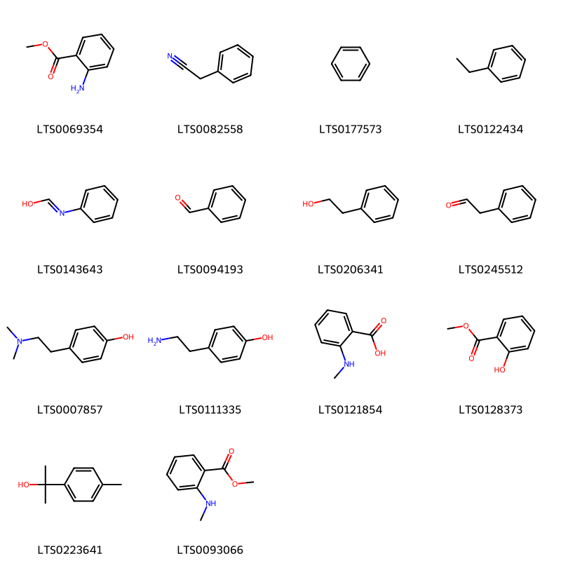
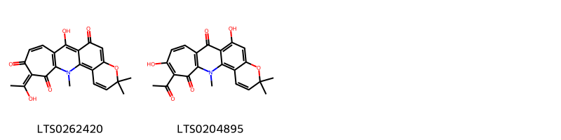
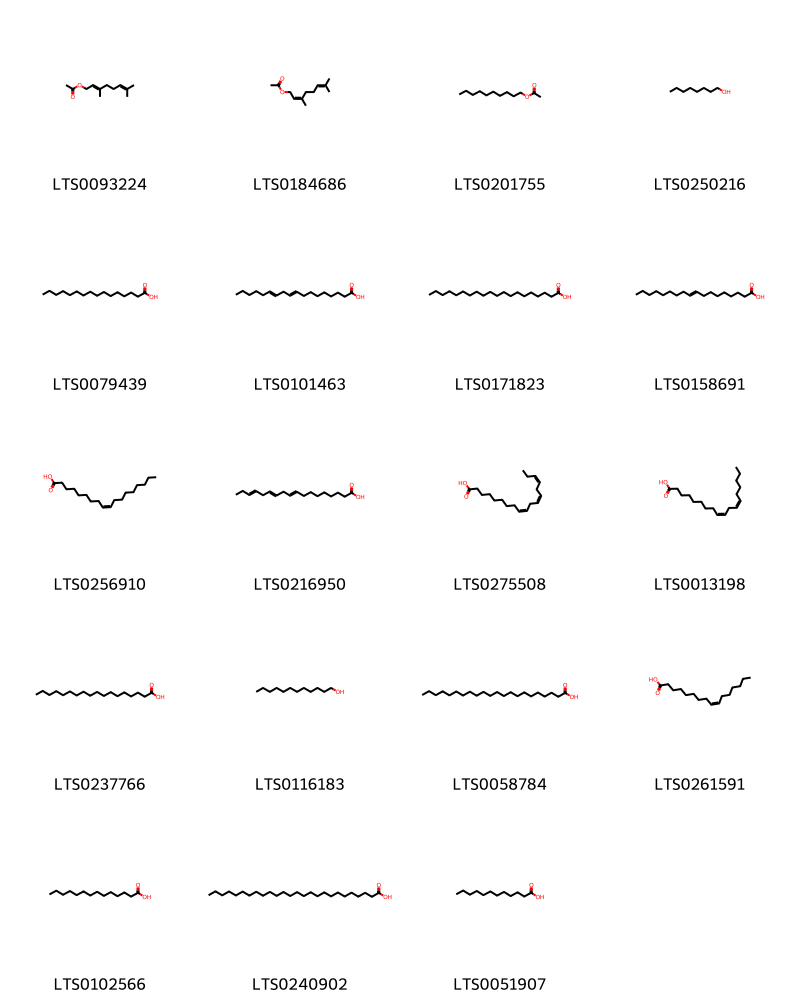
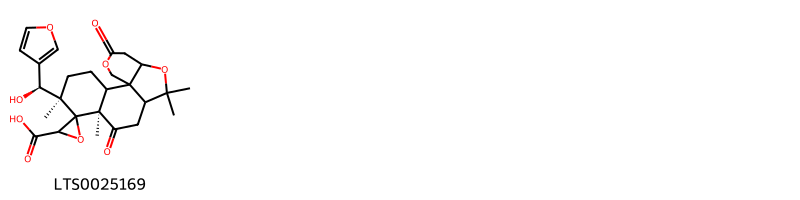
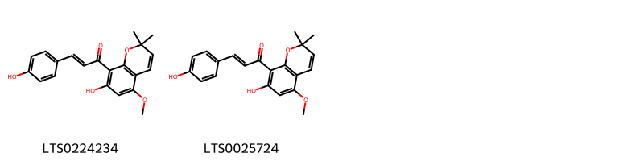
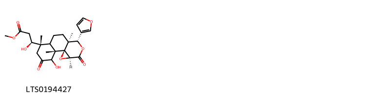
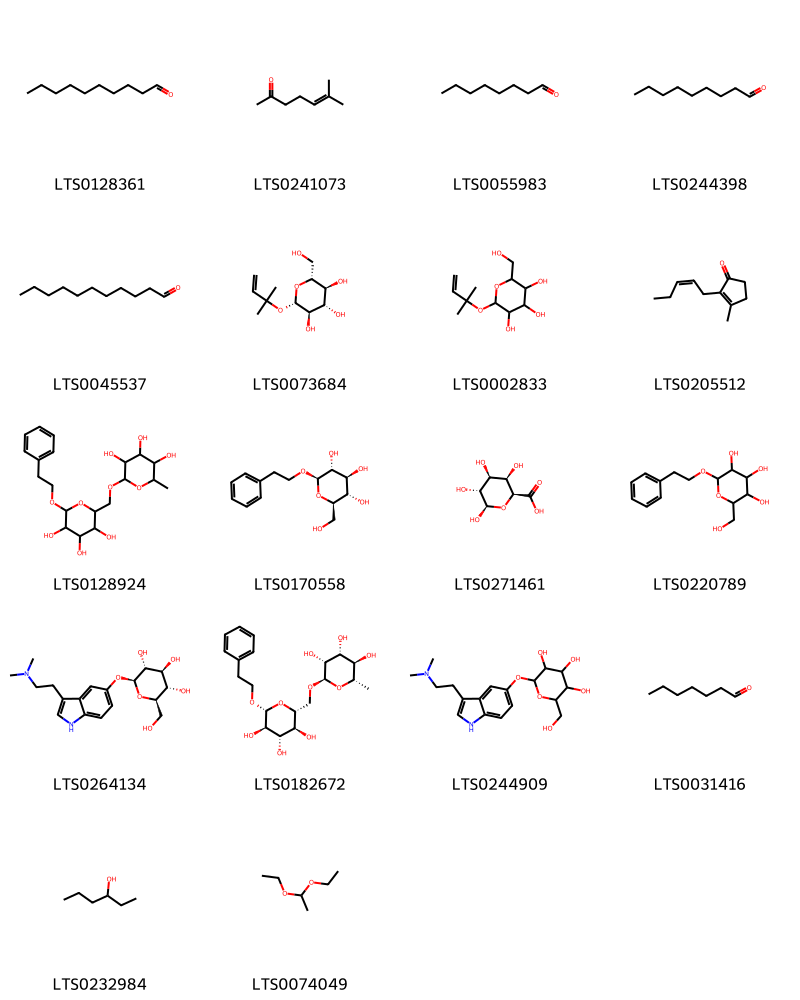
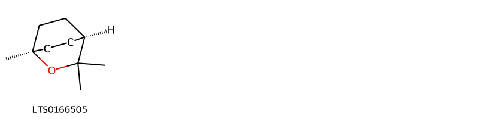
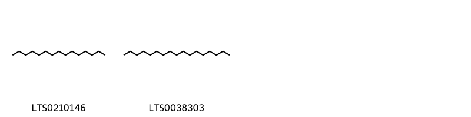

!!! abstract "Tóm tắt"

    Thanh Bì (Pericarpium Citri Reticulatae Viride) là vỏ quả non hoặc vỏ quả chưa chín, phơi hay sấy khô của cây Quýt (Citrus reticulata Blanco), thuộc họ Cam (Rutaceae). Loài cây này được trồng phổ biến tại Đông Nam Á và các vùng nhiệt đới, đặc biệt phân bố rộng rãi ở nhiều địa phương tại Việt Nam. Theo y học cổ truyền, thanh bì là một vị thuốc có tác dụng kích thích tiêu hóa, giảm đầy hơi, chống viêm, kháng khuẩn, và hỗ trợ điều trị ho đờm. Dược liệu này còn được sử dụng trong các trường hợp đau tức vùng hông sườn, kinh nguyệt không đều, và rối loạn tiêu hóa. Thành phần hóa học chính của thanh bì bao gồm: Tinh dầu (Limonene - hoạt chất tạo mùi đặc trưng), Flavonoid (Hesperidin, Naringin).

## Thông tin về thực vật

Dược liệu **Thanh Bì (Vỏ Quả Xanh)** từ bộ phận **nan** từ loài *Citrus reticulata*.

**Mô tả thực vật:** Quít là một cây nhỏ, lá mọc so le, đơn, mép có răng cưa, vỏ có mùi thơm đặc biệt. Hoa nhỏ, màu trắng, mọc đơn độc ở kẽ lá. Quả hình cầu hai đầu dẹt, màu vàng cam hay vàng đỏ, vỏ mỏng nhẫn hay hơi sần sùi, dễ bóc. Mùi thơm ngon, nhiều hạt

*Tài liệu tham khảo:* "Những cây thuốc và vị thuốc Việt Nam" - Đỗ Tất Lợi 
Trong dược điển Việt nam, một loài được sử dụng làm dược liệu là *Citrus reticulata*.

!!! info "Phân loại thực vật của *Citrus reticulata*"
    - **Kingdom:** Plantae
    - **Phylum:** Tracheophyta
    - **Order:** Sapindales
    - **Family:** Rutaceae
    - **Genus:** Citrus
    - **Species:** *Citrus reticulata*

**Phân bố trên thế giới:** Germany, nan, France, Benin, Bhutan, Mayotte, Cyprus, French Polynesia, Seychelles, Spain, Venezuela (Bolivarian Republic of), Mexico, Colombia, Réunion, Angola, Japan, Australia, Madagascar, Guinea, Niue, Nigeria, Portugal, India, Brazil, Costa Rica, Türkiye, Peru, United States of America, Bolivia (Plurinational State of), Croatia, China, Italy, Norfolk Island, Nicaragua, Canada, Greece, New Zealand, El Salvador, Congo, Democratic Republic of the, Belgium

**Phân bố tại Việt nam:** Không có ghi nhận ở Việt Nam

## Thông tin về dược liệu 

### Định danh

!!! info "Thông tin về tên gọi"

    - Dược liệu tiếng Việt: nan
    - Dược liệu tiếng Trung: nan (nan)
    - Dược liệu tiếng Anh: nan
    - Dược liệu latin thông dụng: nan
    - Dược liệu latin kiểu DĐVN: *pericarpium citri diliciosae*
    - Dược liệu latin kiểu DĐVN: *nan*
    - Dược liệu latin kiểu thông tư: *nan*
    - Bộ phận dùng: nan (nan)

### Mô tả dược liệu 

- **Theo dược điển Việt nam V:** nan

- **Mô tả dược liệu theo thông tư chế biến dược liệu theo phương pháp cổ truyền:** nan

### Chế biến 

- **Chế biến theo dược điển việt nam V**: nan

- **Chế biến theo thông tư:** nan

--- 

## Thành phần hóa học

- Theo tài liệu của GS. Đỗ Tất Lợi:  (1)Nhóm hóa học: Flavonoid, alkaloid, tinh dầu.
(2)Tên hoạt chất:
Hesperidin và naringin là các biomarker chính trong dược liệu, có tác dụng chống viêm, kháng khuẩn.
    

**Thành phần hóa học từ loài **Citrus reticulata**

Theo cơ sở dữ liệu lotus, loài *Citrus reticulata* đã phân lập và xác định được **402** hoạt chất thuộc về các nhóm Fatty Acyls, Quinolines and derivatives, Phenols, Carboxylic acids and derivatives, Unsaturated hydrocarbons, Saturated hydrocarbons, Steroids and steroid derivatives, Cyclobutane lignans, Flavonoids, Saccharolipids, Imidazopyrimidines, Benzopyrans, Dihydrofurans, Benzene and substituted derivatives, Coumarins and derivatives, Prenol lipids, Oxanes, Organooxygen compounds, Lactones, Indoles and derivatives, Naphthopyrans, Linear 1,3-diarylpropanoids trong bảng dưới đây. Danh sách các hoạt chất như sau phellandrene [(LTS0157173)](https://lotus.naturalproducts.net/compound/lotus_id/LTS0157173), [(2r,3s,4s,5r,6s)-6-{[(2r,3s,4r,5r,6r)-6-{[(3s,6ar,6bs,8ar,11r,12s,12ar,14as,14br)-4,4,6a,6b,8a,11,12,14b-octamethyl-14-oxo-1,2,3,6,7,8,9,10,11,12,12a,14a-dodecahydropicen-3-yl]oxy}-4,5-dihydroxy-2-(hydroxymethyl)oxan-3-yl]oxy}-3,4,5-trihydroxyoxan-2-yl]methyl 3,4-dihydroxybenzoate [(LTS0184290)](https://lotus.naturalproducts.net/compound/lotus_id/LTS0184290), heptadec-8-ene [(LTS0163098)](https://lotus.naturalproducts.net/compound/lotus_id/LTS0163098), methyl 2-[7-(furan-3-yl)-18-hydroxy-1,8,12,15,15-pentamethyl-5,17-dioxo-3,6,14-trioxapentacyclo[9.7.0.0²,⁴.0²,⁸.0¹²,¹⁶]octadecan-13-yl]acetate [(LTS0051303)](https://lotus.naturalproducts.net/compound/lotus_id/LTS0051303), 5-hydroxy-8,8-dimethyl-3,10-bis(2-methylbut-3-en-2-yl)pyrano[3,2-g]chromen-2-one [(LTS0134693)](https://lotus.naturalproducts.net/compound/lotus_id/LTS0134693), 8-[(1s,2r,3s,4r)-2,3-diacetyl-4-(7-methoxy-2-oxochromen-8-yl)cyclobutyl]-7-methoxychromen-2-one [(LTS0061374)](https://lotus.naturalproducts.net/compound/lotus_id/LTS0061374), 7-{[4,5-dihydroxy-6-(hydroxymethyl)-3-{[(2s)-3,4,5-trihydroxy-6-methyloxan-2-yl]oxy}oxan-2-yl]oxy}-5-hydroxy-2-(3-hydroxy-4-methoxyphenyl)-2,3-dihydro-1-benzopyran-4-one [(LTS0014248)](https://lotus.naturalproducts.net/compound/lotus_id/LTS0014248), 5-hydroxy-2-(4-hydroxyphenyl)-7-{[(2s,5s)-3,4,5-trihydroxy-6-({[(2r,5r)-3,4,5-trihydroxy-6-methyloxan-2-yl]oxy}methyl)oxan-2-yl]oxy}chromen-4-one [(LTS0015495)](https://lotus.naturalproducts.net/compound/lotus_id/LTS0015495), 4-[18-(4-hydroxy-2,2,6-trimethylcyclohexyl)-3,7,12,16-tetramethyloctadeca-1,3,5,7,9,11,13,15,17-nonaen-1-yl]-3,5,5-trimethylcyclohex-3-en-1-ol [(LTS0182319)](https://lotus.naturalproducts.net/compound/lotus_id/LTS0182319), β-carotene [(LTS0275716)](https://lotus.naturalproducts.net/compound/lotus_id/LTS0275716), 8-formyl-5,12-dihydroxy-4-methyl-13-methylidenetetracyclo[10.2.1.0¹,⁹.0³,⁸]pentadecane-2,4-dicarboxylic acid [(LTS0114398)](https://lotus.naturalproducts.net/compound/lotus_id/LTS0114398), (5'r,7'r)-5'-[(s)-furan-3-yl(hydroxy)methyl]-5',7',11',11'-tetramethyl-8',15'-dioxo-12',16'-dioxaspiro[oxirane-2,6'-tetracyclo[8.7.0.0¹,¹³.0²,⁷]heptadecane]-3-carboxylic acid [(LTS0025169)](https://lotus.naturalproducts.net/compound/lotus_id/LTS0025169), (1s,2s,3'r,4ar,5r,6r,8ar)-5-[(1r)-1-(acetyloxy)-2-carboxyethyl]-2-[(s)-furan-3-yl({[(2r,3r,4s,5s,6r)-3,4,5-trihydroxy-6-(hydroxymethyl)oxan-2-yl]oxy})methyl]-6-(2-hydroxypropan-2-yl)-2,5,8a-trimethyl-8-oxo-tetrahydro-3h-spiro[naphthalene-1,2'-oxirane]-3'-carboxylic acid [(LTS0182851)](https://lotus.naturalproducts.net/compound/lotus_id/LTS0182851), 1,3,6-trihydroxy-5-methoxy-10-methyl-4-(3-methylbut-2-en-1-yl)acridin-9-one [(LTS0125444)](https://lotus.naturalproducts.net/compound/lotus_id/LTS0125444), (-)-trans-carveol [(LTS0156471)](https://lotus.naturalproducts.net/compound/lotus_id/LTS0156471), 3,7-dimethylocta-2,6-dien-1-yl acetate [(LTS0184686)](https://lotus.naturalproducts.net/compound/lotus_id/LTS0184686), 12-hydroxy-11-methyl-6-methylidene-16-oxo-15-oxapentacyclo[9.3.2.1⁵,⁸.0¹,¹⁰.0²,⁸]heptadecane-9-carboxylic acid [(LTS0206002)](https://lotus.naturalproducts.net/compound/lotus_id/LTS0206002), 5-isopropyl-2-methylcyclohex-2-en-1-one [(LTS0076097)](https://lotus.naturalproducts.net/compound/lotus_id/LTS0076097), 3,7-dimethyl-2,6-octadienal [(LTS0141353)](https://lotus.naturalproducts.net/compound/lotus_id/LTS0141353), behenic acid [(LTS0058784)](https://lotus.naturalproducts.net/compound/lotus_id/LTS0058784), (3e)-2-hydroxy-4-(7-methoxy-2-oxochromen-8-yl)-2-methylbut-3-en-1-yl 3-methylbutanoate [(LTS0108073)](https://lotus.naturalproducts.net/compound/lotus_id/LTS0108073), 2-(3-hydroxy-4-methoxyphenyl)-5,6,7,8-tetramethoxychromen-4-one [(LTS0187030)](https://lotus.naturalproducts.net/compound/lotus_id/LTS0187030), eupatorin [(LTS0073269)](https://lotus.naturalproducts.net/compound/lotus_id/LTS0073269), limocitrin [(LTS0210192)](https://lotus.naturalproducts.net/compound/lotus_id/LTS0210192), gibberellin a9 [(LTS0243888)](https://lotus.naturalproducts.net/compound/lotus_id/LTS0243888), friedelin [(LTS0213494)](https://lotus.naturalproducts.net/compound/lotus_id/LTS0213494), terpineol [(LTS0136148)](https://lotus.naturalproducts.net/compound/lotus_id/LTS0136148), (6e,8e,10e,12e,14e,16e,18e,22e,26e)-2,6,10,14,19,23,27,31-octamethyldotriaconta-2,6,8,10,12,14,16,18,22,26,30-undecaene [(LTS0178208)](https://lotus.naturalproducts.net/compound/lotus_id/LTS0178208), octanal [(LTS0055983)](https://lotus.naturalproducts.net/compound/lotus_id/LTS0055983), ichangin [(LTS0018532)](https://lotus.naturalproducts.net/compound/lotus_id/LTS0018532), (2s)-5-hydroxy-2-(4-methoxyphenyl)-7-{[(2s,3r,4s,5s,6r)-3,4,5-trihydroxy-6-({[(2r,3r,4r,5r,6s)-3,4,5-trihydroxy-6-methyloxan-2-yl]oxy}methyl)oxan-2-yl]oxy}-2,3-dihydro-1-benzopyran-4-one [(LTS0187794)](https://lotus.naturalproducts.net/compound/lotus_id/LTS0187794), palmitoleic acid [(LTS0261591)](https://lotus.naturalproducts.net/compound/lotus_id/LTS0261591), (4e,6z)-alloocimene [(LTS0254100)](https://lotus.naturalproducts.net/compound/lotus_id/LTS0254100), cosmene [(LTS0151256)](https://lotus.naturalproducts.net/compound/lotus_id/LTS0151256), tangeretin [(LTS0134301)](https://lotus.naturalproducts.net/compound/lotus_id/LTS0134301), guanidinosuccinic acid [(LTS0172937)](https://lotus.naturalproducts.net/compound/lotus_id/LTS0172937), 4-guanidinobutyric acid [(LTS0236153)](https://lotus.naturalproducts.net/compound/lotus_id/LTS0236153), (3'r,5as,7ar,8s,9s,11ar,11br)-9-[(s)-furan-3-yl({[(2r,3r,4s,5s,6r)-3,4,5-trihydroxy-6-(hydroxymethyl)oxan-2-yl]oxy})methyl]-5,5,7a,9,11b-pentamethyl-3,7-dioxo-6,10,11,11a-tetrahydro-5ah-spiro[naphtho[2,1-c]oxepine-8,2'-oxirane]-3'-carboxylic acid [(LTS0075058)](https://lotus.naturalproducts.net/compound/lotus_id/LTS0075058), phytofluene [(LTS0267709)](https://lotus.naturalproducts.net/compound/lotus_id/LTS0267709), (1r,3'r,5ar,7ar,9s,11ar,11br)-1-(acetyloxy)-9-[furan-3-yl({[(2r,3r,4s,5s,6r)-3,4,5-trihydroxy-6-(hydroxymethyl)oxan-2-yl]oxy})methyl]-5,5,7a,9,11b-pentamethyl-3,7-dioxo-hexahydro-1h-spiro[naphtho[2,1-c]oxepine-8,2'-oxirane]-3'-carboxylic acid [(LTS0107449)](https://lotus.naturalproducts.net/compound/lotus_id/LTS0107449), 5,7-dihydroxy-2-(4-hydroxyphenyl)-6,8-bis[3,4,5-trihydroxy-6-(hydroxymethyl)oxan-2-yl]chromen-4-one [(LTS0255367)](https://lotus.naturalproducts.net/compound/lotus_id/LTS0255367), heptanal [(LTS0031416)](https://lotus.naturalproducts.net/compound/lotus_id/LTS0031416), methyl (3s)-3-[(1r,2s,3r,6r,10s,11s,14s)-11-(furan-3-yl)-3-hydroxy-5-(2-hydroxypropan-2-yl)-2,6,10-trimethyl-4,13-dioxo-12,15-dioxatetracyclo[8.5.0.0¹,¹⁴.0²,⁷]pentadecan-6-yl]-3-hydroxypropanoate [(LTS0059255)](https://lotus.naturalproducts.net/compound/lotus_id/LTS0059255), n-methylanthranilic acid [(LTS0121854)](https://lotus.naturalproducts.net/compound/lotus_id/LTS0121854), 2-hydroxy-4-(7-methoxy-2-oxochromen-8-yl)-2-methylbut-3-en-1-yl 3-methylbutanoate [(LTS0163745)](https://lotus.naturalproducts.net/compound/lotus_id/LTS0163745), (-)-α-pinene [(LTS0032699)](https://lotus.naturalproducts.net/compound/lotus_id/LTS0032699), 3,7-dimethyl-2,6-octadien-1-ol [(LTS0215566)](https://lotus.naturalproducts.net/compound/lotus_id/LTS0215566), (9r,10s)-9-hydroxy-5,10-dimethoxy-8,8-dimethyl-9h,10h-pyrano[2,3-h]chromen-2-one [(LTS0024835)](https://lotus.naturalproducts.net/compound/lotus_id/LTS0024835), apigenin trimethyl ether [(LTS0044540)](https://lotus.naturalproducts.net/compound/lotus_id/LTS0044540), 2-(4-hydroxyphenyl)-5,6,7,8-tetramethoxychromen-4-one [(LTS0152316)](https://lotus.naturalproducts.net/compound/lotus_id/LTS0152316), 2-(4-hydroxyphenyl)-3,6-dimethoxy-8,8-dimethylpyrano[2,3-h]chromen-4-one [(LTS0075526)](https://lotus.naturalproducts.net/compound/lotus_id/LTS0075526), (1r,2r,7s,10r,13r,14r,16s,19r,20s)-19-(5-hydroxy-2-oxo-5h-furan-3-yl)-9,9,13,20-tetramethyl-4,8,15,18-tetraoxahexacyclo[11.9.0.0²,⁷.0²,¹⁰.0¹⁴,¹⁶.0¹⁴,²⁰]docosane-5,12,17-trione [(LTS0136246)](https://lotus.naturalproducts.net/compound/lotus_id/LTS0136246), farnesene [(LTS0057150)](https://lotus.naturalproducts.net/compound/lotus_id/LTS0057150), glycocyamine [(LTS0275175)](https://lotus.naturalproducts.net/compound/lotus_id/LTS0275175), asahina [(LTS0068303)](https://lotus.naturalproducts.net/compound/lotus_id/LTS0068303), auraptene [(LTS0058299)](https://lotus.naturalproducts.net/compound/lotus_id/LTS0058299), methyl indole-3-acetate [(LTS0042788)](https://lotus.naturalproducts.net/compound/lotus_id/LTS0042788), tetramethylcyclohexanepropanol [(LTS0232605)](https://lotus.naturalproducts.net/compound/lotus_id/LTS0232605), 6-[(9e,11e,13e,15e)-16-(6-hydroxy-4,4,7a-trimethyl-2,5,6,7-tetrahydro-1-benzofuran-2-yl)-3,7,12-trimethylheptadeca-1,3,5,7,9,11,13,15-octaen-1-ylidene]-1,5,5-trimethylcyclohexane-1,3-diol [(LTS0233322)](https://lotus.naturalproducts.net/compound/lotus_id/LTS0233322), gibberellin a4 [(LTS0029910)](https://lotus.naturalproducts.net/compound/lotus_id/LTS0029910), methyl (3s)-3-[(1r,2s,6s,10s,11s,14s)-11-(furan-3-yl)-3-hydroxy-2,6,10-trimethyl-4,13-dioxo-12,15-dioxatetracyclo[8.5.0.0¹,¹⁴.0²,⁷]pentadecan-6-yl]-3-hydroxypropanoate [(LTS0194427)](https://lotus.naturalproducts.net/compound/lotus_id/LTS0194427), phellandral [(LTS0209940)](https://lotus.naturalproducts.net/compound/lotus_id/LTS0209940), 2-[(1s,3s,4s)-4-ethenyl-4-methyl-3-(prop-1-en-2-yl)cyclohexyl]propan-2-ol [(LTS0219497)](https://lotus.naturalproducts.net/compound/lotus_id/LTS0219497), naringin [(LTS0165229)](https://lotus.naturalproducts.net/compound/lotus_id/LTS0165229), gardenin d [(LTS0004523)](https://lotus.naturalproducts.net/compound/lotus_id/LTS0004523), (3s)-6-[(1e,3e,5e,7e,9e,11e,13e,15e,17e)-18-[(4r)-4-hydroxy-2,6,6-trimethylcyclohex-1-en-1-yl]-3,7,12,16-tetramethyloctadeca-1,3,5,7,9,11,13,15,17-nonaen-1-yl]-1,5,5-trimethyl-7-oxabicyclo[4.1.0]heptan-3-ol [(LTS0209322)](https://lotus.naturalproducts.net/compound/lotus_id/LTS0209322), 1-hydroxy-3,5,6-trimethoxy-10-methylacridin-9-one [(LTS0178502)](https://lotus.naturalproducts.net/compound/lotus_id/LTS0178502), 6-[(3e,5e,7e,9e)-18-{4-hydroxy-2,2,6-trimethyl-7-oxabicyclo[4.1.0]heptan-1-yl}-3,7,12,16-tetramethyloctadeca-1,3,5,7,9,11,13,15,17-nonaen-1-ylidene]-1,5,5-trimethylcyclohexane-1,3-diol [(LTS0114386)](https://lotus.naturalproducts.net/compound/lotus_id/LTS0114386), (+)-α-pinene [(LTS0211102)](https://lotus.naturalproducts.net/compound/lotus_id/LTS0211102), limonin 17-β-d-glucopyranoside [(LTS0198378)](https://lotus.naturalproducts.net/compound/lotus_id/LTS0198378), sabinene hydrate [(LTS0236165)](https://lotus.naturalproducts.net/compound/lotus_id/LTS0236165), 2-({3-[2-(dimethylamino)ethyl]-1h-indol-5-yl}oxy)-6-(hydroxymethyl)oxane-3,4,5-triol [(LTS0244909)](https://lotus.naturalproducts.net/compound/lotus_id/LTS0244909), (1s,2s,4r,7s,8s,11r,12s,13s,18r,20r)-7-(furan-3-yl)-13,20-dihydroxy-1,8,12,17,17-pentamethyl-3,6,16-trioxapentacyclo[9.9.0.0²,⁴.0²,⁸.0¹²,¹⁸]icosane-5,15,19-trione [(LTS0081833)](https://lotus.naturalproducts.net/compound/lotus_id/LTS0081833), 8-[2,3-diacetyl-4-(7-methoxy-2-oxochromen-8-yl)cyclobutyl]-7-methoxychromen-2-one [(LTS0261353)](https://lotus.naturalproducts.net/compound/lotus_id/LTS0261353), α-thujene [(LTS0185078)](https://lotus.naturalproducts.net/compound/lotus_id/LTS0185078), 4-[(9e,11e,13e,15e,17e)-18-(4-hydroxy-2,6,6-trimethylcyclohex-1-en-1-yl)-3,7,12,16-tetramethyloctadeca-1,3,5,7,9,11,13,15,17-nonaen-1-yl]-3,5,5-trimethylcyclohex-3-en-1-ol [(LTS0095534)](https://lotus.naturalproducts.net/compound/lotus_id/LTS0095534), limonin [(LTS0207873)](https://lotus.naturalproducts.net/compound/lotus_id/LTS0207873), nomilin [(LTS0125101)](https://lotus.naturalproducts.net/compound/lotus_id/LTS0125101), (1s,2r,4s)-1-[(1e,3e,5e,7e,9e,11e,13e,15e,17e)-18-[(4r)-4-hydroxy-2,6,6-trimethylcyclohex-1-en-1-yl]-3,7,12,16-tetramethyloctadeca-1,3,5,7,9,11,13,15,17-nonaen-1-yl]-2,6,6-trimethylcyclohexane-1,2,4-triol [(LTS0151492)](https://lotus.naturalproducts.net/compound/lotus_id/LTS0151492), all-trans-phytofluene [(LTS0269894)](https://lotus.naturalproducts.net/compound/lotus_id/LTS0269894), diosmetin [(LTS0252065)](https://lotus.naturalproducts.net/compound/lotus_id/LTS0252065), 2-[(2e,4e,6e,8e,10e,12e)-17-{4-hydroxy-2,2,6-trimethyl-7-oxabicyclo[4.1.0]heptan-1-yl}-6,11,15-trimethylheptadeca-2,4,6,8,10,12,14-heptaen-2-yl]-4,4,7a-trimethyl-2,5,6,7-tetrahydro-1-benzofuran-6-ol [(LTS0264417)](https://lotus.naturalproducts.net/compound/lotus_id/LTS0264417), 8-hydroxy-5,7-dimethoxy-2-(4-methoxyphenyl)chromen-4-one [(LTS0139922)](https://lotus.naturalproducts.net/compound/lotus_id/LTS0139922), citronellol, (+-)- [(LTS0090925)](https://lotus.naturalproducts.net/compound/lotus_id/LTS0090925), α-sinensal [(LTS0220235)](https://lotus.naturalproducts.net/compound/lotus_id/LTS0220235), rutin [(LTS0042292)](https://lotus.naturalproducts.net/compound/lotus_id/LTS0042292), (3s,5r,8r,3'r)-mutatoxanthin [(LTS0245321)](https://lotus.naturalproducts.net/compound/lotus_id/LTS0245321), elemol [(LTS0208556)](https://lotus.naturalproducts.net/compound/lotus_id/LTS0208556), bufotenine [(LTS0012048)](https://lotus.naturalproducts.net/compound/lotus_id/LTS0012048), β-indole-3-acetic acid [(LTS0250222)](https://lotus.naturalproducts.net/compound/lotus_id/LTS0250222), synephrine [(LTS0189530)](https://lotus.naturalproducts.net/compound/lotus_id/LTS0189530), 7-(furan-3-yl)-13,20-dihydroxy-1,8,12,17,17-pentamethyl-3,6,16-trioxapentacyclo[9.9.0.0²,⁴.0²,⁸.0¹²,¹⁸]icosane-5,15,19-trione [(LTS0230515)](https://lotus.naturalproducts.net/compound/lotus_id/LTS0230515), 2-phenyl-ethanol [(LTS0206341)](https://lotus.naturalproducts.net/compound/lotus_id/LTS0206341), 1,5-dihydroxy-3,4-dimethoxy-10-methylacridin-9-one [(LTS0154282)](https://lotus.naturalproducts.net/compound/lotus_id/LTS0154282), methyl 2-[7-(furan-3-yl)-17-hydroxy-1,8,12,15,15-pentamethyl-5,18-dioxo-3,6,14-trioxapentacyclo[9.7.0.0²,⁴.0²,⁸.0¹²,¹⁶]octadecan-13-yl]acetate [(LTS0256097)](https://lotus.naturalproducts.net/compound/lotus_id/LTS0256097), 6-[(1e)-3-hydroxy-3-methylbut-1-en-1-yl]-7-methoxychromen-2-one [(LTS0188465)](https://lotus.naturalproducts.net/compound/lotus_id/LTS0188465), thymol [(LTS0168527)](https://lotus.naturalproducts.net/compound/lotus_id/LTS0168527), (1s,5s)-carvyl acetate [(LTS0169943)](https://lotus.naturalproducts.net/compound/lotus_id/LTS0169943), carveol [(LTS0263183)](https://lotus.naturalproducts.net/compound/lotus_id/LTS0263183), polyacetal [(LTS0074049)](https://lotus.naturalproducts.net/compound/lotus_id/LTS0074049), delta-carotene [(LTS0133990)](https://lotus.naturalproducts.net/compound/lotus_id/LTS0133990), methyl 2-[(1r,2r,4s,7s,8s,11r,12r,13s,16r,17s)-7-(furan-3-yl)-17-hydroxy-1,8,12,15,15-pentamethyl-5,18-dioxo-3,6,14-trioxapentacyclo[9.7.0.0²,⁴.0²,⁸.0¹²,¹⁶]octadecan-13-yl]acetate [(LTS0047876)](https://lotus.naturalproducts.net/compound/lotus_id/LTS0047876), 6-[(5e,7e,9e,11e,13e,15e,17e)-18-(4-hydroxy-2,6,6-trimethylcyclohex-1-en-1-yl)-3,7,12,16-tetramethyloctadeca-3,5,7,9,11,13,15,17-octaen-1-yl]-1,5,5-trimethyl-7-oxabicyclo[4.1.0]heptan-3-ol [(LTS0159668)](https://lotus.naturalproducts.net/compound/lotus_id/LTS0159668), linderoflavone b [(LTS0243635)](https://lotus.naturalproducts.net/compound/lotus_id/LTS0243635), octanol [(LTS0250216)](https://lotus.naturalproducts.net/compound/lotus_id/LTS0250216), (3s,6s,9s,12s,15s,18s)-15-benzyl-9-[(2s)-butan-2-yl]-3,18-bis[(1r)-1-hydroxyethyl]-6-methyl-12-(2-methylpropyl)-1,4,7,10,13,16,19-heptaazacyclohenicosa-1,4,7,10,13,16,19-heptaene-2,5,8,11,14,17,20-heptol [(LTS0220193)](https://lotus.naturalproducts.net/compound/lotus_id/LTS0220193), hordenine [(LTS0007857)](https://lotus.naturalproducts.net/compound/lotus_id/LTS0007857), (3e)-3,7-dimethylocta-1,3-diene [(LTS0174272)](https://lotus.naturalproducts.net/compound/lotus_id/LTS0174272), linalyl acetate [(LTS0167325)](https://lotus.naturalproducts.net/compound/lotus_id/LTS0167325), 7,11-dihydroxy-6-methoxy-2,2,5-trimethyl-1-oxa-5-azatetraphen-10-one [(LTS0089252)](https://lotus.naturalproducts.net/compound/lotus_id/LTS0089252), (1s,2r,4s,7s,8s,11r,12r,13r,18r,20r)-7-(furan-3-yl)-13,20-dihydroxy-1,8,12,17,17-pentamethyl-3,6,16-trioxapentacyclo[9.9.0.0²,⁴.0²,⁸.0¹²,¹⁸]icosane-5,15,19-trione [(LTS0061954)](https://lotus.naturalproducts.net/compound/lotus_id/LTS0061954), 5,7-dihydroxy-2-(4-hydroxyphenyl)-3,6-bis[(2s,3r,4r,5s,6r)-3,4,5-trihydroxy-6-(hydroxymethyl)oxan-2-yl]chromen-4-one [(LTS0098024)](https://lotus.naturalproducts.net/compound/lotus_id/LTS0098024), 5-hydroxy-11-methyl-6-methylidene-12-oxo-13-oxapentacyclo[9.3.3.1⁵,⁸.0¹,¹⁰.0²,⁸]octadecane-9-carboxylic acid [(LTS0185226)](https://lotus.naturalproducts.net/compound/lotus_id/LTS0185226), 7-(furan-3-yl)-1,8,12,17,17-pentamethyl-5,15,20-trioxo-3,6,16-trioxapentacyclo[9.9.0.0²,⁴.0²,⁸.0¹²,¹⁸]icosan-13-yl acetate [(LTS0267734)](https://lotus.naturalproducts.net/compound/lotus_id/LTS0267734), 4,11,11-trimethyl-8-methylidenebicyclo[7.2.0]undec-4-ene [(LTS0256716)](https://lotus.naturalproducts.net/compound/lotus_id/LTS0256716), trans-β-ocimene [(LTS0049765)](https://lotus.naturalproducts.net/compound/lotus_id/LTS0049765), vicenin 2 [(LTS0181160)](https://lotus.naturalproducts.net/compound/lotus_id/LTS0181160), isopentenyl pyrophosphate [(LTS0270004)](https://lotus.naturalproducts.net/compound/lotus_id/LTS0270004), 5,7-dihydroxy-2-(4-hydroxy-3-methoxyphenyl)-8-methoxy-3-{[3,4,5-trihydroxy-6-(hydroxymethyl)oxan-2-yl]oxy}chromen-4-one [(LTS0056093)](https://lotus.naturalproducts.net/compound/lotus_id/LTS0056093), elemene [(LTS0090837)](https://lotus.naturalproducts.net/compound/lotus_id/LTS0090837), 6-[(9e,11e,13e,15e,17e)-18-{4-hydroxy-2,2,6-trimethyl-7-oxabicyclo[4.1.0]heptan-1-yl}-3,7,12,16-tetramethyloctadeca-1,3,5,7,9,11,13,15,17-nonaen-1-yl]-1,5,5-trimethyl-7-oxabicyclo[4.1.0]heptan-3-ol [(LTS0252861)](https://lotus.naturalproducts.net/compound/lotus_id/LTS0252861), 2-(3,4-dimethoxyphenyl)-6-hydroxy-3,5,7,8-tetramethoxychromen-4-one [(LTS0210770)](https://lotus.naturalproducts.net/compound/lotus_id/LTS0210770), p-cymen-8-ol [(LTS0223641)](https://lotus.naturalproducts.net/compound/lotus_id/LTS0223641), 2-methyl-6-methylideneocta-1,7-diene [(LTS0213612)](https://lotus.naturalproducts.net/compound/lotus_id/LTS0213612), phenylacetaldehyde [(LTS0245512)](https://lotus.naturalproducts.net/compound/lotus_id/LTS0245512), aldehyde c11 [(LTS0045537)](https://lotus.naturalproducts.net/compound/lotus_id/LTS0045537), β-elemene [(LTS0260361)](https://lotus.naturalproducts.net/compound/lotus_id/LTS0260361), (+)-α-carotene [(LTS0200789)](https://lotus.naturalproducts.net/compound/lotus_id/LTS0200789), salvigenin [(LTS0020289)](https://lotus.naturalproducts.net/compound/lotus_id/LTS0020289), (-)-4-terpineol [(LTS0111954)](https://lotus.naturalproducts.net/compound/lotus_id/LTS0111954), stigmast-5-en-3-ol, (3β)- [(LTS0204616)](https://lotus.naturalproducts.net/compound/lotus_id/LTS0204616), 19-(furan-3-yl)-9,9,13,20-tetramethyl-4,8,15-trioxahexacyclo[11.9.0.0²,⁷.0²,¹⁰.0¹⁴,¹⁶.0¹⁴,²⁰]docosane-5,12,17-trione [(LTS0193865)](https://lotus.naturalproducts.net/compound/lotus_id/LTS0193865), (1s,2s)-1-ethenyl-1-methyl-2-(prop-1-en-2-yl)-4-(propan-2-ylidene)cyclohexane [(LTS0135613)](https://lotus.naturalproducts.net/compound/lotus_id/LTS0135613), 1,8-cineole [(LTS0166505)](https://lotus.naturalproducts.net/compound/lotus_id/LTS0166505), n-amidino-l-aspartic acid [(LTS0014971)](https://lotus.naturalproducts.net/compound/lotus_id/LTS0014971), apocarotenal [(LTS0146481)](https://lotus.naturalproducts.net/compound/lotus_id/LTS0146481), palmitic acid [(LTS0079439)](https://lotus.naturalproducts.net/compound/lotus_id/LTS0079439), jasmone [(LTS0205512)](https://lotus.naturalproducts.net/compound/lotus_id/LTS0205512), narirutin [(LTS0259265)](https://lotus.naturalproducts.net/compound/lotus_id/LTS0259265), 2,6,10,14,19,23,27,31-octamethyldotriaconta-2,6,8,10,12,14,16,18,22,26,30-undecaene [(LTS0003966)](https://lotus.naturalproducts.net/compound/lotus_id/LTS0003966), 1-[(1e,3e,5e,7e,9e)-18-(4-hydroxy-2,6,6-trimethylcyclohex-1-en-1-yl)-3,7,12,16-tetramethyloctadeca-1,3,5,7,9,11,13,15,17-nonaen-1-yl]-2,6,6-trimethylcyclohexane-1,2,4-triol [(LTS0248546)](https://lotus.naturalproducts.net/compound/lotus_id/LTS0248546), delta-carotene [(LTS0070421)](https://lotus.naturalproducts.net/compound/lotus_id/LTS0070421), eriocitrin [(LTS0210425)](https://lotus.naturalproducts.net/compound/lotus_id/LTS0210425), 5,7-dihydroxy-2-(4-hydroxyphenyl)-3,6-bis[3,4,5-trihydroxy-6-(hydroxymethyl)oxan-2-yl]chromen-4-one [(LTS0106245)](https://lotus.naturalproducts.net/compound/lotus_id/LTS0106245), 6-{[3a,6,6,9a,11a-pentamethyl-1-(6-methylheptan-2-yl)-1h,2h,3h,3bh,4h,7h,8h,9h,9bh,10h,11h-cyclopenta[a]phenanthren-7-yl]oxy}-4,5-dihydroxy-2-(hydroxymethyl)oxan-3-yl icosanoate [(LTS0016289)](https://lotus.naturalproducts.net/compound/lotus_id/LTS0016289), citflavanone [(LTS0122503)](https://lotus.naturalproducts.net/compound/lotus_id/LTS0122503), 9,12-octadecadienoic acid [(LTS0101463)](https://lotus.naturalproducts.net/compound/lotus_id/LTS0101463), benzene [(LTS0177573)](https://lotus.naturalproducts.net/compound/lotus_id/LTS0177573), citroside b [(LTS0127892)](https://lotus.naturalproducts.net/compound/lotus_id/LTS0127892), β-citraurin [(LTS0011056)](https://lotus.naturalproducts.net/compound/lotus_id/LTS0011056), 1,1-dimethylpyrrolidin-1-ium-2-carboxylate [(LTS0052231)](https://lotus.naturalproducts.net/compound/lotus_id/LTS0052231), (2s)-5-hydroxy-2-(3-hydroxy-4-methoxyphenyl)-7-{[(2s,3r,4s,5s,6r)-3,4,5-trihydroxy-6-({[(2r,3r,4s,5r,6s)-3,4,5-trihydroxy-6-methyloxan-2-yl]oxy}methyl)oxan-2-yl]oxy}-2,3-dihydro-1-benzopyran-4-one [(LTS0091118)](https://lotus.naturalproducts.net/compound/lotus_id/LTS0091118), 2-(hydroxymethyl)-6-(2-phenylethoxy)oxane-3,4,5-triol [(LTS0220789)](https://lotus.naturalproducts.net/compound/lotus_id/LTS0220789), (-)-β-bisabolene [(LTS0009940)](https://lotus.naturalproducts.net/compound/lotus_id/LTS0009940), (+)-sabinene [(LTS0110694)](https://lotus.naturalproducts.net/compound/lotus_id/LTS0110694), violaxanthin [(LTS0102265)](https://lotus.naturalproducts.net/compound/lotus_id/LTS0102265), chamomile [(LTS0104946)](https://lotus.naturalproducts.net/compound/lotus_id/LTS0104946), (4e,6e,8e,10e,12e,14e,16e)-17-(4-hydroxy-2,6,6-trimethylcyclohex-1-en-1-yl)-2,6,11,15-tetramethylheptadeca-2,4,6,8,10,12,14,16-octaenal [(LTS0186763)](https://lotus.naturalproducts.net/compound/lotus_id/LTS0186763), (1r,2r,4s,7s,8s,11r,12r,13s,18r)-7-(furan-3-yl)-13-hydroxy-1,8,12,17,17-pentamethyl-3,6,16-trioxapentacyclo[9.9.0.0²,⁴.0²,⁸.0¹²,¹⁸]icosane-5,15,20-trione [(LTS0177008)](https://lotus.naturalproducts.net/compound/lotus_id/LTS0177008), (+)-α-thujene [(LTS0272912)](https://lotus.naturalproducts.net/compound/lotus_id/LTS0272912), β-selinene [(LTS0096341)](https://lotus.naturalproducts.net/compound/lotus_id/LTS0096341), 5,7-dihydroxy-2-(3-hydroxy-4-methoxyphenyl)-3-{[(2s,3r,4s,5s,6r)-3,4,5-trihydroxy-6-({[(2r,3r,4r,5r,6s)-3,4,5-trihydroxy-6-methyloxan-2-yl]oxy}methyl)oxan-2-yl]oxy}chromen-4-one [(LTS0073565)](https://lotus.naturalproducts.net/compound/lotus_id/LTS0073565), β-copaene [(LTS0255787)](https://lotus.naturalproducts.net/compound/lotus_id/LTS0255787), (2r,3s,4s,5r,6s)-2-(hydroxymethyl)-6-[(2-methylbut-3-en-2-yl)oxy]oxane-3,4,5-triol [(LTS0073684)](https://lotus.naturalproducts.net/compound/lotus_id/LTS0073684), rhoifolin [(LTS0029806)](https://lotus.naturalproducts.net/compound/lotus_id/LTS0029806), (-)-friedelin [(LTS0041645)](https://lotus.naturalproducts.net/compound/lotus_id/LTS0041645), myristic acid [(LTS0102566)](https://lotus.naturalproducts.net/compound/lotus_id/LTS0102566), (1r)-3,5,5-trimethyl-4-[(1e,3e,5e,7e,9e,11e,13e)-3,7,12,16-tetramethylheptadeca-1,3,5,7,9,11,13,15-octaen-1-yl]cyclohex-3-en-1-ol [(LTS0013700)](https://lotus.naturalproducts.net/compound/lotus_id/LTS0013700), sabinene [(LTS0224133)](https://lotus.naturalproducts.net/compound/lotus_id/LTS0224133), neral [(LTS0165243)](https://lotus.naturalproducts.net/compound/lotus_id/LTS0165243), 7-(furan-3-yl)-20-hydroxy-1,8,12,17,17-pentamethyl-5,15,19-trioxo-3,6,16-trioxapentacyclo[9.9.0.0²,⁴.0²,⁸.0¹²,¹⁸]icosan-13-yl acetate [(LTS0208652)](https://lotus.naturalproducts.net/compound/lotus_id/LTS0208652), citrunobin [(LTS0025724)](https://lotus.naturalproducts.net/compound/lotus_id/LTS0025724), (1r,3as,3bs,7s,9bs)-1-[(2r,5r)-5,6-dimethylheptan-2-yl]-9a,11a-dimethyl-1h,2h,3h,3ah,3bh,4h,6h,7h,8h,9h,9bh,10h,11h-cyclopenta[a]phenanthren-7-ol [(LTS0057877)](https://lotus.naturalproducts.net/compound/lotus_id/LTS0057877), 2-(3,4-dimethoxyphenyl)-5-hydroxy-6,7-dimethoxychromen-4-one [(LTS0032351)](https://lotus.naturalproducts.net/compound/lotus_id/LTS0032351), (5s)-1-isopropyl-4-methylidenebicyclo[3.1.0]hexane [(LTS0129854)](https://lotus.naturalproducts.net/compound/lotus_id/LTS0129854), demethylnobiletin [(LTS0209649)](https://lotus.naturalproducts.net/compound/lotus_id/LTS0209649), β-farnesene [(LTS0067925)](https://lotus.naturalproducts.net/compound/lotus_id/LTS0067925), limonene,  [(LTS0155981)](https://lotus.naturalproducts.net/compound/lotus_id/LTS0155981), citrusinol [(LTS0128978)](https://lotus.naturalproducts.net/compound/lotus_id/LTS0128978), gardenin b [(LTS0017705)](https://lotus.naturalproducts.net/compound/lotus_id/LTS0017705), citronella [(LTS0151257)](https://lotus.naturalproducts.net/compound/lotus_id/LTS0151257), 3-methoxynobiletin [(LTS0144095)](https://lotus.naturalproducts.net/compound/lotus_id/LTS0144095), methyl anthranilate [(LTS0069354)](https://lotus.naturalproducts.net/compound/lotus_id/LTS0069354), 7-{[4,5-dihydroxy-6-(hydroxymethyl)-3-[(3,4,5-trihydroxy-6-methyloxan-2-yl)oxy]oxan-2-yl]oxy}-5-hydroxy-2-(3-hydroxy-4-methoxyphenyl)-2,3-dihydro-1-benzopyran-4-one [(LTS0265383)](https://lotus.naturalproducts.net/compound/lotus_id/LTS0265383), neohesperidin [(LTS0129178)](https://lotus.naturalproducts.net/compound/lotus_id/LTS0129178), hesperidin [(LTS0261835)](https://lotus.naturalproducts.net/compound/lotus_id/LTS0261835), 5-[1-(acetyloxy)-3-methoxy-3-oxopropyl]-2-[furan-3-yl({[3,4,5-trihydroxy-6-(hydroxymethyl)oxan-2-yl]oxy})methyl]-6-(2-hydroxypropan-2-yl)-2,5,8a-trimethyl-8-oxo-tetrahydro-3h-spiro[naphthalene-1,2'-oxirane]-3'-carboxylic acid [(LTS0008495)](https://lotus.naturalproducts.net/compound/lotus_id/LTS0008495), natsudaidain [(LTS0074569)](https://lotus.naturalproducts.net/compound/lotus_id/LTS0074569), (2s,3's,4ar,5r,6r,8ar)-5-[(1r)-1-(acetyloxy)-2-carboxyethyl]-2-[(s)-furan-3-yl({[(2r,3r,4s,5s,6r)-3,4,5-trihydroxy-6-(hydroxymethyl)oxan-2-yl]oxy})methyl]-6-(2-hydroxypropan-2-yl)-2,5,8a-trimethyl-8-oxo-tetrahydro-3h-spiro[naphthalene-1,2'-oxirane]-3'-carboxylic acid [(LTS0175497)](https://lotus.naturalproducts.net/compound/lotus_id/LTS0175497), kaempherol [(LTS0155822)](https://lotus.naturalproducts.net/compound/lotus_id/LTS0155822), heptadecane [(LTS0038303)](https://lotus.naturalproducts.net/compound/lotus_id/LTS0038303), vicenin-2 [(LTS0103522)](https://lotus.naturalproducts.net/compound/lotus_id/LTS0103522), stearic acid [(LTS0237766)](https://lotus.naturalproducts.net/compound/lotus_id/LTS0237766), nobiletin [(LTS0100173)](https://lotus.naturalproducts.net/compound/lotus_id/LTS0100173), (1s,2s,3'r,4ar,5r,6r,8ar)-5-[(1s)-1-(acetyloxy)-3-methoxy-3-oxopropyl]-2-[(s)-furan-3-yl({[(2r,3r,4s,5s,6r)-3,4,5-trihydroxy-6-(hydroxymethyl)oxan-2-yl]oxy})methyl]-6-(2-hydroxypropan-2-yl)-2,5,8a-trimethyl-8-oxo-tetrahydro-3h-spiro[naphthalene-1,2'-oxirane]-3'-carboxylic acid [(LTS0035730)](https://lotus.naturalproducts.net/compound/lotus_id/LTS0035730), 6-methyl-5-hepten-2-one [(LTS0241073)](https://lotus.naturalproducts.net/compound/lotus_id/LTS0241073), xanthoxyletin [(LTS0112626)](https://lotus.naturalproducts.net/compound/lotus_id/LTS0112626), (4e)-5-[(1s)-1-hydroxy-2,6,6-trimethyl-4-oxocyclohex-2-en-1-yl]-3-methylpenta-2,4-dienoic acid [(LTS0268716)](https://lotus.naturalproducts.net/compound/lotus_id/LTS0268716), decyl acetate [(LTS0201755)](https://lotus.naturalproducts.net/compound/lotus_id/LTS0201755), isosinensetin [(LTS0052178)](https://lotus.naturalproducts.net/compound/lotus_id/LTS0052178), α-selinene [(LTS0024564)](https://lotus.naturalproducts.net/compound/lotus_id/LTS0024564), (-)-camphene [(LTS0067556)](https://lotus.naturalproducts.net/compound/lotus_id/LTS0067556), (8e)-heptadec-8-ene [(LTS0274439)](https://lotus.naturalproducts.net/compound/lotus_id/LTS0274439), corniculatusin [(LTS0195081)](https://lotus.naturalproducts.net/compound/lotus_id/LTS0195081), 7-acetyl-1,7-dihydroxy-3-methoxy-5h,6h-cyclohepta[b]quinoline-8,11-dione [(LTS0147199)](https://lotus.naturalproducts.net/compound/lotus_id/LTS0147199), cirsilineol [(LTS0092903)](https://lotus.naturalproducts.net/compound/lotus_id/LTS0092903), (2s,6s,7ar)-2-[(2e,4e,6e,8e,10e,12e,14e)-17-[(1s,4s,6r)-4-hydroxy-2,2,6-trimethyl-7-oxabicyclo[4.1.0]heptan-1-yl]-6,11,15-trimethylheptadeca-2,4,6,8,10,12,14-heptaen-2-yl]-4,4,7a-trimethyl-2,5,6,7-tetrahydro-1-benzofuran-6-ol [(LTS0182023)](https://lotus.naturalproducts.net/compound/lotus_id/LTS0182023), lauric acid [(LTS0051907)](https://lotus.naturalproducts.net/compound/lotus_id/LTS0051907), phenylacetonitrile [(LTS0082558)](https://lotus.naturalproducts.net/compound/lotus_id/LTS0082558), l-arginine [(LTS0064737)](https://lotus.naturalproducts.net/compound/lotus_id/LTS0064737), (4r)-4-isopropylcyclohex-1-ene-1-carbaldehyde [(LTS0231554)](https://lotus.naturalproducts.net/compound/lotus_id/LTS0231554), 2-(3,4-dihydroxy-5-methoxyphenyl)-5,7-dihydroxy-3-[(3,4,5-trihydroxy-6-{[(3,4,5-trihydroxy-6-methyloxan-2-yl)oxy]methyl}oxan-2-yl)oxy]chromen-4-one [(LTS0201865)](https://lotus.naturalproducts.net/compound/lotus_id/LTS0201865), (1r,2r,8s,11s,12r,18s)-7-(furan-3-yl)-1,8,12,17,17-pentamethyl-5,15,20-trioxo-3,6,16-trioxapentacyclo[9.9.0.0²,⁴.0²,⁸.0¹²,¹⁸]icosan-13-yl acetate [(LTS0234033)](https://lotus.naturalproducts.net/compound/lotus_id/LTS0234033), 5,12-dihydroxy-11-methyl-6-methylidene-16-oxo-15-oxapentacyclo[9.3.2.1⁵,⁸.0¹,¹⁰.0²,⁸]heptadecane-9-carboxylic acid [(LTS0230984)](https://lotus.naturalproducts.net/compound/lotus_id/LTS0230984), 6-{[1-(5-ethyl-6-methylheptan-2-yl)-9a,11a-dimethyl-1h,2h,3h,3ah,3bh,4h,6h,7h,8h,9h,9bh,10h,11h-cyclopenta[a]phenanthren-7-yl]oxy}-4,5-dihydroxy-2-(hydroxymethyl)oxan-3-yl icosanoate [(LTS0227837)](https://lotus.naturalproducts.net/compound/lotus_id/LTS0227837), 5-[1-(acetyloxy)-2-carboxyethyl]-2-[furan-3-yl({[3,4,5-trihydroxy-6-(hydroxymethyl)oxan-2-yl]oxy})methyl]-6-(2-hydroxypropan-2-yl)-2,5,8a-trimethyl-8-oxo-tetrahydro-3h-spiro[naphthalene-1,2'-oxirane]-3'-carboxylic acid [(LTS0027486)](https://lotus.naturalproducts.net/compound/lotus_id/LTS0027486), stachydrine [(LTS0190320)](https://lotus.naturalproducts.net/compound/lotus_id/LTS0190320), diosmin [(LTS0240372)](https://lotus.naturalproducts.net/compound/lotus_id/LTS0240372), (1s,3s,6r)-6-[(3e,5e,7e,9e,11e,13e,15e,17e)-18-[(4r)-4-hydroxy-2,6,6-trimethylcyclohex-1-en-1-yl]-3,7,12,16-tetramethyloctadeca-3,5,7,9,11,13,15,17-octaen-1-yl]-1,5,5-trimethyl-7-oxabicyclo[4.1.0]heptan-3-ol [(LTS0104241)](https://lotus.naturalproducts.net/compound/lotus_id/LTS0104241), 6-(4-hydroxy-4-methylpent-2-en-1-yl)-7-methoxychromen-2-one [(LTS0268554)](https://lotus.naturalproducts.net/compound/lotus_id/LTS0268554), cymene [(LTS0181568)](https://lotus.naturalproducts.net/compound/lotus_id/LTS0181568), 5-hydroxy-7,8-dimethoxy-2-(4-methoxyphenyl)chromen-4-one [(LTS0252570)](https://lotus.naturalproducts.net/compound/lotus_id/LTS0252570), 6,7,11-trihydroxy-2,2,5-trimethyl-1-oxa-5-azatetraphen-10-one [(LTS0239460)](https://lotus.naturalproducts.net/compound/lotus_id/LTS0239460), (2s)-2-(3,4-dihydroxyphenyl)-5-hydroxy-7-{[(3r,4s,5s,6r)-3,4,5-trihydroxy-6-({[(2s,3r,4r,5r,6s)-3,4,5-trihydroxy-6-methyloxan-2-yl]oxy}methyl)oxan-2-yl]oxy}-2,3-dihydro-1-benzopyran-4-one [(LTS0096238)](https://lotus.naturalproducts.net/compound/lotus_id/LTS0096238), (1s,2s,5r)-5-isopropyl-2-methylbicyclo[3.1.0]hexan-2-ol [(LTS0071189)](https://lotus.naturalproducts.net/compound/lotus_id/LTS0071189), geraniol [(LTS0258838)](https://lotus.naturalproducts.net/compound/lotus_id/LTS0258838), 5-hydroxynoracronycine [(LTS0148605)](https://lotus.naturalproducts.net/compound/lotus_id/LTS0148605), 5,7-dihydroxy-2-(4-hydroxyphenyl)-6,8-bis(3-methylbut-2-en-1-yl)-2,3-dihydro-1-benzopyran-4-one [(LTS0093397)](https://lotus.naturalproducts.net/compound/lotus_id/LTS0093397), (2r,3s,4r,5r,6r)-6-{[(1r,3as,3bs,7s,9ar,9bs,11ar)-1-[(2r,5r)-5-ethyl-6-methylheptan-2-yl]-9a,11a-dimethyl-1h,2h,3h,3ah,3bh,4h,6h,7h,8h,9h,9bh,10h,11h-cyclopenta[a]phenanthren-7-yl]oxy}-4,5-dihydroxy-2-(hydroxymethyl)oxan-3-yl icosanoate [(LTS0174673)](https://lotus.naturalproducts.net/compound/lotus_id/LTS0174673), lonchocarpol a [(LTS0012096)](https://lotus.naturalproducts.net/compound/lotus_id/LTS0012096), carvyl acetate [(LTS0049357)](https://lotus.naturalproducts.net/compound/lotus_id/LTS0049357), cholesterol [(LTS0102304)](https://lotus.naturalproducts.net/compound/lotus_id/LTS0102304), 1-dodecanol [(LTS0116183)](https://lotus.naturalproducts.net/compound/lotus_id/LTS0116183), creatine [(LTS0246540)](https://lotus.naturalproducts.net/compound/lotus_id/LTS0246540), 3,5,5-trimethyl-4-[(1e,3e,5e,7e,9e)-3,7,12,16-tetramethyl-18-(2,6,6-trimethylcyclohex-1-en-1-yl)octadeca-1,3,5,7,9,11,13,15,17-nonaen-1-yl]cyclohex-3-en-1-ol [(LTS0132454)](https://lotus.naturalproducts.net/compound/lotus_id/LTS0132454), β-pinene [(LTS0117550)](https://lotus.naturalproducts.net/compound/lotus_id/LTS0117550), suberosin [(LTS0171880)](https://lotus.naturalproducts.net/compound/lotus_id/LTS0171880), 1,3,3-trimethyl-2-[(9e,11e,13e,15e,17e)-3,7,12,16-tetramethyl-18-(2,6,6-trimethylcyclohex-1-en-1-yl)octadeca-1,3,5,7,9,11,13,15,17-nonaen-1-yl]cyclohex-1-ene [(LTS0110068)](https://lotus.naturalproducts.net/compound/lotus_id/LTS0110068), (2r,3e)-2-hydroxy-4-(7-methoxy-2-oxochromen-8-yl)-2-methylbut-3-en-1-yl 3-methylbutanoate [(LTS0214615)](https://lotus.naturalproducts.net/compound/lotus_id/LTS0214615), 6-[(2e)-4-hydroxy-4-methylpent-2-en-1-yl]-7-methoxychromen-2-one [(LTS0124920)](https://lotus.naturalproducts.net/compound/lotus_id/LTS0124920), selinene [(LTS0197809)](https://lotus.naturalproducts.net/compound/lotus_id/LTS0197809), 7-methoxy-2-oxochromene-6-carbaldehyde [(LTS0027815)](https://lotus.naturalproducts.net/compound/lotus_id/LTS0027815), 1,5,5-trimethyl-6-[(9e,11e,13e,15e,17e)-3,7,12,16-tetramethyl-18-(2,6,6-trimethylcyclohex-1-en-1-yl)octadeca-1,3,5,7,9,11,13,15,17-nonaen-1-yl]cyclohex-1-ene [(LTS0265372)](https://lotus.naturalproducts.net/compound/lotus_id/LTS0265372), α-limonene [(LTS0244943)](https://lotus.naturalproducts.net/compound/lotus_id/LTS0244943), (1s,2r,4s)-1-[(1e,3e,5e,7e,9e,11e,13e,15e)-16-[(2r,6s,7ar)-6-hydroxy-4,4,7a-trimethyl-2,5,6,7-tetrahydro-1-benzofuran-2-yl]-3,7,12-trimethylheptadeca-1,3,5,7,9,11,13,15-octaen-1-yl]-2,6,6-trimethylcyclohexane-1,2,4-triol [(LTS0158698)](https://lotus.naturalproducts.net/compound/lotus_id/LTS0158698), 7-acetyl-6,19-dihydroxy-10,15,15-trimethyl-16-oxa-10-azatetracyclo[9.8.0.0³,⁹.0¹²,¹⁷]nonadeca-1(19),3(9),4,6,11,13,17-heptaene-2,8-dione [(LTS0204895)](https://lotus.naturalproducts.net/compound/lotus_id/LTS0204895), nonanal [(LTS0244398)](https://lotus.naturalproducts.net/compound/lotus_id/LTS0244398), 1,5-dihydroxy-3-methoxy-2-[1-(7-methoxy-2-oxochromen-6-yl)-3-methylbut-2-en-1-yl]-10-methylacridin-9-one [(LTS0055616)](https://lotus.naturalproducts.net/compound/lotus_id/LTS0055616), 3-hexanol [(LTS0232984)](https://lotus.naturalproducts.net/compound/lotus_id/LTS0232984), (1r)-3,5,5-trimethyl-4-[(1e,3e,5e,7e,9e,11e,13e,15e,17e)-3,7,12,16-tetramethyl-18-[(1s,6r)-2,2,6-trimethyl-7-oxabicyclo[4.1.0]heptan-1-yl]octadeca-1,3,5,7,9,11,13,15,17-nonaen-1-yl]cyclohex-3-en-1-ol [(LTS0053801)](https://lotus.naturalproducts.net/compound/lotus_id/LTS0053801), 3,5,5-trimethyl-4-(3,7,12,16-tetramethylheptadeca-1,3,5,7,9,11,13,15-octaen-1-yl)cyclohex-3-en-1-ol [(LTS0246981)](https://lotus.naturalproducts.net/compound/lotus_id/LTS0246981), (s)-cryptoxanthin [(LTS0148325)](https://lotus.naturalproducts.net/compound/lotus_id/LTS0148325), 2-methyl-6-{[3,4,5-trihydroxy-6-(2-phenylethoxy)oxan-2-yl]methoxy}oxane-3,4,5-triol [(LTS0128924)](https://lotus.naturalproducts.net/compound/lotus_id/LTS0128924), 12-hydroxy-4,8-dimethyl-13-methylidenetetracyclo[10.2.1.0¹,⁹.0³,⁸]pentadecane-2,4-dicarboxylic acid [(LTS0176089)](https://lotus.naturalproducts.net/compound/lotus_id/LTS0176089), stigmast-5-en-3-ol [(LTS0071224)](https://lotus.naturalproducts.net/compound/lotus_id/LTS0071224), terpinolene [(LTS0104525)](https://lotus.naturalproducts.net/compound/lotus_id/LTS0104525), (-)-β-pinene [(LTS0108757)](https://lotus.naturalproducts.net/compound/lotus_id/LTS0108757), (-)-citronellol [(LTS0142531)](https://lotus.naturalproducts.net/compound/lotus_id/LTS0142531), caffeine [(LTS0075508)](https://lotus.naturalproducts.net/compound/lotus_id/LTS0075508), 2-(7-methoxy-2-oxochromen-8-yl)acetaldehyde [(LTS0082344)](https://lotus.naturalproducts.net/compound/lotus_id/LTS0082344), (+)-gamma-cadinene [(LTS0103949)](https://lotus.naturalproducts.net/compound/lotus_id/LTS0103949), α-thujene [(LTS0176954)](https://lotus.naturalproducts.net/compound/lotus_id/LTS0176954), 2-(3,4-dihydroxy-5-methoxyphenyl)-5,7-dihydroxy-3-{[(2s,3r,4s,5s,6r)-3,4,5-trihydroxy-6-({[(2r,3r,4r,5r,6s)-3,4,5-trihydroxy-6-methyloxan-2-yl]oxy}methyl)oxan-2-yl]oxy}chromen-4-one [(LTS0025756)](https://lotus.naturalproducts.net/compound/lotus_id/LTS0025756), (2r,3s,4s,5r,6r)-2-(hydroxymethyl)-6-(2-phenylethoxy)oxane-3,4,5-triol [(LTS0170558)](https://lotus.naturalproducts.net/compound/lotus_id/LTS0170558), 8-methoxycirsilineol [(LTS0128792)](https://lotus.naturalproducts.net/compound/lotus_id/LTS0128792), (+)-linalool [(LTS0196043)](https://lotus.naturalproducts.net/compound/lotus_id/LTS0196043), 2-(1h-indol-3-yl)acetamide [(LTS0200504)](https://lotus.naturalproducts.net/compound/lotus_id/LTS0200504), 5,7-dihydroxy-2-(4-hydroxy-3-methoxyphenyl)-8-methoxy-3-{[(2s,3r,4s,5s,6r)-3,4,5-trihydroxy-6-(hydroxymethyl)oxan-2-yl]oxy}chromen-4-one [(LTS0048451)](https://lotus.naturalproducts.net/compound/lotus_id/LTS0048451), 7-(furan-3-yl)-1,8,12,17,17-pentamethyl-3,6,16-trioxapentacyclo[9.9.0.0²,⁴.0²,⁸.0¹²,¹⁸]icos-13-ene-5,15,20-trione [(LTS0163399)](https://lotus.naturalproducts.net/compound/lotus_id/LTS0163399), narcissin [(LTS0177843)](https://lotus.naturalproducts.net/compound/lotus_id/LTS0177843), α-hydroquinone [(LTS0063684)](https://lotus.naturalproducts.net/compound/lotus_id/LTS0063684), α terpinene [(LTS0232891)](https://lotus.naturalproducts.net/compound/lotus_id/LTS0232891), 7-{[4,5-dihydroxy-6-(hydroxymethyl)-3-{[(2s)-3,4,5-trihydroxy-6-methyloxan-2-yl]oxy}oxan-2-yl]oxy}-5-hydroxy-2-(3-hydroxy-4-methoxyphenyl)chromen-4-one [(LTS0204500)](https://lotus.naturalproducts.net/compound/lotus_id/LTS0204500), (1r)-4-[(1e,3e,5e,7e,9e,11e,13e,15e,17e)-18-[(1r,4s,6r)-4-hydroxy-2,2,6-trimethylcyclohexyl]-3,7,12,16-tetramethyloctadeca-1,3,5,7,9,11,13,15,17-nonaen-1-yl]-3,5,5-trimethylcyclohex-3-en-1-ol [(LTS0247041)](https://lotus.naturalproducts.net/compound/lotus_id/LTS0247041), sinensetin [(LTS0085325)](https://lotus.naturalproducts.net/compound/lotus_id/LTS0085325), (1r,3s,6s)-6-[(3e,5e,7e,9e,11e,13e,15e,17e)-18-[(4r)-4-hydroxy-2,6,6-trimethylcyclohex-1-en-1-yl]-3,7,12,16-tetramethyloctadeca-3,5,7,9,11,13,15,17-octaen-1-yl]-1,5,5-trimethyl-7-oxabicyclo[4.1.0]heptan-3-ol [(LTS0105561)](https://lotus.naturalproducts.net/compound/lotus_id/LTS0105561), pentadecane [(LTS0210146)](https://lotus.naturalproducts.net/compound/lotus_id/LTS0210146), nor-dentatin [(LTS0166816)](https://lotus.naturalproducts.net/compound/lotus_id/LTS0166816), methyl salicylate [(LTS0128373)](https://lotus.naturalproducts.net/compound/lotus_id/LTS0128373), 2-(hydroxymethyl)-6-[(2-methylbut-3-en-2-yl)oxy]oxane-3,4,5-triol [(LTS0002833)](https://lotus.naturalproducts.net/compound/lotus_id/LTS0002833), 9 octadecenoic acid [(LTS0158691)](https://lotus.naturalproducts.net/compound/lotus_id/LTS0158691), (1r)-4-[(1e,3e,5e,7e,9e,11e,13e,15e,17e)-18-[(4r)-4-hydroxy-2,6,6-trimethylcyclohex-1-en-1-yl]-3,7,12,16-tetramethyloctadeca-1,3,5,7,9,11,13,15,17-nonaen-1-yl]-3,5,5-trimethylcyclohex-2-en-1-ol [(LTS0035691)](https://lotus.naturalproducts.net/compound/lotus_id/LTS0035691), gibberellin a24 [(LTS0193150)](https://lotus.naturalproducts.net/compound/lotus_id/LTS0193150), α-linolenic acid [(LTS0275508)](https://lotus.naturalproducts.net/compound/lotus_id/LTS0275508), 2,6,10,14,19,23,27,31-octamethyldotriaconta-2,6,8,10,12,14,16,18,20,22,24,26,30-tridecaene [(LTS0219851)](https://lotus.naturalproducts.net/compound/lotus_id/LTS0219851), 9-hydroxy-5,10-dimethoxy-8,8-dimethyl-9h,10h-pyrano[2,3-h]chromen-2-one [(LTS0243883)](https://lotus.naturalproducts.net/compound/lotus_id/LTS0243883), α-myrcene [(LTS0115731)](https://lotus.naturalproducts.net/compound/lotus_id/LTS0115731), oleic acid [(LTS0256910)](https://lotus.naturalproducts.net/compound/lotus_id/LTS0256910), gibberellin a19 [(LTS0044672)](https://lotus.naturalproducts.net/compound/lotus_id/LTS0044672), camphene [(LTS0267242)](https://lotus.naturalproducts.net/compound/lotus_id/LTS0267242), (2s,3r,4s,5s,6r)-2-({3-[2-(dimethylamino)ethyl]-1h-indol-5-yl}oxy)-6-(hydroxymethyl)oxane-3,4,5-triol [(LTS0264134)](https://lotus.naturalproducts.net/compound/lotus_id/LTS0264134), linalool, (+-)- [(LTS0128839)](https://lotus.naturalproducts.net/compound/lotus_id/LTS0128839), (1r,3s,6s)-1,5,5-trimethyl-6-[(1e,3e,5e,7e,9e,11e,13e,15e,17e)-3,7,12,16-tetramethyl-18-(2,6,6-trimethylcyclohex-1-en-1-yl)octadeca-1,3,5,7,9,11,13,15,17-nonaen-1-yl]-7-oxabicyclo[4.1.0]heptan-3-ol [(LTS0091117)](https://lotus.naturalproducts.net/compound/lotus_id/LTS0091117), 4-terpineol [(LTS0253733)](https://lotus.naturalproducts.net/compound/lotus_id/LTS0253733), dimethyl anthranilate [(LTS0093066)](https://lotus.naturalproducts.net/compound/lotus_id/LTS0093066), 2-[(2e,4e,6e,8e)-17-(4-hydroxy-2,6,6-trimethylcyclohex-1-en-1-yl)-6,11,15-trimethylheptadeca-2,4,6,8,10,12,14,16-octaen-2-yl]-4,4,7a-trimethyl-2,5,6,7-tetrahydro-1-benzofuran-6-ol [(LTS0119891)](https://lotus.naturalproducts.net/compound/lotus_id/LTS0119891), α pinene [(LTS0132416)](https://lotus.naturalproducts.net/compound/lotus_id/LTS0132416), 7-hydroxy-5,6,8-trimethoxy-2-(4-methoxyphenyl)chromen-4-one [(LTS0048603)](https://lotus.naturalproducts.net/compound/lotus_id/LTS0048603), campesterol [(LTS0046755)](https://lotus.naturalproducts.net/compound/lotus_id/LTS0046755), neoxanthin [(LTS0000701)](https://lotus.naturalproducts.net/compound/lotus_id/LTS0000701), linoleic [(LTS0013198)](https://lotus.naturalproducts.net/compound/lotus_id/LTS0013198), geranyl acetate [(LTS0093224)](https://lotus.naturalproducts.net/compound/lotus_id/LTS0093224), (1r,7ar,9s,11br)-1-(acetyloxy)-9-[(s)-furan-3-yl(hydroxy)methyl]-5,5,7a,9,11b-pentamethyl-3,7-dioxo-hexahydro-1h-spiro[naphtho[2,1-c]oxepine-8,2'-oxirane]-3'-carboxylic acid [(LTS0156866)](https://lotus.naturalproducts.net/compound/lotus_id/LTS0156866), 5-hydroxy-2-(4-hydroxyphenyl)-7-[(3,4,5-trihydroxy-6-{[(3,4,5-trihydroxy-6-methyloxan-2-yl)oxy]methyl}oxan-2-yl)oxy]-2,3-dihydro-1-benzopyran-4-one [(LTS0252145)](https://lotus.naturalproducts.net/compound/lotus_id/LTS0252145), indole [(LTS0185357)](https://lotus.naturalproducts.net/compound/lotus_id/LTS0185357), (2s)-7-{[(2s,3s,4s,5s,6r)-4,5-dihydroxy-6-(hydroxymethyl)-3-{[(2s,3s,4r,5r,6s)-3,4,5-trihydroxy-6-methyloxan-2-yl]oxy}oxan-2-yl]oxy}-5-hydroxy-2-(4-hydroxyphenyl)-2,3-dihydro-1-benzopyran-4-one [(LTS0138617)](https://lotus.naturalproducts.net/compound/lotus_id/LTS0138617), (1s,4s)-4-isopropyl-1,6-dimethyl-1,2,3,4-tetrahydronaphthalene [(LTS0139634)](https://lotus.naturalproducts.net/compound/lotus_id/LTS0139634), lily of valley [(LTS0051762)](https://lotus.naturalproducts.net/compound/lotus_id/LTS0051762), lycopene [(LTS0116567)](https://lotus.naturalproducts.net/compound/lotus_id/LTS0116567), decanal [(LTS0128361)](https://lotus.naturalproducts.net/compound/lotus_id/LTS0128361), (1r,2r,7s,10r,13r,14r,16s,19s,20s)-19-(furan-3-yl)-9,9,13,20-tetramethyl-4,8,15-trioxahexacyclo[11.9.0.0²,⁷.0²,¹⁰.0¹⁴,¹⁶.0¹⁴,²⁰]docosane-5,12,17-trione [(LTS0204402)](https://lotus.naturalproducts.net/compound/lotus_id/LTS0204402), (1s,3ar,3br,7r,9as,9br,11ar)-1-[(2r,5r)-5-ethyl-6-methylheptan-2-yl]-9a,11a-dimethyl-1h,2h,3h,3ah,3bh,4h,6h,7h,8h,9h,9bh,10h,11h-cyclopenta[a]phenanthren-7-ol [(LTS0234781)](https://lotus.naturalproducts.net/compound/lotus_id/LTS0234781), octadeca-9,12,15-trienoic acid [(LTS0216950)](https://lotus.naturalproducts.net/compound/lotus_id/LTS0216950), nerolidol [(LTS0155191)](https://lotus.naturalproducts.net/compound/lotus_id/LTS0155191), 1-ethenyl-1,2-dimethyl-2-(prop-1-en-2-yl)-4-(propan-2-ylidene)cyclohexane [(LTS0102139)](https://lotus.naturalproducts.net/compound/lotus_id/LTS0102139), 4-(4-hydroxy-2,2,6-trimethyl-6-{[3,4,5-trihydroxy-6-(hydroxymethyl)oxan-2-yl]oxy}cyclohexylidene)but-3-en-2-one [(LTS0193227)](https://lotus.naturalproducts.net/compound/lotus_id/LTS0193227), arachidic acid [(LTS0171823)](https://lotus.naturalproducts.net/compound/lotus_id/LTS0171823), gibberellin a25 [(LTS0075482)](https://lotus.naturalproducts.net/compound/lotus_id/LTS0075482), gibberellin a20 [(LTS0041124)](https://lotus.naturalproducts.net/compound/lotus_id/LTS0041124), geranyl diphosphate [(LTS0051684)](https://lotus.naturalproducts.net/compound/lotus_id/LTS0051684), ethylbenzene [(LTS0122434)](https://lotus.naturalproducts.net/compound/lotus_id/LTS0122434), 3-o-methylalnusin [(LTS0177853)](https://lotus.naturalproducts.net/compound/lotus_id/LTS0177853), humulene [(LTS0263171)](https://lotus.naturalproducts.net/compound/lotus_id/LTS0263171), gibberellin a44 [(LTS0078749)](https://lotus.naturalproducts.net/compound/lotus_id/LTS0078749), hexacosanoic acid [(LTS0240902)](https://lotus.naturalproducts.net/compound/lotus_id/LTS0240902), 5,7-dihydroxy-2-(4-hydroxy-3-methoxyphenyl)-8-methoxy-3-[(3,4,5-trihydroxy-6-methyloxan-2-yl)oxy]chromen-4-one [(LTS0141275)](https://lotus.naturalproducts.net/compound/lotus_id/LTS0141275), 3-[(1r,2r,5r,6r,7r,10s,11s,14s)-11-(furan-3-yl)-5-(2-hydroxypropan-2-yl)-2,6,10-trimethyl-3,13-dioxo-12,15-dioxatetracyclo[8.5.0.0¹,¹⁴.0²,⁷]pentadecan-6-yl]-3-hydroxypropanoic acid [(LTS0161988)](https://lotus.naturalproducts.net/compound/lotus_id/LTS0161988), benzaldehyde [(LTS0094193)](https://lotus.naturalproducts.net/compound/lotus_id/LTS0094193), nerol [(LTS0244289)](https://lotus.naturalproducts.net/compound/lotus_id/LTS0244289), 2,6,6-trimethyl-3,3-bis({2,6,6-trimethylbicyclo[3.1.1]hept-1-en-3-yl})bicyclo[3.1.1]hept-1-ene [(LTS0141045)](https://lotus.naturalproducts.net/compound/lotus_id/LTS0141045), (-)-linalool [(LTS0200382)](https://lotus.naturalproducts.net/compound/lotus_id/LTS0200382), α-copaene [(LTS0207598)](https://lotus.naturalproducts.net/compound/lotus_id/LTS0207598), (2s,3r,4r,5r,6r)-2-methyl-6-{[(2r,3s,4s,5r,6r)-3,4,5-trihydroxy-6-(2-phenylethoxy)oxan-2-yl]methoxy}oxane-3,4,5-triol [(LTS0182672)](https://lotus.naturalproducts.net/compound/lotus_id/LTS0182672), quercetagetin [(LTS0009041)](https://lotus.naturalproducts.net/compound/lotus_id/LTS0009041), 4-isopropyl-6-methyl-1-methylidene-3,4,4a,7,8,8a-hexahydro-2h-naphthalene [(LTS0111070)](https://lotus.naturalproducts.net/compound/lotus_id/LTS0111070), nerolidol [(LTS0197738)](https://lotus.naturalproducts.net/compound/lotus_id/LTS0197738), 4,4,7a-trimethyl-2-[(2e,4e,6e,8e)-6,11,15-trimethyl-17-(2,6,6-trimethylcyclohex-1-en-1-yl)heptadeca-2,4,6,8,10,12,14,16-octaen-2-yl]-2,5,6,7-tetrahydro-1-benzofuran [(LTS0002459)](https://lotus.naturalproducts.net/compound/lotus_id/LTS0002459), 3,5,5-trimethyl-4-[(1e,3e,5e,7e,9e)-3,7,12,16-tetramethyl-18-(2,6,6-trimethylcyclohex-2-en-1-yl)octadeca-1,3,5,7,9,11,13,15,17-nonaen-1-yl]cyclohex-3-en-1-ol [(LTS0210642)](https://lotus.naturalproducts.net/compound/lotus_id/LTS0210642), xanthyletin [(LTS0016674)](https://lotus.naturalproducts.net/compound/lotus_id/LTS0016674), 1,6-dihydroxy-3,5-dimethoxy-10-methylacridin-9-one [(LTS0071155)](https://lotus.naturalproducts.net/compound/lotus_id/LTS0071155), vitamin c [(LTS0022555)](https://lotus.naturalproducts.net/compound/lotus_id/LTS0022555), 1-[(9e,11e,13e,15e)-16-(6-hydroxy-4,4,7a-trimethyl-2,5,6,7-tetrahydro-1-benzofuran-2-yl)-3,7,12-trimethylheptadeca-1,3,5,7,9,11,13,15-octaen-1-yl]-2,6,6-trimethylcyclohexane-1,2,4-triol [(LTS0110672)](https://lotus.naturalproducts.net/compound/lotus_id/LTS0110672), α-curcumene [(LTS0019880)](https://lotus.naturalproducts.net/compound/lotus_id/LTS0019880), (4e,6e,8e,10e,12e,14e,16e)-2,6,11,15-tetramethyl-17-(2,6,6-trimethylcyclohex-1-en-1-yl)heptadeca-2,4,6,8,10,12,14,16-octaenal [(LTS0059203)](https://lotus.naturalproducts.net/compound/lotus_id/LTS0059203), α-citral [(LTS0246122)](https://lotus.naturalproducts.net/compound/lotus_id/LTS0246122), cirsimaritin [(LTS0146305)](https://lotus.naturalproducts.net/compound/lotus_id/LTS0146305), 5-hydroxy-2,2-dimethyl-6-(2-methylbut-3-en-2-yl)pyrano[2,3-h]chromen-8-one [(LTS0024471)](https://lotus.naturalproducts.net/compound/lotus_id/LTS0024471), β-ocimene [(LTS0242381)](https://lotus.naturalproducts.net/compound/lotus_id/LTS0242381), (2r,7ar)-4,4,7a-trimethyl-2-[(2e,4e,6e,8e,10e,12e,14e,16e)-6,11,15-trimethyl-17-(2,6,6-trimethylcyclohex-1-en-1-yl)heptadeca-2,4,6,8,10,12,14,16-octaen-2-yl]-2,5,6,7-tetrahydro-1-benzofuran [(LTS0080353)](https://lotus.naturalproducts.net/compound/lotus_id/LTS0080353), 2-(3,4-dimethoxyphenyl)-7-hydroxy-5,6,8-trimethoxychromen-4-one [(LTS0021289)](https://lotus.naturalproducts.net/compound/lotus_id/LTS0021289), 9-[furan-3-yl({[3,4,5-trihydroxy-6-(hydroxymethyl)oxan-2-yl]oxy})methyl]-5,5,7a,9,11b-pentamethyl-3,7-dioxo-6,10,11,11a-tetrahydro-5ah-spiro[naphtho[2,1-c]oxepine-8,2'-oxirane]-3'-carboxylic acid [(LTS0098739)](https://lotus.naturalproducts.net/compound/lotus_id/LTS0098739), sabinene hydrate [(LTS0215494)](https://lotus.naturalproducts.net/compound/lotus_id/LTS0215494), β-elemene [(LTS0225699)](https://lotus.naturalproducts.net/compound/lotus_id/LTS0225699), 2-[4-ethenyl-4-methyl-3-(prop-1-en-2-yl)cyclohexyl]propan-2-ol [(LTS0072139)](https://lotus.naturalproducts.net/compound/lotus_id/LTS0072139), tyramine [(LTS0111335)](https://lotus.naturalproducts.net/compound/lotus_id/LTS0111335), (2r,3s,4r,5r,6r)-6-{[(1r,3as,3br,7s,9ar,9bs,11ar)-3a,6,6,9a,11a-pentamethyl-1-[(2r)-6-methylheptan-2-yl]-1h,2h,3h,3bh,4h,7h,8h,9h,9bh,10h,11h-cyclopenta[a]phenanthren-7-yl]oxy}-4,5-dihydroxy-2-(hydroxymethyl)oxan-3-yl icosanoate [(LTS0123885)](https://lotus.naturalproducts.net/compound/lotus_id/LTS0123885), (1s,3s,6r)-6-[(1e,3e,5e,7e,9e,11e,13e,15e,17e)-18-[(1r,4s,6s)-4-hydroxy-2,2,6-trimethyl-7-oxabicyclo[4.1.0]heptan-1-yl]-3,7,12,16-tetramethyloctadeca-1,3,5,7,9,11,13,15,17-nonaen-1-yl]-1,5,5-trimethyl-7-oxabicyclo[4.1.0]heptan-3-ol [(LTS0059125)](https://lotus.naturalproducts.net/compound/lotus_id/LTS0059125), (-)-limonene [(LTS0205325)](https://lotus.naturalproducts.net/compound/lotus_id/LTS0205325), 3-rutinosyl quercetin [(LTS0032845)](https://lotus.naturalproducts.net/compound/lotus_id/LTS0032845), 1-(7-hydroxy-5-methoxy-2,2-dimethylchromen-8-yl)-3-(4-hydroxyphenyl)prop-2-en-1-one [(LTS0224234)](https://lotus.naturalproducts.net/compound/lotus_id/LTS0224234), 11-hydroxy-6,7-dimethoxy-2,2,5-trimethyl-1-oxa-5-azatetraphen-10-one [(LTS0273038)](https://lotus.naturalproducts.net/compound/lotus_id/LTS0273038), (1r,2r,7s,10r,13r,14r,20s)-19-(2-hydroxy-5-oxo-2h-furan-3-yl)-9,9,13,20-tetramethyl-4,8,15,18-tetraoxahexacyclo[11.9.0.0²,⁷.0²,¹⁰.0¹⁴,¹⁶.0¹⁴,²⁰]docosane-5,12,17-trione [(LTS0268674)](https://lotus.naturalproducts.net/compound/lotus_id/LTS0268674), (1s,2r,4s,7s,8s,11r,12r,13r,18r,20r)-7-(furan-3-yl)-20-hydroxy-1,8,12,17,17-pentamethyl-5,15,19-trioxo-3,6,16-trioxapentacyclo[9.9.0.0²,⁴.0²,⁸.0¹²,¹⁸]icosan-13-yl acetate [(LTS0192729)](https://lotus.naturalproducts.net/compound/lotus_id/LTS0192729), (1r,2s,5s,8s,9s,10r,11s,12s)-5,12-dihydroxy-11-methyl-6-methylidene-16-oxo-15-oxapentacyclo[9.3.2.1⁵,⁸.0¹,¹⁰.0²,⁸]heptadecane-9-carboxylic acid [(LTS0161788)](https://lotus.naturalproducts.net/compound/lotus_id/LTS0161788), n-phenylcarboximidic acid [(LTS0143643)](https://lotus.naturalproducts.net/compound/lotus_id/LTS0143643), β-d-galactopyranuronic acid [(LTS0271461)](https://lotus.naturalproducts.net/compound/lotus_id/LTS0271461), (1r,3s)-6-[(3e,5e,7e,9e,11e,13e,15e)-16-[(2r,6s,7ar)-6-hydroxy-4,4,7a-trimethyl-2,5,6,7-tetrahydro-1-benzofuran-2-yl]-3,7,12-trimethylheptadeca-1,3,5,7,9,11,13,15-octaen-1-ylidene]-1,5,5-trimethylcyclohexane-1,3-diol [(LTS0076274)](https://lotus.naturalproducts.net/compound/lotus_id/LTS0076274), 5-hydroxy-2-(4-hydroxyphenyl)-7,8-dimethoxychromen-4-one [(LTS0162703)](https://lotus.naturalproducts.net/compound/lotus_id/LTS0162703), n-[2-(5-methoxy-1h-indol-3-yl)ethyl]ethanimidic acid [(LTS0219322)](https://lotus.naturalproducts.net/compound/lotus_id/LTS0219322), allo-ocimene [(LTS0090999)](https://lotus.naturalproducts.net/compound/lotus_id/LTS0090999), sudachitin [(LTS0143767)](https://lotus.naturalproducts.net/compound/lotus_id/LTS0143767), 1,5,5-trimethyl-6-[(1e,3e,5e,7e,9e)-3,7,12,16-tetramethyl-18-(2,6,6-trimethylcyclohex-1-en-1-yl)octadeca-1,3,5,7,9,11,13,15,17-nonaen-1-yl]-7-oxabicyclo[4.1.0]heptan-3-ol [(LTS0172886)](https://lotus.naturalproducts.net/compound/lotus_id/LTS0172886), [6-({6-[(4,4,6a,6b,8a,11,12,14b-octamethyl-14-oxo-1,2,3,6,7,8,9,10,11,12,12a,14a-dodecahydropicen-3-yl)oxy]-4,5-dihydroxy-2-(hydroxymethyl)oxan-3-yl}oxy)-3,4,5-trihydroxyoxan-2-yl]methyl 3,4-dihydroxybenzoate [(LTS0017095)](https://lotus.naturalproducts.net/compound/lotus_id/LTS0017095), (6e)-2,6-dimethyl-10-methylidenedodeca-2,6-diene [(LTS0154516)](https://lotus.naturalproducts.net/compound/lotus_id/LTS0154516), caryophyllene [(LTS0085212)](https://lotus.naturalproducts.net/compound/lotus_id/LTS0085212), cryptoxanthin [(LTS0132646)](https://lotus.naturalproducts.net/compound/lotus_id/LTS0132646), (1r,2s,3's,4ar,5r,6r,8ar)-5-[(1r)-1-(acetyloxy)-2-carboxyethyl]-2-[(s)-furan-3-yl({[(2r,3r,4s,5s,6r)-3,4,5-trihydroxy-6-(hydroxymethyl)oxan-2-yl]oxy})methyl]-6-(2-hydroxypropan-2-yl)-2,5,8a-trimethyl-8-oxo-tetrahydro-3h-spiro[naphthalene-1,2'-oxirane]-3'-carboxylic acid [(LTS0095919)](https://lotus.naturalproducts.net/compound/lotus_id/LTS0095919), 8-formyl-4-methyl-13-methylidenetetracyclo[10.2.1.0¹,⁹.0³,⁸]pentadecane-2,4-dicarboxylic acid [(LTS0018915)](https://lotus.naturalproducts.net/compound/lotus_id/LTS0018915), zeinoxanthin [(LTS0058984)](https://lotus.naturalproducts.net/compound/lotus_id/LTS0058984), 2-(3,4-dimethoxyphenyl)-7-hydroxy-5,6-dimethoxychromen-4-one [(LTS0009749)](https://lotus.naturalproducts.net/compound/lotus_id/LTS0009749), phytosterol [(LTS0029311)](https://lotus.naturalproducts.net/compound/lotus_id/LTS0029311), 15-benzyl-3,18-bis(1-hydroxyethyl)-6-methyl-12-(2-methylpropyl)-9-(sec-butyl)-1,4,7,10,13,16,19-heptaazacyclohenicosa-1,4,7,10,13,16,19-heptaene-2,5,8,11,14,17,20-heptol [(LTS0055428)](https://lotus.naturalproducts.net/compound/lotus_id/LTS0055428), 2-hydroxy-7-(1-hydroxyethylidene)-10,15,15-trimethyl-16-oxa-10-azatetracyclo[9.8.0.0³,⁹.0¹²,¹⁷]nonadeca-1,3(9),4,11,13,17-hexaene-6,8,19-trione [(LTS0262420)](https://lotus.naturalproducts.net/compound/lotus_id/LTS0262420), (3r,5z)-2,6-dimethylocta-1,5,7-trien-3-ol [(LTS0097711)](https://lotus.naturalproducts.net/compound/lotus_id/LTS0097711), acacetin [(LTS0020151)](https://lotus.naturalproducts.net/compound/lotus_id/LTS0020151), scoparone [(LTS0210705)](https://lotus.naturalproducts.net/compound/lotus_id/LTS0210705), terpinene [(LTS0136858)](https://lotus.naturalproducts.net/compound/lotus_id/LTS0136858), perillaldehyde,  [(LTS0028488)](https://lotus.naturalproducts.net/compound/lotus_id/LTS0028488), 5,7-dihydroxy-2-(4-hydroxy-3-methoxyphenyl)-8-methoxy-3-{[(2s,3r,4r,5r,6s)-3,4,5-trihydroxy-6-methyloxan-2-yl]oxy}chromen-4-one [(LTS0235065)](https://lotus.naturalproducts.net/compound/lotus_id/LTS0235065), 3,5,5-trimethyl-4-[(9e,11e,13e,15e,17e)-3,7,12,16-tetramethyl-18-{2,2,6-trimethyl-7-oxabicyclo[4.1.0]heptan-1-yl}octadeca-1,3,5,7,9,11,13,15,17-nonaen-1-yl]cyclohex-3-en-1-ol [(LTS0121645)](https://lotus.naturalproducts.net/compound/lotus_id/LTS0121645), obacunone [(LTS0261586)](https://lotus.naturalproducts.net/compound/lotus_id/LTS0261586), gibberellin a53 [(LTS0204462)](https://lotus.naturalproducts.net/compound/lotus_id/LTS0204462), (2s)-5-hydroxy-2-(4-hydroxyphenyl)-8,8-dimethyl-2h,3h-pyrano[2,3-f]chromen-4-one [(LTS0044786)](https://lotus.naturalproducts.net/compound/lotus_id/LTS0044786), haplogenin [(LTS0106614)](https://lotus.naturalproducts.net/compound/lotus_id/LTS0106614), zeaxanthin [(LTS0192928)](https://lotus.naturalproducts.net/compound/lotus_id/LTS0192928), (r)-(-)-carvotanacetone [(LTS0150094)](https://lotus.naturalproducts.net/compound/lotus_id/LTS0150094), (1s,2s,3s,4s,5s,8r,9r,12s)-8-formyl-5,12-dihydroxy-4-methyl-13-methylidenetetracyclo[10.2.1.0¹,⁹.0³,⁸]pentadecane-2,4-dicarboxylic acid [(LTS0025469)](https://lotus.naturalproducts.net/compound/lotus_id/LTS0025469), limonin [(LTS0143013)](https://lotus.naturalproducts.net/compound/lotus_id/LTS0143013), 4-ethenyl-1-isopropyl-4-methyl-3-(prop-1-en-2-yl)cyclohex-1-ene [(LTS0080134)](https://lotus.naturalproducts.net/compound/lotus_id/LTS0080134), gibberellin a1 [(LTS0013777)](https://lotus.naturalproducts.net/compound/lotus_id/LTS0013777), (1r,2s,7s,8s)-8-isopropyl-1,3-dimethyltricyclo[4.4.0.0²,⁷]dec-3-ene [(LTS0190031)](https://lotus.naturalproducts.net/compound/lotus_id/LTS0190031), 6-demethoxytangeretin [(LTS0140420)](https://lotus.naturalproducts.net/compound/lotus_id/LTS0140420). 
        
| chemicalTaxonomyClassyfireClass     |   smiles_count |
|:------------------------------------|---------------:|
| Benzene and substituted derivatives |            192 |
| Benzopyrans                         |            115 |
| Carboxylic acids and derivatives    |            393 |
| Coumarins and derivatives           |            636 |
| Cyclobutane lignans                 |            148 |
| Dihydrofurans                       |             31 |
| Fatty Acyls                         |            436 |
| Flavonoids                          |           5150 |
| Imidazopyrimidines                  |             26 |
| Indoles and derivatives             |            141 |
| Lactones                            |             77 |
| Linear 1,3-diarylpropanoids         |             96 |
| Naphthopyrans                       |             91 |
| Organooxygen compounds              |            574 |
| Oxanes                              |             26 |
| Phenols                             |             30 |
| Prenol lipids                       |          11164 |
| Quinolines and derivatives          |            474 |
| Saccharolipids                      |            558 |
| Saturated hydrocarbons              |             32 |
| Steroids and steroid derivatives    |           1637 |
| Unsaturated hydrocarbons            |            112 |

            
### Nhóm Benzene and substituted derivatives
<figure markdown="span">
    { width=100% }
<figcaption>Hình ảnh cấu trúc hóa học của hoạt chất thuộc nhóm *Benzene and substituted derivatives*. Tên thường gọi của các hoạt chất tương ứng là methyl anthranilate [(LTS0069354)](https://lotus.naturalproducts.net/compound/lotus_id/LTS0069354), phenylacetonitrile [(LTS0082558)](https://lotus.naturalproducts.net/compound/lotus_id/LTS0082558), benzene [(LTS0177573)](https://lotus.naturalproducts.net/compound/lotus_id/LTS0177573), ethylbenzene [(LTS0122434)](https://lotus.naturalproducts.net/compound/lotus_id/LTS0122434), n-phenylcarboximidic acid [(LTS0143643)](https://lotus.naturalproducts.net/compound/lotus_id/LTS0143643), benzaldehyde [(LTS0094193)](https://lotus.naturalproducts.net/compound/lotus_id/LTS0094193), 2-phenyl-ethanol [(LTS0206341)](https://lotus.naturalproducts.net/compound/lotus_id/LTS0206341), phenylacetaldehyde [(LTS0245512)](https://lotus.naturalproducts.net/compound/lotus_id/LTS0245512), hordenine [(LTS0007857)](https://lotus.naturalproducts.net/compound/lotus_id/LTS0007857), tyramine [(LTS0111335)](https://lotus.naturalproducts.net/compound/lotus_id/LTS0111335), n-methylanthranilic acid [(LTS0121854)](https://lotus.naturalproducts.net/compound/lotus_id/LTS0121854), methyl salicylate [(LTS0128373)](https://lotus.naturalproducts.net/compound/lotus_id/LTS0128373), p-cymen-8-ol [(LTS0223641)](https://lotus.naturalproducts.net/compound/lotus_id/LTS0223641), dimethyl anthranilate [(LTS0093066)](https://lotus.naturalproducts.net/compound/lotus_id/LTS0093066).</figcaption>
</figure>

            
            
### Nhóm Benzene and substituted derivatives
<figure markdown="span">
    { width=100% }
<figcaption>Hình ảnh cấu trúc hóa học của hoạt chất thuộc nhóm *Benzene and substituted derivatives*. Tên thường gọi của các hoạt chất tương ứng là methyl anthranilate [(LTS0069354)](https://lotus.naturalproducts.net/compound/lotus_id/LTS0069354), phenylacetonitrile [(LTS0082558)](https://lotus.naturalproducts.net/compound/lotus_id/LTS0082558), benzene [(LTS0177573)](https://lotus.naturalproducts.net/compound/lotus_id/LTS0177573), ethylbenzene [(LTS0122434)](https://lotus.naturalproducts.net/compound/lotus_id/LTS0122434), n-phenylcarboximidic acid [(LTS0143643)](https://lotus.naturalproducts.net/compound/lotus_id/LTS0143643), benzaldehyde [(LTS0094193)](https://lotus.naturalproducts.net/compound/lotus_id/LTS0094193), 2-phenyl-ethanol [(LTS0206341)](https://lotus.naturalproducts.net/compound/lotus_id/LTS0206341), phenylacetaldehyde [(LTS0245512)](https://lotus.naturalproducts.net/compound/lotus_id/LTS0245512), hordenine [(LTS0007857)](https://lotus.naturalproducts.net/compound/lotus_id/LTS0007857), tyramine [(LTS0111335)](https://lotus.naturalproducts.net/compound/lotus_id/LTS0111335), n-methylanthranilic acid [(LTS0121854)](https://lotus.naturalproducts.net/compound/lotus_id/LTS0121854), methyl salicylate [(LTS0128373)](https://lotus.naturalproducts.net/compound/lotus_id/LTS0128373), p-cymen-8-ol [(LTS0223641)](https://lotus.naturalproducts.net/compound/lotus_id/LTS0223641), dimethyl anthranilate [(LTS0093066)](https://lotus.naturalproducts.net/compound/lotus_id/LTS0093066).</figcaption>
</figure>

### Nhóm Benzopyrans
<figure markdown="span">
    { width=100% }
<figcaption>Hình ảnh cấu trúc hóa học của hoạt chất thuộc nhóm *Benzopyrans*. Tên thường gọi của các hoạt chất tương ứng là 2-hydroxy-7-(1-hydroxyethylidene)-10,15,15-trimethyl-16-oxa-10-azatetracyclo[9.8.0.0³,⁹.0¹²,¹⁷]nonadeca-1,3(9),4,11,13,17-hexaene-6,8,19-trione [(LTS0262420)](https://lotus.naturalproducts.net/compound/lotus_id/LTS0262420), 7-acetyl-6,19-dihydroxy-10,15,15-trimethyl-16-oxa-10-azatetracyclo[9.8.0.0³,⁹.0¹²,¹⁷]nonadeca-1(19),3(9),4,6,11,13,17-heptaene-2,8-dione [(LTS0204895)](https://lotus.naturalproducts.net/compound/lotus_id/LTS0204895).</figcaption>
</figure>

            
            
### Nhóm Benzene and substituted derivatives
<figure markdown="span">
    { width=100% }
<figcaption>Hình ảnh cấu trúc hóa học của hoạt chất thuộc nhóm *Benzene and substituted derivatives*. Tên thường gọi của các hoạt chất tương ứng là methyl anthranilate [(LTS0069354)](https://lotus.naturalproducts.net/compound/lotus_id/LTS0069354), phenylacetonitrile [(LTS0082558)](https://lotus.naturalproducts.net/compound/lotus_id/LTS0082558), benzene [(LTS0177573)](https://lotus.naturalproducts.net/compound/lotus_id/LTS0177573), ethylbenzene [(LTS0122434)](https://lotus.naturalproducts.net/compound/lotus_id/LTS0122434), n-phenylcarboximidic acid [(LTS0143643)](https://lotus.naturalproducts.net/compound/lotus_id/LTS0143643), benzaldehyde [(LTS0094193)](https://lotus.naturalproducts.net/compound/lotus_id/LTS0094193), 2-phenyl-ethanol [(LTS0206341)](https://lotus.naturalproducts.net/compound/lotus_id/LTS0206341), phenylacetaldehyde [(LTS0245512)](https://lotus.naturalproducts.net/compound/lotus_id/LTS0245512), hordenine [(LTS0007857)](https://lotus.naturalproducts.net/compound/lotus_id/LTS0007857), tyramine [(LTS0111335)](https://lotus.naturalproducts.net/compound/lotus_id/LTS0111335), n-methylanthranilic acid [(LTS0121854)](https://lotus.naturalproducts.net/compound/lotus_id/LTS0121854), methyl salicylate [(LTS0128373)](https://lotus.naturalproducts.net/compound/lotus_id/LTS0128373), p-cymen-8-ol [(LTS0223641)](https://lotus.naturalproducts.net/compound/lotus_id/LTS0223641), dimethyl anthranilate [(LTS0093066)](https://lotus.naturalproducts.net/compound/lotus_id/LTS0093066).</figcaption>
</figure>

### Nhóm Benzopyrans
<figure markdown="span">
    { width=100% }
<figcaption>Hình ảnh cấu trúc hóa học của hoạt chất thuộc nhóm *Benzopyrans*. Tên thường gọi của các hoạt chất tương ứng là 2-hydroxy-7-(1-hydroxyethylidene)-10,15,15-trimethyl-16-oxa-10-azatetracyclo[9.8.0.0³,⁹.0¹²,¹⁷]nonadeca-1,3(9),4,11,13,17-hexaene-6,8,19-trione [(LTS0262420)](https://lotus.naturalproducts.net/compound/lotus_id/LTS0262420), 7-acetyl-6,19-dihydroxy-10,15,15-trimethyl-16-oxa-10-azatetracyclo[9.8.0.0³,⁹.0¹²,¹⁷]nonadeca-1(19),3(9),4,6,11,13,17-heptaene-2,8-dione [(LTS0204895)](https://lotus.naturalproducts.net/compound/lotus_id/LTS0204895).</figcaption>
</figure>

### Nhóm Carboxylic acids and derivatives
<figure markdown="span">
    { width=100% }
<figcaption>Hình ảnh cấu trúc hóa học của hoạt chất thuộc nhóm *Carboxylic acids and derivatives*. Tên thường gọi của các hoạt chất tương ứng là 1,1-dimethylpyrrolidin-1-ium-2-carboxylate [(LTS0052231)](https://lotus.naturalproducts.net/compound/lotus_id/LTS0052231), stachydrine [(LTS0190320)](https://lotus.naturalproducts.net/compound/lotus_id/LTS0190320), glycocyamine [(LTS0275175)](https://lotus.naturalproducts.net/compound/lotus_id/LTS0275175), 4-guanidinobutyric acid [(LTS0236153)](https://lotus.naturalproducts.net/compound/lotus_id/LTS0236153), l-arginine [(LTS0064737)](https://lotus.naturalproducts.net/compound/lotus_id/LTS0064737), guanidinosuccinic acid [(LTS0172937)](https://lotus.naturalproducts.net/compound/lotus_id/LTS0172937), n-amidino-l-aspartic acid [(LTS0014971)](https://lotus.naturalproducts.net/compound/lotus_id/LTS0014971), creatine [(LTS0246540)](https://lotus.naturalproducts.net/compound/lotus_id/LTS0246540), (3s,6s,9s,12s,15s,18s)-15-benzyl-9-[(2s)-butan-2-yl]-3,18-bis[(1r)-1-hydroxyethyl]-6-methyl-12-(2-methylpropyl)-1,4,7,10,13,16,19-heptaazacyclohenicosa-1,4,7,10,13,16,19-heptaene-2,5,8,11,14,17,20-heptol [(LTS0220193)](https://lotus.naturalproducts.net/compound/lotus_id/LTS0220193), 15-benzyl-3,18-bis(1-hydroxyethyl)-6-methyl-12-(2-methylpropyl)-9-(sec-butyl)-1,4,7,10,13,16,19-heptaazacyclohenicosa-1,4,7,10,13,16,19-heptaene-2,5,8,11,14,17,20-heptol [(LTS0055428)](https://lotus.naturalproducts.net/compound/lotus_id/LTS0055428).</figcaption>
</figure>

            
            
### Nhóm Benzene and substituted derivatives
<figure markdown="span">
    { width=100% }
<figcaption>Hình ảnh cấu trúc hóa học của hoạt chất thuộc nhóm *Benzene and substituted derivatives*. Tên thường gọi của các hoạt chất tương ứng là methyl anthranilate [(LTS0069354)](https://lotus.naturalproducts.net/compound/lotus_id/LTS0069354), phenylacetonitrile [(LTS0082558)](https://lotus.naturalproducts.net/compound/lotus_id/LTS0082558), benzene [(LTS0177573)](https://lotus.naturalproducts.net/compound/lotus_id/LTS0177573), ethylbenzene [(LTS0122434)](https://lotus.naturalproducts.net/compound/lotus_id/LTS0122434), n-phenylcarboximidic acid [(LTS0143643)](https://lotus.naturalproducts.net/compound/lotus_id/LTS0143643), benzaldehyde [(LTS0094193)](https://lotus.naturalproducts.net/compound/lotus_id/LTS0094193), 2-phenyl-ethanol [(LTS0206341)](https://lotus.naturalproducts.net/compound/lotus_id/LTS0206341), phenylacetaldehyde [(LTS0245512)](https://lotus.naturalproducts.net/compound/lotus_id/LTS0245512), hordenine [(LTS0007857)](https://lotus.naturalproducts.net/compound/lotus_id/LTS0007857), tyramine [(LTS0111335)](https://lotus.naturalproducts.net/compound/lotus_id/LTS0111335), n-methylanthranilic acid [(LTS0121854)](https://lotus.naturalproducts.net/compound/lotus_id/LTS0121854), methyl salicylate [(LTS0128373)](https://lotus.naturalproducts.net/compound/lotus_id/LTS0128373), p-cymen-8-ol [(LTS0223641)](https://lotus.naturalproducts.net/compound/lotus_id/LTS0223641), dimethyl anthranilate [(LTS0093066)](https://lotus.naturalproducts.net/compound/lotus_id/LTS0093066).</figcaption>
</figure>

### Nhóm Benzopyrans
<figure markdown="span">
    { width=100% }
<figcaption>Hình ảnh cấu trúc hóa học của hoạt chất thuộc nhóm *Benzopyrans*. Tên thường gọi của các hoạt chất tương ứng là 2-hydroxy-7-(1-hydroxyethylidene)-10,15,15-trimethyl-16-oxa-10-azatetracyclo[9.8.0.0³,⁹.0¹²,¹⁷]nonadeca-1,3(9),4,11,13,17-hexaene-6,8,19-trione [(LTS0262420)](https://lotus.naturalproducts.net/compound/lotus_id/LTS0262420), 7-acetyl-6,19-dihydroxy-10,15,15-trimethyl-16-oxa-10-azatetracyclo[9.8.0.0³,⁹.0¹²,¹⁷]nonadeca-1(19),3(9),4,6,11,13,17-heptaene-2,8-dione [(LTS0204895)](https://lotus.naturalproducts.net/compound/lotus_id/LTS0204895).</figcaption>
</figure>

### Nhóm Carboxylic acids and derivatives
<figure markdown="span">
    { width=100% }
<figcaption>Hình ảnh cấu trúc hóa học của hoạt chất thuộc nhóm *Carboxylic acids and derivatives*. Tên thường gọi của các hoạt chất tương ứng là 1,1-dimethylpyrrolidin-1-ium-2-carboxylate [(LTS0052231)](https://lotus.naturalproducts.net/compound/lotus_id/LTS0052231), stachydrine [(LTS0190320)](https://lotus.naturalproducts.net/compound/lotus_id/LTS0190320), glycocyamine [(LTS0275175)](https://lotus.naturalproducts.net/compound/lotus_id/LTS0275175), 4-guanidinobutyric acid [(LTS0236153)](https://lotus.naturalproducts.net/compound/lotus_id/LTS0236153), l-arginine [(LTS0064737)](https://lotus.naturalproducts.net/compound/lotus_id/LTS0064737), guanidinosuccinic acid [(LTS0172937)](https://lotus.naturalproducts.net/compound/lotus_id/LTS0172937), n-amidino-l-aspartic acid [(LTS0014971)](https://lotus.naturalproducts.net/compound/lotus_id/LTS0014971), creatine [(LTS0246540)](https://lotus.naturalproducts.net/compound/lotus_id/LTS0246540), (3s,6s,9s,12s,15s,18s)-15-benzyl-9-[(2s)-butan-2-yl]-3,18-bis[(1r)-1-hydroxyethyl]-6-methyl-12-(2-methylpropyl)-1,4,7,10,13,16,19-heptaazacyclohenicosa-1,4,7,10,13,16,19-heptaene-2,5,8,11,14,17,20-heptol [(LTS0220193)](https://lotus.naturalproducts.net/compound/lotus_id/LTS0220193), 15-benzyl-3,18-bis(1-hydroxyethyl)-6-methyl-12-(2-methylpropyl)-9-(sec-butyl)-1,4,7,10,13,16,19-heptaazacyclohenicosa-1,4,7,10,13,16,19-heptaene-2,5,8,11,14,17,20-heptol [(LTS0055428)](https://lotus.naturalproducts.net/compound/lotus_id/LTS0055428).</figcaption>
</figure>

### Nhóm Coumarins and derivatives
<figure markdown="span">
    { width=100% }
<figcaption>Hình ảnh cấu trúc hóa học của hoạt chất thuộc nhóm *Coumarins and derivatives*. Tên thường gọi của các hoạt chất tương ứng là xanthyletin [(LTS0016674)](https://lotus.naturalproducts.net/compound/lotus_id/LTS0016674), xanthoxyletin [(LTS0112626)](https://lotus.naturalproducts.net/compound/lotus_id/LTS0112626), nor-dentatin [(LTS0166816)](https://lotus.naturalproducts.net/compound/lotus_id/LTS0166816), scoparone [(LTS0210705)](https://lotus.naturalproducts.net/compound/lotus_id/LTS0210705), 5-hydroxy-2,2-dimethyl-6-(2-methylbut-3-en-2-yl)pyrano[2,3-h]chromen-8-one [(LTS0024471)](https://lotus.naturalproducts.net/compound/lotus_id/LTS0024471), suberosin [(LTS0171880)](https://lotus.naturalproducts.net/compound/lotus_id/LTS0171880), 5-hydroxy-8,8-dimethyl-3,10-bis(2-methylbut-3-en-2-yl)pyrano[3,2-g]chromen-2-one [(LTS0134693)](https://lotus.naturalproducts.net/compound/lotus_id/LTS0134693), 6-[(1e)-3-hydroxy-3-methylbut-1-en-1-yl]-7-methoxychromen-2-one [(LTS0188465)](https://lotus.naturalproducts.net/compound/lotus_id/LTS0188465), 7-methoxy-2-oxochromene-6-carbaldehyde [(LTS0027815)](https://lotus.naturalproducts.net/compound/lotus_id/LTS0027815), 6-(4-hydroxy-4-methylpent-2-en-1-yl)-7-methoxychromen-2-one [(LTS0268554)](https://lotus.naturalproducts.net/compound/lotus_id/LTS0268554), 2-(7-methoxy-2-oxochromen-8-yl)acetaldehyde [(LTS0082344)](https://lotus.naturalproducts.net/compound/lotus_id/LTS0082344), 6-[(2e)-4-hydroxy-4-methylpent-2-en-1-yl]-7-methoxychromen-2-one [(LTS0124920)](https://lotus.naturalproducts.net/compound/lotus_id/LTS0124920), 2-hydroxy-4-(7-methoxy-2-oxochromen-8-yl)-2-methylbut-3-en-1-yl 3-methylbutanoate [(LTS0163745)](https://lotus.naturalproducts.net/compound/lotus_id/LTS0163745), (3e)-2-hydroxy-4-(7-methoxy-2-oxochromen-8-yl)-2-methylbut-3-en-1-yl 3-methylbutanoate [(LTS0108073)](https://lotus.naturalproducts.net/compound/lotus_id/LTS0108073), (2r,3e)-2-hydroxy-4-(7-methoxy-2-oxochromen-8-yl)-2-methylbut-3-en-1-yl 3-methylbutanoate [(LTS0214615)](https://lotus.naturalproducts.net/compound/lotus_id/LTS0214615), (9r,10s)-9-hydroxy-5,10-dimethoxy-8,8-dimethyl-9h,10h-pyrano[2,3-h]chromen-2-one [(LTS0024835)](https://lotus.naturalproducts.net/compound/lotus_id/LTS0024835), 9-hydroxy-5,10-dimethoxy-8,8-dimethyl-9h,10h-pyrano[2,3-h]chromen-2-one [(LTS0243883)](https://lotus.naturalproducts.net/compound/lotus_id/LTS0243883).</figcaption>
</figure>

            
            
### Nhóm Benzene and substituted derivatives
<figure markdown="span">
    { width=100% }
<figcaption>Hình ảnh cấu trúc hóa học của hoạt chất thuộc nhóm *Benzene and substituted derivatives*. Tên thường gọi của các hoạt chất tương ứng là methyl anthranilate [(LTS0069354)](https://lotus.naturalproducts.net/compound/lotus_id/LTS0069354), phenylacetonitrile [(LTS0082558)](https://lotus.naturalproducts.net/compound/lotus_id/LTS0082558), benzene [(LTS0177573)](https://lotus.naturalproducts.net/compound/lotus_id/LTS0177573), ethylbenzene [(LTS0122434)](https://lotus.naturalproducts.net/compound/lotus_id/LTS0122434), n-phenylcarboximidic acid [(LTS0143643)](https://lotus.naturalproducts.net/compound/lotus_id/LTS0143643), benzaldehyde [(LTS0094193)](https://lotus.naturalproducts.net/compound/lotus_id/LTS0094193), 2-phenyl-ethanol [(LTS0206341)](https://lotus.naturalproducts.net/compound/lotus_id/LTS0206341), phenylacetaldehyde [(LTS0245512)](https://lotus.naturalproducts.net/compound/lotus_id/LTS0245512), hordenine [(LTS0007857)](https://lotus.naturalproducts.net/compound/lotus_id/LTS0007857), tyramine [(LTS0111335)](https://lotus.naturalproducts.net/compound/lotus_id/LTS0111335), n-methylanthranilic acid [(LTS0121854)](https://lotus.naturalproducts.net/compound/lotus_id/LTS0121854), methyl salicylate [(LTS0128373)](https://lotus.naturalproducts.net/compound/lotus_id/LTS0128373), p-cymen-8-ol [(LTS0223641)](https://lotus.naturalproducts.net/compound/lotus_id/LTS0223641), dimethyl anthranilate [(LTS0093066)](https://lotus.naturalproducts.net/compound/lotus_id/LTS0093066).</figcaption>
</figure>

### Nhóm Benzopyrans
<figure markdown="span">
    { width=100% }
<figcaption>Hình ảnh cấu trúc hóa học của hoạt chất thuộc nhóm *Benzopyrans*. Tên thường gọi của các hoạt chất tương ứng là 2-hydroxy-7-(1-hydroxyethylidene)-10,15,15-trimethyl-16-oxa-10-azatetracyclo[9.8.0.0³,⁹.0¹²,¹⁷]nonadeca-1,3(9),4,11,13,17-hexaene-6,8,19-trione [(LTS0262420)](https://lotus.naturalproducts.net/compound/lotus_id/LTS0262420), 7-acetyl-6,19-dihydroxy-10,15,15-trimethyl-16-oxa-10-azatetracyclo[9.8.0.0³,⁹.0¹²,¹⁷]nonadeca-1(19),3(9),4,6,11,13,17-heptaene-2,8-dione [(LTS0204895)](https://lotus.naturalproducts.net/compound/lotus_id/LTS0204895).</figcaption>
</figure>

### Nhóm Carboxylic acids and derivatives
<figure markdown="span">
    { width=100% }
<figcaption>Hình ảnh cấu trúc hóa học của hoạt chất thuộc nhóm *Carboxylic acids and derivatives*. Tên thường gọi của các hoạt chất tương ứng là 1,1-dimethylpyrrolidin-1-ium-2-carboxylate [(LTS0052231)](https://lotus.naturalproducts.net/compound/lotus_id/LTS0052231), stachydrine [(LTS0190320)](https://lotus.naturalproducts.net/compound/lotus_id/LTS0190320), glycocyamine [(LTS0275175)](https://lotus.naturalproducts.net/compound/lotus_id/LTS0275175), 4-guanidinobutyric acid [(LTS0236153)](https://lotus.naturalproducts.net/compound/lotus_id/LTS0236153), l-arginine [(LTS0064737)](https://lotus.naturalproducts.net/compound/lotus_id/LTS0064737), guanidinosuccinic acid [(LTS0172937)](https://lotus.naturalproducts.net/compound/lotus_id/LTS0172937), n-amidino-l-aspartic acid [(LTS0014971)](https://lotus.naturalproducts.net/compound/lotus_id/LTS0014971), creatine [(LTS0246540)](https://lotus.naturalproducts.net/compound/lotus_id/LTS0246540), (3s,6s,9s,12s,15s,18s)-15-benzyl-9-[(2s)-butan-2-yl]-3,18-bis[(1r)-1-hydroxyethyl]-6-methyl-12-(2-methylpropyl)-1,4,7,10,13,16,19-heptaazacyclohenicosa-1,4,7,10,13,16,19-heptaene-2,5,8,11,14,17,20-heptol [(LTS0220193)](https://lotus.naturalproducts.net/compound/lotus_id/LTS0220193), 15-benzyl-3,18-bis(1-hydroxyethyl)-6-methyl-12-(2-methylpropyl)-9-(sec-butyl)-1,4,7,10,13,16,19-heptaazacyclohenicosa-1,4,7,10,13,16,19-heptaene-2,5,8,11,14,17,20-heptol [(LTS0055428)](https://lotus.naturalproducts.net/compound/lotus_id/LTS0055428).</figcaption>
</figure>

### Nhóm Coumarins and derivatives
<figure markdown="span">
    { width=100% }
<figcaption>Hình ảnh cấu trúc hóa học của hoạt chất thuộc nhóm *Coumarins and derivatives*. Tên thường gọi của các hoạt chất tương ứng là xanthyletin [(LTS0016674)](https://lotus.naturalproducts.net/compound/lotus_id/LTS0016674), xanthoxyletin [(LTS0112626)](https://lotus.naturalproducts.net/compound/lotus_id/LTS0112626), nor-dentatin [(LTS0166816)](https://lotus.naturalproducts.net/compound/lotus_id/LTS0166816), scoparone [(LTS0210705)](https://lotus.naturalproducts.net/compound/lotus_id/LTS0210705), 5-hydroxy-2,2-dimethyl-6-(2-methylbut-3-en-2-yl)pyrano[2,3-h]chromen-8-one [(LTS0024471)](https://lotus.naturalproducts.net/compound/lotus_id/LTS0024471), suberosin [(LTS0171880)](https://lotus.naturalproducts.net/compound/lotus_id/LTS0171880), 5-hydroxy-8,8-dimethyl-3,10-bis(2-methylbut-3-en-2-yl)pyrano[3,2-g]chromen-2-one [(LTS0134693)](https://lotus.naturalproducts.net/compound/lotus_id/LTS0134693), 6-[(1e)-3-hydroxy-3-methylbut-1-en-1-yl]-7-methoxychromen-2-one [(LTS0188465)](https://lotus.naturalproducts.net/compound/lotus_id/LTS0188465), 7-methoxy-2-oxochromene-6-carbaldehyde [(LTS0027815)](https://lotus.naturalproducts.net/compound/lotus_id/LTS0027815), 6-(4-hydroxy-4-methylpent-2-en-1-yl)-7-methoxychromen-2-one [(LTS0268554)](https://lotus.naturalproducts.net/compound/lotus_id/LTS0268554), 2-(7-methoxy-2-oxochromen-8-yl)acetaldehyde [(LTS0082344)](https://lotus.naturalproducts.net/compound/lotus_id/LTS0082344), 6-[(2e)-4-hydroxy-4-methylpent-2-en-1-yl]-7-methoxychromen-2-one [(LTS0124920)](https://lotus.naturalproducts.net/compound/lotus_id/LTS0124920), 2-hydroxy-4-(7-methoxy-2-oxochromen-8-yl)-2-methylbut-3-en-1-yl 3-methylbutanoate [(LTS0163745)](https://lotus.naturalproducts.net/compound/lotus_id/LTS0163745), (3e)-2-hydroxy-4-(7-methoxy-2-oxochromen-8-yl)-2-methylbut-3-en-1-yl 3-methylbutanoate [(LTS0108073)](https://lotus.naturalproducts.net/compound/lotus_id/LTS0108073), (2r,3e)-2-hydroxy-4-(7-methoxy-2-oxochromen-8-yl)-2-methylbut-3-en-1-yl 3-methylbutanoate [(LTS0214615)](https://lotus.naturalproducts.net/compound/lotus_id/LTS0214615), (9r,10s)-9-hydroxy-5,10-dimethoxy-8,8-dimethyl-9h,10h-pyrano[2,3-h]chromen-2-one [(LTS0024835)](https://lotus.naturalproducts.net/compound/lotus_id/LTS0024835), 9-hydroxy-5,10-dimethoxy-8,8-dimethyl-9h,10h-pyrano[2,3-h]chromen-2-one [(LTS0243883)](https://lotus.naturalproducts.net/compound/lotus_id/LTS0243883).</figcaption>
</figure>

### Nhóm Cyclobutane lignans
<figure markdown="span">
    { width=100% }
<figcaption>Hình ảnh cấu trúc hóa học của hoạt chất thuộc nhóm *Cyclobutane lignans*. Tên thường gọi của các hoạt chất tương ứng là 8-[2,3-diacetyl-4-(7-methoxy-2-oxochromen-8-yl)cyclobutyl]-7-methoxychromen-2-one [(LTS0261353)](https://lotus.naturalproducts.net/compound/lotus_id/LTS0261353), 8-[(1s,2r,3s,4r)-2,3-diacetyl-4-(7-methoxy-2-oxochromen-8-yl)cyclobutyl]-7-methoxychromen-2-one [(LTS0061374)](https://lotus.naturalproducts.net/compound/lotus_id/LTS0061374).</figcaption>
</figure>

            
            
### Nhóm Benzene and substituted derivatives
<figure markdown="span">
    { width=100% }
<figcaption>Hình ảnh cấu trúc hóa học của hoạt chất thuộc nhóm *Benzene and substituted derivatives*. Tên thường gọi của các hoạt chất tương ứng là methyl anthranilate [(LTS0069354)](https://lotus.naturalproducts.net/compound/lotus_id/LTS0069354), phenylacetonitrile [(LTS0082558)](https://lotus.naturalproducts.net/compound/lotus_id/LTS0082558), benzene [(LTS0177573)](https://lotus.naturalproducts.net/compound/lotus_id/LTS0177573), ethylbenzene [(LTS0122434)](https://lotus.naturalproducts.net/compound/lotus_id/LTS0122434), n-phenylcarboximidic acid [(LTS0143643)](https://lotus.naturalproducts.net/compound/lotus_id/LTS0143643), benzaldehyde [(LTS0094193)](https://lotus.naturalproducts.net/compound/lotus_id/LTS0094193), 2-phenyl-ethanol [(LTS0206341)](https://lotus.naturalproducts.net/compound/lotus_id/LTS0206341), phenylacetaldehyde [(LTS0245512)](https://lotus.naturalproducts.net/compound/lotus_id/LTS0245512), hordenine [(LTS0007857)](https://lotus.naturalproducts.net/compound/lotus_id/LTS0007857), tyramine [(LTS0111335)](https://lotus.naturalproducts.net/compound/lotus_id/LTS0111335), n-methylanthranilic acid [(LTS0121854)](https://lotus.naturalproducts.net/compound/lotus_id/LTS0121854), methyl salicylate [(LTS0128373)](https://lotus.naturalproducts.net/compound/lotus_id/LTS0128373), p-cymen-8-ol [(LTS0223641)](https://lotus.naturalproducts.net/compound/lotus_id/LTS0223641), dimethyl anthranilate [(LTS0093066)](https://lotus.naturalproducts.net/compound/lotus_id/LTS0093066).</figcaption>
</figure>

### Nhóm Benzopyrans
<figure markdown="span">
    { width=100% }
<figcaption>Hình ảnh cấu trúc hóa học của hoạt chất thuộc nhóm *Benzopyrans*. Tên thường gọi của các hoạt chất tương ứng là 2-hydroxy-7-(1-hydroxyethylidene)-10,15,15-trimethyl-16-oxa-10-azatetracyclo[9.8.0.0³,⁹.0¹²,¹⁷]nonadeca-1,3(9),4,11,13,17-hexaene-6,8,19-trione [(LTS0262420)](https://lotus.naturalproducts.net/compound/lotus_id/LTS0262420), 7-acetyl-6,19-dihydroxy-10,15,15-trimethyl-16-oxa-10-azatetracyclo[9.8.0.0³,⁹.0¹²,¹⁷]nonadeca-1(19),3(9),4,6,11,13,17-heptaene-2,8-dione [(LTS0204895)](https://lotus.naturalproducts.net/compound/lotus_id/LTS0204895).</figcaption>
</figure>

### Nhóm Carboxylic acids and derivatives
<figure markdown="span">
    { width=100% }
<figcaption>Hình ảnh cấu trúc hóa học của hoạt chất thuộc nhóm *Carboxylic acids and derivatives*. Tên thường gọi của các hoạt chất tương ứng là 1,1-dimethylpyrrolidin-1-ium-2-carboxylate [(LTS0052231)](https://lotus.naturalproducts.net/compound/lotus_id/LTS0052231), stachydrine [(LTS0190320)](https://lotus.naturalproducts.net/compound/lotus_id/LTS0190320), glycocyamine [(LTS0275175)](https://lotus.naturalproducts.net/compound/lotus_id/LTS0275175), 4-guanidinobutyric acid [(LTS0236153)](https://lotus.naturalproducts.net/compound/lotus_id/LTS0236153), l-arginine [(LTS0064737)](https://lotus.naturalproducts.net/compound/lotus_id/LTS0064737), guanidinosuccinic acid [(LTS0172937)](https://lotus.naturalproducts.net/compound/lotus_id/LTS0172937), n-amidino-l-aspartic acid [(LTS0014971)](https://lotus.naturalproducts.net/compound/lotus_id/LTS0014971), creatine [(LTS0246540)](https://lotus.naturalproducts.net/compound/lotus_id/LTS0246540), (3s,6s,9s,12s,15s,18s)-15-benzyl-9-[(2s)-butan-2-yl]-3,18-bis[(1r)-1-hydroxyethyl]-6-methyl-12-(2-methylpropyl)-1,4,7,10,13,16,19-heptaazacyclohenicosa-1,4,7,10,13,16,19-heptaene-2,5,8,11,14,17,20-heptol [(LTS0220193)](https://lotus.naturalproducts.net/compound/lotus_id/LTS0220193), 15-benzyl-3,18-bis(1-hydroxyethyl)-6-methyl-12-(2-methylpropyl)-9-(sec-butyl)-1,4,7,10,13,16,19-heptaazacyclohenicosa-1,4,7,10,13,16,19-heptaene-2,5,8,11,14,17,20-heptol [(LTS0055428)](https://lotus.naturalproducts.net/compound/lotus_id/LTS0055428).</figcaption>
</figure>

### Nhóm Coumarins and derivatives
<figure markdown="span">
    { width=100% }
<figcaption>Hình ảnh cấu trúc hóa học của hoạt chất thuộc nhóm *Coumarins and derivatives*. Tên thường gọi của các hoạt chất tương ứng là xanthyletin [(LTS0016674)](https://lotus.naturalproducts.net/compound/lotus_id/LTS0016674), xanthoxyletin [(LTS0112626)](https://lotus.naturalproducts.net/compound/lotus_id/LTS0112626), nor-dentatin [(LTS0166816)](https://lotus.naturalproducts.net/compound/lotus_id/LTS0166816), scoparone [(LTS0210705)](https://lotus.naturalproducts.net/compound/lotus_id/LTS0210705), 5-hydroxy-2,2-dimethyl-6-(2-methylbut-3-en-2-yl)pyrano[2,3-h]chromen-8-one [(LTS0024471)](https://lotus.naturalproducts.net/compound/lotus_id/LTS0024471), suberosin [(LTS0171880)](https://lotus.naturalproducts.net/compound/lotus_id/LTS0171880), 5-hydroxy-8,8-dimethyl-3,10-bis(2-methylbut-3-en-2-yl)pyrano[3,2-g]chromen-2-one [(LTS0134693)](https://lotus.naturalproducts.net/compound/lotus_id/LTS0134693), 6-[(1e)-3-hydroxy-3-methylbut-1-en-1-yl]-7-methoxychromen-2-one [(LTS0188465)](https://lotus.naturalproducts.net/compound/lotus_id/LTS0188465), 7-methoxy-2-oxochromene-6-carbaldehyde [(LTS0027815)](https://lotus.naturalproducts.net/compound/lotus_id/LTS0027815), 6-(4-hydroxy-4-methylpent-2-en-1-yl)-7-methoxychromen-2-one [(LTS0268554)](https://lotus.naturalproducts.net/compound/lotus_id/LTS0268554), 2-(7-methoxy-2-oxochromen-8-yl)acetaldehyde [(LTS0082344)](https://lotus.naturalproducts.net/compound/lotus_id/LTS0082344), 6-[(2e)-4-hydroxy-4-methylpent-2-en-1-yl]-7-methoxychromen-2-one [(LTS0124920)](https://lotus.naturalproducts.net/compound/lotus_id/LTS0124920), 2-hydroxy-4-(7-methoxy-2-oxochromen-8-yl)-2-methylbut-3-en-1-yl 3-methylbutanoate [(LTS0163745)](https://lotus.naturalproducts.net/compound/lotus_id/LTS0163745), (3e)-2-hydroxy-4-(7-methoxy-2-oxochromen-8-yl)-2-methylbut-3-en-1-yl 3-methylbutanoate [(LTS0108073)](https://lotus.naturalproducts.net/compound/lotus_id/LTS0108073), (2r,3e)-2-hydroxy-4-(7-methoxy-2-oxochromen-8-yl)-2-methylbut-3-en-1-yl 3-methylbutanoate [(LTS0214615)](https://lotus.naturalproducts.net/compound/lotus_id/LTS0214615), (9r,10s)-9-hydroxy-5,10-dimethoxy-8,8-dimethyl-9h,10h-pyrano[2,3-h]chromen-2-one [(LTS0024835)](https://lotus.naturalproducts.net/compound/lotus_id/LTS0024835), 9-hydroxy-5,10-dimethoxy-8,8-dimethyl-9h,10h-pyrano[2,3-h]chromen-2-one [(LTS0243883)](https://lotus.naturalproducts.net/compound/lotus_id/LTS0243883).</figcaption>
</figure>

### Nhóm Cyclobutane lignans
<figure markdown="span">
    { width=100% }
<figcaption>Hình ảnh cấu trúc hóa học của hoạt chất thuộc nhóm *Cyclobutane lignans*. Tên thường gọi của các hoạt chất tương ứng là 8-[2,3-diacetyl-4-(7-methoxy-2-oxochromen-8-yl)cyclobutyl]-7-methoxychromen-2-one [(LTS0261353)](https://lotus.naturalproducts.net/compound/lotus_id/LTS0261353), 8-[(1s,2r,3s,4r)-2,3-diacetyl-4-(7-methoxy-2-oxochromen-8-yl)cyclobutyl]-7-methoxychromen-2-one [(LTS0061374)](https://lotus.naturalproducts.net/compound/lotus_id/LTS0061374).</figcaption>
</figure>

### Nhóm Dihydrofurans
<figure markdown="span">
    { width=100% }
<figcaption>Hình ảnh cấu trúc hóa học của hoạt chất thuộc nhóm *Dihydrofurans*. Tên thường gọi của các hoạt chất tương ứng là vitamin c [(LTS0022555)](https://lotus.naturalproducts.net/compound/lotus_id/LTS0022555).</figcaption>
</figure>

            
            
### Nhóm Benzene and substituted derivatives
<figure markdown="span">
    { width=100% }
<figcaption>Hình ảnh cấu trúc hóa học của hoạt chất thuộc nhóm *Benzene and substituted derivatives*. Tên thường gọi của các hoạt chất tương ứng là methyl anthranilate [(LTS0069354)](https://lotus.naturalproducts.net/compound/lotus_id/LTS0069354), phenylacetonitrile [(LTS0082558)](https://lotus.naturalproducts.net/compound/lotus_id/LTS0082558), benzene [(LTS0177573)](https://lotus.naturalproducts.net/compound/lotus_id/LTS0177573), ethylbenzene [(LTS0122434)](https://lotus.naturalproducts.net/compound/lotus_id/LTS0122434), n-phenylcarboximidic acid [(LTS0143643)](https://lotus.naturalproducts.net/compound/lotus_id/LTS0143643), benzaldehyde [(LTS0094193)](https://lotus.naturalproducts.net/compound/lotus_id/LTS0094193), 2-phenyl-ethanol [(LTS0206341)](https://lotus.naturalproducts.net/compound/lotus_id/LTS0206341), phenylacetaldehyde [(LTS0245512)](https://lotus.naturalproducts.net/compound/lotus_id/LTS0245512), hordenine [(LTS0007857)](https://lotus.naturalproducts.net/compound/lotus_id/LTS0007857), tyramine [(LTS0111335)](https://lotus.naturalproducts.net/compound/lotus_id/LTS0111335), n-methylanthranilic acid [(LTS0121854)](https://lotus.naturalproducts.net/compound/lotus_id/LTS0121854), methyl salicylate [(LTS0128373)](https://lotus.naturalproducts.net/compound/lotus_id/LTS0128373), p-cymen-8-ol [(LTS0223641)](https://lotus.naturalproducts.net/compound/lotus_id/LTS0223641), dimethyl anthranilate [(LTS0093066)](https://lotus.naturalproducts.net/compound/lotus_id/LTS0093066).</figcaption>
</figure>

### Nhóm Benzopyrans
<figure markdown="span">
    { width=100% }
<figcaption>Hình ảnh cấu trúc hóa học của hoạt chất thuộc nhóm *Benzopyrans*. Tên thường gọi của các hoạt chất tương ứng là 2-hydroxy-7-(1-hydroxyethylidene)-10,15,15-trimethyl-16-oxa-10-azatetracyclo[9.8.0.0³,⁹.0¹²,¹⁷]nonadeca-1,3(9),4,11,13,17-hexaene-6,8,19-trione [(LTS0262420)](https://lotus.naturalproducts.net/compound/lotus_id/LTS0262420), 7-acetyl-6,19-dihydroxy-10,15,15-trimethyl-16-oxa-10-azatetracyclo[9.8.0.0³,⁹.0¹²,¹⁷]nonadeca-1(19),3(9),4,6,11,13,17-heptaene-2,8-dione [(LTS0204895)](https://lotus.naturalproducts.net/compound/lotus_id/LTS0204895).</figcaption>
</figure>

### Nhóm Carboxylic acids and derivatives
<figure markdown="span">
    { width=100% }
<figcaption>Hình ảnh cấu trúc hóa học của hoạt chất thuộc nhóm *Carboxylic acids and derivatives*. Tên thường gọi của các hoạt chất tương ứng là 1,1-dimethylpyrrolidin-1-ium-2-carboxylate [(LTS0052231)](https://lotus.naturalproducts.net/compound/lotus_id/LTS0052231), stachydrine [(LTS0190320)](https://lotus.naturalproducts.net/compound/lotus_id/LTS0190320), glycocyamine [(LTS0275175)](https://lotus.naturalproducts.net/compound/lotus_id/LTS0275175), 4-guanidinobutyric acid [(LTS0236153)](https://lotus.naturalproducts.net/compound/lotus_id/LTS0236153), l-arginine [(LTS0064737)](https://lotus.naturalproducts.net/compound/lotus_id/LTS0064737), guanidinosuccinic acid [(LTS0172937)](https://lotus.naturalproducts.net/compound/lotus_id/LTS0172937), n-amidino-l-aspartic acid [(LTS0014971)](https://lotus.naturalproducts.net/compound/lotus_id/LTS0014971), creatine [(LTS0246540)](https://lotus.naturalproducts.net/compound/lotus_id/LTS0246540), (3s,6s,9s,12s,15s,18s)-15-benzyl-9-[(2s)-butan-2-yl]-3,18-bis[(1r)-1-hydroxyethyl]-6-methyl-12-(2-methylpropyl)-1,4,7,10,13,16,19-heptaazacyclohenicosa-1,4,7,10,13,16,19-heptaene-2,5,8,11,14,17,20-heptol [(LTS0220193)](https://lotus.naturalproducts.net/compound/lotus_id/LTS0220193), 15-benzyl-3,18-bis(1-hydroxyethyl)-6-methyl-12-(2-methylpropyl)-9-(sec-butyl)-1,4,7,10,13,16,19-heptaazacyclohenicosa-1,4,7,10,13,16,19-heptaene-2,5,8,11,14,17,20-heptol [(LTS0055428)](https://lotus.naturalproducts.net/compound/lotus_id/LTS0055428).</figcaption>
</figure>

### Nhóm Coumarins and derivatives
<figure markdown="span">
    { width=100% }
<figcaption>Hình ảnh cấu trúc hóa học của hoạt chất thuộc nhóm *Coumarins and derivatives*. Tên thường gọi của các hoạt chất tương ứng là xanthyletin [(LTS0016674)](https://lotus.naturalproducts.net/compound/lotus_id/LTS0016674), xanthoxyletin [(LTS0112626)](https://lotus.naturalproducts.net/compound/lotus_id/LTS0112626), nor-dentatin [(LTS0166816)](https://lotus.naturalproducts.net/compound/lotus_id/LTS0166816), scoparone [(LTS0210705)](https://lotus.naturalproducts.net/compound/lotus_id/LTS0210705), 5-hydroxy-2,2-dimethyl-6-(2-methylbut-3-en-2-yl)pyrano[2,3-h]chromen-8-one [(LTS0024471)](https://lotus.naturalproducts.net/compound/lotus_id/LTS0024471), suberosin [(LTS0171880)](https://lotus.naturalproducts.net/compound/lotus_id/LTS0171880), 5-hydroxy-8,8-dimethyl-3,10-bis(2-methylbut-3-en-2-yl)pyrano[3,2-g]chromen-2-one [(LTS0134693)](https://lotus.naturalproducts.net/compound/lotus_id/LTS0134693), 6-[(1e)-3-hydroxy-3-methylbut-1-en-1-yl]-7-methoxychromen-2-one [(LTS0188465)](https://lotus.naturalproducts.net/compound/lotus_id/LTS0188465), 7-methoxy-2-oxochromene-6-carbaldehyde [(LTS0027815)](https://lotus.naturalproducts.net/compound/lotus_id/LTS0027815), 6-(4-hydroxy-4-methylpent-2-en-1-yl)-7-methoxychromen-2-one [(LTS0268554)](https://lotus.naturalproducts.net/compound/lotus_id/LTS0268554), 2-(7-methoxy-2-oxochromen-8-yl)acetaldehyde [(LTS0082344)](https://lotus.naturalproducts.net/compound/lotus_id/LTS0082344), 6-[(2e)-4-hydroxy-4-methylpent-2-en-1-yl]-7-methoxychromen-2-one [(LTS0124920)](https://lotus.naturalproducts.net/compound/lotus_id/LTS0124920), 2-hydroxy-4-(7-methoxy-2-oxochromen-8-yl)-2-methylbut-3-en-1-yl 3-methylbutanoate [(LTS0163745)](https://lotus.naturalproducts.net/compound/lotus_id/LTS0163745), (3e)-2-hydroxy-4-(7-methoxy-2-oxochromen-8-yl)-2-methylbut-3-en-1-yl 3-methylbutanoate [(LTS0108073)](https://lotus.naturalproducts.net/compound/lotus_id/LTS0108073), (2r,3e)-2-hydroxy-4-(7-methoxy-2-oxochromen-8-yl)-2-methylbut-3-en-1-yl 3-methylbutanoate [(LTS0214615)](https://lotus.naturalproducts.net/compound/lotus_id/LTS0214615), (9r,10s)-9-hydroxy-5,10-dimethoxy-8,8-dimethyl-9h,10h-pyrano[2,3-h]chromen-2-one [(LTS0024835)](https://lotus.naturalproducts.net/compound/lotus_id/LTS0024835), 9-hydroxy-5,10-dimethoxy-8,8-dimethyl-9h,10h-pyrano[2,3-h]chromen-2-one [(LTS0243883)](https://lotus.naturalproducts.net/compound/lotus_id/LTS0243883).</figcaption>
</figure>

### Nhóm Cyclobutane lignans
<figure markdown="span">
    { width=100% }
<figcaption>Hình ảnh cấu trúc hóa học của hoạt chất thuộc nhóm *Cyclobutane lignans*. Tên thường gọi của các hoạt chất tương ứng là 8-[2,3-diacetyl-4-(7-methoxy-2-oxochromen-8-yl)cyclobutyl]-7-methoxychromen-2-one [(LTS0261353)](https://lotus.naturalproducts.net/compound/lotus_id/LTS0261353), 8-[(1s,2r,3s,4r)-2,3-diacetyl-4-(7-methoxy-2-oxochromen-8-yl)cyclobutyl]-7-methoxychromen-2-one [(LTS0061374)](https://lotus.naturalproducts.net/compound/lotus_id/LTS0061374).</figcaption>
</figure>

### Nhóm Dihydrofurans
<figure markdown="span">
    { width=100% }
<figcaption>Hình ảnh cấu trúc hóa học của hoạt chất thuộc nhóm *Dihydrofurans*. Tên thường gọi của các hoạt chất tương ứng là vitamin c [(LTS0022555)](https://lotus.naturalproducts.net/compound/lotus_id/LTS0022555).</figcaption>
</figure>

### Nhóm Fatty Acyls
<figure markdown="span">
    { width=100% }
<figcaption>Hình ảnh cấu trúc hóa học của hoạt chất thuộc nhóm *Fatty Acyls*. Tên thường gọi của các hoạt chất tương ứng là geranyl acetate [(LTS0093224)](https://lotus.naturalproducts.net/compound/lotus_id/LTS0093224), 3,7-dimethylocta-2,6-dien-1-yl acetate [(LTS0184686)](https://lotus.naturalproducts.net/compound/lotus_id/LTS0184686), decyl acetate [(LTS0201755)](https://lotus.naturalproducts.net/compound/lotus_id/LTS0201755), octanol [(LTS0250216)](https://lotus.naturalproducts.net/compound/lotus_id/LTS0250216), palmitic acid [(LTS0079439)](https://lotus.naturalproducts.net/compound/lotus_id/LTS0079439), 9,12-octadecadienoic acid [(LTS0101463)](https://lotus.naturalproducts.net/compound/lotus_id/LTS0101463), arachidic acid [(LTS0171823)](https://lotus.naturalproducts.net/compound/lotus_id/LTS0171823), 9 octadecenoic acid [(LTS0158691)](https://lotus.naturalproducts.net/compound/lotus_id/LTS0158691), oleic acid [(LTS0256910)](https://lotus.naturalproducts.net/compound/lotus_id/LTS0256910), octadeca-9,12,15-trienoic acid [(LTS0216950)](https://lotus.naturalproducts.net/compound/lotus_id/LTS0216950), α-linolenic acid [(LTS0275508)](https://lotus.naturalproducts.net/compound/lotus_id/LTS0275508), linoleic [(LTS0013198)](https://lotus.naturalproducts.net/compound/lotus_id/LTS0013198), stearic acid [(LTS0237766)](https://lotus.naturalproducts.net/compound/lotus_id/LTS0237766), 1-dodecanol [(LTS0116183)](https://lotus.naturalproducts.net/compound/lotus_id/LTS0116183), behenic acid [(LTS0058784)](https://lotus.naturalproducts.net/compound/lotus_id/LTS0058784), palmitoleic acid [(LTS0261591)](https://lotus.naturalproducts.net/compound/lotus_id/LTS0261591), myristic acid [(LTS0102566)](https://lotus.naturalproducts.net/compound/lotus_id/LTS0102566), hexacosanoic acid [(LTS0240902)](https://lotus.naturalproducts.net/compound/lotus_id/LTS0240902), lauric acid [(LTS0051907)](https://lotus.naturalproducts.net/compound/lotus_id/LTS0051907).</figcaption>
</figure>

            
            
### Nhóm Benzene and substituted derivatives
<figure markdown="span">
    { width=100% }
<figcaption>Hình ảnh cấu trúc hóa học của hoạt chất thuộc nhóm *Benzene and substituted derivatives*. Tên thường gọi của các hoạt chất tương ứng là methyl anthranilate [(LTS0069354)](https://lotus.naturalproducts.net/compound/lotus_id/LTS0069354), phenylacetonitrile [(LTS0082558)](https://lotus.naturalproducts.net/compound/lotus_id/LTS0082558), benzene [(LTS0177573)](https://lotus.naturalproducts.net/compound/lotus_id/LTS0177573), ethylbenzene [(LTS0122434)](https://lotus.naturalproducts.net/compound/lotus_id/LTS0122434), n-phenylcarboximidic acid [(LTS0143643)](https://lotus.naturalproducts.net/compound/lotus_id/LTS0143643), benzaldehyde [(LTS0094193)](https://lotus.naturalproducts.net/compound/lotus_id/LTS0094193), 2-phenyl-ethanol [(LTS0206341)](https://lotus.naturalproducts.net/compound/lotus_id/LTS0206341), phenylacetaldehyde [(LTS0245512)](https://lotus.naturalproducts.net/compound/lotus_id/LTS0245512), hordenine [(LTS0007857)](https://lotus.naturalproducts.net/compound/lotus_id/LTS0007857), tyramine [(LTS0111335)](https://lotus.naturalproducts.net/compound/lotus_id/LTS0111335), n-methylanthranilic acid [(LTS0121854)](https://lotus.naturalproducts.net/compound/lotus_id/LTS0121854), methyl salicylate [(LTS0128373)](https://lotus.naturalproducts.net/compound/lotus_id/LTS0128373), p-cymen-8-ol [(LTS0223641)](https://lotus.naturalproducts.net/compound/lotus_id/LTS0223641), dimethyl anthranilate [(LTS0093066)](https://lotus.naturalproducts.net/compound/lotus_id/LTS0093066).</figcaption>
</figure>

### Nhóm Benzopyrans
<figure markdown="span">
    { width=100% }
<figcaption>Hình ảnh cấu trúc hóa học của hoạt chất thuộc nhóm *Benzopyrans*. Tên thường gọi của các hoạt chất tương ứng là 2-hydroxy-7-(1-hydroxyethylidene)-10,15,15-trimethyl-16-oxa-10-azatetracyclo[9.8.0.0³,⁹.0¹²,¹⁷]nonadeca-1,3(9),4,11,13,17-hexaene-6,8,19-trione [(LTS0262420)](https://lotus.naturalproducts.net/compound/lotus_id/LTS0262420), 7-acetyl-6,19-dihydroxy-10,15,15-trimethyl-16-oxa-10-azatetracyclo[9.8.0.0³,⁹.0¹²,¹⁷]nonadeca-1(19),3(9),4,6,11,13,17-heptaene-2,8-dione [(LTS0204895)](https://lotus.naturalproducts.net/compound/lotus_id/LTS0204895).</figcaption>
</figure>

### Nhóm Carboxylic acids and derivatives
<figure markdown="span">
    { width=100% }
<figcaption>Hình ảnh cấu trúc hóa học của hoạt chất thuộc nhóm *Carboxylic acids and derivatives*. Tên thường gọi của các hoạt chất tương ứng là 1,1-dimethylpyrrolidin-1-ium-2-carboxylate [(LTS0052231)](https://lotus.naturalproducts.net/compound/lotus_id/LTS0052231), stachydrine [(LTS0190320)](https://lotus.naturalproducts.net/compound/lotus_id/LTS0190320), glycocyamine [(LTS0275175)](https://lotus.naturalproducts.net/compound/lotus_id/LTS0275175), 4-guanidinobutyric acid [(LTS0236153)](https://lotus.naturalproducts.net/compound/lotus_id/LTS0236153), l-arginine [(LTS0064737)](https://lotus.naturalproducts.net/compound/lotus_id/LTS0064737), guanidinosuccinic acid [(LTS0172937)](https://lotus.naturalproducts.net/compound/lotus_id/LTS0172937), n-amidino-l-aspartic acid [(LTS0014971)](https://lotus.naturalproducts.net/compound/lotus_id/LTS0014971), creatine [(LTS0246540)](https://lotus.naturalproducts.net/compound/lotus_id/LTS0246540), (3s,6s,9s,12s,15s,18s)-15-benzyl-9-[(2s)-butan-2-yl]-3,18-bis[(1r)-1-hydroxyethyl]-6-methyl-12-(2-methylpropyl)-1,4,7,10,13,16,19-heptaazacyclohenicosa-1,4,7,10,13,16,19-heptaene-2,5,8,11,14,17,20-heptol [(LTS0220193)](https://lotus.naturalproducts.net/compound/lotus_id/LTS0220193), 15-benzyl-3,18-bis(1-hydroxyethyl)-6-methyl-12-(2-methylpropyl)-9-(sec-butyl)-1,4,7,10,13,16,19-heptaazacyclohenicosa-1,4,7,10,13,16,19-heptaene-2,5,8,11,14,17,20-heptol [(LTS0055428)](https://lotus.naturalproducts.net/compound/lotus_id/LTS0055428).</figcaption>
</figure>

### Nhóm Coumarins and derivatives
<figure markdown="span">
    { width=100% }
<figcaption>Hình ảnh cấu trúc hóa học của hoạt chất thuộc nhóm *Coumarins and derivatives*. Tên thường gọi của các hoạt chất tương ứng là xanthyletin [(LTS0016674)](https://lotus.naturalproducts.net/compound/lotus_id/LTS0016674), xanthoxyletin [(LTS0112626)](https://lotus.naturalproducts.net/compound/lotus_id/LTS0112626), nor-dentatin [(LTS0166816)](https://lotus.naturalproducts.net/compound/lotus_id/LTS0166816), scoparone [(LTS0210705)](https://lotus.naturalproducts.net/compound/lotus_id/LTS0210705), 5-hydroxy-2,2-dimethyl-6-(2-methylbut-3-en-2-yl)pyrano[2,3-h]chromen-8-one [(LTS0024471)](https://lotus.naturalproducts.net/compound/lotus_id/LTS0024471), suberosin [(LTS0171880)](https://lotus.naturalproducts.net/compound/lotus_id/LTS0171880), 5-hydroxy-8,8-dimethyl-3,10-bis(2-methylbut-3-en-2-yl)pyrano[3,2-g]chromen-2-one [(LTS0134693)](https://lotus.naturalproducts.net/compound/lotus_id/LTS0134693), 6-[(1e)-3-hydroxy-3-methylbut-1-en-1-yl]-7-methoxychromen-2-one [(LTS0188465)](https://lotus.naturalproducts.net/compound/lotus_id/LTS0188465), 7-methoxy-2-oxochromene-6-carbaldehyde [(LTS0027815)](https://lotus.naturalproducts.net/compound/lotus_id/LTS0027815), 6-(4-hydroxy-4-methylpent-2-en-1-yl)-7-methoxychromen-2-one [(LTS0268554)](https://lotus.naturalproducts.net/compound/lotus_id/LTS0268554), 2-(7-methoxy-2-oxochromen-8-yl)acetaldehyde [(LTS0082344)](https://lotus.naturalproducts.net/compound/lotus_id/LTS0082344), 6-[(2e)-4-hydroxy-4-methylpent-2-en-1-yl]-7-methoxychromen-2-one [(LTS0124920)](https://lotus.naturalproducts.net/compound/lotus_id/LTS0124920), 2-hydroxy-4-(7-methoxy-2-oxochromen-8-yl)-2-methylbut-3-en-1-yl 3-methylbutanoate [(LTS0163745)](https://lotus.naturalproducts.net/compound/lotus_id/LTS0163745), (3e)-2-hydroxy-4-(7-methoxy-2-oxochromen-8-yl)-2-methylbut-3-en-1-yl 3-methylbutanoate [(LTS0108073)](https://lotus.naturalproducts.net/compound/lotus_id/LTS0108073), (2r,3e)-2-hydroxy-4-(7-methoxy-2-oxochromen-8-yl)-2-methylbut-3-en-1-yl 3-methylbutanoate [(LTS0214615)](https://lotus.naturalproducts.net/compound/lotus_id/LTS0214615), (9r,10s)-9-hydroxy-5,10-dimethoxy-8,8-dimethyl-9h,10h-pyrano[2,3-h]chromen-2-one [(LTS0024835)](https://lotus.naturalproducts.net/compound/lotus_id/LTS0024835), 9-hydroxy-5,10-dimethoxy-8,8-dimethyl-9h,10h-pyrano[2,3-h]chromen-2-one [(LTS0243883)](https://lotus.naturalproducts.net/compound/lotus_id/LTS0243883).</figcaption>
</figure>

### Nhóm Cyclobutane lignans
<figure markdown="span">
    { width=100% }
<figcaption>Hình ảnh cấu trúc hóa học của hoạt chất thuộc nhóm *Cyclobutane lignans*. Tên thường gọi của các hoạt chất tương ứng là 8-[2,3-diacetyl-4-(7-methoxy-2-oxochromen-8-yl)cyclobutyl]-7-methoxychromen-2-one [(LTS0261353)](https://lotus.naturalproducts.net/compound/lotus_id/LTS0261353), 8-[(1s,2r,3s,4r)-2,3-diacetyl-4-(7-methoxy-2-oxochromen-8-yl)cyclobutyl]-7-methoxychromen-2-one [(LTS0061374)](https://lotus.naturalproducts.net/compound/lotus_id/LTS0061374).</figcaption>
</figure>

### Nhóm Dihydrofurans
<figure markdown="span">
    { width=100% }
<figcaption>Hình ảnh cấu trúc hóa học của hoạt chất thuộc nhóm *Dihydrofurans*. Tên thường gọi của các hoạt chất tương ứng là vitamin c [(LTS0022555)](https://lotus.naturalproducts.net/compound/lotus_id/LTS0022555).</figcaption>
</figure>

### Nhóm Fatty Acyls
<figure markdown="span">
    { width=100% }
<figcaption>Hình ảnh cấu trúc hóa học của hoạt chất thuộc nhóm *Fatty Acyls*. Tên thường gọi của các hoạt chất tương ứng là geranyl acetate [(LTS0093224)](https://lotus.naturalproducts.net/compound/lotus_id/LTS0093224), 3,7-dimethylocta-2,6-dien-1-yl acetate [(LTS0184686)](https://lotus.naturalproducts.net/compound/lotus_id/LTS0184686), decyl acetate [(LTS0201755)](https://lotus.naturalproducts.net/compound/lotus_id/LTS0201755), octanol [(LTS0250216)](https://lotus.naturalproducts.net/compound/lotus_id/LTS0250216), palmitic acid [(LTS0079439)](https://lotus.naturalproducts.net/compound/lotus_id/LTS0079439), 9,12-octadecadienoic acid [(LTS0101463)](https://lotus.naturalproducts.net/compound/lotus_id/LTS0101463), arachidic acid [(LTS0171823)](https://lotus.naturalproducts.net/compound/lotus_id/LTS0171823), 9 octadecenoic acid [(LTS0158691)](https://lotus.naturalproducts.net/compound/lotus_id/LTS0158691), oleic acid [(LTS0256910)](https://lotus.naturalproducts.net/compound/lotus_id/LTS0256910), octadeca-9,12,15-trienoic acid [(LTS0216950)](https://lotus.naturalproducts.net/compound/lotus_id/LTS0216950), α-linolenic acid [(LTS0275508)](https://lotus.naturalproducts.net/compound/lotus_id/LTS0275508), linoleic [(LTS0013198)](https://lotus.naturalproducts.net/compound/lotus_id/LTS0013198), stearic acid [(LTS0237766)](https://lotus.naturalproducts.net/compound/lotus_id/LTS0237766), 1-dodecanol [(LTS0116183)](https://lotus.naturalproducts.net/compound/lotus_id/LTS0116183), behenic acid [(LTS0058784)](https://lotus.naturalproducts.net/compound/lotus_id/LTS0058784), palmitoleic acid [(LTS0261591)](https://lotus.naturalproducts.net/compound/lotus_id/LTS0261591), myristic acid [(LTS0102566)](https://lotus.naturalproducts.net/compound/lotus_id/LTS0102566), hexacosanoic acid [(LTS0240902)](https://lotus.naturalproducts.net/compound/lotus_id/LTS0240902), lauric acid [(LTS0051907)](https://lotus.naturalproducts.net/compound/lotus_id/LTS0051907).</figcaption>
</figure>

### Nhóm Flavonoids
<figure markdown="span">
    { width=100% }
<figcaption>Hình ảnh cấu trúc hóa học của hoạt chất thuộc nhóm *Flavonoids*. Tên thường gọi của các hoạt chất tương ứng là tangeretin [(LTS0134301)](https://lotus.naturalproducts.net/compound/lotus_id/LTS0134301), nobiletin [(LTS0100173)](https://lotus.naturalproducts.net/compound/lotus_id/LTS0100173), hesperidin [(LTS0261835)](https://lotus.naturalproducts.net/compound/lotus_id/LTS0261835), sinensetin [(LTS0085325)](https://lotus.naturalproducts.net/compound/lotus_id/LTS0085325), (2s)-5-hydroxy-2-(3-hydroxy-4-methoxyphenyl)-7-{[(2s,3r,4s,5s,6r)-3,4,5-trihydroxy-6-({[(2r,3r,4s,5r,6s)-3,4,5-trihydroxy-6-methyloxan-2-yl]oxy}methyl)oxan-2-yl]oxy}-2,3-dihydro-1-benzopyran-4-one [(LTS0091118)](https://lotus.naturalproducts.net/compound/lotus_id/LTS0091118), narirutin [(LTS0259265)](https://lotus.naturalproducts.net/compound/lotus_id/LTS0259265), isosinensetin [(LTS0052178)](https://lotus.naturalproducts.net/compound/lotus_id/LTS0052178), diosmin [(LTS0240372)](https://lotus.naturalproducts.net/compound/lotus_id/LTS0240372), 3-rutinosyl quercetin [(LTS0032845)](https://lotus.naturalproducts.net/compound/lotus_id/LTS0032845), eriocitrin [(LTS0210425)](https://lotus.naturalproducts.net/compound/lotus_id/LTS0210425), naringin [(LTS0165229)](https://lotus.naturalproducts.net/compound/lotus_id/LTS0165229), (2s)-2-(3,4-dihydroxyphenyl)-5-hydroxy-7-{[(3r,4s,5s,6r)-3,4,5-trihydroxy-6-({[(2s,3r,4r,5r,6s)-3,4,5-trihydroxy-6-methyloxan-2-yl]oxy}methyl)oxan-2-yl]oxy}-2,3-dihydro-1-benzopyran-4-one [(LTS0096238)](https://lotus.naturalproducts.net/compound/lotus_id/LTS0096238), (2s)-7-{[(2s,3s,4s,5s,6r)-4,5-dihydroxy-6-(hydroxymethyl)-3-{[(2s,3s,4r,5r,6s)-3,4,5-trihydroxy-6-methyloxan-2-yl]oxy}oxan-2-yl]oxy}-5-hydroxy-2-(4-hydroxyphenyl)-2,3-dihydro-1-benzopyran-4-one [(LTS0138617)](https://lotus.naturalproducts.net/compound/lotus_id/LTS0138617), 7-{[4,5-dihydroxy-6-(hydroxymethyl)-3-{[(2s)-3,4,5-trihydroxy-6-methyloxan-2-yl]oxy}oxan-2-yl]oxy}-5-hydroxy-2-(3-hydroxy-4-methoxyphenyl)-2,3-dihydro-1-benzopyran-4-one [(LTS0014248)](https://lotus.naturalproducts.net/compound/lotus_id/LTS0014248), neohesperidin [(LTS0129178)](https://lotus.naturalproducts.net/compound/lotus_id/LTS0129178), apigenin trimethyl ether [(LTS0044540)](https://lotus.naturalproducts.net/compound/lotus_id/LTS0044540), asahina [(LTS0068303)](https://lotus.naturalproducts.net/compound/lotus_id/LTS0068303), chamomile [(LTS0104946)](https://lotus.naturalproducts.net/compound/lotus_id/LTS0104946), kaempherol [(LTS0155822)](https://lotus.naturalproducts.net/compound/lotus_id/LTS0155822), (2s)-5-hydroxy-2-(4-methoxyphenyl)-7-{[(2s,3r,4s,5s,6r)-3,4,5-trihydroxy-6-({[(2r,3r,4r,5r,6s)-3,4,5-trihydroxy-6-methyloxan-2-yl]oxy}methyl)oxan-2-yl]oxy}-2,3-dihydro-1-benzopyran-4-one [(LTS0187794)](https://lotus.naturalproducts.net/compound/lotus_id/LTS0187794), rhoifolin [(LTS0029806)](https://lotus.naturalproducts.net/compound/lotus_id/LTS0029806), 3-methoxynobiletin [(LTS0144095)](https://lotus.naturalproducts.net/compound/lotus_id/LTS0144095), (2s)-5-hydroxy-2-(4-hydroxyphenyl)-8,8-dimethyl-2h,3h-pyrano[2,3-f]chromen-4-one [(LTS0044786)](https://lotus.naturalproducts.net/compound/lotus_id/LTS0044786), citflavanone [(LTS0122503)](https://lotus.naturalproducts.net/compound/lotus_id/LTS0122503), 5-hydroxy-2-(4-hydroxyphenyl)-7-{[(2s,5s)-3,4,5-trihydroxy-6-({[(2r,5r)-3,4,5-trihydroxy-6-methyloxan-2-yl]oxy}methyl)oxan-2-yl]oxy}chromen-4-one [(LTS0015495)](https://lotus.naturalproducts.net/compound/lotus_id/LTS0015495), demethylnobiletin [(LTS0209649)](https://lotus.naturalproducts.net/compound/lotus_id/LTS0209649), 5-hydroxy-2-(4-hydroxyphenyl)-7-[(3,4,5-trihydroxy-6-{[(3,4,5-trihydroxy-6-methyloxan-2-yl)oxy]methyl}oxan-2-yl)oxy]-2,3-dihydro-1-benzopyran-4-one [(LTS0252145)](https://lotus.naturalproducts.net/compound/lotus_id/LTS0252145), lonchocarpol a [(LTS0012096)](https://lotus.naturalproducts.net/compound/lotus_id/LTS0012096), rutin [(LTS0042292)](https://lotus.naturalproducts.net/compound/lotus_id/LTS0042292), 5,7-dihydroxy-2-(4-hydroxyphenyl)-6,8-bis(3-methylbut-2-en-1-yl)-2,3-dihydro-1-benzopyran-4-one [(LTS0093397)](https://lotus.naturalproducts.net/compound/lotus_id/LTS0093397), 7-{[4,5-dihydroxy-6-(hydroxymethyl)-3-[(3,4,5-trihydroxy-6-methyloxan-2-yl)oxy]oxan-2-yl]oxy}-5-hydroxy-2-(3-hydroxy-4-methoxyphenyl)-2,3-dihydro-1-benzopyran-4-one [(LTS0265383)](https://lotus.naturalproducts.net/compound/lotus_id/LTS0265383), quercetagetin [(LTS0009041)](https://lotus.naturalproducts.net/compound/lotus_id/LTS0009041), gardenin b [(LTS0017705)](https://lotus.naturalproducts.net/compound/lotus_id/LTS0017705), 2-(3,4-dimethoxyphenyl)-5-hydroxy-6,7-dimethoxychromen-4-one [(LTS0032351)](https://lotus.naturalproducts.net/compound/lotus_id/LTS0032351), natsudaidain [(LTS0074569)](https://lotus.naturalproducts.net/compound/lotus_id/LTS0074569), vicenin-2 [(LTS0103522)](https://lotus.naturalproducts.net/compound/lotus_id/LTS0103522), 7-{[4,5-dihydroxy-6-(hydroxymethyl)-3-{[(2s)-3,4,5-trihydroxy-6-methyloxan-2-yl]oxy}oxan-2-yl]oxy}-5-hydroxy-2-(3-hydroxy-4-methoxyphenyl)chromen-4-one [(LTS0204500)](https://lotus.naturalproducts.net/compound/lotus_id/LTS0204500), 5,7-dihydroxy-2-(4-hydroxyphenyl)-6,8-bis[3,4,5-trihydroxy-6-(hydroxymethyl)oxan-2-yl]chromen-4-one [(LTS0255367)](https://lotus.naturalproducts.net/compound/lotus_id/LTS0255367), 6-demethoxytangeretin [(LTS0140420)](https://lotus.naturalproducts.net/compound/lotus_id/LTS0140420), diosmetin [(LTS0252065)](https://lotus.naturalproducts.net/compound/lotus_id/LTS0252065), limocitrin [(LTS0210192)](https://lotus.naturalproducts.net/compound/lotus_id/LTS0210192), vicenin 2 [(LTS0181160)](https://lotus.naturalproducts.net/compound/lotus_id/LTS0181160), 5,7-dihydroxy-2-(4-hydroxy-3-methoxyphenyl)-8-methoxy-3-{[(2s,3r,4s,5s,6r)-3,4,5-trihydroxy-6-(hydroxymethyl)oxan-2-yl]oxy}chromen-4-one [(LTS0048451)](https://lotus.naturalproducts.net/compound/lotus_id/LTS0048451), 2-(3,4-dimethoxyphenyl)-7-hydroxy-5,6,8-trimethoxychromen-4-one [(LTS0021289)](https://lotus.naturalproducts.net/compound/lotus_id/LTS0021289), sudachitin [(LTS0143767)](https://lotus.naturalproducts.net/compound/lotus_id/LTS0143767), citrusinol [(LTS0128978)](https://lotus.naturalproducts.net/compound/lotus_id/LTS0128978), 8-methoxycirsilineol [(LTS0128792)](https://lotus.naturalproducts.net/compound/lotus_id/LTS0128792), 2-(3-hydroxy-4-methoxyphenyl)-5,6,7,8-tetramethoxychromen-4-one [(LTS0187030)](https://lotus.naturalproducts.net/compound/lotus_id/LTS0187030), 2-(3,4-dimethoxyphenyl)-7-hydroxy-5,6-dimethoxychromen-4-one [(LTS0009749)](https://lotus.naturalproducts.net/compound/lotus_id/LTS0009749), 5,7-dihydroxy-2-(4-hydroxy-3-methoxyphenyl)-8-methoxy-3-{[3,4,5-trihydroxy-6-(hydroxymethyl)oxan-2-yl]oxy}chromen-4-one [(LTS0056093)](https://lotus.naturalproducts.net/compound/lotus_id/LTS0056093), 5,7-dihydroxy-2-(3-hydroxy-4-methoxyphenyl)-3-{[(2s,3r,4s,5s,6r)-3,4,5-trihydroxy-6-({[(2r,3r,4r,5r,6s)-3,4,5-trihydroxy-6-methyloxan-2-yl]oxy}methyl)oxan-2-yl]oxy}chromen-4-one [(LTS0073565)](https://lotus.naturalproducts.net/compound/lotus_id/LTS0073565), 5,7-dihydroxy-2-(4-hydroxyphenyl)-3,6-bis[(2s,3r,4r,5s,6r)-3,4,5-trihydroxy-6-(hydroxymethyl)oxan-2-yl]chromen-4-one [(LTS0098024)](https://lotus.naturalproducts.net/compound/lotus_id/LTS0098024), 2-(3,4-dihydroxy-5-methoxyphenyl)-5,7-dihydroxy-3-[(3,4,5-trihydroxy-6-{[(3,4,5-trihydroxy-6-methyloxan-2-yl)oxy]methyl}oxan-2-yl)oxy]chromen-4-one [(LTS0201865)](https://lotus.naturalproducts.net/compound/lotus_id/LTS0201865), haplogenin [(LTS0106614)](https://lotus.naturalproducts.net/compound/lotus_id/LTS0106614), 2-(3,4-dihydroxy-5-methoxyphenyl)-5,7-dihydroxy-3-{[(2s,3r,4s,5s,6r)-3,4,5-trihydroxy-6-({[(2r,3r,4r,5r,6s)-3,4,5-trihydroxy-6-methyloxan-2-yl]oxy}methyl)oxan-2-yl]oxy}chromen-4-one [(LTS0025756)](https://lotus.naturalproducts.net/compound/lotus_id/LTS0025756), cirsimaritin [(LTS0146305)](https://lotus.naturalproducts.net/compound/lotus_id/LTS0146305), 5,7-dihydroxy-2-(4-hydroxy-3-methoxyphenyl)-8-methoxy-3-[(3,4,5-trihydroxy-6-methyloxan-2-yl)oxy]chromen-4-one [(LTS0141275)](https://lotus.naturalproducts.net/compound/lotus_id/LTS0141275), 5,7-dihydroxy-2-(4-hydroxyphenyl)-3,6-bis[3,4,5-trihydroxy-6-(hydroxymethyl)oxan-2-yl]chromen-4-one [(LTS0106245)](https://lotus.naturalproducts.net/compound/lotus_id/LTS0106245), narcissin [(LTS0177843)](https://lotus.naturalproducts.net/compound/lotus_id/LTS0177843), corniculatusin [(LTS0195081)](https://lotus.naturalproducts.net/compound/lotus_id/LTS0195081), acacetin [(LTS0020151)](https://lotus.naturalproducts.net/compound/lotus_id/LTS0020151), 2-(3,4-dimethoxyphenyl)-6-hydroxy-3,5,7,8-tetramethoxychromen-4-one [(LTS0210770)](https://lotus.naturalproducts.net/compound/lotus_id/LTS0210770), 5,7-dihydroxy-2-(4-hydroxy-3-methoxyphenyl)-8-methoxy-3-{[(2s,3r,4r,5r,6s)-3,4,5-trihydroxy-6-methyloxan-2-yl]oxy}chromen-4-one [(LTS0235065)](https://lotus.naturalproducts.net/compound/lotus_id/LTS0235065), 2-(4-hydroxyphenyl)-3,6-dimethoxy-8,8-dimethylpyrano[2,3-h]chromen-4-one [(LTS0075526)](https://lotus.naturalproducts.net/compound/lotus_id/LTS0075526), eupatorin [(LTS0073269)](https://lotus.naturalproducts.net/compound/lotus_id/LTS0073269), 3-o-methylalnusin [(LTS0177853)](https://lotus.naturalproducts.net/compound/lotus_id/LTS0177853), 8-hydroxy-5,7-dimethoxy-2-(4-methoxyphenyl)chromen-4-one [(LTS0139922)](https://lotus.naturalproducts.net/compound/lotus_id/LTS0139922), salvigenin [(LTS0020289)](https://lotus.naturalproducts.net/compound/lotus_id/LTS0020289), 7-hydroxy-5,6,8-trimethoxy-2-(4-methoxyphenyl)chromen-4-one [(LTS0048603)](https://lotus.naturalproducts.net/compound/lotus_id/LTS0048603), 2-(4-hydroxyphenyl)-5,6,7,8-tetramethoxychromen-4-one [(LTS0152316)](https://lotus.naturalproducts.net/compound/lotus_id/LTS0152316), cirsilineol [(LTS0092903)](https://lotus.naturalproducts.net/compound/lotus_id/LTS0092903), 5-hydroxy-2-(4-hydroxyphenyl)-7,8-dimethoxychromen-4-one [(LTS0162703)](https://lotus.naturalproducts.net/compound/lotus_id/LTS0162703), 5-hydroxy-7,8-dimethoxy-2-(4-methoxyphenyl)chromen-4-one [(LTS0252570)](https://lotus.naturalproducts.net/compound/lotus_id/LTS0252570), gardenin d [(LTS0004523)](https://lotus.naturalproducts.net/compound/lotus_id/LTS0004523), linderoflavone b [(LTS0243635)](https://lotus.naturalproducts.net/compound/lotus_id/LTS0243635).</figcaption>
</figure>

            
            
### Nhóm Benzene and substituted derivatives
<figure markdown="span">
    { width=100% }
<figcaption>Hình ảnh cấu trúc hóa học của hoạt chất thuộc nhóm *Benzene and substituted derivatives*. Tên thường gọi của các hoạt chất tương ứng là methyl anthranilate [(LTS0069354)](https://lotus.naturalproducts.net/compound/lotus_id/LTS0069354), phenylacetonitrile [(LTS0082558)](https://lotus.naturalproducts.net/compound/lotus_id/LTS0082558), benzene [(LTS0177573)](https://lotus.naturalproducts.net/compound/lotus_id/LTS0177573), ethylbenzene [(LTS0122434)](https://lotus.naturalproducts.net/compound/lotus_id/LTS0122434), n-phenylcarboximidic acid [(LTS0143643)](https://lotus.naturalproducts.net/compound/lotus_id/LTS0143643), benzaldehyde [(LTS0094193)](https://lotus.naturalproducts.net/compound/lotus_id/LTS0094193), 2-phenyl-ethanol [(LTS0206341)](https://lotus.naturalproducts.net/compound/lotus_id/LTS0206341), phenylacetaldehyde [(LTS0245512)](https://lotus.naturalproducts.net/compound/lotus_id/LTS0245512), hordenine [(LTS0007857)](https://lotus.naturalproducts.net/compound/lotus_id/LTS0007857), tyramine [(LTS0111335)](https://lotus.naturalproducts.net/compound/lotus_id/LTS0111335), n-methylanthranilic acid [(LTS0121854)](https://lotus.naturalproducts.net/compound/lotus_id/LTS0121854), methyl salicylate [(LTS0128373)](https://lotus.naturalproducts.net/compound/lotus_id/LTS0128373), p-cymen-8-ol [(LTS0223641)](https://lotus.naturalproducts.net/compound/lotus_id/LTS0223641), dimethyl anthranilate [(LTS0093066)](https://lotus.naturalproducts.net/compound/lotus_id/LTS0093066).</figcaption>
</figure>

### Nhóm Benzopyrans
<figure markdown="span">
    { width=100% }
<figcaption>Hình ảnh cấu trúc hóa học của hoạt chất thuộc nhóm *Benzopyrans*. Tên thường gọi của các hoạt chất tương ứng là 2-hydroxy-7-(1-hydroxyethylidene)-10,15,15-trimethyl-16-oxa-10-azatetracyclo[9.8.0.0³,⁹.0¹²,¹⁷]nonadeca-1,3(9),4,11,13,17-hexaene-6,8,19-trione [(LTS0262420)](https://lotus.naturalproducts.net/compound/lotus_id/LTS0262420), 7-acetyl-6,19-dihydroxy-10,15,15-trimethyl-16-oxa-10-azatetracyclo[9.8.0.0³,⁹.0¹²,¹⁷]nonadeca-1(19),3(9),4,6,11,13,17-heptaene-2,8-dione [(LTS0204895)](https://lotus.naturalproducts.net/compound/lotus_id/LTS0204895).</figcaption>
</figure>

### Nhóm Carboxylic acids and derivatives
<figure markdown="span">
    { width=100% }
<figcaption>Hình ảnh cấu trúc hóa học của hoạt chất thuộc nhóm *Carboxylic acids and derivatives*. Tên thường gọi của các hoạt chất tương ứng là 1,1-dimethylpyrrolidin-1-ium-2-carboxylate [(LTS0052231)](https://lotus.naturalproducts.net/compound/lotus_id/LTS0052231), stachydrine [(LTS0190320)](https://lotus.naturalproducts.net/compound/lotus_id/LTS0190320), glycocyamine [(LTS0275175)](https://lotus.naturalproducts.net/compound/lotus_id/LTS0275175), 4-guanidinobutyric acid [(LTS0236153)](https://lotus.naturalproducts.net/compound/lotus_id/LTS0236153), l-arginine [(LTS0064737)](https://lotus.naturalproducts.net/compound/lotus_id/LTS0064737), guanidinosuccinic acid [(LTS0172937)](https://lotus.naturalproducts.net/compound/lotus_id/LTS0172937), n-amidino-l-aspartic acid [(LTS0014971)](https://lotus.naturalproducts.net/compound/lotus_id/LTS0014971), creatine [(LTS0246540)](https://lotus.naturalproducts.net/compound/lotus_id/LTS0246540), (3s,6s,9s,12s,15s,18s)-15-benzyl-9-[(2s)-butan-2-yl]-3,18-bis[(1r)-1-hydroxyethyl]-6-methyl-12-(2-methylpropyl)-1,4,7,10,13,16,19-heptaazacyclohenicosa-1,4,7,10,13,16,19-heptaene-2,5,8,11,14,17,20-heptol [(LTS0220193)](https://lotus.naturalproducts.net/compound/lotus_id/LTS0220193), 15-benzyl-3,18-bis(1-hydroxyethyl)-6-methyl-12-(2-methylpropyl)-9-(sec-butyl)-1,4,7,10,13,16,19-heptaazacyclohenicosa-1,4,7,10,13,16,19-heptaene-2,5,8,11,14,17,20-heptol [(LTS0055428)](https://lotus.naturalproducts.net/compound/lotus_id/LTS0055428).</figcaption>
</figure>

### Nhóm Coumarins and derivatives
<figure markdown="span">
    { width=100% }
<figcaption>Hình ảnh cấu trúc hóa học của hoạt chất thuộc nhóm *Coumarins and derivatives*. Tên thường gọi của các hoạt chất tương ứng là xanthyletin [(LTS0016674)](https://lotus.naturalproducts.net/compound/lotus_id/LTS0016674), xanthoxyletin [(LTS0112626)](https://lotus.naturalproducts.net/compound/lotus_id/LTS0112626), nor-dentatin [(LTS0166816)](https://lotus.naturalproducts.net/compound/lotus_id/LTS0166816), scoparone [(LTS0210705)](https://lotus.naturalproducts.net/compound/lotus_id/LTS0210705), 5-hydroxy-2,2-dimethyl-6-(2-methylbut-3-en-2-yl)pyrano[2,3-h]chromen-8-one [(LTS0024471)](https://lotus.naturalproducts.net/compound/lotus_id/LTS0024471), suberosin [(LTS0171880)](https://lotus.naturalproducts.net/compound/lotus_id/LTS0171880), 5-hydroxy-8,8-dimethyl-3,10-bis(2-methylbut-3-en-2-yl)pyrano[3,2-g]chromen-2-one [(LTS0134693)](https://lotus.naturalproducts.net/compound/lotus_id/LTS0134693), 6-[(1e)-3-hydroxy-3-methylbut-1-en-1-yl]-7-methoxychromen-2-one [(LTS0188465)](https://lotus.naturalproducts.net/compound/lotus_id/LTS0188465), 7-methoxy-2-oxochromene-6-carbaldehyde [(LTS0027815)](https://lotus.naturalproducts.net/compound/lotus_id/LTS0027815), 6-(4-hydroxy-4-methylpent-2-en-1-yl)-7-methoxychromen-2-one [(LTS0268554)](https://lotus.naturalproducts.net/compound/lotus_id/LTS0268554), 2-(7-methoxy-2-oxochromen-8-yl)acetaldehyde [(LTS0082344)](https://lotus.naturalproducts.net/compound/lotus_id/LTS0082344), 6-[(2e)-4-hydroxy-4-methylpent-2-en-1-yl]-7-methoxychromen-2-one [(LTS0124920)](https://lotus.naturalproducts.net/compound/lotus_id/LTS0124920), 2-hydroxy-4-(7-methoxy-2-oxochromen-8-yl)-2-methylbut-3-en-1-yl 3-methylbutanoate [(LTS0163745)](https://lotus.naturalproducts.net/compound/lotus_id/LTS0163745), (3e)-2-hydroxy-4-(7-methoxy-2-oxochromen-8-yl)-2-methylbut-3-en-1-yl 3-methylbutanoate [(LTS0108073)](https://lotus.naturalproducts.net/compound/lotus_id/LTS0108073), (2r,3e)-2-hydroxy-4-(7-methoxy-2-oxochromen-8-yl)-2-methylbut-3-en-1-yl 3-methylbutanoate [(LTS0214615)](https://lotus.naturalproducts.net/compound/lotus_id/LTS0214615), (9r,10s)-9-hydroxy-5,10-dimethoxy-8,8-dimethyl-9h,10h-pyrano[2,3-h]chromen-2-one [(LTS0024835)](https://lotus.naturalproducts.net/compound/lotus_id/LTS0024835), 9-hydroxy-5,10-dimethoxy-8,8-dimethyl-9h,10h-pyrano[2,3-h]chromen-2-one [(LTS0243883)](https://lotus.naturalproducts.net/compound/lotus_id/LTS0243883).</figcaption>
</figure>

### Nhóm Cyclobutane lignans
<figure markdown="span">
    { width=100% }
<figcaption>Hình ảnh cấu trúc hóa học của hoạt chất thuộc nhóm *Cyclobutane lignans*. Tên thường gọi của các hoạt chất tương ứng là 8-[2,3-diacetyl-4-(7-methoxy-2-oxochromen-8-yl)cyclobutyl]-7-methoxychromen-2-one [(LTS0261353)](https://lotus.naturalproducts.net/compound/lotus_id/LTS0261353), 8-[(1s,2r,3s,4r)-2,3-diacetyl-4-(7-methoxy-2-oxochromen-8-yl)cyclobutyl]-7-methoxychromen-2-one [(LTS0061374)](https://lotus.naturalproducts.net/compound/lotus_id/LTS0061374).</figcaption>
</figure>

### Nhóm Dihydrofurans
<figure markdown="span">
    { width=100% }
<figcaption>Hình ảnh cấu trúc hóa học của hoạt chất thuộc nhóm *Dihydrofurans*. Tên thường gọi của các hoạt chất tương ứng là vitamin c [(LTS0022555)](https://lotus.naturalproducts.net/compound/lotus_id/LTS0022555).</figcaption>
</figure>

### Nhóm Fatty Acyls
<figure markdown="span">
    { width=100% }
<figcaption>Hình ảnh cấu trúc hóa học của hoạt chất thuộc nhóm *Fatty Acyls*. Tên thường gọi của các hoạt chất tương ứng là geranyl acetate [(LTS0093224)](https://lotus.naturalproducts.net/compound/lotus_id/LTS0093224), 3,7-dimethylocta-2,6-dien-1-yl acetate [(LTS0184686)](https://lotus.naturalproducts.net/compound/lotus_id/LTS0184686), decyl acetate [(LTS0201755)](https://lotus.naturalproducts.net/compound/lotus_id/LTS0201755), octanol [(LTS0250216)](https://lotus.naturalproducts.net/compound/lotus_id/LTS0250216), palmitic acid [(LTS0079439)](https://lotus.naturalproducts.net/compound/lotus_id/LTS0079439), 9,12-octadecadienoic acid [(LTS0101463)](https://lotus.naturalproducts.net/compound/lotus_id/LTS0101463), arachidic acid [(LTS0171823)](https://lotus.naturalproducts.net/compound/lotus_id/LTS0171823), 9 octadecenoic acid [(LTS0158691)](https://lotus.naturalproducts.net/compound/lotus_id/LTS0158691), oleic acid [(LTS0256910)](https://lotus.naturalproducts.net/compound/lotus_id/LTS0256910), octadeca-9,12,15-trienoic acid [(LTS0216950)](https://lotus.naturalproducts.net/compound/lotus_id/LTS0216950), α-linolenic acid [(LTS0275508)](https://lotus.naturalproducts.net/compound/lotus_id/LTS0275508), linoleic [(LTS0013198)](https://lotus.naturalproducts.net/compound/lotus_id/LTS0013198), stearic acid [(LTS0237766)](https://lotus.naturalproducts.net/compound/lotus_id/LTS0237766), 1-dodecanol [(LTS0116183)](https://lotus.naturalproducts.net/compound/lotus_id/LTS0116183), behenic acid [(LTS0058784)](https://lotus.naturalproducts.net/compound/lotus_id/LTS0058784), palmitoleic acid [(LTS0261591)](https://lotus.naturalproducts.net/compound/lotus_id/LTS0261591), myristic acid [(LTS0102566)](https://lotus.naturalproducts.net/compound/lotus_id/LTS0102566), hexacosanoic acid [(LTS0240902)](https://lotus.naturalproducts.net/compound/lotus_id/LTS0240902), lauric acid [(LTS0051907)](https://lotus.naturalproducts.net/compound/lotus_id/LTS0051907).</figcaption>
</figure>

### Nhóm Flavonoids
<figure markdown="span">
    { width=100% }
<figcaption>Hình ảnh cấu trúc hóa học của hoạt chất thuộc nhóm *Flavonoids*. Tên thường gọi của các hoạt chất tương ứng là tangeretin [(LTS0134301)](https://lotus.naturalproducts.net/compound/lotus_id/LTS0134301), nobiletin [(LTS0100173)](https://lotus.naturalproducts.net/compound/lotus_id/LTS0100173), hesperidin [(LTS0261835)](https://lotus.naturalproducts.net/compound/lotus_id/LTS0261835), sinensetin [(LTS0085325)](https://lotus.naturalproducts.net/compound/lotus_id/LTS0085325), (2s)-5-hydroxy-2-(3-hydroxy-4-methoxyphenyl)-7-{[(2s,3r,4s,5s,6r)-3,4,5-trihydroxy-6-({[(2r,3r,4s,5r,6s)-3,4,5-trihydroxy-6-methyloxan-2-yl]oxy}methyl)oxan-2-yl]oxy}-2,3-dihydro-1-benzopyran-4-one [(LTS0091118)](https://lotus.naturalproducts.net/compound/lotus_id/LTS0091118), narirutin [(LTS0259265)](https://lotus.naturalproducts.net/compound/lotus_id/LTS0259265), isosinensetin [(LTS0052178)](https://lotus.naturalproducts.net/compound/lotus_id/LTS0052178), diosmin [(LTS0240372)](https://lotus.naturalproducts.net/compound/lotus_id/LTS0240372), 3-rutinosyl quercetin [(LTS0032845)](https://lotus.naturalproducts.net/compound/lotus_id/LTS0032845), eriocitrin [(LTS0210425)](https://lotus.naturalproducts.net/compound/lotus_id/LTS0210425), naringin [(LTS0165229)](https://lotus.naturalproducts.net/compound/lotus_id/LTS0165229), (2s)-2-(3,4-dihydroxyphenyl)-5-hydroxy-7-{[(3r,4s,5s,6r)-3,4,5-trihydroxy-6-({[(2s,3r,4r,5r,6s)-3,4,5-trihydroxy-6-methyloxan-2-yl]oxy}methyl)oxan-2-yl]oxy}-2,3-dihydro-1-benzopyran-4-one [(LTS0096238)](https://lotus.naturalproducts.net/compound/lotus_id/LTS0096238), (2s)-7-{[(2s,3s,4s,5s,6r)-4,5-dihydroxy-6-(hydroxymethyl)-3-{[(2s,3s,4r,5r,6s)-3,4,5-trihydroxy-6-methyloxan-2-yl]oxy}oxan-2-yl]oxy}-5-hydroxy-2-(4-hydroxyphenyl)-2,3-dihydro-1-benzopyran-4-one [(LTS0138617)](https://lotus.naturalproducts.net/compound/lotus_id/LTS0138617), 7-{[4,5-dihydroxy-6-(hydroxymethyl)-3-{[(2s)-3,4,5-trihydroxy-6-methyloxan-2-yl]oxy}oxan-2-yl]oxy}-5-hydroxy-2-(3-hydroxy-4-methoxyphenyl)-2,3-dihydro-1-benzopyran-4-one [(LTS0014248)](https://lotus.naturalproducts.net/compound/lotus_id/LTS0014248), neohesperidin [(LTS0129178)](https://lotus.naturalproducts.net/compound/lotus_id/LTS0129178), apigenin trimethyl ether [(LTS0044540)](https://lotus.naturalproducts.net/compound/lotus_id/LTS0044540), asahina [(LTS0068303)](https://lotus.naturalproducts.net/compound/lotus_id/LTS0068303), chamomile [(LTS0104946)](https://lotus.naturalproducts.net/compound/lotus_id/LTS0104946), kaempherol [(LTS0155822)](https://lotus.naturalproducts.net/compound/lotus_id/LTS0155822), (2s)-5-hydroxy-2-(4-methoxyphenyl)-7-{[(2s,3r,4s,5s,6r)-3,4,5-trihydroxy-6-({[(2r,3r,4r,5r,6s)-3,4,5-trihydroxy-6-methyloxan-2-yl]oxy}methyl)oxan-2-yl]oxy}-2,3-dihydro-1-benzopyran-4-one [(LTS0187794)](https://lotus.naturalproducts.net/compound/lotus_id/LTS0187794), rhoifolin [(LTS0029806)](https://lotus.naturalproducts.net/compound/lotus_id/LTS0029806), 3-methoxynobiletin [(LTS0144095)](https://lotus.naturalproducts.net/compound/lotus_id/LTS0144095), (2s)-5-hydroxy-2-(4-hydroxyphenyl)-8,8-dimethyl-2h,3h-pyrano[2,3-f]chromen-4-one [(LTS0044786)](https://lotus.naturalproducts.net/compound/lotus_id/LTS0044786), citflavanone [(LTS0122503)](https://lotus.naturalproducts.net/compound/lotus_id/LTS0122503), 5-hydroxy-2-(4-hydroxyphenyl)-7-{[(2s,5s)-3,4,5-trihydroxy-6-({[(2r,5r)-3,4,5-trihydroxy-6-methyloxan-2-yl]oxy}methyl)oxan-2-yl]oxy}chromen-4-one [(LTS0015495)](https://lotus.naturalproducts.net/compound/lotus_id/LTS0015495), demethylnobiletin [(LTS0209649)](https://lotus.naturalproducts.net/compound/lotus_id/LTS0209649), 5-hydroxy-2-(4-hydroxyphenyl)-7-[(3,4,5-trihydroxy-6-{[(3,4,5-trihydroxy-6-methyloxan-2-yl)oxy]methyl}oxan-2-yl)oxy]-2,3-dihydro-1-benzopyran-4-one [(LTS0252145)](https://lotus.naturalproducts.net/compound/lotus_id/LTS0252145), lonchocarpol a [(LTS0012096)](https://lotus.naturalproducts.net/compound/lotus_id/LTS0012096), rutin [(LTS0042292)](https://lotus.naturalproducts.net/compound/lotus_id/LTS0042292), 5,7-dihydroxy-2-(4-hydroxyphenyl)-6,8-bis(3-methylbut-2-en-1-yl)-2,3-dihydro-1-benzopyran-4-one [(LTS0093397)](https://lotus.naturalproducts.net/compound/lotus_id/LTS0093397), 7-{[4,5-dihydroxy-6-(hydroxymethyl)-3-[(3,4,5-trihydroxy-6-methyloxan-2-yl)oxy]oxan-2-yl]oxy}-5-hydroxy-2-(3-hydroxy-4-methoxyphenyl)-2,3-dihydro-1-benzopyran-4-one [(LTS0265383)](https://lotus.naturalproducts.net/compound/lotus_id/LTS0265383), quercetagetin [(LTS0009041)](https://lotus.naturalproducts.net/compound/lotus_id/LTS0009041), gardenin b [(LTS0017705)](https://lotus.naturalproducts.net/compound/lotus_id/LTS0017705), 2-(3,4-dimethoxyphenyl)-5-hydroxy-6,7-dimethoxychromen-4-one [(LTS0032351)](https://lotus.naturalproducts.net/compound/lotus_id/LTS0032351), natsudaidain [(LTS0074569)](https://lotus.naturalproducts.net/compound/lotus_id/LTS0074569), vicenin-2 [(LTS0103522)](https://lotus.naturalproducts.net/compound/lotus_id/LTS0103522), 7-{[4,5-dihydroxy-6-(hydroxymethyl)-3-{[(2s)-3,4,5-trihydroxy-6-methyloxan-2-yl]oxy}oxan-2-yl]oxy}-5-hydroxy-2-(3-hydroxy-4-methoxyphenyl)chromen-4-one [(LTS0204500)](https://lotus.naturalproducts.net/compound/lotus_id/LTS0204500), 5,7-dihydroxy-2-(4-hydroxyphenyl)-6,8-bis[3,4,5-trihydroxy-6-(hydroxymethyl)oxan-2-yl]chromen-4-one [(LTS0255367)](https://lotus.naturalproducts.net/compound/lotus_id/LTS0255367), 6-demethoxytangeretin [(LTS0140420)](https://lotus.naturalproducts.net/compound/lotus_id/LTS0140420), diosmetin [(LTS0252065)](https://lotus.naturalproducts.net/compound/lotus_id/LTS0252065), limocitrin [(LTS0210192)](https://lotus.naturalproducts.net/compound/lotus_id/LTS0210192), vicenin 2 [(LTS0181160)](https://lotus.naturalproducts.net/compound/lotus_id/LTS0181160), 5,7-dihydroxy-2-(4-hydroxy-3-methoxyphenyl)-8-methoxy-3-{[(2s,3r,4s,5s,6r)-3,4,5-trihydroxy-6-(hydroxymethyl)oxan-2-yl]oxy}chromen-4-one [(LTS0048451)](https://lotus.naturalproducts.net/compound/lotus_id/LTS0048451), 2-(3,4-dimethoxyphenyl)-7-hydroxy-5,6,8-trimethoxychromen-4-one [(LTS0021289)](https://lotus.naturalproducts.net/compound/lotus_id/LTS0021289), sudachitin [(LTS0143767)](https://lotus.naturalproducts.net/compound/lotus_id/LTS0143767), citrusinol [(LTS0128978)](https://lotus.naturalproducts.net/compound/lotus_id/LTS0128978), 8-methoxycirsilineol [(LTS0128792)](https://lotus.naturalproducts.net/compound/lotus_id/LTS0128792), 2-(3-hydroxy-4-methoxyphenyl)-5,6,7,8-tetramethoxychromen-4-one [(LTS0187030)](https://lotus.naturalproducts.net/compound/lotus_id/LTS0187030), 2-(3,4-dimethoxyphenyl)-7-hydroxy-5,6-dimethoxychromen-4-one [(LTS0009749)](https://lotus.naturalproducts.net/compound/lotus_id/LTS0009749), 5,7-dihydroxy-2-(4-hydroxy-3-methoxyphenyl)-8-methoxy-3-{[3,4,5-trihydroxy-6-(hydroxymethyl)oxan-2-yl]oxy}chromen-4-one [(LTS0056093)](https://lotus.naturalproducts.net/compound/lotus_id/LTS0056093), 5,7-dihydroxy-2-(3-hydroxy-4-methoxyphenyl)-3-{[(2s,3r,4s,5s,6r)-3,4,5-trihydroxy-6-({[(2r,3r,4r,5r,6s)-3,4,5-trihydroxy-6-methyloxan-2-yl]oxy}methyl)oxan-2-yl]oxy}chromen-4-one [(LTS0073565)](https://lotus.naturalproducts.net/compound/lotus_id/LTS0073565), 5,7-dihydroxy-2-(4-hydroxyphenyl)-3,6-bis[(2s,3r,4r,5s,6r)-3,4,5-trihydroxy-6-(hydroxymethyl)oxan-2-yl]chromen-4-one [(LTS0098024)](https://lotus.naturalproducts.net/compound/lotus_id/LTS0098024), 2-(3,4-dihydroxy-5-methoxyphenyl)-5,7-dihydroxy-3-[(3,4,5-trihydroxy-6-{[(3,4,5-trihydroxy-6-methyloxan-2-yl)oxy]methyl}oxan-2-yl)oxy]chromen-4-one [(LTS0201865)](https://lotus.naturalproducts.net/compound/lotus_id/LTS0201865), haplogenin [(LTS0106614)](https://lotus.naturalproducts.net/compound/lotus_id/LTS0106614), 2-(3,4-dihydroxy-5-methoxyphenyl)-5,7-dihydroxy-3-{[(2s,3r,4s,5s,6r)-3,4,5-trihydroxy-6-({[(2r,3r,4r,5r,6s)-3,4,5-trihydroxy-6-methyloxan-2-yl]oxy}methyl)oxan-2-yl]oxy}chromen-4-one [(LTS0025756)](https://lotus.naturalproducts.net/compound/lotus_id/LTS0025756), cirsimaritin [(LTS0146305)](https://lotus.naturalproducts.net/compound/lotus_id/LTS0146305), 5,7-dihydroxy-2-(4-hydroxy-3-methoxyphenyl)-8-methoxy-3-[(3,4,5-trihydroxy-6-methyloxan-2-yl)oxy]chromen-4-one [(LTS0141275)](https://lotus.naturalproducts.net/compound/lotus_id/LTS0141275), 5,7-dihydroxy-2-(4-hydroxyphenyl)-3,6-bis[3,4,5-trihydroxy-6-(hydroxymethyl)oxan-2-yl]chromen-4-one [(LTS0106245)](https://lotus.naturalproducts.net/compound/lotus_id/LTS0106245), narcissin [(LTS0177843)](https://lotus.naturalproducts.net/compound/lotus_id/LTS0177843), corniculatusin [(LTS0195081)](https://lotus.naturalproducts.net/compound/lotus_id/LTS0195081), acacetin [(LTS0020151)](https://lotus.naturalproducts.net/compound/lotus_id/LTS0020151), 2-(3,4-dimethoxyphenyl)-6-hydroxy-3,5,7,8-tetramethoxychromen-4-one [(LTS0210770)](https://lotus.naturalproducts.net/compound/lotus_id/LTS0210770), 5,7-dihydroxy-2-(4-hydroxy-3-methoxyphenyl)-8-methoxy-3-{[(2s,3r,4r,5r,6s)-3,4,5-trihydroxy-6-methyloxan-2-yl]oxy}chromen-4-one [(LTS0235065)](https://lotus.naturalproducts.net/compound/lotus_id/LTS0235065), 2-(4-hydroxyphenyl)-3,6-dimethoxy-8,8-dimethylpyrano[2,3-h]chromen-4-one [(LTS0075526)](https://lotus.naturalproducts.net/compound/lotus_id/LTS0075526), eupatorin [(LTS0073269)](https://lotus.naturalproducts.net/compound/lotus_id/LTS0073269), 3-o-methylalnusin [(LTS0177853)](https://lotus.naturalproducts.net/compound/lotus_id/LTS0177853), 8-hydroxy-5,7-dimethoxy-2-(4-methoxyphenyl)chromen-4-one [(LTS0139922)](https://lotus.naturalproducts.net/compound/lotus_id/LTS0139922), salvigenin [(LTS0020289)](https://lotus.naturalproducts.net/compound/lotus_id/LTS0020289), 7-hydroxy-5,6,8-trimethoxy-2-(4-methoxyphenyl)chromen-4-one [(LTS0048603)](https://lotus.naturalproducts.net/compound/lotus_id/LTS0048603), 2-(4-hydroxyphenyl)-5,6,7,8-tetramethoxychromen-4-one [(LTS0152316)](https://lotus.naturalproducts.net/compound/lotus_id/LTS0152316), cirsilineol [(LTS0092903)](https://lotus.naturalproducts.net/compound/lotus_id/LTS0092903), 5-hydroxy-2-(4-hydroxyphenyl)-7,8-dimethoxychromen-4-one [(LTS0162703)](https://lotus.naturalproducts.net/compound/lotus_id/LTS0162703), 5-hydroxy-7,8-dimethoxy-2-(4-methoxyphenyl)chromen-4-one [(LTS0252570)](https://lotus.naturalproducts.net/compound/lotus_id/LTS0252570), gardenin d [(LTS0004523)](https://lotus.naturalproducts.net/compound/lotus_id/LTS0004523), linderoflavone b [(LTS0243635)](https://lotus.naturalproducts.net/compound/lotus_id/LTS0243635).</figcaption>
</figure>

### Nhóm Imidazopyrimidines
<figure markdown="span">
    { width=100% }
<figcaption>Hình ảnh cấu trúc hóa học của hoạt chất thuộc nhóm *Imidazopyrimidines*. Tên thường gọi của các hoạt chất tương ứng là caffeine [(LTS0075508)](https://lotus.naturalproducts.net/compound/lotus_id/LTS0075508).</figcaption>
</figure>

            
            
### Nhóm Benzene and substituted derivatives
<figure markdown="span">
    { width=100% }
<figcaption>Hình ảnh cấu trúc hóa học của hoạt chất thuộc nhóm *Benzene and substituted derivatives*. Tên thường gọi của các hoạt chất tương ứng là methyl anthranilate [(LTS0069354)](https://lotus.naturalproducts.net/compound/lotus_id/LTS0069354), phenylacetonitrile [(LTS0082558)](https://lotus.naturalproducts.net/compound/lotus_id/LTS0082558), benzene [(LTS0177573)](https://lotus.naturalproducts.net/compound/lotus_id/LTS0177573), ethylbenzene [(LTS0122434)](https://lotus.naturalproducts.net/compound/lotus_id/LTS0122434), n-phenylcarboximidic acid [(LTS0143643)](https://lotus.naturalproducts.net/compound/lotus_id/LTS0143643), benzaldehyde [(LTS0094193)](https://lotus.naturalproducts.net/compound/lotus_id/LTS0094193), 2-phenyl-ethanol [(LTS0206341)](https://lotus.naturalproducts.net/compound/lotus_id/LTS0206341), phenylacetaldehyde [(LTS0245512)](https://lotus.naturalproducts.net/compound/lotus_id/LTS0245512), hordenine [(LTS0007857)](https://lotus.naturalproducts.net/compound/lotus_id/LTS0007857), tyramine [(LTS0111335)](https://lotus.naturalproducts.net/compound/lotus_id/LTS0111335), n-methylanthranilic acid [(LTS0121854)](https://lotus.naturalproducts.net/compound/lotus_id/LTS0121854), methyl salicylate [(LTS0128373)](https://lotus.naturalproducts.net/compound/lotus_id/LTS0128373), p-cymen-8-ol [(LTS0223641)](https://lotus.naturalproducts.net/compound/lotus_id/LTS0223641), dimethyl anthranilate [(LTS0093066)](https://lotus.naturalproducts.net/compound/lotus_id/LTS0093066).</figcaption>
</figure>

### Nhóm Benzopyrans
<figure markdown="span">
    { width=100% }
<figcaption>Hình ảnh cấu trúc hóa học của hoạt chất thuộc nhóm *Benzopyrans*. Tên thường gọi của các hoạt chất tương ứng là 2-hydroxy-7-(1-hydroxyethylidene)-10,15,15-trimethyl-16-oxa-10-azatetracyclo[9.8.0.0³,⁹.0¹²,¹⁷]nonadeca-1,3(9),4,11,13,17-hexaene-6,8,19-trione [(LTS0262420)](https://lotus.naturalproducts.net/compound/lotus_id/LTS0262420), 7-acetyl-6,19-dihydroxy-10,15,15-trimethyl-16-oxa-10-azatetracyclo[9.8.0.0³,⁹.0¹²,¹⁷]nonadeca-1(19),3(9),4,6,11,13,17-heptaene-2,8-dione [(LTS0204895)](https://lotus.naturalproducts.net/compound/lotus_id/LTS0204895).</figcaption>
</figure>

### Nhóm Carboxylic acids and derivatives
<figure markdown="span">
    { width=100% }
<figcaption>Hình ảnh cấu trúc hóa học của hoạt chất thuộc nhóm *Carboxylic acids and derivatives*. Tên thường gọi của các hoạt chất tương ứng là 1,1-dimethylpyrrolidin-1-ium-2-carboxylate [(LTS0052231)](https://lotus.naturalproducts.net/compound/lotus_id/LTS0052231), stachydrine [(LTS0190320)](https://lotus.naturalproducts.net/compound/lotus_id/LTS0190320), glycocyamine [(LTS0275175)](https://lotus.naturalproducts.net/compound/lotus_id/LTS0275175), 4-guanidinobutyric acid [(LTS0236153)](https://lotus.naturalproducts.net/compound/lotus_id/LTS0236153), l-arginine [(LTS0064737)](https://lotus.naturalproducts.net/compound/lotus_id/LTS0064737), guanidinosuccinic acid [(LTS0172937)](https://lotus.naturalproducts.net/compound/lotus_id/LTS0172937), n-amidino-l-aspartic acid [(LTS0014971)](https://lotus.naturalproducts.net/compound/lotus_id/LTS0014971), creatine [(LTS0246540)](https://lotus.naturalproducts.net/compound/lotus_id/LTS0246540), (3s,6s,9s,12s,15s,18s)-15-benzyl-9-[(2s)-butan-2-yl]-3,18-bis[(1r)-1-hydroxyethyl]-6-methyl-12-(2-methylpropyl)-1,4,7,10,13,16,19-heptaazacyclohenicosa-1,4,7,10,13,16,19-heptaene-2,5,8,11,14,17,20-heptol [(LTS0220193)](https://lotus.naturalproducts.net/compound/lotus_id/LTS0220193), 15-benzyl-3,18-bis(1-hydroxyethyl)-6-methyl-12-(2-methylpropyl)-9-(sec-butyl)-1,4,7,10,13,16,19-heptaazacyclohenicosa-1,4,7,10,13,16,19-heptaene-2,5,8,11,14,17,20-heptol [(LTS0055428)](https://lotus.naturalproducts.net/compound/lotus_id/LTS0055428).</figcaption>
</figure>

### Nhóm Coumarins and derivatives
<figure markdown="span">
    { width=100% }
<figcaption>Hình ảnh cấu trúc hóa học của hoạt chất thuộc nhóm *Coumarins and derivatives*. Tên thường gọi của các hoạt chất tương ứng là xanthyletin [(LTS0016674)](https://lotus.naturalproducts.net/compound/lotus_id/LTS0016674), xanthoxyletin [(LTS0112626)](https://lotus.naturalproducts.net/compound/lotus_id/LTS0112626), nor-dentatin [(LTS0166816)](https://lotus.naturalproducts.net/compound/lotus_id/LTS0166816), scoparone [(LTS0210705)](https://lotus.naturalproducts.net/compound/lotus_id/LTS0210705), 5-hydroxy-2,2-dimethyl-6-(2-methylbut-3-en-2-yl)pyrano[2,3-h]chromen-8-one [(LTS0024471)](https://lotus.naturalproducts.net/compound/lotus_id/LTS0024471), suberosin [(LTS0171880)](https://lotus.naturalproducts.net/compound/lotus_id/LTS0171880), 5-hydroxy-8,8-dimethyl-3,10-bis(2-methylbut-3-en-2-yl)pyrano[3,2-g]chromen-2-one [(LTS0134693)](https://lotus.naturalproducts.net/compound/lotus_id/LTS0134693), 6-[(1e)-3-hydroxy-3-methylbut-1-en-1-yl]-7-methoxychromen-2-one [(LTS0188465)](https://lotus.naturalproducts.net/compound/lotus_id/LTS0188465), 7-methoxy-2-oxochromene-6-carbaldehyde [(LTS0027815)](https://lotus.naturalproducts.net/compound/lotus_id/LTS0027815), 6-(4-hydroxy-4-methylpent-2-en-1-yl)-7-methoxychromen-2-one [(LTS0268554)](https://lotus.naturalproducts.net/compound/lotus_id/LTS0268554), 2-(7-methoxy-2-oxochromen-8-yl)acetaldehyde [(LTS0082344)](https://lotus.naturalproducts.net/compound/lotus_id/LTS0082344), 6-[(2e)-4-hydroxy-4-methylpent-2-en-1-yl]-7-methoxychromen-2-one [(LTS0124920)](https://lotus.naturalproducts.net/compound/lotus_id/LTS0124920), 2-hydroxy-4-(7-methoxy-2-oxochromen-8-yl)-2-methylbut-3-en-1-yl 3-methylbutanoate [(LTS0163745)](https://lotus.naturalproducts.net/compound/lotus_id/LTS0163745), (3e)-2-hydroxy-4-(7-methoxy-2-oxochromen-8-yl)-2-methylbut-3-en-1-yl 3-methylbutanoate [(LTS0108073)](https://lotus.naturalproducts.net/compound/lotus_id/LTS0108073), (2r,3e)-2-hydroxy-4-(7-methoxy-2-oxochromen-8-yl)-2-methylbut-3-en-1-yl 3-methylbutanoate [(LTS0214615)](https://lotus.naturalproducts.net/compound/lotus_id/LTS0214615), (9r,10s)-9-hydroxy-5,10-dimethoxy-8,8-dimethyl-9h,10h-pyrano[2,3-h]chromen-2-one [(LTS0024835)](https://lotus.naturalproducts.net/compound/lotus_id/LTS0024835), 9-hydroxy-5,10-dimethoxy-8,8-dimethyl-9h,10h-pyrano[2,3-h]chromen-2-one [(LTS0243883)](https://lotus.naturalproducts.net/compound/lotus_id/LTS0243883).</figcaption>
</figure>

### Nhóm Cyclobutane lignans
<figure markdown="span">
    { width=100% }
<figcaption>Hình ảnh cấu trúc hóa học của hoạt chất thuộc nhóm *Cyclobutane lignans*. Tên thường gọi của các hoạt chất tương ứng là 8-[2,3-diacetyl-4-(7-methoxy-2-oxochromen-8-yl)cyclobutyl]-7-methoxychromen-2-one [(LTS0261353)](https://lotus.naturalproducts.net/compound/lotus_id/LTS0261353), 8-[(1s,2r,3s,4r)-2,3-diacetyl-4-(7-methoxy-2-oxochromen-8-yl)cyclobutyl]-7-methoxychromen-2-one [(LTS0061374)](https://lotus.naturalproducts.net/compound/lotus_id/LTS0061374).</figcaption>
</figure>

### Nhóm Dihydrofurans
<figure markdown="span">
    { width=100% }
<figcaption>Hình ảnh cấu trúc hóa học của hoạt chất thuộc nhóm *Dihydrofurans*. Tên thường gọi của các hoạt chất tương ứng là vitamin c [(LTS0022555)](https://lotus.naturalproducts.net/compound/lotus_id/LTS0022555).</figcaption>
</figure>

### Nhóm Fatty Acyls
<figure markdown="span">
    { width=100% }
<figcaption>Hình ảnh cấu trúc hóa học của hoạt chất thuộc nhóm *Fatty Acyls*. Tên thường gọi của các hoạt chất tương ứng là geranyl acetate [(LTS0093224)](https://lotus.naturalproducts.net/compound/lotus_id/LTS0093224), 3,7-dimethylocta-2,6-dien-1-yl acetate [(LTS0184686)](https://lotus.naturalproducts.net/compound/lotus_id/LTS0184686), decyl acetate [(LTS0201755)](https://lotus.naturalproducts.net/compound/lotus_id/LTS0201755), octanol [(LTS0250216)](https://lotus.naturalproducts.net/compound/lotus_id/LTS0250216), palmitic acid [(LTS0079439)](https://lotus.naturalproducts.net/compound/lotus_id/LTS0079439), 9,12-octadecadienoic acid [(LTS0101463)](https://lotus.naturalproducts.net/compound/lotus_id/LTS0101463), arachidic acid [(LTS0171823)](https://lotus.naturalproducts.net/compound/lotus_id/LTS0171823), 9 octadecenoic acid [(LTS0158691)](https://lotus.naturalproducts.net/compound/lotus_id/LTS0158691), oleic acid [(LTS0256910)](https://lotus.naturalproducts.net/compound/lotus_id/LTS0256910), octadeca-9,12,15-trienoic acid [(LTS0216950)](https://lotus.naturalproducts.net/compound/lotus_id/LTS0216950), α-linolenic acid [(LTS0275508)](https://lotus.naturalproducts.net/compound/lotus_id/LTS0275508), linoleic [(LTS0013198)](https://lotus.naturalproducts.net/compound/lotus_id/LTS0013198), stearic acid [(LTS0237766)](https://lotus.naturalproducts.net/compound/lotus_id/LTS0237766), 1-dodecanol [(LTS0116183)](https://lotus.naturalproducts.net/compound/lotus_id/LTS0116183), behenic acid [(LTS0058784)](https://lotus.naturalproducts.net/compound/lotus_id/LTS0058784), palmitoleic acid [(LTS0261591)](https://lotus.naturalproducts.net/compound/lotus_id/LTS0261591), myristic acid [(LTS0102566)](https://lotus.naturalproducts.net/compound/lotus_id/LTS0102566), hexacosanoic acid [(LTS0240902)](https://lotus.naturalproducts.net/compound/lotus_id/LTS0240902), lauric acid [(LTS0051907)](https://lotus.naturalproducts.net/compound/lotus_id/LTS0051907).</figcaption>
</figure>

### Nhóm Flavonoids
<figure markdown="span">
    { width=100% }
<figcaption>Hình ảnh cấu trúc hóa học của hoạt chất thuộc nhóm *Flavonoids*. Tên thường gọi của các hoạt chất tương ứng là tangeretin [(LTS0134301)](https://lotus.naturalproducts.net/compound/lotus_id/LTS0134301), nobiletin [(LTS0100173)](https://lotus.naturalproducts.net/compound/lotus_id/LTS0100173), hesperidin [(LTS0261835)](https://lotus.naturalproducts.net/compound/lotus_id/LTS0261835), sinensetin [(LTS0085325)](https://lotus.naturalproducts.net/compound/lotus_id/LTS0085325), (2s)-5-hydroxy-2-(3-hydroxy-4-methoxyphenyl)-7-{[(2s,3r,4s,5s,6r)-3,4,5-trihydroxy-6-({[(2r,3r,4s,5r,6s)-3,4,5-trihydroxy-6-methyloxan-2-yl]oxy}methyl)oxan-2-yl]oxy}-2,3-dihydro-1-benzopyran-4-one [(LTS0091118)](https://lotus.naturalproducts.net/compound/lotus_id/LTS0091118), narirutin [(LTS0259265)](https://lotus.naturalproducts.net/compound/lotus_id/LTS0259265), isosinensetin [(LTS0052178)](https://lotus.naturalproducts.net/compound/lotus_id/LTS0052178), diosmin [(LTS0240372)](https://lotus.naturalproducts.net/compound/lotus_id/LTS0240372), 3-rutinosyl quercetin [(LTS0032845)](https://lotus.naturalproducts.net/compound/lotus_id/LTS0032845), eriocitrin [(LTS0210425)](https://lotus.naturalproducts.net/compound/lotus_id/LTS0210425), naringin [(LTS0165229)](https://lotus.naturalproducts.net/compound/lotus_id/LTS0165229), (2s)-2-(3,4-dihydroxyphenyl)-5-hydroxy-7-{[(3r,4s,5s,6r)-3,4,5-trihydroxy-6-({[(2s,3r,4r,5r,6s)-3,4,5-trihydroxy-6-methyloxan-2-yl]oxy}methyl)oxan-2-yl]oxy}-2,3-dihydro-1-benzopyran-4-one [(LTS0096238)](https://lotus.naturalproducts.net/compound/lotus_id/LTS0096238), (2s)-7-{[(2s,3s,4s,5s,6r)-4,5-dihydroxy-6-(hydroxymethyl)-3-{[(2s,3s,4r,5r,6s)-3,4,5-trihydroxy-6-methyloxan-2-yl]oxy}oxan-2-yl]oxy}-5-hydroxy-2-(4-hydroxyphenyl)-2,3-dihydro-1-benzopyran-4-one [(LTS0138617)](https://lotus.naturalproducts.net/compound/lotus_id/LTS0138617), 7-{[4,5-dihydroxy-6-(hydroxymethyl)-3-{[(2s)-3,4,5-trihydroxy-6-methyloxan-2-yl]oxy}oxan-2-yl]oxy}-5-hydroxy-2-(3-hydroxy-4-methoxyphenyl)-2,3-dihydro-1-benzopyran-4-one [(LTS0014248)](https://lotus.naturalproducts.net/compound/lotus_id/LTS0014248), neohesperidin [(LTS0129178)](https://lotus.naturalproducts.net/compound/lotus_id/LTS0129178), apigenin trimethyl ether [(LTS0044540)](https://lotus.naturalproducts.net/compound/lotus_id/LTS0044540), asahina [(LTS0068303)](https://lotus.naturalproducts.net/compound/lotus_id/LTS0068303), chamomile [(LTS0104946)](https://lotus.naturalproducts.net/compound/lotus_id/LTS0104946), kaempherol [(LTS0155822)](https://lotus.naturalproducts.net/compound/lotus_id/LTS0155822), (2s)-5-hydroxy-2-(4-methoxyphenyl)-7-{[(2s,3r,4s,5s,6r)-3,4,5-trihydroxy-6-({[(2r,3r,4r,5r,6s)-3,4,5-trihydroxy-6-methyloxan-2-yl]oxy}methyl)oxan-2-yl]oxy}-2,3-dihydro-1-benzopyran-4-one [(LTS0187794)](https://lotus.naturalproducts.net/compound/lotus_id/LTS0187794), rhoifolin [(LTS0029806)](https://lotus.naturalproducts.net/compound/lotus_id/LTS0029806), 3-methoxynobiletin [(LTS0144095)](https://lotus.naturalproducts.net/compound/lotus_id/LTS0144095), (2s)-5-hydroxy-2-(4-hydroxyphenyl)-8,8-dimethyl-2h,3h-pyrano[2,3-f]chromen-4-one [(LTS0044786)](https://lotus.naturalproducts.net/compound/lotus_id/LTS0044786), citflavanone [(LTS0122503)](https://lotus.naturalproducts.net/compound/lotus_id/LTS0122503), 5-hydroxy-2-(4-hydroxyphenyl)-7-{[(2s,5s)-3,4,5-trihydroxy-6-({[(2r,5r)-3,4,5-trihydroxy-6-methyloxan-2-yl]oxy}methyl)oxan-2-yl]oxy}chromen-4-one [(LTS0015495)](https://lotus.naturalproducts.net/compound/lotus_id/LTS0015495), demethylnobiletin [(LTS0209649)](https://lotus.naturalproducts.net/compound/lotus_id/LTS0209649), 5-hydroxy-2-(4-hydroxyphenyl)-7-[(3,4,5-trihydroxy-6-{[(3,4,5-trihydroxy-6-methyloxan-2-yl)oxy]methyl}oxan-2-yl)oxy]-2,3-dihydro-1-benzopyran-4-one [(LTS0252145)](https://lotus.naturalproducts.net/compound/lotus_id/LTS0252145), lonchocarpol a [(LTS0012096)](https://lotus.naturalproducts.net/compound/lotus_id/LTS0012096), rutin [(LTS0042292)](https://lotus.naturalproducts.net/compound/lotus_id/LTS0042292), 5,7-dihydroxy-2-(4-hydroxyphenyl)-6,8-bis(3-methylbut-2-en-1-yl)-2,3-dihydro-1-benzopyran-4-one [(LTS0093397)](https://lotus.naturalproducts.net/compound/lotus_id/LTS0093397), 7-{[4,5-dihydroxy-6-(hydroxymethyl)-3-[(3,4,5-trihydroxy-6-methyloxan-2-yl)oxy]oxan-2-yl]oxy}-5-hydroxy-2-(3-hydroxy-4-methoxyphenyl)-2,3-dihydro-1-benzopyran-4-one [(LTS0265383)](https://lotus.naturalproducts.net/compound/lotus_id/LTS0265383), quercetagetin [(LTS0009041)](https://lotus.naturalproducts.net/compound/lotus_id/LTS0009041), gardenin b [(LTS0017705)](https://lotus.naturalproducts.net/compound/lotus_id/LTS0017705), 2-(3,4-dimethoxyphenyl)-5-hydroxy-6,7-dimethoxychromen-4-one [(LTS0032351)](https://lotus.naturalproducts.net/compound/lotus_id/LTS0032351), natsudaidain [(LTS0074569)](https://lotus.naturalproducts.net/compound/lotus_id/LTS0074569), vicenin-2 [(LTS0103522)](https://lotus.naturalproducts.net/compound/lotus_id/LTS0103522), 7-{[4,5-dihydroxy-6-(hydroxymethyl)-3-{[(2s)-3,4,5-trihydroxy-6-methyloxan-2-yl]oxy}oxan-2-yl]oxy}-5-hydroxy-2-(3-hydroxy-4-methoxyphenyl)chromen-4-one [(LTS0204500)](https://lotus.naturalproducts.net/compound/lotus_id/LTS0204500), 5,7-dihydroxy-2-(4-hydroxyphenyl)-6,8-bis[3,4,5-trihydroxy-6-(hydroxymethyl)oxan-2-yl]chromen-4-one [(LTS0255367)](https://lotus.naturalproducts.net/compound/lotus_id/LTS0255367), 6-demethoxytangeretin [(LTS0140420)](https://lotus.naturalproducts.net/compound/lotus_id/LTS0140420), diosmetin [(LTS0252065)](https://lotus.naturalproducts.net/compound/lotus_id/LTS0252065), limocitrin [(LTS0210192)](https://lotus.naturalproducts.net/compound/lotus_id/LTS0210192), vicenin 2 [(LTS0181160)](https://lotus.naturalproducts.net/compound/lotus_id/LTS0181160), 5,7-dihydroxy-2-(4-hydroxy-3-methoxyphenyl)-8-methoxy-3-{[(2s,3r,4s,5s,6r)-3,4,5-trihydroxy-6-(hydroxymethyl)oxan-2-yl]oxy}chromen-4-one [(LTS0048451)](https://lotus.naturalproducts.net/compound/lotus_id/LTS0048451), 2-(3,4-dimethoxyphenyl)-7-hydroxy-5,6,8-trimethoxychromen-4-one [(LTS0021289)](https://lotus.naturalproducts.net/compound/lotus_id/LTS0021289), sudachitin [(LTS0143767)](https://lotus.naturalproducts.net/compound/lotus_id/LTS0143767), citrusinol [(LTS0128978)](https://lotus.naturalproducts.net/compound/lotus_id/LTS0128978), 8-methoxycirsilineol [(LTS0128792)](https://lotus.naturalproducts.net/compound/lotus_id/LTS0128792), 2-(3-hydroxy-4-methoxyphenyl)-5,6,7,8-tetramethoxychromen-4-one [(LTS0187030)](https://lotus.naturalproducts.net/compound/lotus_id/LTS0187030), 2-(3,4-dimethoxyphenyl)-7-hydroxy-5,6-dimethoxychromen-4-one [(LTS0009749)](https://lotus.naturalproducts.net/compound/lotus_id/LTS0009749), 5,7-dihydroxy-2-(4-hydroxy-3-methoxyphenyl)-8-methoxy-3-{[3,4,5-trihydroxy-6-(hydroxymethyl)oxan-2-yl]oxy}chromen-4-one [(LTS0056093)](https://lotus.naturalproducts.net/compound/lotus_id/LTS0056093), 5,7-dihydroxy-2-(3-hydroxy-4-methoxyphenyl)-3-{[(2s,3r,4s,5s,6r)-3,4,5-trihydroxy-6-({[(2r,3r,4r,5r,6s)-3,4,5-trihydroxy-6-methyloxan-2-yl]oxy}methyl)oxan-2-yl]oxy}chromen-4-one [(LTS0073565)](https://lotus.naturalproducts.net/compound/lotus_id/LTS0073565), 5,7-dihydroxy-2-(4-hydroxyphenyl)-3,6-bis[(2s,3r,4r,5s,6r)-3,4,5-trihydroxy-6-(hydroxymethyl)oxan-2-yl]chromen-4-one [(LTS0098024)](https://lotus.naturalproducts.net/compound/lotus_id/LTS0098024), 2-(3,4-dihydroxy-5-methoxyphenyl)-5,7-dihydroxy-3-[(3,4,5-trihydroxy-6-{[(3,4,5-trihydroxy-6-methyloxan-2-yl)oxy]methyl}oxan-2-yl)oxy]chromen-4-one [(LTS0201865)](https://lotus.naturalproducts.net/compound/lotus_id/LTS0201865), haplogenin [(LTS0106614)](https://lotus.naturalproducts.net/compound/lotus_id/LTS0106614), 2-(3,4-dihydroxy-5-methoxyphenyl)-5,7-dihydroxy-3-{[(2s,3r,4s,5s,6r)-3,4,5-trihydroxy-6-({[(2r,3r,4r,5r,6s)-3,4,5-trihydroxy-6-methyloxan-2-yl]oxy}methyl)oxan-2-yl]oxy}chromen-4-one [(LTS0025756)](https://lotus.naturalproducts.net/compound/lotus_id/LTS0025756), cirsimaritin [(LTS0146305)](https://lotus.naturalproducts.net/compound/lotus_id/LTS0146305), 5,7-dihydroxy-2-(4-hydroxy-3-methoxyphenyl)-8-methoxy-3-[(3,4,5-trihydroxy-6-methyloxan-2-yl)oxy]chromen-4-one [(LTS0141275)](https://lotus.naturalproducts.net/compound/lotus_id/LTS0141275), 5,7-dihydroxy-2-(4-hydroxyphenyl)-3,6-bis[3,4,5-trihydroxy-6-(hydroxymethyl)oxan-2-yl]chromen-4-one [(LTS0106245)](https://lotus.naturalproducts.net/compound/lotus_id/LTS0106245), narcissin [(LTS0177843)](https://lotus.naturalproducts.net/compound/lotus_id/LTS0177843), corniculatusin [(LTS0195081)](https://lotus.naturalproducts.net/compound/lotus_id/LTS0195081), acacetin [(LTS0020151)](https://lotus.naturalproducts.net/compound/lotus_id/LTS0020151), 2-(3,4-dimethoxyphenyl)-6-hydroxy-3,5,7,8-tetramethoxychromen-4-one [(LTS0210770)](https://lotus.naturalproducts.net/compound/lotus_id/LTS0210770), 5,7-dihydroxy-2-(4-hydroxy-3-methoxyphenyl)-8-methoxy-3-{[(2s,3r,4r,5r,6s)-3,4,5-trihydroxy-6-methyloxan-2-yl]oxy}chromen-4-one [(LTS0235065)](https://lotus.naturalproducts.net/compound/lotus_id/LTS0235065), 2-(4-hydroxyphenyl)-3,6-dimethoxy-8,8-dimethylpyrano[2,3-h]chromen-4-one [(LTS0075526)](https://lotus.naturalproducts.net/compound/lotus_id/LTS0075526), eupatorin [(LTS0073269)](https://lotus.naturalproducts.net/compound/lotus_id/LTS0073269), 3-o-methylalnusin [(LTS0177853)](https://lotus.naturalproducts.net/compound/lotus_id/LTS0177853), 8-hydroxy-5,7-dimethoxy-2-(4-methoxyphenyl)chromen-4-one [(LTS0139922)](https://lotus.naturalproducts.net/compound/lotus_id/LTS0139922), salvigenin [(LTS0020289)](https://lotus.naturalproducts.net/compound/lotus_id/LTS0020289), 7-hydroxy-5,6,8-trimethoxy-2-(4-methoxyphenyl)chromen-4-one [(LTS0048603)](https://lotus.naturalproducts.net/compound/lotus_id/LTS0048603), 2-(4-hydroxyphenyl)-5,6,7,8-tetramethoxychromen-4-one [(LTS0152316)](https://lotus.naturalproducts.net/compound/lotus_id/LTS0152316), cirsilineol [(LTS0092903)](https://lotus.naturalproducts.net/compound/lotus_id/LTS0092903), 5-hydroxy-2-(4-hydroxyphenyl)-7,8-dimethoxychromen-4-one [(LTS0162703)](https://lotus.naturalproducts.net/compound/lotus_id/LTS0162703), 5-hydroxy-7,8-dimethoxy-2-(4-methoxyphenyl)chromen-4-one [(LTS0252570)](https://lotus.naturalproducts.net/compound/lotus_id/LTS0252570), gardenin d [(LTS0004523)](https://lotus.naturalproducts.net/compound/lotus_id/LTS0004523), linderoflavone b [(LTS0243635)](https://lotus.naturalproducts.net/compound/lotus_id/LTS0243635).</figcaption>
</figure>

### Nhóm Imidazopyrimidines
<figure markdown="span">
    { width=100% }
<figcaption>Hình ảnh cấu trúc hóa học của hoạt chất thuộc nhóm *Imidazopyrimidines*. Tên thường gọi của các hoạt chất tương ứng là caffeine [(LTS0075508)](https://lotus.naturalproducts.net/compound/lotus_id/LTS0075508).</figcaption>
</figure>

### Nhóm Indoles and derivatives
<figure markdown="span">
    { width=100% }
<figcaption>Hình ảnh cấu trúc hóa học của hoạt chất thuộc nhóm *Indoles and derivatives*. Tên thường gọi của các hoạt chất tương ứng là indole [(LTS0185357)](https://lotus.naturalproducts.net/compound/lotus_id/LTS0185357), β-indole-3-acetic acid [(LTS0250222)](https://lotus.naturalproducts.net/compound/lotus_id/LTS0250222), 2-(1h-indol-3-yl)acetamide [(LTS0200504)](https://lotus.naturalproducts.net/compound/lotus_id/LTS0200504), methyl indole-3-acetate [(LTS0042788)](https://lotus.naturalproducts.net/compound/lotus_id/LTS0042788), bufotenine [(LTS0012048)](https://lotus.naturalproducts.net/compound/lotus_id/LTS0012048), n-[2-(5-methoxy-1h-indol-3-yl)ethyl]ethanimidic acid [(LTS0219322)](https://lotus.naturalproducts.net/compound/lotus_id/LTS0219322).</figcaption>
</figure>

            
            
### Nhóm Benzene and substituted derivatives
<figure markdown="span">
    { width=100% }
<figcaption>Hình ảnh cấu trúc hóa học của hoạt chất thuộc nhóm *Benzene and substituted derivatives*. Tên thường gọi của các hoạt chất tương ứng là methyl anthranilate [(LTS0069354)](https://lotus.naturalproducts.net/compound/lotus_id/LTS0069354), phenylacetonitrile [(LTS0082558)](https://lotus.naturalproducts.net/compound/lotus_id/LTS0082558), benzene [(LTS0177573)](https://lotus.naturalproducts.net/compound/lotus_id/LTS0177573), ethylbenzene [(LTS0122434)](https://lotus.naturalproducts.net/compound/lotus_id/LTS0122434), n-phenylcarboximidic acid [(LTS0143643)](https://lotus.naturalproducts.net/compound/lotus_id/LTS0143643), benzaldehyde [(LTS0094193)](https://lotus.naturalproducts.net/compound/lotus_id/LTS0094193), 2-phenyl-ethanol [(LTS0206341)](https://lotus.naturalproducts.net/compound/lotus_id/LTS0206341), phenylacetaldehyde [(LTS0245512)](https://lotus.naturalproducts.net/compound/lotus_id/LTS0245512), hordenine [(LTS0007857)](https://lotus.naturalproducts.net/compound/lotus_id/LTS0007857), tyramine [(LTS0111335)](https://lotus.naturalproducts.net/compound/lotus_id/LTS0111335), n-methylanthranilic acid [(LTS0121854)](https://lotus.naturalproducts.net/compound/lotus_id/LTS0121854), methyl salicylate [(LTS0128373)](https://lotus.naturalproducts.net/compound/lotus_id/LTS0128373), p-cymen-8-ol [(LTS0223641)](https://lotus.naturalproducts.net/compound/lotus_id/LTS0223641), dimethyl anthranilate [(LTS0093066)](https://lotus.naturalproducts.net/compound/lotus_id/LTS0093066).</figcaption>
</figure>

### Nhóm Benzopyrans
<figure markdown="span">
    { width=100% }
<figcaption>Hình ảnh cấu trúc hóa học của hoạt chất thuộc nhóm *Benzopyrans*. Tên thường gọi của các hoạt chất tương ứng là 2-hydroxy-7-(1-hydroxyethylidene)-10,15,15-trimethyl-16-oxa-10-azatetracyclo[9.8.0.0³,⁹.0¹²,¹⁷]nonadeca-1,3(9),4,11,13,17-hexaene-6,8,19-trione [(LTS0262420)](https://lotus.naturalproducts.net/compound/lotus_id/LTS0262420), 7-acetyl-6,19-dihydroxy-10,15,15-trimethyl-16-oxa-10-azatetracyclo[9.8.0.0³,⁹.0¹²,¹⁷]nonadeca-1(19),3(9),4,6,11,13,17-heptaene-2,8-dione [(LTS0204895)](https://lotus.naturalproducts.net/compound/lotus_id/LTS0204895).</figcaption>
</figure>

### Nhóm Carboxylic acids and derivatives
<figure markdown="span">
    { width=100% }
<figcaption>Hình ảnh cấu trúc hóa học của hoạt chất thuộc nhóm *Carboxylic acids and derivatives*. Tên thường gọi của các hoạt chất tương ứng là 1,1-dimethylpyrrolidin-1-ium-2-carboxylate [(LTS0052231)](https://lotus.naturalproducts.net/compound/lotus_id/LTS0052231), stachydrine [(LTS0190320)](https://lotus.naturalproducts.net/compound/lotus_id/LTS0190320), glycocyamine [(LTS0275175)](https://lotus.naturalproducts.net/compound/lotus_id/LTS0275175), 4-guanidinobutyric acid [(LTS0236153)](https://lotus.naturalproducts.net/compound/lotus_id/LTS0236153), l-arginine [(LTS0064737)](https://lotus.naturalproducts.net/compound/lotus_id/LTS0064737), guanidinosuccinic acid [(LTS0172937)](https://lotus.naturalproducts.net/compound/lotus_id/LTS0172937), n-amidino-l-aspartic acid [(LTS0014971)](https://lotus.naturalproducts.net/compound/lotus_id/LTS0014971), creatine [(LTS0246540)](https://lotus.naturalproducts.net/compound/lotus_id/LTS0246540), (3s,6s,9s,12s,15s,18s)-15-benzyl-9-[(2s)-butan-2-yl]-3,18-bis[(1r)-1-hydroxyethyl]-6-methyl-12-(2-methylpropyl)-1,4,7,10,13,16,19-heptaazacyclohenicosa-1,4,7,10,13,16,19-heptaene-2,5,8,11,14,17,20-heptol [(LTS0220193)](https://lotus.naturalproducts.net/compound/lotus_id/LTS0220193), 15-benzyl-3,18-bis(1-hydroxyethyl)-6-methyl-12-(2-methylpropyl)-9-(sec-butyl)-1,4,7,10,13,16,19-heptaazacyclohenicosa-1,4,7,10,13,16,19-heptaene-2,5,8,11,14,17,20-heptol [(LTS0055428)](https://lotus.naturalproducts.net/compound/lotus_id/LTS0055428).</figcaption>
</figure>

### Nhóm Coumarins and derivatives
<figure markdown="span">
    { width=100% }
<figcaption>Hình ảnh cấu trúc hóa học của hoạt chất thuộc nhóm *Coumarins and derivatives*. Tên thường gọi của các hoạt chất tương ứng là xanthyletin [(LTS0016674)](https://lotus.naturalproducts.net/compound/lotus_id/LTS0016674), xanthoxyletin [(LTS0112626)](https://lotus.naturalproducts.net/compound/lotus_id/LTS0112626), nor-dentatin [(LTS0166816)](https://lotus.naturalproducts.net/compound/lotus_id/LTS0166816), scoparone [(LTS0210705)](https://lotus.naturalproducts.net/compound/lotus_id/LTS0210705), 5-hydroxy-2,2-dimethyl-6-(2-methylbut-3-en-2-yl)pyrano[2,3-h]chromen-8-one [(LTS0024471)](https://lotus.naturalproducts.net/compound/lotus_id/LTS0024471), suberosin [(LTS0171880)](https://lotus.naturalproducts.net/compound/lotus_id/LTS0171880), 5-hydroxy-8,8-dimethyl-3,10-bis(2-methylbut-3-en-2-yl)pyrano[3,2-g]chromen-2-one [(LTS0134693)](https://lotus.naturalproducts.net/compound/lotus_id/LTS0134693), 6-[(1e)-3-hydroxy-3-methylbut-1-en-1-yl]-7-methoxychromen-2-one [(LTS0188465)](https://lotus.naturalproducts.net/compound/lotus_id/LTS0188465), 7-methoxy-2-oxochromene-6-carbaldehyde [(LTS0027815)](https://lotus.naturalproducts.net/compound/lotus_id/LTS0027815), 6-(4-hydroxy-4-methylpent-2-en-1-yl)-7-methoxychromen-2-one [(LTS0268554)](https://lotus.naturalproducts.net/compound/lotus_id/LTS0268554), 2-(7-methoxy-2-oxochromen-8-yl)acetaldehyde [(LTS0082344)](https://lotus.naturalproducts.net/compound/lotus_id/LTS0082344), 6-[(2e)-4-hydroxy-4-methylpent-2-en-1-yl]-7-methoxychromen-2-one [(LTS0124920)](https://lotus.naturalproducts.net/compound/lotus_id/LTS0124920), 2-hydroxy-4-(7-methoxy-2-oxochromen-8-yl)-2-methylbut-3-en-1-yl 3-methylbutanoate [(LTS0163745)](https://lotus.naturalproducts.net/compound/lotus_id/LTS0163745), (3e)-2-hydroxy-4-(7-methoxy-2-oxochromen-8-yl)-2-methylbut-3-en-1-yl 3-methylbutanoate [(LTS0108073)](https://lotus.naturalproducts.net/compound/lotus_id/LTS0108073), (2r,3e)-2-hydroxy-4-(7-methoxy-2-oxochromen-8-yl)-2-methylbut-3-en-1-yl 3-methylbutanoate [(LTS0214615)](https://lotus.naturalproducts.net/compound/lotus_id/LTS0214615), (9r,10s)-9-hydroxy-5,10-dimethoxy-8,8-dimethyl-9h,10h-pyrano[2,3-h]chromen-2-one [(LTS0024835)](https://lotus.naturalproducts.net/compound/lotus_id/LTS0024835), 9-hydroxy-5,10-dimethoxy-8,8-dimethyl-9h,10h-pyrano[2,3-h]chromen-2-one [(LTS0243883)](https://lotus.naturalproducts.net/compound/lotus_id/LTS0243883).</figcaption>
</figure>

### Nhóm Cyclobutane lignans
<figure markdown="span">
    { width=100% }
<figcaption>Hình ảnh cấu trúc hóa học của hoạt chất thuộc nhóm *Cyclobutane lignans*. Tên thường gọi của các hoạt chất tương ứng là 8-[2,3-diacetyl-4-(7-methoxy-2-oxochromen-8-yl)cyclobutyl]-7-methoxychromen-2-one [(LTS0261353)](https://lotus.naturalproducts.net/compound/lotus_id/LTS0261353), 8-[(1s,2r,3s,4r)-2,3-diacetyl-4-(7-methoxy-2-oxochromen-8-yl)cyclobutyl]-7-methoxychromen-2-one [(LTS0061374)](https://lotus.naturalproducts.net/compound/lotus_id/LTS0061374).</figcaption>
</figure>

### Nhóm Dihydrofurans
<figure markdown="span">
    { width=100% }
<figcaption>Hình ảnh cấu trúc hóa học của hoạt chất thuộc nhóm *Dihydrofurans*. Tên thường gọi của các hoạt chất tương ứng là vitamin c [(LTS0022555)](https://lotus.naturalproducts.net/compound/lotus_id/LTS0022555).</figcaption>
</figure>

### Nhóm Fatty Acyls
<figure markdown="span">
    { width=100% }
<figcaption>Hình ảnh cấu trúc hóa học của hoạt chất thuộc nhóm *Fatty Acyls*. Tên thường gọi của các hoạt chất tương ứng là geranyl acetate [(LTS0093224)](https://lotus.naturalproducts.net/compound/lotus_id/LTS0093224), 3,7-dimethylocta-2,6-dien-1-yl acetate [(LTS0184686)](https://lotus.naturalproducts.net/compound/lotus_id/LTS0184686), decyl acetate [(LTS0201755)](https://lotus.naturalproducts.net/compound/lotus_id/LTS0201755), octanol [(LTS0250216)](https://lotus.naturalproducts.net/compound/lotus_id/LTS0250216), palmitic acid [(LTS0079439)](https://lotus.naturalproducts.net/compound/lotus_id/LTS0079439), 9,12-octadecadienoic acid [(LTS0101463)](https://lotus.naturalproducts.net/compound/lotus_id/LTS0101463), arachidic acid [(LTS0171823)](https://lotus.naturalproducts.net/compound/lotus_id/LTS0171823), 9 octadecenoic acid [(LTS0158691)](https://lotus.naturalproducts.net/compound/lotus_id/LTS0158691), oleic acid [(LTS0256910)](https://lotus.naturalproducts.net/compound/lotus_id/LTS0256910), octadeca-9,12,15-trienoic acid [(LTS0216950)](https://lotus.naturalproducts.net/compound/lotus_id/LTS0216950), α-linolenic acid [(LTS0275508)](https://lotus.naturalproducts.net/compound/lotus_id/LTS0275508), linoleic [(LTS0013198)](https://lotus.naturalproducts.net/compound/lotus_id/LTS0013198), stearic acid [(LTS0237766)](https://lotus.naturalproducts.net/compound/lotus_id/LTS0237766), 1-dodecanol [(LTS0116183)](https://lotus.naturalproducts.net/compound/lotus_id/LTS0116183), behenic acid [(LTS0058784)](https://lotus.naturalproducts.net/compound/lotus_id/LTS0058784), palmitoleic acid [(LTS0261591)](https://lotus.naturalproducts.net/compound/lotus_id/LTS0261591), myristic acid [(LTS0102566)](https://lotus.naturalproducts.net/compound/lotus_id/LTS0102566), hexacosanoic acid [(LTS0240902)](https://lotus.naturalproducts.net/compound/lotus_id/LTS0240902), lauric acid [(LTS0051907)](https://lotus.naturalproducts.net/compound/lotus_id/LTS0051907).</figcaption>
</figure>

### Nhóm Flavonoids
<figure markdown="span">
    { width=100% }
<figcaption>Hình ảnh cấu trúc hóa học của hoạt chất thuộc nhóm *Flavonoids*. Tên thường gọi của các hoạt chất tương ứng là tangeretin [(LTS0134301)](https://lotus.naturalproducts.net/compound/lotus_id/LTS0134301), nobiletin [(LTS0100173)](https://lotus.naturalproducts.net/compound/lotus_id/LTS0100173), hesperidin [(LTS0261835)](https://lotus.naturalproducts.net/compound/lotus_id/LTS0261835), sinensetin [(LTS0085325)](https://lotus.naturalproducts.net/compound/lotus_id/LTS0085325), (2s)-5-hydroxy-2-(3-hydroxy-4-methoxyphenyl)-7-{[(2s,3r,4s,5s,6r)-3,4,5-trihydroxy-6-({[(2r,3r,4s,5r,6s)-3,4,5-trihydroxy-6-methyloxan-2-yl]oxy}methyl)oxan-2-yl]oxy}-2,3-dihydro-1-benzopyran-4-one [(LTS0091118)](https://lotus.naturalproducts.net/compound/lotus_id/LTS0091118), narirutin [(LTS0259265)](https://lotus.naturalproducts.net/compound/lotus_id/LTS0259265), isosinensetin [(LTS0052178)](https://lotus.naturalproducts.net/compound/lotus_id/LTS0052178), diosmin [(LTS0240372)](https://lotus.naturalproducts.net/compound/lotus_id/LTS0240372), 3-rutinosyl quercetin [(LTS0032845)](https://lotus.naturalproducts.net/compound/lotus_id/LTS0032845), eriocitrin [(LTS0210425)](https://lotus.naturalproducts.net/compound/lotus_id/LTS0210425), naringin [(LTS0165229)](https://lotus.naturalproducts.net/compound/lotus_id/LTS0165229), (2s)-2-(3,4-dihydroxyphenyl)-5-hydroxy-7-{[(3r,4s,5s,6r)-3,4,5-trihydroxy-6-({[(2s,3r,4r,5r,6s)-3,4,5-trihydroxy-6-methyloxan-2-yl]oxy}methyl)oxan-2-yl]oxy}-2,3-dihydro-1-benzopyran-4-one [(LTS0096238)](https://lotus.naturalproducts.net/compound/lotus_id/LTS0096238), (2s)-7-{[(2s,3s,4s,5s,6r)-4,5-dihydroxy-6-(hydroxymethyl)-3-{[(2s,3s,4r,5r,6s)-3,4,5-trihydroxy-6-methyloxan-2-yl]oxy}oxan-2-yl]oxy}-5-hydroxy-2-(4-hydroxyphenyl)-2,3-dihydro-1-benzopyran-4-one [(LTS0138617)](https://lotus.naturalproducts.net/compound/lotus_id/LTS0138617), 7-{[4,5-dihydroxy-6-(hydroxymethyl)-3-{[(2s)-3,4,5-trihydroxy-6-methyloxan-2-yl]oxy}oxan-2-yl]oxy}-5-hydroxy-2-(3-hydroxy-4-methoxyphenyl)-2,3-dihydro-1-benzopyran-4-one [(LTS0014248)](https://lotus.naturalproducts.net/compound/lotus_id/LTS0014248), neohesperidin [(LTS0129178)](https://lotus.naturalproducts.net/compound/lotus_id/LTS0129178), apigenin trimethyl ether [(LTS0044540)](https://lotus.naturalproducts.net/compound/lotus_id/LTS0044540), asahina [(LTS0068303)](https://lotus.naturalproducts.net/compound/lotus_id/LTS0068303), chamomile [(LTS0104946)](https://lotus.naturalproducts.net/compound/lotus_id/LTS0104946), kaempherol [(LTS0155822)](https://lotus.naturalproducts.net/compound/lotus_id/LTS0155822), (2s)-5-hydroxy-2-(4-methoxyphenyl)-7-{[(2s,3r,4s,5s,6r)-3,4,5-trihydroxy-6-({[(2r,3r,4r,5r,6s)-3,4,5-trihydroxy-6-methyloxan-2-yl]oxy}methyl)oxan-2-yl]oxy}-2,3-dihydro-1-benzopyran-4-one [(LTS0187794)](https://lotus.naturalproducts.net/compound/lotus_id/LTS0187794), rhoifolin [(LTS0029806)](https://lotus.naturalproducts.net/compound/lotus_id/LTS0029806), 3-methoxynobiletin [(LTS0144095)](https://lotus.naturalproducts.net/compound/lotus_id/LTS0144095), (2s)-5-hydroxy-2-(4-hydroxyphenyl)-8,8-dimethyl-2h,3h-pyrano[2,3-f]chromen-4-one [(LTS0044786)](https://lotus.naturalproducts.net/compound/lotus_id/LTS0044786), citflavanone [(LTS0122503)](https://lotus.naturalproducts.net/compound/lotus_id/LTS0122503), 5-hydroxy-2-(4-hydroxyphenyl)-7-{[(2s,5s)-3,4,5-trihydroxy-6-({[(2r,5r)-3,4,5-trihydroxy-6-methyloxan-2-yl]oxy}methyl)oxan-2-yl]oxy}chromen-4-one [(LTS0015495)](https://lotus.naturalproducts.net/compound/lotus_id/LTS0015495), demethylnobiletin [(LTS0209649)](https://lotus.naturalproducts.net/compound/lotus_id/LTS0209649), 5-hydroxy-2-(4-hydroxyphenyl)-7-[(3,4,5-trihydroxy-6-{[(3,4,5-trihydroxy-6-methyloxan-2-yl)oxy]methyl}oxan-2-yl)oxy]-2,3-dihydro-1-benzopyran-4-one [(LTS0252145)](https://lotus.naturalproducts.net/compound/lotus_id/LTS0252145), lonchocarpol a [(LTS0012096)](https://lotus.naturalproducts.net/compound/lotus_id/LTS0012096), rutin [(LTS0042292)](https://lotus.naturalproducts.net/compound/lotus_id/LTS0042292), 5,7-dihydroxy-2-(4-hydroxyphenyl)-6,8-bis(3-methylbut-2-en-1-yl)-2,3-dihydro-1-benzopyran-4-one [(LTS0093397)](https://lotus.naturalproducts.net/compound/lotus_id/LTS0093397), 7-{[4,5-dihydroxy-6-(hydroxymethyl)-3-[(3,4,5-trihydroxy-6-methyloxan-2-yl)oxy]oxan-2-yl]oxy}-5-hydroxy-2-(3-hydroxy-4-methoxyphenyl)-2,3-dihydro-1-benzopyran-4-one [(LTS0265383)](https://lotus.naturalproducts.net/compound/lotus_id/LTS0265383), quercetagetin [(LTS0009041)](https://lotus.naturalproducts.net/compound/lotus_id/LTS0009041), gardenin b [(LTS0017705)](https://lotus.naturalproducts.net/compound/lotus_id/LTS0017705), 2-(3,4-dimethoxyphenyl)-5-hydroxy-6,7-dimethoxychromen-4-one [(LTS0032351)](https://lotus.naturalproducts.net/compound/lotus_id/LTS0032351), natsudaidain [(LTS0074569)](https://lotus.naturalproducts.net/compound/lotus_id/LTS0074569), vicenin-2 [(LTS0103522)](https://lotus.naturalproducts.net/compound/lotus_id/LTS0103522), 7-{[4,5-dihydroxy-6-(hydroxymethyl)-3-{[(2s)-3,4,5-trihydroxy-6-methyloxan-2-yl]oxy}oxan-2-yl]oxy}-5-hydroxy-2-(3-hydroxy-4-methoxyphenyl)chromen-4-one [(LTS0204500)](https://lotus.naturalproducts.net/compound/lotus_id/LTS0204500), 5,7-dihydroxy-2-(4-hydroxyphenyl)-6,8-bis[3,4,5-trihydroxy-6-(hydroxymethyl)oxan-2-yl]chromen-4-one [(LTS0255367)](https://lotus.naturalproducts.net/compound/lotus_id/LTS0255367), 6-demethoxytangeretin [(LTS0140420)](https://lotus.naturalproducts.net/compound/lotus_id/LTS0140420), diosmetin [(LTS0252065)](https://lotus.naturalproducts.net/compound/lotus_id/LTS0252065), limocitrin [(LTS0210192)](https://lotus.naturalproducts.net/compound/lotus_id/LTS0210192), vicenin 2 [(LTS0181160)](https://lotus.naturalproducts.net/compound/lotus_id/LTS0181160), 5,7-dihydroxy-2-(4-hydroxy-3-methoxyphenyl)-8-methoxy-3-{[(2s,3r,4s,5s,6r)-3,4,5-trihydroxy-6-(hydroxymethyl)oxan-2-yl]oxy}chromen-4-one [(LTS0048451)](https://lotus.naturalproducts.net/compound/lotus_id/LTS0048451), 2-(3,4-dimethoxyphenyl)-7-hydroxy-5,6,8-trimethoxychromen-4-one [(LTS0021289)](https://lotus.naturalproducts.net/compound/lotus_id/LTS0021289), sudachitin [(LTS0143767)](https://lotus.naturalproducts.net/compound/lotus_id/LTS0143767), citrusinol [(LTS0128978)](https://lotus.naturalproducts.net/compound/lotus_id/LTS0128978), 8-methoxycirsilineol [(LTS0128792)](https://lotus.naturalproducts.net/compound/lotus_id/LTS0128792), 2-(3-hydroxy-4-methoxyphenyl)-5,6,7,8-tetramethoxychromen-4-one [(LTS0187030)](https://lotus.naturalproducts.net/compound/lotus_id/LTS0187030), 2-(3,4-dimethoxyphenyl)-7-hydroxy-5,6-dimethoxychromen-4-one [(LTS0009749)](https://lotus.naturalproducts.net/compound/lotus_id/LTS0009749), 5,7-dihydroxy-2-(4-hydroxy-3-methoxyphenyl)-8-methoxy-3-{[3,4,5-trihydroxy-6-(hydroxymethyl)oxan-2-yl]oxy}chromen-4-one [(LTS0056093)](https://lotus.naturalproducts.net/compound/lotus_id/LTS0056093), 5,7-dihydroxy-2-(3-hydroxy-4-methoxyphenyl)-3-{[(2s,3r,4s,5s,6r)-3,4,5-trihydroxy-6-({[(2r,3r,4r,5r,6s)-3,4,5-trihydroxy-6-methyloxan-2-yl]oxy}methyl)oxan-2-yl]oxy}chromen-4-one [(LTS0073565)](https://lotus.naturalproducts.net/compound/lotus_id/LTS0073565), 5,7-dihydroxy-2-(4-hydroxyphenyl)-3,6-bis[(2s,3r,4r,5s,6r)-3,4,5-trihydroxy-6-(hydroxymethyl)oxan-2-yl]chromen-4-one [(LTS0098024)](https://lotus.naturalproducts.net/compound/lotus_id/LTS0098024), 2-(3,4-dihydroxy-5-methoxyphenyl)-5,7-dihydroxy-3-[(3,4,5-trihydroxy-6-{[(3,4,5-trihydroxy-6-methyloxan-2-yl)oxy]methyl}oxan-2-yl)oxy]chromen-4-one [(LTS0201865)](https://lotus.naturalproducts.net/compound/lotus_id/LTS0201865), haplogenin [(LTS0106614)](https://lotus.naturalproducts.net/compound/lotus_id/LTS0106614), 2-(3,4-dihydroxy-5-methoxyphenyl)-5,7-dihydroxy-3-{[(2s,3r,4s,5s,6r)-3,4,5-trihydroxy-6-({[(2r,3r,4r,5r,6s)-3,4,5-trihydroxy-6-methyloxan-2-yl]oxy}methyl)oxan-2-yl]oxy}chromen-4-one [(LTS0025756)](https://lotus.naturalproducts.net/compound/lotus_id/LTS0025756), cirsimaritin [(LTS0146305)](https://lotus.naturalproducts.net/compound/lotus_id/LTS0146305), 5,7-dihydroxy-2-(4-hydroxy-3-methoxyphenyl)-8-methoxy-3-[(3,4,5-trihydroxy-6-methyloxan-2-yl)oxy]chromen-4-one [(LTS0141275)](https://lotus.naturalproducts.net/compound/lotus_id/LTS0141275), 5,7-dihydroxy-2-(4-hydroxyphenyl)-3,6-bis[3,4,5-trihydroxy-6-(hydroxymethyl)oxan-2-yl]chromen-4-one [(LTS0106245)](https://lotus.naturalproducts.net/compound/lotus_id/LTS0106245), narcissin [(LTS0177843)](https://lotus.naturalproducts.net/compound/lotus_id/LTS0177843), corniculatusin [(LTS0195081)](https://lotus.naturalproducts.net/compound/lotus_id/LTS0195081), acacetin [(LTS0020151)](https://lotus.naturalproducts.net/compound/lotus_id/LTS0020151), 2-(3,4-dimethoxyphenyl)-6-hydroxy-3,5,7,8-tetramethoxychromen-4-one [(LTS0210770)](https://lotus.naturalproducts.net/compound/lotus_id/LTS0210770), 5,7-dihydroxy-2-(4-hydroxy-3-methoxyphenyl)-8-methoxy-3-{[(2s,3r,4r,5r,6s)-3,4,5-trihydroxy-6-methyloxan-2-yl]oxy}chromen-4-one [(LTS0235065)](https://lotus.naturalproducts.net/compound/lotus_id/LTS0235065), 2-(4-hydroxyphenyl)-3,6-dimethoxy-8,8-dimethylpyrano[2,3-h]chromen-4-one [(LTS0075526)](https://lotus.naturalproducts.net/compound/lotus_id/LTS0075526), eupatorin [(LTS0073269)](https://lotus.naturalproducts.net/compound/lotus_id/LTS0073269), 3-o-methylalnusin [(LTS0177853)](https://lotus.naturalproducts.net/compound/lotus_id/LTS0177853), 8-hydroxy-5,7-dimethoxy-2-(4-methoxyphenyl)chromen-4-one [(LTS0139922)](https://lotus.naturalproducts.net/compound/lotus_id/LTS0139922), salvigenin [(LTS0020289)](https://lotus.naturalproducts.net/compound/lotus_id/LTS0020289), 7-hydroxy-5,6,8-trimethoxy-2-(4-methoxyphenyl)chromen-4-one [(LTS0048603)](https://lotus.naturalproducts.net/compound/lotus_id/LTS0048603), 2-(4-hydroxyphenyl)-5,6,7,8-tetramethoxychromen-4-one [(LTS0152316)](https://lotus.naturalproducts.net/compound/lotus_id/LTS0152316), cirsilineol [(LTS0092903)](https://lotus.naturalproducts.net/compound/lotus_id/LTS0092903), 5-hydroxy-2-(4-hydroxyphenyl)-7,8-dimethoxychromen-4-one [(LTS0162703)](https://lotus.naturalproducts.net/compound/lotus_id/LTS0162703), 5-hydroxy-7,8-dimethoxy-2-(4-methoxyphenyl)chromen-4-one [(LTS0252570)](https://lotus.naturalproducts.net/compound/lotus_id/LTS0252570), gardenin d [(LTS0004523)](https://lotus.naturalproducts.net/compound/lotus_id/LTS0004523), linderoflavone b [(LTS0243635)](https://lotus.naturalproducts.net/compound/lotus_id/LTS0243635).</figcaption>
</figure>

### Nhóm Imidazopyrimidines
<figure markdown="span">
    { width=100% }
<figcaption>Hình ảnh cấu trúc hóa học của hoạt chất thuộc nhóm *Imidazopyrimidines*. Tên thường gọi của các hoạt chất tương ứng là caffeine [(LTS0075508)](https://lotus.naturalproducts.net/compound/lotus_id/LTS0075508).</figcaption>
</figure>

### Nhóm Indoles and derivatives
<figure markdown="span">
    { width=100% }
<figcaption>Hình ảnh cấu trúc hóa học của hoạt chất thuộc nhóm *Indoles and derivatives*. Tên thường gọi của các hoạt chất tương ứng là indole [(LTS0185357)](https://lotus.naturalproducts.net/compound/lotus_id/LTS0185357), β-indole-3-acetic acid [(LTS0250222)](https://lotus.naturalproducts.net/compound/lotus_id/LTS0250222), 2-(1h-indol-3-yl)acetamide [(LTS0200504)](https://lotus.naturalproducts.net/compound/lotus_id/LTS0200504), methyl indole-3-acetate [(LTS0042788)](https://lotus.naturalproducts.net/compound/lotus_id/LTS0042788), bufotenine [(LTS0012048)](https://lotus.naturalproducts.net/compound/lotus_id/LTS0012048), n-[2-(5-methoxy-1h-indol-3-yl)ethyl]ethanimidic acid [(LTS0219322)](https://lotus.naturalproducts.net/compound/lotus_id/LTS0219322).</figcaption>
</figure>

### Nhóm Lactones
<figure markdown="span">
    { width=100% }
<figcaption>Hình ảnh cấu trúc hóa học của hoạt chất thuộc nhóm *Lactones*. Tên thường gọi của các hoạt chất tương ứng là (5'r,7'r)-5'-[(s)-furan-3-yl(hydroxy)methyl]-5',7',11',11'-tetramethyl-8',15'-dioxo-12',16'-dioxaspiro[oxirane-2,6'-tetracyclo[8.7.0.0¹,¹³.0²,⁷]heptadecane]-3-carboxylic acid [(LTS0025169)](https://lotus.naturalproducts.net/compound/lotus_id/LTS0025169).</figcaption>
</figure>

            
            
### Nhóm Benzene and substituted derivatives
<figure markdown="span">
    { width=100% }
<figcaption>Hình ảnh cấu trúc hóa học của hoạt chất thuộc nhóm *Benzene and substituted derivatives*. Tên thường gọi của các hoạt chất tương ứng là methyl anthranilate [(LTS0069354)](https://lotus.naturalproducts.net/compound/lotus_id/LTS0069354), phenylacetonitrile [(LTS0082558)](https://lotus.naturalproducts.net/compound/lotus_id/LTS0082558), benzene [(LTS0177573)](https://lotus.naturalproducts.net/compound/lotus_id/LTS0177573), ethylbenzene [(LTS0122434)](https://lotus.naturalproducts.net/compound/lotus_id/LTS0122434), n-phenylcarboximidic acid [(LTS0143643)](https://lotus.naturalproducts.net/compound/lotus_id/LTS0143643), benzaldehyde [(LTS0094193)](https://lotus.naturalproducts.net/compound/lotus_id/LTS0094193), 2-phenyl-ethanol [(LTS0206341)](https://lotus.naturalproducts.net/compound/lotus_id/LTS0206341), phenylacetaldehyde [(LTS0245512)](https://lotus.naturalproducts.net/compound/lotus_id/LTS0245512), hordenine [(LTS0007857)](https://lotus.naturalproducts.net/compound/lotus_id/LTS0007857), tyramine [(LTS0111335)](https://lotus.naturalproducts.net/compound/lotus_id/LTS0111335), n-methylanthranilic acid [(LTS0121854)](https://lotus.naturalproducts.net/compound/lotus_id/LTS0121854), methyl salicylate [(LTS0128373)](https://lotus.naturalproducts.net/compound/lotus_id/LTS0128373), p-cymen-8-ol [(LTS0223641)](https://lotus.naturalproducts.net/compound/lotus_id/LTS0223641), dimethyl anthranilate [(LTS0093066)](https://lotus.naturalproducts.net/compound/lotus_id/LTS0093066).</figcaption>
</figure>

### Nhóm Benzopyrans
<figure markdown="span">
    { width=100% }
<figcaption>Hình ảnh cấu trúc hóa học của hoạt chất thuộc nhóm *Benzopyrans*. Tên thường gọi của các hoạt chất tương ứng là 2-hydroxy-7-(1-hydroxyethylidene)-10,15,15-trimethyl-16-oxa-10-azatetracyclo[9.8.0.0³,⁹.0¹²,¹⁷]nonadeca-1,3(9),4,11,13,17-hexaene-6,8,19-trione [(LTS0262420)](https://lotus.naturalproducts.net/compound/lotus_id/LTS0262420), 7-acetyl-6,19-dihydroxy-10,15,15-trimethyl-16-oxa-10-azatetracyclo[9.8.0.0³,⁹.0¹²,¹⁷]nonadeca-1(19),3(9),4,6,11,13,17-heptaene-2,8-dione [(LTS0204895)](https://lotus.naturalproducts.net/compound/lotus_id/LTS0204895).</figcaption>
</figure>

### Nhóm Carboxylic acids and derivatives
<figure markdown="span">
    { width=100% }
<figcaption>Hình ảnh cấu trúc hóa học của hoạt chất thuộc nhóm *Carboxylic acids and derivatives*. Tên thường gọi của các hoạt chất tương ứng là 1,1-dimethylpyrrolidin-1-ium-2-carboxylate [(LTS0052231)](https://lotus.naturalproducts.net/compound/lotus_id/LTS0052231), stachydrine [(LTS0190320)](https://lotus.naturalproducts.net/compound/lotus_id/LTS0190320), glycocyamine [(LTS0275175)](https://lotus.naturalproducts.net/compound/lotus_id/LTS0275175), 4-guanidinobutyric acid [(LTS0236153)](https://lotus.naturalproducts.net/compound/lotus_id/LTS0236153), l-arginine [(LTS0064737)](https://lotus.naturalproducts.net/compound/lotus_id/LTS0064737), guanidinosuccinic acid [(LTS0172937)](https://lotus.naturalproducts.net/compound/lotus_id/LTS0172937), n-amidino-l-aspartic acid [(LTS0014971)](https://lotus.naturalproducts.net/compound/lotus_id/LTS0014971), creatine [(LTS0246540)](https://lotus.naturalproducts.net/compound/lotus_id/LTS0246540), (3s,6s,9s,12s,15s,18s)-15-benzyl-9-[(2s)-butan-2-yl]-3,18-bis[(1r)-1-hydroxyethyl]-6-methyl-12-(2-methylpropyl)-1,4,7,10,13,16,19-heptaazacyclohenicosa-1,4,7,10,13,16,19-heptaene-2,5,8,11,14,17,20-heptol [(LTS0220193)](https://lotus.naturalproducts.net/compound/lotus_id/LTS0220193), 15-benzyl-3,18-bis(1-hydroxyethyl)-6-methyl-12-(2-methylpropyl)-9-(sec-butyl)-1,4,7,10,13,16,19-heptaazacyclohenicosa-1,4,7,10,13,16,19-heptaene-2,5,8,11,14,17,20-heptol [(LTS0055428)](https://lotus.naturalproducts.net/compound/lotus_id/LTS0055428).</figcaption>
</figure>

### Nhóm Coumarins and derivatives
<figure markdown="span">
    { width=100% }
<figcaption>Hình ảnh cấu trúc hóa học của hoạt chất thuộc nhóm *Coumarins and derivatives*. Tên thường gọi của các hoạt chất tương ứng là xanthyletin [(LTS0016674)](https://lotus.naturalproducts.net/compound/lotus_id/LTS0016674), xanthoxyletin [(LTS0112626)](https://lotus.naturalproducts.net/compound/lotus_id/LTS0112626), nor-dentatin [(LTS0166816)](https://lotus.naturalproducts.net/compound/lotus_id/LTS0166816), scoparone [(LTS0210705)](https://lotus.naturalproducts.net/compound/lotus_id/LTS0210705), 5-hydroxy-2,2-dimethyl-6-(2-methylbut-3-en-2-yl)pyrano[2,3-h]chromen-8-one [(LTS0024471)](https://lotus.naturalproducts.net/compound/lotus_id/LTS0024471), suberosin [(LTS0171880)](https://lotus.naturalproducts.net/compound/lotus_id/LTS0171880), 5-hydroxy-8,8-dimethyl-3,10-bis(2-methylbut-3-en-2-yl)pyrano[3,2-g]chromen-2-one [(LTS0134693)](https://lotus.naturalproducts.net/compound/lotus_id/LTS0134693), 6-[(1e)-3-hydroxy-3-methylbut-1-en-1-yl]-7-methoxychromen-2-one [(LTS0188465)](https://lotus.naturalproducts.net/compound/lotus_id/LTS0188465), 7-methoxy-2-oxochromene-6-carbaldehyde [(LTS0027815)](https://lotus.naturalproducts.net/compound/lotus_id/LTS0027815), 6-(4-hydroxy-4-methylpent-2-en-1-yl)-7-methoxychromen-2-one [(LTS0268554)](https://lotus.naturalproducts.net/compound/lotus_id/LTS0268554), 2-(7-methoxy-2-oxochromen-8-yl)acetaldehyde [(LTS0082344)](https://lotus.naturalproducts.net/compound/lotus_id/LTS0082344), 6-[(2e)-4-hydroxy-4-methylpent-2-en-1-yl]-7-methoxychromen-2-one [(LTS0124920)](https://lotus.naturalproducts.net/compound/lotus_id/LTS0124920), 2-hydroxy-4-(7-methoxy-2-oxochromen-8-yl)-2-methylbut-3-en-1-yl 3-methylbutanoate [(LTS0163745)](https://lotus.naturalproducts.net/compound/lotus_id/LTS0163745), (3e)-2-hydroxy-4-(7-methoxy-2-oxochromen-8-yl)-2-methylbut-3-en-1-yl 3-methylbutanoate [(LTS0108073)](https://lotus.naturalproducts.net/compound/lotus_id/LTS0108073), (2r,3e)-2-hydroxy-4-(7-methoxy-2-oxochromen-8-yl)-2-methylbut-3-en-1-yl 3-methylbutanoate [(LTS0214615)](https://lotus.naturalproducts.net/compound/lotus_id/LTS0214615), (9r,10s)-9-hydroxy-5,10-dimethoxy-8,8-dimethyl-9h,10h-pyrano[2,3-h]chromen-2-one [(LTS0024835)](https://lotus.naturalproducts.net/compound/lotus_id/LTS0024835), 9-hydroxy-5,10-dimethoxy-8,8-dimethyl-9h,10h-pyrano[2,3-h]chromen-2-one [(LTS0243883)](https://lotus.naturalproducts.net/compound/lotus_id/LTS0243883).</figcaption>
</figure>

### Nhóm Cyclobutane lignans
<figure markdown="span">
    { width=100% }
<figcaption>Hình ảnh cấu trúc hóa học của hoạt chất thuộc nhóm *Cyclobutane lignans*. Tên thường gọi của các hoạt chất tương ứng là 8-[2,3-diacetyl-4-(7-methoxy-2-oxochromen-8-yl)cyclobutyl]-7-methoxychromen-2-one [(LTS0261353)](https://lotus.naturalproducts.net/compound/lotus_id/LTS0261353), 8-[(1s,2r,3s,4r)-2,3-diacetyl-4-(7-methoxy-2-oxochromen-8-yl)cyclobutyl]-7-methoxychromen-2-one [(LTS0061374)](https://lotus.naturalproducts.net/compound/lotus_id/LTS0061374).</figcaption>
</figure>

### Nhóm Dihydrofurans
<figure markdown="span">
    { width=100% }
<figcaption>Hình ảnh cấu trúc hóa học của hoạt chất thuộc nhóm *Dihydrofurans*. Tên thường gọi của các hoạt chất tương ứng là vitamin c [(LTS0022555)](https://lotus.naturalproducts.net/compound/lotus_id/LTS0022555).</figcaption>
</figure>

### Nhóm Fatty Acyls
<figure markdown="span">
    { width=100% }
<figcaption>Hình ảnh cấu trúc hóa học của hoạt chất thuộc nhóm *Fatty Acyls*. Tên thường gọi của các hoạt chất tương ứng là geranyl acetate [(LTS0093224)](https://lotus.naturalproducts.net/compound/lotus_id/LTS0093224), 3,7-dimethylocta-2,6-dien-1-yl acetate [(LTS0184686)](https://lotus.naturalproducts.net/compound/lotus_id/LTS0184686), decyl acetate [(LTS0201755)](https://lotus.naturalproducts.net/compound/lotus_id/LTS0201755), octanol [(LTS0250216)](https://lotus.naturalproducts.net/compound/lotus_id/LTS0250216), palmitic acid [(LTS0079439)](https://lotus.naturalproducts.net/compound/lotus_id/LTS0079439), 9,12-octadecadienoic acid [(LTS0101463)](https://lotus.naturalproducts.net/compound/lotus_id/LTS0101463), arachidic acid [(LTS0171823)](https://lotus.naturalproducts.net/compound/lotus_id/LTS0171823), 9 octadecenoic acid [(LTS0158691)](https://lotus.naturalproducts.net/compound/lotus_id/LTS0158691), oleic acid [(LTS0256910)](https://lotus.naturalproducts.net/compound/lotus_id/LTS0256910), octadeca-9,12,15-trienoic acid [(LTS0216950)](https://lotus.naturalproducts.net/compound/lotus_id/LTS0216950), α-linolenic acid [(LTS0275508)](https://lotus.naturalproducts.net/compound/lotus_id/LTS0275508), linoleic [(LTS0013198)](https://lotus.naturalproducts.net/compound/lotus_id/LTS0013198), stearic acid [(LTS0237766)](https://lotus.naturalproducts.net/compound/lotus_id/LTS0237766), 1-dodecanol [(LTS0116183)](https://lotus.naturalproducts.net/compound/lotus_id/LTS0116183), behenic acid [(LTS0058784)](https://lotus.naturalproducts.net/compound/lotus_id/LTS0058784), palmitoleic acid [(LTS0261591)](https://lotus.naturalproducts.net/compound/lotus_id/LTS0261591), myristic acid [(LTS0102566)](https://lotus.naturalproducts.net/compound/lotus_id/LTS0102566), hexacosanoic acid [(LTS0240902)](https://lotus.naturalproducts.net/compound/lotus_id/LTS0240902), lauric acid [(LTS0051907)](https://lotus.naturalproducts.net/compound/lotus_id/LTS0051907).</figcaption>
</figure>

### Nhóm Flavonoids
<figure markdown="span">
    { width=100% }
<figcaption>Hình ảnh cấu trúc hóa học của hoạt chất thuộc nhóm *Flavonoids*. Tên thường gọi của các hoạt chất tương ứng là tangeretin [(LTS0134301)](https://lotus.naturalproducts.net/compound/lotus_id/LTS0134301), nobiletin [(LTS0100173)](https://lotus.naturalproducts.net/compound/lotus_id/LTS0100173), hesperidin [(LTS0261835)](https://lotus.naturalproducts.net/compound/lotus_id/LTS0261835), sinensetin [(LTS0085325)](https://lotus.naturalproducts.net/compound/lotus_id/LTS0085325), (2s)-5-hydroxy-2-(3-hydroxy-4-methoxyphenyl)-7-{[(2s,3r,4s,5s,6r)-3,4,5-trihydroxy-6-({[(2r,3r,4s,5r,6s)-3,4,5-trihydroxy-6-methyloxan-2-yl]oxy}methyl)oxan-2-yl]oxy}-2,3-dihydro-1-benzopyran-4-one [(LTS0091118)](https://lotus.naturalproducts.net/compound/lotus_id/LTS0091118), narirutin [(LTS0259265)](https://lotus.naturalproducts.net/compound/lotus_id/LTS0259265), isosinensetin [(LTS0052178)](https://lotus.naturalproducts.net/compound/lotus_id/LTS0052178), diosmin [(LTS0240372)](https://lotus.naturalproducts.net/compound/lotus_id/LTS0240372), 3-rutinosyl quercetin [(LTS0032845)](https://lotus.naturalproducts.net/compound/lotus_id/LTS0032845), eriocitrin [(LTS0210425)](https://lotus.naturalproducts.net/compound/lotus_id/LTS0210425), naringin [(LTS0165229)](https://lotus.naturalproducts.net/compound/lotus_id/LTS0165229), (2s)-2-(3,4-dihydroxyphenyl)-5-hydroxy-7-{[(3r,4s,5s,6r)-3,4,5-trihydroxy-6-({[(2s,3r,4r,5r,6s)-3,4,5-trihydroxy-6-methyloxan-2-yl]oxy}methyl)oxan-2-yl]oxy}-2,3-dihydro-1-benzopyran-4-one [(LTS0096238)](https://lotus.naturalproducts.net/compound/lotus_id/LTS0096238), (2s)-7-{[(2s,3s,4s,5s,6r)-4,5-dihydroxy-6-(hydroxymethyl)-3-{[(2s,3s,4r,5r,6s)-3,4,5-trihydroxy-6-methyloxan-2-yl]oxy}oxan-2-yl]oxy}-5-hydroxy-2-(4-hydroxyphenyl)-2,3-dihydro-1-benzopyran-4-one [(LTS0138617)](https://lotus.naturalproducts.net/compound/lotus_id/LTS0138617), 7-{[4,5-dihydroxy-6-(hydroxymethyl)-3-{[(2s)-3,4,5-trihydroxy-6-methyloxan-2-yl]oxy}oxan-2-yl]oxy}-5-hydroxy-2-(3-hydroxy-4-methoxyphenyl)-2,3-dihydro-1-benzopyran-4-one [(LTS0014248)](https://lotus.naturalproducts.net/compound/lotus_id/LTS0014248), neohesperidin [(LTS0129178)](https://lotus.naturalproducts.net/compound/lotus_id/LTS0129178), apigenin trimethyl ether [(LTS0044540)](https://lotus.naturalproducts.net/compound/lotus_id/LTS0044540), asahina [(LTS0068303)](https://lotus.naturalproducts.net/compound/lotus_id/LTS0068303), chamomile [(LTS0104946)](https://lotus.naturalproducts.net/compound/lotus_id/LTS0104946), kaempherol [(LTS0155822)](https://lotus.naturalproducts.net/compound/lotus_id/LTS0155822), (2s)-5-hydroxy-2-(4-methoxyphenyl)-7-{[(2s,3r,4s,5s,6r)-3,4,5-trihydroxy-6-({[(2r,3r,4r,5r,6s)-3,4,5-trihydroxy-6-methyloxan-2-yl]oxy}methyl)oxan-2-yl]oxy}-2,3-dihydro-1-benzopyran-4-one [(LTS0187794)](https://lotus.naturalproducts.net/compound/lotus_id/LTS0187794), rhoifolin [(LTS0029806)](https://lotus.naturalproducts.net/compound/lotus_id/LTS0029806), 3-methoxynobiletin [(LTS0144095)](https://lotus.naturalproducts.net/compound/lotus_id/LTS0144095), (2s)-5-hydroxy-2-(4-hydroxyphenyl)-8,8-dimethyl-2h,3h-pyrano[2,3-f]chromen-4-one [(LTS0044786)](https://lotus.naturalproducts.net/compound/lotus_id/LTS0044786), citflavanone [(LTS0122503)](https://lotus.naturalproducts.net/compound/lotus_id/LTS0122503), 5-hydroxy-2-(4-hydroxyphenyl)-7-{[(2s,5s)-3,4,5-trihydroxy-6-({[(2r,5r)-3,4,5-trihydroxy-6-methyloxan-2-yl]oxy}methyl)oxan-2-yl]oxy}chromen-4-one [(LTS0015495)](https://lotus.naturalproducts.net/compound/lotus_id/LTS0015495), demethylnobiletin [(LTS0209649)](https://lotus.naturalproducts.net/compound/lotus_id/LTS0209649), 5-hydroxy-2-(4-hydroxyphenyl)-7-[(3,4,5-trihydroxy-6-{[(3,4,5-trihydroxy-6-methyloxan-2-yl)oxy]methyl}oxan-2-yl)oxy]-2,3-dihydro-1-benzopyran-4-one [(LTS0252145)](https://lotus.naturalproducts.net/compound/lotus_id/LTS0252145), lonchocarpol a [(LTS0012096)](https://lotus.naturalproducts.net/compound/lotus_id/LTS0012096), rutin [(LTS0042292)](https://lotus.naturalproducts.net/compound/lotus_id/LTS0042292), 5,7-dihydroxy-2-(4-hydroxyphenyl)-6,8-bis(3-methylbut-2-en-1-yl)-2,3-dihydro-1-benzopyran-4-one [(LTS0093397)](https://lotus.naturalproducts.net/compound/lotus_id/LTS0093397), 7-{[4,5-dihydroxy-6-(hydroxymethyl)-3-[(3,4,5-trihydroxy-6-methyloxan-2-yl)oxy]oxan-2-yl]oxy}-5-hydroxy-2-(3-hydroxy-4-methoxyphenyl)-2,3-dihydro-1-benzopyran-4-one [(LTS0265383)](https://lotus.naturalproducts.net/compound/lotus_id/LTS0265383), quercetagetin [(LTS0009041)](https://lotus.naturalproducts.net/compound/lotus_id/LTS0009041), gardenin b [(LTS0017705)](https://lotus.naturalproducts.net/compound/lotus_id/LTS0017705), 2-(3,4-dimethoxyphenyl)-5-hydroxy-6,7-dimethoxychromen-4-one [(LTS0032351)](https://lotus.naturalproducts.net/compound/lotus_id/LTS0032351), natsudaidain [(LTS0074569)](https://lotus.naturalproducts.net/compound/lotus_id/LTS0074569), vicenin-2 [(LTS0103522)](https://lotus.naturalproducts.net/compound/lotus_id/LTS0103522), 7-{[4,5-dihydroxy-6-(hydroxymethyl)-3-{[(2s)-3,4,5-trihydroxy-6-methyloxan-2-yl]oxy}oxan-2-yl]oxy}-5-hydroxy-2-(3-hydroxy-4-methoxyphenyl)chromen-4-one [(LTS0204500)](https://lotus.naturalproducts.net/compound/lotus_id/LTS0204500), 5,7-dihydroxy-2-(4-hydroxyphenyl)-6,8-bis[3,4,5-trihydroxy-6-(hydroxymethyl)oxan-2-yl]chromen-4-one [(LTS0255367)](https://lotus.naturalproducts.net/compound/lotus_id/LTS0255367), 6-demethoxytangeretin [(LTS0140420)](https://lotus.naturalproducts.net/compound/lotus_id/LTS0140420), diosmetin [(LTS0252065)](https://lotus.naturalproducts.net/compound/lotus_id/LTS0252065), limocitrin [(LTS0210192)](https://lotus.naturalproducts.net/compound/lotus_id/LTS0210192), vicenin 2 [(LTS0181160)](https://lotus.naturalproducts.net/compound/lotus_id/LTS0181160), 5,7-dihydroxy-2-(4-hydroxy-3-methoxyphenyl)-8-methoxy-3-{[(2s,3r,4s,5s,6r)-3,4,5-trihydroxy-6-(hydroxymethyl)oxan-2-yl]oxy}chromen-4-one [(LTS0048451)](https://lotus.naturalproducts.net/compound/lotus_id/LTS0048451), 2-(3,4-dimethoxyphenyl)-7-hydroxy-5,6,8-trimethoxychromen-4-one [(LTS0021289)](https://lotus.naturalproducts.net/compound/lotus_id/LTS0021289), sudachitin [(LTS0143767)](https://lotus.naturalproducts.net/compound/lotus_id/LTS0143767), citrusinol [(LTS0128978)](https://lotus.naturalproducts.net/compound/lotus_id/LTS0128978), 8-methoxycirsilineol [(LTS0128792)](https://lotus.naturalproducts.net/compound/lotus_id/LTS0128792), 2-(3-hydroxy-4-methoxyphenyl)-5,6,7,8-tetramethoxychromen-4-one [(LTS0187030)](https://lotus.naturalproducts.net/compound/lotus_id/LTS0187030), 2-(3,4-dimethoxyphenyl)-7-hydroxy-5,6-dimethoxychromen-4-one [(LTS0009749)](https://lotus.naturalproducts.net/compound/lotus_id/LTS0009749), 5,7-dihydroxy-2-(4-hydroxy-3-methoxyphenyl)-8-methoxy-3-{[3,4,5-trihydroxy-6-(hydroxymethyl)oxan-2-yl]oxy}chromen-4-one [(LTS0056093)](https://lotus.naturalproducts.net/compound/lotus_id/LTS0056093), 5,7-dihydroxy-2-(3-hydroxy-4-methoxyphenyl)-3-{[(2s,3r,4s,5s,6r)-3,4,5-trihydroxy-6-({[(2r,3r,4r,5r,6s)-3,4,5-trihydroxy-6-methyloxan-2-yl]oxy}methyl)oxan-2-yl]oxy}chromen-4-one [(LTS0073565)](https://lotus.naturalproducts.net/compound/lotus_id/LTS0073565), 5,7-dihydroxy-2-(4-hydroxyphenyl)-3,6-bis[(2s,3r,4r,5s,6r)-3,4,5-trihydroxy-6-(hydroxymethyl)oxan-2-yl]chromen-4-one [(LTS0098024)](https://lotus.naturalproducts.net/compound/lotus_id/LTS0098024), 2-(3,4-dihydroxy-5-methoxyphenyl)-5,7-dihydroxy-3-[(3,4,5-trihydroxy-6-{[(3,4,5-trihydroxy-6-methyloxan-2-yl)oxy]methyl}oxan-2-yl)oxy]chromen-4-one [(LTS0201865)](https://lotus.naturalproducts.net/compound/lotus_id/LTS0201865), haplogenin [(LTS0106614)](https://lotus.naturalproducts.net/compound/lotus_id/LTS0106614), 2-(3,4-dihydroxy-5-methoxyphenyl)-5,7-dihydroxy-3-{[(2s,3r,4s,5s,6r)-3,4,5-trihydroxy-6-({[(2r,3r,4r,5r,6s)-3,4,5-trihydroxy-6-methyloxan-2-yl]oxy}methyl)oxan-2-yl]oxy}chromen-4-one [(LTS0025756)](https://lotus.naturalproducts.net/compound/lotus_id/LTS0025756), cirsimaritin [(LTS0146305)](https://lotus.naturalproducts.net/compound/lotus_id/LTS0146305), 5,7-dihydroxy-2-(4-hydroxy-3-methoxyphenyl)-8-methoxy-3-[(3,4,5-trihydroxy-6-methyloxan-2-yl)oxy]chromen-4-one [(LTS0141275)](https://lotus.naturalproducts.net/compound/lotus_id/LTS0141275), 5,7-dihydroxy-2-(4-hydroxyphenyl)-3,6-bis[3,4,5-trihydroxy-6-(hydroxymethyl)oxan-2-yl]chromen-4-one [(LTS0106245)](https://lotus.naturalproducts.net/compound/lotus_id/LTS0106245), narcissin [(LTS0177843)](https://lotus.naturalproducts.net/compound/lotus_id/LTS0177843), corniculatusin [(LTS0195081)](https://lotus.naturalproducts.net/compound/lotus_id/LTS0195081), acacetin [(LTS0020151)](https://lotus.naturalproducts.net/compound/lotus_id/LTS0020151), 2-(3,4-dimethoxyphenyl)-6-hydroxy-3,5,7,8-tetramethoxychromen-4-one [(LTS0210770)](https://lotus.naturalproducts.net/compound/lotus_id/LTS0210770), 5,7-dihydroxy-2-(4-hydroxy-3-methoxyphenyl)-8-methoxy-3-{[(2s,3r,4r,5r,6s)-3,4,5-trihydroxy-6-methyloxan-2-yl]oxy}chromen-4-one [(LTS0235065)](https://lotus.naturalproducts.net/compound/lotus_id/LTS0235065), 2-(4-hydroxyphenyl)-3,6-dimethoxy-8,8-dimethylpyrano[2,3-h]chromen-4-one [(LTS0075526)](https://lotus.naturalproducts.net/compound/lotus_id/LTS0075526), eupatorin [(LTS0073269)](https://lotus.naturalproducts.net/compound/lotus_id/LTS0073269), 3-o-methylalnusin [(LTS0177853)](https://lotus.naturalproducts.net/compound/lotus_id/LTS0177853), 8-hydroxy-5,7-dimethoxy-2-(4-methoxyphenyl)chromen-4-one [(LTS0139922)](https://lotus.naturalproducts.net/compound/lotus_id/LTS0139922), salvigenin [(LTS0020289)](https://lotus.naturalproducts.net/compound/lotus_id/LTS0020289), 7-hydroxy-5,6,8-trimethoxy-2-(4-methoxyphenyl)chromen-4-one [(LTS0048603)](https://lotus.naturalproducts.net/compound/lotus_id/LTS0048603), 2-(4-hydroxyphenyl)-5,6,7,8-tetramethoxychromen-4-one [(LTS0152316)](https://lotus.naturalproducts.net/compound/lotus_id/LTS0152316), cirsilineol [(LTS0092903)](https://lotus.naturalproducts.net/compound/lotus_id/LTS0092903), 5-hydroxy-2-(4-hydroxyphenyl)-7,8-dimethoxychromen-4-one [(LTS0162703)](https://lotus.naturalproducts.net/compound/lotus_id/LTS0162703), 5-hydroxy-7,8-dimethoxy-2-(4-methoxyphenyl)chromen-4-one [(LTS0252570)](https://lotus.naturalproducts.net/compound/lotus_id/LTS0252570), gardenin d [(LTS0004523)](https://lotus.naturalproducts.net/compound/lotus_id/LTS0004523), linderoflavone b [(LTS0243635)](https://lotus.naturalproducts.net/compound/lotus_id/LTS0243635).</figcaption>
</figure>

### Nhóm Imidazopyrimidines
<figure markdown="span">
    { width=100% }
<figcaption>Hình ảnh cấu trúc hóa học của hoạt chất thuộc nhóm *Imidazopyrimidines*. Tên thường gọi của các hoạt chất tương ứng là caffeine [(LTS0075508)](https://lotus.naturalproducts.net/compound/lotus_id/LTS0075508).</figcaption>
</figure>

### Nhóm Indoles and derivatives
<figure markdown="span">
    { width=100% }
<figcaption>Hình ảnh cấu trúc hóa học của hoạt chất thuộc nhóm *Indoles and derivatives*. Tên thường gọi của các hoạt chất tương ứng là indole [(LTS0185357)](https://lotus.naturalproducts.net/compound/lotus_id/LTS0185357), β-indole-3-acetic acid [(LTS0250222)](https://lotus.naturalproducts.net/compound/lotus_id/LTS0250222), 2-(1h-indol-3-yl)acetamide [(LTS0200504)](https://lotus.naturalproducts.net/compound/lotus_id/LTS0200504), methyl indole-3-acetate [(LTS0042788)](https://lotus.naturalproducts.net/compound/lotus_id/LTS0042788), bufotenine [(LTS0012048)](https://lotus.naturalproducts.net/compound/lotus_id/LTS0012048), n-[2-(5-methoxy-1h-indol-3-yl)ethyl]ethanimidic acid [(LTS0219322)](https://lotus.naturalproducts.net/compound/lotus_id/LTS0219322).</figcaption>
</figure>

### Nhóm Lactones
<figure markdown="span">
    { width=100% }
<figcaption>Hình ảnh cấu trúc hóa học của hoạt chất thuộc nhóm *Lactones*. Tên thường gọi của các hoạt chất tương ứng là (5'r,7'r)-5'-[(s)-furan-3-yl(hydroxy)methyl]-5',7',11',11'-tetramethyl-8',15'-dioxo-12',16'-dioxaspiro[oxirane-2,6'-tetracyclo[8.7.0.0¹,¹³.0²,⁷]heptadecane]-3-carboxylic acid [(LTS0025169)](https://lotus.naturalproducts.net/compound/lotus_id/LTS0025169).</figcaption>
</figure>

### Nhóm Linear 1,3-diarylpropanoids
<figure markdown="span">
    { width=100% }
<figcaption>Hình ảnh cấu trúc hóa học của hoạt chất thuộc nhóm *Linear 1,3-diarylpropanoids*. Tên thường gọi của các hoạt chất tương ứng là 1-(7-hydroxy-5-methoxy-2,2-dimethylchromen-8-yl)-3-(4-hydroxyphenyl)prop-2-en-1-one [(LTS0224234)](https://lotus.naturalproducts.net/compound/lotus_id/LTS0224234), citrunobin [(LTS0025724)](https://lotus.naturalproducts.net/compound/lotus_id/LTS0025724).</figcaption>
</figure>

            
            
### Nhóm Benzene and substituted derivatives
<figure markdown="span">
    { width=100% }
<figcaption>Hình ảnh cấu trúc hóa học của hoạt chất thuộc nhóm *Benzene and substituted derivatives*. Tên thường gọi của các hoạt chất tương ứng là methyl anthranilate [(LTS0069354)](https://lotus.naturalproducts.net/compound/lotus_id/LTS0069354), phenylacetonitrile [(LTS0082558)](https://lotus.naturalproducts.net/compound/lotus_id/LTS0082558), benzene [(LTS0177573)](https://lotus.naturalproducts.net/compound/lotus_id/LTS0177573), ethylbenzene [(LTS0122434)](https://lotus.naturalproducts.net/compound/lotus_id/LTS0122434), n-phenylcarboximidic acid [(LTS0143643)](https://lotus.naturalproducts.net/compound/lotus_id/LTS0143643), benzaldehyde [(LTS0094193)](https://lotus.naturalproducts.net/compound/lotus_id/LTS0094193), 2-phenyl-ethanol [(LTS0206341)](https://lotus.naturalproducts.net/compound/lotus_id/LTS0206341), phenylacetaldehyde [(LTS0245512)](https://lotus.naturalproducts.net/compound/lotus_id/LTS0245512), hordenine [(LTS0007857)](https://lotus.naturalproducts.net/compound/lotus_id/LTS0007857), tyramine [(LTS0111335)](https://lotus.naturalproducts.net/compound/lotus_id/LTS0111335), n-methylanthranilic acid [(LTS0121854)](https://lotus.naturalproducts.net/compound/lotus_id/LTS0121854), methyl salicylate [(LTS0128373)](https://lotus.naturalproducts.net/compound/lotus_id/LTS0128373), p-cymen-8-ol [(LTS0223641)](https://lotus.naturalproducts.net/compound/lotus_id/LTS0223641), dimethyl anthranilate [(LTS0093066)](https://lotus.naturalproducts.net/compound/lotus_id/LTS0093066).</figcaption>
</figure>

### Nhóm Benzopyrans
<figure markdown="span">
    { width=100% }
<figcaption>Hình ảnh cấu trúc hóa học của hoạt chất thuộc nhóm *Benzopyrans*. Tên thường gọi của các hoạt chất tương ứng là 2-hydroxy-7-(1-hydroxyethylidene)-10,15,15-trimethyl-16-oxa-10-azatetracyclo[9.8.0.0³,⁹.0¹²,¹⁷]nonadeca-1,3(9),4,11,13,17-hexaene-6,8,19-trione [(LTS0262420)](https://lotus.naturalproducts.net/compound/lotus_id/LTS0262420), 7-acetyl-6,19-dihydroxy-10,15,15-trimethyl-16-oxa-10-azatetracyclo[9.8.0.0³,⁹.0¹²,¹⁷]nonadeca-1(19),3(9),4,6,11,13,17-heptaene-2,8-dione [(LTS0204895)](https://lotus.naturalproducts.net/compound/lotus_id/LTS0204895).</figcaption>
</figure>

### Nhóm Carboxylic acids and derivatives
<figure markdown="span">
    { width=100% }
<figcaption>Hình ảnh cấu trúc hóa học của hoạt chất thuộc nhóm *Carboxylic acids and derivatives*. Tên thường gọi của các hoạt chất tương ứng là 1,1-dimethylpyrrolidin-1-ium-2-carboxylate [(LTS0052231)](https://lotus.naturalproducts.net/compound/lotus_id/LTS0052231), stachydrine [(LTS0190320)](https://lotus.naturalproducts.net/compound/lotus_id/LTS0190320), glycocyamine [(LTS0275175)](https://lotus.naturalproducts.net/compound/lotus_id/LTS0275175), 4-guanidinobutyric acid [(LTS0236153)](https://lotus.naturalproducts.net/compound/lotus_id/LTS0236153), l-arginine [(LTS0064737)](https://lotus.naturalproducts.net/compound/lotus_id/LTS0064737), guanidinosuccinic acid [(LTS0172937)](https://lotus.naturalproducts.net/compound/lotus_id/LTS0172937), n-amidino-l-aspartic acid [(LTS0014971)](https://lotus.naturalproducts.net/compound/lotus_id/LTS0014971), creatine [(LTS0246540)](https://lotus.naturalproducts.net/compound/lotus_id/LTS0246540), (3s,6s,9s,12s,15s,18s)-15-benzyl-9-[(2s)-butan-2-yl]-3,18-bis[(1r)-1-hydroxyethyl]-6-methyl-12-(2-methylpropyl)-1,4,7,10,13,16,19-heptaazacyclohenicosa-1,4,7,10,13,16,19-heptaene-2,5,8,11,14,17,20-heptol [(LTS0220193)](https://lotus.naturalproducts.net/compound/lotus_id/LTS0220193), 15-benzyl-3,18-bis(1-hydroxyethyl)-6-methyl-12-(2-methylpropyl)-9-(sec-butyl)-1,4,7,10,13,16,19-heptaazacyclohenicosa-1,4,7,10,13,16,19-heptaene-2,5,8,11,14,17,20-heptol [(LTS0055428)](https://lotus.naturalproducts.net/compound/lotus_id/LTS0055428).</figcaption>
</figure>

### Nhóm Coumarins and derivatives
<figure markdown="span">
    { width=100% }
<figcaption>Hình ảnh cấu trúc hóa học của hoạt chất thuộc nhóm *Coumarins and derivatives*. Tên thường gọi của các hoạt chất tương ứng là xanthyletin [(LTS0016674)](https://lotus.naturalproducts.net/compound/lotus_id/LTS0016674), xanthoxyletin [(LTS0112626)](https://lotus.naturalproducts.net/compound/lotus_id/LTS0112626), nor-dentatin [(LTS0166816)](https://lotus.naturalproducts.net/compound/lotus_id/LTS0166816), scoparone [(LTS0210705)](https://lotus.naturalproducts.net/compound/lotus_id/LTS0210705), 5-hydroxy-2,2-dimethyl-6-(2-methylbut-3-en-2-yl)pyrano[2,3-h]chromen-8-one [(LTS0024471)](https://lotus.naturalproducts.net/compound/lotus_id/LTS0024471), suberosin [(LTS0171880)](https://lotus.naturalproducts.net/compound/lotus_id/LTS0171880), 5-hydroxy-8,8-dimethyl-3,10-bis(2-methylbut-3-en-2-yl)pyrano[3,2-g]chromen-2-one [(LTS0134693)](https://lotus.naturalproducts.net/compound/lotus_id/LTS0134693), 6-[(1e)-3-hydroxy-3-methylbut-1-en-1-yl]-7-methoxychromen-2-one [(LTS0188465)](https://lotus.naturalproducts.net/compound/lotus_id/LTS0188465), 7-methoxy-2-oxochromene-6-carbaldehyde [(LTS0027815)](https://lotus.naturalproducts.net/compound/lotus_id/LTS0027815), 6-(4-hydroxy-4-methylpent-2-en-1-yl)-7-methoxychromen-2-one [(LTS0268554)](https://lotus.naturalproducts.net/compound/lotus_id/LTS0268554), 2-(7-methoxy-2-oxochromen-8-yl)acetaldehyde [(LTS0082344)](https://lotus.naturalproducts.net/compound/lotus_id/LTS0082344), 6-[(2e)-4-hydroxy-4-methylpent-2-en-1-yl]-7-methoxychromen-2-one [(LTS0124920)](https://lotus.naturalproducts.net/compound/lotus_id/LTS0124920), 2-hydroxy-4-(7-methoxy-2-oxochromen-8-yl)-2-methylbut-3-en-1-yl 3-methylbutanoate [(LTS0163745)](https://lotus.naturalproducts.net/compound/lotus_id/LTS0163745), (3e)-2-hydroxy-4-(7-methoxy-2-oxochromen-8-yl)-2-methylbut-3-en-1-yl 3-methylbutanoate [(LTS0108073)](https://lotus.naturalproducts.net/compound/lotus_id/LTS0108073), (2r,3e)-2-hydroxy-4-(7-methoxy-2-oxochromen-8-yl)-2-methylbut-3-en-1-yl 3-methylbutanoate [(LTS0214615)](https://lotus.naturalproducts.net/compound/lotus_id/LTS0214615), (9r,10s)-9-hydroxy-5,10-dimethoxy-8,8-dimethyl-9h,10h-pyrano[2,3-h]chromen-2-one [(LTS0024835)](https://lotus.naturalproducts.net/compound/lotus_id/LTS0024835), 9-hydroxy-5,10-dimethoxy-8,8-dimethyl-9h,10h-pyrano[2,3-h]chromen-2-one [(LTS0243883)](https://lotus.naturalproducts.net/compound/lotus_id/LTS0243883).</figcaption>
</figure>

### Nhóm Cyclobutane lignans
<figure markdown="span">
    { width=100% }
<figcaption>Hình ảnh cấu trúc hóa học của hoạt chất thuộc nhóm *Cyclobutane lignans*. Tên thường gọi của các hoạt chất tương ứng là 8-[2,3-diacetyl-4-(7-methoxy-2-oxochromen-8-yl)cyclobutyl]-7-methoxychromen-2-one [(LTS0261353)](https://lotus.naturalproducts.net/compound/lotus_id/LTS0261353), 8-[(1s,2r,3s,4r)-2,3-diacetyl-4-(7-methoxy-2-oxochromen-8-yl)cyclobutyl]-7-methoxychromen-2-one [(LTS0061374)](https://lotus.naturalproducts.net/compound/lotus_id/LTS0061374).</figcaption>
</figure>

### Nhóm Dihydrofurans
<figure markdown="span">
    { width=100% }
<figcaption>Hình ảnh cấu trúc hóa học của hoạt chất thuộc nhóm *Dihydrofurans*. Tên thường gọi của các hoạt chất tương ứng là vitamin c [(LTS0022555)](https://lotus.naturalproducts.net/compound/lotus_id/LTS0022555).</figcaption>
</figure>

### Nhóm Fatty Acyls
<figure markdown="span">
    { width=100% }
<figcaption>Hình ảnh cấu trúc hóa học của hoạt chất thuộc nhóm *Fatty Acyls*. Tên thường gọi của các hoạt chất tương ứng là geranyl acetate [(LTS0093224)](https://lotus.naturalproducts.net/compound/lotus_id/LTS0093224), 3,7-dimethylocta-2,6-dien-1-yl acetate [(LTS0184686)](https://lotus.naturalproducts.net/compound/lotus_id/LTS0184686), decyl acetate [(LTS0201755)](https://lotus.naturalproducts.net/compound/lotus_id/LTS0201755), octanol [(LTS0250216)](https://lotus.naturalproducts.net/compound/lotus_id/LTS0250216), palmitic acid [(LTS0079439)](https://lotus.naturalproducts.net/compound/lotus_id/LTS0079439), 9,12-octadecadienoic acid [(LTS0101463)](https://lotus.naturalproducts.net/compound/lotus_id/LTS0101463), arachidic acid [(LTS0171823)](https://lotus.naturalproducts.net/compound/lotus_id/LTS0171823), 9 octadecenoic acid [(LTS0158691)](https://lotus.naturalproducts.net/compound/lotus_id/LTS0158691), oleic acid [(LTS0256910)](https://lotus.naturalproducts.net/compound/lotus_id/LTS0256910), octadeca-9,12,15-trienoic acid [(LTS0216950)](https://lotus.naturalproducts.net/compound/lotus_id/LTS0216950), α-linolenic acid [(LTS0275508)](https://lotus.naturalproducts.net/compound/lotus_id/LTS0275508), linoleic [(LTS0013198)](https://lotus.naturalproducts.net/compound/lotus_id/LTS0013198), stearic acid [(LTS0237766)](https://lotus.naturalproducts.net/compound/lotus_id/LTS0237766), 1-dodecanol [(LTS0116183)](https://lotus.naturalproducts.net/compound/lotus_id/LTS0116183), behenic acid [(LTS0058784)](https://lotus.naturalproducts.net/compound/lotus_id/LTS0058784), palmitoleic acid [(LTS0261591)](https://lotus.naturalproducts.net/compound/lotus_id/LTS0261591), myristic acid [(LTS0102566)](https://lotus.naturalproducts.net/compound/lotus_id/LTS0102566), hexacosanoic acid [(LTS0240902)](https://lotus.naturalproducts.net/compound/lotus_id/LTS0240902), lauric acid [(LTS0051907)](https://lotus.naturalproducts.net/compound/lotus_id/LTS0051907).</figcaption>
</figure>

### Nhóm Flavonoids
<figure markdown="span">
    { width=100% }
<figcaption>Hình ảnh cấu trúc hóa học của hoạt chất thuộc nhóm *Flavonoids*. Tên thường gọi của các hoạt chất tương ứng là tangeretin [(LTS0134301)](https://lotus.naturalproducts.net/compound/lotus_id/LTS0134301), nobiletin [(LTS0100173)](https://lotus.naturalproducts.net/compound/lotus_id/LTS0100173), hesperidin [(LTS0261835)](https://lotus.naturalproducts.net/compound/lotus_id/LTS0261835), sinensetin [(LTS0085325)](https://lotus.naturalproducts.net/compound/lotus_id/LTS0085325), (2s)-5-hydroxy-2-(3-hydroxy-4-methoxyphenyl)-7-{[(2s,3r,4s,5s,6r)-3,4,5-trihydroxy-6-({[(2r,3r,4s,5r,6s)-3,4,5-trihydroxy-6-methyloxan-2-yl]oxy}methyl)oxan-2-yl]oxy}-2,3-dihydro-1-benzopyran-4-one [(LTS0091118)](https://lotus.naturalproducts.net/compound/lotus_id/LTS0091118), narirutin [(LTS0259265)](https://lotus.naturalproducts.net/compound/lotus_id/LTS0259265), isosinensetin [(LTS0052178)](https://lotus.naturalproducts.net/compound/lotus_id/LTS0052178), diosmin [(LTS0240372)](https://lotus.naturalproducts.net/compound/lotus_id/LTS0240372), 3-rutinosyl quercetin [(LTS0032845)](https://lotus.naturalproducts.net/compound/lotus_id/LTS0032845), eriocitrin [(LTS0210425)](https://lotus.naturalproducts.net/compound/lotus_id/LTS0210425), naringin [(LTS0165229)](https://lotus.naturalproducts.net/compound/lotus_id/LTS0165229), (2s)-2-(3,4-dihydroxyphenyl)-5-hydroxy-7-{[(3r,4s,5s,6r)-3,4,5-trihydroxy-6-({[(2s,3r,4r,5r,6s)-3,4,5-trihydroxy-6-methyloxan-2-yl]oxy}methyl)oxan-2-yl]oxy}-2,3-dihydro-1-benzopyran-4-one [(LTS0096238)](https://lotus.naturalproducts.net/compound/lotus_id/LTS0096238), (2s)-7-{[(2s,3s,4s,5s,6r)-4,5-dihydroxy-6-(hydroxymethyl)-3-{[(2s,3s,4r,5r,6s)-3,4,5-trihydroxy-6-methyloxan-2-yl]oxy}oxan-2-yl]oxy}-5-hydroxy-2-(4-hydroxyphenyl)-2,3-dihydro-1-benzopyran-4-one [(LTS0138617)](https://lotus.naturalproducts.net/compound/lotus_id/LTS0138617), 7-{[4,5-dihydroxy-6-(hydroxymethyl)-3-{[(2s)-3,4,5-trihydroxy-6-methyloxan-2-yl]oxy}oxan-2-yl]oxy}-5-hydroxy-2-(3-hydroxy-4-methoxyphenyl)-2,3-dihydro-1-benzopyran-4-one [(LTS0014248)](https://lotus.naturalproducts.net/compound/lotus_id/LTS0014248), neohesperidin [(LTS0129178)](https://lotus.naturalproducts.net/compound/lotus_id/LTS0129178), apigenin trimethyl ether [(LTS0044540)](https://lotus.naturalproducts.net/compound/lotus_id/LTS0044540), asahina [(LTS0068303)](https://lotus.naturalproducts.net/compound/lotus_id/LTS0068303), chamomile [(LTS0104946)](https://lotus.naturalproducts.net/compound/lotus_id/LTS0104946), kaempherol [(LTS0155822)](https://lotus.naturalproducts.net/compound/lotus_id/LTS0155822), (2s)-5-hydroxy-2-(4-methoxyphenyl)-7-{[(2s,3r,4s,5s,6r)-3,4,5-trihydroxy-6-({[(2r,3r,4r,5r,6s)-3,4,5-trihydroxy-6-methyloxan-2-yl]oxy}methyl)oxan-2-yl]oxy}-2,3-dihydro-1-benzopyran-4-one [(LTS0187794)](https://lotus.naturalproducts.net/compound/lotus_id/LTS0187794), rhoifolin [(LTS0029806)](https://lotus.naturalproducts.net/compound/lotus_id/LTS0029806), 3-methoxynobiletin [(LTS0144095)](https://lotus.naturalproducts.net/compound/lotus_id/LTS0144095), (2s)-5-hydroxy-2-(4-hydroxyphenyl)-8,8-dimethyl-2h,3h-pyrano[2,3-f]chromen-4-one [(LTS0044786)](https://lotus.naturalproducts.net/compound/lotus_id/LTS0044786), citflavanone [(LTS0122503)](https://lotus.naturalproducts.net/compound/lotus_id/LTS0122503), 5-hydroxy-2-(4-hydroxyphenyl)-7-{[(2s,5s)-3,4,5-trihydroxy-6-({[(2r,5r)-3,4,5-trihydroxy-6-methyloxan-2-yl]oxy}methyl)oxan-2-yl]oxy}chromen-4-one [(LTS0015495)](https://lotus.naturalproducts.net/compound/lotus_id/LTS0015495), demethylnobiletin [(LTS0209649)](https://lotus.naturalproducts.net/compound/lotus_id/LTS0209649), 5-hydroxy-2-(4-hydroxyphenyl)-7-[(3,4,5-trihydroxy-6-{[(3,4,5-trihydroxy-6-methyloxan-2-yl)oxy]methyl}oxan-2-yl)oxy]-2,3-dihydro-1-benzopyran-4-one [(LTS0252145)](https://lotus.naturalproducts.net/compound/lotus_id/LTS0252145), lonchocarpol a [(LTS0012096)](https://lotus.naturalproducts.net/compound/lotus_id/LTS0012096), rutin [(LTS0042292)](https://lotus.naturalproducts.net/compound/lotus_id/LTS0042292), 5,7-dihydroxy-2-(4-hydroxyphenyl)-6,8-bis(3-methylbut-2-en-1-yl)-2,3-dihydro-1-benzopyran-4-one [(LTS0093397)](https://lotus.naturalproducts.net/compound/lotus_id/LTS0093397), 7-{[4,5-dihydroxy-6-(hydroxymethyl)-3-[(3,4,5-trihydroxy-6-methyloxan-2-yl)oxy]oxan-2-yl]oxy}-5-hydroxy-2-(3-hydroxy-4-methoxyphenyl)-2,3-dihydro-1-benzopyran-4-one [(LTS0265383)](https://lotus.naturalproducts.net/compound/lotus_id/LTS0265383), quercetagetin [(LTS0009041)](https://lotus.naturalproducts.net/compound/lotus_id/LTS0009041), gardenin b [(LTS0017705)](https://lotus.naturalproducts.net/compound/lotus_id/LTS0017705), 2-(3,4-dimethoxyphenyl)-5-hydroxy-6,7-dimethoxychromen-4-one [(LTS0032351)](https://lotus.naturalproducts.net/compound/lotus_id/LTS0032351), natsudaidain [(LTS0074569)](https://lotus.naturalproducts.net/compound/lotus_id/LTS0074569), vicenin-2 [(LTS0103522)](https://lotus.naturalproducts.net/compound/lotus_id/LTS0103522), 7-{[4,5-dihydroxy-6-(hydroxymethyl)-3-{[(2s)-3,4,5-trihydroxy-6-methyloxan-2-yl]oxy}oxan-2-yl]oxy}-5-hydroxy-2-(3-hydroxy-4-methoxyphenyl)chromen-4-one [(LTS0204500)](https://lotus.naturalproducts.net/compound/lotus_id/LTS0204500), 5,7-dihydroxy-2-(4-hydroxyphenyl)-6,8-bis[3,4,5-trihydroxy-6-(hydroxymethyl)oxan-2-yl]chromen-4-one [(LTS0255367)](https://lotus.naturalproducts.net/compound/lotus_id/LTS0255367), 6-demethoxytangeretin [(LTS0140420)](https://lotus.naturalproducts.net/compound/lotus_id/LTS0140420), diosmetin [(LTS0252065)](https://lotus.naturalproducts.net/compound/lotus_id/LTS0252065), limocitrin [(LTS0210192)](https://lotus.naturalproducts.net/compound/lotus_id/LTS0210192), vicenin 2 [(LTS0181160)](https://lotus.naturalproducts.net/compound/lotus_id/LTS0181160), 5,7-dihydroxy-2-(4-hydroxy-3-methoxyphenyl)-8-methoxy-3-{[(2s,3r,4s,5s,6r)-3,4,5-trihydroxy-6-(hydroxymethyl)oxan-2-yl]oxy}chromen-4-one [(LTS0048451)](https://lotus.naturalproducts.net/compound/lotus_id/LTS0048451), 2-(3,4-dimethoxyphenyl)-7-hydroxy-5,6,8-trimethoxychromen-4-one [(LTS0021289)](https://lotus.naturalproducts.net/compound/lotus_id/LTS0021289), sudachitin [(LTS0143767)](https://lotus.naturalproducts.net/compound/lotus_id/LTS0143767), citrusinol [(LTS0128978)](https://lotus.naturalproducts.net/compound/lotus_id/LTS0128978), 8-methoxycirsilineol [(LTS0128792)](https://lotus.naturalproducts.net/compound/lotus_id/LTS0128792), 2-(3-hydroxy-4-methoxyphenyl)-5,6,7,8-tetramethoxychromen-4-one [(LTS0187030)](https://lotus.naturalproducts.net/compound/lotus_id/LTS0187030), 2-(3,4-dimethoxyphenyl)-7-hydroxy-5,6-dimethoxychromen-4-one [(LTS0009749)](https://lotus.naturalproducts.net/compound/lotus_id/LTS0009749), 5,7-dihydroxy-2-(4-hydroxy-3-methoxyphenyl)-8-methoxy-3-{[3,4,5-trihydroxy-6-(hydroxymethyl)oxan-2-yl]oxy}chromen-4-one [(LTS0056093)](https://lotus.naturalproducts.net/compound/lotus_id/LTS0056093), 5,7-dihydroxy-2-(3-hydroxy-4-methoxyphenyl)-3-{[(2s,3r,4s,5s,6r)-3,4,5-trihydroxy-6-({[(2r,3r,4r,5r,6s)-3,4,5-trihydroxy-6-methyloxan-2-yl]oxy}methyl)oxan-2-yl]oxy}chromen-4-one [(LTS0073565)](https://lotus.naturalproducts.net/compound/lotus_id/LTS0073565), 5,7-dihydroxy-2-(4-hydroxyphenyl)-3,6-bis[(2s,3r,4r,5s,6r)-3,4,5-trihydroxy-6-(hydroxymethyl)oxan-2-yl]chromen-4-one [(LTS0098024)](https://lotus.naturalproducts.net/compound/lotus_id/LTS0098024), 2-(3,4-dihydroxy-5-methoxyphenyl)-5,7-dihydroxy-3-[(3,4,5-trihydroxy-6-{[(3,4,5-trihydroxy-6-methyloxan-2-yl)oxy]methyl}oxan-2-yl)oxy]chromen-4-one [(LTS0201865)](https://lotus.naturalproducts.net/compound/lotus_id/LTS0201865), haplogenin [(LTS0106614)](https://lotus.naturalproducts.net/compound/lotus_id/LTS0106614), 2-(3,4-dihydroxy-5-methoxyphenyl)-5,7-dihydroxy-3-{[(2s,3r,4s,5s,6r)-3,4,5-trihydroxy-6-({[(2r,3r,4r,5r,6s)-3,4,5-trihydroxy-6-methyloxan-2-yl]oxy}methyl)oxan-2-yl]oxy}chromen-4-one [(LTS0025756)](https://lotus.naturalproducts.net/compound/lotus_id/LTS0025756), cirsimaritin [(LTS0146305)](https://lotus.naturalproducts.net/compound/lotus_id/LTS0146305), 5,7-dihydroxy-2-(4-hydroxy-3-methoxyphenyl)-8-methoxy-3-[(3,4,5-trihydroxy-6-methyloxan-2-yl)oxy]chromen-4-one [(LTS0141275)](https://lotus.naturalproducts.net/compound/lotus_id/LTS0141275), 5,7-dihydroxy-2-(4-hydroxyphenyl)-3,6-bis[3,4,5-trihydroxy-6-(hydroxymethyl)oxan-2-yl]chromen-4-one [(LTS0106245)](https://lotus.naturalproducts.net/compound/lotus_id/LTS0106245), narcissin [(LTS0177843)](https://lotus.naturalproducts.net/compound/lotus_id/LTS0177843), corniculatusin [(LTS0195081)](https://lotus.naturalproducts.net/compound/lotus_id/LTS0195081), acacetin [(LTS0020151)](https://lotus.naturalproducts.net/compound/lotus_id/LTS0020151), 2-(3,4-dimethoxyphenyl)-6-hydroxy-3,5,7,8-tetramethoxychromen-4-one [(LTS0210770)](https://lotus.naturalproducts.net/compound/lotus_id/LTS0210770), 5,7-dihydroxy-2-(4-hydroxy-3-methoxyphenyl)-8-methoxy-3-{[(2s,3r,4r,5r,6s)-3,4,5-trihydroxy-6-methyloxan-2-yl]oxy}chromen-4-one [(LTS0235065)](https://lotus.naturalproducts.net/compound/lotus_id/LTS0235065), 2-(4-hydroxyphenyl)-3,6-dimethoxy-8,8-dimethylpyrano[2,3-h]chromen-4-one [(LTS0075526)](https://lotus.naturalproducts.net/compound/lotus_id/LTS0075526), eupatorin [(LTS0073269)](https://lotus.naturalproducts.net/compound/lotus_id/LTS0073269), 3-o-methylalnusin [(LTS0177853)](https://lotus.naturalproducts.net/compound/lotus_id/LTS0177853), 8-hydroxy-5,7-dimethoxy-2-(4-methoxyphenyl)chromen-4-one [(LTS0139922)](https://lotus.naturalproducts.net/compound/lotus_id/LTS0139922), salvigenin [(LTS0020289)](https://lotus.naturalproducts.net/compound/lotus_id/LTS0020289), 7-hydroxy-5,6,8-trimethoxy-2-(4-methoxyphenyl)chromen-4-one [(LTS0048603)](https://lotus.naturalproducts.net/compound/lotus_id/LTS0048603), 2-(4-hydroxyphenyl)-5,6,7,8-tetramethoxychromen-4-one [(LTS0152316)](https://lotus.naturalproducts.net/compound/lotus_id/LTS0152316), cirsilineol [(LTS0092903)](https://lotus.naturalproducts.net/compound/lotus_id/LTS0092903), 5-hydroxy-2-(4-hydroxyphenyl)-7,8-dimethoxychromen-4-one [(LTS0162703)](https://lotus.naturalproducts.net/compound/lotus_id/LTS0162703), 5-hydroxy-7,8-dimethoxy-2-(4-methoxyphenyl)chromen-4-one [(LTS0252570)](https://lotus.naturalproducts.net/compound/lotus_id/LTS0252570), gardenin d [(LTS0004523)](https://lotus.naturalproducts.net/compound/lotus_id/LTS0004523), linderoflavone b [(LTS0243635)](https://lotus.naturalproducts.net/compound/lotus_id/LTS0243635).</figcaption>
</figure>

### Nhóm Imidazopyrimidines
<figure markdown="span">
    { width=100% }
<figcaption>Hình ảnh cấu trúc hóa học của hoạt chất thuộc nhóm *Imidazopyrimidines*. Tên thường gọi của các hoạt chất tương ứng là caffeine [(LTS0075508)](https://lotus.naturalproducts.net/compound/lotus_id/LTS0075508).</figcaption>
</figure>

### Nhóm Indoles and derivatives
<figure markdown="span">
    { width=100% }
<figcaption>Hình ảnh cấu trúc hóa học của hoạt chất thuộc nhóm *Indoles and derivatives*. Tên thường gọi của các hoạt chất tương ứng là indole [(LTS0185357)](https://lotus.naturalproducts.net/compound/lotus_id/LTS0185357), β-indole-3-acetic acid [(LTS0250222)](https://lotus.naturalproducts.net/compound/lotus_id/LTS0250222), 2-(1h-indol-3-yl)acetamide [(LTS0200504)](https://lotus.naturalproducts.net/compound/lotus_id/LTS0200504), methyl indole-3-acetate [(LTS0042788)](https://lotus.naturalproducts.net/compound/lotus_id/LTS0042788), bufotenine [(LTS0012048)](https://lotus.naturalproducts.net/compound/lotus_id/LTS0012048), n-[2-(5-methoxy-1h-indol-3-yl)ethyl]ethanimidic acid [(LTS0219322)](https://lotus.naturalproducts.net/compound/lotus_id/LTS0219322).</figcaption>
</figure>

### Nhóm Lactones
<figure markdown="span">
    { width=100% }
<figcaption>Hình ảnh cấu trúc hóa học của hoạt chất thuộc nhóm *Lactones*. Tên thường gọi của các hoạt chất tương ứng là (5'r,7'r)-5'-[(s)-furan-3-yl(hydroxy)methyl]-5',7',11',11'-tetramethyl-8',15'-dioxo-12',16'-dioxaspiro[oxirane-2,6'-tetracyclo[8.7.0.0¹,¹³.0²,⁷]heptadecane]-3-carboxylic acid [(LTS0025169)](https://lotus.naturalproducts.net/compound/lotus_id/LTS0025169).</figcaption>
</figure>

### Nhóm Linear 1,3-diarylpropanoids
<figure markdown="span">
    { width=100% }
<figcaption>Hình ảnh cấu trúc hóa học của hoạt chất thuộc nhóm *Linear 1,3-diarylpropanoids*. Tên thường gọi của các hoạt chất tương ứng là 1-(7-hydroxy-5-methoxy-2,2-dimethylchromen-8-yl)-3-(4-hydroxyphenyl)prop-2-en-1-one [(LTS0224234)](https://lotus.naturalproducts.net/compound/lotus_id/LTS0224234), citrunobin [(LTS0025724)](https://lotus.naturalproducts.net/compound/lotus_id/LTS0025724).</figcaption>
</figure>

### Nhóm Naphthopyrans
<figure markdown="span">
    { width=100% }
<figcaption>Hình ảnh cấu trúc hóa học của hoạt chất thuộc nhóm *Naphthopyrans*. Tên thường gọi của các hoạt chất tương ứng là methyl (3s)-3-[(1r,2s,6s,10s,11s,14s)-11-(furan-3-yl)-3-hydroxy-2,6,10-trimethyl-4,13-dioxo-12,15-dioxatetracyclo[8.5.0.0¹,¹⁴.0²,⁷]pentadecan-6-yl]-3-hydroxypropanoate [(LTS0194427)](https://lotus.naturalproducts.net/compound/lotus_id/LTS0194427).</figcaption>
</figure>

            
            
### Nhóm Benzene and substituted derivatives
<figure markdown="span">
    { width=100% }
<figcaption>Hình ảnh cấu trúc hóa học của hoạt chất thuộc nhóm *Benzene and substituted derivatives*. Tên thường gọi của các hoạt chất tương ứng là methyl anthranilate [(LTS0069354)](https://lotus.naturalproducts.net/compound/lotus_id/LTS0069354), phenylacetonitrile [(LTS0082558)](https://lotus.naturalproducts.net/compound/lotus_id/LTS0082558), benzene [(LTS0177573)](https://lotus.naturalproducts.net/compound/lotus_id/LTS0177573), ethylbenzene [(LTS0122434)](https://lotus.naturalproducts.net/compound/lotus_id/LTS0122434), n-phenylcarboximidic acid [(LTS0143643)](https://lotus.naturalproducts.net/compound/lotus_id/LTS0143643), benzaldehyde [(LTS0094193)](https://lotus.naturalproducts.net/compound/lotus_id/LTS0094193), 2-phenyl-ethanol [(LTS0206341)](https://lotus.naturalproducts.net/compound/lotus_id/LTS0206341), phenylacetaldehyde [(LTS0245512)](https://lotus.naturalproducts.net/compound/lotus_id/LTS0245512), hordenine [(LTS0007857)](https://lotus.naturalproducts.net/compound/lotus_id/LTS0007857), tyramine [(LTS0111335)](https://lotus.naturalproducts.net/compound/lotus_id/LTS0111335), n-methylanthranilic acid [(LTS0121854)](https://lotus.naturalproducts.net/compound/lotus_id/LTS0121854), methyl salicylate [(LTS0128373)](https://lotus.naturalproducts.net/compound/lotus_id/LTS0128373), p-cymen-8-ol [(LTS0223641)](https://lotus.naturalproducts.net/compound/lotus_id/LTS0223641), dimethyl anthranilate [(LTS0093066)](https://lotus.naturalproducts.net/compound/lotus_id/LTS0093066).</figcaption>
</figure>

### Nhóm Benzopyrans
<figure markdown="span">
    { width=100% }
<figcaption>Hình ảnh cấu trúc hóa học của hoạt chất thuộc nhóm *Benzopyrans*. Tên thường gọi của các hoạt chất tương ứng là 2-hydroxy-7-(1-hydroxyethylidene)-10,15,15-trimethyl-16-oxa-10-azatetracyclo[9.8.0.0³,⁹.0¹²,¹⁷]nonadeca-1,3(9),4,11,13,17-hexaene-6,8,19-trione [(LTS0262420)](https://lotus.naturalproducts.net/compound/lotus_id/LTS0262420), 7-acetyl-6,19-dihydroxy-10,15,15-trimethyl-16-oxa-10-azatetracyclo[9.8.0.0³,⁹.0¹²,¹⁷]nonadeca-1(19),3(9),4,6,11,13,17-heptaene-2,8-dione [(LTS0204895)](https://lotus.naturalproducts.net/compound/lotus_id/LTS0204895).</figcaption>
</figure>

### Nhóm Carboxylic acids and derivatives
<figure markdown="span">
    { width=100% }
<figcaption>Hình ảnh cấu trúc hóa học của hoạt chất thuộc nhóm *Carboxylic acids and derivatives*. Tên thường gọi của các hoạt chất tương ứng là 1,1-dimethylpyrrolidin-1-ium-2-carboxylate [(LTS0052231)](https://lotus.naturalproducts.net/compound/lotus_id/LTS0052231), stachydrine [(LTS0190320)](https://lotus.naturalproducts.net/compound/lotus_id/LTS0190320), glycocyamine [(LTS0275175)](https://lotus.naturalproducts.net/compound/lotus_id/LTS0275175), 4-guanidinobutyric acid [(LTS0236153)](https://lotus.naturalproducts.net/compound/lotus_id/LTS0236153), l-arginine [(LTS0064737)](https://lotus.naturalproducts.net/compound/lotus_id/LTS0064737), guanidinosuccinic acid [(LTS0172937)](https://lotus.naturalproducts.net/compound/lotus_id/LTS0172937), n-amidino-l-aspartic acid [(LTS0014971)](https://lotus.naturalproducts.net/compound/lotus_id/LTS0014971), creatine [(LTS0246540)](https://lotus.naturalproducts.net/compound/lotus_id/LTS0246540), (3s,6s,9s,12s,15s,18s)-15-benzyl-9-[(2s)-butan-2-yl]-3,18-bis[(1r)-1-hydroxyethyl]-6-methyl-12-(2-methylpropyl)-1,4,7,10,13,16,19-heptaazacyclohenicosa-1,4,7,10,13,16,19-heptaene-2,5,8,11,14,17,20-heptol [(LTS0220193)](https://lotus.naturalproducts.net/compound/lotus_id/LTS0220193), 15-benzyl-3,18-bis(1-hydroxyethyl)-6-methyl-12-(2-methylpropyl)-9-(sec-butyl)-1,4,7,10,13,16,19-heptaazacyclohenicosa-1,4,7,10,13,16,19-heptaene-2,5,8,11,14,17,20-heptol [(LTS0055428)](https://lotus.naturalproducts.net/compound/lotus_id/LTS0055428).</figcaption>
</figure>

### Nhóm Coumarins and derivatives
<figure markdown="span">
    { width=100% }
<figcaption>Hình ảnh cấu trúc hóa học của hoạt chất thuộc nhóm *Coumarins and derivatives*. Tên thường gọi của các hoạt chất tương ứng là xanthyletin [(LTS0016674)](https://lotus.naturalproducts.net/compound/lotus_id/LTS0016674), xanthoxyletin [(LTS0112626)](https://lotus.naturalproducts.net/compound/lotus_id/LTS0112626), nor-dentatin [(LTS0166816)](https://lotus.naturalproducts.net/compound/lotus_id/LTS0166816), scoparone [(LTS0210705)](https://lotus.naturalproducts.net/compound/lotus_id/LTS0210705), 5-hydroxy-2,2-dimethyl-6-(2-methylbut-3-en-2-yl)pyrano[2,3-h]chromen-8-one [(LTS0024471)](https://lotus.naturalproducts.net/compound/lotus_id/LTS0024471), suberosin [(LTS0171880)](https://lotus.naturalproducts.net/compound/lotus_id/LTS0171880), 5-hydroxy-8,8-dimethyl-3,10-bis(2-methylbut-3-en-2-yl)pyrano[3,2-g]chromen-2-one [(LTS0134693)](https://lotus.naturalproducts.net/compound/lotus_id/LTS0134693), 6-[(1e)-3-hydroxy-3-methylbut-1-en-1-yl]-7-methoxychromen-2-one [(LTS0188465)](https://lotus.naturalproducts.net/compound/lotus_id/LTS0188465), 7-methoxy-2-oxochromene-6-carbaldehyde [(LTS0027815)](https://lotus.naturalproducts.net/compound/lotus_id/LTS0027815), 6-(4-hydroxy-4-methylpent-2-en-1-yl)-7-methoxychromen-2-one [(LTS0268554)](https://lotus.naturalproducts.net/compound/lotus_id/LTS0268554), 2-(7-methoxy-2-oxochromen-8-yl)acetaldehyde [(LTS0082344)](https://lotus.naturalproducts.net/compound/lotus_id/LTS0082344), 6-[(2e)-4-hydroxy-4-methylpent-2-en-1-yl]-7-methoxychromen-2-one [(LTS0124920)](https://lotus.naturalproducts.net/compound/lotus_id/LTS0124920), 2-hydroxy-4-(7-methoxy-2-oxochromen-8-yl)-2-methylbut-3-en-1-yl 3-methylbutanoate [(LTS0163745)](https://lotus.naturalproducts.net/compound/lotus_id/LTS0163745), (3e)-2-hydroxy-4-(7-methoxy-2-oxochromen-8-yl)-2-methylbut-3-en-1-yl 3-methylbutanoate [(LTS0108073)](https://lotus.naturalproducts.net/compound/lotus_id/LTS0108073), (2r,3e)-2-hydroxy-4-(7-methoxy-2-oxochromen-8-yl)-2-methylbut-3-en-1-yl 3-methylbutanoate [(LTS0214615)](https://lotus.naturalproducts.net/compound/lotus_id/LTS0214615), (9r,10s)-9-hydroxy-5,10-dimethoxy-8,8-dimethyl-9h,10h-pyrano[2,3-h]chromen-2-one [(LTS0024835)](https://lotus.naturalproducts.net/compound/lotus_id/LTS0024835), 9-hydroxy-5,10-dimethoxy-8,8-dimethyl-9h,10h-pyrano[2,3-h]chromen-2-one [(LTS0243883)](https://lotus.naturalproducts.net/compound/lotus_id/LTS0243883).</figcaption>
</figure>

### Nhóm Cyclobutane lignans
<figure markdown="span">
    { width=100% }
<figcaption>Hình ảnh cấu trúc hóa học của hoạt chất thuộc nhóm *Cyclobutane lignans*. Tên thường gọi của các hoạt chất tương ứng là 8-[2,3-diacetyl-4-(7-methoxy-2-oxochromen-8-yl)cyclobutyl]-7-methoxychromen-2-one [(LTS0261353)](https://lotus.naturalproducts.net/compound/lotus_id/LTS0261353), 8-[(1s,2r,3s,4r)-2,3-diacetyl-4-(7-methoxy-2-oxochromen-8-yl)cyclobutyl]-7-methoxychromen-2-one [(LTS0061374)](https://lotus.naturalproducts.net/compound/lotus_id/LTS0061374).</figcaption>
</figure>

### Nhóm Dihydrofurans
<figure markdown="span">
    { width=100% }
<figcaption>Hình ảnh cấu trúc hóa học của hoạt chất thuộc nhóm *Dihydrofurans*. Tên thường gọi của các hoạt chất tương ứng là vitamin c [(LTS0022555)](https://lotus.naturalproducts.net/compound/lotus_id/LTS0022555).</figcaption>
</figure>

### Nhóm Fatty Acyls
<figure markdown="span">
    { width=100% }
<figcaption>Hình ảnh cấu trúc hóa học của hoạt chất thuộc nhóm *Fatty Acyls*. Tên thường gọi của các hoạt chất tương ứng là geranyl acetate [(LTS0093224)](https://lotus.naturalproducts.net/compound/lotus_id/LTS0093224), 3,7-dimethylocta-2,6-dien-1-yl acetate [(LTS0184686)](https://lotus.naturalproducts.net/compound/lotus_id/LTS0184686), decyl acetate [(LTS0201755)](https://lotus.naturalproducts.net/compound/lotus_id/LTS0201755), octanol [(LTS0250216)](https://lotus.naturalproducts.net/compound/lotus_id/LTS0250216), palmitic acid [(LTS0079439)](https://lotus.naturalproducts.net/compound/lotus_id/LTS0079439), 9,12-octadecadienoic acid [(LTS0101463)](https://lotus.naturalproducts.net/compound/lotus_id/LTS0101463), arachidic acid [(LTS0171823)](https://lotus.naturalproducts.net/compound/lotus_id/LTS0171823), 9 octadecenoic acid [(LTS0158691)](https://lotus.naturalproducts.net/compound/lotus_id/LTS0158691), oleic acid [(LTS0256910)](https://lotus.naturalproducts.net/compound/lotus_id/LTS0256910), octadeca-9,12,15-trienoic acid [(LTS0216950)](https://lotus.naturalproducts.net/compound/lotus_id/LTS0216950), α-linolenic acid [(LTS0275508)](https://lotus.naturalproducts.net/compound/lotus_id/LTS0275508), linoleic [(LTS0013198)](https://lotus.naturalproducts.net/compound/lotus_id/LTS0013198), stearic acid [(LTS0237766)](https://lotus.naturalproducts.net/compound/lotus_id/LTS0237766), 1-dodecanol [(LTS0116183)](https://lotus.naturalproducts.net/compound/lotus_id/LTS0116183), behenic acid [(LTS0058784)](https://lotus.naturalproducts.net/compound/lotus_id/LTS0058784), palmitoleic acid [(LTS0261591)](https://lotus.naturalproducts.net/compound/lotus_id/LTS0261591), myristic acid [(LTS0102566)](https://lotus.naturalproducts.net/compound/lotus_id/LTS0102566), hexacosanoic acid [(LTS0240902)](https://lotus.naturalproducts.net/compound/lotus_id/LTS0240902), lauric acid [(LTS0051907)](https://lotus.naturalproducts.net/compound/lotus_id/LTS0051907).</figcaption>
</figure>

### Nhóm Flavonoids
<figure markdown="span">
    { width=100% }
<figcaption>Hình ảnh cấu trúc hóa học của hoạt chất thuộc nhóm *Flavonoids*. Tên thường gọi của các hoạt chất tương ứng là tangeretin [(LTS0134301)](https://lotus.naturalproducts.net/compound/lotus_id/LTS0134301), nobiletin [(LTS0100173)](https://lotus.naturalproducts.net/compound/lotus_id/LTS0100173), hesperidin [(LTS0261835)](https://lotus.naturalproducts.net/compound/lotus_id/LTS0261835), sinensetin [(LTS0085325)](https://lotus.naturalproducts.net/compound/lotus_id/LTS0085325), (2s)-5-hydroxy-2-(3-hydroxy-4-methoxyphenyl)-7-{[(2s,3r,4s,5s,6r)-3,4,5-trihydroxy-6-({[(2r,3r,4s,5r,6s)-3,4,5-trihydroxy-6-methyloxan-2-yl]oxy}methyl)oxan-2-yl]oxy}-2,3-dihydro-1-benzopyran-4-one [(LTS0091118)](https://lotus.naturalproducts.net/compound/lotus_id/LTS0091118), narirutin [(LTS0259265)](https://lotus.naturalproducts.net/compound/lotus_id/LTS0259265), isosinensetin [(LTS0052178)](https://lotus.naturalproducts.net/compound/lotus_id/LTS0052178), diosmin [(LTS0240372)](https://lotus.naturalproducts.net/compound/lotus_id/LTS0240372), 3-rutinosyl quercetin [(LTS0032845)](https://lotus.naturalproducts.net/compound/lotus_id/LTS0032845), eriocitrin [(LTS0210425)](https://lotus.naturalproducts.net/compound/lotus_id/LTS0210425), naringin [(LTS0165229)](https://lotus.naturalproducts.net/compound/lotus_id/LTS0165229), (2s)-2-(3,4-dihydroxyphenyl)-5-hydroxy-7-{[(3r,4s,5s,6r)-3,4,5-trihydroxy-6-({[(2s,3r,4r,5r,6s)-3,4,5-trihydroxy-6-methyloxan-2-yl]oxy}methyl)oxan-2-yl]oxy}-2,3-dihydro-1-benzopyran-4-one [(LTS0096238)](https://lotus.naturalproducts.net/compound/lotus_id/LTS0096238), (2s)-7-{[(2s,3s,4s,5s,6r)-4,5-dihydroxy-6-(hydroxymethyl)-3-{[(2s,3s,4r,5r,6s)-3,4,5-trihydroxy-6-methyloxan-2-yl]oxy}oxan-2-yl]oxy}-5-hydroxy-2-(4-hydroxyphenyl)-2,3-dihydro-1-benzopyran-4-one [(LTS0138617)](https://lotus.naturalproducts.net/compound/lotus_id/LTS0138617), 7-{[4,5-dihydroxy-6-(hydroxymethyl)-3-{[(2s)-3,4,5-trihydroxy-6-methyloxan-2-yl]oxy}oxan-2-yl]oxy}-5-hydroxy-2-(3-hydroxy-4-methoxyphenyl)-2,3-dihydro-1-benzopyran-4-one [(LTS0014248)](https://lotus.naturalproducts.net/compound/lotus_id/LTS0014248), neohesperidin [(LTS0129178)](https://lotus.naturalproducts.net/compound/lotus_id/LTS0129178), apigenin trimethyl ether [(LTS0044540)](https://lotus.naturalproducts.net/compound/lotus_id/LTS0044540), asahina [(LTS0068303)](https://lotus.naturalproducts.net/compound/lotus_id/LTS0068303), chamomile [(LTS0104946)](https://lotus.naturalproducts.net/compound/lotus_id/LTS0104946), kaempherol [(LTS0155822)](https://lotus.naturalproducts.net/compound/lotus_id/LTS0155822), (2s)-5-hydroxy-2-(4-methoxyphenyl)-7-{[(2s,3r,4s,5s,6r)-3,4,5-trihydroxy-6-({[(2r,3r,4r,5r,6s)-3,4,5-trihydroxy-6-methyloxan-2-yl]oxy}methyl)oxan-2-yl]oxy}-2,3-dihydro-1-benzopyran-4-one [(LTS0187794)](https://lotus.naturalproducts.net/compound/lotus_id/LTS0187794), rhoifolin [(LTS0029806)](https://lotus.naturalproducts.net/compound/lotus_id/LTS0029806), 3-methoxynobiletin [(LTS0144095)](https://lotus.naturalproducts.net/compound/lotus_id/LTS0144095), (2s)-5-hydroxy-2-(4-hydroxyphenyl)-8,8-dimethyl-2h,3h-pyrano[2,3-f]chromen-4-one [(LTS0044786)](https://lotus.naturalproducts.net/compound/lotus_id/LTS0044786), citflavanone [(LTS0122503)](https://lotus.naturalproducts.net/compound/lotus_id/LTS0122503), 5-hydroxy-2-(4-hydroxyphenyl)-7-{[(2s,5s)-3,4,5-trihydroxy-6-({[(2r,5r)-3,4,5-trihydroxy-6-methyloxan-2-yl]oxy}methyl)oxan-2-yl]oxy}chromen-4-one [(LTS0015495)](https://lotus.naturalproducts.net/compound/lotus_id/LTS0015495), demethylnobiletin [(LTS0209649)](https://lotus.naturalproducts.net/compound/lotus_id/LTS0209649), 5-hydroxy-2-(4-hydroxyphenyl)-7-[(3,4,5-trihydroxy-6-{[(3,4,5-trihydroxy-6-methyloxan-2-yl)oxy]methyl}oxan-2-yl)oxy]-2,3-dihydro-1-benzopyran-4-one [(LTS0252145)](https://lotus.naturalproducts.net/compound/lotus_id/LTS0252145), lonchocarpol a [(LTS0012096)](https://lotus.naturalproducts.net/compound/lotus_id/LTS0012096), rutin [(LTS0042292)](https://lotus.naturalproducts.net/compound/lotus_id/LTS0042292), 5,7-dihydroxy-2-(4-hydroxyphenyl)-6,8-bis(3-methylbut-2-en-1-yl)-2,3-dihydro-1-benzopyran-4-one [(LTS0093397)](https://lotus.naturalproducts.net/compound/lotus_id/LTS0093397), 7-{[4,5-dihydroxy-6-(hydroxymethyl)-3-[(3,4,5-trihydroxy-6-methyloxan-2-yl)oxy]oxan-2-yl]oxy}-5-hydroxy-2-(3-hydroxy-4-methoxyphenyl)-2,3-dihydro-1-benzopyran-4-one [(LTS0265383)](https://lotus.naturalproducts.net/compound/lotus_id/LTS0265383), quercetagetin [(LTS0009041)](https://lotus.naturalproducts.net/compound/lotus_id/LTS0009041), gardenin b [(LTS0017705)](https://lotus.naturalproducts.net/compound/lotus_id/LTS0017705), 2-(3,4-dimethoxyphenyl)-5-hydroxy-6,7-dimethoxychromen-4-one [(LTS0032351)](https://lotus.naturalproducts.net/compound/lotus_id/LTS0032351), natsudaidain [(LTS0074569)](https://lotus.naturalproducts.net/compound/lotus_id/LTS0074569), vicenin-2 [(LTS0103522)](https://lotus.naturalproducts.net/compound/lotus_id/LTS0103522), 7-{[4,5-dihydroxy-6-(hydroxymethyl)-3-{[(2s)-3,4,5-trihydroxy-6-methyloxan-2-yl]oxy}oxan-2-yl]oxy}-5-hydroxy-2-(3-hydroxy-4-methoxyphenyl)chromen-4-one [(LTS0204500)](https://lotus.naturalproducts.net/compound/lotus_id/LTS0204500), 5,7-dihydroxy-2-(4-hydroxyphenyl)-6,8-bis[3,4,5-trihydroxy-6-(hydroxymethyl)oxan-2-yl]chromen-4-one [(LTS0255367)](https://lotus.naturalproducts.net/compound/lotus_id/LTS0255367), 6-demethoxytangeretin [(LTS0140420)](https://lotus.naturalproducts.net/compound/lotus_id/LTS0140420), diosmetin [(LTS0252065)](https://lotus.naturalproducts.net/compound/lotus_id/LTS0252065), limocitrin [(LTS0210192)](https://lotus.naturalproducts.net/compound/lotus_id/LTS0210192), vicenin 2 [(LTS0181160)](https://lotus.naturalproducts.net/compound/lotus_id/LTS0181160), 5,7-dihydroxy-2-(4-hydroxy-3-methoxyphenyl)-8-methoxy-3-{[(2s,3r,4s,5s,6r)-3,4,5-trihydroxy-6-(hydroxymethyl)oxan-2-yl]oxy}chromen-4-one [(LTS0048451)](https://lotus.naturalproducts.net/compound/lotus_id/LTS0048451), 2-(3,4-dimethoxyphenyl)-7-hydroxy-5,6,8-trimethoxychromen-4-one [(LTS0021289)](https://lotus.naturalproducts.net/compound/lotus_id/LTS0021289), sudachitin [(LTS0143767)](https://lotus.naturalproducts.net/compound/lotus_id/LTS0143767), citrusinol [(LTS0128978)](https://lotus.naturalproducts.net/compound/lotus_id/LTS0128978), 8-methoxycirsilineol [(LTS0128792)](https://lotus.naturalproducts.net/compound/lotus_id/LTS0128792), 2-(3-hydroxy-4-methoxyphenyl)-5,6,7,8-tetramethoxychromen-4-one [(LTS0187030)](https://lotus.naturalproducts.net/compound/lotus_id/LTS0187030), 2-(3,4-dimethoxyphenyl)-7-hydroxy-5,6-dimethoxychromen-4-one [(LTS0009749)](https://lotus.naturalproducts.net/compound/lotus_id/LTS0009749), 5,7-dihydroxy-2-(4-hydroxy-3-methoxyphenyl)-8-methoxy-3-{[3,4,5-trihydroxy-6-(hydroxymethyl)oxan-2-yl]oxy}chromen-4-one [(LTS0056093)](https://lotus.naturalproducts.net/compound/lotus_id/LTS0056093), 5,7-dihydroxy-2-(3-hydroxy-4-methoxyphenyl)-3-{[(2s,3r,4s,5s,6r)-3,4,5-trihydroxy-6-({[(2r,3r,4r,5r,6s)-3,4,5-trihydroxy-6-methyloxan-2-yl]oxy}methyl)oxan-2-yl]oxy}chromen-4-one [(LTS0073565)](https://lotus.naturalproducts.net/compound/lotus_id/LTS0073565), 5,7-dihydroxy-2-(4-hydroxyphenyl)-3,6-bis[(2s,3r,4r,5s,6r)-3,4,5-trihydroxy-6-(hydroxymethyl)oxan-2-yl]chromen-4-one [(LTS0098024)](https://lotus.naturalproducts.net/compound/lotus_id/LTS0098024), 2-(3,4-dihydroxy-5-methoxyphenyl)-5,7-dihydroxy-3-[(3,4,5-trihydroxy-6-{[(3,4,5-trihydroxy-6-methyloxan-2-yl)oxy]methyl}oxan-2-yl)oxy]chromen-4-one [(LTS0201865)](https://lotus.naturalproducts.net/compound/lotus_id/LTS0201865), haplogenin [(LTS0106614)](https://lotus.naturalproducts.net/compound/lotus_id/LTS0106614), 2-(3,4-dihydroxy-5-methoxyphenyl)-5,7-dihydroxy-3-{[(2s,3r,4s,5s,6r)-3,4,5-trihydroxy-6-({[(2r,3r,4r,5r,6s)-3,4,5-trihydroxy-6-methyloxan-2-yl]oxy}methyl)oxan-2-yl]oxy}chromen-4-one [(LTS0025756)](https://lotus.naturalproducts.net/compound/lotus_id/LTS0025756), cirsimaritin [(LTS0146305)](https://lotus.naturalproducts.net/compound/lotus_id/LTS0146305), 5,7-dihydroxy-2-(4-hydroxy-3-methoxyphenyl)-8-methoxy-3-[(3,4,5-trihydroxy-6-methyloxan-2-yl)oxy]chromen-4-one [(LTS0141275)](https://lotus.naturalproducts.net/compound/lotus_id/LTS0141275), 5,7-dihydroxy-2-(4-hydroxyphenyl)-3,6-bis[3,4,5-trihydroxy-6-(hydroxymethyl)oxan-2-yl]chromen-4-one [(LTS0106245)](https://lotus.naturalproducts.net/compound/lotus_id/LTS0106245), narcissin [(LTS0177843)](https://lotus.naturalproducts.net/compound/lotus_id/LTS0177843), corniculatusin [(LTS0195081)](https://lotus.naturalproducts.net/compound/lotus_id/LTS0195081), acacetin [(LTS0020151)](https://lotus.naturalproducts.net/compound/lotus_id/LTS0020151), 2-(3,4-dimethoxyphenyl)-6-hydroxy-3,5,7,8-tetramethoxychromen-4-one [(LTS0210770)](https://lotus.naturalproducts.net/compound/lotus_id/LTS0210770), 5,7-dihydroxy-2-(4-hydroxy-3-methoxyphenyl)-8-methoxy-3-{[(2s,3r,4r,5r,6s)-3,4,5-trihydroxy-6-methyloxan-2-yl]oxy}chromen-4-one [(LTS0235065)](https://lotus.naturalproducts.net/compound/lotus_id/LTS0235065), 2-(4-hydroxyphenyl)-3,6-dimethoxy-8,8-dimethylpyrano[2,3-h]chromen-4-one [(LTS0075526)](https://lotus.naturalproducts.net/compound/lotus_id/LTS0075526), eupatorin [(LTS0073269)](https://lotus.naturalproducts.net/compound/lotus_id/LTS0073269), 3-o-methylalnusin [(LTS0177853)](https://lotus.naturalproducts.net/compound/lotus_id/LTS0177853), 8-hydroxy-5,7-dimethoxy-2-(4-methoxyphenyl)chromen-4-one [(LTS0139922)](https://lotus.naturalproducts.net/compound/lotus_id/LTS0139922), salvigenin [(LTS0020289)](https://lotus.naturalproducts.net/compound/lotus_id/LTS0020289), 7-hydroxy-5,6,8-trimethoxy-2-(4-methoxyphenyl)chromen-4-one [(LTS0048603)](https://lotus.naturalproducts.net/compound/lotus_id/LTS0048603), 2-(4-hydroxyphenyl)-5,6,7,8-tetramethoxychromen-4-one [(LTS0152316)](https://lotus.naturalproducts.net/compound/lotus_id/LTS0152316), cirsilineol [(LTS0092903)](https://lotus.naturalproducts.net/compound/lotus_id/LTS0092903), 5-hydroxy-2-(4-hydroxyphenyl)-7,8-dimethoxychromen-4-one [(LTS0162703)](https://lotus.naturalproducts.net/compound/lotus_id/LTS0162703), 5-hydroxy-7,8-dimethoxy-2-(4-methoxyphenyl)chromen-4-one [(LTS0252570)](https://lotus.naturalproducts.net/compound/lotus_id/LTS0252570), gardenin d [(LTS0004523)](https://lotus.naturalproducts.net/compound/lotus_id/LTS0004523), linderoflavone b [(LTS0243635)](https://lotus.naturalproducts.net/compound/lotus_id/LTS0243635).</figcaption>
</figure>

### Nhóm Imidazopyrimidines
<figure markdown="span">
    { width=100% }
<figcaption>Hình ảnh cấu trúc hóa học của hoạt chất thuộc nhóm *Imidazopyrimidines*. Tên thường gọi của các hoạt chất tương ứng là caffeine [(LTS0075508)](https://lotus.naturalproducts.net/compound/lotus_id/LTS0075508).</figcaption>
</figure>

### Nhóm Indoles and derivatives
<figure markdown="span">
    { width=100% }
<figcaption>Hình ảnh cấu trúc hóa học của hoạt chất thuộc nhóm *Indoles and derivatives*. Tên thường gọi của các hoạt chất tương ứng là indole [(LTS0185357)](https://lotus.naturalproducts.net/compound/lotus_id/LTS0185357), β-indole-3-acetic acid [(LTS0250222)](https://lotus.naturalproducts.net/compound/lotus_id/LTS0250222), 2-(1h-indol-3-yl)acetamide [(LTS0200504)](https://lotus.naturalproducts.net/compound/lotus_id/LTS0200504), methyl indole-3-acetate [(LTS0042788)](https://lotus.naturalproducts.net/compound/lotus_id/LTS0042788), bufotenine [(LTS0012048)](https://lotus.naturalproducts.net/compound/lotus_id/LTS0012048), n-[2-(5-methoxy-1h-indol-3-yl)ethyl]ethanimidic acid [(LTS0219322)](https://lotus.naturalproducts.net/compound/lotus_id/LTS0219322).</figcaption>
</figure>

### Nhóm Lactones
<figure markdown="span">
    { width=100% }
<figcaption>Hình ảnh cấu trúc hóa học của hoạt chất thuộc nhóm *Lactones*. Tên thường gọi của các hoạt chất tương ứng là (5'r,7'r)-5'-[(s)-furan-3-yl(hydroxy)methyl]-5',7',11',11'-tetramethyl-8',15'-dioxo-12',16'-dioxaspiro[oxirane-2,6'-tetracyclo[8.7.0.0¹,¹³.0²,⁷]heptadecane]-3-carboxylic acid [(LTS0025169)](https://lotus.naturalproducts.net/compound/lotus_id/LTS0025169).</figcaption>
</figure>

### Nhóm Linear 1,3-diarylpropanoids
<figure markdown="span">
    { width=100% }
<figcaption>Hình ảnh cấu trúc hóa học của hoạt chất thuộc nhóm *Linear 1,3-diarylpropanoids*. Tên thường gọi của các hoạt chất tương ứng là 1-(7-hydroxy-5-methoxy-2,2-dimethylchromen-8-yl)-3-(4-hydroxyphenyl)prop-2-en-1-one [(LTS0224234)](https://lotus.naturalproducts.net/compound/lotus_id/LTS0224234), citrunobin [(LTS0025724)](https://lotus.naturalproducts.net/compound/lotus_id/LTS0025724).</figcaption>
</figure>

### Nhóm Naphthopyrans
<figure markdown="span">
    { width=100% }
<figcaption>Hình ảnh cấu trúc hóa học của hoạt chất thuộc nhóm *Naphthopyrans*. Tên thường gọi của các hoạt chất tương ứng là methyl (3s)-3-[(1r,2s,6s,10s,11s,14s)-11-(furan-3-yl)-3-hydroxy-2,6,10-trimethyl-4,13-dioxo-12,15-dioxatetracyclo[8.5.0.0¹,¹⁴.0²,⁷]pentadecan-6-yl]-3-hydroxypropanoate [(LTS0194427)](https://lotus.naturalproducts.net/compound/lotus_id/LTS0194427).</figcaption>
</figure>

### Nhóm Organooxygen compounds
<figure markdown="span">
    { width=100% }
<figcaption>Hình ảnh cấu trúc hóa học của hoạt chất thuộc nhóm *Organooxygen compounds*. Tên thường gọi của các hoạt chất tương ứng là decanal [(LTS0128361)](https://lotus.naturalproducts.net/compound/lotus_id/LTS0128361), 6-methyl-5-hepten-2-one [(LTS0241073)](https://lotus.naturalproducts.net/compound/lotus_id/LTS0241073), octanal [(LTS0055983)](https://lotus.naturalproducts.net/compound/lotus_id/LTS0055983), nonanal [(LTS0244398)](https://lotus.naturalproducts.net/compound/lotus_id/LTS0244398), aldehyde c11 [(LTS0045537)](https://lotus.naturalproducts.net/compound/lotus_id/LTS0045537), (2r,3s,4s,5r,6s)-2-(hydroxymethyl)-6-[(2-methylbut-3-en-2-yl)oxy]oxane-3,4,5-triol [(LTS0073684)](https://lotus.naturalproducts.net/compound/lotus_id/LTS0073684), 2-(hydroxymethyl)-6-[(2-methylbut-3-en-2-yl)oxy]oxane-3,4,5-triol [(LTS0002833)](https://lotus.naturalproducts.net/compound/lotus_id/LTS0002833), jasmone [(LTS0205512)](https://lotus.naturalproducts.net/compound/lotus_id/LTS0205512), 2-methyl-6-{[3,4,5-trihydroxy-6-(2-phenylethoxy)oxan-2-yl]methoxy}oxane-3,4,5-triol [(LTS0128924)](https://lotus.naturalproducts.net/compound/lotus_id/LTS0128924), (2r,3s,4s,5r,6r)-2-(hydroxymethyl)-6-(2-phenylethoxy)oxane-3,4,5-triol [(LTS0170558)](https://lotus.naturalproducts.net/compound/lotus_id/LTS0170558), β-d-galactopyranuronic acid [(LTS0271461)](https://lotus.naturalproducts.net/compound/lotus_id/LTS0271461), 2-(hydroxymethyl)-6-(2-phenylethoxy)oxane-3,4,5-triol [(LTS0220789)](https://lotus.naturalproducts.net/compound/lotus_id/LTS0220789), (2s,3r,4s,5s,6r)-2-({3-[2-(dimethylamino)ethyl]-1h-indol-5-yl}oxy)-6-(hydroxymethyl)oxane-3,4,5-triol [(LTS0264134)](https://lotus.naturalproducts.net/compound/lotus_id/LTS0264134), (2s,3r,4r,5r,6r)-2-methyl-6-{[(2r,3s,4s,5r,6r)-3,4,5-trihydroxy-6-(2-phenylethoxy)oxan-2-yl]methoxy}oxane-3,4,5-triol [(LTS0182672)](https://lotus.naturalproducts.net/compound/lotus_id/LTS0182672), 2-({3-[2-(dimethylamino)ethyl]-1h-indol-5-yl}oxy)-6-(hydroxymethyl)oxane-3,4,5-triol [(LTS0244909)](https://lotus.naturalproducts.net/compound/lotus_id/LTS0244909), heptanal [(LTS0031416)](https://lotus.naturalproducts.net/compound/lotus_id/LTS0031416), 3-hexanol [(LTS0232984)](https://lotus.naturalproducts.net/compound/lotus_id/LTS0232984), polyacetal [(LTS0074049)](https://lotus.naturalproducts.net/compound/lotus_id/LTS0074049).</figcaption>
</figure>

            
            
### Nhóm Benzene and substituted derivatives
<figure markdown="span">
    { width=100% }
<figcaption>Hình ảnh cấu trúc hóa học của hoạt chất thuộc nhóm *Benzene and substituted derivatives*. Tên thường gọi của các hoạt chất tương ứng là methyl anthranilate [(LTS0069354)](https://lotus.naturalproducts.net/compound/lotus_id/LTS0069354), phenylacetonitrile [(LTS0082558)](https://lotus.naturalproducts.net/compound/lotus_id/LTS0082558), benzene [(LTS0177573)](https://lotus.naturalproducts.net/compound/lotus_id/LTS0177573), ethylbenzene [(LTS0122434)](https://lotus.naturalproducts.net/compound/lotus_id/LTS0122434), n-phenylcarboximidic acid [(LTS0143643)](https://lotus.naturalproducts.net/compound/lotus_id/LTS0143643), benzaldehyde [(LTS0094193)](https://lotus.naturalproducts.net/compound/lotus_id/LTS0094193), 2-phenyl-ethanol [(LTS0206341)](https://lotus.naturalproducts.net/compound/lotus_id/LTS0206341), phenylacetaldehyde [(LTS0245512)](https://lotus.naturalproducts.net/compound/lotus_id/LTS0245512), hordenine [(LTS0007857)](https://lotus.naturalproducts.net/compound/lotus_id/LTS0007857), tyramine [(LTS0111335)](https://lotus.naturalproducts.net/compound/lotus_id/LTS0111335), n-methylanthranilic acid [(LTS0121854)](https://lotus.naturalproducts.net/compound/lotus_id/LTS0121854), methyl salicylate [(LTS0128373)](https://lotus.naturalproducts.net/compound/lotus_id/LTS0128373), p-cymen-8-ol [(LTS0223641)](https://lotus.naturalproducts.net/compound/lotus_id/LTS0223641), dimethyl anthranilate [(LTS0093066)](https://lotus.naturalproducts.net/compound/lotus_id/LTS0093066).</figcaption>
</figure>

### Nhóm Benzopyrans
<figure markdown="span">
    { width=100% }
<figcaption>Hình ảnh cấu trúc hóa học của hoạt chất thuộc nhóm *Benzopyrans*. Tên thường gọi của các hoạt chất tương ứng là 2-hydroxy-7-(1-hydroxyethylidene)-10,15,15-trimethyl-16-oxa-10-azatetracyclo[9.8.0.0³,⁹.0¹²,¹⁷]nonadeca-1,3(9),4,11,13,17-hexaene-6,8,19-trione [(LTS0262420)](https://lotus.naturalproducts.net/compound/lotus_id/LTS0262420), 7-acetyl-6,19-dihydroxy-10,15,15-trimethyl-16-oxa-10-azatetracyclo[9.8.0.0³,⁹.0¹²,¹⁷]nonadeca-1(19),3(9),4,6,11,13,17-heptaene-2,8-dione [(LTS0204895)](https://lotus.naturalproducts.net/compound/lotus_id/LTS0204895).</figcaption>
</figure>

### Nhóm Carboxylic acids and derivatives
<figure markdown="span">
    { width=100% }
<figcaption>Hình ảnh cấu trúc hóa học của hoạt chất thuộc nhóm *Carboxylic acids and derivatives*. Tên thường gọi của các hoạt chất tương ứng là 1,1-dimethylpyrrolidin-1-ium-2-carboxylate [(LTS0052231)](https://lotus.naturalproducts.net/compound/lotus_id/LTS0052231), stachydrine [(LTS0190320)](https://lotus.naturalproducts.net/compound/lotus_id/LTS0190320), glycocyamine [(LTS0275175)](https://lotus.naturalproducts.net/compound/lotus_id/LTS0275175), 4-guanidinobutyric acid [(LTS0236153)](https://lotus.naturalproducts.net/compound/lotus_id/LTS0236153), l-arginine [(LTS0064737)](https://lotus.naturalproducts.net/compound/lotus_id/LTS0064737), guanidinosuccinic acid [(LTS0172937)](https://lotus.naturalproducts.net/compound/lotus_id/LTS0172937), n-amidino-l-aspartic acid [(LTS0014971)](https://lotus.naturalproducts.net/compound/lotus_id/LTS0014971), creatine [(LTS0246540)](https://lotus.naturalproducts.net/compound/lotus_id/LTS0246540), (3s,6s,9s,12s,15s,18s)-15-benzyl-9-[(2s)-butan-2-yl]-3,18-bis[(1r)-1-hydroxyethyl]-6-methyl-12-(2-methylpropyl)-1,4,7,10,13,16,19-heptaazacyclohenicosa-1,4,7,10,13,16,19-heptaene-2,5,8,11,14,17,20-heptol [(LTS0220193)](https://lotus.naturalproducts.net/compound/lotus_id/LTS0220193), 15-benzyl-3,18-bis(1-hydroxyethyl)-6-methyl-12-(2-methylpropyl)-9-(sec-butyl)-1,4,7,10,13,16,19-heptaazacyclohenicosa-1,4,7,10,13,16,19-heptaene-2,5,8,11,14,17,20-heptol [(LTS0055428)](https://lotus.naturalproducts.net/compound/lotus_id/LTS0055428).</figcaption>
</figure>

### Nhóm Coumarins and derivatives
<figure markdown="span">
    { width=100% }
<figcaption>Hình ảnh cấu trúc hóa học của hoạt chất thuộc nhóm *Coumarins and derivatives*. Tên thường gọi của các hoạt chất tương ứng là xanthyletin [(LTS0016674)](https://lotus.naturalproducts.net/compound/lotus_id/LTS0016674), xanthoxyletin [(LTS0112626)](https://lotus.naturalproducts.net/compound/lotus_id/LTS0112626), nor-dentatin [(LTS0166816)](https://lotus.naturalproducts.net/compound/lotus_id/LTS0166816), scoparone [(LTS0210705)](https://lotus.naturalproducts.net/compound/lotus_id/LTS0210705), 5-hydroxy-2,2-dimethyl-6-(2-methylbut-3-en-2-yl)pyrano[2,3-h]chromen-8-one [(LTS0024471)](https://lotus.naturalproducts.net/compound/lotus_id/LTS0024471), suberosin [(LTS0171880)](https://lotus.naturalproducts.net/compound/lotus_id/LTS0171880), 5-hydroxy-8,8-dimethyl-3,10-bis(2-methylbut-3-en-2-yl)pyrano[3,2-g]chromen-2-one [(LTS0134693)](https://lotus.naturalproducts.net/compound/lotus_id/LTS0134693), 6-[(1e)-3-hydroxy-3-methylbut-1-en-1-yl]-7-methoxychromen-2-one [(LTS0188465)](https://lotus.naturalproducts.net/compound/lotus_id/LTS0188465), 7-methoxy-2-oxochromene-6-carbaldehyde [(LTS0027815)](https://lotus.naturalproducts.net/compound/lotus_id/LTS0027815), 6-(4-hydroxy-4-methylpent-2-en-1-yl)-7-methoxychromen-2-one [(LTS0268554)](https://lotus.naturalproducts.net/compound/lotus_id/LTS0268554), 2-(7-methoxy-2-oxochromen-8-yl)acetaldehyde [(LTS0082344)](https://lotus.naturalproducts.net/compound/lotus_id/LTS0082344), 6-[(2e)-4-hydroxy-4-methylpent-2-en-1-yl]-7-methoxychromen-2-one [(LTS0124920)](https://lotus.naturalproducts.net/compound/lotus_id/LTS0124920), 2-hydroxy-4-(7-methoxy-2-oxochromen-8-yl)-2-methylbut-3-en-1-yl 3-methylbutanoate [(LTS0163745)](https://lotus.naturalproducts.net/compound/lotus_id/LTS0163745), (3e)-2-hydroxy-4-(7-methoxy-2-oxochromen-8-yl)-2-methylbut-3-en-1-yl 3-methylbutanoate [(LTS0108073)](https://lotus.naturalproducts.net/compound/lotus_id/LTS0108073), (2r,3e)-2-hydroxy-4-(7-methoxy-2-oxochromen-8-yl)-2-methylbut-3-en-1-yl 3-methylbutanoate [(LTS0214615)](https://lotus.naturalproducts.net/compound/lotus_id/LTS0214615), (9r,10s)-9-hydroxy-5,10-dimethoxy-8,8-dimethyl-9h,10h-pyrano[2,3-h]chromen-2-one [(LTS0024835)](https://lotus.naturalproducts.net/compound/lotus_id/LTS0024835), 9-hydroxy-5,10-dimethoxy-8,8-dimethyl-9h,10h-pyrano[2,3-h]chromen-2-one [(LTS0243883)](https://lotus.naturalproducts.net/compound/lotus_id/LTS0243883).</figcaption>
</figure>

### Nhóm Cyclobutane lignans
<figure markdown="span">
    { width=100% }
<figcaption>Hình ảnh cấu trúc hóa học của hoạt chất thuộc nhóm *Cyclobutane lignans*. Tên thường gọi của các hoạt chất tương ứng là 8-[2,3-diacetyl-4-(7-methoxy-2-oxochromen-8-yl)cyclobutyl]-7-methoxychromen-2-one [(LTS0261353)](https://lotus.naturalproducts.net/compound/lotus_id/LTS0261353), 8-[(1s,2r,3s,4r)-2,3-diacetyl-4-(7-methoxy-2-oxochromen-8-yl)cyclobutyl]-7-methoxychromen-2-one [(LTS0061374)](https://lotus.naturalproducts.net/compound/lotus_id/LTS0061374).</figcaption>
</figure>

### Nhóm Dihydrofurans
<figure markdown="span">
    { width=100% }
<figcaption>Hình ảnh cấu trúc hóa học của hoạt chất thuộc nhóm *Dihydrofurans*. Tên thường gọi của các hoạt chất tương ứng là vitamin c [(LTS0022555)](https://lotus.naturalproducts.net/compound/lotus_id/LTS0022555).</figcaption>
</figure>

### Nhóm Fatty Acyls
<figure markdown="span">
    { width=100% }
<figcaption>Hình ảnh cấu trúc hóa học của hoạt chất thuộc nhóm *Fatty Acyls*. Tên thường gọi của các hoạt chất tương ứng là geranyl acetate [(LTS0093224)](https://lotus.naturalproducts.net/compound/lotus_id/LTS0093224), 3,7-dimethylocta-2,6-dien-1-yl acetate [(LTS0184686)](https://lotus.naturalproducts.net/compound/lotus_id/LTS0184686), decyl acetate [(LTS0201755)](https://lotus.naturalproducts.net/compound/lotus_id/LTS0201755), octanol [(LTS0250216)](https://lotus.naturalproducts.net/compound/lotus_id/LTS0250216), palmitic acid [(LTS0079439)](https://lotus.naturalproducts.net/compound/lotus_id/LTS0079439), 9,12-octadecadienoic acid [(LTS0101463)](https://lotus.naturalproducts.net/compound/lotus_id/LTS0101463), arachidic acid [(LTS0171823)](https://lotus.naturalproducts.net/compound/lotus_id/LTS0171823), 9 octadecenoic acid [(LTS0158691)](https://lotus.naturalproducts.net/compound/lotus_id/LTS0158691), oleic acid [(LTS0256910)](https://lotus.naturalproducts.net/compound/lotus_id/LTS0256910), octadeca-9,12,15-trienoic acid [(LTS0216950)](https://lotus.naturalproducts.net/compound/lotus_id/LTS0216950), α-linolenic acid [(LTS0275508)](https://lotus.naturalproducts.net/compound/lotus_id/LTS0275508), linoleic [(LTS0013198)](https://lotus.naturalproducts.net/compound/lotus_id/LTS0013198), stearic acid [(LTS0237766)](https://lotus.naturalproducts.net/compound/lotus_id/LTS0237766), 1-dodecanol [(LTS0116183)](https://lotus.naturalproducts.net/compound/lotus_id/LTS0116183), behenic acid [(LTS0058784)](https://lotus.naturalproducts.net/compound/lotus_id/LTS0058784), palmitoleic acid [(LTS0261591)](https://lotus.naturalproducts.net/compound/lotus_id/LTS0261591), myristic acid [(LTS0102566)](https://lotus.naturalproducts.net/compound/lotus_id/LTS0102566), hexacosanoic acid [(LTS0240902)](https://lotus.naturalproducts.net/compound/lotus_id/LTS0240902), lauric acid [(LTS0051907)](https://lotus.naturalproducts.net/compound/lotus_id/LTS0051907).</figcaption>
</figure>

### Nhóm Flavonoids
<figure markdown="span">
    { width=100% }
<figcaption>Hình ảnh cấu trúc hóa học của hoạt chất thuộc nhóm *Flavonoids*. Tên thường gọi của các hoạt chất tương ứng là tangeretin [(LTS0134301)](https://lotus.naturalproducts.net/compound/lotus_id/LTS0134301), nobiletin [(LTS0100173)](https://lotus.naturalproducts.net/compound/lotus_id/LTS0100173), hesperidin [(LTS0261835)](https://lotus.naturalproducts.net/compound/lotus_id/LTS0261835), sinensetin [(LTS0085325)](https://lotus.naturalproducts.net/compound/lotus_id/LTS0085325), (2s)-5-hydroxy-2-(3-hydroxy-4-methoxyphenyl)-7-{[(2s,3r,4s,5s,6r)-3,4,5-trihydroxy-6-({[(2r,3r,4s,5r,6s)-3,4,5-trihydroxy-6-methyloxan-2-yl]oxy}methyl)oxan-2-yl]oxy}-2,3-dihydro-1-benzopyran-4-one [(LTS0091118)](https://lotus.naturalproducts.net/compound/lotus_id/LTS0091118), narirutin [(LTS0259265)](https://lotus.naturalproducts.net/compound/lotus_id/LTS0259265), isosinensetin [(LTS0052178)](https://lotus.naturalproducts.net/compound/lotus_id/LTS0052178), diosmin [(LTS0240372)](https://lotus.naturalproducts.net/compound/lotus_id/LTS0240372), 3-rutinosyl quercetin [(LTS0032845)](https://lotus.naturalproducts.net/compound/lotus_id/LTS0032845), eriocitrin [(LTS0210425)](https://lotus.naturalproducts.net/compound/lotus_id/LTS0210425), naringin [(LTS0165229)](https://lotus.naturalproducts.net/compound/lotus_id/LTS0165229), (2s)-2-(3,4-dihydroxyphenyl)-5-hydroxy-7-{[(3r,4s,5s,6r)-3,4,5-trihydroxy-6-({[(2s,3r,4r,5r,6s)-3,4,5-trihydroxy-6-methyloxan-2-yl]oxy}methyl)oxan-2-yl]oxy}-2,3-dihydro-1-benzopyran-4-one [(LTS0096238)](https://lotus.naturalproducts.net/compound/lotus_id/LTS0096238), (2s)-7-{[(2s,3s,4s,5s,6r)-4,5-dihydroxy-6-(hydroxymethyl)-3-{[(2s,3s,4r,5r,6s)-3,4,5-trihydroxy-6-methyloxan-2-yl]oxy}oxan-2-yl]oxy}-5-hydroxy-2-(4-hydroxyphenyl)-2,3-dihydro-1-benzopyran-4-one [(LTS0138617)](https://lotus.naturalproducts.net/compound/lotus_id/LTS0138617), 7-{[4,5-dihydroxy-6-(hydroxymethyl)-3-{[(2s)-3,4,5-trihydroxy-6-methyloxan-2-yl]oxy}oxan-2-yl]oxy}-5-hydroxy-2-(3-hydroxy-4-methoxyphenyl)-2,3-dihydro-1-benzopyran-4-one [(LTS0014248)](https://lotus.naturalproducts.net/compound/lotus_id/LTS0014248), neohesperidin [(LTS0129178)](https://lotus.naturalproducts.net/compound/lotus_id/LTS0129178), apigenin trimethyl ether [(LTS0044540)](https://lotus.naturalproducts.net/compound/lotus_id/LTS0044540), asahina [(LTS0068303)](https://lotus.naturalproducts.net/compound/lotus_id/LTS0068303), chamomile [(LTS0104946)](https://lotus.naturalproducts.net/compound/lotus_id/LTS0104946), kaempherol [(LTS0155822)](https://lotus.naturalproducts.net/compound/lotus_id/LTS0155822), (2s)-5-hydroxy-2-(4-methoxyphenyl)-7-{[(2s,3r,4s,5s,6r)-3,4,5-trihydroxy-6-({[(2r,3r,4r,5r,6s)-3,4,5-trihydroxy-6-methyloxan-2-yl]oxy}methyl)oxan-2-yl]oxy}-2,3-dihydro-1-benzopyran-4-one [(LTS0187794)](https://lotus.naturalproducts.net/compound/lotus_id/LTS0187794), rhoifolin [(LTS0029806)](https://lotus.naturalproducts.net/compound/lotus_id/LTS0029806), 3-methoxynobiletin [(LTS0144095)](https://lotus.naturalproducts.net/compound/lotus_id/LTS0144095), (2s)-5-hydroxy-2-(4-hydroxyphenyl)-8,8-dimethyl-2h,3h-pyrano[2,3-f]chromen-4-one [(LTS0044786)](https://lotus.naturalproducts.net/compound/lotus_id/LTS0044786), citflavanone [(LTS0122503)](https://lotus.naturalproducts.net/compound/lotus_id/LTS0122503), 5-hydroxy-2-(4-hydroxyphenyl)-7-{[(2s,5s)-3,4,5-trihydroxy-6-({[(2r,5r)-3,4,5-trihydroxy-6-methyloxan-2-yl]oxy}methyl)oxan-2-yl]oxy}chromen-4-one [(LTS0015495)](https://lotus.naturalproducts.net/compound/lotus_id/LTS0015495), demethylnobiletin [(LTS0209649)](https://lotus.naturalproducts.net/compound/lotus_id/LTS0209649), 5-hydroxy-2-(4-hydroxyphenyl)-7-[(3,4,5-trihydroxy-6-{[(3,4,5-trihydroxy-6-methyloxan-2-yl)oxy]methyl}oxan-2-yl)oxy]-2,3-dihydro-1-benzopyran-4-one [(LTS0252145)](https://lotus.naturalproducts.net/compound/lotus_id/LTS0252145), lonchocarpol a [(LTS0012096)](https://lotus.naturalproducts.net/compound/lotus_id/LTS0012096), rutin [(LTS0042292)](https://lotus.naturalproducts.net/compound/lotus_id/LTS0042292), 5,7-dihydroxy-2-(4-hydroxyphenyl)-6,8-bis(3-methylbut-2-en-1-yl)-2,3-dihydro-1-benzopyran-4-one [(LTS0093397)](https://lotus.naturalproducts.net/compound/lotus_id/LTS0093397), 7-{[4,5-dihydroxy-6-(hydroxymethyl)-3-[(3,4,5-trihydroxy-6-methyloxan-2-yl)oxy]oxan-2-yl]oxy}-5-hydroxy-2-(3-hydroxy-4-methoxyphenyl)-2,3-dihydro-1-benzopyran-4-one [(LTS0265383)](https://lotus.naturalproducts.net/compound/lotus_id/LTS0265383), quercetagetin [(LTS0009041)](https://lotus.naturalproducts.net/compound/lotus_id/LTS0009041), gardenin b [(LTS0017705)](https://lotus.naturalproducts.net/compound/lotus_id/LTS0017705), 2-(3,4-dimethoxyphenyl)-5-hydroxy-6,7-dimethoxychromen-4-one [(LTS0032351)](https://lotus.naturalproducts.net/compound/lotus_id/LTS0032351), natsudaidain [(LTS0074569)](https://lotus.naturalproducts.net/compound/lotus_id/LTS0074569), vicenin-2 [(LTS0103522)](https://lotus.naturalproducts.net/compound/lotus_id/LTS0103522), 7-{[4,5-dihydroxy-6-(hydroxymethyl)-3-{[(2s)-3,4,5-trihydroxy-6-methyloxan-2-yl]oxy}oxan-2-yl]oxy}-5-hydroxy-2-(3-hydroxy-4-methoxyphenyl)chromen-4-one [(LTS0204500)](https://lotus.naturalproducts.net/compound/lotus_id/LTS0204500), 5,7-dihydroxy-2-(4-hydroxyphenyl)-6,8-bis[3,4,5-trihydroxy-6-(hydroxymethyl)oxan-2-yl]chromen-4-one [(LTS0255367)](https://lotus.naturalproducts.net/compound/lotus_id/LTS0255367), 6-demethoxytangeretin [(LTS0140420)](https://lotus.naturalproducts.net/compound/lotus_id/LTS0140420), diosmetin [(LTS0252065)](https://lotus.naturalproducts.net/compound/lotus_id/LTS0252065), limocitrin [(LTS0210192)](https://lotus.naturalproducts.net/compound/lotus_id/LTS0210192), vicenin 2 [(LTS0181160)](https://lotus.naturalproducts.net/compound/lotus_id/LTS0181160), 5,7-dihydroxy-2-(4-hydroxy-3-methoxyphenyl)-8-methoxy-3-{[(2s,3r,4s,5s,6r)-3,4,5-trihydroxy-6-(hydroxymethyl)oxan-2-yl]oxy}chromen-4-one [(LTS0048451)](https://lotus.naturalproducts.net/compound/lotus_id/LTS0048451), 2-(3,4-dimethoxyphenyl)-7-hydroxy-5,6,8-trimethoxychromen-4-one [(LTS0021289)](https://lotus.naturalproducts.net/compound/lotus_id/LTS0021289), sudachitin [(LTS0143767)](https://lotus.naturalproducts.net/compound/lotus_id/LTS0143767), citrusinol [(LTS0128978)](https://lotus.naturalproducts.net/compound/lotus_id/LTS0128978), 8-methoxycirsilineol [(LTS0128792)](https://lotus.naturalproducts.net/compound/lotus_id/LTS0128792), 2-(3-hydroxy-4-methoxyphenyl)-5,6,7,8-tetramethoxychromen-4-one [(LTS0187030)](https://lotus.naturalproducts.net/compound/lotus_id/LTS0187030), 2-(3,4-dimethoxyphenyl)-7-hydroxy-5,6-dimethoxychromen-4-one [(LTS0009749)](https://lotus.naturalproducts.net/compound/lotus_id/LTS0009749), 5,7-dihydroxy-2-(4-hydroxy-3-methoxyphenyl)-8-methoxy-3-{[3,4,5-trihydroxy-6-(hydroxymethyl)oxan-2-yl]oxy}chromen-4-one [(LTS0056093)](https://lotus.naturalproducts.net/compound/lotus_id/LTS0056093), 5,7-dihydroxy-2-(3-hydroxy-4-methoxyphenyl)-3-{[(2s,3r,4s,5s,6r)-3,4,5-trihydroxy-6-({[(2r,3r,4r,5r,6s)-3,4,5-trihydroxy-6-methyloxan-2-yl]oxy}methyl)oxan-2-yl]oxy}chromen-4-one [(LTS0073565)](https://lotus.naturalproducts.net/compound/lotus_id/LTS0073565), 5,7-dihydroxy-2-(4-hydroxyphenyl)-3,6-bis[(2s,3r,4r,5s,6r)-3,4,5-trihydroxy-6-(hydroxymethyl)oxan-2-yl]chromen-4-one [(LTS0098024)](https://lotus.naturalproducts.net/compound/lotus_id/LTS0098024), 2-(3,4-dihydroxy-5-methoxyphenyl)-5,7-dihydroxy-3-[(3,4,5-trihydroxy-6-{[(3,4,5-trihydroxy-6-methyloxan-2-yl)oxy]methyl}oxan-2-yl)oxy]chromen-4-one [(LTS0201865)](https://lotus.naturalproducts.net/compound/lotus_id/LTS0201865), haplogenin [(LTS0106614)](https://lotus.naturalproducts.net/compound/lotus_id/LTS0106614), 2-(3,4-dihydroxy-5-methoxyphenyl)-5,7-dihydroxy-3-{[(2s,3r,4s,5s,6r)-3,4,5-trihydroxy-6-({[(2r,3r,4r,5r,6s)-3,4,5-trihydroxy-6-methyloxan-2-yl]oxy}methyl)oxan-2-yl]oxy}chromen-4-one [(LTS0025756)](https://lotus.naturalproducts.net/compound/lotus_id/LTS0025756), cirsimaritin [(LTS0146305)](https://lotus.naturalproducts.net/compound/lotus_id/LTS0146305), 5,7-dihydroxy-2-(4-hydroxy-3-methoxyphenyl)-8-methoxy-3-[(3,4,5-trihydroxy-6-methyloxan-2-yl)oxy]chromen-4-one [(LTS0141275)](https://lotus.naturalproducts.net/compound/lotus_id/LTS0141275), 5,7-dihydroxy-2-(4-hydroxyphenyl)-3,6-bis[3,4,5-trihydroxy-6-(hydroxymethyl)oxan-2-yl]chromen-4-one [(LTS0106245)](https://lotus.naturalproducts.net/compound/lotus_id/LTS0106245), narcissin [(LTS0177843)](https://lotus.naturalproducts.net/compound/lotus_id/LTS0177843), corniculatusin [(LTS0195081)](https://lotus.naturalproducts.net/compound/lotus_id/LTS0195081), acacetin [(LTS0020151)](https://lotus.naturalproducts.net/compound/lotus_id/LTS0020151), 2-(3,4-dimethoxyphenyl)-6-hydroxy-3,5,7,8-tetramethoxychromen-4-one [(LTS0210770)](https://lotus.naturalproducts.net/compound/lotus_id/LTS0210770), 5,7-dihydroxy-2-(4-hydroxy-3-methoxyphenyl)-8-methoxy-3-{[(2s,3r,4r,5r,6s)-3,4,5-trihydroxy-6-methyloxan-2-yl]oxy}chromen-4-one [(LTS0235065)](https://lotus.naturalproducts.net/compound/lotus_id/LTS0235065), 2-(4-hydroxyphenyl)-3,6-dimethoxy-8,8-dimethylpyrano[2,3-h]chromen-4-one [(LTS0075526)](https://lotus.naturalproducts.net/compound/lotus_id/LTS0075526), eupatorin [(LTS0073269)](https://lotus.naturalproducts.net/compound/lotus_id/LTS0073269), 3-o-methylalnusin [(LTS0177853)](https://lotus.naturalproducts.net/compound/lotus_id/LTS0177853), 8-hydroxy-5,7-dimethoxy-2-(4-methoxyphenyl)chromen-4-one [(LTS0139922)](https://lotus.naturalproducts.net/compound/lotus_id/LTS0139922), salvigenin [(LTS0020289)](https://lotus.naturalproducts.net/compound/lotus_id/LTS0020289), 7-hydroxy-5,6,8-trimethoxy-2-(4-methoxyphenyl)chromen-4-one [(LTS0048603)](https://lotus.naturalproducts.net/compound/lotus_id/LTS0048603), 2-(4-hydroxyphenyl)-5,6,7,8-tetramethoxychromen-4-one [(LTS0152316)](https://lotus.naturalproducts.net/compound/lotus_id/LTS0152316), cirsilineol [(LTS0092903)](https://lotus.naturalproducts.net/compound/lotus_id/LTS0092903), 5-hydroxy-2-(4-hydroxyphenyl)-7,8-dimethoxychromen-4-one [(LTS0162703)](https://lotus.naturalproducts.net/compound/lotus_id/LTS0162703), 5-hydroxy-7,8-dimethoxy-2-(4-methoxyphenyl)chromen-4-one [(LTS0252570)](https://lotus.naturalproducts.net/compound/lotus_id/LTS0252570), gardenin d [(LTS0004523)](https://lotus.naturalproducts.net/compound/lotus_id/LTS0004523), linderoflavone b [(LTS0243635)](https://lotus.naturalproducts.net/compound/lotus_id/LTS0243635).</figcaption>
</figure>

### Nhóm Imidazopyrimidines
<figure markdown="span">
    { width=100% }
<figcaption>Hình ảnh cấu trúc hóa học của hoạt chất thuộc nhóm *Imidazopyrimidines*. Tên thường gọi của các hoạt chất tương ứng là caffeine [(LTS0075508)](https://lotus.naturalproducts.net/compound/lotus_id/LTS0075508).</figcaption>
</figure>

### Nhóm Indoles and derivatives
<figure markdown="span">
    { width=100% }
<figcaption>Hình ảnh cấu trúc hóa học của hoạt chất thuộc nhóm *Indoles and derivatives*. Tên thường gọi của các hoạt chất tương ứng là indole [(LTS0185357)](https://lotus.naturalproducts.net/compound/lotus_id/LTS0185357), β-indole-3-acetic acid [(LTS0250222)](https://lotus.naturalproducts.net/compound/lotus_id/LTS0250222), 2-(1h-indol-3-yl)acetamide [(LTS0200504)](https://lotus.naturalproducts.net/compound/lotus_id/LTS0200504), methyl indole-3-acetate [(LTS0042788)](https://lotus.naturalproducts.net/compound/lotus_id/LTS0042788), bufotenine [(LTS0012048)](https://lotus.naturalproducts.net/compound/lotus_id/LTS0012048), n-[2-(5-methoxy-1h-indol-3-yl)ethyl]ethanimidic acid [(LTS0219322)](https://lotus.naturalproducts.net/compound/lotus_id/LTS0219322).</figcaption>
</figure>

### Nhóm Lactones
<figure markdown="span">
    { width=100% }
<figcaption>Hình ảnh cấu trúc hóa học của hoạt chất thuộc nhóm *Lactones*. Tên thường gọi của các hoạt chất tương ứng là (5'r,7'r)-5'-[(s)-furan-3-yl(hydroxy)methyl]-5',7',11',11'-tetramethyl-8',15'-dioxo-12',16'-dioxaspiro[oxirane-2,6'-tetracyclo[8.7.0.0¹,¹³.0²,⁷]heptadecane]-3-carboxylic acid [(LTS0025169)](https://lotus.naturalproducts.net/compound/lotus_id/LTS0025169).</figcaption>
</figure>

### Nhóm Linear 1,3-diarylpropanoids
<figure markdown="span">
    { width=100% }
<figcaption>Hình ảnh cấu trúc hóa học của hoạt chất thuộc nhóm *Linear 1,3-diarylpropanoids*. Tên thường gọi của các hoạt chất tương ứng là 1-(7-hydroxy-5-methoxy-2,2-dimethylchromen-8-yl)-3-(4-hydroxyphenyl)prop-2-en-1-one [(LTS0224234)](https://lotus.naturalproducts.net/compound/lotus_id/LTS0224234), citrunobin [(LTS0025724)](https://lotus.naturalproducts.net/compound/lotus_id/LTS0025724).</figcaption>
</figure>

### Nhóm Naphthopyrans
<figure markdown="span">
    { width=100% }
<figcaption>Hình ảnh cấu trúc hóa học của hoạt chất thuộc nhóm *Naphthopyrans*. Tên thường gọi của các hoạt chất tương ứng là methyl (3s)-3-[(1r,2s,6s,10s,11s,14s)-11-(furan-3-yl)-3-hydroxy-2,6,10-trimethyl-4,13-dioxo-12,15-dioxatetracyclo[8.5.0.0¹,¹⁴.0²,⁷]pentadecan-6-yl]-3-hydroxypropanoate [(LTS0194427)](https://lotus.naturalproducts.net/compound/lotus_id/LTS0194427).</figcaption>
</figure>

### Nhóm Organooxygen compounds
<figure markdown="span">
    { width=100% }
<figcaption>Hình ảnh cấu trúc hóa học của hoạt chất thuộc nhóm *Organooxygen compounds*. Tên thường gọi của các hoạt chất tương ứng là decanal [(LTS0128361)](https://lotus.naturalproducts.net/compound/lotus_id/LTS0128361), 6-methyl-5-hepten-2-one [(LTS0241073)](https://lotus.naturalproducts.net/compound/lotus_id/LTS0241073), octanal [(LTS0055983)](https://lotus.naturalproducts.net/compound/lotus_id/LTS0055983), nonanal [(LTS0244398)](https://lotus.naturalproducts.net/compound/lotus_id/LTS0244398), aldehyde c11 [(LTS0045537)](https://lotus.naturalproducts.net/compound/lotus_id/LTS0045537), (2r,3s,4s,5r,6s)-2-(hydroxymethyl)-6-[(2-methylbut-3-en-2-yl)oxy]oxane-3,4,5-triol [(LTS0073684)](https://lotus.naturalproducts.net/compound/lotus_id/LTS0073684), 2-(hydroxymethyl)-6-[(2-methylbut-3-en-2-yl)oxy]oxane-3,4,5-triol [(LTS0002833)](https://lotus.naturalproducts.net/compound/lotus_id/LTS0002833), jasmone [(LTS0205512)](https://lotus.naturalproducts.net/compound/lotus_id/LTS0205512), 2-methyl-6-{[3,4,5-trihydroxy-6-(2-phenylethoxy)oxan-2-yl]methoxy}oxane-3,4,5-triol [(LTS0128924)](https://lotus.naturalproducts.net/compound/lotus_id/LTS0128924), (2r,3s,4s,5r,6r)-2-(hydroxymethyl)-6-(2-phenylethoxy)oxane-3,4,5-triol [(LTS0170558)](https://lotus.naturalproducts.net/compound/lotus_id/LTS0170558), β-d-galactopyranuronic acid [(LTS0271461)](https://lotus.naturalproducts.net/compound/lotus_id/LTS0271461), 2-(hydroxymethyl)-6-(2-phenylethoxy)oxane-3,4,5-triol [(LTS0220789)](https://lotus.naturalproducts.net/compound/lotus_id/LTS0220789), (2s,3r,4s,5s,6r)-2-({3-[2-(dimethylamino)ethyl]-1h-indol-5-yl}oxy)-6-(hydroxymethyl)oxane-3,4,5-triol [(LTS0264134)](https://lotus.naturalproducts.net/compound/lotus_id/LTS0264134), (2s,3r,4r,5r,6r)-2-methyl-6-{[(2r,3s,4s,5r,6r)-3,4,5-trihydroxy-6-(2-phenylethoxy)oxan-2-yl]methoxy}oxane-3,4,5-triol [(LTS0182672)](https://lotus.naturalproducts.net/compound/lotus_id/LTS0182672), 2-({3-[2-(dimethylamino)ethyl]-1h-indol-5-yl}oxy)-6-(hydroxymethyl)oxane-3,4,5-triol [(LTS0244909)](https://lotus.naturalproducts.net/compound/lotus_id/LTS0244909), heptanal [(LTS0031416)](https://lotus.naturalproducts.net/compound/lotus_id/LTS0031416), 3-hexanol [(LTS0232984)](https://lotus.naturalproducts.net/compound/lotus_id/LTS0232984), polyacetal [(LTS0074049)](https://lotus.naturalproducts.net/compound/lotus_id/LTS0074049).</figcaption>
</figure>

### Nhóm Oxanes
<figure markdown="span">
    { width=100% }
<figcaption>Hình ảnh cấu trúc hóa học của hoạt chất thuộc nhóm *Oxanes*. Tên thường gọi của các hoạt chất tương ứng là 1,8-cineole [(LTS0166505)](https://lotus.naturalproducts.net/compound/lotus_id/LTS0166505).</figcaption>
</figure>

            
            
### Nhóm Benzene and substituted derivatives
<figure markdown="span">
    { width=100% }
<figcaption>Hình ảnh cấu trúc hóa học của hoạt chất thuộc nhóm *Benzene and substituted derivatives*. Tên thường gọi của các hoạt chất tương ứng là methyl anthranilate [(LTS0069354)](https://lotus.naturalproducts.net/compound/lotus_id/LTS0069354), phenylacetonitrile [(LTS0082558)](https://lotus.naturalproducts.net/compound/lotus_id/LTS0082558), benzene [(LTS0177573)](https://lotus.naturalproducts.net/compound/lotus_id/LTS0177573), ethylbenzene [(LTS0122434)](https://lotus.naturalproducts.net/compound/lotus_id/LTS0122434), n-phenylcarboximidic acid [(LTS0143643)](https://lotus.naturalproducts.net/compound/lotus_id/LTS0143643), benzaldehyde [(LTS0094193)](https://lotus.naturalproducts.net/compound/lotus_id/LTS0094193), 2-phenyl-ethanol [(LTS0206341)](https://lotus.naturalproducts.net/compound/lotus_id/LTS0206341), phenylacetaldehyde [(LTS0245512)](https://lotus.naturalproducts.net/compound/lotus_id/LTS0245512), hordenine [(LTS0007857)](https://lotus.naturalproducts.net/compound/lotus_id/LTS0007857), tyramine [(LTS0111335)](https://lotus.naturalproducts.net/compound/lotus_id/LTS0111335), n-methylanthranilic acid [(LTS0121854)](https://lotus.naturalproducts.net/compound/lotus_id/LTS0121854), methyl salicylate [(LTS0128373)](https://lotus.naturalproducts.net/compound/lotus_id/LTS0128373), p-cymen-8-ol [(LTS0223641)](https://lotus.naturalproducts.net/compound/lotus_id/LTS0223641), dimethyl anthranilate [(LTS0093066)](https://lotus.naturalproducts.net/compound/lotus_id/LTS0093066).</figcaption>
</figure>

### Nhóm Benzopyrans
<figure markdown="span">
    { width=100% }
<figcaption>Hình ảnh cấu trúc hóa học của hoạt chất thuộc nhóm *Benzopyrans*. Tên thường gọi của các hoạt chất tương ứng là 2-hydroxy-7-(1-hydroxyethylidene)-10,15,15-trimethyl-16-oxa-10-azatetracyclo[9.8.0.0³,⁹.0¹²,¹⁷]nonadeca-1,3(9),4,11,13,17-hexaene-6,8,19-trione [(LTS0262420)](https://lotus.naturalproducts.net/compound/lotus_id/LTS0262420), 7-acetyl-6,19-dihydroxy-10,15,15-trimethyl-16-oxa-10-azatetracyclo[9.8.0.0³,⁹.0¹²,¹⁷]nonadeca-1(19),3(9),4,6,11,13,17-heptaene-2,8-dione [(LTS0204895)](https://lotus.naturalproducts.net/compound/lotus_id/LTS0204895).</figcaption>
</figure>

### Nhóm Carboxylic acids and derivatives
<figure markdown="span">
    { width=100% }
<figcaption>Hình ảnh cấu trúc hóa học của hoạt chất thuộc nhóm *Carboxylic acids and derivatives*. Tên thường gọi của các hoạt chất tương ứng là 1,1-dimethylpyrrolidin-1-ium-2-carboxylate [(LTS0052231)](https://lotus.naturalproducts.net/compound/lotus_id/LTS0052231), stachydrine [(LTS0190320)](https://lotus.naturalproducts.net/compound/lotus_id/LTS0190320), glycocyamine [(LTS0275175)](https://lotus.naturalproducts.net/compound/lotus_id/LTS0275175), 4-guanidinobutyric acid [(LTS0236153)](https://lotus.naturalproducts.net/compound/lotus_id/LTS0236153), l-arginine [(LTS0064737)](https://lotus.naturalproducts.net/compound/lotus_id/LTS0064737), guanidinosuccinic acid [(LTS0172937)](https://lotus.naturalproducts.net/compound/lotus_id/LTS0172937), n-amidino-l-aspartic acid [(LTS0014971)](https://lotus.naturalproducts.net/compound/lotus_id/LTS0014971), creatine [(LTS0246540)](https://lotus.naturalproducts.net/compound/lotus_id/LTS0246540), (3s,6s,9s,12s,15s,18s)-15-benzyl-9-[(2s)-butan-2-yl]-3,18-bis[(1r)-1-hydroxyethyl]-6-methyl-12-(2-methylpropyl)-1,4,7,10,13,16,19-heptaazacyclohenicosa-1,4,7,10,13,16,19-heptaene-2,5,8,11,14,17,20-heptol [(LTS0220193)](https://lotus.naturalproducts.net/compound/lotus_id/LTS0220193), 15-benzyl-3,18-bis(1-hydroxyethyl)-6-methyl-12-(2-methylpropyl)-9-(sec-butyl)-1,4,7,10,13,16,19-heptaazacyclohenicosa-1,4,7,10,13,16,19-heptaene-2,5,8,11,14,17,20-heptol [(LTS0055428)](https://lotus.naturalproducts.net/compound/lotus_id/LTS0055428).</figcaption>
</figure>

### Nhóm Coumarins and derivatives
<figure markdown="span">
    { width=100% }
<figcaption>Hình ảnh cấu trúc hóa học của hoạt chất thuộc nhóm *Coumarins and derivatives*. Tên thường gọi của các hoạt chất tương ứng là xanthyletin [(LTS0016674)](https://lotus.naturalproducts.net/compound/lotus_id/LTS0016674), xanthoxyletin [(LTS0112626)](https://lotus.naturalproducts.net/compound/lotus_id/LTS0112626), nor-dentatin [(LTS0166816)](https://lotus.naturalproducts.net/compound/lotus_id/LTS0166816), scoparone [(LTS0210705)](https://lotus.naturalproducts.net/compound/lotus_id/LTS0210705), 5-hydroxy-2,2-dimethyl-6-(2-methylbut-3-en-2-yl)pyrano[2,3-h]chromen-8-one [(LTS0024471)](https://lotus.naturalproducts.net/compound/lotus_id/LTS0024471), suberosin [(LTS0171880)](https://lotus.naturalproducts.net/compound/lotus_id/LTS0171880), 5-hydroxy-8,8-dimethyl-3,10-bis(2-methylbut-3-en-2-yl)pyrano[3,2-g]chromen-2-one [(LTS0134693)](https://lotus.naturalproducts.net/compound/lotus_id/LTS0134693), 6-[(1e)-3-hydroxy-3-methylbut-1-en-1-yl]-7-methoxychromen-2-one [(LTS0188465)](https://lotus.naturalproducts.net/compound/lotus_id/LTS0188465), 7-methoxy-2-oxochromene-6-carbaldehyde [(LTS0027815)](https://lotus.naturalproducts.net/compound/lotus_id/LTS0027815), 6-(4-hydroxy-4-methylpent-2-en-1-yl)-7-methoxychromen-2-one [(LTS0268554)](https://lotus.naturalproducts.net/compound/lotus_id/LTS0268554), 2-(7-methoxy-2-oxochromen-8-yl)acetaldehyde [(LTS0082344)](https://lotus.naturalproducts.net/compound/lotus_id/LTS0082344), 6-[(2e)-4-hydroxy-4-methylpent-2-en-1-yl]-7-methoxychromen-2-one [(LTS0124920)](https://lotus.naturalproducts.net/compound/lotus_id/LTS0124920), 2-hydroxy-4-(7-methoxy-2-oxochromen-8-yl)-2-methylbut-3-en-1-yl 3-methylbutanoate [(LTS0163745)](https://lotus.naturalproducts.net/compound/lotus_id/LTS0163745), (3e)-2-hydroxy-4-(7-methoxy-2-oxochromen-8-yl)-2-methylbut-3-en-1-yl 3-methylbutanoate [(LTS0108073)](https://lotus.naturalproducts.net/compound/lotus_id/LTS0108073), (2r,3e)-2-hydroxy-4-(7-methoxy-2-oxochromen-8-yl)-2-methylbut-3-en-1-yl 3-methylbutanoate [(LTS0214615)](https://lotus.naturalproducts.net/compound/lotus_id/LTS0214615), (9r,10s)-9-hydroxy-5,10-dimethoxy-8,8-dimethyl-9h,10h-pyrano[2,3-h]chromen-2-one [(LTS0024835)](https://lotus.naturalproducts.net/compound/lotus_id/LTS0024835), 9-hydroxy-5,10-dimethoxy-8,8-dimethyl-9h,10h-pyrano[2,3-h]chromen-2-one [(LTS0243883)](https://lotus.naturalproducts.net/compound/lotus_id/LTS0243883).</figcaption>
</figure>

### Nhóm Cyclobutane lignans
<figure markdown="span">
    { width=100% }
<figcaption>Hình ảnh cấu trúc hóa học của hoạt chất thuộc nhóm *Cyclobutane lignans*. Tên thường gọi của các hoạt chất tương ứng là 8-[2,3-diacetyl-4-(7-methoxy-2-oxochromen-8-yl)cyclobutyl]-7-methoxychromen-2-one [(LTS0261353)](https://lotus.naturalproducts.net/compound/lotus_id/LTS0261353), 8-[(1s,2r,3s,4r)-2,3-diacetyl-4-(7-methoxy-2-oxochromen-8-yl)cyclobutyl]-7-methoxychromen-2-one [(LTS0061374)](https://lotus.naturalproducts.net/compound/lotus_id/LTS0061374).</figcaption>
</figure>

### Nhóm Dihydrofurans
<figure markdown="span">
    { width=100% }
<figcaption>Hình ảnh cấu trúc hóa học của hoạt chất thuộc nhóm *Dihydrofurans*. Tên thường gọi của các hoạt chất tương ứng là vitamin c [(LTS0022555)](https://lotus.naturalproducts.net/compound/lotus_id/LTS0022555).</figcaption>
</figure>

### Nhóm Fatty Acyls
<figure markdown="span">
    { width=100% }
<figcaption>Hình ảnh cấu trúc hóa học của hoạt chất thuộc nhóm *Fatty Acyls*. Tên thường gọi của các hoạt chất tương ứng là geranyl acetate [(LTS0093224)](https://lotus.naturalproducts.net/compound/lotus_id/LTS0093224), 3,7-dimethylocta-2,6-dien-1-yl acetate [(LTS0184686)](https://lotus.naturalproducts.net/compound/lotus_id/LTS0184686), decyl acetate [(LTS0201755)](https://lotus.naturalproducts.net/compound/lotus_id/LTS0201755), octanol [(LTS0250216)](https://lotus.naturalproducts.net/compound/lotus_id/LTS0250216), palmitic acid [(LTS0079439)](https://lotus.naturalproducts.net/compound/lotus_id/LTS0079439), 9,12-octadecadienoic acid [(LTS0101463)](https://lotus.naturalproducts.net/compound/lotus_id/LTS0101463), arachidic acid [(LTS0171823)](https://lotus.naturalproducts.net/compound/lotus_id/LTS0171823), 9 octadecenoic acid [(LTS0158691)](https://lotus.naturalproducts.net/compound/lotus_id/LTS0158691), oleic acid [(LTS0256910)](https://lotus.naturalproducts.net/compound/lotus_id/LTS0256910), octadeca-9,12,15-trienoic acid [(LTS0216950)](https://lotus.naturalproducts.net/compound/lotus_id/LTS0216950), α-linolenic acid [(LTS0275508)](https://lotus.naturalproducts.net/compound/lotus_id/LTS0275508), linoleic [(LTS0013198)](https://lotus.naturalproducts.net/compound/lotus_id/LTS0013198), stearic acid [(LTS0237766)](https://lotus.naturalproducts.net/compound/lotus_id/LTS0237766), 1-dodecanol [(LTS0116183)](https://lotus.naturalproducts.net/compound/lotus_id/LTS0116183), behenic acid [(LTS0058784)](https://lotus.naturalproducts.net/compound/lotus_id/LTS0058784), palmitoleic acid [(LTS0261591)](https://lotus.naturalproducts.net/compound/lotus_id/LTS0261591), myristic acid [(LTS0102566)](https://lotus.naturalproducts.net/compound/lotus_id/LTS0102566), hexacosanoic acid [(LTS0240902)](https://lotus.naturalproducts.net/compound/lotus_id/LTS0240902), lauric acid [(LTS0051907)](https://lotus.naturalproducts.net/compound/lotus_id/LTS0051907).</figcaption>
</figure>

### Nhóm Flavonoids
<figure markdown="span">
    { width=100% }
<figcaption>Hình ảnh cấu trúc hóa học của hoạt chất thuộc nhóm *Flavonoids*. Tên thường gọi của các hoạt chất tương ứng là tangeretin [(LTS0134301)](https://lotus.naturalproducts.net/compound/lotus_id/LTS0134301), nobiletin [(LTS0100173)](https://lotus.naturalproducts.net/compound/lotus_id/LTS0100173), hesperidin [(LTS0261835)](https://lotus.naturalproducts.net/compound/lotus_id/LTS0261835), sinensetin [(LTS0085325)](https://lotus.naturalproducts.net/compound/lotus_id/LTS0085325), (2s)-5-hydroxy-2-(3-hydroxy-4-methoxyphenyl)-7-{[(2s,3r,4s,5s,6r)-3,4,5-trihydroxy-6-({[(2r,3r,4s,5r,6s)-3,4,5-trihydroxy-6-methyloxan-2-yl]oxy}methyl)oxan-2-yl]oxy}-2,3-dihydro-1-benzopyran-4-one [(LTS0091118)](https://lotus.naturalproducts.net/compound/lotus_id/LTS0091118), narirutin [(LTS0259265)](https://lotus.naturalproducts.net/compound/lotus_id/LTS0259265), isosinensetin [(LTS0052178)](https://lotus.naturalproducts.net/compound/lotus_id/LTS0052178), diosmin [(LTS0240372)](https://lotus.naturalproducts.net/compound/lotus_id/LTS0240372), 3-rutinosyl quercetin [(LTS0032845)](https://lotus.naturalproducts.net/compound/lotus_id/LTS0032845), eriocitrin [(LTS0210425)](https://lotus.naturalproducts.net/compound/lotus_id/LTS0210425), naringin [(LTS0165229)](https://lotus.naturalproducts.net/compound/lotus_id/LTS0165229), (2s)-2-(3,4-dihydroxyphenyl)-5-hydroxy-7-{[(3r,4s,5s,6r)-3,4,5-trihydroxy-6-({[(2s,3r,4r,5r,6s)-3,4,5-trihydroxy-6-methyloxan-2-yl]oxy}methyl)oxan-2-yl]oxy}-2,3-dihydro-1-benzopyran-4-one [(LTS0096238)](https://lotus.naturalproducts.net/compound/lotus_id/LTS0096238), (2s)-7-{[(2s,3s,4s,5s,6r)-4,5-dihydroxy-6-(hydroxymethyl)-3-{[(2s,3s,4r,5r,6s)-3,4,5-trihydroxy-6-methyloxan-2-yl]oxy}oxan-2-yl]oxy}-5-hydroxy-2-(4-hydroxyphenyl)-2,3-dihydro-1-benzopyran-4-one [(LTS0138617)](https://lotus.naturalproducts.net/compound/lotus_id/LTS0138617), 7-{[4,5-dihydroxy-6-(hydroxymethyl)-3-{[(2s)-3,4,5-trihydroxy-6-methyloxan-2-yl]oxy}oxan-2-yl]oxy}-5-hydroxy-2-(3-hydroxy-4-methoxyphenyl)-2,3-dihydro-1-benzopyran-4-one [(LTS0014248)](https://lotus.naturalproducts.net/compound/lotus_id/LTS0014248), neohesperidin [(LTS0129178)](https://lotus.naturalproducts.net/compound/lotus_id/LTS0129178), apigenin trimethyl ether [(LTS0044540)](https://lotus.naturalproducts.net/compound/lotus_id/LTS0044540), asahina [(LTS0068303)](https://lotus.naturalproducts.net/compound/lotus_id/LTS0068303), chamomile [(LTS0104946)](https://lotus.naturalproducts.net/compound/lotus_id/LTS0104946), kaempherol [(LTS0155822)](https://lotus.naturalproducts.net/compound/lotus_id/LTS0155822), (2s)-5-hydroxy-2-(4-methoxyphenyl)-7-{[(2s,3r,4s,5s,6r)-3,4,5-trihydroxy-6-({[(2r,3r,4r,5r,6s)-3,4,5-trihydroxy-6-methyloxan-2-yl]oxy}methyl)oxan-2-yl]oxy}-2,3-dihydro-1-benzopyran-4-one [(LTS0187794)](https://lotus.naturalproducts.net/compound/lotus_id/LTS0187794), rhoifolin [(LTS0029806)](https://lotus.naturalproducts.net/compound/lotus_id/LTS0029806), 3-methoxynobiletin [(LTS0144095)](https://lotus.naturalproducts.net/compound/lotus_id/LTS0144095), (2s)-5-hydroxy-2-(4-hydroxyphenyl)-8,8-dimethyl-2h,3h-pyrano[2,3-f]chromen-4-one [(LTS0044786)](https://lotus.naturalproducts.net/compound/lotus_id/LTS0044786), citflavanone [(LTS0122503)](https://lotus.naturalproducts.net/compound/lotus_id/LTS0122503), 5-hydroxy-2-(4-hydroxyphenyl)-7-{[(2s,5s)-3,4,5-trihydroxy-6-({[(2r,5r)-3,4,5-trihydroxy-6-methyloxan-2-yl]oxy}methyl)oxan-2-yl]oxy}chromen-4-one [(LTS0015495)](https://lotus.naturalproducts.net/compound/lotus_id/LTS0015495), demethylnobiletin [(LTS0209649)](https://lotus.naturalproducts.net/compound/lotus_id/LTS0209649), 5-hydroxy-2-(4-hydroxyphenyl)-7-[(3,4,5-trihydroxy-6-{[(3,4,5-trihydroxy-6-methyloxan-2-yl)oxy]methyl}oxan-2-yl)oxy]-2,3-dihydro-1-benzopyran-4-one [(LTS0252145)](https://lotus.naturalproducts.net/compound/lotus_id/LTS0252145), lonchocarpol a [(LTS0012096)](https://lotus.naturalproducts.net/compound/lotus_id/LTS0012096), rutin [(LTS0042292)](https://lotus.naturalproducts.net/compound/lotus_id/LTS0042292), 5,7-dihydroxy-2-(4-hydroxyphenyl)-6,8-bis(3-methylbut-2-en-1-yl)-2,3-dihydro-1-benzopyran-4-one [(LTS0093397)](https://lotus.naturalproducts.net/compound/lotus_id/LTS0093397), 7-{[4,5-dihydroxy-6-(hydroxymethyl)-3-[(3,4,5-trihydroxy-6-methyloxan-2-yl)oxy]oxan-2-yl]oxy}-5-hydroxy-2-(3-hydroxy-4-methoxyphenyl)-2,3-dihydro-1-benzopyran-4-one [(LTS0265383)](https://lotus.naturalproducts.net/compound/lotus_id/LTS0265383), quercetagetin [(LTS0009041)](https://lotus.naturalproducts.net/compound/lotus_id/LTS0009041), gardenin b [(LTS0017705)](https://lotus.naturalproducts.net/compound/lotus_id/LTS0017705), 2-(3,4-dimethoxyphenyl)-5-hydroxy-6,7-dimethoxychromen-4-one [(LTS0032351)](https://lotus.naturalproducts.net/compound/lotus_id/LTS0032351), natsudaidain [(LTS0074569)](https://lotus.naturalproducts.net/compound/lotus_id/LTS0074569), vicenin-2 [(LTS0103522)](https://lotus.naturalproducts.net/compound/lotus_id/LTS0103522), 7-{[4,5-dihydroxy-6-(hydroxymethyl)-3-{[(2s)-3,4,5-trihydroxy-6-methyloxan-2-yl]oxy}oxan-2-yl]oxy}-5-hydroxy-2-(3-hydroxy-4-methoxyphenyl)chromen-4-one [(LTS0204500)](https://lotus.naturalproducts.net/compound/lotus_id/LTS0204500), 5,7-dihydroxy-2-(4-hydroxyphenyl)-6,8-bis[3,4,5-trihydroxy-6-(hydroxymethyl)oxan-2-yl]chromen-4-one [(LTS0255367)](https://lotus.naturalproducts.net/compound/lotus_id/LTS0255367), 6-demethoxytangeretin [(LTS0140420)](https://lotus.naturalproducts.net/compound/lotus_id/LTS0140420), diosmetin [(LTS0252065)](https://lotus.naturalproducts.net/compound/lotus_id/LTS0252065), limocitrin [(LTS0210192)](https://lotus.naturalproducts.net/compound/lotus_id/LTS0210192), vicenin 2 [(LTS0181160)](https://lotus.naturalproducts.net/compound/lotus_id/LTS0181160), 5,7-dihydroxy-2-(4-hydroxy-3-methoxyphenyl)-8-methoxy-3-{[(2s,3r,4s,5s,6r)-3,4,5-trihydroxy-6-(hydroxymethyl)oxan-2-yl]oxy}chromen-4-one [(LTS0048451)](https://lotus.naturalproducts.net/compound/lotus_id/LTS0048451), 2-(3,4-dimethoxyphenyl)-7-hydroxy-5,6,8-trimethoxychromen-4-one [(LTS0021289)](https://lotus.naturalproducts.net/compound/lotus_id/LTS0021289), sudachitin [(LTS0143767)](https://lotus.naturalproducts.net/compound/lotus_id/LTS0143767), citrusinol [(LTS0128978)](https://lotus.naturalproducts.net/compound/lotus_id/LTS0128978), 8-methoxycirsilineol [(LTS0128792)](https://lotus.naturalproducts.net/compound/lotus_id/LTS0128792), 2-(3-hydroxy-4-methoxyphenyl)-5,6,7,8-tetramethoxychromen-4-one [(LTS0187030)](https://lotus.naturalproducts.net/compound/lotus_id/LTS0187030), 2-(3,4-dimethoxyphenyl)-7-hydroxy-5,6-dimethoxychromen-4-one [(LTS0009749)](https://lotus.naturalproducts.net/compound/lotus_id/LTS0009749), 5,7-dihydroxy-2-(4-hydroxy-3-methoxyphenyl)-8-methoxy-3-{[3,4,5-trihydroxy-6-(hydroxymethyl)oxan-2-yl]oxy}chromen-4-one [(LTS0056093)](https://lotus.naturalproducts.net/compound/lotus_id/LTS0056093), 5,7-dihydroxy-2-(3-hydroxy-4-methoxyphenyl)-3-{[(2s,3r,4s,5s,6r)-3,4,5-trihydroxy-6-({[(2r,3r,4r,5r,6s)-3,4,5-trihydroxy-6-methyloxan-2-yl]oxy}methyl)oxan-2-yl]oxy}chromen-4-one [(LTS0073565)](https://lotus.naturalproducts.net/compound/lotus_id/LTS0073565), 5,7-dihydroxy-2-(4-hydroxyphenyl)-3,6-bis[(2s,3r,4r,5s,6r)-3,4,5-trihydroxy-6-(hydroxymethyl)oxan-2-yl]chromen-4-one [(LTS0098024)](https://lotus.naturalproducts.net/compound/lotus_id/LTS0098024), 2-(3,4-dihydroxy-5-methoxyphenyl)-5,7-dihydroxy-3-[(3,4,5-trihydroxy-6-{[(3,4,5-trihydroxy-6-methyloxan-2-yl)oxy]methyl}oxan-2-yl)oxy]chromen-4-one [(LTS0201865)](https://lotus.naturalproducts.net/compound/lotus_id/LTS0201865), haplogenin [(LTS0106614)](https://lotus.naturalproducts.net/compound/lotus_id/LTS0106614), 2-(3,4-dihydroxy-5-methoxyphenyl)-5,7-dihydroxy-3-{[(2s,3r,4s,5s,6r)-3,4,5-trihydroxy-6-({[(2r,3r,4r,5r,6s)-3,4,5-trihydroxy-6-methyloxan-2-yl]oxy}methyl)oxan-2-yl]oxy}chromen-4-one [(LTS0025756)](https://lotus.naturalproducts.net/compound/lotus_id/LTS0025756), cirsimaritin [(LTS0146305)](https://lotus.naturalproducts.net/compound/lotus_id/LTS0146305), 5,7-dihydroxy-2-(4-hydroxy-3-methoxyphenyl)-8-methoxy-3-[(3,4,5-trihydroxy-6-methyloxan-2-yl)oxy]chromen-4-one [(LTS0141275)](https://lotus.naturalproducts.net/compound/lotus_id/LTS0141275), 5,7-dihydroxy-2-(4-hydroxyphenyl)-3,6-bis[3,4,5-trihydroxy-6-(hydroxymethyl)oxan-2-yl]chromen-4-one [(LTS0106245)](https://lotus.naturalproducts.net/compound/lotus_id/LTS0106245), narcissin [(LTS0177843)](https://lotus.naturalproducts.net/compound/lotus_id/LTS0177843), corniculatusin [(LTS0195081)](https://lotus.naturalproducts.net/compound/lotus_id/LTS0195081), acacetin [(LTS0020151)](https://lotus.naturalproducts.net/compound/lotus_id/LTS0020151), 2-(3,4-dimethoxyphenyl)-6-hydroxy-3,5,7,8-tetramethoxychromen-4-one [(LTS0210770)](https://lotus.naturalproducts.net/compound/lotus_id/LTS0210770), 5,7-dihydroxy-2-(4-hydroxy-3-methoxyphenyl)-8-methoxy-3-{[(2s,3r,4r,5r,6s)-3,4,5-trihydroxy-6-methyloxan-2-yl]oxy}chromen-4-one [(LTS0235065)](https://lotus.naturalproducts.net/compound/lotus_id/LTS0235065), 2-(4-hydroxyphenyl)-3,6-dimethoxy-8,8-dimethylpyrano[2,3-h]chromen-4-one [(LTS0075526)](https://lotus.naturalproducts.net/compound/lotus_id/LTS0075526), eupatorin [(LTS0073269)](https://lotus.naturalproducts.net/compound/lotus_id/LTS0073269), 3-o-methylalnusin [(LTS0177853)](https://lotus.naturalproducts.net/compound/lotus_id/LTS0177853), 8-hydroxy-5,7-dimethoxy-2-(4-methoxyphenyl)chromen-4-one [(LTS0139922)](https://lotus.naturalproducts.net/compound/lotus_id/LTS0139922), salvigenin [(LTS0020289)](https://lotus.naturalproducts.net/compound/lotus_id/LTS0020289), 7-hydroxy-5,6,8-trimethoxy-2-(4-methoxyphenyl)chromen-4-one [(LTS0048603)](https://lotus.naturalproducts.net/compound/lotus_id/LTS0048603), 2-(4-hydroxyphenyl)-5,6,7,8-tetramethoxychromen-4-one [(LTS0152316)](https://lotus.naturalproducts.net/compound/lotus_id/LTS0152316), cirsilineol [(LTS0092903)](https://lotus.naturalproducts.net/compound/lotus_id/LTS0092903), 5-hydroxy-2-(4-hydroxyphenyl)-7,8-dimethoxychromen-4-one [(LTS0162703)](https://lotus.naturalproducts.net/compound/lotus_id/LTS0162703), 5-hydroxy-7,8-dimethoxy-2-(4-methoxyphenyl)chromen-4-one [(LTS0252570)](https://lotus.naturalproducts.net/compound/lotus_id/LTS0252570), gardenin d [(LTS0004523)](https://lotus.naturalproducts.net/compound/lotus_id/LTS0004523), linderoflavone b [(LTS0243635)](https://lotus.naturalproducts.net/compound/lotus_id/LTS0243635).</figcaption>
</figure>

### Nhóm Imidazopyrimidines
<figure markdown="span">
    { width=100% }
<figcaption>Hình ảnh cấu trúc hóa học của hoạt chất thuộc nhóm *Imidazopyrimidines*. Tên thường gọi của các hoạt chất tương ứng là caffeine [(LTS0075508)](https://lotus.naturalproducts.net/compound/lotus_id/LTS0075508).</figcaption>
</figure>

### Nhóm Indoles and derivatives
<figure markdown="span">
    { width=100% }
<figcaption>Hình ảnh cấu trúc hóa học của hoạt chất thuộc nhóm *Indoles and derivatives*. Tên thường gọi của các hoạt chất tương ứng là indole [(LTS0185357)](https://lotus.naturalproducts.net/compound/lotus_id/LTS0185357), β-indole-3-acetic acid [(LTS0250222)](https://lotus.naturalproducts.net/compound/lotus_id/LTS0250222), 2-(1h-indol-3-yl)acetamide [(LTS0200504)](https://lotus.naturalproducts.net/compound/lotus_id/LTS0200504), methyl indole-3-acetate [(LTS0042788)](https://lotus.naturalproducts.net/compound/lotus_id/LTS0042788), bufotenine [(LTS0012048)](https://lotus.naturalproducts.net/compound/lotus_id/LTS0012048), n-[2-(5-methoxy-1h-indol-3-yl)ethyl]ethanimidic acid [(LTS0219322)](https://lotus.naturalproducts.net/compound/lotus_id/LTS0219322).</figcaption>
</figure>

### Nhóm Lactones
<figure markdown="span">
    { width=100% }
<figcaption>Hình ảnh cấu trúc hóa học của hoạt chất thuộc nhóm *Lactones*. Tên thường gọi của các hoạt chất tương ứng là (5'r,7'r)-5'-[(s)-furan-3-yl(hydroxy)methyl]-5',7',11',11'-tetramethyl-8',15'-dioxo-12',16'-dioxaspiro[oxirane-2,6'-tetracyclo[8.7.0.0¹,¹³.0²,⁷]heptadecane]-3-carboxylic acid [(LTS0025169)](https://lotus.naturalproducts.net/compound/lotus_id/LTS0025169).</figcaption>
</figure>

### Nhóm Linear 1,3-diarylpropanoids
<figure markdown="span">
    { width=100% }
<figcaption>Hình ảnh cấu trúc hóa học của hoạt chất thuộc nhóm *Linear 1,3-diarylpropanoids*. Tên thường gọi của các hoạt chất tương ứng là 1-(7-hydroxy-5-methoxy-2,2-dimethylchromen-8-yl)-3-(4-hydroxyphenyl)prop-2-en-1-one [(LTS0224234)](https://lotus.naturalproducts.net/compound/lotus_id/LTS0224234), citrunobin [(LTS0025724)](https://lotus.naturalproducts.net/compound/lotus_id/LTS0025724).</figcaption>
</figure>

### Nhóm Naphthopyrans
<figure markdown="span">
    { width=100% }
<figcaption>Hình ảnh cấu trúc hóa học của hoạt chất thuộc nhóm *Naphthopyrans*. Tên thường gọi của các hoạt chất tương ứng là methyl (3s)-3-[(1r,2s,6s,10s,11s,14s)-11-(furan-3-yl)-3-hydroxy-2,6,10-trimethyl-4,13-dioxo-12,15-dioxatetracyclo[8.5.0.0¹,¹⁴.0²,⁷]pentadecan-6-yl]-3-hydroxypropanoate [(LTS0194427)](https://lotus.naturalproducts.net/compound/lotus_id/LTS0194427).</figcaption>
</figure>

### Nhóm Organooxygen compounds
<figure markdown="span">
    { width=100% }
<figcaption>Hình ảnh cấu trúc hóa học của hoạt chất thuộc nhóm *Organooxygen compounds*. Tên thường gọi của các hoạt chất tương ứng là decanal [(LTS0128361)](https://lotus.naturalproducts.net/compound/lotus_id/LTS0128361), 6-methyl-5-hepten-2-one [(LTS0241073)](https://lotus.naturalproducts.net/compound/lotus_id/LTS0241073), octanal [(LTS0055983)](https://lotus.naturalproducts.net/compound/lotus_id/LTS0055983), nonanal [(LTS0244398)](https://lotus.naturalproducts.net/compound/lotus_id/LTS0244398), aldehyde c11 [(LTS0045537)](https://lotus.naturalproducts.net/compound/lotus_id/LTS0045537), (2r,3s,4s,5r,6s)-2-(hydroxymethyl)-6-[(2-methylbut-3-en-2-yl)oxy]oxane-3,4,5-triol [(LTS0073684)](https://lotus.naturalproducts.net/compound/lotus_id/LTS0073684), 2-(hydroxymethyl)-6-[(2-methylbut-3-en-2-yl)oxy]oxane-3,4,5-triol [(LTS0002833)](https://lotus.naturalproducts.net/compound/lotus_id/LTS0002833), jasmone [(LTS0205512)](https://lotus.naturalproducts.net/compound/lotus_id/LTS0205512), 2-methyl-6-{[3,4,5-trihydroxy-6-(2-phenylethoxy)oxan-2-yl]methoxy}oxane-3,4,5-triol [(LTS0128924)](https://lotus.naturalproducts.net/compound/lotus_id/LTS0128924), (2r,3s,4s,5r,6r)-2-(hydroxymethyl)-6-(2-phenylethoxy)oxane-3,4,5-triol [(LTS0170558)](https://lotus.naturalproducts.net/compound/lotus_id/LTS0170558), β-d-galactopyranuronic acid [(LTS0271461)](https://lotus.naturalproducts.net/compound/lotus_id/LTS0271461), 2-(hydroxymethyl)-6-(2-phenylethoxy)oxane-3,4,5-triol [(LTS0220789)](https://lotus.naturalproducts.net/compound/lotus_id/LTS0220789), (2s,3r,4s,5s,6r)-2-({3-[2-(dimethylamino)ethyl]-1h-indol-5-yl}oxy)-6-(hydroxymethyl)oxane-3,4,5-triol [(LTS0264134)](https://lotus.naturalproducts.net/compound/lotus_id/LTS0264134), (2s,3r,4r,5r,6r)-2-methyl-6-{[(2r,3s,4s,5r,6r)-3,4,5-trihydroxy-6-(2-phenylethoxy)oxan-2-yl]methoxy}oxane-3,4,5-triol [(LTS0182672)](https://lotus.naturalproducts.net/compound/lotus_id/LTS0182672), 2-({3-[2-(dimethylamino)ethyl]-1h-indol-5-yl}oxy)-6-(hydroxymethyl)oxane-3,4,5-triol [(LTS0244909)](https://lotus.naturalproducts.net/compound/lotus_id/LTS0244909), heptanal [(LTS0031416)](https://lotus.naturalproducts.net/compound/lotus_id/LTS0031416), 3-hexanol [(LTS0232984)](https://lotus.naturalproducts.net/compound/lotus_id/LTS0232984), polyacetal [(LTS0074049)](https://lotus.naturalproducts.net/compound/lotus_id/LTS0074049).</figcaption>
</figure>

### Nhóm Oxanes
<figure markdown="span">
    { width=100% }
<figcaption>Hình ảnh cấu trúc hóa học của hoạt chất thuộc nhóm *Oxanes*. Tên thường gọi của các hoạt chất tương ứng là 1,8-cineole [(LTS0166505)](https://lotus.naturalproducts.net/compound/lotus_id/LTS0166505).</figcaption>
</figure>

### Nhóm Phenols
<figure markdown="span">
    { width=100% }
<figcaption>Hình ảnh cấu trúc hóa học của hoạt chất thuộc nhóm *Phenols*. Tên thường gọi của các hoạt chất tương ứng là α-hydroquinone [(LTS0063684)](https://lotus.naturalproducts.net/compound/lotus_id/LTS0063684), synephrine [(LTS0189530)](https://lotus.naturalproducts.net/compound/lotus_id/LTS0189530).</figcaption>
</figure>

            
            
### Nhóm Benzene and substituted derivatives
<figure markdown="span">
    { width=100% }
<figcaption>Hình ảnh cấu trúc hóa học của hoạt chất thuộc nhóm *Benzene and substituted derivatives*. Tên thường gọi của các hoạt chất tương ứng là methyl anthranilate [(LTS0069354)](https://lotus.naturalproducts.net/compound/lotus_id/LTS0069354), phenylacetonitrile [(LTS0082558)](https://lotus.naturalproducts.net/compound/lotus_id/LTS0082558), benzene [(LTS0177573)](https://lotus.naturalproducts.net/compound/lotus_id/LTS0177573), ethylbenzene [(LTS0122434)](https://lotus.naturalproducts.net/compound/lotus_id/LTS0122434), n-phenylcarboximidic acid [(LTS0143643)](https://lotus.naturalproducts.net/compound/lotus_id/LTS0143643), benzaldehyde [(LTS0094193)](https://lotus.naturalproducts.net/compound/lotus_id/LTS0094193), 2-phenyl-ethanol [(LTS0206341)](https://lotus.naturalproducts.net/compound/lotus_id/LTS0206341), phenylacetaldehyde [(LTS0245512)](https://lotus.naturalproducts.net/compound/lotus_id/LTS0245512), hordenine [(LTS0007857)](https://lotus.naturalproducts.net/compound/lotus_id/LTS0007857), tyramine [(LTS0111335)](https://lotus.naturalproducts.net/compound/lotus_id/LTS0111335), n-methylanthranilic acid [(LTS0121854)](https://lotus.naturalproducts.net/compound/lotus_id/LTS0121854), methyl salicylate [(LTS0128373)](https://lotus.naturalproducts.net/compound/lotus_id/LTS0128373), p-cymen-8-ol [(LTS0223641)](https://lotus.naturalproducts.net/compound/lotus_id/LTS0223641), dimethyl anthranilate [(LTS0093066)](https://lotus.naturalproducts.net/compound/lotus_id/LTS0093066).</figcaption>
</figure>

### Nhóm Benzopyrans
<figure markdown="span">
    { width=100% }
<figcaption>Hình ảnh cấu trúc hóa học của hoạt chất thuộc nhóm *Benzopyrans*. Tên thường gọi của các hoạt chất tương ứng là 2-hydroxy-7-(1-hydroxyethylidene)-10,15,15-trimethyl-16-oxa-10-azatetracyclo[9.8.0.0³,⁹.0¹²,¹⁷]nonadeca-1,3(9),4,11,13,17-hexaene-6,8,19-trione [(LTS0262420)](https://lotus.naturalproducts.net/compound/lotus_id/LTS0262420), 7-acetyl-6,19-dihydroxy-10,15,15-trimethyl-16-oxa-10-azatetracyclo[9.8.0.0³,⁹.0¹²,¹⁷]nonadeca-1(19),3(9),4,6,11,13,17-heptaene-2,8-dione [(LTS0204895)](https://lotus.naturalproducts.net/compound/lotus_id/LTS0204895).</figcaption>
</figure>

### Nhóm Carboxylic acids and derivatives
<figure markdown="span">
    { width=100% }
<figcaption>Hình ảnh cấu trúc hóa học của hoạt chất thuộc nhóm *Carboxylic acids and derivatives*. Tên thường gọi của các hoạt chất tương ứng là 1,1-dimethylpyrrolidin-1-ium-2-carboxylate [(LTS0052231)](https://lotus.naturalproducts.net/compound/lotus_id/LTS0052231), stachydrine [(LTS0190320)](https://lotus.naturalproducts.net/compound/lotus_id/LTS0190320), glycocyamine [(LTS0275175)](https://lotus.naturalproducts.net/compound/lotus_id/LTS0275175), 4-guanidinobutyric acid [(LTS0236153)](https://lotus.naturalproducts.net/compound/lotus_id/LTS0236153), l-arginine [(LTS0064737)](https://lotus.naturalproducts.net/compound/lotus_id/LTS0064737), guanidinosuccinic acid [(LTS0172937)](https://lotus.naturalproducts.net/compound/lotus_id/LTS0172937), n-amidino-l-aspartic acid [(LTS0014971)](https://lotus.naturalproducts.net/compound/lotus_id/LTS0014971), creatine [(LTS0246540)](https://lotus.naturalproducts.net/compound/lotus_id/LTS0246540), (3s,6s,9s,12s,15s,18s)-15-benzyl-9-[(2s)-butan-2-yl]-3,18-bis[(1r)-1-hydroxyethyl]-6-methyl-12-(2-methylpropyl)-1,4,7,10,13,16,19-heptaazacyclohenicosa-1,4,7,10,13,16,19-heptaene-2,5,8,11,14,17,20-heptol [(LTS0220193)](https://lotus.naturalproducts.net/compound/lotus_id/LTS0220193), 15-benzyl-3,18-bis(1-hydroxyethyl)-6-methyl-12-(2-methylpropyl)-9-(sec-butyl)-1,4,7,10,13,16,19-heptaazacyclohenicosa-1,4,7,10,13,16,19-heptaene-2,5,8,11,14,17,20-heptol [(LTS0055428)](https://lotus.naturalproducts.net/compound/lotus_id/LTS0055428).</figcaption>
</figure>

### Nhóm Coumarins and derivatives
<figure markdown="span">
    { width=100% }
<figcaption>Hình ảnh cấu trúc hóa học của hoạt chất thuộc nhóm *Coumarins and derivatives*. Tên thường gọi của các hoạt chất tương ứng là xanthyletin [(LTS0016674)](https://lotus.naturalproducts.net/compound/lotus_id/LTS0016674), xanthoxyletin [(LTS0112626)](https://lotus.naturalproducts.net/compound/lotus_id/LTS0112626), nor-dentatin [(LTS0166816)](https://lotus.naturalproducts.net/compound/lotus_id/LTS0166816), scoparone [(LTS0210705)](https://lotus.naturalproducts.net/compound/lotus_id/LTS0210705), 5-hydroxy-2,2-dimethyl-6-(2-methylbut-3-en-2-yl)pyrano[2,3-h]chromen-8-one [(LTS0024471)](https://lotus.naturalproducts.net/compound/lotus_id/LTS0024471), suberosin [(LTS0171880)](https://lotus.naturalproducts.net/compound/lotus_id/LTS0171880), 5-hydroxy-8,8-dimethyl-3,10-bis(2-methylbut-3-en-2-yl)pyrano[3,2-g]chromen-2-one [(LTS0134693)](https://lotus.naturalproducts.net/compound/lotus_id/LTS0134693), 6-[(1e)-3-hydroxy-3-methylbut-1-en-1-yl]-7-methoxychromen-2-one [(LTS0188465)](https://lotus.naturalproducts.net/compound/lotus_id/LTS0188465), 7-methoxy-2-oxochromene-6-carbaldehyde [(LTS0027815)](https://lotus.naturalproducts.net/compound/lotus_id/LTS0027815), 6-(4-hydroxy-4-methylpent-2-en-1-yl)-7-methoxychromen-2-one [(LTS0268554)](https://lotus.naturalproducts.net/compound/lotus_id/LTS0268554), 2-(7-methoxy-2-oxochromen-8-yl)acetaldehyde [(LTS0082344)](https://lotus.naturalproducts.net/compound/lotus_id/LTS0082344), 6-[(2e)-4-hydroxy-4-methylpent-2-en-1-yl]-7-methoxychromen-2-one [(LTS0124920)](https://lotus.naturalproducts.net/compound/lotus_id/LTS0124920), 2-hydroxy-4-(7-methoxy-2-oxochromen-8-yl)-2-methylbut-3-en-1-yl 3-methylbutanoate [(LTS0163745)](https://lotus.naturalproducts.net/compound/lotus_id/LTS0163745), (3e)-2-hydroxy-4-(7-methoxy-2-oxochromen-8-yl)-2-methylbut-3-en-1-yl 3-methylbutanoate [(LTS0108073)](https://lotus.naturalproducts.net/compound/lotus_id/LTS0108073), (2r,3e)-2-hydroxy-4-(7-methoxy-2-oxochromen-8-yl)-2-methylbut-3-en-1-yl 3-methylbutanoate [(LTS0214615)](https://lotus.naturalproducts.net/compound/lotus_id/LTS0214615), (9r,10s)-9-hydroxy-5,10-dimethoxy-8,8-dimethyl-9h,10h-pyrano[2,3-h]chromen-2-one [(LTS0024835)](https://lotus.naturalproducts.net/compound/lotus_id/LTS0024835), 9-hydroxy-5,10-dimethoxy-8,8-dimethyl-9h,10h-pyrano[2,3-h]chromen-2-one [(LTS0243883)](https://lotus.naturalproducts.net/compound/lotus_id/LTS0243883).</figcaption>
</figure>

### Nhóm Cyclobutane lignans
<figure markdown="span">
    { width=100% }
<figcaption>Hình ảnh cấu trúc hóa học của hoạt chất thuộc nhóm *Cyclobutane lignans*. Tên thường gọi của các hoạt chất tương ứng là 8-[2,3-diacetyl-4-(7-methoxy-2-oxochromen-8-yl)cyclobutyl]-7-methoxychromen-2-one [(LTS0261353)](https://lotus.naturalproducts.net/compound/lotus_id/LTS0261353), 8-[(1s,2r,3s,4r)-2,3-diacetyl-4-(7-methoxy-2-oxochromen-8-yl)cyclobutyl]-7-methoxychromen-2-one [(LTS0061374)](https://lotus.naturalproducts.net/compound/lotus_id/LTS0061374).</figcaption>
</figure>

### Nhóm Dihydrofurans
<figure markdown="span">
    { width=100% }
<figcaption>Hình ảnh cấu trúc hóa học của hoạt chất thuộc nhóm *Dihydrofurans*. Tên thường gọi của các hoạt chất tương ứng là vitamin c [(LTS0022555)](https://lotus.naturalproducts.net/compound/lotus_id/LTS0022555).</figcaption>
</figure>

### Nhóm Fatty Acyls
<figure markdown="span">
    { width=100% }
<figcaption>Hình ảnh cấu trúc hóa học của hoạt chất thuộc nhóm *Fatty Acyls*. Tên thường gọi của các hoạt chất tương ứng là geranyl acetate [(LTS0093224)](https://lotus.naturalproducts.net/compound/lotus_id/LTS0093224), 3,7-dimethylocta-2,6-dien-1-yl acetate [(LTS0184686)](https://lotus.naturalproducts.net/compound/lotus_id/LTS0184686), decyl acetate [(LTS0201755)](https://lotus.naturalproducts.net/compound/lotus_id/LTS0201755), octanol [(LTS0250216)](https://lotus.naturalproducts.net/compound/lotus_id/LTS0250216), palmitic acid [(LTS0079439)](https://lotus.naturalproducts.net/compound/lotus_id/LTS0079439), 9,12-octadecadienoic acid [(LTS0101463)](https://lotus.naturalproducts.net/compound/lotus_id/LTS0101463), arachidic acid [(LTS0171823)](https://lotus.naturalproducts.net/compound/lotus_id/LTS0171823), 9 octadecenoic acid [(LTS0158691)](https://lotus.naturalproducts.net/compound/lotus_id/LTS0158691), oleic acid [(LTS0256910)](https://lotus.naturalproducts.net/compound/lotus_id/LTS0256910), octadeca-9,12,15-trienoic acid [(LTS0216950)](https://lotus.naturalproducts.net/compound/lotus_id/LTS0216950), α-linolenic acid [(LTS0275508)](https://lotus.naturalproducts.net/compound/lotus_id/LTS0275508), linoleic [(LTS0013198)](https://lotus.naturalproducts.net/compound/lotus_id/LTS0013198), stearic acid [(LTS0237766)](https://lotus.naturalproducts.net/compound/lotus_id/LTS0237766), 1-dodecanol [(LTS0116183)](https://lotus.naturalproducts.net/compound/lotus_id/LTS0116183), behenic acid [(LTS0058784)](https://lotus.naturalproducts.net/compound/lotus_id/LTS0058784), palmitoleic acid [(LTS0261591)](https://lotus.naturalproducts.net/compound/lotus_id/LTS0261591), myristic acid [(LTS0102566)](https://lotus.naturalproducts.net/compound/lotus_id/LTS0102566), hexacosanoic acid [(LTS0240902)](https://lotus.naturalproducts.net/compound/lotus_id/LTS0240902), lauric acid [(LTS0051907)](https://lotus.naturalproducts.net/compound/lotus_id/LTS0051907).</figcaption>
</figure>

### Nhóm Flavonoids
<figure markdown="span">
    { width=100% }
<figcaption>Hình ảnh cấu trúc hóa học của hoạt chất thuộc nhóm *Flavonoids*. Tên thường gọi của các hoạt chất tương ứng là tangeretin [(LTS0134301)](https://lotus.naturalproducts.net/compound/lotus_id/LTS0134301), nobiletin [(LTS0100173)](https://lotus.naturalproducts.net/compound/lotus_id/LTS0100173), hesperidin [(LTS0261835)](https://lotus.naturalproducts.net/compound/lotus_id/LTS0261835), sinensetin [(LTS0085325)](https://lotus.naturalproducts.net/compound/lotus_id/LTS0085325), (2s)-5-hydroxy-2-(3-hydroxy-4-methoxyphenyl)-7-{[(2s,3r,4s,5s,6r)-3,4,5-trihydroxy-6-({[(2r,3r,4s,5r,6s)-3,4,5-trihydroxy-6-methyloxan-2-yl]oxy}methyl)oxan-2-yl]oxy}-2,3-dihydro-1-benzopyran-4-one [(LTS0091118)](https://lotus.naturalproducts.net/compound/lotus_id/LTS0091118), narirutin [(LTS0259265)](https://lotus.naturalproducts.net/compound/lotus_id/LTS0259265), isosinensetin [(LTS0052178)](https://lotus.naturalproducts.net/compound/lotus_id/LTS0052178), diosmin [(LTS0240372)](https://lotus.naturalproducts.net/compound/lotus_id/LTS0240372), 3-rutinosyl quercetin [(LTS0032845)](https://lotus.naturalproducts.net/compound/lotus_id/LTS0032845), eriocitrin [(LTS0210425)](https://lotus.naturalproducts.net/compound/lotus_id/LTS0210425), naringin [(LTS0165229)](https://lotus.naturalproducts.net/compound/lotus_id/LTS0165229), (2s)-2-(3,4-dihydroxyphenyl)-5-hydroxy-7-{[(3r,4s,5s,6r)-3,4,5-trihydroxy-6-({[(2s,3r,4r,5r,6s)-3,4,5-trihydroxy-6-methyloxan-2-yl]oxy}methyl)oxan-2-yl]oxy}-2,3-dihydro-1-benzopyran-4-one [(LTS0096238)](https://lotus.naturalproducts.net/compound/lotus_id/LTS0096238), (2s)-7-{[(2s,3s,4s,5s,6r)-4,5-dihydroxy-6-(hydroxymethyl)-3-{[(2s,3s,4r,5r,6s)-3,4,5-trihydroxy-6-methyloxan-2-yl]oxy}oxan-2-yl]oxy}-5-hydroxy-2-(4-hydroxyphenyl)-2,3-dihydro-1-benzopyran-4-one [(LTS0138617)](https://lotus.naturalproducts.net/compound/lotus_id/LTS0138617), 7-{[4,5-dihydroxy-6-(hydroxymethyl)-3-{[(2s)-3,4,5-trihydroxy-6-methyloxan-2-yl]oxy}oxan-2-yl]oxy}-5-hydroxy-2-(3-hydroxy-4-methoxyphenyl)-2,3-dihydro-1-benzopyran-4-one [(LTS0014248)](https://lotus.naturalproducts.net/compound/lotus_id/LTS0014248), neohesperidin [(LTS0129178)](https://lotus.naturalproducts.net/compound/lotus_id/LTS0129178), apigenin trimethyl ether [(LTS0044540)](https://lotus.naturalproducts.net/compound/lotus_id/LTS0044540), asahina [(LTS0068303)](https://lotus.naturalproducts.net/compound/lotus_id/LTS0068303), chamomile [(LTS0104946)](https://lotus.naturalproducts.net/compound/lotus_id/LTS0104946), kaempherol [(LTS0155822)](https://lotus.naturalproducts.net/compound/lotus_id/LTS0155822), (2s)-5-hydroxy-2-(4-methoxyphenyl)-7-{[(2s,3r,4s,5s,6r)-3,4,5-trihydroxy-6-({[(2r,3r,4r,5r,6s)-3,4,5-trihydroxy-6-methyloxan-2-yl]oxy}methyl)oxan-2-yl]oxy}-2,3-dihydro-1-benzopyran-4-one [(LTS0187794)](https://lotus.naturalproducts.net/compound/lotus_id/LTS0187794), rhoifolin [(LTS0029806)](https://lotus.naturalproducts.net/compound/lotus_id/LTS0029806), 3-methoxynobiletin [(LTS0144095)](https://lotus.naturalproducts.net/compound/lotus_id/LTS0144095), (2s)-5-hydroxy-2-(4-hydroxyphenyl)-8,8-dimethyl-2h,3h-pyrano[2,3-f]chromen-4-one [(LTS0044786)](https://lotus.naturalproducts.net/compound/lotus_id/LTS0044786), citflavanone [(LTS0122503)](https://lotus.naturalproducts.net/compound/lotus_id/LTS0122503), 5-hydroxy-2-(4-hydroxyphenyl)-7-{[(2s,5s)-3,4,5-trihydroxy-6-({[(2r,5r)-3,4,5-trihydroxy-6-methyloxan-2-yl]oxy}methyl)oxan-2-yl]oxy}chromen-4-one [(LTS0015495)](https://lotus.naturalproducts.net/compound/lotus_id/LTS0015495), demethylnobiletin [(LTS0209649)](https://lotus.naturalproducts.net/compound/lotus_id/LTS0209649), 5-hydroxy-2-(4-hydroxyphenyl)-7-[(3,4,5-trihydroxy-6-{[(3,4,5-trihydroxy-6-methyloxan-2-yl)oxy]methyl}oxan-2-yl)oxy]-2,3-dihydro-1-benzopyran-4-one [(LTS0252145)](https://lotus.naturalproducts.net/compound/lotus_id/LTS0252145), lonchocarpol a [(LTS0012096)](https://lotus.naturalproducts.net/compound/lotus_id/LTS0012096), rutin [(LTS0042292)](https://lotus.naturalproducts.net/compound/lotus_id/LTS0042292), 5,7-dihydroxy-2-(4-hydroxyphenyl)-6,8-bis(3-methylbut-2-en-1-yl)-2,3-dihydro-1-benzopyran-4-one [(LTS0093397)](https://lotus.naturalproducts.net/compound/lotus_id/LTS0093397), 7-{[4,5-dihydroxy-6-(hydroxymethyl)-3-[(3,4,5-trihydroxy-6-methyloxan-2-yl)oxy]oxan-2-yl]oxy}-5-hydroxy-2-(3-hydroxy-4-methoxyphenyl)-2,3-dihydro-1-benzopyran-4-one [(LTS0265383)](https://lotus.naturalproducts.net/compound/lotus_id/LTS0265383), quercetagetin [(LTS0009041)](https://lotus.naturalproducts.net/compound/lotus_id/LTS0009041), gardenin b [(LTS0017705)](https://lotus.naturalproducts.net/compound/lotus_id/LTS0017705), 2-(3,4-dimethoxyphenyl)-5-hydroxy-6,7-dimethoxychromen-4-one [(LTS0032351)](https://lotus.naturalproducts.net/compound/lotus_id/LTS0032351), natsudaidain [(LTS0074569)](https://lotus.naturalproducts.net/compound/lotus_id/LTS0074569), vicenin-2 [(LTS0103522)](https://lotus.naturalproducts.net/compound/lotus_id/LTS0103522), 7-{[4,5-dihydroxy-6-(hydroxymethyl)-3-{[(2s)-3,4,5-trihydroxy-6-methyloxan-2-yl]oxy}oxan-2-yl]oxy}-5-hydroxy-2-(3-hydroxy-4-methoxyphenyl)chromen-4-one [(LTS0204500)](https://lotus.naturalproducts.net/compound/lotus_id/LTS0204500), 5,7-dihydroxy-2-(4-hydroxyphenyl)-6,8-bis[3,4,5-trihydroxy-6-(hydroxymethyl)oxan-2-yl]chromen-4-one [(LTS0255367)](https://lotus.naturalproducts.net/compound/lotus_id/LTS0255367), 6-demethoxytangeretin [(LTS0140420)](https://lotus.naturalproducts.net/compound/lotus_id/LTS0140420), diosmetin [(LTS0252065)](https://lotus.naturalproducts.net/compound/lotus_id/LTS0252065), limocitrin [(LTS0210192)](https://lotus.naturalproducts.net/compound/lotus_id/LTS0210192), vicenin 2 [(LTS0181160)](https://lotus.naturalproducts.net/compound/lotus_id/LTS0181160), 5,7-dihydroxy-2-(4-hydroxy-3-methoxyphenyl)-8-methoxy-3-{[(2s,3r,4s,5s,6r)-3,4,5-trihydroxy-6-(hydroxymethyl)oxan-2-yl]oxy}chromen-4-one [(LTS0048451)](https://lotus.naturalproducts.net/compound/lotus_id/LTS0048451), 2-(3,4-dimethoxyphenyl)-7-hydroxy-5,6,8-trimethoxychromen-4-one [(LTS0021289)](https://lotus.naturalproducts.net/compound/lotus_id/LTS0021289), sudachitin [(LTS0143767)](https://lotus.naturalproducts.net/compound/lotus_id/LTS0143767), citrusinol [(LTS0128978)](https://lotus.naturalproducts.net/compound/lotus_id/LTS0128978), 8-methoxycirsilineol [(LTS0128792)](https://lotus.naturalproducts.net/compound/lotus_id/LTS0128792), 2-(3-hydroxy-4-methoxyphenyl)-5,6,7,8-tetramethoxychromen-4-one [(LTS0187030)](https://lotus.naturalproducts.net/compound/lotus_id/LTS0187030), 2-(3,4-dimethoxyphenyl)-7-hydroxy-5,6-dimethoxychromen-4-one [(LTS0009749)](https://lotus.naturalproducts.net/compound/lotus_id/LTS0009749), 5,7-dihydroxy-2-(4-hydroxy-3-methoxyphenyl)-8-methoxy-3-{[3,4,5-trihydroxy-6-(hydroxymethyl)oxan-2-yl]oxy}chromen-4-one [(LTS0056093)](https://lotus.naturalproducts.net/compound/lotus_id/LTS0056093), 5,7-dihydroxy-2-(3-hydroxy-4-methoxyphenyl)-3-{[(2s,3r,4s,5s,6r)-3,4,5-trihydroxy-6-({[(2r,3r,4r,5r,6s)-3,4,5-trihydroxy-6-methyloxan-2-yl]oxy}methyl)oxan-2-yl]oxy}chromen-4-one [(LTS0073565)](https://lotus.naturalproducts.net/compound/lotus_id/LTS0073565), 5,7-dihydroxy-2-(4-hydroxyphenyl)-3,6-bis[(2s,3r,4r,5s,6r)-3,4,5-trihydroxy-6-(hydroxymethyl)oxan-2-yl]chromen-4-one [(LTS0098024)](https://lotus.naturalproducts.net/compound/lotus_id/LTS0098024), 2-(3,4-dihydroxy-5-methoxyphenyl)-5,7-dihydroxy-3-[(3,4,5-trihydroxy-6-{[(3,4,5-trihydroxy-6-methyloxan-2-yl)oxy]methyl}oxan-2-yl)oxy]chromen-4-one [(LTS0201865)](https://lotus.naturalproducts.net/compound/lotus_id/LTS0201865), haplogenin [(LTS0106614)](https://lotus.naturalproducts.net/compound/lotus_id/LTS0106614), 2-(3,4-dihydroxy-5-methoxyphenyl)-5,7-dihydroxy-3-{[(2s,3r,4s,5s,6r)-3,4,5-trihydroxy-6-({[(2r,3r,4r,5r,6s)-3,4,5-trihydroxy-6-methyloxan-2-yl]oxy}methyl)oxan-2-yl]oxy}chromen-4-one [(LTS0025756)](https://lotus.naturalproducts.net/compound/lotus_id/LTS0025756), cirsimaritin [(LTS0146305)](https://lotus.naturalproducts.net/compound/lotus_id/LTS0146305), 5,7-dihydroxy-2-(4-hydroxy-3-methoxyphenyl)-8-methoxy-3-[(3,4,5-trihydroxy-6-methyloxan-2-yl)oxy]chromen-4-one [(LTS0141275)](https://lotus.naturalproducts.net/compound/lotus_id/LTS0141275), 5,7-dihydroxy-2-(4-hydroxyphenyl)-3,6-bis[3,4,5-trihydroxy-6-(hydroxymethyl)oxan-2-yl]chromen-4-one [(LTS0106245)](https://lotus.naturalproducts.net/compound/lotus_id/LTS0106245), narcissin [(LTS0177843)](https://lotus.naturalproducts.net/compound/lotus_id/LTS0177843), corniculatusin [(LTS0195081)](https://lotus.naturalproducts.net/compound/lotus_id/LTS0195081), acacetin [(LTS0020151)](https://lotus.naturalproducts.net/compound/lotus_id/LTS0020151), 2-(3,4-dimethoxyphenyl)-6-hydroxy-3,5,7,8-tetramethoxychromen-4-one [(LTS0210770)](https://lotus.naturalproducts.net/compound/lotus_id/LTS0210770), 5,7-dihydroxy-2-(4-hydroxy-3-methoxyphenyl)-8-methoxy-3-{[(2s,3r,4r,5r,6s)-3,4,5-trihydroxy-6-methyloxan-2-yl]oxy}chromen-4-one [(LTS0235065)](https://lotus.naturalproducts.net/compound/lotus_id/LTS0235065), 2-(4-hydroxyphenyl)-3,6-dimethoxy-8,8-dimethylpyrano[2,3-h]chromen-4-one [(LTS0075526)](https://lotus.naturalproducts.net/compound/lotus_id/LTS0075526), eupatorin [(LTS0073269)](https://lotus.naturalproducts.net/compound/lotus_id/LTS0073269), 3-o-methylalnusin [(LTS0177853)](https://lotus.naturalproducts.net/compound/lotus_id/LTS0177853), 8-hydroxy-5,7-dimethoxy-2-(4-methoxyphenyl)chromen-4-one [(LTS0139922)](https://lotus.naturalproducts.net/compound/lotus_id/LTS0139922), salvigenin [(LTS0020289)](https://lotus.naturalproducts.net/compound/lotus_id/LTS0020289), 7-hydroxy-5,6,8-trimethoxy-2-(4-methoxyphenyl)chromen-4-one [(LTS0048603)](https://lotus.naturalproducts.net/compound/lotus_id/LTS0048603), 2-(4-hydroxyphenyl)-5,6,7,8-tetramethoxychromen-4-one [(LTS0152316)](https://lotus.naturalproducts.net/compound/lotus_id/LTS0152316), cirsilineol [(LTS0092903)](https://lotus.naturalproducts.net/compound/lotus_id/LTS0092903), 5-hydroxy-2-(4-hydroxyphenyl)-7,8-dimethoxychromen-4-one [(LTS0162703)](https://lotus.naturalproducts.net/compound/lotus_id/LTS0162703), 5-hydroxy-7,8-dimethoxy-2-(4-methoxyphenyl)chromen-4-one [(LTS0252570)](https://lotus.naturalproducts.net/compound/lotus_id/LTS0252570), gardenin d [(LTS0004523)](https://lotus.naturalproducts.net/compound/lotus_id/LTS0004523), linderoflavone b [(LTS0243635)](https://lotus.naturalproducts.net/compound/lotus_id/LTS0243635).</figcaption>
</figure>

### Nhóm Imidazopyrimidines
<figure markdown="span">
    { width=100% }
<figcaption>Hình ảnh cấu trúc hóa học của hoạt chất thuộc nhóm *Imidazopyrimidines*. Tên thường gọi của các hoạt chất tương ứng là caffeine [(LTS0075508)](https://lotus.naturalproducts.net/compound/lotus_id/LTS0075508).</figcaption>
</figure>

### Nhóm Indoles and derivatives
<figure markdown="span">
    { width=100% }
<figcaption>Hình ảnh cấu trúc hóa học của hoạt chất thuộc nhóm *Indoles and derivatives*. Tên thường gọi của các hoạt chất tương ứng là indole [(LTS0185357)](https://lotus.naturalproducts.net/compound/lotus_id/LTS0185357), β-indole-3-acetic acid [(LTS0250222)](https://lotus.naturalproducts.net/compound/lotus_id/LTS0250222), 2-(1h-indol-3-yl)acetamide [(LTS0200504)](https://lotus.naturalproducts.net/compound/lotus_id/LTS0200504), methyl indole-3-acetate [(LTS0042788)](https://lotus.naturalproducts.net/compound/lotus_id/LTS0042788), bufotenine [(LTS0012048)](https://lotus.naturalproducts.net/compound/lotus_id/LTS0012048), n-[2-(5-methoxy-1h-indol-3-yl)ethyl]ethanimidic acid [(LTS0219322)](https://lotus.naturalproducts.net/compound/lotus_id/LTS0219322).</figcaption>
</figure>

### Nhóm Lactones
<figure markdown="span">
    { width=100% }
<figcaption>Hình ảnh cấu trúc hóa học của hoạt chất thuộc nhóm *Lactones*. Tên thường gọi của các hoạt chất tương ứng là (5'r,7'r)-5'-[(s)-furan-3-yl(hydroxy)methyl]-5',7',11',11'-tetramethyl-8',15'-dioxo-12',16'-dioxaspiro[oxirane-2,6'-tetracyclo[8.7.0.0¹,¹³.0²,⁷]heptadecane]-3-carboxylic acid [(LTS0025169)](https://lotus.naturalproducts.net/compound/lotus_id/LTS0025169).</figcaption>
</figure>

### Nhóm Linear 1,3-diarylpropanoids
<figure markdown="span">
    { width=100% }
<figcaption>Hình ảnh cấu trúc hóa học của hoạt chất thuộc nhóm *Linear 1,3-diarylpropanoids*. Tên thường gọi của các hoạt chất tương ứng là 1-(7-hydroxy-5-methoxy-2,2-dimethylchromen-8-yl)-3-(4-hydroxyphenyl)prop-2-en-1-one [(LTS0224234)](https://lotus.naturalproducts.net/compound/lotus_id/LTS0224234), citrunobin [(LTS0025724)](https://lotus.naturalproducts.net/compound/lotus_id/LTS0025724).</figcaption>
</figure>

### Nhóm Naphthopyrans
<figure markdown="span">
    { width=100% }
<figcaption>Hình ảnh cấu trúc hóa học của hoạt chất thuộc nhóm *Naphthopyrans*. Tên thường gọi của các hoạt chất tương ứng là methyl (3s)-3-[(1r,2s,6s,10s,11s,14s)-11-(furan-3-yl)-3-hydroxy-2,6,10-trimethyl-4,13-dioxo-12,15-dioxatetracyclo[8.5.0.0¹,¹⁴.0²,⁷]pentadecan-6-yl]-3-hydroxypropanoate [(LTS0194427)](https://lotus.naturalproducts.net/compound/lotus_id/LTS0194427).</figcaption>
</figure>

### Nhóm Organooxygen compounds
<figure markdown="span">
    { width=100% }
<figcaption>Hình ảnh cấu trúc hóa học của hoạt chất thuộc nhóm *Organooxygen compounds*. Tên thường gọi của các hoạt chất tương ứng là decanal [(LTS0128361)](https://lotus.naturalproducts.net/compound/lotus_id/LTS0128361), 6-methyl-5-hepten-2-one [(LTS0241073)](https://lotus.naturalproducts.net/compound/lotus_id/LTS0241073), octanal [(LTS0055983)](https://lotus.naturalproducts.net/compound/lotus_id/LTS0055983), nonanal [(LTS0244398)](https://lotus.naturalproducts.net/compound/lotus_id/LTS0244398), aldehyde c11 [(LTS0045537)](https://lotus.naturalproducts.net/compound/lotus_id/LTS0045537), (2r,3s,4s,5r,6s)-2-(hydroxymethyl)-6-[(2-methylbut-3-en-2-yl)oxy]oxane-3,4,5-triol [(LTS0073684)](https://lotus.naturalproducts.net/compound/lotus_id/LTS0073684), 2-(hydroxymethyl)-6-[(2-methylbut-3-en-2-yl)oxy]oxane-3,4,5-triol [(LTS0002833)](https://lotus.naturalproducts.net/compound/lotus_id/LTS0002833), jasmone [(LTS0205512)](https://lotus.naturalproducts.net/compound/lotus_id/LTS0205512), 2-methyl-6-{[3,4,5-trihydroxy-6-(2-phenylethoxy)oxan-2-yl]methoxy}oxane-3,4,5-triol [(LTS0128924)](https://lotus.naturalproducts.net/compound/lotus_id/LTS0128924), (2r,3s,4s,5r,6r)-2-(hydroxymethyl)-6-(2-phenylethoxy)oxane-3,4,5-triol [(LTS0170558)](https://lotus.naturalproducts.net/compound/lotus_id/LTS0170558), β-d-galactopyranuronic acid [(LTS0271461)](https://lotus.naturalproducts.net/compound/lotus_id/LTS0271461), 2-(hydroxymethyl)-6-(2-phenylethoxy)oxane-3,4,5-triol [(LTS0220789)](https://lotus.naturalproducts.net/compound/lotus_id/LTS0220789), (2s,3r,4s,5s,6r)-2-({3-[2-(dimethylamino)ethyl]-1h-indol-5-yl}oxy)-6-(hydroxymethyl)oxane-3,4,5-triol [(LTS0264134)](https://lotus.naturalproducts.net/compound/lotus_id/LTS0264134), (2s,3r,4r,5r,6r)-2-methyl-6-{[(2r,3s,4s,5r,6r)-3,4,5-trihydroxy-6-(2-phenylethoxy)oxan-2-yl]methoxy}oxane-3,4,5-triol [(LTS0182672)](https://lotus.naturalproducts.net/compound/lotus_id/LTS0182672), 2-({3-[2-(dimethylamino)ethyl]-1h-indol-5-yl}oxy)-6-(hydroxymethyl)oxane-3,4,5-triol [(LTS0244909)](https://lotus.naturalproducts.net/compound/lotus_id/LTS0244909), heptanal [(LTS0031416)](https://lotus.naturalproducts.net/compound/lotus_id/LTS0031416), 3-hexanol [(LTS0232984)](https://lotus.naturalproducts.net/compound/lotus_id/LTS0232984), polyacetal [(LTS0074049)](https://lotus.naturalproducts.net/compound/lotus_id/LTS0074049).</figcaption>
</figure>

### Nhóm Oxanes
<figure markdown="span">
    { width=100% }
<figcaption>Hình ảnh cấu trúc hóa học của hoạt chất thuộc nhóm *Oxanes*. Tên thường gọi của các hoạt chất tương ứng là 1,8-cineole [(LTS0166505)](https://lotus.naturalproducts.net/compound/lotus_id/LTS0166505).</figcaption>
</figure>

### Nhóm Phenols
<figure markdown="span">
    { width=100% }
<figcaption>Hình ảnh cấu trúc hóa học của hoạt chất thuộc nhóm *Phenols*. Tên thường gọi của các hoạt chất tương ứng là α-hydroquinone [(LTS0063684)](https://lotus.naturalproducts.net/compound/lotus_id/LTS0063684), synephrine [(LTS0189530)](https://lotus.naturalproducts.net/compound/lotus_id/LTS0189530).</figcaption>
</figure>

### Nhóm Prenol lipids
<figure markdown="span">
    { width=100% }
<figcaption>Hình ảnh cấu trúc hóa học của hoạt chất thuộc nhóm *Prenol lipids*. Tên thường gọi của các hoạt chất tương ứng là limonene,  [(LTS0155981)](https://lotus.naturalproducts.net/compound/lotus_id/LTS0155981), limonin [(LTS0207873)](https://lotus.naturalproducts.net/compound/lotus_id/LTS0207873), 7-(furan-3-yl)-1,8,12,17,17-pentamethyl-5,15,20-trioxo-3,6,16-trioxapentacyclo[9.9.0.0²,⁴.0²,⁸.0¹²,¹⁸]icosan-13-yl acetate [(LTS0267734)](https://lotus.naturalproducts.net/compound/lotus_id/LTS0267734), α pinene [(LTS0132416)](https://lotus.naturalproducts.net/compound/lotus_id/LTS0132416), α-myrcene [(LTS0115731)](https://lotus.naturalproducts.net/compound/lotus_id/LTS0115731), cymene [(LTS0181568)](https://lotus.naturalproducts.net/compound/lotus_id/LTS0181568), β-pinene [(LTS0117550)](https://lotus.naturalproducts.net/compound/lotus_id/LTS0117550), (1r,2r,8s,11s,12r,18s)-7-(furan-3-yl)-1,8,12,17,17-pentamethyl-5,15,20-trioxo-3,6,16-trioxapentacyclo[9.9.0.0²,⁴.0²,⁸.0¹²,¹⁸]icosan-13-yl acetate [(LTS0234033)](https://lotus.naturalproducts.net/compound/lotus_id/LTS0234033), terpinolene [(LTS0104525)](https://lotus.naturalproducts.net/compound/lotus_id/LTS0104525), caryophyllene [(LTS0085212)](https://lotus.naturalproducts.net/compound/lotus_id/LTS0085212), α-limonene [(LTS0244943)](https://lotus.naturalproducts.net/compound/lotus_id/LTS0244943), terpinene [(LTS0136858)](https://lotus.naturalproducts.net/compound/lotus_id/LTS0136858), auraptene [(LTS0058299)](https://lotus.naturalproducts.net/compound/lotus_id/LTS0058299), nerol [(LTS0244289)](https://lotus.naturalproducts.net/compound/lotus_id/LTS0244289), α-citral [(LTS0246122)](https://lotus.naturalproducts.net/compound/lotus_id/LTS0246122), terpineol [(LTS0136148)](https://lotus.naturalproducts.net/compound/lotus_id/LTS0136148), linalool, (+-)- [(LTS0128839)](https://lotus.naturalproducts.net/compound/lotus_id/LTS0128839), (-)-α-pinene [(LTS0032699)](https://lotus.naturalproducts.net/compound/lotus_id/LTS0032699), β-elemene [(LTS0225699)](https://lotus.naturalproducts.net/compound/lotus_id/LTS0225699), (-)-β-pinene [(LTS0108757)](https://lotus.naturalproducts.net/compound/lotus_id/LTS0108757), α-thujene [(LTS0185078)](https://lotus.naturalproducts.net/compound/lotus_id/LTS0185078), neral [(LTS0165243)](https://lotus.naturalproducts.net/compound/lotus_id/LTS0165243), (+)-sabinene [(LTS0110694)](https://lotus.naturalproducts.net/compound/lotus_id/LTS0110694), 3,7-dimethyl-2,6-octadienal [(LTS0141353)](https://lotus.naturalproducts.net/compound/lotus_id/LTS0141353), limonin [(LTS0143013)](https://lotus.naturalproducts.net/compound/lotus_id/LTS0143013), geraniol [(LTS0258838)](https://lotus.naturalproducts.net/compound/lotus_id/LTS0258838), citronella [(LTS0151257)](https://lotus.naturalproducts.net/compound/lotus_id/LTS0151257), citronellol, (+-)- [(LTS0090925)](https://lotus.naturalproducts.net/compound/lotus_id/LTS0090925), (-)-linalool [(LTS0200382)](https://lotus.naturalproducts.net/compound/lotus_id/LTS0200382), 4-terpineol [(LTS0253733)](https://lotus.naturalproducts.net/compound/lotus_id/LTS0253733), β-farnesene [(LTS0067925)](https://lotus.naturalproducts.net/compound/lotus_id/LTS0067925), sabinene [(LTS0224133)](https://lotus.naturalproducts.net/compound/lotus_id/LTS0224133), obacunone [(LTS0261586)](https://lotus.naturalproducts.net/compound/lotus_id/LTS0261586), (1s,5s)-carvyl acetate [(LTS0169943)](https://lotus.naturalproducts.net/compound/lotus_id/LTS0169943), allo-ocimene [(LTS0090999)](https://lotus.naturalproducts.net/compound/lotus_id/LTS0090999), (3r,5z)-2,6-dimethylocta-1,5,7-trien-3-ol [(LTS0097711)](https://lotus.naturalproducts.net/compound/lotus_id/LTS0097711), (4e,6z)-alloocimene [(LTS0254100)](https://lotus.naturalproducts.net/compound/lotus_id/LTS0254100), (-)-β-bisabolene [(LTS0009940)](https://lotus.naturalproducts.net/compound/lotus_id/LTS0009940), (+)-α-thujene [(LTS0272912)](https://lotus.naturalproducts.net/compound/lotus_id/LTS0272912), carvyl acetate [(LTS0049357)](https://lotus.naturalproducts.net/compound/lotus_id/LTS0049357), limonin 17-β-d-glucopyranoside [(LTS0198378)](https://lotus.naturalproducts.net/compound/lotus_id/LTS0198378), ichangin [(LTS0018532)](https://lotus.naturalproducts.net/compound/lotus_id/LTS0018532), 2-[4-ethenyl-4-methyl-3-(prop-1-en-2-yl)cyclohexyl]propan-2-ol [(LTS0072139)](https://lotus.naturalproducts.net/compound/lotus_id/LTS0072139), (1r,2r,4s,7s,8s,11r,12r,13s,18r)-7-(furan-3-yl)-13-hydroxy-1,8,12,17,17-pentamethyl-3,6,16-trioxapentacyclo[9.9.0.0²,⁴.0²,⁸.0¹²,¹⁸]icosane-5,15,20-trione [(LTS0177008)](https://lotus.naturalproducts.net/compound/lotus_id/LTS0177008), camphene [(LTS0267242)](https://lotus.naturalproducts.net/compound/lotus_id/LTS0267242), elemol [(LTS0208556)](https://lotus.naturalproducts.net/compound/lotus_id/LTS0208556), (-)-friedelin [(LTS0041645)](https://lotus.naturalproducts.net/compound/lotus_id/LTS0041645), nerolidol [(LTS0197738)](https://lotus.naturalproducts.net/compound/lotus_id/LTS0197738), humulene [(LTS0263171)](https://lotus.naturalproducts.net/compound/lotus_id/LTS0263171), phellandrene [(LTS0157173)](https://lotus.naturalproducts.net/compound/lotus_id/LTS0157173), (1r,3'r,5ar,7ar,9s,11ar,11br)-1-(acetyloxy)-9-[furan-3-yl({[(2r,3r,4s,5s,6r)-3,4,5-trihydroxy-6-(hydroxymethyl)oxan-2-yl]oxy})methyl]-5,5,7a,9,11b-pentamethyl-3,7-dioxo-hexahydro-1h-spiro[naphtho[2,1-c]oxepine-8,2'-oxirane]-3'-carboxylic acid [(LTS0107449)](https://lotus.naturalproducts.net/compound/lotus_id/LTS0107449), nerolidol [(LTS0155191)](https://lotus.naturalproducts.net/compound/lotus_id/LTS0155191), cryptoxanthin [(LTS0132646)](https://lotus.naturalproducts.net/compound/lotus_id/LTS0132646), (1r,7ar,9s,11br)-1-(acetyloxy)-9-[(s)-furan-3-yl(hydroxy)methyl]-5,5,7a,9,11b-pentamethyl-3,7-dioxo-hexahydro-1h-spiro[naphtho[2,1-c]oxepine-8,2'-oxirane]-3'-carboxylic acid [(LTS0156866)](https://lotus.naturalproducts.net/compound/lotus_id/LTS0156866), linalyl acetate [(LTS0167325)](https://lotus.naturalproducts.net/compound/lotus_id/LTS0167325), β-ocimene [(LTS0242381)](https://lotus.naturalproducts.net/compound/lotus_id/LTS0242381), α-curcumene [(LTS0019880)](https://lotus.naturalproducts.net/compound/lotus_id/LTS0019880), all-trans-phytofluene [(LTS0269894)](https://lotus.naturalproducts.net/compound/lotus_id/LTS0269894), sabinene hydrate [(LTS0236165)](https://lotus.naturalproducts.net/compound/lotus_id/LTS0236165), (+)-α-carotene [(LTS0200789)](https://lotus.naturalproducts.net/compound/lotus_id/LTS0200789), trans-β-ocimene [(LTS0049765)](https://lotus.naturalproducts.net/compound/lotus_id/LTS0049765), β-carotene [(LTS0275716)](https://lotus.naturalproducts.net/compound/lotus_id/LTS0275716), thymol [(LTS0168527)](https://lotus.naturalproducts.net/compound/lotus_id/LTS0168527), 3,7-dimethyl-2,6-octadien-1-ol [(LTS0215566)](https://lotus.naturalproducts.net/compound/lotus_id/LTS0215566), α-thujene [(LTS0176954)](https://lotus.naturalproducts.net/compound/lotus_id/LTS0176954), lily of valley [(LTS0051762)](https://lotus.naturalproducts.net/compound/lotus_id/LTS0051762), (+)-linalool [(LTS0196043)](https://lotus.naturalproducts.net/compound/lotus_id/LTS0196043), α-copaene [(LTS0207598)](https://lotus.naturalproducts.net/compound/lotus_id/LTS0207598), (1r,2s,7s,8s)-8-isopropyl-1,3-dimethyltricyclo[4.4.0.0²,⁷]dec-3-ene [(LTS0190031)](https://lotus.naturalproducts.net/compound/lotus_id/LTS0190031), friedelin [(LTS0213494)](https://lotus.naturalproducts.net/compound/lotus_id/LTS0213494), violaxanthin [(LTS0102265)](https://lotus.naturalproducts.net/compound/lotus_id/LTS0102265), (-)-limonene [(LTS0205325)](https://lotus.naturalproducts.net/compound/lotus_id/LTS0205325), (1s,4s)-4-isopropyl-1,6-dimethyl-1,2,3,4-tetrahydronaphthalene [(LTS0139634)](https://lotus.naturalproducts.net/compound/lotus_id/LTS0139634), 7-(furan-3-yl)-1,8,12,17,17-pentamethyl-3,6,16-trioxapentacyclo[9.9.0.0²,⁴.0²,⁸.0¹²,¹⁸]icos-13-ene-5,15,20-trione [(LTS0163399)](https://lotus.naturalproducts.net/compound/lotus_id/LTS0163399), (+)-gamma-cadinene [(LTS0103949)](https://lotus.naturalproducts.net/compound/lotus_id/LTS0103949), gibberellin a19 [(LTS0044672)](https://lotus.naturalproducts.net/compound/lotus_id/LTS0044672), gibberellin a20 [(LTS0041124)](https://lotus.naturalproducts.net/compound/lotus_id/LTS0041124), 4-isopropyl-6-methyl-1-methylidene-3,4,4a,7,8,8a-hexahydro-2h-naphthalene [(LTS0111070)](https://lotus.naturalproducts.net/compound/lotus_id/LTS0111070), 4-ethenyl-1-isopropyl-4-methyl-3-(prop-1-en-2-yl)cyclohex-1-ene [(LTS0080134)](https://lotus.naturalproducts.net/compound/lotus_id/LTS0080134), (-)-citronellol [(LTS0142531)](https://lotus.naturalproducts.net/compound/lotus_id/LTS0142531), carveol [(LTS0263183)](https://lotus.naturalproducts.net/compound/lotus_id/LTS0263183), (5s)-1-isopropyl-4-methylidenebicyclo[3.1.0]hexane [(LTS0129854)](https://lotus.naturalproducts.net/compound/lotus_id/LTS0129854), elemene [(LTS0090837)](https://lotus.naturalproducts.net/compound/lotus_id/LTS0090837), β-copaene [(LTS0255787)](https://lotus.naturalproducts.net/compound/lotus_id/LTS0255787), nomilin [(LTS0125101)](https://lotus.naturalproducts.net/compound/lotus_id/LTS0125101), lycopene [(LTS0116567)](https://lotus.naturalproducts.net/compound/lotus_id/LTS0116567), isopentenyl pyrophosphate [(LTS0270004)](https://lotus.naturalproducts.net/compound/lotus_id/LTS0270004), (+)-α-pinene [(LTS0211102)](https://lotus.naturalproducts.net/compound/lotus_id/LTS0211102), perillaldehyde,  [(LTS0028488)](https://lotus.naturalproducts.net/compound/lotus_id/LTS0028488), geranyl diphosphate [(LTS0051684)](https://lotus.naturalproducts.net/compound/lotus_id/LTS0051684), 9-[furan-3-yl({[3,4,5-trihydroxy-6-(hydroxymethyl)oxan-2-yl]oxy})methyl]-5,5,7a,9,11b-pentamethyl-3,7-dioxo-6,10,11,11a-tetrahydro-5ah-spiro[naphtho[2,1-c]oxepine-8,2'-oxirane]-3'-carboxylic acid [(LTS0098739)](https://lotus.naturalproducts.net/compound/lotus_id/LTS0098739), (6e)-2,6-dimethyl-10-methylidenedodeca-2,6-diene [(LTS0154516)](https://lotus.naturalproducts.net/compound/lotus_id/LTS0154516), gibberellin a1 [(LTS0013777)](https://lotus.naturalproducts.net/compound/lotus_id/LTS0013777), 4,11,11-trimethyl-8-methylidenebicyclo[7.2.0]undec-4-ene [(LTS0256716)](https://lotus.naturalproducts.net/compound/lotus_id/LTS0256716), β-selinene [(LTS0096341)](https://lotus.naturalproducts.net/compound/lotus_id/LTS0096341), 2-[(1s,3s,4s)-4-ethenyl-4-methyl-3-(prop-1-en-2-yl)cyclohexyl]propan-2-ol [(LTS0219497)](https://lotus.naturalproducts.net/compound/lotus_id/LTS0219497), β-elemene [(LTS0260361)](https://lotus.naturalproducts.net/compound/lotus_id/LTS0260361), (-)-trans-carveol [(LTS0156471)](https://lotus.naturalproducts.net/compound/lotus_id/LTS0156471), farnesene [(LTS0057150)](https://lotus.naturalproducts.net/compound/lotus_id/LTS0057150), 4-(4-hydroxy-2,2,6-trimethyl-6-{[3,4,5-trihydroxy-6-(hydroxymethyl)oxan-2-yl]oxy}cyclohexylidene)but-3-en-2-one [(LTS0193227)](https://lotus.naturalproducts.net/compound/lotus_id/LTS0193227), gibberellin a25 [(LTS0075482)](https://lotus.naturalproducts.net/compound/lotus_id/LTS0075482), 1-ethenyl-1,2-dimethyl-2-(prop-1-en-2-yl)-4-(propan-2-ylidene)cyclohexane [(LTS0102139)](https://lotus.naturalproducts.net/compound/lotus_id/LTS0102139), (1s,2s)-1-ethenyl-1-methyl-2-(prop-1-en-2-yl)-4-(propan-2-ylidene)cyclohexane [(LTS0135613)](https://lotus.naturalproducts.net/compound/lotus_id/LTS0135613), (3'r,5as,7ar,8s,9s,11ar,11br)-9-[(s)-furan-3-yl({[(2r,3r,4s,5s,6r)-3,4,5-trihydroxy-6-(hydroxymethyl)oxan-2-yl]oxy})methyl]-5,5,7a,9,11b-pentamethyl-3,7-dioxo-6,10,11,11a-tetrahydro-5ah-spiro[naphtho[2,1-c]oxepine-8,2'-oxirane]-3'-carboxylic acid [(LTS0075058)](https://lotus.naturalproducts.net/compound/lotus_id/LTS0075058), (-)-camphene [(LTS0067556)](https://lotus.naturalproducts.net/compound/lotus_id/LTS0067556), gibberellin a4 [(LTS0029910)](https://lotus.naturalproducts.net/compound/lotus_id/LTS0029910), (-)-4-terpineol [(LTS0111954)](https://lotus.naturalproducts.net/compound/lotus_id/LTS0111954), gibberellin a53 [(LTS0204462)](https://lotus.naturalproducts.net/compound/lotus_id/LTS0204462), citroside b [(LTS0127892)](https://lotus.naturalproducts.net/compound/lotus_id/LTS0127892), 12-hydroxy-11-methyl-6-methylidene-16-oxo-15-oxapentacyclo[9.3.2.1⁵,⁸.0¹,¹⁰.0²,⁸]heptadecane-9-carboxylic acid [(LTS0206002)](https://lotus.naturalproducts.net/compound/lotus_id/LTS0206002), gibberellin a24 [(LTS0193150)](https://lotus.naturalproducts.net/compound/lotus_id/LTS0193150), 2,6,6-trimethyl-3,3-bis({2,6,6-trimethylbicyclo[3.1.1]hept-1-en-3-yl})bicyclo[3.1.1]hept-1-ene [(LTS0141045)](https://lotus.naturalproducts.net/compound/lotus_id/LTS0141045), 5,12-dihydroxy-11-methyl-6-methylidene-16-oxo-15-oxapentacyclo[9.3.2.1⁵,⁸.0¹,¹⁰.0²,⁸]heptadecane-9-carboxylic acid [(LTS0230984)](https://lotus.naturalproducts.net/compound/lotus_id/LTS0230984), 12-hydroxy-4,8-dimethyl-13-methylidenetetracyclo[10.2.1.0¹,⁹.0³,⁸]pentadecane-2,4-dicarboxylic acid [(LTS0176089)](https://lotus.naturalproducts.net/compound/lotus_id/LTS0176089), 5-hydroxy-11-methyl-6-methylidene-12-oxo-13-oxapentacyclo[9.3.3.1⁵,⁸.0¹,¹⁰.0²,⁸]octadecane-9-carboxylic acid [(LTS0185226)](https://lotus.naturalproducts.net/compound/lotus_id/LTS0185226), (1r,2s,5s,8s,9s,10r,11s,12s)-5,12-dihydroxy-11-methyl-6-methylidene-16-oxo-15-oxapentacyclo[9.3.2.1⁵,⁸.0¹,¹⁰.0²,⁸]heptadecane-9-carboxylic acid [(LTS0161788)](https://lotus.naturalproducts.net/compound/lotus_id/LTS0161788), gibberellin a44 [(LTS0078749)](https://lotus.naturalproducts.net/compound/lotus_id/LTS0078749), tetramethylcyclohexanepropanol [(LTS0232605)](https://lotus.naturalproducts.net/compound/lotus_id/LTS0232605), 3,5,5-trimethyl-4-(3,7,12,16-tetramethylheptadeca-1,3,5,7,9,11,13,15-octaen-1-yl)cyclohex-3-en-1-ol [(LTS0246981)](https://lotus.naturalproducts.net/compound/lotus_id/LTS0246981), gibberellin a9 [(LTS0243888)](https://lotus.naturalproducts.net/compound/lotus_id/LTS0243888), (1s,2s,3'r,4ar,5r,6r,8ar)-5-[(1s)-1-(acetyloxy)-3-methoxy-3-oxopropyl]-2-[(s)-furan-3-yl({[(2r,3r,4s,5s,6r)-3,4,5-trihydroxy-6-(hydroxymethyl)oxan-2-yl]oxy})methyl]-6-(2-hydroxypropan-2-yl)-2,5,8a-trimethyl-8-oxo-tetrahydro-3h-spiro[naphthalene-1,2'-oxirane]-3'-carboxylic acid [(LTS0035730)](https://lotus.naturalproducts.net/compound/lotus_id/LTS0035730), 5-[1-(acetyloxy)-3-methoxy-3-oxopropyl]-2-[furan-3-yl({[3,4,5-trihydroxy-6-(hydroxymethyl)oxan-2-yl]oxy})methyl]-6-(2-hydroxypropan-2-yl)-2,5,8a-trimethyl-8-oxo-tetrahydro-3h-spiro[naphthalene-1,2'-oxirane]-3'-carboxylic acid [(LTS0008495)](https://lotus.naturalproducts.net/compound/lotus_id/LTS0008495), 8-formyl-4-methyl-13-methylidenetetracyclo[10.2.1.0¹,⁹.0³,⁸]pentadecane-2,4-dicarboxylic acid [(LTS0018915)](https://lotus.naturalproducts.net/compound/lotus_id/LTS0018915), (1s,2s,3s,4s,5s,8r,9r,12s)-8-formyl-5,12-dihydroxy-4-methyl-13-methylidenetetracyclo[10.2.1.0¹,⁹.0³,⁸]pentadecane-2,4-dicarboxylic acid [(LTS0025469)](https://lotus.naturalproducts.net/compound/lotus_id/LTS0025469), 8-formyl-5,12-dihydroxy-4-methyl-13-methylidenetetracyclo[10.2.1.0¹,⁹.0³,⁸]pentadecane-2,4-dicarboxylic acid [(LTS0114398)](https://lotus.naturalproducts.net/compound/lotus_id/LTS0114398), (1r,2r,7s,10r,13r,14r,20s)-19-(2-hydroxy-5-oxo-2h-furan-3-yl)-9,9,13,20-tetramethyl-4,8,15,18-tetraoxahexacyclo[11.9.0.0²,⁷.0²,¹⁰.0¹⁴,¹⁶.0¹⁴,²⁰]docosane-5,12,17-trione [(LTS0268674)](https://lotus.naturalproducts.net/compound/lotus_id/LTS0268674), (1s,2r,4s,7s,8s,11r,12r,13r,18r,20r)-7-(furan-3-yl)-20-hydroxy-1,8,12,17,17-pentamethyl-5,15,19-trioxo-3,6,16-trioxapentacyclo[9.9.0.0²,⁴.0²,⁸.0¹²,¹⁸]icosan-13-yl acetate [(LTS0192729)](https://lotus.naturalproducts.net/compound/lotus_id/LTS0192729), 1,5,5-trimethyl-6-[(1e,3e,5e,7e,9e)-3,7,12,16-tetramethyl-18-(2,6,6-trimethylcyclohex-1-en-1-yl)octadeca-1,3,5,7,9,11,13,15,17-nonaen-1-yl]-7-oxabicyclo[4.1.0]heptan-3-ol [(LTS0172886)](https://lotus.naturalproducts.net/compound/lotus_id/LTS0172886), 5-isopropyl-2-methylcyclohex-2-en-1-one [(LTS0076097)](https://lotus.naturalproducts.net/compound/lotus_id/LTS0076097), 7-(furan-3-yl)-20-hydroxy-1,8,12,17,17-pentamethyl-5,15,19-trioxo-3,6,16-trioxapentacyclo[9.9.0.0²,⁴.0²,⁸.0¹²,¹⁸]icosan-13-yl acetate [(LTS0208652)](https://lotus.naturalproducts.net/compound/lotus_id/LTS0208652), 3,5,5-trimethyl-4-[(1e,3e,5e,7e,9e)-3,7,12,16-tetramethyl-18-(2,6,6-trimethylcyclohex-1-en-1-yl)octadeca-1,3,5,7,9,11,13,15,17-nonaen-1-yl]cyclohex-3-en-1-ol [(LTS0132454)](https://lotus.naturalproducts.net/compound/lotus_id/LTS0132454), (2r,7ar)-4,4,7a-trimethyl-2-[(2e,4e,6e,8e,10e,12e,14e,16e)-6,11,15-trimethyl-17-(2,6,6-trimethylcyclohex-1-en-1-yl)heptadeca-2,4,6,8,10,12,14,16-octaen-2-yl]-2,5,6,7-tetrahydro-1-benzofuran [(LTS0080353)](https://lotus.naturalproducts.net/compound/lotus_id/LTS0080353), 4-[18-(4-hydroxy-2,2,6-trimethylcyclohexyl)-3,7,12,16-tetramethyloctadeca-1,3,5,7,9,11,13,15,17-nonaen-1-yl]-3,5,5-trimethylcyclohex-3-en-1-ol [(LTS0182319)](https://lotus.naturalproducts.net/compound/lotus_id/LTS0182319), (6e,8e,10e,12e,14e,16e,18e,22e,26e)-2,6,10,14,19,23,27,31-octamethyldotriaconta-2,6,8,10,12,14,16,18,22,26,30-undecaene [(LTS0178208)](https://lotus.naturalproducts.net/compound/lotus_id/LTS0178208), delta-carotene [(LTS0070421)](https://lotus.naturalproducts.net/compound/lotus_id/LTS0070421), 4-[(9e,11e,13e,15e,17e)-18-(4-hydroxy-2,6,6-trimethylcyclohex-1-en-1-yl)-3,7,12,16-tetramethyloctadeca-1,3,5,7,9,11,13,15,17-nonaen-1-yl]-3,5,5-trimethylcyclohex-3-en-1-ol [(LTS0095534)](https://lotus.naturalproducts.net/compound/lotus_id/LTS0095534), 2-[(2e,4e,6e,8e)-17-(4-hydroxy-2,6,6-trimethylcyclohex-1-en-1-yl)-6,11,15-trimethylheptadeca-2,4,6,8,10,12,14,16-octaen-2-yl]-4,4,7a-trimethyl-2,5,6,7-tetrahydro-1-benzofuran-6-ol [(LTS0119891)](https://lotus.naturalproducts.net/compound/lotus_id/LTS0119891), (2s,6s,7ar)-2-[(2e,4e,6e,8e,10e,12e,14e)-17-[(1s,4s,6r)-4-hydroxy-2,2,6-trimethyl-7-oxabicyclo[4.1.0]heptan-1-yl]-6,11,15-trimethylheptadeca-2,4,6,8,10,12,14-heptaen-2-yl]-4,4,7a-trimethyl-2,5,6,7-tetrahydro-1-benzofuran-6-ol [(LTS0182023)](https://lotus.naturalproducts.net/compound/lotus_id/LTS0182023), (s)-cryptoxanthin [(LTS0148325)](https://lotus.naturalproducts.net/compound/lotus_id/LTS0148325), (r)-(-)-carvotanacetone [(LTS0150094)](https://lotus.naturalproducts.net/compound/lotus_id/LTS0150094), zeaxanthin [(LTS0192928)](https://lotus.naturalproducts.net/compound/lotus_id/LTS0192928), (1r)-4-[(1e,3e,5e,7e,9e,11e,13e,15e,17e)-18-[(1r,4s,6r)-4-hydroxy-2,2,6-trimethylcyclohexyl]-3,7,12,16-tetramethyloctadeca-1,3,5,7,9,11,13,15,17-nonaen-1-yl]-3,5,5-trimethylcyclohex-3-en-1-ol [(LTS0247041)](https://lotus.naturalproducts.net/compound/lotus_id/LTS0247041), apocarotenal [(LTS0146481)](https://lotus.naturalproducts.net/compound/lotus_id/LTS0146481), (1s,2r,4s)-1-[(1e,3e,5e,7e,9e,11e,13e,15e,17e)-18-[(4r)-4-hydroxy-2,6,6-trimethylcyclohex-1-en-1-yl]-3,7,12,16-tetramethyloctadeca-1,3,5,7,9,11,13,15,17-nonaen-1-yl]-2,6,6-trimethylcyclohexane-1,2,4-triol [(LTS0151492)](https://lotus.naturalproducts.net/compound/lotus_id/LTS0151492), 7-(furan-3-yl)-13,20-dihydroxy-1,8,12,17,17-pentamethyl-3,6,16-trioxapentacyclo[9.9.0.0²,⁴.0²,⁸.0¹²,¹⁸]icosane-5,15,19-trione [(LTS0230515)](https://lotus.naturalproducts.net/compound/lotus_id/LTS0230515), (4r)-4-isopropylcyclohex-1-ene-1-carbaldehyde [(LTS0231554)](https://lotus.naturalproducts.net/compound/lotus_id/LTS0231554), (1s,2r,4s)-1-[(1e,3e,5e,7e,9e,11e,13e,15e)-16-[(2r,6s,7ar)-6-hydroxy-4,4,7a-trimethyl-2,5,6,7-tetrahydro-1-benzofuran-2-yl]-3,7,12-trimethylheptadeca-1,3,5,7,9,11,13,15-octaen-1-yl]-2,6,6-trimethylcyclohexane-1,2,4-triol [(LTS0158698)](https://lotus.naturalproducts.net/compound/lotus_id/LTS0158698), 6-[(5e,7e,9e,11e,13e,15e,17e)-18-(4-hydroxy-2,6,6-trimethylcyclohex-1-en-1-yl)-3,7,12,16-tetramethyloctadeca-3,5,7,9,11,13,15,17-octaen-1-yl]-1,5,5-trimethyl-7-oxabicyclo[4.1.0]heptan-3-ol [(LTS0159668)](https://lotus.naturalproducts.net/compound/lotus_id/LTS0159668), [(2r,3s,4s,5r,6s)-6-{[(2r,3s,4r,5r,6r)-6-{[(3s,6ar,6bs,8ar,11r,12s,12ar,14as,14br)-4,4,6a,6b,8a,11,12,14b-octamethyl-14-oxo-1,2,3,6,7,8,9,10,11,12,12a,14a-dodecahydropicen-3-yl]oxy}-4,5-dihydroxy-2-(hydroxymethyl)oxan-3-yl]oxy}-3,4,5-trihydroxyoxan-2-yl]methyl 3,4-dihydroxybenzoate [(LTS0184290)](https://lotus.naturalproducts.net/compound/lotus_id/LTS0184290), 3,5,5-trimethyl-4-[(9e,11e,13e,15e,17e)-3,7,12,16-tetramethyl-18-{2,2,6-trimethyl-7-oxabicyclo[4.1.0]heptan-1-yl}octadeca-1,3,5,7,9,11,13,15,17-nonaen-1-yl]cyclohex-3-en-1-ol [(LTS0121645)](https://lotus.naturalproducts.net/compound/lotus_id/LTS0121645), (1r,3s,6s)-6-[(3e,5e,7e,9e,11e,13e,15e,17e)-18-[(4r)-4-hydroxy-2,6,6-trimethylcyclohex-1-en-1-yl]-3,7,12,16-tetramethyloctadeca-3,5,7,9,11,13,15,17-octaen-1-yl]-1,5,5-trimethyl-7-oxabicyclo[4.1.0]heptan-3-ol [(LTS0105561)](https://lotus.naturalproducts.net/compound/lotus_id/LTS0105561), phellandral [(LTS0209940)](https://lotus.naturalproducts.net/compound/lotus_id/LTS0209940), 3,5,5-trimethyl-4-[(1e,3e,5e,7e,9e)-3,7,12,16-tetramethyl-18-(2,6,6-trimethylcyclohex-2-en-1-yl)octadeca-1,3,5,7,9,11,13,15,17-nonaen-1-yl]cyclohex-3-en-1-ol [(LTS0210642)](https://lotus.naturalproducts.net/compound/lotus_id/LTS0210642), (4e,6e,8e,10e,12e,14e,16e)-2,6,11,15-tetramethyl-17-(2,6,6-trimethylcyclohex-1-en-1-yl)heptadeca-2,4,6,8,10,12,14,16-octaenal [(LTS0059203)](https://lotus.naturalproducts.net/compound/lotus_id/LTS0059203), (1r)-3,5,5-trimethyl-4-[(1e,3e,5e,7e,9e,11e,13e,15e,17e)-3,7,12,16-tetramethyl-18-[(1s,6r)-2,2,6-trimethyl-7-oxabicyclo[4.1.0]heptan-1-yl]octadeca-1,3,5,7,9,11,13,15,17-nonaen-1-yl]cyclohex-3-en-1-ol [(LTS0053801)](https://lotus.naturalproducts.net/compound/lotus_id/LTS0053801), 2-[(2e,4e,6e,8e,10e,12e)-17-{4-hydroxy-2,2,6-trimethyl-7-oxabicyclo[4.1.0]heptan-1-yl}-6,11,15-trimethylheptadeca-2,4,6,8,10,12,14-heptaen-2-yl]-4,4,7a-trimethyl-2,5,6,7-tetrahydro-1-benzofuran-6-ol [(LTS0264417)](https://lotus.naturalproducts.net/compound/lotus_id/LTS0264417), (1s,2s,4r,7s,8s,11r,12s,13s,18r,20r)-7-(furan-3-yl)-13,20-dihydroxy-1,8,12,17,17-pentamethyl-3,6,16-trioxapentacyclo[9.9.0.0²,⁴.0²,⁸.0¹²,¹⁸]icosane-5,15,19-trione [(LTS0081833)](https://lotus.naturalproducts.net/compound/lotus_id/LTS0081833), (1s,2s,5r)-5-isopropyl-2-methylbicyclo[3.1.0]hexan-2-ol [(LTS0071189)](https://lotus.naturalproducts.net/compound/lotus_id/LTS0071189), 6-[(9e,11e,13e,15e)-16-(6-hydroxy-4,4,7a-trimethyl-2,5,6,7-tetrahydro-1-benzofuran-2-yl)-3,7,12-trimethylheptadeca-1,3,5,7,9,11,13,15-octaen-1-ylidene]-1,5,5-trimethylcyclohexane-1,3-diol [(LTS0233322)](https://lotus.naturalproducts.net/compound/lotus_id/LTS0233322), 2,6,10,14,19,23,27,31-octamethyldotriaconta-2,6,8,10,12,14,16,18,20,22,24,26,30-tridecaene [(LTS0219851)](https://lotus.naturalproducts.net/compound/lotus_id/LTS0219851), α-sinensal [(LTS0220235)](https://lotus.naturalproducts.net/compound/lotus_id/LTS0220235), (1r,3s)-6-[(3e,5e,7e,9e,11e,13e,15e)-16-[(2r,6s,7ar)-6-hydroxy-4,4,7a-trimethyl-2,5,6,7-tetrahydro-1-benzofuran-2-yl]-3,7,12-trimethylheptadeca-1,3,5,7,9,11,13,15-octaen-1-ylidene]-1,5,5-trimethylcyclohexane-1,3-diol [(LTS0076274)](https://lotus.naturalproducts.net/compound/lotus_id/LTS0076274), selinene [(LTS0197809)](https://lotus.naturalproducts.net/compound/lotus_id/LTS0197809), (3s)-6-[(1e,3e,5e,7e,9e,11e,13e,15e,17e)-18-[(4r)-4-hydroxy-2,6,6-trimethylcyclohex-1-en-1-yl]-3,7,12,16-tetramethyloctadeca-1,3,5,7,9,11,13,15,17-nonaen-1-yl]-1,5,5-trimethyl-7-oxabicyclo[4.1.0]heptan-3-ol [(LTS0209322)](https://lotus.naturalproducts.net/compound/lotus_id/LTS0209322), sabinene hydrate [(LTS0215494)](https://lotus.naturalproducts.net/compound/lotus_id/LTS0215494), 1-[(1e,3e,5e,7e,9e)-18-(4-hydroxy-2,6,6-trimethylcyclohex-1-en-1-yl)-3,7,12,16-tetramethyloctadeca-1,3,5,7,9,11,13,15,17-nonaen-1-yl]-2,6,6-trimethylcyclohexane-1,2,4-triol [(LTS0248546)](https://lotus.naturalproducts.net/compound/lotus_id/LTS0248546), zeinoxanthin [(LTS0058984)](https://lotus.naturalproducts.net/compound/lotus_id/LTS0058984), 6-[(9e,11e,13e,15e,17e)-18-{4-hydroxy-2,2,6-trimethyl-7-oxabicyclo[4.1.0]heptan-1-yl}-3,7,12,16-tetramethyloctadeca-1,3,5,7,9,11,13,15,17-nonaen-1-yl]-1,5,5-trimethyl-7-oxabicyclo[4.1.0]heptan-3-ol [(LTS0252861)](https://lotus.naturalproducts.net/compound/lotus_id/LTS0252861), (4e,6e,8e,10e,12e,14e,16e)-17-(4-hydroxy-2,6,6-trimethylcyclohex-1-en-1-yl)-2,6,11,15-tetramethylheptadeca-2,4,6,8,10,12,14,16-octaenal [(LTS0186763)](https://lotus.naturalproducts.net/compound/lotus_id/LTS0186763), 1,5,5-trimethyl-6-[(9e,11e,13e,15e,17e)-3,7,12,16-tetramethyl-18-(2,6,6-trimethylcyclohex-1-en-1-yl)octadeca-1,3,5,7,9,11,13,15,17-nonaen-1-yl]cyclohex-1-ene [(LTS0265372)](https://lotus.naturalproducts.net/compound/lotus_id/LTS0265372), 4,4,7a-trimethyl-2-[(2e,4e,6e,8e)-6,11,15-trimethyl-17-(2,6,6-trimethylcyclohex-1-en-1-yl)heptadeca-2,4,6,8,10,12,14,16-octaen-2-yl]-2,5,6,7-tetrahydro-1-benzofuran [(LTS0002459)](https://lotus.naturalproducts.net/compound/lotus_id/LTS0002459), delta-carotene [(LTS0133990)](https://lotus.naturalproducts.net/compound/lotus_id/LTS0133990), (3s,5r,8r,3'r)-mutatoxanthin [(LTS0245321)](https://lotus.naturalproducts.net/compound/lotus_id/LTS0245321), (1s,2r,4s,7s,8s,11r,12r,13r,18r,20r)-7-(furan-3-yl)-13,20-dihydroxy-1,8,12,17,17-pentamethyl-3,6,16-trioxapentacyclo[9.9.0.0²,⁴.0²,⁸.0¹²,¹⁸]icosane-5,15,19-trione [(LTS0061954)](https://lotus.naturalproducts.net/compound/lotus_id/LTS0061954), 2,6,10,14,19,23,27,31-octamethyldotriaconta-2,6,8,10,12,14,16,18,22,26,30-undecaene [(LTS0003966)](https://lotus.naturalproducts.net/compound/lotus_id/LTS0003966), neoxanthin [(LTS0000701)](https://lotus.naturalproducts.net/compound/lotus_id/LTS0000701), (1s,3s,6r)-6-[(1e,3e,5e,7e,9e,11e,13e,15e,17e)-18-[(1r,4s,6s)-4-hydroxy-2,2,6-trimethyl-7-oxabicyclo[4.1.0]heptan-1-yl]-3,7,12,16-tetramethyloctadeca-1,3,5,7,9,11,13,15,17-nonaen-1-yl]-1,5,5-trimethyl-7-oxabicyclo[4.1.0]heptan-3-ol [(LTS0059125)](https://lotus.naturalproducts.net/compound/lotus_id/LTS0059125), (1r)-3,5,5-trimethyl-4-[(1e,3e,5e,7e,9e,11e,13e)-3,7,12,16-tetramethylheptadeca-1,3,5,7,9,11,13,15-octaen-1-yl]cyclohex-3-en-1-ol [(LTS0013700)](https://lotus.naturalproducts.net/compound/lotus_id/LTS0013700), β-citraurin [(LTS0011056)](https://lotus.naturalproducts.net/compound/lotus_id/LTS0011056), 1-[(9e,11e,13e,15e)-16-(6-hydroxy-4,4,7a-trimethyl-2,5,6,7-tetrahydro-1-benzofuran-2-yl)-3,7,12-trimethylheptadeca-1,3,5,7,9,11,13,15-octaen-1-yl]-2,6,6-trimethylcyclohexane-1,2,4-triol [(LTS0110672)](https://lotus.naturalproducts.net/compound/lotus_id/LTS0110672), α-selinene [(LTS0024564)](https://lotus.naturalproducts.net/compound/lotus_id/LTS0024564), [6-({6-[(4,4,6a,6b,8a,11,12,14b-octamethyl-14-oxo-1,2,3,6,7,8,9,10,11,12,12a,14a-dodecahydropicen-3-yl)oxy]-4,5-dihydroxy-2-(hydroxymethyl)oxan-3-yl}oxy)-3,4,5-trihydroxyoxan-2-yl]methyl 3,4-dihydroxybenzoate [(LTS0017095)](https://lotus.naturalproducts.net/compound/lotus_id/LTS0017095), (4e)-5-[(1s)-1-hydroxy-2,6,6-trimethyl-4-oxocyclohex-2-en-1-yl]-3-methylpenta-2,4-dienoic acid [(LTS0268716)](https://lotus.naturalproducts.net/compound/lotus_id/LTS0268716), 6-[(3e,5e,7e,9e)-18-{4-hydroxy-2,2,6-trimethyl-7-oxabicyclo[4.1.0]heptan-1-yl}-3,7,12,16-tetramethyloctadeca-1,3,5,7,9,11,13,15,17-nonaen-1-ylidene]-1,5,5-trimethylcyclohexane-1,3-diol [(LTS0114386)](https://lotus.naturalproducts.net/compound/lotus_id/LTS0114386), (1s,3s,6r)-6-[(3e,5e,7e,9e,11e,13e,15e,17e)-18-[(4r)-4-hydroxy-2,6,6-trimethylcyclohex-1-en-1-yl]-3,7,12,16-tetramethyloctadeca-3,5,7,9,11,13,15,17-octaen-1-yl]-1,5,5-trimethyl-7-oxabicyclo[4.1.0]heptan-3-ol [(LTS0104241)](https://lotus.naturalproducts.net/compound/lotus_id/LTS0104241), phytofluene [(LTS0267709)](https://lotus.naturalproducts.net/compound/lotus_id/LTS0267709), (1r)-4-[(1e,3e,5e,7e,9e,11e,13e,15e,17e)-18-[(4r)-4-hydroxy-2,6,6-trimethylcyclohex-1-en-1-yl]-3,7,12,16-tetramethyloctadeca-1,3,5,7,9,11,13,15,17-nonaen-1-yl]-3,5,5-trimethylcyclohex-2-en-1-ol [(LTS0035691)](https://lotus.naturalproducts.net/compound/lotus_id/LTS0035691), methyl 2-[(1r,2r,4s,7s,8s,11r,12r,13s,16r,17s)-7-(furan-3-yl)-17-hydroxy-1,8,12,15,15-pentamethyl-5,18-dioxo-3,6,14-trioxapentacyclo[9.7.0.0²,⁴.0²,⁸.0¹²,¹⁶]octadecan-13-yl]acetate [(LTS0047876)](https://lotus.naturalproducts.net/compound/lotus_id/LTS0047876), 1,3,3-trimethyl-2-[(9e,11e,13e,15e,17e)-3,7,12,16-tetramethyl-18-(2,6,6-trimethylcyclohex-1-en-1-yl)octadeca-1,3,5,7,9,11,13,15,17-nonaen-1-yl]cyclohex-1-ene [(LTS0110068)](https://lotus.naturalproducts.net/compound/lotus_id/LTS0110068), (1r,3s,6s)-1,5,5-trimethyl-6-[(1e,3e,5e,7e,9e,11e,13e,15e,17e)-3,7,12,16-tetramethyl-18-(2,6,6-trimethylcyclohex-1-en-1-yl)octadeca-1,3,5,7,9,11,13,15,17-nonaen-1-yl]-7-oxabicyclo[4.1.0]heptan-3-ol [(LTS0091117)](https://lotus.naturalproducts.net/compound/lotus_id/LTS0091117).</figcaption>
</figure>

            
            
### Nhóm Benzene and substituted derivatives
<figure markdown="span">
    { width=100% }
<figcaption>Hình ảnh cấu trúc hóa học của hoạt chất thuộc nhóm *Benzene and substituted derivatives*. Tên thường gọi của các hoạt chất tương ứng là methyl anthranilate [(LTS0069354)](https://lotus.naturalproducts.net/compound/lotus_id/LTS0069354), phenylacetonitrile [(LTS0082558)](https://lotus.naturalproducts.net/compound/lotus_id/LTS0082558), benzene [(LTS0177573)](https://lotus.naturalproducts.net/compound/lotus_id/LTS0177573), ethylbenzene [(LTS0122434)](https://lotus.naturalproducts.net/compound/lotus_id/LTS0122434), n-phenylcarboximidic acid [(LTS0143643)](https://lotus.naturalproducts.net/compound/lotus_id/LTS0143643), benzaldehyde [(LTS0094193)](https://lotus.naturalproducts.net/compound/lotus_id/LTS0094193), 2-phenyl-ethanol [(LTS0206341)](https://lotus.naturalproducts.net/compound/lotus_id/LTS0206341), phenylacetaldehyde [(LTS0245512)](https://lotus.naturalproducts.net/compound/lotus_id/LTS0245512), hordenine [(LTS0007857)](https://lotus.naturalproducts.net/compound/lotus_id/LTS0007857), tyramine [(LTS0111335)](https://lotus.naturalproducts.net/compound/lotus_id/LTS0111335), n-methylanthranilic acid [(LTS0121854)](https://lotus.naturalproducts.net/compound/lotus_id/LTS0121854), methyl salicylate [(LTS0128373)](https://lotus.naturalproducts.net/compound/lotus_id/LTS0128373), p-cymen-8-ol [(LTS0223641)](https://lotus.naturalproducts.net/compound/lotus_id/LTS0223641), dimethyl anthranilate [(LTS0093066)](https://lotus.naturalproducts.net/compound/lotus_id/LTS0093066).</figcaption>
</figure>

### Nhóm Benzopyrans
<figure markdown="span">
    { width=100% }
<figcaption>Hình ảnh cấu trúc hóa học của hoạt chất thuộc nhóm *Benzopyrans*. Tên thường gọi của các hoạt chất tương ứng là 2-hydroxy-7-(1-hydroxyethylidene)-10,15,15-trimethyl-16-oxa-10-azatetracyclo[9.8.0.0³,⁹.0¹²,¹⁷]nonadeca-1,3(9),4,11,13,17-hexaene-6,8,19-trione [(LTS0262420)](https://lotus.naturalproducts.net/compound/lotus_id/LTS0262420), 7-acetyl-6,19-dihydroxy-10,15,15-trimethyl-16-oxa-10-azatetracyclo[9.8.0.0³,⁹.0¹²,¹⁷]nonadeca-1(19),3(9),4,6,11,13,17-heptaene-2,8-dione [(LTS0204895)](https://lotus.naturalproducts.net/compound/lotus_id/LTS0204895).</figcaption>
</figure>

### Nhóm Carboxylic acids and derivatives
<figure markdown="span">
    { width=100% }
<figcaption>Hình ảnh cấu trúc hóa học của hoạt chất thuộc nhóm *Carboxylic acids and derivatives*. Tên thường gọi của các hoạt chất tương ứng là 1,1-dimethylpyrrolidin-1-ium-2-carboxylate [(LTS0052231)](https://lotus.naturalproducts.net/compound/lotus_id/LTS0052231), stachydrine [(LTS0190320)](https://lotus.naturalproducts.net/compound/lotus_id/LTS0190320), glycocyamine [(LTS0275175)](https://lotus.naturalproducts.net/compound/lotus_id/LTS0275175), 4-guanidinobutyric acid [(LTS0236153)](https://lotus.naturalproducts.net/compound/lotus_id/LTS0236153), l-arginine [(LTS0064737)](https://lotus.naturalproducts.net/compound/lotus_id/LTS0064737), guanidinosuccinic acid [(LTS0172937)](https://lotus.naturalproducts.net/compound/lotus_id/LTS0172937), n-amidino-l-aspartic acid [(LTS0014971)](https://lotus.naturalproducts.net/compound/lotus_id/LTS0014971), creatine [(LTS0246540)](https://lotus.naturalproducts.net/compound/lotus_id/LTS0246540), (3s,6s,9s,12s,15s,18s)-15-benzyl-9-[(2s)-butan-2-yl]-3,18-bis[(1r)-1-hydroxyethyl]-6-methyl-12-(2-methylpropyl)-1,4,7,10,13,16,19-heptaazacyclohenicosa-1,4,7,10,13,16,19-heptaene-2,5,8,11,14,17,20-heptol [(LTS0220193)](https://lotus.naturalproducts.net/compound/lotus_id/LTS0220193), 15-benzyl-3,18-bis(1-hydroxyethyl)-6-methyl-12-(2-methylpropyl)-9-(sec-butyl)-1,4,7,10,13,16,19-heptaazacyclohenicosa-1,4,7,10,13,16,19-heptaene-2,5,8,11,14,17,20-heptol [(LTS0055428)](https://lotus.naturalproducts.net/compound/lotus_id/LTS0055428).</figcaption>
</figure>

### Nhóm Coumarins and derivatives
<figure markdown="span">
    { width=100% }
<figcaption>Hình ảnh cấu trúc hóa học của hoạt chất thuộc nhóm *Coumarins and derivatives*. Tên thường gọi của các hoạt chất tương ứng là xanthyletin [(LTS0016674)](https://lotus.naturalproducts.net/compound/lotus_id/LTS0016674), xanthoxyletin [(LTS0112626)](https://lotus.naturalproducts.net/compound/lotus_id/LTS0112626), nor-dentatin [(LTS0166816)](https://lotus.naturalproducts.net/compound/lotus_id/LTS0166816), scoparone [(LTS0210705)](https://lotus.naturalproducts.net/compound/lotus_id/LTS0210705), 5-hydroxy-2,2-dimethyl-6-(2-methylbut-3-en-2-yl)pyrano[2,3-h]chromen-8-one [(LTS0024471)](https://lotus.naturalproducts.net/compound/lotus_id/LTS0024471), suberosin [(LTS0171880)](https://lotus.naturalproducts.net/compound/lotus_id/LTS0171880), 5-hydroxy-8,8-dimethyl-3,10-bis(2-methylbut-3-en-2-yl)pyrano[3,2-g]chromen-2-one [(LTS0134693)](https://lotus.naturalproducts.net/compound/lotus_id/LTS0134693), 6-[(1e)-3-hydroxy-3-methylbut-1-en-1-yl]-7-methoxychromen-2-one [(LTS0188465)](https://lotus.naturalproducts.net/compound/lotus_id/LTS0188465), 7-methoxy-2-oxochromene-6-carbaldehyde [(LTS0027815)](https://lotus.naturalproducts.net/compound/lotus_id/LTS0027815), 6-(4-hydroxy-4-methylpent-2-en-1-yl)-7-methoxychromen-2-one [(LTS0268554)](https://lotus.naturalproducts.net/compound/lotus_id/LTS0268554), 2-(7-methoxy-2-oxochromen-8-yl)acetaldehyde [(LTS0082344)](https://lotus.naturalproducts.net/compound/lotus_id/LTS0082344), 6-[(2e)-4-hydroxy-4-methylpent-2-en-1-yl]-7-methoxychromen-2-one [(LTS0124920)](https://lotus.naturalproducts.net/compound/lotus_id/LTS0124920), 2-hydroxy-4-(7-methoxy-2-oxochromen-8-yl)-2-methylbut-3-en-1-yl 3-methylbutanoate [(LTS0163745)](https://lotus.naturalproducts.net/compound/lotus_id/LTS0163745), (3e)-2-hydroxy-4-(7-methoxy-2-oxochromen-8-yl)-2-methylbut-3-en-1-yl 3-methylbutanoate [(LTS0108073)](https://lotus.naturalproducts.net/compound/lotus_id/LTS0108073), (2r,3e)-2-hydroxy-4-(7-methoxy-2-oxochromen-8-yl)-2-methylbut-3-en-1-yl 3-methylbutanoate [(LTS0214615)](https://lotus.naturalproducts.net/compound/lotus_id/LTS0214615), (9r,10s)-9-hydroxy-5,10-dimethoxy-8,8-dimethyl-9h,10h-pyrano[2,3-h]chromen-2-one [(LTS0024835)](https://lotus.naturalproducts.net/compound/lotus_id/LTS0024835), 9-hydroxy-5,10-dimethoxy-8,8-dimethyl-9h,10h-pyrano[2,3-h]chromen-2-one [(LTS0243883)](https://lotus.naturalproducts.net/compound/lotus_id/LTS0243883).</figcaption>
</figure>

### Nhóm Cyclobutane lignans
<figure markdown="span">
    { width=100% }
<figcaption>Hình ảnh cấu trúc hóa học của hoạt chất thuộc nhóm *Cyclobutane lignans*. Tên thường gọi của các hoạt chất tương ứng là 8-[2,3-diacetyl-4-(7-methoxy-2-oxochromen-8-yl)cyclobutyl]-7-methoxychromen-2-one [(LTS0261353)](https://lotus.naturalproducts.net/compound/lotus_id/LTS0261353), 8-[(1s,2r,3s,4r)-2,3-diacetyl-4-(7-methoxy-2-oxochromen-8-yl)cyclobutyl]-7-methoxychromen-2-one [(LTS0061374)](https://lotus.naturalproducts.net/compound/lotus_id/LTS0061374).</figcaption>
</figure>

### Nhóm Dihydrofurans
<figure markdown="span">
    { width=100% }
<figcaption>Hình ảnh cấu trúc hóa học của hoạt chất thuộc nhóm *Dihydrofurans*. Tên thường gọi của các hoạt chất tương ứng là vitamin c [(LTS0022555)](https://lotus.naturalproducts.net/compound/lotus_id/LTS0022555).</figcaption>
</figure>

### Nhóm Fatty Acyls
<figure markdown="span">
    { width=100% }
<figcaption>Hình ảnh cấu trúc hóa học của hoạt chất thuộc nhóm *Fatty Acyls*. Tên thường gọi của các hoạt chất tương ứng là geranyl acetate [(LTS0093224)](https://lotus.naturalproducts.net/compound/lotus_id/LTS0093224), 3,7-dimethylocta-2,6-dien-1-yl acetate [(LTS0184686)](https://lotus.naturalproducts.net/compound/lotus_id/LTS0184686), decyl acetate [(LTS0201755)](https://lotus.naturalproducts.net/compound/lotus_id/LTS0201755), octanol [(LTS0250216)](https://lotus.naturalproducts.net/compound/lotus_id/LTS0250216), palmitic acid [(LTS0079439)](https://lotus.naturalproducts.net/compound/lotus_id/LTS0079439), 9,12-octadecadienoic acid [(LTS0101463)](https://lotus.naturalproducts.net/compound/lotus_id/LTS0101463), arachidic acid [(LTS0171823)](https://lotus.naturalproducts.net/compound/lotus_id/LTS0171823), 9 octadecenoic acid [(LTS0158691)](https://lotus.naturalproducts.net/compound/lotus_id/LTS0158691), oleic acid [(LTS0256910)](https://lotus.naturalproducts.net/compound/lotus_id/LTS0256910), octadeca-9,12,15-trienoic acid [(LTS0216950)](https://lotus.naturalproducts.net/compound/lotus_id/LTS0216950), α-linolenic acid [(LTS0275508)](https://lotus.naturalproducts.net/compound/lotus_id/LTS0275508), linoleic [(LTS0013198)](https://lotus.naturalproducts.net/compound/lotus_id/LTS0013198), stearic acid [(LTS0237766)](https://lotus.naturalproducts.net/compound/lotus_id/LTS0237766), 1-dodecanol [(LTS0116183)](https://lotus.naturalproducts.net/compound/lotus_id/LTS0116183), behenic acid [(LTS0058784)](https://lotus.naturalproducts.net/compound/lotus_id/LTS0058784), palmitoleic acid [(LTS0261591)](https://lotus.naturalproducts.net/compound/lotus_id/LTS0261591), myristic acid [(LTS0102566)](https://lotus.naturalproducts.net/compound/lotus_id/LTS0102566), hexacosanoic acid [(LTS0240902)](https://lotus.naturalproducts.net/compound/lotus_id/LTS0240902), lauric acid [(LTS0051907)](https://lotus.naturalproducts.net/compound/lotus_id/LTS0051907).</figcaption>
</figure>

### Nhóm Flavonoids
<figure markdown="span">
    { width=100% }
<figcaption>Hình ảnh cấu trúc hóa học của hoạt chất thuộc nhóm *Flavonoids*. Tên thường gọi của các hoạt chất tương ứng là tangeretin [(LTS0134301)](https://lotus.naturalproducts.net/compound/lotus_id/LTS0134301), nobiletin [(LTS0100173)](https://lotus.naturalproducts.net/compound/lotus_id/LTS0100173), hesperidin [(LTS0261835)](https://lotus.naturalproducts.net/compound/lotus_id/LTS0261835), sinensetin [(LTS0085325)](https://lotus.naturalproducts.net/compound/lotus_id/LTS0085325), (2s)-5-hydroxy-2-(3-hydroxy-4-methoxyphenyl)-7-{[(2s,3r,4s,5s,6r)-3,4,5-trihydroxy-6-({[(2r,3r,4s,5r,6s)-3,4,5-trihydroxy-6-methyloxan-2-yl]oxy}methyl)oxan-2-yl]oxy}-2,3-dihydro-1-benzopyran-4-one [(LTS0091118)](https://lotus.naturalproducts.net/compound/lotus_id/LTS0091118), narirutin [(LTS0259265)](https://lotus.naturalproducts.net/compound/lotus_id/LTS0259265), isosinensetin [(LTS0052178)](https://lotus.naturalproducts.net/compound/lotus_id/LTS0052178), diosmin [(LTS0240372)](https://lotus.naturalproducts.net/compound/lotus_id/LTS0240372), 3-rutinosyl quercetin [(LTS0032845)](https://lotus.naturalproducts.net/compound/lotus_id/LTS0032845), eriocitrin [(LTS0210425)](https://lotus.naturalproducts.net/compound/lotus_id/LTS0210425), naringin [(LTS0165229)](https://lotus.naturalproducts.net/compound/lotus_id/LTS0165229), (2s)-2-(3,4-dihydroxyphenyl)-5-hydroxy-7-{[(3r,4s,5s,6r)-3,4,5-trihydroxy-6-({[(2s,3r,4r,5r,6s)-3,4,5-trihydroxy-6-methyloxan-2-yl]oxy}methyl)oxan-2-yl]oxy}-2,3-dihydro-1-benzopyran-4-one [(LTS0096238)](https://lotus.naturalproducts.net/compound/lotus_id/LTS0096238), (2s)-7-{[(2s,3s,4s,5s,6r)-4,5-dihydroxy-6-(hydroxymethyl)-3-{[(2s,3s,4r,5r,6s)-3,4,5-trihydroxy-6-methyloxan-2-yl]oxy}oxan-2-yl]oxy}-5-hydroxy-2-(4-hydroxyphenyl)-2,3-dihydro-1-benzopyran-4-one [(LTS0138617)](https://lotus.naturalproducts.net/compound/lotus_id/LTS0138617), 7-{[4,5-dihydroxy-6-(hydroxymethyl)-3-{[(2s)-3,4,5-trihydroxy-6-methyloxan-2-yl]oxy}oxan-2-yl]oxy}-5-hydroxy-2-(3-hydroxy-4-methoxyphenyl)-2,3-dihydro-1-benzopyran-4-one [(LTS0014248)](https://lotus.naturalproducts.net/compound/lotus_id/LTS0014248), neohesperidin [(LTS0129178)](https://lotus.naturalproducts.net/compound/lotus_id/LTS0129178), apigenin trimethyl ether [(LTS0044540)](https://lotus.naturalproducts.net/compound/lotus_id/LTS0044540), asahina [(LTS0068303)](https://lotus.naturalproducts.net/compound/lotus_id/LTS0068303), chamomile [(LTS0104946)](https://lotus.naturalproducts.net/compound/lotus_id/LTS0104946), kaempherol [(LTS0155822)](https://lotus.naturalproducts.net/compound/lotus_id/LTS0155822), (2s)-5-hydroxy-2-(4-methoxyphenyl)-7-{[(2s,3r,4s,5s,6r)-3,4,5-trihydroxy-6-({[(2r,3r,4r,5r,6s)-3,4,5-trihydroxy-6-methyloxan-2-yl]oxy}methyl)oxan-2-yl]oxy}-2,3-dihydro-1-benzopyran-4-one [(LTS0187794)](https://lotus.naturalproducts.net/compound/lotus_id/LTS0187794), rhoifolin [(LTS0029806)](https://lotus.naturalproducts.net/compound/lotus_id/LTS0029806), 3-methoxynobiletin [(LTS0144095)](https://lotus.naturalproducts.net/compound/lotus_id/LTS0144095), (2s)-5-hydroxy-2-(4-hydroxyphenyl)-8,8-dimethyl-2h,3h-pyrano[2,3-f]chromen-4-one [(LTS0044786)](https://lotus.naturalproducts.net/compound/lotus_id/LTS0044786), citflavanone [(LTS0122503)](https://lotus.naturalproducts.net/compound/lotus_id/LTS0122503), 5-hydroxy-2-(4-hydroxyphenyl)-7-{[(2s,5s)-3,4,5-trihydroxy-6-({[(2r,5r)-3,4,5-trihydroxy-6-methyloxan-2-yl]oxy}methyl)oxan-2-yl]oxy}chromen-4-one [(LTS0015495)](https://lotus.naturalproducts.net/compound/lotus_id/LTS0015495), demethylnobiletin [(LTS0209649)](https://lotus.naturalproducts.net/compound/lotus_id/LTS0209649), 5-hydroxy-2-(4-hydroxyphenyl)-7-[(3,4,5-trihydroxy-6-{[(3,4,5-trihydroxy-6-methyloxan-2-yl)oxy]methyl}oxan-2-yl)oxy]-2,3-dihydro-1-benzopyran-4-one [(LTS0252145)](https://lotus.naturalproducts.net/compound/lotus_id/LTS0252145), lonchocarpol a [(LTS0012096)](https://lotus.naturalproducts.net/compound/lotus_id/LTS0012096), rutin [(LTS0042292)](https://lotus.naturalproducts.net/compound/lotus_id/LTS0042292), 5,7-dihydroxy-2-(4-hydroxyphenyl)-6,8-bis(3-methylbut-2-en-1-yl)-2,3-dihydro-1-benzopyran-4-one [(LTS0093397)](https://lotus.naturalproducts.net/compound/lotus_id/LTS0093397), 7-{[4,5-dihydroxy-6-(hydroxymethyl)-3-[(3,4,5-trihydroxy-6-methyloxan-2-yl)oxy]oxan-2-yl]oxy}-5-hydroxy-2-(3-hydroxy-4-methoxyphenyl)-2,3-dihydro-1-benzopyran-4-one [(LTS0265383)](https://lotus.naturalproducts.net/compound/lotus_id/LTS0265383), quercetagetin [(LTS0009041)](https://lotus.naturalproducts.net/compound/lotus_id/LTS0009041), gardenin b [(LTS0017705)](https://lotus.naturalproducts.net/compound/lotus_id/LTS0017705), 2-(3,4-dimethoxyphenyl)-5-hydroxy-6,7-dimethoxychromen-4-one [(LTS0032351)](https://lotus.naturalproducts.net/compound/lotus_id/LTS0032351), natsudaidain [(LTS0074569)](https://lotus.naturalproducts.net/compound/lotus_id/LTS0074569), vicenin-2 [(LTS0103522)](https://lotus.naturalproducts.net/compound/lotus_id/LTS0103522), 7-{[4,5-dihydroxy-6-(hydroxymethyl)-3-{[(2s)-3,4,5-trihydroxy-6-methyloxan-2-yl]oxy}oxan-2-yl]oxy}-5-hydroxy-2-(3-hydroxy-4-methoxyphenyl)chromen-4-one [(LTS0204500)](https://lotus.naturalproducts.net/compound/lotus_id/LTS0204500), 5,7-dihydroxy-2-(4-hydroxyphenyl)-6,8-bis[3,4,5-trihydroxy-6-(hydroxymethyl)oxan-2-yl]chromen-4-one [(LTS0255367)](https://lotus.naturalproducts.net/compound/lotus_id/LTS0255367), 6-demethoxytangeretin [(LTS0140420)](https://lotus.naturalproducts.net/compound/lotus_id/LTS0140420), diosmetin [(LTS0252065)](https://lotus.naturalproducts.net/compound/lotus_id/LTS0252065), limocitrin [(LTS0210192)](https://lotus.naturalproducts.net/compound/lotus_id/LTS0210192), vicenin 2 [(LTS0181160)](https://lotus.naturalproducts.net/compound/lotus_id/LTS0181160), 5,7-dihydroxy-2-(4-hydroxy-3-methoxyphenyl)-8-methoxy-3-{[(2s,3r,4s,5s,6r)-3,4,5-trihydroxy-6-(hydroxymethyl)oxan-2-yl]oxy}chromen-4-one [(LTS0048451)](https://lotus.naturalproducts.net/compound/lotus_id/LTS0048451), 2-(3,4-dimethoxyphenyl)-7-hydroxy-5,6,8-trimethoxychromen-4-one [(LTS0021289)](https://lotus.naturalproducts.net/compound/lotus_id/LTS0021289), sudachitin [(LTS0143767)](https://lotus.naturalproducts.net/compound/lotus_id/LTS0143767), citrusinol [(LTS0128978)](https://lotus.naturalproducts.net/compound/lotus_id/LTS0128978), 8-methoxycirsilineol [(LTS0128792)](https://lotus.naturalproducts.net/compound/lotus_id/LTS0128792), 2-(3-hydroxy-4-methoxyphenyl)-5,6,7,8-tetramethoxychromen-4-one [(LTS0187030)](https://lotus.naturalproducts.net/compound/lotus_id/LTS0187030), 2-(3,4-dimethoxyphenyl)-7-hydroxy-5,6-dimethoxychromen-4-one [(LTS0009749)](https://lotus.naturalproducts.net/compound/lotus_id/LTS0009749), 5,7-dihydroxy-2-(4-hydroxy-3-methoxyphenyl)-8-methoxy-3-{[3,4,5-trihydroxy-6-(hydroxymethyl)oxan-2-yl]oxy}chromen-4-one [(LTS0056093)](https://lotus.naturalproducts.net/compound/lotus_id/LTS0056093), 5,7-dihydroxy-2-(3-hydroxy-4-methoxyphenyl)-3-{[(2s,3r,4s,5s,6r)-3,4,5-trihydroxy-6-({[(2r,3r,4r,5r,6s)-3,4,5-trihydroxy-6-methyloxan-2-yl]oxy}methyl)oxan-2-yl]oxy}chromen-4-one [(LTS0073565)](https://lotus.naturalproducts.net/compound/lotus_id/LTS0073565), 5,7-dihydroxy-2-(4-hydroxyphenyl)-3,6-bis[(2s,3r,4r,5s,6r)-3,4,5-trihydroxy-6-(hydroxymethyl)oxan-2-yl]chromen-4-one [(LTS0098024)](https://lotus.naturalproducts.net/compound/lotus_id/LTS0098024), 2-(3,4-dihydroxy-5-methoxyphenyl)-5,7-dihydroxy-3-[(3,4,5-trihydroxy-6-{[(3,4,5-trihydroxy-6-methyloxan-2-yl)oxy]methyl}oxan-2-yl)oxy]chromen-4-one [(LTS0201865)](https://lotus.naturalproducts.net/compound/lotus_id/LTS0201865), haplogenin [(LTS0106614)](https://lotus.naturalproducts.net/compound/lotus_id/LTS0106614), 2-(3,4-dihydroxy-5-methoxyphenyl)-5,7-dihydroxy-3-{[(2s,3r,4s,5s,6r)-3,4,5-trihydroxy-6-({[(2r,3r,4r,5r,6s)-3,4,5-trihydroxy-6-methyloxan-2-yl]oxy}methyl)oxan-2-yl]oxy}chromen-4-one [(LTS0025756)](https://lotus.naturalproducts.net/compound/lotus_id/LTS0025756), cirsimaritin [(LTS0146305)](https://lotus.naturalproducts.net/compound/lotus_id/LTS0146305), 5,7-dihydroxy-2-(4-hydroxy-3-methoxyphenyl)-8-methoxy-3-[(3,4,5-trihydroxy-6-methyloxan-2-yl)oxy]chromen-4-one [(LTS0141275)](https://lotus.naturalproducts.net/compound/lotus_id/LTS0141275), 5,7-dihydroxy-2-(4-hydroxyphenyl)-3,6-bis[3,4,5-trihydroxy-6-(hydroxymethyl)oxan-2-yl]chromen-4-one [(LTS0106245)](https://lotus.naturalproducts.net/compound/lotus_id/LTS0106245), narcissin [(LTS0177843)](https://lotus.naturalproducts.net/compound/lotus_id/LTS0177843), corniculatusin [(LTS0195081)](https://lotus.naturalproducts.net/compound/lotus_id/LTS0195081), acacetin [(LTS0020151)](https://lotus.naturalproducts.net/compound/lotus_id/LTS0020151), 2-(3,4-dimethoxyphenyl)-6-hydroxy-3,5,7,8-tetramethoxychromen-4-one [(LTS0210770)](https://lotus.naturalproducts.net/compound/lotus_id/LTS0210770), 5,7-dihydroxy-2-(4-hydroxy-3-methoxyphenyl)-8-methoxy-3-{[(2s,3r,4r,5r,6s)-3,4,5-trihydroxy-6-methyloxan-2-yl]oxy}chromen-4-one [(LTS0235065)](https://lotus.naturalproducts.net/compound/lotus_id/LTS0235065), 2-(4-hydroxyphenyl)-3,6-dimethoxy-8,8-dimethylpyrano[2,3-h]chromen-4-one [(LTS0075526)](https://lotus.naturalproducts.net/compound/lotus_id/LTS0075526), eupatorin [(LTS0073269)](https://lotus.naturalproducts.net/compound/lotus_id/LTS0073269), 3-o-methylalnusin [(LTS0177853)](https://lotus.naturalproducts.net/compound/lotus_id/LTS0177853), 8-hydroxy-5,7-dimethoxy-2-(4-methoxyphenyl)chromen-4-one [(LTS0139922)](https://lotus.naturalproducts.net/compound/lotus_id/LTS0139922), salvigenin [(LTS0020289)](https://lotus.naturalproducts.net/compound/lotus_id/LTS0020289), 7-hydroxy-5,6,8-trimethoxy-2-(4-methoxyphenyl)chromen-4-one [(LTS0048603)](https://lotus.naturalproducts.net/compound/lotus_id/LTS0048603), 2-(4-hydroxyphenyl)-5,6,7,8-tetramethoxychromen-4-one [(LTS0152316)](https://lotus.naturalproducts.net/compound/lotus_id/LTS0152316), cirsilineol [(LTS0092903)](https://lotus.naturalproducts.net/compound/lotus_id/LTS0092903), 5-hydroxy-2-(4-hydroxyphenyl)-7,8-dimethoxychromen-4-one [(LTS0162703)](https://lotus.naturalproducts.net/compound/lotus_id/LTS0162703), 5-hydroxy-7,8-dimethoxy-2-(4-methoxyphenyl)chromen-4-one [(LTS0252570)](https://lotus.naturalproducts.net/compound/lotus_id/LTS0252570), gardenin d [(LTS0004523)](https://lotus.naturalproducts.net/compound/lotus_id/LTS0004523), linderoflavone b [(LTS0243635)](https://lotus.naturalproducts.net/compound/lotus_id/LTS0243635).</figcaption>
</figure>

### Nhóm Imidazopyrimidines
<figure markdown="span">
    { width=100% }
<figcaption>Hình ảnh cấu trúc hóa học của hoạt chất thuộc nhóm *Imidazopyrimidines*. Tên thường gọi của các hoạt chất tương ứng là caffeine [(LTS0075508)](https://lotus.naturalproducts.net/compound/lotus_id/LTS0075508).</figcaption>
</figure>

### Nhóm Indoles and derivatives
<figure markdown="span">
    { width=100% }
<figcaption>Hình ảnh cấu trúc hóa học của hoạt chất thuộc nhóm *Indoles and derivatives*. Tên thường gọi của các hoạt chất tương ứng là indole [(LTS0185357)](https://lotus.naturalproducts.net/compound/lotus_id/LTS0185357), β-indole-3-acetic acid [(LTS0250222)](https://lotus.naturalproducts.net/compound/lotus_id/LTS0250222), 2-(1h-indol-3-yl)acetamide [(LTS0200504)](https://lotus.naturalproducts.net/compound/lotus_id/LTS0200504), methyl indole-3-acetate [(LTS0042788)](https://lotus.naturalproducts.net/compound/lotus_id/LTS0042788), bufotenine [(LTS0012048)](https://lotus.naturalproducts.net/compound/lotus_id/LTS0012048), n-[2-(5-methoxy-1h-indol-3-yl)ethyl]ethanimidic acid [(LTS0219322)](https://lotus.naturalproducts.net/compound/lotus_id/LTS0219322).</figcaption>
</figure>

### Nhóm Lactones
<figure markdown="span">
    { width=100% }
<figcaption>Hình ảnh cấu trúc hóa học của hoạt chất thuộc nhóm *Lactones*. Tên thường gọi của các hoạt chất tương ứng là (5'r,7'r)-5'-[(s)-furan-3-yl(hydroxy)methyl]-5',7',11',11'-tetramethyl-8',15'-dioxo-12',16'-dioxaspiro[oxirane-2,6'-tetracyclo[8.7.0.0¹,¹³.0²,⁷]heptadecane]-3-carboxylic acid [(LTS0025169)](https://lotus.naturalproducts.net/compound/lotus_id/LTS0025169).</figcaption>
</figure>

### Nhóm Linear 1,3-diarylpropanoids
<figure markdown="span">
    { width=100% }
<figcaption>Hình ảnh cấu trúc hóa học của hoạt chất thuộc nhóm *Linear 1,3-diarylpropanoids*. Tên thường gọi của các hoạt chất tương ứng là 1-(7-hydroxy-5-methoxy-2,2-dimethylchromen-8-yl)-3-(4-hydroxyphenyl)prop-2-en-1-one [(LTS0224234)](https://lotus.naturalproducts.net/compound/lotus_id/LTS0224234), citrunobin [(LTS0025724)](https://lotus.naturalproducts.net/compound/lotus_id/LTS0025724).</figcaption>
</figure>

### Nhóm Naphthopyrans
<figure markdown="span">
    { width=100% }
<figcaption>Hình ảnh cấu trúc hóa học của hoạt chất thuộc nhóm *Naphthopyrans*. Tên thường gọi của các hoạt chất tương ứng là methyl (3s)-3-[(1r,2s,6s,10s,11s,14s)-11-(furan-3-yl)-3-hydroxy-2,6,10-trimethyl-4,13-dioxo-12,15-dioxatetracyclo[8.5.0.0¹,¹⁴.0²,⁷]pentadecan-6-yl]-3-hydroxypropanoate [(LTS0194427)](https://lotus.naturalproducts.net/compound/lotus_id/LTS0194427).</figcaption>
</figure>

### Nhóm Organooxygen compounds
<figure markdown="span">
    { width=100% }
<figcaption>Hình ảnh cấu trúc hóa học của hoạt chất thuộc nhóm *Organooxygen compounds*. Tên thường gọi của các hoạt chất tương ứng là decanal [(LTS0128361)](https://lotus.naturalproducts.net/compound/lotus_id/LTS0128361), 6-methyl-5-hepten-2-one [(LTS0241073)](https://lotus.naturalproducts.net/compound/lotus_id/LTS0241073), octanal [(LTS0055983)](https://lotus.naturalproducts.net/compound/lotus_id/LTS0055983), nonanal [(LTS0244398)](https://lotus.naturalproducts.net/compound/lotus_id/LTS0244398), aldehyde c11 [(LTS0045537)](https://lotus.naturalproducts.net/compound/lotus_id/LTS0045537), (2r,3s,4s,5r,6s)-2-(hydroxymethyl)-6-[(2-methylbut-3-en-2-yl)oxy]oxane-3,4,5-triol [(LTS0073684)](https://lotus.naturalproducts.net/compound/lotus_id/LTS0073684), 2-(hydroxymethyl)-6-[(2-methylbut-3-en-2-yl)oxy]oxane-3,4,5-triol [(LTS0002833)](https://lotus.naturalproducts.net/compound/lotus_id/LTS0002833), jasmone [(LTS0205512)](https://lotus.naturalproducts.net/compound/lotus_id/LTS0205512), 2-methyl-6-{[3,4,5-trihydroxy-6-(2-phenylethoxy)oxan-2-yl]methoxy}oxane-3,4,5-triol [(LTS0128924)](https://lotus.naturalproducts.net/compound/lotus_id/LTS0128924), (2r,3s,4s,5r,6r)-2-(hydroxymethyl)-6-(2-phenylethoxy)oxane-3,4,5-triol [(LTS0170558)](https://lotus.naturalproducts.net/compound/lotus_id/LTS0170558), β-d-galactopyranuronic acid [(LTS0271461)](https://lotus.naturalproducts.net/compound/lotus_id/LTS0271461), 2-(hydroxymethyl)-6-(2-phenylethoxy)oxane-3,4,5-triol [(LTS0220789)](https://lotus.naturalproducts.net/compound/lotus_id/LTS0220789), (2s,3r,4s,5s,6r)-2-({3-[2-(dimethylamino)ethyl]-1h-indol-5-yl}oxy)-6-(hydroxymethyl)oxane-3,4,5-triol [(LTS0264134)](https://lotus.naturalproducts.net/compound/lotus_id/LTS0264134), (2s,3r,4r,5r,6r)-2-methyl-6-{[(2r,3s,4s,5r,6r)-3,4,5-trihydroxy-6-(2-phenylethoxy)oxan-2-yl]methoxy}oxane-3,4,5-triol [(LTS0182672)](https://lotus.naturalproducts.net/compound/lotus_id/LTS0182672), 2-({3-[2-(dimethylamino)ethyl]-1h-indol-5-yl}oxy)-6-(hydroxymethyl)oxane-3,4,5-triol [(LTS0244909)](https://lotus.naturalproducts.net/compound/lotus_id/LTS0244909), heptanal [(LTS0031416)](https://lotus.naturalproducts.net/compound/lotus_id/LTS0031416), 3-hexanol [(LTS0232984)](https://lotus.naturalproducts.net/compound/lotus_id/LTS0232984), polyacetal [(LTS0074049)](https://lotus.naturalproducts.net/compound/lotus_id/LTS0074049).</figcaption>
</figure>

### Nhóm Oxanes
<figure markdown="span">
    { width=100% }
<figcaption>Hình ảnh cấu trúc hóa học của hoạt chất thuộc nhóm *Oxanes*. Tên thường gọi của các hoạt chất tương ứng là 1,8-cineole [(LTS0166505)](https://lotus.naturalproducts.net/compound/lotus_id/LTS0166505).</figcaption>
</figure>

### Nhóm Phenols
<figure markdown="span">
    { width=100% }
<figcaption>Hình ảnh cấu trúc hóa học của hoạt chất thuộc nhóm *Phenols*. Tên thường gọi của các hoạt chất tương ứng là α-hydroquinone [(LTS0063684)](https://lotus.naturalproducts.net/compound/lotus_id/LTS0063684), synephrine [(LTS0189530)](https://lotus.naturalproducts.net/compound/lotus_id/LTS0189530).</figcaption>
</figure>

### Nhóm Prenol lipids
<figure markdown="span">
    { width=100% }
<figcaption>Hình ảnh cấu trúc hóa học của hoạt chất thuộc nhóm *Prenol lipids*. Tên thường gọi của các hoạt chất tương ứng là limonene,  [(LTS0155981)](https://lotus.naturalproducts.net/compound/lotus_id/LTS0155981), limonin [(LTS0207873)](https://lotus.naturalproducts.net/compound/lotus_id/LTS0207873), 7-(furan-3-yl)-1,8,12,17,17-pentamethyl-5,15,20-trioxo-3,6,16-trioxapentacyclo[9.9.0.0²,⁴.0²,⁸.0¹²,¹⁸]icosan-13-yl acetate [(LTS0267734)](https://lotus.naturalproducts.net/compound/lotus_id/LTS0267734), α pinene [(LTS0132416)](https://lotus.naturalproducts.net/compound/lotus_id/LTS0132416), α-myrcene [(LTS0115731)](https://lotus.naturalproducts.net/compound/lotus_id/LTS0115731), cymene [(LTS0181568)](https://lotus.naturalproducts.net/compound/lotus_id/LTS0181568), β-pinene [(LTS0117550)](https://lotus.naturalproducts.net/compound/lotus_id/LTS0117550), (1r,2r,8s,11s,12r,18s)-7-(furan-3-yl)-1,8,12,17,17-pentamethyl-5,15,20-trioxo-3,6,16-trioxapentacyclo[9.9.0.0²,⁴.0²,⁸.0¹²,¹⁸]icosan-13-yl acetate [(LTS0234033)](https://lotus.naturalproducts.net/compound/lotus_id/LTS0234033), terpinolene [(LTS0104525)](https://lotus.naturalproducts.net/compound/lotus_id/LTS0104525), caryophyllene [(LTS0085212)](https://lotus.naturalproducts.net/compound/lotus_id/LTS0085212), α-limonene [(LTS0244943)](https://lotus.naturalproducts.net/compound/lotus_id/LTS0244943), terpinene [(LTS0136858)](https://lotus.naturalproducts.net/compound/lotus_id/LTS0136858), auraptene [(LTS0058299)](https://lotus.naturalproducts.net/compound/lotus_id/LTS0058299), nerol [(LTS0244289)](https://lotus.naturalproducts.net/compound/lotus_id/LTS0244289), α-citral [(LTS0246122)](https://lotus.naturalproducts.net/compound/lotus_id/LTS0246122), terpineol [(LTS0136148)](https://lotus.naturalproducts.net/compound/lotus_id/LTS0136148), linalool, (+-)- [(LTS0128839)](https://lotus.naturalproducts.net/compound/lotus_id/LTS0128839), (-)-α-pinene [(LTS0032699)](https://lotus.naturalproducts.net/compound/lotus_id/LTS0032699), β-elemene [(LTS0225699)](https://lotus.naturalproducts.net/compound/lotus_id/LTS0225699), (-)-β-pinene [(LTS0108757)](https://lotus.naturalproducts.net/compound/lotus_id/LTS0108757), α-thujene [(LTS0185078)](https://lotus.naturalproducts.net/compound/lotus_id/LTS0185078), neral [(LTS0165243)](https://lotus.naturalproducts.net/compound/lotus_id/LTS0165243), (+)-sabinene [(LTS0110694)](https://lotus.naturalproducts.net/compound/lotus_id/LTS0110694), 3,7-dimethyl-2,6-octadienal [(LTS0141353)](https://lotus.naturalproducts.net/compound/lotus_id/LTS0141353), limonin [(LTS0143013)](https://lotus.naturalproducts.net/compound/lotus_id/LTS0143013), geraniol [(LTS0258838)](https://lotus.naturalproducts.net/compound/lotus_id/LTS0258838), citronella [(LTS0151257)](https://lotus.naturalproducts.net/compound/lotus_id/LTS0151257), citronellol, (+-)- [(LTS0090925)](https://lotus.naturalproducts.net/compound/lotus_id/LTS0090925), (-)-linalool [(LTS0200382)](https://lotus.naturalproducts.net/compound/lotus_id/LTS0200382), 4-terpineol [(LTS0253733)](https://lotus.naturalproducts.net/compound/lotus_id/LTS0253733), β-farnesene [(LTS0067925)](https://lotus.naturalproducts.net/compound/lotus_id/LTS0067925), sabinene [(LTS0224133)](https://lotus.naturalproducts.net/compound/lotus_id/LTS0224133), obacunone [(LTS0261586)](https://lotus.naturalproducts.net/compound/lotus_id/LTS0261586), (1s,5s)-carvyl acetate [(LTS0169943)](https://lotus.naturalproducts.net/compound/lotus_id/LTS0169943), allo-ocimene [(LTS0090999)](https://lotus.naturalproducts.net/compound/lotus_id/LTS0090999), (3r,5z)-2,6-dimethylocta-1,5,7-trien-3-ol [(LTS0097711)](https://lotus.naturalproducts.net/compound/lotus_id/LTS0097711), (4e,6z)-alloocimene [(LTS0254100)](https://lotus.naturalproducts.net/compound/lotus_id/LTS0254100), (-)-β-bisabolene [(LTS0009940)](https://lotus.naturalproducts.net/compound/lotus_id/LTS0009940), (+)-α-thujene [(LTS0272912)](https://lotus.naturalproducts.net/compound/lotus_id/LTS0272912), carvyl acetate [(LTS0049357)](https://lotus.naturalproducts.net/compound/lotus_id/LTS0049357), limonin 17-β-d-glucopyranoside [(LTS0198378)](https://lotus.naturalproducts.net/compound/lotus_id/LTS0198378), ichangin [(LTS0018532)](https://lotus.naturalproducts.net/compound/lotus_id/LTS0018532), 2-[4-ethenyl-4-methyl-3-(prop-1-en-2-yl)cyclohexyl]propan-2-ol [(LTS0072139)](https://lotus.naturalproducts.net/compound/lotus_id/LTS0072139), (1r,2r,4s,7s,8s,11r,12r,13s,18r)-7-(furan-3-yl)-13-hydroxy-1,8,12,17,17-pentamethyl-3,6,16-trioxapentacyclo[9.9.0.0²,⁴.0²,⁸.0¹²,¹⁸]icosane-5,15,20-trione [(LTS0177008)](https://lotus.naturalproducts.net/compound/lotus_id/LTS0177008), camphene [(LTS0267242)](https://lotus.naturalproducts.net/compound/lotus_id/LTS0267242), elemol [(LTS0208556)](https://lotus.naturalproducts.net/compound/lotus_id/LTS0208556), (-)-friedelin [(LTS0041645)](https://lotus.naturalproducts.net/compound/lotus_id/LTS0041645), nerolidol [(LTS0197738)](https://lotus.naturalproducts.net/compound/lotus_id/LTS0197738), humulene [(LTS0263171)](https://lotus.naturalproducts.net/compound/lotus_id/LTS0263171), phellandrene [(LTS0157173)](https://lotus.naturalproducts.net/compound/lotus_id/LTS0157173), (1r,3'r,5ar,7ar,9s,11ar,11br)-1-(acetyloxy)-9-[furan-3-yl({[(2r,3r,4s,5s,6r)-3,4,5-trihydroxy-6-(hydroxymethyl)oxan-2-yl]oxy})methyl]-5,5,7a,9,11b-pentamethyl-3,7-dioxo-hexahydro-1h-spiro[naphtho[2,1-c]oxepine-8,2'-oxirane]-3'-carboxylic acid [(LTS0107449)](https://lotus.naturalproducts.net/compound/lotus_id/LTS0107449), nerolidol [(LTS0155191)](https://lotus.naturalproducts.net/compound/lotus_id/LTS0155191), cryptoxanthin [(LTS0132646)](https://lotus.naturalproducts.net/compound/lotus_id/LTS0132646), (1r,7ar,9s,11br)-1-(acetyloxy)-9-[(s)-furan-3-yl(hydroxy)methyl]-5,5,7a,9,11b-pentamethyl-3,7-dioxo-hexahydro-1h-spiro[naphtho[2,1-c]oxepine-8,2'-oxirane]-3'-carboxylic acid [(LTS0156866)](https://lotus.naturalproducts.net/compound/lotus_id/LTS0156866), linalyl acetate [(LTS0167325)](https://lotus.naturalproducts.net/compound/lotus_id/LTS0167325), β-ocimene [(LTS0242381)](https://lotus.naturalproducts.net/compound/lotus_id/LTS0242381), α-curcumene [(LTS0019880)](https://lotus.naturalproducts.net/compound/lotus_id/LTS0019880), all-trans-phytofluene [(LTS0269894)](https://lotus.naturalproducts.net/compound/lotus_id/LTS0269894), sabinene hydrate [(LTS0236165)](https://lotus.naturalproducts.net/compound/lotus_id/LTS0236165), (+)-α-carotene [(LTS0200789)](https://lotus.naturalproducts.net/compound/lotus_id/LTS0200789), trans-β-ocimene [(LTS0049765)](https://lotus.naturalproducts.net/compound/lotus_id/LTS0049765), β-carotene [(LTS0275716)](https://lotus.naturalproducts.net/compound/lotus_id/LTS0275716), thymol [(LTS0168527)](https://lotus.naturalproducts.net/compound/lotus_id/LTS0168527), 3,7-dimethyl-2,6-octadien-1-ol [(LTS0215566)](https://lotus.naturalproducts.net/compound/lotus_id/LTS0215566), α-thujene [(LTS0176954)](https://lotus.naturalproducts.net/compound/lotus_id/LTS0176954), lily of valley [(LTS0051762)](https://lotus.naturalproducts.net/compound/lotus_id/LTS0051762), (+)-linalool [(LTS0196043)](https://lotus.naturalproducts.net/compound/lotus_id/LTS0196043), α-copaene [(LTS0207598)](https://lotus.naturalproducts.net/compound/lotus_id/LTS0207598), (1r,2s,7s,8s)-8-isopropyl-1,3-dimethyltricyclo[4.4.0.0²,⁷]dec-3-ene [(LTS0190031)](https://lotus.naturalproducts.net/compound/lotus_id/LTS0190031), friedelin [(LTS0213494)](https://lotus.naturalproducts.net/compound/lotus_id/LTS0213494), violaxanthin [(LTS0102265)](https://lotus.naturalproducts.net/compound/lotus_id/LTS0102265), (-)-limonene [(LTS0205325)](https://lotus.naturalproducts.net/compound/lotus_id/LTS0205325), (1s,4s)-4-isopropyl-1,6-dimethyl-1,2,3,4-tetrahydronaphthalene [(LTS0139634)](https://lotus.naturalproducts.net/compound/lotus_id/LTS0139634), 7-(furan-3-yl)-1,8,12,17,17-pentamethyl-3,6,16-trioxapentacyclo[9.9.0.0²,⁴.0²,⁸.0¹²,¹⁸]icos-13-ene-5,15,20-trione [(LTS0163399)](https://lotus.naturalproducts.net/compound/lotus_id/LTS0163399), (+)-gamma-cadinene [(LTS0103949)](https://lotus.naturalproducts.net/compound/lotus_id/LTS0103949), gibberellin a19 [(LTS0044672)](https://lotus.naturalproducts.net/compound/lotus_id/LTS0044672), gibberellin a20 [(LTS0041124)](https://lotus.naturalproducts.net/compound/lotus_id/LTS0041124), 4-isopropyl-6-methyl-1-methylidene-3,4,4a,7,8,8a-hexahydro-2h-naphthalene [(LTS0111070)](https://lotus.naturalproducts.net/compound/lotus_id/LTS0111070), 4-ethenyl-1-isopropyl-4-methyl-3-(prop-1-en-2-yl)cyclohex-1-ene [(LTS0080134)](https://lotus.naturalproducts.net/compound/lotus_id/LTS0080134), (-)-citronellol [(LTS0142531)](https://lotus.naturalproducts.net/compound/lotus_id/LTS0142531), carveol [(LTS0263183)](https://lotus.naturalproducts.net/compound/lotus_id/LTS0263183), (5s)-1-isopropyl-4-methylidenebicyclo[3.1.0]hexane [(LTS0129854)](https://lotus.naturalproducts.net/compound/lotus_id/LTS0129854), elemene [(LTS0090837)](https://lotus.naturalproducts.net/compound/lotus_id/LTS0090837), β-copaene [(LTS0255787)](https://lotus.naturalproducts.net/compound/lotus_id/LTS0255787), nomilin [(LTS0125101)](https://lotus.naturalproducts.net/compound/lotus_id/LTS0125101), lycopene [(LTS0116567)](https://lotus.naturalproducts.net/compound/lotus_id/LTS0116567), isopentenyl pyrophosphate [(LTS0270004)](https://lotus.naturalproducts.net/compound/lotus_id/LTS0270004), (+)-α-pinene [(LTS0211102)](https://lotus.naturalproducts.net/compound/lotus_id/LTS0211102), perillaldehyde,  [(LTS0028488)](https://lotus.naturalproducts.net/compound/lotus_id/LTS0028488), geranyl diphosphate [(LTS0051684)](https://lotus.naturalproducts.net/compound/lotus_id/LTS0051684), 9-[furan-3-yl({[3,4,5-trihydroxy-6-(hydroxymethyl)oxan-2-yl]oxy})methyl]-5,5,7a,9,11b-pentamethyl-3,7-dioxo-6,10,11,11a-tetrahydro-5ah-spiro[naphtho[2,1-c]oxepine-8,2'-oxirane]-3'-carboxylic acid [(LTS0098739)](https://lotus.naturalproducts.net/compound/lotus_id/LTS0098739), (6e)-2,6-dimethyl-10-methylidenedodeca-2,6-diene [(LTS0154516)](https://lotus.naturalproducts.net/compound/lotus_id/LTS0154516), gibberellin a1 [(LTS0013777)](https://lotus.naturalproducts.net/compound/lotus_id/LTS0013777), 4,11,11-trimethyl-8-methylidenebicyclo[7.2.0]undec-4-ene [(LTS0256716)](https://lotus.naturalproducts.net/compound/lotus_id/LTS0256716), β-selinene [(LTS0096341)](https://lotus.naturalproducts.net/compound/lotus_id/LTS0096341), 2-[(1s,3s,4s)-4-ethenyl-4-methyl-3-(prop-1-en-2-yl)cyclohexyl]propan-2-ol [(LTS0219497)](https://lotus.naturalproducts.net/compound/lotus_id/LTS0219497), β-elemene [(LTS0260361)](https://lotus.naturalproducts.net/compound/lotus_id/LTS0260361), (-)-trans-carveol [(LTS0156471)](https://lotus.naturalproducts.net/compound/lotus_id/LTS0156471), farnesene [(LTS0057150)](https://lotus.naturalproducts.net/compound/lotus_id/LTS0057150), 4-(4-hydroxy-2,2,6-trimethyl-6-{[3,4,5-trihydroxy-6-(hydroxymethyl)oxan-2-yl]oxy}cyclohexylidene)but-3-en-2-one [(LTS0193227)](https://lotus.naturalproducts.net/compound/lotus_id/LTS0193227), gibberellin a25 [(LTS0075482)](https://lotus.naturalproducts.net/compound/lotus_id/LTS0075482), 1-ethenyl-1,2-dimethyl-2-(prop-1-en-2-yl)-4-(propan-2-ylidene)cyclohexane [(LTS0102139)](https://lotus.naturalproducts.net/compound/lotus_id/LTS0102139), (1s,2s)-1-ethenyl-1-methyl-2-(prop-1-en-2-yl)-4-(propan-2-ylidene)cyclohexane [(LTS0135613)](https://lotus.naturalproducts.net/compound/lotus_id/LTS0135613), (3'r,5as,7ar,8s,9s,11ar,11br)-9-[(s)-furan-3-yl({[(2r,3r,4s,5s,6r)-3,4,5-trihydroxy-6-(hydroxymethyl)oxan-2-yl]oxy})methyl]-5,5,7a,9,11b-pentamethyl-3,7-dioxo-6,10,11,11a-tetrahydro-5ah-spiro[naphtho[2,1-c]oxepine-8,2'-oxirane]-3'-carboxylic acid [(LTS0075058)](https://lotus.naturalproducts.net/compound/lotus_id/LTS0075058), (-)-camphene [(LTS0067556)](https://lotus.naturalproducts.net/compound/lotus_id/LTS0067556), gibberellin a4 [(LTS0029910)](https://lotus.naturalproducts.net/compound/lotus_id/LTS0029910), (-)-4-terpineol [(LTS0111954)](https://lotus.naturalproducts.net/compound/lotus_id/LTS0111954), gibberellin a53 [(LTS0204462)](https://lotus.naturalproducts.net/compound/lotus_id/LTS0204462), citroside b [(LTS0127892)](https://lotus.naturalproducts.net/compound/lotus_id/LTS0127892), 12-hydroxy-11-methyl-6-methylidene-16-oxo-15-oxapentacyclo[9.3.2.1⁵,⁸.0¹,¹⁰.0²,⁸]heptadecane-9-carboxylic acid [(LTS0206002)](https://lotus.naturalproducts.net/compound/lotus_id/LTS0206002), gibberellin a24 [(LTS0193150)](https://lotus.naturalproducts.net/compound/lotus_id/LTS0193150), 2,6,6-trimethyl-3,3-bis({2,6,6-trimethylbicyclo[3.1.1]hept-1-en-3-yl})bicyclo[3.1.1]hept-1-ene [(LTS0141045)](https://lotus.naturalproducts.net/compound/lotus_id/LTS0141045), 5,12-dihydroxy-11-methyl-6-methylidene-16-oxo-15-oxapentacyclo[9.3.2.1⁵,⁸.0¹,¹⁰.0²,⁸]heptadecane-9-carboxylic acid [(LTS0230984)](https://lotus.naturalproducts.net/compound/lotus_id/LTS0230984), 12-hydroxy-4,8-dimethyl-13-methylidenetetracyclo[10.2.1.0¹,⁹.0³,⁸]pentadecane-2,4-dicarboxylic acid [(LTS0176089)](https://lotus.naturalproducts.net/compound/lotus_id/LTS0176089), 5-hydroxy-11-methyl-6-methylidene-12-oxo-13-oxapentacyclo[9.3.3.1⁵,⁸.0¹,¹⁰.0²,⁸]octadecane-9-carboxylic acid [(LTS0185226)](https://lotus.naturalproducts.net/compound/lotus_id/LTS0185226), (1r,2s,5s,8s,9s,10r,11s,12s)-5,12-dihydroxy-11-methyl-6-methylidene-16-oxo-15-oxapentacyclo[9.3.2.1⁵,⁸.0¹,¹⁰.0²,⁸]heptadecane-9-carboxylic acid [(LTS0161788)](https://lotus.naturalproducts.net/compound/lotus_id/LTS0161788), gibberellin a44 [(LTS0078749)](https://lotus.naturalproducts.net/compound/lotus_id/LTS0078749), tetramethylcyclohexanepropanol [(LTS0232605)](https://lotus.naturalproducts.net/compound/lotus_id/LTS0232605), 3,5,5-trimethyl-4-(3,7,12,16-tetramethylheptadeca-1,3,5,7,9,11,13,15-octaen-1-yl)cyclohex-3-en-1-ol [(LTS0246981)](https://lotus.naturalproducts.net/compound/lotus_id/LTS0246981), gibberellin a9 [(LTS0243888)](https://lotus.naturalproducts.net/compound/lotus_id/LTS0243888), (1s,2s,3'r,4ar,5r,6r,8ar)-5-[(1s)-1-(acetyloxy)-3-methoxy-3-oxopropyl]-2-[(s)-furan-3-yl({[(2r,3r,4s,5s,6r)-3,4,5-trihydroxy-6-(hydroxymethyl)oxan-2-yl]oxy})methyl]-6-(2-hydroxypropan-2-yl)-2,5,8a-trimethyl-8-oxo-tetrahydro-3h-spiro[naphthalene-1,2'-oxirane]-3'-carboxylic acid [(LTS0035730)](https://lotus.naturalproducts.net/compound/lotus_id/LTS0035730), 5-[1-(acetyloxy)-3-methoxy-3-oxopropyl]-2-[furan-3-yl({[3,4,5-trihydroxy-6-(hydroxymethyl)oxan-2-yl]oxy})methyl]-6-(2-hydroxypropan-2-yl)-2,5,8a-trimethyl-8-oxo-tetrahydro-3h-spiro[naphthalene-1,2'-oxirane]-3'-carboxylic acid [(LTS0008495)](https://lotus.naturalproducts.net/compound/lotus_id/LTS0008495), 8-formyl-4-methyl-13-methylidenetetracyclo[10.2.1.0¹,⁹.0³,⁸]pentadecane-2,4-dicarboxylic acid [(LTS0018915)](https://lotus.naturalproducts.net/compound/lotus_id/LTS0018915), (1s,2s,3s,4s,5s,8r,9r,12s)-8-formyl-5,12-dihydroxy-4-methyl-13-methylidenetetracyclo[10.2.1.0¹,⁹.0³,⁸]pentadecane-2,4-dicarboxylic acid [(LTS0025469)](https://lotus.naturalproducts.net/compound/lotus_id/LTS0025469), 8-formyl-5,12-dihydroxy-4-methyl-13-methylidenetetracyclo[10.2.1.0¹,⁹.0³,⁸]pentadecane-2,4-dicarboxylic acid [(LTS0114398)](https://lotus.naturalproducts.net/compound/lotus_id/LTS0114398), (1r,2r,7s,10r,13r,14r,20s)-19-(2-hydroxy-5-oxo-2h-furan-3-yl)-9,9,13,20-tetramethyl-4,8,15,18-tetraoxahexacyclo[11.9.0.0²,⁷.0²,¹⁰.0¹⁴,¹⁶.0¹⁴,²⁰]docosane-5,12,17-trione [(LTS0268674)](https://lotus.naturalproducts.net/compound/lotus_id/LTS0268674), (1s,2r,4s,7s,8s,11r,12r,13r,18r,20r)-7-(furan-3-yl)-20-hydroxy-1,8,12,17,17-pentamethyl-5,15,19-trioxo-3,6,16-trioxapentacyclo[9.9.0.0²,⁴.0²,⁸.0¹²,¹⁸]icosan-13-yl acetate [(LTS0192729)](https://lotus.naturalproducts.net/compound/lotus_id/LTS0192729), 1,5,5-trimethyl-6-[(1e,3e,5e,7e,9e)-3,7,12,16-tetramethyl-18-(2,6,6-trimethylcyclohex-1-en-1-yl)octadeca-1,3,5,7,9,11,13,15,17-nonaen-1-yl]-7-oxabicyclo[4.1.0]heptan-3-ol [(LTS0172886)](https://lotus.naturalproducts.net/compound/lotus_id/LTS0172886), 5-isopropyl-2-methylcyclohex-2-en-1-one [(LTS0076097)](https://lotus.naturalproducts.net/compound/lotus_id/LTS0076097), 7-(furan-3-yl)-20-hydroxy-1,8,12,17,17-pentamethyl-5,15,19-trioxo-3,6,16-trioxapentacyclo[9.9.0.0²,⁴.0²,⁸.0¹²,¹⁸]icosan-13-yl acetate [(LTS0208652)](https://lotus.naturalproducts.net/compound/lotus_id/LTS0208652), 3,5,5-trimethyl-4-[(1e,3e,5e,7e,9e)-3,7,12,16-tetramethyl-18-(2,6,6-trimethylcyclohex-1-en-1-yl)octadeca-1,3,5,7,9,11,13,15,17-nonaen-1-yl]cyclohex-3-en-1-ol [(LTS0132454)](https://lotus.naturalproducts.net/compound/lotus_id/LTS0132454), (2r,7ar)-4,4,7a-trimethyl-2-[(2e,4e,6e,8e,10e,12e,14e,16e)-6,11,15-trimethyl-17-(2,6,6-trimethylcyclohex-1-en-1-yl)heptadeca-2,4,6,8,10,12,14,16-octaen-2-yl]-2,5,6,7-tetrahydro-1-benzofuran [(LTS0080353)](https://lotus.naturalproducts.net/compound/lotus_id/LTS0080353), 4-[18-(4-hydroxy-2,2,6-trimethylcyclohexyl)-3,7,12,16-tetramethyloctadeca-1,3,5,7,9,11,13,15,17-nonaen-1-yl]-3,5,5-trimethylcyclohex-3-en-1-ol [(LTS0182319)](https://lotus.naturalproducts.net/compound/lotus_id/LTS0182319), (6e,8e,10e,12e,14e,16e,18e,22e,26e)-2,6,10,14,19,23,27,31-octamethyldotriaconta-2,6,8,10,12,14,16,18,22,26,30-undecaene [(LTS0178208)](https://lotus.naturalproducts.net/compound/lotus_id/LTS0178208), delta-carotene [(LTS0070421)](https://lotus.naturalproducts.net/compound/lotus_id/LTS0070421), 4-[(9e,11e,13e,15e,17e)-18-(4-hydroxy-2,6,6-trimethylcyclohex-1-en-1-yl)-3,7,12,16-tetramethyloctadeca-1,3,5,7,9,11,13,15,17-nonaen-1-yl]-3,5,5-trimethylcyclohex-3-en-1-ol [(LTS0095534)](https://lotus.naturalproducts.net/compound/lotus_id/LTS0095534), 2-[(2e,4e,6e,8e)-17-(4-hydroxy-2,6,6-trimethylcyclohex-1-en-1-yl)-6,11,15-trimethylheptadeca-2,4,6,8,10,12,14,16-octaen-2-yl]-4,4,7a-trimethyl-2,5,6,7-tetrahydro-1-benzofuran-6-ol [(LTS0119891)](https://lotus.naturalproducts.net/compound/lotus_id/LTS0119891), (2s,6s,7ar)-2-[(2e,4e,6e,8e,10e,12e,14e)-17-[(1s,4s,6r)-4-hydroxy-2,2,6-trimethyl-7-oxabicyclo[4.1.0]heptan-1-yl]-6,11,15-trimethylheptadeca-2,4,6,8,10,12,14-heptaen-2-yl]-4,4,7a-trimethyl-2,5,6,7-tetrahydro-1-benzofuran-6-ol [(LTS0182023)](https://lotus.naturalproducts.net/compound/lotus_id/LTS0182023), (s)-cryptoxanthin [(LTS0148325)](https://lotus.naturalproducts.net/compound/lotus_id/LTS0148325), (r)-(-)-carvotanacetone [(LTS0150094)](https://lotus.naturalproducts.net/compound/lotus_id/LTS0150094), zeaxanthin [(LTS0192928)](https://lotus.naturalproducts.net/compound/lotus_id/LTS0192928), (1r)-4-[(1e,3e,5e,7e,9e,11e,13e,15e,17e)-18-[(1r,4s,6r)-4-hydroxy-2,2,6-trimethylcyclohexyl]-3,7,12,16-tetramethyloctadeca-1,3,5,7,9,11,13,15,17-nonaen-1-yl]-3,5,5-trimethylcyclohex-3-en-1-ol [(LTS0247041)](https://lotus.naturalproducts.net/compound/lotus_id/LTS0247041), apocarotenal [(LTS0146481)](https://lotus.naturalproducts.net/compound/lotus_id/LTS0146481), (1s,2r,4s)-1-[(1e,3e,5e,7e,9e,11e,13e,15e,17e)-18-[(4r)-4-hydroxy-2,6,6-trimethylcyclohex-1-en-1-yl]-3,7,12,16-tetramethyloctadeca-1,3,5,7,9,11,13,15,17-nonaen-1-yl]-2,6,6-trimethylcyclohexane-1,2,4-triol [(LTS0151492)](https://lotus.naturalproducts.net/compound/lotus_id/LTS0151492), 7-(furan-3-yl)-13,20-dihydroxy-1,8,12,17,17-pentamethyl-3,6,16-trioxapentacyclo[9.9.0.0²,⁴.0²,⁸.0¹²,¹⁸]icosane-5,15,19-trione [(LTS0230515)](https://lotus.naturalproducts.net/compound/lotus_id/LTS0230515), (4r)-4-isopropylcyclohex-1-ene-1-carbaldehyde [(LTS0231554)](https://lotus.naturalproducts.net/compound/lotus_id/LTS0231554), (1s,2r,4s)-1-[(1e,3e,5e,7e,9e,11e,13e,15e)-16-[(2r,6s,7ar)-6-hydroxy-4,4,7a-trimethyl-2,5,6,7-tetrahydro-1-benzofuran-2-yl]-3,7,12-trimethylheptadeca-1,3,5,7,9,11,13,15-octaen-1-yl]-2,6,6-trimethylcyclohexane-1,2,4-triol [(LTS0158698)](https://lotus.naturalproducts.net/compound/lotus_id/LTS0158698), 6-[(5e,7e,9e,11e,13e,15e,17e)-18-(4-hydroxy-2,6,6-trimethylcyclohex-1-en-1-yl)-3,7,12,16-tetramethyloctadeca-3,5,7,9,11,13,15,17-octaen-1-yl]-1,5,5-trimethyl-7-oxabicyclo[4.1.0]heptan-3-ol [(LTS0159668)](https://lotus.naturalproducts.net/compound/lotus_id/LTS0159668), [(2r,3s,4s,5r,6s)-6-{[(2r,3s,4r,5r,6r)-6-{[(3s,6ar,6bs,8ar,11r,12s,12ar,14as,14br)-4,4,6a,6b,8a,11,12,14b-octamethyl-14-oxo-1,2,3,6,7,8,9,10,11,12,12a,14a-dodecahydropicen-3-yl]oxy}-4,5-dihydroxy-2-(hydroxymethyl)oxan-3-yl]oxy}-3,4,5-trihydroxyoxan-2-yl]methyl 3,4-dihydroxybenzoate [(LTS0184290)](https://lotus.naturalproducts.net/compound/lotus_id/LTS0184290), 3,5,5-trimethyl-4-[(9e,11e,13e,15e,17e)-3,7,12,16-tetramethyl-18-{2,2,6-trimethyl-7-oxabicyclo[4.1.0]heptan-1-yl}octadeca-1,3,5,7,9,11,13,15,17-nonaen-1-yl]cyclohex-3-en-1-ol [(LTS0121645)](https://lotus.naturalproducts.net/compound/lotus_id/LTS0121645), (1r,3s,6s)-6-[(3e,5e,7e,9e,11e,13e,15e,17e)-18-[(4r)-4-hydroxy-2,6,6-trimethylcyclohex-1-en-1-yl]-3,7,12,16-tetramethyloctadeca-3,5,7,9,11,13,15,17-octaen-1-yl]-1,5,5-trimethyl-7-oxabicyclo[4.1.0]heptan-3-ol [(LTS0105561)](https://lotus.naturalproducts.net/compound/lotus_id/LTS0105561), phellandral [(LTS0209940)](https://lotus.naturalproducts.net/compound/lotus_id/LTS0209940), 3,5,5-trimethyl-4-[(1e,3e,5e,7e,9e)-3,7,12,16-tetramethyl-18-(2,6,6-trimethylcyclohex-2-en-1-yl)octadeca-1,3,5,7,9,11,13,15,17-nonaen-1-yl]cyclohex-3-en-1-ol [(LTS0210642)](https://lotus.naturalproducts.net/compound/lotus_id/LTS0210642), (4e,6e,8e,10e,12e,14e,16e)-2,6,11,15-tetramethyl-17-(2,6,6-trimethylcyclohex-1-en-1-yl)heptadeca-2,4,6,8,10,12,14,16-octaenal [(LTS0059203)](https://lotus.naturalproducts.net/compound/lotus_id/LTS0059203), (1r)-3,5,5-trimethyl-4-[(1e,3e,5e,7e,9e,11e,13e,15e,17e)-3,7,12,16-tetramethyl-18-[(1s,6r)-2,2,6-trimethyl-7-oxabicyclo[4.1.0]heptan-1-yl]octadeca-1,3,5,7,9,11,13,15,17-nonaen-1-yl]cyclohex-3-en-1-ol [(LTS0053801)](https://lotus.naturalproducts.net/compound/lotus_id/LTS0053801), 2-[(2e,4e,6e,8e,10e,12e)-17-{4-hydroxy-2,2,6-trimethyl-7-oxabicyclo[4.1.0]heptan-1-yl}-6,11,15-trimethylheptadeca-2,4,6,8,10,12,14-heptaen-2-yl]-4,4,7a-trimethyl-2,5,6,7-tetrahydro-1-benzofuran-6-ol [(LTS0264417)](https://lotus.naturalproducts.net/compound/lotus_id/LTS0264417), (1s,2s,4r,7s,8s,11r,12s,13s,18r,20r)-7-(furan-3-yl)-13,20-dihydroxy-1,8,12,17,17-pentamethyl-3,6,16-trioxapentacyclo[9.9.0.0²,⁴.0²,⁸.0¹²,¹⁸]icosane-5,15,19-trione [(LTS0081833)](https://lotus.naturalproducts.net/compound/lotus_id/LTS0081833), (1s,2s,5r)-5-isopropyl-2-methylbicyclo[3.1.0]hexan-2-ol [(LTS0071189)](https://lotus.naturalproducts.net/compound/lotus_id/LTS0071189), 6-[(9e,11e,13e,15e)-16-(6-hydroxy-4,4,7a-trimethyl-2,5,6,7-tetrahydro-1-benzofuran-2-yl)-3,7,12-trimethylheptadeca-1,3,5,7,9,11,13,15-octaen-1-ylidene]-1,5,5-trimethylcyclohexane-1,3-diol [(LTS0233322)](https://lotus.naturalproducts.net/compound/lotus_id/LTS0233322), 2,6,10,14,19,23,27,31-octamethyldotriaconta-2,6,8,10,12,14,16,18,20,22,24,26,30-tridecaene [(LTS0219851)](https://lotus.naturalproducts.net/compound/lotus_id/LTS0219851), α-sinensal [(LTS0220235)](https://lotus.naturalproducts.net/compound/lotus_id/LTS0220235), (1r,3s)-6-[(3e,5e,7e,9e,11e,13e,15e)-16-[(2r,6s,7ar)-6-hydroxy-4,4,7a-trimethyl-2,5,6,7-tetrahydro-1-benzofuran-2-yl]-3,7,12-trimethylheptadeca-1,3,5,7,9,11,13,15-octaen-1-ylidene]-1,5,5-trimethylcyclohexane-1,3-diol [(LTS0076274)](https://lotus.naturalproducts.net/compound/lotus_id/LTS0076274), selinene [(LTS0197809)](https://lotus.naturalproducts.net/compound/lotus_id/LTS0197809), (3s)-6-[(1e,3e,5e,7e,9e,11e,13e,15e,17e)-18-[(4r)-4-hydroxy-2,6,6-trimethylcyclohex-1-en-1-yl]-3,7,12,16-tetramethyloctadeca-1,3,5,7,9,11,13,15,17-nonaen-1-yl]-1,5,5-trimethyl-7-oxabicyclo[4.1.0]heptan-3-ol [(LTS0209322)](https://lotus.naturalproducts.net/compound/lotus_id/LTS0209322), sabinene hydrate [(LTS0215494)](https://lotus.naturalproducts.net/compound/lotus_id/LTS0215494), 1-[(1e,3e,5e,7e,9e)-18-(4-hydroxy-2,6,6-trimethylcyclohex-1-en-1-yl)-3,7,12,16-tetramethyloctadeca-1,3,5,7,9,11,13,15,17-nonaen-1-yl]-2,6,6-trimethylcyclohexane-1,2,4-triol [(LTS0248546)](https://lotus.naturalproducts.net/compound/lotus_id/LTS0248546), zeinoxanthin [(LTS0058984)](https://lotus.naturalproducts.net/compound/lotus_id/LTS0058984), 6-[(9e,11e,13e,15e,17e)-18-{4-hydroxy-2,2,6-trimethyl-7-oxabicyclo[4.1.0]heptan-1-yl}-3,7,12,16-tetramethyloctadeca-1,3,5,7,9,11,13,15,17-nonaen-1-yl]-1,5,5-trimethyl-7-oxabicyclo[4.1.0]heptan-3-ol [(LTS0252861)](https://lotus.naturalproducts.net/compound/lotus_id/LTS0252861), (4e,6e,8e,10e,12e,14e,16e)-17-(4-hydroxy-2,6,6-trimethylcyclohex-1-en-1-yl)-2,6,11,15-tetramethylheptadeca-2,4,6,8,10,12,14,16-octaenal [(LTS0186763)](https://lotus.naturalproducts.net/compound/lotus_id/LTS0186763), 1,5,5-trimethyl-6-[(9e,11e,13e,15e,17e)-3,7,12,16-tetramethyl-18-(2,6,6-trimethylcyclohex-1-en-1-yl)octadeca-1,3,5,7,9,11,13,15,17-nonaen-1-yl]cyclohex-1-ene [(LTS0265372)](https://lotus.naturalproducts.net/compound/lotus_id/LTS0265372), 4,4,7a-trimethyl-2-[(2e,4e,6e,8e)-6,11,15-trimethyl-17-(2,6,6-trimethylcyclohex-1-en-1-yl)heptadeca-2,4,6,8,10,12,14,16-octaen-2-yl]-2,5,6,7-tetrahydro-1-benzofuran [(LTS0002459)](https://lotus.naturalproducts.net/compound/lotus_id/LTS0002459), delta-carotene [(LTS0133990)](https://lotus.naturalproducts.net/compound/lotus_id/LTS0133990), (3s,5r,8r,3'r)-mutatoxanthin [(LTS0245321)](https://lotus.naturalproducts.net/compound/lotus_id/LTS0245321), (1s,2r,4s,7s,8s,11r,12r,13r,18r,20r)-7-(furan-3-yl)-13,20-dihydroxy-1,8,12,17,17-pentamethyl-3,6,16-trioxapentacyclo[9.9.0.0²,⁴.0²,⁸.0¹²,¹⁸]icosane-5,15,19-trione [(LTS0061954)](https://lotus.naturalproducts.net/compound/lotus_id/LTS0061954), 2,6,10,14,19,23,27,31-octamethyldotriaconta-2,6,8,10,12,14,16,18,22,26,30-undecaene [(LTS0003966)](https://lotus.naturalproducts.net/compound/lotus_id/LTS0003966), neoxanthin [(LTS0000701)](https://lotus.naturalproducts.net/compound/lotus_id/LTS0000701), (1s,3s,6r)-6-[(1e,3e,5e,7e,9e,11e,13e,15e,17e)-18-[(1r,4s,6s)-4-hydroxy-2,2,6-trimethyl-7-oxabicyclo[4.1.0]heptan-1-yl]-3,7,12,16-tetramethyloctadeca-1,3,5,7,9,11,13,15,17-nonaen-1-yl]-1,5,5-trimethyl-7-oxabicyclo[4.1.0]heptan-3-ol [(LTS0059125)](https://lotus.naturalproducts.net/compound/lotus_id/LTS0059125), (1r)-3,5,5-trimethyl-4-[(1e,3e,5e,7e,9e,11e,13e)-3,7,12,16-tetramethylheptadeca-1,3,5,7,9,11,13,15-octaen-1-yl]cyclohex-3-en-1-ol [(LTS0013700)](https://lotus.naturalproducts.net/compound/lotus_id/LTS0013700), β-citraurin [(LTS0011056)](https://lotus.naturalproducts.net/compound/lotus_id/LTS0011056), 1-[(9e,11e,13e,15e)-16-(6-hydroxy-4,4,7a-trimethyl-2,5,6,7-tetrahydro-1-benzofuran-2-yl)-3,7,12-trimethylheptadeca-1,3,5,7,9,11,13,15-octaen-1-yl]-2,6,6-trimethylcyclohexane-1,2,4-triol [(LTS0110672)](https://lotus.naturalproducts.net/compound/lotus_id/LTS0110672), α-selinene [(LTS0024564)](https://lotus.naturalproducts.net/compound/lotus_id/LTS0024564), [6-({6-[(4,4,6a,6b,8a,11,12,14b-octamethyl-14-oxo-1,2,3,6,7,8,9,10,11,12,12a,14a-dodecahydropicen-3-yl)oxy]-4,5-dihydroxy-2-(hydroxymethyl)oxan-3-yl}oxy)-3,4,5-trihydroxyoxan-2-yl]methyl 3,4-dihydroxybenzoate [(LTS0017095)](https://lotus.naturalproducts.net/compound/lotus_id/LTS0017095), (4e)-5-[(1s)-1-hydroxy-2,6,6-trimethyl-4-oxocyclohex-2-en-1-yl]-3-methylpenta-2,4-dienoic acid [(LTS0268716)](https://lotus.naturalproducts.net/compound/lotus_id/LTS0268716), 6-[(3e,5e,7e,9e)-18-{4-hydroxy-2,2,6-trimethyl-7-oxabicyclo[4.1.0]heptan-1-yl}-3,7,12,16-tetramethyloctadeca-1,3,5,7,9,11,13,15,17-nonaen-1-ylidene]-1,5,5-trimethylcyclohexane-1,3-diol [(LTS0114386)](https://lotus.naturalproducts.net/compound/lotus_id/LTS0114386), (1s,3s,6r)-6-[(3e,5e,7e,9e,11e,13e,15e,17e)-18-[(4r)-4-hydroxy-2,6,6-trimethylcyclohex-1-en-1-yl]-3,7,12,16-tetramethyloctadeca-3,5,7,9,11,13,15,17-octaen-1-yl]-1,5,5-trimethyl-7-oxabicyclo[4.1.0]heptan-3-ol [(LTS0104241)](https://lotus.naturalproducts.net/compound/lotus_id/LTS0104241), phytofluene [(LTS0267709)](https://lotus.naturalproducts.net/compound/lotus_id/LTS0267709), (1r)-4-[(1e,3e,5e,7e,9e,11e,13e,15e,17e)-18-[(4r)-4-hydroxy-2,6,6-trimethylcyclohex-1-en-1-yl]-3,7,12,16-tetramethyloctadeca-1,3,5,7,9,11,13,15,17-nonaen-1-yl]-3,5,5-trimethylcyclohex-2-en-1-ol [(LTS0035691)](https://lotus.naturalproducts.net/compound/lotus_id/LTS0035691), methyl 2-[(1r,2r,4s,7s,8s,11r,12r,13s,16r,17s)-7-(furan-3-yl)-17-hydroxy-1,8,12,15,15-pentamethyl-5,18-dioxo-3,6,14-trioxapentacyclo[9.7.0.0²,⁴.0²,⁸.0¹²,¹⁶]octadecan-13-yl]acetate [(LTS0047876)](https://lotus.naturalproducts.net/compound/lotus_id/LTS0047876), 1,3,3-trimethyl-2-[(9e,11e,13e,15e,17e)-3,7,12,16-tetramethyl-18-(2,6,6-trimethylcyclohex-1-en-1-yl)octadeca-1,3,5,7,9,11,13,15,17-nonaen-1-yl]cyclohex-1-ene [(LTS0110068)](https://lotus.naturalproducts.net/compound/lotus_id/LTS0110068), (1r,3s,6s)-1,5,5-trimethyl-6-[(1e,3e,5e,7e,9e,11e,13e,15e,17e)-3,7,12,16-tetramethyl-18-(2,6,6-trimethylcyclohex-1-en-1-yl)octadeca-1,3,5,7,9,11,13,15,17-nonaen-1-yl]-7-oxabicyclo[4.1.0]heptan-3-ol [(LTS0091117)](https://lotus.naturalproducts.net/compound/lotus_id/LTS0091117).</figcaption>
</figure>

### Nhóm Quinolines and derivatives
<figure markdown="span">
    { width=100% }
<figcaption>Hình ảnh cấu trúc hóa học của hoạt chất thuộc nhóm *Quinolines and derivatives*. Tên thường gọi của các hoạt chất tương ứng là 7,11-dihydroxy-6-methoxy-2,2,5-trimethyl-1-oxa-5-azatetraphen-10-one [(LTS0089252)](https://lotus.naturalproducts.net/compound/lotus_id/LTS0089252), 1,5-dihydroxy-3,4-dimethoxy-10-methylacridin-9-one [(LTS0154282)](https://lotus.naturalproducts.net/compound/lotus_id/LTS0154282), 5-hydroxynoracronycine [(LTS0148605)](https://lotus.naturalproducts.net/compound/lotus_id/LTS0148605), 1,6-dihydroxy-3,5-dimethoxy-10-methylacridin-9-one [(LTS0071155)](https://lotus.naturalproducts.net/compound/lotus_id/LTS0071155), 1-hydroxy-3,5,6-trimethoxy-10-methylacridin-9-one [(LTS0178502)](https://lotus.naturalproducts.net/compound/lotus_id/LTS0178502), 6,7,11-trihydroxy-2,2,5-trimethyl-1-oxa-5-azatetraphen-10-one [(LTS0239460)](https://lotus.naturalproducts.net/compound/lotus_id/LTS0239460), 11-hydroxy-6,7-dimethoxy-2,2,5-trimethyl-1-oxa-5-azatetraphen-10-one [(LTS0273038)](https://lotus.naturalproducts.net/compound/lotus_id/LTS0273038), 7-acetyl-1,7-dihydroxy-3-methoxy-5h,6h-cyclohepta[b]quinoline-8,11-dione [(LTS0147199)](https://lotus.naturalproducts.net/compound/lotus_id/LTS0147199), 1,5-dihydroxy-3-methoxy-2-[1-(7-methoxy-2-oxochromen-6-yl)-3-methylbut-2-en-1-yl]-10-methylacridin-9-one [(LTS0055616)](https://lotus.naturalproducts.net/compound/lotus_id/LTS0055616), 1,3,6-trihydroxy-5-methoxy-10-methyl-4-(3-methylbut-2-en-1-yl)acridin-9-one [(LTS0125444)](https://lotus.naturalproducts.net/compound/lotus_id/LTS0125444).</figcaption>
</figure>

            
            
### Nhóm Benzene and substituted derivatives
<figure markdown="span">
    { width=100% }
<figcaption>Hình ảnh cấu trúc hóa học của hoạt chất thuộc nhóm *Benzene and substituted derivatives*. Tên thường gọi của các hoạt chất tương ứng là methyl anthranilate [(LTS0069354)](https://lotus.naturalproducts.net/compound/lotus_id/LTS0069354), phenylacetonitrile [(LTS0082558)](https://lotus.naturalproducts.net/compound/lotus_id/LTS0082558), benzene [(LTS0177573)](https://lotus.naturalproducts.net/compound/lotus_id/LTS0177573), ethylbenzene [(LTS0122434)](https://lotus.naturalproducts.net/compound/lotus_id/LTS0122434), n-phenylcarboximidic acid [(LTS0143643)](https://lotus.naturalproducts.net/compound/lotus_id/LTS0143643), benzaldehyde [(LTS0094193)](https://lotus.naturalproducts.net/compound/lotus_id/LTS0094193), 2-phenyl-ethanol [(LTS0206341)](https://lotus.naturalproducts.net/compound/lotus_id/LTS0206341), phenylacetaldehyde [(LTS0245512)](https://lotus.naturalproducts.net/compound/lotus_id/LTS0245512), hordenine [(LTS0007857)](https://lotus.naturalproducts.net/compound/lotus_id/LTS0007857), tyramine [(LTS0111335)](https://lotus.naturalproducts.net/compound/lotus_id/LTS0111335), n-methylanthranilic acid [(LTS0121854)](https://lotus.naturalproducts.net/compound/lotus_id/LTS0121854), methyl salicylate [(LTS0128373)](https://lotus.naturalproducts.net/compound/lotus_id/LTS0128373), p-cymen-8-ol [(LTS0223641)](https://lotus.naturalproducts.net/compound/lotus_id/LTS0223641), dimethyl anthranilate [(LTS0093066)](https://lotus.naturalproducts.net/compound/lotus_id/LTS0093066).</figcaption>
</figure>

### Nhóm Benzopyrans
<figure markdown="span">
    { width=100% }
<figcaption>Hình ảnh cấu trúc hóa học của hoạt chất thuộc nhóm *Benzopyrans*. Tên thường gọi của các hoạt chất tương ứng là 2-hydroxy-7-(1-hydroxyethylidene)-10,15,15-trimethyl-16-oxa-10-azatetracyclo[9.8.0.0³,⁹.0¹²,¹⁷]nonadeca-1,3(9),4,11,13,17-hexaene-6,8,19-trione [(LTS0262420)](https://lotus.naturalproducts.net/compound/lotus_id/LTS0262420), 7-acetyl-6,19-dihydroxy-10,15,15-trimethyl-16-oxa-10-azatetracyclo[9.8.0.0³,⁹.0¹²,¹⁷]nonadeca-1(19),3(9),4,6,11,13,17-heptaene-2,8-dione [(LTS0204895)](https://lotus.naturalproducts.net/compound/lotus_id/LTS0204895).</figcaption>
</figure>

### Nhóm Carboxylic acids and derivatives
<figure markdown="span">
    { width=100% }
<figcaption>Hình ảnh cấu trúc hóa học của hoạt chất thuộc nhóm *Carboxylic acids and derivatives*. Tên thường gọi của các hoạt chất tương ứng là 1,1-dimethylpyrrolidin-1-ium-2-carboxylate [(LTS0052231)](https://lotus.naturalproducts.net/compound/lotus_id/LTS0052231), stachydrine [(LTS0190320)](https://lotus.naturalproducts.net/compound/lotus_id/LTS0190320), glycocyamine [(LTS0275175)](https://lotus.naturalproducts.net/compound/lotus_id/LTS0275175), 4-guanidinobutyric acid [(LTS0236153)](https://lotus.naturalproducts.net/compound/lotus_id/LTS0236153), l-arginine [(LTS0064737)](https://lotus.naturalproducts.net/compound/lotus_id/LTS0064737), guanidinosuccinic acid [(LTS0172937)](https://lotus.naturalproducts.net/compound/lotus_id/LTS0172937), n-amidino-l-aspartic acid [(LTS0014971)](https://lotus.naturalproducts.net/compound/lotus_id/LTS0014971), creatine [(LTS0246540)](https://lotus.naturalproducts.net/compound/lotus_id/LTS0246540), (3s,6s,9s,12s,15s,18s)-15-benzyl-9-[(2s)-butan-2-yl]-3,18-bis[(1r)-1-hydroxyethyl]-6-methyl-12-(2-methylpropyl)-1,4,7,10,13,16,19-heptaazacyclohenicosa-1,4,7,10,13,16,19-heptaene-2,5,8,11,14,17,20-heptol [(LTS0220193)](https://lotus.naturalproducts.net/compound/lotus_id/LTS0220193), 15-benzyl-3,18-bis(1-hydroxyethyl)-6-methyl-12-(2-methylpropyl)-9-(sec-butyl)-1,4,7,10,13,16,19-heptaazacyclohenicosa-1,4,7,10,13,16,19-heptaene-2,5,8,11,14,17,20-heptol [(LTS0055428)](https://lotus.naturalproducts.net/compound/lotus_id/LTS0055428).</figcaption>
</figure>

### Nhóm Coumarins and derivatives
<figure markdown="span">
    { width=100% }
<figcaption>Hình ảnh cấu trúc hóa học của hoạt chất thuộc nhóm *Coumarins and derivatives*. Tên thường gọi của các hoạt chất tương ứng là xanthyletin [(LTS0016674)](https://lotus.naturalproducts.net/compound/lotus_id/LTS0016674), xanthoxyletin [(LTS0112626)](https://lotus.naturalproducts.net/compound/lotus_id/LTS0112626), nor-dentatin [(LTS0166816)](https://lotus.naturalproducts.net/compound/lotus_id/LTS0166816), scoparone [(LTS0210705)](https://lotus.naturalproducts.net/compound/lotus_id/LTS0210705), 5-hydroxy-2,2-dimethyl-6-(2-methylbut-3-en-2-yl)pyrano[2,3-h]chromen-8-one [(LTS0024471)](https://lotus.naturalproducts.net/compound/lotus_id/LTS0024471), suberosin [(LTS0171880)](https://lotus.naturalproducts.net/compound/lotus_id/LTS0171880), 5-hydroxy-8,8-dimethyl-3,10-bis(2-methylbut-3-en-2-yl)pyrano[3,2-g]chromen-2-one [(LTS0134693)](https://lotus.naturalproducts.net/compound/lotus_id/LTS0134693), 6-[(1e)-3-hydroxy-3-methylbut-1-en-1-yl]-7-methoxychromen-2-one [(LTS0188465)](https://lotus.naturalproducts.net/compound/lotus_id/LTS0188465), 7-methoxy-2-oxochromene-6-carbaldehyde [(LTS0027815)](https://lotus.naturalproducts.net/compound/lotus_id/LTS0027815), 6-(4-hydroxy-4-methylpent-2-en-1-yl)-7-methoxychromen-2-one [(LTS0268554)](https://lotus.naturalproducts.net/compound/lotus_id/LTS0268554), 2-(7-methoxy-2-oxochromen-8-yl)acetaldehyde [(LTS0082344)](https://lotus.naturalproducts.net/compound/lotus_id/LTS0082344), 6-[(2e)-4-hydroxy-4-methylpent-2-en-1-yl]-7-methoxychromen-2-one [(LTS0124920)](https://lotus.naturalproducts.net/compound/lotus_id/LTS0124920), 2-hydroxy-4-(7-methoxy-2-oxochromen-8-yl)-2-methylbut-3-en-1-yl 3-methylbutanoate [(LTS0163745)](https://lotus.naturalproducts.net/compound/lotus_id/LTS0163745), (3e)-2-hydroxy-4-(7-methoxy-2-oxochromen-8-yl)-2-methylbut-3-en-1-yl 3-methylbutanoate [(LTS0108073)](https://lotus.naturalproducts.net/compound/lotus_id/LTS0108073), (2r,3e)-2-hydroxy-4-(7-methoxy-2-oxochromen-8-yl)-2-methylbut-3-en-1-yl 3-methylbutanoate [(LTS0214615)](https://lotus.naturalproducts.net/compound/lotus_id/LTS0214615), (9r,10s)-9-hydroxy-5,10-dimethoxy-8,8-dimethyl-9h,10h-pyrano[2,3-h]chromen-2-one [(LTS0024835)](https://lotus.naturalproducts.net/compound/lotus_id/LTS0024835), 9-hydroxy-5,10-dimethoxy-8,8-dimethyl-9h,10h-pyrano[2,3-h]chromen-2-one [(LTS0243883)](https://lotus.naturalproducts.net/compound/lotus_id/LTS0243883).</figcaption>
</figure>

### Nhóm Cyclobutane lignans
<figure markdown="span">
    { width=100% }
<figcaption>Hình ảnh cấu trúc hóa học của hoạt chất thuộc nhóm *Cyclobutane lignans*. Tên thường gọi của các hoạt chất tương ứng là 8-[2,3-diacetyl-4-(7-methoxy-2-oxochromen-8-yl)cyclobutyl]-7-methoxychromen-2-one [(LTS0261353)](https://lotus.naturalproducts.net/compound/lotus_id/LTS0261353), 8-[(1s,2r,3s,4r)-2,3-diacetyl-4-(7-methoxy-2-oxochromen-8-yl)cyclobutyl]-7-methoxychromen-2-one [(LTS0061374)](https://lotus.naturalproducts.net/compound/lotus_id/LTS0061374).</figcaption>
</figure>

### Nhóm Dihydrofurans
<figure markdown="span">
    { width=100% }
<figcaption>Hình ảnh cấu trúc hóa học của hoạt chất thuộc nhóm *Dihydrofurans*. Tên thường gọi của các hoạt chất tương ứng là vitamin c [(LTS0022555)](https://lotus.naturalproducts.net/compound/lotus_id/LTS0022555).</figcaption>
</figure>

### Nhóm Fatty Acyls
<figure markdown="span">
    { width=100% }
<figcaption>Hình ảnh cấu trúc hóa học của hoạt chất thuộc nhóm *Fatty Acyls*. Tên thường gọi của các hoạt chất tương ứng là geranyl acetate [(LTS0093224)](https://lotus.naturalproducts.net/compound/lotus_id/LTS0093224), 3,7-dimethylocta-2,6-dien-1-yl acetate [(LTS0184686)](https://lotus.naturalproducts.net/compound/lotus_id/LTS0184686), decyl acetate [(LTS0201755)](https://lotus.naturalproducts.net/compound/lotus_id/LTS0201755), octanol [(LTS0250216)](https://lotus.naturalproducts.net/compound/lotus_id/LTS0250216), palmitic acid [(LTS0079439)](https://lotus.naturalproducts.net/compound/lotus_id/LTS0079439), 9,12-octadecadienoic acid [(LTS0101463)](https://lotus.naturalproducts.net/compound/lotus_id/LTS0101463), arachidic acid [(LTS0171823)](https://lotus.naturalproducts.net/compound/lotus_id/LTS0171823), 9 octadecenoic acid [(LTS0158691)](https://lotus.naturalproducts.net/compound/lotus_id/LTS0158691), oleic acid [(LTS0256910)](https://lotus.naturalproducts.net/compound/lotus_id/LTS0256910), octadeca-9,12,15-trienoic acid [(LTS0216950)](https://lotus.naturalproducts.net/compound/lotus_id/LTS0216950), α-linolenic acid [(LTS0275508)](https://lotus.naturalproducts.net/compound/lotus_id/LTS0275508), linoleic [(LTS0013198)](https://lotus.naturalproducts.net/compound/lotus_id/LTS0013198), stearic acid [(LTS0237766)](https://lotus.naturalproducts.net/compound/lotus_id/LTS0237766), 1-dodecanol [(LTS0116183)](https://lotus.naturalproducts.net/compound/lotus_id/LTS0116183), behenic acid [(LTS0058784)](https://lotus.naturalproducts.net/compound/lotus_id/LTS0058784), palmitoleic acid [(LTS0261591)](https://lotus.naturalproducts.net/compound/lotus_id/LTS0261591), myristic acid [(LTS0102566)](https://lotus.naturalproducts.net/compound/lotus_id/LTS0102566), hexacosanoic acid [(LTS0240902)](https://lotus.naturalproducts.net/compound/lotus_id/LTS0240902), lauric acid [(LTS0051907)](https://lotus.naturalproducts.net/compound/lotus_id/LTS0051907).</figcaption>
</figure>

### Nhóm Flavonoids
<figure markdown="span">
    { width=100% }
<figcaption>Hình ảnh cấu trúc hóa học của hoạt chất thuộc nhóm *Flavonoids*. Tên thường gọi của các hoạt chất tương ứng là tangeretin [(LTS0134301)](https://lotus.naturalproducts.net/compound/lotus_id/LTS0134301), nobiletin [(LTS0100173)](https://lotus.naturalproducts.net/compound/lotus_id/LTS0100173), hesperidin [(LTS0261835)](https://lotus.naturalproducts.net/compound/lotus_id/LTS0261835), sinensetin [(LTS0085325)](https://lotus.naturalproducts.net/compound/lotus_id/LTS0085325), (2s)-5-hydroxy-2-(3-hydroxy-4-methoxyphenyl)-7-{[(2s,3r,4s,5s,6r)-3,4,5-trihydroxy-6-({[(2r,3r,4s,5r,6s)-3,4,5-trihydroxy-6-methyloxan-2-yl]oxy}methyl)oxan-2-yl]oxy}-2,3-dihydro-1-benzopyran-4-one [(LTS0091118)](https://lotus.naturalproducts.net/compound/lotus_id/LTS0091118), narirutin [(LTS0259265)](https://lotus.naturalproducts.net/compound/lotus_id/LTS0259265), isosinensetin [(LTS0052178)](https://lotus.naturalproducts.net/compound/lotus_id/LTS0052178), diosmin [(LTS0240372)](https://lotus.naturalproducts.net/compound/lotus_id/LTS0240372), 3-rutinosyl quercetin [(LTS0032845)](https://lotus.naturalproducts.net/compound/lotus_id/LTS0032845), eriocitrin [(LTS0210425)](https://lotus.naturalproducts.net/compound/lotus_id/LTS0210425), naringin [(LTS0165229)](https://lotus.naturalproducts.net/compound/lotus_id/LTS0165229), (2s)-2-(3,4-dihydroxyphenyl)-5-hydroxy-7-{[(3r,4s,5s,6r)-3,4,5-trihydroxy-6-({[(2s,3r,4r,5r,6s)-3,4,5-trihydroxy-6-methyloxan-2-yl]oxy}methyl)oxan-2-yl]oxy}-2,3-dihydro-1-benzopyran-4-one [(LTS0096238)](https://lotus.naturalproducts.net/compound/lotus_id/LTS0096238), (2s)-7-{[(2s,3s,4s,5s,6r)-4,5-dihydroxy-6-(hydroxymethyl)-3-{[(2s,3s,4r,5r,6s)-3,4,5-trihydroxy-6-methyloxan-2-yl]oxy}oxan-2-yl]oxy}-5-hydroxy-2-(4-hydroxyphenyl)-2,3-dihydro-1-benzopyran-4-one [(LTS0138617)](https://lotus.naturalproducts.net/compound/lotus_id/LTS0138617), 7-{[4,5-dihydroxy-6-(hydroxymethyl)-3-{[(2s)-3,4,5-trihydroxy-6-methyloxan-2-yl]oxy}oxan-2-yl]oxy}-5-hydroxy-2-(3-hydroxy-4-methoxyphenyl)-2,3-dihydro-1-benzopyran-4-one [(LTS0014248)](https://lotus.naturalproducts.net/compound/lotus_id/LTS0014248), neohesperidin [(LTS0129178)](https://lotus.naturalproducts.net/compound/lotus_id/LTS0129178), apigenin trimethyl ether [(LTS0044540)](https://lotus.naturalproducts.net/compound/lotus_id/LTS0044540), asahina [(LTS0068303)](https://lotus.naturalproducts.net/compound/lotus_id/LTS0068303), chamomile [(LTS0104946)](https://lotus.naturalproducts.net/compound/lotus_id/LTS0104946), kaempherol [(LTS0155822)](https://lotus.naturalproducts.net/compound/lotus_id/LTS0155822), (2s)-5-hydroxy-2-(4-methoxyphenyl)-7-{[(2s,3r,4s,5s,6r)-3,4,5-trihydroxy-6-({[(2r,3r,4r,5r,6s)-3,4,5-trihydroxy-6-methyloxan-2-yl]oxy}methyl)oxan-2-yl]oxy}-2,3-dihydro-1-benzopyran-4-one [(LTS0187794)](https://lotus.naturalproducts.net/compound/lotus_id/LTS0187794), rhoifolin [(LTS0029806)](https://lotus.naturalproducts.net/compound/lotus_id/LTS0029806), 3-methoxynobiletin [(LTS0144095)](https://lotus.naturalproducts.net/compound/lotus_id/LTS0144095), (2s)-5-hydroxy-2-(4-hydroxyphenyl)-8,8-dimethyl-2h,3h-pyrano[2,3-f]chromen-4-one [(LTS0044786)](https://lotus.naturalproducts.net/compound/lotus_id/LTS0044786), citflavanone [(LTS0122503)](https://lotus.naturalproducts.net/compound/lotus_id/LTS0122503), 5-hydroxy-2-(4-hydroxyphenyl)-7-{[(2s,5s)-3,4,5-trihydroxy-6-({[(2r,5r)-3,4,5-trihydroxy-6-methyloxan-2-yl]oxy}methyl)oxan-2-yl]oxy}chromen-4-one [(LTS0015495)](https://lotus.naturalproducts.net/compound/lotus_id/LTS0015495), demethylnobiletin [(LTS0209649)](https://lotus.naturalproducts.net/compound/lotus_id/LTS0209649), 5-hydroxy-2-(4-hydroxyphenyl)-7-[(3,4,5-trihydroxy-6-{[(3,4,5-trihydroxy-6-methyloxan-2-yl)oxy]methyl}oxan-2-yl)oxy]-2,3-dihydro-1-benzopyran-4-one [(LTS0252145)](https://lotus.naturalproducts.net/compound/lotus_id/LTS0252145), lonchocarpol a [(LTS0012096)](https://lotus.naturalproducts.net/compound/lotus_id/LTS0012096), rutin [(LTS0042292)](https://lotus.naturalproducts.net/compound/lotus_id/LTS0042292), 5,7-dihydroxy-2-(4-hydroxyphenyl)-6,8-bis(3-methylbut-2-en-1-yl)-2,3-dihydro-1-benzopyran-4-one [(LTS0093397)](https://lotus.naturalproducts.net/compound/lotus_id/LTS0093397), 7-{[4,5-dihydroxy-6-(hydroxymethyl)-3-[(3,4,5-trihydroxy-6-methyloxan-2-yl)oxy]oxan-2-yl]oxy}-5-hydroxy-2-(3-hydroxy-4-methoxyphenyl)-2,3-dihydro-1-benzopyran-4-one [(LTS0265383)](https://lotus.naturalproducts.net/compound/lotus_id/LTS0265383), quercetagetin [(LTS0009041)](https://lotus.naturalproducts.net/compound/lotus_id/LTS0009041), gardenin b [(LTS0017705)](https://lotus.naturalproducts.net/compound/lotus_id/LTS0017705), 2-(3,4-dimethoxyphenyl)-5-hydroxy-6,7-dimethoxychromen-4-one [(LTS0032351)](https://lotus.naturalproducts.net/compound/lotus_id/LTS0032351), natsudaidain [(LTS0074569)](https://lotus.naturalproducts.net/compound/lotus_id/LTS0074569), vicenin-2 [(LTS0103522)](https://lotus.naturalproducts.net/compound/lotus_id/LTS0103522), 7-{[4,5-dihydroxy-6-(hydroxymethyl)-3-{[(2s)-3,4,5-trihydroxy-6-methyloxan-2-yl]oxy}oxan-2-yl]oxy}-5-hydroxy-2-(3-hydroxy-4-methoxyphenyl)chromen-4-one [(LTS0204500)](https://lotus.naturalproducts.net/compound/lotus_id/LTS0204500), 5,7-dihydroxy-2-(4-hydroxyphenyl)-6,8-bis[3,4,5-trihydroxy-6-(hydroxymethyl)oxan-2-yl]chromen-4-one [(LTS0255367)](https://lotus.naturalproducts.net/compound/lotus_id/LTS0255367), 6-demethoxytangeretin [(LTS0140420)](https://lotus.naturalproducts.net/compound/lotus_id/LTS0140420), diosmetin [(LTS0252065)](https://lotus.naturalproducts.net/compound/lotus_id/LTS0252065), limocitrin [(LTS0210192)](https://lotus.naturalproducts.net/compound/lotus_id/LTS0210192), vicenin 2 [(LTS0181160)](https://lotus.naturalproducts.net/compound/lotus_id/LTS0181160), 5,7-dihydroxy-2-(4-hydroxy-3-methoxyphenyl)-8-methoxy-3-{[(2s,3r,4s,5s,6r)-3,4,5-trihydroxy-6-(hydroxymethyl)oxan-2-yl]oxy}chromen-4-one [(LTS0048451)](https://lotus.naturalproducts.net/compound/lotus_id/LTS0048451), 2-(3,4-dimethoxyphenyl)-7-hydroxy-5,6,8-trimethoxychromen-4-one [(LTS0021289)](https://lotus.naturalproducts.net/compound/lotus_id/LTS0021289), sudachitin [(LTS0143767)](https://lotus.naturalproducts.net/compound/lotus_id/LTS0143767), citrusinol [(LTS0128978)](https://lotus.naturalproducts.net/compound/lotus_id/LTS0128978), 8-methoxycirsilineol [(LTS0128792)](https://lotus.naturalproducts.net/compound/lotus_id/LTS0128792), 2-(3-hydroxy-4-methoxyphenyl)-5,6,7,8-tetramethoxychromen-4-one [(LTS0187030)](https://lotus.naturalproducts.net/compound/lotus_id/LTS0187030), 2-(3,4-dimethoxyphenyl)-7-hydroxy-5,6-dimethoxychromen-4-one [(LTS0009749)](https://lotus.naturalproducts.net/compound/lotus_id/LTS0009749), 5,7-dihydroxy-2-(4-hydroxy-3-methoxyphenyl)-8-methoxy-3-{[3,4,5-trihydroxy-6-(hydroxymethyl)oxan-2-yl]oxy}chromen-4-one [(LTS0056093)](https://lotus.naturalproducts.net/compound/lotus_id/LTS0056093), 5,7-dihydroxy-2-(3-hydroxy-4-methoxyphenyl)-3-{[(2s,3r,4s,5s,6r)-3,4,5-trihydroxy-6-({[(2r,3r,4r,5r,6s)-3,4,5-trihydroxy-6-methyloxan-2-yl]oxy}methyl)oxan-2-yl]oxy}chromen-4-one [(LTS0073565)](https://lotus.naturalproducts.net/compound/lotus_id/LTS0073565), 5,7-dihydroxy-2-(4-hydroxyphenyl)-3,6-bis[(2s,3r,4r,5s,6r)-3,4,5-trihydroxy-6-(hydroxymethyl)oxan-2-yl]chromen-4-one [(LTS0098024)](https://lotus.naturalproducts.net/compound/lotus_id/LTS0098024), 2-(3,4-dihydroxy-5-methoxyphenyl)-5,7-dihydroxy-3-[(3,4,5-trihydroxy-6-{[(3,4,5-trihydroxy-6-methyloxan-2-yl)oxy]methyl}oxan-2-yl)oxy]chromen-4-one [(LTS0201865)](https://lotus.naturalproducts.net/compound/lotus_id/LTS0201865), haplogenin [(LTS0106614)](https://lotus.naturalproducts.net/compound/lotus_id/LTS0106614), 2-(3,4-dihydroxy-5-methoxyphenyl)-5,7-dihydroxy-3-{[(2s,3r,4s,5s,6r)-3,4,5-trihydroxy-6-({[(2r,3r,4r,5r,6s)-3,4,5-trihydroxy-6-methyloxan-2-yl]oxy}methyl)oxan-2-yl]oxy}chromen-4-one [(LTS0025756)](https://lotus.naturalproducts.net/compound/lotus_id/LTS0025756), cirsimaritin [(LTS0146305)](https://lotus.naturalproducts.net/compound/lotus_id/LTS0146305), 5,7-dihydroxy-2-(4-hydroxy-3-methoxyphenyl)-8-methoxy-3-[(3,4,5-trihydroxy-6-methyloxan-2-yl)oxy]chromen-4-one [(LTS0141275)](https://lotus.naturalproducts.net/compound/lotus_id/LTS0141275), 5,7-dihydroxy-2-(4-hydroxyphenyl)-3,6-bis[3,4,5-trihydroxy-6-(hydroxymethyl)oxan-2-yl]chromen-4-one [(LTS0106245)](https://lotus.naturalproducts.net/compound/lotus_id/LTS0106245), narcissin [(LTS0177843)](https://lotus.naturalproducts.net/compound/lotus_id/LTS0177843), corniculatusin [(LTS0195081)](https://lotus.naturalproducts.net/compound/lotus_id/LTS0195081), acacetin [(LTS0020151)](https://lotus.naturalproducts.net/compound/lotus_id/LTS0020151), 2-(3,4-dimethoxyphenyl)-6-hydroxy-3,5,7,8-tetramethoxychromen-4-one [(LTS0210770)](https://lotus.naturalproducts.net/compound/lotus_id/LTS0210770), 5,7-dihydroxy-2-(4-hydroxy-3-methoxyphenyl)-8-methoxy-3-{[(2s,3r,4r,5r,6s)-3,4,5-trihydroxy-6-methyloxan-2-yl]oxy}chromen-4-one [(LTS0235065)](https://lotus.naturalproducts.net/compound/lotus_id/LTS0235065), 2-(4-hydroxyphenyl)-3,6-dimethoxy-8,8-dimethylpyrano[2,3-h]chromen-4-one [(LTS0075526)](https://lotus.naturalproducts.net/compound/lotus_id/LTS0075526), eupatorin [(LTS0073269)](https://lotus.naturalproducts.net/compound/lotus_id/LTS0073269), 3-o-methylalnusin [(LTS0177853)](https://lotus.naturalproducts.net/compound/lotus_id/LTS0177853), 8-hydroxy-5,7-dimethoxy-2-(4-methoxyphenyl)chromen-4-one [(LTS0139922)](https://lotus.naturalproducts.net/compound/lotus_id/LTS0139922), salvigenin [(LTS0020289)](https://lotus.naturalproducts.net/compound/lotus_id/LTS0020289), 7-hydroxy-5,6,8-trimethoxy-2-(4-methoxyphenyl)chromen-4-one [(LTS0048603)](https://lotus.naturalproducts.net/compound/lotus_id/LTS0048603), 2-(4-hydroxyphenyl)-5,6,7,8-tetramethoxychromen-4-one [(LTS0152316)](https://lotus.naturalproducts.net/compound/lotus_id/LTS0152316), cirsilineol [(LTS0092903)](https://lotus.naturalproducts.net/compound/lotus_id/LTS0092903), 5-hydroxy-2-(4-hydroxyphenyl)-7,8-dimethoxychromen-4-one [(LTS0162703)](https://lotus.naturalproducts.net/compound/lotus_id/LTS0162703), 5-hydroxy-7,8-dimethoxy-2-(4-methoxyphenyl)chromen-4-one [(LTS0252570)](https://lotus.naturalproducts.net/compound/lotus_id/LTS0252570), gardenin d [(LTS0004523)](https://lotus.naturalproducts.net/compound/lotus_id/LTS0004523), linderoflavone b [(LTS0243635)](https://lotus.naturalproducts.net/compound/lotus_id/LTS0243635).</figcaption>
</figure>

### Nhóm Imidazopyrimidines
<figure markdown="span">
    { width=100% }
<figcaption>Hình ảnh cấu trúc hóa học của hoạt chất thuộc nhóm *Imidazopyrimidines*. Tên thường gọi của các hoạt chất tương ứng là caffeine [(LTS0075508)](https://lotus.naturalproducts.net/compound/lotus_id/LTS0075508).</figcaption>
</figure>

### Nhóm Indoles and derivatives
<figure markdown="span">
    { width=100% }
<figcaption>Hình ảnh cấu trúc hóa học của hoạt chất thuộc nhóm *Indoles and derivatives*. Tên thường gọi của các hoạt chất tương ứng là indole [(LTS0185357)](https://lotus.naturalproducts.net/compound/lotus_id/LTS0185357), β-indole-3-acetic acid [(LTS0250222)](https://lotus.naturalproducts.net/compound/lotus_id/LTS0250222), 2-(1h-indol-3-yl)acetamide [(LTS0200504)](https://lotus.naturalproducts.net/compound/lotus_id/LTS0200504), methyl indole-3-acetate [(LTS0042788)](https://lotus.naturalproducts.net/compound/lotus_id/LTS0042788), bufotenine [(LTS0012048)](https://lotus.naturalproducts.net/compound/lotus_id/LTS0012048), n-[2-(5-methoxy-1h-indol-3-yl)ethyl]ethanimidic acid [(LTS0219322)](https://lotus.naturalproducts.net/compound/lotus_id/LTS0219322).</figcaption>
</figure>

### Nhóm Lactones
<figure markdown="span">
    { width=100% }
<figcaption>Hình ảnh cấu trúc hóa học của hoạt chất thuộc nhóm *Lactones*. Tên thường gọi của các hoạt chất tương ứng là (5'r,7'r)-5'-[(s)-furan-3-yl(hydroxy)methyl]-5',7',11',11'-tetramethyl-8',15'-dioxo-12',16'-dioxaspiro[oxirane-2,6'-tetracyclo[8.7.0.0¹,¹³.0²,⁷]heptadecane]-3-carboxylic acid [(LTS0025169)](https://lotus.naturalproducts.net/compound/lotus_id/LTS0025169).</figcaption>
</figure>

### Nhóm Linear 1,3-diarylpropanoids
<figure markdown="span">
    { width=100% }
<figcaption>Hình ảnh cấu trúc hóa học của hoạt chất thuộc nhóm *Linear 1,3-diarylpropanoids*. Tên thường gọi của các hoạt chất tương ứng là 1-(7-hydroxy-5-methoxy-2,2-dimethylchromen-8-yl)-3-(4-hydroxyphenyl)prop-2-en-1-one [(LTS0224234)](https://lotus.naturalproducts.net/compound/lotus_id/LTS0224234), citrunobin [(LTS0025724)](https://lotus.naturalproducts.net/compound/lotus_id/LTS0025724).</figcaption>
</figure>

### Nhóm Naphthopyrans
<figure markdown="span">
    { width=100% }
<figcaption>Hình ảnh cấu trúc hóa học của hoạt chất thuộc nhóm *Naphthopyrans*. Tên thường gọi của các hoạt chất tương ứng là methyl (3s)-3-[(1r,2s,6s,10s,11s,14s)-11-(furan-3-yl)-3-hydroxy-2,6,10-trimethyl-4,13-dioxo-12,15-dioxatetracyclo[8.5.0.0¹,¹⁴.0²,⁷]pentadecan-6-yl]-3-hydroxypropanoate [(LTS0194427)](https://lotus.naturalproducts.net/compound/lotus_id/LTS0194427).</figcaption>
</figure>

### Nhóm Organooxygen compounds
<figure markdown="span">
    { width=100% }
<figcaption>Hình ảnh cấu trúc hóa học của hoạt chất thuộc nhóm *Organooxygen compounds*. Tên thường gọi của các hoạt chất tương ứng là decanal [(LTS0128361)](https://lotus.naturalproducts.net/compound/lotus_id/LTS0128361), 6-methyl-5-hepten-2-one [(LTS0241073)](https://lotus.naturalproducts.net/compound/lotus_id/LTS0241073), octanal [(LTS0055983)](https://lotus.naturalproducts.net/compound/lotus_id/LTS0055983), nonanal [(LTS0244398)](https://lotus.naturalproducts.net/compound/lotus_id/LTS0244398), aldehyde c11 [(LTS0045537)](https://lotus.naturalproducts.net/compound/lotus_id/LTS0045537), (2r,3s,4s,5r,6s)-2-(hydroxymethyl)-6-[(2-methylbut-3-en-2-yl)oxy]oxane-3,4,5-triol [(LTS0073684)](https://lotus.naturalproducts.net/compound/lotus_id/LTS0073684), 2-(hydroxymethyl)-6-[(2-methylbut-3-en-2-yl)oxy]oxane-3,4,5-triol [(LTS0002833)](https://lotus.naturalproducts.net/compound/lotus_id/LTS0002833), jasmone [(LTS0205512)](https://lotus.naturalproducts.net/compound/lotus_id/LTS0205512), 2-methyl-6-{[3,4,5-trihydroxy-6-(2-phenylethoxy)oxan-2-yl]methoxy}oxane-3,4,5-triol [(LTS0128924)](https://lotus.naturalproducts.net/compound/lotus_id/LTS0128924), (2r,3s,4s,5r,6r)-2-(hydroxymethyl)-6-(2-phenylethoxy)oxane-3,4,5-triol [(LTS0170558)](https://lotus.naturalproducts.net/compound/lotus_id/LTS0170558), β-d-galactopyranuronic acid [(LTS0271461)](https://lotus.naturalproducts.net/compound/lotus_id/LTS0271461), 2-(hydroxymethyl)-6-(2-phenylethoxy)oxane-3,4,5-triol [(LTS0220789)](https://lotus.naturalproducts.net/compound/lotus_id/LTS0220789), (2s,3r,4s,5s,6r)-2-({3-[2-(dimethylamino)ethyl]-1h-indol-5-yl}oxy)-6-(hydroxymethyl)oxane-3,4,5-triol [(LTS0264134)](https://lotus.naturalproducts.net/compound/lotus_id/LTS0264134), (2s,3r,4r,5r,6r)-2-methyl-6-{[(2r,3s,4s,5r,6r)-3,4,5-trihydroxy-6-(2-phenylethoxy)oxan-2-yl]methoxy}oxane-3,4,5-triol [(LTS0182672)](https://lotus.naturalproducts.net/compound/lotus_id/LTS0182672), 2-({3-[2-(dimethylamino)ethyl]-1h-indol-5-yl}oxy)-6-(hydroxymethyl)oxane-3,4,5-triol [(LTS0244909)](https://lotus.naturalproducts.net/compound/lotus_id/LTS0244909), heptanal [(LTS0031416)](https://lotus.naturalproducts.net/compound/lotus_id/LTS0031416), 3-hexanol [(LTS0232984)](https://lotus.naturalproducts.net/compound/lotus_id/LTS0232984), polyacetal [(LTS0074049)](https://lotus.naturalproducts.net/compound/lotus_id/LTS0074049).</figcaption>
</figure>

### Nhóm Oxanes
<figure markdown="span">
    { width=100% }
<figcaption>Hình ảnh cấu trúc hóa học của hoạt chất thuộc nhóm *Oxanes*. Tên thường gọi của các hoạt chất tương ứng là 1,8-cineole [(LTS0166505)](https://lotus.naturalproducts.net/compound/lotus_id/LTS0166505).</figcaption>
</figure>

### Nhóm Phenols
<figure markdown="span">
    { width=100% }
<figcaption>Hình ảnh cấu trúc hóa học của hoạt chất thuộc nhóm *Phenols*. Tên thường gọi của các hoạt chất tương ứng là α-hydroquinone [(LTS0063684)](https://lotus.naturalproducts.net/compound/lotus_id/LTS0063684), synephrine [(LTS0189530)](https://lotus.naturalproducts.net/compound/lotus_id/LTS0189530).</figcaption>
</figure>

### Nhóm Prenol lipids
<figure markdown="span">
    { width=100% }
<figcaption>Hình ảnh cấu trúc hóa học của hoạt chất thuộc nhóm *Prenol lipids*. Tên thường gọi của các hoạt chất tương ứng là limonene,  [(LTS0155981)](https://lotus.naturalproducts.net/compound/lotus_id/LTS0155981), limonin [(LTS0207873)](https://lotus.naturalproducts.net/compound/lotus_id/LTS0207873), 7-(furan-3-yl)-1,8,12,17,17-pentamethyl-5,15,20-trioxo-3,6,16-trioxapentacyclo[9.9.0.0²,⁴.0²,⁸.0¹²,¹⁸]icosan-13-yl acetate [(LTS0267734)](https://lotus.naturalproducts.net/compound/lotus_id/LTS0267734), α pinene [(LTS0132416)](https://lotus.naturalproducts.net/compound/lotus_id/LTS0132416), α-myrcene [(LTS0115731)](https://lotus.naturalproducts.net/compound/lotus_id/LTS0115731), cymene [(LTS0181568)](https://lotus.naturalproducts.net/compound/lotus_id/LTS0181568), β-pinene [(LTS0117550)](https://lotus.naturalproducts.net/compound/lotus_id/LTS0117550), (1r,2r,8s,11s,12r,18s)-7-(furan-3-yl)-1,8,12,17,17-pentamethyl-5,15,20-trioxo-3,6,16-trioxapentacyclo[9.9.0.0²,⁴.0²,⁸.0¹²,¹⁸]icosan-13-yl acetate [(LTS0234033)](https://lotus.naturalproducts.net/compound/lotus_id/LTS0234033), terpinolene [(LTS0104525)](https://lotus.naturalproducts.net/compound/lotus_id/LTS0104525), caryophyllene [(LTS0085212)](https://lotus.naturalproducts.net/compound/lotus_id/LTS0085212), α-limonene [(LTS0244943)](https://lotus.naturalproducts.net/compound/lotus_id/LTS0244943), terpinene [(LTS0136858)](https://lotus.naturalproducts.net/compound/lotus_id/LTS0136858), auraptene [(LTS0058299)](https://lotus.naturalproducts.net/compound/lotus_id/LTS0058299), nerol [(LTS0244289)](https://lotus.naturalproducts.net/compound/lotus_id/LTS0244289), α-citral [(LTS0246122)](https://lotus.naturalproducts.net/compound/lotus_id/LTS0246122), terpineol [(LTS0136148)](https://lotus.naturalproducts.net/compound/lotus_id/LTS0136148), linalool, (+-)- [(LTS0128839)](https://lotus.naturalproducts.net/compound/lotus_id/LTS0128839), (-)-α-pinene [(LTS0032699)](https://lotus.naturalproducts.net/compound/lotus_id/LTS0032699), β-elemene [(LTS0225699)](https://lotus.naturalproducts.net/compound/lotus_id/LTS0225699), (-)-β-pinene [(LTS0108757)](https://lotus.naturalproducts.net/compound/lotus_id/LTS0108757), α-thujene [(LTS0185078)](https://lotus.naturalproducts.net/compound/lotus_id/LTS0185078), neral [(LTS0165243)](https://lotus.naturalproducts.net/compound/lotus_id/LTS0165243), (+)-sabinene [(LTS0110694)](https://lotus.naturalproducts.net/compound/lotus_id/LTS0110694), 3,7-dimethyl-2,6-octadienal [(LTS0141353)](https://lotus.naturalproducts.net/compound/lotus_id/LTS0141353), limonin [(LTS0143013)](https://lotus.naturalproducts.net/compound/lotus_id/LTS0143013), geraniol [(LTS0258838)](https://lotus.naturalproducts.net/compound/lotus_id/LTS0258838), citronella [(LTS0151257)](https://lotus.naturalproducts.net/compound/lotus_id/LTS0151257), citronellol, (+-)- [(LTS0090925)](https://lotus.naturalproducts.net/compound/lotus_id/LTS0090925), (-)-linalool [(LTS0200382)](https://lotus.naturalproducts.net/compound/lotus_id/LTS0200382), 4-terpineol [(LTS0253733)](https://lotus.naturalproducts.net/compound/lotus_id/LTS0253733), β-farnesene [(LTS0067925)](https://lotus.naturalproducts.net/compound/lotus_id/LTS0067925), sabinene [(LTS0224133)](https://lotus.naturalproducts.net/compound/lotus_id/LTS0224133), obacunone [(LTS0261586)](https://lotus.naturalproducts.net/compound/lotus_id/LTS0261586), (1s,5s)-carvyl acetate [(LTS0169943)](https://lotus.naturalproducts.net/compound/lotus_id/LTS0169943), allo-ocimene [(LTS0090999)](https://lotus.naturalproducts.net/compound/lotus_id/LTS0090999), (3r,5z)-2,6-dimethylocta-1,5,7-trien-3-ol [(LTS0097711)](https://lotus.naturalproducts.net/compound/lotus_id/LTS0097711), (4e,6z)-alloocimene [(LTS0254100)](https://lotus.naturalproducts.net/compound/lotus_id/LTS0254100), (-)-β-bisabolene [(LTS0009940)](https://lotus.naturalproducts.net/compound/lotus_id/LTS0009940), (+)-α-thujene [(LTS0272912)](https://lotus.naturalproducts.net/compound/lotus_id/LTS0272912), carvyl acetate [(LTS0049357)](https://lotus.naturalproducts.net/compound/lotus_id/LTS0049357), limonin 17-β-d-glucopyranoside [(LTS0198378)](https://lotus.naturalproducts.net/compound/lotus_id/LTS0198378), ichangin [(LTS0018532)](https://lotus.naturalproducts.net/compound/lotus_id/LTS0018532), 2-[4-ethenyl-4-methyl-3-(prop-1-en-2-yl)cyclohexyl]propan-2-ol [(LTS0072139)](https://lotus.naturalproducts.net/compound/lotus_id/LTS0072139), (1r,2r,4s,7s,8s,11r,12r,13s,18r)-7-(furan-3-yl)-13-hydroxy-1,8,12,17,17-pentamethyl-3,6,16-trioxapentacyclo[9.9.0.0²,⁴.0²,⁸.0¹²,¹⁸]icosane-5,15,20-trione [(LTS0177008)](https://lotus.naturalproducts.net/compound/lotus_id/LTS0177008), camphene [(LTS0267242)](https://lotus.naturalproducts.net/compound/lotus_id/LTS0267242), elemol [(LTS0208556)](https://lotus.naturalproducts.net/compound/lotus_id/LTS0208556), (-)-friedelin [(LTS0041645)](https://lotus.naturalproducts.net/compound/lotus_id/LTS0041645), nerolidol [(LTS0197738)](https://lotus.naturalproducts.net/compound/lotus_id/LTS0197738), humulene [(LTS0263171)](https://lotus.naturalproducts.net/compound/lotus_id/LTS0263171), phellandrene [(LTS0157173)](https://lotus.naturalproducts.net/compound/lotus_id/LTS0157173), (1r,3'r,5ar,7ar,9s,11ar,11br)-1-(acetyloxy)-9-[furan-3-yl({[(2r,3r,4s,5s,6r)-3,4,5-trihydroxy-6-(hydroxymethyl)oxan-2-yl]oxy})methyl]-5,5,7a,9,11b-pentamethyl-3,7-dioxo-hexahydro-1h-spiro[naphtho[2,1-c]oxepine-8,2'-oxirane]-3'-carboxylic acid [(LTS0107449)](https://lotus.naturalproducts.net/compound/lotus_id/LTS0107449), nerolidol [(LTS0155191)](https://lotus.naturalproducts.net/compound/lotus_id/LTS0155191), cryptoxanthin [(LTS0132646)](https://lotus.naturalproducts.net/compound/lotus_id/LTS0132646), (1r,7ar,9s,11br)-1-(acetyloxy)-9-[(s)-furan-3-yl(hydroxy)methyl]-5,5,7a,9,11b-pentamethyl-3,7-dioxo-hexahydro-1h-spiro[naphtho[2,1-c]oxepine-8,2'-oxirane]-3'-carboxylic acid [(LTS0156866)](https://lotus.naturalproducts.net/compound/lotus_id/LTS0156866), linalyl acetate [(LTS0167325)](https://lotus.naturalproducts.net/compound/lotus_id/LTS0167325), β-ocimene [(LTS0242381)](https://lotus.naturalproducts.net/compound/lotus_id/LTS0242381), α-curcumene [(LTS0019880)](https://lotus.naturalproducts.net/compound/lotus_id/LTS0019880), all-trans-phytofluene [(LTS0269894)](https://lotus.naturalproducts.net/compound/lotus_id/LTS0269894), sabinene hydrate [(LTS0236165)](https://lotus.naturalproducts.net/compound/lotus_id/LTS0236165), (+)-α-carotene [(LTS0200789)](https://lotus.naturalproducts.net/compound/lotus_id/LTS0200789), trans-β-ocimene [(LTS0049765)](https://lotus.naturalproducts.net/compound/lotus_id/LTS0049765), β-carotene [(LTS0275716)](https://lotus.naturalproducts.net/compound/lotus_id/LTS0275716), thymol [(LTS0168527)](https://lotus.naturalproducts.net/compound/lotus_id/LTS0168527), 3,7-dimethyl-2,6-octadien-1-ol [(LTS0215566)](https://lotus.naturalproducts.net/compound/lotus_id/LTS0215566), α-thujene [(LTS0176954)](https://lotus.naturalproducts.net/compound/lotus_id/LTS0176954), lily of valley [(LTS0051762)](https://lotus.naturalproducts.net/compound/lotus_id/LTS0051762), (+)-linalool [(LTS0196043)](https://lotus.naturalproducts.net/compound/lotus_id/LTS0196043), α-copaene [(LTS0207598)](https://lotus.naturalproducts.net/compound/lotus_id/LTS0207598), (1r,2s,7s,8s)-8-isopropyl-1,3-dimethyltricyclo[4.4.0.0²,⁷]dec-3-ene [(LTS0190031)](https://lotus.naturalproducts.net/compound/lotus_id/LTS0190031), friedelin [(LTS0213494)](https://lotus.naturalproducts.net/compound/lotus_id/LTS0213494), violaxanthin [(LTS0102265)](https://lotus.naturalproducts.net/compound/lotus_id/LTS0102265), (-)-limonene [(LTS0205325)](https://lotus.naturalproducts.net/compound/lotus_id/LTS0205325), (1s,4s)-4-isopropyl-1,6-dimethyl-1,2,3,4-tetrahydronaphthalene [(LTS0139634)](https://lotus.naturalproducts.net/compound/lotus_id/LTS0139634), 7-(furan-3-yl)-1,8,12,17,17-pentamethyl-3,6,16-trioxapentacyclo[9.9.0.0²,⁴.0²,⁸.0¹²,¹⁸]icos-13-ene-5,15,20-trione [(LTS0163399)](https://lotus.naturalproducts.net/compound/lotus_id/LTS0163399), (+)-gamma-cadinene [(LTS0103949)](https://lotus.naturalproducts.net/compound/lotus_id/LTS0103949), gibberellin a19 [(LTS0044672)](https://lotus.naturalproducts.net/compound/lotus_id/LTS0044672), gibberellin a20 [(LTS0041124)](https://lotus.naturalproducts.net/compound/lotus_id/LTS0041124), 4-isopropyl-6-methyl-1-methylidene-3,4,4a,7,8,8a-hexahydro-2h-naphthalene [(LTS0111070)](https://lotus.naturalproducts.net/compound/lotus_id/LTS0111070), 4-ethenyl-1-isopropyl-4-methyl-3-(prop-1-en-2-yl)cyclohex-1-ene [(LTS0080134)](https://lotus.naturalproducts.net/compound/lotus_id/LTS0080134), (-)-citronellol [(LTS0142531)](https://lotus.naturalproducts.net/compound/lotus_id/LTS0142531), carveol [(LTS0263183)](https://lotus.naturalproducts.net/compound/lotus_id/LTS0263183), (5s)-1-isopropyl-4-methylidenebicyclo[3.1.0]hexane [(LTS0129854)](https://lotus.naturalproducts.net/compound/lotus_id/LTS0129854), elemene [(LTS0090837)](https://lotus.naturalproducts.net/compound/lotus_id/LTS0090837), β-copaene [(LTS0255787)](https://lotus.naturalproducts.net/compound/lotus_id/LTS0255787), nomilin [(LTS0125101)](https://lotus.naturalproducts.net/compound/lotus_id/LTS0125101), lycopene [(LTS0116567)](https://lotus.naturalproducts.net/compound/lotus_id/LTS0116567), isopentenyl pyrophosphate [(LTS0270004)](https://lotus.naturalproducts.net/compound/lotus_id/LTS0270004), (+)-α-pinene [(LTS0211102)](https://lotus.naturalproducts.net/compound/lotus_id/LTS0211102), perillaldehyde,  [(LTS0028488)](https://lotus.naturalproducts.net/compound/lotus_id/LTS0028488), geranyl diphosphate [(LTS0051684)](https://lotus.naturalproducts.net/compound/lotus_id/LTS0051684), 9-[furan-3-yl({[3,4,5-trihydroxy-6-(hydroxymethyl)oxan-2-yl]oxy})methyl]-5,5,7a,9,11b-pentamethyl-3,7-dioxo-6,10,11,11a-tetrahydro-5ah-spiro[naphtho[2,1-c]oxepine-8,2'-oxirane]-3'-carboxylic acid [(LTS0098739)](https://lotus.naturalproducts.net/compound/lotus_id/LTS0098739), (6e)-2,6-dimethyl-10-methylidenedodeca-2,6-diene [(LTS0154516)](https://lotus.naturalproducts.net/compound/lotus_id/LTS0154516), gibberellin a1 [(LTS0013777)](https://lotus.naturalproducts.net/compound/lotus_id/LTS0013777), 4,11,11-trimethyl-8-methylidenebicyclo[7.2.0]undec-4-ene [(LTS0256716)](https://lotus.naturalproducts.net/compound/lotus_id/LTS0256716), β-selinene [(LTS0096341)](https://lotus.naturalproducts.net/compound/lotus_id/LTS0096341), 2-[(1s,3s,4s)-4-ethenyl-4-methyl-3-(prop-1-en-2-yl)cyclohexyl]propan-2-ol [(LTS0219497)](https://lotus.naturalproducts.net/compound/lotus_id/LTS0219497), β-elemene [(LTS0260361)](https://lotus.naturalproducts.net/compound/lotus_id/LTS0260361), (-)-trans-carveol [(LTS0156471)](https://lotus.naturalproducts.net/compound/lotus_id/LTS0156471), farnesene [(LTS0057150)](https://lotus.naturalproducts.net/compound/lotus_id/LTS0057150), 4-(4-hydroxy-2,2,6-trimethyl-6-{[3,4,5-trihydroxy-6-(hydroxymethyl)oxan-2-yl]oxy}cyclohexylidene)but-3-en-2-one [(LTS0193227)](https://lotus.naturalproducts.net/compound/lotus_id/LTS0193227), gibberellin a25 [(LTS0075482)](https://lotus.naturalproducts.net/compound/lotus_id/LTS0075482), 1-ethenyl-1,2-dimethyl-2-(prop-1-en-2-yl)-4-(propan-2-ylidene)cyclohexane [(LTS0102139)](https://lotus.naturalproducts.net/compound/lotus_id/LTS0102139), (1s,2s)-1-ethenyl-1-methyl-2-(prop-1-en-2-yl)-4-(propan-2-ylidene)cyclohexane [(LTS0135613)](https://lotus.naturalproducts.net/compound/lotus_id/LTS0135613), (3'r,5as,7ar,8s,9s,11ar,11br)-9-[(s)-furan-3-yl({[(2r,3r,4s,5s,6r)-3,4,5-trihydroxy-6-(hydroxymethyl)oxan-2-yl]oxy})methyl]-5,5,7a,9,11b-pentamethyl-3,7-dioxo-6,10,11,11a-tetrahydro-5ah-spiro[naphtho[2,1-c]oxepine-8,2'-oxirane]-3'-carboxylic acid [(LTS0075058)](https://lotus.naturalproducts.net/compound/lotus_id/LTS0075058), (-)-camphene [(LTS0067556)](https://lotus.naturalproducts.net/compound/lotus_id/LTS0067556), gibberellin a4 [(LTS0029910)](https://lotus.naturalproducts.net/compound/lotus_id/LTS0029910), (-)-4-terpineol [(LTS0111954)](https://lotus.naturalproducts.net/compound/lotus_id/LTS0111954), gibberellin a53 [(LTS0204462)](https://lotus.naturalproducts.net/compound/lotus_id/LTS0204462), citroside b [(LTS0127892)](https://lotus.naturalproducts.net/compound/lotus_id/LTS0127892), 12-hydroxy-11-methyl-6-methylidene-16-oxo-15-oxapentacyclo[9.3.2.1⁵,⁸.0¹,¹⁰.0²,⁸]heptadecane-9-carboxylic acid [(LTS0206002)](https://lotus.naturalproducts.net/compound/lotus_id/LTS0206002), gibberellin a24 [(LTS0193150)](https://lotus.naturalproducts.net/compound/lotus_id/LTS0193150), 2,6,6-trimethyl-3,3-bis({2,6,6-trimethylbicyclo[3.1.1]hept-1-en-3-yl})bicyclo[3.1.1]hept-1-ene [(LTS0141045)](https://lotus.naturalproducts.net/compound/lotus_id/LTS0141045), 5,12-dihydroxy-11-methyl-6-methylidene-16-oxo-15-oxapentacyclo[9.3.2.1⁵,⁸.0¹,¹⁰.0²,⁸]heptadecane-9-carboxylic acid [(LTS0230984)](https://lotus.naturalproducts.net/compound/lotus_id/LTS0230984), 12-hydroxy-4,8-dimethyl-13-methylidenetetracyclo[10.2.1.0¹,⁹.0³,⁸]pentadecane-2,4-dicarboxylic acid [(LTS0176089)](https://lotus.naturalproducts.net/compound/lotus_id/LTS0176089), 5-hydroxy-11-methyl-6-methylidene-12-oxo-13-oxapentacyclo[9.3.3.1⁵,⁸.0¹,¹⁰.0²,⁸]octadecane-9-carboxylic acid [(LTS0185226)](https://lotus.naturalproducts.net/compound/lotus_id/LTS0185226), (1r,2s,5s,8s,9s,10r,11s,12s)-5,12-dihydroxy-11-methyl-6-methylidene-16-oxo-15-oxapentacyclo[9.3.2.1⁵,⁸.0¹,¹⁰.0²,⁸]heptadecane-9-carboxylic acid [(LTS0161788)](https://lotus.naturalproducts.net/compound/lotus_id/LTS0161788), gibberellin a44 [(LTS0078749)](https://lotus.naturalproducts.net/compound/lotus_id/LTS0078749), tetramethylcyclohexanepropanol [(LTS0232605)](https://lotus.naturalproducts.net/compound/lotus_id/LTS0232605), 3,5,5-trimethyl-4-(3,7,12,16-tetramethylheptadeca-1,3,5,7,9,11,13,15-octaen-1-yl)cyclohex-3-en-1-ol [(LTS0246981)](https://lotus.naturalproducts.net/compound/lotus_id/LTS0246981), gibberellin a9 [(LTS0243888)](https://lotus.naturalproducts.net/compound/lotus_id/LTS0243888), (1s,2s,3'r,4ar,5r,6r,8ar)-5-[(1s)-1-(acetyloxy)-3-methoxy-3-oxopropyl]-2-[(s)-furan-3-yl({[(2r,3r,4s,5s,6r)-3,4,5-trihydroxy-6-(hydroxymethyl)oxan-2-yl]oxy})methyl]-6-(2-hydroxypropan-2-yl)-2,5,8a-trimethyl-8-oxo-tetrahydro-3h-spiro[naphthalene-1,2'-oxirane]-3'-carboxylic acid [(LTS0035730)](https://lotus.naturalproducts.net/compound/lotus_id/LTS0035730), 5-[1-(acetyloxy)-3-methoxy-3-oxopropyl]-2-[furan-3-yl({[3,4,5-trihydroxy-6-(hydroxymethyl)oxan-2-yl]oxy})methyl]-6-(2-hydroxypropan-2-yl)-2,5,8a-trimethyl-8-oxo-tetrahydro-3h-spiro[naphthalene-1,2'-oxirane]-3'-carboxylic acid [(LTS0008495)](https://lotus.naturalproducts.net/compound/lotus_id/LTS0008495), 8-formyl-4-methyl-13-methylidenetetracyclo[10.2.1.0¹,⁹.0³,⁸]pentadecane-2,4-dicarboxylic acid [(LTS0018915)](https://lotus.naturalproducts.net/compound/lotus_id/LTS0018915), (1s,2s,3s,4s,5s,8r,9r,12s)-8-formyl-5,12-dihydroxy-4-methyl-13-methylidenetetracyclo[10.2.1.0¹,⁹.0³,⁸]pentadecane-2,4-dicarboxylic acid [(LTS0025469)](https://lotus.naturalproducts.net/compound/lotus_id/LTS0025469), 8-formyl-5,12-dihydroxy-4-methyl-13-methylidenetetracyclo[10.2.1.0¹,⁹.0³,⁸]pentadecane-2,4-dicarboxylic acid [(LTS0114398)](https://lotus.naturalproducts.net/compound/lotus_id/LTS0114398), (1r,2r,7s,10r,13r,14r,20s)-19-(2-hydroxy-5-oxo-2h-furan-3-yl)-9,9,13,20-tetramethyl-4,8,15,18-tetraoxahexacyclo[11.9.0.0²,⁷.0²,¹⁰.0¹⁴,¹⁶.0¹⁴,²⁰]docosane-5,12,17-trione [(LTS0268674)](https://lotus.naturalproducts.net/compound/lotus_id/LTS0268674), (1s,2r,4s,7s,8s,11r,12r,13r,18r,20r)-7-(furan-3-yl)-20-hydroxy-1,8,12,17,17-pentamethyl-5,15,19-trioxo-3,6,16-trioxapentacyclo[9.9.0.0²,⁴.0²,⁸.0¹²,¹⁸]icosan-13-yl acetate [(LTS0192729)](https://lotus.naturalproducts.net/compound/lotus_id/LTS0192729), 1,5,5-trimethyl-6-[(1e,3e,5e,7e,9e)-3,7,12,16-tetramethyl-18-(2,6,6-trimethylcyclohex-1-en-1-yl)octadeca-1,3,5,7,9,11,13,15,17-nonaen-1-yl]-7-oxabicyclo[4.1.0]heptan-3-ol [(LTS0172886)](https://lotus.naturalproducts.net/compound/lotus_id/LTS0172886), 5-isopropyl-2-methylcyclohex-2-en-1-one [(LTS0076097)](https://lotus.naturalproducts.net/compound/lotus_id/LTS0076097), 7-(furan-3-yl)-20-hydroxy-1,8,12,17,17-pentamethyl-5,15,19-trioxo-3,6,16-trioxapentacyclo[9.9.0.0²,⁴.0²,⁸.0¹²,¹⁸]icosan-13-yl acetate [(LTS0208652)](https://lotus.naturalproducts.net/compound/lotus_id/LTS0208652), 3,5,5-trimethyl-4-[(1e,3e,5e,7e,9e)-3,7,12,16-tetramethyl-18-(2,6,6-trimethylcyclohex-1-en-1-yl)octadeca-1,3,5,7,9,11,13,15,17-nonaen-1-yl]cyclohex-3-en-1-ol [(LTS0132454)](https://lotus.naturalproducts.net/compound/lotus_id/LTS0132454), (2r,7ar)-4,4,7a-trimethyl-2-[(2e,4e,6e,8e,10e,12e,14e,16e)-6,11,15-trimethyl-17-(2,6,6-trimethylcyclohex-1-en-1-yl)heptadeca-2,4,6,8,10,12,14,16-octaen-2-yl]-2,5,6,7-tetrahydro-1-benzofuran [(LTS0080353)](https://lotus.naturalproducts.net/compound/lotus_id/LTS0080353), 4-[18-(4-hydroxy-2,2,6-trimethylcyclohexyl)-3,7,12,16-tetramethyloctadeca-1,3,5,7,9,11,13,15,17-nonaen-1-yl]-3,5,5-trimethylcyclohex-3-en-1-ol [(LTS0182319)](https://lotus.naturalproducts.net/compound/lotus_id/LTS0182319), (6e,8e,10e,12e,14e,16e,18e,22e,26e)-2,6,10,14,19,23,27,31-octamethyldotriaconta-2,6,8,10,12,14,16,18,22,26,30-undecaene [(LTS0178208)](https://lotus.naturalproducts.net/compound/lotus_id/LTS0178208), delta-carotene [(LTS0070421)](https://lotus.naturalproducts.net/compound/lotus_id/LTS0070421), 4-[(9e,11e,13e,15e,17e)-18-(4-hydroxy-2,6,6-trimethylcyclohex-1-en-1-yl)-3,7,12,16-tetramethyloctadeca-1,3,5,7,9,11,13,15,17-nonaen-1-yl]-3,5,5-trimethylcyclohex-3-en-1-ol [(LTS0095534)](https://lotus.naturalproducts.net/compound/lotus_id/LTS0095534), 2-[(2e,4e,6e,8e)-17-(4-hydroxy-2,6,6-trimethylcyclohex-1-en-1-yl)-6,11,15-trimethylheptadeca-2,4,6,8,10,12,14,16-octaen-2-yl]-4,4,7a-trimethyl-2,5,6,7-tetrahydro-1-benzofuran-6-ol [(LTS0119891)](https://lotus.naturalproducts.net/compound/lotus_id/LTS0119891), (2s,6s,7ar)-2-[(2e,4e,6e,8e,10e,12e,14e)-17-[(1s,4s,6r)-4-hydroxy-2,2,6-trimethyl-7-oxabicyclo[4.1.0]heptan-1-yl]-6,11,15-trimethylheptadeca-2,4,6,8,10,12,14-heptaen-2-yl]-4,4,7a-trimethyl-2,5,6,7-tetrahydro-1-benzofuran-6-ol [(LTS0182023)](https://lotus.naturalproducts.net/compound/lotus_id/LTS0182023), (s)-cryptoxanthin [(LTS0148325)](https://lotus.naturalproducts.net/compound/lotus_id/LTS0148325), (r)-(-)-carvotanacetone [(LTS0150094)](https://lotus.naturalproducts.net/compound/lotus_id/LTS0150094), zeaxanthin [(LTS0192928)](https://lotus.naturalproducts.net/compound/lotus_id/LTS0192928), (1r)-4-[(1e,3e,5e,7e,9e,11e,13e,15e,17e)-18-[(1r,4s,6r)-4-hydroxy-2,2,6-trimethylcyclohexyl]-3,7,12,16-tetramethyloctadeca-1,3,5,7,9,11,13,15,17-nonaen-1-yl]-3,5,5-trimethylcyclohex-3-en-1-ol [(LTS0247041)](https://lotus.naturalproducts.net/compound/lotus_id/LTS0247041), apocarotenal [(LTS0146481)](https://lotus.naturalproducts.net/compound/lotus_id/LTS0146481), (1s,2r,4s)-1-[(1e,3e,5e,7e,9e,11e,13e,15e,17e)-18-[(4r)-4-hydroxy-2,6,6-trimethylcyclohex-1-en-1-yl]-3,7,12,16-tetramethyloctadeca-1,3,5,7,9,11,13,15,17-nonaen-1-yl]-2,6,6-trimethylcyclohexane-1,2,4-triol [(LTS0151492)](https://lotus.naturalproducts.net/compound/lotus_id/LTS0151492), 7-(furan-3-yl)-13,20-dihydroxy-1,8,12,17,17-pentamethyl-3,6,16-trioxapentacyclo[9.9.0.0²,⁴.0²,⁸.0¹²,¹⁸]icosane-5,15,19-trione [(LTS0230515)](https://lotus.naturalproducts.net/compound/lotus_id/LTS0230515), (4r)-4-isopropylcyclohex-1-ene-1-carbaldehyde [(LTS0231554)](https://lotus.naturalproducts.net/compound/lotus_id/LTS0231554), (1s,2r,4s)-1-[(1e,3e,5e,7e,9e,11e,13e,15e)-16-[(2r,6s,7ar)-6-hydroxy-4,4,7a-trimethyl-2,5,6,7-tetrahydro-1-benzofuran-2-yl]-3,7,12-trimethylheptadeca-1,3,5,7,9,11,13,15-octaen-1-yl]-2,6,6-trimethylcyclohexane-1,2,4-triol [(LTS0158698)](https://lotus.naturalproducts.net/compound/lotus_id/LTS0158698), 6-[(5e,7e,9e,11e,13e,15e,17e)-18-(4-hydroxy-2,6,6-trimethylcyclohex-1-en-1-yl)-3,7,12,16-tetramethyloctadeca-3,5,7,9,11,13,15,17-octaen-1-yl]-1,5,5-trimethyl-7-oxabicyclo[4.1.0]heptan-3-ol [(LTS0159668)](https://lotus.naturalproducts.net/compound/lotus_id/LTS0159668), [(2r,3s,4s,5r,6s)-6-{[(2r,3s,4r,5r,6r)-6-{[(3s,6ar,6bs,8ar,11r,12s,12ar,14as,14br)-4,4,6a,6b,8a,11,12,14b-octamethyl-14-oxo-1,2,3,6,7,8,9,10,11,12,12a,14a-dodecahydropicen-3-yl]oxy}-4,5-dihydroxy-2-(hydroxymethyl)oxan-3-yl]oxy}-3,4,5-trihydroxyoxan-2-yl]methyl 3,4-dihydroxybenzoate [(LTS0184290)](https://lotus.naturalproducts.net/compound/lotus_id/LTS0184290), 3,5,5-trimethyl-4-[(9e,11e,13e,15e,17e)-3,7,12,16-tetramethyl-18-{2,2,6-trimethyl-7-oxabicyclo[4.1.0]heptan-1-yl}octadeca-1,3,5,7,9,11,13,15,17-nonaen-1-yl]cyclohex-3-en-1-ol [(LTS0121645)](https://lotus.naturalproducts.net/compound/lotus_id/LTS0121645), (1r,3s,6s)-6-[(3e,5e,7e,9e,11e,13e,15e,17e)-18-[(4r)-4-hydroxy-2,6,6-trimethylcyclohex-1-en-1-yl]-3,7,12,16-tetramethyloctadeca-3,5,7,9,11,13,15,17-octaen-1-yl]-1,5,5-trimethyl-7-oxabicyclo[4.1.0]heptan-3-ol [(LTS0105561)](https://lotus.naturalproducts.net/compound/lotus_id/LTS0105561), phellandral [(LTS0209940)](https://lotus.naturalproducts.net/compound/lotus_id/LTS0209940), 3,5,5-trimethyl-4-[(1e,3e,5e,7e,9e)-3,7,12,16-tetramethyl-18-(2,6,6-trimethylcyclohex-2-en-1-yl)octadeca-1,3,5,7,9,11,13,15,17-nonaen-1-yl]cyclohex-3-en-1-ol [(LTS0210642)](https://lotus.naturalproducts.net/compound/lotus_id/LTS0210642), (4e,6e,8e,10e,12e,14e,16e)-2,6,11,15-tetramethyl-17-(2,6,6-trimethylcyclohex-1-en-1-yl)heptadeca-2,4,6,8,10,12,14,16-octaenal [(LTS0059203)](https://lotus.naturalproducts.net/compound/lotus_id/LTS0059203), (1r)-3,5,5-trimethyl-4-[(1e,3e,5e,7e,9e,11e,13e,15e,17e)-3,7,12,16-tetramethyl-18-[(1s,6r)-2,2,6-trimethyl-7-oxabicyclo[4.1.0]heptan-1-yl]octadeca-1,3,5,7,9,11,13,15,17-nonaen-1-yl]cyclohex-3-en-1-ol [(LTS0053801)](https://lotus.naturalproducts.net/compound/lotus_id/LTS0053801), 2-[(2e,4e,6e,8e,10e,12e)-17-{4-hydroxy-2,2,6-trimethyl-7-oxabicyclo[4.1.0]heptan-1-yl}-6,11,15-trimethylheptadeca-2,4,6,8,10,12,14-heptaen-2-yl]-4,4,7a-trimethyl-2,5,6,7-tetrahydro-1-benzofuran-6-ol [(LTS0264417)](https://lotus.naturalproducts.net/compound/lotus_id/LTS0264417), (1s,2s,4r,7s,8s,11r,12s,13s,18r,20r)-7-(furan-3-yl)-13,20-dihydroxy-1,8,12,17,17-pentamethyl-3,6,16-trioxapentacyclo[9.9.0.0²,⁴.0²,⁸.0¹²,¹⁸]icosane-5,15,19-trione [(LTS0081833)](https://lotus.naturalproducts.net/compound/lotus_id/LTS0081833), (1s,2s,5r)-5-isopropyl-2-methylbicyclo[3.1.0]hexan-2-ol [(LTS0071189)](https://lotus.naturalproducts.net/compound/lotus_id/LTS0071189), 6-[(9e,11e,13e,15e)-16-(6-hydroxy-4,4,7a-trimethyl-2,5,6,7-tetrahydro-1-benzofuran-2-yl)-3,7,12-trimethylheptadeca-1,3,5,7,9,11,13,15-octaen-1-ylidene]-1,5,5-trimethylcyclohexane-1,3-diol [(LTS0233322)](https://lotus.naturalproducts.net/compound/lotus_id/LTS0233322), 2,6,10,14,19,23,27,31-octamethyldotriaconta-2,6,8,10,12,14,16,18,20,22,24,26,30-tridecaene [(LTS0219851)](https://lotus.naturalproducts.net/compound/lotus_id/LTS0219851), α-sinensal [(LTS0220235)](https://lotus.naturalproducts.net/compound/lotus_id/LTS0220235), (1r,3s)-6-[(3e,5e,7e,9e,11e,13e,15e)-16-[(2r,6s,7ar)-6-hydroxy-4,4,7a-trimethyl-2,5,6,7-tetrahydro-1-benzofuran-2-yl]-3,7,12-trimethylheptadeca-1,3,5,7,9,11,13,15-octaen-1-ylidene]-1,5,5-trimethylcyclohexane-1,3-diol [(LTS0076274)](https://lotus.naturalproducts.net/compound/lotus_id/LTS0076274), selinene [(LTS0197809)](https://lotus.naturalproducts.net/compound/lotus_id/LTS0197809), (3s)-6-[(1e,3e,5e,7e,9e,11e,13e,15e,17e)-18-[(4r)-4-hydroxy-2,6,6-trimethylcyclohex-1-en-1-yl]-3,7,12,16-tetramethyloctadeca-1,3,5,7,9,11,13,15,17-nonaen-1-yl]-1,5,5-trimethyl-7-oxabicyclo[4.1.0]heptan-3-ol [(LTS0209322)](https://lotus.naturalproducts.net/compound/lotus_id/LTS0209322), sabinene hydrate [(LTS0215494)](https://lotus.naturalproducts.net/compound/lotus_id/LTS0215494), 1-[(1e,3e,5e,7e,9e)-18-(4-hydroxy-2,6,6-trimethylcyclohex-1-en-1-yl)-3,7,12,16-tetramethyloctadeca-1,3,5,7,9,11,13,15,17-nonaen-1-yl]-2,6,6-trimethylcyclohexane-1,2,4-triol [(LTS0248546)](https://lotus.naturalproducts.net/compound/lotus_id/LTS0248546), zeinoxanthin [(LTS0058984)](https://lotus.naturalproducts.net/compound/lotus_id/LTS0058984), 6-[(9e,11e,13e,15e,17e)-18-{4-hydroxy-2,2,6-trimethyl-7-oxabicyclo[4.1.0]heptan-1-yl}-3,7,12,16-tetramethyloctadeca-1,3,5,7,9,11,13,15,17-nonaen-1-yl]-1,5,5-trimethyl-7-oxabicyclo[4.1.0]heptan-3-ol [(LTS0252861)](https://lotus.naturalproducts.net/compound/lotus_id/LTS0252861), (4e,6e,8e,10e,12e,14e,16e)-17-(4-hydroxy-2,6,6-trimethylcyclohex-1-en-1-yl)-2,6,11,15-tetramethylheptadeca-2,4,6,8,10,12,14,16-octaenal [(LTS0186763)](https://lotus.naturalproducts.net/compound/lotus_id/LTS0186763), 1,5,5-trimethyl-6-[(9e,11e,13e,15e,17e)-3,7,12,16-tetramethyl-18-(2,6,6-trimethylcyclohex-1-en-1-yl)octadeca-1,3,5,7,9,11,13,15,17-nonaen-1-yl]cyclohex-1-ene [(LTS0265372)](https://lotus.naturalproducts.net/compound/lotus_id/LTS0265372), 4,4,7a-trimethyl-2-[(2e,4e,6e,8e)-6,11,15-trimethyl-17-(2,6,6-trimethylcyclohex-1-en-1-yl)heptadeca-2,4,6,8,10,12,14,16-octaen-2-yl]-2,5,6,7-tetrahydro-1-benzofuran [(LTS0002459)](https://lotus.naturalproducts.net/compound/lotus_id/LTS0002459), delta-carotene [(LTS0133990)](https://lotus.naturalproducts.net/compound/lotus_id/LTS0133990), (3s,5r,8r,3'r)-mutatoxanthin [(LTS0245321)](https://lotus.naturalproducts.net/compound/lotus_id/LTS0245321), (1s,2r,4s,7s,8s,11r,12r,13r,18r,20r)-7-(furan-3-yl)-13,20-dihydroxy-1,8,12,17,17-pentamethyl-3,6,16-trioxapentacyclo[9.9.0.0²,⁴.0²,⁸.0¹²,¹⁸]icosane-5,15,19-trione [(LTS0061954)](https://lotus.naturalproducts.net/compound/lotus_id/LTS0061954), 2,6,10,14,19,23,27,31-octamethyldotriaconta-2,6,8,10,12,14,16,18,22,26,30-undecaene [(LTS0003966)](https://lotus.naturalproducts.net/compound/lotus_id/LTS0003966), neoxanthin [(LTS0000701)](https://lotus.naturalproducts.net/compound/lotus_id/LTS0000701), (1s,3s,6r)-6-[(1e,3e,5e,7e,9e,11e,13e,15e,17e)-18-[(1r,4s,6s)-4-hydroxy-2,2,6-trimethyl-7-oxabicyclo[4.1.0]heptan-1-yl]-3,7,12,16-tetramethyloctadeca-1,3,5,7,9,11,13,15,17-nonaen-1-yl]-1,5,5-trimethyl-7-oxabicyclo[4.1.0]heptan-3-ol [(LTS0059125)](https://lotus.naturalproducts.net/compound/lotus_id/LTS0059125), (1r)-3,5,5-trimethyl-4-[(1e,3e,5e,7e,9e,11e,13e)-3,7,12,16-tetramethylheptadeca-1,3,5,7,9,11,13,15-octaen-1-yl]cyclohex-3-en-1-ol [(LTS0013700)](https://lotus.naturalproducts.net/compound/lotus_id/LTS0013700), β-citraurin [(LTS0011056)](https://lotus.naturalproducts.net/compound/lotus_id/LTS0011056), 1-[(9e,11e,13e,15e)-16-(6-hydroxy-4,4,7a-trimethyl-2,5,6,7-tetrahydro-1-benzofuran-2-yl)-3,7,12-trimethylheptadeca-1,3,5,7,9,11,13,15-octaen-1-yl]-2,6,6-trimethylcyclohexane-1,2,4-triol [(LTS0110672)](https://lotus.naturalproducts.net/compound/lotus_id/LTS0110672), α-selinene [(LTS0024564)](https://lotus.naturalproducts.net/compound/lotus_id/LTS0024564), [6-({6-[(4,4,6a,6b,8a,11,12,14b-octamethyl-14-oxo-1,2,3,6,7,8,9,10,11,12,12a,14a-dodecahydropicen-3-yl)oxy]-4,5-dihydroxy-2-(hydroxymethyl)oxan-3-yl}oxy)-3,4,5-trihydroxyoxan-2-yl]methyl 3,4-dihydroxybenzoate [(LTS0017095)](https://lotus.naturalproducts.net/compound/lotus_id/LTS0017095), (4e)-5-[(1s)-1-hydroxy-2,6,6-trimethyl-4-oxocyclohex-2-en-1-yl]-3-methylpenta-2,4-dienoic acid [(LTS0268716)](https://lotus.naturalproducts.net/compound/lotus_id/LTS0268716), 6-[(3e,5e,7e,9e)-18-{4-hydroxy-2,2,6-trimethyl-7-oxabicyclo[4.1.0]heptan-1-yl}-3,7,12,16-tetramethyloctadeca-1,3,5,7,9,11,13,15,17-nonaen-1-ylidene]-1,5,5-trimethylcyclohexane-1,3-diol [(LTS0114386)](https://lotus.naturalproducts.net/compound/lotus_id/LTS0114386), (1s,3s,6r)-6-[(3e,5e,7e,9e,11e,13e,15e,17e)-18-[(4r)-4-hydroxy-2,6,6-trimethylcyclohex-1-en-1-yl]-3,7,12,16-tetramethyloctadeca-3,5,7,9,11,13,15,17-octaen-1-yl]-1,5,5-trimethyl-7-oxabicyclo[4.1.0]heptan-3-ol [(LTS0104241)](https://lotus.naturalproducts.net/compound/lotus_id/LTS0104241), phytofluene [(LTS0267709)](https://lotus.naturalproducts.net/compound/lotus_id/LTS0267709), (1r)-4-[(1e,3e,5e,7e,9e,11e,13e,15e,17e)-18-[(4r)-4-hydroxy-2,6,6-trimethylcyclohex-1-en-1-yl]-3,7,12,16-tetramethyloctadeca-1,3,5,7,9,11,13,15,17-nonaen-1-yl]-3,5,5-trimethylcyclohex-2-en-1-ol [(LTS0035691)](https://lotus.naturalproducts.net/compound/lotus_id/LTS0035691), methyl 2-[(1r,2r,4s,7s,8s,11r,12r,13s,16r,17s)-7-(furan-3-yl)-17-hydroxy-1,8,12,15,15-pentamethyl-5,18-dioxo-3,6,14-trioxapentacyclo[9.7.0.0²,⁴.0²,⁸.0¹²,¹⁶]octadecan-13-yl]acetate [(LTS0047876)](https://lotus.naturalproducts.net/compound/lotus_id/LTS0047876), 1,3,3-trimethyl-2-[(9e,11e,13e,15e,17e)-3,7,12,16-tetramethyl-18-(2,6,6-trimethylcyclohex-1-en-1-yl)octadeca-1,3,5,7,9,11,13,15,17-nonaen-1-yl]cyclohex-1-ene [(LTS0110068)](https://lotus.naturalproducts.net/compound/lotus_id/LTS0110068), (1r,3s,6s)-1,5,5-trimethyl-6-[(1e,3e,5e,7e,9e,11e,13e,15e,17e)-3,7,12,16-tetramethyl-18-(2,6,6-trimethylcyclohex-1-en-1-yl)octadeca-1,3,5,7,9,11,13,15,17-nonaen-1-yl]-7-oxabicyclo[4.1.0]heptan-3-ol [(LTS0091117)](https://lotus.naturalproducts.net/compound/lotus_id/LTS0091117).</figcaption>
</figure>

### Nhóm Quinolines and derivatives
<figure markdown="span">
    { width=100% }
<figcaption>Hình ảnh cấu trúc hóa học của hoạt chất thuộc nhóm *Quinolines and derivatives*. Tên thường gọi của các hoạt chất tương ứng là 7,11-dihydroxy-6-methoxy-2,2,5-trimethyl-1-oxa-5-azatetraphen-10-one [(LTS0089252)](https://lotus.naturalproducts.net/compound/lotus_id/LTS0089252), 1,5-dihydroxy-3,4-dimethoxy-10-methylacridin-9-one [(LTS0154282)](https://lotus.naturalproducts.net/compound/lotus_id/LTS0154282), 5-hydroxynoracronycine [(LTS0148605)](https://lotus.naturalproducts.net/compound/lotus_id/LTS0148605), 1,6-dihydroxy-3,5-dimethoxy-10-methylacridin-9-one [(LTS0071155)](https://lotus.naturalproducts.net/compound/lotus_id/LTS0071155), 1-hydroxy-3,5,6-trimethoxy-10-methylacridin-9-one [(LTS0178502)](https://lotus.naturalproducts.net/compound/lotus_id/LTS0178502), 6,7,11-trihydroxy-2,2,5-trimethyl-1-oxa-5-azatetraphen-10-one [(LTS0239460)](https://lotus.naturalproducts.net/compound/lotus_id/LTS0239460), 11-hydroxy-6,7-dimethoxy-2,2,5-trimethyl-1-oxa-5-azatetraphen-10-one [(LTS0273038)](https://lotus.naturalproducts.net/compound/lotus_id/LTS0273038), 7-acetyl-1,7-dihydroxy-3-methoxy-5h,6h-cyclohepta[b]quinoline-8,11-dione [(LTS0147199)](https://lotus.naturalproducts.net/compound/lotus_id/LTS0147199), 1,5-dihydroxy-3-methoxy-2-[1-(7-methoxy-2-oxochromen-6-yl)-3-methylbut-2-en-1-yl]-10-methylacridin-9-one [(LTS0055616)](https://lotus.naturalproducts.net/compound/lotus_id/LTS0055616), 1,3,6-trihydroxy-5-methoxy-10-methyl-4-(3-methylbut-2-en-1-yl)acridin-9-one [(LTS0125444)](https://lotus.naturalproducts.net/compound/lotus_id/LTS0125444).</figcaption>
</figure>

### Nhóm Saccharolipids
<figure markdown="span">
    { width=100% }
<figcaption>Hình ảnh cấu trúc hóa học của hoạt chất thuộc nhóm *Saccharolipids*. Tên thường gọi của các hoạt chất tương ứng là (2s,3's,4ar,5r,6r,8ar)-5-[(1r)-1-(acetyloxy)-2-carboxyethyl]-2-[(s)-furan-3-yl({[(2r,3r,4s,5s,6r)-3,4,5-trihydroxy-6-(hydroxymethyl)oxan-2-yl]oxy})methyl]-6-(2-hydroxypropan-2-yl)-2,5,8a-trimethyl-8-oxo-tetrahydro-3h-spiro[naphthalene-1,2'-oxirane]-3'-carboxylic acid [(LTS0175497)](https://lotus.naturalproducts.net/compound/lotus_id/LTS0175497), (1r,2s,3's,4ar,5r,6r,8ar)-5-[(1r)-1-(acetyloxy)-2-carboxyethyl]-2-[(s)-furan-3-yl({[(2r,3r,4s,5s,6r)-3,4,5-trihydroxy-6-(hydroxymethyl)oxan-2-yl]oxy})methyl]-6-(2-hydroxypropan-2-yl)-2,5,8a-trimethyl-8-oxo-tetrahydro-3h-spiro[naphthalene-1,2'-oxirane]-3'-carboxylic acid [(LTS0095919)](https://lotus.naturalproducts.net/compound/lotus_id/LTS0095919), 5-[1-(acetyloxy)-2-carboxyethyl]-2-[furan-3-yl({[3,4,5-trihydroxy-6-(hydroxymethyl)oxan-2-yl]oxy})methyl]-6-(2-hydroxypropan-2-yl)-2,5,8a-trimethyl-8-oxo-tetrahydro-3h-spiro[naphthalene-1,2'-oxirane]-3'-carboxylic acid [(LTS0027486)](https://lotus.naturalproducts.net/compound/lotus_id/LTS0027486), (1s,2s,3'r,4ar,5r,6r,8ar)-5-[(1r)-1-(acetyloxy)-2-carboxyethyl]-2-[(s)-furan-3-yl({[(2r,3r,4s,5s,6r)-3,4,5-trihydroxy-6-(hydroxymethyl)oxan-2-yl]oxy})methyl]-6-(2-hydroxypropan-2-yl)-2,5,8a-trimethyl-8-oxo-tetrahydro-3h-spiro[naphthalene-1,2'-oxirane]-3'-carboxylic acid [(LTS0182851)](https://lotus.naturalproducts.net/compound/lotus_id/LTS0182851).</figcaption>
</figure>

            
            
### Nhóm Benzene and substituted derivatives
<figure markdown="span">
    { width=100% }
<figcaption>Hình ảnh cấu trúc hóa học của hoạt chất thuộc nhóm *Benzene and substituted derivatives*. Tên thường gọi của các hoạt chất tương ứng là methyl anthranilate [(LTS0069354)](https://lotus.naturalproducts.net/compound/lotus_id/LTS0069354), phenylacetonitrile [(LTS0082558)](https://lotus.naturalproducts.net/compound/lotus_id/LTS0082558), benzene [(LTS0177573)](https://lotus.naturalproducts.net/compound/lotus_id/LTS0177573), ethylbenzene [(LTS0122434)](https://lotus.naturalproducts.net/compound/lotus_id/LTS0122434), n-phenylcarboximidic acid [(LTS0143643)](https://lotus.naturalproducts.net/compound/lotus_id/LTS0143643), benzaldehyde [(LTS0094193)](https://lotus.naturalproducts.net/compound/lotus_id/LTS0094193), 2-phenyl-ethanol [(LTS0206341)](https://lotus.naturalproducts.net/compound/lotus_id/LTS0206341), phenylacetaldehyde [(LTS0245512)](https://lotus.naturalproducts.net/compound/lotus_id/LTS0245512), hordenine [(LTS0007857)](https://lotus.naturalproducts.net/compound/lotus_id/LTS0007857), tyramine [(LTS0111335)](https://lotus.naturalproducts.net/compound/lotus_id/LTS0111335), n-methylanthranilic acid [(LTS0121854)](https://lotus.naturalproducts.net/compound/lotus_id/LTS0121854), methyl salicylate [(LTS0128373)](https://lotus.naturalproducts.net/compound/lotus_id/LTS0128373), p-cymen-8-ol [(LTS0223641)](https://lotus.naturalproducts.net/compound/lotus_id/LTS0223641), dimethyl anthranilate [(LTS0093066)](https://lotus.naturalproducts.net/compound/lotus_id/LTS0093066).</figcaption>
</figure>

### Nhóm Benzopyrans
<figure markdown="span">
    { width=100% }
<figcaption>Hình ảnh cấu trúc hóa học của hoạt chất thuộc nhóm *Benzopyrans*. Tên thường gọi của các hoạt chất tương ứng là 2-hydroxy-7-(1-hydroxyethylidene)-10,15,15-trimethyl-16-oxa-10-azatetracyclo[9.8.0.0³,⁹.0¹²,¹⁷]nonadeca-1,3(9),4,11,13,17-hexaene-6,8,19-trione [(LTS0262420)](https://lotus.naturalproducts.net/compound/lotus_id/LTS0262420), 7-acetyl-6,19-dihydroxy-10,15,15-trimethyl-16-oxa-10-azatetracyclo[9.8.0.0³,⁹.0¹²,¹⁷]nonadeca-1(19),3(9),4,6,11,13,17-heptaene-2,8-dione [(LTS0204895)](https://lotus.naturalproducts.net/compound/lotus_id/LTS0204895).</figcaption>
</figure>

### Nhóm Carboxylic acids and derivatives
<figure markdown="span">
    { width=100% }
<figcaption>Hình ảnh cấu trúc hóa học của hoạt chất thuộc nhóm *Carboxylic acids and derivatives*. Tên thường gọi của các hoạt chất tương ứng là 1,1-dimethylpyrrolidin-1-ium-2-carboxylate [(LTS0052231)](https://lotus.naturalproducts.net/compound/lotus_id/LTS0052231), stachydrine [(LTS0190320)](https://lotus.naturalproducts.net/compound/lotus_id/LTS0190320), glycocyamine [(LTS0275175)](https://lotus.naturalproducts.net/compound/lotus_id/LTS0275175), 4-guanidinobutyric acid [(LTS0236153)](https://lotus.naturalproducts.net/compound/lotus_id/LTS0236153), l-arginine [(LTS0064737)](https://lotus.naturalproducts.net/compound/lotus_id/LTS0064737), guanidinosuccinic acid [(LTS0172937)](https://lotus.naturalproducts.net/compound/lotus_id/LTS0172937), n-amidino-l-aspartic acid [(LTS0014971)](https://lotus.naturalproducts.net/compound/lotus_id/LTS0014971), creatine [(LTS0246540)](https://lotus.naturalproducts.net/compound/lotus_id/LTS0246540), (3s,6s,9s,12s,15s,18s)-15-benzyl-9-[(2s)-butan-2-yl]-3,18-bis[(1r)-1-hydroxyethyl]-6-methyl-12-(2-methylpropyl)-1,4,7,10,13,16,19-heptaazacyclohenicosa-1,4,7,10,13,16,19-heptaene-2,5,8,11,14,17,20-heptol [(LTS0220193)](https://lotus.naturalproducts.net/compound/lotus_id/LTS0220193), 15-benzyl-3,18-bis(1-hydroxyethyl)-6-methyl-12-(2-methylpropyl)-9-(sec-butyl)-1,4,7,10,13,16,19-heptaazacyclohenicosa-1,4,7,10,13,16,19-heptaene-2,5,8,11,14,17,20-heptol [(LTS0055428)](https://lotus.naturalproducts.net/compound/lotus_id/LTS0055428).</figcaption>
</figure>

### Nhóm Coumarins and derivatives
<figure markdown="span">
    { width=100% }
<figcaption>Hình ảnh cấu trúc hóa học của hoạt chất thuộc nhóm *Coumarins and derivatives*. Tên thường gọi của các hoạt chất tương ứng là xanthyletin [(LTS0016674)](https://lotus.naturalproducts.net/compound/lotus_id/LTS0016674), xanthoxyletin [(LTS0112626)](https://lotus.naturalproducts.net/compound/lotus_id/LTS0112626), nor-dentatin [(LTS0166816)](https://lotus.naturalproducts.net/compound/lotus_id/LTS0166816), scoparone [(LTS0210705)](https://lotus.naturalproducts.net/compound/lotus_id/LTS0210705), 5-hydroxy-2,2-dimethyl-6-(2-methylbut-3-en-2-yl)pyrano[2,3-h]chromen-8-one [(LTS0024471)](https://lotus.naturalproducts.net/compound/lotus_id/LTS0024471), suberosin [(LTS0171880)](https://lotus.naturalproducts.net/compound/lotus_id/LTS0171880), 5-hydroxy-8,8-dimethyl-3,10-bis(2-methylbut-3-en-2-yl)pyrano[3,2-g]chromen-2-one [(LTS0134693)](https://lotus.naturalproducts.net/compound/lotus_id/LTS0134693), 6-[(1e)-3-hydroxy-3-methylbut-1-en-1-yl]-7-methoxychromen-2-one [(LTS0188465)](https://lotus.naturalproducts.net/compound/lotus_id/LTS0188465), 7-methoxy-2-oxochromene-6-carbaldehyde [(LTS0027815)](https://lotus.naturalproducts.net/compound/lotus_id/LTS0027815), 6-(4-hydroxy-4-methylpent-2-en-1-yl)-7-methoxychromen-2-one [(LTS0268554)](https://lotus.naturalproducts.net/compound/lotus_id/LTS0268554), 2-(7-methoxy-2-oxochromen-8-yl)acetaldehyde [(LTS0082344)](https://lotus.naturalproducts.net/compound/lotus_id/LTS0082344), 6-[(2e)-4-hydroxy-4-methylpent-2-en-1-yl]-7-methoxychromen-2-one [(LTS0124920)](https://lotus.naturalproducts.net/compound/lotus_id/LTS0124920), 2-hydroxy-4-(7-methoxy-2-oxochromen-8-yl)-2-methylbut-3-en-1-yl 3-methylbutanoate [(LTS0163745)](https://lotus.naturalproducts.net/compound/lotus_id/LTS0163745), (3e)-2-hydroxy-4-(7-methoxy-2-oxochromen-8-yl)-2-methylbut-3-en-1-yl 3-methylbutanoate [(LTS0108073)](https://lotus.naturalproducts.net/compound/lotus_id/LTS0108073), (2r,3e)-2-hydroxy-4-(7-methoxy-2-oxochromen-8-yl)-2-methylbut-3-en-1-yl 3-methylbutanoate [(LTS0214615)](https://lotus.naturalproducts.net/compound/lotus_id/LTS0214615), (9r,10s)-9-hydroxy-5,10-dimethoxy-8,8-dimethyl-9h,10h-pyrano[2,3-h]chromen-2-one [(LTS0024835)](https://lotus.naturalproducts.net/compound/lotus_id/LTS0024835), 9-hydroxy-5,10-dimethoxy-8,8-dimethyl-9h,10h-pyrano[2,3-h]chromen-2-one [(LTS0243883)](https://lotus.naturalproducts.net/compound/lotus_id/LTS0243883).</figcaption>
</figure>

### Nhóm Cyclobutane lignans
<figure markdown="span">
    { width=100% }
<figcaption>Hình ảnh cấu trúc hóa học của hoạt chất thuộc nhóm *Cyclobutane lignans*. Tên thường gọi của các hoạt chất tương ứng là 8-[2,3-diacetyl-4-(7-methoxy-2-oxochromen-8-yl)cyclobutyl]-7-methoxychromen-2-one [(LTS0261353)](https://lotus.naturalproducts.net/compound/lotus_id/LTS0261353), 8-[(1s,2r,3s,4r)-2,3-diacetyl-4-(7-methoxy-2-oxochromen-8-yl)cyclobutyl]-7-methoxychromen-2-one [(LTS0061374)](https://lotus.naturalproducts.net/compound/lotus_id/LTS0061374).</figcaption>
</figure>

### Nhóm Dihydrofurans
<figure markdown="span">
    { width=100% }
<figcaption>Hình ảnh cấu trúc hóa học của hoạt chất thuộc nhóm *Dihydrofurans*. Tên thường gọi của các hoạt chất tương ứng là vitamin c [(LTS0022555)](https://lotus.naturalproducts.net/compound/lotus_id/LTS0022555).</figcaption>
</figure>

### Nhóm Fatty Acyls
<figure markdown="span">
    { width=100% }
<figcaption>Hình ảnh cấu trúc hóa học của hoạt chất thuộc nhóm *Fatty Acyls*. Tên thường gọi của các hoạt chất tương ứng là geranyl acetate [(LTS0093224)](https://lotus.naturalproducts.net/compound/lotus_id/LTS0093224), 3,7-dimethylocta-2,6-dien-1-yl acetate [(LTS0184686)](https://lotus.naturalproducts.net/compound/lotus_id/LTS0184686), decyl acetate [(LTS0201755)](https://lotus.naturalproducts.net/compound/lotus_id/LTS0201755), octanol [(LTS0250216)](https://lotus.naturalproducts.net/compound/lotus_id/LTS0250216), palmitic acid [(LTS0079439)](https://lotus.naturalproducts.net/compound/lotus_id/LTS0079439), 9,12-octadecadienoic acid [(LTS0101463)](https://lotus.naturalproducts.net/compound/lotus_id/LTS0101463), arachidic acid [(LTS0171823)](https://lotus.naturalproducts.net/compound/lotus_id/LTS0171823), 9 octadecenoic acid [(LTS0158691)](https://lotus.naturalproducts.net/compound/lotus_id/LTS0158691), oleic acid [(LTS0256910)](https://lotus.naturalproducts.net/compound/lotus_id/LTS0256910), octadeca-9,12,15-trienoic acid [(LTS0216950)](https://lotus.naturalproducts.net/compound/lotus_id/LTS0216950), α-linolenic acid [(LTS0275508)](https://lotus.naturalproducts.net/compound/lotus_id/LTS0275508), linoleic [(LTS0013198)](https://lotus.naturalproducts.net/compound/lotus_id/LTS0013198), stearic acid [(LTS0237766)](https://lotus.naturalproducts.net/compound/lotus_id/LTS0237766), 1-dodecanol [(LTS0116183)](https://lotus.naturalproducts.net/compound/lotus_id/LTS0116183), behenic acid [(LTS0058784)](https://lotus.naturalproducts.net/compound/lotus_id/LTS0058784), palmitoleic acid [(LTS0261591)](https://lotus.naturalproducts.net/compound/lotus_id/LTS0261591), myristic acid [(LTS0102566)](https://lotus.naturalproducts.net/compound/lotus_id/LTS0102566), hexacosanoic acid [(LTS0240902)](https://lotus.naturalproducts.net/compound/lotus_id/LTS0240902), lauric acid [(LTS0051907)](https://lotus.naturalproducts.net/compound/lotus_id/LTS0051907).</figcaption>
</figure>

### Nhóm Flavonoids
<figure markdown="span">
    { width=100% }
<figcaption>Hình ảnh cấu trúc hóa học của hoạt chất thuộc nhóm *Flavonoids*. Tên thường gọi của các hoạt chất tương ứng là tangeretin [(LTS0134301)](https://lotus.naturalproducts.net/compound/lotus_id/LTS0134301), nobiletin [(LTS0100173)](https://lotus.naturalproducts.net/compound/lotus_id/LTS0100173), hesperidin [(LTS0261835)](https://lotus.naturalproducts.net/compound/lotus_id/LTS0261835), sinensetin [(LTS0085325)](https://lotus.naturalproducts.net/compound/lotus_id/LTS0085325), (2s)-5-hydroxy-2-(3-hydroxy-4-methoxyphenyl)-7-{[(2s,3r,4s,5s,6r)-3,4,5-trihydroxy-6-({[(2r,3r,4s,5r,6s)-3,4,5-trihydroxy-6-methyloxan-2-yl]oxy}methyl)oxan-2-yl]oxy}-2,3-dihydro-1-benzopyran-4-one [(LTS0091118)](https://lotus.naturalproducts.net/compound/lotus_id/LTS0091118), narirutin [(LTS0259265)](https://lotus.naturalproducts.net/compound/lotus_id/LTS0259265), isosinensetin [(LTS0052178)](https://lotus.naturalproducts.net/compound/lotus_id/LTS0052178), diosmin [(LTS0240372)](https://lotus.naturalproducts.net/compound/lotus_id/LTS0240372), 3-rutinosyl quercetin [(LTS0032845)](https://lotus.naturalproducts.net/compound/lotus_id/LTS0032845), eriocitrin [(LTS0210425)](https://lotus.naturalproducts.net/compound/lotus_id/LTS0210425), naringin [(LTS0165229)](https://lotus.naturalproducts.net/compound/lotus_id/LTS0165229), (2s)-2-(3,4-dihydroxyphenyl)-5-hydroxy-7-{[(3r,4s,5s,6r)-3,4,5-trihydroxy-6-({[(2s,3r,4r,5r,6s)-3,4,5-trihydroxy-6-methyloxan-2-yl]oxy}methyl)oxan-2-yl]oxy}-2,3-dihydro-1-benzopyran-4-one [(LTS0096238)](https://lotus.naturalproducts.net/compound/lotus_id/LTS0096238), (2s)-7-{[(2s,3s,4s,5s,6r)-4,5-dihydroxy-6-(hydroxymethyl)-3-{[(2s,3s,4r,5r,6s)-3,4,5-trihydroxy-6-methyloxan-2-yl]oxy}oxan-2-yl]oxy}-5-hydroxy-2-(4-hydroxyphenyl)-2,3-dihydro-1-benzopyran-4-one [(LTS0138617)](https://lotus.naturalproducts.net/compound/lotus_id/LTS0138617), 7-{[4,5-dihydroxy-6-(hydroxymethyl)-3-{[(2s)-3,4,5-trihydroxy-6-methyloxan-2-yl]oxy}oxan-2-yl]oxy}-5-hydroxy-2-(3-hydroxy-4-methoxyphenyl)-2,3-dihydro-1-benzopyran-4-one [(LTS0014248)](https://lotus.naturalproducts.net/compound/lotus_id/LTS0014248), neohesperidin [(LTS0129178)](https://lotus.naturalproducts.net/compound/lotus_id/LTS0129178), apigenin trimethyl ether [(LTS0044540)](https://lotus.naturalproducts.net/compound/lotus_id/LTS0044540), asahina [(LTS0068303)](https://lotus.naturalproducts.net/compound/lotus_id/LTS0068303), chamomile [(LTS0104946)](https://lotus.naturalproducts.net/compound/lotus_id/LTS0104946), kaempherol [(LTS0155822)](https://lotus.naturalproducts.net/compound/lotus_id/LTS0155822), (2s)-5-hydroxy-2-(4-methoxyphenyl)-7-{[(2s,3r,4s,5s,6r)-3,4,5-trihydroxy-6-({[(2r,3r,4r,5r,6s)-3,4,5-trihydroxy-6-methyloxan-2-yl]oxy}methyl)oxan-2-yl]oxy}-2,3-dihydro-1-benzopyran-4-one [(LTS0187794)](https://lotus.naturalproducts.net/compound/lotus_id/LTS0187794), rhoifolin [(LTS0029806)](https://lotus.naturalproducts.net/compound/lotus_id/LTS0029806), 3-methoxynobiletin [(LTS0144095)](https://lotus.naturalproducts.net/compound/lotus_id/LTS0144095), (2s)-5-hydroxy-2-(4-hydroxyphenyl)-8,8-dimethyl-2h,3h-pyrano[2,3-f]chromen-4-one [(LTS0044786)](https://lotus.naturalproducts.net/compound/lotus_id/LTS0044786), citflavanone [(LTS0122503)](https://lotus.naturalproducts.net/compound/lotus_id/LTS0122503), 5-hydroxy-2-(4-hydroxyphenyl)-7-{[(2s,5s)-3,4,5-trihydroxy-6-({[(2r,5r)-3,4,5-trihydroxy-6-methyloxan-2-yl]oxy}methyl)oxan-2-yl]oxy}chromen-4-one [(LTS0015495)](https://lotus.naturalproducts.net/compound/lotus_id/LTS0015495), demethylnobiletin [(LTS0209649)](https://lotus.naturalproducts.net/compound/lotus_id/LTS0209649), 5-hydroxy-2-(4-hydroxyphenyl)-7-[(3,4,5-trihydroxy-6-{[(3,4,5-trihydroxy-6-methyloxan-2-yl)oxy]methyl}oxan-2-yl)oxy]-2,3-dihydro-1-benzopyran-4-one [(LTS0252145)](https://lotus.naturalproducts.net/compound/lotus_id/LTS0252145), lonchocarpol a [(LTS0012096)](https://lotus.naturalproducts.net/compound/lotus_id/LTS0012096), rutin [(LTS0042292)](https://lotus.naturalproducts.net/compound/lotus_id/LTS0042292), 5,7-dihydroxy-2-(4-hydroxyphenyl)-6,8-bis(3-methylbut-2-en-1-yl)-2,3-dihydro-1-benzopyran-4-one [(LTS0093397)](https://lotus.naturalproducts.net/compound/lotus_id/LTS0093397), 7-{[4,5-dihydroxy-6-(hydroxymethyl)-3-[(3,4,5-trihydroxy-6-methyloxan-2-yl)oxy]oxan-2-yl]oxy}-5-hydroxy-2-(3-hydroxy-4-methoxyphenyl)-2,3-dihydro-1-benzopyran-4-one [(LTS0265383)](https://lotus.naturalproducts.net/compound/lotus_id/LTS0265383), quercetagetin [(LTS0009041)](https://lotus.naturalproducts.net/compound/lotus_id/LTS0009041), gardenin b [(LTS0017705)](https://lotus.naturalproducts.net/compound/lotus_id/LTS0017705), 2-(3,4-dimethoxyphenyl)-5-hydroxy-6,7-dimethoxychromen-4-one [(LTS0032351)](https://lotus.naturalproducts.net/compound/lotus_id/LTS0032351), natsudaidain [(LTS0074569)](https://lotus.naturalproducts.net/compound/lotus_id/LTS0074569), vicenin-2 [(LTS0103522)](https://lotus.naturalproducts.net/compound/lotus_id/LTS0103522), 7-{[4,5-dihydroxy-6-(hydroxymethyl)-3-{[(2s)-3,4,5-trihydroxy-6-methyloxan-2-yl]oxy}oxan-2-yl]oxy}-5-hydroxy-2-(3-hydroxy-4-methoxyphenyl)chromen-4-one [(LTS0204500)](https://lotus.naturalproducts.net/compound/lotus_id/LTS0204500), 5,7-dihydroxy-2-(4-hydroxyphenyl)-6,8-bis[3,4,5-trihydroxy-6-(hydroxymethyl)oxan-2-yl]chromen-4-one [(LTS0255367)](https://lotus.naturalproducts.net/compound/lotus_id/LTS0255367), 6-demethoxytangeretin [(LTS0140420)](https://lotus.naturalproducts.net/compound/lotus_id/LTS0140420), diosmetin [(LTS0252065)](https://lotus.naturalproducts.net/compound/lotus_id/LTS0252065), limocitrin [(LTS0210192)](https://lotus.naturalproducts.net/compound/lotus_id/LTS0210192), vicenin 2 [(LTS0181160)](https://lotus.naturalproducts.net/compound/lotus_id/LTS0181160), 5,7-dihydroxy-2-(4-hydroxy-3-methoxyphenyl)-8-methoxy-3-{[(2s,3r,4s,5s,6r)-3,4,5-trihydroxy-6-(hydroxymethyl)oxan-2-yl]oxy}chromen-4-one [(LTS0048451)](https://lotus.naturalproducts.net/compound/lotus_id/LTS0048451), 2-(3,4-dimethoxyphenyl)-7-hydroxy-5,6,8-trimethoxychromen-4-one [(LTS0021289)](https://lotus.naturalproducts.net/compound/lotus_id/LTS0021289), sudachitin [(LTS0143767)](https://lotus.naturalproducts.net/compound/lotus_id/LTS0143767), citrusinol [(LTS0128978)](https://lotus.naturalproducts.net/compound/lotus_id/LTS0128978), 8-methoxycirsilineol [(LTS0128792)](https://lotus.naturalproducts.net/compound/lotus_id/LTS0128792), 2-(3-hydroxy-4-methoxyphenyl)-5,6,7,8-tetramethoxychromen-4-one [(LTS0187030)](https://lotus.naturalproducts.net/compound/lotus_id/LTS0187030), 2-(3,4-dimethoxyphenyl)-7-hydroxy-5,6-dimethoxychromen-4-one [(LTS0009749)](https://lotus.naturalproducts.net/compound/lotus_id/LTS0009749), 5,7-dihydroxy-2-(4-hydroxy-3-methoxyphenyl)-8-methoxy-3-{[3,4,5-trihydroxy-6-(hydroxymethyl)oxan-2-yl]oxy}chromen-4-one [(LTS0056093)](https://lotus.naturalproducts.net/compound/lotus_id/LTS0056093), 5,7-dihydroxy-2-(3-hydroxy-4-methoxyphenyl)-3-{[(2s,3r,4s,5s,6r)-3,4,5-trihydroxy-6-({[(2r,3r,4r,5r,6s)-3,4,5-trihydroxy-6-methyloxan-2-yl]oxy}methyl)oxan-2-yl]oxy}chromen-4-one [(LTS0073565)](https://lotus.naturalproducts.net/compound/lotus_id/LTS0073565), 5,7-dihydroxy-2-(4-hydroxyphenyl)-3,6-bis[(2s,3r,4r,5s,6r)-3,4,5-trihydroxy-6-(hydroxymethyl)oxan-2-yl]chromen-4-one [(LTS0098024)](https://lotus.naturalproducts.net/compound/lotus_id/LTS0098024), 2-(3,4-dihydroxy-5-methoxyphenyl)-5,7-dihydroxy-3-[(3,4,5-trihydroxy-6-{[(3,4,5-trihydroxy-6-methyloxan-2-yl)oxy]methyl}oxan-2-yl)oxy]chromen-4-one [(LTS0201865)](https://lotus.naturalproducts.net/compound/lotus_id/LTS0201865), haplogenin [(LTS0106614)](https://lotus.naturalproducts.net/compound/lotus_id/LTS0106614), 2-(3,4-dihydroxy-5-methoxyphenyl)-5,7-dihydroxy-3-{[(2s,3r,4s,5s,6r)-3,4,5-trihydroxy-6-({[(2r,3r,4r,5r,6s)-3,4,5-trihydroxy-6-methyloxan-2-yl]oxy}methyl)oxan-2-yl]oxy}chromen-4-one [(LTS0025756)](https://lotus.naturalproducts.net/compound/lotus_id/LTS0025756), cirsimaritin [(LTS0146305)](https://lotus.naturalproducts.net/compound/lotus_id/LTS0146305), 5,7-dihydroxy-2-(4-hydroxy-3-methoxyphenyl)-8-methoxy-3-[(3,4,5-trihydroxy-6-methyloxan-2-yl)oxy]chromen-4-one [(LTS0141275)](https://lotus.naturalproducts.net/compound/lotus_id/LTS0141275), 5,7-dihydroxy-2-(4-hydroxyphenyl)-3,6-bis[3,4,5-trihydroxy-6-(hydroxymethyl)oxan-2-yl]chromen-4-one [(LTS0106245)](https://lotus.naturalproducts.net/compound/lotus_id/LTS0106245), narcissin [(LTS0177843)](https://lotus.naturalproducts.net/compound/lotus_id/LTS0177843), corniculatusin [(LTS0195081)](https://lotus.naturalproducts.net/compound/lotus_id/LTS0195081), acacetin [(LTS0020151)](https://lotus.naturalproducts.net/compound/lotus_id/LTS0020151), 2-(3,4-dimethoxyphenyl)-6-hydroxy-3,5,7,8-tetramethoxychromen-4-one [(LTS0210770)](https://lotus.naturalproducts.net/compound/lotus_id/LTS0210770), 5,7-dihydroxy-2-(4-hydroxy-3-methoxyphenyl)-8-methoxy-3-{[(2s,3r,4r,5r,6s)-3,4,5-trihydroxy-6-methyloxan-2-yl]oxy}chromen-4-one [(LTS0235065)](https://lotus.naturalproducts.net/compound/lotus_id/LTS0235065), 2-(4-hydroxyphenyl)-3,6-dimethoxy-8,8-dimethylpyrano[2,3-h]chromen-4-one [(LTS0075526)](https://lotus.naturalproducts.net/compound/lotus_id/LTS0075526), eupatorin [(LTS0073269)](https://lotus.naturalproducts.net/compound/lotus_id/LTS0073269), 3-o-methylalnusin [(LTS0177853)](https://lotus.naturalproducts.net/compound/lotus_id/LTS0177853), 8-hydroxy-5,7-dimethoxy-2-(4-methoxyphenyl)chromen-4-one [(LTS0139922)](https://lotus.naturalproducts.net/compound/lotus_id/LTS0139922), salvigenin [(LTS0020289)](https://lotus.naturalproducts.net/compound/lotus_id/LTS0020289), 7-hydroxy-5,6,8-trimethoxy-2-(4-methoxyphenyl)chromen-4-one [(LTS0048603)](https://lotus.naturalproducts.net/compound/lotus_id/LTS0048603), 2-(4-hydroxyphenyl)-5,6,7,8-tetramethoxychromen-4-one [(LTS0152316)](https://lotus.naturalproducts.net/compound/lotus_id/LTS0152316), cirsilineol [(LTS0092903)](https://lotus.naturalproducts.net/compound/lotus_id/LTS0092903), 5-hydroxy-2-(4-hydroxyphenyl)-7,8-dimethoxychromen-4-one [(LTS0162703)](https://lotus.naturalproducts.net/compound/lotus_id/LTS0162703), 5-hydroxy-7,8-dimethoxy-2-(4-methoxyphenyl)chromen-4-one [(LTS0252570)](https://lotus.naturalproducts.net/compound/lotus_id/LTS0252570), gardenin d [(LTS0004523)](https://lotus.naturalproducts.net/compound/lotus_id/LTS0004523), linderoflavone b [(LTS0243635)](https://lotus.naturalproducts.net/compound/lotus_id/LTS0243635).</figcaption>
</figure>

### Nhóm Imidazopyrimidines
<figure markdown="span">
    { width=100% }
<figcaption>Hình ảnh cấu trúc hóa học của hoạt chất thuộc nhóm *Imidazopyrimidines*. Tên thường gọi của các hoạt chất tương ứng là caffeine [(LTS0075508)](https://lotus.naturalproducts.net/compound/lotus_id/LTS0075508).</figcaption>
</figure>

### Nhóm Indoles and derivatives
<figure markdown="span">
    { width=100% }
<figcaption>Hình ảnh cấu trúc hóa học của hoạt chất thuộc nhóm *Indoles and derivatives*. Tên thường gọi của các hoạt chất tương ứng là indole [(LTS0185357)](https://lotus.naturalproducts.net/compound/lotus_id/LTS0185357), β-indole-3-acetic acid [(LTS0250222)](https://lotus.naturalproducts.net/compound/lotus_id/LTS0250222), 2-(1h-indol-3-yl)acetamide [(LTS0200504)](https://lotus.naturalproducts.net/compound/lotus_id/LTS0200504), methyl indole-3-acetate [(LTS0042788)](https://lotus.naturalproducts.net/compound/lotus_id/LTS0042788), bufotenine [(LTS0012048)](https://lotus.naturalproducts.net/compound/lotus_id/LTS0012048), n-[2-(5-methoxy-1h-indol-3-yl)ethyl]ethanimidic acid [(LTS0219322)](https://lotus.naturalproducts.net/compound/lotus_id/LTS0219322).</figcaption>
</figure>

### Nhóm Lactones
<figure markdown="span">
    { width=100% }
<figcaption>Hình ảnh cấu trúc hóa học của hoạt chất thuộc nhóm *Lactones*. Tên thường gọi của các hoạt chất tương ứng là (5'r,7'r)-5'-[(s)-furan-3-yl(hydroxy)methyl]-5',7',11',11'-tetramethyl-8',15'-dioxo-12',16'-dioxaspiro[oxirane-2,6'-tetracyclo[8.7.0.0¹,¹³.0²,⁷]heptadecane]-3-carboxylic acid [(LTS0025169)](https://lotus.naturalproducts.net/compound/lotus_id/LTS0025169).</figcaption>
</figure>

### Nhóm Linear 1,3-diarylpropanoids
<figure markdown="span">
    { width=100% }
<figcaption>Hình ảnh cấu trúc hóa học của hoạt chất thuộc nhóm *Linear 1,3-diarylpropanoids*. Tên thường gọi của các hoạt chất tương ứng là 1-(7-hydroxy-5-methoxy-2,2-dimethylchromen-8-yl)-3-(4-hydroxyphenyl)prop-2-en-1-one [(LTS0224234)](https://lotus.naturalproducts.net/compound/lotus_id/LTS0224234), citrunobin [(LTS0025724)](https://lotus.naturalproducts.net/compound/lotus_id/LTS0025724).</figcaption>
</figure>

### Nhóm Naphthopyrans
<figure markdown="span">
    { width=100% }
<figcaption>Hình ảnh cấu trúc hóa học của hoạt chất thuộc nhóm *Naphthopyrans*. Tên thường gọi của các hoạt chất tương ứng là methyl (3s)-3-[(1r,2s,6s,10s,11s,14s)-11-(furan-3-yl)-3-hydroxy-2,6,10-trimethyl-4,13-dioxo-12,15-dioxatetracyclo[8.5.0.0¹,¹⁴.0²,⁷]pentadecan-6-yl]-3-hydroxypropanoate [(LTS0194427)](https://lotus.naturalproducts.net/compound/lotus_id/LTS0194427).</figcaption>
</figure>

### Nhóm Organooxygen compounds
<figure markdown="span">
    { width=100% }
<figcaption>Hình ảnh cấu trúc hóa học của hoạt chất thuộc nhóm *Organooxygen compounds*. Tên thường gọi của các hoạt chất tương ứng là decanal [(LTS0128361)](https://lotus.naturalproducts.net/compound/lotus_id/LTS0128361), 6-methyl-5-hepten-2-one [(LTS0241073)](https://lotus.naturalproducts.net/compound/lotus_id/LTS0241073), octanal [(LTS0055983)](https://lotus.naturalproducts.net/compound/lotus_id/LTS0055983), nonanal [(LTS0244398)](https://lotus.naturalproducts.net/compound/lotus_id/LTS0244398), aldehyde c11 [(LTS0045537)](https://lotus.naturalproducts.net/compound/lotus_id/LTS0045537), (2r,3s,4s,5r,6s)-2-(hydroxymethyl)-6-[(2-methylbut-3-en-2-yl)oxy]oxane-3,4,5-triol [(LTS0073684)](https://lotus.naturalproducts.net/compound/lotus_id/LTS0073684), 2-(hydroxymethyl)-6-[(2-methylbut-3-en-2-yl)oxy]oxane-3,4,5-triol [(LTS0002833)](https://lotus.naturalproducts.net/compound/lotus_id/LTS0002833), jasmone [(LTS0205512)](https://lotus.naturalproducts.net/compound/lotus_id/LTS0205512), 2-methyl-6-{[3,4,5-trihydroxy-6-(2-phenylethoxy)oxan-2-yl]methoxy}oxane-3,4,5-triol [(LTS0128924)](https://lotus.naturalproducts.net/compound/lotus_id/LTS0128924), (2r,3s,4s,5r,6r)-2-(hydroxymethyl)-6-(2-phenylethoxy)oxane-3,4,5-triol [(LTS0170558)](https://lotus.naturalproducts.net/compound/lotus_id/LTS0170558), β-d-galactopyranuronic acid [(LTS0271461)](https://lotus.naturalproducts.net/compound/lotus_id/LTS0271461), 2-(hydroxymethyl)-6-(2-phenylethoxy)oxane-3,4,5-triol [(LTS0220789)](https://lotus.naturalproducts.net/compound/lotus_id/LTS0220789), (2s,3r,4s,5s,6r)-2-({3-[2-(dimethylamino)ethyl]-1h-indol-5-yl}oxy)-6-(hydroxymethyl)oxane-3,4,5-triol [(LTS0264134)](https://lotus.naturalproducts.net/compound/lotus_id/LTS0264134), (2s,3r,4r,5r,6r)-2-methyl-6-{[(2r,3s,4s,5r,6r)-3,4,5-trihydroxy-6-(2-phenylethoxy)oxan-2-yl]methoxy}oxane-3,4,5-triol [(LTS0182672)](https://lotus.naturalproducts.net/compound/lotus_id/LTS0182672), 2-({3-[2-(dimethylamino)ethyl]-1h-indol-5-yl}oxy)-6-(hydroxymethyl)oxane-3,4,5-triol [(LTS0244909)](https://lotus.naturalproducts.net/compound/lotus_id/LTS0244909), heptanal [(LTS0031416)](https://lotus.naturalproducts.net/compound/lotus_id/LTS0031416), 3-hexanol [(LTS0232984)](https://lotus.naturalproducts.net/compound/lotus_id/LTS0232984), polyacetal [(LTS0074049)](https://lotus.naturalproducts.net/compound/lotus_id/LTS0074049).</figcaption>
</figure>

### Nhóm Oxanes
<figure markdown="span">
    { width=100% }
<figcaption>Hình ảnh cấu trúc hóa học của hoạt chất thuộc nhóm *Oxanes*. Tên thường gọi của các hoạt chất tương ứng là 1,8-cineole [(LTS0166505)](https://lotus.naturalproducts.net/compound/lotus_id/LTS0166505).</figcaption>
</figure>

### Nhóm Phenols
<figure markdown="span">
    { width=100% }
<figcaption>Hình ảnh cấu trúc hóa học của hoạt chất thuộc nhóm *Phenols*. Tên thường gọi của các hoạt chất tương ứng là α-hydroquinone [(LTS0063684)](https://lotus.naturalproducts.net/compound/lotus_id/LTS0063684), synephrine [(LTS0189530)](https://lotus.naturalproducts.net/compound/lotus_id/LTS0189530).</figcaption>
</figure>

### Nhóm Prenol lipids
<figure markdown="span">
    { width=100% }
<figcaption>Hình ảnh cấu trúc hóa học của hoạt chất thuộc nhóm *Prenol lipids*. Tên thường gọi của các hoạt chất tương ứng là limonene,  [(LTS0155981)](https://lotus.naturalproducts.net/compound/lotus_id/LTS0155981), limonin [(LTS0207873)](https://lotus.naturalproducts.net/compound/lotus_id/LTS0207873), 7-(furan-3-yl)-1,8,12,17,17-pentamethyl-5,15,20-trioxo-3,6,16-trioxapentacyclo[9.9.0.0²,⁴.0²,⁸.0¹²,¹⁸]icosan-13-yl acetate [(LTS0267734)](https://lotus.naturalproducts.net/compound/lotus_id/LTS0267734), α pinene [(LTS0132416)](https://lotus.naturalproducts.net/compound/lotus_id/LTS0132416), α-myrcene [(LTS0115731)](https://lotus.naturalproducts.net/compound/lotus_id/LTS0115731), cymene [(LTS0181568)](https://lotus.naturalproducts.net/compound/lotus_id/LTS0181568), β-pinene [(LTS0117550)](https://lotus.naturalproducts.net/compound/lotus_id/LTS0117550), (1r,2r,8s,11s,12r,18s)-7-(furan-3-yl)-1,8,12,17,17-pentamethyl-5,15,20-trioxo-3,6,16-trioxapentacyclo[9.9.0.0²,⁴.0²,⁸.0¹²,¹⁸]icosan-13-yl acetate [(LTS0234033)](https://lotus.naturalproducts.net/compound/lotus_id/LTS0234033), terpinolene [(LTS0104525)](https://lotus.naturalproducts.net/compound/lotus_id/LTS0104525), caryophyllene [(LTS0085212)](https://lotus.naturalproducts.net/compound/lotus_id/LTS0085212), α-limonene [(LTS0244943)](https://lotus.naturalproducts.net/compound/lotus_id/LTS0244943), terpinene [(LTS0136858)](https://lotus.naturalproducts.net/compound/lotus_id/LTS0136858), auraptene [(LTS0058299)](https://lotus.naturalproducts.net/compound/lotus_id/LTS0058299), nerol [(LTS0244289)](https://lotus.naturalproducts.net/compound/lotus_id/LTS0244289), α-citral [(LTS0246122)](https://lotus.naturalproducts.net/compound/lotus_id/LTS0246122), terpineol [(LTS0136148)](https://lotus.naturalproducts.net/compound/lotus_id/LTS0136148), linalool, (+-)- [(LTS0128839)](https://lotus.naturalproducts.net/compound/lotus_id/LTS0128839), (-)-α-pinene [(LTS0032699)](https://lotus.naturalproducts.net/compound/lotus_id/LTS0032699), β-elemene [(LTS0225699)](https://lotus.naturalproducts.net/compound/lotus_id/LTS0225699), (-)-β-pinene [(LTS0108757)](https://lotus.naturalproducts.net/compound/lotus_id/LTS0108757), α-thujene [(LTS0185078)](https://lotus.naturalproducts.net/compound/lotus_id/LTS0185078), neral [(LTS0165243)](https://lotus.naturalproducts.net/compound/lotus_id/LTS0165243), (+)-sabinene [(LTS0110694)](https://lotus.naturalproducts.net/compound/lotus_id/LTS0110694), 3,7-dimethyl-2,6-octadienal [(LTS0141353)](https://lotus.naturalproducts.net/compound/lotus_id/LTS0141353), limonin [(LTS0143013)](https://lotus.naturalproducts.net/compound/lotus_id/LTS0143013), geraniol [(LTS0258838)](https://lotus.naturalproducts.net/compound/lotus_id/LTS0258838), citronella [(LTS0151257)](https://lotus.naturalproducts.net/compound/lotus_id/LTS0151257), citronellol, (+-)- [(LTS0090925)](https://lotus.naturalproducts.net/compound/lotus_id/LTS0090925), (-)-linalool [(LTS0200382)](https://lotus.naturalproducts.net/compound/lotus_id/LTS0200382), 4-terpineol [(LTS0253733)](https://lotus.naturalproducts.net/compound/lotus_id/LTS0253733), β-farnesene [(LTS0067925)](https://lotus.naturalproducts.net/compound/lotus_id/LTS0067925), sabinene [(LTS0224133)](https://lotus.naturalproducts.net/compound/lotus_id/LTS0224133), obacunone [(LTS0261586)](https://lotus.naturalproducts.net/compound/lotus_id/LTS0261586), (1s,5s)-carvyl acetate [(LTS0169943)](https://lotus.naturalproducts.net/compound/lotus_id/LTS0169943), allo-ocimene [(LTS0090999)](https://lotus.naturalproducts.net/compound/lotus_id/LTS0090999), (3r,5z)-2,6-dimethylocta-1,5,7-trien-3-ol [(LTS0097711)](https://lotus.naturalproducts.net/compound/lotus_id/LTS0097711), (4e,6z)-alloocimene [(LTS0254100)](https://lotus.naturalproducts.net/compound/lotus_id/LTS0254100), (-)-β-bisabolene [(LTS0009940)](https://lotus.naturalproducts.net/compound/lotus_id/LTS0009940), (+)-α-thujene [(LTS0272912)](https://lotus.naturalproducts.net/compound/lotus_id/LTS0272912), carvyl acetate [(LTS0049357)](https://lotus.naturalproducts.net/compound/lotus_id/LTS0049357), limonin 17-β-d-glucopyranoside [(LTS0198378)](https://lotus.naturalproducts.net/compound/lotus_id/LTS0198378), ichangin [(LTS0018532)](https://lotus.naturalproducts.net/compound/lotus_id/LTS0018532), 2-[4-ethenyl-4-methyl-3-(prop-1-en-2-yl)cyclohexyl]propan-2-ol [(LTS0072139)](https://lotus.naturalproducts.net/compound/lotus_id/LTS0072139), (1r,2r,4s,7s,8s,11r,12r,13s,18r)-7-(furan-3-yl)-13-hydroxy-1,8,12,17,17-pentamethyl-3,6,16-trioxapentacyclo[9.9.0.0²,⁴.0²,⁸.0¹²,¹⁸]icosane-5,15,20-trione [(LTS0177008)](https://lotus.naturalproducts.net/compound/lotus_id/LTS0177008), camphene [(LTS0267242)](https://lotus.naturalproducts.net/compound/lotus_id/LTS0267242), elemol [(LTS0208556)](https://lotus.naturalproducts.net/compound/lotus_id/LTS0208556), (-)-friedelin [(LTS0041645)](https://lotus.naturalproducts.net/compound/lotus_id/LTS0041645), nerolidol [(LTS0197738)](https://lotus.naturalproducts.net/compound/lotus_id/LTS0197738), humulene [(LTS0263171)](https://lotus.naturalproducts.net/compound/lotus_id/LTS0263171), phellandrene [(LTS0157173)](https://lotus.naturalproducts.net/compound/lotus_id/LTS0157173), (1r,3'r,5ar,7ar,9s,11ar,11br)-1-(acetyloxy)-9-[furan-3-yl({[(2r,3r,4s,5s,6r)-3,4,5-trihydroxy-6-(hydroxymethyl)oxan-2-yl]oxy})methyl]-5,5,7a,9,11b-pentamethyl-3,7-dioxo-hexahydro-1h-spiro[naphtho[2,1-c]oxepine-8,2'-oxirane]-3'-carboxylic acid [(LTS0107449)](https://lotus.naturalproducts.net/compound/lotus_id/LTS0107449), nerolidol [(LTS0155191)](https://lotus.naturalproducts.net/compound/lotus_id/LTS0155191), cryptoxanthin [(LTS0132646)](https://lotus.naturalproducts.net/compound/lotus_id/LTS0132646), (1r,7ar,9s,11br)-1-(acetyloxy)-9-[(s)-furan-3-yl(hydroxy)methyl]-5,5,7a,9,11b-pentamethyl-3,7-dioxo-hexahydro-1h-spiro[naphtho[2,1-c]oxepine-8,2'-oxirane]-3'-carboxylic acid [(LTS0156866)](https://lotus.naturalproducts.net/compound/lotus_id/LTS0156866), linalyl acetate [(LTS0167325)](https://lotus.naturalproducts.net/compound/lotus_id/LTS0167325), β-ocimene [(LTS0242381)](https://lotus.naturalproducts.net/compound/lotus_id/LTS0242381), α-curcumene [(LTS0019880)](https://lotus.naturalproducts.net/compound/lotus_id/LTS0019880), all-trans-phytofluene [(LTS0269894)](https://lotus.naturalproducts.net/compound/lotus_id/LTS0269894), sabinene hydrate [(LTS0236165)](https://lotus.naturalproducts.net/compound/lotus_id/LTS0236165), (+)-α-carotene [(LTS0200789)](https://lotus.naturalproducts.net/compound/lotus_id/LTS0200789), trans-β-ocimene [(LTS0049765)](https://lotus.naturalproducts.net/compound/lotus_id/LTS0049765), β-carotene [(LTS0275716)](https://lotus.naturalproducts.net/compound/lotus_id/LTS0275716), thymol [(LTS0168527)](https://lotus.naturalproducts.net/compound/lotus_id/LTS0168527), 3,7-dimethyl-2,6-octadien-1-ol [(LTS0215566)](https://lotus.naturalproducts.net/compound/lotus_id/LTS0215566), α-thujene [(LTS0176954)](https://lotus.naturalproducts.net/compound/lotus_id/LTS0176954), lily of valley [(LTS0051762)](https://lotus.naturalproducts.net/compound/lotus_id/LTS0051762), (+)-linalool [(LTS0196043)](https://lotus.naturalproducts.net/compound/lotus_id/LTS0196043), α-copaene [(LTS0207598)](https://lotus.naturalproducts.net/compound/lotus_id/LTS0207598), (1r,2s,7s,8s)-8-isopropyl-1,3-dimethyltricyclo[4.4.0.0²,⁷]dec-3-ene [(LTS0190031)](https://lotus.naturalproducts.net/compound/lotus_id/LTS0190031), friedelin [(LTS0213494)](https://lotus.naturalproducts.net/compound/lotus_id/LTS0213494), violaxanthin [(LTS0102265)](https://lotus.naturalproducts.net/compound/lotus_id/LTS0102265), (-)-limonene [(LTS0205325)](https://lotus.naturalproducts.net/compound/lotus_id/LTS0205325), (1s,4s)-4-isopropyl-1,6-dimethyl-1,2,3,4-tetrahydronaphthalene [(LTS0139634)](https://lotus.naturalproducts.net/compound/lotus_id/LTS0139634), 7-(furan-3-yl)-1,8,12,17,17-pentamethyl-3,6,16-trioxapentacyclo[9.9.0.0²,⁴.0²,⁸.0¹²,¹⁸]icos-13-ene-5,15,20-trione [(LTS0163399)](https://lotus.naturalproducts.net/compound/lotus_id/LTS0163399), (+)-gamma-cadinene [(LTS0103949)](https://lotus.naturalproducts.net/compound/lotus_id/LTS0103949), gibberellin a19 [(LTS0044672)](https://lotus.naturalproducts.net/compound/lotus_id/LTS0044672), gibberellin a20 [(LTS0041124)](https://lotus.naturalproducts.net/compound/lotus_id/LTS0041124), 4-isopropyl-6-methyl-1-methylidene-3,4,4a,7,8,8a-hexahydro-2h-naphthalene [(LTS0111070)](https://lotus.naturalproducts.net/compound/lotus_id/LTS0111070), 4-ethenyl-1-isopropyl-4-methyl-3-(prop-1-en-2-yl)cyclohex-1-ene [(LTS0080134)](https://lotus.naturalproducts.net/compound/lotus_id/LTS0080134), (-)-citronellol [(LTS0142531)](https://lotus.naturalproducts.net/compound/lotus_id/LTS0142531), carveol [(LTS0263183)](https://lotus.naturalproducts.net/compound/lotus_id/LTS0263183), (5s)-1-isopropyl-4-methylidenebicyclo[3.1.0]hexane [(LTS0129854)](https://lotus.naturalproducts.net/compound/lotus_id/LTS0129854), elemene [(LTS0090837)](https://lotus.naturalproducts.net/compound/lotus_id/LTS0090837), β-copaene [(LTS0255787)](https://lotus.naturalproducts.net/compound/lotus_id/LTS0255787), nomilin [(LTS0125101)](https://lotus.naturalproducts.net/compound/lotus_id/LTS0125101), lycopene [(LTS0116567)](https://lotus.naturalproducts.net/compound/lotus_id/LTS0116567), isopentenyl pyrophosphate [(LTS0270004)](https://lotus.naturalproducts.net/compound/lotus_id/LTS0270004), (+)-α-pinene [(LTS0211102)](https://lotus.naturalproducts.net/compound/lotus_id/LTS0211102), perillaldehyde,  [(LTS0028488)](https://lotus.naturalproducts.net/compound/lotus_id/LTS0028488), geranyl diphosphate [(LTS0051684)](https://lotus.naturalproducts.net/compound/lotus_id/LTS0051684), 9-[furan-3-yl({[3,4,5-trihydroxy-6-(hydroxymethyl)oxan-2-yl]oxy})methyl]-5,5,7a,9,11b-pentamethyl-3,7-dioxo-6,10,11,11a-tetrahydro-5ah-spiro[naphtho[2,1-c]oxepine-8,2'-oxirane]-3'-carboxylic acid [(LTS0098739)](https://lotus.naturalproducts.net/compound/lotus_id/LTS0098739), (6e)-2,6-dimethyl-10-methylidenedodeca-2,6-diene [(LTS0154516)](https://lotus.naturalproducts.net/compound/lotus_id/LTS0154516), gibberellin a1 [(LTS0013777)](https://lotus.naturalproducts.net/compound/lotus_id/LTS0013777), 4,11,11-trimethyl-8-methylidenebicyclo[7.2.0]undec-4-ene [(LTS0256716)](https://lotus.naturalproducts.net/compound/lotus_id/LTS0256716), β-selinene [(LTS0096341)](https://lotus.naturalproducts.net/compound/lotus_id/LTS0096341), 2-[(1s,3s,4s)-4-ethenyl-4-methyl-3-(prop-1-en-2-yl)cyclohexyl]propan-2-ol [(LTS0219497)](https://lotus.naturalproducts.net/compound/lotus_id/LTS0219497), β-elemene [(LTS0260361)](https://lotus.naturalproducts.net/compound/lotus_id/LTS0260361), (-)-trans-carveol [(LTS0156471)](https://lotus.naturalproducts.net/compound/lotus_id/LTS0156471), farnesene [(LTS0057150)](https://lotus.naturalproducts.net/compound/lotus_id/LTS0057150), 4-(4-hydroxy-2,2,6-trimethyl-6-{[3,4,5-trihydroxy-6-(hydroxymethyl)oxan-2-yl]oxy}cyclohexylidene)but-3-en-2-one [(LTS0193227)](https://lotus.naturalproducts.net/compound/lotus_id/LTS0193227), gibberellin a25 [(LTS0075482)](https://lotus.naturalproducts.net/compound/lotus_id/LTS0075482), 1-ethenyl-1,2-dimethyl-2-(prop-1-en-2-yl)-4-(propan-2-ylidene)cyclohexane [(LTS0102139)](https://lotus.naturalproducts.net/compound/lotus_id/LTS0102139), (1s,2s)-1-ethenyl-1-methyl-2-(prop-1-en-2-yl)-4-(propan-2-ylidene)cyclohexane [(LTS0135613)](https://lotus.naturalproducts.net/compound/lotus_id/LTS0135613), (3'r,5as,7ar,8s,9s,11ar,11br)-9-[(s)-furan-3-yl({[(2r,3r,4s,5s,6r)-3,4,5-trihydroxy-6-(hydroxymethyl)oxan-2-yl]oxy})methyl]-5,5,7a,9,11b-pentamethyl-3,7-dioxo-6,10,11,11a-tetrahydro-5ah-spiro[naphtho[2,1-c]oxepine-8,2'-oxirane]-3'-carboxylic acid [(LTS0075058)](https://lotus.naturalproducts.net/compound/lotus_id/LTS0075058), (-)-camphene [(LTS0067556)](https://lotus.naturalproducts.net/compound/lotus_id/LTS0067556), gibberellin a4 [(LTS0029910)](https://lotus.naturalproducts.net/compound/lotus_id/LTS0029910), (-)-4-terpineol [(LTS0111954)](https://lotus.naturalproducts.net/compound/lotus_id/LTS0111954), gibberellin a53 [(LTS0204462)](https://lotus.naturalproducts.net/compound/lotus_id/LTS0204462), citroside b [(LTS0127892)](https://lotus.naturalproducts.net/compound/lotus_id/LTS0127892), 12-hydroxy-11-methyl-6-methylidene-16-oxo-15-oxapentacyclo[9.3.2.1⁵,⁸.0¹,¹⁰.0²,⁸]heptadecane-9-carboxylic acid [(LTS0206002)](https://lotus.naturalproducts.net/compound/lotus_id/LTS0206002), gibberellin a24 [(LTS0193150)](https://lotus.naturalproducts.net/compound/lotus_id/LTS0193150), 2,6,6-trimethyl-3,3-bis({2,6,6-trimethylbicyclo[3.1.1]hept-1-en-3-yl})bicyclo[3.1.1]hept-1-ene [(LTS0141045)](https://lotus.naturalproducts.net/compound/lotus_id/LTS0141045), 5,12-dihydroxy-11-methyl-6-methylidene-16-oxo-15-oxapentacyclo[9.3.2.1⁵,⁸.0¹,¹⁰.0²,⁸]heptadecane-9-carboxylic acid [(LTS0230984)](https://lotus.naturalproducts.net/compound/lotus_id/LTS0230984), 12-hydroxy-4,8-dimethyl-13-methylidenetetracyclo[10.2.1.0¹,⁹.0³,⁸]pentadecane-2,4-dicarboxylic acid [(LTS0176089)](https://lotus.naturalproducts.net/compound/lotus_id/LTS0176089), 5-hydroxy-11-methyl-6-methylidene-12-oxo-13-oxapentacyclo[9.3.3.1⁵,⁸.0¹,¹⁰.0²,⁸]octadecane-9-carboxylic acid [(LTS0185226)](https://lotus.naturalproducts.net/compound/lotus_id/LTS0185226), (1r,2s,5s,8s,9s,10r,11s,12s)-5,12-dihydroxy-11-methyl-6-methylidene-16-oxo-15-oxapentacyclo[9.3.2.1⁵,⁸.0¹,¹⁰.0²,⁸]heptadecane-9-carboxylic acid [(LTS0161788)](https://lotus.naturalproducts.net/compound/lotus_id/LTS0161788), gibberellin a44 [(LTS0078749)](https://lotus.naturalproducts.net/compound/lotus_id/LTS0078749), tetramethylcyclohexanepropanol [(LTS0232605)](https://lotus.naturalproducts.net/compound/lotus_id/LTS0232605), 3,5,5-trimethyl-4-(3,7,12,16-tetramethylheptadeca-1,3,5,7,9,11,13,15-octaen-1-yl)cyclohex-3-en-1-ol [(LTS0246981)](https://lotus.naturalproducts.net/compound/lotus_id/LTS0246981), gibberellin a9 [(LTS0243888)](https://lotus.naturalproducts.net/compound/lotus_id/LTS0243888), (1s,2s,3'r,4ar,5r,6r,8ar)-5-[(1s)-1-(acetyloxy)-3-methoxy-3-oxopropyl]-2-[(s)-furan-3-yl({[(2r,3r,4s,5s,6r)-3,4,5-trihydroxy-6-(hydroxymethyl)oxan-2-yl]oxy})methyl]-6-(2-hydroxypropan-2-yl)-2,5,8a-trimethyl-8-oxo-tetrahydro-3h-spiro[naphthalene-1,2'-oxirane]-3'-carboxylic acid [(LTS0035730)](https://lotus.naturalproducts.net/compound/lotus_id/LTS0035730), 5-[1-(acetyloxy)-3-methoxy-3-oxopropyl]-2-[furan-3-yl({[3,4,5-trihydroxy-6-(hydroxymethyl)oxan-2-yl]oxy})methyl]-6-(2-hydroxypropan-2-yl)-2,5,8a-trimethyl-8-oxo-tetrahydro-3h-spiro[naphthalene-1,2'-oxirane]-3'-carboxylic acid [(LTS0008495)](https://lotus.naturalproducts.net/compound/lotus_id/LTS0008495), 8-formyl-4-methyl-13-methylidenetetracyclo[10.2.1.0¹,⁹.0³,⁸]pentadecane-2,4-dicarboxylic acid [(LTS0018915)](https://lotus.naturalproducts.net/compound/lotus_id/LTS0018915), (1s,2s,3s,4s,5s,8r,9r,12s)-8-formyl-5,12-dihydroxy-4-methyl-13-methylidenetetracyclo[10.2.1.0¹,⁹.0³,⁸]pentadecane-2,4-dicarboxylic acid [(LTS0025469)](https://lotus.naturalproducts.net/compound/lotus_id/LTS0025469), 8-formyl-5,12-dihydroxy-4-methyl-13-methylidenetetracyclo[10.2.1.0¹,⁹.0³,⁸]pentadecane-2,4-dicarboxylic acid [(LTS0114398)](https://lotus.naturalproducts.net/compound/lotus_id/LTS0114398), (1r,2r,7s,10r,13r,14r,20s)-19-(2-hydroxy-5-oxo-2h-furan-3-yl)-9,9,13,20-tetramethyl-4,8,15,18-tetraoxahexacyclo[11.9.0.0²,⁷.0²,¹⁰.0¹⁴,¹⁶.0¹⁴,²⁰]docosane-5,12,17-trione [(LTS0268674)](https://lotus.naturalproducts.net/compound/lotus_id/LTS0268674), (1s,2r,4s,7s,8s,11r,12r,13r,18r,20r)-7-(furan-3-yl)-20-hydroxy-1,8,12,17,17-pentamethyl-5,15,19-trioxo-3,6,16-trioxapentacyclo[9.9.0.0²,⁴.0²,⁸.0¹²,¹⁸]icosan-13-yl acetate [(LTS0192729)](https://lotus.naturalproducts.net/compound/lotus_id/LTS0192729), 1,5,5-trimethyl-6-[(1e,3e,5e,7e,9e)-3,7,12,16-tetramethyl-18-(2,6,6-trimethylcyclohex-1-en-1-yl)octadeca-1,3,5,7,9,11,13,15,17-nonaen-1-yl]-7-oxabicyclo[4.1.0]heptan-3-ol [(LTS0172886)](https://lotus.naturalproducts.net/compound/lotus_id/LTS0172886), 5-isopropyl-2-methylcyclohex-2-en-1-one [(LTS0076097)](https://lotus.naturalproducts.net/compound/lotus_id/LTS0076097), 7-(furan-3-yl)-20-hydroxy-1,8,12,17,17-pentamethyl-5,15,19-trioxo-3,6,16-trioxapentacyclo[9.9.0.0²,⁴.0²,⁸.0¹²,¹⁸]icosan-13-yl acetate [(LTS0208652)](https://lotus.naturalproducts.net/compound/lotus_id/LTS0208652), 3,5,5-trimethyl-4-[(1e,3e,5e,7e,9e)-3,7,12,16-tetramethyl-18-(2,6,6-trimethylcyclohex-1-en-1-yl)octadeca-1,3,5,7,9,11,13,15,17-nonaen-1-yl]cyclohex-3-en-1-ol [(LTS0132454)](https://lotus.naturalproducts.net/compound/lotus_id/LTS0132454), (2r,7ar)-4,4,7a-trimethyl-2-[(2e,4e,6e,8e,10e,12e,14e,16e)-6,11,15-trimethyl-17-(2,6,6-trimethylcyclohex-1-en-1-yl)heptadeca-2,4,6,8,10,12,14,16-octaen-2-yl]-2,5,6,7-tetrahydro-1-benzofuran [(LTS0080353)](https://lotus.naturalproducts.net/compound/lotus_id/LTS0080353), 4-[18-(4-hydroxy-2,2,6-trimethylcyclohexyl)-3,7,12,16-tetramethyloctadeca-1,3,5,7,9,11,13,15,17-nonaen-1-yl]-3,5,5-trimethylcyclohex-3-en-1-ol [(LTS0182319)](https://lotus.naturalproducts.net/compound/lotus_id/LTS0182319), (6e,8e,10e,12e,14e,16e,18e,22e,26e)-2,6,10,14,19,23,27,31-octamethyldotriaconta-2,6,8,10,12,14,16,18,22,26,30-undecaene [(LTS0178208)](https://lotus.naturalproducts.net/compound/lotus_id/LTS0178208), delta-carotene [(LTS0070421)](https://lotus.naturalproducts.net/compound/lotus_id/LTS0070421), 4-[(9e,11e,13e,15e,17e)-18-(4-hydroxy-2,6,6-trimethylcyclohex-1-en-1-yl)-3,7,12,16-tetramethyloctadeca-1,3,5,7,9,11,13,15,17-nonaen-1-yl]-3,5,5-trimethylcyclohex-3-en-1-ol [(LTS0095534)](https://lotus.naturalproducts.net/compound/lotus_id/LTS0095534), 2-[(2e,4e,6e,8e)-17-(4-hydroxy-2,6,6-trimethylcyclohex-1-en-1-yl)-6,11,15-trimethylheptadeca-2,4,6,8,10,12,14,16-octaen-2-yl]-4,4,7a-trimethyl-2,5,6,7-tetrahydro-1-benzofuran-6-ol [(LTS0119891)](https://lotus.naturalproducts.net/compound/lotus_id/LTS0119891), (2s,6s,7ar)-2-[(2e,4e,6e,8e,10e,12e,14e)-17-[(1s,4s,6r)-4-hydroxy-2,2,6-trimethyl-7-oxabicyclo[4.1.0]heptan-1-yl]-6,11,15-trimethylheptadeca-2,4,6,8,10,12,14-heptaen-2-yl]-4,4,7a-trimethyl-2,5,6,7-tetrahydro-1-benzofuran-6-ol [(LTS0182023)](https://lotus.naturalproducts.net/compound/lotus_id/LTS0182023), (s)-cryptoxanthin [(LTS0148325)](https://lotus.naturalproducts.net/compound/lotus_id/LTS0148325), (r)-(-)-carvotanacetone [(LTS0150094)](https://lotus.naturalproducts.net/compound/lotus_id/LTS0150094), zeaxanthin [(LTS0192928)](https://lotus.naturalproducts.net/compound/lotus_id/LTS0192928), (1r)-4-[(1e,3e,5e,7e,9e,11e,13e,15e,17e)-18-[(1r,4s,6r)-4-hydroxy-2,2,6-trimethylcyclohexyl]-3,7,12,16-tetramethyloctadeca-1,3,5,7,9,11,13,15,17-nonaen-1-yl]-3,5,5-trimethylcyclohex-3-en-1-ol [(LTS0247041)](https://lotus.naturalproducts.net/compound/lotus_id/LTS0247041), apocarotenal [(LTS0146481)](https://lotus.naturalproducts.net/compound/lotus_id/LTS0146481), (1s,2r,4s)-1-[(1e,3e,5e,7e,9e,11e,13e,15e,17e)-18-[(4r)-4-hydroxy-2,6,6-trimethylcyclohex-1-en-1-yl]-3,7,12,16-tetramethyloctadeca-1,3,5,7,9,11,13,15,17-nonaen-1-yl]-2,6,6-trimethylcyclohexane-1,2,4-triol [(LTS0151492)](https://lotus.naturalproducts.net/compound/lotus_id/LTS0151492), 7-(furan-3-yl)-13,20-dihydroxy-1,8,12,17,17-pentamethyl-3,6,16-trioxapentacyclo[9.9.0.0²,⁴.0²,⁸.0¹²,¹⁸]icosane-5,15,19-trione [(LTS0230515)](https://lotus.naturalproducts.net/compound/lotus_id/LTS0230515), (4r)-4-isopropylcyclohex-1-ene-1-carbaldehyde [(LTS0231554)](https://lotus.naturalproducts.net/compound/lotus_id/LTS0231554), (1s,2r,4s)-1-[(1e,3e,5e,7e,9e,11e,13e,15e)-16-[(2r,6s,7ar)-6-hydroxy-4,4,7a-trimethyl-2,5,6,7-tetrahydro-1-benzofuran-2-yl]-3,7,12-trimethylheptadeca-1,3,5,7,9,11,13,15-octaen-1-yl]-2,6,6-trimethylcyclohexane-1,2,4-triol [(LTS0158698)](https://lotus.naturalproducts.net/compound/lotus_id/LTS0158698), 6-[(5e,7e,9e,11e,13e,15e,17e)-18-(4-hydroxy-2,6,6-trimethylcyclohex-1-en-1-yl)-3,7,12,16-tetramethyloctadeca-3,5,7,9,11,13,15,17-octaen-1-yl]-1,5,5-trimethyl-7-oxabicyclo[4.1.0]heptan-3-ol [(LTS0159668)](https://lotus.naturalproducts.net/compound/lotus_id/LTS0159668), [(2r,3s,4s,5r,6s)-6-{[(2r,3s,4r,5r,6r)-6-{[(3s,6ar,6bs,8ar,11r,12s,12ar,14as,14br)-4,4,6a,6b,8a,11,12,14b-octamethyl-14-oxo-1,2,3,6,7,8,9,10,11,12,12a,14a-dodecahydropicen-3-yl]oxy}-4,5-dihydroxy-2-(hydroxymethyl)oxan-3-yl]oxy}-3,4,5-trihydroxyoxan-2-yl]methyl 3,4-dihydroxybenzoate [(LTS0184290)](https://lotus.naturalproducts.net/compound/lotus_id/LTS0184290), 3,5,5-trimethyl-4-[(9e,11e,13e,15e,17e)-3,7,12,16-tetramethyl-18-{2,2,6-trimethyl-7-oxabicyclo[4.1.0]heptan-1-yl}octadeca-1,3,5,7,9,11,13,15,17-nonaen-1-yl]cyclohex-3-en-1-ol [(LTS0121645)](https://lotus.naturalproducts.net/compound/lotus_id/LTS0121645), (1r,3s,6s)-6-[(3e,5e,7e,9e,11e,13e,15e,17e)-18-[(4r)-4-hydroxy-2,6,6-trimethylcyclohex-1-en-1-yl]-3,7,12,16-tetramethyloctadeca-3,5,7,9,11,13,15,17-octaen-1-yl]-1,5,5-trimethyl-7-oxabicyclo[4.1.0]heptan-3-ol [(LTS0105561)](https://lotus.naturalproducts.net/compound/lotus_id/LTS0105561), phellandral [(LTS0209940)](https://lotus.naturalproducts.net/compound/lotus_id/LTS0209940), 3,5,5-trimethyl-4-[(1e,3e,5e,7e,9e)-3,7,12,16-tetramethyl-18-(2,6,6-trimethylcyclohex-2-en-1-yl)octadeca-1,3,5,7,9,11,13,15,17-nonaen-1-yl]cyclohex-3-en-1-ol [(LTS0210642)](https://lotus.naturalproducts.net/compound/lotus_id/LTS0210642), (4e,6e,8e,10e,12e,14e,16e)-2,6,11,15-tetramethyl-17-(2,6,6-trimethylcyclohex-1-en-1-yl)heptadeca-2,4,6,8,10,12,14,16-octaenal [(LTS0059203)](https://lotus.naturalproducts.net/compound/lotus_id/LTS0059203), (1r)-3,5,5-trimethyl-4-[(1e,3e,5e,7e,9e,11e,13e,15e,17e)-3,7,12,16-tetramethyl-18-[(1s,6r)-2,2,6-trimethyl-7-oxabicyclo[4.1.0]heptan-1-yl]octadeca-1,3,5,7,9,11,13,15,17-nonaen-1-yl]cyclohex-3-en-1-ol [(LTS0053801)](https://lotus.naturalproducts.net/compound/lotus_id/LTS0053801), 2-[(2e,4e,6e,8e,10e,12e)-17-{4-hydroxy-2,2,6-trimethyl-7-oxabicyclo[4.1.0]heptan-1-yl}-6,11,15-trimethylheptadeca-2,4,6,8,10,12,14-heptaen-2-yl]-4,4,7a-trimethyl-2,5,6,7-tetrahydro-1-benzofuran-6-ol [(LTS0264417)](https://lotus.naturalproducts.net/compound/lotus_id/LTS0264417), (1s,2s,4r,7s,8s,11r,12s,13s,18r,20r)-7-(furan-3-yl)-13,20-dihydroxy-1,8,12,17,17-pentamethyl-3,6,16-trioxapentacyclo[9.9.0.0²,⁴.0²,⁸.0¹²,¹⁸]icosane-5,15,19-trione [(LTS0081833)](https://lotus.naturalproducts.net/compound/lotus_id/LTS0081833), (1s,2s,5r)-5-isopropyl-2-methylbicyclo[3.1.0]hexan-2-ol [(LTS0071189)](https://lotus.naturalproducts.net/compound/lotus_id/LTS0071189), 6-[(9e,11e,13e,15e)-16-(6-hydroxy-4,4,7a-trimethyl-2,5,6,7-tetrahydro-1-benzofuran-2-yl)-3,7,12-trimethylheptadeca-1,3,5,7,9,11,13,15-octaen-1-ylidene]-1,5,5-trimethylcyclohexane-1,3-diol [(LTS0233322)](https://lotus.naturalproducts.net/compound/lotus_id/LTS0233322), 2,6,10,14,19,23,27,31-octamethyldotriaconta-2,6,8,10,12,14,16,18,20,22,24,26,30-tridecaene [(LTS0219851)](https://lotus.naturalproducts.net/compound/lotus_id/LTS0219851), α-sinensal [(LTS0220235)](https://lotus.naturalproducts.net/compound/lotus_id/LTS0220235), (1r,3s)-6-[(3e,5e,7e,9e,11e,13e,15e)-16-[(2r,6s,7ar)-6-hydroxy-4,4,7a-trimethyl-2,5,6,7-tetrahydro-1-benzofuran-2-yl]-3,7,12-trimethylheptadeca-1,3,5,7,9,11,13,15-octaen-1-ylidene]-1,5,5-trimethylcyclohexane-1,3-diol [(LTS0076274)](https://lotus.naturalproducts.net/compound/lotus_id/LTS0076274), selinene [(LTS0197809)](https://lotus.naturalproducts.net/compound/lotus_id/LTS0197809), (3s)-6-[(1e,3e,5e,7e,9e,11e,13e,15e,17e)-18-[(4r)-4-hydroxy-2,6,6-trimethylcyclohex-1-en-1-yl]-3,7,12,16-tetramethyloctadeca-1,3,5,7,9,11,13,15,17-nonaen-1-yl]-1,5,5-trimethyl-7-oxabicyclo[4.1.0]heptan-3-ol [(LTS0209322)](https://lotus.naturalproducts.net/compound/lotus_id/LTS0209322), sabinene hydrate [(LTS0215494)](https://lotus.naturalproducts.net/compound/lotus_id/LTS0215494), 1-[(1e,3e,5e,7e,9e)-18-(4-hydroxy-2,6,6-trimethylcyclohex-1-en-1-yl)-3,7,12,16-tetramethyloctadeca-1,3,5,7,9,11,13,15,17-nonaen-1-yl]-2,6,6-trimethylcyclohexane-1,2,4-triol [(LTS0248546)](https://lotus.naturalproducts.net/compound/lotus_id/LTS0248546), zeinoxanthin [(LTS0058984)](https://lotus.naturalproducts.net/compound/lotus_id/LTS0058984), 6-[(9e,11e,13e,15e,17e)-18-{4-hydroxy-2,2,6-trimethyl-7-oxabicyclo[4.1.0]heptan-1-yl}-3,7,12,16-tetramethyloctadeca-1,3,5,7,9,11,13,15,17-nonaen-1-yl]-1,5,5-trimethyl-7-oxabicyclo[4.1.0]heptan-3-ol [(LTS0252861)](https://lotus.naturalproducts.net/compound/lotus_id/LTS0252861), (4e,6e,8e,10e,12e,14e,16e)-17-(4-hydroxy-2,6,6-trimethylcyclohex-1-en-1-yl)-2,6,11,15-tetramethylheptadeca-2,4,6,8,10,12,14,16-octaenal [(LTS0186763)](https://lotus.naturalproducts.net/compound/lotus_id/LTS0186763), 1,5,5-trimethyl-6-[(9e,11e,13e,15e,17e)-3,7,12,16-tetramethyl-18-(2,6,6-trimethylcyclohex-1-en-1-yl)octadeca-1,3,5,7,9,11,13,15,17-nonaen-1-yl]cyclohex-1-ene [(LTS0265372)](https://lotus.naturalproducts.net/compound/lotus_id/LTS0265372), 4,4,7a-trimethyl-2-[(2e,4e,6e,8e)-6,11,15-trimethyl-17-(2,6,6-trimethylcyclohex-1-en-1-yl)heptadeca-2,4,6,8,10,12,14,16-octaen-2-yl]-2,5,6,7-tetrahydro-1-benzofuran [(LTS0002459)](https://lotus.naturalproducts.net/compound/lotus_id/LTS0002459), delta-carotene [(LTS0133990)](https://lotus.naturalproducts.net/compound/lotus_id/LTS0133990), (3s,5r,8r,3'r)-mutatoxanthin [(LTS0245321)](https://lotus.naturalproducts.net/compound/lotus_id/LTS0245321), (1s,2r,4s,7s,8s,11r,12r,13r,18r,20r)-7-(furan-3-yl)-13,20-dihydroxy-1,8,12,17,17-pentamethyl-3,6,16-trioxapentacyclo[9.9.0.0²,⁴.0²,⁸.0¹²,¹⁸]icosane-5,15,19-trione [(LTS0061954)](https://lotus.naturalproducts.net/compound/lotus_id/LTS0061954), 2,6,10,14,19,23,27,31-octamethyldotriaconta-2,6,8,10,12,14,16,18,22,26,30-undecaene [(LTS0003966)](https://lotus.naturalproducts.net/compound/lotus_id/LTS0003966), neoxanthin [(LTS0000701)](https://lotus.naturalproducts.net/compound/lotus_id/LTS0000701), (1s,3s,6r)-6-[(1e,3e,5e,7e,9e,11e,13e,15e,17e)-18-[(1r,4s,6s)-4-hydroxy-2,2,6-trimethyl-7-oxabicyclo[4.1.0]heptan-1-yl]-3,7,12,16-tetramethyloctadeca-1,3,5,7,9,11,13,15,17-nonaen-1-yl]-1,5,5-trimethyl-7-oxabicyclo[4.1.0]heptan-3-ol [(LTS0059125)](https://lotus.naturalproducts.net/compound/lotus_id/LTS0059125), (1r)-3,5,5-trimethyl-4-[(1e,3e,5e,7e,9e,11e,13e)-3,7,12,16-tetramethylheptadeca-1,3,5,7,9,11,13,15-octaen-1-yl]cyclohex-3-en-1-ol [(LTS0013700)](https://lotus.naturalproducts.net/compound/lotus_id/LTS0013700), β-citraurin [(LTS0011056)](https://lotus.naturalproducts.net/compound/lotus_id/LTS0011056), 1-[(9e,11e,13e,15e)-16-(6-hydroxy-4,4,7a-trimethyl-2,5,6,7-tetrahydro-1-benzofuran-2-yl)-3,7,12-trimethylheptadeca-1,3,5,7,9,11,13,15-octaen-1-yl]-2,6,6-trimethylcyclohexane-1,2,4-triol [(LTS0110672)](https://lotus.naturalproducts.net/compound/lotus_id/LTS0110672), α-selinene [(LTS0024564)](https://lotus.naturalproducts.net/compound/lotus_id/LTS0024564), [6-({6-[(4,4,6a,6b,8a,11,12,14b-octamethyl-14-oxo-1,2,3,6,7,8,9,10,11,12,12a,14a-dodecahydropicen-3-yl)oxy]-4,5-dihydroxy-2-(hydroxymethyl)oxan-3-yl}oxy)-3,4,5-trihydroxyoxan-2-yl]methyl 3,4-dihydroxybenzoate [(LTS0017095)](https://lotus.naturalproducts.net/compound/lotus_id/LTS0017095), (4e)-5-[(1s)-1-hydroxy-2,6,6-trimethyl-4-oxocyclohex-2-en-1-yl]-3-methylpenta-2,4-dienoic acid [(LTS0268716)](https://lotus.naturalproducts.net/compound/lotus_id/LTS0268716), 6-[(3e,5e,7e,9e)-18-{4-hydroxy-2,2,6-trimethyl-7-oxabicyclo[4.1.0]heptan-1-yl}-3,7,12,16-tetramethyloctadeca-1,3,5,7,9,11,13,15,17-nonaen-1-ylidene]-1,5,5-trimethylcyclohexane-1,3-diol [(LTS0114386)](https://lotus.naturalproducts.net/compound/lotus_id/LTS0114386), (1s,3s,6r)-6-[(3e,5e,7e,9e,11e,13e,15e,17e)-18-[(4r)-4-hydroxy-2,6,6-trimethylcyclohex-1-en-1-yl]-3,7,12,16-tetramethyloctadeca-3,5,7,9,11,13,15,17-octaen-1-yl]-1,5,5-trimethyl-7-oxabicyclo[4.1.0]heptan-3-ol [(LTS0104241)](https://lotus.naturalproducts.net/compound/lotus_id/LTS0104241), phytofluene [(LTS0267709)](https://lotus.naturalproducts.net/compound/lotus_id/LTS0267709), (1r)-4-[(1e,3e,5e,7e,9e,11e,13e,15e,17e)-18-[(4r)-4-hydroxy-2,6,6-trimethylcyclohex-1-en-1-yl]-3,7,12,16-tetramethyloctadeca-1,3,5,7,9,11,13,15,17-nonaen-1-yl]-3,5,5-trimethylcyclohex-2-en-1-ol [(LTS0035691)](https://lotus.naturalproducts.net/compound/lotus_id/LTS0035691), methyl 2-[(1r,2r,4s,7s,8s,11r,12r,13s,16r,17s)-7-(furan-3-yl)-17-hydroxy-1,8,12,15,15-pentamethyl-5,18-dioxo-3,6,14-trioxapentacyclo[9.7.0.0²,⁴.0²,⁸.0¹²,¹⁶]octadecan-13-yl]acetate [(LTS0047876)](https://lotus.naturalproducts.net/compound/lotus_id/LTS0047876), 1,3,3-trimethyl-2-[(9e,11e,13e,15e,17e)-3,7,12,16-tetramethyl-18-(2,6,6-trimethylcyclohex-1-en-1-yl)octadeca-1,3,5,7,9,11,13,15,17-nonaen-1-yl]cyclohex-1-ene [(LTS0110068)](https://lotus.naturalproducts.net/compound/lotus_id/LTS0110068), (1r,3s,6s)-1,5,5-trimethyl-6-[(1e,3e,5e,7e,9e,11e,13e,15e,17e)-3,7,12,16-tetramethyl-18-(2,6,6-trimethylcyclohex-1-en-1-yl)octadeca-1,3,5,7,9,11,13,15,17-nonaen-1-yl]-7-oxabicyclo[4.1.0]heptan-3-ol [(LTS0091117)](https://lotus.naturalproducts.net/compound/lotus_id/LTS0091117).</figcaption>
</figure>

### Nhóm Quinolines and derivatives
<figure markdown="span">
    { width=100% }
<figcaption>Hình ảnh cấu trúc hóa học của hoạt chất thuộc nhóm *Quinolines and derivatives*. Tên thường gọi của các hoạt chất tương ứng là 7,11-dihydroxy-6-methoxy-2,2,5-trimethyl-1-oxa-5-azatetraphen-10-one [(LTS0089252)](https://lotus.naturalproducts.net/compound/lotus_id/LTS0089252), 1,5-dihydroxy-3,4-dimethoxy-10-methylacridin-9-one [(LTS0154282)](https://lotus.naturalproducts.net/compound/lotus_id/LTS0154282), 5-hydroxynoracronycine [(LTS0148605)](https://lotus.naturalproducts.net/compound/lotus_id/LTS0148605), 1,6-dihydroxy-3,5-dimethoxy-10-methylacridin-9-one [(LTS0071155)](https://lotus.naturalproducts.net/compound/lotus_id/LTS0071155), 1-hydroxy-3,5,6-trimethoxy-10-methylacridin-9-one [(LTS0178502)](https://lotus.naturalproducts.net/compound/lotus_id/LTS0178502), 6,7,11-trihydroxy-2,2,5-trimethyl-1-oxa-5-azatetraphen-10-one [(LTS0239460)](https://lotus.naturalproducts.net/compound/lotus_id/LTS0239460), 11-hydroxy-6,7-dimethoxy-2,2,5-trimethyl-1-oxa-5-azatetraphen-10-one [(LTS0273038)](https://lotus.naturalproducts.net/compound/lotus_id/LTS0273038), 7-acetyl-1,7-dihydroxy-3-methoxy-5h,6h-cyclohepta[b]quinoline-8,11-dione [(LTS0147199)](https://lotus.naturalproducts.net/compound/lotus_id/LTS0147199), 1,5-dihydroxy-3-methoxy-2-[1-(7-methoxy-2-oxochromen-6-yl)-3-methylbut-2-en-1-yl]-10-methylacridin-9-one [(LTS0055616)](https://lotus.naturalproducts.net/compound/lotus_id/LTS0055616), 1,3,6-trihydroxy-5-methoxy-10-methyl-4-(3-methylbut-2-en-1-yl)acridin-9-one [(LTS0125444)](https://lotus.naturalproducts.net/compound/lotus_id/LTS0125444).</figcaption>
</figure>

### Nhóm Saccharolipids
<figure markdown="span">
    { width=100% }
<figcaption>Hình ảnh cấu trúc hóa học của hoạt chất thuộc nhóm *Saccharolipids*. Tên thường gọi của các hoạt chất tương ứng là (2s,3's,4ar,5r,6r,8ar)-5-[(1r)-1-(acetyloxy)-2-carboxyethyl]-2-[(s)-furan-3-yl({[(2r,3r,4s,5s,6r)-3,4,5-trihydroxy-6-(hydroxymethyl)oxan-2-yl]oxy})methyl]-6-(2-hydroxypropan-2-yl)-2,5,8a-trimethyl-8-oxo-tetrahydro-3h-spiro[naphthalene-1,2'-oxirane]-3'-carboxylic acid [(LTS0175497)](https://lotus.naturalproducts.net/compound/lotus_id/LTS0175497), (1r,2s,3's,4ar,5r,6r,8ar)-5-[(1r)-1-(acetyloxy)-2-carboxyethyl]-2-[(s)-furan-3-yl({[(2r,3r,4s,5s,6r)-3,4,5-trihydroxy-6-(hydroxymethyl)oxan-2-yl]oxy})methyl]-6-(2-hydroxypropan-2-yl)-2,5,8a-trimethyl-8-oxo-tetrahydro-3h-spiro[naphthalene-1,2'-oxirane]-3'-carboxylic acid [(LTS0095919)](https://lotus.naturalproducts.net/compound/lotus_id/LTS0095919), 5-[1-(acetyloxy)-2-carboxyethyl]-2-[furan-3-yl({[3,4,5-trihydroxy-6-(hydroxymethyl)oxan-2-yl]oxy})methyl]-6-(2-hydroxypropan-2-yl)-2,5,8a-trimethyl-8-oxo-tetrahydro-3h-spiro[naphthalene-1,2'-oxirane]-3'-carboxylic acid [(LTS0027486)](https://lotus.naturalproducts.net/compound/lotus_id/LTS0027486), (1s,2s,3'r,4ar,5r,6r,8ar)-5-[(1r)-1-(acetyloxy)-2-carboxyethyl]-2-[(s)-furan-3-yl({[(2r,3r,4s,5s,6r)-3,4,5-trihydroxy-6-(hydroxymethyl)oxan-2-yl]oxy})methyl]-6-(2-hydroxypropan-2-yl)-2,5,8a-trimethyl-8-oxo-tetrahydro-3h-spiro[naphthalene-1,2'-oxirane]-3'-carboxylic acid [(LTS0182851)](https://lotus.naturalproducts.net/compound/lotus_id/LTS0182851).</figcaption>
</figure>

### Nhóm Saturated hydrocarbons
<figure markdown="span">
    { width=100% }
<figcaption>Hình ảnh cấu trúc hóa học của hoạt chất thuộc nhóm *Saturated hydrocarbons*. Tên thường gọi của các hoạt chất tương ứng là pentadecane [(LTS0210146)](https://lotus.naturalproducts.net/compound/lotus_id/LTS0210146), heptadecane [(LTS0038303)](https://lotus.naturalproducts.net/compound/lotus_id/LTS0038303).</figcaption>
</figure>

            
            
### Nhóm Benzene and substituted derivatives
<figure markdown="span">
    { width=100% }
<figcaption>Hình ảnh cấu trúc hóa học của hoạt chất thuộc nhóm *Benzene and substituted derivatives*. Tên thường gọi của các hoạt chất tương ứng là methyl anthranilate [(LTS0069354)](https://lotus.naturalproducts.net/compound/lotus_id/LTS0069354), phenylacetonitrile [(LTS0082558)](https://lotus.naturalproducts.net/compound/lotus_id/LTS0082558), benzene [(LTS0177573)](https://lotus.naturalproducts.net/compound/lotus_id/LTS0177573), ethylbenzene [(LTS0122434)](https://lotus.naturalproducts.net/compound/lotus_id/LTS0122434), n-phenylcarboximidic acid [(LTS0143643)](https://lotus.naturalproducts.net/compound/lotus_id/LTS0143643), benzaldehyde [(LTS0094193)](https://lotus.naturalproducts.net/compound/lotus_id/LTS0094193), 2-phenyl-ethanol [(LTS0206341)](https://lotus.naturalproducts.net/compound/lotus_id/LTS0206341), phenylacetaldehyde [(LTS0245512)](https://lotus.naturalproducts.net/compound/lotus_id/LTS0245512), hordenine [(LTS0007857)](https://lotus.naturalproducts.net/compound/lotus_id/LTS0007857), tyramine [(LTS0111335)](https://lotus.naturalproducts.net/compound/lotus_id/LTS0111335), n-methylanthranilic acid [(LTS0121854)](https://lotus.naturalproducts.net/compound/lotus_id/LTS0121854), methyl salicylate [(LTS0128373)](https://lotus.naturalproducts.net/compound/lotus_id/LTS0128373), p-cymen-8-ol [(LTS0223641)](https://lotus.naturalproducts.net/compound/lotus_id/LTS0223641), dimethyl anthranilate [(LTS0093066)](https://lotus.naturalproducts.net/compound/lotus_id/LTS0093066).</figcaption>
</figure>

### Nhóm Benzopyrans
<figure markdown="span">
    { width=100% }
<figcaption>Hình ảnh cấu trúc hóa học của hoạt chất thuộc nhóm *Benzopyrans*. Tên thường gọi của các hoạt chất tương ứng là 2-hydroxy-7-(1-hydroxyethylidene)-10,15,15-trimethyl-16-oxa-10-azatetracyclo[9.8.0.0³,⁹.0¹²,¹⁷]nonadeca-1,3(9),4,11,13,17-hexaene-6,8,19-trione [(LTS0262420)](https://lotus.naturalproducts.net/compound/lotus_id/LTS0262420), 7-acetyl-6,19-dihydroxy-10,15,15-trimethyl-16-oxa-10-azatetracyclo[9.8.0.0³,⁹.0¹²,¹⁷]nonadeca-1(19),3(9),4,6,11,13,17-heptaene-2,8-dione [(LTS0204895)](https://lotus.naturalproducts.net/compound/lotus_id/LTS0204895).</figcaption>
</figure>

### Nhóm Carboxylic acids and derivatives
<figure markdown="span">
    { width=100% }
<figcaption>Hình ảnh cấu trúc hóa học của hoạt chất thuộc nhóm *Carboxylic acids and derivatives*. Tên thường gọi của các hoạt chất tương ứng là 1,1-dimethylpyrrolidin-1-ium-2-carboxylate [(LTS0052231)](https://lotus.naturalproducts.net/compound/lotus_id/LTS0052231), stachydrine [(LTS0190320)](https://lotus.naturalproducts.net/compound/lotus_id/LTS0190320), glycocyamine [(LTS0275175)](https://lotus.naturalproducts.net/compound/lotus_id/LTS0275175), 4-guanidinobutyric acid [(LTS0236153)](https://lotus.naturalproducts.net/compound/lotus_id/LTS0236153), l-arginine [(LTS0064737)](https://lotus.naturalproducts.net/compound/lotus_id/LTS0064737), guanidinosuccinic acid [(LTS0172937)](https://lotus.naturalproducts.net/compound/lotus_id/LTS0172937), n-amidino-l-aspartic acid [(LTS0014971)](https://lotus.naturalproducts.net/compound/lotus_id/LTS0014971), creatine [(LTS0246540)](https://lotus.naturalproducts.net/compound/lotus_id/LTS0246540), (3s,6s,9s,12s,15s,18s)-15-benzyl-9-[(2s)-butan-2-yl]-3,18-bis[(1r)-1-hydroxyethyl]-6-methyl-12-(2-methylpropyl)-1,4,7,10,13,16,19-heptaazacyclohenicosa-1,4,7,10,13,16,19-heptaene-2,5,8,11,14,17,20-heptol [(LTS0220193)](https://lotus.naturalproducts.net/compound/lotus_id/LTS0220193), 15-benzyl-3,18-bis(1-hydroxyethyl)-6-methyl-12-(2-methylpropyl)-9-(sec-butyl)-1,4,7,10,13,16,19-heptaazacyclohenicosa-1,4,7,10,13,16,19-heptaene-2,5,8,11,14,17,20-heptol [(LTS0055428)](https://lotus.naturalproducts.net/compound/lotus_id/LTS0055428).</figcaption>
</figure>

### Nhóm Coumarins and derivatives
<figure markdown="span">
    { width=100% }
<figcaption>Hình ảnh cấu trúc hóa học của hoạt chất thuộc nhóm *Coumarins and derivatives*. Tên thường gọi của các hoạt chất tương ứng là xanthyletin [(LTS0016674)](https://lotus.naturalproducts.net/compound/lotus_id/LTS0016674), xanthoxyletin [(LTS0112626)](https://lotus.naturalproducts.net/compound/lotus_id/LTS0112626), nor-dentatin [(LTS0166816)](https://lotus.naturalproducts.net/compound/lotus_id/LTS0166816), scoparone [(LTS0210705)](https://lotus.naturalproducts.net/compound/lotus_id/LTS0210705), 5-hydroxy-2,2-dimethyl-6-(2-methylbut-3-en-2-yl)pyrano[2,3-h]chromen-8-one [(LTS0024471)](https://lotus.naturalproducts.net/compound/lotus_id/LTS0024471), suberosin [(LTS0171880)](https://lotus.naturalproducts.net/compound/lotus_id/LTS0171880), 5-hydroxy-8,8-dimethyl-3,10-bis(2-methylbut-3-en-2-yl)pyrano[3,2-g]chromen-2-one [(LTS0134693)](https://lotus.naturalproducts.net/compound/lotus_id/LTS0134693), 6-[(1e)-3-hydroxy-3-methylbut-1-en-1-yl]-7-methoxychromen-2-one [(LTS0188465)](https://lotus.naturalproducts.net/compound/lotus_id/LTS0188465), 7-methoxy-2-oxochromene-6-carbaldehyde [(LTS0027815)](https://lotus.naturalproducts.net/compound/lotus_id/LTS0027815), 6-(4-hydroxy-4-methylpent-2-en-1-yl)-7-methoxychromen-2-one [(LTS0268554)](https://lotus.naturalproducts.net/compound/lotus_id/LTS0268554), 2-(7-methoxy-2-oxochromen-8-yl)acetaldehyde [(LTS0082344)](https://lotus.naturalproducts.net/compound/lotus_id/LTS0082344), 6-[(2e)-4-hydroxy-4-methylpent-2-en-1-yl]-7-methoxychromen-2-one [(LTS0124920)](https://lotus.naturalproducts.net/compound/lotus_id/LTS0124920), 2-hydroxy-4-(7-methoxy-2-oxochromen-8-yl)-2-methylbut-3-en-1-yl 3-methylbutanoate [(LTS0163745)](https://lotus.naturalproducts.net/compound/lotus_id/LTS0163745), (3e)-2-hydroxy-4-(7-methoxy-2-oxochromen-8-yl)-2-methylbut-3-en-1-yl 3-methylbutanoate [(LTS0108073)](https://lotus.naturalproducts.net/compound/lotus_id/LTS0108073), (2r,3e)-2-hydroxy-4-(7-methoxy-2-oxochromen-8-yl)-2-methylbut-3-en-1-yl 3-methylbutanoate [(LTS0214615)](https://lotus.naturalproducts.net/compound/lotus_id/LTS0214615), (9r,10s)-9-hydroxy-5,10-dimethoxy-8,8-dimethyl-9h,10h-pyrano[2,3-h]chromen-2-one [(LTS0024835)](https://lotus.naturalproducts.net/compound/lotus_id/LTS0024835), 9-hydroxy-5,10-dimethoxy-8,8-dimethyl-9h,10h-pyrano[2,3-h]chromen-2-one [(LTS0243883)](https://lotus.naturalproducts.net/compound/lotus_id/LTS0243883).</figcaption>
</figure>

### Nhóm Cyclobutane lignans
<figure markdown="span">
    { width=100% }
<figcaption>Hình ảnh cấu trúc hóa học của hoạt chất thuộc nhóm *Cyclobutane lignans*. Tên thường gọi của các hoạt chất tương ứng là 8-[2,3-diacetyl-4-(7-methoxy-2-oxochromen-8-yl)cyclobutyl]-7-methoxychromen-2-one [(LTS0261353)](https://lotus.naturalproducts.net/compound/lotus_id/LTS0261353), 8-[(1s,2r,3s,4r)-2,3-diacetyl-4-(7-methoxy-2-oxochromen-8-yl)cyclobutyl]-7-methoxychromen-2-one [(LTS0061374)](https://lotus.naturalproducts.net/compound/lotus_id/LTS0061374).</figcaption>
</figure>

### Nhóm Dihydrofurans
<figure markdown="span">
    { width=100% }
<figcaption>Hình ảnh cấu trúc hóa học của hoạt chất thuộc nhóm *Dihydrofurans*. Tên thường gọi của các hoạt chất tương ứng là vitamin c [(LTS0022555)](https://lotus.naturalproducts.net/compound/lotus_id/LTS0022555).</figcaption>
</figure>

### Nhóm Fatty Acyls
<figure markdown="span">
    { width=100% }
<figcaption>Hình ảnh cấu trúc hóa học của hoạt chất thuộc nhóm *Fatty Acyls*. Tên thường gọi của các hoạt chất tương ứng là geranyl acetate [(LTS0093224)](https://lotus.naturalproducts.net/compound/lotus_id/LTS0093224), 3,7-dimethylocta-2,6-dien-1-yl acetate [(LTS0184686)](https://lotus.naturalproducts.net/compound/lotus_id/LTS0184686), decyl acetate [(LTS0201755)](https://lotus.naturalproducts.net/compound/lotus_id/LTS0201755), octanol [(LTS0250216)](https://lotus.naturalproducts.net/compound/lotus_id/LTS0250216), palmitic acid [(LTS0079439)](https://lotus.naturalproducts.net/compound/lotus_id/LTS0079439), 9,12-octadecadienoic acid [(LTS0101463)](https://lotus.naturalproducts.net/compound/lotus_id/LTS0101463), arachidic acid [(LTS0171823)](https://lotus.naturalproducts.net/compound/lotus_id/LTS0171823), 9 octadecenoic acid [(LTS0158691)](https://lotus.naturalproducts.net/compound/lotus_id/LTS0158691), oleic acid [(LTS0256910)](https://lotus.naturalproducts.net/compound/lotus_id/LTS0256910), octadeca-9,12,15-trienoic acid [(LTS0216950)](https://lotus.naturalproducts.net/compound/lotus_id/LTS0216950), α-linolenic acid [(LTS0275508)](https://lotus.naturalproducts.net/compound/lotus_id/LTS0275508), linoleic [(LTS0013198)](https://lotus.naturalproducts.net/compound/lotus_id/LTS0013198), stearic acid [(LTS0237766)](https://lotus.naturalproducts.net/compound/lotus_id/LTS0237766), 1-dodecanol [(LTS0116183)](https://lotus.naturalproducts.net/compound/lotus_id/LTS0116183), behenic acid [(LTS0058784)](https://lotus.naturalproducts.net/compound/lotus_id/LTS0058784), palmitoleic acid [(LTS0261591)](https://lotus.naturalproducts.net/compound/lotus_id/LTS0261591), myristic acid [(LTS0102566)](https://lotus.naturalproducts.net/compound/lotus_id/LTS0102566), hexacosanoic acid [(LTS0240902)](https://lotus.naturalproducts.net/compound/lotus_id/LTS0240902), lauric acid [(LTS0051907)](https://lotus.naturalproducts.net/compound/lotus_id/LTS0051907).</figcaption>
</figure>

### Nhóm Flavonoids
<figure markdown="span">
    { width=100% }
<figcaption>Hình ảnh cấu trúc hóa học của hoạt chất thuộc nhóm *Flavonoids*. Tên thường gọi của các hoạt chất tương ứng là tangeretin [(LTS0134301)](https://lotus.naturalproducts.net/compound/lotus_id/LTS0134301), nobiletin [(LTS0100173)](https://lotus.naturalproducts.net/compound/lotus_id/LTS0100173), hesperidin [(LTS0261835)](https://lotus.naturalproducts.net/compound/lotus_id/LTS0261835), sinensetin [(LTS0085325)](https://lotus.naturalproducts.net/compound/lotus_id/LTS0085325), (2s)-5-hydroxy-2-(3-hydroxy-4-methoxyphenyl)-7-{[(2s,3r,4s,5s,6r)-3,4,5-trihydroxy-6-({[(2r,3r,4s,5r,6s)-3,4,5-trihydroxy-6-methyloxan-2-yl]oxy}methyl)oxan-2-yl]oxy}-2,3-dihydro-1-benzopyran-4-one [(LTS0091118)](https://lotus.naturalproducts.net/compound/lotus_id/LTS0091118), narirutin [(LTS0259265)](https://lotus.naturalproducts.net/compound/lotus_id/LTS0259265), isosinensetin [(LTS0052178)](https://lotus.naturalproducts.net/compound/lotus_id/LTS0052178), diosmin [(LTS0240372)](https://lotus.naturalproducts.net/compound/lotus_id/LTS0240372), 3-rutinosyl quercetin [(LTS0032845)](https://lotus.naturalproducts.net/compound/lotus_id/LTS0032845), eriocitrin [(LTS0210425)](https://lotus.naturalproducts.net/compound/lotus_id/LTS0210425), naringin [(LTS0165229)](https://lotus.naturalproducts.net/compound/lotus_id/LTS0165229), (2s)-2-(3,4-dihydroxyphenyl)-5-hydroxy-7-{[(3r,4s,5s,6r)-3,4,5-trihydroxy-6-({[(2s,3r,4r,5r,6s)-3,4,5-trihydroxy-6-methyloxan-2-yl]oxy}methyl)oxan-2-yl]oxy}-2,3-dihydro-1-benzopyran-4-one [(LTS0096238)](https://lotus.naturalproducts.net/compound/lotus_id/LTS0096238), (2s)-7-{[(2s,3s,4s,5s,6r)-4,5-dihydroxy-6-(hydroxymethyl)-3-{[(2s,3s,4r,5r,6s)-3,4,5-trihydroxy-6-methyloxan-2-yl]oxy}oxan-2-yl]oxy}-5-hydroxy-2-(4-hydroxyphenyl)-2,3-dihydro-1-benzopyran-4-one [(LTS0138617)](https://lotus.naturalproducts.net/compound/lotus_id/LTS0138617), 7-{[4,5-dihydroxy-6-(hydroxymethyl)-3-{[(2s)-3,4,5-trihydroxy-6-methyloxan-2-yl]oxy}oxan-2-yl]oxy}-5-hydroxy-2-(3-hydroxy-4-methoxyphenyl)-2,3-dihydro-1-benzopyran-4-one [(LTS0014248)](https://lotus.naturalproducts.net/compound/lotus_id/LTS0014248), neohesperidin [(LTS0129178)](https://lotus.naturalproducts.net/compound/lotus_id/LTS0129178), apigenin trimethyl ether [(LTS0044540)](https://lotus.naturalproducts.net/compound/lotus_id/LTS0044540), asahina [(LTS0068303)](https://lotus.naturalproducts.net/compound/lotus_id/LTS0068303), chamomile [(LTS0104946)](https://lotus.naturalproducts.net/compound/lotus_id/LTS0104946), kaempherol [(LTS0155822)](https://lotus.naturalproducts.net/compound/lotus_id/LTS0155822), (2s)-5-hydroxy-2-(4-methoxyphenyl)-7-{[(2s,3r,4s,5s,6r)-3,4,5-trihydroxy-6-({[(2r,3r,4r,5r,6s)-3,4,5-trihydroxy-6-methyloxan-2-yl]oxy}methyl)oxan-2-yl]oxy}-2,3-dihydro-1-benzopyran-4-one [(LTS0187794)](https://lotus.naturalproducts.net/compound/lotus_id/LTS0187794), rhoifolin [(LTS0029806)](https://lotus.naturalproducts.net/compound/lotus_id/LTS0029806), 3-methoxynobiletin [(LTS0144095)](https://lotus.naturalproducts.net/compound/lotus_id/LTS0144095), (2s)-5-hydroxy-2-(4-hydroxyphenyl)-8,8-dimethyl-2h,3h-pyrano[2,3-f]chromen-4-one [(LTS0044786)](https://lotus.naturalproducts.net/compound/lotus_id/LTS0044786), citflavanone [(LTS0122503)](https://lotus.naturalproducts.net/compound/lotus_id/LTS0122503), 5-hydroxy-2-(4-hydroxyphenyl)-7-{[(2s,5s)-3,4,5-trihydroxy-6-({[(2r,5r)-3,4,5-trihydroxy-6-methyloxan-2-yl]oxy}methyl)oxan-2-yl]oxy}chromen-4-one [(LTS0015495)](https://lotus.naturalproducts.net/compound/lotus_id/LTS0015495), demethylnobiletin [(LTS0209649)](https://lotus.naturalproducts.net/compound/lotus_id/LTS0209649), 5-hydroxy-2-(4-hydroxyphenyl)-7-[(3,4,5-trihydroxy-6-{[(3,4,5-trihydroxy-6-methyloxan-2-yl)oxy]methyl}oxan-2-yl)oxy]-2,3-dihydro-1-benzopyran-4-one [(LTS0252145)](https://lotus.naturalproducts.net/compound/lotus_id/LTS0252145), lonchocarpol a [(LTS0012096)](https://lotus.naturalproducts.net/compound/lotus_id/LTS0012096), rutin [(LTS0042292)](https://lotus.naturalproducts.net/compound/lotus_id/LTS0042292), 5,7-dihydroxy-2-(4-hydroxyphenyl)-6,8-bis(3-methylbut-2-en-1-yl)-2,3-dihydro-1-benzopyran-4-one [(LTS0093397)](https://lotus.naturalproducts.net/compound/lotus_id/LTS0093397), 7-{[4,5-dihydroxy-6-(hydroxymethyl)-3-[(3,4,5-trihydroxy-6-methyloxan-2-yl)oxy]oxan-2-yl]oxy}-5-hydroxy-2-(3-hydroxy-4-methoxyphenyl)-2,3-dihydro-1-benzopyran-4-one [(LTS0265383)](https://lotus.naturalproducts.net/compound/lotus_id/LTS0265383), quercetagetin [(LTS0009041)](https://lotus.naturalproducts.net/compound/lotus_id/LTS0009041), gardenin b [(LTS0017705)](https://lotus.naturalproducts.net/compound/lotus_id/LTS0017705), 2-(3,4-dimethoxyphenyl)-5-hydroxy-6,7-dimethoxychromen-4-one [(LTS0032351)](https://lotus.naturalproducts.net/compound/lotus_id/LTS0032351), natsudaidain [(LTS0074569)](https://lotus.naturalproducts.net/compound/lotus_id/LTS0074569), vicenin-2 [(LTS0103522)](https://lotus.naturalproducts.net/compound/lotus_id/LTS0103522), 7-{[4,5-dihydroxy-6-(hydroxymethyl)-3-{[(2s)-3,4,5-trihydroxy-6-methyloxan-2-yl]oxy}oxan-2-yl]oxy}-5-hydroxy-2-(3-hydroxy-4-methoxyphenyl)chromen-4-one [(LTS0204500)](https://lotus.naturalproducts.net/compound/lotus_id/LTS0204500), 5,7-dihydroxy-2-(4-hydroxyphenyl)-6,8-bis[3,4,5-trihydroxy-6-(hydroxymethyl)oxan-2-yl]chromen-4-one [(LTS0255367)](https://lotus.naturalproducts.net/compound/lotus_id/LTS0255367), 6-demethoxytangeretin [(LTS0140420)](https://lotus.naturalproducts.net/compound/lotus_id/LTS0140420), diosmetin [(LTS0252065)](https://lotus.naturalproducts.net/compound/lotus_id/LTS0252065), limocitrin [(LTS0210192)](https://lotus.naturalproducts.net/compound/lotus_id/LTS0210192), vicenin 2 [(LTS0181160)](https://lotus.naturalproducts.net/compound/lotus_id/LTS0181160), 5,7-dihydroxy-2-(4-hydroxy-3-methoxyphenyl)-8-methoxy-3-{[(2s,3r,4s,5s,6r)-3,4,5-trihydroxy-6-(hydroxymethyl)oxan-2-yl]oxy}chromen-4-one [(LTS0048451)](https://lotus.naturalproducts.net/compound/lotus_id/LTS0048451), 2-(3,4-dimethoxyphenyl)-7-hydroxy-5,6,8-trimethoxychromen-4-one [(LTS0021289)](https://lotus.naturalproducts.net/compound/lotus_id/LTS0021289), sudachitin [(LTS0143767)](https://lotus.naturalproducts.net/compound/lotus_id/LTS0143767), citrusinol [(LTS0128978)](https://lotus.naturalproducts.net/compound/lotus_id/LTS0128978), 8-methoxycirsilineol [(LTS0128792)](https://lotus.naturalproducts.net/compound/lotus_id/LTS0128792), 2-(3-hydroxy-4-methoxyphenyl)-5,6,7,8-tetramethoxychromen-4-one [(LTS0187030)](https://lotus.naturalproducts.net/compound/lotus_id/LTS0187030), 2-(3,4-dimethoxyphenyl)-7-hydroxy-5,6-dimethoxychromen-4-one [(LTS0009749)](https://lotus.naturalproducts.net/compound/lotus_id/LTS0009749), 5,7-dihydroxy-2-(4-hydroxy-3-methoxyphenyl)-8-methoxy-3-{[3,4,5-trihydroxy-6-(hydroxymethyl)oxan-2-yl]oxy}chromen-4-one [(LTS0056093)](https://lotus.naturalproducts.net/compound/lotus_id/LTS0056093), 5,7-dihydroxy-2-(3-hydroxy-4-methoxyphenyl)-3-{[(2s,3r,4s,5s,6r)-3,4,5-trihydroxy-6-({[(2r,3r,4r,5r,6s)-3,4,5-trihydroxy-6-methyloxan-2-yl]oxy}methyl)oxan-2-yl]oxy}chromen-4-one [(LTS0073565)](https://lotus.naturalproducts.net/compound/lotus_id/LTS0073565), 5,7-dihydroxy-2-(4-hydroxyphenyl)-3,6-bis[(2s,3r,4r,5s,6r)-3,4,5-trihydroxy-6-(hydroxymethyl)oxan-2-yl]chromen-4-one [(LTS0098024)](https://lotus.naturalproducts.net/compound/lotus_id/LTS0098024), 2-(3,4-dihydroxy-5-methoxyphenyl)-5,7-dihydroxy-3-[(3,4,5-trihydroxy-6-{[(3,4,5-trihydroxy-6-methyloxan-2-yl)oxy]methyl}oxan-2-yl)oxy]chromen-4-one [(LTS0201865)](https://lotus.naturalproducts.net/compound/lotus_id/LTS0201865), haplogenin [(LTS0106614)](https://lotus.naturalproducts.net/compound/lotus_id/LTS0106614), 2-(3,4-dihydroxy-5-methoxyphenyl)-5,7-dihydroxy-3-{[(2s,3r,4s,5s,6r)-3,4,5-trihydroxy-6-({[(2r,3r,4r,5r,6s)-3,4,5-trihydroxy-6-methyloxan-2-yl]oxy}methyl)oxan-2-yl]oxy}chromen-4-one [(LTS0025756)](https://lotus.naturalproducts.net/compound/lotus_id/LTS0025756), cirsimaritin [(LTS0146305)](https://lotus.naturalproducts.net/compound/lotus_id/LTS0146305), 5,7-dihydroxy-2-(4-hydroxy-3-methoxyphenyl)-8-methoxy-3-[(3,4,5-trihydroxy-6-methyloxan-2-yl)oxy]chromen-4-one [(LTS0141275)](https://lotus.naturalproducts.net/compound/lotus_id/LTS0141275), 5,7-dihydroxy-2-(4-hydroxyphenyl)-3,6-bis[3,4,5-trihydroxy-6-(hydroxymethyl)oxan-2-yl]chromen-4-one [(LTS0106245)](https://lotus.naturalproducts.net/compound/lotus_id/LTS0106245), narcissin [(LTS0177843)](https://lotus.naturalproducts.net/compound/lotus_id/LTS0177843), corniculatusin [(LTS0195081)](https://lotus.naturalproducts.net/compound/lotus_id/LTS0195081), acacetin [(LTS0020151)](https://lotus.naturalproducts.net/compound/lotus_id/LTS0020151), 2-(3,4-dimethoxyphenyl)-6-hydroxy-3,5,7,8-tetramethoxychromen-4-one [(LTS0210770)](https://lotus.naturalproducts.net/compound/lotus_id/LTS0210770), 5,7-dihydroxy-2-(4-hydroxy-3-methoxyphenyl)-8-methoxy-3-{[(2s,3r,4r,5r,6s)-3,4,5-trihydroxy-6-methyloxan-2-yl]oxy}chromen-4-one [(LTS0235065)](https://lotus.naturalproducts.net/compound/lotus_id/LTS0235065), 2-(4-hydroxyphenyl)-3,6-dimethoxy-8,8-dimethylpyrano[2,3-h]chromen-4-one [(LTS0075526)](https://lotus.naturalproducts.net/compound/lotus_id/LTS0075526), eupatorin [(LTS0073269)](https://lotus.naturalproducts.net/compound/lotus_id/LTS0073269), 3-o-methylalnusin [(LTS0177853)](https://lotus.naturalproducts.net/compound/lotus_id/LTS0177853), 8-hydroxy-5,7-dimethoxy-2-(4-methoxyphenyl)chromen-4-one [(LTS0139922)](https://lotus.naturalproducts.net/compound/lotus_id/LTS0139922), salvigenin [(LTS0020289)](https://lotus.naturalproducts.net/compound/lotus_id/LTS0020289), 7-hydroxy-5,6,8-trimethoxy-2-(4-methoxyphenyl)chromen-4-one [(LTS0048603)](https://lotus.naturalproducts.net/compound/lotus_id/LTS0048603), 2-(4-hydroxyphenyl)-5,6,7,8-tetramethoxychromen-4-one [(LTS0152316)](https://lotus.naturalproducts.net/compound/lotus_id/LTS0152316), cirsilineol [(LTS0092903)](https://lotus.naturalproducts.net/compound/lotus_id/LTS0092903), 5-hydroxy-2-(4-hydroxyphenyl)-7,8-dimethoxychromen-4-one [(LTS0162703)](https://lotus.naturalproducts.net/compound/lotus_id/LTS0162703), 5-hydroxy-7,8-dimethoxy-2-(4-methoxyphenyl)chromen-4-one [(LTS0252570)](https://lotus.naturalproducts.net/compound/lotus_id/LTS0252570), gardenin d [(LTS0004523)](https://lotus.naturalproducts.net/compound/lotus_id/LTS0004523), linderoflavone b [(LTS0243635)](https://lotus.naturalproducts.net/compound/lotus_id/LTS0243635).</figcaption>
</figure>

### Nhóm Imidazopyrimidines
<figure markdown="span">
    { width=100% }
<figcaption>Hình ảnh cấu trúc hóa học của hoạt chất thuộc nhóm *Imidazopyrimidines*. Tên thường gọi của các hoạt chất tương ứng là caffeine [(LTS0075508)](https://lotus.naturalproducts.net/compound/lotus_id/LTS0075508).</figcaption>
</figure>

### Nhóm Indoles and derivatives
<figure markdown="span">
    { width=100% }
<figcaption>Hình ảnh cấu trúc hóa học của hoạt chất thuộc nhóm *Indoles and derivatives*. Tên thường gọi của các hoạt chất tương ứng là indole [(LTS0185357)](https://lotus.naturalproducts.net/compound/lotus_id/LTS0185357), β-indole-3-acetic acid [(LTS0250222)](https://lotus.naturalproducts.net/compound/lotus_id/LTS0250222), 2-(1h-indol-3-yl)acetamide [(LTS0200504)](https://lotus.naturalproducts.net/compound/lotus_id/LTS0200504), methyl indole-3-acetate [(LTS0042788)](https://lotus.naturalproducts.net/compound/lotus_id/LTS0042788), bufotenine [(LTS0012048)](https://lotus.naturalproducts.net/compound/lotus_id/LTS0012048), n-[2-(5-methoxy-1h-indol-3-yl)ethyl]ethanimidic acid [(LTS0219322)](https://lotus.naturalproducts.net/compound/lotus_id/LTS0219322).</figcaption>
</figure>

### Nhóm Lactones
<figure markdown="span">
    { width=100% }
<figcaption>Hình ảnh cấu trúc hóa học của hoạt chất thuộc nhóm *Lactones*. Tên thường gọi của các hoạt chất tương ứng là (5'r,7'r)-5'-[(s)-furan-3-yl(hydroxy)methyl]-5',7',11',11'-tetramethyl-8',15'-dioxo-12',16'-dioxaspiro[oxirane-2,6'-tetracyclo[8.7.0.0¹,¹³.0²,⁷]heptadecane]-3-carboxylic acid [(LTS0025169)](https://lotus.naturalproducts.net/compound/lotus_id/LTS0025169).</figcaption>
</figure>

### Nhóm Linear 1,3-diarylpropanoids
<figure markdown="span">
    { width=100% }
<figcaption>Hình ảnh cấu trúc hóa học của hoạt chất thuộc nhóm *Linear 1,3-diarylpropanoids*. Tên thường gọi của các hoạt chất tương ứng là 1-(7-hydroxy-5-methoxy-2,2-dimethylchromen-8-yl)-3-(4-hydroxyphenyl)prop-2-en-1-one [(LTS0224234)](https://lotus.naturalproducts.net/compound/lotus_id/LTS0224234), citrunobin [(LTS0025724)](https://lotus.naturalproducts.net/compound/lotus_id/LTS0025724).</figcaption>
</figure>

### Nhóm Naphthopyrans
<figure markdown="span">
    { width=100% }
<figcaption>Hình ảnh cấu trúc hóa học của hoạt chất thuộc nhóm *Naphthopyrans*. Tên thường gọi của các hoạt chất tương ứng là methyl (3s)-3-[(1r,2s,6s,10s,11s,14s)-11-(furan-3-yl)-3-hydroxy-2,6,10-trimethyl-4,13-dioxo-12,15-dioxatetracyclo[8.5.0.0¹,¹⁴.0²,⁷]pentadecan-6-yl]-3-hydroxypropanoate [(LTS0194427)](https://lotus.naturalproducts.net/compound/lotus_id/LTS0194427).</figcaption>
</figure>

### Nhóm Organooxygen compounds
<figure markdown="span">
    { width=100% }
<figcaption>Hình ảnh cấu trúc hóa học của hoạt chất thuộc nhóm *Organooxygen compounds*. Tên thường gọi của các hoạt chất tương ứng là decanal [(LTS0128361)](https://lotus.naturalproducts.net/compound/lotus_id/LTS0128361), 6-methyl-5-hepten-2-one [(LTS0241073)](https://lotus.naturalproducts.net/compound/lotus_id/LTS0241073), octanal [(LTS0055983)](https://lotus.naturalproducts.net/compound/lotus_id/LTS0055983), nonanal [(LTS0244398)](https://lotus.naturalproducts.net/compound/lotus_id/LTS0244398), aldehyde c11 [(LTS0045537)](https://lotus.naturalproducts.net/compound/lotus_id/LTS0045537), (2r,3s,4s,5r,6s)-2-(hydroxymethyl)-6-[(2-methylbut-3-en-2-yl)oxy]oxane-3,4,5-triol [(LTS0073684)](https://lotus.naturalproducts.net/compound/lotus_id/LTS0073684), 2-(hydroxymethyl)-6-[(2-methylbut-3-en-2-yl)oxy]oxane-3,4,5-triol [(LTS0002833)](https://lotus.naturalproducts.net/compound/lotus_id/LTS0002833), jasmone [(LTS0205512)](https://lotus.naturalproducts.net/compound/lotus_id/LTS0205512), 2-methyl-6-{[3,4,5-trihydroxy-6-(2-phenylethoxy)oxan-2-yl]methoxy}oxane-3,4,5-triol [(LTS0128924)](https://lotus.naturalproducts.net/compound/lotus_id/LTS0128924), (2r,3s,4s,5r,6r)-2-(hydroxymethyl)-6-(2-phenylethoxy)oxane-3,4,5-triol [(LTS0170558)](https://lotus.naturalproducts.net/compound/lotus_id/LTS0170558), β-d-galactopyranuronic acid [(LTS0271461)](https://lotus.naturalproducts.net/compound/lotus_id/LTS0271461), 2-(hydroxymethyl)-6-(2-phenylethoxy)oxane-3,4,5-triol [(LTS0220789)](https://lotus.naturalproducts.net/compound/lotus_id/LTS0220789), (2s,3r,4s,5s,6r)-2-({3-[2-(dimethylamino)ethyl]-1h-indol-5-yl}oxy)-6-(hydroxymethyl)oxane-3,4,5-triol [(LTS0264134)](https://lotus.naturalproducts.net/compound/lotus_id/LTS0264134), (2s,3r,4r,5r,6r)-2-methyl-6-{[(2r,3s,4s,5r,6r)-3,4,5-trihydroxy-6-(2-phenylethoxy)oxan-2-yl]methoxy}oxane-3,4,5-triol [(LTS0182672)](https://lotus.naturalproducts.net/compound/lotus_id/LTS0182672), 2-({3-[2-(dimethylamino)ethyl]-1h-indol-5-yl}oxy)-6-(hydroxymethyl)oxane-3,4,5-triol [(LTS0244909)](https://lotus.naturalproducts.net/compound/lotus_id/LTS0244909), heptanal [(LTS0031416)](https://lotus.naturalproducts.net/compound/lotus_id/LTS0031416), 3-hexanol [(LTS0232984)](https://lotus.naturalproducts.net/compound/lotus_id/LTS0232984), polyacetal [(LTS0074049)](https://lotus.naturalproducts.net/compound/lotus_id/LTS0074049).</figcaption>
</figure>

### Nhóm Oxanes
<figure markdown="span">
    { width=100% }
<figcaption>Hình ảnh cấu trúc hóa học của hoạt chất thuộc nhóm *Oxanes*. Tên thường gọi của các hoạt chất tương ứng là 1,8-cineole [(LTS0166505)](https://lotus.naturalproducts.net/compound/lotus_id/LTS0166505).</figcaption>
</figure>

### Nhóm Phenols
<figure markdown="span">
    { width=100% }
<figcaption>Hình ảnh cấu trúc hóa học của hoạt chất thuộc nhóm *Phenols*. Tên thường gọi của các hoạt chất tương ứng là α-hydroquinone [(LTS0063684)](https://lotus.naturalproducts.net/compound/lotus_id/LTS0063684), synephrine [(LTS0189530)](https://lotus.naturalproducts.net/compound/lotus_id/LTS0189530).</figcaption>
</figure>

### Nhóm Prenol lipids
<figure markdown="span">
    { width=100% }
<figcaption>Hình ảnh cấu trúc hóa học của hoạt chất thuộc nhóm *Prenol lipids*. Tên thường gọi của các hoạt chất tương ứng là limonene,  [(LTS0155981)](https://lotus.naturalproducts.net/compound/lotus_id/LTS0155981), limonin [(LTS0207873)](https://lotus.naturalproducts.net/compound/lotus_id/LTS0207873), 7-(furan-3-yl)-1,8,12,17,17-pentamethyl-5,15,20-trioxo-3,6,16-trioxapentacyclo[9.9.0.0²,⁴.0²,⁸.0¹²,¹⁸]icosan-13-yl acetate [(LTS0267734)](https://lotus.naturalproducts.net/compound/lotus_id/LTS0267734), α pinene [(LTS0132416)](https://lotus.naturalproducts.net/compound/lotus_id/LTS0132416), α-myrcene [(LTS0115731)](https://lotus.naturalproducts.net/compound/lotus_id/LTS0115731), cymene [(LTS0181568)](https://lotus.naturalproducts.net/compound/lotus_id/LTS0181568), β-pinene [(LTS0117550)](https://lotus.naturalproducts.net/compound/lotus_id/LTS0117550), (1r,2r,8s,11s,12r,18s)-7-(furan-3-yl)-1,8,12,17,17-pentamethyl-5,15,20-trioxo-3,6,16-trioxapentacyclo[9.9.0.0²,⁴.0²,⁸.0¹²,¹⁸]icosan-13-yl acetate [(LTS0234033)](https://lotus.naturalproducts.net/compound/lotus_id/LTS0234033), terpinolene [(LTS0104525)](https://lotus.naturalproducts.net/compound/lotus_id/LTS0104525), caryophyllene [(LTS0085212)](https://lotus.naturalproducts.net/compound/lotus_id/LTS0085212), α-limonene [(LTS0244943)](https://lotus.naturalproducts.net/compound/lotus_id/LTS0244943), terpinene [(LTS0136858)](https://lotus.naturalproducts.net/compound/lotus_id/LTS0136858), auraptene [(LTS0058299)](https://lotus.naturalproducts.net/compound/lotus_id/LTS0058299), nerol [(LTS0244289)](https://lotus.naturalproducts.net/compound/lotus_id/LTS0244289), α-citral [(LTS0246122)](https://lotus.naturalproducts.net/compound/lotus_id/LTS0246122), terpineol [(LTS0136148)](https://lotus.naturalproducts.net/compound/lotus_id/LTS0136148), linalool, (+-)- [(LTS0128839)](https://lotus.naturalproducts.net/compound/lotus_id/LTS0128839), (-)-α-pinene [(LTS0032699)](https://lotus.naturalproducts.net/compound/lotus_id/LTS0032699), β-elemene [(LTS0225699)](https://lotus.naturalproducts.net/compound/lotus_id/LTS0225699), (-)-β-pinene [(LTS0108757)](https://lotus.naturalproducts.net/compound/lotus_id/LTS0108757), α-thujene [(LTS0185078)](https://lotus.naturalproducts.net/compound/lotus_id/LTS0185078), neral [(LTS0165243)](https://lotus.naturalproducts.net/compound/lotus_id/LTS0165243), (+)-sabinene [(LTS0110694)](https://lotus.naturalproducts.net/compound/lotus_id/LTS0110694), 3,7-dimethyl-2,6-octadienal [(LTS0141353)](https://lotus.naturalproducts.net/compound/lotus_id/LTS0141353), limonin [(LTS0143013)](https://lotus.naturalproducts.net/compound/lotus_id/LTS0143013), geraniol [(LTS0258838)](https://lotus.naturalproducts.net/compound/lotus_id/LTS0258838), citronella [(LTS0151257)](https://lotus.naturalproducts.net/compound/lotus_id/LTS0151257), citronellol, (+-)- [(LTS0090925)](https://lotus.naturalproducts.net/compound/lotus_id/LTS0090925), (-)-linalool [(LTS0200382)](https://lotus.naturalproducts.net/compound/lotus_id/LTS0200382), 4-terpineol [(LTS0253733)](https://lotus.naturalproducts.net/compound/lotus_id/LTS0253733), β-farnesene [(LTS0067925)](https://lotus.naturalproducts.net/compound/lotus_id/LTS0067925), sabinene [(LTS0224133)](https://lotus.naturalproducts.net/compound/lotus_id/LTS0224133), obacunone [(LTS0261586)](https://lotus.naturalproducts.net/compound/lotus_id/LTS0261586), (1s,5s)-carvyl acetate [(LTS0169943)](https://lotus.naturalproducts.net/compound/lotus_id/LTS0169943), allo-ocimene [(LTS0090999)](https://lotus.naturalproducts.net/compound/lotus_id/LTS0090999), (3r,5z)-2,6-dimethylocta-1,5,7-trien-3-ol [(LTS0097711)](https://lotus.naturalproducts.net/compound/lotus_id/LTS0097711), (4e,6z)-alloocimene [(LTS0254100)](https://lotus.naturalproducts.net/compound/lotus_id/LTS0254100), (-)-β-bisabolene [(LTS0009940)](https://lotus.naturalproducts.net/compound/lotus_id/LTS0009940), (+)-α-thujene [(LTS0272912)](https://lotus.naturalproducts.net/compound/lotus_id/LTS0272912), carvyl acetate [(LTS0049357)](https://lotus.naturalproducts.net/compound/lotus_id/LTS0049357), limonin 17-β-d-glucopyranoside [(LTS0198378)](https://lotus.naturalproducts.net/compound/lotus_id/LTS0198378), ichangin [(LTS0018532)](https://lotus.naturalproducts.net/compound/lotus_id/LTS0018532), 2-[4-ethenyl-4-methyl-3-(prop-1-en-2-yl)cyclohexyl]propan-2-ol [(LTS0072139)](https://lotus.naturalproducts.net/compound/lotus_id/LTS0072139), (1r,2r,4s,7s,8s,11r,12r,13s,18r)-7-(furan-3-yl)-13-hydroxy-1,8,12,17,17-pentamethyl-3,6,16-trioxapentacyclo[9.9.0.0²,⁴.0²,⁸.0¹²,¹⁸]icosane-5,15,20-trione [(LTS0177008)](https://lotus.naturalproducts.net/compound/lotus_id/LTS0177008), camphene [(LTS0267242)](https://lotus.naturalproducts.net/compound/lotus_id/LTS0267242), elemol [(LTS0208556)](https://lotus.naturalproducts.net/compound/lotus_id/LTS0208556), (-)-friedelin [(LTS0041645)](https://lotus.naturalproducts.net/compound/lotus_id/LTS0041645), nerolidol [(LTS0197738)](https://lotus.naturalproducts.net/compound/lotus_id/LTS0197738), humulene [(LTS0263171)](https://lotus.naturalproducts.net/compound/lotus_id/LTS0263171), phellandrene [(LTS0157173)](https://lotus.naturalproducts.net/compound/lotus_id/LTS0157173), (1r,3'r,5ar,7ar,9s,11ar,11br)-1-(acetyloxy)-9-[furan-3-yl({[(2r,3r,4s,5s,6r)-3,4,5-trihydroxy-6-(hydroxymethyl)oxan-2-yl]oxy})methyl]-5,5,7a,9,11b-pentamethyl-3,7-dioxo-hexahydro-1h-spiro[naphtho[2,1-c]oxepine-8,2'-oxirane]-3'-carboxylic acid [(LTS0107449)](https://lotus.naturalproducts.net/compound/lotus_id/LTS0107449), nerolidol [(LTS0155191)](https://lotus.naturalproducts.net/compound/lotus_id/LTS0155191), cryptoxanthin [(LTS0132646)](https://lotus.naturalproducts.net/compound/lotus_id/LTS0132646), (1r,7ar,9s,11br)-1-(acetyloxy)-9-[(s)-furan-3-yl(hydroxy)methyl]-5,5,7a,9,11b-pentamethyl-3,7-dioxo-hexahydro-1h-spiro[naphtho[2,1-c]oxepine-8,2'-oxirane]-3'-carboxylic acid [(LTS0156866)](https://lotus.naturalproducts.net/compound/lotus_id/LTS0156866), linalyl acetate [(LTS0167325)](https://lotus.naturalproducts.net/compound/lotus_id/LTS0167325), β-ocimene [(LTS0242381)](https://lotus.naturalproducts.net/compound/lotus_id/LTS0242381), α-curcumene [(LTS0019880)](https://lotus.naturalproducts.net/compound/lotus_id/LTS0019880), all-trans-phytofluene [(LTS0269894)](https://lotus.naturalproducts.net/compound/lotus_id/LTS0269894), sabinene hydrate [(LTS0236165)](https://lotus.naturalproducts.net/compound/lotus_id/LTS0236165), (+)-α-carotene [(LTS0200789)](https://lotus.naturalproducts.net/compound/lotus_id/LTS0200789), trans-β-ocimene [(LTS0049765)](https://lotus.naturalproducts.net/compound/lotus_id/LTS0049765), β-carotene [(LTS0275716)](https://lotus.naturalproducts.net/compound/lotus_id/LTS0275716), thymol [(LTS0168527)](https://lotus.naturalproducts.net/compound/lotus_id/LTS0168527), 3,7-dimethyl-2,6-octadien-1-ol [(LTS0215566)](https://lotus.naturalproducts.net/compound/lotus_id/LTS0215566), α-thujene [(LTS0176954)](https://lotus.naturalproducts.net/compound/lotus_id/LTS0176954), lily of valley [(LTS0051762)](https://lotus.naturalproducts.net/compound/lotus_id/LTS0051762), (+)-linalool [(LTS0196043)](https://lotus.naturalproducts.net/compound/lotus_id/LTS0196043), α-copaene [(LTS0207598)](https://lotus.naturalproducts.net/compound/lotus_id/LTS0207598), (1r,2s,7s,8s)-8-isopropyl-1,3-dimethyltricyclo[4.4.0.0²,⁷]dec-3-ene [(LTS0190031)](https://lotus.naturalproducts.net/compound/lotus_id/LTS0190031), friedelin [(LTS0213494)](https://lotus.naturalproducts.net/compound/lotus_id/LTS0213494), violaxanthin [(LTS0102265)](https://lotus.naturalproducts.net/compound/lotus_id/LTS0102265), (-)-limonene [(LTS0205325)](https://lotus.naturalproducts.net/compound/lotus_id/LTS0205325), (1s,4s)-4-isopropyl-1,6-dimethyl-1,2,3,4-tetrahydronaphthalene [(LTS0139634)](https://lotus.naturalproducts.net/compound/lotus_id/LTS0139634), 7-(furan-3-yl)-1,8,12,17,17-pentamethyl-3,6,16-trioxapentacyclo[9.9.0.0²,⁴.0²,⁸.0¹²,¹⁸]icos-13-ene-5,15,20-trione [(LTS0163399)](https://lotus.naturalproducts.net/compound/lotus_id/LTS0163399), (+)-gamma-cadinene [(LTS0103949)](https://lotus.naturalproducts.net/compound/lotus_id/LTS0103949), gibberellin a19 [(LTS0044672)](https://lotus.naturalproducts.net/compound/lotus_id/LTS0044672), gibberellin a20 [(LTS0041124)](https://lotus.naturalproducts.net/compound/lotus_id/LTS0041124), 4-isopropyl-6-methyl-1-methylidene-3,4,4a,7,8,8a-hexahydro-2h-naphthalene [(LTS0111070)](https://lotus.naturalproducts.net/compound/lotus_id/LTS0111070), 4-ethenyl-1-isopropyl-4-methyl-3-(prop-1-en-2-yl)cyclohex-1-ene [(LTS0080134)](https://lotus.naturalproducts.net/compound/lotus_id/LTS0080134), (-)-citronellol [(LTS0142531)](https://lotus.naturalproducts.net/compound/lotus_id/LTS0142531), carveol [(LTS0263183)](https://lotus.naturalproducts.net/compound/lotus_id/LTS0263183), (5s)-1-isopropyl-4-methylidenebicyclo[3.1.0]hexane [(LTS0129854)](https://lotus.naturalproducts.net/compound/lotus_id/LTS0129854), elemene [(LTS0090837)](https://lotus.naturalproducts.net/compound/lotus_id/LTS0090837), β-copaene [(LTS0255787)](https://lotus.naturalproducts.net/compound/lotus_id/LTS0255787), nomilin [(LTS0125101)](https://lotus.naturalproducts.net/compound/lotus_id/LTS0125101), lycopene [(LTS0116567)](https://lotus.naturalproducts.net/compound/lotus_id/LTS0116567), isopentenyl pyrophosphate [(LTS0270004)](https://lotus.naturalproducts.net/compound/lotus_id/LTS0270004), (+)-α-pinene [(LTS0211102)](https://lotus.naturalproducts.net/compound/lotus_id/LTS0211102), perillaldehyde,  [(LTS0028488)](https://lotus.naturalproducts.net/compound/lotus_id/LTS0028488), geranyl diphosphate [(LTS0051684)](https://lotus.naturalproducts.net/compound/lotus_id/LTS0051684), 9-[furan-3-yl({[3,4,5-trihydroxy-6-(hydroxymethyl)oxan-2-yl]oxy})methyl]-5,5,7a,9,11b-pentamethyl-3,7-dioxo-6,10,11,11a-tetrahydro-5ah-spiro[naphtho[2,1-c]oxepine-8,2'-oxirane]-3'-carboxylic acid [(LTS0098739)](https://lotus.naturalproducts.net/compound/lotus_id/LTS0098739), (6e)-2,6-dimethyl-10-methylidenedodeca-2,6-diene [(LTS0154516)](https://lotus.naturalproducts.net/compound/lotus_id/LTS0154516), gibberellin a1 [(LTS0013777)](https://lotus.naturalproducts.net/compound/lotus_id/LTS0013777), 4,11,11-trimethyl-8-methylidenebicyclo[7.2.0]undec-4-ene [(LTS0256716)](https://lotus.naturalproducts.net/compound/lotus_id/LTS0256716), β-selinene [(LTS0096341)](https://lotus.naturalproducts.net/compound/lotus_id/LTS0096341), 2-[(1s,3s,4s)-4-ethenyl-4-methyl-3-(prop-1-en-2-yl)cyclohexyl]propan-2-ol [(LTS0219497)](https://lotus.naturalproducts.net/compound/lotus_id/LTS0219497), β-elemene [(LTS0260361)](https://lotus.naturalproducts.net/compound/lotus_id/LTS0260361), (-)-trans-carveol [(LTS0156471)](https://lotus.naturalproducts.net/compound/lotus_id/LTS0156471), farnesene [(LTS0057150)](https://lotus.naturalproducts.net/compound/lotus_id/LTS0057150), 4-(4-hydroxy-2,2,6-trimethyl-6-{[3,4,5-trihydroxy-6-(hydroxymethyl)oxan-2-yl]oxy}cyclohexylidene)but-3-en-2-one [(LTS0193227)](https://lotus.naturalproducts.net/compound/lotus_id/LTS0193227), gibberellin a25 [(LTS0075482)](https://lotus.naturalproducts.net/compound/lotus_id/LTS0075482), 1-ethenyl-1,2-dimethyl-2-(prop-1-en-2-yl)-4-(propan-2-ylidene)cyclohexane [(LTS0102139)](https://lotus.naturalproducts.net/compound/lotus_id/LTS0102139), (1s,2s)-1-ethenyl-1-methyl-2-(prop-1-en-2-yl)-4-(propan-2-ylidene)cyclohexane [(LTS0135613)](https://lotus.naturalproducts.net/compound/lotus_id/LTS0135613), (3'r,5as,7ar,8s,9s,11ar,11br)-9-[(s)-furan-3-yl({[(2r,3r,4s,5s,6r)-3,4,5-trihydroxy-6-(hydroxymethyl)oxan-2-yl]oxy})methyl]-5,5,7a,9,11b-pentamethyl-3,7-dioxo-6,10,11,11a-tetrahydro-5ah-spiro[naphtho[2,1-c]oxepine-8,2'-oxirane]-3'-carboxylic acid [(LTS0075058)](https://lotus.naturalproducts.net/compound/lotus_id/LTS0075058), (-)-camphene [(LTS0067556)](https://lotus.naturalproducts.net/compound/lotus_id/LTS0067556), gibberellin a4 [(LTS0029910)](https://lotus.naturalproducts.net/compound/lotus_id/LTS0029910), (-)-4-terpineol [(LTS0111954)](https://lotus.naturalproducts.net/compound/lotus_id/LTS0111954), gibberellin a53 [(LTS0204462)](https://lotus.naturalproducts.net/compound/lotus_id/LTS0204462), citroside b [(LTS0127892)](https://lotus.naturalproducts.net/compound/lotus_id/LTS0127892), 12-hydroxy-11-methyl-6-methylidene-16-oxo-15-oxapentacyclo[9.3.2.1⁵,⁸.0¹,¹⁰.0²,⁸]heptadecane-9-carboxylic acid [(LTS0206002)](https://lotus.naturalproducts.net/compound/lotus_id/LTS0206002), gibberellin a24 [(LTS0193150)](https://lotus.naturalproducts.net/compound/lotus_id/LTS0193150), 2,6,6-trimethyl-3,3-bis({2,6,6-trimethylbicyclo[3.1.1]hept-1-en-3-yl})bicyclo[3.1.1]hept-1-ene [(LTS0141045)](https://lotus.naturalproducts.net/compound/lotus_id/LTS0141045), 5,12-dihydroxy-11-methyl-6-methylidene-16-oxo-15-oxapentacyclo[9.3.2.1⁵,⁸.0¹,¹⁰.0²,⁸]heptadecane-9-carboxylic acid [(LTS0230984)](https://lotus.naturalproducts.net/compound/lotus_id/LTS0230984), 12-hydroxy-4,8-dimethyl-13-methylidenetetracyclo[10.2.1.0¹,⁹.0³,⁸]pentadecane-2,4-dicarboxylic acid [(LTS0176089)](https://lotus.naturalproducts.net/compound/lotus_id/LTS0176089), 5-hydroxy-11-methyl-6-methylidene-12-oxo-13-oxapentacyclo[9.3.3.1⁵,⁸.0¹,¹⁰.0²,⁸]octadecane-9-carboxylic acid [(LTS0185226)](https://lotus.naturalproducts.net/compound/lotus_id/LTS0185226), (1r,2s,5s,8s,9s,10r,11s,12s)-5,12-dihydroxy-11-methyl-6-methylidene-16-oxo-15-oxapentacyclo[9.3.2.1⁵,⁸.0¹,¹⁰.0²,⁸]heptadecane-9-carboxylic acid [(LTS0161788)](https://lotus.naturalproducts.net/compound/lotus_id/LTS0161788), gibberellin a44 [(LTS0078749)](https://lotus.naturalproducts.net/compound/lotus_id/LTS0078749), tetramethylcyclohexanepropanol [(LTS0232605)](https://lotus.naturalproducts.net/compound/lotus_id/LTS0232605), 3,5,5-trimethyl-4-(3,7,12,16-tetramethylheptadeca-1,3,5,7,9,11,13,15-octaen-1-yl)cyclohex-3-en-1-ol [(LTS0246981)](https://lotus.naturalproducts.net/compound/lotus_id/LTS0246981), gibberellin a9 [(LTS0243888)](https://lotus.naturalproducts.net/compound/lotus_id/LTS0243888), (1s,2s,3'r,4ar,5r,6r,8ar)-5-[(1s)-1-(acetyloxy)-3-methoxy-3-oxopropyl]-2-[(s)-furan-3-yl({[(2r,3r,4s,5s,6r)-3,4,5-trihydroxy-6-(hydroxymethyl)oxan-2-yl]oxy})methyl]-6-(2-hydroxypropan-2-yl)-2,5,8a-trimethyl-8-oxo-tetrahydro-3h-spiro[naphthalene-1,2'-oxirane]-3'-carboxylic acid [(LTS0035730)](https://lotus.naturalproducts.net/compound/lotus_id/LTS0035730), 5-[1-(acetyloxy)-3-methoxy-3-oxopropyl]-2-[furan-3-yl({[3,4,5-trihydroxy-6-(hydroxymethyl)oxan-2-yl]oxy})methyl]-6-(2-hydroxypropan-2-yl)-2,5,8a-trimethyl-8-oxo-tetrahydro-3h-spiro[naphthalene-1,2'-oxirane]-3'-carboxylic acid [(LTS0008495)](https://lotus.naturalproducts.net/compound/lotus_id/LTS0008495), 8-formyl-4-methyl-13-methylidenetetracyclo[10.2.1.0¹,⁹.0³,⁸]pentadecane-2,4-dicarboxylic acid [(LTS0018915)](https://lotus.naturalproducts.net/compound/lotus_id/LTS0018915), (1s,2s,3s,4s,5s,8r,9r,12s)-8-formyl-5,12-dihydroxy-4-methyl-13-methylidenetetracyclo[10.2.1.0¹,⁹.0³,⁸]pentadecane-2,4-dicarboxylic acid [(LTS0025469)](https://lotus.naturalproducts.net/compound/lotus_id/LTS0025469), 8-formyl-5,12-dihydroxy-4-methyl-13-methylidenetetracyclo[10.2.1.0¹,⁹.0³,⁸]pentadecane-2,4-dicarboxylic acid [(LTS0114398)](https://lotus.naturalproducts.net/compound/lotus_id/LTS0114398), (1r,2r,7s,10r,13r,14r,20s)-19-(2-hydroxy-5-oxo-2h-furan-3-yl)-9,9,13,20-tetramethyl-4,8,15,18-tetraoxahexacyclo[11.9.0.0²,⁷.0²,¹⁰.0¹⁴,¹⁶.0¹⁴,²⁰]docosane-5,12,17-trione [(LTS0268674)](https://lotus.naturalproducts.net/compound/lotus_id/LTS0268674), (1s,2r,4s,7s,8s,11r,12r,13r,18r,20r)-7-(furan-3-yl)-20-hydroxy-1,8,12,17,17-pentamethyl-5,15,19-trioxo-3,6,16-trioxapentacyclo[9.9.0.0²,⁴.0²,⁸.0¹²,¹⁸]icosan-13-yl acetate [(LTS0192729)](https://lotus.naturalproducts.net/compound/lotus_id/LTS0192729), 1,5,5-trimethyl-6-[(1e,3e,5e,7e,9e)-3,7,12,16-tetramethyl-18-(2,6,6-trimethylcyclohex-1-en-1-yl)octadeca-1,3,5,7,9,11,13,15,17-nonaen-1-yl]-7-oxabicyclo[4.1.0]heptan-3-ol [(LTS0172886)](https://lotus.naturalproducts.net/compound/lotus_id/LTS0172886), 5-isopropyl-2-methylcyclohex-2-en-1-one [(LTS0076097)](https://lotus.naturalproducts.net/compound/lotus_id/LTS0076097), 7-(furan-3-yl)-20-hydroxy-1,8,12,17,17-pentamethyl-5,15,19-trioxo-3,6,16-trioxapentacyclo[9.9.0.0²,⁴.0²,⁸.0¹²,¹⁸]icosan-13-yl acetate [(LTS0208652)](https://lotus.naturalproducts.net/compound/lotus_id/LTS0208652), 3,5,5-trimethyl-4-[(1e,3e,5e,7e,9e)-3,7,12,16-tetramethyl-18-(2,6,6-trimethylcyclohex-1-en-1-yl)octadeca-1,3,5,7,9,11,13,15,17-nonaen-1-yl]cyclohex-3-en-1-ol [(LTS0132454)](https://lotus.naturalproducts.net/compound/lotus_id/LTS0132454), (2r,7ar)-4,4,7a-trimethyl-2-[(2e,4e,6e,8e,10e,12e,14e,16e)-6,11,15-trimethyl-17-(2,6,6-trimethylcyclohex-1-en-1-yl)heptadeca-2,4,6,8,10,12,14,16-octaen-2-yl]-2,5,6,7-tetrahydro-1-benzofuran [(LTS0080353)](https://lotus.naturalproducts.net/compound/lotus_id/LTS0080353), 4-[18-(4-hydroxy-2,2,6-trimethylcyclohexyl)-3,7,12,16-tetramethyloctadeca-1,3,5,7,9,11,13,15,17-nonaen-1-yl]-3,5,5-trimethylcyclohex-3-en-1-ol [(LTS0182319)](https://lotus.naturalproducts.net/compound/lotus_id/LTS0182319), (6e,8e,10e,12e,14e,16e,18e,22e,26e)-2,6,10,14,19,23,27,31-octamethyldotriaconta-2,6,8,10,12,14,16,18,22,26,30-undecaene [(LTS0178208)](https://lotus.naturalproducts.net/compound/lotus_id/LTS0178208), delta-carotene [(LTS0070421)](https://lotus.naturalproducts.net/compound/lotus_id/LTS0070421), 4-[(9e,11e,13e,15e,17e)-18-(4-hydroxy-2,6,6-trimethylcyclohex-1-en-1-yl)-3,7,12,16-tetramethyloctadeca-1,3,5,7,9,11,13,15,17-nonaen-1-yl]-3,5,5-trimethylcyclohex-3-en-1-ol [(LTS0095534)](https://lotus.naturalproducts.net/compound/lotus_id/LTS0095534), 2-[(2e,4e,6e,8e)-17-(4-hydroxy-2,6,6-trimethylcyclohex-1-en-1-yl)-6,11,15-trimethylheptadeca-2,4,6,8,10,12,14,16-octaen-2-yl]-4,4,7a-trimethyl-2,5,6,7-tetrahydro-1-benzofuran-6-ol [(LTS0119891)](https://lotus.naturalproducts.net/compound/lotus_id/LTS0119891), (2s,6s,7ar)-2-[(2e,4e,6e,8e,10e,12e,14e)-17-[(1s,4s,6r)-4-hydroxy-2,2,6-trimethyl-7-oxabicyclo[4.1.0]heptan-1-yl]-6,11,15-trimethylheptadeca-2,4,6,8,10,12,14-heptaen-2-yl]-4,4,7a-trimethyl-2,5,6,7-tetrahydro-1-benzofuran-6-ol [(LTS0182023)](https://lotus.naturalproducts.net/compound/lotus_id/LTS0182023), (s)-cryptoxanthin [(LTS0148325)](https://lotus.naturalproducts.net/compound/lotus_id/LTS0148325), (r)-(-)-carvotanacetone [(LTS0150094)](https://lotus.naturalproducts.net/compound/lotus_id/LTS0150094), zeaxanthin [(LTS0192928)](https://lotus.naturalproducts.net/compound/lotus_id/LTS0192928), (1r)-4-[(1e,3e,5e,7e,9e,11e,13e,15e,17e)-18-[(1r,4s,6r)-4-hydroxy-2,2,6-trimethylcyclohexyl]-3,7,12,16-tetramethyloctadeca-1,3,5,7,9,11,13,15,17-nonaen-1-yl]-3,5,5-trimethylcyclohex-3-en-1-ol [(LTS0247041)](https://lotus.naturalproducts.net/compound/lotus_id/LTS0247041), apocarotenal [(LTS0146481)](https://lotus.naturalproducts.net/compound/lotus_id/LTS0146481), (1s,2r,4s)-1-[(1e,3e,5e,7e,9e,11e,13e,15e,17e)-18-[(4r)-4-hydroxy-2,6,6-trimethylcyclohex-1-en-1-yl]-3,7,12,16-tetramethyloctadeca-1,3,5,7,9,11,13,15,17-nonaen-1-yl]-2,6,6-trimethylcyclohexane-1,2,4-triol [(LTS0151492)](https://lotus.naturalproducts.net/compound/lotus_id/LTS0151492), 7-(furan-3-yl)-13,20-dihydroxy-1,8,12,17,17-pentamethyl-3,6,16-trioxapentacyclo[9.9.0.0²,⁴.0²,⁸.0¹²,¹⁸]icosane-5,15,19-trione [(LTS0230515)](https://lotus.naturalproducts.net/compound/lotus_id/LTS0230515), (4r)-4-isopropylcyclohex-1-ene-1-carbaldehyde [(LTS0231554)](https://lotus.naturalproducts.net/compound/lotus_id/LTS0231554), (1s,2r,4s)-1-[(1e,3e,5e,7e,9e,11e,13e,15e)-16-[(2r,6s,7ar)-6-hydroxy-4,4,7a-trimethyl-2,5,6,7-tetrahydro-1-benzofuran-2-yl]-3,7,12-trimethylheptadeca-1,3,5,7,9,11,13,15-octaen-1-yl]-2,6,6-trimethylcyclohexane-1,2,4-triol [(LTS0158698)](https://lotus.naturalproducts.net/compound/lotus_id/LTS0158698), 6-[(5e,7e,9e,11e,13e,15e,17e)-18-(4-hydroxy-2,6,6-trimethylcyclohex-1-en-1-yl)-3,7,12,16-tetramethyloctadeca-3,5,7,9,11,13,15,17-octaen-1-yl]-1,5,5-trimethyl-7-oxabicyclo[4.1.0]heptan-3-ol [(LTS0159668)](https://lotus.naturalproducts.net/compound/lotus_id/LTS0159668), [(2r,3s,4s,5r,6s)-6-{[(2r,3s,4r,5r,6r)-6-{[(3s,6ar,6bs,8ar,11r,12s,12ar,14as,14br)-4,4,6a,6b,8a,11,12,14b-octamethyl-14-oxo-1,2,3,6,7,8,9,10,11,12,12a,14a-dodecahydropicen-3-yl]oxy}-4,5-dihydroxy-2-(hydroxymethyl)oxan-3-yl]oxy}-3,4,5-trihydroxyoxan-2-yl]methyl 3,4-dihydroxybenzoate [(LTS0184290)](https://lotus.naturalproducts.net/compound/lotus_id/LTS0184290), 3,5,5-trimethyl-4-[(9e,11e,13e,15e,17e)-3,7,12,16-tetramethyl-18-{2,2,6-trimethyl-7-oxabicyclo[4.1.0]heptan-1-yl}octadeca-1,3,5,7,9,11,13,15,17-nonaen-1-yl]cyclohex-3-en-1-ol [(LTS0121645)](https://lotus.naturalproducts.net/compound/lotus_id/LTS0121645), (1r,3s,6s)-6-[(3e,5e,7e,9e,11e,13e,15e,17e)-18-[(4r)-4-hydroxy-2,6,6-trimethylcyclohex-1-en-1-yl]-3,7,12,16-tetramethyloctadeca-3,5,7,9,11,13,15,17-octaen-1-yl]-1,5,5-trimethyl-7-oxabicyclo[4.1.0]heptan-3-ol [(LTS0105561)](https://lotus.naturalproducts.net/compound/lotus_id/LTS0105561), phellandral [(LTS0209940)](https://lotus.naturalproducts.net/compound/lotus_id/LTS0209940), 3,5,5-trimethyl-4-[(1e,3e,5e,7e,9e)-3,7,12,16-tetramethyl-18-(2,6,6-trimethylcyclohex-2-en-1-yl)octadeca-1,3,5,7,9,11,13,15,17-nonaen-1-yl]cyclohex-3-en-1-ol [(LTS0210642)](https://lotus.naturalproducts.net/compound/lotus_id/LTS0210642), (4e,6e,8e,10e,12e,14e,16e)-2,6,11,15-tetramethyl-17-(2,6,6-trimethylcyclohex-1-en-1-yl)heptadeca-2,4,6,8,10,12,14,16-octaenal [(LTS0059203)](https://lotus.naturalproducts.net/compound/lotus_id/LTS0059203), (1r)-3,5,5-trimethyl-4-[(1e,3e,5e,7e,9e,11e,13e,15e,17e)-3,7,12,16-tetramethyl-18-[(1s,6r)-2,2,6-trimethyl-7-oxabicyclo[4.1.0]heptan-1-yl]octadeca-1,3,5,7,9,11,13,15,17-nonaen-1-yl]cyclohex-3-en-1-ol [(LTS0053801)](https://lotus.naturalproducts.net/compound/lotus_id/LTS0053801), 2-[(2e,4e,6e,8e,10e,12e)-17-{4-hydroxy-2,2,6-trimethyl-7-oxabicyclo[4.1.0]heptan-1-yl}-6,11,15-trimethylheptadeca-2,4,6,8,10,12,14-heptaen-2-yl]-4,4,7a-trimethyl-2,5,6,7-tetrahydro-1-benzofuran-6-ol [(LTS0264417)](https://lotus.naturalproducts.net/compound/lotus_id/LTS0264417), (1s,2s,4r,7s,8s,11r,12s,13s,18r,20r)-7-(furan-3-yl)-13,20-dihydroxy-1,8,12,17,17-pentamethyl-3,6,16-trioxapentacyclo[9.9.0.0²,⁴.0²,⁸.0¹²,¹⁸]icosane-5,15,19-trione [(LTS0081833)](https://lotus.naturalproducts.net/compound/lotus_id/LTS0081833), (1s,2s,5r)-5-isopropyl-2-methylbicyclo[3.1.0]hexan-2-ol [(LTS0071189)](https://lotus.naturalproducts.net/compound/lotus_id/LTS0071189), 6-[(9e,11e,13e,15e)-16-(6-hydroxy-4,4,7a-trimethyl-2,5,6,7-tetrahydro-1-benzofuran-2-yl)-3,7,12-trimethylheptadeca-1,3,5,7,9,11,13,15-octaen-1-ylidene]-1,5,5-trimethylcyclohexane-1,3-diol [(LTS0233322)](https://lotus.naturalproducts.net/compound/lotus_id/LTS0233322), 2,6,10,14,19,23,27,31-octamethyldotriaconta-2,6,8,10,12,14,16,18,20,22,24,26,30-tridecaene [(LTS0219851)](https://lotus.naturalproducts.net/compound/lotus_id/LTS0219851), α-sinensal [(LTS0220235)](https://lotus.naturalproducts.net/compound/lotus_id/LTS0220235), (1r,3s)-6-[(3e,5e,7e,9e,11e,13e,15e)-16-[(2r,6s,7ar)-6-hydroxy-4,4,7a-trimethyl-2,5,6,7-tetrahydro-1-benzofuran-2-yl]-3,7,12-trimethylheptadeca-1,3,5,7,9,11,13,15-octaen-1-ylidene]-1,5,5-trimethylcyclohexane-1,3-diol [(LTS0076274)](https://lotus.naturalproducts.net/compound/lotus_id/LTS0076274), selinene [(LTS0197809)](https://lotus.naturalproducts.net/compound/lotus_id/LTS0197809), (3s)-6-[(1e,3e,5e,7e,9e,11e,13e,15e,17e)-18-[(4r)-4-hydroxy-2,6,6-trimethylcyclohex-1-en-1-yl]-3,7,12,16-tetramethyloctadeca-1,3,5,7,9,11,13,15,17-nonaen-1-yl]-1,5,5-trimethyl-7-oxabicyclo[4.1.0]heptan-3-ol [(LTS0209322)](https://lotus.naturalproducts.net/compound/lotus_id/LTS0209322), sabinene hydrate [(LTS0215494)](https://lotus.naturalproducts.net/compound/lotus_id/LTS0215494), 1-[(1e,3e,5e,7e,9e)-18-(4-hydroxy-2,6,6-trimethylcyclohex-1-en-1-yl)-3,7,12,16-tetramethyloctadeca-1,3,5,7,9,11,13,15,17-nonaen-1-yl]-2,6,6-trimethylcyclohexane-1,2,4-triol [(LTS0248546)](https://lotus.naturalproducts.net/compound/lotus_id/LTS0248546), zeinoxanthin [(LTS0058984)](https://lotus.naturalproducts.net/compound/lotus_id/LTS0058984), 6-[(9e,11e,13e,15e,17e)-18-{4-hydroxy-2,2,6-trimethyl-7-oxabicyclo[4.1.0]heptan-1-yl}-3,7,12,16-tetramethyloctadeca-1,3,5,7,9,11,13,15,17-nonaen-1-yl]-1,5,5-trimethyl-7-oxabicyclo[4.1.0]heptan-3-ol [(LTS0252861)](https://lotus.naturalproducts.net/compound/lotus_id/LTS0252861), (4e,6e,8e,10e,12e,14e,16e)-17-(4-hydroxy-2,6,6-trimethylcyclohex-1-en-1-yl)-2,6,11,15-tetramethylheptadeca-2,4,6,8,10,12,14,16-octaenal [(LTS0186763)](https://lotus.naturalproducts.net/compound/lotus_id/LTS0186763), 1,5,5-trimethyl-6-[(9e,11e,13e,15e,17e)-3,7,12,16-tetramethyl-18-(2,6,6-trimethylcyclohex-1-en-1-yl)octadeca-1,3,5,7,9,11,13,15,17-nonaen-1-yl]cyclohex-1-ene [(LTS0265372)](https://lotus.naturalproducts.net/compound/lotus_id/LTS0265372), 4,4,7a-trimethyl-2-[(2e,4e,6e,8e)-6,11,15-trimethyl-17-(2,6,6-trimethylcyclohex-1-en-1-yl)heptadeca-2,4,6,8,10,12,14,16-octaen-2-yl]-2,5,6,7-tetrahydro-1-benzofuran [(LTS0002459)](https://lotus.naturalproducts.net/compound/lotus_id/LTS0002459), delta-carotene [(LTS0133990)](https://lotus.naturalproducts.net/compound/lotus_id/LTS0133990), (3s,5r,8r,3'r)-mutatoxanthin [(LTS0245321)](https://lotus.naturalproducts.net/compound/lotus_id/LTS0245321), (1s,2r,4s,7s,8s,11r,12r,13r,18r,20r)-7-(furan-3-yl)-13,20-dihydroxy-1,8,12,17,17-pentamethyl-3,6,16-trioxapentacyclo[9.9.0.0²,⁴.0²,⁸.0¹²,¹⁸]icosane-5,15,19-trione [(LTS0061954)](https://lotus.naturalproducts.net/compound/lotus_id/LTS0061954), 2,6,10,14,19,23,27,31-octamethyldotriaconta-2,6,8,10,12,14,16,18,22,26,30-undecaene [(LTS0003966)](https://lotus.naturalproducts.net/compound/lotus_id/LTS0003966), neoxanthin [(LTS0000701)](https://lotus.naturalproducts.net/compound/lotus_id/LTS0000701), (1s,3s,6r)-6-[(1e,3e,5e,7e,9e,11e,13e,15e,17e)-18-[(1r,4s,6s)-4-hydroxy-2,2,6-trimethyl-7-oxabicyclo[4.1.0]heptan-1-yl]-3,7,12,16-tetramethyloctadeca-1,3,5,7,9,11,13,15,17-nonaen-1-yl]-1,5,5-trimethyl-7-oxabicyclo[4.1.0]heptan-3-ol [(LTS0059125)](https://lotus.naturalproducts.net/compound/lotus_id/LTS0059125), (1r)-3,5,5-trimethyl-4-[(1e,3e,5e,7e,9e,11e,13e)-3,7,12,16-tetramethylheptadeca-1,3,5,7,9,11,13,15-octaen-1-yl]cyclohex-3-en-1-ol [(LTS0013700)](https://lotus.naturalproducts.net/compound/lotus_id/LTS0013700), β-citraurin [(LTS0011056)](https://lotus.naturalproducts.net/compound/lotus_id/LTS0011056), 1-[(9e,11e,13e,15e)-16-(6-hydroxy-4,4,7a-trimethyl-2,5,6,7-tetrahydro-1-benzofuran-2-yl)-3,7,12-trimethylheptadeca-1,3,5,7,9,11,13,15-octaen-1-yl]-2,6,6-trimethylcyclohexane-1,2,4-triol [(LTS0110672)](https://lotus.naturalproducts.net/compound/lotus_id/LTS0110672), α-selinene [(LTS0024564)](https://lotus.naturalproducts.net/compound/lotus_id/LTS0024564), [6-({6-[(4,4,6a,6b,8a,11,12,14b-octamethyl-14-oxo-1,2,3,6,7,8,9,10,11,12,12a,14a-dodecahydropicen-3-yl)oxy]-4,5-dihydroxy-2-(hydroxymethyl)oxan-3-yl}oxy)-3,4,5-trihydroxyoxan-2-yl]methyl 3,4-dihydroxybenzoate [(LTS0017095)](https://lotus.naturalproducts.net/compound/lotus_id/LTS0017095), (4e)-5-[(1s)-1-hydroxy-2,6,6-trimethyl-4-oxocyclohex-2-en-1-yl]-3-methylpenta-2,4-dienoic acid [(LTS0268716)](https://lotus.naturalproducts.net/compound/lotus_id/LTS0268716), 6-[(3e,5e,7e,9e)-18-{4-hydroxy-2,2,6-trimethyl-7-oxabicyclo[4.1.0]heptan-1-yl}-3,7,12,16-tetramethyloctadeca-1,3,5,7,9,11,13,15,17-nonaen-1-ylidene]-1,5,5-trimethylcyclohexane-1,3-diol [(LTS0114386)](https://lotus.naturalproducts.net/compound/lotus_id/LTS0114386), (1s,3s,6r)-6-[(3e,5e,7e,9e,11e,13e,15e,17e)-18-[(4r)-4-hydroxy-2,6,6-trimethylcyclohex-1-en-1-yl]-3,7,12,16-tetramethyloctadeca-3,5,7,9,11,13,15,17-octaen-1-yl]-1,5,5-trimethyl-7-oxabicyclo[4.1.0]heptan-3-ol [(LTS0104241)](https://lotus.naturalproducts.net/compound/lotus_id/LTS0104241), phytofluene [(LTS0267709)](https://lotus.naturalproducts.net/compound/lotus_id/LTS0267709), (1r)-4-[(1e,3e,5e,7e,9e,11e,13e,15e,17e)-18-[(4r)-4-hydroxy-2,6,6-trimethylcyclohex-1-en-1-yl]-3,7,12,16-tetramethyloctadeca-1,3,5,7,9,11,13,15,17-nonaen-1-yl]-3,5,5-trimethylcyclohex-2-en-1-ol [(LTS0035691)](https://lotus.naturalproducts.net/compound/lotus_id/LTS0035691), methyl 2-[(1r,2r,4s,7s,8s,11r,12r,13s,16r,17s)-7-(furan-3-yl)-17-hydroxy-1,8,12,15,15-pentamethyl-5,18-dioxo-3,6,14-trioxapentacyclo[9.7.0.0²,⁴.0²,⁸.0¹²,¹⁶]octadecan-13-yl]acetate [(LTS0047876)](https://lotus.naturalproducts.net/compound/lotus_id/LTS0047876), 1,3,3-trimethyl-2-[(9e,11e,13e,15e,17e)-3,7,12,16-tetramethyl-18-(2,6,6-trimethylcyclohex-1-en-1-yl)octadeca-1,3,5,7,9,11,13,15,17-nonaen-1-yl]cyclohex-1-ene [(LTS0110068)](https://lotus.naturalproducts.net/compound/lotus_id/LTS0110068), (1r,3s,6s)-1,5,5-trimethyl-6-[(1e,3e,5e,7e,9e,11e,13e,15e,17e)-3,7,12,16-tetramethyl-18-(2,6,6-trimethylcyclohex-1-en-1-yl)octadeca-1,3,5,7,9,11,13,15,17-nonaen-1-yl]-7-oxabicyclo[4.1.0]heptan-3-ol [(LTS0091117)](https://lotus.naturalproducts.net/compound/lotus_id/LTS0091117).</figcaption>
</figure>

### Nhóm Quinolines and derivatives
<figure markdown="span">
    { width=100% }
<figcaption>Hình ảnh cấu trúc hóa học của hoạt chất thuộc nhóm *Quinolines and derivatives*. Tên thường gọi của các hoạt chất tương ứng là 7,11-dihydroxy-6-methoxy-2,2,5-trimethyl-1-oxa-5-azatetraphen-10-one [(LTS0089252)](https://lotus.naturalproducts.net/compound/lotus_id/LTS0089252), 1,5-dihydroxy-3,4-dimethoxy-10-methylacridin-9-one [(LTS0154282)](https://lotus.naturalproducts.net/compound/lotus_id/LTS0154282), 5-hydroxynoracronycine [(LTS0148605)](https://lotus.naturalproducts.net/compound/lotus_id/LTS0148605), 1,6-dihydroxy-3,5-dimethoxy-10-methylacridin-9-one [(LTS0071155)](https://lotus.naturalproducts.net/compound/lotus_id/LTS0071155), 1-hydroxy-3,5,6-trimethoxy-10-methylacridin-9-one [(LTS0178502)](https://lotus.naturalproducts.net/compound/lotus_id/LTS0178502), 6,7,11-trihydroxy-2,2,5-trimethyl-1-oxa-5-azatetraphen-10-one [(LTS0239460)](https://lotus.naturalproducts.net/compound/lotus_id/LTS0239460), 11-hydroxy-6,7-dimethoxy-2,2,5-trimethyl-1-oxa-5-azatetraphen-10-one [(LTS0273038)](https://lotus.naturalproducts.net/compound/lotus_id/LTS0273038), 7-acetyl-1,7-dihydroxy-3-methoxy-5h,6h-cyclohepta[b]quinoline-8,11-dione [(LTS0147199)](https://lotus.naturalproducts.net/compound/lotus_id/LTS0147199), 1,5-dihydroxy-3-methoxy-2-[1-(7-methoxy-2-oxochromen-6-yl)-3-methylbut-2-en-1-yl]-10-methylacridin-9-one [(LTS0055616)](https://lotus.naturalproducts.net/compound/lotus_id/LTS0055616), 1,3,6-trihydroxy-5-methoxy-10-methyl-4-(3-methylbut-2-en-1-yl)acridin-9-one [(LTS0125444)](https://lotus.naturalproducts.net/compound/lotus_id/LTS0125444).</figcaption>
</figure>

### Nhóm Saccharolipids
<figure markdown="span">
    { width=100% }
<figcaption>Hình ảnh cấu trúc hóa học của hoạt chất thuộc nhóm *Saccharolipids*. Tên thường gọi của các hoạt chất tương ứng là (2s,3's,4ar,5r,6r,8ar)-5-[(1r)-1-(acetyloxy)-2-carboxyethyl]-2-[(s)-furan-3-yl({[(2r,3r,4s,5s,6r)-3,4,5-trihydroxy-6-(hydroxymethyl)oxan-2-yl]oxy})methyl]-6-(2-hydroxypropan-2-yl)-2,5,8a-trimethyl-8-oxo-tetrahydro-3h-spiro[naphthalene-1,2'-oxirane]-3'-carboxylic acid [(LTS0175497)](https://lotus.naturalproducts.net/compound/lotus_id/LTS0175497), (1r,2s,3's,4ar,5r,6r,8ar)-5-[(1r)-1-(acetyloxy)-2-carboxyethyl]-2-[(s)-furan-3-yl({[(2r,3r,4s,5s,6r)-3,4,5-trihydroxy-6-(hydroxymethyl)oxan-2-yl]oxy})methyl]-6-(2-hydroxypropan-2-yl)-2,5,8a-trimethyl-8-oxo-tetrahydro-3h-spiro[naphthalene-1,2'-oxirane]-3'-carboxylic acid [(LTS0095919)](https://lotus.naturalproducts.net/compound/lotus_id/LTS0095919), 5-[1-(acetyloxy)-2-carboxyethyl]-2-[furan-3-yl({[3,4,5-trihydroxy-6-(hydroxymethyl)oxan-2-yl]oxy})methyl]-6-(2-hydroxypropan-2-yl)-2,5,8a-trimethyl-8-oxo-tetrahydro-3h-spiro[naphthalene-1,2'-oxirane]-3'-carboxylic acid [(LTS0027486)](https://lotus.naturalproducts.net/compound/lotus_id/LTS0027486), (1s,2s,3'r,4ar,5r,6r,8ar)-5-[(1r)-1-(acetyloxy)-2-carboxyethyl]-2-[(s)-furan-3-yl({[(2r,3r,4s,5s,6r)-3,4,5-trihydroxy-6-(hydroxymethyl)oxan-2-yl]oxy})methyl]-6-(2-hydroxypropan-2-yl)-2,5,8a-trimethyl-8-oxo-tetrahydro-3h-spiro[naphthalene-1,2'-oxirane]-3'-carboxylic acid [(LTS0182851)](https://lotus.naturalproducts.net/compound/lotus_id/LTS0182851).</figcaption>
</figure>

### Nhóm Saturated hydrocarbons
<figure markdown="span">
    { width=100% }
<figcaption>Hình ảnh cấu trúc hóa học của hoạt chất thuộc nhóm *Saturated hydrocarbons*. Tên thường gọi của các hoạt chất tương ứng là pentadecane [(LTS0210146)](https://lotus.naturalproducts.net/compound/lotus_id/LTS0210146), heptadecane [(LTS0038303)](https://lotus.naturalproducts.net/compound/lotus_id/LTS0038303).</figcaption>
</figure>

### Nhóm Steroids and steroid derivatives
<figure markdown="span">
    { width=100% }
<figcaption>Hình ảnh cấu trúc hóa học của hoạt chất thuộc nhóm *Steroids and steroid derivatives*. Tên thường gọi của các hoạt chất tương ứng là stigmast-5-en-3-ol [(LTS0071224)](https://lotus.naturalproducts.net/compound/lotus_id/LTS0071224), stigmast-5-en-3-ol, (3β)- [(LTS0204616)](https://lotus.naturalproducts.net/compound/lotus_id/LTS0204616), phytosterol [(LTS0029311)](https://lotus.naturalproducts.net/compound/lotus_id/LTS0029311), (1r,3as,3bs,7s,9bs)-1-[(2r,5r)-5,6-dimethylheptan-2-yl]-9a,11a-dimethyl-1h,2h,3h,3ah,3bh,4h,6h,7h,8h,9h,9bh,10h,11h-cyclopenta[a]phenanthren-7-ol [(LTS0057877)](https://lotus.naturalproducts.net/compound/lotus_id/LTS0057877), campesterol [(LTS0046755)](https://lotus.naturalproducts.net/compound/lotus_id/LTS0046755), cholesterol [(LTS0102304)](https://lotus.naturalproducts.net/compound/lotus_id/LTS0102304), 3-[(1r,2r,5r,6r,7r,10s,11s,14s)-11-(furan-3-yl)-5-(2-hydroxypropan-2-yl)-2,6,10-trimethyl-3,13-dioxo-12,15-dioxatetracyclo[8.5.0.0¹,¹⁴.0²,⁷]pentadecan-6-yl]-3-hydroxypropanoic acid [(LTS0161988)](https://lotus.naturalproducts.net/compound/lotus_id/LTS0161988), (1s,3ar,3br,7r,9as,9br,11ar)-1-[(2r,5r)-5-ethyl-6-methylheptan-2-yl]-9a,11a-dimethyl-1h,2h,3h,3ah,3bh,4h,6h,7h,8h,9h,9bh,10h,11h-cyclopenta[a]phenanthren-7-ol [(LTS0234781)](https://lotus.naturalproducts.net/compound/lotus_id/LTS0234781), 19-(furan-3-yl)-9,9,13,20-tetramethyl-4,8,15-trioxahexacyclo[11.9.0.0²,⁷.0²,¹⁰.0¹⁴,¹⁶.0¹⁴,²⁰]docosane-5,12,17-trione [(LTS0193865)](https://lotus.naturalproducts.net/compound/lotus_id/LTS0193865), (1r,2r,7s,10r,13r,14r,16s,19r,20s)-19-(5-hydroxy-2-oxo-5h-furan-3-yl)-9,9,13,20-tetramethyl-4,8,15,18-tetraoxahexacyclo[11.9.0.0²,⁷.0²,¹⁰.0¹⁴,¹⁶.0¹⁴,²⁰]docosane-5,12,17-trione [(LTS0136246)](https://lotus.naturalproducts.net/compound/lotus_id/LTS0136246), (1r,2r,7s,10r,13r,14r,16s,19s,20s)-19-(furan-3-yl)-9,9,13,20-tetramethyl-4,8,15-trioxahexacyclo[11.9.0.0²,⁷.0²,¹⁰.0¹⁴,¹⁶.0¹⁴,²⁰]docosane-5,12,17-trione [(LTS0204402)](https://lotus.naturalproducts.net/compound/lotus_id/LTS0204402), (2r,3s,4r,5r,6r)-6-{[(1r,3as,3br,7s,9ar,9bs,11ar)-3a,6,6,9a,11a-pentamethyl-1-[(2r)-6-methylheptan-2-yl]-1h,2h,3h,3bh,4h,7h,8h,9h,9bh,10h,11h-cyclopenta[a]phenanthren-7-yl]oxy}-4,5-dihydroxy-2-(hydroxymethyl)oxan-3-yl icosanoate [(LTS0123885)](https://lotus.naturalproducts.net/compound/lotus_id/LTS0123885), (2r,3s,4r,5r,6r)-6-{[(1r,3as,3bs,7s,9ar,9bs,11ar)-1-[(2r,5r)-5-ethyl-6-methylheptan-2-yl]-9a,11a-dimethyl-1h,2h,3h,3ah,3bh,4h,6h,7h,8h,9h,9bh,10h,11h-cyclopenta[a]phenanthren-7-yl]oxy}-4,5-dihydroxy-2-(hydroxymethyl)oxan-3-yl icosanoate [(LTS0174673)](https://lotus.naturalproducts.net/compound/lotus_id/LTS0174673), methyl 2-[7-(furan-3-yl)-17-hydroxy-1,8,12,15,15-pentamethyl-5,18-dioxo-3,6,14-trioxapentacyclo[9.7.0.0²,⁴.0²,⁸.0¹²,¹⁶]octadecan-13-yl]acetate [(LTS0256097)](https://lotus.naturalproducts.net/compound/lotus_id/LTS0256097), 6-{[1-(5-ethyl-6-methylheptan-2-yl)-9a,11a-dimethyl-1h,2h,3h,3ah,3bh,4h,6h,7h,8h,9h,9bh,10h,11h-cyclopenta[a]phenanthren-7-yl]oxy}-4,5-dihydroxy-2-(hydroxymethyl)oxan-3-yl icosanoate [(LTS0227837)](https://lotus.naturalproducts.net/compound/lotus_id/LTS0227837), methyl (3s)-3-[(1r,2s,3r,6r,10s,11s,14s)-11-(furan-3-yl)-3-hydroxy-5-(2-hydroxypropan-2-yl)-2,6,10-trimethyl-4,13-dioxo-12,15-dioxatetracyclo[8.5.0.0¹,¹⁴.0²,⁷]pentadecan-6-yl]-3-hydroxypropanoate [(LTS0059255)](https://lotus.naturalproducts.net/compound/lotus_id/LTS0059255), 6-{[3a,6,6,9a,11a-pentamethyl-1-(6-methylheptan-2-yl)-1h,2h,3h,3bh,4h,7h,8h,9h,9bh,10h,11h-cyclopenta[a]phenanthren-7-yl]oxy}-4,5-dihydroxy-2-(hydroxymethyl)oxan-3-yl icosanoate [(LTS0016289)](https://lotus.naturalproducts.net/compound/lotus_id/LTS0016289), methyl 2-[7-(furan-3-yl)-18-hydroxy-1,8,12,15,15-pentamethyl-5,17-dioxo-3,6,14-trioxapentacyclo[9.7.0.0²,⁴.0²,⁸.0¹²,¹⁶]octadecan-13-yl]acetate [(LTS0051303)](https://lotus.naturalproducts.net/compound/lotus_id/LTS0051303).</figcaption>
</figure>

            
            
### Nhóm Benzene and substituted derivatives
<figure markdown="span">
    { width=100% }
<figcaption>Hình ảnh cấu trúc hóa học của hoạt chất thuộc nhóm *Benzene and substituted derivatives*. Tên thường gọi của các hoạt chất tương ứng là methyl anthranilate [(LTS0069354)](https://lotus.naturalproducts.net/compound/lotus_id/LTS0069354), phenylacetonitrile [(LTS0082558)](https://lotus.naturalproducts.net/compound/lotus_id/LTS0082558), benzene [(LTS0177573)](https://lotus.naturalproducts.net/compound/lotus_id/LTS0177573), ethylbenzene [(LTS0122434)](https://lotus.naturalproducts.net/compound/lotus_id/LTS0122434), n-phenylcarboximidic acid [(LTS0143643)](https://lotus.naturalproducts.net/compound/lotus_id/LTS0143643), benzaldehyde [(LTS0094193)](https://lotus.naturalproducts.net/compound/lotus_id/LTS0094193), 2-phenyl-ethanol [(LTS0206341)](https://lotus.naturalproducts.net/compound/lotus_id/LTS0206341), phenylacetaldehyde [(LTS0245512)](https://lotus.naturalproducts.net/compound/lotus_id/LTS0245512), hordenine [(LTS0007857)](https://lotus.naturalproducts.net/compound/lotus_id/LTS0007857), tyramine [(LTS0111335)](https://lotus.naturalproducts.net/compound/lotus_id/LTS0111335), n-methylanthranilic acid [(LTS0121854)](https://lotus.naturalproducts.net/compound/lotus_id/LTS0121854), methyl salicylate [(LTS0128373)](https://lotus.naturalproducts.net/compound/lotus_id/LTS0128373), p-cymen-8-ol [(LTS0223641)](https://lotus.naturalproducts.net/compound/lotus_id/LTS0223641), dimethyl anthranilate [(LTS0093066)](https://lotus.naturalproducts.net/compound/lotus_id/LTS0093066).</figcaption>
</figure>

### Nhóm Benzopyrans
<figure markdown="span">
    { width=100% }
<figcaption>Hình ảnh cấu trúc hóa học của hoạt chất thuộc nhóm *Benzopyrans*. Tên thường gọi của các hoạt chất tương ứng là 2-hydroxy-7-(1-hydroxyethylidene)-10,15,15-trimethyl-16-oxa-10-azatetracyclo[9.8.0.0³,⁹.0¹²,¹⁷]nonadeca-1,3(9),4,11,13,17-hexaene-6,8,19-trione [(LTS0262420)](https://lotus.naturalproducts.net/compound/lotus_id/LTS0262420), 7-acetyl-6,19-dihydroxy-10,15,15-trimethyl-16-oxa-10-azatetracyclo[9.8.0.0³,⁹.0¹²,¹⁷]nonadeca-1(19),3(9),4,6,11,13,17-heptaene-2,8-dione [(LTS0204895)](https://lotus.naturalproducts.net/compound/lotus_id/LTS0204895).</figcaption>
</figure>

### Nhóm Carboxylic acids and derivatives
<figure markdown="span">
    { width=100% }
<figcaption>Hình ảnh cấu trúc hóa học của hoạt chất thuộc nhóm *Carboxylic acids and derivatives*. Tên thường gọi của các hoạt chất tương ứng là 1,1-dimethylpyrrolidin-1-ium-2-carboxylate [(LTS0052231)](https://lotus.naturalproducts.net/compound/lotus_id/LTS0052231), stachydrine [(LTS0190320)](https://lotus.naturalproducts.net/compound/lotus_id/LTS0190320), glycocyamine [(LTS0275175)](https://lotus.naturalproducts.net/compound/lotus_id/LTS0275175), 4-guanidinobutyric acid [(LTS0236153)](https://lotus.naturalproducts.net/compound/lotus_id/LTS0236153), l-arginine [(LTS0064737)](https://lotus.naturalproducts.net/compound/lotus_id/LTS0064737), guanidinosuccinic acid [(LTS0172937)](https://lotus.naturalproducts.net/compound/lotus_id/LTS0172937), n-amidino-l-aspartic acid [(LTS0014971)](https://lotus.naturalproducts.net/compound/lotus_id/LTS0014971), creatine [(LTS0246540)](https://lotus.naturalproducts.net/compound/lotus_id/LTS0246540), (3s,6s,9s,12s,15s,18s)-15-benzyl-9-[(2s)-butan-2-yl]-3,18-bis[(1r)-1-hydroxyethyl]-6-methyl-12-(2-methylpropyl)-1,4,7,10,13,16,19-heptaazacyclohenicosa-1,4,7,10,13,16,19-heptaene-2,5,8,11,14,17,20-heptol [(LTS0220193)](https://lotus.naturalproducts.net/compound/lotus_id/LTS0220193), 15-benzyl-3,18-bis(1-hydroxyethyl)-6-methyl-12-(2-methylpropyl)-9-(sec-butyl)-1,4,7,10,13,16,19-heptaazacyclohenicosa-1,4,7,10,13,16,19-heptaene-2,5,8,11,14,17,20-heptol [(LTS0055428)](https://lotus.naturalproducts.net/compound/lotus_id/LTS0055428).</figcaption>
</figure>

### Nhóm Coumarins and derivatives
<figure markdown="span">
    { width=100% }
<figcaption>Hình ảnh cấu trúc hóa học của hoạt chất thuộc nhóm *Coumarins and derivatives*. Tên thường gọi của các hoạt chất tương ứng là xanthyletin [(LTS0016674)](https://lotus.naturalproducts.net/compound/lotus_id/LTS0016674), xanthoxyletin [(LTS0112626)](https://lotus.naturalproducts.net/compound/lotus_id/LTS0112626), nor-dentatin [(LTS0166816)](https://lotus.naturalproducts.net/compound/lotus_id/LTS0166816), scoparone [(LTS0210705)](https://lotus.naturalproducts.net/compound/lotus_id/LTS0210705), 5-hydroxy-2,2-dimethyl-6-(2-methylbut-3-en-2-yl)pyrano[2,3-h]chromen-8-one [(LTS0024471)](https://lotus.naturalproducts.net/compound/lotus_id/LTS0024471), suberosin [(LTS0171880)](https://lotus.naturalproducts.net/compound/lotus_id/LTS0171880), 5-hydroxy-8,8-dimethyl-3,10-bis(2-methylbut-3-en-2-yl)pyrano[3,2-g]chromen-2-one [(LTS0134693)](https://lotus.naturalproducts.net/compound/lotus_id/LTS0134693), 6-[(1e)-3-hydroxy-3-methylbut-1-en-1-yl]-7-methoxychromen-2-one [(LTS0188465)](https://lotus.naturalproducts.net/compound/lotus_id/LTS0188465), 7-methoxy-2-oxochromene-6-carbaldehyde [(LTS0027815)](https://lotus.naturalproducts.net/compound/lotus_id/LTS0027815), 6-(4-hydroxy-4-methylpent-2-en-1-yl)-7-methoxychromen-2-one [(LTS0268554)](https://lotus.naturalproducts.net/compound/lotus_id/LTS0268554), 2-(7-methoxy-2-oxochromen-8-yl)acetaldehyde [(LTS0082344)](https://lotus.naturalproducts.net/compound/lotus_id/LTS0082344), 6-[(2e)-4-hydroxy-4-methylpent-2-en-1-yl]-7-methoxychromen-2-one [(LTS0124920)](https://lotus.naturalproducts.net/compound/lotus_id/LTS0124920), 2-hydroxy-4-(7-methoxy-2-oxochromen-8-yl)-2-methylbut-3-en-1-yl 3-methylbutanoate [(LTS0163745)](https://lotus.naturalproducts.net/compound/lotus_id/LTS0163745), (3e)-2-hydroxy-4-(7-methoxy-2-oxochromen-8-yl)-2-methylbut-3-en-1-yl 3-methylbutanoate [(LTS0108073)](https://lotus.naturalproducts.net/compound/lotus_id/LTS0108073), (2r,3e)-2-hydroxy-4-(7-methoxy-2-oxochromen-8-yl)-2-methylbut-3-en-1-yl 3-methylbutanoate [(LTS0214615)](https://lotus.naturalproducts.net/compound/lotus_id/LTS0214615), (9r,10s)-9-hydroxy-5,10-dimethoxy-8,8-dimethyl-9h,10h-pyrano[2,3-h]chromen-2-one [(LTS0024835)](https://lotus.naturalproducts.net/compound/lotus_id/LTS0024835), 9-hydroxy-5,10-dimethoxy-8,8-dimethyl-9h,10h-pyrano[2,3-h]chromen-2-one [(LTS0243883)](https://lotus.naturalproducts.net/compound/lotus_id/LTS0243883).</figcaption>
</figure>

### Nhóm Cyclobutane lignans
<figure markdown="span">
    { width=100% }
<figcaption>Hình ảnh cấu trúc hóa học của hoạt chất thuộc nhóm *Cyclobutane lignans*. Tên thường gọi của các hoạt chất tương ứng là 8-[2,3-diacetyl-4-(7-methoxy-2-oxochromen-8-yl)cyclobutyl]-7-methoxychromen-2-one [(LTS0261353)](https://lotus.naturalproducts.net/compound/lotus_id/LTS0261353), 8-[(1s,2r,3s,4r)-2,3-diacetyl-4-(7-methoxy-2-oxochromen-8-yl)cyclobutyl]-7-methoxychromen-2-one [(LTS0061374)](https://lotus.naturalproducts.net/compound/lotus_id/LTS0061374).</figcaption>
</figure>

### Nhóm Dihydrofurans
<figure markdown="span">
    { width=100% }
<figcaption>Hình ảnh cấu trúc hóa học của hoạt chất thuộc nhóm *Dihydrofurans*. Tên thường gọi của các hoạt chất tương ứng là vitamin c [(LTS0022555)](https://lotus.naturalproducts.net/compound/lotus_id/LTS0022555).</figcaption>
</figure>

### Nhóm Fatty Acyls
<figure markdown="span">
    { width=100% }
<figcaption>Hình ảnh cấu trúc hóa học của hoạt chất thuộc nhóm *Fatty Acyls*. Tên thường gọi của các hoạt chất tương ứng là geranyl acetate [(LTS0093224)](https://lotus.naturalproducts.net/compound/lotus_id/LTS0093224), 3,7-dimethylocta-2,6-dien-1-yl acetate [(LTS0184686)](https://lotus.naturalproducts.net/compound/lotus_id/LTS0184686), decyl acetate [(LTS0201755)](https://lotus.naturalproducts.net/compound/lotus_id/LTS0201755), octanol [(LTS0250216)](https://lotus.naturalproducts.net/compound/lotus_id/LTS0250216), palmitic acid [(LTS0079439)](https://lotus.naturalproducts.net/compound/lotus_id/LTS0079439), 9,12-octadecadienoic acid [(LTS0101463)](https://lotus.naturalproducts.net/compound/lotus_id/LTS0101463), arachidic acid [(LTS0171823)](https://lotus.naturalproducts.net/compound/lotus_id/LTS0171823), 9 octadecenoic acid [(LTS0158691)](https://lotus.naturalproducts.net/compound/lotus_id/LTS0158691), oleic acid [(LTS0256910)](https://lotus.naturalproducts.net/compound/lotus_id/LTS0256910), octadeca-9,12,15-trienoic acid [(LTS0216950)](https://lotus.naturalproducts.net/compound/lotus_id/LTS0216950), α-linolenic acid [(LTS0275508)](https://lotus.naturalproducts.net/compound/lotus_id/LTS0275508), linoleic [(LTS0013198)](https://lotus.naturalproducts.net/compound/lotus_id/LTS0013198), stearic acid [(LTS0237766)](https://lotus.naturalproducts.net/compound/lotus_id/LTS0237766), 1-dodecanol [(LTS0116183)](https://lotus.naturalproducts.net/compound/lotus_id/LTS0116183), behenic acid [(LTS0058784)](https://lotus.naturalproducts.net/compound/lotus_id/LTS0058784), palmitoleic acid [(LTS0261591)](https://lotus.naturalproducts.net/compound/lotus_id/LTS0261591), myristic acid [(LTS0102566)](https://lotus.naturalproducts.net/compound/lotus_id/LTS0102566), hexacosanoic acid [(LTS0240902)](https://lotus.naturalproducts.net/compound/lotus_id/LTS0240902), lauric acid [(LTS0051907)](https://lotus.naturalproducts.net/compound/lotus_id/LTS0051907).</figcaption>
</figure>

### Nhóm Flavonoids
<figure markdown="span">
    { width=100% }
<figcaption>Hình ảnh cấu trúc hóa học của hoạt chất thuộc nhóm *Flavonoids*. Tên thường gọi của các hoạt chất tương ứng là tangeretin [(LTS0134301)](https://lotus.naturalproducts.net/compound/lotus_id/LTS0134301), nobiletin [(LTS0100173)](https://lotus.naturalproducts.net/compound/lotus_id/LTS0100173), hesperidin [(LTS0261835)](https://lotus.naturalproducts.net/compound/lotus_id/LTS0261835), sinensetin [(LTS0085325)](https://lotus.naturalproducts.net/compound/lotus_id/LTS0085325), (2s)-5-hydroxy-2-(3-hydroxy-4-methoxyphenyl)-7-{[(2s,3r,4s,5s,6r)-3,4,5-trihydroxy-6-({[(2r,3r,4s,5r,6s)-3,4,5-trihydroxy-6-methyloxan-2-yl]oxy}methyl)oxan-2-yl]oxy}-2,3-dihydro-1-benzopyran-4-one [(LTS0091118)](https://lotus.naturalproducts.net/compound/lotus_id/LTS0091118), narirutin [(LTS0259265)](https://lotus.naturalproducts.net/compound/lotus_id/LTS0259265), isosinensetin [(LTS0052178)](https://lotus.naturalproducts.net/compound/lotus_id/LTS0052178), diosmin [(LTS0240372)](https://lotus.naturalproducts.net/compound/lotus_id/LTS0240372), 3-rutinosyl quercetin [(LTS0032845)](https://lotus.naturalproducts.net/compound/lotus_id/LTS0032845), eriocitrin [(LTS0210425)](https://lotus.naturalproducts.net/compound/lotus_id/LTS0210425), naringin [(LTS0165229)](https://lotus.naturalproducts.net/compound/lotus_id/LTS0165229), (2s)-2-(3,4-dihydroxyphenyl)-5-hydroxy-7-{[(3r,4s,5s,6r)-3,4,5-trihydroxy-6-({[(2s,3r,4r,5r,6s)-3,4,5-trihydroxy-6-methyloxan-2-yl]oxy}methyl)oxan-2-yl]oxy}-2,3-dihydro-1-benzopyran-4-one [(LTS0096238)](https://lotus.naturalproducts.net/compound/lotus_id/LTS0096238), (2s)-7-{[(2s,3s,4s,5s,6r)-4,5-dihydroxy-6-(hydroxymethyl)-3-{[(2s,3s,4r,5r,6s)-3,4,5-trihydroxy-6-methyloxan-2-yl]oxy}oxan-2-yl]oxy}-5-hydroxy-2-(4-hydroxyphenyl)-2,3-dihydro-1-benzopyran-4-one [(LTS0138617)](https://lotus.naturalproducts.net/compound/lotus_id/LTS0138617), 7-{[4,5-dihydroxy-6-(hydroxymethyl)-3-{[(2s)-3,4,5-trihydroxy-6-methyloxan-2-yl]oxy}oxan-2-yl]oxy}-5-hydroxy-2-(3-hydroxy-4-methoxyphenyl)-2,3-dihydro-1-benzopyran-4-one [(LTS0014248)](https://lotus.naturalproducts.net/compound/lotus_id/LTS0014248), neohesperidin [(LTS0129178)](https://lotus.naturalproducts.net/compound/lotus_id/LTS0129178), apigenin trimethyl ether [(LTS0044540)](https://lotus.naturalproducts.net/compound/lotus_id/LTS0044540), asahina [(LTS0068303)](https://lotus.naturalproducts.net/compound/lotus_id/LTS0068303), chamomile [(LTS0104946)](https://lotus.naturalproducts.net/compound/lotus_id/LTS0104946), kaempherol [(LTS0155822)](https://lotus.naturalproducts.net/compound/lotus_id/LTS0155822), (2s)-5-hydroxy-2-(4-methoxyphenyl)-7-{[(2s,3r,4s,5s,6r)-3,4,5-trihydroxy-6-({[(2r,3r,4r,5r,6s)-3,4,5-trihydroxy-6-methyloxan-2-yl]oxy}methyl)oxan-2-yl]oxy}-2,3-dihydro-1-benzopyran-4-one [(LTS0187794)](https://lotus.naturalproducts.net/compound/lotus_id/LTS0187794), rhoifolin [(LTS0029806)](https://lotus.naturalproducts.net/compound/lotus_id/LTS0029806), 3-methoxynobiletin [(LTS0144095)](https://lotus.naturalproducts.net/compound/lotus_id/LTS0144095), (2s)-5-hydroxy-2-(4-hydroxyphenyl)-8,8-dimethyl-2h,3h-pyrano[2,3-f]chromen-4-one [(LTS0044786)](https://lotus.naturalproducts.net/compound/lotus_id/LTS0044786), citflavanone [(LTS0122503)](https://lotus.naturalproducts.net/compound/lotus_id/LTS0122503), 5-hydroxy-2-(4-hydroxyphenyl)-7-{[(2s,5s)-3,4,5-trihydroxy-6-({[(2r,5r)-3,4,5-trihydroxy-6-methyloxan-2-yl]oxy}methyl)oxan-2-yl]oxy}chromen-4-one [(LTS0015495)](https://lotus.naturalproducts.net/compound/lotus_id/LTS0015495), demethylnobiletin [(LTS0209649)](https://lotus.naturalproducts.net/compound/lotus_id/LTS0209649), 5-hydroxy-2-(4-hydroxyphenyl)-7-[(3,4,5-trihydroxy-6-{[(3,4,5-trihydroxy-6-methyloxan-2-yl)oxy]methyl}oxan-2-yl)oxy]-2,3-dihydro-1-benzopyran-4-one [(LTS0252145)](https://lotus.naturalproducts.net/compound/lotus_id/LTS0252145), lonchocarpol a [(LTS0012096)](https://lotus.naturalproducts.net/compound/lotus_id/LTS0012096), rutin [(LTS0042292)](https://lotus.naturalproducts.net/compound/lotus_id/LTS0042292), 5,7-dihydroxy-2-(4-hydroxyphenyl)-6,8-bis(3-methylbut-2-en-1-yl)-2,3-dihydro-1-benzopyran-4-one [(LTS0093397)](https://lotus.naturalproducts.net/compound/lotus_id/LTS0093397), 7-{[4,5-dihydroxy-6-(hydroxymethyl)-3-[(3,4,5-trihydroxy-6-methyloxan-2-yl)oxy]oxan-2-yl]oxy}-5-hydroxy-2-(3-hydroxy-4-methoxyphenyl)-2,3-dihydro-1-benzopyran-4-one [(LTS0265383)](https://lotus.naturalproducts.net/compound/lotus_id/LTS0265383), quercetagetin [(LTS0009041)](https://lotus.naturalproducts.net/compound/lotus_id/LTS0009041), gardenin b [(LTS0017705)](https://lotus.naturalproducts.net/compound/lotus_id/LTS0017705), 2-(3,4-dimethoxyphenyl)-5-hydroxy-6,7-dimethoxychromen-4-one [(LTS0032351)](https://lotus.naturalproducts.net/compound/lotus_id/LTS0032351), natsudaidain [(LTS0074569)](https://lotus.naturalproducts.net/compound/lotus_id/LTS0074569), vicenin-2 [(LTS0103522)](https://lotus.naturalproducts.net/compound/lotus_id/LTS0103522), 7-{[4,5-dihydroxy-6-(hydroxymethyl)-3-{[(2s)-3,4,5-trihydroxy-6-methyloxan-2-yl]oxy}oxan-2-yl]oxy}-5-hydroxy-2-(3-hydroxy-4-methoxyphenyl)chromen-4-one [(LTS0204500)](https://lotus.naturalproducts.net/compound/lotus_id/LTS0204500), 5,7-dihydroxy-2-(4-hydroxyphenyl)-6,8-bis[3,4,5-trihydroxy-6-(hydroxymethyl)oxan-2-yl]chromen-4-one [(LTS0255367)](https://lotus.naturalproducts.net/compound/lotus_id/LTS0255367), 6-demethoxytangeretin [(LTS0140420)](https://lotus.naturalproducts.net/compound/lotus_id/LTS0140420), diosmetin [(LTS0252065)](https://lotus.naturalproducts.net/compound/lotus_id/LTS0252065), limocitrin [(LTS0210192)](https://lotus.naturalproducts.net/compound/lotus_id/LTS0210192), vicenin 2 [(LTS0181160)](https://lotus.naturalproducts.net/compound/lotus_id/LTS0181160), 5,7-dihydroxy-2-(4-hydroxy-3-methoxyphenyl)-8-methoxy-3-{[(2s,3r,4s,5s,6r)-3,4,5-trihydroxy-6-(hydroxymethyl)oxan-2-yl]oxy}chromen-4-one [(LTS0048451)](https://lotus.naturalproducts.net/compound/lotus_id/LTS0048451), 2-(3,4-dimethoxyphenyl)-7-hydroxy-5,6,8-trimethoxychromen-4-one [(LTS0021289)](https://lotus.naturalproducts.net/compound/lotus_id/LTS0021289), sudachitin [(LTS0143767)](https://lotus.naturalproducts.net/compound/lotus_id/LTS0143767), citrusinol [(LTS0128978)](https://lotus.naturalproducts.net/compound/lotus_id/LTS0128978), 8-methoxycirsilineol [(LTS0128792)](https://lotus.naturalproducts.net/compound/lotus_id/LTS0128792), 2-(3-hydroxy-4-methoxyphenyl)-5,6,7,8-tetramethoxychromen-4-one [(LTS0187030)](https://lotus.naturalproducts.net/compound/lotus_id/LTS0187030), 2-(3,4-dimethoxyphenyl)-7-hydroxy-5,6-dimethoxychromen-4-one [(LTS0009749)](https://lotus.naturalproducts.net/compound/lotus_id/LTS0009749), 5,7-dihydroxy-2-(4-hydroxy-3-methoxyphenyl)-8-methoxy-3-{[3,4,5-trihydroxy-6-(hydroxymethyl)oxan-2-yl]oxy}chromen-4-one [(LTS0056093)](https://lotus.naturalproducts.net/compound/lotus_id/LTS0056093), 5,7-dihydroxy-2-(3-hydroxy-4-methoxyphenyl)-3-{[(2s,3r,4s,5s,6r)-3,4,5-trihydroxy-6-({[(2r,3r,4r,5r,6s)-3,4,5-trihydroxy-6-methyloxan-2-yl]oxy}methyl)oxan-2-yl]oxy}chromen-4-one [(LTS0073565)](https://lotus.naturalproducts.net/compound/lotus_id/LTS0073565), 5,7-dihydroxy-2-(4-hydroxyphenyl)-3,6-bis[(2s,3r,4r,5s,6r)-3,4,5-trihydroxy-6-(hydroxymethyl)oxan-2-yl]chromen-4-one [(LTS0098024)](https://lotus.naturalproducts.net/compound/lotus_id/LTS0098024), 2-(3,4-dihydroxy-5-methoxyphenyl)-5,7-dihydroxy-3-[(3,4,5-trihydroxy-6-{[(3,4,5-trihydroxy-6-methyloxan-2-yl)oxy]methyl}oxan-2-yl)oxy]chromen-4-one [(LTS0201865)](https://lotus.naturalproducts.net/compound/lotus_id/LTS0201865), haplogenin [(LTS0106614)](https://lotus.naturalproducts.net/compound/lotus_id/LTS0106614), 2-(3,4-dihydroxy-5-methoxyphenyl)-5,7-dihydroxy-3-{[(2s,3r,4s,5s,6r)-3,4,5-trihydroxy-6-({[(2r,3r,4r,5r,6s)-3,4,5-trihydroxy-6-methyloxan-2-yl]oxy}methyl)oxan-2-yl]oxy}chromen-4-one [(LTS0025756)](https://lotus.naturalproducts.net/compound/lotus_id/LTS0025756), cirsimaritin [(LTS0146305)](https://lotus.naturalproducts.net/compound/lotus_id/LTS0146305), 5,7-dihydroxy-2-(4-hydroxy-3-methoxyphenyl)-8-methoxy-3-[(3,4,5-trihydroxy-6-methyloxan-2-yl)oxy]chromen-4-one [(LTS0141275)](https://lotus.naturalproducts.net/compound/lotus_id/LTS0141275), 5,7-dihydroxy-2-(4-hydroxyphenyl)-3,6-bis[3,4,5-trihydroxy-6-(hydroxymethyl)oxan-2-yl]chromen-4-one [(LTS0106245)](https://lotus.naturalproducts.net/compound/lotus_id/LTS0106245), narcissin [(LTS0177843)](https://lotus.naturalproducts.net/compound/lotus_id/LTS0177843), corniculatusin [(LTS0195081)](https://lotus.naturalproducts.net/compound/lotus_id/LTS0195081), acacetin [(LTS0020151)](https://lotus.naturalproducts.net/compound/lotus_id/LTS0020151), 2-(3,4-dimethoxyphenyl)-6-hydroxy-3,5,7,8-tetramethoxychromen-4-one [(LTS0210770)](https://lotus.naturalproducts.net/compound/lotus_id/LTS0210770), 5,7-dihydroxy-2-(4-hydroxy-3-methoxyphenyl)-8-methoxy-3-{[(2s,3r,4r,5r,6s)-3,4,5-trihydroxy-6-methyloxan-2-yl]oxy}chromen-4-one [(LTS0235065)](https://lotus.naturalproducts.net/compound/lotus_id/LTS0235065), 2-(4-hydroxyphenyl)-3,6-dimethoxy-8,8-dimethylpyrano[2,3-h]chromen-4-one [(LTS0075526)](https://lotus.naturalproducts.net/compound/lotus_id/LTS0075526), eupatorin [(LTS0073269)](https://lotus.naturalproducts.net/compound/lotus_id/LTS0073269), 3-o-methylalnusin [(LTS0177853)](https://lotus.naturalproducts.net/compound/lotus_id/LTS0177853), 8-hydroxy-5,7-dimethoxy-2-(4-methoxyphenyl)chromen-4-one [(LTS0139922)](https://lotus.naturalproducts.net/compound/lotus_id/LTS0139922), salvigenin [(LTS0020289)](https://lotus.naturalproducts.net/compound/lotus_id/LTS0020289), 7-hydroxy-5,6,8-trimethoxy-2-(4-methoxyphenyl)chromen-4-one [(LTS0048603)](https://lotus.naturalproducts.net/compound/lotus_id/LTS0048603), 2-(4-hydroxyphenyl)-5,6,7,8-tetramethoxychromen-4-one [(LTS0152316)](https://lotus.naturalproducts.net/compound/lotus_id/LTS0152316), cirsilineol [(LTS0092903)](https://lotus.naturalproducts.net/compound/lotus_id/LTS0092903), 5-hydroxy-2-(4-hydroxyphenyl)-7,8-dimethoxychromen-4-one [(LTS0162703)](https://lotus.naturalproducts.net/compound/lotus_id/LTS0162703), 5-hydroxy-7,8-dimethoxy-2-(4-methoxyphenyl)chromen-4-one [(LTS0252570)](https://lotus.naturalproducts.net/compound/lotus_id/LTS0252570), gardenin d [(LTS0004523)](https://lotus.naturalproducts.net/compound/lotus_id/LTS0004523), linderoflavone b [(LTS0243635)](https://lotus.naturalproducts.net/compound/lotus_id/LTS0243635).</figcaption>
</figure>

### Nhóm Imidazopyrimidines
<figure markdown="span">
    { width=100% }
<figcaption>Hình ảnh cấu trúc hóa học của hoạt chất thuộc nhóm *Imidazopyrimidines*. Tên thường gọi của các hoạt chất tương ứng là caffeine [(LTS0075508)](https://lotus.naturalproducts.net/compound/lotus_id/LTS0075508).</figcaption>
</figure>

### Nhóm Indoles and derivatives
<figure markdown="span">
    { width=100% }
<figcaption>Hình ảnh cấu trúc hóa học của hoạt chất thuộc nhóm *Indoles and derivatives*. Tên thường gọi của các hoạt chất tương ứng là indole [(LTS0185357)](https://lotus.naturalproducts.net/compound/lotus_id/LTS0185357), β-indole-3-acetic acid [(LTS0250222)](https://lotus.naturalproducts.net/compound/lotus_id/LTS0250222), 2-(1h-indol-3-yl)acetamide [(LTS0200504)](https://lotus.naturalproducts.net/compound/lotus_id/LTS0200504), methyl indole-3-acetate [(LTS0042788)](https://lotus.naturalproducts.net/compound/lotus_id/LTS0042788), bufotenine [(LTS0012048)](https://lotus.naturalproducts.net/compound/lotus_id/LTS0012048), n-[2-(5-methoxy-1h-indol-3-yl)ethyl]ethanimidic acid [(LTS0219322)](https://lotus.naturalproducts.net/compound/lotus_id/LTS0219322).</figcaption>
</figure>

### Nhóm Lactones
<figure markdown="span">
    { width=100% }
<figcaption>Hình ảnh cấu trúc hóa học của hoạt chất thuộc nhóm *Lactones*. Tên thường gọi của các hoạt chất tương ứng là (5'r,7'r)-5'-[(s)-furan-3-yl(hydroxy)methyl]-5',7',11',11'-tetramethyl-8',15'-dioxo-12',16'-dioxaspiro[oxirane-2,6'-tetracyclo[8.7.0.0¹,¹³.0²,⁷]heptadecane]-3-carboxylic acid [(LTS0025169)](https://lotus.naturalproducts.net/compound/lotus_id/LTS0025169).</figcaption>
</figure>

### Nhóm Linear 1,3-diarylpropanoids
<figure markdown="span">
    { width=100% }
<figcaption>Hình ảnh cấu trúc hóa học của hoạt chất thuộc nhóm *Linear 1,3-diarylpropanoids*. Tên thường gọi của các hoạt chất tương ứng là 1-(7-hydroxy-5-methoxy-2,2-dimethylchromen-8-yl)-3-(4-hydroxyphenyl)prop-2-en-1-one [(LTS0224234)](https://lotus.naturalproducts.net/compound/lotus_id/LTS0224234), citrunobin [(LTS0025724)](https://lotus.naturalproducts.net/compound/lotus_id/LTS0025724).</figcaption>
</figure>

### Nhóm Naphthopyrans
<figure markdown="span">
    { width=100% }
<figcaption>Hình ảnh cấu trúc hóa học của hoạt chất thuộc nhóm *Naphthopyrans*. Tên thường gọi của các hoạt chất tương ứng là methyl (3s)-3-[(1r,2s,6s,10s,11s,14s)-11-(furan-3-yl)-3-hydroxy-2,6,10-trimethyl-4,13-dioxo-12,15-dioxatetracyclo[8.5.0.0¹,¹⁴.0²,⁷]pentadecan-6-yl]-3-hydroxypropanoate [(LTS0194427)](https://lotus.naturalproducts.net/compound/lotus_id/LTS0194427).</figcaption>
</figure>

### Nhóm Organooxygen compounds
<figure markdown="span">
    { width=100% }
<figcaption>Hình ảnh cấu trúc hóa học của hoạt chất thuộc nhóm *Organooxygen compounds*. Tên thường gọi của các hoạt chất tương ứng là decanal [(LTS0128361)](https://lotus.naturalproducts.net/compound/lotus_id/LTS0128361), 6-methyl-5-hepten-2-one [(LTS0241073)](https://lotus.naturalproducts.net/compound/lotus_id/LTS0241073), octanal [(LTS0055983)](https://lotus.naturalproducts.net/compound/lotus_id/LTS0055983), nonanal [(LTS0244398)](https://lotus.naturalproducts.net/compound/lotus_id/LTS0244398), aldehyde c11 [(LTS0045537)](https://lotus.naturalproducts.net/compound/lotus_id/LTS0045537), (2r,3s,4s,5r,6s)-2-(hydroxymethyl)-6-[(2-methylbut-3-en-2-yl)oxy]oxane-3,4,5-triol [(LTS0073684)](https://lotus.naturalproducts.net/compound/lotus_id/LTS0073684), 2-(hydroxymethyl)-6-[(2-methylbut-3-en-2-yl)oxy]oxane-3,4,5-triol [(LTS0002833)](https://lotus.naturalproducts.net/compound/lotus_id/LTS0002833), jasmone [(LTS0205512)](https://lotus.naturalproducts.net/compound/lotus_id/LTS0205512), 2-methyl-6-{[3,4,5-trihydroxy-6-(2-phenylethoxy)oxan-2-yl]methoxy}oxane-3,4,5-triol [(LTS0128924)](https://lotus.naturalproducts.net/compound/lotus_id/LTS0128924), (2r,3s,4s,5r,6r)-2-(hydroxymethyl)-6-(2-phenylethoxy)oxane-3,4,5-triol [(LTS0170558)](https://lotus.naturalproducts.net/compound/lotus_id/LTS0170558), β-d-galactopyranuronic acid [(LTS0271461)](https://lotus.naturalproducts.net/compound/lotus_id/LTS0271461), 2-(hydroxymethyl)-6-(2-phenylethoxy)oxane-3,4,5-triol [(LTS0220789)](https://lotus.naturalproducts.net/compound/lotus_id/LTS0220789), (2s,3r,4s,5s,6r)-2-({3-[2-(dimethylamino)ethyl]-1h-indol-5-yl}oxy)-6-(hydroxymethyl)oxane-3,4,5-triol [(LTS0264134)](https://lotus.naturalproducts.net/compound/lotus_id/LTS0264134), (2s,3r,4r,5r,6r)-2-methyl-6-{[(2r,3s,4s,5r,6r)-3,4,5-trihydroxy-6-(2-phenylethoxy)oxan-2-yl]methoxy}oxane-3,4,5-triol [(LTS0182672)](https://lotus.naturalproducts.net/compound/lotus_id/LTS0182672), 2-({3-[2-(dimethylamino)ethyl]-1h-indol-5-yl}oxy)-6-(hydroxymethyl)oxane-3,4,5-triol [(LTS0244909)](https://lotus.naturalproducts.net/compound/lotus_id/LTS0244909), heptanal [(LTS0031416)](https://lotus.naturalproducts.net/compound/lotus_id/LTS0031416), 3-hexanol [(LTS0232984)](https://lotus.naturalproducts.net/compound/lotus_id/LTS0232984), polyacetal [(LTS0074049)](https://lotus.naturalproducts.net/compound/lotus_id/LTS0074049).</figcaption>
</figure>

### Nhóm Oxanes
<figure markdown="span">
    { width=100% }
<figcaption>Hình ảnh cấu trúc hóa học của hoạt chất thuộc nhóm *Oxanes*. Tên thường gọi của các hoạt chất tương ứng là 1,8-cineole [(LTS0166505)](https://lotus.naturalproducts.net/compound/lotus_id/LTS0166505).</figcaption>
</figure>

### Nhóm Phenols
<figure markdown="span">
    { width=100% }
<figcaption>Hình ảnh cấu trúc hóa học của hoạt chất thuộc nhóm *Phenols*. Tên thường gọi của các hoạt chất tương ứng là α-hydroquinone [(LTS0063684)](https://lotus.naturalproducts.net/compound/lotus_id/LTS0063684), synephrine [(LTS0189530)](https://lotus.naturalproducts.net/compound/lotus_id/LTS0189530).</figcaption>
</figure>

### Nhóm Prenol lipids
<figure markdown="span">
    { width=100% }
<figcaption>Hình ảnh cấu trúc hóa học của hoạt chất thuộc nhóm *Prenol lipids*. Tên thường gọi của các hoạt chất tương ứng là limonene,  [(LTS0155981)](https://lotus.naturalproducts.net/compound/lotus_id/LTS0155981), limonin [(LTS0207873)](https://lotus.naturalproducts.net/compound/lotus_id/LTS0207873), 7-(furan-3-yl)-1,8,12,17,17-pentamethyl-5,15,20-trioxo-3,6,16-trioxapentacyclo[9.9.0.0²,⁴.0²,⁸.0¹²,¹⁸]icosan-13-yl acetate [(LTS0267734)](https://lotus.naturalproducts.net/compound/lotus_id/LTS0267734), α pinene [(LTS0132416)](https://lotus.naturalproducts.net/compound/lotus_id/LTS0132416), α-myrcene [(LTS0115731)](https://lotus.naturalproducts.net/compound/lotus_id/LTS0115731), cymene [(LTS0181568)](https://lotus.naturalproducts.net/compound/lotus_id/LTS0181568), β-pinene [(LTS0117550)](https://lotus.naturalproducts.net/compound/lotus_id/LTS0117550), (1r,2r,8s,11s,12r,18s)-7-(furan-3-yl)-1,8,12,17,17-pentamethyl-5,15,20-trioxo-3,6,16-trioxapentacyclo[9.9.0.0²,⁴.0²,⁸.0¹²,¹⁸]icosan-13-yl acetate [(LTS0234033)](https://lotus.naturalproducts.net/compound/lotus_id/LTS0234033), terpinolene [(LTS0104525)](https://lotus.naturalproducts.net/compound/lotus_id/LTS0104525), caryophyllene [(LTS0085212)](https://lotus.naturalproducts.net/compound/lotus_id/LTS0085212), α-limonene [(LTS0244943)](https://lotus.naturalproducts.net/compound/lotus_id/LTS0244943), terpinene [(LTS0136858)](https://lotus.naturalproducts.net/compound/lotus_id/LTS0136858), auraptene [(LTS0058299)](https://lotus.naturalproducts.net/compound/lotus_id/LTS0058299), nerol [(LTS0244289)](https://lotus.naturalproducts.net/compound/lotus_id/LTS0244289), α-citral [(LTS0246122)](https://lotus.naturalproducts.net/compound/lotus_id/LTS0246122), terpineol [(LTS0136148)](https://lotus.naturalproducts.net/compound/lotus_id/LTS0136148), linalool, (+-)- [(LTS0128839)](https://lotus.naturalproducts.net/compound/lotus_id/LTS0128839), (-)-α-pinene [(LTS0032699)](https://lotus.naturalproducts.net/compound/lotus_id/LTS0032699), β-elemene [(LTS0225699)](https://lotus.naturalproducts.net/compound/lotus_id/LTS0225699), (-)-β-pinene [(LTS0108757)](https://lotus.naturalproducts.net/compound/lotus_id/LTS0108757), α-thujene [(LTS0185078)](https://lotus.naturalproducts.net/compound/lotus_id/LTS0185078), neral [(LTS0165243)](https://lotus.naturalproducts.net/compound/lotus_id/LTS0165243), (+)-sabinene [(LTS0110694)](https://lotus.naturalproducts.net/compound/lotus_id/LTS0110694), 3,7-dimethyl-2,6-octadienal [(LTS0141353)](https://lotus.naturalproducts.net/compound/lotus_id/LTS0141353), limonin [(LTS0143013)](https://lotus.naturalproducts.net/compound/lotus_id/LTS0143013), geraniol [(LTS0258838)](https://lotus.naturalproducts.net/compound/lotus_id/LTS0258838), citronella [(LTS0151257)](https://lotus.naturalproducts.net/compound/lotus_id/LTS0151257), citronellol, (+-)- [(LTS0090925)](https://lotus.naturalproducts.net/compound/lotus_id/LTS0090925), (-)-linalool [(LTS0200382)](https://lotus.naturalproducts.net/compound/lotus_id/LTS0200382), 4-terpineol [(LTS0253733)](https://lotus.naturalproducts.net/compound/lotus_id/LTS0253733), β-farnesene [(LTS0067925)](https://lotus.naturalproducts.net/compound/lotus_id/LTS0067925), sabinene [(LTS0224133)](https://lotus.naturalproducts.net/compound/lotus_id/LTS0224133), obacunone [(LTS0261586)](https://lotus.naturalproducts.net/compound/lotus_id/LTS0261586), (1s,5s)-carvyl acetate [(LTS0169943)](https://lotus.naturalproducts.net/compound/lotus_id/LTS0169943), allo-ocimene [(LTS0090999)](https://lotus.naturalproducts.net/compound/lotus_id/LTS0090999), (3r,5z)-2,6-dimethylocta-1,5,7-trien-3-ol [(LTS0097711)](https://lotus.naturalproducts.net/compound/lotus_id/LTS0097711), (4e,6z)-alloocimene [(LTS0254100)](https://lotus.naturalproducts.net/compound/lotus_id/LTS0254100), (-)-β-bisabolene [(LTS0009940)](https://lotus.naturalproducts.net/compound/lotus_id/LTS0009940), (+)-α-thujene [(LTS0272912)](https://lotus.naturalproducts.net/compound/lotus_id/LTS0272912), carvyl acetate [(LTS0049357)](https://lotus.naturalproducts.net/compound/lotus_id/LTS0049357), limonin 17-β-d-glucopyranoside [(LTS0198378)](https://lotus.naturalproducts.net/compound/lotus_id/LTS0198378), ichangin [(LTS0018532)](https://lotus.naturalproducts.net/compound/lotus_id/LTS0018532), 2-[4-ethenyl-4-methyl-3-(prop-1-en-2-yl)cyclohexyl]propan-2-ol [(LTS0072139)](https://lotus.naturalproducts.net/compound/lotus_id/LTS0072139), (1r,2r,4s,7s,8s,11r,12r,13s,18r)-7-(furan-3-yl)-13-hydroxy-1,8,12,17,17-pentamethyl-3,6,16-trioxapentacyclo[9.9.0.0²,⁴.0²,⁸.0¹²,¹⁸]icosane-5,15,20-trione [(LTS0177008)](https://lotus.naturalproducts.net/compound/lotus_id/LTS0177008), camphene [(LTS0267242)](https://lotus.naturalproducts.net/compound/lotus_id/LTS0267242), elemol [(LTS0208556)](https://lotus.naturalproducts.net/compound/lotus_id/LTS0208556), (-)-friedelin [(LTS0041645)](https://lotus.naturalproducts.net/compound/lotus_id/LTS0041645), nerolidol [(LTS0197738)](https://lotus.naturalproducts.net/compound/lotus_id/LTS0197738), humulene [(LTS0263171)](https://lotus.naturalproducts.net/compound/lotus_id/LTS0263171), phellandrene [(LTS0157173)](https://lotus.naturalproducts.net/compound/lotus_id/LTS0157173), (1r,3'r,5ar,7ar,9s,11ar,11br)-1-(acetyloxy)-9-[furan-3-yl({[(2r,3r,4s,5s,6r)-3,4,5-trihydroxy-6-(hydroxymethyl)oxan-2-yl]oxy})methyl]-5,5,7a,9,11b-pentamethyl-3,7-dioxo-hexahydro-1h-spiro[naphtho[2,1-c]oxepine-8,2'-oxirane]-3'-carboxylic acid [(LTS0107449)](https://lotus.naturalproducts.net/compound/lotus_id/LTS0107449), nerolidol [(LTS0155191)](https://lotus.naturalproducts.net/compound/lotus_id/LTS0155191), cryptoxanthin [(LTS0132646)](https://lotus.naturalproducts.net/compound/lotus_id/LTS0132646), (1r,7ar,9s,11br)-1-(acetyloxy)-9-[(s)-furan-3-yl(hydroxy)methyl]-5,5,7a,9,11b-pentamethyl-3,7-dioxo-hexahydro-1h-spiro[naphtho[2,1-c]oxepine-8,2'-oxirane]-3'-carboxylic acid [(LTS0156866)](https://lotus.naturalproducts.net/compound/lotus_id/LTS0156866), linalyl acetate [(LTS0167325)](https://lotus.naturalproducts.net/compound/lotus_id/LTS0167325), β-ocimene [(LTS0242381)](https://lotus.naturalproducts.net/compound/lotus_id/LTS0242381), α-curcumene [(LTS0019880)](https://lotus.naturalproducts.net/compound/lotus_id/LTS0019880), all-trans-phytofluene [(LTS0269894)](https://lotus.naturalproducts.net/compound/lotus_id/LTS0269894), sabinene hydrate [(LTS0236165)](https://lotus.naturalproducts.net/compound/lotus_id/LTS0236165), (+)-α-carotene [(LTS0200789)](https://lotus.naturalproducts.net/compound/lotus_id/LTS0200789), trans-β-ocimene [(LTS0049765)](https://lotus.naturalproducts.net/compound/lotus_id/LTS0049765), β-carotene [(LTS0275716)](https://lotus.naturalproducts.net/compound/lotus_id/LTS0275716), thymol [(LTS0168527)](https://lotus.naturalproducts.net/compound/lotus_id/LTS0168527), 3,7-dimethyl-2,6-octadien-1-ol [(LTS0215566)](https://lotus.naturalproducts.net/compound/lotus_id/LTS0215566), α-thujene [(LTS0176954)](https://lotus.naturalproducts.net/compound/lotus_id/LTS0176954), lily of valley [(LTS0051762)](https://lotus.naturalproducts.net/compound/lotus_id/LTS0051762), (+)-linalool [(LTS0196043)](https://lotus.naturalproducts.net/compound/lotus_id/LTS0196043), α-copaene [(LTS0207598)](https://lotus.naturalproducts.net/compound/lotus_id/LTS0207598), (1r,2s,7s,8s)-8-isopropyl-1,3-dimethyltricyclo[4.4.0.0²,⁷]dec-3-ene [(LTS0190031)](https://lotus.naturalproducts.net/compound/lotus_id/LTS0190031), friedelin [(LTS0213494)](https://lotus.naturalproducts.net/compound/lotus_id/LTS0213494), violaxanthin [(LTS0102265)](https://lotus.naturalproducts.net/compound/lotus_id/LTS0102265), (-)-limonene [(LTS0205325)](https://lotus.naturalproducts.net/compound/lotus_id/LTS0205325), (1s,4s)-4-isopropyl-1,6-dimethyl-1,2,3,4-tetrahydronaphthalene [(LTS0139634)](https://lotus.naturalproducts.net/compound/lotus_id/LTS0139634), 7-(furan-3-yl)-1,8,12,17,17-pentamethyl-3,6,16-trioxapentacyclo[9.9.0.0²,⁴.0²,⁸.0¹²,¹⁸]icos-13-ene-5,15,20-trione [(LTS0163399)](https://lotus.naturalproducts.net/compound/lotus_id/LTS0163399), (+)-gamma-cadinene [(LTS0103949)](https://lotus.naturalproducts.net/compound/lotus_id/LTS0103949), gibberellin a19 [(LTS0044672)](https://lotus.naturalproducts.net/compound/lotus_id/LTS0044672), gibberellin a20 [(LTS0041124)](https://lotus.naturalproducts.net/compound/lotus_id/LTS0041124), 4-isopropyl-6-methyl-1-methylidene-3,4,4a,7,8,8a-hexahydro-2h-naphthalene [(LTS0111070)](https://lotus.naturalproducts.net/compound/lotus_id/LTS0111070), 4-ethenyl-1-isopropyl-4-methyl-3-(prop-1-en-2-yl)cyclohex-1-ene [(LTS0080134)](https://lotus.naturalproducts.net/compound/lotus_id/LTS0080134), (-)-citronellol [(LTS0142531)](https://lotus.naturalproducts.net/compound/lotus_id/LTS0142531), carveol [(LTS0263183)](https://lotus.naturalproducts.net/compound/lotus_id/LTS0263183), (5s)-1-isopropyl-4-methylidenebicyclo[3.1.0]hexane [(LTS0129854)](https://lotus.naturalproducts.net/compound/lotus_id/LTS0129854), elemene [(LTS0090837)](https://lotus.naturalproducts.net/compound/lotus_id/LTS0090837), β-copaene [(LTS0255787)](https://lotus.naturalproducts.net/compound/lotus_id/LTS0255787), nomilin [(LTS0125101)](https://lotus.naturalproducts.net/compound/lotus_id/LTS0125101), lycopene [(LTS0116567)](https://lotus.naturalproducts.net/compound/lotus_id/LTS0116567), isopentenyl pyrophosphate [(LTS0270004)](https://lotus.naturalproducts.net/compound/lotus_id/LTS0270004), (+)-α-pinene [(LTS0211102)](https://lotus.naturalproducts.net/compound/lotus_id/LTS0211102), perillaldehyde,  [(LTS0028488)](https://lotus.naturalproducts.net/compound/lotus_id/LTS0028488), geranyl diphosphate [(LTS0051684)](https://lotus.naturalproducts.net/compound/lotus_id/LTS0051684), 9-[furan-3-yl({[3,4,5-trihydroxy-6-(hydroxymethyl)oxan-2-yl]oxy})methyl]-5,5,7a,9,11b-pentamethyl-3,7-dioxo-6,10,11,11a-tetrahydro-5ah-spiro[naphtho[2,1-c]oxepine-8,2'-oxirane]-3'-carboxylic acid [(LTS0098739)](https://lotus.naturalproducts.net/compound/lotus_id/LTS0098739), (6e)-2,6-dimethyl-10-methylidenedodeca-2,6-diene [(LTS0154516)](https://lotus.naturalproducts.net/compound/lotus_id/LTS0154516), gibberellin a1 [(LTS0013777)](https://lotus.naturalproducts.net/compound/lotus_id/LTS0013777), 4,11,11-trimethyl-8-methylidenebicyclo[7.2.0]undec-4-ene [(LTS0256716)](https://lotus.naturalproducts.net/compound/lotus_id/LTS0256716), β-selinene [(LTS0096341)](https://lotus.naturalproducts.net/compound/lotus_id/LTS0096341), 2-[(1s,3s,4s)-4-ethenyl-4-methyl-3-(prop-1-en-2-yl)cyclohexyl]propan-2-ol [(LTS0219497)](https://lotus.naturalproducts.net/compound/lotus_id/LTS0219497), β-elemene [(LTS0260361)](https://lotus.naturalproducts.net/compound/lotus_id/LTS0260361), (-)-trans-carveol [(LTS0156471)](https://lotus.naturalproducts.net/compound/lotus_id/LTS0156471), farnesene [(LTS0057150)](https://lotus.naturalproducts.net/compound/lotus_id/LTS0057150), 4-(4-hydroxy-2,2,6-trimethyl-6-{[3,4,5-trihydroxy-6-(hydroxymethyl)oxan-2-yl]oxy}cyclohexylidene)but-3-en-2-one [(LTS0193227)](https://lotus.naturalproducts.net/compound/lotus_id/LTS0193227), gibberellin a25 [(LTS0075482)](https://lotus.naturalproducts.net/compound/lotus_id/LTS0075482), 1-ethenyl-1,2-dimethyl-2-(prop-1-en-2-yl)-4-(propan-2-ylidene)cyclohexane [(LTS0102139)](https://lotus.naturalproducts.net/compound/lotus_id/LTS0102139), (1s,2s)-1-ethenyl-1-methyl-2-(prop-1-en-2-yl)-4-(propan-2-ylidene)cyclohexane [(LTS0135613)](https://lotus.naturalproducts.net/compound/lotus_id/LTS0135613), (3'r,5as,7ar,8s,9s,11ar,11br)-9-[(s)-furan-3-yl({[(2r,3r,4s,5s,6r)-3,4,5-trihydroxy-6-(hydroxymethyl)oxan-2-yl]oxy})methyl]-5,5,7a,9,11b-pentamethyl-3,7-dioxo-6,10,11,11a-tetrahydro-5ah-spiro[naphtho[2,1-c]oxepine-8,2'-oxirane]-3'-carboxylic acid [(LTS0075058)](https://lotus.naturalproducts.net/compound/lotus_id/LTS0075058), (-)-camphene [(LTS0067556)](https://lotus.naturalproducts.net/compound/lotus_id/LTS0067556), gibberellin a4 [(LTS0029910)](https://lotus.naturalproducts.net/compound/lotus_id/LTS0029910), (-)-4-terpineol [(LTS0111954)](https://lotus.naturalproducts.net/compound/lotus_id/LTS0111954), gibberellin a53 [(LTS0204462)](https://lotus.naturalproducts.net/compound/lotus_id/LTS0204462), citroside b [(LTS0127892)](https://lotus.naturalproducts.net/compound/lotus_id/LTS0127892), 12-hydroxy-11-methyl-6-methylidene-16-oxo-15-oxapentacyclo[9.3.2.1⁵,⁸.0¹,¹⁰.0²,⁸]heptadecane-9-carboxylic acid [(LTS0206002)](https://lotus.naturalproducts.net/compound/lotus_id/LTS0206002), gibberellin a24 [(LTS0193150)](https://lotus.naturalproducts.net/compound/lotus_id/LTS0193150), 2,6,6-trimethyl-3,3-bis({2,6,6-trimethylbicyclo[3.1.1]hept-1-en-3-yl})bicyclo[3.1.1]hept-1-ene [(LTS0141045)](https://lotus.naturalproducts.net/compound/lotus_id/LTS0141045), 5,12-dihydroxy-11-methyl-6-methylidene-16-oxo-15-oxapentacyclo[9.3.2.1⁵,⁸.0¹,¹⁰.0²,⁸]heptadecane-9-carboxylic acid [(LTS0230984)](https://lotus.naturalproducts.net/compound/lotus_id/LTS0230984), 12-hydroxy-4,8-dimethyl-13-methylidenetetracyclo[10.2.1.0¹,⁹.0³,⁸]pentadecane-2,4-dicarboxylic acid [(LTS0176089)](https://lotus.naturalproducts.net/compound/lotus_id/LTS0176089), 5-hydroxy-11-methyl-6-methylidene-12-oxo-13-oxapentacyclo[9.3.3.1⁵,⁸.0¹,¹⁰.0²,⁸]octadecane-9-carboxylic acid [(LTS0185226)](https://lotus.naturalproducts.net/compound/lotus_id/LTS0185226), (1r,2s,5s,8s,9s,10r,11s,12s)-5,12-dihydroxy-11-methyl-6-methylidene-16-oxo-15-oxapentacyclo[9.3.2.1⁵,⁸.0¹,¹⁰.0²,⁸]heptadecane-9-carboxylic acid [(LTS0161788)](https://lotus.naturalproducts.net/compound/lotus_id/LTS0161788), gibberellin a44 [(LTS0078749)](https://lotus.naturalproducts.net/compound/lotus_id/LTS0078749), tetramethylcyclohexanepropanol [(LTS0232605)](https://lotus.naturalproducts.net/compound/lotus_id/LTS0232605), 3,5,5-trimethyl-4-(3,7,12,16-tetramethylheptadeca-1,3,5,7,9,11,13,15-octaen-1-yl)cyclohex-3-en-1-ol [(LTS0246981)](https://lotus.naturalproducts.net/compound/lotus_id/LTS0246981), gibberellin a9 [(LTS0243888)](https://lotus.naturalproducts.net/compound/lotus_id/LTS0243888), (1s,2s,3'r,4ar,5r,6r,8ar)-5-[(1s)-1-(acetyloxy)-3-methoxy-3-oxopropyl]-2-[(s)-furan-3-yl({[(2r,3r,4s,5s,6r)-3,4,5-trihydroxy-6-(hydroxymethyl)oxan-2-yl]oxy})methyl]-6-(2-hydroxypropan-2-yl)-2,5,8a-trimethyl-8-oxo-tetrahydro-3h-spiro[naphthalene-1,2'-oxirane]-3'-carboxylic acid [(LTS0035730)](https://lotus.naturalproducts.net/compound/lotus_id/LTS0035730), 5-[1-(acetyloxy)-3-methoxy-3-oxopropyl]-2-[furan-3-yl({[3,4,5-trihydroxy-6-(hydroxymethyl)oxan-2-yl]oxy})methyl]-6-(2-hydroxypropan-2-yl)-2,5,8a-trimethyl-8-oxo-tetrahydro-3h-spiro[naphthalene-1,2'-oxirane]-3'-carboxylic acid [(LTS0008495)](https://lotus.naturalproducts.net/compound/lotus_id/LTS0008495), 8-formyl-4-methyl-13-methylidenetetracyclo[10.2.1.0¹,⁹.0³,⁸]pentadecane-2,4-dicarboxylic acid [(LTS0018915)](https://lotus.naturalproducts.net/compound/lotus_id/LTS0018915), (1s,2s,3s,4s,5s,8r,9r,12s)-8-formyl-5,12-dihydroxy-4-methyl-13-methylidenetetracyclo[10.2.1.0¹,⁹.0³,⁸]pentadecane-2,4-dicarboxylic acid [(LTS0025469)](https://lotus.naturalproducts.net/compound/lotus_id/LTS0025469), 8-formyl-5,12-dihydroxy-4-methyl-13-methylidenetetracyclo[10.2.1.0¹,⁹.0³,⁸]pentadecane-2,4-dicarboxylic acid [(LTS0114398)](https://lotus.naturalproducts.net/compound/lotus_id/LTS0114398), (1r,2r,7s,10r,13r,14r,20s)-19-(2-hydroxy-5-oxo-2h-furan-3-yl)-9,9,13,20-tetramethyl-4,8,15,18-tetraoxahexacyclo[11.9.0.0²,⁷.0²,¹⁰.0¹⁴,¹⁶.0¹⁴,²⁰]docosane-5,12,17-trione [(LTS0268674)](https://lotus.naturalproducts.net/compound/lotus_id/LTS0268674), (1s,2r,4s,7s,8s,11r,12r,13r,18r,20r)-7-(furan-3-yl)-20-hydroxy-1,8,12,17,17-pentamethyl-5,15,19-trioxo-3,6,16-trioxapentacyclo[9.9.0.0²,⁴.0²,⁸.0¹²,¹⁸]icosan-13-yl acetate [(LTS0192729)](https://lotus.naturalproducts.net/compound/lotus_id/LTS0192729), 1,5,5-trimethyl-6-[(1e,3e,5e,7e,9e)-3,7,12,16-tetramethyl-18-(2,6,6-trimethylcyclohex-1-en-1-yl)octadeca-1,3,5,7,9,11,13,15,17-nonaen-1-yl]-7-oxabicyclo[4.1.0]heptan-3-ol [(LTS0172886)](https://lotus.naturalproducts.net/compound/lotus_id/LTS0172886), 5-isopropyl-2-methylcyclohex-2-en-1-one [(LTS0076097)](https://lotus.naturalproducts.net/compound/lotus_id/LTS0076097), 7-(furan-3-yl)-20-hydroxy-1,8,12,17,17-pentamethyl-5,15,19-trioxo-3,6,16-trioxapentacyclo[9.9.0.0²,⁴.0²,⁸.0¹²,¹⁸]icosan-13-yl acetate [(LTS0208652)](https://lotus.naturalproducts.net/compound/lotus_id/LTS0208652), 3,5,5-trimethyl-4-[(1e,3e,5e,7e,9e)-3,7,12,16-tetramethyl-18-(2,6,6-trimethylcyclohex-1-en-1-yl)octadeca-1,3,5,7,9,11,13,15,17-nonaen-1-yl]cyclohex-3-en-1-ol [(LTS0132454)](https://lotus.naturalproducts.net/compound/lotus_id/LTS0132454), (2r,7ar)-4,4,7a-trimethyl-2-[(2e,4e,6e,8e,10e,12e,14e,16e)-6,11,15-trimethyl-17-(2,6,6-trimethylcyclohex-1-en-1-yl)heptadeca-2,4,6,8,10,12,14,16-octaen-2-yl]-2,5,6,7-tetrahydro-1-benzofuran [(LTS0080353)](https://lotus.naturalproducts.net/compound/lotus_id/LTS0080353), 4-[18-(4-hydroxy-2,2,6-trimethylcyclohexyl)-3,7,12,16-tetramethyloctadeca-1,3,5,7,9,11,13,15,17-nonaen-1-yl]-3,5,5-trimethylcyclohex-3-en-1-ol [(LTS0182319)](https://lotus.naturalproducts.net/compound/lotus_id/LTS0182319), (6e,8e,10e,12e,14e,16e,18e,22e,26e)-2,6,10,14,19,23,27,31-octamethyldotriaconta-2,6,8,10,12,14,16,18,22,26,30-undecaene [(LTS0178208)](https://lotus.naturalproducts.net/compound/lotus_id/LTS0178208), delta-carotene [(LTS0070421)](https://lotus.naturalproducts.net/compound/lotus_id/LTS0070421), 4-[(9e,11e,13e,15e,17e)-18-(4-hydroxy-2,6,6-trimethylcyclohex-1-en-1-yl)-3,7,12,16-tetramethyloctadeca-1,3,5,7,9,11,13,15,17-nonaen-1-yl]-3,5,5-trimethylcyclohex-3-en-1-ol [(LTS0095534)](https://lotus.naturalproducts.net/compound/lotus_id/LTS0095534), 2-[(2e,4e,6e,8e)-17-(4-hydroxy-2,6,6-trimethylcyclohex-1-en-1-yl)-6,11,15-trimethylheptadeca-2,4,6,8,10,12,14,16-octaen-2-yl]-4,4,7a-trimethyl-2,5,6,7-tetrahydro-1-benzofuran-6-ol [(LTS0119891)](https://lotus.naturalproducts.net/compound/lotus_id/LTS0119891), (2s,6s,7ar)-2-[(2e,4e,6e,8e,10e,12e,14e)-17-[(1s,4s,6r)-4-hydroxy-2,2,6-trimethyl-7-oxabicyclo[4.1.0]heptan-1-yl]-6,11,15-trimethylheptadeca-2,4,6,8,10,12,14-heptaen-2-yl]-4,4,7a-trimethyl-2,5,6,7-tetrahydro-1-benzofuran-6-ol [(LTS0182023)](https://lotus.naturalproducts.net/compound/lotus_id/LTS0182023), (s)-cryptoxanthin [(LTS0148325)](https://lotus.naturalproducts.net/compound/lotus_id/LTS0148325), (r)-(-)-carvotanacetone [(LTS0150094)](https://lotus.naturalproducts.net/compound/lotus_id/LTS0150094), zeaxanthin [(LTS0192928)](https://lotus.naturalproducts.net/compound/lotus_id/LTS0192928), (1r)-4-[(1e,3e,5e,7e,9e,11e,13e,15e,17e)-18-[(1r,4s,6r)-4-hydroxy-2,2,6-trimethylcyclohexyl]-3,7,12,16-tetramethyloctadeca-1,3,5,7,9,11,13,15,17-nonaen-1-yl]-3,5,5-trimethylcyclohex-3-en-1-ol [(LTS0247041)](https://lotus.naturalproducts.net/compound/lotus_id/LTS0247041), apocarotenal [(LTS0146481)](https://lotus.naturalproducts.net/compound/lotus_id/LTS0146481), (1s,2r,4s)-1-[(1e,3e,5e,7e,9e,11e,13e,15e,17e)-18-[(4r)-4-hydroxy-2,6,6-trimethylcyclohex-1-en-1-yl]-3,7,12,16-tetramethyloctadeca-1,3,5,7,9,11,13,15,17-nonaen-1-yl]-2,6,6-trimethylcyclohexane-1,2,4-triol [(LTS0151492)](https://lotus.naturalproducts.net/compound/lotus_id/LTS0151492), 7-(furan-3-yl)-13,20-dihydroxy-1,8,12,17,17-pentamethyl-3,6,16-trioxapentacyclo[9.9.0.0²,⁴.0²,⁸.0¹²,¹⁸]icosane-5,15,19-trione [(LTS0230515)](https://lotus.naturalproducts.net/compound/lotus_id/LTS0230515), (4r)-4-isopropylcyclohex-1-ene-1-carbaldehyde [(LTS0231554)](https://lotus.naturalproducts.net/compound/lotus_id/LTS0231554), (1s,2r,4s)-1-[(1e,3e,5e,7e,9e,11e,13e,15e)-16-[(2r,6s,7ar)-6-hydroxy-4,4,7a-trimethyl-2,5,6,7-tetrahydro-1-benzofuran-2-yl]-3,7,12-trimethylheptadeca-1,3,5,7,9,11,13,15-octaen-1-yl]-2,6,6-trimethylcyclohexane-1,2,4-triol [(LTS0158698)](https://lotus.naturalproducts.net/compound/lotus_id/LTS0158698), 6-[(5e,7e,9e,11e,13e,15e,17e)-18-(4-hydroxy-2,6,6-trimethylcyclohex-1-en-1-yl)-3,7,12,16-tetramethyloctadeca-3,5,7,9,11,13,15,17-octaen-1-yl]-1,5,5-trimethyl-7-oxabicyclo[4.1.0]heptan-3-ol [(LTS0159668)](https://lotus.naturalproducts.net/compound/lotus_id/LTS0159668), [(2r,3s,4s,5r,6s)-6-{[(2r,3s,4r,5r,6r)-6-{[(3s,6ar,6bs,8ar,11r,12s,12ar,14as,14br)-4,4,6a,6b,8a,11,12,14b-octamethyl-14-oxo-1,2,3,6,7,8,9,10,11,12,12a,14a-dodecahydropicen-3-yl]oxy}-4,5-dihydroxy-2-(hydroxymethyl)oxan-3-yl]oxy}-3,4,5-trihydroxyoxan-2-yl]methyl 3,4-dihydroxybenzoate [(LTS0184290)](https://lotus.naturalproducts.net/compound/lotus_id/LTS0184290), 3,5,5-trimethyl-4-[(9e,11e,13e,15e,17e)-3,7,12,16-tetramethyl-18-{2,2,6-trimethyl-7-oxabicyclo[4.1.0]heptan-1-yl}octadeca-1,3,5,7,9,11,13,15,17-nonaen-1-yl]cyclohex-3-en-1-ol [(LTS0121645)](https://lotus.naturalproducts.net/compound/lotus_id/LTS0121645), (1r,3s,6s)-6-[(3e,5e,7e,9e,11e,13e,15e,17e)-18-[(4r)-4-hydroxy-2,6,6-trimethylcyclohex-1-en-1-yl]-3,7,12,16-tetramethyloctadeca-3,5,7,9,11,13,15,17-octaen-1-yl]-1,5,5-trimethyl-7-oxabicyclo[4.1.0]heptan-3-ol [(LTS0105561)](https://lotus.naturalproducts.net/compound/lotus_id/LTS0105561), phellandral [(LTS0209940)](https://lotus.naturalproducts.net/compound/lotus_id/LTS0209940), 3,5,5-trimethyl-4-[(1e,3e,5e,7e,9e)-3,7,12,16-tetramethyl-18-(2,6,6-trimethylcyclohex-2-en-1-yl)octadeca-1,3,5,7,9,11,13,15,17-nonaen-1-yl]cyclohex-3-en-1-ol [(LTS0210642)](https://lotus.naturalproducts.net/compound/lotus_id/LTS0210642), (4e,6e,8e,10e,12e,14e,16e)-2,6,11,15-tetramethyl-17-(2,6,6-trimethylcyclohex-1-en-1-yl)heptadeca-2,4,6,8,10,12,14,16-octaenal [(LTS0059203)](https://lotus.naturalproducts.net/compound/lotus_id/LTS0059203), (1r)-3,5,5-trimethyl-4-[(1e,3e,5e,7e,9e,11e,13e,15e,17e)-3,7,12,16-tetramethyl-18-[(1s,6r)-2,2,6-trimethyl-7-oxabicyclo[4.1.0]heptan-1-yl]octadeca-1,3,5,7,9,11,13,15,17-nonaen-1-yl]cyclohex-3-en-1-ol [(LTS0053801)](https://lotus.naturalproducts.net/compound/lotus_id/LTS0053801), 2-[(2e,4e,6e,8e,10e,12e)-17-{4-hydroxy-2,2,6-trimethyl-7-oxabicyclo[4.1.0]heptan-1-yl}-6,11,15-trimethylheptadeca-2,4,6,8,10,12,14-heptaen-2-yl]-4,4,7a-trimethyl-2,5,6,7-tetrahydro-1-benzofuran-6-ol [(LTS0264417)](https://lotus.naturalproducts.net/compound/lotus_id/LTS0264417), (1s,2s,4r,7s,8s,11r,12s,13s,18r,20r)-7-(furan-3-yl)-13,20-dihydroxy-1,8,12,17,17-pentamethyl-3,6,16-trioxapentacyclo[9.9.0.0²,⁴.0²,⁸.0¹²,¹⁸]icosane-5,15,19-trione [(LTS0081833)](https://lotus.naturalproducts.net/compound/lotus_id/LTS0081833), (1s,2s,5r)-5-isopropyl-2-methylbicyclo[3.1.0]hexan-2-ol [(LTS0071189)](https://lotus.naturalproducts.net/compound/lotus_id/LTS0071189), 6-[(9e,11e,13e,15e)-16-(6-hydroxy-4,4,7a-trimethyl-2,5,6,7-tetrahydro-1-benzofuran-2-yl)-3,7,12-trimethylheptadeca-1,3,5,7,9,11,13,15-octaen-1-ylidene]-1,5,5-trimethylcyclohexane-1,3-diol [(LTS0233322)](https://lotus.naturalproducts.net/compound/lotus_id/LTS0233322), 2,6,10,14,19,23,27,31-octamethyldotriaconta-2,6,8,10,12,14,16,18,20,22,24,26,30-tridecaene [(LTS0219851)](https://lotus.naturalproducts.net/compound/lotus_id/LTS0219851), α-sinensal [(LTS0220235)](https://lotus.naturalproducts.net/compound/lotus_id/LTS0220235), (1r,3s)-6-[(3e,5e,7e,9e,11e,13e,15e)-16-[(2r,6s,7ar)-6-hydroxy-4,4,7a-trimethyl-2,5,6,7-tetrahydro-1-benzofuran-2-yl]-3,7,12-trimethylheptadeca-1,3,5,7,9,11,13,15-octaen-1-ylidene]-1,5,5-trimethylcyclohexane-1,3-diol [(LTS0076274)](https://lotus.naturalproducts.net/compound/lotus_id/LTS0076274), selinene [(LTS0197809)](https://lotus.naturalproducts.net/compound/lotus_id/LTS0197809), (3s)-6-[(1e,3e,5e,7e,9e,11e,13e,15e,17e)-18-[(4r)-4-hydroxy-2,6,6-trimethylcyclohex-1-en-1-yl]-3,7,12,16-tetramethyloctadeca-1,3,5,7,9,11,13,15,17-nonaen-1-yl]-1,5,5-trimethyl-7-oxabicyclo[4.1.0]heptan-3-ol [(LTS0209322)](https://lotus.naturalproducts.net/compound/lotus_id/LTS0209322), sabinene hydrate [(LTS0215494)](https://lotus.naturalproducts.net/compound/lotus_id/LTS0215494), 1-[(1e,3e,5e,7e,9e)-18-(4-hydroxy-2,6,6-trimethylcyclohex-1-en-1-yl)-3,7,12,16-tetramethyloctadeca-1,3,5,7,9,11,13,15,17-nonaen-1-yl]-2,6,6-trimethylcyclohexane-1,2,4-triol [(LTS0248546)](https://lotus.naturalproducts.net/compound/lotus_id/LTS0248546), zeinoxanthin [(LTS0058984)](https://lotus.naturalproducts.net/compound/lotus_id/LTS0058984), 6-[(9e,11e,13e,15e,17e)-18-{4-hydroxy-2,2,6-trimethyl-7-oxabicyclo[4.1.0]heptan-1-yl}-3,7,12,16-tetramethyloctadeca-1,3,5,7,9,11,13,15,17-nonaen-1-yl]-1,5,5-trimethyl-7-oxabicyclo[4.1.0]heptan-3-ol [(LTS0252861)](https://lotus.naturalproducts.net/compound/lotus_id/LTS0252861), (4e,6e,8e,10e,12e,14e,16e)-17-(4-hydroxy-2,6,6-trimethylcyclohex-1-en-1-yl)-2,6,11,15-tetramethylheptadeca-2,4,6,8,10,12,14,16-octaenal [(LTS0186763)](https://lotus.naturalproducts.net/compound/lotus_id/LTS0186763), 1,5,5-trimethyl-6-[(9e,11e,13e,15e,17e)-3,7,12,16-tetramethyl-18-(2,6,6-trimethylcyclohex-1-en-1-yl)octadeca-1,3,5,7,9,11,13,15,17-nonaen-1-yl]cyclohex-1-ene [(LTS0265372)](https://lotus.naturalproducts.net/compound/lotus_id/LTS0265372), 4,4,7a-trimethyl-2-[(2e,4e,6e,8e)-6,11,15-trimethyl-17-(2,6,6-trimethylcyclohex-1-en-1-yl)heptadeca-2,4,6,8,10,12,14,16-octaen-2-yl]-2,5,6,7-tetrahydro-1-benzofuran [(LTS0002459)](https://lotus.naturalproducts.net/compound/lotus_id/LTS0002459), delta-carotene [(LTS0133990)](https://lotus.naturalproducts.net/compound/lotus_id/LTS0133990), (3s,5r,8r,3'r)-mutatoxanthin [(LTS0245321)](https://lotus.naturalproducts.net/compound/lotus_id/LTS0245321), (1s,2r,4s,7s,8s,11r,12r,13r,18r,20r)-7-(furan-3-yl)-13,20-dihydroxy-1,8,12,17,17-pentamethyl-3,6,16-trioxapentacyclo[9.9.0.0²,⁴.0²,⁸.0¹²,¹⁸]icosane-5,15,19-trione [(LTS0061954)](https://lotus.naturalproducts.net/compound/lotus_id/LTS0061954), 2,6,10,14,19,23,27,31-octamethyldotriaconta-2,6,8,10,12,14,16,18,22,26,30-undecaene [(LTS0003966)](https://lotus.naturalproducts.net/compound/lotus_id/LTS0003966), neoxanthin [(LTS0000701)](https://lotus.naturalproducts.net/compound/lotus_id/LTS0000701), (1s,3s,6r)-6-[(1e,3e,5e,7e,9e,11e,13e,15e,17e)-18-[(1r,4s,6s)-4-hydroxy-2,2,6-trimethyl-7-oxabicyclo[4.1.0]heptan-1-yl]-3,7,12,16-tetramethyloctadeca-1,3,5,7,9,11,13,15,17-nonaen-1-yl]-1,5,5-trimethyl-7-oxabicyclo[4.1.0]heptan-3-ol [(LTS0059125)](https://lotus.naturalproducts.net/compound/lotus_id/LTS0059125), (1r)-3,5,5-trimethyl-4-[(1e,3e,5e,7e,9e,11e,13e)-3,7,12,16-tetramethylheptadeca-1,3,5,7,9,11,13,15-octaen-1-yl]cyclohex-3-en-1-ol [(LTS0013700)](https://lotus.naturalproducts.net/compound/lotus_id/LTS0013700), β-citraurin [(LTS0011056)](https://lotus.naturalproducts.net/compound/lotus_id/LTS0011056), 1-[(9e,11e,13e,15e)-16-(6-hydroxy-4,4,7a-trimethyl-2,5,6,7-tetrahydro-1-benzofuran-2-yl)-3,7,12-trimethylheptadeca-1,3,5,7,9,11,13,15-octaen-1-yl]-2,6,6-trimethylcyclohexane-1,2,4-triol [(LTS0110672)](https://lotus.naturalproducts.net/compound/lotus_id/LTS0110672), α-selinene [(LTS0024564)](https://lotus.naturalproducts.net/compound/lotus_id/LTS0024564), [6-({6-[(4,4,6a,6b,8a,11,12,14b-octamethyl-14-oxo-1,2,3,6,7,8,9,10,11,12,12a,14a-dodecahydropicen-3-yl)oxy]-4,5-dihydroxy-2-(hydroxymethyl)oxan-3-yl}oxy)-3,4,5-trihydroxyoxan-2-yl]methyl 3,4-dihydroxybenzoate [(LTS0017095)](https://lotus.naturalproducts.net/compound/lotus_id/LTS0017095), (4e)-5-[(1s)-1-hydroxy-2,6,6-trimethyl-4-oxocyclohex-2-en-1-yl]-3-methylpenta-2,4-dienoic acid [(LTS0268716)](https://lotus.naturalproducts.net/compound/lotus_id/LTS0268716), 6-[(3e,5e,7e,9e)-18-{4-hydroxy-2,2,6-trimethyl-7-oxabicyclo[4.1.0]heptan-1-yl}-3,7,12,16-tetramethyloctadeca-1,3,5,7,9,11,13,15,17-nonaen-1-ylidene]-1,5,5-trimethylcyclohexane-1,3-diol [(LTS0114386)](https://lotus.naturalproducts.net/compound/lotus_id/LTS0114386), (1s,3s,6r)-6-[(3e,5e,7e,9e,11e,13e,15e,17e)-18-[(4r)-4-hydroxy-2,6,6-trimethylcyclohex-1-en-1-yl]-3,7,12,16-tetramethyloctadeca-3,5,7,9,11,13,15,17-octaen-1-yl]-1,5,5-trimethyl-7-oxabicyclo[4.1.0]heptan-3-ol [(LTS0104241)](https://lotus.naturalproducts.net/compound/lotus_id/LTS0104241), phytofluene [(LTS0267709)](https://lotus.naturalproducts.net/compound/lotus_id/LTS0267709), (1r)-4-[(1e,3e,5e,7e,9e,11e,13e,15e,17e)-18-[(4r)-4-hydroxy-2,6,6-trimethylcyclohex-1-en-1-yl]-3,7,12,16-tetramethyloctadeca-1,3,5,7,9,11,13,15,17-nonaen-1-yl]-3,5,5-trimethylcyclohex-2-en-1-ol [(LTS0035691)](https://lotus.naturalproducts.net/compound/lotus_id/LTS0035691), methyl 2-[(1r,2r,4s,7s,8s,11r,12r,13s,16r,17s)-7-(furan-3-yl)-17-hydroxy-1,8,12,15,15-pentamethyl-5,18-dioxo-3,6,14-trioxapentacyclo[9.7.0.0²,⁴.0²,⁸.0¹²,¹⁶]octadecan-13-yl]acetate [(LTS0047876)](https://lotus.naturalproducts.net/compound/lotus_id/LTS0047876), 1,3,3-trimethyl-2-[(9e,11e,13e,15e,17e)-3,7,12,16-tetramethyl-18-(2,6,6-trimethylcyclohex-1-en-1-yl)octadeca-1,3,5,7,9,11,13,15,17-nonaen-1-yl]cyclohex-1-ene [(LTS0110068)](https://lotus.naturalproducts.net/compound/lotus_id/LTS0110068), (1r,3s,6s)-1,5,5-trimethyl-6-[(1e,3e,5e,7e,9e,11e,13e,15e,17e)-3,7,12,16-tetramethyl-18-(2,6,6-trimethylcyclohex-1-en-1-yl)octadeca-1,3,5,7,9,11,13,15,17-nonaen-1-yl]-7-oxabicyclo[4.1.0]heptan-3-ol [(LTS0091117)](https://lotus.naturalproducts.net/compound/lotus_id/LTS0091117).</figcaption>
</figure>

### Nhóm Quinolines and derivatives
<figure markdown="span">
    { width=100% }
<figcaption>Hình ảnh cấu trúc hóa học của hoạt chất thuộc nhóm *Quinolines and derivatives*. Tên thường gọi của các hoạt chất tương ứng là 7,11-dihydroxy-6-methoxy-2,2,5-trimethyl-1-oxa-5-azatetraphen-10-one [(LTS0089252)](https://lotus.naturalproducts.net/compound/lotus_id/LTS0089252), 1,5-dihydroxy-3,4-dimethoxy-10-methylacridin-9-one [(LTS0154282)](https://lotus.naturalproducts.net/compound/lotus_id/LTS0154282), 5-hydroxynoracronycine [(LTS0148605)](https://lotus.naturalproducts.net/compound/lotus_id/LTS0148605), 1,6-dihydroxy-3,5-dimethoxy-10-methylacridin-9-one [(LTS0071155)](https://lotus.naturalproducts.net/compound/lotus_id/LTS0071155), 1-hydroxy-3,5,6-trimethoxy-10-methylacridin-9-one [(LTS0178502)](https://lotus.naturalproducts.net/compound/lotus_id/LTS0178502), 6,7,11-trihydroxy-2,2,5-trimethyl-1-oxa-5-azatetraphen-10-one [(LTS0239460)](https://lotus.naturalproducts.net/compound/lotus_id/LTS0239460), 11-hydroxy-6,7-dimethoxy-2,2,5-trimethyl-1-oxa-5-azatetraphen-10-one [(LTS0273038)](https://lotus.naturalproducts.net/compound/lotus_id/LTS0273038), 7-acetyl-1,7-dihydroxy-3-methoxy-5h,6h-cyclohepta[b]quinoline-8,11-dione [(LTS0147199)](https://lotus.naturalproducts.net/compound/lotus_id/LTS0147199), 1,5-dihydroxy-3-methoxy-2-[1-(7-methoxy-2-oxochromen-6-yl)-3-methylbut-2-en-1-yl]-10-methylacridin-9-one [(LTS0055616)](https://lotus.naturalproducts.net/compound/lotus_id/LTS0055616), 1,3,6-trihydroxy-5-methoxy-10-methyl-4-(3-methylbut-2-en-1-yl)acridin-9-one [(LTS0125444)](https://lotus.naturalproducts.net/compound/lotus_id/LTS0125444).</figcaption>
</figure>

### Nhóm Saccharolipids
<figure markdown="span">
    { width=100% }
<figcaption>Hình ảnh cấu trúc hóa học của hoạt chất thuộc nhóm *Saccharolipids*. Tên thường gọi của các hoạt chất tương ứng là (2s,3's,4ar,5r,6r,8ar)-5-[(1r)-1-(acetyloxy)-2-carboxyethyl]-2-[(s)-furan-3-yl({[(2r,3r,4s,5s,6r)-3,4,5-trihydroxy-6-(hydroxymethyl)oxan-2-yl]oxy})methyl]-6-(2-hydroxypropan-2-yl)-2,5,8a-trimethyl-8-oxo-tetrahydro-3h-spiro[naphthalene-1,2'-oxirane]-3'-carboxylic acid [(LTS0175497)](https://lotus.naturalproducts.net/compound/lotus_id/LTS0175497), (1r,2s,3's,4ar,5r,6r,8ar)-5-[(1r)-1-(acetyloxy)-2-carboxyethyl]-2-[(s)-furan-3-yl({[(2r,3r,4s,5s,6r)-3,4,5-trihydroxy-6-(hydroxymethyl)oxan-2-yl]oxy})methyl]-6-(2-hydroxypropan-2-yl)-2,5,8a-trimethyl-8-oxo-tetrahydro-3h-spiro[naphthalene-1,2'-oxirane]-3'-carboxylic acid [(LTS0095919)](https://lotus.naturalproducts.net/compound/lotus_id/LTS0095919), 5-[1-(acetyloxy)-2-carboxyethyl]-2-[furan-3-yl({[3,4,5-trihydroxy-6-(hydroxymethyl)oxan-2-yl]oxy})methyl]-6-(2-hydroxypropan-2-yl)-2,5,8a-trimethyl-8-oxo-tetrahydro-3h-spiro[naphthalene-1,2'-oxirane]-3'-carboxylic acid [(LTS0027486)](https://lotus.naturalproducts.net/compound/lotus_id/LTS0027486), (1s,2s,3'r,4ar,5r,6r,8ar)-5-[(1r)-1-(acetyloxy)-2-carboxyethyl]-2-[(s)-furan-3-yl({[(2r,3r,4s,5s,6r)-3,4,5-trihydroxy-6-(hydroxymethyl)oxan-2-yl]oxy})methyl]-6-(2-hydroxypropan-2-yl)-2,5,8a-trimethyl-8-oxo-tetrahydro-3h-spiro[naphthalene-1,2'-oxirane]-3'-carboxylic acid [(LTS0182851)](https://lotus.naturalproducts.net/compound/lotus_id/LTS0182851).</figcaption>
</figure>

### Nhóm Saturated hydrocarbons
<figure markdown="span">
    { width=100% }
<figcaption>Hình ảnh cấu trúc hóa học của hoạt chất thuộc nhóm *Saturated hydrocarbons*. Tên thường gọi của các hoạt chất tương ứng là pentadecane [(LTS0210146)](https://lotus.naturalproducts.net/compound/lotus_id/LTS0210146), heptadecane [(LTS0038303)](https://lotus.naturalproducts.net/compound/lotus_id/LTS0038303).</figcaption>
</figure>

### Nhóm Steroids and steroid derivatives
<figure markdown="span">
    { width=100% }
<figcaption>Hình ảnh cấu trúc hóa học của hoạt chất thuộc nhóm *Steroids and steroid derivatives*. Tên thường gọi của các hoạt chất tương ứng là stigmast-5-en-3-ol [(LTS0071224)](https://lotus.naturalproducts.net/compound/lotus_id/LTS0071224), stigmast-5-en-3-ol, (3β)- [(LTS0204616)](https://lotus.naturalproducts.net/compound/lotus_id/LTS0204616), phytosterol [(LTS0029311)](https://lotus.naturalproducts.net/compound/lotus_id/LTS0029311), (1r,3as,3bs,7s,9bs)-1-[(2r,5r)-5,6-dimethylheptan-2-yl]-9a,11a-dimethyl-1h,2h,3h,3ah,3bh,4h,6h,7h,8h,9h,9bh,10h,11h-cyclopenta[a]phenanthren-7-ol [(LTS0057877)](https://lotus.naturalproducts.net/compound/lotus_id/LTS0057877), campesterol [(LTS0046755)](https://lotus.naturalproducts.net/compound/lotus_id/LTS0046755), cholesterol [(LTS0102304)](https://lotus.naturalproducts.net/compound/lotus_id/LTS0102304), 3-[(1r,2r,5r,6r,7r,10s,11s,14s)-11-(furan-3-yl)-5-(2-hydroxypropan-2-yl)-2,6,10-trimethyl-3,13-dioxo-12,15-dioxatetracyclo[8.5.0.0¹,¹⁴.0²,⁷]pentadecan-6-yl]-3-hydroxypropanoic acid [(LTS0161988)](https://lotus.naturalproducts.net/compound/lotus_id/LTS0161988), (1s,3ar,3br,7r,9as,9br,11ar)-1-[(2r,5r)-5-ethyl-6-methylheptan-2-yl]-9a,11a-dimethyl-1h,2h,3h,3ah,3bh,4h,6h,7h,8h,9h,9bh,10h,11h-cyclopenta[a]phenanthren-7-ol [(LTS0234781)](https://lotus.naturalproducts.net/compound/lotus_id/LTS0234781), 19-(furan-3-yl)-9,9,13,20-tetramethyl-4,8,15-trioxahexacyclo[11.9.0.0²,⁷.0²,¹⁰.0¹⁴,¹⁶.0¹⁴,²⁰]docosane-5,12,17-trione [(LTS0193865)](https://lotus.naturalproducts.net/compound/lotus_id/LTS0193865), (1r,2r,7s,10r,13r,14r,16s,19r,20s)-19-(5-hydroxy-2-oxo-5h-furan-3-yl)-9,9,13,20-tetramethyl-4,8,15,18-tetraoxahexacyclo[11.9.0.0²,⁷.0²,¹⁰.0¹⁴,¹⁶.0¹⁴,²⁰]docosane-5,12,17-trione [(LTS0136246)](https://lotus.naturalproducts.net/compound/lotus_id/LTS0136246), (1r,2r,7s,10r,13r,14r,16s,19s,20s)-19-(furan-3-yl)-9,9,13,20-tetramethyl-4,8,15-trioxahexacyclo[11.9.0.0²,⁷.0²,¹⁰.0¹⁴,¹⁶.0¹⁴,²⁰]docosane-5,12,17-trione [(LTS0204402)](https://lotus.naturalproducts.net/compound/lotus_id/LTS0204402), (2r,3s,4r,5r,6r)-6-{[(1r,3as,3br,7s,9ar,9bs,11ar)-3a,6,6,9a,11a-pentamethyl-1-[(2r)-6-methylheptan-2-yl]-1h,2h,3h,3bh,4h,7h,8h,9h,9bh,10h,11h-cyclopenta[a]phenanthren-7-yl]oxy}-4,5-dihydroxy-2-(hydroxymethyl)oxan-3-yl icosanoate [(LTS0123885)](https://lotus.naturalproducts.net/compound/lotus_id/LTS0123885), (2r,3s,4r,5r,6r)-6-{[(1r,3as,3bs,7s,9ar,9bs,11ar)-1-[(2r,5r)-5-ethyl-6-methylheptan-2-yl]-9a,11a-dimethyl-1h,2h,3h,3ah,3bh,4h,6h,7h,8h,9h,9bh,10h,11h-cyclopenta[a]phenanthren-7-yl]oxy}-4,5-dihydroxy-2-(hydroxymethyl)oxan-3-yl icosanoate [(LTS0174673)](https://lotus.naturalproducts.net/compound/lotus_id/LTS0174673), methyl 2-[7-(furan-3-yl)-17-hydroxy-1,8,12,15,15-pentamethyl-5,18-dioxo-3,6,14-trioxapentacyclo[9.7.0.0²,⁴.0²,⁸.0¹²,¹⁶]octadecan-13-yl]acetate [(LTS0256097)](https://lotus.naturalproducts.net/compound/lotus_id/LTS0256097), 6-{[1-(5-ethyl-6-methylheptan-2-yl)-9a,11a-dimethyl-1h,2h,3h,3ah,3bh,4h,6h,7h,8h,9h,9bh,10h,11h-cyclopenta[a]phenanthren-7-yl]oxy}-4,5-dihydroxy-2-(hydroxymethyl)oxan-3-yl icosanoate [(LTS0227837)](https://lotus.naturalproducts.net/compound/lotus_id/LTS0227837), methyl (3s)-3-[(1r,2s,3r,6r,10s,11s,14s)-11-(furan-3-yl)-3-hydroxy-5-(2-hydroxypropan-2-yl)-2,6,10-trimethyl-4,13-dioxo-12,15-dioxatetracyclo[8.5.0.0¹,¹⁴.0²,⁷]pentadecan-6-yl]-3-hydroxypropanoate [(LTS0059255)](https://lotus.naturalproducts.net/compound/lotus_id/LTS0059255), 6-{[3a,6,6,9a,11a-pentamethyl-1-(6-methylheptan-2-yl)-1h,2h,3h,3bh,4h,7h,8h,9h,9bh,10h,11h-cyclopenta[a]phenanthren-7-yl]oxy}-4,5-dihydroxy-2-(hydroxymethyl)oxan-3-yl icosanoate [(LTS0016289)](https://lotus.naturalproducts.net/compound/lotus_id/LTS0016289), methyl 2-[7-(furan-3-yl)-18-hydroxy-1,8,12,15,15-pentamethyl-5,17-dioxo-3,6,14-trioxapentacyclo[9.7.0.0²,⁴.0²,⁸.0¹²,¹⁶]octadecan-13-yl]acetate [(LTS0051303)](https://lotus.naturalproducts.net/compound/lotus_id/LTS0051303).</figcaption>
</figure>

### Nhóm Unsaturated hydrocarbons
<figure markdown="span">
    { width=100% }
<figcaption>Hình ảnh cấu trúc hóa học của hoạt chất thuộc nhóm *Unsaturated hydrocarbons*. Tên thường gọi của các hoạt chất tương ứng là α terpinene [(LTS0232891)](https://lotus.naturalproducts.net/compound/lotus_id/LTS0232891), 2-methyl-6-methylideneocta-1,7-diene [(LTS0213612)](https://lotus.naturalproducts.net/compound/lotus_id/LTS0213612), (3e)-3,7-dimethylocta-1,3-diene [(LTS0174272)](https://lotus.naturalproducts.net/compound/lotus_id/LTS0174272), cosmene [(LTS0151256)](https://lotus.naturalproducts.net/compound/lotus_id/LTS0151256), heptadec-8-ene [(LTS0163098)](https://lotus.naturalproducts.net/compound/lotus_id/LTS0163098), (8e)-heptadec-8-ene [(LTS0274439)](https://lotus.naturalproducts.net/compound/lotus_id/LTS0274439).</figcaption>
</figure>

            

---

## Tác dụng dược lý

Theo tài liệu "Những cây thuốc và vị thuốc Việt Nam" - Đỗ Tất Lợi:- Giảm đầy bụng, tiêu hóa kém.
- Điều trị ho, cảm cúm, nghẹt mũi.
- Chống viêm, kháng khuẩn.
- Hỗ trợ tiêu hóa, cải thiện chức năng gan.

Theo tài liệu quốc tế: nan

---

## Dược điển Việt Nam V

### Soi bột:

nan

<!-- Hình ảnh soi bột sẽ được tự động chèn vào đây sau -->

### Vi phẫu:

nan

<!-- Hình ảnh vi phẫu sẽ được tự động chèn vào đây sau -->

### Định tính

nan

### Định lượng

nan

### Thông tin khác 

- ** Độ ẩm: ** nan
- ** Bảo quản:** nan

## Dược điển Hồng kong

<!-- PDF sẽ được tự động chèn vào đây sau -->

---

## Y dược học cổ truyền

- **Tên vị thuốc:** nan
- **Tính vị quy kinh:** Vị đắng, tính ấm, quy kinh tỳ, phế.
- **Công năng chủ trị:** - Trị ho, tiêu đờm, cải thiện chức năng tiêu hóa.
- Hỗ trợ điều trị chứng đầy bụng, khó tiêu, nôn mửa.
- Chống viêm, giảm ho, thông mũi.
- **Chú ý:** nan
- **Kiêng kỵ:** nan

## Bình luận

