!!! abstract "Tóm tắt"

    Lá thanh cao hoa vàng (Folium Artemisiae annuae) là lá đã phơi hay sấy khô của cây Thanh cao hoa vàng (Artemisia annua L.), thuộc họ Cúc (Asteraceae). Cây mọc hoang ở Trung Quốc, Liên Xô cũ, Nhật Bản và một số nước Đông Nam Á. Ở Việt Nam, cây có ở Lạng Sơn, Cao Bằng, Lào Cai và đang được trồng thử ở vùng đồng bằng sông Hồng. Theo tài liệu cổ, thanh cao có vị đắng, tính hàn. Dân gian sử dụng lá thanh cao hoa vàng chữa đau xương, mồ hôi trộm, sốt rét, lở ngứa. Theo khoa học hiện nay, lá thanh cao hoa vàng dược dùng làm nguyên liệu chiết artemisinin để chữa sốt, sốt rét. Artemisinin (C15H22O5) là một sesquiterpen lacton chứa nhóm peroxyt nội, chính nhóm này quyết định tác dụng diệt ký sinh trùng sốt rét.

## Thông tin về thực vật

Dược liệu **Thanh Cao Hoa Vàng (Lá)** từ bộ phận **nan** từ loài *Artemisia annua*.

**Mô tả thực vật:** Cây sống lâu năm. Mọc hoang thành từng đám ở vùng đồi núi ven suối, ven sông. Cao từ 1,5-2m. Lá xẻ lông chim 2 lần, thành phiến hẹp, phủ lông mềm. Có mùi thơm. Cụm hoa hình cầu hợp thành một chùy kép. Lá bắc tổng bao, hình trứng hoặc hình bầu dục. Hoa màu vàng nhạt, mỗi cụm hoa gồm 6 hoa: Giữa là hoa lưỡng tính, xung quanh là hoa cái. Hoa chỉ có kích thước 0,5-1mm. Quả bế hình trứng, dài 1mm. Mặt vỏ có tuyến chứa tinh dầu. Trên thị trường tại Trung Quốc, thường bị trộn một cây khác gọi là hoàng cao hay xú cao cũng họ Cúc nhưng lá quanh năm màu vàng lục và có mùi hồi, còn cây thanh cao hoa vàng thật thì chỉ về mùa thu lá mới vàng, còn trước đó có màu lục.

*Tài liệu tham khảo:* "Những cây thuốc và vị thuốc Việt Nam" - Đỗ Tất Lợi 
Trong dược điển Việt nam, một loài được sử dụng làm dược liệu là *Artemisia annua*.

!!! info "Phân loại thực vật của *Artemisia annua*"
    - **Kingdom:** Plantae
    - **Phylum:** Tracheophyta
    - **Order:** Asterales
    - **Family:** Asteraceae
    - **Genus:** Artemisia
    - **Species:** *Artemisia annua*

**Phân bố trên thế giới:** France, nan, Germany, Switzerland, Korea, Republic of, Netherlands, Hungary, Spain, Poland, Mongolia, Russian Federation, Romania, Uzbekistan, Argentina, Ukraine, Georgia, United States of America, China, Kazakhstan, Italy, Slovakia, Belgium

**Phân bố tại Việt nam:** Không có ghi nhận ở Việt Nam

## Thông tin về dược liệu 

### Định danh

!!! info "Thông tin về tên gọi"

    - Dược liệu tiếng Việt: nan
    - Dược liệu tiếng Trung: nan (nan)
    - Dược liệu tiếng Anh: nan
    - Dược liệu latin thông dụng: nan
    - Dược liệu latin kiểu DĐVN: *folium artemisiae annuae*
    - Dược liệu latin kiểu DĐVN: *nan*
    - Dược liệu latin kiểu thông tư: *nan*
    - Bộ phận dùng: nan (nan)

### Mô tả dược liệu 

- **Theo dược điển Việt nam V:** nan

- **Mô tả dược liệu theo thông tư chế biến dược liệu theo phương pháp cổ truyền:** nan

### Chế biến 

- **Chế biến theo dược điển việt nam V**: nan

- **Chế biến theo thông tư:** nan

--- 

## Thành phần hóa học

- Theo tài liệu của GS. Đỗ Tất Lợi:  - nhóm hóa học:
Trong phần trên mặt đất của cây thanh cao mọc hoang dại có khoảng 0,6% tinh dầu. Tinh dầu màu vàng nhạt gồm khoảng 35 thành phần, trong đó đã nhận dạng khoảng 20 chất với 12 cấu từ chính chiếm trên 73% tổng hàm lượng tinh dầu campho (23,75%), 1-8 cineol (15,44%), β farnesen (9,59%), β caryophyllen (6,29%), β cubeben (5,59%), artemisia ceton (4,42%), β myrcen (4,38%), p- cymem (4,08%)…
Từ phần trên mặt đất của thanh cao hoa vàng dại các tác giả còn chiết được chất artemisinin với tỷ lệ 0,3 đến 0,4% so với dược liệu khô. Artemisinin (C15H22O5) là một sesquiterpen lacton chứa nhóm peroxyt nội, được các nhà khoa học Trung Quốc với sự tài trợ của Liên hiệp quốc đã chiết xuất được từ thân lá cây thanh cao hoa vàng từ 1972, có tác dụng chữa sốt rét và được đặt tên là artemisinin. Tinh thể hình kim không mẫu, điểm nóng chảy 156-157°C, α17D =66,3 có công thức thô C15H22O5, chứa nhóm peroxyt nội, chính nhóm này quyết định tác dụng diệt ký sinh trùng sốt rét. Artemisinin khó tan trong nước và trong dấu, có thể bị phá hủy trong dung môi phân cực do vòng lacton bị mở. Artemisinin hòa tan và khá bên trong các dung môi không phân cực, không bị phá hủy ngay cả ở nhiệt độ cao hơn nhiệt độ nóng chảy của nó vì vậy có thể tinh chế artemisinin bằng phương pháp thăng hoa. Có thể định lượng artemisinin bằng phương pháp chuẩn độ kiếm và phương pháp sắc ký lỏng cao áp.
- biomarker: Artemisinin
    

**Thành phần hóa học từ loài **Artemisia annua**

Theo cơ sở dữ liệu lotus, loài *Artemisia annua* đã phân lập và xác định được **427** hoạt chất thuộc về các nhóm Epoxides, Fatty Acyls, Quinolines and derivatives, Phenols, Tetralins, Carboxylic acids and derivatives, Unsaturated hydrocarbons, Saturated hydrocarbons, Cinnamaldehydes, Steroids and steroid derivatives, Flavonoids, Anthracenes, Oxacyclic compounds, Imidazopyrimidines, Benzopyrans, 2-arylbenzofuran flavonoids, Dihydrofurans, Benzene and substituted derivatives, Coumarins and derivatives, Prenol lipids, Oxanes, Pyrans, Organooxygen compounds, Lactones, Cinnamic acids and derivatives, Indoles and derivatives, Phenol ethers, Dioxolopyrans, Oxepanes trong bảng dưới đây. Danh sách các hoạt chất như sau hexanol [(LTS0217299)](https://lotus.naturalproducts.net/compound/lotus_id/LTS0217299), 4-isopropyl-1,6-dimethyl-2,3,4,4a,7,8-hexahydronaphthalene [(LTS0270743)](https://lotus.naturalproducts.net/compound/lotus_id/LTS0270743), 5-methyl-2-(prop-1-en-2-yl)hex-3-ene-1,5-diol [(LTS0057789)](https://lotus.naturalproducts.net/compound/lotus_id/LTS0057789), 6-methylidene-2-(4-methylpent-3-en-1-yl)octa-2,7-dien-1-yl acetate [(LTS0137154)](https://lotus.naturalproducts.net/compound/lotus_id/LTS0137154), (1ar,3as,4r,7s,7ar,7bs)-7-[(2r)-1-hydroxypropan-2-yl]-1a,4-dimethyl-octahydronaphtho[1,2-b]oxiren-7a-ol [(LTS0061729)](https://lotus.naturalproducts.net/compound/lotus_id/LTS0061729), phellandrene [(LTS0157173)](https://lotus.naturalproducts.net/compound/lotus_id/LTS0157173), β-amyrin [(LTS0075776)](https://lotus.naturalproducts.net/compound/lotus_id/LTS0075776), (2z)-5-[(1s,5s,6r)-2,6-dimethylbicyclo[3.1.1]hept-2-en-6-yl]-2-methylpent-2-en-1-yl acetate [(LTS0160691)](https://lotus.naturalproducts.net/compound/lotus_id/LTS0160691), (1r,2r,7s,8r)-2,6,6-trimethyl-9-methylidenetricyclo[5.4.0.0²,⁸]undecane [(LTS0080386)](https://lotus.naturalproducts.net/compound/lotus_id/LTS0080386), 4,8,12-trimethyl-2,13-dioxatetracyclo[7.5.0.0¹,⁵.0¹²,¹⁴]tetradecan-3-one [(LTS0130101)](https://lotus.naturalproducts.net/compound/lotus_id/LTS0130101), guaiene [(LTS0039431)](https://lotus.naturalproducts.net/compound/lotus_id/LTS0039431), (4s,5r,8s,9r,12s,13r)-1,5,9-trimethyl-11,14,15-trioxatetracyclo[10.2.1.0⁴,¹³.0⁸,¹³]pentadecan-10-one [(LTS0215855)](https://lotus.naturalproducts.net/compound/lotus_id/LTS0215855), para-coumaric acid [(LTS0266252)](https://lotus.naturalproducts.net/compound/lotus_id/LTS0266252), 4,8-dimethyl-12-methylidene-2-oxatricyclo[7.3.1.0⁵,¹³]tridecan-3-one [(LTS0047434)](https://lotus.naturalproducts.net/compound/lotus_id/LTS0047434), 8a-methyl-5-methylidene-3-(prop-1-en-2-yl)-hexahydro-1h-naphthalene-4a-peroxol [(LTS0141428)](https://lotus.naturalproducts.net/compound/lotus_id/LTS0141428), (1s,2s,4ar,5r,8as)-2-isopropyl-4a-methyl-8-methylidene-octahydronaphthalene-1,5-diol [(LTS0071183)](https://lotus.naturalproducts.net/compound/lotus_id/LTS0071183), (3r,3as,5ar,6r,9s,9as,9bs)-6-hydroxy-3,5a,9-trimethyl-octahydro-3h-naphtho[1,2-b]furan-2,8-dione [(LTS0109177)](https://lotus.naturalproducts.net/compound/lotus_id/LTS0109177), isophytol [(LTS0015331)](https://lotus.naturalproducts.net/compound/lotus_id/LTS0015331), 3,5,7-trihydroxy-2-(4-hydroxy-3-{[3,4,5-trihydroxy-6-(hydroxymethyl)oxan-2-yl]oxy}phenyl)chromen-4-one [(LTS0105577)](https://lotus.naturalproducts.net/compound/lotus_id/LTS0105577), (3s,4ar,6ar,6bs,8ar,12as,14ar,14br)-4,4,6a,6b,8a,11,11,14b-octamethyl-1,2,3,4a,5,6,7,8,9,10,12,12a,14,14a-tetradecahydropicen-3-yl acetate [(LTS0085387)](https://lotus.naturalproducts.net/compound/lotus_id/LTS0085387), methyl palmitate [(LTS0139222)](https://lotus.naturalproducts.net/compound/lotus_id/LTS0139222), luteolin 7-o-glucoside [(LTS0227450)](https://lotus.naturalproducts.net/compound/lotus_id/LTS0227450), (1r,8r)-2,6,6-trimethyl-9-methylidenetricyclo[5.4.0.0²,⁸]undecane [(LTS0053574)](https://lotus.naturalproducts.net/compound/lotus_id/LTS0053574), 10-hydroxy-3,6,9-trimethyl-3h,3ah,4h,5h,6h,6ah,7h,10h-naphtho[4a,4-b]furan-2-one [(LTS0182327)](https://lotus.naturalproducts.net/compound/lotus_id/LTS0182327), 5-(2,5-dihydrofuran-3-yl)-2-methylpent-3-en-2-ol [(LTS0246689)](https://lotus.naturalproducts.net/compound/lotus_id/LTS0246689), retusin [(LTS0236094)](https://lotus.naturalproducts.net/compound/lotus_id/LTS0236094), 3,6,6a,9-tetramethyl-3h,3ah,4h,5h,6h,7h,8h-naphtho[4a,4-b]furan-2-one [(LTS0233671)](https://lotus.naturalproducts.net/compound/lotus_id/LTS0233671), (1r,4r,7r,8s,12r)-7-methyl-11-methylidene-2-oxatricyclo[6.3.1.0⁴,¹²]dodecan-3-one [(LTS0188899)](https://lotus.naturalproducts.net/compound/lotus_id/LTS0188899), isoartemisia ketone [(LTS0154009)](https://lotus.naturalproducts.net/compound/lotus_id/LTS0154009), (+)-artemisinic alcohol [(LTS0185402)](https://lotus.naturalproducts.net/compound/lotus_id/LTS0185402), (1r,5s,8r,9s,12s,14s)-8,12-dimethyl-4-methylidene-2,13-dioxatetracyclo[7.5.0.0¹,⁵.0¹²,¹⁴]tetradecan-3-one [(LTS0064525)](https://lotus.naturalproducts.net/compound/lotus_id/LTS0064525), coniferyl aldehyde [(LTS0140691)](https://lotus.naturalproducts.net/compound/lotus_id/LTS0140691), (3r,3as,9s,11as)-9-hydroxy-3,6,10-trimethyl-3h,3ah,4h,5h,8h,9h,11ah-cyclodeca[b]furan-2-one [(LTS0172915)](https://lotus.naturalproducts.net/compound/lotus_id/LTS0172915), β-caryophyllene oxide [(LTS0213960)](https://lotus.naturalproducts.net/compound/lotus_id/LTS0213960), eupatorin [(LTS0073269)](https://lotus.naturalproducts.net/compound/lotus_id/LTS0073269), tricyclene [(LTS0179930)](https://lotus.naturalproducts.net/compound/lotus_id/LTS0179930), friedelin [(LTS0213494)](https://lotus.naturalproducts.net/compound/lotus_id/LTS0213494), cedrenol [(LTS0063661)](https://lotus.naturalproducts.net/compound/lotus_id/LTS0063661), camphor [(LTS0091905)](https://lotus.naturalproducts.net/compound/lotus_id/LTS0091905), (2r)-2-[(1s,4r,4as,7r)-7-hydroperoxy-4,7-dimethyl-2,3,4,4a,5,6-hexahydro-1h-naphthalen-1-yl]propanoic acid [(LTS0159217)](https://lotus.naturalproducts.net/compound/lotus_id/LTS0159217), terpineol [(LTS0136148)](https://lotus.naturalproducts.net/compound/lotus_id/LTS0136148), octanal [(LTS0055983)](https://lotus.naturalproducts.net/compound/lotus_id/LTS0055983), (1s,4r,5r,8r,9s,13s)-4,8-dimethyl-12-methylidene-2-oxatricyclo[7.3.1.0⁵,¹³]tridecan-3-one [(LTS0069926)](https://lotus.naturalproducts.net/compound/lotus_id/LTS0069926), (+)-α-terpineol [(LTS0258249)](https://lotus.naturalproducts.net/compound/lotus_id/LTS0258249), 2-(3,4-dihydroxyphenyl)-5,7-dihydroxy-3-{[(2s,3r,4r,5r,6s)-3,4,5-trihydroxy-6-(hydroxymethyl)oxan-2-yl]oxy}chromen-4-one [(LTS0241372)](https://lotus.naturalproducts.net/compound/lotus_id/LTS0241372), epi-friedelanol [(LTS0114491)](https://lotus.naturalproducts.net/compound/lotus_id/LTS0114491), 2h-1-benzopyran-2-one [(LTS0069773)](https://lotus.naturalproducts.net/compound/lotus_id/LTS0069773), 2-(3,4-dimethoxyphenyl)-3,5-dihydroxy-6,7-dimethoxychromen-4-one [(LTS0179185)](https://lotus.naturalproducts.net/compound/lotus_id/LTS0179185), 1-methyl-6-methylidene-4-(prop-1-en-2-yl)-octahydronaphthalen-2-one [(LTS0087578)](https://lotus.naturalproducts.net/compound/lotus_id/LTS0087578), (3as,11ar)-10-methyl-3,6-dimethylidene-3ah,4h,5h,8h,9h,11ah-cyclodeca[b]furan-2,7-dione [(LTS0046643)](https://lotus.naturalproducts.net/compound/lotus_id/LTS0046643), (1r,4r,5s,9s,13r,14s)-4,13-dimethyl-8-(propan-2-ylidene)-10,11-dioxatricyclo[7.4.1.0⁵,¹⁴]tetradecan-12-one [(LTS0261182)](https://lotus.naturalproducts.net/compound/lotus_id/LTS0261182), luteolin 7-methyl ether [(LTS0259993)](https://lotus.naturalproducts.net/compound/lotus_id/LTS0259993), amyrin [(LTS0222826)](https://lotus.naturalproducts.net/compound/lotus_id/LTS0222826), nonadecane [(LTS0146180)](https://lotus.naturalproducts.net/compound/lotus_id/LTS0146180), 1-octen-3-ol [(LTS0057101)](https://lotus.naturalproducts.net/compound/lotus_id/LTS0057101), [(8s,8ar)-8-isopropyl-5-methyl-3,4,6,7,8,8a-hexahydronaphthalen-2-yl]methanol [(LTS0189246)](https://lotus.naturalproducts.net/compound/lotus_id/LTS0189246), quercimeritrin [(LTS0208490)](https://lotus.naturalproducts.net/compound/lotus_id/LTS0208490), 2-(4,7-dimethyl-3,4,4a,5,6,8a-hexahydro-2h-naphthalen-1-ylidene)propanal [(LTS0119584)](https://lotus.naturalproducts.net/compound/lotus_id/LTS0119584), 10-hydroxy-3,6-dimethyl-9-methylidene-octahydro-3h-naphtho[4a,4-b]furan-2-one [(LTS0105920)](https://lotus.naturalproducts.net/compound/lotus_id/LTS0105920), pachypodol [(LTS0093471)](https://lotus.naturalproducts.net/compound/lotus_id/LTS0093471), (3e)-5-(2,5-dihydrofuran-3-yl)-2-methylpent-3-en-2-ol [(LTS0221588)](https://lotus.naturalproducts.net/compound/lotus_id/LTS0221588), 3,3,6-trimethylhepta-1,5-dien-4-yl acetate [(LTS0244885)](https://lotus.naturalproducts.net/compound/lotus_id/LTS0244885), hexyl (2e)-2-methylbut-2-enoate [(LTS0082952)](https://lotus.naturalproducts.net/compound/lotus_id/LTS0082952), α-amyrin [(LTS0088267)](https://lotus.naturalproducts.net/compound/lotus_id/LTS0088267), 8-(hydroxymethyl)-2,6,6-trimethyltricyclo[5.3.1.0¹,⁵]undecan-8-ol [(LTS0242914)](https://lotus.naturalproducts.net/compound/lotus_id/LTS0242914), eucalyptol [(LTS0051374)](https://lotus.naturalproducts.net/compound/lotus_id/LTS0051374), quercetagetin 3-methyl ether [(LTS0212838)](https://lotus.naturalproducts.net/compound/lotus_id/LTS0212838), patuletin [(LTS0104633)](https://lotus.naturalproducts.net/compound/lotus_id/LTS0104633), quercimeritrin [(LTS0043461)](https://lotus.naturalproducts.net/compound/lotus_id/LTS0043461), (1r,4r,5s,9s,13r,14s)-4,13-dimethyl-8-methylidene-10,11-dioxatricyclo[7.4.1.0⁵,¹⁴]tetradecan-12-one [(LTS0229266)](https://lotus.naturalproducts.net/compound/lotus_id/LTS0229266), 8-methyl-4,12-dimethylidene-2-oxatricyclo[7.3.1.0⁵,¹³]tridecan-3-one [(LTS0149475)](https://lotus.naturalproducts.net/compound/lotus_id/LTS0149475), (-)-α-pinene [(LTS0032699)](https://lotus.naturalproducts.net/compound/lotus_id/LTS0032699), (1s,5r,8r,11s)-5,7,7,11-tetramethyltricyclo[6.3.0.0¹,⁵]undec-2-ene [(LTS0120832)](https://lotus.naturalproducts.net/compound/lotus_id/LTS0120832), anabsinthin [(LTS0075454)](https://lotus.naturalproducts.net/compound/lotus_id/LTS0075454), (-)-cis-sabinol [(LTS0271116)](https://lotus.naturalproducts.net/compound/lotus_id/LTS0271116), farnesene [(LTS0057150)](https://lotus.naturalproducts.net/compound/lotus_id/LTS0057150), 5-methyl-2-(prop-1-en-2-yl)hex-5-ene-1,4-diol [(LTS0208964)](https://lotus.naturalproducts.net/compound/lotus_id/LTS0208964), (1s,4s,6s,10r)-4,12,12-trimethyl-9-methylidene-5-oxatricyclo[8.2.0.0⁴,⁶]dodecane [(LTS0111074)](https://lotus.naturalproducts.net/compound/lotus_id/LTS0111074), (1r,4as,8ar)-6-isopropyl-8a-methyl-4-methylidene-1,2,3,4a,5,8-hexahydronaphthalen-1-ol [(LTS0242811)](https://lotus.naturalproducts.net/compound/lotus_id/LTS0242811), 4,4a,6b,8a,11,11,12b,14a-octamethyl-hexadecahydropicen-3-ol [(LTS0182128)](https://lotus.naturalproducts.net/compound/lotus_id/LTS0182128), (1r,4r,4as,8s,8as)-8-hydroxy-4-methyl-7-methylidene-octahydro-1h-naphthalene-1-carboxylic acid [(LTS0254124)](https://lotus.naturalproducts.net/compound/lotus_id/LTS0254124), d-camphor [(LTS0002057)](https://lotus.naturalproducts.net/compound/lotus_id/LTS0002057), (1s,4r,5s,8r,9s,12r,14r)-4,8,12-trimethyl-2,13-dioxatetracyclo[7.5.0.0¹,⁵.0¹²,¹⁴]tetradecan-3-one [(LTS0125930)](https://lotus.naturalproducts.net/compound/lotus_id/LTS0125930), methyl 2-(4,7-dimethyl-1,2,3,4,4a,5,6,8a-octahydronaphthalen-1-yl)prop-2-enoate [(LTS0178783)](https://lotus.naturalproducts.net/compound/lotus_id/LTS0178783), α-bisabolol [(LTS0250984)](https://lotus.naturalproducts.net/compound/lotus_id/LTS0250984), 4-methyl-7-methylidene-octahydro-1h-naphthalene-1-carboxylic acid [(LTS0005709)](https://lotus.naturalproducts.net/compound/lotus_id/LTS0005709), xanthoxylin [(LTS0150432)](https://lotus.naturalproducts.net/compound/lotus_id/LTS0150432), (2z)-3-methyl-4-[(1s,6s)-1,4,6-trimethyl-2-oxocyclohept-3-en-1-yl]but-2-enoic acid [(LTS0037452)](https://lotus.naturalproducts.net/compound/lotus_id/LTS0037452), 1,5,9-trimethyl-11,14,15-trioxatetracyclo[10.2.1.0⁴,¹³.0⁸,¹³]pentadecan-10-one [(LTS0198939)](https://lotus.naturalproducts.net/compound/lotus_id/LTS0198939), 2-(7-hydroperoxy-4,7-dimethyl-2,3,4,4a,5,6-hexahydro-1h-naphthalen-1-yl)propanoic acid [(LTS0196212)](https://lotus.naturalproducts.net/compound/lotus_id/LTS0196212), α-thujene [(LTS0185078)](https://lotus.naturalproducts.net/compound/lotus_id/LTS0185078), chrysosplenol d [(LTS0188255)](https://lotus.naturalproducts.net/compound/lotus_id/LTS0188255), 2-[(2r,4as)-4a,8-dimethyl-2,3,4,8a-tetrahydro-1h-naphthalen-2-yl]propan-2-ol [(LTS0233882)](https://lotus.naturalproducts.net/compound/lotus_id/LTS0233882), 2-[(1z,4r,4as,8as)-4,7-dimethyl-3,4,4a,5,6,8a-hexahydro-2h-naphthalen-1-ylidene]propanal [(LTS0112609)](https://lotus.naturalproducts.net/compound/lotus_id/LTS0112609), β-amyrin [(LTS0251864)](https://lotus.naturalproducts.net/compound/lotus_id/LTS0251864), caryophyllene oxide [(LTS0159789)](https://lotus.naturalproducts.net/compound/lotus_id/LTS0159789), oleanolic acid [(LTS0117717)](https://lotus.naturalproducts.net/compound/lotus_id/LTS0117717), 2-(3,4-dihydroxyphenyl)-5-hydroxy-7-{[3,4,5-trihydroxy-6-(hydroxymethyl)oxan-2-yl]oxy}chromen-4-one [(LTS0158292)](https://lotus.naturalproducts.net/compound/lotus_id/LTS0158292), e,e-farnesal [(LTS0118407)](https://lotus.naturalproducts.net/compound/lotus_id/LTS0118407), (1ar,4ar,7s,7as,7br)-1,1,7-trimethyl-4-methylidene-octahydrocyclopropa[e]azulen-7-ol [(LTS0243368)](https://lotus.naturalproducts.net/compound/lotus_id/LTS0243368), 2-[(2r,4as,8as)-4a,8-dimethyl-2,3,4,8a-tetrahydro-1h-naphthalen-2-yl]propan-2-yl acetate [(LTS0266861)](https://lotus.naturalproducts.net/compound/lotus_id/LTS0266861), (2s,4r)-1,7,7-trimethylbicyclo[2.2.1]heptan-2-ol [(LTS0010050)](https://lotus.naturalproducts.net/compound/lotus_id/LTS0010050), (3as,6as,9r,10as)-9,10-dihydroxy-3,6,9-trimethyl-octahydro-3h-naphtho[4a,4-b]furan-2-one [(LTS0027371)](https://lotus.naturalproducts.net/compound/lotus_id/LTS0027371), (1s,4r,5r,8r,9s,13s)-4,8,12-trimethyl-2-oxatricyclo[7.3.1.0⁵,¹³]tridec-11-en-3-one [(LTS0191104)](https://lotus.naturalproducts.net/compound/lotus_id/LTS0191104), 2-[4-methyl-2-oxo-3-(3-oxobutyl)cyclohexyl]propanoic acid [(LTS0150052)](https://lotus.naturalproducts.net/compound/lotus_id/LTS0150052), borneol [(LTS0264960)](https://lotus.naturalproducts.net/compound/lotus_id/LTS0264960), (2e)-3-[(2r,3s)-2-(4-hydroxy-3-methoxyphenyl)-3-(hydroxymethyl)-7-methoxy-2,3-dihydro-1-benzofuran-5-yl]prop-2-enal [(LTS0130349)](https://lotus.naturalproducts.net/compound/lotus_id/LTS0130349), 2-{2-methoxy-4-[(1e)-3-oxoprop-1-en-1-yl]phenoxy}prop-2-enal [(LTS0251744)](https://lotus.naturalproducts.net/compound/lotus_id/LTS0251744), elemol [(LTS0208556)](https://lotus.naturalproducts.net/compound/lotus_id/LTS0208556), (1r,4s,5s,8r,9s,12r,14r)-4,8,12-trimethyl-2,13-dioxatetracyclo[7.5.0.0¹,⁵.0¹²,¹⁴]tetradecan-3-one [(LTS0095172)](https://lotus.naturalproducts.net/compound/lotus_id/LTS0095172), 4,4,6a,6b,8a,12,14b-heptamethyl-11-methylidene-tetradecahydro-1h-picen-3-one [(LTS0018560)](https://lotus.naturalproducts.net/compound/lotus_id/LTS0018560), (2z)-6-methylidene-2-(4-methylpent-3-en-1-yl)octa-2,7-dien-1-yl acetate [(LTS0200841)](https://lotus.naturalproducts.net/compound/lotus_id/LTS0200841), pinocarveol [(LTS0090950)](https://lotus.naturalproducts.net/compound/lotus_id/LTS0090950), eugenol [(LTS0052342)](https://lotus.naturalproducts.net/compound/lotus_id/LTS0052342), 5-(2-hydroxypropan-2-yl)-3,8-dimethyl-1,2,4a,5,6,7,8,8a-octahydronaphthalen-2-yl 2-methylpropanoate [(LTS0090869)](https://lotus.naturalproducts.net/compound/lotus_id/LTS0090869), thujone [(LTS0197087)](https://lotus.naturalproducts.net/compound/lotus_id/LTS0197087), 2-hydroxy-1,5,9-trimethyl-11,14,15-trioxatetracyclo[10.2.1.0⁴,¹³.0⁸,¹³]pentadecan-10-one [(LTS0211892)](https://lotus.naturalproducts.net/compound/lotus_id/LTS0211892), rhamnocitrin [(LTS0198024)](https://lotus.naturalproducts.net/compound/lotus_id/LTS0198024), (1r,3s,5r)-6,6-dimethyl-2-methylidenebicyclo[3.1.1]heptan-3-ol [(LTS0165758)](https://lotus.naturalproducts.net/compound/lotus_id/LTS0165758), zeatine [(LTS0032706)](https://lotus.naturalproducts.net/compound/lotus_id/LTS0032706), 3-{4-[(1,3-dihydroxypropan-2-yl)oxy]-3-methoxyphenyl}prop-2-enal [(LTS0124815)](https://lotus.naturalproducts.net/compound/lotus_id/LTS0124815), 2-isopropyl-4a-methyl-8-methylidene-octahydronaphthalene-1,5-diol [(LTS0190508)](https://lotus.naturalproducts.net/compound/lotus_id/LTS0190508), 2-[4-methyl-2-oxo-3-(3-oxobutyl)cyclohexyl]propyl formate [(LTS0089919)](https://lotus.naturalproducts.net/compound/lotus_id/LTS0089919), (9s,12s,16r,17s,19s,23s,26s)-12,16-dihydroxy-3,8,12,17,19,23-hexamethyl-6,18,25-trioxaoctacyclo[13.11.1.0¹,¹⁷.0²,¹⁴.0⁴,¹³.0⁵,⁹.0¹⁹,²⁷.0²²,²⁶]heptacos-3-ene-7,24-dione [(LTS0236573)](https://lotus.naturalproducts.net/compound/lotus_id/LTS0236573), (3s,3as,6s,9s,9bs)-6,9-dihydroxy-3,6,9-trimethyl-3h,3ah,4h,5h,8h,9bh-azuleno[4,5-b]furan-2,7-dione [(LTS0148949)](https://lotus.naturalproducts.net/compound/lotus_id/LTS0148949), 2-[(2r,4as,8as)-4a,8-dimethyl-2,3,4,8a-tetrahydro-1h-naphthalen-2-yl]propan-2-ol [(LTS0025074)](https://lotus.naturalproducts.net/compound/lotus_id/LTS0025074), (1r,4r,5s,8r,9s,12r,14r)-4,8,12-trimethyl-2,13-dioxatetracyclo[7.5.0.0¹,⁵.0¹²,¹⁴]tetradecan-3-one [(LTS0201404)](https://lotus.naturalproducts.net/compound/lotus_id/LTS0201404), thymol [(LTS0168527)](https://lotus.naturalproducts.net/compound/lotus_id/LTS0168527), (1s,2r,4s,5r,8s,9r,12s,13r)-2-hydroxy-1,5,9-trimethyl-11,14,15-trioxatetracyclo[10.2.1.0⁴,¹³.0⁸,¹³]pentadecan-10-one [(LTS0099364)](https://lotus.naturalproducts.net/compound/lotus_id/LTS0099364), nonacosane [(LTS0062747)](https://lotus.naturalproducts.net/compound/lotus_id/LTS0062747), (-)-chrysanthenone [(LTS0047554)](https://lotus.naturalproducts.net/compound/lotus_id/LTS0047554), 1-[(1ar,2r,3as,4r,6as,6bs)-2-hydroxy-1a,4-dimethyl-hexahydro-2h-indeno[4,5-b]oxiren-6a-yl]-2-methylpropan-1-one [(LTS0125198)](https://lotus.naturalproducts.net/compound/lotus_id/LTS0125198), 2-(3,4-dihydroxyphenyl)-5,7-dihydroxy-6-methoxy-3-{[3,4,5-trihydroxy-6-(hydroxymethyl)oxan-2-yl]oxy}chromen-4-one [(LTS0010167)](https://lotus.naturalproducts.net/compound/lotus_id/LTS0010167), (+)-β-thujone [(LTS0180873)](https://lotus.naturalproducts.net/compound/lotus_id/LTS0180873), artemorin [(LTS0070726)](https://lotus.naturalproducts.net/compound/lotus_id/LTS0070726), artabsin [(LTS0162316)](https://lotus.naturalproducts.net/compound/lotus_id/LTS0162316), cis-3-hexenol [(LTS0132156)](https://lotus.naturalproducts.net/compound/lotus_id/LTS0132156), (1r,13r)-1,5,9-trimethyl-11,14,15,16-tetraoxatetracyclo[10.3.1.0⁴,¹³.0⁸,¹³]hexadecan-10-one [(LTS0006080)](https://lotus.naturalproducts.net/compound/lotus_id/LTS0006080), (3r,6e)-nerolidol [(LTS0145065)](https://lotus.naturalproducts.net/compound/lotus_id/LTS0145065), 7-methyl-11-methylidene-2-oxatricyclo[6.3.1.0⁴,¹²]dodecan-3-one [(LTS0190498)](https://lotus.naturalproducts.net/compound/lotus_id/LTS0190498), (3ar,6s,6ar,10as)-6,9-dimethyl-3-methylidene-3ah,4h,5h,6h,6ah,7h,8h-naphtho[4a,4-b]furan-2-one [(LTS0086792)](https://lotus.naturalproducts.net/compound/lotus_id/LTS0086792), (1s,2s,7s,8s)-2,6,6,9-tetramethyltricyclo[5.4.0.0²,⁸]undec-9-ene [(LTS0049232)](https://lotus.naturalproducts.net/compound/lotus_id/LTS0049232), 4,11,11-trimethyl-8-methylidenebicyclo[7.2.0]undec-4-ene [(LTS0256716)](https://lotus.naturalproducts.net/compound/lotus_id/LTS0256716), coniferaldehyde [(LTS0009773)](https://lotus.naturalproducts.net/compound/lotus_id/LTS0009773), chromene-2,2,6-triol [(LTS0157870)](https://lotus.naturalproducts.net/compound/lotus_id/LTS0157870), 6,9-dimethyl-3-methylidene-3ah,4h,5h,6h,6ah,7h,8h-naphtho[4a,4-b]furan-2-one [(LTS0240471)](https://lotus.naturalproducts.net/compound/lotus_id/LTS0240471), trans-β-ocimene [(LTS0049765)](https://lotus.naturalproducts.net/compound/lotus_id/LTS0049765), (2r,4as,5r,8r,8as)-5-(2-hydroxypropan-2-yl)-3,8-dimethyl-1,2,4a,5,6,7,8,8a-octahydronaphthalen-2-yl 2-methylpropanoate [(LTS0058663)](https://lotus.naturalproducts.net/compound/lotus_id/LTS0058663), cedrol [(LTS0221015)](https://lotus.naturalproducts.net/compound/lotus_id/LTS0221015), 2-[(1r,4r,4as,8as)-4,7-dimethyl-1,2,3,4,4a,5,6,8a-octahydronaphthalen-1-yl]prop-2-enoic acid [(LTS0247705)](https://lotus.naturalproducts.net/compound/lotus_id/LTS0247705), isoquercetin [(LTS0254337)](https://lotus.naturalproducts.net/compound/lotus_id/LTS0254337), 2-[(1s,4r,4as,8r,8ar)-8,8a-dihydroxy-4,7-dimethyl-2,3,4,4a,5,8-hexahydro-1h-naphthalen-1-yl]prop-2-enoic acid [(LTS0095441)](https://lotus.naturalproducts.net/compound/lotus_id/LTS0095441), myrtenal [(LTS0202475)](https://lotus.naturalproducts.net/compound/lotus_id/LTS0202475), elemene [(LTS0090837)](https://lotus.naturalproducts.net/compound/lotus_id/LTS0090837), ceryl alcohol [(LTS0140051)](https://lotus.naturalproducts.net/compound/lotus_id/LTS0140051), 2-{1a,4-dimethyl-octahydro-2h-naphtho[1,2-b]oxiren-7-yl}prop-2-enoic acid [(LTS0018695)](https://lotus.naturalproducts.net/compound/lotus_id/LTS0018695), 2-methyl-6-methylideneocta-1,7-diene [(LTS0213612)](https://lotus.naturalproducts.net/compound/lotus_id/LTS0213612), 4,4,6a,6b,8a,11,11,14b-octamethyl-1,2,3,4a,5,6,7,8,9,10,12,12a,14,14a-tetradecahydropicen-3-yl acetate [(LTS0153642)](https://lotus.naturalproducts.net/compound/lotus_id/LTS0153642), (3r,3as,6r,6as,10s,10as)-10-hydroxy-3,6,9-trimethyl-3h,3ah,4h,5h,6h,6ah,7h,10h-naphtho[4a,4-b]furan-2-one [(LTS0116392)](https://lotus.naturalproducts.net/compound/lotus_id/LTS0116392), (-)-α-phellandrene [(LTS0226766)](https://lotus.naturalproducts.net/compound/lotus_id/LTS0226766), tomentin [(LTS0028795)](https://lotus.naturalproducts.net/compound/lotus_id/LTS0028795), stigmast-5-en-3-ol, (3β)- [(LTS0204616)](https://lotus.naturalproducts.net/compound/lotus_id/LTS0204616), (3as,6as,10as)-10-hydroxy-3,6-dimethyl-9-methylidene-octahydro-3h-naphtho[4a,4-b]furan-2-one [(LTS0252561)](https://lotus.naturalproducts.net/compound/lotus_id/LTS0252561), 1,8-cineole [(LTS0166505)](https://lotus.naturalproducts.net/compound/lotus_id/LTS0166505), (1s,2r,4r,6s)-1,7,7-trimethyltricyclo[2.2.1.0²,⁶]heptane [(LTS0080510)](https://lotus.naturalproducts.net/compound/lotus_id/LTS0080510), 2-[(1ar,3as,4r,7r,7as,7bs)-1a,4-dimethyl-octahydro-2h-naphtho[1,2-b]oxiren-7-yl]prop-2-enoic acid [(LTS0203123)](https://lotus.naturalproducts.net/compound/lotus_id/LTS0203123), octadecane [(LTS0258101)](https://lotus.naturalproducts.net/compound/lotus_id/LTS0258101), jasmone [(LTS0205512)](https://lotus.naturalproducts.net/compound/lotus_id/LTS0205512), (1s,2r,5s,7r,8s)-8-(hydroxymethyl)-2,6,6-trimethyltricyclo[5.3.1.0¹,⁵]undecan-8-ol [(LTS0098176)](https://lotus.naturalproducts.net/compound/lotus_id/LTS0098176), 2-[2-formyl-4-methyl-3-(3-oxobutyl)cyclohexyl]prop-2-enoic acid [(LTS0100905)](https://lotus.naturalproducts.net/compound/lotus_id/LTS0100905), (1r,4r,7r,8s,12r)-7,11-dimethyl-2-oxatricyclo[6.3.1.0⁴,¹²]dodec-10-en-3-one [(LTS0055054)](https://lotus.naturalproducts.net/compound/lotus_id/LTS0055054), (2s,3e)-5-methyl-2-(prop-1-en-2-yl)hex-3-ene-1,5-diol [(LTS0103356)](https://lotus.naturalproducts.net/compound/lotus_id/LTS0103356), hexyl (2s)-2-methylbutanoate [(LTS0164349)](https://lotus.naturalproducts.net/compound/lotus_id/LTS0164349), 2-{1a,4-dimethyl-octahydro-2h-naphtho[1,2-b]oxiren-7-yl}propanoic acid [(LTS0013765)](https://lotus.naturalproducts.net/compound/lotus_id/LTS0013765), vanillin [(LTS0136163)](https://lotus.naturalproducts.net/compound/lotus_id/LTS0136163), camphene hydrate [(LTS0071319)](https://lotus.naturalproducts.net/compound/lotus_id/LTS0071319), quercetin [(LTS0004651)](https://lotus.naturalproducts.net/compound/lotus_id/LTS0004651), cirsiliol [(LTS0070414)](https://lotus.naturalproducts.net/compound/lotus_id/LTS0070414), isokaempferide [(LTS0011732)](https://lotus.naturalproducts.net/compound/lotus_id/LTS0011732), matricin [(LTS0168849)](https://lotus.naturalproducts.net/compound/lotus_id/LTS0168849), (3r,3as,6r,6as,10as)-3,6,9-trimethyl-3h,3ah,4h,5h,6h,6ah,7h,8h-naphtho[4a,4-b]furan-2-one [(LTS0135022)](https://lotus.naturalproducts.net/compound/lotus_id/LTS0135022), spathulenol [(LTS0235578)](https://lotus.naturalproducts.net/compound/lotus_id/LTS0235578), delta-cadinene [(LTS0019321)](https://lotus.naturalproducts.net/compound/lotus_id/LTS0019321), 8,12-dimethyl-4-methylidene-2,13-dioxatetracyclo[7.5.0.0¹,⁵.0¹²,¹⁴]tetradecan-3-one [(LTS0004732)](https://lotus.naturalproducts.net/compound/lotus_id/LTS0004732), (-)-β-cubebene [(LTS0123697)](https://lotus.naturalproducts.net/compound/lotus_id/LTS0123697), 10-epi-gamma-eudesmol [(LTS0149523)](https://lotus.naturalproducts.net/compound/lotus_id/LTS0149523), 5-nonadecylbenzene-1,3-diol [(LTS0268622)](https://lotus.naturalproducts.net/compound/lotus_id/LTS0268622), β-guaiene [(LTS0017269)](https://lotus.naturalproducts.net/compound/lotus_id/LTS0017269), chrysoeriol [(LTS0095766)](https://lotus.naturalproducts.net/compound/lotus_id/LTS0095766), chamomile [(LTS0104946)](https://lotus.naturalproducts.net/compound/lotus_id/LTS0104946), 2-(1-carboxy-n-{4-[(2s)-2-(carboxyamino)-2-({4-[3-hydroxy-2-(methoxycarbonyl)phenoxy]butyl}-c-hydroxycarbonimidoyl)ethyl]phenyl}formamido)benzoic acid [(LTS0150168)](https://lotus.naturalproducts.net/compound/lotus_id/LTS0150168), 2-(2,4-dihydroxyphenyl)-5-hydroxy-6,7-dimethoxy-2,3-dihydro-1-benzopyran-4-one [(LTS0108962)](https://lotus.naturalproducts.net/compound/lotus_id/LTS0108962), (1r,3e,7e,11r)-1,5,5,7-tetramethyl-12-oxabicyclo[9.1.0]dodeca-3,7-diene [(LTS0027633)](https://lotus.naturalproducts.net/compound/lotus_id/LTS0027633), β-selinene [(LTS0096341)](https://lotus.naturalproducts.net/compound/lotus_id/LTS0096341), (3r,3as,6r,6as,10as)-3,6,6a,9-tetramethyl-3h,3ah,4h,5h,6h,7h,8h-naphtho[4a,4-b]furan-2-one [(LTS0178355)](https://lotus.naturalproducts.net/compound/lotus_id/LTS0178355), oleanolic acid [(LTS0141130)](https://lotus.naturalproducts.net/compound/lotus_id/LTS0141130), myrtenol [(LTS0130529)](https://lotus.naturalproducts.net/compound/lotus_id/LTS0130529), (4ar,6ar,6br,8ar,12s,12ar,12br,14ar,14br)-4,4,6a,6b,8a,12,14b-heptamethyl-11-methylidene-tetradecahydro-1h-picen-3-one [(LTS0139052)](https://lotus.naturalproducts.net/compound/lotus_id/LTS0139052), (2e)-3-(1h-1,3-benzodiazol-2-yl)-1-(6-chloro-2-hydroxy-4-phenylquinolin-3-yl)prop-2-en-1-one [(LTS0134094)](https://lotus.naturalproducts.net/compound/lotus_id/LTS0134094), (2s,7r,11r)-7,11,15-trimethyl-3-methylidenehexadecane-1,2-diol [(LTS0086258)](https://lotus.naturalproducts.net/compound/lotus_id/LTS0086258), quercetagetin 4'-methyl ether [(LTS0048116)](https://lotus.naturalproducts.net/compound/lotus_id/LTS0048116), (-)-friedelin [(LTS0041645)](https://lotus.naturalproducts.net/compound/lotus_id/LTS0041645), dihydroartemisinic acid [(LTS0028805)](https://lotus.naturalproducts.net/compound/lotus_id/LTS0028805), (1s,4r,4ar,8ar)-1-methyl-6-methylidene-4-(prop-1-en-2-yl)-octahydronaphthalen-2-one [(LTS0159951)](https://lotus.naturalproducts.net/compound/lotus_id/LTS0159951), sabinene [(LTS0224133)](https://lotus.naturalproducts.net/compound/lotus_id/LTS0224133), fenchol [(LTS0261470)](https://lotus.naturalproducts.net/compound/lotus_id/LTS0261470), 3,7,11,15-tetramethylhexadec-2-en-1-ol [(LTS0056933)](https://lotus.naturalproducts.net/compound/lotus_id/LTS0056933), 2-(4,7-dimethyl-1,2,3,4,4a,5,6,8a-octahydronaphthalen-1-yl)prop-2-enoic acid [(LTS0006574)](https://lotus.naturalproducts.net/compound/lotus_id/LTS0006574), (2s,3r)-5,7,8-trihydroxy-2-(3-hydroxy-4-methoxyphenyl)-3-methoxy-2,3-dihydro-1-benzopyran-4-one [(LTS0244620)](https://lotus.naturalproducts.net/compound/lotus_id/LTS0244620), casticin [(LTS0071783)](https://lotus.naturalproducts.net/compound/lotus_id/LTS0071783), (8r)-8,12-dimethyl-4-methylidene-2,13-dioxatetracyclo[7.5.0.0¹,⁵.0¹²,¹⁴]tetradecan-3-one [(LTS0256603)](https://lotus.naturalproducts.net/compound/lotus_id/LTS0256603), 9,10-dihydroxy-3,6,9-trimethyl-octahydro-3h-naphtho[4a,4-b]furan-2-one [(LTS0049131)](https://lotus.naturalproducts.net/compound/lotus_id/LTS0049131), (5s)-1-isopropyl-4-methylidenebicyclo[3.1.0]hexane [(LTS0129854)](https://lotus.naturalproducts.net/compound/lotus_id/LTS0129854), 2-(3,4-dimethoxyphenyl)-5-hydroxy-6,7-dimethoxychromen-4-one [(LTS0032351)](https://lotus.naturalproducts.net/compound/lotus_id/LTS0032351), eupalitin [(LTS0255198)](https://lotus.naturalproducts.net/compound/lotus_id/LTS0255198), physcion [(LTS0052688)](https://lotus.naturalproducts.net/compound/lotus_id/LTS0052688), emodin [(LTS0163480)](https://lotus.naturalproducts.net/compound/lotus_id/LTS0163480), 5-hydroxy-5-isopropyl-3,8-dimethyl-2,4a,6,7,8,8a-hexahydro-1h-naphthalen-2-yl acetate [(LTS0167018)](https://lotus.naturalproducts.net/compound/lotus_id/LTS0167018), sitosterol [(LTS0168132)](https://lotus.naturalproducts.net/compound/lotus_id/LTS0168132), β-farnesene [(LTS0067925)](https://lotus.naturalproducts.net/compound/lotus_id/LTS0067925), pentacosane [(LTS0080764)](https://lotus.naturalproducts.net/compound/lotus_id/LTS0080764), limonene,  [(LTS0155981)](https://lotus.naturalproducts.net/compound/lotus_id/LTS0155981), 2-[(1r,3s)-2,2-dimethyl-3-(3-oxobutyl)cyclopropyl]cyclopent-2-en-1-one [(LTS0162412)](https://lotus.naturalproducts.net/compound/lotus_id/LTS0162412), stigmasterol [(LTS0024262)](https://lotus.naturalproducts.net/compound/lotus_id/LTS0024262), 3-[2-(4-hydroxy-3-methoxyphenyl)-3-(hydroxymethyl)-7-methoxy-2,3-dihydro-1-benzofuran-5-yl]prop-2-enal [(LTS0233365)](https://lotus.naturalproducts.net/compound/lotus_id/LTS0233365), (2r)-2-[(1s,3s,4r)-4-methyl-2-oxo-3-(3-oxobutyl)cyclohexyl]propyl formate [(LTS0064098)](https://lotus.naturalproducts.net/compound/lotus_id/LTS0064098), 4-methoxycinnamaldehyde [(LTS0219729)](https://lotus.naturalproducts.net/compound/lotus_id/LTS0219729), kaempherol [(LTS0155822)](https://lotus.naturalproducts.net/compound/lotus_id/LTS0155822), heptadecane [(LTS0038303)](https://lotus.naturalproducts.net/compound/lotus_id/LTS0038303), 8a-methyl-5-methylidene-3-(prop-1-en-2-yl)-hexahydro-1h-naphthalen-4a-ol [(LTS0042822)](https://lotus.naturalproducts.net/compound/lotus_id/LTS0042822), tricosane [(LTS0089836)](https://lotus.naturalproducts.net/compound/lotus_id/LTS0089836), (2z)-5-[(1s,5s,6r)-2,6-dimethylbicyclo[3.1.1]hept-2-en-6-yl]-2-methylpent-2-en-1-ol [(LTS0036359)](https://lotus.naturalproducts.net/compound/lotus_id/LTS0036359), α-selinene [(LTS0024564)](https://lotus.naturalproducts.net/compound/lotus_id/LTS0024564), bicyclogermacrene [(LTS0099340)](https://lotus.naturalproducts.net/compound/lotus_id/LTS0099340), (3s)-3-ethenyl-2,5-dimethylhex-4-en-2-ol [(LTS0039165)](https://lotus.naturalproducts.net/compound/lotus_id/LTS0039165), 2-[2-formyl-4-methyl-3-(3-oxobutyl)cyclohexyl]propanoic acid [(LTS0130561)](https://lotus.naturalproducts.net/compound/lotus_id/LTS0130561), (3r,3as,6r,6as,10r,10as)-10-hydroxy-3,6,9-trimethyl-3h,3ah,4h,5h,6h,6ah,7h,10h-naphtho[4a,4-b]furan-2-one [(LTS0042443)](https://lotus.naturalproducts.net/compound/lotus_id/LTS0042443), (3r,3as,6r,6as,9r,10s,10as)-9,10-dihydroxy-3,6,9-trimethyl-octahydro-3h-naphtho[4a,4-b]furan-2-one [(LTS0203931)](https://lotus.naturalproducts.net/compound/lotus_id/LTS0203931), cirsilineol [(LTS0092903)](https://lotus.naturalproducts.net/compound/lotus_id/LTS0092903), (2s)-2-[(1ar,3as,4r,7r,7as,7bs)-1a,4-dimethyl-octahydro-2h-naphtho[1,2-b]oxiren-7-yl]propanoic acid [(LTS0111222)](https://lotus.naturalproducts.net/compound/lotus_id/LTS0111222), (2r)-2-[(1r,2r,3s,4r)-2-formyl-4-methyl-3-(3-oxobutyl)cyclohexyl]propanoic acid [(LTS0218235)](https://lotus.naturalproducts.net/compound/lotus_id/LTS0218235), artemisinic acid [(LTS0224622)](https://lotus.naturalproducts.net/compound/lotus_id/LTS0224622), penduletin [(LTS0080627)](https://lotus.naturalproducts.net/compound/lotus_id/LTS0080627), (1ar,3as,7bs)-1,1,3a,7-tetramethyl-1ah,2h,3h,4h,5h,6h,7bh-cyclopropa[a]naphthalene [(LTS0064435)](https://lotus.naturalproducts.net/compound/lotus_id/LTS0064435), α-humulene [(LTS0076944)](https://lotus.naturalproducts.net/compound/lotus_id/LTS0076944), (1r,4s,5r,8s,12s,13r)-1,5-dimethyl-9-methylidene-11,14,15,16-tetraoxatetracyclo[10.3.1.0⁴,¹³.0⁸,¹³]hexadecan-10-one [(LTS0261320)](https://lotus.naturalproducts.net/compound/lotus_id/LTS0261320), (3as,6r,6as,10ar)-6,9-dimethyl-3-methylidene-3ah,4h,5h,6h,6ah,7h,8h-naphtho[4a,4-b]furan-2-one [(LTS0082478)](https://lotus.naturalproducts.net/compound/lotus_id/LTS0082478), luteolin [(LTS0017052)](https://lotus.naturalproducts.net/compound/lotus_id/LTS0017052), quercetin 3-methyl ether [(LTS0194170)](https://lotus.naturalproducts.net/compound/lotus_id/LTS0194170), 8,12-dimethyl-4-methylidene-2,13-dioxatetracyclo[7.5.0.0¹,⁵.0¹²,¹⁴]tetradecane [(LTS0245892)](https://lotus.naturalproducts.net/compound/lotus_id/LTS0245892), eicosane [(LTS0268882)](https://lotus.naturalproducts.net/compound/lotus_id/LTS0268882), 5,7,8-trihydroxy-2-(3-hydroxy-4-methoxyphenyl)-3-methoxy-2,3-dihydro-1-benzopyran-4-one [(LTS0072712)](https://lotus.naturalproducts.net/compound/lotus_id/LTS0072712), (2r)-2-[(1ar,3as,4r,7r,7as,7bs)-1a,4-dimethyl-octahydro-2h-naphtho[1,2-b]oxiren-7-yl]propanoic acid [(LTS0155791)](https://lotus.naturalproducts.net/compound/lotus_id/LTS0155791), scopoletin [(LTS0193112)](https://lotus.naturalproducts.net/compound/lotus_id/LTS0193112), (4s)-3,3,6-trimethylhepta-1,5-dien-4-yl acetate [(LTS0130898)](https://lotus.naturalproducts.net/compound/lotus_id/LTS0130898), methyl 2-[(1r,4r,4as,8ar)-4,7-dimethyl-1,2,3,4,4a,5,6,8a-octahydronaphthalen-1-yl]prop-2-enoate [(LTS0072904)](https://lotus.naturalproducts.net/compound/lotus_id/LTS0072904), cymene [(LTS0181568)](https://lotus.naturalproducts.net/compound/lotus_id/LTS0181568), (1r,4s,6r,10s)-4,12,12-trimethyl-9-methylidene-5-oxatricyclo[8.2.0.0⁴,⁶]dodecane [(LTS0057919)](https://lotus.naturalproducts.net/compound/lotus_id/LTS0057919), anethole [(LTS0033696)](https://lotus.naturalproducts.net/compound/lotus_id/LTS0033696), carvacrol [(LTS0012882)](https://lotus.naturalproducts.net/compound/lotus_id/LTS0012882), 4,13-dimethyl-8-methylidene-10,11-dioxatricyclo[7.4.1.0⁵,¹⁴]tetradecan-12-one [(LTS0135933)](https://lotus.naturalproducts.net/compound/lotus_id/LTS0135933), (1s,2s,5r)-5-isopropyl-2-methylbicyclo[3.1.0]hexan-2-ol [(LTS0071189)](https://lotus.naturalproducts.net/compound/lotus_id/LTS0071189), 3,5,7-trihydroxy-2-(4-hydroxy-3-{[(2s,3r,4s,5s,6r)-3,4,5-trihydroxy-6-(hydroxymethyl)oxan-2-yl]oxy}phenyl)chromen-4-one [(LTS0094454)](https://lotus.naturalproducts.net/compound/lotus_id/LTS0094454), 6-isopropyl-8a-methyl-4-methylidene-1,2,3,4a,5,8-hexahydronaphthalen-1-ol [(LTS0097356)](https://lotus.naturalproducts.net/compound/lotus_id/LTS0097356), balanophonin [(LTS0039496)](https://lotus.naturalproducts.net/compound/lotus_id/LTS0039496), 1-tetracosene; tetracosane [(LTS0253964)](https://lotus.naturalproducts.net/compound/lotus_id/LTS0253964), methyl stearate [(LTS0221686)](https://lotus.naturalproducts.net/compound/lotus_id/LTS0221686), (1r,4ar,7r,8ar)-1,4a-dimethyl-7-(prop-1-en-2-yl)-octahydronaphthalen-1-ol [(LTS0233803)](https://lotus.naturalproducts.net/compound/lotus_id/LTS0233803), fenchone [(LTS0126716)](https://lotus.naturalproducts.net/compound/lotus_id/LTS0126716), (1z,6z,8s)-8-isopropyl-1-methyl-5-methylidenecyclodeca-1,6-diene [(LTS0065195)](https://lotus.naturalproducts.net/compound/lotus_id/LTS0065195), (1r,4r,4as,8ar)-4-methyl-7-methylidene-octahydro-1h-naphthalene-1-carboxylic acid [(LTS0270684)](https://lotus.naturalproducts.net/compound/lotus_id/LTS0270684), (2e,6e)-farnesyl acetate [(LTS0257483)](https://lotus.naturalproducts.net/compound/lotus_id/LTS0257483), 2-[(4r,4as)-4,7-dimethyl-2,3,4,4a,5,6-hexahydronaphthalen-1-yl]prop-2-enoic acid [(LTS0128139)](https://lotus.naturalproducts.net/compound/lotus_id/LTS0128139), β-pinene [(LTS0117550)](https://lotus.naturalproducts.net/compound/lotus_id/LTS0117550), tamarixetin [(LTS0258243)](https://lotus.naturalproducts.net/compound/lotus_id/LTS0258243), (2r,4r)-5-methyl-2-(prop-1-en-2-yl)hex-5-ene-1,4-diol [(LTS0112418)](https://lotus.naturalproducts.net/compound/lotus_id/LTS0112418), β-cadinene [(LTS0049088)](https://lotus.naturalproducts.net/compound/lotus_id/LTS0049088), (6e)-3,7,11-trimethyldodeca-1,6,10-trien-3-yl acetate [(LTS0193692)](https://lotus.naturalproducts.net/compound/lotus_id/LTS0193692), 5-(2,5-dihydrofuran-3-yl)-2-methylpent-1-en-3-ol [(LTS0118643)](https://lotus.naturalproducts.net/compound/lotus_id/LTS0118643), 2-{7a-hydroxy-1a,4-dimethyl-octahydronaphtho[1,2-b]oxiren-7-yl}propanoic acid [(LTS0053581)](https://lotus.naturalproducts.net/compound/lotus_id/LTS0053581), (1r,4r,4as,8s,8as)-8-(formyloxy)-4-methyl-7-methylidene-octahydro-1h-naphthalene-1-carboxylic acid [(LTS0030860)](https://lotus.naturalproducts.net/compound/lotus_id/LTS0030860), (2r)-6-methyl-2-[(1r)-4-methylcyclohex-3-en-1-yl]hept-5-en-2-ol [(LTS0087338)](https://lotus.naturalproducts.net/compound/lotus_id/LTS0087338), 1-{2-hydroxy-1a,4-dimethyl-hexahydro-2h-indeno[4,5-b]oxiren-6a-yl}-2-methylpropan-1-one [(LTS0040133)](https://lotus.naturalproducts.net/compound/lotus_id/LTS0040133), (1s,3ar,4r,7s,7as)-4-hydroxy-7-isopropyl-4-methyl-octahydroindene-1-carboxylic acid [(LTS0048589)](https://lotus.naturalproducts.net/compound/lotus_id/LTS0048589), (1s,2r,5s,8s,9s,12s,13r,14r,15r,16r,17s,19s,22s,23s,26s,27r)-12,16-dihydroxy-3,8,12,17,19,23-hexamethyl-6,18,25-trioxaoctacyclo[13.11.1.0¹,¹⁷.0²,¹⁴.0⁴,¹³.0⁵,⁹.0¹⁹,²⁷.0²²,²⁶]heptacos-3-ene-7,24-dione [(LTS0070691)](https://lotus.naturalproducts.net/compound/lotus_id/LTS0070691), 2-[(1r,4s)-4,7-dimethyl-1,2,3,4,4a,5,6,8a-octahydronaphthalen-1-yl]prop-2-en-1-ol [(LTS0212183)](https://lotus.naturalproducts.net/compound/lotus_id/LTS0212183), oct-1-en-3s-ol [(LTS0173025)](https://lotus.naturalproducts.net/compound/lotus_id/LTS0173025), (3r,3as,6r,6as,9r,10r,10as)-9,10-dihydroxy-3,6,9-trimethyl-octahydro-3h-naphtho[4a,4-b]furan-2-one [(LTS0260822)](https://lotus.naturalproducts.net/compound/lotus_id/LTS0260822), cedrol [(LTS0251071)](https://lotus.naturalproducts.net/compound/lotus_id/LTS0251071), stigmast-5-en-3-ol [(LTS0071224)](https://lotus.naturalproducts.net/compound/lotus_id/LTS0071224), terpinolene [(LTS0104525)](https://lotus.naturalproducts.net/compound/lotus_id/LTS0104525), (-)-β-pinene [(LTS0108757)](https://lotus.naturalproducts.net/compound/lotus_id/LTS0108757), 8,12-dimethyl-4-methylidene-2-oxatricyclo[7.3.1.0⁵,¹³]tridec-11-en-3-one [(LTS0239249)](https://lotus.naturalproducts.net/compound/lotus_id/LTS0239249), 1,1,3a,7-tetramethyl-1ah,2h,3h,4h,5h,6h,7bh-cyclopropa[a]naphthalene [(LTS0273480)](https://lotus.naturalproducts.net/compound/lotus_id/LTS0273480), α-thujene [(LTS0176954)](https://lotus.naturalproducts.net/compound/lotus_id/LTS0176954), (2r)-2-[(1s,3s,4r)-4-methyl-2-oxo-3-(3-oxobutyl)cyclohexyl]propanoic acid [(LTS0236993)](https://lotus.naturalproducts.net/compound/lotus_id/LTS0236993), (1s,4r,5r,8r,9s,12r,13s)-1,5,9-trimethyl-11,14,15,16-tetraoxatetracyclo[10.3.1.0⁴,¹³.0⁸,¹³]hexadecan-10-one [(LTS0099690)](https://lotus.naturalproducts.net/compound/lotus_id/LTS0099690), cedryl acetate [(LTS0152860)](https://lotus.naturalproducts.net/compound/lotus_id/LTS0152860), vulgarin [(LTS0062007)](https://lotus.naturalproducts.net/compound/lotus_id/LTS0062007), (3z)-hex-3-en-1-yl (2r)-2-methylbutanoate [(LTS0005286)](https://lotus.naturalproducts.net/compound/lotus_id/LTS0005286), (1r,5s,8r,9s,12r,14r)-8,12-dimethyl-4-methylidene-2,13-dioxatetracyclo[7.5.0.0¹,⁵.0¹²,¹⁴]tetradecane [(LTS0172443)](https://lotus.naturalproducts.net/compound/lotus_id/LTS0172443), 3-methyl-4-(1,4,6-trimethyl-2-oxocyclohept-3-en-1-yl)but-2-enoic acid [(LTS0032926)](https://lotus.naturalproducts.net/compound/lotus_id/LTS0032926), artemisinic acid [(LTS0061450)](https://lotus.naturalproducts.net/compound/lotus_id/LTS0061450), (3as,6r,6as,10as)-6,9-dimethyl-3-methylidene-3ah,4h,5h,6h,6ah,7h,8h-naphtho[4a,4-b]furan-2-one [(LTS0090953)](https://lotus.naturalproducts.net/compound/lotus_id/LTS0090953), cuminaldehyde [(LTS0037806)](https://lotus.naturalproducts.net/compound/lotus_id/LTS0037806), 6,10-dimethyl-11-oxo-2,12-dioxatricyclo[7.4.0.0¹,⁵]tridecan-13-yl acetate [(LTS0270413)](https://lotus.naturalproducts.net/compound/lotus_id/LTS0270413), (3r,3as,6r,6as,10ar)-3,6,9-trimethyl-3h,3ah,4h,5h,6h,6ah,7h,8h-naphtho[4a,4-b]furan-2-one [(LTS0165121)](https://lotus.naturalproducts.net/compound/lotus_id/LTS0165121), (+)-cis-sabinol [(LTS0081558)](https://lotus.naturalproducts.net/compound/lotus_id/LTS0081558), α terpinene [(LTS0232891)](https://lotus.naturalproducts.net/compound/lotus_id/LTS0232891), (1r,5s,6r,9s,10r,13s)-6,10-dimethyl-11-oxo-2,12-dioxatricyclo[7.4.0.0¹,⁵]tridecan-13-yl acetate [(LTS0148990)](https://lotus.naturalproducts.net/compound/lotus_id/LTS0148990), pinocarvone [(LTS0084836)](https://lotus.naturalproducts.net/compound/lotus_id/LTS0084836), (2r)-2-(2,4-dihydroxyphenyl)-5-hydroxy-6,7-dimethoxy-2,3-dihydro-1-benzopyran-4-one [(LTS0238093)](https://lotus.naturalproducts.net/compound/lotus_id/LTS0238093), heneicosane [(LTS0039017)](https://lotus.naturalproducts.net/compound/lotus_id/LTS0039017), (-)-germacrene d [(LTS0059194)](https://lotus.naturalproducts.net/compound/lotus_id/LTS0059194), (3r,3as,6r,6as,10s,10as)-10-hydroxy-3,6-dimethyl-9-methylidene-octahydro-3h-naphtho[4a,4-b]furan-2-one [(LTS0011993)](https://lotus.naturalproducts.net/compound/lotus_id/LTS0011993), ethyl (2r)-2-methylbutanoate [(LTS0233405)](https://lotus.naturalproducts.net/compound/lotus_id/LTS0233405), 7-(1-hydroxypropan-2-yl)-1a,4-dimethyl-octahydronaphtho[1,2-b]oxiren-7a-ol [(LTS0235284)](https://lotus.naturalproducts.net/compound/lotus_id/LTS0235284), chrysanthenone [(LTS0001245)](https://lotus.naturalproducts.net/compound/lotus_id/LTS0001245), methyl salicylate [(LTS0128373)](https://lotus.naturalproducts.net/compound/lotus_id/LTS0128373), 6-methoxychromene-2,2-diol [(LTS0121113)](https://lotus.naturalproducts.net/compound/lotus_id/LTS0121113), (1s,2r)-8-isopropyl-1,3-dimethyltricyclo[4.4.0.0²,⁷]dec-3-ene [(LTS0167051)](https://lotus.naturalproducts.net/compound/lotus_id/LTS0167051), 8-(formyloxy)-4-methyl-7-methylidene-octahydro-1h-naphthalene-1-carboxylic acid [(LTS0057379)](https://lotus.naturalproducts.net/compound/lotus_id/LTS0057379), (+)-borneol [(LTS0189059)](https://lotus.naturalproducts.net/compound/lotus_id/LTS0189059), α-myrcene [(LTS0115731)](https://lotus.naturalproducts.net/compound/lotus_id/LTS0115731), 6-isopropyl-8a-methyl-4-methylidene-1,2,3,6,7,8-hexahydronaphthalen-1-ol [(LTS0177653)](https://lotus.naturalproducts.net/compound/lotus_id/LTS0177653), (1r,5s,8r,9s,12r,14r)-8,12-dimethyl-4-methylidene-2,13-dioxatetracyclo[7.5.0.0¹,⁵.0¹²,¹⁴]tetradecan-3-one [(LTS0160646)](https://lotus.naturalproducts.net/compound/lotus_id/LTS0160646), (1r,6s,8ar)-6-isopropyl-8a-methyl-4-methylidene-1,2,3,6,7,8-hexahydronaphthalen-1-ol [(LTS0256879)](https://lotus.naturalproducts.net/compound/lotus_id/LTS0256879), [1,1'-biphenyl]-2-carbaldehyde [(LTS0064008)](https://lotus.naturalproducts.net/compound/lotus_id/LTS0064008), camphene [(LTS0267242)](https://lotus.naturalproducts.net/compound/lotus_id/LTS0267242), (2r)-2-[(1r,4r,4as,8as)-4,7-dimethyl-8-oxo-2,3,4,4a,5,8a-hexahydro-1h-naphthalen-1-yl]propanoic acid [(LTS0028902)](https://lotus.naturalproducts.net/compound/lotus_id/LTS0028902), linalool, (+-)- [(LTS0128839)](https://lotus.naturalproducts.net/compound/lotus_id/LTS0128839), (3r,6r,6as,9s,10r,10as)-9,10-dihydroxy-3,6,9-trimethyl-octahydro-3h-naphtho[4a,4-b]furan-2-one [(LTS0020541)](https://lotus.naturalproducts.net/compound/lotus_id/LTS0020541), (2e)-3-{4-[(1,3-dihydroxypropan-2-yl)oxy]-3-methoxyphenyl}prop-2-enal [(LTS0038781)](https://lotus.naturalproducts.net/compound/lotus_id/LTS0038781), 4-terpineol [(LTS0253733)](https://lotus.naturalproducts.net/compound/lotus_id/LTS0253733), (7ar)-1,1,7-trimethyl-4-methylidene-octahydrocyclopropa[e]azulen-7-ol [(LTS0091612)](https://lotus.naturalproducts.net/compound/lotus_id/LTS0091612), α pinene [(LTS0132416)](https://lotus.naturalproducts.net/compound/lotus_id/LTS0132416), 4,4,6b,8a,11,12,12b,14b-octamethyl-2,3,4a,5,7,8,9,10,11,12,12a,13,14,14a-tetradecahydro-1h-picen-3-ol [(LTS0151229)](https://lotus.naturalproducts.net/compound/lotus_id/LTS0151229), 2-(4,7-dimethyl-8-oxo-2,3,4,4a,5,8a-hexahydro-1h-naphthalen-1-yl)propanoic acid [(LTS0110166)](https://lotus.naturalproducts.net/compound/lotus_id/LTS0110166), (1s,5r,8r,9s,13s)-8,12-dimethyl-4-methylidene-2-oxatricyclo[7.3.1.0⁵,¹³]tridec-11-en-3-one [(LTS0107775)](https://lotus.naturalproducts.net/compound/lotus_id/LTS0107775), octacosanol [(LTS0049071)](https://lotus.naturalproducts.net/compound/lotus_id/LTS0049071), isorhamnetin [(LTS0107505)](https://lotus.naturalproducts.net/compound/lotus_id/LTS0107505), 5,6,7-trihydroxy-2-(3-hydroxy-4-methoxyphenyl)-3-methoxychromen-4-one [(LTS0217584)](https://lotus.naturalproducts.net/compound/lotus_id/LTS0217584), ketopelenolide a [(LTS0032403)](https://lotus.naturalproducts.net/compound/lotus_id/LTS0032403), astragalin [(LTS0249588)](https://lotus.naturalproducts.net/compound/lotus_id/LTS0249588), (1s,5r,8r,9s,13s)-8-methyl-4,12-dimethylidene-2-oxatricyclo[7.3.1.0⁵,¹³]tridecan-3-one [(LTS0266131)](https://lotus.naturalproducts.net/compound/lotus_id/LTS0266131), 1-(2-hydroxy-6-methoxy-4-{[3,4,5-trihydroxy-6-(hydroxymethyl)oxan-2-yl]oxy}phenyl)ethanone [(LTS0038662)](https://lotus.naturalproducts.net/compound/lotus_id/LTS0038662), 7,11-dimethyl-2-oxatricyclo[6.3.1.0⁴,¹²]dodec-10-en-3-one [(LTS0075194)](https://lotus.naturalproducts.net/compound/lotus_id/LTS0075194), chrysosplenetin [(LTS0202772)](https://lotus.naturalproducts.net/compound/lotus_id/LTS0202772), 2-(3,4-dihydroxyphenyl)-5,7-dihydroxy-3-{[3,4,5-trihydroxy-6-(hydroxymethyl)oxan-2-yl]oxy}chromen-4-one [(LTS0195312)](https://lotus.naturalproducts.net/compound/lotus_id/LTS0195312), 7,11,15-trimethyl-3-methylidenehexadecane-1,2-diol [(LTS0023467)](https://lotus.naturalproducts.net/compound/lotus_id/LTS0023467), (1s,5s,9r)-10,10-dimethyl-2,6-dimethylidenebicyclo[7.2.0]undecan-5-ol [(LTS0261777)](https://lotus.naturalproducts.net/compound/lotus_id/LTS0261777), humulene [(LTS0263171)](https://lotus.naturalproducts.net/compound/lotus_id/LTS0263171), 4-hydroxy-7-isopropyl-4-methyl-octahydroindene-1-carboxylic acid [(LTS0130204)](https://lotus.naturalproducts.net/compound/lotus_id/LTS0130204), chrysosplenol c [(LTS0217158)](https://lotus.naturalproducts.net/compound/lotus_id/LTS0217158), axillarin [(LTS0067813)](https://lotus.naturalproducts.net/compound/lotus_id/LTS0067813), (3s,3as,6s,9r,9bs)-6,9-dihydroxy-3,6,9-trimethyl-3h,3ah,4h,5h,8h,9bh-azuleno[4,5-b]furan-2,7-dione [(LTS0169132)](https://lotus.naturalproducts.net/compound/lotus_id/LTS0169132), gamma-eudesmol [(LTS0147389)](https://lotus.naturalproducts.net/compound/lotus_id/LTS0147389), 3-(4-methoxyphenyl)-2-propenal [(LTS0014262)](https://lotus.naturalproducts.net/compound/lotus_id/LTS0014262), α-copaene [(LTS0207598)](https://lotus.naturalproducts.net/compound/lotus_id/LTS0207598), (3r,4ar,8ar)-8a-methyl-5-methylidene-3-(prop-1-en-2-yl)-hexahydro-1h-naphthalen-4a-ol [(LTS0136167)](https://lotus.naturalproducts.net/compound/lotus_id/LTS0136167), (+)-artemisinin [(LTS0269880)](https://lotus.naturalproducts.net/compound/lotus_id/LTS0269880), (1s,4s)-1-methyl-4-(prop-1-en-2-yl)cyclohex-2-en-1-ol [(LTS0243152)](https://lotus.naturalproducts.net/compound/lotus_id/LTS0243152), isofraxidin [(LTS0073081)](https://lotus.naturalproducts.net/compound/lotus_id/LTS0073081), cis-3-hexenyl isovalerate [(LTS0181676)](https://lotus.naturalproducts.net/compound/lotus_id/LTS0181676), (+)-4-terpineol [(LTS0140257)](https://lotus.naturalproducts.net/compound/lotus_id/LTS0140257), (+)-β-cedrene [(LTS0009064)](https://lotus.naturalproducts.net/compound/lotus_id/LTS0009064), (1s,2s,5r,8r)-2,5,8-trimethyl-6-methylidenetricyclo[6.3.0.0¹,⁵]undecane [(LTS0045069)](https://lotus.naturalproducts.net/compound/lotus_id/LTS0045069), phytol [(LTS0096073)](https://lotus.naturalproducts.net/compound/lotus_id/LTS0096073), (3r,3as,9r,10s,11ar)-9-hydroxy-3,6,10-trimethyl-3h,3ah,4h,5h,8h,9h,10h,11h,11ah-cyclodeca[b]furan-2-one [(LTS0118590)](https://lotus.naturalproducts.net/compound/lotus_id/LTS0118590), (3r,4ar,8ar)-8a-methyl-5-methylidene-3-(prop-1-en-2-yl)-hexahydro-1h-naphthalene-4a-peroxol [(LTS0045343)](https://lotus.naturalproducts.net/compound/lotus_id/LTS0045343), 2-[(2s)-5,8-dimethyl-1,2,3,4-tetrahydronaphthalen-2-yl]propan-2-ol [(LTS0275773)](https://lotus.naturalproducts.net/compound/lotus_id/LTS0275773), 3,6,9-trimethyl-3h,3ah,4h,5h,6h,6ah,7h,8h-naphtho[4a,4-b]furan-2-one [(LTS0238243)](https://lotus.naturalproducts.net/compound/lotus_id/LTS0238243), 8-hydroxy-4-methyl-7-methylidene-octahydro-1h-naphthalene-1-carboxylic acid [(LTS0078747)](https://lotus.naturalproducts.net/compound/lotus_id/LTS0078747), cirsimaritin [(LTS0146305)](https://lotus.naturalproducts.net/compound/lotus_id/LTS0146305), 8-isopropyl-1-methyl-5-methylidenecyclodeca-1,6-diene [(LTS0018398)](https://lotus.naturalproducts.net/compound/lotus_id/LTS0018398), (+)-absinthin [(LTS0187528)](https://lotus.naturalproducts.net/compound/lotus_id/LTS0187528), β-ocimene [(LTS0242381)](https://lotus.naturalproducts.net/compound/lotus_id/LTS0242381), lavendustin c [(LTS0195252)](https://lotus.naturalproducts.net/compound/lotus_id/LTS0195252), artemisinin [(LTS0118909)](https://lotus.naturalproducts.net/compound/lotus_id/LTS0118909), (3s,3ar,6s,6ar,10ar)-3,6,9-trimethyl-3h,3ah,4h,5h,6h,6ah,7h,8h-naphtho[4a,4-b]furan-2-one [(LTS0022469)](https://lotus.naturalproducts.net/compound/lotus_id/LTS0022469), (1r,2e,6z,9e)-3,7,11,11-tetramethylcycloundeca-2,6,9-trien-1-ol [(LTS0010188)](https://lotus.naturalproducts.net/compound/lotus_id/LTS0010188), artemetin [(LTS0265682)](https://lotus.naturalproducts.net/compound/lotus_id/LTS0265682), tetracosane [(LTS0090497)](https://lotus.naturalproducts.net/compound/lotus_id/LTS0090497), β-elemene [(LTS0225699)](https://lotus.naturalproducts.net/compound/lotus_id/LTS0225699), quercimeritrin [(LTS0188893)](https://lotus.naturalproducts.net/compound/lotus_id/LTS0188893), 1-(2-hydroxy-6-methoxy-4-{[(2s,3r,4s,5s,6r)-3,4,5-trihydroxy-6-(hydroxymethyl)oxan-2-yl]oxy}phenyl)ethanone [(LTS0179806)](https://lotus.naturalproducts.net/compound/lotus_id/LTS0179806), (1s,5r,9r)-10,10-dimethyl-2,6-dimethylidenebicyclo[7.2.0]undecan-5-ol [(LTS0065243)](https://lotus.naturalproducts.net/compound/lotus_id/LTS0065243), 3-rutinosyl quercetin [(LTS0032845)](https://lotus.naturalproducts.net/compound/lotus_id/LTS0032845), (6ar,6bs,8ar,11r,12s,12ar,14br)-4,4,6a,6b,8a,11,12,14b-octamethyl-1,2,4a,5,6,7,8,9,10,11,12,12a,14,14a-tetradecahydropicen-3-one [(LTS0125709)](https://lotus.naturalproducts.net/compound/lotus_id/LTS0125709), (+)-delta(3)-carene [(LTS0250199)](https://lotus.naturalproducts.net/compound/lotus_id/LTS0250199), (1r,2r,5s,7r,9s)-2,6,6-trimethyl-8-methylidenetricyclo[5.3.1.0¹,⁵]undecan-9-yl acetate [(LTS0084847)](https://lotus.naturalproducts.net/compound/lotus_id/LTS0084847), (3r)-5-(2,5-dihydrofuran-3-yl)-2-methylpent-1-en-3-ol [(LTS0112627)](https://lotus.naturalproducts.net/compound/lotus_id/LTS0112627), n-[2-(5-methoxy-1h-indol-3-yl)ethyl]ethanimidic acid [(LTS0219322)](https://lotus.naturalproducts.net/compound/lotus_id/LTS0219322), tricosan-2-one [(LTS0031212)](https://lotus.naturalproducts.net/compound/lotus_id/LTS0031212), 2-deoxyartemisinin [(LTS0090782)](https://lotus.naturalproducts.net/compound/lotus_id/LTS0090782), 2-[(1s,4s,4as,8r,8ar)-8,8a-dihydroxy-4,7-dimethyl-2,3,4,4a,5,8-hexahydro-1h-naphthalen-1-yl]prop-2-enoic acid [(LTS0217677)](https://lotus.naturalproducts.net/compound/lotus_id/LTS0217677), 2-[(1r,2r,3s,4r)-2-formyl-4-methyl-3-(3-oxobutyl)cyclohexyl]prop-2-enoic acid [(LTS0014968)](https://lotus.naturalproducts.net/compound/lotus_id/LTS0014968), (3r)-6,6-dimethyl-2-methylidenebicyclo[3.1.1]heptan-3-ol [(LTS0009265)](https://lotus.naturalproducts.net/compound/lotus_id/LTS0009265), 9-decen-1-ol [(LTS0161213)](https://lotus.naturalproducts.net/compound/lotus_id/LTS0161213), (6e)-2,6-dimethyl-10-methylidenedodeca-2,6-diene [(LTS0154516)](https://lotus.naturalproducts.net/compound/lotus_id/LTS0154516), 4,8,12-trimethyl-2-oxatricyclo[7.3.1.0⁵,¹³]tridec-11-en-3-one [(LTS0019112)](https://lotus.naturalproducts.net/compound/lotus_id/LTS0019112), (1s,4r)-1,3,3-trimethyl-2-oxabicyclo[2.2.2]oct-5-ene [(LTS0013606)](https://lotus.naturalproducts.net/compound/lotus_id/LTS0013606), 2-[2-methoxy-4-(3-oxoprop-1-en-1-yl)phenoxy]prop-2-enal [(LTS0134665)](https://lotus.naturalproducts.net/compound/lotus_id/LTS0134665), caryophyllene [(LTS0085212)](https://lotus.naturalproducts.net/compound/lotus_id/LTS0085212), (1r,5s,8s,9r,13r)-8,12-dimethyl-4-methylidene-2-oxatricyclo[7.3.1.0⁵,¹³]tridec-11-en-3-one [(LTS0070167)](https://lotus.naturalproducts.net/compound/lotus_id/LTS0070167), nonacosanol [(LTS0205992)](https://lotus.naturalproducts.net/compound/lotus_id/LTS0205992), phytosterol [(LTS0029311)](https://lotus.naturalproducts.net/compound/lotus_id/LTS0029311), α-amyrenone [(LTS0040451)](https://lotus.naturalproducts.net/compound/lotus_id/LTS0040451), (1r,2s,5r,7r,9r)-2,6,6-trimethyl-8-methylidenetricyclo[5.3.1.0¹,⁵]undecan-9-ol [(LTS0233369)](https://lotus.naturalproducts.net/compound/lotus_id/LTS0233369), (3s,6e)-3,7,11-trimethyldodeca-1,6,10-trien-3-yl acetate [(LTS0098607)](https://lotus.naturalproducts.net/compound/lotus_id/LTS0098607), 3,3,6-trimethylhepta-1,5-dien-4-ol [(LTS0238559)](https://lotus.naturalproducts.net/compound/lotus_id/LTS0238559), (2r)-2-[(1r,4r,4as,8as)-4,7-dimethyl-1,2,3,4,4a,5,6,8a-octahydronaphthalen-1-yl]propanoic acid [(LTS0243876)](https://lotus.naturalproducts.net/compound/lotus_id/LTS0243876), arcapillin [(LTS0002317)](https://lotus.naturalproducts.net/compound/lotus_id/LTS0002317), terpinene [(LTS0136858)](https://lotus.naturalproducts.net/compound/lotus_id/LTS0136858), (z)-β-farnesene [(LTS0254048)](https://lotus.naturalproducts.net/compound/lotus_id/LTS0254048), (2r,4ar,5r,8r,8as)-5-hydroxy-5-isopropyl-3,8-dimethyl-2,4a,6,7,8,8a-hexahydro-1h-naphthalen-2-yl acetate [(LTS0128840)](https://lotus.naturalproducts.net/compound/lotus_id/LTS0128840), trifolin [(LTS0267055)](https://lotus.naturalproducts.net/compound/lotus_id/LTS0267055), 4-biphenylaldehyde [(LTS0057438)](https://lotus.naturalproducts.net/compound/lotus_id/LTS0057438), bonanzin [(LTS0123079)](https://lotus.naturalproducts.net/compound/lotus_id/LTS0123079), verlotorin [(LTS0248258)](https://lotus.naturalproducts.net/compound/lotus_id/LTS0248258), (3r,7r,11s)-3,7,11,15-tetramethylhexadec-1-en-3-ol [(LTS0263568)](https://lotus.naturalproducts.net/compound/lotus_id/LTS0263568), 4,4,6a,6b,8a,11,12,14b-octamethyl-1,2,4a,5,6,7,8,9,10,11,12,12a,14,14a-tetradecahydropicen-3-one [(LTS0264434)](https://lotus.naturalproducts.net/compound/lotus_id/LTS0264434), (2r)-2-[(1ar,3as,4r,7s,7ar,7bs)-7a-hydroxy-1a,4-dimethyl-octahydronaphtho[1,2-b]oxiren-7-yl]propanoic acid [(LTS0045344)](https://lotus.naturalproducts.net/compound/lotus_id/LTS0045344), 4-ethenyl-1-isopropyl-4-methyl-3-(prop-1-en-2-yl)cyclohex-1-ene [(LTS0080134)](https://lotus.naturalproducts.net/compound/lotus_id/LTS0080134), (1r,2s,7s,8s)-8-isopropyl-1,3-dimethyltricyclo[4.4.0.0²,⁷]dec-3-ene [(LTS0190031)](https://lotus.naturalproducts.net/compound/lotus_id/LTS0190031), turkey rhubarb [(LTS0160968)](https://lotus.naturalproducts.net/compound/lotus_id/LTS0160968), (3r,3as,6r,6as,9s,10r,10as)-9,10-dihydroxy-3,6,9-trimethyl-octahydro-3h-naphtho[4a,4-b]furan-2-one [(LTS0132739)](https://lotus.naturalproducts.net/compound/lotus_id/LTS0132739). 
        
| chemicalTaxonomyClassyfireClass     |   smiles_count |
|:------------------------------------|---------------:|
| 2-arylbenzofuran flavonoids         |            142 |
| Anthracenes                         |            112 |
| Benzene and substituted derivatives |             89 |
| Benzopyrans                         |             49 |
| Carboxylic acids and derivatives    |            328 |
| Cinnamaldehydes                     |            148 |
| Cinnamic acids and derivatives      |             22 |
| Coumarins and derivatives           |             62 |
| Dihydrofurans                       |             86 |
| Dioxolopyrans                       |            264 |
| Epoxides                            |             39 |
| Fatty Acyls                         |            401 |
| Flavonoids                          |           2675 |
| Imidazopyrimidines                  |             29 |
| Indoles and derivatives             |             29 |
| Lactones                            |            898 |
| Organooxygen compounds              |            334 |
| Oxacyclic compounds                 |             58 |
| Oxanes                              |             47 |
| Oxepanes                            |            184 |
| Phenol ethers                       |             18 |
| Phenols                             |            108 |
| Prenol lipids                       |          10699 |
| Pyrans                              |             27 |
| Quinolines and derivatives          |             56 |
| Saturated hydrocarbons              |            196 |
| Steroids and steroid derivatives    |            358 |
| Tetralins                           |             32 |
| Unsaturated hydrocarbons            |             85 |

            
### Nhóm 2-arylbenzofuran flavonoids
<figure markdown="span">
    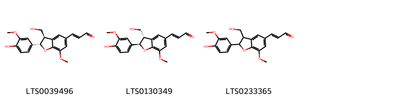{ width=100% }
<figcaption>Hình ảnh cấu trúc hóa học của hoạt chất thuộc nhóm *2-arylbenzofuran flavonoids*. Tên thường gọi của các hoạt chất tương ứng là balanophonin [(LTS0039496)](https://lotus.naturalproducts.net/compound/lotus_id/LTS0039496), (2e)-3-[(2r,3s)-2-(4-hydroxy-3-methoxyphenyl)-3-(hydroxymethyl)-7-methoxy-2,3-dihydro-1-benzofuran-5-yl]prop-2-enal [(LTS0130349)](https://lotus.naturalproducts.net/compound/lotus_id/LTS0130349), 3-[2-(4-hydroxy-3-methoxyphenyl)-3-(hydroxymethyl)-7-methoxy-2,3-dihydro-1-benzofuran-5-yl]prop-2-enal [(LTS0233365)](https://lotus.naturalproducts.net/compound/lotus_id/LTS0233365).</figcaption>
</figure>

            
            
### Nhóm 2-arylbenzofuran flavonoids
<figure markdown="span">
    { width=100% }
<figcaption>Hình ảnh cấu trúc hóa học của hoạt chất thuộc nhóm *2-arylbenzofuran flavonoids*. Tên thường gọi của các hoạt chất tương ứng là balanophonin [(LTS0039496)](https://lotus.naturalproducts.net/compound/lotus_id/LTS0039496), (2e)-3-[(2r,3s)-2-(4-hydroxy-3-methoxyphenyl)-3-(hydroxymethyl)-7-methoxy-2,3-dihydro-1-benzofuran-5-yl]prop-2-enal [(LTS0130349)](https://lotus.naturalproducts.net/compound/lotus_id/LTS0130349), 3-[2-(4-hydroxy-3-methoxyphenyl)-3-(hydroxymethyl)-7-methoxy-2,3-dihydro-1-benzofuran-5-yl]prop-2-enal [(LTS0233365)](https://lotus.naturalproducts.net/compound/lotus_id/LTS0233365).</figcaption>
</figure>

### Nhóm Anthracenes
<figure markdown="span">
    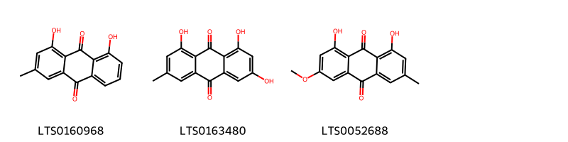{ width=100% }
<figcaption>Hình ảnh cấu trúc hóa học của hoạt chất thuộc nhóm *Anthracenes*. Tên thường gọi của các hoạt chất tương ứng là turkey rhubarb [(LTS0160968)](https://lotus.naturalproducts.net/compound/lotus_id/LTS0160968), emodin [(LTS0163480)](https://lotus.naturalproducts.net/compound/lotus_id/LTS0163480), physcion [(LTS0052688)](https://lotus.naturalproducts.net/compound/lotus_id/LTS0052688).</figcaption>
</figure>

            
            
### Nhóm 2-arylbenzofuran flavonoids
<figure markdown="span">
    { width=100% }
<figcaption>Hình ảnh cấu trúc hóa học của hoạt chất thuộc nhóm *2-arylbenzofuran flavonoids*. Tên thường gọi của các hoạt chất tương ứng là balanophonin [(LTS0039496)](https://lotus.naturalproducts.net/compound/lotus_id/LTS0039496), (2e)-3-[(2r,3s)-2-(4-hydroxy-3-methoxyphenyl)-3-(hydroxymethyl)-7-methoxy-2,3-dihydro-1-benzofuran-5-yl]prop-2-enal [(LTS0130349)](https://lotus.naturalproducts.net/compound/lotus_id/LTS0130349), 3-[2-(4-hydroxy-3-methoxyphenyl)-3-(hydroxymethyl)-7-methoxy-2,3-dihydro-1-benzofuran-5-yl]prop-2-enal [(LTS0233365)](https://lotus.naturalproducts.net/compound/lotus_id/LTS0233365).</figcaption>
</figure>

### Nhóm Anthracenes
<figure markdown="span">
    { width=100% }
<figcaption>Hình ảnh cấu trúc hóa học của hoạt chất thuộc nhóm *Anthracenes*. Tên thường gọi của các hoạt chất tương ứng là turkey rhubarb [(LTS0160968)](https://lotus.naturalproducts.net/compound/lotus_id/LTS0160968), emodin [(LTS0163480)](https://lotus.naturalproducts.net/compound/lotus_id/LTS0163480), physcion [(LTS0052688)](https://lotus.naturalproducts.net/compound/lotus_id/LTS0052688).</figcaption>
</figure>

### Nhóm Benzene and substituted derivatives
<figure markdown="span">
    { width=100% }
<figcaption>Hình ảnh cấu trúc hóa học của hoạt chất thuộc nhóm *Benzene and substituted derivatives*. Tên thường gọi của các hoạt chất tương ứng là lavendustin c [(LTS0195252)](https://lotus.naturalproducts.net/compound/lotus_id/LTS0195252), 4-biphenylaldehyde [(LTS0057438)](https://lotus.naturalproducts.net/compound/lotus_id/LTS0057438), methyl salicylate [(LTS0128373)](https://lotus.naturalproducts.net/compound/lotus_id/LTS0128373), [1,1'-biphenyl]-2-carbaldehyde [(LTS0064008)](https://lotus.naturalproducts.net/compound/lotus_id/LTS0064008).</figcaption>
</figure>

            
            
### Nhóm 2-arylbenzofuran flavonoids
<figure markdown="span">
    { width=100% }
<figcaption>Hình ảnh cấu trúc hóa học của hoạt chất thuộc nhóm *2-arylbenzofuran flavonoids*. Tên thường gọi của các hoạt chất tương ứng là balanophonin [(LTS0039496)](https://lotus.naturalproducts.net/compound/lotus_id/LTS0039496), (2e)-3-[(2r,3s)-2-(4-hydroxy-3-methoxyphenyl)-3-(hydroxymethyl)-7-methoxy-2,3-dihydro-1-benzofuran-5-yl]prop-2-enal [(LTS0130349)](https://lotus.naturalproducts.net/compound/lotus_id/LTS0130349), 3-[2-(4-hydroxy-3-methoxyphenyl)-3-(hydroxymethyl)-7-methoxy-2,3-dihydro-1-benzofuran-5-yl]prop-2-enal [(LTS0233365)](https://lotus.naturalproducts.net/compound/lotus_id/LTS0233365).</figcaption>
</figure>

### Nhóm Anthracenes
<figure markdown="span">
    { width=100% }
<figcaption>Hình ảnh cấu trúc hóa học của hoạt chất thuộc nhóm *Anthracenes*. Tên thường gọi của các hoạt chất tương ứng là turkey rhubarb [(LTS0160968)](https://lotus.naturalproducts.net/compound/lotus_id/LTS0160968), emodin [(LTS0163480)](https://lotus.naturalproducts.net/compound/lotus_id/LTS0163480), physcion [(LTS0052688)](https://lotus.naturalproducts.net/compound/lotus_id/LTS0052688).</figcaption>
</figure>

### Nhóm Benzene and substituted derivatives
<figure markdown="span">
    { width=100% }
<figcaption>Hình ảnh cấu trúc hóa học của hoạt chất thuộc nhóm *Benzene and substituted derivatives*. Tên thường gọi của các hoạt chất tương ứng là lavendustin c [(LTS0195252)](https://lotus.naturalproducts.net/compound/lotus_id/LTS0195252), 4-biphenylaldehyde [(LTS0057438)](https://lotus.naturalproducts.net/compound/lotus_id/LTS0057438), methyl salicylate [(LTS0128373)](https://lotus.naturalproducts.net/compound/lotus_id/LTS0128373), [1,1'-biphenyl]-2-carbaldehyde [(LTS0064008)](https://lotus.naturalproducts.net/compound/lotus_id/LTS0064008).</figcaption>
</figure>

### Nhóm Benzopyrans
<figure markdown="span">
    { width=100% }
<figcaption>Hình ảnh cấu trúc hóa học của hoạt chất thuộc nhóm *Benzopyrans*. Tên thường gọi của các hoạt chất tương ứng là chromene-2,2,6-triol [(LTS0157870)](https://lotus.naturalproducts.net/compound/lotus_id/LTS0157870), 6-methoxychromene-2,2-diol [(LTS0121113)](https://lotus.naturalproducts.net/compound/lotus_id/LTS0121113).</figcaption>
</figure>

            
            
### Nhóm 2-arylbenzofuran flavonoids
<figure markdown="span">
    { width=100% }
<figcaption>Hình ảnh cấu trúc hóa học của hoạt chất thuộc nhóm *2-arylbenzofuran flavonoids*. Tên thường gọi của các hoạt chất tương ứng là balanophonin [(LTS0039496)](https://lotus.naturalproducts.net/compound/lotus_id/LTS0039496), (2e)-3-[(2r,3s)-2-(4-hydroxy-3-methoxyphenyl)-3-(hydroxymethyl)-7-methoxy-2,3-dihydro-1-benzofuran-5-yl]prop-2-enal [(LTS0130349)](https://lotus.naturalproducts.net/compound/lotus_id/LTS0130349), 3-[2-(4-hydroxy-3-methoxyphenyl)-3-(hydroxymethyl)-7-methoxy-2,3-dihydro-1-benzofuran-5-yl]prop-2-enal [(LTS0233365)](https://lotus.naturalproducts.net/compound/lotus_id/LTS0233365).</figcaption>
</figure>

### Nhóm Anthracenes
<figure markdown="span">
    { width=100% }
<figcaption>Hình ảnh cấu trúc hóa học của hoạt chất thuộc nhóm *Anthracenes*. Tên thường gọi của các hoạt chất tương ứng là turkey rhubarb [(LTS0160968)](https://lotus.naturalproducts.net/compound/lotus_id/LTS0160968), emodin [(LTS0163480)](https://lotus.naturalproducts.net/compound/lotus_id/LTS0163480), physcion [(LTS0052688)](https://lotus.naturalproducts.net/compound/lotus_id/LTS0052688).</figcaption>
</figure>

### Nhóm Benzene and substituted derivatives
<figure markdown="span">
    { width=100% }
<figcaption>Hình ảnh cấu trúc hóa học của hoạt chất thuộc nhóm *Benzene and substituted derivatives*. Tên thường gọi của các hoạt chất tương ứng là lavendustin c [(LTS0195252)](https://lotus.naturalproducts.net/compound/lotus_id/LTS0195252), 4-biphenylaldehyde [(LTS0057438)](https://lotus.naturalproducts.net/compound/lotus_id/LTS0057438), methyl salicylate [(LTS0128373)](https://lotus.naturalproducts.net/compound/lotus_id/LTS0128373), [1,1'-biphenyl]-2-carbaldehyde [(LTS0064008)](https://lotus.naturalproducts.net/compound/lotus_id/LTS0064008).</figcaption>
</figure>

### Nhóm Benzopyrans
<figure markdown="span">
    { width=100% }
<figcaption>Hình ảnh cấu trúc hóa học của hoạt chất thuộc nhóm *Benzopyrans*. Tên thường gọi của các hoạt chất tương ứng là chromene-2,2,6-triol [(LTS0157870)](https://lotus.naturalproducts.net/compound/lotus_id/LTS0157870), 6-methoxychromene-2,2-diol [(LTS0121113)](https://lotus.naturalproducts.net/compound/lotus_id/LTS0121113).</figcaption>
</figure>

### Nhóm Carboxylic acids and derivatives
<figure markdown="span">
    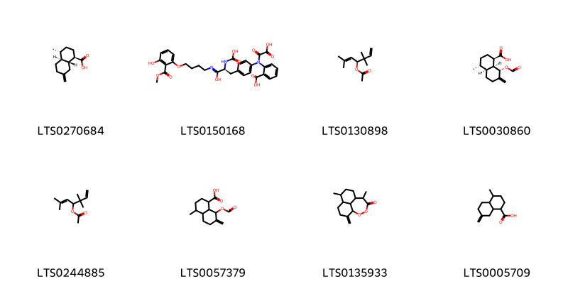{ width=100% }
<figcaption>Hình ảnh cấu trúc hóa học của hoạt chất thuộc nhóm *Carboxylic acids and derivatives*. Tên thường gọi của các hoạt chất tương ứng là (1r,4r,4as,8ar)-4-methyl-7-methylidene-octahydro-1h-naphthalene-1-carboxylic acid [(LTS0270684)](https://lotus.naturalproducts.net/compound/lotus_id/LTS0270684), 2-(1-carboxy-n-{4-[(2s)-2-(carboxyamino)-2-({4-[3-hydroxy-2-(methoxycarbonyl)phenoxy]butyl}-c-hydroxycarbonimidoyl)ethyl]phenyl}formamido)benzoic acid [(LTS0150168)](https://lotus.naturalproducts.net/compound/lotus_id/LTS0150168), (4s)-3,3,6-trimethylhepta-1,5-dien-4-yl acetate [(LTS0130898)](https://lotus.naturalproducts.net/compound/lotus_id/LTS0130898), (1r,4r,4as,8s,8as)-8-(formyloxy)-4-methyl-7-methylidene-octahydro-1h-naphthalene-1-carboxylic acid [(LTS0030860)](https://lotus.naturalproducts.net/compound/lotus_id/LTS0030860), 3,3,6-trimethylhepta-1,5-dien-4-yl acetate [(LTS0244885)](https://lotus.naturalproducts.net/compound/lotus_id/LTS0244885), 8-(formyloxy)-4-methyl-7-methylidene-octahydro-1h-naphthalene-1-carboxylic acid [(LTS0057379)](https://lotus.naturalproducts.net/compound/lotus_id/LTS0057379), 4,13-dimethyl-8-methylidene-10,11-dioxatricyclo[7.4.1.0⁵,¹⁴]tetradecan-12-one [(LTS0135933)](https://lotus.naturalproducts.net/compound/lotus_id/LTS0135933), 4-methyl-7-methylidene-octahydro-1h-naphthalene-1-carboxylic acid [(LTS0005709)](https://lotus.naturalproducts.net/compound/lotus_id/LTS0005709).</figcaption>
</figure>

            
            
### Nhóm 2-arylbenzofuran flavonoids
<figure markdown="span">
    { width=100% }
<figcaption>Hình ảnh cấu trúc hóa học của hoạt chất thuộc nhóm *2-arylbenzofuran flavonoids*. Tên thường gọi của các hoạt chất tương ứng là balanophonin [(LTS0039496)](https://lotus.naturalproducts.net/compound/lotus_id/LTS0039496), (2e)-3-[(2r,3s)-2-(4-hydroxy-3-methoxyphenyl)-3-(hydroxymethyl)-7-methoxy-2,3-dihydro-1-benzofuran-5-yl]prop-2-enal [(LTS0130349)](https://lotus.naturalproducts.net/compound/lotus_id/LTS0130349), 3-[2-(4-hydroxy-3-methoxyphenyl)-3-(hydroxymethyl)-7-methoxy-2,3-dihydro-1-benzofuran-5-yl]prop-2-enal [(LTS0233365)](https://lotus.naturalproducts.net/compound/lotus_id/LTS0233365).</figcaption>
</figure>

### Nhóm Anthracenes
<figure markdown="span">
    { width=100% }
<figcaption>Hình ảnh cấu trúc hóa học của hoạt chất thuộc nhóm *Anthracenes*. Tên thường gọi của các hoạt chất tương ứng là turkey rhubarb [(LTS0160968)](https://lotus.naturalproducts.net/compound/lotus_id/LTS0160968), emodin [(LTS0163480)](https://lotus.naturalproducts.net/compound/lotus_id/LTS0163480), physcion [(LTS0052688)](https://lotus.naturalproducts.net/compound/lotus_id/LTS0052688).</figcaption>
</figure>

### Nhóm Benzene and substituted derivatives
<figure markdown="span">
    { width=100% }
<figcaption>Hình ảnh cấu trúc hóa học của hoạt chất thuộc nhóm *Benzene and substituted derivatives*. Tên thường gọi của các hoạt chất tương ứng là lavendustin c [(LTS0195252)](https://lotus.naturalproducts.net/compound/lotus_id/LTS0195252), 4-biphenylaldehyde [(LTS0057438)](https://lotus.naturalproducts.net/compound/lotus_id/LTS0057438), methyl salicylate [(LTS0128373)](https://lotus.naturalproducts.net/compound/lotus_id/LTS0128373), [1,1'-biphenyl]-2-carbaldehyde [(LTS0064008)](https://lotus.naturalproducts.net/compound/lotus_id/LTS0064008).</figcaption>
</figure>

### Nhóm Benzopyrans
<figure markdown="span">
    { width=100% }
<figcaption>Hình ảnh cấu trúc hóa học của hoạt chất thuộc nhóm *Benzopyrans*. Tên thường gọi của các hoạt chất tương ứng là chromene-2,2,6-triol [(LTS0157870)](https://lotus.naturalproducts.net/compound/lotus_id/LTS0157870), 6-methoxychromene-2,2-diol [(LTS0121113)](https://lotus.naturalproducts.net/compound/lotus_id/LTS0121113).</figcaption>
</figure>

### Nhóm Carboxylic acids and derivatives
<figure markdown="span">
    { width=100% }
<figcaption>Hình ảnh cấu trúc hóa học của hoạt chất thuộc nhóm *Carboxylic acids and derivatives*. Tên thường gọi của các hoạt chất tương ứng là (1r,4r,4as,8ar)-4-methyl-7-methylidene-octahydro-1h-naphthalene-1-carboxylic acid [(LTS0270684)](https://lotus.naturalproducts.net/compound/lotus_id/LTS0270684), 2-(1-carboxy-n-{4-[(2s)-2-(carboxyamino)-2-({4-[3-hydroxy-2-(methoxycarbonyl)phenoxy]butyl}-c-hydroxycarbonimidoyl)ethyl]phenyl}formamido)benzoic acid [(LTS0150168)](https://lotus.naturalproducts.net/compound/lotus_id/LTS0150168), (4s)-3,3,6-trimethylhepta-1,5-dien-4-yl acetate [(LTS0130898)](https://lotus.naturalproducts.net/compound/lotus_id/LTS0130898), (1r,4r,4as,8s,8as)-8-(formyloxy)-4-methyl-7-methylidene-octahydro-1h-naphthalene-1-carboxylic acid [(LTS0030860)](https://lotus.naturalproducts.net/compound/lotus_id/LTS0030860), 3,3,6-trimethylhepta-1,5-dien-4-yl acetate [(LTS0244885)](https://lotus.naturalproducts.net/compound/lotus_id/LTS0244885), 8-(formyloxy)-4-methyl-7-methylidene-octahydro-1h-naphthalene-1-carboxylic acid [(LTS0057379)](https://lotus.naturalproducts.net/compound/lotus_id/LTS0057379), 4,13-dimethyl-8-methylidene-10,11-dioxatricyclo[7.4.1.0⁵,¹⁴]tetradecan-12-one [(LTS0135933)](https://lotus.naturalproducts.net/compound/lotus_id/LTS0135933), 4-methyl-7-methylidene-octahydro-1h-naphthalene-1-carboxylic acid [(LTS0005709)](https://lotus.naturalproducts.net/compound/lotus_id/LTS0005709).</figcaption>
</figure>

### Nhóm Cinnamaldehydes
<figure markdown="span">
    { width=100% }
<figcaption>Hình ảnh cấu trúc hóa học của hoạt chất thuộc nhóm *Cinnamaldehydes*. Tên thường gọi của các hoạt chất tương ứng là 2-[2-methoxy-4-(3-oxoprop-1-en-1-yl)phenoxy]prop-2-enal [(LTS0134665)](https://lotus.naturalproducts.net/compound/lotus_id/LTS0134665), 3-{4-[(1,3-dihydroxypropan-2-yl)oxy]-3-methoxyphenyl}prop-2-enal [(LTS0124815)](https://lotus.naturalproducts.net/compound/lotus_id/LTS0124815), 2-{2-methoxy-4-[(1e)-3-oxoprop-1-en-1-yl]phenoxy}prop-2-enal [(LTS0251744)](https://lotus.naturalproducts.net/compound/lotus_id/LTS0251744), 4-methoxycinnamaldehyde [(LTS0219729)](https://lotus.naturalproducts.net/compound/lotus_id/LTS0219729), (2e)-3-{4-[(1,3-dihydroxypropan-2-yl)oxy]-3-methoxyphenyl}prop-2-enal [(LTS0038781)](https://lotus.naturalproducts.net/compound/lotus_id/LTS0038781), 3-(4-methoxyphenyl)-2-propenal [(LTS0014262)](https://lotus.naturalproducts.net/compound/lotus_id/LTS0014262).</figcaption>
</figure>

            
            
### Nhóm 2-arylbenzofuran flavonoids
<figure markdown="span">
    { width=100% }
<figcaption>Hình ảnh cấu trúc hóa học của hoạt chất thuộc nhóm *2-arylbenzofuran flavonoids*. Tên thường gọi của các hoạt chất tương ứng là balanophonin [(LTS0039496)](https://lotus.naturalproducts.net/compound/lotus_id/LTS0039496), (2e)-3-[(2r,3s)-2-(4-hydroxy-3-methoxyphenyl)-3-(hydroxymethyl)-7-methoxy-2,3-dihydro-1-benzofuran-5-yl]prop-2-enal [(LTS0130349)](https://lotus.naturalproducts.net/compound/lotus_id/LTS0130349), 3-[2-(4-hydroxy-3-methoxyphenyl)-3-(hydroxymethyl)-7-methoxy-2,3-dihydro-1-benzofuran-5-yl]prop-2-enal [(LTS0233365)](https://lotus.naturalproducts.net/compound/lotus_id/LTS0233365).</figcaption>
</figure>

### Nhóm Anthracenes
<figure markdown="span">
    { width=100% }
<figcaption>Hình ảnh cấu trúc hóa học của hoạt chất thuộc nhóm *Anthracenes*. Tên thường gọi của các hoạt chất tương ứng là turkey rhubarb [(LTS0160968)](https://lotus.naturalproducts.net/compound/lotus_id/LTS0160968), emodin [(LTS0163480)](https://lotus.naturalproducts.net/compound/lotus_id/LTS0163480), physcion [(LTS0052688)](https://lotus.naturalproducts.net/compound/lotus_id/LTS0052688).</figcaption>
</figure>

### Nhóm Benzene and substituted derivatives
<figure markdown="span">
    { width=100% }
<figcaption>Hình ảnh cấu trúc hóa học của hoạt chất thuộc nhóm *Benzene and substituted derivatives*. Tên thường gọi của các hoạt chất tương ứng là lavendustin c [(LTS0195252)](https://lotus.naturalproducts.net/compound/lotus_id/LTS0195252), 4-biphenylaldehyde [(LTS0057438)](https://lotus.naturalproducts.net/compound/lotus_id/LTS0057438), methyl salicylate [(LTS0128373)](https://lotus.naturalproducts.net/compound/lotus_id/LTS0128373), [1,1'-biphenyl]-2-carbaldehyde [(LTS0064008)](https://lotus.naturalproducts.net/compound/lotus_id/LTS0064008).</figcaption>
</figure>

### Nhóm Benzopyrans
<figure markdown="span">
    { width=100% }
<figcaption>Hình ảnh cấu trúc hóa học của hoạt chất thuộc nhóm *Benzopyrans*. Tên thường gọi của các hoạt chất tương ứng là chromene-2,2,6-triol [(LTS0157870)](https://lotus.naturalproducts.net/compound/lotus_id/LTS0157870), 6-methoxychromene-2,2-diol [(LTS0121113)](https://lotus.naturalproducts.net/compound/lotus_id/LTS0121113).</figcaption>
</figure>

### Nhóm Carboxylic acids and derivatives
<figure markdown="span">
    { width=100% }
<figcaption>Hình ảnh cấu trúc hóa học của hoạt chất thuộc nhóm *Carboxylic acids and derivatives*. Tên thường gọi của các hoạt chất tương ứng là (1r,4r,4as,8ar)-4-methyl-7-methylidene-octahydro-1h-naphthalene-1-carboxylic acid [(LTS0270684)](https://lotus.naturalproducts.net/compound/lotus_id/LTS0270684), 2-(1-carboxy-n-{4-[(2s)-2-(carboxyamino)-2-({4-[3-hydroxy-2-(methoxycarbonyl)phenoxy]butyl}-c-hydroxycarbonimidoyl)ethyl]phenyl}formamido)benzoic acid [(LTS0150168)](https://lotus.naturalproducts.net/compound/lotus_id/LTS0150168), (4s)-3,3,6-trimethylhepta-1,5-dien-4-yl acetate [(LTS0130898)](https://lotus.naturalproducts.net/compound/lotus_id/LTS0130898), (1r,4r,4as,8s,8as)-8-(formyloxy)-4-methyl-7-methylidene-octahydro-1h-naphthalene-1-carboxylic acid [(LTS0030860)](https://lotus.naturalproducts.net/compound/lotus_id/LTS0030860), 3,3,6-trimethylhepta-1,5-dien-4-yl acetate [(LTS0244885)](https://lotus.naturalproducts.net/compound/lotus_id/LTS0244885), 8-(formyloxy)-4-methyl-7-methylidene-octahydro-1h-naphthalene-1-carboxylic acid [(LTS0057379)](https://lotus.naturalproducts.net/compound/lotus_id/LTS0057379), 4,13-dimethyl-8-methylidene-10,11-dioxatricyclo[7.4.1.0⁵,¹⁴]tetradecan-12-one [(LTS0135933)](https://lotus.naturalproducts.net/compound/lotus_id/LTS0135933), 4-methyl-7-methylidene-octahydro-1h-naphthalene-1-carboxylic acid [(LTS0005709)](https://lotus.naturalproducts.net/compound/lotus_id/LTS0005709).</figcaption>
</figure>

### Nhóm Cinnamaldehydes
<figure markdown="span">
    { width=100% }
<figcaption>Hình ảnh cấu trúc hóa học của hoạt chất thuộc nhóm *Cinnamaldehydes*. Tên thường gọi của các hoạt chất tương ứng là 2-[2-methoxy-4-(3-oxoprop-1-en-1-yl)phenoxy]prop-2-enal [(LTS0134665)](https://lotus.naturalproducts.net/compound/lotus_id/LTS0134665), 3-{4-[(1,3-dihydroxypropan-2-yl)oxy]-3-methoxyphenyl}prop-2-enal [(LTS0124815)](https://lotus.naturalproducts.net/compound/lotus_id/LTS0124815), 2-{2-methoxy-4-[(1e)-3-oxoprop-1-en-1-yl]phenoxy}prop-2-enal [(LTS0251744)](https://lotus.naturalproducts.net/compound/lotus_id/LTS0251744), 4-methoxycinnamaldehyde [(LTS0219729)](https://lotus.naturalproducts.net/compound/lotus_id/LTS0219729), (2e)-3-{4-[(1,3-dihydroxypropan-2-yl)oxy]-3-methoxyphenyl}prop-2-enal [(LTS0038781)](https://lotus.naturalproducts.net/compound/lotus_id/LTS0038781), 3-(4-methoxyphenyl)-2-propenal [(LTS0014262)](https://lotus.naturalproducts.net/compound/lotus_id/LTS0014262).</figcaption>
</figure>

### Nhóm Cinnamic acids and derivatives
<figure markdown="span">
    { width=100% }
<figcaption>Hình ảnh cấu trúc hóa học của hoạt chất thuộc nhóm *Cinnamic acids and derivatives*. Tên thường gọi của các hoạt chất tương ứng là para-coumaric acid [(LTS0266252)](https://lotus.naturalproducts.net/compound/lotus_id/LTS0266252).</figcaption>
</figure>

            
            
### Nhóm 2-arylbenzofuran flavonoids
<figure markdown="span">
    { width=100% }
<figcaption>Hình ảnh cấu trúc hóa học của hoạt chất thuộc nhóm *2-arylbenzofuran flavonoids*. Tên thường gọi của các hoạt chất tương ứng là balanophonin [(LTS0039496)](https://lotus.naturalproducts.net/compound/lotus_id/LTS0039496), (2e)-3-[(2r,3s)-2-(4-hydroxy-3-methoxyphenyl)-3-(hydroxymethyl)-7-methoxy-2,3-dihydro-1-benzofuran-5-yl]prop-2-enal [(LTS0130349)](https://lotus.naturalproducts.net/compound/lotus_id/LTS0130349), 3-[2-(4-hydroxy-3-methoxyphenyl)-3-(hydroxymethyl)-7-methoxy-2,3-dihydro-1-benzofuran-5-yl]prop-2-enal [(LTS0233365)](https://lotus.naturalproducts.net/compound/lotus_id/LTS0233365).</figcaption>
</figure>

### Nhóm Anthracenes
<figure markdown="span">
    { width=100% }
<figcaption>Hình ảnh cấu trúc hóa học của hoạt chất thuộc nhóm *Anthracenes*. Tên thường gọi của các hoạt chất tương ứng là turkey rhubarb [(LTS0160968)](https://lotus.naturalproducts.net/compound/lotus_id/LTS0160968), emodin [(LTS0163480)](https://lotus.naturalproducts.net/compound/lotus_id/LTS0163480), physcion [(LTS0052688)](https://lotus.naturalproducts.net/compound/lotus_id/LTS0052688).</figcaption>
</figure>

### Nhóm Benzene and substituted derivatives
<figure markdown="span">
    { width=100% }
<figcaption>Hình ảnh cấu trúc hóa học của hoạt chất thuộc nhóm *Benzene and substituted derivatives*. Tên thường gọi của các hoạt chất tương ứng là lavendustin c [(LTS0195252)](https://lotus.naturalproducts.net/compound/lotus_id/LTS0195252), 4-biphenylaldehyde [(LTS0057438)](https://lotus.naturalproducts.net/compound/lotus_id/LTS0057438), methyl salicylate [(LTS0128373)](https://lotus.naturalproducts.net/compound/lotus_id/LTS0128373), [1,1'-biphenyl]-2-carbaldehyde [(LTS0064008)](https://lotus.naturalproducts.net/compound/lotus_id/LTS0064008).</figcaption>
</figure>

### Nhóm Benzopyrans
<figure markdown="span">
    { width=100% }
<figcaption>Hình ảnh cấu trúc hóa học của hoạt chất thuộc nhóm *Benzopyrans*. Tên thường gọi của các hoạt chất tương ứng là chromene-2,2,6-triol [(LTS0157870)](https://lotus.naturalproducts.net/compound/lotus_id/LTS0157870), 6-methoxychromene-2,2-diol [(LTS0121113)](https://lotus.naturalproducts.net/compound/lotus_id/LTS0121113).</figcaption>
</figure>

### Nhóm Carboxylic acids and derivatives
<figure markdown="span">
    { width=100% }
<figcaption>Hình ảnh cấu trúc hóa học của hoạt chất thuộc nhóm *Carboxylic acids and derivatives*. Tên thường gọi của các hoạt chất tương ứng là (1r,4r,4as,8ar)-4-methyl-7-methylidene-octahydro-1h-naphthalene-1-carboxylic acid [(LTS0270684)](https://lotus.naturalproducts.net/compound/lotus_id/LTS0270684), 2-(1-carboxy-n-{4-[(2s)-2-(carboxyamino)-2-({4-[3-hydroxy-2-(methoxycarbonyl)phenoxy]butyl}-c-hydroxycarbonimidoyl)ethyl]phenyl}formamido)benzoic acid [(LTS0150168)](https://lotus.naturalproducts.net/compound/lotus_id/LTS0150168), (4s)-3,3,6-trimethylhepta-1,5-dien-4-yl acetate [(LTS0130898)](https://lotus.naturalproducts.net/compound/lotus_id/LTS0130898), (1r,4r,4as,8s,8as)-8-(formyloxy)-4-methyl-7-methylidene-octahydro-1h-naphthalene-1-carboxylic acid [(LTS0030860)](https://lotus.naturalproducts.net/compound/lotus_id/LTS0030860), 3,3,6-trimethylhepta-1,5-dien-4-yl acetate [(LTS0244885)](https://lotus.naturalproducts.net/compound/lotus_id/LTS0244885), 8-(formyloxy)-4-methyl-7-methylidene-octahydro-1h-naphthalene-1-carboxylic acid [(LTS0057379)](https://lotus.naturalproducts.net/compound/lotus_id/LTS0057379), 4,13-dimethyl-8-methylidene-10,11-dioxatricyclo[7.4.1.0⁵,¹⁴]tetradecan-12-one [(LTS0135933)](https://lotus.naturalproducts.net/compound/lotus_id/LTS0135933), 4-methyl-7-methylidene-octahydro-1h-naphthalene-1-carboxylic acid [(LTS0005709)](https://lotus.naturalproducts.net/compound/lotus_id/LTS0005709).</figcaption>
</figure>

### Nhóm Cinnamaldehydes
<figure markdown="span">
    { width=100% }
<figcaption>Hình ảnh cấu trúc hóa học của hoạt chất thuộc nhóm *Cinnamaldehydes*. Tên thường gọi của các hoạt chất tương ứng là 2-[2-methoxy-4-(3-oxoprop-1-en-1-yl)phenoxy]prop-2-enal [(LTS0134665)](https://lotus.naturalproducts.net/compound/lotus_id/LTS0134665), 3-{4-[(1,3-dihydroxypropan-2-yl)oxy]-3-methoxyphenyl}prop-2-enal [(LTS0124815)](https://lotus.naturalproducts.net/compound/lotus_id/LTS0124815), 2-{2-methoxy-4-[(1e)-3-oxoprop-1-en-1-yl]phenoxy}prop-2-enal [(LTS0251744)](https://lotus.naturalproducts.net/compound/lotus_id/LTS0251744), 4-methoxycinnamaldehyde [(LTS0219729)](https://lotus.naturalproducts.net/compound/lotus_id/LTS0219729), (2e)-3-{4-[(1,3-dihydroxypropan-2-yl)oxy]-3-methoxyphenyl}prop-2-enal [(LTS0038781)](https://lotus.naturalproducts.net/compound/lotus_id/LTS0038781), 3-(4-methoxyphenyl)-2-propenal [(LTS0014262)](https://lotus.naturalproducts.net/compound/lotus_id/LTS0014262).</figcaption>
</figure>

### Nhóm Cinnamic acids and derivatives
<figure markdown="span">
    { width=100% }
<figcaption>Hình ảnh cấu trúc hóa học của hoạt chất thuộc nhóm *Cinnamic acids and derivatives*. Tên thường gọi của các hoạt chất tương ứng là para-coumaric acid [(LTS0266252)](https://lotus.naturalproducts.net/compound/lotus_id/LTS0266252).</figcaption>
</figure>

### Nhóm Coumarins and derivatives
<figure markdown="span">
    { width=100% }
<figcaption>Hình ảnh cấu trúc hóa học của hoạt chất thuộc nhóm *Coumarins and derivatives*. Tên thường gọi của các hoạt chất tương ứng là 2h-1-benzopyran-2-one [(LTS0069773)](https://lotus.naturalproducts.net/compound/lotus_id/LTS0069773), isofraxidin [(LTS0073081)](https://lotus.naturalproducts.net/compound/lotus_id/LTS0073081), scopoletin [(LTS0193112)](https://lotus.naturalproducts.net/compound/lotus_id/LTS0193112).</figcaption>
</figure>

            
            
### Nhóm 2-arylbenzofuran flavonoids
<figure markdown="span">
    { width=100% }
<figcaption>Hình ảnh cấu trúc hóa học của hoạt chất thuộc nhóm *2-arylbenzofuran flavonoids*. Tên thường gọi của các hoạt chất tương ứng là balanophonin [(LTS0039496)](https://lotus.naturalproducts.net/compound/lotus_id/LTS0039496), (2e)-3-[(2r,3s)-2-(4-hydroxy-3-methoxyphenyl)-3-(hydroxymethyl)-7-methoxy-2,3-dihydro-1-benzofuran-5-yl]prop-2-enal [(LTS0130349)](https://lotus.naturalproducts.net/compound/lotus_id/LTS0130349), 3-[2-(4-hydroxy-3-methoxyphenyl)-3-(hydroxymethyl)-7-methoxy-2,3-dihydro-1-benzofuran-5-yl]prop-2-enal [(LTS0233365)](https://lotus.naturalproducts.net/compound/lotus_id/LTS0233365).</figcaption>
</figure>

### Nhóm Anthracenes
<figure markdown="span">
    { width=100% }
<figcaption>Hình ảnh cấu trúc hóa học của hoạt chất thuộc nhóm *Anthracenes*. Tên thường gọi của các hoạt chất tương ứng là turkey rhubarb [(LTS0160968)](https://lotus.naturalproducts.net/compound/lotus_id/LTS0160968), emodin [(LTS0163480)](https://lotus.naturalproducts.net/compound/lotus_id/LTS0163480), physcion [(LTS0052688)](https://lotus.naturalproducts.net/compound/lotus_id/LTS0052688).</figcaption>
</figure>

### Nhóm Benzene and substituted derivatives
<figure markdown="span">
    { width=100% }
<figcaption>Hình ảnh cấu trúc hóa học của hoạt chất thuộc nhóm *Benzene and substituted derivatives*. Tên thường gọi của các hoạt chất tương ứng là lavendustin c [(LTS0195252)](https://lotus.naturalproducts.net/compound/lotus_id/LTS0195252), 4-biphenylaldehyde [(LTS0057438)](https://lotus.naturalproducts.net/compound/lotus_id/LTS0057438), methyl salicylate [(LTS0128373)](https://lotus.naturalproducts.net/compound/lotus_id/LTS0128373), [1,1'-biphenyl]-2-carbaldehyde [(LTS0064008)](https://lotus.naturalproducts.net/compound/lotus_id/LTS0064008).</figcaption>
</figure>

### Nhóm Benzopyrans
<figure markdown="span">
    { width=100% }
<figcaption>Hình ảnh cấu trúc hóa học của hoạt chất thuộc nhóm *Benzopyrans*. Tên thường gọi của các hoạt chất tương ứng là chromene-2,2,6-triol [(LTS0157870)](https://lotus.naturalproducts.net/compound/lotus_id/LTS0157870), 6-methoxychromene-2,2-diol [(LTS0121113)](https://lotus.naturalproducts.net/compound/lotus_id/LTS0121113).</figcaption>
</figure>

### Nhóm Carboxylic acids and derivatives
<figure markdown="span">
    { width=100% }
<figcaption>Hình ảnh cấu trúc hóa học của hoạt chất thuộc nhóm *Carboxylic acids and derivatives*. Tên thường gọi của các hoạt chất tương ứng là (1r,4r,4as,8ar)-4-methyl-7-methylidene-octahydro-1h-naphthalene-1-carboxylic acid [(LTS0270684)](https://lotus.naturalproducts.net/compound/lotus_id/LTS0270684), 2-(1-carboxy-n-{4-[(2s)-2-(carboxyamino)-2-({4-[3-hydroxy-2-(methoxycarbonyl)phenoxy]butyl}-c-hydroxycarbonimidoyl)ethyl]phenyl}formamido)benzoic acid [(LTS0150168)](https://lotus.naturalproducts.net/compound/lotus_id/LTS0150168), (4s)-3,3,6-trimethylhepta-1,5-dien-4-yl acetate [(LTS0130898)](https://lotus.naturalproducts.net/compound/lotus_id/LTS0130898), (1r,4r,4as,8s,8as)-8-(formyloxy)-4-methyl-7-methylidene-octahydro-1h-naphthalene-1-carboxylic acid [(LTS0030860)](https://lotus.naturalproducts.net/compound/lotus_id/LTS0030860), 3,3,6-trimethylhepta-1,5-dien-4-yl acetate [(LTS0244885)](https://lotus.naturalproducts.net/compound/lotus_id/LTS0244885), 8-(formyloxy)-4-methyl-7-methylidene-octahydro-1h-naphthalene-1-carboxylic acid [(LTS0057379)](https://lotus.naturalproducts.net/compound/lotus_id/LTS0057379), 4,13-dimethyl-8-methylidene-10,11-dioxatricyclo[7.4.1.0⁵,¹⁴]tetradecan-12-one [(LTS0135933)](https://lotus.naturalproducts.net/compound/lotus_id/LTS0135933), 4-methyl-7-methylidene-octahydro-1h-naphthalene-1-carboxylic acid [(LTS0005709)](https://lotus.naturalproducts.net/compound/lotus_id/LTS0005709).</figcaption>
</figure>

### Nhóm Cinnamaldehydes
<figure markdown="span">
    { width=100% }
<figcaption>Hình ảnh cấu trúc hóa học của hoạt chất thuộc nhóm *Cinnamaldehydes*. Tên thường gọi của các hoạt chất tương ứng là 2-[2-methoxy-4-(3-oxoprop-1-en-1-yl)phenoxy]prop-2-enal [(LTS0134665)](https://lotus.naturalproducts.net/compound/lotus_id/LTS0134665), 3-{4-[(1,3-dihydroxypropan-2-yl)oxy]-3-methoxyphenyl}prop-2-enal [(LTS0124815)](https://lotus.naturalproducts.net/compound/lotus_id/LTS0124815), 2-{2-methoxy-4-[(1e)-3-oxoprop-1-en-1-yl]phenoxy}prop-2-enal [(LTS0251744)](https://lotus.naturalproducts.net/compound/lotus_id/LTS0251744), 4-methoxycinnamaldehyde [(LTS0219729)](https://lotus.naturalproducts.net/compound/lotus_id/LTS0219729), (2e)-3-{4-[(1,3-dihydroxypropan-2-yl)oxy]-3-methoxyphenyl}prop-2-enal [(LTS0038781)](https://lotus.naturalproducts.net/compound/lotus_id/LTS0038781), 3-(4-methoxyphenyl)-2-propenal [(LTS0014262)](https://lotus.naturalproducts.net/compound/lotus_id/LTS0014262).</figcaption>
</figure>

### Nhóm Cinnamic acids and derivatives
<figure markdown="span">
    { width=100% }
<figcaption>Hình ảnh cấu trúc hóa học của hoạt chất thuộc nhóm *Cinnamic acids and derivatives*. Tên thường gọi của các hoạt chất tương ứng là para-coumaric acid [(LTS0266252)](https://lotus.naturalproducts.net/compound/lotus_id/LTS0266252).</figcaption>
</figure>

### Nhóm Coumarins and derivatives
<figure markdown="span">
    { width=100% }
<figcaption>Hình ảnh cấu trúc hóa học của hoạt chất thuộc nhóm *Coumarins and derivatives*. Tên thường gọi của các hoạt chất tương ứng là 2h-1-benzopyran-2-one [(LTS0069773)](https://lotus.naturalproducts.net/compound/lotus_id/LTS0069773), isofraxidin [(LTS0073081)](https://lotus.naturalproducts.net/compound/lotus_id/LTS0073081), scopoletin [(LTS0193112)](https://lotus.naturalproducts.net/compound/lotus_id/LTS0193112).</figcaption>
</figure>

### Nhóm Dihydrofurans
<figure markdown="span">
    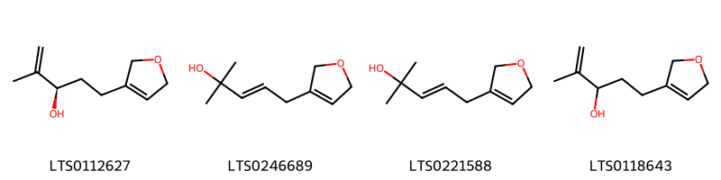{ width=100% }
<figcaption>Hình ảnh cấu trúc hóa học của hoạt chất thuộc nhóm *Dihydrofurans*. Tên thường gọi của các hoạt chất tương ứng là (3r)-5-(2,5-dihydrofuran-3-yl)-2-methylpent-1-en-3-ol [(LTS0112627)](https://lotus.naturalproducts.net/compound/lotus_id/LTS0112627), 5-(2,5-dihydrofuran-3-yl)-2-methylpent-3-en-2-ol [(LTS0246689)](https://lotus.naturalproducts.net/compound/lotus_id/LTS0246689), (3e)-5-(2,5-dihydrofuran-3-yl)-2-methylpent-3-en-2-ol [(LTS0221588)](https://lotus.naturalproducts.net/compound/lotus_id/LTS0221588), 5-(2,5-dihydrofuran-3-yl)-2-methylpent-1-en-3-ol [(LTS0118643)](https://lotus.naturalproducts.net/compound/lotus_id/LTS0118643).</figcaption>
</figure>

            
            
### Nhóm 2-arylbenzofuran flavonoids
<figure markdown="span">
    { width=100% }
<figcaption>Hình ảnh cấu trúc hóa học của hoạt chất thuộc nhóm *2-arylbenzofuran flavonoids*. Tên thường gọi của các hoạt chất tương ứng là balanophonin [(LTS0039496)](https://lotus.naturalproducts.net/compound/lotus_id/LTS0039496), (2e)-3-[(2r,3s)-2-(4-hydroxy-3-methoxyphenyl)-3-(hydroxymethyl)-7-methoxy-2,3-dihydro-1-benzofuran-5-yl]prop-2-enal [(LTS0130349)](https://lotus.naturalproducts.net/compound/lotus_id/LTS0130349), 3-[2-(4-hydroxy-3-methoxyphenyl)-3-(hydroxymethyl)-7-methoxy-2,3-dihydro-1-benzofuran-5-yl]prop-2-enal [(LTS0233365)](https://lotus.naturalproducts.net/compound/lotus_id/LTS0233365).</figcaption>
</figure>

### Nhóm Anthracenes
<figure markdown="span">
    { width=100% }
<figcaption>Hình ảnh cấu trúc hóa học của hoạt chất thuộc nhóm *Anthracenes*. Tên thường gọi của các hoạt chất tương ứng là turkey rhubarb [(LTS0160968)](https://lotus.naturalproducts.net/compound/lotus_id/LTS0160968), emodin [(LTS0163480)](https://lotus.naturalproducts.net/compound/lotus_id/LTS0163480), physcion [(LTS0052688)](https://lotus.naturalproducts.net/compound/lotus_id/LTS0052688).</figcaption>
</figure>

### Nhóm Benzene and substituted derivatives
<figure markdown="span">
    { width=100% }
<figcaption>Hình ảnh cấu trúc hóa học của hoạt chất thuộc nhóm *Benzene and substituted derivatives*. Tên thường gọi của các hoạt chất tương ứng là lavendustin c [(LTS0195252)](https://lotus.naturalproducts.net/compound/lotus_id/LTS0195252), 4-biphenylaldehyde [(LTS0057438)](https://lotus.naturalproducts.net/compound/lotus_id/LTS0057438), methyl salicylate [(LTS0128373)](https://lotus.naturalproducts.net/compound/lotus_id/LTS0128373), [1,1'-biphenyl]-2-carbaldehyde [(LTS0064008)](https://lotus.naturalproducts.net/compound/lotus_id/LTS0064008).</figcaption>
</figure>

### Nhóm Benzopyrans
<figure markdown="span">
    { width=100% }
<figcaption>Hình ảnh cấu trúc hóa học của hoạt chất thuộc nhóm *Benzopyrans*. Tên thường gọi của các hoạt chất tương ứng là chromene-2,2,6-triol [(LTS0157870)](https://lotus.naturalproducts.net/compound/lotus_id/LTS0157870), 6-methoxychromene-2,2-diol [(LTS0121113)](https://lotus.naturalproducts.net/compound/lotus_id/LTS0121113).</figcaption>
</figure>

### Nhóm Carboxylic acids and derivatives
<figure markdown="span">
    { width=100% }
<figcaption>Hình ảnh cấu trúc hóa học của hoạt chất thuộc nhóm *Carboxylic acids and derivatives*. Tên thường gọi của các hoạt chất tương ứng là (1r,4r,4as,8ar)-4-methyl-7-methylidene-octahydro-1h-naphthalene-1-carboxylic acid [(LTS0270684)](https://lotus.naturalproducts.net/compound/lotus_id/LTS0270684), 2-(1-carboxy-n-{4-[(2s)-2-(carboxyamino)-2-({4-[3-hydroxy-2-(methoxycarbonyl)phenoxy]butyl}-c-hydroxycarbonimidoyl)ethyl]phenyl}formamido)benzoic acid [(LTS0150168)](https://lotus.naturalproducts.net/compound/lotus_id/LTS0150168), (4s)-3,3,6-trimethylhepta-1,5-dien-4-yl acetate [(LTS0130898)](https://lotus.naturalproducts.net/compound/lotus_id/LTS0130898), (1r,4r,4as,8s,8as)-8-(formyloxy)-4-methyl-7-methylidene-octahydro-1h-naphthalene-1-carboxylic acid [(LTS0030860)](https://lotus.naturalproducts.net/compound/lotus_id/LTS0030860), 3,3,6-trimethylhepta-1,5-dien-4-yl acetate [(LTS0244885)](https://lotus.naturalproducts.net/compound/lotus_id/LTS0244885), 8-(formyloxy)-4-methyl-7-methylidene-octahydro-1h-naphthalene-1-carboxylic acid [(LTS0057379)](https://lotus.naturalproducts.net/compound/lotus_id/LTS0057379), 4,13-dimethyl-8-methylidene-10,11-dioxatricyclo[7.4.1.0⁵,¹⁴]tetradecan-12-one [(LTS0135933)](https://lotus.naturalproducts.net/compound/lotus_id/LTS0135933), 4-methyl-7-methylidene-octahydro-1h-naphthalene-1-carboxylic acid [(LTS0005709)](https://lotus.naturalproducts.net/compound/lotus_id/LTS0005709).</figcaption>
</figure>

### Nhóm Cinnamaldehydes
<figure markdown="span">
    { width=100% }
<figcaption>Hình ảnh cấu trúc hóa học của hoạt chất thuộc nhóm *Cinnamaldehydes*. Tên thường gọi của các hoạt chất tương ứng là 2-[2-methoxy-4-(3-oxoprop-1-en-1-yl)phenoxy]prop-2-enal [(LTS0134665)](https://lotus.naturalproducts.net/compound/lotus_id/LTS0134665), 3-{4-[(1,3-dihydroxypropan-2-yl)oxy]-3-methoxyphenyl}prop-2-enal [(LTS0124815)](https://lotus.naturalproducts.net/compound/lotus_id/LTS0124815), 2-{2-methoxy-4-[(1e)-3-oxoprop-1-en-1-yl]phenoxy}prop-2-enal [(LTS0251744)](https://lotus.naturalproducts.net/compound/lotus_id/LTS0251744), 4-methoxycinnamaldehyde [(LTS0219729)](https://lotus.naturalproducts.net/compound/lotus_id/LTS0219729), (2e)-3-{4-[(1,3-dihydroxypropan-2-yl)oxy]-3-methoxyphenyl}prop-2-enal [(LTS0038781)](https://lotus.naturalproducts.net/compound/lotus_id/LTS0038781), 3-(4-methoxyphenyl)-2-propenal [(LTS0014262)](https://lotus.naturalproducts.net/compound/lotus_id/LTS0014262).</figcaption>
</figure>

### Nhóm Cinnamic acids and derivatives
<figure markdown="span">
    { width=100% }
<figcaption>Hình ảnh cấu trúc hóa học của hoạt chất thuộc nhóm *Cinnamic acids and derivatives*. Tên thường gọi của các hoạt chất tương ứng là para-coumaric acid [(LTS0266252)](https://lotus.naturalproducts.net/compound/lotus_id/LTS0266252).</figcaption>
</figure>

### Nhóm Coumarins and derivatives
<figure markdown="span">
    { width=100% }
<figcaption>Hình ảnh cấu trúc hóa học của hoạt chất thuộc nhóm *Coumarins and derivatives*. Tên thường gọi của các hoạt chất tương ứng là 2h-1-benzopyran-2-one [(LTS0069773)](https://lotus.naturalproducts.net/compound/lotus_id/LTS0069773), isofraxidin [(LTS0073081)](https://lotus.naturalproducts.net/compound/lotus_id/LTS0073081), scopoletin [(LTS0193112)](https://lotus.naturalproducts.net/compound/lotus_id/LTS0193112).</figcaption>
</figure>

### Nhóm Dihydrofurans
<figure markdown="span">
    { width=100% }
<figcaption>Hình ảnh cấu trúc hóa học của hoạt chất thuộc nhóm *Dihydrofurans*. Tên thường gọi của các hoạt chất tương ứng là (3r)-5-(2,5-dihydrofuran-3-yl)-2-methylpent-1-en-3-ol [(LTS0112627)](https://lotus.naturalproducts.net/compound/lotus_id/LTS0112627), 5-(2,5-dihydrofuran-3-yl)-2-methylpent-3-en-2-ol [(LTS0246689)](https://lotus.naturalproducts.net/compound/lotus_id/LTS0246689), (3e)-5-(2,5-dihydrofuran-3-yl)-2-methylpent-3-en-2-ol [(LTS0221588)](https://lotus.naturalproducts.net/compound/lotus_id/LTS0221588), 5-(2,5-dihydrofuran-3-yl)-2-methylpent-1-en-3-ol [(LTS0118643)](https://lotus.naturalproducts.net/compound/lotus_id/LTS0118643).</figcaption>
</figure>

### Nhóm Dioxolopyrans
<figure markdown="span">
    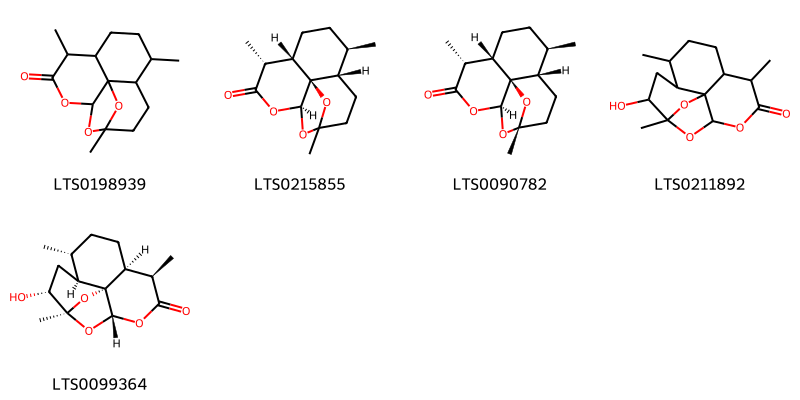{ width=100% }
<figcaption>Hình ảnh cấu trúc hóa học của hoạt chất thuộc nhóm *Dioxolopyrans*. Tên thường gọi của các hoạt chất tương ứng là 1,5,9-trimethyl-11,14,15-trioxatetracyclo[10.2.1.0⁴,¹³.0⁸,¹³]pentadecan-10-one [(LTS0198939)](https://lotus.naturalproducts.net/compound/lotus_id/LTS0198939), (4s,5r,8s,9r,12s,13r)-1,5,9-trimethyl-11,14,15-trioxatetracyclo[10.2.1.0⁴,¹³.0⁸,¹³]pentadecan-10-one [(LTS0215855)](https://lotus.naturalproducts.net/compound/lotus_id/LTS0215855), 2-deoxyartemisinin [(LTS0090782)](https://lotus.naturalproducts.net/compound/lotus_id/LTS0090782), 2-hydroxy-1,5,9-trimethyl-11,14,15-trioxatetracyclo[10.2.1.0⁴,¹³.0⁸,¹³]pentadecan-10-one [(LTS0211892)](https://lotus.naturalproducts.net/compound/lotus_id/LTS0211892), (1s,2r,4s,5r,8s,9r,12s,13r)-2-hydroxy-1,5,9-trimethyl-11,14,15-trioxatetracyclo[10.2.1.0⁴,¹³.0⁸,¹³]pentadecan-10-one [(LTS0099364)](https://lotus.naturalproducts.net/compound/lotus_id/LTS0099364).</figcaption>
</figure>

            
            
### Nhóm 2-arylbenzofuran flavonoids
<figure markdown="span">
    { width=100% }
<figcaption>Hình ảnh cấu trúc hóa học của hoạt chất thuộc nhóm *2-arylbenzofuran flavonoids*. Tên thường gọi của các hoạt chất tương ứng là balanophonin [(LTS0039496)](https://lotus.naturalproducts.net/compound/lotus_id/LTS0039496), (2e)-3-[(2r,3s)-2-(4-hydroxy-3-methoxyphenyl)-3-(hydroxymethyl)-7-methoxy-2,3-dihydro-1-benzofuran-5-yl]prop-2-enal [(LTS0130349)](https://lotus.naturalproducts.net/compound/lotus_id/LTS0130349), 3-[2-(4-hydroxy-3-methoxyphenyl)-3-(hydroxymethyl)-7-methoxy-2,3-dihydro-1-benzofuran-5-yl]prop-2-enal [(LTS0233365)](https://lotus.naturalproducts.net/compound/lotus_id/LTS0233365).</figcaption>
</figure>

### Nhóm Anthracenes
<figure markdown="span">
    { width=100% }
<figcaption>Hình ảnh cấu trúc hóa học của hoạt chất thuộc nhóm *Anthracenes*. Tên thường gọi của các hoạt chất tương ứng là turkey rhubarb [(LTS0160968)](https://lotus.naturalproducts.net/compound/lotus_id/LTS0160968), emodin [(LTS0163480)](https://lotus.naturalproducts.net/compound/lotus_id/LTS0163480), physcion [(LTS0052688)](https://lotus.naturalproducts.net/compound/lotus_id/LTS0052688).</figcaption>
</figure>

### Nhóm Benzene and substituted derivatives
<figure markdown="span">
    { width=100% }
<figcaption>Hình ảnh cấu trúc hóa học của hoạt chất thuộc nhóm *Benzene and substituted derivatives*. Tên thường gọi của các hoạt chất tương ứng là lavendustin c [(LTS0195252)](https://lotus.naturalproducts.net/compound/lotus_id/LTS0195252), 4-biphenylaldehyde [(LTS0057438)](https://lotus.naturalproducts.net/compound/lotus_id/LTS0057438), methyl salicylate [(LTS0128373)](https://lotus.naturalproducts.net/compound/lotus_id/LTS0128373), [1,1'-biphenyl]-2-carbaldehyde [(LTS0064008)](https://lotus.naturalproducts.net/compound/lotus_id/LTS0064008).</figcaption>
</figure>

### Nhóm Benzopyrans
<figure markdown="span">
    { width=100% }
<figcaption>Hình ảnh cấu trúc hóa học của hoạt chất thuộc nhóm *Benzopyrans*. Tên thường gọi của các hoạt chất tương ứng là chromene-2,2,6-triol [(LTS0157870)](https://lotus.naturalproducts.net/compound/lotus_id/LTS0157870), 6-methoxychromene-2,2-diol [(LTS0121113)](https://lotus.naturalproducts.net/compound/lotus_id/LTS0121113).</figcaption>
</figure>

### Nhóm Carboxylic acids and derivatives
<figure markdown="span">
    { width=100% }
<figcaption>Hình ảnh cấu trúc hóa học của hoạt chất thuộc nhóm *Carboxylic acids and derivatives*. Tên thường gọi của các hoạt chất tương ứng là (1r,4r,4as,8ar)-4-methyl-7-methylidene-octahydro-1h-naphthalene-1-carboxylic acid [(LTS0270684)](https://lotus.naturalproducts.net/compound/lotus_id/LTS0270684), 2-(1-carboxy-n-{4-[(2s)-2-(carboxyamino)-2-({4-[3-hydroxy-2-(methoxycarbonyl)phenoxy]butyl}-c-hydroxycarbonimidoyl)ethyl]phenyl}formamido)benzoic acid [(LTS0150168)](https://lotus.naturalproducts.net/compound/lotus_id/LTS0150168), (4s)-3,3,6-trimethylhepta-1,5-dien-4-yl acetate [(LTS0130898)](https://lotus.naturalproducts.net/compound/lotus_id/LTS0130898), (1r,4r,4as,8s,8as)-8-(formyloxy)-4-methyl-7-methylidene-octahydro-1h-naphthalene-1-carboxylic acid [(LTS0030860)](https://lotus.naturalproducts.net/compound/lotus_id/LTS0030860), 3,3,6-trimethylhepta-1,5-dien-4-yl acetate [(LTS0244885)](https://lotus.naturalproducts.net/compound/lotus_id/LTS0244885), 8-(formyloxy)-4-methyl-7-methylidene-octahydro-1h-naphthalene-1-carboxylic acid [(LTS0057379)](https://lotus.naturalproducts.net/compound/lotus_id/LTS0057379), 4,13-dimethyl-8-methylidene-10,11-dioxatricyclo[7.4.1.0⁵,¹⁴]tetradecan-12-one [(LTS0135933)](https://lotus.naturalproducts.net/compound/lotus_id/LTS0135933), 4-methyl-7-methylidene-octahydro-1h-naphthalene-1-carboxylic acid [(LTS0005709)](https://lotus.naturalproducts.net/compound/lotus_id/LTS0005709).</figcaption>
</figure>

### Nhóm Cinnamaldehydes
<figure markdown="span">
    { width=100% }
<figcaption>Hình ảnh cấu trúc hóa học của hoạt chất thuộc nhóm *Cinnamaldehydes*. Tên thường gọi của các hoạt chất tương ứng là 2-[2-methoxy-4-(3-oxoprop-1-en-1-yl)phenoxy]prop-2-enal [(LTS0134665)](https://lotus.naturalproducts.net/compound/lotus_id/LTS0134665), 3-{4-[(1,3-dihydroxypropan-2-yl)oxy]-3-methoxyphenyl}prop-2-enal [(LTS0124815)](https://lotus.naturalproducts.net/compound/lotus_id/LTS0124815), 2-{2-methoxy-4-[(1e)-3-oxoprop-1-en-1-yl]phenoxy}prop-2-enal [(LTS0251744)](https://lotus.naturalproducts.net/compound/lotus_id/LTS0251744), 4-methoxycinnamaldehyde [(LTS0219729)](https://lotus.naturalproducts.net/compound/lotus_id/LTS0219729), (2e)-3-{4-[(1,3-dihydroxypropan-2-yl)oxy]-3-methoxyphenyl}prop-2-enal [(LTS0038781)](https://lotus.naturalproducts.net/compound/lotus_id/LTS0038781), 3-(4-methoxyphenyl)-2-propenal [(LTS0014262)](https://lotus.naturalproducts.net/compound/lotus_id/LTS0014262).</figcaption>
</figure>

### Nhóm Cinnamic acids and derivatives
<figure markdown="span">
    { width=100% }
<figcaption>Hình ảnh cấu trúc hóa học của hoạt chất thuộc nhóm *Cinnamic acids and derivatives*. Tên thường gọi của các hoạt chất tương ứng là para-coumaric acid [(LTS0266252)](https://lotus.naturalproducts.net/compound/lotus_id/LTS0266252).</figcaption>
</figure>

### Nhóm Coumarins and derivatives
<figure markdown="span">
    { width=100% }
<figcaption>Hình ảnh cấu trúc hóa học của hoạt chất thuộc nhóm *Coumarins and derivatives*. Tên thường gọi của các hoạt chất tương ứng là 2h-1-benzopyran-2-one [(LTS0069773)](https://lotus.naturalproducts.net/compound/lotus_id/LTS0069773), isofraxidin [(LTS0073081)](https://lotus.naturalproducts.net/compound/lotus_id/LTS0073081), scopoletin [(LTS0193112)](https://lotus.naturalproducts.net/compound/lotus_id/LTS0193112).</figcaption>
</figure>

### Nhóm Dihydrofurans
<figure markdown="span">
    { width=100% }
<figcaption>Hình ảnh cấu trúc hóa học của hoạt chất thuộc nhóm *Dihydrofurans*. Tên thường gọi của các hoạt chất tương ứng là (3r)-5-(2,5-dihydrofuran-3-yl)-2-methylpent-1-en-3-ol [(LTS0112627)](https://lotus.naturalproducts.net/compound/lotus_id/LTS0112627), 5-(2,5-dihydrofuran-3-yl)-2-methylpent-3-en-2-ol [(LTS0246689)](https://lotus.naturalproducts.net/compound/lotus_id/LTS0246689), (3e)-5-(2,5-dihydrofuran-3-yl)-2-methylpent-3-en-2-ol [(LTS0221588)](https://lotus.naturalproducts.net/compound/lotus_id/LTS0221588), 5-(2,5-dihydrofuran-3-yl)-2-methylpent-1-en-3-ol [(LTS0118643)](https://lotus.naturalproducts.net/compound/lotus_id/LTS0118643).</figcaption>
</figure>

### Nhóm Dioxolopyrans
<figure markdown="span">
    { width=100% }
<figcaption>Hình ảnh cấu trúc hóa học của hoạt chất thuộc nhóm *Dioxolopyrans*. Tên thường gọi của các hoạt chất tương ứng là 1,5,9-trimethyl-11,14,15-trioxatetracyclo[10.2.1.0⁴,¹³.0⁸,¹³]pentadecan-10-one [(LTS0198939)](https://lotus.naturalproducts.net/compound/lotus_id/LTS0198939), (4s,5r,8s,9r,12s,13r)-1,5,9-trimethyl-11,14,15-trioxatetracyclo[10.2.1.0⁴,¹³.0⁸,¹³]pentadecan-10-one [(LTS0215855)](https://lotus.naturalproducts.net/compound/lotus_id/LTS0215855), 2-deoxyartemisinin [(LTS0090782)](https://lotus.naturalproducts.net/compound/lotus_id/LTS0090782), 2-hydroxy-1,5,9-trimethyl-11,14,15-trioxatetracyclo[10.2.1.0⁴,¹³.0⁸,¹³]pentadecan-10-one [(LTS0211892)](https://lotus.naturalproducts.net/compound/lotus_id/LTS0211892), (1s,2r,4s,5r,8s,9r,12s,13r)-2-hydroxy-1,5,9-trimethyl-11,14,15-trioxatetracyclo[10.2.1.0⁴,¹³.0⁸,¹³]pentadecan-10-one [(LTS0099364)](https://lotus.naturalproducts.net/compound/lotus_id/LTS0099364).</figcaption>
</figure>

### Nhóm Epoxides
<figure markdown="span">
    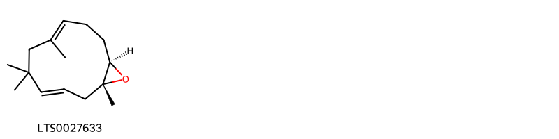{ width=100% }
<figcaption>Hình ảnh cấu trúc hóa học của hoạt chất thuộc nhóm *Epoxides*. Tên thường gọi của các hoạt chất tương ứng là (1r,3e,7e,11r)-1,5,5,7-tetramethyl-12-oxabicyclo[9.1.0]dodeca-3,7-diene [(LTS0027633)](https://lotus.naturalproducts.net/compound/lotus_id/LTS0027633).</figcaption>
</figure>

            
            
### Nhóm 2-arylbenzofuran flavonoids
<figure markdown="span">
    { width=100% }
<figcaption>Hình ảnh cấu trúc hóa học của hoạt chất thuộc nhóm *2-arylbenzofuran flavonoids*. Tên thường gọi của các hoạt chất tương ứng là balanophonin [(LTS0039496)](https://lotus.naturalproducts.net/compound/lotus_id/LTS0039496), (2e)-3-[(2r,3s)-2-(4-hydroxy-3-methoxyphenyl)-3-(hydroxymethyl)-7-methoxy-2,3-dihydro-1-benzofuran-5-yl]prop-2-enal [(LTS0130349)](https://lotus.naturalproducts.net/compound/lotus_id/LTS0130349), 3-[2-(4-hydroxy-3-methoxyphenyl)-3-(hydroxymethyl)-7-methoxy-2,3-dihydro-1-benzofuran-5-yl]prop-2-enal [(LTS0233365)](https://lotus.naturalproducts.net/compound/lotus_id/LTS0233365).</figcaption>
</figure>

### Nhóm Anthracenes
<figure markdown="span">
    { width=100% }
<figcaption>Hình ảnh cấu trúc hóa học của hoạt chất thuộc nhóm *Anthracenes*. Tên thường gọi của các hoạt chất tương ứng là turkey rhubarb [(LTS0160968)](https://lotus.naturalproducts.net/compound/lotus_id/LTS0160968), emodin [(LTS0163480)](https://lotus.naturalproducts.net/compound/lotus_id/LTS0163480), physcion [(LTS0052688)](https://lotus.naturalproducts.net/compound/lotus_id/LTS0052688).</figcaption>
</figure>

### Nhóm Benzene and substituted derivatives
<figure markdown="span">
    { width=100% }
<figcaption>Hình ảnh cấu trúc hóa học của hoạt chất thuộc nhóm *Benzene and substituted derivatives*. Tên thường gọi của các hoạt chất tương ứng là lavendustin c [(LTS0195252)](https://lotus.naturalproducts.net/compound/lotus_id/LTS0195252), 4-biphenylaldehyde [(LTS0057438)](https://lotus.naturalproducts.net/compound/lotus_id/LTS0057438), methyl salicylate [(LTS0128373)](https://lotus.naturalproducts.net/compound/lotus_id/LTS0128373), [1,1'-biphenyl]-2-carbaldehyde [(LTS0064008)](https://lotus.naturalproducts.net/compound/lotus_id/LTS0064008).</figcaption>
</figure>

### Nhóm Benzopyrans
<figure markdown="span">
    { width=100% }
<figcaption>Hình ảnh cấu trúc hóa học của hoạt chất thuộc nhóm *Benzopyrans*. Tên thường gọi của các hoạt chất tương ứng là chromene-2,2,6-triol [(LTS0157870)](https://lotus.naturalproducts.net/compound/lotus_id/LTS0157870), 6-methoxychromene-2,2-diol [(LTS0121113)](https://lotus.naturalproducts.net/compound/lotus_id/LTS0121113).</figcaption>
</figure>

### Nhóm Carboxylic acids and derivatives
<figure markdown="span">
    { width=100% }
<figcaption>Hình ảnh cấu trúc hóa học của hoạt chất thuộc nhóm *Carboxylic acids and derivatives*. Tên thường gọi của các hoạt chất tương ứng là (1r,4r,4as,8ar)-4-methyl-7-methylidene-octahydro-1h-naphthalene-1-carboxylic acid [(LTS0270684)](https://lotus.naturalproducts.net/compound/lotus_id/LTS0270684), 2-(1-carboxy-n-{4-[(2s)-2-(carboxyamino)-2-({4-[3-hydroxy-2-(methoxycarbonyl)phenoxy]butyl}-c-hydroxycarbonimidoyl)ethyl]phenyl}formamido)benzoic acid [(LTS0150168)](https://lotus.naturalproducts.net/compound/lotus_id/LTS0150168), (4s)-3,3,6-trimethylhepta-1,5-dien-4-yl acetate [(LTS0130898)](https://lotus.naturalproducts.net/compound/lotus_id/LTS0130898), (1r,4r,4as,8s,8as)-8-(formyloxy)-4-methyl-7-methylidene-octahydro-1h-naphthalene-1-carboxylic acid [(LTS0030860)](https://lotus.naturalproducts.net/compound/lotus_id/LTS0030860), 3,3,6-trimethylhepta-1,5-dien-4-yl acetate [(LTS0244885)](https://lotus.naturalproducts.net/compound/lotus_id/LTS0244885), 8-(formyloxy)-4-methyl-7-methylidene-octahydro-1h-naphthalene-1-carboxylic acid [(LTS0057379)](https://lotus.naturalproducts.net/compound/lotus_id/LTS0057379), 4,13-dimethyl-8-methylidene-10,11-dioxatricyclo[7.4.1.0⁵,¹⁴]tetradecan-12-one [(LTS0135933)](https://lotus.naturalproducts.net/compound/lotus_id/LTS0135933), 4-methyl-7-methylidene-octahydro-1h-naphthalene-1-carboxylic acid [(LTS0005709)](https://lotus.naturalproducts.net/compound/lotus_id/LTS0005709).</figcaption>
</figure>

### Nhóm Cinnamaldehydes
<figure markdown="span">
    { width=100% }
<figcaption>Hình ảnh cấu trúc hóa học của hoạt chất thuộc nhóm *Cinnamaldehydes*. Tên thường gọi của các hoạt chất tương ứng là 2-[2-methoxy-4-(3-oxoprop-1-en-1-yl)phenoxy]prop-2-enal [(LTS0134665)](https://lotus.naturalproducts.net/compound/lotus_id/LTS0134665), 3-{4-[(1,3-dihydroxypropan-2-yl)oxy]-3-methoxyphenyl}prop-2-enal [(LTS0124815)](https://lotus.naturalproducts.net/compound/lotus_id/LTS0124815), 2-{2-methoxy-4-[(1e)-3-oxoprop-1-en-1-yl]phenoxy}prop-2-enal [(LTS0251744)](https://lotus.naturalproducts.net/compound/lotus_id/LTS0251744), 4-methoxycinnamaldehyde [(LTS0219729)](https://lotus.naturalproducts.net/compound/lotus_id/LTS0219729), (2e)-3-{4-[(1,3-dihydroxypropan-2-yl)oxy]-3-methoxyphenyl}prop-2-enal [(LTS0038781)](https://lotus.naturalproducts.net/compound/lotus_id/LTS0038781), 3-(4-methoxyphenyl)-2-propenal [(LTS0014262)](https://lotus.naturalproducts.net/compound/lotus_id/LTS0014262).</figcaption>
</figure>

### Nhóm Cinnamic acids and derivatives
<figure markdown="span">
    { width=100% }
<figcaption>Hình ảnh cấu trúc hóa học của hoạt chất thuộc nhóm *Cinnamic acids and derivatives*. Tên thường gọi của các hoạt chất tương ứng là para-coumaric acid [(LTS0266252)](https://lotus.naturalproducts.net/compound/lotus_id/LTS0266252).</figcaption>
</figure>

### Nhóm Coumarins and derivatives
<figure markdown="span">
    { width=100% }
<figcaption>Hình ảnh cấu trúc hóa học của hoạt chất thuộc nhóm *Coumarins and derivatives*. Tên thường gọi của các hoạt chất tương ứng là 2h-1-benzopyran-2-one [(LTS0069773)](https://lotus.naturalproducts.net/compound/lotus_id/LTS0069773), isofraxidin [(LTS0073081)](https://lotus.naturalproducts.net/compound/lotus_id/LTS0073081), scopoletin [(LTS0193112)](https://lotus.naturalproducts.net/compound/lotus_id/LTS0193112).</figcaption>
</figure>

### Nhóm Dihydrofurans
<figure markdown="span">
    { width=100% }
<figcaption>Hình ảnh cấu trúc hóa học của hoạt chất thuộc nhóm *Dihydrofurans*. Tên thường gọi của các hoạt chất tương ứng là (3r)-5-(2,5-dihydrofuran-3-yl)-2-methylpent-1-en-3-ol [(LTS0112627)](https://lotus.naturalproducts.net/compound/lotus_id/LTS0112627), 5-(2,5-dihydrofuran-3-yl)-2-methylpent-3-en-2-ol [(LTS0246689)](https://lotus.naturalproducts.net/compound/lotus_id/LTS0246689), (3e)-5-(2,5-dihydrofuran-3-yl)-2-methylpent-3-en-2-ol [(LTS0221588)](https://lotus.naturalproducts.net/compound/lotus_id/LTS0221588), 5-(2,5-dihydrofuran-3-yl)-2-methylpent-1-en-3-ol [(LTS0118643)](https://lotus.naturalproducts.net/compound/lotus_id/LTS0118643).</figcaption>
</figure>

### Nhóm Dioxolopyrans
<figure markdown="span">
    { width=100% }
<figcaption>Hình ảnh cấu trúc hóa học của hoạt chất thuộc nhóm *Dioxolopyrans*. Tên thường gọi của các hoạt chất tương ứng là 1,5,9-trimethyl-11,14,15-trioxatetracyclo[10.2.1.0⁴,¹³.0⁸,¹³]pentadecan-10-one [(LTS0198939)](https://lotus.naturalproducts.net/compound/lotus_id/LTS0198939), (4s,5r,8s,9r,12s,13r)-1,5,9-trimethyl-11,14,15-trioxatetracyclo[10.2.1.0⁴,¹³.0⁸,¹³]pentadecan-10-one [(LTS0215855)](https://lotus.naturalproducts.net/compound/lotus_id/LTS0215855), 2-deoxyartemisinin [(LTS0090782)](https://lotus.naturalproducts.net/compound/lotus_id/LTS0090782), 2-hydroxy-1,5,9-trimethyl-11,14,15-trioxatetracyclo[10.2.1.0⁴,¹³.0⁸,¹³]pentadecan-10-one [(LTS0211892)](https://lotus.naturalproducts.net/compound/lotus_id/LTS0211892), (1s,2r,4s,5r,8s,9r,12s,13r)-2-hydroxy-1,5,9-trimethyl-11,14,15-trioxatetracyclo[10.2.1.0⁴,¹³.0⁸,¹³]pentadecan-10-one [(LTS0099364)](https://lotus.naturalproducts.net/compound/lotus_id/LTS0099364).</figcaption>
</figure>

### Nhóm Epoxides
<figure markdown="span">
    { width=100% }
<figcaption>Hình ảnh cấu trúc hóa học của hoạt chất thuộc nhóm *Epoxides*. Tên thường gọi của các hoạt chất tương ứng là (1r,3e,7e,11r)-1,5,5,7-tetramethyl-12-oxabicyclo[9.1.0]dodeca-3,7-diene [(LTS0027633)](https://lotus.naturalproducts.net/compound/lotus_id/LTS0027633).</figcaption>
</figure>

### Nhóm Fatty Acyls
<figure markdown="span">
    { width=100% }
<figcaption>Hình ảnh cấu trúc hóa học của hoạt chất thuộc nhóm *Fatty Acyls*. Tên thường gọi của các hoạt chất tương ứng là (2r,4r)-5-methyl-2-(prop-1-en-2-yl)hex-5-ene-1,4-diol [(LTS0112418)](https://lotus.naturalproducts.net/compound/lotus_id/LTS0112418), 5-methyl-2-(prop-1-en-2-yl)hex-3-ene-1,5-diol [(LTS0057789)](https://lotus.naturalproducts.net/compound/lotus_id/LTS0057789), ethyl (2r)-2-methylbutanoate [(LTS0233405)](https://lotus.naturalproducts.net/compound/lotus_id/LTS0233405), 5-methyl-2-(prop-1-en-2-yl)hex-5-ene-1,4-diol [(LTS0208964)](https://lotus.naturalproducts.net/compound/lotus_id/LTS0208964), hexyl (2e)-2-methylbut-2-enoate [(LTS0082952)](https://lotus.naturalproducts.net/compound/lotus_id/LTS0082952), (2s,3e)-5-methyl-2-(prop-1-en-2-yl)hex-3-ene-1,5-diol [(LTS0103356)](https://lotus.naturalproducts.net/compound/lotus_id/LTS0103356), cis-3-hexenyl isovalerate [(LTS0181676)](https://lotus.naturalproducts.net/compound/lotus_id/LTS0181676), cis-3-hexenol [(LTS0132156)](https://lotus.naturalproducts.net/compound/lotus_id/LTS0132156), 9-decen-1-ol [(LTS0161213)](https://lotus.naturalproducts.net/compound/lotus_id/LTS0161213), ceryl alcohol [(LTS0140051)](https://lotus.naturalproducts.net/compound/lotus_id/LTS0140051), methyl palmitate [(LTS0139222)](https://lotus.naturalproducts.net/compound/lotus_id/LTS0139222), oct-1-en-3s-ol [(LTS0173025)](https://lotus.naturalproducts.net/compound/lotus_id/LTS0173025), methyl stearate [(LTS0221686)](https://lotus.naturalproducts.net/compound/lotus_id/LTS0221686), hexanol [(LTS0217299)](https://lotus.naturalproducts.net/compound/lotus_id/LTS0217299), hexyl (2s)-2-methylbutanoate [(LTS0164349)](https://lotus.naturalproducts.net/compound/lotus_id/LTS0164349), nonacosanol [(LTS0205992)](https://lotus.naturalproducts.net/compound/lotus_id/LTS0205992), octacosanol [(LTS0049071)](https://lotus.naturalproducts.net/compound/lotus_id/LTS0049071), 1-octen-3-ol [(LTS0057101)](https://lotus.naturalproducts.net/compound/lotus_id/LTS0057101), (3z)-hex-3-en-1-yl (2r)-2-methylbutanoate [(LTS0005286)](https://lotus.naturalproducts.net/compound/lotus_id/LTS0005286).</figcaption>
</figure>

            
            
### Nhóm 2-arylbenzofuran flavonoids
<figure markdown="span">
    { width=100% }
<figcaption>Hình ảnh cấu trúc hóa học của hoạt chất thuộc nhóm *2-arylbenzofuran flavonoids*. Tên thường gọi của các hoạt chất tương ứng là balanophonin [(LTS0039496)](https://lotus.naturalproducts.net/compound/lotus_id/LTS0039496), (2e)-3-[(2r,3s)-2-(4-hydroxy-3-methoxyphenyl)-3-(hydroxymethyl)-7-methoxy-2,3-dihydro-1-benzofuran-5-yl]prop-2-enal [(LTS0130349)](https://lotus.naturalproducts.net/compound/lotus_id/LTS0130349), 3-[2-(4-hydroxy-3-methoxyphenyl)-3-(hydroxymethyl)-7-methoxy-2,3-dihydro-1-benzofuran-5-yl]prop-2-enal [(LTS0233365)](https://lotus.naturalproducts.net/compound/lotus_id/LTS0233365).</figcaption>
</figure>

### Nhóm Anthracenes
<figure markdown="span">
    { width=100% }
<figcaption>Hình ảnh cấu trúc hóa học của hoạt chất thuộc nhóm *Anthracenes*. Tên thường gọi của các hoạt chất tương ứng là turkey rhubarb [(LTS0160968)](https://lotus.naturalproducts.net/compound/lotus_id/LTS0160968), emodin [(LTS0163480)](https://lotus.naturalproducts.net/compound/lotus_id/LTS0163480), physcion [(LTS0052688)](https://lotus.naturalproducts.net/compound/lotus_id/LTS0052688).</figcaption>
</figure>

### Nhóm Benzene and substituted derivatives
<figure markdown="span">
    { width=100% }
<figcaption>Hình ảnh cấu trúc hóa học của hoạt chất thuộc nhóm *Benzene and substituted derivatives*. Tên thường gọi của các hoạt chất tương ứng là lavendustin c [(LTS0195252)](https://lotus.naturalproducts.net/compound/lotus_id/LTS0195252), 4-biphenylaldehyde [(LTS0057438)](https://lotus.naturalproducts.net/compound/lotus_id/LTS0057438), methyl salicylate [(LTS0128373)](https://lotus.naturalproducts.net/compound/lotus_id/LTS0128373), [1,1'-biphenyl]-2-carbaldehyde [(LTS0064008)](https://lotus.naturalproducts.net/compound/lotus_id/LTS0064008).</figcaption>
</figure>

### Nhóm Benzopyrans
<figure markdown="span">
    { width=100% }
<figcaption>Hình ảnh cấu trúc hóa học của hoạt chất thuộc nhóm *Benzopyrans*. Tên thường gọi của các hoạt chất tương ứng là chromene-2,2,6-triol [(LTS0157870)](https://lotus.naturalproducts.net/compound/lotus_id/LTS0157870), 6-methoxychromene-2,2-diol [(LTS0121113)](https://lotus.naturalproducts.net/compound/lotus_id/LTS0121113).</figcaption>
</figure>

### Nhóm Carboxylic acids and derivatives
<figure markdown="span">
    { width=100% }
<figcaption>Hình ảnh cấu trúc hóa học của hoạt chất thuộc nhóm *Carboxylic acids and derivatives*. Tên thường gọi của các hoạt chất tương ứng là (1r,4r,4as,8ar)-4-methyl-7-methylidene-octahydro-1h-naphthalene-1-carboxylic acid [(LTS0270684)](https://lotus.naturalproducts.net/compound/lotus_id/LTS0270684), 2-(1-carboxy-n-{4-[(2s)-2-(carboxyamino)-2-({4-[3-hydroxy-2-(methoxycarbonyl)phenoxy]butyl}-c-hydroxycarbonimidoyl)ethyl]phenyl}formamido)benzoic acid [(LTS0150168)](https://lotus.naturalproducts.net/compound/lotus_id/LTS0150168), (4s)-3,3,6-trimethylhepta-1,5-dien-4-yl acetate [(LTS0130898)](https://lotus.naturalproducts.net/compound/lotus_id/LTS0130898), (1r,4r,4as,8s,8as)-8-(formyloxy)-4-methyl-7-methylidene-octahydro-1h-naphthalene-1-carboxylic acid [(LTS0030860)](https://lotus.naturalproducts.net/compound/lotus_id/LTS0030860), 3,3,6-trimethylhepta-1,5-dien-4-yl acetate [(LTS0244885)](https://lotus.naturalproducts.net/compound/lotus_id/LTS0244885), 8-(formyloxy)-4-methyl-7-methylidene-octahydro-1h-naphthalene-1-carboxylic acid [(LTS0057379)](https://lotus.naturalproducts.net/compound/lotus_id/LTS0057379), 4,13-dimethyl-8-methylidene-10,11-dioxatricyclo[7.4.1.0⁵,¹⁴]tetradecan-12-one [(LTS0135933)](https://lotus.naturalproducts.net/compound/lotus_id/LTS0135933), 4-methyl-7-methylidene-octahydro-1h-naphthalene-1-carboxylic acid [(LTS0005709)](https://lotus.naturalproducts.net/compound/lotus_id/LTS0005709).</figcaption>
</figure>

### Nhóm Cinnamaldehydes
<figure markdown="span">
    { width=100% }
<figcaption>Hình ảnh cấu trúc hóa học của hoạt chất thuộc nhóm *Cinnamaldehydes*. Tên thường gọi của các hoạt chất tương ứng là 2-[2-methoxy-4-(3-oxoprop-1-en-1-yl)phenoxy]prop-2-enal [(LTS0134665)](https://lotus.naturalproducts.net/compound/lotus_id/LTS0134665), 3-{4-[(1,3-dihydroxypropan-2-yl)oxy]-3-methoxyphenyl}prop-2-enal [(LTS0124815)](https://lotus.naturalproducts.net/compound/lotus_id/LTS0124815), 2-{2-methoxy-4-[(1e)-3-oxoprop-1-en-1-yl]phenoxy}prop-2-enal [(LTS0251744)](https://lotus.naturalproducts.net/compound/lotus_id/LTS0251744), 4-methoxycinnamaldehyde [(LTS0219729)](https://lotus.naturalproducts.net/compound/lotus_id/LTS0219729), (2e)-3-{4-[(1,3-dihydroxypropan-2-yl)oxy]-3-methoxyphenyl}prop-2-enal [(LTS0038781)](https://lotus.naturalproducts.net/compound/lotus_id/LTS0038781), 3-(4-methoxyphenyl)-2-propenal [(LTS0014262)](https://lotus.naturalproducts.net/compound/lotus_id/LTS0014262).</figcaption>
</figure>

### Nhóm Cinnamic acids and derivatives
<figure markdown="span">
    { width=100% }
<figcaption>Hình ảnh cấu trúc hóa học của hoạt chất thuộc nhóm *Cinnamic acids and derivatives*. Tên thường gọi của các hoạt chất tương ứng là para-coumaric acid [(LTS0266252)](https://lotus.naturalproducts.net/compound/lotus_id/LTS0266252).</figcaption>
</figure>

### Nhóm Coumarins and derivatives
<figure markdown="span">
    { width=100% }
<figcaption>Hình ảnh cấu trúc hóa học của hoạt chất thuộc nhóm *Coumarins and derivatives*. Tên thường gọi của các hoạt chất tương ứng là 2h-1-benzopyran-2-one [(LTS0069773)](https://lotus.naturalproducts.net/compound/lotus_id/LTS0069773), isofraxidin [(LTS0073081)](https://lotus.naturalproducts.net/compound/lotus_id/LTS0073081), scopoletin [(LTS0193112)](https://lotus.naturalproducts.net/compound/lotus_id/LTS0193112).</figcaption>
</figure>

### Nhóm Dihydrofurans
<figure markdown="span">
    { width=100% }
<figcaption>Hình ảnh cấu trúc hóa học của hoạt chất thuộc nhóm *Dihydrofurans*. Tên thường gọi của các hoạt chất tương ứng là (3r)-5-(2,5-dihydrofuran-3-yl)-2-methylpent-1-en-3-ol [(LTS0112627)](https://lotus.naturalproducts.net/compound/lotus_id/LTS0112627), 5-(2,5-dihydrofuran-3-yl)-2-methylpent-3-en-2-ol [(LTS0246689)](https://lotus.naturalproducts.net/compound/lotus_id/LTS0246689), (3e)-5-(2,5-dihydrofuran-3-yl)-2-methylpent-3-en-2-ol [(LTS0221588)](https://lotus.naturalproducts.net/compound/lotus_id/LTS0221588), 5-(2,5-dihydrofuran-3-yl)-2-methylpent-1-en-3-ol [(LTS0118643)](https://lotus.naturalproducts.net/compound/lotus_id/LTS0118643).</figcaption>
</figure>

### Nhóm Dioxolopyrans
<figure markdown="span">
    { width=100% }
<figcaption>Hình ảnh cấu trúc hóa học của hoạt chất thuộc nhóm *Dioxolopyrans*. Tên thường gọi của các hoạt chất tương ứng là 1,5,9-trimethyl-11,14,15-trioxatetracyclo[10.2.1.0⁴,¹³.0⁸,¹³]pentadecan-10-one [(LTS0198939)](https://lotus.naturalproducts.net/compound/lotus_id/LTS0198939), (4s,5r,8s,9r,12s,13r)-1,5,9-trimethyl-11,14,15-trioxatetracyclo[10.2.1.0⁴,¹³.0⁸,¹³]pentadecan-10-one [(LTS0215855)](https://lotus.naturalproducts.net/compound/lotus_id/LTS0215855), 2-deoxyartemisinin [(LTS0090782)](https://lotus.naturalproducts.net/compound/lotus_id/LTS0090782), 2-hydroxy-1,5,9-trimethyl-11,14,15-trioxatetracyclo[10.2.1.0⁴,¹³.0⁸,¹³]pentadecan-10-one [(LTS0211892)](https://lotus.naturalproducts.net/compound/lotus_id/LTS0211892), (1s,2r,4s,5r,8s,9r,12s,13r)-2-hydroxy-1,5,9-trimethyl-11,14,15-trioxatetracyclo[10.2.1.0⁴,¹³.0⁸,¹³]pentadecan-10-one [(LTS0099364)](https://lotus.naturalproducts.net/compound/lotus_id/LTS0099364).</figcaption>
</figure>

### Nhóm Epoxides
<figure markdown="span">
    { width=100% }
<figcaption>Hình ảnh cấu trúc hóa học của hoạt chất thuộc nhóm *Epoxides*. Tên thường gọi của các hoạt chất tương ứng là (1r,3e,7e,11r)-1,5,5,7-tetramethyl-12-oxabicyclo[9.1.0]dodeca-3,7-diene [(LTS0027633)](https://lotus.naturalproducts.net/compound/lotus_id/LTS0027633).</figcaption>
</figure>

### Nhóm Fatty Acyls
<figure markdown="span">
    { width=100% }
<figcaption>Hình ảnh cấu trúc hóa học của hoạt chất thuộc nhóm *Fatty Acyls*. Tên thường gọi của các hoạt chất tương ứng là (2r,4r)-5-methyl-2-(prop-1-en-2-yl)hex-5-ene-1,4-diol [(LTS0112418)](https://lotus.naturalproducts.net/compound/lotus_id/LTS0112418), 5-methyl-2-(prop-1-en-2-yl)hex-3-ene-1,5-diol [(LTS0057789)](https://lotus.naturalproducts.net/compound/lotus_id/LTS0057789), ethyl (2r)-2-methylbutanoate [(LTS0233405)](https://lotus.naturalproducts.net/compound/lotus_id/LTS0233405), 5-methyl-2-(prop-1-en-2-yl)hex-5-ene-1,4-diol [(LTS0208964)](https://lotus.naturalproducts.net/compound/lotus_id/LTS0208964), hexyl (2e)-2-methylbut-2-enoate [(LTS0082952)](https://lotus.naturalproducts.net/compound/lotus_id/LTS0082952), (2s,3e)-5-methyl-2-(prop-1-en-2-yl)hex-3-ene-1,5-diol [(LTS0103356)](https://lotus.naturalproducts.net/compound/lotus_id/LTS0103356), cis-3-hexenyl isovalerate [(LTS0181676)](https://lotus.naturalproducts.net/compound/lotus_id/LTS0181676), cis-3-hexenol [(LTS0132156)](https://lotus.naturalproducts.net/compound/lotus_id/LTS0132156), 9-decen-1-ol [(LTS0161213)](https://lotus.naturalproducts.net/compound/lotus_id/LTS0161213), ceryl alcohol [(LTS0140051)](https://lotus.naturalproducts.net/compound/lotus_id/LTS0140051), methyl palmitate [(LTS0139222)](https://lotus.naturalproducts.net/compound/lotus_id/LTS0139222), oct-1-en-3s-ol [(LTS0173025)](https://lotus.naturalproducts.net/compound/lotus_id/LTS0173025), methyl stearate [(LTS0221686)](https://lotus.naturalproducts.net/compound/lotus_id/LTS0221686), hexanol [(LTS0217299)](https://lotus.naturalproducts.net/compound/lotus_id/LTS0217299), hexyl (2s)-2-methylbutanoate [(LTS0164349)](https://lotus.naturalproducts.net/compound/lotus_id/LTS0164349), nonacosanol [(LTS0205992)](https://lotus.naturalproducts.net/compound/lotus_id/LTS0205992), octacosanol [(LTS0049071)](https://lotus.naturalproducts.net/compound/lotus_id/LTS0049071), 1-octen-3-ol [(LTS0057101)](https://lotus.naturalproducts.net/compound/lotus_id/LTS0057101), (3z)-hex-3-en-1-yl (2r)-2-methylbutanoate [(LTS0005286)](https://lotus.naturalproducts.net/compound/lotus_id/LTS0005286).</figcaption>
</figure>

### Nhóm Flavonoids
<figure markdown="span">
    { width=100% }
<figcaption>Hình ảnh cấu trúc hóa học của hoạt chất thuộc nhóm *Flavonoids*. Tên thường gọi của các hoạt chất tương ứng là quercetin [(LTS0004651)](https://lotus.naturalproducts.net/compound/lotus_id/LTS0004651), 3-rutinosyl quercetin [(LTS0032845)](https://lotus.naturalproducts.net/compound/lotus_id/LTS0032845), eupatorin [(LTS0073269)](https://lotus.naturalproducts.net/compound/lotus_id/LTS0073269), bonanzin [(LTS0123079)](https://lotus.naturalproducts.net/compound/lotus_id/LTS0123079), (2r)-2-(2,4-dihydroxyphenyl)-5-hydroxy-6,7-dimethoxy-2,3-dihydro-1-benzopyran-4-one [(LTS0238093)](https://lotus.naturalproducts.net/compound/lotus_id/LTS0238093), chrysoeriol [(LTS0095766)](https://lotus.naturalproducts.net/compound/lotus_id/LTS0095766), penduletin [(LTS0080627)](https://lotus.naturalproducts.net/compound/lotus_id/LTS0080627), 5,7,8-trihydroxy-2-(3-hydroxy-4-methoxyphenyl)-3-methoxy-2,3-dihydro-1-benzopyran-4-one [(LTS0072712)](https://lotus.naturalproducts.net/compound/lotus_id/LTS0072712), 3,5,7-trihydroxy-2-(4-hydroxy-3-{[(2s,3r,4s,5s,6r)-3,4,5-trihydroxy-6-(hydroxymethyl)oxan-2-yl]oxy}phenyl)chromen-4-one [(LTS0094454)](https://lotus.naturalproducts.net/compound/lotus_id/LTS0094454), 2-(3,4-dihydroxyphenyl)-5,7-dihydroxy-3-{[3,4,5-trihydroxy-6-(hydroxymethyl)oxan-2-yl]oxy}chromen-4-one [(LTS0195312)](https://lotus.naturalproducts.net/compound/lotus_id/LTS0195312), patuletin [(LTS0104633)](https://lotus.naturalproducts.net/compound/lotus_id/LTS0104633), chamomile [(LTS0104946)](https://lotus.naturalproducts.net/compound/lotus_id/LTS0104946), luteolin 7-methyl ether [(LTS0259993)](https://lotus.naturalproducts.net/compound/lotus_id/LTS0259993), 2-(2,4-dihydroxyphenyl)-5-hydroxy-6,7-dimethoxy-2,3-dihydro-1-benzopyran-4-one [(LTS0108962)](https://lotus.naturalproducts.net/compound/lotus_id/LTS0108962), quercimeritrin [(LTS0188893)](https://lotus.naturalproducts.net/compound/lotus_id/LTS0188893), artemetin [(LTS0265682)](https://lotus.naturalproducts.net/compound/lotus_id/LTS0265682), cirsimaritin [(LTS0146305)](https://lotus.naturalproducts.net/compound/lotus_id/LTS0146305), 2-(3,4-dihydroxyphenyl)-5-hydroxy-7-{[3,4,5-trihydroxy-6-(hydroxymethyl)oxan-2-yl]oxy}chromen-4-one [(LTS0158292)](https://lotus.naturalproducts.net/compound/lotus_id/LTS0158292), cirsilineol [(LTS0092903)](https://lotus.naturalproducts.net/compound/lotus_id/LTS0092903), isorhamnetin [(LTS0107505)](https://lotus.naturalproducts.net/compound/lotus_id/LTS0107505), eupalitin [(LTS0255198)](https://lotus.naturalproducts.net/compound/lotus_id/LTS0255198), kaempherol [(LTS0155822)](https://lotus.naturalproducts.net/compound/lotus_id/LTS0155822), isoquercetin [(LTS0254337)](https://lotus.naturalproducts.net/compound/lotus_id/LTS0254337), trifolin [(LTS0267055)](https://lotus.naturalproducts.net/compound/lotus_id/LTS0267055), quercimeritrin [(LTS0043461)](https://lotus.naturalproducts.net/compound/lotus_id/LTS0043461), chrysosplenol c [(LTS0217158)](https://lotus.naturalproducts.net/compound/lotus_id/LTS0217158), chrysosplenetin [(LTS0202772)](https://lotus.naturalproducts.net/compound/lotus_id/LTS0202772), casticin [(LTS0071783)](https://lotus.naturalproducts.net/compound/lotus_id/LTS0071783), quercetagetin 3-methyl ether [(LTS0212838)](https://lotus.naturalproducts.net/compound/lotus_id/LTS0212838), cirsiliol [(LTS0070414)](https://lotus.naturalproducts.net/compound/lotus_id/LTS0070414), 2-(3,4-dihydroxyphenyl)-5,7-dihydroxy-3-{[(2s,3r,4r,5r,6s)-3,4,5-trihydroxy-6-(hydroxymethyl)oxan-2-yl]oxy}chromen-4-one [(LTS0241372)](https://lotus.naturalproducts.net/compound/lotus_id/LTS0241372), retusin [(LTS0236094)](https://lotus.naturalproducts.net/compound/lotus_id/LTS0236094), arcapillin [(LTS0002317)](https://lotus.naturalproducts.net/compound/lotus_id/LTS0002317), 2-(3,4-dimethoxyphenyl)-3,5-dihydroxy-6,7-dimethoxychromen-4-one [(LTS0179185)](https://lotus.naturalproducts.net/compound/lotus_id/LTS0179185), 2-(3,4-dimethoxyphenyl)-5-hydroxy-6,7-dimethoxychromen-4-one [(LTS0032351)](https://lotus.naturalproducts.net/compound/lotus_id/LTS0032351), luteolin 7-o-glucoside [(LTS0227450)](https://lotus.naturalproducts.net/compound/lotus_id/LTS0227450), rhamnocitrin [(LTS0198024)](https://lotus.naturalproducts.net/compound/lotus_id/LTS0198024), astragalin [(LTS0249588)](https://lotus.naturalproducts.net/compound/lotus_id/LTS0249588), chrysosplenol d [(LTS0188255)](https://lotus.naturalproducts.net/compound/lotus_id/LTS0188255), quercetagetin 4'-methyl ether [(LTS0048116)](https://lotus.naturalproducts.net/compound/lotus_id/LTS0048116), tamarixetin [(LTS0258243)](https://lotus.naturalproducts.net/compound/lotus_id/LTS0258243), quercetin 3-methyl ether [(LTS0194170)](https://lotus.naturalproducts.net/compound/lotus_id/LTS0194170), (2s,3r)-5,7,8-trihydroxy-2-(3-hydroxy-4-methoxyphenyl)-3-methoxy-2,3-dihydro-1-benzopyran-4-one [(LTS0244620)](https://lotus.naturalproducts.net/compound/lotus_id/LTS0244620), axillarin [(LTS0067813)](https://lotus.naturalproducts.net/compound/lotus_id/LTS0067813), 2-(3,4-dihydroxyphenyl)-5,7-dihydroxy-6-methoxy-3-{[3,4,5-trihydroxy-6-(hydroxymethyl)oxan-2-yl]oxy}chromen-4-one [(LTS0010167)](https://lotus.naturalproducts.net/compound/lotus_id/LTS0010167), isokaempferide [(LTS0011732)](https://lotus.naturalproducts.net/compound/lotus_id/LTS0011732), luteolin [(LTS0017052)](https://lotus.naturalproducts.net/compound/lotus_id/LTS0017052), pachypodol [(LTS0093471)](https://lotus.naturalproducts.net/compound/lotus_id/LTS0093471), 5,6,7-trihydroxy-2-(3-hydroxy-4-methoxyphenyl)-3-methoxychromen-4-one [(LTS0217584)](https://lotus.naturalproducts.net/compound/lotus_id/LTS0217584), quercimeritrin [(LTS0208490)](https://lotus.naturalproducts.net/compound/lotus_id/LTS0208490), 3,5,7-trihydroxy-2-(4-hydroxy-3-{[3,4,5-trihydroxy-6-(hydroxymethyl)oxan-2-yl]oxy}phenyl)chromen-4-one [(LTS0105577)](https://lotus.naturalproducts.net/compound/lotus_id/LTS0105577), tomentin [(LTS0028795)](https://lotus.naturalproducts.net/compound/lotus_id/LTS0028795).</figcaption>
</figure>

            
            
### Nhóm 2-arylbenzofuran flavonoids
<figure markdown="span">
    { width=100% }
<figcaption>Hình ảnh cấu trúc hóa học của hoạt chất thuộc nhóm *2-arylbenzofuran flavonoids*. Tên thường gọi của các hoạt chất tương ứng là balanophonin [(LTS0039496)](https://lotus.naturalproducts.net/compound/lotus_id/LTS0039496), (2e)-3-[(2r,3s)-2-(4-hydroxy-3-methoxyphenyl)-3-(hydroxymethyl)-7-methoxy-2,3-dihydro-1-benzofuran-5-yl]prop-2-enal [(LTS0130349)](https://lotus.naturalproducts.net/compound/lotus_id/LTS0130349), 3-[2-(4-hydroxy-3-methoxyphenyl)-3-(hydroxymethyl)-7-methoxy-2,3-dihydro-1-benzofuran-5-yl]prop-2-enal [(LTS0233365)](https://lotus.naturalproducts.net/compound/lotus_id/LTS0233365).</figcaption>
</figure>

### Nhóm Anthracenes
<figure markdown="span">
    { width=100% }
<figcaption>Hình ảnh cấu trúc hóa học của hoạt chất thuộc nhóm *Anthracenes*. Tên thường gọi của các hoạt chất tương ứng là turkey rhubarb [(LTS0160968)](https://lotus.naturalproducts.net/compound/lotus_id/LTS0160968), emodin [(LTS0163480)](https://lotus.naturalproducts.net/compound/lotus_id/LTS0163480), physcion [(LTS0052688)](https://lotus.naturalproducts.net/compound/lotus_id/LTS0052688).</figcaption>
</figure>

### Nhóm Benzene and substituted derivatives
<figure markdown="span">
    { width=100% }
<figcaption>Hình ảnh cấu trúc hóa học của hoạt chất thuộc nhóm *Benzene and substituted derivatives*. Tên thường gọi của các hoạt chất tương ứng là lavendustin c [(LTS0195252)](https://lotus.naturalproducts.net/compound/lotus_id/LTS0195252), 4-biphenylaldehyde [(LTS0057438)](https://lotus.naturalproducts.net/compound/lotus_id/LTS0057438), methyl salicylate [(LTS0128373)](https://lotus.naturalproducts.net/compound/lotus_id/LTS0128373), [1,1'-biphenyl]-2-carbaldehyde [(LTS0064008)](https://lotus.naturalproducts.net/compound/lotus_id/LTS0064008).</figcaption>
</figure>

### Nhóm Benzopyrans
<figure markdown="span">
    { width=100% }
<figcaption>Hình ảnh cấu trúc hóa học của hoạt chất thuộc nhóm *Benzopyrans*. Tên thường gọi của các hoạt chất tương ứng là chromene-2,2,6-triol [(LTS0157870)](https://lotus.naturalproducts.net/compound/lotus_id/LTS0157870), 6-methoxychromene-2,2-diol [(LTS0121113)](https://lotus.naturalproducts.net/compound/lotus_id/LTS0121113).</figcaption>
</figure>

### Nhóm Carboxylic acids and derivatives
<figure markdown="span">
    { width=100% }
<figcaption>Hình ảnh cấu trúc hóa học của hoạt chất thuộc nhóm *Carboxylic acids and derivatives*. Tên thường gọi của các hoạt chất tương ứng là (1r,4r,4as,8ar)-4-methyl-7-methylidene-octahydro-1h-naphthalene-1-carboxylic acid [(LTS0270684)](https://lotus.naturalproducts.net/compound/lotus_id/LTS0270684), 2-(1-carboxy-n-{4-[(2s)-2-(carboxyamino)-2-({4-[3-hydroxy-2-(methoxycarbonyl)phenoxy]butyl}-c-hydroxycarbonimidoyl)ethyl]phenyl}formamido)benzoic acid [(LTS0150168)](https://lotus.naturalproducts.net/compound/lotus_id/LTS0150168), (4s)-3,3,6-trimethylhepta-1,5-dien-4-yl acetate [(LTS0130898)](https://lotus.naturalproducts.net/compound/lotus_id/LTS0130898), (1r,4r,4as,8s,8as)-8-(formyloxy)-4-methyl-7-methylidene-octahydro-1h-naphthalene-1-carboxylic acid [(LTS0030860)](https://lotus.naturalproducts.net/compound/lotus_id/LTS0030860), 3,3,6-trimethylhepta-1,5-dien-4-yl acetate [(LTS0244885)](https://lotus.naturalproducts.net/compound/lotus_id/LTS0244885), 8-(formyloxy)-4-methyl-7-methylidene-octahydro-1h-naphthalene-1-carboxylic acid [(LTS0057379)](https://lotus.naturalproducts.net/compound/lotus_id/LTS0057379), 4,13-dimethyl-8-methylidene-10,11-dioxatricyclo[7.4.1.0⁵,¹⁴]tetradecan-12-one [(LTS0135933)](https://lotus.naturalproducts.net/compound/lotus_id/LTS0135933), 4-methyl-7-methylidene-octahydro-1h-naphthalene-1-carboxylic acid [(LTS0005709)](https://lotus.naturalproducts.net/compound/lotus_id/LTS0005709).</figcaption>
</figure>

### Nhóm Cinnamaldehydes
<figure markdown="span">
    { width=100% }
<figcaption>Hình ảnh cấu trúc hóa học của hoạt chất thuộc nhóm *Cinnamaldehydes*. Tên thường gọi của các hoạt chất tương ứng là 2-[2-methoxy-4-(3-oxoprop-1-en-1-yl)phenoxy]prop-2-enal [(LTS0134665)](https://lotus.naturalproducts.net/compound/lotus_id/LTS0134665), 3-{4-[(1,3-dihydroxypropan-2-yl)oxy]-3-methoxyphenyl}prop-2-enal [(LTS0124815)](https://lotus.naturalproducts.net/compound/lotus_id/LTS0124815), 2-{2-methoxy-4-[(1e)-3-oxoprop-1-en-1-yl]phenoxy}prop-2-enal [(LTS0251744)](https://lotus.naturalproducts.net/compound/lotus_id/LTS0251744), 4-methoxycinnamaldehyde [(LTS0219729)](https://lotus.naturalproducts.net/compound/lotus_id/LTS0219729), (2e)-3-{4-[(1,3-dihydroxypropan-2-yl)oxy]-3-methoxyphenyl}prop-2-enal [(LTS0038781)](https://lotus.naturalproducts.net/compound/lotus_id/LTS0038781), 3-(4-methoxyphenyl)-2-propenal [(LTS0014262)](https://lotus.naturalproducts.net/compound/lotus_id/LTS0014262).</figcaption>
</figure>

### Nhóm Cinnamic acids and derivatives
<figure markdown="span">
    { width=100% }
<figcaption>Hình ảnh cấu trúc hóa học của hoạt chất thuộc nhóm *Cinnamic acids and derivatives*. Tên thường gọi của các hoạt chất tương ứng là para-coumaric acid [(LTS0266252)](https://lotus.naturalproducts.net/compound/lotus_id/LTS0266252).</figcaption>
</figure>

### Nhóm Coumarins and derivatives
<figure markdown="span">
    { width=100% }
<figcaption>Hình ảnh cấu trúc hóa học của hoạt chất thuộc nhóm *Coumarins and derivatives*. Tên thường gọi của các hoạt chất tương ứng là 2h-1-benzopyran-2-one [(LTS0069773)](https://lotus.naturalproducts.net/compound/lotus_id/LTS0069773), isofraxidin [(LTS0073081)](https://lotus.naturalproducts.net/compound/lotus_id/LTS0073081), scopoletin [(LTS0193112)](https://lotus.naturalproducts.net/compound/lotus_id/LTS0193112).</figcaption>
</figure>

### Nhóm Dihydrofurans
<figure markdown="span">
    { width=100% }
<figcaption>Hình ảnh cấu trúc hóa học của hoạt chất thuộc nhóm *Dihydrofurans*. Tên thường gọi của các hoạt chất tương ứng là (3r)-5-(2,5-dihydrofuran-3-yl)-2-methylpent-1-en-3-ol [(LTS0112627)](https://lotus.naturalproducts.net/compound/lotus_id/LTS0112627), 5-(2,5-dihydrofuran-3-yl)-2-methylpent-3-en-2-ol [(LTS0246689)](https://lotus.naturalproducts.net/compound/lotus_id/LTS0246689), (3e)-5-(2,5-dihydrofuran-3-yl)-2-methylpent-3-en-2-ol [(LTS0221588)](https://lotus.naturalproducts.net/compound/lotus_id/LTS0221588), 5-(2,5-dihydrofuran-3-yl)-2-methylpent-1-en-3-ol [(LTS0118643)](https://lotus.naturalproducts.net/compound/lotus_id/LTS0118643).</figcaption>
</figure>

### Nhóm Dioxolopyrans
<figure markdown="span">
    { width=100% }
<figcaption>Hình ảnh cấu trúc hóa học của hoạt chất thuộc nhóm *Dioxolopyrans*. Tên thường gọi của các hoạt chất tương ứng là 1,5,9-trimethyl-11,14,15-trioxatetracyclo[10.2.1.0⁴,¹³.0⁸,¹³]pentadecan-10-one [(LTS0198939)](https://lotus.naturalproducts.net/compound/lotus_id/LTS0198939), (4s,5r,8s,9r,12s,13r)-1,5,9-trimethyl-11,14,15-trioxatetracyclo[10.2.1.0⁴,¹³.0⁸,¹³]pentadecan-10-one [(LTS0215855)](https://lotus.naturalproducts.net/compound/lotus_id/LTS0215855), 2-deoxyartemisinin [(LTS0090782)](https://lotus.naturalproducts.net/compound/lotus_id/LTS0090782), 2-hydroxy-1,5,9-trimethyl-11,14,15-trioxatetracyclo[10.2.1.0⁴,¹³.0⁸,¹³]pentadecan-10-one [(LTS0211892)](https://lotus.naturalproducts.net/compound/lotus_id/LTS0211892), (1s,2r,4s,5r,8s,9r,12s,13r)-2-hydroxy-1,5,9-trimethyl-11,14,15-trioxatetracyclo[10.2.1.0⁴,¹³.0⁸,¹³]pentadecan-10-one [(LTS0099364)](https://lotus.naturalproducts.net/compound/lotus_id/LTS0099364).</figcaption>
</figure>

### Nhóm Epoxides
<figure markdown="span">
    { width=100% }
<figcaption>Hình ảnh cấu trúc hóa học của hoạt chất thuộc nhóm *Epoxides*. Tên thường gọi của các hoạt chất tương ứng là (1r,3e,7e,11r)-1,5,5,7-tetramethyl-12-oxabicyclo[9.1.0]dodeca-3,7-diene [(LTS0027633)](https://lotus.naturalproducts.net/compound/lotus_id/LTS0027633).</figcaption>
</figure>

### Nhóm Fatty Acyls
<figure markdown="span">
    { width=100% }
<figcaption>Hình ảnh cấu trúc hóa học của hoạt chất thuộc nhóm *Fatty Acyls*. Tên thường gọi của các hoạt chất tương ứng là (2r,4r)-5-methyl-2-(prop-1-en-2-yl)hex-5-ene-1,4-diol [(LTS0112418)](https://lotus.naturalproducts.net/compound/lotus_id/LTS0112418), 5-methyl-2-(prop-1-en-2-yl)hex-3-ene-1,5-diol [(LTS0057789)](https://lotus.naturalproducts.net/compound/lotus_id/LTS0057789), ethyl (2r)-2-methylbutanoate [(LTS0233405)](https://lotus.naturalproducts.net/compound/lotus_id/LTS0233405), 5-methyl-2-(prop-1-en-2-yl)hex-5-ene-1,4-diol [(LTS0208964)](https://lotus.naturalproducts.net/compound/lotus_id/LTS0208964), hexyl (2e)-2-methylbut-2-enoate [(LTS0082952)](https://lotus.naturalproducts.net/compound/lotus_id/LTS0082952), (2s,3e)-5-methyl-2-(prop-1-en-2-yl)hex-3-ene-1,5-diol [(LTS0103356)](https://lotus.naturalproducts.net/compound/lotus_id/LTS0103356), cis-3-hexenyl isovalerate [(LTS0181676)](https://lotus.naturalproducts.net/compound/lotus_id/LTS0181676), cis-3-hexenol [(LTS0132156)](https://lotus.naturalproducts.net/compound/lotus_id/LTS0132156), 9-decen-1-ol [(LTS0161213)](https://lotus.naturalproducts.net/compound/lotus_id/LTS0161213), ceryl alcohol [(LTS0140051)](https://lotus.naturalproducts.net/compound/lotus_id/LTS0140051), methyl palmitate [(LTS0139222)](https://lotus.naturalproducts.net/compound/lotus_id/LTS0139222), oct-1-en-3s-ol [(LTS0173025)](https://lotus.naturalproducts.net/compound/lotus_id/LTS0173025), methyl stearate [(LTS0221686)](https://lotus.naturalproducts.net/compound/lotus_id/LTS0221686), hexanol [(LTS0217299)](https://lotus.naturalproducts.net/compound/lotus_id/LTS0217299), hexyl (2s)-2-methylbutanoate [(LTS0164349)](https://lotus.naturalproducts.net/compound/lotus_id/LTS0164349), nonacosanol [(LTS0205992)](https://lotus.naturalproducts.net/compound/lotus_id/LTS0205992), octacosanol [(LTS0049071)](https://lotus.naturalproducts.net/compound/lotus_id/LTS0049071), 1-octen-3-ol [(LTS0057101)](https://lotus.naturalproducts.net/compound/lotus_id/LTS0057101), (3z)-hex-3-en-1-yl (2r)-2-methylbutanoate [(LTS0005286)](https://lotus.naturalproducts.net/compound/lotus_id/LTS0005286).</figcaption>
</figure>

### Nhóm Flavonoids
<figure markdown="span">
    { width=100% }
<figcaption>Hình ảnh cấu trúc hóa học của hoạt chất thuộc nhóm *Flavonoids*. Tên thường gọi của các hoạt chất tương ứng là quercetin [(LTS0004651)](https://lotus.naturalproducts.net/compound/lotus_id/LTS0004651), 3-rutinosyl quercetin [(LTS0032845)](https://lotus.naturalproducts.net/compound/lotus_id/LTS0032845), eupatorin [(LTS0073269)](https://lotus.naturalproducts.net/compound/lotus_id/LTS0073269), bonanzin [(LTS0123079)](https://lotus.naturalproducts.net/compound/lotus_id/LTS0123079), (2r)-2-(2,4-dihydroxyphenyl)-5-hydroxy-6,7-dimethoxy-2,3-dihydro-1-benzopyran-4-one [(LTS0238093)](https://lotus.naturalproducts.net/compound/lotus_id/LTS0238093), chrysoeriol [(LTS0095766)](https://lotus.naturalproducts.net/compound/lotus_id/LTS0095766), penduletin [(LTS0080627)](https://lotus.naturalproducts.net/compound/lotus_id/LTS0080627), 5,7,8-trihydroxy-2-(3-hydroxy-4-methoxyphenyl)-3-methoxy-2,3-dihydro-1-benzopyran-4-one [(LTS0072712)](https://lotus.naturalproducts.net/compound/lotus_id/LTS0072712), 3,5,7-trihydroxy-2-(4-hydroxy-3-{[(2s,3r,4s,5s,6r)-3,4,5-trihydroxy-6-(hydroxymethyl)oxan-2-yl]oxy}phenyl)chromen-4-one [(LTS0094454)](https://lotus.naturalproducts.net/compound/lotus_id/LTS0094454), 2-(3,4-dihydroxyphenyl)-5,7-dihydroxy-3-{[3,4,5-trihydroxy-6-(hydroxymethyl)oxan-2-yl]oxy}chromen-4-one [(LTS0195312)](https://lotus.naturalproducts.net/compound/lotus_id/LTS0195312), patuletin [(LTS0104633)](https://lotus.naturalproducts.net/compound/lotus_id/LTS0104633), chamomile [(LTS0104946)](https://lotus.naturalproducts.net/compound/lotus_id/LTS0104946), luteolin 7-methyl ether [(LTS0259993)](https://lotus.naturalproducts.net/compound/lotus_id/LTS0259993), 2-(2,4-dihydroxyphenyl)-5-hydroxy-6,7-dimethoxy-2,3-dihydro-1-benzopyran-4-one [(LTS0108962)](https://lotus.naturalproducts.net/compound/lotus_id/LTS0108962), quercimeritrin [(LTS0188893)](https://lotus.naturalproducts.net/compound/lotus_id/LTS0188893), artemetin [(LTS0265682)](https://lotus.naturalproducts.net/compound/lotus_id/LTS0265682), cirsimaritin [(LTS0146305)](https://lotus.naturalproducts.net/compound/lotus_id/LTS0146305), 2-(3,4-dihydroxyphenyl)-5-hydroxy-7-{[3,4,5-trihydroxy-6-(hydroxymethyl)oxan-2-yl]oxy}chromen-4-one [(LTS0158292)](https://lotus.naturalproducts.net/compound/lotus_id/LTS0158292), cirsilineol [(LTS0092903)](https://lotus.naturalproducts.net/compound/lotus_id/LTS0092903), isorhamnetin [(LTS0107505)](https://lotus.naturalproducts.net/compound/lotus_id/LTS0107505), eupalitin [(LTS0255198)](https://lotus.naturalproducts.net/compound/lotus_id/LTS0255198), kaempherol [(LTS0155822)](https://lotus.naturalproducts.net/compound/lotus_id/LTS0155822), isoquercetin [(LTS0254337)](https://lotus.naturalproducts.net/compound/lotus_id/LTS0254337), trifolin [(LTS0267055)](https://lotus.naturalproducts.net/compound/lotus_id/LTS0267055), quercimeritrin [(LTS0043461)](https://lotus.naturalproducts.net/compound/lotus_id/LTS0043461), chrysosplenol c [(LTS0217158)](https://lotus.naturalproducts.net/compound/lotus_id/LTS0217158), chrysosplenetin [(LTS0202772)](https://lotus.naturalproducts.net/compound/lotus_id/LTS0202772), casticin [(LTS0071783)](https://lotus.naturalproducts.net/compound/lotus_id/LTS0071783), quercetagetin 3-methyl ether [(LTS0212838)](https://lotus.naturalproducts.net/compound/lotus_id/LTS0212838), cirsiliol [(LTS0070414)](https://lotus.naturalproducts.net/compound/lotus_id/LTS0070414), 2-(3,4-dihydroxyphenyl)-5,7-dihydroxy-3-{[(2s,3r,4r,5r,6s)-3,4,5-trihydroxy-6-(hydroxymethyl)oxan-2-yl]oxy}chromen-4-one [(LTS0241372)](https://lotus.naturalproducts.net/compound/lotus_id/LTS0241372), retusin [(LTS0236094)](https://lotus.naturalproducts.net/compound/lotus_id/LTS0236094), arcapillin [(LTS0002317)](https://lotus.naturalproducts.net/compound/lotus_id/LTS0002317), 2-(3,4-dimethoxyphenyl)-3,5-dihydroxy-6,7-dimethoxychromen-4-one [(LTS0179185)](https://lotus.naturalproducts.net/compound/lotus_id/LTS0179185), 2-(3,4-dimethoxyphenyl)-5-hydroxy-6,7-dimethoxychromen-4-one [(LTS0032351)](https://lotus.naturalproducts.net/compound/lotus_id/LTS0032351), luteolin 7-o-glucoside [(LTS0227450)](https://lotus.naturalproducts.net/compound/lotus_id/LTS0227450), rhamnocitrin [(LTS0198024)](https://lotus.naturalproducts.net/compound/lotus_id/LTS0198024), astragalin [(LTS0249588)](https://lotus.naturalproducts.net/compound/lotus_id/LTS0249588), chrysosplenol d [(LTS0188255)](https://lotus.naturalproducts.net/compound/lotus_id/LTS0188255), quercetagetin 4'-methyl ether [(LTS0048116)](https://lotus.naturalproducts.net/compound/lotus_id/LTS0048116), tamarixetin [(LTS0258243)](https://lotus.naturalproducts.net/compound/lotus_id/LTS0258243), quercetin 3-methyl ether [(LTS0194170)](https://lotus.naturalproducts.net/compound/lotus_id/LTS0194170), (2s,3r)-5,7,8-trihydroxy-2-(3-hydroxy-4-methoxyphenyl)-3-methoxy-2,3-dihydro-1-benzopyran-4-one [(LTS0244620)](https://lotus.naturalproducts.net/compound/lotus_id/LTS0244620), axillarin [(LTS0067813)](https://lotus.naturalproducts.net/compound/lotus_id/LTS0067813), 2-(3,4-dihydroxyphenyl)-5,7-dihydroxy-6-methoxy-3-{[3,4,5-trihydroxy-6-(hydroxymethyl)oxan-2-yl]oxy}chromen-4-one [(LTS0010167)](https://lotus.naturalproducts.net/compound/lotus_id/LTS0010167), isokaempferide [(LTS0011732)](https://lotus.naturalproducts.net/compound/lotus_id/LTS0011732), luteolin [(LTS0017052)](https://lotus.naturalproducts.net/compound/lotus_id/LTS0017052), pachypodol [(LTS0093471)](https://lotus.naturalproducts.net/compound/lotus_id/LTS0093471), 5,6,7-trihydroxy-2-(3-hydroxy-4-methoxyphenyl)-3-methoxychromen-4-one [(LTS0217584)](https://lotus.naturalproducts.net/compound/lotus_id/LTS0217584), quercimeritrin [(LTS0208490)](https://lotus.naturalproducts.net/compound/lotus_id/LTS0208490), 3,5,7-trihydroxy-2-(4-hydroxy-3-{[3,4,5-trihydroxy-6-(hydroxymethyl)oxan-2-yl]oxy}phenyl)chromen-4-one [(LTS0105577)](https://lotus.naturalproducts.net/compound/lotus_id/LTS0105577), tomentin [(LTS0028795)](https://lotus.naturalproducts.net/compound/lotus_id/LTS0028795).</figcaption>
</figure>

### Nhóm Imidazopyrimidines
<figure markdown="span">
    { width=100% }
<figcaption>Hình ảnh cấu trúc hóa học của hoạt chất thuộc nhóm *Imidazopyrimidines*. Tên thường gọi của các hoạt chất tương ứng là zeatine [(LTS0032706)](https://lotus.naturalproducts.net/compound/lotus_id/LTS0032706).</figcaption>
</figure>

            
            
### Nhóm 2-arylbenzofuran flavonoids
<figure markdown="span">
    { width=100% }
<figcaption>Hình ảnh cấu trúc hóa học của hoạt chất thuộc nhóm *2-arylbenzofuran flavonoids*. Tên thường gọi của các hoạt chất tương ứng là balanophonin [(LTS0039496)](https://lotus.naturalproducts.net/compound/lotus_id/LTS0039496), (2e)-3-[(2r,3s)-2-(4-hydroxy-3-methoxyphenyl)-3-(hydroxymethyl)-7-methoxy-2,3-dihydro-1-benzofuran-5-yl]prop-2-enal [(LTS0130349)](https://lotus.naturalproducts.net/compound/lotus_id/LTS0130349), 3-[2-(4-hydroxy-3-methoxyphenyl)-3-(hydroxymethyl)-7-methoxy-2,3-dihydro-1-benzofuran-5-yl]prop-2-enal [(LTS0233365)](https://lotus.naturalproducts.net/compound/lotus_id/LTS0233365).</figcaption>
</figure>

### Nhóm Anthracenes
<figure markdown="span">
    { width=100% }
<figcaption>Hình ảnh cấu trúc hóa học của hoạt chất thuộc nhóm *Anthracenes*. Tên thường gọi của các hoạt chất tương ứng là turkey rhubarb [(LTS0160968)](https://lotus.naturalproducts.net/compound/lotus_id/LTS0160968), emodin [(LTS0163480)](https://lotus.naturalproducts.net/compound/lotus_id/LTS0163480), physcion [(LTS0052688)](https://lotus.naturalproducts.net/compound/lotus_id/LTS0052688).</figcaption>
</figure>

### Nhóm Benzene and substituted derivatives
<figure markdown="span">
    { width=100% }
<figcaption>Hình ảnh cấu trúc hóa học của hoạt chất thuộc nhóm *Benzene and substituted derivatives*. Tên thường gọi của các hoạt chất tương ứng là lavendustin c [(LTS0195252)](https://lotus.naturalproducts.net/compound/lotus_id/LTS0195252), 4-biphenylaldehyde [(LTS0057438)](https://lotus.naturalproducts.net/compound/lotus_id/LTS0057438), methyl salicylate [(LTS0128373)](https://lotus.naturalproducts.net/compound/lotus_id/LTS0128373), [1,1'-biphenyl]-2-carbaldehyde [(LTS0064008)](https://lotus.naturalproducts.net/compound/lotus_id/LTS0064008).</figcaption>
</figure>

### Nhóm Benzopyrans
<figure markdown="span">
    { width=100% }
<figcaption>Hình ảnh cấu trúc hóa học của hoạt chất thuộc nhóm *Benzopyrans*. Tên thường gọi của các hoạt chất tương ứng là chromene-2,2,6-triol [(LTS0157870)](https://lotus.naturalproducts.net/compound/lotus_id/LTS0157870), 6-methoxychromene-2,2-diol [(LTS0121113)](https://lotus.naturalproducts.net/compound/lotus_id/LTS0121113).</figcaption>
</figure>

### Nhóm Carboxylic acids and derivatives
<figure markdown="span">
    { width=100% }
<figcaption>Hình ảnh cấu trúc hóa học của hoạt chất thuộc nhóm *Carboxylic acids and derivatives*. Tên thường gọi của các hoạt chất tương ứng là (1r,4r,4as,8ar)-4-methyl-7-methylidene-octahydro-1h-naphthalene-1-carboxylic acid [(LTS0270684)](https://lotus.naturalproducts.net/compound/lotus_id/LTS0270684), 2-(1-carboxy-n-{4-[(2s)-2-(carboxyamino)-2-({4-[3-hydroxy-2-(methoxycarbonyl)phenoxy]butyl}-c-hydroxycarbonimidoyl)ethyl]phenyl}formamido)benzoic acid [(LTS0150168)](https://lotus.naturalproducts.net/compound/lotus_id/LTS0150168), (4s)-3,3,6-trimethylhepta-1,5-dien-4-yl acetate [(LTS0130898)](https://lotus.naturalproducts.net/compound/lotus_id/LTS0130898), (1r,4r,4as,8s,8as)-8-(formyloxy)-4-methyl-7-methylidene-octahydro-1h-naphthalene-1-carboxylic acid [(LTS0030860)](https://lotus.naturalproducts.net/compound/lotus_id/LTS0030860), 3,3,6-trimethylhepta-1,5-dien-4-yl acetate [(LTS0244885)](https://lotus.naturalproducts.net/compound/lotus_id/LTS0244885), 8-(formyloxy)-4-methyl-7-methylidene-octahydro-1h-naphthalene-1-carboxylic acid [(LTS0057379)](https://lotus.naturalproducts.net/compound/lotus_id/LTS0057379), 4,13-dimethyl-8-methylidene-10,11-dioxatricyclo[7.4.1.0⁵,¹⁴]tetradecan-12-one [(LTS0135933)](https://lotus.naturalproducts.net/compound/lotus_id/LTS0135933), 4-methyl-7-methylidene-octahydro-1h-naphthalene-1-carboxylic acid [(LTS0005709)](https://lotus.naturalproducts.net/compound/lotus_id/LTS0005709).</figcaption>
</figure>

### Nhóm Cinnamaldehydes
<figure markdown="span">
    { width=100% }
<figcaption>Hình ảnh cấu trúc hóa học của hoạt chất thuộc nhóm *Cinnamaldehydes*. Tên thường gọi của các hoạt chất tương ứng là 2-[2-methoxy-4-(3-oxoprop-1-en-1-yl)phenoxy]prop-2-enal [(LTS0134665)](https://lotus.naturalproducts.net/compound/lotus_id/LTS0134665), 3-{4-[(1,3-dihydroxypropan-2-yl)oxy]-3-methoxyphenyl}prop-2-enal [(LTS0124815)](https://lotus.naturalproducts.net/compound/lotus_id/LTS0124815), 2-{2-methoxy-4-[(1e)-3-oxoprop-1-en-1-yl]phenoxy}prop-2-enal [(LTS0251744)](https://lotus.naturalproducts.net/compound/lotus_id/LTS0251744), 4-methoxycinnamaldehyde [(LTS0219729)](https://lotus.naturalproducts.net/compound/lotus_id/LTS0219729), (2e)-3-{4-[(1,3-dihydroxypropan-2-yl)oxy]-3-methoxyphenyl}prop-2-enal [(LTS0038781)](https://lotus.naturalproducts.net/compound/lotus_id/LTS0038781), 3-(4-methoxyphenyl)-2-propenal [(LTS0014262)](https://lotus.naturalproducts.net/compound/lotus_id/LTS0014262).</figcaption>
</figure>

### Nhóm Cinnamic acids and derivatives
<figure markdown="span">
    { width=100% }
<figcaption>Hình ảnh cấu trúc hóa học của hoạt chất thuộc nhóm *Cinnamic acids and derivatives*. Tên thường gọi của các hoạt chất tương ứng là para-coumaric acid [(LTS0266252)](https://lotus.naturalproducts.net/compound/lotus_id/LTS0266252).</figcaption>
</figure>

### Nhóm Coumarins and derivatives
<figure markdown="span">
    { width=100% }
<figcaption>Hình ảnh cấu trúc hóa học của hoạt chất thuộc nhóm *Coumarins and derivatives*. Tên thường gọi của các hoạt chất tương ứng là 2h-1-benzopyran-2-one [(LTS0069773)](https://lotus.naturalproducts.net/compound/lotus_id/LTS0069773), isofraxidin [(LTS0073081)](https://lotus.naturalproducts.net/compound/lotus_id/LTS0073081), scopoletin [(LTS0193112)](https://lotus.naturalproducts.net/compound/lotus_id/LTS0193112).</figcaption>
</figure>

### Nhóm Dihydrofurans
<figure markdown="span">
    { width=100% }
<figcaption>Hình ảnh cấu trúc hóa học của hoạt chất thuộc nhóm *Dihydrofurans*. Tên thường gọi của các hoạt chất tương ứng là (3r)-5-(2,5-dihydrofuran-3-yl)-2-methylpent-1-en-3-ol [(LTS0112627)](https://lotus.naturalproducts.net/compound/lotus_id/LTS0112627), 5-(2,5-dihydrofuran-3-yl)-2-methylpent-3-en-2-ol [(LTS0246689)](https://lotus.naturalproducts.net/compound/lotus_id/LTS0246689), (3e)-5-(2,5-dihydrofuran-3-yl)-2-methylpent-3-en-2-ol [(LTS0221588)](https://lotus.naturalproducts.net/compound/lotus_id/LTS0221588), 5-(2,5-dihydrofuran-3-yl)-2-methylpent-1-en-3-ol [(LTS0118643)](https://lotus.naturalproducts.net/compound/lotus_id/LTS0118643).</figcaption>
</figure>

### Nhóm Dioxolopyrans
<figure markdown="span">
    { width=100% }
<figcaption>Hình ảnh cấu trúc hóa học của hoạt chất thuộc nhóm *Dioxolopyrans*. Tên thường gọi của các hoạt chất tương ứng là 1,5,9-trimethyl-11,14,15-trioxatetracyclo[10.2.1.0⁴,¹³.0⁸,¹³]pentadecan-10-one [(LTS0198939)](https://lotus.naturalproducts.net/compound/lotus_id/LTS0198939), (4s,5r,8s,9r,12s,13r)-1,5,9-trimethyl-11,14,15-trioxatetracyclo[10.2.1.0⁴,¹³.0⁸,¹³]pentadecan-10-one [(LTS0215855)](https://lotus.naturalproducts.net/compound/lotus_id/LTS0215855), 2-deoxyartemisinin [(LTS0090782)](https://lotus.naturalproducts.net/compound/lotus_id/LTS0090782), 2-hydroxy-1,5,9-trimethyl-11,14,15-trioxatetracyclo[10.2.1.0⁴,¹³.0⁸,¹³]pentadecan-10-one [(LTS0211892)](https://lotus.naturalproducts.net/compound/lotus_id/LTS0211892), (1s,2r,4s,5r,8s,9r,12s,13r)-2-hydroxy-1,5,9-trimethyl-11,14,15-trioxatetracyclo[10.2.1.0⁴,¹³.0⁸,¹³]pentadecan-10-one [(LTS0099364)](https://lotus.naturalproducts.net/compound/lotus_id/LTS0099364).</figcaption>
</figure>

### Nhóm Epoxides
<figure markdown="span">
    { width=100% }
<figcaption>Hình ảnh cấu trúc hóa học của hoạt chất thuộc nhóm *Epoxides*. Tên thường gọi của các hoạt chất tương ứng là (1r,3e,7e,11r)-1,5,5,7-tetramethyl-12-oxabicyclo[9.1.0]dodeca-3,7-diene [(LTS0027633)](https://lotus.naturalproducts.net/compound/lotus_id/LTS0027633).</figcaption>
</figure>

### Nhóm Fatty Acyls
<figure markdown="span">
    { width=100% }
<figcaption>Hình ảnh cấu trúc hóa học của hoạt chất thuộc nhóm *Fatty Acyls*. Tên thường gọi của các hoạt chất tương ứng là (2r,4r)-5-methyl-2-(prop-1-en-2-yl)hex-5-ene-1,4-diol [(LTS0112418)](https://lotus.naturalproducts.net/compound/lotus_id/LTS0112418), 5-methyl-2-(prop-1-en-2-yl)hex-3-ene-1,5-diol [(LTS0057789)](https://lotus.naturalproducts.net/compound/lotus_id/LTS0057789), ethyl (2r)-2-methylbutanoate [(LTS0233405)](https://lotus.naturalproducts.net/compound/lotus_id/LTS0233405), 5-methyl-2-(prop-1-en-2-yl)hex-5-ene-1,4-diol [(LTS0208964)](https://lotus.naturalproducts.net/compound/lotus_id/LTS0208964), hexyl (2e)-2-methylbut-2-enoate [(LTS0082952)](https://lotus.naturalproducts.net/compound/lotus_id/LTS0082952), (2s,3e)-5-methyl-2-(prop-1-en-2-yl)hex-3-ene-1,5-diol [(LTS0103356)](https://lotus.naturalproducts.net/compound/lotus_id/LTS0103356), cis-3-hexenyl isovalerate [(LTS0181676)](https://lotus.naturalproducts.net/compound/lotus_id/LTS0181676), cis-3-hexenol [(LTS0132156)](https://lotus.naturalproducts.net/compound/lotus_id/LTS0132156), 9-decen-1-ol [(LTS0161213)](https://lotus.naturalproducts.net/compound/lotus_id/LTS0161213), ceryl alcohol [(LTS0140051)](https://lotus.naturalproducts.net/compound/lotus_id/LTS0140051), methyl palmitate [(LTS0139222)](https://lotus.naturalproducts.net/compound/lotus_id/LTS0139222), oct-1-en-3s-ol [(LTS0173025)](https://lotus.naturalproducts.net/compound/lotus_id/LTS0173025), methyl stearate [(LTS0221686)](https://lotus.naturalproducts.net/compound/lotus_id/LTS0221686), hexanol [(LTS0217299)](https://lotus.naturalproducts.net/compound/lotus_id/LTS0217299), hexyl (2s)-2-methylbutanoate [(LTS0164349)](https://lotus.naturalproducts.net/compound/lotus_id/LTS0164349), nonacosanol [(LTS0205992)](https://lotus.naturalproducts.net/compound/lotus_id/LTS0205992), octacosanol [(LTS0049071)](https://lotus.naturalproducts.net/compound/lotus_id/LTS0049071), 1-octen-3-ol [(LTS0057101)](https://lotus.naturalproducts.net/compound/lotus_id/LTS0057101), (3z)-hex-3-en-1-yl (2r)-2-methylbutanoate [(LTS0005286)](https://lotus.naturalproducts.net/compound/lotus_id/LTS0005286).</figcaption>
</figure>

### Nhóm Flavonoids
<figure markdown="span">
    { width=100% }
<figcaption>Hình ảnh cấu trúc hóa học của hoạt chất thuộc nhóm *Flavonoids*. Tên thường gọi của các hoạt chất tương ứng là quercetin [(LTS0004651)](https://lotus.naturalproducts.net/compound/lotus_id/LTS0004651), 3-rutinosyl quercetin [(LTS0032845)](https://lotus.naturalproducts.net/compound/lotus_id/LTS0032845), eupatorin [(LTS0073269)](https://lotus.naturalproducts.net/compound/lotus_id/LTS0073269), bonanzin [(LTS0123079)](https://lotus.naturalproducts.net/compound/lotus_id/LTS0123079), (2r)-2-(2,4-dihydroxyphenyl)-5-hydroxy-6,7-dimethoxy-2,3-dihydro-1-benzopyran-4-one [(LTS0238093)](https://lotus.naturalproducts.net/compound/lotus_id/LTS0238093), chrysoeriol [(LTS0095766)](https://lotus.naturalproducts.net/compound/lotus_id/LTS0095766), penduletin [(LTS0080627)](https://lotus.naturalproducts.net/compound/lotus_id/LTS0080627), 5,7,8-trihydroxy-2-(3-hydroxy-4-methoxyphenyl)-3-methoxy-2,3-dihydro-1-benzopyran-4-one [(LTS0072712)](https://lotus.naturalproducts.net/compound/lotus_id/LTS0072712), 3,5,7-trihydroxy-2-(4-hydroxy-3-{[(2s,3r,4s,5s,6r)-3,4,5-trihydroxy-6-(hydroxymethyl)oxan-2-yl]oxy}phenyl)chromen-4-one [(LTS0094454)](https://lotus.naturalproducts.net/compound/lotus_id/LTS0094454), 2-(3,4-dihydroxyphenyl)-5,7-dihydroxy-3-{[3,4,5-trihydroxy-6-(hydroxymethyl)oxan-2-yl]oxy}chromen-4-one [(LTS0195312)](https://lotus.naturalproducts.net/compound/lotus_id/LTS0195312), patuletin [(LTS0104633)](https://lotus.naturalproducts.net/compound/lotus_id/LTS0104633), chamomile [(LTS0104946)](https://lotus.naturalproducts.net/compound/lotus_id/LTS0104946), luteolin 7-methyl ether [(LTS0259993)](https://lotus.naturalproducts.net/compound/lotus_id/LTS0259993), 2-(2,4-dihydroxyphenyl)-5-hydroxy-6,7-dimethoxy-2,3-dihydro-1-benzopyran-4-one [(LTS0108962)](https://lotus.naturalproducts.net/compound/lotus_id/LTS0108962), quercimeritrin [(LTS0188893)](https://lotus.naturalproducts.net/compound/lotus_id/LTS0188893), artemetin [(LTS0265682)](https://lotus.naturalproducts.net/compound/lotus_id/LTS0265682), cirsimaritin [(LTS0146305)](https://lotus.naturalproducts.net/compound/lotus_id/LTS0146305), 2-(3,4-dihydroxyphenyl)-5-hydroxy-7-{[3,4,5-trihydroxy-6-(hydroxymethyl)oxan-2-yl]oxy}chromen-4-one [(LTS0158292)](https://lotus.naturalproducts.net/compound/lotus_id/LTS0158292), cirsilineol [(LTS0092903)](https://lotus.naturalproducts.net/compound/lotus_id/LTS0092903), isorhamnetin [(LTS0107505)](https://lotus.naturalproducts.net/compound/lotus_id/LTS0107505), eupalitin [(LTS0255198)](https://lotus.naturalproducts.net/compound/lotus_id/LTS0255198), kaempherol [(LTS0155822)](https://lotus.naturalproducts.net/compound/lotus_id/LTS0155822), isoquercetin [(LTS0254337)](https://lotus.naturalproducts.net/compound/lotus_id/LTS0254337), trifolin [(LTS0267055)](https://lotus.naturalproducts.net/compound/lotus_id/LTS0267055), quercimeritrin [(LTS0043461)](https://lotus.naturalproducts.net/compound/lotus_id/LTS0043461), chrysosplenol c [(LTS0217158)](https://lotus.naturalproducts.net/compound/lotus_id/LTS0217158), chrysosplenetin [(LTS0202772)](https://lotus.naturalproducts.net/compound/lotus_id/LTS0202772), casticin [(LTS0071783)](https://lotus.naturalproducts.net/compound/lotus_id/LTS0071783), quercetagetin 3-methyl ether [(LTS0212838)](https://lotus.naturalproducts.net/compound/lotus_id/LTS0212838), cirsiliol [(LTS0070414)](https://lotus.naturalproducts.net/compound/lotus_id/LTS0070414), 2-(3,4-dihydroxyphenyl)-5,7-dihydroxy-3-{[(2s,3r,4r,5r,6s)-3,4,5-trihydroxy-6-(hydroxymethyl)oxan-2-yl]oxy}chromen-4-one [(LTS0241372)](https://lotus.naturalproducts.net/compound/lotus_id/LTS0241372), retusin [(LTS0236094)](https://lotus.naturalproducts.net/compound/lotus_id/LTS0236094), arcapillin [(LTS0002317)](https://lotus.naturalproducts.net/compound/lotus_id/LTS0002317), 2-(3,4-dimethoxyphenyl)-3,5-dihydroxy-6,7-dimethoxychromen-4-one [(LTS0179185)](https://lotus.naturalproducts.net/compound/lotus_id/LTS0179185), 2-(3,4-dimethoxyphenyl)-5-hydroxy-6,7-dimethoxychromen-4-one [(LTS0032351)](https://lotus.naturalproducts.net/compound/lotus_id/LTS0032351), luteolin 7-o-glucoside [(LTS0227450)](https://lotus.naturalproducts.net/compound/lotus_id/LTS0227450), rhamnocitrin [(LTS0198024)](https://lotus.naturalproducts.net/compound/lotus_id/LTS0198024), astragalin [(LTS0249588)](https://lotus.naturalproducts.net/compound/lotus_id/LTS0249588), chrysosplenol d [(LTS0188255)](https://lotus.naturalproducts.net/compound/lotus_id/LTS0188255), quercetagetin 4'-methyl ether [(LTS0048116)](https://lotus.naturalproducts.net/compound/lotus_id/LTS0048116), tamarixetin [(LTS0258243)](https://lotus.naturalproducts.net/compound/lotus_id/LTS0258243), quercetin 3-methyl ether [(LTS0194170)](https://lotus.naturalproducts.net/compound/lotus_id/LTS0194170), (2s,3r)-5,7,8-trihydroxy-2-(3-hydroxy-4-methoxyphenyl)-3-methoxy-2,3-dihydro-1-benzopyran-4-one [(LTS0244620)](https://lotus.naturalproducts.net/compound/lotus_id/LTS0244620), axillarin [(LTS0067813)](https://lotus.naturalproducts.net/compound/lotus_id/LTS0067813), 2-(3,4-dihydroxyphenyl)-5,7-dihydroxy-6-methoxy-3-{[3,4,5-trihydroxy-6-(hydroxymethyl)oxan-2-yl]oxy}chromen-4-one [(LTS0010167)](https://lotus.naturalproducts.net/compound/lotus_id/LTS0010167), isokaempferide [(LTS0011732)](https://lotus.naturalproducts.net/compound/lotus_id/LTS0011732), luteolin [(LTS0017052)](https://lotus.naturalproducts.net/compound/lotus_id/LTS0017052), pachypodol [(LTS0093471)](https://lotus.naturalproducts.net/compound/lotus_id/LTS0093471), 5,6,7-trihydroxy-2-(3-hydroxy-4-methoxyphenyl)-3-methoxychromen-4-one [(LTS0217584)](https://lotus.naturalproducts.net/compound/lotus_id/LTS0217584), quercimeritrin [(LTS0208490)](https://lotus.naturalproducts.net/compound/lotus_id/LTS0208490), 3,5,7-trihydroxy-2-(4-hydroxy-3-{[3,4,5-trihydroxy-6-(hydroxymethyl)oxan-2-yl]oxy}phenyl)chromen-4-one [(LTS0105577)](https://lotus.naturalproducts.net/compound/lotus_id/LTS0105577), tomentin [(LTS0028795)](https://lotus.naturalproducts.net/compound/lotus_id/LTS0028795).</figcaption>
</figure>

### Nhóm Imidazopyrimidines
<figure markdown="span">
    { width=100% }
<figcaption>Hình ảnh cấu trúc hóa học của hoạt chất thuộc nhóm *Imidazopyrimidines*. Tên thường gọi của các hoạt chất tương ứng là zeatine [(LTS0032706)](https://lotus.naturalproducts.net/compound/lotus_id/LTS0032706).</figcaption>
</figure>

### Nhóm Indoles and derivatives
<figure markdown="span">
    { width=100% }
<figcaption>Hình ảnh cấu trúc hóa học của hoạt chất thuộc nhóm *Indoles and derivatives*. Tên thường gọi của các hoạt chất tương ứng là n-[2-(5-methoxy-1h-indol-3-yl)ethyl]ethanimidic acid [(LTS0219322)](https://lotus.naturalproducts.net/compound/lotus_id/LTS0219322).</figcaption>
</figure>

            
            
### Nhóm 2-arylbenzofuran flavonoids
<figure markdown="span">
    { width=100% }
<figcaption>Hình ảnh cấu trúc hóa học của hoạt chất thuộc nhóm *2-arylbenzofuran flavonoids*. Tên thường gọi của các hoạt chất tương ứng là balanophonin [(LTS0039496)](https://lotus.naturalproducts.net/compound/lotus_id/LTS0039496), (2e)-3-[(2r,3s)-2-(4-hydroxy-3-methoxyphenyl)-3-(hydroxymethyl)-7-methoxy-2,3-dihydro-1-benzofuran-5-yl]prop-2-enal [(LTS0130349)](https://lotus.naturalproducts.net/compound/lotus_id/LTS0130349), 3-[2-(4-hydroxy-3-methoxyphenyl)-3-(hydroxymethyl)-7-methoxy-2,3-dihydro-1-benzofuran-5-yl]prop-2-enal [(LTS0233365)](https://lotus.naturalproducts.net/compound/lotus_id/LTS0233365).</figcaption>
</figure>

### Nhóm Anthracenes
<figure markdown="span">
    { width=100% }
<figcaption>Hình ảnh cấu trúc hóa học của hoạt chất thuộc nhóm *Anthracenes*. Tên thường gọi của các hoạt chất tương ứng là turkey rhubarb [(LTS0160968)](https://lotus.naturalproducts.net/compound/lotus_id/LTS0160968), emodin [(LTS0163480)](https://lotus.naturalproducts.net/compound/lotus_id/LTS0163480), physcion [(LTS0052688)](https://lotus.naturalproducts.net/compound/lotus_id/LTS0052688).</figcaption>
</figure>

### Nhóm Benzene and substituted derivatives
<figure markdown="span">
    { width=100% }
<figcaption>Hình ảnh cấu trúc hóa học của hoạt chất thuộc nhóm *Benzene and substituted derivatives*. Tên thường gọi của các hoạt chất tương ứng là lavendustin c [(LTS0195252)](https://lotus.naturalproducts.net/compound/lotus_id/LTS0195252), 4-biphenylaldehyde [(LTS0057438)](https://lotus.naturalproducts.net/compound/lotus_id/LTS0057438), methyl salicylate [(LTS0128373)](https://lotus.naturalproducts.net/compound/lotus_id/LTS0128373), [1,1'-biphenyl]-2-carbaldehyde [(LTS0064008)](https://lotus.naturalproducts.net/compound/lotus_id/LTS0064008).</figcaption>
</figure>

### Nhóm Benzopyrans
<figure markdown="span">
    { width=100% }
<figcaption>Hình ảnh cấu trúc hóa học của hoạt chất thuộc nhóm *Benzopyrans*. Tên thường gọi của các hoạt chất tương ứng là chromene-2,2,6-triol [(LTS0157870)](https://lotus.naturalproducts.net/compound/lotus_id/LTS0157870), 6-methoxychromene-2,2-diol [(LTS0121113)](https://lotus.naturalproducts.net/compound/lotus_id/LTS0121113).</figcaption>
</figure>

### Nhóm Carboxylic acids and derivatives
<figure markdown="span">
    { width=100% }
<figcaption>Hình ảnh cấu trúc hóa học của hoạt chất thuộc nhóm *Carboxylic acids and derivatives*. Tên thường gọi của các hoạt chất tương ứng là (1r,4r,4as,8ar)-4-methyl-7-methylidene-octahydro-1h-naphthalene-1-carboxylic acid [(LTS0270684)](https://lotus.naturalproducts.net/compound/lotus_id/LTS0270684), 2-(1-carboxy-n-{4-[(2s)-2-(carboxyamino)-2-({4-[3-hydroxy-2-(methoxycarbonyl)phenoxy]butyl}-c-hydroxycarbonimidoyl)ethyl]phenyl}formamido)benzoic acid [(LTS0150168)](https://lotus.naturalproducts.net/compound/lotus_id/LTS0150168), (4s)-3,3,6-trimethylhepta-1,5-dien-4-yl acetate [(LTS0130898)](https://lotus.naturalproducts.net/compound/lotus_id/LTS0130898), (1r,4r,4as,8s,8as)-8-(formyloxy)-4-methyl-7-methylidene-octahydro-1h-naphthalene-1-carboxylic acid [(LTS0030860)](https://lotus.naturalproducts.net/compound/lotus_id/LTS0030860), 3,3,6-trimethylhepta-1,5-dien-4-yl acetate [(LTS0244885)](https://lotus.naturalproducts.net/compound/lotus_id/LTS0244885), 8-(formyloxy)-4-methyl-7-methylidene-octahydro-1h-naphthalene-1-carboxylic acid [(LTS0057379)](https://lotus.naturalproducts.net/compound/lotus_id/LTS0057379), 4,13-dimethyl-8-methylidene-10,11-dioxatricyclo[7.4.1.0⁵,¹⁴]tetradecan-12-one [(LTS0135933)](https://lotus.naturalproducts.net/compound/lotus_id/LTS0135933), 4-methyl-7-methylidene-octahydro-1h-naphthalene-1-carboxylic acid [(LTS0005709)](https://lotus.naturalproducts.net/compound/lotus_id/LTS0005709).</figcaption>
</figure>

### Nhóm Cinnamaldehydes
<figure markdown="span">
    { width=100% }
<figcaption>Hình ảnh cấu trúc hóa học của hoạt chất thuộc nhóm *Cinnamaldehydes*. Tên thường gọi của các hoạt chất tương ứng là 2-[2-methoxy-4-(3-oxoprop-1-en-1-yl)phenoxy]prop-2-enal [(LTS0134665)](https://lotus.naturalproducts.net/compound/lotus_id/LTS0134665), 3-{4-[(1,3-dihydroxypropan-2-yl)oxy]-3-methoxyphenyl}prop-2-enal [(LTS0124815)](https://lotus.naturalproducts.net/compound/lotus_id/LTS0124815), 2-{2-methoxy-4-[(1e)-3-oxoprop-1-en-1-yl]phenoxy}prop-2-enal [(LTS0251744)](https://lotus.naturalproducts.net/compound/lotus_id/LTS0251744), 4-methoxycinnamaldehyde [(LTS0219729)](https://lotus.naturalproducts.net/compound/lotus_id/LTS0219729), (2e)-3-{4-[(1,3-dihydroxypropan-2-yl)oxy]-3-methoxyphenyl}prop-2-enal [(LTS0038781)](https://lotus.naturalproducts.net/compound/lotus_id/LTS0038781), 3-(4-methoxyphenyl)-2-propenal [(LTS0014262)](https://lotus.naturalproducts.net/compound/lotus_id/LTS0014262).</figcaption>
</figure>

### Nhóm Cinnamic acids and derivatives
<figure markdown="span">
    { width=100% }
<figcaption>Hình ảnh cấu trúc hóa học của hoạt chất thuộc nhóm *Cinnamic acids and derivatives*. Tên thường gọi của các hoạt chất tương ứng là para-coumaric acid [(LTS0266252)](https://lotus.naturalproducts.net/compound/lotus_id/LTS0266252).</figcaption>
</figure>

### Nhóm Coumarins and derivatives
<figure markdown="span">
    { width=100% }
<figcaption>Hình ảnh cấu trúc hóa học của hoạt chất thuộc nhóm *Coumarins and derivatives*. Tên thường gọi của các hoạt chất tương ứng là 2h-1-benzopyran-2-one [(LTS0069773)](https://lotus.naturalproducts.net/compound/lotus_id/LTS0069773), isofraxidin [(LTS0073081)](https://lotus.naturalproducts.net/compound/lotus_id/LTS0073081), scopoletin [(LTS0193112)](https://lotus.naturalproducts.net/compound/lotus_id/LTS0193112).</figcaption>
</figure>

### Nhóm Dihydrofurans
<figure markdown="span">
    { width=100% }
<figcaption>Hình ảnh cấu trúc hóa học của hoạt chất thuộc nhóm *Dihydrofurans*. Tên thường gọi của các hoạt chất tương ứng là (3r)-5-(2,5-dihydrofuran-3-yl)-2-methylpent-1-en-3-ol [(LTS0112627)](https://lotus.naturalproducts.net/compound/lotus_id/LTS0112627), 5-(2,5-dihydrofuran-3-yl)-2-methylpent-3-en-2-ol [(LTS0246689)](https://lotus.naturalproducts.net/compound/lotus_id/LTS0246689), (3e)-5-(2,5-dihydrofuran-3-yl)-2-methylpent-3-en-2-ol [(LTS0221588)](https://lotus.naturalproducts.net/compound/lotus_id/LTS0221588), 5-(2,5-dihydrofuran-3-yl)-2-methylpent-1-en-3-ol [(LTS0118643)](https://lotus.naturalproducts.net/compound/lotus_id/LTS0118643).</figcaption>
</figure>

### Nhóm Dioxolopyrans
<figure markdown="span">
    { width=100% }
<figcaption>Hình ảnh cấu trúc hóa học của hoạt chất thuộc nhóm *Dioxolopyrans*. Tên thường gọi của các hoạt chất tương ứng là 1,5,9-trimethyl-11,14,15-trioxatetracyclo[10.2.1.0⁴,¹³.0⁸,¹³]pentadecan-10-one [(LTS0198939)](https://lotus.naturalproducts.net/compound/lotus_id/LTS0198939), (4s,5r,8s,9r,12s,13r)-1,5,9-trimethyl-11,14,15-trioxatetracyclo[10.2.1.0⁴,¹³.0⁸,¹³]pentadecan-10-one [(LTS0215855)](https://lotus.naturalproducts.net/compound/lotus_id/LTS0215855), 2-deoxyartemisinin [(LTS0090782)](https://lotus.naturalproducts.net/compound/lotus_id/LTS0090782), 2-hydroxy-1,5,9-trimethyl-11,14,15-trioxatetracyclo[10.2.1.0⁴,¹³.0⁸,¹³]pentadecan-10-one [(LTS0211892)](https://lotus.naturalproducts.net/compound/lotus_id/LTS0211892), (1s,2r,4s,5r,8s,9r,12s,13r)-2-hydroxy-1,5,9-trimethyl-11,14,15-trioxatetracyclo[10.2.1.0⁴,¹³.0⁸,¹³]pentadecan-10-one [(LTS0099364)](https://lotus.naturalproducts.net/compound/lotus_id/LTS0099364).</figcaption>
</figure>

### Nhóm Epoxides
<figure markdown="span">
    { width=100% }
<figcaption>Hình ảnh cấu trúc hóa học của hoạt chất thuộc nhóm *Epoxides*. Tên thường gọi của các hoạt chất tương ứng là (1r,3e,7e,11r)-1,5,5,7-tetramethyl-12-oxabicyclo[9.1.0]dodeca-3,7-diene [(LTS0027633)](https://lotus.naturalproducts.net/compound/lotus_id/LTS0027633).</figcaption>
</figure>

### Nhóm Fatty Acyls
<figure markdown="span">
    { width=100% }
<figcaption>Hình ảnh cấu trúc hóa học của hoạt chất thuộc nhóm *Fatty Acyls*. Tên thường gọi của các hoạt chất tương ứng là (2r,4r)-5-methyl-2-(prop-1-en-2-yl)hex-5-ene-1,4-diol [(LTS0112418)](https://lotus.naturalproducts.net/compound/lotus_id/LTS0112418), 5-methyl-2-(prop-1-en-2-yl)hex-3-ene-1,5-diol [(LTS0057789)](https://lotus.naturalproducts.net/compound/lotus_id/LTS0057789), ethyl (2r)-2-methylbutanoate [(LTS0233405)](https://lotus.naturalproducts.net/compound/lotus_id/LTS0233405), 5-methyl-2-(prop-1-en-2-yl)hex-5-ene-1,4-diol [(LTS0208964)](https://lotus.naturalproducts.net/compound/lotus_id/LTS0208964), hexyl (2e)-2-methylbut-2-enoate [(LTS0082952)](https://lotus.naturalproducts.net/compound/lotus_id/LTS0082952), (2s,3e)-5-methyl-2-(prop-1-en-2-yl)hex-3-ene-1,5-diol [(LTS0103356)](https://lotus.naturalproducts.net/compound/lotus_id/LTS0103356), cis-3-hexenyl isovalerate [(LTS0181676)](https://lotus.naturalproducts.net/compound/lotus_id/LTS0181676), cis-3-hexenol [(LTS0132156)](https://lotus.naturalproducts.net/compound/lotus_id/LTS0132156), 9-decen-1-ol [(LTS0161213)](https://lotus.naturalproducts.net/compound/lotus_id/LTS0161213), ceryl alcohol [(LTS0140051)](https://lotus.naturalproducts.net/compound/lotus_id/LTS0140051), methyl palmitate [(LTS0139222)](https://lotus.naturalproducts.net/compound/lotus_id/LTS0139222), oct-1-en-3s-ol [(LTS0173025)](https://lotus.naturalproducts.net/compound/lotus_id/LTS0173025), methyl stearate [(LTS0221686)](https://lotus.naturalproducts.net/compound/lotus_id/LTS0221686), hexanol [(LTS0217299)](https://lotus.naturalproducts.net/compound/lotus_id/LTS0217299), hexyl (2s)-2-methylbutanoate [(LTS0164349)](https://lotus.naturalproducts.net/compound/lotus_id/LTS0164349), nonacosanol [(LTS0205992)](https://lotus.naturalproducts.net/compound/lotus_id/LTS0205992), octacosanol [(LTS0049071)](https://lotus.naturalproducts.net/compound/lotus_id/LTS0049071), 1-octen-3-ol [(LTS0057101)](https://lotus.naturalproducts.net/compound/lotus_id/LTS0057101), (3z)-hex-3-en-1-yl (2r)-2-methylbutanoate [(LTS0005286)](https://lotus.naturalproducts.net/compound/lotus_id/LTS0005286).</figcaption>
</figure>

### Nhóm Flavonoids
<figure markdown="span">
    { width=100% }
<figcaption>Hình ảnh cấu trúc hóa học của hoạt chất thuộc nhóm *Flavonoids*. Tên thường gọi của các hoạt chất tương ứng là quercetin [(LTS0004651)](https://lotus.naturalproducts.net/compound/lotus_id/LTS0004651), 3-rutinosyl quercetin [(LTS0032845)](https://lotus.naturalproducts.net/compound/lotus_id/LTS0032845), eupatorin [(LTS0073269)](https://lotus.naturalproducts.net/compound/lotus_id/LTS0073269), bonanzin [(LTS0123079)](https://lotus.naturalproducts.net/compound/lotus_id/LTS0123079), (2r)-2-(2,4-dihydroxyphenyl)-5-hydroxy-6,7-dimethoxy-2,3-dihydro-1-benzopyran-4-one [(LTS0238093)](https://lotus.naturalproducts.net/compound/lotus_id/LTS0238093), chrysoeriol [(LTS0095766)](https://lotus.naturalproducts.net/compound/lotus_id/LTS0095766), penduletin [(LTS0080627)](https://lotus.naturalproducts.net/compound/lotus_id/LTS0080627), 5,7,8-trihydroxy-2-(3-hydroxy-4-methoxyphenyl)-3-methoxy-2,3-dihydro-1-benzopyran-4-one [(LTS0072712)](https://lotus.naturalproducts.net/compound/lotus_id/LTS0072712), 3,5,7-trihydroxy-2-(4-hydroxy-3-{[(2s,3r,4s,5s,6r)-3,4,5-trihydroxy-6-(hydroxymethyl)oxan-2-yl]oxy}phenyl)chromen-4-one [(LTS0094454)](https://lotus.naturalproducts.net/compound/lotus_id/LTS0094454), 2-(3,4-dihydroxyphenyl)-5,7-dihydroxy-3-{[3,4,5-trihydroxy-6-(hydroxymethyl)oxan-2-yl]oxy}chromen-4-one [(LTS0195312)](https://lotus.naturalproducts.net/compound/lotus_id/LTS0195312), patuletin [(LTS0104633)](https://lotus.naturalproducts.net/compound/lotus_id/LTS0104633), chamomile [(LTS0104946)](https://lotus.naturalproducts.net/compound/lotus_id/LTS0104946), luteolin 7-methyl ether [(LTS0259993)](https://lotus.naturalproducts.net/compound/lotus_id/LTS0259993), 2-(2,4-dihydroxyphenyl)-5-hydroxy-6,7-dimethoxy-2,3-dihydro-1-benzopyran-4-one [(LTS0108962)](https://lotus.naturalproducts.net/compound/lotus_id/LTS0108962), quercimeritrin [(LTS0188893)](https://lotus.naturalproducts.net/compound/lotus_id/LTS0188893), artemetin [(LTS0265682)](https://lotus.naturalproducts.net/compound/lotus_id/LTS0265682), cirsimaritin [(LTS0146305)](https://lotus.naturalproducts.net/compound/lotus_id/LTS0146305), 2-(3,4-dihydroxyphenyl)-5-hydroxy-7-{[3,4,5-trihydroxy-6-(hydroxymethyl)oxan-2-yl]oxy}chromen-4-one [(LTS0158292)](https://lotus.naturalproducts.net/compound/lotus_id/LTS0158292), cirsilineol [(LTS0092903)](https://lotus.naturalproducts.net/compound/lotus_id/LTS0092903), isorhamnetin [(LTS0107505)](https://lotus.naturalproducts.net/compound/lotus_id/LTS0107505), eupalitin [(LTS0255198)](https://lotus.naturalproducts.net/compound/lotus_id/LTS0255198), kaempherol [(LTS0155822)](https://lotus.naturalproducts.net/compound/lotus_id/LTS0155822), isoquercetin [(LTS0254337)](https://lotus.naturalproducts.net/compound/lotus_id/LTS0254337), trifolin [(LTS0267055)](https://lotus.naturalproducts.net/compound/lotus_id/LTS0267055), quercimeritrin [(LTS0043461)](https://lotus.naturalproducts.net/compound/lotus_id/LTS0043461), chrysosplenol c [(LTS0217158)](https://lotus.naturalproducts.net/compound/lotus_id/LTS0217158), chrysosplenetin [(LTS0202772)](https://lotus.naturalproducts.net/compound/lotus_id/LTS0202772), casticin [(LTS0071783)](https://lotus.naturalproducts.net/compound/lotus_id/LTS0071783), quercetagetin 3-methyl ether [(LTS0212838)](https://lotus.naturalproducts.net/compound/lotus_id/LTS0212838), cirsiliol [(LTS0070414)](https://lotus.naturalproducts.net/compound/lotus_id/LTS0070414), 2-(3,4-dihydroxyphenyl)-5,7-dihydroxy-3-{[(2s,3r,4r,5r,6s)-3,4,5-trihydroxy-6-(hydroxymethyl)oxan-2-yl]oxy}chromen-4-one [(LTS0241372)](https://lotus.naturalproducts.net/compound/lotus_id/LTS0241372), retusin [(LTS0236094)](https://lotus.naturalproducts.net/compound/lotus_id/LTS0236094), arcapillin [(LTS0002317)](https://lotus.naturalproducts.net/compound/lotus_id/LTS0002317), 2-(3,4-dimethoxyphenyl)-3,5-dihydroxy-6,7-dimethoxychromen-4-one [(LTS0179185)](https://lotus.naturalproducts.net/compound/lotus_id/LTS0179185), 2-(3,4-dimethoxyphenyl)-5-hydroxy-6,7-dimethoxychromen-4-one [(LTS0032351)](https://lotus.naturalproducts.net/compound/lotus_id/LTS0032351), luteolin 7-o-glucoside [(LTS0227450)](https://lotus.naturalproducts.net/compound/lotus_id/LTS0227450), rhamnocitrin [(LTS0198024)](https://lotus.naturalproducts.net/compound/lotus_id/LTS0198024), astragalin [(LTS0249588)](https://lotus.naturalproducts.net/compound/lotus_id/LTS0249588), chrysosplenol d [(LTS0188255)](https://lotus.naturalproducts.net/compound/lotus_id/LTS0188255), quercetagetin 4'-methyl ether [(LTS0048116)](https://lotus.naturalproducts.net/compound/lotus_id/LTS0048116), tamarixetin [(LTS0258243)](https://lotus.naturalproducts.net/compound/lotus_id/LTS0258243), quercetin 3-methyl ether [(LTS0194170)](https://lotus.naturalproducts.net/compound/lotus_id/LTS0194170), (2s,3r)-5,7,8-trihydroxy-2-(3-hydroxy-4-methoxyphenyl)-3-methoxy-2,3-dihydro-1-benzopyran-4-one [(LTS0244620)](https://lotus.naturalproducts.net/compound/lotus_id/LTS0244620), axillarin [(LTS0067813)](https://lotus.naturalproducts.net/compound/lotus_id/LTS0067813), 2-(3,4-dihydroxyphenyl)-5,7-dihydroxy-6-methoxy-3-{[3,4,5-trihydroxy-6-(hydroxymethyl)oxan-2-yl]oxy}chromen-4-one [(LTS0010167)](https://lotus.naturalproducts.net/compound/lotus_id/LTS0010167), isokaempferide [(LTS0011732)](https://lotus.naturalproducts.net/compound/lotus_id/LTS0011732), luteolin [(LTS0017052)](https://lotus.naturalproducts.net/compound/lotus_id/LTS0017052), pachypodol [(LTS0093471)](https://lotus.naturalproducts.net/compound/lotus_id/LTS0093471), 5,6,7-trihydroxy-2-(3-hydroxy-4-methoxyphenyl)-3-methoxychromen-4-one [(LTS0217584)](https://lotus.naturalproducts.net/compound/lotus_id/LTS0217584), quercimeritrin [(LTS0208490)](https://lotus.naturalproducts.net/compound/lotus_id/LTS0208490), 3,5,7-trihydroxy-2-(4-hydroxy-3-{[3,4,5-trihydroxy-6-(hydroxymethyl)oxan-2-yl]oxy}phenyl)chromen-4-one [(LTS0105577)](https://lotus.naturalproducts.net/compound/lotus_id/LTS0105577), tomentin [(LTS0028795)](https://lotus.naturalproducts.net/compound/lotus_id/LTS0028795).</figcaption>
</figure>

### Nhóm Imidazopyrimidines
<figure markdown="span">
    { width=100% }
<figcaption>Hình ảnh cấu trúc hóa học của hoạt chất thuộc nhóm *Imidazopyrimidines*. Tên thường gọi của các hoạt chất tương ứng là zeatine [(LTS0032706)](https://lotus.naturalproducts.net/compound/lotus_id/LTS0032706).</figcaption>
</figure>

### Nhóm Indoles and derivatives
<figure markdown="span">
    { width=100% }
<figcaption>Hình ảnh cấu trúc hóa học của hoạt chất thuộc nhóm *Indoles and derivatives*. Tên thường gọi của các hoạt chất tương ứng là n-[2-(5-methoxy-1h-indol-3-yl)ethyl]ethanimidic acid [(LTS0219322)](https://lotus.naturalproducts.net/compound/lotus_id/LTS0219322).</figcaption>
</figure>

### Nhóm Lactones
<figure markdown="span">
    { width=100% }
<figcaption>Hình ảnh cấu trúc hóa học của hoạt chất thuộc nhóm *Lactones*. Tên thường gọi của các hoạt chất tương ứng là (1s,5r,8r,9s,13s)-8,12-dimethyl-4-methylidene-2-oxatricyclo[7.3.1.0⁵,¹³]tridec-11-en-3-one [(LTS0107775)](https://lotus.naturalproducts.net/compound/lotus_id/LTS0107775), (1r,5s,8s,9r,13r)-8,12-dimethyl-4-methylidene-2-oxatricyclo[7.3.1.0⁵,¹³]tridec-11-en-3-one [(LTS0070167)](https://lotus.naturalproducts.net/compound/lotus_id/LTS0070167), (1s,4r,5r,8r,9s,13s)-4,8-dimethyl-12-methylidene-2-oxatricyclo[7.3.1.0⁵,¹³]tridecan-3-one [(LTS0069926)](https://lotus.naturalproducts.net/compound/lotus_id/LTS0069926), (1r,4r,7r,8s,12r)-7-methyl-11-methylidene-2-oxatricyclo[6.3.1.0⁴,¹²]dodecan-3-one [(LTS0188899)](https://lotus.naturalproducts.net/compound/lotus_id/LTS0188899), 4,8,12-trimethyl-2-oxatricyclo[7.3.1.0⁵,¹³]tridec-11-en-3-one [(LTS0019112)](https://lotus.naturalproducts.net/compound/lotus_id/LTS0019112), 8-methyl-4,12-dimethylidene-2-oxatricyclo[7.3.1.0⁵,¹³]tridecan-3-one [(LTS0149475)](https://lotus.naturalproducts.net/compound/lotus_id/LTS0149475), (1r,5s,6r,9s,10r,13s)-6,10-dimethyl-11-oxo-2,12-dioxatricyclo[7.4.0.0¹,⁵]tridecan-13-yl acetate [(LTS0148990)](https://lotus.naturalproducts.net/compound/lotus_id/LTS0148990), (3s,3as,6s,9s,9bs)-6,9-dihydroxy-3,6,9-trimethyl-3h,3ah,4h,5h,8h,9bh-azuleno[4,5-b]furan-2,7-dione [(LTS0148949)](https://lotus.naturalproducts.net/compound/lotus_id/LTS0148949), 7-methyl-11-methylidene-2-oxatricyclo[6.3.1.0⁴,¹²]dodecan-3-one [(LTS0190498)](https://lotus.naturalproducts.net/compound/lotus_id/LTS0190498), artabsin [(LTS0162316)](https://lotus.naturalproducts.net/compound/lotus_id/LTS0162316), matricin [(LTS0168849)](https://lotus.naturalproducts.net/compound/lotus_id/LTS0168849), (1s,4r,5r,8r,9s,13s)-4,8,12-trimethyl-2-oxatricyclo[7.3.1.0⁵,¹³]tridec-11-en-3-one [(LTS0191104)](https://lotus.naturalproducts.net/compound/lotus_id/LTS0191104), (1s,5r,8r,9s,13s)-8-methyl-4,12-dimethylidene-2-oxatricyclo[7.3.1.0⁵,¹³]tridecan-3-one [(LTS0266131)](https://lotus.naturalproducts.net/compound/lotus_id/LTS0266131), 6,10-dimethyl-11-oxo-2,12-dioxatricyclo[7.4.0.0¹,⁵]tridecan-13-yl acetate [(LTS0270413)](https://lotus.naturalproducts.net/compound/lotus_id/LTS0270413), 8,12-dimethyl-4-methylidene-2-oxatricyclo[7.3.1.0⁵,¹³]tridec-11-en-3-one [(LTS0239249)](https://lotus.naturalproducts.net/compound/lotus_id/LTS0239249), (3s,3as,6s,9r,9bs)-6,9-dihydroxy-3,6,9-trimethyl-3h,3ah,4h,5h,8h,9bh-azuleno[4,5-b]furan-2,7-dione [(LTS0169132)](https://lotus.naturalproducts.net/compound/lotus_id/LTS0169132), (1r,4r,7r,8s,12r)-7,11-dimethyl-2-oxatricyclo[6.3.1.0⁴,¹²]dodec-10-en-3-one [(LTS0055054)](https://lotus.naturalproducts.net/compound/lotus_id/LTS0055054), 7,11-dimethyl-2-oxatricyclo[6.3.1.0⁴,¹²]dodec-10-en-3-one [(LTS0075194)](https://lotus.naturalproducts.net/compound/lotus_id/LTS0075194), 4,8-dimethyl-12-methylidene-2-oxatricyclo[7.3.1.0⁵,¹³]tridecan-3-one [(LTS0047434)](https://lotus.naturalproducts.net/compound/lotus_id/LTS0047434).</figcaption>
</figure>

            
            
### Nhóm 2-arylbenzofuran flavonoids
<figure markdown="span">
    { width=100% }
<figcaption>Hình ảnh cấu trúc hóa học của hoạt chất thuộc nhóm *2-arylbenzofuran flavonoids*. Tên thường gọi của các hoạt chất tương ứng là balanophonin [(LTS0039496)](https://lotus.naturalproducts.net/compound/lotus_id/LTS0039496), (2e)-3-[(2r,3s)-2-(4-hydroxy-3-methoxyphenyl)-3-(hydroxymethyl)-7-methoxy-2,3-dihydro-1-benzofuran-5-yl]prop-2-enal [(LTS0130349)](https://lotus.naturalproducts.net/compound/lotus_id/LTS0130349), 3-[2-(4-hydroxy-3-methoxyphenyl)-3-(hydroxymethyl)-7-methoxy-2,3-dihydro-1-benzofuran-5-yl]prop-2-enal [(LTS0233365)](https://lotus.naturalproducts.net/compound/lotus_id/LTS0233365).</figcaption>
</figure>

### Nhóm Anthracenes
<figure markdown="span">
    { width=100% }
<figcaption>Hình ảnh cấu trúc hóa học của hoạt chất thuộc nhóm *Anthracenes*. Tên thường gọi của các hoạt chất tương ứng là turkey rhubarb [(LTS0160968)](https://lotus.naturalproducts.net/compound/lotus_id/LTS0160968), emodin [(LTS0163480)](https://lotus.naturalproducts.net/compound/lotus_id/LTS0163480), physcion [(LTS0052688)](https://lotus.naturalproducts.net/compound/lotus_id/LTS0052688).</figcaption>
</figure>

### Nhóm Benzene and substituted derivatives
<figure markdown="span">
    { width=100% }
<figcaption>Hình ảnh cấu trúc hóa học của hoạt chất thuộc nhóm *Benzene and substituted derivatives*. Tên thường gọi của các hoạt chất tương ứng là lavendustin c [(LTS0195252)](https://lotus.naturalproducts.net/compound/lotus_id/LTS0195252), 4-biphenylaldehyde [(LTS0057438)](https://lotus.naturalproducts.net/compound/lotus_id/LTS0057438), methyl salicylate [(LTS0128373)](https://lotus.naturalproducts.net/compound/lotus_id/LTS0128373), [1,1'-biphenyl]-2-carbaldehyde [(LTS0064008)](https://lotus.naturalproducts.net/compound/lotus_id/LTS0064008).</figcaption>
</figure>

### Nhóm Benzopyrans
<figure markdown="span">
    { width=100% }
<figcaption>Hình ảnh cấu trúc hóa học của hoạt chất thuộc nhóm *Benzopyrans*. Tên thường gọi của các hoạt chất tương ứng là chromene-2,2,6-triol [(LTS0157870)](https://lotus.naturalproducts.net/compound/lotus_id/LTS0157870), 6-methoxychromene-2,2-diol [(LTS0121113)](https://lotus.naturalproducts.net/compound/lotus_id/LTS0121113).</figcaption>
</figure>

### Nhóm Carboxylic acids and derivatives
<figure markdown="span">
    { width=100% }
<figcaption>Hình ảnh cấu trúc hóa học của hoạt chất thuộc nhóm *Carboxylic acids and derivatives*. Tên thường gọi của các hoạt chất tương ứng là (1r,4r,4as,8ar)-4-methyl-7-methylidene-octahydro-1h-naphthalene-1-carboxylic acid [(LTS0270684)](https://lotus.naturalproducts.net/compound/lotus_id/LTS0270684), 2-(1-carboxy-n-{4-[(2s)-2-(carboxyamino)-2-({4-[3-hydroxy-2-(methoxycarbonyl)phenoxy]butyl}-c-hydroxycarbonimidoyl)ethyl]phenyl}formamido)benzoic acid [(LTS0150168)](https://lotus.naturalproducts.net/compound/lotus_id/LTS0150168), (4s)-3,3,6-trimethylhepta-1,5-dien-4-yl acetate [(LTS0130898)](https://lotus.naturalproducts.net/compound/lotus_id/LTS0130898), (1r,4r,4as,8s,8as)-8-(formyloxy)-4-methyl-7-methylidene-octahydro-1h-naphthalene-1-carboxylic acid [(LTS0030860)](https://lotus.naturalproducts.net/compound/lotus_id/LTS0030860), 3,3,6-trimethylhepta-1,5-dien-4-yl acetate [(LTS0244885)](https://lotus.naturalproducts.net/compound/lotus_id/LTS0244885), 8-(formyloxy)-4-methyl-7-methylidene-octahydro-1h-naphthalene-1-carboxylic acid [(LTS0057379)](https://lotus.naturalproducts.net/compound/lotus_id/LTS0057379), 4,13-dimethyl-8-methylidene-10,11-dioxatricyclo[7.4.1.0⁵,¹⁴]tetradecan-12-one [(LTS0135933)](https://lotus.naturalproducts.net/compound/lotus_id/LTS0135933), 4-methyl-7-methylidene-octahydro-1h-naphthalene-1-carboxylic acid [(LTS0005709)](https://lotus.naturalproducts.net/compound/lotus_id/LTS0005709).</figcaption>
</figure>

### Nhóm Cinnamaldehydes
<figure markdown="span">
    { width=100% }
<figcaption>Hình ảnh cấu trúc hóa học của hoạt chất thuộc nhóm *Cinnamaldehydes*. Tên thường gọi của các hoạt chất tương ứng là 2-[2-methoxy-4-(3-oxoprop-1-en-1-yl)phenoxy]prop-2-enal [(LTS0134665)](https://lotus.naturalproducts.net/compound/lotus_id/LTS0134665), 3-{4-[(1,3-dihydroxypropan-2-yl)oxy]-3-methoxyphenyl}prop-2-enal [(LTS0124815)](https://lotus.naturalproducts.net/compound/lotus_id/LTS0124815), 2-{2-methoxy-4-[(1e)-3-oxoprop-1-en-1-yl]phenoxy}prop-2-enal [(LTS0251744)](https://lotus.naturalproducts.net/compound/lotus_id/LTS0251744), 4-methoxycinnamaldehyde [(LTS0219729)](https://lotus.naturalproducts.net/compound/lotus_id/LTS0219729), (2e)-3-{4-[(1,3-dihydroxypropan-2-yl)oxy]-3-methoxyphenyl}prop-2-enal [(LTS0038781)](https://lotus.naturalproducts.net/compound/lotus_id/LTS0038781), 3-(4-methoxyphenyl)-2-propenal [(LTS0014262)](https://lotus.naturalproducts.net/compound/lotus_id/LTS0014262).</figcaption>
</figure>

### Nhóm Cinnamic acids and derivatives
<figure markdown="span">
    { width=100% }
<figcaption>Hình ảnh cấu trúc hóa học của hoạt chất thuộc nhóm *Cinnamic acids and derivatives*. Tên thường gọi của các hoạt chất tương ứng là para-coumaric acid [(LTS0266252)](https://lotus.naturalproducts.net/compound/lotus_id/LTS0266252).</figcaption>
</figure>

### Nhóm Coumarins and derivatives
<figure markdown="span">
    { width=100% }
<figcaption>Hình ảnh cấu trúc hóa học của hoạt chất thuộc nhóm *Coumarins and derivatives*. Tên thường gọi của các hoạt chất tương ứng là 2h-1-benzopyran-2-one [(LTS0069773)](https://lotus.naturalproducts.net/compound/lotus_id/LTS0069773), isofraxidin [(LTS0073081)](https://lotus.naturalproducts.net/compound/lotus_id/LTS0073081), scopoletin [(LTS0193112)](https://lotus.naturalproducts.net/compound/lotus_id/LTS0193112).</figcaption>
</figure>

### Nhóm Dihydrofurans
<figure markdown="span">
    { width=100% }
<figcaption>Hình ảnh cấu trúc hóa học của hoạt chất thuộc nhóm *Dihydrofurans*. Tên thường gọi của các hoạt chất tương ứng là (3r)-5-(2,5-dihydrofuran-3-yl)-2-methylpent-1-en-3-ol [(LTS0112627)](https://lotus.naturalproducts.net/compound/lotus_id/LTS0112627), 5-(2,5-dihydrofuran-3-yl)-2-methylpent-3-en-2-ol [(LTS0246689)](https://lotus.naturalproducts.net/compound/lotus_id/LTS0246689), (3e)-5-(2,5-dihydrofuran-3-yl)-2-methylpent-3-en-2-ol [(LTS0221588)](https://lotus.naturalproducts.net/compound/lotus_id/LTS0221588), 5-(2,5-dihydrofuran-3-yl)-2-methylpent-1-en-3-ol [(LTS0118643)](https://lotus.naturalproducts.net/compound/lotus_id/LTS0118643).</figcaption>
</figure>

### Nhóm Dioxolopyrans
<figure markdown="span">
    { width=100% }
<figcaption>Hình ảnh cấu trúc hóa học của hoạt chất thuộc nhóm *Dioxolopyrans*. Tên thường gọi của các hoạt chất tương ứng là 1,5,9-trimethyl-11,14,15-trioxatetracyclo[10.2.1.0⁴,¹³.0⁸,¹³]pentadecan-10-one [(LTS0198939)](https://lotus.naturalproducts.net/compound/lotus_id/LTS0198939), (4s,5r,8s,9r,12s,13r)-1,5,9-trimethyl-11,14,15-trioxatetracyclo[10.2.1.0⁴,¹³.0⁸,¹³]pentadecan-10-one [(LTS0215855)](https://lotus.naturalproducts.net/compound/lotus_id/LTS0215855), 2-deoxyartemisinin [(LTS0090782)](https://lotus.naturalproducts.net/compound/lotus_id/LTS0090782), 2-hydroxy-1,5,9-trimethyl-11,14,15-trioxatetracyclo[10.2.1.0⁴,¹³.0⁸,¹³]pentadecan-10-one [(LTS0211892)](https://lotus.naturalproducts.net/compound/lotus_id/LTS0211892), (1s,2r,4s,5r,8s,9r,12s,13r)-2-hydroxy-1,5,9-trimethyl-11,14,15-trioxatetracyclo[10.2.1.0⁴,¹³.0⁸,¹³]pentadecan-10-one [(LTS0099364)](https://lotus.naturalproducts.net/compound/lotus_id/LTS0099364).</figcaption>
</figure>

### Nhóm Epoxides
<figure markdown="span">
    { width=100% }
<figcaption>Hình ảnh cấu trúc hóa học của hoạt chất thuộc nhóm *Epoxides*. Tên thường gọi của các hoạt chất tương ứng là (1r,3e,7e,11r)-1,5,5,7-tetramethyl-12-oxabicyclo[9.1.0]dodeca-3,7-diene [(LTS0027633)](https://lotus.naturalproducts.net/compound/lotus_id/LTS0027633).</figcaption>
</figure>

### Nhóm Fatty Acyls
<figure markdown="span">
    { width=100% }
<figcaption>Hình ảnh cấu trúc hóa học của hoạt chất thuộc nhóm *Fatty Acyls*. Tên thường gọi của các hoạt chất tương ứng là (2r,4r)-5-methyl-2-(prop-1-en-2-yl)hex-5-ene-1,4-diol [(LTS0112418)](https://lotus.naturalproducts.net/compound/lotus_id/LTS0112418), 5-methyl-2-(prop-1-en-2-yl)hex-3-ene-1,5-diol [(LTS0057789)](https://lotus.naturalproducts.net/compound/lotus_id/LTS0057789), ethyl (2r)-2-methylbutanoate [(LTS0233405)](https://lotus.naturalproducts.net/compound/lotus_id/LTS0233405), 5-methyl-2-(prop-1-en-2-yl)hex-5-ene-1,4-diol [(LTS0208964)](https://lotus.naturalproducts.net/compound/lotus_id/LTS0208964), hexyl (2e)-2-methylbut-2-enoate [(LTS0082952)](https://lotus.naturalproducts.net/compound/lotus_id/LTS0082952), (2s,3e)-5-methyl-2-(prop-1-en-2-yl)hex-3-ene-1,5-diol [(LTS0103356)](https://lotus.naturalproducts.net/compound/lotus_id/LTS0103356), cis-3-hexenyl isovalerate [(LTS0181676)](https://lotus.naturalproducts.net/compound/lotus_id/LTS0181676), cis-3-hexenol [(LTS0132156)](https://lotus.naturalproducts.net/compound/lotus_id/LTS0132156), 9-decen-1-ol [(LTS0161213)](https://lotus.naturalproducts.net/compound/lotus_id/LTS0161213), ceryl alcohol [(LTS0140051)](https://lotus.naturalproducts.net/compound/lotus_id/LTS0140051), methyl palmitate [(LTS0139222)](https://lotus.naturalproducts.net/compound/lotus_id/LTS0139222), oct-1-en-3s-ol [(LTS0173025)](https://lotus.naturalproducts.net/compound/lotus_id/LTS0173025), methyl stearate [(LTS0221686)](https://lotus.naturalproducts.net/compound/lotus_id/LTS0221686), hexanol [(LTS0217299)](https://lotus.naturalproducts.net/compound/lotus_id/LTS0217299), hexyl (2s)-2-methylbutanoate [(LTS0164349)](https://lotus.naturalproducts.net/compound/lotus_id/LTS0164349), nonacosanol [(LTS0205992)](https://lotus.naturalproducts.net/compound/lotus_id/LTS0205992), octacosanol [(LTS0049071)](https://lotus.naturalproducts.net/compound/lotus_id/LTS0049071), 1-octen-3-ol [(LTS0057101)](https://lotus.naturalproducts.net/compound/lotus_id/LTS0057101), (3z)-hex-3-en-1-yl (2r)-2-methylbutanoate [(LTS0005286)](https://lotus.naturalproducts.net/compound/lotus_id/LTS0005286).</figcaption>
</figure>

### Nhóm Flavonoids
<figure markdown="span">
    { width=100% }
<figcaption>Hình ảnh cấu trúc hóa học của hoạt chất thuộc nhóm *Flavonoids*. Tên thường gọi của các hoạt chất tương ứng là quercetin [(LTS0004651)](https://lotus.naturalproducts.net/compound/lotus_id/LTS0004651), 3-rutinosyl quercetin [(LTS0032845)](https://lotus.naturalproducts.net/compound/lotus_id/LTS0032845), eupatorin [(LTS0073269)](https://lotus.naturalproducts.net/compound/lotus_id/LTS0073269), bonanzin [(LTS0123079)](https://lotus.naturalproducts.net/compound/lotus_id/LTS0123079), (2r)-2-(2,4-dihydroxyphenyl)-5-hydroxy-6,7-dimethoxy-2,3-dihydro-1-benzopyran-4-one [(LTS0238093)](https://lotus.naturalproducts.net/compound/lotus_id/LTS0238093), chrysoeriol [(LTS0095766)](https://lotus.naturalproducts.net/compound/lotus_id/LTS0095766), penduletin [(LTS0080627)](https://lotus.naturalproducts.net/compound/lotus_id/LTS0080627), 5,7,8-trihydroxy-2-(3-hydroxy-4-methoxyphenyl)-3-methoxy-2,3-dihydro-1-benzopyran-4-one [(LTS0072712)](https://lotus.naturalproducts.net/compound/lotus_id/LTS0072712), 3,5,7-trihydroxy-2-(4-hydroxy-3-{[(2s,3r,4s,5s,6r)-3,4,5-trihydroxy-6-(hydroxymethyl)oxan-2-yl]oxy}phenyl)chromen-4-one [(LTS0094454)](https://lotus.naturalproducts.net/compound/lotus_id/LTS0094454), 2-(3,4-dihydroxyphenyl)-5,7-dihydroxy-3-{[3,4,5-trihydroxy-6-(hydroxymethyl)oxan-2-yl]oxy}chromen-4-one [(LTS0195312)](https://lotus.naturalproducts.net/compound/lotus_id/LTS0195312), patuletin [(LTS0104633)](https://lotus.naturalproducts.net/compound/lotus_id/LTS0104633), chamomile [(LTS0104946)](https://lotus.naturalproducts.net/compound/lotus_id/LTS0104946), luteolin 7-methyl ether [(LTS0259993)](https://lotus.naturalproducts.net/compound/lotus_id/LTS0259993), 2-(2,4-dihydroxyphenyl)-5-hydroxy-6,7-dimethoxy-2,3-dihydro-1-benzopyran-4-one [(LTS0108962)](https://lotus.naturalproducts.net/compound/lotus_id/LTS0108962), quercimeritrin [(LTS0188893)](https://lotus.naturalproducts.net/compound/lotus_id/LTS0188893), artemetin [(LTS0265682)](https://lotus.naturalproducts.net/compound/lotus_id/LTS0265682), cirsimaritin [(LTS0146305)](https://lotus.naturalproducts.net/compound/lotus_id/LTS0146305), 2-(3,4-dihydroxyphenyl)-5-hydroxy-7-{[3,4,5-trihydroxy-6-(hydroxymethyl)oxan-2-yl]oxy}chromen-4-one [(LTS0158292)](https://lotus.naturalproducts.net/compound/lotus_id/LTS0158292), cirsilineol [(LTS0092903)](https://lotus.naturalproducts.net/compound/lotus_id/LTS0092903), isorhamnetin [(LTS0107505)](https://lotus.naturalproducts.net/compound/lotus_id/LTS0107505), eupalitin [(LTS0255198)](https://lotus.naturalproducts.net/compound/lotus_id/LTS0255198), kaempherol [(LTS0155822)](https://lotus.naturalproducts.net/compound/lotus_id/LTS0155822), isoquercetin [(LTS0254337)](https://lotus.naturalproducts.net/compound/lotus_id/LTS0254337), trifolin [(LTS0267055)](https://lotus.naturalproducts.net/compound/lotus_id/LTS0267055), quercimeritrin [(LTS0043461)](https://lotus.naturalproducts.net/compound/lotus_id/LTS0043461), chrysosplenol c [(LTS0217158)](https://lotus.naturalproducts.net/compound/lotus_id/LTS0217158), chrysosplenetin [(LTS0202772)](https://lotus.naturalproducts.net/compound/lotus_id/LTS0202772), casticin [(LTS0071783)](https://lotus.naturalproducts.net/compound/lotus_id/LTS0071783), quercetagetin 3-methyl ether [(LTS0212838)](https://lotus.naturalproducts.net/compound/lotus_id/LTS0212838), cirsiliol [(LTS0070414)](https://lotus.naturalproducts.net/compound/lotus_id/LTS0070414), 2-(3,4-dihydroxyphenyl)-5,7-dihydroxy-3-{[(2s,3r,4r,5r,6s)-3,4,5-trihydroxy-6-(hydroxymethyl)oxan-2-yl]oxy}chromen-4-one [(LTS0241372)](https://lotus.naturalproducts.net/compound/lotus_id/LTS0241372), retusin [(LTS0236094)](https://lotus.naturalproducts.net/compound/lotus_id/LTS0236094), arcapillin [(LTS0002317)](https://lotus.naturalproducts.net/compound/lotus_id/LTS0002317), 2-(3,4-dimethoxyphenyl)-3,5-dihydroxy-6,7-dimethoxychromen-4-one [(LTS0179185)](https://lotus.naturalproducts.net/compound/lotus_id/LTS0179185), 2-(3,4-dimethoxyphenyl)-5-hydroxy-6,7-dimethoxychromen-4-one [(LTS0032351)](https://lotus.naturalproducts.net/compound/lotus_id/LTS0032351), luteolin 7-o-glucoside [(LTS0227450)](https://lotus.naturalproducts.net/compound/lotus_id/LTS0227450), rhamnocitrin [(LTS0198024)](https://lotus.naturalproducts.net/compound/lotus_id/LTS0198024), astragalin [(LTS0249588)](https://lotus.naturalproducts.net/compound/lotus_id/LTS0249588), chrysosplenol d [(LTS0188255)](https://lotus.naturalproducts.net/compound/lotus_id/LTS0188255), quercetagetin 4'-methyl ether [(LTS0048116)](https://lotus.naturalproducts.net/compound/lotus_id/LTS0048116), tamarixetin [(LTS0258243)](https://lotus.naturalproducts.net/compound/lotus_id/LTS0258243), quercetin 3-methyl ether [(LTS0194170)](https://lotus.naturalproducts.net/compound/lotus_id/LTS0194170), (2s,3r)-5,7,8-trihydroxy-2-(3-hydroxy-4-methoxyphenyl)-3-methoxy-2,3-dihydro-1-benzopyran-4-one [(LTS0244620)](https://lotus.naturalproducts.net/compound/lotus_id/LTS0244620), axillarin [(LTS0067813)](https://lotus.naturalproducts.net/compound/lotus_id/LTS0067813), 2-(3,4-dihydroxyphenyl)-5,7-dihydroxy-6-methoxy-3-{[3,4,5-trihydroxy-6-(hydroxymethyl)oxan-2-yl]oxy}chromen-4-one [(LTS0010167)](https://lotus.naturalproducts.net/compound/lotus_id/LTS0010167), isokaempferide [(LTS0011732)](https://lotus.naturalproducts.net/compound/lotus_id/LTS0011732), luteolin [(LTS0017052)](https://lotus.naturalproducts.net/compound/lotus_id/LTS0017052), pachypodol [(LTS0093471)](https://lotus.naturalproducts.net/compound/lotus_id/LTS0093471), 5,6,7-trihydroxy-2-(3-hydroxy-4-methoxyphenyl)-3-methoxychromen-4-one [(LTS0217584)](https://lotus.naturalproducts.net/compound/lotus_id/LTS0217584), quercimeritrin [(LTS0208490)](https://lotus.naturalproducts.net/compound/lotus_id/LTS0208490), 3,5,7-trihydroxy-2-(4-hydroxy-3-{[3,4,5-trihydroxy-6-(hydroxymethyl)oxan-2-yl]oxy}phenyl)chromen-4-one [(LTS0105577)](https://lotus.naturalproducts.net/compound/lotus_id/LTS0105577), tomentin [(LTS0028795)](https://lotus.naturalproducts.net/compound/lotus_id/LTS0028795).</figcaption>
</figure>

### Nhóm Imidazopyrimidines
<figure markdown="span">
    { width=100% }
<figcaption>Hình ảnh cấu trúc hóa học của hoạt chất thuộc nhóm *Imidazopyrimidines*. Tên thường gọi của các hoạt chất tương ứng là zeatine [(LTS0032706)](https://lotus.naturalproducts.net/compound/lotus_id/LTS0032706).</figcaption>
</figure>

### Nhóm Indoles and derivatives
<figure markdown="span">
    { width=100% }
<figcaption>Hình ảnh cấu trúc hóa học của hoạt chất thuộc nhóm *Indoles and derivatives*. Tên thường gọi của các hoạt chất tương ứng là n-[2-(5-methoxy-1h-indol-3-yl)ethyl]ethanimidic acid [(LTS0219322)](https://lotus.naturalproducts.net/compound/lotus_id/LTS0219322).</figcaption>
</figure>

### Nhóm Lactones
<figure markdown="span">
    { width=100% }
<figcaption>Hình ảnh cấu trúc hóa học của hoạt chất thuộc nhóm *Lactones*. Tên thường gọi của các hoạt chất tương ứng là (1s,5r,8r,9s,13s)-8,12-dimethyl-4-methylidene-2-oxatricyclo[7.3.1.0⁵,¹³]tridec-11-en-3-one [(LTS0107775)](https://lotus.naturalproducts.net/compound/lotus_id/LTS0107775), (1r,5s,8s,9r,13r)-8,12-dimethyl-4-methylidene-2-oxatricyclo[7.3.1.0⁵,¹³]tridec-11-en-3-one [(LTS0070167)](https://lotus.naturalproducts.net/compound/lotus_id/LTS0070167), (1s,4r,5r,8r,9s,13s)-4,8-dimethyl-12-methylidene-2-oxatricyclo[7.3.1.0⁵,¹³]tridecan-3-one [(LTS0069926)](https://lotus.naturalproducts.net/compound/lotus_id/LTS0069926), (1r,4r,7r,8s,12r)-7-methyl-11-methylidene-2-oxatricyclo[6.3.1.0⁴,¹²]dodecan-3-one [(LTS0188899)](https://lotus.naturalproducts.net/compound/lotus_id/LTS0188899), 4,8,12-trimethyl-2-oxatricyclo[7.3.1.0⁵,¹³]tridec-11-en-3-one [(LTS0019112)](https://lotus.naturalproducts.net/compound/lotus_id/LTS0019112), 8-methyl-4,12-dimethylidene-2-oxatricyclo[7.3.1.0⁵,¹³]tridecan-3-one [(LTS0149475)](https://lotus.naturalproducts.net/compound/lotus_id/LTS0149475), (1r,5s,6r,9s,10r,13s)-6,10-dimethyl-11-oxo-2,12-dioxatricyclo[7.4.0.0¹,⁵]tridecan-13-yl acetate [(LTS0148990)](https://lotus.naturalproducts.net/compound/lotus_id/LTS0148990), (3s,3as,6s,9s,9bs)-6,9-dihydroxy-3,6,9-trimethyl-3h,3ah,4h,5h,8h,9bh-azuleno[4,5-b]furan-2,7-dione [(LTS0148949)](https://lotus.naturalproducts.net/compound/lotus_id/LTS0148949), 7-methyl-11-methylidene-2-oxatricyclo[6.3.1.0⁴,¹²]dodecan-3-one [(LTS0190498)](https://lotus.naturalproducts.net/compound/lotus_id/LTS0190498), artabsin [(LTS0162316)](https://lotus.naturalproducts.net/compound/lotus_id/LTS0162316), matricin [(LTS0168849)](https://lotus.naturalproducts.net/compound/lotus_id/LTS0168849), (1s,4r,5r,8r,9s,13s)-4,8,12-trimethyl-2-oxatricyclo[7.3.1.0⁵,¹³]tridec-11-en-3-one [(LTS0191104)](https://lotus.naturalproducts.net/compound/lotus_id/LTS0191104), (1s,5r,8r,9s,13s)-8-methyl-4,12-dimethylidene-2-oxatricyclo[7.3.1.0⁵,¹³]tridecan-3-one [(LTS0266131)](https://lotus.naturalproducts.net/compound/lotus_id/LTS0266131), 6,10-dimethyl-11-oxo-2,12-dioxatricyclo[7.4.0.0¹,⁵]tridecan-13-yl acetate [(LTS0270413)](https://lotus.naturalproducts.net/compound/lotus_id/LTS0270413), 8,12-dimethyl-4-methylidene-2-oxatricyclo[7.3.1.0⁵,¹³]tridec-11-en-3-one [(LTS0239249)](https://lotus.naturalproducts.net/compound/lotus_id/LTS0239249), (3s,3as,6s,9r,9bs)-6,9-dihydroxy-3,6,9-trimethyl-3h,3ah,4h,5h,8h,9bh-azuleno[4,5-b]furan-2,7-dione [(LTS0169132)](https://lotus.naturalproducts.net/compound/lotus_id/LTS0169132), (1r,4r,7r,8s,12r)-7,11-dimethyl-2-oxatricyclo[6.3.1.0⁴,¹²]dodec-10-en-3-one [(LTS0055054)](https://lotus.naturalproducts.net/compound/lotus_id/LTS0055054), 7,11-dimethyl-2-oxatricyclo[6.3.1.0⁴,¹²]dodec-10-en-3-one [(LTS0075194)](https://lotus.naturalproducts.net/compound/lotus_id/LTS0075194), 4,8-dimethyl-12-methylidene-2-oxatricyclo[7.3.1.0⁵,¹³]tridecan-3-one [(LTS0047434)](https://lotus.naturalproducts.net/compound/lotus_id/LTS0047434).</figcaption>
</figure>

### Nhóm Organooxygen compounds
<figure markdown="span">
    { width=100% }
<figcaption>Hình ảnh cấu trúc hóa học của hoạt chất thuộc nhóm *Organooxygen compounds*. Tên thường gọi của các hoạt chất tương ứng là octanal [(LTS0055983)](https://lotus.naturalproducts.net/compound/lotus_id/LTS0055983), 1-(2-hydroxy-6-methoxy-4-{[3,4,5-trihydroxy-6-(hydroxymethyl)oxan-2-yl]oxy}phenyl)ethanone [(LTS0038662)](https://lotus.naturalproducts.net/compound/lotus_id/LTS0038662), xanthoxylin [(LTS0150432)](https://lotus.naturalproducts.net/compound/lotus_id/LTS0150432), isoartemisia ketone [(LTS0154009)](https://lotus.naturalproducts.net/compound/lotus_id/LTS0154009), 1-(2-hydroxy-6-methoxy-4-{[(2s,3r,4s,5s,6r)-3,4,5-trihydroxy-6-(hydroxymethyl)oxan-2-yl]oxy}phenyl)ethanone [(LTS0179806)](https://lotus.naturalproducts.net/compound/lotus_id/LTS0179806), (1r,4r,4as,8s,8as)-8-hydroxy-4-methyl-7-methylidene-octahydro-1h-naphthalene-1-carboxylic acid [(LTS0254124)](https://lotus.naturalproducts.net/compound/lotus_id/LTS0254124), jasmone [(LTS0205512)](https://lotus.naturalproducts.net/compound/lotus_id/LTS0205512), 3,3,6-trimethylhepta-1,5-dien-4-ol [(LTS0238559)](https://lotus.naturalproducts.net/compound/lotus_id/LTS0238559), (3s)-3-ethenyl-2,5-dimethylhex-4-en-2-ol [(LTS0039165)](https://lotus.naturalproducts.net/compound/lotus_id/LTS0039165), 8-hydroxy-4-methyl-7-methylidene-octahydro-1h-naphthalene-1-carboxylic acid [(LTS0078747)](https://lotus.naturalproducts.net/compound/lotus_id/LTS0078747), tricosan-2-one [(LTS0031212)](https://lotus.naturalproducts.net/compound/lotus_id/LTS0031212).</figcaption>
</figure>

            
            
### Nhóm 2-arylbenzofuran flavonoids
<figure markdown="span">
    { width=100% }
<figcaption>Hình ảnh cấu trúc hóa học của hoạt chất thuộc nhóm *2-arylbenzofuran flavonoids*. Tên thường gọi của các hoạt chất tương ứng là balanophonin [(LTS0039496)](https://lotus.naturalproducts.net/compound/lotus_id/LTS0039496), (2e)-3-[(2r,3s)-2-(4-hydroxy-3-methoxyphenyl)-3-(hydroxymethyl)-7-methoxy-2,3-dihydro-1-benzofuran-5-yl]prop-2-enal [(LTS0130349)](https://lotus.naturalproducts.net/compound/lotus_id/LTS0130349), 3-[2-(4-hydroxy-3-methoxyphenyl)-3-(hydroxymethyl)-7-methoxy-2,3-dihydro-1-benzofuran-5-yl]prop-2-enal [(LTS0233365)](https://lotus.naturalproducts.net/compound/lotus_id/LTS0233365).</figcaption>
</figure>

### Nhóm Anthracenes
<figure markdown="span">
    { width=100% }
<figcaption>Hình ảnh cấu trúc hóa học của hoạt chất thuộc nhóm *Anthracenes*. Tên thường gọi của các hoạt chất tương ứng là turkey rhubarb [(LTS0160968)](https://lotus.naturalproducts.net/compound/lotus_id/LTS0160968), emodin [(LTS0163480)](https://lotus.naturalproducts.net/compound/lotus_id/LTS0163480), physcion [(LTS0052688)](https://lotus.naturalproducts.net/compound/lotus_id/LTS0052688).</figcaption>
</figure>

### Nhóm Benzene and substituted derivatives
<figure markdown="span">
    { width=100% }
<figcaption>Hình ảnh cấu trúc hóa học của hoạt chất thuộc nhóm *Benzene and substituted derivatives*. Tên thường gọi của các hoạt chất tương ứng là lavendustin c [(LTS0195252)](https://lotus.naturalproducts.net/compound/lotus_id/LTS0195252), 4-biphenylaldehyde [(LTS0057438)](https://lotus.naturalproducts.net/compound/lotus_id/LTS0057438), methyl salicylate [(LTS0128373)](https://lotus.naturalproducts.net/compound/lotus_id/LTS0128373), [1,1'-biphenyl]-2-carbaldehyde [(LTS0064008)](https://lotus.naturalproducts.net/compound/lotus_id/LTS0064008).</figcaption>
</figure>

### Nhóm Benzopyrans
<figure markdown="span">
    { width=100% }
<figcaption>Hình ảnh cấu trúc hóa học của hoạt chất thuộc nhóm *Benzopyrans*. Tên thường gọi của các hoạt chất tương ứng là chromene-2,2,6-triol [(LTS0157870)](https://lotus.naturalproducts.net/compound/lotus_id/LTS0157870), 6-methoxychromene-2,2-diol [(LTS0121113)](https://lotus.naturalproducts.net/compound/lotus_id/LTS0121113).</figcaption>
</figure>

### Nhóm Carboxylic acids and derivatives
<figure markdown="span">
    { width=100% }
<figcaption>Hình ảnh cấu trúc hóa học của hoạt chất thuộc nhóm *Carboxylic acids and derivatives*. Tên thường gọi của các hoạt chất tương ứng là (1r,4r,4as,8ar)-4-methyl-7-methylidene-octahydro-1h-naphthalene-1-carboxylic acid [(LTS0270684)](https://lotus.naturalproducts.net/compound/lotus_id/LTS0270684), 2-(1-carboxy-n-{4-[(2s)-2-(carboxyamino)-2-({4-[3-hydroxy-2-(methoxycarbonyl)phenoxy]butyl}-c-hydroxycarbonimidoyl)ethyl]phenyl}formamido)benzoic acid [(LTS0150168)](https://lotus.naturalproducts.net/compound/lotus_id/LTS0150168), (4s)-3,3,6-trimethylhepta-1,5-dien-4-yl acetate [(LTS0130898)](https://lotus.naturalproducts.net/compound/lotus_id/LTS0130898), (1r,4r,4as,8s,8as)-8-(formyloxy)-4-methyl-7-methylidene-octahydro-1h-naphthalene-1-carboxylic acid [(LTS0030860)](https://lotus.naturalproducts.net/compound/lotus_id/LTS0030860), 3,3,6-trimethylhepta-1,5-dien-4-yl acetate [(LTS0244885)](https://lotus.naturalproducts.net/compound/lotus_id/LTS0244885), 8-(formyloxy)-4-methyl-7-methylidene-octahydro-1h-naphthalene-1-carboxylic acid [(LTS0057379)](https://lotus.naturalproducts.net/compound/lotus_id/LTS0057379), 4,13-dimethyl-8-methylidene-10,11-dioxatricyclo[7.4.1.0⁵,¹⁴]tetradecan-12-one [(LTS0135933)](https://lotus.naturalproducts.net/compound/lotus_id/LTS0135933), 4-methyl-7-methylidene-octahydro-1h-naphthalene-1-carboxylic acid [(LTS0005709)](https://lotus.naturalproducts.net/compound/lotus_id/LTS0005709).</figcaption>
</figure>

### Nhóm Cinnamaldehydes
<figure markdown="span">
    { width=100% }
<figcaption>Hình ảnh cấu trúc hóa học của hoạt chất thuộc nhóm *Cinnamaldehydes*. Tên thường gọi của các hoạt chất tương ứng là 2-[2-methoxy-4-(3-oxoprop-1-en-1-yl)phenoxy]prop-2-enal [(LTS0134665)](https://lotus.naturalproducts.net/compound/lotus_id/LTS0134665), 3-{4-[(1,3-dihydroxypropan-2-yl)oxy]-3-methoxyphenyl}prop-2-enal [(LTS0124815)](https://lotus.naturalproducts.net/compound/lotus_id/LTS0124815), 2-{2-methoxy-4-[(1e)-3-oxoprop-1-en-1-yl]phenoxy}prop-2-enal [(LTS0251744)](https://lotus.naturalproducts.net/compound/lotus_id/LTS0251744), 4-methoxycinnamaldehyde [(LTS0219729)](https://lotus.naturalproducts.net/compound/lotus_id/LTS0219729), (2e)-3-{4-[(1,3-dihydroxypropan-2-yl)oxy]-3-methoxyphenyl}prop-2-enal [(LTS0038781)](https://lotus.naturalproducts.net/compound/lotus_id/LTS0038781), 3-(4-methoxyphenyl)-2-propenal [(LTS0014262)](https://lotus.naturalproducts.net/compound/lotus_id/LTS0014262).</figcaption>
</figure>

### Nhóm Cinnamic acids and derivatives
<figure markdown="span">
    { width=100% }
<figcaption>Hình ảnh cấu trúc hóa học của hoạt chất thuộc nhóm *Cinnamic acids and derivatives*. Tên thường gọi của các hoạt chất tương ứng là para-coumaric acid [(LTS0266252)](https://lotus.naturalproducts.net/compound/lotus_id/LTS0266252).</figcaption>
</figure>

### Nhóm Coumarins and derivatives
<figure markdown="span">
    { width=100% }
<figcaption>Hình ảnh cấu trúc hóa học của hoạt chất thuộc nhóm *Coumarins and derivatives*. Tên thường gọi của các hoạt chất tương ứng là 2h-1-benzopyran-2-one [(LTS0069773)](https://lotus.naturalproducts.net/compound/lotus_id/LTS0069773), isofraxidin [(LTS0073081)](https://lotus.naturalproducts.net/compound/lotus_id/LTS0073081), scopoletin [(LTS0193112)](https://lotus.naturalproducts.net/compound/lotus_id/LTS0193112).</figcaption>
</figure>

### Nhóm Dihydrofurans
<figure markdown="span">
    { width=100% }
<figcaption>Hình ảnh cấu trúc hóa học của hoạt chất thuộc nhóm *Dihydrofurans*. Tên thường gọi của các hoạt chất tương ứng là (3r)-5-(2,5-dihydrofuran-3-yl)-2-methylpent-1-en-3-ol [(LTS0112627)](https://lotus.naturalproducts.net/compound/lotus_id/LTS0112627), 5-(2,5-dihydrofuran-3-yl)-2-methylpent-3-en-2-ol [(LTS0246689)](https://lotus.naturalproducts.net/compound/lotus_id/LTS0246689), (3e)-5-(2,5-dihydrofuran-3-yl)-2-methylpent-3-en-2-ol [(LTS0221588)](https://lotus.naturalproducts.net/compound/lotus_id/LTS0221588), 5-(2,5-dihydrofuran-3-yl)-2-methylpent-1-en-3-ol [(LTS0118643)](https://lotus.naturalproducts.net/compound/lotus_id/LTS0118643).</figcaption>
</figure>

### Nhóm Dioxolopyrans
<figure markdown="span">
    { width=100% }
<figcaption>Hình ảnh cấu trúc hóa học của hoạt chất thuộc nhóm *Dioxolopyrans*. Tên thường gọi của các hoạt chất tương ứng là 1,5,9-trimethyl-11,14,15-trioxatetracyclo[10.2.1.0⁴,¹³.0⁸,¹³]pentadecan-10-one [(LTS0198939)](https://lotus.naturalproducts.net/compound/lotus_id/LTS0198939), (4s,5r,8s,9r,12s,13r)-1,5,9-trimethyl-11,14,15-trioxatetracyclo[10.2.1.0⁴,¹³.0⁸,¹³]pentadecan-10-one [(LTS0215855)](https://lotus.naturalproducts.net/compound/lotus_id/LTS0215855), 2-deoxyartemisinin [(LTS0090782)](https://lotus.naturalproducts.net/compound/lotus_id/LTS0090782), 2-hydroxy-1,5,9-trimethyl-11,14,15-trioxatetracyclo[10.2.1.0⁴,¹³.0⁸,¹³]pentadecan-10-one [(LTS0211892)](https://lotus.naturalproducts.net/compound/lotus_id/LTS0211892), (1s,2r,4s,5r,8s,9r,12s,13r)-2-hydroxy-1,5,9-trimethyl-11,14,15-trioxatetracyclo[10.2.1.0⁴,¹³.0⁸,¹³]pentadecan-10-one [(LTS0099364)](https://lotus.naturalproducts.net/compound/lotus_id/LTS0099364).</figcaption>
</figure>

### Nhóm Epoxides
<figure markdown="span">
    { width=100% }
<figcaption>Hình ảnh cấu trúc hóa học của hoạt chất thuộc nhóm *Epoxides*. Tên thường gọi của các hoạt chất tương ứng là (1r,3e,7e,11r)-1,5,5,7-tetramethyl-12-oxabicyclo[9.1.0]dodeca-3,7-diene [(LTS0027633)](https://lotus.naturalproducts.net/compound/lotus_id/LTS0027633).</figcaption>
</figure>

### Nhóm Fatty Acyls
<figure markdown="span">
    { width=100% }
<figcaption>Hình ảnh cấu trúc hóa học của hoạt chất thuộc nhóm *Fatty Acyls*. Tên thường gọi của các hoạt chất tương ứng là (2r,4r)-5-methyl-2-(prop-1-en-2-yl)hex-5-ene-1,4-diol [(LTS0112418)](https://lotus.naturalproducts.net/compound/lotus_id/LTS0112418), 5-methyl-2-(prop-1-en-2-yl)hex-3-ene-1,5-diol [(LTS0057789)](https://lotus.naturalproducts.net/compound/lotus_id/LTS0057789), ethyl (2r)-2-methylbutanoate [(LTS0233405)](https://lotus.naturalproducts.net/compound/lotus_id/LTS0233405), 5-methyl-2-(prop-1-en-2-yl)hex-5-ene-1,4-diol [(LTS0208964)](https://lotus.naturalproducts.net/compound/lotus_id/LTS0208964), hexyl (2e)-2-methylbut-2-enoate [(LTS0082952)](https://lotus.naturalproducts.net/compound/lotus_id/LTS0082952), (2s,3e)-5-methyl-2-(prop-1-en-2-yl)hex-3-ene-1,5-diol [(LTS0103356)](https://lotus.naturalproducts.net/compound/lotus_id/LTS0103356), cis-3-hexenyl isovalerate [(LTS0181676)](https://lotus.naturalproducts.net/compound/lotus_id/LTS0181676), cis-3-hexenol [(LTS0132156)](https://lotus.naturalproducts.net/compound/lotus_id/LTS0132156), 9-decen-1-ol [(LTS0161213)](https://lotus.naturalproducts.net/compound/lotus_id/LTS0161213), ceryl alcohol [(LTS0140051)](https://lotus.naturalproducts.net/compound/lotus_id/LTS0140051), methyl palmitate [(LTS0139222)](https://lotus.naturalproducts.net/compound/lotus_id/LTS0139222), oct-1-en-3s-ol [(LTS0173025)](https://lotus.naturalproducts.net/compound/lotus_id/LTS0173025), methyl stearate [(LTS0221686)](https://lotus.naturalproducts.net/compound/lotus_id/LTS0221686), hexanol [(LTS0217299)](https://lotus.naturalproducts.net/compound/lotus_id/LTS0217299), hexyl (2s)-2-methylbutanoate [(LTS0164349)](https://lotus.naturalproducts.net/compound/lotus_id/LTS0164349), nonacosanol [(LTS0205992)](https://lotus.naturalproducts.net/compound/lotus_id/LTS0205992), octacosanol [(LTS0049071)](https://lotus.naturalproducts.net/compound/lotus_id/LTS0049071), 1-octen-3-ol [(LTS0057101)](https://lotus.naturalproducts.net/compound/lotus_id/LTS0057101), (3z)-hex-3-en-1-yl (2r)-2-methylbutanoate [(LTS0005286)](https://lotus.naturalproducts.net/compound/lotus_id/LTS0005286).</figcaption>
</figure>

### Nhóm Flavonoids
<figure markdown="span">
    { width=100% }
<figcaption>Hình ảnh cấu trúc hóa học của hoạt chất thuộc nhóm *Flavonoids*. Tên thường gọi của các hoạt chất tương ứng là quercetin [(LTS0004651)](https://lotus.naturalproducts.net/compound/lotus_id/LTS0004651), 3-rutinosyl quercetin [(LTS0032845)](https://lotus.naturalproducts.net/compound/lotus_id/LTS0032845), eupatorin [(LTS0073269)](https://lotus.naturalproducts.net/compound/lotus_id/LTS0073269), bonanzin [(LTS0123079)](https://lotus.naturalproducts.net/compound/lotus_id/LTS0123079), (2r)-2-(2,4-dihydroxyphenyl)-5-hydroxy-6,7-dimethoxy-2,3-dihydro-1-benzopyran-4-one [(LTS0238093)](https://lotus.naturalproducts.net/compound/lotus_id/LTS0238093), chrysoeriol [(LTS0095766)](https://lotus.naturalproducts.net/compound/lotus_id/LTS0095766), penduletin [(LTS0080627)](https://lotus.naturalproducts.net/compound/lotus_id/LTS0080627), 5,7,8-trihydroxy-2-(3-hydroxy-4-methoxyphenyl)-3-methoxy-2,3-dihydro-1-benzopyran-4-one [(LTS0072712)](https://lotus.naturalproducts.net/compound/lotus_id/LTS0072712), 3,5,7-trihydroxy-2-(4-hydroxy-3-{[(2s,3r,4s,5s,6r)-3,4,5-trihydroxy-6-(hydroxymethyl)oxan-2-yl]oxy}phenyl)chromen-4-one [(LTS0094454)](https://lotus.naturalproducts.net/compound/lotus_id/LTS0094454), 2-(3,4-dihydroxyphenyl)-5,7-dihydroxy-3-{[3,4,5-trihydroxy-6-(hydroxymethyl)oxan-2-yl]oxy}chromen-4-one [(LTS0195312)](https://lotus.naturalproducts.net/compound/lotus_id/LTS0195312), patuletin [(LTS0104633)](https://lotus.naturalproducts.net/compound/lotus_id/LTS0104633), chamomile [(LTS0104946)](https://lotus.naturalproducts.net/compound/lotus_id/LTS0104946), luteolin 7-methyl ether [(LTS0259993)](https://lotus.naturalproducts.net/compound/lotus_id/LTS0259993), 2-(2,4-dihydroxyphenyl)-5-hydroxy-6,7-dimethoxy-2,3-dihydro-1-benzopyran-4-one [(LTS0108962)](https://lotus.naturalproducts.net/compound/lotus_id/LTS0108962), quercimeritrin [(LTS0188893)](https://lotus.naturalproducts.net/compound/lotus_id/LTS0188893), artemetin [(LTS0265682)](https://lotus.naturalproducts.net/compound/lotus_id/LTS0265682), cirsimaritin [(LTS0146305)](https://lotus.naturalproducts.net/compound/lotus_id/LTS0146305), 2-(3,4-dihydroxyphenyl)-5-hydroxy-7-{[3,4,5-trihydroxy-6-(hydroxymethyl)oxan-2-yl]oxy}chromen-4-one [(LTS0158292)](https://lotus.naturalproducts.net/compound/lotus_id/LTS0158292), cirsilineol [(LTS0092903)](https://lotus.naturalproducts.net/compound/lotus_id/LTS0092903), isorhamnetin [(LTS0107505)](https://lotus.naturalproducts.net/compound/lotus_id/LTS0107505), eupalitin [(LTS0255198)](https://lotus.naturalproducts.net/compound/lotus_id/LTS0255198), kaempherol [(LTS0155822)](https://lotus.naturalproducts.net/compound/lotus_id/LTS0155822), isoquercetin [(LTS0254337)](https://lotus.naturalproducts.net/compound/lotus_id/LTS0254337), trifolin [(LTS0267055)](https://lotus.naturalproducts.net/compound/lotus_id/LTS0267055), quercimeritrin [(LTS0043461)](https://lotus.naturalproducts.net/compound/lotus_id/LTS0043461), chrysosplenol c [(LTS0217158)](https://lotus.naturalproducts.net/compound/lotus_id/LTS0217158), chrysosplenetin [(LTS0202772)](https://lotus.naturalproducts.net/compound/lotus_id/LTS0202772), casticin [(LTS0071783)](https://lotus.naturalproducts.net/compound/lotus_id/LTS0071783), quercetagetin 3-methyl ether [(LTS0212838)](https://lotus.naturalproducts.net/compound/lotus_id/LTS0212838), cirsiliol [(LTS0070414)](https://lotus.naturalproducts.net/compound/lotus_id/LTS0070414), 2-(3,4-dihydroxyphenyl)-5,7-dihydroxy-3-{[(2s,3r,4r,5r,6s)-3,4,5-trihydroxy-6-(hydroxymethyl)oxan-2-yl]oxy}chromen-4-one [(LTS0241372)](https://lotus.naturalproducts.net/compound/lotus_id/LTS0241372), retusin [(LTS0236094)](https://lotus.naturalproducts.net/compound/lotus_id/LTS0236094), arcapillin [(LTS0002317)](https://lotus.naturalproducts.net/compound/lotus_id/LTS0002317), 2-(3,4-dimethoxyphenyl)-3,5-dihydroxy-6,7-dimethoxychromen-4-one [(LTS0179185)](https://lotus.naturalproducts.net/compound/lotus_id/LTS0179185), 2-(3,4-dimethoxyphenyl)-5-hydroxy-6,7-dimethoxychromen-4-one [(LTS0032351)](https://lotus.naturalproducts.net/compound/lotus_id/LTS0032351), luteolin 7-o-glucoside [(LTS0227450)](https://lotus.naturalproducts.net/compound/lotus_id/LTS0227450), rhamnocitrin [(LTS0198024)](https://lotus.naturalproducts.net/compound/lotus_id/LTS0198024), astragalin [(LTS0249588)](https://lotus.naturalproducts.net/compound/lotus_id/LTS0249588), chrysosplenol d [(LTS0188255)](https://lotus.naturalproducts.net/compound/lotus_id/LTS0188255), quercetagetin 4'-methyl ether [(LTS0048116)](https://lotus.naturalproducts.net/compound/lotus_id/LTS0048116), tamarixetin [(LTS0258243)](https://lotus.naturalproducts.net/compound/lotus_id/LTS0258243), quercetin 3-methyl ether [(LTS0194170)](https://lotus.naturalproducts.net/compound/lotus_id/LTS0194170), (2s,3r)-5,7,8-trihydroxy-2-(3-hydroxy-4-methoxyphenyl)-3-methoxy-2,3-dihydro-1-benzopyran-4-one [(LTS0244620)](https://lotus.naturalproducts.net/compound/lotus_id/LTS0244620), axillarin [(LTS0067813)](https://lotus.naturalproducts.net/compound/lotus_id/LTS0067813), 2-(3,4-dihydroxyphenyl)-5,7-dihydroxy-6-methoxy-3-{[3,4,5-trihydroxy-6-(hydroxymethyl)oxan-2-yl]oxy}chromen-4-one [(LTS0010167)](https://lotus.naturalproducts.net/compound/lotus_id/LTS0010167), isokaempferide [(LTS0011732)](https://lotus.naturalproducts.net/compound/lotus_id/LTS0011732), luteolin [(LTS0017052)](https://lotus.naturalproducts.net/compound/lotus_id/LTS0017052), pachypodol [(LTS0093471)](https://lotus.naturalproducts.net/compound/lotus_id/LTS0093471), 5,6,7-trihydroxy-2-(3-hydroxy-4-methoxyphenyl)-3-methoxychromen-4-one [(LTS0217584)](https://lotus.naturalproducts.net/compound/lotus_id/LTS0217584), quercimeritrin [(LTS0208490)](https://lotus.naturalproducts.net/compound/lotus_id/LTS0208490), 3,5,7-trihydroxy-2-(4-hydroxy-3-{[3,4,5-trihydroxy-6-(hydroxymethyl)oxan-2-yl]oxy}phenyl)chromen-4-one [(LTS0105577)](https://lotus.naturalproducts.net/compound/lotus_id/LTS0105577), tomentin [(LTS0028795)](https://lotus.naturalproducts.net/compound/lotus_id/LTS0028795).</figcaption>
</figure>

### Nhóm Imidazopyrimidines
<figure markdown="span">
    { width=100% }
<figcaption>Hình ảnh cấu trúc hóa học của hoạt chất thuộc nhóm *Imidazopyrimidines*. Tên thường gọi của các hoạt chất tương ứng là zeatine [(LTS0032706)](https://lotus.naturalproducts.net/compound/lotus_id/LTS0032706).</figcaption>
</figure>

### Nhóm Indoles and derivatives
<figure markdown="span">
    { width=100% }
<figcaption>Hình ảnh cấu trúc hóa học của hoạt chất thuộc nhóm *Indoles and derivatives*. Tên thường gọi của các hoạt chất tương ứng là n-[2-(5-methoxy-1h-indol-3-yl)ethyl]ethanimidic acid [(LTS0219322)](https://lotus.naturalproducts.net/compound/lotus_id/LTS0219322).</figcaption>
</figure>

### Nhóm Lactones
<figure markdown="span">
    { width=100% }
<figcaption>Hình ảnh cấu trúc hóa học của hoạt chất thuộc nhóm *Lactones*. Tên thường gọi của các hoạt chất tương ứng là (1s,5r,8r,9s,13s)-8,12-dimethyl-4-methylidene-2-oxatricyclo[7.3.1.0⁵,¹³]tridec-11-en-3-one [(LTS0107775)](https://lotus.naturalproducts.net/compound/lotus_id/LTS0107775), (1r,5s,8s,9r,13r)-8,12-dimethyl-4-methylidene-2-oxatricyclo[7.3.1.0⁵,¹³]tridec-11-en-3-one [(LTS0070167)](https://lotus.naturalproducts.net/compound/lotus_id/LTS0070167), (1s,4r,5r,8r,9s,13s)-4,8-dimethyl-12-methylidene-2-oxatricyclo[7.3.1.0⁵,¹³]tridecan-3-one [(LTS0069926)](https://lotus.naturalproducts.net/compound/lotus_id/LTS0069926), (1r,4r,7r,8s,12r)-7-methyl-11-methylidene-2-oxatricyclo[6.3.1.0⁴,¹²]dodecan-3-one [(LTS0188899)](https://lotus.naturalproducts.net/compound/lotus_id/LTS0188899), 4,8,12-trimethyl-2-oxatricyclo[7.3.1.0⁵,¹³]tridec-11-en-3-one [(LTS0019112)](https://lotus.naturalproducts.net/compound/lotus_id/LTS0019112), 8-methyl-4,12-dimethylidene-2-oxatricyclo[7.3.1.0⁵,¹³]tridecan-3-one [(LTS0149475)](https://lotus.naturalproducts.net/compound/lotus_id/LTS0149475), (1r,5s,6r,9s,10r,13s)-6,10-dimethyl-11-oxo-2,12-dioxatricyclo[7.4.0.0¹,⁵]tridecan-13-yl acetate [(LTS0148990)](https://lotus.naturalproducts.net/compound/lotus_id/LTS0148990), (3s,3as,6s,9s,9bs)-6,9-dihydroxy-3,6,9-trimethyl-3h,3ah,4h,5h,8h,9bh-azuleno[4,5-b]furan-2,7-dione [(LTS0148949)](https://lotus.naturalproducts.net/compound/lotus_id/LTS0148949), 7-methyl-11-methylidene-2-oxatricyclo[6.3.1.0⁴,¹²]dodecan-3-one [(LTS0190498)](https://lotus.naturalproducts.net/compound/lotus_id/LTS0190498), artabsin [(LTS0162316)](https://lotus.naturalproducts.net/compound/lotus_id/LTS0162316), matricin [(LTS0168849)](https://lotus.naturalproducts.net/compound/lotus_id/LTS0168849), (1s,4r,5r,8r,9s,13s)-4,8,12-trimethyl-2-oxatricyclo[7.3.1.0⁵,¹³]tridec-11-en-3-one [(LTS0191104)](https://lotus.naturalproducts.net/compound/lotus_id/LTS0191104), (1s,5r,8r,9s,13s)-8-methyl-4,12-dimethylidene-2-oxatricyclo[7.3.1.0⁵,¹³]tridecan-3-one [(LTS0266131)](https://lotus.naturalproducts.net/compound/lotus_id/LTS0266131), 6,10-dimethyl-11-oxo-2,12-dioxatricyclo[7.4.0.0¹,⁵]tridecan-13-yl acetate [(LTS0270413)](https://lotus.naturalproducts.net/compound/lotus_id/LTS0270413), 8,12-dimethyl-4-methylidene-2-oxatricyclo[7.3.1.0⁵,¹³]tridec-11-en-3-one [(LTS0239249)](https://lotus.naturalproducts.net/compound/lotus_id/LTS0239249), (3s,3as,6s,9r,9bs)-6,9-dihydroxy-3,6,9-trimethyl-3h,3ah,4h,5h,8h,9bh-azuleno[4,5-b]furan-2,7-dione [(LTS0169132)](https://lotus.naturalproducts.net/compound/lotus_id/LTS0169132), (1r,4r,7r,8s,12r)-7,11-dimethyl-2-oxatricyclo[6.3.1.0⁴,¹²]dodec-10-en-3-one [(LTS0055054)](https://lotus.naturalproducts.net/compound/lotus_id/LTS0055054), 7,11-dimethyl-2-oxatricyclo[6.3.1.0⁴,¹²]dodec-10-en-3-one [(LTS0075194)](https://lotus.naturalproducts.net/compound/lotus_id/LTS0075194), 4,8-dimethyl-12-methylidene-2-oxatricyclo[7.3.1.0⁵,¹³]tridecan-3-one [(LTS0047434)](https://lotus.naturalproducts.net/compound/lotus_id/LTS0047434).</figcaption>
</figure>

### Nhóm Organooxygen compounds
<figure markdown="span">
    { width=100% }
<figcaption>Hình ảnh cấu trúc hóa học của hoạt chất thuộc nhóm *Organooxygen compounds*. Tên thường gọi của các hoạt chất tương ứng là octanal [(LTS0055983)](https://lotus.naturalproducts.net/compound/lotus_id/LTS0055983), 1-(2-hydroxy-6-methoxy-4-{[3,4,5-trihydroxy-6-(hydroxymethyl)oxan-2-yl]oxy}phenyl)ethanone [(LTS0038662)](https://lotus.naturalproducts.net/compound/lotus_id/LTS0038662), xanthoxylin [(LTS0150432)](https://lotus.naturalproducts.net/compound/lotus_id/LTS0150432), isoartemisia ketone [(LTS0154009)](https://lotus.naturalproducts.net/compound/lotus_id/LTS0154009), 1-(2-hydroxy-6-methoxy-4-{[(2s,3r,4s,5s,6r)-3,4,5-trihydroxy-6-(hydroxymethyl)oxan-2-yl]oxy}phenyl)ethanone [(LTS0179806)](https://lotus.naturalproducts.net/compound/lotus_id/LTS0179806), (1r,4r,4as,8s,8as)-8-hydroxy-4-methyl-7-methylidene-octahydro-1h-naphthalene-1-carboxylic acid [(LTS0254124)](https://lotus.naturalproducts.net/compound/lotus_id/LTS0254124), jasmone [(LTS0205512)](https://lotus.naturalproducts.net/compound/lotus_id/LTS0205512), 3,3,6-trimethylhepta-1,5-dien-4-ol [(LTS0238559)](https://lotus.naturalproducts.net/compound/lotus_id/LTS0238559), (3s)-3-ethenyl-2,5-dimethylhex-4-en-2-ol [(LTS0039165)](https://lotus.naturalproducts.net/compound/lotus_id/LTS0039165), 8-hydroxy-4-methyl-7-methylidene-octahydro-1h-naphthalene-1-carboxylic acid [(LTS0078747)](https://lotus.naturalproducts.net/compound/lotus_id/LTS0078747), tricosan-2-one [(LTS0031212)](https://lotus.naturalproducts.net/compound/lotus_id/LTS0031212).</figcaption>
</figure>

### Nhóm Oxacyclic compounds
<figure markdown="span">
    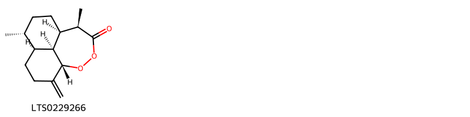{ width=100% }
<figcaption>Hình ảnh cấu trúc hóa học của hoạt chất thuộc nhóm *Oxacyclic compounds*. Tên thường gọi của các hoạt chất tương ứng là (1r,4r,5s,9s,13r,14s)-4,13-dimethyl-8-methylidene-10,11-dioxatricyclo[7.4.1.0⁵,¹⁴]tetradecan-12-one [(LTS0229266)](https://lotus.naturalproducts.net/compound/lotus_id/LTS0229266).</figcaption>
</figure>

            
            
### Nhóm 2-arylbenzofuran flavonoids
<figure markdown="span">
    { width=100% }
<figcaption>Hình ảnh cấu trúc hóa học của hoạt chất thuộc nhóm *2-arylbenzofuran flavonoids*. Tên thường gọi của các hoạt chất tương ứng là balanophonin [(LTS0039496)](https://lotus.naturalproducts.net/compound/lotus_id/LTS0039496), (2e)-3-[(2r,3s)-2-(4-hydroxy-3-methoxyphenyl)-3-(hydroxymethyl)-7-methoxy-2,3-dihydro-1-benzofuran-5-yl]prop-2-enal [(LTS0130349)](https://lotus.naturalproducts.net/compound/lotus_id/LTS0130349), 3-[2-(4-hydroxy-3-methoxyphenyl)-3-(hydroxymethyl)-7-methoxy-2,3-dihydro-1-benzofuran-5-yl]prop-2-enal [(LTS0233365)](https://lotus.naturalproducts.net/compound/lotus_id/LTS0233365).</figcaption>
</figure>

### Nhóm Anthracenes
<figure markdown="span">
    { width=100% }
<figcaption>Hình ảnh cấu trúc hóa học của hoạt chất thuộc nhóm *Anthracenes*. Tên thường gọi của các hoạt chất tương ứng là turkey rhubarb [(LTS0160968)](https://lotus.naturalproducts.net/compound/lotus_id/LTS0160968), emodin [(LTS0163480)](https://lotus.naturalproducts.net/compound/lotus_id/LTS0163480), physcion [(LTS0052688)](https://lotus.naturalproducts.net/compound/lotus_id/LTS0052688).</figcaption>
</figure>

### Nhóm Benzene and substituted derivatives
<figure markdown="span">
    { width=100% }
<figcaption>Hình ảnh cấu trúc hóa học của hoạt chất thuộc nhóm *Benzene and substituted derivatives*. Tên thường gọi của các hoạt chất tương ứng là lavendustin c [(LTS0195252)](https://lotus.naturalproducts.net/compound/lotus_id/LTS0195252), 4-biphenylaldehyde [(LTS0057438)](https://lotus.naturalproducts.net/compound/lotus_id/LTS0057438), methyl salicylate [(LTS0128373)](https://lotus.naturalproducts.net/compound/lotus_id/LTS0128373), [1,1'-biphenyl]-2-carbaldehyde [(LTS0064008)](https://lotus.naturalproducts.net/compound/lotus_id/LTS0064008).</figcaption>
</figure>

### Nhóm Benzopyrans
<figure markdown="span">
    { width=100% }
<figcaption>Hình ảnh cấu trúc hóa học của hoạt chất thuộc nhóm *Benzopyrans*. Tên thường gọi của các hoạt chất tương ứng là chromene-2,2,6-triol [(LTS0157870)](https://lotus.naturalproducts.net/compound/lotus_id/LTS0157870), 6-methoxychromene-2,2-diol [(LTS0121113)](https://lotus.naturalproducts.net/compound/lotus_id/LTS0121113).</figcaption>
</figure>

### Nhóm Carboxylic acids and derivatives
<figure markdown="span">
    { width=100% }
<figcaption>Hình ảnh cấu trúc hóa học của hoạt chất thuộc nhóm *Carboxylic acids and derivatives*. Tên thường gọi của các hoạt chất tương ứng là (1r,4r,4as,8ar)-4-methyl-7-methylidene-octahydro-1h-naphthalene-1-carboxylic acid [(LTS0270684)](https://lotus.naturalproducts.net/compound/lotus_id/LTS0270684), 2-(1-carboxy-n-{4-[(2s)-2-(carboxyamino)-2-({4-[3-hydroxy-2-(methoxycarbonyl)phenoxy]butyl}-c-hydroxycarbonimidoyl)ethyl]phenyl}formamido)benzoic acid [(LTS0150168)](https://lotus.naturalproducts.net/compound/lotus_id/LTS0150168), (4s)-3,3,6-trimethylhepta-1,5-dien-4-yl acetate [(LTS0130898)](https://lotus.naturalproducts.net/compound/lotus_id/LTS0130898), (1r,4r,4as,8s,8as)-8-(formyloxy)-4-methyl-7-methylidene-octahydro-1h-naphthalene-1-carboxylic acid [(LTS0030860)](https://lotus.naturalproducts.net/compound/lotus_id/LTS0030860), 3,3,6-trimethylhepta-1,5-dien-4-yl acetate [(LTS0244885)](https://lotus.naturalproducts.net/compound/lotus_id/LTS0244885), 8-(formyloxy)-4-methyl-7-methylidene-octahydro-1h-naphthalene-1-carboxylic acid [(LTS0057379)](https://lotus.naturalproducts.net/compound/lotus_id/LTS0057379), 4,13-dimethyl-8-methylidene-10,11-dioxatricyclo[7.4.1.0⁵,¹⁴]tetradecan-12-one [(LTS0135933)](https://lotus.naturalproducts.net/compound/lotus_id/LTS0135933), 4-methyl-7-methylidene-octahydro-1h-naphthalene-1-carboxylic acid [(LTS0005709)](https://lotus.naturalproducts.net/compound/lotus_id/LTS0005709).</figcaption>
</figure>

### Nhóm Cinnamaldehydes
<figure markdown="span">
    { width=100% }
<figcaption>Hình ảnh cấu trúc hóa học của hoạt chất thuộc nhóm *Cinnamaldehydes*. Tên thường gọi của các hoạt chất tương ứng là 2-[2-methoxy-4-(3-oxoprop-1-en-1-yl)phenoxy]prop-2-enal [(LTS0134665)](https://lotus.naturalproducts.net/compound/lotus_id/LTS0134665), 3-{4-[(1,3-dihydroxypropan-2-yl)oxy]-3-methoxyphenyl}prop-2-enal [(LTS0124815)](https://lotus.naturalproducts.net/compound/lotus_id/LTS0124815), 2-{2-methoxy-4-[(1e)-3-oxoprop-1-en-1-yl]phenoxy}prop-2-enal [(LTS0251744)](https://lotus.naturalproducts.net/compound/lotus_id/LTS0251744), 4-methoxycinnamaldehyde [(LTS0219729)](https://lotus.naturalproducts.net/compound/lotus_id/LTS0219729), (2e)-3-{4-[(1,3-dihydroxypropan-2-yl)oxy]-3-methoxyphenyl}prop-2-enal [(LTS0038781)](https://lotus.naturalproducts.net/compound/lotus_id/LTS0038781), 3-(4-methoxyphenyl)-2-propenal [(LTS0014262)](https://lotus.naturalproducts.net/compound/lotus_id/LTS0014262).</figcaption>
</figure>

### Nhóm Cinnamic acids and derivatives
<figure markdown="span">
    { width=100% }
<figcaption>Hình ảnh cấu trúc hóa học của hoạt chất thuộc nhóm *Cinnamic acids and derivatives*. Tên thường gọi của các hoạt chất tương ứng là para-coumaric acid [(LTS0266252)](https://lotus.naturalproducts.net/compound/lotus_id/LTS0266252).</figcaption>
</figure>

### Nhóm Coumarins and derivatives
<figure markdown="span">
    { width=100% }
<figcaption>Hình ảnh cấu trúc hóa học của hoạt chất thuộc nhóm *Coumarins and derivatives*. Tên thường gọi của các hoạt chất tương ứng là 2h-1-benzopyran-2-one [(LTS0069773)](https://lotus.naturalproducts.net/compound/lotus_id/LTS0069773), isofraxidin [(LTS0073081)](https://lotus.naturalproducts.net/compound/lotus_id/LTS0073081), scopoletin [(LTS0193112)](https://lotus.naturalproducts.net/compound/lotus_id/LTS0193112).</figcaption>
</figure>

### Nhóm Dihydrofurans
<figure markdown="span">
    { width=100% }
<figcaption>Hình ảnh cấu trúc hóa học của hoạt chất thuộc nhóm *Dihydrofurans*. Tên thường gọi của các hoạt chất tương ứng là (3r)-5-(2,5-dihydrofuran-3-yl)-2-methylpent-1-en-3-ol [(LTS0112627)](https://lotus.naturalproducts.net/compound/lotus_id/LTS0112627), 5-(2,5-dihydrofuran-3-yl)-2-methylpent-3-en-2-ol [(LTS0246689)](https://lotus.naturalproducts.net/compound/lotus_id/LTS0246689), (3e)-5-(2,5-dihydrofuran-3-yl)-2-methylpent-3-en-2-ol [(LTS0221588)](https://lotus.naturalproducts.net/compound/lotus_id/LTS0221588), 5-(2,5-dihydrofuran-3-yl)-2-methylpent-1-en-3-ol [(LTS0118643)](https://lotus.naturalproducts.net/compound/lotus_id/LTS0118643).</figcaption>
</figure>

### Nhóm Dioxolopyrans
<figure markdown="span">
    { width=100% }
<figcaption>Hình ảnh cấu trúc hóa học của hoạt chất thuộc nhóm *Dioxolopyrans*. Tên thường gọi của các hoạt chất tương ứng là 1,5,9-trimethyl-11,14,15-trioxatetracyclo[10.2.1.0⁴,¹³.0⁸,¹³]pentadecan-10-one [(LTS0198939)](https://lotus.naturalproducts.net/compound/lotus_id/LTS0198939), (4s,5r,8s,9r,12s,13r)-1,5,9-trimethyl-11,14,15-trioxatetracyclo[10.2.1.0⁴,¹³.0⁸,¹³]pentadecan-10-one [(LTS0215855)](https://lotus.naturalproducts.net/compound/lotus_id/LTS0215855), 2-deoxyartemisinin [(LTS0090782)](https://lotus.naturalproducts.net/compound/lotus_id/LTS0090782), 2-hydroxy-1,5,9-trimethyl-11,14,15-trioxatetracyclo[10.2.1.0⁴,¹³.0⁸,¹³]pentadecan-10-one [(LTS0211892)](https://lotus.naturalproducts.net/compound/lotus_id/LTS0211892), (1s,2r,4s,5r,8s,9r,12s,13r)-2-hydroxy-1,5,9-trimethyl-11,14,15-trioxatetracyclo[10.2.1.0⁴,¹³.0⁸,¹³]pentadecan-10-one [(LTS0099364)](https://lotus.naturalproducts.net/compound/lotus_id/LTS0099364).</figcaption>
</figure>

### Nhóm Epoxides
<figure markdown="span">
    { width=100% }
<figcaption>Hình ảnh cấu trúc hóa học của hoạt chất thuộc nhóm *Epoxides*. Tên thường gọi của các hoạt chất tương ứng là (1r,3e,7e,11r)-1,5,5,7-tetramethyl-12-oxabicyclo[9.1.0]dodeca-3,7-diene [(LTS0027633)](https://lotus.naturalproducts.net/compound/lotus_id/LTS0027633).</figcaption>
</figure>

### Nhóm Fatty Acyls
<figure markdown="span">
    { width=100% }
<figcaption>Hình ảnh cấu trúc hóa học của hoạt chất thuộc nhóm *Fatty Acyls*. Tên thường gọi của các hoạt chất tương ứng là (2r,4r)-5-methyl-2-(prop-1-en-2-yl)hex-5-ene-1,4-diol [(LTS0112418)](https://lotus.naturalproducts.net/compound/lotus_id/LTS0112418), 5-methyl-2-(prop-1-en-2-yl)hex-3-ene-1,5-diol [(LTS0057789)](https://lotus.naturalproducts.net/compound/lotus_id/LTS0057789), ethyl (2r)-2-methylbutanoate [(LTS0233405)](https://lotus.naturalproducts.net/compound/lotus_id/LTS0233405), 5-methyl-2-(prop-1-en-2-yl)hex-5-ene-1,4-diol [(LTS0208964)](https://lotus.naturalproducts.net/compound/lotus_id/LTS0208964), hexyl (2e)-2-methylbut-2-enoate [(LTS0082952)](https://lotus.naturalproducts.net/compound/lotus_id/LTS0082952), (2s,3e)-5-methyl-2-(prop-1-en-2-yl)hex-3-ene-1,5-diol [(LTS0103356)](https://lotus.naturalproducts.net/compound/lotus_id/LTS0103356), cis-3-hexenyl isovalerate [(LTS0181676)](https://lotus.naturalproducts.net/compound/lotus_id/LTS0181676), cis-3-hexenol [(LTS0132156)](https://lotus.naturalproducts.net/compound/lotus_id/LTS0132156), 9-decen-1-ol [(LTS0161213)](https://lotus.naturalproducts.net/compound/lotus_id/LTS0161213), ceryl alcohol [(LTS0140051)](https://lotus.naturalproducts.net/compound/lotus_id/LTS0140051), methyl palmitate [(LTS0139222)](https://lotus.naturalproducts.net/compound/lotus_id/LTS0139222), oct-1-en-3s-ol [(LTS0173025)](https://lotus.naturalproducts.net/compound/lotus_id/LTS0173025), methyl stearate [(LTS0221686)](https://lotus.naturalproducts.net/compound/lotus_id/LTS0221686), hexanol [(LTS0217299)](https://lotus.naturalproducts.net/compound/lotus_id/LTS0217299), hexyl (2s)-2-methylbutanoate [(LTS0164349)](https://lotus.naturalproducts.net/compound/lotus_id/LTS0164349), nonacosanol [(LTS0205992)](https://lotus.naturalproducts.net/compound/lotus_id/LTS0205992), octacosanol [(LTS0049071)](https://lotus.naturalproducts.net/compound/lotus_id/LTS0049071), 1-octen-3-ol [(LTS0057101)](https://lotus.naturalproducts.net/compound/lotus_id/LTS0057101), (3z)-hex-3-en-1-yl (2r)-2-methylbutanoate [(LTS0005286)](https://lotus.naturalproducts.net/compound/lotus_id/LTS0005286).</figcaption>
</figure>

### Nhóm Flavonoids
<figure markdown="span">
    { width=100% }
<figcaption>Hình ảnh cấu trúc hóa học của hoạt chất thuộc nhóm *Flavonoids*. Tên thường gọi của các hoạt chất tương ứng là quercetin [(LTS0004651)](https://lotus.naturalproducts.net/compound/lotus_id/LTS0004651), 3-rutinosyl quercetin [(LTS0032845)](https://lotus.naturalproducts.net/compound/lotus_id/LTS0032845), eupatorin [(LTS0073269)](https://lotus.naturalproducts.net/compound/lotus_id/LTS0073269), bonanzin [(LTS0123079)](https://lotus.naturalproducts.net/compound/lotus_id/LTS0123079), (2r)-2-(2,4-dihydroxyphenyl)-5-hydroxy-6,7-dimethoxy-2,3-dihydro-1-benzopyran-4-one [(LTS0238093)](https://lotus.naturalproducts.net/compound/lotus_id/LTS0238093), chrysoeriol [(LTS0095766)](https://lotus.naturalproducts.net/compound/lotus_id/LTS0095766), penduletin [(LTS0080627)](https://lotus.naturalproducts.net/compound/lotus_id/LTS0080627), 5,7,8-trihydroxy-2-(3-hydroxy-4-methoxyphenyl)-3-methoxy-2,3-dihydro-1-benzopyran-4-one [(LTS0072712)](https://lotus.naturalproducts.net/compound/lotus_id/LTS0072712), 3,5,7-trihydroxy-2-(4-hydroxy-3-{[(2s,3r,4s,5s,6r)-3,4,5-trihydroxy-6-(hydroxymethyl)oxan-2-yl]oxy}phenyl)chromen-4-one [(LTS0094454)](https://lotus.naturalproducts.net/compound/lotus_id/LTS0094454), 2-(3,4-dihydroxyphenyl)-5,7-dihydroxy-3-{[3,4,5-trihydroxy-6-(hydroxymethyl)oxan-2-yl]oxy}chromen-4-one [(LTS0195312)](https://lotus.naturalproducts.net/compound/lotus_id/LTS0195312), patuletin [(LTS0104633)](https://lotus.naturalproducts.net/compound/lotus_id/LTS0104633), chamomile [(LTS0104946)](https://lotus.naturalproducts.net/compound/lotus_id/LTS0104946), luteolin 7-methyl ether [(LTS0259993)](https://lotus.naturalproducts.net/compound/lotus_id/LTS0259993), 2-(2,4-dihydroxyphenyl)-5-hydroxy-6,7-dimethoxy-2,3-dihydro-1-benzopyran-4-one [(LTS0108962)](https://lotus.naturalproducts.net/compound/lotus_id/LTS0108962), quercimeritrin [(LTS0188893)](https://lotus.naturalproducts.net/compound/lotus_id/LTS0188893), artemetin [(LTS0265682)](https://lotus.naturalproducts.net/compound/lotus_id/LTS0265682), cirsimaritin [(LTS0146305)](https://lotus.naturalproducts.net/compound/lotus_id/LTS0146305), 2-(3,4-dihydroxyphenyl)-5-hydroxy-7-{[3,4,5-trihydroxy-6-(hydroxymethyl)oxan-2-yl]oxy}chromen-4-one [(LTS0158292)](https://lotus.naturalproducts.net/compound/lotus_id/LTS0158292), cirsilineol [(LTS0092903)](https://lotus.naturalproducts.net/compound/lotus_id/LTS0092903), isorhamnetin [(LTS0107505)](https://lotus.naturalproducts.net/compound/lotus_id/LTS0107505), eupalitin [(LTS0255198)](https://lotus.naturalproducts.net/compound/lotus_id/LTS0255198), kaempherol [(LTS0155822)](https://lotus.naturalproducts.net/compound/lotus_id/LTS0155822), isoquercetin [(LTS0254337)](https://lotus.naturalproducts.net/compound/lotus_id/LTS0254337), trifolin [(LTS0267055)](https://lotus.naturalproducts.net/compound/lotus_id/LTS0267055), quercimeritrin [(LTS0043461)](https://lotus.naturalproducts.net/compound/lotus_id/LTS0043461), chrysosplenol c [(LTS0217158)](https://lotus.naturalproducts.net/compound/lotus_id/LTS0217158), chrysosplenetin [(LTS0202772)](https://lotus.naturalproducts.net/compound/lotus_id/LTS0202772), casticin [(LTS0071783)](https://lotus.naturalproducts.net/compound/lotus_id/LTS0071783), quercetagetin 3-methyl ether [(LTS0212838)](https://lotus.naturalproducts.net/compound/lotus_id/LTS0212838), cirsiliol [(LTS0070414)](https://lotus.naturalproducts.net/compound/lotus_id/LTS0070414), 2-(3,4-dihydroxyphenyl)-5,7-dihydroxy-3-{[(2s,3r,4r,5r,6s)-3,4,5-trihydroxy-6-(hydroxymethyl)oxan-2-yl]oxy}chromen-4-one [(LTS0241372)](https://lotus.naturalproducts.net/compound/lotus_id/LTS0241372), retusin [(LTS0236094)](https://lotus.naturalproducts.net/compound/lotus_id/LTS0236094), arcapillin [(LTS0002317)](https://lotus.naturalproducts.net/compound/lotus_id/LTS0002317), 2-(3,4-dimethoxyphenyl)-3,5-dihydroxy-6,7-dimethoxychromen-4-one [(LTS0179185)](https://lotus.naturalproducts.net/compound/lotus_id/LTS0179185), 2-(3,4-dimethoxyphenyl)-5-hydroxy-6,7-dimethoxychromen-4-one [(LTS0032351)](https://lotus.naturalproducts.net/compound/lotus_id/LTS0032351), luteolin 7-o-glucoside [(LTS0227450)](https://lotus.naturalproducts.net/compound/lotus_id/LTS0227450), rhamnocitrin [(LTS0198024)](https://lotus.naturalproducts.net/compound/lotus_id/LTS0198024), astragalin [(LTS0249588)](https://lotus.naturalproducts.net/compound/lotus_id/LTS0249588), chrysosplenol d [(LTS0188255)](https://lotus.naturalproducts.net/compound/lotus_id/LTS0188255), quercetagetin 4'-methyl ether [(LTS0048116)](https://lotus.naturalproducts.net/compound/lotus_id/LTS0048116), tamarixetin [(LTS0258243)](https://lotus.naturalproducts.net/compound/lotus_id/LTS0258243), quercetin 3-methyl ether [(LTS0194170)](https://lotus.naturalproducts.net/compound/lotus_id/LTS0194170), (2s,3r)-5,7,8-trihydroxy-2-(3-hydroxy-4-methoxyphenyl)-3-methoxy-2,3-dihydro-1-benzopyran-4-one [(LTS0244620)](https://lotus.naturalproducts.net/compound/lotus_id/LTS0244620), axillarin [(LTS0067813)](https://lotus.naturalproducts.net/compound/lotus_id/LTS0067813), 2-(3,4-dihydroxyphenyl)-5,7-dihydroxy-6-methoxy-3-{[3,4,5-trihydroxy-6-(hydroxymethyl)oxan-2-yl]oxy}chromen-4-one [(LTS0010167)](https://lotus.naturalproducts.net/compound/lotus_id/LTS0010167), isokaempferide [(LTS0011732)](https://lotus.naturalproducts.net/compound/lotus_id/LTS0011732), luteolin [(LTS0017052)](https://lotus.naturalproducts.net/compound/lotus_id/LTS0017052), pachypodol [(LTS0093471)](https://lotus.naturalproducts.net/compound/lotus_id/LTS0093471), 5,6,7-trihydroxy-2-(3-hydroxy-4-methoxyphenyl)-3-methoxychromen-4-one [(LTS0217584)](https://lotus.naturalproducts.net/compound/lotus_id/LTS0217584), quercimeritrin [(LTS0208490)](https://lotus.naturalproducts.net/compound/lotus_id/LTS0208490), 3,5,7-trihydroxy-2-(4-hydroxy-3-{[3,4,5-trihydroxy-6-(hydroxymethyl)oxan-2-yl]oxy}phenyl)chromen-4-one [(LTS0105577)](https://lotus.naturalproducts.net/compound/lotus_id/LTS0105577), tomentin [(LTS0028795)](https://lotus.naturalproducts.net/compound/lotus_id/LTS0028795).</figcaption>
</figure>

### Nhóm Imidazopyrimidines
<figure markdown="span">
    { width=100% }
<figcaption>Hình ảnh cấu trúc hóa học của hoạt chất thuộc nhóm *Imidazopyrimidines*. Tên thường gọi của các hoạt chất tương ứng là zeatine [(LTS0032706)](https://lotus.naturalproducts.net/compound/lotus_id/LTS0032706).</figcaption>
</figure>

### Nhóm Indoles and derivatives
<figure markdown="span">
    { width=100% }
<figcaption>Hình ảnh cấu trúc hóa học của hoạt chất thuộc nhóm *Indoles and derivatives*. Tên thường gọi của các hoạt chất tương ứng là n-[2-(5-methoxy-1h-indol-3-yl)ethyl]ethanimidic acid [(LTS0219322)](https://lotus.naturalproducts.net/compound/lotus_id/LTS0219322).</figcaption>
</figure>

### Nhóm Lactones
<figure markdown="span">
    { width=100% }
<figcaption>Hình ảnh cấu trúc hóa học của hoạt chất thuộc nhóm *Lactones*. Tên thường gọi của các hoạt chất tương ứng là (1s,5r,8r,9s,13s)-8,12-dimethyl-4-methylidene-2-oxatricyclo[7.3.1.0⁵,¹³]tridec-11-en-3-one [(LTS0107775)](https://lotus.naturalproducts.net/compound/lotus_id/LTS0107775), (1r,5s,8s,9r,13r)-8,12-dimethyl-4-methylidene-2-oxatricyclo[7.3.1.0⁵,¹³]tridec-11-en-3-one [(LTS0070167)](https://lotus.naturalproducts.net/compound/lotus_id/LTS0070167), (1s,4r,5r,8r,9s,13s)-4,8-dimethyl-12-methylidene-2-oxatricyclo[7.3.1.0⁵,¹³]tridecan-3-one [(LTS0069926)](https://lotus.naturalproducts.net/compound/lotus_id/LTS0069926), (1r,4r,7r,8s,12r)-7-methyl-11-methylidene-2-oxatricyclo[6.3.1.0⁴,¹²]dodecan-3-one [(LTS0188899)](https://lotus.naturalproducts.net/compound/lotus_id/LTS0188899), 4,8,12-trimethyl-2-oxatricyclo[7.3.1.0⁵,¹³]tridec-11-en-3-one [(LTS0019112)](https://lotus.naturalproducts.net/compound/lotus_id/LTS0019112), 8-methyl-4,12-dimethylidene-2-oxatricyclo[7.3.1.0⁵,¹³]tridecan-3-one [(LTS0149475)](https://lotus.naturalproducts.net/compound/lotus_id/LTS0149475), (1r,5s,6r,9s,10r,13s)-6,10-dimethyl-11-oxo-2,12-dioxatricyclo[7.4.0.0¹,⁵]tridecan-13-yl acetate [(LTS0148990)](https://lotus.naturalproducts.net/compound/lotus_id/LTS0148990), (3s,3as,6s,9s,9bs)-6,9-dihydroxy-3,6,9-trimethyl-3h,3ah,4h,5h,8h,9bh-azuleno[4,5-b]furan-2,7-dione [(LTS0148949)](https://lotus.naturalproducts.net/compound/lotus_id/LTS0148949), 7-methyl-11-methylidene-2-oxatricyclo[6.3.1.0⁴,¹²]dodecan-3-one [(LTS0190498)](https://lotus.naturalproducts.net/compound/lotus_id/LTS0190498), artabsin [(LTS0162316)](https://lotus.naturalproducts.net/compound/lotus_id/LTS0162316), matricin [(LTS0168849)](https://lotus.naturalproducts.net/compound/lotus_id/LTS0168849), (1s,4r,5r,8r,9s,13s)-4,8,12-trimethyl-2-oxatricyclo[7.3.1.0⁵,¹³]tridec-11-en-3-one [(LTS0191104)](https://lotus.naturalproducts.net/compound/lotus_id/LTS0191104), (1s,5r,8r,9s,13s)-8-methyl-4,12-dimethylidene-2-oxatricyclo[7.3.1.0⁵,¹³]tridecan-3-one [(LTS0266131)](https://lotus.naturalproducts.net/compound/lotus_id/LTS0266131), 6,10-dimethyl-11-oxo-2,12-dioxatricyclo[7.4.0.0¹,⁵]tridecan-13-yl acetate [(LTS0270413)](https://lotus.naturalproducts.net/compound/lotus_id/LTS0270413), 8,12-dimethyl-4-methylidene-2-oxatricyclo[7.3.1.0⁵,¹³]tridec-11-en-3-one [(LTS0239249)](https://lotus.naturalproducts.net/compound/lotus_id/LTS0239249), (3s,3as,6s,9r,9bs)-6,9-dihydroxy-3,6,9-trimethyl-3h,3ah,4h,5h,8h,9bh-azuleno[4,5-b]furan-2,7-dione [(LTS0169132)](https://lotus.naturalproducts.net/compound/lotus_id/LTS0169132), (1r,4r,7r,8s,12r)-7,11-dimethyl-2-oxatricyclo[6.3.1.0⁴,¹²]dodec-10-en-3-one [(LTS0055054)](https://lotus.naturalproducts.net/compound/lotus_id/LTS0055054), 7,11-dimethyl-2-oxatricyclo[6.3.1.0⁴,¹²]dodec-10-en-3-one [(LTS0075194)](https://lotus.naturalproducts.net/compound/lotus_id/LTS0075194), 4,8-dimethyl-12-methylidene-2-oxatricyclo[7.3.1.0⁵,¹³]tridecan-3-one [(LTS0047434)](https://lotus.naturalproducts.net/compound/lotus_id/LTS0047434).</figcaption>
</figure>

### Nhóm Organooxygen compounds
<figure markdown="span">
    { width=100% }
<figcaption>Hình ảnh cấu trúc hóa học của hoạt chất thuộc nhóm *Organooxygen compounds*. Tên thường gọi của các hoạt chất tương ứng là octanal [(LTS0055983)](https://lotus.naturalproducts.net/compound/lotus_id/LTS0055983), 1-(2-hydroxy-6-methoxy-4-{[3,4,5-trihydroxy-6-(hydroxymethyl)oxan-2-yl]oxy}phenyl)ethanone [(LTS0038662)](https://lotus.naturalproducts.net/compound/lotus_id/LTS0038662), xanthoxylin [(LTS0150432)](https://lotus.naturalproducts.net/compound/lotus_id/LTS0150432), isoartemisia ketone [(LTS0154009)](https://lotus.naturalproducts.net/compound/lotus_id/LTS0154009), 1-(2-hydroxy-6-methoxy-4-{[(2s,3r,4s,5s,6r)-3,4,5-trihydroxy-6-(hydroxymethyl)oxan-2-yl]oxy}phenyl)ethanone [(LTS0179806)](https://lotus.naturalproducts.net/compound/lotus_id/LTS0179806), (1r,4r,4as,8s,8as)-8-hydroxy-4-methyl-7-methylidene-octahydro-1h-naphthalene-1-carboxylic acid [(LTS0254124)](https://lotus.naturalproducts.net/compound/lotus_id/LTS0254124), jasmone [(LTS0205512)](https://lotus.naturalproducts.net/compound/lotus_id/LTS0205512), 3,3,6-trimethylhepta-1,5-dien-4-ol [(LTS0238559)](https://lotus.naturalproducts.net/compound/lotus_id/LTS0238559), (3s)-3-ethenyl-2,5-dimethylhex-4-en-2-ol [(LTS0039165)](https://lotus.naturalproducts.net/compound/lotus_id/LTS0039165), 8-hydroxy-4-methyl-7-methylidene-octahydro-1h-naphthalene-1-carboxylic acid [(LTS0078747)](https://lotus.naturalproducts.net/compound/lotus_id/LTS0078747), tricosan-2-one [(LTS0031212)](https://lotus.naturalproducts.net/compound/lotus_id/LTS0031212).</figcaption>
</figure>

### Nhóm Oxacyclic compounds
<figure markdown="span">
    { width=100% }
<figcaption>Hình ảnh cấu trúc hóa học của hoạt chất thuộc nhóm *Oxacyclic compounds*. Tên thường gọi của các hoạt chất tương ứng là (1r,4r,5s,9s,13r,14s)-4,13-dimethyl-8-methylidene-10,11-dioxatricyclo[7.4.1.0⁵,¹⁴]tetradecan-12-one [(LTS0229266)](https://lotus.naturalproducts.net/compound/lotus_id/LTS0229266).</figcaption>
</figure>

### Nhóm Oxanes
<figure markdown="span">
    { width=100% }
<figcaption>Hình ảnh cấu trúc hóa học của hoạt chất thuộc nhóm *Oxanes*. Tên thường gọi của các hoạt chất tương ứng là 1,8-cineole [(LTS0166505)](https://lotus.naturalproducts.net/compound/lotus_id/LTS0166505), eucalyptol [(LTS0051374)](https://lotus.naturalproducts.net/compound/lotus_id/LTS0051374).</figcaption>
</figure>

            
            
### Nhóm 2-arylbenzofuran flavonoids
<figure markdown="span">
    { width=100% }
<figcaption>Hình ảnh cấu trúc hóa học của hoạt chất thuộc nhóm *2-arylbenzofuran flavonoids*. Tên thường gọi của các hoạt chất tương ứng là balanophonin [(LTS0039496)](https://lotus.naturalproducts.net/compound/lotus_id/LTS0039496), (2e)-3-[(2r,3s)-2-(4-hydroxy-3-methoxyphenyl)-3-(hydroxymethyl)-7-methoxy-2,3-dihydro-1-benzofuran-5-yl]prop-2-enal [(LTS0130349)](https://lotus.naturalproducts.net/compound/lotus_id/LTS0130349), 3-[2-(4-hydroxy-3-methoxyphenyl)-3-(hydroxymethyl)-7-methoxy-2,3-dihydro-1-benzofuran-5-yl]prop-2-enal [(LTS0233365)](https://lotus.naturalproducts.net/compound/lotus_id/LTS0233365).</figcaption>
</figure>

### Nhóm Anthracenes
<figure markdown="span">
    { width=100% }
<figcaption>Hình ảnh cấu trúc hóa học của hoạt chất thuộc nhóm *Anthracenes*. Tên thường gọi của các hoạt chất tương ứng là turkey rhubarb [(LTS0160968)](https://lotus.naturalproducts.net/compound/lotus_id/LTS0160968), emodin [(LTS0163480)](https://lotus.naturalproducts.net/compound/lotus_id/LTS0163480), physcion [(LTS0052688)](https://lotus.naturalproducts.net/compound/lotus_id/LTS0052688).</figcaption>
</figure>

### Nhóm Benzene and substituted derivatives
<figure markdown="span">
    { width=100% }
<figcaption>Hình ảnh cấu trúc hóa học của hoạt chất thuộc nhóm *Benzene and substituted derivatives*. Tên thường gọi của các hoạt chất tương ứng là lavendustin c [(LTS0195252)](https://lotus.naturalproducts.net/compound/lotus_id/LTS0195252), 4-biphenylaldehyde [(LTS0057438)](https://lotus.naturalproducts.net/compound/lotus_id/LTS0057438), methyl salicylate [(LTS0128373)](https://lotus.naturalproducts.net/compound/lotus_id/LTS0128373), [1,1'-biphenyl]-2-carbaldehyde [(LTS0064008)](https://lotus.naturalproducts.net/compound/lotus_id/LTS0064008).</figcaption>
</figure>

### Nhóm Benzopyrans
<figure markdown="span">
    { width=100% }
<figcaption>Hình ảnh cấu trúc hóa học của hoạt chất thuộc nhóm *Benzopyrans*. Tên thường gọi của các hoạt chất tương ứng là chromene-2,2,6-triol [(LTS0157870)](https://lotus.naturalproducts.net/compound/lotus_id/LTS0157870), 6-methoxychromene-2,2-diol [(LTS0121113)](https://lotus.naturalproducts.net/compound/lotus_id/LTS0121113).</figcaption>
</figure>

### Nhóm Carboxylic acids and derivatives
<figure markdown="span">
    { width=100% }
<figcaption>Hình ảnh cấu trúc hóa học của hoạt chất thuộc nhóm *Carboxylic acids and derivatives*. Tên thường gọi của các hoạt chất tương ứng là (1r,4r,4as,8ar)-4-methyl-7-methylidene-octahydro-1h-naphthalene-1-carboxylic acid [(LTS0270684)](https://lotus.naturalproducts.net/compound/lotus_id/LTS0270684), 2-(1-carboxy-n-{4-[(2s)-2-(carboxyamino)-2-({4-[3-hydroxy-2-(methoxycarbonyl)phenoxy]butyl}-c-hydroxycarbonimidoyl)ethyl]phenyl}formamido)benzoic acid [(LTS0150168)](https://lotus.naturalproducts.net/compound/lotus_id/LTS0150168), (4s)-3,3,6-trimethylhepta-1,5-dien-4-yl acetate [(LTS0130898)](https://lotus.naturalproducts.net/compound/lotus_id/LTS0130898), (1r,4r,4as,8s,8as)-8-(formyloxy)-4-methyl-7-methylidene-octahydro-1h-naphthalene-1-carboxylic acid [(LTS0030860)](https://lotus.naturalproducts.net/compound/lotus_id/LTS0030860), 3,3,6-trimethylhepta-1,5-dien-4-yl acetate [(LTS0244885)](https://lotus.naturalproducts.net/compound/lotus_id/LTS0244885), 8-(formyloxy)-4-methyl-7-methylidene-octahydro-1h-naphthalene-1-carboxylic acid [(LTS0057379)](https://lotus.naturalproducts.net/compound/lotus_id/LTS0057379), 4,13-dimethyl-8-methylidene-10,11-dioxatricyclo[7.4.1.0⁵,¹⁴]tetradecan-12-one [(LTS0135933)](https://lotus.naturalproducts.net/compound/lotus_id/LTS0135933), 4-methyl-7-methylidene-octahydro-1h-naphthalene-1-carboxylic acid [(LTS0005709)](https://lotus.naturalproducts.net/compound/lotus_id/LTS0005709).</figcaption>
</figure>

### Nhóm Cinnamaldehydes
<figure markdown="span">
    { width=100% }
<figcaption>Hình ảnh cấu trúc hóa học của hoạt chất thuộc nhóm *Cinnamaldehydes*. Tên thường gọi của các hoạt chất tương ứng là 2-[2-methoxy-4-(3-oxoprop-1-en-1-yl)phenoxy]prop-2-enal [(LTS0134665)](https://lotus.naturalproducts.net/compound/lotus_id/LTS0134665), 3-{4-[(1,3-dihydroxypropan-2-yl)oxy]-3-methoxyphenyl}prop-2-enal [(LTS0124815)](https://lotus.naturalproducts.net/compound/lotus_id/LTS0124815), 2-{2-methoxy-4-[(1e)-3-oxoprop-1-en-1-yl]phenoxy}prop-2-enal [(LTS0251744)](https://lotus.naturalproducts.net/compound/lotus_id/LTS0251744), 4-methoxycinnamaldehyde [(LTS0219729)](https://lotus.naturalproducts.net/compound/lotus_id/LTS0219729), (2e)-3-{4-[(1,3-dihydroxypropan-2-yl)oxy]-3-methoxyphenyl}prop-2-enal [(LTS0038781)](https://lotus.naturalproducts.net/compound/lotus_id/LTS0038781), 3-(4-methoxyphenyl)-2-propenal [(LTS0014262)](https://lotus.naturalproducts.net/compound/lotus_id/LTS0014262).</figcaption>
</figure>

### Nhóm Cinnamic acids and derivatives
<figure markdown="span">
    { width=100% }
<figcaption>Hình ảnh cấu trúc hóa học của hoạt chất thuộc nhóm *Cinnamic acids and derivatives*. Tên thường gọi của các hoạt chất tương ứng là para-coumaric acid [(LTS0266252)](https://lotus.naturalproducts.net/compound/lotus_id/LTS0266252).</figcaption>
</figure>

### Nhóm Coumarins and derivatives
<figure markdown="span">
    { width=100% }
<figcaption>Hình ảnh cấu trúc hóa học của hoạt chất thuộc nhóm *Coumarins and derivatives*. Tên thường gọi của các hoạt chất tương ứng là 2h-1-benzopyran-2-one [(LTS0069773)](https://lotus.naturalproducts.net/compound/lotus_id/LTS0069773), isofraxidin [(LTS0073081)](https://lotus.naturalproducts.net/compound/lotus_id/LTS0073081), scopoletin [(LTS0193112)](https://lotus.naturalproducts.net/compound/lotus_id/LTS0193112).</figcaption>
</figure>

### Nhóm Dihydrofurans
<figure markdown="span">
    { width=100% }
<figcaption>Hình ảnh cấu trúc hóa học của hoạt chất thuộc nhóm *Dihydrofurans*. Tên thường gọi của các hoạt chất tương ứng là (3r)-5-(2,5-dihydrofuran-3-yl)-2-methylpent-1-en-3-ol [(LTS0112627)](https://lotus.naturalproducts.net/compound/lotus_id/LTS0112627), 5-(2,5-dihydrofuran-3-yl)-2-methylpent-3-en-2-ol [(LTS0246689)](https://lotus.naturalproducts.net/compound/lotus_id/LTS0246689), (3e)-5-(2,5-dihydrofuran-3-yl)-2-methylpent-3-en-2-ol [(LTS0221588)](https://lotus.naturalproducts.net/compound/lotus_id/LTS0221588), 5-(2,5-dihydrofuran-3-yl)-2-methylpent-1-en-3-ol [(LTS0118643)](https://lotus.naturalproducts.net/compound/lotus_id/LTS0118643).</figcaption>
</figure>

### Nhóm Dioxolopyrans
<figure markdown="span">
    { width=100% }
<figcaption>Hình ảnh cấu trúc hóa học của hoạt chất thuộc nhóm *Dioxolopyrans*. Tên thường gọi của các hoạt chất tương ứng là 1,5,9-trimethyl-11,14,15-trioxatetracyclo[10.2.1.0⁴,¹³.0⁸,¹³]pentadecan-10-one [(LTS0198939)](https://lotus.naturalproducts.net/compound/lotus_id/LTS0198939), (4s,5r,8s,9r,12s,13r)-1,5,9-trimethyl-11,14,15-trioxatetracyclo[10.2.1.0⁴,¹³.0⁸,¹³]pentadecan-10-one [(LTS0215855)](https://lotus.naturalproducts.net/compound/lotus_id/LTS0215855), 2-deoxyartemisinin [(LTS0090782)](https://lotus.naturalproducts.net/compound/lotus_id/LTS0090782), 2-hydroxy-1,5,9-trimethyl-11,14,15-trioxatetracyclo[10.2.1.0⁴,¹³.0⁸,¹³]pentadecan-10-one [(LTS0211892)](https://lotus.naturalproducts.net/compound/lotus_id/LTS0211892), (1s,2r,4s,5r,8s,9r,12s,13r)-2-hydroxy-1,5,9-trimethyl-11,14,15-trioxatetracyclo[10.2.1.0⁴,¹³.0⁸,¹³]pentadecan-10-one [(LTS0099364)](https://lotus.naturalproducts.net/compound/lotus_id/LTS0099364).</figcaption>
</figure>

### Nhóm Epoxides
<figure markdown="span">
    { width=100% }
<figcaption>Hình ảnh cấu trúc hóa học của hoạt chất thuộc nhóm *Epoxides*. Tên thường gọi của các hoạt chất tương ứng là (1r,3e,7e,11r)-1,5,5,7-tetramethyl-12-oxabicyclo[9.1.0]dodeca-3,7-diene [(LTS0027633)](https://lotus.naturalproducts.net/compound/lotus_id/LTS0027633).</figcaption>
</figure>

### Nhóm Fatty Acyls
<figure markdown="span">
    { width=100% }
<figcaption>Hình ảnh cấu trúc hóa học của hoạt chất thuộc nhóm *Fatty Acyls*. Tên thường gọi của các hoạt chất tương ứng là (2r,4r)-5-methyl-2-(prop-1-en-2-yl)hex-5-ene-1,4-diol [(LTS0112418)](https://lotus.naturalproducts.net/compound/lotus_id/LTS0112418), 5-methyl-2-(prop-1-en-2-yl)hex-3-ene-1,5-diol [(LTS0057789)](https://lotus.naturalproducts.net/compound/lotus_id/LTS0057789), ethyl (2r)-2-methylbutanoate [(LTS0233405)](https://lotus.naturalproducts.net/compound/lotus_id/LTS0233405), 5-methyl-2-(prop-1-en-2-yl)hex-5-ene-1,4-diol [(LTS0208964)](https://lotus.naturalproducts.net/compound/lotus_id/LTS0208964), hexyl (2e)-2-methylbut-2-enoate [(LTS0082952)](https://lotus.naturalproducts.net/compound/lotus_id/LTS0082952), (2s,3e)-5-methyl-2-(prop-1-en-2-yl)hex-3-ene-1,5-diol [(LTS0103356)](https://lotus.naturalproducts.net/compound/lotus_id/LTS0103356), cis-3-hexenyl isovalerate [(LTS0181676)](https://lotus.naturalproducts.net/compound/lotus_id/LTS0181676), cis-3-hexenol [(LTS0132156)](https://lotus.naturalproducts.net/compound/lotus_id/LTS0132156), 9-decen-1-ol [(LTS0161213)](https://lotus.naturalproducts.net/compound/lotus_id/LTS0161213), ceryl alcohol [(LTS0140051)](https://lotus.naturalproducts.net/compound/lotus_id/LTS0140051), methyl palmitate [(LTS0139222)](https://lotus.naturalproducts.net/compound/lotus_id/LTS0139222), oct-1-en-3s-ol [(LTS0173025)](https://lotus.naturalproducts.net/compound/lotus_id/LTS0173025), methyl stearate [(LTS0221686)](https://lotus.naturalproducts.net/compound/lotus_id/LTS0221686), hexanol [(LTS0217299)](https://lotus.naturalproducts.net/compound/lotus_id/LTS0217299), hexyl (2s)-2-methylbutanoate [(LTS0164349)](https://lotus.naturalproducts.net/compound/lotus_id/LTS0164349), nonacosanol [(LTS0205992)](https://lotus.naturalproducts.net/compound/lotus_id/LTS0205992), octacosanol [(LTS0049071)](https://lotus.naturalproducts.net/compound/lotus_id/LTS0049071), 1-octen-3-ol [(LTS0057101)](https://lotus.naturalproducts.net/compound/lotus_id/LTS0057101), (3z)-hex-3-en-1-yl (2r)-2-methylbutanoate [(LTS0005286)](https://lotus.naturalproducts.net/compound/lotus_id/LTS0005286).</figcaption>
</figure>

### Nhóm Flavonoids
<figure markdown="span">
    { width=100% }
<figcaption>Hình ảnh cấu trúc hóa học của hoạt chất thuộc nhóm *Flavonoids*. Tên thường gọi của các hoạt chất tương ứng là quercetin [(LTS0004651)](https://lotus.naturalproducts.net/compound/lotus_id/LTS0004651), 3-rutinosyl quercetin [(LTS0032845)](https://lotus.naturalproducts.net/compound/lotus_id/LTS0032845), eupatorin [(LTS0073269)](https://lotus.naturalproducts.net/compound/lotus_id/LTS0073269), bonanzin [(LTS0123079)](https://lotus.naturalproducts.net/compound/lotus_id/LTS0123079), (2r)-2-(2,4-dihydroxyphenyl)-5-hydroxy-6,7-dimethoxy-2,3-dihydro-1-benzopyran-4-one [(LTS0238093)](https://lotus.naturalproducts.net/compound/lotus_id/LTS0238093), chrysoeriol [(LTS0095766)](https://lotus.naturalproducts.net/compound/lotus_id/LTS0095766), penduletin [(LTS0080627)](https://lotus.naturalproducts.net/compound/lotus_id/LTS0080627), 5,7,8-trihydroxy-2-(3-hydroxy-4-methoxyphenyl)-3-methoxy-2,3-dihydro-1-benzopyran-4-one [(LTS0072712)](https://lotus.naturalproducts.net/compound/lotus_id/LTS0072712), 3,5,7-trihydroxy-2-(4-hydroxy-3-{[(2s,3r,4s,5s,6r)-3,4,5-trihydroxy-6-(hydroxymethyl)oxan-2-yl]oxy}phenyl)chromen-4-one [(LTS0094454)](https://lotus.naturalproducts.net/compound/lotus_id/LTS0094454), 2-(3,4-dihydroxyphenyl)-5,7-dihydroxy-3-{[3,4,5-trihydroxy-6-(hydroxymethyl)oxan-2-yl]oxy}chromen-4-one [(LTS0195312)](https://lotus.naturalproducts.net/compound/lotus_id/LTS0195312), patuletin [(LTS0104633)](https://lotus.naturalproducts.net/compound/lotus_id/LTS0104633), chamomile [(LTS0104946)](https://lotus.naturalproducts.net/compound/lotus_id/LTS0104946), luteolin 7-methyl ether [(LTS0259993)](https://lotus.naturalproducts.net/compound/lotus_id/LTS0259993), 2-(2,4-dihydroxyphenyl)-5-hydroxy-6,7-dimethoxy-2,3-dihydro-1-benzopyran-4-one [(LTS0108962)](https://lotus.naturalproducts.net/compound/lotus_id/LTS0108962), quercimeritrin [(LTS0188893)](https://lotus.naturalproducts.net/compound/lotus_id/LTS0188893), artemetin [(LTS0265682)](https://lotus.naturalproducts.net/compound/lotus_id/LTS0265682), cirsimaritin [(LTS0146305)](https://lotus.naturalproducts.net/compound/lotus_id/LTS0146305), 2-(3,4-dihydroxyphenyl)-5-hydroxy-7-{[3,4,5-trihydroxy-6-(hydroxymethyl)oxan-2-yl]oxy}chromen-4-one [(LTS0158292)](https://lotus.naturalproducts.net/compound/lotus_id/LTS0158292), cirsilineol [(LTS0092903)](https://lotus.naturalproducts.net/compound/lotus_id/LTS0092903), isorhamnetin [(LTS0107505)](https://lotus.naturalproducts.net/compound/lotus_id/LTS0107505), eupalitin [(LTS0255198)](https://lotus.naturalproducts.net/compound/lotus_id/LTS0255198), kaempherol [(LTS0155822)](https://lotus.naturalproducts.net/compound/lotus_id/LTS0155822), isoquercetin [(LTS0254337)](https://lotus.naturalproducts.net/compound/lotus_id/LTS0254337), trifolin [(LTS0267055)](https://lotus.naturalproducts.net/compound/lotus_id/LTS0267055), quercimeritrin [(LTS0043461)](https://lotus.naturalproducts.net/compound/lotus_id/LTS0043461), chrysosplenol c [(LTS0217158)](https://lotus.naturalproducts.net/compound/lotus_id/LTS0217158), chrysosplenetin [(LTS0202772)](https://lotus.naturalproducts.net/compound/lotus_id/LTS0202772), casticin [(LTS0071783)](https://lotus.naturalproducts.net/compound/lotus_id/LTS0071783), quercetagetin 3-methyl ether [(LTS0212838)](https://lotus.naturalproducts.net/compound/lotus_id/LTS0212838), cirsiliol [(LTS0070414)](https://lotus.naturalproducts.net/compound/lotus_id/LTS0070414), 2-(3,4-dihydroxyphenyl)-5,7-dihydroxy-3-{[(2s,3r,4r,5r,6s)-3,4,5-trihydroxy-6-(hydroxymethyl)oxan-2-yl]oxy}chromen-4-one [(LTS0241372)](https://lotus.naturalproducts.net/compound/lotus_id/LTS0241372), retusin [(LTS0236094)](https://lotus.naturalproducts.net/compound/lotus_id/LTS0236094), arcapillin [(LTS0002317)](https://lotus.naturalproducts.net/compound/lotus_id/LTS0002317), 2-(3,4-dimethoxyphenyl)-3,5-dihydroxy-6,7-dimethoxychromen-4-one [(LTS0179185)](https://lotus.naturalproducts.net/compound/lotus_id/LTS0179185), 2-(3,4-dimethoxyphenyl)-5-hydroxy-6,7-dimethoxychromen-4-one [(LTS0032351)](https://lotus.naturalproducts.net/compound/lotus_id/LTS0032351), luteolin 7-o-glucoside [(LTS0227450)](https://lotus.naturalproducts.net/compound/lotus_id/LTS0227450), rhamnocitrin [(LTS0198024)](https://lotus.naturalproducts.net/compound/lotus_id/LTS0198024), astragalin [(LTS0249588)](https://lotus.naturalproducts.net/compound/lotus_id/LTS0249588), chrysosplenol d [(LTS0188255)](https://lotus.naturalproducts.net/compound/lotus_id/LTS0188255), quercetagetin 4'-methyl ether [(LTS0048116)](https://lotus.naturalproducts.net/compound/lotus_id/LTS0048116), tamarixetin [(LTS0258243)](https://lotus.naturalproducts.net/compound/lotus_id/LTS0258243), quercetin 3-methyl ether [(LTS0194170)](https://lotus.naturalproducts.net/compound/lotus_id/LTS0194170), (2s,3r)-5,7,8-trihydroxy-2-(3-hydroxy-4-methoxyphenyl)-3-methoxy-2,3-dihydro-1-benzopyran-4-one [(LTS0244620)](https://lotus.naturalproducts.net/compound/lotus_id/LTS0244620), axillarin [(LTS0067813)](https://lotus.naturalproducts.net/compound/lotus_id/LTS0067813), 2-(3,4-dihydroxyphenyl)-5,7-dihydroxy-6-methoxy-3-{[3,4,5-trihydroxy-6-(hydroxymethyl)oxan-2-yl]oxy}chromen-4-one [(LTS0010167)](https://lotus.naturalproducts.net/compound/lotus_id/LTS0010167), isokaempferide [(LTS0011732)](https://lotus.naturalproducts.net/compound/lotus_id/LTS0011732), luteolin [(LTS0017052)](https://lotus.naturalproducts.net/compound/lotus_id/LTS0017052), pachypodol [(LTS0093471)](https://lotus.naturalproducts.net/compound/lotus_id/LTS0093471), 5,6,7-trihydroxy-2-(3-hydroxy-4-methoxyphenyl)-3-methoxychromen-4-one [(LTS0217584)](https://lotus.naturalproducts.net/compound/lotus_id/LTS0217584), quercimeritrin [(LTS0208490)](https://lotus.naturalproducts.net/compound/lotus_id/LTS0208490), 3,5,7-trihydroxy-2-(4-hydroxy-3-{[3,4,5-trihydroxy-6-(hydroxymethyl)oxan-2-yl]oxy}phenyl)chromen-4-one [(LTS0105577)](https://lotus.naturalproducts.net/compound/lotus_id/LTS0105577), tomentin [(LTS0028795)](https://lotus.naturalproducts.net/compound/lotus_id/LTS0028795).</figcaption>
</figure>

### Nhóm Imidazopyrimidines
<figure markdown="span">
    { width=100% }
<figcaption>Hình ảnh cấu trúc hóa học của hoạt chất thuộc nhóm *Imidazopyrimidines*. Tên thường gọi của các hoạt chất tương ứng là zeatine [(LTS0032706)](https://lotus.naturalproducts.net/compound/lotus_id/LTS0032706).</figcaption>
</figure>

### Nhóm Indoles and derivatives
<figure markdown="span">
    { width=100% }
<figcaption>Hình ảnh cấu trúc hóa học của hoạt chất thuộc nhóm *Indoles and derivatives*. Tên thường gọi của các hoạt chất tương ứng là n-[2-(5-methoxy-1h-indol-3-yl)ethyl]ethanimidic acid [(LTS0219322)](https://lotus.naturalproducts.net/compound/lotus_id/LTS0219322).</figcaption>
</figure>

### Nhóm Lactones
<figure markdown="span">
    { width=100% }
<figcaption>Hình ảnh cấu trúc hóa học của hoạt chất thuộc nhóm *Lactones*. Tên thường gọi của các hoạt chất tương ứng là (1s,5r,8r,9s,13s)-8,12-dimethyl-4-methylidene-2-oxatricyclo[7.3.1.0⁵,¹³]tridec-11-en-3-one [(LTS0107775)](https://lotus.naturalproducts.net/compound/lotus_id/LTS0107775), (1r,5s,8s,9r,13r)-8,12-dimethyl-4-methylidene-2-oxatricyclo[7.3.1.0⁵,¹³]tridec-11-en-3-one [(LTS0070167)](https://lotus.naturalproducts.net/compound/lotus_id/LTS0070167), (1s,4r,5r,8r,9s,13s)-4,8-dimethyl-12-methylidene-2-oxatricyclo[7.3.1.0⁵,¹³]tridecan-3-one [(LTS0069926)](https://lotus.naturalproducts.net/compound/lotus_id/LTS0069926), (1r,4r,7r,8s,12r)-7-methyl-11-methylidene-2-oxatricyclo[6.3.1.0⁴,¹²]dodecan-3-one [(LTS0188899)](https://lotus.naturalproducts.net/compound/lotus_id/LTS0188899), 4,8,12-trimethyl-2-oxatricyclo[7.3.1.0⁵,¹³]tridec-11-en-3-one [(LTS0019112)](https://lotus.naturalproducts.net/compound/lotus_id/LTS0019112), 8-methyl-4,12-dimethylidene-2-oxatricyclo[7.3.1.0⁵,¹³]tridecan-3-one [(LTS0149475)](https://lotus.naturalproducts.net/compound/lotus_id/LTS0149475), (1r,5s,6r,9s,10r,13s)-6,10-dimethyl-11-oxo-2,12-dioxatricyclo[7.4.0.0¹,⁵]tridecan-13-yl acetate [(LTS0148990)](https://lotus.naturalproducts.net/compound/lotus_id/LTS0148990), (3s,3as,6s,9s,9bs)-6,9-dihydroxy-3,6,9-trimethyl-3h,3ah,4h,5h,8h,9bh-azuleno[4,5-b]furan-2,7-dione [(LTS0148949)](https://lotus.naturalproducts.net/compound/lotus_id/LTS0148949), 7-methyl-11-methylidene-2-oxatricyclo[6.3.1.0⁴,¹²]dodecan-3-one [(LTS0190498)](https://lotus.naturalproducts.net/compound/lotus_id/LTS0190498), artabsin [(LTS0162316)](https://lotus.naturalproducts.net/compound/lotus_id/LTS0162316), matricin [(LTS0168849)](https://lotus.naturalproducts.net/compound/lotus_id/LTS0168849), (1s,4r,5r,8r,9s,13s)-4,8,12-trimethyl-2-oxatricyclo[7.3.1.0⁵,¹³]tridec-11-en-3-one [(LTS0191104)](https://lotus.naturalproducts.net/compound/lotus_id/LTS0191104), (1s,5r,8r,9s,13s)-8-methyl-4,12-dimethylidene-2-oxatricyclo[7.3.1.0⁵,¹³]tridecan-3-one [(LTS0266131)](https://lotus.naturalproducts.net/compound/lotus_id/LTS0266131), 6,10-dimethyl-11-oxo-2,12-dioxatricyclo[7.4.0.0¹,⁵]tridecan-13-yl acetate [(LTS0270413)](https://lotus.naturalproducts.net/compound/lotus_id/LTS0270413), 8,12-dimethyl-4-methylidene-2-oxatricyclo[7.3.1.0⁵,¹³]tridec-11-en-3-one [(LTS0239249)](https://lotus.naturalproducts.net/compound/lotus_id/LTS0239249), (3s,3as,6s,9r,9bs)-6,9-dihydroxy-3,6,9-trimethyl-3h,3ah,4h,5h,8h,9bh-azuleno[4,5-b]furan-2,7-dione [(LTS0169132)](https://lotus.naturalproducts.net/compound/lotus_id/LTS0169132), (1r,4r,7r,8s,12r)-7,11-dimethyl-2-oxatricyclo[6.3.1.0⁴,¹²]dodec-10-en-3-one [(LTS0055054)](https://lotus.naturalproducts.net/compound/lotus_id/LTS0055054), 7,11-dimethyl-2-oxatricyclo[6.3.1.0⁴,¹²]dodec-10-en-3-one [(LTS0075194)](https://lotus.naturalproducts.net/compound/lotus_id/LTS0075194), 4,8-dimethyl-12-methylidene-2-oxatricyclo[7.3.1.0⁵,¹³]tridecan-3-one [(LTS0047434)](https://lotus.naturalproducts.net/compound/lotus_id/LTS0047434).</figcaption>
</figure>

### Nhóm Organooxygen compounds
<figure markdown="span">
    { width=100% }
<figcaption>Hình ảnh cấu trúc hóa học của hoạt chất thuộc nhóm *Organooxygen compounds*. Tên thường gọi của các hoạt chất tương ứng là octanal [(LTS0055983)](https://lotus.naturalproducts.net/compound/lotus_id/LTS0055983), 1-(2-hydroxy-6-methoxy-4-{[3,4,5-trihydroxy-6-(hydroxymethyl)oxan-2-yl]oxy}phenyl)ethanone [(LTS0038662)](https://lotus.naturalproducts.net/compound/lotus_id/LTS0038662), xanthoxylin [(LTS0150432)](https://lotus.naturalproducts.net/compound/lotus_id/LTS0150432), isoartemisia ketone [(LTS0154009)](https://lotus.naturalproducts.net/compound/lotus_id/LTS0154009), 1-(2-hydroxy-6-methoxy-4-{[(2s,3r,4s,5s,6r)-3,4,5-trihydroxy-6-(hydroxymethyl)oxan-2-yl]oxy}phenyl)ethanone [(LTS0179806)](https://lotus.naturalproducts.net/compound/lotus_id/LTS0179806), (1r,4r,4as,8s,8as)-8-hydroxy-4-methyl-7-methylidene-octahydro-1h-naphthalene-1-carboxylic acid [(LTS0254124)](https://lotus.naturalproducts.net/compound/lotus_id/LTS0254124), jasmone [(LTS0205512)](https://lotus.naturalproducts.net/compound/lotus_id/LTS0205512), 3,3,6-trimethylhepta-1,5-dien-4-ol [(LTS0238559)](https://lotus.naturalproducts.net/compound/lotus_id/LTS0238559), (3s)-3-ethenyl-2,5-dimethylhex-4-en-2-ol [(LTS0039165)](https://lotus.naturalproducts.net/compound/lotus_id/LTS0039165), 8-hydroxy-4-methyl-7-methylidene-octahydro-1h-naphthalene-1-carboxylic acid [(LTS0078747)](https://lotus.naturalproducts.net/compound/lotus_id/LTS0078747), tricosan-2-one [(LTS0031212)](https://lotus.naturalproducts.net/compound/lotus_id/LTS0031212).</figcaption>
</figure>

### Nhóm Oxacyclic compounds
<figure markdown="span">
    { width=100% }
<figcaption>Hình ảnh cấu trúc hóa học của hoạt chất thuộc nhóm *Oxacyclic compounds*. Tên thường gọi của các hoạt chất tương ứng là (1r,4r,5s,9s,13r,14s)-4,13-dimethyl-8-methylidene-10,11-dioxatricyclo[7.4.1.0⁵,¹⁴]tetradecan-12-one [(LTS0229266)](https://lotus.naturalproducts.net/compound/lotus_id/LTS0229266).</figcaption>
</figure>

### Nhóm Oxanes
<figure markdown="span">
    { width=100% }
<figcaption>Hình ảnh cấu trúc hóa học của hoạt chất thuộc nhóm *Oxanes*. Tên thường gọi của các hoạt chất tương ứng là 1,8-cineole [(LTS0166505)](https://lotus.naturalproducts.net/compound/lotus_id/LTS0166505), eucalyptol [(LTS0051374)](https://lotus.naturalproducts.net/compound/lotus_id/LTS0051374).</figcaption>
</figure>

### Nhóm Oxepanes
<figure markdown="span">
    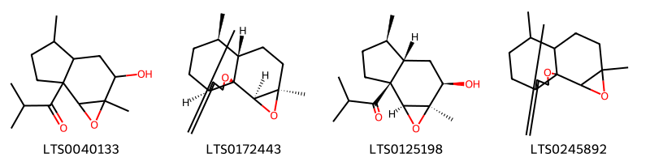{ width=100% }
<figcaption>Hình ảnh cấu trúc hóa học của hoạt chất thuộc nhóm *Oxepanes*. Tên thường gọi của các hoạt chất tương ứng là 1-{2-hydroxy-1a,4-dimethyl-hexahydro-2h-indeno[4,5-b]oxiren-6a-yl}-2-methylpropan-1-one [(LTS0040133)](https://lotus.naturalproducts.net/compound/lotus_id/LTS0040133), (1r,5s,8r,9s,12r,14r)-8,12-dimethyl-4-methylidene-2,13-dioxatetracyclo[7.5.0.0¹,⁵.0¹²,¹⁴]tetradecane [(LTS0172443)](https://lotus.naturalproducts.net/compound/lotus_id/LTS0172443), 1-[(1ar,2r,3as,4r,6as,6bs)-2-hydroxy-1a,4-dimethyl-hexahydro-2h-indeno[4,5-b]oxiren-6a-yl]-2-methylpropan-1-one [(LTS0125198)](https://lotus.naturalproducts.net/compound/lotus_id/LTS0125198), 8,12-dimethyl-4-methylidene-2,13-dioxatetracyclo[7.5.0.0¹,⁵.0¹²,¹⁴]tetradecane [(LTS0245892)](https://lotus.naturalproducts.net/compound/lotus_id/LTS0245892).</figcaption>
</figure>

            
            
### Nhóm 2-arylbenzofuran flavonoids
<figure markdown="span">
    { width=100% }
<figcaption>Hình ảnh cấu trúc hóa học của hoạt chất thuộc nhóm *2-arylbenzofuran flavonoids*. Tên thường gọi của các hoạt chất tương ứng là balanophonin [(LTS0039496)](https://lotus.naturalproducts.net/compound/lotus_id/LTS0039496), (2e)-3-[(2r,3s)-2-(4-hydroxy-3-methoxyphenyl)-3-(hydroxymethyl)-7-methoxy-2,3-dihydro-1-benzofuran-5-yl]prop-2-enal [(LTS0130349)](https://lotus.naturalproducts.net/compound/lotus_id/LTS0130349), 3-[2-(4-hydroxy-3-methoxyphenyl)-3-(hydroxymethyl)-7-methoxy-2,3-dihydro-1-benzofuran-5-yl]prop-2-enal [(LTS0233365)](https://lotus.naturalproducts.net/compound/lotus_id/LTS0233365).</figcaption>
</figure>

### Nhóm Anthracenes
<figure markdown="span">
    { width=100% }
<figcaption>Hình ảnh cấu trúc hóa học của hoạt chất thuộc nhóm *Anthracenes*. Tên thường gọi của các hoạt chất tương ứng là turkey rhubarb [(LTS0160968)](https://lotus.naturalproducts.net/compound/lotus_id/LTS0160968), emodin [(LTS0163480)](https://lotus.naturalproducts.net/compound/lotus_id/LTS0163480), physcion [(LTS0052688)](https://lotus.naturalproducts.net/compound/lotus_id/LTS0052688).</figcaption>
</figure>

### Nhóm Benzene and substituted derivatives
<figure markdown="span">
    { width=100% }
<figcaption>Hình ảnh cấu trúc hóa học của hoạt chất thuộc nhóm *Benzene and substituted derivatives*. Tên thường gọi của các hoạt chất tương ứng là lavendustin c [(LTS0195252)](https://lotus.naturalproducts.net/compound/lotus_id/LTS0195252), 4-biphenylaldehyde [(LTS0057438)](https://lotus.naturalproducts.net/compound/lotus_id/LTS0057438), methyl salicylate [(LTS0128373)](https://lotus.naturalproducts.net/compound/lotus_id/LTS0128373), [1,1'-biphenyl]-2-carbaldehyde [(LTS0064008)](https://lotus.naturalproducts.net/compound/lotus_id/LTS0064008).</figcaption>
</figure>

### Nhóm Benzopyrans
<figure markdown="span">
    { width=100% }
<figcaption>Hình ảnh cấu trúc hóa học của hoạt chất thuộc nhóm *Benzopyrans*. Tên thường gọi của các hoạt chất tương ứng là chromene-2,2,6-triol [(LTS0157870)](https://lotus.naturalproducts.net/compound/lotus_id/LTS0157870), 6-methoxychromene-2,2-diol [(LTS0121113)](https://lotus.naturalproducts.net/compound/lotus_id/LTS0121113).</figcaption>
</figure>

### Nhóm Carboxylic acids and derivatives
<figure markdown="span">
    { width=100% }
<figcaption>Hình ảnh cấu trúc hóa học của hoạt chất thuộc nhóm *Carboxylic acids and derivatives*. Tên thường gọi của các hoạt chất tương ứng là (1r,4r,4as,8ar)-4-methyl-7-methylidene-octahydro-1h-naphthalene-1-carboxylic acid [(LTS0270684)](https://lotus.naturalproducts.net/compound/lotus_id/LTS0270684), 2-(1-carboxy-n-{4-[(2s)-2-(carboxyamino)-2-({4-[3-hydroxy-2-(methoxycarbonyl)phenoxy]butyl}-c-hydroxycarbonimidoyl)ethyl]phenyl}formamido)benzoic acid [(LTS0150168)](https://lotus.naturalproducts.net/compound/lotus_id/LTS0150168), (4s)-3,3,6-trimethylhepta-1,5-dien-4-yl acetate [(LTS0130898)](https://lotus.naturalproducts.net/compound/lotus_id/LTS0130898), (1r,4r,4as,8s,8as)-8-(formyloxy)-4-methyl-7-methylidene-octahydro-1h-naphthalene-1-carboxylic acid [(LTS0030860)](https://lotus.naturalproducts.net/compound/lotus_id/LTS0030860), 3,3,6-trimethylhepta-1,5-dien-4-yl acetate [(LTS0244885)](https://lotus.naturalproducts.net/compound/lotus_id/LTS0244885), 8-(formyloxy)-4-methyl-7-methylidene-octahydro-1h-naphthalene-1-carboxylic acid [(LTS0057379)](https://lotus.naturalproducts.net/compound/lotus_id/LTS0057379), 4,13-dimethyl-8-methylidene-10,11-dioxatricyclo[7.4.1.0⁵,¹⁴]tetradecan-12-one [(LTS0135933)](https://lotus.naturalproducts.net/compound/lotus_id/LTS0135933), 4-methyl-7-methylidene-octahydro-1h-naphthalene-1-carboxylic acid [(LTS0005709)](https://lotus.naturalproducts.net/compound/lotus_id/LTS0005709).</figcaption>
</figure>

### Nhóm Cinnamaldehydes
<figure markdown="span">
    { width=100% }
<figcaption>Hình ảnh cấu trúc hóa học của hoạt chất thuộc nhóm *Cinnamaldehydes*. Tên thường gọi của các hoạt chất tương ứng là 2-[2-methoxy-4-(3-oxoprop-1-en-1-yl)phenoxy]prop-2-enal [(LTS0134665)](https://lotus.naturalproducts.net/compound/lotus_id/LTS0134665), 3-{4-[(1,3-dihydroxypropan-2-yl)oxy]-3-methoxyphenyl}prop-2-enal [(LTS0124815)](https://lotus.naturalproducts.net/compound/lotus_id/LTS0124815), 2-{2-methoxy-4-[(1e)-3-oxoprop-1-en-1-yl]phenoxy}prop-2-enal [(LTS0251744)](https://lotus.naturalproducts.net/compound/lotus_id/LTS0251744), 4-methoxycinnamaldehyde [(LTS0219729)](https://lotus.naturalproducts.net/compound/lotus_id/LTS0219729), (2e)-3-{4-[(1,3-dihydroxypropan-2-yl)oxy]-3-methoxyphenyl}prop-2-enal [(LTS0038781)](https://lotus.naturalproducts.net/compound/lotus_id/LTS0038781), 3-(4-methoxyphenyl)-2-propenal [(LTS0014262)](https://lotus.naturalproducts.net/compound/lotus_id/LTS0014262).</figcaption>
</figure>

### Nhóm Cinnamic acids and derivatives
<figure markdown="span">
    { width=100% }
<figcaption>Hình ảnh cấu trúc hóa học của hoạt chất thuộc nhóm *Cinnamic acids and derivatives*. Tên thường gọi của các hoạt chất tương ứng là para-coumaric acid [(LTS0266252)](https://lotus.naturalproducts.net/compound/lotus_id/LTS0266252).</figcaption>
</figure>

### Nhóm Coumarins and derivatives
<figure markdown="span">
    { width=100% }
<figcaption>Hình ảnh cấu trúc hóa học của hoạt chất thuộc nhóm *Coumarins and derivatives*. Tên thường gọi của các hoạt chất tương ứng là 2h-1-benzopyran-2-one [(LTS0069773)](https://lotus.naturalproducts.net/compound/lotus_id/LTS0069773), isofraxidin [(LTS0073081)](https://lotus.naturalproducts.net/compound/lotus_id/LTS0073081), scopoletin [(LTS0193112)](https://lotus.naturalproducts.net/compound/lotus_id/LTS0193112).</figcaption>
</figure>

### Nhóm Dihydrofurans
<figure markdown="span">
    { width=100% }
<figcaption>Hình ảnh cấu trúc hóa học của hoạt chất thuộc nhóm *Dihydrofurans*. Tên thường gọi của các hoạt chất tương ứng là (3r)-5-(2,5-dihydrofuran-3-yl)-2-methylpent-1-en-3-ol [(LTS0112627)](https://lotus.naturalproducts.net/compound/lotus_id/LTS0112627), 5-(2,5-dihydrofuran-3-yl)-2-methylpent-3-en-2-ol [(LTS0246689)](https://lotus.naturalproducts.net/compound/lotus_id/LTS0246689), (3e)-5-(2,5-dihydrofuran-3-yl)-2-methylpent-3-en-2-ol [(LTS0221588)](https://lotus.naturalproducts.net/compound/lotus_id/LTS0221588), 5-(2,5-dihydrofuran-3-yl)-2-methylpent-1-en-3-ol [(LTS0118643)](https://lotus.naturalproducts.net/compound/lotus_id/LTS0118643).</figcaption>
</figure>

### Nhóm Dioxolopyrans
<figure markdown="span">
    { width=100% }
<figcaption>Hình ảnh cấu trúc hóa học của hoạt chất thuộc nhóm *Dioxolopyrans*. Tên thường gọi của các hoạt chất tương ứng là 1,5,9-trimethyl-11,14,15-trioxatetracyclo[10.2.1.0⁴,¹³.0⁸,¹³]pentadecan-10-one [(LTS0198939)](https://lotus.naturalproducts.net/compound/lotus_id/LTS0198939), (4s,5r,8s,9r,12s,13r)-1,5,9-trimethyl-11,14,15-trioxatetracyclo[10.2.1.0⁴,¹³.0⁸,¹³]pentadecan-10-one [(LTS0215855)](https://lotus.naturalproducts.net/compound/lotus_id/LTS0215855), 2-deoxyartemisinin [(LTS0090782)](https://lotus.naturalproducts.net/compound/lotus_id/LTS0090782), 2-hydroxy-1,5,9-trimethyl-11,14,15-trioxatetracyclo[10.2.1.0⁴,¹³.0⁸,¹³]pentadecan-10-one [(LTS0211892)](https://lotus.naturalproducts.net/compound/lotus_id/LTS0211892), (1s,2r,4s,5r,8s,9r,12s,13r)-2-hydroxy-1,5,9-trimethyl-11,14,15-trioxatetracyclo[10.2.1.0⁴,¹³.0⁸,¹³]pentadecan-10-one [(LTS0099364)](https://lotus.naturalproducts.net/compound/lotus_id/LTS0099364).</figcaption>
</figure>

### Nhóm Epoxides
<figure markdown="span">
    { width=100% }
<figcaption>Hình ảnh cấu trúc hóa học của hoạt chất thuộc nhóm *Epoxides*. Tên thường gọi của các hoạt chất tương ứng là (1r,3e,7e,11r)-1,5,5,7-tetramethyl-12-oxabicyclo[9.1.0]dodeca-3,7-diene [(LTS0027633)](https://lotus.naturalproducts.net/compound/lotus_id/LTS0027633).</figcaption>
</figure>

### Nhóm Fatty Acyls
<figure markdown="span">
    { width=100% }
<figcaption>Hình ảnh cấu trúc hóa học của hoạt chất thuộc nhóm *Fatty Acyls*. Tên thường gọi của các hoạt chất tương ứng là (2r,4r)-5-methyl-2-(prop-1-en-2-yl)hex-5-ene-1,4-diol [(LTS0112418)](https://lotus.naturalproducts.net/compound/lotus_id/LTS0112418), 5-methyl-2-(prop-1-en-2-yl)hex-3-ene-1,5-diol [(LTS0057789)](https://lotus.naturalproducts.net/compound/lotus_id/LTS0057789), ethyl (2r)-2-methylbutanoate [(LTS0233405)](https://lotus.naturalproducts.net/compound/lotus_id/LTS0233405), 5-methyl-2-(prop-1-en-2-yl)hex-5-ene-1,4-diol [(LTS0208964)](https://lotus.naturalproducts.net/compound/lotus_id/LTS0208964), hexyl (2e)-2-methylbut-2-enoate [(LTS0082952)](https://lotus.naturalproducts.net/compound/lotus_id/LTS0082952), (2s,3e)-5-methyl-2-(prop-1-en-2-yl)hex-3-ene-1,5-diol [(LTS0103356)](https://lotus.naturalproducts.net/compound/lotus_id/LTS0103356), cis-3-hexenyl isovalerate [(LTS0181676)](https://lotus.naturalproducts.net/compound/lotus_id/LTS0181676), cis-3-hexenol [(LTS0132156)](https://lotus.naturalproducts.net/compound/lotus_id/LTS0132156), 9-decen-1-ol [(LTS0161213)](https://lotus.naturalproducts.net/compound/lotus_id/LTS0161213), ceryl alcohol [(LTS0140051)](https://lotus.naturalproducts.net/compound/lotus_id/LTS0140051), methyl palmitate [(LTS0139222)](https://lotus.naturalproducts.net/compound/lotus_id/LTS0139222), oct-1-en-3s-ol [(LTS0173025)](https://lotus.naturalproducts.net/compound/lotus_id/LTS0173025), methyl stearate [(LTS0221686)](https://lotus.naturalproducts.net/compound/lotus_id/LTS0221686), hexanol [(LTS0217299)](https://lotus.naturalproducts.net/compound/lotus_id/LTS0217299), hexyl (2s)-2-methylbutanoate [(LTS0164349)](https://lotus.naturalproducts.net/compound/lotus_id/LTS0164349), nonacosanol [(LTS0205992)](https://lotus.naturalproducts.net/compound/lotus_id/LTS0205992), octacosanol [(LTS0049071)](https://lotus.naturalproducts.net/compound/lotus_id/LTS0049071), 1-octen-3-ol [(LTS0057101)](https://lotus.naturalproducts.net/compound/lotus_id/LTS0057101), (3z)-hex-3-en-1-yl (2r)-2-methylbutanoate [(LTS0005286)](https://lotus.naturalproducts.net/compound/lotus_id/LTS0005286).</figcaption>
</figure>

### Nhóm Flavonoids
<figure markdown="span">
    { width=100% }
<figcaption>Hình ảnh cấu trúc hóa học của hoạt chất thuộc nhóm *Flavonoids*. Tên thường gọi của các hoạt chất tương ứng là quercetin [(LTS0004651)](https://lotus.naturalproducts.net/compound/lotus_id/LTS0004651), 3-rutinosyl quercetin [(LTS0032845)](https://lotus.naturalproducts.net/compound/lotus_id/LTS0032845), eupatorin [(LTS0073269)](https://lotus.naturalproducts.net/compound/lotus_id/LTS0073269), bonanzin [(LTS0123079)](https://lotus.naturalproducts.net/compound/lotus_id/LTS0123079), (2r)-2-(2,4-dihydroxyphenyl)-5-hydroxy-6,7-dimethoxy-2,3-dihydro-1-benzopyran-4-one [(LTS0238093)](https://lotus.naturalproducts.net/compound/lotus_id/LTS0238093), chrysoeriol [(LTS0095766)](https://lotus.naturalproducts.net/compound/lotus_id/LTS0095766), penduletin [(LTS0080627)](https://lotus.naturalproducts.net/compound/lotus_id/LTS0080627), 5,7,8-trihydroxy-2-(3-hydroxy-4-methoxyphenyl)-3-methoxy-2,3-dihydro-1-benzopyran-4-one [(LTS0072712)](https://lotus.naturalproducts.net/compound/lotus_id/LTS0072712), 3,5,7-trihydroxy-2-(4-hydroxy-3-{[(2s,3r,4s,5s,6r)-3,4,5-trihydroxy-6-(hydroxymethyl)oxan-2-yl]oxy}phenyl)chromen-4-one [(LTS0094454)](https://lotus.naturalproducts.net/compound/lotus_id/LTS0094454), 2-(3,4-dihydroxyphenyl)-5,7-dihydroxy-3-{[3,4,5-trihydroxy-6-(hydroxymethyl)oxan-2-yl]oxy}chromen-4-one [(LTS0195312)](https://lotus.naturalproducts.net/compound/lotus_id/LTS0195312), patuletin [(LTS0104633)](https://lotus.naturalproducts.net/compound/lotus_id/LTS0104633), chamomile [(LTS0104946)](https://lotus.naturalproducts.net/compound/lotus_id/LTS0104946), luteolin 7-methyl ether [(LTS0259993)](https://lotus.naturalproducts.net/compound/lotus_id/LTS0259993), 2-(2,4-dihydroxyphenyl)-5-hydroxy-6,7-dimethoxy-2,3-dihydro-1-benzopyran-4-one [(LTS0108962)](https://lotus.naturalproducts.net/compound/lotus_id/LTS0108962), quercimeritrin [(LTS0188893)](https://lotus.naturalproducts.net/compound/lotus_id/LTS0188893), artemetin [(LTS0265682)](https://lotus.naturalproducts.net/compound/lotus_id/LTS0265682), cirsimaritin [(LTS0146305)](https://lotus.naturalproducts.net/compound/lotus_id/LTS0146305), 2-(3,4-dihydroxyphenyl)-5-hydroxy-7-{[3,4,5-trihydroxy-6-(hydroxymethyl)oxan-2-yl]oxy}chromen-4-one [(LTS0158292)](https://lotus.naturalproducts.net/compound/lotus_id/LTS0158292), cirsilineol [(LTS0092903)](https://lotus.naturalproducts.net/compound/lotus_id/LTS0092903), isorhamnetin [(LTS0107505)](https://lotus.naturalproducts.net/compound/lotus_id/LTS0107505), eupalitin [(LTS0255198)](https://lotus.naturalproducts.net/compound/lotus_id/LTS0255198), kaempherol [(LTS0155822)](https://lotus.naturalproducts.net/compound/lotus_id/LTS0155822), isoquercetin [(LTS0254337)](https://lotus.naturalproducts.net/compound/lotus_id/LTS0254337), trifolin [(LTS0267055)](https://lotus.naturalproducts.net/compound/lotus_id/LTS0267055), quercimeritrin [(LTS0043461)](https://lotus.naturalproducts.net/compound/lotus_id/LTS0043461), chrysosplenol c [(LTS0217158)](https://lotus.naturalproducts.net/compound/lotus_id/LTS0217158), chrysosplenetin [(LTS0202772)](https://lotus.naturalproducts.net/compound/lotus_id/LTS0202772), casticin [(LTS0071783)](https://lotus.naturalproducts.net/compound/lotus_id/LTS0071783), quercetagetin 3-methyl ether [(LTS0212838)](https://lotus.naturalproducts.net/compound/lotus_id/LTS0212838), cirsiliol [(LTS0070414)](https://lotus.naturalproducts.net/compound/lotus_id/LTS0070414), 2-(3,4-dihydroxyphenyl)-5,7-dihydroxy-3-{[(2s,3r,4r,5r,6s)-3,4,5-trihydroxy-6-(hydroxymethyl)oxan-2-yl]oxy}chromen-4-one [(LTS0241372)](https://lotus.naturalproducts.net/compound/lotus_id/LTS0241372), retusin [(LTS0236094)](https://lotus.naturalproducts.net/compound/lotus_id/LTS0236094), arcapillin [(LTS0002317)](https://lotus.naturalproducts.net/compound/lotus_id/LTS0002317), 2-(3,4-dimethoxyphenyl)-3,5-dihydroxy-6,7-dimethoxychromen-4-one [(LTS0179185)](https://lotus.naturalproducts.net/compound/lotus_id/LTS0179185), 2-(3,4-dimethoxyphenyl)-5-hydroxy-6,7-dimethoxychromen-4-one [(LTS0032351)](https://lotus.naturalproducts.net/compound/lotus_id/LTS0032351), luteolin 7-o-glucoside [(LTS0227450)](https://lotus.naturalproducts.net/compound/lotus_id/LTS0227450), rhamnocitrin [(LTS0198024)](https://lotus.naturalproducts.net/compound/lotus_id/LTS0198024), astragalin [(LTS0249588)](https://lotus.naturalproducts.net/compound/lotus_id/LTS0249588), chrysosplenol d [(LTS0188255)](https://lotus.naturalproducts.net/compound/lotus_id/LTS0188255), quercetagetin 4'-methyl ether [(LTS0048116)](https://lotus.naturalproducts.net/compound/lotus_id/LTS0048116), tamarixetin [(LTS0258243)](https://lotus.naturalproducts.net/compound/lotus_id/LTS0258243), quercetin 3-methyl ether [(LTS0194170)](https://lotus.naturalproducts.net/compound/lotus_id/LTS0194170), (2s,3r)-5,7,8-trihydroxy-2-(3-hydroxy-4-methoxyphenyl)-3-methoxy-2,3-dihydro-1-benzopyran-4-one [(LTS0244620)](https://lotus.naturalproducts.net/compound/lotus_id/LTS0244620), axillarin [(LTS0067813)](https://lotus.naturalproducts.net/compound/lotus_id/LTS0067813), 2-(3,4-dihydroxyphenyl)-5,7-dihydroxy-6-methoxy-3-{[3,4,5-trihydroxy-6-(hydroxymethyl)oxan-2-yl]oxy}chromen-4-one [(LTS0010167)](https://lotus.naturalproducts.net/compound/lotus_id/LTS0010167), isokaempferide [(LTS0011732)](https://lotus.naturalproducts.net/compound/lotus_id/LTS0011732), luteolin [(LTS0017052)](https://lotus.naturalproducts.net/compound/lotus_id/LTS0017052), pachypodol [(LTS0093471)](https://lotus.naturalproducts.net/compound/lotus_id/LTS0093471), 5,6,7-trihydroxy-2-(3-hydroxy-4-methoxyphenyl)-3-methoxychromen-4-one [(LTS0217584)](https://lotus.naturalproducts.net/compound/lotus_id/LTS0217584), quercimeritrin [(LTS0208490)](https://lotus.naturalproducts.net/compound/lotus_id/LTS0208490), 3,5,7-trihydroxy-2-(4-hydroxy-3-{[3,4,5-trihydroxy-6-(hydroxymethyl)oxan-2-yl]oxy}phenyl)chromen-4-one [(LTS0105577)](https://lotus.naturalproducts.net/compound/lotus_id/LTS0105577), tomentin [(LTS0028795)](https://lotus.naturalproducts.net/compound/lotus_id/LTS0028795).</figcaption>
</figure>

### Nhóm Imidazopyrimidines
<figure markdown="span">
    { width=100% }
<figcaption>Hình ảnh cấu trúc hóa học của hoạt chất thuộc nhóm *Imidazopyrimidines*. Tên thường gọi của các hoạt chất tương ứng là zeatine [(LTS0032706)](https://lotus.naturalproducts.net/compound/lotus_id/LTS0032706).</figcaption>
</figure>

### Nhóm Indoles and derivatives
<figure markdown="span">
    { width=100% }
<figcaption>Hình ảnh cấu trúc hóa học của hoạt chất thuộc nhóm *Indoles and derivatives*. Tên thường gọi của các hoạt chất tương ứng là n-[2-(5-methoxy-1h-indol-3-yl)ethyl]ethanimidic acid [(LTS0219322)](https://lotus.naturalproducts.net/compound/lotus_id/LTS0219322).</figcaption>
</figure>

### Nhóm Lactones
<figure markdown="span">
    { width=100% }
<figcaption>Hình ảnh cấu trúc hóa học của hoạt chất thuộc nhóm *Lactones*. Tên thường gọi của các hoạt chất tương ứng là (1s,5r,8r,9s,13s)-8,12-dimethyl-4-methylidene-2-oxatricyclo[7.3.1.0⁵,¹³]tridec-11-en-3-one [(LTS0107775)](https://lotus.naturalproducts.net/compound/lotus_id/LTS0107775), (1r,5s,8s,9r,13r)-8,12-dimethyl-4-methylidene-2-oxatricyclo[7.3.1.0⁵,¹³]tridec-11-en-3-one [(LTS0070167)](https://lotus.naturalproducts.net/compound/lotus_id/LTS0070167), (1s,4r,5r,8r,9s,13s)-4,8-dimethyl-12-methylidene-2-oxatricyclo[7.3.1.0⁵,¹³]tridecan-3-one [(LTS0069926)](https://lotus.naturalproducts.net/compound/lotus_id/LTS0069926), (1r,4r,7r,8s,12r)-7-methyl-11-methylidene-2-oxatricyclo[6.3.1.0⁴,¹²]dodecan-3-one [(LTS0188899)](https://lotus.naturalproducts.net/compound/lotus_id/LTS0188899), 4,8,12-trimethyl-2-oxatricyclo[7.3.1.0⁵,¹³]tridec-11-en-3-one [(LTS0019112)](https://lotus.naturalproducts.net/compound/lotus_id/LTS0019112), 8-methyl-4,12-dimethylidene-2-oxatricyclo[7.3.1.0⁵,¹³]tridecan-3-one [(LTS0149475)](https://lotus.naturalproducts.net/compound/lotus_id/LTS0149475), (1r,5s,6r,9s,10r,13s)-6,10-dimethyl-11-oxo-2,12-dioxatricyclo[7.4.0.0¹,⁵]tridecan-13-yl acetate [(LTS0148990)](https://lotus.naturalproducts.net/compound/lotus_id/LTS0148990), (3s,3as,6s,9s,9bs)-6,9-dihydroxy-3,6,9-trimethyl-3h,3ah,4h,5h,8h,9bh-azuleno[4,5-b]furan-2,7-dione [(LTS0148949)](https://lotus.naturalproducts.net/compound/lotus_id/LTS0148949), 7-methyl-11-methylidene-2-oxatricyclo[6.3.1.0⁴,¹²]dodecan-3-one [(LTS0190498)](https://lotus.naturalproducts.net/compound/lotus_id/LTS0190498), artabsin [(LTS0162316)](https://lotus.naturalproducts.net/compound/lotus_id/LTS0162316), matricin [(LTS0168849)](https://lotus.naturalproducts.net/compound/lotus_id/LTS0168849), (1s,4r,5r,8r,9s,13s)-4,8,12-trimethyl-2-oxatricyclo[7.3.1.0⁵,¹³]tridec-11-en-3-one [(LTS0191104)](https://lotus.naturalproducts.net/compound/lotus_id/LTS0191104), (1s,5r,8r,9s,13s)-8-methyl-4,12-dimethylidene-2-oxatricyclo[7.3.1.0⁵,¹³]tridecan-3-one [(LTS0266131)](https://lotus.naturalproducts.net/compound/lotus_id/LTS0266131), 6,10-dimethyl-11-oxo-2,12-dioxatricyclo[7.4.0.0¹,⁵]tridecan-13-yl acetate [(LTS0270413)](https://lotus.naturalproducts.net/compound/lotus_id/LTS0270413), 8,12-dimethyl-4-methylidene-2-oxatricyclo[7.3.1.0⁵,¹³]tridec-11-en-3-one [(LTS0239249)](https://lotus.naturalproducts.net/compound/lotus_id/LTS0239249), (3s,3as,6s,9r,9bs)-6,9-dihydroxy-3,6,9-trimethyl-3h,3ah,4h,5h,8h,9bh-azuleno[4,5-b]furan-2,7-dione [(LTS0169132)](https://lotus.naturalproducts.net/compound/lotus_id/LTS0169132), (1r,4r,7r,8s,12r)-7,11-dimethyl-2-oxatricyclo[6.3.1.0⁴,¹²]dodec-10-en-3-one [(LTS0055054)](https://lotus.naturalproducts.net/compound/lotus_id/LTS0055054), 7,11-dimethyl-2-oxatricyclo[6.3.1.0⁴,¹²]dodec-10-en-3-one [(LTS0075194)](https://lotus.naturalproducts.net/compound/lotus_id/LTS0075194), 4,8-dimethyl-12-methylidene-2-oxatricyclo[7.3.1.0⁵,¹³]tridecan-3-one [(LTS0047434)](https://lotus.naturalproducts.net/compound/lotus_id/LTS0047434).</figcaption>
</figure>

### Nhóm Organooxygen compounds
<figure markdown="span">
    { width=100% }
<figcaption>Hình ảnh cấu trúc hóa học của hoạt chất thuộc nhóm *Organooxygen compounds*. Tên thường gọi của các hoạt chất tương ứng là octanal [(LTS0055983)](https://lotus.naturalproducts.net/compound/lotus_id/LTS0055983), 1-(2-hydroxy-6-methoxy-4-{[3,4,5-trihydroxy-6-(hydroxymethyl)oxan-2-yl]oxy}phenyl)ethanone [(LTS0038662)](https://lotus.naturalproducts.net/compound/lotus_id/LTS0038662), xanthoxylin [(LTS0150432)](https://lotus.naturalproducts.net/compound/lotus_id/LTS0150432), isoartemisia ketone [(LTS0154009)](https://lotus.naturalproducts.net/compound/lotus_id/LTS0154009), 1-(2-hydroxy-6-methoxy-4-{[(2s,3r,4s,5s,6r)-3,4,5-trihydroxy-6-(hydroxymethyl)oxan-2-yl]oxy}phenyl)ethanone [(LTS0179806)](https://lotus.naturalproducts.net/compound/lotus_id/LTS0179806), (1r,4r,4as,8s,8as)-8-hydroxy-4-methyl-7-methylidene-octahydro-1h-naphthalene-1-carboxylic acid [(LTS0254124)](https://lotus.naturalproducts.net/compound/lotus_id/LTS0254124), jasmone [(LTS0205512)](https://lotus.naturalproducts.net/compound/lotus_id/LTS0205512), 3,3,6-trimethylhepta-1,5-dien-4-ol [(LTS0238559)](https://lotus.naturalproducts.net/compound/lotus_id/LTS0238559), (3s)-3-ethenyl-2,5-dimethylhex-4-en-2-ol [(LTS0039165)](https://lotus.naturalproducts.net/compound/lotus_id/LTS0039165), 8-hydroxy-4-methyl-7-methylidene-octahydro-1h-naphthalene-1-carboxylic acid [(LTS0078747)](https://lotus.naturalproducts.net/compound/lotus_id/LTS0078747), tricosan-2-one [(LTS0031212)](https://lotus.naturalproducts.net/compound/lotus_id/LTS0031212).</figcaption>
</figure>

### Nhóm Oxacyclic compounds
<figure markdown="span">
    { width=100% }
<figcaption>Hình ảnh cấu trúc hóa học của hoạt chất thuộc nhóm *Oxacyclic compounds*. Tên thường gọi của các hoạt chất tương ứng là (1r,4r,5s,9s,13r,14s)-4,13-dimethyl-8-methylidene-10,11-dioxatricyclo[7.4.1.0⁵,¹⁴]tetradecan-12-one [(LTS0229266)](https://lotus.naturalproducts.net/compound/lotus_id/LTS0229266).</figcaption>
</figure>

### Nhóm Oxanes
<figure markdown="span">
    { width=100% }
<figcaption>Hình ảnh cấu trúc hóa học của hoạt chất thuộc nhóm *Oxanes*. Tên thường gọi của các hoạt chất tương ứng là 1,8-cineole [(LTS0166505)](https://lotus.naturalproducts.net/compound/lotus_id/LTS0166505), eucalyptol [(LTS0051374)](https://lotus.naturalproducts.net/compound/lotus_id/LTS0051374).</figcaption>
</figure>

### Nhóm Oxepanes
<figure markdown="span">
    { width=100% }
<figcaption>Hình ảnh cấu trúc hóa học của hoạt chất thuộc nhóm *Oxepanes*. Tên thường gọi của các hoạt chất tương ứng là 1-{2-hydroxy-1a,4-dimethyl-hexahydro-2h-indeno[4,5-b]oxiren-6a-yl}-2-methylpropan-1-one [(LTS0040133)](https://lotus.naturalproducts.net/compound/lotus_id/LTS0040133), (1r,5s,8r,9s,12r,14r)-8,12-dimethyl-4-methylidene-2,13-dioxatetracyclo[7.5.0.0¹,⁵.0¹²,¹⁴]tetradecane [(LTS0172443)](https://lotus.naturalproducts.net/compound/lotus_id/LTS0172443), 1-[(1ar,2r,3as,4r,6as,6bs)-2-hydroxy-1a,4-dimethyl-hexahydro-2h-indeno[4,5-b]oxiren-6a-yl]-2-methylpropan-1-one [(LTS0125198)](https://lotus.naturalproducts.net/compound/lotus_id/LTS0125198), 8,12-dimethyl-4-methylidene-2,13-dioxatetracyclo[7.5.0.0¹,⁵.0¹²,¹⁴]tetradecane [(LTS0245892)](https://lotus.naturalproducts.net/compound/lotus_id/LTS0245892).</figcaption>
</figure>

### Nhóm Phenol ethers
<figure markdown="span">
    { width=100% }
<figcaption>Hình ảnh cấu trúc hóa học của hoạt chất thuộc nhóm *Phenol ethers*. Tên thường gọi của các hoạt chất tương ứng là anethole [(LTS0033696)](https://lotus.naturalproducts.net/compound/lotus_id/LTS0033696).</figcaption>
</figure>

            
            
### Nhóm 2-arylbenzofuran flavonoids
<figure markdown="span">
    { width=100% }
<figcaption>Hình ảnh cấu trúc hóa học của hoạt chất thuộc nhóm *2-arylbenzofuran flavonoids*. Tên thường gọi của các hoạt chất tương ứng là balanophonin [(LTS0039496)](https://lotus.naturalproducts.net/compound/lotus_id/LTS0039496), (2e)-3-[(2r,3s)-2-(4-hydroxy-3-methoxyphenyl)-3-(hydroxymethyl)-7-methoxy-2,3-dihydro-1-benzofuran-5-yl]prop-2-enal [(LTS0130349)](https://lotus.naturalproducts.net/compound/lotus_id/LTS0130349), 3-[2-(4-hydroxy-3-methoxyphenyl)-3-(hydroxymethyl)-7-methoxy-2,3-dihydro-1-benzofuran-5-yl]prop-2-enal [(LTS0233365)](https://lotus.naturalproducts.net/compound/lotus_id/LTS0233365).</figcaption>
</figure>

### Nhóm Anthracenes
<figure markdown="span">
    { width=100% }
<figcaption>Hình ảnh cấu trúc hóa học của hoạt chất thuộc nhóm *Anthracenes*. Tên thường gọi của các hoạt chất tương ứng là turkey rhubarb [(LTS0160968)](https://lotus.naturalproducts.net/compound/lotus_id/LTS0160968), emodin [(LTS0163480)](https://lotus.naturalproducts.net/compound/lotus_id/LTS0163480), physcion [(LTS0052688)](https://lotus.naturalproducts.net/compound/lotus_id/LTS0052688).</figcaption>
</figure>

### Nhóm Benzene and substituted derivatives
<figure markdown="span">
    { width=100% }
<figcaption>Hình ảnh cấu trúc hóa học của hoạt chất thuộc nhóm *Benzene and substituted derivatives*. Tên thường gọi của các hoạt chất tương ứng là lavendustin c [(LTS0195252)](https://lotus.naturalproducts.net/compound/lotus_id/LTS0195252), 4-biphenylaldehyde [(LTS0057438)](https://lotus.naturalproducts.net/compound/lotus_id/LTS0057438), methyl salicylate [(LTS0128373)](https://lotus.naturalproducts.net/compound/lotus_id/LTS0128373), [1,1'-biphenyl]-2-carbaldehyde [(LTS0064008)](https://lotus.naturalproducts.net/compound/lotus_id/LTS0064008).</figcaption>
</figure>

### Nhóm Benzopyrans
<figure markdown="span">
    { width=100% }
<figcaption>Hình ảnh cấu trúc hóa học của hoạt chất thuộc nhóm *Benzopyrans*. Tên thường gọi của các hoạt chất tương ứng là chromene-2,2,6-triol [(LTS0157870)](https://lotus.naturalproducts.net/compound/lotus_id/LTS0157870), 6-methoxychromene-2,2-diol [(LTS0121113)](https://lotus.naturalproducts.net/compound/lotus_id/LTS0121113).</figcaption>
</figure>

### Nhóm Carboxylic acids and derivatives
<figure markdown="span">
    { width=100% }
<figcaption>Hình ảnh cấu trúc hóa học của hoạt chất thuộc nhóm *Carboxylic acids and derivatives*. Tên thường gọi của các hoạt chất tương ứng là (1r,4r,4as,8ar)-4-methyl-7-methylidene-octahydro-1h-naphthalene-1-carboxylic acid [(LTS0270684)](https://lotus.naturalproducts.net/compound/lotus_id/LTS0270684), 2-(1-carboxy-n-{4-[(2s)-2-(carboxyamino)-2-({4-[3-hydroxy-2-(methoxycarbonyl)phenoxy]butyl}-c-hydroxycarbonimidoyl)ethyl]phenyl}formamido)benzoic acid [(LTS0150168)](https://lotus.naturalproducts.net/compound/lotus_id/LTS0150168), (4s)-3,3,6-trimethylhepta-1,5-dien-4-yl acetate [(LTS0130898)](https://lotus.naturalproducts.net/compound/lotus_id/LTS0130898), (1r,4r,4as,8s,8as)-8-(formyloxy)-4-methyl-7-methylidene-octahydro-1h-naphthalene-1-carboxylic acid [(LTS0030860)](https://lotus.naturalproducts.net/compound/lotus_id/LTS0030860), 3,3,6-trimethylhepta-1,5-dien-4-yl acetate [(LTS0244885)](https://lotus.naturalproducts.net/compound/lotus_id/LTS0244885), 8-(formyloxy)-4-methyl-7-methylidene-octahydro-1h-naphthalene-1-carboxylic acid [(LTS0057379)](https://lotus.naturalproducts.net/compound/lotus_id/LTS0057379), 4,13-dimethyl-8-methylidene-10,11-dioxatricyclo[7.4.1.0⁵,¹⁴]tetradecan-12-one [(LTS0135933)](https://lotus.naturalproducts.net/compound/lotus_id/LTS0135933), 4-methyl-7-methylidene-octahydro-1h-naphthalene-1-carboxylic acid [(LTS0005709)](https://lotus.naturalproducts.net/compound/lotus_id/LTS0005709).</figcaption>
</figure>

### Nhóm Cinnamaldehydes
<figure markdown="span">
    { width=100% }
<figcaption>Hình ảnh cấu trúc hóa học của hoạt chất thuộc nhóm *Cinnamaldehydes*. Tên thường gọi của các hoạt chất tương ứng là 2-[2-methoxy-4-(3-oxoprop-1-en-1-yl)phenoxy]prop-2-enal [(LTS0134665)](https://lotus.naturalproducts.net/compound/lotus_id/LTS0134665), 3-{4-[(1,3-dihydroxypropan-2-yl)oxy]-3-methoxyphenyl}prop-2-enal [(LTS0124815)](https://lotus.naturalproducts.net/compound/lotus_id/LTS0124815), 2-{2-methoxy-4-[(1e)-3-oxoprop-1-en-1-yl]phenoxy}prop-2-enal [(LTS0251744)](https://lotus.naturalproducts.net/compound/lotus_id/LTS0251744), 4-methoxycinnamaldehyde [(LTS0219729)](https://lotus.naturalproducts.net/compound/lotus_id/LTS0219729), (2e)-3-{4-[(1,3-dihydroxypropan-2-yl)oxy]-3-methoxyphenyl}prop-2-enal [(LTS0038781)](https://lotus.naturalproducts.net/compound/lotus_id/LTS0038781), 3-(4-methoxyphenyl)-2-propenal [(LTS0014262)](https://lotus.naturalproducts.net/compound/lotus_id/LTS0014262).</figcaption>
</figure>

### Nhóm Cinnamic acids and derivatives
<figure markdown="span">
    { width=100% }
<figcaption>Hình ảnh cấu trúc hóa học của hoạt chất thuộc nhóm *Cinnamic acids and derivatives*. Tên thường gọi của các hoạt chất tương ứng là para-coumaric acid [(LTS0266252)](https://lotus.naturalproducts.net/compound/lotus_id/LTS0266252).</figcaption>
</figure>

### Nhóm Coumarins and derivatives
<figure markdown="span">
    { width=100% }
<figcaption>Hình ảnh cấu trúc hóa học của hoạt chất thuộc nhóm *Coumarins and derivatives*. Tên thường gọi của các hoạt chất tương ứng là 2h-1-benzopyran-2-one [(LTS0069773)](https://lotus.naturalproducts.net/compound/lotus_id/LTS0069773), isofraxidin [(LTS0073081)](https://lotus.naturalproducts.net/compound/lotus_id/LTS0073081), scopoletin [(LTS0193112)](https://lotus.naturalproducts.net/compound/lotus_id/LTS0193112).</figcaption>
</figure>

### Nhóm Dihydrofurans
<figure markdown="span">
    { width=100% }
<figcaption>Hình ảnh cấu trúc hóa học của hoạt chất thuộc nhóm *Dihydrofurans*. Tên thường gọi của các hoạt chất tương ứng là (3r)-5-(2,5-dihydrofuran-3-yl)-2-methylpent-1-en-3-ol [(LTS0112627)](https://lotus.naturalproducts.net/compound/lotus_id/LTS0112627), 5-(2,5-dihydrofuran-3-yl)-2-methylpent-3-en-2-ol [(LTS0246689)](https://lotus.naturalproducts.net/compound/lotus_id/LTS0246689), (3e)-5-(2,5-dihydrofuran-3-yl)-2-methylpent-3-en-2-ol [(LTS0221588)](https://lotus.naturalproducts.net/compound/lotus_id/LTS0221588), 5-(2,5-dihydrofuran-3-yl)-2-methylpent-1-en-3-ol [(LTS0118643)](https://lotus.naturalproducts.net/compound/lotus_id/LTS0118643).</figcaption>
</figure>

### Nhóm Dioxolopyrans
<figure markdown="span">
    { width=100% }
<figcaption>Hình ảnh cấu trúc hóa học của hoạt chất thuộc nhóm *Dioxolopyrans*. Tên thường gọi của các hoạt chất tương ứng là 1,5,9-trimethyl-11,14,15-trioxatetracyclo[10.2.1.0⁴,¹³.0⁸,¹³]pentadecan-10-one [(LTS0198939)](https://lotus.naturalproducts.net/compound/lotus_id/LTS0198939), (4s,5r,8s,9r,12s,13r)-1,5,9-trimethyl-11,14,15-trioxatetracyclo[10.2.1.0⁴,¹³.0⁸,¹³]pentadecan-10-one [(LTS0215855)](https://lotus.naturalproducts.net/compound/lotus_id/LTS0215855), 2-deoxyartemisinin [(LTS0090782)](https://lotus.naturalproducts.net/compound/lotus_id/LTS0090782), 2-hydroxy-1,5,9-trimethyl-11,14,15-trioxatetracyclo[10.2.1.0⁴,¹³.0⁸,¹³]pentadecan-10-one [(LTS0211892)](https://lotus.naturalproducts.net/compound/lotus_id/LTS0211892), (1s,2r,4s,5r,8s,9r,12s,13r)-2-hydroxy-1,5,9-trimethyl-11,14,15-trioxatetracyclo[10.2.1.0⁴,¹³.0⁸,¹³]pentadecan-10-one [(LTS0099364)](https://lotus.naturalproducts.net/compound/lotus_id/LTS0099364).</figcaption>
</figure>

### Nhóm Epoxides
<figure markdown="span">
    { width=100% }
<figcaption>Hình ảnh cấu trúc hóa học của hoạt chất thuộc nhóm *Epoxides*. Tên thường gọi của các hoạt chất tương ứng là (1r,3e,7e,11r)-1,5,5,7-tetramethyl-12-oxabicyclo[9.1.0]dodeca-3,7-diene [(LTS0027633)](https://lotus.naturalproducts.net/compound/lotus_id/LTS0027633).</figcaption>
</figure>

### Nhóm Fatty Acyls
<figure markdown="span">
    { width=100% }
<figcaption>Hình ảnh cấu trúc hóa học của hoạt chất thuộc nhóm *Fatty Acyls*. Tên thường gọi của các hoạt chất tương ứng là (2r,4r)-5-methyl-2-(prop-1-en-2-yl)hex-5-ene-1,4-diol [(LTS0112418)](https://lotus.naturalproducts.net/compound/lotus_id/LTS0112418), 5-methyl-2-(prop-1-en-2-yl)hex-3-ene-1,5-diol [(LTS0057789)](https://lotus.naturalproducts.net/compound/lotus_id/LTS0057789), ethyl (2r)-2-methylbutanoate [(LTS0233405)](https://lotus.naturalproducts.net/compound/lotus_id/LTS0233405), 5-methyl-2-(prop-1-en-2-yl)hex-5-ene-1,4-diol [(LTS0208964)](https://lotus.naturalproducts.net/compound/lotus_id/LTS0208964), hexyl (2e)-2-methylbut-2-enoate [(LTS0082952)](https://lotus.naturalproducts.net/compound/lotus_id/LTS0082952), (2s,3e)-5-methyl-2-(prop-1-en-2-yl)hex-3-ene-1,5-diol [(LTS0103356)](https://lotus.naturalproducts.net/compound/lotus_id/LTS0103356), cis-3-hexenyl isovalerate [(LTS0181676)](https://lotus.naturalproducts.net/compound/lotus_id/LTS0181676), cis-3-hexenol [(LTS0132156)](https://lotus.naturalproducts.net/compound/lotus_id/LTS0132156), 9-decen-1-ol [(LTS0161213)](https://lotus.naturalproducts.net/compound/lotus_id/LTS0161213), ceryl alcohol [(LTS0140051)](https://lotus.naturalproducts.net/compound/lotus_id/LTS0140051), methyl palmitate [(LTS0139222)](https://lotus.naturalproducts.net/compound/lotus_id/LTS0139222), oct-1-en-3s-ol [(LTS0173025)](https://lotus.naturalproducts.net/compound/lotus_id/LTS0173025), methyl stearate [(LTS0221686)](https://lotus.naturalproducts.net/compound/lotus_id/LTS0221686), hexanol [(LTS0217299)](https://lotus.naturalproducts.net/compound/lotus_id/LTS0217299), hexyl (2s)-2-methylbutanoate [(LTS0164349)](https://lotus.naturalproducts.net/compound/lotus_id/LTS0164349), nonacosanol [(LTS0205992)](https://lotus.naturalproducts.net/compound/lotus_id/LTS0205992), octacosanol [(LTS0049071)](https://lotus.naturalproducts.net/compound/lotus_id/LTS0049071), 1-octen-3-ol [(LTS0057101)](https://lotus.naturalproducts.net/compound/lotus_id/LTS0057101), (3z)-hex-3-en-1-yl (2r)-2-methylbutanoate [(LTS0005286)](https://lotus.naturalproducts.net/compound/lotus_id/LTS0005286).</figcaption>
</figure>

### Nhóm Flavonoids
<figure markdown="span">
    { width=100% }
<figcaption>Hình ảnh cấu trúc hóa học của hoạt chất thuộc nhóm *Flavonoids*. Tên thường gọi của các hoạt chất tương ứng là quercetin [(LTS0004651)](https://lotus.naturalproducts.net/compound/lotus_id/LTS0004651), 3-rutinosyl quercetin [(LTS0032845)](https://lotus.naturalproducts.net/compound/lotus_id/LTS0032845), eupatorin [(LTS0073269)](https://lotus.naturalproducts.net/compound/lotus_id/LTS0073269), bonanzin [(LTS0123079)](https://lotus.naturalproducts.net/compound/lotus_id/LTS0123079), (2r)-2-(2,4-dihydroxyphenyl)-5-hydroxy-6,7-dimethoxy-2,3-dihydro-1-benzopyran-4-one [(LTS0238093)](https://lotus.naturalproducts.net/compound/lotus_id/LTS0238093), chrysoeriol [(LTS0095766)](https://lotus.naturalproducts.net/compound/lotus_id/LTS0095766), penduletin [(LTS0080627)](https://lotus.naturalproducts.net/compound/lotus_id/LTS0080627), 5,7,8-trihydroxy-2-(3-hydroxy-4-methoxyphenyl)-3-methoxy-2,3-dihydro-1-benzopyran-4-one [(LTS0072712)](https://lotus.naturalproducts.net/compound/lotus_id/LTS0072712), 3,5,7-trihydroxy-2-(4-hydroxy-3-{[(2s,3r,4s,5s,6r)-3,4,5-trihydroxy-6-(hydroxymethyl)oxan-2-yl]oxy}phenyl)chromen-4-one [(LTS0094454)](https://lotus.naturalproducts.net/compound/lotus_id/LTS0094454), 2-(3,4-dihydroxyphenyl)-5,7-dihydroxy-3-{[3,4,5-trihydroxy-6-(hydroxymethyl)oxan-2-yl]oxy}chromen-4-one [(LTS0195312)](https://lotus.naturalproducts.net/compound/lotus_id/LTS0195312), patuletin [(LTS0104633)](https://lotus.naturalproducts.net/compound/lotus_id/LTS0104633), chamomile [(LTS0104946)](https://lotus.naturalproducts.net/compound/lotus_id/LTS0104946), luteolin 7-methyl ether [(LTS0259993)](https://lotus.naturalproducts.net/compound/lotus_id/LTS0259993), 2-(2,4-dihydroxyphenyl)-5-hydroxy-6,7-dimethoxy-2,3-dihydro-1-benzopyran-4-one [(LTS0108962)](https://lotus.naturalproducts.net/compound/lotus_id/LTS0108962), quercimeritrin [(LTS0188893)](https://lotus.naturalproducts.net/compound/lotus_id/LTS0188893), artemetin [(LTS0265682)](https://lotus.naturalproducts.net/compound/lotus_id/LTS0265682), cirsimaritin [(LTS0146305)](https://lotus.naturalproducts.net/compound/lotus_id/LTS0146305), 2-(3,4-dihydroxyphenyl)-5-hydroxy-7-{[3,4,5-trihydroxy-6-(hydroxymethyl)oxan-2-yl]oxy}chromen-4-one [(LTS0158292)](https://lotus.naturalproducts.net/compound/lotus_id/LTS0158292), cirsilineol [(LTS0092903)](https://lotus.naturalproducts.net/compound/lotus_id/LTS0092903), isorhamnetin [(LTS0107505)](https://lotus.naturalproducts.net/compound/lotus_id/LTS0107505), eupalitin [(LTS0255198)](https://lotus.naturalproducts.net/compound/lotus_id/LTS0255198), kaempherol [(LTS0155822)](https://lotus.naturalproducts.net/compound/lotus_id/LTS0155822), isoquercetin [(LTS0254337)](https://lotus.naturalproducts.net/compound/lotus_id/LTS0254337), trifolin [(LTS0267055)](https://lotus.naturalproducts.net/compound/lotus_id/LTS0267055), quercimeritrin [(LTS0043461)](https://lotus.naturalproducts.net/compound/lotus_id/LTS0043461), chrysosplenol c [(LTS0217158)](https://lotus.naturalproducts.net/compound/lotus_id/LTS0217158), chrysosplenetin [(LTS0202772)](https://lotus.naturalproducts.net/compound/lotus_id/LTS0202772), casticin [(LTS0071783)](https://lotus.naturalproducts.net/compound/lotus_id/LTS0071783), quercetagetin 3-methyl ether [(LTS0212838)](https://lotus.naturalproducts.net/compound/lotus_id/LTS0212838), cirsiliol [(LTS0070414)](https://lotus.naturalproducts.net/compound/lotus_id/LTS0070414), 2-(3,4-dihydroxyphenyl)-5,7-dihydroxy-3-{[(2s,3r,4r,5r,6s)-3,4,5-trihydroxy-6-(hydroxymethyl)oxan-2-yl]oxy}chromen-4-one [(LTS0241372)](https://lotus.naturalproducts.net/compound/lotus_id/LTS0241372), retusin [(LTS0236094)](https://lotus.naturalproducts.net/compound/lotus_id/LTS0236094), arcapillin [(LTS0002317)](https://lotus.naturalproducts.net/compound/lotus_id/LTS0002317), 2-(3,4-dimethoxyphenyl)-3,5-dihydroxy-6,7-dimethoxychromen-4-one [(LTS0179185)](https://lotus.naturalproducts.net/compound/lotus_id/LTS0179185), 2-(3,4-dimethoxyphenyl)-5-hydroxy-6,7-dimethoxychromen-4-one [(LTS0032351)](https://lotus.naturalproducts.net/compound/lotus_id/LTS0032351), luteolin 7-o-glucoside [(LTS0227450)](https://lotus.naturalproducts.net/compound/lotus_id/LTS0227450), rhamnocitrin [(LTS0198024)](https://lotus.naturalproducts.net/compound/lotus_id/LTS0198024), astragalin [(LTS0249588)](https://lotus.naturalproducts.net/compound/lotus_id/LTS0249588), chrysosplenol d [(LTS0188255)](https://lotus.naturalproducts.net/compound/lotus_id/LTS0188255), quercetagetin 4'-methyl ether [(LTS0048116)](https://lotus.naturalproducts.net/compound/lotus_id/LTS0048116), tamarixetin [(LTS0258243)](https://lotus.naturalproducts.net/compound/lotus_id/LTS0258243), quercetin 3-methyl ether [(LTS0194170)](https://lotus.naturalproducts.net/compound/lotus_id/LTS0194170), (2s,3r)-5,7,8-trihydroxy-2-(3-hydroxy-4-methoxyphenyl)-3-methoxy-2,3-dihydro-1-benzopyran-4-one [(LTS0244620)](https://lotus.naturalproducts.net/compound/lotus_id/LTS0244620), axillarin [(LTS0067813)](https://lotus.naturalproducts.net/compound/lotus_id/LTS0067813), 2-(3,4-dihydroxyphenyl)-5,7-dihydroxy-6-methoxy-3-{[3,4,5-trihydroxy-6-(hydroxymethyl)oxan-2-yl]oxy}chromen-4-one [(LTS0010167)](https://lotus.naturalproducts.net/compound/lotus_id/LTS0010167), isokaempferide [(LTS0011732)](https://lotus.naturalproducts.net/compound/lotus_id/LTS0011732), luteolin [(LTS0017052)](https://lotus.naturalproducts.net/compound/lotus_id/LTS0017052), pachypodol [(LTS0093471)](https://lotus.naturalproducts.net/compound/lotus_id/LTS0093471), 5,6,7-trihydroxy-2-(3-hydroxy-4-methoxyphenyl)-3-methoxychromen-4-one [(LTS0217584)](https://lotus.naturalproducts.net/compound/lotus_id/LTS0217584), quercimeritrin [(LTS0208490)](https://lotus.naturalproducts.net/compound/lotus_id/LTS0208490), 3,5,7-trihydroxy-2-(4-hydroxy-3-{[3,4,5-trihydroxy-6-(hydroxymethyl)oxan-2-yl]oxy}phenyl)chromen-4-one [(LTS0105577)](https://lotus.naturalproducts.net/compound/lotus_id/LTS0105577), tomentin [(LTS0028795)](https://lotus.naturalproducts.net/compound/lotus_id/LTS0028795).</figcaption>
</figure>

### Nhóm Imidazopyrimidines
<figure markdown="span">
    { width=100% }
<figcaption>Hình ảnh cấu trúc hóa học của hoạt chất thuộc nhóm *Imidazopyrimidines*. Tên thường gọi của các hoạt chất tương ứng là zeatine [(LTS0032706)](https://lotus.naturalproducts.net/compound/lotus_id/LTS0032706).</figcaption>
</figure>

### Nhóm Indoles and derivatives
<figure markdown="span">
    { width=100% }
<figcaption>Hình ảnh cấu trúc hóa học của hoạt chất thuộc nhóm *Indoles and derivatives*. Tên thường gọi của các hoạt chất tương ứng là n-[2-(5-methoxy-1h-indol-3-yl)ethyl]ethanimidic acid [(LTS0219322)](https://lotus.naturalproducts.net/compound/lotus_id/LTS0219322).</figcaption>
</figure>

### Nhóm Lactones
<figure markdown="span">
    { width=100% }
<figcaption>Hình ảnh cấu trúc hóa học của hoạt chất thuộc nhóm *Lactones*. Tên thường gọi của các hoạt chất tương ứng là (1s,5r,8r,9s,13s)-8,12-dimethyl-4-methylidene-2-oxatricyclo[7.3.1.0⁵,¹³]tridec-11-en-3-one [(LTS0107775)](https://lotus.naturalproducts.net/compound/lotus_id/LTS0107775), (1r,5s,8s,9r,13r)-8,12-dimethyl-4-methylidene-2-oxatricyclo[7.3.1.0⁵,¹³]tridec-11-en-3-one [(LTS0070167)](https://lotus.naturalproducts.net/compound/lotus_id/LTS0070167), (1s,4r,5r,8r,9s,13s)-4,8-dimethyl-12-methylidene-2-oxatricyclo[7.3.1.0⁵,¹³]tridecan-3-one [(LTS0069926)](https://lotus.naturalproducts.net/compound/lotus_id/LTS0069926), (1r,4r,7r,8s,12r)-7-methyl-11-methylidene-2-oxatricyclo[6.3.1.0⁴,¹²]dodecan-3-one [(LTS0188899)](https://lotus.naturalproducts.net/compound/lotus_id/LTS0188899), 4,8,12-trimethyl-2-oxatricyclo[7.3.1.0⁵,¹³]tridec-11-en-3-one [(LTS0019112)](https://lotus.naturalproducts.net/compound/lotus_id/LTS0019112), 8-methyl-4,12-dimethylidene-2-oxatricyclo[7.3.1.0⁵,¹³]tridecan-3-one [(LTS0149475)](https://lotus.naturalproducts.net/compound/lotus_id/LTS0149475), (1r,5s,6r,9s,10r,13s)-6,10-dimethyl-11-oxo-2,12-dioxatricyclo[7.4.0.0¹,⁵]tridecan-13-yl acetate [(LTS0148990)](https://lotus.naturalproducts.net/compound/lotus_id/LTS0148990), (3s,3as,6s,9s,9bs)-6,9-dihydroxy-3,6,9-trimethyl-3h,3ah,4h,5h,8h,9bh-azuleno[4,5-b]furan-2,7-dione [(LTS0148949)](https://lotus.naturalproducts.net/compound/lotus_id/LTS0148949), 7-methyl-11-methylidene-2-oxatricyclo[6.3.1.0⁴,¹²]dodecan-3-one [(LTS0190498)](https://lotus.naturalproducts.net/compound/lotus_id/LTS0190498), artabsin [(LTS0162316)](https://lotus.naturalproducts.net/compound/lotus_id/LTS0162316), matricin [(LTS0168849)](https://lotus.naturalproducts.net/compound/lotus_id/LTS0168849), (1s,4r,5r,8r,9s,13s)-4,8,12-trimethyl-2-oxatricyclo[7.3.1.0⁵,¹³]tridec-11-en-3-one [(LTS0191104)](https://lotus.naturalproducts.net/compound/lotus_id/LTS0191104), (1s,5r,8r,9s,13s)-8-methyl-4,12-dimethylidene-2-oxatricyclo[7.3.1.0⁵,¹³]tridecan-3-one [(LTS0266131)](https://lotus.naturalproducts.net/compound/lotus_id/LTS0266131), 6,10-dimethyl-11-oxo-2,12-dioxatricyclo[7.4.0.0¹,⁵]tridecan-13-yl acetate [(LTS0270413)](https://lotus.naturalproducts.net/compound/lotus_id/LTS0270413), 8,12-dimethyl-4-methylidene-2-oxatricyclo[7.3.1.0⁵,¹³]tridec-11-en-3-one [(LTS0239249)](https://lotus.naturalproducts.net/compound/lotus_id/LTS0239249), (3s,3as,6s,9r,9bs)-6,9-dihydroxy-3,6,9-trimethyl-3h,3ah,4h,5h,8h,9bh-azuleno[4,5-b]furan-2,7-dione [(LTS0169132)](https://lotus.naturalproducts.net/compound/lotus_id/LTS0169132), (1r,4r,7r,8s,12r)-7,11-dimethyl-2-oxatricyclo[6.3.1.0⁴,¹²]dodec-10-en-3-one [(LTS0055054)](https://lotus.naturalproducts.net/compound/lotus_id/LTS0055054), 7,11-dimethyl-2-oxatricyclo[6.3.1.0⁴,¹²]dodec-10-en-3-one [(LTS0075194)](https://lotus.naturalproducts.net/compound/lotus_id/LTS0075194), 4,8-dimethyl-12-methylidene-2-oxatricyclo[7.3.1.0⁵,¹³]tridecan-3-one [(LTS0047434)](https://lotus.naturalproducts.net/compound/lotus_id/LTS0047434).</figcaption>
</figure>

### Nhóm Organooxygen compounds
<figure markdown="span">
    { width=100% }
<figcaption>Hình ảnh cấu trúc hóa học của hoạt chất thuộc nhóm *Organooxygen compounds*. Tên thường gọi của các hoạt chất tương ứng là octanal [(LTS0055983)](https://lotus.naturalproducts.net/compound/lotus_id/LTS0055983), 1-(2-hydroxy-6-methoxy-4-{[3,4,5-trihydroxy-6-(hydroxymethyl)oxan-2-yl]oxy}phenyl)ethanone [(LTS0038662)](https://lotus.naturalproducts.net/compound/lotus_id/LTS0038662), xanthoxylin [(LTS0150432)](https://lotus.naturalproducts.net/compound/lotus_id/LTS0150432), isoartemisia ketone [(LTS0154009)](https://lotus.naturalproducts.net/compound/lotus_id/LTS0154009), 1-(2-hydroxy-6-methoxy-4-{[(2s,3r,4s,5s,6r)-3,4,5-trihydroxy-6-(hydroxymethyl)oxan-2-yl]oxy}phenyl)ethanone [(LTS0179806)](https://lotus.naturalproducts.net/compound/lotus_id/LTS0179806), (1r,4r,4as,8s,8as)-8-hydroxy-4-methyl-7-methylidene-octahydro-1h-naphthalene-1-carboxylic acid [(LTS0254124)](https://lotus.naturalproducts.net/compound/lotus_id/LTS0254124), jasmone [(LTS0205512)](https://lotus.naturalproducts.net/compound/lotus_id/LTS0205512), 3,3,6-trimethylhepta-1,5-dien-4-ol [(LTS0238559)](https://lotus.naturalproducts.net/compound/lotus_id/LTS0238559), (3s)-3-ethenyl-2,5-dimethylhex-4-en-2-ol [(LTS0039165)](https://lotus.naturalproducts.net/compound/lotus_id/LTS0039165), 8-hydroxy-4-methyl-7-methylidene-octahydro-1h-naphthalene-1-carboxylic acid [(LTS0078747)](https://lotus.naturalproducts.net/compound/lotus_id/LTS0078747), tricosan-2-one [(LTS0031212)](https://lotus.naturalproducts.net/compound/lotus_id/LTS0031212).</figcaption>
</figure>

### Nhóm Oxacyclic compounds
<figure markdown="span">
    { width=100% }
<figcaption>Hình ảnh cấu trúc hóa học của hoạt chất thuộc nhóm *Oxacyclic compounds*. Tên thường gọi của các hoạt chất tương ứng là (1r,4r,5s,9s,13r,14s)-4,13-dimethyl-8-methylidene-10,11-dioxatricyclo[7.4.1.0⁵,¹⁴]tetradecan-12-one [(LTS0229266)](https://lotus.naturalproducts.net/compound/lotus_id/LTS0229266).</figcaption>
</figure>

### Nhóm Oxanes
<figure markdown="span">
    { width=100% }
<figcaption>Hình ảnh cấu trúc hóa học của hoạt chất thuộc nhóm *Oxanes*. Tên thường gọi của các hoạt chất tương ứng là 1,8-cineole [(LTS0166505)](https://lotus.naturalproducts.net/compound/lotus_id/LTS0166505), eucalyptol [(LTS0051374)](https://lotus.naturalproducts.net/compound/lotus_id/LTS0051374).</figcaption>
</figure>

### Nhóm Oxepanes
<figure markdown="span">
    { width=100% }
<figcaption>Hình ảnh cấu trúc hóa học của hoạt chất thuộc nhóm *Oxepanes*. Tên thường gọi của các hoạt chất tương ứng là 1-{2-hydroxy-1a,4-dimethyl-hexahydro-2h-indeno[4,5-b]oxiren-6a-yl}-2-methylpropan-1-one [(LTS0040133)](https://lotus.naturalproducts.net/compound/lotus_id/LTS0040133), (1r,5s,8r,9s,12r,14r)-8,12-dimethyl-4-methylidene-2,13-dioxatetracyclo[7.5.0.0¹,⁵.0¹²,¹⁴]tetradecane [(LTS0172443)](https://lotus.naturalproducts.net/compound/lotus_id/LTS0172443), 1-[(1ar,2r,3as,4r,6as,6bs)-2-hydroxy-1a,4-dimethyl-hexahydro-2h-indeno[4,5-b]oxiren-6a-yl]-2-methylpropan-1-one [(LTS0125198)](https://lotus.naturalproducts.net/compound/lotus_id/LTS0125198), 8,12-dimethyl-4-methylidene-2,13-dioxatetracyclo[7.5.0.0¹,⁵.0¹²,¹⁴]tetradecane [(LTS0245892)](https://lotus.naturalproducts.net/compound/lotus_id/LTS0245892).</figcaption>
</figure>

### Nhóm Phenol ethers
<figure markdown="span">
    { width=100% }
<figcaption>Hình ảnh cấu trúc hóa học của hoạt chất thuộc nhóm *Phenol ethers*. Tên thường gọi của các hoạt chất tương ứng là anethole [(LTS0033696)](https://lotus.naturalproducts.net/compound/lotus_id/LTS0033696).</figcaption>
</figure>

### Nhóm Phenols
<figure markdown="span">
    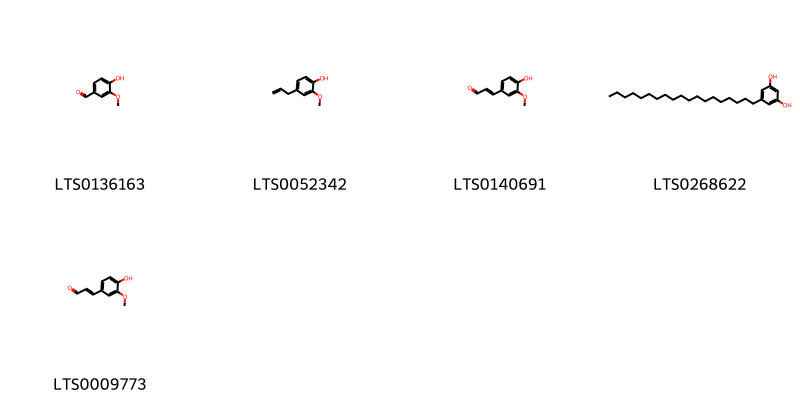{ width=100% }
<figcaption>Hình ảnh cấu trúc hóa học của hoạt chất thuộc nhóm *Phenols*. Tên thường gọi của các hoạt chất tương ứng là vanillin [(LTS0136163)](https://lotus.naturalproducts.net/compound/lotus_id/LTS0136163), eugenol [(LTS0052342)](https://lotus.naturalproducts.net/compound/lotus_id/LTS0052342), coniferyl aldehyde [(LTS0140691)](https://lotus.naturalproducts.net/compound/lotus_id/LTS0140691), 5-nonadecylbenzene-1,3-diol [(LTS0268622)](https://lotus.naturalproducts.net/compound/lotus_id/LTS0268622), coniferaldehyde [(LTS0009773)](https://lotus.naturalproducts.net/compound/lotus_id/LTS0009773).</figcaption>
</figure>

            
            
### Nhóm 2-arylbenzofuran flavonoids
<figure markdown="span">
    { width=100% }
<figcaption>Hình ảnh cấu trúc hóa học của hoạt chất thuộc nhóm *2-arylbenzofuran flavonoids*. Tên thường gọi của các hoạt chất tương ứng là balanophonin [(LTS0039496)](https://lotus.naturalproducts.net/compound/lotus_id/LTS0039496), (2e)-3-[(2r,3s)-2-(4-hydroxy-3-methoxyphenyl)-3-(hydroxymethyl)-7-methoxy-2,3-dihydro-1-benzofuran-5-yl]prop-2-enal [(LTS0130349)](https://lotus.naturalproducts.net/compound/lotus_id/LTS0130349), 3-[2-(4-hydroxy-3-methoxyphenyl)-3-(hydroxymethyl)-7-methoxy-2,3-dihydro-1-benzofuran-5-yl]prop-2-enal [(LTS0233365)](https://lotus.naturalproducts.net/compound/lotus_id/LTS0233365).</figcaption>
</figure>

### Nhóm Anthracenes
<figure markdown="span">
    { width=100% }
<figcaption>Hình ảnh cấu trúc hóa học của hoạt chất thuộc nhóm *Anthracenes*. Tên thường gọi của các hoạt chất tương ứng là turkey rhubarb [(LTS0160968)](https://lotus.naturalproducts.net/compound/lotus_id/LTS0160968), emodin [(LTS0163480)](https://lotus.naturalproducts.net/compound/lotus_id/LTS0163480), physcion [(LTS0052688)](https://lotus.naturalproducts.net/compound/lotus_id/LTS0052688).</figcaption>
</figure>

### Nhóm Benzene and substituted derivatives
<figure markdown="span">
    { width=100% }
<figcaption>Hình ảnh cấu trúc hóa học của hoạt chất thuộc nhóm *Benzene and substituted derivatives*. Tên thường gọi của các hoạt chất tương ứng là lavendustin c [(LTS0195252)](https://lotus.naturalproducts.net/compound/lotus_id/LTS0195252), 4-biphenylaldehyde [(LTS0057438)](https://lotus.naturalproducts.net/compound/lotus_id/LTS0057438), methyl salicylate [(LTS0128373)](https://lotus.naturalproducts.net/compound/lotus_id/LTS0128373), [1,1'-biphenyl]-2-carbaldehyde [(LTS0064008)](https://lotus.naturalproducts.net/compound/lotus_id/LTS0064008).</figcaption>
</figure>

### Nhóm Benzopyrans
<figure markdown="span">
    { width=100% }
<figcaption>Hình ảnh cấu trúc hóa học của hoạt chất thuộc nhóm *Benzopyrans*. Tên thường gọi của các hoạt chất tương ứng là chromene-2,2,6-triol [(LTS0157870)](https://lotus.naturalproducts.net/compound/lotus_id/LTS0157870), 6-methoxychromene-2,2-diol [(LTS0121113)](https://lotus.naturalproducts.net/compound/lotus_id/LTS0121113).</figcaption>
</figure>

### Nhóm Carboxylic acids and derivatives
<figure markdown="span">
    { width=100% }
<figcaption>Hình ảnh cấu trúc hóa học của hoạt chất thuộc nhóm *Carboxylic acids and derivatives*. Tên thường gọi của các hoạt chất tương ứng là (1r,4r,4as,8ar)-4-methyl-7-methylidene-octahydro-1h-naphthalene-1-carboxylic acid [(LTS0270684)](https://lotus.naturalproducts.net/compound/lotus_id/LTS0270684), 2-(1-carboxy-n-{4-[(2s)-2-(carboxyamino)-2-({4-[3-hydroxy-2-(methoxycarbonyl)phenoxy]butyl}-c-hydroxycarbonimidoyl)ethyl]phenyl}formamido)benzoic acid [(LTS0150168)](https://lotus.naturalproducts.net/compound/lotus_id/LTS0150168), (4s)-3,3,6-trimethylhepta-1,5-dien-4-yl acetate [(LTS0130898)](https://lotus.naturalproducts.net/compound/lotus_id/LTS0130898), (1r,4r,4as,8s,8as)-8-(formyloxy)-4-methyl-7-methylidene-octahydro-1h-naphthalene-1-carboxylic acid [(LTS0030860)](https://lotus.naturalproducts.net/compound/lotus_id/LTS0030860), 3,3,6-trimethylhepta-1,5-dien-4-yl acetate [(LTS0244885)](https://lotus.naturalproducts.net/compound/lotus_id/LTS0244885), 8-(formyloxy)-4-methyl-7-methylidene-octahydro-1h-naphthalene-1-carboxylic acid [(LTS0057379)](https://lotus.naturalproducts.net/compound/lotus_id/LTS0057379), 4,13-dimethyl-8-methylidene-10,11-dioxatricyclo[7.4.1.0⁵,¹⁴]tetradecan-12-one [(LTS0135933)](https://lotus.naturalproducts.net/compound/lotus_id/LTS0135933), 4-methyl-7-methylidene-octahydro-1h-naphthalene-1-carboxylic acid [(LTS0005709)](https://lotus.naturalproducts.net/compound/lotus_id/LTS0005709).</figcaption>
</figure>

### Nhóm Cinnamaldehydes
<figure markdown="span">
    { width=100% }
<figcaption>Hình ảnh cấu trúc hóa học của hoạt chất thuộc nhóm *Cinnamaldehydes*. Tên thường gọi của các hoạt chất tương ứng là 2-[2-methoxy-4-(3-oxoprop-1-en-1-yl)phenoxy]prop-2-enal [(LTS0134665)](https://lotus.naturalproducts.net/compound/lotus_id/LTS0134665), 3-{4-[(1,3-dihydroxypropan-2-yl)oxy]-3-methoxyphenyl}prop-2-enal [(LTS0124815)](https://lotus.naturalproducts.net/compound/lotus_id/LTS0124815), 2-{2-methoxy-4-[(1e)-3-oxoprop-1-en-1-yl]phenoxy}prop-2-enal [(LTS0251744)](https://lotus.naturalproducts.net/compound/lotus_id/LTS0251744), 4-methoxycinnamaldehyde [(LTS0219729)](https://lotus.naturalproducts.net/compound/lotus_id/LTS0219729), (2e)-3-{4-[(1,3-dihydroxypropan-2-yl)oxy]-3-methoxyphenyl}prop-2-enal [(LTS0038781)](https://lotus.naturalproducts.net/compound/lotus_id/LTS0038781), 3-(4-methoxyphenyl)-2-propenal [(LTS0014262)](https://lotus.naturalproducts.net/compound/lotus_id/LTS0014262).</figcaption>
</figure>

### Nhóm Cinnamic acids and derivatives
<figure markdown="span">
    { width=100% }
<figcaption>Hình ảnh cấu trúc hóa học của hoạt chất thuộc nhóm *Cinnamic acids and derivatives*. Tên thường gọi của các hoạt chất tương ứng là para-coumaric acid [(LTS0266252)](https://lotus.naturalproducts.net/compound/lotus_id/LTS0266252).</figcaption>
</figure>

### Nhóm Coumarins and derivatives
<figure markdown="span">
    { width=100% }
<figcaption>Hình ảnh cấu trúc hóa học của hoạt chất thuộc nhóm *Coumarins and derivatives*. Tên thường gọi của các hoạt chất tương ứng là 2h-1-benzopyran-2-one [(LTS0069773)](https://lotus.naturalproducts.net/compound/lotus_id/LTS0069773), isofraxidin [(LTS0073081)](https://lotus.naturalproducts.net/compound/lotus_id/LTS0073081), scopoletin [(LTS0193112)](https://lotus.naturalproducts.net/compound/lotus_id/LTS0193112).</figcaption>
</figure>

### Nhóm Dihydrofurans
<figure markdown="span">
    { width=100% }
<figcaption>Hình ảnh cấu trúc hóa học của hoạt chất thuộc nhóm *Dihydrofurans*. Tên thường gọi của các hoạt chất tương ứng là (3r)-5-(2,5-dihydrofuran-3-yl)-2-methylpent-1-en-3-ol [(LTS0112627)](https://lotus.naturalproducts.net/compound/lotus_id/LTS0112627), 5-(2,5-dihydrofuran-3-yl)-2-methylpent-3-en-2-ol [(LTS0246689)](https://lotus.naturalproducts.net/compound/lotus_id/LTS0246689), (3e)-5-(2,5-dihydrofuran-3-yl)-2-methylpent-3-en-2-ol [(LTS0221588)](https://lotus.naturalproducts.net/compound/lotus_id/LTS0221588), 5-(2,5-dihydrofuran-3-yl)-2-methylpent-1-en-3-ol [(LTS0118643)](https://lotus.naturalproducts.net/compound/lotus_id/LTS0118643).</figcaption>
</figure>

### Nhóm Dioxolopyrans
<figure markdown="span">
    { width=100% }
<figcaption>Hình ảnh cấu trúc hóa học của hoạt chất thuộc nhóm *Dioxolopyrans*. Tên thường gọi của các hoạt chất tương ứng là 1,5,9-trimethyl-11,14,15-trioxatetracyclo[10.2.1.0⁴,¹³.0⁸,¹³]pentadecan-10-one [(LTS0198939)](https://lotus.naturalproducts.net/compound/lotus_id/LTS0198939), (4s,5r,8s,9r,12s,13r)-1,5,9-trimethyl-11,14,15-trioxatetracyclo[10.2.1.0⁴,¹³.0⁸,¹³]pentadecan-10-one [(LTS0215855)](https://lotus.naturalproducts.net/compound/lotus_id/LTS0215855), 2-deoxyartemisinin [(LTS0090782)](https://lotus.naturalproducts.net/compound/lotus_id/LTS0090782), 2-hydroxy-1,5,9-trimethyl-11,14,15-trioxatetracyclo[10.2.1.0⁴,¹³.0⁸,¹³]pentadecan-10-one [(LTS0211892)](https://lotus.naturalproducts.net/compound/lotus_id/LTS0211892), (1s,2r,4s,5r,8s,9r,12s,13r)-2-hydroxy-1,5,9-trimethyl-11,14,15-trioxatetracyclo[10.2.1.0⁴,¹³.0⁸,¹³]pentadecan-10-one [(LTS0099364)](https://lotus.naturalproducts.net/compound/lotus_id/LTS0099364).</figcaption>
</figure>

### Nhóm Epoxides
<figure markdown="span">
    { width=100% }
<figcaption>Hình ảnh cấu trúc hóa học của hoạt chất thuộc nhóm *Epoxides*. Tên thường gọi của các hoạt chất tương ứng là (1r,3e,7e,11r)-1,5,5,7-tetramethyl-12-oxabicyclo[9.1.0]dodeca-3,7-diene [(LTS0027633)](https://lotus.naturalproducts.net/compound/lotus_id/LTS0027633).</figcaption>
</figure>

### Nhóm Fatty Acyls
<figure markdown="span">
    { width=100% }
<figcaption>Hình ảnh cấu trúc hóa học của hoạt chất thuộc nhóm *Fatty Acyls*. Tên thường gọi của các hoạt chất tương ứng là (2r,4r)-5-methyl-2-(prop-1-en-2-yl)hex-5-ene-1,4-diol [(LTS0112418)](https://lotus.naturalproducts.net/compound/lotus_id/LTS0112418), 5-methyl-2-(prop-1-en-2-yl)hex-3-ene-1,5-diol [(LTS0057789)](https://lotus.naturalproducts.net/compound/lotus_id/LTS0057789), ethyl (2r)-2-methylbutanoate [(LTS0233405)](https://lotus.naturalproducts.net/compound/lotus_id/LTS0233405), 5-methyl-2-(prop-1-en-2-yl)hex-5-ene-1,4-diol [(LTS0208964)](https://lotus.naturalproducts.net/compound/lotus_id/LTS0208964), hexyl (2e)-2-methylbut-2-enoate [(LTS0082952)](https://lotus.naturalproducts.net/compound/lotus_id/LTS0082952), (2s,3e)-5-methyl-2-(prop-1-en-2-yl)hex-3-ene-1,5-diol [(LTS0103356)](https://lotus.naturalproducts.net/compound/lotus_id/LTS0103356), cis-3-hexenyl isovalerate [(LTS0181676)](https://lotus.naturalproducts.net/compound/lotus_id/LTS0181676), cis-3-hexenol [(LTS0132156)](https://lotus.naturalproducts.net/compound/lotus_id/LTS0132156), 9-decen-1-ol [(LTS0161213)](https://lotus.naturalproducts.net/compound/lotus_id/LTS0161213), ceryl alcohol [(LTS0140051)](https://lotus.naturalproducts.net/compound/lotus_id/LTS0140051), methyl palmitate [(LTS0139222)](https://lotus.naturalproducts.net/compound/lotus_id/LTS0139222), oct-1-en-3s-ol [(LTS0173025)](https://lotus.naturalproducts.net/compound/lotus_id/LTS0173025), methyl stearate [(LTS0221686)](https://lotus.naturalproducts.net/compound/lotus_id/LTS0221686), hexanol [(LTS0217299)](https://lotus.naturalproducts.net/compound/lotus_id/LTS0217299), hexyl (2s)-2-methylbutanoate [(LTS0164349)](https://lotus.naturalproducts.net/compound/lotus_id/LTS0164349), nonacosanol [(LTS0205992)](https://lotus.naturalproducts.net/compound/lotus_id/LTS0205992), octacosanol [(LTS0049071)](https://lotus.naturalproducts.net/compound/lotus_id/LTS0049071), 1-octen-3-ol [(LTS0057101)](https://lotus.naturalproducts.net/compound/lotus_id/LTS0057101), (3z)-hex-3-en-1-yl (2r)-2-methylbutanoate [(LTS0005286)](https://lotus.naturalproducts.net/compound/lotus_id/LTS0005286).</figcaption>
</figure>

### Nhóm Flavonoids
<figure markdown="span">
    { width=100% }
<figcaption>Hình ảnh cấu trúc hóa học của hoạt chất thuộc nhóm *Flavonoids*. Tên thường gọi của các hoạt chất tương ứng là quercetin [(LTS0004651)](https://lotus.naturalproducts.net/compound/lotus_id/LTS0004651), 3-rutinosyl quercetin [(LTS0032845)](https://lotus.naturalproducts.net/compound/lotus_id/LTS0032845), eupatorin [(LTS0073269)](https://lotus.naturalproducts.net/compound/lotus_id/LTS0073269), bonanzin [(LTS0123079)](https://lotus.naturalproducts.net/compound/lotus_id/LTS0123079), (2r)-2-(2,4-dihydroxyphenyl)-5-hydroxy-6,7-dimethoxy-2,3-dihydro-1-benzopyran-4-one [(LTS0238093)](https://lotus.naturalproducts.net/compound/lotus_id/LTS0238093), chrysoeriol [(LTS0095766)](https://lotus.naturalproducts.net/compound/lotus_id/LTS0095766), penduletin [(LTS0080627)](https://lotus.naturalproducts.net/compound/lotus_id/LTS0080627), 5,7,8-trihydroxy-2-(3-hydroxy-4-methoxyphenyl)-3-methoxy-2,3-dihydro-1-benzopyran-4-one [(LTS0072712)](https://lotus.naturalproducts.net/compound/lotus_id/LTS0072712), 3,5,7-trihydroxy-2-(4-hydroxy-3-{[(2s,3r,4s,5s,6r)-3,4,5-trihydroxy-6-(hydroxymethyl)oxan-2-yl]oxy}phenyl)chromen-4-one [(LTS0094454)](https://lotus.naturalproducts.net/compound/lotus_id/LTS0094454), 2-(3,4-dihydroxyphenyl)-5,7-dihydroxy-3-{[3,4,5-trihydroxy-6-(hydroxymethyl)oxan-2-yl]oxy}chromen-4-one [(LTS0195312)](https://lotus.naturalproducts.net/compound/lotus_id/LTS0195312), patuletin [(LTS0104633)](https://lotus.naturalproducts.net/compound/lotus_id/LTS0104633), chamomile [(LTS0104946)](https://lotus.naturalproducts.net/compound/lotus_id/LTS0104946), luteolin 7-methyl ether [(LTS0259993)](https://lotus.naturalproducts.net/compound/lotus_id/LTS0259993), 2-(2,4-dihydroxyphenyl)-5-hydroxy-6,7-dimethoxy-2,3-dihydro-1-benzopyran-4-one [(LTS0108962)](https://lotus.naturalproducts.net/compound/lotus_id/LTS0108962), quercimeritrin [(LTS0188893)](https://lotus.naturalproducts.net/compound/lotus_id/LTS0188893), artemetin [(LTS0265682)](https://lotus.naturalproducts.net/compound/lotus_id/LTS0265682), cirsimaritin [(LTS0146305)](https://lotus.naturalproducts.net/compound/lotus_id/LTS0146305), 2-(3,4-dihydroxyphenyl)-5-hydroxy-7-{[3,4,5-trihydroxy-6-(hydroxymethyl)oxan-2-yl]oxy}chromen-4-one [(LTS0158292)](https://lotus.naturalproducts.net/compound/lotus_id/LTS0158292), cirsilineol [(LTS0092903)](https://lotus.naturalproducts.net/compound/lotus_id/LTS0092903), isorhamnetin [(LTS0107505)](https://lotus.naturalproducts.net/compound/lotus_id/LTS0107505), eupalitin [(LTS0255198)](https://lotus.naturalproducts.net/compound/lotus_id/LTS0255198), kaempherol [(LTS0155822)](https://lotus.naturalproducts.net/compound/lotus_id/LTS0155822), isoquercetin [(LTS0254337)](https://lotus.naturalproducts.net/compound/lotus_id/LTS0254337), trifolin [(LTS0267055)](https://lotus.naturalproducts.net/compound/lotus_id/LTS0267055), quercimeritrin [(LTS0043461)](https://lotus.naturalproducts.net/compound/lotus_id/LTS0043461), chrysosplenol c [(LTS0217158)](https://lotus.naturalproducts.net/compound/lotus_id/LTS0217158), chrysosplenetin [(LTS0202772)](https://lotus.naturalproducts.net/compound/lotus_id/LTS0202772), casticin [(LTS0071783)](https://lotus.naturalproducts.net/compound/lotus_id/LTS0071783), quercetagetin 3-methyl ether [(LTS0212838)](https://lotus.naturalproducts.net/compound/lotus_id/LTS0212838), cirsiliol [(LTS0070414)](https://lotus.naturalproducts.net/compound/lotus_id/LTS0070414), 2-(3,4-dihydroxyphenyl)-5,7-dihydroxy-3-{[(2s,3r,4r,5r,6s)-3,4,5-trihydroxy-6-(hydroxymethyl)oxan-2-yl]oxy}chromen-4-one [(LTS0241372)](https://lotus.naturalproducts.net/compound/lotus_id/LTS0241372), retusin [(LTS0236094)](https://lotus.naturalproducts.net/compound/lotus_id/LTS0236094), arcapillin [(LTS0002317)](https://lotus.naturalproducts.net/compound/lotus_id/LTS0002317), 2-(3,4-dimethoxyphenyl)-3,5-dihydroxy-6,7-dimethoxychromen-4-one [(LTS0179185)](https://lotus.naturalproducts.net/compound/lotus_id/LTS0179185), 2-(3,4-dimethoxyphenyl)-5-hydroxy-6,7-dimethoxychromen-4-one [(LTS0032351)](https://lotus.naturalproducts.net/compound/lotus_id/LTS0032351), luteolin 7-o-glucoside [(LTS0227450)](https://lotus.naturalproducts.net/compound/lotus_id/LTS0227450), rhamnocitrin [(LTS0198024)](https://lotus.naturalproducts.net/compound/lotus_id/LTS0198024), astragalin [(LTS0249588)](https://lotus.naturalproducts.net/compound/lotus_id/LTS0249588), chrysosplenol d [(LTS0188255)](https://lotus.naturalproducts.net/compound/lotus_id/LTS0188255), quercetagetin 4'-methyl ether [(LTS0048116)](https://lotus.naturalproducts.net/compound/lotus_id/LTS0048116), tamarixetin [(LTS0258243)](https://lotus.naturalproducts.net/compound/lotus_id/LTS0258243), quercetin 3-methyl ether [(LTS0194170)](https://lotus.naturalproducts.net/compound/lotus_id/LTS0194170), (2s,3r)-5,7,8-trihydroxy-2-(3-hydroxy-4-methoxyphenyl)-3-methoxy-2,3-dihydro-1-benzopyran-4-one [(LTS0244620)](https://lotus.naturalproducts.net/compound/lotus_id/LTS0244620), axillarin [(LTS0067813)](https://lotus.naturalproducts.net/compound/lotus_id/LTS0067813), 2-(3,4-dihydroxyphenyl)-5,7-dihydroxy-6-methoxy-3-{[3,4,5-trihydroxy-6-(hydroxymethyl)oxan-2-yl]oxy}chromen-4-one [(LTS0010167)](https://lotus.naturalproducts.net/compound/lotus_id/LTS0010167), isokaempferide [(LTS0011732)](https://lotus.naturalproducts.net/compound/lotus_id/LTS0011732), luteolin [(LTS0017052)](https://lotus.naturalproducts.net/compound/lotus_id/LTS0017052), pachypodol [(LTS0093471)](https://lotus.naturalproducts.net/compound/lotus_id/LTS0093471), 5,6,7-trihydroxy-2-(3-hydroxy-4-methoxyphenyl)-3-methoxychromen-4-one [(LTS0217584)](https://lotus.naturalproducts.net/compound/lotus_id/LTS0217584), quercimeritrin [(LTS0208490)](https://lotus.naturalproducts.net/compound/lotus_id/LTS0208490), 3,5,7-trihydroxy-2-(4-hydroxy-3-{[3,4,5-trihydroxy-6-(hydroxymethyl)oxan-2-yl]oxy}phenyl)chromen-4-one [(LTS0105577)](https://lotus.naturalproducts.net/compound/lotus_id/LTS0105577), tomentin [(LTS0028795)](https://lotus.naturalproducts.net/compound/lotus_id/LTS0028795).</figcaption>
</figure>

### Nhóm Imidazopyrimidines
<figure markdown="span">
    { width=100% }
<figcaption>Hình ảnh cấu trúc hóa học của hoạt chất thuộc nhóm *Imidazopyrimidines*. Tên thường gọi của các hoạt chất tương ứng là zeatine [(LTS0032706)](https://lotus.naturalproducts.net/compound/lotus_id/LTS0032706).</figcaption>
</figure>

### Nhóm Indoles and derivatives
<figure markdown="span">
    { width=100% }
<figcaption>Hình ảnh cấu trúc hóa học của hoạt chất thuộc nhóm *Indoles and derivatives*. Tên thường gọi của các hoạt chất tương ứng là n-[2-(5-methoxy-1h-indol-3-yl)ethyl]ethanimidic acid [(LTS0219322)](https://lotus.naturalproducts.net/compound/lotus_id/LTS0219322).</figcaption>
</figure>

### Nhóm Lactones
<figure markdown="span">
    { width=100% }
<figcaption>Hình ảnh cấu trúc hóa học của hoạt chất thuộc nhóm *Lactones*. Tên thường gọi của các hoạt chất tương ứng là (1s,5r,8r,9s,13s)-8,12-dimethyl-4-methylidene-2-oxatricyclo[7.3.1.0⁵,¹³]tridec-11-en-3-one [(LTS0107775)](https://lotus.naturalproducts.net/compound/lotus_id/LTS0107775), (1r,5s,8s,9r,13r)-8,12-dimethyl-4-methylidene-2-oxatricyclo[7.3.1.0⁵,¹³]tridec-11-en-3-one [(LTS0070167)](https://lotus.naturalproducts.net/compound/lotus_id/LTS0070167), (1s,4r,5r,8r,9s,13s)-4,8-dimethyl-12-methylidene-2-oxatricyclo[7.3.1.0⁵,¹³]tridecan-3-one [(LTS0069926)](https://lotus.naturalproducts.net/compound/lotus_id/LTS0069926), (1r,4r,7r,8s,12r)-7-methyl-11-methylidene-2-oxatricyclo[6.3.1.0⁴,¹²]dodecan-3-one [(LTS0188899)](https://lotus.naturalproducts.net/compound/lotus_id/LTS0188899), 4,8,12-trimethyl-2-oxatricyclo[7.3.1.0⁵,¹³]tridec-11-en-3-one [(LTS0019112)](https://lotus.naturalproducts.net/compound/lotus_id/LTS0019112), 8-methyl-4,12-dimethylidene-2-oxatricyclo[7.3.1.0⁵,¹³]tridecan-3-one [(LTS0149475)](https://lotus.naturalproducts.net/compound/lotus_id/LTS0149475), (1r,5s,6r,9s,10r,13s)-6,10-dimethyl-11-oxo-2,12-dioxatricyclo[7.4.0.0¹,⁵]tridecan-13-yl acetate [(LTS0148990)](https://lotus.naturalproducts.net/compound/lotus_id/LTS0148990), (3s,3as,6s,9s,9bs)-6,9-dihydroxy-3,6,9-trimethyl-3h,3ah,4h,5h,8h,9bh-azuleno[4,5-b]furan-2,7-dione [(LTS0148949)](https://lotus.naturalproducts.net/compound/lotus_id/LTS0148949), 7-methyl-11-methylidene-2-oxatricyclo[6.3.1.0⁴,¹²]dodecan-3-one [(LTS0190498)](https://lotus.naturalproducts.net/compound/lotus_id/LTS0190498), artabsin [(LTS0162316)](https://lotus.naturalproducts.net/compound/lotus_id/LTS0162316), matricin [(LTS0168849)](https://lotus.naturalproducts.net/compound/lotus_id/LTS0168849), (1s,4r,5r,8r,9s,13s)-4,8,12-trimethyl-2-oxatricyclo[7.3.1.0⁵,¹³]tridec-11-en-3-one [(LTS0191104)](https://lotus.naturalproducts.net/compound/lotus_id/LTS0191104), (1s,5r,8r,9s,13s)-8-methyl-4,12-dimethylidene-2-oxatricyclo[7.3.1.0⁵,¹³]tridecan-3-one [(LTS0266131)](https://lotus.naturalproducts.net/compound/lotus_id/LTS0266131), 6,10-dimethyl-11-oxo-2,12-dioxatricyclo[7.4.0.0¹,⁵]tridecan-13-yl acetate [(LTS0270413)](https://lotus.naturalproducts.net/compound/lotus_id/LTS0270413), 8,12-dimethyl-4-methylidene-2-oxatricyclo[7.3.1.0⁵,¹³]tridec-11-en-3-one [(LTS0239249)](https://lotus.naturalproducts.net/compound/lotus_id/LTS0239249), (3s,3as,6s,9r,9bs)-6,9-dihydroxy-3,6,9-trimethyl-3h,3ah,4h,5h,8h,9bh-azuleno[4,5-b]furan-2,7-dione [(LTS0169132)](https://lotus.naturalproducts.net/compound/lotus_id/LTS0169132), (1r,4r,7r,8s,12r)-7,11-dimethyl-2-oxatricyclo[6.3.1.0⁴,¹²]dodec-10-en-3-one [(LTS0055054)](https://lotus.naturalproducts.net/compound/lotus_id/LTS0055054), 7,11-dimethyl-2-oxatricyclo[6.3.1.0⁴,¹²]dodec-10-en-3-one [(LTS0075194)](https://lotus.naturalproducts.net/compound/lotus_id/LTS0075194), 4,8-dimethyl-12-methylidene-2-oxatricyclo[7.3.1.0⁵,¹³]tridecan-3-one [(LTS0047434)](https://lotus.naturalproducts.net/compound/lotus_id/LTS0047434).</figcaption>
</figure>

### Nhóm Organooxygen compounds
<figure markdown="span">
    { width=100% }
<figcaption>Hình ảnh cấu trúc hóa học của hoạt chất thuộc nhóm *Organooxygen compounds*. Tên thường gọi của các hoạt chất tương ứng là octanal [(LTS0055983)](https://lotus.naturalproducts.net/compound/lotus_id/LTS0055983), 1-(2-hydroxy-6-methoxy-4-{[3,4,5-trihydroxy-6-(hydroxymethyl)oxan-2-yl]oxy}phenyl)ethanone [(LTS0038662)](https://lotus.naturalproducts.net/compound/lotus_id/LTS0038662), xanthoxylin [(LTS0150432)](https://lotus.naturalproducts.net/compound/lotus_id/LTS0150432), isoartemisia ketone [(LTS0154009)](https://lotus.naturalproducts.net/compound/lotus_id/LTS0154009), 1-(2-hydroxy-6-methoxy-4-{[(2s,3r,4s,5s,6r)-3,4,5-trihydroxy-6-(hydroxymethyl)oxan-2-yl]oxy}phenyl)ethanone [(LTS0179806)](https://lotus.naturalproducts.net/compound/lotus_id/LTS0179806), (1r,4r,4as,8s,8as)-8-hydroxy-4-methyl-7-methylidene-octahydro-1h-naphthalene-1-carboxylic acid [(LTS0254124)](https://lotus.naturalproducts.net/compound/lotus_id/LTS0254124), jasmone [(LTS0205512)](https://lotus.naturalproducts.net/compound/lotus_id/LTS0205512), 3,3,6-trimethylhepta-1,5-dien-4-ol [(LTS0238559)](https://lotus.naturalproducts.net/compound/lotus_id/LTS0238559), (3s)-3-ethenyl-2,5-dimethylhex-4-en-2-ol [(LTS0039165)](https://lotus.naturalproducts.net/compound/lotus_id/LTS0039165), 8-hydroxy-4-methyl-7-methylidene-octahydro-1h-naphthalene-1-carboxylic acid [(LTS0078747)](https://lotus.naturalproducts.net/compound/lotus_id/LTS0078747), tricosan-2-one [(LTS0031212)](https://lotus.naturalproducts.net/compound/lotus_id/LTS0031212).</figcaption>
</figure>

### Nhóm Oxacyclic compounds
<figure markdown="span">
    { width=100% }
<figcaption>Hình ảnh cấu trúc hóa học của hoạt chất thuộc nhóm *Oxacyclic compounds*. Tên thường gọi của các hoạt chất tương ứng là (1r,4r,5s,9s,13r,14s)-4,13-dimethyl-8-methylidene-10,11-dioxatricyclo[7.4.1.0⁵,¹⁴]tetradecan-12-one [(LTS0229266)](https://lotus.naturalproducts.net/compound/lotus_id/LTS0229266).</figcaption>
</figure>

### Nhóm Oxanes
<figure markdown="span">
    { width=100% }
<figcaption>Hình ảnh cấu trúc hóa học của hoạt chất thuộc nhóm *Oxanes*. Tên thường gọi của các hoạt chất tương ứng là 1,8-cineole [(LTS0166505)](https://lotus.naturalproducts.net/compound/lotus_id/LTS0166505), eucalyptol [(LTS0051374)](https://lotus.naturalproducts.net/compound/lotus_id/LTS0051374).</figcaption>
</figure>

### Nhóm Oxepanes
<figure markdown="span">
    { width=100% }
<figcaption>Hình ảnh cấu trúc hóa học của hoạt chất thuộc nhóm *Oxepanes*. Tên thường gọi của các hoạt chất tương ứng là 1-{2-hydroxy-1a,4-dimethyl-hexahydro-2h-indeno[4,5-b]oxiren-6a-yl}-2-methylpropan-1-one [(LTS0040133)](https://lotus.naturalproducts.net/compound/lotus_id/LTS0040133), (1r,5s,8r,9s,12r,14r)-8,12-dimethyl-4-methylidene-2,13-dioxatetracyclo[7.5.0.0¹,⁵.0¹²,¹⁴]tetradecane [(LTS0172443)](https://lotus.naturalproducts.net/compound/lotus_id/LTS0172443), 1-[(1ar,2r,3as,4r,6as,6bs)-2-hydroxy-1a,4-dimethyl-hexahydro-2h-indeno[4,5-b]oxiren-6a-yl]-2-methylpropan-1-one [(LTS0125198)](https://lotus.naturalproducts.net/compound/lotus_id/LTS0125198), 8,12-dimethyl-4-methylidene-2,13-dioxatetracyclo[7.5.0.0¹,⁵.0¹²,¹⁴]tetradecane [(LTS0245892)](https://lotus.naturalproducts.net/compound/lotus_id/LTS0245892).</figcaption>
</figure>

### Nhóm Phenol ethers
<figure markdown="span">
    { width=100% }
<figcaption>Hình ảnh cấu trúc hóa học của hoạt chất thuộc nhóm *Phenol ethers*. Tên thường gọi của các hoạt chất tương ứng là anethole [(LTS0033696)](https://lotus.naturalproducts.net/compound/lotus_id/LTS0033696).</figcaption>
</figure>

### Nhóm Phenols
<figure markdown="span">
    { width=100% }
<figcaption>Hình ảnh cấu trúc hóa học của hoạt chất thuộc nhóm *Phenols*. Tên thường gọi của các hoạt chất tương ứng là vanillin [(LTS0136163)](https://lotus.naturalproducts.net/compound/lotus_id/LTS0136163), eugenol [(LTS0052342)](https://lotus.naturalproducts.net/compound/lotus_id/LTS0052342), coniferyl aldehyde [(LTS0140691)](https://lotus.naturalproducts.net/compound/lotus_id/LTS0140691), 5-nonadecylbenzene-1,3-diol [(LTS0268622)](https://lotus.naturalproducts.net/compound/lotus_id/LTS0268622), coniferaldehyde [(LTS0009773)](https://lotus.naturalproducts.net/compound/lotus_id/LTS0009773).</figcaption>
</figure>

### Nhóm Prenol lipids
<figure markdown="span">
    { width=100% }
<figcaption>Hình ảnh cấu trúc hóa học của hoạt chất thuộc nhóm *Prenol lipids*. Tên thường gọi của các hoạt chất tương ứng là (-)-germacrene d [(LTS0059194)](https://lotus.naturalproducts.net/compound/lotus_id/LTS0059194), 8-isopropyl-1-methyl-5-methylidenecyclodeca-1,6-diene [(LTS0018398)](https://lotus.naturalproducts.net/compound/lotus_id/LTS0018398), α-myrcene [(LTS0115731)](https://lotus.naturalproducts.net/compound/lotus_id/LTS0115731), terpinolene [(LTS0104525)](https://lotus.naturalproducts.net/compound/lotus_id/LTS0104525), cymene [(LTS0181568)](https://lotus.naturalproducts.net/compound/lotus_id/LTS0181568), α pinene [(LTS0132416)](https://lotus.naturalproducts.net/compound/lotus_id/LTS0132416), phellandrene [(LTS0157173)](https://lotus.naturalproducts.net/compound/lotus_id/LTS0157173), caryophyllene [(LTS0085212)](https://lotus.naturalproducts.net/compound/lotus_id/LTS0085212), thymol [(LTS0168527)](https://lotus.naturalproducts.net/compound/lotus_id/LTS0168527), carvacrol [(LTS0012882)](https://lotus.naturalproducts.net/compound/lotus_id/LTS0012882), (7ar)-1,1,7-trimethyl-4-methylidene-octahydrocyclopropa[e]azulen-7-ol [(LTS0091612)](https://lotus.naturalproducts.net/compound/lotus_id/LTS0091612), 4,11,11-trimethyl-8-methylidenebicyclo[7.2.0]undec-4-ene [(LTS0256716)](https://lotus.naturalproducts.net/compound/lotus_id/LTS0256716), terpineol [(LTS0136148)](https://lotus.naturalproducts.net/compound/lotus_id/LTS0136148), 4-hydroxy-7-isopropyl-4-methyl-octahydroindene-1-carboxylic acid [(LTS0130204)](https://lotus.naturalproducts.net/compound/lotus_id/LTS0130204), (2r,4ar,5r,8r,8as)-5-hydroxy-5-isopropyl-3,8-dimethyl-2,4a,6,7,8,8a-hexahydro-1h-naphthalen-2-yl acetate [(LTS0128840)](https://lotus.naturalproducts.net/compound/lotus_id/LTS0128840), (2z)-6-methylidene-2-(4-methylpent-3-en-1-yl)octa-2,7-dien-1-yl acetate [(LTS0200841)](https://lotus.naturalproducts.net/compound/lotus_id/LTS0200841), vulgarin [(LTS0062007)](https://lotus.naturalproducts.net/compound/lotus_id/LTS0062007), 4,8,12-trimethyl-2,13-dioxatetracyclo[7.5.0.0¹,⁵.0¹²,¹⁴]tetradecan-3-one [(LTS0130101)](https://lotus.naturalproducts.net/compound/lotus_id/LTS0130101), (3r,3as,6r,6as,9s,10r,10as)-9,10-dihydroxy-3,6,9-trimethyl-octahydro-3h-naphtho[4a,4-b]furan-2-one [(LTS0132739)](https://lotus.naturalproducts.net/compound/lotus_id/LTS0132739), epi-friedelanol [(LTS0114491)](https://lotus.naturalproducts.net/compound/lotus_id/LTS0114491), farnesene [(LTS0057150)](https://lotus.naturalproducts.net/compound/lotus_id/LTS0057150), (1ar,3as,7bs)-1,1,3a,7-tetramethyl-1ah,2h,3h,4h,5h,6h,7bh-cyclopropa[a]naphthalene [(LTS0064435)](https://lotus.naturalproducts.net/compound/lotus_id/LTS0064435), β-amyrin [(LTS0075776)](https://lotus.naturalproducts.net/compound/lotus_id/LTS0075776), 2-[(4r,4as)-4,7-dimethyl-2,3,4,4a,5,6-hexahydronaphthalen-1-yl]prop-2-enoic acid [(LTS0128139)](https://lotus.naturalproducts.net/compound/lotus_id/LTS0128139), 6-methylidene-2-(4-methylpent-3-en-1-yl)octa-2,7-dien-1-yl acetate [(LTS0137154)](https://lotus.naturalproducts.net/compound/lotus_id/LTS0137154), 2-[(1ar,3as,4r,7r,7as,7bs)-1a,4-dimethyl-octahydro-2h-naphtho[1,2-b]oxiren-7-yl]prop-2-enoic acid [(LTS0203123)](https://lotus.naturalproducts.net/compound/lotus_id/LTS0203123), (6e)-3,7,11-trimethyldodeca-1,6,10-trien-3-yl acetate [(LTS0193692)](https://lotus.naturalproducts.net/compound/lotus_id/LTS0193692), (2r)-2-[(1s,3s,4r)-4-methyl-2-oxo-3-(3-oxobutyl)cyclohexyl]propanoic acid [(LTS0236993)](https://lotus.naturalproducts.net/compound/lotus_id/LTS0236993), myrtenol [(LTS0130529)](https://lotus.naturalproducts.net/compound/lotus_id/LTS0130529), (6ar,6bs,8ar,11r,12s,12ar,14br)-4,4,6a,6b,8a,11,12,14b-octamethyl-1,2,4a,5,6,7,8,9,10,11,12,12a,14,14a-tetradecahydropicen-3-one [(LTS0125709)](https://lotus.naturalproducts.net/compound/lotus_id/LTS0125709), anabsinthin [(LTS0075454)](https://lotus.naturalproducts.net/compound/lotus_id/LTS0075454), (1s,2r,4r,6s)-1,7,7-trimethyltricyclo[2.2.1.0²,⁶]heptane [(LTS0080510)](https://lotus.naturalproducts.net/compound/lotus_id/LTS0080510), 4-ethenyl-1-isopropyl-4-methyl-3-(prop-1-en-2-yl)cyclohex-1-ene [(LTS0080134)](https://lotus.naturalproducts.net/compound/lotus_id/LTS0080134), (2r)-2-[(1s,3s,4r)-4-methyl-2-oxo-3-(3-oxobutyl)cyclohexyl]propyl formate [(LTS0064098)](https://lotus.naturalproducts.net/compound/lotus_id/LTS0064098), (1r,2r,7s,8r)-2,6,6-trimethyl-9-methylidenetricyclo[5.4.0.0²,⁸]undecane [(LTS0080386)](https://lotus.naturalproducts.net/compound/lotus_id/LTS0080386), linalool, (+-)- [(LTS0128839)](https://lotus.naturalproducts.net/compound/lotus_id/LTS0128839), (3as,6r,6as,10ar)-6,9-dimethyl-3-methylidene-3ah,4h,5h,6h,6ah,7h,8h-naphtho[4a,4-b]furan-2-one [(LTS0082478)](https://lotus.naturalproducts.net/compound/lotus_id/LTS0082478), (2r)-6-methyl-2-[(1r)-4-methylcyclohex-3-en-1-yl]hept-5-en-2-ol [(LTS0087338)](https://lotus.naturalproducts.net/compound/lotus_id/LTS0087338), artemorin [(LTS0070726)](https://lotus.naturalproducts.net/compound/lotus_id/LTS0070726), amyrin [(LTS0222826)](https://lotus.naturalproducts.net/compound/lotus_id/LTS0222826), (1s,2r,5s,8s,9s,12s,13r,14r,15r,16r,17s,19s,22s,23s,26s,27r)-12,16-dihydroxy-3,8,12,17,19,23-hexamethyl-6,18,25-trioxaoctacyclo[13.11.1.0¹,¹⁷.0²,¹⁴.0⁴,¹³.0⁵,⁹.0¹⁹,²⁷.0²²,²⁶]heptacos-3-ene-7,24-dione [(LTS0070691)](https://lotus.naturalproducts.net/compound/lotus_id/LTS0070691), (3s,4ar,6ar,6bs,8ar,12as,14ar,14br)-4,4,6a,6b,8a,11,11,14b-octamethyl-1,2,3,4a,5,6,7,8,9,10,12,12a,14,14a-tetradecahydropicen-3-yl acetate [(LTS0085387)](https://lotus.naturalproducts.net/compound/lotus_id/LTS0085387), 3-methyl-4-(1,4,6-trimethyl-2-oxocyclohept-3-en-1-yl)but-2-enoic acid [(LTS0032926)](https://lotus.naturalproducts.net/compound/lotus_id/LTS0032926), 2-[2-formyl-4-methyl-3-(3-oxobutyl)cyclohexyl]prop-2-enoic acid [(LTS0100905)](https://lotus.naturalproducts.net/compound/lotus_id/LTS0100905), (1r,2e,6z,9e)-3,7,11,11-tetramethylcycloundeca-2,6,9-trien-1-ol [(LTS0010188)](https://lotus.naturalproducts.net/compound/lotus_id/LTS0010188), (+)-absinthin [(LTS0187528)](https://lotus.naturalproducts.net/compound/lotus_id/LTS0187528), (+)-cis-sabinol [(LTS0081558)](https://lotus.naturalproducts.net/compound/lotus_id/LTS0081558), caryophyllene oxide [(LTS0159789)](https://lotus.naturalproducts.net/compound/lotus_id/LTS0159789), α-humulene [(LTS0076944)](https://lotus.naturalproducts.net/compound/lotus_id/LTS0076944), guaiene [(LTS0039431)](https://lotus.naturalproducts.net/compound/lotus_id/LTS0039431), (1s,2s,4ar,5r,8as)-2-isopropyl-4a-methyl-8-methylidene-octahydronaphthalene-1,5-diol [(LTS0071183)](https://lotus.naturalproducts.net/compound/lotus_id/LTS0071183), 6-isopropyl-8a-methyl-4-methylidene-1,2,3,4a,5,8-hexahydronaphthalen-1-ol [(LTS0097356)](https://lotus.naturalproducts.net/compound/lotus_id/LTS0097356), (1s,5r,9r)-10,10-dimethyl-2,6-dimethylidenebicyclo[7.2.0]undecan-5-ol [(LTS0065243)](https://lotus.naturalproducts.net/compound/lotus_id/LTS0065243), 2-(4,7-dimethyl-8-oxo-2,3,4,4a,5,8a-hexahydro-1h-naphthalen-1-yl)propanoic acid [(LTS0110166)](https://lotus.naturalproducts.net/compound/lotus_id/LTS0110166), (+)-borneol [(LTS0189059)](https://lotus.naturalproducts.net/compound/lotus_id/LTS0189059), (2r)-2-[(1r,4r,4as,8as)-4,7-dimethyl-8-oxo-2,3,4,4a,5,8a-hexahydro-1h-naphthalen-1-yl]propanoic acid [(LTS0028902)](https://lotus.naturalproducts.net/compound/lotus_id/LTS0028902), phytol [(LTS0096073)](https://lotus.naturalproducts.net/compound/lotus_id/LTS0096073), (3as,6as,9r,10as)-9,10-dihydroxy-3,6,9-trimethyl-octahydro-3h-naphtho[4a,4-b]furan-2-one [(LTS0027371)](https://lotus.naturalproducts.net/compound/lotus_id/LTS0027371), (1s,2s,5r,8r)-2,5,8-trimethyl-6-methylidenetricyclo[6.3.0.0¹,⁵]undecane [(LTS0045069)](https://lotus.naturalproducts.net/compound/lotus_id/LTS0045069), β-selinene [(LTS0096341)](https://lotus.naturalproducts.net/compound/lotus_id/LTS0096341), camphor [(LTS0091905)](https://lotus.naturalproducts.net/compound/lotus_id/LTS0091905), (3r,3as,6r,6as,10r,10as)-10-hydroxy-3,6,9-trimethyl-3h,3ah,4h,5h,6h,6ah,7h,10h-naphtho[4a,4-b]furan-2-one [(LTS0042443)](https://lotus.naturalproducts.net/compound/lotus_id/LTS0042443), (-)-α-pinene [(LTS0032699)](https://lotus.naturalproducts.net/compound/lotus_id/LTS0032699), 2-(7-hydroperoxy-4,7-dimethyl-2,3,4,4a,5,6-hexahydro-1h-naphthalen-1-yl)propanoic acid [(LTS0196212)](https://lotus.naturalproducts.net/compound/lotus_id/LTS0196212), 2-(4,7-dimethyl-3,4,4a,5,6,8a-hexahydro-2h-naphthalen-1-ylidene)propanal [(LTS0119584)](https://lotus.naturalproducts.net/compound/lotus_id/LTS0119584), trans-β-ocimene [(LTS0049765)](https://lotus.naturalproducts.net/compound/lotus_id/LTS0049765), (3ar,6s,6ar,10as)-6,9-dimethyl-3-methylidene-3ah,4h,5h,6h,6ah,7h,8h-naphtho[4a,4-b]furan-2-one [(LTS0086792)](https://lotus.naturalproducts.net/compound/lotus_id/LTS0086792), (3r,4ar,8ar)-8a-methyl-5-methylidene-3-(prop-1-en-2-yl)-hexahydro-1h-naphthalene-4a-peroxol [(LTS0045343)](https://lotus.naturalproducts.net/compound/lotus_id/LTS0045343), β-pinene [(LTS0117550)](https://lotus.naturalproducts.net/compound/lotus_id/LTS0117550), 5-(2-hydroxypropan-2-yl)-3,8-dimethyl-1,2,4a,5,6,7,8,8a-octahydronaphthalen-2-yl 2-methylpropanoate [(LTS0090869)](https://lotus.naturalproducts.net/compound/lotus_id/LTS0090869), (1s,2s,7s,8s)-2,6,6,9-tetramethyltricyclo[5.4.0.0²,⁸]undec-9-ene [(LTS0049232)](https://lotus.naturalproducts.net/compound/lotus_id/LTS0049232), artemisinin [(LTS0118909)](https://lotus.naturalproducts.net/compound/lotus_id/LTS0118909), 2-[2-formyl-4-methyl-3-(3-oxobutyl)cyclohexyl]propanoic acid [(LTS0130561)](https://lotus.naturalproducts.net/compound/lotus_id/LTS0130561), (3r,3as,5ar,6r,9s,9as,9bs)-6-hydroxy-3,5a,9-trimethyl-octahydro-3h-naphtho[1,2-b]furan-2,8-dione [(LTS0109177)](https://lotus.naturalproducts.net/compound/lotus_id/LTS0109177), myrtenal [(LTS0202475)](https://lotus.naturalproducts.net/compound/lotus_id/LTS0202475), (3r,3as,6r,6as,9r,10s,10as)-9,10-dihydroxy-3,6,9-trimethyl-octahydro-3h-naphtho[4a,4-b]furan-2-one [(LTS0203931)](https://lotus.naturalproducts.net/compound/lotus_id/LTS0203931), 2-isopropyl-4a-methyl-8-methylidene-octahydronaphthalene-1,5-diol [(LTS0190508)](https://lotus.naturalproducts.net/compound/lotus_id/LTS0190508), fenchol [(LTS0261470)](https://lotus.naturalproducts.net/compound/lotus_id/LTS0261470), humulene [(LTS0263171)](https://lotus.naturalproducts.net/compound/lotus_id/LTS0263171), 8a-methyl-5-methylidene-3-(prop-1-en-2-yl)-hexahydro-1h-naphthalene-4a-peroxol [(LTS0141428)](https://lotus.naturalproducts.net/compound/lotus_id/LTS0141428), (1r,4r,5s,9s,13r,14s)-4,13-dimethyl-8-(propan-2-ylidene)-10,11-dioxatricyclo[7.4.1.0⁵,¹⁴]tetradecan-12-one [(LTS0261182)](https://lotus.naturalproducts.net/compound/lotus_id/LTS0261182), 4-isopropyl-1,6-dimethyl-2,3,4,4a,7,8-hexahydronaphthalene [(LTS0270743)](https://lotus.naturalproducts.net/compound/lotus_id/LTS0270743), (1r,3s,5r)-6,6-dimethyl-2-methylidenebicyclo[3.1.1]heptan-3-ol [(LTS0165758)](https://lotus.naturalproducts.net/compound/lotus_id/LTS0165758), (3r,6e)-nerolidol [(LTS0145065)](https://lotus.naturalproducts.net/compound/lotus_id/LTS0145065), (5s)-1-isopropyl-4-methylidenebicyclo[3.1.0]hexane [(LTS0129854)](https://lotus.naturalproducts.net/compound/lotus_id/LTS0129854), 4,4,6b,8a,11,12,12b,14b-octamethyl-2,3,4a,5,7,8,9,10,11,12,12a,13,14,14a-tetradecahydro-1h-picen-3-ol [(LTS0151229)](https://lotus.naturalproducts.net/compound/lotus_id/LTS0151229), (+)-artemisinin [(LTS0269880)](https://lotus.naturalproducts.net/compound/lotus_id/LTS0269880), cedryl acetate [(LTS0152860)](https://lotus.naturalproducts.net/compound/lotus_id/LTS0152860), camphene [(LTS0267242)](https://lotus.naturalproducts.net/compound/lotus_id/LTS0267242), (6e)-2,6-dimethyl-10-methylidenedodeca-2,6-diene [(LTS0154516)](https://lotus.naturalproducts.net/compound/lotus_id/LTS0154516), (2r)-2-[(1s,4r,4as,7r)-7-hydroperoxy-4,7-dimethyl-2,3,4,4a,5,6-hexahydro-1h-naphthalen-1-yl]propanoic acid [(LTS0159217)](https://lotus.naturalproducts.net/compound/lotus_id/LTS0159217), limonene,  [(LTS0155981)](https://lotus.naturalproducts.net/compound/lotus_id/LTS0155981), (+)-4-terpineol [(LTS0140257)](https://lotus.naturalproducts.net/compound/lotus_id/LTS0140257), 2-[4-methyl-2-oxo-3-(3-oxobutyl)cyclohexyl]propanoic acid [(LTS0150052)](https://lotus.naturalproducts.net/compound/lotus_id/LTS0150052), 10-epi-gamma-eudesmol [(LTS0149523)](https://lotus.naturalproducts.net/compound/lotus_id/LTS0149523), (1s,4r,4ar,8ar)-1-methyl-6-methylidene-4-(prop-1-en-2-yl)-octahydronaphthalen-2-one [(LTS0159951)](https://lotus.naturalproducts.net/compound/lotus_id/LTS0159951), pinocarvone [(LTS0084836)](https://lotus.naturalproducts.net/compound/lotus_id/LTS0084836), β-amyrin [(LTS0251864)](https://lotus.naturalproducts.net/compound/lotus_id/LTS0251864), elemene [(LTS0090837)](https://lotus.naturalproducts.net/compound/lotus_id/LTS0090837), 2-[(1z,4r,4as,8as)-4,7-dimethyl-3,4,4a,5,6,8a-hexahydro-2h-naphthalen-1-ylidene]propanal [(LTS0112609)](https://lotus.naturalproducts.net/compound/lotus_id/LTS0112609), (1r,5s,8r,9s,12r,14r)-8,12-dimethyl-4-methylidene-2,13-dioxatetracyclo[7.5.0.0¹,⁵.0¹²,¹⁴]tetradecan-3-one [(LTS0160646)](https://lotus.naturalproducts.net/compound/lotus_id/LTS0160646), β-elemene [(LTS0225699)](https://lotus.naturalproducts.net/compound/lotus_id/LTS0225699), gamma-eudesmol [(LTS0147389)](https://lotus.naturalproducts.net/compound/lotus_id/LTS0147389), 2-[4-methyl-2-oxo-3-(3-oxobutyl)cyclohexyl]propyl formate [(LTS0089919)](https://lotus.naturalproducts.net/compound/lotus_id/LTS0089919), (2s,7r,11r)-7,11,15-trimethyl-3-methylidenehexadecane-1,2-diol [(LTS0086258)](https://lotus.naturalproducts.net/compound/lotus_id/LTS0086258), (1ar,4ar,7s,7as,7br)-1,1,7-trimethyl-4-methylidene-octahydrocyclopropa[e]azulen-7-ol [(LTS0243368)](https://lotus.naturalproducts.net/compound/lotus_id/LTS0243368), (-)-β-pinene [(LTS0108757)](https://lotus.naturalproducts.net/compound/lotus_id/LTS0108757), (1s,4r,5r,8r,9s,12r,13s)-1,5,9-trimethyl-11,14,15,16-tetraoxatetracyclo[10.3.1.0⁴,¹³.0⁸,¹³]hexadecan-10-one [(LTS0099690)](https://lotus.naturalproducts.net/compound/lotus_id/LTS0099690), (3r,3as,6r,6as,10ar)-3,6,9-trimethyl-3h,3ah,4h,5h,6h,6ah,7h,8h-naphtho[4a,4-b]furan-2-one [(LTS0165121)](https://lotus.naturalproducts.net/compound/lotus_id/LTS0165121), methyl 2-(4,7-dimethyl-1,2,3,4,4a,5,6,8a-octahydronaphthalen-1-yl)prop-2-enoate [(LTS0178783)](https://lotus.naturalproducts.net/compound/lotus_id/LTS0178783), (+)-delta(3)-carene [(LTS0250199)](https://lotus.naturalproducts.net/compound/lotus_id/LTS0250199), 4-terpineol [(LTS0253733)](https://lotus.naturalproducts.net/compound/lotus_id/LTS0253733), (+)-artemisinic alcohol [(LTS0185402)](https://lotus.naturalproducts.net/compound/lotus_id/LTS0185402), (-)-cis-sabinol [(LTS0271116)](https://lotus.naturalproducts.net/compound/lotus_id/LTS0271116), 4,4a,6b,8a,11,11,12b,14a-octamethyl-hexadecahydropicen-3-ol [(LTS0182128)](https://lotus.naturalproducts.net/compound/lotus_id/LTS0182128), (1r,2s,5r,7r,9r)-2,6,6-trimethyl-8-methylidenetricyclo[5.3.1.0¹,⁵]undecan-9-ol [(LTS0233369)](https://lotus.naturalproducts.net/compound/lotus_id/LTS0233369), 2-[(1s,4r,4as,8r,8ar)-8,8a-dihydroxy-4,7-dimethyl-2,3,4,4a,5,8-hexahydro-1h-naphthalen-1-yl]prop-2-enoic acid [(LTS0095441)](https://lotus.naturalproducts.net/compound/lotus_id/LTS0095441), verlotorin [(LTS0248258)](https://lotus.naturalproducts.net/compound/lotus_id/LTS0248258), 10-hydroxy-3,6-dimethyl-9-methylidene-octahydro-3h-naphtho[4a,4-b]furan-2-one [(LTS0105920)](https://lotus.naturalproducts.net/compound/lotus_id/LTS0105920), borneol [(LTS0264960)](https://lotus.naturalproducts.net/compound/lotus_id/LTS0264960), (3r,3as,6r,6as,10as)-3,6,6a,9-tetramethyl-3h,3ah,4h,5h,6h,7h,8h-naphtho[4a,4-b]furan-2-one [(LTS0178355)](https://lotus.naturalproducts.net/compound/lotus_id/LTS0178355), 5-hydroxy-5-isopropyl-3,8-dimethyl-2,4a,6,7,8,8a-hexahydro-1h-naphthalen-2-yl acetate [(LTS0167018)](https://lotus.naturalproducts.net/compound/lotus_id/LTS0167018), (1r,4s,5s,8r,9s,12r,14r)-4,8,12-trimethyl-2,13-dioxatetracyclo[7.5.0.0¹,⁵.0¹²,¹⁴]tetradecan-3-one [(LTS0095172)](https://lotus.naturalproducts.net/compound/lotus_id/LTS0095172), 10-hydroxy-3,6,9-trimethyl-3h,3ah,4h,5h,6h,6ah,7h,10h-naphtho[4a,4-b]furan-2-one [(LTS0182327)](https://lotus.naturalproducts.net/compound/lotus_id/LTS0182327), tricyclene [(LTS0179930)](https://lotus.naturalproducts.net/compound/lotus_id/LTS0179930), (2r)-2-[(1r,4r,4as,8as)-4,7-dimethyl-1,2,3,4,4a,5,6,8a-octahydronaphthalen-1-yl]propanoic acid [(LTS0243876)](https://lotus.naturalproducts.net/compound/lotus_id/LTS0243876), (2r)-2-[(1ar,3as,4r,7r,7as,7bs)-1a,4-dimethyl-octahydro-2h-naphtho[1,2-b]oxiren-7-yl]propanoic acid [(LTS0155791)](https://lotus.naturalproducts.net/compound/lotus_id/LTS0155791), α-thujene [(LTS0176954)](https://lotus.naturalproducts.net/compound/lotus_id/LTS0176954), (1s,4r,5s,8r,9s,12r,14r)-4,8,12-trimethyl-2,13-dioxatetracyclo[7.5.0.0¹,⁵.0¹²,¹⁴]tetradecan-3-one [(LTS0125930)](https://lotus.naturalproducts.net/compound/lotus_id/LTS0125930), (3r,3as,6r,6as,10s,10as)-10-hydroxy-3,6,9-trimethyl-3h,3ah,4h,5h,6h,6ah,7h,10h-naphtho[4a,4-b]furan-2-one [(LTS0116392)](https://lotus.naturalproducts.net/compound/lotus_id/LTS0116392), α-bisabolol [(LTS0250984)](https://lotus.naturalproducts.net/compound/lotus_id/LTS0250984), 1,1,3a,7-tetramethyl-1ah,2h,3h,4h,5h,6h,7bh-cyclopropa[a]naphthalene [(LTS0273480)](https://lotus.naturalproducts.net/compound/lotus_id/LTS0273480), artemisinic acid [(LTS0061450)](https://lotus.naturalproducts.net/compound/lotus_id/LTS0061450), cedrol [(LTS0221015)](https://lotus.naturalproducts.net/compound/lotus_id/LTS0221015), 2-[(1r,4r,4as,8as)-4,7-dimethyl-1,2,3,4,4a,5,6,8a-octahydronaphthalen-1-yl]prop-2-enoic acid [(LTS0247705)](https://lotus.naturalproducts.net/compound/lotus_id/LTS0247705), (1r,4as,8ar)-6-isopropyl-8a-methyl-4-methylidene-1,2,3,4a,5,8-hexahydronaphthalen-1-ol [(LTS0242811)](https://lotus.naturalproducts.net/compound/lotus_id/LTS0242811), (1s,4s)-1-methyl-4-(prop-1-en-2-yl)cyclohex-2-en-1-ol [(LTS0243152)](https://lotus.naturalproducts.net/compound/lotus_id/LTS0243152), 4,4,6a,6b,8a,11,12,14b-octamethyl-1,2,4a,5,6,7,8,9,10,11,12,12a,14,14a-tetradecahydropicen-3-one [(LTS0264434)](https://lotus.naturalproducts.net/compound/lotus_id/LTS0264434), (2z)-3-methyl-4-[(1s,6s)-1,4,6-trimethyl-2-oxocyclohept-3-en-1-yl]but-2-enoic acid [(LTS0037452)](https://lotus.naturalproducts.net/compound/lotus_id/LTS0037452), methyl 2-[(1r,4r,4as,8ar)-4,7-dimethyl-1,2,3,4,4a,5,6,8a-octahydronaphthalen-1-yl]prop-2-enoate [(LTS0072904)](https://lotus.naturalproducts.net/compound/lotus_id/LTS0072904), 2-[(2r,4as,8as)-4a,8-dimethyl-2,3,4,8a-tetrahydro-1h-naphthalen-2-yl]propan-2-yl acetate [(LTS0266861)](https://lotus.naturalproducts.net/compound/lotus_id/LTS0266861), β-farnesene [(LTS0067925)](https://lotus.naturalproducts.net/compound/lotus_id/LTS0067925), thujone [(LTS0197087)](https://lotus.naturalproducts.net/compound/lotus_id/LTS0197087), 2-[(1s,4s,4as,8r,8ar)-8,8a-dihydroxy-4,7-dimethyl-2,3,4,4a,5,8-hexahydro-1h-naphthalen-1-yl]prop-2-enoic acid [(LTS0217677)](https://lotus.naturalproducts.net/compound/lotus_id/LTS0217677), (1s,2s,5r)-5-isopropyl-2-methylbicyclo[3.1.0]hexan-2-ol [(LTS0071189)](https://lotus.naturalproducts.net/compound/lotus_id/LTS0071189), (1r,4r,5s,8r,9s,12r,14r)-4,8,12-trimethyl-2,13-dioxatetracyclo[7.5.0.0¹,⁵.0¹²,¹⁴]tetradecan-3-one [(LTS0201404)](https://lotus.naturalproducts.net/compound/lotus_id/LTS0201404), camphene hydrate [(LTS0071319)](https://lotus.naturalproducts.net/compound/lotus_id/LTS0071319), (1z,6z,8s)-8-isopropyl-1-methyl-5-methylidenecyclodeca-1,6-diene [(LTS0065195)](https://lotus.naturalproducts.net/compound/lotus_id/LTS0065195), β-caryophyllene oxide [(LTS0213960)](https://lotus.naturalproducts.net/compound/lotus_id/LTS0213960), artemisinic acid [(LTS0224622)](https://lotus.naturalproducts.net/compound/lotus_id/LTS0224622), α-copaene [(LTS0207598)](https://lotus.naturalproducts.net/compound/lotus_id/LTS0207598), (3as,6r,6as,10as)-6,9-dimethyl-3-methylidene-3ah,4h,5h,6h,6ah,7h,8h-naphtho[4a,4-b]furan-2-one [(LTS0090953)](https://lotus.naturalproducts.net/compound/lotus_id/LTS0090953), 1-methyl-6-methylidene-4-(prop-1-en-2-yl)-octahydronaphthalen-2-one [(LTS0087578)](https://lotus.naturalproducts.net/compound/lotus_id/LTS0087578), (2r)-2-[(1r,2r,3s,4r)-2-formyl-4-methyl-3-(3-oxobutyl)cyclohexyl]propanoic acid [(LTS0218235)](https://lotus.naturalproducts.net/compound/lotus_id/LTS0218235), sabinene [(LTS0224133)](https://lotus.naturalproducts.net/compound/lotus_id/LTS0224133), (3r,7r,11s)-3,7,11,15-tetramethylhexadec-1-en-3-ol [(LTS0263568)](https://lotus.naturalproducts.net/compound/lotus_id/LTS0263568), 2-[(1r,4s)-4,7-dimethyl-1,2,3,4,4a,5,6,8a-octahydronaphthalen-1-yl]prop-2-en-1-ol [(LTS0212183)](https://lotus.naturalproducts.net/compound/lotus_id/LTS0212183), 4,4,6a,6b,8a,11,11,14b-octamethyl-1,2,3,4a,5,6,7,8,9,10,12,12a,14,14a-tetradecahydropicen-3-yl acetate [(LTS0153642)](https://lotus.naturalproducts.net/compound/lotus_id/LTS0153642), (1s,2r)-8-isopropyl-1,3-dimethyltricyclo[4.4.0.0²,⁷]dec-3-ene [(LTS0167051)](https://lotus.naturalproducts.net/compound/lotus_id/LTS0167051), spathulenol [(LTS0235578)](https://lotus.naturalproducts.net/compound/lotus_id/LTS0235578), α-thujene [(LTS0185078)](https://lotus.naturalproducts.net/compound/lotus_id/LTS0185078), (-)-chrysanthenone [(LTS0047554)](https://lotus.naturalproducts.net/compound/lotus_id/LTS0047554), elemol [(LTS0208556)](https://lotus.naturalproducts.net/compound/lotus_id/LTS0208556), (4ar,6ar,6br,8ar,12s,12ar,12br,14ar,14br)-4,4,6a,6b,8a,12,14b-heptamethyl-11-methylidene-tetradecahydro-1h-picen-3-one [(LTS0139052)](https://lotus.naturalproducts.net/compound/lotus_id/LTS0139052), oleanolic acid [(LTS0141130)](https://lotus.naturalproducts.net/compound/lotus_id/LTS0141130), (2z)-5-[(1s,5s,6r)-2,6-dimethylbicyclo[3.1.1]hept-2-en-6-yl]-2-methylpent-2-en-1-yl acetate [(LTS0160691)](https://lotus.naturalproducts.net/compound/lotus_id/LTS0160691), (3r,3as,9s,11as)-9-hydroxy-3,6,10-trimethyl-3h,3ah,4h,5h,8h,9h,11ah-cyclodeca[b]furan-2-one [(LTS0172915)](https://lotus.naturalproducts.net/compound/lotus_id/LTS0172915), cuminaldehyde [(LTS0037806)](https://lotus.naturalproducts.net/compound/lotus_id/LTS0037806), 3,6,9-trimethyl-3h,3ah,4h,5h,6h,6ah,7h,8h-naphtho[4a,4-b]furan-2-one [(LTS0238243)](https://lotus.naturalproducts.net/compound/lotus_id/LTS0238243), cedrenol [(LTS0063661)](https://lotus.naturalproducts.net/compound/lotus_id/LTS0063661), (-)-friedelin [(LTS0041645)](https://lotus.naturalproducts.net/compound/lotus_id/LTS0041645), [(8s,8ar)-8-isopropyl-5-methyl-3,4,6,7,8,8a-hexahydronaphthalen-2-yl]methanol [(LTS0189246)](https://lotus.naturalproducts.net/compound/lotus_id/LTS0189246), 2-[(1r,3s)-2,2-dimethyl-3-(3-oxobutyl)cyclopropyl]cyclopent-2-en-1-one [(LTS0162412)](https://lotus.naturalproducts.net/compound/lotus_id/LTS0162412), 8a-methyl-5-methylidene-3-(prop-1-en-2-yl)-hexahydro-1h-naphthalen-4a-ol [(LTS0042822)](https://lotus.naturalproducts.net/compound/lotus_id/LTS0042822), (9s,12s,16r,17s,19s,23s,26s)-12,16-dihydroxy-3,8,12,17,19,23-hexamethyl-6,18,25-trioxaoctacyclo[13.11.1.0¹,¹⁷.0²,¹⁴.0⁴,¹³.0⁵,⁹.0¹⁹,²⁷.0²²,²⁶]heptacos-3-ene-7,24-dione [(LTS0236573)](https://lotus.naturalproducts.net/compound/lotus_id/LTS0236573), cedrol [(LTS0251071)](https://lotus.naturalproducts.net/compound/lotus_id/LTS0251071), (+)-β-thujone [(LTS0180873)](https://lotus.naturalproducts.net/compound/lotus_id/LTS0180873), 7-(1-hydroxypropan-2-yl)-1a,4-dimethyl-octahydronaphtho[1,2-b]oxiren-7a-ol [(LTS0235284)](https://lotus.naturalproducts.net/compound/lotus_id/LTS0235284), (-)-α-phellandrene [(LTS0226766)](https://lotus.naturalproducts.net/compound/lotus_id/LTS0226766), (2r)-2-[(1ar,3as,4r,7s,7ar,7bs)-7a-hydroxy-1a,4-dimethyl-octahydronaphtho[1,2-b]oxiren-7-yl]propanoic acid [(LTS0045344)](https://lotus.naturalproducts.net/compound/lotus_id/LTS0045344), (1r,4s,6r,10s)-4,12,12-trimethyl-9-methylidene-5-oxatricyclo[8.2.0.0⁴,⁶]dodecane [(LTS0057919)](https://lotus.naturalproducts.net/compound/lotus_id/LTS0057919), 3,7,11,15-tetramethylhexadec-2-en-1-ol [(LTS0056933)](https://lotus.naturalproducts.net/compound/lotus_id/LTS0056933), (2z)-5-[(1s,5s,6r)-2,6-dimethylbicyclo[3.1.1]hept-2-en-6-yl]-2-methylpent-2-en-1-ol [(LTS0036359)](https://lotus.naturalproducts.net/compound/lotus_id/LTS0036359), (2e,6e)-farnesyl acetate [(LTS0257483)](https://lotus.naturalproducts.net/compound/lotus_id/LTS0257483), β-ocimene [(LTS0242381)](https://lotus.naturalproducts.net/compound/lotus_id/LTS0242381), 2-{7a-hydroxy-1a,4-dimethyl-octahydronaphtho[1,2-b]oxiren-7-yl}propanoic acid [(LTS0053581)](https://lotus.naturalproducts.net/compound/lotus_id/LTS0053581), 6-isopropyl-8a-methyl-4-methylidene-1,2,3,6,7,8-hexahydronaphthalen-1-ol [(LTS0177653)](https://lotus.naturalproducts.net/compound/lotus_id/LTS0177653), (3as,11ar)-10-methyl-3,6-dimethylidene-3ah,4h,5h,8h,9h,11ah-cyclodeca[b]furan-2,7-dione [(LTS0046643)](https://lotus.naturalproducts.net/compound/lotus_id/LTS0046643), (1r,2s,7s,8s)-8-isopropyl-1,3-dimethyltricyclo[4.4.0.0²,⁷]dec-3-ene [(LTS0190031)](https://lotus.naturalproducts.net/compound/lotus_id/LTS0190031), (+)-α-terpineol [(LTS0258249)](https://lotus.naturalproducts.net/compound/lotus_id/LTS0258249), (+)-β-cedrene [(LTS0009064)](https://lotus.naturalproducts.net/compound/lotus_id/LTS0009064), (2s,4r)-1,7,7-trimethylbicyclo[2.2.1]heptan-2-ol [(LTS0010050)](https://lotus.naturalproducts.net/compound/lotus_id/LTS0010050), (2r,4as,5r,8r,8as)-5-(2-hydroxypropan-2-yl)-3,8-dimethyl-1,2,4a,5,6,7,8,8a-octahydronaphthalen-2-yl 2-methylpropanoate [(LTS0058663)](https://lotus.naturalproducts.net/compound/lotus_id/LTS0058663), (3r,3as,6r,6as,10s,10as)-10-hydroxy-3,6-dimethyl-9-methylidene-octahydro-3h-naphtho[4a,4-b]furan-2-one [(LTS0011993)](https://lotus.naturalproducts.net/compound/lotus_id/LTS0011993), (1r,5s,8r,9s,12s,14s)-8,12-dimethyl-4-methylidene-2,13-dioxatetracyclo[7.5.0.0¹,⁵.0¹²,¹⁴]tetradecan-3-one [(LTS0064525)](https://lotus.naturalproducts.net/compound/lotus_id/LTS0064525), β-cadinene [(LTS0049088)](https://lotus.naturalproducts.net/compound/lotus_id/LTS0049088), (2s)-2-[(1ar,3as,4r,7r,7as,7bs)-1a,4-dimethyl-octahydro-2h-naphtho[1,2-b]oxiren-7-yl]propanoic acid [(LTS0111222)](https://lotus.naturalproducts.net/compound/lotus_id/LTS0111222), 9,10-dihydroxy-3,6,9-trimethyl-octahydro-3h-naphtho[4a,4-b]furan-2-one [(LTS0049131)](https://lotus.naturalproducts.net/compound/lotus_id/LTS0049131), (3r,3as,6r,6as,10as)-3,6,9-trimethyl-3h,3ah,4h,5h,6h,6ah,7h,8h-naphtho[4a,4-b]furan-2-one [(LTS0135022)](https://lotus.naturalproducts.net/compound/lotus_id/LTS0135022), (1r,4s,5r,8s,12s,13r)-1,5-dimethyl-9-methylidene-11,14,15,16-tetraoxatetracyclo[10.3.1.0⁴,¹³.0⁸,¹³]hexadecan-10-one [(LTS0261320)](https://lotus.naturalproducts.net/compound/lotus_id/LTS0261320), 2-(4,7-dimethyl-1,2,3,4,4a,5,6,8a-octahydronaphthalen-1-yl)prop-2-enoic acid [(LTS0006574)](https://lotus.naturalproducts.net/compound/lotus_id/LTS0006574), (3r,4ar,8ar)-8a-methyl-5-methylidene-3-(prop-1-en-2-yl)-hexahydro-1h-naphthalen-4a-ol [(LTS0136167)](https://lotus.naturalproducts.net/compound/lotus_id/LTS0136167), α-amyrenone [(LTS0040451)](https://lotus.naturalproducts.net/compound/lotus_id/LTS0040451), terpinene [(LTS0136858)](https://lotus.naturalproducts.net/compound/lotus_id/LTS0136858), (1ar,3as,4r,7s,7ar,7bs)-7-[(2r)-1-hydroxypropan-2-yl]-1a,4-dimethyl-octahydronaphtho[1,2-b]oxiren-7a-ol [(LTS0061729)](https://lotus.naturalproducts.net/compound/lotus_id/LTS0061729), (1r,13r)-1,5,9-trimethyl-11,14,15,16-tetraoxatetracyclo[10.3.1.0⁴,¹³.0⁸,¹³]hexadecan-10-one [(LTS0006080)](https://lotus.naturalproducts.net/compound/lotus_id/LTS0006080), (3r)-6,6-dimethyl-2-methylidenebicyclo[3.1.1]heptan-3-ol [(LTS0009265)](https://lotus.naturalproducts.net/compound/lotus_id/LTS0009265), 2-{1a,4-dimethyl-octahydro-2h-naphtho[1,2-b]oxiren-7-yl}propanoic acid [(LTS0013765)](https://lotus.naturalproducts.net/compound/lotus_id/LTS0013765), d-camphor [(LTS0002057)](https://lotus.naturalproducts.net/compound/lotus_id/LTS0002057), (3r,3as,6r,6as,9r,10r,10as)-9,10-dihydroxy-3,6,9-trimethyl-octahydro-3h-naphtho[4a,4-b]furan-2-one [(LTS0260822)](https://lotus.naturalproducts.net/compound/lotus_id/LTS0260822), fenchone [(LTS0126716)](https://lotus.naturalproducts.net/compound/lotus_id/LTS0126716), 4,4,6a,6b,8a,12,14b-heptamethyl-11-methylidene-tetradecahydro-1h-picen-3-one [(LTS0018560)](https://lotus.naturalproducts.net/compound/lotus_id/LTS0018560), 2-[(1r,2r,3s,4r)-2-formyl-4-methyl-3-(3-oxobutyl)cyclohexyl]prop-2-enoic acid [(LTS0014968)](https://lotus.naturalproducts.net/compound/lotus_id/LTS0014968), isophytol [(LTS0015331)](https://lotus.naturalproducts.net/compound/lotus_id/LTS0015331), chrysanthenone [(LTS0001245)](https://lotus.naturalproducts.net/compound/lotus_id/LTS0001245), 8,12-dimethyl-4-methylidene-2,13-dioxatetracyclo[7.5.0.0¹,⁵.0¹²,¹⁴]tetradecan-3-one [(LTS0004732)](https://lotus.naturalproducts.net/compound/lotus_id/LTS0004732), (1s,5s,9r)-10,10-dimethyl-2,6-dimethylidenebicyclo[7.2.0]undecan-5-ol [(LTS0261777)](https://lotus.naturalproducts.net/compound/lotus_id/LTS0261777), (1r,8r)-2,6,6-trimethyl-9-methylidenetricyclo[5.4.0.0²,⁸]undecane [(LTS0053574)](https://lotus.naturalproducts.net/compound/lotus_id/LTS0053574), (1r,4ar,7r,8ar)-1,4a-dimethyl-7-(prop-1-en-2-yl)-octahydronaphthalen-1-ol [(LTS0233803)](https://lotus.naturalproducts.net/compound/lotus_id/LTS0233803), ketopelenolide a [(LTS0032403)](https://lotus.naturalproducts.net/compound/lotus_id/LTS0032403), (3as,6as,10as)-10-hydroxy-3,6-dimethyl-9-methylidene-octahydro-3h-naphtho[4a,4-b]furan-2-one [(LTS0252561)](https://lotus.naturalproducts.net/compound/lotus_id/LTS0252561), 2-[(2r,4as)-4a,8-dimethyl-2,3,4,8a-tetrahydro-1h-naphthalen-2-yl]propan-2-ol [(LTS0233882)](https://lotus.naturalproducts.net/compound/lotus_id/LTS0233882), (1r,2r,5s,7r,9s)-2,6,6-trimethyl-8-methylidenetricyclo[5.3.1.0¹,⁵]undecan-9-yl acetate [(LTS0084847)](https://lotus.naturalproducts.net/compound/lotus_id/LTS0084847), dihydroartemisinic acid [(LTS0028805)](https://lotus.naturalproducts.net/compound/lotus_id/LTS0028805), bicyclogermacrene [(LTS0099340)](https://lotus.naturalproducts.net/compound/lotus_id/LTS0099340), 2-[(2r,4as,8as)-4a,8-dimethyl-2,3,4,8a-tetrahydro-1h-naphthalen-2-yl]propan-2-ol [(LTS0025074)](https://lotus.naturalproducts.net/compound/lotus_id/LTS0025074), delta-cadinene [(LTS0019321)](https://lotus.naturalproducts.net/compound/lotus_id/LTS0019321), (1s,2r,5s,7r,8s)-8-(hydroxymethyl)-2,6,6-trimethyltricyclo[5.3.1.0¹,⁵]undecan-8-ol [(LTS0098176)](https://lotus.naturalproducts.net/compound/lotus_id/LTS0098176), 6,9-dimethyl-3-methylidene-3ah,4h,5h,6h,6ah,7h,8h-naphtho[4a,4-b]furan-2-one [(LTS0240471)](https://lotus.naturalproducts.net/compound/lotus_id/LTS0240471), pinocarveol [(LTS0090950)](https://lotus.naturalproducts.net/compound/lotus_id/LTS0090950), (3r,6r,6as,9s,10r,10as)-9,10-dihydroxy-3,6,9-trimethyl-octahydro-3h-naphtho[4a,4-b]furan-2-one [(LTS0020541)](https://lotus.naturalproducts.net/compound/lotus_id/LTS0020541), α-selinene [(LTS0024564)](https://lotus.naturalproducts.net/compound/lotus_id/LTS0024564), (1s,4s,6s,10r)-4,12,12-trimethyl-9-methylidene-5-oxatricyclo[8.2.0.0⁴,⁶]dodecane [(LTS0111074)](https://lotus.naturalproducts.net/compound/lotus_id/LTS0111074), α-amyrin [(LTS0088267)](https://lotus.naturalproducts.net/compound/lotus_id/LTS0088267), friedelin [(LTS0213494)](https://lotus.naturalproducts.net/compound/lotus_id/LTS0213494), 3,6,6a,9-tetramethyl-3h,3ah,4h,5h,6h,7h,8h-naphtho[4a,4-b]furan-2-one [(LTS0233671)](https://lotus.naturalproducts.net/compound/lotus_id/LTS0233671), (3s,6e)-3,7,11-trimethyldodeca-1,6,10-trien-3-yl acetate [(LTS0098607)](https://lotus.naturalproducts.net/compound/lotus_id/LTS0098607), (8r)-8,12-dimethyl-4-methylidene-2,13-dioxatetracyclo[7.5.0.0¹,⁵.0¹²,¹⁴]tetradecan-3-one [(LTS0256603)](https://lotus.naturalproducts.net/compound/lotus_id/LTS0256603), (z)-β-farnesene [(LTS0254048)](https://lotus.naturalproducts.net/compound/lotus_id/LTS0254048), 8-(hydroxymethyl)-2,6,6-trimethyltricyclo[5.3.1.0¹,⁵]undecan-8-ol [(LTS0242914)](https://lotus.naturalproducts.net/compound/lotus_id/LTS0242914), (1s,5r,8r,11s)-5,7,7,11-tetramethyltricyclo[6.3.0.0¹,⁵]undec-2-ene [(LTS0120832)](https://lotus.naturalproducts.net/compound/lotus_id/LTS0120832), (-)-β-cubebene [(LTS0123697)](https://lotus.naturalproducts.net/compound/lotus_id/LTS0123697), β-guaiene [(LTS0017269)](https://lotus.naturalproducts.net/compound/lotus_id/LTS0017269), 2-{1a,4-dimethyl-octahydro-2h-naphtho[1,2-b]oxiren-7-yl}prop-2-enoic acid [(LTS0018695)](https://lotus.naturalproducts.net/compound/lotus_id/LTS0018695), (3r,3as,9r,10s,11ar)-9-hydroxy-3,6,10-trimethyl-3h,3ah,4h,5h,8h,9h,10h,11h,11ah-cyclodeca[b]furan-2-one [(LTS0118590)](https://lotus.naturalproducts.net/compound/lotus_id/LTS0118590), (1s,3ar,4r,7s,7as)-4-hydroxy-7-isopropyl-4-methyl-octahydroindene-1-carboxylic acid [(LTS0048589)](https://lotus.naturalproducts.net/compound/lotus_id/LTS0048589), (3s,3ar,6s,6ar,10ar)-3,6,9-trimethyl-3h,3ah,4h,5h,6h,6ah,7h,8h-naphtho[4a,4-b]furan-2-one [(LTS0022469)](https://lotus.naturalproducts.net/compound/lotus_id/LTS0022469), oleanolic acid [(LTS0117717)](https://lotus.naturalproducts.net/compound/lotus_id/LTS0117717), 7,11,15-trimethyl-3-methylidenehexadecane-1,2-diol [(LTS0023467)](https://lotus.naturalproducts.net/compound/lotus_id/LTS0023467), (1r,6s,8ar)-6-isopropyl-8a-methyl-4-methylidene-1,2,3,6,7,8-hexahydronaphthalen-1-ol [(LTS0256879)](https://lotus.naturalproducts.net/compound/lotus_id/LTS0256879), e,e-farnesal [(LTS0118407)](https://lotus.naturalproducts.net/compound/lotus_id/LTS0118407).</figcaption>
</figure>

            
            
### Nhóm 2-arylbenzofuran flavonoids
<figure markdown="span">
    { width=100% }
<figcaption>Hình ảnh cấu trúc hóa học của hoạt chất thuộc nhóm *2-arylbenzofuran flavonoids*. Tên thường gọi của các hoạt chất tương ứng là balanophonin [(LTS0039496)](https://lotus.naturalproducts.net/compound/lotus_id/LTS0039496), (2e)-3-[(2r,3s)-2-(4-hydroxy-3-methoxyphenyl)-3-(hydroxymethyl)-7-methoxy-2,3-dihydro-1-benzofuran-5-yl]prop-2-enal [(LTS0130349)](https://lotus.naturalproducts.net/compound/lotus_id/LTS0130349), 3-[2-(4-hydroxy-3-methoxyphenyl)-3-(hydroxymethyl)-7-methoxy-2,3-dihydro-1-benzofuran-5-yl]prop-2-enal [(LTS0233365)](https://lotus.naturalproducts.net/compound/lotus_id/LTS0233365).</figcaption>
</figure>

### Nhóm Anthracenes
<figure markdown="span">
    { width=100% }
<figcaption>Hình ảnh cấu trúc hóa học của hoạt chất thuộc nhóm *Anthracenes*. Tên thường gọi của các hoạt chất tương ứng là turkey rhubarb [(LTS0160968)](https://lotus.naturalproducts.net/compound/lotus_id/LTS0160968), emodin [(LTS0163480)](https://lotus.naturalproducts.net/compound/lotus_id/LTS0163480), physcion [(LTS0052688)](https://lotus.naturalproducts.net/compound/lotus_id/LTS0052688).</figcaption>
</figure>

### Nhóm Benzene and substituted derivatives
<figure markdown="span">
    { width=100% }
<figcaption>Hình ảnh cấu trúc hóa học của hoạt chất thuộc nhóm *Benzene and substituted derivatives*. Tên thường gọi của các hoạt chất tương ứng là lavendustin c [(LTS0195252)](https://lotus.naturalproducts.net/compound/lotus_id/LTS0195252), 4-biphenylaldehyde [(LTS0057438)](https://lotus.naturalproducts.net/compound/lotus_id/LTS0057438), methyl salicylate [(LTS0128373)](https://lotus.naturalproducts.net/compound/lotus_id/LTS0128373), [1,1'-biphenyl]-2-carbaldehyde [(LTS0064008)](https://lotus.naturalproducts.net/compound/lotus_id/LTS0064008).</figcaption>
</figure>

### Nhóm Benzopyrans
<figure markdown="span">
    { width=100% }
<figcaption>Hình ảnh cấu trúc hóa học của hoạt chất thuộc nhóm *Benzopyrans*. Tên thường gọi của các hoạt chất tương ứng là chromene-2,2,6-triol [(LTS0157870)](https://lotus.naturalproducts.net/compound/lotus_id/LTS0157870), 6-methoxychromene-2,2-diol [(LTS0121113)](https://lotus.naturalproducts.net/compound/lotus_id/LTS0121113).</figcaption>
</figure>

### Nhóm Carboxylic acids and derivatives
<figure markdown="span">
    { width=100% }
<figcaption>Hình ảnh cấu trúc hóa học của hoạt chất thuộc nhóm *Carboxylic acids and derivatives*. Tên thường gọi của các hoạt chất tương ứng là (1r,4r,4as,8ar)-4-methyl-7-methylidene-octahydro-1h-naphthalene-1-carboxylic acid [(LTS0270684)](https://lotus.naturalproducts.net/compound/lotus_id/LTS0270684), 2-(1-carboxy-n-{4-[(2s)-2-(carboxyamino)-2-({4-[3-hydroxy-2-(methoxycarbonyl)phenoxy]butyl}-c-hydroxycarbonimidoyl)ethyl]phenyl}formamido)benzoic acid [(LTS0150168)](https://lotus.naturalproducts.net/compound/lotus_id/LTS0150168), (4s)-3,3,6-trimethylhepta-1,5-dien-4-yl acetate [(LTS0130898)](https://lotus.naturalproducts.net/compound/lotus_id/LTS0130898), (1r,4r,4as,8s,8as)-8-(formyloxy)-4-methyl-7-methylidene-octahydro-1h-naphthalene-1-carboxylic acid [(LTS0030860)](https://lotus.naturalproducts.net/compound/lotus_id/LTS0030860), 3,3,6-trimethylhepta-1,5-dien-4-yl acetate [(LTS0244885)](https://lotus.naturalproducts.net/compound/lotus_id/LTS0244885), 8-(formyloxy)-4-methyl-7-methylidene-octahydro-1h-naphthalene-1-carboxylic acid [(LTS0057379)](https://lotus.naturalproducts.net/compound/lotus_id/LTS0057379), 4,13-dimethyl-8-methylidene-10,11-dioxatricyclo[7.4.1.0⁵,¹⁴]tetradecan-12-one [(LTS0135933)](https://lotus.naturalproducts.net/compound/lotus_id/LTS0135933), 4-methyl-7-methylidene-octahydro-1h-naphthalene-1-carboxylic acid [(LTS0005709)](https://lotus.naturalproducts.net/compound/lotus_id/LTS0005709).</figcaption>
</figure>

### Nhóm Cinnamaldehydes
<figure markdown="span">
    { width=100% }
<figcaption>Hình ảnh cấu trúc hóa học của hoạt chất thuộc nhóm *Cinnamaldehydes*. Tên thường gọi của các hoạt chất tương ứng là 2-[2-methoxy-4-(3-oxoprop-1-en-1-yl)phenoxy]prop-2-enal [(LTS0134665)](https://lotus.naturalproducts.net/compound/lotus_id/LTS0134665), 3-{4-[(1,3-dihydroxypropan-2-yl)oxy]-3-methoxyphenyl}prop-2-enal [(LTS0124815)](https://lotus.naturalproducts.net/compound/lotus_id/LTS0124815), 2-{2-methoxy-4-[(1e)-3-oxoprop-1-en-1-yl]phenoxy}prop-2-enal [(LTS0251744)](https://lotus.naturalproducts.net/compound/lotus_id/LTS0251744), 4-methoxycinnamaldehyde [(LTS0219729)](https://lotus.naturalproducts.net/compound/lotus_id/LTS0219729), (2e)-3-{4-[(1,3-dihydroxypropan-2-yl)oxy]-3-methoxyphenyl}prop-2-enal [(LTS0038781)](https://lotus.naturalproducts.net/compound/lotus_id/LTS0038781), 3-(4-methoxyphenyl)-2-propenal [(LTS0014262)](https://lotus.naturalproducts.net/compound/lotus_id/LTS0014262).</figcaption>
</figure>

### Nhóm Cinnamic acids and derivatives
<figure markdown="span">
    { width=100% }
<figcaption>Hình ảnh cấu trúc hóa học của hoạt chất thuộc nhóm *Cinnamic acids and derivatives*. Tên thường gọi của các hoạt chất tương ứng là para-coumaric acid [(LTS0266252)](https://lotus.naturalproducts.net/compound/lotus_id/LTS0266252).</figcaption>
</figure>

### Nhóm Coumarins and derivatives
<figure markdown="span">
    { width=100% }
<figcaption>Hình ảnh cấu trúc hóa học của hoạt chất thuộc nhóm *Coumarins and derivatives*. Tên thường gọi của các hoạt chất tương ứng là 2h-1-benzopyran-2-one [(LTS0069773)](https://lotus.naturalproducts.net/compound/lotus_id/LTS0069773), isofraxidin [(LTS0073081)](https://lotus.naturalproducts.net/compound/lotus_id/LTS0073081), scopoletin [(LTS0193112)](https://lotus.naturalproducts.net/compound/lotus_id/LTS0193112).</figcaption>
</figure>

### Nhóm Dihydrofurans
<figure markdown="span">
    { width=100% }
<figcaption>Hình ảnh cấu trúc hóa học của hoạt chất thuộc nhóm *Dihydrofurans*. Tên thường gọi của các hoạt chất tương ứng là (3r)-5-(2,5-dihydrofuran-3-yl)-2-methylpent-1-en-3-ol [(LTS0112627)](https://lotus.naturalproducts.net/compound/lotus_id/LTS0112627), 5-(2,5-dihydrofuran-3-yl)-2-methylpent-3-en-2-ol [(LTS0246689)](https://lotus.naturalproducts.net/compound/lotus_id/LTS0246689), (3e)-5-(2,5-dihydrofuran-3-yl)-2-methylpent-3-en-2-ol [(LTS0221588)](https://lotus.naturalproducts.net/compound/lotus_id/LTS0221588), 5-(2,5-dihydrofuran-3-yl)-2-methylpent-1-en-3-ol [(LTS0118643)](https://lotus.naturalproducts.net/compound/lotus_id/LTS0118643).</figcaption>
</figure>

### Nhóm Dioxolopyrans
<figure markdown="span">
    { width=100% }
<figcaption>Hình ảnh cấu trúc hóa học của hoạt chất thuộc nhóm *Dioxolopyrans*. Tên thường gọi của các hoạt chất tương ứng là 1,5,9-trimethyl-11,14,15-trioxatetracyclo[10.2.1.0⁴,¹³.0⁸,¹³]pentadecan-10-one [(LTS0198939)](https://lotus.naturalproducts.net/compound/lotus_id/LTS0198939), (4s,5r,8s,9r,12s,13r)-1,5,9-trimethyl-11,14,15-trioxatetracyclo[10.2.1.0⁴,¹³.0⁸,¹³]pentadecan-10-one [(LTS0215855)](https://lotus.naturalproducts.net/compound/lotus_id/LTS0215855), 2-deoxyartemisinin [(LTS0090782)](https://lotus.naturalproducts.net/compound/lotus_id/LTS0090782), 2-hydroxy-1,5,9-trimethyl-11,14,15-trioxatetracyclo[10.2.1.0⁴,¹³.0⁸,¹³]pentadecan-10-one [(LTS0211892)](https://lotus.naturalproducts.net/compound/lotus_id/LTS0211892), (1s,2r,4s,5r,8s,9r,12s,13r)-2-hydroxy-1,5,9-trimethyl-11,14,15-trioxatetracyclo[10.2.1.0⁴,¹³.0⁸,¹³]pentadecan-10-one [(LTS0099364)](https://lotus.naturalproducts.net/compound/lotus_id/LTS0099364).</figcaption>
</figure>

### Nhóm Epoxides
<figure markdown="span">
    { width=100% }
<figcaption>Hình ảnh cấu trúc hóa học của hoạt chất thuộc nhóm *Epoxides*. Tên thường gọi của các hoạt chất tương ứng là (1r,3e,7e,11r)-1,5,5,7-tetramethyl-12-oxabicyclo[9.1.0]dodeca-3,7-diene [(LTS0027633)](https://lotus.naturalproducts.net/compound/lotus_id/LTS0027633).</figcaption>
</figure>

### Nhóm Fatty Acyls
<figure markdown="span">
    { width=100% }
<figcaption>Hình ảnh cấu trúc hóa học của hoạt chất thuộc nhóm *Fatty Acyls*. Tên thường gọi của các hoạt chất tương ứng là (2r,4r)-5-methyl-2-(prop-1-en-2-yl)hex-5-ene-1,4-diol [(LTS0112418)](https://lotus.naturalproducts.net/compound/lotus_id/LTS0112418), 5-methyl-2-(prop-1-en-2-yl)hex-3-ene-1,5-diol [(LTS0057789)](https://lotus.naturalproducts.net/compound/lotus_id/LTS0057789), ethyl (2r)-2-methylbutanoate [(LTS0233405)](https://lotus.naturalproducts.net/compound/lotus_id/LTS0233405), 5-methyl-2-(prop-1-en-2-yl)hex-5-ene-1,4-diol [(LTS0208964)](https://lotus.naturalproducts.net/compound/lotus_id/LTS0208964), hexyl (2e)-2-methylbut-2-enoate [(LTS0082952)](https://lotus.naturalproducts.net/compound/lotus_id/LTS0082952), (2s,3e)-5-methyl-2-(prop-1-en-2-yl)hex-3-ene-1,5-diol [(LTS0103356)](https://lotus.naturalproducts.net/compound/lotus_id/LTS0103356), cis-3-hexenyl isovalerate [(LTS0181676)](https://lotus.naturalproducts.net/compound/lotus_id/LTS0181676), cis-3-hexenol [(LTS0132156)](https://lotus.naturalproducts.net/compound/lotus_id/LTS0132156), 9-decen-1-ol [(LTS0161213)](https://lotus.naturalproducts.net/compound/lotus_id/LTS0161213), ceryl alcohol [(LTS0140051)](https://lotus.naturalproducts.net/compound/lotus_id/LTS0140051), methyl palmitate [(LTS0139222)](https://lotus.naturalproducts.net/compound/lotus_id/LTS0139222), oct-1-en-3s-ol [(LTS0173025)](https://lotus.naturalproducts.net/compound/lotus_id/LTS0173025), methyl stearate [(LTS0221686)](https://lotus.naturalproducts.net/compound/lotus_id/LTS0221686), hexanol [(LTS0217299)](https://lotus.naturalproducts.net/compound/lotus_id/LTS0217299), hexyl (2s)-2-methylbutanoate [(LTS0164349)](https://lotus.naturalproducts.net/compound/lotus_id/LTS0164349), nonacosanol [(LTS0205992)](https://lotus.naturalproducts.net/compound/lotus_id/LTS0205992), octacosanol [(LTS0049071)](https://lotus.naturalproducts.net/compound/lotus_id/LTS0049071), 1-octen-3-ol [(LTS0057101)](https://lotus.naturalproducts.net/compound/lotus_id/LTS0057101), (3z)-hex-3-en-1-yl (2r)-2-methylbutanoate [(LTS0005286)](https://lotus.naturalproducts.net/compound/lotus_id/LTS0005286).</figcaption>
</figure>

### Nhóm Flavonoids
<figure markdown="span">
    { width=100% }
<figcaption>Hình ảnh cấu trúc hóa học của hoạt chất thuộc nhóm *Flavonoids*. Tên thường gọi của các hoạt chất tương ứng là quercetin [(LTS0004651)](https://lotus.naturalproducts.net/compound/lotus_id/LTS0004651), 3-rutinosyl quercetin [(LTS0032845)](https://lotus.naturalproducts.net/compound/lotus_id/LTS0032845), eupatorin [(LTS0073269)](https://lotus.naturalproducts.net/compound/lotus_id/LTS0073269), bonanzin [(LTS0123079)](https://lotus.naturalproducts.net/compound/lotus_id/LTS0123079), (2r)-2-(2,4-dihydroxyphenyl)-5-hydroxy-6,7-dimethoxy-2,3-dihydro-1-benzopyran-4-one [(LTS0238093)](https://lotus.naturalproducts.net/compound/lotus_id/LTS0238093), chrysoeriol [(LTS0095766)](https://lotus.naturalproducts.net/compound/lotus_id/LTS0095766), penduletin [(LTS0080627)](https://lotus.naturalproducts.net/compound/lotus_id/LTS0080627), 5,7,8-trihydroxy-2-(3-hydroxy-4-methoxyphenyl)-3-methoxy-2,3-dihydro-1-benzopyran-4-one [(LTS0072712)](https://lotus.naturalproducts.net/compound/lotus_id/LTS0072712), 3,5,7-trihydroxy-2-(4-hydroxy-3-{[(2s,3r,4s,5s,6r)-3,4,5-trihydroxy-6-(hydroxymethyl)oxan-2-yl]oxy}phenyl)chromen-4-one [(LTS0094454)](https://lotus.naturalproducts.net/compound/lotus_id/LTS0094454), 2-(3,4-dihydroxyphenyl)-5,7-dihydroxy-3-{[3,4,5-trihydroxy-6-(hydroxymethyl)oxan-2-yl]oxy}chromen-4-one [(LTS0195312)](https://lotus.naturalproducts.net/compound/lotus_id/LTS0195312), patuletin [(LTS0104633)](https://lotus.naturalproducts.net/compound/lotus_id/LTS0104633), chamomile [(LTS0104946)](https://lotus.naturalproducts.net/compound/lotus_id/LTS0104946), luteolin 7-methyl ether [(LTS0259993)](https://lotus.naturalproducts.net/compound/lotus_id/LTS0259993), 2-(2,4-dihydroxyphenyl)-5-hydroxy-6,7-dimethoxy-2,3-dihydro-1-benzopyran-4-one [(LTS0108962)](https://lotus.naturalproducts.net/compound/lotus_id/LTS0108962), quercimeritrin [(LTS0188893)](https://lotus.naturalproducts.net/compound/lotus_id/LTS0188893), artemetin [(LTS0265682)](https://lotus.naturalproducts.net/compound/lotus_id/LTS0265682), cirsimaritin [(LTS0146305)](https://lotus.naturalproducts.net/compound/lotus_id/LTS0146305), 2-(3,4-dihydroxyphenyl)-5-hydroxy-7-{[3,4,5-trihydroxy-6-(hydroxymethyl)oxan-2-yl]oxy}chromen-4-one [(LTS0158292)](https://lotus.naturalproducts.net/compound/lotus_id/LTS0158292), cirsilineol [(LTS0092903)](https://lotus.naturalproducts.net/compound/lotus_id/LTS0092903), isorhamnetin [(LTS0107505)](https://lotus.naturalproducts.net/compound/lotus_id/LTS0107505), eupalitin [(LTS0255198)](https://lotus.naturalproducts.net/compound/lotus_id/LTS0255198), kaempherol [(LTS0155822)](https://lotus.naturalproducts.net/compound/lotus_id/LTS0155822), isoquercetin [(LTS0254337)](https://lotus.naturalproducts.net/compound/lotus_id/LTS0254337), trifolin [(LTS0267055)](https://lotus.naturalproducts.net/compound/lotus_id/LTS0267055), quercimeritrin [(LTS0043461)](https://lotus.naturalproducts.net/compound/lotus_id/LTS0043461), chrysosplenol c [(LTS0217158)](https://lotus.naturalproducts.net/compound/lotus_id/LTS0217158), chrysosplenetin [(LTS0202772)](https://lotus.naturalproducts.net/compound/lotus_id/LTS0202772), casticin [(LTS0071783)](https://lotus.naturalproducts.net/compound/lotus_id/LTS0071783), quercetagetin 3-methyl ether [(LTS0212838)](https://lotus.naturalproducts.net/compound/lotus_id/LTS0212838), cirsiliol [(LTS0070414)](https://lotus.naturalproducts.net/compound/lotus_id/LTS0070414), 2-(3,4-dihydroxyphenyl)-5,7-dihydroxy-3-{[(2s,3r,4r,5r,6s)-3,4,5-trihydroxy-6-(hydroxymethyl)oxan-2-yl]oxy}chromen-4-one [(LTS0241372)](https://lotus.naturalproducts.net/compound/lotus_id/LTS0241372), retusin [(LTS0236094)](https://lotus.naturalproducts.net/compound/lotus_id/LTS0236094), arcapillin [(LTS0002317)](https://lotus.naturalproducts.net/compound/lotus_id/LTS0002317), 2-(3,4-dimethoxyphenyl)-3,5-dihydroxy-6,7-dimethoxychromen-4-one [(LTS0179185)](https://lotus.naturalproducts.net/compound/lotus_id/LTS0179185), 2-(3,4-dimethoxyphenyl)-5-hydroxy-6,7-dimethoxychromen-4-one [(LTS0032351)](https://lotus.naturalproducts.net/compound/lotus_id/LTS0032351), luteolin 7-o-glucoside [(LTS0227450)](https://lotus.naturalproducts.net/compound/lotus_id/LTS0227450), rhamnocitrin [(LTS0198024)](https://lotus.naturalproducts.net/compound/lotus_id/LTS0198024), astragalin [(LTS0249588)](https://lotus.naturalproducts.net/compound/lotus_id/LTS0249588), chrysosplenol d [(LTS0188255)](https://lotus.naturalproducts.net/compound/lotus_id/LTS0188255), quercetagetin 4'-methyl ether [(LTS0048116)](https://lotus.naturalproducts.net/compound/lotus_id/LTS0048116), tamarixetin [(LTS0258243)](https://lotus.naturalproducts.net/compound/lotus_id/LTS0258243), quercetin 3-methyl ether [(LTS0194170)](https://lotus.naturalproducts.net/compound/lotus_id/LTS0194170), (2s,3r)-5,7,8-trihydroxy-2-(3-hydroxy-4-methoxyphenyl)-3-methoxy-2,3-dihydro-1-benzopyran-4-one [(LTS0244620)](https://lotus.naturalproducts.net/compound/lotus_id/LTS0244620), axillarin [(LTS0067813)](https://lotus.naturalproducts.net/compound/lotus_id/LTS0067813), 2-(3,4-dihydroxyphenyl)-5,7-dihydroxy-6-methoxy-3-{[3,4,5-trihydroxy-6-(hydroxymethyl)oxan-2-yl]oxy}chromen-4-one [(LTS0010167)](https://lotus.naturalproducts.net/compound/lotus_id/LTS0010167), isokaempferide [(LTS0011732)](https://lotus.naturalproducts.net/compound/lotus_id/LTS0011732), luteolin [(LTS0017052)](https://lotus.naturalproducts.net/compound/lotus_id/LTS0017052), pachypodol [(LTS0093471)](https://lotus.naturalproducts.net/compound/lotus_id/LTS0093471), 5,6,7-trihydroxy-2-(3-hydroxy-4-methoxyphenyl)-3-methoxychromen-4-one [(LTS0217584)](https://lotus.naturalproducts.net/compound/lotus_id/LTS0217584), quercimeritrin [(LTS0208490)](https://lotus.naturalproducts.net/compound/lotus_id/LTS0208490), 3,5,7-trihydroxy-2-(4-hydroxy-3-{[3,4,5-trihydroxy-6-(hydroxymethyl)oxan-2-yl]oxy}phenyl)chromen-4-one [(LTS0105577)](https://lotus.naturalproducts.net/compound/lotus_id/LTS0105577), tomentin [(LTS0028795)](https://lotus.naturalproducts.net/compound/lotus_id/LTS0028795).</figcaption>
</figure>

### Nhóm Imidazopyrimidines
<figure markdown="span">
    { width=100% }
<figcaption>Hình ảnh cấu trúc hóa học của hoạt chất thuộc nhóm *Imidazopyrimidines*. Tên thường gọi của các hoạt chất tương ứng là zeatine [(LTS0032706)](https://lotus.naturalproducts.net/compound/lotus_id/LTS0032706).</figcaption>
</figure>

### Nhóm Indoles and derivatives
<figure markdown="span">
    { width=100% }
<figcaption>Hình ảnh cấu trúc hóa học của hoạt chất thuộc nhóm *Indoles and derivatives*. Tên thường gọi của các hoạt chất tương ứng là n-[2-(5-methoxy-1h-indol-3-yl)ethyl]ethanimidic acid [(LTS0219322)](https://lotus.naturalproducts.net/compound/lotus_id/LTS0219322).</figcaption>
</figure>

### Nhóm Lactones
<figure markdown="span">
    { width=100% }
<figcaption>Hình ảnh cấu trúc hóa học của hoạt chất thuộc nhóm *Lactones*. Tên thường gọi của các hoạt chất tương ứng là (1s,5r,8r,9s,13s)-8,12-dimethyl-4-methylidene-2-oxatricyclo[7.3.1.0⁵,¹³]tridec-11-en-3-one [(LTS0107775)](https://lotus.naturalproducts.net/compound/lotus_id/LTS0107775), (1r,5s,8s,9r,13r)-8,12-dimethyl-4-methylidene-2-oxatricyclo[7.3.1.0⁵,¹³]tridec-11-en-3-one [(LTS0070167)](https://lotus.naturalproducts.net/compound/lotus_id/LTS0070167), (1s,4r,5r,8r,9s,13s)-4,8-dimethyl-12-methylidene-2-oxatricyclo[7.3.1.0⁵,¹³]tridecan-3-one [(LTS0069926)](https://lotus.naturalproducts.net/compound/lotus_id/LTS0069926), (1r,4r,7r,8s,12r)-7-methyl-11-methylidene-2-oxatricyclo[6.3.1.0⁴,¹²]dodecan-3-one [(LTS0188899)](https://lotus.naturalproducts.net/compound/lotus_id/LTS0188899), 4,8,12-trimethyl-2-oxatricyclo[7.3.1.0⁵,¹³]tridec-11-en-3-one [(LTS0019112)](https://lotus.naturalproducts.net/compound/lotus_id/LTS0019112), 8-methyl-4,12-dimethylidene-2-oxatricyclo[7.3.1.0⁵,¹³]tridecan-3-one [(LTS0149475)](https://lotus.naturalproducts.net/compound/lotus_id/LTS0149475), (1r,5s,6r,9s,10r,13s)-6,10-dimethyl-11-oxo-2,12-dioxatricyclo[7.4.0.0¹,⁵]tridecan-13-yl acetate [(LTS0148990)](https://lotus.naturalproducts.net/compound/lotus_id/LTS0148990), (3s,3as,6s,9s,9bs)-6,9-dihydroxy-3,6,9-trimethyl-3h,3ah,4h,5h,8h,9bh-azuleno[4,5-b]furan-2,7-dione [(LTS0148949)](https://lotus.naturalproducts.net/compound/lotus_id/LTS0148949), 7-methyl-11-methylidene-2-oxatricyclo[6.3.1.0⁴,¹²]dodecan-3-one [(LTS0190498)](https://lotus.naturalproducts.net/compound/lotus_id/LTS0190498), artabsin [(LTS0162316)](https://lotus.naturalproducts.net/compound/lotus_id/LTS0162316), matricin [(LTS0168849)](https://lotus.naturalproducts.net/compound/lotus_id/LTS0168849), (1s,4r,5r,8r,9s,13s)-4,8,12-trimethyl-2-oxatricyclo[7.3.1.0⁵,¹³]tridec-11-en-3-one [(LTS0191104)](https://lotus.naturalproducts.net/compound/lotus_id/LTS0191104), (1s,5r,8r,9s,13s)-8-methyl-4,12-dimethylidene-2-oxatricyclo[7.3.1.0⁵,¹³]tridecan-3-one [(LTS0266131)](https://lotus.naturalproducts.net/compound/lotus_id/LTS0266131), 6,10-dimethyl-11-oxo-2,12-dioxatricyclo[7.4.0.0¹,⁵]tridecan-13-yl acetate [(LTS0270413)](https://lotus.naturalproducts.net/compound/lotus_id/LTS0270413), 8,12-dimethyl-4-methylidene-2-oxatricyclo[7.3.1.0⁵,¹³]tridec-11-en-3-one [(LTS0239249)](https://lotus.naturalproducts.net/compound/lotus_id/LTS0239249), (3s,3as,6s,9r,9bs)-6,9-dihydroxy-3,6,9-trimethyl-3h,3ah,4h,5h,8h,9bh-azuleno[4,5-b]furan-2,7-dione [(LTS0169132)](https://lotus.naturalproducts.net/compound/lotus_id/LTS0169132), (1r,4r,7r,8s,12r)-7,11-dimethyl-2-oxatricyclo[6.3.1.0⁴,¹²]dodec-10-en-3-one [(LTS0055054)](https://lotus.naturalproducts.net/compound/lotus_id/LTS0055054), 7,11-dimethyl-2-oxatricyclo[6.3.1.0⁴,¹²]dodec-10-en-3-one [(LTS0075194)](https://lotus.naturalproducts.net/compound/lotus_id/LTS0075194), 4,8-dimethyl-12-methylidene-2-oxatricyclo[7.3.1.0⁵,¹³]tridecan-3-one [(LTS0047434)](https://lotus.naturalproducts.net/compound/lotus_id/LTS0047434).</figcaption>
</figure>

### Nhóm Organooxygen compounds
<figure markdown="span">
    { width=100% }
<figcaption>Hình ảnh cấu trúc hóa học của hoạt chất thuộc nhóm *Organooxygen compounds*. Tên thường gọi của các hoạt chất tương ứng là octanal [(LTS0055983)](https://lotus.naturalproducts.net/compound/lotus_id/LTS0055983), 1-(2-hydroxy-6-methoxy-4-{[3,4,5-trihydroxy-6-(hydroxymethyl)oxan-2-yl]oxy}phenyl)ethanone [(LTS0038662)](https://lotus.naturalproducts.net/compound/lotus_id/LTS0038662), xanthoxylin [(LTS0150432)](https://lotus.naturalproducts.net/compound/lotus_id/LTS0150432), isoartemisia ketone [(LTS0154009)](https://lotus.naturalproducts.net/compound/lotus_id/LTS0154009), 1-(2-hydroxy-6-methoxy-4-{[(2s,3r,4s,5s,6r)-3,4,5-trihydroxy-6-(hydroxymethyl)oxan-2-yl]oxy}phenyl)ethanone [(LTS0179806)](https://lotus.naturalproducts.net/compound/lotus_id/LTS0179806), (1r,4r,4as,8s,8as)-8-hydroxy-4-methyl-7-methylidene-octahydro-1h-naphthalene-1-carboxylic acid [(LTS0254124)](https://lotus.naturalproducts.net/compound/lotus_id/LTS0254124), jasmone [(LTS0205512)](https://lotus.naturalproducts.net/compound/lotus_id/LTS0205512), 3,3,6-trimethylhepta-1,5-dien-4-ol [(LTS0238559)](https://lotus.naturalproducts.net/compound/lotus_id/LTS0238559), (3s)-3-ethenyl-2,5-dimethylhex-4-en-2-ol [(LTS0039165)](https://lotus.naturalproducts.net/compound/lotus_id/LTS0039165), 8-hydroxy-4-methyl-7-methylidene-octahydro-1h-naphthalene-1-carboxylic acid [(LTS0078747)](https://lotus.naturalproducts.net/compound/lotus_id/LTS0078747), tricosan-2-one [(LTS0031212)](https://lotus.naturalproducts.net/compound/lotus_id/LTS0031212).</figcaption>
</figure>

### Nhóm Oxacyclic compounds
<figure markdown="span">
    { width=100% }
<figcaption>Hình ảnh cấu trúc hóa học của hoạt chất thuộc nhóm *Oxacyclic compounds*. Tên thường gọi của các hoạt chất tương ứng là (1r,4r,5s,9s,13r,14s)-4,13-dimethyl-8-methylidene-10,11-dioxatricyclo[7.4.1.0⁵,¹⁴]tetradecan-12-one [(LTS0229266)](https://lotus.naturalproducts.net/compound/lotus_id/LTS0229266).</figcaption>
</figure>

### Nhóm Oxanes
<figure markdown="span">
    { width=100% }
<figcaption>Hình ảnh cấu trúc hóa học của hoạt chất thuộc nhóm *Oxanes*. Tên thường gọi của các hoạt chất tương ứng là 1,8-cineole [(LTS0166505)](https://lotus.naturalproducts.net/compound/lotus_id/LTS0166505), eucalyptol [(LTS0051374)](https://lotus.naturalproducts.net/compound/lotus_id/LTS0051374).</figcaption>
</figure>

### Nhóm Oxepanes
<figure markdown="span">
    { width=100% }
<figcaption>Hình ảnh cấu trúc hóa học của hoạt chất thuộc nhóm *Oxepanes*. Tên thường gọi của các hoạt chất tương ứng là 1-{2-hydroxy-1a,4-dimethyl-hexahydro-2h-indeno[4,5-b]oxiren-6a-yl}-2-methylpropan-1-one [(LTS0040133)](https://lotus.naturalproducts.net/compound/lotus_id/LTS0040133), (1r,5s,8r,9s,12r,14r)-8,12-dimethyl-4-methylidene-2,13-dioxatetracyclo[7.5.0.0¹,⁵.0¹²,¹⁴]tetradecane [(LTS0172443)](https://lotus.naturalproducts.net/compound/lotus_id/LTS0172443), 1-[(1ar,2r,3as,4r,6as,6bs)-2-hydroxy-1a,4-dimethyl-hexahydro-2h-indeno[4,5-b]oxiren-6a-yl]-2-methylpropan-1-one [(LTS0125198)](https://lotus.naturalproducts.net/compound/lotus_id/LTS0125198), 8,12-dimethyl-4-methylidene-2,13-dioxatetracyclo[7.5.0.0¹,⁵.0¹²,¹⁴]tetradecane [(LTS0245892)](https://lotus.naturalproducts.net/compound/lotus_id/LTS0245892).</figcaption>
</figure>

### Nhóm Phenol ethers
<figure markdown="span">
    { width=100% }
<figcaption>Hình ảnh cấu trúc hóa học của hoạt chất thuộc nhóm *Phenol ethers*. Tên thường gọi của các hoạt chất tương ứng là anethole [(LTS0033696)](https://lotus.naturalproducts.net/compound/lotus_id/LTS0033696).</figcaption>
</figure>

### Nhóm Phenols
<figure markdown="span">
    { width=100% }
<figcaption>Hình ảnh cấu trúc hóa học của hoạt chất thuộc nhóm *Phenols*. Tên thường gọi của các hoạt chất tương ứng là vanillin [(LTS0136163)](https://lotus.naturalproducts.net/compound/lotus_id/LTS0136163), eugenol [(LTS0052342)](https://lotus.naturalproducts.net/compound/lotus_id/LTS0052342), coniferyl aldehyde [(LTS0140691)](https://lotus.naturalproducts.net/compound/lotus_id/LTS0140691), 5-nonadecylbenzene-1,3-diol [(LTS0268622)](https://lotus.naturalproducts.net/compound/lotus_id/LTS0268622), coniferaldehyde [(LTS0009773)](https://lotus.naturalproducts.net/compound/lotus_id/LTS0009773).</figcaption>
</figure>

### Nhóm Prenol lipids
<figure markdown="span">
    { width=100% }
<figcaption>Hình ảnh cấu trúc hóa học của hoạt chất thuộc nhóm *Prenol lipids*. Tên thường gọi của các hoạt chất tương ứng là (-)-germacrene d [(LTS0059194)](https://lotus.naturalproducts.net/compound/lotus_id/LTS0059194), 8-isopropyl-1-methyl-5-methylidenecyclodeca-1,6-diene [(LTS0018398)](https://lotus.naturalproducts.net/compound/lotus_id/LTS0018398), α-myrcene [(LTS0115731)](https://lotus.naturalproducts.net/compound/lotus_id/LTS0115731), terpinolene [(LTS0104525)](https://lotus.naturalproducts.net/compound/lotus_id/LTS0104525), cymene [(LTS0181568)](https://lotus.naturalproducts.net/compound/lotus_id/LTS0181568), α pinene [(LTS0132416)](https://lotus.naturalproducts.net/compound/lotus_id/LTS0132416), phellandrene [(LTS0157173)](https://lotus.naturalproducts.net/compound/lotus_id/LTS0157173), caryophyllene [(LTS0085212)](https://lotus.naturalproducts.net/compound/lotus_id/LTS0085212), thymol [(LTS0168527)](https://lotus.naturalproducts.net/compound/lotus_id/LTS0168527), carvacrol [(LTS0012882)](https://lotus.naturalproducts.net/compound/lotus_id/LTS0012882), (7ar)-1,1,7-trimethyl-4-methylidene-octahydrocyclopropa[e]azulen-7-ol [(LTS0091612)](https://lotus.naturalproducts.net/compound/lotus_id/LTS0091612), 4,11,11-trimethyl-8-methylidenebicyclo[7.2.0]undec-4-ene [(LTS0256716)](https://lotus.naturalproducts.net/compound/lotus_id/LTS0256716), terpineol [(LTS0136148)](https://lotus.naturalproducts.net/compound/lotus_id/LTS0136148), 4-hydroxy-7-isopropyl-4-methyl-octahydroindene-1-carboxylic acid [(LTS0130204)](https://lotus.naturalproducts.net/compound/lotus_id/LTS0130204), (2r,4ar,5r,8r,8as)-5-hydroxy-5-isopropyl-3,8-dimethyl-2,4a,6,7,8,8a-hexahydro-1h-naphthalen-2-yl acetate [(LTS0128840)](https://lotus.naturalproducts.net/compound/lotus_id/LTS0128840), (2z)-6-methylidene-2-(4-methylpent-3-en-1-yl)octa-2,7-dien-1-yl acetate [(LTS0200841)](https://lotus.naturalproducts.net/compound/lotus_id/LTS0200841), vulgarin [(LTS0062007)](https://lotus.naturalproducts.net/compound/lotus_id/LTS0062007), 4,8,12-trimethyl-2,13-dioxatetracyclo[7.5.0.0¹,⁵.0¹²,¹⁴]tetradecan-3-one [(LTS0130101)](https://lotus.naturalproducts.net/compound/lotus_id/LTS0130101), (3r,3as,6r,6as,9s,10r,10as)-9,10-dihydroxy-3,6,9-trimethyl-octahydro-3h-naphtho[4a,4-b]furan-2-one [(LTS0132739)](https://lotus.naturalproducts.net/compound/lotus_id/LTS0132739), epi-friedelanol [(LTS0114491)](https://lotus.naturalproducts.net/compound/lotus_id/LTS0114491), farnesene [(LTS0057150)](https://lotus.naturalproducts.net/compound/lotus_id/LTS0057150), (1ar,3as,7bs)-1,1,3a,7-tetramethyl-1ah,2h,3h,4h,5h,6h,7bh-cyclopropa[a]naphthalene [(LTS0064435)](https://lotus.naturalproducts.net/compound/lotus_id/LTS0064435), β-amyrin [(LTS0075776)](https://lotus.naturalproducts.net/compound/lotus_id/LTS0075776), 2-[(4r,4as)-4,7-dimethyl-2,3,4,4a,5,6-hexahydronaphthalen-1-yl]prop-2-enoic acid [(LTS0128139)](https://lotus.naturalproducts.net/compound/lotus_id/LTS0128139), 6-methylidene-2-(4-methylpent-3-en-1-yl)octa-2,7-dien-1-yl acetate [(LTS0137154)](https://lotus.naturalproducts.net/compound/lotus_id/LTS0137154), 2-[(1ar,3as,4r,7r,7as,7bs)-1a,4-dimethyl-octahydro-2h-naphtho[1,2-b]oxiren-7-yl]prop-2-enoic acid [(LTS0203123)](https://lotus.naturalproducts.net/compound/lotus_id/LTS0203123), (6e)-3,7,11-trimethyldodeca-1,6,10-trien-3-yl acetate [(LTS0193692)](https://lotus.naturalproducts.net/compound/lotus_id/LTS0193692), (2r)-2-[(1s,3s,4r)-4-methyl-2-oxo-3-(3-oxobutyl)cyclohexyl]propanoic acid [(LTS0236993)](https://lotus.naturalproducts.net/compound/lotus_id/LTS0236993), myrtenol [(LTS0130529)](https://lotus.naturalproducts.net/compound/lotus_id/LTS0130529), (6ar,6bs,8ar,11r,12s,12ar,14br)-4,4,6a,6b,8a,11,12,14b-octamethyl-1,2,4a,5,6,7,8,9,10,11,12,12a,14,14a-tetradecahydropicen-3-one [(LTS0125709)](https://lotus.naturalproducts.net/compound/lotus_id/LTS0125709), anabsinthin [(LTS0075454)](https://lotus.naturalproducts.net/compound/lotus_id/LTS0075454), (1s,2r,4r,6s)-1,7,7-trimethyltricyclo[2.2.1.0²,⁶]heptane [(LTS0080510)](https://lotus.naturalproducts.net/compound/lotus_id/LTS0080510), 4-ethenyl-1-isopropyl-4-methyl-3-(prop-1-en-2-yl)cyclohex-1-ene [(LTS0080134)](https://lotus.naturalproducts.net/compound/lotus_id/LTS0080134), (2r)-2-[(1s,3s,4r)-4-methyl-2-oxo-3-(3-oxobutyl)cyclohexyl]propyl formate [(LTS0064098)](https://lotus.naturalproducts.net/compound/lotus_id/LTS0064098), (1r,2r,7s,8r)-2,6,6-trimethyl-9-methylidenetricyclo[5.4.0.0²,⁸]undecane [(LTS0080386)](https://lotus.naturalproducts.net/compound/lotus_id/LTS0080386), linalool, (+-)- [(LTS0128839)](https://lotus.naturalproducts.net/compound/lotus_id/LTS0128839), (3as,6r,6as,10ar)-6,9-dimethyl-3-methylidene-3ah,4h,5h,6h,6ah,7h,8h-naphtho[4a,4-b]furan-2-one [(LTS0082478)](https://lotus.naturalproducts.net/compound/lotus_id/LTS0082478), (2r)-6-methyl-2-[(1r)-4-methylcyclohex-3-en-1-yl]hept-5-en-2-ol [(LTS0087338)](https://lotus.naturalproducts.net/compound/lotus_id/LTS0087338), artemorin [(LTS0070726)](https://lotus.naturalproducts.net/compound/lotus_id/LTS0070726), amyrin [(LTS0222826)](https://lotus.naturalproducts.net/compound/lotus_id/LTS0222826), (1s,2r,5s,8s,9s,12s,13r,14r,15r,16r,17s,19s,22s,23s,26s,27r)-12,16-dihydroxy-3,8,12,17,19,23-hexamethyl-6,18,25-trioxaoctacyclo[13.11.1.0¹,¹⁷.0²,¹⁴.0⁴,¹³.0⁵,⁹.0¹⁹,²⁷.0²²,²⁶]heptacos-3-ene-7,24-dione [(LTS0070691)](https://lotus.naturalproducts.net/compound/lotus_id/LTS0070691), (3s,4ar,6ar,6bs,8ar,12as,14ar,14br)-4,4,6a,6b,8a,11,11,14b-octamethyl-1,2,3,4a,5,6,7,8,9,10,12,12a,14,14a-tetradecahydropicen-3-yl acetate [(LTS0085387)](https://lotus.naturalproducts.net/compound/lotus_id/LTS0085387), 3-methyl-4-(1,4,6-trimethyl-2-oxocyclohept-3-en-1-yl)but-2-enoic acid [(LTS0032926)](https://lotus.naturalproducts.net/compound/lotus_id/LTS0032926), 2-[2-formyl-4-methyl-3-(3-oxobutyl)cyclohexyl]prop-2-enoic acid [(LTS0100905)](https://lotus.naturalproducts.net/compound/lotus_id/LTS0100905), (1r,2e,6z,9e)-3,7,11,11-tetramethylcycloundeca-2,6,9-trien-1-ol [(LTS0010188)](https://lotus.naturalproducts.net/compound/lotus_id/LTS0010188), (+)-absinthin [(LTS0187528)](https://lotus.naturalproducts.net/compound/lotus_id/LTS0187528), (+)-cis-sabinol [(LTS0081558)](https://lotus.naturalproducts.net/compound/lotus_id/LTS0081558), caryophyllene oxide [(LTS0159789)](https://lotus.naturalproducts.net/compound/lotus_id/LTS0159789), α-humulene [(LTS0076944)](https://lotus.naturalproducts.net/compound/lotus_id/LTS0076944), guaiene [(LTS0039431)](https://lotus.naturalproducts.net/compound/lotus_id/LTS0039431), (1s,2s,4ar,5r,8as)-2-isopropyl-4a-methyl-8-methylidene-octahydronaphthalene-1,5-diol [(LTS0071183)](https://lotus.naturalproducts.net/compound/lotus_id/LTS0071183), 6-isopropyl-8a-methyl-4-methylidene-1,2,3,4a,5,8-hexahydronaphthalen-1-ol [(LTS0097356)](https://lotus.naturalproducts.net/compound/lotus_id/LTS0097356), (1s,5r,9r)-10,10-dimethyl-2,6-dimethylidenebicyclo[7.2.0]undecan-5-ol [(LTS0065243)](https://lotus.naturalproducts.net/compound/lotus_id/LTS0065243), 2-(4,7-dimethyl-8-oxo-2,3,4,4a,5,8a-hexahydro-1h-naphthalen-1-yl)propanoic acid [(LTS0110166)](https://lotus.naturalproducts.net/compound/lotus_id/LTS0110166), (+)-borneol [(LTS0189059)](https://lotus.naturalproducts.net/compound/lotus_id/LTS0189059), (2r)-2-[(1r,4r,4as,8as)-4,7-dimethyl-8-oxo-2,3,4,4a,5,8a-hexahydro-1h-naphthalen-1-yl]propanoic acid [(LTS0028902)](https://lotus.naturalproducts.net/compound/lotus_id/LTS0028902), phytol [(LTS0096073)](https://lotus.naturalproducts.net/compound/lotus_id/LTS0096073), (3as,6as,9r,10as)-9,10-dihydroxy-3,6,9-trimethyl-octahydro-3h-naphtho[4a,4-b]furan-2-one [(LTS0027371)](https://lotus.naturalproducts.net/compound/lotus_id/LTS0027371), (1s,2s,5r,8r)-2,5,8-trimethyl-6-methylidenetricyclo[6.3.0.0¹,⁵]undecane [(LTS0045069)](https://lotus.naturalproducts.net/compound/lotus_id/LTS0045069), β-selinene [(LTS0096341)](https://lotus.naturalproducts.net/compound/lotus_id/LTS0096341), camphor [(LTS0091905)](https://lotus.naturalproducts.net/compound/lotus_id/LTS0091905), (3r,3as,6r,6as,10r,10as)-10-hydroxy-3,6,9-trimethyl-3h,3ah,4h,5h,6h,6ah,7h,10h-naphtho[4a,4-b]furan-2-one [(LTS0042443)](https://lotus.naturalproducts.net/compound/lotus_id/LTS0042443), (-)-α-pinene [(LTS0032699)](https://lotus.naturalproducts.net/compound/lotus_id/LTS0032699), 2-(7-hydroperoxy-4,7-dimethyl-2,3,4,4a,5,6-hexahydro-1h-naphthalen-1-yl)propanoic acid [(LTS0196212)](https://lotus.naturalproducts.net/compound/lotus_id/LTS0196212), 2-(4,7-dimethyl-3,4,4a,5,6,8a-hexahydro-2h-naphthalen-1-ylidene)propanal [(LTS0119584)](https://lotus.naturalproducts.net/compound/lotus_id/LTS0119584), trans-β-ocimene [(LTS0049765)](https://lotus.naturalproducts.net/compound/lotus_id/LTS0049765), (3ar,6s,6ar,10as)-6,9-dimethyl-3-methylidene-3ah,4h,5h,6h,6ah,7h,8h-naphtho[4a,4-b]furan-2-one [(LTS0086792)](https://lotus.naturalproducts.net/compound/lotus_id/LTS0086792), (3r,4ar,8ar)-8a-methyl-5-methylidene-3-(prop-1-en-2-yl)-hexahydro-1h-naphthalene-4a-peroxol [(LTS0045343)](https://lotus.naturalproducts.net/compound/lotus_id/LTS0045343), β-pinene [(LTS0117550)](https://lotus.naturalproducts.net/compound/lotus_id/LTS0117550), 5-(2-hydroxypropan-2-yl)-3,8-dimethyl-1,2,4a,5,6,7,8,8a-octahydronaphthalen-2-yl 2-methylpropanoate [(LTS0090869)](https://lotus.naturalproducts.net/compound/lotus_id/LTS0090869), (1s,2s,7s,8s)-2,6,6,9-tetramethyltricyclo[5.4.0.0²,⁸]undec-9-ene [(LTS0049232)](https://lotus.naturalproducts.net/compound/lotus_id/LTS0049232), artemisinin [(LTS0118909)](https://lotus.naturalproducts.net/compound/lotus_id/LTS0118909), 2-[2-formyl-4-methyl-3-(3-oxobutyl)cyclohexyl]propanoic acid [(LTS0130561)](https://lotus.naturalproducts.net/compound/lotus_id/LTS0130561), (3r,3as,5ar,6r,9s,9as,9bs)-6-hydroxy-3,5a,9-trimethyl-octahydro-3h-naphtho[1,2-b]furan-2,8-dione [(LTS0109177)](https://lotus.naturalproducts.net/compound/lotus_id/LTS0109177), myrtenal [(LTS0202475)](https://lotus.naturalproducts.net/compound/lotus_id/LTS0202475), (3r,3as,6r,6as,9r,10s,10as)-9,10-dihydroxy-3,6,9-trimethyl-octahydro-3h-naphtho[4a,4-b]furan-2-one [(LTS0203931)](https://lotus.naturalproducts.net/compound/lotus_id/LTS0203931), 2-isopropyl-4a-methyl-8-methylidene-octahydronaphthalene-1,5-diol [(LTS0190508)](https://lotus.naturalproducts.net/compound/lotus_id/LTS0190508), fenchol [(LTS0261470)](https://lotus.naturalproducts.net/compound/lotus_id/LTS0261470), humulene [(LTS0263171)](https://lotus.naturalproducts.net/compound/lotus_id/LTS0263171), 8a-methyl-5-methylidene-3-(prop-1-en-2-yl)-hexahydro-1h-naphthalene-4a-peroxol [(LTS0141428)](https://lotus.naturalproducts.net/compound/lotus_id/LTS0141428), (1r,4r,5s,9s,13r,14s)-4,13-dimethyl-8-(propan-2-ylidene)-10,11-dioxatricyclo[7.4.1.0⁵,¹⁴]tetradecan-12-one [(LTS0261182)](https://lotus.naturalproducts.net/compound/lotus_id/LTS0261182), 4-isopropyl-1,6-dimethyl-2,3,4,4a,7,8-hexahydronaphthalene [(LTS0270743)](https://lotus.naturalproducts.net/compound/lotus_id/LTS0270743), (1r,3s,5r)-6,6-dimethyl-2-methylidenebicyclo[3.1.1]heptan-3-ol [(LTS0165758)](https://lotus.naturalproducts.net/compound/lotus_id/LTS0165758), (3r,6e)-nerolidol [(LTS0145065)](https://lotus.naturalproducts.net/compound/lotus_id/LTS0145065), (5s)-1-isopropyl-4-methylidenebicyclo[3.1.0]hexane [(LTS0129854)](https://lotus.naturalproducts.net/compound/lotus_id/LTS0129854), 4,4,6b,8a,11,12,12b,14b-octamethyl-2,3,4a,5,7,8,9,10,11,12,12a,13,14,14a-tetradecahydro-1h-picen-3-ol [(LTS0151229)](https://lotus.naturalproducts.net/compound/lotus_id/LTS0151229), (+)-artemisinin [(LTS0269880)](https://lotus.naturalproducts.net/compound/lotus_id/LTS0269880), cedryl acetate [(LTS0152860)](https://lotus.naturalproducts.net/compound/lotus_id/LTS0152860), camphene [(LTS0267242)](https://lotus.naturalproducts.net/compound/lotus_id/LTS0267242), (6e)-2,6-dimethyl-10-methylidenedodeca-2,6-diene [(LTS0154516)](https://lotus.naturalproducts.net/compound/lotus_id/LTS0154516), (2r)-2-[(1s,4r,4as,7r)-7-hydroperoxy-4,7-dimethyl-2,3,4,4a,5,6-hexahydro-1h-naphthalen-1-yl]propanoic acid [(LTS0159217)](https://lotus.naturalproducts.net/compound/lotus_id/LTS0159217), limonene,  [(LTS0155981)](https://lotus.naturalproducts.net/compound/lotus_id/LTS0155981), (+)-4-terpineol [(LTS0140257)](https://lotus.naturalproducts.net/compound/lotus_id/LTS0140257), 2-[4-methyl-2-oxo-3-(3-oxobutyl)cyclohexyl]propanoic acid [(LTS0150052)](https://lotus.naturalproducts.net/compound/lotus_id/LTS0150052), 10-epi-gamma-eudesmol [(LTS0149523)](https://lotus.naturalproducts.net/compound/lotus_id/LTS0149523), (1s,4r,4ar,8ar)-1-methyl-6-methylidene-4-(prop-1-en-2-yl)-octahydronaphthalen-2-one [(LTS0159951)](https://lotus.naturalproducts.net/compound/lotus_id/LTS0159951), pinocarvone [(LTS0084836)](https://lotus.naturalproducts.net/compound/lotus_id/LTS0084836), β-amyrin [(LTS0251864)](https://lotus.naturalproducts.net/compound/lotus_id/LTS0251864), elemene [(LTS0090837)](https://lotus.naturalproducts.net/compound/lotus_id/LTS0090837), 2-[(1z,4r,4as,8as)-4,7-dimethyl-3,4,4a,5,6,8a-hexahydro-2h-naphthalen-1-ylidene]propanal [(LTS0112609)](https://lotus.naturalproducts.net/compound/lotus_id/LTS0112609), (1r,5s,8r,9s,12r,14r)-8,12-dimethyl-4-methylidene-2,13-dioxatetracyclo[7.5.0.0¹,⁵.0¹²,¹⁴]tetradecan-3-one [(LTS0160646)](https://lotus.naturalproducts.net/compound/lotus_id/LTS0160646), β-elemene [(LTS0225699)](https://lotus.naturalproducts.net/compound/lotus_id/LTS0225699), gamma-eudesmol [(LTS0147389)](https://lotus.naturalproducts.net/compound/lotus_id/LTS0147389), 2-[4-methyl-2-oxo-3-(3-oxobutyl)cyclohexyl]propyl formate [(LTS0089919)](https://lotus.naturalproducts.net/compound/lotus_id/LTS0089919), (2s,7r,11r)-7,11,15-trimethyl-3-methylidenehexadecane-1,2-diol [(LTS0086258)](https://lotus.naturalproducts.net/compound/lotus_id/LTS0086258), (1ar,4ar,7s,7as,7br)-1,1,7-trimethyl-4-methylidene-octahydrocyclopropa[e]azulen-7-ol [(LTS0243368)](https://lotus.naturalproducts.net/compound/lotus_id/LTS0243368), (-)-β-pinene [(LTS0108757)](https://lotus.naturalproducts.net/compound/lotus_id/LTS0108757), (1s,4r,5r,8r,9s,12r,13s)-1,5,9-trimethyl-11,14,15,16-tetraoxatetracyclo[10.3.1.0⁴,¹³.0⁸,¹³]hexadecan-10-one [(LTS0099690)](https://lotus.naturalproducts.net/compound/lotus_id/LTS0099690), (3r,3as,6r,6as,10ar)-3,6,9-trimethyl-3h,3ah,4h,5h,6h,6ah,7h,8h-naphtho[4a,4-b]furan-2-one [(LTS0165121)](https://lotus.naturalproducts.net/compound/lotus_id/LTS0165121), methyl 2-(4,7-dimethyl-1,2,3,4,4a,5,6,8a-octahydronaphthalen-1-yl)prop-2-enoate [(LTS0178783)](https://lotus.naturalproducts.net/compound/lotus_id/LTS0178783), (+)-delta(3)-carene [(LTS0250199)](https://lotus.naturalproducts.net/compound/lotus_id/LTS0250199), 4-terpineol [(LTS0253733)](https://lotus.naturalproducts.net/compound/lotus_id/LTS0253733), (+)-artemisinic alcohol [(LTS0185402)](https://lotus.naturalproducts.net/compound/lotus_id/LTS0185402), (-)-cis-sabinol [(LTS0271116)](https://lotus.naturalproducts.net/compound/lotus_id/LTS0271116), 4,4a,6b,8a,11,11,12b,14a-octamethyl-hexadecahydropicen-3-ol [(LTS0182128)](https://lotus.naturalproducts.net/compound/lotus_id/LTS0182128), (1r,2s,5r,7r,9r)-2,6,6-trimethyl-8-methylidenetricyclo[5.3.1.0¹,⁵]undecan-9-ol [(LTS0233369)](https://lotus.naturalproducts.net/compound/lotus_id/LTS0233369), 2-[(1s,4r,4as,8r,8ar)-8,8a-dihydroxy-4,7-dimethyl-2,3,4,4a,5,8-hexahydro-1h-naphthalen-1-yl]prop-2-enoic acid [(LTS0095441)](https://lotus.naturalproducts.net/compound/lotus_id/LTS0095441), verlotorin [(LTS0248258)](https://lotus.naturalproducts.net/compound/lotus_id/LTS0248258), 10-hydroxy-3,6-dimethyl-9-methylidene-octahydro-3h-naphtho[4a,4-b]furan-2-one [(LTS0105920)](https://lotus.naturalproducts.net/compound/lotus_id/LTS0105920), borneol [(LTS0264960)](https://lotus.naturalproducts.net/compound/lotus_id/LTS0264960), (3r,3as,6r,6as,10as)-3,6,6a,9-tetramethyl-3h,3ah,4h,5h,6h,7h,8h-naphtho[4a,4-b]furan-2-one [(LTS0178355)](https://lotus.naturalproducts.net/compound/lotus_id/LTS0178355), 5-hydroxy-5-isopropyl-3,8-dimethyl-2,4a,6,7,8,8a-hexahydro-1h-naphthalen-2-yl acetate [(LTS0167018)](https://lotus.naturalproducts.net/compound/lotus_id/LTS0167018), (1r,4s,5s,8r,9s,12r,14r)-4,8,12-trimethyl-2,13-dioxatetracyclo[7.5.0.0¹,⁵.0¹²,¹⁴]tetradecan-3-one [(LTS0095172)](https://lotus.naturalproducts.net/compound/lotus_id/LTS0095172), 10-hydroxy-3,6,9-trimethyl-3h,3ah,4h,5h,6h,6ah,7h,10h-naphtho[4a,4-b]furan-2-one [(LTS0182327)](https://lotus.naturalproducts.net/compound/lotus_id/LTS0182327), tricyclene [(LTS0179930)](https://lotus.naturalproducts.net/compound/lotus_id/LTS0179930), (2r)-2-[(1r,4r,4as,8as)-4,7-dimethyl-1,2,3,4,4a,5,6,8a-octahydronaphthalen-1-yl]propanoic acid [(LTS0243876)](https://lotus.naturalproducts.net/compound/lotus_id/LTS0243876), (2r)-2-[(1ar,3as,4r,7r,7as,7bs)-1a,4-dimethyl-octahydro-2h-naphtho[1,2-b]oxiren-7-yl]propanoic acid [(LTS0155791)](https://lotus.naturalproducts.net/compound/lotus_id/LTS0155791), α-thujene [(LTS0176954)](https://lotus.naturalproducts.net/compound/lotus_id/LTS0176954), (1s,4r,5s,8r,9s,12r,14r)-4,8,12-trimethyl-2,13-dioxatetracyclo[7.5.0.0¹,⁵.0¹²,¹⁴]tetradecan-3-one [(LTS0125930)](https://lotus.naturalproducts.net/compound/lotus_id/LTS0125930), (3r,3as,6r,6as,10s,10as)-10-hydroxy-3,6,9-trimethyl-3h,3ah,4h,5h,6h,6ah,7h,10h-naphtho[4a,4-b]furan-2-one [(LTS0116392)](https://lotus.naturalproducts.net/compound/lotus_id/LTS0116392), α-bisabolol [(LTS0250984)](https://lotus.naturalproducts.net/compound/lotus_id/LTS0250984), 1,1,3a,7-tetramethyl-1ah,2h,3h,4h,5h,6h,7bh-cyclopropa[a]naphthalene [(LTS0273480)](https://lotus.naturalproducts.net/compound/lotus_id/LTS0273480), artemisinic acid [(LTS0061450)](https://lotus.naturalproducts.net/compound/lotus_id/LTS0061450), cedrol [(LTS0221015)](https://lotus.naturalproducts.net/compound/lotus_id/LTS0221015), 2-[(1r,4r,4as,8as)-4,7-dimethyl-1,2,3,4,4a,5,6,8a-octahydronaphthalen-1-yl]prop-2-enoic acid [(LTS0247705)](https://lotus.naturalproducts.net/compound/lotus_id/LTS0247705), (1r,4as,8ar)-6-isopropyl-8a-methyl-4-methylidene-1,2,3,4a,5,8-hexahydronaphthalen-1-ol [(LTS0242811)](https://lotus.naturalproducts.net/compound/lotus_id/LTS0242811), (1s,4s)-1-methyl-4-(prop-1-en-2-yl)cyclohex-2-en-1-ol [(LTS0243152)](https://lotus.naturalproducts.net/compound/lotus_id/LTS0243152), 4,4,6a,6b,8a,11,12,14b-octamethyl-1,2,4a,5,6,7,8,9,10,11,12,12a,14,14a-tetradecahydropicen-3-one [(LTS0264434)](https://lotus.naturalproducts.net/compound/lotus_id/LTS0264434), (2z)-3-methyl-4-[(1s,6s)-1,4,6-trimethyl-2-oxocyclohept-3-en-1-yl]but-2-enoic acid [(LTS0037452)](https://lotus.naturalproducts.net/compound/lotus_id/LTS0037452), methyl 2-[(1r,4r,4as,8ar)-4,7-dimethyl-1,2,3,4,4a,5,6,8a-octahydronaphthalen-1-yl]prop-2-enoate [(LTS0072904)](https://lotus.naturalproducts.net/compound/lotus_id/LTS0072904), 2-[(2r,4as,8as)-4a,8-dimethyl-2,3,4,8a-tetrahydro-1h-naphthalen-2-yl]propan-2-yl acetate [(LTS0266861)](https://lotus.naturalproducts.net/compound/lotus_id/LTS0266861), β-farnesene [(LTS0067925)](https://lotus.naturalproducts.net/compound/lotus_id/LTS0067925), thujone [(LTS0197087)](https://lotus.naturalproducts.net/compound/lotus_id/LTS0197087), 2-[(1s,4s,4as,8r,8ar)-8,8a-dihydroxy-4,7-dimethyl-2,3,4,4a,5,8-hexahydro-1h-naphthalen-1-yl]prop-2-enoic acid [(LTS0217677)](https://lotus.naturalproducts.net/compound/lotus_id/LTS0217677), (1s,2s,5r)-5-isopropyl-2-methylbicyclo[3.1.0]hexan-2-ol [(LTS0071189)](https://lotus.naturalproducts.net/compound/lotus_id/LTS0071189), (1r,4r,5s,8r,9s,12r,14r)-4,8,12-trimethyl-2,13-dioxatetracyclo[7.5.0.0¹,⁵.0¹²,¹⁴]tetradecan-3-one [(LTS0201404)](https://lotus.naturalproducts.net/compound/lotus_id/LTS0201404), camphene hydrate [(LTS0071319)](https://lotus.naturalproducts.net/compound/lotus_id/LTS0071319), (1z,6z,8s)-8-isopropyl-1-methyl-5-methylidenecyclodeca-1,6-diene [(LTS0065195)](https://lotus.naturalproducts.net/compound/lotus_id/LTS0065195), β-caryophyllene oxide [(LTS0213960)](https://lotus.naturalproducts.net/compound/lotus_id/LTS0213960), artemisinic acid [(LTS0224622)](https://lotus.naturalproducts.net/compound/lotus_id/LTS0224622), α-copaene [(LTS0207598)](https://lotus.naturalproducts.net/compound/lotus_id/LTS0207598), (3as,6r,6as,10as)-6,9-dimethyl-3-methylidene-3ah,4h,5h,6h,6ah,7h,8h-naphtho[4a,4-b]furan-2-one [(LTS0090953)](https://lotus.naturalproducts.net/compound/lotus_id/LTS0090953), 1-methyl-6-methylidene-4-(prop-1-en-2-yl)-octahydronaphthalen-2-one [(LTS0087578)](https://lotus.naturalproducts.net/compound/lotus_id/LTS0087578), (2r)-2-[(1r,2r,3s,4r)-2-formyl-4-methyl-3-(3-oxobutyl)cyclohexyl]propanoic acid [(LTS0218235)](https://lotus.naturalproducts.net/compound/lotus_id/LTS0218235), sabinene [(LTS0224133)](https://lotus.naturalproducts.net/compound/lotus_id/LTS0224133), (3r,7r,11s)-3,7,11,15-tetramethylhexadec-1-en-3-ol [(LTS0263568)](https://lotus.naturalproducts.net/compound/lotus_id/LTS0263568), 2-[(1r,4s)-4,7-dimethyl-1,2,3,4,4a,5,6,8a-octahydronaphthalen-1-yl]prop-2-en-1-ol [(LTS0212183)](https://lotus.naturalproducts.net/compound/lotus_id/LTS0212183), 4,4,6a,6b,8a,11,11,14b-octamethyl-1,2,3,4a,5,6,7,8,9,10,12,12a,14,14a-tetradecahydropicen-3-yl acetate [(LTS0153642)](https://lotus.naturalproducts.net/compound/lotus_id/LTS0153642), (1s,2r)-8-isopropyl-1,3-dimethyltricyclo[4.4.0.0²,⁷]dec-3-ene [(LTS0167051)](https://lotus.naturalproducts.net/compound/lotus_id/LTS0167051), spathulenol [(LTS0235578)](https://lotus.naturalproducts.net/compound/lotus_id/LTS0235578), α-thujene [(LTS0185078)](https://lotus.naturalproducts.net/compound/lotus_id/LTS0185078), (-)-chrysanthenone [(LTS0047554)](https://lotus.naturalproducts.net/compound/lotus_id/LTS0047554), elemol [(LTS0208556)](https://lotus.naturalproducts.net/compound/lotus_id/LTS0208556), (4ar,6ar,6br,8ar,12s,12ar,12br,14ar,14br)-4,4,6a,6b,8a,12,14b-heptamethyl-11-methylidene-tetradecahydro-1h-picen-3-one [(LTS0139052)](https://lotus.naturalproducts.net/compound/lotus_id/LTS0139052), oleanolic acid [(LTS0141130)](https://lotus.naturalproducts.net/compound/lotus_id/LTS0141130), (2z)-5-[(1s,5s,6r)-2,6-dimethylbicyclo[3.1.1]hept-2-en-6-yl]-2-methylpent-2-en-1-yl acetate [(LTS0160691)](https://lotus.naturalproducts.net/compound/lotus_id/LTS0160691), (3r,3as,9s,11as)-9-hydroxy-3,6,10-trimethyl-3h,3ah,4h,5h,8h,9h,11ah-cyclodeca[b]furan-2-one [(LTS0172915)](https://lotus.naturalproducts.net/compound/lotus_id/LTS0172915), cuminaldehyde [(LTS0037806)](https://lotus.naturalproducts.net/compound/lotus_id/LTS0037806), 3,6,9-trimethyl-3h,3ah,4h,5h,6h,6ah,7h,8h-naphtho[4a,4-b]furan-2-one [(LTS0238243)](https://lotus.naturalproducts.net/compound/lotus_id/LTS0238243), cedrenol [(LTS0063661)](https://lotus.naturalproducts.net/compound/lotus_id/LTS0063661), (-)-friedelin [(LTS0041645)](https://lotus.naturalproducts.net/compound/lotus_id/LTS0041645), [(8s,8ar)-8-isopropyl-5-methyl-3,4,6,7,8,8a-hexahydronaphthalen-2-yl]methanol [(LTS0189246)](https://lotus.naturalproducts.net/compound/lotus_id/LTS0189246), 2-[(1r,3s)-2,2-dimethyl-3-(3-oxobutyl)cyclopropyl]cyclopent-2-en-1-one [(LTS0162412)](https://lotus.naturalproducts.net/compound/lotus_id/LTS0162412), 8a-methyl-5-methylidene-3-(prop-1-en-2-yl)-hexahydro-1h-naphthalen-4a-ol [(LTS0042822)](https://lotus.naturalproducts.net/compound/lotus_id/LTS0042822), (9s,12s,16r,17s,19s,23s,26s)-12,16-dihydroxy-3,8,12,17,19,23-hexamethyl-6,18,25-trioxaoctacyclo[13.11.1.0¹,¹⁷.0²,¹⁴.0⁴,¹³.0⁵,⁹.0¹⁹,²⁷.0²²,²⁶]heptacos-3-ene-7,24-dione [(LTS0236573)](https://lotus.naturalproducts.net/compound/lotus_id/LTS0236573), cedrol [(LTS0251071)](https://lotus.naturalproducts.net/compound/lotus_id/LTS0251071), (+)-β-thujone [(LTS0180873)](https://lotus.naturalproducts.net/compound/lotus_id/LTS0180873), 7-(1-hydroxypropan-2-yl)-1a,4-dimethyl-octahydronaphtho[1,2-b]oxiren-7a-ol [(LTS0235284)](https://lotus.naturalproducts.net/compound/lotus_id/LTS0235284), (-)-α-phellandrene [(LTS0226766)](https://lotus.naturalproducts.net/compound/lotus_id/LTS0226766), (2r)-2-[(1ar,3as,4r,7s,7ar,7bs)-7a-hydroxy-1a,4-dimethyl-octahydronaphtho[1,2-b]oxiren-7-yl]propanoic acid [(LTS0045344)](https://lotus.naturalproducts.net/compound/lotus_id/LTS0045344), (1r,4s,6r,10s)-4,12,12-trimethyl-9-methylidene-5-oxatricyclo[8.2.0.0⁴,⁶]dodecane [(LTS0057919)](https://lotus.naturalproducts.net/compound/lotus_id/LTS0057919), 3,7,11,15-tetramethylhexadec-2-en-1-ol [(LTS0056933)](https://lotus.naturalproducts.net/compound/lotus_id/LTS0056933), (2z)-5-[(1s,5s,6r)-2,6-dimethylbicyclo[3.1.1]hept-2-en-6-yl]-2-methylpent-2-en-1-ol [(LTS0036359)](https://lotus.naturalproducts.net/compound/lotus_id/LTS0036359), (2e,6e)-farnesyl acetate [(LTS0257483)](https://lotus.naturalproducts.net/compound/lotus_id/LTS0257483), β-ocimene [(LTS0242381)](https://lotus.naturalproducts.net/compound/lotus_id/LTS0242381), 2-{7a-hydroxy-1a,4-dimethyl-octahydronaphtho[1,2-b]oxiren-7-yl}propanoic acid [(LTS0053581)](https://lotus.naturalproducts.net/compound/lotus_id/LTS0053581), 6-isopropyl-8a-methyl-4-methylidene-1,2,3,6,7,8-hexahydronaphthalen-1-ol [(LTS0177653)](https://lotus.naturalproducts.net/compound/lotus_id/LTS0177653), (3as,11ar)-10-methyl-3,6-dimethylidene-3ah,4h,5h,8h,9h,11ah-cyclodeca[b]furan-2,7-dione [(LTS0046643)](https://lotus.naturalproducts.net/compound/lotus_id/LTS0046643), (1r,2s,7s,8s)-8-isopropyl-1,3-dimethyltricyclo[4.4.0.0²,⁷]dec-3-ene [(LTS0190031)](https://lotus.naturalproducts.net/compound/lotus_id/LTS0190031), (+)-α-terpineol [(LTS0258249)](https://lotus.naturalproducts.net/compound/lotus_id/LTS0258249), (+)-β-cedrene [(LTS0009064)](https://lotus.naturalproducts.net/compound/lotus_id/LTS0009064), (2s,4r)-1,7,7-trimethylbicyclo[2.2.1]heptan-2-ol [(LTS0010050)](https://lotus.naturalproducts.net/compound/lotus_id/LTS0010050), (2r,4as,5r,8r,8as)-5-(2-hydroxypropan-2-yl)-3,8-dimethyl-1,2,4a,5,6,7,8,8a-octahydronaphthalen-2-yl 2-methylpropanoate [(LTS0058663)](https://lotus.naturalproducts.net/compound/lotus_id/LTS0058663), (3r,3as,6r,6as,10s,10as)-10-hydroxy-3,6-dimethyl-9-methylidene-octahydro-3h-naphtho[4a,4-b]furan-2-one [(LTS0011993)](https://lotus.naturalproducts.net/compound/lotus_id/LTS0011993), (1r,5s,8r,9s,12s,14s)-8,12-dimethyl-4-methylidene-2,13-dioxatetracyclo[7.5.0.0¹,⁵.0¹²,¹⁴]tetradecan-3-one [(LTS0064525)](https://lotus.naturalproducts.net/compound/lotus_id/LTS0064525), β-cadinene [(LTS0049088)](https://lotus.naturalproducts.net/compound/lotus_id/LTS0049088), (2s)-2-[(1ar,3as,4r,7r,7as,7bs)-1a,4-dimethyl-octahydro-2h-naphtho[1,2-b]oxiren-7-yl]propanoic acid [(LTS0111222)](https://lotus.naturalproducts.net/compound/lotus_id/LTS0111222), 9,10-dihydroxy-3,6,9-trimethyl-octahydro-3h-naphtho[4a,4-b]furan-2-one [(LTS0049131)](https://lotus.naturalproducts.net/compound/lotus_id/LTS0049131), (3r,3as,6r,6as,10as)-3,6,9-trimethyl-3h,3ah,4h,5h,6h,6ah,7h,8h-naphtho[4a,4-b]furan-2-one [(LTS0135022)](https://lotus.naturalproducts.net/compound/lotus_id/LTS0135022), (1r,4s,5r,8s,12s,13r)-1,5-dimethyl-9-methylidene-11,14,15,16-tetraoxatetracyclo[10.3.1.0⁴,¹³.0⁸,¹³]hexadecan-10-one [(LTS0261320)](https://lotus.naturalproducts.net/compound/lotus_id/LTS0261320), 2-(4,7-dimethyl-1,2,3,4,4a,5,6,8a-octahydronaphthalen-1-yl)prop-2-enoic acid [(LTS0006574)](https://lotus.naturalproducts.net/compound/lotus_id/LTS0006574), (3r,4ar,8ar)-8a-methyl-5-methylidene-3-(prop-1-en-2-yl)-hexahydro-1h-naphthalen-4a-ol [(LTS0136167)](https://lotus.naturalproducts.net/compound/lotus_id/LTS0136167), α-amyrenone [(LTS0040451)](https://lotus.naturalproducts.net/compound/lotus_id/LTS0040451), terpinene [(LTS0136858)](https://lotus.naturalproducts.net/compound/lotus_id/LTS0136858), (1ar,3as,4r,7s,7ar,7bs)-7-[(2r)-1-hydroxypropan-2-yl]-1a,4-dimethyl-octahydronaphtho[1,2-b]oxiren-7a-ol [(LTS0061729)](https://lotus.naturalproducts.net/compound/lotus_id/LTS0061729), (1r,13r)-1,5,9-trimethyl-11,14,15,16-tetraoxatetracyclo[10.3.1.0⁴,¹³.0⁸,¹³]hexadecan-10-one [(LTS0006080)](https://lotus.naturalproducts.net/compound/lotus_id/LTS0006080), (3r)-6,6-dimethyl-2-methylidenebicyclo[3.1.1]heptan-3-ol [(LTS0009265)](https://lotus.naturalproducts.net/compound/lotus_id/LTS0009265), 2-{1a,4-dimethyl-octahydro-2h-naphtho[1,2-b]oxiren-7-yl}propanoic acid [(LTS0013765)](https://lotus.naturalproducts.net/compound/lotus_id/LTS0013765), d-camphor [(LTS0002057)](https://lotus.naturalproducts.net/compound/lotus_id/LTS0002057), (3r,3as,6r,6as,9r,10r,10as)-9,10-dihydroxy-3,6,9-trimethyl-octahydro-3h-naphtho[4a,4-b]furan-2-one [(LTS0260822)](https://lotus.naturalproducts.net/compound/lotus_id/LTS0260822), fenchone [(LTS0126716)](https://lotus.naturalproducts.net/compound/lotus_id/LTS0126716), 4,4,6a,6b,8a,12,14b-heptamethyl-11-methylidene-tetradecahydro-1h-picen-3-one [(LTS0018560)](https://lotus.naturalproducts.net/compound/lotus_id/LTS0018560), 2-[(1r,2r,3s,4r)-2-formyl-4-methyl-3-(3-oxobutyl)cyclohexyl]prop-2-enoic acid [(LTS0014968)](https://lotus.naturalproducts.net/compound/lotus_id/LTS0014968), isophytol [(LTS0015331)](https://lotus.naturalproducts.net/compound/lotus_id/LTS0015331), chrysanthenone [(LTS0001245)](https://lotus.naturalproducts.net/compound/lotus_id/LTS0001245), 8,12-dimethyl-4-methylidene-2,13-dioxatetracyclo[7.5.0.0¹,⁵.0¹²,¹⁴]tetradecan-3-one [(LTS0004732)](https://lotus.naturalproducts.net/compound/lotus_id/LTS0004732), (1s,5s,9r)-10,10-dimethyl-2,6-dimethylidenebicyclo[7.2.0]undecan-5-ol [(LTS0261777)](https://lotus.naturalproducts.net/compound/lotus_id/LTS0261777), (1r,8r)-2,6,6-trimethyl-9-methylidenetricyclo[5.4.0.0²,⁸]undecane [(LTS0053574)](https://lotus.naturalproducts.net/compound/lotus_id/LTS0053574), (1r,4ar,7r,8ar)-1,4a-dimethyl-7-(prop-1-en-2-yl)-octahydronaphthalen-1-ol [(LTS0233803)](https://lotus.naturalproducts.net/compound/lotus_id/LTS0233803), ketopelenolide a [(LTS0032403)](https://lotus.naturalproducts.net/compound/lotus_id/LTS0032403), (3as,6as,10as)-10-hydroxy-3,6-dimethyl-9-methylidene-octahydro-3h-naphtho[4a,4-b]furan-2-one [(LTS0252561)](https://lotus.naturalproducts.net/compound/lotus_id/LTS0252561), 2-[(2r,4as)-4a,8-dimethyl-2,3,4,8a-tetrahydro-1h-naphthalen-2-yl]propan-2-ol [(LTS0233882)](https://lotus.naturalproducts.net/compound/lotus_id/LTS0233882), (1r,2r,5s,7r,9s)-2,6,6-trimethyl-8-methylidenetricyclo[5.3.1.0¹,⁵]undecan-9-yl acetate [(LTS0084847)](https://lotus.naturalproducts.net/compound/lotus_id/LTS0084847), dihydroartemisinic acid [(LTS0028805)](https://lotus.naturalproducts.net/compound/lotus_id/LTS0028805), bicyclogermacrene [(LTS0099340)](https://lotus.naturalproducts.net/compound/lotus_id/LTS0099340), 2-[(2r,4as,8as)-4a,8-dimethyl-2,3,4,8a-tetrahydro-1h-naphthalen-2-yl]propan-2-ol [(LTS0025074)](https://lotus.naturalproducts.net/compound/lotus_id/LTS0025074), delta-cadinene [(LTS0019321)](https://lotus.naturalproducts.net/compound/lotus_id/LTS0019321), (1s,2r,5s,7r,8s)-8-(hydroxymethyl)-2,6,6-trimethyltricyclo[5.3.1.0¹,⁵]undecan-8-ol [(LTS0098176)](https://lotus.naturalproducts.net/compound/lotus_id/LTS0098176), 6,9-dimethyl-3-methylidene-3ah,4h,5h,6h,6ah,7h,8h-naphtho[4a,4-b]furan-2-one [(LTS0240471)](https://lotus.naturalproducts.net/compound/lotus_id/LTS0240471), pinocarveol [(LTS0090950)](https://lotus.naturalproducts.net/compound/lotus_id/LTS0090950), (3r,6r,6as,9s,10r,10as)-9,10-dihydroxy-3,6,9-trimethyl-octahydro-3h-naphtho[4a,4-b]furan-2-one [(LTS0020541)](https://lotus.naturalproducts.net/compound/lotus_id/LTS0020541), α-selinene [(LTS0024564)](https://lotus.naturalproducts.net/compound/lotus_id/LTS0024564), (1s,4s,6s,10r)-4,12,12-trimethyl-9-methylidene-5-oxatricyclo[8.2.0.0⁴,⁶]dodecane [(LTS0111074)](https://lotus.naturalproducts.net/compound/lotus_id/LTS0111074), α-amyrin [(LTS0088267)](https://lotus.naturalproducts.net/compound/lotus_id/LTS0088267), friedelin [(LTS0213494)](https://lotus.naturalproducts.net/compound/lotus_id/LTS0213494), 3,6,6a,9-tetramethyl-3h,3ah,4h,5h,6h,7h,8h-naphtho[4a,4-b]furan-2-one [(LTS0233671)](https://lotus.naturalproducts.net/compound/lotus_id/LTS0233671), (3s,6e)-3,7,11-trimethyldodeca-1,6,10-trien-3-yl acetate [(LTS0098607)](https://lotus.naturalproducts.net/compound/lotus_id/LTS0098607), (8r)-8,12-dimethyl-4-methylidene-2,13-dioxatetracyclo[7.5.0.0¹,⁵.0¹²,¹⁴]tetradecan-3-one [(LTS0256603)](https://lotus.naturalproducts.net/compound/lotus_id/LTS0256603), (z)-β-farnesene [(LTS0254048)](https://lotus.naturalproducts.net/compound/lotus_id/LTS0254048), 8-(hydroxymethyl)-2,6,6-trimethyltricyclo[5.3.1.0¹,⁵]undecan-8-ol [(LTS0242914)](https://lotus.naturalproducts.net/compound/lotus_id/LTS0242914), (1s,5r,8r,11s)-5,7,7,11-tetramethyltricyclo[6.3.0.0¹,⁵]undec-2-ene [(LTS0120832)](https://lotus.naturalproducts.net/compound/lotus_id/LTS0120832), (-)-β-cubebene [(LTS0123697)](https://lotus.naturalproducts.net/compound/lotus_id/LTS0123697), β-guaiene [(LTS0017269)](https://lotus.naturalproducts.net/compound/lotus_id/LTS0017269), 2-{1a,4-dimethyl-octahydro-2h-naphtho[1,2-b]oxiren-7-yl}prop-2-enoic acid [(LTS0018695)](https://lotus.naturalproducts.net/compound/lotus_id/LTS0018695), (3r,3as,9r,10s,11ar)-9-hydroxy-3,6,10-trimethyl-3h,3ah,4h,5h,8h,9h,10h,11h,11ah-cyclodeca[b]furan-2-one [(LTS0118590)](https://lotus.naturalproducts.net/compound/lotus_id/LTS0118590), (1s,3ar,4r,7s,7as)-4-hydroxy-7-isopropyl-4-methyl-octahydroindene-1-carboxylic acid [(LTS0048589)](https://lotus.naturalproducts.net/compound/lotus_id/LTS0048589), (3s,3ar,6s,6ar,10ar)-3,6,9-trimethyl-3h,3ah,4h,5h,6h,6ah,7h,8h-naphtho[4a,4-b]furan-2-one [(LTS0022469)](https://lotus.naturalproducts.net/compound/lotus_id/LTS0022469), oleanolic acid [(LTS0117717)](https://lotus.naturalproducts.net/compound/lotus_id/LTS0117717), 7,11,15-trimethyl-3-methylidenehexadecane-1,2-diol [(LTS0023467)](https://lotus.naturalproducts.net/compound/lotus_id/LTS0023467), (1r,6s,8ar)-6-isopropyl-8a-methyl-4-methylidene-1,2,3,6,7,8-hexahydronaphthalen-1-ol [(LTS0256879)](https://lotus.naturalproducts.net/compound/lotus_id/LTS0256879), e,e-farnesal [(LTS0118407)](https://lotus.naturalproducts.net/compound/lotus_id/LTS0118407).</figcaption>
</figure>

### Nhóm Pyrans
<figure markdown="span">
    { width=100% }
<figcaption>Hình ảnh cấu trúc hóa học của hoạt chất thuộc nhóm *Pyrans*. Tên thường gọi của các hoạt chất tương ứng là (1s,4r)-1,3,3-trimethyl-2-oxabicyclo[2.2.2]oct-5-ene [(LTS0013606)](https://lotus.naturalproducts.net/compound/lotus_id/LTS0013606).</figcaption>
</figure>

            
            
### Nhóm 2-arylbenzofuran flavonoids
<figure markdown="span">
    { width=100% }
<figcaption>Hình ảnh cấu trúc hóa học của hoạt chất thuộc nhóm *2-arylbenzofuran flavonoids*. Tên thường gọi của các hoạt chất tương ứng là balanophonin [(LTS0039496)](https://lotus.naturalproducts.net/compound/lotus_id/LTS0039496), (2e)-3-[(2r,3s)-2-(4-hydroxy-3-methoxyphenyl)-3-(hydroxymethyl)-7-methoxy-2,3-dihydro-1-benzofuran-5-yl]prop-2-enal [(LTS0130349)](https://lotus.naturalproducts.net/compound/lotus_id/LTS0130349), 3-[2-(4-hydroxy-3-methoxyphenyl)-3-(hydroxymethyl)-7-methoxy-2,3-dihydro-1-benzofuran-5-yl]prop-2-enal [(LTS0233365)](https://lotus.naturalproducts.net/compound/lotus_id/LTS0233365).</figcaption>
</figure>

### Nhóm Anthracenes
<figure markdown="span">
    { width=100% }
<figcaption>Hình ảnh cấu trúc hóa học của hoạt chất thuộc nhóm *Anthracenes*. Tên thường gọi của các hoạt chất tương ứng là turkey rhubarb [(LTS0160968)](https://lotus.naturalproducts.net/compound/lotus_id/LTS0160968), emodin [(LTS0163480)](https://lotus.naturalproducts.net/compound/lotus_id/LTS0163480), physcion [(LTS0052688)](https://lotus.naturalproducts.net/compound/lotus_id/LTS0052688).</figcaption>
</figure>

### Nhóm Benzene and substituted derivatives
<figure markdown="span">
    { width=100% }
<figcaption>Hình ảnh cấu trúc hóa học của hoạt chất thuộc nhóm *Benzene and substituted derivatives*. Tên thường gọi của các hoạt chất tương ứng là lavendustin c [(LTS0195252)](https://lotus.naturalproducts.net/compound/lotus_id/LTS0195252), 4-biphenylaldehyde [(LTS0057438)](https://lotus.naturalproducts.net/compound/lotus_id/LTS0057438), methyl salicylate [(LTS0128373)](https://lotus.naturalproducts.net/compound/lotus_id/LTS0128373), [1,1'-biphenyl]-2-carbaldehyde [(LTS0064008)](https://lotus.naturalproducts.net/compound/lotus_id/LTS0064008).</figcaption>
</figure>

### Nhóm Benzopyrans
<figure markdown="span">
    { width=100% }
<figcaption>Hình ảnh cấu trúc hóa học của hoạt chất thuộc nhóm *Benzopyrans*. Tên thường gọi của các hoạt chất tương ứng là chromene-2,2,6-triol [(LTS0157870)](https://lotus.naturalproducts.net/compound/lotus_id/LTS0157870), 6-methoxychromene-2,2-diol [(LTS0121113)](https://lotus.naturalproducts.net/compound/lotus_id/LTS0121113).</figcaption>
</figure>

### Nhóm Carboxylic acids and derivatives
<figure markdown="span">
    { width=100% }
<figcaption>Hình ảnh cấu trúc hóa học của hoạt chất thuộc nhóm *Carboxylic acids and derivatives*. Tên thường gọi của các hoạt chất tương ứng là (1r,4r,4as,8ar)-4-methyl-7-methylidene-octahydro-1h-naphthalene-1-carboxylic acid [(LTS0270684)](https://lotus.naturalproducts.net/compound/lotus_id/LTS0270684), 2-(1-carboxy-n-{4-[(2s)-2-(carboxyamino)-2-({4-[3-hydroxy-2-(methoxycarbonyl)phenoxy]butyl}-c-hydroxycarbonimidoyl)ethyl]phenyl}formamido)benzoic acid [(LTS0150168)](https://lotus.naturalproducts.net/compound/lotus_id/LTS0150168), (4s)-3,3,6-trimethylhepta-1,5-dien-4-yl acetate [(LTS0130898)](https://lotus.naturalproducts.net/compound/lotus_id/LTS0130898), (1r,4r,4as,8s,8as)-8-(formyloxy)-4-methyl-7-methylidene-octahydro-1h-naphthalene-1-carboxylic acid [(LTS0030860)](https://lotus.naturalproducts.net/compound/lotus_id/LTS0030860), 3,3,6-trimethylhepta-1,5-dien-4-yl acetate [(LTS0244885)](https://lotus.naturalproducts.net/compound/lotus_id/LTS0244885), 8-(formyloxy)-4-methyl-7-methylidene-octahydro-1h-naphthalene-1-carboxylic acid [(LTS0057379)](https://lotus.naturalproducts.net/compound/lotus_id/LTS0057379), 4,13-dimethyl-8-methylidene-10,11-dioxatricyclo[7.4.1.0⁵,¹⁴]tetradecan-12-one [(LTS0135933)](https://lotus.naturalproducts.net/compound/lotus_id/LTS0135933), 4-methyl-7-methylidene-octahydro-1h-naphthalene-1-carboxylic acid [(LTS0005709)](https://lotus.naturalproducts.net/compound/lotus_id/LTS0005709).</figcaption>
</figure>

### Nhóm Cinnamaldehydes
<figure markdown="span">
    { width=100% }
<figcaption>Hình ảnh cấu trúc hóa học của hoạt chất thuộc nhóm *Cinnamaldehydes*. Tên thường gọi của các hoạt chất tương ứng là 2-[2-methoxy-4-(3-oxoprop-1-en-1-yl)phenoxy]prop-2-enal [(LTS0134665)](https://lotus.naturalproducts.net/compound/lotus_id/LTS0134665), 3-{4-[(1,3-dihydroxypropan-2-yl)oxy]-3-methoxyphenyl}prop-2-enal [(LTS0124815)](https://lotus.naturalproducts.net/compound/lotus_id/LTS0124815), 2-{2-methoxy-4-[(1e)-3-oxoprop-1-en-1-yl]phenoxy}prop-2-enal [(LTS0251744)](https://lotus.naturalproducts.net/compound/lotus_id/LTS0251744), 4-methoxycinnamaldehyde [(LTS0219729)](https://lotus.naturalproducts.net/compound/lotus_id/LTS0219729), (2e)-3-{4-[(1,3-dihydroxypropan-2-yl)oxy]-3-methoxyphenyl}prop-2-enal [(LTS0038781)](https://lotus.naturalproducts.net/compound/lotus_id/LTS0038781), 3-(4-methoxyphenyl)-2-propenal [(LTS0014262)](https://lotus.naturalproducts.net/compound/lotus_id/LTS0014262).</figcaption>
</figure>

### Nhóm Cinnamic acids and derivatives
<figure markdown="span">
    { width=100% }
<figcaption>Hình ảnh cấu trúc hóa học của hoạt chất thuộc nhóm *Cinnamic acids and derivatives*. Tên thường gọi của các hoạt chất tương ứng là para-coumaric acid [(LTS0266252)](https://lotus.naturalproducts.net/compound/lotus_id/LTS0266252).</figcaption>
</figure>

### Nhóm Coumarins and derivatives
<figure markdown="span">
    { width=100% }
<figcaption>Hình ảnh cấu trúc hóa học của hoạt chất thuộc nhóm *Coumarins and derivatives*. Tên thường gọi của các hoạt chất tương ứng là 2h-1-benzopyran-2-one [(LTS0069773)](https://lotus.naturalproducts.net/compound/lotus_id/LTS0069773), isofraxidin [(LTS0073081)](https://lotus.naturalproducts.net/compound/lotus_id/LTS0073081), scopoletin [(LTS0193112)](https://lotus.naturalproducts.net/compound/lotus_id/LTS0193112).</figcaption>
</figure>

### Nhóm Dihydrofurans
<figure markdown="span">
    { width=100% }
<figcaption>Hình ảnh cấu trúc hóa học của hoạt chất thuộc nhóm *Dihydrofurans*. Tên thường gọi của các hoạt chất tương ứng là (3r)-5-(2,5-dihydrofuran-3-yl)-2-methylpent-1-en-3-ol [(LTS0112627)](https://lotus.naturalproducts.net/compound/lotus_id/LTS0112627), 5-(2,5-dihydrofuran-3-yl)-2-methylpent-3-en-2-ol [(LTS0246689)](https://lotus.naturalproducts.net/compound/lotus_id/LTS0246689), (3e)-5-(2,5-dihydrofuran-3-yl)-2-methylpent-3-en-2-ol [(LTS0221588)](https://lotus.naturalproducts.net/compound/lotus_id/LTS0221588), 5-(2,5-dihydrofuran-3-yl)-2-methylpent-1-en-3-ol [(LTS0118643)](https://lotus.naturalproducts.net/compound/lotus_id/LTS0118643).</figcaption>
</figure>

### Nhóm Dioxolopyrans
<figure markdown="span">
    { width=100% }
<figcaption>Hình ảnh cấu trúc hóa học của hoạt chất thuộc nhóm *Dioxolopyrans*. Tên thường gọi của các hoạt chất tương ứng là 1,5,9-trimethyl-11,14,15-trioxatetracyclo[10.2.1.0⁴,¹³.0⁸,¹³]pentadecan-10-one [(LTS0198939)](https://lotus.naturalproducts.net/compound/lotus_id/LTS0198939), (4s,5r,8s,9r,12s,13r)-1,5,9-trimethyl-11,14,15-trioxatetracyclo[10.2.1.0⁴,¹³.0⁸,¹³]pentadecan-10-one [(LTS0215855)](https://lotus.naturalproducts.net/compound/lotus_id/LTS0215855), 2-deoxyartemisinin [(LTS0090782)](https://lotus.naturalproducts.net/compound/lotus_id/LTS0090782), 2-hydroxy-1,5,9-trimethyl-11,14,15-trioxatetracyclo[10.2.1.0⁴,¹³.0⁸,¹³]pentadecan-10-one [(LTS0211892)](https://lotus.naturalproducts.net/compound/lotus_id/LTS0211892), (1s,2r,4s,5r,8s,9r,12s,13r)-2-hydroxy-1,5,9-trimethyl-11,14,15-trioxatetracyclo[10.2.1.0⁴,¹³.0⁸,¹³]pentadecan-10-one [(LTS0099364)](https://lotus.naturalproducts.net/compound/lotus_id/LTS0099364).</figcaption>
</figure>

### Nhóm Epoxides
<figure markdown="span">
    { width=100% }
<figcaption>Hình ảnh cấu trúc hóa học của hoạt chất thuộc nhóm *Epoxides*. Tên thường gọi của các hoạt chất tương ứng là (1r,3e,7e,11r)-1,5,5,7-tetramethyl-12-oxabicyclo[9.1.0]dodeca-3,7-diene [(LTS0027633)](https://lotus.naturalproducts.net/compound/lotus_id/LTS0027633).</figcaption>
</figure>

### Nhóm Fatty Acyls
<figure markdown="span">
    { width=100% }
<figcaption>Hình ảnh cấu trúc hóa học của hoạt chất thuộc nhóm *Fatty Acyls*. Tên thường gọi của các hoạt chất tương ứng là (2r,4r)-5-methyl-2-(prop-1-en-2-yl)hex-5-ene-1,4-diol [(LTS0112418)](https://lotus.naturalproducts.net/compound/lotus_id/LTS0112418), 5-methyl-2-(prop-1-en-2-yl)hex-3-ene-1,5-diol [(LTS0057789)](https://lotus.naturalproducts.net/compound/lotus_id/LTS0057789), ethyl (2r)-2-methylbutanoate [(LTS0233405)](https://lotus.naturalproducts.net/compound/lotus_id/LTS0233405), 5-methyl-2-(prop-1-en-2-yl)hex-5-ene-1,4-diol [(LTS0208964)](https://lotus.naturalproducts.net/compound/lotus_id/LTS0208964), hexyl (2e)-2-methylbut-2-enoate [(LTS0082952)](https://lotus.naturalproducts.net/compound/lotus_id/LTS0082952), (2s,3e)-5-methyl-2-(prop-1-en-2-yl)hex-3-ene-1,5-diol [(LTS0103356)](https://lotus.naturalproducts.net/compound/lotus_id/LTS0103356), cis-3-hexenyl isovalerate [(LTS0181676)](https://lotus.naturalproducts.net/compound/lotus_id/LTS0181676), cis-3-hexenol [(LTS0132156)](https://lotus.naturalproducts.net/compound/lotus_id/LTS0132156), 9-decen-1-ol [(LTS0161213)](https://lotus.naturalproducts.net/compound/lotus_id/LTS0161213), ceryl alcohol [(LTS0140051)](https://lotus.naturalproducts.net/compound/lotus_id/LTS0140051), methyl palmitate [(LTS0139222)](https://lotus.naturalproducts.net/compound/lotus_id/LTS0139222), oct-1-en-3s-ol [(LTS0173025)](https://lotus.naturalproducts.net/compound/lotus_id/LTS0173025), methyl stearate [(LTS0221686)](https://lotus.naturalproducts.net/compound/lotus_id/LTS0221686), hexanol [(LTS0217299)](https://lotus.naturalproducts.net/compound/lotus_id/LTS0217299), hexyl (2s)-2-methylbutanoate [(LTS0164349)](https://lotus.naturalproducts.net/compound/lotus_id/LTS0164349), nonacosanol [(LTS0205992)](https://lotus.naturalproducts.net/compound/lotus_id/LTS0205992), octacosanol [(LTS0049071)](https://lotus.naturalproducts.net/compound/lotus_id/LTS0049071), 1-octen-3-ol [(LTS0057101)](https://lotus.naturalproducts.net/compound/lotus_id/LTS0057101), (3z)-hex-3-en-1-yl (2r)-2-methylbutanoate [(LTS0005286)](https://lotus.naturalproducts.net/compound/lotus_id/LTS0005286).</figcaption>
</figure>

### Nhóm Flavonoids
<figure markdown="span">
    { width=100% }
<figcaption>Hình ảnh cấu trúc hóa học của hoạt chất thuộc nhóm *Flavonoids*. Tên thường gọi của các hoạt chất tương ứng là quercetin [(LTS0004651)](https://lotus.naturalproducts.net/compound/lotus_id/LTS0004651), 3-rutinosyl quercetin [(LTS0032845)](https://lotus.naturalproducts.net/compound/lotus_id/LTS0032845), eupatorin [(LTS0073269)](https://lotus.naturalproducts.net/compound/lotus_id/LTS0073269), bonanzin [(LTS0123079)](https://lotus.naturalproducts.net/compound/lotus_id/LTS0123079), (2r)-2-(2,4-dihydroxyphenyl)-5-hydroxy-6,7-dimethoxy-2,3-dihydro-1-benzopyran-4-one [(LTS0238093)](https://lotus.naturalproducts.net/compound/lotus_id/LTS0238093), chrysoeriol [(LTS0095766)](https://lotus.naturalproducts.net/compound/lotus_id/LTS0095766), penduletin [(LTS0080627)](https://lotus.naturalproducts.net/compound/lotus_id/LTS0080627), 5,7,8-trihydroxy-2-(3-hydroxy-4-methoxyphenyl)-3-methoxy-2,3-dihydro-1-benzopyran-4-one [(LTS0072712)](https://lotus.naturalproducts.net/compound/lotus_id/LTS0072712), 3,5,7-trihydroxy-2-(4-hydroxy-3-{[(2s,3r,4s,5s,6r)-3,4,5-trihydroxy-6-(hydroxymethyl)oxan-2-yl]oxy}phenyl)chromen-4-one [(LTS0094454)](https://lotus.naturalproducts.net/compound/lotus_id/LTS0094454), 2-(3,4-dihydroxyphenyl)-5,7-dihydroxy-3-{[3,4,5-trihydroxy-6-(hydroxymethyl)oxan-2-yl]oxy}chromen-4-one [(LTS0195312)](https://lotus.naturalproducts.net/compound/lotus_id/LTS0195312), patuletin [(LTS0104633)](https://lotus.naturalproducts.net/compound/lotus_id/LTS0104633), chamomile [(LTS0104946)](https://lotus.naturalproducts.net/compound/lotus_id/LTS0104946), luteolin 7-methyl ether [(LTS0259993)](https://lotus.naturalproducts.net/compound/lotus_id/LTS0259993), 2-(2,4-dihydroxyphenyl)-5-hydroxy-6,7-dimethoxy-2,3-dihydro-1-benzopyran-4-one [(LTS0108962)](https://lotus.naturalproducts.net/compound/lotus_id/LTS0108962), quercimeritrin [(LTS0188893)](https://lotus.naturalproducts.net/compound/lotus_id/LTS0188893), artemetin [(LTS0265682)](https://lotus.naturalproducts.net/compound/lotus_id/LTS0265682), cirsimaritin [(LTS0146305)](https://lotus.naturalproducts.net/compound/lotus_id/LTS0146305), 2-(3,4-dihydroxyphenyl)-5-hydroxy-7-{[3,4,5-trihydroxy-6-(hydroxymethyl)oxan-2-yl]oxy}chromen-4-one [(LTS0158292)](https://lotus.naturalproducts.net/compound/lotus_id/LTS0158292), cirsilineol [(LTS0092903)](https://lotus.naturalproducts.net/compound/lotus_id/LTS0092903), isorhamnetin [(LTS0107505)](https://lotus.naturalproducts.net/compound/lotus_id/LTS0107505), eupalitin [(LTS0255198)](https://lotus.naturalproducts.net/compound/lotus_id/LTS0255198), kaempherol [(LTS0155822)](https://lotus.naturalproducts.net/compound/lotus_id/LTS0155822), isoquercetin [(LTS0254337)](https://lotus.naturalproducts.net/compound/lotus_id/LTS0254337), trifolin [(LTS0267055)](https://lotus.naturalproducts.net/compound/lotus_id/LTS0267055), quercimeritrin [(LTS0043461)](https://lotus.naturalproducts.net/compound/lotus_id/LTS0043461), chrysosplenol c [(LTS0217158)](https://lotus.naturalproducts.net/compound/lotus_id/LTS0217158), chrysosplenetin [(LTS0202772)](https://lotus.naturalproducts.net/compound/lotus_id/LTS0202772), casticin [(LTS0071783)](https://lotus.naturalproducts.net/compound/lotus_id/LTS0071783), quercetagetin 3-methyl ether [(LTS0212838)](https://lotus.naturalproducts.net/compound/lotus_id/LTS0212838), cirsiliol [(LTS0070414)](https://lotus.naturalproducts.net/compound/lotus_id/LTS0070414), 2-(3,4-dihydroxyphenyl)-5,7-dihydroxy-3-{[(2s,3r,4r,5r,6s)-3,4,5-trihydroxy-6-(hydroxymethyl)oxan-2-yl]oxy}chromen-4-one [(LTS0241372)](https://lotus.naturalproducts.net/compound/lotus_id/LTS0241372), retusin [(LTS0236094)](https://lotus.naturalproducts.net/compound/lotus_id/LTS0236094), arcapillin [(LTS0002317)](https://lotus.naturalproducts.net/compound/lotus_id/LTS0002317), 2-(3,4-dimethoxyphenyl)-3,5-dihydroxy-6,7-dimethoxychromen-4-one [(LTS0179185)](https://lotus.naturalproducts.net/compound/lotus_id/LTS0179185), 2-(3,4-dimethoxyphenyl)-5-hydroxy-6,7-dimethoxychromen-4-one [(LTS0032351)](https://lotus.naturalproducts.net/compound/lotus_id/LTS0032351), luteolin 7-o-glucoside [(LTS0227450)](https://lotus.naturalproducts.net/compound/lotus_id/LTS0227450), rhamnocitrin [(LTS0198024)](https://lotus.naturalproducts.net/compound/lotus_id/LTS0198024), astragalin [(LTS0249588)](https://lotus.naturalproducts.net/compound/lotus_id/LTS0249588), chrysosplenol d [(LTS0188255)](https://lotus.naturalproducts.net/compound/lotus_id/LTS0188255), quercetagetin 4'-methyl ether [(LTS0048116)](https://lotus.naturalproducts.net/compound/lotus_id/LTS0048116), tamarixetin [(LTS0258243)](https://lotus.naturalproducts.net/compound/lotus_id/LTS0258243), quercetin 3-methyl ether [(LTS0194170)](https://lotus.naturalproducts.net/compound/lotus_id/LTS0194170), (2s,3r)-5,7,8-trihydroxy-2-(3-hydroxy-4-methoxyphenyl)-3-methoxy-2,3-dihydro-1-benzopyran-4-one [(LTS0244620)](https://lotus.naturalproducts.net/compound/lotus_id/LTS0244620), axillarin [(LTS0067813)](https://lotus.naturalproducts.net/compound/lotus_id/LTS0067813), 2-(3,4-dihydroxyphenyl)-5,7-dihydroxy-6-methoxy-3-{[3,4,5-trihydroxy-6-(hydroxymethyl)oxan-2-yl]oxy}chromen-4-one [(LTS0010167)](https://lotus.naturalproducts.net/compound/lotus_id/LTS0010167), isokaempferide [(LTS0011732)](https://lotus.naturalproducts.net/compound/lotus_id/LTS0011732), luteolin [(LTS0017052)](https://lotus.naturalproducts.net/compound/lotus_id/LTS0017052), pachypodol [(LTS0093471)](https://lotus.naturalproducts.net/compound/lotus_id/LTS0093471), 5,6,7-trihydroxy-2-(3-hydroxy-4-methoxyphenyl)-3-methoxychromen-4-one [(LTS0217584)](https://lotus.naturalproducts.net/compound/lotus_id/LTS0217584), quercimeritrin [(LTS0208490)](https://lotus.naturalproducts.net/compound/lotus_id/LTS0208490), 3,5,7-trihydroxy-2-(4-hydroxy-3-{[3,4,5-trihydroxy-6-(hydroxymethyl)oxan-2-yl]oxy}phenyl)chromen-4-one [(LTS0105577)](https://lotus.naturalproducts.net/compound/lotus_id/LTS0105577), tomentin [(LTS0028795)](https://lotus.naturalproducts.net/compound/lotus_id/LTS0028795).</figcaption>
</figure>

### Nhóm Imidazopyrimidines
<figure markdown="span">
    { width=100% }
<figcaption>Hình ảnh cấu trúc hóa học của hoạt chất thuộc nhóm *Imidazopyrimidines*. Tên thường gọi của các hoạt chất tương ứng là zeatine [(LTS0032706)](https://lotus.naturalproducts.net/compound/lotus_id/LTS0032706).</figcaption>
</figure>

### Nhóm Indoles and derivatives
<figure markdown="span">
    { width=100% }
<figcaption>Hình ảnh cấu trúc hóa học của hoạt chất thuộc nhóm *Indoles and derivatives*. Tên thường gọi của các hoạt chất tương ứng là n-[2-(5-methoxy-1h-indol-3-yl)ethyl]ethanimidic acid [(LTS0219322)](https://lotus.naturalproducts.net/compound/lotus_id/LTS0219322).</figcaption>
</figure>

### Nhóm Lactones
<figure markdown="span">
    { width=100% }
<figcaption>Hình ảnh cấu trúc hóa học của hoạt chất thuộc nhóm *Lactones*. Tên thường gọi của các hoạt chất tương ứng là (1s,5r,8r,9s,13s)-8,12-dimethyl-4-methylidene-2-oxatricyclo[7.3.1.0⁵,¹³]tridec-11-en-3-one [(LTS0107775)](https://lotus.naturalproducts.net/compound/lotus_id/LTS0107775), (1r,5s,8s,9r,13r)-8,12-dimethyl-4-methylidene-2-oxatricyclo[7.3.1.0⁵,¹³]tridec-11-en-3-one [(LTS0070167)](https://lotus.naturalproducts.net/compound/lotus_id/LTS0070167), (1s,4r,5r,8r,9s,13s)-4,8-dimethyl-12-methylidene-2-oxatricyclo[7.3.1.0⁵,¹³]tridecan-3-one [(LTS0069926)](https://lotus.naturalproducts.net/compound/lotus_id/LTS0069926), (1r,4r,7r,8s,12r)-7-methyl-11-methylidene-2-oxatricyclo[6.3.1.0⁴,¹²]dodecan-3-one [(LTS0188899)](https://lotus.naturalproducts.net/compound/lotus_id/LTS0188899), 4,8,12-trimethyl-2-oxatricyclo[7.3.1.0⁵,¹³]tridec-11-en-3-one [(LTS0019112)](https://lotus.naturalproducts.net/compound/lotus_id/LTS0019112), 8-methyl-4,12-dimethylidene-2-oxatricyclo[7.3.1.0⁵,¹³]tridecan-3-one [(LTS0149475)](https://lotus.naturalproducts.net/compound/lotus_id/LTS0149475), (1r,5s,6r,9s,10r,13s)-6,10-dimethyl-11-oxo-2,12-dioxatricyclo[7.4.0.0¹,⁵]tridecan-13-yl acetate [(LTS0148990)](https://lotus.naturalproducts.net/compound/lotus_id/LTS0148990), (3s,3as,6s,9s,9bs)-6,9-dihydroxy-3,6,9-trimethyl-3h,3ah,4h,5h,8h,9bh-azuleno[4,5-b]furan-2,7-dione [(LTS0148949)](https://lotus.naturalproducts.net/compound/lotus_id/LTS0148949), 7-methyl-11-methylidene-2-oxatricyclo[6.3.1.0⁴,¹²]dodecan-3-one [(LTS0190498)](https://lotus.naturalproducts.net/compound/lotus_id/LTS0190498), artabsin [(LTS0162316)](https://lotus.naturalproducts.net/compound/lotus_id/LTS0162316), matricin [(LTS0168849)](https://lotus.naturalproducts.net/compound/lotus_id/LTS0168849), (1s,4r,5r,8r,9s,13s)-4,8,12-trimethyl-2-oxatricyclo[7.3.1.0⁵,¹³]tridec-11-en-3-one [(LTS0191104)](https://lotus.naturalproducts.net/compound/lotus_id/LTS0191104), (1s,5r,8r,9s,13s)-8-methyl-4,12-dimethylidene-2-oxatricyclo[7.3.1.0⁵,¹³]tridecan-3-one [(LTS0266131)](https://lotus.naturalproducts.net/compound/lotus_id/LTS0266131), 6,10-dimethyl-11-oxo-2,12-dioxatricyclo[7.4.0.0¹,⁵]tridecan-13-yl acetate [(LTS0270413)](https://lotus.naturalproducts.net/compound/lotus_id/LTS0270413), 8,12-dimethyl-4-methylidene-2-oxatricyclo[7.3.1.0⁵,¹³]tridec-11-en-3-one [(LTS0239249)](https://lotus.naturalproducts.net/compound/lotus_id/LTS0239249), (3s,3as,6s,9r,9bs)-6,9-dihydroxy-3,6,9-trimethyl-3h,3ah,4h,5h,8h,9bh-azuleno[4,5-b]furan-2,7-dione [(LTS0169132)](https://lotus.naturalproducts.net/compound/lotus_id/LTS0169132), (1r,4r,7r,8s,12r)-7,11-dimethyl-2-oxatricyclo[6.3.1.0⁴,¹²]dodec-10-en-3-one [(LTS0055054)](https://lotus.naturalproducts.net/compound/lotus_id/LTS0055054), 7,11-dimethyl-2-oxatricyclo[6.3.1.0⁴,¹²]dodec-10-en-3-one [(LTS0075194)](https://lotus.naturalproducts.net/compound/lotus_id/LTS0075194), 4,8-dimethyl-12-methylidene-2-oxatricyclo[7.3.1.0⁵,¹³]tridecan-3-one [(LTS0047434)](https://lotus.naturalproducts.net/compound/lotus_id/LTS0047434).</figcaption>
</figure>

### Nhóm Organooxygen compounds
<figure markdown="span">
    { width=100% }
<figcaption>Hình ảnh cấu trúc hóa học của hoạt chất thuộc nhóm *Organooxygen compounds*. Tên thường gọi của các hoạt chất tương ứng là octanal [(LTS0055983)](https://lotus.naturalproducts.net/compound/lotus_id/LTS0055983), 1-(2-hydroxy-6-methoxy-4-{[3,4,5-trihydroxy-6-(hydroxymethyl)oxan-2-yl]oxy}phenyl)ethanone [(LTS0038662)](https://lotus.naturalproducts.net/compound/lotus_id/LTS0038662), xanthoxylin [(LTS0150432)](https://lotus.naturalproducts.net/compound/lotus_id/LTS0150432), isoartemisia ketone [(LTS0154009)](https://lotus.naturalproducts.net/compound/lotus_id/LTS0154009), 1-(2-hydroxy-6-methoxy-4-{[(2s,3r,4s,5s,6r)-3,4,5-trihydroxy-6-(hydroxymethyl)oxan-2-yl]oxy}phenyl)ethanone [(LTS0179806)](https://lotus.naturalproducts.net/compound/lotus_id/LTS0179806), (1r,4r,4as,8s,8as)-8-hydroxy-4-methyl-7-methylidene-octahydro-1h-naphthalene-1-carboxylic acid [(LTS0254124)](https://lotus.naturalproducts.net/compound/lotus_id/LTS0254124), jasmone [(LTS0205512)](https://lotus.naturalproducts.net/compound/lotus_id/LTS0205512), 3,3,6-trimethylhepta-1,5-dien-4-ol [(LTS0238559)](https://lotus.naturalproducts.net/compound/lotus_id/LTS0238559), (3s)-3-ethenyl-2,5-dimethylhex-4-en-2-ol [(LTS0039165)](https://lotus.naturalproducts.net/compound/lotus_id/LTS0039165), 8-hydroxy-4-methyl-7-methylidene-octahydro-1h-naphthalene-1-carboxylic acid [(LTS0078747)](https://lotus.naturalproducts.net/compound/lotus_id/LTS0078747), tricosan-2-one [(LTS0031212)](https://lotus.naturalproducts.net/compound/lotus_id/LTS0031212).</figcaption>
</figure>

### Nhóm Oxacyclic compounds
<figure markdown="span">
    { width=100% }
<figcaption>Hình ảnh cấu trúc hóa học của hoạt chất thuộc nhóm *Oxacyclic compounds*. Tên thường gọi của các hoạt chất tương ứng là (1r,4r,5s,9s,13r,14s)-4,13-dimethyl-8-methylidene-10,11-dioxatricyclo[7.4.1.0⁵,¹⁴]tetradecan-12-one [(LTS0229266)](https://lotus.naturalproducts.net/compound/lotus_id/LTS0229266).</figcaption>
</figure>

### Nhóm Oxanes
<figure markdown="span">
    { width=100% }
<figcaption>Hình ảnh cấu trúc hóa học của hoạt chất thuộc nhóm *Oxanes*. Tên thường gọi của các hoạt chất tương ứng là 1,8-cineole [(LTS0166505)](https://lotus.naturalproducts.net/compound/lotus_id/LTS0166505), eucalyptol [(LTS0051374)](https://lotus.naturalproducts.net/compound/lotus_id/LTS0051374).</figcaption>
</figure>

### Nhóm Oxepanes
<figure markdown="span">
    { width=100% }
<figcaption>Hình ảnh cấu trúc hóa học của hoạt chất thuộc nhóm *Oxepanes*. Tên thường gọi của các hoạt chất tương ứng là 1-{2-hydroxy-1a,4-dimethyl-hexahydro-2h-indeno[4,5-b]oxiren-6a-yl}-2-methylpropan-1-one [(LTS0040133)](https://lotus.naturalproducts.net/compound/lotus_id/LTS0040133), (1r,5s,8r,9s,12r,14r)-8,12-dimethyl-4-methylidene-2,13-dioxatetracyclo[7.5.0.0¹,⁵.0¹²,¹⁴]tetradecane [(LTS0172443)](https://lotus.naturalproducts.net/compound/lotus_id/LTS0172443), 1-[(1ar,2r,3as,4r,6as,6bs)-2-hydroxy-1a,4-dimethyl-hexahydro-2h-indeno[4,5-b]oxiren-6a-yl]-2-methylpropan-1-one [(LTS0125198)](https://lotus.naturalproducts.net/compound/lotus_id/LTS0125198), 8,12-dimethyl-4-methylidene-2,13-dioxatetracyclo[7.5.0.0¹,⁵.0¹²,¹⁴]tetradecane [(LTS0245892)](https://lotus.naturalproducts.net/compound/lotus_id/LTS0245892).</figcaption>
</figure>

### Nhóm Phenol ethers
<figure markdown="span">
    { width=100% }
<figcaption>Hình ảnh cấu trúc hóa học của hoạt chất thuộc nhóm *Phenol ethers*. Tên thường gọi của các hoạt chất tương ứng là anethole [(LTS0033696)](https://lotus.naturalproducts.net/compound/lotus_id/LTS0033696).</figcaption>
</figure>

### Nhóm Phenols
<figure markdown="span">
    { width=100% }
<figcaption>Hình ảnh cấu trúc hóa học của hoạt chất thuộc nhóm *Phenols*. Tên thường gọi của các hoạt chất tương ứng là vanillin [(LTS0136163)](https://lotus.naturalproducts.net/compound/lotus_id/LTS0136163), eugenol [(LTS0052342)](https://lotus.naturalproducts.net/compound/lotus_id/LTS0052342), coniferyl aldehyde [(LTS0140691)](https://lotus.naturalproducts.net/compound/lotus_id/LTS0140691), 5-nonadecylbenzene-1,3-diol [(LTS0268622)](https://lotus.naturalproducts.net/compound/lotus_id/LTS0268622), coniferaldehyde [(LTS0009773)](https://lotus.naturalproducts.net/compound/lotus_id/LTS0009773).</figcaption>
</figure>

### Nhóm Prenol lipids
<figure markdown="span">
    { width=100% }
<figcaption>Hình ảnh cấu trúc hóa học của hoạt chất thuộc nhóm *Prenol lipids*. Tên thường gọi của các hoạt chất tương ứng là (-)-germacrene d [(LTS0059194)](https://lotus.naturalproducts.net/compound/lotus_id/LTS0059194), 8-isopropyl-1-methyl-5-methylidenecyclodeca-1,6-diene [(LTS0018398)](https://lotus.naturalproducts.net/compound/lotus_id/LTS0018398), α-myrcene [(LTS0115731)](https://lotus.naturalproducts.net/compound/lotus_id/LTS0115731), terpinolene [(LTS0104525)](https://lotus.naturalproducts.net/compound/lotus_id/LTS0104525), cymene [(LTS0181568)](https://lotus.naturalproducts.net/compound/lotus_id/LTS0181568), α pinene [(LTS0132416)](https://lotus.naturalproducts.net/compound/lotus_id/LTS0132416), phellandrene [(LTS0157173)](https://lotus.naturalproducts.net/compound/lotus_id/LTS0157173), caryophyllene [(LTS0085212)](https://lotus.naturalproducts.net/compound/lotus_id/LTS0085212), thymol [(LTS0168527)](https://lotus.naturalproducts.net/compound/lotus_id/LTS0168527), carvacrol [(LTS0012882)](https://lotus.naturalproducts.net/compound/lotus_id/LTS0012882), (7ar)-1,1,7-trimethyl-4-methylidene-octahydrocyclopropa[e]azulen-7-ol [(LTS0091612)](https://lotus.naturalproducts.net/compound/lotus_id/LTS0091612), 4,11,11-trimethyl-8-methylidenebicyclo[7.2.0]undec-4-ene [(LTS0256716)](https://lotus.naturalproducts.net/compound/lotus_id/LTS0256716), terpineol [(LTS0136148)](https://lotus.naturalproducts.net/compound/lotus_id/LTS0136148), 4-hydroxy-7-isopropyl-4-methyl-octahydroindene-1-carboxylic acid [(LTS0130204)](https://lotus.naturalproducts.net/compound/lotus_id/LTS0130204), (2r,4ar,5r,8r,8as)-5-hydroxy-5-isopropyl-3,8-dimethyl-2,4a,6,7,8,8a-hexahydro-1h-naphthalen-2-yl acetate [(LTS0128840)](https://lotus.naturalproducts.net/compound/lotus_id/LTS0128840), (2z)-6-methylidene-2-(4-methylpent-3-en-1-yl)octa-2,7-dien-1-yl acetate [(LTS0200841)](https://lotus.naturalproducts.net/compound/lotus_id/LTS0200841), vulgarin [(LTS0062007)](https://lotus.naturalproducts.net/compound/lotus_id/LTS0062007), 4,8,12-trimethyl-2,13-dioxatetracyclo[7.5.0.0¹,⁵.0¹²,¹⁴]tetradecan-3-one [(LTS0130101)](https://lotus.naturalproducts.net/compound/lotus_id/LTS0130101), (3r,3as,6r,6as,9s,10r,10as)-9,10-dihydroxy-3,6,9-trimethyl-octahydro-3h-naphtho[4a,4-b]furan-2-one [(LTS0132739)](https://lotus.naturalproducts.net/compound/lotus_id/LTS0132739), epi-friedelanol [(LTS0114491)](https://lotus.naturalproducts.net/compound/lotus_id/LTS0114491), farnesene [(LTS0057150)](https://lotus.naturalproducts.net/compound/lotus_id/LTS0057150), (1ar,3as,7bs)-1,1,3a,7-tetramethyl-1ah,2h,3h,4h,5h,6h,7bh-cyclopropa[a]naphthalene [(LTS0064435)](https://lotus.naturalproducts.net/compound/lotus_id/LTS0064435), β-amyrin [(LTS0075776)](https://lotus.naturalproducts.net/compound/lotus_id/LTS0075776), 2-[(4r,4as)-4,7-dimethyl-2,3,4,4a,5,6-hexahydronaphthalen-1-yl]prop-2-enoic acid [(LTS0128139)](https://lotus.naturalproducts.net/compound/lotus_id/LTS0128139), 6-methylidene-2-(4-methylpent-3-en-1-yl)octa-2,7-dien-1-yl acetate [(LTS0137154)](https://lotus.naturalproducts.net/compound/lotus_id/LTS0137154), 2-[(1ar,3as,4r,7r,7as,7bs)-1a,4-dimethyl-octahydro-2h-naphtho[1,2-b]oxiren-7-yl]prop-2-enoic acid [(LTS0203123)](https://lotus.naturalproducts.net/compound/lotus_id/LTS0203123), (6e)-3,7,11-trimethyldodeca-1,6,10-trien-3-yl acetate [(LTS0193692)](https://lotus.naturalproducts.net/compound/lotus_id/LTS0193692), (2r)-2-[(1s,3s,4r)-4-methyl-2-oxo-3-(3-oxobutyl)cyclohexyl]propanoic acid [(LTS0236993)](https://lotus.naturalproducts.net/compound/lotus_id/LTS0236993), myrtenol [(LTS0130529)](https://lotus.naturalproducts.net/compound/lotus_id/LTS0130529), (6ar,6bs,8ar,11r,12s,12ar,14br)-4,4,6a,6b,8a,11,12,14b-octamethyl-1,2,4a,5,6,7,8,9,10,11,12,12a,14,14a-tetradecahydropicen-3-one [(LTS0125709)](https://lotus.naturalproducts.net/compound/lotus_id/LTS0125709), anabsinthin [(LTS0075454)](https://lotus.naturalproducts.net/compound/lotus_id/LTS0075454), (1s,2r,4r,6s)-1,7,7-trimethyltricyclo[2.2.1.0²,⁶]heptane [(LTS0080510)](https://lotus.naturalproducts.net/compound/lotus_id/LTS0080510), 4-ethenyl-1-isopropyl-4-methyl-3-(prop-1-en-2-yl)cyclohex-1-ene [(LTS0080134)](https://lotus.naturalproducts.net/compound/lotus_id/LTS0080134), (2r)-2-[(1s,3s,4r)-4-methyl-2-oxo-3-(3-oxobutyl)cyclohexyl]propyl formate [(LTS0064098)](https://lotus.naturalproducts.net/compound/lotus_id/LTS0064098), (1r,2r,7s,8r)-2,6,6-trimethyl-9-methylidenetricyclo[5.4.0.0²,⁸]undecane [(LTS0080386)](https://lotus.naturalproducts.net/compound/lotus_id/LTS0080386), linalool, (+-)- [(LTS0128839)](https://lotus.naturalproducts.net/compound/lotus_id/LTS0128839), (3as,6r,6as,10ar)-6,9-dimethyl-3-methylidene-3ah,4h,5h,6h,6ah,7h,8h-naphtho[4a,4-b]furan-2-one [(LTS0082478)](https://lotus.naturalproducts.net/compound/lotus_id/LTS0082478), (2r)-6-methyl-2-[(1r)-4-methylcyclohex-3-en-1-yl]hept-5-en-2-ol [(LTS0087338)](https://lotus.naturalproducts.net/compound/lotus_id/LTS0087338), artemorin [(LTS0070726)](https://lotus.naturalproducts.net/compound/lotus_id/LTS0070726), amyrin [(LTS0222826)](https://lotus.naturalproducts.net/compound/lotus_id/LTS0222826), (1s,2r,5s,8s,9s,12s,13r,14r,15r,16r,17s,19s,22s,23s,26s,27r)-12,16-dihydroxy-3,8,12,17,19,23-hexamethyl-6,18,25-trioxaoctacyclo[13.11.1.0¹,¹⁷.0²,¹⁴.0⁴,¹³.0⁵,⁹.0¹⁹,²⁷.0²²,²⁶]heptacos-3-ene-7,24-dione [(LTS0070691)](https://lotus.naturalproducts.net/compound/lotus_id/LTS0070691), (3s,4ar,6ar,6bs,8ar,12as,14ar,14br)-4,4,6a,6b,8a,11,11,14b-octamethyl-1,2,3,4a,5,6,7,8,9,10,12,12a,14,14a-tetradecahydropicen-3-yl acetate [(LTS0085387)](https://lotus.naturalproducts.net/compound/lotus_id/LTS0085387), 3-methyl-4-(1,4,6-trimethyl-2-oxocyclohept-3-en-1-yl)but-2-enoic acid [(LTS0032926)](https://lotus.naturalproducts.net/compound/lotus_id/LTS0032926), 2-[2-formyl-4-methyl-3-(3-oxobutyl)cyclohexyl]prop-2-enoic acid [(LTS0100905)](https://lotus.naturalproducts.net/compound/lotus_id/LTS0100905), (1r,2e,6z,9e)-3,7,11,11-tetramethylcycloundeca-2,6,9-trien-1-ol [(LTS0010188)](https://lotus.naturalproducts.net/compound/lotus_id/LTS0010188), (+)-absinthin [(LTS0187528)](https://lotus.naturalproducts.net/compound/lotus_id/LTS0187528), (+)-cis-sabinol [(LTS0081558)](https://lotus.naturalproducts.net/compound/lotus_id/LTS0081558), caryophyllene oxide [(LTS0159789)](https://lotus.naturalproducts.net/compound/lotus_id/LTS0159789), α-humulene [(LTS0076944)](https://lotus.naturalproducts.net/compound/lotus_id/LTS0076944), guaiene [(LTS0039431)](https://lotus.naturalproducts.net/compound/lotus_id/LTS0039431), (1s,2s,4ar,5r,8as)-2-isopropyl-4a-methyl-8-methylidene-octahydronaphthalene-1,5-diol [(LTS0071183)](https://lotus.naturalproducts.net/compound/lotus_id/LTS0071183), 6-isopropyl-8a-methyl-4-methylidene-1,2,3,4a,5,8-hexahydronaphthalen-1-ol [(LTS0097356)](https://lotus.naturalproducts.net/compound/lotus_id/LTS0097356), (1s,5r,9r)-10,10-dimethyl-2,6-dimethylidenebicyclo[7.2.0]undecan-5-ol [(LTS0065243)](https://lotus.naturalproducts.net/compound/lotus_id/LTS0065243), 2-(4,7-dimethyl-8-oxo-2,3,4,4a,5,8a-hexahydro-1h-naphthalen-1-yl)propanoic acid [(LTS0110166)](https://lotus.naturalproducts.net/compound/lotus_id/LTS0110166), (+)-borneol [(LTS0189059)](https://lotus.naturalproducts.net/compound/lotus_id/LTS0189059), (2r)-2-[(1r,4r,4as,8as)-4,7-dimethyl-8-oxo-2,3,4,4a,5,8a-hexahydro-1h-naphthalen-1-yl]propanoic acid [(LTS0028902)](https://lotus.naturalproducts.net/compound/lotus_id/LTS0028902), phytol [(LTS0096073)](https://lotus.naturalproducts.net/compound/lotus_id/LTS0096073), (3as,6as,9r,10as)-9,10-dihydroxy-3,6,9-trimethyl-octahydro-3h-naphtho[4a,4-b]furan-2-one [(LTS0027371)](https://lotus.naturalproducts.net/compound/lotus_id/LTS0027371), (1s,2s,5r,8r)-2,5,8-trimethyl-6-methylidenetricyclo[6.3.0.0¹,⁵]undecane [(LTS0045069)](https://lotus.naturalproducts.net/compound/lotus_id/LTS0045069), β-selinene [(LTS0096341)](https://lotus.naturalproducts.net/compound/lotus_id/LTS0096341), camphor [(LTS0091905)](https://lotus.naturalproducts.net/compound/lotus_id/LTS0091905), (3r,3as,6r,6as,10r,10as)-10-hydroxy-3,6,9-trimethyl-3h,3ah,4h,5h,6h,6ah,7h,10h-naphtho[4a,4-b]furan-2-one [(LTS0042443)](https://lotus.naturalproducts.net/compound/lotus_id/LTS0042443), (-)-α-pinene [(LTS0032699)](https://lotus.naturalproducts.net/compound/lotus_id/LTS0032699), 2-(7-hydroperoxy-4,7-dimethyl-2,3,4,4a,5,6-hexahydro-1h-naphthalen-1-yl)propanoic acid [(LTS0196212)](https://lotus.naturalproducts.net/compound/lotus_id/LTS0196212), 2-(4,7-dimethyl-3,4,4a,5,6,8a-hexahydro-2h-naphthalen-1-ylidene)propanal [(LTS0119584)](https://lotus.naturalproducts.net/compound/lotus_id/LTS0119584), trans-β-ocimene [(LTS0049765)](https://lotus.naturalproducts.net/compound/lotus_id/LTS0049765), (3ar,6s,6ar,10as)-6,9-dimethyl-3-methylidene-3ah,4h,5h,6h,6ah,7h,8h-naphtho[4a,4-b]furan-2-one [(LTS0086792)](https://lotus.naturalproducts.net/compound/lotus_id/LTS0086792), (3r,4ar,8ar)-8a-methyl-5-methylidene-3-(prop-1-en-2-yl)-hexahydro-1h-naphthalene-4a-peroxol [(LTS0045343)](https://lotus.naturalproducts.net/compound/lotus_id/LTS0045343), β-pinene [(LTS0117550)](https://lotus.naturalproducts.net/compound/lotus_id/LTS0117550), 5-(2-hydroxypropan-2-yl)-3,8-dimethyl-1,2,4a,5,6,7,8,8a-octahydronaphthalen-2-yl 2-methylpropanoate [(LTS0090869)](https://lotus.naturalproducts.net/compound/lotus_id/LTS0090869), (1s,2s,7s,8s)-2,6,6,9-tetramethyltricyclo[5.4.0.0²,⁸]undec-9-ene [(LTS0049232)](https://lotus.naturalproducts.net/compound/lotus_id/LTS0049232), artemisinin [(LTS0118909)](https://lotus.naturalproducts.net/compound/lotus_id/LTS0118909), 2-[2-formyl-4-methyl-3-(3-oxobutyl)cyclohexyl]propanoic acid [(LTS0130561)](https://lotus.naturalproducts.net/compound/lotus_id/LTS0130561), (3r,3as,5ar,6r,9s,9as,9bs)-6-hydroxy-3,5a,9-trimethyl-octahydro-3h-naphtho[1,2-b]furan-2,8-dione [(LTS0109177)](https://lotus.naturalproducts.net/compound/lotus_id/LTS0109177), myrtenal [(LTS0202475)](https://lotus.naturalproducts.net/compound/lotus_id/LTS0202475), (3r,3as,6r,6as,9r,10s,10as)-9,10-dihydroxy-3,6,9-trimethyl-octahydro-3h-naphtho[4a,4-b]furan-2-one [(LTS0203931)](https://lotus.naturalproducts.net/compound/lotus_id/LTS0203931), 2-isopropyl-4a-methyl-8-methylidene-octahydronaphthalene-1,5-diol [(LTS0190508)](https://lotus.naturalproducts.net/compound/lotus_id/LTS0190508), fenchol [(LTS0261470)](https://lotus.naturalproducts.net/compound/lotus_id/LTS0261470), humulene [(LTS0263171)](https://lotus.naturalproducts.net/compound/lotus_id/LTS0263171), 8a-methyl-5-methylidene-3-(prop-1-en-2-yl)-hexahydro-1h-naphthalene-4a-peroxol [(LTS0141428)](https://lotus.naturalproducts.net/compound/lotus_id/LTS0141428), (1r,4r,5s,9s,13r,14s)-4,13-dimethyl-8-(propan-2-ylidene)-10,11-dioxatricyclo[7.4.1.0⁵,¹⁴]tetradecan-12-one [(LTS0261182)](https://lotus.naturalproducts.net/compound/lotus_id/LTS0261182), 4-isopropyl-1,6-dimethyl-2,3,4,4a,7,8-hexahydronaphthalene [(LTS0270743)](https://lotus.naturalproducts.net/compound/lotus_id/LTS0270743), (1r,3s,5r)-6,6-dimethyl-2-methylidenebicyclo[3.1.1]heptan-3-ol [(LTS0165758)](https://lotus.naturalproducts.net/compound/lotus_id/LTS0165758), (3r,6e)-nerolidol [(LTS0145065)](https://lotus.naturalproducts.net/compound/lotus_id/LTS0145065), (5s)-1-isopropyl-4-methylidenebicyclo[3.1.0]hexane [(LTS0129854)](https://lotus.naturalproducts.net/compound/lotus_id/LTS0129854), 4,4,6b,8a,11,12,12b,14b-octamethyl-2,3,4a,5,7,8,9,10,11,12,12a,13,14,14a-tetradecahydro-1h-picen-3-ol [(LTS0151229)](https://lotus.naturalproducts.net/compound/lotus_id/LTS0151229), (+)-artemisinin [(LTS0269880)](https://lotus.naturalproducts.net/compound/lotus_id/LTS0269880), cedryl acetate [(LTS0152860)](https://lotus.naturalproducts.net/compound/lotus_id/LTS0152860), camphene [(LTS0267242)](https://lotus.naturalproducts.net/compound/lotus_id/LTS0267242), (6e)-2,6-dimethyl-10-methylidenedodeca-2,6-diene [(LTS0154516)](https://lotus.naturalproducts.net/compound/lotus_id/LTS0154516), (2r)-2-[(1s,4r,4as,7r)-7-hydroperoxy-4,7-dimethyl-2,3,4,4a,5,6-hexahydro-1h-naphthalen-1-yl]propanoic acid [(LTS0159217)](https://lotus.naturalproducts.net/compound/lotus_id/LTS0159217), limonene,  [(LTS0155981)](https://lotus.naturalproducts.net/compound/lotus_id/LTS0155981), (+)-4-terpineol [(LTS0140257)](https://lotus.naturalproducts.net/compound/lotus_id/LTS0140257), 2-[4-methyl-2-oxo-3-(3-oxobutyl)cyclohexyl]propanoic acid [(LTS0150052)](https://lotus.naturalproducts.net/compound/lotus_id/LTS0150052), 10-epi-gamma-eudesmol [(LTS0149523)](https://lotus.naturalproducts.net/compound/lotus_id/LTS0149523), (1s,4r,4ar,8ar)-1-methyl-6-methylidene-4-(prop-1-en-2-yl)-octahydronaphthalen-2-one [(LTS0159951)](https://lotus.naturalproducts.net/compound/lotus_id/LTS0159951), pinocarvone [(LTS0084836)](https://lotus.naturalproducts.net/compound/lotus_id/LTS0084836), β-amyrin [(LTS0251864)](https://lotus.naturalproducts.net/compound/lotus_id/LTS0251864), elemene [(LTS0090837)](https://lotus.naturalproducts.net/compound/lotus_id/LTS0090837), 2-[(1z,4r,4as,8as)-4,7-dimethyl-3,4,4a,5,6,8a-hexahydro-2h-naphthalen-1-ylidene]propanal [(LTS0112609)](https://lotus.naturalproducts.net/compound/lotus_id/LTS0112609), (1r,5s,8r,9s,12r,14r)-8,12-dimethyl-4-methylidene-2,13-dioxatetracyclo[7.5.0.0¹,⁵.0¹²,¹⁴]tetradecan-3-one [(LTS0160646)](https://lotus.naturalproducts.net/compound/lotus_id/LTS0160646), β-elemene [(LTS0225699)](https://lotus.naturalproducts.net/compound/lotus_id/LTS0225699), gamma-eudesmol [(LTS0147389)](https://lotus.naturalproducts.net/compound/lotus_id/LTS0147389), 2-[4-methyl-2-oxo-3-(3-oxobutyl)cyclohexyl]propyl formate [(LTS0089919)](https://lotus.naturalproducts.net/compound/lotus_id/LTS0089919), (2s,7r,11r)-7,11,15-trimethyl-3-methylidenehexadecane-1,2-diol [(LTS0086258)](https://lotus.naturalproducts.net/compound/lotus_id/LTS0086258), (1ar,4ar,7s,7as,7br)-1,1,7-trimethyl-4-methylidene-octahydrocyclopropa[e]azulen-7-ol [(LTS0243368)](https://lotus.naturalproducts.net/compound/lotus_id/LTS0243368), (-)-β-pinene [(LTS0108757)](https://lotus.naturalproducts.net/compound/lotus_id/LTS0108757), (1s,4r,5r,8r,9s,12r,13s)-1,5,9-trimethyl-11,14,15,16-tetraoxatetracyclo[10.3.1.0⁴,¹³.0⁸,¹³]hexadecan-10-one [(LTS0099690)](https://lotus.naturalproducts.net/compound/lotus_id/LTS0099690), (3r,3as,6r,6as,10ar)-3,6,9-trimethyl-3h,3ah,4h,5h,6h,6ah,7h,8h-naphtho[4a,4-b]furan-2-one [(LTS0165121)](https://lotus.naturalproducts.net/compound/lotus_id/LTS0165121), methyl 2-(4,7-dimethyl-1,2,3,4,4a,5,6,8a-octahydronaphthalen-1-yl)prop-2-enoate [(LTS0178783)](https://lotus.naturalproducts.net/compound/lotus_id/LTS0178783), (+)-delta(3)-carene [(LTS0250199)](https://lotus.naturalproducts.net/compound/lotus_id/LTS0250199), 4-terpineol [(LTS0253733)](https://lotus.naturalproducts.net/compound/lotus_id/LTS0253733), (+)-artemisinic alcohol [(LTS0185402)](https://lotus.naturalproducts.net/compound/lotus_id/LTS0185402), (-)-cis-sabinol [(LTS0271116)](https://lotus.naturalproducts.net/compound/lotus_id/LTS0271116), 4,4a,6b,8a,11,11,12b,14a-octamethyl-hexadecahydropicen-3-ol [(LTS0182128)](https://lotus.naturalproducts.net/compound/lotus_id/LTS0182128), (1r,2s,5r,7r,9r)-2,6,6-trimethyl-8-methylidenetricyclo[5.3.1.0¹,⁵]undecan-9-ol [(LTS0233369)](https://lotus.naturalproducts.net/compound/lotus_id/LTS0233369), 2-[(1s,4r,4as,8r,8ar)-8,8a-dihydroxy-4,7-dimethyl-2,3,4,4a,5,8-hexahydro-1h-naphthalen-1-yl]prop-2-enoic acid [(LTS0095441)](https://lotus.naturalproducts.net/compound/lotus_id/LTS0095441), verlotorin [(LTS0248258)](https://lotus.naturalproducts.net/compound/lotus_id/LTS0248258), 10-hydroxy-3,6-dimethyl-9-methylidene-octahydro-3h-naphtho[4a,4-b]furan-2-one [(LTS0105920)](https://lotus.naturalproducts.net/compound/lotus_id/LTS0105920), borneol [(LTS0264960)](https://lotus.naturalproducts.net/compound/lotus_id/LTS0264960), (3r,3as,6r,6as,10as)-3,6,6a,9-tetramethyl-3h,3ah,4h,5h,6h,7h,8h-naphtho[4a,4-b]furan-2-one [(LTS0178355)](https://lotus.naturalproducts.net/compound/lotus_id/LTS0178355), 5-hydroxy-5-isopropyl-3,8-dimethyl-2,4a,6,7,8,8a-hexahydro-1h-naphthalen-2-yl acetate [(LTS0167018)](https://lotus.naturalproducts.net/compound/lotus_id/LTS0167018), (1r,4s,5s,8r,9s,12r,14r)-4,8,12-trimethyl-2,13-dioxatetracyclo[7.5.0.0¹,⁵.0¹²,¹⁴]tetradecan-3-one [(LTS0095172)](https://lotus.naturalproducts.net/compound/lotus_id/LTS0095172), 10-hydroxy-3,6,9-trimethyl-3h,3ah,4h,5h,6h,6ah,7h,10h-naphtho[4a,4-b]furan-2-one [(LTS0182327)](https://lotus.naturalproducts.net/compound/lotus_id/LTS0182327), tricyclene [(LTS0179930)](https://lotus.naturalproducts.net/compound/lotus_id/LTS0179930), (2r)-2-[(1r,4r,4as,8as)-4,7-dimethyl-1,2,3,4,4a,5,6,8a-octahydronaphthalen-1-yl]propanoic acid [(LTS0243876)](https://lotus.naturalproducts.net/compound/lotus_id/LTS0243876), (2r)-2-[(1ar,3as,4r,7r,7as,7bs)-1a,4-dimethyl-octahydro-2h-naphtho[1,2-b]oxiren-7-yl]propanoic acid [(LTS0155791)](https://lotus.naturalproducts.net/compound/lotus_id/LTS0155791), α-thujene [(LTS0176954)](https://lotus.naturalproducts.net/compound/lotus_id/LTS0176954), (1s,4r,5s,8r,9s,12r,14r)-4,8,12-trimethyl-2,13-dioxatetracyclo[7.5.0.0¹,⁵.0¹²,¹⁴]tetradecan-3-one [(LTS0125930)](https://lotus.naturalproducts.net/compound/lotus_id/LTS0125930), (3r,3as,6r,6as,10s,10as)-10-hydroxy-3,6,9-trimethyl-3h,3ah,4h,5h,6h,6ah,7h,10h-naphtho[4a,4-b]furan-2-one [(LTS0116392)](https://lotus.naturalproducts.net/compound/lotus_id/LTS0116392), α-bisabolol [(LTS0250984)](https://lotus.naturalproducts.net/compound/lotus_id/LTS0250984), 1,1,3a,7-tetramethyl-1ah,2h,3h,4h,5h,6h,7bh-cyclopropa[a]naphthalene [(LTS0273480)](https://lotus.naturalproducts.net/compound/lotus_id/LTS0273480), artemisinic acid [(LTS0061450)](https://lotus.naturalproducts.net/compound/lotus_id/LTS0061450), cedrol [(LTS0221015)](https://lotus.naturalproducts.net/compound/lotus_id/LTS0221015), 2-[(1r,4r,4as,8as)-4,7-dimethyl-1,2,3,4,4a,5,6,8a-octahydronaphthalen-1-yl]prop-2-enoic acid [(LTS0247705)](https://lotus.naturalproducts.net/compound/lotus_id/LTS0247705), (1r,4as,8ar)-6-isopropyl-8a-methyl-4-methylidene-1,2,3,4a,5,8-hexahydronaphthalen-1-ol [(LTS0242811)](https://lotus.naturalproducts.net/compound/lotus_id/LTS0242811), (1s,4s)-1-methyl-4-(prop-1-en-2-yl)cyclohex-2-en-1-ol [(LTS0243152)](https://lotus.naturalproducts.net/compound/lotus_id/LTS0243152), 4,4,6a,6b,8a,11,12,14b-octamethyl-1,2,4a,5,6,7,8,9,10,11,12,12a,14,14a-tetradecahydropicen-3-one [(LTS0264434)](https://lotus.naturalproducts.net/compound/lotus_id/LTS0264434), (2z)-3-methyl-4-[(1s,6s)-1,4,6-trimethyl-2-oxocyclohept-3-en-1-yl]but-2-enoic acid [(LTS0037452)](https://lotus.naturalproducts.net/compound/lotus_id/LTS0037452), methyl 2-[(1r,4r,4as,8ar)-4,7-dimethyl-1,2,3,4,4a,5,6,8a-octahydronaphthalen-1-yl]prop-2-enoate [(LTS0072904)](https://lotus.naturalproducts.net/compound/lotus_id/LTS0072904), 2-[(2r,4as,8as)-4a,8-dimethyl-2,3,4,8a-tetrahydro-1h-naphthalen-2-yl]propan-2-yl acetate [(LTS0266861)](https://lotus.naturalproducts.net/compound/lotus_id/LTS0266861), β-farnesene [(LTS0067925)](https://lotus.naturalproducts.net/compound/lotus_id/LTS0067925), thujone [(LTS0197087)](https://lotus.naturalproducts.net/compound/lotus_id/LTS0197087), 2-[(1s,4s,4as,8r,8ar)-8,8a-dihydroxy-4,7-dimethyl-2,3,4,4a,5,8-hexahydro-1h-naphthalen-1-yl]prop-2-enoic acid [(LTS0217677)](https://lotus.naturalproducts.net/compound/lotus_id/LTS0217677), (1s,2s,5r)-5-isopropyl-2-methylbicyclo[3.1.0]hexan-2-ol [(LTS0071189)](https://lotus.naturalproducts.net/compound/lotus_id/LTS0071189), (1r,4r,5s,8r,9s,12r,14r)-4,8,12-trimethyl-2,13-dioxatetracyclo[7.5.0.0¹,⁵.0¹²,¹⁴]tetradecan-3-one [(LTS0201404)](https://lotus.naturalproducts.net/compound/lotus_id/LTS0201404), camphene hydrate [(LTS0071319)](https://lotus.naturalproducts.net/compound/lotus_id/LTS0071319), (1z,6z,8s)-8-isopropyl-1-methyl-5-methylidenecyclodeca-1,6-diene [(LTS0065195)](https://lotus.naturalproducts.net/compound/lotus_id/LTS0065195), β-caryophyllene oxide [(LTS0213960)](https://lotus.naturalproducts.net/compound/lotus_id/LTS0213960), artemisinic acid [(LTS0224622)](https://lotus.naturalproducts.net/compound/lotus_id/LTS0224622), α-copaene [(LTS0207598)](https://lotus.naturalproducts.net/compound/lotus_id/LTS0207598), (3as,6r,6as,10as)-6,9-dimethyl-3-methylidene-3ah,4h,5h,6h,6ah,7h,8h-naphtho[4a,4-b]furan-2-one [(LTS0090953)](https://lotus.naturalproducts.net/compound/lotus_id/LTS0090953), 1-methyl-6-methylidene-4-(prop-1-en-2-yl)-octahydronaphthalen-2-one [(LTS0087578)](https://lotus.naturalproducts.net/compound/lotus_id/LTS0087578), (2r)-2-[(1r,2r,3s,4r)-2-formyl-4-methyl-3-(3-oxobutyl)cyclohexyl]propanoic acid [(LTS0218235)](https://lotus.naturalproducts.net/compound/lotus_id/LTS0218235), sabinene [(LTS0224133)](https://lotus.naturalproducts.net/compound/lotus_id/LTS0224133), (3r,7r,11s)-3,7,11,15-tetramethylhexadec-1-en-3-ol [(LTS0263568)](https://lotus.naturalproducts.net/compound/lotus_id/LTS0263568), 2-[(1r,4s)-4,7-dimethyl-1,2,3,4,4a,5,6,8a-octahydronaphthalen-1-yl]prop-2-en-1-ol [(LTS0212183)](https://lotus.naturalproducts.net/compound/lotus_id/LTS0212183), 4,4,6a,6b,8a,11,11,14b-octamethyl-1,2,3,4a,5,6,7,8,9,10,12,12a,14,14a-tetradecahydropicen-3-yl acetate [(LTS0153642)](https://lotus.naturalproducts.net/compound/lotus_id/LTS0153642), (1s,2r)-8-isopropyl-1,3-dimethyltricyclo[4.4.0.0²,⁷]dec-3-ene [(LTS0167051)](https://lotus.naturalproducts.net/compound/lotus_id/LTS0167051), spathulenol [(LTS0235578)](https://lotus.naturalproducts.net/compound/lotus_id/LTS0235578), α-thujene [(LTS0185078)](https://lotus.naturalproducts.net/compound/lotus_id/LTS0185078), (-)-chrysanthenone [(LTS0047554)](https://lotus.naturalproducts.net/compound/lotus_id/LTS0047554), elemol [(LTS0208556)](https://lotus.naturalproducts.net/compound/lotus_id/LTS0208556), (4ar,6ar,6br,8ar,12s,12ar,12br,14ar,14br)-4,4,6a,6b,8a,12,14b-heptamethyl-11-methylidene-tetradecahydro-1h-picen-3-one [(LTS0139052)](https://lotus.naturalproducts.net/compound/lotus_id/LTS0139052), oleanolic acid [(LTS0141130)](https://lotus.naturalproducts.net/compound/lotus_id/LTS0141130), (2z)-5-[(1s,5s,6r)-2,6-dimethylbicyclo[3.1.1]hept-2-en-6-yl]-2-methylpent-2-en-1-yl acetate [(LTS0160691)](https://lotus.naturalproducts.net/compound/lotus_id/LTS0160691), (3r,3as,9s,11as)-9-hydroxy-3,6,10-trimethyl-3h,3ah,4h,5h,8h,9h,11ah-cyclodeca[b]furan-2-one [(LTS0172915)](https://lotus.naturalproducts.net/compound/lotus_id/LTS0172915), cuminaldehyde [(LTS0037806)](https://lotus.naturalproducts.net/compound/lotus_id/LTS0037806), 3,6,9-trimethyl-3h,3ah,4h,5h,6h,6ah,7h,8h-naphtho[4a,4-b]furan-2-one [(LTS0238243)](https://lotus.naturalproducts.net/compound/lotus_id/LTS0238243), cedrenol [(LTS0063661)](https://lotus.naturalproducts.net/compound/lotus_id/LTS0063661), (-)-friedelin [(LTS0041645)](https://lotus.naturalproducts.net/compound/lotus_id/LTS0041645), [(8s,8ar)-8-isopropyl-5-methyl-3,4,6,7,8,8a-hexahydronaphthalen-2-yl]methanol [(LTS0189246)](https://lotus.naturalproducts.net/compound/lotus_id/LTS0189246), 2-[(1r,3s)-2,2-dimethyl-3-(3-oxobutyl)cyclopropyl]cyclopent-2-en-1-one [(LTS0162412)](https://lotus.naturalproducts.net/compound/lotus_id/LTS0162412), 8a-methyl-5-methylidene-3-(prop-1-en-2-yl)-hexahydro-1h-naphthalen-4a-ol [(LTS0042822)](https://lotus.naturalproducts.net/compound/lotus_id/LTS0042822), (9s,12s,16r,17s,19s,23s,26s)-12,16-dihydroxy-3,8,12,17,19,23-hexamethyl-6,18,25-trioxaoctacyclo[13.11.1.0¹,¹⁷.0²,¹⁴.0⁴,¹³.0⁵,⁹.0¹⁹,²⁷.0²²,²⁶]heptacos-3-ene-7,24-dione [(LTS0236573)](https://lotus.naturalproducts.net/compound/lotus_id/LTS0236573), cedrol [(LTS0251071)](https://lotus.naturalproducts.net/compound/lotus_id/LTS0251071), (+)-β-thujone [(LTS0180873)](https://lotus.naturalproducts.net/compound/lotus_id/LTS0180873), 7-(1-hydroxypropan-2-yl)-1a,4-dimethyl-octahydronaphtho[1,2-b]oxiren-7a-ol [(LTS0235284)](https://lotus.naturalproducts.net/compound/lotus_id/LTS0235284), (-)-α-phellandrene [(LTS0226766)](https://lotus.naturalproducts.net/compound/lotus_id/LTS0226766), (2r)-2-[(1ar,3as,4r,7s,7ar,7bs)-7a-hydroxy-1a,4-dimethyl-octahydronaphtho[1,2-b]oxiren-7-yl]propanoic acid [(LTS0045344)](https://lotus.naturalproducts.net/compound/lotus_id/LTS0045344), (1r,4s,6r,10s)-4,12,12-trimethyl-9-methylidene-5-oxatricyclo[8.2.0.0⁴,⁶]dodecane [(LTS0057919)](https://lotus.naturalproducts.net/compound/lotus_id/LTS0057919), 3,7,11,15-tetramethylhexadec-2-en-1-ol [(LTS0056933)](https://lotus.naturalproducts.net/compound/lotus_id/LTS0056933), (2z)-5-[(1s,5s,6r)-2,6-dimethylbicyclo[3.1.1]hept-2-en-6-yl]-2-methylpent-2-en-1-ol [(LTS0036359)](https://lotus.naturalproducts.net/compound/lotus_id/LTS0036359), (2e,6e)-farnesyl acetate [(LTS0257483)](https://lotus.naturalproducts.net/compound/lotus_id/LTS0257483), β-ocimene [(LTS0242381)](https://lotus.naturalproducts.net/compound/lotus_id/LTS0242381), 2-{7a-hydroxy-1a,4-dimethyl-octahydronaphtho[1,2-b]oxiren-7-yl}propanoic acid [(LTS0053581)](https://lotus.naturalproducts.net/compound/lotus_id/LTS0053581), 6-isopropyl-8a-methyl-4-methylidene-1,2,3,6,7,8-hexahydronaphthalen-1-ol [(LTS0177653)](https://lotus.naturalproducts.net/compound/lotus_id/LTS0177653), (3as,11ar)-10-methyl-3,6-dimethylidene-3ah,4h,5h,8h,9h,11ah-cyclodeca[b]furan-2,7-dione [(LTS0046643)](https://lotus.naturalproducts.net/compound/lotus_id/LTS0046643), (1r,2s,7s,8s)-8-isopropyl-1,3-dimethyltricyclo[4.4.0.0²,⁷]dec-3-ene [(LTS0190031)](https://lotus.naturalproducts.net/compound/lotus_id/LTS0190031), (+)-α-terpineol [(LTS0258249)](https://lotus.naturalproducts.net/compound/lotus_id/LTS0258249), (+)-β-cedrene [(LTS0009064)](https://lotus.naturalproducts.net/compound/lotus_id/LTS0009064), (2s,4r)-1,7,7-trimethylbicyclo[2.2.1]heptan-2-ol [(LTS0010050)](https://lotus.naturalproducts.net/compound/lotus_id/LTS0010050), (2r,4as,5r,8r,8as)-5-(2-hydroxypropan-2-yl)-3,8-dimethyl-1,2,4a,5,6,7,8,8a-octahydronaphthalen-2-yl 2-methylpropanoate [(LTS0058663)](https://lotus.naturalproducts.net/compound/lotus_id/LTS0058663), (3r,3as,6r,6as,10s,10as)-10-hydroxy-3,6-dimethyl-9-methylidene-octahydro-3h-naphtho[4a,4-b]furan-2-one [(LTS0011993)](https://lotus.naturalproducts.net/compound/lotus_id/LTS0011993), (1r,5s,8r,9s,12s,14s)-8,12-dimethyl-4-methylidene-2,13-dioxatetracyclo[7.5.0.0¹,⁵.0¹²,¹⁴]tetradecan-3-one [(LTS0064525)](https://lotus.naturalproducts.net/compound/lotus_id/LTS0064525), β-cadinene [(LTS0049088)](https://lotus.naturalproducts.net/compound/lotus_id/LTS0049088), (2s)-2-[(1ar,3as,4r,7r,7as,7bs)-1a,4-dimethyl-octahydro-2h-naphtho[1,2-b]oxiren-7-yl]propanoic acid [(LTS0111222)](https://lotus.naturalproducts.net/compound/lotus_id/LTS0111222), 9,10-dihydroxy-3,6,9-trimethyl-octahydro-3h-naphtho[4a,4-b]furan-2-one [(LTS0049131)](https://lotus.naturalproducts.net/compound/lotus_id/LTS0049131), (3r,3as,6r,6as,10as)-3,6,9-trimethyl-3h,3ah,4h,5h,6h,6ah,7h,8h-naphtho[4a,4-b]furan-2-one [(LTS0135022)](https://lotus.naturalproducts.net/compound/lotus_id/LTS0135022), (1r,4s,5r,8s,12s,13r)-1,5-dimethyl-9-methylidene-11,14,15,16-tetraoxatetracyclo[10.3.1.0⁴,¹³.0⁸,¹³]hexadecan-10-one [(LTS0261320)](https://lotus.naturalproducts.net/compound/lotus_id/LTS0261320), 2-(4,7-dimethyl-1,2,3,4,4a,5,6,8a-octahydronaphthalen-1-yl)prop-2-enoic acid [(LTS0006574)](https://lotus.naturalproducts.net/compound/lotus_id/LTS0006574), (3r,4ar,8ar)-8a-methyl-5-methylidene-3-(prop-1-en-2-yl)-hexahydro-1h-naphthalen-4a-ol [(LTS0136167)](https://lotus.naturalproducts.net/compound/lotus_id/LTS0136167), α-amyrenone [(LTS0040451)](https://lotus.naturalproducts.net/compound/lotus_id/LTS0040451), terpinene [(LTS0136858)](https://lotus.naturalproducts.net/compound/lotus_id/LTS0136858), (1ar,3as,4r,7s,7ar,7bs)-7-[(2r)-1-hydroxypropan-2-yl]-1a,4-dimethyl-octahydronaphtho[1,2-b]oxiren-7a-ol [(LTS0061729)](https://lotus.naturalproducts.net/compound/lotus_id/LTS0061729), (1r,13r)-1,5,9-trimethyl-11,14,15,16-tetraoxatetracyclo[10.3.1.0⁴,¹³.0⁸,¹³]hexadecan-10-one [(LTS0006080)](https://lotus.naturalproducts.net/compound/lotus_id/LTS0006080), (3r)-6,6-dimethyl-2-methylidenebicyclo[3.1.1]heptan-3-ol [(LTS0009265)](https://lotus.naturalproducts.net/compound/lotus_id/LTS0009265), 2-{1a,4-dimethyl-octahydro-2h-naphtho[1,2-b]oxiren-7-yl}propanoic acid [(LTS0013765)](https://lotus.naturalproducts.net/compound/lotus_id/LTS0013765), d-camphor [(LTS0002057)](https://lotus.naturalproducts.net/compound/lotus_id/LTS0002057), (3r,3as,6r,6as,9r,10r,10as)-9,10-dihydroxy-3,6,9-trimethyl-octahydro-3h-naphtho[4a,4-b]furan-2-one [(LTS0260822)](https://lotus.naturalproducts.net/compound/lotus_id/LTS0260822), fenchone [(LTS0126716)](https://lotus.naturalproducts.net/compound/lotus_id/LTS0126716), 4,4,6a,6b,8a,12,14b-heptamethyl-11-methylidene-tetradecahydro-1h-picen-3-one [(LTS0018560)](https://lotus.naturalproducts.net/compound/lotus_id/LTS0018560), 2-[(1r,2r,3s,4r)-2-formyl-4-methyl-3-(3-oxobutyl)cyclohexyl]prop-2-enoic acid [(LTS0014968)](https://lotus.naturalproducts.net/compound/lotus_id/LTS0014968), isophytol [(LTS0015331)](https://lotus.naturalproducts.net/compound/lotus_id/LTS0015331), chrysanthenone [(LTS0001245)](https://lotus.naturalproducts.net/compound/lotus_id/LTS0001245), 8,12-dimethyl-4-methylidene-2,13-dioxatetracyclo[7.5.0.0¹,⁵.0¹²,¹⁴]tetradecan-3-one [(LTS0004732)](https://lotus.naturalproducts.net/compound/lotus_id/LTS0004732), (1s,5s,9r)-10,10-dimethyl-2,6-dimethylidenebicyclo[7.2.0]undecan-5-ol [(LTS0261777)](https://lotus.naturalproducts.net/compound/lotus_id/LTS0261777), (1r,8r)-2,6,6-trimethyl-9-methylidenetricyclo[5.4.0.0²,⁸]undecane [(LTS0053574)](https://lotus.naturalproducts.net/compound/lotus_id/LTS0053574), (1r,4ar,7r,8ar)-1,4a-dimethyl-7-(prop-1-en-2-yl)-octahydronaphthalen-1-ol [(LTS0233803)](https://lotus.naturalproducts.net/compound/lotus_id/LTS0233803), ketopelenolide a [(LTS0032403)](https://lotus.naturalproducts.net/compound/lotus_id/LTS0032403), (3as,6as,10as)-10-hydroxy-3,6-dimethyl-9-methylidene-octahydro-3h-naphtho[4a,4-b]furan-2-one [(LTS0252561)](https://lotus.naturalproducts.net/compound/lotus_id/LTS0252561), 2-[(2r,4as)-4a,8-dimethyl-2,3,4,8a-tetrahydro-1h-naphthalen-2-yl]propan-2-ol [(LTS0233882)](https://lotus.naturalproducts.net/compound/lotus_id/LTS0233882), (1r,2r,5s,7r,9s)-2,6,6-trimethyl-8-methylidenetricyclo[5.3.1.0¹,⁵]undecan-9-yl acetate [(LTS0084847)](https://lotus.naturalproducts.net/compound/lotus_id/LTS0084847), dihydroartemisinic acid [(LTS0028805)](https://lotus.naturalproducts.net/compound/lotus_id/LTS0028805), bicyclogermacrene [(LTS0099340)](https://lotus.naturalproducts.net/compound/lotus_id/LTS0099340), 2-[(2r,4as,8as)-4a,8-dimethyl-2,3,4,8a-tetrahydro-1h-naphthalen-2-yl]propan-2-ol [(LTS0025074)](https://lotus.naturalproducts.net/compound/lotus_id/LTS0025074), delta-cadinene [(LTS0019321)](https://lotus.naturalproducts.net/compound/lotus_id/LTS0019321), (1s,2r,5s,7r,8s)-8-(hydroxymethyl)-2,6,6-trimethyltricyclo[5.3.1.0¹,⁵]undecan-8-ol [(LTS0098176)](https://lotus.naturalproducts.net/compound/lotus_id/LTS0098176), 6,9-dimethyl-3-methylidene-3ah,4h,5h,6h,6ah,7h,8h-naphtho[4a,4-b]furan-2-one [(LTS0240471)](https://lotus.naturalproducts.net/compound/lotus_id/LTS0240471), pinocarveol [(LTS0090950)](https://lotus.naturalproducts.net/compound/lotus_id/LTS0090950), (3r,6r,6as,9s,10r,10as)-9,10-dihydroxy-3,6,9-trimethyl-octahydro-3h-naphtho[4a,4-b]furan-2-one [(LTS0020541)](https://lotus.naturalproducts.net/compound/lotus_id/LTS0020541), α-selinene [(LTS0024564)](https://lotus.naturalproducts.net/compound/lotus_id/LTS0024564), (1s,4s,6s,10r)-4,12,12-trimethyl-9-methylidene-5-oxatricyclo[8.2.0.0⁴,⁶]dodecane [(LTS0111074)](https://lotus.naturalproducts.net/compound/lotus_id/LTS0111074), α-amyrin [(LTS0088267)](https://lotus.naturalproducts.net/compound/lotus_id/LTS0088267), friedelin [(LTS0213494)](https://lotus.naturalproducts.net/compound/lotus_id/LTS0213494), 3,6,6a,9-tetramethyl-3h,3ah,4h,5h,6h,7h,8h-naphtho[4a,4-b]furan-2-one [(LTS0233671)](https://lotus.naturalproducts.net/compound/lotus_id/LTS0233671), (3s,6e)-3,7,11-trimethyldodeca-1,6,10-trien-3-yl acetate [(LTS0098607)](https://lotus.naturalproducts.net/compound/lotus_id/LTS0098607), (8r)-8,12-dimethyl-4-methylidene-2,13-dioxatetracyclo[7.5.0.0¹,⁵.0¹²,¹⁴]tetradecan-3-one [(LTS0256603)](https://lotus.naturalproducts.net/compound/lotus_id/LTS0256603), (z)-β-farnesene [(LTS0254048)](https://lotus.naturalproducts.net/compound/lotus_id/LTS0254048), 8-(hydroxymethyl)-2,6,6-trimethyltricyclo[5.3.1.0¹,⁵]undecan-8-ol [(LTS0242914)](https://lotus.naturalproducts.net/compound/lotus_id/LTS0242914), (1s,5r,8r,11s)-5,7,7,11-tetramethyltricyclo[6.3.0.0¹,⁵]undec-2-ene [(LTS0120832)](https://lotus.naturalproducts.net/compound/lotus_id/LTS0120832), (-)-β-cubebene [(LTS0123697)](https://lotus.naturalproducts.net/compound/lotus_id/LTS0123697), β-guaiene [(LTS0017269)](https://lotus.naturalproducts.net/compound/lotus_id/LTS0017269), 2-{1a,4-dimethyl-octahydro-2h-naphtho[1,2-b]oxiren-7-yl}prop-2-enoic acid [(LTS0018695)](https://lotus.naturalproducts.net/compound/lotus_id/LTS0018695), (3r,3as,9r,10s,11ar)-9-hydroxy-3,6,10-trimethyl-3h,3ah,4h,5h,8h,9h,10h,11h,11ah-cyclodeca[b]furan-2-one [(LTS0118590)](https://lotus.naturalproducts.net/compound/lotus_id/LTS0118590), (1s,3ar,4r,7s,7as)-4-hydroxy-7-isopropyl-4-methyl-octahydroindene-1-carboxylic acid [(LTS0048589)](https://lotus.naturalproducts.net/compound/lotus_id/LTS0048589), (3s,3ar,6s,6ar,10ar)-3,6,9-trimethyl-3h,3ah,4h,5h,6h,6ah,7h,8h-naphtho[4a,4-b]furan-2-one [(LTS0022469)](https://lotus.naturalproducts.net/compound/lotus_id/LTS0022469), oleanolic acid [(LTS0117717)](https://lotus.naturalproducts.net/compound/lotus_id/LTS0117717), 7,11,15-trimethyl-3-methylidenehexadecane-1,2-diol [(LTS0023467)](https://lotus.naturalproducts.net/compound/lotus_id/LTS0023467), (1r,6s,8ar)-6-isopropyl-8a-methyl-4-methylidene-1,2,3,6,7,8-hexahydronaphthalen-1-ol [(LTS0256879)](https://lotus.naturalproducts.net/compound/lotus_id/LTS0256879), e,e-farnesal [(LTS0118407)](https://lotus.naturalproducts.net/compound/lotus_id/LTS0118407).</figcaption>
</figure>

### Nhóm Pyrans
<figure markdown="span">
    { width=100% }
<figcaption>Hình ảnh cấu trúc hóa học của hoạt chất thuộc nhóm *Pyrans*. Tên thường gọi của các hoạt chất tương ứng là (1s,4r)-1,3,3-trimethyl-2-oxabicyclo[2.2.2]oct-5-ene [(LTS0013606)](https://lotus.naturalproducts.net/compound/lotus_id/LTS0013606).</figcaption>
</figure>

### Nhóm Quinolines and derivatives
<figure markdown="span">
    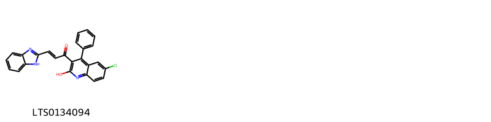{ width=100% }
<figcaption>Hình ảnh cấu trúc hóa học của hoạt chất thuộc nhóm *Quinolines and derivatives*. Tên thường gọi của các hoạt chất tương ứng là (2e)-3-(1h-1,3-benzodiazol-2-yl)-1-(6-chloro-2-hydroxy-4-phenylquinolin-3-yl)prop-2-en-1-one [(LTS0134094)](https://lotus.naturalproducts.net/compound/lotus_id/LTS0134094).</figcaption>
</figure>

            
            
### Nhóm 2-arylbenzofuran flavonoids
<figure markdown="span">
    { width=100% }
<figcaption>Hình ảnh cấu trúc hóa học của hoạt chất thuộc nhóm *2-arylbenzofuran flavonoids*. Tên thường gọi của các hoạt chất tương ứng là balanophonin [(LTS0039496)](https://lotus.naturalproducts.net/compound/lotus_id/LTS0039496), (2e)-3-[(2r,3s)-2-(4-hydroxy-3-methoxyphenyl)-3-(hydroxymethyl)-7-methoxy-2,3-dihydro-1-benzofuran-5-yl]prop-2-enal [(LTS0130349)](https://lotus.naturalproducts.net/compound/lotus_id/LTS0130349), 3-[2-(4-hydroxy-3-methoxyphenyl)-3-(hydroxymethyl)-7-methoxy-2,3-dihydro-1-benzofuran-5-yl]prop-2-enal [(LTS0233365)](https://lotus.naturalproducts.net/compound/lotus_id/LTS0233365).</figcaption>
</figure>

### Nhóm Anthracenes
<figure markdown="span">
    { width=100% }
<figcaption>Hình ảnh cấu trúc hóa học của hoạt chất thuộc nhóm *Anthracenes*. Tên thường gọi của các hoạt chất tương ứng là turkey rhubarb [(LTS0160968)](https://lotus.naturalproducts.net/compound/lotus_id/LTS0160968), emodin [(LTS0163480)](https://lotus.naturalproducts.net/compound/lotus_id/LTS0163480), physcion [(LTS0052688)](https://lotus.naturalproducts.net/compound/lotus_id/LTS0052688).</figcaption>
</figure>

### Nhóm Benzene and substituted derivatives
<figure markdown="span">
    { width=100% }
<figcaption>Hình ảnh cấu trúc hóa học của hoạt chất thuộc nhóm *Benzene and substituted derivatives*. Tên thường gọi của các hoạt chất tương ứng là lavendustin c [(LTS0195252)](https://lotus.naturalproducts.net/compound/lotus_id/LTS0195252), 4-biphenylaldehyde [(LTS0057438)](https://lotus.naturalproducts.net/compound/lotus_id/LTS0057438), methyl salicylate [(LTS0128373)](https://lotus.naturalproducts.net/compound/lotus_id/LTS0128373), [1,1'-biphenyl]-2-carbaldehyde [(LTS0064008)](https://lotus.naturalproducts.net/compound/lotus_id/LTS0064008).</figcaption>
</figure>

### Nhóm Benzopyrans
<figure markdown="span">
    { width=100% }
<figcaption>Hình ảnh cấu trúc hóa học của hoạt chất thuộc nhóm *Benzopyrans*. Tên thường gọi của các hoạt chất tương ứng là chromene-2,2,6-triol [(LTS0157870)](https://lotus.naturalproducts.net/compound/lotus_id/LTS0157870), 6-methoxychromene-2,2-diol [(LTS0121113)](https://lotus.naturalproducts.net/compound/lotus_id/LTS0121113).</figcaption>
</figure>

### Nhóm Carboxylic acids and derivatives
<figure markdown="span">
    { width=100% }
<figcaption>Hình ảnh cấu trúc hóa học của hoạt chất thuộc nhóm *Carboxylic acids and derivatives*. Tên thường gọi của các hoạt chất tương ứng là (1r,4r,4as,8ar)-4-methyl-7-methylidene-octahydro-1h-naphthalene-1-carboxylic acid [(LTS0270684)](https://lotus.naturalproducts.net/compound/lotus_id/LTS0270684), 2-(1-carboxy-n-{4-[(2s)-2-(carboxyamino)-2-({4-[3-hydroxy-2-(methoxycarbonyl)phenoxy]butyl}-c-hydroxycarbonimidoyl)ethyl]phenyl}formamido)benzoic acid [(LTS0150168)](https://lotus.naturalproducts.net/compound/lotus_id/LTS0150168), (4s)-3,3,6-trimethylhepta-1,5-dien-4-yl acetate [(LTS0130898)](https://lotus.naturalproducts.net/compound/lotus_id/LTS0130898), (1r,4r,4as,8s,8as)-8-(formyloxy)-4-methyl-7-methylidene-octahydro-1h-naphthalene-1-carboxylic acid [(LTS0030860)](https://lotus.naturalproducts.net/compound/lotus_id/LTS0030860), 3,3,6-trimethylhepta-1,5-dien-4-yl acetate [(LTS0244885)](https://lotus.naturalproducts.net/compound/lotus_id/LTS0244885), 8-(formyloxy)-4-methyl-7-methylidene-octahydro-1h-naphthalene-1-carboxylic acid [(LTS0057379)](https://lotus.naturalproducts.net/compound/lotus_id/LTS0057379), 4,13-dimethyl-8-methylidene-10,11-dioxatricyclo[7.4.1.0⁵,¹⁴]tetradecan-12-one [(LTS0135933)](https://lotus.naturalproducts.net/compound/lotus_id/LTS0135933), 4-methyl-7-methylidene-octahydro-1h-naphthalene-1-carboxylic acid [(LTS0005709)](https://lotus.naturalproducts.net/compound/lotus_id/LTS0005709).</figcaption>
</figure>

### Nhóm Cinnamaldehydes
<figure markdown="span">
    { width=100% }
<figcaption>Hình ảnh cấu trúc hóa học của hoạt chất thuộc nhóm *Cinnamaldehydes*. Tên thường gọi của các hoạt chất tương ứng là 2-[2-methoxy-4-(3-oxoprop-1-en-1-yl)phenoxy]prop-2-enal [(LTS0134665)](https://lotus.naturalproducts.net/compound/lotus_id/LTS0134665), 3-{4-[(1,3-dihydroxypropan-2-yl)oxy]-3-methoxyphenyl}prop-2-enal [(LTS0124815)](https://lotus.naturalproducts.net/compound/lotus_id/LTS0124815), 2-{2-methoxy-4-[(1e)-3-oxoprop-1-en-1-yl]phenoxy}prop-2-enal [(LTS0251744)](https://lotus.naturalproducts.net/compound/lotus_id/LTS0251744), 4-methoxycinnamaldehyde [(LTS0219729)](https://lotus.naturalproducts.net/compound/lotus_id/LTS0219729), (2e)-3-{4-[(1,3-dihydroxypropan-2-yl)oxy]-3-methoxyphenyl}prop-2-enal [(LTS0038781)](https://lotus.naturalproducts.net/compound/lotus_id/LTS0038781), 3-(4-methoxyphenyl)-2-propenal [(LTS0014262)](https://lotus.naturalproducts.net/compound/lotus_id/LTS0014262).</figcaption>
</figure>

### Nhóm Cinnamic acids and derivatives
<figure markdown="span">
    { width=100% }
<figcaption>Hình ảnh cấu trúc hóa học của hoạt chất thuộc nhóm *Cinnamic acids and derivatives*. Tên thường gọi của các hoạt chất tương ứng là para-coumaric acid [(LTS0266252)](https://lotus.naturalproducts.net/compound/lotus_id/LTS0266252).</figcaption>
</figure>

### Nhóm Coumarins and derivatives
<figure markdown="span">
    { width=100% }
<figcaption>Hình ảnh cấu trúc hóa học của hoạt chất thuộc nhóm *Coumarins and derivatives*. Tên thường gọi của các hoạt chất tương ứng là 2h-1-benzopyran-2-one [(LTS0069773)](https://lotus.naturalproducts.net/compound/lotus_id/LTS0069773), isofraxidin [(LTS0073081)](https://lotus.naturalproducts.net/compound/lotus_id/LTS0073081), scopoletin [(LTS0193112)](https://lotus.naturalproducts.net/compound/lotus_id/LTS0193112).</figcaption>
</figure>

### Nhóm Dihydrofurans
<figure markdown="span">
    { width=100% }
<figcaption>Hình ảnh cấu trúc hóa học của hoạt chất thuộc nhóm *Dihydrofurans*. Tên thường gọi của các hoạt chất tương ứng là (3r)-5-(2,5-dihydrofuran-3-yl)-2-methylpent-1-en-3-ol [(LTS0112627)](https://lotus.naturalproducts.net/compound/lotus_id/LTS0112627), 5-(2,5-dihydrofuran-3-yl)-2-methylpent-3-en-2-ol [(LTS0246689)](https://lotus.naturalproducts.net/compound/lotus_id/LTS0246689), (3e)-5-(2,5-dihydrofuran-3-yl)-2-methylpent-3-en-2-ol [(LTS0221588)](https://lotus.naturalproducts.net/compound/lotus_id/LTS0221588), 5-(2,5-dihydrofuran-3-yl)-2-methylpent-1-en-3-ol [(LTS0118643)](https://lotus.naturalproducts.net/compound/lotus_id/LTS0118643).</figcaption>
</figure>

### Nhóm Dioxolopyrans
<figure markdown="span">
    { width=100% }
<figcaption>Hình ảnh cấu trúc hóa học của hoạt chất thuộc nhóm *Dioxolopyrans*. Tên thường gọi của các hoạt chất tương ứng là 1,5,9-trimethyl-11,14,15-trioxatetracyclo[10.2.1.0⁴,¹³.0⁸,¹³]pentadecan-10-one [(LTS0198939)](https://lotus.naturalproducts.net/compound/lotus_id/LTS0198939), (4s,5r,8s,9r,12s,13r)-1,5,9-trimethyl-11,14,15-trioxatetracyclo[10.2.1.0⁴,¹³.0⁸,¹³]pentadecan-10-one [(LTS0215855)](https://lotus.naturalproducts.net/compound/lotus_id/LTS0215855), 2-deoxyartemisinin [(LTS0090782)](https://lotus.naturalproducts.net/compound/lotus_id/LTS0090782), 2-hydroxy-1,5,9-trimethyl-11,14,15-trioxatetracyclo[10.2.1.0⁴,¹³.0⁸,¹³]pentadecan-10-one [(LTS0211892)](https://lotus.naturalproducts.net/compound/lotus_id/LTS0211892), (1s,2r,4s,5r,8s,9r,12s,13r)-2-hydroxy-1,5,9-trimethyl-11,14,15-trioxatetracyclo[10.2.1.0⁴,¹³.0⁸,¹³]pentadecan-10-one [(LTS0099364)](https://lotus.naturalproducts.net/compound/lotus_id/LTS0099364).</figcaption>
</figure>

### Nhóm Epoxides
<figure markdown="span">
    { width=100% }
<figcaption>Hình ảnh cấu trúc hóa học của hoạt chất thuộc nhóm *Epoxides*. Tên thường gọi của các hoạt chất tương ứng là (1r,3e,7e,11r)-1,5,5,7-tetramethyl-12-oxabicyclo[9.1.0]dodeca-3,7-diene [(LTS0027633)](https://lotus.naturalproducts.net/compound/lotus_id/LTS0027633).</figcaption>
</figure>

### Nhóm Fatty Acyls
<figure markdown="span">
    { width=100% }
<figcaption>Hình ảnh cấu trúc hóa học của hoạt chất thuộc nhóm *Fatty Acyls*. Tên thường gọi của các hoạt chất tương ứng là (2r,4r)-5-methyl-2-(prop-1-en-2-yl)hex-5-ene-1,4-diol [(LTS0112418)](https://lotus.naturalproducts.net/compound/lotus_id/LTS0112418), 5-methyl-2-(prop-1-en-2-yl)hex-3-ene-1,5-diol [(LTS0057789)](https://lotus.naturalproducts.net/compound/lotus_id/LTS0057789), ethyl (2r)-2-methylbutanoate [(LTS0233405)](https://lotus.naturalproducts.net/compound/lotus_id/LTS0233405), 5-methyl-2-(prop-1-en-2-yl)hex-5-ene-1,4-diol [(LTS0208964)](https://lotus.naturalproducts.net/compound/lotus_id/LTS0208964), hexyl (2e)-2-methylbut-2-enoate [(LTS0082952)](https://lotus.naturalproducts.net/compound/lotus_id/LTS0082952), (2s,3e)-5-methyl-2-(prop-1-en-2-yl)hex-3-ene-1,5-diol [(LTS0103356)](https://lotus.naturalproducts.net/compound/lotus_id/LTS0103356), cis-3-hexenyl isovalerate [(LTS0181676)](https://lotus.naturalproducts.net/compound/lotus_id/LTS0181676), cis-3-hexenol [(LTS0132156)](https://lotus.naturalproducts.net/compound/lotus_id/LTS0132156), 9-decen-1-ol [(LTS0161213)](https://lotus.naturalproducts.net/compound/lotus_id/LTS0161213), ceryl alcohol [(LTS0140051)](https://lotus.naturalproducts.net/compound/lotus_id/LTS0140051), methyl palmitate [(LTS0139222)](https://lotus.naturalproducts.net/compound/lotus_id/LTS0139222), oct-1-en-3s-ol [(LTS0173025)](https://lotus.naturalproducts.net/compound/lotus_id/LTS0173025), methyl stearate [(LTS0221686)](https://lotus.naturalproducts.net/compound/lotus_id/LTS0221686), hexanol [(LTS0217299)](https://lotus.naturalproducts.net/compound/lotus_id/LTS0217299), hexyl (2s)-2-methylbutanoate [(LTS0164349)](https://lotus.naturalproducts.net/compound/lotus_id/LTS0164349), nonacosanol [(LTS0205992)](https://lotus.naturalproducts.net/compound/lotus_id/LTS0205992), octacosanol [(LTS0049071)](https://lotus.naturalproducts.net/compound/lotus_id/LTS0049071), 1-octen-3-ol [(LTS0057101)](https://lotus.naturalproducts.net/compound/lotus_id/LTS0057101), (3z)-hex-3-en-1-yl (2r)-2-methylbutanoate [(LTS0005286)](https://lotus.naturalproducts.net/compound/lotus_id/LTS0005286).</figcaption>
</figure>

### Nhóm Flavonoids
<figure markdown="span">
    { width=100% }
<figcaption>Hình ảnh cấu trúc hóa học của hoạt chất thuộc nhóm *Flavonoids*. Tên thường gọi của các hoạt chất tương ứng là quercetin [(LTS0004651)](https://lotus.naturalproducts.net/compound/lotus_id/LTS0004651), 3-rutinosyl quercetin [(LTS0032845)](https://lotus.naturalproducts.net/compound/lotus_id/LTS0032845), eupatorin [(LTS0073269)](https://lotus.naturalproducts.net/compound/lotus_id/LTS0073269), bonanzin [(LTS0123079)](https://lotus.naturalproducts.net/compound/lotus_id/LTS0123079), (2r)-2-(2,4-dihydroxyphenyl)-5-hydroxy-6,7-dimethoxy-2,3-dihydro-1-benzopyran-4-one [(LTS0238093)](https://lotus.naturalproducts.net/compound/lotus_id/LTS0238093), chrysoeriol [(LTS0095766)](https://lotus.naturalproducts.net/compound/lotus_id/LTS0095766), penduletin [(LTS0080627)](https://lotus.naturalproducts.net/compound/lotus_id/LTS0080627), 5,7,8-trihydroxy-2-(3-hydroxy-4-methoxyphenyl)-3-methoxy-2,3-dihydro-1-benzopyran-4-one [(LTS0072712)](https://lotus.naturalproducts.net/compound/lotus_id/LTS0072712), 3,5,7-trihydroxy-2-(4-hydroxy-3-{[(2s,3r,4s,5s,6r)-3,4,5-trihydroxy-6-(hydroxymethyl)oxan-2-yl]oxy}phenyl)chromen-4-one [(LTS0094454)](https://lotus.naturalproducts.net/compound/lotus_id/LTS0094454), 2-(3,4-dihydroxyphenyl)-5,7-dihydroxy-3-{[3,4,5-trihydroxy-6-(hydroxymethyl)oxan-2-yl]oxy}chromen-4-one [(LTS0195312)](https://lotus.naturalproducts.net/compound/lotus_id/LTS0195312), patuletin [(LTS0104633)](https://lotus.naturalproducts.net/compound/lotus_id/LTS0104633), chamomile [(LTS0104946)](https://lotus.naturalproducts.net/compound/lotus_id/LTS0104946), luteolin 7-methyl ether [(LTS0259993)](https://lotus.naturalproducts.net/compound/lotus_id/LTS0259993), 2-(2,4-dihydroxyphenyl)-5-hydroxy-6,7-dimethoxy-2,3-dihydro-1-benzopyran-4-one [(LTS0108962)](https://lotus.naturalproducts.net/compound/lotus_id/LTS0108962), quercimeritrin [(LTS0188893)](https://lotus.naturalproducts.net/compound/lotus_id/LTS0188893), artemetin [(LTS0265682)](https://lotus.naturalproducts.net/compound/lotus_id/LTS0265682), cirsimaritin [(LTS0146305)](https://lotus.naturalproducts.net/compound/lotus_id/LTS0146305), 2-(3,4-dihydroxyphenyl)-5-hydroxy-7-{[3,4,5-trihydroxy-6-(hydroxymethyl)oxan-2-yl]oxy}chromen-4-one [(LTS0158292)](https://lotus.naturalproducts.net/compound/lotus_id/LTS0158292), cirsilineol [(LTS0092903)](https://lotus.naturalproducts.net/compound/lotus_id/LTS0092903), isorhamnetin [(LTS0107505)](https://lotus.naturalproducts.net/compound/lotus_id/LTS0107505), eupalitin [(LTS0255198)](https://lotus.naturalproducts.net/compound/lotus_id/LTS0255198), kaempherol [(LTS0155822)](https://lotus.naturalproducts.net/compound/lotus_id/LTS0155822), isoquercetin [(LTS0254337)](https://lotus.naturalproducts.net/compound/lotus_id/LTS0254337), trifolin [(LTS0267055)](https://lotus.naturalproducts.net/compound/lotus_id/LTS0267055), quercimeritrin [(LTS0043461)](https://lotus.naturalproducts.net/compound/lotus_id/LTS0043461), chrysosplenol c [(LTS0217158)](https://lotus.naturalproducts.net/compound/lotus_id/LTS0217158), chrysosplenetin [(LTS0202772)](https://lotus.naturalproducts.net/compound/lotus_id/LTS0202772), casticin [(LTS0071783)](https://lotus.naturalproducts.net/compound/lotus_id/LTS0071783), quercetagetin 3-methyl ether [(LTS0212838)](https://lotus.naturalproducts.net/compound/lotus_id/LTS0212838), cirsiliol [(LTS0070414)](https://lotus.naturalproducts.net/compound/lotus_id/LTS0070414), 2-(3,4-dihydroxyphenyl)-5,7-dihydroxy-3-{[(2s,3r,4r,5r,6s)-3,4,5-trihydroxy-6-(hydroxymethyl)oxan-2-yl]oxy}chromen-4-one [(LTS0241372)](https://lotus.naturalproducts.net/compound/lotus_id/LTS0241372), retusin [(LTS0236094)](https://lotus.naturalproducts.net/compound/lotus_id/LTS0236094), arcapillin [(LTS0002317)](https://lotus.naturalproducts.net/compound/lotus_id/LTS0002317), 2-(3,4-dimethoxyphenyl)-3,5-dihydroxy-6,7-dimethoxychromen-4-one [(LTS0179185)](https://lotus.naturalproducts.net/compound/lotus_id/LTS0179185), 2-(3,4-dimethoxyphenyl)-5-hydroxy-6,7-dimethoxychromen-4-one [(LTS0032351)](https://lotus.naturalproducts.net/compound/lotus_id/LTS0032351), luteolin 7-o-glucoside [(LTS0227450)](https://lotus.naturalproducts.net/compound/lotus_id/LTS0227450), rhamnocitrin [(LTS0198024)](https://lotus.naturalproducts.net/compound/lotus_id/LTS0198024), astragalin [(LTS0249588)](https://lotus.naturalproducts.net/compound/lotus_id/LTS0249588), chrysosplenol d [(LTS0188255)](https://lotus.naturalproducts.net/compound/lotus_id/LTS0188255), quercetagetin 4'-methyl ether [(LTS0048116)](https://lotus.naturalproducts.net/compound/lotus_id/LTS0048116), tamarixetin [(LTS0258243)](https://lotus.naturalproducts.net/compound/lotus_id/LTS0258243), quercetin 3-methyl ether [(LTS0194170)](https://lotus.naturalproducts.net/compound/lotus_id/LTS0194170), (2s,3r)-5,7,8-trihydroxy-2-(3-hydroxy-4-methoxyphenyl)-3-methoxy-2,3-dihydro-1-benzopyran-4-one [(LTS0244620)](https://lotus.naturalproducts.net/compound/lotus_id/LTS0244620), axillarin [(LTS0067813)](https://lotus.naturalproducts.net/compound/lotus_id/LTS0067813), 2-(3,4-dihydroxyphenyl)-5,7-dihydroxy-6-methoxy-3-{[3,4,5-trihydroxy-6-(hydroxymethyl)oxan-2-yl]oxy}chromen-4-one [(LTS0010167)](https://lotus.naturalproducts.net/compound/lotus_id/LTS0010167), isokaempferide [(LTS0011732)](https://lotus.naturalproducts.net/compound/lotus_id/LTS0011732), luteolin [(LTS0017052)](https://lotus.naturalproducts.net/compound/lotus_id/LTS0017052), pachypodol [(LTS0093471)](https://lotus.naturalproducts.net/compound/lotus_id/LTS0093471), 5,6,7-trihydroxy-2-(3-hydroxy-4-methoxyphenyl)-3-methoxychromen-4-one [(LTS0217584)](https://lotus.naturalproducts.net/compound/lotus_id/LTS0217584), quercimeritrin [(LTS0208490)](https://lotus.naturalproducts.net/compound/lotus_id/LTS0208490), 3,5,7-trihydroxy-2-(4-hydroxy-3-{[3,4,5-trihydroxy-6-(hydroxymethyl)oxan-2-yl]oxy}phenyl)chromen-4-one [(LTS0105577)](https://lotus.naturalproducts.net/compound/lotus_id/LTS0105577), tomentin [(LTS0028795)](https://lotus.naturalproducts.net/compound/lotus_id/LTS0028795).</figcaption>
</figure>

### Nhóm Imidazopyrimidines
<figure markdown="span">
    { width=100% }
<figcaption>Hình ảnh cấu trúc hóa học của hoạt chất thuộc nhóm *Imidazopyrimidines*. Tên thường gọi của các hoạt chất tương ứng là zeatine [(LTS0032706)](https://lotus.naturalproducts.net/compound/lotus_id/LTS0032706).</figcaption>
</figure>

### Nhóm Indoles and derivatives
<figure markdown="span">
    { width=100% }
<figcaption>Hình ảnh cấu trúc hóa học của hoạt chất thuộc nhóm *Indoles and derivatives*. Tên thường gọi của các hoạt chất tương ứng là n-[2-(5-methoxy-1h-indol-3-yl)ethyl]ethanimidic acid [(LTS0219322)](https://lotus.naturalproducts.net/compound/lotus_id/LTS0219322).</figcaption>
</figure>

### Nhóm Lactones
<figure markdown="span">
    { width=100% }
<figcaption>Hình ảnh cấu trúc hóa học của hoạt chất thuộc nhóm *Lactones*. Tên thường gọi của các hoạt chất tương ứng là (1s,5r,8r,9s,13s)-8,12-dimethyl-4-methylidene-2-oxatricyclo[7.3.1.0⁵,¹³]tridec-11-en-3-one [(LTS0107775)](https://lotus.naturalproducts.net/compound/lotus_id/LTS0107775), (1r,5s,8s,9r,13r)-8,12-dimethyl-4-methylidene-2-oxatricyclo[7.3.1.0⁵,¹³]tridec-11-en-3-one [(LTS0070167)](https://lotus.naturalproducts.net/compound/lotus_id/LTS0070167), (1s,4r,5r,8r,9s,13s)-4,8-dimethyl-12-methylidene-2-oxatricyclo[7.3.1.0⁵,¹³]tridecan-3-one [(LTS0069926)](https://lotus.naturalproducts.net/compound/lotus_id/LTS0069926), (1r,4r,7r,8s,12r)-7-methyl-11-methylidene-2-oxatricyclo[6.3.1.0⁴,¹²]dodecan-3-one [(LTS0188899)](https://lotus.naturalproducts.net/compound/lotus_id/LTS0188899), 4,8,12-trimethyl-2-oxatricyclo[7.3.1.0⁵,¹³]tridec-11-en-3-one [(LTS0019112)](https://lotus.naturalproducts.net/compound/lotus_id/LTS0019112), 8-methyl-4,12-dimethylidene-2-oxatricyclo[7.3.1.0⁵,¹³]tridecan-3-one [(LTS0149475)](https://lotus.naturalproducts.net/compound/lotus_id/LTS0149475), (1r,5s,6r,9s,10r,13s)-6,10-dimethyl-11-oxo-2,12-dioxatricyclo[7.4.0.0¹,⁵]tridecan-13-yl acetate [(LTS0148990)](https://lotus.naturalproducts.net/compound/lotus_id/LTS0148990), (3s,3as,6s,9s,9bs)-6,9-dihydroxy-3,6,9-trimethyl-3h,3ah,4h,5h,8h,9bh-azuleno[4,5-b]furan-2,7-dione [(LTS0148949)](https://lotus.naturalproducts.net/compound/lotus_id/LTS0148949), 7-methyl-11-methylidene-2-oxatricyclo[6.3.1.0⁴,¹²]dodecan-3-one [(LTS0190498)](https://lotus.naturalproducts.net/compound/lotus_id/LTS0190498), artabsin [(LTS0162316)](https://lotus.naturalproducts.net/compound/lotus_id/LTS0162316), matricin [(LTS0168849)](https://lotus.naturalproducts.net/compound/lotus_id/LTS0168849), (1s,4r,5r,8r,9s,13s)-4,8,12-trimethyl-2-oxatricyclo[7.3.1.0⁵,¹³]tridec-11-en-3-one [(LTS0191104)](https://lotus.naturalproducts.net/compound/lotus_id/LTS0191104), (1s,5r,8r,9s,13s)-8-methyl-4,12-dimethylidene-2-oxatricyclo[7.3.1.0⁵,¹³]tridecan-3-one [(LTS0266131)](https://lotus.naturalproducts.net/compound/lotus_id/LTS0266131), 6,10-dimethyl-11-oxo-2,12-dioxatricyclo[7.4.0.0¹,⁵]tridecan-13-yl acetate [(LTS0270413)](https://lotus.naturalproducts.net/compound/lotus_id/LTS0270413), 8,12-dimethyl-4-methylidene-2-oxatricyclo[7.3.1.0⁵,¹³]tridec-11-en-3-one [(LTS0239249)](https://lotus.naturalproducts.net/compound/lotus_id/LTS0239249), (3s,3as,6s,9r,9bs)-6,9-dihydroxy-3,6,9-trimethyl-3h,3ah,4h,5h,8h,9bh-azuleno[4,5-b]furan-2,7-dione [(LTS0169132)](https://lotus.naturalproducts.net/compound/lotus_id/LTS0169132), (1r,4r,7r,8s,12r)-7,11-dimethyl-2-oxatricyclo[6.3.1.0⁴,¹²]dodec-10-en-3-one [(LTS0055054)](https://lotus.naturalproducts.net/compound/lotus_id/LTS0055054), 7,11-dimethyl-2-oxatricyclo[6.3.1.0⁴,¹²]dodec-10-en-3-one [(LTS0075194)](https://lotus.naturalproducts.net/compound/lotus_id/LTS0075194), 4,8-dimethyl-12-methylidene-2-oxatricyclo[7.3.1.0⁵,¹³]tridecan-3-one [(LTS0047434)](https://lotus.naturalproducts.net/compound/lotus_id/LTS0047434).</figcaption>
</figure>

### Nhóm Organooxygen compounds
<figure markdown="span">
    { width=100% }
<figcaption>Hình ảnh cấu trúc hóa học của hoạt chất thuộc nhóm *Organooxygen compounds*. Tên thường gọi của các hoạt chất tương ứng là octanal [(LTS0055983)](https://lotus.naturalproducts.net/compound/lotus_id/LTS0055983), 1-(2-hydroxy-6-methoxy-4-{[3,4,5-trihydroxy-6-(hydroxymethyl)oxan-2-yl]oxy}phenyl)ethanone [(LTS0038662)](https://lotus.naturalproducts.net/compound/lotus_id/LTS0038662), xanthoxylin [(LTS0150432)](https://lotus.naturalproducts.net/compound/lotus_id/LTS0150432), isoartemisia ketone [(LTS0154009)](https://lotus.naturalproducts.net/compound/lotus_id/LTS0154009), 1-(2-hydroxy-6-methoxy-4-{[(2s,3r,4s,5s,6r)-3,4,5-trihydroxy-6-(hydroxymethyl)oxan-2-yl]oxy}phenyl)ethanone [(LTS0179806)](https://lotus.naturalproducts.net/compound/lotus_id/LTS0179806), (1r,4r,4as,8s,8as)-8-hydroxy-4-methyl-7-methylidene-octahydro-1h-naphthalene-1-carboxylic acid [(LTS0254124)](https://lotus.naturalproducts.net/compound/lotus_id/LTS0254124), jasmone [(LTS0205512)](https://lotus.naturalproducts.net/compound/lotus_id/LTS0205512), 3,3,6-trimethylhepta-1,5-dien-4-ol [(LTS0238559)](https://lotus.naturalproducts.net/compound/lotus_id/LTS0238559), (3s)-3-ethenyl-2,5-dimethylhex-4-en-2-ol [(LTS0039165)](https://lotus.naturalproducts.net/compound/lotus_id/LTS0039165), 8-hydroxy-4-methyl-7-methylidene-octahydro-1h-naphthalene-1-carboxylic acid [(LTS0078747)](https://lotus.naturalproducts.net/compound/lotus_id/LTS0078747), tricosan-2-one [(LTS0031212)](https://lotus.naturalproducts.net/compound/lotus_id/LTS0031212).</figcaption>
</figure>

### Nhóm Oxacyclic compounds
<figure markdown="span">
    { width=100% }
<figcaption>Hình ảnh cấu trúc hóa học của hoạt chất thuộc nhóm *Oxacyclic compounds*. Tên thường gọi của các hoạt chất tương ứng là (1r,4r,5s,9s,13r,14s)-4,13-dimethyl-8-methylidene-10,11-dioxatricyclo[7.4.1.0⁵,¹⁴]tetradecan-12-one [(LTS0229266)](https://lotus.naturalproducts.net/compound/lotus_id/LTS0229266).</figcaption>
</figure>

### Nhóm Oxanes
<figure markdown="span">
    { width=100% }
<figcaption>Hình ảnh cấu trúc hóa học của hoạt chất thuộc nhóm *Oxanes*. Tên thường gọi của các hoạt chất tương ứng là 1,8-cineole [(LTS0166505)](https://lotus.naturalproducts.net/compound/lotus_id/LTS0166505), eucalyptol [(LTS0051374)](https://lotus.naturalproducts.net/compound/lotus_id/LTS0051374).</figcaption>
</figure>

### Nhóm Oxepanes
<figure markdown="span">
    { width=100% }
<figcaption>Hình ảnh cấu trúc hóa học của hoạt chất thuộc nhóm *Oxepanes*. Tên thường gọi của các hoạt chất tương ứng là 1-{2-hydroxy-1a,4-dimethyl-hexahydro-2h-indeno[4,5-b]oxiren-6a-yl}-2-methylpropan-1-one [(LTS0040133)](https://lotus.naturalproducts.net/compound/lotus_id/LTS0040133), (1r,5s,8r,9s,12r,14r)-8,12-dimethyl-4-methylidene-2,13-dioxatetracyclo[7.5.0.0¹,⁵.0¹²,¹⁴]tetradecane [(LTS0172443)](https://lotus.naturalproducts.net/compound/lotus_id/LTS0172443), 1-[(1ar,2r,3as,4r,6as,6bs)-2-hydroxy-1a,4-dimethyl-hexahydro-2h-indeno[4,5-b]oxiren-6a-yl]-2-methylpropan-1-one [(LTS0125198)](https://lotus.naturalproducts.net/compound/lotus_id/LTS0125198), 8,12-dimethyl-4-methylidene-2,13-dioxatetracyclo[7.5.0.0¹,⁵.0¹²,¹⁴]tetradecane [(LTS0245892)](https://lotus.naturalproducts.net/compound/lotus_id/LTS0245892).</figcaption>
</figure>

### Nhóm Phenol ethers
<figure markdown="span">
    { width=100% }
<figcaption>Hình ảnh cấu trúc hóa học của hoạt chất thuộc nhóm *Phenol ethers*. Tên thường gọi của các hoạt chất tương ứng là anethole [(LTS0033696)](https://lotus.naturalproducts.net/compound/lotus_id/LTS0033696).</figcaption>
</figure>

### Nhóm Phenols
<figure markdown="span">
    { width=100% }
<figcaption>Hình ảnh cấu trúc hóa học của hoạt chất thuộc nhóm *Phenols*. Tên thường gọi của các hoạt chất tương ứng là vanillin [(LTS0136163)](https://lotus.naturalproducts.net/compound/lotus_id/LTS0136163), eugenol [(LTS0052342)](https://lotus.naturalproducts.net/compound/lotus_id/LTS0052342), coniferyl aldehyde [(LTS0140691)](https://lotus.naturalproducts.net/compound/lotus_id/LTS0140691), 5-nonadecylbenzene-1,3-diol [(LTS0268622)](https://lotus.naturalproducts.net/compound/lotus_id/LTS0268622), coniferaldehyde [(LTS0009773)](https://lotus.naturalproducts.net/compound/lotus_id/LTS0009773).</figcaption>
</figure>

### Nhóm Prenol lipids
<figure markdown="span">
    { width=100% }
<figcaption>Hình ảnh cấu trúc hóa học của hoạt chất thuộc nhóm *Prenol lipids*. Tên thường gọi của các hoạt chất tương ứng là (-)-germacrene d [(LTS0059194)](https://lotus.naturalproducts.net/compound/lotus_id/LTS0059194), 8-isopropyl-1-methyl-5-methylidenecyclodeca-1,6-diene [(LTS0018398)](https://lotus.naturalproducts.net/compound/lotus_id/LTS0018398), α-myrcene [(LTS0115731)](https://lotus.naturalproducts.net/compound/lotus_id/LTS0115731), terpinolene [(LTS0104525)](https://lotus.naturalproducts.net/compound/lotus_id/LTS0104525), cymene [(LTS0181568)](https://lotus.naturalproducts.net/compound/lotus_id/LTS0181568), α pinene [(LTS0132416)](https://lotus.naturalproducts.net/compound/lotus_id/LTS0132416), phellandrene [(LTS0157173)](https://lotus.naturalproducts.net/compound/lotus_id/LTS0157173), caryophyllene [(LTS0085212)](https://lotus.naturalproducts.net/compound/lotus_id/LTS0085212), thymol [(LTS0168527)](https://lotus.naturalproducts.net/compound/lotus_id/LTS0168527), carvacrol [(LTS0012882)](https://lotus.naturalproducts.net/compound/lotus_id/LTS0012882), (7ar)-1,1,7-trimethyl-4-methylidene-octahydrocyclopropa[e]azulen-7-ol [(LTS0091612)](https://lotus.naturalproducts.net/compound/lotus_id/LTS0091612), 4,11,11-trimethyl-8-methylidenebicyclo[7.2.0]undec-4-ene [(LTS0256716)](https://lotus.naturalproducts.net/compound/lotus_id/LTS0256716), terpineol [(LTS0136148)](https://lotus.naturalproducts.net/compound/lotus_id/LTS0136148), 4-hydroxy-7-isopropyl-4-methyl-octahydroindene-1-carboxylic acid [(LTS0130204)](https://lotus.naturalproducts.net/compound/lotus_id/LTS0130204), (2r,4ar,5r,8r,8as)-5-hydroxy-5-isopropyl-3,8-dimethyl-2,4a,6,7,8,8a-hexahydro-1h-naphthalen-2-yl acetate [(LTS0128840)](https://lotus.naturalproducts.net/compound/lotus_id/LTS0128840), (2z)-6-methylidene-2-(4-methylpent-3-en-1-yl)octa-2,7-dien-1-yl acetate [(LTS0200841)](https://lotus.naturalproducts.net/compound/lotus_id/LTS0200841), vulgarin [(LTS0062007)](https://lotus.naturalproducts.net/compound/lotus_id/LTS0062007), 4,8,12-trimethyl-2,13-dioxatetracyclo[7.5.0.0¹,⁵.0¹²,¹⁴]tetradecan-3-one [(LTS0130101)](https://lotus.naturalproducts.net/compound/lotus_id/LTS0130101), (3r,3as,6r,6as,9s,10r,10as)-9,10-dihydroxy-3,6,9-trimethyl-octahydro-3h-naphtho[4a,4-b]furan-2-one [(LTS0132739)](https://lotus.naturalproducts.net/compound/lotus_id/LTS0132739), epi-friedelanol [(LTS0114491)](https://lotus.naturalproducts.net/compound/lotus_id/LTS0114491), farnesene [(LTS0057150)](https://lotus.naturalproducts.net/compound/lotus_id/LTS0057150), (1ar,3as,7bs)-1,1,3a,7-tetramethyl-1ah,2h,3h,4h,5h,6h,7bh-cyclopropa[a]naphthalene [(LTS0064435)](https://lotus.naturalproducts.net/compound/lotus_id/LTS0064435), β-amyrin [(LTS0075776)](https://lotus.naturalproducts.net/compound/lotus_id/LTS0075776), 2-[(4r,4as)-4,7-dimethyl-2,3,4,4a,5,6-hexahydronaphthalen-1-yl]prop-2-enoic acid [(LTS0128139)](https://lotus.naturalproducts.net/compound/lotus_id/LTS0128139), 6-methylidene-2-(4-methylpent-3-en-1-yl)octa-2,7-dien-1-yl acetate [(LTS0137154)](https://lotus.naturalproducts.net/compound/lotus_id/LTS0137154), 2-[(1ar,3as,4r,7r,7as,7bs)-1a,4-dimethyl-octahydro-2h-naphtho[1,2-b]oxiren-7-yl]prop-2-enoic acid [(LTS0203123)](https://lotus.naturalproducts.net/compound/lotus_id/LTS0203123), (6e)-3,7,11-trimethyldodeca-1,6,10-trien-3-yl acetate [(LTS0193692)](https://lotus.naturalproducts.net/compound/lotus_id/LTS0193692), (2r)-2-[(1s,3s,4r)-4-methyl-2-oxo-3-(3-oxobutyl)cyclohexyl]propanoic acid [(LTS0236993)](https://lotus.naturalproducts.net/compound/lotus_id/LTS0236993), myrtenol [(LTS0130529)](https://lotus.naturalproducts.net/compound/lotus_id/LTS0130529), (6ar,6bs,8ar,11r,12s,12ar,14br)-4,4,6a,6b,8a,11,12,14b-octamethyl-1,2,4a,5,6,7,8,9,10,11,12,12a,14,14a-tetradecahydropicen-3-one [(LTS0125709)](https://lotus.naturalproducts.net/compound/lotus_id/LTS0125709), anabsinthin [(LTS0075454)](https://lotus.naturalproducts.net/compound/lotus_id/LTS0075454), (1s,2r,4r,6s)-1,7,7-trimethyltricyclo[2.2.1.0²,⁶]heptane [(LTS0080510)](https://lotus.naturalproducts.net/compound/lotus_id/LTS0080510), 4-ethenyl-1-isopropyl-4-methyl-3-(prop-1-en-2-yl)cyclohex-1-ene [(LTS0080134)](https://lotus.naturalproducts.net/compound/lotus_id/LTS0080134), (2r)-2-[(1s,3s,4r)-4-methyl-2-oxo-3-(3-oxobutyl)cyclohexyl]propyl formate [(LTS0064098)](https://lotus.naturalproducts.net/compound/lotus_id/LTS0064098), (1r,2r,7s,8r)-2,6,6-trimethyl-9-methylidenetricyclo[5.4.0.0²,⁸]undecane [(LTS0080386)](https://lotus.naturalproducts.net/compound/lotus_id/LTS0080386), linalool, (+-)- [(LTS0128839)](https://lotus.naturalproducts.net/compound/lotus_id/LTS0128839), (3as,6r,6as,10ar)-6,9-dimethyl-3-methylidene-3ah,4h,5h,6h,6ah,7h,8h-naphtho[4a,4-b]furan-2-one [(LTS0082478)](https://lotus.naturalproducts.net/compound/lotus_id/LTS0082478), (2r)-6-methyl-2-[(1r)-4-methylcyclohex-3-en-1-yl]hept-5-en-2-ol [(LTS0087338)](https://lotus.naturalproducts.net/compound/lotus_id/LTS0087338), artemorin [(LTS0070726)](https://lotus.naturalproducts.net/compound/lotus_id/LTS0070726), amyrin [(LTS0222826)](https://lotus.naturalproducts.net/compound/lotus_id/LTS0222826), (1s,2r,5s,8s,9s,12s,13r,14r,15r,16r,17s,19s,22s,23s,26s,27r)-12,16-dihydroxy-3,8,12,17,19,23-hexamethyl-6,18,25-trioxaoctacyclo[13.11.1.0¹,¹⁷.0²,¹⁴.0⁴,¹³.0⁵,⁹.0¹⁹,²⁷.0²²,²⁶]heptacos-3-ene-7,24-dione [(LTS0070691)](https://lotus.naturalproducts.net/compound/lotus_id/LTS0070691), (3s,4ar,6ar,6bs,8ar,12as,14ar,14br)-4,4,6a,6b,8a,11,11,14b-octamethyl-1,2,3,4a,5,6,7,8,9,10,12,12a,14,14a-tetradecahydropicen-3-yl acetate [(LTS0085387)](https://lotus.naturalproducts.net/compound/lotus_id/LTS0085387), 3-methyl-4-(1,4,6-trimethyl-2-oxocyclohept-3-en-1-yl)but-2-enoic acid [(LTS0032926)](https://lotus.naturalproducts.net/compound/lotus_id/LTS0032926), 2-[2-formyl-4-methyl-3-(3-oxobutyl)cyclohexyl]prop-2-enoic acid [(LTS0100905)](https://lotus.naturalproducts.net/compound/lotus_id/LTS0100905), (1r,2e,6z,9e)-3,7,11,11-tetramethylcycloundeca-2,6,9-trien-1-ol [(LTS0010188)](https://lotus.naturalproducts.net/compound/lotus_id/LTS0010188), (+)-absinthin [(LTS0187528)](https://lotus.naturalproducts.net/compound/lotus_id/LTS0187528), (+)-cis-sabinol [(LTS0081558)](https://lotus.naturalproducts.net/compound/lotus_id/LTS0081558), caryophyllene oxide [(LTS0159789)](https://lotus.naturalproducts.net/compound/lotus_id/LTS0159789), α-humulene [(LTS0076944)](https://lotus.naturalproducts.net/compound/lotus_id/LTS0076944), guaiene [(LTS0039431)](https://lotus.naturalproducts.net/compound/lotus_id/LTS0039431), (1s,2s,4ar,5r,8as)-2-isopropyl-4a-methyl-8-methylidene-octahydronaphthalene-1,5-diol [(LTS0071183)](https://lotus.naturalproducts.net/compound/lotus_id/LTS0071183), 6-isopropyl-8a-methyl-4-methylidene-1,2,3,4a,5,8-hexahydronaphthalen-1-ol [(LTS0097356)](https://lotus.naturalproducts.net/compound/lotus_id/LTS0097356), (1s,5r,9r)-10,10-dimethyl-2,6-dimethylidenebicyclo[7.2.0]undecan-5-ol [(LTS0065243)](https://lotus.naturalproducts.net/compound/lotus_id/LTS0065243), 2-(4,7-dimethyl-8-oxo-2,3,4,4a,5,8a-hexahydro-1h-naphthalen-1-yl)propanoic acid [(LTS0110166)](https://lotus.naturalproducts.net/compound/lotus_id/LTS0110166), (+)-borneol [(LTS0189059)](https://lotus.naturalproducts.net/compound/lotus_id/LTS0189059), (2r)-2-[(1r,4r,4as,8as)-4,7-dimethyl-8-oxo-2,3,4,4a,5,8a-hexahydro-1h-naphthalen-1-yl]propanoic acid [(LTS0028902)](https://lotus.naturalproducts.net/compound/lotus_id/LTS0028902), phytol [(LTS0096073)](https://lotus.naturalproducts.net/compound/lotus_id/LTS0096073), (3as,6as,9r,10as)-9,10-dihydroxy-3,6,9-trimethyl-octahydro-3h-naphtho[4a,4-b]furan-2-one [(LTS0027371)](https://lotus.naturalproducts.net/compound/lotus_id/LTS0027371), (1s,2s,5r,8r)-2,5,8-trimethyl-6-methylidenetricyclo[6.3.0.0¹,⁵]undecane [(LTS0045069)](https://lotus.naturalproducts.net/compound/lotus_id/LTS0045069), β-selinene [(LTS0096341)](https://lotus.naturalproducts.net/compound/lotus_id/LTS0096341), camphor [(LTS0091905)](https://lotus.naturalproducts.net/compound/lotus_id/LTS0091905), (3r,3as,6r,6as,10r,10as)-10-hydroxy-3,6,9-trimethyl-3h,3ah,4h,5h,6h,6ah,7h,10h-naphtho[4a,4-b]furan-2-one [(LTS0042443)](https://lotus.naturalproducts.net/compound/lotus_id/LTS0042443), (-)-α-pinene [(LTS0032699)](https://lotus.naturalproducts.net/compound/lotus_id/LTS0032699), 2-(7-hydroperoxy-4,7-dimethyl-2,3,4,4a,5,6-hexahydro-1h-naphthalen-1-yl)propanoic acid [(LTS0196212)](https://lotus.naturalproducts.net/compound/lotus_id/LTS0196212), 2-(4,7-dimethyl-3,4,4a,5,6,8a-hexahydro-2h-naphthalen-1-ylidene)propanal [(LTS0119584)](https://lotus.naturalproducts.net/compound/lotus_id/LTS0119584), trans-β-ocimene [(LTS0049765)](https://lotus.naturalproducts.net/compound/lotus_id/LTS0049765), (3ar,6s,6ar,10as)-6,9-dimethyl-3-methylidene-3ah,4h,5h,6h,6ah,7h,8h-naphtho[4a,4-b]furan-2-one [(LTS0086792)](https://lotus.naturalproducts.net/compound/lotus_id/LTS0086792), (3r,4ar,8ar)-8a-methyl-5-methylidene-3-(prop-1-en-2-yl)-hexahydro-1h-naphthalene-4a-peroxol [(LTS0045343)](https://lotus.naturalproducts.net/compound/lotus_id/LTS0045343), β-pinene [(LTS0117550)](https://lotus.naturalproducts.net/compound/lotus_id/LTS0117550), 5-(2-hydroxypropan-2-yl)-3,8-dimethyl-1,2,4a,5,6,7,8,8a-octahydronaphthalen-2-yl 2-methylpropanoate [(LTS0090869)](https://lotus.naturalproducts.net/compound/lotus_id/LTS0090869), (1s,2s,7s,8s)-2,6,6,9-tetramethyltricyclo[5.4.0.0²,⁸]undec-9-ene [(LTS0049232)](https://lotus.naturalproducts.net/compound/lotus_id/LTS0049232), artemisinin [(LTS0118909)](https://lotus.naturalproducts.net/compound/lotus_id/LTS0118909), 2-[2-formyl-4-methyl-3-(3-oxobutyl)cyclohexyl]propanoic acid [(LTS0130561)](https://lotus.naturalproducts.net/compound/lotus_id/LTS0130561), (3r,3as,5ar,6r,9s,9as,9bs)-6-hydroxy-3,5a,9-trimethyl-octahydro-3h-naphtho[1,2-b]furan-2,8-dione [(LTS0109177)](https://lotus.naturalproducts.net/compound/lotus_id/LTS0109177), myrtenal [(LTS0202475)](https://lotus.naturalproducts.net/compound/lotus_id/LTS0202475), (3r,3as,6r,6as,9r,10s,10as)-9,10-dihydroxy-3,6,9-trimethyl-octahydro-3h-naphtho[4a,4-b]furan-2-one [(LTS0203931)](https://lotus.naturalproducts.net/compound/lotus_id/LTS0203931), 2-isopropyl-4a-methyl-8-methylidene-octahydronaphthalene-1,5-diol [(LTS0190508)](https://lotus.naturalproducts.net/compound/lotus_id/LTS0190508), fenchol [(LTS0261470)](https://lotus.naturalproducts.net/compound/lotus_id/LTS0261470), humulene [(LTS0263171)](https://lotus.naturalproducts.net/compound/lotus_id/LTS0263171), 8a-methyl-5-methylidene-3-(prop-1-en-2-yl)-hexahydro-1h-naphthalene-4a-peroxol [(LTS0141428)](https://lotus.naturalproducts.net/compound/lotus_id/LTS0141428), (1r,4r,5s,9s,13r,14s)-4,13-dimethyl-8-(propan-2-ylidene)-10,11-dioxatricyclo[7.4.1.0⁵,¹⁴]tetradecan-12-one [(LTS0261182)](https://lotus.naturalproducts.net/compound/lotus_id/LTS0261182), 4-isopropyl-1,6-dimethyl-2,3,4,4a,7,8-hexahydronaphthalene [(LTS0270743)](https://lotus.naturalproducts.net/compound/lotus_id/LTS0270743), (1r,3s,5r)-6,6-dimethyl-2-methylidenebicyclo[3.1.1]heptan-3-ol [(LTS0165758)](https://lotus.naturalproducts.net/compound/lotus_id/LTS0165758), (3r,6e)-nerolidol [(LTS0145065)](https://lotus.naturalproducts.net/compound/lotus_id/LTS0145065), (5s)-1-isopropyl-4-methylidenebicyclo[3.1.0]hexane [(LTS0129854)](https://lotus.naturalproducts.net/compound/lotus_id/LTS0129854), 4,4,6b,8a,11,12,12b,14b-octamethyl-2,3,4a,5,7,8,9,10,11,12,12a,13,14,14a-tetradecahydro-1h-picen-3-ol [(LTS0151229)](https://lotus.naturalproducts.net/compound/lotus_id/LTS0151229), (+)-artemisinin [(LTS0269880)](https://lotus.naturalproducts.net/compound/lotus_id/LTS0269880), cedryl acetate [(LTS0152860)](https://lotus.naturalproducts.net/compound/lotus_id/LTS0152860), camphene [(LTS0267242)](https://lotus.naturalproducts.net/compound/lotus_id/LTS0267242), (6e)-2,6-dimethyl-10-methylidenedodeca-2,6-diene [(LTS0154516)](https://lotus.naturalproducts.net/compound/lotus_id/LTS0154516), (2r)-2-[(1s,4r,4as,7r)-7-hydroperoxy-4,7-dimethyl-2,3,4,4a,5,6-hexahydro-1h-naphthalen-1-yl]propanoic acid [(LTS0159217)](https://lotus.naturalproducts.net/compound/lotus_id/LTS0159217), limonene,  [(LTS0155981)](https://lotus.naturalproducts.net/compound/lotus_id/LTS0155981), (+)-4-terpineol [(LTS0140257)](https://lotus.naturalproducts.net/compound/lotus_id/LTS0140257), 2-[4-methyl-2-oxo-3-(3-oxobutyl)cyclohexyl]propanoic acid [(LTS0150052)](https://lotus.naturalproducts.net/compound/lotus_id/LTS0150052), 10-epi-gamma-eudesmol [(LTS0149523)](https://lotus.naturalproducts.net/compound/lotus_id/LTS0149523), (1s,4r,4ar,8ar)-1-methyl-6-methylidene-4-(prop-1-en-2-yl)-octahydronaphthalen-2-one [(LTS0159951)](https://lotus.naturalproducts.net/compound/lotus_id/LTS0159951), pinocarvone [(LTS0084836)](https://lotus.naturalproducts.net/compound/lotus_id/LTS0084836), β-amyrin [(LTS0251864)](https://lotus.naturalproducts.net/compound/lotus_id/LTS0251864), elemene [(LTS0090837)](https://lotus.naturalproducts.net/compound/lotus_id/LTS0090837), 2-[(1z,4r,4as,8as)-4,7-dimethyl-3,4,4a,5,6,8a-hexahydro-2h-naphthalen-1-ylidene]propanal [(LTS0112609)](https://lotus.naturalproducts.net/compound/lotus_id/LTS0112609), (1r,5s,8r,9s,12r,14r)-8,12-dimethyl-4-methylidene-2,13-dioxatetracyclo[7.5.0.0¹,⁵.0¹²,¹⁴]tetradecan-3-one [(LTS0160646)](https://lotus.naturalproducts.net/compound/lotus_id/LTS0160646), β-elemene [(LTS0225699)](https://lotus.naturalproducts.net/compound/lotus_id/LTS0225699), gamma-eudesmol [(LTS0147389)](https://lotus.naturalproducts.net/compound/lotus_id/LTS0147389), 2-[4-methyl-2-oxo-3-(3-oxobutyl)cyclohexyl]propyl formate [(LTS0089919)](https://lotus.naturalproducts.net/compound/lotus_id/LTS0089919), (2s,7r,11r)-7,11,15-trimethyl-3-methylidenehexadecane-1,2-diol [(LTS0086258)](https://lotus.naturalproducts.net/compound/lotus_id/LTS0086258), (1ar,4ar,7s,7as,7br)-1,1,7-trimethyl-4-methylidene-octahydrocyclopropa[e]azulen-7-ol [(LTS0243368)](https://lotus.naturalproducts.net/compound/lotus_id/LTS0243368), (-)-β-pinene [(LTS0108757)](https://lotus.naturalproducts.net/compound/lotus_id/LTS0108757), (1s,4r,5r,8r,9s,12r,13s)-1,5,9-trimethyl-11,14,15,16-tetraoxatetracyclo[10.3.1.0⁴,¹³.0⁸,¹³]hexadecan-10-one [(LTS0099690)](https://lotus.naturalproducts.net/compound/lotus_id/LTS0099690), (3r,3as,6r,6as,10ar)-3,6,9-trimethyl-3h,3ah,4h,5h,6h,6ah,7h,8h-naphtho[4a,4-b]furan-2-one [(LTS0165121)](https://lotus.naturalproducts.net/compound/lotus_id/LTS0165121), methyl 2-(4,7-dimethyl-1,2,3,4,4a,5,6,8a-octahydronaphthalen-1-yl)prop-2-enoate [(LTS0178783)](https://lotus.naturalproducts.net/compound/lotus_id/LTS0178783), (+)-delta(3)-carene [(LTS0250199)](https://lotus.naturalproducts.net/compound/lotus_id/LTS0250199), 4-terpineol [(LTS0253733)](https://lotus.naturalproducts.net/compound/lotus_id/LTS0253733), (+)-artemisinic alcohol [(LTS0185402)](https://lotus.naturalproducts.net/compound/lotus_id/LTS0185402), (-)-cis-sabinol [(LTS0271116)](https://lotus.naturalproducts.net/compound/lotus_id/LTS0271116), 4,4a,6b,8a,11,11,12b,14a-octamethyl-hexadecahydropicen-3-ol [(LTS0182128)](https://lotus.naturalproducts.net/compound/lotus_id/LTS0182128), (1r,2s,5r,7r,9r)-2,6,6-trimethyl-8-methylidenetricyclo[5.3.1.0¹,⁵]undecan-9-ol [(LTS0233369)](https://lotus.naturalproducts.net/compound/lotus_id/LTS0233369), 2-[(1s,4r,4as,8r,8ar)-8,8a-dihydroxy-4,7-dimethyl-2,3,4,4a,5,8-hexahydro-1h-naphthalen-1-yl]prop-2-enoic acid [(LTS0095441)](https://lotus.naturalproducts.net/compound/lotus_id/LTS0095441), verlotorin [(LTS0248258)](https://lotus.naturalproducts.net/compound/lotus_id/LTS0248258), 10-hydroxy-3,6-dimethyl-9-methylidene-octahydro-3h-naphtho[4a,4-b]furan-2-one [(LTS0105920)](https://lotus.naturalproducts.net/compound/lotus_id/LTS0105920), borneol [(LTS0264960)](https://lotus.naturalproducts.net/compound/lotus_id/LTS0264960), (3r,3as,6r,6as,10as)-3,6,6a,9-tetramethyl-3h,3ah,4h,5h,6h,7h,8h-naphtho[4a,4-b]furan-2-one [(LTS0178355)](https://lotus.naturalproducts.net/compound/lotus_id/LTS0178355), 5-hydroxy-5-isopropyl-3,8-dimethyl-2,4a,6,7,8,8a-hexahydro-1h-naphthalen-2-yl acetate [(LTS0167018)](https://lotus.naturalproducts.net/compound/lotus_id/LTS0167018), (1r,4s,5s,8r,9s,12r,14r)-4,8,12-trimethyl-2,13-dioxatetracyclo[7.5.0.0¹,⁵.0¹²,¹⁴]tetradecan-3-one [(LTS0095172)](https://lotus.naturalproducts.net/compound/lotus_id/LTS0095172), 10-hydroxy-3,6,9-trimethyl-3h,3ah,4h,5h,6h,6ah,7h,10h-naphtho[4a,4-b]furan-2-one [(LTS0182327)](https://lotus.naturalproducts.net/compound/lotus_id/LTS0182327), tricyclene [(LTS0179930)](https://lotus.naturalproducts.net/compound/lotus_id/LTS0179930), (2r)-2-[(1r,4r,4as,8as)-4,7-dimethyl-1,2,3,4,4a,5,6,8a-octahydronaphthalen-1-yl]propanoic acid [(LTS0243876)](https://lotus.naturalproducts.net/compound/lotus_id/LTS0243876), (2r)-2-[(1ar,3as,4r,7r,7as,7bs)-1a,4-dimethyl-octahydro-2h-naphtho[1,2-b]oxiren-7-yl]propanoic acid [(LTS0155791)](https://lotus.naturalproducts.net/compound/lotus_id/LTS0155791), α-thujene [(LTS0176954)](https://lotus.naturalproducts.net/compound/lotus_id/LTS0176954), (1s,4r,5s,8r,9s,12r,14r)-4,8,12-trimethyl-2,13-dioxatetracyclo[7.5.0.0¹,⁵.0¹²,¹⁴]tetradecan-3-one [(LTS0125930)](https://lotus.naturalproducts.net/compound/lotus_id/LTS0125930), (3r,3as,6r,6as,10s,10as)-10-hydroxy-3,6,9-trimethyl-3h,3ah,4h,5h,6h,6ah,7h,10h-naphtho[4a,4-b]furan-2-one [(LTS0116392)](https://lotus.naturalproducts.net/compound/lotus_id/LTS0116392), α-bisabolol [(LTS0250984)](https://lotus.naturalproducts.net/compound/lotus_id/LTS0250984), 1,1,3a,7-tetramethyl-1ah,2h,3h,4h,5h,6h,7bh-cyclopropa[a]naphthalene [(LTS0273480)](https://lotus.naturalproducts.net/compound/lotus_id/LTS0273480), artemisinic acid [(LTS0061450)](https://lotus.naturalproducts.net/compound/lotus_id/LTS0061450), cedrol [(LTS0221015)](https://lotus.naturalproducts.net/compound/lotus_id/LTS0221015), 2-[(1r,4r,4as,8as)-4,7-dimethyl-1,2,3,4,4a,5,6,8a-octahydronaphthalen-1-yl]prop-2-enoic acid [(LTS0247705)](https://lotus.naturalproducts.net/compound/lotus_id/LTS0247705), (1r,4as,8ar)-6-isopropyl-8a-methyl-4-methylidene-1,2,3,4a,5,8-hexahydronaphthalen-1-ol [(LTS0242811)](https://lotus.naturalproducts.net/compound/lotus_id/LTS0242811), (1s,4s)-1-methyl-4-(prop-1-en-2-yl)cyclohex-2-en-1-ol [(LTS0243152)](https://lotus.naturalproducts.net/compound/lotus_id/LTS0243152), 4,4,6a,6b,8a,11,12,14b-octamethyl-1,2,4a,5,6,7,8,9,10,11,12,12a,14,14a-tetradecahydropicen-3-one [(LTS0264434)](https://lotus.naturalproducts.net/compound/lotus_id/LTS0264434), (2z)-3-methyl-4-[(1s,6s)-1,4,6-trimethyl-2-oxocyclohept-3-en-1-yl]but-2-enoic acid [(LTS0037452)](https://lotus.naturalproducts.net/compound/lotus_id/LTS0037452), methyl 2-[(1r,4r,4as,8ar)-4,7-dimethyl-1,2,3,4,4a,5,6,8a-octahydronaphthalen-1-yl]prop-2-enoate [(LTS0072904)](https://lotus.naturalproducts.net/compound/lotus_id/LTS0072904), 2-[(2r,4as,8as)-4a,8-dimethyl-2,3,4,8a-tetrahydro-1h-naphthalen-2-yl]propan-2-yl acetate [(LTS0266861)](https://lotus.naturalproducts.net/compound/lotus_id/LTS0266861), β-farnesene [(LTS0067925)](https://lotus.naturalproducts.net/compound/lotus_id/LTS0067925), thujone [(LTS0197087)](https://lotus.naturalproducts.net/compound/lotus_id/LTS0197087), 2-[(1s,4s,4as,8r,8ar)-8,8a-dihydroxy-4,7-dimethyl-2,3,4,4a,5,8-hexahydro-1h-naphthalen-1-yl]prop-2-enoic acid [(LTS0217677)](https://lotus.naturalproducts.net/compound/lotus_id/LTS0217677), (1s,2s,5r)-5-isopropyl-2-methylbicyclo[3.1.0]hexan-2-ol [(LTS0071189)](https://lotus.naturalproducts.net/compound/lotus_id/LTS0071189), (1r,4r,5s,8r,9s,12r,14r)-4,8,12-trimethyl-2,13-dioxatetracyclo[7.5.0.0¹,⁵.0¹²,¹⁴]tetradecan-3-one [(LTS0201404)](https://lotus.naturalproducts.net/compound/lotus_id/LTS0201404), camphene hydrate [(LTS0071319)](https://lotus.naturalproducts.net/compound/lotus_id/LTS0071319), (1z,6z,8s)-8-isopropyl-1-methyl-5-methylidenecyclodeca-1,6-diene [(LTS0065195)](https://lotus.naturalproducts.net/compound/lotus_id/LTS0065195), β-caryophyllene oxide [(LTS0213960)](https://lotus.naturalproducts.net/compound/lotus_id/LTS0213960), artemisinic acid [(LTS0224622)](https://lotus.naturalproducts.net/compound/lotus_id/LTS0224622), α-copaene [(LTS0207598)](https://lotus.naturalproducts.net/compound/lotus_id/LTS0207598), (3as,6r,6as,10as)-6,9-dimethyl-3-methylidene-3ah,4h,5h,6h,6ah,7h,8h-naphtho[4a,4-b]furan-2-one [(LTS0090953)](https://lotus.naturalproducts.net/compound/lotus_id/LTS0090953), 1-methyl-6-methylidene-4-(prop-1-en-2-yl)-octahydronaphthalen-2-one [(LTS0087578)](https://lotus.naturalproducts.net/compound/lotus_id/LTS0087578), (2r)-2-[(1r,2r,3s,4r)-2-formyl-4-methyl-3-(3-oxobutyl)cyclohexyl]propanoic acid [(LTS0218235)](https://lotus.naturalproducts.net/compound/lotus_id/LTS0218235), sabinene [(LTS0224133)](https://lotus.naturalproducts.net/compound/lotus_id/LTS0224133), (3r,7r,11s)-3,7,11,15-tetramethylhexadec-1-en-3-ol [(LTS0263568)](https://lotus.naturalproducts.net/compound/lotus_id/LTS0263568), 2-[(1r,4s)-4,7-dimethyl-1,2,3,4,4a,5,6,8a-octahydronaphthalen-1-yl]prop-2-en-1-ol [(LTS0212183)](https://lotus.naturalproducts.net/compound/lotus_id/LTS0212183), 4,4,6a,6b,8a,11,11,14b-octamethyl-1,2,3,4a,5,6,7,8,9,10,12,12a,14,14a-tetradecahydropicen-3-yl acetate [(LTS0153642)](https://lotus.naturalproducts.net/compound/lotus_id/LTS0153642), (1s,2r)-8-isopropyl-1,3-dimethyltricyclo[4.4.0.0²,⁷]dec-3-ene [(LTS0167051)](https://lotus.naturalproducts.net/compound/lotus_id/LTS0167051), spathulenol [(LTS0235578)](https://lotus.naturalproducts.net/compound/lotus_id/LTS0235578), α-thujene [(LTS0185078)](https://lotus.naturalproducts.net/compound/lotus_id/LTS0185078), (-)-chrysanthenone [(LTS0047554)](https://lotus.naturalproducts.net/compound/lotus_id/LTS0047554), elemol [(LTS0208556)](https://lotus.naturalproducts.net/compound/lotus_id/LTS0208556), (4ar,6ar,6br,8ar,12s,12ar,12br,14ar,14br)-4,4,6a,6b,8a,12,14b-heptamethyl-11-methylidene-tetradecahydro-1h-picen-3-one [(LTS0139052)](https://lotus.naturalproducts.net/compound/lotus_id/LTS0139052), oleanolic acid [(LTS0141130)](https://lotus.naturalproducts.net/compound/lotus_id/LTS0141130), (2z)-5-[(1s,5s,6r)-2,6-dimethylbicyclo[3.1.1]hept-2-en-6-yl]-2-methylpent-2-en-1-yl acetate [(LTS0160691)](https://lotus.naturalproducts.net/compound/lotus_id/LTS0160691), (3r,3as,9s,11as)-9-hydroxy-3,6,10-trimethyl-3h,3ah,4h,5h,8h,9h,11ah-cyclodeca[b]furan-2-one [(LTS0172915)](https://lotus.naturalproducts.net/compound/lotus_id/LTS0172915), cuminaldehyde [(LTS0037806)](https://lotus.naturalproducts.net/compound/lotus_id/LTS0037806), 3,6,9-trimethyl-3h,3ah,4h,5h,6h,6ah,7h,8h-naphtho[4a,4-b]furan-2-one [(LTS0238243)](https://lotus.naturalproducts.net/compound/lotus_id/LTS0238243), cedrenol [(LTS0063661)](https://lotus.naturalproducts.net/compound/lotus_id/LTS0063661), (-)-friedelin [(LTS0041645)](https://lotus.naturalproducts.net/compound/lotus_id/LTS0041645), [(8s,8ar)-8-isopropyl-5-methyl-3,4,6,7,8,8a-hexahydronaphthalen-2-yl]methanol [(LTS0189246)](https://lotus.naturalproducts.net/compound/lotus_id/LTS0189246), 2-[(1r,3s)-2,2-dimethyl-3-(3-oxobutyl)cyclopropyl]cyclopent-2-en-1-one [(LTS0162412)](https://lotus.naturalproducts.net/compound/lotus_id/LTS0162412), 8a-methyl-5-methylidene-3-(prop-1-en-2-yl)-hexahydro-1h-naphthalen-4a-ol [(LTS0042822)](https://lotus.naturalproducts.net/compound/lotus_id/LTS0042822), (9s,12s,16r,17s,19s,23s,26s)-12,16-dihydroxy-3,8,12,17,19,23-hexamethyl-6,18,25-trioxaoctacyclo[13.11.1.0¹,¹⁷.0²,¹⁴.0⁴,¹³.0⁵,⁹.0¹⁹,²⁷.0²²,²⁶]heptacos-3-ene-7,24-dione [(LTS0236573)](https://lotus.naturalproducts.net/compound/lotus_id/LTS0236573), cedrol [(LTS0251071)](https://lotus.naturalproducts.net/compound/lotus_id/LTS0251071), (+)-β-thujone [(LTS0180873)](https://lotus.naturalproducts.net/compound/lotus_id/LTS0180873), 7-(1-hydroxypropan-2-yl)-1a,4-dimethyl-octahydronaphtho[1,2-b]oxiren-7a-ol [(LTS0235284)](https://lotus.naturalproducts.net/compound/lotus_id/LTS0235284), (-)-α-phellandrene [(LTS0226766)](https://lotus.naturalproducts.net/compound/lotus_id/LTS0226766), (2r)-2-[(1ar,3as,4r,7s,7ar,7bs)-7a-hydroxy-1a,4-dimethyl-octahydronaphtho[1,2-b]oxiren-7-yl]propanoic acid [(LTS0045344)](https://lotus.naturalproducts.net/compound/lotus_id/LTS0045344), (1r,4s,6r,10s)-4,12,12-trimethyl-9-methylidene-5-oxatricyclo[8.2.0.0⁴,⁶]dodecane [(LTS0057919)](https://lotus.naturalproducts.net/compound/lotus_id/LTS0057919), 3,7,11,15-tetramethylhexadec-2-en-1-ol [(LTS0056933)](https://lotus.naturalproducts.net/compound/lotus_id/LTS0056933), (2z)-5-[(1s,5s,6r)-2,6-dimethylbicyclo[3.1.1]hept-2-en-6-yl]-2-methylpent-2-en-1-ol [(LTS0036359)](https://lotus.naturalproducts.net/compound/lotus_id/LTS0036359), (2e,6e)-farnesyl acetate [(LTS0257483)](https://lotus.naturalproducts.net/compound/lotus_id/LTS0257483), β-ocimene [(LTS0242381)](https://lotus.naturalproducts.net/compound/lotus_id/LTS0242381), 2-{7a-hydroxy-1a,4-dimethyl-octahydronaphtho[1,2-b]oxiren-7-yl}propanoic acid [(LTS0053581)](https://lotus.naturalproducts.net/compound/lotus_id/LTS0053581), 6-isopropyl-8a-methyl-4-methylidene-1,2,3,6,7,8-hexahydronaphthalen-1-ol [(LTS0177653)](https://lotus.naturalproducts.net/compound/lotus_id/LTS0177653), (3as,11ar)-10-methyl-3,6-dimethylidene-3ah,4h,5h,8h,9h,11ah-cyclodeca[b]furan-2,7-dione [(LTS0046643)](https://lotus.naturalproducts.net/compound/lotus_id/LTS0046643), (1r,2s,7s,8s)-8-isopropyl-1,3-dimethyltricyclo[4.4.0.0²,⁷]dec-3-ene [(LTS0190031)](https://lotus.naturalproducts.net/compound/lotus_id/LTS0190031), (+)-α-terpineol [(LTS0258249)](https://lotus.naturalproducts.net/compound/lotus_id/LTS0258249), (+)-β-cedrene [(LTS0009064)](https://lotus.naturalproducts.net/compound/lotus_id/LTS0009064), (2s,4r)-1,7,7-trimethylbicyclo[2.2.1]heptan-2-ol [(LTS0010050)](https://lotus.naturalproducts.net/compound/lotus_id/LTS0010050), (2r,4as,5r,8r,8as)-5-(2-hydroxypropan-2-yl)-3,8-dimethyl-1,2,4a,5,6,7,8,8a-octahydronaphthalen-2-yl 2-methylpropanoate [(LTS0058663)](https://lotus.naturalproducts.net/compound/lotus_id/LTS0058663), (3r,3as,6r,6as,10s,10as)-10-hydroxy-3,6-dimethyl-9-methylidene-octahydro-3h-naphtho[4a,4-b]furan-2-one [(LTS0011993)](https://lotus.naturalproducts.net/compound/lotus_id/LTS0011993), (1r,5s,8r,9s,12s,14s)-8,12-dimethyl-4-methylidene-2,13-dioxatetracyclo[7.5.0.0¹,⁵.0¹²,¹⁴]tetradecan-3-one [(LTS0064525)](https://lotus.naturalproducts.net/compound/lotus_id/LTS0064525), β-cadinene [(LTS0049088)](https://lotus.naturalproducts.net/compound/lotus_id/LTS0049088), (2s)-2-[(1ar,3as,4r,7r,7as,7bs)-1a,4-dimethyl-octahydro-2h-naphtho[1,2-b]oxiren-7-yl]propanoic acid [(LTS0111222)](https://lotus.naturalproducts.net/compound/lotus_id/LTS0111222), 9,10-dihydroxy-3,6,9-trimethyl-octahydro-3h-naphtho[4a,4-b]furan-2-one [(LTS0049131)](https://lotus.naturalproducts.net/compound/lotus_id/LTS0049131), (3r,3as,6r,6as,10as)-3,6,9-trimethyl-3h,3ah,4h,5h,6h,6ah,7h,8h-naphtho[4a,4-b]furan-2-one [(LTS0135022)](https://lotus.naturalproducts.net/compound/lotus_id/LTS0135022), (1r,4s,5r,8s,12s,13r)-1,5-dimethyl-9-methylidene-11,14,15,16-tetraoxatetracyclo[10.3.1.0⁴,¹³.0⁸,¹³]hexadecan-10-one [(LTS0261320)](https://lotus.naturalproducts.net/compound/lotus_id/LTS0261320), 2-(4,7-dimethyl-1,2,3,4,4a,5,6,8a-octahydronaphthalen-1-yl)prop-2-enoic acid [(LTS0006574)](https://lotus.naturalproducts.net/compound/lotus_id/LTS0006574), (3r,4ar,8ar)-8a-methyl-5-methylidene-3-(prop-1-en-2-yl)-hexahydro-1h-naphthalen-4a-ol [(LTS0136167)](https://lotus.naturalproducts.net/compound/lotus_id/LTS0136167), α-amyrenone [(LTS0040451)](https://lotus.naturalproducts.net/compound/lotus_id/LTS0040451), terpinene [(LTS0136858)](https://lotus.naturalproducts.net/compound/lotus_id/LTS0136858), (1ar,3as,4r,7s,7ar,7bs)-7-[(2r)-1-hydroxypropan-2-yl]-1a,4-dimethyl-octahydronaphtho[1,2-b]oxiren-7a-ol [(LTS0061729)](https://lotus.naturalproducts.net/compound/lotus_id/LTS0061729), (1r,13r)-1,5,9-trimethyl-11,14,15,16-tetraoxatetracyclo[10.3.1.0⁴,¹³.0⁸,¹³]hexadecan-10-one [(LTS0006080)](https://lotus.naturalproducts.net/compound/lotus_id/LTS0006080), (3r)-6,6-dimethyl-2-methylidenebicyclo[3.1.1]heptan-3-ol [(LTS0009265)](https://lotus.naturalproducts.net/compound/lotus_id/LTS0009265), 2-{1a,4-dimethyl-octahydro-2h-naphtho[1,2-b]oxiren-7-yl}propanoic acid [(LTS0013765)](https://lotus.naturalproducts.net/compound/lotus_id/LTS0013765), d-camphor [(LTS0002057)](https://lotus.naturalproducts.net/compound/lotus_id/LTS0002057), (3r,3as,6r,6as,9r,10r,10as)-9,10-dihydroxy-3,6,9-trimethyl-octahydro-3h-naphtho[4a,4-b]furan-2-one [(LTS0260822)](https://lotus.naturalproducts.net/compound/lotus_id/LTS0260822), fenchone [(LTS0126716)](https://lotus.naturalproducts.net/compound/lotus_id/LTS0126716), 4,4,6a,6b,8a,12,14b-heptamethyl-11-methylidene-tetradecahydro-1h-picen-3-one [(LTS0018560)](https://lotus.naturalproducts.net/compound/lotus_id/LTS0018560), 2-[(1r,2r,3s,4r)-2-formyl-4-methyl-3-(3-oxobutyl)cyclohexyl]prop-2-enoic acid [(LTS0014968)](https://lotus.naturalproducts.net/compound/lotus_id/LTS0014968), isophytol [(LTS0015331)](https://lotus.naturalproducts.net/compound/lotus_id/LTS0015331), chrysanthenone [(LTS0001245)](https://lotus.naturalproducts.net/compound/lotus_id/LTS0001245), 8,12-dimethyl-4-methylidene-2,13-dioxatetracyclo[7.5.0.0¹,⁵.0¹²,¹⁴]tetradecan-3-one [(LTS0004732)](https://lotus.naturalproducts.net/compound/lotus_id/LTS0004732), (1s,5s,9r)-10,10-dimethyl-2,6-dimethylidenebicyclo[7.2.0]undecan-5-ol [(LTS0261777)](https://lotus.naturalproducts.net/compound/lotus_id/LTS0261777), (1r,8r)-2,6,6-trimethyl-9-methylidenetricyclo[5.4.0.0²,⁸]undecane [(LTS0053574)](https://lotus.naturalproducts.net/compound/lotus_id/LTS0053574), (1r,4ar,7r,8ar)-1,4a-dimethyl-7-(prop-1-en-2-yl)-octahydronaphthalen-1-ol [(LTS0233803)](https://lotus.naturalproducts.net/compound/lotus_id/LTS0233803), ketopelenolide a [(LTS0032403)](https://lotus.naturalproducts.net/compound/lotus_id/LTS0032403), (3as,6as,10as)-10-hydroxy-3,6-dimethyl-9-methylidene-octahydro-3h-naphtho[4a,4-b]furan-2-one [(LTS0252561)](https://lotus.naturalproducts.net/compound/lotus_id/LTS0252561), 2-[(2r,4as)-4a,8-dimethyl-2,3,4,8a-tetrahydro-1h-naphthalen-2-yl]propan-2-ol [(LTS0233882)](https://lotus.naturalproducts.net/compound/lotus_id/LTS0233882), (1r,2r,5s,7r,9s)-2,6,6-trimethyl-8-methylidenetricyclo[5.3.1.0¹,⁵]undecan-9-yl acetate [(LTS0084847)](https://lotus.naturalproducts.net/compound/lotus_id/LTS0084847), dihydroartemisinic acid [(LTS0028805)](https://lotus.naturalproducts.net/compound/lotus_id/LTS0028805), bicyclogermacrene [(LTS0099340)](https://lotus.naturalproducts.net/compound/lotus_id/LTS0099340), 2-[(2r,4as,8as)-4a,8-dimethyl-2,3,4,8a-tetrahydro-1h-naphthalen-2-yl]propan-2-ol [(LTS0025074)](https://lotus.naturalproducts.net/compound/lotus_id/LTS0025074), delta-cadinene [(LTS0019321)](https://lotus.naturalproducts.net/compound/lotus_id/LTS0019321), (1s,2r,5s,7r,8s)-8-(hydroxymethyl)-2,6,6-trimethyltricyclo[5.3.1.0¹,⁵]undecan-8-ol [(LTS0098176)](https://lotus.naturalproducts.net/compound/lotus_id/LTS0098176), 6,9-dimethyl-3-methylidene-3ah,4h,5h,6h,6ah,7h,8h-naphtho[4a,4-b]furan-2-one [(LTS0240471)](https://lotus.naturalproducts.net/compound/lotus_id/LTS0240471), pinocarveol [(LTS0090950)](https://lotus.naturalproducts.net/compound/lotus_id/LTS0090950), (3r,6r,6as,9s,10r,10as)-9,10-dihydroxy-3,6,9-trimethyl-octahydro-3h-naphtho[4a,4-b]furan-2-one [(LTS0020541)](https://lotus.naturalproducts.net/compound/lotus_id/LTS0020541), α-selinene [(LTS0024564)](https://lotus.naturalproducts.net/compound/lotus_id/LTS0024564), (1s,4s,6s,10r)-4,12,12-trimethyl-9-methylidene-5-oxatricyclo[8.2.0.0⁴,⁶]dodecane [(LTS0111074)](https://lotus.naturalproducts.net/compound/lotus_id/LTS0111074), α-amyrin [(LTS0088267)](https://lotus.naturalproducts.net/compound/lotus_id/LTS0088267), friedelin [(LTS0213494)](https://lotus.naturalproducts.net/compound/lotus_id/LTS0213494), 3,6,6a,9-tetramethyl-3h,3ah,4h,5h,6h,7h,8h-naphtho[4a,4-b]furan-2-one [(LTS0233671)](https://lotus.naturalproducts.net/compound/lotus_id/LTS0233671), (3s,6e)-3,7,11-trimethyldodeca-1,6,10-trien-3-yl acetate [(LTS0098607)](https://lotus.naturalproducts.net/compound/lotus_id/LTS0098607), (8r)-8,12-dimethyl-4-methylidene-2,13-dioxatetracyclo[7.5.0.0¹,⁵.0¹²,¹⁴]tetradecan-3-one [(LTS0256603)](https://lotus.naturalproducts.net/compound/lotus_id/LTS0256603), (z)-β-farnesene [(LTS0254048)](https://lotus.naturalproducts.net/compound/lotus_id/LTS0254048), 8-(hydroxymethyl)-2,6,6-trimethyltricyclo[5.3.1.0¹,⁵]undecan-8-ol [(LTS0242914)](https://lotus.naturalproducts.net/compound/lotus_id/LTS0242914), (1s,5r,8r,11s)-5,7,7,11-tetramethyltricyclo[6.3.0.0¹,⁵]undec-2-ene [(LTS0120832)](https://lotus.naturalproducts.net/compound/lotus_id/LTS0120832), (-)-β-cubebene [(LTS0123697)](https://lotus.naturalproducts.net/compound/lotus_id/LTS0123697), β-guaiene [(LTS0017269)](https://lotus.naturalproducts.net/compound/lotus_id/LTS0017269), 2-{1a,4-dimethyl-octahydro-2h-naphtho[1,2-b]oxiren-7-yl}prop-2-enoic acid [(LTS0018695)](https://lotus.naturalproducts.net/compound/lotus_id/LTS0018695), (3r,3as,9r,10s,11ar)-9-hydroxy-3,6,10-trimethyl-3h,3ah,4h,5h,8h,9h,10h,11h,11ah-cyclodeca[b]furan-2-one [(LTS0118590)](https://lotus.naturalproducts.net/compound/lotus_id/LTS0118590), (1s,3ar,4r,7s,7as)-4-hydroxy-7-isopropyl-4-methyl-octahydroindene-1-carboxylic acid [(LTS0048589)](https://lotus.naturalproducts.net/compound/lotus_id/LTS0048589), (3s,3ar,6s,6ar,10ar)-3,6,9-trimethyl-3h,3ah,4h,5h,6h,6ah,7h,8h-naphtho[4a,4-b]furan-2-one [(LTS0022469)](https://lotus.naturalproducts.net/compound/lotus_id/LTS0022469), oleanolic acid [(LTS0117717)](https://lotus.naturalproducts.net/compound/lotus_id/LTS0117717), 7,11,15-trimethyl-3-methylidenehexadecane-1,2-diol [(LTS0023467)](https://lotus.naturalproducts.net/compound/lotus_id/LTS0023467), (1r,6s,8ar)-6-isopropyl-8a-methyl-4-methylidene-1,2,3,6,7,8-hexahydronaphthalen-1-ol [(LTS0256879)](https://lotus.naturalproducts.net/compound/lotus_id/LTS0256879), e,e-farnesal [(LTS0118407)](https://lotus.naturalproducts.net/compound/lotus_id/LTS0118407).</figcaption>
</figure>

### Nhóm Pyrans
<figure markdown="span">
    { width=100% }
<figcaption>Hình ảnh cấu trúc hóa học của hoạt chất thuộc nhóm *Pyrans*. Tên thường gọi của các hoạt chất tương ứng là (1s,4r)-1,3,3-trimethyl-2-oxabicyclo[2.2.2]oct-5-ene [(LTS0013606)](https://lotus.naturalproducts.net/compound/lotus_id/LTS0013606).</figcaption>
</figure>

### Nhóm Quinolines and derivatives
<figure markdown="span">
    { width=100% }
<figcaption>Hình ảnh cấu trúc hóa học của hoạt chất thuộc nhóm *Quinolines and derivatives*. Tên thường gọi của các hoạt chất tương ứng là (2e)-3-(1h-1,3-benzodiazol-2-yl)-1-(6-chloro-2-hydroxy-4-phenylquinolin-3-yl)prop-2-en-1-one [(LTS0134094)](https://lotus.naturalproducts.net/compound/lotus_id/LTS0134094).</figcaption>
</figure>

### Nhóm Saturated hydrocarbons
<figure markdown="span">
    { width=100% }
<figcaption>Hình ảnh cấu trúc hóa học của hoạt chất thuộc nhóm *Saturated hydrocarbons*. Tên thường gọi của các hoạt chất tương ứng là nonacosane [(LTS0062747)](https://lotus.naturalproducts.net/compound/lotus_id/LTS0062747), pentacosane [(LTS0080764)](https://lotus.naturalproducts.net/compound/lotus_id/LTS0080764), tetracosane [(LTS0090497)](https://lotus.naturalproducts.net/compound/lotus_id/LTS0090497), nonadecane [(LTS0146180)](https://lotus.naturalproducts.net/compound/lotus_id/LTS0146180), tricosane [(LTS0089836)](https://lotus.naturalproducts.net/compound/lotus_id/LTS0089836), heptadecane [(LTS0038303)](https://lotus.naturalproducts.net/compound/lotus_id/LTS0038303), octadecane [(LTS0258101)](https://lotus.naturalproducts.net/compound/lotus_id/LTS0258101), heneicosane [(LTS0039017)](https://lotus.naturalproducts.net/compound/lotus_id/LTS0039017), eicosane [(LTS0268882)](https://lotus.naturalproducts.net/compound/lotus_id/LTS0268882).</figcaption>
</figure>

            
            
### Nhóm 2-arylbenzofuran flavonoids
<figure markdown="span">
    { width=100% }
<figcaption>Hình ảnh cấu trúc hóa học của hoạt chất thuộc nhóm *2-arylbenzofuran flavonoids*. Tên thường gọi của các hoạt chất tương ứng là balanophonin [(LTS0039496)](https://lotus.naturalproducts.net/compound/lotus_id/LTS0039496), (2e)-3-[(2r,3s)-2-(4-hydroxy-3-methoxyphenyl)-3-(hydroxymethyl)-7-methoxy-2,3-dihydro-1-benzofuran-5-yl]prop-2-enal [(LTS0130349)](https://lotus.naturalproducts.net/compound/lotus_id/LTS0130349), 3-[2-(4-hydroxy-3-methoxyphenyl)-3-(hydroxymethyl)-7-methoxy-2,3-dihydro-1-benzofuran-5-yl]prop-2-enal [(LTS0233365)](https://lotus.naturalproducts.net/compound/lotus_id/LTS0233365).</figcaption>
</figure>

### Nhóm Anthracenes
<figure markdown="span">
    { width=100% }
<figcaption>Hình ảnh cấu trúc hóa học của hoạt chất thuộc nhóm *Anthracenes*. Tên thường gọi của các hoạt chất tương ứng là turkey rhubarb [(LTS0160968)](https://lotus.naturalproducts.net/compound/lotus_id/LTS0160968), emodin [(LTS0163480)](https://lotus.naturalproducts.net/compound/lotus_id/LTS0163480), physcion [(LTS0052688)](https://lotus.naturalproducts.net/compound/lotus_id/LTS0052688).</figcaption>
</figure>

### Nhóm Benzene and substituted derivatives
<figure markdown="span">
    { width=100% }
<figcaption>Hình ảnh cấu trúc hóa học của hoạt chất thuộc nhóm *Benzene and substituted derivatives*. Tên thường gọi của các hoạt chất tương ứng là lavendustin c [(LTS0195252)](https://lotus.naturalproducts.net/compound/lotus_id/LTS0195252), 4-biphenylaldehyde [(LTS0057438)](https://lotus.naturalproducts.net/compound/lotus_id/LTS0057438), methyl salicylate [(LTS0128373)](https://lotus.naturalproducts.net/compound/lotus_id/LTS0128373), [1,1'-biphenyl]-2-carbaldehyde [(LTS0064008)](https://lotus.naturalproducts.net/compound/lotus_id/LTS0064008).</figcaption>
</figure>

### Nhóm Benzopyrans
<figure markdown="span">
    { width=100% }
<figcaption>Hình ảnh cấu trúc hóa học của hoạt chất thuộc nhóm *Benzopyrans*. Tên thường gọi của các hoạt chất tương ứng là chromene-2,2,6-triol [(LTS0157870)](https://lotus.naturalproducts.net/compound/lotus_id/LTS0157870), 6-methoxychromene-2,2-diol [(LTS0121113)](https://lotus.naturalproducts.net/compound/lotus_id/LTS0121113).</figcaption>
</figure>

### Nhóm Carboxylic acids and derivatives
<figure markdown="span">
    { width=100% }
<figcaption>Hình ảnh cấu trúc hóa học của hoạt chất thuộc nhóm *Carboxylic acids and derivatives*. Tên thường gọi của các hoạt chất tương ứng là (1r,4r,4as,8ar)-4-methyl-7-methylidene-octahydro-1h-naphthalene-1-carboxylic acid [(LTS0270684)](https://lotus.naturalproducts.net/compound/lotus_id/LTS0270684), 2-(1-carboxy-n-{4-[(2s)-2-(carboxyamino)-2-({4-[3-hydroxy-2-(methoxycarbonyl)phenoxy]butyl}-c-hydroxycarbonimidoyl)ethyl]phenyl}formamido)benzoic acid [(LTS0150168)](https://lotus.naturalproducts.net/compound/lotus_id/LTS0150168), (4s)-3,3,6-trimethylhepta-1,5-dien-4-yl acetate [(LTS0130898)](https://lotus.naturalproducts.net/compound/lotus_id/LTS0130898), (1r,4r,4as,8s,8as)-8-(formyloxy)-4-methyl-7-methylidene-octahydro-1h-naphthalene-1-carboxylic acid [(LTS0030860)](https://lotus.naturalproducts.net/compound/lotus_id/LTS0030860), 3,3,6-trimethylhepta-1,5-dien-4-yl acetate [(LTS0244885)](https://lotus.naturalproducts.net/compound/lotus_id/LTS0244885), 8-(formyloxy)-4-methyl-7-methylidene-octahydro-1h-naphthalene-1-carboxylic acid [(LTS0057379)](https://lotus.naturalproducts.net/compound/lotus_id/LTS0057379), 4,13-dimethyl-8-methylidene-10,11-dioxatricyclo[7.4.1.0⁵,¹⁴]tetradecan-12-one [(LTS0135933)](https://lotus.naturalproducts.net/compound/lotus_id/LTS0135933), 4-methyl-7-methylidene-octahydro-1h-naphthalene-1-carboxylic acid [(LTS0005709)](https://lotus.naturalproducts.net/compound/lotus_id/LTS0005709).</figcaption>
</figure>

### Nhóm Cinnamaldehydes
<figure markdown="span">
    { width=100% }
<figcaption>Hình ảnh cấu trúc hóa học của hoạt chất thuộc nhóm *Cinnamaldehydes*. Tên thường gọi của các hoạt chất tương ứng là 2-[2-methoxy-4-(3-oxoprop-1-en-1-yl)phenoxy]prop-2-enal [(LTS0134665)](https://lotus.naturalproducts.net/compound/lotus_id/LTS0134665), 3-{4-[(1,3-dihydroxypropan-2-yl)oxy]-3-methoxyphenyl}prop-2-enal [(LTS0124815)](https://lotus.naturalproducts.net/compound/lotus_id/LTS0124815), 2-{2-methoxy-4-[(1e)-3-oxoprop-1-en-1-yl]phenoxy}prop-2-enal [(LTS0251744)](https://lotus.naturalproducts.net/compound/lotus_id/LTS0251744), 4-methoxycinnamaldehyde [(LTS0219729)](https://lotus.naturalproducts.net/compound/lotus_id/LTS0219729), (2e)-3-{4-[(1,3-dihydroxypropan-2-yl)oxy]-3-methoxyphenyl}prop-2-enal [(LTS0038781)](https://lotus.naturalproducts.net/compound/lotus_id/LTS0038781), 3-(4-methoxyphenyl)-2-propenal [(LTS0014262)](https://lotus.naturalproducts.net/compound/lotus_id/LTS0014262).</figcaption>
</figure>

### Nhóm Cinnamic acids and derivatives
<figure markdown="span">
    { width=100% }
<figcaption>Hình ảnh cấu trúc hóa học của hoạt chất thuộc nhóm *Cinnamic acids and derivatives*. Tên thường gọi của các hoạt chất tương ứng là para-coumaric acid [(LTS0266252)](https://lotus.naturalproducts.net/compound/lotus_id/LTS0266252).</figcaption>
</figure>

### Nhóm Coumarins and derivatives
<figure markdown="span">
    { width=100% }
<figcaption>Hình ảnh cấu trúc hóa học của hoạt chất thuộc nhóm *Coumarins and derivatives*. Tên thường gọi của các hoạt chất tương ứng là 2h-1-benzopyran-2-one [(LTS0069773)](https://lotus.naturalproducts.net/compound/lotus_id/LTS0069773), isofraxidin [(LTS0073081)](https://lotus.naturalproducts.net/compound/lotus_id/LTS0073081), scopoletin [(LTS0193112)](https://lotus.naturalproducts.net/compound/lotus_id/LTS0193112).</figcaption>
</figure>

### Nhóm Dihydrofurans
<figure markdown="span">
    { width=100% }
<figcaption>Hình ảnh cấu trúc hóa học của hoạt chất thuộc nhóm *Dihydrofurans*. Tên thường gọi của các hoạt chất tương ứng là (3r)-5-(2,5-dihydrofuran-3-yl)-2-methylpent-1-en-3-ol [(LTS0112627)](https://lotus.naturalproducts.net/compound/lotus_id/LTS0112627), 5-(2,5-dihydrofuran-3-yl)-2-methylpent-3-en-2-ol [(LTS0246689)](https://lotus.naturalproducts.net/compound/lotus_id/LTS0246689), (3e)-5-(2,5-dihydrofuran-3-yl)-2-methylpent-3-en-2-ol [(LTS0221588)](https://lotus.naturalproducts.net/compound/lotus_id/LTS0221588), 5-(2,5-dihydrofuran-3-yl)-2-methylpent-1-en-3-ol [(LTS0118643)](https://lotus.naturalproducts.net/compound/lotus_id/LTS0118643).</figcaption>
</figure>

### Nhóm Dioxolopyrans
<figure markdown="span">
    { width=100% }
<figcaption>Hình ảnh cấu trúc hóa học của hoạt chất thuộc nhóm *Dioxolopyrans*. Tên thường gọi của các hoạt chất tương ứng là 1,5,9-trimethyl-11,14,15-trioxatetracyclo[10.2.1.0⁴,¹³.0⁸,¹³]pentadecan-10-one [(LTS0198939)](https://lotus.naturalproducts.net/compound/lotus_id/LTS0198939), (4s,5r,8s,9r,12s,13r)-1,5,9-trimethyl-11,14,15-trioxatetracyclo[10.2.1.0⁴,¹³.0⁸,¹³]pentadecan-10-one [(LTS0215855)](https://lotus.naturalproducts.net/compound/lotus_id/LTS0215855), 2-deoxyartemisinin [(LTS0090782)](https://lotus.naturalproducts.net/compound/lotus_id/LTS0090782), 2-hydroxy-1,5,9-trimethyl-11,14,15-trioxatetracyclo[10.2.1.0⁴,¹³.0⁸,¹³]pentadecan-10-one [(LTS0211892)](https://lotus.naturalproducts.net/compound/lotus_id/LTS0211892), (1s,2r,4s,5r,8s,9r,12s,13r)-2-hydroxy-1,5,9-trimethyl-11,14,15-trioxatetracyclo[10.2.1.0⁴,¹³.0⁸,¹³]pentadecan-10-one [(LTS0099364)](https://lotus.naturalproducts.net/compound/lotus_id/LTS0099364).</figcaption>
</figure>

### Nhóm Epoxides
<figure markdown="span">
    { width=100% }
<figcaption>Hình ảnh cấu trúc hóa học của hoạt chất thuộc nhóm *Epoxides*. Tên thường gọi của các hoạt chất tương ứng là (1r,3e,7e,11r)-1,5,5,7-tetramethyl-12-oxabicyclo[9.1.0]dodeca-3,7-diene [(LTS0027633)](https://lotus.naturalproducts.net/compound/lotus_id/LTS0027633).</figcaption>
</figure>

### Nhóm Fatty Acyls
<figure markdown="span">
    { width=100% }
<figcaption>Hình ảnh cấu trúc hóa học của hoạt chất thuộc nhóm *Fatty Acyls*. Tên thường gọi của các hoạt chất tương ứng là (2r,4r)-5-methyl-2-(prop-1-en-2-yl)hex-5-ene-1,4-diol [(LTS0112418)](https://lotus.naturalproducts.net/compound/lotus_id/LTS0112418), 5-methyl-2-(prop-1-en-2-yl)hex-3-ene-1,5-diol [(LTS0057789)](https://lotus.naturalproducts.net/compound/lotus_id/LTS0057789), ethyl (2r)-2-methylbutanoate [(LTS0233405)](https://lotus.naturalproducts.net/compound/lotus_id/LTS0233405), 5-methyl-2-(prop-1-en-2-yl)hex-5-ene-1,4-diol [(LTS0208964)](https://lotus.naturalproducts.net/compound/lotus_id/LTS0208964), hexyl (2e)-2-methylbut-2-enoate [(LTS0082952)](https://lotus.naturalproducts.net/compound/lotus_id/LTS0082952), (2s,3e)-5-methyl-2-(prop-1-en-2-yl)hex-3-ene-1,5-diol [(LTS0103356)](https://lotus.naturalproducts.net/compound/lotus_id/LTS0103356), cis-3-hexenyl isovalerate [(LTS0181676)](https://lotus.naturalproducts.net/compound/lotus_id/LTS0181676), cis-3-hexenol [(LTS0132156)](https://lotus.naturalproducts.net/compound/lotus_id/LTS0132156), 9-decen-1-ol [(LTS0161213)](https://lotus.naturalproducts.net/compound/lotus_id/LTS0161213), ceryl alcohol [(LTS0140051)](https://lotus.naturalproducts.net/compound/lotus_id/LTS0140051), methyl palmitate [(LTS0139222)](https://lotus.naturalproducts.net/compound/lotus_id/LTS0139222), oct-1-en-3s-ol [(LTS0173025)](https://lotus.naturalproducts.net/compound/lotus_id/LTS0173025), methyl stearate [(LTS0221686)](https://lotus.naturalproducts.net/compound/lotus_id/LTS0221686), hexanol [(LTS0217299)](https://lotus.naturalproducts.net/compound/lotus_id/LTS0217299), hexyl (2s)-2-methylbutanoate [(LTS0164349)](https://lotus.naturalproducts.net/compound/lotus_id/LTS0164349), nonacosanol [(LTS0205992)](https://lotus.naturalproducts.net/compound/lotus_id/LTS0205992), octacosanol [(LTS0049071)](https://lotus.naturalproducts.net/compound/lotus_id/LTS0049071), 1-octen-3-ol [(LTS0057101)](https://lotus.naturalproducts.net/compound/lotus_id/LTS0057101), (3z)-hex-3-en-1-yl (2r)-2-methylbutanoate [(LTS0005286)](https://lotus.naturalproducts.net/compound/lotus_id/LTS0005286).</figcaption>
</figure>

### Nhóm Flavonoids
<figure markdown="span">
    { width=100% }
<figcaption>Hình ảnh cấu trúc hóa học của hoạt chất thuộc nhóm *Flavonoids*. Tên thường gọi của các hoạt chất tương ứng là quercetin [(LTS0004651)](https://lotus.naturalproducts.net/compound/lotus_id/LTS0004651), 3-rutinosyl quercetin [(LTS0032845)](https://lotus.naturalproducts.net/compound/lotus_id/LTS0032845), eupatorin [(LTS0073269)](https://lotus.naturalproducts.net/compound/lotus_id/LTS0073269), bonanzin [(LTS0123079)](https://lotus.naturalproducts.net/compound/lotus_id/LTS0123079), (2r)-2-(2,4-dihydroxyphenyl)-5-hydroxy-6,7-dimethoxy-2,3-dihydro-1-benzopyran-4-one [(LTS0238093)](https://lotus.naturalproducts.net/compound/lotus_id/LTS0238093), chrysoeriol [(LTS0095766)](https://lotus.naturalproducts.net/compound/lotus_id/LTS0095766), penduletin [(LTS0080627)](https://lotus.naturalproducts.net/compound/lotus_id/LTS0080627), 5,7,8-trihydroxy-2-(3-hydroxy-4-methoxyphenyl)-3-methoxy-2,3-dihydro-1-benzopyran-4-one [(LTS0072712)](https://lotus.naturalproducts.net/compound/lotus_id/LTS0072712), 3,5,7-trihydroxy-2-(4-hydroxy-3-{[(2s,3r,4s,5s,6r)-3,4,5-trihydroxy-6-(hydroxymethyl)oxan-2-yl]oxy}phenyl)chromen-4-one [(LTS0094454)](https://lotus.naturalproducts.net/compound/lotus_id/LTS0094454), 2-(3,4-dihydroxyphenyl)-5,7-dihydroxy-3-{[3,4,5-trihydroxy-6-(hydroxymethyl)oxan-2-yl]oxy}chromen-4-one [(LTS0195312)](https://lotus.naturalproducts.net/compound/lotus_id/LTS0195312), patuletin [(LTS0104633)](https://lotus.naturalproducts.net/compound/lotus_id/LTS0104633), chamomile [(LTS0104946)](https://lotus.naturalproducts.net/compound/lotus_id/LTS0104946), luteolin 7-methyl ether [(LTS0259993)](https://lotus.naturalproducts.net/compound/lotus_id/LTS0259993), 2-(2,4-dihydroxyphenyl)-5-hydroxy-6,7-dimethoxy-2,3-dihydro-1-benzopyran-4-one [(LTS0108962)](https://lotus.naturalproducts.net/compound/lotus_id/LTS0108962), quercimeritrin [(LTS0188893)](https://lotus.naturalproducts.net/compound/lotus_id/LTS0188893), artemetin [(LTS0265682)](https://lotus.naturalproducts.net/compound/lotus_id/LTS0265682), cirsimaritin [(LTS0146305)](https://lotus.naturalproducts.net/compound/lotus_id/LTS0146305), 2-(3,4-dihydroxyphenyl)-5-hydroxy-7-{[3,4,5-trihydroxy-6-(hydroxymethyl)oxan-2-yl]oxy}chromen-4-one [(LTS0158292)](https://lotus.naturalproducts.net/compound/lotus_id/LTS0158292), cirsilineol [(LTS0092903)](https://lotus.naturalproducts.net/compound/lotus_id/LTS0092903), isorhamnetin [(LTS0107505)](https://lotus.naturalproducts.net/compound/lotus_id/LTS0107505), eupalitin [(LTS0255198)](https://lotus.naturalproducts.net/compound/lotus_id/LTS0255198), kaempherol [(LTS0155822)](https://lotus.naturalproducts.net/compound/lotus_id/LTS0155822), isoquercetin [(LTS0254337)](https://lotus.naturalproducts.net/compound/lotus_id/LTS0254337), trifolin [(LTS0267055)](https://lotus.naturalproducts.net/compound/lotus_id/LTS0267055), quercimeritrin [(LTS0043461)](https://lotus.naturalproducts.net/compound/lotus_id/LTS0043461), chrysosplenol c [(LTS0217158)](https://lotus.naturalproducts.net/compound/lotus_id/LTS0217158), chrysosplenetin [(LTS0202772)](https://lotus.naturalproducts.net/compound/lotus_id/LTS0202772), casticin [(LTS0071783)](https://lotus.naturalproducts.net/compound/lotus_id/LTS0071783), quercetagetin 3-methyl ether [(LTS0212838)](https://lotus.naturalproducts.net/compound/lotus_id/LTS0212838), cirsiliol [(LTS0070414)](https://lotus.naturalproducts.net/compound/lotus_id/LTS0070414), 2-(3,4-dihydroxyphenyl)-5,7-dihydroxy-3-{[(2s,3r,4r,5r,6s)-3,4,5-trihydroxy-6-(hydroxymethyl)oxan-2-yl]oxy}chromen-4-one [(LTS0241372)](https://lotus.naturalproducts.net/compound/lotus_id/LTS0241372), retusin [(LTS0236094)](https://lotus.naturalproducts.net/compound/lotus_id/LTS0236094), arcapillin [(LTS0002317)](https://lotus.naturalproducts.net/compound/lotus_id/LTS0002317), 2-(3,4-dimethoxyphenyl)-3,5-dihydroxy-6,7-dimethoxychromen-4-one [(LTS0179185)](https://lotus.naturalproducts.net/compound/lotus_id/LTS0179185), 2-(3,4-dimethoxyphenyl)-5-hydroxy-6,7-dimethoxychromen-4-one [(LTS0032351)](https://lotus.naturalproducts.net/compound/lotus_id/LTS0032351), luteolin 7-o-glucoside [(LTS0227450)](https://lotus.naturalproducts.net/compound/lotus_id/LTS0227450), rhamnocitrin [(LTS0198024)](https://lotus.naturalproducts.net/compound/lotus_id/LTS0198024), astragalin [(LTS0249588)](https://lotus.naturalproducts.net/compound/lotus_id/LTS0249588), chrysosplenol d [(LTS0188255)](https://lotus.naturalproducts.net/compound/lotus_id/LTS0188255), quercetagetin 4'-methyl ether [(LTS0048116)](https://lotus.naturalproducts.net/compound/lotus_id/LTS0048116), tamarixetin [(LTS0258243)](https://lotus.naturalproducts.net/compound/lotus_id/LTS0258243), quercetin 3-methyl ether [(LTS0194170)](https://lotus.naturalproducts.net/compound/lotus_id/LTS0194170), (2s,3r)-5,7,8-trihydroxy-2-(3-hydroxy-4-methoxyphenyl)-3-methoxy-2,3-dihydro-1-benzopyran-4-one [(LTS0244620)](https://lotus.naturalproducts.net/compound/lotus_id/LTS0244620), axillarin [(LTS0067813)](https://lotus.naturalproducts.net/compound/lotus_id/LTS0067813), 2-(3,4-dihydroxyphenyl)-5,7-dihydroxy-6-methoxy-3-{[3,4,5-trihydroxy-6-(hydroxymethyl)oxan-2-yl]oxy}chromen-4-one [(LTS0010167)](https://lotus.naturalproducts.net/compound/lotus_id/LTS0010167), isokaempferide [(LTS0011732)](https://lotus.naturalproducts.net/compound/lotus_id/LTS0011732), luteolin [(LTS0017052)](https://lotus.naturalproducts.net/compound/lotus_id/LTS0017052), pachypodol [(LTS0093471)](https://lotus.naturalproducts.net/compound/lotus_id/LTS0093471), 5,6,7-trihydroxy-2-(3-hydroxy-4-methoxyphenyl)-3-methoxychromen-4-one [(LTS0217584)](https://lotus.naturalproducts.net/compound/lotus_id/LTS0217584), quercimeritrin [(LTS0208490)](https://lotus.naturalproducts.net/compound/lotus_id/LTS0208490), 3,5,7-trihydroxy-2-(4-hydroxy-3-{[3,4,5-trihydroxy-6-(hydroxymethyl)oxan-2-yl]oxy}phenyl)chromen-4-one [(LTS0105577)](https://lotus.naturalproducts.net/compound/lotus_id/LTS0105577), tomentin [(LTS0028795)](https://lotus.naturalproducts.net/compound/lotus_id/LTS0028795).</figcaption>
</figure>

### Nhóm Imidazopyrimidines
<figure markdown="span">
    { width=100% }
<figcaption>Hình ảnh cấu trúc hóa học của hoạt chất thuộc nhóm *Imidazopyrimidines*. Tên thường gọi của các hoạt chất tương ứng là zeatine [(LTS0032706)](https://lotus.naturalproducts.net/compound/lotus_id/LTS0032706).</figcaption>
</figure>

### Nhóm Indoles and derivatives
<figure markdown="span">
    { width=100% }
<figcaption>Hình ảnh cấu trúc hóa học của hoạt chất thuộc nhóm *Indoles and derivatives*. Tên thường gọi của các hoạt chất tương ứng là n-[2-(5-methoxy-1h-indol-3-yl)ethyl]ethanimidic acid [(LTS0219322)](https://lotus.naturalproducts.net/compound/lotus_id/LTS0219322).</figcaption>
</figure>

### Nhóm Lactones
<figure markdown="span">
    { width=100% }
<figcaption>Hình ảnh cấu trúc hóa học của hoạt chất thuộc nhóm *Lactones*. Tên thường gọi của các hoạt chất tương ứng là (1s,5r,8r,9s,13s)-8,12-dimethyl-4-methylidene-2-oxatricyclo[7.3.1.0⁵,¹³]tridec-11-en-3-one [(LTS0107775)](https://lotus.naturalproducts.net/compound/lotus_id/LTS0107775), (1r,5s,8s,9r,13r)-8,12-dimethyl-4-methylidene-2-oxatricyclo[7.3.1.0⁵,¹³]tridec-11-en-3-one [(LTS0070167)](https://lotus.naturalproducts.net/compound/lotus_id/LTS0070167), (1s,4r,5r,8r,9s,13s)-4,8-dimethyl-12-methylidene-2-oxatricyclo[7.3.1.0⁵,¹³]tridecan-3-one [(LTS0069926)](https://lotus.naturalproducts.net/compound/lotus_id/LTS0069926), (1r,4r,7r,8s,12r)-7-methyl-11-methylidene-2-oxatricyclo[6.3.1.0⁴,¹²]dodecan-3-one [(LTS0188899)](https://lotus.naturalproducts.net/compound/lotus_id/LTS0188899), 4,8,12-trimethyl-2-oxatricyclo[7.3.1.0⁵,¹³]tridec-11-en-3-one [(LTS0019112)](https://lotus.naturalproducts.net/compound/lotus_id/LTS0019112), 8-methyl-4,12-dimethylidene-2-oxatricyclo[7.3.1.0⁵,¹³]tridecan-3-one [(LTS0149475)](https://lotus.naturalproducts.net/compound/lotus_id/LTS0149475), (1r,5s,6r,9s,10r,13s)-6,10-dimethyl-11-oxo-2,12-dioxatricyclo[7.4.0.0¹,⁵]tridecan-13-yl acetate [(LTS0148990)](https://lotus.naturalproducts.net/compound/lotus_id/LTS0148990), (3s,3as,6s,9s,9bs)-6,9-dihydroxy-3,6,9-trimethyl-3h,3ah,4h,5h,8h,9bh-azuleno[4,5-b]furan-2,7-dione [(LTS0148949)](https://lotus.naturalproducts.net/compound/lotus_id/LTS0148949), 7-methyl-11-methylidene-2-oxatricyclo[6.3.1.0⁴,¹²]dodecan-3-one [(LTS0190498)](https://lotus.naturalproducts.net/compound/lotus_id/LTS0190498), artabsin [(LTS0162316)](https://lotus.naturalproducts.net/compound/lotus_id/LTS0162316), matricin [(LTS0168849)](https://lotus.naturalproducts.net/compound/lotus_id/LTS0168849), (1s,4r,5r,8r,9s,13s)-4,8,12-trimethyl-2-oxatricyclo[7.3.1.0⁵,¹³]tridec-11-en-3-one [(LTS0191104)](https://lotus.naturalproducts.net/compound/lotus_id/LTS0191104), (1s,5r,8r,9s,13s)-8-methyl-4,12-dimethylidene-2-oxatricyclo[7.3.1.0⁵,¹³]tridecan-3-one [(LTS0266131)](https://lotus.naturalproducts.net/compound/lotus_id/LTS0266131), 6,10-dimethyl-11-oxo-2,12-dioxatricyclo[7.4.0.0¹,⁵]tridecan-13-yl acetate [(LTS0270413)](https://lotus.naturalproducts.net/compound/lotus_id/LTS0270413), 8,12-dimethyl-4-methylidene-2-oxatricyclo[7.3.1.0⁵,¹³]tridec-11-en-3-one [(LTS0239249)](https://lotus.naturalproducts.net/compound/lotus_id/LTS0239249), (3s,3as,6s,9r,9bs)-6,9-dihydroxy-3,6,9-trimethyl-3h,3ah,4h,5h,8h,9bh-azuleno[4,5-b]furan-2,7-dione [(LTS0169132)](https://lotus.naturalproducts.net/compound/lotus_id/LTS0169132), (1r,4r,7r,8s,12r)-7,11-dimethyl-2-oxatricyclo[6.3.1.0⁴,¹²]dodec-10-en-3-one [(LTS0055054)](https://lotus.naturalproducts.net/compound/lotus_id/LTS0055054), 7,11-dimethyl-2-oxatricyclo[6.3.1.0⁴,¹²]dodec-10-en-3-one [(LTS0075194)](https://lotus.naturalproducts.net/compound/lotus_id/LTS0075194), 4,8-dimethyl-12-methylidene-2-oxatricyclo[7.3.1.0⁵,¹³]tridecan-3-one [(LTS0047434)](https://lotus.naturalproducts.net/compound/lotus_id/LTS0047434).</figcaption>
</figure>

### Nhóm Organooxygen compounds
<figure markdown="span">
    { width=100% }
<figcaption>Hình ảnh cấu trúc hóa học của hoạt chất thuộc nhóm *Organooxygen compounds*. Tên thường gọi của các hoạt chất tương ứng là octanal [(LTS0055983)](https://lotus.naturalproducts.net/compound/lotus_id/LTS0055983), 1-(2-hydroxy-6-methoxy-4-{[3,4,5-trihydroxy-6-(hydroxymethyl)oxan-2-yl]oxy}phenyl)ethanone [(LTS0038662)](https://lotus.naturalproducts.net/compound/lotus_id/LTS0038662), xanthoxylin [(LTS0150432)](https://lotus.naturalproducts.net/compound/lotus_id/LTS0150432), isoartemisia ketone [(LTS0154009)](https://lotus.naturalproducts.net/compound/lotus_id/LTS0154009), 1-(2-hydroxy-6-methoxy-4-{[(2s,3r,4s,5s,6r)-3,4,5-trihydroxy-6-(hydroxymethyl)oxan-2-yl]oxy}phenyl)ethanone [(LTS0179806)](https://lotus.naturalproducts.net/compound/lotus_id/LTS0179806), (1r,4r,4as,8s,8as)-8-hydroxy-4-methyl-7-methylidene-octahydro-1h-naphthalene-1-carboxylic acid [(LTS0254124)](https://lotus.naturalproducts.net/compound/lotus_id/LTS0254124), jasmone [(LTS0205512)](https://lotus.naturalproducts.net/compound/lotus_id/LTS0205512), 3,3,6-trimethylhepta-1,5-dien-4-ol [(LTS0238559)](https://lotus.naturalproducts.net/compound/lotus_id/LTS0238559), (3s)-3-ethenyl-2,5-dimethylhex-4-en-2-ol [(LTS0039165)](https://lotus.naturalproducts.net/compound/lotus_id/LTS0039165), 8-hydroxy-4-methyl-7-methylidene-octahydro-1h-naphthalene-1-carboxylic acid [(LTS0078747)](https://lotus.naturalproducts.net/compound/lotus_id/LTS0078747), tricosan-2-one [(LTS0031212)](https://lotus.naturalproducts.net/compound/lotus_id/LTS0031212).</figcaption>
</figure>

### Nhóm Oxacyclic compounds
<figure markdown="span">
    { width=100% }
<figcaption>Hình ảnh cấu trúc hóa học của hoạt chất thuộc nhóm *Oxacyclic compounds*. Tên thường gọi của các hoạt chất tương ứng là (1r,4r,5s,9s,13r,14s)-4,13-dimethyl-8-methylidene-10,11-dioxatricyclo[7.4.1.0⁵,¹⁴]tetradecan-12-one [(LTS0229266)](https://lotus.naturalproducts.net/compound/lotus_id/LTS0229266).</figcaption>
</figure>

### Nhóm Oxanes
<figure markdown="span">
    { width=100% }
<figcaption>Hình ảnh cấu trúc hóa học của hoạt chất thuộc nhóm *Oxanes*. Tên thường gọi của các hoạt chất tương ứng là 1,8-cineole [(LTS0166505)](https://lotus.naturalproducts.net/compound/lotus_id/LTS0166505), eucalyptol [(LTS0051374)](https://lotus.naturalproducts.net/compound/lotus_id/LTS0051374).</figcaption>
</figure>

### Nhóm Oxepanes
<figure markdown="span">
    { width=100% }
<figcaption>Hình ảnh cấu trúc hóa học của hoạt chất thuộc nhóm *Oxepanes*. Tên thường gọi của các hoạt chất tương ứng là 1-{2-hydroxy-1a,4-dimethyl-hexahydro-2h-indeno[4,5-b]oxiren-6a-yl}-2-methylpropan-1-one [(LTS0040133)](https://lotus.naturalproducts.net/compound/lotus_id/LTS0040133), (1r,5s,8r,9s,12r,14r)-8,12-dimethyl-4-methylidene-2,13-dioxatetracyclo[7.5.0.0¹,⁵.0¹²,¹⁴]tetradecane [(LTS0172443)](https://lotus.naturalproducts.net/compound/lotus_id/LTS0172443), 1-[(1ar,2r,3as,4r,6as,6bs)-2-hydroxy-1a,4-dimethyl-hexahydro-2h-indeno[4,5-b]oxiren-6a-yl]-2-methylpropan-1-one [(LTS0125198)](https://lotus.naturalproducts.net/compound/lotus_id/LTS0125198), 8,12-dimethyl-4-methylidene-2,13-dioxatetracyclo[7.5.0.0¹,⁵.0¹²,¹⁴]tetradecane [(LTS0245892)](https://lotus.naturalproducts.net/compound/lotus_id/LTS0245892).</figcaption>
</figure>

### Nhóm Phenol ethers
<figure markdown="span">
    { width=100% }
<figcaption>Hình ảnh cấu trúc hóa học của hoạt chất thuộc nhóm *Phenol ethers*. Tên thường gọi của các hoạt chất tương ứng là anethole [(LTS0033696)](https://lotus.naturalproducts.net/compound/lotus_id/LTS0033696).</figcaption>
</figure>

### Nhóm Phenols
<figure markdown="span">
    { width=100% }
<figcaption>Hình ảnh cấu trúc hóa học của hoạt chất thuộc nhóm *Phenols*. Tên thường gọi của các hoạt chất tương ứng là vanillin [(LTS0136163)](https://lotus.naturalproducts.net/compound/lotus_id/LTS0136163), eugenol [(LTS0052342)](https://lotus.naturalproducts.net/compound/lotus_id/LTS0052342), coniferyl aldehyde [(LTS0140691)](https://lotus.naturalproducts.net/compound/lotus_id/LTS0140691), 5-nonadecylbenzene-1,3-diol [(LTS0268622)](https://lotus.naturalproducts.net/compound/lotus_id/LTS0268622), coniferaldehyde [(LTS0009773)](https://lotus.naturalproducts.net/compound/lotus_id/LTS0009773).</figcaption>
</figure>

### Nhóm Prenol lipids
<figure markdown="span">
    { width=100% }
<figcaption>Hình ảnh cấu trúc hóa học của hoạt chất thuộc nhóm *Prenol lipids*. Tên thường gọi của các hoạt chất tương ứng là (-)-germacrene d [(LTS0059194)](https://lotus.naturalproducts.net/compound/lotus_id/LTS0059194), 8-isopropyl-1-methyl-5-methylidenecyclodeca-1,6-diene [(LTS0018398)](https://lotus.naturalproducts.net/compound/lotus_id/LTS0018398), α-myrcene [(LTS0115731)](https://lotus.naturalproducts.net/compound/lotus_id/LTS0115731), terpinolene [(LTS0104525)](https://lotus.naturalproducts.net/compound/lotus_id/LTS0104525), cymene [(LTS0181568)](https://lotus.naturalproducts.net/compound/lotus_id/LTS0181568), α pinene [(LTS0132416)](https://lotus.naturalproducts.net/compound/lotus_id/LTS0132416), phellandrene [(LTS0157173)](https://lotus.naturalproducts.net/compound/lotus_id/LTS0157173), caryophyllene [(LTS0085212)](https://lotus.naturalproducts.net/compound/lotus_id/LTS0085212), thymol [(LTS0168527)](https://lotus.naturalproducts.net/compound/lotus_id/LTS0168527), carvacrol [(LTS0012882)](https://lotus.naturalproducts.net/compound/lotus_id/LTS0012882), (7ar)-1,1,7-trimethyl-4-methylidene-octahydrocyclopropa[e]azulen-7-ol [(LTS0091612)](https://lotus.naturalproducts.net/compound/lotus_id/LTS0091612), 4,11,11-trimethyl-8-methylidenebicyclo[7.2.0]undec-4-ene [(LTS0256716)](https://lotus.naturalproducts.net/compound/lotus_id/LTS0256716), terpineol [(LTS0136148)](https://lotus.naturalproducts.net/compound/lotus_id/LTS0136148), 4-hydroxy-7-isopropyl-4-methyl-octahydroindene-1-carboxylic acid [(LTS0130204)](https://lotus.naturalproducts.net/compound/lotus_id/LTS0130204), (2r,4ar,5r,8r,8as)-5-hydroxy-5-isopropyl-3,8-dimethyl-2,4a,6,7,8,8a-hexahydro-1h-naphthalen-2-yl acetate [(LTS0128840)](https://lotus.naturalproducts.net/compound/lotus_id/LTS0128840), (2z)-6-methylidene-2-(4-methylpent-3-en-1-yl)octa-2,7-dien-1-yl acetate [(LTS0200841)](https://lotus.naturalproducts.net/compound/lotus_id/LTS0200841), vulgarin [(LTS0062007)](https://lotus.naturalproducts.net/compound/lotus_id/LTS0062007), 4,8,12-trimethyl-2,13-dioxatetracyclo[7.5.0.0¹,⁵.0¹²,¹⁴]tetradecan-3-one [(LTS0130101)](https://lotus.naturalproducts.net/compound/lotus_id/LTS0130101), (3r,3as,6r,6as,9s,10r,10as)-9,10-dihydroxy-3,6,9-trimethyl-octahydro-3h-naphtho[4a,4-b]furan-2-one [(LTS0132739)](https://lotus.naturalproducts.net/compound/lotus_id/LTS0132739), epi-friedelanol [(LTS0114491)](https://lotus.naturalproducts.net/compound/lotus_id/LTS0114491), farnesene [(LTS0057150)](https://lotus.naturalproducts.net/compound/lotus_id/LTS0057150), (1ar,3as,7bs)-1,1,3a,7-tetramethyl-1ah,2h,3h,4h,5h,6h,7bh-cyclopropa[a]naphthalene [(LTS0064435)](https://lotus.naturalproducts.net/compound/lotus_id/LTS0064435), β-amyrin [(LTS0075776)](https://lotus.naturalproducts.net/compound/lotus_id/LTS0075776), 2-[(4r,4as)-4,7-dimethyl-2,3,4,4a,5,6-hexahydronaphthalen-1-yl]prop-2-enoic acid [(LTS0128139)](https://lotus.naturalproducts.net/compound/lotus_id/LTS0128139), 6-methylidene-2-(4-methylpent-3-en-1-yl)octa-2,7-dien-1-yl acetate [(LTS0137154)](https://lotus.naturalproducts.net/compound/lotus_id/LTS0137154), 2-[(1ar,3as,4r,7r,7as,7bs)-1a,4-dimethyl-octahydro-2h-naphtho[1,2-b]oxiren-7-yl]prop-2-enoic acid [(LTS0203123)](https://lotus.naturalproducts.net/compound/lotus_id/LTS0203123), (6e)-3,7,11-trimethyldodeca-1,6,10-trien-3-yl acetate [(LTS0193692)](https://lotus.naturalproducts.net/compound/lotus_id/LTS0193692), (2r)-2-[(1s,3s,4r)-4-methyl-2-oxo-3-(3-oxobutyl)cyclohexyl]propanoic acid [(LTS0236993)](https://lotus.naturalproducts.net/compound/lotus_id/LTS0236993), myrtenol [(LTS0130529)](https://lotus.naturalproducts.net/compound/lotus_id/LTS0130529), (6ar,6bs,8ar,11r,12s,12ar,14br)-4,4,6a,6b,8a,11,12,14b-octamethyl-1,2,4a,5,6,7,8,9,10,11,12,12a,14,14a-tetradecahydropicen-3-one [(LTS0125709)](https://lotus.naturalproducts.net/compound/lotus_id/LTS0125709), anabsinthin [(LTS0075454)](https://lotus.naturalproducts.net/compound/lotus_id/LTS0075454), (1s,2r,4r,6s)-1,7,7-trimethyltricyclo[2.2.1.0²,⁶]heptane [(LTS0080510)](https://lotus.naturalproducts.net/compound/lotus_id/LTS0080510), 4-ethenyl-1-isopropyl-4-methyl-3-(prop-1-en-2-yl)cyclohex-1-ene [(LTS0080134)](https://lotus.naturalproducts.net/compound/lotus_id/LTS0080134), (2r)-2-[(1s,3s,4r)-4-methyl-2-oxo-3-(3-oxobutyl)cyclohexyl]propyl formate [(LTS0064098)](https://lotus.naturalproducts.net/compound/lotus_id/LTS0064098), (1r,2r,7s,8r)-2,6,6-trimethyl-9-methylidenetricyclo[5.4.0.0²,⁸]undecane [(LTS0080386)](https://lotus.naturalproducts.net/compound/lotus_id/LTS0080386), linalool, (+-)- [(LTS0128839)](https://lotus.naturalproducts.net/compound/lotus_id/LTS0128839), (3as,6r,6as,10ar)-6,9-dimethyl-3-methylidene-3ah,4h,5h,6h,6ah,7h,8h-naphtho[4a,4-b]furan-2-one [(LTS0082478)](https://lotus.naturalproducts.net/compound/lotus_id/LTS0082478), (2r)-6-methyl-2-[(1r)-4-methylcyclohex-3-en-1-yl]hept-5-en-2-ol [(LTS0087338)](https://lotus.naturalproducts.net/compound/lotus_id/LTS0087338), artemorin [(LTS0070726)](https://lotus.naturalproducts.net/compound/lotus_id/LTS0070726), amyrin [(LTS0222826)](https://lotus.naturalproducts.net/compound/lotus_id/LTS0222826), (1s,2r,5s,8s,9s,12s,13r,14r,15r,16r,17s,19s,22s,23s,26s,27r)-12,16-dihydroxy-3,8,12,17,19,23-hexamethyl-6,18,25-trioxaoctacyclo[13.11.1.0¹,¹⁷.0²,¹⁴.0⁴,¹³.0⁵,⁹.0¹⁹,²⁷.0²²,²⁶]heptacos-3-ene-7,24-dione [(LTS0070691)](https://lotus.naturalproducts.net/compound/lotus_id/LTS0070691), (3s,4ar,6ar,6bs,8ar,12as,14ar,14br)-4,4,6a,6b,8a,11,11,14b-octamethyl-1,2,3,4a,5,6,7,8,9,10,12,12a,14,14a-tetradecahydropicen-3-yl acetate [(LTS0085387)](https://lotus.naturalproducts.net/compound/lotus_id/LTS0085387), 3-methyl-4-(1,4,6-trimethyl-2-oxocyclohept-3-en-1-yl)but-2-enoic acid [(LTS0032926)](https://lotus.naturalproducts.net/compound/lotus_id/LTS0032926), 2-[2-formyl-4-methyl-3-(3-oxobutyl)cyclohexyl]prop-2-enoic acid [(LTS0100905)](https://lotus.naturalproducts.net/compound/lotus_id/LTS0100905), (1r,2e,6z,9e)-3,7,11,11-tetramethylcycloundeca-2,6,9-trien-1-ol [(LTS0010188)](https://lotus.naturalproducts.net/compound/lotus_id/LTS0010188), (+)-absinthin [(LTS0187528)](https://lotus.naturalproducts.net/compound/lotus_id/LTS0187528), (+)-cis-sabinol [(LTS0081558)](https://lotus.naturalproducts.net/compound/lotus_id/LTS0081558), caryophyllene oxide [(LTS0159789)](https://lotus.naturalproducts.net/compound/lotus_id/LTS0159789), α-humulene [(LTS0076944)](https://lotus.naturalproducts.net/compound/lotus_id/LTS0076944), guaiene [(LTS0039431)](https://lotus.naturalproducts.net/compound/lotus_id/LTS0039431), (1s,2s,4ar,5r,8as)-2-isopropyl-4a-methyl-8-methylidene-octahydronaphthalene-1,5-diol [(LTS0071183)](https://lotus.naturalproducts.net/compound/lotus_id/LTS0071183), 6-isopropyl-8a-methyl-4-methylidene-1,2,3,4a,5,8-hexahydronaphthalen-1-ol [(LTS0097356)](https://lotus.naturalproducts.net/compound/lotus_id/LTS0097356), (1s,5r,9r)-10,10-dimethyl-2,6-dimethylidenebicyclo[7.2.0]undecan-5-ol [(LTS0065243)](https://lotus.naturalproducts.net/compound/lotus_id/LTS0065243), 2-(4,7-dimethyl-8-oxo-2,3,4,4a,5,8a-hexahydro-1h-naphthalen-1-yl)propanoic acid [(LTS0110166)](https://lotus.naturalproducts.net/compound/lotus_id/LTS0110166), (+)-borneol [(LTS0189059)](https://lotus.naturalproducts.net/compound/lotus_id/LTS0189059), (2r)-2-[(1r,4r,4as,8as)-4,7-dimethyl-8-oxo-2,3,4,4a,5,8a-hexahydro-1h-naphthalen-1-yl]propanoic acid [(LTS0028902)](https://lotus.naturalproducts.net/compound/lotus_id/LTS0028902), phytol [(LTS0096073)](https://lotus.naturalproducts.net/compound/lotus_id/LTS0096073), (3as,6as,9r,10as)-9,10-dihydroxy-3,6,9-trimethyl-octahydro-3h-naphtho[4a,4-b]furan-2-one [(LTS0027371)](https://lotus.naturalproducts.net/compound/lotus_id/LTS0027371), (1s,2s,5r,8r)-2,5,8-trimethyl-6-methylidenetricyclo[6.3.0.0¹,⁵]undecane [(LTS0045069)](https://lotus.naturalproducts.net/compound/lotus_id/LTS0045069), β-selinene [(LTS0096341)](https://lotus.naturalproducts.net/compound/lotus_id/LTS0096341), camphor [(LTS0091905)](https://lotus.naturalproducts.net/compound/lotus_id/LTS0091905), (3r,3as,6r,6as,10r,10as)-10-hydroxy-3,6,9-trimethyl-3h,3ah,4h,5h,6h,6ah,7h,10h-naphtho[4a,4-b]furan-2-one [(LTS0042443)](https://lotus.naturalproducts.net/compound/lotus_id/LTS0042443), (-)-α-pinene [(LTS0032699)](https://lotus.naturalproducts.net/compound/lotus_id/LTS0032699), 2-(7-hydroperoxy-4,7-dimethyl-2,3,4,4a,5,6-hexahydro-1h-naphthalen-1-yl)propanoic acid [(LTS0196212)](https://lotus.naturalproducts.net/compound/lotus_id/LTS0196212), 2-(4,7-dimethyl-3,4,4a,5,6,8a-hexahydro-2h-naphthalen-1-ylidene)propanal [(LTS0119584)](https://lotus.naturalproducts.net/compound/lotus_id/LTS0119584), trans-β-ocimene [(LTS0049765)](https://lotus.naturalproducts.net/compound/lotus_id/LTS0049765), (3ar,6s,6ar,10as)-6,9-dimethyl-3-methylidene-3ah,4h,5h,6h,6ah,7h,8h-naphtho[4a,4-b]furan-2-one [(LTS0086792)](https://lotus.naturalproducts.net/compound/lotus_id/LTS0086792), (3r,4ar,8ar)-8a-methyl-5-methylidene-3-(prop-1-en-2-yl)-hexahydro-1h-naphthalene-4a-peroxol [(LTS0045343)](https://lotus.naturalproducts.net/compound/lotus_id/LTS0045343), β-pinene [(LTS0117550)](https://lotus.naturalproducts.net/compound/lotus_id/LTS0117550), 5-(2-hydroxypropan-2-yl)-3,8-dimethyl-1,2,4a,5,6,7,8,8a-octahydronaphthalen-2-yl 2-methylpropanoate [(LTS0090869)](https://lotus.naturalproducts.net/compound/lotus_id/LTS0090869), (1s,2s,7s,8s)-2,6,6,9-tetramethyltricyclo[5.4.0.0²,⁸]undec-9-ene [(LTS0049232)](https://lotus.naturalproducts.net/compound/lotus_id/LTS0049232), artemisinin [(LTS0118909)](https://lotus.naturalproducts.net/compound/lotus_id/LTS0118909), 2-[2-formyl-4-methyl-3-(3-oxobutyl)cyclohexyl]propanoic acid [(LTS0130561)](https://lotus.naturalproducts.net/compound/lotus_id/LTS0130561), (3r,3as,5ar,6r,9s,9as,9bs)-6-hydroxy-3,5a,9-trimethyl-octahydro-3h-naphtho[1,2-b]furan-2,8-dione [(LTS0109177)](https://lotus.naturalproducts.net/compound/lotus_id/LTS0109177), myrtenal [(LTS0202475)](https://lotus.naturalproducts.net/compound/lotus_id/LTS0202475), (3r,3as,6r,6as,9r,10s,10as)-9,10-dihydroxy-3,6,9-trimethyl-octahydro-3h-naphtho[4a,4-b]furan-2-one [(LTS0203931)](https://lotus.naturalproducts.net/compound/lotus_id/LTS0203931), 2-isopropyl-4a-methyl-8-methylidene-octahydronaphthalene-1,5-diol [(LTS0190508)](https://lotus.naturalproducts.net/compound/lotus_id/LTS0190508), fenchol [(LTS0261470)](https://lotus.naturalproducts.net/compound/lotus_id/LTS0261470), humulene [(LTS0263171)](https://lotus.naturalproducts.net/compound/lotus_id/LTS0263171), 8a-methyl-5-methylidene-3-(prop-1-en-2-yl)-hexahydro-1h-naphthalene-4a-peroxol [(LTS0141428)](https://lotus.naturalproducts.net/compound/lotus_id/LTS0141428), (1r,4r,5s,9s,13r,14s)-4,13-dimethyl-8-(propan-2-ylidene)-10,11-dioxatricyclo[7.4.1.0⁵,¹⁴]tetradecan-12-one [(LTS0261182)](https://lotus.naturalproducts.net/compound/lotus_id/LTS0261182), 4-isopropyl-1,6-dimethyl-2,3,4,4a,7,8-hexahydronaphthalene [(LTS0270743)](https://lotus.naturalproducts.net/compound/lotus_id/LTS0270743), (1r,3s,5r)-6,6-dimethyl-2-methylidenebicyclo[3.1.1]heptan-3-ol [(LTS0165758)](https://lotus.naturalproducts.net/compound/lotus_id/LTS0165758), (3r,6e)-nerolidol [(LTS0145065)](https://lotus.naturalproducts.net/compound/lotus_id/LTS0145065), (5s)-1-isopropyl-4-methylidenebicyclo[3.1.0]hexane [(LTS0129854)](https://lotus.naturalproducts.net/compound/lotus_id/LTS0129854), 4,4,6b,8a,11,12,12b,14b-octamethyl-2,3,4a,5,7,8,9,10,11,12,12a,13,14,14a-tetradecahydro-1h-picen-3-ol [(LTS0151229)](https://lotus.naturalproducts.net/compound/lotus_id/LTS0151229), (+)-artemisinin [(LTS0269880)](https://lotus.naturalproducts.net/compound/lotus_id/LTS0269880), cedryl acetate [(LTS0152860)](https://lotus.naturalproducts.net/compound/lotus_id/LTS0152860), camphene [(LTS0267242)](https://lotus.naturalproducts.net/compound/lotus_id/LTS0267242), (6e)-2,6-dimethyl-10-methylidenedodeca-2,6-diene [(LTS0154516)](https://lotus.naturalproducts.net/compound/lotus_id/LTS0154516), (2r)-2-[(1s,4r,4as,7r)-7-hydroperoxy-4,7-dimethyl-2,3,4,4a,5,6-hexahydro-1h-naphthalen-1-yl]propanoic acid [(LTS0159217)](https://lotus.naturalproducts.net/compound/lotus_id/LTS0159217), limonene,  [(LTS0155981)](https://lotus.naturalproducts.net/compound/lotus_id/LTS0155981), (+)-4-terpineol [(LTS0140257)](https://lotus.naturalproducts.net/compound/lotus_id/LTS0140257), 2-[4-methyl-2-oxo-3-(3-oxobutyl)cyclohexyl]propanoic acid [(LTS0150052)](https://lotus.naturalproducts.net/compound/lotus_id/LTS0150052), 10-epi-gamma-eudesmol [(LTS0149523)](https://lotus.naturalproducts.net/compound/lotus_id/LTS0149523), (1s,4r,4ar,8ar)-1-methyl-6-methylidene-4-(prop-1-en-2-yl)-octahydronaphthalen-2-one [(LTS0159951)](https://lotus.naturalproducts.net/compound/lotus_id/LTS0159951), pinocarvone [(LTS0084836)](https://lotus.naturalproducts.net/compound/lotus_id/LTS0084836), β-amyrin [(LTS0251864)](https://lotus.naturalproducts.net/compound/lotus_id/LTS0251864), elemene [(LTS0090837)](https://lotus.naturalproducts.net/compound/lotus_id/LTS0090837), 2-[(1z,4r,4as,8as)-4,7-dimethyl-3,4,4a,5,6,8a-hexahydro-2h-naphthalen-1-ylidene]propanal [(LTS0112609)](https://lotus.naturalproducts.net/compound/lotus_id/LTS0112609), (1r,5s,8r,9s,12r,14r)-8,12-dimethyl-4-methylidene-2,13-dioxatetracyclo[7.5.0.0¹,⁵.0¹²,¹⁴]tetradecan-3-one [(LTS0160646)](https://lotus.naturalproducts.net/compound/lotus_id/LTS0160646), β-elemene [(LTS0225699)](https://lotus.naturalproducts.net/compound/lotus_id/LTS0225699), gamma-eudesmol [(LTS0147389)](https://lotus.naturalproducts.net/compound/lotus_id/LTS0147389), 2-[4-methyl-2-oxo-3-(3-oxobutyl)cyclohexyl]propyl formate [(LTS0089919)](https://lotus.naturalproducts.net/compound/lotus_id/LTS0089919), (2s,7r,11r)-7,11,15-trimethyl-3-methylidenehexadecane-1,2-diol [(LTS0086258)](https://lotus.naturalproducts.net/compound/lotus_id/LTS0086258), (1ar,4ar,7s,7as,7br)-1,1,7-trimethyl-4-methylidene-octahydrocyclopropa[e]azulen-7-ol [(LTS0243368)](https://lotus.naturalproducts.net/compound/lotus_id/LTS0243368), (-)-β-pinene [(LTS0108757)](https://lotus.naturalproducts.net/compound/lotus_id/LTS0108757), (1s,4r,5r,8r,9s,12r,13s)-1,5,9-trimethyl-11,14,15,16-tetraoxatetracyclo[10.3.1.0⁴,¹³.0⁸,¹³]hexadecan-10-one [(LTS0099690)](https://lotus.naturalproducts.net/compound/lotus_id/LTS0099690), (3r,3as,6r,6as,10ar)-3,6,9-trimethyl-3h,3ah,4h,5h,6h,6ah,7h,8h-naphtho[4a,4-b]furan-2-one [(LTS0165121)](https://lotus.naturalproducts.net/compound/lotus_id/LTS0165121), methyl 2-(4,7-dimethyl-1,2,3,4,4a,5,6,8a-octahydronaphthalen-1-yl)prop-2-enoate [(LTS0178783)](https://lotus.naturalproducts.net/compound/lotus_id/LTS0178783), (+)-delta(3)-carene [(LTS0250199)](https://lotus.naturalproducts.net/compound/lotus_id/LTS0250199), 4-terpineol [(LTS0253733)](https://lotus.naturalproducts.net/compound/lotus_id/LTS0253733), (+)-artemisinic alcohol [(LTS0185402)](https://lotus.naturalproducts.net/compound/lotus_id/LTS0185402), (-)-cis-sabinol [(LTS0271116)](https://lotus.naturalproducts.net/compound/lotus_id/LTS0271116), 4,4a,6b,8a,11,11,12b,14a-octamethyl-hexadecahydropicen-3-ol [(LTS0182128)](https://lotus.naturalproducts.net/compound/lotus_id/LTS0182128), (1r,2s,5r,7r,9r)-2,6,6-trimethyl-8-methylidenetricyclo[5.3.1.0¹,⁵]undecan-9-ol [(LTS0233369)](https://lotus.naturalproducts.net/compound/lotus_id/LTS0233369), 2-[(1s,4r,4as,8r,8ar)-8,8a-dihydroxy-4,7-dimethyl-2,3,4,4a,5,8-hexahydro-1h-naphthalen-1-yl]prop-2-enoic acid [(LTS0095441)](https://lotus.naturalproducts.net/compound/lotus_id/LTS0095441), verlotorin [(LTS0248258)](https://lotus.naturalproducts.net/compound/lotus_id/LTS0248258), 10-hydroxy-3,6-dimethyl-9-methylidene-octahydro-3h-naphtho[4a,4-b]furan-2-one [(LTS0105920)](https://lotus.naturalproducts.net/compound/lotus_id/LTS0105920), borneol [(LTS0264960)](https://lotus.naturalproducts.net/compound/lotus_id/LTS0264960), (3r,3as,6r,6as,10as)-3,6,6a,9-tetramethyl-3h,3ah,4h,5h,6h,7h,8h-naphtho[4a,4-b]furan-2-one [(LTS0178355)](https://lotus.naturalproducts.net/compound/lotus_id/LTS0178355), 5-hydroxy-5-isopropyl-3,8-dimethyl-2,4a,6,7,8,8a-hexahydro-1h-naphthalen-2-yl acetate [(LTS0167018)](https://lotus.naturalproducts.net/compound/lotus_id/LTS0167018), (1r,4s,5s,8r,9s,12r,14r)-4,8,12-trimethyl-2,13-dioxatetracyclo[7.5.0.0¹,⁵.0¹²,¹⁴]tetradecan-3-one [(LTS0095172)](https://lotus.naturalproducts.net/compound/lotus_id/LTS0095172), 10-hydroxy-3,6,9-trimethyl-3h,3ah,4h,5h,6h,6ah,7h,10h-naphtho[4a,4-b]furan-2-one [(LTS0182327)](https://lotus.naturalproducts.net/compound/lotus_id/LTS0182327), tricyclene [(LTS0179930)](https://lotus.naturalproducts.net/compound/lotus_id/LTS0179930), (2r)-2-[(1r,4r,4as,8as)-4,7-dimethyl-1,2,3,4,4a,5,6,8a-octahydronaphthalen-1-yl]propanoic acid [(LTS0243876)](https://lotus.naturalproducts.net/compound/lotus_id/LTS0243876), (2r)-2-[(1ar,3as,4r,7r,7as,7bs)-1a,4-dimethyl-octahydro-2h-naphtho[1,2-b]oxiren-7-yl]propanoic acid [(LTS0155791)](https://lotus.naturalproducts.net/compound/lotus_id/LTS0155791), α-thujene [(LTS0176954)](https://lotus.naturalproducts.net/compound/lotus_id/LTS0176954), (1s,4r,5s,8r,9s,12r,14r)-4,8,12-trimethyl-2,13-dioxatetracyclo[7.5.0.0¹,⁵.0¹²,¹⁴]tetradecan-3-one [(LTS0125930)](https://lotus.naturalproducts.net/compound/lotus_id/LTS0125930), (3r,3as,6r,6as,10s,10as)-10-hydroxy-3,6,9-trimethyl-3h,3ah,4h,5h,6h,6ah,7h,10h-naphtho[4a,4-b]furan-2-one [(LTS0116392)](https://lotus.naturalproducts.net/compound/lotus_id/LTS0116392), α-bisabolol [(LTS0250984)](https://lotus.naturalproducts.net/compound/lotus_id/LTS0250984), 1,1,3a,7-tetramethyl-1ah,2h,3h,4h,5h,6h,7bh-cyclopropa[a]naphthalene [(LTS0273480)](https://lotus.naturalproducts.net/compound/lotus_id/LTS0273480), artemisinic acid [(LTS0061450)](https://lotus.naturalproducts.net/compound/lotus_id/LTS0061450), cedrol [(LTS0221015)](https://lotus.naturalproducts.net/compound/lotus_id/LTS0221015), 2-[(1r,4r,4as,8as)-4,7-dimethyl-1,2,3,4,4a,5,6,8a-octahydronaphthalen-1-yl]prop-2-enoic acid [(LTS0247705)](https://lotus.naturalproducts.net/compound/lotus_id/LTS0247705), (1r,4as,8ar)-6-isopropyl-8a-methyl-4-methylidene-1,2,3,4a,5,8-hexahydronaphthalen-1-ol [(LTS0242811)](https://lotus.naturalproducts.net/compound/lotus_id/LTS0242811), (1s,4s)-1-methyl-4-(prop-1-en-2-yl)cyclohex-2-en-1-ol [(LTS0243152)](https://lotus.naturalproducts.net/compound/lotus_id/LTS0243152), 4,4,6a,6b,8a,11,12,14b-octamethyl-1,2,4a,5,6,7,8,9,10,11,12,12a,14,14a-tetradecahydropicen-3-one [(LTS0264434)](https://lotus.naturalproducts.net/compound/lotus_id/LTS0264434), (2z)-3-methyl-4-[(1s,6s)-1,4,6-trimethyl-2-oxocyclohept-3-en-1-yl]but-2-enoic acid [(LTS0037452)](https://lotus.naturalproducts.net/compound/lotus_id/LTS0037452), methyl 2-[(1r,4r,4as,8ar)-4,7-dimethyl-1,2,3,4,4a,5,6,8a-octahydronaphthalen-1-yl]prop-2-enoate [(LTS0072904)](https://lotus.naturalproducts.net/compound/lotus_id/LTS0072904), 2-[(2r,4as,8as)-4a,8-dimethyl-2,3,4,8a-tetrahydro-1h-naphthalen-2-yl]propan-2-yl acetate [(LTS0266861)](https://lotus.naturalproducts.net/compound/lotus_id/LTS0266861), β-farnesene [(LTS0067925)](https://lotus.naturalproducts.net/compound/lotus_id/LTS0067925), thujone [(LTS0197087)](https://lotus.naturalproducts.net/compound/lotus_id/LTS0197087), 2-[(1s,4s,4as,8r,8ar)-8,8a-dihydroxy-4,7-dimethyl-2,3,4,4a,5,8-hexahydro-1h-naphthalen-1-yl]prop-2-enoic acid [(LTS0217677)](https://lotus.naturalproducts.net/compound/lotus_id/LTS0217677), (1s,2s,5r)-5-isopropyl-2-methylbicyclo[3.1.0]hexan-2-ol [(LTS0071189)](https://lotus.naturalproducts.net/compound/lotus_id/LTS0071189), (1r,4r,5s,8r,9s,12r,14r)-4,8,12-trimethyl-2,13-dioxatetracyclo[7.5.0.0¹,⁵.0¹²,¹⁴]tetradecan-3-one [(LTS0201404)](https://lotus.naturalproducts.net/compound/lotus_id/LTS0201404), camphene hydrate [(LTS0071319)](https://lotus.naturalproducts.net/compound/lotus_id/LTS0071319), (1z,6z,8s)-8-isopropyl-1-methyl-5-methylidenecyclodeca-1,6-diene [(LTS0065195)](https://lotus.naturalproducts.net/compound/lotus_id/LTS0065195), β-caryophyllene oxide [(LTS0213960)](https://lotus.naturalproducts.net/compound/lotus_id/LTS0213960), artemisinic acid [(LTS0224622)](https://lotus.naturalproducts.net/compound/lotus_id/LTS0224622), α-copaene [(LTS0207598)](https://lotus.naturalproducts.net/compound/lotus_id/LTS0207598), (3as,6r,6as,10as)-6,9-dimethyl-3-methylidene-3ah,4h,5h,6h,6ah,7h,8h-naphtho[4a,4-b]furan-2-one [(LTS0090953)](https://lotus.naturalproducts.net/compound/lotus_id/LTS0090953), 1-methyl-6-methylidene-4-(prop-1-en-2-yl)-octahydronaphthalen-2-one [(LTS0087578)](https://lotus.naturalproducts.net/compound/lotus_id/LTS0087578), (2r)-2-[(1r,2r,3s,4r)-2-formyl-4-methyl-3-(3-oxobutyl)cyclohexyl]propanoic acid [(LTS0218235)](https://lotus.naturalproducts.net/compound/lotus_id/LTS0218235), sabinene [(LTS0224133)](https://lotus.naturalproducts.net/compound/lotus_id/LTS0224133), (3r,7r,11s)-3,7,11,15-tetramethylhexadec-1-en-3-ol [(LTS0263568)](https://lotus.naturalproducts.net/compound/lotus_id/LTS0263568), 2-[(1r,4s)-4,7-dimethyl-1,2,3,4,4a,5,6,8a-octahydronaphthalen-1-yl]prop-2-en-1-ol [(LTS0212183)](https://lotus.naturalproducts.net/compound/lotus_id/LTS0212183), 4,4,6a,6b,8a,11,11,14b-octamethyl-1,2,3,4a,5,6,7,8,9,10,12,12a,14,14a-tetradecahydropicen-3-yl acetate [(LTS0153642)](https://lotus.naturalproducts.net/compound/lotus_id/LTS0153642), (1s,2r)-8-isopropyl-1,3-dimethyltricyclo[4.4.0.0²,⁷]dec-3-ene [(LTS0167051)](https://lotus.naturalproducts.net/compound/lotus_id/LTS0167051), spathulenol [(LTS0235578)](https://lotus.naturalproducts.net/compound/lotus_id/LTS0235578), α-thujene [(LTS0185078)](https://lotus.naturalproducts.net/compound/lotus_id/LTS0185078), (-)-chrysanthenone [(LTS0047554)](https://lotus.naturalproducts.net/compound/lotus_id/LTS0047554), elemol [(LTS0208556)](https://lotus.naturalproducts.net/compound/lotus_id/LTS0208556), (4ar,6ar,6br,8ar,12s,12ar,12br,14ar,14br)-4,4,6a,6b,8a,12,14b-heptamethyl-11-methylidene-tetradecahydro-1h-picen-3-one [(LTS0139052)](https://lotus.naturalproducts.net/compound/lotus_id/LTS0139052), oleanolic acid [(LTS0141130)](https://lotus.naturalproducts.net/compound/lotus_id/LTS0141130), (2z)-5-[(1s,5s,6r)-2,6-dimethylbicyclo[3.1.1]hept-2-en-6-yl]-2-methylpent-2-en-1-yl acetate [(LTS0160691)](https://lotus.naturalproducts.net/compound/lotus_id/LTS0160691), (3r,3as,9s,11as)-9-hydroxy-3,6,10-trimethyl-3h,3ah,4h,5h,8h,9h,11ah-cyclodeca[b]furan-2-one [(LTS0172915)](https://lotus.naturalproducts.net/compound/lotus_id/LTS0172915), cuminaldehyde [(LTS0037806)](https://lotus.naturalproducts.net/compound/lotus_id/LTS0037806), 3,6,9-trimethyl-3h,3ah,4h,5h,6h,6ah,7h,8h-naphtho[4a,4-b]furan-2-one [(LTS0238243)](https://lotus.naturalproducts.net/compound/lotus_id/LTS0238243), cedrenol [(LTS0063661)](https://lotus.naturalproducts.net/compound/lotus_id/LTS0063661), (-)-friedelin [(LTS0041645)](https://lotus.naturalproducts.net/compound/lotus_id/LTS0041645), [(8s,8ar)-8-isopropyl-5-methyl-3,4,6,7,8,8a-hexahydronaphthalen-2-yl]methanol [(LTS0189246)](https://lotus.naturalproducts.net/compound/lotus_id/LTS0189246), 2-[(1r,3s)-2,2-dimethyl-3-(3-oxobutyl)cyclopropyl]cyclopent-2-en-1-one [(LTS0162412)](https://lotus.naturalproducts.net/compound/lotus_id/LTS0162412), 8a-methyl-5-methylidene-3-(prop-1-en-2-yl)-hexahydro-1h-naphthalen-4a-ol [(LTS0042822)](https://lotus.naturalproducts.net/compound/lotus_id/LTS0042822), (9s,12s,16r,17s,19s,23s,26s)-12,16-dihydroxy-3,8,12,17,19,23-hexamethyl-6,18,25-trioxaoctacyclo[13.11.1.0¹,¹⁷.0²,¹⁴.0⁴,¹³.0⁵,⁹.0¹⁹,²⁷.0²²,²⁶]heptacos-3-ene-7,24-dione [(LTS0236573)](https://lotus.naturalproducts.net/compound/lotus_id/LTS0236573), cedrol [(LTS0251071)](https://lotus.naturalproducts.net/compound/lotus_id/LTS0251071), (+)-β-thujone [(LTS0180873)](https://lotus.naturalproducts.net/compound/lotus_id/LTS0180873), 7-(1-hydroxypropan-2-yl)-1a,4-dimethyl-octahydronaphtho[1,2-b]oxiren-7a-ol [(LTS0235284)](https://lotus.naturalproducts.net/compound/lotus_id/LTS0235284), (-)-α-phellandrene [(LTS0226766)](https://lotus.naturalproducts.net/compound/lotus_id/LTS0226766), (2r)-2-[(1ar,3as,4r,7s,7ar,7bs)-7a-hydroxy-1a,4-dimethyl-octahydronaphtho[1,2-b]oxiren-7-yl]propanoic acid [(LTS0045344)](https://lotus.naturalproducts.net/compound/lotus_id/LTS0045344), (1r,4s,6r,10s)-4,12,12-trimethyl-9-methylidene-5-oxatricyclo[8.2.0.0⁴,⁶]dodecane [(LTS0057919)](https://lotus.naturalproducts.net/compound/lotus_id/LTS0057919), 3,7,11,15-tetramethylhexadec-2-en-1-ol [(LTS0056933)](https://lotus.naturalproducts.net/compound/lotus_id/LTS0056933), (2z)-5-[(1s,5s,6r)-2,6-dimethylbicyclo[3.1.1]hept-2-en-6-yl]-2-methylpent-2-en-1-ol [(LTS0036359)](https://lotus.naturalproducts.net/compound/lotus_id/LTS0036359), (2e,6e)-farnesyl acetate [(LTS0257483)](https://lotus.naturalproducts.net/compound/lotus_id/LTS0257483), β-ocimene [(LTS0242381)](https://lotus.naturalproducts.net/compound/lotus_id/LTS0242381), 2-{7a-hydroxy-1a,4-dimethyl-octahydronaphtho[1,2-b]oxiren-7-yl}propanoic acid [(LTS0053581)](https://lotus.naturalproducts.net/compound/lotus_id/LTS0053581), 6-isopropyl-8a-methyl-4-methylidene-1,2,3,6,7,8-hexahydronaphthalen-1-ol [(LTS0177653)](https://lotus.naturalproducts.net/compound/lotus_id/LTS0177653), (3as,11ar)-10-methyl-3,6-dimethylidene-3ah,4h,5h,8h,9h,11ah-cyclodeca[b]furan-2,7-dione [(LTS0046643)](https://lotus.naturalproducts.net/compound/lotus_id/LTS0046643), (1r,2s,7s,8s)-8-isopropyl-1,3-dimethyltricyclo[4.4.0.0²,⁷]dec-3-ene [(LTS0190031)](https://lotus.naturalproducts.net/compound/lotus_id/LTS0190031), (+)-α-terpineol [(LTS0258249)](https://lotus.naturalproducts.net/compound/lotus_id/LTS0258249), (+)-β-cedrene [(LTS0009064)](https://lotus.naturalproducts.net/compound/lotus_id/LTS0009064), (2s,4r)-1,7,7-trimethylbicyclo[2.2.1]heptan-2-ol [(LTS0010050)](https://lotus.naturalproducts.net/compound/lotus_id/LTS0010050), (2r,4as,5r,8r,8as)-5-(2-hydroxypropan-2-yl)-3,8-dimethyl-1,2,4a,5,6,7,8,8a-octahydronaphthalen-2-yl 2-methylpropanoate [(LTS0058663)](https://lotus.naturalproducts.net/compound/lotus_id/LTS0058663), (3r,3as,6r,6as,10s,10as)-10-hydroxy-3,6-dimethyl-9-methylidene-octahydro-3h-naphtho[4a,4-b]furan-2-one [(LTS0011993)](https://lotus.naturalproducts.net/compound/lotus_id/LTS0011993), (1r,5s,8r,9s,12s,14s)-8,12-dimethyl-4-methylidene-2,13-dioxatetracyclo[7.5.0.0¹,⁵.0¹²,¹⁴]tetradecan-3-one [(LTS0064525)](https://lotus.naturalproducts.net/compound/lotus_id/LTS0064525), β-cadinene [(LTS0049088)](https://lotus.naturalproducts.net/compound/lotus_id/LTS0049088), (2s)-2-[(1ar,3as,4r,7r,7as,7bs)-1a,4-dimethyl-octahydro-2h-naphtho[1,2-b]oxiren-7-yl]propanoic acid [(LTS0111222)](https://lotus.naturalproducts.net/compound/lotus_id/LTS0111222), 9,10-dihydroxy-3,6,9-trimethyl-octahydro-3h-naphtho[4a,4-b]furan-2-one [(LTS0049131)](https://lotus.naturalproducts.net/compound/lotus_id/LTS0049131), (3r,3as,6r,6as,10as)-3,6,9-trimethyl-3h,3ah,4h,5h,6h,6ah,7h,8h-naphtho[4a,4-b]furan-2-one [(LTS0135022)](https://lotus.naturalproducts.net/compound/lotus_id/LTS0135022), (1r,4s,5r,8s,12s,13r)-1,5-dimethyl-9-methylidene-11,14,15,16-tetraoxatetracyclo[10.3.1.0⁴,¹³.0⁸,¹³]hexadecan-10-one [(LTS0261320)](https://lotus.naturalproducts.net/compound/lotus_id/LTS0261320), 2-(4,7-dimethyl-1,2,3,4,4a,5,6,8a-octahydronaphthalen-1-yl)prop-2-enoic acid [(LTS0006574)](https://lotus.naturalproducts.net/compound/lotus_id/LTS0006574), (3r,4ar,8ar)-8a-methyl-5-methylidene-3-(prop-1-en-2-yl)-hexahydro-1h-naphthalen-4a-ol [(LTS0136167)](https://lotus.naturalproducts.net/compound/lotus_id/LTS0136167), α-amyrenone [(LTS0040451)](https://lotus.naturalproducts.net/compound/lotus_id/LTS0040451), terpinene [(LTS0136858)](https://lotus.naturalproducts.net/compound/lotus_id/LTS0136858), (1ar,3as,4r,7s,7ar,7bs)-7-[(2r)-1-hydroxypropan-2-yl]-1a,4-dimethyl-octahydronaphtho[1,2-b]oxiren-7a-ol [(LTS0061729)](https://lotus.naturalproducts.net/compound/lotus_id/LTS0061729), (1r,13r)-1,5,9-trimethyl-11,14,15,16-tetraoxatetracyclo[10.3.1.0⁴,¹³.0⁸,¹³]hexadecan-10-one [(LTS0006080)](https://lotus.naturalproducts.net/compound/lotus_id/LTS0006080), (3r)-6,6-dimethyl-2-methylidenebicyclo[3.1.1]heptan-3-ol [(LTS0009265)](https://lotus.naturalproducts.net/compound/lotus_id/LTS0009265), 2-{1a,4-dimethyl-octahydro-2h-naphtho[1,2-b]oxiren-7-yl}propanoic acid [(LTS0013765)](https://lotus.naturalproducts.net/compound/lotus_id/LTS0013765), d-camphor [(LTS0002057)](https://lotus.naturalproducts.net/compound/lotus_id/LTS0002057), (3r,3as,6r,6as,9r,10r,10as)-9,10-dihydroxy-3,6,9-trimethyl-octahydro-3h-naphtho[4a,4-b]furan-2-one [(LTS0260822)](https://lotus.naturalproducts.net/compound/lotus_id/LTS0260822), fenchone [(LTS0126716)](https://lotus.naturalproducts.net/compound/lotus_id/LTS0126716), 4,4,6a,6b,8a,12,14b-heptamethyl-11-methylidene-tetradecahydro-1h-picen-3-one [(LTS0018560)](https://lotus.naturalproducts.net/compound/lotus_id/LTS0018560), 2-[(1r,2r,3s,4r)-2-formyl-4-methyl-3-(3-oxobutyl)cyclohexyl]prop-2-enoic acid [(LTS0014968)](https://lotus.naturalproducts.net/compound/lotus_id/LTS0014968), isophytol [(LTS0015331)](https://lotus.naturalproducts.net/compound/lotus_id/LTS0015331), chrysanthenone [(LTS0001245)](https://lotus.naturalproducts.net/compound/lotus_id/LTS0001245), 8,12-dimethyl-4-methylidene-2,13-dioxatetracyclo[7.5.0.0¹,⁵.0¹²,¹⁴]tetradecan-3-one [(LTS0004732)](https://lotus.naturalproducts.net/compound/lotus_id/LTS0004732), (1s,5s,9r)-10,10-dimethyl-2,6-dimethylidenebicyclo[7.2.0]undecan-5-ol [(LTS0261777)](https://lotus.naturalproducts.net/compound/lotus_id/LTS0261777), (1r,8r)-2,6,6-trimethyl-9-methylidenetricyclo[5.4.0.0²,⁸]undecane [(LTS0053574)](https://lotus.naturalproducts.net/compound/lotus_id/LTS0053574), (1r,4ar,7r,8ar)-1,4a-dimethyl-7-(prop-1-en-2-yl)-octahydronaphthalen-1-ol [(LTS0233803)](https://lotus.naturalproducts.net/compound/lotus_id/LTS0233803), ketopelenolide a [(LTS0032403)](https://lotus.naturalproducts.net/compound/lotus_id/LTS0032403), (3as,6as,10as)-10-hydroxy-3,6-dimethyl-9-methylidene-octahydro-3h-naphtho[4a,4-b]furan-2-one [(LTS0252561)](https://lotus.naturalproducts.net/compound/lotus_id/LTS0252561), 2-[(2r,4as)-4a,8-dimethyl-2,3,4,8a-tetrahydro-1h-naphthalen-2-yl]propan-2-ol [(LTS0233882)](https://lotus.naturalproducts.net/compound/lotus_id/LTS0233882), (1r,2r,5s,7r,9s)-2,6,6-trimethyl-8-methylidenetricyclo[5.3.1.0¹,⁵]undecan-9-yl acetate [(LTS0084847)](https://lotus.naturalproducts.net/compound/lotus_id/LTS0084847), dihydroartemisinic acid [(LTS0028805)](https://lotus.naturalproducts.net/compound/lotus_id/LTS0028805), bicyclogermacrene [(LTS0099340)](https://lotus.naturalproducts.net/compound/lotus_id/LTS0099340), 2-[(2r,4as,8as)-4a,8-dimethyl-2,3,4,8a-tetrahydro-1h-naphthalen-2-yl]propan-2-ol [(LTS0025074)](https://lotus.naturalproducts.net/compound/lotus_id/LTS0025074), delta-cadinene [(LTS0019321)](https://lotus.naturalproducts.net/compound/lotus_id/LTS0019321), (1s,2r,5s,7r,8s)-8-(hydroxymethyl)-2,6,6-trimethyltricyclo[5.3.1.0¹,⁵]undecan-8-ol [(LTS0098176)](https://lotus.naturalproducts.net/compound/lotus_id/LTS0098176), 6,9-dimethyl-3-methylidene-3ah,4h,5h,6h,6ah,7h,8h-naphtho[4a,4-b]furan-2-one [(LTS0240471)](https://lotus.naturalproducts.net/compound/lotus_id/LTS0240471), pinocarveol [(LTS0090950)](https://lotus.naturalproducts.net/compound/lotus_id/LTS0090950), (3r,6r,6as,9s,10r,10as)-9,10-dihydroxy-3,6,9-trimethyl-octahydro-3h-naphtho[4a,4-b]furan-2-one [(LTS0020541)](https://lotus.naturalproducts.net/compound/lotus_id/LTS0020541), α-selinene [(LTS0024564)](https://lotus.naturalproducts.net/compound/lotus_id/LTS0024564), (1s,4s,6s,10r)-4,12,12-trimethyl-9-methylidene-5-oxatricyclo[8.2.0.0⁴,⁶]dodecane [(LTS0111074)](https://lotus.naturalproducts.net/compound/lotus_id/LTS0111074), α-amyrin [(LTS0088267)](https://lotus.naturalproducts.net/compound/lotus_id/LTS0088267), friedelin [(LTS0213494)](https://lotus.naturalproducts.net/compound/lotus_id/LTS0213494), 3,6,6a,9-tetramethyl-3h,3ah,4h,5h,6h,7h,8h-naphtho[4a,4-b]furan-2-one [(LTS0233671)](https://lotus.naturalproducts.net/compound/lotus_id/LTS0233671), (3s,6e)-3,7,11-trimethyldodeca-1,6,10-trien-3-yl acetate [(LTS0098607)](https://lotus.naturalproducts.net/compound/lotus_id/LTS0098607), (8r)-8,12-dimethyl-4-methylidene-2,13-dioxatetracyclo[7.5.0.0¹,⁵.0¹²,¹⁴]tetradecan-3-one [(LTS0256603)](https://lotus.naturalproducts.net/compound/lotus_id/LTS0256603), (z)-β-farnesene [(LTS0254048)](https://lotus.naturalproducts.net/compound/lotus_id/LTS0254048), 8-(hydroxymethyl)-2,6,6-trimethyltricyclo[5.3.1.0¹,⁵]undecan-8-ol [(LTS0242914)](https://lotus.naturalproducts.net/compound/lotus_id/LTS0242914), (1s,5r,8r,11s)-5,7,7,11-tetramethyltricyclo[6.3.0.0¹,⁵]undec-2-ene [(LTS0120832)](https://lotus.naturalproducts.net/compound/lotus_id/LTS0120832), (-)-β-cubebene [(LTS0123697)](https://lotus.naturalproducts.net/compound/lotus_id/LTS0123697), β-guaiene [(LTS0017269)](https://lotus.naturalproducts.net/compound/lotus_id/LTS0017269), 2-{1a,4-dimethyl-octahydro-2h-naphtho[1,2-b]oxiren-7-yl}prop-2-enoic acid [(LTS0018695)](https://lotus.naturalproducts.net/compound/lotus_id/LTS0018695), (3r,3as,9r,10s,11ar)-9-hydroxy-3,6,10-trimethyl-3h,3ah,4h,5h,8h,9h,10h,11h,11ah-cyclodeca[b]furan-2-one [(LTS0118590)](https://lotus.naturalproducts.net/compound/lotus_id/LTS0118590), (1s,3ar,4r,7s,7as)-4-hydroxy-7-isopropyl-4-methyl-octahydroindene-1-carboxylic acid [(LTS0048589)](https://lotus.naturalproducts.net/compound/lotus_id/LTS0048589), (3s,3ar,6s,6ar,10ar)-3,6,9-trimethyl-3h,3ah,4h,5h,6h,6ah,7h,8h-naphtho[4a,4-b]furan-2-one [(LTS0022469)](https://lotus.naturalproducts.net/compound/lotus_id/LTS0022469), oleanolic acid [(LTS0117717)](https://lotus.naturalproducts.net/compound/lotus_id/LTS0117717), 7,11,15-trimethyl-3-methylidenehexadecane-1,2-diol [(LTS0023467)](https://lotus.naturalproducts.net/compound/lotus_id/LTS0023467), (1r,6s,8ar)-6-isopropyl-8a-methyl-4-methylidene-1,2,3,6,7,8-hexahydronaphthalen-1-ol [(LTS0256879)](https://lotus.naturalproducts.net/compound/lotus_id/LTS0256879), e,e-farnesal [(LTS0118407)](https://lotus.naturalproducts.net/compound/lotus_id/LTS0118407).</figcaption>
</figure>

### Nhóm Pyrans
<figure markdown="span">
    { width=100% }
<figcaption>Hình ảnh cấu trúc hóa học của hoạt chất thuộc nhóm *Pyrans*. Tên thường gọi của các hoạt chất tương ứng là (1s,4r)-1,3,3-trimethyl-2-oxabicyclo[2.2.2]oct-5-ene [(LTS0013606)](https://lotus.naturalproducts.net/compound/lotus_id/LTS0013606).</figcaption>
</figure>

### Nhóm Quinolines and derivatives
<figure markdown="span">
    { width=100% }
<figcaption>Hình ảnh cấu trúc hóa học của hoạt chất thuộc nhóm *Quinolines and derivatives*. Tên thường gọi của các hoạt chất tương ứng là (2e)-3-(1h-1,3-benzodiazol-2-yl)-1-(6-chloro-2-hydroxy-4-phenylquinolin-3-yl)prop-2-en-1-one [(LTS0134094)](https://lotus.naturalproducts.net/compound/lotus_id/LTS0134094).</figcaption>
</figure>

### Nhóm Saturated hydrocarbons
<figure markdown="span">
    { width=100% }
<figcaption>Hình ảnh cấu trúc hóa học của hoạt chất thuộc nhóm *Saturated hydrocarbons*. Tên thường gọi của các hoạt chất tương ứng là nonacosane [(LTS0062747)](https://lotus.naturalproducts.net/compound/lotus_id/LTS0062747), pentacosane [(LTS0080764)](https://lotus.naturalproducts.net/compound/lotus_id/LTS0080764), tetracosane [(LTS0090497)](https://lotus.naturalproducts.net/compound/lotus_id/LTS0090497), nonadecane [(LTS0146180)](https://lotus.naturalproducts.net/compound/lotus_id/LTS0146180), tricosane [(LTS0089836)](https://lotus.naturalproducts.net/compound/lotus_id/LTS0089836), heptadecane [(LTS0038303)](https://lotus.naturalproducts.net/compound/lotus_id/LTS0038303), octadecane [(LTS0258101)](https://lotus.naturalproducts.net/compound/lotus_id/LTS0258101), heneicosane [(LTS0039017)](https://lotus.naturalproducts.net/compound/lotus_id/LTS0039017), eicosane [(LTS0268882)](https://lotus.naturalproducts.net/compound/lotus_id/LTS0268882).</figcaption>
</figure>

### Nhóm Steroids and steroid derivatives
<figure markdown="span">
    { width=100% }
<figcaption>Hình ảnh cấu trúc hóa học của hoạt chất thuộc nhóm *Steroids and steroid derivatives*. Tên thường gọi của các hoạt chất tương ứng là stigmast-5-en-3-ol [(LTS0071224)](https://lotus.naturalproducts.net/compound/lotus_id/LTS0071224), stigmast-5-en-3-ol, (3β)- [(LTS0204616)](https://lotus.naturalproducts.net/compound/lotus_id/LTS0204616), sitosterol [(LTS0168132)](https://lotus.naturalproducts.net/compound/lotus_id/LTS0168132), phytosterol [(LTS0029311)](https://lotus.naturalproducts.net/compound/lotus_id/LTS0029311), stigmasterol [(LTS0024262)](https://lotus.naturalproducts.net/compound/lotus_id/LTS0024262).</figcaption>
</figure>

            
            
### Nhóm 2-arylbenzofuran flavonoids
<figure markdown="span">
    { width=100% }
<figcaption>Hình ảnh cấu trúc hóa học của hoạt chất thuộc nhóm *2-arylbenzofuran flavonoids*. Tên thường gọi của các hoạt chất tương ứng là balanophonin [(LTS0039496)](https://lotus.naturalproducts.net/compound/lotus_id/LTS0039496), (2e)-3-[(2r,3s)-2-(4-hydroxy-3-methoxyphenyl)-3-(hydroxymethyl)-7-methoxy-2,3-dihydro-1-benzofuran-5-yl]prop-2-enal [(LTS0130349)](https://lotus.naturalproducts.net/compound/lotus_id/LTS0130349), 3-[2-(4-hydroxy-3-methoxyphenyl)-3-(hydroxymethyl)-7-methoxy-2,3-dihydro-1-benzofuran-5-yl]prop-2-enal [(LTS0233365)](https://lotus.naturalproducts.net/compound/lotus_id/LTS0233365).</figcaption>
</figure>

### Nhóm Anthracenes
<figure markdown="span">
    { width=100% }
<figcaption>Hình ảnh cấu trúc hóa học của hoạt chất thuộc nhóm *Anthracenes*. Tên thường gọi của các hoạt chất tương ứng là turkey rhubarb [(LTS0160968)](https://lotus.naturalproducts.net/compound/lotus_id/LTS0160968), emodin [(LTS0163480)](https://lotus.naturalproducts.net/compound/lotus_id/LTS0163480), physcion [(LTS0052688)](https://lotus.naturalproducts.net/compound/lotus_id/LTS0052688).</figcaption>
</figure>

### Nhóm Benzene and substituted derivatives
<figure markdown="span">
    { width=100% }
<figcaption>Hình ảnh cấu trúc hóa học của hoạt chất thuộc nhóm *Benzene and substituted derivatives*. Tên thường gọi của các hoạt chất tương ứng là lavendustin c [(LTS0195252)](https://lotus.naturalproducts.net/compound/lotus_id/LTS0195252), 4-biphenylaldehyde [(LTS0057438)](https://lotus.naturalproducts.net/compound/lotus_id/LTS0057438), methyl salicylate [(LTS0128373)](https://lotus.naturalproducts.net/compound/lotus_id/LTS0128373), [1,1'-biphenyl]-2-carbaldehyde [(LTS0064008)](https://lotus.naturalproducts.net/compound/lotus_id/LTS0064008).</figcaption>
</figure>

### Nhóm Benzopyrans
<figure markdown="span">
    { width=100% }
<figcaption>Hình ảnh cấu trúc hóa học của hoạt chất thuộc nhóm *Benzopyrans*. Tên thường gọi của các hoạt chất tương ứng là chromene-2,2,6-triol [(LTS0157870)](https://lotus.naturalproducts.net/compound/lotus_id/LTS0157870), 6-methoxychromene-2,2-diol [(LTS0121113)](https://lotus.naturalproducts.net/compound/lotus_id/LTS0121113).</figcaption>
</figure>

### Nhóm Carboxylic acids and derivatives
<figure markdown="span">
    { width=100% }
<figcaption>Hình ảnh cấu trúc hóa học của hoạt chất thuộc nhóm *Carboxylic acids and derivatives*. Tên thường gọi của các hoạt chất tương ứng là (1r,4r,4as,8ar)-4-methyl-7-methylidene-octahydro-1h-naphthalene-1-carboxylic acid [(LTS0270684)](https://lotus.naturalproducts.net/compound/lotus_id/LTS0270684), 2-(1-carboxy-n-{4-[(2s)-2-(carboxyamino)-2-({4-[3-hydroxy-2-(methoxycarbonyl)phenoxy]butyl}-c-hydroxycarbonimidoyl)ethyl]phenyl}formamido)benzoic acid [(LTS0150168)](https://lotus.naturalproducts.net/compound/lotus_id/LTS0150168), (4s)-3,3,6-trimethylhepta-1,5-dien-4-yl acetate [(LTS0130898)](https://lotus.naturalproducts.net/compound/lotus_id/LTS0130898), (1r,4r,4as,8s,8as)-8-(formyloxy)-4-methyl-7-methylidene-octahydro-1h-naphthalene-1-carboxylic acid [(LTS0030860)](https://lotus.naturalproducts.net/compound/lotus_id/LTS0030860), 3,3,6-trimethylhepta-1,5-dien-4-yl acetate [(LTS0244885)](https://lotus.naturalproducts.net/compound/lotus_id/LTS0244885), 8-(formyloxy)-4-methyl-7-methylidene-octahydro-1h-naphthalene-1-carboxylic acid [(LTS0057379)](https://lotus.naturalproducts.net/compound/lotus_id/LTS0057379), 4,13-dimethyl-8-methylidene-10,11-dioxatricyclo[7.4.1.0⁵,¹⁴]tetradecan-12-one [(LTS0135933)](https://lotus.naturalproducts.net/compound/lotus_id/LTS0135933), 4-methyl-7-methylidene-octahydro-1h-naphthalene-1-carboxylic acid [(LTS0005709)](https://lotus.naturalproducts.net/compound/lotus_id/LTS0005709).</figcaption>
</figure>

### Nhóm Cinnamaldehydes
<figure markdown="span">
    { width=100% }
<figcaption>Hình ảnh cấu trúc hóa học của hoạt chất thuộc nhóm *Cinnamaldehydes*. Tên thường gọi của các hoạt chất tương ứng là 2-[2-methoxy-4-(3-oxoprop-1-en-1-yl)phenoxy]prop-2-enal [(LTS0134665)](https://lotus.naturalproducts.net/compound/lotus_id/LTS0134665), 3-{4-[(1,3-dihydroxypropan-2-yl)oxy]-3-methoxyphenyl}prop-2-enal [(LTS0124815)](https://lotus.naturalproducts.net/compound/lotus_id/LTS0124815), 2-{2-methoxy-4-[(1e)-3-oxoprop-1-en-1-yl]phenoxy}prop-2-enal [(LTS0251744)](https://lotus.naturalproducts.net/compound/lotus_id/LTS0251744), 4-methoxycinnamaldehyde [(LTS0219729)](https://lotus.naturalproducts.net/compound/lotus_id/LTS0219729), (2e)-3-{4-[(1,3-dihydroxypropan-2-yl)oxy]-3-methoxyphenyl}prop-2-enal [(LTS0038781)](https://lotus.naturalproducts.net/compound/lotus_id/LTS0038781), 3-(4-methoxyphenyl)-2-propenal [(LTS0014262)](https://lotus.naturalproducts.net/compound/lotus_id/LTS0014262).</figcaption>
</figure>

### Nhóm Cinnamic acids and derivatives
<figure markdown="span">
    { width=100% }
<figcaption>Hình ảnh cấu trúc hóa học của hoạt chất thuộc nhóm *Cinnamic acids and derivatives*. Tên thường gọi của các hoạt chất tương ứng là para-coumaric acid [(LTS0266252)](https://lotus.naturalproducts.net/compound/lotus_id/LTS0266252).</figcaption>
</figure>

### Nhóm Coumarins and derivatives
<figure markdown="span">
    { width=100% }
<figcaption>Hình ảnh cấu trúc hóa học của hoạt chất thuộc nhóm *Coumarins and derivatives*. Tên thường gọi của các hoạt chất tương ứng là 2h-1-benzopyran-2-one [(LTS0069773)](https://lotus.naturalproducts.net/compound/lotus_id/LTS0069773), isofraxidin [(LTS0073081)](https://lotus.naturalproducts.net/compound/lotus_id/LTS0073081), scopoletin [(LTS0193112)](https://lotus.naturalproducts.net/compound/lotus_id/LTS0193112).</figcaption>
</figure>

### Nhóm Dihydrofurans
<figure markdown="span">
    { width=100% }
<figcaption>Hình ảnh cấu trúc hóa học của hoạt chất thuộc nhóm *Dihydrofurans*. Tên thường gọi của các hoạt chất tương ứng là (3r)-5-(2,5-dihydrofuran-3-yl)-2-methylpent-1-en-3-ol [(LTS0112627)](https://lotus.naturalproducts.net/compound/lotus_id/LTS0112627), 5-(2,5-dihydrofuran-3-yl)-2-methylpent-3-en-2-ol [(LTS0246689)](https://lotus.naturalproducts.net/compound/lotus_id/LTS0246689), (3e)-5-(2,5-dihydrofuran-3-yl)-2-methylpent-3-en-2-ol [(LTS0221588)](https://lotus.naturalproducts.net/compound/lotus_id/LTS0221588), 5-(2,5-dihydrofuran-3-yl)-2-methylpent-1-en-3-ol [(LTS0118643)](https://lotus.naturalproducts.net/compound/lotus_id/LTS0118643).</figcaption>
</figure>

### Nhóm Dioxolopyrans
<figure markdown="span">
    { width=100% }
<figcaption>Hình ảnh cấu trúc hóa học của hoạt chất thuộc nhóm *Dioxolopyrans*. Tên thường gọi của các hoạt chất tương ứng là 1,5,9-trimethyl-11,14,15-trioxatetracyclo[10.2.1.0⁴,¹³.0⁸,¹³]pentadecan-10-one [(LTS0198939)](https://lotus.naturalproducts.net/compound/lotus_id/LTS0198939), (4s,5r,8s,9r,12s,13r)-1,5,9-trimethyl-11,14,15-trioxatetracyclo[10.2.1.0⁴,¹³.0⁸,¹³]pentadecan-10-one [(LTS0215855)](https://lotus.naturalproducts.net/compound/lotus_id/LTS0215855), 2-deoxyartemisinin [(LTS0090782)](https://lotus.naturalproducts.net/compound/lotus_id/LTS0090782), 2-hydroxy-1,5,9-trimethyl-11,14,15-trioxatetracyclo[10.2.1.0⁴,¹³.0⁸,¹³]pentadecan-10-one [(LTS0211892)](https://lotus.naturalproducts.net/compound/lotus_id/LTS0211892), (1s,2r,4s,5r,8s,9r,12s,13r)-2-hydroxy-1,5,9-trimethyl-11,14,15-trioxatetracyclo[10.2.1.0⁴,¹³.0⁸,¹³]pentadecan-10-one [(LTS0099364)](https://lotus.naturalproducts.net/compound/lotus_id/LTS0099364).</figcaption>
</figure>

### Nhóm Epoxides
<figure markdown="span">
    { width=100% }
<figcaption>Hình ảnh cấu trúc hóa học của hoạt chất thuộc nhóm *Epoxides*. Tên thường gọi của các hoạt chất tương ứng là (1r,3e,7e,11r)-1,5,5,7-tetramethyl-12-oxabicyclo[9.1.0]dodeca-3,7-diene [(LTS0027633)](https://lotus.naturalproducts.net/compound/lotus_id/LTS0027633).</figcaption>
</figure>

### Nhóm Fatty Acyls
<figure markdown="span">
    { width=100% }
<figcaption>Hình ảnh cấu trúc hóa học của hoạt chất thuộc nhóm *Fatty Acyls*. Tên thường gọi của các hoạt chất tương ứng là (2r,4r)-5-methyl-2-(prop-1-en-2-yl)hex-5-ene-1,4-diol [(LTS0112418)](https://lotus.naturalproducts.net/compound/lotus_id/LTS0112418), 5-methyl-2-(prop-1-en-2-yl)hex-3-ene-1,5-diol [(LTS0057789)](https://lotus.naturalproducts.net/compound/lotus_id/LTS0057789), ethyl (2r)-2-methylbutanoate [(LTS0233405)](https://lotus.naturalproducts.net/compound/lotus_id/LTS0233405), 5-methyl-2-(prop-1-en-2-yl)hex-5-ene-1,4-diol [(LTS0208964)](https://lotus.naturalproducts.net/compound/lotus_id/LTS0208964), hexyl (2e)-2-methylbut-2-enoate [(LTS0082952)](https://lotus.naturalproducts.net/compound/lotus_id/LTS0082952), (2s,3e)-5-methyl-2-(prop-1-en-2-yl)hex-3-ene-1,5-diol [(LTS0103356)](https://lotus.naturalproducts.net/compound/lotus_id/LTS0103356), cis-3-hexenyl isovalerate [(LTS0181676)](https://lotus.naturalproducts.net/compound/lotus_id/LTS0181676), cis-3-hexenol [(LTS0132156)](https://lotus.naturalproducts.net/compound/lotus_id/LTS0132156), 9-decen-1-ol [(LTS0161213)](https://lotus.naturalproducts.net/compound/lotus_id/LTS0161213), ceryl alcohol [(LTS0140051)](https://lotus.naturalproducts.net/compound/lotus_id/LTS0140051), methyl palmitate [(LTS0139222)](https://lotus.naturalproducts.net/compound/lotus_id/LTS0139222), oct-1-en-3s-ol [(LTS0173025)](https://lotus.naturalproducts.net/compound/lotus_id/LTS0173025), methyl stearate [(LTS0221686)](https://lotus.naturalproducts.net/compound/lotus_id/LTS0221686), hexanol [(LTS0217299)](https://lotus.naturalproducts.net/compound/lotus_id/LTS0217299), hexyl (2s)-2-methylbutanoate [(LTS0164349)](https://lotus.naturalproducts.net/compound/lotus_id/LTS0164349), nonacosanol [(LTS0205992)](https://lotus.naturalproducts.net/compound/lotus_id/LTS0205992), octacosanol [(LTS0049071)](https://lotus.naturalproducts.net/compound/lotus_id/LTS0049071), 1-octen-3-ol [(LTS0057101)](https://lotus.naturalproducts.net/compound/lotus_id/LTS0057101), (3z)-hex-3-en-1-yl (2r)-2-methylbutanoate [(LTS0005286)](https://lotus.naturalproducts.net/compound/lotus_id/LTS0005286).</figcaption>
</figure>

### Nhóm Flavonoids
<figure markdown="span">
    { width=100% }
<figcaption>Hình ảnh cấu trúc hóa học của hoạt chất thuộc nhóm *Flavonoids*. Tên thường gọi của các hoạt chất tương ứng là quercetin [(LTS0004651)](https://lotus.naturalproducts.net/compound/lotus_id/LTS0004651), 3-rutinosyl quercetin [(LTS0032845)](https://lotus.naturalproducts.net/compound/lotus_id/LTS0032845), eupatorin [(LTS0073269)](https://lotus.naturalproducts.net/compound/lotus_id/LTS0073269), bonanzin [(LTS0123079)](https://lotus.naturalproducts.net/compound/lotus_id/LTS0123079), (2r)-2-(2,4-dihydroxyphenyl)-5-hydroxy-6,7-dimethoxy-2,3-dihydro-1-benzopyran-4-one [(LTS0238093)](https://lotus.naturalproducts.net/compound/lotus_id/LTS0238093), chrysoeriol [(LTS0095766)](https://lotus.naturalproducts.net/compound/lotus_id/LTS0095766), penduletin [(LTS0080627)](https://lotus.naturalproducts.net/compound/lotus_id/LTS0080627), 5,7,8-trihydroxy-2-(3-hydroxy-4-methoxyphenyl)-3-methoxy-2,3-dihydro-1-benzopyran-4-one [(LTS0072712)](https://lotus.naturalproducts.net/compound/lotus_id/LTS0072712), 3,5,7-trihydroxy-2-(4-hydroxy-3-{[(2s,3r,4s,5s,6r)-3,4,5-trihydroxy-6-(hydroxymethyl)oxan-2-yl]oxy}phenyl)chromen-4-one [(LTS0094454)](https://lotus.naturalproducts.net/compound/lotus_id/LTS0094454), 2-(3,4-dihydroxyphenyl)-5,7-dihydroxy-3-{[3,4,5-trihydroxy-6-(hydroxymethyl)oxan-2-yl]oxy}chromen-4-one [(LTS0195312)](https://lotus.naturalproducts.net/compound/lotus_id/LTS0195312), patuletin [(LTS0104633)](https://lotus.naturalproducts.net/compound/lotus_id/LTS0104633), chamomile [(LTS0104946)](https://lotus.naturalproducts.net/compound/lotus_id/LTS0104946), luteolin 7-methyl ether [(LTS0259993)](https://lotus.naturalproducts.net/compound/lotus_id/LTS0259993), 2-(2,4-dihydroxyphenyl)-5-hydroxy-6,7-dimethoxy-2,3-dihydro-1-benzopyran-4-one [(LTS0108962)](https://lotus.naturalproducts.net/compound/lotus_id/LTS0108962), quercimeritrin [(LTS0188893)](https://lotus.naturalproducts.net/compound/lotus_id/LTS0188893), artemetin [(LTS0265682)](https://lotus.naturalproducts.net/compound/lotus_id/LTS0265682), cirsimaritin [(LTS0146305)](https://lotus.naturalproducts.net/compound/lotus_id/LTS0146305), 2-(3,4-dihydroxyphenyl)-5-hydroxy-7-{[3,4,5-trihydroxy-6-(hydroxymethyl)oxan-2-yl]oxy}chromen-4-one [(LTS0158292)](https://lotus.naturalproducts.net/compound/lotus_id/LTS0158292), cirsilineol [(LTS0092903)](https://lotus.naturalproducts.net/compound/lotus_id/LTS0092903), isorhamnetin [(LTS0107505)](https://lotus.naturalproducts.net/compound/lotus_id/LTS0107505), eupalitin [(LTS0255198)](https://lotus.naturalproducts.net/compound/lotus_id/LTS0255198), kaempherol [(LTS0155822)](https://lotus.naturalproducts.net/compound/lotus_id/LTS0155822), isoquercetin [(LTS0254337)](https://lotus.naturalproducts.net/compound/lotus_id/LTS0254337), trifolin [(LTS0267055)](https://lotus.naturalproducts.net/compound/lotus_id/LTS0267055), quercimeritrin [(LTS0043461)](https://lotus.naturalproducts.net/compound/lotus_id/LTS0043461), chrysosplenol c [(LTS0217158)](https://lotus.naturalproducts.net/compound/lotus_id/LTS0217158), chrysosplenetin [(LTS0202772)](https://lotus.naturalproducts.net/compound/lotus_id/LTS0202772), casticin [(LTS0071783)](https://lotus.naturalproducts.net/compound/lotus_id/LTS0071783), quercetagetin 3-methyl ether [(LTS0212838)](https://lotus.naturalproducts.net/compound/lotus_id/LTS0212838), cirsiliol [(LTS0070414)](https://lotus.naturalproducts.net/compound/lotus_id/LTS0070414), 2-(3,4-dihydroxyphenyl)-5,7-dihydroxy-3-{[(2s,3r,4r,5r,6s)-3,4,5-trihydroxy-6-(hydroxymethyl)oxan-2-yl]oxy}chromen-4-one [(LTS0241372)](https://lotus.naturalproducts.net/compound/lotus_id/LTS0241372), retusin [(LTS0236094)](https://lotus.naturalproducts.net/compound/lotus_id/LTS0236094), arcapillin [(LTS0002317)](https://lotus.naturalproducts.net/compound/lotus_id/LTS0002317), 2-(3,4-dimethoxyphenyl)-3,5-dihydroxy-6,7-dimethoxychromen-4-one [(LTS0179185)](https://lotus.naturalproducts.net/compound/lotus_id/LTS0179185), 2-(3,4-dimethoxyphenyl)-5-hydroxy-6,7-dimethoxychromen-4-one [(LTS0032351)](https://lotus.naturalproducts.net/compound/lotus_id/LTS0032351), luteolin 7-o-glucoside [(LTS0227450)](https://lotus.naturalproducts.net/compound/lotus_id/LTS0227450), rhamnocitrin [(LTS0198024)](https://lotus.naturalproducts.net/compound/lotus_id/LTS0198024), astragalin [(LTS0249588)](https://lotus.naturalproducts.net/compound/lotus_id/LTS0249588), chrysosplenol d [(LTS0188255)](https://lotus.naturalproducts.net/compound/lotus_id/LTS0188255), quercetagetin 4'-methyl ether [(LTS0048116)](https://lotus.naturalproducts.net/compound/lotus_id/LTS0048116), tamarixetin [(LTS0258243)](https://lotus.naturalproducts.net/compound/lotus_id/LTS0258243), quercetin 3-methyl ether [(LTS0194170)](https://lotus.naturalproducts.net/compound/lotus_id/LTS0194170), (2s,3r)-5,7,8-trihydroxy-2-(3-hydroxy-4-methoxyphenyl)-3-methoxy-2,3-dihydro-1-benzopyran-4-one [(LTS0244620)](https://lotus.naturalproducts.net/compound/lotus_id/LTS0244620), axillarin [(LTS0067813)](https://lotus.naturalproducts.net/compound/lotus_id/LTS0067813), 2-(3,4-dihydroxyphenyl)-5,7-dihydroxy-6-methoxy-3-{[3,4,5-trihydroxy-6-(hydroxymethyl)oxan-2-yl]oxy}chromen-4-one [(LTS0010167)](https://lotus.naturalproducts.net/compound/lotus_id/LTS0010167), isokaempferide [(LTS0011732)](https://lotus.naturalproducts.net/compound/lotus_id/LTS0011732), luteolin [(LTS0017052)](https://lotus.naturalproducts.net/compound/lotus_id/LTS0017052), pachypodol [(LTS0093471)](https://lotus.naturalproducts.net/compound/lotus_id/LTS0093471), 5,6,7-trihydroxy-2-(3-hydroxy-4-methoxyphenyl)-3-methoxychromen-4-one [(LTS0217584)](https://lotus.naturalproducts.net/compound/lotus_id/LTS0217584), quercimeritrin [(LTS0208490)](https://lotus.naturalproducts.net/compound/lotus_id/LTS0208490), 3,5,7-trihydroxy-2-(4-hydroxy-3-{[3,4,5-trihydroxy-6-(hydroxymethyl)oxan-2-yl]oxy}phenyl)chromen-4-one [(LTS0105577)](https://lotus.naturalproducts.net/compound/lotus_id/LTS0105577), tomentin [(LTS0028795)](https://lotus.naturalproducts.net/compound/lotus_id/LTS0028795).</figcaption>
</figure>

### Nhóm Imidazopyrimidines
<figure markdown="span">
    { width=100% }
<figcaption>Hình ảnh cấu trúc hóa học của hoạt chất thuộc nhóm *Imidazopyrimidines*. Tên thường gọi của các hoạt chất tương ứng là zeatine [(LTS0032706)](https://lotus.naturalproducts.net/compound/lotus_id/LTS0032706).</figcaption>
</figure>

### Nhóm Indoles and derivatives
<figure markdown="span">
    { width=100% }
<figcaption>Hình ảnh cấu trúc hóa học của hoạt chất thuộc nhóm *Indoles and derivatives*. Tên thường gọi của các hoạt chất tương ứng là n-[2-(5-methoxy-1h-indol-3-yl)ethyl]ethanimidic acid [(LTS0219322)](https://lotus.naturalproducts.net/compound/lotus_id/LTS0219322).</figcaption>
</figure>

### Nhóm Lactones
<figure markdown="span">
    { width=100% }
<figcaption>Hình ảnh cấu trúc hóa học của hoạt chất thuộc nhóm *Lactones*. Tên thường gọi của các hoạt chất tương ứng là (1s,5r,8r,9s,13s)-8,12-dimethyl-4-methylidene-2-oxatricyclo[7.3.1.0⁵,¹³]tridec-11-en-3-one [(LTS0107775)](https://lotus.naturalproducts.net/compound/lotus_id/LTS0107775), (1r,5s,8s,9r,13r)-8,12-dimethyl-4-methylidene-2-oxatricyclo[7.3.1.0⁵,¹³]tridec-11-en-3-one [(LTS0070167)](https://lotus.naturalproducts.net/compound/lotus_id/LTS0070167), (1s,4r,5r,8r,9s,13s)-4,8-dimethyl-12-methylidene-2-oxatricyclo[7.3.1.0⁵,¹³]tridecan-3-one [(LTS0069926)](https://lotus.naturalproducts.net/compound/lotus_id/LTS0069926), (1r,4r,7r,8s,12r)-7-methyl-11-methylidene-2-oxatricyclo[6.3.1.0⁴,¹²]dodecan-3-one [(LTS0188899)](https://lotus.naturalproducts.net/compound/lotus_id/LTS0188899), 4,8,12-trimethyl-2-oxatricyclo[7.3.1.0⁵,¹³]tridec-11-en-3-one [(LTS0019112)](https://lotus.naturalproducts.net/compound/lotus_id/LTS0019112), 8-methyl-4,12-dimethylidene-2-oxatricyclo[7.3.1.0⁵,¹³]tridecan-3-one [(LTS0149475)](https://lotus.naturalproducts.net/compound/lotus_id/LTS0149475), (1r,5s,6r,9s,10r,13s)-6,10-dimethyl-11-oxo-2,12-dioxatricyclo[7.4.0.0¹,⁵]tridecan-13-yl acetate [(LTS0148990)](https://lotus.naturalproducts.net/compound/lotus_id/LTS0148990), (3s,3as,6s,9s,9bs)-6,9-dihydroxy-3,6,9-trimethyl-3h,3ah,4h,5h,8h,9bh-azuleno[4,5-b]furan-2,7-dione [(LTS0148949)](https://lotus.naturalproducts.net/compound/lotus_id/LTS0148949), 7-methyl-11-methylidene-2-oxatricyclo[6.3.1.0⁴,¹²]dodecan-3-one [(LTS0190498)](https://lotus.naturalproducts.net/compound/lotus_id/LTS0190498), artabsin [(LTS0162316)](https://lotus.naturalproducts.net/compound/lotus_id/LTS0162316), matricin [(LTS0168849)](https://lotus.naturalproducts.net/compound/lotus_id/LTS0168849), (1s,4r,5r,8r,9s,13s)-4,8,12-trimethyl-2-oxatricyclo[7.3.1.0⁵,¹³]tridec-11-en-3-one [(LTS0191104)](https://lotus.naturalproducts.net/compound/lotus_id/LTS0191104), (1s,5r,8r,9s,13s)-8-methyl-4,12-dimethylidene-2-oxatricyclo[7.3.1.0⁵,¹³]tridecan-3-one [(LTS0266131)](https://lotus.naturalproducts.net/compound/lotus_id/LTS0266131), 6,10-dimethyl-11-oxo-2,12-dioxatricyclo[7.4.0.0¹,⁵]tridecan-13-yl acetate [(LTS0270413)](https://lotus.naturalproducts.net/compound/lotus_id/LTS0270413), 8,12-dimethyl-4-methylidene-2-oxatricyclo[7.3.1.0⁵,¹³]tridec-11-en-3-one [(LTS0239249)](https://lotus.naturalproducts.net/compound/lotus_id/LTS0239249), (3s,3as,6s,9r,9bs)-6,9-dihydroxy-3,6,9-trimethyl-3h,3ah,4h,5h,8h,9bh-azuleno[4,5-b]furan-2,7-dione [(LTS0169132)](https://lotus.naturalproducts.net/compound/lotus_id/LTS0169132), (1r,4r,7r,8s,12r)-7,11-dimethyl-2-oxatricyclo[6.3.1.0⁴,¹²]dodec-10-en-3-one [(LTS0055054)](https://lotus.naturalproducts.net/compound/lotus_id/LTS0055054), 7,11-dimethyl-2-oxatricyclo[6.3.1.0⁴,¹²]dodec-10-en-3-one [(LTS0075194)](https://lotus.naturalproducts.net/compound/lotus_id/LTS0075194), 4,8-dimethyl-12-methylidene-2-oxatricyclo[7.3.1.0⁵,¹³]tridecan-3-one [(LTS0047434)](https://lotus.naturalproducts.net/compound/lotus_id/LTS0047434).</figcaption>
</figure>

### Nhóm Organooxygen compounds
<figure markdown="span">
    { width=100% }
<figcaption>Hình ảnh cấu trúc hóa học của hoạt chất thuộc nhóm *Organooxygen compounds*. Tên thường gọi của các hoạt chất tương ứng là octanal [(LTS0055983)](https://lotus.naturalproducts.net/compound/lotus_id/LTS0055983), 1-(2-hydroxy-6-methoxy-4-{[3,4,5-trihydroxy-6-(hydroxymethyl)oxan-2-yl]oxy}phenyl)ethanone [(LTS0038662)](https://lotus.naturalproducts.net/compound/lotus_id/LTS0038662), xanthoxylin [(LTS0150432)](https://lotus.naturalproducts.net/compound/lotus_id/LTS0150432), isoartemisia ketone [(LTS0154009)](https://lotus.naturalproducts.net/compound/lotus_id/LTS0154009), 1-(2-hydroxy-6-methoxy-4-{[(2s,3r,4s,5s,6r)-3,4,5-trihydroxy-6-(hydroxymethyl)oxan-2-yl]oxy}phenyl)ethanone [(LTS0179806)](https://lotus.naturalproducts.net/compound/lotus_id/LTS0179806), (1r,4r,4as,8s,8as)-8-hydroxy-4-methyl-7-methylidene-octahydro-1h-naphthalene-1-carboxylic acid [(LTS0254124)](https://lotus.naturalproducts.net/compound/lotus_id/LTS0254124), jasmone [(LTS0205512)](https://lotus.naturalproducts.net/compound/lotus_id/LTS0205512), 3,3,6-trimethylhepta-1,5-dien-4-ol [(LTS0238559)](https://lotus.naturalproducts.net/compound/lotus_id/LTS0238559), (3s)-3-ethenyl-2,5-dimethylhex-4-en-2-ol [(LTS0039165)](https://lotus.naturalproducts.net/compound/lotus_id/LTS0039165), 8-hydroxy-4-methyl-7-methylidene-octahydro-1h-naphthalene-1-carboxylic acid [(LTS0078747)](https://lotus.naturalproducts.net/compound/lotus_id/LTS0078747), tricosan-2-one [(LTS0031212)](https://lotus.naturalproducts.net/compound/lotus_id/LTS0031212).</figcaption>
</figure>

### Nhóm Oxacyclic compounds
<figure markdown="span">
    { width=100% }
<figcaption>Hình ảnh cấu trúc hóa học của hoạt chất thuộc nhóm *Oxacyclic compounds*. Tên thường gọi của các hoạt chất tương ứng là (1r,4r,5s,9s,13r,14s)-4,13-dimethyl-8-methylidene-10,11-dioxatricyclo[7.4.1.0⁵,¹⁴]tetradecan-12-one [(LTS0229266)](https://lotus.naturalproducts.net/compound/lotus_id/LTS0229266).</figcaption>
</figure>

### Nhóm Oxanes
<figure markdown="span">
    { width=100% }
<figcaption>Hình ảnh cấu trúc hóa học của hoạt chất thuộc nhóm *Oxanes*. Tên thường gọi của các hoạt chất tương ứng là 1,8-cineole [(LTS0166505)](https://lotus.naturalproducts.net/compound/lotus_id/LTS0166505), eucalyptol [(LTS0051374)](https://lotus.naturalproducts.net/compound/lotus_id/LTS0051374).</figcaption>
</figure>

### Nhóm Oxepanes
<figure markdown="span">
    { width=100% }
<figcaption>Hình ảnh cấu trúc hóa học của hoạt chất thuộc nhóm *Oxepanes*. Tên thường gọi của các hoạt chất tương ứng là 1-{2-hydroxy-1a,4-dimethyl-hexahydro-2h-indeno[4,5-b]oxiren-6a-yl}-2-methylpropan-1-one [(LTS0040133)](https://lotus.naturalproducts.net/compound/lotus_id/LTS0040133), (1r,5s,8r,9s,12r,14r)-8,12-dimethyl-4-methylidene-2,13-dioxatetracyclo[7.5.0.0¹,⁵.0¹²,¹⁴]tetradecane [(LTS0172443)](https://lotus.naturalproducts.net/compound/lotus_id/LTS0172443), 1-[(1ar,2r,3as,4r,6as,6bs)-2-hydroxy-1a,4-dimethyl-hexahydro-2h-indeno[4,5-b]oxiren-6a-yl]-2-methylpropan-1-one [(LTS0125198)](https://lotus.naturalproducts.net/compound/lotus_id/LTS0125198), 8,12-dimethyl-4-methylidene-2,13-dioxatetracyclo[7.5.0.0¹,⁵.0¹²,¹⁴]tetradecane [(LTS0245892)](https://lotus.naturalproducts.net/compound/lotus_id/LTS0245892).</figcaption>
</figure>

### Nhóm Phenol ethers
<figure markdown="span">
    { width=100% }
<figcaption>Hình ảnh cấu trúc hóa học của hoạt chất thuộc nhóm *Phenol ethers*. Tên thường gọi của các hoạt chất tương ứng là anethole [(LTS0033696)](https://lotus.naturalproducts.net/compound/lotus_id/LTS0033696).</figcaption>
</figure>

### Nhóm Phenols
<figure markdown="span">
    { width=100% }
<figcaption>Hình ảnh cấu trúc hóa học của hoạt chất thuộc nhóm *Phenols*. Tên thường gọi của các hoạt chất tương ứng là vanillin [(LTS0136163)](https://lotus.naturalproducts.net/compound/lotus_id/LTS0136163), eugenol [(LTS0052342)](https://lotus.naturalproducts.net/compound/lotus_id/LTS0052342), coniferyl aldehyde [(LTS0140691)](https://lotus.naturalproducts.net/compound/lotus_id/LTS0140691), 5-nonadecylbenzene-1,3-diol [(LTS0268622)](https://lotus.naturalproducts.net/compound/lotus_id/LTS0268622), coniferaldehyde [(LTS0009773)](https://lotus.naturalproducts.net/compound/lotus_id/LTS0009773).</figcaption>
</figure>

### Nhóm Prenol lipids
<figure markdown="span">
    { width=100% }
<figcaption>Hình ảnh cấu trúc hóa học của hoạt chất thuộc nhóm *Prenol lipids*. Tên thường gọi của các hoạt chất tương ứng là (-)-germacrene d [(LTS0059194)](https://lotus.naturalproducts.net/compound/lotus_id/LTS0059194), 8-isopropyl-1-methyl-5-methylidenecyclodeca-1,6-diene [(LTS0018398)](https://lotus.naturalproducts.net/compound/lotus_id/LTS0018398), α-myrcene [(LTS0115731)](https://lotus.naturalproducts.net/compound/lotus_id/LTS0115731), terpinolene [(LTS0104525)](https://lotus.naturalproducts.net/compound/lotus_id/LTS0104525), cymene [(LTS0181568)](https://lotus.naturalproducts.net/compound/lotus_id/LTS0181568), α pinene [(LTS0132416)](https://lotus.naturalproducts.net/compound/lotus_id/LTS0132416), phellandrene [(LTS0157173)](https://lotus.naturalproducts.net/compound/lotus_id/LTS0157173), caryophyllene [(LTS0085212)](https://lotus.naturalproducts.net/compound/lotus_id/LTS0085212), thymol [(LTS0168527)](https://lotus.naturalproducts.net/compound/lotus_id/LTS0168527), carvacrol [(LTS0012882)](https://lotus.naturalproducts.net/compound/lotus_id/LTS0012882), (7ar)-1,1,7-trimethyl-4-methylidene-octahydrocyclopropa[e]azulen-7-ol [(LTS0091612)](https://lotus.naturalproducts.net/compound/lotus_id/LTS0091612), 4,11,11-trimethyl-8-methylidenebicyclo[7.2.0]undec-4-ene [(LTS0256716)](https://lotus.naturalproducts.net/compound/lotus_id/LTS0256716), terpineol [(LTS0136148)](https://lotus.naturalproducts.net/compound/lotus_id/LTS0136148), 4-hydroxy-7-isopropyl-4-methyl-octahydroindene-1-carboxylic acid [(LTS0130204)](https://lotus.naturalproducts.net/compound/lotus_id/LTS0130204), (2r,4ar,5r,8r,8as)-5-hydroxy-5-isopropyl-3,8-dimethyl-2,4a,6,7,8,8a-hexahydro-1h-naphthalen-2-yl acetate [(LTS0128840)](https://lotus.naturalproducts.net/compound/lotus_id/LTS0128840), (2z)-6-methylidene-2-(4-methylpent-3-en-1-yl)octa-2,7-dien-1-yl acetate [(LTS0200841)](https://lotus.naturalproducts.net/compound/lotus_id/LTS0200841), vulgarin [(LTS0062007)](https://lotus.naturalproducts.net/compound/lotus_id/LTS0062007), 4,8,12-trimethyl-2,13-dioxatetracyclo[7.5.0.0¹,⁵.0¹²,¹⁴]tetradecan-3-one [(LTS0130101)](https://lotus.naturalproducts.net/compound/lotus_id/LTS0130101), (3r,3as,6r,6as,9s,10r,10as)-9,10-dihydroxy-3,6,9-trimethyl-octahydro-3h-naphtho[4a,4-b]furan-2-one [(LTS0132739)](https://lotus.naturalproducts.net/compound/lotus_id/LTS0132739), epi-friedelanol [(LTS0114491)](https://lotus.naturalproducts.net/compound/lotus_id/LTS0114491), farnesene [(LTS0057150)](https://lotus.naturalproducts.net/compound/lotus_id/LTS0057150), (1ar,3as,7bs)-1,1,3a,7-tetramethyl-1ah,2h,3h,4h,5h,6h,7bh-cyclopropa[a]naphthalene [(LTS0064435)](https://lotus.naturalproducts.net/compound/lotus_id/LTS0064435), β-amyrin [(LTS0075776)](https://lotus.naturalproducts.net/compound/lotus_id/LTS0075776), 2-[(4r,4as)-4,7-dimethyl-2,3,4,4a,5,6-hexahydronaphthalen-1-yl]prop-2-enoic acid [(LTS0128139)](https://lotus.naturalproducts.net/compound/lotus_id/LTS0128139), 6-methylidene-2-(4-methylpent-3-en-1-yl)octa-2,7-dien-1-yl acetate [(LTS0137154)](https://lotus.naturalproducts.net/compound/lotus_id/LTS0137154), 2-[(1ar,3as,4r,7r,7as,7bs)-1a,4-dimethyl-octahydro-2h-naphtho[1,2-b]oxiren-7-yl]prop-2-enoic acid [(LTS0203123)](https://lotus.naturalproducts.net/compound/lotus_id/LTS0203123), (6e)-3,7,11-trimethyldodeca-1,6,10-trien-3-yl acetate [(LTS0193692)](https://lotus.naturalproducts.net/compound/lotus_id/LTS0193692), (2r)-2-[(1s,3s,4r)-4-methyl-2-oxo-3-(3-oxobutyl)cyclohexyl]propanoic acid [(LTS0236993)](https://lotus.naturalproducts.net/compound/lotus_id/LTS0236993), myrtenol [(LTS0130529)](https://lotus.naturalproducts.net/compound/lotus_id/LTS0130529), (6ar,6bs,8ar,11r,12s,12ar,14br)-4,4,6a,6b,8a,11,12,14b-octamethyl-1,2,4a,5,6,7,8,9,10,11,12,12a,14,14a-tetradecahydropicen-3-one [(LTS0125709)](https://lotus.naturalproducts.net/compound/lotus_id/LTS0125709), anabsinthin [(LTS0075454)](https://lotus.naturalproducts.net/compound/lotus_id/LTS0075454), (1s,2r,4r,6s)-1,7,7-trimethyltricyclo[2.2.1.0²,⁶]heptane [(LTS0080510)](https://lotus.naturalproducts.net/compound/lotus_id/LTS0080510), 4-ethenyl-1-isopropyl-4-methyl-3-(prop-1-en-2-yl)cyclohex-1-ene [(LTS0080134)](https://lotus.naturalproducts.net/compound/lotus_id/LTS0080134), (2r)-2-[(1s,3s,4r)-4-methyl-2-oxo-3-(3-oxobutyl)cyclohexyl]propyl formate [(LTS0064098)](https://lotus.naturalproducts.net/compound/lotus_id/LTS0064098), (1r,2r,7s,8r)-2,6,6-trimethyl-9-methylidenetricyclo[5.4.0.0²,⁸]undecane [(LTS0080386)](https://lotus.naturalproducts.net/compound/lotus_id/LTS0080386), linalool, (+-)- [(LTS0128839)](https://lotus.naturalproducts.net/compound/lotus_id/LTS0128839), (3as,6r,6as,10ar)-6,9-dimethyl-3-methylidene-3ah,4h,5h,6h,6ah,7h,8h-naphtho[4a,4-b]furan-2-one [(LTS0082478)](https://lotus.naturalproducts.net/compound/lotus_id/LTS0082478), (2r)-6-methyl-2-[(1r)-4-methylcyclohex-3-en-1-yl]hept-5-en-2-ol [(LTS0087338)](https://lotus.naturalproducts.net/compound/lotus_id/LTS0087338), artemorin [(LTS0070726)](https://lotus.naturalproducts.net/compound/lotus_id/LTS0070726), amyrin [(LTS0222826)](https://lotus.naturalproducts.net/compound/lotus_id/LTS0222826), (1s,2r,5s,8s,9s,12s,13r,14r,15r,16r,17s,19s,22s,23s,26s,27r)-12,16-dihydroxy-3,8,12,17,19,23-hexamethyl-6,18,25-trioxaoctacyclo[13.11.1.0¹,¹⁷.0²,¹⁴.0⁴,¹³.0⁵,⁹.0¹⁹,²⁷.0²²,²⁶]heptacos-3-ene-7,24-dione [(LTS0070691)](https://lotus.naturalproducts.net/compound/lotus_id/LTS0070691), (3s,4ar,6ar,6bs,8ar,12as,14ar,14br)-4,4,6a,6b,8a,11,11,14b-octamethyl-1,2,3,4a,5,6,7,8,9,10,12,12a,14,14a-tetradecahydropicen-3-yl acetate [(LTS0085387)](https://lotus.naturalproducts.net/compound/lotus_id/LTS0085387), 3-methyl-4-(1,4,6-trimethyl-2-oxocyclohept-3-en-1-yl)but-2-enoic acid [(LTS0032926)](https://lotus.naturalproducts.net/compound/lotus_id/LTS0032926), 2-[2-formyl-4-methyl-3-(3-oxobutyl)cyclohexyl]prop-2-enoic acid [(LTS0100905)](https://lotus.naturalproducts.net/compound/lotus_id/LTS0100905), (1r,2e,6z,9e)-3,7,11,11-tetramethylcycloundeca-2,6,9-trien-1-ol [(LTS0010188)](https://lotus.naturalproducts.net/compound/lotus_id/LTS0010188), (+)-absinthin [(LTS0187528)](https://lotus.naturalproducts.net/compound/lotus_id/LTS0187528), (+)-cis-sabinol [(LTS0081558)](https://lotus.naturalproducts.net/compound/lotus_id/LTS0081558), caryophyllene oxide [(LTS0159789)](https://lotus.naturalproducts.net/compound/lotus_id/LTS0159789), α-humulene [(LTS0076944)](https://lotus.naturalproducts.net/compound/lotus_id/LTS0076944), guaiene [(LTS0039431)](https://lotus.naturalproducts.net/compound/lotus_id/LTS0039431), (1s,2s,4ar,5r,8as)-2-isopropyl-4a-methyl-8-methylidene-octahydronaphthalene-1,5-diol [(LTS0071183)](https://lotus.naturalproducts.net/compound/lotus_id/LTS0071183), 6-isopropyl-8a-methyl-4-methylidene-1,2,3,4a,5,8-hexahydronaphthalen-1-ol [(LTS0097356)](https://lotus.naturalproducts.net/compound/lotus_id/LTS0097356), (1s,5r,9r)-10,10-dimethyl-2,6-dimethylidenebicyclo[7.2.0]undecan-5-ol [(LTS0065243)](https://lotus.naturalproducts.net/compound/lotus_id/LTS0065243), 2-(4,7-dimethyl-8-oxo-2,3,4,4a,5,8a-hexahydro-1h-naphthalen-1-yl)propanoic acid [(LTS0110166)](https://lotus.naturalproducts.net/compound/lotus_id/LTS0110166), (+)-borneol [(LTS0189059)](https://lotus.naturalproducts.net/compound/lotus_id/LTS0189059), (2r)-2-[(1r,4r,4as,8as)-4,7-dimethyl-8-oxo-2,3,4,4a,5,8a-hexahydro-1h-naphthalen-1-yl]propanoic acid [(LTS0028902)](https://lotus.naturalproducts.net/compound/lotus_id/LTS0028902), phytol [(LTS0096073)](https://lotus.naturalproducts.net/compound/lotus_id/LTS0096073), (3as,6as,9r,10as)-9,10-dihydroxy-3,6,9-trimethyl-octahydro-3h-naphtho[4a,4-b]furan-2-one [(LTS0027371)](https://lotus.naturalproducts.net/compound/lotus_id/LTS0027371), (1s,2s,5r,8r)-2,5,8-trimethyl-6-methylidenetricyclo[6.3.0.0¹,⁵]undecane [(LTS0045069)](https://lotus.naturalproducts.net/compound/lotus_id/LTS0045069), β-selinene [(LTS0096341)](https://lotus.naturalproducts.net/compound/lotus_id/LTS0096341), camphor [(LTS0091905)](https://lotus.naturalproducts.net/compound/lotus_id/LTS0091905), (3r,3as,6r,6as,10r,10as)-10-hydroxy-3,6,9-trimethyl-3h,3ah,4h,5h,6h,6ah,7h,10h-naphtho[4a,4-b]furan-2-one [(LTS0042443)](https://lotus.naturalproducts.net/compound/lotus_id/LTS0042443), (-)-α-pinene [(LTS0032699)](https://lotus.naturalproducts.net/compound/lotus_id/LTS0032699), 2-(7-hydroperoxy-4,7-dimethyl-2,3,4,4a,5,6-hexahydro-1h-naphthalen-1-yl)propanoic acid [(LTS0196212)](https://lotus.naturalproducts.net/compound/lotus_id/LTS0196212), 2-(4,7-dimethyl-3,4,4a,5,6,8a-hexahydro-2h-naphthalen-1-ylidene)propanal [(LTS0119584)](https://lotus.naturalproducts.net/compound/lotus_id/LTS0119584), trans-β-ocimene [(LTS0049765)](https://lotus.naturalproducts.net/compound/lotus_id/LTS0049765), (3ar,6s,6ar,10as)-6,9-dimethyl-3-methylidene-3ah,4h,5h,6h,6ah,7h,8h-naphtho[4a,4-b]furan-2-one [(LTS0086792)](https://lotus.naturalproducts.net/compound/lotus_id/LTS0086792), (3r,4ar,8ar)-8a-methyl-5-methylidene-3-(prop-1-en-2-yl)-hexahydro-1h-naphthalene-4a-peroxol [(LTS0045343)](https://lotus.naturalproducts.net/compound/lotus_id/LTS0045343), β-pinene [(LTS0117550)](https://lotus.naturalproducts.net/compound/lotus_id/LTS0117550), 5-(2-hydroxypropan-2-yl)-3,8-dimethyl-1,2,4a,5,6,7,8,8a-octahydronaphthalen-2-yl 2-methylpropanoate [(LTS0090869)](https://lotus.naturalproducts.net/compound/lotus_id/LTS0090869), (1s,2s,7s,8s)-2,6,6,9-tetramethyltricyclo[5.4.0.0²,⁸]undec-9-ene [(LTS0049232)](https://lotus.naturalproducts.net/compound/lotus_id/LTS0049232), artemisinin [(LTS0118909)](https://lotus.naturalproducts.net/compound/lotus_id/LTS0118909), 2-[2-formyl-4-methyl-3-(3-oxobutyl)cyclohexyl]propanoic acid [(LTS0130561)](https://lotus.naturalproducts.net/compound/lotus_id/LTS0130561), (3r,3as,5ar,6r,9s,9as,9bs)-6-hydroxy-3,5a,9-trimethyl-octahydro-3h-naphtho[1,2-b]furan-2,8-dione [(LTS0109177)](https://lotus.naturalproducts.net/compound/lotus_id/LTS0109177), myrtenal [(LTS0202475)](https://lotus.naturalproducts.net/compound/lotus_id/LTS0202475), (3r,3as,6r,6as,9r,10s,10as)-9,10-dihydroxy-3,6,9-trimethyl-octahydro-3h-naphtho[4a,4-b]furan-2-one [(LTS0203931)](https://lotus.naturalproducts.net/compound/lotus_id/LTS0203931), 2-isopropyl-4a-methyl-8-methylidene-octahydronaphthalene-1,5-diol [(LTS0190508)](https://lotus.naturalproducts.net/compound/lotus_id/LTS0190508), fenchol [(LTS0261470)](https://lotus.naturalproducts.net/compound/lotus_id/LTS0261470), humulene [(LTS0263171)](https://lotus.naturalproducts.net/compound/lotus_id/LTS0263171), 8a-methyl-5-methylidene-3-(prop-1-en-2-yl)-hexahydro-1h-naphthalene-4a-peroxol [(LTS0141428)](https://lotus.naturalproducts.net/compound/lotus_id/LTS0141428), (1r,4r,5s,9s,13r,14s)-4,13-dimethyl-8-(propan-2-ylidene)-10,11-dioxatricyclo[7.4.1.0⁵,¹⁴]tetradecan-12-one [(LTS0261182)](https://lotus.naturalproducts.net/compound/lotus_id/LTS0261182), 4-isopropyl-1,6-dimethyl-2,3,4,4a,7,8-hexahydronaphthalene [(LTS0270743)](https://lotus.naturalproducts.net/compound/lotus_id/LTS0270743), (1r,3s,5r)-6,6-dimethyl-2-methylidenebicyclo[3.1.1]heptan-3-ol [(LTS0165758)](https://lotus.naturalproducts.net/compound/lotus_id/LTS0165758), (3r,6e)-nerolidol [(LTS0145065)](https://lotus.naturalproducts.net/compound/lotus_id/LTS0145065), (5s)-1-isopropyl-4-methylidenebicyclo[3.1.0]hexane [(LTS0129854)](https://lotus.naturalproducts.net/compound/lotus_id/LTS0129854), 4,4,6b,8a,11,12,12b,14b-octamethyl-2,3,4a,5,7,8,9,10,11,12,12a,13,14,14a-tetradecahydro-1h-picen-3-ol [(LTS0151229)](https://lotus.naturalproducts.net/compound/lotus_id/LTS0151229), (+)-artemisinin [(LTS0269880)](https://lotus.naturalproducts.net/compound/lotus_id/LTS0269880), cedryl acetate [(LTS0152860)](https://lotus.naturalproducts.net/compound/lotus_id/LTS0152860), camphene [(LTS0267242)](https://lotus.naturalproducts.net/compound/lotus_id/LTS0267242), (6e)-2,6-dimethyl-10-methylidenedodeca-2,6-diene [(LTS0154516)](https://lotus.naturalproducts.net/compound/lotus_id/LTS0154516), (2r)-2-[(1s,4r,4as,7r)-7-hydroperoxy-4,7-dimethyl-2,3,4,4a,5,6-hexahydro-1h-naphthalen-1-yl]propanoic acid [(LTS0159217)](https://lotus.naturalproducts.net/compound/lotus_id/LTS0159217), limonene,  [(LTS0155981)](https://lotus.naturalproducts.net/compound/lotus_id/LTS0155981), (+)-4-terpineol [(LTS0140257)](https://lotus.naturalproducts.net/compound/lotus_id/LTS0140257), 2-[4-methyl-2-oxo-3-(3-oxobutyl)cyclohexyl]propanoic acid [(LTS0150052)](https://lotus.naturalproducts.net/compound/lotus_id/LTS0150052), 10-epi-gamma-eudesmol [(LTS0149523)](https://lotus.naturalproducts.net/compound/lotus_id/LTS0149523), (1s,4r,4ar,8ar)-1-methyl-6-methylidene-4-(prop-1-en-2-yl)-octahydronaphthalen-2-one [(LTS0159951)](https://lotus.naturalproducts.net/compound/lotus_id/LTS0159951), pinocarvone [(LTS0084836)](https://lotus.naturalproducts.net/compound/lotus_id/LTS0084836), β-amyrin [(LTS0251864)](https://lotus.naturalproducts.net/compound/lotus_id/LTS0251864), elemene [(LTS0090837)](https://lotus.naturalproducts.net/compound/lotus_id/LTS0090837), 2-[(1z,4r,4as,8as)-4,7-dimethyl-3,4,4a,5,6,8a-hexahydro-2h-naphthalen-1-ylidene]propanal [(LTS0112609)](https://lotus.naturalproducts.net/compound/lotus_id/LTS0112609), (1r,5s,8r,9s,12r,14r)-8,12-dimethyl-4-methylidene-2,13-dioxatetracyclo[7.5.0.0¹,⁵.0¹²,¹⁴]tetradecan-3-one [(LTS0160646)](https://lotus.naturalproducts.net/compound/lotus_id/LTS0160646), β-elemene [(LTS0225699)](https://lotus.naturalproducts.net/compound/lotus_id/LTS0225699), gamma-eudesmol [(LTS0147389)](https://lotus.naturalproducts.net/compound/lotus_id/LTS0147389), 2-[4-methyl-2-oxo-3-(3-oxobutyl)cyclohexyl]propyl formate [(LTS0089919)](https://lotus.naturalproducts.net/compound/lotus_id/LTS0089919), (2s,7r,11r)-7,11,15-trimethyl-3-methylidenehexadecane-1,2-diol [(LTS0086258)](https://lotus.naturalproducts.net/compound/lotus_id/LTS0086258), (1ar,4ar,7s,7as,7br)-1,1,7-trimethyl-4-methylidene-octahydrocyclopropa[e]azulen-7-ol [(LTS0243368)](https://lotus.naturalproducts.net/compound/lotus_id/LTS0243368), (-)-β-pinene [(LTS0108757)](https://lotus.naturalproducts.net/compound/lotus_id/LTS0108757), (1s,4r,5r,8r,9s,12r,13s)-1,5,9-trimethyl-11,14,15,16-tetraoxatetracyclo[10.3.1.0⁴,¹³.0⁸,¹³]hexadecan-10-one [(LTS0099690)](https://lotus.naturalproducts.net/compound/lotus_id/LTS0099690), (3r,3as,6r,6as,10ar)-3,6,9-trimethyl-3h,3ah,4h,5h,6h,6ah,7h,8h-naphtho[4a,4-b]furan-2-one [(LTS0165121)](https://lotus.naturalproducts.net/compound/lotus_id/LTS0165121), methyl 2-(4,7-dimethyl-1,2,3,4,4a,5,6,8a-octahydronaphthalen-1-yl)prop-2-enoate [(LTS0178783)](https://lotus.naturalproducts.net/compound/lotus_id/LTS0178783), (+)-delta(3)-carene [(LTS0250199)](https://lotus.naturalproducts.net/compound/lotus_id/LTS0250199), 4-terpineol [(LTS0253733)](https://lotus.naturalproducts.net/compound/lotus_id/LTS0253733), (+)-artemisinic alcohol [(LTS0185402)](https://lotus.naturalproducts.net/compound/lotus_id/LTS0185402), (-)-cis-sabinol [(LTS0271116)](https://lotus.naturalproducts.net/compound/lotus_id/LTS0271116), 4,4a,6b,8a,11,11,12b,14a-octamethyl-hexadecahydropicen-3-ol [(LTS0182128)](https://lotus.naturalproducts.net/compound/lotus_id/LTS0182128), (1r,2s,5r,7r,9r)-2,6,6-trimethyl-8-methylidenetricyclo[5.3.1.0¹,⁵]undecan-9-ol [(LTS0233369)](https://lotus.naturalproducts.net/compound/lotus_id/LTS0233369), 2-[(1s,4r,4as,8r,8ar)-8,8a-dihydroxy-4,7-dimethyl-2,3,4,4a,5,8-hexahydro-1h-naphthalen-1-yl]prop-2-enoic acid [(LTS0095441)](https://lotus.naturalproducts.net/compound/lotus_id/LTS0095441), verlotorin [(LTS0248258)](https://lotus.naturalproducts.net/compound/lotus_id/LTS0248258), 10-hydroxy-3,6-dimethyl-9-methylidene-octahydro-3h-naphtho[4a,4-b]furan-2-one [(LTS0105920)](https://lotus.naturalproducts.net/compound/lotus_id/LTS0105920), borneol [(LTS0264960)](https://lotus.naturalproducts.net/compound/lotus_id/LTS0264960), (3r,3as,6r,6as,10as)-3,6,6a,9-tetramethyl-3h,3ah,4h,5h,6h,7h,8h-naphtho[4a,4-b]furan-2-one [(LTS0178355)](https://lotus.naturalproducts.net/compound/lotus_id/LTS0178355), 5-hydroxy-5-isopropyl-3,8-dimethyl-2,4a,6,7,8,8a-hexahydro-1h-naphthalen-2-yl acetate [(LTS0167018)](https://lotus.naturalproducts.net/compound/lotus_id/LTS0167018), (1r,4s,5s,8r,9s,12r,14r)-4,8,12-trimethyl-2,13-dioxatetracyclo[7.5.0.0¹,⁵.0¹²,¹⁴]tetradecan-3-one [(LTS0095172)](https://lotus.naturalproducts.net/compound/lotus_id/LTS0095172), 10-hydroxy-3,6,9-trimethyl-3h,3ah,4h,5h,6h,6ah,7h,10h-naphtho[4a,4-b]furan-2-one [(LTS0182327)](https://lotus.naturalproducts.net/compound/lotus_id/LTS0182327), tricyclene [(LTS0179930)](https://lotus.naturalproducts.net/compound/lotus_id/LTS0179930), (2r)-2-[(1r,4r,4as,8as)-4,7-dimethyl-1,2,3,4,4a,5,6,8a-octahydronaphthalen-1-yl]propanoic acid [(LTS0243876)](https://lotus.naturalproducts.net/compound/lotus_id/LTS0243876), (2r)-2-[(1ar,3as,4r,7r,7as,7bs)-1a,4-dimethyl-octahydro-2h-naphtho[1,2-b]oxiren-7-yl]propanoic acid [(LTS0155791)](https://lotus.naturalproducts.net/compound/lotus_id/LTS0155791), α-thujene [(LTS0176954)](https://lotus.naturalproducts.net/compound/lotus_id/LTS0176954), (1s,4r,5s,8r,9s,12r,14r)-4,8,12-trimethyl-2,13-dioxatetracyclo[7.5.0.0¹,⁵.0¹²,¹⁴]tetradecan-3-one [(LTS0125930)](https://lotus.naturalproducts.net/compound/lotus_id/LTS0125930), (3r,3as,6r,6as,10s,10as)-10-hydroxy-3,6,9-trimethyl-3h,3ah,4h,5h,6h,6ah,7h,10h-naphtho[4a,4-b]furan-2-one [(LTS0116392)](https://lotus.naturalproducts.net/compound/lotus_id/LTS0116392), α-bisabolol [(LTS0250984)](https://lotus.naturalproducts.net/compound/lotus_id/LTS0250984), 1,1,3a,7-tetramethyl-1ah,2h,3h,4h,5h,6h,7bh-cyclopropa[a]naphthalene [(LTS0273480)](https://lotus.naturalproducts.net/compound/lotus_id/LTS0273480), artemisinic acid [(LTS0061450)](https://lotus.naturalproducts.net/compound/lotus_id/LTS0061450), cedrol [(LTS0221015)](https://lotus.naturalproducts.net/compound/lotus_id/LTS0221015), 2-[(1r,4r,4as,8as)-4,7-dimethyl-1,2,3,4,4a,5,6,8a-octahydronaphthalen-1-yl]prop-2-enoic acid [(LTS0247705)](https://lotus.naturalproducts.net/compound/lotus_id/LTS0247705), (1r,4as,8ar)-6-isopropyl-8a-methyl-4-methylidene-1,2,3,4a,5,8-hexahydronaphthalen-1-ol [(LTS0242811)](https://lotus.naturalproducts.net/compound/lotus_id/LTS0242811), (1s,4s)-1-methyl-4-(prop-1-en-2-yl)cyclohex-2-en-1-ol [(LTS0243152)](https://lotus.naturalproducts.net/compound/lotus_id/LTS0243152), 4,4,6a,6b,8a,11,12,14b-octamethyl-1,2,4a,5,6,7,8,9,10,11,12,12a,14,14a-tetradecahydropicen-3-one [(LTS0264434)](https://lotus.naturalproducts.net/compound/lotus_id/LTS0264434), (2z)-3-methyl-4-[(1s,6s)-1,4,6-trimethyl-2-oxocyclohept-3-en-1-yl]but-2-enoic acid [(LTS0037452)](https://lotus.naturalproducts.net/compound/lotus_id/LTS0037452), methyl 2-[(1r,4r,4as,8ar)-4,7-dimethyl-1,2,3,4,4a,5,6,8a-octahydronaphthalen-1-yl]prop-2-enoate [(LTS0072904)](https://lotus.naturalproducts.net/compound/lotus_id/LTS0072904), 2-[(2r,4as,8as)-4a,8-dimethyl-2,3,4,8a-tetrahydro-1h-naphthalen-2-yl]propan-2-yl acetate [(LTS0266861)](https://lotus.naturalproducts.net/compound/lotus_id/LTS0266861), β-farnesene [(LTS0067925)](https://lotus.naturalproducts.net/compound/lotus_id/LTS0067925), thujone [(LTS0197087)](https://lotus.naturalproducts.net/compound/lotus_id/LTS0197087), 2-[(1s,4s,4as,8r,8ar)-8,8a-dihydroxy-4,7-dimethyl-2,3,4,4a,5,8-hexahydro-1h-naphthalen-1-yl]prop-2-enoic acid [(LTS0217677)](https://lotus.naturalproducts.net/compound/lotus_id/LTS0217677), (1s,2s,5r)-5-isopropyl-2-methylbicyclo[3.1.0]hexan-2-ol [(LTS0071189)](https://lotus.naturalproducts.net/compound/lotus_id/LTS0071189), (1r,4r,5s,8r,9s,12r,14r)-4,8,12-trimethyl-2,13-dioxatetracyclo[7.5.0.0¹,⁵.0¹²,¹⁴]tetradecan-3-one [(LTS0201404)](https://lotus.naturalproducts.net/compound/lotus_id/LTS0201404), camphene hydrate [(LTS0071319)](https://lotus.naturalproducts.net/compound/lotus_id/LTS0071319), (1z,6z,8s)-8-isopropyl-1-methyl-5-methylidenecyclodeca-1,6-diene [(LTS0065195)](https://lotus.naturalproducts.net/compound/lotus_id/LTS0065195), β-caryophyllene oxide [(LTS0213960)](https://lotus.naturalproducts.net/compound/lotus_id/LTS0213960), artemisinic acid [(LTS0224622)](https://lotus.naturalproducts.net/compound/lotus_id/LTS0224622), α-copaene [(LTS0207598)](https://lotus.naturalproducts.net/compound/lotus_id/LTS0207598), (3as,6r,6as,10as)-6,9-dimethyl-3-methylidene-3ah,4h,5h,6h,6ah,7h,8h-naphtho[4a,4-b]furan-2-one [(LTS0090953)](https://lotus.naturalproducts.net/compound/lotus_id/LTS0090953), 1-methyl-6-methylidene-4-(prop-1-en-2-yl)-octahydronaphthalen-2-one [(LTS0087578)](https://lotus.naturalproducts.net/compound/lotus_id/LTS0087578), (2r)-2-[(1r,2r,3s,4r)-2-formyl-4-methyl-3-(3-oxobutyl)cyclohexyl]propanoic acid [(LTS0218235)](https://lotus.naturalproducts.net/compound/lotus_id/LTS0218235), sabinene [(LTS0224133)](https://lotus.naturalproducts.net/compound/lotus_id/LTS0224133), (3r,7r,11s)-3,7,11,15-tetramethylhexadec-1-en-3-ol [(LTS0263568)](https://lotus.naturalproducts.net/compound/lotus_id/LTS0263568), 2-[(1r,4s)-4,7-dimethyl-1,2,3,4,4a,5,6,8a-octahydronaphthalen-1-yl]prop-2-en-1-ol [(LTS0212183)](https://lotus.naturalproducts.net/compound/lotus_id/LTS0212183), 4,4,6a,6b,8a,11,11,14b-octamethyl-1,2,3,4a,5,6,7,8,9,10,12,12a,14,14a-tetradecahydropicen-3-yl acetate [(LTS0153642)](https://lotus.naturalproducts.net/compound/lotus_id/LTS0153642), (1s,2r)-8-isopropyl-1,3-dimethyltricyclo[4.4.0.0²,⁷]dec-3-ene [(LTS0167051)](https://lotus.naturalproducts.net/compound/lotus_id/LTS0167051), spathulenol [(LTS0235578)](https://lotus.naturalproducts.net/compound/lotus_id/LTS0235578), α-thujene [(LTS0185078)](https://lotus.naturalproducts.net/compound/lotus_id/LTS0185078), (-)-chrysanthenone [(LTS0047554)](https://lotus.naturalproducts.net/compound/lotus_id/LTS0047554), elemol [(LTS0208556)](https://lotus.naturalproducts.net/compound/lotus_id/LTS0208556), (4ar,6ar,6br,8ar,12s,12ar,12br,14ar,14br)-4,4,6a,6b,8a,12,14b-heptamethyl-11-methylidene-tetradecahydro-1h-picen-3-one [(LTS0139052)](https://lotus.naturalproducts.net/compound/lotus_id/LTS0139052), oleanolic acid [(LTS0141130)](https://lotus.naturalproducts.net/compound/lotus_id/LTS0141130), (2z)-5-[(1s,5s,6r)-2,6-dimethylbicyclo[3.1.1]hept-2-en-6-yl]-2-methylpent-2-en-1-yl acetate [(LTS0160691)](https://lotus.naturalproducts.net/compound/lotus_id/LTS0160691), (3r,3as,9s,11as)-9-hydroxy-3,6,10-trimethyl-3h,3ah,4h,5h,8h,9h,11ah-cyclodeca[b]furan-2-one [(LTS0172915)](https://lotus.naturalproducts.net/compound/lotus_id/LTS0172915), cuminaldehyde [(LTS0037806)](https://lotus.naturalproducts.net/compound/lotus_id/LTS0037806), 3,6,9-trimethyl-3h,3ah,4h,5h,6h,6ah,7h,8h-naphtho[4a,4-b]furan-2-one [(LTS0238243)](https://lotus.naturalproducts.net/compound/lotus_id/LTS0238243), cedrenol [(LTS0063661)](https://lotus.naturalproducts.net/compound/lotus_id/LTS0063661), (-)-friedelin [(LTS0041645)](https://lotus.naturalproducts.net/compound/lotus_id/LTS0041645), [(8s,8ar)-8-isopropyl-5-methyl-3,4,6,7,8,8a-hexahydronaphthalen-2-yl]methanol [(LTS0189246)](https://lotus.naturalproducts.net/compound/lotus_id/LTS0189246), 2-[(1r,3s)-2,2-dimethyl-3-(3-oxobutyl)cyclopropyl]cyclopent-2-en-1-one [(LTS0162412)](https://lotus.naturalproducts.net/compound/lotus_id/LTS0162412), 8a-methyl-5-methylidene-3-(prop-1-en-2-yl)-hexahydro-1h-naphthalen-4a-ol [(LTS0042822)](https://lotus.naturalproducts.net/compound/lotus_id/LTS0042822), (9s,12s,16r,17s,19s,23s,26s)-12,16-dihydroxy-3,8,12,17,19,23-hexamethyl-6,18,25-trioxaoctacyclo[13.11.1.0¹,¹⁷.0²,¹⁴.0⁴,¹³.0⁵,⁹.0¹⁹,²⁷.0²²,²⁶]heptacos-3-ene-7,24-dione [(LTS0236573)](https://lotus.naturalproducts.net/compound/lotus_id/LTS0236573), cedrol [(LTS0251071)](https://lotus.naturalproducts.net/compound/lotus_id/LTS0251071), (+)-β-thujone [(LTS0180873)](https://lotus.naturalproducts.net/compound/lotus_id/LTS0180873), 7-(1-hydroxypropan-2-yl)-1a,4-dimethyl-octahydronaphtho[1,2-b]oxiren-7a-ol [(LTS0235284)](https://lotus.naturalproducts.net/compound/lotus_id/LTS0235284), (-)-α-phellandrene [(LTS0226766)](https://lotus.naturalproducts.net/compound/lotus_id/LTS0226766), (2r)-2-[(1ar,3as,4r,7s,7ar,7bs)-7a-hydroxy-1a,4-dimethyl-octahydronaphtho[1,2-b]oxiren-7-yl]propanoic acid [(LTS0045344)](https://lotus.naturalproducts.net/compound/lotus_id/LTS0045344), (1r,4s,6r,10s)-4,12,12-trimethyl-9-methylidene-5-oxatricyclo[8.2.0.0⁴,⁶]dodecane [(LTS0057919)](https://lotus.naturalproducts.net/compound/lotus_id/LTS0057919), 3,7,11,15-tetramethylhexadec-2-en-1-ol [(LTS0056933)](https://lotus.naturalproducts.net/compound/lotus_id/LTS0056933), (2z)-5-[(1s,5s,6r)-2,6-dimethylbicyclo[3.1.1]hept-2-en-6-yl]-2-methylpent-2-en-1-ol [(LTS0036359)](https://lotus.naturalproducts.net/compound/lotus_id/LTS0036359), (2e,6e)-farnesyl acetate [(LTS0257483)](https://lotus.naturalproducts.net/compound/lotus_id/LTS0257483), β-ocimene [(LTS0242381)](https://lotus.naturalproducts.net/compound/lotus_id/LTS0242381), 2-{7a-hydroxy-1a,4-dimethyl-octahydronaphtho[1,2-b]oxiren-7-yl}propanoic acid [(LTS0053581)](https://lotus.naturalproducts.net/compound/lotus_id/LTS0053581), 6-isopropyl-8a-methyl-4-methylidene-1,2,3,6,7,8-hexahydronaphthalen-1-ol [(LTS0177653)](https://lotus.naturalproducts.net/compound/lotus_id/LTS0177653), (3as,11ar)-10-methyl-3,6-dimethylidene-3ah,4h,5h,8h,9h,11ah-cyclodeca[b]furan-2,7-dione [(LTS0046643)](https://lotus.naturalproducts.net/compound/lotus_id/LTS0046643), (1r,2s,7s,8s)-8-isopropyl-1,3-dimethyltricyclo[4.4.0.0²,⁷]dec-3-ene [(LTS0190031)](https://lotus.naturalproducts.net/compound/lotus_id/LTS0190031), (+)-α-terpineol [(LTS0258249)](https://lotus.naturalproducts.net/compound/lotus_id/LTS0258249), (+)-β-cedrene [(LTS0009064)](https://lotus.naturalproducts.net/compound/lotus_id/LTS0009064), (2s,4r)-1,7,7-trimethylbicyclo[2.2.1]heptan-2-ol [(LTS0010050)](https://lotus.naturalproducts.net/compound/lotus_id/LTS0010050), (2r,4as,5r,8r,8as)-5-(2-hydroxypropan-2-yl)-3,8-dimethyl-1,2,4a,5,6,7,8,8a-octahydronaphthalen-2-yl 2-methylpropanoate [(LTS0058663)](https://lotus.naturalproducts.net/compound/lotus_id/LTS0058663), (3r,3as,6r,6as,10s,10as)-10-hydroxy-3,6-dimethyl-9-methylidene-octahydro-3h-naphtho[4a,4-b]furan-2-one [(LTS0011993)](https://lotus.naturalproducts.net/compound/lotus_id/LTS0011993), (1r,5s,8r,9s,12s,14s)-8,12-dimethyl-4-methylidene-2,13-dioxatetracyclo[7.5.0.0¹,⁵.0¹²,¹⁴]tetradecan-3-one [(LTS0064525)](https://lotus.naturalproducts.net/compound/lotus_id/LTS0064525), β-cadinene [(LTS0049088)](https://lotus.naturalproducts.net/compound/lotus_id/LTS0049088), (2s)-2-[(1ar,3as,4r,7r,7as,7bs)-1a,4-dimethyl-octahydro-2h-naphtho[1,2-b]oxiren-7-yl]propanoic acid [(LTS0111222)](https://lotus.naturalproducts.net/compound/lotus_id/LTS0111222), 9,10-dihydroxy-3,6,9-trimethyl-octahydro-3h-naphtho[4a,4-b]furan-2-one [(LTS0049131)](https://lotus.naturalproducts.net/compound/lotus_id/LTS0049131), (3r,3as,6r,6as,10as)-3,6,9-trimethyl-3h,3ah,4h,5h,6h,6ah,7h,8h-naphtho[4a,4-b]furan-2-one [(LTS0135022)](https://lotus.naturalproducts.net/compound/lotus_id/LTS0135022), (1r,4s,5r,8s,12s,13r)-1,5-dimethyl-9-methylidene-11,14,15,16-tetraoxatetracyclo[10.3.1.0⁴,¹³.0⁸,¹³]hexadecan-10-one [(LTS0261320)](https://lotus.naturalproducts.net/compound/lotus_id/LTS0261320), 2-(4,7-dimethyl-1,2,3,4,4a,5,6,8a-octahydronaphthalen-1-yl)prop-2-enoic acid [(LTS0006574)](https://lotus.naturalproducts.net/compound/lotus_id/LTS0006574), (3r,4ar,8ar)-8a-methyl-5-methylidene-3-(prop-1-en-2-yl)-hexahydro-1h-naphthalen-4a-ol [(LTS0136167)](https://lotus.naturalproducts.net/compound/lotus_id/LTS0136167), α-amyrenone [(LTS0040451)](https://lotus.naturalproducts.net/compound/lotus_id/LTS0040451), terpinene [(LTS0136858)](https://lotus.naturalproducts.net/compound/lotus_id/LTS0136858), (1ar,3as,4r,7s,7ar,7bs)-7-[(2r)-1-hydroxypropan-2-yl]-1a,4-dimethyl-octahydronaphtho[1,2-b]oxiren-7a-ol [(LTS0061729)](https://lotus.naturalproducts.net/compound/lotus_id/LTS0061729), (1r,13r)-1,5,9-trimethyl-11,14,15,16-tetraoxatetracyclo[10.3.1.0⁴,¹³.0⁸,¹³]hexadecan-10-one [(LTS0006080)](https://lotus.naturalproducts.net/compound/lotus_id/LTS0006080), (3r)-6,6-dimethyl-2-methylidenebicyclo[3.1.1]heptan-3-ol [(LTS0009265)](https://lotus.naturalproducts.net/compound/lotus_id/LTS0009265), 2-{1a,4-dimethyl-octahydro-2h-naphtho[1,2-b]oxiren-7-yl}propanoic acid [(LTS0013765)](https://lotus.naturalproducts.net/compound/lotus_id/LTS0013765), d-camphor [(LTS0002057)](https://lotus.naturalproducts.net/compound/lotus_id/LTS0002057), (3r,3as,6r,6as,9r,10r,10as)-9,10-dihydroxy-3,6,9-trimethyl-octahydro-3h-naphtho[4a,4-b]furan-2-one [(LTS0260822)](https://lotus.naturalproducts.net/compound/lotus_id/LTS0260822), fenchone [(LTS0126716)](https://lotus.naturalproducts.net/compound/lotus_id/LTS0126716), 4,4,6a,6b,8a,12,14b-heptamethyl-11-methylidene-tetradecahydro-1h-picen-3-one [(LTS0018560)](https://lotus.naturalproducts.net/compound/lotus_id/LTS0018560), 2-[(1r,2r,3s,4r)-2-formyl-4-methyl-3-(3-oxobutyl)cyclohexyl]prop-2-enoic acid [(LTS0014968)](https://lotus.naturalproducts.net/compound/lotus_id/LTS0014968), isophytol [(LTS0015331)](https://lotus.naturalproducts.net/compound/lotus_id/LTS0015331), chrysanthenone [(LTS0001245)](https://lotus.naturalproducts.net/compound/lotus_id/LTS0001245), 8,12-dimethyl-4-methylidene-2,13-dioxatetracyclo[7.5.0.0¹,⁵.0¹²,¹⁴]tetradecan-3-one [(LTS0004732)](https://lotus.naturalproducts.net/compound/lotus_id/LTS0004732), (1s,5s,9r)-10,10-dimethyl-2,6-dimethylidenebicyclo[7.2.0]undecan-5-ol [(LTS0261777)](https://lotus.naturalproducts.net/compound/lotus_id/LTS0261777), (1r,8r)-2,6,6-trimethyl-9-methylidenetricyclo[5.4.0.0²,⁸]undecane [(LTS0053574)](https://lotus.naturalproducts.net/compound/lotus_id/LTS0053574), (1r,4ar,7r,8ar)-1,4a-dimethyl-7-(prop-1-en-2-yl)-octahydronaphthalen-1-ol [(LTS0233803)](https://lotus.naturalproducts.net/compound/lotus_id/LTS0233803), ketopelenolide a [(LTS0032403)](https://lotus.naturalproducts.net/compound/lotus_id/LTS0032403), (3as,6as,10as)-10-hydroxy-3,6-dimethyl-9-methylidene-octahydro-3h-naphtho[4a,4-b]furan-2-one [(LTS0252561)](https://lotus.naturalproducts.net/compound/lotus_id/LTS0252561), 2-[(2r,4as)-4a,8-dimethyl-2,3,4,8a-tetrahydro-1h-naphthalen-2-yl]propan-2-ol [(LTS0233882)](https://lotus.naturalproducts.net/compound/lotus_id/LTS0233882), (1r,2r,5s,7r,9s)-2,6,6-trimethyl-8-methylidenetricyclo[5.3.1.0¹,⁵]undecan-9-yl acetate [(LTS0084847)](https://lotus.naturalproducts.net/compound/lotus_id/LTS0084847), dihydroartemisinic acid [(LTS0028805)](https://lotus.naturalproducts.net/compound/lotus_id/LTS0028805), bicyclogermacrene [(LTS0099340)](https://lotus.naturalproducts.net/compound/lotus_id/LTS0099340), 2-[(2r,4as,8as)-4a,8-dimethyl-2,3,4,8a-tetrahydro-1h-naphthalen-2-yl]propan-2-ol [(LTS0025074)](https://lotus.naturalproducts.net/compound/lotus_id/LTS0025074), delta-cadinene [(LTS0019321)](https://lotus.naturalproducts.net/compound/lotus_id/LTS0019321), (1s,2r,5s,7r,8s)-8-(hydroxymethyl)-2,6,6-trimethyltricyclo[5.3.1.0¹,⁵]undecan-8-ol [(LTS0098176)](https://lotus.naturalproducts.net/compound/lotus_id/LTS0098176), 6,9-dimethyl-3-methylidene-3ah,4h,5h,6h,6ah,7h,8h-naphtho[4a,4-b]furan-2-one [(LTS0240471)](https://lotus.naturalproducts.net/compound/lotus_id/LTS0240471), pinocarveol [(LTS0090950)](https://lotus.naturalproducts.net/compound/lotus_id/LTS0090950), (3r,6r,6as,9s,10r,10as)-9,10-dihydroxy-3,6,9-trimethyl-octahydro-3h-naphtho[4a,4-b]furan-2-one [(LTS0020541)](https://lotus.naturalproducts.net/compound/lotus_id/LTS0020541), α-selinene [(LTS0024564)](https://lotus.naturalproducts.net/compound/lotus_id/LTS0024564), (1s,4s,6s,10r)-4,12,12-trimethyl-9-methylidene-5-oxatricyclo[8.2.0.0⁴,⁶]dodecane [(LTS0111074)](https://lotus.naturalproducts.net/compound/lotus_id/LTS0111074), α-amyrin [(LTS0088267)](https://lotus.naturalproducts.net/compound/lotus_id/LTS0088267), friedelin [(LTS0213494)](https://lotus.naturalproducts.net/compound/lotus_id/LTS0213494), 3,6,6a,9-tetramethyl-3h,3ah,4h,5h,6h,7h,8h-naphtho[4a,4-b]furan-2-one [(LTS0233671)](https://lotus.naturalproducts.net/compound/lotus_id/LTS0233671), (3s,6e)-3,7,11-trimethyldodeca-1,6,10-trien-3-yl acetate [(LTS0098607)](https://lotus.naturalproducts.net/compound/lotus_id/LTS0098607), (8r)-8,12-dimethyl-4-methylidene-2,13-dioxatetracyclo[7.5.0.0¹,⁵.0¹²,¹⁴]tetradecan-3-one [(LTS0256603)](https://lotus.naturalproducts.net/compound/lotus_id/LTS0256603), (z)-β-farnesene [(LTS0254048)](https://lotus.naturalproducts.net/compound/lotus_id/LTS0254048), 8-(hydroxymethyl)-2,6,6-trimethyltricyclo[5.3.1.0¹,⁵]undecan-8-ol [(LTS0242914)](https://lotus.naturalproducts.net/compound/lotus_id/LTS0242914), (1s,5r,8r,11s)-5,7,7,11-tetramethyltricyclo[6.3.0.0¹,⁵]undec-2-ene [(LTS0120832)](https://lotus.naturalproducts.net/compound/lotus_id/LTS0120832), (-)-β-cubebene [(LTS0123697)](https://lotus.naturalproducts.net/compound/lotus_id/LTS0123697), β-guaiene [(LTS0017269)](https://lotus.naturalproducts.net/compound/lotus_id/LTS0017269), 2-{1a,4-dimethyl-octahydro-2h-naphtho[1,2-b]oxiren-7-yl}prop-2-enoic acid [(LTS0018695)](https://lotus.naturalproducts.net/compound/lotus_id/LTS0018695), (3r,3as,9r,10s,11ar)-9-hydroxy-3,6,10-trimethyl-3h,3ah,4h,5h,8h,9h,10h,11h,11ah-cyclodeca[b]furan-2-one [(LTS0118590)](https://lotus.naturalproducts.net/compound/lotus_id/LTS0118590), (1s,3ar,4r,7s,7as)-4-hydroxy-7-isopropyl-4-methyl-octahydroindene-1-carboxylic acid [(LTS0048589)](https://lotus.naturalproducts.net/compound/lotus_id/LTS0048589), (3s,3ar,6s,6ar,10ar)-3,6,9-trimethyl-3h,3ah,4h,5h,6h,6ah,7h,8h-naphtho[4a,4-b]furan-2-one [(LTS0022469)](https://lotus.naturalproducts.net/compound/lotus_id/LTS0022469), oleanolic acid [(LTS0117717)](https://lotus.naturalproducts.net/compound/lotus_id/LTS0117717), 7,11,15-trimethyl-3-methylidenehexadecane-1,2-diol [(LTS0023467)](https://lotus.naturalproducts.net/compound/lotus_id/LTS0023467), (1r,6s,8ar)-6-isopropyl-8a-methyl-4-methylidene-1,2,3,6,7,8-hexahydronaphthalen-1-ol [(LTS0256879)](https://lotus.naturalproducts.net/compound/lotus_id/LTS0256879), e,e-farnesal [(LTS0118407)](https://lotus.naturalproducts.net/compound/lotus_id/LTS0118407).</figcaption>
</figure>

### Nhóm Pyrans
<figure markdown="span">
    { width=100% }
<figcaption>Hình ảnh cấu trúc hóa học của hoạt chất thuộc nhóm *Pyrans*. Tên thường gọi của các hoạt chất tương ứng là (1s,4r)-1,3,3-trimethyl-2-oxabicyclo[2.2.2]oct-5-ene [(LTS0013606)](https://lotus.naturalproducts.net/compound/lotus_id/LTS0013606).</figcaption>
</figure>

### Nhóm Quinolines and derivatives
<figure markdown="span">
    { width=100% }
<figcaption>Hình ảnh cấu trúc hóa học của hoạt chất thuộc nhóm *Quinolines and derivatives*. Tên thường gọi của các hoạt chất tương ứng là (2e)-3-(1h-1,3-benzodiazol-2-yl)-1-(6-chloro-2-hydroxy-4-phenylquinolin-3-yl)prop-2-en-1-one [(LTS0134094)](https://lotus.naturalproducts.net/compound/lotus_id/LTS0134094).</figcaption>
</figure>

### Nhóm Saturated hydrocarbons
<figure markdown="span">
    { width=100% }
<figcaption>Hình ảnh cấu trúc hóa học của hoạt chất thuộc nhóm *Saturated hydrocarbons*. Tên thường gọi của các hoạt chất tương ứng là nonacosane [(LTS0062747)](https://lotus.naturalproducts.net/compound/lotus_id/LTS0062747), pentacosane [(LTS0080764)](https://lotus.naturalproducts.net/compound/lotus_id/LTS0080764), tetracosane [(LTS0090497)](https://lotus.naturalproducts.net/compound/lotus_id/LTS0090497), nonadecane [(LTS0146180)](https://lotus.naturalproducts.net/compound/lotus_id/LTS0146180), tricosane [(LTS0089836)](https://lotus.naturalproducts.net/compound/lotus_id/LTS0089836), heptadecane [(LTS0038303)](https://lotus.naturalproducts.net/compound/lotus_id/LTS0038303), octadecane [(LTS0258101)](https://lotus.naturalproducts.net/compound/lotus_id/LTS0258101), heneicosane [(LTS0039017)](https://lotus.naturalproducts.net/compound/lotus_id/LTS0039017), eicosane [(LTS0268882)](https://lotus.naturalproducts.net/compound/lotus_id/LTS0268882).</figcaption>
</figure>

### Nhóm Steroids and steroid derivatives
<figure markdown="span">
    { width=100% }
<figcaption>Hình ảnh cấu trúc hóa học của hoạt chất thuộc nhóm *Steroids and steroid derivatives*. Tên thường gọi của các hoạt chất tương ứng là stigmast-5-en-3-ol [(LTS0071224)](https://lotus.naturalproducts.net/compound/lotus_id/LTS0071224), stigmast-5-en-3-ol, (3β)- [(LTS0204616)](https://lotus.naturalproducts.net/compound/lotus_id/LTS0204616), sitosterol [(LTS0168132)](https://lotus.naturalproducts.net/compound/lotus_id/LTS0168132), phytosterol [(LTS0029311)](https://lotus.naturalproducts.net/compound/lotus_id/LTS0029311), stigmasterol [(LTS0024262)](https://lotus.naturalproducts.net/compound/lotus_id/LTS0024262).</figcaption>
</figure>

### Nhóm Tetralins
<figure markdown="span">
    { width=100% }
<figcaption>Hình ảnh cấu trúc hóa học của hoạt chất thuộc nhóm *Tetralins*. Tên thường gọi của các hoạt chất tương ứng là 2-[(2s)-5,8-dimethyl-1,2,3,4-tetrahydronaphthalen-2-yl]propan-2-ol [(LTS0275773)](https://lotus.naturalproducts.net/compound/lotus_id/LTS0275773).</figcaption>
</figure>

            
            
### Nhóm 2-arylbenzofuran flavonoids
<figure markdown="span">
    { width=100% }
<figcaption>Hình ảnh cấu trúc hóa học của hoạt chất thuộc nhóm *2-arylbenzofuran flavonoids*. Tên thường gọi của các hoạt chất tương ứng là balanophonin [(LTS0039496)](https://lotus.naturalproducts.net/compound/lotus_id/LTS0039496), (2e)-3-[(2r,3s)-2-(4-hydroxy-3-methoxyphenyl)-3-(hydroxymethyl)-7-methoxy-2,3-dihydro-1-benzofuran-5-yl]prop-2-enal [(LTS0130349)](https://lotus.naturalproducts.net/compound/lotus_id/LTS0130349), 3-[2-(4-hydroxy-3-methoxyphenyl)-3-(hydroxymethyl)-7-methoxy-2,3-dihydro-1-benzofuran-5-yl]prop-2-enal [(LTS0233365)](https://lotus.naturalproducts.net/compound/lotus_id/LTS0233365).</figcaption>
</figure>

### Nhóm Anthracenes
<figure markdown="span">
    { width=100% }
<figcaption>Hình ảnh cấu trúc hóa học của hoạt chất thuộc nhóm *Anthracenes*. Tên thường gọi của các hoạt chất tương ứng là turkey rhubarb [(LTS0160968)](https://lotus.naturalproducts.net/compound/lotus_id/LTS0160968), emodin [(LTS0163480)](https://lotus.naturalproducts.net/compound/lotus_id/LTS0163480), physcion [(LTS0052688)](https://lotus.naturalproducts.net/compound/lotus_id/LTS0052688).</figcaption>
</figure>

### Nhóm Benzene and substituted derivatives
<figure markdown="span">
    { width=100% }
<figcaption>Hình ảnh cấu trúc hóa học của hoạt chất thuộc nhóm *Benzene and substituted derivatives*. Tên thường gọi của các hoạt chất tương ứng là lavendustin c [(LTS0195252)](https://lotus.naturalproducts.net/compound/lotus_id/LTS0195252), 4-biphenylaldehyde [(LTS0057438)](https://lotus.naturalproducts.net/compound/lotus_id/LTS0057438), methyl salicylate [(LTS0128373)](https://lotus.naturalproducts.net/compound/lotus_id/LTS0128373), [1,1'-biphenyl]-2-carbaldehyde [(LTS0064008)](https://lotus.naturalproducts.net/compound/lotus_id/LTS0064008).</figcaption>
</figure>

### Nhóm Benzopyrans
<figure markdown="span">
    { width=100% }
<figcaption>Hình ảnh cấu trúc hóa học của hoạt chất thuộc nhóm *Benzopyrans*. Tên thường gọi của các hoạt chất tương ứng là chromene-2,2,6-triol [(LTS0157870)](https://lotus.naturalproducts.net/compound/lotus_id/LTS0157870), 6-methoxychromene-2,2-diol [(LTS0121113)](https://lotus.naturalproducts.net/compound/lotus_id/LTS0121113).</figcaption>
</figure>

### Nhóm Carboxylic acids and derivatives
<figure markdown="span">
    { width=100% }
<figcaption>Hình ảnh cấu trúc hóa học của hoạt chất thuộc nhóm *Carboxylic acids and derivatives*. Tên thường gọi của các hoạt chất tương ứng là (1r,4r,4as,8ar)-4-methyl-7-methylidene-octahydro-1h-naphthalene-1-carboxylic acid [(LTS0270684)](https://lotus.naturalproducts.net/compound/lotus_id/LTS0270684), 2-(1-carboxy-n-{4-[(2s)-2-(carboxyamino)-2-({4-[3-hydroxy-2-(methoxycarbonyl)phenoxy]butyl}-c-hydroxycarbonimidoyl)ethyl]phenyl}formamido)benzoic acid [(LTS0150168)](https://lotus.naturalproducts.net/compound/lotus_id/LTS0150168), (4s)-3,3,6-trimethylhepta-1,5-dien-4-yl acetate [(LTS0130898)](https://lotus.naturalproducts.net/compound/lotus_id/LTS0130898), (1r,4r,4as,8s,8as)-8-(formyloxy)-4-methyl-7-methylidene-octahydro-1h-naphthalene-1-carboxylic acid [(LTS0030860)](https://lotus.naturalproducts.net/compound/lotus_id/LTS0030860), 3,3,6-trimethylhepta-1,5-dien-4-yl acetate [(LTS0244885)](https://lotus.naturalproducts.net/compound/lotus_id/LTS0244885), 8-(formyloxy)-4-methyl-7-methylidene-octahydro-1h-naphthalene-1-carboxylic acid [(LTS0057379)](https://lotus.naturalproducts.net/compound/lotus_id/LTS0057379), 4,13-dimethyl-8-methylidene-10,11-dioxatricyclo[7.4.1.0⁵,¹⁴]tetradecan-12-one [(LTS0135933)](https://lotus.naturalproducts.net/compound/lotus_id/LTS0135933), 4-methyl-7-methylidene-octahydro-1h-naphthalene-1-carboxylic acid [(LTS0005709)](https://lotus.naturalproducts.net/compound/lotus_id/LTS0005709).</figcaption>
</figure>

### Nhóm Cinnamaldehydes
<figure markdown="span">
    { width=100% }
<figcaption>Hình ảnh cấu trúc hóa học của hoạt chất thuộc nhóm *Cinnamaldehydes*. Tên thường gọi của các hoạt chất tương ứng là 2-[2-methoxy-4-(3-oxoprop-1-en-1-yl)phenoxy]prop-2-enal [(LTS0134665)](https://lotus.naturalproducts.net/compound/lotus_id/LTS0134665), 3-{4-[(1,3-dihydroxypropan-2-yl)oxy]-3-methoxyphenyl}prop-2-enal [(LTS0124815)](https://lotus.naturalproducts.net/compound/lotus_id/LTS0124815), 2-{2-methoxy-4-[(1e)-3-oxoprop-1-en-1-yl]phenoxy}prop-2-enal [(LTS0251744)](https://lotus.naturalproducts.net/compound/lotus_id/LTS0251744), 4-methoxycinnamaldehyde [(LTS0219729)](https://lotus.naturalproducts.net/compound/lotus_id/LTS0219729), (2e)-3-{4-[(1,3-dihydroxypropan-2-yl)oxy]-3-methoxyphenyl}prop-2-enal [(LTS0038781)](https://lotus.naturalproducts.net/compound/lotus_id/LTS0038781), 3-(4-methoxyphenyl)-2-propenal [(LTS0014262)](https://lotus.naturalproducts.net/compound/lotus_id/LTS0014262).</figcaption>
</figure>

### Nhóm Cinnamic acids and derivatives
<figure markdown="span">
    { width=100% }
<figcaption>Hình ảnh cấu trúc hóa học của hoạt chất thuộc nhóm *Cinnamic acids and derivatives*. Tên thường gọi của các hoạt chất tương ứng là para-coumaric acid [(LTS0266252)](https://lotus.naturalproducts.net/compound/lotus_id/LTS0266252).</figcaption>
</figure>

### Nhóm Coumarins and derivatives
<figure markdown="span">
    { width=100% }
<figcaption>Hình ảnh cấu trúc hóa học của hoạt chất thuộc nhóm *Coumarins and derivatives*. Tên thường gọi của các hoạt chất tương ứng là 2h-1-benzopyran-2-one [(LTS0069773)](https://lotus.naturalproducts.net/compound/lotus_id/LTS0069773), isofraxidin [(LTS0073081)](https://lotus.naturalproducts.net/compound/lotus_id/LTS0073081), scopoletin [(LTS0193112)](https://lotus.naturalproducts.net/compound/lotus_id/LTS0193112).</figcaption>
</figure>

### Nhóm Dihydrofurans
<figure markdown="span">
    { width=100% }
<figcaption>Hình ảnh cấu trúc hóa học của hoạt chất thuộc nhóm *Dihydrofurans*. Tên thường gọi của các hoạt chất tương ứng là (3r)-5-(2,5-dihydrofuran-3-yl)-2-methylpent-1-en-3-ol [(LTS0112627)](https://lotus.naturalproducts.net/compound/lotus_id/LTS0112627), 5-(2,5-dihydrofuran-3-yl)-2-methylpent-3-en-2-ol [(LTS0246689)](https://lotus.naturalproducts.net/compound/lotus_id/LTS0246689), (3e)-5-(2,5-dihydrofuran-3-yl)-2-methylpent-3-en-2-ol [(LTS0221588)](https://lotus.naturalproducts.net/compound/lotus_id/LTS0221588), 5-(2,5-dihydrofuran-3-yl)-2-methylpent-1-en-3-ol [(LTS0118643)](https://lotus.naturalproducts.net/compound/lotus_id/LTS0118643).</figcaption>
</figure>

### Nhóm Dioxolopyrans
<figure markdown="span">
    { width=100% }
<figcaption>Hình ảnh cấu trúc hóa học của hoạt chất thuộc nhóm *Dioxolopyrans*. Tên thường gọi của các hoạt chất tương ứng là 1,5,9-trimethyl-11,14,15-trioxatetracyclo[10.2.1.0⁴,¹³.0⁸,¹³]pentadecan-10-one [(LTS0198939)](https://lotus.naturalproducts.net/compound/lotus_id/LTS0198939), (4s,5r,8s,9r,12s,13r)-1,5,9-trimethyl-11,14,15-trioxatetracyclo[10.2.1.0⁴,¹³.0⁸,¹³]pentadecan-10-one [(LTS0215855)](https://lotus.naturalproducts.net/compound/lotus_id/LTS0215855), 2-deoxyartemisinin [(LTS0090782)](https://lotus.naturalproducts.net/compound/lotus_id/LTS0090782), 2-hydroxy-1,5,9-trimethyl-11,14,15-trioxatetracyclo[10.2.1.0⁴,¹³.0⁸,¹³]pentadecan-10-one [(LTS0211892)](https://lotus.naturalproducts.net/compound/lotus_id/LTS0211892), (1s,2r,4s,5r,8s,9r,12s,13r)-2-hydroxy-1,5,9-trimethyl-11,14,15-trioxatetracyclo[10.2.1.0⁴,¹³.0⁸,¹³]pentadecan-10-one [(LTS0099364)](https://lotus.naturalproducts.net/compound/lotus_id/LTS0099364).</figcaption>
</figure>

### Nhóm Epoxides
<figure markdown="span">
    { width=100% }
<figcaption>Hình ảnh cấu trúc hóa học của hoạt chất thuộc nhóm *Epoxides*. Tên thường gọi của các hoạt chất tương ứng là (1r,3e,7e,11r)-1,5,5,7-tetramethyl-12-oxabicyclo[9.1.0]dodeca-3,7-diene [(LTS0027633)](https://lotus.naturalproducts.net/compound/lotus_id/LTS0027633).</figcaption>
</figure>

### Nhóm Fatty Acyls
<figure markdown="span">
    { width=100% }
<figcaption>Hình ảnh cấu trúc hóa học của hoạt chất thuộc nhóm *Fatty Acyls*. Tên thường gọi của các hoạt chất tương ứng là (2r,4r)-5-methyl-2-(prop-1-en-2-yl)hex-5-ene-1,4-diol [(LTS0112418)](https://lotus.naturalproducts.net/compound/lotus_id/LTS0112418), 5-methyl-2-(prop-1-en-2-yl)hex-3-ene-1,5-diol [(LTS0057789)](https://lotus.naturalproducts.net/compound/lotus_id/LTS0057789), ethyl (2r)-2-methylbutanoate [(LTS0233405)](https://lotus.naturalproducts.net/compound/lotus_id/LTS0233405), 5-methyl-2-(prop-1-en-2-yl)hex-5-ene-1,4-diol [(LTS0208964)](https://lotus.naturalproducts.net/compound/lotus_id/LTS0208964), hexyl (2e)-2-methylbut-2-enoate [(LTS0082952)](https://lotus.naturalproducts.net/compound/lotus_id/LTS0082952), (2s,3e)-5-methyl-2-(prop-1-en-2-yl)hex-3-ene-1,5-diol [(LTS0103356)](https://lotus.naturalproducts.net/compound/lotus_id/LTS0103356), cis-3-hexenyl isovalerate [(LTS0181676)](https://lotus.naturalproducts.net/compound/lotus_id/LTS0181676), cis-3-hexenol [(LTS0132156)](https://lotus.naturalproducts.net/compound/lotus_id/LTS0132156), 9-decen-1-ol [(LTS0161213)](https://lotus.naturalproducts.net/compound/lotus_id/LTS0161213), ceryl alcohol [(LTS0140051)](https://lotus.naturalproducts.net/compound/lotus_id/LTS0140051), methyl palmitate [(LTS0139222)](https://lotus.naturalproducts.net/compound/lotus_id/LTS0139222), oct-1-en-3s-ol [(LTS0173025)](https://lotus.naturalproducts.net/compound/lotus_id/LTS0173025), methyl stearate [(LTS0221686)](https://lotus.naturalproducts.net/compound/lotus_id/LTS0221686), hexanol [(LTS0217299)](https://lotus.naturalproducts.net/compound/lotus_id/LTS0217299), hexyl (2s)-2-methylbutanoate [(LTS0164349)](https://lotus.naturalproducts.net/compound/lotus_id/LTS0164349), nonacosanol [(LTS0205992)](https://lotus.naturalproducts.net/compound/lotus_id/LTS0205992), octacosanol [(LTS0049071)](https://lotus.naturalproducts.net/compound/lotus_id/LTS0049071), 1-octen-3-ol [(LTS0057101)](https://lotus.naturalproducts.net/compound/lotus_id/LTS0057101), (3z)-hex-3-en-1-yl (2r)-2-methylbutanoate [(LTS0005286)](https://lotus.naturalproducts.net/compound/lotus_id/LTS0005286).</figcaption>
</figure>

### Nhóm Flavonoids
<figure markdown="span">
    { width=100% }
<figcaption>Hình ảnh cấu trúc hóa học của hoạt chất thuộc nhóm *Flavonoids*. Tên thường gọi của các hoạt chất tương ứng là quercetin [(LTS0004651)](https://lotus.naturalproducts.net/compound/lotus_id/LTS0004651), 3-rutinosyl quercetin [(LTS0032845)](https://lotus.naturalproducts.net/compound/lotus_id/LTS0032845), eupatorin [(LTS0073269)](https://lotus.naturalproducts.net/compound/lotus_id/LTS0073269), bonanzin [(LTS0123079)](https://lotus.naturalproducts.net/compound/lotus_id/LTS0123079), (2r)-2-(2,4-dihydroxyphenyl)-5-hydroxy-6,7-dimethoxy-2,3-dihydro-1-benzopyran-4-one [(LTS0238093)](https://lotus.naturalproducts.net/compound/lotus_id/LTS0238093), chrysoeriol [(LTS0095766)](https://lotus.naturalproducts.net/compound/lotus_id/LTS0095766), penduletin [(LTS0080627)](https://lotus.naturalproducts.net/compound/lotus_id/LTS0080627), 5,7,8-trihydroxy-2-(3-hydroxy-4-methoxyphenyl)-3-methoxy-2,3-dihydro-1-benzopyran-4-one [(LTS0072712)](https://lotus.naturalproducts.net/compound/lotus_id/LTS0072712), 3,5,7-trihydroxy-2-(4-hydroxy-3-{[(2s,3r,4s,5s,6r)-3,4,5-trihydroxy-6-(hydroxymethyl)oxan-2-yl]oxy}phenyl)chromen-4-one [(LTS0094454)](https://lotus.naturalproducts.net/compound/lotus_id/LTS0094454), 2-(3,4-dihydroxyphenyl)-5,7-dihydroxy-3-{[3,4,5-trihydroxy-6-(hydroxymethyl)oxan-2-yl]oxy}chromen-4-one [(LTS0195312)](https://lotus.naturalproducts.net/compound/lotus_id/LTS0195312), patuletin [(LTS0104633)](https://lotus.naturalproducts.net/compound/lotus_id/LTS0104633), chamomile [(LTS0104946)](https://lotus.naturalproducts.net/compound/lotus_id/LTS0104946), luteolin 7-methyl ether [(LTS0259993)](https://lotus.naturalproducts.net/compound/lotus_id/LTS0259993), 2-(2,4-dihydroxyphenyl)-5-hydroxy-6,7-dimethoxy-2,3-dihydro-1-benzopyran-4-one [(LTS0108962)](https://lotus.naturalproducts.net/compound/lotus_id/LTS0108962), quercimeritrin [(LTS0188893)](https://lotus.naturalproducts.net/compound/lotus_id/LTS0188893), artemetin [(LTS0265682)](https://lotus.naturalproducts.net/compound/lotus_id/LTS0265682), cirsimaritin [(LTS0146305)](https://lotus.naturalproducts.net/compound/lotus_id/LTS0146305), 2-(3,4-dihydroxyphenyl)-5-hydroxy-7-{[3,4,5-trihydroxy-6-(hydroxymethyl)oxan-2-yl]oxy}chromen-4-one [(LTS0158292)](https://lotus.naturalproducts.net/compound/lotus_id/LTS0158292), cirsilineol [(LTS0092903)](https://lotus.naturalproducts.net/compound/lotus_id/LTS0092903), isorhamnetin [(LTS0107505)](https://lotus.naturalproducts.net/compound/lotus_id/LTS0107505), eupalitin [(LTS0255198)](https://lotus.naturalproducts.net/compound/lotus_id/LTS0255198), kaempherol [(LTS0155822)](https://lotus.naturalproducts.net/compound/lotus_id/LTS0155822), isoquercetin [(LTS0254337)](https://lotus.naturalproducts.net/compound/lotus_id/LTS0254337), trifolin [(LTS0267055)](https://lotus.naturalproducts.net/compound/lotus_id/LTS0267055), quercimeritrin [(LTS0043461)](https://lotus.naturalproducts.net/compound/lotus_id/LTS0043461), chrysosplenol c [(LTS0217158)](https://lotus.naturalproducts.net/compound/lotus_id/LTS0217158), chrysosplenetin [(LTS0202772)](https://lotus.naturalproducts.net/compound/lotus_id/LTS0202772), casticin [(LTS0071783)](https://lotus.naturalproducts.net/compound/lotus_id/LTS0071783), quercetagetin 3-methyl ether [(LTS0212838)](https://lotus.naturalproducts.net/compound/lotus_id/LTS0212838), cirsiliol [(LTS0070414)](https://lotus.naturalproducts.net/compound/lotus_id/LTS0070414), 2-(3,4-dihydroxyphenyl)-5,7-dihydroxy-3-{[(2s,3r,4r,5r,6s)-3,4,5-trihydroxy-6-(hydroxymethyl)oxan-2-yl]oxy}chromen-4-one [(LTS0241372)](https://lotus.naturalproducts.net/compound/lotus_id/LTS0241372), retusin [(LTS0236094)](https://lotus.naturalproducts.net/compound/lotus_id/LTS0236094), arcapillin [(LTS0002317)](https://lotus.naturalproducts.net/compound/lotus_id/LTS0002317), 2-(3,4-dimethoxyphenyl)-3,5-dihydroxy-6,7-dimethoxychromen-4-one [(LTS0179185)](https://lotus.naturalproducts.net/compound/lotus_id/LTS0179185), 2-(3,4-dimethoxyphenyl)-5-hydroxy-6,7-dimethoxychromen-4-one [(LTS0032351)](https://lotus.naturalproducts.net/compound/lotus_id/LTS0032351), luteolin 7-o-glucoside [(LTS0227450)](https://lotus.naturalproducts.net/compound/lotus_id/LTS0227450), rhamnocitrin [(LTS0198024)](https://lotus.naturalproducts.net/compound/lotus_id/LTS0198024), astragalin [(LTS0249588)](https://lotus.naturalproducts.net/compound/lotus_id/LTS0249588), chrysosplenol d [(LTS0188255)](https://lotus.naturalproducts.net/compound/lotus_id/LTS0188255), quercetagetin 4'-methyl ether [(LTS0048116)](https://lotus.naturalproducts.net/compound/lotus_id/LTS0048116), tamarixetin [(LTS0258243)](https://lotus.naturalproducts.net/compound/lotus_id/LTS0258243), quercetin 3-methyl ether [(LTS0194170)](https://lotus.naturalproducts.net/compound/lotus_id/LTS0194170), (2s,3r)-5,7,8-trihydroxy-2-(3-hydroxy-4-methoxyphenyl)-3-methoxy-2,3-dihydro-1-benzopyran-4-one [(LTS0244620)](https://lotus.naturalproducts.net/compound/lotus_id/LTS0244620), axillarin [(LTS0067813)](https://lotus.naturalproducts.net/compound/lotus_id/LTS0067813), 2-(3,4-dihydroxyphenyl)-5,7-dihydroxy-6-methoxy-3-{[3,4,5-trihydroxy-6-(hydroxymethyl)oxan-2-yl]oxy}chromen-4-one [(LTS0010167)](https://lotus.naturalproducts.net/compound/lotus_id/LTS0010167), isokaempferide [(LTS0011732)](https://lotus.naturalproducts.net/compound/lotus_id/LTS0011732), luteolin [(LTS0017052)](https://lotus.naturalproducts.net/compound/lotus_id/LTS0017052), pachypodol [(LTS0093471)](https://lotus.naturalproducts.net/compound/lotus_id/LTS0093471), 5,6,7-trihydroxy-2-(3-hydroxy-4-methoxyphenyl)-3-methoxychromen-4-one [(LTS0217584)](https://lotus.naturalproducts.net/compound/lotus_id/LTS0217584), quercimeritrin [(LTS0208490)](https://lotus.naturalproducts.net/compound/lotus_id/LTS0208490), 3,5,7-trihydroxy-2-(4-hydroxy-3-{[3,4,5-trihydroxy-6-(hydroxymethyl)oxan-2-yl]oxy}phenyl)chromen-4-one [(LTS0105577)](https://lotus.naturalproducts.net/compound/lotus_id/LTS0105577), tomentin [(LTS0028795)](https://lotus.naturalproducts.net/compound/lotus_id/LTS0028795).</figcaption>
</figure>

### Nhóm Imidazopyrimidines
<figure markdown="span">
    { width=100% }
<figcaption>Hình ảnh cấu trúc hóa học của hoạt chất thuộc nhóm *Imidazopyrimidines*. Tên thường gọi của các hoạt chất tương ứng là zeatine [(LTS0032706)](https://lotus.naturalproducts.net/compound/lotus_id/LTS0032706).</figcaption>
</figure>

### Nhóm Indoles and derivatives
<figure markdown="span">
    { width=100% }
<figcaption>Hình ảnh cấu trúc hóa học của hoạt chất thuộc nhóm *Indoles and derivatives*. Tên thường gọi của các hoạt chất tương ứng là n-[2-(5-methoxy-1h-indol-3-yl)ethyl]ethanimidic acid [(LTS0219322)](https://lotus.naturalproducts.net/compound/lotus_id/LTS0219322).</figcaption>
</figure>

### Nhóm Lactones
<figure markdown="span">
    { width=100% }
<figcaption>Hình ảnh cấu trúc hóa học của hoạt chất thuộc nhóm *Lactones*. Tên thường gọi của các hoạt chất tương ứng là (1s,5r,8r,9s,13s)-8,12-dimethyl-4-methylidene-2-oxatricyclo[7.3.1.0⁵,¹³]tridec-11-en-3-one [(LTS0107775)](https://lotus.naturalproducts.net/compound/lotus_id/LTS0107775), (1r,5s,8s,9r,13r)-8,12-dimethyl-4-methylidene-2-oxatricyclo[7.3.1.0⁵,¹³]tridec-11-en-3-one [(LTS0070167)](https://lotus.naturalproducts.net/compound/lotus_id/LTS0070167), (1s,4r,5r,8r,9s,13s)-4,8-dimethyl-12-methylidene-2-oxatricyclo[7.3.1.0⁵,¹³]tridecan-3-one [(LTS0069926)](https://lotus.naturalproducts.net/compound/lotus_id/LTS0069926), (1r,4r,7r,8s,12r)-7-methyl-11-methylidene-2-oxatricyclo[6.3.1.0⁴,¹²]dodecan-3-one [(LTS0188899)](https://lotus.naturalproducts.net/compound/lotus_id/LTS0188899), 4,8,12-trimethyl-2-oxatricyclo[7.3.1.0⁵,¹³]tridec-11-en-3-one [(LTS0019112)](https://lotus.naturalproducts.net/compound/lotus_id/LTS0019112), 8-methyl-4,12-dimethylidene-2-oxatricyclo[7.3.1.0⁵,¹³]tridecan-3-one [(LTS0149475)](https://lotus.naturalproducts.net/compound/lotus_id/LTS0149475), (1r,5s,6r,9s,10r,13s)-6,10-dimethyl-11-oxo-2,12-dioxatricyclo[7.4.0.0¹,⁵]tridecan-13-yl acetate [(LTS0148990)](https://lotus.naturalproducts.net/compound/lotus_id/LTS0148990), (3s,3as,6s,9s,9bs)-6,9-dihydroxy-3,6,9-trimethyl-3h,3ah,4h,5h,8h,9bh-azuleno[4,5-b]furan-2,7-dione [(LTS0148949)](https://lotus.naturalproducts.net/compound/lotus_id/LTS0148949), 7-methyl-11-methylidene-2-oxatricyclo[6.3.1.0⁴,¹²]dodecan-3-one [(LTS0190498)](https://lotus.naturalproducts.net/compound/lotus_id/LTS0190498), artabsin [(LTS0162316)](https://lotus.naturalproducts.net/compound/lotus_id/LTS0162316), matricin [(LTS0168849)](https://lotus.naturalproducts.net/compound/lotus_id/LTS0168849), (1s,4r,5r,8r,9s,13s)-4,8,12-trimethyl-2-oxatricyclo[7.3.1.0⁵,¹³]tridec-11-en-3-one [(LTS0191104)](https://lotus.naturalproducts.net/compound/lotus_id/LTS0191104), (1s,5r,8r,9s,13s)-8-methyl-4,12-dimethylidene-2-oxatricyclo[7.3.1.0⁵,¹³]tridecan-3-one [(LTS0266131)](https://lotus.naturalproducts.net/compound/lotus_id/LTS0266131), 6,10-dimethyl-11-oxo-2,12-dioxatricyclo[7.4.0.0¹,⁵]tridecan-13-yl acetate [(LTS0270413)](https://lotus.naturalproducts.net/compound/lotus_id/LTS0270413), 8,12-dimethyl-4-methylidene-2-oxatricyclo[7.3.1.0⁵,¹³]tridec-11-en-3-one [(LTS0239249)](https://lotus.naturalproducts.net/compound/lotus_id/LTS0239249), (3s,3as,6s,9r,9bs)-6,9-dihydroxy-3,6,9-trimethyl-3h,3ah,4h,5h,8h,9bh-azuleno[4,5-b]furan-2,7-dione [(LTS0169132)](https://lotus.naturalproducts.net/compound/lotus_id/LTS0169132), (1r,4r,7r,8s,12r)-7,11-dimethyl-2-oxatricyclo[6.3.1.0⁴,¹²]dodec-10-en-3-one [(LTS0055054)](https://lotus.naturalproducts.net/compound/lotus_id/LTS0055054), 7,11-dimethyl-2-oxatricyclo[6.3.1.0⁴,¹²]dodec-10-en-3-one [(LTS0075194)](https://lotus.naturalproducts.net/compound/lotus_id/LTS0075194), 4,8-dimethyl-12-methylidene-2-oxatricyclo[7.3.1.0⁵,¹³]tridecan-3-one [(LTS0047434)](https://lotus.naturalproducts.net/compound/lotus_id/LTS0047434).</figcaption>
</figure>

### Nhóm Organooxygen compounds
<figure markdown="span">
    { width=100% }
<figcaption>Hình ảnh cấu trúc hóa học của hoạt chất thuộc nhóm *Organooxygen compounds*. Tên thường gọi của các hoạt chất tương ứng là octanal [(LTS0055983)](https://lotus.naturalproducts.net/compound/lotus_id/LTS0055983), 1-(2-hydroxy-6-methoxy-4-{[3,4,5-trihydroxy-6-(hydroxymethyl)oxan-2-yl]oxy}phenyl)ethanone [(LTS0038662)](https://lotus.naturalproducts.net/compound/lotus_id/LTS0038662), xanthoxylin [(LTS0150432)](https://lotus.naturalproducts.net/compound/lotus_id/LTS0150432), isoartemisia ketone [(LTS0154009)](https://lotus.naturalproducts.net/compound/lotus_id/LTS0154009), 1-(2-hydroxy-6-methoxy-4-{[(2s,3r,4s,5s,6r)-3,4,5-trihydroxy-6-(hydroxymethyl)oxan-2-yl]oxy}phenyl)ethanone [(LTS0179806)](https://lotus.naturalproducts.net/compound/lotus_id/LTS0179806), (1r,4r,4as,8s,8as)-8-hydroxy-4-methyl-7-methylidene-octahydro-1h-naphthalene-1-carboxylic acid [(LTS0254124)](https://lotus.naturalproducts.net/compound/lotus_id/LTS0254124), jasmone [(LTS0205512)](https://lotus.naturalproducts.net/compound/lotus_id/LTS0205512), 3,3,6-trimethylhepta-1,5-dien-4-ol [(LTS0238559)](https://lotus.naturalproducts.net/compound/lotus_id/LTS0238559), (3s)-3-ethenyl-2,5-dimethylhex-4-en-2-ol [(LTS0039165)](https://lotus.naturalproducts.net/compound/lotus_id/LTS0039165), 8-hydroxy-4-methyl-7-methylidene-octahydro-1h-naphthalene-1-carboxylic acid [(LTS0078747)](https://lotus.naturalproducts.net/compound/lotus_id/LTS0078747), tricosan-2-one [(LTS0031212)](https://lotus.naturalproducts.net/compound/lotus_id/LTS0031212).</figcaption>
</figure>

### Nhóm Oxacyclic compounds
<figure markdown="span">
    { width=100% }
<figcaption>Hình ảnh cấu trúc hóa học của hoạt chất thuộc nhóm *Oxacyclic compounds*. Tên thường gọi của các hoạt chất tương ứng là (1r,4r,5s,9s,13r,14s)-4,13-dimethyl-8-methylidene-10,11-dioxatricyclo[7.4.1.0⁵,¹⁴]tetradecan-12-one [(LTS0229266)](https://lotus.naturalproducts.net/compound/lotus_id/LTS0229266).</figcaption>
</figure>

### Nhóm Oxanes
<figure markdown="span">
    { width=100% }
<figcaption>Hình ảnh cấu trúc hóa học của hoạt chất thuộc nhóm *Oxanes*. Tên thường gọi của các hoạt chất tương ứng là 1,8-cineole [(LTS0166505)](https://lotus.naturalproducts.net/compound/lotus_id/LTS0166505), eucalyptol [(LTS0051374)](https://lotus.naturalproducts.net/compound/lotus_id/LTS0051374).</figcaption>
</figure>

### Nhóm Oxepanes
<figure markdown="span">
    { width=100% }
<figcaption>Hình ảnh cấu trúc hóa học của hoạt chất thuộc nhóm *Oxepanes*. Tên thường gọi của các hoạt chất tương ứng là 1-{2-hydroxy-1a,4-dimethyl-hexahydro-2h-indeno[4,5-b]oxiren-6a-yl}-2-methylpropan-1-one [(LTS0040133)](https://lotus.naturalproducts.net/compound/lotus_id/LTS0040133), (1r,5s,8r,9s,12r,14r)-8,12-dimethyl-4-methylidene-2,13-dioxatetracyclo[7.5.0.0¹,⁵.0¹²,¹⁴]tetradecane [(LTS0172443)](https://lotus.naturalproducts.net/compound/lotus_id/LTS0172443), 1-[(1ar,2r,3as,4r,6as,6bs)-2-hydroxy-1a,4-dimethyl-hexahydro-2h-indeno[4,5-b]oxiren-6a-yl]-2-methylpropan-1-one [(LTS0125198)](https://lotus.naturalproducts.net/compound/lotus_id/LTS0125198), 8,12-dimethyl-4-methylidene-2,13-dioxatetracyclo[7.5.0.0¹,⁵.0¹²,¹⁴]tetradecane [(LTS0245892)](https://lotus.naturalproducts.net/compound/lotus_id/LTS0245892).</figcaption>
</figure>

### Nhóm Phenol ethers
<figure markdown="span">
    { width=100% }
<figcaption>Hình ảnh cấu trúc hóa học của hoạt chất thuộc nhóm *Phenol ethers*. Tên thường gọi của các hoạt chất tương ứng là anethole [(LTS0033696)](https://lotus.naturalproducts.net/compound/lotus_id/LTS0033696).</figcaption>
</figure>

### Nhóm Phenols
<figure markdown="span">
    { width=100% }
<figcaption>Hình ảnh cấu trúc hóa học của hoạt chất thuộc nhóm *Phenols*. Tên thường gọi của các hoạt chất tương ứng là vanillin [(LTS0136163)](https://lotus.naturalproducts.net/compound/lotus_id/LTS0136163), eugenol [(LTS0052342)](https://lotus.naturalproducts.net/compound/lotus_id/LTS0052342), coniferyl aldehyde [(LTS0140691)](https://lotus.naturalproducts.net/compound/lotus_id/LTS0140691), 5-nonadecylbenzene-1,3-diol [(LTS0268622)](https://lotus.naturalproducts.net/compound/lotus_id/LTS0268622), coniferaldehyde [(LTS0009773)](https://lotus.naturalproducts.net/compound/lotus_id/LTS0009773).</figcaption>
</figure>

### Nhóm Prenol lipids
<figure markdown="span">
    { width=100% }
<figcaption>Hình ảnh cấu trúc hóa học của hoạt chất thuộc nhóm *Prenol lipids*. Tên thường gọi của các hoạt chất tương ứng là (-)-germacrene d [(LTS0059194)](https://lotus.naturalproducts.net/compound/lotus_id/LTS0059194), 8-isopropyl-1-methyl-5-methylidenecyclodeca-1,6-diene [(LTS0018398)](https://lotus.naturalproducts.net/compound/lotus_id/LTS0018398), α-myrcene [(LTS0115731)](https://lotus.naturalproducts.net/compound/lotus_id/LTS0115731), terpinolene [(LTS0104525)](https://lotus.naturalproducts.net/compound/lotus_id/LTS0104525), cymene [(LTS0181568)](https://lotus.naturalproducts.net/compound/lotus_id/LTS0181568), α pinene [(LTS0132416)](https://lotus.naturalproducts.net/compound/lotus_id/LTS0132416), phellandrene [(LTS0157173)](https://lotus.naturalproducts.net/compound/lotus_id/LTS0157173), caryophyllene [(LTS0085212)](https://lotus.naturalproducts.net/compound/lotus_id/LTS0085212), thymol [(LTS0168527)](https://lotus.naturalproducts.net/compound/lotus_id/LTS0168527), carvacrol [(LTS0012882)](https://lotus.naturalproducts.net/compound/lotus_id/LTS0012882), (7ar)-1,1,7-trimethyl-4-methylidene-octahydrocyclopropa[e]azulen-7-ol [(LTS0091612)](https://lotus.naturalproducts.net/compound/lotus_id/LTS0091612), 4,11,11-trimethyl-8-methylidenebicyclo[7.2.0]undec-4-ene [(LTS0256716)](https://lotus.naturalproducts.net/compound/lotus_id/LTS0256716), terpineol [(LTS0136148)](https://lotus.naturalproducts.net/compound/lotus_id/LTS0136148), 4-hydroxy-7-isopropyl-4-methyl-octahydroindene-1-carboxylic acid [(LTS0130204)](https://lotus.naturalproducts.net/compound/lotus_id/LTS0130204), (2r,4ar,5r,8r,8as)-5-hydroxy-5-isopropyl-3,8-dimethyl-2,4a,6,7,8,8a-hexahydro-1h-naphthalen-2-yl acetate [(LTS0128840)](https://lotus.naturalproducts.net/compound/lotus_id/LTS0128840), (2z)-6-methylidene-2-(4-methylpent-3-en-1-yl)octa-2,7-dien-1-yl acetate [(LTS0200841)](https://lotus.naturalproducts.net/compound/lotus_id/LTS0200841), vulgarin [(LTS0062007)](https://lotus.naturalproducts.net/compound/lotus_id/LTS0062007), 4,8,12-trimethyl-2,13-dioxatetracyclo[7.5.0.0¹,⁵.0¹²,¹⁴]tetradecan-3-one [(LTS0130101)](https://lotus.naturalproducts.net/compound/lotus_id/LTS0130101), (3r,3as,6r,6as,9s,10r,10as)-9,10-dihydroxy-3,6,9-trimethyl-octahydro-3h-naphtho[4a,4-b]furan-2-one [(LTS0132739)](https://lotus.naturalproducts.net/compound/lotus_id/LTS0132739), epi-friedelanol [(LTS0114491)](https://lotus.naturalproducts.net/compound/lotus_id/LTS0114491), farnesene [(LTS0057150)](https://lotus.naturalproducts.net/compound/lotus_id/LTS0057150), (1ar,3as,7bs)-1,1,3a,7-tetramethyl-1ah,2h,3h,4h,5h,6h,7bh-cyclopropa[a]naphthalene [(LTS0064435)](https://lotus.naturalproducts.net/compound/lotus_id/LTS0064435), β-amyrin [(LTS0075776)](https://lotus.naturalproducts.net/compound/lotus_id/LTS0075776), 2-[(4r,4as)-4,7-dimethyl-2,3,4,4a,5,6-hexahydronaphthalen-1-yl]prop-2-enoic acid [(LTS0128139)](https://lotus.naturalproducts.net/compound/lotus_id/LTS0128139), 6-methylidene-2-(4-methylpent-3-en-1-yl)octa-2,7-dien-1-yl acetate [(LTS0137154)](https://lotus.naturalproducts.net/compound/lotus_id/LTS0137154), 2-[(1ar,3as,4r,7r,7as,7bs)-1a,4-dimethyl-octahydro-2h-naphtho[1,2-b]oxiren-7-yl]prop-2-enoic acid [(LTS0203123)](https://lotus.naturalproducts.net/compound/lotus_id/LTS0203123), (6e)-3,7,11-trimethyldodeca-1,6,10-trien-3-yl acetate [(LTS0193692)](https://lotus.naturalproducts.net/compound/lotus_id/LTS0193692), (2r)-2-[(1s,3s,4r)-4-methyl-2-oxo-3-(3-oxobutyl)cyclohexyl]propanoic acid [(LTS0236993)](https://lotus.naturalproducts.net/compound/lotus_id/LTS0236993), myrtenol [(LTS0130529)](https://lotus.naturalproducts.net/compound/lotus_id/LTS0130529), (6ar,6bs,8ar,11r,12s,12ar,14br)-4,4,6a,6b,8a,11,12,14b-octamethyl-1,2,4a,5,6,7,8,9,10,11,12,12a,14,14a-tetradecahydropicen-3-one [(LTS0125709)](https://lotus.naturalproducts.net/compound/lotus_id/LTS0125709), anabsinthin [(LTS0075454)](https://lotus.naturalproducts.net/compound/lotus_id/LTS0075454), (1s,2r,4r,6s)-1,7,7-trimethyltricyclo[2.2.1.0²,⁶]heptane [(LTS0080510)](https://lotus.naturalproducts.net/compound/lotus_id/LTS0080510), 4-ethenyl-1-isopropyl-4-methyl-3-(prop-1-en-2-yl)cyclohex-1-ene [(LTS0080134)](https://lotus.naturalproducts.net/compound/lotus_id/LTS0080134), (2r)-2-[(1s,3s,4r)-4-methyl-2-oxo-3-(3-oxobutyl)cyclohexyl]propyl formate [(LTS0064098)](https://lotus.naturalproducts.net/compound/lotus_id/LTS0064098), (1r,2r,7s,8r)-2,6,6-trimethyl-9-methylidenetricyclo[5.4.0.0²,⁸]undecane [(LTS0080386)](https://lotus.naturalproducts.net/compound/lotus_id/LTS0080386), linalool, (+-)- [(LTS0128839)](https://lotus.naturalproducts.net/compound/lotus_id/LTS0128839), (3as,6r,6as,10ar)-6,9-dimethyl-3-methylidene-3ah,4h,5h,6h,6ah,7h,8h-naphtho[4a,4-b]furan-2-one [(LTS0082478)](https://lotus.naturalproducts.net/compound/lotus_id/LTS0082478), (2r)-6-methyl-2-[(1r)-4-methylcyclohex-3-en-1-yl]hept-5-en-2-ol [(LTS0087338)](https://lotus.naturalproducts.net/compound/lotus_id/LTS0087338), artemorin [(LTS0070726)](https://lotus.naturalproducts.net/compound/lotus_id/LTS0070726), amyrin [(LTS0222826)](https://lotus.naturalproducts.net/compound/lotus_id/LTS0222826), (1s,2r,5s,8s,9s,12s,13r,14r,15r,16r,17s,19s,22s,23s,26s,27r)-12,16-dihydroxy-3,8,12,17,19,23-hexamethyl-6,18,25-trioxaoctacyclo[13.11.1.0¹,¹⁷.0²,¹⁴.0⁴,¹³.0⁵,⁹.0¹⁹,²⁷.0²²,²⁶]heptacos-3-ene-7,24-dione [(LTS0070691)](https://lotus.naturalproducts.net/compound/lotus_id/LTS0070691), (3s,4ar,6ar,6bs,8ar,12as,14ar,14br)-4,4,6a,6b,8a,11,11,14b-octamethyl-1,2,3,4a,5,6,7,8,9,10,12,12a,14,14a-tetradecahydropicen-3-yl acetate [(LTS0085387)](https://lotus.naturalproducts.net/compound/lotus_id/LTS0085387), 3-methyl-4-(1,4,6-trimethyl-2-oxocyclohept-3-en-1-yl)but-2-enoic acid [(LTS0032926)](https://lotus.naturalproducts.net/compound/lotus_id/LTS0032926), 2-[2-formyl-4-methyl-3-(3-oxobutyl)cyclohexyl]prop-2-enoic acid [(LTS0100905)](https://lotus.naturalproducts.net/compound/lotus_id/LTS0100905), (1r,2e,6z,9e)-3,7,11,11-tetramethylcycloundeca-2,6,9-trien-1-ol [(LTS0010188)](https://lotus.naturalproducts.net/compound/lotus_id/LTS0010188), (+)-absinthin [(LTS0187528)](https://lotus.naturalproducts.net/compound/lotus_id/LTS0187528), (+)-cis-sabinol [(LTS0081558)](https://lotus.naturalproducts.net/compound/lotus_id/LTS0081558), caryophyllene oxide [(LTS0159789)](https://lotus.naturalproducts.net/compound/lotus_id/LTS0159789), α-humulene [(LTS0076944)](https://lotus.naturalproducts.net/compound/lotus_id/LTS0076944), guaiene [(LTS0039431)](https://lotus.naturalproducts.net/compound/lotus_id/LTS0039431), (1s,2s,4ar,5r,8as)-2-isopropyl-4a-methyl-8-methylidene-octahydronaphthalene-1,5-diol [(LTS0071183)](https://lotus.naturalproducts.net/compound/lotus_id/LTS0071183), 6-isopropyl-8a-methyl-4-methylidene-1,2,3,4a,5,8-hexahydronaphthalen-1-ol [(LTS0097356)](https://lotus.naturalproducts.net/compound/lotus_id/LTS0097356), (1s,5r,9r)-10,10-dimethyl-2,6-dimethylidenebicyclo[7.2.0]undecan-5-ol [(LTS0065243)](https://lotus.naturalproducts.net/compound/lotus_id/LTS0065243), 2-(4,7-dimethyl-8-oxo-2,3,4,4a,5,8a-hexahydro-1h-naphthalen-1-yl)propanoic acid [(LTS0110166)](https://lotus.naturalproducts.net/compound/lotus_id/LTS0110166), (+)-borneol [(LTS0189059)](https://lotus.naturalproducts.net/compound/lotus_id/LTS0189059), (2r)-2-[(1r,4r,4as,8as)-4,7-dimethyl-8-oxo-2,3,4,4a,5,8a-hexahydro-1h-naphthalen-1-yl]propanoic acid [(LTS0028902)](https://lotus.naturalproducts.net/compound/lotus_id/LTS0028902), phytol [(LTS0096073)](https://lotus.naturalproducts.net/compound/lotus_id/LTS0096073), (3as,6as,9r,10as)-9,10-dihydroxy-3,6,9-trimethyl-octahydro-3h-naphtho[4a,4-b]furan-2-one [(LTS0027371)](https://lotus.naturalproducts.net/compound/lotus_id/LTS0027371), (1s,2s,5r,8r)-2,5,8-trimethyl-6-methylidenetricyclo[6.3.0.0¹,⁵]undecane [(LTS0045069)](https://lotus.naturalproducts.net/compound/lotus_id/LTS0045069), β-selinene [(LTS0096341)](https://lotus.naturalproducts.net/compound/lotus_id/LTS0096341), camphor [(LTS0091905)](https://lotus.naturalproducts.net/compound/lotus_id/LTS0091905), (3r,3as,6r,6as,10r,10as)-10-hydroxy-3,6,9-trimethyl-3h,3ah,4h,5h,6h,6ah,7h,10h-naphtho[4a,4-b]furan-2-one [(LTS0042443)](https://lotus.naturalproducts.net/compound/lotus_id/LTS0042443), (-)-α-pinene [(LTS0032699)](https://lotus.naturalproducts.net/compound/lotus_id/LTS0032699), 2-(7-hydroperoxy-4,7-dimethyl-2,3,4,4a,5,6-hexahydro-1h-naphthalen-1-yl)propanoic acid [(LTS0196212)](https://lotus.naturalproducts.net/compound/lotus_id/LTS0196212), 2-(4,7-dimethyl-3,4,4a,5,6,8a-hexahydro-2h-naphthalen-1-ylidene)propanal [(LTS0119584)](https://lotus.naturalproducts.net/compound/lotus_id/LTS0119584), trans-β-ocimene [(LTS0049765)](https://lotus.naturalproducts.net/compound/lotus_id/LTS0049765), (3ar,6s,6ar,10as)-6,9-dimethyl-3-methylidene-3ah,4h,5h,6h,6ah,7h,8h-naphtho[4a,4-b]furan-2-one [(LTS0086792)](https://lotus.naturalproducts.net/compound/lotus_id/LTS0086792), (3r,4ar,8ar)-8a-methyl-5-methylidene-3-(prop-1-en-2-yl)-hexahydro-1h-naphthalene-4a-peroxol [(LTS0045343)](https://lotus.naturalproducts.net/compound/lotus_id/LTS0045343), β-pinene [(LTS0117550)](https://lotus.naturalproducts.net/compound/lotus_id/LTS0117550), 5-(2-hydroxypropan-2-yl)-3,8-dimethyl-1,2,4a,5,6,7,8,8a-octahydronaphthalen-2-yl 2-methylpropanoate [(LTS0090869)](https://lotus.naturalproducts.net/compound/lotus_id/LTS0090869), (1s,2s,7s,8s)-2,6,6,9-tetramethyltricyclo[5.4.0.0²,⁸]undec-9-ene [(LTS0049232)](https://lotus.naturalproducts.net/compound/lotus_id/LTS0049232), artemisinin [(LTS0118909)](https://lotus.naturalproducts.net/compound/lotus_id/LTS0118909), 2-[2-formyl-4-methyl-3-(3-oxobutyl)cyclohexyl]propanoic acid [(LTS0130561)](https://lotus.naturalproducts.net/compound/lotus_id/LTS0130561), (3r,3as,5ar,6r,9s,9as,9bs)-6-hydroxy-3,5a,9-trimethyl-octahydro-3h-naphtho[1,2-b]furan-2,8-dione [(LTS0109177)](https://lotus.naturalproducts.net/compound/lotus_id/LTS0109177), myrtenal [(LTS0202475)](https://lotus.naturalproducts.net/compound/lotus_id/LTS0202475), (3r,3as,6r,6as,9r,10s,10as)-9,10-dihydroxy-3,6,9-trimethyl-octahydro-3h-naphtho[4a,4-b]furan-2-one [(LTS0203931)](https://lotus.naturalproducts.net/compound/lotus_id/LTS0203931), 2-isopropyl-4a-methyl-8-methylidene-octahydronaphthalene-1,5-diol [(LTS0190508)](https://lotus.naturalproducts.net/compound/lotus_id/LTS0190508), fenchol [(LTS0261470)](https://lotus.naturalproducts.net/compound/lotus_id/LTS0261470), humulene [(LTS0263171)](https://lotus.naturalproducts.net/compound/lotus_id/LTS0263171), 8a-methyl-5-methylidene-3-(prop-1-en-2-yl)-hexahydro-1h-naphthalene-4a-peroxol [(LTS0141428)](https://lotus.naturalproducts.net/compound/lotus_id/LTS0141428), (1r,4r,5s,9s,13r,14s)-4,13-dimethyl-8-(propan-2-ylidene)-10,11-dioxatricyclo[7.4.1.0⁵,¹⁴]tetradecan-12-one [(LTS0261182)](https://lotus.naturalproducts.net/compound/lotus_id/LTS0261182), 4-isopropyl-1,6-dimethyl-2,3,4,4a,7,8-hexahydronaphthalene [(LTS0270743)](https://lotus.naturalproducts.net/compound/lotus_id/LTS0270743), (1r,3s,5r)-6,6-dimethyl-2-methylidenebicyclo[3.1.1]heptan-3-ol [(LTS0165758)](https://lotus.naturalproducts.net/compound/lotus_id/LTS0165758), (3r,6e)-nerolidol [(LTS0145065)](https://lotus.naturalproducts.net/compound/lotus_id/LTS0145065), (5s)-1-isopropyl-4-methylidenebicyclo[3.1.0]hexane [(LTS0129854)](https://lotus.naturalproducts.net/compound/lotus_id/LTS0129854), 4,4,6b,8a,11,12,12b,14b-octamethyl-2,3,4a,5,7,8,9,10,11,12,12a,13,14,14a-tetradecahydro-1h-picen-3-ol [(LTS0151229)](https://lotus.naturalproducts.net/compound/lotus_id/LTS0151229), (+)-artemisinin [(LTS0269880)](https://lotus.naturalproducts.net/compound/lotus_id/LTS0269880), cedryl acetate [(LTS0152860)](https://lotus.naturalproducts.net/compound/lotus_id/LTS0152860), camphene [(LTS0267242)](https://lotus.naturalproducts.net/compound/lotus_id/LTS0267242), (6e)-2,6-dimethyl-10-methylidenedodeca-2,6-diene [(LTS0154516)](https://lotus.naturalproducts.net/compound/lotus_id/LTS0154516), (2r)-2-[(1s,4r,4as,7r)-7-hydroperoxy-4,7-dimethyl-2,3,4,4a,5,6-hexahydro-1h-naphthalen-1-yl]propanoic acid [(LTS0159217)](https://lotus.naturalproducts.net/compound/lotus_id/LTS0159217), limonene,  [(LTS0155981)](https://lotus.naturalproducts.net/compound/lotus_id/LTS0155981), (+)-4-terpineol [(LTS0140257)](https://lotus.naturalproducts.net/compound/lotus_id/LTS0140257), 2-[4-methyl-2-oxo-3-(3-oxobutyl)cyclohexyl]propanoic acid [(LTS0150052)](https://lotus.naturalproducts.net/compound/lotus_id/LTS0150052), 10-epi-gamma-eudesmol [(LTS0149523)](https://lotus.naturalproducts.net/compound/lotus_id/LTS0149523), (1s,4r,4ar,8ar)-1-methyl-6-methylidene-4-(prop-1-en-2-yl)-octahydronaphthalen-2-one [(LTS0159951)](https://lotus.naturalproducts.net/compound/lotus_id/LTS0159951), pinocarvone [(LTS0084836)](https://lotus.naturalproducts.net/compound/lotus_id/LTS0084836), β-amyrin [(LTS0251864)](https://lotus.naturalproducts.net/compound/lotus_id/LTS0251864), elemene [(LTS0090837)](https://lotus.naturalproducts.net/compound/lotus_id/LTS0090837), 2-[(1z,4r,4as,8as)-4,7-dimethyl-3,4,4a,5,6,8a-hexahydro-2h-naphthalen-1-ylidene]propanal [(LTS0112609)](https://lotus.naturalproducts.net/compound/lotus_id/LTS0112609), (1r,5s,8r,9s,12r,14r)-8,12-dimethyl-4-methylidene-2,13-dioxatetracyclo[7.5.0.0¹,⁵.0¹²,¹⁴]tetradecan-3-one [(LTS0160646)](https://lotus.naturalproducts.net/compound/lotus_id/LTS0160646), β-elemene [(LTS0225699)](https://lotus.naturalproducts.net/compound/lotus_id/LTS0225699), gamma-eudesmol [(LTS0147389)](https://lotus.naturalproducts.net/compound/lotus_id/LTS0147389), 2-[4-methyl-2-oxo-3-(3-oxobutyl)cyclohexyl]propyl formate [(LTS0089919)](https://lotus.naturalproducts.net/compound/lotus_id/LTS0089919), (2s,7r,11r)-7,11,15-trimethyl-3-methylidenehexadecane-1,2-diol [(LTS0086258)](https://lotus.naturalproducts.net/compound/lotus_id/LTS0086258), (1ar,4ar,7s,7as,7br)-1,1,7-trimethyl-4-methylidene-octahydrocyclopropa[e]azulen-7-ol [(LTS0243368)](https://lotus.naturalproducts.net/compound/lotus_id/LTS0243368), (-)-β-pinene [(LTS0108757)](https://lotus.naturalproducts.net/compound/lotus_id/LTS0108757), (1s,4r,5r,8r,9s,12r,13s)-1,5,9-trimethyl-11,14,15,16-tetraoxatetracyclo[10.3.1.0⁴,¹³.0⁸,¹³]hexadecan-10-one [(LTS0099690)](https://lotus.naturalproducts.net/compound/lotus_id/LTS0099690), (3r,3as,6r,6as,10ar)-3,6,9-trimethyl-3h,3ah,4h,5h,6h,6ah,7h,8h-naphtho[4a,4-b]furan-2-one [(LTS0165121)](https://lotus.naturalproducts.net/compound/lotus_id/LTS0165121), methyl 2-(4,7-dimethyl-1,2,3,4,4a,5,6,8a-octahydronaphthalen-1-yl)prop-2-enoate [(LTS0178783)](https://lotus.naturalproducts.net/compound/lotus_id/LTS0178783), (+)-delta(3)-carene [(LTS0250199)](https://lotus.naturalproducts.net/compound/lotus_id/LTS0250199), 4-terpineol [(LTS0253733)](https://lotus.naturalproducts.net/compound/lotus_id/LTS0253733), (+)-artemisinic alcohol [(LTS0185402)](https://lotus.naturalproducts.net/compound/lotus_id/LTS0185402), (-)-cis-sabinol [(LTS0271116)](https://lotus.naturalproducts.net/compound/lotus_id/LTS0271116), 4,4a,6b,8a,11,11,12b,14a-octamethyl-hexadecahydropicen-3-ol [(LTS0182128)](https://lotus.naturalproducts.net/compound/lotus_id/LTS0182128), (1r,2s,5r,7r,9r)-2,6,6-trimethyl-8-methylidenetricyclo[5.3.1.0¹,⁵]undecan-9-ol [(LTS0233369)](https://lotus.naturalproducts.net/compound/lotus_id/LTS0233369), 2-[(1s,4r,4as,8r,8ar)-8,8a-dihydroxy-4,7-dimethyl-2,3,4,4a,5,8-hexahydro-1h-naphthalen-1-yl]prop-2-enoic acid [(LTS0095441)](https://lotus.naturalproducts.net/compound/lotus_id/LTS0095441), verlotorin [(LTS0248258)](https://lotus.naturalproducts.net/compound/lotus_id/LTS0248258), 10-hydroxy-3,6-dimethyl-9-methylidene-octahydro-3h-naphtho[4a,4-b]furan-2-one [(LTS0105920)](https://lotus.naturalproducts.net/compound/lotus_id/LTS0105920), borneol [(LTS0264960)](https://lotus.naturalproducts.net/compound/lotus_id/LTS0264960), (3r,3as,6r,6as,10as)-3,6,6a,9-tetramethyl-3h,3ah,4h,5h,6h,7h,8h-naphtho[4a,4-b]furan-2-one [(LTS0178355)](https://lotus.naturalproducts.net/compound/lotus_id/LTS0178355), 5-hydroxy-5-isopropyl-3,8-dimethyl-2,4a,6,7,8,8a-hexahydro-1h-naphthalen-2-yl acetate [(LTS0167018)](https://lotus.naturalproducts.net/compound/lotus_id/LTS0167018), (1r,4s,5s,8r,9s,12r,14r)-4,8,12-trimethyl-2,13-dioxatetracyclo[7.5.0.0¹,⁵.0¹²,¹⁴]tetradecan-3-one [(LTS0095172)](https://lotus.naturalproducts.net/compound/lotus_id/LTS0095172), 10-hydroxy-3,6,9-trimethyl-3h,3ah,4h,5h,6h,6ah,7h,10h-naphtho[4a,4-b]furan-2-one [(LTS0182327)](https://lotus.naturalproducts.net/compound/lotus_id/LTS0182327), tricyclene [(LTS0179930)](https://lotus.naturalproducts.net/compound/lotus_id/LTS0179930), (2r)-2-[(1r,4r,4as,8as)-4,7-dimethyl-1,2,3,4,4a,5,6,8a-octahydronaphthalen-1-yl]propanoic acid [(LTS0243876)](https://lotus.naturalproducts.net/compound/lotus_id/LTS0243876), (2r)-2-[(1ar,3as,4r,7r,7as,7bs)-1a,4-dimethyl-octahydro-2h-naphtho[1,2-b]oxiren-7-yl]propanoic acid [(LTS0155791)](https://lotus.naturalproducts.net/compound/lotus_id/LTS0155791), α-thujene [(LTS0176954)](https://lotus.naturalproducts.net/compound/lotus_id/LTS0176954), (1s,4r,5s,8r,9s,12r,14r)-4,8,12-trimethyl-2,13-dioxatetracyclo[7.5.0.0¹,⁵.0¹²,¹⁴]tetradecan-3-one [(LTS0125930)](https://lotus.naturalproducts.net/compound/lotus_id/LTS0125930), (3r,3as,6r,6as,10s,10as)-10-hydroxy-3,6,9-trimethyl-3h,3ah,4h,5h,6h,6ah,7h,10h-naphtho[4a,4-b]furan-2-one [(LTS0116392)](https://lotus.naturalproducts.net/compound/lotus_id/LTS0116392), α-bisabolol [(LTS0250984)](https://lotus.naturalproducts.net/compound/lotus_id/LTS0250984), 1,1,3a,7-tetramethyl-1ah,2h,3h,4h,5h,6h,7bh-cyclopropa[a]naphthalene [(LTS0273480)](https://lotus.naturalproducts.net/compound/lotus_id/LTS0273480), artemisinic acid [(LTS0061450)](https://lotus.naturalproducts.net/compound/lotus_id/LTS0061450), cedrol [(LTS0221015)](https://lotus.naturalproducts.net/compound/lotus_id/LTS0221015), 2-[(1r,4r,4as,8as)-4,7-dimethyl-1,2,3,4,4a,5,6,8a-octahydronaphthalen-1-yl]prop-2-enoic acid [(LTS0247705)](https://lotus.naturalproducts.net/compound/lotus_id/LTS0247705), (1r,4as,8ar)-6-isopropyl-8a-methyl-4-methylidene-1,2,3,4a,5,8-hexahydronaphthalen-1-ol [(LTS0242811)](https://lotus.naturalproducts.net/compound/lotus_id/LTS0242811), (1s,4s)-1-methyl-4-(prop-1-en-2-yl)cyclohex-2-en-1-ol [(LTS0243152)](https://lotus.naturalproducts.net/compound/lotus_id/LTS0243152), 4,4,6a,6b,8a,11,12,14b-octamethyl-1,2,4a,5,6,7,8,9,10,11,12,12a,14,14a-tetradecahydropicen-3-one [(LTS0264434)](https://lotus.naturalproducts.net/compound/lotus_id/LTS0264434), (2z)-3-methyl-4-[(1s,6s)-1,4,6-trimethyl-2-oxocyclohept-3-en-1-yl]but-2-enoic acid [(LTS0037452)](https://lotus.naturalproducts.net/compound/lotus_id/LTS0037452), methyl 2-[(1r,4r,4as,8ar)-4,7-dimethyl-1,2,3,4,4a,5,6,8a-octahydronaphthalen-1-yl]prop-2-enoate [(LTS0072904)](https://lotus.naturalproducts.net/compound/lotus_id/LTS0072904), 2-[(2r,4as,8as)-4a,8-dimethyl-2,3,4,8a-tetrahydro-1h-naphthalen-2-yl]propan-2-yl acetate [(LTS0266861)](https://lotus.naturalproducts.net/compound/lotus_id/LTS0266861), β-farnesene [(LTS0067925)](https://lotus.naturalproducts.net/compound/lotus_id/LTS0067925), thujone [(LTS0197087)](https://lotus.naturalproducts.net/compound/lotus_id/LTS0197087), 2-[(1s,4s,4as,8r,8ar)-8,8a-dihydroxy-4,7-dimethyl-2,3,4,4a,5,8-hexahydro-1h-naphthalen-1-yl]prop-2-enoic acid [(LTS0217677)](https://lotus.naturalproducts.net/compound/lotus_id/LTS0217677), (1s,2s,5r)-5-isopropyl-2-methylbicyclo[3.1.0]hexan-2-ol [(LTS0071189)](https://lotus.naturalproducts.net/compound/lotus_id/LTS0071189), (1r,4r,5s,8r,9s,12r,14r)-4,8,12-trimethyl-2,13-dioxatetracyclo[7.5.0.0¹,⁵.0¹²,¹⁴]tetradecan-3-one [(LTS0201404)](https://lotus.naturalproducts.net/compound/lotus_id/LTS0201404), camphene hydrate [(LTS0071319)](https://lotus.naturalproducts.net/compound/lotus_id/LTS0071319), (1z,6z,8s)-8-isopropyl-1-methyl-5-methylidenecyclodeca-1,6-diene [(LTS0065195)](https://lotus.naturalproducts.net/compound/lotus_id/LTS0065195), β-caryophyllene oxide [(LTS0213960)](https://lotus.naturalproducts.net/compound/lotus_id/LTS0213960), artemisinic acid [(LTS0224622)](https://lotus.naturalproducts.net/compound/lotus_id/LTS0224622), α-copaene [(LTS0207598)](https://lotus.naturalproducts.net/compound/lotus_id/LTS0207598), (3as,6r,6as,10as)-6,9-dimethyl-3-methylidene-3ah,4h,5h,6h,6ah,7h,8h-naphtho[4a,4-b]furan-2-one [(LTS0090953)](https://lotus.naturalproducts.net/compound/lotus_id/LTS0090953), 1-methyl-6-methylidene-4-(prop-1-en-2-yl)-octahydronaphthalen-2-one [(LTS0087578)](https://lotus.naturalproducts.net/compound/lotus_id/LTS0087578), (2r)-2-[(1r,2r,3s,4r)-2-formyl-4-methyl-3-(3-oxobutyl)cyclohexyl]propanoic acid [(LTS0218235)](https://lotus.naturalproducts.net/compound/lotus_id/LTS0218235), sabinene [(LTS0224133)](https://lotus.naturalproducts.net/compound/lotus_id/LTS0224133), (3r,7r,11s)-3,7,11,15-tetramethylhexadec-1-en-3-ol [(LTS0263568)](https://lotus.naturalproducts.net/compound/lotus_id/LTS0263568), 2-[(1r,4s)-4,7-dimethyl-1,2,3,4,4a,5,6,8a-octahydronaphthalen-1-yl]prop-2-en-1-ol [(LTS0212183)](https://lotus.naturalproducts.net/compound/lotus_id/LTS0212183), 4,4,6a,6b,8a,11,11,14b-octamethyl-1,2,3,4a,5,6,7,8,9,10,12,12a,14,14a-tetradecahydropicen-3-yl acetate [(LTS0153642)](https://lotus.naturalproducts.net/compound/lotus_id/LTS0153642), (1s,2r)-8-isopropyl-1,3-dimethyltricyclo[4.4.0.0²,⁷]dec-3-ene [(LTS0167051)](https://lotus.naturalproducts.net/compound/lotus_id/LTS0167051), spathulenol [(LTS0235578)](https://lotus.naturalproducts.net/compound/lotus_id/LTS0235578), α-thujene [(LTS0185078)](https://lotus.naturalproducts.net/compound/lotus_id/LTS0185078), (-)-chrysanthenone [(LTS0047554)](https://lotus.naturalproducts.net/compound/lotus_id/LTS0047554), elemol [(LTS0208556)](https://lotus.naturalproducts.net/compound/lotus_id/LTS0208556), (4ar,6ar,6br,8ar,12s,12ar,12br,14ar,14br)-4,4,6a,6b,8a,12,14b-heptamethyl-11-methylidene-tetradecahydro-1h-picen-3-one [(LTS0139052)](https://lotus.naturalproducts.net/compound/lotus_id/LTS0139052), oleanolic acid [(LTS0141130)](https://lotus.naturalproducts.net/compound/lotus_id/LTS0141130), (2z)-5-[(1s,5s,6r)-2,6-dimethylbicyclo[3.1.1]hept-2-en-6-yl]-2-methylpent-2-en-1-yl acetate [(LTS0160691)](https://lotus.naturalproducts.net/compound/lotus_id/LTS0160691), (3r,3as,9s,11as)-9-hydroxy-3,6,10-trimethyl-3h,3ah,4h,5h,8h,9h,11ah-cyclodeca[b]furan-2-one [(LTS0172915)](https://lotus.naturalproducts.net/compound/lotus_id/LTS0172915), cuminaldehyde [(LTS0037806)](https://lotus.naturalproducts.net/compound/lotus_id/LTS0037806), 3,6,9-trimethyl-3h,3ah,4h,5h,6h,6ah,7h,8h-naphtho[4a,4-b]furan-2-one [(LTS0238243)](https://lotus.naturalproducts.net/compound/lotus_id/LTS0238243), cedrenol [(LTS0063661)](https://lotus.naturalproducts.net/compound/lotus_id/LTS0063661), (-)-friedelin [(LTS0041645)](https://lotus.naturalproducts.net/compound/lotus_id/LTS0041645), [(8s,8ar)-8-isopropyl-5-methyl-3,4,6,7,8,8a-hexahydronaphthalen-2-yl]methanol [(LTS0189246)](https://lotus.naturalproducts.net/compound/lotus_id/LTS0189246), 2-[(1r,3s)-2,2-dimethyl-3-(3-oxobutyl)cyclopropyl]cyclopent-2-en-1-one [(LTS0162412)](https://lotus.naturalproducts.net/compound/lotus_id/LTS0162412), 8a-methyl-5-methylidene-3-(prop-1-en-2-yl)-hexahydro-1h-naphthalen-4a-ol [(LTS0042822)](https://lotus.naturalproducts.net/compound/lotus_id/LTS0042822), (9s,12s,16r,17s,19s,23s,26s)-12,16-dihydroxy-3,8,12,17,19,23-hexamethyl-6,18,25-trioxaoctacyclo[13.11.1.0¹,¹⁷.0²,¹⁴.0⁴,¹³.0⁵,⁹.0¹⁹,²⁷.0²²,²⁶]heptacos-3-ene-7,24-dione [(LTS0236573)](https://lotus.naturalproducts.net/compound/lotus_id/LTS0236573), cedrol [(LTS0251071)](https://lotus.naturalproducts.net/compound/lotus_id/LTS0251071), (+)-β-thujone [(LTS0180873)](https://lotus.naturalproducts.net/compound/lotus_id/LTS0180873), 7-(1-hydroxypropan-2-yl)-1a,4-dimethyl-octahydronaphtho[1,2-b]oxiren-7a-ol [(LTS0235284)](https://lotus.naturalproducts.net/compound/lotus_id/LTS0235284), (-)-α-phellandrene [(LTS0226766)](https://lotus.naturalproducts.net/compound/lotus_id/LTS0226766), (2r)-2-[(1ar,3as,4r,7s,7ar,7bs)-7a-hydroxy-1a,4-dimethyl-octahydronaphtho[1,2-b]oxiren-7-yl]propanoic acid [(LTS0045344)](https://lotus.naturalproducts.net/compound/lotus_id/LTS0045344), (1r,4s,6r,10s)-4,12,12-trimethyl-9-methylidene-5-oxatricyclo[8.2.0.0⁴,⁶]dodecane [(LTS0057919)](https://lotus.naturalproducts.net/compound/lotus_id/LTS0057919), 3,7,11,15-tetramethylhexadec-2-en-1-ol [(LTS0056933)](https://lotus.naturalproducts.net/compound/lotus_id/LTS0056933), (2z)-5-[(1s,5s,6r)-2,6-dimethylbicyclo[3.1.1]hept-2-en-6-yl]-2-methylpent-2-en-1-ol [(LTS0036359)](https://lotus.naturalproducts.net/compound/lotus_id/LTS0036359), (2e,6e)-farnesyl acetate [(LTS0257483)](https://lotus.naturalproducts.net/compound/lotus_id/LTS0257483), β-ocimene [(LTS0242381)](https://lotus.naturalproducts.net/compound/lotus_id/LTS0242381), 2-{7a-hydroxy-1a,4-dimethyl-octahydronaphtho[1,2-b]oxiren-7-yl}propanoic acid [(LTS0053581)](https://lotus.naturalproducts.net/compound/lotus_id/LTS0053581), 6-isopropyl-8a-methyl-4-methylidene-1,2,3,6,7,8-hexahydronaphthalen-1-ol [(LTS0177653)](https://lotus.naturalproducts.net/compound/lotus_id/LTS0177653), (3as,11ar)-10-methyl-3,6-dimethylidene-3ah,4h,5h,8h,9h,11ah-cyclodeca[b]furan-2,7-dione [(LTS0046643)](https://lotus.naturalproducts.net/compound/lotus_id/LTS0046643), (1r,2s,7s,8s)-8-isopropyl-1,3-dimethyltricyclo[4.4.0.0²,⁷]dec-3-ene [(LTS0190031)](https://lotus.naturalproducts.net/compound/lotus_id/LTS0190031), (+)-α-terpineol [(LTS0258249)](https://lotus.naturalproducts.net/compound/lotus_id/LTS0258249), (+)-β-cedrene [(LTS0009064)](https://lotus.naturalproducts.net/compound/lotus_id/LTS0009064), (2s,4r)-1,7,7-trimethylbicyclo[2.2.1]heptan-2-ol [(LTS0010050)](https://lotus.naturalproducts.net/compound/lotus_id/LTS0010050), (2r,4as,5r,8r,8as)-5-(2-hydroxypropan-2-yl)-3,8-dimethyl-1,2,4a,5,6,7,8,8a-octahydronaphthalen-2-yl 2-methylpropanoate [(LTS0058663)](https://lotus.naturalproducts.net/compound/lotus_id/LTS0058663), (3r,3as,6r,6as,10s,10as)-10-hydroxy-3,6-dimethyl-9-methylidene-octahydro-3h-naphtho[4a,4-b]furan-2-one [(LTS0011993)](https://lotus.naturalproducts.net/compound/lotus_id/LTS0011993), (1r,5s,8r,9s,12s,14s)-8,12-dimethyl-4-methylidene-2,13-dioxatetracyclo[7.5.0.0¹,⁵.0¹²,¹⁴]tetradecan-3-one [(LTS0064525)](https://lotus.naturalproducts.net/compound/lotus_id/LTS0064525), β-cadinene [(LTS0049088)](https://lotus.naturalproducts.net/compound/lotus_id/LTS0049088), (2s)-2-[(1ar,3as,4r,7r,7as,7bs)-1a,4-dimethyl-octahydro-2h-naphtho[1,2-b]oxiren-7-yl]propanoic acid [(LTS0111222)](https://lotus.naturalproducts.net/compound/lotus_id/LTS0111222), 9,10-dihydroxy-3,6,9-trimethyl-octahydro-3h-naphtho[4a,4-b]furan-2-one [(LTS0049131)](https://lotus.naturalproducts.net/compound/lotus_id/LTS0049131), (3r,3as,6r,6as,10as)-3,6,9-trimethyl-3h,3ah,4h,5h,6h,6ah,7h,8h-naphtho[4a,4-b]furan-2-one [(LTS0135022)](https://lotus.naturalproducts.net/compound/lotus_id/LTS0135022), (1r,4s,5r,8s,12s,13r)-1,5-dimethyl-9-methylidene-11,14,15,16-tetraoxatetracyclo[10.3.1.0⁴,¹³.0⁸,¹³]hexadecan-10-one [(LTS0261320)](https://lotus.naturalproducts.net/compound/lotus_id/LTS0261320), 2-(4,7-dimethyl-1,2,3,4,4a,5,6,8a-octahydronaphthalen-1-yl)prop-2-enoic acid [(LTS0006574)](https://lotus.naturalproducts.net/compound/lotus_id/LTS0006574), (3r,4ar,8ar)-8a-methyl-5-methylidene-3-(prop-1-en-2-yl)-hexahydro-1h-naphthalen-4a-ol [(LTS0136167)](https://lotus.naturalproducts.net/compound/lotus_id/LTS0136167), α-amyrenone [(LTS0040451)](https://lotus.naturalproducts.net/compound/lotus_id/LTS0040451), terpinene [(LTS0136858)](https://lotus.naturalproducts.net/compound/lotus_id/LTS0136858), (1ar,3as,4r,7s,7ar,7bs)-7-[(2r)-1-hydroxypropan-2-yl]-1a,4-dimethyl-octahydronaphtho[1,2-b]oxiren-7a-ol [(LTS0061729)](https://lotus.naturalproducts.net/compound/lotus_id/LTS0061729), (1r,13r)-1,5,9-trimethyl-11,14,15,16-tetraoxatetracyclo[10.3.1.0⁴,¹³.0⁸,¹³]hexadecan-10-one [(LTS0006080)](https://lotus.naturalproducts.net/compound/lotus_id/LTS0006080), (3r)-6,6-dimethyl-2-methylidenebicyclo[3.1.1]heptan-3-ol [(LTS0009265)](https://lotus.naturalproducts.net/compound/lotus_id/LTS0009265), 2-{1a,4-dimethyl-octahydro-2h-naphtho[1,2-b]oxiren-7-yl}propanoic acid [(LTS0013765)](https://lotus.naturalproducts.net/compound/lotus_id/LTS0013765), d-camphor [(LTS0002057)](https://lotus.naturalproducts.net/compound/lotus_id/LTS0002057), (3r,3as,6r,6as,9r,10r,10as)-9,10-dihydroxy-3,6,9-trimethyl-octahydro-3h-naphtho[4a,4-b]furan-2-one [(LTS0260822)](https://lotus.naturalproducts.net/compound/lotus_id/LTS0260822), fenchone [(LTS0126716)](https://lotus.naturalproducts.net/compound/lotus_id/LTS0126716), 4,4,6a,6b,8a,12,14b-heptamethyl-11-methylidene-tetradecahydro-1h-picen-3-one [(LTS0018560)](https://lotus.naturalproducts.net/compound/lotus_id/LTS0018560), 2-[(1r,2r,3s,4r)-2-formyl-4-methyl-3-(3-oxobutyl)cyclohexyl]prop-2-enoic acid [(LTS0014968)](https://lotus.naturalproducts.net/compound/lotus_id/LTS0014968), isophytol [(LTS0015331)](https://lotus.naturalproducts.net/compound/lotus_id/LTS0015331), chrysanthenone [(LTS0001245)](https://lotus.naturalproducts.net/compound/lotus_id/LTS0001245), 8,12-dimethyl-4-methylidene-2,13-dioxatetracyclo[7.5.0.0¹,⁵.0¹²,¹⁴]tetradecan-3-one [(LTS0004732)](https://lotus.naturalproducts.net/compound/lotus_id/LTS0004732), (1s,5s,9r)-10,10-dimethyl-2,6-dimethylidenebicyclo[7.2.0]undecan-5-ol [(LTS0261777)](https://lotus.naturalproducts.net/compound/lotus_id/LTS0261777), (1r,8r)-2,6,6-trimethyl-9-methylidenetricyclo[5.4.0.0²,⁸]undecane [(LTS0053574)](https://lotus.naturalproducts.net/compound/lotus_id/LTS0053574), (1r,4ar,7r,8ar)-1,4a-dimethyl-7-(prop-1-en-2-yl)-octahydronaphthalen-1-ol [(LTS0233803)](https://lotus.naturalproducts.net/compound/lotus_id/LTS0233803), ketopelenolide a [(LTS0032403)](https://lotus.naturalproducts.net/compound/lotus_id/LTS0032403), (3as,6as,10as)-10-hydroxy-3,6-dimethyl-9-methylidene-octahydro-3h-naphtho[4a,4-b]furan-2-one [(LTS0252561)](https://lotus.naturalproducts.net/compound/lotus_id/LTS0252561), 2-[(2r,4as)-4a,8-dimethyl-2,3,4,8a-tetrahydro-1h-naphthalen-2-yl]propan-2-ol [(LTS0233882)](https://lotus.naturalproducts.net/compound/lotus_id/LTS0233882), (1r,2r,5s,7r,9s)-2,6,6-trimethyl-8-methylidenetricyclo[5.3.1.0¹,⁵]undecan-9-yl acetate [(LTS0084847)](https://lotus.naturalproducts.net/compound/lotus_id/LTS0084847), dihydroartemisinic acid [(LTS0028805)](https://lotus.naturalproducts.net/compound/lotus_id/LTS0028805), bicyclogermacrene [(LTS0099340)](https://lotus.naturalproducts.net/compound/lotus_id/LTS0099340), 2-[(2r,4as,8as)-4a,8-dimethyl-2,3,4,8a-tetrahydro-1h-naphthalen-2-yl]propan-2-ol [(LTS0025074)](https://lotus.naturalproducts.net/compound/lotus_id/LTS0025074), delta-cadinene [(LTS0019321)](https://lotus.naturalproducts.net/compound/lotus_id/LTS0019321), (1s,2r,5s,7r,8s)-8-(hydroxymethyl)-2,6,6-trimethyltricyclo[5.3.1.0¹,⁵]undecan-8-ol [(LTS0098176)](https://lotus.naturalproducts.net/compound/lotus_id/LTS0098176), 6,9-dimethyl-3-methylidene-3ah,4h,5h,6h,6ah,7h,8h-naphtho[4a,4-b]furan-2-one [(LTS0240471)](https://lotus.naturalproducts.net/compound/lotus_id/LTS0240471), pinocarveol [(LTS0090950)](https://lotus.naturalproducts.net/compound/lotus_id/LTS0090950), (3r,6r,6as,9s,10r,10as)-9,10-dihydroxy-3,6,9-trimethyl-octahydro-3h-naphtho[4a,4-b]furan-2-one [(LTS0020541)](https://lotus.naturalproducts.net/compound/lotus_id/LTS0020541), α-selinene [(LTS0024564)](https://lotus.naturalproducts.net/compound/lotus_id/LTS0024564), (1s,4s,6s,10r)-4,12,12-trimethyl-9-methylidene-5-oxatricyclo[8.2.0.0⁴,⁶]dodecane [(LTS0111074)](https://lotus.naturalproducts.net/compound/lotus_id/LTS0111074), α-amyrin [(LTS0088267)](https://lotus.naturalproducts.net/compound/lotus_id/LTS0088267), friedelin [(LTS0213494)](https://lotus.naturalproducts.net/compound/lotus_id/LTS0213494), 3,6,6a,9-tetramethyl-3h,3ah,4h,5h,6h,7h,8h-naphtho[4a,4-b]furan-2-one [(LTS0233671)](https://lotus.naturalproducts.net/compound/lotus_id/LTS0233671), (3s,6e)-3,7,11-trimethyldodeca-1,6,10-trien-3-yl acetate [(LTS0098607)](https://lotus.naturalproducts.net/compound/lotus_id/LTS0098607), (8r)-8,12-dimethyl-4-methylidene-2,13-dioxatetracyclo[7.5.0.0¹,⁵.0¹²,¹⁴]tetradecan-3-one [(LTS0256603)](https://lotus.naturalproducts.net/compound/lotus_id/LTS0256603), (z)-β-farnesene [(LTS0254048)](https://lotus.naturalproducts.net/compound/lotus_id/LTS0254048), 8-(hydroxymethyl)-2,6,6-trimethyltricyclo[5.3.1.0¹,⁵]undecan-8-ol [(LTS0242914)](https://lotus.naturalproducts.net/compound/lotus_id/LTS0242914), (1s,5r,8r,11s)-5,7,7,11-tetramethyltricyclo[6.3.0.0¹,⁵]undec-2-ene [(LTS0120832)](https://lotus.naturalproducts.net/compound/lotus_id/LTS0120832), (-)-β-cubebene [(LTS0123697)](https://lotus.naturalproducts.net/compound/lotus_id/LTS0123697), β-guaiene [(LTS0017269)](https://lotus.naturalproducts.net/compound/lotus_id/LTS0017269), 2-{1a,4-dimethyl-octahydro-2h-naphtho[1,2-b]oxiren-7-yl}prop-2-enoic acid [(LTS0018695)](https://lotus.naturalproducts.net/compound/lotus_id/LTS0018695), (3r,3as,9r,10s,11ar)-9-hydroxy-3,6,10-trimethyl-3h,3ah,4h,5h,8h,9h,10h,11h,11ah-cyclodeca[b]furan-2-one [(LTS0118590)](https://lotus.naturalproducts.net/compound/lotus_id/LTS0118590), (1s,3ar,4r,7s,7as)-4-hydroxy-7-isopropyl-4-methyl-octahydroindene-1-carboxylic acid [(LTS0048589)](https://lotus.naturalproducts.net/compound/lotus_id/LTS0048589), (3s,3ar,6s,6ar,10ar)-3,6,9-trimethyl-3h,3ah,4h,5h,6h,6ah,7h,8h-naphtho[4a,4-b]furan-2-one [(LTS0022469)](https://lotus.naturalproducts.net/compound/lotus_id/LTS0022469), oleanolic acid [(LTS0117717)](https://lotus.naturalproducts.net/compound/lotus_id/LTS0117717), 7,11,15-trimethyl-3-methylidenehexadecane-1,2-diol [(LTS0023467)](https://lotus.naturalproducts.net/compound/lotus_id/LTS0023467), (1r,6s,8ar)-6-isopropyl-8a-methyl-4-methylidene-1,2,3,6,7,8-hexahydronaphthalen-1-ol [(LTS0256879)](https://lotus.naturalproducts.net/compound/lotus_id/LTS0256879), e,e-farnesal [(LTS0118407)](https://lotus.naturalproducts.net/compound/lotus_id/LTS0118407).</figcaption>
</figure>

### Nhóm Pyrans
<figure markdown="span">
    { width=100% }
<figcaption>Hình ảnh cấu trúc hóa học của hoạt chất thuộc nhóm *Pyrans*. Tên thường gọi của các hoạt chất tương ứng là (1s,4r)-1,3,3-trimethyl-2-oxabicyclo[2.2.2]oct-5-ene [(LTS0013606)](https://lotus.naturalproducts.net/compound/lotus_id/LTS0013606).</figcaption>
</figure>

### Nhóm Quinolines and derivatives
<figure markdown="span">
    { width=100% }
<figcaption>Hình ảnh cấu trúc hóa học của hoạt chất thuộc nhóm *Quinolines and derivatives*. Tên thường gọi của các hoạt chất tương ứng là (2e)-3-(1h-1,3-benzodiazol-2-yl)-1-(6-chloro-2-hydroxy-4-phenylquinolin-3-yl)prop-2-en-1-one [(LTS0134094)](https://lotus.naturalproducts.net/compound/lotus_id/LTS0134094).</figcaption>
</figure>

### Nhóm Saturated hydrocarbons
<figure markdown="span">
    { width=100% }
<figcaption>Hình ảnh cấu trúc hóa học của hoạt chất thuộc nhóm *Saturated hydrocarbons*. Tên thường gọi của các hoạt chất tương ứng là nonacosane [(LTS0062747)](https://lotus.naturalproducts.net/compound/lotus_id/LTS0062747), pentacosane [(LTS0080764)](https://lotus.naturalproducts.net/compound/lotus_id/LTS0080764), tetracosane [(LTS0090497)](https://lotus.naturalproducts.net/compound/lotus_id/LTS0090497), nonadecane [(LTS0146180)](https://lotus.naturalproducts.net/compound/lotus_id/LTS0146180), tricosane [(LTS0089836)](https://lotus.naturalproducts.net/compound/lotus_id/LTS0089836), heptadecane [(LTS0038303)](https://lotus.naturalproducts.net/compound/lotus_id/LTS0038303), octadecane [(LTS0258101)](https://lotus.naturalproducts.net/compound/lotus_id/LTS0258101), heneicosane [(LTS0039017)](https://lotus.naturalproducts.net/compound/lotus_id/LTS0039017), eicosane [(LTS0268882)](https://lotus.naturalproducts.net/compound/lotus_id/LTS0268882).</figcaption>
</figure>

### Nhóm Steroids and steroid derivatives
<figure markdown="span">
    { width=100% }
<figcaption>Hình ảnh cấu trúc hóa học của hoạt chất thuộc nhóm *Steroids and steroid derivatives*. Tên thường gọi của các hoạt chất tương ứng là stigmast-5-en-3-ol [(LTS0071224)](https://lotus.naturalproducts.net/compound/lotus_id/LTS0071224), stigmast-5-en-3-ol, (3β)- [(LTS0204616)](https://lotus.naturalproducts.net/compound/lotus_id/LTS0204616), sitosterol [(LTS0168132)](https://lotus.naturalproducts.net/compound/lotus_id/LTS0168132), phytosterol [(LTS0029311)](https://lotus.naturalproducts.net/compound/lotus_id/LTS0029311), stigmasterol [(LTS0024262)](https://lotus.naturalproducts.net/compound/lotus_id/LTS0024262).</figcaption>
</figure>

### Nhóm Tetralins
<figure markdown="span">
    { width=100% }
<figcaption>Hình ảnh cấu trúc hóa học của hoạt chất thuộc nhóm *Tetralins*. Tên thường gọi của các hoạt chất tương ứng là 2-[(2s)-5,8-dimethyl-1,2,3,4-tetrahydronaphthalen-2-yl]propan-2-ol [(LTS0275773)](https://lotus.naturalproducts.net/compound/lotus_id/LTS0275773).</figcaption>
</figure>

### Nhóm Unsaturated hydrocarbons
<figure markdown="span">
    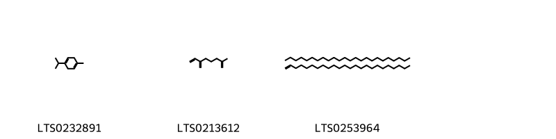{ width=100% }
<figcaption>Hình ảnh cấu trúc hóa học của hoạt chất thuộc nhóm *Unsaturated hydrocarbons*. Tên thường gọi của các hoạt chất tương ứng là α terpinene [(LTS0232891)](https://lotus.naturalproducts.net/compound/lotus_id/LTS0232891), 2-methyl-6-methylideneocta-1,7-diene [(LTS0213612)](https://lotus.naturalproducts.net/compound/lotus_id/LTS0213612), 1-tetracosene; tetracosane [(LTS0253964)](https://lotus.naturalproducts.net/compound/lotus_id/LTS0253964).</figcaption>
</figure>

            

---

## Tác dụng dược lý

Theo tài liệu "Những cây thuốc và vị thuốc Việt Nam" - Đỗ Tất Lợi:- Bệnh lao
- dạ dày
- da
- bệnh ghẻ
- đổ mồ hôi đêm
- vàng da
- sốt
- mắt
- khó tiêu
- kiết lỵ
- thuốc trị đầy hơi
- thuốc diệt khuẩn
- áp xe

Theo tài liệu quốc tế: nan

---

## Dược điển Việt Nam V

### Soi bột:

nan

<!-- Hình ảnh soi bột sẽ được tự động chèn vào đây sau -->

### Vi phẫu:

nan

<!-- Hình ảnh vi phẫu sẽ được tự động chèn vào đây sau -->

### Định tính

nan

### Định lượng

nan

### Thông tin khác 

- ** Độ ẩm: ** nan
- ** Bảo quản:** nan

## Dược điển Hồng kong

<!-- PDF sẽ được tự động chèn vào đây sau -->

---

## Y dược học cổ truyền

- **Tên vị thuốc:** nan
- **Tính vị quy kinh:** Theo các tài liệu cổ, thanh cao có vị đắng (khổ), tính hàn (lạnh). Vào hai kinh can và đởm.
- **Công năng chủ trị:** Có tác dụng thanh thư tịch uế, trừ phục nhiệt ở âm phận. Dùng chữa những trường hợp cốt trưng lao nhiệt (đau xương, nóng), đạo hãn (mồ hôi trộm), ngược tật (sốt rét), lở ngứa. Còn dùng chữa cảm mạo, thanh nhiệt, giúp sự tiêu hoá, lợi gan mật. Dùng riêng hay phối hợp với một số vị thuốc khác.
- **Chú ý:** nan
- **Kiêng kỵ:** nan

## Bình luận

