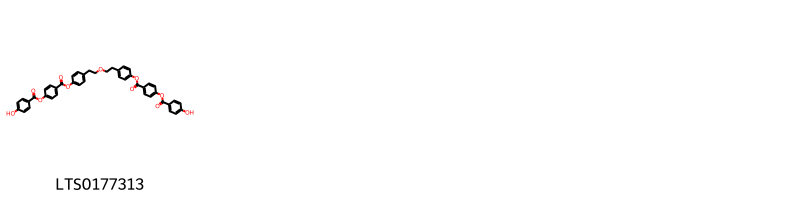
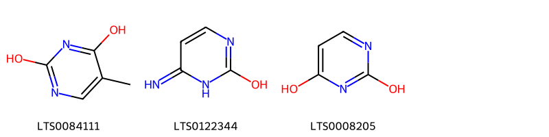
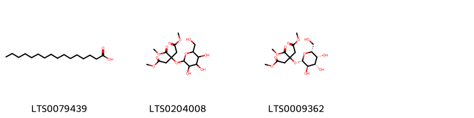
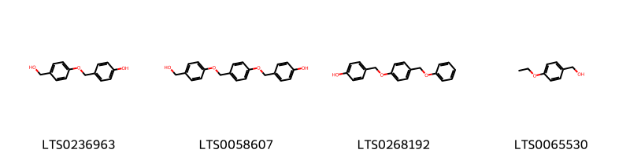
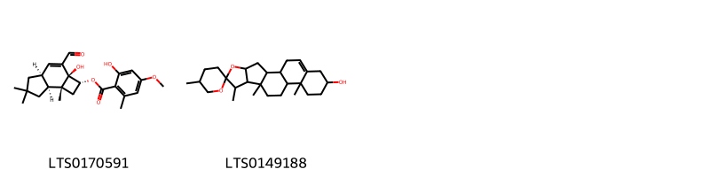
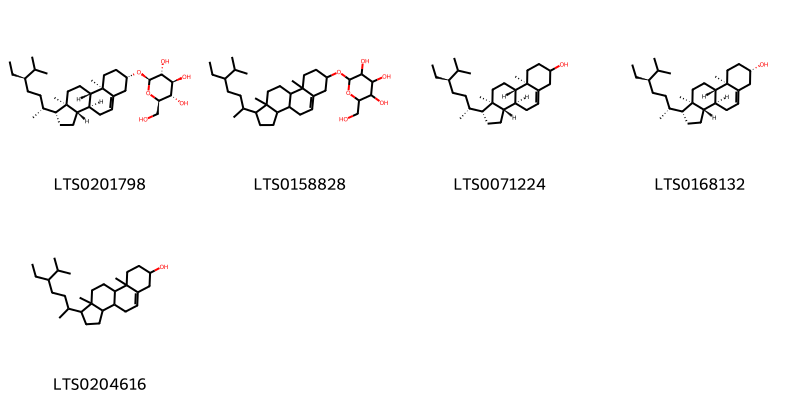
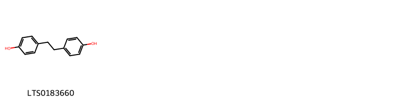

!!! abstract "Tóm tắt"

    Thiên ma có tên khoa học Gastrodia elata BI, họ Lan (Orchidaceae). Có nguồn gốc từ Assam, Trung Quốc, Đông Himalaya, Nội Mông, Nhật Bản,... Tại Việt Nam, loại thảo dược này chủ yếu phân bố ở các tỉnh vùng núi (Lạng Sơn, Hòa Bình…). Dân gian sử dụng trị đau đầu hoa mắt chóng mặt bằng bài thuốc: thiên ma 15g, xuyên khung 5g, chế thành hoàn, mỗi lần uống 3 – 6g, ngày 3 lần; trị đau khớp, chân tay tê dại bằng bài thuốc: ngưu tất 10g, thiên ma 10g, toàn yết 3g, nhũ hương 5g, tán bột mịn hồ làm hoàn hoặc sắc uống. Thiên ma có tác dụng an thần chống co giật, làm giảm đau, kháng viêm, tăng cường lưu lượng máu ở tim và não, làm giảm lực cản của mạch máu, làm giãn mạch ngoại vi, có tác dụng hạ áp, làm chậm nhịp tim, nâng cao sức chịu đựng thiếu oxy của động vật thí nghiệm, ngoài ra polysaccharide của thiên ma có hoạt tính miễn dịch. Thành phần hóa học chứa thành phần chủ yếu là gastrodin với hàm lượng 0,16-1,18% , gastrdiosid, benzyl citrat, acid succinic, acid citric cùng với monomethyl ester, acid palmitic, sucrose, 𝛃-sitosterol và các Polysaccharide, Vanillyl alcohol.

## Thông tin về thực vật

Dược liệu **Thiên Ma (Thân Rễ)** từ bộ phận **nan** từ loài *Gastrodia elata*.

**Mô tả thực vật:** Thân rễ hình bầu dục hoặc dạng thanh mỏng, quăn lại và hơi cong queo, dài 3 – 15cm, rộng 1,5 – 6cm, dày 0,5 – 2cm.
Mặt ngoài màu trắng đến hơi vàng, hoặc nâu hơi vàng, có vân nhăn dọc và nhiều vân vòng tròn ngang của những chồi búp tiềm tàng, đôi khi là những cuống noãn màu nâu hiện ra rõ rệt.
Đỉnh dược liệu có những chồi hình mỏ vẹt, màu nâu đỏ đến nâu sẫm hoặc có những vết của thân;
Phía dưới có một vết sẹo tròn. Chất cứng rắn như sừng, khó bẻ gãy, mặt bẻ tương đối phẳng, màu trắng hơi vàng đến màu nâu.
Mùi nhẹ, vị hơi ngọt.

*Tài liệu tham khảo:* "Những cây thuốc và vị thuốc Việt Nam" - Đỗ Tất Lợi 
Trong dược điển Việt nam, một loài được sử dụng làm dược liệu là *Gastrodia elata*.

!!! info "Phân loại thực vật của *Gastrodia elata*"
    - **Kingdom:** Plantae
    - **Phylum:** Tracheophyta
    - **Order:** Asparagales
    - **Family:** Orchidaceae
    - **Genus:** Gastrodia
    - **Species:** *Gastrodia elata*

**Phân bố trên thế giới:** nan, Russian Federation, China, Chinese Taipei, Japan, Bhutan, Korea, Republic of

**Phân bố tại Việt nam:** Không có ghi nhận ở Việt Nam

## Thông tin về dược liệu 

### Định danh

!!! info "Thông tin về tên gọi"

    - Dược liệu tiếng Việt: nan
    - Dược liệu tiếng Trung: nan (nan)
    - Dược liệu tiếng Anh: nan
    - Dược liệu latin thông dụng: nan
    - Dược liệu latin kiểu DĐVN: *gastrodia elata blume*
    - Dược liệu latin kiểu DĐVN: *nan*
    - Dược liệu latin kiểu thông tư: *nan*
    - Bộ phận dùng: nan (nan)

### Mô tả dược liệu 

- **Theo dược điển Việt nam V:** nan

- **Mô tả dược liệu theo thông tư chế biến dược liệu theo phương pháp cổ truyền:** nan

### Chế biến 

- **Chế biến theo dược điển việt nam V**: nan

- **Chế biến theo thông tư:** nan

--- 

## Thành phần hóa học

- Theo tài liệu của GS. Đỗ Tất Lợi:  chứa thành phần chủ yếu là
gastrodin với hàm lượng 0,16-1,18% , gastrdiosid, benzyl citrat, acid succinic, acid citric cùng với monomethyl ester, acid palmitic, sucrose, 𝛃-sitosterol và các Polysaccharide,  Vanillyl alcohol.
    

**Thành phần hóa học từ loài **Gastrodia elata**

Theo cơ sở dữ liệu lotus, loài *Gastrodia elata* đã phân lập và xác định được **82** hoạt chất thuộc về các nhóm Diarylheptanoids, Steroids and steroid derivatives, Diazines, Organooxygen compounds, Fatty Acyls, Imidazopyrimidines, Phenol ethers, Purine nucleosides, Phenols, Pyrimidine nucleosides, Carboxylic acids and derivatives, Benzene and substituted derivatives, Stilbenes, Prenol lipids, Depsides and depsidones trong bảng dưới đây. Danh sách các hoạt chất như sau (2r,3s,4s,5r,6s)-2-(hydroxymethyl)-6-[4-(methoxymethyl)phenoxy]oxane-3,4,5-triol [(LTS0189147)](https://lotus.naturalproducts.net/compound/lotus_id/LTS0189147), 1-(furan-2-yl)-2-(4-hydroxyphenyl)ethanone [(LTS0018400)](https://lotus.naturalproducts.net/compound/lotus_id/LTS0018400), (+)-glucose [(LTS0262158)](https://lotus.naturalproducts.net/compound/lotus_id/LTS0262158), 1,2,3-trimethyl 2-{[3,4,5-trihydroxy-6-(hydroxymethyl)oxan-2-yl]oxy}propane-1,2,3-tricarboxylate [(LTS0204008)](https://lotus.naturalproducts.net/compound/lotus_id/LTS0204008), glucose [(LTS0013597)](https://lotus.naturalproducts.net/compound/lotus_id/LTS0013597), 2-hydroxy-4-oxo-2-{2-oxo-2-[(4-{[3,4,5-trihydroxy-6-(hydroxymethyl)oxan-2-yl]oxy}phenyl)methoxy]ethyl}-4-[(4-{[3,4,5-trihydroxy-6-(hydroxymethyl)oxan-2-yl]oxy}phenyl)methoxy]butanoic acid [(LTS0209788)](https://lotus.naturalproducts.net/compound/lotus_id/LTS0209788), bisphenol f [(LTS0060768)](https://lotus.naturalproducts.net/compound/lotus_id/LTS0060768), (2s)-n'-[(3r,4r,5s,6r)-4-hydroxy-5-{[(2s,3r,4r,5s,6r)-4-hydroxy-3-[(1-hydroxyethylidene)amino]-6-(hydroxymethyl)-5-{[(2s,3s,4s,5s,6r)-3,4,5-trihydroxy-6-(hydroxymethyl)oxan-2-yl]oxy}oxan-2-yl]oxy}-3-[(1-hydroxyethylidene)amino]-6-(hydroxymethyl)oxan-2-yl]-2-[(1-hydroxyethylidene)amino]butanediimidic acid [(LTS0148164)](https://lotus.naturalproducts.net/compound/lotus_id/LTS0148164), d-fructopyranose [(LTS0259277)](https://lotus.naturalproducts.net/compound/lotus_id/LTS0259277), bis-(4-hydroxybenzyl)ether [(LTS0201613)](https://lotus.naturalproducts.net/compound/lotus_id/LTS0201613), 2-(hydroxymethyl)-6-(4-{[(4-hydroxyphenyl)methoxy]methyl}phenoxy)oxane-3,4,5-triol [(LTS0170092)](https://lotus.naturalproducts.net/compound/lotus_id/LTS0170092), benzyl alcohol [(LTS0125638)](https://lotus.naturalproducts.net/compound/lotus_id/LTS0125638), 2-hydroxy-4-oxo-2-{2-oxo-2-[(4-{[(2s,3r,4s,5s,6r)-3,4,5-trihydroxy-6-(hydroxymethyl)oxan-2-yl]oxy}phenyl)methoxy]ethyl}-4-[(4-{[(2s,3r,4s,5s,6r)-3,4,5-trihydroxy-6-(hydroxymethyl)oxan-2-yl]oxy}phenyl)methoxy]butanoic acid [(LTS0024502)](https://lotus.naturalproducts.net/compound/lotus_id/LTS0024502), 2-(hydroxymethyl)-5-(6-{[(4-hydroxyphenyl)methyl]amino}purin-9-yl)oxolane-3,4-diol [(LTS0138047)](https://lotus.naturalproducts.net/compound/lotus_id/LTS0138047), 4-{2-[2-(4-hydroxyphenyl)ethoxy]ethyl}phenol [(LTS0236083)](https://lotus.naturalproducts.net/compound/lotus_id/LTS0236083), (2r,3s,4s,5r,6s)-2-(hydroxymethyl)-6-(4-{[(4-hydroxyphenyl)methoxy]methyl}phenoxy)oxane-3,4,5-triol [(LTS0035048)](https://lotus.naturalproducts.net/compound/lotus_id/LTS0035048), 2,4-bis(4-hydroxybenzyl)phenol [(LTS0041151)](https://lotus.naturalproducts.net/compound/lotus_id/LTS0041151), gastrodigenin [(LTS0094565)](https://lotus.naturalproducts.net/compound/lotus_id/LTS0094565), (2r,3r,4s,5r,6s)-2-(hydroxymethyl)-6-[4-(hydroxymethyl)phenoxy]oxane-3,4,5-triol [(LTS0251352)](https://lotus.naturalproducts.net/compound/lotus_id/LTS0251352), 3-hydroxy-5-oxo-5-[(4-{[3,4,5-trihydroxy-6-(hydroxymethyl)oxan-2-yl]oxy}phenyl)methoxy]-3-{[(4-{[3,4,5-trihydroxy-6-(hydroxymethyl)oxan-2-yl]oxy}phenyl)methoxy]carbonyl}pentanoic acid [(LTS0173673)](https://lotus.naturalproducts.net/compound/lotus_id/LTS0173673), vanillyl alcohol [(LTS0035070)](https://lotus.naturalproducts.net/compound/lotus_id/LTS0035070), 4-aminouracil [(LTS0122344)](https://lotus.naturalproducts.net/compound/lotus_id/LTS0122344), 2-hydroxy-2-{2-oxo-2-[(4-{[(2s,3r,4s,5s,6r)-3,4,5-trihydroxy-6-(hydroxymethyl)oxan-2-yl]oxy}phenyl)methoxy]ethyl}butanedioic acid [(LTS0123311)](https://lotus.naturalproducts.net/compound/lotus_id/LTS0123311), ribonucleoside [(LTS0044502)](https://lotus.naturalproducts.net/compound/lotus_id/LTS0044502), 1,2,3-tris[(4-{[3,4,5-trihydroxy-6-(hydroxymethyl)oxan-2-yl]oxy}phenyl)methyl] 2-hydroxypropane-1,2,3-tricarboxylate [(LTS0036140)](https://lotus.naturalproducts.net/compound/lotus_id/LTS0036140), 2-(hydroxymethyl)-6-[4-(methoxymethyl)phenoxy]oxane-3,4,5-triol [(LTS0191690)](https://lotus.naturalproducts.net/compound/lotus_id/LTS0191690), (4-ethoxyphenyl)methanol [(LTS0065530)](https://lotus.naturalproducts.net/compound/lotus_id/LTS0065530), 4-(hydroxymethyl)-2-[(4-hydroxyphenyl)methyl]phenol [(LTS0037626)](https://lotus.naturalproducts.net/compound/lotus_id/LTS0037626), p-hydroxybenzaldehyde [(LTS0259836)](https://lotus.naturalproducts.net/compound/lotus_id/LTS0259836), bis-(4-hydroxybenzyl)sulfide [(LTS0089358)](https://lotus.naturalproducts.net/compound/lotus_id/LTS0089358), 4-[4-(phenoxymethyl)phenoxymethyl]phenol [(LTS0268192)](https://lotus.naturalproducts.net/compound/lotus_id/LTS0268192), stigmast-5-en-3-ol, (3β)- [(LTS0204616)](https://lotus.naturalproducts.net/compound/lotus_id/LTS0204616), sucrose [(LTS0272557)](https://lotus.naturalproducts.net/compound/lotus_id/LTS0272557), 1-[(2s,3s,4s,5s)-3,4-dihydroxy-5-(hydroxymethyl)oxolan-2-yl]-4-hydroxypyrimidin-2-one [(LTS0200435)](https://lotus.naturalproducts.net/compound/lotus_id/LTS0200435), 1,2,3-trimethyl 2-{[(2s,3r,4s,5r,6r)-3,4,5-trihydroxy-6-(hydroxymethyl)oxan-2-yl]oxy}propane-1,2,3-tricarboxylate [(LTS0009362)](https://lotus.naturalproducts.net/compound/lotus_id/LTS0009362), palmitic acid [(LTS0079439)](https://lotus.naturalproducts.net/compound/lotus_id/LTS0079439), 4-[2-(2-{4-[4-(4-hydroxybenzoyloxy)benzoyloxy]phenyl}ethoxy)ethyl]phenyl 4-(4-hydroxybenzoyloxy)benzoate [(LTS0177313)](https://lotus.naturalproducts.net/compound/lotus_id/LTS0177313), 4-{4-[4-(hydroxymethyl)phenoxymethyl]phenoxymethyl}phenol [(LTS0058607)](https://lotus.naturalproducts.net/compound/lotus_id/LTS0058607), sitogluside [(LTS0201798)](https://lotus.naturalproducts.net/compound/lotus_id/LTS0201798), leucon [(LTS0114351)](https://lotus.naturalproducts.net/compound/lotus_id/LTS0114351), vanillin [(LTS0136163)](https://lotus.naturalproducts.net/compound/lotus_id/LTS0136163), 4,4'-dihydroxybibenzyl [(LTS0183660)](https://lotus.naturalproducts.net/compound/lotus_id/LTS0183660), 4-[4-(hydroxymethyl)phenoxymethyl]phenol [(LTS0236963)](https://lotus.naturalproducts.net/compound/lotus_id/LTS0236963), stigmast-5-en-3-ol [(LTS0071224)](https://lotus.naturalproducts.net/compound/lotus_id/LTS0071224), (2r,3s,4r,5r)-2-(hydroxymethyl)-5-(6-{[(4-hydroxyphenyl)methyl]amino}purin-9-yl)oxolane-3,4-diol [(LTS0200081)](https://lotus.naturalproducts.net/compound/lotus_id/LTS0200081), keto-d-fructose [(LTS0241114)](https://lotus.naturalproducts.net/compound/lotus_id/LTS0241114), (2s)-2-amino-4-{[(1r)-1-(carboxymethyl-c-hydroxycarbonimidoyl)-2-{[(4-hydroxyphenyl)methyl]sulfanyl}ethyl]-c-hydroxycarbonimidoyl}butanoic acid [(LTS0209643)](https://lotus.naturalproducts.net/compound/lotus_id/LTS0209643), (2r,3r,4s,5r)-2-(6-hydroxy-2-imino-3h-purin-9-yl)-5-(hydroxymethyl)-2-[(4-hydroxyphenyl)methyl]oxolane-3,4-diol [(LTS0025160)](https://lotus.naturalproducts.net/compound/lotus_id/LTS0025160), (2r,3s,4r,5s)-2-(6-aminopurin-9-yl)-5-(hydroxymethyl)oxolane-3,4-diol [(LTS0178532)](https://lotus.naturalproducts.net/compound/lotus_id/LTS0178532), benzyl methyl ether [(LTS0250950)](https://lotus.naturalproducts.net/compound/lotus_id/LTS0250950), adenosine [(LTS0014061)](https://lotus.naturalproducts.net/compound/lotus_id/LTS0014061), 1-[3,4-dihydroxy-5-(hydroxymethyl)oxolan-2-yl]-4-hydroxypyrimidin-2-one [(LTS0075646)](https://lotus.naturalproducts.net/compound/lotus_id/LTS0075646), 4-[(4-hydroxyphenyl)methanesulfinylmethyl]phenol [(LTS0215459)](https://lotus.naturalproducts.net/compound/lotus_id/LTS0215459), gastrodin [(LTS0027222)](https://lotus.naturalproducts.net/compound/lotus_id/LTS0027222), vanillic acid [(LTS0229113)](https://lotus.naturalproducts.net/compound/lotus_id/LTS0229113), uridine [(LTS0220125)](https://lotus.naturalproducts.net/compound/lotus_id/LTS0220125), 2-[(4-hydroxyphenyl)methyl]-4-(methoxymethyl)phenol [(LTS0143608)](https://lotus.naturalproducts.net/compound/lotus_id/LTS0143608), α-hydroquinone [(LTS0063684)](https://lotus.naturalproducts.net/compound/lotus_id/LTS0063684), 2-{[1-(5-ethyl-6-methylheptan-2-yl)-9a,11a-dimethyl-1h,2h,3h,3ah,3bh,4h,6h,7h,8h,9h,9bh,10h,11h-cyclopenta[a]phenanthren-7-yl]oxy}-6-(hydroxymethyl)oxane-3,4,5-triol [(LTS0158828)](https://lotus.naturalproducts.net/compound/lotus_id/LTS0158828), 4-{[(2s,3r,4s,5s,6r)-3,4,5-trihydroxy-6-(hydroxymethyl)oxan-2-yl]oxy}benzaldehyde [(LTS0204510)](https://lotus.naturalproducts.net/compound/lotus_id/LTS0204510), gastrol [(LTS0006706)](https://lotus.naturalproducts.net/compound/lotus_id/LTS0006706), 2-(hydroxymethyl)-6-[4-(hydroxymethyl)phenoxy]oxane-3,4,5-triol [(LTS0167915)](https://lotus.naturalproducts.net/compound/lotus_id/LTS0167915), (3r)-3-hydroxy-5-oxo-5-[(4-{[(2s,3r,4s,5s,6r)-3,4,5-trihydroxy-6-(hydroxymethyl)oxan-2-yl]oxy}phenyl)methoxy]-3-{[(4-{[(2s,3r,4s,5s,6r)-3,4,5-trihydroxy-6-(hydroxymethyl)oxan-2-yl]oxy}phenyl)methoxy]carbonyl}pentanoic acid [(LTS0007955)](https://lotus.naturalproducts.net/compound/lotus_id/LTS0007955), diosgenin [(LTS0149188)](https://lotus.naturalproducts.net/compound/lotus_id/LTS0149188), trimethyl citrate [(LTS0099326)](https://lotus.naturalproducts.net/compound/lotus_id/LTS0099326), 2-amino-4-{[1-(carboxymethyl-c-hydroxycarbonimidoyl)-2-{[(4-hydroxyphenyl)methyl]sulfanyl}ethyl]-c-hydroxycarbonimidoyl}butanoic acid [(LTS0230913)](https://lotus.naturalproducts.net/compound/lotus_id/LTS0230913), p-hydroxybenzoic acid [(LTS0263634)](https://lotus.naturalproducts.net/compound/lotus_id/LTS0263634), 5-{[(4-hydroxyphenyl)methoxy]methyl}furan-2-carbaldehyde [(LTS0091314)](https://lotus.naturalproducts.net/compound/lotus_id/LTS0091314), (2r,3r,4s,5r)-2-(6-aminopurin-9-yl)-5-(hydroxymethyl)-2-[(4-hydroxyphenyl)methyl]oxolane-3,4-diol [(LTS0101705)](https://lotus.naturalproducts.net/compound/lotus_id/LTS0101705), hydroxymethylfurfural [(LTS0233269)](https://lotus.naturalproducts.net/compound/lotus_id/LTS0233269), 4-[4-(methoxymethyl)phenoxymethyl]phenol [(LTS0096225)](https://lotus.naturalproducts.net/compound/lotus_id/LTS0096225), 4-(ethoxymethyl)phenol [(LTS0217995)](https://lotus.naturalproducts.net/compound/lotus_id/LTS0217995), 5-{[(5-formylfuran-2-yl)methoxy]methyl}furan-2-carbaldehyde [(LTS0244889)](https://lotus.naturalproducts.net/compound/lotus_id/LTS0244889), sitosterol [(LTS0168132)](https://lotus.naturalproducts.net/compound/lotus_id/LTS0168132), pirod [(LTS0008205)](https://lotus.naturalproducts.net/compound/lotus_id/LTS0008205), 5-methylpyrimidine-2,4-dione [(LTS0084111)](https://lotus.naturalproducts.net/compound/lotus_id/LTS0084111), 4-[(4-hydroxyphenyl)methyl]-2-methoxyphenol [(LTS0225650)](https://lotus.naturalproducts.net/compound/lotus_id/LTS0225650), adenosine [(LTS0052576)](https://lotus.naturalproducts.net/compound/lotus_id/LTS0052576), (2r,2as,4as,7as,7br)-3-formyl-2a-hydroxy-6,6,7b-trimethyl-1h,2h,4ah,5h,7h,7ah-cyclobuta[e]inden-2-yl 2-hydroxy-4-methoxy-6-methylbenzoate [(LTS0170591)](https://lotus.naturalproducts.net/compound/lotus_id/LTS0170591), 1,2,3-tris[(4-{[(2s,3r,4s,5s,6r)-3,4,5-trihydroxy-6-(hydroxymethyl)oxan-2-yl]oxy}phenyl)methyl] 2-hydroxypropane-1,2,3-tricarboxylate [(LTS0212547)](https://lotus.naturalproducts.net/compound/lotus_id/LTS0212547), anise alcohol [(LTS0207920)](https://lotus.naturalproducts.net/compound/lotus_id/LTS0207920), p-(methoxymethyl)phenol [(LTS0030927)](https://lotus.naturalproducts.net/compound/lotus_id/LTS0030927). 
        
| chemicalTaxonomyClassyfireClass     |   smiles_count |
|:------------------------------------|---------------:|
| Benzene and substituted derivatives |            313 |
| Carboxylic acids and derivatives    |            135 |
| Depsides and depsidones             |             91 |
| Diarylheptanoids                    |             37 |
| Diazines                            |             41 |
| Fatty Acyls                         |            138 |
| Imidazopyrimidines                  |             18 |
| Organooxygen compounds              |           1681 |
| Phenol ethers                       |            110 |
| Phenols                             |             95 |
| Prenol lipids                       |            127 |
| Purine nucleosides                  |            411 |
| Pyrimidine nucleosides              |            121 |
| Steroids and steroid derivatives    |            414 |
| Stilbenes                           |             24 |

            
### Nhóm Benzene and substituted derivatives
<figure markdown="span">
    { width=100% }
<figcaption>Hình ảnh cấu trúc hóa học của hoạt chất thuộc nhóm *Benzene and substituted derivatives*. Tên thường gọi của các hoạt chất tương ứng là vanillic acid [(LTS0229113)](https://lotus.naturalproducts.net/compound/lotus_id/LTS0229113), p-hydroxybenzoic acid [(LTS0263634)](https://lotus.naturalproducts.net/compound/lotus_id/LTS0263634), 4-(ethoxymethyl)phenol [(LTS0217995)](https://lotus.naturalproducts.net/compound/lotus_id/LTS0217995), 4-[4-(methoxymethyl)phenoxymethyl]phenol [(LTS0096225)](https://lotus.naturalproducts.net/compound/lotus_id/LTS0096225), gastrodigenin [(LTS0094565)](https://lotus.naturalproducts.net/compound/lotus_id/LTS0094565), bisphenol f [(LTS0060768)](https://lotus.naturalproducts.net/compound/lotus_id/LTS0060768), bis-(4-hydroxybenzyl)ether [(LTS0201613)](https://lotus.naturalproducts.net/compound/lotus_id/LTS0201613), 5-{[(4-hydroxyphenyl)methoxy]methyl}furan-2-carbaldehyde [(LTS0091314)](https://lotus.naturalproducts.net/compound/lotus_id/LTS0091314), benzyl methyl ether [(LTS0250950)](https://lotus.naturalproducts.net/compound/lotus_id/LTS0250950), 4-[(4-hydroxyphenyl)methanesulfinylmethyl]phenol [(LTS0215459)](https://lotus.naturalproducts.net/compound/lotus_id/LTS0215459), anise alcohol [(LTS0207920)](https://lotus.naturalproducts.net/compound/lotus_id/LTS0207920), gastrol [(LTS0006706)](https://lotus.naturalproducts.net/compound/lotus_id/LTS0006706), p-(methoxymethyl)phenol [(LTS0030927)](https://lotus.naturalproducts.net/compound/lotus_id/LTS0030927), benzyl alcohol [(LTS0125638)](https://lotus.naturalproducts.net/compound/lotus_id/LTS0125638), 4-(hydroxymethyl)-2-[(4-hydroxyphenyl)methyl]phenol [(LTS0037626)](https://lotus.naturalproducts.net/compound/lotus_id/LTS0037626).</figcaption>
</figure>

            
            
### Nhóm Benzene and substituted derivatives
<figure markdown="span">
    { width=100% }
<figcaption>Hình ảnh cấu trúc hóa học của hoạt chất thuộc nhóm *Benzene and substituted derivatives*. Tên thường gọi của các hoạt chất tương ứng là vanillic acid [(LTS0229113)](https://lotus.naturalproducts.net/compound/lotus_id/LTS0229113), p-hydroxybenzoic acid [(LTS0263634)](https://lotus.naturalproducts.net/compound/lotus_id/LTS0263634), 4-(ethoxymethyl)phenol [(LTS0217995)](https://lotus.naturalproducts.net/compound/lotus_id/LTS0217995), 4-[4-(methoxymethyl)phenoxymethyl]phenol [(LTS0096225)](https://lotus.naturalproducts.net/compound/lotus_id/LTS0096225), gastrodigenin [(LTS0094565)](https://lotus.naturalproducts.net/compound/lotus_id/LTS0094565), bisphenol f [(LTS0060768)](https://lotus.naturalproducts.net/compound/lotus_id/LTS0060768), bis-(4-hydroxybenzyl)ether [(LTS0201613)](https://lotus.naturalproducts.net/compound/lotus_id/LTS0201613), 5-{[(4-hydroxyphenyl)methoxy]methyl}furan-2-carbaldehyde [(LTS0091314)](https://lotus.naturalproducts.net/compound/lotus_id/LTS0091314), benzyl methyl ether [(LTS0250950)](https://lotus.naturalproducts.net/compound/lotus_id/LTS0250950), 4-[(4-hydroxyphenyl)methanesulfinylmethyl]phenol [(LTS0215459)](https://lotus.naturalproducts.net/compound/lotus_id/LTS0215459), anise alcohol [(LTS0207920)](https://lotus.naturalproducts.net/compound/lotus_id/LTS0207920), gastrol [(LTS0006706)](https://lotus.naturalproducts.net/compound/lotus_id/LTS0006706), p-(methoxymethyl)phenol [(LTS0030927)](https://lotus.naturalproducts.net/compound/lotus_id/LTS0030927), benzyl alcohol [(LTS0125638)](https://lotus.naturalproducts.net/compound/lotus_id/LTS0125638), 4-(hydroxymethyl)-2-[(4-hydroxyphenyl)methyl]phenol [(LTS0037626)](https://lotus.naturalproducts.net/compound/lotus_id/LTS0037626).</figcaption>
</figure>

### Nhóm Carboxylic acids and derivatives
<figure markdown="span">
    { width=100% }
<figcaption>Hình ảnh cấu trúc hóa học của hoạt chất thuộc nhóm *Carboxylic acids and derivatives*. Tên thường gọi của các hoạt chất tương ứng là 2-amino-4-{[1-(carboxymethyl-c-hydroxycarbonimidoyl)-2-{[(4-hydroxyphenyl)methyl]sulfanyl}ethyl]-c-hydroxycarbonimidoyl}butanoic acid [(LTS0230913)](https://lotus.naturalproducts.net/compound/lotus_id/LTS0230913), (2s)-2-amino-4-{[(1r)-1-(carboxymethyl-c-hydroxycarbonimidoyl)-2-{[(4-hydroxyphenyl)methyl]sulfanyl}ethyl]-c-hydroxycarbonimidoyl}butanoic acid [(LTS0209643)](https://lotus.naturalproducts.net/compound/lotus_id/LTS0209643), trimethyl citrate [(LTS0099326)](https://lotus.naturalproducts.net/compound/lotus_id/LTS0099326).</figcaption>
</figure>

            
            
### Nhóm Benzene and substituted derivatives
<figure markdown="span">
    { width=100% }
<figcaption>Hình ảnh cấu trúc hóa học của hoạt chất thuộc nhóm *Benzene and substituted derivatives*. Tên thường gọi của các hoạt chất tương ứng là vanillic acid [(LTS0229113)](https://lotus.naturalproducts.net/compound/lotus_id/LTS0229113), p-hydroxybenzoic acid [(LTS0263634)](https://lotus.naturalproducts.net/compound/lotus_id/LTS0263634), 4-(ethoxymethyl)phenol [(LTS0217995)](https://lotus.naturalproducts.net/compound/lotus_id/LTS0217995), 4-[4-(methoxymethyl)phenoxymethyl]phenol [(LTS0096225)](https://lotus.naturalproducts.net/compound/lotus_id/LTS0096225), gastrodigenin [(LTS0094565)](https://lotus.naturalproducts.net/compound/lotus_id/LTS0094565), bisphenol f [(LTS0060768)](https://lotus.naturalproducts.net/compound/lotus_id/LTS0060768), bis-(4-hydroxybenzyl)ether [(LTS0201613)](https://lotus.naturalproducts.net/compound/lotus_id/LTS0201613), 5-{[(4-hydroxyphenyl)methoxy]methyl}furan-2-carbaldehyde [(LTS0091314)](https://lotus.naturalproducts.net/compound/lotus_id/LTS0091314), benzyl methyl ether [(LTS0250950)](https://lotus.naturalproducts.net/compound/lotus_id/LTS0250950), 4-[(4-hydroxyphenyl)methanesulfinylmethyl]phenol [(LTS0215459)](https://lotus.naturalproducts.net/compound/lotus_id/LTS0215459), anise alcohol [(LTS0207920)](https://lotus.naturalproducts.net/compound/lotus_id/LTS0207920), gastrol [(LTS0006706)](https://lotus.naturalproducts.net/compound/lotus_id/LTS0006706), p-(methoxymethyl)phenol [(LTS0030927)](https://lotus.naturalproducts.net/compound/lotus_id/LTS0030927), benzyl alcohol [(LTS0125638)](https://lotus.naturalproducts.net/compound/lotus_id/LTS0125638), 4-(hydroxymethyl)-2-[(4-hydroxyphenyl)methyl]phenol [(LTS0037626)](https://lotus.naturalproducts.net/compound/lotus_id/LTS0037626).</figcaption>
</figure>

### Nhóm Carboxylic acids and derivatives
<figure markdown="span">
    { width=100% }
<figcaption>Hình ảnh cấu trúc hóa học của hoạt chất thuộc nhóm *Carboxylic acids and derivatives*. Tên thường gọi của các hoạt chất tương ứng là 2-amino-4-{[1-(carboxymethyl-c-hydroxycarbonimidoyl)-2-{[(4-hydroxyphenyl)methyl]sulfanyl}ethyl]-c-hydroxycarbonimidoyl}butanoic acid [(LTS0230913)](https://lotus.naturalproducts.net/compound/lotus_id/LTS0230913), (2s)-2-amino-4-{[(1r)-1-(carboxymethyl-c-hydroxycarbonimidoyl)-2-{[(4-hydroxyphenyl)methyl]sulfanyl}ethyl]-c-hydroxycarbonimidoyl}butanoic acid [(LTS0209643)](https://lotus.naturalproducts.net/compound/lotus_id/LTS0209643), trimethyl citrate [(LTS0099326)](https://lotus.naturalproducts.net/compound/lotus_id/LTS0099326).</figcaption>
</figure>

### Nhóm Depsides and depsidones
<figure markdown="span">
    { width=100% }
<figcaption>Hình ảnh cấu trúc hóa học của hoạt chất thuộc nhóm *Depsides and depsidones*. Tên thường gọi của các hoạt chất tương ứng là 4-[2-(2-{4-[4-(4-hydroxybenzoyloxy)benzoyloxy]phenyl}ethoxy)ethyl]phenyl 4-(4-hydroxybenzoyloxy)benzoate [(LTS0177313)](https://lotus.naturalproducts.net/compound/lotus_id/LTS0177313).</figcaption>
</figure>

            
            
### Nhóm Benzene and substituted derivatives
<figure markdown="span">
    { width=100% }
<figcaption>Hình ảnh cấu trúc hóa học của hoạt chất thuộc nhóm *Benzene and substituted derivatives*. Tên thường gọi của các hoạt chất tương ứng là vanillic acid [(LTS0229113)](https://lotus.naturalproducts.net/compound/lotus_id/LTS0229113), p-hydroxybenzoic acid [(LTS0263634)](https://lotus.naturalproducts.net/compound/lotus_id/LTS0263634), 4-(ethoxymethyl)phenol [(LTS0217995)](https://lotus.naturalproducts.net/compound/lotus_id/LTS0217995), 4-[4-(methoxymethyl)phenoxymethyl]phenol [(LTS0096225)](https://lotus.naturalproducts.net/compound/lotus_id/LTS0096225), gastrodigenin [(LTS0094565)](https://lotus.naturalproducts.net/compound/lotus_id/LTS0094565), bisphenol f [(LTS0060768)](https://lotus.naturalproducts.net/compound/lotus_id/LTS0060768), bis-(4-hydroxybenzyl)ether [(LTS0201613)](https://lotus.naturalproducts.net/compound/lotus_id/LTS0201613), 5-{[(4-hydroxyphenyl)methoxy]methyl}furan-2-carbaldehyde [(LTS0091314)](https://lotus.naturalproducts.net/compound/lotus_id/LTS0091314), benzyl methyl ether [(LTS0250950)](https://lotus.naturalproducts.net/compound/lotus_id/LTS0250950), 4-[(4-hydroxyphenyl)methanesulfinylmethyl]phenol [(LTS0215459)](https://lotus.naturalproducts.net/compound/lotus_id/LTS0215459), anise alcohol [(LTS0207920)](https://lotus.naturalproducts.net/compound/lotus_id/LTS0207920), gastrol [(LTS0006706)](https://lotus.naturalproducts.net/compound/lotus_id/LTS0006706), p-(methoxymethyl)phenol [(LTS0030927)](https://lotus.naturalproducts.net/compound/lotus_id/LTS0030927), benzyl alcohol [(LTS0125638)](https://lotus.naturalproducts.net/compound/lotus_id/LTS0125638), 4-(hydroxymethyl)-2-[(4-hydroxyphenyl)methyl]phenol [(LTS0037626)](https://lotus.naturalproducts.net/compound/lotus_id/LTS0037626).</figcaption>
</figure>

### Nhóm Carboxylic acids and derivatives
<figure markdown="span">
    { width=100% }
<figcaption>Hình ảnh cấu trúc hóa học của hoạt chất thuộc nhóm *Carboxylic acids and derivatives*. Tên thường gọi của các hoạt chất tương ứng là 2-amino-4-{[1-(carboxymethyl-c-hydroxycarbonimidoyl)-2-{[(4-hydroxyphenyl)methyl]sulfanyl}ethyl]-c-hydroxycarbonimidoyl}butanoic acid [(LTS0230913)](https://lotus.naturalproducts.net/compound/lotus_id/LTS0230913), (2s)-2-amino-4-{[(1r)-1-(carboxymethyl-c-hydroxycarbonimidoyl)-2-{[(4-hydroxyphenyl)methyl]sulfanyl}ethyl]-c-hydroxycarbonimidoyl}butanoic acid [(LTS0209643)](https://lotus.naturalproducts.net/compound/lotus_id/LTS0209643), trimethyl citrate [(LTS0099326)](https://lotus.naturalproducts.net/compound/lotus_id/LTS0099326).</figcaption>
</figure>

### Nhóm Depsides and depsidones
<figure markdown="span">
    { width=100% }
<figcaption>Hình ảnh cấu trúc hóa học của hoạt chất thuộc nhóm *Depsides and depsidones*. Tên thường gọi của các hoạt chất tương ứng là 4-[2-(2-{4-[4-(4-hydroxybenzoyloxy)benzoyloxy]phenyl}ethoxy)ethyl]phenyl 4-(4-hydroxybenzoyloxy)benzoate [(LTS0177313)](https://lotus.naturalproducts.net/compound/lotus_id/LTS0177313).</figcaption>
</figure>

### Nhóm Diarylheptanoids
<figure markdown="span">
    { width=100% }
<figcaption>Hình ảnh cấu trúc hóa học của hoạt chất thuộc nhóm *Diarylheptanoids*. Tên thường gọi của các hoạt chất tương ứng là 2,4-bis(4-hydroxybenzyl)phenol [(LTS0041151)](https://lotus.naturalproducts.net/compound/lotus_id/LTS0041151).</figcaption>
</figure>

            
            
### Nhóm Benzene and substituted derivatives
<figure markdown="span">
    { width=100% }
<figcaption>Hình ảnh cấu trúc hóa học của hoạt chất thuộc nhóm *Benzene and substituted derivatives*. Tên thường gọi của các hoạt chất tương ứng là vanillic acid [(LTS0229113)](https://lotus.naturalproducts.net/compound/lotus_id/LTS0229113), p-hydroxybenzoic acid [(LTS0263634)](https://lotus.naturalproducts.net/compound/lotus_id/LTS0263634), 4-(ethoxymethyl)phenol [(LTS0217995)](https://lotus.naturalproducts.net/compound/lotus_id/LTS0217995), 4-[4-(methoxymethyl)phenoxymethyl]phenol [(LTS0096225)](https://lotus.naturalproducts.net/compound/lotus_id/LTS0096225), gastrodigenin [(LTS0094565)](https://lotus.naturalproducts.net/compound/lotus_id/LTS0094565), bisphenol f [(LTS0060768)](https://lotus.naturalproducts.net/compound/lotus_id/LTS0060768), bis-(4-hydroxybenzyl)ether [(LTS0201613)](https://lotus.naturalproducts.net/compound/lotus_id/LTS0201613), 5-{[(4-hydroxyphenyl)methoxy]methyl}furan-2-carbaldehyde [(LTS0091314)](https://lotus.naturalproducts.net/compound/lotus_id/LTS0091314), benzyl methyl ether [(LTS0250950)](https://lotus.naturalproducts.net/compound/lotus_id/LTS0250950), 4-[(4-hydroxyphenyl)methanesulfinylmethyl]phenol [(LTS0215459)](https://lotus.naturalproducts.net/compound/lotus_id/LTS0215459), anise alcohol [(LTS0207920)](https://lotus.naturalproducts.net/compound/lotus_id/LTS0207920), gastrol [(LTS0006706)](https://lotus.naturalproducts.net/compound/lotus_id/LTS0006706), p-(methoxymethyl)phenol [(LTS0030927)](https://lotus.naturalproducts.net/compound/lotus_id/LTS0030927), benzyl alcohol [(LTS0125638)](https://lotus.naturalproducts.net/compound/lotus_id/LTS0125638), 4-(hydroxymethyl)-2-[(4-hydroxyphenyl)methyl]phenol [(LTS0037626)](https://lotus.naturalproducts.net/compound/lotus_id/LTS0037626).</figcaption>
</figure>

### Nhóm Carboxylic acids and derivatives
<figure markdown="span">
    { width=100% }
<figcaption>Hình ảnh cấu trúc hóa học của hoạt chất thuộc nhóm *Carboxylic acids and derivatives*. Tên thường gọi của các hoạt chất tương ứng là 2-amino-4-{[1-(carboxymethyl-c-hydroxycarbonimidoyl)-2-{[(4-hydroxyphenyl)methyl]sulfanyl}ethyl]-c-hydroxycarbonimidoyl}butanoic acid [(LTS0230913)](https://lotus.naturalproducts.net/compound/lotus_id/LTS0230913), (2s)-2-amino-4-{[(1r)-1-(carboxymethyl-c-hydroxycarbonimidoyl)-2-{[(4-hydroxyphenyl)methyl]sulfanyl}ethyl]-c-hydroxycarbonimidoyl}butanoic acid [(LTS0209643)](https://lotus.naturalproducts.net/compound/lotus_id/LTS0209643), trimethyl citrate [(LTS0099326)](https://lotus.naturalproducts.net/compound/lotus_id/LTS0099326).</figcaption>
</figure>

### Nhóm Depsides and depsidones
<figure markdown="span">
    { width=100% }
<figcaption>Hình ảnh cấu trúc hóa học của hoạt chất thuộc nhóm *Depsides and depsidones*. Tên thường gọi của các hoạt chất tương ứng là 4-[2-(2-{4-[4-(4-hydroxybenzoyloxy)benzoyloxy]phenyl}ethoxy)ethyl]phenyl 4-(4-hydroxybenzoyloxy)benzoate [(LTS0177313)](https://lotus.naturalproducts.net/compound/lotus_id/LTS0177313).</figcaption>
</figure>

### Nhóm Diarylheptanoids
<figure markdown="span">
    { width=100% }
<figcaption>Hình ảnh cấu trúc hóa học của hoạt chất thuộc nhóm *Diarylheptanoids*. Tên thường gọi của các hoạt chất tương ứng là 2,4-bis(4-hydroxybenzyl)phenol [(LTS0041151)](https://lotus.naturalproducts.net/compound/lotus_id/LTS0041151).</figcaption>
</figure>

### Nhóm Diazines
<figure markdown="span">
    { width=100% }
<figcaption>Hình ảnh cấu trúc hóa học của hoạt chất thuộc nhóm *Diazines*. Tên thường gọi của các hoạt chất tương ứng là 5-methylpyrimidine-2,4-dione [(LTS0084111)](https://lotus.naturalproducts.net/compound/lotus_id/LTS0084111), 4-aminouracil [(LTS0122344)](https://lotus.naturalproducts.net/compound/lotus_id/LTS0122344), pirod [(LTS0008205)](https://lotus.naturalproducts.net/compound/lotus_id/LTS0008205).</figcaption>
</figure>

            
            
### Nhóm Benzene and substituted derivatives
<figure markdown="span">
    { width=100% }
<figcaption>Hình ảnh cấu trúc hóa học của hoạt chất thuộc nhóm *Benzene and substituted derivatives*. Tên thường gọi của các hoạt chất tương ứng là vanillic acid [(LTS0229113)](https://lotus.naturalproducts.net/compound/lotus_id/LTS0229113), p-hydroxybenzoic acid [(LTS0263634)](https://lotus.naturalproducts.net/compound/lotus_id/LTS0263634), 4-(ethoxymethyl)phenol [(LTS0217995)](https://lotus.naturalproducts.net/compound/lotus_id/LTS0217995), 4-[4-(methoxymethyl)phenoxymethyl]phenol [(LTS0096225)](https://lotus.naturalproducts.net/compound/lotus_id/LTS0096225), gastrodigenin [(LTS0094565)](https://lotus.naturalproducts.net/compound/lotus_id/LTS0094565), bisphenol f [(LTS0060768)](https://lotus.naturalproducts.net/compound/lotus_id/LTS0060768), bis-(4-hydroxybenzyl)ether [(LTS0201613)](https://lotus.naturalproducts.net/compound/lotus_id/LTS0201613), 5-{[(4-hydroxyphenyl)methoxy]methyl}furan-2-carbaldehyde [(LTS0091314)](https://lotus.naturalproducts.net/compound/lotus_id/LTS0091314), benzyl methyl ether [(LTS0250950)](https://lotus.naturalproducts.net/compound/lotus_id/LTS0250950), 4-[(4-hydroxyphenyl)methanesulfinylmethyl]phenol [(LTS0215459)](https://lotus.naturalproducts.net/compound/lotus_id/LTS0215459), anise alcohol [(LTS0207920)](https://lotus.naturalproducts.net/compound/lotus_id/LTS0207920), gastrol [(LTS0006706)](https://lotus.naturalproducts.net/compound/lotus_id/LTS0006706), p-(methoxymethyl)phenol [(LTS0030927)](https://lotus.naturalproducts.net/compound/lotus_id/LTS0030927), benzyl alcohol [(LTS0125638)](https://lotus.naturalproducts.net/compound/lotus_id/LTS0125638), 4-(hydroxymethyl)-2-[(4-hydroxyphenyl)methyl]phenol [(LTS0037626)](https://lotus.naturalproducts.net/compound/lotus_id/LTS0037626).</figcaption>
</figure>

### Nhóm Carboxylic acids and derivatives
<figure markdown="span">
    { width=100% }
<figcaption>Hình ảnh cấu trúc hóa học của hoạt chất thuộc nhóm *Carboxylic acids and derivatives*. Tên thường gọi của các hoạt chất tương ứng là 2-amino-4-{[1-(carboxymethyl-c-hydroxycarbonimidoyl)-2-{[(4-hydroxyphenyl)methyl]sulfanyl}ethyl]-c-hydroxycarbonimidoyl}butanoic acid [(LTS0230913)](https://lotus.naturalproducts.net/compound/lotus_id/LTS0230913), (2s)-2-amino-4-{[(1r)-1-(carboxymethyl-c-hydroxycarbonimidoyl)-2-{[(4-hydroxyphenyl)methyl]sulfanyl}ethyl]-c-hydroxycarbonimidoyl}butanoic acid [(LTS0209643)](https://lotus.naturalproducts.net/compound/lotus_id/LTS0209643), trimethyl citrate [(LTS0099326)](https://lotus.naturalproducts.net/compound/lotus_id/LTS0099326).</figcaption>
</figure>

### Nhóm Depsides and depsidones
<figure markdown="span">
    { width=100% }
<figcaption>Hình ảnh cấu trúc hóa học của hoạt chất thuộc nhóm *Depsides and depsidones*. Tên thường gọi của các hoạt chất tương ứng là 4-[2-(2-{4-[4-(4-hydroxybenzoyloxy)benzoyloxy]phenyl}ethoxy)ethyl]phenyl 4-(4-hydroxybenzoyloxy)benzoate [(LTS0177313)](https://lotus.naturalproducts.net/compound/lotus_id/LTS0177313).</figcaption>
</figure>

### Nhóm Diarylheptanoids
<figure markdown="span">
    { width=100% }
<figcaption>Hình ảnh cấu trúc hóa học của hoạt chất thuộc nhóm *Diarylheptanoids*. Tên thường gọi của các hoạt chất tương ứng là 2,4-bis(4-hydroxybenzyl)phenol [(LTS0041151)](https://lotus.naturalproducts.net/compound/lotus_id/LTS0041151).</figcaption>
</figure>

### Nhóm Diazines
<figure markdown="span">
    { width=100% }
<figcaption>Hình ảnh cấu trúc hóa học của hoạt chất thuộc nhóm *Diazines*. Tên thường gọi của các hoạt chất tương ứng là 5-methylpyrimidine-2,4-dione [(LTS0084111)](https://lotus.naturalproducts.net/compound/lotus_id/LTS0084111), 4-aminouracil [(LTS0122344)](https://lotus.naturalproducts.net/compound/lotus_id/LTS0122344), pirod [(LTS0008205)](https://lotus.naturalproducts.net/compound/lotus_id/LTS0008205).</figcaption>
</figure>

### Nhóm Fatty Acyls
<figure markdown="span">
    { width=100% }
<figcaption>Hình ảnh cấu trúc hóa học của hoạt chất thuộc nhóm *Fatty Acyls*. Tên thường gọi của các hoạt chất tương ứng là palmitic acid [(LTS0079439)](https://lotus.naturalproducts.net/compound/lotus_id/LTS0079439), 1,2,3-trimethyl 2-{[3,4,5-trihydroxy-6-(hydroxymethyl)oxan-2-yl]oxy}propane-1,2,3-tricarboxylate [(LTS0204008)](https://lotus.naturalproducts.net/compound/lotus_id/LTS0204008), 1,2,3-trimethyl 2-{[(2s,3r,4s,5r,6r)-3,4,5-trihydroxy-6-(hydroxymethyl)oxan-2-yl]oxy}propane-1,2,3-tricarboxylate [(LTS0009362)](https://lotus.naturalproducts.net/compound/lotus_id/LTS0009362).</figcaption>
</figure>

            
            
### Nhóm Benzene and substituted derivatives
<figure markdown="span">
    { width=100% }
<figcaption>Hình ảnh cấu trúc hóa học của hoạt chất thuộc nhóm *Benzene and substituted derivatives*. Tên thường gọi của các hoạt chất tương ứng là vanillic acid [(LTS0229113)](https://lotus.naturalproducts.net/compound/lotus_id/LTS0229113), p-hydroxybenzoic acid [(LTS0263634)](https://lotus.naturalproducts.net/compound/lotus_id/LTS0263634), 4-(ethoxymethyl)phenol [(LTS0217995)](https://lotus.naturalproducts.net/compound/lotus_id/LTS0217995), 4-[4-(methoxymethyl)phenoxymethyl]phenol [(LTS0096225)](https://lotus.naturalproducts.net/compound/lotus_id/LTS0096225), gastrodigenin [(LTS0094565)](https://lotus.naturalproducts.net/compound/lotus_id/LTS0094565), bisphenol f [(LTS0060768)](https://lotus.naturalproducts.net/compound/lotus_id/LTS0060768), bis-(4-hydroxybenzyl)ether [(LTS0201613)](https://lotus.naturalproducts.net/compound/lotus_id/LTS0201613), 5-{[(4-hydroxyphenyl)methoxy]methyl}furan-2-carbaldehyde [(LTS0091314)](https://lotus.naturalproducts.net/compound/lotus_id/LTS0091314), benzyl methyl ether [(LTS0250950)](https://lotus.naturalproducts.net/compound/lotus_id/LTS0250950), 4-[(4-hydroxyphenyl)methanesulfinylmethyl]phenol [(LTS0215459)](https://lotus.naturalproducts.net/compound/lotus_id/LTS0215459), anise alcohol [(LTS0207920)](https://lotus.naturalproducts.net/compound/lotus_id/LTS0207920), gastrol [(LTS0006706)](https://lotus.naturalproducts.net/compound/lotus_id/LTS0006706), p-(methoxymethyl)phenol [(LTS0030927)](https://lotus.naturalproducts.net/compound/lotus_id/LTS0030927), benzyl alcohol [(LTS0125638)](https://lotus.naturalproducts.net/compound/lotus_id/LTS0125638), 4-(hydroxymethyl)-2-[(4-hydroxyphenyl)methyl]phenol [(LTS0037626)](https://lotus.naturalproducts.net/compound/lotus_id/LTS0037626).</figcaption>
</figure>

### Nhóm Carboxylic acids and derivatives
<figure markdown="span">
    { width=100% }
<figcaption>Hình ảnh cấu trúc hóa học của hoạt chất thuộc nhóm *Carboxylic acids and derivatives*. Tên thường gọi của các hoạt chất tương ứng là 2-amino-4-{[1-(carboxymethyl-c-hydroxycarbonimidoyl)-2-{[(4-hydroxyphenyl)methyl]sulfanyl}ethyl]-c-hydroxycarbonimidoyl}butanoic acid [(LTS0230913)](https://lotus.naturalproducts.net/compound/lotus_id/LTS0230913), (2s)-2-amino-4-{[(1r)-1-(carboxymethyl-c-hydroxycarbonimidoyl)-2-{[(4-hydroxyphenyl)methyl]sulfanyl}ethyl]-c-hydroxycarbonimidoyl}butanoic acid [(LTS0209643)](https://lotus.naturalproducts.net/compound/lotus_id/LTS0209643), trimethyl citrate [(LTS0099326)](https://lotus.naturalproducts.net/compound/lotus_id/LTS0099326).</figcaption>
</figure>

### Nhóm Depsides and depsidones
<figure markdown="span">
    { width=100% }
<figcaption>Hình ảnh cấu trúc hóa học của hoạt chất thuộc nhóm *Depsides and depsidones*. Tên thường gọi của các hoạt chất tương ứng là 4-[2-(2-{4-[4-(4-hydroxybenzoyloxy)benzoyloxy]phenyl}ethoxy)ethyl]phenyl 4-(4-hydroxybenzoyloxy)benzoate [(LTS0177313)](https://lotus.naturalproducts.net/compound/lotus_id/LTS0177313).</figcaption>
</figure>

### Nhóm Diarylheptanoids
<figure markdown="span">
    { width=100% }
<figcaption>Hình ảnh cấu trúc hóa học của hoạt chất thuộc nhóm *Diarylheptanoids*. Tên thường gọi của các hoạt chất tương ứng là 2,4-bis(4-hydroxybenzyl)phenol [(LTS0041151)](https://lotus.naturalproducts.net/compound/lotus_id/LTS0041151).</figcaption>
</figure>

### Nhóm Diazines
<figure markdown="span">
    { width=100% }
<figcaption>Hình ảnh cấu trúc hóa học của hoạt chất thuộc nhóm *Diazines*. Tên thường gọi của các hoạt chất tương ứng là 5-methylpyrimidine-2,4-dione [(LTS0084111)](https://lotus.naturalproducts.net/compound/lotus_id/LTS0084111), 4-aminouracil [(LTS0122344)](https://lotus.naturalproducts.net/compound/lotus_id/LTS0122344), pirod [(LTS0008205)](https://lotus.naturalproducts.net/compound/lotus_id/LTS0008205).</figcaption>
</figure>

### Nhóm Fatty Acyls
<figure markdown="span">
    { width=100% }
<figcaption>Hình ảnh cấu trúc hóa học của hoạt chất thuộc nhóm *Fatty Acyls*. Tên thường gọi của các hoạt chất tương ứng là palmitic acid [(LTS0079439)](https://lotus.naturalproducts.net/compound/lotus_id/LTS0079439), 1,2,3-trimethyl 2-{[3,4,5-trihydroxy-6-(hydroxymethyl)oxan-2-yl]oxy}propane-1,2,3-tricarboxylate [(LTS0204008)](https://lotus.naturalproducts.net/compound/lotus_id/LTS0204008), 1,2,3-trimethyl 2-{[(2s,3r,4s,5r,6r)-3,4,5-trihydroxy-6-(hydroxymethyl)oxan-2-yl]oxy}propane-1,2,3-tricarboxylate [(LTS0009362)](https://lotus.naturalproducts.net/compound/lotus_id/LTS0009362).</figcaption>
</figure>

### Nhóm Imidazopyrimidines
<figure markdown="span">
    { width=100% }
<figcaption>Hình ảnh cấu trúc hóa học của hoạt chất thuộc nhóm *Imidazopyrimidines*. Tên thường gọi của các hoạt chất tương ứng là leucon [(LTS0114351)](https://lotus.naturalproducts.net/compound/lotus_id/LTS0114351).</figcaption>
</figure>

            
            
### Nhóm Benzene and substituted derivatives
<figure markdown="span">
    { width=100% }
<figcaption>Hình ảnh cấu trúc hóa học của hoạt chất thuộc nhóm *Benzene and substituted derivatives*. Tên thường gọi của các hoạt chất tương ứng là vanillic acid [(LTS0229113)](https://lotus.naturalproducts.net/compound/lotus_id/LTS0229113), p-hydroxybenzoic acid [(LTS0263634)](https://lotus.naturalproducts.net/compound/lotus_id/LTS0263634), 4-(ethoxymethyl)phenol [(LTS0217995)](https://lotus.naturalproducts.net/compound/lotus_id/LTS0217995), 4-[4-(methoxymethyl)phenoxymethyl]phenol [(LTS0096225)](https://lotus.naturalproducts.net/compound/lotus_id/LTS0096225), gastrodigenin [(LTS0094565)](https://lotus.naturalproducts.net/compound/lotus_id/LTS0094565), bisphenol f [(LTS0060768)](https://lotus.naturalproducts.net/compound/lotus_id/LTS0060768), bis-(4-hydroxybenzyl)ether [(LTS0201613)](https://lotus.naturalproducts.net/compound/lotus_id/LTS0201613), 5-{[(4-hydroxyphenyl)methoxy]methyl}furan-2-carbaldehyde [(LTS0091314)](https://lotus.naturalproducts.net/compound/lotus_id/LTS0091314), benzyl methyl ether [(LTS0250950)](https://lotus.naturalproducts.net/compound/lotus_id/LTS0250950), 4-[(4-hydroxyphenyl)methanesulfinylmethyl]phenol [(LTS0215459)](https://lotus.naturalproducts.net/compound/lotus_id/LTS0215459), anise alcohol [(LTS0207920)](https://lotus.naturalproducts.net/compound/lotus_id/LTS0207920), gastrol [(LTS0006706)](https://lotus.naturalproducts.net/compound/lotus_id/LTS0006706), p-(methoxymethyl)phenol [(LTS0030927)](https://lotus.naturalproducts.net/compound/lotus_id/LTS0030927), benzyl alcohol [(LTS0125638)](https://lotus.naturalproducts.net/compound/lotus_id/LTS0125638), 4-(hydroxymethyl)-2-[(4-hydroxyphenyl)methyl]phenol [(LTS0037626)](https://lotus.naturalproducts.net/compound/lotus_id/LTS0037626).</figcaption>
</figure>

### Nhóm Carboxylic acids and derivatives
<figure markdown="span">
    { width=100% }
<figcaption>Hình ảnh cấu trúc hóa học của hoạt chất thuộc nhóm *Carboxylic acids and derivatives*. Tên thường gọi của các hoạt chất tương ứng là 2-amino-4-{[1-(carboxymethyl-c-hydroxycarbonimidoyl)-2-{[(4-hydroxyphenyl)methyl]sulfanyl}ethyl]-c-hydroxycarbonimidoyl}butanoic acid [(LTS0230913)](https://lotus.naturalproducts.net/compound/lotus_id/LTS0230913), (2s)-2-amino-4-{[(1r)-1-(carboxymethyl-c-hydroxycarbonimidoyl)-2-{[(4-hydroxyphenyl)methyl]sulfanyl}ethyl]-c-hydroxycarbonimidoyl}butanoic acid [(LTS0209643)](https://lotus.naturalproducts.net/compound/lotus_id/LTS0209643), trimethyl citrate [(LTS0099326)](https://lotus.naturalproducts.net/compound/lotus_id/LTS0099326).</figcaption>
</figure>

### Nhóm Depsides and depsidones
<figure markdown="span">
    { width=100% }
<figcaption>Hình ảnh cấu trúc hóa học của hoạt chất thuộc nhóm *Depsides and depsidones*. Tên thường gọi của các hoạt chất tương ứng là 4-[2-(2-{4-[4-(4-hydroxybenzoyloxy)benzoyloxy]phenyl}ethoxy)ethyl]phenyl 4-(4-hydroxybenzoyloxy)benzoate [(LTS0177313)](https://lotus.naturalproducts.net/compound/lotus_id/LTS0177313).</figcaption>
</figure>

### Nhóm Diarylheptanoids
<figure markdown="span">
    { width=100% }
<figcaption>Hình ảnh cấu trúc hóa học của hoạt chất thuộc nhóm *Diarylheptanoids*. Tên thường gọi của các hoạt chất tương ứng là 2,4-bis(4-hydroxybenzyl)phenol [(LTS0041151)](https://lotus.naturalproducts.net/compound/lotus_id/LTS0041151).</figcaption>
</figure>

### Nhóm Diazines
<figure markdown="span">
    { width=100% }
<figcaption>Hình ảnh cấu trúc hóa học của hoạt chất thuộc nhóm *Diazines*. Tên thường gọi của các hoạt chất tương ứng là 5-methylpyrimidine-2,4-dione [(LTS0084111)](https://lotus.naturalproducts.net/compound/lotus_id/LTS0084111), 4-aminouracil [(LTS0122344)](https://lotus.naturalproducts.net/compound/lotus_id/LTS0122344), pirod [(LTS0008205)](https://lotus.naturalproducts.net/compound/lotus_id/LTS0008205).</figcaption>
</figure>

### Nhóm Fatty Acyls
<figure markdown="span">
    { width=100% }
<figcaption>Hình ảnh cấu trúc hóa học của hoạt chất thuộc nhóm *Fatty Acyls*. Tên thường gọi của các hoạt chất tương ứng là palmitic acid [(LTS0079439)](https://lotus.naturalproducts.net/compound/lotus_id/LTS0079439), 1,2,3-trimethyl 2-{[3,4,5-trihydroxy-6-(hydroxymethyl)oxan-2-yl]oxy}propane-1,2,3-tricarboxylate [(LTS0204008)](https://lotus.naturalproducts.net/compound/lotus_id/LTS0204008), 1,2,3-trimethyl 2-{[(2s,3r,4s,5r,6r)-3,4,5-trihydroxy-6-(hydroxymethyl)oxan-2-yl]oxy}propane-1,2,3-tricarboxylate [(LTS0009362)](https://lotus.naturalproducts.net/compound/lotus_id/LTS0009362).</figcaption>
</figure>

### Nhóm Imidazopyrimidines
<figure markdown="span">
    { width=100% }
<figcaption>Hình ảnh cấu trúc hóa học của hoạt chất thuộc nhóm *Imidazopyrimidines*. Tên thường gọi của các hoạt chất tương ứng là leucon [(LTS0114351)](https://lotus.naturalproducts.net/compound/lotus_id/LTS0114351).</figcaption>
</figure>

### Nhóm Organooxygen compounds
<figure markdown="span">
    { width=100% }
<figcaption>Hình ảnh cấu trúc hóa học của hoạt chất thuộc nhóm *Organooxygen compounds*. Tên thường gọi của các hoạt chất tương ứng là 2-hydroxy-2-{2-oxo-2-[(4-{[(2s,3r,4s,5s,6r)-3,4,5-trihydroxy-6-(hydroxymethyl)oxan-2-yl]oxy}phenyl)methoxy]ethyl}butanedioic acid [(LTS0123311)](https://lotus.naturalproducts.net/compound/lotus_id/LTS0123311), 1,2,3-tris[(4-{[(2s,3r,4s,5s,6r)-3,4,5-trihydroxy-6-(hydroxymethyl)oxan-2-yl]oxy}phenyl)methyl] 2-hydroxypropane-1,2,3-tricarboxylate [(LTS0212547)](https://lotus.naturalproducts.net/compound/lotus_id/LTS0212547), 2-hydroxy-4-oxo-2-{2-oxo-2-[(4-{[3,4,5-trihydroxy-6-(hydroxymethyl)oxan-2-yl]oxy}phenyl)methoxy]ethyl}-4-[(4-{[3,4,5-trihydroxy-6-(hydroxymethyl)oxan-2-yl]oxy}phenyl)methoxy]butanoic acid [(LTS0209788)](https://lotus.naturalproducts.net/compound/lotus_id/LTS0209788), 1,2,3-tris[(4-{[3,4,5-trihydroxy-6-(hydroxymethyl)oxan-2-yl]oxy}phenyl)methyl] 2-hydroxypropane-1,2,3-tricarboxylate [(LTS0036140)](https://lotus.naturalproducts.net/compound/lotus_id/LTS0036140), 2-(hydroxymethyl)-6-[4-(hydroxymethyl)phenoxy]oxane-3,4,5-triol [(LTS0167915)](https://lotus.naturalproducts.net/compound/lotus_id/LTS0167915), (2r,3s,4s,5r,6s)-2-(hydroxymethyl)-6-(4-{[(4-hydroxyphenyl)methoxy]methyl}phenoxy)oxane-3,4,5-triol [(LTS0035048)](https://lotus.naturalproducts.net/compound/lotus_id/LTS0035048), (+)-glucose [(LTS0262158)](https://lotus.naturalproducts.net/compound/lotus_id/LTS0262158), 2-(hydroxymethyl)-6-[4-(methoxymethyl)phenoxy]oxane-3,4,5-triol [(LTS0191690)](https://lotus.naturalproducts.net/compound/lotus_id/LTS0191690), sucrose [(LTS0272557)](https://lotus.naturalproducts.net/compound/lotus_id/LTS0272557), 4-{[(2s,3r,4s,5s,6r)-3,4,5-trihydroxy-6-(hydroxymethyl)oxan-2-yl]oxy}benzaldehyde [(LTS0204510)](https://lotus.naturalproducts.net/compound/lotus_id/LTS0204510), (2s)-n'-[(3r,4r,5s,6r)-4-hydroxy-5-{[(2s,3r,4r,5s,6r)-4-hydroxy-3-[(1-hydroxyethylidene)amino]-6-(hydroxymethyl)-5-{[(2s,3s,4s,5s,6r)-3,4,5-trihydroxy-6-(hydroxymethyl)oxan-2-yl]oxy}oxan-2-yl]oxy}-3-[(1-hydroxyethylidene)amino]-6-(hydroxymethyl)oxan-2-yl]-2-[(1-hydroxyethylidene)amino]butanediimidic acid [(LTS0148164)](https://lotus.naturalproducts.net/compound/lotus_id/LTS0148164), (2r,3r,4s,5r,6s)-2-(hydroxymethyl)-6-[4-(hydroxymethyl)phenoxy]oxane-3,4,5-triol [(LTS0251352)](https://lotus.naturalproducts.net/compound/lotus_id/LTS0251352), 2-(hydroxymethyl)-6-(4-{[(4-hydroxyphenyl)methoxy]methyl}phenoxy)oxane-3,4,5-triol [(LTS0170092)](https://lotus.naturalproducts.net/compound/lotus_id/LTS0170092), (2r,3s,4s,5r,6s)-2-(hydroxymethyl)-6-[4-(methoxymethyl)phenoxy]oxane-3,4,5-triol [(LTS0189147)](https://lotus.naturalproducts.net/compound/lotus_id/LTS0189147), hydroxymethylfurfural [(LTS0233269)](https://lotus.naturalproducts.net/compound/lotus_id/LTS0233269), 3-hydroxy-5-oxo-5-[(4-{[3,4,5-trihydroxy-6-(hydroxymethyl)oxan-2-yl]oxy}phenyl)methoxy]-3-{[(4-{[3,4,5-trihydroxy-6-(hydroxymethyl)oxan-2-yl]oxy}phenyl)methoxy]carbonyl}pentanoic acid [(LTS0173673)](https://lotus.naturalproducts.net/compound/lotus_id/LTS0173673), p-hydroxybenzaldehyde [(LTS0259836)](https://lotus.naturalproducts.net/compound/lotus_id/LTS0259836), 2-hydroxy-4-oxo-2-{2-oxo-2-[(4-{[(2s,3r,4s,5s,6r)-3,4,5-trihydroxy-6-(hydroxymethyl)oxan-2-yl]oxy}phenyl)methoxy]ethyl}-4-[(4-{[(2s,3r,4s,5s,6r)-3,4,5-trihydroxy-6-(hydroxymethyl)oxan-2-yl]oxy}phenyl)methoxy]butanoic acid [(LTS0024502)](https://lotus.naturalproducts.net/compound/lotus_id/LTS0024502), keto-d-fructose [(LTS0241114)](https://lotus.naturalproducts.net/compound/lotus_id/LTS0241114), glucose [(LTS0013597)](https://lotus.naturalproducts.net/compound/lotus_id/LTS0013597), gastrodin [(LTS0027222)](https://lotus.naturalproducts.net/compound/lotus_id/LTS0027222), (3r)-3-hydroxy-5-oxo-5-[(4-{[(2s,3r,4s,5s,6r)-3,4,5-trihydroxy-6-(hydroxymethyl)oxan-2-yl]oxy}phenyl)methoxy]-3-{[(4-{[(2s,3r,4s,5s,6r)-3,4,5-trihydroxy-6-(hydroxymethyl)oxan-2-yl]oxy}phenyl)methoxy]carbonyl}pentanoic acid [(LTS0007955)](https://lotus.naturalproducts.net/compound/lotus_id/LTS0007955), 1-(furan-2-yl)-2-(4-hydroxyphenyl)ethanone [(LTS0018400)](https://lotus.naturalproducts.net/compound/lotus_id/LTS0018400), d-fructopyranose [(LTS0259277)](https://lotus.naturalproducts.net/compound/lotus_id/LTS0259277), 5-{[(5-formylfuran-2-yl)methoxy]methyl}furan-2-carbaldehyde [(LTS0244889)](https://lotus.naturalproducts.net/compound/lotus_id/LTS0244889).</figcaption>
</figure>

            
            
### Nhóm Benzene and substituted derivatives
<figure markdown="span">
    { width=100% }
<figcaption>Hình ảnh cấu trúc hóa học của hoạt chất thuộc nhóm *Benzene and substituted derivatives*. Tên thường gọi của các hoạt chất tương ứng là vanillic acid [(LTS0229113)](https://lotus.naturalproducts.net/compound/lotus_id/LTS0229113), p-hydroxybenzoic acid [(LTS0263634)](https://lotus.naturalproducts.net/compound/lotus_id/LTS0263634), 4-(ethoxymethyl)phenol [(LTS0217995)](https://lotus.naturalproducts.net/compound/lotus_id/LTS0217995), 4-[4-(methoxymethyl)phenoxymethyl]phenol [(LTS0096225)](https://lotus.naturalproducts.net/compound/lotus_id/LTS0096225), gastrodigenin [(LTS0094565)](https://lotus.naturalproducts.net/compound/lotus_id/LTS0094565), bisphenol f [(LTS0060768)](https://lotus.naturalproducts.net/compound/lotus_id/LTS0060768), bis-(4-hydroxybenzyl)ether [(LTS0201613)](https://lotus.naturalproducts.net/compound/lotus_id/LTS0201613), 5-{[(4-hydroxyphenyl)methoxy]methyl}furan-2-carbaldehyde [(LTS0091314)](https://lotus.naturalproducts.net/compound/lotus_id/LTS0091314), benzyl methyl ether [(LTS0250950)](https://lotus.naturalproducts.net/compound/lotus_id/LTS0250950), 4-[(4-hydroxyphenyl)methanesulfinylmethyl]phenol [(LTS0215459)](https://lotus.naturalproducts.net/compound/lotus_id/LTS0215459), anise alcohol [(LTS0207920)](https://lotus.naturalproducts.net/compound/lotus_id/LTS0207920), gastrol [(LTS0006706)](https://lotus.naturalproducts.net/compound/lotus_id/LTS0006706), p-(methoxymethyl)phenol [(LTS0030927)](https://lotus.naturalproducts.net/compound/lotus_id/LTS0030927), benzyl alcohol [(LTS0125638)](https://lotus.naturalproducts.net/compound/lotus_id/LTS0125638), 4-(hydroxymethyl)-2-[(4-hydroxyphenyl)methyl]phenol [(LTS0037626)](https://lotus.naturalproducts.net/compound/lotus_id/LTS0037626).</figcaption>
</figure>

### Nhóm Carboxylic acids and derivatives
<figure markdown="span">
    { width=100% }
<figcaption>Hình ảnh cấu trúc hóa học của hoạt chất thuộc nhóm *Carboxylic acids and derivatives*. Tên thường gọi của các hoạt chất tương ứng là 2-amino-4-{[1-(carboxymethyl-c-hydroxycarbonimidoyl)-2-{[(4-hydroxyphenyl)methyl]sulfanyl}ethyl]-c-hydroxycarbonimidoyl}butanoic acid [(LTS0230913)](https://lotus.naturalproducts.net/compound/lotus_id/LTS0230913), (2s)-2-amino-4-{[(1r)-1-(carboxymethyl-c-hydroxycarbonimidoyl)-2-{[(4-hydroxyphenyl)methyl]sulfanyl}ethyl]-c-hydroxycarbonimidoyl}butanoic acid [(LTS0209643)](https://lotus.naturalproducts.net/compound/lotus_id/LTS0209643), trimethyl citrate [(LTS0099326)](https://lotus.naturalproducts.net/compound/lotus_id/LTS0099326).</figcaption>
</figure>

### Nhóm Depsides and depsidones
<figure markdown="span">
    { width=100% }
<figcaption>Hình ảnh cấu trúc hóa học của hoạt chất thuộc nhóm *Depsides and depsidones*. Tên thường gọi của các hoạt chất tương ứng là 4-[2-(2-{4-[4-(4-hydroxybenzoyloxy)benzoyloxy]phenyl}ethoxy)ethyl]phenyl 4-(4-hydroxybenzoyloxy)benzoate [(LTS0177313)](https://lotus.naturalproducts.net/compound/lotus_id/LTS0177313).</figcaption>
</figure>

### Nhóm Diarylheptanoids
<figure markdown="span">
    { width=100% }
<figcaption>Hình ảnh cấu trúc hóa học của hoạt chất thuộc nhóm *Diarylheptanoids*. Tên thường gọi của các hoạt chất tương ứng là 2,4-bis(4-hydroxybenzyl)phenol [(LTS0041151)](https://lotus.naturalproducts.net/compound/lotus_id/LTS0041151).</figcaption>
</figure>

### Nhóm Diazines
<figure markdown="span">
    { width=100% }
<figcaption>Hình ảnh cấu trúc hóa học của hoạt chất thuộc nhóm *Diazines*. Tên thường gọi của các hoạt chất tương ứng là 5-methylpyrimidine-2,4-dione [(LTS0084111)](https://lotus.naturalproducts.net/compound/lotus_id/LTS0084111), 4-aminouracil [(LTS0122344)](https://lotus.naturalproducts.net/compound/lotus_id/LTS0122344), pirod [(LTS0008205)](https://lotus.naturalproducts.net/compound/lotus_id/LTS0008205).</figcaption>
</figure>

### Nhóm Fatty Acyls
<figure markdown="span">
    { width=100% }
<figcaption>Hình ảnh cấu trúc hóa học của hoạt chất thuộc nhóm *Fatty Acyls*. Tên thường gọi của các hoạt chất tương ứng là palmitic acid [(LTS0079439)](https://lotus.naturalproducts.net/compound/lotus_id/LTS0079439), 1,2,3-trimethyl 2-{[3,4,5-trihydroxy-6-(hydroxymethyl)oxan-2-yl]oxy}propane-1,2,3-tricarboxylate [(LTS0204008)](https://lotus.naturalproducts.net/compound/lotus_id/LTS0204008), 1,2,3-trimethyl 2-{[(2s,3r,4s,5r,6r)-3,4,5-trihydroxy-6-(hydroxymethyl)oxan-2-yl]oxy}propane-1,2,3-tricarboxylate [(LTS0009362)](https://lotus.naturalproducts.net/compound/lotus_id/LTS0009362).</figcaption>
</figure>

### Nhóm Imidazopyrimidines
<figure markdown="span">
    { width=100% }
<figcaption>Hình ảnh cấu trúc hóa học của hoạt chất thuộc nhóm *Imidazopyrimidines*. Tên thường gọi của các hoạt chất tương ứng là leucon [(LTS0114351)](https://lotus.naturalproducts.net/compound/lotus_id/LTS0114351).</figcaption>
</figure>

### Nhóm Organooxygen compounds
<figure markdown="span">
    { width=100% }
<figcaption>Hình ảnh cấu trúc hóa học của hoạt chất thuộc nhóm *Organooxygen compounds*. Tên thường gọi của các hoạt chất tương ứng là 2-hydroxy-2-{2-oxo-2-[(4-{[(2s,3r,4s,5s,6r)-3,4,5-trihydroxy-6-(hydroxymethyl)oxan-2-yl]oxy}phenyl)methoxy]ethyl}butanedioic acid [(LTS0123311)](https://lotus.naturalproducts.net/compound/lotus_id/LTS0123311), 1,2,3-tris[(4-{[(2s,3r,4s,5s,6r)-3,4,5-trihydroxy-6-(hydroxymethyl)oxan-2-yl]oxy}phenyl)methyl] 2-hydroxypropane-1,2,3-tricarboxylate [(LTS0212547)](https://lotus.naturalproducts.net/compound/lotus_id/LTS0212547), 2-hydroxy-4-oxo-2-{2-oxo-2-[(4-{[3,4,5-trihydroxy-6-(hydroxymethyl)oxan-2-yl]oxy}phenyl)methoxy]ethyl}-4-[(4-{[3,4,5-trihydroxy-6-(hydroxymethyl)oxan-2-yl]oxy}phenyl)methoxy]butanoic acid [(LTS0209788)](https://lotus.naturalproducts.net/compound/lotus_id/LTS0209788), 1,2,3-tris[(4-{[3,4,5-trihydroxy-6-(hydroxymethyl)oxan-2-yl]oxy}phenyl)methyl] 2-hydroxypropane-1,2,3-tricarboxylate [(LTS0036140)](https://lotus.naturalproducts.net/compound/lotus_id/LTS0036140), 2-(hydroxymethyl)-6-[4-(hydroxymethyl)phenoxy]oxane-3,4,5-triol [(LTS0167915)](https://lotus.naturalproducts.net/compound/lotus_id/LTS0167915), (2r,3s,4s,5r,6s)-2-(hydroxymethyl)-6-(4-{[(4-hydroxyphenyl)methoxy]methyl}phenoxy)oxane-3,4,5-triol [(LTS0035048)](https://lotus.naturalproducts.net/compound/lotus_id/LTS0035048), (+)-glucose [(LTS0262158)](https://lotus.naturalproducts.net/compound/lotus_id/LTS0262158), 2-(hydroxymethyl)-6-[4-(methoxymethyl)phenoxy]oxane-3,4,5-triol [(LTS0191690)](https://lotus.naturalproducts.net/compound/lotus_id/LTS0191690), sucrose [(LTS0272557)](https://lotus.naturalproducts.net/compound/lotus_id/LTS0272557), 4-{[(2s,3r,4s,5s,6r)-3,4,5-trihydroxy-6-(hydroxymethyl)oxan-2-yl]oxy}benzaldehyde [(LTS0204510)](https://lotus.naturalproducts.net/compound/lotus_id/LTS0204510), (2s)-n'-[(3r,4r,5s,6r)-4-hydroxy-5-{[(2s,3r,4r,5s,6r)-4-hydroxy-3-[(1-hydroxyethylidene)amino]-6-(hydroxymethyl)-5-{[(2s,3s,4s,5s,6r)-3,4,5-trihydroxy-6-(hydroxymethyl)oxan-2-yl]oxy}oxan-2-yl]oxy}-3-[(1-hydroxyethylidene)amino]-6-(hydroxymethyl)oxan-2-yl]-2-[(1-hydroxyethylidene)amino]butanediimidic acid [(LTS0148164)](https://lotus.naturalproducts.net/compound/lotus_id/LTS0148164), (2r,3r,4s,5r,6s)-2-(hydroxymethyl)-6-[4-(hydroxymethyl)phenoxy]oxane-3,4,5-triol [(LTS0251352)](https://lotus.naturalproducts.net/compound/lotus_id/LTS0251352), 2-(hydroxymethyl)-6-(4-{[(4-hydroxyphenyl)methoxy]methyl}phenoxy)oxane-3,4,5-triol [(LTS0170092)](https://lotus.naturalproducts.net/compound/lotus_id/LTS0170092), (2r,3s,4s,5r,6s)-2-(hydroxymethyl)-6-[4-(methoxymethyl)phenoxy]oxane-3,4,5-triol [(LTS0189147)](https://lotus.naturalproducts.net/compound/lotus_id/LTS0189147), hydroxymethylfurfural [(LTS0233269)](https://lotus.naturalproducts.net/compound/lotus_id/LTS0233269), 3-hydroxy-5-oxo-5-[(4-{[3,4,5-trihydroxy-6-(hydroxymethyl)oxan-2-yl]oxy}phenyl)methoxy]-3-{[(4-{[3,4,5-trihydroxy-6-(hydroxymethyl)oxan-2-yl]oxy}phenyl)methoxy]carbonyl}pentanoic acid [(LTS0173673)](https://lotus.naturalproducts.net/compound/lotus_id/LTS0173673), p-hydroxybenzaldehyde [(LTS0259836)](https://lotus.naturalproducts.net/compound/lotus_id/LTS0259836), 2-hydroxy-4-oxo-2-{2-oxo-2-[(4-{[(2s,3r,4s,5s,6r)-3,4,5-trihydroxy-6-(hydroxymethyl)oxan-2-yl]oxy}phenyl)methoxy]ethyl}-4-[(4-{[(2s,3r,4s,5s,6r)-3,4,5-trihydroxy-6-(hydroxymethyl)oxan-2-yl]oxy}phenyl)methoxy]butanoic acid [(LTS0024502)](https://lotus.naturalproducts.net/compound/lotus_id/LTS0024502), keto-d-fructose [(LTS0241114)](https://lotus.naturalproducts.net/compound/lotus_id/LTS0241114), glucose [(LTS0013597)](https://lotus.naturalproducts.net/compound/lotus_id/LTS0013597), gastrodin [(LTS0027222)](https://lotus.naturalproducts.net/compound/lotus_id/LTS0027222), (3r)-3-hydroxy-5-oxo-5-[(4-{[(2s,3r,4s,5s,6r)-3,4,5-trihydroxy-6-(hydroxymethyl)oxan-2-yl]oxy}phenyl)methoxy]-3-{[(4-{[(2s,3r,4s,5s,6r)-3,4,5-trihydroxy-6-(hydroxymethyl)oxan-2-yl]oxy}phenyl)methoxy]carbonyl}pentanoic acid [(LTS0007955)](https://lotus.naturalproducts.net/compound/lotus_id/LTS0007955), 1-(furan-2-yl)-2-(4-hydroxyphenyl)ethanone [(LTS0018400)](https://lotus.naturalproducts.net/compound/lotus_id/LTS0018400), d-fructopyranose [(LTS0259277)](https://lotus.naturalproducts.net/compound/lotus_id/LTS0259277), 5-{[(5-formylfuran-2-yl)methoxy]methyl}furan-2-carbaldehyde [(LTS0244889)](https://lotus.naturalproducts.net/compound/lotus_id/LTS0244889).</figcaption>
</figure>

### Nhóm Phenol ethers
<figure markdown="span">
    { width=100% }
<figcaption>Hình ảnh cấu trúc hóa học của hoạt chất thuộc nhóm *Phenol ethers*. Tên thường gọi của các hoạt chất tương ứng là 4-[4-(hydroxymethyl)phenoxymethyl]phenol [(LTS0236963)](https://lotus.naturalproducts.net/compound/lotus_id/LTS0236963), 4-{4-[4-(hydroxymethyl)phenoxymethyl]phenoxymethyl}phenol [(LTS0058607)](https://lotus.naturalproducts.net/compound/lotus_id/LTS0058607), 4-[4-(phenoxymethyl)phenoxymethyl]phenol [(LTS0268192)](https://lotus.naturalproducts.net/compound/lotus_id/LTS0268192), (4-ethoxyphenyl)methanol [(LTS0065530)](https://lotus.naturalproducts.net/compound/lotus_id/LTS0065530).</figcaption>
</figure>

            
            
### Nhóm Benzene and substituted derivatives
<figure markdown="span">
    { width=100% }
<figcaption>Hình ảnh cấu trúc hóa học của hoạt chất thuộc nhóm *Benzene and substituted derivatives*. Tên thường gọi của các hoạt chất tương ứng là vanillic acid [(LTS0229113)](https://lotus.naturalproducts.net/compound/lotus_id/LTS0229113), p-hydroxybenzoic acid [(LTS0263634)](https://lotus.naturalproducts.net/compound/lotus_id/LTS0263634), 4-(ethoxymethyl)phenol [(LTS0217995)](https://lotus.naturalproducts.net/compound/lotus_id/LTS0217995), 4-[4-(methoxymethyl)phenoxymethyl]phenol [(LTS0096225)](https://lotus.naturalproducts.net/compound/lotus_id/LTS0096225), gastrodigenin [(LTS0094565)](https://lotus.naturalproducts.net/compound/lotus_id/LTS0094565), bisphenol f [(LTS0060768)](https://lotus.naturalproducts.net/compound/lotus_id/LTS0060768), bis-(4-hydroxybenzyl)ether [(LTS0201613)](https://lotus.naturalproducts.net/compound/lotus_id/LTS0201613), 5-{[(4-hydroxyphenyl)methoxy]methyl}furan-2-carbaldehyde [(LTS0091314)](https://lotus.naturalproducts.net/compound/lotus_id/LTS0091314), benzyl methyl ether [(LTS0250950)](https://lotus.naturalproducts.net/compound/lotus_id/LTS0250950), 4-[(4-hydroxyphenyl)methanesulfinylmethyl]phenol [(LTS0215459)](https://lotus.naturalproducts.net/compound/lotus_id/LTS0215459), anise alcohol [(LTS0207920)](https://lotus.naturalproducts.net/compound/lotus_id/LTS0207920), gastrol [(LTS0006706)](https://lotus.naturalproducts.net/compound/lotus_id/LTS0006706), p-(methoxymethyl)phenol [(LTS0030927)](https://lotus.naturalproducts.net/compound/lotus_id/LTS0030927), benzyl alcohol [(LTS0125638)](https://lotus.naturalproducts.net/compound/lotus_id/LTS0125638), 4-(hydroxymethyl)-2-[(4-hydroxyphenyl)methyl]phenol [(LTS0037626)](https://lotus.naturalproducts.net/compound/lotus_id/LTS0037626).</figcaption>
</figure>

### Nhóm Carboxylic acids and derivatives
<figure markdown="span">
    { width=100% }
<figcaption>Hình ảnh cấu trúc hóa học của hoạt chất thuộc nhóm *Carboxylic acids and derivatives*. Tên thường gọi của các hoạt chất tương ứng là 2-amino-4-{[1-(carboxymethyl-c-hydroxycarbonimidoyl)-2-{[(4-hydroxyphenyl)methyl]sulfanyl}ethyl]-c-hydroxycarbonimidoyl}butanoic acid [(LTS0230913)](https://lotus.naturalproducts.net/compound/lotus_id/LTS0230913), (2s)-2-amino-4-{[(1r)-1-(carboxymethyl-c-hydroxycarbonimidoyl)-2-{[(4-hydroxyphenyl)methyl]sulfanyl}ethyl]-c-hydroxycarbonimidoyl}butanoic acid [(LTS0209643)](https://lotus.naturalproducts.net/compound/lotus_id/LTS0209643), trimethyl citrate [(LTS0099326)](https://lotus.naturalproducts.net/compound/lotus_id/LTS0099326).</figcaption>
</figure>

### Nhóm Depsides and depsidones
<figure markdown="span">
    { width=100% }
<figcaption>Hình ảnh cấu trúc hóa học của hoạt chất thuộc nhóm *Depsides and depsidones*. Tên thường gọi của các hoạt chất tương ứng là 4-[2-(2-{4-[4-(4-hydroxybenzoyloxy)benzoyloxy]phenyl}ethoxy)ethyl]phenyl 4-(4-hydroxybenzoyloxy)benzoate [(LTS0177313)](https://lotus.naturalproducts.net/compound/lotus_id/LTS0177313).</figcaption>
</figure>

### Nhóm Diarylheptanoids
<figure markdown="span">
    { width=100% }
<figcaption>Hình ảnh cấu trúc hóa học của hoạt chất thuộc nhóm *Diarylheptanoids*. Tên thường gọi của các hoạt chất tương ứng là 2,4-bis(4-hydroxybenzyl)phenol [(LTS0041151)](https://lotus.naturalproducts.net/compound/lotus_id/LTS0041151).</figcaption>
</figure>

### Nhóm Diazines
<figure markdown="span">
    { width=100% }
<figcaption>Hình ảnh cấu trúc hóa học của hoạt chất thuộc nhóm *Diazines*. Tên thường gọi của các hoạt chất tương ứng là 5-methylpyrimidine-2,4-dione [(LTS0084111)](https://lotus.naturalproducts.net/compound/lotus_id/LTS0084111), 4-aminouracil [(LTS0122344)](https://lotus.naturalproducts.net/compound/lotus_id/LTS0122344), pirod [(LTS0008205)](https://lotus.naturalproducts.net/compound/lotus_id/LTS0008205).</figcaption>
</figure>

### Nhóm Fatty Acyls
<figure markdown="span">
    { width=100% }
<figcaption>Hình ảnh cấu trúc hóa học của hoạt chất thuộc nhóm *Fatty Acyls*. Tên thường gọi của các hoạt chất tương ứng là palmitic acid [(LTS0079439)](https://lotus.naturalproducts.net/compound/lotus_id/LTS0079439), 1,2,3-trimethyl 2-{[3,4,5-trihydroxy-6-(hydroxymethyl)oxan-2-yl]oxy}propane-1,2,3-tricarboxylate [(LTS0204008)](https://lotus.naturalproducts.net/compound/lotus_id/LTS0204008), 1,2,3-trimethyl 2-{[(2s,3r,4s,5r,6r)-3,4,5-trihydroxy-6-(hydroxymethyl)oxan-2-yl]oxy}propane-1,2,3-tricarboxylate [(LTS0009362)](https://lotus.naturalproducts.net/compound/lotus_id/LTS0009362).</figcaption>
</figure>

### Nhóm Imidazopyrimidines
<figure markdown="span">
    { width=100% }
<figcaption>Hình ảnh cấu trúc hóa học của hoạt chất thuộc nhóm *Imidazopyrimidines*. Tên thường gọi của các hoạt chất tương ứng là leucon [(LTS0114351)](https://lotus.naturalproducts.net/compound/lotus_id/LTS0114351).</figcaption>
</figure>

### Nhóm Organooxygen compounds
<figure markdown="span">
    { width=100% }
<figcaption>Hình ảnh cấu trúc hóa học của hoạt chất thuộc nhóm *Organooxygen compounds*. Tên thường gọi của các hoạt chất tương ứng là 2-hydroxy-2-{2-oxo-2-[(4-{[(2s,3r,4s,5s,6r)-3,4,5-trihydroxy-6-(hydroxymethyl)oxan-2-yl]oxy}phenyl)methoxy]ethyl}butanedioic acid [(LTS0123311)](https://lotus.naturalproducts.net/compound/lotus_id/LTS0123311), 1,2,3-tris[(4-{[(2s,3r,4s,5s,6r)-3,4,5-trihydroxy-6-(hydroxymethyl)oxan-2-yl]oxy}phenyl)methyl] 2-hydroxypropane-1,2,3-tricarboxylate [(LTS0212547)](https://lotus.naturalproducts.net/compound/lotus_id/LTS0212547), 2-hydroxy-4-oxo-2-{2-oxo-2-[(4-{[3,4,5-trihydroxy-6-(hydroxymethyl)oxan-2-yl]oxy}phenyl)methoxy]ethyl}-4-[(4-{[3,4,5-trihydroxy-6-(hydroxymethyl)oxan-2-yl]oxy}phenyl)methoxy]butanoic acid [(LTS0209788)](https://lotus.naturalproducts.net/compound/lotus_id/LTS0209788), 1,2,3-tris[(4-{[3,4,5-trihydroxy-6-(hydroxymethyl)oxan-2-yl]oxy}phenyl)methyl] 2-hydroxypropane-1,2,3-tricarboxylate [(LTS0036140)](https://lotus.naturalproducts.net/compound/lotus_id/LTS0036140), 2-(hydroxymethyl)-6-[4-(hydroxymethyl)phenoxy]oxane-3,4,5-triol [(LTS0167915)](https://lotus.naturalproducts.net/compound/lotus_id/LTS0167915), (2r,3s,4s,5r,6s)-2-(hydroxymethyl)-6-(4-{[(4-hydroxyphenyl)methoxy]methyl}phenoxy)oxane-3,4,5-triol [(LTS0035048)](https://lotus.naturalproducts.net/compound/lotus_id/LTS0035048), (+)-glucose [(LTS0262158)](https://lotus.naturalproducts.net/compound/lotus_id/LTS0262158), 2-(hydroxymethyl)-6-[4-(methoxymethyl)phenoxy]oxane-3,4,5-triol [(LTS0191690)](https://lotus.naturalproducts.net/compound/lotus_id/LTS0191690), sucrose [(LTS0272557)](https://lotus.naturalproducts.net/compound/lotus_id/LTS0272557), 4-{[(2s,3r,4s,5s,6r)-3,4,5-trihydroxy-6-(hydroxymethyl)oxan-2-yl]oxy}benzaldehyde [(LTS0204510)](https://lotus.naturalproducts.net/compound/lotus_id/LTS0204510), (2s)-n'-[(3r,4r,5s,6r)-4-hydroxy-5-{[(2s,3r,4r,5s,6r)-4-hydroxy-3-[(1-hydroxyethylidene)amino]-6-(hydroxymethyl)-5-{[(2s,3s,4s,5s,6r)-3,4,5-trihydroxy-6-(hydroxymethyl)oxan-2-yl]oxy}oxan-2-yl]oxy}-3-[(1-hydroxyethylidene)amino]-6-(hydroxymethyl)oxan-2-yl]-2-[(1-hydroxyethylidene)amino]butanediimidic acid [(LTS0148164)](https://lotus.naturalproducts.net/compound/lotus_id/LTS0148164), (2r,3r,4s,5r,6s)-2-(hydroxymethyl)-6-[4-(hydroxymethyl)phenoxy]oxane-3,4,5-triol [(LTS0251352)](https://lotus.naturalproducts.net/compound/lotus_id/LTS0251352), 2-(hydroxymethyl)-6-(4-{[(4-hydroxyphenyl)methoxy]methyl}phenoxy)oxane-3,4,5-triol [(LTS0170092)](https://lotus.naturalproducts.net/compound/lotus_id/LTS0170092), (2r,3s,4s,5r,6s)-2-(hydroxymethyl)-6-[4-(methoxymethyl)phenoxy]oxane-3,4,5-triol [(LTS0189147)](https://lotus.naturalproducts.net/compound/lotus_id/LTS0189147), hydroxymethylfurfural [(LTS0233269)](https://lotus.naturalproducts.net/compound/lotus_id/LTS0233269), 3-hydroxy-5-oxo-5-[(4-{[3,4,5-trihydroxy-6-(hydroxymethyl)oxan-2-yl]oxy}phenyl)methoxy]-3-{[(4-{[3,4,5-trihydroxy-6-(hydroxymethyl)oxan-2-yl]oxy}phenyl)methoxy]carbonyl}pentanoic acid [(LTS0173673)](https://lotus.naturalproducts.net/compound/lotus_id/LTS0173673), p-hydroxybenzaldehyde [(LTS0259836)](https://lotus.naturalproducts.net/compound/lotus_id/LTS0259836), 2-hydroxy-4-oxo-2-{2-oxo-2-[(4-{[(2s,3r,4s,5s,6r)-3,4,5-trihydroxy-6-(hydroxymethyl)oxan-2-yl]oxy}phenyl)methoxy]ethyl}-4-[(4-{[(2s,3r,4s,5s,6r)-3,4,5-trihydroxy-6-(hydroxymethyl)oxan-2-yl]oxy}phenyl)methoxy]butanoic acid [(LTS0024502)](https://lotus.naturalproducts.net/compound/lotus_id/LTS0024502), keto-d-fructose [(LTS0241114)](https://lotus.naturalproducts.net/compound/lotus_id/LTS0241114), glucose [(LTS0013597)](https://lotus.naturalproducts.net/compound/lotus_id/LTS0013597), gastrodin [(LTS0027222)](https://lotus.naturalproducts.net/compound/lotus_id/LTS0027222), (3r)-3-hydroxy-5-oxo-5-[(4-{[(2s,3r,4s,5s,6r)-3,4,5-trihydroxy-6-(hydroxymethyl)oxan-2-yl]oxy}phenyl)methoxy]-3-{[(4-{[(2s,3r,4s,5s,6r)-3,4,5-trihydroxy-6-(hydroxymethyl)oxan-2-yl]oxy}phenyl)methoxy]carbonyl}pentanoic acid [(LTS0007955)](https://lotus.naturalproducts.net/compound/lotus_id/LTS0007955), 1-(furan-2-yl)-2-(4-hydroxyphenyl)ethanone [(LTS0018400)](https://lotus.naturalproducts.net/compound/lotus_id/LTS0018400), d-fructopyranose [(LTS0259277)](https://lotus.naturalproducts.net/compound/lotus_id/LTS0259277), 5-{[(5-formylfuran-2-yl)methoxy]methyl}furan-2-carbaldehyde [(LTS0244889)](https://lotus.naturalproducts.net/compound/lotus_id/LTS0244889).</figcaption>
</figure>

### Nhóm Phenol ethers
<figure markdown="span">
    { width=100% }
<figcaption>Hình ảnh cấu trúc hóa học của hoạt chất thuộc nhóm *Phenol ethers*. Tên thường gọi của các hoạt chất tương ứng là 4-[4-(hydroxymethyl)phenoxymethyl]phenol [(LTS0236963)](https://lotus.naturalproducts.net/compound/lotus_id/LTS0236963), 4-{4-[4-(hydroxymethyl)phenoxymethyl]phenoxymethyl}phenol [(LTS0058607)](https://lotus.naturalproducts.net/compound/lotus_id/LTS0058607), 4-[4-(phenoxymethyl)phenoxymethyl]phenol [(LTS0268192)](https://lotus.naturalproducts.net/compound/lotus_id/LTS0268192), (4-ethoxyphenyl)methanol [(LTS0065530)](https://lotus.naturalproducts.net/compound/lotus_id/LTS0065530).</figcaption>
</figure>

### Nhóm Phenols
<figure markdown="span">
    { width=100% }
<figcaption>Hình ảnh cấu trúc hóa học của hoạt chất thuộc nhóm *Phenols*. Tên thường gọi của các hoạt chất tương ứng là vanillin [(LTS0136163)](https://lotus.naturalproducts.net/compound/lotus_id/LTS0136163), bis-(4-hydroxybenzyl)sulfide [(LTS0089358)](https://lotus.naturalproducts.net/compound/lotus_id/LTS0089358), α-hydroquinone [(LTS0063684)](https://lotus.naturalproducts.net/compound/lotus_id/LTS0063684), 4-{2-[2-(4-hydroxyphenyl)ethoxy]ethyl}phenol [(LTS0236083)](https://lotus.naturalproducts.net/compound/lotus_id/LTS0236083), vanillyl alcohol [(LTS0035070)](https://lotus.naturalproducts.net/compound/lotus_id/LTS0035070).</figcaption>
</figure>

            
            
### Nhóm Benzene and substituted derivatives
<figure markdown="span">
    { width=100% }
<figcaption>Hình ảnh cấu trúc hóa học của hoạt chất thuộc nhóm *Benzene and substituted derivatives*. Tên thường gọi của các hoạt chất tương ứng là vanillic acid [(LTS0229113)](https://lotus.naturalproducts.net/compound/lotus_id/LTS0229113), p-hydroxybenzoic acid [(LTS0263634)](https://lotus.naturalproducts.net/compound/lotus_id/LTS0263634), 4-(ethoxymethyl)phenol [(LTS0217995)](https://lotus.naturalproducts.net/compound/lotus_id/LTS0217995), 4-[4-(methoxymethyl)phenoxymethyl]phenol [(LTS0096225)](https://lotus.naturalproducts.net/compound/lotus_id/LTS0096225), gastrodigenin [(LTS0094565)](https://lotus.naturalproducts.net/compound/lotus_id/LTS0094565), bisphenol f [(LTS0060768)](https://lotus.naturalproducts.net/compound/lotus_id/LTS0060768), bis-(4-hydroxybenzyl)ether [(LTS0201613)](https://lotus.naturalproducts.net/compound/lotus_id/LTS0201613), 5-{[(4-hydroxyphenyl)methoxy]methyl}furan-2-carbaldehyde [(LTS0091314)](https://lotus.naturalproducts.net/compound/lotus_id/LTS0091314), benzyl methyl ether [(LTS0250950)](https://lotus.naturalproducts.net/compound/lotus_id/LTS0250950), 4-[(4-hydroxyphenyl)methanesulfinylmethyl]phenol [(LTS0215459)](https://lotus.naturalproducts.net/compound/lotus_id/LTS0215459), anise alcohol [(LTS0207920)](https://lotus.naturalproducts.net/compound/lotus_id/LTS0207920), gastrol [(LTS0006706)](https://lotus.naturalproducts.net/compound/lotus_id/LTS0006706), p-(methoxymethyl)phenol [(LTS0030927)](https://lotus.naturalproducts.net/compound/lotus_id/LTS0030927), benzyl alcohol [(LTS0125638)](https://lotus.naturalproducts.net/compound/lotus_id/LTS0125638), 4-(hydroxymethyl)-2-[(4-hydroxyphenyl)methyl]phenol [(LTS0037626)](https://lotus.naturalproducts.net/compound/lotus_id/LTS0037626).</figcaption>
</figure>

### Nhóm Carboxylic acids and derivatives
<figure markdown="span">
    { width=100% }
<figcaption>Hình ảnh cấu trúc hóa học của hoạt chất thuộc nhóm *Carboxylic acids and derivatives*. Tên thường gọi của các hoạt chất tương ứng là 2-amino-4-{[1-(carboxymethyl-c-hydroxycarbonimidoyl)-2-{[(4-hydroxyphenyl)methyl]sulfanyl}ethyl]-c-hydroxycarbonimidoyl}butanoic acid [(LTS0230913)](https://lotus.naturalproducts.net/compound/lotus_id/LTS0230913), (2s)-2-amino-4-{[(1r)-1-(carboxymethyl-c-hydroxycarbonimidoyl)-2-{[(4-hydroxyphenyl)methyl]sulfanyl}ethyl]-c-hydroxycarbonimidoyl}butanoic acid [(LTS0209643)](https://lotus.naturalproducts.net/compound/lotus_id/LTS0209643), trimethyl citrate [(LTS0099326)](https://lotus.naturalproducts.net/compound/lotus_id/LTS0099326).</figcaption>
</figure>

### Nhóm Depsides and depsidones
<figure markdown="span">
    { width=100% }
<figcaption>Hình ảnh cấu trúc hóa học của hoạt chất thuộc nhóm *Depsides and depsidones*. Tên thường gọi của các hoạt chất tương ứng là 4-[2-(2-{4-[4-(4-hydroxybenzoyloxy)benzoyloxy]phenyl}ethoxy)ethyl]phenyl 4-(4-hydroxybenzoyloxy)benzoate [(LTS0177313)](https://lotus.naturalproducts.net/compound/lotus_id/LTS0177313).</figcaption>
</figure>

### Nhóm Diarylheptanoids
<figure markdown="span">
    { width=100% }
<figcaption>Hình ảnh cấu trúc hóa học của hoạt chất thuộc nhóm *Diarylheptanoids*. Tên thường gọi của các hoạt chất tương ứng là 2,4-bis(4-hydroxybenzyl)phenol [(LTS0041151)](https://lotus.naturalproducts.net/compound/lotus_id/LTS0041151).</figcaption>
</figure>

### Nhóm Diazines
<figure markdown="span">
    { width=100% }
<figcaption>Hình ảnh cấu trúc hóa học của hoạt chất thuộc nhóm *Diazines*. Tên thường gọi của các hoạt chất tương ứng là 5-methylpyrimidine-2,4-dione [(LTS0084111)](https://lotus.naturalproducts.net/compound/lotus_id/LTS0084111), 4-aminouracil [(LTS0122344)](https://lotus.naturalproducts.net/compound/lotus_id/LTS0122344), pirod [(LTS0008205)](https://lotus.naturalproducts.net/compound/lotus_id/LTS0008205).</figcaption>
</figure>

### Nhóm Fatty Acyls
<figure markdown="span">
    { width=100% }
<figcaption>Hình ảnh cấu trúc hóa học của hoạt chất thuộc nhóm *Fatty Acyls*. Tên thường gọi của các hoạt chất tương ứng là palmitic acid [(LTS0079439)](https://lotus.naturalproducts.net/compound/lotus_id/LTS0079439), 1,2,3-trimethyl 2-{[3,4,5-trihydroxy-6-(hydroxymethyl)oxan-2-yl]oxy}propane-1,2,3-tricarboxylate [(LTS0204008)](https://lotus.naturalproducts.net/compound/lotus_id/LTS0204008), 1,2,3-trimethyl 2-{[(2s,3r,4s,5r,6r)-3,4,5-trihydroxy-6-(hydroxymethyl)oxan-2-yl]oxy}propane-1,2,3-tricarboxylate [(LTS0009362)](https://lotus.naturalproducts.net/compound/lotus_id/LTS0009362).</figcaption>
</figure>

### Nhóm Imidazopyrimidines
<figure markdown="span">
    { width=100% }
<figcaption>Hình ảnh cấu trúc hóa học của hoạt chất thuộc nhóm *Imidazopyrimidines*. Tên thường gọi của các hoạt chất tương ứng là leucon [(LTS0114351)](https://lotus.naturalproducts.net/compound/lotus_id/LTS0114351).</figcaption>
</figure>

### Nhóm Organooxygen compounds
<figure markdown="span">
    { width=100% }
<figcaption>Hình ảnh cấu trúc hóa học của hoạt chất thuộc nhóm *Organooxygen compounds*. Tên thường gọi của các hoạt chất tương ứng là 2-hydroxy-2-{2-oxo-2-[(4-{[(2s,3r,4s,5s,6r)-3,4,5-trihydroxy-6-(hydroxymethyl)oxan-2-yl]oxy}phenyl)methoxy]ethyl}butanedioic acid [(LTS0123311)](https://lotus.naturalproducts.net/compound/lotus_id/LTS0123311), 1,2,3-tris[(4-{[(2s,3r,4s,5s,6r)-3,4,5-trihydroxy-6-(hydroxymethyl)oxan-2-yl]oxy}phenyl)methyl] 2-hydroxypropane-1,2,3-tricarboxylate [(LTS0212547)](https://lotus.naturalproducts.net/compound/lotus_id/LTS0212547), 2-hydroxy-4-oxo-2-{2-oxo-2-[(4-{[3,4,5-trihydroxy-6-(hydroxymethyl)oxan-2-yl]oxy}phenyl)methoxy]ethyl}-4-[(4-{[3,4,5-trihydroxy-6-(hydroxymethyl)oxan-2-yl]oxy}phenyl)methoxy]butanoic acid [(LTS0209788)](https://lotus.naturalproducts.net/compound/lotus_id/LTS0209788), 1,2,3-tris[(4-{[3,4,5-trihydroxy-6-(hydroxymethyl)oxan-2-yl]oxy}phenyl)methyl] 2-hydroxypropane-1,2,3-tricarboxylate [(LTS0036140)](https://lotus.naturalproducts.net/compound/lotus_id/LTS0036140), 2-(hydroxymethyl)-6-[4-(hydroxymethyl)phenoxy]oxane-3,4,5-triol [(LTS0167915)](https://lotus.naturalproducts.net/compound/lotus_id/LTS0167915), (2r,3s,4s,5r,6s)-2-(hydroxymethyl)-6-(4-{[(4-hydroxyphenyl)methoxy]methyl}phenoxy)oxane-3,4,5-triol [(LTS0035048)](https://lotus.naturalproducts.net/compound/lotus_id/LTS0035048), (+)-glucose [(LTS0262158)](https://lotus.naturalproducts.net/compound/lotus_id/LTS0262158), 2-(hydroxymethyl)-6-[4-(methoxymethyl)phenoxy]oxane-3,4,5-triol [(LTS0191690)](https://lotus.naturalproducts.net/compound/lotus_id/LTS0191690), sucrose [(LTS0272557)](https://lotus.naturalproducts.net/compound/lotus_id/LTS0272557), 4-{[(2s,3r,4s,5s,6r)-3,4,5-trihydroxy-6-(hydroxymethyl)oxan-2-yl]oxy}benzaldehyde [(LTS0204510)](https://lotus.naturalproducts.net/compound/lotus_id/LTS0204510), (2s)-n'-[(3r,4r,5s,6r)-4-hydroxy-5-{[(2s,3r,4r,5s,6r)-4-hydroxy-3-[(1-hydroxyethylidene)amino]-6-(hydroxymethyl)-5-{[(2s,3s,4s,5s,6r)-3,4,5-trihydroxy-6-(hydroxymethyl)oxan-2-yl]oxy}oxan-2-yl]oxy}-3-[(1-hydroxyethylidene)amino]-6-(hydroxymethyl)oxan-2-yl]-2-[(1-hydroxyethylidene)amino]butanediimidic acid [(LTS0148164)](https://lotus.naturalproducts.net/compound/lotus_id/LTS0148164), (2r,3r,4s,5r,6s)-2-(hydroxymethyl)-6-[4-(hydroxymethyl)phenoxy]oxane-3,4,5-triol [(LTS0251352)](https://lotus.naturalproducts.net/compound/lotus_id/LTS0251352), 2-(hydroxymethyl)-6-(4-{[(4-hydroxyphenyl)methoxy]methyl}phenoxy)oxane-3,4,5-triol [(LTS0170092)](https://lotus.naturalproducts.net/compound/lotus_id/LTS0170092), (2r,3s,4s,5r,6s)-2-(hydroxymethyl)-6-[4-(methoxymethyl)phenoxy]oxane-3,4,5-triol [(LTS0189147)](https://lotus.naturalproducts.net/compound/lotus_id/LTS0189147), hydroxymethylfurfural [(LTS0233269)](https://lotus.naturalproducts.net/compound/lotus_id/LTS0233269), 3-hydroxy-5-oxo-5-[(4-{[3,4,5-trihydroxy-6-(hydroxymethyl)oxan-2-yl]oxy}phenyl)methoxy]-3-{[(4-{[3,4,5-trihydroxy-6-(hydroxymethyl)oxan-2-yl]oxy}phenyl)methoxy]carbonyl}pentanoic acid [(LTS0173673)](https://lotus.naturalproducts.net/compound/lotus_id/LTS0173673), p-hydroxybenzaldehyde [(LTS0259836)](https://lotus.naturalproducts.net/compound/lotus_id/LTS0259836), 2-hydroxy-4-oxo-2-{2-oxo-2-[(4-{[(2s,3r,4s,5s,6r)-3,4,5-trihydroxy-6-(hydroxymethyl)oxan-2-yl]oxy}phenyl)methoxy]ethyl}-4-[(4-{[(2s,3r,4s,5s,6r)-3,4,5-trihydroxy-6-(hydroxymethyl)oxan-2-yl]oxy}phenyl)methoxy]butanoic acid [(LTS0024502)](https://lotus.naturalproducts.net/compound/lotus_id/LTS0024502), keto-d-fructose [(LTS0241114)](https://lotus.naturalproducts.net/compound/lotus_id/LTS0241114), glucose [(LTS0013597)](https://lotus.naturalproducts.net/compound/lotus_id/LTS0013597), gastrodin [(LTS0027222)](https://lotus.naturalproducts.net/compound/lotus_id/LTS0027222), (3r)-3-hydroxy-5-oxo-5-[(4-{[(2s,3r,4s,5s,6r)-3,4,5-trihydroxy-6-(hydroxymethyl)oxan-2-yl]oxy}phenyl)methoxy]-3-{[(4-{[(2s,3r,4s,5s,6r)-3,4,5-trihydroxy-6-(hydroxymethyl)oxan-2-yl]oxy}phenyl)methoxy]carbonyl}pentanoic acid [(LTS0007955)](https://lotus.naturalproducts.net/compound/lotus_id/LTS0007955), 1-(furan-2-yl)-2-(4-hydroxyphenyl)ethanone [(LTS0018400)](https://lotus.naturalproducts.net/compound/lotus_id/LTS0018400), d-fructopyranose [(LTS0259277)](https://lotus.naturalproducts.net/compound/lotus_id/LTS0259277), 5-{[(5-formylfuran-2-yl)methoxy]methyl}furan-2-carbaldehyde [(LTS0244889)](https://lotus.naturalproducts.net/compound/lotus_id/LTS0244889).</figcaption>
</figure>

### Nhóm Phenol ethers
<figure markdown="span">
    { width=100% }
<figcaption>Hình ảnh cấu trúc hóa học của hoạt chất thuộc nhóm *Phenol ethers*. Tên thường gọi của các hoạt chất tương ứng là 4-[4-(hydroxymethyl)phenoxymethyl]phenol [(LTS0236963)](https://lotus.naturalproducts.net/compound/lotus_id/LTS0236963), 4-{4-[4-(hydroxymethyl)phenoxymethyl]phenoxymethyl}phenol [(LTS0058607)](https://lotus.naturalproducts.net/compound/lotus_id/LTS0058607), 4-[4-(phenoxymethyl)phenoxymethyl]phenol [(LTS0268192)](https://lotus.naturalproducts.net/compound/lotus_id/LTS0268192), (4-ethoxyphenyl)methanol [(LTS0065530)](https://lotus.naturalproducts.net/compound/lotus_id/LTS0065530).</figcaption>
</figure>

### Nhóm Phenols
<figure markdown="span">
    { width=100% }
<figcaption>Hình ảnh cấu trúc hóa học của hoạt chất thuộc nhóm *Phenols*. Tên thường gọi của các hoạt chất tương ứng là vanillin [(LTS0136163)](https://lotus.naturalproducts.net/compound/lotus_id/LTS0136163), bis-(4-hydroxybenzyl)sulfide [(LTS0089358)](https://lotus.naturalproducts.net/compound/lotus_id/LTS0089358), α-hydroquinone [(LTS0063684)](https://lotus.naturalproducts.net/compound/lotus_id/LTS0063684), 4-{2-[2-(4-hydroxyphenyl)ethoxy]ethyl}phenol [(LTS0236083)](https://lotus.naturalproducts.net/compound/lotus_id/LTS0236083), vanillyl alcohol [(LTS0035070)](https://lotus.naturalproducts.net/compound/lotus_id/LTS0035070).</figcaption>
</figure>

### Nhóm Prenol lipids
<figure markdown="span">
    { width=100% }
<figcaption>Hình ảnh cấu trúc hóa học của hoạt chất thuộc nhóm *Prenol lipids*. Tên thường gọi của các hoạt chất tương ứng là (2r,2as,4as,7as,7br)-3-formyl-2a-hydroxy-6,6,7b-trimethyl-1h,2h,4ah,5h,7h,7ah-cyclobuta[e]inden-2-yl 2-hydroxy-4-methoxy-6-methylbenzoate [(LTS0170591)](https://lotus.naturalproducts.net/compound/lotus_id/LTS0170591), diosgenin [(LTS0149188)](https://lotus.naturalproducts.net/compound/lotus_id/LTS0149188).</figcaption>
</figure>

            
            
### Nhóm Benzene and substituted derivatives
<figure markdown="span">
    { width=100% }
<figcaption>Hình ảnh cấu trúc hóa học của hoạt chất thuộc nhóm *Benzene and substituted derivatives*. Tên thường gọi của các hoạt chất tương ứng là vanillic acid [(LTS0229113)](https://lotus.naturalproducts.net/compound/lotus_id/LTS0229113), p-hydroxybenzoic acid [(LTS0263634)](https://lotus.naturalproducts.net/compound/lotus_id/LTS0263634), 4-(ethoxymethyl)phenol [(LTS0217995)](https://lotus.naturalproducts.net/compound/lotus_id/LTS0217995), 4-[4-(methoxymethyl)phenoxymethyl]phenol [(LTS0096225)](https://lotus.naturalproducts.net/compound/lotus_id/LTS0096225), gastrodigenin [(LTS0094565)](https://lotus.naturalproducts.net/compound/lotus_id/LTS0094565), bisphenol f [(LTS0060768)](https://lotus.naturalproducts.net/compound/lotus_id/LTS0060768), bis-(4-hydroxybenzyl)ether [(LTS0201613)](https://lotus.naturalproducts.net/compound/lotus_id/LTS0201613), 5-{[(4-hydroxyphenyl)methoxy]methyl}furan-2-carbaldehyde [(LTS0091314)](https://lotus.naturalproducts.net/compound/lotus_id/LTS0091314), benzyl methyl ether [(LTS0250950)](https://lotus.naturalproducts.net/compound/lotus_id/LTS0250950), 4-[(4-hydroxyphenyl)methanesulfinylmethyl]phenol [(LTS0215459)](https://lotus.naturalproducts.net/compound/lotus_id/LTS0215459), anise alcohol [(LTS0207920)](https://lotus.naturalproducts.net/compound/lotus_id/LTS0207920), gastrol [(LTS0006706)](https://lotus.naturalproducts.net/compound/lotus_id/LTS0006706), p-(methoxymethyl)phenol [(LTS0030927)](https://lotus.naturalproducts.net/compound/lotus_id/LTS0030927), benzyl alcohol [(LTS0125638)](https://lotus.naturalproducts.net/compound/lotus_id/LTS0125638), 4-(hydroxymethyl)-2-[(4-hydroxyphenyl)methyl]phenol [(LTS0037626)](https://lotus.naturalproducts.net/compound/lotus_id/LTS0037626).</figcaption>
</figure>

### Nhóm Carboxylic acids and derivatives
<figure markdown="span">
    { width=100% }
<figcaption>Hình ảnh cấu trúc hóa học của hoạt chất thuộc nhóm *Carboxylic acids and derivatives*. Tên thường gọi của các hoạt chất tương ứng là 2-amino-4-{[1-(carboxymethyl-c-hydroxycarbonimidoyl)-2-{[(4-hydroxyphenyl)methyl]sulfanyl}ethyl]-c-hydroxycarbonimidoyl}butanoic acid [(LTS0230913)](https://lotus.naturalproducts.net/compound/lotus_id/LTS0230913), (2s)-2-amino-4-{[(1r)-1-(carboxymethyl-c-hydroxycarbonimidoyl)-2-{[(4-hydroxyphenyl)methyl]sulfanyl}ethyl]-c-hydroxycarbonimidoyl}butanoic acid [(LTS0209643)](https://lotus.naturalproducts.net/compound/lotus_id/LTS0209643), trimethyl citrate [(LTS0099326)](https://lotus.naturalproducts.net/compound/lotus_id/LTS0099326).</figcaption>
</figure>

### Nhóm Depsides and depsidones
<figure markdown="span">
    { width=100% }
<figcaption>Hình ảnh cấu trúc hóa học của hoạt chất thuộc nhóm *Depsides and depsidones*. Tên thường gọi của các hoạt chất tương ứng là 4-[2-(2-{4-[4-(4-hydroxybenzoyloxy)benzoyloxy]phenyl}ethoxy)ethyl]phenyl 4-(4-hydroxybenzoyloxy)benzoate [(LTS0177313)](https://lotus.naturalproducts.net/compound/lotus_id/LTS0177313).</figcaption>
</figure>

### Nhóm Diarylheptanoids
<figure markdown="span">
    { width=100% }
<figcaption>Hình ảnh cấu trúc hóa học của hoạt chất thuộc nhóm *Diarylheptanoids*. Tên thường gọi của các hoạt chất tương ứng là 2,4-bis(4-hydroxybenzyl)phenol [(LTS0041151)](https://lotus.naturalproducts.net/compound/lotus_id/LTS0041151).</figcaption>
</figure>

### Nhóm Diazines
<figure markdown="span">
    { width=100% }
<figcaption>Hình ảnh cấu trúc hóa học của hoạt chất thuộc nhóm *Diazines*. Tên thường gọi của các hoạt chất tương ứng là 5-methylpyrimidine-2,4-dione [(LTS0084111)](https://lotus.naturalproducts.net/compound/lotus_id/LTS0084111), 4-aminouracil [(LTS0122344)](https://lotus.naturalproducts.net/compound/lotus_id/LTS0122344), pirod [(LTS0008205)](https://lotus.naturalproducts.net/compound/lotus_id/LTS0008205).</figcaption>
</figure>

### Nhóm Fatty Acyls
<figure markdown="span">
    { width=100% }
<figcaption>Hình ảnh cấu trúc hóa học của hoạt chất thuộc nhóm *Fatty Acyls*. Tên thường gọi của các hoạt chất tương ứng là palmitic acid [(LTS0079439)](https://lotus.naturalproducts.net/compound/lotus_id/LTS0079439), 1,2,3-trimethyl 2-{[3,4,5-trihydroxy-6-(hydroxymethyl)oxan-2-yl]oxy}propane-1,2,3-tricarboxylate [(LTS0204008)](https://lotus.naturalproducts.net/compound/lotus_id/LTS0204008), 1,2,3-trimethyl 2-{[(2s,3r,4s,5r,6r)-3,4,5-trihydroxy-6-(hydroxymethyl)oxan-2-yl]oxy}propane-1,2,3-tricarboxylate [(LTS0009362)](https://lotus.naturalproducts.net/compound/lotus_id/LTS0009362).</figcaption>
</figure>

### Nhóm Imidazopyrimidines
<figure markdown="span">
    { width=100% }
<figcaption>Hình ảnh cấu trúc hóa học của hoạt chất thuộc nhóm *Imidazopyrimidines*. Tên thường gọi của các hoạt chất tương ứng là leucon [(LTS0114351)](https://lotus.naturalproducts.net/compound/lotus_id/LTS0114351).</figcaption>
</figure>

### Nhóm Organooxygen compounds
<figure markdown="span">
    { width=100% }
<figcaption>Hình ảnh cấu trúc hóa học của hoạt chất thuộc nhóm *Organooxygen compounds*. Tên thường gọi của các hoạt chất tương ứng là 2-hydroxy-2-{2-oxo-2-[(4-{[(2s,3r,4s,5s,6r)-3,4,5-trihydroxy-6-(hydroxymethyl)oxan-2-yl]oxy}phenyl)methoxy]ethyl}butanedioic acid [(LTS0123311)](https://lotus.naturalproducts.net/compound/lotus_id/LTS0123311), 1,2,3-tris[(4-{[(2s,3r,4s,5s,6r)-3,4,5-trihydroxy-6-(hydroxymethyl)oxan-2-yl]oxy}phenyl)methyl] 2-hydroxypropane-1,2,3-tricarboxylate [(LTS0212547)](https://lotus.naturalproducts.net/compound/lotus_id/LTS0212547), 2-hydroxy-4-oxo-2-{2-oxo-2-[(4-{[3,4,5-trihydroxy-6-(hydroxymethyl)oxan-2-yl]oxy}phenyl)methoxy]ethyl}-4-[(4-{[3,4,5-trihydroxy-6-(hydroxymethyl)oxan-2-yl]oxy}phenyl)methoxy]butanoic acid [(LTS0209788)](https://lotus.naturalproducts.net/compound/lotus_id/LTS0209788), 1,2,3-tris[(4-{[3,4,5-trihydroxy-6-(hydroxymethyl)oxan-2-yl]oxy}phenyl)methyl] 2-hydroxypropane-1,2,3-tricarboxylate [(LTS0036140)](https://lotus.naturalproducts.net/compound/lotus_id/LTS0036140), 2-(hydroxymethyl)-6-[4-(hydroxymethyl)phenoxy]oxane-3,4,5-triol [(LTS0167915)](https://lotus.naturalproducts.net/compound/lotus_id/LTS0167915), (2r,3s,4s,5r,6s)-2-(hydroxymethyl)-6-(4-{[(4-hydroxyphenyl)methoxy]methyl}phenoxy)oxane-3,4,5-triol [(LTS0035048)](https://lotus.naturalproducts.net/compound/lotus_id/LTS0035048), (+)-glucose [(LTS0262158)](https://lotus.naturalproducts.net/compound/lotus_id/LTS0262158), 2-(hydroxymethyl)-6-[4-(methoxymethyl)phenoxy]oxane-3,4,5-triol [(LTS0191690)](https://lotus.naturalproducts.net/compound/lotus_id/LTS0191690), sucrose [(LTS0272557)](https://lotus.naturalproducts.net/compound/lotus_id/LTS0272557), 4-{[(2s,3r,4s,5s,6r)-3,4,5-trihydroxy-6-(hydroxymethyl)oxan-2-yl]oxy}benzaldehyde [(LTS0204510)](https://lotus.naturalproducts.net/compound/lotus_id/LTS0204510), (2s)-n'-[(3r,4r,5s,6r)-4-hydroxy-5-{[(2s,3r,4r,5s,6r)-4-hydroxy-3-[(1-hydroxyethylidene)amino]-6-(hydroxymethyl)-5-{[(2s,3s,4s,5s,6r)-3,4,5-trihydroxy-6-(hydroxymethyl)oxan-2-yl]oxy}oxan-2-yl]oxy}-3-[(1-hydroxyethylidene)amino]-6-(hydroxymethyl)oxan-2-yl]-2-[(1-hydroxyethylidene)amino]butanediimidic acid [(LTS0148164)](https://lotus.naturalproducts.net/compound/lotus_id/LTS0148164), (2r,3r,4s,5r,6s)-2-(hydroxymethyl)-6-[4-(hydroxymethyl)phenoxy]oxane-3,4,5-triol [(LTS0251352)](https://lotus.naturalproducts.net/compound/lotus_id/LTS0251352), 2-(hydroxymethyl)-6-(4-{[(4-hydroxyphenyl)methoxy]methyl}phenoxy)oxane-3,4,5-triol [(LTS0170092)](https://lotus.naturalproducts.net/compound/lotus_id/LTS0170092), (2r,3s,4s,5r,6s)-2-(hydroxymethyl)-6-[4-(methoxymethyl)phenoxy]oxane-3,4,5-triol [(LTS0189147)](https://lotus.naturalproducts.net/compound/lotus_id/LTS0189147), hydroxymethylfurfural [(LTS0233269)](https://lotus.naturalproducts.net/compound/lotus_id/LTS0233269), 3-hydroxy-5-oxo-5-[(4-{[3,4,5-trihydroxy-6-(hydroxymethyl)oxan-2-yl]oxy}phenyl)methoxy]-3-{[(4-{[3,4,5-trihydroxy-6-(hydroxymethyl)oxan-2-yl]oxy}phenyl)methoxy]carbonyl}pentanoic acid [(LTS0173673)](https://lotus.naturalproducts.net/compound/lotus_id/LTS0173673), p-hydroxybenzaldehyde [(LTS0259836)](https://lotus.naturalproducts.net/compound/lotus_id/LTS0259836), 2-hydroxy-4-oxo-2-{2-oxo-2-[(4-{[(2s,3r,4s,5s,6r)-3,4,5-trihydroxy-6-(hydroxymethyl)oxan-2-yl]oxy}phenyl)methoxy]ethyl}-4-[(4-{[(2s,3r,4s,5s,6r)-3,4,5-trihydroxy-6-(hydroxymethyl)oxan-2-yl]oxy}phenyl)methoxy]butanoic acid [(LTS0024502)](https://lotus.naturalproducts.net/compound/lotus_id/LTS0024502), keto-d-fructose [(LTS0241114)](https://lotus.naturalproducts.net/compound/lotus_id/LTS0241114), glucose [(LTS0013597)](https://lotus.naturalproducts.net/compound/lotus_id/LTS0013597), gastrodin [(LTS0027222)](https://lotus.naturalproducts.net/compound/lotus_id/LTS0027222), (3r)-3-hydroxy-5-oxo-5-[(4-{[(2s,3r,4s,5s,6r)-3,4,5-trihydroxy-6-(hydroxymethyl)oxan-2-yl]oxy}phenyl)methoxy]-3-{[(4-{[(2s,3r,4s,5s,6r)-3,4,5-trihydroxy-6-(hydroxymethyl)oxan-2-yl]oxy}phenyl)methoxy]carbonyl}pentanoic acid [(LTS0007955)](https://lotus.naturalproducts.net/compound/lotus_id/LTS0007955), 1-(furan-2-yl)-2-(4-hydroxyphenyl)ethanone [(LTS0018400)](https://lotus.naturalproducts.net/compound/lotus_id/LTS0018400), d-fructopyranose [(LTS0259277)](https://lotus.naturalproducts.net/compound/lotus_id/LTS0259277), 5-{[(5-formylfuran-2-yl)methoxy]methyl}furan-2-carbaldehyde [(LTS0244889)](https://lotus.naturalproducts.net/compound/lotus_id/LTS0244889).</figcaption>
</figure>

### Nhóm Phenol ethers
<figure markdown="span">
    { width=100% }
<figcaption>Hình ảnh cấu trúc hóa học của hoạt chất thuộc nhóm *Phenol ethers*. Tên thường gọi của các hoạt chất tương ứng là 4-[4-(hydroxymethyl)phenoxymethyl]phenol [(LTS0236963)](https://lotus.naturalproducts.net/compound/lotus_id/LTS0236963), 4-{4-[4-(hydroxymethyl)phenoxymethyl]phenoxymethyl}phenol [(LTS0058607)](https://lotus.naturalproducts.net/compound/lotus_id/LTS0058607), 4-[4-(phenoxymethyl)phenoxymethyl]phenol [(LTS0268192)](https://lotus.naturalproducts.net/compound/lotus_id/LTS0268192), (4-ethoxyphenyl)methanol [(LTS0065530)](https://lotus.naturalproducts.net/compound/lotus_id/LTS0065530).</figcaption>
</figure>

### Nhóm Phenols
<figure markdown="span">
    { width=100% }
<figcaption>Hình ảnh cấu trúc hóa học của hoạt chất thuộc nhóm *Phenols*. Tên thường gọi của các hoạt chất tương ứng là vanillin [(LTS0136163)](https://lotus.naturalproducts.net/compound/lotus_id/LTS0136163), bis-(4-hydroxybenzyl)sulfide [(LTS0089358)](https://lotus.naturalproducts.net/compound/lotus_id/LTS0089358), α-hydroquinone [(LTS0063684)](https://lotus.naturalproducts.net/compound/lotus_id/LTS0063684), 4-{2-[2-(4-hydroxyphenyl)ethoxy]ethyl}phenol [(LTS0236083)](https://lotus.naturalproducts.net/compound/lotus_id/LTS0236083), vanillyl alcohol [(LTS0035070)](https://lotus.naturalproducts.net/compound/lotus_id/LTS0035070).</figcaption>
</figure>

### Nhóm Prenol lipids
<figure markdown="span">
    { width=100% }
<figcaption>Hình ảnh cấu trúc hóa học của hoạt chất thuộc nhóm *Prenol lipids*. Tên thường gọi của các hoạt chất tương ứng là (2r,2as,4as,7as,7br)-3-formyl-2a-hydroxy-6,6,7b-trimethyl-1h,2h,4ah,5h,7h,7ah-cyclobuta[e]inden-2-yl 2-hydroxy-4-methoxy-6-methylbenzoate [(LTS0170591)](https://lotus.naturalproducts.net/compound/lotus_id/LTS0170591), diosgenin [(LTS0149188)](https://lotus.naturalproducts.net/compound/lotus_id/LTS0149188).</figcaption>
</figure>

### Nhóm Purine nucleosides
<figure markdown="span">
    { width=100% }
<figcaption>Hình ảnh cấu trúc hóa học của hoạt chất thuộc nhóm *Purine nucleosides*. Tên thường gọi của các hoạt chất tương ứng là 2-(hydroxymethyl)-5-(6-{[(4-hydroxyphenyl)methyl]amino}purin-9-yl)oxolane-3,4-diol [(LTS0138047)](https://lotus.naturalproducts.net/compound/lotus_id/LTS0138047), (2r,3s,4r,5s)-2-(6-aminopurin-9-yl)-5-(hydroxymethyl)oxolane-3,4-diol [(LTS0178532)](https://lotus.naturalproducts.net/compound/lotus_id/LTS0178532), (2r,3s,4r,5r)-2-(hydroxymethyl)-5-(6-{[(4-hydroxyphenyl)methyl]amino}purin-9-yl)oxolane-3,4-diol [(LTS0200081)](https://lotus.naturalproducts.net/compound/lotus_id/LTS0200081), (2r,3r,4s,5r)-2-(6-aminopurin-9-yl)-5-(hydroxymethyl)-2-[(4-hydroxyphenyl)methyl]oxolane-3,4-diol [(LTS0101705)](https://lotus.naturalproducts.net/compound/lotus_id/LTS0101705), (2r,3r,4s,5r)-2-(6-hydroxy-2-imino-3h-purin-9-yl)-5-(hydroxymethyl)-2-[(4-hydroxyphenyl)methyl]oxolane-3,4-diol [(LTS0025160)](https://lotus.naturalproducts.net/compound/lotus_id/LTS0025160), adenosine [(LTS0052576)](https://lotus.naturalproducts.net/compound/lotus_id/LTS0052576), adenosine [(LTS0014061)](https://lotus.naturalproducts.net/compound/lotus_id/LTS0014061), ribonucleoside [(LTS0044502)](https://lotus.naturalproducts.net/compound/lotus_id/LTS0044502).</figcaption>
</figure>

            
            
### Nhóm Benzene and substituted derivatives
<figure markdown="span">
    { width=100% }
<figcaption>Hình ảnh cấu trúc hóa học của hoạt chất thuộc nhóm *Benzene and substituted derivatives*. Tên thường gọi của các hoạt chất tương ứng là vanillic acid [(LTS0229113)](https://lotus.naturalproducts.net/compound/lotus_id/LTS0229113), p-hydroxybenzoic acid [(LTS0263634)](https://lotus.naturalproducts.net/compound/lotus_id/LTS0263634), 4-(ethoxymethyl)phenol [(LTS0217995)](https://lotus.naturalproducts.net/compound/lotus_id/LTS0217995), 4-[4-(methoxymethyl)phenoxymethyl]phenol [(LTS0096225)](https://lotus.naturalproducts.net/compound/lotus_id/LTS0096225), gastrodigenin [(LTS0094565)](https://lotus.naturalproducts.net/compound/lotus_id/LTS0094565), bisphenol f [(LTS0060768)](https://lotus.naturalproducts.net/compound/lotus_id/LTS0060768), bis-(4-hydroxybenzyl)ether [(LTS0201613)](https://lotus.naturalproducts.net/compound/lotus_id/LTS0201613), 5-{[(4-hydroxyphenyl)methoxy]methyl}furan-2-carbaldehyde [(LTS0091314)](https://lotus.naturalproducts.net/compound/lotus_id/LTS0091314), benzyl methyl ether [(LTS0250950)](https://lotus.naturalproducts.net/compound/lotus_id/LTS0250950), 4-[(4-hydroxyphenyl)methanesulfinylmethyl]phenol [(LTS0215459)](https://lotus.naturalproducts.net/compound/lotus_id/LTS0215459), anise alcohol [(LTS0207920)](https://lotus.naturalproducts.net/compound/lotus_id/LTS0207920), gastrol [(LTS0006706)](https://lotus.naturalproducts.net/compound/lotus_id/LTS0006706), p-(methoxymethyl)phenol [(LTS0030927)](https://lotus.naturalproducts.net/compound/lotus_id/LTS0030927), benzyl alcohol [(LTS0125638)](https://lotus.naturalproducts.net/compound/lotus_id/LTS0125638), 4-(hydroxymethyl)-2-[(4-hydroxyphenyl)methyl]phenol [(LTS0037626)](https://lotus.naturalproducts.net/compound/lotus_id/LTS0037626).</figcaption>
</figure>

### Nhóm Carboxylic acids and derivatives
<figure markdown="span">
    { width=100% }
<figcaption>Hình ảnh cấu trúc hóa học của hoạt chất thuộc nhóm *Carboxylic acids and derivatives*. Tên thường gọi của các hoạt chất tương ứng là 2-amino-4-{[1-(carboxymethyl-c-hydroxycarbonimidoyl)-2-{[(4-hydroxyphenyl)methyl]sulfanyl}ethyl]-c-hydroxycarbonimidoyl}butanoic acid [(LTS0230913)](https://lotus.naturalproducts.net/compound/lotus_id/LTS0230913), (2s)-2-amino-4-{[(1r)-1-(carboxymethyl-c-hydroxycarbonimidoyl)-2-{[(4-hydroxyphenyl)methyl]sulfanyl}ethyl]-c-hydroxycarbonimidoyl}butanoic acid [(LTS0209643)](https://lotus.naturalproducts.net/compound/lotus_id/LTS0209643), trimethyl citrate [(LTS0099326)](https://lotus.naturalproducts.net/compound/lotus_id/LTS0099326).</figcaption>
</figure>

### Nhóm Depsides and depsidones
<figure markdown="span">
    { width=100% }
<figcaption>Hình ảnh cấu trúc hóa học của hoạt chất thuộc nhóm *Depsides and depsidones*. Tên thường gọi của các hoạt chất tương ứng là 4-[2-(2-{4-[4-(4-hydroxybenzoyloxy)benzoyloxy]phenyl}ethoxy)ethyl]phenyl 4-(4-hydroxybenzoyloxy)benzoate [(LTS0177313)](https://lotus.naturalproducts.net/compound/lotus_id/LTS0177313).</figcaption>
</figure>

### Nhóm Diarylheptanoids
<figure markdown="span">
    { width=100% }
<figcaption>Hình ảnh cấu trúc hóa học của hoạt chất thuộc nhóm *Diarylheptanoids*. Tên thường gọi của các hoạt chất tương ứng là 2,4-bis(4-hydroxybenzyl)phenol [(LTS0041151)](https://lotus.naturalproducts.net/compound/lotus_id/LTS0041151).</figcaption>
</figure>

### Nhóm Diazines
<figure markdown="span">
    { width=100% }
<figcaption>Hình ảnh cấu trúc hóa học của hoạt chất thuộc nhóm *Diazines*. Tên thường gọi của các hoạt chất tương ứng là 5-methylpyrimidine-2,4-dione [(LTS0084111)](https://lotus.naturalproducts.net/compound/lotus_id/LTS0084111), 4-aminouracil [(LTS0122344)](https://lotus.naturalproducts.net/compound/lotus_id/LTS0122344), pirod [(LTS0008205)](https://lotus.naturalproducts.net/compound/lotus_id/LTS0008205).</figcaption>
</figure>

### Nhóm Fatty Acyls
<figure markdown="span">
    { width=100% }
<figcaption>Hình ảnh cấu trúc hóa học của hoạt chất thuộc nhóm *Fatty Acyls*. Tên thường gọi của các hoạt chất tương ứng là palmitic acid [(LTS0079439)](https://lotus.naturalproducts.net/compound/lotus_id/LTS0079439), 1,2,3-trimethyl 2-{[3,4,5-trihydroxy-6-(hydroxymethyl)oxan-2-yl]oxy}propane-1,2,3-tricarboxylate [(LTS0204008)](https://lotus.naturalproducts.net/compound/lotus_id/LTS0204008), 1,2,3-trimethyl 2-{[(2s,3r,4s,5r,6r)-3,4,5-trihydroxy-6-(hydroxymethyl)oxan-2-yl]oxy}propane-1,2,3-tricarboxylate [(LTS0009362)](https://lotus.naturalproducts.net/compound/lotus_id/LTS0009362).</figcaption>
</figure>

### Nhóm Imidazopyrimidines
<figure markdown="span">
    { width=100% }
<figcaption>Hình ảnh cấu trúc hóa học của hoạt chất thuộc nhóm *Imidazopyrimidines*. Tên thường gọi của các hoạt chất tương ứng là leucon [(LTS0114351)](https://lotus.naturalproducts.net/compound/lotus_id/LTS0114351).</figcaption>
</figure>

### Nhóm Organooxygen compounds
<figure markdown="span">
    { width=100% }
<figcaption>Hình ảnh cấu trúc hóa học của hoạt chất thuộc nhóm *Organooxygen compounds*. Tên thường gọi của các hoạt chất tương ứng là 2-hydroxy-2-{2-oxo-2-[(4-{[(2s,3r,4s,5s,6r)-3,4,5-trihydroxy-6-(hydroxymethyl)oxan-2-yl]oxy}phenyl)methoxy]ethyl}butanedioic acid [(LTS0123311)](https://lotus.naturalproducts.net/compound/lotus_id/LTS0123311), 1,2,3-tris[(4-{[(2s,3r,4s,5s,6r)-3,4,5-trihydroxy-6-(hydroxymethyl)oxan-2-yl]oxy}phenyl)methyl] 2-hydroxypropane-1,2,3-tricarboxylate [(LTS0212547)](https://lotus.naturalproducts.net/compound/lotus_id/LTS0212547), 2-hydroxy-4-oxo-2-{2-oxo-2-[(4-{[3,4,5-trihydroxy-6-(hydroxymethyl)oxan-2-yl]oxy}phenyl)methoxy]ethyl}-4-[(4-{[3,4,5-trihydroxy-6-(hydroxymethyl)oxan-2-yl]oxy}phenyl)methoxy]butanoic acid [(LTS0209788)](https://lotus.naturalproducts.net/compound/lotus_id/LTS0209788), 1,2,3-tris[(4-{[3,4,5-trihydroxy-6-(hydroxymethyl)oxan-2-yl]oxy}phenyl)methyl] 2-hydroxypropane-1,2,3-tricarboxylate [(LTS0036140)](https://lotus.naturalproducts.net/compound/lotus_id/LTS0036140), 2-(hydroxymethyl)-6-[4-(hydroxymethyl)phenoxy]oxane-3,4,5-triol [(LTS0167915)](https://lotus.naturalproducts.net/compound/lotus_id/LTS0167915), (2r,3s,4s,5r,6s)-2-(hydroxymethyl)-6-(4-{[(4-hydroxyphenyl)methoxy]methyl}phenoxy)oxane-3,4,5-triol [(LTS0035048)](https://lotus.naturalproducts.net/compound/lotus_id/LTS0035048), (+)-glucose [(LTS0262158)](https://lotus.naturalproducts.net/compound/lotus_id/LTS0262158), 2-(hydroxymethyl)-6-[4-(methoxymethyl)phenoxy]oxane-3,4,5-triol [(LTS0191690)](https://lotus.naturalproducts.net/compound/lotus_id/LTS0191690), sucrose [(LTS0272557)](https://lotus.naturalproducts.net/compound/lotus_id/LTS0272557), 4-{[(2s,3r,4s,5s,6r)-3,4,5-trihydroxy-6-(hydroxymethyl)oxan-2-yl]oxy}benzaldehyde [(LTS0204510)](https://lotus.naturalproducts.net/compound/lotus_id/LTS0204510), (2s)-n'-[(3r,4r,5s,6r)-4-hydroxy-5-{[(2s,3r,4r,5s,6r)-4-hydroxy-3-[(1-hydroxyethylidene)amino]-6-(hydroxymethyl)-5-{[(2s,3s,4s,5s,6r)-3,4,5-trihydroxy-6-(hydroxymethyl)oxan-2-yl]oxy}oxan-2-yl]oxy}-3-[(1-hydroxyethylidene)amino]-6-(hydroxymethyl)oxan-2-yl]-2-[(1-hydroxyethylidene)amino]butanediimidic acid [(LTS0148164)](https://lotus.naturalproducts.net/compound/lotus_id/LTS0148164), (2r,3r,4s,5r,6s)-2-(hydroxymethyl)-6-[4-(hydroxymethyl)phenoxy]oxane-3,4,5-triol [(LTS0251352)](https://lotus.naturalproducts.net/compound/lotus_id/LTS0251352), 2-(hydroxymethyl)-6-(4-{[(4-hydroxyphenyl)methoxy]methyl}phenoxy)oxane-3,4,5-triol [(LTS0170092)](https://lotus.naturalproducts.net/compound/lotus_id/LTS0170092), (2r,3s,4s,5r,6s)-2-(hydroxymethyl)-6-[4-(methoxymethyl)phenoxy]oxane-3,4,5-triol [(LTS0189147)](https://lotus.naturalproducts.net/compound/lotus_id/LTS0189147), hydroxymethylfurfural [(LTS0233269)](https://lotus.naturalproducts.net/compound/lotus_id/LTS0233269), 3-hydroxy-5-oxo-5-[(4-{[3,4,5-trihydroxy-6-(hydroxymethyl)oxan-2-yl]oxy}phenyl)methoxy]-3-{[(4-{[3,4,5-trihydroxy-6-(hydroxymethyl)oxan-2-yl]oxy}phenyl)methoxy]carbonyl}pentanoic acid [(LTS0173673)](https://lotus.naturalproducts.net/compound/lotus_id/LTS0173673), p-hydroxybenzaldehyde [(LTS0259836)](https://lotus.naturalproducts.net/compound/lotus_id/LTS0259836), 2-hydroxy-4-oxo-2-{2-oxo-2-[(4-{[(2s,3r,4s,5s,6r)-3,4,5-trihydroxy-6-(hydroxymethyl)oxan-2-yl]oxy}phenyl)methoxy]ethyl}-4-[(4-{[(2s,3r,4s,5s,6r)-3,4,5-trihydroxy-6-(hydroxymethyl)oxan-2-yl]oxy}phenyl)methoxy]butanoic acid [(LTS0024502)](https://lotus.naturalproducts.net/compound/lotus_id/LTS0024502), keto-d-fructose [(LTS0241114)](https://lotus.naturalproducts.net/compound/lotus_id/LTS0241114), glucose [(LTS0013597)](https://lotus.naturalproducts.net/compound/lotus_id/LTS0013597), gastrodin [(LTS0027222)](https://lotus.naturalproducts.net/compound/lotus_id/LTS0027222), (3r)-3-hydroxy-5-oxo-5-[(4-{[(2s,3r,4s,5s,6r)-3,4,5-trihydroxy-6-(hydroxymethyl)oxan-2-yl]oxy}phenyl)methoxy]-3-{[(4-{[(2s,3r,4s,5s,6r)-3,4,5-trihydroxy-6-(hydroxymethyl)oxan-2-yl]oxy}phenyl)methoxy]carbonyl}pentanoic acid [(LTS0007955)](https://lotus.naturalproducts.net/compound/lotus_id/LTS0007955), 1-(furan-2-yl)-2-(4-hydroxyphenyl)ethanone [(LTS0018400)](https://lotus.naturalproducts.net/compound/lotus_id/LTS0018400), d-fructopyranose [(LTS0259277)](https://lotus.naturalproducts.net/compound/lotus_id/LTS0259277), 5-{[(5-formylfuran-2-yl)methoxy]methyl}furan-2-carbaldehyde [(LTS0244889)](https://lotus.naturalproducts.net/compound/lotus_id/LTS0244889).</figcaption>
</figure>

### Nhóm Phenol ethers
<figure markdown="span">
    { width=100% }
<figcaption>Hình ảnh cấu trúc hóa học của hoạt chất thuộc nhóm *Phenol ethers*. Tên thường gọi của các hoạt chất tương ứng là 4-[4-(hydroxymethyl)phenoxymethyl]phenol [(LTS0236963)](https://lotus.naturalproducts.net/compound/lotus_id/LTS0236963), 4-{4-[4-(hydroxymethyl)phenoxymethyl]phenoxymethyl}phenol [(LTS0058607)](https://lotus.naturalproducts.net/compound/lotus_id/LTS0058607), 4-[4-(phenoxymethyl)phenoxymethyl]phenol [(LTS0268192)](https://lotus.naturalproducts.net/compound/lotus_id/LTS0268192), (4-ethoxyphenyl)methanol [(LTS0065530)](https://lotus.naturalproducts.net/compound/lotus_id/LTS0065530).</figcaption>
</figure>

### Nhóm Phenols
<figure markdown="span">
    { width=100% }
<figcaption>Hình ảnh cấu trúc hóa học của hoạt chất thuộc nhóm *Phenols*. Tên thường gọi của các hoạt chất tương ứng là vanillin [(LTS0136163)](https://lotus.naturalproducts.net/compound/lotus_id/LTS0136163), bis-(4-hydroxybenzyl)sulfide [(LTS0089358)](https://lotus.naturalproducts.net/compound/lotus_id/LTS0089358), α-hydroquinone [(LTS0063684)](https://lotus.naturalproducts.net/compound/lotus_id/LTS0063684), 4-{2-[2-(4-hydroxyphenyl)ethoxy]ethyl}phenol [(LTS0236083)](https://lotus.naturalproducts.net/compound/lotus_id/LTS0236083), vanillyl alcohol [(LTS0035070)](https://lotus.naturalproducts.net/compound/lotus_id/LTS0035070).</figcaption>
</figure>

### Nhóm Prenol lipids
<figure markdown="span">
    { width=100% }
<figcaption>Hình ảnh cấu trúc hóa học của hoạt chất thuộc nhóm *Prenol lipids*. Tên thường gọi của các hoạt chất tương ứng là (2r,2as,4as,7as,7br)-3-formyl-2a-hydroxy-6,6,7b-trimethyl-1h,2h,4ah,5h,7h,7ah-cyclobuta[e]inden-2-yl 2-hydroxy-4-methoxy-6-methylbenzoate [(LTS0170591)](https://lotus.naturalproducts.net/compound/lotus_id/LTS0170591), diosgenin [(LTS0149188)](https://lotus.naturalproducts.net/compound/lotus_id/LTS0149188).</figcaption>
</figure>

### Nhóm Purine nucleosides
<figure markdown="span">
    { width=100% }
<figcaption>Hình ảnh cấu trúc hóa học của hoạt chất thuộc nhóm *Purine nucleosides*. Tên thường gọi của các hoạt chất tương ứng là 2-(hydroxymethyl)-5-(6-{[(4-hydroxyphenyl)methyl]amino}purin-9-yl)oxolane-3,4-diol [(LTS0138047)](https://lotus.naturalproducts.net/compound/lotus_id/LTS0138047), (2r,3s,4r,5s)-2-(6-aminopurin-9-yl)-5-(hydroxymethyl)oxolane-3,4-diol [(LTS0178532)](https://lotus.naturalproducts.net/compound/lotus_id/LTS0178532), (2r,3s,4r,5r)-2-(hydroxymethyl)-5-(6-{[(4-hydroxyphenyl)methyl]amino}purin-9-yl)oxolane-3,4-diol [(LTS0200081)](https://lotus.naturalproducts.net/compound/lotus_id/LTS0200081), (2r,3r,4s,5r)-2-(6-aminopurin-9-yl)-5-(hydroxymethyl)-2-[(4-hydroxyphenyl)methyl]oxolane-3,4-diol [(LTS0101705)](https://lotus.naturalproducts.net/compound/lotus_id/LTS0101705), (2r,3r,4s,5r)-2-(6-hydroxy-2-imino-3h-purin-9-yl)-5-(hydroxymethyl)-2-[(4-hydroxyphenyl)methyl]oxolane-3,4-diol [(LTS0025160)](https://lotus.naturalproducts.net/compound/lotus_id/LTS0025160), adenosine [(LTS0052576)](https://lotus.naturalproducts.net/compound/lotus_id/LTS0052576), adenosine [(LTS0014061)](https://lotus.naturalproducts.net/compound/lotus_id/LTS0014061), ribonucleoside [(LTS0044502)](https://lotus.naturalproducts.net/compound/lotus_id/LTS0044502).</figcaption>
</figure>

### Nhóm Pyrimidine nucleosides
<figure markdown="span">
    { width=100% }
<figcaption>Hình ảnh cấu trúc hóa học của hoạt chất thuộc nhóm *Pyrimidine nucleosides*. Tên thường gọi của các hoạt chất tương ứng là 1-[3,4-dihydroxy-5-(hydroxymethyl)oxolan-2-yl]-4-hydroxypyrimidin-2-one [(LTS0075646)](https://lotus.naturalproducts.net/compound/lotus_id/LTS0075646), uridine [(LTS0220125)](https://lotus.naturalproducts.net/compound/lotus_id/LTS0220125), 1-[(2s,3s,4s,5s)-3,4-dihydroxy-5-(hydroxymethyl)oxolan-2-yl]-4-hydroxypyrimidin-2-one [(LTS0200435)](https://lotus.naturalproducts.net/compound/lotus_id/LTS0200435).</figcaption>
</figure>

            
            
### Nhóm Benzene and substituted derivatives
<figure markdown="span">
    { width=100% }
<figcaption>Hình ảnh cấu trúc hóa học của hoạt chất thuộc nhóm *Benzene and substituted derivatives*. Tên thường gọi của các hoạt chất tương ứng là vanillic acid [(LTS0229113)](https://lotus.naturalproducts.net/compound/lotus_id/LTS0229113), p-hydroxybenzoic acid [(LTS0263634)](https://lotus.naturalproducts.net/compound/lotus_id/LTS0263634), 4-(ethoxymethyl)phenol [(LTS0217995)](https://lotus.naturalproducts.net/compound/lotus_id/LTS0217995), 4-[4-(methoxymethyl)phenoxymethyl]phenol [(LTS0096225)](https://lotus.naturalproducts.net/compound/lotus_id/LTS0096225), gastrodigenin [(LTS0094565)](https://lotus.naturalproducts.net/compound/lotus_id/LTS0094565), bisphenol f [(LTS0060768)](https://lotus.naturalproducts.net/compound/lotus_id/LTS0060768), bis-(4-hydroxybenzyl)ether [(LTS0201613)](https://lotus.naturalproducts.net/compound/lotus_id/LTS0201613), 5-{[(4-hydroxyphenyl)methoxy]methyl}furan-2-carbaldehyde [(LTS0091314)](https://lotus.naturalproducts.net/compound/lotus_id/LTS0091314), benzyl methyl ether [(LTS0250950)](https://lotus.naturalproducts.net/compound/lotus_id/LTS0250950), 4-[(4-hydroxyphenyl)methanesulfinylmethyl]phenol [(LTS0215459)](https://lotus.naturalproducts.net/compound/lotus_id/LTS0215459), anise alcohol [(LTS0207920)](https://lotus.naturalproducts.net/compound/lotus_id/LTS0207920), gastrol [(LTS0006706)](https://lotus.naturalproducts.net/compound/lotus_id/LTS0006706), p-(methoxymethyl)phenol [(LTS0030927)](https://lotus.naturalproducts.net/compound/lotus_id/LTS0030927), benzyl alcohol [(LTS0125638)](https://lotus.naturalproducts.net/compound/lotus_id/LTS0125638), 4-(hydroxymethyl)-2-[(4-hydroxyphenyl)methyl]phenol [(LTS0037626)](https://lotus.naturalproducts.net/compound/lotus_id/LTS0037626).</figcaption>
</figure>

### Nhóm Carboxylic acids and derivatives
<figure markdown="span">
    { width=100% }
<figcaption>Hình ảnh cấu trúc hóa học của hoạt chất thuộc nhóm *Carboxylic acids and derivatives*. Tên thường gọi của các hoạt chất tương ứng là 2-amino-4-{[1-(carboxymethyl-c-hydroxycarbonimidoyl)-2-{[(4-hydroxyphenyl)methyl]sulfanyl}ethyl]-c-hydroxycarbonimidoyl}butanoic acid [(LTS0230913)](https://lotus.naturalproducts.net/compound/lotus_id/LTS0230913), (2s)-2-amino-4-{[(1r)-1-(carboxymethyl-c-hydroxycarbonimidoyl)-2-{[(4-hydroxyphenyl)methyl]sulfanyl}ethyl]-c-hydroxycarbonimidoyl}butanoic acid [(LTS0209643)](https://lotus.naturalproducts.net/compound/lotus_id/LTS0209643), trimethyl citrate [(LTS0099326)](https://lotus.naturalproducts.net/compound/lotus_id/LTS0099326).</figcaption>
</figure>

### Nhóm Depsides and depsidones
<figure markdown="span">
    { width=100% }
<figcaption>Hình ảnh cấu trúc hóa học của hoạt chất thuộc nhóm *Depsides and depsidones*. Tên thường gọi của các hoạt chất tương ứng là 4-[2-(2-{4-[4-(4-hydroxybenzoyloxy)benzoyloxy]phenyl}ethoxy)ethyl]phenyl 4-(4-hydroxybenzoyloxy)benzoate [(LTS0177313)](https://lotus.naturalproducts.net/compound/lotus_id/LTS0177313).</figcaption>
</figure>

### Nhóm Diarylheptanoids
<figure markdown="span">
    { width=100% }
<figcaption>Hình ảnh cấu trúc hóa học của hoạt chất thuộc nhóm *Diarylheptanoids*. Tên thường gọi của các hoạt chất tương ứng là 2,4-bis(4-hydroxybenzyl)phenol [(LTS0041151)](https://lotus.naturalproducts.net/compound/lotus_id/LTS0041151).</figcaption>
</figure>

### Nhóm Diazines
<figure markdown="span">
    { width=100% }
<figcaption>Hình ảnh cấu trúc hóa học của hoạt chất thuộc nhóm *Diazines*. Tên thường gọi của các hoạt chất tương ứng là 5-methylpyrimidine-2,4-dione [(LTS0084111)](https://lotus.naturalproducts.net/compound/lotus_id/LTS0084111), 4-aminouracil [(LTS0122344)](https://lotus.naturalproducts.net/compound/lotus_id/LTS0122344), pirod [(LTS0008205)](https://lotus.naturalproducts.net/compound/lotus_id/LTS0008205).</figcaption>
</figure>

### Nhóm Fatty Acyls
<figure markdown="span">
    { width=100% }
<figcaption>Hình ảnh cấu trúc hóa học của hoạt chất thuộc nhóm *Fatty Acyls*. Tên thường gọi của các hoạt chất tương ứng là palmitic acid [(LTS0079439)](https://lotus.naturalproducts.net/compound/lotus_id/LTS0079439), 1,2,3-trimethyl 2-{[3,4,5-trihydroxy-6-(hydroxymethyl)oxan-2-yl]oxy}propane-1,2,3-tricarboxylate [(LTS0204008)](https://lotus.naturalproducts.net/compound/lotus_id/LTS0204008), 1,2,3-trimethyl 2-{[(2s,3r,4s,5r,6r)-3,4,5-trihydroxy-6-(hydroxymethyl)oxan-2-yl]oxy}propane-1,2,3-tricarboxylate [(LTS0009362)](https://lotus.naturalproducts.net/compound/lotus_id/LTS0009362).</figcaption>
</figure>

### Nhóm Imidazopyrimidines
<figure markdown="span">
    { width=100% }
<figcaption>Hình ảnh cấu trúc hóa học của hoạt chất thuộc nhóm *Imidazopyrimidines*. Tên thường gọi của các hoạt chất tương ứng là leucon [(LTS0114351)](https://lotus.naturalproducts.net/compound/lotus_id/LTS0114351).</figcaption>
</figure>

### Nhóm Organooxygen compounds
<figure markdown="span">
    { width=100% }
<figcaption>Hình ảnh cấu trúc hóa học của hoạt chất thuộc nhóm *Organooxygen compounds*. Tên thường gọi của các hoạt chất tương ứng là 2-hydroxy-2-{2-oxo-2-[(4-{[(2s,3r,4s,5s,6r)-3,4,5-trihydroxy-6-(hydroxymethyl)oxan-2-yl]oxy}phenyl)methoxy]ethyl}butanedioic acid [(LTS0123311)](https://lotus.naturalproducts.net/compound/lotus_id/LTS0123311), 1,2,3-tris[(4-{[(2s,3r,4s,5s,6r)-3,4,5-trihydroxy-6-(hydroxymethyl)oxan-2-yl]oxy}phenyl)methyl] 2-hydroxypropane-1,2,3-tricarboxylate [(LTS0212547)](https://lotus.naturalproducts.net/compound/lotus_id/LTS0212547), 2-hydroxy-4-oxo-2-{2-oxo-2-[(4-{[3,4,5-trihydroxy-6-(hydroxymethyl)oxan-2-yl]oxy}phenyl)methoxy]ethyl}-4-[(4-{[3,4,5-trihydroxy-6-(hydroxymethyl)oxan-2-yl]oxy}phenyl)methoxy]butanoic acid [(LTS0209788)](https://lotus.naturalproducts.net/compound/lotus_id/LTS0209788), 1,2,3-tris[(4-{[3,4,5-trihydroxy-6-(hydroxymethyl)oxan-2-yl]oxy}phenyl)methyl] 2-hydroxypropane-1,2,3-tricarboxylate [(LTS0036140)](https://lotus.naturalproducts.net/compound/lotus_id/LTS0036140), 2-(hydroxymethyl)-6-[4-(hydroxymethyl)phenoxy]oxane-3,4,5-triol [(LTS0167915)](https://lotus.naturalproducts.net/compound/lotus_id/LTS0167915), (2r,3s,4s,5r,6s)-2-(hydroxymethyl)-6-(4-{[(4-hydroxyphenyl)methoxy]methyl}phenoxy)oxane-3,4,5-triol [(LTS0035048)](https://lotus.naturalproducts.net/compound/lotus_id/LTS0035048), (+)-glucose [(LTS0262158)](https://lotus.naturalproducts.net/compound/lotus_id/LTS0262158), 2-(hydroxymethyl)-6-[4-(methoxymethyl)phenoxy]oxane-3,4,5-triol [(LTS0191690)](https://lotus.naturalproducts.net/compound/lotus_id/LTS0191690), sucrose [(LTS0272557)](https://lotus.naturalproducts.net/compound/lotus_id/LTS0272557), 4-{[(2s,3r,4s,5s,6r)-3,4,5-trihydroxy-6-(hydroxymethyl)oxan-2-yl]oxy}benzaldehyde [(LTS0204510)](https://lotus.naturalproducts.net/compound/lotus_id/LTS0204510), (2s)-n'-[(3r,4r,5s,6r)-4-hydroxy-5-{[(2s,3r,4r,5s,6r)-4-hydroxy-3-[(1-hydroxyethylidene)amino]-6-(hydroxymethyl)-5-{[(2s,3s,4s,5s,6r)-3,4,5-trihydroxy-6-(hydroxymethyl)oxan-2-yl]oxy}oxan-2-yl]oxy}-3-[(1-hydroxyethylidene)amino]-6-(hydroxymethyl)oxan-2-yl]-2-[(1-hydroxyethylidene)amino]butanediimidic acid [(LTS0148164)](https://lotus.naturalproducts.net/compound/lotus_id/LTS0148164), (2r,3r,4s,5r,6s)-2-(hydroxymethyl)-6-[4-(hydroxymethyl)phenoxy]oxane-3,4,5-triol [(LTS0251352)](https://lotus.naturalproducts.net/compound/lotus_id/LTS0251352), 2-(hydroxymethyl)-6-(4-{[(4-hydroxyphenyl)methoxy]methyl}phenoxy)oxane-3,4,5-triol [(LTS0170092)](https://lotus.naturalproducts.net/compound/lotus_id/LTS0170092), (2r,3s,4s,5r,6s)-2-(hydroxymethyl)-6-[4-(methoxymethyl)phenoxy]oxane-3,4,5-triol [(LTS0189147)](https://lotus.naturalproducts.net/compound/lotus_id/LTS0189147), hydroxymethylfurfural [(LTS0233269)](https://lotus.naturalproducts.net/compound/lotus_id/LTS0233269), 3-hydroxy-5-oxo-5-[(4-{[3,4,5-trihydroxy-6-(hydroxymethyl)oxan-2-yl]oxy}phenyl)methoxy]-3-{[(4-{[3,4,5-trihydroxy-6-(hydroxymethyl)oxan-2-yl]oxy}phenyl)methoxy]carbonyl}pentanoic acid [(LTS0173673)](https://lotus.naturalproducts.net/compound/lotus_id/LTS0173673), p-hydroxybenzaldehyde [(LTS0259836)](https://lotus.naturalproducts.net/compound/lotus_id/LTS0259836), 2-hydroxy-4-oxo-2-{2-oxo-2-[(4-{[(2s,3r,4s,5s,6r)-3,4,5-trihydroxy-6-(hydroxymethyl)oxan-2-yl]oxy}phenyl)methoxy]ethyl}-4-[(4-{[(2s,3r,4s,5s,6r)-3,4,5-trihydroxy-6-(hydroxymethyl)oxan-2-yl]oxy}phenyl)methoxy]butanoic acid [(LTS0024502)](https://lotus.naturalproducts.net/compound/lotus_id/LTS0024502), keto-d-fructose [(LTS0241114)](https://lotus.naturalproducts.net/compound/lotus_id/LTS0241114), glucose [(LTS0013597)](https://lotus.naturalproducts.net/compound/lotus_id/LTS0013597), gastrodin [(LTS0027222)](https://lotus.naturalproducts.net/compound/lotus_id/LTS0027222), (3r)-3-hydroxy-5-oxo-5-[(4-{[(2s,3r,4s,5s,6r)-3,4,5-trihydroxy-6-(hydroxymethyl)oxan-2-yl]oxy}phenyl)methoxy]-3-{[(4-{[(2s,3r,4s,5s,6r)-3,4,5-trihydroxy-6-(hydroxymethyl)oxan-2-yl]oxy}phenyl)methoxy]carbonyl}pentanoic acid [(LTS0007955)](https://lotus.naturalproducts.net/compound/lotus_id/LTS0007955), 1-(furan-2-yl)-2-(4-hydroxyphenyl)ethanone [(LTS0018400)](https://lotus.naturalproducts.net/compound/lotus_id/LTS0018400), d-fructopyranose [(LTS0259277)](https://lotus.naturalproducts.net/compound/lotus_id/LTS0259277), 5-{[(5-formylfuran-2-yl)methoxy]methyl}furan-2-carbaldehyde [(LTS0244889)](https://lotus.naturalproducts.net/compound/lotus_id/LTS0244889).</figcaption>
</figure>

### Nhóm Phenol ethers
<figure markdown="span">
    { width=100% }
<figcaption>Hình ảnh cấu trúc hóa học của hoạt chất thuộc nhóm *Phenol ethers*. Tên thường gọi của các hoạt chất tương ứng là 4-[4-(hydroxymethyl)phenoxymethyl]phenol [(LTS0236963)](https://lotus.naturalproducts.net/compound/lotus_id/LTS0236963), 4-{4-[4-(hydroxymethyl)phenoxymethyl]phenoxymethyl}phenol [(LTS0058607)](https://lotus.naturalproducts.net/compound/lotus_id/LTS0058607), 4-[4-(phenoxymethyl)phenoxymethyl]phenol [(LTS0268192)](https://lotus.naturalproducts.net/compound/lotus_id/LTS0268192), (4-ethoxyphenyl)methanol [(LTS0065530)](https://lotus.naturalproducts.net/compound/lotus_id/LTS0065530).</figcaption>
</figure>

### Nhóm Phenols
<figure markdown="span">
    { width=100% }
<figcaption>Hình ảnh cấu trúc hóa học của hoạt chất thuộc nhóm *Phenols*. Tên thường gọi của các hoạt chất tương ứng là vanillin [(LTS0136163)](https://lotus.naturalproducts.net/compound/lotus_id/LTS0136163), bis-(4-hydroxybenzyl)sulfide [(LTS0089358)](https://lotus.naturalproducts.net/compound/lotus_id/LTS0089358), α-hydroquinone [(LTS0063684)](https://lotus.naturalproducts.net/compound/lotus_id/LTS0063684), 4-{2-[2-(4-hydroxyphenyl)ethoxy]ethyl}phenol [(LTS0236083)](https://lotus.naturalproducts.net/compound/lotus_id/LTS0236083), vanillyl alcohol [(LTS0035070)](https://lotus.naturalproducts.net/compound/lotus_id/LTS0035070).</figcaption>
</figure>

### Nhóm Prenol lipids
<figure markdown="span">
    { width=100% }
<figcaption>Hình ảnh cấu trúc hóa học của hoạt chất thuộc nhóm *Prenol lipids*. Tên thường gọi của các hoạt chất tương ứng là (2r,2as,4as,7as,7br)-3-formyl-2a-hydroxy-6,6,7b-trimethyl-1h,2h,4ah,5h,7h,7ah-cyclobuta[e]inden-2-yl 2-hydroxy-4-methoxy-6-methylbenzoate [(LTS0170591)](https://lotus.naturalproducts.net/compound/lotus_id/LTS0170591), diosgenin [(LTS0149188)](https://lotus.naturalproducts.net/compound/lotus_id/LTS0149188).</figcaption>
</figure>

### Nhóm Purine nucleosides
<figure markdown="span">
    { width=100% }
<figcaption>Hình ảnh cấu trúc hóa học của hoạt chất thuộc nhóm *Purine nucleosides*. Tên thường gọi của các hoạt chất tương ứng là 2-(hydroxymethyl)-5-(6-{[(4-hydroxyphenyl)methyl]amino}purin-9-yl)oxolane-3,4-diol [(LTS0138047)](https://lotus.naturalproducts.net/compound/lotus_id/LTS0138047), (2r,3s,4r,5s)-2-(6-aminopurin-9-yl)-5-(hydroxymethyl)oxolane-3,4-diol [(LTS0178532)](https://lotus.naturalproducts.net/compound/lotus_id/LTS0178532), (2r,3s,4r,5r)-2-(hydroxymethyl)-5-(6-{[(4-hydroxyphenyl)methyl]amino}purin-9-yl)oxolane-3,4-diol [(LTS0200081)](https://lotus.naturalproducts.net/compound/lotus_id/LTS0200081), (2r,3r,4s,5r)-2-(6-aminopurin-9-yl)-5-(hydroxymethyl)-2-[(4-hydroxyphenyl)methyl]oxolane-3,4-diol [(LTS0101705)](https://lotus.naturalproducts.net/compound/lotus_id/LTS0101705), (2r,3r,4s,5r)-2-(6-hydroxy-2-imino-3h-purin-9-yl)-5-(hydroxymethyl)-2-[(4-hydroxyphenyl)methyl]oxolane-3,4-diol [(LTS0025160)](https://lotus.naturalproducts.net/compound/lotus_id/LTS0025160), adenosine [(LTS0052576)](https://lotus.naturalproducts.net/compound/lotus_id/LTS0052576), adenosine [(LTS0014061)](https://lotus.naturalproducts.net/compound/lotus_id/LTS0014061), ribonucleoside [(LTS0044502)](https://lotus.naturalproducts.net/compound/lotus_id/LTS0044502).</figcaption>
</figure>

### Nhóm Pyrimidine nucleosides
<figure markdown="span">
    { width=100% }
<figcaption>Hình ảnh cấu trúc hóa học của hoạt chất thuộc nhóm *Pyrimidine nucleosides*. Tên thường gọi của các hoạt chất tương ứng là 1-[3,4-dihydroxy-5-(hydroxymethyl)oxolan-2-yl]-4-hydroxypyrimidin-2-one [(LTS0075646)](https://lotus.naturalproducts.net/compound/lotus_id/LTS0075646), uridine [(LTS0220125)](https://lotus.naturalproducts.net/compound/lotus_id/LTS0220125), 1-[(2s,3s,4s,5s)-3,4-dihydroxy-5-(hydroxymethyl)oxolan-2-yl]-4-hydroxypyrimidin-2-one [(LTS0200435)](https://lotus.naturalproducts.net/compound/lotus_id/LTS0200435).</figcaption>
</figure>

### Nhóm Steroids and steroid derivatives
<figure markdown="span">
    { width=100% }
<figcaption>Hình ảnh cấu trúc hóa học của hoạt chất thuộc nhóm *Steroids and steroid derivatives*. Tên thường gọi của các hoạt chất tương ứng là sitogluside [(LTS0201798)](https://lotus.naturalproducts.net/compound/lotus_id/LTS0201798), 2-{[1-(5-ethyl-6-methylheptan-2-yl)-9a,11a-dimethyl-1h,2h,3h,3ah,3bh,4h,6h,7h,8h,9h,9bh,10h,11h-cyclopenta[a]phenanthren-7-yl]oxy}-6-(hydroxymethyl)oxane-3,4,5-triol [(LTS0158828)](https://lotus.naturalproducts.net/compound/lotus_id/LTS0158828), stigmast-5-en-3-ol [(LTS0071224)](https://lotus.naturalproducts.net/compound/lotus_id/LTS0071224), sitosterol [(LTS0168132)](https://lotus.naturalproducts.net/compound/lotus_id/LTS0168132), stigmast-5-en-3-ol, (3β)- [(LTS0204616)](https://lotus.naturalproducts.net/compound/lotus_id/LTS0204616).</figcaption>
</figure>

            
            
### Nhóm Benzene and substituted derivatives
<figure markdown="span">
    { width=100% }
<figcaption>Hình ảnh cấu trúc hóa học của hoạt chất thuộc nhóm *Benzene and substituted derivatives*. Tên thường gọi của các hoạt chất tương ứng là vanillic acid [(LTS0229113)](https://lotus.naturalproducts.net/compound/lotus_id/LTS0229113), p-hydroxybenzoic acid [(LTS0263634)](https://lotus.naturalproducts.net/compound/lotus_id/LTS0263634), 4-(ethoxymethyl)phenol [(LTS0217995)](https://lotus.naturalproducts.net/compound/lotus_id/LTS0217995), 4-[4-(methoxymethyl)phenoxymethyl]phenol [(LTS0096225)](https://lotus.naturalproducts.net/compound/lotus_id/LTS0096225), gastrodigenin [(LTS0094565)](https://lotus.naturalproducts.net/compound/lotus_id/LTS0094565), bisphenol f [(LTS0060768)](https://lotus.naturalproducts.net/compound/lotus_id/LTS0060768), bis-(4-hydroxybenzyl)ether [(LTS0201613)](https://lotus.naturalproducts.net/compound/lotus_id/LTS0201613), 5-{[(4-hydroxyphenyl)methoxy]methyl}furan-2-carbaldehyde [(LTS0091314)](https://lotus.naturalproducts.net/compound/lotus_id/LTS0091314), benzyl methyl ether [(LTS0250950)](https://lotus.naturalproducts.net/compound/lotus_id/LTS0250950), 4-[(4-hydroxyphenyl)methanesulfinylmethyl]phenol [(LTS0215459)](https://lotus.naturalproducts.net/compound/lotus_id/LTS0215459), anise alcohol [(LTS0207920)](https://lotus.naturalproducts.net/compound/lotus_id/LTS0207920), gastrol [(LTS0006706)](https://lotus.naturalproducts.net/compound/lotus_id/LTS0006706), p-(methoxymethyl)phenol [(LTS0030927)](https://lotus.naturalproducts.net/compound/lotus_id/LTS0030927), benzyl alcohol [(LTS0125638)](https://lotus.naturalproducts.net/compound/lotus_id/LTS0125638), 4-(hydroxymethyl)-2-[(4-hydroxyphenyl)methyl]phenol [(LTS0037626)](https://lotus.naturalproducts.net/compound/lotus_id/LTS0037626).</figcaption>
</figure>

### Nhóm Carboxylic acids and derivatives
<figure markdown="span">
    { width=100% }
<figcaption>Hình ảnh cấu trúc hóa học của hoạt chất thuộc nhóm *Carboxylic acids and derivatives*. Tên thường gọi của các hoạt chất tương ứng là 2-amino-4-{[1-(carboxymethyl-c-hydroxycarbonimidoyl)-2-{[(4-hydroxyphenyl)methyl]sulfanyl}ethyl]-c-hydroxycarbonimidoyl}butanoic acid [(LTS0230913)](https://lotus.naturalproducts.net/compound/lotus_id/LTS0230913), (2s)-2-amino-4-{[(1r)-1-(carboxymethyl-c-hydroxycarbonimidoyl)-2-{[(4-hydroxyphenyl)methyl]sulfanyl}ethyl]-c-hydroxycarbonimidoyl}butanoic acid [(LTS0209643)](https://lotus.naturalproducts.net/compound/lotus_id/LTS0209643), trimethyl citrate [(LTS0099326)](https://lotus.naturalproducts.net/compound/lotus_id/LTS0099326).</figcaption>
</figure>

### Nhóm Depsides and depsidones
<figure markdown="span">
    { width=100% }
<figcaption>Hình ảnh cấu trúc hóa học của hoạt chất thuộc nhóm *Depsides and depsidones*. Tên thường gọi của các hoạt chất tương ứng là 4-[2-(2-{4-[4-(4-hydroxybenzoyloxy)benzoyloxy]phenyl}ethoxy)ethyl]phenyl 4-(4-hydroxybenzoyloxy)benzoate [(LTS0177313)](https://lotus.naturalproducts.net/compound/lotus_id/LTS0177313).</figcaption>
</figure>

### Nhóm Diarylheptanoids
<figure markdown="span">
    { width=100% }
<figcaption>Hình ảnh cấu trúc hóa học của hoạt chất thuộc nhóm *Diarylheptanoids*. Tên thường gọi của các hoạt chất tương ứng là 2,4-bis(4-hydroxybenzyl)phenol [(LTS0041151)](https://lotus.naturalproducts.net/compound/lotus_id/LTS0041151).</figcaption>
</figure>

### Nhóm Diazines
<figure markdown="span">
    { width=100% }
<figcaption>Hình ảnh cấu trúc hóa học của hoạt chất thuộc nhóm *Diazines*. Tên thường gọi của các hoạt chất tương ứng là 5-methylpyrimidine-2,4-dione [(LTS0084111)](https://lotus.naturalproducts.net/compound/lotus_id/LTS0084111), 4-aminouracil [(LTS0122344)](https://lotus.naturalproducts.net/compound/lotus_id/LTS0122344), pirod [(LTS0008205)](https://lotus.naturalproducts.net/compound/lotus_id/LTS0008205).</figcaption>
</figure>

### Nhóm Fatty Acyls
<figure markdown="span">
    { width=100% }
<figcaption>Hình ảnh cấu trúc hóa học của hoạt chất thuộc nhóm *Fatty Acyls*. Tên thường gọi của các hoạt chất tương ứng là palmitic acid [(LTS0079439)](https://lotus.naturalproducts.net/compound/lotus_id/LTS0079439), 1,2,3-trimethyl 2-{[3,4,5-trihydroxy-6-(hydroxymethyl)oxan-2-yl]oxy}propane-1,2,3-tricarboxylate [(LTS0204008)](https://lotus.naturalproducts.net/compound/lotus_id/LTS0204008), 1,2,3-trimethyl 2-{[(2s,3r,4s,5r,6r)-3,4,5-trihydroxy-6-(hydroxymethyl)oxan-2-yl]oxy}propane-1,2,3-tricarboxylate [(LTS0009362)](https://lotus.naturalproducts.net/compound/lotus_id/LTS0009362).</figcaption>
</figure>

### Nhóm Imidazopyrimidines
<figure markdown="span">
    { width=100% }
<figcaption>Hình ảnh cấu trúc hóa học của hoạt chất thuộc nhóm *Imidazopyrimidines*. Tên thường gọi của các hoạt chất tương ứng là leucon [(LTS0114351)](https://lotus.naturalproducts.net/compound/lotus_id/LTS0114351).</figcaption>
</figure>

### Nhóm Organooxygen compounds
<figure markdown="span">
    { width=100% }
<figcaption>Hình ảnh cấu trúc hóa học của hoạt chất thuộc nhóm *Organooxygen compounds*. Tên thường gọi của các hoạt chất tương ứng là 2-hydroxy-2-{2-oxo-2-[(4-{[(2s,3r,4s,5s,6r)-3,4,5-trihydroxy-6-(hydroxymethyl)oxan-2-yl]oxy}phenyl)methoxy]ethyl}butanedioic acid [(LTS0123311)](https://lotus.naturalproducts.net/compound/lotus_id/LTS0123311), 1,2,3-tris[(4-{[(2s,3r,4s,5s,6r)-3,4,5-trihydroxy-6-(hydroxymethyl)oxan-2-yl]oxy}phenyl)methyl] 2-hydroxypropane-1,2,3-tricarboxylate [(LTS0212547)](https://lotus.naturalproducts.net/compound/lotus_id/LTS0212547), 2-hydroxy-4-oxo-2-{2-oxo-2-[(4-{[3,4,5-trihydroxy-6-(hydroxymethyl)oxan-2-yl]oxy}phenyl)methoxy]ethyl}-4-[(4-{[3,4,5-trihydroxy-6-(hydroxymethyl)oxan-2-yl]oxy}phenyl)methoxy]butanoic acid [(LTS0209788)](https://lotus.naturalproducts.net/compound/lotus_id/LTS0209788), 1,2,3-tris[(4-{[3,4,5-trihydroxy-6-(hydroxymethyl)oxan-2-yl]oxy}phenyl)methyl] 2-hydroxypropane-1,2,3-tricarboxylate [(LTS0036140)](https://lotus.naturalproducts.net/compound/lotus_id/LTS0036140), 2-(hydroxymethyl)-6-[4-(hydroxymethyl)phenoxy]oxane-3,4,5-triol [(LTS0167915)](https://lotus.naturalproducts.net/compound/lotus_id/LTS0167915), (2r,3s,4s,5r,6s)-2-(hydroxymethyl)-6-(4-{[(4-hydroxyphenyl)methoxy]methyl}phenoxy)oxane-3,4,5-triol [(LTS0035048)](https://lotus.naturalproducts.net/compound/lotus_id/LTS0035048), (+)-glucose [(LTS0262158)](https://lotus.naturalproducts.net/compound/lotus_id/LTS0262158), 2-(hydroxymethyl)-6-[4-(methoxymethyl)phenoxy]oxane-3,4,5-triol [(LTS0191690)](https://lotus.naturalproducts.net/compound/lotus_id/LTS0191690), sucrose [(LTS0272557)](https://lotus.naturalproducts.net/compound/lotus_id/LTS0272557), 4-{[(2s,3r,4s,5s,6r)-3,4,5-trihydroxy-6-(hydroxymethyl)oxan-2-yl]oxy}benzaldehyde [(LTS0204510)](https://lotus.naturalproducts.net/compound/lotus_id/LTS0204510), (2s)-n'-[(3r,4r,5s,6r)-4-hydroxy-5-{[(2s,3r,4r,5s,6r)-4-hydroxy-3-[(1-hydroxyethylidene)amino]-6-(hydroxymethyl)-5-{[(2s,3s,4s,5s,6r)-3,4,5-trihydroxy-6-(hydroxymethyl)oxan-2-yl]oxy}oxan-2-yl]oxy}-3-[(1-hydroxyethylidene)amino]-6-(hydroxymethyl)oxan-2-yl]-2-[(1-hydroxyethylidene)amino]butanediimidic acid [(LTS0148164)](https://lotus.naturalproducts.net/compound/lotus_id/LTS0148164), (2r,3r,4s,5r,6s)-2-(hydroxymethyl)-6-[4-(hydroxymethyl)phenoxy]oxane-3,4,5-triol [(LTS0251352)](https://lotus.naturalproducts.net/compound/lotus_id/LTS0251352), 2-(hydroxymethyl)-6-(4-{[(4-hydroxyphenyl)methoxy]methyl}phenoxy)oxane-3,4,5-triol [(LTS0170092)](https://lotus.naturalproducts.net/compound/lotus_id/LTS0170092), (2r,3s,4s,5r,6s)-2-(hydroxymethyl)-6-[4-(methoxymethyl)phenoxy]oxane-3,4,5-triol [(LTS0189147)](https://lotus.naturalproducts.net/compound/lotus_id/LTS0189147), hydroxymethylfurfural [(LTS0233269)](https://lotus.naturalproducts.net/compound/lotus_id/LTS0233269), 3-hydroxy-5-oxo-5-[(4-{[3,4,5-trihydroxy-6-(hydroxymethyl)oxan-2-yl]oxy}phenyl)methoxy]-3-{[(4-{[3,4,5-trihydroxy-6-(hydroxymethyl)oxan-2-yl]oxy}phenyl)methoxy]carbonyl}pentanoic acid [(LTS0173673)](https://lotus.naturalproducts.net/compound/lotus_id/LTS0173673), p-hydroxybenzaldehyde [(LTS0259836)](https://lotus.naturalproducts.net/compound/lotus_id/LTS0259836), 2-hydroxy-4-oxo-2-{2-oxo-2-[(4-{[(2s,3r,4s,5s,6r)-3,4,5-trihydroxy-6-(hydroxymethyl)oxan-2-yl]oxy}phenyl)methoxy]ethyl}-4-[(4-{[(2s,3r,4s,5s,6r)-3,4,5-trihydroxy-6-(hydroxymethyl)oxan-2-yl]oxy}phenyl)methoxy]butanoic acid [(LTS0024502)](https://lotus.naturalproducts.net/compound/lotus_id/LTS0024502), keto-d-fructose [(LTS0241114)](https://lotus.naturalproducts.net/compound/lotus_id/LTS0241114), glucose [(LTS0013597)](https://lotus.naturalproducts.net/compound/lotus_id/LTS0013597), gastrodin [(LTS0027222)](https://lotus.naturalproducts.net/compound/lotus_id/LTS0027222), (3r)-3-hydroxy-5-oxo-5-[(4-{[(2s,3r,4s,5s,6r)-3,4,5-trihydroxy-6-(hydroxymethyl)oxan-2-yl]oxy}phenyl)methoxy]-3-{[(4-{[(2s,3r,4s,5s,6r)-3,4,5-trihydroxy-6-(hydroxymethyl)oxan-2-yl]oxy}phenyl)methoxy]carbonyl}pentanoic acid [(LTS0007955)](https://lotus.naturalproducts.net/compound/lotus_id/LTS0007955), 1-(furan-2-yl)-2-(4-hydroxyphenyl)ethanone [(LTS0018400)](https://lotus.naturalproducts.net/compound/lotus_id/LTS0018400), d-fructopyranose [(LTS0259277)](https://lotus.naturalproducts.net/compound/lotus_id/LTS0259277), 5-{[(5-formylfuran-2-yl)methoxy]methyl}furan-2-carbaldehyde [(LTS0244889)](https://lotus.naturalproducts.net/compound/lotus_id/LTS0244889).</figcaption>
</figure>

### Nhóm Phenol ethers
<figure markdown="span">
    { width=100% }
<figcaption>Hình ảnh cấu trúc hóa học của hoạt chất thuộc nhóm *Phenol ethers*. Tên thường gọi của các hoạt chất tương ứng là 4-[4-(hydroxymethyl)phenoxymethyl]phenol [(LTS0236963)](https://lotus.naturalproducts.net/compound/lotus_id/LTS0236963), 4-{4-[4-(hydroxymethyl)phenoxymethyl]phenoxymethyl}phenol [(LTS0058607)](https://lotus.naturalproducts.net/compound/lotus_id/LTS0058607), 4-[4-(phenoxymethyl)phenoxymethyl]phenol [(LTS0268192)](https://lotus.naturalproducts.net/compound/lotus_id/LTS0268192), (4-ethoxyphenyl)methanol [(LTS0065530)](https://lotus.naturalproducts.net/compound/lotus_id/LTS0065530).</figcaption>
</figure>

### Nhóm Phenols
<figure markdown="span">
    { width=100% }
<figcaption>Hình ảnh cấu trúc hóa học của hoạt chất thuộc nhóm *Phenols*. Tên thường gọi của các hoạt chất tương ứng là vanillin [(LTS0136163)](https://lotus.naturalproducts.net/compound/lotus_id/LTS0136163), bis-(4-hydroxybenzyl)sulfide [(LTS0089358)](https://lotus.naturalproducts.net/compound/lotus_id/LTS0089358), α-hydroquinone [(LTS0063684)](https://lotus.naturalproducts.net/compound/lotus_id/LTS0063684), 4-{2-[2-(4-hydroxyphenyl)ethoxy]ethyl}phenol [(LTS0236083)](https://lotus.naturalproducts.net/compound/lotus_id/LTS0236083), vanillyl alcohol [(LTS0035070)](https://lotus.naturalproducts.net/compound/lotus_id/LTS0035070).</figcaption>
</figure>

### Nhóm Prenol lipids
<figure markdown="span">
    { width=100% }
<figcaption>Hình ảnh cấu trúc hóa học của hoạt chất thuộc nhóm *Prenol lipids*. Tên thường gọi của các hoạt chất tương ứng là (2r,2as,4as,7as,7br)-3-formyl-2a-hydroxy-6,6,7b-trimethyl-1h,2h,4ah,5h,7h,7ah-cyclobuta[e]inden-2-yl 2-hydroxy-4-methoxy-6-methylbenzoate [(LTS0170591)](https://lotus.naturalproducts.net/compound/lotus_id/LTS0170591), diosgenin [(LTS0149188)](https://lotus.naturalproducts.net/compound/lotus_id/LTS0149188).</figcaption>
</figure>

### Nhóm Purine nucleosides
<figure markdown="span">
    { width=100% }
<figcaption>Hình ảnh cấu trúc hóa học của hoạt chất thuộc nhóm *Purine nucleosides*. Tên thường gọi của các hoạt chất tương ứng là 2-(hydroxymethyl)-5-(6-{[(4-hydroxyphenyl)methyl]amino}purin-9-yl)oxolane-3,4-diol [(LTS0138047)](https://lotus.naturalproducts.net/compound/lotus_id/LTS0138047), (2r,3s,4r,5s)-2-(6-aminopurin-9-yl)-5-(hydroxymethyl)oxolane-3,4-diol [(LTS0178532)](https://lotus.naturalproducts.net/compound/lotus_id/LTS0178532), (2r,3s,4r,5r)-2-(hydroxymethyl)-5-(6-{[(4-hydroxyphenyl)methyl]amino}purin-9-yl)oxolane-3,4-diol [(LTS0200081)](https://lotus.naturalproducts.net/compound/lotus_id/LTS0200081), (2r,3r,4s,5r)-2-(6-aminopurin-9-yl)-5-(hydroxymethyl)-2-[(4-hydroxyphenyl)methyl]oxolane-3,4-diol [(LTS0101705)](https://lotus.naturalproducts.net/compound/lotus_id/LTS0101705), (2r,3r,4s,5r)-2-(6-hydroxy-2-imino-3h-purin-9-yl)-5-(hydroxymethyl)-2-[(4-hydroxyphenyl)methyl]oxolane-3,4-diol [(LTS0025160)](https://lotus.naturalproducts.net/compound/lotus_id/LTS0025160), adenosine [(LTS0052576)](https://lotus.naturalproducts.net/compound/lotus_id/LTS0052576), adenosine [(LTS0014061)](https://lotus.naturalproducts.net/compound/lotus_id/LTS0014061), ribonucleoside [(LTS0044502)](https://lotus.naturalproducts.net/compound/lotus_id/LTS0044502).</figcaption>
</figure>

### Nhóm Pyrimidine nucleosides
<figure markdown="span">
    { width=100% }
<figcaption>Hình ảnh cấu trúc hóa học của hoạt chất thuộc nhóm *Pyrimidine nucleosides*. Tên thường gọi của các hoạt chất tương ứng là 1-[3,4-dihydroxy-5-(hydroxymethyl)oxolan-2-yl]-4-hydroxypyrimidin-2-one [(LTS0075646)](https://lotus.naturalproducts.net/compound/lotus_id/LTS0075646), uridine [(LTS0220125)](https://lotus.naturalproducts.net/compound/lotus_id/LTS0220125), 1-[(2s,3s,4s,5s)-3,4-dihydroxy-5-(hydroxymethyl)oxolan-2-yl]-4-hydroxypyrimidin-2-one [(LTS0200435)](https://lotus.naturalproducts.net/compound/lotus_id/LTS0200435).</figcaption>
</figure>

### Nhóm Steroids and steroid derivatives
<figure markdown="span">
    { width=100% }
<figcaption>Hình ảnh cấu trúc hóa học của hoạt chất thuộc nhóm *Steroids and steroid derivatives*. Tên thường gọi của các hoạt chất tương ứng là sitogluside [(LTS0201798)](https://lotus.naturalproducts.net/compound/lotus_id/LTS0201798), 2-{[1-(5-ethyl-6-methylheptan-2-yl)-9a,11a-dimethyl-1h,2h,3h,3ah,3bh,4h,6h,7h,8h,9h,9bh,10h,11h-cyclopenta[a]phenanthren-7-yl]oxy}-6-(hydroxymethyl)oxane-3,4,5-triol [(LTS0158828)](https://lotus.naturalproducts.net/compound/lotus_id/LTS0158828), stigmast-5-en-3-ol [(LTS0071224)](https://lotus.naturalproducts.net/compound/lotus_id/LTS0071224), sitosterol [(LTS0168132)](https://lotus.naturalproducts.net/compound/lotus_id/LTS0168132), stigmast-5-en-3-ol, (3β)- [(LTS0204616)](https://lotus.naturalproducts.net/compound/lotus_id/LTS0204616).</figcaption>
</figure>

### Nhóm Stilbenes
<figure markdown="span">
    { width=100% }
<figcaption>Hình ảnh cấu trúc hóa học của hoạt chất thuộc nhóm *Stilbenes*. Tên thường gọi của các hoạt chất tương ứng là 4,4'-dihydroxybibenzyl [(LTS0183660)](https://lotus.naturalproducts.net/compound/lotus_id/LTS0183660).</figcaption>
</figure>

            

---

## Tác dụng dược lý

Theo tài liệu "Những cây thuốc và vị thuốc Việt Nam" - Đỗ Tất Lợi:- Thiên ma có tác dụng an thần chống co giật.
 - Làm giảm đau,  kháng viêm.
 - Tăng cường lưu lượng máu ở tim và não, làm giảm lực cản của mạch máu, làm giãn mạch ngoại vi, có tác dụng hạ áp, làm chậm nhịp tim, nâng cao sức chịu đựng thiếu oxy của động vật thí nghiệm.
 - Polysaccharide của Thiên ma có hoạt tính miễn dịch.

Theo tài liệu quốc tế: nan

---

## Dược điển Việt Nam V

### Soi bột:

nan

<!-- Hình ảnh soi bột sẽ được tự động chèn vào đây sau -->

### Vi phẫu:

nan

<!-- Hình ảnh vi phẫu sẽ được tự động chèn vào đây sau -->

### Định tính

nan

### Định lượng

nan

### Thông tin khác 

- ** Độ ẩm: ** nan
- ** Bảo quản:** nan

## Dược điển Hồng kong

<!-- PDF sẽ được tự động chèn vào đây sau -->

---

## Y dược học cổ truyền

- **Tên vị thuốc:** nan
- **Tính vị quy kinh:** Tân, ôn. Vào kinh can
- **Công năng chủ trị:** Bình can, tức phong. 
Chủ trị : đau đầu, chóng mặt, bản thân bất toại, trẻ em phong kinh, phá thương phong (uốn ván), động kinh.
- **Chú ý:** nan
- **Kiêng kỵ:** nan

## Bình luận

