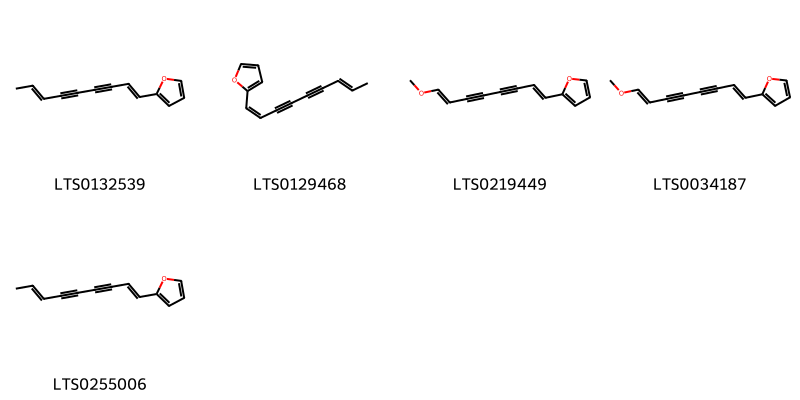
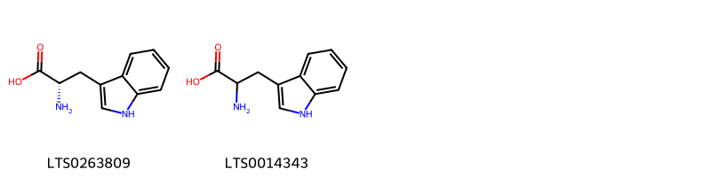
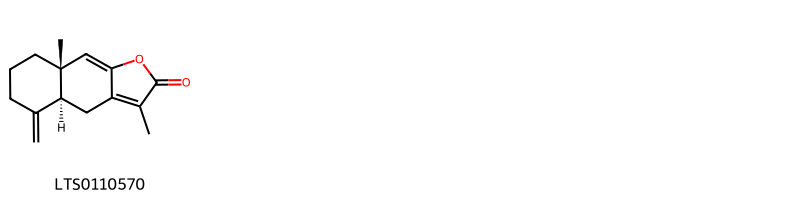
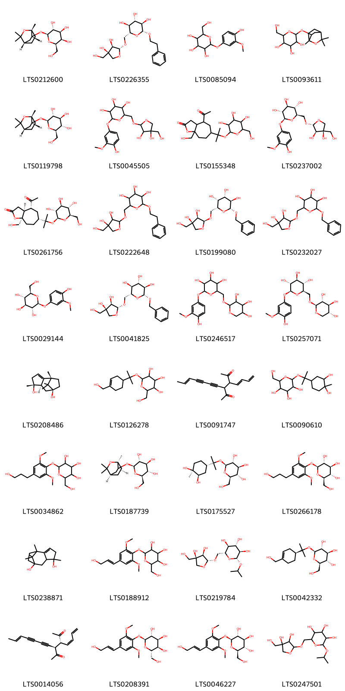
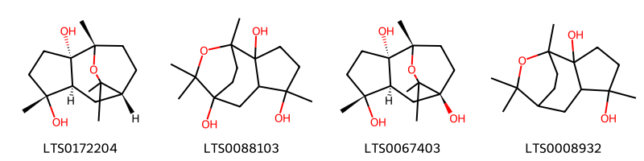
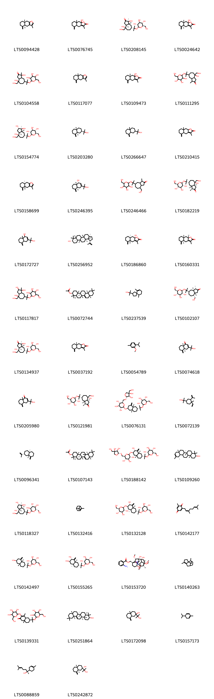
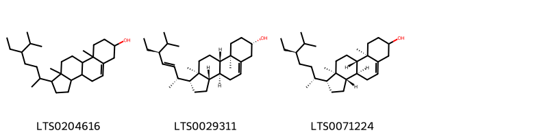

!!! abstract "Tóm tắt"

    Thương truật (Rhizoma Atractylodis) là thân rễ đã phơi khô của cây Mao thương truật (Atractylodes lancea (Thunb.) DC.), thuộc họ Cúc (Asteraceae). Thương truật phân bố chủ yếu ở Amur, Trung Quốc, Nhật Bản, Hàn Quốc, và Việt Nam. Theo y học cổ truyền, Thương truật cay, tính ấm, vào kinh tỳ và vị, liều dùng tối đa 9g/ngày. Thương truật thường được dùng kết hợp với các dược liệu khác để chữa bệnh như Bình vị tán (chữa viêm dạ dày, đầy bụng, nôn mửa) và Cao bạch truật (chữa ỉa lỏng). Thương truật có tác dụng hỗ trợ tiêu hóa, điều trị tiểu đường, các bệnh cơ xương khớp, và hạ huyết áp. Thành phần hóa học chính gồm tinh dầu với các hoạt chất như atractylola (C15H26O) và atractylon (C14H18O).

## Thông tin về thực vật

Dược liệu **Thương Truật (Thân Rễ)** từ bộ phận **nan** từ loài *Atractylodes lancea*.

**Mô tả thực vật:** Thương truật là một loại cây sống lâu năm, cao chừng 0,60m, có rễ phát triển thành củ to, thân mọc thẳng đứng. Lá mọc so le, gần như không có cuống, lá ở phía gốc chia 3 thùy nhưng cắt không sâu. 2 thủy 2 bền không lớn lắm, thùy giữa rất lớn, lá phía trên hình mác, không chia thùy. Mép lá trên lá dưới đều có răng cưa nhỏ nhọn. Cụm hoa hình đầu, tổng bao do 5-7 lớp như ngói lợp, lớp dưới cùng chia rất nhỏ hình lồng chim. Hoa hình ống, những hoa phía ngoài là hoa cái, những hoa trong lưỡng tính, tràng hoa màu trắng hay tím nhạt, đỉnh chia 5 thùy xẻ xấu. 5 nhị (bị thoái hóa ở hoa cái), nhụy có đầu vòi chia hai, bầu có lông mềm nhỏ. Cụm hoa thương truật so với cụm hoa của bạch truật nhỏ và gầy hơn. Quả khô

*Tài liệu tham khảo:* "Những cây thuốc và vị thuốc Việt Nam" - Đỗ Tất Lợi 
Trong dược điển Việt nam, một loài được sử dụng làm dược liệu là *Atractylodes lancea*.

!!! info "Phân loại thực vật của *Atractylodes lancea*"
    - **Kingdom:** Plantae
    - **Phylum:** Tracheophyta
    - **Order:** Asterales
    - **Family:** Asteraceae
    - **Genus:** Atractylodes
    - **Species:** *Atractylodes lancea*

**Phân bố trên thế giới:** nan, Russian Federation, China, Japan, Korea, Republic of

**Phân bố tại Việt nam:** Không có ghi nhận ở Việt Nam

## Thông tin về dược liệu 

### Định danh

!!! info "Thông tin về tên gọi"

    - Dược liệu tiếng Việt: nan
    - Dược liệu tiếng Trung: nan (nan)
    - Dược liệu tiếng Anh: nan
    - Dược liệu latin thông dụng: nan
    - Dược liệu latin kiểu DĐVN: *rhizoma atractylodis*
    - Dược liệu latin kiểu DĐVN: *nan*
    - Dược liệu latin kiểu thông tư: *nan*
    - Bộ phận dùng: nan (nan)

### Mô tả dược liệu 

- **Theo dược điển Việt nam V:** nan

- **Mô tả dược liệu theo thông tư chế biến dược liệu theo phương pháp cổ truyền:** nan

### Chế biến 

- **Chế biến theo dược điển việt nam V**: nan

- **Chế biến theo thông tư:** nan

--- 

## Thành phần hóa học

- Theo tài liệu của GS. Đỗ Tất Lợi:  (1)  tinh dầu, trong tinh dầu thành phần chủ yếu là atractylola C15H26O và atractylon C14H18O
    

**Thành phần hóa học từ loài **Atractylodes lancea**

Theo cơ sở dữ liệu lotus, loài *Atractylodes lancea* đã phân lập và xác định được **178** hoạt chất thuộc về các nhóm Naphthofurans, Steroids and steroid derivatives, Heteroaromatic compounds, Organooxygen compounds, Fatty Acyls, Flavonoids, Cinnamic acids and derivatives, Benzopyrans, Indoles and derivatives, Purine nucleosides, Pyrimidine nucleosides, Benzene and substituted derivatives, Coumarins and derivatives, Prenol lipids, Oxepanes trong bảng dưới đây. Danh sách các hoạt chất như sau elemol [(LTS0208556)](https://lotus.naturalproducts.net/compound/lotus_id/LTS0208556), 3-(2-hydroxypropan-2-yl)-8a-methyl-5-methylidene-1,4,4a,6,7,8-hexahydronaphthalen-1-ol [(LTS0172727)](https://lotus.naturalproducts.net/compound/lotus_id/LTS0172727), (1s,2s,5r,6s,8s)-1,5,9,9-tetramethyl-10-oxatricyclo[6.2.2.0²,⁶]dodecane-2,5,8-triol [(LTS0067403)](https://lotus.naturalproducts.net/compound/lotus_id/LTS0067403), (2s,3s,4r,5r,6s)-2-({2-[(2s,3s,3as,5s,8s,8ar)-2,3,8-trihydroxy-8-(hydroxymethyl)-3-methyl-octahydroazulen-5-yl]propan-2-yl}oxy)-6-(hydroxymethyl)oxane-3,4,5-triol [(LTS0118327)](https://lotus.naturalproducts.net/compound/lotus_id/LTS0118327), 6-methoxy-7-{[(2s,3r,4s,5s,6r)-3,4,5-trihydroxy-6-({[(2s,3r,4s,5r)-3,4,5-trihydroxyoxan-2-yl]oxy}methyl)oxan-2-yl]oxy}chromen-2-one [(LTS0125933)](https://lotus.naturalproducts.net/compound/lotus_id/LTS0125933), 3-(acetyloxy)trideca-1,5,11-trien-7,9-diyn-4-yl acetate [(LTS0172124)](https://lotus.naturalproducts.net/compound/lotus_id/LTS0172124), β-eudesmol [(LTS0203280)](https://lotus.naturalproducts.net/compound/lotus_id/LTS0203280), α pinene [(LTS0132416)](https://lotus.naturalproducts.net/compound/lotus_id/LTS0132416), phellandrene [(LTS0157173)](https://lotus.naturalproducts.net/compound/lotus_id/LTS0157173), (2r,3e,5z,11e)-1-(acetyloxy)trideca-3,5,11-trien-7,9-diyn-2-yl acetate [(LTS0250319)](https://lotus.naturalproducts.net/compound/lotus_id/LTS0250319), (2s,3r,4s,5s,6r)-2-({2-[(2r,4as,6r,7r,8ar)-6,7-dihydroxy-4a-methyl-8-methylidene-octahydronaphthalen-2-yl]propan-2-yl}oxy)-6-(hydroxymethyl)oxane-3,4,5-triol [(LTS0155265)](https://lotus.naturalproducts.net/compound/lotus_id/LTS0155265), atractylenolide iii [(LTS0024642)](https://lotus.naturalproducts.net/compound/lotus_id/LTS0024642), 3-(2-hydroxypropan-2-yl)-8a-methyl-5-methylidene-4a,6,7,8-tetrahydro-4h-naphthalen-1-one [(LTS0205980)](https://lotus.naturalproducts.net/compound/lotus_id/LTS0205980), (2r,3s,4s,5r,6r)-2-(hydroxymethyl)-6-{[(5s,6r)-5-hydroxytrideca-1,3,11-trien-7,9-diyn-6-yl]oxy}oxane-3,4,5-triol [(LTS0261662)](https://lotus.naturalproducts.net/compound/lotus_id/LTS0261662), 2-{[8a-methyl-4-methylidene-6-(2-{[3,4,5-trihydroxy-6-(hydroxymethyl)oxan-2-yl]oxy}propan-2-yl)-octahydronaphthalen-2-yl]oxy}-6-(hydroxymethyl)oxane-3,4,5-triol [(LTS0229619)](https://lotus.naturalproducts.net/compound/lotus_id/LTS0229619), (2s,3r,4s,5s,6r)-2-({2-[(1s,3r,4s)-3,4-dihydroxy-4-methylcyclohexyl]propan-2-yl}oxy)-6-(hydroxymethyl)oxane-3,4,5-triol [(LTS0175527)](https://lotus.naturalproducts.net/compound/lotus_id/LTS0175527), (2r,3s,4s,5r,6r)-2-({[(2r,3r,4r)-3,4-dihydroxy-4-(hydroxymethyl)oxolan-2-yl]oxy}methyl)-6-{[(3s,8e)-10-hydroxydec-8-en-4,6-diyn-3-yl]oxy}oxane-3,4,5-triol [(LTS0067095)](https://lotus.naturalproducts.net/compound/lotus_id/LTS0067095), linoleic [(LTS0013198)](https://lotus.naturalproducts.net/compound/lotus_id/LTS0013198), (2r,3s,4s,5r,6s)-2-(hydroxymethyl)-6-{[(1s,4r,6s)-1,3,3-trimethyl-2-oxabicyclo[2.2.2]octan-6-yl]oxy}oxane-3,4,5-triol [(LTS0187739)](https://lotus.naturalproducts.net/compound/lotus_id/LTS0187739), (1s,2s,7e)-1-(acetyloxy)-1-(furan-2-yl)non-7-en-3,5-diyn-2-yl acetate [(LTS0219799)](https://lotus.naturalproducts.net/compound/lotus_id/LTS0219799), osthole [(LTS0149433)](https://lotus.naturalproducts.net/compound/lotus_id/LTS0149433), (3as,4r,6r,8ar)-4-acetyl-8a-(hydroxymethyl)-6-(2-{[(2s,3r,4s,5s,6r)-3,4,5-trihydroxy-6-(hydroxymethyl)oxan-2-yl]oxy}propan-2-yl)-hexahydro-3h-cyclohepta[b]furan-2-one [(LTS0261756)](https://lotus.naturalproducts.net/compound/lotus_id/LTS0261756), wogonin [(LTS0176185)](https://lotus.naturalproducts.net/compound/lotus_id/LTS0176185), (2s,3r,4s,5s,6r)-2-({2-[(2r,4ar,6s,8as)-6-hydroxy-4a-methyl-8-methylidene-octahydronaphthalen-2-yl]propan-2-yl}oxy)-6-(hydroxymethyl)oxane-3,4,5-triol [(LTS0142497)](https://lotus.naturalproducts.net/compound/lotus_id/LTS0142497), [(1s,4s,5r,6s,8r,9r,13s,16s,18s)-11-ethyl-8,9-dihydroxy-4,6,16,18-tetramethoxy-11-azahexacyclo[7.7.2.1²,⁵.0¹,¹⁰.0³,⁸.0¹³,¹⁷]nonadecan-13-yl]methyl 2-aminobenzoate [(LTS0153720)](https://lotus.naturalproducts.net/compound/lotus_id/LTS0153720), 2-isopropyl-5-methylanisole [(LTS0054789)](https://lotus.naturalproducts.net/compound/lotus_id/LTS0054789), (2s,3r,4s,5s,6r)-2-({2-[(2r,4ar,6r,7r,8ar)-6,7-dihydroxy-4a-methyl-8-methylidene-octahydronaphthalen-2-yl]propan-2-yl}oxy)-6-(hydroxymethyl)oxane-3,4,5-triol [(LTS0131925)](https://lotus.naturalproducts.net/compound/lotus_id/LTS0131925), 2-(nona-1,7-dien-3,5-diyn-1-yl)furan [(LTS0255006)](https://lotus.naturalproducts.net/compound/lotus_id/LTS0255006), 2-({[3,4-dihydroxy-4-(hydroxymethyl)oxolan-2-yl]oxy}methyl)-6-(2-phenylethoxy)oxane-3,4,5-triol [(LTS0222648)](https://lotus.naturalproducts.net/compound/lotus_id/LTS0222648), 2-[(2e)-3,7-dimethylocta-2,6-dien-1-yl]-4-methoxy-6-methylphenol [(LTS0013572)](https://lotus.naturalproducts.net/compound/lotus_id/LTS0013572), 2-(hydroxymethyl)-6-({1,3,3-trimethyl-2-oxabicyclo[2.2.2]octan-6-yl}oxy)oxane-3,4,5-triol [(LTS0093611)](https://lotus.naturalproducts.net/compound/lotus_id/LTS0093611), 2-{[3-hydroxy-8a-methyl-4-methylidene-6-(2-{[3,4,5-trihydroxy-6-(hydroxymethyl)oxan-2-yl]oxy}propan-2-yl)-octahydronaphthalen-2-yl]oxy}-6-(hydroxymethyl)oxane-3,4,5-triol [(LTS0020984)](https://lotus.naturalproducts.net/compound/lotus_id/LTS0020984), 2-(2-hydroxypropan-2-yl)-4a-methyl-8-methylidene-hexahydro-1h-naphthalen-2-ol [(LTS0172098)](https://lotus.naturalproducts.net/compound/lotus_id/LTS0172098), (1s,3as,4r,7r,8ar)-4-(hydroxymethyl)-1-methyl-7-(2-{[(2s,3r,4s,5s,6r)-3,4,5-trihydroxy-6-(hydroxymethyl)oxan-2-yl]oxy}propan-2-yl)-octahydro-1h-azulen-2-one [(LTS0102107)](https://lotus.naturalproducts.net/compound/lotus_id/LTS0102107), 2-({[3,4-dihydroxy-4-(hydroxymethyl)oxolan-2-yl]oxy}methyl)-6-(4-hydroxy-3-methoxyphenoxy)oxane-3,4,5-triol [(LTS0045505)](https://lotus.naturalproducts.net/compound/lotus_id/LTS0045505), (8ar)-9a-hydroxy-3,8a-dimethyl-5-methylidene-4h,4ah,6h,7h,8h,9h-naphtho[2,3-b]furan-2-one [(LTS0109473)](https://lotus.naturalproducts.net/compound/lotus_id/LTS0109473), 6-methoxy-7-[(3,4,5-trihydroxy-6-{[(3,4,5-trihydroxyoxan-2-yl)oxy]methyl}oxan-2-yl)oxy]chromen-2-one [(LTS0193905)](https://lotus.naturalproducts.net/compound/lotus_id/LTS0193905), (4as,8ar,9as)-3,8a-dimethyl-5-methylidene-4h,4ah,6h,7h,8h,9h,9ah-naphtho[2,3-b]furan-2-one [(LTS0160331)](https://lotus.naturalproducts.net/compound/lotus_id/LTS0160331), β-eudesmol [(LTS0266647)](https://lotus.naturalproducts.net/compound/lotus_id/LTS0266647), (2r,3s,4s,5r,6r)-2-({[(2r,3r,4r)-3,4-dihydroxy-4-(hydroxymethyl)oxolan-2-yl]oxy}methyl)-6-[(3-methylbut-3-en-1-yl)oxy]oxane-3,4,5-triol [(LTS0154325)](https://lotus.naturalproducts.net/compound/lotus_id/LTS0154325), 1-(acetyloxy)-1-(furan-2-yl)non-7-en-3,5-diyn-2-yl acetate [(LTS0112369)](https://lotus.naturalproducts.net/compound/lotus_id/LTS0112369), (4ar,6r,8as)-4,8a-dimethyl-3-{[(2s,3r,4s,5s,6r)-3,4,5-trihydroxy-6-(hydroxymethyl)oxan-2-yl]oxy}-6-(2-{[(2s,3r,4s,5s,6r)-3,4,5-trihydroxy-6-(hydroxymethyl)oxan-2-yl]oxy}propan-2-yl)-1,4a,5,6,7,8-hexahydronaphthalen-2-one [(LTS0155565)](https://lotus.naturalproducts.net/compound/lotus_id/LTS0155565), (4ar,8as)-3,8a-dimethyl-5-methylidene-4h,4ah,6h,7h,8h,9h-naphtho[2,3-b]furan [(LTS0158699)](https://lotus.naturalproducts.net/compound/lotus_id/LTS0158699), (4as,8as)-3-(2-hydroxypropan-2-yl)-8a-methyl-5-methylidene-4a,6,7,8-tetrahydro-4h-naphthalen-1-one [(LTS0074618)](https://lotus.naturalproducts.net/compound/lotus_id/LTS0074618), 2-{[2-(6,7-dihydroxy-4a-methyl-8-methylidene-octahydronaphthalen-2-yl)propan-2-yl]oxy}-6-(hydroxymethyl)oxane-3,4,5-triol [(LTS0228218)](https://lotus.naturalproducts.net/compound/lotus_id/LTS0228218), (1s,3as,4r,7r,8ar)-4-hydroxy-4-(hydroxymethyl)-1-methyl-7-(2-{[(2s,3r,4s,5s,6r)-3,4,5-trihydroxy-6-(hydroxymethyl)oxan-2-yl]oxy}propan-2-yl)-octahydroazulen-2-one [(LTS0182219)](https://lotus.naturalproducts.net/compound/lotus_id/LTS0182219), 2-[(1e,7e)-8-methoxyocta-1,7-dien-3,5-diyn-1-yl]furan [(LTS0034187)](https://lotus.naturalproducts.net/compound/lotus_id/LTS0034187), (4as,8as)-3,8a-dimethyl-5-methylidene-4h,4ah,6h,7h,8h-naphtho[2,3-b]furan-2-one [(LTS0110570)](https://lotus.naturalproducts.net/compound/lotus_id/LTS0110570), (3s,4ar,6ar,8ar,12ar,14ar,14br)-4,4,6a,8a,11,11,12b,14b-octamethyl-1,2,3,4a,5,6,8,9,10,12,12a,13,14,14a-tetradecahydropicen-3-yl acetate [(LTS0107143)](https://lotus.naturalproducts.net/compound/lotus_id/LTS0107143), (2r,3r,4s,5s,6r)-2-{[(2s,4as,6r,8as)-8a-methyl-4-methylidene-6-(2-{[(2s,3r,4s,5s,6r)-3,4,5-trihydroxy-6-(hydroxymethyl)oxan-2-yl]oxy}propan-2-yl)-octahydronaphthalen-2-yl]oxy}-6-({[(2r,3r,4r)-3,4-dihydroxy-4-(hydroxymethyl)oxolan-2-yl]oxy}methyl)oxane-3,4,5-triol [(LTS0027148)](https://lotus.naturalproducts.net/compound/lotus_id/LTS0027148), (2s,3r,4s,5s,6r)-2-({2-[(2r,4as,6s,8as)-6-hydroxy-4a-methyl-8-methylidene-octahydronaphthalen-2-yl]propan-2-yl}oxy)-6-(hydroxymethyl)oxane-3,4,5-triol [(LTS0253653)](https://lotus.naturalproducts.net/compound/lotus_id/LTS0253653), 2-{[8a-methyl-4-methylidene-6-(2-{[3,4,5-trihydroxy-6-(hydroxymethyl)oxan-2-yl]oxy}propan-2-yl)-octahydronaphthalen-2-yl]oxy}-6-({[3,4-dihydroxy-4-(hydroxymethyl)oxolan-2-yl]oxy}methyl)oxane-3,4,5-triol [(LTS0014215)](https://lotus.naturalproducts.net/compound/lotus_id/LTS0014215), 8-(2-hydroxypropan-2-yl)-1,5-dimethyl-11-oxatricyclo[6.2.1.0⁴,¹⁰]undecan-5-ol [(LTS0185349)](https://lotus.naturalproducts.net/compound/lotus_id/LTS0185349), (3s,4s,5e,11e)-3-(acetyloxy)trideca-1,5,11-trien-7,9-diyn-4-yl acetate [(LTS0198280)](https://lotus.naturalproducts.net/compound/lotus_id/LTS0198280), 4-acetyl-8a-(hydroxymethyl)-6-(2-{[3,4,5-trihydroxy-6-(hydroxymethyl)oxan-2-yl]oxy}propan-2-yl)-hexahydro-3h-cyclohepta[b]furan-2-one [(LTS0155348)](https://lotus.naturalproducts.net/compound/lotus_id/LTS0155348), 2-{[2-(3,4-dihydroxy-4-methylcyclohexyl)propan-2-yl]oxy}-6-(hydroxymethyl)oxane-3,4,5-triol [(LTS0090610)](https://lotus.naturalproducts.net/compound/lotus_id/LTS0090610), 1-(acetyloxy)tetradeca-4,6,12-trien-8,10-diyn-3-yl acetate [(LTS0273113)](https://lotus.naturalproducts.net/compound/lotus_id/LTS0273113), 3,8a-dimethyl-5-methylidene-4h,4ah,6h,7h,8h,9h,9ah-naphtho[2,3-b]furan-2-one [(LTS0210415)](https://lotus.naturalproducts.net/compound/lotus_id/LTS0210415), (3s,4ar,6ar,8ar,12ar,12bs,14ar,14br)-4,4,6a,8a,11,11,12b,14b-octamethyl-1,2,3,4a,5,6,8,9,10,12,12a,13,14,14a-tetradecahydropicen-3-yl acetate [(LTS0072744)](https://lotus.naturalproducts.net/compound/lotus_id/LTS0072744), (2r,3r,4s,5s,6r)-2-{[(2e,8e)-10-hydroxydeca-2,8-dien-4,6-diyn-1-yl]oxy}-6-(hydroxymethyl)oxane-3,4,5-triol [(LTS0059464)](https://lotus.naturalproducts.net/compound/lotus_id/LTS0059464), 4,8a-dimethyl-6-(2-{[3,4,5-trihydroxy-6-(hydroxymethyl)oxan-2-yl]oxy}propan-2-yl)-1,4a,5,6,7,8-hexahydronaphthalen-2-one [(LTS0244261)](https://lotus.naturalproducts.net/compound/lotus_id/LTS0244261), (5e)-trideca-3,5,11-trien-7,9-diyn-1-yl 3-(4-hydroxy-3-methoxyphenyl)prop-2-enoate [(LTS0176405)](https://lotus.naturalproducts.net/compound/lotus_id/LTS0176405), (2e,8e)-9-(furan-2-yl)nona-2,8-dien-4,6-diyn-1-yl acetate [(LTS0221823)](https://lotus.naturalproducts.net/compound/lotus_id/LTS0221823), atractylodin [(LTS0132539)](https://lotus.naturalproducts.net/compound/lotus_id/LTS0132539), 1,5,9,9-tetramethyl-10-oxatricyclo[6.2.2.0²,⁶]dodecane-2,5,8-triol [(LTS0088103)](https://lotus.naturalproducts.net/compound/lotus_id/LTS0088103), syringin [(LTS0046227)](https://lotus.naturalproducts.net/compound/lotus_id/LTS0046227), (2r,3s,4s,5r,6s)-2-({[(2r,3r,4r)-3,4-dihydroxy-4-(hydroxymethyl)oxolan-2-yl]oxy}methyl)-6-(4-hydroxy-3-methoxyphenoxy)oxane-3,4,5-triol [(LTS0237002)](https://lotus.naturalproducts.net/compound/lotus_id/LTS0237002), (2e,8e)-9-(furan-2-yl)nona-2,8-dien-4,6-diyn-1-ol [(LTS0149220)](https://lotus.naturalproducts.net/compound/lotus_id/LTS0149220), 1,5,11,11-tetramethyltricyclo[6.2.1.0²,⁶]undec-2-ene-5,8-diol [(LTS0238871)](https://lotus.naturalproducts.net/compound/lotus_id/LTS0238871), 2,8-dimethyl-2-(4-methylpent-3-en-1-yl)chromen-6-ol [(LTS0088673)](https://lotus.naturalproducts.net/compound/lotus_id/LTS0088673), (2r,3r,4s,5s,6r)-2-{[(2r,3r,4ar,6r,8as)-3-hydroxy-8a-methyl-4-methylidene-6-(2-{[(2s,3r,4s,5s,6r)-3,4,5-trihydroxy-6-(hydroxymethyl)oxan-2-yl]oxy}propan-2-yl)-octahydronaphthalen-2-yl]oxy}-6-(hydroxymethyl)oxane-3,4,5-triol [(LTS0132128)](https://lotus.naturalproducts.net/compound/lotus_id/LTS0132128), (3s,4e,6e,12e)-1-(acetyloxy)tetradeca-4,6,12-trien-8,10-diyn-3-yl acetate [(LTS0052541)](https://lotus.naturalproducts.net/compound/lotus_id/LTS0052541), 8-(2-hydroxypropan-2-yl)-1,5-dimethyl-11-oxatricyclo[6.2.1.0²,⁶]undecan-5-ol [(LTS0018658)](https://lotus.naturalproducts.net/compound/lotus_id/LTS0018658), 2-({[3,4-dihydroxy-4-(hydroxymethyl)oxolan-2-yl]oxy}methyl)-6-[(3-methylbut-2-en-1-yl)oxy]oxane-3,4,5-triol [(LTS0115112)](https://lotus.naturalproducts.net/compound/lotus_id/LTS0115112), (2r,3s,4s,5r,6r)-2-({[(2r,3r,4r)-3,4-dihydroxy-4-(hydroxymethyl)oxolan-2-yl]oxy}methyl)-6-(2-phenylethoxy)oxane-3,4,5-triol [(LTS0226355)](https://lotus.naturalproducts.net/compound/lotus_id/LTS0226355), 1,5,9,9-tetramethyl-10-oxatricyclo[6.2.2.0²,⁶]dodecane-2,5-diol [(LTS0008932)](https://lotus.naturalproducts.net/compound/lotus_id/LTS0008932), 4-(hydroxymethyl)-1-methyl-7-(2-{[3,4,5-trihydroxy-6-(hydroxymethyl)oxan-2-yl]oxy}propan-2-yl)-octahydro-1h-azulen-2-one [(LTS0246466)](https://lotus.naturalproducts.net/compound/lotus_id/LTS0246466), 2-(8-methoxyocta-1,7-dien-3,5-diyn-1-yl)furan [(LTS0219449)](https://lotus.naturalproducts.net/compound/lotus_id/LTS0219449), (2r,3r,4s,5s,6r)-2-{[(2s,4as,6r,8ar)-8a-methyl-4-methylidene-6-(2-{[(2s,3r,4s,5s,6r)-3,4,5-trihydroxy-6-(hydroxymethyl)oxan-2-yl]oxy}propan-2-yl)-octahydronaphthalen-2-yl]oxy}-6-(hydroxymethyl)oxane-3,4,5-triol [(LTS0001631)](https://lotus.naturalproducts.net/compound/lotus_id/LTS0001631), 2-{6,10-dimethylspiro[4.5]dec-6-en-2-yl}propan-2-ol [(LTS0237539)](https://lotus.naturalproducts.net/compound/lotus_id/LTS0237539), 2-({[3,4-dihydroxy-4-(hydroxymethyl)oxolan-2-yl]oxy}methyl)-6-[(3-methylbut-3-en-1-yl)oxy]oxane-3,4,5-triol [(LTS0024546)](https://lotus.naturalproducts.net/compound/lotus_id/LTS0024546), 1,4-dihydroxy-4-(hydroxymethyl)-1-methyl-7-(2-{[3,4,5-trihydroxy-6-(hydroxymethyl)oxan-2-yl]oxy}propan-2-yl)-hexahydro-3h-azulen-2-one [(LTS0104558)](https://lotus.naturalproducts.net/compound/lotus_id/LTS0104558), (1r,2s,5r,6s,8s)-8-(2-hydroxypropan-2-yl)-1,5-dimethyl-11-oxatricyclo[6.2.1.0²,⁶]undecan-5-ol [(LTS0192231)](https://lotus.naturalproducts.net/compound/lotus_id/LTS0192231), (3e)-1-(acetyloxy)trideca-3,5,11-trien-7,9-diyn-2-yl acetate [(LTS0064208)](https://lotus.naturalproducts.net/compound/lotus_id/LTS0064208), (4as,6r,8as)-4,8a-dimethyl-3-{[(2s,3r,4s,5s,6r)-3,4,5-trihydroxy-6-(hydroxymethyl)oxan-2-yl]oxy}-6-(2-{[(2s,3r,4s,5s,6r)-3,4,5-trihydroxy-6-(hydroxymethyl)oxan-2-yl]oxy}propan-2-yl)-1,4a,5,6,7,8-hexahydronaphthalen-2-one [(LTS0034109)](https://lotus.naturalproducts.net/compound/lotus_id/LTS0034109), (4ar,6r,8ar)-4,8a-dimethyl-3-{[(2s,3r,4s,5s,6r)-3,4,5-trihydroxy-6-(hydroxymethyl)oxan-2-yl]oxy}-6-(2-{[(2s,3r,4s,5s,6r)-3,4,5-trihydroxy-6-(hydroxymethyl)oxan-2-yl]oxy}propan-2-yl)-1,4a,5,6,7,8-hexahydronaphthalen-2-one [(LTS0015904)](https://lotus.naturalproducts.net/compound/lotus_id/LTS0015904), stigmast-5-en-3-ol, (3β)- [(LTS0204616)](https://lotus.naturalproducts.net/compound/lotus_id/LTS0204616), 1-[(2s,3s,4s,5s)-3,4-dihydroxy-5-(hydroxymethyl)oxolan-2-yl]-4-hydroxypyrimidin-2-one [(LTS0200435)](https://lotus.naturalproducts.net/compound/lotus_id/LTS0200435), (8ar)-3,8a-dimethyl-5-methylidene-4h,4ah,6h,7h,8h,9h,9ah-naphtho[2,3-b]furan-2-one [(LTS0037192)](https://lotus.naturalproducts.net/compound/lotus_id/LTS0037192), 9-(furan-2-yl)nona-2,8-dien-4,6-diyn-1-ol [(LTS0081133)](https://lotus.naturalproducts.net/compound/lotus_id/LTS0081133), 2-(hydroxymethyl)-6-({2-[4-(hydroxymethyl)cyclohex-3-en-1-yl]propan-2-yl}oxy)oxane-3,4,5-triol [(LTS0126278)](https://lotus.naturalproducts.net/compound/lotus_id/LTS0126278), palmitic acid [(LTS0079439)](https://lotus.naturalproducts.net/compound/lotus_id/LTS0079439), 2-[4-ethenyl-4-methyl-3-(prop-1-en-2-yl)cyclohexyl]propan-2-ol [(LTS0072139)](https://lotus.naturalproducts.net/compound/lotus_id/LTS0072139), optimax [(LTS0014343)](https://lotus.naturalproducts.net/compound/lotus_id/LTS0014343), atractylone [(LTS0094428)](https://lotus.naturalproducts.net/compound/lotus_id/LTS0094428), 9-(furan-2-yl)nona-2,8-dien-4,6-diyn-1-yl acetate [(LTS0006102)](https://lotus.naturalproducts.net/compound/lotus_id/LTS0006102), (1s,3as,4r,7r,8ar)-1,4-dihydroxy-4-(hydroxymethyl)-1-methyl-7-(2-{[(2s,3r,4s,5s,6r)-3,4,5-trihydroxy-6-(hydroxymethyl)oxan-2-yl]oxy}propan-2-yl)-hexahydro-3h-azulen-2-one [(LTS0208145)](https://lotus.naturalproducts.net/compound/lotus_id/LTS0208145), 2-(4-hydroxy-3-methoxyphenoxy)-6-{[(3,4,5-trihydroxyoxan-2-yl)oxy]methyl}oxane-3,4,5-triol [(LTS0246517)](https://lotus.naturalproducts.net/compound/lotus_id/LTS0246517), (2r)-2,8-dimethyl-2-(4-methylpent-3-en-1-yl)chromen-6-ol [(LTS0184847)](https://lotus.naturalproducts.net/compound/lotus_id/LTS0184847), 2-(hydroxymethyl)-6-({2-[2,3,8-trihydroxy-8-(hydroxymethyl)-3-methyl-octahydroazulen-5-yl]propan-2-yl}oxy)oxane-3,4,5-triol [(LTS0117817)](https://lotus.naturalproducts.net/compound/lotus_id/LTS0117817), (2r,3s,4s,5r,6r)-2-({[(2r,3r,4r)-3,4-dihydroxy-4-(hydroxymethyl)oxolan-2-yl]oxy}methyl)-6-isopropoxyoxane-3,4,5-triol [(LTS0219784)](https://lotus.naturalproducts.net/compound/lotus_id/LTS0219784), 2-(4-hydroxy-3-methoxyphenoxy)-6-(hydroxymethyl)oxane-3,4,5-triol [(LTS0085094)](https://lotus.naturalproducts.net/compound/lotus_id/LTS0085094), (2s,3r,4s,5r,6s)-2-(hydroxymethyl)-6-{4-[(1e)-3-hydroxyprop-1-en-1-yl]-2,6-dimethoxyphenoxy}oxane-3,4,5-triol [(LTS0208391)](https://lotus.naturalproducts.net/compound/lotus_id/LTS0208391), (2r,3r,4s,5s,6r)-2-{[(2s,4as,6r,8ar)-8a-methyl-4-methylidene-6-(2-{[(2s,3r,4s,5s,6r)-3,4,5-trihydroxy-6-(hydroxymethyl)oxan-2-yl]oxy}propan-2-yl)-octahydronaphthalen-2-yl]oxy}-6-({[(2r,3r,4r)-3,4-dihydroxy-4-(hydroxymethyl)oxolan-2-yl]oxy}methyl)oxane-3,4,5-triol [(LTS0076131)](https://lotus.naturalproducts.net/compound/lotus_id/LTS0076131), 9a-hydroxy-3,8a-dimethyl-5-methylidene-4h,4ah,6h,7h,8h,9h-naphtho[2,3-b]furan-2-one [(LTS0076745)](https://lotus.naturalproducts.net/compound/lotus_id/LTS0076745), 2-({[3,4-dihydroxy-4-(hydroxymethyl)oxolan-2-yl]oxy}methyl)-6-isopropoxyoxane-3,4,5-triol [(LTS0247501)](https://lotus.naturalproducts.net/compound/lotus_id/LTS0247501), 9,12-octadecadienoic acid [(LTS0101463)](https://lotus.naturalproducts.net/compound/lotus_id/LTS0101463), (2r)-6-methyl-2-(4-methylcyclohex-3-en-1-yl)hept-5-en-2-ol [(LTS0088859)](https://lotus.naturalproducts.net/compound/lotus_id/LTS0088859), (2r,3s,4s,5r,6s)-2-(hydroxymethyl)-6-({2-[(1s)-4-(hydroxymethyl)cyclohex-3-en-1-yl]propan-2-yl}oxy)oxane-3,4,5-triol [(LTS0042332)](https://lotus.naturalproducts.net/compound/lotus_id/LTS0042332), stigmast-5-en-3-ol [(LTS0071224)](https://lotus.naturalproducts.net/compound/lotus_id/LTS0071224), 2-[(1z,7e)-nona-1,7-dien-3,5-diyn-1-yl]furan [(LTS0129468)](https://lotus.naturalproducts.net/compound/lotus_id/LTS0129468), 2-(hydroxymethyl)-6-[4-(3-hydroxyprop-1-en-1-yl)-2,6-dimethoxyphenoxy]oxane-3,4,5-triol [(LTS0188912)](https://lotus.naturalproducts.net/compound/lotus_id/LTS0188912), 3-(buta-1,3-dien-1-yl)-4-(hept-5-en-1,3-diyn-1-yl)hexane-2,5-dione [(LTS0091747)](https://lotus.naturalproducts.net/compound/lotus_id/LTS0091747), (2r,3r,4s,5r,6s)-2-(hydroxymethyl)-6-{[(1r,4s,6r)-1,3,3-trimethyl-2-oxabicyclo[2.2.2]octan-6-yl]oxy}oxane-3,4,5-triol [(LTS0212600)](https://lotus.naturalproducts.net/compound/lotus_id/LTS0212600), (2r,3s,4s,5r,6r)-2-({[(2r,3r,4r)-3,4-dihydroxy-4-(hydroxymethyl)oxolan-2-yl]oxy}methyl)-6-[(3-methylbut-2-en-1-yl)oxy]oxane-3,4,5-triol [(LTS0133417)](https://lotus.naturalproducts.net/compound/lotus_id/LTS0133417), 4-({[3,4-dihydroxy-2,5-bis(hydroxymethyl)oxolan-2-yl]oxy}methyl)-1,4-dihydroxy-1-methyl-7-(2-{[3,4,5-trihydroxy-6-(hydroxymethyl)oxan-2-yl]oxy}propan-2-yl)-hexahydro-3h-azulen-2-one [(LTS0158117)](https://lotus.naturalproducts.net/compound/lotus_id/LTS0158117), 2-(hydroxymethyl)-6-[4-(3-hydroxypropyl)-2,6-dimethoxyphenoxy]oxane-3,4,5-triol [(LTS0034862)](https://lotus.naturalproducts.net/compound/lotus_id/LTS0034862), (2r,3z,5e,11e)-1-(acetyloxy)trideca-3,5,11-trien-7,9-diyn-2-yl acetate [(LTS0185436)](https://lotus.naturalproducts.net/compound/lotus_id/LTS0185436), (2r,3s,4r,5s)-2-(6-aminopurin-9-yl)-5-(hydroxymethyl)oxolane-3,4-diol [(LTS0178532)](https://lotus.naturalproducts.net/compound/lotus_id/LTS0178532), 4,8a-dimethyl-3-{[3,4,5-trihydroxy-6-(hydroxymethyl)oxan-2-yl]oxy}-6-(2-{[3,4,5-trihydroxy-6-(hydroxymethyl)oxan-2-yl]oxy}propan-2-yl)-1,4a,5,6,7,8-hexahydronaphthalen-2-one [(LTS0139331)](https://lotus.naturalproducts.net/compound/lotus_id/LTS0139331), 2-[(2s,5s)-6,10-dimethylspiro[4.5]dec-6-en-2-yl]propan-2-ol [(LTS0246076)](https://lotus.naturalproducts.net/compound/lotus_id/LTS0246076), (2s,3r,4s,5s,6r)-2-(4-hydroxy-3-methoxyphenoxy)-6-(hydroxymethyl)oxane-3,4,5-triol [(LTS0029144)](https://lotus.naturalproducts.net/compound/lotus_id/LTS0029144), 2-(3,7-dimethylocta-2,6-dien-1-yl)-6-methylcyclohexa-2,5-diene-1,4-dione [(LTS0142177)](https://lotus.naturalproducts.net/compound/lotus_id/LTS0142177), adenosine [(LTS0014061)](https://lotus.naturalproducts.net/compound/lotus_id/LTS0014061), cyperene [(LTS0140263)](https://lotus.naturalproducts.net/compound/lotus_id/LTS0140263), 1-[3,4-dihydroxy-5-(hydroxymethyl)oxolan-2-yl]-4-hydroxypyrimidin-2-one [(LTS0075646)](https://lotus.naturalproducts.net/compound/lotus_id/LTS0075646), (1s,3as,4r,7r,8ar)-4-({[(2r,3s,4s,5r)-3,4-dihydroxy-2,5-bis(hydroxymethyl)oxolan-2-yl]oxy}methyl)-1,4-dihydroxy-1-methyl-7-(2-{[(2s,3r,4s,5s,6r)-3,4,5-trihydroxy-6-(hydroxymethyl)oxan-2-yl]oxy}propan-2-yl)-hexahydro-3h-azulen-2-one [(LTS0222683)](https://lotus.naturalproducts.net/compound/lotus_id/LTS0222683), (2r,3r,4s,5r,6r)-2-(benzyloxy)-6-({[(2s,3r,4r)-3,4-dihydroxy-4-(hydroxymethyl)oxolan-2-yl]oxy}methyl)oxane-3,4,5-triol [(LTS0199080)](https://lotus.naturalproducts.net/compound/lotus_id/LTS0199080), (2r,3r,4s,5s,6r)-2-{[(2s,4as,6r,8as)-8a-methyl-4-methylidene-6-(2-{[(2s,3r,4s,5s,6r)-3,4,5-trihydroxy-6-(hydroxymethyl)oxan-2-yl]oxy}propan-2-yl)-octahydronaphthalen-2-yl]oxy}-6-(hydroxymethyl)oxane-3,4,5-triol [(LTS0215478)](https://lotus.naturalproducts.net/compound/lotus_id/LTS0215478), vanillic acid [(LTS0229113)](https://lotus.naturalproducts.net/compound/lotus_id/LTS0229113), uridine [(LTS0220125)](https://lotus.naturalproducts.net/compound/lotus_id/LTS0220125), (2r,3r,4s,5s,6r)-2-{[(2r,3r,4ar,6r,8ar)-3-hydroxy-8a-methyl-4-methylidene-6-(2-{[(2s,3r,4s,5s,6r)-3,4,5-trihydroxy-6-(hydroxymethyl)oxan-2-yl]oxy}propan-2-yl)-octahydronaphthalen-2-yl]oxy}-6-({[(2r,3r,4r)-3,4-dihydroxy-4-(hydroxymethyl)oxolan-2-yl]oxy}methyl)oxane-3,4,5-triol [(LTS0188142)](https://lotus.naturalproducts.net/compound/lotus_id/LTS0188142), caryophyllene [(LTS0085212)](https://lotus.naturalproducts.net/compound/lotus_id/LTS0085212), (1s,2s,5r,6s,8r)-1,5,9,9-tetramethyl-10-oxatricyclo[6.2.2.0²,⁶]dodecane-2,5-diol [(LTS0172204)](https://lotus.naturalproducts.net/compound/lotus_id/LTS0172204), α-bisabolol [(LTS0250984)](https://lotus.naturalproducts.net/compound/lotus_id/LTS0250984), (2e,8z)-9-(furan-2-yl)nona-2,8-dien-4,6-diyn-1-ol [(LTS0063997)](https://lotus.naturalproducts.net/compound/lotus_id/LTS0063997), (2r,3s,4s,5r,6r)-2-(hydroxymethyl)-6-{[(3z,5s,6r,11e)-5-hydroxytrideca-1,3,11-trien-7,9-diyn-6-yl]oxy}oxane-3,4,5-triol [(LTS0136071)](https://lotus.naturalproducts.net/compound/lotus_id/LTS0136071), β-selinene [(LTS0096341)](https://lotus.naturalproducts.net/compound/lotus_id/LTS0096341), 2-(benzyloxy)-6-({[3,4-dihydroxy-4-(hydroxymethyl)oxolan-2-yl]oxy}methyl)oxane-3,4,5-triol [(LTS0232027)](https://lotus.naturalproducts.net/compound/lotus_id/LTS0232027), phytosterol [(LTS0029311)](https://lotus.naturalproducts.net/compound/lotus_id/LTS0029311), 2-[(2e)-3,7-dimethylocta-2,6-dien-1-yl]-6-methylcyclohexa-2,5-diene-1,4-dione [(LTS0268523)](https://lotus.naturalproducts.net/compound/lotus_id/LTS0268523), 2-({[3,4-dihydroxy-4-(hydroxymethyl)oxolan-2-yl]oxy}methyl)-6-[(10-hydroxydec-8-en-4,6-diyn-3-yl)oxy]oxane-3,4,5-triol [(LTS0236362)](https://lotus.naturalproducts.net/compound/lotus_id/LTS0236362), (3s,6ar,6br,8as,12s,14br)-4,4,6a,6b,8a,11,12,14b-octamethyl-2,3,4a,5,6,7,8,9,12,12a,12b,13,14,14a-tetradecahydro-1h-picen-3-ol [(LTS0109260)](https://lotus.naturalproducts.net/compound/lotus_id/LTS0109260), (1s,3as,4s,7r,8ar)-4-hydroxy-4-(hydroxymethyl)-1-methyl-7-(2-{[(2s,3r,4s,5s,6r)-3,4,5-trihydroxy-6-(hydroxymethyl)oxan-2-yl]oxy}propan-2-yl)-octahydroazulen-2-one [(LTS0121981)](https://lotus.naturalproducts.net/compound/lotus_id/LTS0121981), (3r,4r)-3-[(1z)-buta-1,3-dien-1-yl]-4-[(5e)-hept-5-en-1,3-diyn-1-yl]hexane-2,5-dione [(LTS0014056)](https://lotus.naturalproducts.net/compound/lotus_id/LTS0014056), (4ar,6r,8as)-4,8a-dimethyl-6-(2-{[(2s,3r,4s,5s,6r)-3,4,5-trihydroxy-6-(hydroxymethyl)oxan-2-yl]oxy}propan-2-yl)-1,4a,5,6,7,8-hexahydronaphthalen-2-one [(LTS0028442)](https://lotus.naturalproducts.net/compound/lotus_id/LTS0028442), (1s,5r,6r,8s)-1,5,11,11-tetramethyltricyclo[6.2.1.0²,⁶]undec-2-ene-5,8-diol [(LTS0208486)](https://lotus.naturalproducts.net/compound/lotus_id/LTS0208486), (1r,4as,8as)-3-(2-hydroxypropan-2-yl)-8a-methyl-5-methylidene-1,4,4a,6,7,8-hexahydronaphthalen-1-ol [(LTS0246395)](https://lotus.naturalproducts.net/compound/lotus_id/LTS0246395), (2s,3r,4s,5s,6r)-2-(4-hydroxy-3-methoxyphenoxy)-6-({[(2s,3r,4s,5r)-3,4,5-trihydroxyoxan-2-yl]oxy}methyl)oxane-3,4,5-triol [(LTS0257071)](https://lotus.naturalproducts.net/compound/lotus_id/LTS0257071), (2r,3s,4s,5r,6s)-2-(hydroxymethyl)-6-{[(1r,4s,6r)-1,3,3-trimethyl-2-oxabicyclo[2.2.2]octan-6-yl]oxy}oxane-3,4,5-triol [(LTS0119798)](https://lotus.naturalproducts.net/compound/lotus_id/LTS0119798), (3z,5r,6s,11e)-5-(acetyloxy)trideca-1,3,11-trien-7,9-diyn-6-yl acetate [(LTS0134745)](https://lotus.naturalproducts.net/compound/lotus_id/LTS0134745), (2r,3r,4s,5s,6r)-2-{[(2s,4as,6r,8ar)-6-(2-{[(2s,3r,4s,5s,6r)-6-({[(2r,3r,4r)-3,4-dihydroxy-4-(hydroxymethyl)oxolan-2-yl]oxy}methyl)-3,4,5-trihydroxyoxan-2-yl]oxy}propan-2-yl)-8a-methyl-4-methylidene-octahydronaphthalen-2-yl]oxy}-6-({[(2r,3r,4r)-3,4-dihydroxy-4-(hydroxymethyl)oxolan-2-yl]oxy}methyl)oxane-3,4,5-triol [(LTS0126968)](https://lotus.naturalproducts.net/compound/lotus_id/LTS0126968), (4ar,8as,9ar)-9a-hydroxy-3,8a-dimethyl-5-methylidene-4h,4ah,6h,7h,8h,9h-naphtho[2,3-b]furan-2-one [(LTS0186860)](https://lotus.naturalproducts.net/compound/lotus_id/LTS0186860), (8e)-9-(furan-2-yl)non-8-en-4,6-diyn-1-ol [(LTS0077783)](https://lotus.naturalproducts.net/compound/lotus_id/LTS0077783), (3z,5e,11e)-trideca-3,5,11-trien-7,9-diyn-1-yl (2e)-3-(4-hydroxy-3-methoxyphenyl)prop-2-enoate [(LTS0070831)](https://lotus.naturalproducts.net/compound/lotus_id/LTS0070831), β-amyrin [(LTS0251864)](https://lotus.naturalproducts.net/compound/lotus_id/LTS0251864), (4ar,8as,9ar)-3,8a-dimethyl-5-methylidene-4h,4ah,6h,7h,8h,9h,9ah-naphtho[2,3-b]furan-2-one [(LTS0001637)](https://lotus.naturalproducts.net/compound/lotus_id/LTS0001637), 1-(acetyloxy)trideca-3,5,11-trien-7,9-diyn-2-yl acetate [(LTS0180437)](https://lotus.naturalproducts.net/compound/lotus_id/LTS0180437), 2-{[2-(6-hydroxy-4a-methyl-8-methylidene-octahydronaphthalen-2-yl)propan-2-yl]oxy}-6-(hydroxymethyl)oxane-3,4,5-triol [(LTS0004271)](https://lotus.naturalproducts.net/compound/lotus_id/LTS0004271), lupeol [(LTS0256952)](https://lotus.naturalproducts.net/compound/lotus_id/LTS0256952), (3s,4e,6e,12e)-3,14-dihydroxytetradeca-4,6,12-trien-8,10-diyn-1-yl 3-methylbutanoate [(LTS0010587)](https://lotus.naturalproducts.net/compound/lotus_id/LTS0010587), (2s,4ar,8as)-2-(2-hydroxypropan-2-yl)-4a-methyl-8-methylidene-hexahydro-1h-naphthalen-2-ol [(LTS0242872)](https://lotus.naturalproducts.net/compound/lotus_id/LTS0242872), 9 octadecenoic acid [(LTS0158691)](https://lotus.naturalproducts.net/compound/lotus_id/LTS0158691), (2e,8z)-9-(furan-2-yl)nona-2,8-dien-4,6-diyn-1-yl acetate [(LTS0121576)](https://lotus.naturalproducts.net/compound/lotus_id/LTS0121576), (1s,3as,4s,7r,8ar)-1,4-dihydroxy-4-(hydroxymethyl)-1-methyl-7-(2-{[(2s,3r,4s,5s,6r)-3,4,5-trihydroxy-6-(hydroxymethyl)oxan-2-yl]oxy}propan-2-yl)-hexahydro-3h-azulen-2-one [(LTS0134937)](https://lotus.naturalproducts.net/compound/lotus_id/LTS0134937), 2-(3,7-dimethylocta-2,6-dien-1-yl)-4-methoxy-6-methylphenol [(LTS0022322)](https://lotus.naturalproducts.net/compound/lotus_id/LTS0022322), 3,8a-dimethyl-5-methylidene-4h,4ah,6h,7h,8h,9h-naphtho[2,3-b]furan [(LTS0117077)](https://lotus.naturalproducts.net/compound/lotus_id/LTS0117077), 5-(acetyloxy)trideca-1,3,11-trien-7,9-diyn-6-yl acetate [(LTS0179514)](https://lotus.naturalproducts.net/compound/lotus_id/LTS0179514), oleic acid [(LTS0256910)](https://lotus.naturalproducts.net/compound/lotus_id/LTS0256910), l-tryptophan [(LTS0263809)](https://lotus.naturalproducts.net/compound/lotus_id/LTS0263809), (2s,3r,4s,5s,6r)-2-({2-[(2s,3s,3ar,5r,8r,8as)-2,3,8-trihydroxy-8-(hydroxymethyl)-3-methyl-octahydroazulen-5-yl]propan-2-yl}oxy)-6-(hydroxymethyl)oxane-3,4,5-triol [(LTS0154774)](https://lotus.naturalproducts.net/compound/lotus_id/LTS0154774), (2r,3e,5e,11e)-1-(acetyloxy)trideca-3,5,11-trien-7,9-diyn-2-yl acetate [(LTS0093031)](https://lotus.naturalproducts.net/compound/lotus_id/LTS0093031), adenosine [(LTS0052576)](https://lotus.naturalproducts.net/compound/lotus_id/LTS0052576), 2-[(10-hydroxydeca-2,8-dien-4,6-diyn-1-yl)oxy]-6-(hydroxymethyl)oxane-3,4,5-triol [(LTS0117674)](https://lotus.naturalproducts.net/compound/lotus_id/LTS0117674), (2r,3s,4s,5r,6s)-2-(hydroxymethyl)-6-[4-(3-hydroxypropyl)-2,6-dimethoxyphenoxy]oxane-3,4,5-triol [(LTS0266178)](https://lotus.naturalproducts.net/compound/lotus_id/LTS0266178), 4-hydroxy-4-(hydroxymethyl)-1-methyl-7-(2-{[3,4,5-trihydroxy-6-(hydroxymethyl)oxan-2-yl]oxy}propan-2-yl)-octahydroazulen-2-one [(LTS0111295)](https://lotus.naturalproducts.net/compound/lotus_id/LTS0111295), (2r,3r,4s,5s,6r)-2-(benzyloxy)-6-({[(2r,3r,4r)-3,4-dihydroxy-4-(hydroxymethyl)oxolan-2-yl]oxy}methyl)oxane-3,4,5-triol [(LTS0041825)](https://lotus.naturalproducts.net/compound/lotus_id/LTS0041825), (1r,4s,5r,8s,10s)-8-(2-hydroxypropan-2-yl)-1,5-dimethyl-11-oxatricyclo[6.2.1.0⁴,¹⁰]undecan-5-ol [(LTS0030543)](https://lotus.naturalproducts.net/compound/lotus_id/LTS0030543). 
        
| chemicalTaxonomyClassyfireClass     |   smiles_count |
|:------------------------------------|---------------:|
| Benzene and substituted derivatives |             19 |
| Benzopyrans                         |             69 |
| Cinnamic acids and derivatives      |             93 |
| Coumarins and derivatives           |            178 |
| Fatty Acyls                         |           1491 |
| Flavonoids                          |             37 |
| Heteroaromatic compounds            |            114 |
| Indoles and derivatives             |             59 |
| Naphthofurans                       |             41 |
| Organooxygen compounds              |           1872 |
| Oxepanes                            |            176 |
| Prenol lipids                       |           5492 |
| Purine nucleosides                  |            124 |
| Pyrimidine nucleosides              |            121 |
| Steroids and steroid derivatives    |            221 |

            
### Nhóm Benzene and substituted derivatives
<figure markdown="span">
    { width=100% }
<figcaption>Hình ảnh cấu trúc hóa học của hoạt chất thuộc nhóm *Benzene and substituted derivatives*. Tên thường gọi của các hoạt chất tương ứng là vanillic acid [(LTS0229113)](https://lotus.naturalproducts.net/compound/lotus_id/LTS0229113).</figcaption>
</figure>

            
            
### Nhóm Benzene and substituted derivatives
<figure markdown="span">
    { width=100% }
<figcaption>Hình ảnh cấu trúc hóa học của hoạt chất thuộc nhóm *Benzene and substituted derivatives*. Tên thường gọi của các hoạt chất tương ứng là vanillic acid [(LTS0229113)](https://lotus.naturalproducts.net/compound/lotus_id/LTS0229113).</figcaption>
</figure>

### Nhóm Benzopyrans
<figure markdown="span">
    { width=100% }
<figcaption>Hình ảnh cấu trúc hóa học của hoạt chất thuộc nhóm *Benzopyrans*. Tên thường gọi của các hoạt chất tương ứng là 2,8-dimethyl-2-(4-methylpent-3-en-1-yl)chromen-6-ol [(LTS0088673)](https://lotus.naturalproducts.net/compound/lotus_id/LTS0088673), (2r)-2,8-dimethyl-2-(4-methylpent-3-en-1-yl)chromen-6-ol [(LTS0184847)](https://lotus.naturalproducts.net/compound/lotus_id/LTS0184847).</figcaption>
</figure>

            
            
### Nhóm Benzene and substituted derivatives
<figure markdown="span">
    { width=100% }
<figcaption>Hình ảnh cấu trúc hóa học của hoạt chất thuộc nhóm *Benzene and substituted derivatives*. Tên thường gọi của các hoạt chất tương ứng là vanillic acid [(LTS0229113)](https://lotus.naturalproducts.net/compound/lotus_id/LTS0229113).</figcaption>
</figure>

### Nhóm Benzopyrans
<figure markdown="span">
    { width=100% }
<figcaption>Hình ảnh cấu trúc hóa học của hoạt chất thuộc nhóm *Benzopyrans*. Tên thường gọi của các hoạt chất tương ứng là 2,8-dimethyl-2-(4-methylpent-3-en-1-yl)chromen-6-ol [(LTS0088673)](https://lotus.naturalproducts.net/compound/lotus_id/LTS0088673), (2r)-2,8-dimethyl-2-(4-methylpent-3-en-1-yl)chromen-6-ol [(LTS0184847)](https://lotus.naturalproducts.net/compound/lotus_id/LTS0184847).</figcaption>
</figure>

### Nhóm Cinnamic acids and derivatives
<figure markdown="span">
    { width=100% }
<figcaption>Hình ảnh cấu trúc hóa học của hoạt chất thuộc nhóm *Cinnamic acids and derivatives*. Tên thường gọi của các hoạt chất tương ứng là (3z,5e,11e)-trideca-3,5,11-trien-7,9-diyn-1-yl (2e)-3-(4-hydroxy-3-methoxyphenyl)prop-2-enoate [(LTS0070831)](https://lotus.naturalproducts.net/compound/lotus_id/LTS0070831), (5e)-trideca-3,5,11-trien-7,9-diyn-1-yl 3-(4-hydroxy-3-methoxyphenyl)prop-2-enoate [(LTS0176405)](https://lotus.naturalproducts.net/compound/lotus_id/LTS0176405).</figcaption>
</figure>

            
            
### Nhóm Benzene and substituted derivatives
<figure markdown="span">
    { width=100% }
<figcaption>Hình ảnh cấu trúc hóa học của hoạt chất thuộc nhóm *Benzene and substituted derivatives*. Tên thường gọi của các hoạt chất tương ứng là vanillic acid [(LTS0229113)](https://lotus.naturalproducts.net/compound/lotus_id/LTS0229113).</figcaption>
</figure>

### Nhóm Benzopyrans
<figure markdown="span">
    { width=100% }
<figcaption>Hình ảnh cấu trúc hóa học của hoạt chất thuộc nhóm *Benzopyrans*. Tên thường gọi của các hoạt chất tương ứng là 2,8-dimethyl-2-(4-methylpent-3-en-1-yl)chromen-6-ol [(LTS0088673)](https://lotus.naturalproducts.net/compound/lotus_id/LTS0088673), (2r)-2,8-dimethyl-2-(4-methylpent-3-en-1-yl)chromen-6-ol [(LTS0184847)](https://lotus.naturalproducts.net/compound/lotus_id/LTS0184847).</figcaption>
</figure>

### Nhóm Cinnamic acids and derivatives
<figure markdown="span">
    { width=100% }
<figcaption>Hình ảnh cấu trúc hóa học của hoạt chất thuộc nhóm *Cinnamic acids and derivatives*. Tên thường gọi của các hoạt chất tương ứng là (3z,5e,11e)-trideca-3,5,11-trien-7,9-diyn-1-yl (2e)-3-(4-hydroxy-3-methoxyphenyl)prop-2-enoate [(LTS0070831)](https://lotus.naturalproducts.net/compound/lotus_id/LTS0070831), (5e)-trideca-3,5,11-trien-7,9-diyn-1-yl 3-(4-hydroxy-3-methoxyphenyl)prop-2-enoate [(LTS0176405)](https://lotus.naturalproducts.net/compound/lotus_id/LTS0176405).</figcaption>
</figure>

### Nhóm Coumarins and derivatives
<figure markdown="span">
    { width=100% }
<figcaption>Hình ảnh cấu trúc hóa học của hoạt chất thuộc nhóm *Coumarins and derivatives*. Tên thường gọi của các hoạt chất tương ứng là osthole [(LTS0149433)](https://lotus.naturalproducts.net/compound/lotus_id/LTS0149433), 6-methoxy-7-[(3,4,5-trihydroxy-6-{[(3,4,5-trihydroxyoxan-2-yl)oxy]methyl}oxan-2-yl)oxy]chromen-2-one [(LTS0193905)](https://lotus.naturalproducts.net/compound/lotus_id/LTS0193905), 6-methoxy-7-{[(2s,3r,4s,5s,6r)-3,4,5-trihydroxy-6-({[(2s,3r,4s,5r)-3,4,5-trihydroxyoxan-2-yl]oxy}methyl)oxan-2-yl]oxy}chromen-2-one [(LTS0125933)](https://lotus.naturalproducts.net/compound/lotus_id/LTS0125933).</figcaption>
</figure>

            
            
### Nhóm Benzene and substituted derivatives
<figure markdown="span">
    { width=100% }
<figcaption>Hình ảnh cấu trúc hóa học của hoạt chất thuộc nhóm *Benzene and substituted derivatives*. Tên thường gọi của các hoạt chất tương ứng là vanillic acid [(LTS0229113)](https://lotus.naturalproducts.net/compound/lotus_id/LTS0229113).</figcaption>
</figure>

### Nhóm Benzopyrans
<figure markdown="span">
    { width=100% }
<figcaption>Hình ảnh cấu trúc hóa học của hoạt chất thuộc nhóm *Benzopyrans*. Tên thường gọi của các hoạt chất tương ứng là 2,8-dimethyl-2-(4-methylpent-3-en-1-yl)chromen-6-ol [(LTS0088673)](https://lotus.naturalproducts.net/compound/lotus_id/LTS0088673), (2r)-2,8-dimethyl-2-(4-methylpent-3-en-1-yl)chromen-6-ol [(LTS0184847)](https://lotus.naturalproducts.net/compound/lotus_id/LTS0184847).</figcaption>
</figure>

### Nhóm Cinnamic acids and derivatives
<figure markdown="span">
    { width=100% }
<figcaption>Hình ảnh cấu trúc hóa học của hoạt chất thuộc nhóm *Cinnamic acids and derivatives*. Tên thường gọi của các hoạt chất tương ứng là (3z,5e,11e)-trideca-3,5,11-trien-7,9-diyn-1-yl (2e)-3-(4-hydroxy-3-methoxyphenyl)prop-2-enoate [(LTS0070831)](https://lotus.naturalproducts.net/compound/lotus_id/LTS0070831), (5e)-trideca-3,5,11-trien-7,9-diyn-1-yl 3-(4-hydroxy-3-methoxyphenyl)prop-2-enoate [(LTS0176405)](https://lotus.naturalproducts.net/compound/lotus_id/LTS0176405).</figcaption>
</figure>

### Nhóm Coumarins and derivatives
<figure markdown="span">
    { width=100% }
<figcaption>Hình ảnh cấu trúc hóa học của hoạt chất thuộc nhóm *Coumarins and derivatives*. Tên thường gọi của các hoạt chất tương ứng là osthole [(LTS0149433)](https://lotus.naturalproducts.net/compound/lotus_id/LTS0149433), 6-methoxy-7-[(3,4,5-trihydroxy-6-{[(3,4,5-trihydroxyoxan-2-yl)oxy]methyl}oxan-2-yl)oxy]chromen-2-one [(LTS0193905)](https://lotus.naturalproducts.net/compound/lotus_id/LTS0193905), 6-methoxy-7-{[(2s,3r,4s,5s,6r)-3,4,5-trihydroxy-6-({[(2s,3r,4s,5r)-3,4,5-trihydroxyoxan-2-yl]oxy}methyl)oxan-2-yl]oxy}chromen-2-one [(LTS0125933)](https://lotus.naturalproducts.net/compound/lotus_id/LTS0125933).</figcaption>
</figure>

### Nhóm Fatty Acyls
<figure markdown="span">
    { width=100% }
<figcaption>Hình ảnh cấu trúc hóa học của hoạt chất thuộc nhóm *Fatty Acyls*. Tên thường gọi của các hoạt chất tương ứng là (3z,5r,6s,11e)-5-(acetyloxy)trideca-1,3,11-trien-7,9-diyn-6-yl acetate [(LTS0134745)](https://lotus.naturalproducts.net/compound/lotus_id/LTS0134745), (2e,8z)-9-(furan-2-yl)nona-2,8-dien-4,6-diyn-1-yl acetate [(LTS0121576)](https://lotus.naturalproducts.net/compound/lotus_id/LTS0121576), (2r,3z,5e,11e)-1-(acetyloxy)trideca-3,5,11-trien-7,9-diyn-2-yl acetate [(LTS0185436)](https://lotus.naturalproducts.net/compound/lotus_id/LTS0185436), (2r,3s,4s,5r,6r)-2-({[(2r,3r,4r)-3,4-dihydroxy-4-(hydroxymethyl)oxolan-2-yl]oxy}methyl)-6-{[(3s,8e)-10-hydroxydec-8-en-4,6-diyn-3-yl]oxy}oxane-3,4,5-triol [(LTS0067095)](https://lotus.naturalproducts.net/compound/lotus_id/LTS0067095), palmitic acid [(LTS0079439)](https://lotus.naturalproducts.net/compound/lotus_id/LTS0079439), 9,12-octadecadienoic acid [(LTS0101463)](https://lotus.naturalproducts.net/compound/lotus_id/LTS0101463), 1-(acetyloxy)trideca-3,5,11-trien-7,9-diyn-2-yl acetate [(LTS0180437)](https://lotus.naturalproducts.net/compound/lotus_id/LTS0180437), (2r,3e,5e,11e)-1-(acetyloxy)trideca-3,5,11-trien-7,9-diyn-2-yl acetate [(LTS0093031)](https://lotus.naturalproducts.net/compound/lotus_id/LTS0093031), 1-(acetyloxy)-1-(furan-2-yl)non-7-en-3,5-diyn-2-yl acetate [(LTS0112369)](https://lotus.naturalproducts.net/compound/lotus_id/LTS0112369), (2r,3s,4s,5r,6r)-2-({[(2r,3r,4r)-3,4-dihydroxy-4-(hydroxymethyl)oxolan-2-yl]oxy}methyl)-6-[(3-methylbut-3-en-1-yl)oxy]oxane-3,4,5-triol [(LTS0154325)](https://lotus.naturalproducts.net/compound/lotus_id/LTS0154325), (2e,8e)-9-(furan-2-yl)nona-2,8-dien-4,6-diyn-1-ol [(LTS0149220)](https://lotus.naturalproducts.net/compound/lotus_id/LTS0149220), (2r,3s,4s,5r,6r)-2-({[(2r,3r,4r)-3,4-dihydroxy-4-(hydroxymethyl)oxolan-2-yl]oxy}methyl)-6-[(3-methylbut-2-en-1-yl)oxy]oxane-3,4,5-triol [(LTS0133417)](https://lotus.naturalproducts.net/compound/lotus_id/LTS0133417), 3-(acetyloxy)trideca-1,5,11-trien-7,9-diyn-4-yl acetate [(LTS0172124)](https://lotus.naturalproducts.net/compound/lotus_id/LTS0172124), (2r,3s,4s,5r,6r)-2-(hydroxymethyl)-6-{[(3z,5s,6r,11e)-5-hydroxytrideca-1,3,11-trien-7,9-diyn-6-yl]oxy}oxane-3,4,5-triol [(LTS0136071)](https://lotus.naturalproducts.net/compound/lotus_id/LTS0136071), 9 octadecenoic acid [(LTS0158691)](https://lotus.naturalproducts.net/compound/lotus_id/LTS0158691), oleic acid [(LTS0256910)](https://lotus.naturalproducts.net/compound/lotus_id/LTS0256910), (2r,3s,4s,5r,6r)-2-(hydroxymethyl)-6-{[(5s,6r)-5-hydroxytrideca-1,3,11-trien-7,9-diyn-6-yl]oxy}oxane-3,4,5-triol [(LTS0261662)](https://lotus.naturalproducts.net/compound/lotus_id/LTS0261662), (3s,4s,5e,11e)-3-(acetyloxy)trideca-1,5,11-trien-7,9-diyn-4-yl acetate [(LTS0198280)](https://lotus.naturalproducts.net/compound/lotus_id/LTS0198280), 9-(furan-2-yl)nona-2,8-dien-4,6-diyn-1-ol [(LTS0081133)](https://lotus.naturalproducts.net/compound/lotus_id/LTS0081133), (2e,8e)-9-(furan-2-yl)nona-2,8-dien-4,6-diyn-1-yl acetate [(LTS0221823)](https://lotus.naturalproducts.net/compound/lotus_id/LTS0221823), 2-({[3,4-dihydroxy-4-(hydroxymethyl)oxolan-2-yl]oxy}methyl)-6-[(3-methylbut-3-en-1-yl)oxy]oxane-3,4,5-triol [(LTS0024546)](https://lotus.naturalproducts.net/compound/lotus_id/LTS0024546), (1s,2s,7e)-1-(acetyloxy)-1-(furan-2-yl)non-7-en-3,5-diyn-2-yl acetate [(LTS0219799)](https://lotus.naturalproducts.net/compound/lotus_id/LTS0219799), 5-(acetyloxy)trideca-1,3,11-trien-7,9-diyn-6-yl acetate [(LTS0179514)](https://lotus.naturalproducts.net/compound/lotus_id/LTS0179514), (2r,3e,5z,11e)-1-(acetyloxy)trideca-3,5,11-trien-7,9-diyn-2-yl acetate [(LTS0250319)](https://lotus.naturalproducts.net/compound/lotus_id/LTS0250319), (2r,3r,4s,5s,6r)-2-{[(2e,8e)-10-hydroxydeca-2,8-dien-4,6-diyn-1-yl]oxy}-6-(hydroxymethyl)oxane-3,4,5-triol [(LTS0059464)](https://lotus.naturalproducts.net/compound/lotus_id/LTS0059464), 1-(acetyloxy)tetradeca-4,6,12-trien-8,10-diyn-3-yl acetate [(LTS0273113)](https://lotus.naturalproducts.net/compound/lotus_id/LTS0273113), (3e)-1-(acetyloxy)trideca-3,5,11-trien-7,9-diyn-2-yl acetate [(LTS0064208)](https://lotus.naturalproducts.net/compound/lotus_id/LTS0064208), (2e,8z)-9-(furan-2-yl)nona-2,8-dien-4,6-diyn-1-ol [(LTS0063997)](https://lotus.naturalproducts.net/compound/lotus_id/LTS0063997), 9-(furan-2-yl)nona-2,8-dien-4,6-diyn-1-yl acetate [(LTS0006102)](https://lotus.naturalproducts.net/compound/lotus_id/LTS0006102), (3s,4e,6e,12e)-3,14-dihydroxytetradeca-4,6,12-trien-8,10-diyn-1-yl 3-methylbutanoate [(LTS0010587)](https://lotus.naturalproducts.net/compound/lotus_id/LTS0010587), (3s,4e,6e,12e)-1-(acetyloxy)tetradeca-4,6,12-trien-8,10-diyn-3-yl acetate [(LTS0052541)](https://lotus.naturalproducts.net/compound/lotus_id/LTS0052541), linoleic [(LTS0013198)](https://lotus.naturalproducts.net/compound/lotus_id/LTS0013198), 2-({[3,4-dihydroxy-4-(hydroxymethyl)oxolan-2-yl]oxy}methyl)-6-[(10-hydroxydec-8-en-4,6-diyn-3-yl)oxy]oxane-3,4,5-triol [(LTS0236362)](https://lotus.naturalproducts.net/compound/lotus_id/LTS0236362), 2-({[3,4-dihydroxy-4-(hydroxymethyl)oxolan-2-yl]oxy}methyl)-6-[(3-methylbut-2-en-1-yl)oxy]oxane-3,4,5-triol [(LTS0115112)](https://lotus.naturalproducts.net/compound/lotus_id/LTS0115112), 2-[(10-hydroxydeca-2,8-dien-4,6-diyn-1-yl)oxy]-6-(hydroxymethyl)oxane-3,4,5-triol [(LTS0117674)](https://lotus.naturalproducts.net/compound/lotus_id/LTS0117674).</figcaption>
</figure>

            
            
### Nhóm Benzene and substituted derivatives
<figure markdown="span">
    { width=100% }
<figcaption>Hình ảnh cấu trúc hóa học của hoạt chất thuộc nhóm *Benzene and substituted derivatives*. Tên thường gọi của các hoạt chất tương ứng là vanillic acid [(LTS0229113)](https://lotus.naturalproducts.net/compound/lotus_id/LTS0229113).</figcaption>
</figure>

### Nhóm Benzopyrans
<figure markdown="span">
    { width=100% }
<figcaption>Hình ảnh cấu trúc hóa học của hoạt chất thuộc nhóm *Benzopyrans*. Tên thường gọi của các hoạt chất tương ứng là 2,8-dimethyl-2-(4-methylpent-3-en-1-yl)chromen-6-ol [(LTS0088673)](https://lotus.naturalproducts.net/compound/lotus_id/LTS0088673), (2r)-2,8-dimethyl-2-(4-methylpent-3-en-1-yl)chromen-6-ol [(LTS0184847)](https://lotus.naturalproducts.net/compound/lotus_id/LTS0184847).</figcaption>
</figure>

### Nhóm Cinnamic acids and derivatives
<figure markdown="span">
    { width=100% }
<figcaption>Hình ảnh cấu trúc hóa học của hoạt chất thuộc nhóm *Cinnamic acids and derivatives*. Tên thường gọi của các hoạt chất tương ứng là (3z,5e,11e)-trideca-3,5,11-trien-7,9-diyn-1-yl (2e)-3-(4-hydroxy-3-methoxyphenyl)prop-2-enoate [(LTS0070831)](https://lotus.naturalproducts.net/compound/lotus_id/LTS0070831), (5e)-trideca-3,5,11-trien-7,9-diyn-1-yl 3-(4-hydroxy-3-methoxyphenyl)prop-2-enoate [(LTS0176405)](https://lotus.naturalproducts.net/compound/lotus_id/LTS0176405).</figcaption>
</figure>

### Nhóm Coumarins and derivatives
<figure markdown="span">
    { width=100% }
<figcaption>Hình ảnh cấu trúc hóa học của hoạt chất thuộc nhóm *Coumarins and derivatives*. Tên thường gọi của các hoạt chất tương ứng là osthole [(LTS0149433)](https://lotus.naturalproducts.net/compound/lotus_id/LTS0149433), 6-methoxy-7-[(3,4,5-trihydroxy-6-{[(3,4,5-trihydroxyoxan-2-yl)oxy]methyl}oxan-2-yl)oxy]chromen-2-one [(LTS0193905)](https://lotus.naturalproducts.net/compound/lotus_id/LTS0193905), 6-methoxy-7-{[(2s,3r,4s,5s,6r)-3,4,5-trihydroxy-6-({[(2s,3r,4s,5r)-3,4,5-trihydroxyoxan-2-yl]oxy}methyl)oxan-2-yl]oxy}chromen-2-one [(LTS0125933)](https://lotus.naturalproducts.net/compound/lotus_id/LTS0125933).</figcaption>
</figure>

### Nhóm Fatty Acyls
<figure markdown="span">
    { width=100% }
<figcaption>Hình ảnh cấu trúc hóa học của hoạt chất thuộc nhóm *Fatty Acyls*. Tên thường gọi của các hoạt chất tương ứng là (3z,5r,6s,11e)-5-(acetyloxy)trideca-1,3,11-trien-7,9-diyn-6-yl acetate [(LTS0134745)](https://lotus.naturalproducts.net/compound/lotus_id/LTS0134745), (2e,8z)-9-(furan-2-yl)nona-2,8-dien-4,6-diyn-1-yl acetate [(LTS0121576)](https://lotus.naturalproducts.net/compound/lotus_id/LTS0121576), (2r,3z,5e,11e)-1-(acetyloxy)trideca-3,5,11-trien-7,9-diyn-2-yl acetate [(LTS0185436)](https://lotus.naturalproducts.net/compound/lotus_id/LTS0185436), (2r,3s,4s,5r,6r)-2-({[(2r,3r,4r)-3,4-dihydroxy-4-(hydroxymethyl)oxolan-2-yl]oxy}methyl)-6-{[(3s,8e)-10-hydroxydec-8-en-4,6-diyn-3-yl]oxy}oxane-3,4,5-triol [(LTS0067095)](https://lotus.naturalproducts.net/compound/lotus_id/LTS0067095), palmitic acid [(LTS0079439)](https://lotus.naturalproducts.net/compound/lotus_id/LTS0079439), 9,12-octadecadienoic acid [(LTS0101463)](https://lotus.naturalproducts.net/compound/lotus_id/LTS0101463), 1-(acetyloxy)trideca-3,5,11-trien-7,9-diyn-2-yl acetate [(LTS0180437)](https://lotus.naturalproducts.net/compound/lotus_id/LTS0180437), (2r,3e,5e,11e)-1-(acetyloxy)trideca-3,5,11-trien-7,9-diyn-2-yl acetate [(LTS0093031)](https://lotus.naturalproducts.net/compound/lotus_id/LTS0093031), 1-(acetyloxy)-1-(furan-2-yl)non-7-en-3,5-diyn-2-yl acetate [(LTS0112369)](https://lotus.naturalproducts.net/compound/lotus_id/LTS0112369), (2r,3s,4s,5r,6r)-2-({[(2r,3r,4r)-3,4-dihydroxy-4-(hydroxymethyl)oxolan-2-yl]oxy}methyl)-6-[(3-methylbut-3-en-1-yl)oxy]oxane-3,4,5-triol [(LTS0154325)](https://lotus.naturalproducts.net/compound/lotus_id/LTS0154325), (2e,8e)-9-(furan-2-yl)nona-2,8-dien-4,6-diyn-1-ol [(LTS0149220)](https://lotus.naturalproducts.net/compound/lotus_id/LTS0149220), (2r,3s,4s,5r,6r)-2-({[(2r,3r,4r)-3,4-dihydroxy-4-(hydroxymethyl)oxolan-2-yl]oxy}methyl)-6-[(3-methylbut-2-en-1-yl)oxy]oxane-3,4,5-triol [(LTS0133417)](https://lotus.naturalproducts.net/compound/lotus_id/LTS0133417), 3-(acetyloxy)trideca-1,5,11-trien-7,9-diyn-4-yl acetate [(LTS0172124)](https://lotus.naturalproducts.net/compound/lotus_id/LTS0172124), (2r,3s,4s,5r,6r)-2-(hydroxymethyl)-6-{[(3z,5s,6r,11e)-5-hydroxytrideca-1,3,11-trien-7,9-diyn-6-yl]oxy}oxane-3,4,5-triol [(LTS0136071)](https://lotus.naturalproducts.net/compound/lotus_id/LTS0136071), 9 octadecenoic acid [(LTS0158691)](https://lotus.naturalproducts.net/compound/lotus_id/LTS0158691), oleic acid [(LTS0256910)](https://lotus.naturalproducts.net/compound/lotus_id/LTS0256910), (2r,3s,4s,5r,6r)-2-(hydroxymethyl)-6-{[(5s,6r)-5-hydroxytrideca-1,3,11-trien-7,9-diyn-6-yl]oxy}oxane-3,4,5-triol [(LTS0261662)](https://lotus.naturalproducts.net/compound/lotus_id/LTS0261662), (3s,4s,5e,11e)-3-(acetyloxy)trideca-1,5,11-trien-7,9-diyn-4-yl acetate [(LTS0198280)](https://lotus.naturalproducts.net/compound/lotus_id/LTS0198280), 9-(furan-2-yl)nona-2,8-dien-4,6-diyn-1-ol [(LTS0081133)](https://lotus.naturalproducts.net/compound/lotus_id/LTS0081133), (2e,8e)-9-(furan-2-yl)nona-2,8-dien-4,6-diyn-1-yl acetate [(LTS0221823)](https://lotus.naturalproducts.net/compound/lotus_id/LTS0221823), 2-({[3,4-dihydroxy-4-(hydroxymethyl)oxolan-2-yl]oxy}methyl)-6-[(3-methylbut-3-en-1-yl)oxy]oxane-3,4,5-triol [(LTS0024546)](https://lotus.naturalproducts.net/compound/lotus_id/LTS0024546), (1s,2s,7e)-1-(acetyloxy)-1-(furan-2-yl)non-7-en-3,5-diyn-2-yl acetate [(LTS0219799)](https://lotus.naturalproducts.net/compound/lotus_id/LTS0219799), 5-(acetyloxy)trideca-1,3,11-trien-7,9-diyn-6-yl acetate [(LTS0179514)](https://lotus.naturalproducts.net/compound/lotus_id/LTS0179514), (2r,3e,5z,11e)-1-(acetyloxy)trideca-3,5,11-trien-7,9-diyn-2-yl acetate [(LTS0250319)](https://lotus.naturalproducts.net/compound/lotus_id/LTS0250319), (2r,3r,4s,5s,6r)-2-{[(2e,8e)-10-hydroxydeca-2,8-dien-4,6-diyn-1-yl]oxy}-6-(hydroxymethyl)oxane-3,4,5-triol [(LTS0059464)](https://lotus.naturalproducts.net/compound/lotus_id/LTS0059464), 1-(acetyloxy)tetradeca-4,6,12-trien-8,10-diyn-3-yl acetate [(LTS0273113)](https://lotus.naturalproducts.net/compound/lotus_id/LTS0273113), (3e)-1-(acetyloxy)trideca-3,5,11-trien-7,9-diyn-2-yl acetate [(LTS0064208)](https://lotus.naturalproducts.net/compound/lotus_id/LTS0064208), (2e,8z)-9-(furan-2-yl)nona-2,8-dien-4,6-diyn-1-ol [(LTS0063997)](https://lotus.naturalproducts.net/compound/lotus_id/LTS0063997), 9-(furan-2-yl)nona-2,8-dien-4,6-diyn-1-yl acetate [(LTS0006102)](https://lotus.naturalproducts.net/compound/lotus_id/LTS0006102), (3s,4e,6e,12e)-3,14-dihydroxytetradeca-4,6,12-trien-8,10-diyn-1-yl 3-methylbutanoate [(LTS0010587)](https://lotus.naturalproducts.net/compound/lotus_id/LTS0010587), (3s,4e,6e,12e)-1-(acetyloxy)tetradeca-4,6,12-trien-8,10-diyn-3-yl acetate [(LTS0052541)](https://lotus.naturalproducts.net/compound/lotus_id/LTS0052541), linoleic [(LTS0013198)](https://lotus.naturalproducts.net/compound/lotus_id/LTS0013198), 2-({[3,4-dihydroxy-4-(hydroxymethyl)oxolan-2-yl]oxy}methyl)-6-[(10-hydroxydec-8-en-4,6-diyn-3-yl)oxy]oxane-3,4,5-triol [(LTS0236362)](https://lotus.naturalproducts.net/compound/lotus_id/LTS0236362), 2-({[3,4-dihydroxy-4-(hydroxymethyl)oxolan-2-yl]oxy}methyl)-6-[(3-methylbut-2-en-1-yl)oxy]oxane-3,4,5-triol [(LTS0115112)](https://lotus.naturalproducts.net/compound/lotus_id/LTS0115112), 2-[(10-hydroxydeca-2,8-dien-4,6-diyn-1-yl)oxy]-6-(hydroxymethyl)oxane-3,4,5-triol [(LTS0117674)](https://lotus.naturalproducts.net/compound/lotus_id/LTS0117674).</figcaption>
</figure>

### Nhóm Flavonoids
<figure markdown="span">
    { width=100% }
<figcaption>Hình ảnh cấu trúc hóa học của hoạt chất thuộc nhóm *Flavonoids*. Tên thường gọi của các hoạt chất tương ứng là wogonin [(LTS0176185)](https://lotus.naturalproducts.net/compound/lotus_id/LTS0176185).</figcaption>
</figure>

            
            
### Nhóm Benzene and substituted derivatives
<figure markdown="span">
    { width=100% }
<figcaption>Hình ảnh cấu trúc hóa học của hoạt chất thuộc nhóm *Benzene and substituted derivatives*. Tên thường gọi của các hoạt chất tương ứng là vanillic acid [(LTS0229113)](https://lotus.naturalproducts.net/compound/lotus_id/LTS0229113).</figcaption>
</figure>

### Nhóm Benzopyrans
<figure markdown="span">
    { width=100% }
<figcaption>Hình ảnh cấu trúc hóa học của hoạt chất thuộc nhóm *Benzopyrans*. Tên thường gọi của các hoạt chất tương ứng là 2,8-dimethyl-2-(4-methylpent-3-en-1-yl)chromen-6-ol [(LTS0088673)](https://lotus.naturalproducts.net/compound/lotus_id/LTS0088673), (2r)-2,8-dimethyl-2-(4-methylpent-3-en-1-yl)chromen-6-ol [(LTS0184847)](https://lotus.naturalproducts.net/compound/lotus_id/LTS0184847).</figcaption>
</figure>

### Nhóm Cinnamic acids and derivatives
<figure markdown="span">
    { width=100% }
<figcaption>Hình ảnh cấu trúc hóa học của hoạt chất thuộc nhóm *Cinnamic acids and derivatives*. Tên thường gọi của các hoạt chất tương ứng là (3z,5e,11e)-trideca-3,5,11-trien-7,9-diyn-1-yl (2e)-3-(4-hydroxy-3-methoxyphenyl)prop-2-enoate [(LTS0070831)](https://lotus.naturalproducts.net/compound/lotus_id/LTS0070831), (5e)-trideca-3,5,11-trien-7,9-diyn-1-yl 3-(4-hydroxy-3-methoxyphenyl)prop-2-enoate [(LTS0176405)](https://lotus.naturalproducts.net/compound/lotus_id/LTS0176405).</figcaption>
</figure>

### Nhóm Coumarins and derivatives
<figure markdown="span">
    { width=100% }
<figcaption>Hình ảnh cấu trúc hóa học của hoạt chất thuộc nhóm *Coumarins and derivatives*. Tên thường gọi của các hoạt chất tương ứng là osthole [(LTS0149433)](https://lotus.naturalproducts.net/compound/lotus_id/LTS0149433), 6-methoxy-7-[(3,4,5-trihydroxy-6-{[(3,4,5-trihydroxyoxan-2-yl)oxy]methyl}oxan-2-yl)oxy]chromen-2-one [(LTS0193905)](https://lotus.naturalproducts.net/compound/lotus_id/LTS0193905), 6-methoxy-7-{[(2s,3r,4s,5s,6r)-3,4,5-trihydroxy-6-({[(2s,3r,4s,5r)-3,4,5-trihydroxyoxan-2-yl]oxy}methyl)oxan-2-yl]oxy}chromen-2-one [(LTS0125933)](https://lotus.naturalproducts.net/compound/lotus_id/LTS0125933).</figcaption>
</figure>

### Nhóm Fatty Acyls
<figure markdown="span">
    { width=100% }
<figcaption>Hình ảnh cấu trúc hóa học của hoạt chất thuộc nhóm *Fatty Acyls*. Tên thường gọi của các hoạt chất tương ứng là (3z,5r,6s,11e)-5-(acetyloxy)trideca-1,3,11-trien-7,9-diyn-6-yl acetate [(LTS0134745)](https://lotus.naturalproducts.net/compound/lotus_id/LTS0134745), (2e,8z)-9-(furan-2-yl)nona-2,8-dien-4,6-diyn-1-yl acetate [(LTS0121576)](https://lotus.naturalproducts.net/compound/lotus_id/LTS0121576), (2r,3z,5e,11e)-1-(acetyloxy)trideca-3,5,11-trien-7,9-diyn-2-yl acetate [(LTS0185436)](https://lotus.naturalproducts.net/compound/lotus_id/LTS0185436), (2r,3s,4s,5r,6r)-2-({[(2r,3r,4r)-3,4-dihydroxy-4-(hydroxymethyl)oxolan-2-yl]oxy}methyl)-6-{[(3s,8e)-10-hydroxydec-8-en-4,6-diyn-3-yl]oxy}oxane-3,4,5-triol [(LTS0067095)](https://lotus.naturalproducts.net/compound/lotus_id/LTS0067095), palmitic acid [(LTS0079439)](https://lotus.naturalproducts.net/compound/lotus_id/LTS0079439), 9,12-octadecadienoic acid [(LTS0101463)](https://lotus.naturalproducts.net/compound/lotus_id/LTS0101463), 1-(acetyloxy)trideca-3,5,11-trien-7,9-diyn-2-yl acetate [(LTS0180437)](https://lotus.naturalproducts.net/compound/lotus_id/LTS0180437), (2r,3e,5e,11e)-1-(acetyloxy)trideca-3,5,11-trien-7,9-diyn-2-yl acetate [(LTS0093031)](https://lotus.naturalproducts.net/compound/lotus_id/LTS0093031), 1-(acetyloxy)-1-(furan-2-yl)non-7-en-3,5-diyn-2-yl acetate [(LTS0112369)](https://lotus.naturalproducts.net/compound/lotus_id/LTS0112369), (2r,3s,4s,5r,6r)-2-({[(2r,3r,4r)-3,4-dihydroxy-4-(hydroxymethyl)oxolan-2-yl]oxy}methyl)-6-[(3-methylbut-3-en-1-yl)oxy]oxane-3,4,5-triol [(LTS0154325)](https://lotus.naturalproducts.net/compound/lotus_id/LTS0154325), (2e,8e)-9-(furan-2-yl)nona-2,8-dien-4,6-diyn-1-ol [(LTS0149220)](https://lotus.naturalproducts.net/compound/lotus_id/LTS0149220), (2r,3s,4s,5r,6r)-2-({[(2r,3r,4r)-3,4-dihydroxy-4-(hydroxymethyl)oxolan-2-yl]oxy}methyl)-6-[(3-methylbut-2-en-1-yl)oxy]oxane-3,4,5-triol [(LTS0133417)](https://lotus.naturalproducts.net/compound/lotus_id/LTS0133417), 3-(acetyloxy)trideca-1,5,11-trien-7,9-diyn-4-yl acetate [(LTS0172124)](https://lotus.naturalproducts.net/compound/lotus_id/LTS0172124), (2r,3s,4s,5r,6r)-2-(hydroxymethyl)-6-{[(3z,5s,6r,11e)-5-hydroxytrideca-1,3,11-trien-7,9-diyn-6-yl]oxy}oxane-3,4,5-triol [(LTS0136071)](https://lotus.naturalproducts.net/compound/lotus_id/LTS0136071), 9 octadecenoic acid [(LTS0158691)](https://lotus.naturalproducts.net/compound/lotus_id/LTS0158691), oleic acid [(LTS0256910)](https://lotus.naturalproducts.net/compound/lotus_id/LTS0256910), (2r,3s,4s,5r,6r)-2-(hydroxymethyl)-6-{[(5s,6r)-5-hydroxytrideca-1,3,11-trien-7,9-diyn-6-yl]oxy}oxane-3,4,5-triol [(LTS0261662)](https://lotus.naturalproducts.net/compound/lotus_id/LTS0261662), (3s,4s,5e,11e)-3-(acetyloxy)trideca-1,5,11-trien-7,9-diyn-4-yl acetate [(LTS0198280)](https://lotus.naturalproducts.net/compound/lotus_id/LTS0198280), 9-(furan-2-yl)nona-2,8-dien-4,6-diyn-1-ol [(LTS0081133)](https://lotus.naturalproducts.net/compound/lotus_id/LTS0081133), (2e,8e)-9-(furan-2-yl)nona-2,8-dien-4,6-diyn-1-yl acetate [(LTS0221823)](https://lotus.naturalproducts.net/compound/lotus_id/LTS0221823), 2-({[3,4-dihydroxy-4-(hydroxymethyl)oxolan-2-yl]oxy}methyl)-6-[(3-methylbut-3-en-1-yl)oxy]oxane-3,4,5-triol [(LTS0024546)](https://lotus.naturalproducts.net/compound/lotus_id/LTS0024546), (1s,2s,7e)-1-(acetyloxy)-1-(furan-2-yl)non-7-en-3,5-diyn-2-yl acetate [(LTS0219799)](https://lotus.naturalproducts.net/compound/lotus_id/LTS0219799), 5-(acetyloxy)trideca-1,3,11-trien-7,9-diyn-6-yl acetate [(LTS0179514)](https://lotus.naturalproducts.net/compound/lotus_id/LTS0179514), (2r,3e,5z,11e)-1-(acetyloxy)trideca-3,5,11-trien-7,9-diyn-2-yl acetate [(LTS0250319)](https://lotus.naturalproducts.net/compound/lotus_id/LTS0250319), (2r,3r,4s,5s,6r)-2-{[(2e,8e)-10-hydroxydeca-2,8-dien-4,6-diyn-1-yl]oxy}-6-(hydroxymethyl)oxane-3,4,5-triol [(LTS0059464)](https://lotus.naturalproducts.net/compound/lotus_id/LTS0059464), 1-(acetyloxy)tetradeca-4,6,12-trien-8,10-diyn-3-yl acetate [(LTS0273113)](https://lotus.naturalproducts.net/compound/lotus_id/LTS0273113), (3e)-1-(acetyloxy)trideca-3,5,11-trien-7,9-diyn-2-yl acetate [(LTS0064208)](https://lotus.naturalproducts.net/compound/lotus_id/LTS0064208), (2e,8z)-9-(furan-2-yl)nona-2,8-dien-4,6-diyn-1-ol [(LTS0063997)](https://lotus.naturalproducts.net/compound/lotus_id/LTS0063997), 9-(furan-2-yl)nona-2,8-dien-4,6-diyn-1-yl acetate [(LTS0006102)](https://lotus.naturalproducts.net/compound/lotus_id/LTS0006102), (3s,4e,6e,12e)-3,14-dihydroxytetradeca-4,6,12-trien-8,10-diyn-1-yl 3-methylbutanoate [(LTS0010587)](https://lotus.naturalproducts.net/compound/lotus_id/LTS0010587), (3s,4e,6e,12e)-1-(acetyloxy)tetradeca-4,6,12-trien-8,10-diyn-3-yl acetate [(LTS0052541)](https://lotus.naturalproducts.net/compound/lotus_id/LTS0052541), linoleic [(LTS0013198)](https://lotus.naturalproducts.net/compound/lotus_id/LTS0013198), 2-({[3,4-dihydroxy-4-(hydroxymethyl)oxolan-2-yl]oxy}methyl)-6-[(10-hydroxydec-8-en-4,6-diyn-3-yl)oxy]oxane-3,4,5-triol [(LTS0236362)](https://lotus.naturalproducts.net/compound/lotus_id/LTS0236362), 2-({[3,4-dihydroxy-4-(hydroxymethyl)oxolan-2-yl]oxy}methyl)-6-[(3-methylbut-2-en-1-yl)oxy]oxane-3,4,5-triol [(LTS0115112)](https://lotus.naturalproducts.net/compound/lotus_id/LTS0115112), 2-[(10-hydroxydeca-2,8-dien-4,6-diyn-1-yl)oxy]-6-(hydroxymethyl)oxane-3,4,5-triol [(LTS0117674)](https://lotus.naturalproducts.net/compound/lotus_id/LTS0117674).</figcaption>
</figure>

### Nhóm Flavonoids
<figure markdown="span">
    { width=100% }
<figcaption>Hình ảnh cấu trúc hóa học của hoạt chất thuộc nhóm *Flavonoids*. Tên thường gọi của các hoạt chất tương ứng là wogonin [(LTS0176185)](https://lotus.naturalproducts.net/compound/lotus_id/LTS0176185).</figcaption>
</figure>

### Nhóm Heteroaromatic compounds
<figure markdown="span">
    { width=100% }
<figcaption>Hình ảnh cấu trúc hóa học của hoạt chất thuộc nhóm *Heteroaromatic compounds*. Tên thường gọi của các hoạt chất tương ứng là atractylodin [(LTS0132539)](https://lotus.naturalproducts.net/compound/lotus_id/LTS0132539), 2-[(1z,7e)-nona-1,7-dien-3,5-diyn-1-yl]furan [(LTS0129468)](https://lotus.naturalproducts.net/compound/lotus_id/LTS0129468), 2-(8-methoxyocta-1,7-dien-3,5-diyn-1-yl)furan [(LTS0219449)](https://lotus.naturalproducts.net/compound/lotus_id/LTS0219449), 2-[(1e,7e)-8-methoxyocta-1,7-dien-3,5-diyn-1-yl]furan [(LTS0034187)](https://lotus.naturalproducts.net/compound/lotus_id/LTS0034187), 2-(nona-1,7-dien-3,5-diyn-1-yl)furan [(LTS0255006)](https://lotus.naturalproducts.net/compound/lotus_id/LTS0255006).</figcaption>
</figure>

            
            
### Nhóm Benzene and substituted derivatives
<figure markdown="span">
    { width=100% }
<figcaption>Hình ảnh cấu trúc hóa học của hoạt chất thuộc nhóm *Benzene and substituted derivatives*. Tên thường gọi của các hoạt chất tương ứng là vanillic acid [(LTS0229113)](https://lotus.naturalproducts.net/compound/lotus_id/LTS0229113).</figcaption>
</figure>

### Nhóm Benzopyrans
<figure markdown="span">
    { width=100% }
<figcaption>Hình ảnh cấu trúc hóa học của hoạt chất thuộc nhóm *Benzopyrans*. Tên thường gọi của các hoạt chất tương ứng là 2,8-dimethyl-2-(4-methylpent-3-en-1-yl)chromen-6-ol [(LTS0088673)](https://lotus.naturalproducts.net/compound/lotus_id/LTS0088673), (2r)-2,8-dimethyl-2-(4-methylpent-3-en-1-yl)chromen-6-ol [(LTS0184847)](https://lotus.naturalproducts.net/compound/lotus_id/LTS0184847).</figcaption>
</figure>

### Nhóm Cinnamic acids and derivatives
<figure markdown="span">
    { width=100% }
<figcaption>Hình ảnh cấu trúc hóa học của hoạt chất thuộc nhóm *Cinnamic acids and derivatives*. Tên thường gọi của các hoạt chất tương ứng là (3z,5e,11e)-trideca-3,5,11-trien-7,9-diyn-1-yl (2e)-3-(4-hydroxy-3-methoxyphenyl)prop-2-enoate [(LTS0070831)](https://lotus.naturalproducts.net/compound/lotus_id/LTS0070831), (5e)-trideca-3,5,11-trien-7,9-diyn-1-yl 3-(4-hydroxy-3-methoxyphenyl)prop-2-enoate [(LTS0176405)](https://lotus.naturalproducts.net/compound/lotus_id/LTS0176405).</figcaption>
</figure>

### Nhóm Coumarins and derivatives
<figure markdown="span">
    { width=100% }
<figcaption>Hình ảnh cấu trúc hóa học của hoạt chất thuộc nhóm *Coumarins and derivatives*. Tên thường gọi của các hoạt chất tương ứng là osthole [(LTS0149433)](https://lotus.naturalproducts.net/compound/lotus_id/LTS0149433), 6-methoxy-7-[(3,4,5-trihydroxy-6-{[(3,4,5-trihydroxyoxan-2-yl)oxy]methyl}oxan-2-yl)oxy]chromen-2-one [(LTS0193905)](https://lotus.naturalproducts.net/compound/lotus_id/LTS0193905), 6-methoxy-7-{[(2s,3r,4s,5s,6r)-3,4,5-trihydroxy-6-({[(2s,3r,4s,5r)-3,4,5-trihydroxyoxan-2-yl]oxy}methyl)oxan-2-yl]oxy}chromen-2-one [(LTS0125933)](https://lotus.naturalproducts.net/compound/lotus_id/LTS0125933).</figcaption>
</figure>

### Nhóm Fatty Acyls
<figure markdown="span">
    { width=100% }
<figcaption>Hình ảnh cấu trúc hóa học của hoạt chất thuộc nhóm *Fatty Acyls*. Tên thường gọi của các hoạt chất tương ứng là (3z,5r,6s,11e)-5-(acetyloxy)trideca-1,3,11-trien-7,9-diyn-6-yl acetate [(LTS0134745)](https://lotus.naturalproducts.net/compound/lotus_id/LTS0134745), (2e,8z)-9-(furan-2-yl)nona-2,8-dien-4,6-diyn-1-yl acetate [(LTS0121576)](https://lotus.naturalproducts.net/compound/lotus_id/LTS0121576), (2r,3z,5e,11e)-1-(acetyloxy)trideca-3,5,11-trien-7,9-diyn-2-yl acetate [(LTS0185436)](https://lotus.naturalproducts.net/compound/lotus_id/LTS0185436), (2r,3s,4s,5r,6r)-2-({[(2r,3r,4r)-3,4-dihydroxy-4-(hydroxymethyl)oxolan-2-yl]oxy}methyl)-6-{[(3s,8e)-10-hydroxydec-8-en-4,6-diyn-3-yl]oxy}oxane-3,4,5-triol [(LTS0067095)](https://lotus.naturalproducts.net/compound/lotus_id/LTS0067095), palmitic acid [(LTS0079439)](https://lotus.naturalproducts.net/compound/lotus_id/LTS0079439), 9,12-octadecadienoic acid [(LTS0101463)](https://lotus.naturalproducts.net/compound/lotus_id/LTS0101463), 1-(acetyloxy)trideca-3,5,11-trien-7,9-diyn-2-yl acetate [(LTS0180437)](https://lotus.naturalproducts.net/compound/lotus_id/LTS0180437), (2r,3e,5e,11e)-1-(acetyloxy)trideca-3,5,11-trien-7,9-diyn-2-yl acetate [(LTS0093031)](https://lotus.naturalproducts.net/compound/lotus_id/LTS0093031), 1-(acetyloxy)-1-(furan-2-yl)non-7-en-3,5-diyn-2-yl acetate [(LTS0112369)](https://lotus.naturalproducts.net/compound/lotus_id/LTS0112369), (2r,3s,4s,5r,6r)-2-({[(2r,3r,4r)-3,4-dihydroxy-4-(hydroxymethyl)oxolan-2-yl]oxy}methyl)-6-[(3-methylbut-3-en-1-yl)oxy]oxane-3,4,5-triol [(LTS0154325)](https://lotus.naturalproducts.net/compound/lotus_id/LTS0154325), (2e,8e)-9-(furan-2-yl)nona-2,8-dien-4,6-diyn-1-ol [(LTS0149220)](https://lotus.naturalproducts.net/compound/lotus_id/LTS0149220), (2r,3s,4s,5r,6r)-2-({[(2r,3r,4r)-3,4-dihydroxy-4-(hydroxymethyl)oxolan-2-yl]oxy}methyl)-6-[(3-methylbut-2-en-1-yl)oxy]oxane-3,4,5-triol [(LTS0133417)](https://lotus.naturalproducts.net/compound/lotus_id/LTS0133417), 3-(acetyloxy)trideca-1,5,11-trien-7,9-diyn-4-yl acetate [(LTS0172124)](https://lotus.naturalproducts.net/compound/lotus_id/LTS0172124), (2r,3s,4s,5r,6r)-2-(hydroxymethyl)-6-{[(3z,5s,6r,11e)-5-hydroxytrideca-1,3,11-trien-7,9-diyn-6-yl]oxy}oxane-3,4,5-triol [(LTS0136071)](https://lotus.naturalproducts.net/compound/lotus_id/LTS0136071), 9 octadecenoic acid [(LTS0158691)](https://lotus.naturalproducts.net/compound/lotus_id/LTS0158691), oleic acid [(LTS0256910)](https://lotus.naturalproducts.net/compound/lotus_id/LTS0256910), (2r,3s,4s,5r,6r)-2-(hydroxymethyl)-6-{[(5s,6r)-5-hydroxytrideca-1,3,11-trien-7,9-diyn-6-yl]oxy}oxane-3,4,5-triol [(LTS0261662)](https://lotus.naturalproducts.net/compound/lotus_id/LTS0261662), (3s,4s,5e,11e)-3-(acetyloxy)trideca-1,5,11-trien-7,9-diyn-4-yl acetate [(LTS0198280)](https://lotus.naturalproducts.net/compound/lotus_id/LTS0198280), 9-(furan-2-yl)nona-2,8-dien-4,6-diyn-1-ol [(LTS0081133)](https://lotus.naturalproducts.net/compound/lotus_id/LTS0081133), (2e,8e)-9-(furan-2-yl)nona-2,8-dien-4,6-diyn-1-yl acetate [(LTS0221823)](https://lotus.naturalproducts.net/compound/lotus_id/LTS0221823), 2-({[3,4-dihydroxy-4-(hydroxymethyl)oxolan-2-yl]oxy}methyl)-6-[(3-methylbut-3-en-1-yl)oxy]oxane-3,4,5-triol [(LTS0024546)](https://lotus.naturalproducts.net/compound/lotus_id/LTS0024546), (1s,2s,7e)-1-(acetyloxy)-1-(furan-2-yl)non-7-en-3,5-diyn-2-yl acetate [(LTS0219799)](https://lotus.naturalproducts.net/compound/lotus_id/LTS0219799), 5-(acetyloxy)trideca-1,3,11-trien-7,9-diyn-6-yl acetate [(LTS0179514)](https://lotus.naturalproducts.net/compound/lotus_id/LTS0179514), (2r,3e,5z,11e)-1-(acetyloxy)trideca-3,5,11-trien-7,9-diyn-2-yl acetate [(LTS0250319)](https://lotus.naturalproducts.net/compound/lotus_id/LTS0250319), (2r,3r,4s,5s,6r)-2-{[(2e,8e)-10-hydroxydeca-2,8-dien-4,6-diyn-1-yl]oxy}-6-(hydroxymethyl)oxane-3,4,5-triol [(LTS0059464)](https://lotus.naturalproducts.net/compound/lotus_id/LTS0059464), 1-(acetyloxy)tetradeca-4,6,12-trien-8,10-diyn-3-yl acetate [(LTS0273113)](https://lotus.naturalproducts.net/compound/lotus_id/LTS0273113), (3e)-1-(acetyloxy)trideca-3,5,11-trien-7,9-diyn-2-yl acetate [(LTS0064208)](https://lotus.naturalproducts.net/compound/lotus_id/LTS0064208), (2e,8z)-9-(furan-2-yl)nona-2,8-dien-4,6-diyn-1-ol [(LTS0063997)](https://lotus.naturalproducts.net/compound/lotus_id/LTS0063997), 9-(furan-2-yl)nona-2,8-dien-4,6-diyn-1-yl acetate [(LTS0006102)](https://lotus.naturalproducts.net/compound/lotus_id/LTS0006102), (3s,4e,6e,12e)-3,14-dihydroxytetradeca-4,6,12-trien-8,10-diyn-1-yl 3-methylbutanoate [(LTS0010587)](https://lotus.naturalproducts.net/compound/lotus_id/LTS0010587), (3s,4e,6e,12e)-1-(acetyloxy)tetradeca-4,6,12-trien-8,10-diyn-3-yl acetate [(LTS0052541)](https://lotus.naturalproducts.net/compound/lotus_id/LTS0052541), linoleic [(LTS0013198)](https://lotus.naturalproducts.net/compound/lotus_id/LTS0013198), 2-({[3,4-dihydroxy-4-(hydroxymethyl)oxolan-2-yl]oxy}methyl)-6-[(10-hydroxydec-8-en-4,6-diyn-3-yl)oxy]oxane-3,4,5-triol [(LTS0236362)](https://lotus.naturalproducts.net/compound/lotus_id/LTS0236362), 2-({[3,4-dihydroxy-4-(hydroxymethyl)oxolan-2-yl]oxy}methyl)-6-[(3-methylbut-2-en-1-yl)oxy]oxane-3,4,5-triol [(LTS0115112)](https://lotus.naturalproducts.net/compound/lotus_id/LTS0115112), 2-[(10-hydroxydeca-2,8-dien-4,6-diyn-1-yl)oxy]-6-(hydroxymethyl)oxane-3,4,5-triol [(LTS0117674)](https://lotus.naturalproducts.net/compound/lotus_id/LTS0117674).</figcaption>
</figure>

### Nhóm Flavonoids
<figure markdown="span">
    { width=100% }
<figcaption>Hình ảnh cấu trúc hóa học của hoạt chất thuộc nhóm *Flavonoids*. Tên thường gọi của các hoạt chất tương ứng là wogonin [(LTS0176185)](https://lotus.naturalproducts.net/compound/lotus_id/LTS0176185).</figcaption>
</figure>

### Nhóm Heteroaromatic compounds
<figure markdown="span">
    { width=100% }
<figcaption>Hình ảnh cấu trúc hóa học của hoạt chất thuộc nhóm *Heteroaromatic compounds*. Tên thường gọi của các hoạt chất tương ứng là atractylodin [(LTS0132539)](https://lotus.naturalproducts.net/compound/lotus_id/LTS0132539), 2-[(1z,7e)-nona-1,7-dien-3,5-diyn-1-yl]furan [(LTS0129468)](https://lotus.naturalproducts.net/compound/lotus_id/LTS0129468), 2-(8-methoxyocta-1,7-dien-3,5-diyn-1-yl)furan [(LTS0219449)](https://lotus.naturalproducts.net/compound/lotus_id/LTS0219449), 2-[(1e,7e)-8-methoxyocta-1,7-dien-3,5-diyn-1-yl]furan [(LTS0034187)](https://lotus.naturalproducts.net/compound/lotus_id/LTS0034187), 2-(nona-1,7-dien-3,5-diyn-1-yl)furan [(LTS0255006)](https://lotus.naturalproducts.net/compound/lotus_id/LTS0255006).</figcaption>
</figure>

### Nhóm Indoles and derivatives
<figure markdown="span">
    { width=100% }
<figcaption>Hình ảnh cấu trúc hóa học của hoạt chất thuộc nhóm *Indoles and derivatives*. Tên thường gọi của các hoạt chất tương ứng là l-tryptophan [(LTS0263809)](https://lotus.naturalproducts.net/compound/lotus_id/LTS0263809), optimax [(LTS0014343)](https://lotus.naturalproducts.net/compound/lotus_id/LTS0014343).</figcaption>
</figure>

            
            
### Nhóm Benzene and substituted derivatives
<figure markdown="span">
    { width=100% }
<figcaption>Hình ảnh cấu trúc hóa học của hoạt chất thuộc nhóm *Benzene and substituted derivatives*. Tên thường gọi của các hoạt chất tương ứng là vanillic acid [(LTS0229113)](https://lotus.naturalproducts.net/compound/lotus_id/LTS0229113).</figcaption>
</figure>

### Nhóm Benzopyrans
<figure markdown="span">
    { width=100% }
<figcaption>Hình ảnh cấu trúc hóa học của hoạt chất thuộc nhóm *Benzopyrans*. Tên thường gọi của các hoạt chất tương ứng là 2,8-dimethyl-2-(4-methylpent-3-en-1-yl)chromen-6-ol [(LTS0088673)](https://lotus.naturalproducts.net/compound/lotus_id/LTS0088673), (2r)-2,8-dimethyl-2-(4-methylpent-3-en-1-yl)chromen-6-ol [(LTS0184847)](https://lotus.naturalproducts.net/compound/lotus_id/LTS0184847).</figcaption>
</figure>

### Nhóm Cinnamic acids and derivatives
<figure markdown="span">
    { width=100% }
<figcaption>Hình ảnh cấu trúc hóa học của hoạt chất thuộc nhóm *Cinnamic acids and derivatives*. Tên thường gọi của các hoạt chất tương ứng là (3z,5e,11e)-trideca-3,5,11-trien-7,9-diyn-1-yl (2e)-3-(4-hydroxy-3-methoxyphenyl)prop-2-enoate [(LTS0070831)](https://lotus.naturalproducts.net/compound/lotus_id/LTS0070831), (5e)-trideca-3,5,11-trien-7,9-diyn-1-yl 3-(4-hydroxy-3-methoxyphenyl)prop-2-enoate [(LTS0176405)](https://lotus.naturalproducts.net/compound/lotus_id/LTS0176405).</figcaption>
</figure>

### Nhóm Coumarins and derivatives
<figure markdown="span">
    { width=100% }
<figcaption>Hình ảnh cấu trúc hóa học của hoạt chất thuộc nhóm *Coumarins and derivatives*. Tên thường gọi của các hoạt chất tương ứng là osthole [(LTS0149433)](https://lotus.naturalproducts.net/compound/lotus_id/LTS0149433), 6-methoxy-7-[(3,4,5-trihydroxy-6-{[(3,4,5-trihydroxyoxan-2-yl)oxy]methyl}oxan-2-yl)oxy]chromen-2-one [(LTS0193905)](https://lotus.naturalproducts.net/compound/lotus_id/LTS0193905), 6-methoxy-7-{[(2s,3r,4s,5s,6r)-3,4,5-trihydroxy-6-({[(2s,3r,4s,5r)-3,4,5-trihydroxyoxan-2-yl]oxy}methyl)oxan-2-yl]oxy}chromen-2-one [(LTS0125933)](https://lotus.naturalproducts.net/compound/lotus_id/LTS0125933).</figcaption>
</figure>

### Nhóm Fatty Acyls
<figure markdown="span">
    { width=100% }
<figcaption>Hình ảnh cấu trúc hóa học của hoạt chất thuộc nhóm *Fatty Acyls*. Tên thường gọi của các hoạt chất tương ứng là (3z,5r,6s,11e)-5-(acetyloxy)trideca-1,3,11-trien-7,9-diyn-6-yl acetate [(LTS0134745)](https://lotus.naturalproducts.net/compound/lotus_id/LTS0134745), (2e,8z)-9-(furan-2-yl)nona-2,8-dien-4,6-diyn-1-yl acetate [(LTS0121576)](https://lotus.naturalproducts.net/compound/lotus_id/LTS0121576), (2r,3z,5e,11e)-1-(acetyloxy)trideca-3,5,11-trien-7,9-diyn-2-yl acetate [(LTS0185436)](https://lotus.naturalproducts.net/compound/lotus_id/LTS0185436), (2r,3s,4s,5r,6r)-2-({[(2r,3r,4r)-3,4-dihydroxy-4-(hydroxymethyl)oxolan-2-yl]oxy}methyl)-6-{[(3s,8e)-10-hydroxydec-8-en-4,6-diyn-3-yl]oxy}oxane-3,4,5-triol [(LTS0067095)](https://lotus.naturalproducts.net/compound/lotus_id/LTS0067095), palmitic acid [(LTS0079439)](https://lotus.naturalproducts.net/compound/lotus_id/LTS0079439), 9,12-octadecadienoic acid [(LTS0101463)](https://lotus.naturalproducts.net/compound/lotus_id/LTS0101463), 1-(acetyloxy)trideca-3,5,11-trien-7,9-diyn-2-yl acetate [(LTS0180437)](https://lotus.naturalproducts.net/compound/lotus_id/LTS0180437), (2r,3e,5e,11e)-1-(acetyloxy)trideca-3,5,11-trien-7,9-diyn-2-yl acetate [(LTS0093031)](https://lotus.naturalproducts.net/compound/lotus_id/LTS0093031), 1-(acetyloxy)-1-(furan-2-yl)non-7-en-3,5-diyn-2-yl acetate [(LTS0112369)](https://lotus.naturalproducts.net/compound/lotus_id/LTS0112369), (2r,3s,4s,5r,6r)-2-({[(2r,3r,4r)-3,4-dihydroxy-4-(hydroxymethyl)oxolan-2-yl]oxy}methyl)-6-[(3-methylbut-3-en-1-yl)oxy]oxane-3,4,5-triol [(LTS0154325)](https://lotus.naturalproducts.net/compound/lotus_id/LTS0154325), (2e,8e)-9-(furan-2-yl)nona-2,8-dien-4,6-diyn-1-ol [(LTS0149220)](https://lotus.naturalproducts.net/compound/lotus_id/LTS0149220), (2r,3s,4s,5r,6r)-2-({[(2r,3r,4r)-3,4-dihydroxy-4-(hydroxymethyl)oxolan-2-yl]oxy}methyl)-6-[(3-methylbut-2-en-1-yl)oxy]oxane-3,4,5-triol [(LTS0133417)](https://lotus.naturalproducts.net/compound/lotus_id/LTS0133417), 3-(acetyloxy)trideca-1,5,11-trien-7,9-diyn-4-yl acetate [(LTS0172124)](https://lotus.naturalproducts.net/compound/lotus_id/LTS0172124), (2r,3s,4s,5r,6r)-2-(hydroxymethyl)-6-{[(3z,5s,6r,11e)-5-hydroxytrideca-1,3,11-trien-7,9-diyn-6-yl]oxy}oxane-3,4,5-triol [(LTS0136071)](https://lotus.naturalproducts.net/compound/lotus_id/LTS0136071), 9 octadecenoic acid [(LTS0158691)](https://lotus.naturalproducts.net/compound/lotus_id/LTS0158691), oleic acid [(LTS0256910)](https://lotus.naturalproducts.net/compound/lotus_id/LTS0256910), (2r,3s,4s,5r,6r)-2-(hydroxymethyl)-6-{[(5s,6r)-5-hydroxytrideca-1,3,11-trien-7,9-diyn-6-yl]oxy}oxane-3,4,5-triol [(LTS0261662)](https://lotus.naturalproducts.net/compound/lotus_id/LTS0261662), (3s,4s,5e,11e)-3-(acetyloxy)trideca-1,5,11-trien-7,9-diyn-4-yl acetate [(LTS0198280)](https://lotus.naturalproducts.net/compound/lotus_id/LTS0198280), 9-(furan-2-yl)nona-2,8-dien-4,6-diyn-1-ol [(LTS0081133)](https://lotus.naturalproducts.net/compound/lotus_id/LTS0081133), (2e,8e)-9-(furan-2-yl)nona-2,8-dien-4,6-diyn-1-yl acetate [(LTS0221823)](https://lotus.naturalproducts.net/compound/lotus_id/LTS0221823), 2-({[3,4-dihydroxy-4-(hydroxymethyl)oxolan-2-yl]oxy}methyl)-6-[(3-methylbut-3-en-1-yl)oxy]oxane-3,4,5-triol [(LTS0024546)](https://lotus.naturalproducts.net/compound/lotus_id/LTS0024546), (1s,2s,7e)-1-(acetyloxy)-1-(furan-2-yl)non-7-en-3,5-diyn-2-yl acetate [(LTS0219799)](https://lotus.naturalproducts.net/compound/lotus_id/LTS0219799), 5-(acetyloxy)trideca-1,3,11-trien-7,9-diyn-6-yl acetate [(LTS0179514)](https://lotus.naturalproducts.net/compound/lotus_id/LTS0179514), (2r,3e,5z,11e)-1-(acetyloxy)trideca-3,5,11-trien-7,9-diyn-2-yl acetate [(LTS0250319)](https://lotus.naturalproducts.net/compound/lotus_id/LTS0250319), (2r,3r,4s,5s,6r)-2-{[(2e,8e)-10-hydroxydeca-2,8-dien-4,6-diyn-1-yl]oxy}-6-(hydroxymethyl)oxane-3,4,5-triol [(LTS0059464)](https://lotus.naturalproducts.net/compound/lotus_id/LTS0059464), 1-(acetyloxy)tetradeca-4,6,12-trien-8,10-diyn-3-yl acetate [(LTS0273113)](https://lotus.naturalproducts.net/compound/lotus_id/LTS0273113), (3e)-1-(acetyloxy)trideca-3,5,11-trien-7,9-diyn-2-yl acetate [(LTS0064208)](https://lotus.naturalproducts.net/compound/lotus_id/LTS0064208), (2e,8z)-9-(furan-2-yl)nona-2,8-dien-4,6-diyn-1-ol [(LTS0063997)](https://lotus.naturalproducts.net/compound/lotus_id/LTS0063997), 9-(furan-2-yl)nona-2,8-dien-4,6-diyn-1-yl acetate [(LTS0006102)](https://lotus.naturalproducts.net/compound/lotus_id/LTS0006102), (3s,4e,6e,12e)-3,14-dihydroxytetradeca-4,6,12-trien-8,10-diyn-1-yl 3-methylbutanoate [(LTS0010587)](https://lotus.naturalproducts.net/compound/lotus_id/LTS0010587), (3s,4e,6e,12e)-1-(acetyloxy)tetradeca-4,6,12-trien-8,10-diyn-3-yl acetate [(LTS0052541)](https://lotus.naturalproducts.net/compound/lotus_id/LTS0052541), linoleic [(LTS0013198)](https://lotus.naturalproducts.net/compound/lotus_id/LTS0013198), 2-({[3,4-dihydroxy-4-(hydroxymethyl)oxolan-2-yl]oxy}methyl)-6-[(10-hydroxydec-8-en-4,6-diyn-3-yl)oxy]oxane-3,4,5-triol [(LTS0236362)](https://lotus.naturalproducts.net/compound/lotus_id/LTS0236362), 2-({[3,4-dihydroxy-4-(hydroxymethyl)oxolan-2-yl]oxy}methyl)-6-[(3-methylbut-2-en-1-yl)oxy]oxane-3,4,5-triol [(LTS0115112)](https://lotus.naturalproducts.net/compound/lotus_id/LTS0115112), 2-[(10-hydroxydeca-2,8-dien-4,6-diyn-1-yl)oxy]-6-(hydroxymethyl)oxane-3,4,5-triol [(LTS0117674)](https://lotus.naturalproducts.net/compound/lotus_id/LTS0117674).</figcaption>
</figure>

### Nhóm Flavonoids
<figure markdown="span">
    { width=100% }
<figcaption>Hình ảnh cấu trúc hóa học của hoạt chất thuộc nhóm *Flavonoids*. Tên thường gọi của các hoạt chất tương ứng là wogonin [(LTS0176185)](https://lotus.naturalproducts.net/compound/lotus_id/LTS0176185).</figcaption>
</figure>

### Nhóm Heteroaromatic compounds
<figure markdown="span">
    { width=100% }
<figcaption>Hình ảnh cấu trúc hóa học của hoạt chất thuộc nhóm *Heteroaromatic compounds*. Tên thường gọi của các hoạt chất tương ứng là atractylodin [(LTS0132539)](https://lotus.naturalproducts.net/compound/lotus_id/LTS0132539), 2-[(1z,7e)-nona-1,7-dien-3,5-diyn-1-yl]furan [(LTS0129468)](https://lotus.naturalproducts.net/compound/lotus_id/LTS0129468), 2-(8-methoxyocta-1,7-dien-3,5-diyn-1-yl)furan [(LTS0219449)](https://lotus.naturalproducts.net/compound/lotus_id/LTS0219449), 2-[(1e,7e)-8-methoxyocta-1,7-dien-3,5-diyn-1-yl]furan [(LTS0034187)](https://lotus.naturalproducts.net/compound/lotus_id/LTS0034187), 2-(nona-1,7-dien-3,5-diyn-1-yl)furan [(LTS0255006)](https://lotus.naturalproducts.net/compound/lotus_id/LTS0255006).</figcaption>
</figure>

### Nhóm Indoles and derivatives
<figure markdown="span">
    { width=100% }
<figcaption>Hình ảnh cấu trúc hóa học của hoạt chất thuộc nhóm *Indoles and derivatives*. Tên thường gọi của các hoạt chất tương ứng là l-tryptophan [(LTS0263809)](https://lotus.naturalproducts.net/compound/lotus_id/LTS0263809), optimax [(LTS0014343)](https://lotus.naturalproducts.net/compound/lotus_id/LTS0014343).</figcaption>
</figure>

### Nhóm Naphthofurans
<figure markdown="span">
    { width=100% }
<figcaption>Hình ảnh cấu trúc hóa học của hoạt chất thuộc nhóm *Naphthofurans*. Tên thường gọi của các hoạt chất tương ứng là (4as,8as)-3,8a-dimethyl-5-methylidene-4h,4ah,6h,7h,8h-naphtho[2,3-b]furan-2-one [(LTS0110570)](https://lotus.naturalproducts.net/compound/lotus_id/LTS0110570).</figcaption>
</figure>

            
            
### Nhóm Benzene and substituted derivatives
<figure markdown="span">
    { width=100% }
<figcaption>Hình ảnh cấu trúc hóa học của hoạt chất thuộc nhóm *Benzene and substituted derivatives*. Tên thường gọi của các hoạt chất tương ứng là vanillic acid [(LTS0229113)](https://lotus.naturalproducts.net/compound/lotus_id/LTS0229113).</figcaption>
</figure>

### Nhóm Benzopyrans
<figure markdown="span">
    { width=100% }
<figcaption>Hình ảnh cấu trúc hóa học của hoạt chất thuộc nhóm *Benzopyrans*. Tên thường gọi của các hoạt chất tương ứng là 2,8-dimethyl-2-(4-methylpent-3-en-1-yl)chromen-6-ol [(LTS0088673)](https://lotus.naturalproducts.net/compound/lotus_id/LTS0088673), (2r)-2,8-dimethyl-2-(4-methylpent-3-en-1-yl)chromen-6-ol [(LTS0184847)](https://lotus.naturalproducts.net/compound/lotus_id/LTS0184847).</figcaption>
</figure>

### Nhóm Cinnamic acids and derivatives
<figure markdown="span">
    { width=100% }
<figcaption>Hình ảnh cấu trúc hóa học của hoạt chất thuộc nhóm *Cinnamic acids and derivatives*. Tên thường gọi của các hoạt chất tương ứng là (3z,5e,11e)-trideca-3,5,11-trien-7,9-diyn-1-yl (2e)-3-(4-hydroxy-3-methoxyphenyl)prop-2-enoate [(LTS0070831)](https://lotus.naturalproducts.net/compound/lotus_id/LTS0070831), (5e)-trideca-3,5,11-trien-7,9-diyn-1-yl 3-(4-hydroxy-3-methoxyphenyl)prop-2-enoate [(LTS0176405)](https://lotus.naturalproducts.net/compound/lotus_id/LTS0176405).</figcaption>
</figure>

### Nhóm Coumarins and derivatives
<figure markdown="span">
    { width=100% }
<figcaption>Hình ảnh cấu trúc hóa học của hoạt chất thuộc nhóm *Coumarins and derivatives*. Tên thường gọi của các hoạt chất tương ứng là osthole [(LTS0149433)](https://lotus.naturalproducts.net/compound/lotus_id/LTS0149433), 6-methoxy-7-[(3,4,5-trihydroxy-6-{[(3,4,5-trihydroxyoxan-2-yl)oxy]methyl}oxan-2-yl)oxy]chromen-2-one [(LTS0193905)](https://lotus.naturalproducts.net/compound/lotus_id/LTS0193905), 6-methoxy-7-{[(2s,3r,4s,5s,6r)-3,4,5-trihydroxy-6-({[(2s,3r,4s,5r)-3,4,5-trihydroxyoxan-2-yl]oxy}methyl)oxan-2-yl]oxy}chromen-2-one [(LTS0125933)](https://lotus.naturalproducts.net/compound/lotus_id/LTS0125933).</figcaption>
</figure>

### Nhóm Fatty Acyls
<figure markdown="span">
    { width=100% }
<figcaption>Hình ảnh cấu trúc hóa học của hoạt chất thuộc nhóm *Fatty Acyls*. Tên thường gọi của các hoạt chất tương ứng là (3z,5r,6s,11e)-5-(acetyloxy)trideca-1,3,11-trien-7,9-diyn-6-yl acetate [(LTS0134745)](https://lotus.naturalproducts.net/compound/lotus_id/LTS0134745), (2e,8z)-9-(furan-2-yl)nona-2,8-dien-4,6-diyn-1-yl acetate [(LTS0121576)](https://lotus.naturalproducts.net/compound/lotus_id/LTS0121576), (2r,3z,5e,11e)-1-(acetyloxy)trideca-3,5,11-trien-7,9-diyn-2-yl acetate [(LTS0185436)](https://lotus.naturalproducts.net/compound/lotus_id/LTS0185436), (2r,3s,4s,5r,6r)-2-({[(2r,3r,4r)-3,4-dihydroxy-4-(hydroxymethyl)oxolan-2-yl]oxy}methyl)-6-{[(3s,8e)-10-hydroxydec-8-en-4,6-diyn-3-yl]oxy}oxane-3,4,5-triol [(LTS0067095)](https://lotus.naturalproducts.net/compound/lotus_id/LTS0067095), palmitic acid [(LTS0079439)](https://lotus.naturalproducts.net/compound/lotus_id/LTS0079439), 9,12-octadecadienoic acid [(LTS0101463)](https://lotus.naturalproducts.net/compound/lotus_id/LTS0101463), 1-(acetyloxy)trideca-3,5,11-trien-7,9-diyn-2-yl acetate [(LTS0180437)](https://lotus.naturalproducts.net/compound/lotus_id/LTS0180437), (2r,3e,5e,11e)-1-(acetyloxy)trideca-3,5,11-trien-7,9-diyn-2-yl acetate [(LTS0093031)](https://lotus.naturalproducts.net/compound/lotus_id/LTS0093031), 1-(acetyloxy)-1-(furan-2-yl)non-7-en-3,5-diyn-2-yl acetate [(LTS0112369)](https://lotus.naturalproducts.net/compound/lotus_id/LTS0112369), (2r,3s,4s,5r,6r)-2-({[(2r,3r,4r)-3,4-dihydroxy-4-(hydroxymethyl)oxolan-2-yl]oxy}methyl)-6-[(3-methylbut-3-en-1-yl)oxy]oxane-3,4,5-triol [(LTS0154325)](https://lotus.naturalproducts.net/compound/lotus_id/LTS0154325), (2e,8e)-9-(furan-2-yl)nona-2,8-dien-4,6-diyn-1-ol [(LTS0149220)](https://lotus.naturalproducts.net/compound/lotus_id/LTS0149220), (2r,3s,4s,5r,6r)-2-({[(2r,3r,4r)-3,4-dihydroxy-4-(hydroxymethyl)oxolan-2-yl]oxy}methyl)-6-[(3-methylbut-2-en-1-yl)oxy]oxane-3,4,5-triol [(LTS0133417)](https://lotus.naturalproducts.net/compound/lotus_id/LTS0133417), 3-(acetyloxy)trideca-1,5,11-trien-7,9-diyn-4-yl acetate [(LTS0172124)](https://lotus.naturalproducts.net/compound/lotus_id/LTS0172124), (2r,3s,4s,5r,6r)-2-(hydroxymethyl)-6-{[(3z,5s,6r,11e)-5-hydroxytrideca-1,3,11-trien-7,9-diyn-6-yl]oxy}oxane-3,4,5-triol [(LTS0136071)](https://lotus.naturalproducts.net/compound/lotus_id/LTS0136071), 9 octadecenoic acid [(LTS0158691)](https://lotus.naturalproducts.net/compound/lotus_id/LTS0158691), oleic acid [(LTS0256910)](https://lotus.naturalproducts.net/compound/lotus_id/LTS0256910), (2r,3s,4s,5r,6r)-2-(hydroxymethyl)-6-{[(5s,6r)-5-hydroxytrideca-1,3,11-trien-7,9-diyn-6-yl]oxy}oxane-3,4,5-triol [(LTS0261662)](https://lotus.naturalproducts.net/compound/lotus_id/LTS0261662), (3s,4s,5e,11e)-3-(acetyloxy)trideca-1,5,11-trien-7,9-diyn-4-yl acetate [(LTS0198280)](https://lotus.naturalproducts.net/compound/lotus_id/LTS0198280), 9-(furan-2-yl)nona-2,8-dien-4,6-diyn-1-ol [(LTS0081133)](https://lotus.naturalproducts.net/compound/lotus_id/LTS0081133), (2e,8e)-9-(furan-2-yl)nona-2,8-dien-4,6-diyn-1-yl acetate [(LTS0221823)](https://lotus.naturalproducts.net/compound/lotus_id/LTS0221823), 2-({[3,4-dihydroxy-4-(hydroxymethyl)oxolan-2-yl]oxy}methyl)-6-[(3-methylbut-3-en-1-yl)oxy]oxane-3,4,5-triol [(LTS0024546)](https://lotus.naturalproducts.net/compound/lotus_id/LTS0024546), (1s,2s,7e)-1-(acetyloxy)-1-(furan-2-yl)non-7-en-3,5-diyn-2-yl acetate [(LTS0219799)](https://lotus.naturalproducts.net/compound/lotus_id/LTS0219799), 5-(acetyloxy)trideca-1,3,11-trien-7,9-diyn-6-yl acetate [(LTS0179514)](https://lotus.naturalproducts.net/compound/lotus_id/LTS0179514), (2r,3e,5z,11e)-1-(acetyloxy)trideca-3,5,11-trien-7,9-diyn-2-yl acetate [(LTS0250319)](https://lotus.naturalproducts.net/compound/lotus_id/LTS0250319), (2r,3r,4s,5s,6r)-2-{[(2e,8e)-10-hydroxydeca-2,8-dien-4,6-diyn-1-yl]oxy}-6-(hydroxymethyl)oxane-3,4,5-triol [(LTS0059464)](https://lotus.naturalproducts.net/compound/lotus_id/LTS0059464), 1-(acetyloxy)tetradeca-4,6,12-trien-8,10-diyn-3-yl acetate [(LTS0273113)](https://lotus.naturalproducts.net/compound/lotus_id/LTS0273113), (3e)-1-(acetyloxy)trideca-3,5,11-trien-7,9-diyn-2-yl acetate [(LTS0064208)](https://lotus.naturalproducts.net/compound/lotus_id/LTS0064208), (2e,8z)-9-(furan-2-yl)nona-2,8-dien-4,6-diyn-1-ol [(LTS0063997)](https://lotus.naturalproducts.net/compound/lotus_id/LTS0063997), 9-(furan-2-yl)nona-2,8-dien-4,6-diyn-1-yl acetate [(LTS0006102)](https://lotus.naturalproducts.net/compound/lotus_id/LTS0006102), (3s,4e,6e,12e)-3,14-dihydroxytetradeca-4,6,12-trien-8,10-diyn-1-yl 3-methylbutanoate [(LTS0010587)](https://lotus.naturalproducts.net/compound/lotus_id/LTS0010587), (3s,4e,6e,12e)-1-(acetyloxy)tetradeca-4,6,12-trien-8,10-diyn-3-yl acetate [(LTS0052541)](https://lotus.naturalproducts.net/compound/lotus_id/LTS0052541), linoleic [(LTS0013198)](https://lotus.naturalproducts.net/compound/lotus_id/LTS0013198), 2-({[3,4-dihydroxy-4-(hydroxymethyl)oxolan-2-yl]oxy}methyl)-6-[(10-hydroxydec-8-en-4,6-diyn-3-yl)oxy]oxane-3,4,5-triol [(LTS0236362)](https://lotus.naturalproducts.net/compound/lotus_id/LTS0236362), 2-({[3,4-dihydroxy-4-(hydroxymethyl)oxolan-2-yl]oxy}methyl)-6-[(3-methylbut-2-en-1-yl)oxy]oxane-3,4,5-triol [(LTS0115112)](https://lotus.naturalproducts.net/compound/lotus_id/LTS0115112), 2-[(10-hydroxydeca-2,8-dien-4,6-diyn-1-yl)oxy]-6-(hydroxymethyl)oxane-3,4,5-triol [(LTS0117674)](https://lotus.naturalproducts.net/compound/lotus_id/LTS0117674).</figcaption>
</figure>

### Nhóm Flavonoids
<figure markdown="span">
    { width=100% }
<figcaption>Hình ảnh cấu trúc hóa học của hoạt chất thuộc nhóm *Flavonoids*. Tên thường gọi của các hoạt chất tương ứng là wogonin [(LTS0176185)](https://lotus.naturalproducts.net/compound/lotus_id/LTS0176185).</figcaption>
</figure>

### Nhóm Heteroaromatic compounds
<figure markdown="span">
    { width=100% }
<figcaption>Hình ảnh cấu trúc hóa học của hoạt chất thuộc nhóm *Heteroaromatic compounds*. Tên thường gọi của các hoạt chất tương ứng là atractylodin [(LTS0132539)](https://lotus.naturalproducts.net/compound/lotus_id/LTS0132539), 2-[(1z,7e)-nona-1,7-dien-3,5-diyn-1-yl]furan [(LTS0129468)](https://lotus.naturalproducts.net/compound/lotus_id/LTS0129468), 2-(8-methoxyocta-1,7-dien-3,5-diyn-1-yl)furan [(LTS0219449)](https://lotus.naturalproducts.net/compound/lotus_id/LTS0219449), 2-[(1e,7e)-8-methoxyocta-1,7-dien-3,5-diyn-1-yl]furan [(LTS0034187)](https://lotus.naturalproducts.net/compound/lotus_id/LTS0034187), 2-(nona-1,7-dien-3,5-diyn-1-yl)furan [(LTS0255006)](https://lotus.naturalproducts.net/compound/lotus_id/LTS0255006).</figcaption>
</figure>

### Nhóm Indoles and derivatives
<figure markdown="span">
    { width=100% }
<figcaption>Hình ảnh cấu trúc hóa học của hoạt chất thuộc nhóm *Indoles and derivatives*. Tên thường gọi của các hoạt chất tương ứng là l-tryptophan [(LTS0263809)](https://lotus.naturalproducts.net/compound/lotus_id/LTS0263809), optimax [(LTS0014343)](https://lotus.naturalproducts.net/compound/lotus_id/LTS0014343).</figcaption>
</figure>

### Nhóm Naphthofurans
<figure markdown="span">
    { width=100% }
<figcaption>Hình ảnh cấu trúc hóa học của hoạt chất thuộc nhóm *Naphthofurans*. Tên thường gọi của các hoạt chất tương ứng là (4as,8as)-3,8a-dimethyl-5-methylidene-4h,4ah,6h,7h,8h-naphtho[2,3-b]furan-2-one [(LTS0110570)](https://lotus.naturalproducts.net/compound/lotus_id/LTS0110570).</figcaption>
</figure>

### Nhóm Organooxygen compounds
<figure markdown="span">
    { width=100% }
<figcaption>Hình ảnh cấu trúc hóa học của hoạt chất thuộc nhóm *Organooxygen compounds*. Tên thường gọi của các hoạt chất tương ứng là (2r,3r,4s,5r,6s)-2-(hydroxymethyl)-6-{[(1r,4s,6r)-1,3,3-trimethyl-2-oxabicyclo[2.2.2]octan-6-yl]oxy}oxane-3,4,5-triol [(LTS0212600)](https://lotus.naturalproducts.net/compound/lotus_id/LTS0212600), (2r,3s,4s,5r,6r)-2-({[(2r,3r,4r)-3,4-dihydroxy-4-(hydroxymethyl)oxolan-2-yl]oxy}methyl)-6-(2-phenylethoxy)oxane-3,4,5-triol [(LTS0226355)](https://lotus.naturalproducts.net/compound/lotus_id/LTS0226355), 2-(4-hydroxy-3-methoxyphenoxy)-6-(hydroxymethyl)oxane-3,4,5-triol [(LTS0085094)](https://lotus.naturalproducts.net/compound/lotus_id/LTS0085094), 2-(hydroxymethyl)-6-({1,3,3-trimethyl-2-oxabicyclo[2.2.2]octan-6-yl}oxy)oxane-3,4,5-triol [(LTS0093611)](https://lotus.naturalproducts.net/compound/lotus_id/LTS0093611), (2r,3s,4s,5r,6s)-2-(hydroxymethyl)-6-{[(1r,4s,6r)-1,3,3-trimethyl-2-oxabicyclo[2.2.2]octan-6-yl]oxy}oxane-3,4,5-triol [(LTS0119798)](https://lotus.naturalproducts.net/compound/lotus_id/LTS0119798), 2-({[3,4-dihydroxy-4-(hydroxymethyl)oxolan-2-yl]oxy}methyl)-6-(4-hydroxy-3-methoxyphenoxy)oxane-3,4,5-triol [(LTS0045505)](https://lotus.naturalproducts.net/compound/lotus_id/LTS0045505), 4-acetyl-8a-(hydroxymethyl)-6-(2-{[3,4,5-trihydroxy-6-(hydroxymethyl)oxan-2-yl]oxy}propan-2-yl)-hexahydro-3h-cyclohepta[b]furan-2-one [(LTS0155348)](https://lotus.naturalproducts.net/compound/lotus_id/LTS0155348), (2r,3s,4s,5r,6s)-2-({[(2r,3r,4r)-3,4-dihydroxy-4-(hydroxymethyl)oxolan-2-yl]oxy}methyl)-6-(4-hydroxy-3-methoxyphenoxy)oxane-3,4,5-triol [(LTS0237002)](https://lotus.naturalproducts.net/compound/lotus_id/LTS0237002), (3as,4r,6r,8ar)-4-acetyl-8a-(hydroxymethyl)-6-(2-{[(2s,3r,4s,5s,6r)-3,4,5-trihydroxy-6-(hydroxymethyl)oxan-2-yl]oxy}propan-2-yl)-hexahydro-3h-cyclohepta[b]furan-2-one [(LTS0261756)](https://lotus.naturalproducts.net/compound/lotus_id/LTS0261756), 2-({[3,4-dihydroxy-4-(hydroxymethyl)oxolan-2-yl]oxy}methyl)-6-(2-phenylethoxy)oxane-3,4,5-triol [(LTS0222648)](https://lotus.naturalproducts.net/compound/lotus_id/LTS0222648), (2r,3r,4s,5r,6r)-2-(benzyloxy)-6-({[(2s,3r,4r)-3,4-dihydroxy-4-(hydroxymethyl)oxolan-2-yl]oxy}methyl)oxane-3,4,5-triol [(LTS0199080)](https://lotus.naturalproducts.net/compound/lotus_id/LTS0199080), 2-(benzyloxy)-6-({[3,4-dihydroxy-4-(hydroxymethyl)oxolan-2-yl]oxy}methyl)oxane-3,4,5-triol [(LTS0232027)](https://lotus.naturalproducts.net/compound/lotus_id/LTS0232027), (2s,3r,4s,5s,6r)-2-(4-hydroxy-3-methoxyphenoxy)-6-(hydroxymethyl)oxane-3,4,5-triol [(LTS0029144)](https://lotus.naturalproducts.net/compound/lotus_id/LTS0029144), (2r,3r,4s,5s,6r)-2-(benzyloxy)-6-({[(2r,3r,4r)-3,4-dihydroxy-4-(hydroxymethyl)oxolan-2-yl]oxy}methyl)oxane-3,4,5-triol [(LTS0041825)](https://lotus.naturalproducts.net/compound/lotus_id/LTS0041825), 2-(4-hydroxy-3-methoxyphenoxy)-6-{[(3,4,5-trihydroxyoxan-2-yl)oxy]methyl}oxane-3,4,5-triol [(LTS0246517)](https://lotus.naturalproducts.net/compound/lotus_id/LTS0246517), (2s,3r,4s,5s,6r)-2-(4-hydroxy-3-methoxyphenoxy)-6-({[(2s,3r,4s,5r)-3,4,5-trihydroxyoxan-2-yl]oxy}methyl)oxane-3,4,5-triol [(LTS0257071)](https://lotus.naturalproducts.net/compound/lotus_id/LTS0257071), (1s,5r,6r,8s)-1,5,11,11-tetramethyltricyclo[6.2.1.0²,⁶]undec-2-ene-5,8-diol [(LTS0208486)](https://lotus.naturalproducts.net/compound/lotus_id/LTS0208486), 2-(hydroxymethyl)-6-({2-[4-(hydroxymethyl)cyclohex-3-en-1-yl]propan-2-yl}oxy)oxane-3,4,5-triol [(LTS0126278)](https://lotus.naturalproducts.net/compound/lotus_id/LTS0126278), 3-(buta-1,3-dien-1-yl)-4-(hept-5-en-1,3-diyn-1-yl)hexane-2,5-dione [(LTS0091747)](https://lotus.naturalproducts.net/compound/lotus_id/LTS0091747), 2-{[2-(3,4-dihydroxy-4-methylcyclohexyl)propan-2-yl]oxy}-6-(hydroxymethyl)oxane-3,4,5-triol [(LTS0090610)](https://lotus.naturalproducts.net/compound/lotus_id/LTS0090610), 2-(hydroxymethyl)-6-[4-(3-hydroxypropyl)-2,6-dimethoxyphenoxy]oxane-3,4,5-triol [(LTS0034862)](https://lotus.naturalproducts.net/compound/lotus_id/LTS0034862), (2r,3s,4s,5r,6s)-2-(hydroxymethyl)-6-{[(1s,4r,6s)-1,3,3-trimethyl-2-oxabicyclo[2.2.2]octan-6-yl]oxy}oxane-3,4,5-triol [(LTS0187739)](https://lotus.naturalproducts.net/compound/lotus_id/LTS0187739), (2s,3r,4s,5s,6r)-2-({2-[(1s,3r,4s)-3,4-dihydroxy-4-methylcyclohexyl]propan-2-yl}oxy)-6-(hydroxymethyl)oxane-3,4,5-triol [(LTS0175527)](https://lotus.naturalproducts.net/compound/lotus_id/LTS0175527), (2r,3s,4s,5r,6s)-2-(hydroxymethyl)-6-[4-(3-hydroxypropyl)-2,6-dimethoxyphenoxy]oxane-3,4,5-triol [(LTS0266178)](https://lotus.naturalproducts.net/compound/lotus_id/LTS0266178), 1,5,11,11-tetramethyltricyclo[6.2.1.0²,⁶]undec-2-ene-5,8-diol [(LTS0238871)](https://lotus.naturalproducts.net/compound/lotus_id/LTS0238871), 2-(hydroxymethyl)-6-[4-(3-hydroxyprop-1-en-1-yl)-2,6-dimethoxyphenoxy]oxane-3,4,5-triol [(LTS0188912)](https://lotus.naturalproducts.net/compound/lotus_id/LTS0188912), (2r,3s,4s,5r,6r)-2-({[(2r,3r,4r)-3,4-dihydroxy-4-(hydroxymethyl)oxolan-2-yl]oxy}methyl)-6-isopropoxyoxane-3,4,5-triol [(LTS0219784)](https://lotus.naturalproducts.net/compound/lotus_id/LTS0219784), (2r,3s,4s,5r,6s)-2-(hydroxymethyl)-6-({2-[(1s)-4-(hydroxymethyl)cyclohex-3-en-1-yl]propan-2-yl}oxy)oxane-3,4,5-triol [(LTS0042332)](https://lotus.naturalproducts.net/compound/lotus_id/LTS0042332), (3r,4r)-3-[(1z)-buta-1,3-dien-1-yl]-4-[(5e)-hept-5-en-1,3-diyn-1-yl]hexane-2,5-dione [(LTS0014056)](https://lotus.naturalproducts.net/compound/lotus_id/LTS0014056), (2s,3r,4s,5r,6s)-2-(hydroxymethyl)-6-{4-[(1e)-3-hydroxyprop-1-en-1-yl]-2,6-dimethoxyphenoxy}oxane-3,4,5-triol [(LTS0208391)](https://lotus.naturalproducts.net/compound/lotus_id/LTS0208391), syringin [(LTS0046227)](https://lotus.naturalproducts.net/compound/lotus_id/LTS0046227), 2-({[3,4-dihydroxy-4-(hydroxymethyl)oxolan-2-yl]oxy}methyl)-6-isopropoxyoxane-3,4,5-triol [(LTS0247501)](https://lotus.naturalproducts.net/compound/lotus_id/LTS0247501).</figcaption>
</figure>

            
            
### Nhóm Benzene and substituted derivatives
<figure markdown="span">
    { width=100% }
<figcaption>Hình ảnh cấu trúc hóa học của hoạt chất thuộc nhóm *Benzene and substituted derivatives*. Tên thường gọi của các hoạt chất tương ứng là vanillic acid [(LTS0229113)](https://lotus.naturalproducts.net/compound/lotus_id/LTS0229113).</figcaption>
</figure>

### Nhóm Benzopyrans
<figure markdown="span">
    { width=100% }
<figcaption>Hình ảnh cấu trúc hóa học của hoạt chất thuộc nhóm *Benzopyrans*. Tên thường gọi của các hoạt chất tương ứng là 2,8-dimethyl-2-(4-methylpent-3-en-1-yl)chromen-6-ol [(LTS0088673)](https://lotus.naturalproducts.net/compound/lotus_id/LTS0088673), (2r)-2,8-dimethyl-2-(4-methylpent-3-en-1-yl)chromen-6-ol [(LTS0184847)](https://lotus.naturalproducts.net/compound/lotus_id/LTS0184847).</figcaption>
</figure>

### Nhóm Cinnamic acids and derivatives
<figure markdown="span">
    { width=100% }
<figcaption>Hình ảnh cấu trúc hóa học của hoạt chất thuộc nhóm *Cinnamic acids and derivatives*. Tên thường gọi của các hoạt chất tương ứng là (3z,5e,11e)-trideca-3,5,11-trien-7,9-diyn-1-yl (2e)-3-(4-hydroxy-3-methoxyphenyl)prop-2-enoate [(LTS0070831)](https://lotus.naturalproducts.net/compound/lotus_id/LTS0070831), (5e)-trideca-3,5,11-trien-7,9-diyn-1-yl 3-(4-hydroxy-3-methoxyphenyl)prop-2-enoate [(LTS0176405)](https://lotus.naturalproducts.net/compound/lotus_id/LTS0176405).</figcaption>
</figure>

### Nhóm Coumarins and derivatives
<figure markdown="span">
    { width=100% }
<figcaption>Hình ảnh cấu trúc hóa học của hoạt chất thuộc nhóm *Coumarins and derivatives*. Tên thường gọi của các hoạt chất tương ứng là osthole [(LTS0149433)](https://lotus.naturalproducts.net/compound/lotus_id/LTS0149433), 6-methoxy-7-[(3,4,5-trihydroxy-6-{[(3,4,5-trihydroxyoxan-2-yl)oxy]methyl}oxan-2-yl)oxy]chromen-2-one [(LTS0193905)](https://lotus.naturalproducts.net/compound/lotus_id/LTS0193905), 6-methoxy-7-{[(2s,3r,4s,5s,6r)-3,4,5-trihydroxy-6-({[(2s,3r,4s,5r)-3,4,5-trihydroxyoxan-2-yl]oxy}methyl)oxan-2-yl]oxy}chromen-2-one [(LTS0125933)](https://lotus.naturalproducts.net/compound/lotus_id/LTS0125933).</figcaption>
</figure>

### Nhóm Fatty Acyls
<figure markdown="span">
    { width=100% }
<figcaption>Hình ảnh cấu trúc hóa học của hoạt chất thuộc nhóm *Fatty Acyls*. Tên thường gọi của các hoạt chất tương ứng là (3z,5r,6s,11e)-5-(acetyloxy)trideca-1,3,11-trien-7,9-diyn-6-yl acetate [(LTS0134745)](https://lotus.naturalproducts.net/compound/lotus_id/LTS0134745), (2e,8z)-9-(furan-2-yl)nona-2,8-dien-4,6-diyn-1-yl acetate [(LTS0121576)](https://lotus.naturalproducts.net/compound/lotus_id/LTS0121576), (2r,3z,5e,11e)-1-(acetyloxy)trideca-3,5,11-trien-7,9-diyn-2-yl acetate [(LTS0185436)](https://lotus.naturalproducts.net/compound/lotus_id/LTS0185436), (2r,3s,4s,5r,6r)-2-({[(2r,3r,4r)-3,4-dihydroxy-4-(hydroxymethyl)oxolan-2-yl]oxy}methyl)-6-{[(3s,8e)-10-hydroxydec-8-en-4,6-diyn-3-yl]oxy}oxane-3,4,5-triol [(LTS0067095)](https://lotus.naturalproducts.net/compound/lotus_id/LTS0067095), palmitic acid [(LTS0079439)](https://lotus.naturalproducts.net/compound/lotus_id/LTS0079439), 9,12-octadecadienoic acid [(LTS0101463)](https://lotus.naturalproducts.net/compound/lotus_id/LTS0101463), 1-(acetyloxy)trideca-3,5,11-trien-7,9-diyn-2-yl acetate [(LTS0180437)](https://lotus.naturalproducts.net/compound/lotus_id/LTS0180437), (2r,3e,5e,11e)-1-(acetyloxy)trideca-3,5,11-trien-7,9-diyn-2-yl acetate [(LTS0093031)](https://lotus.naturalproducts.net/compound/lotus_id/LTS0093031), 1-(acetyloxy)-1-(furan-2-yl)non-7-en-3,5-diyn-2-yl acetate [(LTS0112369)](https://lotus.naturalproducts.net/compound/lotus_id/LTS0112369), (2r,3s,4s,5r,6r)-2-({[(2r,3r,4r)-3,4-dihydroxy-4-(hydroxymethyl)oxolan-2-yl]oxy}methyl)-6-[(3-methylbut-3-en-1-yl)oxy]oxane-3,4,5-triol [(LTS0154325)](https://lotus.naturalproducts.net/compound/lotus_id/LTS0154325), (2e,8e)-9-(furan-2-yl)nona-2,8-dien-4,6-diyn-1-ol [(LTS0149220)](https://lotus.naturalproducts.net/compound/lotus_id/LTS0149220), (2r,3s,4s,5r,6r)-2-({[(2r,3r,4r)-3,4-dihydroxy-4-(hydroxymethyl)oxolan-2-yl]oxy}methyl)-6-[(3-methylbut-2-en-1-yl)oxy]oxane-3,4,5-triol [(LTS0133417)](https://lotus.naturalproducts.net/compound/lotus_id/LTS0133417), 3-(acetyloxy)trideca-1,5,11-trien-7,9-diyn-4-yl acetate [(LTS0172124)](https://lotus.naturalproducts.net/compound/lotus_id/LTS0172124), (2r,3s,4s,5r,6r)-2-(hydroxymethyl)-6-{[(3z,5s,6r,11e)-5-hydroxytrideca-1,3,11-trien-7,9-diyn-6-yl]oxy}oxane-3,4,5-triol [(LTS0136071)](https://lotus.naturalproducts.net/compound/lotus_id/LTS0136071), 9 octadecenoic acid [(LTS0158691)](https://lotus.naturalproducts.net/compound/lotus_id/LTS0158691), oleic acid [(LTS0256910)](https://lotus.naturalproducts.net/compound/lotus_id/LTS0256910), (2r,3s,4s,5r,6r)-2-(hydroxymethyl)-6-{[(5s,6r)-5-hydroxytrideca-1,3,11-trien-7,9-diyn-6-yl]oxy}oxane-3,4,5-triol [(LTS0261662)](https://lotus.naturalproducts.net/compound/lotus_id/LTS0261662), (3s,4s,5e,11e)-3-(acetyloxy)trideca-1,5,11-trien-7,9-diyn-4-yl acetate [(LTS0198280)](https://lotus.naturalproducts.net/compound/lotus_id/LTS0198280), 9-(furan-2-yl)nona-2,8-dien-4,6-diyn-1-ol [(LTS0081133)](https://lotus.naturalproducts.net/compound/lotus_id/LTS0081133), (2e,8e)-9-(furan-2-yl)nona-2,8-dien-4,6-diyn-1-yl acetate [(LTS0221823)](https://lotus.naturalproducts.net/compound/lotus_id/LTS0221823), 2-({[3,4-dihydroxy-4-(hydroxymethyl)oxolan-2-yl]oxy}methyl)-6-[(3-methylbut-3-en-1-yl)oxy]oxane-3,4,5-triol [(LTS0024546)](https://lotus.naturalproducts.net/compound/lotus_id/LTS0024546), (1s,2s,7e)-1-(acetyloxy)-1-(furan-2-yl)non-7-en-3,5-diyn-2-yl acetate [(LTS0219799)](https://lotus.naturalproducts.net/compound/lotus_id/LTS0219799), 5-(acetyloxy)trideca-1,3,11-trien-7,9-diyn-6-yl acetate [(LTS0179514)](https://lotus.naturalproducts.net/compound/lotus_id/LTS0179514), (2r,3e,5z,11e)-1-(acetyloxy)trideca-3,5,11-trien-7,9-diyn-2-yl acetate [(LTS0250319)](https://lotus.naturalproducts.net/compound/lotus_id/LTS0250319), (2r,3r,4s,5s,6r)-2-{[(2e,8e)-10-hydroxydeca-2,8-dien-4,6-diyn-1-yl]oxy}-6-(hydroxymethyl)oxane-3,4,5-triol [(LTS0059464)](https://lotus.naturalproducts.net/compound/lotus_id/LTS0059464), 1-(acetyloxy)tetradeca-4,6,12-trien-8,10-diyn-3-yl acetate [(LTS0273113)](https://lotus.naturalproducts.net/compound/lotus_id/LTS0273113), (3e)-1-(acetyloxy)trideca-3,5,11-trien-7,9-diyn-2-yl acetate [(LTS0064208)](https://lotus.naturalproducts.net/compound/lotus_id/LTS0064208), (2e,8z)-9-(furan-2-yl)nona-2,8-dien-4,6-diyn-1-ol [(LTS0063997)](https://lotus.naturalproducts.net/compound/lotus_id/LTS0063997), 9-(furan-2-yl)nona-2,8-dien-4,6-diyn-1-yl acetate [(LTS0006102)](https://lotus.naturalproducts.net/compound/lotus_id/LTS0006102), (3s,4e,6e,12e)-3,14-dihydroxytetradeca-4,6,12-trien-8,10-diyn-1-yl 3-methylbutanoate [(LTS0010587)](https://lotus.naturalproducts.net/compound/lotus_id/LTS0010587), (3s,4e,6e,12e)-1-(acetyloxy)tetradeca-4,6,12-trien-8,10-diyn-3-yl acetate [(LTS0052541)](https://lotus.naturalproducts.net/compound/lotus_id/LTS0052541), linoleic [(LTS0013198)](https://lotus.naturalproducts.net/compound/lotus_id/LTS0013198), 2-({[3,4-dihydroxy-4-(hydroxymethyl)oxolan-2-yl]oxy}methyl)-6-[(10-hydroxydec-8-en-4,6-diyn-3-yl)oxy]oxane-3,4,5-triol [(LTS0236362)](https://lotus.naturalproducts.net/compound/lotus_id/LTS0236362), 2-({[3,4-dihydroxy-4-(hydroxymethyl)oxolan-2-yl]oxy}methyl)-6-[(3-methylbut-2-en-1-yl)oxy]oxane-3,4,5-triol [(LTS0115112)](https://lotus.naturalproducts.net/compound/lotus_id/LTS0115112), 2-[(10-hydroxydeca-2,8-dien-4,6-diyn-1-yl)oxy]-6-(hydroxymethyl)oxane-3,4,5-triol [(LTS0117674)](https://lotus.naturalproducts.net/compound/lotus_id/LTS0117674).</figcaption>
</figure>

### Nhóm Flavonoids
<figure markdown="span">
    { width=100% }
<figcaption>Hình ảnh cấu trúc hóa học của hoạt chất thuộc nhóm *Flavonoids*. Tên thường gọi của các hoạt chất tương ứng là wogonin [(LTS0176185)](https://lotus.naturalproducts.net/compound/lotus_id/LTS0176185).</figcaption>
</figure>

### Nhóm Heteroaromatic compounds
<figure markdown="span">
    { width=100% }
<figcaption>Hình ảnh cấu trúc hóa học của hoạt chất thuộc nhóm *Heteroaromatic compounds*. Tên thường gọi của các hoạt chất tương ứng là atractylodin [(LTS0132539)](https://lotus.naturalproducts.net/compound/lotus_id/LTS0132539), 2-[(1z,7e)-nona-1,7-dien-3,5-diyn-1-yl]furan [(LTS0129468)](https://lotus.naturalproducts.net/compound/lotus_id/LTS0129468), 2-(8-methoxyocta-1,7-dien-3,5-diyn-1-yl)furan [(LTS0219449)](https://lotus.naturalproducts.net/compound/lotus_id/LTS0219449), 2-[(1e,7e)-8-methoxyocta-1,7-dien-3,5-diyn-1-yl]furan [(LTS0034187)](https://lotus.naturalproducts.net/compound/lotus_id/LTS0034187), 2-(nona-1,7-dien-3,5-diyn-1-yl)furan [(LTS0255006)](https://lotus.naturalproducts.net/compound/lotus_id/LTS0255006).</figcaption>
</figure>

### Nhóm Indoles and derivatives
<figure markdown="span">
    { width=100% }
<figcaption>Hình ảnh cấu trúc hóa học của hoạt chất thuộc nhóm *Indoles and derivatives*. Tên thường gọi của các hoạt chất tương ứng là l-tryptophan [(LTS0263809)](https://lotus.naturalproducts.net/compound/lotus_id/LTS0263809), optimax [(LTS0014343)](https://lotus.naturalproducts.net/compound/lotus_id/LTS0014343).</figcaption>
</figure>

### Nhóm Naphthofurans
<figure markdown="span">
    { width=100% }
<figcaption>Hình ảnh cấu trúc hóa học của hoạt chất thuộc nhóm *Naphthofurans*. Tên thường gọi của các hoạt chất tương ứng là (4as,8as)-3,8a-dimethyl-5-methylidene-4h,4ah,6h,7h,8h-naphtho[2,3-b]furan-2-one [(LTS0110570)](https://lotus.naturalproducts.net/compound/lotus_id/LTS0110570).</figcaption>
</figure>

### Nhóm Organooxygen compounds
<figure markdown="span">
    { width=100% }
<figcaption>Hình ảnh cấu trúc hóa học của hoạt chất thuộc nhóm *Organooxygen compounds*. Tên thường gọi của các hoạt chất tương ứng là (2r,3r,4s,5r,6s)-2-(hydroxymethyl)-6-{[(1r,4s,6r)-1,3,3-trimethyl-2-oxabicyclo[2.2.2]octan-6-yl]oxy}oxane-3,4,5-triol [(LTS0212600)](https://lotus.naturalproducts.net/compound/lotus_id/LTS0212600), (2r,3s,4s,5r,6r)-2-({[(2r,3r,4r)-3,4-dihydroxy-4-(hydroxymethyl)oxolan-2-yl]oxy}methyl)-6-(2-phenylethoxy)oxane-3,4,5-triol [(LTS0226355)](https://lotus.naturalproducts.net/compound/lotus_id/LTS0226355), 2-(4-hydroxy-3-methoxyphenoxy)-6-(hydroxymethyl)oxane-3,4,5-triol [(LTS0085094)](https://lotus.naturalproducts.net/compound/lotus_id/LTS0085094), 2-(hydroxymethyl)-6-({1,3,3-trimethyl-2-oxabicyclo[2.2.2]octan-6-yl}oxy)oxane-3,4,5-triol [(LTS0093611)](https://lotus.naturalproducts.net/compound/lotus_id/LTS0093611), (2r,3s,4s,5r,6s)-2-(hydroxymethyl)-6-{[(1r,4s,6r)-1,3,3-trimethyl-2-oxabicyclo[2.2.2]octan-6-yl]oxy}oxane-3,4,5-triol [(LTS0119798)](https://lotus.naturalproducts.net/compound/lotus_id/LTS0119798), 2-({[3,4-dihydroxy-4-(hydroxymethyl)oxolan-2-yl]oxy}methyl)-6-(4-hydroxy-3-methoxyphenoxy)oxane-3,4,5-triol [(LTS0045505)](https://lotus.naturalproducts.net/compound/lotus_id/LTS0045505), 4-acetyl-8a-(hydroxymethyl)-6-(2-{[3,4,5-trihydroxy-6-(hydroxymethyl)oxan-2-yl]oxy}propan-2-yl)-hexahydro-3h-cyclohepta[b]furan-2-one [(LTS0155348)](https://lotus.naturalproducts.net/compound/lotus_id/LTS0155348), (2r,3s,4s,5r,6s)-2-({[(2r,3r,4r)-3,4-dihydroxy-4-(hydroxymethyl)oxolan-2-yl]oxy}methyl)-6-(4-hydroxy-3-methoxyphenoxy)oxane-3,4,5-triol [(LTS0237002)](https://lotus.naturalproducts.net/compound/lotus_id/LTS0237002), (3as,4r,6r,8ar)-4-acetyl-8a-(hydroxymethyl)-6-(2-{[(2s,3r,4s,5s,6r)-3,4,5-trihydroxy-6-(hydroxymethyl)oxan-2-yl]oxy}propan-2-yl)-hexahydro-3h-cyclohepta[b]furan-2-one [(LTS0261756)](https://lotus.naturalproducts.net/compound/lotus_id/LTS0261756), 2-({[3,4-dihydroxy-4-(hydroxymethyl)oxolan-2-yl]oxy}methyl)-6-(2-phenylethoxy)oxane-3,4,5-triol [(LTS0222648)](https://lotus.naturalproducts.net/compound/lotus_id/LTS0222648), (2r,3r,4s,5r,6r)-2-(benzyloxy)-6-({[(2s,3r,4r)-3,4-dihydroxy-4-(hydroxymethyl)oxolan-2-yl]oxy}methyl)oxane-3,4,5-triol [(LTS0199080)](https://lotus.naturalproducts.net/compound/lotus_id/LTS0199080), 2-(benzyloxy)-6-({[3,4-dihydroxy-4-(hydroxymethyl)oxolan-2-yl]oxy}methyl)oxane-3,4,5-triol [(LTS0232027)](https://lotus.naturalproducts.net/compound/lotus_id/LTS0232027), (2s,3r,4s,5s,6r)-2-(4-hydroxy-3-methoxyphenoxy)-6-(hydroxymethyl)oxane-3,4,5-triol [(LTS0029144)](https://lotus.naturalproducts.net/compound/lotus_id/LTS0029144), (2r,3r,4s,5s,6r)-2-(benzyloxy)-6-({[(2r,3r,4r)-3,4-dihydroxy-4-(hydroxymethyl)oxolan-2-yl]oxy}methyl)oxane-3,4,5-triol [(LTS0041825)](https://lotus.naturalproducts.net/compound/lotus_id/LTS0041825), 2-(4-hydroxy-3-methoxyphenoxy)-6-{[(3,4,5-trihydroxyoxan-2-yl)oxy]methyl}oxane-3,4,5-triol [(LTS0246517)](https://lotus.naturalproducts.net/compound/lotus_id/LTS0246517), (2s,3r,4s,5s,6r)-2-(4-hydroxy-3-methoxyphenoxy)-6-({[(2s,3r,4s,5r)-3,4,5-trihydroxyoxan-2-yl]oxy}methyl)oxane-3,4,5-triol [(LTS0257071)](https://lotus.naturalproducts.net/compound/lotus_id/LTS0257071), (1s,5r,6r,8s)-1,5,11,11-tetramethyltricyclo[6.2.1.0²,⁶]undec-2-ene-5,8-diol [(LTS0208486)](https://lotus.naturalproducts.net/compound/lotus_id/LTS0208486), 2-(hydroxymethyl)-6-({2-[4-(hydroxymethyl)cyclohex-3-en-1-yl]propan-2-yl}oxy)oxane-3,4,5-triol [(LTS0126278)](https://lotus.naturalproducts.net/compound/lotus_id/LTS0126278), 3-(buta-1,3-dien-1-yl)-4-(hept-5-en-1,3-diyn-1-yl)hexane-2,5-dione [(LTS0091747)](https://lotus.naturalproducts.net/compound/lotus_id/LTS0091747), 2-{[2-(3,4-dihydroxy-4-methylcyclohexyl)propan-2-yl]oxy}-6-(hydroxymethyl)oxane-3,4,5-triol [(LTS0090610)](https://lotus.naturalproducts.net/compound/lotus_id/LTS0090610), 2-(hydroxymethyl)-6-[4-(3-hydroxypropyl)-2,6-dimethoxyphenoxy]oxane-3,4,5-triol [(LTS0034862)](https://lotus.naturalproducts.net/compound/lotus_id/LTS0034862), (2r,3s,4s,5r,6s)-2-(hydroxymethyl)-6-{[(1s,4r,6s)-1,3,3-trimethyl-2-oxabicyclo[2.2.2]octan-6-yl]oxy}oxane-3,4,5-triol [(LTS0187739)](https://lotus.naturalproducts.net/compound/lotus_id/LTS0187739), (2s,3r,4s,5s,6r)-2-({2-[(1s,3r,4s)-3,4-dihydroxy-4-methylcyclohexyl]propan-2-yl}oxy)-6-(hydroxymethyl)oxane-3,4,5-triol [(LTS0175527)](https://lotus.naturalproducts.net/compound/lotus_id/LTS0175527), (2r,3s,4s,5r,6s)-2-(hydroxymethyl)-6-[4-(3-hydroxypropyl)-2,6-dimethoxyphenoxy]oxane-3,4,5-triol [(LTS0266178)](https://lotus.naturalproducts.net/compound/lotus_id/LTS0266178), 1,5,11,11-tetramethyltricyclo[6.2.1.0²,⁶]undec-2-ene-5,8-diol [(LTS0238871)](https://lotus.naturalproducts.net/compound/lotus_id/LTS0238871), 2-(hydroxymethyl)-6-[4-(3-hydroxyprop-1-en-1-yl)-2,6-dimethoxyphenoxy]oxane-3,4,5-triol [(LTS0188912)](https://lotus.naturalproducts.net/compound/lotus_id/LTS0188912), (2r,3s,4s,5r,6r)-2-({[(2r,3r,4r)-3,4-dihydroxy-4-(hydroxymethyl)oxolan-2-yl]oxy}methyl)-6-isopropoxyoxane-3,4,5-triol [(LTS0219784)](https://lotus.naturalproducts.net/compound/lotus_id/LTS0219784), (2r,3s,4s,5r,6s)-2-(hydroxymethyl)-6-({2-[(1s)-4-(hydroxymethyl)cyclohex-3-en-1-yl]propan-2-yl}oxy)oxane-3,4,5-triol [(LTS0042332)](https://lotus.naturalproducts.net/compound/lotus_id/LTS0042332), (3r,4r)-3-[(1z)-buta-1,3-dien-1-yl]-4-[(5e)-hept-5-en-1,3-diyn-1-yl]hexane-2,5-dione [(LTS0014056)](https://lotus.naturalproducts.net/compound/lotus_id/LTS0014056), (2s,3r,4s,5r,6s)-2-(hydroxymethyl)-6-{4-[(1e)-3-hydroxyprop-1-en-1-yl]-2,6-dimethoxyphenoxy}oxane-3,4,5-triol [(LTS0208391)](https://lotus.naturalproducts.net/compound/lotus_id/LTS0208391), syringin [(LTS0046227)](https://lotus.naturalproducts.net/compound/lotus_id/LTS0046227), 2-({[3,4-dihydroxy-4-(hydroxymethyl)oxolan-2-yl]oxy}methyl)-6-isopropoxyoxane-3,4,5-triol [(LTS0247501)](https://lotus.naturalproducts.net/compound/lotus_id/LTS0247501).</figcaption>
</figure>

### Nhóm Oxepanes
<figure markdown="span">
    { width=100% }
<figcaption>Hình ảnh cấu trúc hóa học của hoạt chất thuộc nhóm *Oxepanes*. Tên thường gọi của các hoạt chất tương ứng là (1s,2s,5r,6s,8r)-1,5,9,9-tetramethyl-10-oxatricyclo[6.2.2.0²,⁶]dodecane-2,5-diol [(LTS0172204)](https://lotus.naturalproducts.net/compound/lotus_id/LTS0172204), 1,5,9,9-tetramethyl-10-oxatricyclo[6.2.2.0²,⁶]dodecane-2,5,8-triol [(LTS0088103)](https://lotus.naturalproducts.net/compound/lotus_id/LTS0088103), (1s,2s,5r,6s,8s)-1,5,9,9-tetramethyl-10-oxatricyclo[6.2.2.0²,⁶]dodecane-2,5,8-triol [(LTS0067403)](https://lotus.naturalproducts.net/compound/lotus_id/LTS0067403), 1,5,9,9-tetramethyl-10-oxatricyclo[6.2.2.0²,⁶]dodecane-2,5-diol [(LTS0008932)](https://lotus.naturalproducts.net/compound/lotus_id/LTS0008932).</figcaption>
</figure>

            
            
### Nhóm Benzene and substituted derivatives
<figure markdown="span">
    { width=100% }
<figcaption>Hình ảnh cấu trúc hóa học của hoạt chất thuộc nhóm *Benzene and substituted derivatives*. Tên thường gọi của các hoạt chất tương ứng là vanillic acid [(LTS0229113)](https://lotus.naturalproducts.net/compound/lotus_id/LTS0229113).</figcaption>
</figure>

### Nhóm Benzopyrans
<figure markdown="span">
    { width=100% }
<figcaption>Hình ảnh cấu trúc hóa học của hoạt chất thuộc nhóm *Benzopyrans*. Tên thường gọi của các hoạt chất tương ứng là 2,8-dimethyl-2-(4-methylpent-3-en-1-yl)chromen-6-ol [(LTS0088673)](https://lotus.naturalproducts.net/compound/lotus_id/LTS0088673), (2r)-2,8-dimethyl-2-(4-methylpent-3-en-1-yl)chromen-6-ol [(LTS0184847)](https://lotus.naturalproducts.net/compound/lotus_id/LTS0184847).</figcaption>
</figure>

### Nhóm Cinnamic acids and derivatives
<figure markdown="span">
    { width=100% }
<figcaption>Hình ảnh cấu trúc hóa học của hoạt chất thuộc nhóm *Cinnamic acids and derivatives*. Tên thường gọi của các hoạt chất tương ứng là (3z,5e,11e)-trideca-3,5,11-trien-7,9-diyn-1-yl (2e)-3-(4-hydroxy-3-methoxyphenyl)prop-2-enoate [(LTS0070831)](https://lotus.naturalproducts.net/compound/lotus_id/LTS0070831), (5e)-trideca-3,5,11-trien-7,9-diyn-1-yl 3-(4-hydroxy-3-methoxyphenyl)prop-2-enoate [(LTS0176405)](https://lotus.naturalproducts.net/compound/lotus_id/LTS0176405).</figcaption>
</figure>

### Nhóm Coumarins and derivatives
<figure markdown="span">
    { width=100% }
<figcaption>Hình ảnh cấu trúc hóa học của hoạt chất thuộc nhóm *Coumarins and derivatives*. Tên thường gọi của các hoạt chất tương ứng là osthole [(LTS0149433)](https://lotus.naturalproducts.net/compound/lotus_id/LTS0149433), 6-methoxy-7-[(3,4,5-trihydroxy-6-{[(3,4,5-trihydroxyoxan-2-yl)oxy]methyl}oxan-2-yl)oxy]chromen-2-one [(LTS0193905)](https://lotus.naturalproducts.net/compound/lotus_id/LTS0193905), 6-methoxy-7-{[(2s,3r,4s,5s,6r)-3,4,5-trihydroxy-6-({[(2s,3r,4s,5r)-3,4,5-trihydroxyoxan-2-yl]oxy}methyl)oxan-2-yl]oxy}chromen-2-one [(LTS0125933)](https://lotus.naturalproducts.net/compound/lotus_id/LTS0125933).</figcaption>
</figure>

### Nhóm Fatty Acyls
<figure markdown="span">
    { width=100% }
<figcaption>Hình ảnh cấu trúc hóa học của hoạt chất thuộc nhóm *Fatty Acyls*. Tên thường gọi của các hoạt chất tương ứng là (3z,5r,6s,11e)-5-(acetyloxy)trideca-1,3,11-trien-7,9-diyn-6-yl acetate [(LTS0134745)](https://lotus.naturalproducts.net/compound/lotus_id/LTS0134745), (2e,8z)-9-(furan-2-yl)nona-2,8-dien-4,6-diyn-1-yl acetate [(LTS0121576)](https://lotus.naturalproducts.net/compound/lotus_id/LTS0121576), (2r,3z,5e,11e)-1-(acetyloxy)trideca-3,5,11-trien-7,9-diyn-2-yl acetate [(LTS0185436)](https://lotus.naturalproducts.net/compound/lotus_id/LTS0185436), (2r,3s,4s,5r,6r)-2-({[(2r,3r,4r)-3,4-dihydroxy-4-(hydroxymethyl)oxolan-2-yl]oxy}methyl)-6-{[(3s,8e)-10-hydroxydec-8-en-4,6-diyn-3-yl]oxy}oxane-3,4,5-triol [(LTS0067095)](https://lotus.naturalproducts.net/compound/lotus_id/LTS0067095), palmitic acid [(LTS0079439)](https://lotus.naturalproducts.net/compound/lotus_id/LTS0079439), 9,12-octadecadienoic acid [(LTS0101463)](https://lotus.naturalproducts.net/compound/lotus_id/LTS0101463), 1-(acetyloxy)trideca-3,5,11-trien-7,9-diyn-2-yl acetate [(LTS0180437)](https://lotus.naturalproducts.net/compound/lotus_id/LTS0180437), (2r,3e,5e,11e)-1-(acetyloxy)trideca-3,5,11-trien-7,9-diyn-2-yl acetate [(LTS0093031)](https://lotus.naturalproducts.net/compound/lotus_id/LTS0093031), 1-(acetyloxy)-1-(furan-2-yl)non-7-en-3,5-diyn-2-yl acetate [(LTS0112369)](https://lotus.naturalproducts.net/compound/lotus_id/LTS0112369), (2r,3s,4s,5r,6r)-2-({[(2r,3r,4r)-3,4-dihydroxy-4-(hydroxymethyl)oxolan-2-yl]oxy}methyl)-6-[(3-methylbut-3-en-1-yl)oxy]oxane-3,4,5-triol [(LTS0154325)](https://lotus.naturalproducts.net/compound/lotus_id/LTS0154325), (2e,8e)-9-(furan-2-yl)nona-2,8-dien-4,6-diyn-1-ol [(LTS0149220)](https://lotus.naturalproducts.net/compound/lotus_id/LTS0149220), (2r,3s,4s,5r,6r)-2-({[(2r,3r,4r)-3,4-dihydroxy-4-(hydroxymethyl)oxolan-2-yl]oxy}methyl)-6-[(3-methylbut-2-en-1-yl)oxy]oxane-3,4,5-triol [(LTS0133417)](https://lotus.naturalproducts.net/compound/lotus_id/LTS0133417), 3-(acetyloxy)trideca-1,5,11-trien-7,9-diyn-4-yl acetate [(LTS0172124)](https://lotus.naturalproducts.net/compound/lotus_id/LTS0172124), (2r,3s,4s,5r,6r)-2-(hydroxymethyl)-6-{[(3z,5s,6r,11e)-5-hydroxytrideca-1,3,11-trien-7,9-diyn-6-yl]oxy}oxane-3,4,5-triol [(LTS0136071)](https://lotus.naturalproducts.net/compound/lotus_id/LTS0136071), 9 octadecenoic acid [(LTS0158691)](https://lotus.naturalproducts.net/compound/lotus_id/LTS0158691), oleic acid [(LTS0256910)](https://lotus.naturalproducts.net/compound/lotus_id/LTS0256910), (2r,3s,4s,5r,6r)-2-(hydroxymethyl)-6-{[(5s,6r)-5-hydroxytrideca-1,3,11-trien-7,9-diyn-6-yl]oxy}oxane-3,4,5-triol [(LTS0261662)](https://lotus.naturalproducts.net/compound/lotus_id/LTS0261662), (3s,4s,5e,11e)-3-(acetyloxy)trideca-1,5,11-trien-7,9-diyn-4-yl acetate [(LTS0198280)](https://lotus.naturalproducts.net/compound/lotus_id/LTS0198280), 9-(furan-2-yl)nona-2,8-dien-4,6-diyn-1-ol [(LTS0081133)](https://lotus.naturalproducts.net/compound/lotus_id/LTS0081133), (2e,8e)-9-(furan-2-yl)nona-2,8-dien-4,6-diyn-1-yl acetate [(LTS0221823)](https://lotus.naturalproducts.net/compound/lotus_id/LTS0221823), 2-({[3,4-dihydroxy-4-(hydroxymethyl)oxolan-2-yl]oxy}methyl)-6-[(3-methylbut-3-en-1-yl)oxy]oxane-3,4,5-triol [(LTS0024546)](https://lotus.naturalproducts.net/compound/lotus_id/LTS0024546), (1s,2s,7e)-1-(acetyloxy)-1-(furan-2-yl)non-7-en-3,5-diyn-2-yl acetate [(LTS0219799)](https://lotus.naturalproducts.net/compound/lotus_id/LTS0219799), 5-(acetyloxy)trideca-1,3,11-trien-7,9-diyn-6-yl acetate [(LTS0179514)](https://lotus.naturalproducts.net/compound/lotus_id/LTS0179514), (2r,3e,5z,11e)-1-(acetyloxy)trideca-3,5,11-trien-7,9-diyn-2-yl acetate [(LTS0250319)](https://lotus.naturalproducts.net/compound/lotus_id/LTS0250319), (2r,3r,4s,5s,6r)-2-{[(2e,8e)-10-hydroxydeca-2,8-dien-4,6-diyn-1-yl]oxy}-6-(hydroxymethyl)oxane-3,4,5-triol [(LTS0059464)](https://lotus.naturalproducts.net/compound/lotus_id/LTS0059464), 1-(acetyloxy)tetradeca-4,6,12-trien-8,10-diyn-3-yl acetate [(LTS0273113)](https://lotus.naturalproducts.net/compound/lotus_id/LTS0273113), (3e)-1-(acetyloxy)trideca-3,5,11-trien-7,9-diyn-2-yl acetate [(LTS0064208)](https://lotus.naturalproducts.net/compound/lotus_id/LTS0064208), (2e,8z)-9-(furan-2-yl)nona-2,8-dien-4,6-diyn-1-ol [(LTS0063997)](https://lotus.naturalproducts.net/compound/lotus_id/LTS0063997), 9-(furan-2-yl)nona-2,8-dien-4,6-diyn-1-yl acetate [(LTS0006102)](https://lotus.naturalproducts.net/compound/lotus_id/LTS0006102), (3s,4e,6e,12e)-3,14-dihydroxytetradeca-4,6,12-trien-8,10-diyn-1-yl 3-methylbutanoate [(LTS0010587)](https://lotus.naturalproducts.net/compound/lotus_id/LTS0010587), (3s,4e,6e,12e)-1-(acetyloxy)tetradeca-4,6,12-trien-8,10-diyn-3-yl acetate [(LTS0052541)](https://lotus.naturalproducts.net/compound/lotus_id/LTS0052541), linoleic [(LTS0013198)](https://lotus.naturalproducts.net/compound/lotus_id/LTS0013198), 2-({[3,4-dihydroxy-4-(hydroxymethyl)oxolan-2-yl]oxy}methyl)-6-[(10-hydroxydec-8-en-4,6-diyn-3-yl)oxy]oxane-3,4,5-triol [(LTS0236362)](https://lotus.naturalproducts.net/compound/lotus_id/LTS0236362), 2-({[3,4-dihydroxy-4-(hydroxymethyl)oxolan-2-yl]oxy}methyl)-6-[(3-methylbut-2-en-1-yl)oxy]oxane-3,4,5-triol [(LTS0115112)](https://lotus.naturalproducts.net/compound/lotus_id/LTS0115112), 2-[(10-hydroxydeca-2,8-dien-4,6-diyn-1-yl)oxy]-6-(hydroxymethyl)oxane-3,4,5-triol [(LTS0117674)](https://lotus.naturalproducts.net/compound/lotus_id/LTS0117674).</figcaption>
</figure>

### Nhóm Flavonoids
<figure markdown="span">
    { width=100% }
<figcaption>Hình ảnh cấu trúc hóa học của hoạt chất thuộc nhóm *Flavonoids*. Tên thường gọi của các hoạt chất tương ứng là wogonin [(LTS0176185)](https://lotus.naturalproducts.net/compound/lotus_id/LTS0176185).</figcaption>
</figure>

### Nhóm Heteroaromatic compounds
<figure markdown="span">
    { width=100% }
<figcaption>Hình ảnh cấu trúc hóa học của hoạt chất thuộc nhóm *Heteroaromatic compounds*. Tên thường gọi của các hoạt chất tương ứng là atractylodin [(LTS0132539)](https://lotus.naturalproducts.net/compound/lotus_id/LTS0132539), 2-[(1z,7e)-nona-1,7-dien-3,5-diyn-1-yl]furan [(LTS0129468)](https://lotus.naturalproducts.net/compound/lotus_id/LTS0129468), 2-(8-methoxyocta-1,7-dien-3,5-diyn-1-yl)furan [(LTS0219449)](https://lotus.naturalproducts.net/compound/lotus_id/LTS0219449), 2-[(1e,7e)-8-methoxyocta-1,7-dien-3,5-diyn-1-yl]furan [(LTS0034187)](https://lotus.naturalproducts.net/compound/lotus_id/LTS0034187), 2-(nona-1,7-dien-3,5-diyn-1-yl)furan [(LTS0255006)](https://lotus.naturalproducts.net/compound/lotus_id/LTS0255006).</figcaption>
</figure>

### Nhóm Indoles and derivatives
<figure markdown="span">
    { width=100% }
<figcaption>Hình ảnh cấu trúc hóa học của hoạt chất thuộc nhóm *Indoles and derivatives*. Tên thường gọi của các hoạt chất tương ứng là l-tryptophan [(LTS0263809)](https://lotus.naturalproducts.net/compound/lotus_id/LTS0263809), optimax [(LTS0014343)](https://lotus.naturalproducts.net/compound/lotus_id/LTS0014343).</figcaption>
</figure>

### Nhóm Naphthofurans
<figure markdown="span">
    { width=100% }
<figcaption>Hình ảnh cấu trúc hóa học của hoạt chất thuộc nhóm *Naphthofurans*. Tên thường gọi của các hoạt chất tương ứng là (4as,8as)-3,8a-dimethyl-5-methylidene-4h,4ah,6h,7h,8h-naphtho[2,3-b]furan-2-one [(LTS0110570)](https://lotus.naturalproducts.net/compound/lotus_id/LTS0110570).</figcaption>
</figure>

### Nhóm Organooxygen compounds
<figure markdown="span">
    { width=100% }
<figcaption>Hình ảnh cấu trúc hóa học của hoạt chất thuộc nhóm *Organooxygen compounds*. Tên thường gọi của các hoạt chất tương ứng là (2r,3r,4s,5r,6s)-2-(hydroxymethyl)-6-{[(1r,4s,6r)-1,3,3-trimethyl-2-oxabicyclo[2.2.2]octan-6-yl]oxy}oxane-3,4,5-triol [(LTS0212600)](https://lotus.naturalproducts.net/compound/lotus_id/LTS0212600), (2r,3s,4s,5r,6r)-2-({[(2r,3r,4r)-3,4-dihydroxy-4-(hydroxymethyl)oxolan-2-yl]oxy}methyl)-6-(2-phenylethoxy)oxane-3,4,5-triol [(LTS0226355)](https://lotus.naturalproducts.net/compound/lotus_id/LTS0226355), 2-(4-hydroxy-3-methoxyphenoxy)-6-(hydroxymethyl)oxane-3,4,5-triol [(LTS0085094)](https://lotus.naturalproducts.net/compound/lotus_id/LTS0085094), 2-(hydroxymethyl)-6-({1,3,3-trimethyl-2-oxabicyclo[2.2.2]octan-6-yl}oxy)oxane-3,4,5-triol [(LTS0093611)](https://lotus.naturalproducts.net/compound/lotus_id/LTS0093611), (2r,3s,4s,5r,6s)-2-(hydroxymethyl)-6-{[(1r,4s,6r)-1,3,3-trimethyl-2-oxabicyclo[2.2.2]octan-6-yl]oxy}oxane-3,4,5-triol [(LTS0119798)](https://lotus.naturalproducts.net/compound/lotus_id/LTS0119798), 2-({[3,4-dihydroxy-4-(hydroxymethyl)oxolan-2-yl]oxy}methyl)-6-(4-hydroxy-3-methoxyphenoxy)oxane-3,4,5-triol [(LTS0045505)](https://lotus.naturalproducts.net/compound/lotus_id/LTS0045505), 4-acetyl-8a-(hydroxymethyl)-6-(2-{[3,4,5-trihydroxy-6-(hydroxymethyl)oxan-2-yl]oxy}propan-2-yl)-hexahydro-3h-cyclohepta[b]furan-2-one [(LTS0155348)](https://lotus.naturalproducts.net/compound/lotus_id/LTS0155348), (2r,3s,4s,5r,6s)-2-({[(2r,3r,4r)-3,4-dihydroxy-4-(hydroxymethyl)oxolan-2-yl]oxy}methyl)-6-(4-hydroxy-3-methoxyphenoxy)oxane-3,4,5-triol [(LTS0237002)](https://lotus.naturalproducts.net/compound/lotus_id/LTS0237002), (3as,4r,6r,8ar)-4-acetyl-8a-(hydroxymethyl)-6-(2-{[(2s,3r,4s,5s,6r)-3,4,5-trihydroxy-6-(hydroxymethyl)oxan-2-yl]oxy}propan-2-yl)-hexahydro-3h-cyclohepta[b]furan-2-one [(LTS0261756)](https://lotus.naturalproducts.net/compound/lotus_id/LTS0261756), 2-({[3,4-dihydroxy-4-(hydroxymethyl)oxolan-2-yl]oxy}methyl)-6-(2-phenylethoxy)oxane-3,4,5-triol [(LTS0222648)](https://lotus.naturalproducts.net/compound/lotus_id/LTS0222648), (2r,3r,4s,5r,6r)-2-(benzyloxy)-6-({[(2s,3r,4r)-3,4-dihydroxy-4-(hydroxymethyl)oxolan-2-yl]oxy}methyl)oxane-3,4,5-triol [(LTS0199080)](https://lotus.naturalproducts.net/compound/lotus_id/LTS0199080), 2-(benzyloxy)-6-({[3,4-dihydroxy-4-(hydroxymethyl)oxolan-2-yl]oxy}methyl)oxane-3,4,5-triol [(LTS0232027)](https://lotus.naturalproducts.net/compound/lotus_id/LTS0232027), (2s,3r,4s,5s,6r)-2-(4-hydroxy-3-methoxyphenoxy)-6-(hydroxymethyl)oxane-3,4,5-triol [(LTS0029144)](https://lotus.naturalproducts.net/compound/lotus_id/LTS0029144), (2r,3r,4s,5s,6r)-2-(benzyloxy)-6-({[(2r,3r,4r)-3,4-dihydroxy-4-(hydroxymethyl)oxolan-2-yl]oxy}methyl)oxane-3,4,5-triol [(LTS0041825)](https://lotus.naturalproducts.net/compound/lotus_id/LTS0041825), 2-(4-hydroxy-3-methoxyphenoxy)-6-{[(3,4,5-trihydroxyoxan-2-yl)oxy]methyl}oxane-3,4,5-triol [(LTS0246517)](https://lotus.naturalproducts.net/compound/lotus_id/LTS0246517), (2s,3r,4s,5s,6r)-2-(4-hydroxy-3-methoxyphenoxy)-6-({[(2s,3r,4s,5r)-3,4,5-trihydroxyoxan-2-yl]oxy}methyl)oxane-3,4,5-triol [(LTS0257071)](https://lotus.naturalproducts.net/compound/lotus_id/LTS0257071), (1s,5r,6r,8s)-1,5,11,11-tetramethyltricyclo[6.2.1.0²,⁶]undec-2-ene-5,8-diol [(LTS0208486)](https://lotus.naturalproducts.net/compound/lotus_id/LTS0208486), 2-(hydroxymethyl)-6-({2-[4-(hydroxymethyl)cyclohex-3-en-1-yl]propan-2-yl}oxy)oxane-3,4,5-triol [(LTS0126278)](https://lotus.naturalproducts.net/compound/lotus_id/LTS0126278), 3-(buta-1,3-dien-1-yl)-4-(hept-5-en-1,3-diyn-1-yl)hexane-2,5-dione [(LTS0091747)](https://lotus.naturalproducts.net/compound/lotus_id/LTS0091747), 2-{[2-(3,4-dihydroxy-4-methylcyclohexyl)propan-2-yl]oxy}-6-(hydroxymethyl)oxane-3,4,5-triol [(LTS0090610)](https://lotus.naturalproducts.net/compound/lotus_id/LTS0090610), 2-(hydroxymethyl)-6-[4-(3-hydroxypropyl)-2,6-dimethoxyphenoxy]oxane-3,4,5-triol [(LTS0034862)](https://lotus.naturalproducts.net/compound/lotus_id/LTS0034862), (2r,3s,4s,5r,6s)-2-(hydroxymethyl)-6-{[(1s,4r,6s)-1,3,3-trimethyl-2-oxabicyclo[2.2.2]octan-6-yl]oxy}oxane-3,4,5-triol [(LTS0187739)](https://lotus.naturalproducts.net/compound/lotus_id/LTS0187739), (2s,3r,4s,5s,6r)-2-({2-[(1s,3r,4s)-3,4-dihydroxy-4-methylcyclohexyl]propan-2-yl}oxy)-6-(hydroxymethyl)oxane-3,4,5-triol [(LTS0175527)](https://lotus.naturalproducts.net/compound/lotus_id/LTS0175527), (2r,3s,4s,5r,6s)-2-(hydroxymethyl)-6-[4-(3-hydroxypropyl)-2,6-dimethoxyphenoxy]oxane-3,4,5-triol [(LTS0266178)](https://lotus.naturalproducts.net/compound/lotus_id/LTS0266178), 1,5,11,11-tetramethyltricyclo[6.2.1.0²,⁶]undec-2-ene-5,8-diol [(LTS0238871)](https://lotus.naturalproducts.net/compound/lotus_id/LTS0238871), 2-(hydroxymethyl)-6-[4-(3-hydroxyprop-1-en-1-yl)-2,6-dimethoxyphenoxy]oxane-3,4,5-triol [(LTS0188912)](https://lotus.naturalproducts.net/compound/lotus_id/LTS0188912), (2r,3s,4s,5r,6r)-2-({[(2r,3r,4r)-3,4-dihydroxy-4-(hydroxymethyl)oxolan-2-yl]oxy}methyl)-6-isopropoxyoxane-3,4,5-triol [(LTS0219784)](https://lotus.naturalproducts.net/compound/lotus_id/LTS0219784), (2r,3s,4s,5r,6s)-2-(hydroxymethyl)-6-({2-[(1s)-4-(hydroxymethyl)cyclohex-3-en-1-yl]propan-2-yl}oxy)oxane-3,4,5-triol [(LTS0042332)](https://lotus.naturalproducts.net/compound/lotus_id/LTS0042332), (3r,4r)-3-[(1z)-buta-1,3-dien-1-yl]-4-[(5e)-hept-5-en-1,3-diyn-1-yl]hexane-2,5-dione [(LTS0014056)](https://lotus.naturalproducts.net/compound/lotus_id/LTS0014056), (2s,3r,4s,5r,6s)-2-(hydroxymethyl)-6-{4-[(1e)-3-hydroxyprop-1-en-1-yl]-2,6-dimethoxyphenoxy}oxane-3,4,5-triol [(LTS0208391)](https://lotus.naturalproducts.net/compound/lotus_id/LTS0208391), syringin [(LTS0046227)](https://lotus.naturalproducts.net/compound/lotus_id/LTS0046227), 2-({[3,4-dihydroxy-4-(hydroxymethyl)oxolan-2-yl]oxy}methyl)-6-isopropoxyoxane-3,4,5-triol [(LTS0247501)](https://lotus.naturalproducts.net/compound/lotus_id/LTS0247501).</figcaption>
</figure>

### Nhóm Oxepanes
<figure markdown="span">
    { width=100% }
<figcaption>Hình ảnh cấu trúc hóa học của hoạt chất thuộc nhóm *Oxepanes*. Tên thường gọi của các hoạt chất tương ứng là (1s,2s,5r,6s,8r)-1,5,9,9-tetramethyl-10-oxatricyclo[6.2.2.0²,⁶]dodecane-2,5-diol [(LTS0172204)](https://lotus.naturalproducts.net/compound/lotus_id/LTS0172204), 1,5,9,9-tetramethyl-10-oxatricyclo[6.2.2.0²,⁶]dodecane-2,5,8-triol [(LTS0088103)](https://lotus.naturalproducts.net/compound/lotus_id/LTS0088103), (1s,2s,5r,6s,8s)-1,5,9,9-tetramethyl-10-oxatricyclo[6.2.2.0²,⁶]dodecane-2,5,8-triol [(LTS0067403)](https://lotus.naturalproducts.net/compound/lotus_id/LTS0067403), 1,5,9,9-tetramethyl-10-oxatricyclo[6.2.2.0²,⁶]dodecane-2,5-diol [(LTS0008932)](https://lotus.naturalproducts.net/compound/lotus_id/LTS0008932).</figcaption>
</figure>

### Nhóm Prenol lipids
<figure markdown="span">
    { width=100% }
<figcaption>Hình ảnh cấu trúc hóa học của hoạt chất thuộc nhóm *Prenol lipids*. Tên thường gọi của các hoạt chất tương ứng là atractylone [(LTS0094428)](https://lotus.naturalproducts.net/compound/lotus_id/LTS0094428), 9a-hydroxy-3,8a-dimethyl-5-methylidene-4h,4ah,6h,7h,8h,9h-naphtho[2,3-b]furan-2-one [(LTS0076745)](https://lotus.naturalproducts.net/compound/lotus_id/LTS0076745), (1s,3as,4r,7r,8ar)-1,4-dihydroxy-4-(hydroxymethyl)-1-methyl-7-(2-{[(2s,3r,4s,5s,6r)-3,4,5-trihydroxy-6-(hydroxymethyl)oxan-2-yl]oxy}propan-2-yl)-hexahydro-3h-azulen-2-one [(LTS0208145)](https://lotus.naturalproducts.net/compound/lotus_id/LTS0208145), atractylenolide iii [(LTS0024642)](https://lotus.naturalproducts.net/compound/lotus_id/LTS0024642), 1,4-dihydroxy-4-(hydroxymethyl)-1-methyl-7-(2-{[3,4,5-trihydroxy-6-(hydroxymethyl)oxan-2-yl]oxy}propan-2-yl)-hexahydro-3h-azulen-2-one [(LTS0104558)](https://lotus.naturalproducts.net/compound/lotus_id/LTS0104558), 3,8a-dimethyl-5-methylidene-4h,4ah,6h,7h,8h,9h-naphtho[2,3-b]furan [(LTS0117077)](https://lotus.naturalproducts.net/compound/lotus_id/LTS0117077), (8ar)-9a-hydroxy-3,8a-dimethyl-5-methylidene-4h,4ah,6h,7h,8h,9h-naphtho[2,3-b]furan-2-one [(LTS0109473)](https://lotus.naturalproducts.net/compound/lotus_id/LTS0109473), 4-hydroxy-4-(hydroxymethyl)-1-methyl-7-(2-{[3,4,5-trihydroxy-6-(hydroxymethyl)oxan-2-yl]oxy}propan-2-yl)-octahydroazulen-2-one [(LTS0111295)](https://lotus.naturalproducts.net/compound/lotus_id/LTS0111295), (2s,3r,4s,5s,6r)-2-({2-[(2s,3s,3ar,5r,8r,8as)-2,3,8-trihydroxy-8-(hydroxymethyl)-3-methyl-octahydroazulen-5-yl]propan-2-yl}oxy)-6-(hydroxymethyl)oxane-3,4,5-triol [(LTS0154774)](https://lotus.naturalproducts.net/compound/lotus_id/LTS0154774), β-eudesmol [(LTS0203280)](https://lotus.naturalproducts.net/compound/lotus_id/LTS0203280), β-eudesmol [(LTS0266647)](https://lotus.naturalproducts.net/compound/lotus_id/LTS0266647), 3,8a-dimethyl-5-methylidene-4h,4ah,6h,7h,8h,9h,9ah-naphtho[2,3-b]furan-2-one [(LTS0210415)](https://lotus.naturalproducts.net/compound/lotus_id/LTS0210415), (4ar,8as)-3,8a-dimethyl-5-methylidene-4h,4ah,6h,7h,8h,9h-naphtho[2,3-b]furan [(LTS0158699)](https://lotus.naturalproducts.net/compound/lotus_id/LTS0158699), (1r,4as,8as)-3-(2-hydroxypropan-2-yl)-8a-methyl-5-methylidene-1,4,4a,6,7,8-hexahydronaphthalen-1-ol [(LTS0246395)](https://lotus.naturalproducts.net/compound/lotus_id/LTS0246395), 4-(hydroxymethyl)-1-methyl-7-(2-{[3,4,5-trihydroxy-6-(hydroxymethyl)oxan-2-yl]oxy}propan-2-yl)-octahydro-1h-azulen-2-one [(LTS0246466)](https://lotus.naturalproducts.net/compound/lotus_id/LTS0246466), (1s,3as,4r,7r,8ar)-4-hydroxy-4-(hydroxymethyl)-1-methyl-7-(2-{[(2s,3r,4s,5s,6r)-3,4,5-trihydroxy-6-(hydroxymethyl)oxan-2-yl]oxy}propan-2-yl)-octahydroazulen-2-one [(LTS0182219)](https://lotus.naturalproducts.net/compound/lotus_id/LTS0182219), 3-(2-hydroxypropan-2-yl)-8a-methyl-5-methylidene-1,4,4a,6,7,8-hexahydronaphthalen-1-ol [(LTS0172727)](https://lotus.naturalproducts.net/compound/lotus_id/LTS0172727), lupeol [(LTS0256952)](https://lotus.naturalproducts.net/compound/lotus_id/LTS0256952), (4ar,8as,9ar)-9a-hydroxy-3,8a-dimethyl-5-methylidene-4h,4ah,6h,7h,8h,9h-naphtho[2,3-b]furan-2-one [(LTS0186860)](https://lotus.naturalproducts.net/compound/lotus_id/LTS0186860), (4as,8ar,9as)-3,8a-dimethyl-5-methylidene-4h,4ah,6h,7h,8h,9h,9ah-naphtho[2,3-b]furan-2-one [(LTS0160331)](https://lotus.naturalproducts.net/compound/lotus_id/LTS0160331), 2-(hydroxymethyl)-6-({2-[2,3,8-trihydroxy-8-(hydroxymethyl)-3-methyl-octahydroazulen-5-yl]propan-2-yl}oxy)oxane-3,4,5-triol [(LTS0117817)](https://lotus.naturalproducts.net/compound/lotus_id/LTS0117817), (3s,4ar,6ar,8ar,12ar,12bs,14ar,14br)-4,4,6a,8a,11,11,12b,14b-octamethyl-1,2,3,4a,5,6,8,9,10,12,12a,13,14,14a-tetradecahydropicen-3-yl acetate [(LTS0072744)](https://lotus.naturalproducts.net/compound/lotus_id/LTS0072744), 2-{6,10-dimethylspiro[4.5]dec-6-en-2-yl}propan-2-ol [(LTS0237539)](https://lotus.naturalproducts.net/compound/lotus_id/LTS0237539), (1s,3as,4r,7r,8ar)-4-(hydroxymethyl)-1-methyl-7-(2-{[(2s,3r,4s,5s,6r)-3,4,5-trihydroxy-6-(hydroxymethyl)oxan-2-yl]oxy}propan-2-yl)-octahydro-1h-azulen-2-one [(LTS0102107)](https://lotus.naturalproducts.net/compound/lotus_id/LTS0102107), (1s,3as,4s,7r,8ar)-1,4-dihydroxy-4-(hydroxymethyl)-1-methyl-7-(2-{[(2s,3r,4s,5s,6r)-3,4,5-trihydroxy-6-(hydroxymethyl)oxan-2-yl]oxy}propan-2-yl)-hexahydro-3h-azulen-2-one [(LTS0134937)](https://lotus.naturalproducts.net/compound/lotus_id/LTS0134937), (8ar)-3,8a-dimethyl-5-methylidene-4h,4ah,6h,7h,8h,9h,9ah-naphtho[2,3-b]furan-2-one [(LTS0037192)](https://lotus.naturalproducts.net/compound/lotus_id/LTS0037192), 2-isopropyl-5-methylanisole [(LTS0054789)](https://lotus.naturalproducts.net/compound/lotus_id/LTS0054789), (4as,8as)-3-(2-hydroxypropan-2-yl)-8a-methyl-5-methylidene-4a,6,7,8-tetrahydro-4h-naphthalen-1-one [(LTS0074618)](https://lotus.naturalproducts.net/compound/lotus_id/LTS0074618), 3-(2-hydroxypropan-2-yl)-8a-methyl-5-methylidene-4a,6,7,8-tetrahydro-4h-naphthalen-1-one [(LTS0205980)](https://lotus.naturalproducts.net/compound/lotus_id/LTS0205980), (1s,3as,4s,7r,8ar)-4-hydroxy-4-(hydroxymethyl)-1-methyl-7-(2-{[(2s,3r,4s,5s,6r)-3,4,5-trihydroxy-6-(hydroxymethyl)oxan-2-yl]oxy}propan-2-yl)-octahydroazulen-2-one [(LTS0121981)](https://lotus.naturalproducts.net/compound/lotus_id/LTS0121981), (2r,3r,4s,5s,6r)-2-{[(2s,4as,6r,8ar)-8a-methyl-4-methylidene-6-(2-{[(2s,3r,4s,5s,6r)-3,4,5-trihydroxy-6-(hydroxymethyl)oxan-2-yl]oxy}propan-2-yl)-octahydronaphthalen-2-yl]oxy}-6-({[(2r,3r,4r)-3,4-dihydroxy-4-(hydroxymethyl)oxolan-2-yl]oxy}methyl)oxane-3,4,5-triol [(LTS0076131)](https://lotus.naturalproducts.net/compound/lotus_id/LTS0076131), 2-[4-ethenyl-4-methyl-3-(prop-1-en-2-yl)cyclohexyl]propan-2-ol [(LTS0072139)](https://lotus.naturalproducts.net/compound/lotus_id/LTS0072139), β-selinene [(LTS0096341)](https://lotus.naturalproducts.net/compound/lotus_id/LTS0096341), (3s,4ar,6ar,8ar,12ar,14ar,14br)-4,4,6a,8a,11,11,12b,14b-octamethyl-1,2,3,4a,5,6,8,9,10,12,12a,13,14,14a-tetradecahydropicen-3-yl acetate [(LTS0107143)](https://lotus.naturalproducts.net/compound/lotus_id/LTS0107143), (2r,3r,4s,5s,6r)-2-{[(2r,3r,4ar,6r,8ar)-3-hydroxy-8a-methyl-4-methylidene-6-(2-{[(2s,3r,4s,5s,6r)-3,4,5-trihydroxy-6-(hydroxymethyl)oxan-2-yl]oxy}propan-2-yl)-octahydronaphthalen-2-yl]oxy}-6-({[(2r,3r,4r)-3,4-dihydroxy-4-(hydroxymethyl)oxolan-2-yl]oxy}methyl)oxane-3,4,5-triol [(LTS0188142)](https://lotus.naturalproducts.net/compound/lotus_id/LTS0188142), (3s,6ar,6br,8as,12s,14br)-4,4,6a,6b,8a,11,12,14b-octamethyl-2,3,4a,5,6,7,8,9,12,12a,12b,13,14,14a-tetradecahydro-1h-picen-3-ol [(LTS0109260)](https://lotus.naturalproducts.net/compound/lotus_id/LTS0109260), (2s,3s,4r,5r,6s)-2-({2-[(2s,3s,3as,5s,8s,8ar)-2,3,8-trihydroxy-8-(hydroxymethyl)-3-methyl-octahydroazulen-5-yl]propan-2-yl}oxy)-6-(hydroxymethyl)oxane-3,4,5-triol [(LTS0118327)](https://lotus.naturalproducts.net/compound/lotus_id/LTS0118327), α pinene [(LTS0132416)](https://lotus.naturalproducts.net/compound/lotus_id/LTS0132416), (2r,3r,4s,5s,6r)-2-{[(2r,3r,4ar,6r,8as)-3-hydroxy-8a-methyl-4-methylidene-6-(2-{[(2s,3r,4s,5s,6r)-3,4,5-trihydroxy-6-(hydroxymethyl)oxan-2-yl]oxy}propan-2-yl)-octahydronaphthalen-2-yl]oxy}-6-(hydroxymethyl)oxane-3,4,5-triol [(LTS0132128)](https://lotus.naturalproducts.net/compound/lotus_id/LTS0132128), 2-(3,7-dimethylocta-2,6-dien-1-yl)-6-methylcyclohexa-2,5-diene-1,4-dione [(LTS0142177)](https://lotus.naturalproducts.net/compound/lotus_id/LTS0142177), (2s,3r,4s,5s,6r)-2-({2-[(2r,4ar,6s,8as)-6-hydroxy-4a-methyl-8-methylidene-octahydronaphthalen-2-yl]propan-2-yl}oxy)-6-(hydroxymethyl)oxane-3,4,5-triol [(LTS0142497)](https://lotus.naturalproducts.net/compound/lotus_id/LTS0142497), (2s,3r,4s,5s,6r)-2-({2-[(2r,4as,6r,7r,8ar)-6,7-dihydroxy-4a-methyl-8-methylidene-octahydronaphthalen-2-yl]propan-2-yl}oxy)-6-(hydroxymethyl)oxane-3,4,5-triol [(LTS0155265)](https://lotus.naturalproducts.net/compound/lotus_id/LTS0155265), [(1s,4s,5r,6s,8r,9r,13s,16s,18s)-11-ethyl-8,9-dihydroxy-4,6,16,18-tetramethoxy-11-azahexacyclo[7.7.2.1²,⁵.0¹,¹⁰.0³,⁸.0¹³,¹⁷]nonadecan-13-yl]methyl 2-aminobenzoate [(LTS0153720)](https://lotus.naturalproducts.net/compound/lotus_id/LTS0153720), cyperene [(LTS0140263)](https://lotus.naturalproducts.net/compound/lotus_id/LTS0140263), 4,8a-dimethyl-3-{[3,4,5-trihydroxy-6-(hydroxymethyl)oxan-2-yl]oxy}-6-(2-{[3,4,5-trihydroxy-6-(hydroxymethyl)oxan-2-yl]oxy}propan-2-yl)-1,4a,5,6,7,8-hexahydronaphthalen-2-one [(LTS0139331)](https://lotus.naturalproducts.net/compound/lotus_id/LTS0139331), β-amyrin [(LTS0251864)](https://lotus.naturalproducts.net/compound/lotus_id/LTS0251864), 2-(2-hydroxypropan-2-yl)-4a-methyl-8-methylidene-hexahydro-1h-naphthalen-2-ol [(LTS0172098)](https://lotus.naturalproducts.net/compound/lotus_id/LTS0172098), phellandrene [(LTS0157173)](https://lotus.naturalproducts.net/compound/lotus_id/LTS0157173), (2r)-6-methyl-2-(4-methylcyclohex-3-en-1-yl)hept-5-en-2-ol [(LTS0088859)](https://lotus.naturalproducts.net/compound/lotus_id/LTS0088859), (2s,4ar,8as)-2-(2-hydroxypropan-2-yl)-4a-methyl-8-methylidene-hexahydro-1h-naphthalen-2-ol [(LTS0242872)](https://lotus.naturalproducts.net/compound/lotus_id/LTS0242872), (2s,3r,4s,5s,6r)-2-({2-[(2r,4as,6s,8as)-6-hydroxy-4a-methyl-8-methylidene-octahydronaphthalen-2-yl]propan-2-yl}oxy)-6-(hydroxymethyl)oxane-3,4,5-triol [(LTS0253653)](https://lotus.naturalproducts.net/compound/lotus_id/LTS0253653), (4ar,6r,8as)-4,8a-dimethyl-3-{[(2s,3r,4s,5s,6r)-3,4,5-trihydroxy-6-(hydroxymethyl)oxan-2-yl]oxy}-6-(2-{[(2s,3r,4s,5s,6r)-3,4,5-trihydroxy-6-(hydroxymethyl)oxan-2-yl]oxy}propan-2-yl)-1,4a,5,6,7,8-hexahydronaphthalen-2-one [(LTS0155565)](https://lotus.naturalproducts.net/compound/lotus_id/LTS0155565), 4-({[3,4-dihydroxy-2,5-bis(hydroxymethyl)oxolan-2-yl]oxy}methyl)-1,4-dihydroxy-1-methyl-7-(2-{[3,4,5-trihydroxy-6-(hydroxymethyl)oxan-2-yl]oxy}propan-2-yl)-hexahydro-3h-azulen-2-one [(LTS0158117)](https://lotus.naturalproducts.net/compound/lotus_id/LTS0158117), α-bisabolol [(LTS0250984)](https://lotus.naturalproducts.net/compound/lotus_id/LTS0250984), (1s,3as,4r,7r,8ar)-4-({[(2r,3s,4s,5r)-3,4-dihydroxy-2,5-bis(hydroxymethyl)oxolan-2-yl]oxy}methyl)-1,4-dihydroxy-1-methyl-7-(2-{[(2s,3r,4s,5s,6r)-3,4,5-trihydroxy-6-(hydroxymethyl)oxan-2-yl]oxy}propan-2-yl)-hexahydro-3h-azulen-2-one [(LTS0222683)](https://lotus.naturalproducts.net/compound/lotus_id/LTS0222683), caryophyllene [(LTS0085212)](https://lotus.naturalproducts.net/compound/lotus_id/LTS0085212), 2-[(2e)-3,7-dimethylocta-2,6-dien-1-yl]-6-methylcyclohexa-2,5-diene-1,4-dione [(LTS0268523)](https://lotus.naturalproducts.net/compound/lotus_id/LTS0268523), 8-(2-hydroxypropan-2-yl)-1,5-dimethyl-11-oxatricyclo[6.2.1.0⁴,¹⁰]undecan-5-ol [(LTS0185349)](https://lotus.naturalproducts.net/compound/lotus_id/LTS0185349), (1r,2s,5r,6s,8s)-8-(2-hydroxypropan-2-yl)-1,5-dimethyl-11-oxatricyclo[6.2.1.0²,⁶]undecan-5-ol [(LTS0192231)](https://lotus.naturalproducts.net/compound/lotus_id/LTS0192231), (2r,3r,4s,5s,6r)-2-{[(2s,4as,6r,8as)-8a-methyl-4-methylidene-6-(2-{[(2s,3r,4s,5s,6r)-3,4,5-trihydroxy-6-(hydroxymethyl)oxan-2-yl]oxy}propan-2-yl)-octahydronaphthalen-2-yl]oxy}-6-(hydroxymethyl)oxane-3,4,5-triol [(LTS0215478)](https://lotus.naturalproducts.net/compound/lotus_id/LTS0215478), 2-[(2e)-3,7-dimethylocta-2,6-dien-1-yl]-4-methoxy-6-methylphenol [(LTS0013572)](https://lotus.naturalproducts.net/compound/lotus_id/LTS0013572), elemol [(LTS0208556)](https://lotus.naturalproducts.net/compound/lotus_id/LTS0208556), 2-(3,7-dimethylocta-2,6-dien-1-yl)-4-methoxy-6-methylphenol [(LTS0022322)](https://lotus.naturalproducts.net/compound/lotus_id/LTS0022322), (4ar,8as,9ar)-3,8a-dimethyl-5-methylidene-4h,4ah,6h,7h,8h,9h,9ah-naphtho[2,3-b]furan-2-one [(LTS0001637)](https://lotus.naturalproducts.net/compound/lotus_id/LTS0001637), 4,8a-dimethyl-6-(2-{[3,4,5-trihydroxy-6-(hydroxymethyl)oxan-2-yl]oxy}propan-2-yl)-1,4a,5,6,7,8-hexahydronaphthalen-2-one [(LTS0244261)](https://lotus.naturalproducts.net/compound/lotus_id/LTS0244261), 2-{[8a-methyl-4-methylidene-6-(2-{[3,4,5-trihydroxy-6-(hydroxymethyl)oxan-2-yl]oxy}propan-2-yl)-octahydronaphthalen-2-yl]oxy}-6-({[3,4-dihydroxy-4-(hydroxymethyl)oxolan-2-yl]oxy}methyl)oxane-3,4,5-triol [(LTS0014215)](https://lotus.naturalproducts.net/compound/lotus_id/LTS0014215), (1r,4s,5r,8s,10s)-8-(2-hydroxypropan-2-yl)-1,5-dimethyl-11-oxatricyclo[6.2.1.0⁴,¹⁰]undecan-5-ol [(LTS0030543)](https://lotus.naturalproducts.net/compound/lotus_id/LTS0030543), (2r,3r,4s,5s,6r)-2-{[(2s,4as,6r,8ar)-8a-methyl-4-methylidene-6-(2-{[(2s,3r,4s,5s,6r)-3,4,5-trihydroxy-6-(hydroxymethyl)oxan-2-yl]oxy}propan-2-yl)-octahydronaphthalen-2-yl]oxy}-6-(hydroxymethyl)oxane-3,4,5-triol [(LTS0001631)](https://lotus.naturalproducts.net/compound/lotus_id/LTS0001631), (2r,3r,4s,5s,6r)-2-{[(2s,4as,6r,8ar)-6-(2-{[(2s,3r,4s,5s,6r)-6-({[(2r,3r,4r)-3,4-dihydroxy-4-(hydroxymethyl)oxolan-2-yl]oxy}methyl)-3,4,5-trihydroxyoxan-2-yl]oxy}propan-2-yl)-8a-methyl-4-methylidene-octahydronaphthalen-2-yl]oxy}-6-({[(2r,3r,4r)-3,4-dihydroxy-4-(hydroxymethyl)oxolan-2-yl]oxy}methyl)oxane-3,4,5-triol [(LTS0126968)](https://lotus.naturalproducts.net/compound/lotus_id/LTS0126968), (2s,3r,4s,5s,6r)-2-({2-[(2r,4ar,6r,7r,8ar)-6,7-dihydroxy-4a-methyl-8-methylidene-octahydronaphthalen-2-yl]propan-2-yl}oxy)-6-(hydroxymethyl)oxane-3,4,5-triol [(LTS0131925)](https://lotus.naturalproducts.net/compound/lotus_id/LTS0131925), 2-{[2-(6-hydroxy-4a-methyl-8-methylidene-octahydronaphthalen-2-yl)propan-2-yl]oxy}-6-(hydroxymethyl)oxane-3,4,5-triol [(LTS0004271)](https://lotus.naturalproducts.net/compound/lotus_id/LTS0004271), (4ar,6r,8ar)-4,8a-dimethyl-3-{[(2s,3r,4s,5s,6r)-3,4,5-trihydroxy-6-(hydroxymethyl)oxan-2-yl]oxy}-6-(2-{[(2s,3r,4s,5s,6r)-3,4,5-trihydroxy-6-(hydroxymethyl)oxan-2-yl]oxy}propan-2-yl)-1,4a,5,6,7,8-hexahydronaphthalen-2-one [(LTS0015904)](https://lotus.naturalproducts.net/compound/lotus_id/LTS0015904), 2-{[3-hydroxy-8a-methyl-4-methylidene-6-(2-{[3,4,5-trihydroxy-6-(hydroxymethyl)oxan-2-yl]oxy}propan-2-yl)-octahydronaphthalen-2-yl]oxy}-6-(hydroxymethyl)oxane-3,4,5-triol [(LTS0020984)](https://lotus.naturalproducts.net/compound/lotus_id/LTS0020984), 2-{[8a-methyl-4-methylidene-6-(2-{[3,4,5-trihydroxy-6-(hydroxymethyl)oxan-2-yl]oxy}propan-2-yl)-octahydronaphthalen-2-yl]oxy}-6-(hydroxymethyl)oxane-3,4,5-triol [(LTS0229619)](https://lotus.naturalproducts.net/compound/lotus_id/LTS0229619), 8-(2-hydroxypropan-2-yl)-1,5-dimethyl-11-oxatricyclo[6.2.1.0²,⁶]undecan-5-ol [(LTS0018658)](https://lotus.naturalproducts.net/compound/lotus_id/LTS0018658), (4as,6r,8as)-4,8a-dimethyl-3-{[(2s,3r,4s,5s,6r)-3,4,5-trihydroxy-6-(hydroxymethyl)oxan-2-yl]oxy}-6-(2-{[(2s,3r,4s,5s,6r)-3,4,5-trihydroxy-6-(hydroxymethyl)oxan-2-yl]oxy}propan-2-yl)-1,4a,5,6,7,8-hexahydronaphthalen-2-one [(LTS0034109)](https://lotus.naturalproducts.net/compound/lotus_id/LTS0034109), 2-{[2-(6,7-dihydroxy-4a-methyl-8-methylidene-octahydronaphthalen-2-yl)propan-2-yl]oxy}-6-(hydroxymethyl)oxane-3,4,5-triol [(LTS0228218)](https://lotus.naturalproducts.net/compound/lotus_id/LTS0228218), (2r,3r,4s,5s,6r)-2-{[(2s,4as,6r,8as)-8a-methyl-4-methylidene-6-(2-{[(2s,3r,4s,5s,6r)-3,4,5-trihydroxy-6-(hydroxymethyl)oxan-2-yl]oxy}propan-2-yl)-octahydronaphthalen-2-yl]oxy}-6-({[(2r,3r,4r)-3,4-dihydroxy-4-(hydroxymethyl)oxolan-2-yl]oxy}methyl)oxane-3,4,5-triol [(LTS0027148)](https://lotus.naturalproducts.net/compound/lotus_id/LTS0027148), (4ar,6r,8as)-4,8a-dimethyl-6-(2-{[(2s,3r,4s,5s,6r)-3,4,5-trihydroxy-6-(hydroxymethyl)oxan-2-yl]oxy}propan-2-yl)-1,4a,5,6,7,8-hexahydronaphthalen-2-one [(LTS0028442)](https://lotus.naturalproducts.net/compound/lotus_id/LTS0028442), 2-[(2s,5s)-6,10-dimethylspiro[4.5]dec-6-en-2-yl]propan-2-ol [(LTS0246076)](https://lotus.naturalproducts.net/compound/lotus_id/LTS0246076).</figcaption>
</figure>

            
            
### Nhóm Benzene and substituted derivatives
<figure markdown="span">
    { width=100% }
<figcaption>Hình ảnh cấu trúc hóa học của hoạt chất thuộc nhóm *Benzene and substituted derivatives*. Tên thường gọi của các hoạt chất tương ứng là vanillic acid [(LTS0229113)](https://lotus.naturalproducts.net/compound/lotus_id/LTS0229113).</figcaption>
</figure>

### Nhóm Benzopyrans
<figure markdown="span">
    { width=100% }
<figcaption>Hình ảnh cấu trúc hóa học của hoạt chất thuộc nhóm *Benzopyrans*. Tên thường gọi của các hoạt chất tương ứng là 2,8-dimethyl-2-(4-methylpent-3-en-1-yl)chromen-6-ol [(LTS0088673)](https://lotus.naturalproducts.net/compound/lotus_id/LTS0088673), (2r)-2,8-dimethyl-2-(4-methylpent-3-en-1-yl)chromen-6-ol [(LTS0184847)](https://lotus.naturalproducts.net/compound/lotus_id/LTS0184847).</figcaption>
</figure>

### Nhóm Cinnamic acids and derivatives
<figure markdown="span">
    { width=100% }
<figcaption>Hình ảnh cấu trúc hóa học của hoạt chất thuộc nhóm *Cinnamic acids and derivatives*. Tên thường gọi của các hoạt chất tương ứng là (3z,5e,11e)-trideca-3,5,11-trien-7,9-diyn-1-yl (2e)-3-(4-hydroxy-3-methoxyphenyl)prop-2-enoate [(LTS0070831)](https://lotus.naturalproducts.net/compound/lotus_id/LTS0070831), (5e)-trideca-3,5,11-trien-7,9-diyn-1-yl 3-(4-hydroxy-3-methoxyphenyl)prop-2-enoate [(LTS0176405)](https://lotus.naturalproducts.net/compound/lotus_id/LTS0176405).</figcaption>
</figure>

### Nhóm Coumarins and derivatives
<figure markdown="span">
    { width=100% }
<figcaption>Hình ảnh cấu trúc hóa học của hoạt chất thuộc nhóm *Coumarins and derivatives*. Tên thường gọi của các hoạt chất tương ứng là osthole [(LTS0149433)](https://lotus.naturalproducts.net/compound/lotus_id/LTS0149433), 6-methoxy-7-[(3,4,5-trihydroxy-6-{[(3,4,5-trihydroxyoxan-2-yl)oxy]methyl}oxan-2-yl)oxy]chromen-2-one [(LTS0193905)](https://lotus.naturalproducts.net/compound/lotus_id/LTS0193905), 6-methoxy-7-{[(2s,3r,4s,5s,6r)-3,4,5-trihydroxy-6-({[(2s,3r,4s,5r)-3,4,5-trihydroxyoxan-2-yl]oxy}methyl)oxan-2-yl]oxy}chromen-2-one [(LTS0125933)](https://lotus.naturalproducts.net/compound/lotus_id/LTS0125933).</figcaption>
</figure>

### Nhóm Fatty Acyls
<figure markdown="span">
    { width=100% }
<figcaption>Hình ảnh cấu trúc hóa học của hoạt chất thuộc nhóm *Fatty Acyls*. Tên thường gọi của các hoạt chất tương ứng là (3z,5r,6s,11e)-5-(acetyloxy)trideca-1,3,11-trien-7,9-diyn-6-yl acetate [(LTS0134745)](https://lotus.naturalproducts.net/compound/lotus_id/LTS0134745), (2e,8z)-9-(furan-2-yl)nona-2,8-dien-4,6-diyn-1-yl acetate [(LTS0121576)](https://lotus.naturalproducts.net/compound/lotus_id/LTS0121576), (2r,3z,5e,11e)-1-(acetyloxy)trideca-3,5,11-trien-7,9-diyn-2-yl acetate [(LTS0185436)](https://lotus.naturalproducts.net/compound/lotus_id/LTS0185436), (2r,3s,4s,5r,6r)-2-({[(2r,3r,4r)-3,4-dihydroxy-4-(hydroxymethyl)oxolan-2-yl]oxy}methyl)-6-{[(3s,8e)-10-hydroxydec-8-en-4,6-diyn-3-yl]oxy}oxane-3,4,5-triol [(LTS0067095)](https://lotus.naturalproducts.net/compound/lotus_id/LTS0067095), palmitic acid [(LTS0079439)](https://lotus.naturalproducts.net/compound/lotus_id/LTS0079439), 9,12-octadecadienoic acid [(LTS0101463)](https://lotus.naturalproducts.net/compound/lotus_id/LTS0101463), 1-(acetyloxy)trideca-3,5,11-trien-7,9-diyn-2-yl acetate [(LTS0180437)](https://lotus.naturalproducts.net/compound/lotus_id/LTS0180437), (2r,3e,5e,11e)-1-(acetyloxy)trideca-3,5,11-trien-7,9-diyn-2-yl acetate [(LTS0093031)](https://lotus.naturalproducts.net/compound/lotus_id/LTS0093031), 1-(acetyloxy)-1-(furan-2-yl)non-7-en-3,5-diyn-2-yl acetate [(LTS0112369)](https://lotus.naturalproducts.net/compound/lotus_id/LTS0112369), (2r,3s,4s,5r,6r)-2-({[(2r,3r,4r)-3,4-dihydroxy-4-(hydroxymethyl)oxolan-2-yl]oxy}methyl)-6-[(3-methylbut-3-en-1-yl)oxy]oxane-3,4,5-triol [(LTS0154325)](https://lotus.naturalproducts.net/compound/lotus_id/LTS0154325), (2e,8e)-9-(furan-2-yl)nona-2,8-dien-4,6-diyn-1-ol [(LTS0149220)](https://lotus.naturalproducts.net/compound/lotus_id/LTS0149220), (2r,3s,4s,5r,6r)-2-({[(2r,3r,4r)-3,4-dihydroxy-4-(hydroxymethyl)oxolan-2-yl]oxy}methyl)-6-[(3-methylbut-2-en-1-yl)oxy]oxane-3,4,5-triol [(LTS0133417)](https://lotus.naturalproducts.net/compound/lotus_id/LTS0133417), 3-(acetyloxy)trideca-1,5,11-trien-7,9-diyn-4-yl acetate [(LTS0172124)](https://lotus.naturalproducts.net/compound/lotus_id/LTS0172124), (2r,3s,4s,5r,6r)-2-(hydroxymethyl)-6-{[(3z,5s,6r,11e)-5-hydroxytrideca-1,3,11-trien-7,9-diyn-6-yl]oxy}oxane-3,4,5-triol [(LTS0136071)](https://lotus.naturalproducts.net/compound/lotus_id/LTS0136071), 9 octadecenoic acid [(LTS0158691)](https://lotus.naturalproducts.net/compound/lotus_id/LTS0158691), oleic acid [(LTS0256910)](https://lotus.naturalproducts.net/compound/lotus_id/LTS0256910), (2r,3s,4s,5r,6r)-2-(hydroxymethyl)-6-{[(5s,6r)-5-hydroxytrideca-1,3,11-trien-7,9-diyn-6-yl]oxy}oxane-3,4,5-triol [(LTS0261662)](https://lotus.naturalproducts.net/compound/lotus_id/LTS0261662), (3s,4s,5e,11e)-3-(acetyloxy)trideca-1,5,11-trien-7,9-diyn-4-yl acetate [(LTS0198280)](https://lotus.naturalproducts.net/compound/lotus_id/LTS0198280), 9-(furan-2-yl)nona-2,8-dien-4,6-diyn-1-ol [(LTS0081133)](https://lotus.naturalproducts.net/compound/lotus_id/LTS0081133), (2e,8e)-9-(furan-2-yl)nona-2,8-dien-4,6-diyn-1-yl acetate [(LTS0221823)](https://lotus.naturalproducts.net/compound/lotus_id/LTS0221823), 2-({[3,4-dihydroxy-4-(hydroxymethyl)oxolan-2-yl]oxy}methyl)-6-[(3-methylbut-3-en-1-yl)oxy]oxane-3,4,5-triol [(LTS0024546)](https://lotus.naturalproducts.net/compound/lotus_id/LTS0024546), (1s,2s,7e)-1-(acetyloxy)-1-(furan-2-yl)non-7-en-3,5-diyn-2-yl acetate [(LTS0219799)](https://lotus.naturalproducts.net/compound/lotus_id/LTS0219799), 5-(acetyloxy)trideca-1,3,11-trien-7,9-diyn-6-yl acetate [(LTS0179514)](https://lotus.naturalproducts.net/compound/lotus_id/LTS0179514), (2r,3e,5z,11e)-1-(acetyloxy)trideca-3,5,11-trien-7,9-diyn-2-yl acetate [(LTS0250319)](https://lotus.naturalproducts.net/compound/lotus_id/LTS0250319), (2r,3r,4s,5s,6r)-2-{[(2e,8e)-10-hydroxydeca-2,8-dien-4,6-diyn-1-yl]oxy}-6-(hydroxymethyl)oxane-3,4,5-triol [(LTS0059464)](https://lotus.naturalproducts.net/compound/lotus_id/LTS0059464), 1-(acetyloxy)tetradeca-4,6,12-trien-8,10-diyn-3-yl acetate [(LTS0273113)](https://lotus.naturalproducts.net/compound/lotus_id/LTS0273113), (3e)-1-(acetyloxy)trideca-3,5,11-trien-7,9-diyn-2-yl acetate [(LTS0064208)](https://lotus.naturalproducts.net/compound/lotus_id/LTS0064208), (2e,8z)-9-(furan-2-yl)nona-2,8-dien-4,6-diyn-1-ol [(LTS0063997)](https://lotus.naturalproducts.net/compound/lotus_id/LTS0063997), 9-(furan-2-yl)nona-2,8-dien-4,6-diyn-1-yl acetate [(LTS0006102)](https://lotus.naturalproducts.net/compound/lotus_id/LTS0006102), (3s,4e,6e,12e)-3,14-dihydroxytetradeca-4,6,12-trien-8,10-diyn-1-yl 3-methylbutanoate [(LTS0010587)](https://lotus.naturalproducts.net/compound/lotus_id/LTS0010587), (3s,4e,6e,12e)-1-(acetyloxy)tetradeca-4,6,12-trien-8,10-diyn-3-yl acetate [(LTS0052541)](https://lotus.naturalproducts.net/compound/lotus_id/LTS0052541), linoleic [(LTS0013198)](https://lotus.naturalproducts.net/compound/lotus_id/LTS0013198), 2-({[3,4-dihydroxy-4-(hydroxymethyl)oxolan-2-yl]oxy}methyl)-6-[(10-hydroxydec-8-en-4,6-diyn-3-yl)oxy]oxane-3,4,5-triol [(LTS0236362)](https://lotus.naturalproducts.net/compound/lotus_id/LTS0236362), 2-({[3,4-dihydroxy-4-(hydroxymethyl)oxolan-2-yl]oxy}methyl)-6-[(3-methylbut-2-en-1-yl)oxy]oxane-3,4,5-triol [(LTS0115112)](https://lotus.naturalproducts.net/compound/lotus_id/LTS0115112), 2-[(10-hydroxydeca-2,8-dien-4,6-diyn-1-yl)oxy]-6-(hydroxymethyl)oxane-3,4,5-triol [(LTS0117674)](https://lotus.naturalproducts.net/compound/lotus_id/LTS0117674).</figcaption>
</figure>

### Nhóm Flavonoids
<figure markdown="span">
    { width=100% }
<figcaption>Hình ảnh cấu trúc hóa học của hoạt chất thuộc nhóm *Flavonoids*. Tên thường gọi của các hoạt chất tương ứng là wogonin [(LTS0176185)](https://lotus.naturalproducts.net/compound/lotus_id/LTS0176185).</figcaption>
</figure>

### Nhóm Heteroaromatic compounds
<figure markdown="span">
    { width=100% }
<figcaption>Hình ảnh cấu trúc hóa học của hoạt chất thuộc nhóm *Heteroaromatic compounds*. Tên thường gọi của các hoạt chất tương ứng là atractylodin [(LTS0132539)](https://lotus.naturalproducts.net/compound/lotus_id/LTS0132539), 2-[(1z,7e)-nona-1,7-dien-3,5-diyn-1-yl]furan [(LTS0129468)](https://lotus.naturalproducts.net/compound/lotus_id/LTS0129468), 2-(8-methoxyocta-1,7-dien-3,5-diyn-1-yl)furan [(LTS0219449)](https://lotus.naturalproducts.net/compound/lotus_id/LTS0219449), 2-[(1e,7e)-8-methoxyocta-1,7-dien-3,5-diyn-1-yl]furan [(LTS0034187)](https://lotus.naturalproducts.net/compound/lotus_id/LTS0034187), 2-(nona-1,7-dien-3,5-diyn-1-yl)furan [(LTS0255006)](https://lotus.naturalproducts.net/compound/lotus_id/LTS0255006).</figcaption>
</figure>

### Nhóm Indoles and derivatives
<figure markdown="span">
    { width=100% }
<figcaption>Hình ảnh cấu trúc hóa học của hoạt chất thuộc nhóm *Indoles and derivatives*. Tên thường gọi của các hoạt chất tương ứng là l-tryptophan [(LTS0263809)](https://lotus.naturalproducts.net/compound/lotus_id/LTS0263809), optimax [(LTS0014343)](https://lotus.naturalproducts.net/compound/lotus_id/LTS0014343).</figcaption>
</figure>

### Nhóm Naphthofurans
<figure markdown="span">
    { width=100% }
<figcaption>Hình ảnh cấu trúc hóa học của hoạt chất thuộc nhóm *Naphthofurans*. Tên thường gọi của các hoạt chất tương ứng là (4as,8as)-3,8a-dimethyl-5-methylidene-4h,4ah,6h,7h,8h-naphtho[2,3-b]furan-2-one [(LTS0110570)](https://lotus.naturalproducts.net/compound/lotus_id/LTS0110570).</figcaption>
</figure>

### Nhóm Organooxygen compounds
<figure markdown="span">
    { width=100% }
<figcaption>Hình ảnh cấu trúc hóa học của hoạt chất thuộc nhóm *Organooxygen compounds*. Tên thường gọi của các hoạt chất tương ứng là (2r,3r,4s,5r,6s)-2-(hydroxymethyl)-6-{[(1r,4s,6r)-1,3,3-trimethyl-2-oxabicyclo[2.2.2]octan-6-yl]oxy}oxane-3,4,5-triol [(LTS0212600)](https://lotus.naturalproducts.net/compound/lotus_id/LTS0212600), (2r,3s,4s,5r,6r)-2-({[(2r,3r,4r)-3,4-dihydroxy-4-(hydroxymethyl)oxolan-2-yl]oxy}methyl)-6-(2-phenylethoxy)oxane-3,4,5-triol [(LTS0226355)](https://lotus.naturalproducts.net/compound/lotus_id/LTS0226355), 2-(4-hydroxy-3-methoxyphenoxy)-6-(hydroxymethyl)oxane-3,4,5-triol [(LTS0085094)](https://lotus.naturalproducts.net/compound/lotus_id/LTS0085094), 2-(hydroxymethyl)-6-({1,3,3-trimethyl-2-oxabicyclo[2.2.2]octan-6-yl}oxy)oxane-3,4,5-triol [(LTS0093611)](https://lotus.naturalproducts.net/compound/lotus_id/LTS0093611), (2r,3s,4s,5r,6s)-2-(hydroxymethyl)-6-{[(1r,4s,6r)-1,3,3-trimethyl-2-oxabicyclo[2.2.2]octan-6-yl]oxy}oxane-3,4,5-triol [(LTS0119798)](https://lotus.naturalproducts.net/compound/lotus_id/LTS0119798), 2-({[3,4-dihydroxy-4-(hydroxymethyl)oxolan-2-yl]oxy}methyl)-6-(4-hydroxy-3-methoxyphenoxy)oxane-3,4,5-triol [(LTS0045505)](https://lotus.naturalproducts.net/compound/lotus_id/LTS0045505), 4-acetyl-8a-(hydroxymethyl)-6-(2-{[3,4,5-trihydroxy-6-(hydroxymethyl)oxan-2-yl]oxy}propan-2-yl)-hexahydro-3h-cyclohepta[b]furan-2-one [(LTS0155348)](https://lotus.naturalproducts.net/compound/lotus_id/LTS0155348), (2r,3s,4s,5r,6s)-2-({[(2r,3r,4r)-3,4-dihydroxy-4-(hydroxymethyl)oxolan-2-yl]oxy}methyl)-6-(4-hydroxy-3-methoxyphenoxy)oxane-3,4,5-triol [(LTS0237002)](https://lotus.naturalproducts.net/compound/lotus_id/LTS0237002), (3as,4r,6r,8ar)-4-acetyl-8a-(hydroxymethyl)-6-(2-{[(2s,3r,4s,5s,6r)-3,4,5-trihydroxy-6-(hydroxymethyl)oxan-2-yl]oxy}propan-2-yl)-hexahydro-3h-cyclohepta[b]furan-2-one [(LTS0261756)](https://lotus.naturalproducts.net/compound/lotus_id/LTS0261756), 2-({[3,4-dihydroxy-4-(hydroxymethyl)oxolan-2-yl]oxy}methyl)-6-(2-phenylethoxy)oxane-3,4,5-triol [(LTS0222648)](https://lotus.naturalproducts.net/compound/lotus_id/LTS0222648), (2r,3r,4s,5r,6r)-2-(benzyloxy)-6-({[(2s,3r,4r)-3,4-dihydroxy-4-(hydroxymethyl)oxolan-2-yl]oxy}methyl)oxane-3,4,5-triol [(LTS0199080)](https://lotus.naturalproducts.net/compound/lotus_id/LTS0199080), 2-(benzyloxy)-6-({[3,4-dihydroxy-4-(hydroxymethyl)oxolan-2-yl]oxy}methyl)oxane-3,4,5-triol [(LTS0232027)](https://lotus.naturalproducts.net/compound/lotus_id/LTS0232027), (2s,3r,4s,5s,6r)-2-(4-hydroxy-3-methoxyphenoxy)-6-(hydroxymethyl)oxane-3,4,5-triol [(LTS0029144)](https://lotus.naturalproducts.net/compound/lotus_id/LTS0029144), (2r,3r,4s,5s,6r)-2-(benzyloxy)-6-({[(2r,3r,4r)-3,4-dihydroxy-4-(hydroxymethyl)oxolan-2-yl]oxy}methyl)oxane-3,4,5-triol [(LTS0041825)](https://lotus.naturalproducts.net/compound/lotus_id/LTS0041825), 2-(4-hydroxy-3-methoxyphenoxy)-6-{[(3,4,5-trihydroxyoxan-2-yl)oxy]methyl}oxane-3,4,5-triol [(LTS0246517)](https://lotus.naturalproducts.net/compound/lotus_id/LTS0246517), (2s,3r,4s,5s,6r)-2-(4-hydroxy-3-methoxyphenoxy)-6-({[(2s,3r,4s,5r)-3,4,5-trihydroxyoxan-2-yl]oxy}methyl)oxane-3,4,5-triol [(LTS0257071)](https://lotus.naturalproducts.net/compound/lotus_id/LTS0257071), (1s,5r,6r,8s)-1,5,11,11-tetramethyltricyclo[6.2.1.0²,⁶]undec-2-ene-5,8-diol [(LTS0208486)](https://lotus.naturalproducts.net/compound/lotus_id/LTS0208486), 2-(hydroxymethyl)-6-({2-[4-(hydroxymethyl)cyclohex-3-en-1-yl]propan-2-yl}oxy)oxane-3,4,5-triol [(LTS0126278)](https://lotus.naturalproducts.net/compound/lotus_id/LTS0126278), 3-(buta-1,3-dien-1-yl)-4-(hept-5-en-1,3-diyn-1-yl)hexane-2,5-dione [(LTS0091747)](https://lotus.naturalproducts.net/compound/lotus_id/LTS0091747), 2-{[2-(3,4-dihydroxy-4-methylcyclohexyl)propan-2-yl]oxy}-6-(hydroxymethyl)oxane-3,4,5-triol [(LTS0090610)](https://lotus.naturalproducts.net/compound/lotus_id/LTS0090610), 2-(hydroxymethyl)-6-[4-(3-hydroxypropyl)-2,6-dimethoxyphenoxy]oxane-3,4,5-triol [(LTS0034862)](https://lotus.naturalproducts.net/compound/lotus_id/LTS0034862), (2r,3s,4s,5r,6s)-2-(hydroxymethyl)-6-{[(1s,4r,6s)-1,3,3-trimethyl-2-oxabicyclo[2.2.2]octan-6-yl]oxy}oxane-3,4,5-triol [(LTS0187739)](https://lotus.naturalproducts.net/compound/lotus_id/LTS0187739), (2s,3r,4s,5s,6r)-2-({2-[(1s,3r,4s)-3,4-dihydroxy-4-methylcyclohexyl]propan-2-yl}oxy)-6-(hydroxymethyl)oxane-3,4,5-triol [(LTS0175527)](https://lotus.naturalproducts.net/compound/lotus_id/LTS0175527), (2r,3s,4s,5r,6s)-2-(hydroxymethyl)-6-[4-(3-hydroxypropyl)-2,6-dimethoxyphenoxy]oxane-3,4,5-triol [(LTS0266178)](https://lotus.naturalproducts.net/compound/lotus_id/LTS0266178), 1,5,11,11-tetramethyltricyclo[6.2.1.0²,⁶]undec-2-ene-5,8-diol [(LTS0238871)](https://lotus.naturalproducts.net/compound/lotus_id/LTS0238871), 2-(hydroxymethyl)-6-[4-(3-hydroxyprop-1-en-1-yl)-2,6-dimethoxyphenoxy]oxane-3,4,5-triol [(LTS0188912)](https://lotus.naturalproducts.net/compound/lotus_id/LTS0188912), (2r,3s,4s,5r,6r)-2-({[(2r,3r,4r)-3,4-dihydroxy-4-(hydroxymethyl)oxolan-2-yl]oxy}methyl)-6-isopropoxyoxane-3,4,5-triol [(LTS0219784)](https://lotus.naturalproducts.net/compound/lotus_id/LTS0219784), (2r,3s,4s,5r,6s)-2-(hydroxymethyl)-6-({2-[(1s)-4-(hydroxymethyl)cyclohex-3-en-1-yl]propan-2-yl}oxy)oxane-3,4,5-triol [(LTS0042332)](https://lotus.naturalproducts.net/compound/lotus_id/LTS0042332), (3r,4r)-3-[(1z)-buta-1,3-dien-1-yl]-4-[(5e)-hept-5-en-1,3-diyn-1-yl]hexane-2,5-dione [(LTS0014056)](https://lotus.naturalproducts.net/compound/lotus_id/LTS0014056), (2s,3r,4s,5r,6s)-2-(hydroxymethyl)-6-{4-[(1e)-3-hydroxyprop-1-en-1-yl]-2,6-dimethoxyphenoxy}oxane-3,4,5-triol [(LTS0208391)](https://lotus.naturalproducts.net/compound/lotus_id/LTS0208391), syringin [(LTS0046227)](https://lotus.naturalproducts.net/compound/lotus_id/LTS0046227), 2-({[3,4-dihydroxy-4-(hydroxymethyl)oxolan-2-yl]oxy}methyl)-6-isopropoxyoxane-3,4,5-triol [(LTS0247501)](https://lotus.naturalproducts.net/compound/lotus_id/LTS0247501).</figcaption>
</figure>

### Nhóm Oxepanes
<figure markdown="span">
    { width=100% }
<figcaption>Hình ảnh cấu trúc hóa học của hoạt chất thuộc nhóm *Oxepanes*. Tên thường gọi của các hoạt chất tương ứng là (1s,2s,5r,6s,8r)-1,5,9,9-tetramethyl-10-oxatricyclo[6.2.2.0²,⁶]dodecane-2,5-diol [(LTS0172204)](https://lotus.naturalproducts.net/compound/lotus_id/LTS0172204), 1,5,9,9-tetramethyl-10-oxatricyclo[6.2.2.0²,⁶]dodecane-2,5,8-triol [(LTS0088103)](https://lotus.naturalproducts.net/compound/lotus_id/LTS0088103), (1s,2s,5r,6s,8s)-1,5,9,9-tetramethyl-10-oxatricyclo[6.2.2.0²,⁶]dodecane-2,5,8-triol [(LTS0067403)](https://lotus.naturalproducts.net/compound/lotus_id/LTS0067403), 1,5,9,9-tetramethyl-10-oxatricyclo[6.2.2.0²,⁶]dodecane-2,5-diol [(LTS0008932)](https://lotus.naturalproducts.net/compound/lotus_id/LTS0008932).</figcaption>
</figure>

### Nhóm Prenol lipids
<figure markdown="span">
    { width=100% }
<figcaption>Hình ảnh cấu trúc hóa học của hoạt chất thuộc nhóm *Prenol lipids*. Tên thường gọi của các hoạt chất tương ứng là atractylone [(LTS0094428)](https://lotus.naturalproducts.net/compound/lotus_id/LTS0094428), 9a-hydroxy-3,8a-dimethyl-5-methylidene-4h,4ah,6h,7h,8h,9h-naphtho[2,3-b]furan-2-one [(LTS0076745)](https://lotus.naturalproducts.net/compound/lotus_id/LTS0076745), (1s,3as,4r,7r,8ar)-1,4-dihydroxy-4-(hydroxymethyl)-1-methyl-7-(2-{[(2s,3r,4s,5s,6r)-3,4,5-trihydroxy-6-(hydroxymethyl)oxan-2-yl]oxy}propan-2-yl)-hexahydro-3h-azulen-2-one [(LTS0208145)](https://lotus.naturalproducts.net/compound/lotus_id/LTS0208145), atractylenolide iii [(LTS0024642)](https://lotus.naturalproducts.net/compound/lotus_id/LTS0024642), 1,4-dihydroxy-4-(hydroxymethyl)-1-methyl-7-(2-{[3,4,5-trihydroxy-6-(hydroxymethyl)oxan-2-yl]oxy}propan-2-yl)-hexahydro-3h-azulen-2-one [(LTS0104558)](https://lotus.naturalproducts.net/compound/lotus_id/LTS0104558), 3,8a-dimethyl-5-methylidene-4h,4ah,6h,7h,8h,9h-naphtho[2,3-b]furan [(LTS0117077)](https://lotus.naturalproducts.net/compound/lotus_id/LTS0117077), (8ar)-9a-hydroxy-3,8a-dimethyl-5-methylidene-4h,4ah,6h,7h,8h,9h-naphtho[2,3-b]furan-2-one [(LTS0109473)](https://lotus.naturalproducts.net/compound/lotus_id/LTS0109473), 4-hydroxy-4-(hydroxymethyl)-1-methyl-7-(2-{[3,4,5-trihydroxy-6-(hydroxymethyl)oxan-2-yl]oxy}propan-2-yl)-octahydroazulen-2-one [(LTS0111295)](https://lotus.naturalproducts.net/compound/lotus_id/LTS0111295), (2s,3r,4s,5s,6r)-2-({2-[(2s,3s,3ar,5r,8r,8as)-2,3,8-trihydroxy-8-(hydroxymethyl)-3-methyl-octahydroazulen-5-yl]propan-2-yl}oxy)-6-(hydroxymethyl)oxane-3,4,5-triol [(LTS0154774)](https://lotus.naturalproducts.net/compound/lotus_id/LTS0154774), β-eudesmol [(LTS0203280)](https://lotus.naturalproducts.net/compound/lotus_id/LTS0203280), β-eudesmol [(LTS0266647)](https://lotus.naturalproducts.net/compound/lotus_id/LTS0266647), 3,8a-dimethyl-5-methylidene-4h,4ah,6h,7h,8h,9h,9ah-naphtho[2,3-b]furan-2-one [(LTS0210415)](https://lotus.naturalproducts.net/compound/lotus_id/LTS0210415), (4ar,8as)-3,8a-dimethyl-5-methylidene-4h,4ah,6h,7h,8h,9h-naphtho[2,3-b]furan [(LTS0158699)](https://lotus.naturalproducts.net/compound/lotus_id/LTS0158699), (1r,4as,8as)-3-(2-hydroxypropan-2-yl)-8a-methyl-5-methylidene-1,4,4a,6,7,8-hexahydronaphthalen-1-ol [(LTS0246395)](https://lotus.naturalproducts.net/compound/lotus_id/LTS0246395), 4-(hydroxymethyl)-1-methyl-7-(2-{[3,4,5-trihydroxy-6-(hydroxymethyl)oxan-2-yl]oxy}propan-2-yl)-octahydro-1h-azulen-2-one [(LTS0246466)](https://lotus.naturalproducts.net/compound/lotus_id/LTS0246466), (1s,3as,4r,7r,8ar)-4-hydroxy-4-(hydroxymethyl)-1-methyl-7-(2-{[(2s,3r,4s,5s,6r)-3,4,5-trihydroxy-6-(hydroxymethyl)oxan-2-yl]oxy}propan-2-yl)-octahydroazulen-2-one [(LTS0182219)](https://lotus.naturalproducts.net/compound/lotus_id/LTS0182219), 3-(2-hydroxypropan-2-yl)-8a-methyl-5-methylidene-1,4,4a,6,7,8-hexahydronaphthalen-1-ol [(LTS0172727)](https://lotus.naturalproducts.net/compound/lotus_id/LTS0172727), lupeol [(LTS0256952)](https://lotus.naturalproducts.net/compound/lotus_id/LTS0256952), (4ar,8as,9ar)-9a-hydroxy-3,8a-dimethyl-5-methylidene-4h,4ah,6h,7h,8h,9h-naphtho[2,3-b]furan-2-one [(LTS0186860)](https://lotus.naturalproducts.net/compound/lotus_id/LTS0186860), (4as,8ar,9as)-3,8a-dimethyl-5-methylidene-4h,4ah,6h,7h,8h,9h,9ah-naphtho[2,3-b]furan-2-one [(LTS0160331)](https://lotus.naturalproducts.net/compound/lotus_id/LTS0160331), 2-(hydroxymethyl)-6-({2-[2,3,8-trihydroxy-8-(hydroxymethyl)-3-methyl-octahydroazulen-5-yl]propan-2-yl}oxy)oxane-3,4,5-triol [(LTS0117817)](https://lotus.naturalproducts.net/compound/lotus_id/LTS0117817), (3s,4ar,6ar,8ar,12ar,12bs,14ar,14br)-4,4,6a,8a,11,11,12b,14b-octamethyl-1,2,3,4a,5,6,8,9,10,12,12a,13,14,14a-tetradecahydropicen-3-yl acetate [(LTS0072744)](https://lotus.naturalproducts.net/compound/lotus_id/LTS0072744), 2-{6,10-dimethylspiro[4.5]dec-6-en-2-yl}propan-2-ol [(LTS0237539)](https://lotus.naturalproducts.net/compound/lotus_id/LTS0237539), (1s,3as,4r,7r,8ar)-4-(hydroxymethyl)-1-methyl-7-(2-{[(2s,3r,4s,5s,6r)-3,4,5-trihydroxy-6-(hydroxymethyl)oxan-2-yl]oxy}propan-2-yl)-octahydro-1h-azulen-2-one [(LTS0102107)](https://lotus.naturalproducts.net/compound/lotus_id/LTS0102107), (1s,3as,4s,7r,8ar)-1,4-dihydroxy-4-(hydroxymethyl)-1-methyl-7-(2-{[(2s,3r,4s,5s,6r)-3,4,5-trihydroxy-6-(hydroxymethyl)oxan-2-yl]oxy}propan-2-yl)-hexahydro-3h-azulen-2-one [(LTS0134937)](https://lotus.naturalproducts.net/compound/lotus_id/LTS0134937), (8ar)-3,8a-dimethyl-5-methylidene-4h,4ah,6h,7h,8h,9h,9ah-naphtho[2,3-b]furan-2-one [(LTS0037192)](https://lotus.naturalproducts.net/compound/lotus_id/LTS0037192), 2-isopropyl-5-methylanisole [(LTS0054789)](https://lotus.naturalproducts.net/compound/lotus_id/LTS0054789), (4as,8as)-3-(2-hydroxypropan-2-yl)-8a-methyl-5-methylidene-4a,6,7,8-tetrahydro-4h-naphthalen-1-one [(LTS0074618)](https://lotus.naturalproducts.net/compound/lotus_id/LTS0074618), 3-(2-hydroxypropan-2-yl)-8a-methyl-5-methylidene-4a,6,7,8-tetrahydro-4h-naphthalen-1-one [(LTS0205980)](https://lotus.naturalproducts.net/compound/lotus_id/LTS0205980), (1s,3as,4s,7r,8ar)-4-hydroxy-4-(hydroxymethyl)-1-methyl-7-(2-{[(2s,3r,4s,5s,6r)-3,4,5-trihydroxy-6-(hydroxymethyl)oxan-2-yl]oxy}propan-2-yl)-octahydroazulen-2-one [(LTS0121981)](https://lotus.naturalproducts.net/compound/lotus_id/LTS0121981), (2r,3r,4s,5s,6r)-2-{[(2s,4as,6r,8ar)-8a-methyl-4-methylidene-6-(2-{[(2s,3r,4s,5s,6r)-3,4,5-trihydroxy-6-(hydroxymethyl)oxan-2-yl]oxy}propan-2-yl)-octahydronaphthalen-2-yl]oxy}-6-({[(2r,3r,4r)-3,4-dihydroxy-4-(hydroxymethyl)oxolan-2-yl]oxy}methyl)oxane-3,4,5-triol [(LTS0076131)](https://lotus.naturalproducts.net/compound/lotus_id/LTS0076131), 2-[4-ethenyl-4-methyl-3-(prop-1-en-2-yl)cyclohexyl]propan-2-ol [(LTS0072139)](https://lotus.naturalproducts.net/compound/lotus_id/LTS0072139), β-selinene [(LTS0096341)](https://lotus.naturalproducts.net/compound/lotus_id/LTS0096341), (3s,4ar,6ar,8ar,12ar,14ar,14br)-4,4,6a,8a,11,11,12b,14b-octamethyl-1,2,3,4a,5,6,8,9,10,12,12a,13,14,14a-tetradecahydropicen-3-yl acetate [(LTS0107143)](https://lotus.naturalproducts.net/compound/lotus_id/LTS0107143), (2r,3r,4s,5s,6r)-2-{[(2r,3r,4ar,6r,8ar)-3-hydroxy-8a-methyl-4-methylidene-6-(2-{[(2s,3r,4s,5s,6r)-3,4,5-trihydroxy-6-(hydroxymethyl)oxan-2-yl]oxy}propan-2-yl)-octahydronaphthalen-2-yl]oxy}-6-({[(2r,3r,4r)-3,4-dihydroxy-4-(hydroxymethyl)oxolan-2-yl]oxy}methyl)oxane-3,4,5-triol [(LTS0188142)](https://lotus.naturalproducts.net/compound/lotus_id/LTS0188142), (3s,6ar,6br,8as,12s,14br)-4,4,6a,6b,8a,11,12,14b-octamethyl-2,3,4a,5,6,7,8,9,12,12a,12b,13,14,14a-tetradecahydro-1h-picen-3-ol [(LTS0109260)](https://lotus.naturalproducts.net/compound/lotus_id/LTS0109260), (2s,3s,4r,5r,6s)-2-({2-[(2s,3s,3as,5s,8s,8ar)-2,3,8-trihydroxy-8-(hydroxymethyl)-3-methyl-octahydroazulen-5-yl]propan-2-yl}oxy)-6-(hydroxymethyl)oxane-3,4,5-triol [(LTS0118327)](https://lotus.naturalproducts.net/compound/lotus_id/LTS0118327), α pinene [(LTS0132416)](https://lotus.naturalproducts.net/compound/lotus_id/LTS0132416), (2r,3r,4s,5s,6r)-2-{[(2r,3r,4ar,6r,8as)-3-hydroxy-8a-methyl-4-methylidene-6-(2-{[(2s,3r,4s,5s,6r)-3,4,5-trihydroxy-6-(hydroxymethyl)oxan-2-yl]oxy}propan-2-yl)-octahydronaphthalen-2-yl]oxy}-6-(hydroxymethyl)oxane-3,4,5-triol [(LTS0132128)](https://lotus.naturalproducts.net/compound/lotus_id/LTS0132128), 2-(3,7-dimethylocta-2,6-dien-1-yl)-6-methylcyclohexa-2,5-diene-1,4-dione [(LTS0142177)](https://lotus.naturalproducts.net/compound/lotus_id/LTS0142177), (2s,3r,4s,5s,6r)-2-({2-[(2r,4ar,6s,8as)-6-hydroxy-4a-methyl-8-methylidene-octahydronaphthalen-2-yl]propan-2-yl}oxy)-6-(hydroxymethyl)oxane-3,4,5-triol [(LTS0142497)](https://lotus.naturalproducts.net/compound/lotus_id/LTS0142497), (2s,3r,4s,5s,6r)-2-({2-[(2r,4as,6r,7r,8ar)-6,7-dihydroxy-4a-methyl-8-methylidene-octahydronaphthalen-2-yl]propan-2-yl}oxy)-6-(hydroxymethyl)oxane-3,4,5-triol [(LTS0155265)](https://lotus.naturalproducts.net/compound/lotus_id/LTS0155265), [(1s,4s,5r,6s,8r,9r,13s,16s,18s)-11-ethyl-8,9-dihydroxy-4,6,16,18-tetramethoxy-11-azahexacyclo[7.7.2.1²,⁵.0¹,¹⁰.0³,⁸.0¹³,¹⁷]nonadecan-13-yl]methyl 2-aminobenzoate [(LTS0153720)](https://lotus.naturalproducts.net/compound/lotus_id/LTS0153720), cyperene [(LTS0140263)](https://lotus.naturalproducts.net/compound/lotus_id/LTS0140263), 4,8a-dimethyl-3-{[3,4,5-trihydroxy-6-(hydroxymethyl)oxan-2-yl]oxy}-6-(2-{[3,4,5-trihydroxy-6-(hydroxymethyl)oxan-2-yl]oxy}propan-2-yl)-1,4a,5,6,7,8-hexahydronaphthalen-2-one [(LTS0139331)](https://lotus.naturalproducts.net/compound/lotus_id/LTS0139331), β-amyrin [(LTS0251864)](https://lotus.naturalproducts.net/compound/lotus_id/LTS0251864), 2-(2-hydroxypropan-2-yl)-4a-methyl-8-methylidene-hexahydro-1h-naphthalen-2-ol [(LTS0172098)](https://lotus.naturalproducts.net/compound/lotus_id/LTS0172098), phellandrene [(LTS0157173)](https://lotus.naturalproducts.net/compound/lotus_id/LTS0157173), (2r)-6-methyl-2-(4-methylcyclohex-3-en-1-yl)hept-5-en-2-ol [(LTS0088859)](https://lotus.naturalproducts.net/compound/lotus_id/LTS0088859), (2s,4ar,8as)-2-(2-hydroxypropan-2-yl)-4a-methyl-8-methylidene-hexahydro-1h-naphthalen-2-ol [(LTS0242872)](https://lotus.naturalproducts.net/compound/lotus_id/LTS0242872), (2s,3r,4s,5s,6r)-2-({2-[(2r,4as,6s,8as)-6-hydroxy-4a-methyl-8-methylidene-octahydronaphthalen-2-yl]propan-2-yl}oxy)-6-(hydroxymethyl)oxane-3,4,5-triol [(LTS0253653)](https://lotus.naturalproducts.net/compound/lotus_id/LTS0253653), (4ar,6r,8as)-4,8a-dimethyl-3-{[(2s,3r,4s,5s,6r)-3,4,5-trihydroxy-6-(hydroxymethyl)oxan-2-yl]oxy}-6-(2-{[(2s,3r,4s,5s,6r)-3,4,5-trihydroxy-6-(hydroxymethyl)oxan-2-yl]oxy}propan-2-yl)-1,4a,5,6,7,8-hexahydronaphthalen-2-one [(LTS0155565)](https://lotus.naturalproducts.net/compound/lotus_id/LTS0155565), 4-({[3,4-dihydroxy-2,5-bis(hydroxymethyl)oxolan-2-yl]oxy}methyl)-1,4-dihydroxy-1-methyl-7-(2-{[3,4,5-trihydroxy-6-(hydroxymethyl)oxan-2-yl]oxy}propan-2-yl)-hexahydro-3h-azulen-2-one [(LTS0158117)](https://lotus.naturalproducts.net/compound/lotus_id/LTS0158117), α-bisabolol [(LTS0250984)](https://lotus.naturalproducts.net/compound/lotus_id/LTS0250984), (1s,3as,4r,7r,8ar)-4-({[(2r,3s,4s,5r)-3,4-dihydroxy-2,5-bis(hydroxymethyl)oxolan-2-yl]oxy}methyl)-1,4-dihydroxy-1-methyl-7-(2-{[(2s,3r,4s,5s,6r)-3,4,5-trihydroxy-6-(hydroxymethyl)oxan-2-yl]oxy}propan-2-yl)-hexahydro-3h-azulen-2-one [(LTS0222683)](https://lotus.naturalproducts.net/compound/lotus_id/LTS0222683), caryophyllene [(LTS0085212)](https://lotus.naturalproducts.net/compound/lotus_id/LTS0085212), 2-[(2e)-3,7-dimethylocta-2,6-dien-1-yl]-6-methylcyclohexa-2,5-diene-1,4-dione [(LTS0268523)](https://lotus.naturalproducts.net/compound/lotus_id/LTS0268523), 8-(2-hydroxypropan-2-yl)-1,5-dimethyl-11-oxatricyclo[6.2.1.0⁴,¹⁰]undecan-5-ol [(LTS0185349)](https://lotus.naturalproducts.net/compound/lotus_id/LTS0185349), (1r,2s,5r,6s,8s)-8-(2-hydroxypropan-2-yl)-1,5-dimethyl-11-oxatricyclo[6.2.1.0²,⁶]undecan-5-ol [(LTS0192231)](https://lotus.naturalproducts.net/compound/lotus_id/LTS0192231), (2r,3r,4s,5s,6r)-2-{[(2s,4as,6r,8as)-8a-methyl-4-methylidene-6-(2-{[(2s,3r,4s,5s,6r)-3,4,5-trihydroxy-6-(hydroxymethyl)oxan-2-yl]oxy}propan-2-yl)-octahydronaphthalen-2-yl]oxy}-6-(hydroxymethyl)oxane-3,4,5-triol [(LTS0215478)](https://lotus.naturalproducts.net/compound/lotus_id/LTS0215478), 2-[(2e)-3,7-dimethylocta-2,6-dien-1-yl]-4-methoxy-6-methylphenol [(LTS0013572)](https://lotus.naturalproducts.net/compound/lotus_id/LTS0013572), elemol [(LTS0208556)](https://lotus.naturalproducts.net/compound/lotus_id/LTS0208556), 2-(3,7-dimethylocta-2,6-dien-1-yl)-4-methoxy-6-methylphenol [(LTS0022322)](https://lotus.naturalproducts.net/compound/lotus_id/LTS0022322), (4ar,8as,9ar)-3,8a-dimethyl-5-methylidene-4h,4ah,6h,7h,8h,9h,9ah-naphtho[2,3-b]furan-2-one [(LTS0001637)](https://lotus.naturalproducts.net/compound/lotus_id/LTS0001637), 4,8a-dimethyl-6-(2-{[3,4,5-trihydroxy-6-(hydroxymethyl)oxan-2-yl]oxy}propan-2-yl)-1,4a,5,6,7,8-hexahydronaphthalen-2-one [(LTS0244261)](https://lotus.naturalproducts.net/compound/lotus_id/LTS0244261), 2-{[8a-methyl-4-methylidene-6-(2-{[3,4,5-trihydroxy-6-(hydroxymethyl)oxan-2-yl]oxy}propan-2-yl)-octahydronaphthalen-2-yl]oxy}-6-({[3,4-dihydroxy-4-(hydroxymethyl)oxolan-2-yl]oxy}methyl)oxane-3,4,5-triol [(LTS0014215)](https://lotus.naturalproducts.net/compound/lotus_id/LTS0014215), (1r,4s,5r,8s,10s)-8-(2-hydroxypropan-2-yl)-1,5-dimethyl-11-oxatricyclo[6.2.1.0⁴,¹⁰]undecan-5-ol [(LTS0030543)](https://lotus.naturalproducts.net/compound/lotus_id/LTS0030543), (2r,3r,4s,5s,6r)-2-{[(2s,4as,6r,8ar)-8a-methyl-4-methylidene-6-(2-{[(2s,3r,4s,5s,6r)-3,4,5-trihydroxy-6-(hydroxymethyl)oxan-2-yl]oxy}propan-2-yl)-octahydronaphthalen-2-yl]oxy}-6-(hydroxymethyl)oxane-3,4,5-triol [(LTS0001631)](https://lotus.naturalproducts.net/compound/lotus_id/LTS0001631), (2r,3r,4s,5s,6r)-2-{[(2s,4as,6r,8ar)-6-(2-{[(2s,3r,4s,5s,6r)-6-({[(2r,3r,4r)-3,4-dihydroxy-4-(hydroxymethyl)oxolan-2-yl]oxy}methyl)-3,4,5-trihydroxyoxan-2-yl]oxy}propan-2-yl)-8a-methyl-4-methylidene-octahydronaphthalen-2-yl]oxy}-6-({[(2r,3r,4r)-3,4-dihydroxy-4-(hydroxymethyl)oxolan-2-yl]oxy}methyl)oxane-3,4,5-triol [(LTS0126968)](https://lotus.naturalproducts.net/compound/lotus_id/LTS0126968), (2s,3r,4s,5s,6r)-2-({2-[(2r,4ar,6r,7r,8ar)-6,7-dihydroxy-4a-methyl-8-methylidene-octahydronaphthalen-2-yl]propan-2-yl}oxy)-6-(hydroxymethyl)oxane-3,4,5-triol [(LTS0131925)](https://lotus.naturalproducts.net/compound/lotus_id/LTS0131925), 2-{[2-(6-hydroxy-4a-methyl-8-methylidene-octahydronaphthalen-2-yl)propan-2-yl]oxy}-6-(hydroxymethyl)oxane-3,4,5-triol [(LTS0004271)](https://lotus.naturalproducts.net/compound/lotus_id/LTS0004271), (4ar,6r,8ar)-4,8a-dimethyl-3-{[(2s,3r,4s,5s,6r)-3,4,5-trihydroxy-6-(hydroxymethyl)oxan-2-yl]oxy}-6-(2-{[(2s,3r,4s,5s,6r)-3,4,5-trihydroxy-6-(hydroxymethyl)oxan-2-yl]oxy}propan-2-yl)-1,4a,5,6,7,8-hexahydronaphthalen-2-one [(LTS0015904)](https://lotus.naturalproducts.net/compound/lotus_id/LTS0015904), 2-{[3-hydroxy-8a-methyl-4-methylidene-6-(2-{[3,4,5-trihydroxy-6-(hydroxymethyl)oxan-2-yl]oxy}propan-2-yl)-octahydronaphthalen-2-yl]oxy}-6-(hydroxymethyl)oxane-3,4,5-triol [(LTS0020984)](https://lotus.naturalproducts.net/compound/lotus_id/LTS0020984), 2-{[8a-methyl-4-methylidene-6-(2-{[3,4,5-trihydroxy-6-(hydroxymethyl)oxan-2-yl]oxy}propan-2-yl)-octahydronaphthalen-2-yl]oxy}-6-(hydroxymethyl)oxane-3,4,5-triol [(LTS0229619)](https://lotus.naturalproducts.net/compound/lotus_id/LTS0229619), 8-(2-hydroxypropan-2-yl)-1,5-dimethyl-11-oxatricyclo[6.2.1.0²,⁶]undecan-5-ol [(LTS0018658)](https://lotus.naturalproducts.net/compound/lotus_id/LTS0018658), (4as,6r,8as)-4,8a-dimethyl-3-{[(2s,3r,4s,5s,6r)-3,4,5-trihydroxy-6-(hydroxymethyl)oxan-2-yl]oxy}-6-(2-{[(2s,3r,4s,5s,6r)-3,4,5-trihydroxy-6-(hydroxymethyl)oxan-2-yl]oxy}propan-2-yl)-1,4a,5,6,7,8-hexahydronaphthalen-2-one [(LTS0034109)](https://lotus.naturalproducts.net/compound/lotus_id/LTS0034109), 2-{[2-(6,7-dihydroxy-4a-methyl-8-methylidene-octahydronaphthalen-2-yl)propan-2-yl]oxy}-6-(hydroxymethyl)oxane-3,4,5-triol [(LTS0228218)](https://lotus.naturalproducts.net/compound/lotus_id/LTS0228218), (2r,3r,4s,5s,6r)-2-{[(2s,4as,6r,8as)-8a-methyl-4-methylidene-6-(2-{[(2s,3r,4s,5s,6r)-3,4,5-trihydroxy-6-(hydroxymethyl)oxan-2-yl]oxy}propan-2-yl)-octahydronaphthalen-2-yl]oxy}-6-({[(2r,3r,4r)-3,4-dihydroxy-4-(hydroxymethyl)oxolan-2-yl]oxy}methyl)oxane-3,4,5-triol [(LTS0027148)](https://lotus.naturalproducts.net/compound/lotus_id/LTS0027148), (4ar,6r,8as)-4,8a-dimethyl-6-(2-{[(2s,3r,4s,5s,6r)-3,4,5-trihydroxy-6-(hydroxymethyl)oxan-2-yl]oxy}propan-2-yl)-1,4a,5,6,7,8-hexahydronaphthalen-2-one [(LTS0028442)](https://lotus.naturalproducts.net/compound/lotus_id/LTS0028442), 2-[(2s,5s)-6,10-dimethylspiro[4.5]dec-6-en-2-yl]propan-2-ol [(LTS0246076)](https://lotus.naturalproducts.net/compound/lotus_id/LTS0246076).</figcaption>
</figure>

### Nhóm Purine nucleosides
<figure markdown="span">
    { width=100% }
<figcaption>Hình ảnh cấu trúc hóa học của hoạt chất thuộc nhóm *Purine nucleosides*. Tên thường gọi của các hoạt chất tương ứng là (2r,3s,4r,5s)-2-(6-aminopurin-9-yl)-5-(hydroxymethyl)oxolane-3,4-diol [(LTS0178532)](https://lotus.naturalproducts.net/compound/lotus_id/LTS0178532), adenosine [(LTS0052576)](https://lotus.naturalproducts.net/compound/lotus_id/LTS0052576), adenosine [(LTS0014061)](https://lotus.naturalproducts.net/compound/lotus_id/LTS0014061).</figcaption>
</figure>

            
            
### Nhóm Benzene and substituted derivatives
<figure markdown="span">
    { width=100% }
<figcaption>Hình ảnh cấu trúc hóa học của hoạt chất thuộc nhóm *Benzene and substituted derivatives*. Tên thường gọi của các hoạt chất tương ứng là vanillic acid [(LTS0229113)](https://lotus.naturalproducts.net/compound/lotus_id/LTS0229113).</figcaption>
</figure>

### Nhóm Benzopyrans
<figure markdown="span">
    { width=100% }
<figcaption>Hình ảnh cấu trúc hóa học của hoạt chất thuộc nhóm *Benzopyrans*. Tên thường gọi của các hoạt chất tương ứng là 2,8-dimethyl-2-(4-methylpent-3-en-1-yl)chromen-6-ol [(LTS0088673)](https://lotus.naturalproducts.net/compound/lotus_id/LTS0088673), (2r)-2,8-dimethyl-2-(4-methylpent-3-en-1-yl)chromen-6-ol [(LTS0184847)](https://lotus.naturalproducts.net/compound/lotus_id/LTS0184847).</figcaption>
</figure>

### Nhóm Cinnamic acids and derivatives
<figure markdown="span">
    { width=100% }
<figcaption>Hình ảnh cấu trúc hóa học của hoạt chất thuộc nhóm *Cinnamic acids and derivatives*. Tên thường gọi của các hoạt chất tương ứng là (3z,5e,11e)-trideca-3,5,11-trien-7,9-diyn-1-yl (2e)-3-(4-hydroxy-3-methoxyphenyl)prop-2-enoate [(LTS0070831)](https://lotus.naturalproducts.net/compound/lotus_id/LTS0070831), (5e)-trideca-3,5,11-trien-7,9-diyn-1-yl 3-(4-hydroxy-3-methoxyphenyl)prop-2-enoate [(LTS0176405)](https://lotus.naturalproducts.net/compound/lotus_id/LTS0176405).</figcaption>
</figure>

### Nhóm Coumarins and derivatives
<figure markdown="span">
    { width=100% }
<figcaption>Hình ảnh cấu trúc hóa học của hoạt chất thuộc nhóm *Coumarins and derivatives*. Tên thường gọi của các hoạt chất tương ứng là osthole [(LTS0149433)](https://lotus.naturalproducts.net/compound/lotus_id/LTS0149433), 6-methoxy-7-[(3,4,5-trihydroxy-6-{[(3,4,5-trihydroxyoxan-2-yl)oxy]methyl}oxan-2-yl)oxy]chromen-2-one [(LTS0193905)](https://lotus.naturalproducts.net/compound/lotus_id/LTS0193905), 6-methoxy-7-{[(2s,3r,4s,5s,6r)-3,4,5-trihydroxy-6-({[(2s,3r,4s,5r)-3,4,5-trihydroxyoxan-2-yl]oxy}methyl)oxan-2-yl]oxy}chromen-2-one [(LTS0125933)](https://lotus.naturalproducts.net/compound/lotus_id/LTS0125933).</figcaption>
</figure>

### Nhóm Fatty Acyls
<figure markdown="span">
    { width=100% }
<figcaption>Hình ảnh cấu trúc hóa học của hoạt chất thuộc nhóm *Fatty Acyls*. Tên thường gọi của các hoạt chất tương ứng là (3z,5r,6s,11e)-5-(acetyloxy)trideca-1,3,11-trien-7,9-diyn-6-yl acetate [(LTS0134745)](https://lotus.naturalproducts.net/compound/lotus_id/LTS0134745), (2e,8z)-9-(furan-2-yl)nona-2,8-dien-4,6-diyn-1-yl acetate [(LTS0121576)](https://lotus.naturalproducts.net/compound/lotus_id/LTS0121576), (2r,3z,5e,11e)-1-(acetyloxy)trideca-3,5,11-trien-7,9-diyn-2-yl acetate [(LTS0185436)](https://lotus.naturalproducts.net/compound/lotus_id/LTS0185436), (2r,3s,4s,5r,6r)-2-({[(2r,3r,4r)-3,4-dihydroxy-4-(hydroxymethyl)oxolan-2-yl]oxy}methyl)-6-{[(3s,8e)-10-hydroxydec-8-en-4,6-diyn-3-yl]oxy}oxane-3,4,5-triol [(LTS0067095)](https://lotus.naturalproducts.net/compound/lotus_id/LTS0067095), palmitic acid [(LTS0079439)](https://lotus.naturalproducts.net/compound/lotus_id/LTS0079439), 9,12-octadecadienoic acid [(LTS0101463)](https://lotus.naturalproducts.net/compound/lotus_id/LTS0101463), 1-(acetyloxy)trideca-3,5,11-trien-7,9-diyn-2-yl acetate [(LTS0180437)](https://lotus.naturalproducts.net/compound/lotus_id/LTS0180437), (2r,3e,5e,11e)-1-(acetyloxy)trideca-3,5,11-trien-7,9-diyn-2-yl acetate [(LTS0093031)](https://lotus.naturalproducts.net/compound/lotus_id/LTS0093031), 1-(acetyloxy)-1-(furan-2-yl)non-7-en-3,5-diyn-2-yl acetate [(LTS0112369)](https://lotus.naturalproducts.net/compound/lotus_id/LTS0112369), (2r,3s,4s,5r,6r)-2-({[(2r,3r,4r)-3,4-dihydroxy-4-(hydroxymethyl)oxolan-2-yl]oxy}methyl)-6-[(3-methylbut-3-en-1-yl)oxy]oxane-3,4,5-triol [(LTS0154325)](https://lotus.naturalproducts.net/compound/lotus_id/LTS0154325), (2e,8e)-9-(furan-2-yl)nona-2,8-dien-4,6-diyn-1-ol [(LTS0149220)](https://lotus.naturalproducts.net/compound/lotus_id/LTS0149220), (2r,3s,4s,5r,6r)-2-({[(2r,3r,4r)-3,4-dihydroxy-4-(hydroxymethyl)oxolan-2-yl]oxy}methyl)-6-[(3-methylbut-2-en-1-yl)oxy]oxane-3,4,5-triol [(LTS0133417)](https://lotus.naturalproducts.net/compound/lotus_id/LTS0133417), 3-(acetyloxy)trideca-1,5,11-trien-7,9-diyn-4-yl acetate [(LTS0172124)](https://lotus.naturalproducts.net/compound/lotus_id/LTS0172124), (2r,3s,4s,5r,6r)-2-(hydroxymethyl)-6-{[(3z,5s,6r,11e)-5-hydroxytrideca-1,3,11-trien-7,9-diyn-6-yl]oxy}oxane-3,4,5-triol [(LTS0136071)](https://lotus.naturalproducts.net/compound/lotus_id/LTS0136071), 9 octadecenoic acid [(LTS0158691)](https://lotus.naturalproducts.net/compound/lotus_id/LTS0158691), oleic acid [(LTS0256910)](https://lotus.naturalproducts.net/compound/lotus_id/LTS0256910), (2r,3s,4s,5r,6r)-2-(hydroxymethyl)-6-{[(5s,6r)-5-hydroxytrideca-1,3,11-trien-7,9-diyn-6-yl]oxy}oxane-3,4,5-triol [(LTS0261662)](https://lotus.naturalproducts.net/compound/lotus_id/LTS0261662), (3s,4s,5e,11e)-3-(acetyloxy)trideca-1,5,11-trien-7,9-diyn-4-yl acetate [(LTS0198280)](https://lotus.naturalproducts.net/compound/lotus_id/LTS0198280), 9-(furan-2-yl)nona-2,8-dien-4,6-diyn-1-ol [(LTS0081133)](https://lotus.naturalproducts.net/compound/lotus_id/LTS0081133), (2e,8e)-9-(furan-2-yl)nona-2,8-dien-4,6-diyn-1-yl acetate [(LTS0221823)](https://lotus.naturalproducts.net/compound/lotus_id/LTS0221823), 2-({[3,4-dihydroxy-4-(hydroxymethyl)oxolan-2-yl]oxy}methyl)-6-[(3-methylbut-3-en-1-yl)oxy]oxane-3,4,5-triol [(LTS0024546)](https://lotus.naturalproducts.net/compound/lotus_id/LTS0024546), (1s,2s,7e)-1-(acetyloxy)-1-(furan-2-yl)non-7-en-3,5-diyn-2-yl acetate [(LTS0219799)](https://lotus.naturalproducts.net/compound/lotus_id/LTS0219799), 5-(acetyloxy)trideca-1,3,11-trien-7,9-diyn-6-yl acetate [(LTS0179514)](https://lotus.naturalproducts.net/compound/lotus_id/LTS0179514), (2r,3e,5z,11e)-1-(acetyloxy)trideca-3,5,11-trien-7,9-diyn-2-yl acetate [(LTS0250319)](https://lotus.naturalproducts.net/compound/lotus_id/LTS0250319), (2r,3r,4s,5s,6r)-2-{[(2e,8e)-10-hydroxydeca-2,8-dien-4,6-diyn-1-yl]oxy}-6-(hydroxymethyl)oxane-3,4,5-triol [(LTS0059464)](https://lotus.naturalproducts.net/compound/lotus_id/LTS0059464), 1-(acetyloxy)tetradeca-4,6,12-trien-8,10-diyn-3-yl acetate [(LTS0273113)](https://lotus.naturalproducts.net/compound/lotus_id/LTS0273113), (3e)-1-(acetyloxy)trideca-3,5,11-trien-7,9-diyn-2-yl acetate [(LTS0064208)](https://lotus.naturalproducts.net/compound/lotus_id/LTS0064208), (2e,8z)-9-(furan-2-yl)nona-2,8-dien-4,6-diyn-1-ol [(LTS0063997)](https://lotus.naturalproducts.net/compound/lotus_id/LTS0063997), 9-(furan-2-yl)nona-2,8-dien-4,6-diyn-1-yl acetate [(LTS0006102)](https://lotus.naturalproducts.net/compound/lotus_id/LTS0006102), (3s,4e,6e,12e)-3,14-dihydroxytetradeca-4,6,12-trien-8,10-diyn-1-yl 3-methylbutanoate [(LTS0010587)](https://lotus.naturalproducts.net/compound/lotus_id/LTS0010587), (3s,4e,6e,12e)-1-(acetyloxy)tetradeca-4,6,12-trien-8,10-diyn-3-yl acetate [(LTS0052541)](https://lotus.naturalproducts.net/compound/lotus_id/LTS0052541), linoleic [(LTS0013198)](https://lotus.naturalproducts.net/compound/lotus_id/LTS0013198), 2-({[3,4-dihydroxy-4-(hydroxymethyl)oxolan-2-yl]oxy}methyl)-6-[(10-hydroxydec-8-en-4,6-diyn-3-yl)oxy]oxane-3,4,5-triol [(LTS0236362)](https://lotus.naturalproducts.net/compound/lotus_id/LTS0236362), 2-({[3,4-dihydroxy-4-(hydroxymethyl)oxolan-2-yl]oxy}methyl)-6-[(3-methylbut-2-en-1-yl)oxy]oxane-3,4,5-triol [(LTS0115112)](https://lotus.naturalproducts.net/compound/lotus_id/LTS0115112), 2-[(10-hydroxydeca-2,8-dien-4,6-diyn-1-yl)oxy]-6-(hydroxymethyl)oxane-3,4,5-triol [(LTS0117674)](https://lotus.naturalproducts.net/compound/lotus_id/LTS0117674).</figcaption>
</figure>

### Nhóm Flavonoids
<figure markdown="span">
    { width=100% }
<figcaption>Hình ảnh cấu trúc hóa học của hoạt chất thuộc nhóm *Flavonoids*. Tên thường gọi của các hoạt chất tương ứng là wogonin [(LTS0176185)](https://lotus.naturalproducts.net/compound/lotus_id/LTS0176185).</figcaption>
</figure>

### Nhóm Heteroaromatic compounds
<figure markdown="span">
    { width=100% }
<figcaption>Hình ảnh cấu trúc hóa học của hoạt chất thuộc nhóm *Heteroaromatic compounds*. Tên thường gọi của các hoạt chất tương ứng là atractylodin [(LTS0132539)](https://lotus.naturalproducts.net/compound/lotus_id/LTS0132539), 2-[(1z,7e)-nona-1,7-dien-3,5-diyn-1-yl]furan [(LTS0129468)](https://lotus.naturalproducts.net/compound/lotus_id/LTS0129468), 2-(8-methoxyocta-1,7-dien-3,5-diyn-1-yl)furan [(LTS0219449)](https://lotus.naturalproducts.net/compound/lotus_id/LTS0219449), 2-[(1e,7e)-8-methoxyocta-1,7-dien-3,5-diyn-1-yl]furan [(LTS0034187)](https://lotus.naturalproducts.net/compound/lotus_id/LTS0034187), 2-(nona-1,7-dien-3,5-diyn-1-yl)furan [(LTS0255006)](https://lotus.naturalproducts.net/compound/lotus_id/LTS0255006).</figcaption>
</figure>

### Nhóm Indoles and derivatives
<figure markdown="span">
    { width=100% }
<figcaption>Hình ảnh cấu trúc hóa học của hoạt chất thuộc nhóm *Indoles and derivatives*. Tên thường gọi của các hoạt chất tương ứng là l-tryptophan [(LTS0263809)](https://lotus.naturalproducts.net/compound/lotus_id/LTS0263809), optimax [(LTS0014343)](https://lotus.naturalproducts.net/compound/lotus_id/LTS0014343).</figcaption>
</figure>

### Nhóm Naphthofurans
<figure markdown="span">
    { width=100% }
<figcaption>Hình ảnh cấu trúc hóa học của hoạt chất thuộc nhóm *Naphthofurans*. Tên thường gọi của các hoạt chất tương ứng là (4as,8as)-3,8a-dimethyl-5-methylidene-4h,4ah,6h,7h,8h-naphtho[2,3-b]furan-2-one [(LTS0110570)](https://lotus.naturalproducts.net/compound/lotus_id/LTS0110570).</figcaption>
</figure>

### Nhóm Organooxygen compounds
<figure markdown="span">
    { width=100% }
<figcaption>Hình ảnh cấu trúc hóa học của hoạt chất thuộc nhóm *Organooxygen compounds*. Tên thường gọi của các hoạt chất tương ứng là (2r,3r,4s,5r,6s)-2-(hydroxymethyl)-6-{[(1r,4s,6r)-1,3,3-trimethyl-2-oxabicyclo[2.2.2]octan-6-yl]oxy}oxane-3,4,5-triol [(LTS0212600)](https://lotus.naturalproducts.net/compound/lotus_id/LTS0212600), (2r,3s,4s,5r,6r)-2-({[(2r,3r,4r)-3,4-dihydroxy-4-(hydroxymethyl)oxolan-2-yl]oxy}methyl)-6-(2-phenylethoxy)oxane-3,4,5-triol [(LTS0226355)](https://lotus.naturalproducts.net/compound/lotus_id/LTS0226355), 2-(4-hydroxy-3-methoxyphenoxy)-6-(hydroxymethyl)oxane-3,4,5-triol [(LTS0085094)](https://lotus.naturalproducts.net/compound/lotus_id/LTS0085094), 2-(hydroxymethyl)-6-({1,3,3-trimethyl-2-oxabicyclo[2.2.2]octan-6-yl}oxy)oxane-3,4,5-triol [(LTS0093611)](https://lotus.naturalproducts.net/compound/lotus_id/LTS0093611), (2r,3s,4s,5r,6s)-2-(hydroxymethyl)-6-{[(1r,4s,6r)-1,3,3-trimethyl-2-oxabicyclo[2.2.2]octan-6-yl]oxy}oxane-3,4,5-triol [(LTS0119798)](https://lotus.naturalproducts.net/compound/lotus_id/LTS0119798), 2-({[3,4-dihydroxy-4-(hydroxymethyl)oxolan-2-yl]oxy}methyl)-6-(4-hydroxy-3-methoxyphenoxy)oxane-3,4,5-triol [(LTS0045505)](https://lotus.naturalproducts.net/compound/lotus_id/LTS0045505), 4-acetyl-8a-(hydroxymethyl)-6-(2-{[3,4,5-trihydroxy-6-(hydroxymethyl)oxan-2-yl]oxy}propan-2-yl)-hexahydro-3h-cyclohepta[b]furan-2-one [(LTS0155348)](https://lotus.naturalproducts.net/compound/lotus_id/LTS0155348), (2r,3s,4s,5r,6s)-2-({[(2r,3r,4r)-3,4-dihydroxy-4-(hydroxymethyl)oxolan-2-yl]oxy}methyl)-6-(4-hydroxy-3-methoxyphenoxy)oxane-3,4,5-triol [(LTS0237002)](https://lotus.naturalproducts.net/compound/lotus_id/LTS0237002), (3as,4r,6r,8ar)-4-acetyl-8a-(hydroxymethyl)-6-(2-{[(2s,3r,4s,5s,6r)-3,4,5-trihydroxy-6-(hydroxymethyl)oxan-2-yl]oxy}propan-2-yl)-hexahydro-3h-cyclohepta[b]furan-2-one [(LTS0261756)](https://lotus.naturalproducts.net/compound/lotus_id/LTS0261756), 2-({[3,4-dihydroxy-4-(hydroxymethyl)oxolan-2-yl]oxy}methyl)-6-(2-phenylethoxy)oxane-3,4,5-triol [(LTS0222648)](https://lotus.naturalproducts.net/compound/lotus_id/LTS0222648), (2r,3r,4s,5r,6r)-2-(benzyloxy)-6-({[(2s,3r,4r)-3,4-dihydroxy-4-(hydroxymethyl)oxolan-2-yl]oxy}methyl)oxane-3,4,5-triol [(LTS0199080)](https://lotus.naturalproducts.net/compound/lotus_id/LTS0199080), 2-(benzyloxy)-6-({[3,4-dihydroxy-4-(hydroxymethyl)oxolan-2-yl]oxy}methyl)oxane-3,4,5-triol [(LTS0232027)](https://lotus.naturalproducts.net/compound/lotus_id/LTS0232027), (2s,3r,4s,5s,6r)-2-(4-hydroxy-3-methoxyphenoxy)-6-(hydroxymethyl)oxane-3,4,5-triol [(LTS0029144)](https://lotus.naturalproducts.net/compound/lotus_id/LTS0029144), (2r,3r,4s,5s,6r)-2-(benzyloxy)-6-({[(2r,3r,4r)-3,4-dihydroxy-4-(hydroxymethyl)oxolan-2-yl]oxy}methyl)oxane-3,4,5-triol [(LTS0041825)](https://lotus.naturalproducts.net/compound/lotus_id/LTS0041825), 2-(4-hydroxy-3-methoxyphenoxy)-6-{[(3,4,5-trihydroxyoxan-2-yl)oxy]methyl}oxane-3,4,5-triol [(LTS0246517)](https://lotus.naturalproducts.net/compound/lotus_id/LTS0246517), (2s,3r,4s,5s,6r)-2-(4-hydroxy-3-methoxyphenoxy)-6-({[(2s,3r,4s,5r)-3,4,5-trihydroxyoxan-2-yl]oxy}methyl)oxane-3,4,5-triol [(LTS0257071)](https://lotus.naturalproducts.net/compound/lotus_id/LTS0257071), (1s,5r,6r,8s)-1,5,11,11-tetramethyltricyclo[6.2.1.0²,⁶]undec-2-ene-5,8-diol [(LTS0208486)](https://lotus.naturalproducts.net/compound/lotus_id/LTS0208486), 2-(hydroxymethyl)-6-({2-[4-(hydroxymethyl)cyclohex-3-en-1-yl]propan-2-yl}oxy)oxane-3,4,5-triol [(LTS0126278)](https://lotus.naturalproducts.net/compound/lotus_id/LTS0126278), 3-(buta-1,3-dien-1-yl)-4-(hept-5-en-1,3-diyn-1-yl)hexane-2,5-dione [(LTS0091747)](https://lotus.naturalproducts.net/compound/lotus_id/LTS0091747), 2-{[2-(3,4-dihydroxy-4-methylcyclohexyl)propan-2-yl]oxy}-6-(hydroxymethyl)oxane-3,4,5-triol [(LTS0090610)](https://lotus.naturalproducts.net/compound/lotus_id/LTS0090610), 2-(hydroxymethyl)-6-[4-(3-hydroxypropyl)-2,6-dimethoxyphenoxy]oxane-3,4,5-triol [(LTS0034862)](https://lotus.naturalproducts.net/compound/lotus_id/LTS0034862), (2r,3s,4s,5r,6s)-2-(hydroxymethyl)-6-{[(1s,4r,6s)-1,3,3-trimethyl-2-oxabicyclo[2.2.2]octan-6-yl]oxy}oxane-3,4,5-triol [(LTS0187739)](https://lotus.naturalproducts.net/compound/lotus_id/LTS0187739), (2s,3r,4s,5s,6r)-2-({2-[(1s,3r,4s)-3,4-dihydroxy-4-methylcyclohexyl]propan-2-yl}oxy)-6-(hydroxymethyl)oxane-3,4,5-triol [(LTS0175527)](https://lotus.naturalproducts.net/compound/lotus_id/LTS0175527), (2r,3s,4s,5r,6s)-2-(hydroxymethyl)-6-[4-(3-hydroxypropyl)-2,6-dimethoxyphenoxy]oxane-3,4,5-triol [(LTS0266178)](https://lotus.naturalproducts.net/compound/lotus_id/LTS0266178), 1,5,11,11-tetramethyltricyclo[6.2.1.0²,⁶]undec-2-ene-5,8-diol [(LTS0238871)](https://lotus.naturalproducts.net/compound/lotus_id/LTS0238871), 2-(hydroxymethyl)-6-[4-(3-hydroxyprop-1-en-1-yl)-2,6-dimethoxyphenoxy]oxane-3,4,5-triol [(LTS0188912)](https://lotus.naturalproducts.net/compound/lotus_id/LTS0188912), (2r,3s,4s,5r,6r)-2-({[(2r,3r,4r)-3,4-dihydroxy-4-(hydroxymethyl)oxolan-2-yl]oxy}methyl)-6-isopropoxyoxane-3,4,5-triol [(LTS0219784)](https://lotus.naturalproducts.net/compound/lotus_id/LTS0219784), (2r,3s,4s,5r,6s)-2-(hydroxymethyl)-6-({2-[(1s)-4-(hydroxymethyl)cyclohex-3-en-1-yl]propan-2-yl}oxy)oxane-3,4,5-triol [(LTS0042332)](https://lotus.naturalproducts.net/compound/lotus_id/LTS0042332), (3r,4r)-3-[(1z)-buta-1,3-dien-1-yl]-4-[(5e)-hept-5-en-1,3-diyn-1-yl]hexane-2,5-dione [(LTS0014056)](https://lotus.naturalproducts.net/compound/lotus_id/LTS0014056), (2s,3r,4s,5r,6s)-2-(hydroxymethyl)-6-{4-[(1e)-3-hydroxyprop-1-en-1-yl]-2,6-dimethoxyphenoxy}oxane-3,4,5-triol [(LTS0208391)](https://lotus.naturalproducts.net/compound/lotus_id/LTS0208391), syringin [(LTS0046227)](https://lotus.naturalproducts.net/compound/lotus_id/LTS0046227), 2-({[3,4-dihydroxy-4-(hydroxymethyl)oxolan-2-yl]oxy}methyl)-6-isopropoxyoxane-3,4,5-triol [(LTS0247501)](https://lotus.naturalproducts.net/compound/lotus_id/LTS0247501).</figcaption>
</figure>

### Nhóm Oxepanes
<figure markdown="span">
    { width=100% }
<figcaption>Hình ảnh cấu trúc hóa học của hoạt chất thuộc nhóm *Oxepanes*. Tên thường gọi của các hoạt chất tương ứng là (1s,2s,5r,6s,8r)-1,5,9,9-tetramethyl-10-oxatricyclo[6.2.2.0²,⁶]dodecane-2,5-diol [(LTS0172204)](https://lotus.naturalproducts.net/compound/lotus_id/LTS0172204), 1,5,9,9-tetramethyl-10-oxatricyclo[6.2.2.0²,⁶]dodecane-2,5,8-triol [(LTS0088103)](https://lotus.naturalproducts.net/compound/lotus_id/LTS0088103), (1s,2s,5r,6s,8s)-1,5,9,9-tetramethyl-10-oxatricyclo[6.2.2.0²,⁶]dodecane-2,5,8-triol [(LTS0067403)](https://lotus.naturalproducts.net/compound/lotus_id/LTS0067403), 1,5,9,9-tetramethyl-10-oxatricyclo[6.2.2.0²,⁶]dodecane-2,5-diol [(LTS0008932)](https://lotus.naturalproducts.net/compound/lotus_id/LTS0008932).</figcaption>
</figure>

### Nhóm Prenol lipids
<figure markdown="span">
    { width=100% }
<figcaption>Hình ảnh cấu trúc hóa học của hoạt chất thuộc nhóm *Prenol lipids*. Tên thường gọi của các hoạt chất tương ứng là atractylone [(LTS0094428)](https://lotus.naturalproducts.net/compound/lotus_id/LTS0094428), 9a-hydroxy-3,8a-dimethyl-5-methylidene-4h,4ah,6h,7h,8h,9h-naphtho[2,3-b]furan-2-one [(LTS0076745)](https://lotus.naturalproducts.net/compound/lotus_id/LTS0076745), (1s,3as,4r,7r,8ar)-1,4-dihydroxy-4-(hydroxymethyl)-1-methyl-7-(2-{[(2s,3r,4s,5s,6r)-3,4,5-trihydroxy-6-(hydroxymethyl)oxan-2-yl]oxy}propan-2-yl)-hexahydro-3h-azulen-2-one [(LTS0208145)](https://lotus.naturalproducts.net/compound/lotus_id/LTS0208145), atractylenolide iii [(LTS0024642)](https://lotus.naturalproducts.net/compound/lotus_id/LTS0024642), 1,4-dihydroxy-4-(hydroxymethyl)-1-methyl-7-(2-{[3,4,5-trihydroxy-6-(hydroxymethyl)oxan-2-yl]oxy}propan-2-yl)-hexahydro-3h-azulen-2-one [(LTS0104558)](https://lotus.naturalproducts.net/compound/lotus_id/LTS0104558), 3,8a-dimethyl-5-methylidene-4h,4ah,6h,7h,8h,9h-naphtho[2,3-b]furan [(LTS0117077)](https://lotus.naturalproducts.net/compound/lotus_id/LTS0117077), (8ar)-9a-hydroxy-3,8a-dimethyl-5-methylidene-4h,4ah,6h,7h,8h,9h-naphtho[2,3-b]furan-2-one [(LTS0109473)](https://lotus.naturalproducts.net/compound/lotus_id/LTS0109473), 4-hydroxy-4-(hydroxymethyl)-1-methyl-7-(2-{[3,4,5-trihydroxy-6-(hydroxymethyl)oxan-2-yl]oxy}propan-2-yl)-octahydroazulen-2-one [(LTS0111295)](https://lotus.naturalproducts.net/compound/lotus_id/LTS0111295), (2s,3r,4s,5s,6r)-2-({2-[(2s,3s,3ar,5r,8r,8as)-2,3,8-trihydroxy-8-(hydroxymethyl)-3-methyl-octahydroazulen-5-yl]propan-2-yl}oxy)-6-(hydroxymethyl)oxane-3,4,5-triol [(LTS0154774)](https://lotus.naturalproducts.net/compound/lotus_id/LTS0154774), β-eudesmol [(LTS0203280)](https://lotus.naturalproducts.net/compound/lotus_id/LTS0203280), β-eudesmol [(LTS0266647)](https://lotus.naturalproducts.net/compound/lotus_id/LTS0266647), 3,8a-dimethyl-5-methylidene-4h,4ah,6h,7h,8h,9h,9ah-naphtho[2,3-b]furan-2-one [(LTS0210415)](https://lotus.naturalproducts.net/compound/lotus_id/LTS0210415), (4ar,8as)-3,8a-dimethyl-5-methylidene-4h,4ah,6h,7h,8h,9h-naphtho[2,3-b]furan [(LTS0158699)](https://lotus.naturalproducts.net/compound/lotus_id/LTS0158699), (1r,4as,8as)-3-(2-hydroxypropan-2-yl)-8a-methyl-5-methylidene-1,4,4a,6,7,8-hexahydronaphthalen-1-ol [(LTS0246395)](https://lotus.naturalproducts.net/compound/lotus_id/LTS0246395), 4-(hydroxymethyl)-1-methyl-7-(2-{[3,4,5-trihydroxy-6-(hydroxymethyl)oxan-2-yl]oxy}propan-2-yl)-octahydro-1h-azulen-2-one [(LTS0246466)](https://lotus.naturalproducts.net/compound/lotus_id/LTS0246466), (1s,3as,4r,7r,8ar)-4-hydroxy-4-(hydroxymethyl)-1-methyl-7-(2-{[(2s,3r,4s,5s,6r)-3,4,5-trihydroxy-6-(hydroxymethyl)oxan-2-yl]oxy}propan-2-yl)-octahydroazulen-2-one [(LTS0182219)](https://lotus.naturalproducts.net/compound/lotus_id/LTS0182219), 3-(2-hydroxypropan-2-yl)-8a-methyl-5-methylidene-1,4,4a,6,7,8-hexahydronaphthalen-1-ol [(LTS0172727)](https://lotus.naturalproducts.net/compound/lotus_id/LTS0172727), lupeol [(LTS0256952)](https://lotus.naturalproducts.net/compound/lotus_id/LTS0256952), (4ar,8as,9ar)-9a-hydroxy-3,8a-dimethyl-5-methylidene-4h,4ah,6h,7h,8h,9h-naphtho[2,3-b]furan-2-one [(LTS0186860)](https://lotus.naturalproducts.net/compound/lotus_id/LTS0186860), (4as,8ar,9as)-3,8a-dimethyl-5-methylidene-4h,4ah,6h,7h,8h,9h,9ah-naphtho[2,3-b]furan-2-one [(LTS0160331)](https://lotus.naturalproducts.net/compound/lotus_id/LTS0160331), 2-(hydroxymethyl)-6-({2-[2,3,8-trihydroxy-8-(hydroxymethyl)-3-methyl-octahydroazulen-5-yl]propan-2-yl}oxy)oxane-3,4,5-triol [(LTS0117817)](https://lotus.naturalproducts.net/compound/lotus_id/LTS0117817), (3s,4ar,6ar,8ar,12ar,12bs,14ar,14br)-4,4,6a,8a,11,11,12b,14b-octamethyl-1,2,3,4a,5,6,8,9,10,12,12a,13,14,14a-tetradecahydropicen-3-yl acetate [(LTS0072744)](https://lotus.naturalproducts.net/compound/lotus_id/LTS0072744), 2-{6,10-dimethylspiro[4.5]dec-6-en-2-yl}propan-2-ol [(LTS0237539)](https://lotus.naturalproducts.net/compound/lotus_id/LTS0237539), (1s,3as,4r,7r,8ar)-4-(hydroxymethyl)-1-methyl-7-(2-{[(2s,3r,4s,5s,6r)-3,4,5-trihydroxy-6-(hydroxymethyl)oxan-2-yl]oxy}propan-2-yl)-octahydro-1h-azulen-2-one [(LTS0102107)](https://lotus.naturalproducts.net/compound/lotus_id/LTS0102107), (1s,3as,4s,7r,8ar)-1,4-dihydroxy-4-(hydroxymethyl)-1-methyl-7-(2-{[(2s,3r,4s,5s,6r)-3,4,5-trihydroxy-6-(hydroxymethyl)oxan-2-yl]oxy}propan-2-yl)-hexahydro-3h-azulen-2-one [(LTS0134937)](https://lotus.naturalproducts.net/compound/lotus_id/LTS0134937), (8ar)-3,8a-dimethyl-5-methylidene-4h,4ah,6h,7h,8h,9h,9ah-naphtho[2,3-b]furan-2-one [(LTS0037192)](https://lotus.naturalproducts.net/compound/lotus_id/LTS0037192), 2-isopropyl-5-methylanisole [(LTS0054789)](https://lotus.naturalproducts.net/compound/lotus_id/LTS0054789), (4as,8as)-3-(2-hydroxypropan-2-yl)-8a-methyl-5-methylidene-4a,6,7,8-tetrahydro-4h-naphthalen-1-one [(LTS0074618)](https://lotus.naturalproducts.net/compound/lotus_id/LTS0074618), 3-(2-hydroxypropan-2-yl)-8a-methyl-5-methylidene-4a,6,7,8-tetrahydro-4h-naphthalen-1-one [(LTS0205980)](https://lotus.naturalproducts.net/compound/lotus_id/LTS0205980), (1s,3as,4s,7r,8ar)-4-hydroxy-4-(hydroxymethyl)-1-methyl-7-(2-{[(2s,3r,4s,5s,6r)-3,4,5-trihydroxy-6-(hydroxymethyl)oxan-2-yl]oxy}propan-2-yl)-octahydroazulen-2-one [(LTS0121981)](https://lotus.naturalproducts.net/compound/lotus_id/LTS0121981), (2r,3r,4s,5s,6r)-2-{[(2s,4as,6r,8ar)-8a-methyl-4-methylidene-6-(2-{[(2s,3r,4s,5s,6r)-3,4,5-trihydroxy-6-(hydroxymethyl)oxan-2-yl]oxy}propan-2-yl)-octahydronaphthalen-2-yl]oxy}-6-({[(2r,3r,4r)-3,4-dihydroxy-4-(hydroxymethyl)oxolan-2-yl]oxy}methyl)oxane-3,4,5-triol [(LTS0076131)](https://lotus.naturalproducts.net/compound/lotus_id/LTS0076131), 2-[4-ethenyl-4-methyl-3-(prop-1-en-2-yl)cyclohexyl]propan-2-ol [(LTS0072139)](https://lotus.naturalproducts.net/compound/lotus_id/LTS0072139), β-selinene [(LTS0096341)](https://lotus.naturalproducts.net/compound/lotus_id/LTS0096341), (3s,4ar,6ar,8ar,12ar,14ar,14br)-4,4,6a,8a,11,11,12b,14b-octamethyl-1,2,3,4a,5,6,8,9,10,12,12a,13,14,14a-tetradecahydropicen-3-yl acetate [(LTS0107143)](https://lotus.naturalproducts.net/compound/lotus_id/LTS0107143), (2r,3r,4s,5s,6r)-2-{[(2r,3r,4ar,6r,8ar)-3-hydroxy-8a-methyl-4-methylidene-6-(2-{[(2s,3r,4s,5s,6r)-3,4,5-trihydroxy-6-(hydroxymethyl)oxan-2-yl]oxy}propan-2-yl)-octahydronaphthalen-2-yl]oxy}-6-({[(2r,3r,4r)-3,4-dihydroxy-4-(hydroxymethyl)oxolan-2-yl]oxy}methyl)oxane-3,4,5-triol [(LTS0188142)](https://lotus.naturalproducts.net/compound/lotus_id/LTS0188142), (3s,6ar,6br,8as,12s,14br)-4,4,6a,6b,8a,11,12,14b-octamethyl-2,3,4a,5,6,7,8,9,12,12a,12b,13,14,14a-tetradecahydro-1h-picen-3-ol [(LTS0109260)](https://lotus.naturalproducts.net/compound/lotus_id/LTS0109260), (2s,3s,4r,5r,6s)-2-({2-[(2s,3s,3as,5s,8s,8ar)-2,3,8-trihydroxy-8-(hydroxymethyl)-3-methyl-octahydroazulen-5-yl]propan-2-yl}oxy)-6-(hydroxymethyl)oxane-3,4,5-triol [(LTS0118327)](https://lotus.naturalproducts.net/compound/lotus_id/LTS0118327), α pinene [(LTS0132416)](https://lotus.naturalproducts.net/compound/lotus_id/LTS0132416), (2r,3r,4s,5s,6r)-2-{[(2r,3r,4ar,6r,8as)-3-hydroxy-8a-methyl-4-methylidene-6-(2-{[(2s,3r,4s,5s,6r)-3,4,5-trihydroxy-6-(hydroxymethyl)oxan-2-yl]oxy}propan-2-yl)-octahydronaphthalen-2-yl]oxy}-6-(hydroxymethyl)oxane-3,4,5-triol [(LTS0132128)](https://lotus.naturalproducts.net/compound/lotus_id/LTS0132128), 2-(3,7-dimethylocta-2,6-dien-1-yl)-6-methylcyclohexa-2,5-diene-1,4-dione [(LTS0142177)](https://lotus.naturalproducts.net/compound/lotus_id/LTS0142177), (2s,3r,4s,5s,6r)-2-({2-[(2r,4ar,6s,8as)-6-hydroxy-4a-methyl-8-methylidene-octahydronaphthalen-2-yl]propan-2-yl}oxy)-6-(hydroxymethyl)oxane-3,4,5-triol [(LTS0142497)](https://lotus.naturalproducts.net/compound/lotus_id/LTS0142497), (2s,3r,4s,5s,6r)-2-({2-[(2r,4as,6r,7r,8ar)-6,7-dihydroxy-4a-methyl-8-methylidene-octahydronaphthalen-2-yl]propan-2-yl}oxy)-6-(hydroxymethyl)oxane-3,4,5-triol [(LTS0155265)](https://lotus.naturalproducts.net/compound/lotus_id/LTS0155265), [(1s,4s,5r,6s,8r,9r,13s,16s,18s)-11-ethyl-8,9-dihydroxy-4,6,16,18-tetramethoxy-11-azahexacyclo[7.7.2.1²,⁵.0¹,¹⁰.0³,⁸.0¹³,¹⁷]nonadecan-13-yl]methyl 2-aminobenzoate [(LTS0153720)](https://lotus.naturalproducts.net/compound/lotus_id/LTS0153720), cyperene [(LTS0140263)](https://lotus.naturalproducts.net/compound/lotus_id/LTS0140263), 4,8a-dimethyl-3-{[3,4,5-trihydroxy-6-(hydroxymethyl)oxan-2-yl]oxy}-6-(2-{[3,4,5-trihydroxy-6-(hydroxymethyl)oxan-2-yl]oxy}propan-2-yl)-1,4a,5,6,7,8-hexahydronaphthalen-2-one [(LTS0139331)](https://lotus.naturalproducts.net/compound/lotus_id/LTS0139331), β-amyrin [(LTS0251864)](https://lotus.naturalproducts.net/compound/lotus_id/LTS0251864), 2-(2-hydroxypropan-2-yl)-4a-methyl-8-methylidene-hexahydro-1h-naphthalen-2-ol [(LTS0172098)](https://lotus.naturalproducts.net/compound/lotus_id/LTS0172098), phellandrene [(LTS0157173)](https://lotus.naturalproducts.net/compound/lotus_id/LTS0157173), (2r)-6-methyl-2-(4-methylcyclohex-3-en-1-yl)hept-5-en-2-ol [(LTS0088859)](https://lotus.naturalproducts.net/compound/lotus_id/LTS0088859), (2s,4ar,8as)-2-(2-hydroxypropan-2-yl)-4a-methyl-8-methylidene-hexahydro-1h-naphthalen-2-ol [(LTS0242872)](https://lotus.naturalproducts.net/compound/lotus_id/LTS0242872), (2s,3r,4s,5s,6r)-2-({2-[(2r,4as,6s,8as)-6-hydroxy-4a-methyl-8-methylidene-octahydronaphthalen-2-yl]propan-2-yl}oxy)-6-(hydroxymethyl)oxane-3,4,5-triol [(LTS0253653)](https://lotus.naturalproducts.net/compound/lotus_id/LTS0253653), (4ar,6r,8as)-4,8a-dimethyl-3-{[(2s,3r,4s,5s,6r)-3,4,5-trihydroxy-6-(hydroxymethyl)oxan-2-yl]oxy}-6-(2-{[(2s,3r,4s,5s,6r)-3,4,5-trihydroxy-6-(hydroxymethyl)oxan-2-yl]oxy}propan-2-yl)-1,4a,5,6,7,8-hexahydronaphthalen-2-one [(LTS0155565)](https://lotus.naturalproducts.net/compound/lotus_id/LTS0155565), 4-({[3,4-dihydroxy-2,5-bis(hydroxymethyl)oxolan-2-yl]oxy}methyl)-1,4-dihydroxy-1-methyl-7-(2-{[3,4,5-trihydroxy-6-(hydroxymethyl)oxan-2-yl]oxy}propan-2-yl)-hexahydro-3h-azulen-2-one [(LTS0158117)](https://lotus.naturalproducts.net/compound/lotus_id/LTS0158117), α-bisabolol [(LTS0250984)](https://lotus.naturalproducts.net/compound/lotus_id/LTS0250984), (1s,3as,4r,7r,8ar)-4-({[(2r,3s,4s,5r)-3,4-dihydroxy-2,5-bis(hydroxymethyl)oxolan-2-yl]oxy}methyl)-1,4-dihydroxy-1-methyl-7-(2-{[(2s,3r,4s,5s,6r)-3,4,5-trihydroxy-6-(hydroxymethyl)oxan-2-yl]oxy}propan-2-yl)-hexahydro-3h-azulen-2-one [(LTS0222683)](https://lotus.naturalproducts.net/compound/lotus_id/LTS0222683), caryophyllene [(LTS0085212)](https://lotus.naturalproducts.net/compound/lotus_id/LTS0085212), 2-[(2e)-3,7-dimethylocta-2,6-dien-1-yl]-6-methylcyclohexa-2,5-diene-1,4-dione [(LTS0268523)](https://lotus.naturalproducts.net/compound/lotus_id/LTS0268523), 8-(2-hydroxypropan-2-yl)-1,5-dimethyl-11-oxatricyclo[6.2.1.0⁴,¹⁰]undecan-5-ol [(LTS0185349)](https://lotus.naturalproducts.net/compound/lotus_id/LTS0185349), (1r,2s,5r,6s,8s)-8-(2-hydroxypropan-2-yl)-1,5-dimethyl-11-oxatricyclo[6.2.1.0²,⁶]undecan-5-ol [(LTS0192231)](https://lotus.naturalproducts.net/compound/lotus_id/LTS0192231), (2r,3r,4s,5s,6r)-2-{[(2s,4as,6r,8as)-8a-methyl-4-methylidene-6-(2-{[(2s,3r,4s,5s,6r)-3,4,5-trihydroxy-6-(hydroxymethyl)oxan-2-yl]oxy}propan-2-yl)-octahydronaphthalen-2-yl]oxy}-6-(hydroxymethyl)oxane-3,4,5-triol [(LTS0215478)](https://lotus.naturalproducts.net/compound/lotus_id/LTS0215478), 2-[(2e)-3,7-dimethylocta-2,6-dien-1-yl]-4-methoxy-6-methylphenol [(LTS0013572)](https://lotus.naturalproducts.net/compound/lotus_id/LTS0013572), elemol [(LTS0208556)](https://lotus.naturalproducts.net/compound/lotus_id/LTS0208556), 2-(3,7-dimethylocta-2,6-dien-1-yl)-4-methoxy-6-methylphenol [(LTS0022322)](https://lotus.naturalproducts.net/compound/lotus_id/LTS0022322), (4ar,8as,9ar)-3,8a-dimethyl-5-methylidene-4h,4ah,6h,7h,8h,9h,9ah-naphtho[2,3-b]furan-2-one [(LTS0001637)](https://lotus.naturalproducts.net/compound/lotus_id/LTS0001637), 4,8a-dimethyl-6-(2-{[3,4,5-trihydroxy-6-(hydroxymethyl)oxan-2-yl]oxy}propan-2-yl)-1,4a,5,6,7,8-hexahydronaphthalen-2-one [(LTS0244261)](https://lotus.naturalproducts.net/compound/lotus_id/LTS0244261), 2-{[8a-methyl-4-methylidene-6-(2-{[3,4,5-trihydroxy-6-(hydroxymethyl)oxan-2-yl]oxy}propan-2-yl)-octahydronaphthalen-2-yl]oxy}-6-({[3,4-dihydroxy-4-(hydroxymethyl)oxolan-2-yl]oxy}methyl)oxane-3,4,5-triol [(LTS0014215)](https://lotus.naturalproducts.net/compound/lotus_id/LTS0014215), (1r,4s,5r,8s,10s)-8-(2-hydroxypropan-2-yl)-1,5-dimethyl-11-oxatricyclo[6.2.1.0⁴,¹⁰]undecan-5-ol [(LTS0030543)](https://lotus.naturalproducts.net/compound/lotus_id/LTS0030543), (2r,3r,4s,5s,6r)-2-{[(2s,4as,6r,8ar)-8a-methyl-4-methylidene-6-(2-{[(2s,3r,4s,5s,6r)-3,4,5-trihydroxy-6-(hydroxymethyl)oxan-2-yl]oxy}propan-2-yl)-octahydronaphthalen-2-yl]oxy}-6-(hydroxymethyl)oxane-3,4,5-triol [(LTS0001631)](https://lotus.naturalproducts.net/compound/lotus_id/LTS0001631), (2r,3r,4s,5s,6r)-2-{[(2s,4as,6r,8ar)-6-(2-{[(2s,3r,4s,5s,6r)-6-({[(2r,3r,4r)-3,4-dihydroxy-4-(hydroxymethyl)oxolan-2-yl]oxy}methyl)-3,4,5-trihydroxyoxan-2-yl]oxy}propan-2-yl)-8a-methyl-4-methylidene-octahydronaphthalen-2-yl]oxy}-6-({[(2r,3r,4r)-3,4-dihydroxy-4-(hydroxymethyl)oxolan-2-yl]oxy}methyl)oxane-3,4,5-triol [(LTS0126968)](https://lotus.naturalproducts.net/compound/lotus_id/LTS0126968), (2s,3r,4s,5s,6r)-2-({2-[(2r,4ar,6r,7r,8ar)-6,7-dihydroxy-4a-methyl-8-methylidene-octahydronaphthalen-2-yl]propan-2-yl}oxy)-6-(hydroxymethyl)oxane-3,4,5-triol [(LTS0131925)](https://lotus.naturalproducts.net/compound/lotus_id/LTS0131925), 2-{[2-(6-hydroxy-4a-methyl-8-methylidene-octahydronaphthalen-2-yl)propan-2-yl]oxy}-6-(hydroxymethyl)oxane-3,4,5-triol [(LTS0004271)](https://lotus.naturalproducts.net/compound/lotus_id/LTS0004271), (4ar,6r,8ar)-4,8a-dimethyl-3-{[(2s,3r,4s,5s,6r)-3,4,5-trihydroxy-6-(hydroxymethyl)oxan-2-yl]oxy}-6-(2-{[(2s,3r,4s,5s,6r)-3,4,5-trihydroxy-6-(hydroxymethyl)oxan-2-yl]oxy}propan-2-yl)-1,4a,5,6,7,8-hexahydronaphthalen-2-one [(LTS0015904)](https://lotus.naturalproducts.net/compound/lotus_id/LTS0015904), 2-{[3-hydroxy-8a-methyl-4-methylidene-6-(2-{[3,4,5-trihydroxy-6-(hydroxymethyl)oxan-2-yl]oxy}propan-2-yl)-octahydronaphthalen-2-yl]oxy}-6-(hydroxymethyl)oxane-3,4,5-triol [(LTS0020984)](https://lotus.naturalproducts.net/compound/lotus_id/LTS0020984), 2-{[8a-methyl-4-methylidene-6-(2-{[3,4,5-trihydroxy-6-(hydroxymethyl)oxan-2-yl]oxy}propan-2-yl)-octahydronaphthalen-2-yl]oxy}-6-(hydroxymethyl)oxane-3,4,5-triol [(LTS0229619)](https://lotus.naturalproducts.net/compound/lotus_id/LTS0229619), 8-(2-hydroxypropan-2-yl)-1,5-dimethyl-11-oxatricyclo[6.2.1.0²,⁶]undecan-5-ol [(LTS0018658)](https://lotus.naturalproducts.net/compound/lotus_id/LTS0018658), (4as,6r,8as)-4,8a-dimethyl-3-{[(2s,3r,4s,5s,6r)-3,4,5-trihydroxy-6-(hydroxymethyl)oxan-2-yl]oxy}-6-(2-{[(2s,3r,4s,5s,6r)-3,4,5-trihydroxy-6-(hydroxymethyl)oxan-2-yl]oxy}propan-2-yl)-1,4a,5,6,7,8-hexahydronaphthalen-2-one [(LTS0034109)](https://lotus.naturalproducts.net/compound/lotus_id/LTS0034109), 2-{[2-(6,7-dihydroxy-4a-methyl-8-methylidene-octahydronaphthalen-2-yl)propan-2-yl]oxy}-6-(hydroxymethyl)oxane-3,4,5-triol [(LTS0228218)](https://lotus.naturalproducts.net/compound/lotus_id/LTS0228218), (2r,3r,4s,5s,6r)-2-{[(2s,4as,6r,8as)-8a-methyl-4-methylidene-6-(2-{[(2s,3r,4s,5s,6r)-3,4,5-trihydroxy-6-(hydroxymethyl)oxan-2-yl]oxy}propan-2-yl)-octahydronaphthalen-2-yl]oxy}-6-({[(2r,3r,4r)-3,4-dihydroxy-4-(hydroxymethyl)oxolan-2-yl]oxy}methyl)oxane-3,4,5-triol [(LTS0027148)](https://lotus.naturalproducts.net/compound/lotus_id/LTS0027148), (4ar,6r,8as)-4,8a-dimethyl-6-(2-{[(2s,3r,4s,5s,6r)-3,4,5-trihydroxy-6-(hydroxymethyl)oxan-2-yl]oxy}propan-2-yl)-1,4a,5,6,7,8-hexahydronaphthalen-2-one [(LTS0028442)](https://lotus.naturalproducts.net/compound/lotus_id/LTS0028442), 2-[(2s,5s)-6,10-dimethylspiro[4.5]dec-6-en-2-yl]propan-2-ol [(LTS0246076)](https://lotus.naturalproducts.net/compound/lotus_id/LTS0246076).</figcaption>
</figure>

### Nhóm Purine nucleosides
<figure markdown="span">
    { width=100% }
<figcaption>Hình ảnh cấu trúc hóa học của hoạt chất thuộc nhóm *Purine nucleosides*. Tên thường gọi của các hoạt chất tương ứng là (2r,3s,4r,5s)-2-(6-aminopurin-9-yl)-5-(hydroxymethyl)oxolane-3,4-diol [(LTS0178532)](https://lotus.naturalproducts.net/compound/lotus_id/LTS0178532), adenosine [(LTS0052576)](https://lotus.naturalproducts.net/compound/lotus_id/LTS0052576), adenosine [(LTS0014061)](https://lotus.naturalproducts.net/compound/lotus_id/LTS0014061).</figcaption>
</figure>

### Nhóm Pyrimidine nucleosides
<figure markdown="span">
    { width=100% }
<figcaption>Hình ảnh cấu trúc hóa học của hoạt chất thuộc nhóm *Pyrimidine nucleosides*. Tên thường gọi của các hoạt chất tương ứng là 1-[3,4-dihydroxy-5-(hydroxymethyl)oxolan-2-yl]-4-hydroxypyrimidin-2-one [(LTS0075646)](https://lotus.naturalproducts.net/compound/lotus_id/LTS0075646), uridine [(LTS0220125)](https://lotus.naturalproducts.net/compound/lotus_id/LTS0220125), 1-[(2s,3s,4s,5s)-3,4-dihydroxy-5-(hydroxymethyl)oxolan-2-yl]-4-hydroxypyrimidin-2-one [(LTS0200435)](https://lotus.naturalproducts.net/compound/lotus_id/LTS0200435).</figcaption>
</figure>

            
            
### Nhóm Benzene and substituted derivatives
<figure markdown="span">
    { width=100% }
<figcaption>Hình ảnh cấu trúc hóa học của hoạt chất thuộc nhóm *Benzene and substituted derivatives*. Tên thường gọi của các hoạt chất tương ứng là vanillic acid [(LTS0229113)](https://lotus.naturalproducts.net/compound/lotus_id/LTS0229113).</figcaption>
</figure>

### Nhóm Benzopyrans
<figure markdown="span">
    { width=100% }
<figcaption>Hình ảnh cấu trúc hóa học của hoạt chất thuộc nhóm *Benzopyrans*. Tên thường gọi của các hoạt chất tương ứng là 2,8-dimethyl-2-(4-methylpent-3-en-1-yl)chromen-6-ol [(LTS0088673)](https://lotus.naturalproducts.net/compound/lotus_id/LTS0088673), (2r)-2,8-dimethyl-2-(4-methylpent-3-en-1-yl)chromen-6-ol [(LTS0184847)](https://lotus.naturalproducts.net/compound/lotus_id/LTS0184847).</figcaption>
</figure>

### Nhóm Cinnamic acids and derivatives
<figure markdown="span">
    { width=100% }
<figcaption>Hình ảnh cấu trúc hóa học của hoạt chất thuộc nhóm *Cinnamic acids and derivatives*. Tên thường gọi của các hoạt chất tương ứng là (3z,5e,11e)-trideca-3,5,11-trien-7,9-diyn-1-yl (2e)-3-(4-hydroxy-3-methoxyphenyl)prop-2-enoate [(LTS0070831)](https://lotus.naturalproducts.net/compound/lotus_id/LTS0070831), (5e)-trideca-3,5,11-trien-7,9-diyn-1-yl 3-(4-hydroxy-3-methoxyphenyl)prop-2-enoate [(LTS0176405)](https://lotus.naturalproducts.net/compound/lotus_id/LTS0176405).</figcaption>
</figure>

### Nhóm Coumarins and derivatives
<figure markdown="span">
    { width=100% }
<figcaption>Hình ảnh cấu trúc hóa học của hoạt chất thuộc nhóm *Coumarins and derivatives*. Tên thường gọi của các hoạt chất tương ứng là osthole [(LTS0149433)](https://lotus.naturalproducts.net/compound/lotus_id/LTS0149433), 6-methoxy-7-[(3,4,5-trihydroxy-6-{[(3,4,5-trihydroxyoxan-2-yl)oxy]methyl}oxan-2-yl)oxy]chromen-2-one [(LTS0193905)](https://lotus.naturalproducts.net/compound/lotus_id/LTS0193905), 6-methoxy-7-{[(2s,3r,4s,5s,6r)-3,4,5-trihydroxy-6-({[(2s,3r,4s,5r)-3,4,5-trihydroxyoxan-2-yl]oxy}methyl)oxan-2-yl]oxy}chromen-2-one [(LTS0125933)](https://lotus.naturalproducts.net/compound/lotus_id/LTS0125933).</figcaption>
</figure>

### Nhóm Fatty Acyls
<figure markdown="span">
    { width=100% }
<figcaption>Hình ảnh cấu trúc hóa học của hoạt chất thuộc nhóm *Fatty Acyls*. Tên thường gọi của các hoạt chất tương ứng là (3z,5r,6s,11e)-5-(acetyloxy)trideca-1,3,11-trien-7,9-diyn-6-yl acetate [(LTS0134745)](https://lotus.naturalproducts.net/compound/lotus_id/LTS0134745), (2e,8z)-9-(furan-2-yl)nona-2,8-dien-4,6-diyn-1-yl acetate [(LTS0121576)](https://lotus.naturalproducts.net/compound/lotus_id/LTS0121576), (2r,3z,5e,11e)-1-(acetyloxy)trideca-3,5,11-trien-7,9-diyn-2-yl acetate [(LTS0185436)](https://lotus.naturalproducts.net/compound/lotus_id/LTS0185436), (2r,3s,4s,5r,6r)-2-({[(2r,3r,4r)-3,4-dihydroxy-4-(hydroxymethyl)oxolan-2-yl]oxy}methyl)-6-{[(3s,8e)-10-hydroxydec-8-en-4,6-diyn-3-yl]oxy}oxane-3,4,5-triol [(LTS0067095)](https://lotus.naturalproducts.net/compound/lotus_id/LTS0067095), palmitic acid [(LTS0079439)](https://lotus.naturalproducts.net/compound/lotus_id/LTS0079439), 9,12-octadecadienoic acid [(LTS0101463)](https://lotus.naturalproducts.net/compound/lotus_id/LTS0101463), 1-(acetyloxy)trideca-3,5,11-trien-7,9-diyn-2-yl acetate [(LTS0180437)](https://lotus.naturalproducts.net/compound/lotus_id/LTS0180437), (2r,3e,5e,11e)-1-(acetyloxy)trideca-3,5,11-trien-7,9-diyn-2-yl acetate [(LTS0093031)](https://lotus.naturalproducts.net/compound/lotus_id/LTS0093031), 1-(acetyloxy)-1-(furan-2-yl)non-7-en-3,5-diyn-2-yl acetate [(LTS0112369)](https://lotus.naturalproducts.net/compound/lotus_id/LTS0112369), (2r,3s,4s,5r,6r)-2-({[(2r,3r,4r)-3,4-dihydroxy-4-(hydroxymethyl)oxolan-2-yl]oxy}methyl)-6-[(3-methylbut-3-en-1-yl)oxy]oxane-3,4,5-triol [(LTS0154325)](https://lotus.naturalproducts.net/compound/lotus_id/LTS0154325), (2e,8e)-9-(furan-2-yl)nona-2,8-dien-4,6-diyn-1-ol [(LTS0149220)](https://lotus.naturalproducts.net/compound/lotus_id/LTS0149220), (2r,3s,4s,5r,6r)-2-({[(2r,3r,4r)-3,4-dihydroxy-4-(hydroxymethyl)oxolan-2-yl]oxy}methyl)-6-[(3-methylbut-2-en-1-yl)oxy]oxane-3,4,5-triol [(LTS0133417)](https://lotus.naturalproducts.net/compound/lotus_id/LTS0133417), 3-(acetyloxy)trideca-1,5,11-trien-7,9-diyn-4-yl acetate [(LTS0172124)](https://lotus.naturalproducts.net/compound/lotus_id/LTS0172124), (2r,3s,4s,5r,6r)-2-(hydroxymethyl)-6-{[(3z,5s,6r,11e)-5-hydroxytrideca-1,3,11-trien-7,9-diyn-6-yl]oxy}oxane-3,4,5-triol [(LTS0136071)](https://lotus.naturalproducts.net/compound/lotus_id/LTS0136071), 9 octadecenoic acid [(LTS0158691)](https://lotus.naturalproducts.net/compound/lotus_id/LTS0158691), oleic acid [(LTS0256910)](https://lotus.naturalproducts.net/compound/lotus_id/LTS0256910), (2r,3s,4s,5r,6r)-2-(hydroxymethyl)-6-{[(5s,6r)-5-hydroxytrideca-1,3,11-trien-7,9-diyn-6-yl]oxy}oxane-3,4,5-triol [(LTS0261662)](https://lotus.naturalproducts.net/compound/lotus_id/LTS0261662), (3s,4s,5e,11e)-3-(acetyloxy)trideca-1,5,11-trien-7,9-diyn-4-yl acetate [(LTS0198280)](https://lotus.naturalproducts.net/compound/lotus_id/LTS0198280), 9-(furan-2-yl)nona-2,8-dien-4,6-diyn-1-ol [(LTS0081133)](https://lotus.naturalproducts.net/compound/lotus_id/LTS0081133), (2e,8e)-9-(furan-2-yl)nona-2,8-dien-4,6-diyn-1-yl acetate [(LTS0221823)](https://lotus.naturalproducts.net/compound/lotus_id/LTS0221823), 2-({[3,4-dihydroxy-4-(hydroxymethyl)oxolan-2-yl]oxy}methyl)-6-[(3-methylbut-3-en-1-yl)oxy]oxane-3,4,5-triol [(LTS0024546)](https://lotus.naturalproducts.net/compound/lotus_id/LTS0024546), (1s,2s,7e)-1-(acetyloxy)-1-(furan-2-yl)non-7-en-3,5-diyn-2-yl acetate [(LTS0219799)](https://lotus.naturalproducts.net/compound/lotus_id/LTS0219799), 5-(acetyloxy)trideca-1,3,11-trien-7,9-diyn-6-yl acetate [(LTS0179514)](https://lotus.naturalproducts.net/compound/lotus_id/LTS0179514), (2r,3e,5z,11e)-1-(acetyloxy)trideca-3,5,11-trien-7,9-diyn-2-yl acetate [(LTS0250319)](https://lotus.naturalproducts.net/compound/lotus_id/LTS0250319), (2r,3r,4s,5s,6r)-2-{[(2e,8e)-10-hydroxydeca-2,8-dien-4,6-diyn-1-yl]oxy}-6-(hydroxymethyl)oxane-3,4,5-triol [(LTS0059464)](https://lotus.naturalproducts.net/compound/lotus_id/LTS0059464), 1-(acetyloxy)tetradeca-4,6,12-trien-8,10-diyn-3-yl acetate [(LTS0273113)](https://lotus.naturalproducts.net/compound/lotus_id/LTS0273113), (3e)-1-(acetyloxy)trideca-3,5,11-trien-7,9-diyn-2-yl acetate [(LTS0064208)](https://lotus.naturalproducts.net/compound/lotus_id/LTS0064208), (2e,8z)-9-(furan-2-yl)nona-2,8-dien-4,6-diyn-1-ol [(LTS0063997)](https://lotus.naturalproducts.net/compound/lotus_id/LTS0063997), 9-(furan-2-yl)nona-2,8-dien-4,6-diyn-1-yl acetate [(LTS0006102)](https://lotus.naturalproducts.net/compound/lotus_id/LTS0006102), (3s,4e,6e,12e)-3,14-dihydroxytetradeca-4,6,12-trien-8,10-diyn-1-yl 3-methylbutanoate [(LTS0010587)](https://lotus.naturalproducts.net/compound/lotus_id/LTS0010587), (3s,4e,6e,12e)-1-(acetyloxy)tetradeca-4,6,12-trien-8,10-diyn-3-yl acetate [(LTS0052541)](https://lotus.naturalproducts.net/compound/lotus_id/LTS0052541), linoleic [(LTS0013198)](https://lotus.naturalproducts.net/compound/lotus_id/LTS0013198), 2-({[3,4-dihydroxy-4-(hydroxymethyl)oxolan-2-yl]oxy}methyl)-6-[(10-hydroxydec-8-en-4,6-diyn-3-yl)oxy]oxane-3,4,5-triol [(LTS0236362)](https://lotus.naturalproducts.net/compound/lotus_id/LTS0236362), 2-({[3,4-dihydroxy-4-(hydroxymethyl)oxolan-2-yl]oxy}methyl)-6-[(3-methylbut-2-en-1-yl)oxy]oxane-3,4,5-triol [(LTS0115112)](https://lotus.naturalproducts.net/compound/lotus_id/LTS0115112), 2-[(10-hydroxydeca-2,8-dien-4,6-diyn-1-yl)oxy]-6-(hydroxymethyl)oxane-3,4,5-triol [(LTS0117674)](https://lotus.naturalproducts.net/compound/lotus_id/LTS0117674).</figcaption>
</figure>

### Nhóm Flavonoids
<figure markdown="span">
    { width=100% }
<figcaption>Hình ảnh cấu trúc hóa học của hoạt chất thuộc nhóm *Flavonoids*. Tên thường gọi của các hoạt chất tương ứng là wogonin [(LTS0176185)](https://lotus.naturalproducts.net/compound/lotus_id/LTS0176185).</figcaption>
</figure>

### Nhóm Heteroaromatic compounds
<figure markdown="span">
    { width=100% }
<figcaption>Hình ảnh cấu trúc hóa học của hoạt chất thuộc nhóm *Heteroaromatic compounds*. Tên thường gọi của các hoạt chất tương ứng là atractylodin [(LTS0132539)](https://lotus.naturalproducts.net/compound/lotus_id/LTS0132539), 2-[(1z,7e)-nona-1,7-dien-3,5-diyn-1-yl]furan [(LTS0129468)](https://lotus.naturalproducts.net/compound/lotus_id/LTS0129468), 2-(8-methoxyocta-1,7-dien-3,5-diyn-1-yl)furan [(LTS0219449)](https://lotus.naturalproducts.net/compound/lotus_id/LTS0219449), 2-[(1e,7e)-8-methoxyocta-1,7-dien-3,5-diyn-1-yl]furan [(LTS0034187)](https://lotus.naturalproducts.net/compound/lotus_id/LTS0034187), 2-(nona-1,7-dien-3,5-diyn-1-yl)furan [(LTS0255006)](https://lotus.naturalproducts.net/compound/lotus_id/LTS0255006).</figcaption>
</figure>

### Nhóm Indoles and derivatives
<figure markdown="span">
    { width=100% }
<figcaption>Hình ảnh cấu trúc hóa học của hoạt chất thuộc nhóm *Indoles and derivatives*. Tên thường gọi của các hoạt chất tương ứng là l-tryptophan [(LTS0263809)](https://lotus.naturalproducts.net/compound/lotus_id/LTS0263809), optimax [(LTS0014343)](https://lotus.naturalproducts.net/compound/lotus_id/LTS0014343).</figcaption>
</figure>

### Nhóm Naphthofurans
<figure markdown="span">
    { width=100% }
<figcaption>Hình ảnh cấu trúc hóa học của hoạt chất thuộc nhóm *Naphthofurans*. Tên thường gọi của các hoạt chất tương ứng là (4as,8as)-3,8a-dimethyl-5-methylidene-4h,4ah,6h,7h,8h-naphtho[2,3-b]furan-2-one [(LTS0110570)](https://lotus.naturalproducts.net/compound/lotus_id/LTS0110570).</figcaption>
</figure>

### Nhóm Organooxygen compounds
<figure markdown="span">
    { width=100% }
<figcaption>Hình ảnh cấu trúc hóa học của hoạt chất thuộc nhóm *Organooxygen compounds*. Tên thường gọi của các hoạt chất tương ứng là (2r,3r,4s,5r,6s)-2-(hydroxymethyl)-6-{[(1r,4s,6r)-1,3,3-trimethyl-2-oxabicyclo[2.2.2]octan-6-yl]oxy}oxane-3,4,5-triol [(LTS0212600)](https://lotus.naturalproducts.net/compound/lotus_id/LTS0212600), (2r,3s,4s,5r,6r)-2-({[(2r,3r,4r)-3,4-dihydroxy-4-(hydroxymethyl)oxolan-2-yl]oxy}methyl)-6-(2-phenylethoxy)oxane-3,4,5-triol [(LTS0226355)](https://lotus.naturalproducts.net/compound/lotus_id/LTS0226355), 2-(4-hydroxy-3-methoxyphenoxy)-6-(hydroxymethyl)oxane-3,4,5-triol [(LTS0085094)](https://lotus.naturalproducts.net/compound/lotus_id/LTS0085094), 2-(hydroxymethyl)-6-({1,3,3-trimethyl-2-oxabicyclo[2.2.2]octan-6-yl}oxy)oxane-3,4,5-triol [(LTS0093611)](https://lotus.naturalproducts.net/compound/lotus_id/LTS0093611), (2r,3s,4s,5r,6s)-2-(hydroxymethyl)-6-{[(1r,4s,6r)-1,3,3-trimethyl-2-oxabicyclo[2.2.2]octan-6-yl]oxy}oxane-3,4,5-triol [(LTS0119798)](https://lotus.naturalproducts.net/compound/lotus_id/LTS0119798), 2-({[3,4-dihydroxy-4-(hydroxymethyl)oxolan-2-yl]oxy}methyl)-6-(4-hydroxy-3-methoxyphenoxy)oxane-3,4,5-triol [(LTS0045505)](https://lotus.naturalproducts.net/compound/lotus_id/LTS0045505), 4-acetyl-8a-(hydroxymethyl)-6-(2-{[3,4,5-trihydroxy-6-(hydroxymethyl)oxan-2-yl]oxy}propan-2-yl)-hexahydro-3h-cyclohepta[b]furan-2-one [(LTS0155348)](https://lotus.naturalproducts.net/compound/lotus_id/LTS0155348), (2r,3s,4s,5r,6s)-2-({[(2r,3r,4r)-3,4-dihydroxy-4-(hydroxymethyl)oxolan-2-yl]oxy}methyl)-6-(4-hydroxy-3-methoxyphenoxy)oxane-3,4,5-triol [(LTS0237002)](https://lotus.naturalproducts.net/compound/lotus_id/LTS0237002), (3as,4r,6r,8ar)-4-acetyl-8a-(hydroxymethyl)-6-(2-{[(2s,3r,4s,5s,6r)-3,4,5-trihydroxy-6-(hydroxymethyl)oxan-2-yl]oxy}propan-2-yl)-hexahydro-3h-cyclohepta[b]furan-2-one [(LTS0261756)](https://lotus.naturalproducts.net/compound/lotus_id/LTS0261756), 2-({[3,4-dihydroxy-4-(hydroxymethyl)oxolan-2-yl]oxy}methyl)-6-(2-phenylethoxy)oxane-3,4,5-triol [(LTS0222648)](https://lotus.naturalproducts.net/compound/lotus_id/LTS0222648), (2r,3r,4s,5r,6r)-2-(benzyloxy)-6-({[(2s,3r,4r)-3,4-dihydroxy-4-(hydroxymethyl)oxolan-2-yl]oxy}methyl)oxane-3,4,5-triol [(LTS0199080)](https://lotus.naturalproducts.net/compound/lotus_id/LTS0199080), 2-(benzyloxy)-6-({[3,4-dihydroxy-4-(hydroxymethyl)oxolan-2-yl]oxy}methyl)oxane-3,4,5-triol [(LTS0232027)](https://lotus.naturalproducts.net/compound/lotus_id/LTS0232027), (2s,3r,4s,5s,6r)-2-(4-hydroxy-3-methoxyphenoxy)-6-(hydroxymethyl)oxane-3,4,5-triol [(LTS0029144)](https://lotus.naturalproducts.net/compound/lotus_id/LTS0029144), (2r,3r,4s,5s,6r)-2-(benzyloxy)-6-({[(2r,3r,4r)-3,4-dihydroxy-4-(hydroxymethyl)oxolan-2-yl]oxy}methyl)oxane-3,4,5-triol [(LTS0041825)](https://lotus.naturalproducts.net/compound/lotus_id/LTS0041825), 2-(4-hydroxy-3-methoxyphenoxy)-6-{[(3,4,5-trihydroxyoxan-2-yl)oxy]methyl}oxane-3,4,5-triol [(LTS0246517)](https://lotus.naturalproducts.net/compound/lotus_id/LTS0246517), (2s,3r,4s,5s,6r)-2-(4-hydroxy-3-methoxyphenoxy)-6-({[(2s,3r,4s,5r)-3,4,5-trihydroxyoxan-2-yl]oxy}methyl)oxane-3,4,5-triol [(LTS0257071)](https://lotus.naturalproducts.net/compound/lotus_id/LTS0257071), (1s,5r,6r,8s)-1,5,11,11-tetramethyltricyclo[6.2.1.0²,⁶]undec-2-ene-5,8-diol [(LTS0208486)](https://lotus.naturalproducts.net/compound/lotus_id/LTS0208486), 2-(hydroxymethyl)-6-({2-[4-(hydroxymethyl)cyclohex-3-en-1-yl]propan-2-yl}oxy)oxane-3,4,5-triol [(LTS0126278)](https://lotus.naturalproducts.net/compound/lotus_id/LTS0126278), 3-(buta-1,3-dien-1-yl)-4-(hept-5-en-1,3-diyn-1-yl)hexane-2,5-dione [(LTS0091747)](https://lotus.naturalproducts.net/compound/lotus_id/LTS0091747), 2-{[2-(3,4-dihydroxy-4-methylcyclohexyl)propan-2-yl]oxy}-6-(hydroxymethyl)oxane-3,4,5-triol [(LTS0090610)](https://lotus.naturalproducts.net/compound/lotus_id/LTS0090610), 2-(hydroxymethyl)-6-[4-(3-hydroxypropyl)-2,6-dimethoxyphenoxy]oxane-3,4,5-triol [(LTS0034862)](https://lotus.naturalproducts.net/compound/lotus_id/LTS0034862), (2r,3s,4s,5r,6s)-2-(hydroxymethyl)-6-{[(1s,4r,6s)-1,3,3-trimethyl-2-oxabicyclo[2.2.2]octan-6-yl]oxy}oxane-3,4,5-triol [(LTS0187739)](https://lotus.naturalproducts.net/compound/lotus_id/LTS0187739), (2s,3r,4s,5s,6r)-2-({2-[(1s,3r,4s)-3,4-dihydroxy-4-methylcyclohexyl]propan-2-yl}oxy)-6-(hydroxymethyl)oxane-3,4,5-triol [(LTS0175527)](https://lotus.naturalproducts.net/compound/lotus_id/LTS0175527), (2r,3s,4s,5r,6s)-2-(hydroxymethyl)-6-[4-(3-hydroxypropyl)-2,6-dimethoxyphenoxy]oxane-3,4,5-triol [(LTS0266178)](https://lotus.naturalproducts.net/compound/lotus_id/LTS0266178), 1,5,11,11-tetramethyltricyclo[6.2.1.0²,⁶]undec-2-ene-5,8-diol [(LTS0238871)](https://lotus.naturalproducts.net/compound/lotus_id/LTS0238871), 2-(hydroxymethyl)-6-[4-(3-hydroxyprop-1-en-1-yl)-2,6-dimethoxyphenoxy]oxane-3,4,5-triol [(LTS0188912)](https://lotus.naturalproducts.net/compound/lotus_id/LTS0188912), (2r,3s,4s,5r,6r)-2-({[(2r,3r,4r)-3,4-dihydroxy-4-(hydroxymethyl)oxolan-2-yl]oxy}methyl)-6-isopropoxyoxane-3,4,5-triol [(LTS0219784)](https://lotus.naturalproducts.net/compound/lotus_id/LTS0219784), (2r,3s,4s,5r,6s)-2-(hydroxymethyl)-6-({2-[(1s)-4-(hydroxymethyl)cyclohex-3-en-1-yl]propan-2-yl}oxy)oxane-3,4,5-triol [(LTS0042332)](https://lotus.naturalproducts.net/compound/lotus_id/LTS0042332), (3r,4r)-3-[(1z)-buta-1,3-dien-1-yl]-4-[(5e)-hept-5-en-1,3-diyn-1-yl]hexane-2,5-dione [(LTS0014056)](https://lotus.naturalproducts.net/compound/lotus_id/LTS0014056), (2s,3r,4s,5r,6s)-2-(hydroxymethyl)-6-{4-[(1e)-3-hydroxyprop-1-en-1-yl]-2,6-dimethoxyphenoxy}oxane-3,4,5-triol [(LTS0208391)](https://lotus.naturalproducts.net/compound/lotus_id/LTS0208391), syringin [(LTS0046227)](https://lotus.naturalproducts.net/compound/lotus_id/LTS0046227), 2-({[3,4-dihydroxy-4-(hydroxymethyl)oxolan-2-yl]oxy}methyl)-6-isopropoxyoxane-3,4,5-triol [(LTS0247501)](https://lotus.naturalproducts.net/compound/lotus_id/LTS0247501).</figcaption>
</figure>

### Nhóm Oxepanes
<figure markdown="span">
    { width=100% }
<figcaption>Hình ảnh cấu trúc hóa học của hoạt chất thuộc nhóm *Oxepanes*. Tên thường gọi của các hoạt chất tương ứng là (1s,2s,5r,6s,8r)-1,5,9,9-tetramethyl-10-oxatricyclo[6.2.2.0²,⁶]dodecane-2,5-diol [(LTS0172204)](https://lotus.naturalproducts.net/compound/lotus_id/LTS0172204), 1,5,9,9-tetramethyl-10-oxatricyclo[6.2.2.0²,⁶]dodecane-2,5,8-triol [(LTS0088103)](https://lotus.naturalproducts.net/compound/lotus_id/LTS0088103), (1s,2s,5r,6s,8s)-1,5,9,9-tetramethyl-10-oxatricyclo[6.2.2.0²,⁶]dodecane-2,5,8-triol [(LTS0067403)](https://lotus.naturalproducts.net/compound/lotus_id/LTS0067403), 1,5,9,9-tetramethyl-10-oxatricyclo[6.2.2.0²,⁶]dodecane-2,5-diol [(LTS0008932)](https://lotus.naturalproducts.net/compound/lotus_id/LTS0008932).</figcaption>
</figure>

### Nhóm Prenol lipids
<figure markdown="span">
    { width=100% }
<figcaption>Hình ảnh cấu trúc hóa học của hoạt chất thuộc nhóm *Prenol lipids*. Tên thường gọi của các hoạt chất tương ứng là atractylone [(LTS0094428)](https://lotus.naturalproducts.net/compound/lotus_id/LTS0094428), 9a-hydroxy-3,8a-dimethyl-5-methylidene-4h,4ah,6h,7h,8h,9h-naphtho[2,3-b]furan-2-one [(LTS0076745)](https://lotus.naturalproducts.net/compound/lotus_id/LTS0076745), (1s,3as,4r,7r,8ar)-1,4-dihydroxy-4-(hydroxymethyl)-1-methyl-7-(2-{[(2s,3r,4s,5s,6r)-3,4,5-trihydroxy-6-(hydroxymethyl)oxan-2-yl]oxy}propan-2-yl)-hexahydro-3h-azulen-2-one [(LTS0208145)](https://lotus.naturalproducts.net/compound/lotus_id/LTS0208145), atractylenolide iii [(LTS0024642)](https://lotus.naturalproducts.net/compound/lotus_id/LTS0024642), 1,4-dihydroxy-4-(hydroxymethyl)-1-methyl-7-(2-{[3,4,5-trihydroxy-6-(hydroxymethyl)oxan-2-yl]oxy}propan-2-yl)-hexahydro-3h-azulen-2-one [(LTS0104558)](https://lotus.naturalproducts.net/compound/lotus_id/LTS0104558), 3,8a-dimethyl-5-methylidene-4h,4ah,6h,7h,8h,9h-naphtho[2,3-b]furan [(LTS0117077)](https://lotus.naturalproducts.net/compound/lotus_id/LTS0117077), (8ar)-9a-hydroxy-3,8a-dimethyl-5-methylidene-4h,4ah,6h,7h,8h,9h-naphtho[2,3-b]furan-2-one [(LTS0109473)](https://lotus.naturalproducts.net/compound/lotus_id/LTS0109473), 4-hydroxy-4-(hydroxymethyl)-1-methyl-7-(2-{[3,4,5-trihydroxy-6-(hydroxymethyl)oxan-2-yl]oxy}propan-2-yl)-octahydroazulen-2-one [(LTS0111295)](https://lotus.naturalproducts.net/compound/lotus_id/LTS0111295), (2s,3r,4s,5s,6r)-2-({2-[(2s,3s,3ar,5r,8r,8as)-2,3,8-trihydroxy-8-(hydroxymethyl)-3-methyl-octahydroazulen-5-yl]propan-2-yl}oxy)-6-(hydroxymethyl)oxane-3,4,5-triol [(LTS0154774)](https://lotus.naturalproducts.net/compound/lotus_id/LTS0154774), β-eudesmol [(LTS0203280)](https://lotus.naturalproducts.net/compound/lotus_id/LTS0203280), β-eudesmol [(LTS0266647)](https://lotus.naturalproducts.net/compound/lotus_id/LTS0266647), 3,8a-dimethyl-5-methylidene-4h,4ah,6h,7h,8h,9h,9ah-naphtho[2,3-b]furan-2-one [(LTS0210415)](https://lotus.naturalproducts.net/compound/lotus_id/LTS0210415), (4ar,8as)-3,8a-dimethyl-5-methylidene-4h,4ah,6h,7h,8h,9h-naphtho[2,3-b]furan [(LTS0158699)](https://lotus.naturalproducts.net/compound/lotus_id/LTS0158699), (1r,4as,8as)-3-(2-hydroxypropan-2-yl)-8a-methyl-5-methylidene-1,4,4a,6,7,8-hexahydronaphthalen-1-ol [(LTS0246395)](https://lotus.naturalproducts.net/compound/lotus_id/LTS0246395), 4-(hydroxymethyl)-1-methyl-7-(2-{[3,4,5-trihydroxy-6-(hydroxymethyl)oxan-2-yl]oxy}propan-2-yl)-octahydro-1h-azulen-2-one [(LTS0246466)](https://lotus.naturalproducts.net/compound/lotus_id/LTS0246466), (1s,3as,4r,7r,8ar)-4-hydroxy-4-(hydroxymethyl)-1-methyl-7-(2-{[(2s,3r,4s,5s,6r)-3,4,5-trihydroxy-6-(hydroxymethyl)oxan-2-yl]oxy}propan-2-yl)-octahydroazulen-2-one [(LTS0182219)](https://lotus.naturalproducts.net/compound/lotus_id/LTS0182219), 3-(2-hydroxypropan-2-yl)-8a-methyl-5-methylidene-1,4,4a,6,7,8-hexahydronaphthalen-1-ol [(LTS0172727)](https://lotus.naturalproducts.net/compound/lotus_id/LTS0172727), lupeol [(LTS0256952)](https://lotus.naturalproducts.net/compound/lotus_id/LTS0256952), (4ar,8as,9ar)-9a-hydroxy-3,8a-dimethyl-5-methylidene-4h,4ah,6h,7h,8h,9h-naphtho[2,3-b]furan-2-one [(LTS0186860)](https://lotus.naturalproducts.net/compound/lotus_id/LTS0186860), (4as,8ar,9as)-3,8a-dimethyl-5-methylidene-4h,4ah,6h,7h,8h,9h,9ah-naphtho[2,3-b]furan-2-one [(LTS0160331)](https://lotus.naturalproducts.net/compound/lotus_id/LTS0160331), 2-(hydroxymethyl)-6-({2-[2,3,8-trihydroxy-8-(hydroxymethyl)-3-methyl-octahydroazulen-5-yl]propan-2-yl}oxy)oxane-3,4,5-triol [(LTS0117817)](https://lotus.naturalproducts.net/compound/lotus_id/LTS0117817), (3s,4ar,6ar,8ar,12ar,12bs,14ar,14br)-4,4,6a,8a,11,11,12b,14b-octamethyl-1,2,3,4a,5,6,8,9,10,12,12a,13,14,14a-tetradecahydropicen-3-yl acetate [(LTS0072744)](https://lotus.naturalproducts.net/compound/lotus_id/LTS0072744), 2-{6,10-dimethylspiro[4.5]dec-6-en-2-yl}propan-2-ol [(LTS0237539)](https://lotus.naturalproducts.net/compound/lotus_id/LTS0237539), (1s,3as,4r,7r,8ar)-4-(hydroxymethyl)-1-methyl-7-(2-{[(2s,3r,4s,5s,6r)-3,4,5-trihydroxy-6-(hydroxymethyl)oxan-2-yl]oxy}propan-2-yl)-octahydro-1h-azulen-2-one [(LTS0102107)](https://lotus.naturalproducts.net/compound/lotus_id/LTS0102107), (1s,3as,4s,7r,8ar)-1,4-dihydroxy-4-(hydroxymethyl)-1-methyl-7-(2-{[(2s,3r,4s,5s,6r)-3,4,5-trihydroxy-6-(hydroxymethyl)oxan-2-yl]oxy}propan-2-yl)-hexahydro-3h-azulen-2-one [(LTS0134937)](https://lotus.naturalproducts.net/compound/lotus_id/LTS0134937), (8ar)-3,8a-dimethyl-5-methylidene-4h,4ah,6h,7h,8h,9h,9ah-naphtho[2,3-b]furan-2-one [(LTS0037192)](https://lotus.naturalproducts.net/compound/lotus_id/LTS0037192), 2-isopropyl-5-methylanisole [(LTS0054789)](https://lotus.naturalproducts.net/compound/lotus_id/LTS0054789), (4as,8as)-3-(2-hydroxypropan-2-yl)-8a-methyl-5-methylidene-4a,6,7,8-tetrahydro-4h-naphthalen-1-one [(LTS0074618)](https://lotus.naturalproducts.net/compound/lotus_id/LTS0074618), 3-(2-hydroxypropan-2-yl)-8a-methyl-5-methylidene-4a,6,7,8-tetrahydro-4h-naphthalen-1-one [(LTS0205980)](https://lotus.naturalproducts.net/compound/lotus_id/LTS0205980), (1s,3as,4s,7r,8ar)-4-hydroxy-4-(hydroxymethyl)-1-methyl-7-(2-{[(2s,3r,4s,5s,6r)-3,4,5-trihydroxy-6-(hydroxymethyl)oxan-2-yl]oxy}propan-2-yl)-octahydroazulen-2-one [(LTS0121981)](https://lotus.naturalproducts.net/compound/lotus_id/LTS0121981), (2r,3r,4s,5s,6r)-2-{[(2s,4as,6r,8ar)-8a-methyl-4-methylidene-6-(2-{[(2s,3r,4s,5s,6r)-3,4,5-trihydroxy-6-(hydroxymethyl)oxan-2-yl]oxy}propan-2-yl)-octahydronaphthalen-2-yl]oxy}-6-({[(2r,3r,4r)-3,4-dihydroxy-4-(hydroxymethyl)oxolan-2-yl]oxy}methyl)oxane-3,4,5-triol [(LTS0076131)](https://lotus.naturalproducts.net/compound/lotus_id/LTS0076131), 2-[4-ethenyl-4-methyl-3-(prop-1-en-2-yl)cyclohexyl]propan-2-ol [(LTS0072139)](https://lotus.naturalproducts.net/compound/lotus_id/LTS0072139), β-selinene [(LTS0096341)](https://lotus.naturalproducts.net/compound/lotus_id/LTS0096341), (3s,4ar,6ar,8ar,12ar,14ar,14br)-4,4,6a,8a,11,11,12b,14b-octamethyl-1,2,3,4a,5,6,8,9,10,12,12a,13,14,14a-tetradecahydropicen-3-yl acetate [(LTS0107143)](https://lotus.naturalproducts.net/compound/lotus_id/LTS0107143), (2r,3r,4s,5s,6r)-2-{[(2r,3r,4ar,6r,8ar)-3-hydroxy-8a-methyl-4-methylidene-6-(2-{[(2s,3r,4s,5s,6r)-3,4,5-trihydroxy-6-(hydroxymethyl)oxan-2-yl]oxy}propan-2-yl)-octahydronaphthalen-2-yl]oxy}-6-({[(2r,3r,4r)-3,4-dihydroxy-4-(hydroxymethyl)oxolan-2-yl]oxy}methyl)oxane-3,4,5-triol [(LTS0188142)](https://lotus.naturalproducts.net/compound/lotus_id/LTS0188142), (3s,6ar,6br,8as,12s,14br)-4,4,6a,6b,8a,11,12,14b-octamethyl-2,3,4a,5,6,7,8,9,12,12a,12b,13,14,14a-tetradecahydro-1h-picen-3-ol [(LTS0109260)](https://lotus.naturalproducts.net/compound/lotus_id/LTS0109260), (2s,3s,4r,5r,6s)-2-({2-[(2s,3s,3as,5s,8s,8ar)-2,3,8-trihydroxy-8-(hydroxymethyl)-3-methyl-octahydroazulen-5-yl]propan-2-yl}oxy)-6-(hydroxymethyl)oxane-3,4,5-triol [(LTS0118327)](https://lotus.naturalproducts.net/compound/lotus_id/LTS0118327), α pinene [(LTS0132416)](https://lotus.naturalproducts.net/compound/lotus_id/LTS0132416), (2r,3r,4s,5s,6r)-2-{[(2r,3r,4ar,6r,8as)-3-hydroxy-8a-methyl-4-methylidene-6-(2-{[(2s,3r,4s,5s,6r)-3,4,5-trihydroxy-6-(hydroxymethyl)oxan-2-yl]oxy}propan-2-yl)-octahydronaphthalen-2-yl]oxy}-6-(hydroxymethyl)oxane-3,4,5-triol [(LTS0132128)](https://lotus.naturalproducts.net/compound/lotus_id/LTS0132128), 2-(3,7-dimethylocta-2,6-dien-1-yl)-6-methylcyclohexa-2,5-diene-1,4-dione [(LTS0142177)](https://lotus.naturalproducts.net/compound/lotus_id/LTS0142177), (2s,3r,4s,5s,6r)-2-({2-[(2r,4ar,6s,8as)-6-hydroxy-4a-methyl-8-methylidene-octahydronaphthalen-2-yl]propan-2-yl}oxy)-6-(hydroxymethyl)oxane-3,4,5-triol [(LTS0142497)](https://lotus.naturalproducts.net/compound/lotus_id/LTS0142497), (2s,3r,4s,5s,6r)-2-({2-[(2r,4as,6r,7r,8ar)-6,7-dihydroxy-4a-methyl-8-methylidene-octahydronaphthalen-2-yl]propan-2-yl}oxy)-6-(hydroxymethyl)oxane-3,4,5-triol [(LTS0155265)](https://lotus.naturalproducts.net/compound/lotus_id/LTS0155265), [(1s,4s,5r,6s,8r,9r,13s,16s,18s)-11-ethyl-8,9-dihydroxy-4,6,16,18-tetramethoxy-11-azahexacyclo[7.7.2.1²,⁵.0¹,¹⁰.0³,⁸.0¹³,¹⁷]nonadecan-13-yl]methyl 2-aminobenzoate [(LTS0153720)](https://lotus.naturalproducts.net/compound/lotus_id/LTS0153720), cyperene [(LTS0140263)](https://lotus.naturalproducts.net/compound/lotus_id/LTS0140263), 4,8a-dimethyl-3-{[3,4,5-trihydroxy-6-(hydroxymethyl)oxan-2-yl]oxy}-6-(2-{[3,4,5-trihydroxy-6-(hydroxymethyl)oxan-2-yl]oxy}propan-2-yl)-1,4a,5,6,7,8-hexahydronaphthalen-2-one [(LTS0139331)](https://lotus.naturalproducts.net/compound/lotus_id/LTS0139331), β-amyrin [(LTS0251864)](https://lotus.naturalproducts.net/compound/lotus_id/LTS0251864), 2-(2-hydroxypropan-2-yl)-4a-methyl-8-methylidene-hexahydro-1h-naphthalen-2-ol [(LTS0172098)](https://lotus.naturalproducts.net/compound/lotus_id/LTS0172098), phellandrene [(LTS0157173)](https://lotus.naturalproducts.net/compound/lotus_id/LTS0157173), (2r)-6-methyl-2-(4-methylcyclohex-3-en-1-yl)hept-5-en-2-ol [(LTS0088859)](https://lotus.naturalproducts.net/compound/lotus_id/LTS0088859), (2s,4ar,8as)-2-(2-hydroxypropan-2-yl)-4a-methyl-8-methylidene-hexahydro-1h-naphthalen-2-ol [(LTS0242872)](https://lotus.naturalproducts.net/compound/lotus_id/LTS0242872), (2s,3r,4s,5s,6r)-2-({2-[(2r,4as,6s,8as)-6-hydroxy-4a-methyl-8-methylidene-octahydronaphthalen-2-yl]propan-2-yl}oxy)-6-(hydroxymethyl)oxane-3,4,5-triol [(LTS0253653)](https://lotus.naturalproducts.net/compound/lotus_id/LTS0253653), (4ar,6r,8as)-4,8a-dimethyl-3-{[(2s,3r,4s,5s,6r)-3,4,5-trihydroxy-6-(hydroxymethyl)oxan-2-yl]oxy}-6-(2-{[(2s,3r,4s,5s,6r)-3,4,5-trihydroxy-6-(hydroxymethyl)oxan-2-yl]oxy}propan-2-yl)-1,4a,5,6,7,8-hexahydronaphthalen-2-one [(LTS0155565)](https://lotus.naturalproducts.net/compound/lotus_id/LTS0155565), 4-({[3,4-dihydroxy-2,5-bis(hydroxymethyl)oxolan-2-yl]oxy}methyl)-1,4-dihydroxy-1-methyl-7-(2-{[3,4,5-trihydroxy-6-(hydroxymethyl)oxan-2-yl]oxy}propan-2-yl)-hexahydro-3h-azulen-2-one [(LTS0158117)](https://lotus.naturalproducts.net/compound/lotus_id/LTS0158117), α-bisabolol [(LTS0250984)](https://lotus.naturalproducts.net/compound/lotus_id/LTS0250984), (1s,3as,4r,7r,8ar)-4-({[(2r,3s,4s,5r)-3,4-dihydroxy-2,5-bis(hydroxymethyl)oxolan-2-yl]oxy}methyl)-1,4-dihydroxy-1-methyl-7-(2-{[(2s,3r,4s,5s,6r)-3,4,5-trihydroxy-6-(hydroxymethyl)oxan-2-yl]oxy}propan-2-yl)-hexahydro-3h-azulen-2-one [(LTS0222683)](https://lotus.naturalproducts.net/compound/lotus_id/LTS0222683), caryophyllene [(LTS0085212)](https://lotus.naturalproducts.net/compound/lotus_id/LTS0085212), 2-[(2e)-3,7-dimethylocta-2,6-dien-1-yl]-6-methylcyclohexa-2,5-diene-1,4-dione [(LTS0268523)](https://lotus.naturalproducts.net/compound/lotus_id/LTS0268523), 8-(2-hydroxypropan-2-yl)-1,5-dimethyl-11-oxatricyclo[6.2.1.0⁴,¹⁰]undecan-5-ol [(LTS0185349)](https://lotus.naturalproducts.net/compound/lotus_id/LTS0185349), (1r,2s,5r,6s,8s)-8-(2-hydroxypropan-2-yl)-1,5-dimethyl-11-oxatricyclo[6.2.1.0²,⁶]undecan-5-ol [(LTS0192231)](https://lotus.naturalproducts.net/compound/lotus_id/LTS0192231), (2r,3r,4s,5s,6r)-2-{[(2s,4as,6r,8as)-8a-methyl-4-methylidene-6-(2-{[(2s,3r,4s,5s,6r)-3,4,5-trihydroxy-6-(hydroxymethyl)oxan-2-yl]oxy}propan-2-yl)-octahydronaphthalen-2-yl]oxy}-6-(hydroxymethyl)oxane-3,4,5-triol [(LTS0215478)](https://lotus.naturalproducts.net/compound/lotus_id/LTS0215478), 2-[(2e)-3,7-dimethylocta-2,6-dien-1-yl]-4-methoxy-6-methylphenol [(LTS0013572)](https://lotus.naturalproducts.net/compound/lotus_id/LTS0013572), elemol [(LTS0208556)](https://lotus.naturalproducts.net/compound/lotus_id/LTS0208556), 2-(3,7-dimethylocta-2,6-dien-1-yl)-4-methoxy-6-methylphenol [(LTS0022322)](https://lotus.naturalproducts.net/compound/lotus_id/LTS0022322), (4ar,8as,9ar)-3,8a-dimethyl-5-methylidene-4h,4ah,6h,7h,8h,9h,9ah-naphtho[2,3-b]furan-2-one [(LTS0001637)](https://lotus.naturalproducts.net/compound/lotus_id/LTS0001637), 4,8a-dimethyl-6-(2-{[3,4,5-trihydroxy-6-(hydroxymethyl)oxan-2-yl]oxy}propan-2-yl)-1,4a,5,6,7,8-hexahydronaphthalen-2-one [(LTS0244261)](https://lotus.naturalproducts.net/compound/lotus_id/LTS0244261), 2-{[8a-methyl-4-methylidene-6-(2-{[3,4,5-trihydroxy-6-(hydroxymethyl)oxan-2-yl]oxy}propan-2-yl)-octahydronaphthalen-2-yl]oxy}-6-({[3,4-dihydroxy-4-(hydroxymethyl)oxolan-2-yl]oxy}methyl)oxane-3,4,5-triol [(LTS0014215)](https://lotus.naturalproducts.net/compound/lotus_id/LTS0014215), (1r,4s,5r,8s,10s)-8-(2-hydroxypropan-2-yl)-1,5-dimethyl-11-oxatricyclo[6.2.1.0⁴,¹⁰]undecan-5-ol [(LTS0030543)](https://lotus.naturalproducts.net/compound/lotus_id/LTS0030543), (2r,3r,4s,5s,6r)-2-{[(2s,4as,6r,8ar)-8a-methyl-4-methylidene-6-(2-{[(2s,3r,4s,5s,6r)-3,4,5-trihydroxy-6-(hydroxymethyl)oxan-2-yl]oxy}propan-2-yl)-octahydronaphthalen-2-yl]oxy}-6-(hydroxymethyl)oxane-3,4,5-triol [(LTS0001631)](https://lotus.naturalproducts.net/compound/lotus_id/LTS0001631), (2r,3r,4s,5s,6r)-2-{[(2s,4as,6r,8ar)-6-(2-{[(2s,3r,4s,5s,6r)-6-({[(2r,3r,4r)-3,4-dihydroxy-4-(hydroxymethyl)oxolan-2-yl]oxy}methyl)-3,4,5-trihydroxyoxan-2-yl]oxy}propan-2-yl)-8a-methyl-4-methylidene-octahydronaphthalen-2-yl]oxy}-6-({[(2r,3r,4r)-3,4-dihydroxy-4-(hydroxymethyl)oxolan-2-yl]oxy}methyl)oxane-3,4,5-triol [(LTS0126968)](https://lotus.naturalproducts.net/compound/lotus_id/LTS0126968), (2s,3r,4s,5s,6r)-2-({2-[(2r,4ar,6r,7r,8ar)-6,7-dihydroxy-4a-methyl-8-methylidene-octahydronaphthalen-2-yl]propan-2-yl}oxy)-6-(hydroxymethyl)oxane-3,4,5-triol [(LTS0131925)](https://lotus.naturalproducts.net/compound/lotus_id/LTS0131925), 2-{[2-(6-hydroxy-4a-methyl-8-methylidene-octahydronaphthalen-2-yl)propan-2-yl]oxy}-6-(hydroxymethyl)oxane-3,4,5-triol [(LTS0004271)](https://lotus.naturalproducts.net/compound/lotus_id/LTS0004271), (4ar,6r,8ar)-4,8a-dimethyl-3-{[(2s,3r,4s,5s,6r)-3,4,5-trihydroxy-6-(hydroxymethyl)oxan-2-yl]oxy}-6-(2-{[(2s,3r,4s,5s,6r)-3,4,5-trihydroxy-6-(hydroxymethyl)oxan-2-yl]oxy}propan-2-yl)-1,4a,5,6,7,8-hexahydronaphthalen-2-one [(LTS0015904)](https://lotus.naturalproducts.net/compound/lotus_id/LTS0015904), 2-{[3-hydroxy-8a-methyl-4-methylidene-6-(2-{[3,4,5-trihydroxy-6-(hydroxymethyl)oxan-2-yl]oxy}propan-2-yl)-octahydronaphthalen-2-yl]oxy}-6-(hydroxymethyl)oxane-3,4,5-triol [(LTS0020984)](https://lotus.naturalproducts.net/compound/lotus_id/LTS0020984), 2-{[8a-methyl-4-methylidene-6-(2-{[3,4,5-trihydroxy-6-(hydroxymethyl)oxan-2-yl]oxy}propan-2-yl)-octahydronaphthalen-2-yl]oxy}-6-(hydroxymethyl)oxane-3,4,5-triol [(LTS0229619)](https://lotus.naturalproducts.net/compound/lotus_id/LTS0229619), 8-(2-hydroxypropan-2-yl)-1,5-dimethyl-11-oxatricyclo[6.2.1.0²,⁶]undecan-5-ol [(LTS0018658)](https://lotus.naturalproducts.net/compound/lotus_id/LTS0018658), (4as,6r,8as)-4,8a-dimethyl-3-{[(2s,3r,4s,5s,6r)-3,4,5-trihydroxy-6-(hydroxymethyl)oxan-2-yl]oxy}-6-(2-{[(2s,3r,4s,5s,6r)-3,4,5-trihydroxy-6-(hydroxymethyl)oxan-2-yl]oxy}propan-2-yl)-1,4a,5,6,7,8-hexahydronaphthalen-2-one [(LTS0034109)](https://lotus.naturalproducts.net/compound/lotus_id/LTS0034109), 2-{[2-(6,7-dihydroxy-4a-methyl-8-methylidene-octahydronaphthalen-2-yl)propan-2-yl]oxy}-6-(hydroxymethyl)oxane-3,4,5-triol [(LTS0228218)](https://lotus.naturalproducts.net/compound/lotus_id/LTS0228218), (2r,3r,4s,5s,6r)-2-{[(2s,4as,6r,8as)-8a-methyl-4-methylidene-6-(2-{[(2s,3r,4s,5s,6r)-3,4,5-trihydroxy-6-(hydroxymethyl)oxan-2-yl]oxy}propan-2-yl)-octahydronaphthalen-2-yl]oxy}-6-({[(2r,3r,4r)-3,4-dihydroxy-4-(hydroxymethyl)oxolan-2-yl]oxy}methyl)oxane-3,4,5-triol [(LTS0027148)](https://lotus.naturalproducts.net/compound/lotus_id/LTS0027148), (4ar,6r,8as)-4,8a-dimethyl-6-(2-{[(2s,3r,4s,5s,6r)-3,4,5-trihydroxy-6-(hydroxymethyl)oxan-2-yl]oxy}propan-2-yl)-1,4a,5,6,7,8-hexahydronaphthalen-2-one [(LTS0028442)](https://lotus.naturalproducts.net/compound/lotus_id/LTS0028442), 2-[(2s,5s)-6,10-dimethylspiro[4.5]dec-6-en-2-yl]propan-2-ol [(LTS0246076)](https://lotus.naturalproducts.net/compound/lotus_id/LTS0246076).</figcaption>
</figure>

### Nhóm Purine nucleosides
<figure markdown="span">
    { width=100% }
<figcaption>Hình ảnh cấu trúc hóa học của hoạt chất thuộc nhóm *Purine nucleosides*. Tên thường gọi của các hoạt chất tương ứng là (2r,3s,4r,5s)-2-(6-aminopurin-9-yl)-5-(hydroxymethyl)oxolane-3,4-diol [(LTS0178532)](https://lotus.naturalproducts.net/compound/lotus_id/LTS0178532), adenosine [(LTS0052576)](https://lotus.naturalproducts.net/compound/lotus_id/LTS0052576), adenosine [(LTS0014061)](https://lotus.naturalproducts.net/compound/lotus_id/LTS0014061).</figcaption>
</figure>

### Nhóm Pyrimidine nucleosides
<figure markdown="span">
    { width=100% }
<figcaption>Hình ảnh cấu trúc hóa học của hoạt chất thuộc nhóm *Pyrimidine nucleosides*. Tên thường gọi của các hoạt chất tương ứng là 1-[3,4-dihydroxy-5-(hydroxymethyl)oxolan-2-yl]-4-hydroxypyrimidin-2-one [(LTS0075646)](https://lotus.naturalproducts.net/compound/lotus_id/LTS0075646), uridine [(LTS0220125)](https://lotus.naturalproducts.net/compound/lotus_id/LTS0220125), 1-[(2s,3s,4s,5s)-3,4-dihydroxy-5-(hydroxymethyl)oxolan-2-yl]-4-hydroxypyrimidin-2-one [(LTS0200435)](https://lotus.naturalproducts.net/compound/lotus_id/LTS0200435).</figcaption>
</figure>

### Nhóm Steroids and steroid derivatives
<figure markdown="span">
    { width=100% }
<figcaption>Hình ảnh cấu trúc hóa học của hoạt chất thuộc nhóm *Steroids and steroid derivatives*. Tên thường gọi của các hoạt chất tương ứng là stigmast-5-en-3-ol, (3β)- [(LTS0204616)](https://lotus.naturalproducts.net/compound/lotus_id/LTS0204616), phytosterol [(LTS0029311)](https://lotus.naturalproducts.net/compound/lotus_id/LTS0029311), stigmast-5-en-3-ol [(LTS0071224)](https://lotus.naturalproducts.net/compound/lotus_id/LTS0071224).</figcaption>
</figure>

            

---

## Tác dụng dược lý

Theo tài liệu "Những cây thuốc và vị thuốc Việt Nam" - Đỗ Tất Lợi:- Dùng điều trị tiểu đường
- Giúp tiêu hóa tốt
- Các bệnh về mỏi cơ, khớp
- hạ huyết áp

Theo tài liệu quốc tế: nan

---

## Dược điển Việt Nam V

### Soi bột:

nan

<!-- Hình ảnh soi bột sẽ được tự động chèn vào đây sau -->

### Vi phẫu:

nan

<!-- Hình ảnh vi phẫu sẽ được tự động chèn vào đây sau -->

### Định tính

nan

### Định lượng

nan

### Thông tin khác 

- ** Độ ẩm: ** nan
- ** Bảo quản:** nan

## Dược điển Hồng kong

<!-- PDF sẽ được tự động chèn vào đây sau -->

---

## Y dược học cổ truyền

- **Tên vị thuốc:** nan
- **Tính vị quy kinh:** Tân, khổ, ôn. Vào các kinh tỳ, vị.
- **Công năng chủ trị:** Công năng: Kiện tỳ táo thấp, khu phong trừ thấp, phát hãn giải biểu.

Chủ trị : Thấp trệ ở trung tiêu (bụng đầy buồn nôn, ăn không ngon), phong thấp do hàn thấp là chính, ngoại cảm phong hàn và thấp (người nặng nề uể oải, không có mồ hôi).
- **Chú ý:** nan
- **Kiêng kỵ:** nan

## Bình luận

