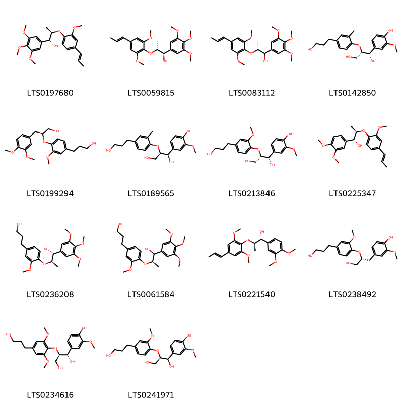
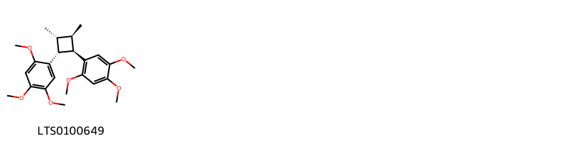
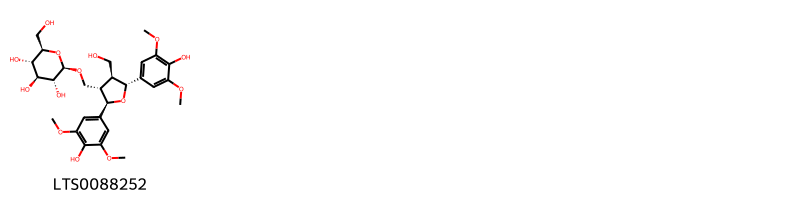
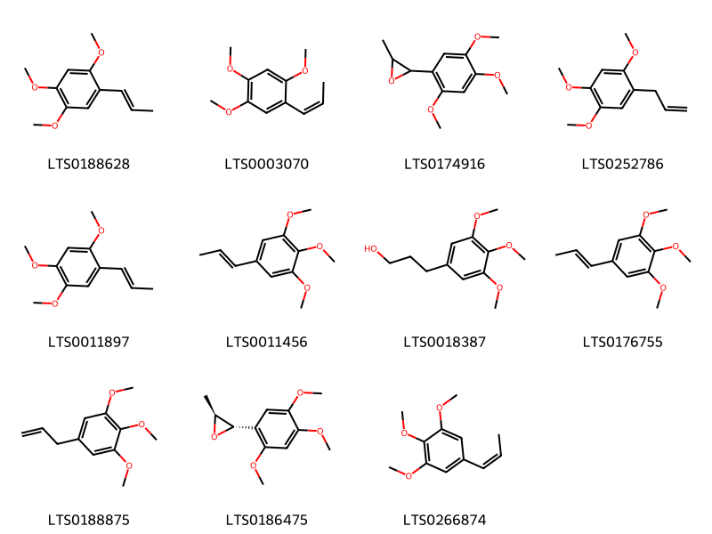
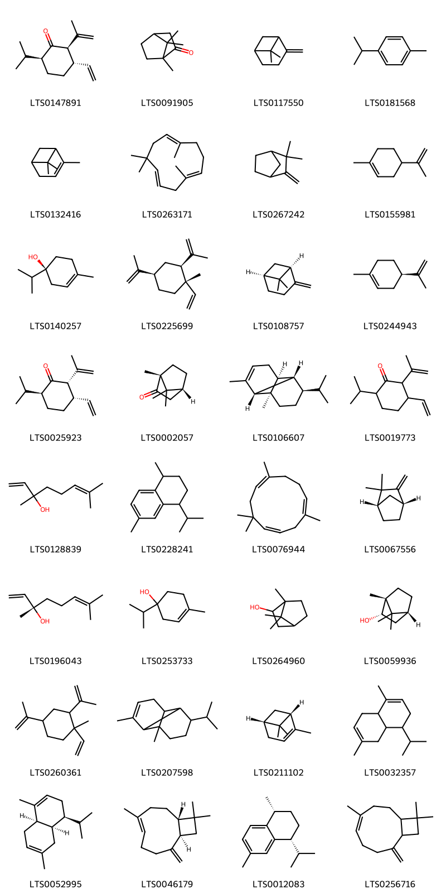

!!! abstract "Tóm tắt"

    Xương bồ là thân rễ đã phơi khô, hoặc sấy khô của cây Thạch xương bồ lá to (Acorus gramineus Soland. var. macrospadiceus Yamamoto Contr) và cây Thủy Xương bồ (Acorus calamus L. var. angustatus Bess.), họ Ráy (Araceae). Cây phân bố chủ yếu ở vùng có khí hậu nhiệt đới như Nhật Bản, Trung Quốc, Ấn Độ, Srilanca, các nước ở bán đảo Đông Dương và vùng Đông - Nam Á (Thái Lan, Malaysia…). Tại Việt Nam, cây mọc hoang tại những vùng núi miền Bắc và Trung nước ta, thường ở những nơi khe đá, khe suối, chỗ mát. Trong dân gian, dùng để chữa chữa tai ù, hay quên, hay mệt mỏi, mụn nhọt, hậu bối, chữa đau dạ dày, chữa ho lâu ngày, chữa cảm lạnh, cấm khẩu, loạn nhịp tim, chân tay nhức mỏi, đầy bụng, ỉa chảy, chữa các chứng phong cấm khẩu bại hết nửa người, trị trẻ em kinh giản. Xương bồ có tác dụng dược lý là: xúc tiến sự phân tiết các dịch tiêu hoá và hạn chế sự lên men không bình thường của dạ dày và ruột, xương bồ còn làm bớt sự căng thẳng của cơ trơn trong ruột, kích thích đối với da, do đó có thể tăng cường máu chạy mạnh hơn tại một nơi nào trên cơ thể; điều hoà nhịp tim trong các trường hợp: nhịp xoang nhanh, nhịp đã hiệp xoang nút, ngoại tâm thu thành chuỗi; ức chế tụ cầu vàng kháng nhiều thuốc. Thành phần hoá học: Có chừng 0,5-0,8% tinh dầu, trong tinh dầu có chừng 86% Asaron. Ngoài ra còn có một chất phenol và axit béo. Ở Việt Nam, thạch xương bồ lá nhỡ chứa 0,34-0,41% tinh dầu, trong đó có myreen, camphor, methyl eugenol, asaron và shybunon. Thạch xương bồ lá to 1-2% tinh dầu, trong đó có camphen, asaron và shybunon.

## Thông tin về thực vật

Dược liệu **Thạch Xương Bồ (Thân Rễ)** từ bộ phận **nan** từ loài *Acorus gramineus*.

**Mô tả thực vật:** Là cây thảo sống lâu năm, cao khoảng 0,5m. Thân rễ mọc ngang, đường kính to bằng ngón tay, có nhiều đốt, trên có những sẹo lá. Lá mọc đứng hình dải, dài 30-50cm, rộng 2-6mm, chỉ có gân giữa. 
Hoa mọc thành bông mo ở đầu một cán dẹt dài 10-30cm, cán này được phủ bởi một lá bắc, lá bắc này dài 7- 20cm, rộng từ 2-4mm vượt cao hơn cụm hoa rất nhiều, làm cho cụm hoa trông như lệch sang một bên, dài từ 5-12cm, đường kính 2-4mm. 
Quả mọng màu đỏ nhạt, một ngăn, có thành gần như khô. Quanh hạt có một chất gôm nhầy.

*Tài liệu tham khảo:* Tài liệu khác 
Trong dược điển Việt nam, một loài được sử dụng làm dược liệu là *Acorus gramineus*.

!!! info "Phân loại thực vật của *Acorus gramineus*"
    - **Kingdom:** Plantae
    - **Phylum:** Tracheophyta
    - **Order:** Acorales
    - **Family:** Acoraceae
    - **Genus:** Acorus
    - **Species:** *Acorus gramineus*

**Phân bố trên thế giới:** Germany, nan, United States of America, Philippines, Chinese Taipei, China, Hong Kong, United Kingdom of Great Britain and Northern Ireland, Japan, Korea, Republic of, Macao, Viet Nam, Belgium

**Phân bố tại Việt nam:** Không có ghi nhận ở Việt Nam

## Thông tin về dược liệu 

### Định danh

!!! info "Thông tin về tên gọi"

    - Dược liệu tiếng Việt: nan
    - Dược liệu tiếng Trung: nan (nan)
    - Dược liệu tiếng Anh: nan
    - Dược liệu latin thông dụng: nan
    - Dược liệu latin kiểu DĐVN: *acorus gramineus soland*
    - Dược liệu latin kiểu DĐVN: *nan*
    - Dược liệu latin kiểu thông tư: *nan*
    - Bộ phận dùng: nan (nan)

### Mô tả dược liệu 

- **Theo dược điển Việt nam V:** nan

- **Mô tả dược liệu theo thông tư chế biến dược liệu theo phương pháp cổ truyền:** nan

### Chế biến 

- **Chế biến theo dược điển việt nam V**: nan

- **Chế biến theo thông tư:** nan

--- 

## Thành phần hóa học

- Theo tài liệu của GS. Đỗ Tất Lợi:  (1) Có chừng 0,5-0,8% tinh dầu, trong tinh dầu có chừng 86% Asaron. Ngoài ra còn có một chất phenol và axit béo. 
Ở Việt Nam, Thạch xương bồ lá nhỡ chứa 0,34-0,41% tinh dầu, trong đó có myreen, camphor, methyl eugenol, asaron và shybunon.
Thạch xương bồ lá to 1-2% tinh dầu, trong đó có camphen, asaron và shybunon.
(2)  Asaron
    

**Thành phần hóa học từ loài **Acorus gramineus**

Theo cơ sở dữ liệu lotus, loài *Acorus gramineus* đã phân lập và xác định được **89** hoạt chất thuộc về các nhóm Cyclobutane lignans, Organooxygen compounds, Lignan glycosides, Benzodioxoles, Cinnamic acids and derivatives, Furanoid lignans, Phenol ethers, Phenols, Cinnamyl alcohols, Benzene and substituted derivatives, Prenol lipids trong bảng dưới đây. Danh sách các hoạt chất như sau (4s,4ar,8ar)-4-isopropyl-1,6-dimethyl-3,4,4a,5,8,8a-hexahydronaphthalene [(LTS0052995)](https://lotus.naturalproducts.net/compound/lotus_id/LTS0052995), 4-terpineol [(LTS0253733)](https://lotus.naturalproducts.net/compound/lotus_id/LTS0253733), (2r,3r,4r,5s)-2,4-dimethyl-3,5-bis(2,4,5-trimethoxyphenyl)oxolane [(LTS0234140)](https://lotus.naturalproducts.net/compound/lotus_id/LTS0234140), α pinene [(LTS0132416)](https://lotus.naturalproducts.net/compound/lotus_id/LTS0132416), (1r,2r)-2-{2,6-dimethoxy-4-[(1e)-prop-1-en-1-yl]phenoxy}-1-(3,4-dimethoxyphenyl)propan-1-ol [(LTS0221540)](https://lotus.naturalproducts.net/compound/lotus_id/LTS0221540), ligraminol e [(LTS0238492)](https://lotus.naturalproducts.net/compound/lotus_id/LTS0238492), 3,4-dimethoxybenzenepropanol [(LTS0159608)](https://lotus.naturalproducts.net/compound/lotus_id/LTS0159608), 3-(3,4,5-trimethoxyphenyl)propan-1-ol [(LTS0018387)](https://lotus.naturalproducts.net/compound/lotus_id/LTS0018387), eugenol [(LTS0052342)](https://lotus.naturalproducts.net/compound/lotus_id/LTS0052342), (2s,3s,6s)-3-ethenyl-6-isopropyl-2-(prop-1-en-2-yl)cyclohexan-1-one [(LTS0025923)](https://lotus.naturalproducts.net/compound/lotus_id/LTS0025923), (1r,2r)-1-(4-hydroxy-3-methoxyphenyl)-2-[4-(3-hydroxypropyl)-2-methoxyphenoxy]propane-1,3-diol [(LTS0241971)](https://lotus.naturalproducts.net/compound/lotus_id/LTS0241971), (z)-methyl isoeugenol [(LTS0036071)](https://lotus.naturalproducts.net/compound/lotus_id/LTS0036071), (-)-camphene [(LTS0067556)](https://lotus.naturalproducts.net/compound/lotus_id/LTS0067556), ligraminol c [(LTS0082909)](https://lotus.naturalproducts.net/compound/lotus_id/LTS0082909), (1r,2s,6s,7s,8r)-8-isopropyl-1,3-dimethyltricyclo[4.4.0.0²,⁷]dec-3-ene [(LTS0106607)](https://lotus.naturalproducts.net/compound/lotus_id/LTS0106607), ligraminol b [(LTS0088252)](https://lotus.naturalproducts.net/compound/lotus_id/LTS0088252), (2s,3s)-2-methyl-3-(2,4,5-trimethoxyphenyl)oxirane [(LTS0186475)](https://lotus.naturalproducts.net/compound/lotus_id/LTS0186475), 1,2,4-trimethoxy-5-(prop-1-en-1-yl)benzene [(LTS0011897)](https://lotus.naturalproducts.net/compound/lotus_id/LTS0011897), 1,2,3-trimethoxy-5-[(1z)-prop-1-en-1-yl]benzene [(LTS0266874)](https://lotus.naturalproducts.net/compound/lotus_id/LTS0266874), α-humulene [(LTS0076944)](https://lotus.naturalproducts.net/compound/lotus_id/LTS0076944), 3-ethenyl-6-isopropyl-2-(prop-1-en-2-yl)cyclohexan-1-one [(LTS0019773)](https://lotus.naturalproducts.net/compound/lotus_id/LTS0019773), sassafras [(LTS0136093)](https://lotus.naturalproducts.net/compound/lotus_id/LTS0136093), ganschisandrin [(LTS0061953)](https://lotus.naturalproducts.net/compound/lotus_id/LTS0061953), chavibetol [(LTS0244260)](https://lotus.naturalproducts.net/compound/lotus_id/LTS0244260), (1s,2r)-2-[4-(3-hydroxypropyl)-2-methoxyphenoxy]-1-(3,4,5-trimethoxyphenyl)propan-1-ol [(LTS0061584)](https://lotus.naturalproducts.net/compound/lotus_id/LTS0061584), (+)-borneol [(LTS0059936)](https://lotus.naturalproducts.net/compound/lotus_id/LTS0059936), 5-methoxygalbelgin [(LTS0134265)](https://lotus.naturalproducts.net/compound/lotus_id/LTS0134265), (e)-calamene [(LTS0228241)](https://lotus.naturalproducts.net/compound/lotus_id/LTS0228241), methyl eugenol [(LTS0098881)](https://lotus.naturalproducts.net/compound/lotus_id/LTS0098881), camphor [(LTS0091905)](https://lotus.naturalproducts.net/compound/lotus_id/LTS0091905), 2,5-bis(3,4-dimethoxyphenyl)-3,4-dimethyloxolane [(LTS0021613)](https://lotus.naturalproducts.net/compound/lotus_id/LTS0021613), cymene [(LTS0181568)](https://lotus.naturalproducts.net/compound/lotus_id/LTS0181568), humulene [(LTS0263171)](https://lotus.naturalproducts.net/compound/lotus_id/LTS0263171), (2r,3s,6s)-3-ethenyl-6-isopropyl-2-(prop-1-en-2-yl)cyclohexan-1-one [(LTS0147891)](https://lotus.naturalproducts.net/compound/lotus_id/LTS0147891), 2-(3,4-dimethoxyphenyl)-3-methyloxirane [(LTS0122019)](https://lotus.naturalproducts.net/compound/lotus_id/LTS0122019), (7r,8r)-polysphorin [(LTS0083112)](https://lotus.naturalproducts.net/compound/lotus_id/LTS0083112), 3-(4-hydroxy-3-methoxyphenyl)-n-[2-(4-hydroxyphenyl)ethyl]prop-2-enimidic acid [(LTS0240896)](https://lotus.naturalproducts.net/compound/lotus_id/LTS0240896), 3-hydroxy-1-(4-hydroxyphenyl)propan-1-one [(LTS0075622)](https://lotus.naturalproducts.net/compound/lotus_id/LTS0075622), elemicin [(LTS0188875)](https://lotus.naturalproducts.net/compound/lotus_id/LTS0188875), (1r,2r)-2-[4-(3-hydroxypropyl)-2-methoxyphenoxy]-1-(3,4,5-trimethoxyphenyl)propan-1-ol [(LTS0236208)](https://lotus.naturalproducts.net/compound/lotus_id/LTS0236208), 4,11,11-trimethyl-8-methylidenebicyclo[7.2.0]undec-4-ene [(LTS0256716)](https://lotus.naturalproducts.net/compound/lotus_id/LTS0256716), α-copaene [(LTS0207598)](https://lotus.naturalproducts.net/compound/lotus_id/LTS0207598), (1r,2r)-1-(3,4-dimethoxyphenyl)-2-[2-methoxy-4-(prop-1-en-1-yl)phenoxy]propyl acetate [(LTS0212185)](https://lotus.naturalproducts.net/compound/lotus_id/LTS0212185), isoeugenyl methyl ether [(LTS0241255)](https://lotus.naturalproducts.net/compound/lotus_id/LTS0241255), 2-methyl-3-(2,4,5-trimethoxyphenyl)oxirane [(LTS0174916)](https://lotus.naturalproducts.net/compound/lotus_id/LTS0174916), (+)-4-terpineol [(LTS0140257)](https://lotus.naturalproducts.net/compound/lotus_id/LTS0140257), (1r,4r)-4-isopropyl-1,6-dimethyl-1,2,3,4-tetrahydronaphthalene [(LTS0012083)](https://lotus.naturalproducts.net/compound/lotus_id/LTS0012083), β-pinene [(LTS0117550)](https://lotus.naturalproducts.net/compound/lotus_id/LTS0117550), ligraminol a [(LTS0123044)](https://lotus.naturalproducts.net/compound/lotus_id/LTS0123044), (1r,2r)-2-[2,6-dimethoxy-4-(prop-1-en-1-yl)phenoxy]-1-(3,4,5-trimethoxyphenyl)propan-1-ol [(LTS0059815)](https://lotus.naturalproducts.net/compound/lotus_id/LTS0059815), α-limonene [(LTS0244943)](https://lotus.naturalproducts.net/compound/lotus_id/LTS0244943), β-elemene [(LTS0260361)](https://lotus.naturalproducts.net/compound/lotus_id/LTS0260361), veraguensin [(LTS0156113)](https://lotus.naturalproducts.net/compound/lotus_id/LTS0156113), β-elemene [(LTS0225699)](https://lotus.naturalproducts.net/compound/lotus_id/LTS0225699), 1,2,4-trimethoxy-5-(prop-2-en-1-yl)benzene [(LTS0252786)](https://lotus.naturalproducts.net/compound/lotus_id/LTS0252786), (1r,2r)-1-(4-hydroxy-3-methoxyphenyl)-2-[4-(3-hydroxypropyl)-2-methylphenoxy]propane-1,3-diol [(LTS0189565)](https://lotus.naturalproducts.net/compound/lotus_id/LTS0189565), (1r,2r)-1-(3,4-dimethoxyphenyl)-2-{2-methoxy-4-[(1e)-prop-1-en-1-yl]phenoxy}propan-1-ol [(LTS0225347)](https://lotus.naturalproducts.net/compound/lotus_id/LTS0225347), (2z)-3-(4-hydroxy-3-methoxyphenyl)-n-[2-(4-hydroxyphenyl)ethyl]prop-2-enimidic acid [(LTS0255533)](https://lotus.naturalproducts.net/compound/lotus_id/LTS0255533), ligraminol d [(LTS0199294)](https://lotus.naturalproducts.net/compound/lotus_id/LTS0199294), (1s,2s)-1-(4-hydroxy-3-methoxyphenyl)-2-[4-(3-hydroxypropyl)-2-methoxyphenoxy]propane-1,3-diol [(LTS0213846)](https://lotus.naturalproducts.net/compound/lotus_id/LTS0213846), (-)-β-pinene [(LTS0108757)](https://lotus.naturalproducts.net/compound/lotus_id/LTS0108757), isoelemicin [(LTS0011456)](https://lotus.naturalproducts.net/compound/lotus_id/LTS0011456), surinamensin [(LTS0197680)](https://lotus.naturalproducts.net/compound/lotus_id/LTS0197680), (+)-linalool [(LTS0196043)](https://lotus.naturalproducts.net/compound/lotus_id/LTS0196043), d-camphor [(LTS0002057)](https://lotus.naturalproducts.net/compound/lotus_id/LTS0002057), (+)-veraguensin [(LTS0159494)](https://lotus.naturalproducts.net/compound/lotus_id/LTS0159494), 3-(2,4,5-trimethoxyphenyl)prop-2-en-1-ol [(LTS0233079)](https://lotus.naturalproducts.net/compound/lotus_id/LTS0233079), 4-(3-hydroxyprop-1-en-1-yl)-2-methoxyphenol [(LTS0256062)](https://lotus.naturalproducts.net/compound/lotus_id/LTS0256062), (2z)-3-(2,4,5-trimethoxyphenyl)prop-2-en-1-ol [(LTS0044161)](https://lotus.naturalproducts.net/compound/lotus_id/LTS0044161), cis-asarone [(LTS0188628)](https://lotus.naturalproducts.net/compound/lotus_id/LTS0188628), (1s,2r)-1-(4-hydroxy-3-methoxyphenyl)-2-[4-(3-hydroxypropyl)-2,6-dimethoxyphenoxy]propane-1,3-diol [(LTS0234616)](https://lotus.naturalproducts.net/compound/lotus_id/LTS0234616), (+)-α-pinene [(LTS0211102)](https://lotus.naturalproducts.net/compound/lotus_id/LTS0211102), 1,2,3-trimethoxy-5-(prop-1-en-1-yl)benzene [(LTS0176755)](https://lotus.naturalproducts.net/compound/lotus_id/LTS0176755), 2-(3,4-dimethoxyphenyl)-3,4-dimethyl-5-(3,4,5-trimethoxyphenyl)oxolane [(LTS0078708)](https://lotus.naturalproducts.net/compound/lotus_id/LTS0078708), magnosalin [(LTS0100649)](https://lotus.naturalproducts.net/compound/lotus_id/LTS0100649), 4-isopropyl-1,6-dimethyl-3,4,4a,5,8,8a-hexahydronaphthalene [(LTS0032357)](https://lotus.naturalproducts.net/compound/lotus_id/LTS0032357), β-asarone [(LTS0003070)](https://lotus.naturalproducts.net/compound/lotus_id/LTS0003070), (1s,2s)-1-(4-hydroxy-3-methoxyphenyl)-2-[4-(3-hydroxypropyl)-2-methylphenoxy]propane-1,3-diol [(LTS0142850)](https://lotus.naturalproducts.net/compound/lotus_id/LTS0142850), methyl isoeugenol [(LTS0170487)](https://lotus.naturalproducts.net/compound/lotus_id/LTS0170487), (2s,3s)-2-(3,4-dimethoxyphenyl)-3-methyloxirane [(LTS0223729)](https://lotus.naturalproducts.net/compound/lotus_id/LTS0223729), 1-[(2s,4r)-2,3-dimethyl-4-(2,4,5-trimethoxyphenyl)cyclobutyl]-2,4,5-trimethoxybenzene [(LTS0060443)](https://lotus.naturalproducts.net/compound/lotus_id/LTS0060443), limonene,  [(LTS0155981)](https://lotus.naturalproducts.net/compound/lotus_id/LTS0155981), (2e)-n-[(2s)-2-hydroxy-2-(4-hydroxyphenyl)ethyl]-3-(4-hydroxy-3-methoxyphenyl)prop-2-enimidic acid [(LTS0161076)](https://lotus.naturalproducts.net/compound/lotus_id/LTS0161076), 4-[(1z)-3-hydroxyprop-1-en-1-yl]-2-methoxyphenol [(LTS0128155)](https://lotus.naturalproducts.net/compound/lotus_id/LTS0128155), camphene [(LTS0267242)](https://lotus.naturalproducts.net/compound/lotus_id/LTS0267242), linalool, (+-)- [(LTS0128839)](https://lotus.naturalproducts.net/compound/lotus_id/LTS0128839), borneol [(LTS0264960)](https://lotus.naturalproducts.net/compound/lotus_id/LTS0264960), (+)-caryophyllene [(LTS0046179)](https://lotus.naturalproducts.net/compound/lotus_id/LTS0046179), (2e)-3-(4-hydroxy-3-methoxyphenyl)-n-[2-(4-hydroxyphenyl)ethyl]prop-2-enimidic acid [(LTS0187051)](https://lotus.naturalproducts.net/compound/lotus_id/LTS0187051). 
        
| chemicalTaxonomyClassyfireClass     |   smiles_count |
|:------------------------------------|---------------:|
|                                     |            718 |
| Benzene and substituted derivatives |            267 |
| Benzodioxoles                       |             19 |
| Cinnamic acids and derivatives      |            117 |
| Cinnamyl alcohols                   |             48 |
| Cyclobutane lignans                 |             66 |
| Furanoid lignans                    |            467 |
| Lignan glycosides                   |            110 |
| Organooxygen compounds              |             19 |
| Phenol ethers                       |            271 |
| Phenols                             |            113 |
| Prenol lipids                       |            885 |

            
### Nhóm 
<figure markdown="span">
    { width=100% }
<figcaption>Hình ảnh cấu trúc hóa học của hoạt chất thuộc nhóm **. Tên thường gọi của các hoạt chất tương ứng là surinamensin [(LTS0197680)](https://lotus.naturalproducts.net/compound/lotus_id/LTS0197680), (1r,2r)-2-[2,6-dimethoxy-4-(prop-1-en-1-yl)phenoxy]-1-(3,4,5-trimethoxyphenyl)propan-1-ol [(LTS0059815)](https://lotus.naturalproducts.net/compound/lotus_id/LTS0059815), (7r,8r)-polysphorin [(LTS0083112)](https://lotus.naturalproducts.net/compound/lotus_id/LTS0083112), (1s,2s)-1-(4-hydroxy-3-methoxyphenyl)-2-[4-(3-hydroxypropyl)-2-methylphenoxy]propane-1,3-diol [(LTS0142850)](https://lotus.naturalproducts.net/compound/lotus_id/LTS0142850), ligraminol d [(LTS0199294)](https://lotus.naturalproducts.net/compound/lotus_id/LTS0199294), (1r,2r)-1-(4-hydroxy-3-methoxyphenyl)-2-[4-(3-hydroxypropyl)-2-methylphenoxy]propane-1,3-diol [(LTS0189565)](https://lotus.naturalproducts.net/compound/lotus_id/LTS0189565), (1s,2s)-1-(4-hydroxy-3-methoxyphenyl)-2-[4-(3-hydroxypropyl)-2-methoxyphenoxy]propane-1,3-diol [(LTS0213846)](https://lotus.naturalproducts.net/compound/lotus_id/LTS0213846), (1r,2r)-1-(3,4-dimethoxyphenyl)-2-{2-methoxy-4-[(1e)-prop-1-en-1-yl]phenoxy}propan-1-ol [(LTS0225347)](https://lotus.naturalproducts.net/compound/lotus_id/LTS0225347), (1r,2r)-2-[4-(3-hydroxypropyl)-2-methoxyphenoxy]-1-(3,4,5-trimethoxyphenyl)propan-1-ol [(LTS0236208)](https://lotus.naturalproducts.net/compound/lotus_id/LTS0236208), (1s,2r)-2-[4-(3-hydroxypropyl)-2-methoxyphenoxy]-1-(3,4,5-trimethoxyphenyl)propan-1-ol [(LTS0061584)](https://lotus.naturalproducts.net/compound/lotus_id/LTS0061584), (1r,2r)-2-{2,6-dimethoxy-4-[(1e)-prop-1-en-1-yl]phenoxy}-1-(3,4-dimethoxyphenyl)propan-1-ol [(LTS0221540)](https://lotus.naturalproducts.net/compound/lotus_id/LTS0221540), ligraminol e [(LTS0238492)](https://lotus.naturalproducts.net/compound/lotus_id/LTS0238492), (1s,2r)-1-(4-hydroxy-3-methoxyphenyl)-2-[4-(3-hydroxypropyl)-2,6-dimethoxyphenoxy]propane-1,3-diol [(LTS0234616)](https://lotus.naturalproducts.net/compound/lotus_id/LTS0234616), (1r,2r)-1-(4-hydroxy-3-methoxyphenyl)-2-[4-(3-hydroxypropyl)-2-methoxyphenoxy]propane-1,3-diol [(LTS0241971)](https://lotus.naturalproducts.net/compound/lotus_id/LTS0241971).</figcaption>
</figure>

            
            
### Nhóm 
<figure markdown="span">
    { width=100% }
<figcaption>Hình ảnh cấu trúc hóa học của hoạt chất thuộc nhóm **. Tên thường gọi của các hoạt chất tương ứng là surinamensin [(LTS0197680)](https://lotus.naturalproducts.net/compound/lotus_id/LTS0197680), (1r,2r)-2-[2,6-dimethoxy-4-(prop-1-en-1-yl)phenoxy]-1-(3,4,5-trimethoxyphenyl)propan-1-ol [(LTS0059815)](https://lotus.naturalproducts.net/compound/lotus_id/LTS0059815), (7r,8r)-polysphorin [(LTS0083112)](https://lotus.naturalproducts.net/compound/lotus_id/LTS0083112), (1s,2s)-1-(4-hydroxy-3-methoxyphenyl)-2-[4-(3-hydroxypropyl)-2-methylphenoxy]propane-1,3-diol [(LTS0142850)](https://lotus.naturalproducts.net/compound/lotus_id/LTS0142850), ligraminol d [(LTS0199294)](https://lotus.naturalproducts.net/compound/lotus_id/LTS0199294), (1r,2r)-1-(4-hydroxy-3-methoxyphenyl)-2-[4-(3-hydroxypropyl)-2-methylphenoxy]propane-1,3-diol [(LTS0189565)](https://lotus.naturalproducts.net/compound/lotus_id/LTS0189565), (1s,2s)-1-(4-hydroxy-3-methoxyphenyl)-2-[4-(3-hydroxypropyl)-2-methoxyphenoxy]propane-1,3-diol [(LTS0213846)](https://lotus.naturalproducts.net/compound/lotus_id/LTS0213846), (1r,2r)-1-(3,4-dimethoxyphenyl)-2-{2-methoxy-4-[(1e)-prop-1-en-1-yl]phenoxy}propan-1-ol [(LTS0225347)](https://lotus.naturalproducts.net/compound/lotus_id/LTS0225347), (1r,2r)-2-[4-(3-hydroxypropyl)-2-methoxyphenoxy]-1-(3,4,5-trimethoxyphenyl)propan-1-ol [(LTS0236208)](https://lotus.naturalproducts.net/compound/lotus_id/LTS0236208), (1s,2r)-2-[4-(3-hydroxypropyl)-2-methoxyphenoxy]-1-(3,4,5-trimethoxyphenyl)propan-1-ol [(LTS0061584)](https://lotus.naturalproducts.net/compound/lotus_id/LTS0061584), (1r,2r)-2-{2,6-dimethoxy-4-[(1e)-prop-1-en-1-yl]phenoxy}-1-(3,4-dimethoxyphenyl)propan-1-ol [(LTS0221540)](https://lotus.naturalproducts.net/compound/lotus_id/LTS0221540), ligraminol e [(LTS0238492)](https://lotus.naturalproducts.net/compound/lotus_id/LTS0238492), (1s,2r)-1-(4-hydroxy-3-methoxyphenyl)-2-[4-(3-hydroxypropyl)-2,6-dimethoxyphenoxy]propane-1,3-diol [(LTS0234616)](https://lotus.naturalproducts.net/compound/lotus_id/LTS0234616), (1r,2r)-1-(4-hydroxy-3-methoxyphenyl)-2-[4-(3-hydroxypropyl)-2-methoxyphenoxy]propane-1,3-diol [(LTS0241971)](https://lotus.naturalproducts.net/compound/lotus_id/LTS0241971).</figcaption>
</figure>

### Nhóm Benzene and substituted derivatives
<figure markdown="span">
    { width=100% }
<figcaption>Hình ảnh cấu trúc hóa học của hoạt chất thuộc nhóm *Benzene and substituted derivatives*. Tên thường gọi của các hoạt chất tương ứng là isoeugenyl methyl ether [(LTS0241255)](https://lotus.naturalproducts.net/compound/lotus_id/LTS0241255), (z)-methyl isoeugenol [(LTS0036071)](https://lotus.naturalproducts.net/compound/lotus_id/LTS0036071), methyl eugenol [(LTS0098881)](https://lotus.naturalproducts.net/compound/lotus_id/LTS0098881), methyl isoeugenol [(LTS0170487)](https://lotus.naturalproducts.net/compound/lotus_id/LTS0170487), 2-(3,4-dimethoxyphenyl)-3-methyloxirane [(LTS0122019)](https://lotus.naturalproducts.net/compound/lotus_id/LTS0122019), 3,4-dimethoxybenzenepropanol [(LTS0159608)](https://lotus.naturalproducts.net/compound/lotus_id/LTS0159608), ligraminol c [(LTS0082909)](https://lotus.naturalproducts.net/compound/lotus_id/LTS0082909), (1r,2r)-1-(3,4-dimethoxyphenyl)-2-[2-methoxy-4-(prop-1-en-1-yl)phenoxy]propyl acetate [(LTS0212185)](https://lotus.naturalproducts.net/compound/lotus_id/LTS0212185), (2s,3s)-2-(3,4-dimethoxyphenyl)-3-methyloxirane [(LTS0223729)](https://lotus.naturalproducts.net/compound/lotus_id/LTS0223729).</figcaption>
</figure>

            
            
### Nhóm 
<figure markdown="span">
    { width=100% }
<figcaption>Hình ảnh cấu trúc hóa học của hoạt chất thuộc nhóm **. Tên thường gọi của các hoạt chất tương ứng là surinamensin [(LTS0197680)](https://lotus.naturalproducts.net/compound/lotus_id/LTS0197680), (1r,2r)-2-[2,6-dimethoxy-4-(prop-1-en-1-yl)phenoxy]-1-(3,4,5-trimethoxyphenyl)propan-1-ol [(LTS0059815)](https://lotus.naturalproducts.net/compound/lotus_id/LTS0059815), (7r,8r)-polysphorin [(LTS0083112)](https://lotus.naturalproducts.net/compound/lotus_id/LTS0083112), (1s,2s)-1-(4-hydroxy-3-methoxyphenyl)-2-[4-(3-hydroxypropyl)-2-methylphenoxy]propane-1,3-diol [(LTS0142850)](https://lotus.naturalproducts.net/compound/lotus_id/LTS0142850), ligraminol d [(LTS0199294)](https://lotus.naturalproducts.net/compound/lotus_id/LTS0199294), (1r,2r)-1-(4-hydroxy-3-methoxyphenyl)-2-[4-(3-hydroxypropyl)-2-methylphenoxy]propane-1,3-diol [(LTS0189565)](https://lotus.naturalproducts.net/compound/lotus_id/LTS0189565), (1s,2s)-1-(4-hydroxy-3-methoxyphenyl)-2-[4-(3-hydroxypropyl)-2-methoxyphenoxy]propane-1,3-diol [(LTS0213846)](https://lotus.naturalproducts.net/compound/lotus_id/LTS0213846), (1r,2r)-1-(3,4-dimethoxyphenyl)-2-{2-methoxy-4-[(1e)-prop-1-en-1-yl]phenoxy}propan-1-ol [(LTS0225347)](https://lotus.naturalproducts.net/compound/lotus_id/LTS0225347), (1r,2r)-2-[4-(3-hydroxypropyl)-2-methoxyphenoxy]-1-(3,4,5-trimethoxyphenyl)propan-1-ol [(LTS0236208)](https://lotus.naturalproducts.net/compound/lotus_id/LTS0236208), (1s,2r)-2-[4-(3-hydroxypropyl)-2-methoxyphenoxy]-1-(3,4,5-trimethoxyphenyl)propan-1-ol [(LTS0061584)](https://lotus.naturalproducts.net/compound/lotus_id/LTS0061584), (1r,2r)-2-{2,6-dimethoxy-4-[(1e)-prop-1-en-1-yl]phenoxy}-1-(3,4-dimethoxyphenyl)propan-1-ol [(LTS0221540)](https://lotus.naturalproducts.net/compound/lotus_id/LTS0221540), ligraminol e [(LTS0238492)](https://lotus.naturalproducts.net/compound/lotus_id/LTS0238492), (1s,2r)-1-(4-hydroxy-3-methoxyphenyl)-2-[4-(3-hydroxypropyl)-2,6-dimethoxyphenoxy]propane-1,3-diol [(LTS0234616)](https://lotus.naturalproducts.net/compound/lotus_id/LTS0234616), (1r,2r)-1-(4-hydroxy-3-methoxyphenyl)-2-[4-(3-hydroxypropyl)-2-methoxyphenoxy]propane-1,3-diol [(LTS0241971)](https://lotus.naturalproducts.net/compound/lotus_id/LTS0241971).</figcaption>
</figure>

### Nhóm Benzene and substituted derivatives
<figure markdown="span">
    { width=100% }
<figcaption>Hình ảnh cấu trúc hóa học của hoạt chất thuộc nhóm *Benzene and substituted derivatives*. Tên thường gọi của các hoạt chất tương ứng là isoeugenyl methyl ether [(LTS0241255)](https://lotus.naturalproducts.net/compound/lotus_id/LTS0241255), (z)-methyl isoeugenol [(LTS0036071)](https://lotus.naturalproducts.net/compound/lotus_id/LTS0036071), methyl eugenol [(LTS0098881)](https://lotus.naturalproducts.net/compound/lotus_id/LTS0098881), methyl isoeugenol [(LTS0170487)](https://lotus.naturalproducts.net/compound/lotus_id/LTS0170487), 2-(3,4-dimethoxyphenyl)-3-methyloxirane [(LTS0122019)](https://lotus.naturalproducts.net/compound/lotus_id/LTS0122019), 3,4-dimethoxybenzenepropanol [(LTS0159608)](https://lotus.naturalproducts.net/compound/lotus_id/LTS0159608), ligraminol c [(LTS0082909)](https://lotus.naturalproducts.net/compound/lotus_id/LTS0082909), (1r,2r)-1-(3,4-dimethoxyphenyl)-2-[2-methoxy-4-(prop-1-en-1-yl)phenoxy]propyl acetate [(LTS0212185)](https://lotus.naturalproducts.net/compound/lotus_id/LTS0212185), (2s,3s)-2-(3,4-dimethoxyphenyl)-3-methyloxirane [(LTS0223729)](https://lotus.naturalproducts.net/compound/lotus_id/LTS0223729).</figcaption>
</figure>

### Nhóm Benzodioxoles
<figure markdown="span">
    { width=100% }
<figcaption>Hình ảnh cấu trúc hóa học của hoạt chất thuộc nhóm *Benzodioxoles*. Tên thường gọi của các hoạt chất tương ứng là sassafras [(LTS0136093)](https://lotus.naturalproducts.net/compound/lotus_id/LTS0136093).</figcaption>
</figure>

            
            
### Nhóm 
<figure markdown="span">
    { width=100% }
<figcaption>Hình ảnh cấu trúc hóa học của hoạt chất thuộc nhóm **. Tên thường gọi của các hoạt chất tương ứng là surinamensin [(LTS0197680)](https://lotus.naturalproducts.net/compound/lotus_id/LTS0197680), (1r,2r)-2-[2,6-dimethoxy-4-(prop-1-en-1-yl)phenoxy]-1-(3,4,5-trimethoxyphenyl)propan-1-ol [(LTS0059815)](https://lotus.naturalproducts.net/compound/lotus_id/LTS0059815), (7r,8r)-polysphorin [(LTS0083112)](https://lotus.naturalproducts.net/compound/lotus_id/LTS0083112), (1s,2s)-1-(4-hydroxy-3-methoxyphenyl)-2-[4-(3-hydroxypropyl)-2-methylphenoxy]propane-1,3-diol [(LTS0142850)](https://lotus.naturalproducts.net/compound/lotus_id/LTS0142850), ligraminol d [(LTS0199294)](https://lotus.naturalproducts.net/compound/lotus_id/LTS0199294), (1r,2r)-1-(4-hydroxy-3-methoxyphenyl)-2-[4-(3-hydroxypropyl)-2-methylphenoxy]propane-1,3-diol [(LTS0189565)](https://lotus.naturalproducts.net/compound/lotus_id/LTS0189565), (1s,2s)-1-(4-hydroxy-3-methoxyphenyl)-2-[4-(3-hydroxypropyl)-2-methoxyphenoxy]propane-1,3-diol [(LTS0213846)](https://lotus.naturalproducts.net/compound/lotus_id/LTS0213846), (1r,2r)-1-(3,4-dimethoxyphenyl)-2-{2-methoxy-4-[(1e)-prop-1-en-1-yl]phenoxy}propan-1-ol [(LTS0225347)](https://lotus.naturalproducts.net/compound/lotus_id/LTS0225347), (1r,2r)-2-[4-(3-hydroxypropyl)-2-methoxyphenoxy]-1-(3,4,5-trimethoxyphenyl)propan-1-ol [(LTS0236208)](https://lotus.naturalproducts.net/compound/lotus_id/LTS0236208), (1s,2r)-2-[4-(3-hydroxypropyl)-2-methoxyphenoxy]-1-(3,4,5-trimethoxyphenyl)propan-1-ol [(LTS0061584)](https://lotus.naturalproducts.net/compound/lotus_id/LTS0061584), (1r,2r)-2-{2,6-dimethoxy-4-[(1e)-prop-1-en-1-yl]phenoxy}-1-(3,4-dimethoxyphenyl)propan-1-ol [(LTS0221540)](https://lotus.naturalproducts.net/compound/lotus_id/LTS0221540), ligraminol e [(LTS0238492)](https://lotus.naturalproducts.net/compound/lotus_id/LTS0238492), (1s,2r)-1-(4-hydroxy-3-methoxyphenyl)-2-[4-(3-hydroxypropyl)-2,6-dimethoxyphenoxy]propane-1,3-diol [(LTS0234616)](https://lotus.naturalproducts.net/compound/lotus_id/LTS0234616), (1r,2r)-1-(4-hydroxy-3-methoxyphenyl)-2-[4-(3-hydroxypropyl)-2-methoxyphenoxy]propane-1,3-diol [(LTS0241971)](https://lotus.naturalproducts.net/compound/lotus_id/LTS0241971).</figcaption>
</figure>

### Nhóm Benzene and substituted derivatives
<figure markdown="span">
    { width=100% }
<figcaption>Hình ảnh cấu trúc hóa học của hoạt chất thuộc nhóm *Benzene and substituted derivatives*. Tên thường gọi của các hoạt chất tương ứng là isoeugenyl methyl ether [(LTS0241255)](https://lotus.naturalproducts.net/compound/lotus_id/LTS0241255), (z)-methyl isoeugenol [(LTS0036071)](https://lotus.naturalproducts.net/compound/lotus_id/LTS0036071), methyl eugenol [(LTS0098881)](https://lotus.naturalproducts.net/compound/lotus_id/LTS0098881), methyl isoeugenol [(LTS0170487)](https://lotus.naturalproducts.net/compound/lotus_id/LTS0170487), 2-(3,4-dimethoxyphenyl)-3-methyloxirane [(LTS0122019)](https://lotus.naturalproducts.net/compound/lotus_id/LTS0122019), 3,4-dimethoxybenzenepropanol [(LTS0159608)](https://lotus.naturalproducts.net/compound/lotus_id/LTS0159608), ligraminol c [(LTS0082909)](https://lotus.naturalproducts.net/compound/lotus_id/LTS0082909), (1r,2r)-1-(3,4-dimethoxyphenyl)-2-[2-methoxy-4-(prop-1-en-1-yl)phenoxy]propyl acetate [(LTS0212185)](https://lotus.naturalproducts.net/compound/lotus_id/LTS0212185), (2s,3s)-2-(3,4-dimethoxyphenyl)-3-methyloxirane [(LTS0223729)](https://lotus.naturalproducts.net/compound/lotus_id/LTS0223729).</figcaption>
</figure>

### Nhóm Benzodioxoles
<figure markdown="span">
    { width=100% }
<figcaption>Hình ảnh cấu trúc hóa học của hoạt chất thuộc nhóm *Benzodioxoles*. Tên thường gọi của các hoạt chất tương ứng là sassafras [(LTS0136093)](https://lotus.naturalproducts.net/compound/lotus_id/LTS0136093).</figcaption>
</figure>

### Nhóm Cinnamic acids and derivatives
<figure markdown="span">
    { width=100% }
<figcaption>Hình ảnh cấu trúc hóa học của hoạt chất thuộc nhóm *Cinnamic acids and derivatives*. Tên thường gọi của các hoạt chất tương ứng là 3-(4-hydroxy-3-methoxyphenyl)-n-[2-(4-hydroxyphenyl)ethyl]prop-2-enimidic acid [(LTS0240896)](https://lotus.naturalproducts.net/compound/lotus_id/LTS0240896), (2e)-n-[(2s)-2-hydroxy-2-(4-hydroxyphenyl)ethyl]-3-(4-hydroxy-3-methoxyphenyl)prop-2-enimidic acid [(LTS0161076)](https://lotus.naturalproducts.net/compound/lotus_id/LTS0161076), (2z)-3-(4-hydroxy-3-methoxyphenyl)-n-[2-(4-hydroxyphenyl)ethyl]prop-2-enimidic acid [(LTS0255533)](https://lotus.naturalproducts.net/compound/lotus_id/LTS0255533).</figcaption>
</figure>

            
            
### Nhóm 
<figure markdown="span">
    { width=100% }
<figcaption>Hình ảnh cấu trúc hóa học của hoạt chất thuộc nhóm **. Tên thường gọi của các hoạt chất tương ứng là surinamensin [(LTS0197680)](https://lotus.naturalproducts.net/compound/lotus_id/LTS0197680), (1r,2r)-2-[2,6-dimethoxy-4-(prop-1-en-1-yl)phenoxy]-1-(3,4,5-trimethoxyphenyl)propan-1-ol [(LTS0059815)](https://lotus.naturalproducts.net/compound/lotus_id/LTS0059815), (7r,8r)-polysphorin [(LTS0083112)](https://lotus.naturalproducts.net/compound/lotus_id/LTS0083112), (1s,2s)-1-(4-hydroxy-3-methoxyphenyl)-2-[4-(3-hydroxypropyl)-2-methylphenoxy]propane-1,3-diol [(LTS0142850)](https://lotus.naturalproducts.net/compound/lotus_id/LTS0142850), ligraminol d [(LTS0199294)](https://lotus.naturalproducts.net/compound/lotus_id/LTS0199294), (1r,2r)-1-(4-hydroxy-3-methoxyphenyl)-2-[4-(3-hydroxypropyl)-2-methylphenoxy]propane-1,3-diol [(LTS0189565)](https://lotus.naturalproducts.net/compound/lotus_id/LTS0189565), (1s,2s)-1-(4-hydroxy-3-methoxyphenyl)-2-[4-(3-hydroxypropyl)-2-methoxyphenoxy]propane-1,3-diol [(LTS0213846)](https://lotus.naturalproducts.net/compound/lotus_id/LTS0213846), (1r,2r)-1-(3,4-dimethoxyphenyl)-2-{2-methoxy-4-[(1e)-prop-1-en-1-yl]phenoxy}propan-1-ol [(LTS0225347)](https://lotus.naturalproducts.net/compound/lotus_id/LTS0225347), (1r,2r)-2-[4-(3-hydroxypropyl)-2-methoxyphenoxy]-1-(3,4,5-trimethoxyphenyl)propan-1-ol [(LTS0236208)](https://lotus.naturalproducts.net/compound/lotus_id/LTS0236208), (1s,2r)-2-[4-(3-hydroxypropyl)-2-methoxyphenoxy]-1-(3,4,5-trimethoxyphenyl)propan-1-ol [(LTS0061584)](https://lotus.naturalproducts.net/compound/lotus_id/LTS0061584), (1r,2r)-2-{2,6-dimethoxy-4-[(1e)-prop-1-en-1-yl]phenoxy}-1-(3,4-dimethoxyphenyl)propan-1-ol [(LTS0221540)](https://lotus.naturalproducts.net/compound/lotus_id/LTS0221540), ligraminol e [(LTS0238492)](https://lotus.naturalproducts.net/compound/lotus_id/LTS0238492), (1s,2r)-1-(4-hydroxy-3-methoxyphenyl)-2-[4-(3-hydroxypropyl)-2,6-dimethoxyphenoxy]propane-1,3-diol [(LTS0234616)](https://lotus.naturalproducts.net/compound/lotus_id/LTS0234616), (1r,2r)-1-(4-hydroxy-3-methoxyphenyl)-2-[4-(3-hydroxypropyl)-2-methoxyphenoxy]propane-1,3-diol [(LTS0241971)](https://lotus.naturalproducts.net/compound/lotus_id/LTS0241971).</figcaption>
</figure>

### Nhóm Benzene and substituted derivatives
<figure markdown="span">
    { width=100% }
<figcaption>Hình ảnh cấu trúc hóa học của hoạt chất thuộc nhóm *Benzene and substituted derivatives*. Tên thường gọi của các hoạt chất tương ứng là isoeugenyl methyl ether [(LTS0241255)](https://lotus.naturalproducts.net/compound/lotus_id/LTS0241255), (z)-methyl isoeugenol [(LTS0036071)](https://lotus.naturalproducts.net/compound/lotus_id/LTS0036071), methyl eugenol [(LTS0098881)](https://lotus.naturalproducts.net/compound/lotus_id/LTS0098881), methyl isoeugenol [(LTS0170487)](https://lotus.naturalproducts.net/compound/lotus_id/LTS0170487), 2-(3,4-dimethoxyphenyl)-3-methyloxirane [(LTS0122019)](https://lotus.naturalproducts.net/compound/lotus_id/LTS0122019), 3,4-dimethoxybenzenepropanol [(LTS0159608)](https://lotus.naturalproducts.net/compound/lotus_id/LTS0159608), ligraminol c [(LTS0082909)](https://lotus.naturalproducts.net/compound/lotus_id/LTS0082909), (1r,2r)-1-(3,4-dimethoxyphenyl)-2-[2-methoxy-4-(prop-1-en-1-yl)phenoxy]propyl acetate [(LTS0212185)](https://lotus.naturalproducts.net/compound/lotus_id/LTS0212185), (2s,3s)-2-(3,4-dimethoxyphenyl)-3-methyloxirane [(LTS0223729)](https://lotus.naturalproducts.net/compound/lotus_id/LTS0223729).</figcaption>
</figure>

### Nhóm Benzodioxoles
<figure markdown="span">
    { width=100% }
<figcaption>Hình ảnh cấu trúc hóa học của hoạt chất thuộc nhóm *Benzodioxoles*. Tên thường gọi của các hoạt chất tương ứng là sassafras [(LTS0136093)](https://lotus.naturalproducts.net/compound/lotus_id/LTS0136093).</figcaption>
</figure>

### Nhóm Cinnamic acids and derivatives
<figure markdown="span">
    { width=100% }
<figcaption>Hình ảnh cấu trúc hóa học của hoạt chất thuộc nhóm *Cinnamic acids and derivatives*. Tên thường gọi của các hoạt chất tương ứng là 3-(4-hydroxy-3-methoxyphenyl)-n-[2-(4-hydroxyphenyl)ethyl]prop-2-enimidic acid [(LTS0240896)](https://lotus.naturalproducts.net/compound/lotus_id/LTS0240896), (2e)-n-[(2s)-2-hydroxy-2-(4-hydroxyphenyl)ethyl]-3-(4-hydroxy-3-methoxyphenyl)prop-2-enimidic acid [(LTS0161076)](https://lotus.naturalproducts.net/compound/lotus_id/LTS0161076), (2z)-3-(4-hydroxy-3-methoxyphenyl)-n-[2-(4-hydroxyphenyl)ethyl]prop-2-enimidic acid [(LTS0255533)](https://lotus.naturalproducts.net/compound/lotus_id/LTS0255533).</figcaption>
</figure>

### Nhóm Cinnamyl alcohols
<figure markdown="span">
    { width=100% }
<figcaption>Hình ảnh cấu trúc hóa học của hoạt chất thuộc nhóm *Cinnamyl alcohols*. Tên thường gọi của các hoạt chất tương ứng là (2z)-3-(2,4,5-trimethoxyphenyl)prop-2-en-1-ol [(LTS0044161)](https://lotus.naturalproducts.net/compound/lotus_id/LTS0044161), 3-(2,4,5-trimethoxyphenyl)prop-2-en-1-ol [(LTS0233079)](https://lotus.naturalproducts.net/compound/lotus_id/LTS0233079).</figcaption>
</figure>

            
            
### Nhóm 
<figure markdown="span">
    { width=100% }
<figcaption>Hình ảnh cấu trúc hóa học của hoạt chất thuộc nhóm **. Tên thường gọi của các hoạt chất tương ứng là surinamensin [(LTS0197680)](https://lotus.naturalproducts.net/compound/lotus_id/LTS0197680), (1r,2r)-2-[2,6-dimethoxy-4-(prop-1-en-1-yl)phenoxy]-1-(3,4,5-trimethoxyphenyl)propan-1-ol [(LTS0059815)](https://lotus.naturalproducts.net/compound/lotus_id/LTS0059815), (7r,8r)-polysphorin [(LTS0083112)](https://lotus.naturalproducts.net/compound/lotus_id/LTS0083112), (1s,2s)-1-(4-hydroxy-3-methoxyphenyl)-2-[4-(3-hydroxypropyl)-2-methylphenoxy]propane-1,3-diol [(LTS0142850)](https://lotus.naturalproducts.net/compound/lotus_id/LTS0142850), ligraminol d [(LTS0199294)](https://lotus.naturalproducts.net/compound/lotus_id/LTS0199294), (1r,2r)-1-(4-hydroxy-3-methoxyphenyl)-2-[4-(3-hydroxypropyl)-2-methylphenoxy]propane-1,3-diol [(LTS0189565)](https://lotus.naturalproducts.net/compound/lotus_id/LTS0189565), (1s,2s)-1-(4-hydroxy-3-methoxyphenyl)-2-[4-(3-hydroxypropyl)-2-methoxyphenoxy]propane-1,3-diol [(LTS0213846)](https://lotus.naturalproducts.net/compound/lotus_id/LTS0213846), (1r,2r)-1-(3,4-dimethoxyphenyl)-2-{2-methoxy-4-[(1e)-prop-1-en-1-yl]phenoxy}propan-1-ol [(LTS0225347)](https://lotus.naturalproducts.net/compound/lotus_id/LTS0225347), (1r,2r)-2-[4-(3-hydroxypropyl)-2-methoxyphenoxy]-1-(3,4,5-trimethoxyphenyl)propan-1-ol [(LTS0236208)](https://lotus.naturalproducts.net/compound/lotus_id/LTS0236208), (1s,2r)-2-[4-(3-hydroxypropyl)-2-methoxyphenoxy]-1-(3,4,5-trimethoxyphenyl)propan-1-ol [(LTS0061584)](https://lotus.naturalproducts.net/compound/lotus_id/LTS0061584), (1r,2r)-2-{2,6-dimethoxy-4-[(1e)-prop-1-en-1-yl]phenoxy}-1-(3,4-dimethoxyphenyl)propan-1-ol [(LTS0221540)](https://lotus.naturalproducts.net/compound/lotus_id/LTS0221540), ligraminol e [(LTS0238492)](https://lotus.naturalproducts.net/compound/lotus_id/LTS0238492), (1s,2r)-1-(4-hydroxy-3-methoxyphenyl)-2-[4-(3-hydroxypropyl)-2,6-dimethoxyphenoxy]propane-1,3-diol [(LTS0234616)](https://lotus.naturalproducts.net/compound/lotus_id/LTS0234616), (1r,2r)-1-(4-hydroxy-3-methoxyphenyl)-2-[4-(3-hydroxypropyl)-2-methoxyphenoxy]propane-1,3-diol [(LTS0241971)](https://lotus.naturalproducts.net/compound/lotus_id/LTS0241971).</figcaption>
</figure>

### Nhóm Benzene and substituted derivatives
<figure markdown="span">
    { width=100% }
<figcaption>Hình ảnh cấu trúc hóa học của hoạt chất thuộc nhóm *Benzene and substituted derivatives*. Tên thường gọi của các hoạt chất tương ứng là isoeugenyl methyl ether [(LTS0241255)](https://lotus.naturalproducts.net/compound/lotus_id/LTS0241255), (z)-methyl isoeugenol [(LTS0036071)](https://lotus.naturalproducts.net/compound/lotus_id/LTS0036071), methyl eugenol [(LTS0098881)](https://lotus.naturalproducts.net/compound/lotus_id/LTS0098881), methyl isoeugenol [(LTS0170487)](https://lotus.naturalproducts.net/compound/lotus_id/LTS0170487), 2-(3,4-dimethoxyphenyl)-3-methyloxirane [(LTS0122019)](https://lotus.naturalproducts.net/compound/lotus_id/LTS0122019), 3,4-dimethoxybenzenepropanol [(LTS0159608)](https://lotus.naturalproducts.net/compound/lotus_id/LTS0159608), ligraminol c [(LTS0082909)](https://lotus.naturalproducts.net/compound/lotus_id/LTS0082909), (1r,2r)-1-(3,4-dimethoxyphenyl)-2-[2-methoxy-4-(prop-1-en-1-yl)phenoxy]propyl acetate [(LTS0212185)](https://lotus.naturalproducts.net/compound/lotus_id/LTS0212185), (2s,3s)-2-(3,4-dimethoxyphenyl)-3-methyloxirane [(LTS0223729)](https://lotus.naturalproducts.net/compound/lotus_id/LTS0223729).</figcaption>
</figure>

### Nhóm Benzodioxoles
<figure markdown="span">
    { width=100% }
<figcaption>Hình ảnh cấu trúc hóa học của hoạt chất thuộc nhóm *Benzodioxoles*. Tên thường gọi của các hoạt chất tương ứng là sassafras [(LTS0136093)](https://lotus.naturalproducts.net/compound/lotus_id/LTS0136093).</figcaption>
</figure>

### Nhóm Cinnamic acids and derivatives
<figure markdown="span">
    { width=100% }
<figcaption>Hình ảnh cấu trúc hóa học của hoạt chất thuộc nhóm *Cinnamic acids and derivatives*. Tên thường gọi của các hoạt chất tương ứng là 3-(4-hydroxy-3-methoxyphenyl)-n-[2-(4-hydroxyphenyl)ethyl]prop-2-enimidic acid [(LTS0240896)](https://lotus.naturalproducts.net/compound/lotus_id/LTS0240896), (2e)-n-[(2s)-2-hydroxy-2-(4-hydroxyphenyl)ethyl]-3-(4-hydroxy-3-methoxyphenyl)prop-2-enimidic acid [(LTS0161076)](https://lotus.naturalproducts.net/compound/lotus_id/LTS0161076), (2z)-3-(4-hydroxy-3-methoxyphenyl)-n-[2-(4-hydroxyphenyl)ethyl]prop-2-enimidic acid [(LTS0255533)](https://lotus.naturalproducts.net/compound/lotus_id/LTS0255533).</figcaption>
</figure>

### Nhóm Cinnamyl alcohols
<figure markdown="span">
    { width=100% }
<figcaption>Hình ảnh cấu trúc hóa học của hoạt chất thuộc nhóm *Cinnamyl alcohols*. Tên thường gọi của các hoạt chất tương ứng là (2z)-3-(2,4,5-trimethoxyphenyl)prop-2-en-1-ol [(LTS0044161)](https://lotus.naturalproducts.net/compound/lotus_id/LTS0044161), 3-(2,4,5-trimethoxyphenyl)prop-2-en-1-ol [(LTS0233079)](https://lotus.naturalproducts.net/compound/lotus_id/LTS0233079).</figcaption>
</figure>

### Nhóm Cyclobutane lignans
<figure markdown="span">
    { width=100% }
<figcaption>Hình ảnh cấu trúc hóa học của hoạt chất thuộc nhóm *Cyclobutane lignans*. Tên thường gọi của các hoạt chất tương ứng là magnosalin [(LTS0100649)](https://lotus.naturalproducts.net/compound/lotus_id/LTS0100649).</figcaption>
</figure>

            
            
### Nhóm 
<figure markdown="span">
    { width=100% }
<figcaption>Hình ảnh cấu trúc hóa học của hoạt chất thuộc nhóm **. Tên thường gọi của các hoạt chất tương ứng là surinamensin [(LTS0197680)](https://lotus.naturalproducts.net/compound/lotus_id/LTS0197680), (1r,2r)-2-[2,6-dimethoxy-4-(prop-1-en-1-yl)phenoxy]-1-(3,4,5-trimethoxyphenyl)propan-1-ol [(LTS0059815)](https://lotus.naturalproducts.net/compound/lotus_id/LTS0059815), (7r,8r)-polysphorin [(LTS0083112)](https://lotus.naturalproducts.net/compound/lotus_id/LTS0083112), (1s,2s)-1-(4-hydroxy-3-methoxyphenyl)-2-[4-(3-hydroxypropyl)-2-methylphenoxy]propane-1,3-diol [(LTS0142850)](https://lotus.naturalproducts.net/compound/lotus_id/LTS0142850), ligraminol d [(LTS0199294)](https://lotus.naturalproducts.net/compound/lotus_id/LTS0199294), (1r,2r)-1-(4-hydroxy-3-methoxyphenyl)-2-[4-(3-hydroxypropyl)-2-methylphenoxy]propane-1,3-diol [(LTS0189565)](https://lotus.naturalproducts.net/compound/lotus_id/LTS0189565), (1s,2s)-1-(4-hydroxy-3-methoxyphenyl)-2-[4-(3-hydroxypropyl)-2-methoxyphenoxy]propane-1,3-diol [(LTS0213846)](https://lotus.naturalproducts.net/compound/lotus_id/LTS0213846), (1r,2r)-1-(3,4-dimethoxyphenyl)-2-{2-methoxy-4-[(1e)-prop-1-en-1-yl]phenoxy}propan-1-ol [(LTS0225347)](https://lotus.naturalproducts.net/compound/lotus_id/LTS0225347), (1r,2r)-2-[4-(3-hydroxypropyl)-2-methoxyphenoxy]-1-(3,4,5-trimethoxyphenyl)propan-1-ol [(LTS0236208)](https://lotus.naturalproducts.net/compound/lotus_id/LTS0236208), (1s,2r)-2-[4-(3-hydroxypropyl)-2-methoxyphenoxy]-1-(3,4,5-trimethoxyphenyl)propan-1-ol [(LTS0061584)](https://lotus.naturalproducts.net/compound/lotus_id/LTS0061584), (1r,2r)-2-{2,6-dimethoxy-4-[(1e)-prop-1-en-1-yl]phenoxy}-1-(3,4-dimethoxyphenyl)propan-1-ol [(LTS0221540)](https://lotus.naturalproducts.net/compound/lotus_id/LTS0221540), ligraminol e [(LTS0238492)](https://lotus.naturalproducts.net/compound/lotus_id/LTS0238492), (1s,2r)-1-(4-hydroxy-3-methoxyphenyl)-2-[4-(3-hydroxypropyl)-2,6-dimethoxyphenoxy]propane-1,3-diol [(LTS0234616)](https://lotus.naturalproducts.net/compound/lotus_id/LTS0234616), (1r,2r)-1-(4-hydroxy-3-methoxyphenyl)-2-[4-(3-hydroxypropyl)-2-methoxyphenoxy]propane-1,3-diol [(LTS0241971)](https://lotus.naturalproducts.net/compound/lotus_id/LTS0241971).</figcaption>
</figure>

### Nhóm Benzene and substituted derivatives
<figure markdown="span">
    { width=100% }
<figcaption>Hình ảnh cấu trúc hóa học của hoạt chất thuộc nhóm *Benzene and substituted derivatives*. Tên thường gọi của các hoạt chất tương ứng là isoeugenyl methyl ether [(LTS0241255)](https://lotus.naturalproducts.net/compound/lotus_id/LTS0241255), (z)-methyl isoeugenol [(LTS0036071)](https://lotus.naturalproducts.net/compound/lotus_id/LTS0036071), methyl eugenol [(LTS0098881)](https://lotus.naturalproducts.net/compound/lotus_id/LTS0098881), methyl isoeugenol [(LTS0170487)](https://lotus.naturalproducts.net/compound/lotus_id/LTS0170487), 2-(3,4-dimethoxyphenyl)-3-methyloxirane [(LTS0122019)](https://lotus.naturalproducts.net/compound/lotus_id/LTS0122019), 3,4-dimethoxybenzenepropanol [(LTS0159608)](https://lotus.naturalproducts.net/compound/lotus_id/LTS0159608), ligraminol c [(LTS0082909)](https://lotus.naturalproducts.net/compound/lotus_id/LTS0082909), (1r,2r)-1-(3,4-dimethoxyphenyl)-2-[2-methoxy-4-(prop-1-en-1-yl)phenoxy]propyl acetate [(LTS0212185)](https://lotus.naturalproducts.net/compound/lotus_id/LTS0212185), (2s,3s)-2-(3,4-dimethoxyphenyl)-3-methyloxirane [(LTS0223729)](https://lotus.naturalproducts.net/compound/lotus_id/LTS0223729).</figcaption>
</figure>

### Nhóm Benzodioxoles
<figure markdown="span">
    { width=100% }
<figcaption>Hình ảnh cấu trúc hóa học của hoạt chất thuộc nhóm *Benzodioxoles*. Tên thường gọi của các hoạt chất tương ứng là sassafras [(LTS0136093)](https://lotus.naturalproducts.net/compound/lotus_id/LTS0136093).</figcaption>
</figure>

### Nhóm Cinnamic acids and derivatives
<figure markdown="span">
    { width=100% }
<figcaption>Hình ảnh cấu trúc hóa học của hoạt chất thuộc nhóm *Cinnamic acids and derivatives*. Tên thường gọi của các hoạt chất tương ứng là 3-(4-hydroxy-3-methoxyphenyl)-n-[2-(4-hydroxyphenyl)ethyl]prop-2-enimidic acid [(LTS0240896)](https://lotus.naturalproducts.net/compound/lotus_id/LTS0240896), (2e)-n-[(2s)-2-hydroxy-2-(4-hydroxyphenyl)ethyl]-3-(4-hydroxy-3-methoxyphenyl)prop-2-enimidic acid [(LTS0161076)](https://lotus.naturalproducts.net/compound/lotus_id/LTS0161076), (2z)-3-(4-hydroxy-3-methoxyphenyl)-n-[2-(4-hydroxyphenyl)ethyl]prop-2-enimidic acid [(LTS0255533)](https://lotus.naturalproducts.net/compound/lotus_id/LTS0255533).</figcaption>
</figure>

### Nhóm Cinnamyl alcohols
<figure markdown="span">
    { width=100% }
<figcaption>Hình ảnh cấu trúc hóa học của hoạt chất thuộc nhóm *Cinnamyl alcohols*. Tên thường gọi của các hoạt chất tương ứng là (2z)-3-(2,4,5-trimethoxyphenyl)prop-2-en-1-ol [(LTS0044161)](https://lotus.naturalproducts.net/compound/lotus_id/LTS0044161), 3-(2,4,5-trimethoxyphenyl)prop-2-en-1-ol [(LTS0233079)](https://lotus.naturalproducts.net/compound/lotus_id/LTS0233079).</figcaption>
</figure>

### Nhóm Cyclobutane lignans
<figure markdown="span">
    { width=100% }
<figcaption>Hình ảnh cấu trúc hóa học của hoạt chất thuộc nhóm *Cyclobutane lignans*. Tên thường gọi của các hoạt chất tương ứng là magnosalin [(LTS0100649)](https://lotus.naturalproducts.net/compound/lotus_id/LTS0100649).</figcaption>
</figure>

### Nhóm Furanoid lignans
<figure markdown="span">
    { width=100% }
<figcaption>Hình ảnh cấu trúc hóa học của hoạt chất thuộc nhóm *Furanoid lignans*. Tên thường gọi của các hoạt chất tương ứng là (+)-veraguensin [(LTS0159494)](https://lotus.naturalproducts.net/compound/lotus_id/LTS0159494), (2r,3r,4r,5s)-2,4-dimethyl-3,5-bis(2,4,5-trimethoxyphenyl)oxolane [(LTS0234140)](https://lotus.naturalproducts.net/compound/lotus_id/LTS0234140), 2,5-bis(3,4-dimethoxyphenyl)-3,4-dimethyloxolane [(LTS0021613)](https://lotus.naturalproducts.net/compound/lotus_id/LTS0021613), 5-methoxygalbelgin [(LTS0134265)](https://lotus.naturalproducts.net/compound/lotus_id/LTS0134265), ganschisandrin [(LTS0061953)](https://lotus.naturalproducts.net/compound/lotus_id/LTS0061953), ligraminol a [(LTS0123044)](https://lotus.naturalproducts.net/compound/lotus_id/LTS0123044), 2-(3,4-dimethoxyphenyl)-3,4-dimethyl-5-(3,4,5-trimethoxyphenyl)oxolane [(LTS0078708)](https://lotus.naturalproducts.net/compound/lotus_id/LTS0078708), veraguensin [(LTS0156113)](https://lotus.naturalproducts.net/compound/lotus_id/LTS0156113).</figcaption>
</figure>

            
            
### Nhóm 
<figure markdown="span">
    { width=100% }
<figcaption>Hình ảnh cấu trúc hóa học của hoạt chất thuộc nhóm **. Tên thường gọi của các hoạt chất tương ứng là surinamensin [(LTS0197680)](https://lotus.naturalproducts.net/compound/lotus_id/LTS0197680), (1r,2r)-2-[2,6-dimethoxy-4-(prop-1-en-1-yl)phenoxy]-1-(3,4,5-trimethoxyphenyl)propan-1-ol [(LTS0059815)](https://lotus.naturalproducts.net/compound/lotus_id/LTS0059815), (7r,8r)-polysphorin [(LTS0083112)](https://lotus.naturalproducts.net/compound/lotus_id/LTS0083112), (1s,2s)-1-(4-hydroxy-3-methoxyphenyl)-2-[4-(3-hydroxypropyl)-2-methylphenoxy]propane-1,3-diol [(LTS0142850)](https://lotus.naturalproducts.net/compound/lotus_id/LTS0142850), ligraminol d [(LTS0199294)](https://lotus.naturalproducts.net/compound/lotus_id/LTS0199294), (1r,2r)-1-(4-hydroxy-3-methoxyphenyl)-2-[4-(3-hydroxypropyl)-2-methylphenoxy]propane-1,3-diol [(LTS0189565)](https://lotus.naturalproducts.net/compound/lotus_id/LTS0189565), (1s,2s)-1-(4-hydroxy-3-methoxyphenyl)-2-[4-(3-hydroxypropyl)-2-methoxyphenoxy]propane-1,3-diol [(LTS0213846)](https://lotus.naturalproducts.net/compound/lotus_id/LTS0213846), (1r,2r)-1-(3,4-dimethoxyphenyl)-2-{2-methoxy-4-[(1e)-prop-1-en-1-yl]phenoxy}propan-1-ol [(LTS0225347)](https://lotus.naturalproducts.net/compound/lotus_id/LTS0225347), (1r,2r)-2-[4-(3-hydroxypropyl)-2-methoxyphenoxy]-1-(3,4,5-trimethoxyphenyl)propan-1-ol [(LTS0236208)](https://lotus.naturalproducts.net/compound/lotus_id/LTS0236208), (1s,2r)-2-[4-(3-hydroxypropyl)-2-methoxyphenoxy]-1-(3,4,5-trimethoxyphenyl)propan-1-ol [(LTS0061584)](https://lotus.naturalproducts.net/compound/lotus_id/LTS0061584), (1r,2r)-2-{2,6-dimethoxy-4-[(1e)-prop-1-en-1-yl]phenoxy}-1-(3,4-dimethoxyphenyl)propan-1-ol [(LTS0221540)](https://lotus.naturalproducts.net/compound/lotus_id/LTS0221540), ligraminol e [(LTS0238492)](https://lotus.naturalproducts.net/compound/lotus_id/LTS0238492), (1s,2r)-1-(4-hydroxy-3-methoxyphenyl)-2-[4-(3-hydroxypropyl)-2,6-dimethoxyphenoxy]propane-1,3-diol [(LTS0234616)](https://lotus.naturalproducts.net/compound/lotus_id/LTS0234616), (1r,2r)-1-(4-hydroxy-3-methoxyphenyl)-2-[4-(3-hydroxypropyl)-2-methoxyphenoxy]propane-1,3-diol [(LTS0241971)](https://lotus.naturalproducts.net/compound/lotus_id/LTS0241971).</figcaption>
</figure>

### Nhóm Benzene and substituted derivatives
<figure markdown="span">
    { width=100% }
<figcaption>Hình ảnh cấu trúc hóa học của hoạt chất thuộc nhóm *Benzene and substituted derivatives*. Tên thường gọi của các hoạt chất tương ứng là isoeugenyl methyl ether [(LTS0241255)](https://lotus.naturalproducts.net/compound/lotus_id/LTS0241255), (z)-methyl isoeugenol [(LTS0036071)](https://lotus.naturalproducts.net/compound/lotus_id/LTS0036071), methyl eugenol [(LTS0098881)](https://lotus.naturalproducts.net/compound/lotus_id/LTS0098881), methyl isoeugenol [(LTS0170487)](https://lotus.naturalproducts.net/compound/lotus_id/LTS0170487), 2-(3,4-dimethoxyphenyl)-3-methyloxirane [(LTS0122019)](https://lotus.naturalproducts.net/compound/lotus_id/LTS0122019), 3,4-dimethoxybenzenepropanol [(LTS0159608)](https://lotus.naturalproducts.net/compound/lotus_id/LTS0159608), ligraminol c [(LTS0082909)](https://lotus.naturalproducts.net/compound/lotus_id/LTS0082909), (1r,2r)-1-(3,4-dimethoxyphenyl)-2-[2-methoxy-4-(prop-1-en-1-yl)phenoxy]propyl acetate [(LTS0212185)](https://lotus.naturalproducts.net/compound/lotus_id/LTS0212185), (2s,3s)-2-(3,4-dimethoxyphenyl)-3-methyloxirane [(LTS0223729)](https://lotus.naturalproducts.net/compound/lotus_id/LTS0223729).</figcaption>
</figure>

### Nhóm Benzodioxoles
<figure markdown="span">
    { width=100% }
<figcaption>Hình ảnh cấu trúc hóa học của hoạt chất thuộc nhóm *Benzodioxoles*. Tên thường gọi của các hoạt chất tương ứng là sassafras [(LTS0136093)](https://lotus.naturalproducts.net/compound/lotus_id/LTS0136093).</figcaption>
</figure>

### Nhóm Cinnamic acids and derivatives
<figure markdown="span">
    { width=100% }
<figcaption>Hình ảnh cấu trúc hóa học của hoạt chất thuộc nhóm *Cinnamic acids and derivatives*. Tên thường gọi của các hoạt chất tương ứng là 3-(4-hydroxy-3-methoxyphenyl)-n-[2-(4-hydroxyphenyl)ethyl]prop-2-enimidic acid [(LTS0240896)](https://lotus.naturalproducts.net/compound/lotus_id/LTS0240896), (2e)-n-[(2s)-2-hydroxy-2-(4-hydroxyphenyl)ethyl]-3-(4-hydroxy-3-methoxyphenyl)prop-2-enimidic acid [(LTS0161076)](https://lotus.naturalproducts.net/compound/lotus_id/LTS0161076), (2z)-3-(4-hydroxy-3-methoxyphenyl)-n-[2-(4-hydroxyphenyl)ethyl]prop-2-enimidic acid [(LTS0255533)](https://lotus.naturalproducts.net/compound/lotus_id/LTS0255533).</figcaption>
</figure>

### Nhóm Cinnamyl alcohols
<figure markdown="span">
    { width=100% }
<figcaption>Hình ảnh cấu trúc hóa học của hoạt chất thuộc nhóm *Cinnamyl alcohols*. Tên thường gọi của các hoạt chất tương ứng là (2z)-3-(2,4,5-trimethoxyphenyl)prop-2-en-1-ol [(LTS0044161)](https://lotus.naturalproducts.net/compound/lotus_id/LTS0044161), 3-(2,4,5-trimethoxyphenyl)prop-2-en-1-ol [(LTS0233079)](https://lotus.naturalproducts.net/compound/lotus_id/LTS0233079).</figcaption>
</figure>

### Nhóm Cyclobutane lignans
<figure markdown="span">
    { width=100% }
<figcaption>Hình ảnh cấu trúc hóa học của hoạt chất thuộc nhóm *Cyclobutane lignans*. Tên thường gọi của các hoạt chất tương ứng là magnosalin [(LTS0100649)](https://lotus.naturalproducts.net/compound/lotus_id/LTS0100649).</figcaption>
</figure>

### Nhóm Furanoid lignans
<figure markdown="span">
    { width=100% }
<figcaption>Hình ảnh cấu trúc hóa học của hoạt chất thuộc nhóm *Furanoid lignans*. Tên thường gọi của các hoạt chất tương ứng là (+)-veraguensin [(LTS0159494)](https://lotus.naturalproducts.net/compound/lotus_id/LTS0159494), (2r,3r,4r,5s)-2,4-dimethyl-3,5-bis(2,4,5-trimethoxyphenyl)oxolane [(LTS0234140)](https://lotus.naturalproducts.net/compound/lotus_id/LTS0234140), 2,5-bis(3,4-dimethoxyphenyl)-3,4-dimethyloxolane [(LTS0021613)](https://lotus.naturalproducts.net/compound/lotus_id/LTS0021613), 5-methoxygalbelgin [(LTS0134265)](https://lotus.naturalproducts.net/compound/lotus_id/LTS0134265), ganschisandrin [(LTS0061953)](https://lotus.naturalproducts.net/compound/lotus_id/LTS0061953), ligraminol a [(LTS0123044)](https://lotus.naturalproducts.net/compound/lotus_id/LTS0123044), 2-(3,4-dimethoxyphenyl)-3,4-dimethyl-5-(3,4,5-trimethoxyphenyl)oxolane [(LTS0078708)](https://lotus.naturalproducts.net/compound/lotus_id/LTS0078708), veraguensin [(LTS0156113)](https://lotus.naturalproducts.net/compound/lotus_id/LTS0156113).</figcaption>
</figure>

### Nhóm Lignan glycosides
<figure markdown="span">
    { width=100% }
<figcaption>Hình ảnh cấu trúc hóa học của hoạt chất thuộc nhóm *Lignan glycosides*. Tên thường gọi của các hoạt chất tương ứng là ligraminol b [(LTS0088252)](https://lotus.naturalproducts.net/compound/lotus_id/LTS0088252).</figcaption>
</figure>

            
            
### Nhóm 
<figure markdown="span">
    { width=100% }
<figcaption>Hình ảnh cấu trúc hóa học của hoạt chất thuộc nhóm **. Tên thường gọi của các hoạt chất tương ứng là surinamensin [(LTS0197680)](https://lotus.naturalproducts.net/compound/lotus_id/LTS0197680), (1r,2r)-2-[2,6-dimethoxy-4-(prop-1-en-1-yl)phenoxy]-1-(3,4,5-trimethoxyphenyl)propan-1-ol [(LTS0059815)](https://lotus.naturalproducts.net/compound/lotus_id/LTS0059815), (7r,8r)-polysphorin [(LTS0083112)](https://lotus.naturalproducts.net/compound/lotus_id/LTS0083112), (1s,2s)-1-(4-hydroxy-3-methoxyphenyl)-2-[4-(3-hydroxypropyl)-2-methylphenoxy]propane-1,3-diol [(LTS0142850)](https://lotus.naturalproducts.net/compound/lotus_id/LTS0142850), ligraminol d [(LTS0199294)](https://lotus.naturalproducts.net/compound/lotus_id/LTS0199294), (1r,2r)-1-(4-hydroxy-3-methoxyphenyl)-2-[4-(3-hydroxypropyl)-2-methylphenoxy]propane-1,3-diol [(LTS0189565)](https://lotus.naturalproducts.net/compound/lotus_id/LTS0189565), (1s,2s)-1-(4-hydroxy-3-methoxyphenyl)-2-[4-(3-hydroxypropyl)-2-methoxyphenoxy]propane-1,3-diol [(LTS0213846)](https://lotus.naturalproducts.net/compound/lotus_id/LTS0213846), (1r,2r)-1-(3,4-dimethoxyphenyl)-2-{2-methoxy-4-[(1e)-prop-1-en-1-yl]phenoxy}propan-1-ol [(LTS0225347)](https://lotus.naturalproducts.net/compound/lotus_id/LTS0225347), (1r,2r)-2-[4-(3-hydroxypropyl)-2-methoxyphenoxy]-1-(3,4,5-trimethoxyphenyl)propan-1-ol [(LTS0236208)](https://lotus.naturalproducts.net/compound/lotus_id/LTS0236208), (1s,2r)-2-[4-(3-hydroxypropyl)-2-methoxyphenoxy]-1-(3,4,5-trimethoxyphenyl)propan-1-ol [(LTS0061584)](https://lotus.naturalproducts.net/compound/lotus_id/LTS0061584), (1r,2r)-2-{2,6-dimethoxy-4-[(1e)-prop-1-en-1-yl]phenoxy}-1-(3,4-dimethoxyphenyl)propan-1-ol [(LTS0221540)](https://lotus.naturalproducts.net/compound/lotus_id/LTS0221540), ligraminol e [(LTS0238492)](https://lotus.naturalproducts.net/compound/lotus_id/LTS0238492), (1s,2r)-1-(4-hydroxy-3-methoxyphenyl)-2-[4-(3-hydroxypropyl)-2,6-dimethoxyphenoxy]propane-1,3-diol [(LTS0234616)](https://lotus.naturalproducts.net/compound/lotus_id/LTS0234616), (1r,2r)-1-(4-hydroxy-3-methoxyphenyl)-2-[4-(3-hydroxypropyl)-2-methoxyphenoxy]propane-1,3-diol [(LTS0241971)](https://lotus.naturalproducts.net/compound/lotus_id/LTS0241971).</figcaption>
</figure>

### Nhóm Benzene and substituted derivatives
<figure markdown="span">
    { width=100% }
<figcaption>Hình ảnh cấu trúc hóa học của hoạt chất thuộc nhóm *Benzene and substituted derivatives*. Tên thường gọi của các hoạt chất tương ứng là isoeugenyl methyl ether [(LTS0241255)](https://lotus.naturalproducts.net/compound/lotus_id/LTS0241255), (z)-methyl isoeugenol [(LTS0036071)](https://lotus.naturalproducts.net/compound/lotus_id/LTS0036071), methyl eugenol [(LTS0098881)](https://lotus.naturalproducts.net/compound/lotus_id/LTS0098881), methyl isoeugenol [(LTS0170487)](https://lotus.naturalproducts.net/compound/lotus_id/LTS0170487), 2-(3,4-dimethoxyphenyl)-3-methyloxirane [(LTS0122019)](https://lotus.naturalproducts.net/compound/lotus_id/LTS0122019), 3,4-dimethoxybenzenepropanol [(LTS0159608)](https://lotus.naturalproducts.net/compound/lotus_id/LTS0159608), ligraminol c [(LTS0082909)](https://lotus.naturalproducts.net/compound/lotus_id/LTS0082909), (1r,2r)-1-(3,4-dimethoxyphenyl)-2-[2-methoxy-4-(prop-1-en-1-yl)phenoxy]propyl acetate [(LTS0212185)](https://lotus.naturalproducts.net/compound/lotus_id/LTS0212185), (2s,3s)-2-(3,4-dimethoxyphenyl)-3-methyloxirane [(LTS0223729)](https://lotus.naturalproducts.net/compound/lotus_id/LTS0223729).</figcaption>
</figure>

### Nhóm Benzodioxoles
<figure markdown="span">
    { width=100% }
<figcaption>Hình ảnh cấu trúc hóa học của hoạt chất thuộc nhóm *Benzodioxoles*. Tên thường gọi của các hoạt chất tương ứng là sassafras [(LTS0136093)](https://lotus.naturalproducts.net/compound/lotus_id/LTS0136093).</figcaption>
</figure>

### Nhóm Cinnamic acids and derivatives
<figure markdown="span">
    { width=100% }
<figcaption>Hình ảnh cấu trúc hóa học của hoạt chất thuộc nhóm *Cinnamic acids and derivatives*. Tên thường gọi của các hoạt chất tương ứng là 3-(4-hydroxy-3-methoxyphenyl)-n-[2-(4-hydroxyphenyl)ethyl]prop-2-enimidic acid [(LTS0240896)](https://lotus.naturalproducts.net/compound/lotus_id/LTS0240896), (2e)-n-[(2s)-2-hydroxy-2-(4-hydroxyphenyl)ethyl]-3-(4-hydroxy-3-methoxyphenyl)prop-2-enimidic acid [(LTS0161076)](https://lotus.naturalproducts.net/compound/lotus_id/LTS0161076), (2z)-3-(4-hydroxy-3-methoxyphenyl)-n-[2-(4-hydroxyphenyl)ethyl]prop-2-enimidic acid [(LTS0255533)](https://lotus.naturalproducts.net/compound/lotus_id/LTS0255533).</figcaption>
</figure>

### Nhóm Cinnamyl alcohols
<figure markdown="span">
    { width=100% }
<figcaption>Hình ảnh cấu trúc hóa học của hoạt chất thuộc nhóm *Cinnamyl alcohols*. Tên thường gọi của các hoạt chất tương ứng là (2z)-3-(2,4,5-trimethoxyphenyl)prop-2-en-1-ol [(LTS0044161)](https://lotus.naturalproducts.net/compound/lotus_id/LTS0044161), 3-(2,4,5-trimethoxyphenyl)prop-2-en-1-ol [(LTS0233079)](https://lotus.naturalproducts.net/compound/lotus_id/LTS0233079).</figcaption>
</figure>

### Nhóm Cyclobutane lignans
<figure markdown="span">
    { width=100% }
<figcaption>Hình ảnh cấu trúc hóa học của hoạt chất thuộc nhóm *Cyclobutane lignans*. Tên thường gọi của các hoạt chất tương ứng là magnosalin [(LTS0100649)](https://lotus.naturalproducts.net/compound/lotus_id/LTS0100649).</figcaption>
</figure>

### Nhóm Furanoid lignans
<figure markdown="span">
    { width=100% }
<figcaption>Hình ảnh cấu trúc hóa học của hoạt chất thuộc nhóm *Furanoid lignans*. Tên thường gọi của các hoạt chất tương ứng là (+)-veraguensin [(LTS0159494)](https://lotus.naturalproducts.net/compound/lotus_id/LTS0159494), (2r,3r,4r,5s)-2,4-dimethyl-3,5-bis(2,4,5-trimethoxyphenyl)oxolane [(LTS0234140)](https://lotus.naturalproducts.net/compound/lotus_id/LTS0234140), 2,5-bis(3,4-dimethoxyphenyl)-3,4-dimethyloxolane [(LTS0021613)](https://lotus.naturalproducts.net/compound/lotus_id/LTS0021613), 5-methoxygalbelgin [(LTS0134265)](https://lotus.naturalproducts.net/compound/lotus_id/LTS0134265), ganschisandrin [(LTS0061953)](https://lotus.naturalproducts.net/compound/lotus_id/LTS0061953), ligraminol a [(LTS0123044)](https://lotus.naturalproducts.net/compound/lotus_id/LTS0123044), 2-(3,4-dimethoxyphenyl)-3,4-dimethyl-5-(3,4,5-trimethoxyphenyl)oxolane [(LTS0078708)](https://lotus.naturalproducts.net/compound/lotus_id/LTS0078708), veraguensin [(LTS0156113)](https://lotus.naturalproducts.net/compound/lotus_id/LTS0156113).</figcaption>
</figure>

### Nhóm Lignan glycosides
<figure markdown="span">
    { width=100% }
<figcaption>Hình ảnh cấu trúc hóa học của hoạt chất thuộc nhóm *Lignan glycosides*. Tên thường gọi của các hoạt chất tương ứng là ligraminol b [(LTS0088252)](https://lotus.naturalproducts.net/compound/lotus_id/LTS0088252).</figcaption>
</figure>

### Nhóm Organooxygen compounds
<figure markdown="span">
    { width=100% }
<figcaption>Hình ảnh cấu trúc hóa học của hoạt chất thuộc nhóm *Organooxygen compounds*. Tên thường gọi của các hoạt chất tương ứng là 3-hydroxy-1-(4-hydroxyphenyl)propan-1-one [(LTS0075622)](https://lotus.naturalproducts.net/compound/lotus_id/LTS0075622).</figcaption>
</figure>

            
            
### Nhóm 
<figure markdown="span">
    { width=100% }
<figcaption>Hình ảnh cấu trúc hóa học của hoạt chất thuộc nhóm **. Tên thường gọi của các hoạt chất tương ứng là surinamensin [(LTS0197680)](https://lotus.naturalproducts.net/compound/lotus_id/LTS0197680), (1r,2r)-2-[2,6-dimethoxy-4-(prop-1-en-1-yl)phenoxy]-1-(3,4,5-trimethoxyphenyl)propan-1-ol [(LTS0059815)](https://lotus.naturalproducts.net/compound/lotus_id/LTS0059815), (7r,8r)-polysphorin [(LTS0083112)](https://lotus.naturalproducts.net/compound/lotus_id/LTS0083112), (1s,2s)-1-(4-hydroxy-3-methoxyphenyl)-2-[4-(3-hydroxypropyl)-2-methylphenoxy]propane-1,3-diol [(LTS0142850)](https://lotus.naturalproducts.net/compound/lotus_id/LTS0142850), ligraminol d [(LTS0199294)](https://lotus.naturalproducts.net/compound/lotus_id/LTS0199294), (1r,2r)-1-(4-hydroxy-3-methoxyphenyl)-2-[4-(3-hydroxypropyl)-2-methylphenoxy]propane-1,3-diol [(LTS0189565)](https://lotus.naturalproducts.net/compound/lotus_id/LTS0189565), (1s,2s)-1-(4-hydroxy-3-methoxyphenyl)-2-[4-(3-hydroxypropyl)-2-methoxyphenoxy]propane-1,3-diol [(LTS0213846)](https://lotus.naturalproducts.net/compound/lotus_id/LTS0213846), (1r,2r)-1-(3,4-dimethoxyphenyl)-2-{2-methoxy-4-[(1e)-prop-1-en-1-yl]phenoxy}propan-1-ol [(LTS0225347)](https://lotus.naturalproducts.net/compound/lotus_id/LTS0225347), (1r,2r)-2-[4-(3-hydroxypropyl)-2-methoxyphenoxy]-1-(3,4,5-trimethoxyphenyl)propan-1-ol [(LTS0236208)](https://lotus.naturalproducts.net/compound/lotus_id/LTS0236208), (1s,2r)-2-[4-(3-hydroxypropyl)-2-methoxyphenoxy]-1-(3,4,5-trimethoxyphenyl)propan-1-ol [(LTS0061584)](https://lotus.naturalproducts.net/compound/lotus_id/LTS0061584), (1r,2r)-2-{2,6-dimethoxy-4-[(1e)-prop-1-en-1-yl]phenoxy}-1-(3,4-dimethoxyphenyl)propan-1-ol [(LTS0221540)](https://lotus.naturalproducts.net/compound/lotus_id/LTS0221540), ligraminol e [(LTS0238492)](https://lotus.naturalproducts.net/compound/lotus_id/LTS0238492), (1s,2r)-1-(4-hydroxy-3-methoxyphenyl)-2-[4-(3-hydroxypropyl)-2,6-dimethoxyphenoxy]propane-1,3-diol [(LTS0234616)](https://lotus.naturalproducts.net/compound/lotus_id/LTS0234616), (1r,2r)-1-(4-hydroxy-3-methoxyphenyl)-2-[4-(3-hydroxypropyl)-2-methoxyphenoxy]propane-1,3-diol [(LTS0241971)](https://lotus.naturalproducts.net/compound/lotus_id/LTS0241971).</figcaption>
</figure>

### Nhóm Benzene and substituted derivatives
<figure markdown="span">
    { width=100% }
<figcaption>Hình ảnh cấu trúc hóa học của hoạt chất thuộc nhóm *Benzene and substituted derivatives*. Tên thường gọi của các hoạt chất tương ứng là isoeugenyl methyl ether [(LTS0241255)](https://lotus.naturalproducts.net/compound/lotus_id/LTS0241255), (z)-methyl isoeugenol [(LTS0036071)](https://lotus.naturalproducts.net/compound/lotus_id/LTS0036071), methyl eugenol [(LTS0098881)](https://lotus.naturalproducts.net/compound/lotus_id/LTS0098881), methyl isoeugenol [(LTS0170487)](https://lotus.naturalproducts.net/compound/lotus_id/LTS0170487), 2-(3,4-dimethoxyphenyl)-3-methyloxirane [(LTS0122019)](https://lotus.naturalproducts.net/compound/lotus_id/LTS0122019), 3,4-dimethoxybenzenepropanol [(LTS0159608)](https://lotus.naturalproducts.net/compound/lotus_id/LTS0159608), ligraminol c [(LTS0082909)](https://lotus.naturalproducts.net/compound/lotus_id/LTS0082909), (1r,2r)-1-(3,4-dimethoxyphenyl)-2-[2-methoxy-4-(prop-1-en-1-yl)phenoxy]propyl acetate [(LTS0212185)](https://lotus.naturalproducts.net/compound/lotus_id/LTS0212185), (2s,3s)-2-(3,4-dimethoxyphenyl)-3-methyloxirane [(LTS0223729)](https://lotus.naturalproducts.net/compound/lotus_id/LTS0223729).</figcaption>
</figure>

### Nhóm Benzodioxoles
<figure markdown="span">
    { width=100% }
<figcaption>Hình ảnh cấu trúc hóa học của hoạt chất thuộc nhóm *Benzodioxoles*. Tên thường gọi của các hoạt chất tương ứng là sassafras [(LTS0136093)](https://lotus.naturalproducts.net/compound/lotus_id/LTS0136093).</figcaption>
</figure>

### Nhóm Cinnamic acids and derivatives
<figure markdown="span">
    { width=100% }
<figcaption>Hình ảnh cấu trúc hóa học của hoạt chất thuộc nhóm *Cinnamic acids and derivatives*. Tên thường gọi của các hoạt chất tương ứng là 3-(4-hydroxy-3-methoxyphenyl)-n-[2-(4-hydroxyphenyl)ethyl]prop-2-enimidic acid [(LTS0240896)](https://lotus.naturalproducts.net/compound/lotus_id/LTS0240896), (2e)-n-[(2s)-2-hydroxy-2-(4-hydroxyphenyl)ethyl]-3-(4-hydroxy-3-methoxyphenyl)prop-2-enimidic acid [(LTS0161076)](https://lotus.naturalproducts.net/compound/lotus_id/LTS0161076), (2z)-3-(4-hydroxy-3-methoxyphenyl)-n-[2-(4-hydroxyphenyl)ethyl]prop-2-enimidic acid [(LTS0255533)](https://lotus.naturalproducts.net/compound/lotus_id/LTS0255533).</figcaption>
</figure>

### Nhóm Cinnamyl alcohols
<figure markdown="span">
    { width=100% }
<figcaption>Hình ảnh cấu trúc hóa học của hoạt chất thuộc nhóm *Cinnamyl alcohols*. Tên thường gọi của các hoạt chất tương ứng là (2z)-3-(2,4,5-trimethoxyphenyl)prop-2-en-1-ol [(LTS0044161)](https://lotus.naturalproducts.net/compound/lotus_id/LTS0044161), 3-(2,4,5-trimethoxyphenyl)prop-2-en-1-ol [(LTS0233079)](https://lotus.naturalproducts.net/compound/lotus_id/LTS0233079).</figcaption>
</figure>

### Nhóm Cyclobutane lignans
<figure markdown="span">
    { width=100% }
<figcaption>Hình ảnh cấu trúc hóa học của hoạt chất thuộc nhóm *Cyclobutane lignans*. Tên thường gọi của các hoạt chất tương ứng là magnosalin [(LTS0100649)](https://lotus.naturalproducts.net/compound/lotus_id/LTS0100649).</figcaption>
</figure>

### Nhóm Furanoid lignans
<figure markdown="span">
    { width=100% }
<figcaption>Hình ảnh cấu trúc hóa học của hoạt chất thuộc nhóm *Furanoid lignans*. Tên thường gọi của các hoạt chất tương ứng là (+)-veraguensin [(LTS0159494)](https://lotus.naturalproducts.net/compound/lotus_id/LTS0159494), (2r,3r,4r,5s)-2,4-dimethyl-3,5-bis(2,4,5-trimethoxyphenyl)oxolane [(LTS0234140)](https://lotus.naturalproducts.net/compound/lotus_id/LTS0234140), 2,5-bis(3,4-dimethoxyphenyl)-3,4-dimethyloxolane [(LTS0021613)](https://lotus.naturalproducts.net/compound/lotus_id/LTS0021613), 5-methoxygalbelgin [(LTS0134265)](https://lotus.naturalproducts.net/compound/lotus_id/LTS0134265), ganschisandrin [(LTS0061953)](https://lotus.naturalproducts.net/compound/lotus_id/LTS0061953), ligraminol a [(LTS0123044)](https://lotus.naturalproducts.net/compound/lotus_id/LTS0123044), 2-(3,4-dimethoxyphenyl)-3,4-dimethyl-5-(3,4,5-trimethoxyphenyl)oxolane [(LTS0078708)](https://lotus.naturalproducts.net/compound/lotus_id/LTS0078708), veraguensin [(LTS0156113)](https://lotus.naturalproducts.net/compound/lotus_id/LTS0156113).</figcaption>
</figure>

### Nhóm Lignan glycosides
<figure markdown="span">
    { width=100% }
<figcaption>Hình ảnh cấu trúc hóa học của hoạt chất thuộc nhóm *Lignan glycosides*. Tên thường gọi của các hoạt chất tương ứng là ligraminol b [(LTS0088252)](https://lotus.naturalproducts.net/compound/lotus_id/LTS0088252).</figcaption>
</figure>

### Nhóm Organooxygen compounds
<figure markdown="span">
    { width=100% }
<figcaption>Hình ảnh cấu trúc hóa học của hoạt chất thuộc nhóm *Organooxygen compounds*. Tên thường gọi của các hoạt chất tương ứng là 3-hydroxy-1-(4-hydroxyphenyl)propan-1-one [(LTS0075622)](https://lotus.naturalproducts.net/compound/lotus_id/LTS0075622).</figcaption>
</figure>

### Nhóm Phenol ethers
<figure markdown="span">
    { width=100% }
<figcaption>Hình ảnh cấu trúc hóa học của hoạt chất thuộc nhóm *Phenol ethers*. Tên thường gọi của các hoạt chất tương ứng là cis-asarone [(LTS0188628)](https://lotus.naturalproducts.net/compound/lotus_id/LTS0188628), β-asarone [(LTS0003070)](https://lotus.naturalproducts.net/compound/lotus_id/LTS0003070), 2-methyl-3-(2,4,5-trimethoxyphenyl)oxirane [(LTS0174916)](https://lotus.naturalproducts.net/compound/lotus_id/LTS0174916), 1,2,4-trimethoxy-5-(prop-2-en-1-yl)benzene [(LTS0252786)](https://lotus.naturalproducts.net/compound/lotus_id/LTS0252786), 1,2,4-trimethoxy-5-(prop-1-en-1-yl)benzene [(LTS0011897)](https://lotus.naturalproducts.net/compound/lotus_id/LTS0011897), isoelemicin [(LTS0011456)](https://lotus.naturalproducts.net/compound/lotus_id/LTS0011456), 3-(3,4,5-trimethoxyphenyl)propan-1-ol [(LTS0018387)](https://lotus.naturalproducts.net/compound/lotus_id/LTS0018387), 1,2,3-trimethoxy-5-(prop-1-en-1-yl)benzene [(LTS0176755)](https://lotus.naturalproducts.net/compound/lotus_id/LTS0176755), elemicin [(LTS0188875)](https://lotus.naturalproducts.net/compound/lotus_id/LTS0188875), (2s,3s)-2-methyl-3-(2,4,5-trimethoxyphenyl)oxirane [(LTS0186475)](https://lotus.naturalproducts.net/compound/lotus_id/LTS0186475), 1,2,3-trimethoxy-5-[(1z)-prop-1-en-1-yl]benzene [(LTS0266874)](https://lotus.naturalproducts.net/compound/lotus_id/LTS0266874).</figcaption>
</figure>

            
            
### Nhóm 
<figure markdown="span">
    { width=100% }
<figcaption>Hình ảnh cấu trúc hóa học của hoạt chất thuộc nhóm **. Tên thường gọi của các hoạt chất tương ứng là surinamensin [(LTS0197680)](https://lotus.naturalproducts.net/compound/lotus_id/LTS0197680), (1r,2r)-2-[2,6-dimethoxy-4-(prop-1-en-1-yl)phenoxy]-1-(3,4,5-trimethoxyphenyl)propan-1-ol [(LTS0059815)](https://lotus.naturalproducts.net/compound/lotus_id/LTS0059815), (7r,8r)-polysphorin [(LTS0083112)](https://lotus.naturalproducts.net/compound/lotus_id/LTS0083112), (1s,2s)-1-(4-hydroxy-3-methoxyphenyl)-2-[4-(3-hydroxypropyl)-2-methylphenoxy]propane-1,3-diol [(LTS0142850)](https://lotus.naturalproducts.net/compound/lotus_id/LTS0142850), ligraminol d [(LTS0199294)](https://lotus.naturalproducts.net/compound/lotus_id/LTS0199294), (1r,2r)-1-(4-hydroxy-3-methoxyphenyl)-2-[4-(3-hydroxypropyl)-2-methylphenoxy]propane-1,3-diol [(LTS0189565)](https://lotus.naturalproducts.net/compound/lotus_id/LTS0189565), (1s,2s)-1-(4-hydroxy-3-methoxyphenyl)-2-[4-(3-hydroxypropyl)-2-methoxyphenoxy]propane-1,3-diol [(LTS0213846)](https://lotus.naturalproducts.net/compound/lotus_id/LTS0213846), (1r,2r)-1-(3,4-dimethoxyphenyl)-2-{2-methoxy-4-[(1e)-prop-1-en-1-yl]phenoxy}propan-1-ol [(LTS0225347)](https://lotus.naturalproducts.net/compound/lotus_id/LTS0225347), (1r,2r)-2-[4-(3-hydroxypropyl)-2-methoxyphenoxy]-1-(3,4,5-trimethoxyphenyl)propan-1-ol [(LTS0236208)](https://lotus.naturalproducts.net/compound/lotus_id/LTS0236208), (1s,2r)-2-[4-(3-hydroxypropyl)-2-methoxyphenoxy]-1-(3,4,5-trimethoxyphenyl)propan-1-ol [(LTS0061584)](https://lotus.naturalproducts.net/compound/lotus_id/LTS0061584), (1r,2r)-2-{2,6-dimethoxy-4-[(1e)-prop-1-en-1-yl]phenoxy}-1-(3,4-dimethoxyphenyl)propan-1-ol [(LTS0221540)](https://lotus.naturalproducts.net/compound/lotus_id/LTS0221540), ligraminol e [(LTS0238492)](https://lotus.naturalproducts.net/compound/lotus_id/LTS0238492), (1s,2r)-1-(4-hydroxy-3-methoxyphenyl)-2-[4-(3-hydroxypropyl)-2,6-dimethoxyphenoxy]propane-1,3-diol [(LTS0234616)](https://lotus.naturalproducts.net/compound/lotus_id/LTS0234616), (1r,2r)-1-(4-hydroxy-3-methoxyphenyl)-2-[4-(3-hydroxypropyl)-2-methoxyphenoxy]propane-1,3-diol [(LTS0241971)](https://lotus.naturalproducts.net/compound/lotus_id/LTS0241971).</figcaption>
</figure>

### Nhóm Benzene and substituted derivatives
<figure markdown="span">
    { width=100% }
<figcaption>Hình ảnh cấu trúc hóa học của hoạt chất thuộc nhóm *Benzene and substituted derivatives*. Tên thường gọi của các hoạt chất tương ứng là isoeugenyl methyl ether [(LTS0241255)](https://lotus.naturalproducts.net/compound/lotus_id/LTS0241255), (z)-methyl isoeugenol [(LTS0036071)](https://lotus.naturalproducts.net/compound/lotus_id/LTS0036071), methyl eugenol [(LTS0098881)](https://lotus.naturalproducts.net/compound/lotus_id/LTS0098881), methyl isoeugenol [(LTS0170487)](https://lotus.naturalproducts.net/compound/lotus_id/LTS0170487), 2-(3,4-dimethoxyphenyl)-3-methyloxirane [(LTS0122019)](https://lotus.naturalproducts.net/compound/lotus_id/LTS0122019), 3,4-dimethoxybenzenepropanol [(LTS0159608)](https://lotus.naturalproducts.net/compound/lotus_id/LTS0159608), ligraminol c [(LTS0082909)](https://lotus.naturalproducts.net/compound/lotus_id/LTS0082909), (1r,2r)-1-(3,4-dimethoxyphenyl)-2-[2-methoxy-4-(prop-1-en-1-yl)phenoxy]propyl acetate [(LTS0212185)](https://lotus.naturalproducts.net/compound/lotus_id/LTS0212185), (2s,3s)-2-(3,4-dimethoxyphenyl)-3-methyloxirane [(LTS0223729)](https://lotus.naturalproducts.net/compound/lotus_id/LTS0223729).</figcaption>
</figure>

### Nhóm Benzodioxoles
<figure markdown="span">
    { width=100% }
<figcaption>Hình ảnh cấu trúc hóa học của hoạt chất thuộc nhóm *Benzodioxoles*. Tên thường gọi của các hoạt chất tương ứng là sassafras [(LTS0136093)](https://lotus.naturalproducts.net/compound/lotus_id/LTS0136093).</figcaption>
</figure>

### Nhóm Cinnamic acids and derivatives
<figure markdown="span">
    { width=100% }
<figcaption>Hình ảnh cấu trúc hóa học của hoạt chất thuộc nhóm *Cinnamic acids and derivatives*. Tên thường gọi của các hoạt chất tương ứng là 3-(4-hydroxy-3-methoxyphenyl)-n-[2-(4-hydroxyphenyl)ethyl]prop-2-enimidic acid [(LTS0240896)](https://lotus.naturalproducts.net/compound/lotus_id/LTS0240896), (2e)-n-[(2s)-2-hydroxy-2-(4-hydroxyphenyl)ethyl]-3-(4-hydroxy-3-methoxyphenyl)prop-2-enimidic acid [(LTS0161076)](https://lotus.naturalproducts.net/compound/lotus_id/LTS0161076), (2z)-3-(4-hydroxy-3-methoxyphenyl)-n-[2-(4-hydroxyphenyl)ethyl]prop-2-enimidic acid [(LTS0255533)](https://lotus.naturalproducts.net/compound/lotus_id/LTS0255533).</figcaption>
</figure>

### Nhóm Cinnamyl alcohols
<figure markdown="span">
    { width=100% }
<figcaption>Hình ảnh cấu trúc hóa học của hoạt chất thuộc nhóm *Cinnamyl alcohols*. Tên thường gọi của các hoạt chất tương ứng là (2z)-3-(2,4,5-trimethoxyphenyl)prop-2-en-1-ol [(LTS0044161)](https://lotus.naturalproducts.net/compound/lotus_id/LTS0044161), 3-(2,4,5-trimethoxyphenyl)prop-2-en-1-ol [(LTS0233079)](https://lotus.naturalproducts.net/compound/lotus_id/LTS0233079).</figcaption>
</figure>

### Nhóm Cyclobutane lignans
<figure markdown="span">
    { width=100% }
<figcaption>Hình ảnh cấu trúc hóa học của hoạt chất thuộc nhóm *Cyclobutane lignans*. Tên thường gọi của các hoạt chất tương ứng là magnosalin [(LTS0100649)](https://lotus.naturalproducts.net/compound/lotus_id/LTS0100649).</figcaption>
</figure>

### Nhóm Furanoid lignans
<figure markdown="span">
    { width=100% }
<figcaption>Hình ảnh cấu trúc hóa học của hoạt chất thuộc nhóm *Furanoid lignans*. Tên thường gọi của các hoạt chất tương ứng là (+)-veraguensin [(LTS0159494)](https://lotus.naturalproducts.net/compound/lotus_id/LTS0159494), (2r,3r,4r,5s)-2,4-dimethyl-3,5-bis(2,4,5-trimethoxyphenyl)oxolane [(LTS0234140)](https://lotus.naturalproducts.net/compound/lotus_id/LTS0234140), 2,5-bis(3,4-dimethoxyphenyl)-3,4-dimethyloxolane [(LTS0021613)](https://lotus.naturalproducts.net/compound/lotus_id/LTS0021613), 5-methoxygalbelgin [(LTS0134265)](https://lotus.naturalproducts.net/compound/lotus_id/LTS0134265), ganschisandrin [(LTS0061953)](https://lotus.naturalproducts.net/compound/lotus_id/LTS0061953), ligraminol a [(LTS0123044)](https://lotus.naturalproducts.net/compound/lotus_id/LTS0123044), 2-(3,4-dimethoxyphenyl)-3,4-dimethyl-5-(3,4,5-trimethoxyphenyl)oxolane [(LTS0078708)](https://lotus.naturalproducts.net/compound/lotus_id/LTS0078708), veraguensin [(LTS0156113)](https://lotus.naturalproducts.net/compound/lotus_id/LTS0156113).</figcaption>
</figure>

### Nhóm Lignan glycosides
<figure markdown="span">
    { width=100% }
<figcaption>Hình ảnh cấu trúc hóa học của hoạt chất thuộc nhóm *Lignan glycosides*. Tên thường gọi của các hoạt chất tương ứng là ligraminol b [(LTS0088252)](https://lotus.naturalproducts.net/compound/lotus_id/LTS0088252).</figcaption>
</figure>

### Nhóm Organooxygen compounds
<figure markdown="span">
    { width=100% }
<figcaption>Hình ảnh cấu trúc hóa học của hoạt chất thuộc nhóm *Organooxygen compounds*. Tên thường gọi của các hoạt chất tương ứng là 3-hydroxy-1-(4-hydroxyphenyl)propan-1-one [(LTS0075622)](https://lotus.naturalproducts.net/compound/lotus_id/LTS0075622).</figcaption>
</figure>

### Nhóm Phenol ethers
<figure markdown="span">
    { width=100% }
<figcaption>Hình ảnh cấu trúc hóa học của hoạt chất thuộc nhóm *Phenol ethers*. Tên thường gọi của các hoạt chất tương ứng là cis-asarone [(LTS0188628)](https://lotus.naturalproducts.net/compound/lotus_id/LTS0188628), β-asarone [(LTS0003070)](https://lotus.naturalproducts.net/compound/lotus_id/LTS0003070), 2-methyl-3-(2,4,5-trimethoxyphenyl)oxirane [(LTS0174916)](https://lotus.naturalproducts.net/compound/lotus_id/LTS0174916), 1,2,4-trimethoxy-5-(prop-2-en-1-yl)benzene [(LTS0252786)](https://lotus.naturalproducts.net/compound/lotus_id/LTS0252786), 1,2,4-trimethoxy-5-(prop-1-en-1-yl)benzene [(LTS0011897)](https://lotus.naturalproducts.net/compound/lotus_id/LTS0011897), isoelemicin [(LTS0011456)](https://lotus.naturalproducts.net/compound/lotus_id/LTS0011456), 3-(3,4,5-trimethoxyphenyl)propan-1-ol [(LTS0018387)](https://lotus.naturalproducts.net/compound/lotus_id/LTS0018387), 1,2,3-trimethoxy-5-(prop-1-en-1-yl)benzene [(LTS0176755)](https://lotus.naturalproducts.net/compound/lotus_id/LTS0176755), elemicin [(LTS0188875)](https://lotus.naturalproducts.net/compound/lotus_id/LTS0188875), (2s,3s)-2-methyl-3-(2,4,5-trimethoxyphenyl)oxirane [(LTS0186475)](https://lotus.naturalproducts.net/compound/lotus_id/LTS0186475), 1,2,3-trimethoxy-5-[(1z)-prop-1-en-1-yl]benzene [(LTS0266874)](https://lotus.naturalproducts.net/compound/lotus_id/LTS0266874).</figcaption>
</figure>

### Nhóm Phenols
<figure markdown="span">
    { width=100% }
<figcaption>Hình ảnh cấu trúc hóa học của hoạt chất thuộc nhóm *Phenols*. Tên thường gọi của các hoạt chất tương ứng là 4-[(1z)-3-hydroxyprop-1-en-1-yl]-2-methoxyphenol [(LTS0128155)](https://lotus.naturalproducts.net/compound/lotus_id/LTS0128155), eugenol [(LTS0052342)](https://lotus.naturalproducts.net/compound/lotus_id/LTS0052342), 4-(3-hydroxyprop-1-en-1-yl)-2-methoxyphenol [(LTS0256062)](https://lotus.naturalproducts.net/compound/lotus_id/LTS0256062), (2e)-3-(4-hydroxy-3-methoxyphenyl)-n-[2-(4-hydroxyphenyl)ethyl]prop-2-enimidic acid [(LTS0187051)](https://lotus.naturalproducts.net/compound/lotus_id/LTS0187051), chavibetol [(LTS0244260)](https://lotus.naturalproducts.net/compound/lotus_id/LTS0244260).</figcaption>
</figure>

            
            
### Nhóm 
<figure markdown="span">
    { width=100% }
<figcaption>Hình ảnh cấu trúc hóa học của hoạt chất thuộc nhóm **. Tên thường gọi của các hoạt chất tương ứng là surinamensin [(LTS0197680)](https://lotus.naturalproducts.net/compound/lotus_id/LTS0197680), (1r,2r)-2-[2,6-dimethoxy-4-(prop-1-en-1-yl)phenoxy]-1-(3,4,5-trimethoxyphenyl)propan-1-ol [(LTS0059815)](https://lotus.naturalproducts.net/compound/lotus_id/LTS0059815), (7r,8r)-polysphorin [(LTS0083112)](https://lotus.naturalproducts.net/compound/lotus_id/LTS0083112), (1s,2s)-1-(4-hydroxy-3-methoxyphenyl)-2-[4-(3-hydroxypropyl)-2-methylphenoxy]propane-1,3-diol [(LTS0142850)](https://lotus.naturalproducts.net/compound/lotus_id/LTS0142850), ligraminol d [(LTS0199294)](https://lotus.naturalproducts.net/compound/lotus_id/LTS0199294), (1r,2r)-1-(4-hydroxy-3-methoxyphenyl)-2-[4-(3-hydroxypropyl)-2-methylphenoxy]propane-1,3-diol [(LTS0189565)](https://lotus.naturalproducts.net/compound/lotus_id/LTS0189565), (1s,2s)-1-(4-hydroxy-3-methoxyphenyl)-2-[4-(3-hydroxypropyl)-2-methoxyphenoxy]propane-1,3-diol [(LTS0213846)](https://lotus.naturalproducts.net/compound/lotus_id/LTS0213846), (1r,2r)-1-(3,4-dimethoxyphenyl)-2-{2-methoxy-4-[(1e)-prop-1-en-1-yl]phenoxy}propan-1-ol [(LTS0225347)](https://lotus.naturalproducts.net/compound/lotus_id/LTS0225347), (1r,2r)-2-[4-(3-hydroxypropyl)-2-methoxyphenoxy]-1-(3,4,5-trimethoxyphenyl)propan-1-ol [(LTS0236208)](https://lotus.naturalproducts.net/compound/lotus_id/LTS0236208), (1s,2r)-2-[4-(3-hydroxypropyl)-2-methoxyphenoxy]-1-(3,4,5-trimethoxyphenyl)propan-1-ol [(LTS0061584)](https://lotus.naturalproducts.net/compound/lotus_id/LTS0061584), (1r,2r)-2-{2,6-dimethoxy-4-[(1e)-prop-1-en-1-yl]phenoxy}-1-(3,4-dimethoxyphenyl)propan-1-ol [(LTS0221540)](https://lotus.naturalproducts.net/compound/lotus_id/LTS0221540), ligraminol e [(LTS0238492)](https://lotus.naturalproducts.net/compound/lotus_id/LTS0238492), (1s,2r)-1-(4-hydroxy-3-methoxyphenyl)-2-[4-(3-hydroxypropyl)-2,6-dimethoxyphenoxy]propane-1,3-diol [(LTS0234616)](https://lotus.naturalproducts.net/compound/lotus_id/LTS0234616), (1r,2r)-1-(4-hydroxy-3-methoxyphenyl)-2-[4-(3-hydroxypropyl)-2-methoxyphenoxy]propane-1,3-diol [(LTS0241971)](https://lotus.naturalproducts.net/compound/lotus_id/LTS0241971).</figcaption>
</figure>

### Nhóm Benzene and substituted derivatives
<figure markdown="span">
    { width=100% }
<figcaption>Hình ảnh cấu trúc hóa học của hoạt chất thuộc nhóm *Benzene and substituted derivatives*. Tên thường gọi của các hoạt chất tương ứng là isoeugenyl methyl ether [(LTS0241255)](https://lotus.naturalproducts.net/compound/lotus_id/LTS0241255), (z)-methyl isoeugenol [(LTS0036071)](https://lotus.naturalproducts.net/compound/lotus_id/LTS0036071), methyl eugenol [(LTS0098881)](https://lotus.naturalproducts.net/compound/lotus_id/LTS0098881), methyl isoeugenol [(LTS0170487)](https://lotus.naturalproducts.net/compound/lotus_id/LTS0170487), 2-(3,4-dimethoxyphenyl)-3-methyloxirane [(LTS0122019)](https://lotus.naturalproducts.net/compound/lotus_id/LTS0122019), 3,4-dimethoxybenzenepropanol [(LTS0159608)](https://lotus.naturalproducts.net/compound/lotus_id/LTS0159608), ligraminol c [(LTS0082909)](https://lotus.naturalproducts.net/compound/lotus_id/LTS0082909), (1r,2r)-1-(3,4-dimethoxyphenyl)-2-[2-methoxy-4-(prop-1-en-1-yl)phenoxy]propyl acetate [(LTS0212185)](https://lotus.naturalproducts.net/compound/lotus_id/LTS0212185), (2s,3s)-2-(3,4-dimethoxyphenyl)-3-methyloxirane [(LTS0223729)](https://lotus.naturalproducts.net/compound/lotus_id/LTS0223729).</figcaption>
</figure>

### Nhóm Benzodioxoles
<figure markdown="span">
    { width=100% }
<figcaption>Hình ảnh cấu trúc hóa học của hoạt chất thuộc nhóm *Benzodioxoles*. Tên thường gọi của các hoạt chất tương ứng là sassafras [(LTS0136093)](https://lotus.naturalproducts.net/compound/lotus_id/LTS0136093).</figcaption>
</figure>

### Nhóm Cinnamic acids and derivatives
<figure markdown="span">
    { width=100% }
<figcaption>Hình ảnh cấu trúc hóa học của hoạt chất thuộc nhóm *Cinnamic acids and derivatives*. Tên thường gọi của các hoạt chất tương ứng là 3-(4-hydroxy-3-methoxyphenyl)-n-[2-(4-hydroxyphenyl)ethyl]prop-2-enimidic acid [(LTS0240896)](https://lotus.naturalproducts.net/compound/lotus_id/LTS0240896), (2e)-n-[(2s)-2-hydroxy-2-(4-hydroxyphenyl)ethyl]-3-(4-hydroxy-3-methoxyphenyl)prop-2-enimidic acid [(LTS0161076)](https://lotus.naturalproducts.net/compound/lotus_id/LTS0161076), (2z)-3-(4-hydroxy-3-methoxyphenyl)-n-[2-(4-hydroxyphenyl)ethyl]prop-2-enimidic acid [(LTS0255533)](https://lotus.naturalproducts.net/compound/lotus_id/LTS0255533).</figcaption>
</figure>

### Nhóm Cinnamyl alcohols
<figure markdown="span">
    { width=100% }
<figcaption>Hình ảnh cấu trúc hóa học của hoạt chất thuộc nhóm *Cinnamyl alcohols*. Tên thường gọi của các hoạt chất tương ứng là (2z)-3-(2,4,5-trimethoxyphenyl)prop-2-en-1-ol [(LTS0044161)](https://lotus.naturalproducts.net/compound/lotus_id/LTS0044161), 3-(2,4,5-trimethoxyphenyl)prop-2-en-1-ol [(LTS0233079)](https://lotus.naturalproducts.net/compound/lotus_id/LTS0233079).</figcaption>
</figure>

### Nhóm Cyclobutane lignans
<figure markdown="span">
    { width=100% }
<figcaption>Hình ảnh cấu trúc hóa học của hoạt chất thuộc nhóm *Cyclobutane lignans*. Tên thường gọi của các hoạt chất tương ứng là magnosalin [(LTS0100649)](https://lotus.naturalproducts.net/compound/lotus_id/LTS0100649).</figcaption>
</figure>

### Nhóm Furanoid lignans
<figure markdown="span">
    { width=100% }
<figcaption>Hình ảnh cấu trúc hóa học của hoạt chất thuộc nhóm *Furanoid lignans*. Tên thường gọi của các hoạt chất tương ứng là (+)-veraguensin [(LTS0159494)](https://lotus.naturalproducts.net/compound/lotus_id/LTS0159494), (2r,3r,4r,5s)-2,4-dimethyl-3,5-bis(2,4,5-trimethoxyphenyl)oxolane [(LTS0234140)](https://lotus.naturalproducts.net/compound/lotus_id/LTS0234140), 2,5-bis(3,4-dimethoxyphenyl)-3,4-dimethyloxolane [(LTS0021613)](https://lotus.naturalproducts.net/compound/lotus_id/LTS0021613), 5-methoxygalbelgin [(LTS0134265)](https://lotus.naturalproducts.net/compound/lotus_id/LTS0134265), ganschisandrin [(LTS0061953)](https://lotus.naturalproducts.net/compound/lotus_id/LTS0061953), ligraminol a [(LTS0123044)](https://lotus.naturalproducts.net/compound/lotus_id/LTS0123044), 2-(3,4-dimethoxyphenyl)-3,4-dimethyl-5-(3,4,5-trimethoxyphenyl)oxolane [(LTS0078708)](https://lotus.naturalproducts.net/compound/lotus_id/LTS0078708), veraguensin [(LTS0156113)](https://lotus.naturalproducts.net/compound/lotus_id/LTS0156113).</figcaption>
</figure>

### Nhóm Lignan glycosides
<figure markdown="span">
    { width=100% }
<figcaption>Hình ảnh cấu trúc hóa học của hoạt chất thuộc nhóm *Lignan glycosides*. Tên thường gọi của các hoạt chất tương ứng là ligraminol b [(LTS0088252)](https://lotus.naturalproducts.net/compound/lotus_id/LTS0088252).</figcaption>
</figure>

### Nhóm Organooxygen compounds
<figure markdown="span">
    { width=100% }
<figcaption>Hình ảnh cấu trúc hóa học của hoạt chất thuộc nhóm *Organooxygen compounds*. Tên thường gọi của các hoạt chất tương ứng là 3-hydroxy-1-(4-hydroxyphenyl)propan-1-one [(LTS0075622)](https://lotus.naturalproducts.net/compound/lotus_id/LTS0075622).</figcaption>
</figure>

### Nhóm Phenol ethers
<figure markdown="span">
    { width=100% }
<figcaption>Hình ảnh cấu trúc hóa học của hoạt chất thuộc nhóm *Phenol ethers*. Tên thường gọi của các hoạt chất tương ứng là cis-asarone [(LTS0188628)](https://lotus.naturalproducts.net/compound/lotus_id/LTS0188628), β-asarone [(LTS0003070)](https://lotus.naturalproducts.net/compound/lotus_id/LTS0003070), 2-methyl-3-(2,4,5-trimethoxyphenyl)oxirane [(LTS0174916)](https://lotus.naturalproducts.net/compound/lotus_id/LTS0174916), 1,2,4-trimethoxy-5-(prop-2-en-1-yl)benzene [(LTS0252786)](https://lotus.naturalproducts.net/compound/lotus_id/LTS0252786), 1,2,4-trimethoxy-5-(prop-1-en-1-yl)benzene [(LTS0011897)](https://lotus.naturalproducts.net/compound/lotus_id/LTS0011897), isoelemicin [(LTS0011456)](https://lotus.naturalproducts.net/compound/lotus_id/LTS0011456), 3-(3,4,5-trimethoxyphenyl)propan-1-ol [(LTS0018387)](https://lotus.naturalproducts.net/compound/lotus_id/LTS0018387), 1,2,3-trimethoxy-5-(prop-1-en-1-yl)benzene [(LTS0176755)](https://lotus.naturalproducts.net/compound/lotus_id/LTS0176755), elemicin [(LTS0188875)](https://lotus.naturalproducts.net/compound/lotus_id/LTS0188875), (2s,3s)-2-methyl-3-(2,4,5-trimethoxyphenyl)oxirane [(LTS0186475)](https://lotus.naturalproducts.net/compound/lotus_id/LTS0186475), 1,2,3-trimethoxy-5-[(1z)-prop-1-en-1-yl]benzene [(LTS0266874)](https://lotus.naturalproducts.net/compound/lotus_id/LTS0266874).</figcaption>
</figure>

### Nhóm Phenols
<figure markdown="span">
    { width=100% }
<figcaption>Hình ảnh cấu trúc hóa học của hoạt chất thuộc nhóm *Phenols*. Tên thường gọi của các hoạt chất tương ứng là 4-[(1z)-3-hydroxyprop-1-en-1-yl]-2-methoxyphenol [(LTS0128155)](https://lotus.naturalproducts.net/compound/lotus_id/LTS0128155), eugenol [(LTS0052342)](https://lotus.naturalproducts.net/compound/lotus_id/LTS0052342), 4-(3-hydroxyprop-1-en-1-yl)-2-methoxyphenol [(LTS0256062)](https://lotus.naturalproducts.net/compound/lotus_id/LTS0256062), (2e)-3-(4-hydroxy-3-methoxyphenyl)-n-[2-(4-hydroxyphenyl)ethyl]prop-2-enimidic acid [(LTS0187051)](https://lotus.naturalproducts.net/compound/lotus_id/LTS0187051), chavibetol [(LTS0244260)](https://lotus.naturalproducts.net/compound/lotus_id/LTS0244260).</figcaption>
</figure>

### Nhóm Prenol lipids
<figure markdown="span">
    { width=100% }
<figcaption>Hình ảnh cấu trúc hóa học của hoạt chất thuộc nhóm *Prenol lipids*. Tên thường gọi của các hoạt chất tương ứng là (2r,3s,6s)-3-ethenyl-6-isopropyl-2-(prop-1-en-2-yl)cyclohexan-1-one [(LTS0147891)](https://lotus.naturalproducts.net/compound/lotus_id/LTS0147891), camphor [(LTS0091905)](https://lotus.naturalproducts.net/compound/lotus_id/LTS0091905), β-pinene [(LTS0117550)](https://lotus.naturalproducts.net/compound/lotus_id/LTS0117550), cymene [(LTS0181568)](https://lotus.naturalproducts.net/compound/lotus_id/LTS0181568), α pinene [(LTS0132416)](https://lotus.naturalproducts.net/compound/lotus_id/LTS0132416), humulene [(LTS0263171)](https://lotus.naturalproducts.net/compound/lotus_id/LTS0263171), camphene [(LTS0267242)](https://lotus.naturalproducts.net/compound/lotus_id/LTS0267242), limonene,  [(LTS0155981)](https://lotus.naturalproducts.net/compound/lotus_id/LTS0155981), (+)-4-terpineol [(LTS0140257)](https://lotus.naturalproducts.net/compound/lotus_id/LTS0140257), β-elemene [(LTS0225699)](https://lotus.naturalproducts.net/compound/lotus_id/LTS0225699), (-)-β-pinene [(LTS0108757)](https://lotus.naturalproducts.net/compound/lotus_id/LTS0108757), α-limonene [(LTS0244943)](https://lotus.naturalproducts.net/compound/lotus_id/LTS0244943), (2s,3s,6s)-3-ethenyl-6-isopropyl-2-(prop-1-en-2-yl)cyclohexan-1-one [(LTS0025923)](https://lotus.naturalproducts.net/compound/lotus_id/LTS0025923), d-camphor [(LTS0002057)](https://lotus.naturalproducts.net/compound/lotus_id/LTS0002057), (1r,2s,6s,7s,8r)-8-isopropyl-1,3-dimethyltricyclo[4.4.0.0²,⁷]dec-3-ene [(LTS0106607)](https://lotus.naturalproducts.net/compound/lotus_id/LTS0106607), 3-ethenyl-6-isopropyl-2-(prop-1-en-2-yl)cyclohexan-1-one [(LTS0019773)](https://lotus.naturalproducts.net/compound/lotus_id/LTS0019773), linalool, (+-)- [(LTS0128839)](https://lotus.naturalproducts.net/compound/lotus_id/LTS0128839), (e)-calamene [(LTS0228241)](https://lotus.naturalproducts.net/compound/lotus_id/LTS0228241), α-humulene [(LTS0076944)](https://lotus.naturalproducts.net/compound/lotus_id/LTS0076944), (-)-camphene [(LTS0067556)](https://lotus.naturalproducts.net/compound/lotus_id/LTS0067556), (+)-linalool [(LTS0196043)](https://lotus.naturalproducts.net/compound/lotus_id/LTS0196043), 4-terpineol [(LTS0253733)](https://lotus.naturalproducts.net/compound/lotus_id/LTS0253733), borneol [(LTS0264960)](https://lotus.naturalproducts.net/compound/lotus_id/LTS0264960), (+)-borneol [(LTS0059936)](https://lotus.naturalproducts.net/compound/lotus_id/LTS0059936), β-elemene [(LTS0260361)](https://lotus.naturalproducts.net/compound/lotus_id/LTS0260361), α-copaene [(LTS0207598)](https://lotus.naturalproducts.net/compound/lotus_id/LTS0207598), (+)-α-pinene [(LTS0211102)](https://lotus.naturalproducts.net/compound/lotus_id/LTS0211102), 4-isopropyl-1,6-dimethyl-3,4,4a,5,8,8a-hexahydronaphthalene [(LTS0032357)](https://lotus.naturalproducts.net/compound/lotus_id/LTS0032357), (4s,4ar,8ar)-4-isopropyl-1,6-dimethyl-3,4,4a,5,8,8a-hexahydronaphthalene [(LTS0052995)](https://lotus.naturalproducts.net/compound/lotus_id/LTS0052995), (+)-caryophyllene [(LTS0046179)](https://lotus.naturalproducts.net/compound/lotus_id/LTS0046179), (1r,4r)-4-isopropyl-1,6-dimethyl-1,2,3,4-tetrahydronaphthalene [(LTS0012083)](https://lotus.naturalproducts.net/compound/lotus_id/LTS0012083), 4,11,11-trimethyl-8-methylidenebicyclo[7.2.0]undec-4-ene [(LTS0256716)](https://lotus.naturalproducts.net/compound/lotus_id/LTS0256716).</figcaption>
</figure>

            

---

## Tác dụng dược lý

Theo tài liệu Tài liệu khác:- Xúc tiến sự phân tiết các dịch tiêu hoá và hạn chế sự lên men không bình thường của dạ dày và ruột.
- Kích thích đối với da, do đó có thể tăng cường máu chạy mạnh hơn tại một nơi nào trên cơ thể.
- Điều hoà nhịp tim trong các trường hợp: nhịp xoang nhanh, nhịp đã hiệp xoang nút, ngoại tâm thu thành chuỗi.
- Ức chế tụ cầu vàng kháng nhiều thuốc.

Theo tài liệu quốc tế: nan

---

## Dược điển Việt Nam V

### Soi bột:

nan

<!-- Hình ảnh soi bột sẽ được tự động chèn vào đây sau -->

### Vi phẫu:

nan

<!-- Hình ảnh vi phẫu sẽ được tự động chèn vào đây sau -->

### Định tính

nan

### Định lượng

nan

### Thông tin khác 

- ** Độ ẩm: ** nan
- ** Bảo quản:** nan

## Dược điển Hồng kong

<!-- PDF sẽ được tự động chèn vào đây sau -->

---

## Y dược học cổ truyền

- **Tên vị thuốc:** nan
- **Tính vị quy kinh:** Vị cay, tính ôn. Vào các kinh tâm, can.
- **Công năng chủ trị:** Thông khiếu, thông khí, trục đờm, giải độc, sát trùng tiêu viêm.
Chủ trị: Kinh giản đờm nghịch lên, phong hàn tê thấp, đái giắt.
- **Chú ý:** nan
- **Kiêng kỵ:** nan

## Bình luận

