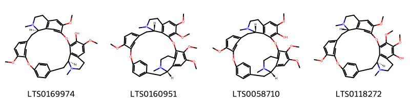
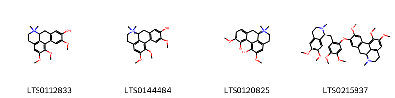
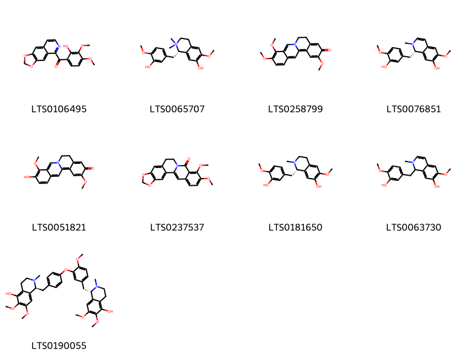

!!! abstract "Tóm tắt"

    Thổ hoàng liên (thân rễ), tên khoa học là Rhizoma Thalictri foliolosi thuộc họ Hoàng Liên - Ranunculaceae. Phân bố chủ yếu ở Trung Quốc, Ấn Độ, Myanmar, Nepal, Thái Lan,...ở Việt Nam mới phát hiện mọc nhiều ở vùng Tây Bắc đặc biệt ở Tủa Chùa, đã đem trồng thí nghiệm tại vườn thuốc SaPa (Lào Cai) và Tam Đảo (Vĩnh Phúc). Thành phần hóa học chính của thổ hoàng liên là các alcaloid như berberin, palmatin, jatrorrhizin,... có tác dụng dược lý là kháng khuẩn, tuy nhiên gây độc tính cấp (thử nghiệm trên chuột). Theo y học cổ truyền, thổ hoàng liên có vị rất đắng, tính hàn, có tác dụng thanh nhiệt, giải độc, khu phong; chữa các bệnh về đường tiêu hóa: lỵ, hoàng đản, đầy hơi; dùng ngoài chữa đau mắt và mụn nhọt.

## Thông tin về thực vật

Dược liệu **Thổ Hoàng Liên (Thân Rễ)** từ bộ phận **** từ loài *Thalictrum foliolosum*.

**Mô tả thực vật:** Thổ hoàng liên là một loại cây nhỏ, cao 40-50cm, thân mỏng, mềm nhẵn. Lá kép 3 lần lông chim có bẹ, cuống lá chính dài 10-15cm, cuống lá bậc 2 dài 5-7cm, cuống bậc 3 dài 1-3cm. Lá chét hình tròn hay bầu dục, mép khía tai bèo, phiến lá dài, lá màu xanh lục, mặt dưới nhạt hơn. Hoa nhỏ, cạnh mỏng hơi phớt tím. Quả nhỏ, hình hạt thóc, đầu hơi có mỏ. Thân rễ to, thô đường kính 0,3-0,5cm có nhiều mấu, mấu cách nhau chừng 0,5-1cm, bẻ ngang thấy rất nhiều xơ, thịt màu vàng tươi, vàng trắng

*Tài liệu tham khảo:* "Những cây thuốc và vị thuốc Việt Nam" - Đỗ Tất Lợi 
Trong dược điển Việt nam, một loài được sử dụng làm dược liệu là *Thalictrum foliolosum*.

!!! info "Phân loại thực vật của *Thalictrum foliolosum*"
    - **Kingdom:** Plantae
    - **Phylum:** Tracheophyta
    - **Order:** Ranunculales
    - **Family:** Ranunculaceae
    - **Genus:** Thalictrum
    - **Species:** *Thalictrum foliolosum*

**Phân bố trên thế giới:** nan, Thailand, Myanmar, France, China, Pakistan, unknown or invalid, United Kingdom of Great Britain and Northern Ireland, India, Nepal, Bhutan

**Phân bố tại Việt nam:** Không có ghi nhận ở Việt Nam

## Thông tin về dược liệu 

### Định danh

!!! info "Thông tin về tên gọi"

    - Dược liệu tiếng Việt: thổ hoàng liên
    - Dược liệu tiếng Trung:  ()
    - Dược liệu tiếng Anh: 
    - Dược liệu latin thông dụng: Rhizoma Thalictri foliolosi
    - Dược liệu latin kiểu DĐVN: *rhizoma thalictri foliolosi*
    - Dược liệu latin kiểu DĐVN: **
    - Dược liệu latin kiểu thông tư: **
    - Bộ phận dùng:  (Rhizoma)

### Mô tả dược liệu 

- **Theo dược điển Việt nam V:** Đoạn thân rễ màu nâu sẫm dài 2 cm đến 8 cm, đường kính 0,3 cm đến 1,1 cm, thường cong queo, có nhiều đốt khúc khuỷu. Dễ bẻ gãy, vết bẻ có màu vàng nhạt, không phẳng. Mặt cắt ngang có 2 phần rõ rệt: Phần vỏ màu nâu sẫm, phần gỗ màu vàng, ruột màu xám. Rễ dài 3 cm đến 15 cm, đường kính 0,1 cm đến 0,4 cm, mặt ngoài màu nâu nhạt, có các nếp nhăn dọc. Rễ mềm hơn thân rễ và mặt cắt ngang cũng có hai phần rõ rệt. phần ngoài màu vàng nhạt, lõi gỗ phía trong màu vàng đậm. Vị rất đắng.

- **Mô tả dược liệu theo thông tư chế biến dược liệu theo phương pháp cổ truyền:** 

### Chế biến 

- **Chế biến theo dược điển việt nam V**: Thường thu hoạch rễ vào tháng 6 đến 8. Lúc trời khô ráo, đào lấy rễ và thân rễ, rửa nước thật nhanh cho sạch đất cát, cắt bỏ rễ con và gốc thân, rồi phơi hay sấy khô.nBào chế Loại bỏ tạp chất, rửa sạch, ủ mềm, thái mỏng phơi khô hoặc tám rượu sao khô.

- **Chế biến theo thông tư:** 

--- 

## Thành phần hóa học

- Theo tài liệu của GS. Đỗ Tất Lợi:  (1) Nhóm hóa học:
- Alcaloid: Berberin(3%), palmatin (0,3%), jatrorrhizin (0,02%); Ngoài ra còn một ít thalictrin
    

**Thành phần hóa học từ loài **Thalictrum foliolosum**

Theo cơ sở dữ liệu lotus, loài *Thalictrum foliolosum* đã phân lập và xác định được **27** hoạt chất thuộc về các nhóm Isoquinolines and derivatives, Dihydroisoquinolines, Aporphines, Protoberberine alkaloids and derivatives trong bảng dưới đây. Danh sách các hoạt chất như sau (1r,14s)-6,20,25-trimethoxy-15,30-dimethyl-8,23-dioxa-15,30-diazaheptacyclo[22.6.2.2⁹,¹².1³,⁷.1¹⁴,¹⁸.0²⁷,³¹.0²²,³³]hexatriaconta-3,5,7(36),9,11,18(33),19,21,24(32),25,27(31),34-dodecaen-21-ol [(LTS0169974)](https://lotus.naturalproducts.net/compound/lotus_id/LTS0169974), 16-methoxy-5,7-dioxa-13λ⁵-azapentacyclo[11.8.0.0²,¹⁰.0⁴,⁸.0¹⁵,²⁰]henicosa-1(13),2,4(8),9,14,16,18,20-octaen-13-ylium-17-olate [(LTS0241484)](https://lotus.naturalproducts.net/compound/lotus_id/LTS0241484), 3,4,10,11-tetramethoxy-7,8-dihydro-5h-6-azatetraphene [(LTS0094925)](https://lotus.naturalproducts.net/compound/lotus_id/LTS0094925), 3,4,11-trimethoxy-7,8-dihydro-6-azatetraphen-10-one [(LTS0258799)](https://lotus.naturalproducts.net/compound/lotus_id/LTS0258799), (1s)-7-hydroxy-1-[(3-hydroxy-4-methoxyphenyl)methyl]-6-methoxy-2,2-dimethyl-3,4-dihydro-1h-isoquinolin-2-ium [(LTS0065707)](https://lotus.naturalproducts.net/compound/lotus_id/LTS0065707), (9s)-5-hydroxy-4,15,16-trimethoxy-10,10-dimethyl-10-azatetracyclo[7.7.1.0²,⁷.0¹³,¹⁷]heptadeca-1(16),2(7),3,5,13(17),14-hexaen-10-ium [(LTS0144484)](https://lotus.naturalproducts.net/compound/lotus_id/LTS0144484), palmatine [(LTS0253245)](https://lotus.naturalproducts.net/compound/lotus_id/LTS0253245), 8-oxyberberine [(LTS0237537)](https://lotus.naturalproducts.net/compound/lotus_id/LTS0237537), (9s)-5-(2-{[(1s)-6,7-dimethoxy-2-methyl-3,4-dihydro-1h-isoquinolin-1-yl]methyl}-4,5-dimethoxyphenoxy)-4,15,16-trimethoxy-10-methyl-10-azatetracyclo[7.7.1.0²,⁷.0¹³,¹⁷]heptadeca-1(16),2(7),3,5,13(17),14-hexaene [(LTS0215837)](https://lotus.naturalproducts.net/compound/lotus_id/LTS0215837), rugosinone [(LTS0106495)](https://lotus.naturalproducts.net/compound/lotus_id/LTS0106495), (3s,22s)-10,11,15,16,27-pentamethoxy-4,21-dimethyl-13,29-dioxa-4,21-diazaheptacyclo[28.2.2.1¹⁴,¹⁸.1²⁴,²⁸.0³,⁸.0⁷,¹².0²²,³⁶]hexatriaconta-1(32),7(12),8,10,14,16,18(36),24,26,28(35),30,33-dodecaene [(LTS0160951)](https://lotus.naturalproducts.net/compound/lotus_id/LTS0160951), (+,-)-reticuline [(LTS0181650)](https://lotus.naturalproducts.net/compound/lotus_id/LTS0181650), 1-[(3-hydroxy-4-methoxyphenyl)methyl]-6-methoxy-2-methyl-1h-isoquinolin-7-ol [(LTS0063730)](https://lotus.naturalproducts.net/compound/lotus_id/LTS0063730), 11,17-dihydroxy-16-methoxy-5,7-dioxa-13λ⁵-azapentacyclo[11.8.0.0²,¹⁰.0⁴,⁸.0¹⁵,²⁰]henicosa-1(13),2,4(8),9,14,16,18,20-octaen-13-ylium [(LTS0230225)](https://lotus.naturalproducts.net/compound/lotus_id/LTS0230225), (1s)-1-{[3-(4-{[(1s)-5-hydroxy-6,7-dimethoxy-2-methyl-3,4-dihydro-1h-isoquinolin-1-yl]methyl}phenoxy)-4-methoxyphenyl]methyl}-6,7-dimethoxy-2-methyl-3,4-dihydro-1h-isoquinolin-5-ol [(LTS0190055)](https://lotus.naturalproducts.net/compound/lotus_id/LTS0190055), (3s,22s)-10,11,16,27-tetramethoxy-4,21-dimethyl-13,29-dioxa-4,21-diazaheptacyclo[28.2.2.1¹⁴,¹⁸.1²⁴,²⁸.0³,⁸.0⁷,¹².0²²,³⁶]hexatriaconta-1(32),7(12),8,10,14,16,18(36),24,26,28(35),30,33-dodecaen-15-ol [(LTS0058710)](https://lotus.naturalproducts.net/compound/lotus_id/LTS0058710), 3,4,10-trimethoxy-7,8-dihydro-5h-6-azatetraphen-11-ol [(LTS0076853)](https://lotus.naturalproducts.net/compound/lotus_id/LTS0076853), 3-hydroxy-4,11-dimethoxy-7,8-dihydro-6-azatetraphen-10-one [(LTS0051821)](https://lotus.naturalproducts.net/compound/lotus_id/LTS0051821), columbamine [(LTS0111553)](https://lotus.naturalproducts.net/compound/lotus_id/LTS0111553), (1s)-1-[(3-hydroxy-4-methoxyphenyl)methyl]-6-methoxy-2-methyl-1h-isoquinolin-7-ol [(LTS0076851)](https://lotus.naturalproducts.net/compound/lotus_id/LTS0076851), 17-hydroxy-16-methoxy-5,7-dioxa-13λ⁵-azapentacyclo[11.8.0.0²,¹⁰.0⁴,⁸.0¹⁵,²⁰]henicosa-1(13),2,4(8),9,14,16,18,20-octaen-13-ylium [(LTS0155305)](https://lotus.naturalproducts.net/compound/lotus_id/LTS0155305), (1s,14s)-6,20,21,25-tetramethoxy-15,30-dimethyl-8,23-dioxa-15,30-diazaheptacyclo[22.6.2.2⁹,¹².1³,⁷.1¹⁴,¹⁸.0²⁷,³¹.0²²,³³]hexatriaconta-3,5,7(36),9,11,18(33),19,21,24(32),25,27(31),34-dodecaen-19-ol [(LTS0118272)](https://lotus.naturalproducts.net/compound/lotus_id/LTS0118272), berberine [(LTS0101484)](https://lotus.naturalproducts.net/compound/lotus_id/LTS0101484), (11r)-11,17-dihydroxy-16-methoxy-5,7-dioxa-13λ⁵-azapentacyclo[11.8.0.0²,¹⁰.0⁴,⁸.0¹⁵,²⁰]henicosa-1(13),2,4(8),9,14,16,18,20-octaen-13-ylium [(LTS0094310)](https://lotus.naturalproducts.net/compound/lotus_id/LTS0094310), 5-hydroxy-4,15,16-trimethoxy-10,10-dimethyl-10-azatetracyclo[7.7.1.0²,⁷.0¹³,¹⁷]heptadeca-1(16),2(7),3,5,13(17),14-hexaen-10-ium [(LTS0112833)](https://lotus.naturalproducts.net/compound/lotus_id/LTS0112833), magnoflorine [(LTS0120825)](https://lotus.naturalproducts.net/compound/lotus_id/LTS0120825), 16,17-dimethoxy-5,7-dioxa-13-azapentacyclo[11.8.0.0²,¹⁰.0⁴,⁸.0¹⁵,²⁰]henicosa-1(21),2,4(8),9,15,17,19-heptaene [(LTS0007586)](https://lotus.naturalproducts.net/compound/lotus_id/LTS0007586). 
        
| chemicalTaxonomyClassyfireClass          |   smiles_count |
|:-----------------------------------------|---------------:|
|                                          |            334 |
| Aporphines                               |            245 |
| Dihydroisoquinolines                     |             47 |
| Isoquinolines and derivatives            |            421 |
| Protoberberine alkaloids and derivatives |            393 |

            
### Nhóm 
<figure markdown="span">
    { width=100% }
<figcaption>Hình ảnh cấu trúc hóa học của hoạt chất thuộc nhóm **. Tên thường gọi của các hoạt chất tương ứng là (1r,14s)-6,20,25-trimethoxy-15,30-dimethyl-8,23-dioxa-15,30-diazaheptacyclo[22.6.2.2⁹,¹².1³,⁷.1¹⁴,¹⁸.0²⁷,³¹.0²²,³³]hexatriaconta-3,5,7(36),9,11,18(33),19,21,24(32),25,27(31),34-dodecaen-21-ol [(LTS0169974)](https://lotus.naturalproducts.net/compound/lotus_id/LTS0169974), (3s,22s)-10,11,15,16,27-pentamethoxy-4,21-dimethyl-13,29-dioxa-4,21-diazaheptacyclo[28.2.2.1¹⁴,¹⁸.1²⁴,²⁸.0³,⁸.0⁷,¹².0²²,³⁶]hexatriaconta-1(32),7(12),8,10,14,16,18(36),24,26,28(35),30,33-dodecaene [(LTS0160951)](https://lotus.naturalproducts.net/compound/lotus_id/LTS0160951), (3s,22s)-10,11,16,27-tetramethoxy-4,21-dimethyl-13,29-dioxa-4,21-diazaheptacyclo[28.2.2.1¹⁴,¹⁸.1²⁴,²⁸.0³,⁸.0⁷,¹².0²²,³⁶]hexatriaconta-1(32),7(12),8,10,14,16,18(36),24,26,28(35),30,33-dodecaen-15-ol [(LTS0058710)](https://lotus.naturalproducts.net/compound/lotus_id/LTS0058710), (1s,14s)-6,20,21,25-tetramethoxy-15,30-dimethyl-8,23-dioxa-15,30-diazaheptacyclo[22.6.2.2⁹,¹².1³,⁷.1¹⁴,¹⁸.0²⁷,³¹.0²²,³³]hexatriaconta-3,5,7(36),9,11,18(33),19,21,24(32),25,27(31),34-dodecaen-19-ol [(LTS0118272)](https://lotus.naturalproducts.net/compound/lotus_id/LTS0118272).</figcaption>
</figure>

            
            
### Nhóm 
<figure markdown="span">
    { width=100% }
<figcaption>Hình ảnh cấu trúc hóa học của hoạt chất thuộc nhóm **. Tên thường gọi của các hoạt chất tương ứng là (1r,14s)-6,20,25-trimethoxy-15,30-dimethyl-8,23-dioxa-15,30-diazaheptacyclo[22.6.2.2⁹,¹².1³,⁷.1¹⁴,¹⁸.0²⁷,³¹.0²²,³³]hexatriaconta-3,5,7(36),9,11,18(33),19,21,24(32),25,27(31),34-dodecaen-21-ol [(LTS0169974)](https://lotus.naturalproducts.net/compound/lotus_id/LTS0169974), (3s,22s)-10,11,15,16,27-pentamethoxy-4,21-dimethyl-13,29-dioxa-4,21-diazaheptacyclo[28.2.2.1¹⁴,¹⁸.1²⁴,²⁸.0³,⁸.0⁷,¹².0²²,³⁶]hexatriaconta-1(32),7(12),8,10,14,16,18(36),24,26,28(35),30,33-dodecaene [(LTS0160951)](https://lotus.naturalproducts.net/compound/lotus_id/LTS0160951), (3s,22s)-10,11,16,27-tetramethoxy-4,21-dimethyl-13,29-dioxa-4,21-diazaheptacyclo[28.2.2.1¹⁴,¹⁸.1²⁴,²⁸.0³,⁸.0⁷,¹².0²²,³⁶]hexatriaconta-1(32),7(12),8,10,14,16,18(36),24,26,28(35),30,33-dodecaen-15-ol [(LTS0058710)](https://lotus.naturalproducts.net/compound/lotus_id/LTS0058710), (1s,14s)-6,20,21,25-tetramethoxy-15,30-dimethyl-8,23-dioxa-15,30-diazaheptacyclo[22.6.2.2⁹,¹².1³,⁷.1¹⁴,¹⁸.0²⁷,³¹.0²²,³³]hexatriaconta-3,5,7(36),9,11,18(33),19,21,24(32),25,27(31),34-dodecaen-19-ol [(LTS0118272)](https://lotus.naturalproducts.net/compound/lotus_id/LTS0118272).</figcaption>
</figure>

### Nhóm Aporphines
<figure markdown="span">
    { width=100% }
<figcaption>Hình ảnh cấu trúc hóa học của hoạt chất thuộc nhóm *Aporphines*. Tên thường gọi của các hoạt chất tương ứng là 5-hydroxy-4,15,16-trimethoxy-10,10-dimethyl-10-azatetracyclo[7.7.1.0²,⁷.0¹³,¹⁷]heptadeca-1(16),2(7),3,5,13(17),14-hexaen-10-ium [(LTS0112833)](https://lotus.naturalproducts.net/compound/lotus_id/LTS0112833), (9s)-5-hydroxy-4,15,16-trimethoxy-10,10-dimethyl-10-azatetracyclo[7.7.1.0²,⁷.0¹³,¹⁷]heptadeca-1(16),2(7),3,5,13(17),14-hexaen-10-ium [(LTS0144484)](https://lotus.naturalproducts.net/compound/lotus_id/LTS0144484), magnoflorine [(LTS0120825)](https://lotus.naturalproducts.net/compound/lotus_id/LTS0120825), (9s)-5-(2-{[(1s)-6,7-dimethoxy-2-methyl-3,4-dihydro-1h-isoquinolin-1-yl]methyl}-4,5-dimethoxyphenoxy)-4,15,16-trimethoxy-10-methyl-10-azatetracyclo[7.7.1.0²,⁷.0¹³,¹⁷]heptadeca-1(16),2(7),3,5,13(17),14-hexaene [(LTS0215837)](https://lotus.naturalproducts.net/compound/lotus_id/LTS0215837).</figcaption>
</figure>

            
            
### Nhóm 
<figure markdown="span">
    { width=100% }
<figcaption>Hình ảnh cấu trúc hóa học của hoạt chất thuộc nhóm **. Tên thường gọi của các hoạt chất tương ứng là (1r,14s)-6,20,25-trimethoxy-15,30-dimethyl-8,23-dioxa-15,30-diazaheptacyclo[22.6.2.2⁹,¹².1³,⁷.1¹⁴,¹⁸.0²⁷,³¹.0²²,³³]hexatriaconta-3,5,7(36),9,11,18(33),19,21,24(32),25,27(31),34-dodecaen-21-ol [(LTS0169974)](https://lotus.naturalproducts.net/compound/lotus_id/LTS0169974), (3s,22s)-10,11,15,16,27-pentamethoxy-4,21-dimethyl-13,29-dioxa-4,21-diazaheptacyclo[28.2.2.1¹⁴,¹⁸.1²⁴,²⁸.0³,⁸.0⁷,¹².0²²,³⁶]hexatriaconta-1(32),7(12),8,10,14,16,18(36),24,26,28(35),30,33-dodecaene [(LTS0160951)](https://lotus.naturalproducts.net/compound/lotus_id/LTS0160951), (3s,22s)-10,11,16,27-tetramethoxy-4,21-dimethyl-13,29-dioxa-4,21-diazaheptacyclo[28.2.2.1¹⁴,¹⁸.1²⁴,²⁸.0³,⁸.0⁷,¹².0²²,³⁶]hexatriaconta-1(32),7(12),8,10,14,16,18(36),24,26,28(35),30,33-dodecaen-15-ol [(LTS0058710)](https://lotus.naturalproducts.net/compound/lotus_id/LTS0058710), (1s,14s)-6,20,21,25-tetramethoxy-15,30-dimethyl-8,23-dioxa-15,30-diazaheptacyclo[22.6.2.2⁹,¹².1³,⁷.1¹⁴,¹⁸.0²⁷,³¹.0²²,³³]hexatriaconta-3,5,7(36),9,11,18(33),19,21,24(32),25,27(31),34-dodecaen-19-ol [(LTS0118272)](https://lotus.naturalproducts.net/compound/lotus_id/LTS0118272).</figcaption>
</figure>

### Nhóm Aporphines
<figure markdown="span">
    { width=100% }
<figcaption>Hình ảnh cấu trúc hóa học của hoạt chất thuộc nhóm *Aporphines*. Tên thường gọi của các hoạt chất tương ứng là 5-hydroxy-4,15,16-trimethoxy-10,10-dimethyl-10-azatetracyclo[7.7.1.0²,⁷.0¹³,¹⁷]heptadeca-1(16),2(7),3,5,13(17),14-hexaen-10-ium [(LTS0112833)](https://lotus.naturalproducts.net/compound/lotus_id/LTS0112833), (9s)-5-hydroxy-4,15,16-trimethoxy-10,10-dimethyl-10-azatetracyclo[7.7.1.0²,⁷.0¹³,¹⁷]heptadeca-1(16),2(7),3,5,13(17),14-hexaen-10-ium [(LTS0144484)](https://lotus.naturalproducts.net/compound/lotus_id/LTS0144484), magnoflorine [(LTS0120825)](https://lotus.naturalproducts.net/compound/lotus_id/LTS0120825), (9s)-5-(2-{[(1s)-6,7-dimethoxy-2-methyl-3,4-dihydro-1h-isoquinolin-1-yl]methyl}-4,5-dimethoxyphenoxy)-4,15,16-trimethoxy-10-methyl-10-azatetracyclo[7.7.1.0²,⁷.0¹³,¹⁷]heptadeca-1(16),2(7),3,5,13(17),14-hexaene [(LTS0215837)](https://lotus.naturalproducts.net/compound/lotus_id/LTS0215837).</figcaption>
</figure>

### Nhóm Dihydroisoquinolines
<figure markdown="span">
    { width=100% }
<figcaption>Hình ảnh cấu trúc hóa học của hoạt chất thuộc nhóm *Dihydroisoquinolines*. Tên thường gọi của các hoạt chất tương ứng là 11,17-dihydroxy-16-methoxy-5,7-dioxa-13λ⁵-azapentacyclo[11.8.0.0²,¹⁰.0⁴,⁸.0¹⁵,²⁰]henicosa-1(13),2,4(8),9,14,16,18,20-octaen-13-ylium [(LTS0230225)](https://lotus.naturalproducts.net/compound/lotus_id/LTS0230225).</figcaption>
</figure>

            
            
### Nhóm 
<figure markdown="span">
    { width=100% }
<figcaption>Hình ảnh cấu trúc hóa học của hoạt chất thuộc nhóm **. Tên thường gọi của các hoạt chất tương ứng là (1r,14s)-6,20,25-trimethoxy-15,30-dimethyl-8,23-dioxa-15,30-diazaheptacyclo[22.6.2.2⁹,¹².1³,⁷.1¹⁴,¹⁸.0²⁷,³¹.0²²,³³]hexatriaconta-3,5,7(36),9,11,18(33),19,21,24(32),25,27(31),34-dodecaen-21-ol [(LTS0169974)](https://lotus.naturalproducts.net/compound/lotus_id/LTS0169974), (3s,22s)-10,11,15,16,27-pentamethoxy-4,21-dimethyl-13,29-dioxa-4,21-diazaheptacyclo[28.2.2.1¹⁴,¹⁸.1²⁴,²⁸.0³,⁸.0⁷,¹².0²²,³⁶]hexatriaconta-1(32),7(12),8,10,14,16,18(36),24,26,28(35),30,33-dodecaene [(LTS0160951)](https://lotus.naturalproducts.net/compound/lotus_id/LTS0160951), (3s,22s)-10,11,16,27-tetramethoxy-4,21-dimethyl-13,29-dioxa-4,21-diazaheptacyclo[28.2.2.1¹⁴,¹⁸.1²⁴,²⁸.0³,⁸.0⁷,¹².0²²,³⁶]hexatriaconta-1(32),7(12),8,10,14,16,18(36),24,26,28(35),30,33-dodecaen-15-ol [(LTS0058710)](https://lotus.naturalproducts.net/compound/lotus_id/LTS0058710), (1s,14s)-6,20,21,25-tetramethoxy-15,30-dimethyl-8,23-dioxa-15,30-diazaheptacyclo[22.6.2.2⁹,¹².1³,⁷.1¹⁴,¹⁸.0²⁷,³¹.0²²,³³]hexatriaconta-3,5,7(36),9,11,18(33),19,21,24(32),25,27(31),34-dodecaen-19-ol [(LTS0118272)](https://lotus.naturalproducts.net/compound/lotus_id/LTS0118272).</figcaption>
</figure>

### Nhóm Aporphines
<figure markdown="span">
    { width=100% }
<figcaption>Hình ảnh cấu trúc hóa học của hoạt chất thuộc nhóm *Aporphines*. Tên thường gọi của các hoạt chất tương ứng là 5-hydroxy-4,15,16-trimethoxy-10,10-dimethyl-10-azatetracyclo[7.7.1.0²,⁷.0¹³,¹⁷]heptadeca-1(16),2(7),3,5,13(17),14-hexaen-10-ium [(LTS0112833)](https://lotus.naturalproducts.net/compound/lotus_id/LTS0112833), (9s)-5-hydroxy-4,15,16-trimethoxy-10,10-dimethyl-10-azatetracyclo[7.7.1.0²,⁷.0¹³,¹⁷]heptadeca-1(16),2(7),3,5,13(17),14-hexaen-10-ium [(LTS0144484)](https://lotus.naturalproducts.net/compound/lotus_id/LTS0144484), magnoflorine [(LTS0120825)](https://lotus.naturalproducts.net/compound/lotus_id/LTS0120825), (9s)-5-(2-{[(1s)-6,7-dimethoxy-2-methyl-3,4-dihydro-1h-isoquinolin-1-yl]methyl}-4,5-dimethoxyphenoxy)-4,15,16-trimethoxy-10-methyl-10-azatetracyclo[7.7.1.0²,⁷.0¹³,¹⁷]heptadeca-1(16),2(7),3,5,13(17),14-hexaene [(LTS0215837)](https://lotus.naturalproducts.net/compound/lotus_id/LTS0215837).</figcaption>
</figure>

### Nhóm Dihydroisoquinolines
<figure markdown="span">
    { width=100% }
<figcaption>Hình ảnh cấu trúc hóa học của hoạt chất thuộc nhóm *Dihydroisoquinolines*. Tên thường gọi của các hoạt chất tương ứng là 11,17-dihydroxy-16-methoxy-5,7-dioxa-13λ⁵-azapentacyclo[11.8.0.0²,¹⁰.0⁴,⁸.0¹⁵,²⁰]henicosa-1(13),2,4(8),9,14,16,18,20-octaen-13-ylium [(LTS0230225)](https://lotus.naturalproducts.net/compound/lotus_id/LTS0230225).</figcaption>
</figure>

### Nhóm Isoquinolines and derivatives
<figure markdown="span">
    { width=100% }
<figcaption>Hình ảnh cấu trúc hóa học của hoạt chất thuộc nhóm *Isoquinolines and derivatives*. Tên thường gọi của các hoạt chất tương ứng là rugosinone [(LTS0106495)](https://lotus.naturalproducts.net/compound/lotus_id/LTS0106495), (1s)-7-hydroxy-1-[(3-hydroxy-4-methoxyphenyl)methyl]-6-methoxy-2,2-dimethyl-3,4-dihydro-1h-isoquinolin-2-ium [(LTS0065707)](https://lotus.naturalproducts.net/compound/lotus_id/LTS0065707), 3,4,11-trimethoxy-7,8-dihydro-6-azatetraphen-10-one [(LTS0258799)](https://lotus.naturalproducts.net/compound/lotus_id/LTS0258799), (1s)-1-[(3-hydroxy-4-methoxyphenyl)methyl]-6-methoxy-2-methyl-1h-isoquinolin-7-ol [(LTS0076851)](https://lotus.naturalproducts.net/compound/lotus_id/LTS0076851), 3-hydroxy-4,11-dimethoxy-7,8-dihydro-6-azatetraphen-10-one [(LTS0051821)](https://lotus.naturalproducts.net/compound/lotus_id/LTS0051821), 8-oxyberberine [(LTS0237537)](https://lotus.naturalproducts.net/compound/lotus_id/LTS0237537), (+,-)-reticuline [(LTS0181650)](https://lotus.naturalproducts.net/compound/lotus_id/LTS0181650), 1-[(3-hydroxy-4-methoxyphenyl)methyl]-6-methoxy-2-methyl-1h-isoquinolin-7-ol [(LTS0063730)](https://lotus.naturalproducts.net/compound/lotus_id/LTS0063730), (1s)-1-{[3-(4-{[(1s)-5-hydroxy-6,7-dimethoxy-2-methyl-3,4-dihydro-1h-isoquinolin-1-yl]methyl}phenoxy)-4-methoxyphenyl]methyl}-6,7-dimethoxy-2-methyl-3,4-dihydro-1h-isoquinolin-5-ol [(LTS0190055)](https://lotus.naturalproducts.net/compound/lotus_id/LTS0190055).</figcaption>
</figure>

            
            
### Nhóm 
<figure markdown="span">
    { width=100% }
<figcaption>Hình ảnh cấu trúc hóa học của hoạt chất thuộc nhóm **. Tên thường gọi của các hoạt chất tương ứng là (1r,14s)-6,20,25-trimethoxy-15,30-dimethyl-8,23-dioxa-15,30-diazaheptacyclo[22.6.2.2⁹,¹².1³,⁷.1¹⁴,¹⁸.0²⁷,³¹.0²²,³³]hexatriaconta-3,5,7(36),9,11,18(33),19,21,24(32),25,27(31),34-dodecaen-21-ol [(LTS0169974)](https://lotus.naturalproducts.net/compound/lotus_id/LTS0169974), (3s,22s)-10,11,15,16,27-pentamethoxy-4,21-dimethyl-13,29-dioxa-4,21-diazaheptacyclo[28.2.2.1¹⁴,¹⁸.1²⁴,²⁸.0³,⁸.0⁷,¹².0²²,³⁶]hexatriaconta-1(32),7(12),8,10,14,16,18(36),24,26,28(35),30,33-dodecaene [(LTS0160951)](https://lotus.naturalproducts.net/compound/lotus_id/LTS0160951), (3s,22s)-10,11,16,27-tetramethoxy-4,21-dimethyl-13,29-dioxa-4,21-diazaheptacyclo[28.2.2.1¹⁴,¹⁸.1²⁴,²⁸.0³,⁸.0⁷,¹².0²²,³⁶]hexatriaconta-1(32),7(12),8,10,14,16,18(36),24,26,28(35),30,33-dodecaen-15-ol [(LTS0058710)](https://lotus.naturalproducts.net/compound/lotus_id/LTS0058710), (1s,14s)-6,20,21,25-tetramethoxy-15,30-dimethyl-8,23-dioxa-15,30-diazaheptacyclo[22.6.2.2⁹,¹².1³,⁷.1¹⁴,¹⁸.0²⁷,³¹.0²²,³³]hexatriaconta-3,5,7(36),9,11,18(33),19,21,24(32),25,27(31),34-dodecaen-19-ol [(LTS0118272)](https://lotus.naturalproducts.net/compound/lotus_id/LTS0118272).</figcaption>
</figure>

### Nhóm Aporphines
<figure markdown="span">
    { width=100% }
<figcaption>Hình ảnh cấu trúc hóa học của hoạt chất thuộc nhóm *Aporphines*. Tên thường gọi của các hoạt chất tương ứng là 5-hydroxy-4,15,16-trimethoxy-10,10-dimethyl-10-azatetracyclo[7.7.1.0²,⁷.0¹³,¹⁷]heptadeca-1(16),2(7),3,5,13(17),14-hexaen-10-ium [(LTS0112833)](https://lotus.naturalproducts.net/compound/lotus_id/LTS0112833), (9s)-5-hydroxy-4,15,16-trimethoxy-10,10-dimethyl-10-azatetracyclo[7.7.1.0²,⁷.0¹³,¹⁷]heptadeca-1(16),2(7),3,5,13(17),14-hexaen-10-ium [(LTS0144484)](https://lotus.naturalproducts.net/compound/lotus_id/LTS0144484), magnoflorine [(LTS0120825)](https://lotus.naturalproducts.net/compound/lotus_id/LTS0120825), (9s)-5-(2-{[(1s)-6,7-dimethoxy-2-methyl-3,4-dihydro-1h-isoquinolin-1-yl]methyl}-4,5-dimethoxyphenoxy)-4,15,16-trimethoxy-10-methyl-10-azatetracyclo[7.7.1.0²,⁷.0¹³,¹⁷]heptadeca-1(16),2(7),3,5,13(17),14-hexaene [(LTS0215837)](https://lotus.naturalproducts.net/compound/lotus_id/LTS0215837).</figcaption>
</figure>

### Nhóm Dihydroisoquinolines
<figure markdown="span">
    { width=100% }
<figcaption>Hình ảnh cấu trúc hóa học của hoạt chất thuộc nhóm *Dihydroisoquinolines*. Tên thường gọi của các hoạt chất tương ứng là 11,17-dihydroxy-16-methoxy-5,7-dioxa-13λ⁵-azapentacyclo[11.8.0.0²,¹⁰.0⁴,⁸.0¹⁵,²⁰]henicosa-1(13),2,4(8),9,14,16,18,20-octaen-13-ylium [(LTS0230225)](https://lotus.naturalproducts.net/compound/lotus_id/LTS0230225).</figcaption>
</figure>

### Nhóm Isoquinolines and derivatives
<figure markdown="span">
    { width=100% }
<figcaption>Hình ảnh cấu trúc hóa học của hoạt chất thuộc nhóm *Isoquinolines and derivatives*. Tên thường gọi của các hoạt chất tương ứng là rugosinone [(LTS0106495)](https://lotus.naturalproducts.net/compound/lotus_id/LTS0106495), (1s)-7-hydroxy-1-[(3-hydroxy-4-methoxyphenyl)methyl]-6-methoxy-2,2-dimethyl-3,4-dihydro-1h-isoquinolin-2-ium [(LTS0065707)](https://lotus.naturalproducts.net/compound/lotus_id/LTS0065707), 3,4,11-trimethoxy-7,8-dihydro-6-azatetraphen-10-one [(LTS0258799)](https://lotus.naturalproducts.net/compound/lotus_id/LTS0258799), (1s)-1-[(3-hydroxy-4-methoxyphenyl)methyl]-6-methoxy-2-methyl-1h-isoquinolin-7-ol [(LTS0076851)](https://lotus.naturalproducts.net/compound/lotus_id/LTS0076851), 3-hydroxy-4,11-dimethoxy-7,8-dihydro-6-azatetraphen-10-one [(LTS0051821)](https://lotus.naturalproducts.net/compound/lotus_id/LTS0051821), 8-oxyberberine [(LTS0237537)](https://lotus.naturalproducts.net/compound/lotus_id/LTS0237537), (+,-)-reticuline [(LTS0181650)](https://lotus.naturalproducts.net/compound/lotus_id/LTS0181650), 1-[(3-hydroxy-4-methoxyphenyl)methyl]-6-methoxy-2-methyl-1h-isoquinolin-7-ol [(LTS0063730)](https://lotus.naturalproducts.net/compound/lotus_id/LTS0063730), (1s)-1-{[3-(4-{[(1s)-5-hydroxy-6,7-dimethoxy-2-methyl-3,4-dihydro-1h-isoquinolin-1-yl]methyl}phenoxy)-4-methoxyphenyl]methyl}-6,7-dimethoxy-2-methyl-3,4-dihydro-1h-isoquinolin-5-ol [(LTS0190055)](https://lotus.naturalproducts.net/compound/lotus_id/LTS0190055).</figcaption>
</figure>

### Nhóm Protoberberine alkaloids and derivatives
<figure markdown="span">
    { width=100% }
<figcaption>Hình ảnh cấu trúc hóa học của hoạt chất thuộc nhóm *Protoberberine alkaloids and derivatives*. Tên thường gọi của các hoạt chất tương ứng là 3,4,10-trimethoxy-7,8-dihydro-5h-6-azatetraphen-11-ol [(LTS0076853)](https://lotus.naturalproducts.net/compound/lotus_id/LTS0076853), 3,4,10,11-tetramethoxy-7,8-dihydro-5h-6-azatetraphene [(LTS0094925)](https://lotus.naturalproducts.net/compound/lotus_id/LTS0094925), 17-hydroxy-16-methoxy-5,7-dioxa-13λ⁵-azapentacyclo[11.8.0.0²,¹⁰.0⁴,⁸.0¹⁵,²⁰]henicosa-1(13),2,4(8),9,14,16,18,20-octaen-13-ylium [(LTS0155305)](https://lotus.naturalproducts.net/compound/lotus_id/LTS0155305), columbamine [(LTS0111553)](https://lotus.naturalproducts.net/compound/lotus_id/LTS0111553), (11r)-11,17-dihydroxy-16-methoxy-5,7-dioxa-13λ⁵-azapentacyclo[11.8.0.0²,¹⁰.0⁴,⁸.0¹⁵,²⁰]henicosa-1(13),2,4(8),9,14,16,18,20-octaen-13-ylium [(LTS0094310)](https://lotus.naturalproducts.net/compound/lotus_id/LTS0094310), 16-methoxy-5,7-dioxa-13λ⁵-azapentacyclo[11.8.0.0²,¹⁰.0⁴,⁸.0¹⁵,²⁰]henicosa-1(13),2,4(8),9,14,16,18,20-octaen-13-ylium-17-olate [(LTS0241484)](https://lotus.naturalproducts.net/compound/lotus_id/LTS0241484), palmatine [(LTS0253245)](https://lotus.naturalproducts.net/compound/lotus_id/LTS0253245), 16,17-dimethoxy-5,7-dioxa-13-azapentacyclo[11.8.0.0²,¹⁰.0⁴,⁸.0¹⁵,²⁰]henicosa-1(21),2,4(8),9,15,17,19-heptaene [(LTS0007586)](https://lotus.naturalproducts.net/compound/lotus_id/LTS0007586), berberine [(LTS0101484)](https://lotus.naturalproducts.net/compound/lotus_id/LTS0101484).</figcaption>
</figure>

            

---

## Tác dụng dược lý

Theo tài liệu "Những cây thuốc và vị thuốc Việt Nam" - Đỗ Tất Lợi:- Tác dụng kháng khuẩn, kháng viêm
- Độc tính cấp (thử nghiệm trên chuột)

Theo tài liệu quốc tế: 

---

## Dược điển Việt Nam V

### Soi bột:

Mảnh bàn màu vàng nâu. Mảnh mô mềm gồm những tế bào hình chữ nhật hay hình nhiều cạnh, thành mỏng. Sợi đứng riêng lẻ hay tập trưng thành từng bó. Tinh thể calci oxalat hình cầu gai và hình khối chữ nhật. Mảnh mạch mạng, mạch điểm. Tế bào mô cứng có thành dày và ống trao đổi rò. Các hạt tinh bột hình chuông hoặc hình trứng, hình tròn. nn

<!-- Hình ảnh soi bột sẽ được tự động chèn vào đây sau -->

### Vi phẫu:

Lớp bần gồm vài hàng tế bào bị bẹp, thành hơi dày và nhăn nheo. Mô mềm vỏ gồm những tế bào hình chữ nhật hay hình nhiều cạnh, thành mỏng. Có đám sợi xếp thành một vòng trong mô mềm vỏ, mỗi bó đặt trước một lớp libe-gỗ. Libe và gỗ cấp 2 xếp thành từng bó. Libe ở phía ngoài, gồm những tế bào nhỏ hình đa giác xếp đều đặn thành dây liên tục hay gián đoạn. Gỗ ở phía trong, mỗi bó có thể không phần nhánh hay phần ra nhiều nhánh. Tia ruột xen kẽ giữa các bó libe-gỗ. Mô mềm ruột gồm những tế bào to hơn mô mềm vỏ.

<!-- Hình ảnh vi phẫu sẽ được tự động chèn vào đây sau -->

### Định tính

A.Lấy khoảng 3 g bột dược liệu cho vào bình nón 100 ml, thêm 30 ml ethanol 90 % (TT), đun sôi trên cách thủy 5 min. Lọc lấy dịch chiết (dung dịch A). Lấy khoảng 5 ml dung dịch A cho vào chén sứ, có cách thủy đến khô, hòa tan cắn với 3 ml dung dịch acid sulfuric 2 % (TT) rồi chuyển vào một ống nghiệm, cho thêm vài giọt nước clor (TT) hoặc nước brom (TT) hay dung dịch cloramin T 10% (TT), lắc đều sẽ thấy dung dịch chuyển từ màu vàng sang màu đỏ. B. Lấy 2 giọt dung dịch A đặt lên phiến kính, để bốc hơi cho khô, thêm 1 giọt acid hydrocloric (TT) hay dung dịch acid nitric 25 % (TT). Đậy lá kính lên để yên khoảng 15 min đến 20 min rồi đểm quan sát dưới kính hiển vi sẽ thấy những tinh thể hình kim màu vàng, C. Phương pháp sắc ký lớp mỏng (Phụ lục 5.4). Bản mỏng : Silica gel G. Dung môi khai triển: Cloroform – methanol – amoniac đậm đặc (8 0 :2 0 :1 ) . Dung dịch thử: Dung dịch A. Dung dịch đối chiếu: Dung dịch berberin clorid chuẩn 1 % trong ethanol 90 % (TT) và dung dịch palmatin clorid chuẩn 1 % trong ethanol 90% (TT). Cách tiến hành: Chấm riêng biệt lên bản mỏng 20 ul mỗi dung dịch trên. Sau khi triển khai sắc ký, để bay hết dung môi, phun lên bản mỏng thuốc thử Dragendorff (TT). Quan sát dưới ánh sáng thường. Trên sắc ký đồ của dung dịch thử, ít nhất có hai vết có màu đỏ cam và có cùng giá trị Rf với vết berberin và palmatin trên sắc ký đồ của dung dịch đối chiếu.

### Định lượng

Cân chính xác khoảng 2,5 g bột dược liệu cho vào bình Zaitchenko hoặc Soxhlet, chiết bằng 50 ml ethanol 90 % (TT) cho đến khi hết màu vàng. cất thu hồi ethanol trên cách thủy cho tới khi còn khoảng 1/10 thể tích ban dầu. Thêm 30 ml nước và 2 g đến 3 g magnesi oxyd (TT), tiếp tục đun trên cách thủy ở 60 °C đến 70 °C trong 15 min, thỉnh thoảng lắc bình. Lọc lấy dịch lọc và cô đến cắn dưới áp suất giảm, rửa cắn bằng 30 ml đến 40 ml nước nóng, rửa làm nhiều lần cho đến khi nước rửa không còn màu vàng nữa. Gộp các nước rửa với dịch lọc vào một bình có dung tích 200 ml. Để nguội, thêm 5 ml dung dịch kali iodid 50 % (TT) và khuấy để kết tủa berberin iodid. Ly tâm, gạn bỏ dịch trong ở phía trên. Thêm vào tủa còn lại 20 ml dung dịch kali iodid 2 % (TT) và khuấy thật kỹ,  ly tâm, bỏ dịch trong ở phía trên. Dùng 10 ml nước cất (chia làm nhiều lần) chuyển tủa vào một bình nón có nút mài dung tích 250 ml. Đun trên cách thủy, lắc bình chờ berberin iodid phần tán đều trong nước. Khi nhiệt độ trong bình lên tới 70 °C, thêm aceton (TT) (khoảng 8 ml đến 9 ml), vừa thêm vừa lắc tới khi tủa berberin iodid vừa tan hết thi ngừng ngay. Dậy nút bình, tiếp tục đun 1 min đến 2 min. Sau đó thêm thật nhanh 3 ml amoniac (TT), lắc bình cho đến khi berberin-aceton kết tủa. Để ở chỗ mát một đểm. Lọc tủa berberin-aceton vào phễu xốp thủy tinh G3 (đường kính lỗ xốp 16 µm đến 40 µm) đã cân trước. Dung dịch lọc vào một bình khác, đo thể tích dịch lọc. Rửa tủa bằng 10 ml ether (TT), sấy khô ở 105 °C trong 3 h, đề nguội trong bình hút ẩm rồi cân. 1 g tủa tương ứng với 898,2 mg berbern. Dung dịch lọc tương ứng với 0,0272 mg berberin. Hàm lượng phần trăm bcrberin (X %) trong dược liệu theo công thức: X%= Trong đó: p là khối lượng dược liệu định lượng đã trừ độ ẩm (g); a là khối lượng tủa thu được (g); V là thể tích dịch lọc do được (ml). Dược liệu phải chứa không ít hơn 1,0 % berbenn (tính theo dược liệu khô kiệt).

### Thông tin khác 

- ** Độ ẩm: ** Không quá 12,0 % (Phụ lục 9.6, 1 g, 105 °C, 5 h).
- ** Bảo quản:** Để nơi khô, mát, trong bao bì kín, tránh mốc mọt.nn

## Dược điển Hồng kong

<!-- PDF sẽ được tự động chèn vào đây sau -->

---

## Y dược học cổ truyền

- **Tên vị thuốc:** 
- **Tính vị quy kinh:** Vị: Khổ, hàn. Vào các kinh can, tâm, tỳ, vị, đờm, đại tràng
- **Công năng chủ trị:** Thanh nhiệt, giải độc. Chủ trị: lỵ, nục huyết, tâm quý, số cao, đau mắt, hoàng đàn, đầy hơi, viêm họng
- **Chú ý:** 
- **Kiêng kỵ:** Thiếu máu, khó tiêu, chứng hàn.nn

## Bình luận

