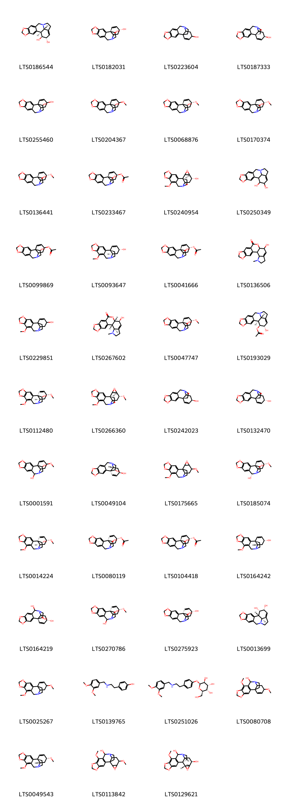
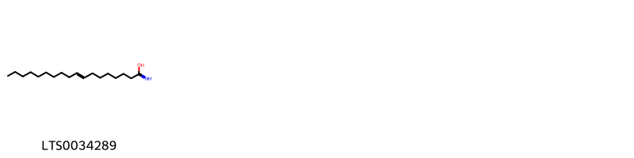
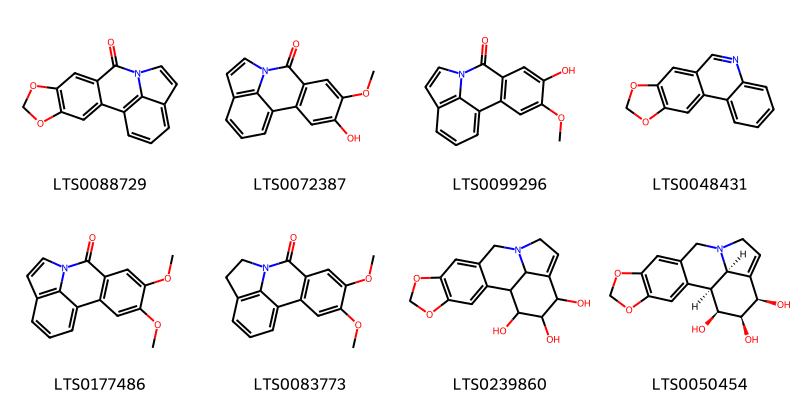
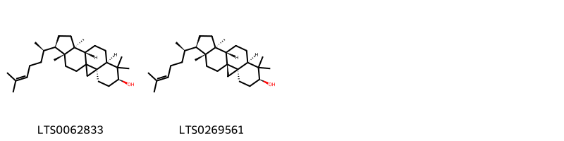
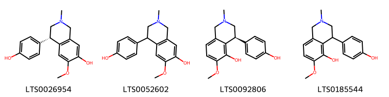

!!! abstract "Tóm tắt"

    Trinh nữ hoàng cung (Lá) (Folium Crini latifolii) là lá đã phơi hoặc sấy khô của cây Trinh nữ hoàng cung (Crinum latifolium L.), thuộc họ Thủy tiên (Amaryllidaceae). Trinh nữ hoàng cung phân bố chủ yếu ở các khu vực Nam Á và Đông Nam Á như Ấn Độ, Myanmar, Thái Lan, Lào, Campuchia, và Việt Nam. Tại Việt Nam, cây mọc hoang và được trồng ở cả ba miền Bắc, Trung, Nam. Theo y học cổ truyền, Trinh nữ hoàng cung có vị đắng, tính mát, với công năng lợi niệu, nhuyễn kiên, tán kết, tiêu u, và giải độc. Lá thường được dùng chữa tiểu tiện bí dắt, u xơ tuyến tiền liệt, u vú, u tử cung, và đau dạ dày. Lá tươi và thân hành có thể dùng ngoài, hơ nóng xoa bóp vào chỗ sưng đau do thấp khớp hoặc sang chấn. Tác dụng dược lý của Trinh nữ hoàng cung bao gồm kháng viêm, kháng khuẩn, chống oxy hóa, giảm đau, điều hòa kinh nguyệt, chống ung thư, và bảo vệ gan. Thành phần hóa học chính là nhóm alkaloid, trong đó có crinamidin, được xác định qua sắc ký lớp mỏng.

## Thông tin về thực vật

Dược liệu **Trinh Nữ Hoàng Cung (Lá)** từ bộ phận **Lá** từ loài *Crinum latifolium*.

**Mô tả thực vật:** " Những cây thuốc và vị thuốc Việt Nam " - Đỗ Tất Lợi
Mô tả cây: Trinh nữ hoàng cung là một loại cỏ, thân hành như củ hành tây to, đường kính 10-15cm, bẹ lá úp vào nhau thành một thân giả dài khoảng 10-15cm, có nhiều lá mỏng kéo dài từ 80-100cm, rộng 3-8cm, hai bên mép lá lượn sóng. Gân lá song song, mặt trên lá lõm thành rãnh, mặt dưới lá có một sống lá nổi rất rõ, đầu bẹ lá nơi sát đất có màu tím. Hoa mọc thành tán gồm 6-18 hoa, trên một cán hoa dài 30-60cm . Cánh hoa màu trắng có điểm màu tím đỏ, từ thân hành mọc rất nhiều củ con có thể tách ra để trồng riêng dễ dàng.

*Tài liệu tham khảo:* "Những cây thuốc và vị thuốc Việt Nam" - Đỗ Tất Lợi 
Trong dược điển Việt nam, một loài được sử dụng làm dược liệu là *Crinum latifolium*.

!!! info "Phân loại thực vật của *Crinum latifolium*"
    - **Kingdom:** Plantae
    - **Phylum:** Tracheophyta
    - **Order:** Asparagales
    - **Family:** Amaryllidaceae
    - **Genus:** Crinum
    - **Species:** *Crinum latifolium*

**Phân bố trên thế giới:** nan, Marshall Islands, Jamaica, Sri Lanka, Seychelles, Saint Helena, Ascension and Tristan da Cunha, Guadeloupe, Hong Kong, unknown or invalid, Angola, Japan, Martinique, Saint Barthélemy, British Indian Ocean Territory, Madagascar, Indonesia, United Kingdom of Great Britain and Northern Ireland, India, Brazil, Thailand, China, Malaysia, Puerto Rico

**Phân bố tại Việt nam:** Không có ghi nhận ở Việt Nam

## Thông tin về dược liệu 

### Định danh

!!! info "Thông tin về tên gọi"

    - Dược liệu tiếng Việt: trinh nữ hoàng cung
    - Dược liệu tiếng Trung:  ()
    - Dược liệu tiếng Anh: 
    - Dược liệu latin thông dụng: Folium Crini latifolii
    - Dược liệu latin kiểu DĐVN: *folium crini latifolii*
    - Dược liệu latin kiểu DĐVN: **
    - Dược liệu latin kiểu thông tư: **
    - Bộ phận dùng: Lá (Folium)

### Mô tả dược liệu 

- **Theo dược điển Việt nam V:** 

- **Mô tả dược liệu theo thông tư chế biến dược liệu theo phương pháp cổ truyền:** 

### Chế biến 

- **Chế biến theo dược điển việt nam V**: 

- **Chế biến theo thông tư:** 

--- 

## Thành phần hóa học

- Theo tài liệu của GS. Đỗ Tất Lợi:  Nhóm hóa học: alkaloid 
Tên hoạt chất biomaker: 
            +Sắc ký lớp mỏng: Việc so sánh vết của mẫu thử với vết của crinamidin chuẩn cho thấy sự hiện diện của crinamidin trong dược liệu.
    

**Thành phần hóa học từ loài **Crinum latifolium**

Theo cơ sở dữ liệu lotus, loài *Crinum latifolium* đã phân lập và xác định được **63** hoạt chất thuộc về các nhóm Pyrans, Steroids and steroid derivatives, Amaryllidaceae alkaloids, Fatty Acyls, Tetrahydroisoquinolines, Quinolines and derivatives, Benzopyrans, Carboxylic acids and derivatives, Coumarins and derivatives trong bảng dưới đây. Danh sách các hoạt chất như sau octadec-8-enimidic acid [(LTS0034289)](https://lotus.naturalproducts.net/compound/lotus_id/LTS0034289), 9,15-dimethoxy-5,7-dioxa-12-azapentacyclo[10.5.2.0¹,¹³.0²,¹⁰.0⁴,⁸]nonadeca-2(10),3,8,16-tetraen-11-ol [(LTS0080708)](https://lotus.naturalproducts.net/compound/lotus_id/LTS0080708), 5,7-dioxa-12-azapentacyclo[10.6.1.0²,¹⁰.0⁴,⁸.0¹⁵,¹⁹]nonadeca-1(19),2(10),3,8,13,15,17-heptaen-11-one [(LTS0088729)](https://lotus.naturalproducts.net/compound/lotus_id/LTS0088729), 5-hydroxy-4-methoxy-9-azatetracyclo[7.6.1.0²,⁷.0¹²,¹⁶]hexadeca-1(15),2(7),3,5,10,12(16),13-heptaen-8-one [(LTS0099296)](https://lotus.naturalproducts.net/compound/lotus_id/LTS0099296), (1r,13s,15s,18s)-5,7-dioxa-12-azapentacyclo[10.5.2.0¹,¹³.0²,¹⁰.0⁴,⁸]nonadeca-2,4(8),9,16-tetraene-11,15,18-triol [(LTS0164219)](https://lotus.naturalproducts.net/compound/lotus_id/LTS0164219), (1s,13s,15s,18s)-18-hydroxy-5,7-dioxa-12-azapentacyclo[10.5.2.0¹,¹³.0²,¹⁰.0⁴,⁸]nonadeca-2,4(8),9,16-tetraen-15-yl acetate [(LTS0233467)](https://lotus.naturalproducts.net/compound/lotus_id/LTS0233467), 9-hydroxy-4-methyl-11,16,18-trioxa-4-azapentacyclo[11.7.0.0²,¹⁰.0³,⁷.0¹⁵,¹⁹]icosa-1(20),7,13,15(19)-tetraen-12-one [(LTS0136506)](https://lotus.naturalproducts.net/compound/lotus_id/LTS0136506), (1s,17r,18s,19s)-5,7-dioxa-12-azapentacyclo[10.6.1.0²,¹⁰.0⁴,⁸.0¹⁵,¹⁹]nonadeca-2,4(8),9,15-tetraene-17,18-diol [(LTS0013699)](https://lotus.naturalproducts.net/compound/lotus_id/LTS0013699), 9,15-dimethoxy-5,7-dioxa-12-azapentacyclo[10.5.2.0¹,¹³.0²,¹⁰.0⁴,⁸]nonadeca-2,4(8),9,16-tetraene [(LTS0025267)](https://lotus.naturalproducts.net/compound/lotus_id/LTS0025267), (11s,15r,18r,19s)-14-methyl-5,7,20,21-tetraoxa-14-azahexacyclo[16.2.1.0²,¹⁰.0⁴,⁸.0¹¹,¹⁵.0¹¹,¹⁹]henicosa-2,4(8),9-triene [(LTS0040874)](https://lotus.naturalproducts.net/compound/lotus_id/LTS0040874), (1s,13r,15r,18s)-18-hydroxy-5,7-dioxa-12-azapentacyclo[10.5.2.0¹,¹³.0²,¹⁰.0⁴,⁸]nonadeca-2,4(8),9,16-tetraen-15-yl acetate [(LTS0104418)](https://lotus.naturalproducts.net/compound/lotus_id/LTS0104418), hamayne [(LTS0275923)](https://lotus.naturalproducts.net/compound/lotus_id/LTS0275923), (1r,13s,15r)-5,7-dioxa-12-azapentacyclo[10.5.2.0¹,¹³.0²,¹⁰.0⁴,⁸]nonadeca-2,4(8),9,16-tetraen-15-ol [(LTS0242023)](https://lotus.naturalproducts.net/compound/lotus_id/LTS0242023), trisphaeridine [(LTS0048431)](https://lotus.naturalproducts.net/compound/lotus_id/LTS0048431), 5,7-dioxa-12-azapentacyclo[10.6.1.0²,¹⁰.0⁴,⁸.0¹⁵,¹⁹]nonadeca-2,4(8),9,14-tetraene-16,17,18-triol [(LTS0239860)](https://lotus.naturalproducts.net/compound/lotus_id/LTS0239860), (3r,6s,8r,11s,12s,15r,16r)-7,7,12,16-tetramethyl-15-[(2r)-6-methylhept-5-en-2-yl]pentacyclo[9.7.0.0¹,³.0³,⁸.0¹²,¹⁶]octadecan-6-ol [(LTS0062833)](https://lotus.naturalproducts.net/compound/lotus_id/LTS0062833), hamayne [(LTS0182031)](https://lotus.naturalproducts.net/compound/lotus_id/LTS0182031), (1s,13r,15r)-9-methoxy-5,7-dioxa-12-azapentacyclo[10.5.2.0¹,¹³.0²,¹⁰.0⁴,⁸]nonadeca-2,4(8),9,16-tetraen-15-ol [(LTS0093647)](https://lotus.naturalproducts.net/compound/lotus_id/LTS0093647), (1s,13s,15r)-9-methoxy-5,7-dioxa-12-azapentacyclo[10.5.2.0¹,¹³.0²,¹⁰.0⁴,⁸]nonadeca-2,4(8),9,16-tetraen-15-ol [(LTS0164242)](https://lotus.naturalproducts.net/compound/lotus_id/LTS0164242), 5,7-dioxa-12-azapentacyclo[10.5.2.0¹,¹³.0²,¹⁰.0⁴,⁸]nonadeca-2,4(8),9,16-tetraen-15-ol [(LTS0223604)](https://lotus.naturalproducts.net/compound/lotus_id/LTS0223604), 9-methoxy-5,7-dioxa-12-azapentacyclo[10.5.2.0¹,¹³.0²,¹⁰.0⁴,⁸]nonadeca-2,4(8),9,16-tetraen-15-ol [(LTS0229851)](https://lotus.naturalproducts.net/compound/lotus_id/LTS0229851), (1s,13r,15r,16s,18r)-9-methoxy-5,7,17-trioxa-12-azahexacyclo[10.6.2.0¹,¹³.0²,¹⁰.0⁴,⁸.0¹⁶,¹⁸]icosa-2(10),3,8-triene-11,15-diol [(LTS0129621)](https://lotus.naturalproducts.net/compound/lotus_id/LTS0129621), 9,15-dimethoxy-5,7,17-trioxa-12-azahexacyclo[10.6.2.0¹,¹³.0²,¹⁰.0⁴,⁸.0¹⁶,¹⁸]icosa-2(10),3,8-trien-11-ol [(LTS0113842)](https://lotus.naturalproducts.net/compound/lotus_id/LTS0113842), 3-o-acetylhamayne [(LTS0041666)](https://lotus.naturalproducts.net/compound/lotus_id/LTS0041666), (1s,11r,13s,15r,18s)-15-methoxy-5,7-dioxa-12-azapentacyclo[10.5.2.0¹,¹³.0²,¹⁰.0⁴,⁸]nonadeca-2,4(8),9,16-tetraene-11,18-diol [(LTS0185074)](https://lotus.naturalproducts.net/compound/lotus_id/LTS0185074), 3-o-acetylhamayne [(LTS0080119)](https://lotus.naturalproducts.net/compound/lotus_id/LTS0080119), 4-(4-hydroxyphenyl)-6-methoxy-2-methyl-3,4-dihydro-1h-isoquinolin-5-ol [(LTS0185544)](https://lotus.naturalproducts.net/compound/lotus_id/LTS0185544), 4-(2-{[(3,4-dimethoxyphenyl)methyl]amino}ethyl)phenol [(LTS0139765)](https://lotus.naturalproducts.net/compound/lotus_id/LTS0139765), 1-o-acetyllycorine [(LTS0193029)](https://lotus.naturalproducts.net/compound/lotus_id/LTS0193029), 15-methoxy-5,7-dioxa-12-azapentacyclo[10.5.2.0¹,¹³.0²,¹⁰.0⁴,⁸]nonadeca-2,4(8),9,16-tetraene-11,18-diol [(LTS0001591)](https://lotus.naturalproducts.net/compound/lotus_id/LTS0001591), (1s,13r,15r,18s)-15-methoxy-5,7-dioxa-12-azapentacyclo[10.5.2.0¹,¹³.0²,¹⁰.0⁴,⁸]nonadeca-2,4(8),9,16-tetraen-18-ol [(LTS0047747)](https://lotus.naturalproducts.net/compound/lotus_id/LTS0047747), (1s,13r,15r,18s)-5,7-dioxa-12-azapentacyclo[10.5.2.0¹,¹³.0²,¹⁰.0⁴,⁸]nonadeca-2,4(8),9,16-tetraene-15,18-diol [(LTS0049104)](https://lotus.naturalproducts.net/compound/lotus_id/LTS0049104), (2s,3s,4r,5s,6r)-2-[4-(2-{[(3,4-dimethoxyphenyl)methyl]amino}ethyl)phenoxy]-6-(hydroxymethyl)oxane-3,4,5-triol [(LTS0251026)](https://lotus.naturalproducts.net/compound/lotus_id/LTS0251026), crinine [(LTS0187333)](https://lotus.naturalproducts.net/compound/lotus_id/LTS0187333), 4,5-dimethoxy-9-azatetracyclo[7.6.1.0²,⁷.0¹²,¹⁶]hexadeca-1(15),2(7),3,5,10,12(16),13-heptaen-8-one [(LTS0177486)](https://lotus.naturalproducts.net/compound/lotus_id/LTS0177486), 18-hydroxy-5,7-dioxa-12-azapentacyclo[10.5.2.0¹,¹³.0²,¹⁰.0⁴,⁸]nonadeca-2,4(8),9,16-tetraen-15-yl acetate [(LTS0099869)](https://lotus.naturalproducts.net/compound/lotus_id/LTS0099869), (1r,13s,15s)-5,7-dioxa-12-azapentacyclo[10.5.2.0¹,¹³.0²,¹⁰.0⁴,⁸]nonadeca-2,4(8),9,16-tetraen-15-ol [(LTS0132470)](https://lotus.naturalproducts.net/compound/lotus_id/LTS0132470), 9,15-dimethoxy-5,7,17-trioxa-12-azahexacyclo[10.6.2.0¹,¹³.0²,¹⁰.0⁴,⁸.0¹⁶,¹⁸]icosa-2,4(8),9-triene [(LTS0175665)](https://lotus.naturalproducts.net/compound/lotus_id/LTS0175665), cherylline [(LTS0026954)](https://lotus.naturalproducts.net/compound/lotus_id/LTS0026954), crinamine [(LTS0136441)](https://lotus.naturalproducts.net/compound/lotus_id/LTS0136441), (1s,15r,18r)-15-methoxy-5,7-dioxa-12-azapentacyclo[10.5.2.0¹,¹³.0²,¹⁰.0⁴,⁸]nonadeca-2,4(8),9,16-tetraen-18-ol [(LTS0068876)](https://lotus.naturalproducts.net/compound/lotus_id/LTS0068876), (1s,13s,15r)-9,15-dimethoxy-5,7-dioxa-12-azapentacyclo[10.5.2.0¹,¹³.0²,¹⁰.0⁴,⁸]nonadeca-2,4(8),9,16-tetraene [(LTS0049543)](https://lotus.naturalproducts.net/compound/lotus_id/LTS0049543), 4-hydroxy-5-methoxy-9-azatetracyclo[7.6.1.0²,⁷.0¹²,¹⁶]hexadeca-1(15),2(7),3,5,10,12(16),13-heptaen-8-one [(LTS0072387)](https://lotus.naturalproducts.net/compound/lotus_id/LTS0072387), (1r,13s,15r,18s)-15-methoxy-5,7-dioxa-12-azapentacyclo[10.5.2.0¹,¹³.0²,¹⁰.0⁴,⁸]nonadeca-2,4(8),9,16-tetraene-11,18-diol [(LTS0270786)](https://lotus.naturalproducts.net/compound/lotus_id/LTS0270786), 2-(1-carboxyethoxy)propanoic acid [(LTS0204177)](https://lotus.naturalproducts.net/compound/lotus_id/LTS0204177), lycorine [(LTS0186544)](https://lotus.naturalproducts.net/compound/lotus_id/LTS0186544), ambelline [(LTS0112480)](https://lotus.naturalproducts.net/compound/lotus_id/LTS0112480), 15-methoxy-5,7-dioxa-12-azapentacyclo[10.5.2.0¹,¹³.0²,¹⁰.0⁴,⁸]nonadeca-2,4(8),9,16-tetraen-18-ol [(LTS0204367)](https://lotus.naturalproducts.net/compound/lotus_id/LTS0204367), (6,7-dimethoxy-2-oxochromen-4-yl)methyl 3-methylbut-2-enoate [(LTS0048088)](https://lotus.naturalproducts.net/compound/lotus_id/LTS0048088), 5,7-dioxa-12-azapentacyclo[10.5.2.0¹,¹³.0²,¹⁰.0⁴,⁸]nonadeca-2,4(8),9,16-tetraene-15,18-diol [(LTS0255460)](https://lotus.naturalproducts.net/compound/lotus_id/LTS0255460), 6-hydroxy-2h-pyran-3-carbaldehyde [(LTS0273281)](https://lotus.naturalproducts.net/compound/lotus_id/LTS0273281), (1s,16r,17s,18s,19r)-5,7-dioxa-12-azapentacyclo[10.6.1.0²,¹⁰.0⁴,⁸.0¹⁵,¹⁹]nonadeca-2,4(8),9,14-tetraene-16,17,18-triol [(LTS0050454)](https://lotus.naturalproducts.net/compound/lotus_id/LTS0050454), (2s)-2-[(1r)-1-carboxyethoxy]propanoic acid [(LTS0152488)](https://lotus.naturalproducts.net/compound/lotus_id/LTS0152488), lycorine [(LTS0250349)](https://lotus.naturalproducts.net/compound/lotus_id/LTS0250349), (1r,13r,15r,18s)-9,15-dimethoxy-5,7-dioxa-12-azapentacyclo[10.5.2.0¹,¹³.0²,¹⁰.0⁴,⁸]nonadeca-2,4(8),9,16-tetraen-18-ol [(LTS0014224)](https://lotus.naturalproducts.net/compound/lotus_id/LTS0014224), undulatine [(LTS0266360)](https://lotus.naturalproducts.net/compound/lotus_id/LTS0266360), (4s)-4-(4-hydroxyphenyl)-6-methoxy-2-methyl-3,4-dihydro-1h-isoquinolin-5-ol [(LTS0092806)](https://lotus.naturalproducts.net/compound/lotus_id/LTS0092806), hippeastrine [(LTS0267602)](https://lotus.naturalproducts.net/compound/lotus_id/LTS0267602), oxoassoanine [(LTS0083773)](https://lotus.naturalproducts.net/compound/lotus_id/LTS0083773), 4-(4-hydroxyphenyl)-6-methoxy-2-methyl-3,4-dihydro-1h-isoquinolin-7-ol [(LTS0052602)](https://lotus.naturalproducts.net/compound/lotus_id/LTS0052602), crinamidine [(LTS0240954)](https://lotus.naturalproducts.net/compound/lotus_id/LTS0240954), cycloartenol [(LTS0269561)](https://lotus.naturalproducts.net/compound/lotus_id/LTS0269561), (1s,13s,15r,18s)-15-methoxy-5,7-dioxa-12-azapentacyclo[10.5.2.0¹,¹³.0²,¹⁰.0⁴,⁸]nonadeca-2,4(8),9,16-tetraen-18-ol [(LTS0170374)](https://lotus.naturalproducts.net/compound/lotus_id/LTS0170374). 
        
| chemicalTaxonomyClassyfireClass   |   smiles_count |
|:----------------------------------|---------------:|
| Amaryllidaceae alkaloids          |           2172 |
| Benzopyrans                       |             57 |
| Carboxylic acids and derivatives  |             50 |
| Coumarins and derivatives         |             38 |
| Fatty Acyls                       |             24 |
| Pyrans                            |             16 |
| Quinolines and derivatives        |            295 |
| Steroids and steroid derivatives  |            180 |
| Tetrahydroisoquinolines           |            144 |

            
### Nhóm Amaryllidaceae alkaloids
<figure markdown="span">
    { width=100% }
<figcaption>Hình ảnh cấu trúc hóa học của hoạt chất thuộc nhóm *Amaryllidaceae alkaloids*. Tên thường gọi của các hoạt chất tương ứng là lycorine [(LTS0186544)](https://lotus.naturalproducts.net/compound/lotus_id/LTS0186544), hamayne [(LTS0182031)](https://lotus.naturalproducts.net/compound/lotus_id/LTS0182031), 5,7-dioxa-12-azapentacyclo[10.5.2.0¹,¹³.0²,¹⁰.0⁴,⁸]nonadeca-2,4(8),9,16-tetraen-15-ol [(LTS0223604)](https://lotus.naturalproducts.net/compound/lotus_id/LTS0223604), crinine [(LTS0187333)](https://lotus.naturalproducts.net/compound/lotus_id/LTS0187333), 5,7-dioxa-12-azapentacyclo[10.5.2.0¹,¹³.0²,¹⁰.0⁴,⁸]nonadeca-2,4(8),9,16-tetraene-15,18-diol [(LTS0255460)](https://lotus.naturalproducts.net/compound/lotus_id/LTS0255460), 15-methoxy-5,7-dioxa-12-azapentacyclo[10.5.2.0¹,¹³.0²,¹⁰.0⁴,⁸]nonadeca-2,4(8),9,16-tetraen-18-ol [(LTS0204367)](https://lotus.naturalproducts.net/compound/lotus_id/LTS0204367), (1s,15r,18r)-15-methoxy-5,7-dioxa-12-azapentacyclo[10.5.2.0¹,¹³.0²,¹⁰.0⁴,⁸]nonadeca-2,4(8),9,16-tetraen-18-ol [(LTS0068876)](https://lotus.naturalproducts.net/compound/lotus_id/LTS0068876), (1s,13s,15r,18s)-15-methoxy-5,7-dioxa-12-azapentacyclo[10.5.2.0¹,¹³.0²,¹⁰.0⁴,⁸]nonadeca-2,4(8),9,16-tetraen-18-ol [(LTS0170374)](https://lotus.naturalproducts.net/compound/lotus_id/LTS0170374), crinamine [(LTS0136441)](https://lotus.naturalproducts.net/compound/lotus_id/LTS0136441), (1s,13s,15s,18s)-18-hydroxy-5,7-dioxa-12-azapentacyclo[10.5.2.0¹,¹³.0²,¹⁰.0⁴,⁸]nonadeca-2,4(8),9,16-tetraen-15-yl acetate [(LTS0233467)](https://lotus.naturalproducts.net/compound/lotus_id/LTS0233467), crinamidine [(LTS0240954)](https://lotus.naturalproducts.net/compound/lotus_id/LTS0240954), lycorine [(LTS0250349)](https://lotus.naturalproducts.net/compound/lotus_id/LTS0250349), 18-hydroxy-5,7-dioxa-12-azapentacyclo[10.5.2.0¹,¹³.0²,¹⁰.0⁴,⁸]nonadeca-2,4(8),9,16-tetraen-15-yl acetate [(LTS0099869)](https://lotus.naturalproducts.net/compound/lotus_id/LTS0099869), (1s,13r,15r)-9-methoxy-5,7-dioxa-12-azapentacyclo[10.5.2.0¹,¹³.0²,¹⁰.0⁴,⁸]nonadeca-2,4(8),9,16-tetraen-15-ol [(LTS0093647)](https://lotus.naturalproducts.net/compound/lotus_id/LTS0093647), 3-o-acetylhamayne [(LTS0041666)](https://lotus.naturalproducts.net/compound/lotus_id/LTS0041666), 9-hydroxy-4-methyl-11,16,18-trioxa-4-azapentacyclo[11.7.0.0²,¹⁰.0³,⁷.0¹⁵,¹⁹]icosa-1(20),7,13,15(19)-tetraen-12-one [(LTS0136506)](https://lotus.naturalproducts.net/compound/lotus_id/LTS0136506), 9-methoxy-5,7-dioxa-12-azapentacyclo[10.5.2.0¹,¹³.0²,¹⁰.0⁴,⁸]nonadeca-2,4(8),9,16-tetraen-15-ol [(LTS0229851)](https://lotus.naturalproducts.net/compound/lotus_id/LTS0229851), hippeastrine [(LTS0267602)](https://lotus.naturalproducts.net/compound/lotus_id/LTS0267602), (1s,13r,15r,18s)-15-methoxy-5,7-dioxa-12-azapentacyclo[10.5.2.0¹,¹³.0²,¹⁰.0⁴,⁸]nonadeca-2,4(8),9,16-tetraen-18-ol [(LTS0047747)](https://lotus.naturalproducts.net/compound/lotus_id/LTS0047747), 1-o-acetyllycorine [(LTS0193029)](https://lotus.naturalproducts.net/compound/lotus_id/LTS0193029), ambelline [(LTS0112480)](https://lotus.naturalproducts.net/compound/lotus_id/LTS0112480), undulatine [(LTS0266360)](https://lotus.naturalproducts.net/compound/lotus_id/LTS0266360), (1r,13s,15r)-5,7-dioxa-12-azapentacyclo[10.5.2.0¹,¹³.0²,¹⁰.0⁴,⁸]nonadeca-2,4(8),9,16-tetraen-15-ol [(LTS0242023)](https://lotus.naturalproducts.net/compound/lotus_id/LTS0242023), (1r,13s,15s)-5,7-dioxa-12-azapentacyclo[10.5.2.0¹,¹³.0²,¹⁰.0⁴,⁸]nonadeca-2,4(8),9,16-tetraen-15-ol [(LTS0132470)](https://lotus.naturalproducts.net/compound/lotus_id/LTS0132470), 15-methoxy-5,7-dioxa-12-azapentacyclo[10.5.2.0¹,¹³.0²,¹⁰.0⁴,⁸]nonadeca-2,4(8),9,16-tetraene-11,18-diol [(LTS0001591)](https://lotus.naturalproducts.net/compound/lotus_id/LTS0001591), (1s,13r,15r,18s)-5,7-dioxa-12-azapentacyclo[10.5.2.0¹,¹³.0²,¹⁰.0⁴,⁸]nonadeca-2,4(8),9,16-tetraene-15,18-diol [(LTS0049104)](https://lotus.naturalproducts.net/compound/lotus_id/LTS0049104), 9,15-dimethoxy-5,7,17-trioxa-12-azahexacyclo[10.6.2.0¹,¹³.0²,¹⁰.0⁴,⁸.0¹⁶,¹⁸]icosa-2,4(8),9-triene [(LTS0175665)](https://lotus.naturalproducts.net/compound/lotus_id/LTS0175665), (1s,11r,13s,15r,18s)-15-methoxy-5,7-dioxa-12-azapentacyclo[10.5.2.0¹,¹³.0²,¹⁰.0⁴,⁸]nonadeca-2,4(8),9,16-tetraene-11,18-diol [(LTS0185074)](https://lotus.naturalproducts.net/compound/lotus_id/LTS0185074), (1r,13r,15r,18s)-9,15-dimethoxy-5,7-dioxa-12-azapentacyclo[10.5.2.0¹,¹³.0²,¹⁰.0⁴,⁸]nonadeca-2,4(8),9,16-tetraen-18-ol [(LTS0014224)](https://lotus.naturalproducts.net/compound/lotus_id/LTS0014224), 3-o-acetylhamayne [(LTS0080119)](https://lotus.naturalproducts.net/compound/lotus_id/LTS0080119), (1s,13r,15r,18s)-18-hydroxy-5,7-dioxa-12-azapentacyclo[10.5.2.0¹,¹³.0²,¹⁰.0⁴,⁸]nonadeca-2,4(8),9,16-tetraen-15-yl acetate [(LTS0104418)](https://lotus.naturalproducts.net/compound/lotus_id/LTS0104418), (1s,13s,15r)-9-methoxy-5,7-dioxa-12-azapentacyclo[10.5.2.0¹,¹³.0²,¹⁰.0⁴,⁸]nonadeca-2,4(8),9,16-tetraen-15-ol [(LTS0164242)](https://lotus.naturalproducts.net/compound/lotus_id/LTS0164242), (1r,13s,15s,18s)-5,7-dioxa-12-azapentacyclo[10.5.2.0¹,¹³.0²,¹⁰.0⁴,⁸]nonadeca-2,4(8),9,16-tetraene-11,15,18-triol [(LTS0164219)](https://lotus.naturalproducts.net/compound/lotus_id/LTS0164219), (1r,13s,15r,18s)-15-methoxy-5,7-dioxa-12-azapentacyclo[10.5.2.0¹,¹³.0²,¹⁰.0⁴,⁸]nonadeca-2,4(8),9,16-tetraene-11,18-diol [(LTS0270786)](https://lotus.naturalproducts.net/compound/lotus_id/LTS0270786), hamayne [(LTS0275923)](https://lotus.naturalproducts.net/compound/lotus_id/LTS0275923), (1s,17r,18s,19s)-5,7-dioxa-12-azapentacyclo[10.6.1.0²,¹⁰.0⁴,⁸.0¹⁵,¹⁹]nonadeca-2,4(8),9,15-tetraene-17,18-diol [(LTS0013699)](https://lotus.naturalproducts.net/compound/lotus_id/LTS0013699), 9,15-dimethoxy-5,7-dioxa-12-azapentacyclo[10.5.2.0¹,¹³.0²,¹⁰.0⁴,⁸]nonadeca-2,4(8),9,16-tetraene [(LTS0025267)](https://lotus.naturalproducts.net/compound/lotus_id/LTS0025267), 4-(2-{[(3,4-dimethoxyphenyl)methyl]amino}ethyl)phenol [(LTS0139765)](https://lotus.naturalproducts.net/compound/lotus_id/LTS0139765), (2s,3s,4r,5s,6r)-2-[4-(2-{[(3,4-dimethoxyphenyl)methyl]amino}ethyl)phenoxy]-6-(hydroxymethyl)oxane-3,4,5-triol [(LTS0251026)](https://lotus.naturalproducts.net/compound/lotus_id/LTS0251026), 9,15-dimethoxy-5,7-dioxa-12-azapentacyclo[10.5.2.0¹,¹³.0²,¹⁰.0⁴,⁸]nonadeca-2(10),3,8,16-tetraen-11-ol [(LTS0080708)](https://lotus.naturalproducts.net/compound/lotus_id/LTS0080708), (1s,13s,15r)-9,15-dimethoxy-5,7-dioxa-12-azapentacyclo[10.5.2.0¹,¹³.0²,¹⁰.0⁴,⁸]nonadeca-2,4(8),9,16-tetraene [(LTS0049543)](https://lotus.naturalproducts.net/compound/lotus_id/LTS0049543), 9,15-dimethoxy-5,7,17-trioxa-12-azahexacyclo[10.6.2.0¹,¹³.0²,¹⁰.0⁴,⁸.0¹⁶,¹⁸]icosa-2(10),3,8-trien-11-ol [(LTS0113842)](https://lotus.naturalproducts.net/compound/lotus_id/LTS0113842), (1s,13r,15r,16s,18r)-9-methoxy-5,7,17-trioxa-12-azahexacyclo[10.6.2.0¹,¹³.0²,¹⁰.0⁴,⁸.0¹⁶,¹⁸]icosa-2(10),3,8-triene-11,15-diol [(LTS0129621)](https://lotus.naturalproducts.net/compound/lotus_id/LTS0129621).</figcaption>
</figure>

            
            
### Nhóm Amaryllidaceae alkaloids
<figure markdown="span">
    { width=100% }
<figcaption>Hình ảnh cấu trúc hóa học của hoạt chất thuộc nhóm *Amaryllidaceae alkaloids*. Tên thường gọi của các hoạt chất tương ứng là lycorine [(LTS0186544)](https://lotus.naturalproducts.net/compound/lotus_id/LTS0186544), hamayne [(LTS0182031)](https://lotus.naturalproducts.net/compound/lotus_id/LTS0182031), 5,7-dioxa-12-azapentacyclo[10.5.2.0¹,¹³.0²,¹⁰.0⁴,⁸]nonadeca-2,4(8),9,16-tetraen-15-ol [(LTS0223604)](https://lotus.naturalproducts.net/compound/lotus_id/LTS0223604), crinine [(LTS0187333)](https://lotus.naturalproducts.net/compound/lotus_id/LTS0187333), 5,7-dioxa-12-azapentacyclo[10.5.2.0¹,¹³.0²,¹⁰.0⁴,⁸]nonadeca-2,4(8),9,16-tetraene-15,18-diol [(LTS0255460)](https://lotus.naturalproducts.net/compound/lotus_id/LTS0255460), 15-methoxy-5,7-dioxa-12-azapentacyclo[10.5.2.0¹,¹³.0²,¹⁰.0⁴,⁸]nonadeca-2,4(8),9,16-tetraen-18-ol [(LTS0204367)](https://lotus.naturalproducts.net/compound/lotus_id/LTS0204367), (1s,15r,18r)-15-methoxy-5,7-dioxa-12-azapentacyclo[10.5.2.0¹,¹³.0²,¹⁰.0⁴,⁸]nonadeca-2,4(8),9,16-tetraen-18-ol [(LTS0068876)](https://lotus.naturalproducts.net/compound/lotus_id/LTS0068876), (1s,13s,15r,18s)-15-methoxy-5,7-dioxa-12-azapentacyclo[10.5.2.0¹,¹³.0²,¹⁰.0⁴,⁸]nonadeca-2,4(8),9,16-tetraen-18-ol [(LTS0170374)](https://lotus.naturalproducts.net/compound/lotus_id/LTS0170374), crinamine [(LTS0136441)](https://lotus.naturalproducts.net/compound/lotus_id/LTS0136441), (1s,13s,15s,18s)-18-hydroxy-5,7-dioxa-12-azapentacyclo[10.5.2.0¹,¹³.0²,¹⁰.0⁴,⁸]nonadeca-2,4(8),9,16-tetraen-15-yl acetate [(LTS0233467)](https://lotus.naturalproducts.net/compound/lotus_id/LTS0233467), crinamidine [(LTS0240954)](https://lotus.naturalproducts.net/compound/lotus_id/LTS0240954), lycorine [(LTS0250349)](https://lotus.naturalproducts.net/compound/lotus_id/LTS0250349), 18-hydroxy-5,7-dioxa-12-azapentacyclo[10.5.2.0¹,¹³.0²,¹⁰.0⁴,⁸]nonadeca-2,4(8),9,16-tetraen-15-yl acetate [(LTS0099869)](https://lotus.naturalproducts.net/compound/lotus_id/LTS0099869), (1s,13r,15r)-9-methoxy-5,7-dioxa-12-azapentacyclo[10.5.2.0¹,¹³.0²,¹⁰.0⁴,⁸]nonadeca-2,4(8),9,16-tetraen-15-ol [(LTS0093647)](https://lotus.naturalproducts.net/compound/lotus_id/LTS0093647), 3-o-acetylhamayne [(LTS0041666)](https://lotus.naturalproducts.net/compound/lotus_id/LTS0041666), 9-hydroxy-4-methyl-11,16,18-trioxa-4-azapentacyclo[11.7.0.0²,¹⁰.0³,⁷.0¹⁵,¹⁹]icosa-1(20),7,13,15(19)-tetraen-12-one [(LTS0136506)](https://lotus.naturalproducts.net/compound/lotus_id/LTS0136506), 9-methoxy-5,7-dioxa-12-azapentacyclo[10.5.2.0¹,¹³.0²,¹⁰.0⁴,⁸]nonadeca-2,4(8),9,16-tetraen-15-ol [(LTS0229851)](https://lotus.naturalproducts.net/compound/lotus_id/LTS0229851), hippeastrine [(LTS0267602)](https://lotus.naturalproducts.net/compound/lotus_id/LTS0267602), (1s,13r,15r,18s)-15-methoxy-5,7-dioxa-12-azapentacyclo[10.5.2.0¹,¹³.0²,¹⁰.0⁴,⁸]nonadeca-2,4(8),9,16-tetraen-18-ol [(LTS0047747)](https://lotus.naturalproducts.net/compound/lotus_id/LTS0047747), 1-o-acetyllycorine [(LTS0193029)](https://lotus.naturalproducts.net/compound/lotus_id/LTS0193029), ambelline [(LTS0112480)](https://lotus.naturalproducts.net/compound/lotus_id/LTS0112480), undulatine [(LTS0266360)](https://lotus.naturalproducts.net/compound/lotus_id/LTS0266360), (1r,13s,15r)-5,7-dioxa-12-azapentacyclo[10.5.2.0¹,¹³.0²,¹⁰.0⁴,⁸]nonadeca-2,4(8),9,16-tetraen-15-ol [(LTS0242023)](https://lotus.naturalproducts.net/compound/lotus_id/LTS0242023), (1r,13s,15s)-5,7-dioxa-12-azapentacyclo[10.5.2.0¹,¹³.0²,¹⁰.0⁴,⁸]nonadeca-2,4(8),9,16-tetraen-15-ol [(LTS0132470)](https://lotus.naturalproducts.net/compound/lotus_id/LTS0132470), 15-methoxy-5,7-dioxa-12-azapentacyclo[10.5.2.0¹,¹³.0²,¹⁰.0⁴,⁸]nonadeca-2,4(8),9,16-tetraene-11,18-diol [(LTS0001591)](https://lotus.naturalproducts.net/compound/lotus_id/LTS0001591), (1s,13r,15r,18s)-5,7-dioxa-12-azapentacyclo[10.5.2.0¹,¹³.0²,¹⁰.0⁴,⁸]nonadeca-2,4(8),9,16-tetraene-15,18-diol [(LTS0049104)](https://lotus.naturalproducts.net/compound/lotus_id/LTS0049104), 9,15-dimethoxy-5,7,17-trioxa-12-azahexacyclo[10.6.2.0¹,¹³.0²,¹⁰.0⁴,⁸.0¹⁶,¹⁸]icosa-2,4(8),9-triene [(LTS0175665)](https://lotus.naturalproducts.net/compound/lotus_id/LTS0175665), (1s,11r,13s,15r,18s)-15-methoxy-5,7-dioxa-12-azapentacyclo[10.5.2.0¹,¹³.0²,¹⁰.0⁴,⁸]nonadeca-2,4(8),9,16-tetraene-11,18-diol [(LTS0185074)](https://lotus.naturalproducts.net/compound/lotus_id/LTS0185074), (1r,13r,15r,18s)-9,15-dimethoxy-5,7-dioxa-12-azapentacyclo[10.5.2.0¹,¹³.0²,¹⁰.0⁴,⁸]nonadeca-2,4(8),9,16-tetraen-18-ol [(LTS0014224)](https://lotus.naturalproducts.net/compound/lotus_id/LTS0014224), 3-o-acetylhamayne [(LTS0080119)](https://lotus.naturalproducts.net/compound/lotus_id/LTS0080119), (1s,13r,15r,18s)-18-hydroxy-5,7-dioxa-12-azapentacyclo[10.5.2.0¹,¹³.0²,¹⁰.0⁴,⁸]nonadeca-2,4(8),9,16-tetraen-15-yl acetate [(LTS0104418)](https://lotus.naturalproducts.net/compound/lotus_id/LTS0104418), (1s,13s,15r)-9-methoxy-5,7-dioxa-12-azapentacyclo[10.5.2.0¹,¹³.0²,¹⁰.0⁴,⁸]nonadeca-2,4(8),9,16-tetraen-15-ol [(LTS0164242)](https://lotus.naturalproducts.net/compound/lotus_id/LTS0164242), (1r,13s,15s,18s)-5,7-dioxa-12-azapentacyclo[10.5.2.0¹,¹³.0²,¹⁰.0⁴,⁸]nonadeca-2,4(8),9,16-tetraene-11,15,18-triol [(LTS0164219)](https://lotus.naturalproducts.net/compound/lotus_id/LTS0164219), (1r,13s,15r,18s)-15-methoxy-5,7-dioxa-12-azapentacyclo[10.5.2.0¹,¹³.0²,¹⁰.0⁴,⁸]nonadeca-2,4(8),9,16-tetraene-11,18-diol [(LTS0270786)](https://lotus.naturalproducts.net/compound/lotus_id/LTS0270786), hamayne [(LTS0275923)](https://lotus.naturalproducts.net/compound/lotus_id/LTS0275923), (1s,17r,18s,19s)-5,7-dioxa-12-azapentacyclo[10.6.1.0²,¹⁰.0⁴,⁸.0¹⁵,¹⁹]nonadeca-2,4(8),9,15-tetraene-17,18-diol [(LTS0013699)](https://lotus.naturalproducts.net/compound/lotus_id/LTS0013699), 9,15-dimethoxy-5,7-dioxa-12-azapentacyclo[10.5.2.0¹,¹³.0²,¹⁰.0⁴,⁸]nonadeca-2,4(8),9,16-tetraene [(LTS0025267)](https://lotus.naturalproducts.net/compound/lotus_id/LTS0025267), 4-(2-{[(3,4-dimethoxyphenyl)methyl]amino}ethyl)phenol [(LTS0139765)](https://lotus.naturalproducts.net/compound/lotus_id/LTS0139765), (2s,3s,4r,5s,6r)-2-[4-(2-{[(3,4-dimethoxyphenyl)methyl]amino}ethyl)phenoxy]-6-(hydroxymethyl)oxane-3,4,5-triol [(LTS0251026)](https://lotus.naturalproducts.net/compound/lotus_id/LTS0251026), 9,15-dimethoxy-5,7-dioxa-12-azapentacyclo[10.5.2.0¹,¹³.0²,¹⁰.0⁴,⁸]nonadeca-2(10),3,8,16-tetraen-11-ol [(LTS0080708)](https://lotus.naturalproducts.net/compound/lotus_id/LTS0080708), (1s,13s,15r)-9,15-dimethoxy-5,7-dioxa-12-azapentacyclo[10.5.2.0¹,¹³.0²,¹⁰.0⁴,⁸]nonadeca-2,4(8),9,16-tetraene [(LTS0049543)](https://lotus.naturalproducts.net/compound/lotus_id/LTS0049543), 9,15-dimethoxy-5,7,17-trioxa-12-azahexacyclo[10.6.2.0¹,¹³.0²,¹⁰.0⁴,⁸.0¹⁶,¹⁸]icosa-2(10),3,8-trien-11-ol [(LTS0113842)](https://lotus.naturalproducts.net/compound/lotus_id/LTS0113842), (1s,13r,15r,16s,18r)-9-methoxy-5,7,17-trioxa-12-azahexacyclo[10.6.2.0¹,¹³.0²,¹⁰.0⁴,⁸.0¹⁶,¹⁸]icosa-2(10),3,8-triene-11,15-diol [(LTS0129621)](https://lotus.naturalproducts.net/compound/lotus_id/LTS0129621).</figcaption>
</figure>

### Nhóm Benzopyrans
<figure markdown="span">
    { width=100% }
<figcaption>Hình ảnh cấu trúc hóa học của hoạt chất thuộc nhóm *Benzopyrans*. Tên thường gọi của các hoạt chất tương ứng là (11s,15r,18r,19s)-14-methyl-5,7,20,21-tetraoxa-14-azahexacyclo[16.2.1.0²,¹⁰.0⁴,⁸.0¹¹,¹⁵.0¹¹,¹⁹]henicosa-2,4(8),9-triene [(LTS0040874)](https://lotus.naturalproducts.net/compound/lotus_id/LTS0040874).</figcaption>
</figure>

            
            
### Nhóm Amaryllidaceae alkaloids
<figure markdown="span">
    { width=100% }
<figcaption>Hình ảnh cấu trúc hóa học của hoạt chất thuộc nhóm *Amaryllidaceae alkaloids*. Tên thường gọi của các hoạt chất tương ứng là lycorine [(LTS0186544)](https://lotus.naturalproducts.net/compound/lotus_id/LTS0186544), hamayne [(LTS0182031)](https://lotus.naturalproducts.net/compound/lotus_id/LTS0182031), 5,7-dioxa-12-azapentacyclo[10.5.2.0¹,¹³.0²,¹⁰.0⁴,⁸]nonadeca-2,4(8),9,16-tetraen-15-ol [(LTS0223604)](https://lotus.naturalproducts.net/compound/lotus_id/LTS0223604), crinine [(LTS0187333)](https://lotus.naturalproducts.net/compound/lotus_id/LTS0187333), 5,7-dioxa-12-azapentacyclo[10.5.2.0¹,¹³.0²,¹⁰.0⁴,⁸]nonadeca-2,4(8),9,16-tetraene-15,18-diol [(LTS0255460)](https://lotus.naturalproducts.net/compound/lotus_id/LTS0255460), 15-methoxy-5,7-dioxa-12-azapentacyclo[10.5.2.0¹,¹³.0²,¹⁰.0⁴,⁸]nonadeca-2,4(8),9,16-tetraen-18-ol [(LTS0204367)](https://lotus.naturalproducts.net/compound/lotus_id/LTS0204367), (1s,15r,18r)-15-methoxy-5,7-dioxa-12-azapentacyclo[10.5.2.0¹,¹³.0²,¹⁰.0⁴,⁸]nonadeca-2,4(8),9,16-tetraen-18-ol [(LTS0068876)](https://lotus.naturalproducts.net/compound/lotus_id/LTS0068876), (1s,13s,15r,18s)-15-methoxy-5,7-dioxa-12-azapentacyclo[10.5.2.0¹,¹³.0²,¹⁰.0⁴,⁸]nonadeca-2,4(8),9,16-tetraen-18-ol [(LTS0170374)](https://lotus.naturalproducts.net/compound/lotus_id/LTS0170374), crinamine [(LTS0136441)](https://lotus.naturalproducts.net/compound/lotus_id/LTS0136441), (1s,13s,15s,18s)-18-hydroxy-5,7-dioxa-12-azapentacyclo[10.5.2.0¹,¹³.0²,¹⁰.0⁴,⁸]nonadeca-2,4(8),9,16-tetraen-15-yl acetate [(LTS0233467)](https://lotus.naturalproducts.net/compound/lotus_id/LTS0233467), crinamidine [(LTS0240954)](https://lotus.naturalproducts.net/compound/lotus_id/LTS0240954), lycorine [(LTS0250349)](https://lotus.naturalproducts.net/compound/lotus_id/LTS0250349), 18-hydroxy-5,7-dioxa-12-azapentacyclo[10.5.2.0¹,¹³.0²,¹⁰.0⁴,⁸]nonadeca-2,4(8),9,16-tetraen-15-yl acetate [(LTS0099869)](https://lotus.naturalproducts.net/compound/lotus_id/LTS0099869), (1s,13r,15r)-9-methoxy-5,7-dioxa-12-azapentacyclo[10.5.2.0¹,¹³.0²,¹⁰.0⁴,⁸]nonadeca-2,4(8),9,16-tetraen-15-ol [(LTS0093647)](https://lotus.naturalproducts.net/compound/lotus_id/LTS0093647), 3-o-acetylhamayne [(LTS0041666)](https://lotus.naturalproducts.net/compound/lotus_id/LTS0041666), 9-hydroxy-4-methyl-11,16,18-trioxa-4-azapentacyclo[11.7.0.0²,¹⁰.0³,⁷.0¹⁵,¹⁹]icosa-1(20),7,13,15(19)-tetraen-12-one [(LTS0136506)](https://lotus.naturalproducts.net/compound/lotus_id/LTS0136506), 9-methoxy-5,7-dioxa-12-azapentacyclo[10.5.2.0¹,¹³.0²,¹⁰.0⁴,⁸]nonadeca-2,4(8),9,16-tetraen-15-ol [(LTS0229851)](https://lotus.naturalproducts.net/compound/lotus_id/LTS0229851), hippeastrine [(LTS0267602)](https://lotus.naturalproducts.net/compound/lotus_id/LTS0267602), (1s,13r,15r,18s)-15-methoxy-5,7-dioxa-12-azapentacyclo[10.5.2.0¹,¹³.0²,¹⁰.0⁴,⁸]nonadeca-2,4(8),9,16-tetraen-18-ol [(LTS0047747)](https://lotus.naturalproducts.net/compound/lotus_id/LTS0047747), 1-o-acetyllycorine [(LTS0193029)](https://lotus.naturalproducts.net/compound/lotus_id/LTS0193029), ambelline [(LTS0112480)](https://lotus.naturalproducts.net/compound/lotus_id/LTS0112480), undulatine [(LTS0266360)](https://lotus.naturalproducts.net/compound/lotus_id/LTS0266360), (1r,13s,15r)-5,7-dioxa-12-azapentacyclo[10.5.2.0¹,¹³.0²,¹⁰.0⁴,⁸]nonadeca-2,4(8),9,16-tetraen-15-ol [(LTS0242023)](https://lotus.naturalproducts.net/compound/lotus_id/LTS0242023), (1r,13s,15s)-5,7-dioxa-12-azapentacyclo[10.5.2.0¹,¹³.0²,¹⁰.0⁴,⁸]nonadeca-2,4(8),9,16-tetraen-15-ol [(LTS0132470)](https://lotus.naturalproducts.net/compound/lotus_id/LTS0132470), 15-methoxy-5,7-dioxa-12-azapentacyclo[10.5.2.0¹,¹³.0²,¹⁰.0⁴,⁸]nonadeca-2,4(8),9,16-tetraene-11,18-diol [(LTS0001591)](https://lotus.naturalproducts.net/compound/lotus_id/LTS0001591), (1s,13r,15r,18s)-5,7-dioxa-12-azapentacyclo[10.5.2.0¹,¹³.0²,¹⁰.0⁴,⁸]nonadeca-2,4(8),9,16-tetraene-15,18-diol [(LTS0049104)](https://lotus.naturalproducts.net/compound/lotus_id/LTS0049104), 9,15-dimethoxy-5,7,17-trioxa-12-azahexacyclo[10.6.2.0¹,¹³.0²,¹⁰.0⁴,⁸.0¹⁶,¹⁸]icosa-2,4(8),9-triene [(LTS0175665)](https://lotus.naturalproducts.net/compound/lotus_id/LTS0175665), (1s,11r,13s,15r,18s)-15-methoxy-5,7-dioxa-12-azapentacyclo[10.5.2.0¹,¹³.0²,¹⁰.0⁴,⁸]nonadeca-2,4(8),9,16-tetraene-11,18-diol [(LTS0185074)](https://lotus.naturalproducts.net/compound/lotus_id/LTS0185074), (1r,13r,15r,18s)-9,15-dimethoxy-5,7-dioxa-12-azapentacyclo[10.5.2.0¹,¹³.0²,¹⁰.0⁴,⁸]nonadeca-2,4(8),9,16-tetraen-18-ol [(LTS0014224)](https://lotus.naturalproducts.net/compound/lotus_id/LTS0014224), 3-o-acetylhamayne [(LTS0080119)](https://lotus.naturalproducts.net/compound/lotus_id/LTS0080119), (1s,13r,15r,18s)-18-hydroxy-5,7-dioxa-12-azapentacyclo[10.5.2.0¹,¹³.0²,¹⁰.0⁴,⁸]nonadeca-2,4(8),9,16-tetraen-15-yl acetate [(LTS0104418)](https://lotus.naturalproducts.net/compound/lotus_id/LTS0104418), (1s,13s,15r)-9-methoxy-5,7-dioxa-12-azapentacyclo[10.5.2.0¹,¹³.0²,¹⁰.0⁴,⁸]nonadeca-2,4(8),9,16-tetraen-15-ol [(LTS0164242)](https://lotus.naturalproducts.net/compound/lotus_id/LTS0164242), (1r,13s,15s,18s)-5,7-dioxa-12-azapentacyclo[10.5.2.0¹,¹³.0²,¹⁰.0⁴,⁸]nonadeca-2,4(8),9,16-tetraene-11,15,18-triol [(LTS0164219)](https://lotus.naturalproducts.net/compound/lotus_id/LTS0164219), (1r,13s,15r,18s)-15-methoxy-5,7-dioxa-12-azapentacyclo[10.5.2.0¹,¹³.0²,¹⁰.0⁴,⁸]nonadeca-2,4(8),9,16-tetraene-11,18-diol [(LTS0270786)](https://lotus.naturalproducts.net/compound/lotus_id/LTS0270786), hamayne [(LTS0275923)](https://lotus.naturalproducts.net/compound/lotus_id/LTS0275923), (1s,17r,18s,19s)-5,7-dioxa-12-azapentacyclo[10.6.1.0²,¹⁰.0⁴,⁸.0¹⁵,¹⁹]nonadeca-2,4(8),9,15-tetraene-17,18-diol [(LTS0013699)](https://lotus.naturalproducts.net/compound/lotus_id/LTS0013699), 9,15-dimethoxy-5,7-dioxa-12-azapentacyclo[10.5.2.0¹,¹³.0²,¹⁰.0⁴,⁸]nonadeca-2,4(8),9,16-tetraene [(LTS0025267)](https://lotus.naturalproducts.net/compound/lotus_id/LTS0025267), 4-(2-{[(3,4-dimethoxyphenyl)methyl]amino}ethyl)phenol [(LTS0139765)](https://lotus.naturalproducts.net/compound/lotus_id/LTS0139765), (2s,3s,4r,5s,6r)-2-[4-(2-{[(3,4-dimethoxyphenyl)methyl]amino}ethyl)phenoxy]-6-(hydroxymethyl)oxane-3,4,5-triol [(LTS0251026)](https://lotus.naturalproducts.net/compound/lotus_id/LTS0251026), 9,15-dimethoxy-5,7-dioxa-12-azapentacyclo[10.5.2.0¹,¹³.0²,¹⁰.0⁴,⁸]nonadeca-2(10),3,8,16-tetraen-11-ol [(LTS0080708)](https://lotus.naturalproducts.net/compound/lotus_id/LTS0080708), (1s,13s,15r)-9,15-dimethoxy-5,7-dioxa-12-azapentacyclo[10.5.2.0¹,¹³.0²,¹⁰.0⁴,⁸]nonadeca-2,4(8),9,16-tetraene [(LTS0049543)](https://lotus.naturalproducts.net/compound/lotus_id/LTS0049543), 9,15-dimethoxy-5,7,17-trioxa-12-azahexacyclo[10.6.2.0¹,¹³.0²,¹⁰.0⁴,⁸.0¹⁶,¹⁸]icosa-2(10),3,8-trien-11-ol [(LTS0113842)](https://lotus.naturalproducts.net/compound/lotus_id/LTS0113842), (1s,13r,15r,16s,18r)-9-methoxy-5,7,17-trioxa-12-azahexacyclo[10.6.2.0¹,¹³.0²,¹⁰.0⁴,⁸.0¹⁶,¹⁸]icosa-2(10),3,8-triene-11,15-diol [(LTS0129621)](https://lotus.naturalproducts.net/compound/lotus_id/LTS0129621).</figcaption>
</figure>

### Nhóm Benzopyrans
<figure markdown="span">
    { width=100% }
<figcaption>Hình ảnh cấu trúc hóa học của hoạt chất thuộc nhóm *Benzopyrans*. Tên thường gọi của các hoạt chất tương ứng là (11s,15r,18r,19s)-14-methyl-5,7,20,21-tetraoxa-14-azahexacyclo[16.2.1.0²,¹⁰.0⁴,⁸.0¹¹,¹⁵.0¹¹,¹⁹]henicosa-2,4(8),9-triene [(LTS0040874)](https://lotus.naturalproducts.net/compound/lotus_id/LTS0040874).</figcaption>
</figure>

### Nhóm Carboxylic acids and derivatives
<figure markdown="span">
    { width=100% }
<figcaption>Hình ảnh cấu trúc hóa học của hoạt chất thuộc nhóm *Carboxylic acids and derivatives*. Tên thường gọi của các hoạt chất tương ứng là 2-(1-carboxyethoxy)propanoic acid [(LTS0204177)](https://lotus.naturalproducts.net/compound/lotus_id/LTS0204177), (2s)-2-[(1r)-1-carboxyethoxy]propanoic acid [(LTS0152488)](https://lotus.naturalproducts.net/compound/lotus_id/LTS0152488).</figcaption>
</figure>

            
            
### Nhóm Amaryllidaceae alkaloids
<figure markdown="span">
    { width=100% }
<figcaption>Hình ảnh cấu trúc hóa học của hoạt chất thuộc nhóm *Amaryllidaceae alkaloids*. Tên thường gọi của các hoạt chất tương ứng là lycorine [(LTS0186544)](https://lotus.naturalproducts.net/compound/lotus_id/LTS0186544), hamayne [(LTS0182031)](https://lotus.naturalproducts.net/compound/lotus_id/LTS0182031), 5,7-dioxa-12-azapentacyclo[10.5.2.0¹,¹³.0²,¹⁰.0⁴,⁸]nonadeca-2,4(8),9,16-tetraen-15-ol [(LTS0223604)](https://lotus.naturalproducts.net/compound/lotus_id/LTS0223604), crinine [(LTS0187333)](https://lotus.naturalproducts.net/compound/lotus_id/LTS0187333), 5,7-dioxa-12-azapentacyclo[10.5.2.0¹,¹³.0²,¹⁰.0⁴,⁸]nonadeca-2,4(8),9,16-tetraene-15,18-diol [(LTS0255460)](https://lotus.naturalproducts.net/compound/lotus_id/LTS0255460), 15-methoxy-5,7-dioxa-12-azapentacyclo[10.5.2.0¹,¹³.0²,¹⁰.0⁴,⁸]nonadeca-2,4(8),9,16-tetraen-18-ol [(LTS0204367)](https://lotus.naturalproducts.net/compound/lotus_id/LTS0204367), (1s,15r,18r)-15-methoxy-5,7-dioxa-12-azapentacyclo[10.5.2.0¹,¹³.0²,¹⁰.0⁴,⁸]nonadeca-2,4(8),9,16-tetraen-18-ol [(LTS0068876)](https://lotus.naturalproducts.net/compound/lotus_id/LTS0068876), (1s,13s,15r,18s)-15-methoxy-5,7-dioxa-12-azapentacyclo[10.5.2.0¹,¹³.0²,¹⁰.0⁴,⁸]nonadeca-2,4(8),9,16-tetraen-18-ol [(LTS0170374)](https://lotus.naturalproducts.net/compound/lotus_id/LTS0170374), crinamine [(LTS0136441)](https://lotus.naturalproducts.net/compound/lotus_id/LTS0136441), (1s,13s,15s,18s)-18-hydroxy-5,7-dioxa-12-azapentacyclo[10.5.2.0¹,¹³.0²,¹⁰.0⁴,⁸]nonadeca-2,4(8),9,16-tetraen-15-yl acetate [(LTS0233467)](https://lotus.naturalproducts.net/compound/lotus_id/LTS0233467), crinamidine [(LTS0240954)](https://lotus.naturalproducts.net/compound/lotus_id/LTS0240954), lycorine [(LTS0250349)](https://lotus.naturalproducts.net/compound/lotus_id/LTS0250349), 18-hydroxy-5,7-dioxa-12-azapentacyclo[10.5.2.0¹,¹³.0²,¹⁰.0⁴,⁸]nonadeca-2,4(8),9,16-tetraen-15-yl acetate [(LTS0099869)](https://lotus.naturalproducts.net/compound/lotus_id/LTS0099869), (1s,13r,15r)-9-methoxy-5,7-dioxa-12-azapentacyclo[10.5.2.0¹,¹³.0²,¹⁰.0⁴,⁸]nonadeca-2,4(8),9,16-tetraen-15-ol [(LTS0093647)](https://lotus.naturalproducts.net/compound/lotus_id/LTS0093647), 3-o-acetylhamayne [(LTS0041666)](https://lotus.naturalproducts.net/compound/lotus_id/LTS0041666), 9-hydroxy-4-methyl-11,16,18-trioxa-4-azapentacyclo[11.7.0.0²,¹⁰.0³,⁷.0¹⁵,¹⁹]icosa-1(20),7,13,15(19)-tetraen-12-one [(LTS0136506)](https://lotus.naturalproducts.net/compound/lotus_id/LTS0136506), 9-methoxy-5,7-dioxa-12-azapentacyclo[10.5.2.0¹,¹³.0²,¹⁰.0⁴,⁸]nonadeca-2,4(8),9,16-tetraen-15-ol [(LTS0229851)](https://lotus.naturalproducts.net/compound/lotus_id/LTS0229851), hippeastrine [(LTS0267602)](https://lotus.naturalproducts.net/compound/lotus_id/LTS0267602), (1s,13r,15r,18s)-15-methoxy-5,7-dioxa-12-azapentacyclo[10.5.2.0¹,¹³.0²,¹⁰.0⁴,⁸]nonadeca-2,4(8),9,16-tetraen-18-ol [(LTS0047747)](https://lotus.naturalproducts.net/compound/lotus_id/LTS0047747), 1-o-acetyllycorine [(LTS0193029)](https://lotus.naturalproducts.net/compound/lotus_id/LTS0193029), ambelline [(LTS0112480)](https://lotus.naturalproducts.net/compound/lotus_id/LTS0112480), undulatine [(LTS0266360)](https://lotus.naturalproducts.net/compound/lotus_id/LTS0266360), (1r,13s,15r)-5,7-dioxa-12-azapentacyclo[10.5.2.0¹,¹³.0²,¹⁰.0⁴,⁸]nonadeca-2,4(8),9,16-tetraen-15-ol [(LTS0242023)](https://lotus.naturalproducts.net/compound/lotus_id/LTS0242023), (1r,13s,15s)-5,7-dioxa-12-azapentacyclo[10.5.2.0¹,¹³.0²,¹⁰.0⁴,⁸]nonadeca-2,4(8),9,16-tetraen-15-ol [(LTS0132470)](https://lotus.naturalproducts.net/compound/lotus_id/LTS0132470), 15-methoxy-5,7-dioxa-12-azapentacyclo[10.5.2.0¹,¹³.0²,¹⁰.0⁴,⁸]nonadeca-2,4(8),9,16-tetraene-11,18-diol [(LTS0001591)](https://lotus.naturalproducts.net/compound/lotus_id/LTS0001591), (1s,13r,15r,18s)-5,7-dioxa-12-azapentacyclo[10.5.2.0¹,¹³.0²,¹⁰.0⁴,⁸]nonadeca-2,4(8),9,16-tetraene-15,18-diol [(LTS0049104)](https://lotus.naturalproducts.net/compound/lotus_id/LTS0049104), 9,15-dimethoxy-5,7,17-trioxa-12-azahexacyclo[10.6.2.0¹,¹³.0²,¹⁰.0⁴,⁸.0¹⁶,¹⁸]icosa-2,4(8),9-triene [(LTS0175665)](https://lotus.naturalproducts.net/compound/lotus_id/LTS0175665), (1s,11r,13s,15r,18s)-15-methoxy-5,7-dioxa-12-azapentacyclo[10.5.2.0¹,¹³.0²,¹⁰.0⁴,⁸]nonadeca-2,4(8),9,16-tetraene-11,18-diol [(LTS0185074)](https://lotus.naturalproducts.net/compound/lotus_id/LTS0185074), (1r,13r,15r,18s)-9,15-dimethoxy-5,7-dioxa-12-azapentacyclo[10.5.2.0¹,¹³.0²,¹⁰.0⁴,⁸]nonadeca-2,4(8),9,16-tetraen-18-ol [(LTS0014224)](https://lotus.naturalproducts.net/compound/lotus_id/LTS0014224), 3-o-acetylhamayne [(LTS0080119)](https://lotus.naturalproducts.net/compound/lotus_id/LTS0080119), (1s,13r,15r,18s)-18-hydroxy-5,7-dioxa-12-azapentacyclo[10.5.2.0¹,¹³.0²,¹⁰.0⁴,⁸]nonadeca-2,4(8),9,16-tetraen-15-yl acetate [(LTS0104418)](https://lotus.naturalproducts.net/compound/lotus_id/LTS0104418), (1s,13s,15r)-9-methoxy-5,7-dioxa-12-azapentacyclo[10.5.2.0¹,¹³.0²,¹⁰.0⁴,⁸]nonadeca-2,4(8),9,16-tetraen-15-ol [(LTS0164242)](https://lotus.naturalproducts.net/compound/lotus_id/LTS0164242), (1r,13s,15s,18s)-5,7-dioxa-12-azapentacyclo[10.5.2.0¹,¹³.0²,¹⁰.0⁴,⁸]nonadeca-2,4(8),9,16-tetraene-11,15,18-triol [(LTS0164219)](https://lotus.naturalproducts.net/compound/lotus_id/LTS0164219), (1r,13s,15r,18s)-15-methoxy-5,7-dioxa-12-azapentacyclo[10.5.2.0¹,¹³.0²,¹⁰.0⁴,⁸]nonadeca-2,4(8),9,16-tetraene-11,18-diol [(LTS0270786)](https://lotus.naturalproducts.net/compound/lotus_id/LTS0270786), hamayne [(LTS0275923)](https://lotus.naturalproducts.net/compound/lotus_id/LTS0275923), (1s,17r,18s,19s)-5,7-dioxa-12-azapentacyclo[10.6.1.0²,¹⁰.0⁴,⁸.0¹⁵,¹⁹]nonadeca-2,4(8),9,15-tetraene-17,18-diol [(LTS0013699)](https://lotus.naturalproducts.net/compound/lotus_id/LTS0013699), 9,15-dimethoxy-5,7-dioxa-12-azapentacyclo[10.5.2.0¹,¹³.0²,¹⁰.0⁴,⁸]nonadeca-2,4(8),9,16-tetraene [(LTS0025267)](https://lotus.naturalproducts.net/compound/lotus_id/LTS0025267), 4-(2-{[(3,4-dimethoxyphenyl)methyl]amino}ethyl)phenol [(LTS0139765)](https://lotus.naturalproducts.net/compound/lotus_id/LTS0139765), (2s,3s,4r,5s,6r)-2-[4-(2-{[(3,4-dimethoxyphenyl)methyl]amino}ethyl)phenoxy]-6-(hydroxymethyl)oxane-3,4,5-triol [(LTS0251026)](https://lotus.naturalproducts.net/compound/lotus_id/LTS0251026), 9,15-dimethoxy-5,7-dioxa-12-azapentacyclo[10.5.2.0¹,¹³.0²,¹⁰.0⁴,⁸]nonadeca-2(10),3,8,16-tetraen-11-ol [(LTS0080708)](https://lotus.naturalproducts.net/compound/lotus_id/LTS0080708), (1s,13s,15r)-9,15-dimethoxy-5,7-dioxa-12-azapentacyclo[10.5.2.0¹,¹³.0²,¹⁰.0⁴,⁸]nonadeca-2,4(8),9,16-tetraene [(LTS0049543)](https://lotus.naturalproducts.net/compound/lotus_id/LTS0049543), 9,15-dimethoxy-5,7,17-trioxa-12-azahexacyclo[10.6.2.0¹,¹³.0²,¹⁰.0⁴,⁸.0¹⁶,¹⁸]icosa-2(10),3,8-trien-11-ol [(LTS0113842)](https://lotus.naturalproducts.net/compound/lotus_id/LTS0113842), (1s,13r,15r,16s,18r)-9-methoxy-5,7,17-trioxa-12-azahexacyclo[10.6.2.0¹,¹³.0²,¹⁰.0⁴,⁸.0¹⁶,¹⁸]icosa-2(10),3,8-triene-11,15-diol [(LTS0129621)](https://lotus.naturalproducts.net/compound/lotus_id/LTS0129621).</figcaption>
</figure>

### Nhóm Benzopyrans
<figure markdown="span">
    { width=100% }
<figcaption>Hình ảnh cấu trúc hóa học của hoạt chất thuộc nhóm *Benzopyrans*. Tên thường gọi của các hoạt chất tương ứng là (11s,15r,18r,19s)-14-methyl-5,7,20,21-tetraoxa-14-azahexacyclo[16.2.1.0²,¹⁰.0⁴,⁸.0¹¹,¹⁵.0¹¹,¹⁹]henicosa-2,4(8),9-triene [(LTS0040874)](https://lotus.naturalproducts.net/compound/lotus_id/LTS0040874).</figcaption>
</figure>

### Nhóm Carboxylic acids and derivatives
<figure markdown="span">
    { width=100% }
<figcaption>Hình ảnh cấu trúc hóa học của hoạt chất thuộc nhóm *Carboxylic acids and derivatives*. Tên thường gọi của các hoạt chất tương ứng là 2-(1-carboxyethoxy)propanoic acid [(LTS0204177)](https://lotus.naturalproducts.net/compound/lotus_id/LTS0204177), (2s)-2-[(1r)-1-carboxyethoxy]propanoic acid [(LTS0152488)](https://lotus.naturalproducts.net/compound/lotus_id/LTS0152488).</figcaption>
</figure>

### Nhóm Coumarins and derivatives
<figure markdown="span">
    { width=100% }
<figcaption>Hình ảnh cấu trúc hóa học của hoạt chất thuộc nhóm *Coumarins and derivatives*. Tên thường gọi của các hoạt chất tương ứng là (6,7-dimethoxy-2-oxochromen-4-yl)methyl 3-methylbut-2-enoate [(LTS0048088)](https://lotus.naturalproducts.net/compound/lotus_id/LTS0048088).</figcaption>
</figure>

            
            
### Nhóm Amaryllidaceae alkaloids
<figure markdown="span">
    { width=100% }
<figcaption>Hình ảnh cấu trúc hóa học của hoạt chất thuộc nhóm *Amaryllidaceae alkaloids*. Tên thường gọi của các hoạt chất tương ứng là lycorine [(LTS0186544)](https://lotus.naturalproducts.net/compound/lotus_id/LTS0186544), hamayne [(LTS0182031)](https://lotus.naturalproducts.net/compound/lotus_id/LTS0182031), 5,7-dioxa-12-azapentacyclo[10.5.2.0¹,¹³.0²,¹⁰.0⁴,⁸]nonadeca-2,4(8),9,16-tetraen-15-ol [(LTS0223604)](https://lotus.naturalproducts.net/compound/lotus_id/LTS0223604), crinine [(LTS0187333)](https://lotus.naturalproducts.net/compound/lotus_id/LTS0187333), 5,7-dioxa-12-azapentacyclo[10.5.2.0¹,¹³.0²,¹⁰.0⁴,⁸]nonadeca-2,4(8),9,16-tetraene-15,18-diol [(LTS0255460)](https://lotus.naturalproducts.net/compound/lotus_id/LTS0255460), 15-methoxy-5,7-dioxa-12-azapentacyclo[10.5.2.0¹,¹³.0²,¹⁰.0⁴,⁸]nonadeca-2,4(8),9,16-tetraen-18-ol [(LTS0204367)](https://lotus.naturalproducts.net/compound/lotus_id/LTS0204367), (1s,15r,18r)-15-methoxy-5,7-dioxa-12-azapentacyclo[10.5.2.0¹,¹³.0²,¹⁰.0⁴,⁸]nonadeca-2,4(8),9,16-tetraen-18-ol [(LTS0068876)](https://lotus.naturalproducts.net/compound/lotus_id/LTS0068876), (1s,13s,15r,18s)-15-methoxy-5,7-dioxa-12-azapentacyclo[10.5.2.0¹,¹³.0²,¹⁰.0⁴,⁸]nonadeca-2,4(8),9,16-tetraen-18-ol [(LTS0170374)](https://lotus.naturalproducts.net/compound/lotus_id/LTS0170374), crinamine [(LTS0136441)](https://lotus.naturalproducts.net/compound/lotus_id/LTS0136441), (1s,13s,15s,18s)-18-hydroxy-5,7-dioxa-12-azapentacyclo[10.5.2.0¹,¹³.0²,¹⁰.0⁴,⁸]nonadeca-2,4(8),9,16-tetraen-15-yl acetate [(LTS0233467)](https://lotus.naturalproducts.net/compound/lotus_id/LTS0233467), crinamidine [(LTS0240954)](https://lotus.naturalproducts.net/compound/lotus_id/LTS0240954), lycorine [(LTS0250349)](https://lotus.naturalproducts.net/compound/lotus_id/LTS0250349), 18-hydroxy-5,7-dioxa-12-azapentacyclo[10.5.2.0¹,¹³.0²,¹⁰.0⁴,⁸]nonadeca-2,4(8),9,16-tetraen-15-yl acetate [(LTS0099869)](https://lotus.naturalproducts.net/compound/lotus_id/LTS0099869), (1s,13r,15r)-9-methoxy-5,7-dioxa-12-azapentacyclo[10.5.2.0¹,¹³.0²,¹⁰.0⁴,⁸]nonadeca-2,4(8),9,16-tetraen-15-ol [(LTS0093647)](https://lotus.naturalproducts.net/compound/lotus_id/LTS0093647), 3-o-acetylhamayne [(LTS0041666)](https://lotus.naturalproducts.net/compound/lotus_id/LTS0041666), 9-hydroxy-4-methyl-11,16,18-trioxa-4-azapentacyclo[11.7.0.0²,¹⁰.0³,⁷.0¹⁵,¹⁹]icosa-1(20),7,13,15(19)-tetraen-12-one [(LTS0136506)](https://lotus.naturalproducts.net/compound/lotus_id/LTS0136506), 9-methoxy-5,7-dioxa-12-azapentacyclo[10.5.2.0¹,¹³.0²,¹⁰.0⁴,⁸]nonadeca-2,4(8),9,16-tetraen-15-ol [(LTS0229851)](https://lotus.naturalproducts.net/compound/lotus_id/LTS0229851), hippeastrine [(LTS0267602)](https://lotus.naturalproducts.net/compound/lotus_id/LTS0267602), (1s,13r,15r,18s)-15-methoxy-5,7-dioxa-12-azapentacyclo[10.5.2.0¹,¹³.0²,¹⁰.0⁴,⁸]nonadeca-2,4(8),9,16-tetraen-18-ol [(LTS0047747)](https://lotus.naturalproducts.net/compound/lotus_id/LTS0047747), 1-o-acetyllycorine [(LTS0193029)](https://lotus.naturalproducts.net/compound/lotus_id/LTS0193029), ambelline [(LTS0112480)](https://lotus.naturalproducts.net/compound/lotus_id/LTS0112480), undulatine [(LTS0266360)](https://lotus.naturalproducts.net/compound/lotus_id/LTS0266360), (1r,13s,15r)-5,7-dioxa-12-azapentacyclo[10.5.2.0¹,¹³.0²,¹⁰.0⁴,⁸]nonadeca-2,4(8),9,16-tetraen-15-ol [(LTS0242023)](https://lotus.naturalproducts.net/compound/lotus_id/LTS0242023), (1r,13s,15s)-5,7-dioxa-12-azapentacyclo[10.5.2.0¹,¹³.0²,¹⁰.0⁴,⁸]nonadeca-2,4(8),9,16-tetraen-15-ol [(LTS0132470)](https://lotus.naturalproducts.net/compound/lotus_id/LTS0132470), 15-methoxy-5,7-dioxa-12-azapentacyclo[10.5.2.0¹,¹³.0²,¹⁰.0⁴,⁸]nonadeca-2,4(8),9,16-tetraene-11,18-diol [(LTS0001591)](https://lotus.naturalproducts.net/compound/lotus_id/LTS0001591), (1s,13r,15r,18s)-5,7-dioxa-12-azapentacyclo[10.5.2.0¹,¹³.0²,¹⁰.0⁴,⁸]nonadeca-2,4(8),9,16-tetraene-15,18-diol [(LTS0049104)](https://lotus.naturalproducts.net/compound/lotus_id/LTS0049104), 9,15-dimethoxy-5,7,17-trioxa-12-azahexacyclo[10.6.2.0¹,¹³.0²,¹⁰.0⁴,⁸.0¹⁶,¹⁸]icosa-2,4(8),9-triene [(LTS0175665)](https://lotus.naturalproducts.net/compound/lotus_id/LTS0175665), (1s,11r,13s,15r,18s)-15-methoxy-5,7-dioxa-12-azapentacyclo[10.5.2.0¹,¹³.0²,¹⁰.0⁴,⁸]nonadeca-2,4(8),9,16-tetraene-11,18-diol [(LTS0185074)](https://lotus.naturalproducts.net/compound/lotus_id/LTS0185074), (1r,13r,15r,18s)-9,15-dimethoxy-5,7-dioxa-12-azapentacyclo[10.5.2.0¹,¹³.0²,¹⁰.0⁴,⁸]nonadeca-2,4(8),9,16-tetraen-18-ol [(LTS0014224)](https://lotus.naturalproducts.net/compound/lotus_id/LTS0014224), 3-o-acetylhamayne [(LTS0080119)](https://lotus.naturalproducts.net/compound/lotus_id/LTS0080119), (1s,13r,15r,18s)-18-hydroxy-5,7-dioxa-12-azapentacyclo[10.5.2.0¹,¹³.0²,¹⁰.0⁴,⁸]nonadeca-2,4(8),9,16-tetraen-15-yl acetate [(LTS0104418)](https://lotus.naturalproducts.net/compound/lotus_id/LTS0104418), (1s,13s,15r)-9-methoxy-5,7-dioxa-12-azapentacyclo[10.5.2.0¹,¹³.0²,¹⁰.0⁴,⁸]nonadeca-2,4(8),9,16-tetraen-15-ol [(LTS0164242)](https://lotus.naturalproducts.net/compound/lotus_id/LTS0164242), (1r,13s,15s,18s)-5,7-dioxa-12-azapentacyclo[10.5.2.0¹,¹³.0²,¹⁰.0⁴,⁸]nonadeca-2,4(8),9,16-tetraene-11,15,18-triol [(LTS0164219)](https://lotus.naturalproducts.net/compound/lotus_id/LTS0164219), (1r,13s,15r,18s)-15-methoxy-5,7-dioxa-12-azapentacyclo[10.5.2.0¹,¹³.0²,¹⁰.0⁴,⁸]nonadeca-2,4(8),9,16-tetraene-11,18-diol [(LTS0270786)](https://lotus.naturalproducts.net/compound/lotus_id/LTS0270786), hamayne [(LTS0275923)](https://lotus.naturalproducts.net/compound/lotus_id/LTS0275923), (1s,17r,18s,19s)-5,7-dioxa-12-azapentacyclo[10.6.1.0²,¹⁰.0⁴,⁸.0¹⁵,¹⁹]nonadeca-2,4(8),9,15-tetraene-17,18-diol [(LTS0013699)](https://lotus.naturalproducts.net/compound/lotus_id/LTS0013699), 9,15-dimethoxy-5,7-dioxa-12-azapentacyclo[10.5.2.0¹,¹³.0²,¹⁰.0⁴,⁸]nonadeca-2,4(8),9,16-tetraene [(LTS0025267)](https://lotus.naturalproducts.net/compound/lotus_id/LTS0025267), 4-(2-{[(3,4-dimethoxyphenyl)methyl]amino}ethyl)phenol [(LTS0139765)](https://lotus.naturalproducts.net/compound/lotus_id/LTS0139765), (2s,3s,4r,5s,6r)-2-[4-(2-{[(3,4-dimethoxyphenyl)methyl]amino}ethyl)phenoxy]-6-(hydroxymethyl)oxane-3,4,5-triol [(LTS0251026)](https://lotus.naturalproducts.net/compound/lotus_id/LTS0251026), 9,15-dimethoxy-5,7-dioxa-12-azapentacyclo[10.5.2.0¹,¹³.0²,¹⁰.0⁴,⁸]nonadeca-2(10),3,8,16-tetraen-11-ol [(LTS0080708)](https://lotus.naturalproducts.net/compound/lotus_id/LTS0080708), (1s,13s,15r)-9,15-dimethoxy-5,7-dioxa-12-azapentacyclo[10.5.2.0¹,¹³.0²,¹⁰.0⁴,⁸]nonadeca-2,4(8),9,16-tetraene [(LTS0049543)](https://lotus.naturalproducts.net/compound/lotus_id/LTS0049543), 9,15-dimethoxy-5,7,17-trioxa-12-azahexacyclo[10.6.2.0¹,¹³.0²,¹⁰.0⁴,⁸.0¹⁶,¹⁸]icosa-2(10),3,8-trien-11-ol [(LTS0113842)](https://lotus.naturalproducts.net/compound/lotus_id/LTS0113842), (1s,13r,15r,16s,18r)-9-methoxy-5,7,17-trioxa-12-azahexacyclo[10.6.2.0¹,¹³.0²,¹⁰.0⁴,⁸.0¹⁶,¹⁸]icosa-2(10),3,8-triene-11,15-diol [(LTS0129621)](https://lotus.naturalproducts.net/compound/lotus_id/LTS0129621).</figcaption>
</figure>

### Nhóm Benzopyrans
<figure markdown="span">
    { width=100% }
<figcaption>Hình ảnh cấu trúc hóa học của hoạt chất thuộc nhóm *Benzopyrans*. Tên thường gọi của các hoạt chất tương ứng là (11s,15r,18r,19s)-14-methyl-5,7,20,21-tetraoxa-14-azahexacyclo[16.2.1.0²,¹⁰.0⁴,⁸.0¹¹,¹⁵.0¹¹,¹⁹]henicosa-2,4(8),9-triene [(LTS0040874)](https://lotus.naturalproducts.net/compound/lotus_id/LTS0040874).</figcaption>
</figure>

### Nhóm Carboxylic acids and derivatives
<figure markdown="span">
    { width=100% }
<figcaption>Hình ảnh cấu trúc hóa học của hoạt chất thuộc nhóm *Carboxylic acids and derivatives*. Tên thường gọi của các hoạt chất tương ứng là 2-(1-carboxyethoxy)propanoic acid [(LTS0204177)](https://lotus.naturalproducts.net/compound/lotus_id/LTS0204177), (2s)-2-[(1r)-1-carboxyethoxy]propanoic acid [(LTS0152488)](https://lotus.naturalproducts.net/compound/lotus_id/LTS0152488).</figcaption>
</figure>

### Nhóm Coumarins and derivatives
<figure markdown="span">
    { width=100% }
<figcaption>Hình ảnh cấu trúc hóa học của hoạt chất thuộc nhóm *Coumarins and derivatives*. Tên thường gọi của các hoạt chất tương ứng là (6,7-dimethoxy-2-oxochromen-4-yl)methyl 3-methylbut-2-enoate [(LTS0048088)](https://lotus.naturalproducts.net/compound/lotus_id/LTS0048088).</figcaption>
</figure>

### Nhóm Fatty Acyls
<figure markdown="span">
    { width=100% }
<figcaption>Hình ảnh cấu trúc hóa học của hoạt chất thuộc nhóm *Fatty Acyls*. Tên thường gọi của các hoạt chất tương ứng là octadec-8-enimidic acid [(LTS0034289)](https://lotus.naturalproducts.net/compound/lotus_id/LTS0034289).</figcaption>
</figure>

            
            
### Nhóm Amaryllidaceae alkaloids
<figure markdown="span">
    { width=100% }
<figcaption>Hình ảnh cấu trúc hóa học của hoạt chất thuộc nhóm *Amaryllidaceae alkaloids*. Tên thường gọi của các hoạt chất tương ứng là lycorine [(LTS0186544)](https://lotus.naturalproducts.net/compound/lotus_id/LTS0186544), hamayne [(LTS0182031)](https://lotus.naturalproducts.net/compound/lotus_id/LTS0182031), 5,7-dioxa-12-azapentacyclo[10.5.2.0¹,¹³.0²,¹⁰.0⁴,⁸]nonadeca-2,4(8),9,16-tetraen-15-ol [(LTS0223604)](https://lotus.naturalproducts.net/compound/lotus_id/LTS0223604), crinine [(LTS0187333)](https://lotus.naturalproducts.net/compound/lotus_id/LTS0187333), 5,7-dioxa-12-azapentacyclo[10.5.2.0¹,¹³.0²,¹⁰.0⁴,⁸]nonadeca-2,4(8),9,16-tetraene-15,18-diol [(LTS0255460)](https://lotus.naturalproducts.net/compound/lotus_id/LTS0255460), 15-methoxy-5,7-dioxa-12-azapentacyclo[10.5.2.0¹,¹³.0²,¹⁰.0⁴,⁸]nonadeca-2,4(8),9,16-tetraen-18-ol [(LTS0204367)](https://lotus.naturalproducts.net/compound/lotus_id/LTS0204367), (1s,15r,18r)-15-methoxy-5,7-dioxa-12-azapentacyclo[10.5.2.0¹,¹³.0²,¹⁰.0⁴,⁸]nonadeca-2,4(8),9,16-tetraen-18-ol [(LTS0068876)](https://lotus.naturalproducts.net/compound/lotus_id/LTS0068876), (1s,13s,15r,18s)-15-methoxy-5,7-dioxa-12-azapentacyclo[10.5.2.0¹,¹³.0²,¹⁰.0⁴,⁸]nonadeca-2,4(8),9,16-tetraen-18-ol [(LTS0170374)](https://lotus.naturalproducts.net/compound/lotus_id/LTS0170374), crinamine [(LTS0136441)](https://lotus.naturalproducts.net/compound/lotus_id/LTS0136441), (1s,13s,15s,18s)-18-hydroxy-5,7-dioxa-12-azapentacyclo[10.5.2.0¹,¹³.0²,¹⁰.0⁴,⁸]nonadeca-2,4(8),9,16-tetraen-15-yl acetate [(LTS0233467)](https://lotus.naturalproducts.net/compound/lotus_id/LTS0233467), crinamidine [(LTS0240954)](https://lotus.naturalproducts.net/compound/lotus_id/LTS0240954), lycorine [(LTS0250349)](https://lotus.naturalproducts.net/compound/lotus_id/LTS0250349), 18-hydroxy-5,7-dioxa-12-azapentacyclo[10.5.2.0¹,¹³.0²,¹⁰.0⁴,⁸]nonadeca-2,4(8),9,16-tetraen-15-yl acetate [(LTS0099869)](https://lotus.naturalproducts.net/compound/lotus_id/LTS0099869), (1s,13r,15r)-9-methoxy-5,7-dioxa-12-azapentacyclo[10.5.2.0¹,¹³.0²,¹⁰.0⁴,⁸]nonadeca-2,4(8),9,16-tetraen-15-ol [(LTS0093647)](https://lotus.naturalproducts.net/compound/lotus_id/LTS0093647), 3-o-acetylhamayne [(LTS0041666)](https://lotus.naturalproducts.net/compound/lotus_id/LTS0041666), 9-hydroxy-4-methyl-11,16,18-trioxa-4-azapentacyclo[11.7.0.0²,¹⁰.0³,⁷.0¹⁵,¹⁹]icosa-1(20),7,13,15(19)-tetraen-12-one [(LTS0136506)](https://lotus.naturalproducts.net/compound/lotus_id/LTS0136506), 9-methoxy-5,7-dioxa-12-azapentacyclo[10.5.2.0¹,¹³.0²,¹⁰.0⁴,⁸]nonadeca-2,4(8),9,16-tetraen-15-ol [(LTS0229851)](https://lotus.naturalproducts.net/compound/lotus_id/LTS0229851), hippeastrine [(LTS0267602)](https://lotus.naturalproducts.net/compound/lotus_id/LTS0267602), (1s,13r,15r,18s)-15-methoxy-5,7-dioxa-12-azapentacyclo[10.5.2.0¹,¹³.0²,¹⁰.0⁴,⁸]nonadeca-2,4(8),9,16-tetraen-18-ol [(LTS0047747)](https://lotus.naturalproducts.net/compound/lotus_id/LTS0047747), 1-o-acetyllycorine [(LTS0193029)](https://lotus.naturalproducts.net/compound/lotus_id/LTS0193029), ambelline [(LTS0112480)](https://lotus.naturalproducts.net/compound/lotus_id/LTS0112480), undulatine [(LTS0266360)](https://lotus.naturalproducts.net/compound/lotus_id/LTS0266360), (1r,13s,15r)-5,7-dioxa-12-azapentacyclo[10.5.2.0¹,¹³.0²,¹⁰.0⁴,⁸]nonadeca-2,4(8),9,16-tetraen-15-ol [(LTS0242023)](https://lotus.naturalproducts.net/compound/lotus_id/LTS0242023), (1r,13s,15s)-5,7-dioxa-12-azapentacyclo[10.5.2.0¹,¹³.0²,¹⁰.0⁴,⁸]nonadeca-2,4(8),9,16-tetraen-15-ol [(LTS0132470)](https://lotus.naturalproducts.net/compound/lotus_id/LTS0132470), 15-methoxy-5,7-dioxa-12-azapentacyclo[10.5.2.0¹,¹³.0²,¹⁰.0⁴,⁸]nonadeca-2,4(8),9,16-tetraene-11,18-diol [(LTS0001591)](https://lotus.naturalproducts.net/compound/lotus_id/LTS0001591), (1s,13r,15r,18s)-5,7-dioxa-12-azapentacyclo[10.5.2.0¹,¹³.0²,¹⁰.0⁴,⁸]nonadeca-2,4(8),9,16-tetraene-15,18-diol [(LTS0049104)](https://lotus.naturalproducts.net/compound/lotus_id/LTS0049104), 9,15-dimethoxy-5,7,17-trioxa-12-azahexacyclo[10.6.2.0¹,¹³.0²,¹⁰.0⁴,⁸.0¹⁶,¹⁸]icosa-2,4(8),9-triene [(LTS0175665)](https://lotus.naturalproducts.net/compound/lotus_id/LTS0175665), (1s,11r,13s,15r,18s)-15-methoxy-5,7-dioxa-12-azapentacyclo[10.5.2.0¹,¹³.0²,¹⁰.0⁴,⁸]nonadeca-2,4(8),9,16-tetraene-11,18-diol [(LTS0185074)](https://lotus.naturalproducts.net/compound/lotus_id/LTS0185074), (1r,13r,15r,18s)-9,15-dimethoxy-5,7-dioxa-12-azapentacyclo[10.5.2.0¹,¹³.0²,¹⁰.0⁴,⁸]nonadeca-2,4(8),9,16-tetraen-18-ol [(LTS0014224)](https://lotus.naturalproducts.net/compound/lotus_id/LTS0014224), 3-o-acetylhamayne [(LTS0080119)](https://lotus.naturalproducts.net/compound/lotus_id/LTS0080119), (1s,13r,15r,18s)-18-hydroxy-5,7-dioxa-12-azapentacyclo[10.5.2.0¹,¹³.0²,¹⁰.0⁴,⁸]nonadeca-2,4(8),9,16-tetraen-15-yl acetate [(LTS0104418)](https://lotus.naturalproducts.net/compound/lotus_id/LTS0104418), (1s,13s,15r)-9-methoxy-5,7-dioxa-12-azapentacyclo[10.5.2.0¹,¹³.0²,¹⁰.0⁴,⁸]nonadeca-2,4(8),9,16-tetraen-15-ol [(LTS0164242)](https://lotus.naturalproducts.net/compound/lotus_id/LTS0164242), (1r,13s,15s,18s)-5,7-dioxa-12-azapentacyclo[10.5.2.0¹,¹³.0²,¹⁰.0⁴,⁸]nonadeca-2,4(8),9,16-tetraene-11,15,18-triol [(LTS0164219)](https://lotus.naturalproducts.net/compound/lotus_id/LTS0164219), (1r,13s,15r,18s)-15-methoxy-5,7-dioxa-12-azapentacyclo[10.5.2.0¹,¹³.0²,¹⁰.0⁴,⁸]nonadeca-2,4(8),9,16-tetraene-11,18-diol [(LTS0270786)](https://lotus.naturalproducts.net/compound/lotus_id/LTS0270786), hamayne [(LTS0275923)](https://lotus.naturalproducts.net/compound/lotus_id/LTS0275923), (1s,17r,18s,19s)-5,7-dioxa-12-azapentacyclo[10.6.1.0²,¹⁰.0⁴,⁸.0¹⁵,¹⁹]nonadeca-2,4(8),9,15-tetraene-17,18-diol [(LTS0013699)](https://lotus.naturalproducts.net/compound/lotus_id/LTS0013699), 9,15-dimethoxy-5,7-dioxa-12-azapentacyclo[10.5.2.0¹,¹³.0²,¹⁰.0⁴,⁸]nonadeca-2,4(8),9,16-tetraene [(LTS0025267)](https://lotus.naturalproducts.net/compound/lotus_id/LTS0025267), 4-(2-{[(3,4-dimethoxyphenyl)methyl]amino}ethyl)phenol [(LTS0139765)](https://lotus.naturalproducts.net/compound/lotus_id/LTS0139765), (2s,3s,4r,5s,6r)-2-[4-(2-{[(3,4-dimethoxyphenyl)methyl]amino}ethyl)phenoxy]-6-(hydroxymethyl)oxane-3,4,5-triol [(LTS0251026)](https://lotus.naturalproducts.net/compound/lotus_id/LTS0251026), 9,15-dimethoxy-5,7-dioxa-12-azapentacyclo[10.5.2.0¹,¹³.0²,¹⁰.0⁴,⁸]nonadeca-2(10),3,8,16-tetraen-11-ol [(LTS0080708)](https://lotus.naturalproducts.net/compound/lotus_id/LTS0080708), (1s,13s,15r)-9,15-dimethoxy-5,7-dioxa-12-azapentacyclo[10.5.2.0¹,¹³.0²,¹⁰.0⁴,⁸]nonadeca-2,4(8),9,16-tetraene [(LTS0049543)](https://lotus.naturalproducts.net/compound/lotus_id/LTS0049543), 9,15-dimethoxy-5,7,17-trioxa-12-azahexacyclo[10.6.2.0¹,¹³.0²,¹⁰.0⁴,⁸.0¹⁶,¹⁸]icosa-2(10),3,8-trien-11-ol [(LTS0113842)](https://lotus.naturalproducts.net/compound/lotus_id/LTS0113842), (1s,13r,15r,16s,18r)-9-methoxy-5,7,17-trioxa-12-azahexacyclo[10.6.2.0¹,¹³.0²,¹⁰.0⁴,⁸.0¹⁶,¹⁸]icosa-2(10),3,8-triene-11,15-diol [(LTS0129621)](https://lotus.naturalproducts.net/compound/lotus_id/LTS0129621).</figcaption>
</figure>

### Nhóm Benzopyrans
<figure markdown="span">
    { width=100% }
<figcaption>Hình ảnh cấu trúc hóa học của hoạt chất thuộc nhóm *Benzopyrans*. Tên thường gọi của các hoạt chất tương ứng là (11s,15r,18r,19s)-14-methyl-5,7,20,21-tetraoxa-14-azahexacyclo[16.2.1.0²,¹⁰.0⁴,⁸.0¹¹,¹⁵.0¹¹,¹⁹]henicosa-2,4(8),9-triene [(LTS0040874)](https://lotus.naturalproducts.net/compound/lotus_id/LTS0040874).</figcaption>
</figure>

### Nhóm Carboxylic acids and derivatives
<figure markdown="span">
    { width=100% }
<figcaption>Hình ảnh cấu trúc hóa học của hoạt chất thuộc nhóm *Carboxylic acids and derivatives*. Tên thường gọi của các hoạt chất tương ứng là 2-(1-carboxyethoxy)propanoic acid [(LTS0204177)](https://lotus.naturalproducts.net/compound/lotus_id/LTS0204177), (2s)-2-[(1r)-1-carboxyethoxy]propanoic acid [(LTS0152488)](https://lotus.naturalproducts.net/compound/lotus_id/LTS0152488).</figcaption>
</figure>

### Nhóm Coumarins and derivatives
<figure markdown="span">
    { width=100% }
<figcaption>Hình ảnh cấu trúc hóa học của hoạt chất thuộc nhóm *Coumarins and derivatives*. Tên thường gọi của các hoạt chất tương ứng là (6,7-dimethoxy-2-oxochromen-4-yl)methyl 3-methylbut-2-enoate [(LTS0048088)](https://lotus.naturalproducts.net/compound/lotus_id/LTS0048088).</figcaption>
</figure>

### Nhóm Fatty Acyls
<figure markdown="span">
    { width=100% }
<figcaption>Hình ảnh cấu trúc hóa học của hoạt chất thuộc nhóm *Fatty Acyls*. Tên thường gọi của các hoạt chất tương ứng là octadec-8-enimidic acid [(LTS0034289)](https://lotus.naturalproducts.net/compound/lotus_id/LTS0034289).</figcaption>
</figure>

### Nhóm Pyrans
<figure markdown="span">
    { width=100% }
<figcaption>Hình ảnh cấu trúc hóa học của hoạt chất thuộc nhóm *Pyrans*. Tên thường gọi của các hoạt chất tương ứng là 6-hydroxy-2h-pyran-3-carbaldehyde [(LTS0273281)](https://lotus.naturalproducts.net/compound/lotus_id/LTS0273281).</figcaption>
</figure>

            
            
### Nhóm Amaryllidaceae alkaloids
<figure markdown="span">
    { width=100% }
<figcaption>Hình ảnh cấu trúc hóa học của hoạt chất thuộc nhóm *Amaryllidaceae alkaloids*. Tên thường gọi của các hoạt chất tương ứng là lycorine [(LTS0186544)](https://lotus.naturalproducts.net/compound/lotus_id/LTS0186544), hamayne [(LTS0182031)](https://lotus.naturalproducts.net/compound/lotus_id/LTS0182031), 5,7-dioxa-12-azapentacyclo[10.5.2.0¹,¹³.0²,¹⁰.0⁴,⁸]nonadeca-2,4(8),9,16-tetraen-15-ol [(LTS0223604)](https://lotus.naturalproducts.net/compound/lotus_id/LTS0223604), crinine [(LTS0187333)](https://lotus.naturalproducts.net/compound/lotus_id/LTS0187333), 5,7-dioxa-12-azapentacyclo[10.5.2.0¹,¹³.0²,¹⁰.0⁴,⁸]nonadeca-2,4(8),9,16-tetraene-15,18-diol [(LTS0255460)](https://lotus.naturalproducts.net/compound/lotus_id/LTS0255460), 15-methoxy-5,7-dioxa-12-azapentacyclo[10.5.2.0¹,¹³.0²,¹⁰.0⁴,⁸]nonadeca-2,4(8),9,16-tetraen-18-ol [(LTS0204367)](https://lotus.naturalproducts.net/compound/lotus_id/LTS0204367), (1s,15r,18r)-15-methoxy-5,7-dioxa-12-azapentacyclo[10.5.2.0¹,¹³.0²,¹⁰.0⁴,⁸]nonadeca-2,4(8),9,16-tetraen-18-ol [(LTS0068876)](https://lotus.naturalproducts.net/compound/lotus_id/LTS0068876), (1s,13s,15r,18s)-15-methoxy-5,7-dioxa-12-azapentacyclo[10.5.2.0¹,¹³.0²,¹⁰.0⁴,⁸]nonadeca-2,4(8),9,16-tetraen-18-ol [(LTS0170374)](https://lotus.naturalproducts.net/compound/lotus_id/LTS0170374), crinamine [(LTS0136441)](https://lotus.naturalproducts.net/compound/lotus_id/LTS0136441), (1s,13s,15s,18s)-18-hydroxy-5,7-dioxa-12-azapentacyclo[10.5.2.0¹,¹³.0²,¹⁰.0⁴,⁸]nonadeca-2,4(8),9,16-tetraen-15-yl acetate [(LTS0233467)](https://lotus.naturalproducts.net/compound/lotus_id/LTS0233467), crinamidine [(LTS0240954)](https://lotus.naturalproducts.net/compound/lotus_id/LTS0240954), lycorine [(LTS0250349)](https://lotus.naturalproducts.net/compound/lotus_id/LTS0250349), 18-hydroxy-5,7-dioxa-12-azapentacyclo[10.5.2.0¹,¹³.0²,¹⁰.0⁴,⁸]nonadeca-2,4(8),9,16-tetraen-15-yl acetate [(LTS0099869)](https://lotus.naturalproducts.net/compound/lotus_id/LTS0099869), (1s,13r,15r)-9-methoxy-5,7-dioxa-12-azapentacyclo[10.5.2.0¹,¹³.0²,¹⁰.0⁴,⁸]nonadeca-2,4(8),9,16-tetraen-15-ol [(LTS0093647)](https://lotus.naturalproducts.net/compound/lotus_id/LTS0093647), 3-o-acetylhamayne [(LTS0041666)](https://lotus.naturalproducts.net/compound/lotus_id/LTS0041666), 9-hydroxy-4-methyl-11,16,18-trioxa-4-azapentacyclo[11.7.0.0²,¹⁰.0³,⁷.0¹⁵,¹⁹]icosa-1(20),7,13,15(19)-tetraen-12-one [(LTS0136506)](https://lotus.naturalproducts.net/compound/lotus_id/LTS0136506), 9-methoxy-5,7-dioxa-12-azapentacyclo[10.5.2.0¹,¹³.0²,¹⁰.0⁴,⁸]nonadeca-2,4(8),9,16-tetraen-15-ol [(LTS0229851)](https://lotus.naturalproducts.net/compound/lotus_id/LTS0229851), hippeastrine [(LTS0267602)](https://lotus.naturalproducts.net/compound/lotus_id/LTS0267602), (1s,13r,15r,18s)-15-methoxy-5,7-dioxa-12-azapentacyclo[10.5.2.0¹,¹³.0²,¹⁰.0⁴,⁸]nonadeca-2,4(8),9,16-tetraen-18-ol [(LTS0047747)](https://lotus.naturalproducts.net/compound/lotus_id/LTS0047747), 1-o-acetyllycorine [(LTS0193029)](https://lotus.naturalproducts.net/compound/lotus_id/LTS0193029), ambelline [(LTS0112480)](https://lotus.naturalproducts.net/compound/lotus_id/LTS0112480), undulatine [(LTS0266360)](https://lotus.naturalproducts.net/compound/lotus_id/LTS0266360), (1r,13s,15r)-5,7-dioxa-12-azapentacyclo[10.5.2.0¹,¹³.0²,¹⁰.0⁴,⁸]nonadeca-2,4(8),9,16-tetraen-15-ol [(LTS0242023)](https://lotus.naturalproducts.net/compound/lotus_id/LTS0242023), (1r,13s,15s)-5,7-dioxa-12-azapentacyclo[10.5.2.0¹,¹³.0²,¹⁰.0⁴,⁸]nonadeca-2,4(8),9,16-tetraen-15-ol [(LTS0132470)](https://lotus.naturalproducts.net/compound/lotus_id/LTS0132470), 15-methoxy-5,7-dioxa-12-azapentacyclo[10.5.2.0¹,¹³.0²,¹⁰.0⁴,⁸]nonadeca-2,4(8),9,16-tetraene-11,18-diol [(LTS0001591)](https://lotus.naturalproducts.net/compound/lotus_id/LTS0001591), (1s,13r,15r,18s)-5,7-dioxa-12-azapentacyclo[10.5.2.0¹,¹³.0²,¹⁰.0⁴,⁸]nonadeca-2,4(8),9,16-tetraene-15,18-diol [(LTS0049104)](https://lotus.naturalproducts.net/compound/lotus_id/LTS0049104), 9,15-dimethoxy-5,7,17-trioxa-12-azahexacyclo[10.6.2.0¹,¹³.0²,¹⁰.0⁴,⁸.0¹⁶,¹⁸]icosa-2,4(8),9-triene [(LTS0175665)](https://lotus.naturalproducts.net/compound/lotus_id/LTS0175665), (1s,11r,13s,15r,18s)-15-methoxy-5,7-dioxa-12-azapentacyclo[10.5.2.0¹,¹³.0²,¹⁰.0⁴,⁸]nonadeca-2,4(8),9,16-tetraene-11,18-diol [(LTS0185074)](https://lotus.naturalproducts.net/compound/lotus_id/LTS0185074), (1r,13r,15r,18s)-9,15-dimethoxy-5,7-dioxa-12-azapentacyclo[10.5.2.0¹,¹³.0²,¹⁰.0⁴,⁸]nonadeca-2,4(8),9,16-tetraen-18-ol [(LTS0014224)](https://lotus.naturalproducts.net/compound/lotus_id/LTS0014224), 3-o-acetylhamayne [(LTS0080119)](https://lotus.naturalproducts.net/compound/lotus_id/LTS0080119), (1s,13r,15r,18s)-18-hydroxy-5,7-dioxa-12-azapentacyclo[10.5.2.0¹,¹³.0²,¹⁰.0⁴,⁸]nonadeca-2,4(8),9,16-tetraen-15-yl acetate [(LTS0104418)](https://lotus.naturalproducts.net/compound/lotus_id/LTS0104418), (1s,13s,15r)-9-methoxy-5,7-dioxa-12-azapentacyclo[10.5.2.0¹,¹³.0²,¹⁰.0⁴,⁸]nonadeca-2,4(8),9,16-tetraen-15-ol [(LTS0164242)](https://lotus.naturalproducts.net/compound/lotus_id/LTS0164242), (1r,13s,15s,18s)-5,7-dioxa-12-azapentacyclo[10.5.2.0¹,¹³.0²,¹⁰.0⁴,⁸]nonadeca-2,4(8),9,16-tetraene-11,15,18-triol [(LTS0164219)](https://lotus.naturalproducts.net/compound/lotus_id/LTS0164219), (1r,13s,15r,18s)-15-methoxy-5,7-dioxa-12-azapentacyclo[10.5.2.0¹,¹³.0²,¹⁰.0⁴,⁸]nonadeca-2,4(8),9,16-tetraene-11,18-diol [(LTS0270786)](https://lotus.naturalproducts.net/compound/lotus_id/LTS0270786), hamayne [(LTS0275923)](https://lotus.naturalproducts.net/compound/lotus_id/LTS0275923), (1s,17r,18s,19s)-5,7-dioxa-12-azapentacyclo[10.6.1.0²,¹⁰.0⁴,⁸.0¹⁵,¹⁹]nonadeca-2,4(8),9,15-tetraene-17,18-diol [(LTS0013699)](https://lotus.naturalproducts.net/compound/lotus_id/LTS0013699), 9,15-dimethoxy-5,7-dioxa-12-azapentacyclo[10.5.2.0¹,¹³.0²,¹⁰.0⁴,⁸]nonadeca-2,4(8),9,16-tetraene [(LTS0025267)](https://lotus.naturalproducts.net/compound/lotus_id/LTS0025267), 4-(2-{[(3,4-dimethoxyphenyl)methyl]amino}ethyl)phenol [(LTS0139765)](https://lotus.naturalproducts.net/compound/lotus_id/LTS0139765), (2s,3s,4r,5s,6r)-2-[4-(2-{[(3,4-dimethoxyphenyl)methyl]amino}ethyl)phenoxy]-6-(hydroxymethyl)oxane-3,4,5-triol [(LTS0251026)](https://lotus.naturalproducts.net/compound/lotus_id/LTS0251026), 9,15-dimethoxy-5,7-dioxa-12-azapentacyclo[10.5.2.0¹,¹³.0²,¹⁰.0⁴,⁸]nonadeca-2(10),3,8,16-tetraen-11-ol [(LTS0080708)](https://lotus.naturalproducts.net/compound/lotus_id/LTS0080708), (1s,13s,15r)-9,15-dimethoxy-5,7-dioxa-12-azapentacyclo[10.5.2.0¹,¹³.0²,¹⁰.0⁴,⁸]nonadeca-2,4(8),9,16-tetraene [(LTS0049543)](https://lotus.naturalproducts.net/compound/lotus_id/LTS0049543), 9,15-dimethoxy-5,7,17-trioxa-12-azahexacyclo[10.6.2.0¹,¹³.0²,¹⁰.0⁴,⁸.0¹⁶,¹⁸]icosa-2(10),3,8-trien-11-ol [(LTS0113842)](https://lotus.naturalproducts.net/compound/lotus_id/LTS0113842), (1s,13r,15r,16s,18r)-9-methoxy-5,7,17-trioxa-12-azahexacyclo[10.6.2.0¹,¹³.0²,¹⁰.0⁴,⁸.0¹⁶,¹⁸]icosa-2(10),3,8-triene-11,15-diol [(LTS0129621)](https://lotus.naturalproducts.net/compound/lotus_id/LTS0129621).</figcaption>
</figure>

### Nhóm Benzopyrans
<figure markdown="span">
    { width=100% }
<figcaption>Hình ảnh cấu trúc hóa học của hoạt chất thuộc nhóm *Benzopyrans*. Tên thường gọi của các hoạt chất tương ứng là (11s,15r,18r,19s)-14-methyl-5,7,20,21-tetraoxa-14-azahexacyclo[16.2.1.0²,¹⁰.0⁴,⁸.0¹¹,¹⁵.0¹¹,¹⁹]henicosa-2,4(8),9-triene [(LTS0040874)](https://lotus.naturalproducts.net/compound/lotus_id/LTS0040874).</figcaption>
</figure>

### Nhóm Carboxylic acids and derivatives
<figure markdown="span">
    { width=100% }
<figcaption>Hình ảnh cấu trúc hóa học của hoạt chất thuộc nhóm *Carboxylic acids and derivatives*. Tên thường gọi của các hoạt chất tương ứng là 2-(1-carboxyethoxy)propanoic acid [(LTS0204177)](https://lotus.naturalproducts.net/compound/lotus_id/LTS0204177), (2s)-2-[(1r)-1-carboxyethoxy]propanoic acid [(LTS0152488)](https://lotus.naturalproducts.net/compound/lotus_id/LTS0152488).</figcaption>
</figure>

### Nhóm Coumarins and derivatives
<figure markdown="span">
    { width=100% }
<figcaption>Hình ảnh cấu trúc hóa học của hoạt chất thuộc nhóm *Coumarins and derivatives*. Tên thường gọi của các hoạt chất tương ứng là (6,7-dimethoxy-2-oxochromen-4-yl)methyl 3-methylbut-2-enoate [(LTS0048088)](https://lotus.naturalproducts.net/compound/lotus_id/LTS0048088).</figcaption>
</figure>

### Nhóm Fatty Acyls
<figure markdown="span">
    { width=100% }
<figcaption>Hình ảnh cấu trúc hóa học của hoạt chất thuộc nhóm *Fatty Acyls*. Tên thường gọi của các hoạt chất tương ứng là octadec-8-enimidic acid [(LTS0034289)](https://lotus.naturalproducts.net/compound/lotus_id/LTS0034289).</figcaption>
</figure>

### Nhóm Pyrans
<figure markdown="span">
    { width=100% }
<figcaption>Hình ảnh cấu trúc hóa học của hoạt chất thuộc nhóm *Pyrans*. Tên thường gọi của các hoạt chất tương ứng là 6-hydroxy-2h-pyran-3-carbaldehyde [(LTS0273281)](https://lotus.naturalproducts.net/compound/lotus_id/LTS0273281).</figcaption>
</figure>

### Nhóm Quinolines and derivatives
<figure markdown="span">
    { width=100% }
<figcaption>Hình ảnh cấu trúc hóa học của hoạt chất thuộc nhóm *Quinolines and derivatives*. Tên thường gọi của các hoạt chất tương ứng là 5,7-dioxa-12-azapentacyclo[10.6.1.0²,¹⁰.0⁴,⁸.0¹⁵,¹⁹]nonadeca-1(19),2(10),3,8,13,15,17-heptaen-11-one [(LTS0088729)](https://lotus.naturalproducts.net/compound/lotus_id/LTS0088729), 4-hydroxy-5-methoxy-9-azatetracyclo[7.6.1.0²,⁷.0¹²,¹⁶]hexadeca-1(15),2(7),3,5,10,12(16),13-heptaen-8-one [(LTS0072387)](https://lotus.naturalproducts.net/compound/lotus_id/LTS0072387), 5-hydroxy-4-methoxy-9-azatetracyclo[7.6.1.0²,⁷.0¹²,¹⁶]hexadeca-1(15),2(7),3,5,10,12(16),13-heptaen-8-one [(LTS0099296)](https://lotus.naturalproducts.net/compound/lotus_id/LTS0099296), trisphaeridine [(LTS0048431)](https://lotus.naturalproducts.net/compound/lotus_id/LTS0048431), 4,5-dimethoxy-9-azatetracyclo[7.6.1.0²,⁷.0¹²,¹⁶]hexadeca-1(15),2(7),3,5,10,12(16),13-heptaen-8-one [(LTS0177486)](https://lotus.naturalproducts.net/compound/lotus_id/LTS0177486), oxoassoanine [(LTS0083773)](https://lotus.naturalproducts.net/compound/lotus_id/LTS0083773), 5,7-dioxa-12-azapentacyclo[10.6.1.0²,¹⁰.0⁴,⁸.0¹⁵,¹⁹]nonadeca-2,4(8),9,14-tetraene-16,17,18-triol [(LTS0239860)](https://lotus.naturalproducts.net/compound/lotus_id/LTS0239860), (1s,16r,17s,18s,19r)-5,7-dioxa-12-azapentacyclo[10.6.1.0²,¹⁰.0⁴,⁸.0¹⁵,¹⁹]nonadeca-2,4(8),9,14-tetraene-16,17,18-triol [(LTS0050454)](https://lotus.naturalproducts.net/compound/lotus_id/LTS0050454).</figcaption>
</figure>

            
            
### Nhóm Amaryllidaceae alkaloids
<figure markdown="span">
    { width=100% }
<figcaption>Hình ảnh cấu trúc hóa học của hoạt chất thuộc nhóm *Amaryllidaceae alkaloids*. Tên thường gọi của các hoạt chất tương ứng là lycorine [(LTS0186544)](https://lotus.naturalproducts.net/compound/lotus_id/LTS0186544), hamayne [(LTS0182031)](https://lotus.naturalproducts.net/compound/lotus_id/LTS0182031), 5,7-dioxa-12-azapentacyclo[10.5.2.0¹,¹³.0²,¹⁰.0⁴,⁸]nonadeca-2,4(8),9,16-tetraen-15-ol [(LTS0223604)](https://lotus.naturalproducts.net/compound/lotus_id/LTS0223604), crinine [(LTS0187333)](https://lotus.naturalproducts.net/compound/lotus_id/LTS0187333), 5,7-dioxa-12-azapentacyclo[10.5.2.0¹,¹³.0²,¹⁰.0⁴,⁸]nonadeca-2,4(8),9,16-tetraene-15,18-diol [(LTS0255460)](https://lotus.naturalproducts.net/compound/lotus_id/LTS0255460), 15-methoxy-5,7-dioxa-12-azapentacyclo[10.5.2.0¹,¹³.0²,¹⁰.0⁴,⁸]nonadeca-2,4(8),9,16-tetraen-18-ol [(LTS0204367)](https://lotus.naturalproducts.net/compound/lotus_id/LTS0204367), (1s,15r,18r)-15-methoxy-5,7-dioxa-12-azapentacyclo[10.5.2.0¹,¹³.0²,¹⁰.0⁴,⁸]nonadeca-2,4(8),9,16-tetraen-18-ol [(LTS0068876)](https://lotus.naturalproducts.net/compound/lotus_id/LTS0068876), (1s,13s,15r,18s)-15-methoxy-5,7-dioxa-12-azapentacyclo[10.5.2.0¹,¹³.0²,¹⁰.0⁴,⁸]nonadeca-2,4(8),9,16-tetraen-18-ol [(LTS0170374)](https://lotus.naturalproducts.net/compound/lotus_id/LTS0170374), crinamine [(LTS0136441)](https://lotus.naturalproducts.net/compound/lotus_id/LTS0136441), (1s,13s,15s,18s)-18-hydroxy-5,7-dioxa-12-azapentacyclo[10.5.2.0¹,¹³.0²,¹⁰.0⁴,⁸]nonadeca-2,4(8),9,16-tetraen-15-yl acetate [(LTS0233467)](https://lotus.naturalproducts.net/compound/lotus_id/LTS0233467), crinamidine [(LTS0240954)](https://lotus.naturalproducts.net/compound/lotus_id/LTS0240954), lycorine [(LTS0250349)](https://lotus.naturalproducts.net/compound/lotus_id/LTS0250349), 18-hydroxy-5,7-dioxa-12-azapentacyclo[10.5.2.0¹,¹³.0²,¹⁰.0⁴,⁸]nonadeca-2,4(8),9,16-tetraen-15-yl acetate [(LTS0099869)](https://lotus.naturalproducts.net/compound/lotus_id/LTS0099869), (1s,13r,15r)-9-methoxy-5,7-dioxa-12-azapentacyclo[10.5.2.0¹,¹³.0²,¹⁰.0⁴,⁸]nonadeca-2,4(8),9,16-tetraen-15-ol [(LTS0093647)](https://lotus.naturalproducts.net/compound/lotus_id/LTS0093647), 3-o-acetylhamayne [(LTS0041666)](https://lotus.naturalproducts.net/compound/lotus_id/LTS0041666), 9-hydroxy-4-methyl-11,16,18-trioxa-4-azapentacyclo[11.7.0.0²,¹⁰.0³,⁷.0¹⁵,¹⁹]icosa-1(20),7,13,15(19)-tetraen-12-one [(LTS0136506)](https://lotus.naturalproducts.net/compound/lotus_id/LTS0136506), 9-methoxy-5,7-dioxa-12-azapentacyclo[10.5.2.0¹,¹³.0²,¹⁰.0⁴,⁸]nonadeca-2,4(8),9,16-tetraen-15-ol [(LTS0229851)](https://lotus.naturalproducts.net/compound/lotus_id/LTS0229851), hippeastrine [(LTS0267602)](https://lotus.naturalproducts.net/compound/lotus_id/LTS0267602), (1s,13r,15r,18s)-15-methoxy-5,7-dioxa-12-azapentacyclo[10.5.2.0¹,¹³.0²,¹⁰.0⁴,⁸]nonadeca-2,4(8),9,16-tetraen-18-ol [(LTS0047747)](https://lotus.naturalproducts.net/compound/lotus_id/LTS0047747), 1-o-acetyllycorine [(LTS0193029)](https://lotus.naturalproducts.net/compound/lotus_id/LTS0193029), ambelline [(LTS0112480)](https://lotus.naturalproducts.net/compound/lotus_id/LTS0112480), undulatine [(LTS0266360)](https://lotus.naturalproducts.net/compound/lotus_id/LTS0266360), (1r,13s,15r)-5,7-dioxa-12-azapentacyclo[10.5.2.0¹,¹³.0²,¹⁰.0⁴,⁸]nonadeca-2,4(8),9,16-tetraen-15-ol [(LTS0242023)](https://lotus.naturalproducts.net/compound/lotus_id/LTS0242023), (1r,13s,15s)-5,7-dioxa-12-azapentacyclo[10.5.2.0¹,¹³.0²,¹⁰.0⁴,⁸]nonadeca-2,4(8),9,16-tetraen-15-ol [(LTS0132470)](https://lotus.naturalproducts.net/compound/lotus_id/LTS0132470), 15-methoxy-5,7-dioxa-12-azapentacyclo[10.5.2.0¹,¹³.0²,¹⁰.0⁴,⁸]nonadeca-2,4(8),9,16-tetraene-11,18-diol [(LTS0001591)](https://lotus.naturalproducts.net/compound/lotus_id/LTS0001591), (1s,13r,15r,18s)-5,7-dioxa-12-azapentacyclo[10.5.2.0¹,¹³.0²,¹⁰.0⁴,⁸]nonadeca-2,4(8),9,16-tetraene-15,18-diol [(LTS0049104)](https://lotus.naturalproducts.net/compound/lotus_id/LTS0049104), 9,15-dimethoxy-5,7,17-trioxa-12-azahexacyclo[10.6.2.0¹,¹³.0²,¹⁰.0⁴,⁸.0¹⁶,¹⁸]icosa-2,4(8),9-triene [(LTS0175665)](https://lotus.naturalproducts.net/compound/lotus_id/LTS0175665), (1s,11r,13s,15r,18s)-15-methoxy-5,7-dioxa-12-azapentacyclo[10.5.2.0¹,¹³.0²,¹⁰.0⁴,⁸]nonadeca-2,4(8),9,16-tetraene-11,18-diol [(LTS0185074)](https://lotus.naturalproducts.net/compound/lotus_id/LTS0185074), (1r,13r,15r,18s)-9,15-dimethoxy-5,7-dioxa-12-azapentacyclo[10.5.2.0¹,¹³.0²,¹⁰.0⁴,⁸]nonadeca-2,4(8),9,16-tetraen-18-ol [(LTS0014224)](https://lotus.naturalproducts.net/compound/lotus_id/LTS0014224), 3-o-acetylhamayne [(LTS0080119)](https://lotus.naturalproducts.net/compound/lotus_id/LTS0080119), (1s,13r,15r,18s)-18-hydroxy-5,7-dioxa-12-azapentacyclo[10.5.2.0¹,¹³.0²,¹⁰.0⁴,⁸]nonadeca-2,4(8),9,16-tetraen-15-yl acetate [(LTS0104418)](https://lotus.naturalproducts.net/compound/lotus_id/LTS0104418), (1s,13s,15r)-9-methoxy-5,7-dioxa-12-azapentacyclo[10.5.2.0¹,¹³.0²,¹⁰.0⁴,⁸]nonadeca-2,4(8),9,16-tetraen-15-ol [(LTS0164242)](https://lotus.naturalproducts.net/compound/lotus_id/LTS0164242), (1r,13s,15s,18s)-5,7-dioxa-12-azapentacyclo[10.5.2.0¹,¹³.0²,¹⁰.0⁴,⁸]nonadeca-2,4(8),9,16-tetraene-11,15,18-triol [(LTS0164219)](https://lotus.naturalproducts.net/compound/lotus_id/LTS0164219), (1r,13s,15r,18s)-15-methoxy-5,7-dioxa-12-azapentacyclo[10.5.2.0¹,¹³.0²,¹⁰.0⁴,⁸]nonadeca-2,4(8),9,16-tetraene-11,18-diol [(LTS0270786)](https://lotus.naturalproducts.net/compound/lotus_id/LTS0270786), hamayne [(LTS0275923)](https://lotus.naturalproducts.net/compound/lotus_id/LTS0275923), (1s,17r,18s,19s)-5,7-dioxa-12-azapentacyclo[10.6.1.0²,¹⁰.0⁴,⁸.0¹⁵,¹⁹]nonadeca-2,4(8),9,15-tetraene-17,18-diol [(LTS0013699)](https://lotus.naturalproducts.net/compound/lotus_id/LTS0013699), 9,15-dimethoxy-5,7-dioxa-12-azapentacyclo[10.5.2.0¹,¹³.0²,¹⁰.0⁴,⁸]nonadeca-2,4(8),9,16-tetraene [(LTS0025267)](https://lotus.naturalproducts.net/compound/lotus_id/LTS0025267), 4-(2-{[(3,4-dimethoxyphenyl)methyl]amino}ethyl)phenol [(LTS0139765)](https://lotus.naturalproducts.net/compound/lotus_id/LTS0139765), (2s,3s,4r,5s,6r)-2-[4-(2-{[(3,4-dimethoxyphenyl)methyl]amino}ethyl)phenoxy]-6-(hydroxymethyl)oxane-3,4,5-triol [(LTS0251026)](https://lotus.naturalproducts.net/compound/lotus_id/LTS0251026), 9,15-dimethoxy-5,7-dioxa-12-azapentacyclo[10.5.2.0¹,¹³.0²,¹⁰.0⁴,⁸]nonadeca-2(10),3,8,16-tetraen-11-ol [(LTS0080708)](https://lotus.naturalproducts.net/compound/lotus_id/LTS0080708), (1s,13s,15r)-9,15-dimethoxy-5,7-dioxa-12-azapentacyclo[10.5.2.0¹,¹³.0²,¹⁰.0⁴,⁸]nonadeca-2,4(8),9,16-tetraene [(LTS0049543)](https://lotus.naturalproducts.net/compound/lotus_id/LTS0049543), 9,15-dimethoxy-5,7,17-trioxa-12-azahexacyclo[10.6.2.0¹,¹³.0²,¹⁰.0⁴,⁸.0¹⁶,¹⁸]icosa-2(10),3,8-trien-11-ol [(LTS0113842)](https://lotus.naturalproducts.net/compound/lotus_id/LTS0113842), (1s,13r,15r,16s,18r)-9-methoxy-5,7,17-trioxa-12-azahexacyclo[10.6.2.0¹,¹³.0²,¹⁰.0⁴,⁸.0¹⁶,¹⁸]icosa-2(10),3,8-triene-11,15-diol [(LTS0129621)](https://lotus.naturalproducts.net/compound/lotus_id/LTS0129621).</figcaption>
</figure>

### Nhóm Benzopyrans
<figure markdown="span">
    { width=100% }
<figcaption>Hình ảnh cấu trúc hóa học của hoạt chất thuộc nhóm *Benzopyrans*. Tên thường gọi của các hoạt chất tương ứng là (11s,15r,18r,19s)-14-methyl-5,7,20,21-tetraoxa-14-azahexacyclo[16.2.1.0²,¹⁰.0⁴,⁸.0¹¹,¹⁵.0¹¹,¹⁹]henicosa-2,4(8),9-triene [(LTS0040874)](https://lotus.naturalproducts.net/compound/lotus_id/LTS0040874).</figcaption>
</figure>

### Nhóm Carboxylic acids and derivatives
<figure markdown="span">
    { width=100% }
<figcaption>Hình ảnh cấu trúc hóa học của hoạt chất thuộc nhóm *Carboxylic acids and derivatives*. Tên thường gọi của các hoạt chất tương ứng là 2-(1-carboxyethoxy)propanoic acid [(LTS0204177)](https://lotus.naturalproducts.net/compound/lotus_id/LTS0204177), (2s)-2-[(1r)-1-carboxyethoxy]propanoic acid [(LTS0152488)](https://lotus.naturalproducts.net/compound/lotus_id/LTS0152488).</figcaption>
</figure>

### Nhóm Coumarins and derivatives
<figure markdown="span">
    { width=100% }
<figcaption>Hình ảnh cấu trúc hóa học của hoạt chất thuộc nhóm *Coumarins and derivatives*. Tên thường gọi của các hoạt chất tương ứng là (6,7-dimethoxy-2-oxochromen-4-yl)methyl 3-methylbut-2-enoate [(LTS0048088)](https://lotus.naturalproducts.net/compound/lotus_id/LTS0048088).</figcaption>
</figure>

### Nhóm Fatty Acyls
<figure markdown="span">
    { width=100% }
<figcaption>Hình ảnh cấu trúc hóa học của hoạt chất thuộc nhóm *Fatty Acyls*. Tên thường gọi của các hoạt chất tương ứng là octadec-8-enimidic acid [(LTS0034289)](https://lotus.naturalproducts.net/compound/lotus_id/LTS0034289).</figcaption>
</figure>

### Nhóm Pyrans
<figure markdown="span">
    { width=100% }
<figcaption>Hình ảnh cấu trúc hóa học của hoạt chất thuộc nhóm *Pyrans*. Tên thường gọi của các hoạt chất tương ứng là 6-hydroxy-2h-pyran-3-carbaldehyde [(LTS0273281)](https://lotus.naturalproducts.net/compound/lotus_id/LTS0273281).</figcaption>
</figure>

### Nhóm Quinolines and derivatives
<figure markdown="span">
    { width=100% }
<figcaption>Hình ảnh cấu trúc hóa học của hoạt chất thuộc nhóm *Quinolines and derivatives*. Tên thường gọi của các hoạt chất tương ứng là 5,7-dioxa-12-azapentacyclo[10.6.1.0²,¹⁰.0⁴,⁸.0¹⁵,¹⁹]nonadeca-1(19),2(10),3,8,13,15,17-heptaen-11-one [(LTS0088729)](https://lotus.naturalproducts.net/compound/lotus_id/LTS0088729), 4-hydroxy-5-methoxy-9-azatetracyclo[7.6.1.0²,⁷.0¹²,¹⁶]hexadeca-1(15),2(7),3,5,10,12(16),13-heptaen-8-one [(LTS0072387)](https://lotus.naturalproducts.net/compound/lotus_id/LTS0072387), 5-hydroxy-4-methoxy-9-azatetracyclo[7.6.1.0²,⁷.0¹²,¹⁶]hexadeca-1(15),2(7),3,5,10,12(16),13-heptaen-8-one [(LTS0099296)](https://lotus.naturalproducts.net/compound/lotus_id/LTS0099296), trisphaeridine [(LTS0048431)](https://lotus.naturalproducts.net/compound/lotus_id/LTS0048431), 4,5-dimethoxy-9-azatetracyclo[7.6.1.0²,⁷.0¹²,¹⁶]hexadeca-1(15),2(7),3,5,10,12(16),13-heptaen-8-one [(LTS0177486)](https://lotus.naturalproducts.net/compound/lotus_id/LTS0177486), oxoassoanine [(LTS0083773)](https://lotus.naturalproducts.net/compound/lotus_id/LTS0083773), 5,7-dioxa-12-azapentacyclo[10.6.1.0²,¹⁰.0⁴,⁸.0¹⁵,¹⁹]nonadeca-2,4(8),9,14-tetraene-16,17,18-triol [(LTS0239860)](https://lotus.naturalproducts.net/compound/lotus_id/LTS0239860), (1s,16r,17s,18s,19r)-5,7-dioxa-12-azapentacyclo[10.6.1.0²,¹⁰.0⁴,⁸.0¹⁵,¹⁹]nonadeca-2,4(8),9,14-tetraene-16,17,18-triol [(LTS0050454)](https://lotus.naturalproducts.net/compound/lotus_id/LTS0050454).</figcaption>
</figure>

### Nhóm Steroids and steroid derivatives
<figure markdown="span">
    { width=100% }
<figcaption>Hình ảnh cấu trúc hóa học của hoạt chất thuộc nhóm *Steroids and steroid derivatives*. Tên thường gọi của các hoạt chất tương ứng là (3r,6s,8r,11s,12s,15r,16r)-7,7,12,16-tetramethyl-15-[(2r)-6-methylhept-5-en-2-yl]pentacyclo[9.7.0.0¹,³.0³,⁸.0¹²,¹⁶]octadecan-6-ol [(LTS0062833)](https://lotus.naturalproducts.net/compound/lotus_id/LTS0062833), cycloartenol [(LTS0269561)](https://lotus.naturalproducts.net/compound/lotus_id/LTS0269561).</figcaption>
</figure>

            
            
### Nhóm Amaryllidaceae alkaloids
<figure markdown="span">
    { width=100% }
<figcaption>Hình ảnh cấu trúc hóa học của hoạt chất thuộc nhóm *Amaryllidaceae alkaloids*. Tên thường gọi của các hoạt chất tương ứng là lycorine [(LTS0186544)](https://lotus.naturalproducts.net/compound/lotus_id/LTS0186544), hamayne [(LTS0182031)](https://lotus.naturalproducts.net/compound/lotus_id/LTS0182031), 5,7-dioxa-12-azapentacyclo[10.5.2.0¹,¹³.0²,¹⁰.0⁴,⁸]nonadeca-2,4(8),9,16-tetraen-15-ol [(LTS0223604)](https://lotus.naturalproducts.net/compound/lotus_id/LTS0223604), crinine [(LTS0187333)](https://lotus.naturalproducts.net/compound/lotus_id/LTS0187333), 5,7-dioxa-12-azapentacyclo[10.5.2.0¹,¹³.0²,¹⁰.0⁴,⁸]nonadeca-2,4(8),9,16-tetraene-15,18-diol [(LTS0255460)](https://lotus.naturalproducts.net/compound/lotus_id/LTS0255460), 15-methoxy-5,7-dioxa-12-azapentacyclo[10.5.2.0¹,¹³.0²,¹⁰.0⁴,⁸]nonadeca-2,4(8),9,16-tetraen-18-ol [(LTS0204367)](https://lotus.naturalproducts.net/compound/lotus_id/LTS0204367), (1s,15r,18r)-15-methoxy-5,7-dioxa-12-azapentacyclo[10.5.2.0¹,¹³.0²,¹⁰.0⁴,⁸]nonadeca-2,4(8),9,16-tetraen-18-ol [(LTS0068876)](https://lotus.naturalproducts.net/compound/lotus_id/LTS0068876), (1s,13s,15r,18s)-15-methoxy-5,7-dioxa-12-azapentacyclo[10.5.2.0¹,¹³.0²,¹⁰.0⁴,⁸]nonadeca-2,4(8),9,16-tetraen-18-ol [(LTS0170374)](https://lotus.naturalproducts.net/compound/lotus_id/LTS0170374), crinamine [(LTS0136441)](https://lotus.naturalproducts.net/compound/lotus_id/LTS0136441), (1s,13s,15s,18s)-18-hydroxy-5,7-dioxa-12-azapentacyclo[10.5.2.0¹,¹³.0²,¹⁰.0⁴,⁸]nonadeca-2,4(8),9,16-tetraen-15-yl acetate [(LTS0233467)](https://lotus.naturalproducts.net/compound/lotus_id/LTS0233467), crinamidine [(LTS0240954)](https://lotus.naturalproducts.net/compound/lotus_id/LTS0240954), lycorine [(LTS0250349)](https://lotus.naturalproducts.net/compound/lotus_id/LTS0250349), 18-hydroxy-5,7-dioxa-12-azapentacyclo[10.5.2.0¹,¹³.0²,¹⁰.0⁴,⁸]nonadeca-2,4(8),9,16-tetraen-15-yl acetate [(LTS0099869)](https://lotus.naturalproducts.net/compound/lotus_id/LTS0099869), (1s,13r,15r)-9-methoxy-5,7-dioxa-12-azapentacyclo[10.5.2.0¹,¹³.0²,¹⁰.0⁴,⁸]nonadeca-2,4(8),9,16-tetraen-15-ol [(LTS0093647)](https://lotus.naturalproducts.net/compound/lotus_id/LTS0093647), 3-o-acetylhamayne [(LTS0041666)](https://lotus.naturalproducts.net/compound/lotus_id/LTS0041666), 9-hydroxy-4-methyl-11,16,18-trioxa-4-azapentacyclo[11.7.0.0²,¹⁰.0³,⁷.0¹⁵,¹⁹]icosa-1(20),7,13,15(19)-tetraen-12-one [(LTS0136506)](https://lotus.naturalproducts.net/compound/lotus_id/LTS0136506), 9-methoxy-5,7-dioxa-12-azapentacyclo[10.5.2.0¹,¹³.0²,¹⁰.0⁴,⁸]nonadeca-2,4(8),9,16-tetraen-15-ol [(LTS0229851)](https://lotus.naturalproducts.net/compound/lotus_id/LTS0229851), hippeastrine [(LTS0267602)](https://lotus.naturalproducts.net/compound/lotus_id/LTS0267602), (1s,13r,15r,18s)-15-methoxy-5,7-dioxa-12-azapentacyclo[10.5.2.0¹,¹³.0²,¹⁰.0⁴,⁸]nonadeca-2,4(8),9,16-tetraen-18-ol [(LTS0047747)](https://lotus.naturalproducts.net/compound/lotus_id/LTS0047747), 1-o-acetyllycorine [(LTS0193029)](https://lotus.naturalproducts.net/compound/lotus_id/LTS0193029), ambelline [(LTS0112480)](https://lotus.naturalproducts.net/compound/lotus_id/LTS0112480), undulatine [(LTS0266360)](https://lotus.naturalproducts.net/compound/lotus_id/LTS0266360), (1r,13s,15r)-5,7-dioxa-12-azapentacyclo[10.5.2.0¹,¹³.0²,¹⁰.0⁴,⁸]nonadeca-2,4(8),9,16-tetraen-15-ol [(LTS0242023)](https://lotus.naturalproducts.net/compound/lotus_id/LTS0242023), (1r,13s,15s)-5,7-dioxa-12-azapentacyclo[10.5.2.0¹,¹³.0²,¹⁰.0⁴,⁸]nonadeca-2,4(8),9,16-tetraen-15-ol [(LTS0132470)](https://lotus.naturalproducts.net/compound/lotus_id/LTS0132470), 15-methoxy-5,7-dioxa-12-azapentacyclo[10.5.2.0¹,¹³.0²,¹⁰.0⁴,⁸]nonadeca-2,4(8),9,16-tetraene-11,18-diol [(LTS0001591)](https://lotus.naturalproducts.net/compound/lotus_id/LTS0001591), (1s,13r,15r,18s)-5,7-dioxa-12-azapentacyclo[10.5.2.0¹,¹³.0²,¹⁰.0⁴,⁸]nonadeca-2,4(8),9,16-tetraene-15,18-diol [(LTS0049104)](https://lotus.naturalproducts.net/compound/lotus_id/LTS0049104), 9,15-dimethoxy-5,7,17-trioxa-12-azahexacyclo[10.6.2.0¹,¹³.0²,¹⁰.0⁴,⁸.0¹⁶,¹⁸]icosa-2,4(8),9-triene [(LTS0175665)](https://lotus.naturalproducts.net/compound/lotus_id/LTS0175665), (1s,11r,13s,15r,18s)-15-methoxy-5,7-dioxa-12-azapentacyclo[10.5.2.0¹,¹³.0²,¹⁰.0⁴,⁸]nonadeca-2,4(8),9,16-tetraene-11,18-diol [(LTS0185074)](https://lotus.naturalproducts.net/compound/lotus_id/LTS0185074), (1r,13r,15r,18s)-9,15-dimethoxy-5,7-dioxa-12-azapentacyclo[10.5.2.0¹,¹³.0²,¹⁰.0⁴,⁸]nonadeca-2,4(8),9,16-tetraen-18-ol [(LTS0014224)](https://lotus.naturalproducts.net/compound/lotus_id/LTS0014224), 3-o-acetylhamayne [(LTS0080119)](https://lotus.naturalproducts.net/compound/lotus_id/LTS0080119), (1s,13r,15r,18s)-18-hydroxy-5,7-dioxa-12-azapentacyclo[10.5.2.0¹,¹³.0²,¹⁰.0⁴,⁸]nonadeca-2,4(8),9,16-tetraen-15-yl acetate [(LTS0104418)](https://lotus.naturalproducts.net/compound/lotus_id/LTS0104418), (1s,13s,15r)-9-methoxy-5,7-dioxa-12-azapentacyclo[10.5.2.0¹,¹³.0²,¹⁰.0⁴,⁸]nonadeca-2,4(8),9,16-tetraen-15-ol [(LTS0164242)](https://lotus.naturalproducts.net/compound/lotus_id/LTS0164242), (1r,13s,15s,18s)-5,7-dioxa-12-azapentacyclo[10.5.2.0¹,¹³.0²,¹⁰.0⁴,⁸]nonadeca-2,4(8),9,16-tetraene-11,15,18-triol [(LTS0164219)](https://lotus.naturalproducts.net/compound/lotus_id/LTS0164219), (1r,13s,15r,18s)-15-methoxy-5,7-dioxa-12-azapentacyclo[10.5.2.0¹,¹³.0²,¹⁰.0⁴,⁸]nonadeca-2,4(8),9,16-tetraene-11,18-diol [(LTS0270786)](https://lotus.naturalproducts.net/compound/lotus_id/LTS0270786), hamayne [(LTS0275923)](https://lotus.naturalproducts.net/compound/lotus_id/LTS0275923), (1s,17r,18s,19s)-5,7-dioxa-12-azapentacyclo[10.6.1.0²,¹⁰.0⁴,⁸.0¹⁵,¹⁹]nonadeca-2,4(8),9,15-tetraene-17,18-diol [(LTS0013699)](https://lotus.naturalproducts.net/compound/lotus_id/LTS0013699), 9,15-dimethoxy-5,7-dioxa-12-azapentacyclo[10.5.2.0¹,¹³.0²,¹⁰.0⁴,⁸]nonadeca-2,4(8),9,16-tetraene [(LTS0025267)](https://lotus.naturalproducts.net/compound/lotus_id/LTS0025267), 4-(2-{[(3,4-dimethoxyphenyl)methyl]amino}ethyl)phenol [(LTS0139765)](https://lotus.naturalproducts.net/compound/lotus_id/LTS0139765), (2s,3s,4r,5s,6r)-2-[4-(2-{[(3,4-dimethoxyphenyl)methyl]amino}ethyl)phenoxy]-6-(hydroxymethyl)oxane-3,4,5-triol [(LTS0251026)](https://lotus.naturalproducts.net/compound/lotus_id/LTS0251026), 9,15-dimethoxy-5,7-dioxa-12-azapentacyclo[10.5.2.0¹,¹³.0²,¹⁰.0⁴,⁸]nonadeca-2(10),3,8,16-tetraen-11-ol [(LTS0080708)](https://lotus.naturalproducts.net/compound/lotus_id/LTS0080708), (1s,13s,15r)-9,15-dimethoxy-5,7-dioxa-12-azapentacyclo[10.5.2.0¹,¹³.0²,¹⁰.0⁴,⁸]nonadeca-2,4(8),9,16-tetraene [(LTS0049543)](https://lotus.naturalproducts.net/compound/lotus_id/LTS0049543), 9,15-dimethoxy-5,7,17-trioxa-12-azahexacyclo[10.6.2.0¹,¹³.0²,¹⁰.0⁴,⁸.0¹⁶,¹⁸]icosa-2(10),3,8-trien-11-ol [(LTS0113842)](https://lotus.naturalproducts.net/compound/lotus_id/LTS0113842), (1s,13r,15r,16s,18r)-9-methoxy-5,7,17-trioxa-12-azahexacyclo[10.6.2.0¹,¹³.0²,¹⁰.0⁴,⁸.0¹⁶,¹⁸]icosa-2(10),3,8-triene-11,15-diol [(LTS0129621)](https://lotus.naturalproducts.net/compound/lotus_id/LTS0129621).</figcaption>
</figure>

### Nhóm Benzopyrans
<figure markdown="span">
    { width=100% }
<figcaption>Hình ảnh cấu trúc hóa học của hoạt chất thuộc nhóm *Benzopyrans*. Tên thường gọi của các hoạt chất tương ứng là (11s,15r,18r,19s)-14-methyl-5,7,20,21-tetraoxa-14-azahexacyclo[16.2.1.0²,¹⁰.0⁴,⁸.0¹¹,¹⁵.0¹¹,¹⁹]henicosa-2,4(8),9-triene [(LTS0040874)](https://lotus.naturalproducts.net/compound/lotus_id/LTS0040874).</figcaption>
</figure>

### Nhóm Carboxylic acids and derivatives
<figure markdown="span">
    { width=100% }
<figcaption>Hình ảnh cấu trúc hóa học của hoạt chất thuộc nhóm *Carboxylic acids and derivatives*. Tên thường gọi của các hoạt chất tương ứng là 2-(1-carboxyethoxy)propanoic acid [(LTS0204177)](https://lotus.naturalproducts.net/compound/lotus_id/LTS0204177), (2s)-2-[(1r)-1-carboxyethoxy]propanoic acid [(LTS0152488)](https://lotus.naturalproducts.net/compound/lotus_id/LTS0152488).</figcaption>
</figure>

### Nhóm Coumarins and derivatives
<figure markdown="span">
    { width=100% }
<figcaption>Hình ảnh cấu trúc hóa học của hoạt chất thuộc nhóm *Coumarins and derivatives*. Tên thường gọi của các hoạt chất tương ứng là (6,7-dimethoxy-2-oxochromen-4-yl)methyl 3-methylbut-2-enoate [(LTS0048088)](https://lotus.naturalproducts.net/compound/lotus_id/LTS0048088).</figcaption>
</figure>

### Nhóm Fatty Acyls
<figure markdown="span">
    { width=100% }
<figcaption>Hình ảnh cấu trúc hóa học của hoạt chất thuộc nhóm *Fatty Acyls*. Tên thường gọi của các hoạt chất tương ứng là octadec-8-enimidic acid [(LTS0034289)](https://lotus.naturalproducts.net/compound/lotus_id/LTS0034289).</figcaption>
</figure>

### Nhóm Pyrans
<figure markdown="span">
    { width=100% }
<figcaption>Hình ảnh cấu trúc hóa học của hoạt chất thuộc nhóm *Pyrans*. Tên thường gọi của các hoạt chất tương ứng là 6-hydroxy-2h-pyran-3-carbaldehyde [(LTS0273281)](https://lotus.naturalproducts.net/compound/lotus_id/LTS0273281).</figcaption>
</figure>

### Nhóm Quinolines and derivatives
<figure markdown="span">
    { width=100% }
<figcaption>Hình ảnh cấu trúc hóa học của hoạt chất thuộc nhóm *Quinolines and derivatives*. Tên thường gọi của các hoạt chất tương ứng là 5,7-dioxa-12-azapentacyclo[10.6.1.0²,¹⁰.0⁴,⁸.0¹⁵,¹⁹]nonadeca-1(19),2(10),3,8,13,15,17-heptaen-11-one [(LTS0088729)](https://lotus.naturalproducts.net/compound/lotus_id/LTS0088729), 4-hydroxy-5-methoxy-9-azatetracyclo[7.6.1.0²,⁷.0¹²,¹⁶]hexadeca-1(15),2(7),3,5,10,12(16),13-heptaen-8-one [(LTS0072387)](https://lotus.naturalproducts.net/compound/lotus_id/LTS0072387), 5-hydroxy-4-methoxy-9-azatetracyclo[7.6.1.0²,⁷.0¹²,¹⁶]hexadeca-1(15),2(7),3,5,10,12(16),13-heptaen-8-one [(LTS0099296)](https://lotus.naturalproducts.net/compound/lotus_id/LTS0099296), trisphaeridine [(LTS0048431)](https://lotus.naturalproducts.net/compound/lotus_id/LTS0048431), 4,5-dimethoxy-9-azatetracyclo[7.6.1.0²,⁷.0¹²,¹⁶]hexadeca-1(15),2(7),3,5,10,12(16),13-heptaen-8-one [(LTS0177486)](https://lotus.naturalproducts.net/compound/lotus_id/LTS0177486), oxoassoanine [(LTS0083773)](https://lotus.naturalproducts.net/compound/lotus_id/LTS0083773), 5,7-dioxa-12-azapentacyclo[10.6.1.0²,¹⁰.0⁴,⁸.0¹⁵,¹⁹]nonadeca-2,4(8),9,14-tetraene-16,17,18-triol [(LTS0239860)](https://lotus.naturalproducts.net/compound/lotus_id/LTS0239860), (1s,16r,17s,18s,19r)-5,7-dioxa-12-azapentacyclo[10.6.1.0²,¹⁰.0⁴,⁸.0¹⁵,¹⁹]nonadeca-2,4(8),9,14-tetraene-16,17,18-triol [(LTS0050454)](https://lotus.naturalproducts.net/compound/lotus_id/LTS0050454).</figcaption>
</figure>

### Nhóm Steroids and steroid derivatives
<figure markdown="span">
    { width=100% }
<figcaption>Hình ảnh cấu trúc hóa học của hoạt chất thuộc nhóm *Steroids and steroid derivatives*. Tên thường gọi của các hoạt chất tương ứng là (3r,6s,8r,11s,12s,15r,16r)-7,7,12,16-tetramethyl-15-[(2r)-6-methylhept-5-en-2-yl]pentacyclo[9.7.0.0¹,³.0³,⁸.0¹²,¹⁶]octadecan-6-ol [(LTS0062833)](https://lotus.naturalproducts.net/compound/lotus_id/LTS0062833), cycloartenol [(LTS0269561)](https://lotus.naturalproducts.net/compound/lotus_id/LTS0269561).</figcaption>
</figure>

### Nhóm Tetrahydroisoquinolines
<figure markdown="span">
    { width=100% }
<figcaption>Hình ảnh cấu trúc hóa học của hoạt chất thuộc nhóm *Tetrahydroisoquinolines*. Tên thường gọi của các hoạt chất tương ứng là cherylline [(LTS0026954)](https://lotus.naturalproducts.net/compound/lotus_id/LTS0026954), 4-(4-hydroxyphenyl)-6-methoxy-2-methyl-3,4-dihydro-1h-isoquinolin-7-ol [(LTS0052602)](https://lotus.naturalproducts.net/compound/lotus_id/LTS0052602), (4s)-4-(4-hydroxyphenyl)-6-methoxy-2-methyl-3,4-dihydro-1h-isoquinolin-5-ol [(LTS0092806)](https://lotus.naturalproducts.net/compound/lotus_id/LTS0092806), 4-(4-hydroxyphenyl)-6-methoxy-2-methyl-3,4-dihydro-1h-isoquinolin-5-ol [(LTS0185544)](https://lotus.naturalproducts.net/compound/lotus_id/LTS0185544).</figcaption>
</figure>

            

---

## Tác dụng dược lý

Theo tài liệu "Những cây thuốc và vị thuốc Việt Nam" - Đỗ Tất Lợi:Tác dụng dược lý chính
Kháng viêm: Các hoạt chất trong lá trinh nữ hoàng cung có khả năng ức chế các enzyme gây viêm, giảm sưng đỏ, đau nhức.
Kháng khuẩn, kháng virus: Một số alkaloid trong lá trinh nữ hoàng cung có tác dụng tiêu diệt vi khuẩn, virus, giúp cơ thể chống lại nhiễm trùng.
Chống oxy hóa: Các flavonoid giúp trung hòa gốc tự do, bảo vệ tế bào khỏi tổn thương, ngăn ngừa lão hóa và các bệnh thoái hóa.
Giảm đau: Các alkaloid có tác dụng giảm đau hiệu quả, đặc biệt là đối với các cơn đau do viêm.
Điều hòa kinh nguyệt: Lá trinh nữ hoàng cung có tác dụng điều hòa chu kỳ kinh nguyệt, giảm các triệu chứng khó chịu trong thời kỳ kinh nguyệt.
Chống ung thư: Một số nghiên cứu cho thấy các hoạt chất trong lá trinh nữ hoàng cung có khả năng ức chế sự phát triển của tế bào ung thư.
Bảo vệ gan: Lá trinh nữ hoàng cung có tác dụng bảo vệ gan, giảm tổn thương gan do các tác nhân gây hại.

Theo tài liệu quốc tế: 

---

## Dược điển Việt Nam V

### Soi bột:

<!-- Hình ảnh soi bột sẽ được tự động chèn vào đây sau -->

### Vi phẫu:

<!-- Hình ảnh vi phẫu sẽ được tự động chèn vào đây sau -->

### Định tính

### Định lượng

### Thông tin khác 

- ** Độ ẩm: ** 
- ** Bảo quản:** 

## Dược điển Hồng kong

<!-- PDF sẽ được tự động chèn vào đây sau -->

---

## Y dược học cổ truyền

- **Tên vị thuốc:** 
- **Tính vị quy kinh:** Vị đắng, chát. Tính ôn. Quy kinh thận, bàng quang.
- **Công năng chủ trị:** Công năng: Lợi niệu, nhuyễn kiên, tán kết, tiêu u, giải độc (ôn bổ thận dương, hóa khí hành thủy).

Chủ trị: Tiểu tiện bí dắt, u xơ tuyến tiền liệt, u vú, u tử cung, dạ dày.

Lá tươi và thân hành dùng ngoài, hơ nóng xoa bóp vào chỗ sưng đau do thấp khớp, sang chấn.
- **Chú ý:** 
- **Kiêng kỵ:** 

## Bình luận

