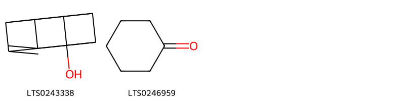

!!! abstract "Tóm tắt"

    Tràm (Ramulus cum folio Melaleucae) là cành mang lá đã phơi hay sấy khô của cây Tràm gió (Melaleuca cajeputi Powell), thuộc họ Sim (Myrtaceae). Loài cây này phân bố tự nhiên tại châu Á và châu Đại Dương, mọc hoang ở khắp nơi từ Bắc vào Nam Việt Nam.  Trong y học cổ truyền, tràm gió có tác dụng sát trùng đường hô hấp, kích thích trung tâm hô hấp, chữa viêm nhiễm đường hô hấp, và điều trị các triệu chứng như cảm sốt, ngạt mũi, ho, và đau nhức xương khớp. Cành và lá tràm chứa khoảng 2,5% tinh dầu, trong đó thành phần chính là 1,8-cineol (biomarker), cùng với flavonoid và tannin.

## Thông tin về thực vật

Dược liệu **Tràm (Cành Và Lá)** từ bộ phận **nan** từ loài *Melaleuca cajuputi*.

**Mô tả thực vật:** Tràm cừ (Melaleuca leucadendra L.) là một cây nếu để phát triển tự nhiên có thể cao tới 4-5m. Trên thân cây to lớp vỏ bong ra thành từng mảng to dài. Lá mọc so le, cuống màu xanh vàng nhạt, phiến lá hình mác, trên có những gân chạy dọc theo gần chính, lúc đầu mỏng và mềm, về sau thành dày, cứng và dòn; thường dài 4-8cm, rộng 10-20mm. Hoa nhỏ màu trắng vàng nhạt, không cuống, mọc thành bóng ở đầu cành, nhưng sau từ đầu bồng hoa, cành lại mọc dài thêm và mang lá thành ra bông hoa nằm giữa cành lá trồng rất đặc biệt. Quả nang rất cứng, 3 ngăn, hình tròn, đường kính 13mm, cụt ở đỉnh, đài cứng tồn tại ôm sâu vào quả. Hạt hình trứng, dài chừng 1mm.

*Tài liệu tham khảo:* "Những cây thuốc và vị thuốc Việt Nam" - Đỗ Tất Lợi 
Trong dược điển Việt nam, một số loài có thể dùng thay thế cho nhau làm dược liệu bao gồm *Melaleuca cajuputi, Melaleuca leucadendra, Melaleuca alternifolia* 
Chưa có thông tin về loài này trên gibf
 
Chưa có thông tin về loài này trên gibf

!!! info "Phân loại thực vật của *Melaleuca alternifolia*"
    - **Kingdom:** Plantae
    - **Phylum:** Tracheophyta
    - **Order:** Myrtales
    - **Family:** Myrtaceae
    - **Genus:** Melaleuca
    - **Species:** *Melaleuca alternifolia*

**Phân bố trên thế giới:** Kenya, New Zealand, Brazil, Jordan, Chinese Taipei, South Africa, Australia

**Phân bố tại Việt nam:** Không có ghi nhận ở Việt Nam

## Thông tin về dược liệu 

### Định danh

!!! info "Thông tin về tên gọi"

    - Dược liệu tiếng Việt: nan
    - Dược liệu tiếng Trung: nan (nan)
    - Dược liệu tiếng Anh: nan
    - Dược liệu latin thông dụng: nan
    - Dược liệu latin kiểu DĐVN: *ramulus cum folio melaleucae*
    - Dược liệu latin kiểu DĐVN: *nan*
    - Dược liệu latin kiểu thông tư: *nan*
    - Bộ phận dùng: nan (nan)

### Mô tả dược liệu 

- **Theo dược điển Việt nam V:** nan

- **Mô tả dược liệu theo thông tư chế biến dược liệu theo phương pháp cổ truyền:** nan

### Chế biến 

- **Chế biến theo dược điển việt nam V**: nan

- **Chế biến theo thông tư:** nan

--- 

## Thành phần hóa học

- Theo tài liệu của GS. Đỗ Tất Lợi:  (1) Thành phần chủ yếu chính là tinh dầu (2,5%), flavonoid và tanin
Hoạt chất chính trong tinh dầu là 1,8 - cineol (Eucalyptol)(40 -60%). Ngoài ra còn có α-terpineol (terpinen - 4 - ol), β-caryophyllen, globulol, eugenol và các chất khác.
Các flavonoid bao gồm các glycosid của myricetin và quercetin (myricitrin, myricetin 3-O-methyl 3’-β-D-xylopyranosid, quercetin 3-O-methyl 3’-β-D-xylopyranosid).
Tanin bao gồm dẫn xuất của acid gallic (acid 3,3’,4-tri-O-methylellagic).
(2) Hoạt chất là biomaker là 1,8 - cineol (Eucalyptol)
    

**Thành phần hóa học từ loài **Melaleuca alternifolia**

Theo cơ sở dữ liệu lotus, loài *Melaleuca alternifolia* đã phân lập và xác định được **68** hoạt chất thuộc về các nhóm Organooxygen compounds, Benzene and substituted derivatives, Unsaturated hydrocarbons, Prenol lipids, Oxanes trong bảng dưới đây. Danh sách các hoạt chất như sau 1,1,4,7-tetramethyl-1ah,2h,3h,5h,6h,7h,7ah,7bh-cyclopropa[e]azulene [(LTS0234422)](https://lotus.naturalproducts.net/compound/lotus_id/LTS0234422), (1as,4as,7s,7ar,7bs)-1,1,7-trimethyl-4-methylidene-octahydrocyclopropa[e]azulen-7-ol [(LTS0073517)](https://lotus.naturalproducts.net/compound/lotus_id/LTS0073517), 4-isopropyl-1,6-dimethyl-2,3,4,4a,7,8-hexahydronaphthalene [(LTS0270743)](https://lotus.naturalproducts.net/compound/lotus_id/LTS0270743), (-)-4-terpineol [(LTS0111954)](https://lotus.naturalproducts.net/compound/lotus_id/LTS0111954), methyl eugenol [(LTS0098881)](https://lotus.naturalproducts.net/compound/lotus_id/LTS0098881), 4-terpineol [(LTS0253733)](https://lotus.naturalproducts.net/compound/lotus_id/LTS0253733), (1ar,4s,4ar,7as,7br)-1,1,4,7-tetramethyl-octahydro-1ah-cyclopropa[e]azulen-4-ol [(LTS0050572)](https://lotus.naturalproducts.net/compound/lotus_id/LTS0050572), (1s,2s)-1-ethenyl-1-methyl-2-(prop-1-en-2-yl)-4-(propan-2-ylidene)cyclohexane [(LTS0135613)](https://lotus.naturalproducts.net/compound/lotus_id/LTS0135613), (1ar,7s,7as,7bs)-1,1,4,7-tetramethyl-1ah,2h,3h,5h,6h,7h,7ah,7bh-cyclopropa[e]azulene [(LTS0020063)](https://lotus.naturalproducts.net/compound/lotus_id/LTS0020063), cymene [(LTS0181568)](https://lotus.naturalproducts.net/compound/lotus_id/LTS0181568), terpineol [(LTS0136148)](https://lotus.naturalproducts.net/compound/lotus_id/LTS0136148), 1,8-cineole [(LTS0166505)](https://lotus.naturalproducts.net/compound/lotus_id/LTS0166505), α terpinene [(LTS0232891)](https://lotus.naturalproducts.net/compound/lotus_id/LTS0232891), trans-muurola-4(14),5-diene [(LTS0255859)](https://lotus.naturalproducts.net/compound/lotus_id/LTS0255859), α pinene [(LTS0132416)](https://lotus.naturalproducts.net/compound/lotus_id/LTS0132416), α-bulnesene [(LTS0202512)](https://lotus.naturalproducts.net/compound/lotus_id/LTS0202512), phellandrene [(LTS0157173)](https://lotus.naturalproducts.net/compound/lotus_id/LTS0157173), (+)-α-pinene [(LTS0211102)](https://lotus.naturalproducts.net/compound/lotus_id/LTS0211102), sabinene hydrate [(LTS0215494)](https://lotus.naturalproducts.net/compound/lotus_id/LTS0215494), 3,4,5,8-tetrahydro-2h-cuban-1-ol [(LTS0243338)](https://lotus.naturalproducts.net/compound/lotus_id/LTS0243338), (+)-α-terpineol [(LTS0258249)](https://lotus.naturalproducts.net/compound/lotus_id/LTS0258249), 1,1,7-trimethyl-4-methylidene-octahydro-1ah-cyclopropa[e]azulene [(LTS0063570)](https://lotus.naturalproducts.net/compound/lotus_id/LTS0063570), terpinene [(LTS0136858)](https://lotus.naturalproducts.net/compound/lotus_id/LTS0136858), sabinene [(LTS0224133)](https://lotus.naturalproducts.net/compound/lotus_id/LTS0224133), (-)-limonene [(LTS0205325)](https://lotus.naturalproducts.net/compound/lotus_id/LTS0205325), (-)-α-pinene [(LTS0032699)](https://lotus.naturalproducts.net/compound/lotus_id/LTS0032699), α-thujene [(LTS0185078)](https://lotus.naturalproducts.net/compound/lotus_id/LTS0185078), thujone [(LTS0197087)](https://lotus.naturalproducts.net/compound/lotus_id/LTS0197087), (+)-ledol [(LTS0201082)](https://lotus.naturalproducts.net/compound/lotus_id/LTS0201082), 1,1,4,7-tetramethyl-octahydro-1ah-cyclopropa[e]azulen-4a-ol [(LTS0248056)](https://lotus.naturalproducts.net/compound/lotus_id/LTS0248056), (5s)-1-isopropyl-4-methylidenebicyclo[3.1.0]hexane [(LTS0129854)](https://lotus.naturalproducts.net/compound/lotus_id/LTS0129854), terpinolene [(LTS0104525)](https://lotus.naturalproducts.net/compound/lotus_id/LTS0104525), (-)-β-pinene [(LTS0108757)](https://lotus.naturalproducts.net/compound/lotus_id/LTS0108757), 1,4-dimethyl-7-(prop-1-en-2-yl)-1,2,3,3a,4,5,6,7-octahydroazulene [(LTS0217070)](https://lotus.naturalproducts.net/compound/lotus_id/LTS0217070), leden [(LTS0002793)](https://lotus.naturalproducts.net/compound/lotus_id/LTS0002793), β phellandrene [(LTS0124668)](https://lotus.naturalproducts.net/compound/lotus_id/LTS0124668), (1s,4s)-4-isopropyl-1,6-dimethyl-1,2,3,4-tetrahydronaphthalene [(LTS0139634)](https://lotus.naturalproducts.net/compound/lotus_id/LTS0139634), (1as,4as,7as,7br)-1,1,7-trimethyl-4-methylidene-octahydro-1ah-cyclopropa[e]azulene [(LTS0160636)](https://lotus.naturalproducts.net/compound/lotus_id/LTS0160636), lily of valley [(LTS0051762)](https://lotus.naturalproducts.net/compound/lotus_id/LTS0051762), (1s,4r,4ar,8ar)-1-isopropyl-4,7-dimethyl-2,3,4,5,6,8a-hexahydro-1h-naphthalen-4a-ol [(LTS0018576)](https://lotus.naturalproducts.net/compound/lotus_id/LTS0018576), delta-cadinene [(LTS0019321)](https://lotus.naturalproducts.net/compound/lotus_id/LTS0019321), α-thujene [(LTS0176954)](https://lotus.naturalproducts.net/compound/lotus_id/LTS0176954), (+)-4-terpineol [(LTS0140257)](https://lotus.naturalproducts.net/compound/lotus_id/LTS0140257), (1ar,3as,7bs)-1,1,3a,7-tetramethyl-1ah,2h,3h,4h,5h,6h,7bh-cyclopropa[a]naphthalene [(LTS0064435)](https://lotus.naturalproducts.net/compound/lotus_id/LTS0064435), (1s,4r,4as,8ar)-1-isopropyl-4,7-dimethyl-2,3,4,5,6,8a-hexahydro-1h-naphthalen-4a-ol [(LTS0077197)](https://lotus.naturalproducts.net/compound/lotus_id/LTS0077197), (-)-β-cubebene [(LTS0123697)](https://lotus.naturalproducts.net/compound/lotus_id/LTS0123697), α-myrcene [(LTS0115731)](https://lotus.naturalproducts.net/compound/lotus_id/LTS0115731), limonene,  [(LTS0155981)](https://lotus.naturalproducts.net/compound/lotus_id/LTS0155981), (1s,5r,7s,10r)-7-isopropyl-4,10-dimethyltricyclo[4.4.0.0¹,⁵]dec-3-ene [(LTS0064715)](https://lotus.naturalproducts.net/compound/lotus_id/LTS0064715), (-)-α-gurjunene [(LTS0194913)](https://lotus.naturalproducts.net/compound/lotus_id/LTS0194913), β-pinene [(LTS0117550)](https://lotus.naturalproducts.net/compound/lotus_id/LTS0117550), terpineol; terpineols [(LTS0223935)](https://lotus.naturalproducts.net/compound/lotus_id/LTS0223935), cyclohexanone [(LTS0246959)](https://lotus.naturalproducts.net/compound/lotus_id/LTS0246959), p-cymen-8-ol [(LTS0223641)](https://lotus.naturalproducts.net/compound/lotus_id/LTS0223641), 1-ethenyl-1,2-dimethyl-2-(prop-1-en-2-yl)-4-(propan-2-ylidene)cyclohexane [(LTS0102139)](https://lotus.naturalproducts.net/compound/lotus_id/LTS0102139), (1as,4ar,7as,7br)-1,1,7-trimethyl-4-methylidene-octahydro-1ah-cyclopropa[e]azulene [(LTS0145331)](https://lotus.naturalproducts.net/compound/lotus_id/LTS0145331), (1r,2s)-5-isopropyl-2-methylbicyclo[3.1.0]hexan-2-ol [(LTS0265986)](https://lotus.naturalproducts.net/compound/lotus_id/LTS0265986), (+)-α-phellandrene [(LTS0234318)](https://lotus.naturalproducts.net/compound/lotus_id/LTS0234318), (1r,2s,7s,8s)-8-isopropyl-1,3-dimethyltricyclo[4.4.0.0²,⁷]dec-3-ene [(LTS0190031)](https://lotus.naturalproducts.net/compound/lotus_id/LTS0190031), camphene [(LTS0267242)](https://lotus.naturalproducts.net/compound/lotus_id/LTS0267242), α-limonene [(LTS0244943)](https://lotus.naturalproducts.net/compound/lotus_id/LTS0244943), α-muurolene [(LTS0022607)](https://lotus.naturalproducts.net/compound/lotus_id/LTS0022607), β-gurjunene [(LTS0225922)](https://lotus.naturalproducts.net/compound/lotus_id/LTS0225922), (1ar,4r,4ar,7as,7bs)-1,1,4,7-tetramethyl-octahydro-1ah-cyclopropa[e]azulen-4-ol [(LTS0021381)](https://lotus.naturalproducts.net/compound/lotus_id/LTS0021381), caryophyllene [(LTS0085212)](https://lotus.naturalproducts.net/compound/lotus_id/LTS0085212), linalool, (+-)- [(LTS0128839)](https://lotus.naturalproducts.net/compound/lotus_id/LTS0128839), (1s,2e,10r)-3,7,11,11-tetramethylbicyclo[8.1.0]undeca-2,6-diene [(LTS0032090)](https://lotus.naturalproducts.net/compound/lotus_id/LTS0032090), (-)-α-phellandrene [(LTS0226766)](https://lotus.naturalproducts.net/compound/lotus_id/LTS0226766). 
        
| chemicalTaxonomyClassyfireClass     |   smiles_count |
|:------------------------------------|---------------:|
| Benzene and substituted derivatives |             39 |
| Organooxygen compounds              |             30 |
| Oxanes                              |             26 |
| Prenol lipids                       |           1897 |
| Unsaturated hydrocarbons            |             18 |

            
### Nhóm Benzene and substituted derivatives
<figure markdown="span">
    { width=100% }
<figcaption>Hình ảnh cấu trúc hóa học của hoạt chất thuộc nhóm *Benzene and substituted derivatives*. Tên thường gọi của các hoạt chất tương ứng là methyl eugenol [(LTS0098881)](https://lotus.naturalproducts.net/compound/lotus_id/LTS0098881), p-cymen-8-ol [(LTS0223641)](https://lotus.naturalproducts.net/compound/lotus_id/LTS0223641).</figcaption>
</figure>

            
            
### Nhóm Benzene and substituted derivatives
<figure markdown="span">
    { width=100% }
<figcaption>Hình ảnh cấu trúc hóa học của hoạt chất thuộc nhóm *Benzene and substituted derivatives*. Tên thường gọi của các hoạt chất tương ứng là methyl eugenol [(LTS0098881)](https://lotus.naturalproducts.net/compound/lotus_id/LTS0098881), p-cymen-8-ol [(LTS0223641)](https://lotus.naturalproducts.net/compound/lotus_id/LTS0223641).</figcaption>
</figure>

### Nhóm Organooxygen compounds
<figure markdown="span">
    { width=100% }
<figcaption>Hình ảnh cấu trúc hóa học của hoạt chất thuộc nhóm *Organooxygen compounds*. Tên thường gọi của các hoạt chất tương ứng là 3,4,5,8-tetrahydro-2h-cuban-1-ol [(LTS0243338)](https://lotus.naturalproducts.net/compound/lotus_id/LTS0243338), cyclohexanone [(LTS0246959)](https://lotus.naturalproducts.net/compound/lotus_id/LTS0246959).</figcaption>
</figure>

            
            
### Nhóm Benzene and substituted derivatives
<figure markdown="span">
    { width=100% }
<figcaption>Hình ảnh cấu trúc hóa học của hoạt chất thuộc nhóm *Benzene and substituted derivatives*. Tên thường gọi của các hoạt chất tương ứng là methyl eugenol [(LTS0098881)](https://lotus.naturalproducts.net/compound/lotus_id/LTS0098881), p-cymen-8-ol [(LTS0223641)](https://lotus.naturalproducts.net/compound/lotus_id/LTS0223641).</figcaption>
</figure>

### Nhóm Organooxygen compounds
<figure markdown="span">
    { width=100% }
<figcaption>Hình ảnh cấu trúc hóa học của hoạt chất thuộc nhóm *Organooxygen compounds*. Tên thường gọi của các hoạt chất tương ứng là 3,4,5,8-tetrahydro-2h-cuban-1-ol [(LTS0243338)](https://lotus.naturalproducts.net/compound/lotus_id/LTS0243338), cyclohexanone [(LTS0246959)](https://lotus.naturalproducts.net/compound/lotus_id/LTS0246959).</figcaption>
</figure>

### Nhóm Oxanes
<figure markdown="span">
    { width=100% }
<figcaption>Hình ảnh cấu trúc hóa học của hoạt chất thuộc nhóm *Oxanes*. Tên thường gọi của các hoạt chất tương ứng là 1,8-cineole [(LTS0166505)](https://lotus.naturalproducts.net/compound/lotus_id/LTS0166505).</figcaption>
</figure>

            
            
### Nhóm Benzene and substituted derivatives
<figure markdown="span">
    { width=100% }
<figcaption>Hình ảnh cấu trúc hóa học của hoạt chất thuộc nhóm *Benzene and substituted derivatives*. Tên thường gọi của các hoạt chất tương ứng là methyl eugenol [(LTS0098881)](https://lotus.naturalproducts.net/compound/lotus_id/LTS0098881), p-cymen-8-ol [(LTS0223641)](https://lotus.naturalproducts.net/compound/lotus_id/LTS0223641).</figcaption>
</figure>

### Nhóm Organooxygen compounds
<figure markdown="span">
    { width=100% }
<figcaption>Hình ảnh cấu trúc hóa học của hoạt chất thuộc nhóm *Organooxygen compounds*. Tên thường gọi của các hoạt chất tương ứng là 3,4,5,8-tetrahydro-2h-cuban-1-ol [(LTS0243338)](https://lotus.naturalproducts.net/compound/lotus_id/LTS0243338), cyclohexanone [(LTS0246959)](https://lotus.naturalproducts.net/compound/lotus_id/LTS0246959).</figcaption>
</figure>

### Nhóm Oxanes
<figure markdown="span">
    { width=100% }
<figcaption>Hình ảnh cấu trúc hóa học của hoạt chất thuộc nhóm *Oxanes*. Tên thường gọi của các hoạt chất tương ứng là 1,8-cineole [(LTS0166505)](https://lotus.naturalproducts.net/compound/lotus_id/LTS0166505).</figcaption>
</figure>

### Nhóm Prenol lipids
<figure markdown="span">
    { width=100% }
<figcaption>Hình ảnh cấu trúc hóa học của hoạt chất thuộc nhóm *Prenol lipids*. Tên thường gọi của các hoạt chất tương ứng là terpineol [(LTS0136148)](https://lotus.naturalproducts.net/compound/lotus_id/LTS0136148), (1ar,3as,7bs)-1,1,3a,7-tetramethyl-1ah,2h,3h,4h,5h,6h,7bh-cyclopropa[a]naphthalene [(LTS0064435)](https://lotus.naturalproducts.net/compound/lotus_id/LTS0064435), 1-ethenyl-1,2-dimethyl-2-(prop-1-en-2-yl)-4-(propan-2-ylidene)cyclohexane [(LTS0102139)](https://lotus.naturalproducts.net/compound/lotus_id/LTS0102139), α-bulnesene [(LTS0202512)](https://lotus.naturalproducts.net/compound/lotus_id/LTS0202512), (1s,2s)-1-ethenyl-1-methyl-2-(prop-1-en-2-yl)-4-(propan-2-ylidene)cyclohexane [(LTS0135613)](https://lotus.naturalproducts.net/compound/lotus_id/LTS0135613), (-)-α-gurjunene [(LTS0194913)](https://lotus.naturalproducts.net/compound/lotus_id/LTS0194913), (1s,4r,4as,8ar)-1-isopropyl-4,7-dimethyl-2,3,4,5,6,8a-hexahydro-1h-naphthalen-4a-ol [(LTS0077197)](https://lotus.naturalproducts.net/compound/lotus_id/LTS0077197), linalool, (+-)- [(LTS0128839)](https://lotus.naturalproducts.net/compound/lotus_id/LTS0128839), β-gurjunene [(LTS0225922)](https://lotus.naturalproducts.net/compound/lotus_id/LTS0225922), β phellandrene [(LTS0124668)](https://lotus.naturalproducts.net/compound/lotus_id/LTS0124668), (1as,4as,7s,7ar,7bs)-1,1,7-trimethyl-4-methylidene-octahydrocyclopropa[e]azulen-7-ol [(LTS0073517)](https://lotus.naturalproducts.net/compound/lotus_id/LTS0073517), (-)-limonene [(LTS0205325)](https://lotus.naturalproducts.net/compound/lotus_id/LTS0205325), 1,1,7-trimethyl-4-methylidene-octahydro-1ah-cyclopropa[e]azulene [(LTS0063570)](https://lotus.naturalproducts.net/compound/lotus_id/LTS0063570), α-myrcene [(LTS0115731)](https://lotus.naturalproducts.net/compound/lotus_id/LTS0115731), (-)-4-terpineol [(LTS0111954)](https://lotus.naturalproducts.net/compound/lotus_id/LTS0111954), (1ar,7s,7as,7bs)-1,1,4,7-tetramethyl-1ah,2h,3h,5h,6h,7h,7ah,7bh-cyclopropa[e]azulene [(LTS0020063)](https://lotus.naturalproducts.net/compound/lotus_id/LTS0020063), (-)-α-pinene [(LTS0032699)](https://lotus.naturalproducts.net/compound/lotus_id/LTS0032699), terpinolene [(LTS0104525)](https://lotus.naturalproducts.net/compound/lotus_id/LTS0104525), (1s,5r,7s,10r)-7-isopropyl-4,10-dimethyltricyclo[4.4.0.0¹,⁵]dec-3-ene [(LTS0064715)](https://lotus.naturalproducts.net/compound/lotus_id/LTS0064715), β-pinene [(LTS0117550)](https://lotus.naturalproducts.net/compound/lotus_id/LTS0117550), cymene [(LTS0181568)](https://lotus.naturalproducts.net/compound/lotus_id/LTS0181568), α pinene [(LTS0132416)](https://lotus.naturalproducts.net/compound/lotus_id/LTS0132416), (1s,4s)-4-isopropyl-1,6-dimethyl-1,2,3,4-tetrahydronaphthalene [(LTS0139634)](https://lotus.naturalproducts.net/compound/lotus_id/LTS0139634), (+)-ledol [(LTS0201082)](https://lotus.naturalproducts.net/compound/lotus_id/LTS0201082), 4-isopropyl-1,6-dimethyl-2,3,4,4a,7,8-hexahydronaphthalene [(LTS0270743)](https://lotus.naturalproducts.net/compound/lotus_id/LTS0270743), (1as,4ar,7as,7br)-1,1,7-trimethyl-4-methylidene-octahydro-1ah-cyclopropa[e]azulene [(LTS0145331)](https://lotus.naturalproducts.net/compound/lotus_id/LTS0145331), (5s)-1-isopropyl-4-methylidenebicyclo[3.1.0]hexane [(LTS0129854)](https://lotus.naturalproducts.net/compound/lotus_id/LTS0129854), camphene [(LTS0267242)](https://lotus.naturalproducts.net/compound/lotus_id/LTS0267242), limonene,  [(LTS0155981)](https://lotus.naturalproducts.net/compound/lotus_id/LTS0155981), (+)-4-terpineol [(LTS0140257)](https://lotus.naturalproducts.net/compound/lotus_id/LTS0140257), 1,1,4,7-tetramethyl-1ah,2h,3h,5h,6h,7h,7ah,7bh-cyclopropa[e]azulene [(LTS0234422)](https://lotus.naturalproducts.net/compound/lotus_id/LTS0234422), phellandrene [(LTS0157173)](https://lotus.naturalproducts.net/compound/lotus_id/LTS0157173), (-)-β-pinene [(LTS0108757)](https://lotus.naturalproducts.net/compound/lotus_id/LTS0108757), 4-terpineol [(LTS0253733)](https://lotus.naturalproducts.net/compound/lotus_id/LTS0253733), α-thujene [(LTS0176954)](https://lotus.naturalproducts.net/compound/lotus_id/LTS0176954), 1,4-dimethyl-7-(prop-1-en-2-yl)-1,2,3,3a,4,5,6,7-octahydroazulene [(LTS0217070)](https://lotus.naturalproducts.net/compound/lotus_id/LTS0217070), caryophyllene [(LTS0085212)](https://lotus.naturalproducts.net/compound/lotus_id/LTS0085212), α-limonene [(LTS0244943)](https://lotus.naturalproducts.net/compound/lotus_id/LTS0244943), (+)-α-phellandrene [(LTS0234318)](https://lotus.naturalproducts.net/compound/lotus_id/LTS0234318), thujone [(LTS0197087)](https://lotus.naturalproducts.net/compound/lotus_id/LTS0197087), (1r,2s)-5-isopropyl-2-methylbicyclo[3.1.0]hexan-2-ol [(LTS0265986)](https://lotus.naturalproducts.net/compound/lotus_id/LTS0265986), sabinene [(LTS0224133)](https://lotus.naturalproducts.net/compound/lotus_id/LTS0224133), (+)-α-pinene [(LTS0211102)](https://lotus.naturalproducts.net/compound/lotus_id/LTS0211102), sabinene hydrate [(LTS0215494)](https://lotus.naturalproducts.net/compound/lotus_id/LTS0215494), (1ar,4r,4ar,7as,7bs)-1,1,4,7-tetramethyl-octahydro-1ah-cyclopropa[e]azulen-4-ol [(LTS0021381)](https://lotus.naturalproducts.net/compound/lotus_id/LTS0021381), α-thujene [(LTS0185078)](https://lotus.naturalproducts.net/compound/lotus_id/LTS0185078), (1as,4as,7as,7br)-1,1,7-trimethyl-4-methylidene-octahydro-1ah-cyclopropa[e]azulene [(LTS0160636)](https://lotus.naturalproducts.net/compound/lotus_id/LTS0160636), 1,1,4,7-tetramethyl-octahydro-1ah-cyclopropa[e]azulen-4a-ol [(LTS0248056)](https://lotus.naturalproducts.net/compound/lotus_id/LTS0248056), (-)-α-phellandrene [(LTS0226766)](https://lotus.naturalproducts.net/compound/lotus_id/LTS0226766), (1r,2s,7s,8s)-8-isopropyl-1,3-dimethyltricyclo[4.4.0.0²,⁷]dec-3-ene [(LTS0190031)](https://lotus.naturalproducts.net/compound/lotus_id/LTS0190031), (+)-α-terpineol [(LTS0258249)](https://lotus.naturalproducts.net/compound/lotus_id/LTS0258249), (1ar,4s,4ar,7as,7br)-1,1,4,7-tetramethyl-octahydro-1ah-cyclopropa[e]azulen-4-ol [(LTS0050572)](https://lotus.naturalproducts.net/compound/lotus_id/LTS0050572), lily of valley [(LTS0051762)](https://lotus.naturalproducts.net/compound/lotus_id/LTS0051762), terpinene [(LTS0136858)](https://lotus.naturalproducts.net/compound/lotus_id/LTS0136858), α-muurolene [(LTS0022607)](https://lotus.naturalproducts.net/compound/lotus_id/LTS0022607), (1s,2e,10r)-3,7,11,11-tetramethylbicyclo[8.1.0]undeca-2,6-diene [(LTS0032090)](https://lotus.naturalproducts.net/compound/lotus_id/LTS0032090), leden [(LTS0002793)](https://lotus.naturalproducts.net/compound/lotus_id/LTS0002793), (1s,4r,4ar,8ar)-1-isopropyl-4,7-dimethyl-2,3,4,5,6,8a-hexahydro-1h-naphthalen-4a-ol [(LTS0018576)](https://lotus.naturalproducts.net/compound/lotus_id/LTS0018576), delta-cadinene [(LTS0019321)](https://lotus.naturalproducts.net/compound/lotus_id/LTS0019321), (-)-β-cubebene [(LTS0123697)](https://lotus.naturalproducts.net/compound/lotus_id/LTS0123697), trans-muurola-4(14),5-diene [(LTS0255859)](https://lotus.naturalproducts.net/compound/lotus_id/LTS0255859).</figcaption>
</figure>

            
            
### Nhóm Benzene and substituted derivatives
<figure markdown="span">
    { width=100% }
<figcaption>Hình ảnh cấu trúc hóa học của hoạt chất thuộc nhóm *Benzene and substituted derivatives*. Tên thường gọi của các hoạt chất tương ứng là methyl eugenol [(LTS0098881)](https://lotus.naturalproducts.net/compound/lotus_id/LTS0098881), p-cymen-8-ol [(LTS0223641)](https://lotus.naturalproducts.net/compound/lotus_id/LTS0223641).</figcaption>
</figure>

### Nhóm Organooxygen compounds
<figure markdown="span">
    { width=100% }
<figcaption>Hình ảnh cấu trúc hóa học của hoạt chất thuộc nhóm *Organooxygen compounds*. Tên thường gọi của các hoạt chất tương ứng là 3,4,5,8-tetrahydro-2h-cuban-1-ol [(LTS0243338)](https://lotus.naturalproducts.net/compound/lotus_id/LTS0243338), cyclohexanone [(LTS0246959)](https://lotus.naturalproducts.net/compound/lotus_id/LTS0246959).</figcaption>
</figure>

### Nhóm Oxanes
<figure markdown="span">
    { width=100% }
<figcaption>Hình ảnh cấu trúc hóa học của hoạt chất thuộc nhóm *Oxanes*. Tên thường gọi của các hoạt chất tương ứng là 1,8-cineole [(LTS0166505)](https://lotus.naturalproducts.net/compound/lotus_id/LTS0166505).</figcaption>
</figure>

### Nhóm Prenol lipids
<figure markdown="span">
    { width=100% }
<figcaption>Hình ảnh cấu trúc hóa học của hoạt chất thuộc nhóm *Prenol lipids*. Tên thường gọi của các hoạt chất tương ứng là terpineol [(LTS0136148)](https://lotus.naturalproducts.net/compound/lotus_id/LTS0136148), (1ar,3as,7bs)-1,1,3a,7-tetramethyl-1ah,2h,3h,4h,5h,6h,7bh-cyclopropa[a]naphthalene [(LTS0064435)](https://lotus.naturalproducts.net/compound/lotus_id/LTS0064435), 1-ethenyl-1,2-dimethyl-2-(prop-1-en-2-yl)-4-(propan-2-ylidene)cyclohexane [(LTS0102139)](https://lotus.naturalproducts.net/compound/lotus_id/LTS0102139), α-bulnesene [(LTS0202512)](https://lotus.naturalproducts.net/compound/lotus_id/LTS0202512), (1s,2s)-1-ethenyl-1-methyl-2-(prop-1-en-2-yl)-4-(propan-2-ylidene)cyclohexane [(LTS0135613)](https://lotus.naturalproducts.net/compound/lotus_id/LTS0135613), (-)-α-gurjunene [(LTS0194913)](https://lotus.naturalproducts.net/compound/lotus_id/LTS0194913), (1s,4r,4as,8ar)-1-isopropyl-4,7-dimethyl-2,3,4,5,6,8a-hexahydro-1h-naphthalen-4a-ol [(LTS0077197)](https://lotus.naturalproducts.net/compound/lotus_id/LTS0077197), linalool, (+-)- [(LTS0128839)](https://lotus.naturalproducts.net/compound/lotus_id/LTS0128839), β-gurjunene [(LTS0225922)](https://lotus.naturalproducts.net/compound/lotus_id/LTS0225922), β phellandrene [(LTS0124668)](https://lotus.naturalproducts.net/compound/lotus_id/LTS0124668), (1as,4as,7s,7ar,7bs)-1,1,7-trimethyl-4-methylidene-octahydrocyclopropa[e]azulen-7-ol [(LTS0073517)](https://lotus.naturalproducts.net/compound/lotus_id/LTS0073517), (-)-limonene [(LTS0205325)](https://lotus.naturalproducts.net/compound/lotus_id/LTS0205325), 1,1,7-trimethyl-4-methylidene-octahydro-1ah-cyclopropa[e]azulene [(LTS0063570)](https://lotus.naturalproducts.net/compound/lotus_id/LTS0063570), α-myrcene [(LTS0115731)](https://lotus.naturalproducts.net/compound/lotus_id/LTS0115731), (-)-4-terpineol [(LTS0111954)](https://lotus.naturalproducts.net/compound/lotus_id/LTS0111954), (1ar,7s,7as,7bs)-1,1,4,7-tetramethyl-1ah,2h,3h,5h,6h,7h,7ah,7bh-cyclopropa[e]azulene [(LTS0020063)](https://lotus.naturalproducts.net/compound/lotus_id/LTS0020063), (-)-α-pinene [(LTS0032699)](https://lotus.naturalproducts.net/compound/lotus_id/LTS0032699), terpinolene [(LTS0104525)](https://lotus.naturalproducts.net/compound/lotus_id/LTS0104525), (1s,5r,7s,10r)-7-isopropyl-4,10-dimethyltricyclo[4.4.0.0¹,⁵]dec-3-ene [(LTS0064715)](https://lotus.naturalproducts.net/compound/lotus_id/LTS0064715), β-pinene [(LTS0117550)](https://lotus.naturalproducts.net/compound/lotus_id/LTS0117550), cymene [(LTS0181568)](https://lotus.naturalproducts.net/compound/lotus_id/LTS0181568), α pinene [(LTS0132416)](https://lotus.naturalproducts.net/compound/lotus_id/LTS0132416), (1s,4s)-4-isopropyl-1,6-dimethyl-1,2,3,4-tetrahydronaphthalene [(LTS0139634)](https://lotus.naturalproducts.net/compound/lotus_id/LTS0139634), (+)-ledol [(LTS0201082)](https://lotus.naturalproducts.net/compound/lotus_id/LTS0201082), 4-isopropyl-1,6-dimethyl-2,3,4,4a,7,8-hexahydronaphthalene [(LTS0270743)](https://lotus.naturalproducts.net/compound/lotus_id/LTS0270743), (1as,4ar,7as,7br)-1,1,7-trimethyl-4-methylidene-octahydro-1ah-cyclopropa[e]azulene [(LTS0145331)](https://lotus.naturalproducts.net/compound/lotus_id/LTS0145331), (5s)-1-isopropyl-4-methylidenebicyclo[3.1.0]hexane [(LTS0129854)](https://lotus.naturalproducts.net/compound/lotus_id/LTS0129854), camphene [(LTS0267242)](https://lotus.naturalproducts.net/compound/lotus_id/LTS0267242), limonene,  [(LTS0155981)](https://lotus.naturalproducts.net/compound/lotus_id/LTS0155981), (+)-4-terpineol [(LTS0140257)](https://lotus.naturalproducts.net/compound/lotus_id/LTS0140257), 1,1,4,7-tetramethyl-1ah,2h,3h,5h,6h,7h,7ah,7bh-cyclopropa[e]azulene [(LTS0234422)](https://lotus.naturalproducts.net/compound/lotus_id/LTS0234422), phellandrene [(LTS0157173)](https://lotus.naturalproducts.net/compound/lotus_id/LTS0157173), (-)-β-pinene [(LTS0108757)](https://lotus.naturalproducts.net/compound/lotus_id/LTS0108757), 4-terpineol [(LTS0253733)](https://lotus.naturalproducts.net/compound/lotus_id/LTS0253733), α-thujene [(LTS0176954)](https://lotus.naturalproducts.net/compound/lotus_id/LTS0176954), 1,4-dimethyl-7-(prop-1-en-2-yl)-1,2,3,3a,4,5,6,7-octahydroazulene [(LTS0217070)](https://lotus.naturalproducts.net/compound/lotus_id/LTS0217070), caryophyllene [(LTS0085212)](https://lotus.naturalproducts.net/compound/lotus_id/LTS0085212), α-limonene [(LTS0244943)](https://lotus.naturalproducts.net/compound/lotus_id/LTS0244943), (+)-α-phellandrene [(LTS0234318)](https://lotus.naturalproducts.net/compound/lotus_id/LTS0234318), thujone [(LTS0197087)](https://lotus.naturalproducts.net/compound/lotus_id/LTS0197087), (1r,2s)-5-isopropyl-2-methylbicyclo[3.1.0]hexan-2-ol [(LTS0265986)](https://lotus.naturalproducts.net/compound/lotus_id/LTS0265986), sabinene [(LTS0224133)](https://lotus.naturalproducts.net/compound/lotus_id/LTS0224133), (+)-α-pinene [(LTS0211102)](https://lotus.naturalproducts.net/compound/lotus_id/LTS0211102), sabinene hydrate [(LTS0215494)](https://lotus.naturalproducts.net/compound/lotus_id/LTS0215494), (1ar,4r,4ar,7as,7bs)-1,1,4,7-tetramethyl-octahydro-1ah-cyclopropa[e]azulen-4-ol [(LTS0021381)](https://lotus.naturalproducts.net/compound/lotus_id/LTS0021381), α-thujene [(LTS0185078)](https://lotus.naturalproducts.net/compound/lotus_id/LTS0185078), (1as,4as,7as,7br)-1,1,7-trimethyl-4-methylidene-octahydro-1ah-cyclopropa[e]azulene [(LTS0160636)](https://lotus.naturalproducts.net/compound/lotus_id/LTS0160636), 1,1,4,7-tetramethyl-octahydro-1ah-cyclopropa[e]azulen-4a-ol [(LTS0248056)](https://lotus.naturalproducts.net/compound/lotus_id/LTS0248056), (-)-α-phellandrene [(LTS0226766)](https://lotus.naturalproducts.net/compound/lotus_id/LTS0226766), (1r,2s,7s,8s)-8-isopropyl-1,3-dimethyltricyclo[4.4.0.0²,⁷]dec-3-ene [(LTS0190031)](https://lotus.naturalproducts.net/compound/lotus_id/LTS0190031), (+)-α-terpineol [(LTS0258249)](https://lotus.naturalproducts.net/compound/lotus_id/LTS0258249), (1ar,4s,4ar,7as,7br)-1,1,4,7-tetramethyl-octahydro-1ah-cyclopropa[e]azulen-4-ol [(LTS0050572)](https://lotus.naturalproducts.net/compound/lotus_id/LTS0050572), lily of valley [(LTS0051762)](https://lotus.naturalproducts.net/compound/lotus_id/LTS0051762), terpinene [(LTS0136858)](https://lotus.naturalproducts.net/compound/lotus_id/LTS0136858), α-muurolene [(LTS0022607)](https://lotus.naturalproducts.net/compound/lotus_id/LTS0022607), (1s,2e,10r)-3,7,11,11-tetramethylbicyclo[8.1.0]undeca-2,6-diene [(LTS0032090)](https://lotus.naturalproducts.net/compound/lotus_id/LTS0032090), leden [(LTS0002793)](https://lotus.naturalproducts.net/compound/lotus_id/LTS0002793), (1s,4r,4ar,8ar)-1-isopropyl-4,7-dimethyl-2,3,4,5,6,8a-hexahydro-1h-naphthalen-4a-ol [(LTS0018576)](https://lotus.naturalproducts.net/compound/lotus_id/LTS0018576), delta-cadinene [(LTS0019321)](https://lotus.naturalproducts.net/compound/lotus_id/LTS0019321), (-)-β-cubebene [(LTS0123697)](https://lotus.naturalproducts.net/compound/lotus_id/LTS0123697), trans-muurola-4(14),5-diene [(LTS0255859)](https://lotus.naturalproducts.net/compound/lotus_id/LTS0255859).</figcaption>
</figure>

### Nhóm Unsaturated hydrocarbons
<figure markdown="span">
    { width=100% }
<figcaption>Hình ảnh cấu trúc hóa học của hoạt chất thuộc nhóm *Unsaturated hydrocarbons*. Tên thường gọi của các hoạt chất tương ứng là α terpinene [(LTS0232891)](https://lotus.naturalproducts.net/compound/lotus_id/LTS0232891).</figcaption>
</figure>

            

---

## Tác dụng dược lý

Theo tài liệu "Những cây thuốc và vị thuốc Việt Nam" - Đỗ Tất Lợi:- Sát trùng đường hô hấp, kích thích trung tâm hô hấp, chữa viêm nhiễm đường hô hấp
- Kháng khuẩn, chống viêm, làm lành vết thương, chữa bỏng, làm chóng lành da

Theo tài liệu quốc tế: nan

---

## Dược điển Việt Nam V

### Soi bột:

nan

<!-- Hình ảnh soi bột sẽ được tự động chèn vào đây sau -->

### Vi phẫu:

nan

<!-- Hình ảnh vi phẫu sẽ được tự động chèn vào đây sau -->

### Định tính

nan

### Định lượng

nan

### Thông tin khác 

- ** Độ ẩm: ** nan
- ** Bảo quản:** nan

## Dược điển Hồng kong

<!-- PDF sẽ được tự động chèn vào đây sau -->

---

## Y dược học cổ truyền

- **Tên vị thuốc:** nan
- **Tính vị quy kinh:** Tân, ôn. Vào hai kinh phế và tỳ.
- **Công năng chủ trị:** Công năng: Phát tán phong hàn, giảm đau, sát trùng.
Chủ trị: Cảm mạo phong hàn. Dùng ngoài trị viêm da dị ứng, chàm (thấp chẩn).
- **Chú ý:** nan
- **Kiêng kỵ:** nan

## Bình luận

