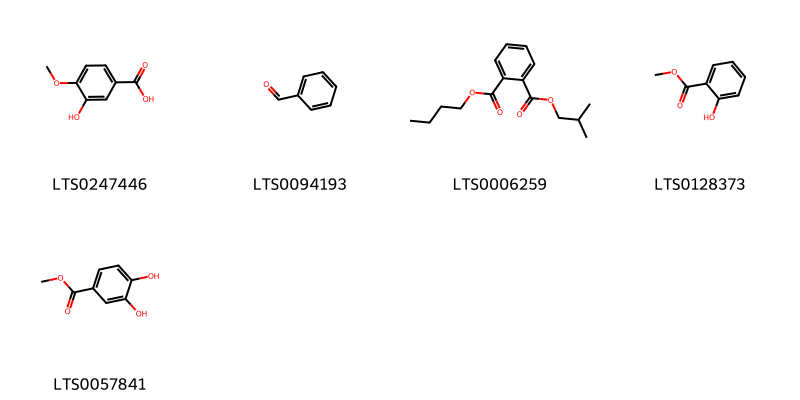
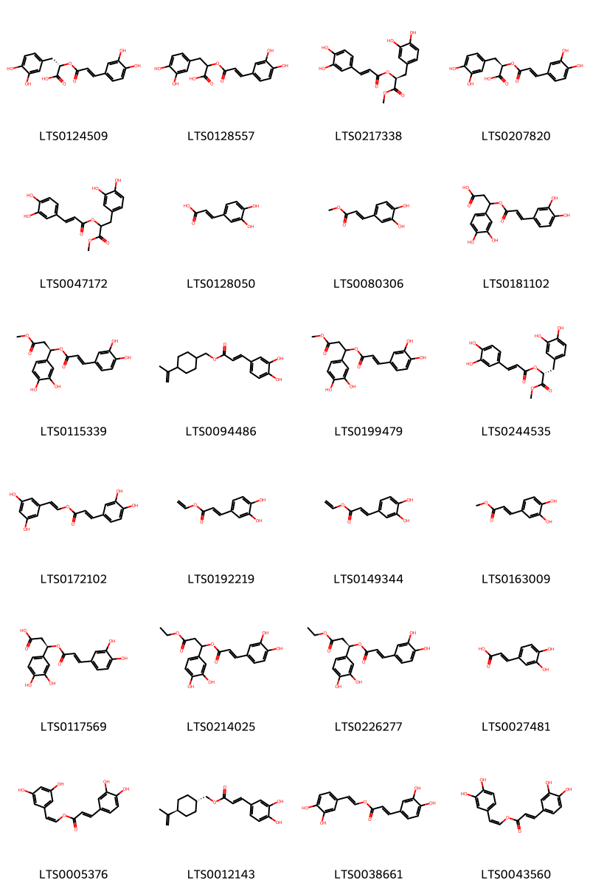
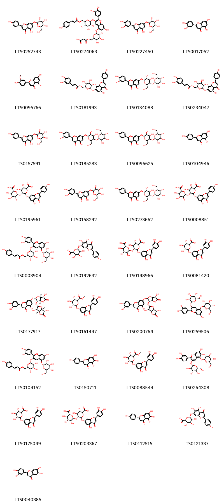
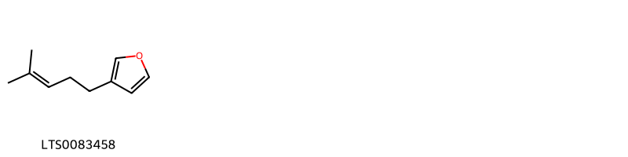
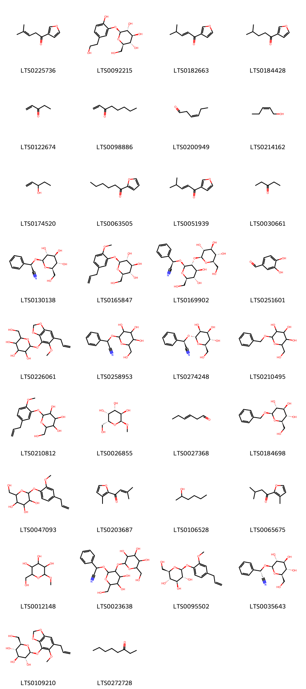
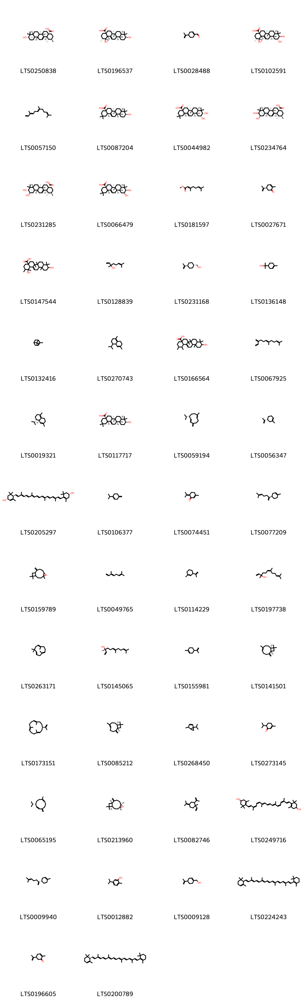

!!! abstract "Tóm tắt"

    Tía tô (Quả) (Fructus Perillae frutescensis) là quả của cây Tía tô (Perilla frutescens), thuộc họ Bạc hà (Lamiaceae). Tía tô là loài bản địa phổ biến ở các khu vực Đông Á, Nam Á, và Đông Nam Á, đồng thời được di thực sang châu Âu, châu Mỹ, và châu Phi.
Theo kinh nghiệm sử dụng trong y học cổ truyền, quả Tía tô có công năng phát tán phong hàn, lý khí khoan hung, giải uất, hóa đờm, an thai, và giải độc do cua cá. Tác dụng dược lý chính bao gồm kháng khuẩn, giảm viêm, hỗ trợ tiêu hóa, hóa đờm, và làm dịu triệu chứng do nhiễm lạnh. Thành phần hóa học của quả Tía tô bao gồm các hoạt chất như perilla-andehyt (C10H14O), limonen, α-pinen, dihydrocumin (C10H14O), xyanin clorit (C27H31O16Cl), adenin (C5H5N5), và acginin (C6H14N4O2), mang lại hiệu quả trong điều trị các bệnh lý liên quan đến phong hàn, khí uất, và đờm.

## Thông tin về thực vật

Dược liệu **Tía Tô (Quả)** từ bộ phận **nan** từ loài *Perilla frutescens*.

**Mô tả thực vật:** Tía tô là một loại cỏ mọc hằng năm, cao chừng 0,5-1,5cm. Thần thẳng đứng có lông. Lá mọc đổi, hình trứng, đầu nhọn, mép có răng cưa to; phiến lá dài 4-12cm rộng 2,50-10cm, màu tím hoặc xanh tím, trên có lông màu tím. Người ta phân biệt thứ tía tô có lá màu tím hung là Perilla ocymoides var. purpurascens và thứ tía tô có lá màu lục, chỉ có gân màu hung (Perilla ocymoides var.bicolor). Cuống lá ngắn 2-3cm. Hoa nhỏ, màu trắng hoặc tím nhạt, mọc thành từng chùm ở kẽ lá hay đầu cành, chùm dài 6-20cm. Quả là hạch nhỏ, hình cầu, đường kính 1mm, màu nâu nhạt, có mạng.

*Tài liệu tham khảo:* "Những cây thuốc và vị thuốc Việt Nam" - Đỗ Tất Lợi 
Trong dược điển Việt nam, một loài được sử dụng làm dược liệu là *Perilla frutescens*.

!!! info "Phân loại thực vật của *Perilla frutescens*"
    - **Kingdom:** Plantae
    - **Phylum:** Tracheophyta
    - **Order:** Lamiales
    - **Family:** Lamiaceae
    - **Genus:** Perilla
    - **Species:** *Perilla frutescens*

**Phân bố trên thế giới:** United States of America, Chinese Taipei, China, New Zealand, Netherlands

**Phân bố tại Việt nam:** Không có ghi nhận ở Việt Nam

## Thông tin về dược liệu 

### Định danh

!!! info "Thông tin về tên gọi"

    - Dược liệu tiếng Việt: nan
    - Dược liệu tiếng Trung: nan (nan)
    - Dược liệu tiếng Anh: nan
    - Dược liệu latin thông dụng: nan
    - Dược liệu latin kiểu DĐVN: *fructus perillae frutescensis*
    - Dược liệu latin kiểu DĐVN: *nan*
    - Dược liệu latin kiểu thông tư: *nan*
    - Bộ phận dùng: nan (nan)

### Mô tả dược liệu 

- **Theo dược điển Việt nam V:** nan

- **Mô tả dược liệu theo thông tư chế biến dược liệu theo phương pháp cổ truyền:** nan

### Chế biến 

- **Chế biến theo dược điển việt nam V**: nan

- **Chế biến theo thông tư:** nan

--- 

## Thành phần hóa học

- Theo tài liệu của GS. Đỗ Tất Lợi:  (1) perilla- andehyt C10H14O, limonen, α- pinen, dihydrocumin C10H14O, xyanin clorit C27H31O16Cl, adenin C5H5N5 và acginin C6H14N4O2.
(2)
    

**Thành phần hóa học từ loài **Perilla frutescens**

Theo cơ sở dữ liệu lotus, loài *Perilla frutescens* đã phân lập và xác định được **283** hoạt chất thuộc về các nhóm Epoxides, Fatty Acyls, Organic oxides, Benzoxepines, Phenols, Tetrapyrroles and derivatives, Unsaturated hydrocarbons, Saturated hydrocarbons, Steroids and steroid derivatives, Cyclobutane lignans, Flavonoids, Heteroaromatic compounds, Diazines, Benzodioxoles, Tetrahydrofurans, Benzene and substituted derivatives, Coumarins and derivatives, Prenol lipids, Oxanes, Organooxygen compounds, Naphthalenes, Cinnamic acids and derivatives, Phenol ethers, Glycerolipids, Oxepanes trong bảng dưới đây. Danh sách các hoạt chất như sau methyl (21s,22s)-16-ethenyl-11-ethyl-12,17,21,26-tetramethyl-4-oxo-22-(3-oxo-3-{[(2e)-3,7,11,15-tetramethylhexadec-2-en-1-yl]oxy}propyl)-7,23,24,25-tetraazahexacyclo[18.2.1.1⁵,⁸.1¹⁰,¹³.1¹⁵,¹⁸.0²,⁶]hexacosa-1(23),2(6),5(26),7,9,11,13,15,17,19-decaene-3-carboxylate [(LTS0002371)](https://lotus.naturalproducts.net/compound/lotus_id/LTS0002371), 4-isopropyl-1,6-dimethyl-2,3,4,4a,7,8-hexahydronaphthalene [(LTS0270743)](https://lotus.naturalproducts.net/compound/lotus_id/LTS0270743), egomaketone [(LTS0225736)](https://lotus.naturalproducts.net/compound/lotus_id/LTS0225736), 1-methyl-3-(prop-1-en-2-yl)cyclohex-1-ene [(LTS0114229)](https://lotus.naturalproducts.net/compound/lotus_id/LTS0114229), 1-[(1r,2s,3s,4r)-2,3-dimethyl-4-(2,4,5-trimethoxyphenyl)cyclobutyl]-2,4,5-trimethoxybenzene [(LTS0032112)](https://lotus.naturalproducts.net/compound/lotus_id/LTS0032112), neocembrene [(LTS0173151)](https://lotus.naturalproducts.net/compound/lotus_id/LTS0173151), 4-[(1e,3z,5z,7e,9e,11e,13z,15z,17e)-18-(4-hydroxy-2,6,6-trimethylcyclohex-1-en-1-yl)-3,7,12,16-tetramethyloctadeca-1,3,5,7,9,11,13,15,17-nonaen-1-yl]-3,5,5-trimethylcyclohex-3-en-1-ol [(LTS0249716)](https://lotus.naturalproducts.net/compound/lotus_id/LTS0249716), carthamidin [(LTS0150711)](https://lotus.naturalproducts.net/compound/lotus_id/LTS0150711), (4as,6as,6br,8ar,10r,11s,12ar,12br,14bs)-10,11-dihydroxy-2,2,6a,6b,9,9,12a-heptamethyl-1,3,4,5,6,7,8,8a,10,11,12,12b,13,14b-tetradecahydropicene-4a-carboxylic acid [(LTS0066479)](https://lotus.naturalproducts.net/compound/lotus_id/LTS0066479), [4-(prop-1-en-2-yl)cyclohexyl]methyl 3-(3,4-dihydroxyphenyl)prop-2-enoate [(LTS0094486)](https://lotus.naturalproducts.net/compound/lotus_id/LTS0094486), 1-octen-3-one [(LTS0098886)](https://lotus.naturalproducts.net/compound/lotus_id/LTS0098886), (1z)-2-(3,5-dihydroxyphenyl)ethenyl (2e)-3-(3,4-dihydroxyphenyl)prop-2-enoate [(LTS0005376)](https://lotus.naturalproducts.net/compound/lotus_id/LTS0005376), 2-ethylpyrazine [(LTS0030974)](https://lotus.naturalproducts.net/compound/lotus_id/LTS0030974), α pinene [(LTS0132416)](https://lotus.naturalproducts.net/compound/lotus_id/LTS0132416), phellandrene [(LTS0157173)](https://lotus.naturalproducts.net/compound/lotus_id/LTS0157173), (2s,3r,4s,5s,6r)-3,4,5-trihydroxy-6-(hydroxymethyl)oxan-2-yl (4s)-4-(prop-1-en-2-yl)cyclohex-1-ene-1-carboxylate [(LTS0075972)](https://lotus.naturalproducts.net/compound/lotus_id/LTS0075972), campesterol [(LTS0046755)](https://lotus.naturalproducts.net/compound/lotus_id/LTS0046755), piperitone [(LTS0273145)](https://lotus.naturalproducts.net/compound/lotus_id/LTS0273145), neoxanthin [(LTS0000701)](https://lotus.naturalproducts.net/compound/lotus_id/LTS0000701), (2s)-7-{[(2s,3r,3as,6r,6ar)-3-{[(2s,3r,3ar,6r,6ar)-3,6-dihydroxy-5-oxo-tetrahydro-2h-furo[3,2-b]furan-2-yl]oxy}-6-hydroxy-5-oxo-tetrahydro-2h-furo[3,2-b]furan-2-yl]oxy}-2-(3,4-dihydroxyphenyl)-5-hydroxy-2,3-dihydro-1-benzopyran-4-one [(LTS0177917)](https://lotus.naturalproducts.net/compound/lotus_id/LTS0177917), scutellarin [(LTS0121337)](https://lotus.naturalproducts.net/compound/lotus_id/LTS0121337), perilla ketone [(LTS0184428)](https://lotus.naturalproducts.net/compound/lotus_id/LTS0184428), eugenol [(LTS0052342)](https://lotus.naturalproducts.net/compound/lotus_id/LTS0052342), methyl caffeate [(LTS0163009)](https://lotus.naturalproducts.net/compound/lotus_id/LTS0163009), (3z,7e)-1,5,5,8-tetramethyl-12-oxabicyclo[9.1.0]dodeca-3,7-diene [(LTS0107049)](https://lotus.naturalproducts.net/compound/lotus_id/LTS0107049), linoleic [(LTS0013198)](https://lotus.naturalproducts.net/compound/lotus_id/LTS0013198), linalyl oxide [(LTS0065533)](https://lotus.naturalproducts.net/compound/lotus_id/LTS0065533), cyanin [(LTS0264308)](https://lotus.naturalproducts.net/compound/lotus_id/LTS0264308), 2-(hydroxymethyl)-6-{[4-(prop-1-en-2-yl)cyclohex-1-en-1-yl]methoxy}oxane-3,4,5-triol [(LTS0043500)](https://lotus.naturalproducts.net/compound/lotus_id/LTS0043500), 2-{[4,5-dihydroxy-6-(hydroxymethyl)-3-{[3,4,5-trihydroxy-6-(hydroxymethyl)oxan-2-yl]oxy}oxan-2-yl]oxy}-2-phenylacetonitrile [(LTS0023638)](https://lotus.naturalproducts.net/compound/lotus_id/LTS0023638), 3-methyl-1-(3-methylfuran-2-yl)but-2-en-1-one [(LTS0203687)](https://lotus.naturalproducts.net/compound/lotus_id/LTS0203687), benzyl β-d-glucoside [(LTS0184698)](https://lotus.naturalproducts.net/compound/lotus_id/LTS0184698), 2-(hydroxymethyl)-6-[2-methoxy-5-(prop-2-en-1-yl)phenoxy]oxane-3,4,5-triol [(LTS0210812)](https://lotus.naturalproducts.net/compound/lotus_id/LTS0210812), crotylaldehyde [(LTS0034534)](https://lotus.naturalproducts.net/compound/lotus_id/LTS0034534), neoxanthin [(LTS0227522)](https://lotus.naturalproducts.net/compound/lotus_id/LTS0227522), (5r)-1-methyl-5-(prop-1-en-2-yl)cyclohex-1-ene [(LTS0056347)](https://lotus.naturalproducts.net/compound/lotus_id/LTS0056347), (+)-pulegone [(LTS0094277)](https://lotus.naturalproducts.net/compound/lotus_id/LTS0094277), (-)-α-curcumene [(LTS0216936)](https://lotus.naturalproducts.net/compound/lotus_id/LTS0216936), luteolin 7-o-glucoside [(LTS0227450)](https://lotus.naturalproducts.net/compound/lotus_id/LTS0227450), [(1r,4r)-4-(prop-1-en-2-yl)cyclohexyl]methanol [(LTS0231168)](https://lotus.naturalproducts.net/compound/lotus_id/LTS0231168), 1,10,11-trihydroxy-1,2,6a,6b,9,9,12a-heptamethyl-2,3,4,5,6,7,8,8a,10,11,12,12b,13,14b-tetradecahydropicene-4a-carboxylic acid [(LTS0013744)](https://lotus.naturalproducts.net/compound/lotus_id/LTS0013744), 1-[2,3-dimethyl-4-(2,4,5-trimethoxyphenyl)cyclobutyl]-2,4,5-trimethoxybenzene [(LTS0165645)](https://lotus.naturalproducts.net/compound/lotus_id/LTS0165645), humula-1(11),4,8-triene [(LTS0029053)](https://lotus.naturalproducts.net/compound/lotus_id/LTS0029053), 1-butyl 2-(2-methylpropyl) phthalate [(LTS0006259)](https://lotus.naturalproducts.net/compound/lotus_id/LTS0006259), (2r)-2-phenyl-2-{[(2s,3s,4s,5s,6r)-3,4,5-trihydroxy-6-(hydroxymethyl)oxan-2-yl]oxy}acetonitrile [(LTS0274248)](https://lotus.naturalproducts.net/compound/lotus_id/LTS0274248), (r)-β-bisabolene [(LTS0077209)](https://lotus.naturalproducts.net/compound/lotus_id/LTS0077209), α-humulene [(LTS0076944)](https://lotus.naturalproducts.net/compound/lotus_id/LTS0076944), myristicin [(LTS0180101)](https://lotus.naturalproducts.net/compound/lotus_id/LTS0180101), 2-(3,4-dihydroxyphenyl)-6,7-dihydroxychromen-4-one [(LTS0040385)](https://lotus.naturalproducts.net/compound/lotus_id/LTS0040385), 2-[(4r)-8-methoxy-3,12-dioxatricyclo[7.5.0.0²,⁶]tetradeca-1(9),2(6),7,10,13-pentaen-4-yl]propan-2-ol [(LTS0091247)](https://lotus.naturalproducts.net/compound/lotus_id/LTS0091247), 10-hydroxy-1,2,6a,6b,9,9,12a-heptamethyl-2,3,4,5,6,7,8,8a,10,11,12,12b,13,14b-tetradecahydro-1h-picene-4a-carboxylic acid [(LTS0166564)](https://lotus.naturalproducts.net/compound/lotus_id/LTS0166564), [(1r,4r)-4-(prop-1-en-2-yl)cyclohexyl]methyl (2e)-3-(3,4-dihydroxyphenyl)prop-2-enoate [(LTS0012143)](https://lotus.naturalproducts.net/compound/lotus_id/LTS0012143), 7-{[(2s,3r,4r,5s,6r)-3,4-dihydroxy-6-(hydroxymethyl)-5-{[(2s,3r,4s,5s,6r)-3,4,5-trihydroxy-6-(hydroxymethyl)oxan-2-yl]oxy}oxan-2-yl]oxy}-2-(3,4-dihydroxyphenyl)-5-hydroxychromen-4-one [(LTS0134088)](https://lotus.naturalproducts.net/compound/lotus_id/LTS0134088), luteolin [(LTS0017052)](https://lotus.naturalproducts.net/compound/lotus_id/LTS0017052), 2-(3,4-dihydroxyphenyl)-7-hydroxy-5-{[(2s,3r,4s,5s,6r)-3,4,5-trihydroxy-6-(hydroxymethyl)oxan-2-yl]oxy}-3-{[(2s,3r,4s,5s,6r)-3,4,5-trihydroxy-6-({[3-(4-hydroxyphenyl)prop-2-enoyl]oxy}methyl)oxan-2-yl]oxy}-1λ⁴-chromen-1-ylium [(LTS0003904)](https://lotus.naturalproducts.net/compound/lotus_id/LTS0003904), 2-isobutyl-3-methyl pyrazine [(LTS0094695)](https://lotus.naturalproducts.net/compound/lotus_id/LTS0094695), 3,7-dimethyl-2,6-octadienal [(LTS0141353)](https://lotus.naturalproducts.net/compound/lotus_id/LTS0141353), esculetin [(LTS0067593)](https://lotus.naturalproducts.net/compound/lotus_id/LTS0067593), methyl α-galactoside [(LTS0026855)](https://lotus.naturalproducts.net/compound/lotus_id/LTS0026855), (4s)-4-(prop-1-en-2-yl)cyclohex-1-ene-1-carboxylic acid [(LTS0134732)](https://lotus.naturalproducts.net/compound/lotus_id/LTS0134732), carotenoid [(LTS0205297)](https://lotus.naturalproducts.net/compound/lotus_id/LTS0205297), geranyl diphosphate [(LTS0051684)](https://lotus.naturalproducts.net/compound/lotus_id/LTS0051684), β-caryophyllene oxide [(LTS0213960)](https://lotus.naturalproducts.net/compound/lotus_id/LTS0213960), α-carotene [(LTS0224243)](https://lotus.naturalproducts.net/compound/lotus_id/LTS0224243), estrone [(LTS0023699)](https://lotus.naturalproducts.net/compound/lotus_id/LTS0023699), 1-methylidene-4-(prop-1-en-2-yl)cyclohexane [(LTS0196110)](https://lotus.naturalproducts.net/compound/lotus_id/LTS0196110), 7-hydroxy-2-(4-hydroxy-3-oxidophenyl)-5-{[(2s,3r,4s,5s,6r)-3,4,5-trihydroxy-6-(hydroxymethyl)oxan-2-yl]oxy}-3-{[(2s,3r,4s,5s,6r)-3,4,5-trihydroxy-6-({[3-(4-hydroxyphenyl)prop-2-enoyl]oxy}methyl)oxan-2-yl]oxy}-1λ⁴-chromen-1-ylium [(LTS0104152)](https://lotus.naturalproducts.net/compound/lotus_id/LTS0104152), (3as,5ar,5bs,7as,10r,11r,11as,13as,13bs)-11-hydroxy-1-(hydroxymethyl)-3,3,5a,5b,10,11,13b-heptamethyl-3ah,4h,5h,6h,7h,8h,9h,10h,11ah,13h,13ah-cyclopenta[a]chrysene-7a-carboxylic acid [(LTS0003486)](https://lotus.naturalproducts.net/compound/lotus_id/LTS0003486), [2-(pent-2-en-1-yl)-3-{[3,4,5-trihydroxy-6-(hydroxymethyl)oxan-2-yl]oxy}cyclopentyl]acetic acid [(LTS0187703)](https://lotus.naturalproducts.net/compound/lotus_id/LTS0187703), 3-hydroxytyrosol 3-o-glucoside [(LTS0092215)](https://lotus.naturalproducts.net/compound/lotus_id/LTS0092215), (s)-rosmarinic acid [(LTS0124509)](https://lotus.naturalproducts.net/compound/lotus_id/LTS0124509), (1r)-1-(3,4-dihydroxyphenyl)-3-methoxy-3-oxopropyl (2e)-3-(3,4-dihydroxyphenyl)prop-2-enoate [(LTS0115339)](https://lotus.naturalproducts.net/compound/lotus_id/LTS0115339), perillene [(LTS0083458)](https://lotus.naturalproducts.net/compound/lotus_id/LTS0083458), (1s,2r,4as,6as,6br,8ar,10s,11r,12ar,12br,14bs)-10,11-dihydroxy-1,2,6a,6b,9,9,12a-heptamethyl-2,3,4,5,6,7,8,8a,10,11,12,12b,13,14b-tetradecahydro-1h-picene-4a-carboxylic acid [(LTS0234764)](https://lotus.naturalproducts.net/compound/lotus_id/LTS0234764), cymene [(LTS0181568)](https://lotus.naturalproducts.net/compound/lotus_id/LTS0181568), terpineol [(LTS0136148)](https://lotus.naturalproducts.net/compound/lotus_id/LTS0136148), α linolenic acid [(LTS0132789)](https://lotus.naturalproducts.net/compound/lotus_id/LTS0132789), (1z)-2-(3,4-dihydroxyphenyl)ethenyl (2e)-3-(3,4-dihydroxyphenyl)prop-2-enoate [(LTS0043560)](https://lotus.naturalproducts.net/compound/lotus_id/LTS0043560), 3-methyl-1-(3-methylfuran-2-yl)butan-1-one [(LTS0065675)](https://lotus.naturalproducts.net/compound/lotus_id/LTS0065675), 2-{8-methoxy-3,12-dioxatricyclo[7.5.0.0²,⁶]tetradeca-1(9),2(6),7,10,13-pentaen-4-yl}propan-2-ol [(LTS0047209)](https://lotus.naturalproducts.net/compound/lotus_id/LTS0047209), humulene [(LTS0263171)](https://lotus.naturalproducts.net/compound/lotus_id/LTS0263171), carvacrol [(LTS0012882)](https://lotus.naturalproducts.net/compound/lotus_id/LTS0012882), methyl 6-{[2-(3,4-dihydroxyphenyl)-5-hydroxy-4-oxochromen-7-yl]oxy}-3,4,5-trihydroxyoxane-2-carboxylate [(LTS0088544)](https://lotus.naturalproducts.net/compound/lotus_id/LTS0088544), cis-3-hexenol [(LTS0132156)](https://lotus.naturalproducts.net/compound/lotus_id/LTS0132156), ethenyl (2e)-3-(3,4-dihydroxyphenyl)prop-2-enoate [(LTS0192219)](https://lotus.naturalproducts.net/compound/lotus_id/LTS0192219), perillylalcohol [(LTS0009128)](https://lotus.naturalproducts.net/compound/lotus_id/LTS0009128), (2r,3s,4s,5r,6r)-2-(hydroxymethyl)-6-{[(1r,4r)-4-(prop-1-en-2-yl)cyclohexyl]methoxy}oxane-3,4,5-triol [(LTS0183828)](https://lotus.naturalproducts.net/compound/lotus_id/LTS0183828), 3-octanone [(LTS0272728)](https://lotus.naturalproducts.net/compound/lotus_id/LTS0272728), β-bourbonene [(LTS0167513)](https://lotus.naturalproducts.net/compound/lotus_id/LTS0167513), 10,11-dihydroxy-2,2,6a,6b,9,9,12a-heptamethyl-1,3,4,5,6,7,8,8a,10,11,12,12b,13,14b-tetradecahydropicene-4a-carboxylic acid [(LTS0167090)](https://lotus.naturalproducts.net/compound/lotus_id/LTS0167090), (2r,3s,4s,5r,6s)-2-(hydroxymethyl)-6-[2-methoxy-5-(prop-2-en-1-yl)phenoxy]oxane-3,4,5-triol [(LTS0165847)](https://lotus.naturalproducts.net/compound/lotus_id/LTS0165847), 3-hexenal [(LTS0027368)](https://lotus.naturalproducts.net/compound/lotus_id/LTS0027368), geraniol [(LTS0258838)](https://lotus.naturalproducts.net/compound/lotus_id/LTS0258838), 2-[(3,7-dimethylocta-1,6-dien-3-yl)oxy]-6-(hydroxymethyl)oxane-3,4,5-triol [(LTS0054728)](https://lotus.naturalproducts.net/compound/lotus_id/LTS0054728), 3-hexenol [(LTS0009177)](https://lotus.naturalproducts.net/compound/lotus_id/LTS0009177), benzaldehyde [(LTS0094193)](https://lotus.naturalproducts.net/compound/lotus_id/LTS0094193), (3r,6e)-nerolidol [(LTS0145065)](https://lotus.naturalproducts.net/compound/lotus_id/LTS0145065), 7-{[3,4-dihydroxy-6-(hydroxymethyl)-5-{[3,4,5-trihydroxy-6-(hydroxymethyl)oxan-2-yl]oxy}oxan-2-yl]oxy}-5-hydroxy-2-(4-hydroxyphenyl)chromen-4-one [(LTS0096625)](https://lotus.naturalproducts.net/compound/lotus_id/LTS0096625), cis-3-hexenal [(LTS0200949)](https://lotus.naturalproducts.net/compound/lotus_id/LTS0200949), hexane [(LTS0209095)](https://lotus.naturalproducts.net/compound/lotus_id/LTS0209095), (2e,4e,6e)-3,7,11-trimethyldodeca-2,4,6,10-tetraene [(LTS0251704)](https://lotus.naturalproducts.net/compound/lotus_id/LTS0251704), 3,4,5-trihydroxy-6-(hydroxymethyl)oxan-2-yl 4-(prop-1-en-2-yl)cyclohex-1-ene-1-carboxylate [(LTS0140700)](https://lotus.naturalproducts.net/compound/lotus_id/LTS0140700), 7-{[3-({3,6-dihydroxy-5-oxo-tetrahydro-2h-furo[3,2-b]furan-2-yl}oxy)-6-hydroxy-5-oxo-tetrahydro-2h-furo[3,2-b]furan-2-yl]oxy}-2-(3,4-dihydroxyphenyl)-5-hydroxy-2,3-dihydro-1-benzopyran-4-one [(LTS0200764)](https://lotus.naturalproducts.net/compound/lotus_id/LTS0200764), (2s,3s,4s,5r,6s)-5-{[(2r,3r,4s,5s,6s)-6-carboxy-3,4,5-trihydroxyoxan-2-yl]oxy}-6-{[2-(3,4-dihydroxyphenyl)-5-hydroxy-4-oxochromen-7-yl]oxy}-3,4-dihydroxyoxane-2-carboxylic acid [(LTS0203367)](https://lotus.naturalproducts.net/compound/lotus_id/LTS0203367), 7-{[3,4-dihydroxy-6-(hydroxymethyl)-5-{[3,4,5-trihydroxy-6-(hydroxymethyl)oxan-2-yl]oxy}oxan-2-yl]oxy}-2-(3,4-dihydroxyphenyl)-5-hydroxychromen-4-one [(LTS0185283)](https://lotus.naturalproducts.net/compound/lotus_id/LTS0185283), elemicin [(LTS0188875)](https://lotus.naturalproducts.net/compound/lotus_id/LTS0188875), 1-methyl-4-(1,2,2-trimethylcyclopentyl)benzene [(LTS0261288)](https://lotus.naturalproducts.net/compound/lotus_id/LTS0261288), tormentic acid [(LTS0102591)](https://lotus.naturalproducts.net/compound/lotus_id/LTS0102591), (2r)-3-(3,4-dihydroxyphenyl)-1-methoxy-1-oxopropan-2-yl 3-(3,4-dihydroxyphenyl)prop-2-enoate [(LTS0244535)](https://lotus.naturalproducts.net/compound/lotus_id/LTS0244535), 2-(hydroxymethyl)-6-{[4-(prop-1-en-2-yl)cyclohexyl]methoxy}oxane-3,4,5-triol [(LTS0028579)](https://lotus.naturalproducts.net/compound/lotus_id/LTS0028579), α-copaene [(LTS0207598)](https://lotus.naturalproducts.net/compound/lotus_id/LTS0207598), trans-β-ocimene [(LTS0049765)](https://lotus.naturalproducts.net/compound/lotus_id/LTS0049765), 2-{8-methoxy-3,12-dioxatricyclo[7.5.0.0²,⁶]tetradeca-1,4,6,8,10,13-hexaen-4-yl}propan-2-ol [(LTS0068640)](https://lotus.naturalproducts.net/compound/lotus_id/LTS0068640), trans-2-hexenol [(LTS0046040)](https://lotus.naturalproducts.net/compound/lotus_id/LTS0046040), β-terpinene [(LTS0106377)](https://lotus.naturalproducts.net/compound/lotus_id/LTS0106377), 3-(3,4-dihydroxyphenyl)-1-methoxy-1-oxopropan-2-yl 3-(3,4-dihydroxyphenyl)prop-2-enoate [(LTS0047172)](https://lotus.naturalproducts.net/compound/lotus_id/LTS0047172), 2-furyl pentyl ketone [(LTS0063505)](https://lotus.naturalproducts.net/compound/lotus_id/LTS0063505), (1z,6z,8s)-8-isopropyl-1-methyl-5-methylidenecyclodeca-1,6-diene [(LTS0065195)](https://lotus.naturalproducts.net/compound/lotus_id/LTS0065195), 11-hydroxy-1-(hydroxymethyl)-3,3,5a,5b,10,11,13b-heptamethyl-3ah,4h,5h,6h,7h,8h,9h,10h,11ah,13h,13ah-cyclopenta[a]chrysene-7a-carboxylic acid [(LTS0045760)](https://lotus.naturalproducts.net/compound/lotus_id/LTS0045760), 1-octen-3-ol [(LTS0057101)](https://lotus.naturalproducts.net/compound/lotus_id/LTS0057101), (5s)-5-[(3,4-dihydroxyphenyl)methyl]-4-hydroxy-5h-1,3-oxazol-2-one [(LTS0030862)](https://lotus.naturalproducts.net/compound/lotus_id/LTS0030862), 3,4-dihydroxycinnamic acid [(LTS0128050)](https://lotus.naturalproducts.net/compound/lotus_id/LTS0128050), piperitenone [(LTS0074451)](https://lotus.naturalproducts.net/compound/lotus_id/LTS0074451), nerolidol [(LTS0197738)](https://lotus.naturalproducts.net/compound/lotus_id/LTS0197738), (-)-perillyl alcohol [(LTS0083880)](https://lotus.naturalproducts.net/compound/lotus_id/LTS0083880), crocetin [(LTS0129423)](https://lotus.naturalproducts.net/compound/lotus_id/LTS0129423), perillic acid [(LTS0043386)](https://lotus.naturalproducts.net/compound/lotus_id/LTS0043386), castasterone [(LTS0111493)](https://lotus.naturalproducts.net/compound/lotus_id/LTS0111493), (+)-perillaldehyde [(LTS0052244)](https://lotus.naturalproducts.net/compound/lotus_id/LTS0052244), β-pinene [(LTS0117550)](https://lotus.naturalproducts.net/compound/lotus_id/LTS0117550), 2-methoxy-4-propenylphenol [(LTS0086128)](https://lotus.naturalproducts.net/compound/lotus_id/LTS0086128), (2r,3s,4s,5r,6r)-2-(hydroxymethyl)-6-{[(4s)-4-(prop-1-en-2-yl)cyclohex-1-en-1-yl]methoxy}oxane-3,4,5-triol [(LTS0268551)](https://lotus.naturalproducts.net/compound/lotus_id/LTS0268551), tuberonic acid glucoside [(LTS0123953)](https://lotus.naturalproducts.net/compound/lotus_id/LTS0123953), apigetrin [(LTS0157591)](https://lotus.naturalproducts.net/compound/lotus_id/LTS0157591), (2r)-3-(3,4-dihydroxyphenyl)-2-hydroxypropanimidic acid [(LTS0126859)](https://lotus.naturalproducts.net/compound/lotus_id/LTS0126859), α-limonene [(LTS0244943)](https://lotus.naturalproducts.net/compound/lotus_id/LTS0244943), [(2r,3s,4s,5r,6s)-3,4,5-trihydroxy-6-{[5-hydroxy-2-(4-hydroxyphenyl)-4-oxochromen-7-yl]oxy}oxan-2-yl]methyl (2e)-3-(3,4-dihydroxyphenyl)prop-2-enoate [(LTS0181993)](https://lotus.naturalproducts.net/compound/lotus_id/LTS0181993), (2r)-2-{[(2r,3r,4s,5s,6r)-4,5-dihydroxy-6-(hydroxymethyl)-3-{[(2s,3r,4s,5s,6r)-3,4,5-trihydroxy-6-(hydroxymethyl)oxan-2-yl]oxy}oxan-2-yl]oxy}-2-phenylacetonitrile [(LTS0169902)](https://lotus.naturalproducts.net/compound/lotus_id/LTS0169902), epi-maslinic acid [(LTS0044982)](https://lotus.naturalproducts.net/compound/lotus_id/LTS0044982), 7-{[(2s,3r,4r,5s,6r)-3,4-dihydroxy-6-(hydroxymethyl)-5-{[(2s,3r,4s,5s,6r)-3,4,5-trihydroxy-6-(hydroxymethyl)oxan-2-yl]oxy}oxan-2-yl]oxy}-5-hydroxy-2-(4-hydroxyphenyl)chromen-4-one [(LTS0273662)](https://lotus.naturalproducts.net/compound/lotus_id/LTS0273662), α-citral [(LTS0246122)](https://lotus.naturalproducts.net/compound/lotus_id/LTS0246122), (+)-α-carotene [(LTS0200789)](https://lotus.naturalproducts.net/compound/lotus_id/LTS0200789), eugenyl glucoside [(LTS0095502)](https://lotus.naturalproducts.net/compound/lotus_id/LTS0095502), stigmast-5-en-3-ol, (3β)- [(LTS0204616)](https://lotus.naturalproducts.net/compound/lotus_id/LTS0204616), 1-(furan-3-yl)-4-methylpent-2-en-1-one [(LTS0051939)](https://lotus.naturalproducts.net/compound/lotus_id/LTS0051939), β-cyclocitral [(LTS0195727)](https://lotus.naturalproducts.net/compound/lotus_id/LTS0195727), [3-oxo-2-(5-{[3,4,5-trihydroxy-6-(hydroxymethyl)oxan-2-yl]oxy}pent-2-en-1-yl)cyclopentyl]acetic acid [(LTS0075323)](https://lotus.naturalproducts.net/compound/lotus_id/LTS0075323), cuparene [(LTS0028747)](https://lotus.naturalproducts.net/compound/lotus_id/LTS0028747), benzyl glucopyranoside [(LTS0210495)](https://lotus.naturalproducts.net/compound/lotus_id/LTS0210495), 1,8-cineole [(LTS0166505)](https://lotus.naturalproducts.net/compound/lotus_id/LTS0166505), thujopsene [(LTS0181981)](https://lotus.naturalproducts.net/compound/lotus_id/LTS0181981), β-ocimene [(LTS0242381)](https://lotus.naturalproducts.net/compound/lotus_id/LTS0242381), (3r)-5-phenyl-3-{[(2r,3r,4s,5s,6r)-3,4,5-trihydroxy-6-(hydroxymethyl)oxan-2-yl]oxy}pentanoic acid [(LTS0017300)](https://lotus.naturalproducts.net/compound/lotus_id/LTS0017300), isoeugenol [(LTS0136836)](https://lotus.naturalproducts.net/compound/lotus_id/LTS0136836), 1-[(3r,4r)-2,3-dimethyl-4-(2,4,5-trimethoxyphenyl)cyclobutyl]-2,4,5-trimethoxybenzene [(LTS0077205)](https://lotus.naturalproducts.net/compound/lotus_id/LTS0077205), isovanillic acid [(LTS0247446)](https://lotus.naturalproducts.net/compound/lotus_id/LTS0247446), (2e)-1-(furan-3-yl)-4-methylpent-2-en-1-one [(LTS0182663)](https://lotus.naturalproducts.net/compound/lotus_id/LTS0182663), 3-hydroxy-4-(prop-1-en-2-yl)cyclohex-1-ene-1-carbaldehyde [(LTS0186815)](https://lotus.naturalproducts.net/compound/lotus_id/LTS0186815), β-elemene [(LTS0225699)](https://lotus.naturalproducts.net/compound/lotus_id/LTS0225699), pomolic acid [(LTS0196537)](https://lotus.naturalproducts.net/compound/lotus_id/LTS0196537), 5-phenyl-3-{[3,4,5-trihydroxy-6-(hydroxymethyl)oxan-2-yl]oxy}pentanoic acid [(LTS0024981)](https://lotus.naturalproducts.net/compound/lotus_id/LTS0024981), (-)-limonene [(LTS0205325)](https://lotus.naturalproducts.net/compound/lotus_id/LTS0205325), (4e,8e)-4,8,11,11-tetramethylcycloundeca-1,4,8-triene [(LTS0118116)](https://lotus.naturalproducts.net/compound/lotus_id/LTS0118116), 3-pentanone [(LTS0030661)](https://lotus.naturalproducts.net/compound/lotus_id/LTS0030661), (2s,3r,4s,5s,6r)-2-{[(3s)-3,7-dimethylocta-1,6-dien-3-yl]oxy}-6-(hydroxymethyl)oxane-3,4,5-triol [(LTS0102692)](https://lotus.naturalproducts.net/compound/lotus_id/LTS0102692), farnesol [(LTS0059667)](https://lotus.naturalproducts.net/compound/lotus_id/LTS0059667), 3,4-dihydroxybenzaldehyde [(LTS0251601)](https://lotus.naturalproducts.net/compound/lotus_id/LTS0251601), oleoyl glycerol [(LTS0013965)](https://lotus.naturalproducts.net/compound/lotus_id/LTS0013965), sitogluside [(LTS0201798)](https://lotus.naturalproducts.net/compound/lotus_id/LTS0201798), (4as,6as,6br,8as,10s,12ar,12bs,14br)-10-hydroxy-2,2,6a,6b,9,9,12a-heptamethyl-1,3,4,5,6,7,8,8a,10,11,12,12b,13,14b-tetradecahydropicene-4a-carboxylic acid [(LTS0087204)](https://lotus.naturalproducts.net/compound/lotus_id/LTS0087204), α-terpinyl acetate [(LTS0172943)](https://lotus.naturalproducts.net/compound/lotus_id/LTS0172943), (-)-thujopsene [(LTS0021824)](https://lotus.naturalproducts.net/compound/lotus_id/LTS0021824), 1-ethenyl-1-methyl-2-(prop-1-en-2-yl)-4-(propan-2-ylidene)cyclohexane [(LTS0082746)](https://lotus.naturalproducts.net/compound/lotus_id/LTS0082746), 3-methyl-2-[(1e)-3-methylbuta-1,3-dien-1-yl]furan [(LTS0006188)](https://lotus.naturalproducts.net/compound/lotus_id/LTS0006188), 1-(3,4-dihydroxyphenyl)-3-ethoxy-3-oxopropyl 3-(3,4-dihydroxyphenyl)prop-2-enoate [(LTS0214025)](https://lotus.naturalproducts.net/compound/lotus_id/LTS0214025), 5-{[(2s,3r,4s,5s,6r)-6-{[(2-carboxyacetyl)oxy]methyl}-3,4,5-trihydroxyoxan-2-yl]oxy}-2-(3,4-dihydroxyphenyl)-7-hydroxy-3-{[(2s,3r,4s,5s,6r)-3,4,5-trihydroxy-6-({[3-(4-hydroxyphenyl)prop-2-enoyl]oxy}methyl)oxan-2-yl]oxy}-1λ⁴-chromen-1-ylium [(LTS0274063)](https://lotus.naturalproducts.net/compound/lotus_id/LTS0274063), methyl 3-(3,4-dihydroxyphenyl)prop-2-enoate [(LTS0080306)](https://lotus.naturalproducts.net/compound/lotus_id/LTS0080306), β-bourbonene [(LTS0074484)](https://lotus.naturalproducts.net/compound/lotus_id/LTS0074484), farnesene [(LTS0057150)](https://lotus.naturalproducts.net/compound/lotus_id/LTS0057150), terpinolene [(LTS0104525)](https://lotus.naturalproducts.net/compound/lotus_id/LTS0104525), methyl 3,4-dihydroxybenzoate [(LTS0057841)](https://lotus.naturalproducts.net/compound/lotus_id/LTS0057841), (2r,3s,4s,5r,6r)-2-(hydroxymethyl)-6-{[(1s,4s)-4-(prop-1-en-2-yl)cyclohexyl]methoxy}oxane-3,4,5-triol [(LTS0245159)](https://lotus.naturalproducts.net/compound/lotus_id/LTS0245159), 2-(hydroxymethyl)-6-{[5-methoxy-6-(prop-2-en-1-yl)-2h-1,3-benzodioxol-4-yl]oxy}oxane-3,4,5-triol [(LTS0226061)](https://lotus.naturalproducts.net/compound/lotus_id/LTS0226061), (2s,3s,4s,5r,6s)-5-{[(2r,3r,4s,5s,6s)-6-carboxy-3,4,5-trihydroxyoxan-2-yl]oxy}-3,4-dihydroxy-6-{[5-hydroxy-2-(4-hydroxyphenyl)-4-oxochromen-7-yl]oxy}oxane-2-carboxylic acid [(LTS0195961)](https://lotus.naturalproducts.net/compound/lotus_id/LTS0195961), methyl geranate [(LTS0181597)](https://lotus.naturalproducts.net/compound/lotus_id/LTS0181597), 2-methoxy-5-(prop-1-en-1-yl)phenol [(LTS0170720)](https://lotus.naturalproducts.net/compound/lotus_id/LTS0170720), carvone [(LTS0196605)](https://lotus.naturalproducts.net/compound/lotus_id/LTS0196605), 6-[(6-carboxy-4,5-dihydroxy-2-{[5-hydroxy-2-(4-hydroxyphenyl)-4-oxochromen-7-yl]oxy}oxan-3-yl)oxy]-3,4,5-trihydroxyoxane-2-carboxylic acid [(LTS0008851)](https://lotus.naturalproducts.net/compound/lotus_id/LTS0008851), delta-cadinene [(LTS0019321)](https://lotus.naturalproducts.net/compound/lotus_id/LTS0019321), carvone, (+)- [(LTS0027671)](https://lotus.naturalproducts.net/compound/lotus_id/LTS0027671), caffeic acid [(LTS0027481)](https://lotus.naturalproducts.net/compound/lotus_id/LTS0027481), curcumene [(LTS0190074)](https://lotus.naturalproducts.net/compound/lotus_id/LTS0190074), tarragon [(LTS0245226)](https://lotus.naturalproducts.net/compound/lotus_id/LTS0245226), (-)-β-bisabolene [(LTS0009940)](https://lotus.naturalproducts.net/compound/lotus_id/LTS0009940), caryophyllene [(LTS0131870)](https://lotus.naturalproducts.net/compound/lotus_id/LTS0131870), cis-2-pentenol [(LTS0214162)](https://lotus.naturalproducts.net/compound/lotus_id/LTS0214162), corosolic acid [(LTS0231285)](https://lotus.naturalproducts.net/compound/lotus_id/LTS0231285), methyl (21s,22s)-16-ethenyl-11-ethyl-12-(hydroxymethylidene)-17,21,26-trimethyl-4-oxo-22-(3-oxo-3-{[(2e)-3,7,11,15-tetramethylhexadec-2-en-1-yl]oxy}propyl)-7,23,24,25-tetraazahexacyclo[18.2.1.1⁵,⁸.1¹⁰,¹³.1¹⁵,¹⁸.0²,⁶]hexacosa-1,5(26),6,8,10,13(25),14,16,18,20(23)-decaene-3-carboxylate [(LTS0059915)](https://lotus.naturalproducts.net/compound/lotus_id/LTS0059915), violaxanthin [(LTS0102265)](https://lotus.naturalproducts.net/compound/lotus_id/LTS0102265), 1-penten-3-ol [(LTS0174520)](https://lotus.naturalproducts.net/compound/lotus_id/LTS0174520), (6e)-2,6-dimethyl-10-methylidenedodeca-2,6-diene [(LTS0154516)](https://lotus.naturalproducts.net/compound/lotus_id/LTS0154516), (1r)-1-(3,4-dihydroxyphenyl)-3-ethoxy-3-oxopropyl (2e)-3-(3,4-dihydroxyphenyl)prop-2-enoate [(LTS0226277)](https://lotus.naturalproducts.net/compound/lotus_id/LTS0226277), chrysoeriol [(LTS0095766)](https://lotus.naturalproducts.net/compound/lotus_id/LTS0095766), chamomile [(LTS0104946)](https://lotus.naturalproducts.net/compound/lotus_id/LTS0104946), caryophyllene [(LTS0085212)](https://lotus.naturalproducts.net/compound/lotus_id/LTS0085212), 2-(3,5-dihydroxyphenyl)ethenyl 3-(3,4-dihydroxyphenyl)prop-2-enoate [(LTS0172102)](https://lotus.naturalproducts.net/compound/lotus_id/LTS0172102), 3-(3,4-dihydroxyphenyl)-2-{[3-(3,4-dihydroxyphenyl)prop-2-enoyl]oxy}propanoic acid [(LTS0128557)](https://lotus.naturalproducts.net/compound/lotus_id/LTS0128557), ionone [(LTS0252546)](https://lotus.naturalproducts.net/compound/lotus_id/LTS0252546), rosemary acid [(LTS0207820)](https://lotus.naturalproducts.net/compound/lotus_id/LTS0207820), 2-{[1-(5-ethyl-6-methylheptan-2-yl)-9a,11a-dimethyl-1h,2h,3h,3ah,3bh,4h,6h,7h,8h,9h,9bh,10h,11h-cyclopenta[a]phenanthren-7-yl]oxy}-6-(hydroxymethyl)oxane-3,4,5-triol [(LTS0158828)](https://lotus.naturalproducts.net/compound/lotus_id/LTS0158828), antheraxanthin [(LTS0210072)](https://lotus.naturalproducts.net/compound/lotus_id/LTS0210072), oleanolic acid [(LTS0141130)](https://lotus.naturalproducts.net/compound/lotus_id/LTS0141130), phytosterol [(LTS0029311)](https://lotus.naturalproducts.net/compound/lotus_id/LTS0029311), 3-(3,4-dihydroxyphenyl)-3-{[3-(3,4-dihydroxyphenyl)prop-2-enoyl]oxy}propanoic acid [(LTS0181102)](https://lotus.naturalproducts.net/compound/lotus_id/LTS0181102), limonene-1,2-epoxide [(LTS0225957)](https://lotus.naturalproducts.net/compound/lotus_id/LTS0225957), (-)-perillaldehyde [(LTS0025470)](https://lotus.naturalproducts.net/compound/lotus_id/LTS0025470), ethenyl 3-(3,4-dihydroxyphenyl)prop-2-enoate [(LTS0149344)](https://lotus.naturalproducts.net/compound/lotus_id/LTS0149344), 3-(3,4-dihydroxyphenyl)-2-hydroxypropanimidic acid [(LTS0010885)](https://lotus.naturalproducts.net/compound/lotus_id/LTS0010885), (3r)-3-(3,4-dihydroxyphenyl)-3-{[(2e)-3-(3,4-dihydroxyphenyl)prop-2-enoyl]oxy}propanoic acid [(LTS0117569)](https://lotus.naturalproducts.net/compound/lotus_id/LTS0117569), 2-phenyl-2-{[3,4,5-trihydroxy-6-(hydroxymethyl)oxan-2-yl]oxy}acetonitrile [(LTS0258953)](https://lotus.naturalproducts.net/compound/lotus_id/LTS0258953), (s)-prunasin [(LTS0035643)](https://lotus.naturalproducts.net/compound/lotus_id/LTS0035643), β-caryophyllen [(LTS0141501)](https://lotus.naturalproducts.net/compound/lotus_id/LTS0141501), naphthalene [(LTS0254484)](https://lotus.naturalproducts.net/compound/lotus_id/LTS0254484), luteolin 7-o-glucuronide [(LTS0081420)](https://lotus.naturalproducts.net/compound/lotus_id/LTS0081420), dillapiol [(LTS0226542)](https://lotus.naturalproducts.net/compound/lotus_id/LTS0226542), (-)-germacrene d [(LTS0059194)](https://lotus.naturalproducts.net/compound/lotus_id/LTS0059194), 6-[(6-carboxy-2-{[2-(3,4-dihydroxyphenyl)-5-hydroxy-4-oxochromen-7-yl]oxy}-4,5-dihydroxyoxan-3-yl)oxy]-3,4,5-trihydroxyoxane-2-carboxylic acid [(LTS0148966)](https://lotus.naturalproducts.net/compound/lotus_id/LTS0148966), myristic acid [(LTS0102566)](https://lotus.naturalproducts.net/compound/lotus_id/LTS0102566), perillaldehyde,  [(LTS0028488)](https://lotus.naturalproducts.net/compound/lotus_id/LTS0028488), 1,1,7-trimethyl-4-methylidene-octahydro-1ah-cyclopropa[e]azulene [(LTS0063570)](https://lotus.naturalproducts.net/compound/lotus_id/LTS0063570), sabinene [(LTS0224133)](https://lotus.naturalproducts.net/compound/lotus_id/LTS0224133), 2-(hydroxymethyl)-6-[2-methoxy-4-(prop-2-en-1-yl)phenoxy]oxane-3,4,5-triol [(LTS0047093)](https://lotus.naturalproducts.net/compound/lotus_id/LTS0047093), (e,z)-farnesol [(LTS0182151)](https://lotus.naturalproducts.net/compound/lotus_id/LTS0182151), (2r)-5,6,7-trihydroxy-2-(4-hydroxyphenyl)-2,3-dihydro-1-benzopyran-4-one [(LTS0112515)](https://lotus.naturalproducts.net/compound/lotus_id/LTS0112515), methyl-α-d-mannoside [(LTS0012148)](https://lotus.naturalproducts.net/compound/lotus_id/LTS0012148), 2-(3,4-dihydroxyphenyl)ethenyl 3-(3,4-dihydroxyphenyl)prop-2-enoate [(LTS0038661)](https://lotus.naturalproducts.net/compound/lotus_id/LTS0038661), thujene [(LTS0268450)](https://lotus.naturalproducts.net/compound/lotus_id/LTS0268450), methyl (2s,3s,4s,5r,6s)-6-{[2-(3,4-dihydroxyphenyl)-5-hydroxy-4-oxochromen-7-yl]oxy}-3,4,5-trihydroxyoxane-2-carboxylate [(LTS0161447)](https://lotus.naturalproducts.net/compound/lotus_id/LTS0161447), nerolidol [(LTS0262980)](https://lotus.naturalproducts.net/compound/lotus_id/LTS0262980), campesterol [(LTS0029429)](https://lotus.naturalproducts.net/compound/lotus_id/LTS0029429), 2-ethyl-3-methylpyrazine [(LTS0156574)](https://lotus.naturalproducts.net/compound/lotus_id/LTS0156574), (2z,4e,6e)-3,7,11-trimethyldodeca-2,4,6,10-tetraene [(LTS0198484)](https://lotus.naturalproducts.net/compound/lotus_id/LTS0198484), oleanolic acid [(LTS0117717)](https://lotus.naturalproducts.net/compound/lotus_id/LTS0117717), 1-penten-3-one [(LTS0122674)](https://lotus.naturalproducts.net/compound/lotus_id/LTS0122674), caryophyllene oxide [(LTS0159789)](https://lotus.naturalproducts.net/compound/lotus_id/LTS0159789), 2-(3,4-dihydroxyphenyl)-5-hydroxy-7-{[3,4,5-trihydroxy-6-(hydroxymethyl)oxan-2-yl]oxy}chromen-4-one [(LTS0158292)](https://lotus.naturalproducts.net/compound/lotus_id/LTS0158292), methyl salicylate [(LTS0128373)](https://lotus.naturalproducts.net/compound/lotus_id/LTS0128373), magnosalin [(LTS0100649)](https://lotus.naturalproducts.net/compound/lotus_id/LTS0100649), 10,11-dihydroxy-1,2,6a,6b,9,9,12a-heptamethyl-2,3,4,5,6,7,8,8a,10,11,12,12b,13,14b-tetradecahydro-1h-picene-4a-carboxylic acid [(LTS0122037)](https://lotus.naturalproducts.net/compound/lotus_id/LTS0122037), 2-hexanol [(LTS0106528)](https://lotus.naturalproducts.net/compound/lotus_id/LTS0106528), 6-{[2-(3,4-dihydroxyphenyl)-5-hydroxy-4-oxochromen-7-yl]oxy}-3,4,5-trihydroxyoxane-2-carboxylic acid [(LTS0175049)](https://lotus.naturalproducts.net/compound/lotus_id/LTS0175049), β-asarone [(LTS0003070)](https://lotus.naturalproducts.net/compound/lotus_id/LTS0003070), pyrazine, 2-methyl-3-propyl- [(LTS0061073)](https://lotus.naturalproducts.net/compound/lotus_id/LTS0061073), glyceryl palmitate [(LTS0073260)](https://lotus.naturalproducts.net/compound/lotus_id/LTS0073260), ursolic acid [(LTS0250838)](https://lotus.naturalproducts.net/compound/lotus_id/LTS0250838), α-linolenic acid [(LTS0275508)](https://lotus.naturalproducts.net/compound/lotus_id/LTS0275508), (1as,4as,7as,7br)-1,1,7-trimethyl-4-methylidene-octahydro-1ah-cyclopropa[e]azulene [(LTS0160636)](https://lotus.naturalproducts.net/compound/lotus_id/LTS0160636), prunasin [(LTS0130138)](https://lotus.naturalproducts.net/compound/lotus_id/LTS0130138), α-bergamotene [(LTS0226115)](https://lotus.naturalproducts.net/compound/lotus_id/LTS0226115), sitosterol [(LTS0168132)](https://lotus.naturalproducts.net/compound/lotus_id/LTS0168132), (3e,5e)-3,7-dimethylocta-1,3,5-triene [(LTS0270900)](https://lotus.naturalproducts.net/compound/lotus_id/LTS0270900), (3,4,5-trihydroxy-6-{[5-hydroxy-2-(4-hydroxyphenyl)-4-oxochromen-7-yl]oxy}oxan-2-yl)methyl 3-(3,4-dihydroxyphenyl)prop-2-enoate [(LTS0234047)](https://lotus.naturalproducts.net/compound/lotus_id/LTS0234047), (2s)-3-(3,4-dihydroxyphenyl)-1-methoxy-1-oxopropan-2-yl (2e)-3-(3,4-dihydroxyphenyl)prop-2-enoate [(LTS0217338)](https://lotus.naturalproducts.net/compound/lotus_id/LTS0217338), 1-[(2s,4r)-2,3-dimethyl-4-(2,4,5-trimethoxyphenyl)cyclobutyl]-2,4,5-trimethoxybenzene [(LTS0060443)](https://lotus.naturalproducts.net/compound/lotus_id/LTS0060443), (3s,4r)-3-hydroxy-4-(prop-1-en-2-yl)cyclohex-1-ene-1-carbaldehyde [(LTS0087048)](https://lotus.naturalproducts.net/compound/lotus_id/LTS0087048), α-myrcene [(LTS0115731)](https://lotus.naturalproducts.net/compound/lotus_id/LTS0115731), β-farnesene [(LTS0067925)](https://lotus.naturalproducts.net/compound/lotus_id/LTS0067925), limonene,  [(LTS0155981)](https://lotus.naturalproducts.net/compound/lotus_id/LTS0155981), [(1r,2r,3r)-2-[(2z)-pent-2-en-1-yl]-3-{[(2r,3r,4s,5s,6r)-3,4,5-trihydroxy-6-(hydroxymethyl)oxan-2-yl]oxy}cyclopentyl]acetic acid [(LTS0184640)](https://lotus.naturalproducts.net/compound/lotus_id/LTS0184640), pyrazine, 2-butyl-3-methyl- [(LTS0167507)](https://lotus.naturalproducts.net/compound/lotus_id/LTS0167507), 6-{[5,6-dihydroxy-2-(4-hydroxyphenyl)-4-oxochromen-7-yl]oxy}-3,4,5-trihydroxyoxane-2-carboxylic acid [(LTS0192632)](https://lotus.naturalproducts.net/compound/lotus_id/LTS0192632), 3-octanol [(LTS0055953)](https://lotus.naturalproducts.net/compound/lotus_id/LTS0055953), cyanin betaine [(LTS0259506)](https://lotus.naturalproducts.net/compound/lotus_id/LTS0259506), apigenin 7-o-β-glucoside [(LTS0252743)](https://lotus.naturalproducts.net/compound/lotus_id/LTS0252743), (1r,2s,7s,8s)-8-isopropyl-1,3-dimethyltricyclo[4.4.0.0²,⁷]dec-3-ene [(LTS0190031)](https://lotus.naturalproducts.net/compound/lotus_id/LTS0190031), camphene [(LTS0267242)](https://lotus.naturalproducts.net/compound/lotus_id/LTS0267242), 5-[(3,4-dihydroxyphenyl)methyl]-4-hydroxy-5h-1,3-oxazol-2-one [(LTS0194169)](https://lotus.naturalproducts.net/compound/lotus_id/LTS0194169), stigmasterol [(LTS0024262)](https://lotus.naturalproducts.net/compound/lotus_id/LTS0024262), 1,10-dihydroxy-1,2,6a,6b,9,9,12a-heptamethyl-2,3,4,5,6,7,8,8a,10,11,12,12b,13,14b-tetradecahydropicene-4a-carboxylic acid [(LTS0147544)](https://lotus.naturalproducts.net/compound/lotus_id/LTS0147544), linalool, (+-)- [(LTS0128839)](https://lotus.naturalproducts.net/compound/lotus_id/LTS0128839), 1-(3,4-dihydroxyphenyl)-3-methoxy-3-oxopropyl 3-(3,4-dihydroxyphenyl)prop-2-enoate [(LTS0199479)](https://lotus.naturalproducts.net/compound/lotus_id/LTS0199479), 2-methoxy-3-(prop-1-en-1-yl)phenol [(LTS0274885)](https://lotus.naturalproducts.net/compound/lotus_id/LTS0274885), (2r,3s,4s,5r,6s)-2-(hydroxymethyl)-6-{[5-methoxy-6-(prop-2-en-1-yl)-2h-1,3-benzodioxol-4-yl]oxy}oxane-3,4,5-triol [(LTS0109210)](https://lotus.naturalproducts.net/compound/lotus_id/LTS0109210). 
        
| chemicalTaxonomyClassyfireClass     |   smiles_count |
|:------------------------------------|---------------:|
| Benzene and substituted derivatives |             97 |
| Benzodioxoles                       |             48 |
| Benzoxepines                        |            111 |
| Cinnamic acids and derivatives      |           1028 |
| Coumarins and derivatives           |             22 |
| Cyclobutane lignans                 |            237 |
| Diazines                            |             61 |
| Epoxides                            |             32 |
| Fatty Acyls                         |            614 |
| Flavonoids                          |           2825 |
| Glycerolipids                       |             61 |
| Heteroaromatic compounds            |             16 |
| Naphthalenes                        |             14 |
| Organic oxides                      |             21 |
| Organooxygen compounds              |           1119 |
| Oxanes                              |             26 |
| Oxepanes                            |             25 |
| Phenol ethers                       |             64 |
| Phenols                             |            213 |
| Prenol lipids                       |           4770 |
| Saturated hydrocarbons              |              6 |
| Steroids and steroid derivatives    |            934 |
| Tetrahydrofurans                    |             23 |
| Tetrapyrroles and derivatives       |            263 |
| Unsaturated hydrocarbons            |             20 |

            
### Nhóm Benzene and substituted derivatives
<figure markdown="span">
    { width=100% }
<figcaption>Hình ảnh cấu trúc hóa học của hoạt chất thuộc nhóm *Benzene and substituted derivatives*. Tên thường gọi của các hoạt chất tương ứng là isovanillic acid [(LTS0247446)](https://lotus.naturalproducts.net/compound/lotus_id/LTS0247446), benzaldehyde [(LTS0094193)](https://lotus.naturalproducts.net/compound/lotus_id/LTS0094193), 1-butyl 2-(2-methylpropyl) phthalate [(LTS0006259)](https://lotus.naturalproducts.net/compound/lotus_id/LTS0006259), methyl salicylate [(LTS0128373)](https://lotus.naturalproducts.net/compound/lotus_id/LTS0128373), methyl 3,4-dihydroxybenzoate [(LTS0057841)](https://lotus.naturalproducts.net/compound/lotus_id/LTS0057841).</figcaption>
</figure>

            
            
### Nhóm Benzene and substituted derivatives
<figure markdown="span">
    { width=100% }
<figcaption>Hình ảnh cấu trúc hóa học của hoạt chất thuộc nhóm *Benzene and substituted derivatives*. Tên thường gọi của các hoạt chất tương ứng là isovanillic acid [(LTS0247446)](https://lotus.naturalproducts.net/compound/lotus_id/LTS0247446), benzaldehyde [(LTS0094193)](https://lotus.naturalproducts.net/compound/lotus_id/LTS0094193), 1-butyl 2-(2-methylpropyl) phthalate [(LTS0006259)](https://lotus.naturalproducts.net/compound/lotus_id/LTS0006259), methyl salicylate [(LTS0128373)](https://lotus.naturalproducts.net/compound/lotus_id/LTS0128373), methyl 3,4-dihydroxybenzoate [(LTS0057841)](https://lotus.naturalproducts.net/compound/lotus_id/LTS0057841).</figcaption>
</figure>

### Nhóm Benzodioxoles
<figure markdown="span">
    { width=100% }
<figcaption>Hình ảnh cấu trúc hóa học của hoạt chất thuộc nhóm *Benzodioxoles*. Tên thường gọi của các hoạt chất tương ứng là dillapiol [(LTS0226542)](https://lotus.naturalproducts.net/compound/lotus_id/LTS0226542), myristicin [(LTS0180101)](https://lotus.naturalproducts.net/compound/lotus_id/LTS0180101).</figcaption>
</figure>

            
            
### Nhóm Benzene and substituted derivatives
<figure markdown="span">
    { width=100% }
<figcaption>Hình ảnh cấu trúc hóa học của hoạt chất thuộc nhóm *Benzene and substituted derivatives*. Tên thường gọi của các hoạt chất tương ứng là isovanillic acid [(LTS0247446)](https://lotus.naturalproducts.net/compound/lotus_id/LTS0247446), benzaldehyde [(LTS0094193)](https://lotus.naturalproducts.net/compound/lotus_id/LTS0094193), 1-butyl 2-(2-methylpropyl) phthalate [(LTS0006259)](https://lotus.naturalproducts.net/compound/lotus_id/LTS0006259), methyl salicylate [(LTS0128373)](https://lotus.naturalproducts.net/compound/lotus_id/LTS0128373), methyl 3,4-dihydroxybenzoate [(LTS0057841)](https://lotus.naturalproducts.net/compound/lotus_id/LTS0057841).</figcaption>
</figure>

### Nhóm Benzodioxoles
<figure markdown="span">
    { width=100% }
<figcaption>Hình ảnh cấu trúc hóa học của hoạt chất thuộc nhóm *Benzodioxoles*. Tên thường gọi của các hoạt chất tương ứng là dillapiol [(LTS0226542)](https://lotus.naturalproducts.net/compound/lotus_id/LTS0226542), myristicin [(LTS0180101)](https://lotus.naturalproducts.net/compound/lotus_id/LTS0180101).</figcaption>
</figure>

### Nhóm Benzoxepines
<figure markdown="span">
    { width=100% }
<figcaption>Hình ảnh cấu trúc hóa học của hoạt chất thuộc nhóm *Benzoxepines*. Tên thường gọi của các hoạt chất tương ứng là 2-{8-methoxy-3,12-dioxatricyclo[7.5.0.0²,⁶]tetradeca-1,4,6,8,10,13-hexaen-4-yl}propan-2-ol [(LTS0068640)](https://lotus.naturalproducts.net/compound/lotus_id/LTS0068640), 2-[(4r)-8-methoxy-3,12-dioxatricyclo[7.5.0.0²,⁶]tetradeca-1(9),2(6),7,10,13-pentaen-4-yl]propan-2-ol [(LTS0091247)](https://lotus.naturalproducts.net/compound/lotus_id/LTS0091247), 2-{8-methoxy-3,12-dioxatricyclo[7.5.0.0²,⁶]tetradeca-1(9),2(6),7,10,13-pentaen-4-yl}propan-2-ol [(LTS0047209)](https://lotus.naturalproducts.net/compound/lotus_id/LTS0047209).</figcaption>
</figure>

            
            
### Nhóm Benzene and substituted derivatives
<figure markdown="span">
    { width=100% }
<figcaption>Hình ảnh cấu trúc hóa học của hoạt chất thuộc nhóm *Benzene and substituted derivatives*. Tên thường gọi của các hoạt chất tương ứng là isovanillic acid [(LTS0247446)](https://lotus.naturalproducts.net/compound/lotus_id/LTS0247446), benzaldehyde [(LTS0094193)](https://lotus.naturalproducts.net/compound/lotus_id/LTS0094193), 1-butyl 2-(2-methylpropyl) phthalate [(LTS0006259)](https://lotus.naturalproducts.net/compound/lotus_id/LTS0006259), methyl salicylate [(LTS0128373)](https://lotus.naturalproducts.net/compound/lotus_id/LTS0128373), methyl 3,4-dihydroxybenzoate [(LTS0057841)](https://lotus.naturalproducts.net/compound/lotus_id/LTS0057841).</figcaption>
</figure>

### Nhóm Benzodioxoles
<figure markdown="span">
    { width=100% }
<figcaption>Hình ảnh cấu trúc hóa học của hoạt chất thuộc nhóm *Benzodioxoles*. Tên thường gọi của các hoạt chất tương ứng là dillapiol [(LTS0226542)](https://lotus.naturalproducts.net/compound/lotus_id/LTS0226542), myristicin [(LTS0180101)](https://lotus.naturalproducts.net/compound/lotus_id/LTS0180101).</figcaption>
</figure>

### Nhóm Benzoxepines
<figure markdown="span">
    { width=100% }
<figcaption>Hình ảnh cấu trúc hóa học của hoạt chất thuộc nhóm *Benzoxepines*. Tên thường gọi của các hoạt chất tương ứng là 2-{8-methoxy-3,12-dioxatricyclo[7.5.0.0²,⁶]tetradeca-1,4,6,8,10,13-hexaen-4-yl}propan-2-ol [(LTS0068640)](https://lotus.naturalproducts.net/compound/lotus_id/LTS0068640), 2-[(4r)-8-methoxy-3,12-dioxatricyclo[7.5.0.0²,⁶]tetradeca-1(9),2(6),7,10,13-pentaen-4-yl]propan-2-ol [(LTS0091247)](https://lotus.naturalproducts.net/compound/lotus_id/LTS0091247), 2-{8-methoxy-3,12-dioxatricyclo[7.5.0.0²,⁶]tetradeca-1(9),2(6),7,10,13-pentaen-4-yl}propan-2-ol [(LTS0047209)](https://lotus.naturalproducts.net/compound/lotus_id/LTS0047209).</figcaption>
</figure>

### Nhóm Cinnamic acids and derivatives
<figure markdown="span">
    { width=100% }
<figcaption>Hình ảnh cấu trúc hóa học của hoạt chất thuộc nhóm *Cinnamic acids and derivatives*. Tên thường gọi của các hoạt chất tương ứng là (s)-rosmarinic acid [(LTS0124509)](https://lotus.naturalproducts.net/compound/lotus_id/LTS0124509), 3-(3,4-dihydroxyphenyl)-2-{[3-(3,4-dihydroxyphenyl)prop-2-enoyl]oxy}propanoic acid [(LTS0128557)](https://lotus.naturalproducts.net/compound/lotus_id/LTS0128557), (2s)-3-(3,4-dihydroxyphenyl)-1-methoxy-1-oxopropan-2-yl (2e)-3-(3,4-dihydroxyphenyl)prop-2-enoate [(LTS0217338)](https://lotus.naturalproducts.net/compound/lotus_id/LTS0217338), rosemary acid [(LTS0207820)](https://lotus.naturalproducts.net/compound/lotus_id/LTS0207820), 3-(3,4-dihydroxyphenyl)-1-methoxy-1-oxopropan-2-yl 3-(3,4-dihydroxyphenyl)prop-2-enoate [(LTS0047172)](https://lotus.naturalproducts.net/compound/lotus_id/LTS0047172), 3,4-dihydroxycinnamic acid [(LTS0128050)](https://lotus.naturalproducts.net/compound/lotus_id/LTS0128050), methyl 3-(3,4-dihydroxyphenyl)prop-2-enoate [(LTS0080306)](https://lotus.naturalproducts.net/compound/lotus_id/LTS0080306), 3-(3,4-dihydroxyphenyl)-3-{[3-(3,4-dihydroxyphenyl)prop-2-enoyl]oxy}propanoic acid [(LTS0181102)](https://lotus.naturalproducts.net/compound/lotus_id/LTS0181102), (1r)-1-(3,4-dihydroxyphenyl)-3-methoxy-3-oxopropyl (2e)-3-(3,4-dihydroxyphenyl)prop-2-enoate [(LTS0115339)](https://lotus.naturalproducts.net/compound/lotus_id/LTS0115339), [4-(prop-1-en-2-yl)cyclohexyl]methyl 3-(3,4-dihydroxyphenyl)prop-2-enoate [(LTS0094486)](https://lotus.naturalproducts.net/compound/lotus_id/LTS0094486), 1-(3,4-dihydroxyphenyl)-3-methoxy-3-oxopropyl 3-(3,4-dihydroxyphenyl)prop-2-enoate [(LTS0199479)](https://lotus.naturalproducts.net/compound/lotus_id/LTS0199479), (2r)-3-(3,4-dihydroxyphenyl)-1-methoxy-1-oxopropan-2-yl 3-(3,4-dihydroxyphenyl)prop-2-enoate [(LTS0244535)](https://lotus.naturalproducts.net/compound/lotus_id/LTS0244535), 2-(3,5-dihydroxyphenyl)ethenyl 3-(3,4-dihydroxyphenyl)prop-2-enoate [(LTS0172102)](https://lotus.naturalproducts.net/compound/lotus_id/LTS0172102), ethenyl (2e)-3-(3,4-dihydroxyphenyl)prop-2-enoate [(LTS0192219)](https://lotus.naturalproducts.net/compound/lotus_id/LTS0192219), ethenyl 3-(3,4-dihydroxyphenyl)prop-2-enoate [(LTS0149344)](https://lotus.naturalproducts.net/compound/lotus_id/LTS0149344), methyl caffeate [(LTS0163009)](https://lotus.naturalproducts.net/compound/lotus_id/LTS0163009), (3r)-3-(3,4-dihydroxyphenyl)-3-{[(2e)-3-(3,4-dihydroxyphenyl)prop-2-enoyl]oxy}propanoic acid [(LTS0117569)](https://lotus.naturalproducts.net/compound/lotus_id/LTS0117569), 1-(3,4-dihydroxyphenyl)-3-ethoxy-3-oxopropyl 3-(3,4-dihydroxyphenyl)prop-2-enoate [(LTS0214025)](https://lotus.naturalproducts.net/compound/lotus_id/LTS0214025), (1r)-1-(3,4-dihydroxyphenyl)-3-ethoxy-3-oxopropyl (2e)-3-(3,4-dihydroxyphenyl)prop-2-enoate [(LTS0226277)](https://lotus.naturalproducts.net/compound/lotus_id/LTS0226277), caffeic acid [(LTS0027481)](https://lotus.naturalproducts.net/compound/lotus_id/LTS0027481), (1z)-2-(3,5-dihydroxyphenyl)ethenyl (2e)-3-(3,4-dihydroxyphenyl)prop-2-enoate [(LTS0005376)](https://lotus.naturalproducts.net/compound/lotus_id/LTS0005376), [(1r,4r)-4-(prop-1-en-2-yl)cyclohexyl]methyl (2e)-3-(3,4-dihydroxyphenyl)prop-2-enoate [(LTS0012143)](https://lotus.naturalproducts.net/compound/lotus_id/LTS0012143), 2-(3,4-dihydroxyphenyl)ethenyl 3-(3,4-dihydroxyphenyl)prop-2-enoate [(LTS0038661)](https://lotus.naturalproducts.net/compound/lotus_id/LTS0038661), (1z)-2-(3,4-dihydroxyphenyl)ethenyl (2e)-3-(3,4-dihydroxyphenyl)prop-2-enoate [(LTS0043560)](https://lotus.naturalproducts.net/compound/lotus_id/LTS0043560).</figcaption>
</figure>

            
            
### Nhóm Benzene and substituted derivatives
<figure markdown="span">
    { width=100% }
<figcaption>Hình ảnh cấu trúc hóa học của hoạt chất thuộc nhóm *Benzene and substituted derivatives*. Tên thường gọi của các hoạt chất tương ứng là isovanillic acid [(LTS0247446)](https://lotus.naturalproducts.net/compound/lotus_id/LTS0247446), benzaldehyde [(LTS0094193)](https://lotus.naturalproducts.net/compound/lotus_id/LTS0094193), 1-butyl 2-(2-methylpropyl) phthalate [(LTS0006259)](https://lotus.naturalproducts.net/compound/lotus_id/LTS0006259), methyl salicylate [(LTS0128373)](https://lotus.naturalproducts.net/compound/lotus_id/LTS0128373), methyl 3,4-dihydroxybenzoate [(LTS0057841)](https://lotus.naturalproducts.net/compound/lotus_id/LTS0057841).</figcaption>
</figure>

### Nhóm Benzodioxoles
<figure markdown="span">
    { width=100% }
<figcaption>Hình ảnh cấu trúc hóa học của hoạt chất thuộc nhóm *Benzodioxoles*. Tên thường gọi của các hoạt chất tương ứng là dillapiol [(LTS0226542)](https://lotus.naturalproducts.net/compound/lotus_id/LTS0226542), myristicin [(LTS0180101)](https://lotus.naturalproducts.net/compound/lotus_id/LTS0180101).</figcaption>
</figure>

### Nhóm Benzoxepines
<figure markdown="span">
    { width=100% }
<figcaption>Hình ảnh cấu trúc hóa học của hoạt chất thuộc nhóm *Benzoxepines*. Tên thường gọi của các hoạt chất tương ứng là 2-{8-methoxy-3,12-dioxatricyclo[7.5.0.0²,⁶]tetradeca-1,4,6,8,10,13-hexaen-4-yl}propan-2-ol [(LTS0068640)](https://lotus.naturalproducts.net/compound/lotus_id/LTS0068640), 2-[(4r)-8-methoxy-3,12-dioxatricyclo[7.5.0.0²,⁶]tetradeca-1(9),2(6),7,10,13-pentaen-4-yl]propan-2-ol [(LTS0091247)](https://lotus.naturalproducts.net/compound/lotus_id/LTS0091247), 2-{8-methoxy-3,12-dioxatricyclo[7.5.0.0²,⁶]tetradeca-1(9),2(6),7,10,13-pentaen-4-yl}propan-2-ol [(LTS0047209)](https://lotus.naturalproducts.net/compound/lotus_id/LTS0047209).</figcaption>
</figure>

### Nhóm Cinnamic acids and derivatives
<figure markdown="span">
    { width=100% }
<figcaption>Hình ảnh cấu trúc hóa học của hoạt chất thuộc nhóm *Cinnamic acids and derivatives*. Tên thường gọi của các hoạt chất tương ứng là (s)-rosmarinic acid [(LTS0124509)](https://lotus.naturalproducts.net/compound/lotus_id/LTS0124509), 3-(3,4-dihydroxyphenyl)-2-{[3-(3,4-dihydroxyphenyl)prop-2-enoyl]oxy}propanoic acid [(LTS0128557)](https://lotus.naturalproducts.net/compound/lotus_id/LTS0128557), (2s)-3-(3,4-dihydroxyphenyl)-1-methoxy-1-oxopropan-2-yl (2e)-3-(3,4-dihydroxyphenyl)prop-2-enoate [(LTS0217338)](https://lotus.naturalproducts.net/compound/lotus_id/LTS0217338), rosemary acid [(LTS0207820)](https://lotus.naturalproducts.net/compound/lotus_id/LTS0207820), 3-(3,4-dihydroxyphenyl)-1-methoxy-1-oxopropan-2-yl 3-(3,4-dihydroxyphenyl)prop-2-enoate [(LTS0047172)](https://lotus.naturalproducts.net/compound/lotus_id/LTS0047172), 3,4-dihydroxycinnamic acid [(LTS0128050)](https://lotus.naturalproducts.net/compound/lotus_id/LTS0128050), methyl 3-(3,4-dihydroxyphenyl)prop-2-enoate [(LTS0080306)](https://lotus.naturalproducts.net/compound/lotus_id/LTS0080306), 3-(3,4-dihydroxyphenyl)-3-{[3-(3,4-dihydroxyphenyl)prop-2-enoyl]oxy}propanoic acid [(LTS0181102)](https://lotus.naturalproducts.net/compound/lotus_id/LTS0181102), (1r)-1-(3,4-dihydroxyphenyl)-3-methoxy-3-oxopropyl (2e)-3-(3,4-dihydroxyphenyl)prop-2-enoate [(LTS0115339)](https://lotus.naturalproducts.net/compound/lotus_id/LTS0115339), [4-(prop-1-en-2-yl)cyclohexyl]methyl 3-(3,4-dihydroxyphenyl)prop-2-enoate [(LTS0094486)](https://lotus.naturalproducts.net/compound/lotus_id/LTS0094486), 1-(3,4-dihydroxyphenyl)-3-methoxy-3-oxopropyl 3-(3,4-dihydroxyphenyl)prop-2-enoate [(LTS0199479)](https://lotus.naturalproducts.net/compound/lotus_id/LTS0199479), (2r)-3-(3,4-dihydroxyphenyl)-1-methoxy-1-oxopropan-2-yl 3-(3,4-dihydroxyphenyl)prop-2-enoate [(LTS0244535)](https://lotus.naturalproducts.net/compound/lotus_id/LTS0244535), 2-(3,5-dihydroxyphenyl)ethenyl 3-(3,4-dihydroxyphenyl)prop-2-enoate [(LTS0172102)](https://lotus.naturalproducts.net/compound/lotus_id/LTS0172102), ethenyl (2e)-3-(3,4-dihydroxyphenyl)prop-2-enoate [(LTS0192219)](https://lotus.naturalproducts.net/compound/lotus_id/LTS0192219), ethenyl 3-(3,4-dihydroxyphenyl)prop-2-enoate [(LTS0149344)](https://lotus.naturalproducts.net/compound/lotus_id/LTS0149344), methyl caffeate [(LTS0163009)](https://lotus.naturalproducts.net/compound/lotus_id/LTS0163009), (3r)-3-(3,4-dihydroxyphenyl)-3-{[(2e)-3-(3,4-dihydroxyphenyl)prop-2-enoyl]oxy}propanoic acid [(LTS0117569)](https://lotus.naturalproducts.net/compound/lotus_id/LTS0117569), 1-(3,4-dihydroxyphenyl)-3-ethoxy-3-oxopropyl 3-(3,4-dihydroxyphenyl)prop-2-enoate [(LTS0214025)](https://lotus.naturalproducts.net/compound/lotus_id/LTS0214025), (1r)-1-(3,4-dihydroxyphenyl)-3-ethoxy-3-oxopropyl (2e)-3-(3,4-dihydroxyphenyl)prop-2-enoate [(LTS0226277)](https://lotus.naturalproducts.net/compound/lotus_id/LTS0226277), caffeic acid [(LTS0027481)](https://lotus.naturalproducts.net/compound/lotus_id/LTS0027481), (1z)-2-(3,5-dihydroxyphenyl)ethenyl (2e)-3-(3,4-dihydroxyphenyl)prop-2-enoate [(LTS0005376)](https://lotus.naturalproducts.net/compound/lotus_id/LTS0005376), [(1r,4r)-4-(prop-1-en-2-yl)cyclohexyl]methyl (2e)-3-(3,4-dihydroxyphenyl)prop-2-enoate [(LTS0012143)](https://lotus.naturalproducts.net/compound/lotus_id/LTS0012143), 2-(3,4-dihydroxyphenyl)ethenyl 3-(3,4-dihydroxyphenyl)prop-2-enoate [(LTS0038661)](https://lotus.naturalproducts.net/compound/lotus_id/LTS0038661), (1z)-2-(3,4-dihydroxyphenyl)ethenyl (2e)-3-(3,4-dihydroxyphenyl)prop-2-enoate [(LTS0043560)](https://lotus.naturalproducts.net/compound/lotus_id/LTS0043560).</figcaption>
</figure>

### Nhóm Coumarins and derivatives
<figure markdown="span">
    { width=100% }
<figcaption>Hình ảnh cấu trúc hóa học của hoạt chất thuộc nhóm *Coumarins and derivatives*. Tên thường gọi của các hoạt chất tương ứng là esculetin [(LTS0067593)](https://lotus.naturalproducts.net/compound/lotus_id/LTS0067593).</figcaption>
</figure>

            
            
### Nhóm Benzene and substituted derivatives
<figure markdown="span">
    { width=100% }
<figcaption>Hình ảnh cấu trúc hóa học của hoạt chất thuộc nhóm *Benzene and substituted derivatives*. Tên thường gọi của các hoạt chất tương ứng là isovanillic acid [(LTS0247446)](https://lotus.naturalproducts.net/compound/lotus_id/LTS0247446), benzaldehyde [(LTS0094193)](https://lotus.naturalproducts.net/compound/lotus_id/LTS0094193), 1-butyl 2-(2-methylpropyl) phthalate [(LTS0006259)](https://lotus.naturalproducts.net/compound/lotus_id/LTS0006259), methyl salicylate [(LTS0128373)](https://lotus.naturalproducts.net/compound/lotus_id/LTS0128373), methyl 3,4-dihydroxybenzoate [(LTS0057841)](https://lotus.naturalproducts.net/compound/lotus_id/LTS0057841).</figcaption>
</figure>

### Nhóm Benzodioxoles
<figure markdown="span">
    { width=100% }
<figcaption>Hình ảnh cấu trúc hóa học của hoạt chất thuộc nhóm *Benzodioxoles*. Tên thường gọi của các hoạt chất tương ứng là dillapiol [(LTS0226542)](https://lotus.naturalproducts.net/compound/lotus_id/LTS0226542), myristicin [(LTS0180101)](https://lotus.naturalproducts.net/compound/lotus_id/LTS0180101).</figcaption>
</figure>

### Nhóm Benzoxepines
<figure markdown="span">
    { width=100% }
<figcaption>Hình ảnh cấu trúc hóa học của hoạt chất thuộc nhóm *Benzoxepines*. Tên thường gọi của các hoạt chất tương ứng là 2-{8-methoxy-3,12-dioxatricyclo[7.5.0.0²,⁶]tetradeca-1,4,6,8,10,13-hexaen-4-yl}propan-2-ol [(LTS0068640)](https://lotus.naturalproducts.net/compound/lotus_id/LTS0068640), 2-[(4r)-8-methoxy-3,12-dioxatricyclo[7.5.0.0²,⁶]tetradeca-1(9),2(6),7,10,13-pentaen-4-yl]propan-2-ol [(LTS0091247)](https://lotus.naturalproducts.net/compound/lotus_id/LTS0091247), 2-{8-methoxy-3,12-dioxatricyclo[7.5.0.0²,⁶]tetradeca-1(9),2(6),7,10,13-pentaen-4-yl}propan-2-ol [(LTS0047209)](https://lotus.naturalproducts.net/compound/lotus_id/LTS0047209).</figcaption>
</figure>

### Nhóm Cinnamic acids and derivatives
<figure markdown="span">
    { width=100% }
<figcaption>Hình ảnh cấu trúc hóa học của hoạt chất thuộc nhóm *Cinnamic acids and derivatives*. Tên thường gọi của các hoạt chất tương ứng là (s)-rosmarinic acid [(LTS0124509)](https://lotus.naturalproducts.net/compound/lotus_id/LTS0124509), 3-(3,4-dihydroxyphenyl)-2-{[3-(3,4-dihydroxyphenyl)prop-2-enoyl]oxy}propanoic acid [(LTS0128557)](https://lotus.naturalproducts.net/compound/lotus_id/LTS0128557), (2s)-3-(3,4-dihydroxyphenyl)-1-methoxy-1-oxopropan-2-yl (2e)-3-(3,4-dihydroxyphenyl)prop-2-enoate [(LTS0217338)](https://lotus.naturalproducts.net/compound/lotus_id/LTS0217338), rosemary acid [(LTS0207820)](https://lotus.naturalproducts.net/compound/lotus_id/LTS0207820), 3-(3,4-dihydroxyphenyl)-1-methoxy-1-oxopropan-2-yl 3-(3,4-dihydroxyphenyl)prop-2-enoate [(LTS0047172)](https://lotus.naturalproducts.net/compound/lotus_id/LTS0047172), 3,4-dihydroxycinnamic acid [(LTS0128050)](https://lotus.naturalproducts.net/compound/lotus_id/LTS0128050), methyl 3-(3,4-dihydroxyphenyl)prop-2-enoate [(LTS0080306)](https://lotus.naturalproducts.net/compound/lotus_id/LTS0080306), 3-(3,4-dihydroxyphenyl)-3-{[3-(3,4-dihydroxyphenyl)prop-2-enoyl]oxy}propanoic acid [(LTS0181102)](https://lotus.naturalproducts.net/compound/lotus_id/LTS0181102), (1r)-1-(3,4-dihydroxyphenyl)-3-methoxy-3-oxopropyl (2e)-3-(3,4-dihydroxyphenyl)prop-2-enoate [(LTS0115339)](https://lotus.naturalproducts.net/compound/lotus_id/LTS0115339), [4-(prop-1-en-2-yl)cyclohexyl]methyl 3-(3,4-dihydroxyphenyl)prop-2-enoate [(LTS0094486)](https://lotus.naturalproducts.net/compound/lotus_id/LTS0094486), 1-(3,4-dihydroxyphenyl)-3-methoxy-3-oxopropyl 3-(3,4-dihydroxyphenyl)prop-2-enoate [(LTS0199479)](https://lotus.naturalproducts.net/compound/lotus_id/LTS0199479), (2r)-3-(3,4-dihydroxyphenyl)-1-methoxy-1-oxopropan-2-yl 3-(3,4-dihydroxyphenyl)prop-2-enoate [(LTS0244535)](https://lotus.naturalproducts.net/compound/lotus_id/LTS0244535), 2-(3,5-dihydroxyphenyl)ethenyl 3-(3,4-dihydroxyphenyl)prop-2-enoate [(LTS0172102)](https://lotus.naturalproducts.net/compound/lotus_id/LTS0172102), ethenyl (2e)-3-(3,4-dihydroxyphenyl)prop-2-enoate [(LTS0192219)](https://lotus.naturalproducts.net/compound/lotus_id/LTS0192219), ethenyl 3-(3,4-dihydroxyphenyl)prop-2-enoate [(LTS0149344)](https://lotus.naturalproducts.net/compound/lotus_id/LTS0149344), methyl caffeate [(LTS0163009)](https://lotus.naturalproducts.net/compound/lotus_id/LTS0163009), (3r)-3-(3,4-dihydroxyphenyl)-3-{[(2e)-3-(3,4-dihydroxyphenyl)prop-2-enoyl]oxy}propanoic acid [(LTS0117569)](https://lotus.naturalproducts.net/compound/lotus_id/LTS0117569), 1-(3,4-dihydroxyphenyl)-3-ethoxy-3-oxopropyl 3-(3,4-dihydroxyphenyl)prop-2-enoate [(LTS0214025)](https://lotus.naturalproducts.net/compound/lotus_id/LTS0214025), (1r)-1-(3,4-dihydroxyphenyl)-3-ethoxy-3-oxopropyl (2e)-3-(3,4-dihydroxyphenyl)prop-2-enoate [(LTS0226277)](https://lotus.naturalproducts.net/compound/lotus_id/LTS0226277), caffeic acid [(LTS0027481)](https://lotus.naturalproducts.net/compound/lotus_id/LTS0027481), (1z)-2-(3,5-dihydroxyphenyl)ethenyl (2e)-3-(3,4-dihydroxyphenyl)prop-2-enoate [(LTS0005376)](https://lotus.naturalproducts.net/compound/lotus_id/LTS0005376), [(1r,4r)-4-(prop-1-en-2-yl)cyclohexyl]methyl (2e)-3-(3,4-dihydroxyphenyl)prop-2-enoate [(LTS0012143)](https://lotus.naturalproducts.net/compound/lotus_id/LTS0012143), 2-(3,4-dihydroxyphenyl)ethenyl 3-(3,4-dihydroxyphenyl)prop-2-enoate [(LTS0038661)](https://lotus.naturalproducts.net/compound/lotus_id/LTS0038661), (1z)-2-(3,4-dihydroxyphenyl)ethenyl (2e)-3-(3,4-dihydroxyphenyl)prop-2-enoate [(LTS0043560)](https://lotus.naturalproducts.net/compound/lotus_id/LTS0043560).</figcaption>
</figure>

### Nhóm Coumarins and derivatives
<figure markdown="span">
    { width=100% }
<figcaption>Hình ảnh cấu trúc hóa học của hoạt chất thuộc nhóm *Coumarins and derivatives*. Tên thường gọi của các hoạt chất tương ứng là esculetin [(LTS0067593)](https://lotus.naturalproducts.net/compound/lotus_id/LTS0067593).</figcaption>
</figure>

### Nhóm Cyclobutane lignans
<figure markdown="span">
    { width=100% }
<figcaption>Hình ảnh cấu trúc hóa học của hoạt chất thuộc nhóm *Cyclobutane lignans*. Tên thường gọi của các hoạt chất tương ứng là 1-[(3r,4r)-2,3-dimethyl-4-(2,4,5-trimethoxyphenyl)cyclobutyl]-2,4,5-trimethoxybenzene [(LTS0077205)](https://lotus.naturalproducts.net/compound/lotus_id/LTS0077205), 1-[(1r,2s,3s,4r)-2,3-dimethyl-4-(2,4,5-trimethoxyphenyl)cyclobutyl]-2,4,5-trimethoxybenzene [(LTS0032112)](https://lotus.naturalproducts.net/compound/lotus_id/LTS0032112), magnosalin [(LTS0100649)](https://lotus.naturalproducts.net/compound/lotus_id/LTS0100649), 1-[2,3-dimethyl-4-(2,4,5-trimethoxyphenyl)cyclobutyl]-2,4,5-trimethoxybenzene [(LTS0165645)](https://lotus.naturalproducts.net/compound/lotus_id/LTS0165645).</figcaption>
</figure>

            
            
### Nhóm Benzene and substituted derivatives
<figure markdown="span">
    { width=100% }
<figcaption>Hình ảnh cấu trúc hóa học của hoạt chất thuộc nhóm *Benzene and substituted derivatives*. Tên thường gọi của các hoạt chất tương ứng là isovanillic acid [(LTS0247446)](https://lotus.naturalproducts.net/compound/lotus_id/LTS0247446), benzaldehyde [(LTS0094193)](https://lotus.naturalproducts.net/compound/lotus_id/LTS0094193), 1-butyl 2-(2-methylpropyl) phthalate [(LTS0006259)](https://lotus.naturalproducts.net/compound/lotus_id/LTS0006259), methyl salicylate [(LTS0128373)](https://lotus.naturalproducts.net/compound/lotus_id/LTS0128373), methyl 3,4-dihydroxybenzoate [(LTS0057841)](https://lotus.naturalproducts.net/compound/lotus_id/LTS0057841).</figcaption>
</figure>

### Nhóm Benzodioxoles
<figure markdown="span">
    { width=100% }
<figcaption>Hình ảnh cấu trúc hóa học của hoạt chất thuộc nhóm *Benzodioxoles*. Tên thường gọi của các hoạt chất tương ứng là dillapiol [(LTS0226542)](https://lotus.naturalproducts.net/compound/lotus_id/LTS0226542), myristicin [(LTS0180101)](https://lotus.naturalproducts.net/compound/lotus_id/LTS0180101).</figcaption>
</figure>

### Nhóm Benzoxepines
<figure markdown="span">
    { width=100% }
<figcaption>Hình ảnh cấu trúc hóa học của hoạt chất thuộc nhóm *Benzoxepines*. Tên thường gọi của các hoạt chất tương ứng là 2-{8-methoxy-3,12-dioxatricyclo[7.5.0.0²,⁶]tetradeca-1,4,6,8,10,13-hexaen-4-yl}propan-2-ol [(LTS0068640)](https://lotus.naturalproducts.net/compound/lotus_id/LTS0068640), 2-[(4r)-8-methoxy-3,12-dioxatricyclo[7.5.0.0²,⁶]tetradeca-1(9),2(6),7,10,13-pentaen-4-yl]propan-2-ol [(LTS0091247)](https://lotus.naturalproducts.net/compound/lotus_id/LTS0091247), 2-{8-methoxy-3,12-dioxatricyclo[7.5.0.0²,⁶]tetradeca-1(9),2(6),7,10,13-pentaen-4-yl}propan-2-ol [(LTS0047209)](https://lotus.naturalproducts.net/compound/lotus_id/LTS0047209).</figcaption>
</figure>

### Nhóm Cinnamic acids and derivatives
<figure markdown="span">
    { width=100% }
<figcaption>Hình ảnh cấu trúc hóa học của hoạt chất thuộc nhóm *Cinnamic acids and derivatives*. Tên thường gọi của các hoạt chất tương ứng là (s)-rosmarinic acid [(LTS0124509)](https://lotus.naturalproducts.net/compound/lotus_id/LTS0124509), 3-(3,4-dihydroxyphenyl)-2-{[3-(3,4-dihydroxyphenyl)prop-2-enoyl]oxy}propanoic acid [(LTS0128557)](https://lotus.naturalproducts.net/compound/lotus_id/LTS0128557), (2s)-3-(3,4-dihydroxyphenyl)-1-methoxy-1-oxopropan-2-yl (2e)-3-(3,4-dihydroxyphenyl)prop-2-enoate [(LTS0217338)](https://lotus.naturalproducts.net/compound/lotus_id/LTS0217338), rosemary acid [(LTS0207820)](https://lotus.naturalproducts.net/compound/lotus_id/LTS0207820), 3-(3,4-dihydroxyphenyl)-1-methoxy-1-oxopropan-2-yl 3-(3,4-dihydroxyphenyl)prop-2-enoate [(LTS0047172)](https://lotus.naturalproducts.net/compound/lotus_id/LTS0047172), 3,4-dihydroxycinnamic acid [(LTS0128050)](https://lotus.naturalproducts.net/compound/lotus_id/LTS0128050), methyl 3-(3,4-dihydroxyphenyl)prop-2-enoate [(LTS0080306)](https://lotus.naturalproducts.net/compound/lotus_id/LTS0080306), 3-(3,4-dihydroxyphenyl)-3-{[3-(3,4-dihydroxyphenyl)prop-2-enoyl]oxy}propanoic acid [(LTS0181102)](https://lotus.naturalproducts.net/compound/lotus_id/LTS0181102), (1r)-1-(3,4-dihydroxyphenyl)-3-methoxy-3-oxopropyl (2e)-3-(3,4-dihydroxyphenyl)prop-2-enoate [(LTS0115339)](https://lotus.naturalproducts.net/compound/lotus_id/LTS0115339), [4-(prop-1-en-2-yl)cyclohexyl]methyl 3-(3,4-dihydroxyphenyl)prop-2-enoate [(LTS0094486)](https://lotus.naturalproducts.net/compound/lotus_id/LTS0094486), 1-(3,4-dihydroxyphenyl)-3-methoxy-3-oxopropyl 3-(3,4-dihydroxyphenyl)prop-2-enoate [(LTS0199479)](https://lotus.naturalproducts.net/compound/lotus_id/LTS0199479), (2r)-3-(3,4-dihydroxyphenyl)-1-methoxy-1-oxopropan-2-yl 3-(3,4-dihydroxyphenyl)prop-2-enoate [(LTS0244535)](https://lotus.naturalproducts.net/compound/lotus_id/LTS0244535), 2-(3,5-dihydroxyphenyl)ethenyl 3-(3,4-dihydroxyphenyl)prop-2-enoate [(LTS0172102)](https://lotus.naturalproducts.net/compound/lotus_id/LTS0172102), ethenyl (2e)-3-(3,4-dihydroxyphenyl)prop-2-enoate [(LTS0192219)](https://lotus.naturalproducts.net/compound/lotus_id/LTS0192219), ethenyl 3-(3,4-dihydroxyphenyl)prop-2-enoate [(LTS0149344)](https://lotus.naturalproducts.net/compound/lotus_id/LTS0149344), methyl caffeate [(LTS0163009)](https://lotus.naturalproducts.net/compound/lotus_id/LTS0163009), (3r)-3-(3,4-dihydroxyphenyl)-3-{[(2e)-3-(3,4-dihydroxyphenyl)prop-2-enoyl]oxy}propanoic acid [(LTS0117569)](https://lotus.naturalproducts.net/compound/lotus_id/LTS0117569), 1-(3,4-dihydroxyphenyl)-3-ethoxy-3-oxopropyl 3-(3,4-dihydroxyphenyl)prop-2-enoate [(LTS0214025)](https://lotus.naturalproducts.net/compound/lotus_id/LTS0214025), (1r)-1-(3,4-dihydroxyphenyl)-3-ethoxy-3-oxopropyl (2e)-3-(3,4-dihydroxyphenyl)prop-2-enoate [(LTS0226277)](https://lotus.naturalproducts.net/compound/lotus_id/LTS0226277), caffeic acid [(LTS0027481)](https://lotus.naturalproducts.net/compound/lotus_id/LTS0027481), (1z)-2-(3,5-dihydroxyphenyl)ethenyl (2e)-3-(3,4-dihydroxyphenyl)prop-2-enoate [(LTS0005376)](https://lotus.naturalproducts.net/compound/lotus_id/LTS0005376), [(1r,4r)-4-(prop-1-en-2-yl)cyclohexyl]methyl (2e)-3-(3,4-dihydroxyphenyl)prop-2-enoate [(LTS0012143)](https://lotus.naturalproducts.net/compound/lotus_id/LTS0012143), 2-(3,4-dihydroxyphenyl)ethenyl 3-(3,4-dihydroxyphenyl)prop-2-enoate [(LTS0038661)](https://lotus.naturalproducts.net/compound/lotus_id/LTS0038661), (1z)-2-(3,4-dihydroxyphenyl)ethenyl (2e)-3-(3,4-dihydroxyphenyl)prop-2-enoate [(LTS0043560)](https://lotus.naturalproducts.net/compound/lotus_id/LTS0043560).</figcaption>
</figure>

### Nhóm Coumarins and derivatives
<figure markdown="span">
    { width=100% }
<figcaption>Hình ảnh cấu trúc hóa học của hoạt chất thuộc nhóm *Coumarins and derivatives*. Tên thường gọi của các hoạt chất tương ứng là esculetin [(LTS0067593)](https://lotus.naturalproducts.net/compound/lotus_id/LTS0067593).</figcaption>
</figure>

### Nhóm Cyclobutane lignans
<figure markdown="span">
    { width=100% }
<figcaption>Hình ảnh cấu trúc hóa học của hoạt chất thuộc nhóm *Cyclobutane lignans*. Tên thường gọi của các hoạt chất tương ứng là 1-[(3r,4r)-2,3-dimethyl-4-(2,4,5-trimethoxyphenyl)cyclobutyl]-2,4,5-trimethoxybenzene [(LTS0077205)](https://lotus.naturalproducts.net/compound/lotus_id/LTS0077205), 1-[(1r,2s,3s,4r)-2,3-dimethyl-4-(2,4,5-trimethoxyphenyl)cyclobutyl]-2,4,5-trimethoxybenzene [(LTS0032112)](https://lotus.naturalproducts.net/compound/lotus_id/LTS0032112), magnosalin [(LTS0100649)](https://lotus.naturalproducts.net/compound/lotus_id/LTS0100649), 1-[2,3-dimethyl-4-(2,4,5-trimethoxyphenyl)cyclobutyl]-2,4,5-trimethoxybenzene [(LTS0165645)](https://lotus.naturalproducts.net/compound/lotus_id/LTS0165645).</figcaption>
</figure>

### Nhóm Diazines
<figure markdown="span">
    { width=100% }
<figcaption>Hình ảnh cấu trúc hóa học của hoạt chất thuộc nhóm *Diazines*. Tên thường gọi của các hoạt chất tương ứng là pyrazine, 2-methyl-3-propyl- [(LTS0061073)](https://lotus.naturalproducts.net/compound/lotus_id/LTS0061073), 2-ethylpyrazine [(LTS0030974)](https://lotus.naturalproducts.net/compound/lotus_id/LTS0030974), pyrazine, 2-butyl-3-methyl- [(LTS0167507)](https://lotus.naturalproducts.net/compound/lotus_id/LTS0167507), 2-ethyl-3-methylpyrazine [(LTS0156574)](https://lotus.naturalproducts.net/compound/lotus_id/LTS0156574), 2-isobutyl-3-methyl pyrazine [(LTS0094695)](https://lotus.naturalproducts.net/compound/lotus_id/LTS0094695).</figcaption>
</figure>

            
            
### Nhóm Benzene and substituted derivatives
<figure markdown="span">
    { width=100% }
<figcaption>Hình ảnh cấu trúc hóa học của hoạt chất thuộc nhóm *Benzene and substituted derivatives*. Tên thường gọi của các hoạt chất tương ứng là isovanillic acid [(LTS0247446)](https://lotus.naturalproducts.net/compound/lotus_id/LTS0247446), benzaldehyde [(LTS0094193)](https://lotus.naturalproducts.net/compound/lotus_id/LTS0094193), 1-butyl 2-(2-methylpropyl) phthalate [(LTS0006259)](https://lotus.naturalproducts.net/compound/lotus_id/LTS0006259), methyl salicylate [(LTS0128373)](https://lotus.naturalproducts.net/compound/lotus_id/LTS0128373), methyl 3,4-dihydroxybenzoate [(LTS0057841)](https://lotus.naturalproducts.net/compound/lotus_id/LTS0057841).</figcaption>
</figure>

### Nhóm Benzodioxoles
<figure markdown="span">
    { width=100% }
<figcaption>Hình ảnh cấu trúc hóa học của hoạt chất thuộc nhóm *Benzodioxoles*. Tên thường gọi của các hoạt chất tương ứng là dillapiol [(LTS0226542)](https://lotus.naturalproducts.net/compound/lotus_id/LTS0226542), myristicin [(LTS0180101)](https://lotus.naturalproducts.net/compound/lotus_id/LTS0180101).</figcaption>
</figure>

### Nhóm Benzoxepines
<figure markdown="span">
    { width=100% }
<figcaption>Hình ảnh cấu trúc hóa học của hoạt chất thuộc nhóm *Benzoxepines*. Tên thường gọi của các hoạt chất tương ứng là 2-{8-methoxy-3,12-dioxatricyclo[7.5.0.0²,⁶]tetradeca-1,4,6,8,10,13-hexaen-4-yl}propan-2-ol [(LTS0068640)](https://lotus.naturalproducts.net/compound/lotus_id/LTS0068640), 2-[(4r)-8-methoxy-3,12-dioxatricyclo[7.5.0.0²,⁶]tetradeca-1(9),2(6),7,10,13-pentaen-4-yl]propan-2-ol [(LTS0091247)](https://lotus.naturalproducts.net/compound/lotus_id/LTS0091247), 2-{8-methoxy-3,12-dioxatricyclo[7.5.0.0²,⁶]tetradeca-1(9),2(6),7,10,13-pentaen-4-yl}propan-2-ol [(LTS0047209)](https://lotus.naturalproducts.net/compound/lotus_id/LTS0047209).</figcaption>
</figure>

### Nhóm Cinnamic acids and derivatives
<figure markdown="span">
    { width=100% }
<figcaption>Hình ảnh cấu trúc hóa học của hoạt chất thuộc nhóm *Cinnamic acids and derivatives*. Tên thường gọi của các hoạt chất tương ứng là (s)-rosmarinic acid [(LTS0124509)](https://lotus.naturalproducts.net/compound/lotus_id/LTS0124509), 3-(3,4-dihydroxyphenyl)-2-{[3-(3,4-dihydroxyphenyl)prop-2-enoyl]oxy}propanoic acid [(LTS0128557)](https://lotus.naturalproducts.net/compound/lotus_id/LTS0128557), (2s)-3-(3,4-dihydroxyphenyl)-1-methoxy-1-oxopropan-2-yl (2e)-3-(3,4-dihydroxyphenyl)prop-2-enoate [(LTS0217338)](https://lotus.naturalproducts.net/compound/lotus_id/LTS0217338), rosemary acid [(LTS0207820)](https://lotus.naturalproducts.net/compound/lotus_id/LTS0207820), 3-(3,4-dihydroxyphenyl)-1-methoxy-1-oxopropan-2-yl 3-(3,4-dihydroxyphenyl)prop-2-enoate [(LTS0047172)](https://lotus.naturalproducts.net/compound/lotus_id/LTS0047172), 3,4-dihydroxycinnamic acid [(LTS0128050)](https://lotus.naturalproducts.net/compound/lotus_id/LTS0128050), methyl 3-(3,4-dihydroxyphenyl)prop-2-enoate [(LTS0080306)](https://lotus.naturalproducts.net/compound/lotus_id/LTS0080306), 3-(3,4-dihydroxyphenyl)-3-{[3-(3,4-dihydroxyphenyl)prop-2-enoyl]oxy}propanoic acid [(LTS0181102)](https://lotus.naturalproducts.net/compound/lotus_id/LTS0181102), (1r)-1-(3,4-dihydroxyphenyl)-3-methoxy-3-oxopropyl (2e)-3-(3,4-dihydroxyphenyl)prop-2-enoate [(LTS0115339)](https://lotus.naturalproducts.net/compound/lotus_id/LTS0115339), [4-(prop-1-en-2-yl)cyclohexyl]methyl 3-(3,4-dihydroxyphenyl)prop-2-enoate [(LTS0094486)](https://lotus.naturalproducts.net/compound/lotus_id/LTS0094486), 1-(3,4-dihydroxyphenyl)-3-methoxy-3-oxopropyl 3-(3,4-dihydroxyphenyl)prop-2-enoate [(LTS0199479)](https://lotus.naturalproducts.net/compound/lotus_id/LTS0199479), (2r)-3-(3,4-dihydroxyphenyl)-1-methoxy-1-oxopropan-2-yl 3-(3,4-dihydroxyphenyl)prop-2-enoate [(LTS0244535)](https://lotus.naturalproducts.net/compound/lotus_id/LTS0244535), 2-(3,5-dihydroxyphenyl)ethenyl 3-(3,4-dihydroxyphenyl)prop-2-enoate [(LTS0172102)](https://lotus.naturalproducts.net/compound/lotus_id/LTS0172102), ethenyl (2e)-3-(3,4-dihydroxyphenyl)prop-2-enoate [(LTS0192219)](https://lotus.naturalproducts.net/compound/lotus_id/LTS0192219), ethenyl 3-(3,4-dihydroxyphenyl)prop-2-enoate [(LTS0149344)](https://lotus.naturalproducts.net/compound/lotus_id/LTS0149344), methyl caffeate [(LTS0163009)](https://lotus.naturalproducts.net/compound/lotus_id/LTS0163009), (3r)-3-(3,4-dihydroxyphenyl)-3-{[(2e)-3-(3,4-dihydroxyphenyl)prop-2-enoyl]oxy}propanoic acid [(LTS0117569)](https://lotus.naturalproducts.net/compound/lotus_id/LTS0117569), 1-(3,4-dihydroxyphenyl)-3-ethoxy-3-oxopropyl 3-(3,4-dihydroxyphenyl)prop-2-enoate [(LTS0214025)](https://lotus.naturalproducts.net/compound/lotus_id/LTS0214025), (1r)-1-(3,4-dihydroxyphenyl)-3-ethoxy-3-oxopropyl (2e)-3-(3,4-dihydroxyphenyl)prop-2-enoate [(LTS0226277)](https://lotus.naturalproducts.net/compound/lotus_id/LTS0226277), caffeic acid [(LTS0027481)](https://lotus.naturalproducts.net/compound/lotus_id/LTS0027481), (1z)-2-(3,5-dihydroxyphenyl)ethenyl (2e)-3-(3,4-dihydroxyphenyl)prop-2-enoate [(LTS0005376)](https://lotus.naturalproducts.net/compound/lotus_id/LTS0005376), [(1r,4r)-4-(prop-1-en-2-yl)cyclohexyl]methyl (2e)-3-(3,4-dihydroxyphenyl)prop-2-enoate [(LTS0012143)](https://lotus.naturalproducts.net/compound/lotus_id/LTS0012143), 2-(3,4-dihydroxyphenyl)ethenyl 3-(3,4-dihydroxyphenyl)prop-2-enoate [(LTS0038661)](https://lotus.naturalproducts.net/compound/lotus_id/LTS0038661), (1z)-2-(3,4-dihydroxyphenyl)ethenyl (2e)-3-(3,4-dihydroxyphenyl)prop-2-enoate [(LTS0043560)](https://lotus.naturalproducts.net/compound/lotus_id/LTS0043560).</figcaption>
</figure>

### Nhóm Coumarins and derivatives
<figure markdown="span">
    { width=100% }
<figcaption>Hình ảnh cấu trúc hóa học của hoạt chất thuộc nhóm *Coumarins and derivatives*. Tên thường gọi của các hoạt chất tương ứng là esculetin [(LTS0067593)](https://lotus.naturalproducts.net/compound/lotus_id/LTS0067593).</figcaption>
</figure>

### Nhóm Cyclobutane lignans
<figure markdown="span">
    { width=100% }
<figcaption>Hình ảnh cấu trúc hóa học của hoạt chất thuộc nhóm *Cyclobutane lignans*. Tên thường gọi của các hoạt chất tương ứng là 1-[(3r,4r)-2,3-dimethyl-4-(2,4,5-trimethoxyphenyl)cyclobutyl]-2,4,5-trimethoxybenzene [(LTS0077205)](https://lotus.naturalproducts.net/compound/lotus_id/LTS0077205), 1-[(1r,2s,3s,4r)-2,3-dimethyl-4-(2,4,5-trimethoxyphenyl)cyclobutyl]-2,4,5-trimethoxybenzene [(LTS0032112)](https://lotus.naturalproducts.net/compound/lotus_id/LTS0032112), magnosalin [(LTS0100649)](https://lotus.naturalproducts.net/compound/lotus_id/LTS0100649), 1-[2,3-dimethyl-4-(2,4,5-trimethoxyphenyl)cyclobutyl]-2,4,5-trimethoxybenzene [(LTS0165645)](https://lotus.naturalproducts.net/compound/lotus_id/LTS0165645).</figcaption>
</figure>

### Nhóm Diazines
<figure markdown="span">
    { width=100% }
<figcaption>Hình ảnh cấu trúc hóa học của hoạt chất thuộc nhóm *Diazines*. Tên thường gọi của các hoạt chất tương ứng là pyrazine, 2-methyl-3-propyl- [(LTS0061073)](https://lotus.naturalproducts.net/compound/lotus_id/LTS0061073), 2-ethylpyrazine [(LTS0030974)](https://lotus.naturalproducts.net/compound/lotus_id/LTS0030974), pyrazine, 2-butyl-3-methyl- [(LTS0167507)](https://lotus.naturalproducts.net/compound/lotus_id/LTS0167507), 2-ethyl-3-methylpyrazine [(LTS0156574)](https://lotus.naturalproducts.net/compound/lotus_id/LTS0156574), 2-isobutyl-3-methyl pyrazine [(LTS0094695)](https://lotus.naturalproducts.net/compound/lotus_id/LTS0094695).</figcaption>
</figure>

### Nhóm Epoxides
<figure markdown="span">
    { width=100% }
<figcaption>Hình ảnh cấu trúc hóa học của hoạt chất thuộc nhóm *Epoxides*. Tên thường gọi của các hoạt chất tương ứng là (3z,7e)-1,5,5,8-tetramethyl-12-oxabicyclo[9.1.0]dodeca-3,7-diene [(LTS0107049)](https://lotus.naturalproducts.net/compound/lotus_id/LTS0107049).</figcaption>
</figure>

            
            
### Nhóm Benzene and substituted derivatives
<figure markdown="span">
    { width=100% }
<figcaption>Hình ảnh cấu trúc hóa học của hoạt chất thuộc nhóm *Benzene and substituted derivatives*. Tên thường gọi của các hoạt chất tương ứng là isovanillic acid [(LTS0247446)](https://lotus.naturalproducts.net/compound/lotus_id/LTS0247446), benzaldehyde [(LTS0094193)](https://lotus.naturalproducts.net/compound/lotus_id/LTS0094193), 1-butyl 2-(2-methylpropyl) phthalate [(LTS0006259)](https://lotus.naturalproducts.net/compound/lotus_id/LTS0006259), methyl salicylate [(LTS0128373)](https://lotus.naturalproducts.net/compound/lotus_id/LTS0128373), methyl 3,4-dihydroxybenzoate [(LTS0057841)](https://lotus.naturalproducts.net/compound/lotus_id/LTS0057841).</figcaption>
</figure>

### Nhóm Benzodioxoles
<figure markdown="span">
    { width=100% }
<figcaption>Hình ảnh cấu trúc hóa học của hoạt chất thuộc nhóm *Benzodioxoles*. Tên thường gọi của các hoạt chất tương ứng là dillapiol [(LTS0226542)](https://lotus.naturalproducts.net/compound/lotus_id/LTS0226542), myristicin [(LTS0180101)](https://lotus.naturalproducts.net/compound/lotus_id/LTS0180101).</figcaption>
</figure>

### Nhóm Benzoxepines
<figure markdown="span">
    { width=100% }
<figcaption>Hình ảnh cấu trúc hóa học của hoạt chất thuộc nhóm *Benzoxepines*. Tên thường gọi của các hoạt chất tương ứng là 2-{8-methoxy-3,12-dioxatricyclo[7.5.0.0²,⁶]tetradeca-1,4,6,8,10,13-hexaen-4-yl}propan-2-ol [(LTS0068640)](https://lotus.naturalproducts.net/compound/lotus_id/LTS0068640), 2-[(4r)-8-methoxy-3,12-dioxatricyclo[7.5.0.0²,⁶]tetradeca-1(9),2(6),7,10,13-pentaen-4-yl]propan-2-ol [(LTS0091247)](https://lotus.naturalproducts.net/compound/lotus_id/LTS0091247), 2-{8-methoxy-3,12-dioxatricyclo[7.5.0.0²,⁶]tetradeca-1(9),2(6),7,10,13-pentaen-4-yl}propan-2-ol [(LTS0047209)](https://lotus.naturalproducts.net/compound/lotus_id/LTS0047209).</figcaption>
</figure>

### Nhóm Cinnamic acids and derivatives
<figure markdown="span">
    { width=100% }
<figcaption>Hình ảnh cấu trúc hóa học của hoạt chất thuộc nhóm *Cinnamic acids and derivatives*. Tên thường gọi của các hoạt chất tương ứng là (s)-rosmarinic acid [(LTS0124509)](https://lotus.naturalproducts.net/compound/lotus_id/LTS0124509), 3-(3,4-dihydroxyphenyl)-2-{[3-(3,4-dihydroxyphenyl)prop-2-enoyl]oxy}propanoic acid [(LTS0128557)](https://lotus.naturalproducts.net/compound/lotus_id/LTS0128557), (2s)-3-(3,4-dihydroxyphenyl)-1-methoxy-1-oxopropan-2-yl (2e)-3-(3,4-dihydroxyphenyl)prop-2-enoate [(LTS0217338)](https://lotus.naturalproducts.net/compound/lotus_id/LTS0217338), rosemary acid [(LTS0207820)](https://lotus.naturalproducts.net/compound/lotus_id/LTS0207820), 3-(3,4-dihydroxyphenyl)-1-methoxy-1-oxopropan-2-yl 3-(3,4-dihydroxyphenyl)prop-2-enoate [(LTS0047172)](https://lotus.naturalproducts.net/compound/lotus_id/LTS0047172), 3,4-dihydroxycinnamic acid [(LTS0128050)](https://lotus.naturalproducts.net/compound/lotus_id/LTS0128050), methyl 3-(3,4-dihydroxyphenyl)prop-2-enoate [(LTS0080306)](https://lotus.naturalproducts.net/compound/lotus_id/LTS0080306), 3-(3,4-dihydroxyphenyl)-3-{[3-(3,4-dihydroxyphenyl)prop-2-enoyl]oxy}propanoic acid [(LTS0181102)](https://lotus.naturalproducts.net/compound/lotus_id/LTS0181102), (1r)-1-(3,4-dihydroxyphenyl)-3-methoxy-3-oxopropyl (2e)-3-(3,4-dihydroxyphenyl)prop-2-enoate [(LTS0115339)](https://lotus.naturalproducts.net/compound/lotus_id/LTS0115339), [4-(prop-1-en-2-yl)cyclohexyl]methyl 3-(3,4-dihydroxyphenyl)prop-2-enoate [(LTS0094486)](https://lotus.naturalproducts.net/compound/lotus_id/LTS0094486), 1-(3,4-dihydroxyphenyl)-3-methoxy-3-oxopropyl 3-(3,4-dihydroxyphenyl)prop-2-enoate [(LTS0199479)](https://lotus.naturalproducts.net/compound/lotus_id/LTS0199479), (2r)-3-(3,4-dihydroxyphenyl)-1-methoxy-1-oxopropan-2-yl 3-(3,4-dihydroxyphenyl)prop-2-enoate [(LTS0244535)](https://lotus.naturalproducts.net/compound/lotus_id/LTS0244535), 2-(3,5-dihydroxyphenyl)ethenyl 3-(3,4-dihydroxyphenyl)prop-2-enoate [(LTS0172102)](https://lotus.naturalproducts.net/compound/lotus_id/LTS0172102), ethenyl (2e)-3-(3,4-dihydroxyphenyl)prop-2-enoate [(LTS0192219)](https://lotus.naturalproducts.net/compound/lotus_id/LTS0192219), ethenyl 3-(3,4-dihydroxyphenyl)prop-2-enoate [(LTS0149344)](https://lotus.naturalproducts.net/compound/lotus_id/LTS0149344), methyl caffeate [(LTS0163009)](https://lotus.naturalproducts.net/compound/lotus_id/LTS0163009), (3r)-3-(3,4-dihydroxyphenyl)-3-{[(2e)-3-(3,4-dihydroxyphenyl)prop-2-enoyl]oxy}propanoic acid [(LTS0117569)](https://lotus.naturalproducts.net/compound/lotus_id/LTS0117569), 1-(3,4-dihydroxyphenyl)-3-ethoxy-3-oxopropyl 3-(3,4-dihydroxyphenyl)prop-2-enoate [(LTS0214025)](https://lotus.naturalproducts.net/compound/lotus_id/LTS0214025), (1r)-1-(3,4-dihydroxyphenyl)-3-ethoxy-3-oxopropyl (2e)-3-(3,4-dihydroxyphenyl)prop-2-enoate [(LTS0226277)](https://lotus.naturalproducts.net/compound/lotus_id/LTS0226277), caffeic acid [(LTS0027481)](https://lotus.naturalproducts.net/compound/lotus_id/LTS0027481), (1z)-2-(3,5-dihydroxyphenyl)ethenyl (2e)-3-(3,4-dihydroxyphenyl)prop-2-enoate [(LTS0005376)](https://lotus.naturalproducts.net/compound/lotus_id/LTS0005376), [(1r,4r)-4-(prop-1-en-2-yl)cyclohexyl]methyl (2e)-3-(3,4-dihydroxyphenyl)prop-2-enoate [(LTS0012143)](https://lotus.naturalproducts.net/compound/lotus_id/LTS0012143), 2-(3,4-dihydroxyphenyl)ethenyl 3-(3,4-dihydroxyphenyl)prop-2-enoate [(LTS0038661)](https://lotus.naturalproducts.net/compound/lotus_id/LTS0038661), (1z)-2-(3,4-dihydroxyphenyl)ethenyl (2e)-3-(3,4-dihydroxyphenyl)prop-2-enoate [(LTS0043560)](https://lotus.naturalproducts.net/compound/lotus_id/LTS0043560).</figcaption>
</figure>

### Nhóm Coumarins and derivatives
<figure markdown="span">
    { width=100% }
<figcaption>Hình ảnh cấu trúc hóa học của hoạt chất thuộc nhóm *Coumarins and derivatives*. Tên thường gọi của các hoạt chất tương ứng là esculetin [(LTS0067593)](https://lotus.naturalproducts.net/compound/lotus_id/LTS0067593).</figcaption>
</figure>

### Nhóm Cyclobutane lignans
<figure markdown="span">
    { width=100% }
<figcaption>Hình ảnh cấu trúc hóa học của hoạt chất thuộc nhóm *Cyclobutane lignans*. Tên thường gọi của các hoạt chất tương ứng là 1-[(3r,4r)-2,3-dimethyl-4-(2,4,5-trimethoxyphenyl)cyclobutyl]-2,4,5-trimethoxybenzene [(LTS0077205)](https://lotus.naturalproducts.net/compound/lotus_id/LTS0077205), 1-[(1r,2s,3s,4r)-2,3-dimethyl-4-(2,4,5-trimethoxyphenyl)cyclobutyl]-2,4,5-trimethoxybenzene [(LTS0032112)](https://lotus.naturalproducts.net/compound/lotus_id/LTS0032112), magnosalin [(LTS0100649)](https://lotus.naturalproducts.net/compound/lotus_id/LTS0100649), 1-[2,3-dimethyl-4-(2,4,5-trimethoxyphenyl)cyclobutyl]-2,4,5-trimethoxybenzene [(LTS0165645)](https://lotus.naturalproducts.net/compound/lotus_id/LTS0165645).</figcaption>
</figure>

### Nhóm Diazines
<figure markdown="span">
    { width=100% }
<figcaption>Hình ảnh cấu trúc hóa học của hoạt chất thuộc nhóm *Diazines*. Tên thường gọi của các hoạt chất tương ứng là pyrazine, 2-methyl-3-propyl- [(LTS0061073)](https://lotus.naturalproducts.net/compound/lotus_id/LTS0061073), 2-ethylpyrazine [(LTS0030974)](https://lotus.naturalproducts.net/compound/lotus_id/LTS0030974), pyrazine, 2-butyl-3-methyl- [(LTS0167507)](https://lotus.naturalproducts.net/compound/lotus_id/LTS0167507), 2-ethyl-3-methylpyrazine [(LTS0156574)](https://lotus.naturalproducts.net/compound/lotus_id/LTS0156574), 2-isobutyl-3-methyl pyrazine [(LTS0094695)](https://lotus.naturalproducts.net/compound/lotus_id/LTS0094695).</figcaption>
</figure>

### Nhóm Epoxides
<figure markdown="span">
    { width=100% }
<figcaption>Hình ảnh cấu trúc hóa học của hoạt chất thuộc nhóm *Epoxides*. Tên thường gọi của các hoạt chất tương ứng là (3z,7e)-1,5,5,8-tetramethyl-12-oxabicyclo[9.1.0]dodeca-3,7-diene [(LTS0107049)](https://lotus.naturalproducts.net/compound/lotus_id/LTS0107049).</figcaption>
</figure>

### Nhóm Fatty Acyls
<figure markdown="span">
    { width=100% }
<figcaption>Hình ảnh cấu trúc hóa học của hoạt chất thuộc nhóm *Fatty Acyls*. Tên thường gọi của các hoạt chất tương ứng là 3-octanol [(LTS0055953)](https://lotus.naturalproducts.net/compound/lotus_id/LTS0055953), cis-3-hexenol [(LTS0132156)](https://lotus.naturalproducts.net/compound/lotus_id/LTS0132156), myristic acid [(LTS0102566)](https://lotus.naturalproducts.net/compound/lotus_id/LTS0102566), 1-octen-3-ol [(LTS0057101)](https://lotus.naturalproducts.net/compound/lotus_id/LTS0057101), trans-2-hexenol [(LTS0046040)](https://lotus.naturalproducts.net/compound/lotus_id/LTS0046040), [3-oxo-2-(5-{[3,4,5-trihydroxy-6-(hydroxymethyl)oxan-2-yl]oxy}pent-2-en-1-yl)cyclopentyl]acetic acid [(LTS0075323)](https://lotus.naturalproducts.net/compound/lotus_id/LTS0075323), 5-phenyl-3-{[3,4,5-trihydroxy-6-(hydroxymethyl)oxan-2-yl]oxy}pentanoic acid [(LTS0024981)](https://lotus.naturalproducts.net/compound/lotus_id/LTS0024981), [(1r,2r,3r)-2-[(2z)-pent-2-en-1-yl]-3-{[(2r,3r,4s,5s,6r)-3,4,5-trihydroxy-6-(hydroxymethyl)oxan-2-yl]oxy}cyclopentyl]acetic acid [(LTS0184640)](https://lotus.naturalproducts.net/compound/lotus_id/LTS0184640), (2s,3r,4s,5s,6r)-2-{[(3s)-3,7-dimethylocta-1,6-dien-3-yl]oxy}-6-(hydroxymethyl)oxane-3,4,5-triol [(LTS0102692)](https://lotus.naturalproducts.net/compound/lotus_id/LTS0102692), [2-(pent-2-en-1-yl)-3-{[3,4,5-trihydroxy-6-(hydroxymethyl)oxan-2-yl]oxy}cyclopentyl]acetic acid [(LTS0187703)](https://lotus.naturalproducts.net/compound/lotus_id/LTS0187703), α-linolenic acid [(LTS0275508)](https://lotus.naturalproducts.net/compound/lotus_id/LTS0275508), tuberonic acid glucoside [(LTS0123953)](https://lotus.naturalproducts.net/compound/lotus_id/LTS0123953), α linolenic acid [(LTS0132789)](https://lotus.naturalproducts.net/compound/lotus_id/LTS0132789), 2-[(3,7-dimethylocta-1,6-dien-3-yl)oxy]-6-(hydroxymethyl)oxane-3,4,5-triol [(LTS0054728)](https://lotus.naturalproducts.net/compound/lotus_id/LTS0054728), linoleic [(LTS0013198)](https://lotus.naturalproducts.net/compound/lotus_id/LTS0013198), (3r)-5-phenyl-3-{[(2r,3r,4s,5s,6r)-3,4,5-trihydroxy-6-(hydroxymethyl)oxan-2-yl]oxy}pentanoic acid [(LTS0017300)](https://lotus.naturalproducts.net/compound/lotus_id/LTS0017300), 3-hexenol [(LTS0009177)](https://lotus.naturalproducts.net/compound/lotus_id/LTS0009177).</figcaption>
</figure>

            
            
### Nhóm Benzene and substituted derivatives
<figure markdown="span">
    { width=100% }
<figcaption>Hình ảnh cấu trúc hóa học của hoạt chất thuộc nhóm *Benzene and substituted derivatives*. Tên thường gọi của các hoạt chất tương ứng là isovanillic acid [(LTS0247446)](https://lotus.naturalproducts.net/compound/lotus_id/LTS0247446), benzaldehyde [(LTS0094193)](https://lotus.naturalproducts.net/compound/lotus_id/LTS0094193), 1-butyl 2-(2-methylpropyl) phthalate [(LTS0006259)](https://lotus.naturalproducts.net/compound/lotus_id/LTS0006259), methyl salicylate [(LTS0128373)](https://lotus.naturalproducts.net/compound/lotus_id/LTS0128373), methyl 3,4-dihydroxybenzoate [(LTS0057841)](https://lotus.naturalproducts.net/compound/lotus_id/LTS0057841).</figcaption>
</figure>

### Nhóm Benzodioxoles
<figure markdown="span">
    { width=100% }
<figcaption>Hình ảnh cấu trúc hóa học của hoạt chất thuộc nhóm *Benzodioxoles*. Tên thường gọi của các hoạt chất tương ứng là dillapiol [(LTS0226542)](https://lotus.naturalproducts.net/compound/lotus_id/LTS0226542), myristicin [(LTS0180101)](https://lotus.naturalproducts.net/compound/lotus_id/LTS0180101).</figcaption>
</figure>

### Nhóm Benzoxepines
<figure markdown="span">
    { width=100% }
<figcaption>Hình ảnh cấu trúc hóa học của hoạt chất thuộc nhóm *Benzoxepines*. Tên thường gọi của các hoạt chất tương ứng là 2-{8-methoxy-3,12-dioxatricyclo[7.5.0.0²,⁶]tetradeca-1,4,6,8,10,13-hexaen-4-yl}propan-2-ol [(LTS0068640)](https://lotus.naturalproducts.net/compound/lotus_id/LTS0068640), 2-[(4r)-8-methoxy-3,12-dioxatricyclo[7.5.0.0²,⁶]tetradeca-1(9),2(6),7,10,13-pentaen-4-yl]propan-2-ol [(LTS0091247)](https://lotus.naturalproducts.net/compound/lotus_id/LTS0091247), 2-{8-methoxy-3,12-dioxatricyclo[7.5.0.0²,⁶]tetradeca-1(9),2(6),7,10,13-pentaen-4-yl}propan-2-ol [(LTS0047209)](https://lotus.naturalproducts.net/compound/lotus_id/LTS0047209).</figcaption>
</figure>

### Nhóm Cinnamic acids and derivatives
<figure markdown="span">
    { width=100% }
<figcaption>Hình ảnh cấu trúc hóa học của hoạt chất thuộc nhóm *Cinnamic acids and derivatives*. Tên thường gọi của các hoạt chất tương ứng là (s)-rosmarinic acid [(LTS0124509)](https://lotus.naturalproducts.net/compound/lotus_id/LTS0124509), 3-(3,4-dihydroxyphenyl)-2-{[3-(3,4-dihydroxyphenyl)prop-2-enoyl]oxy}propanoic acid [(LTS0128557)](https://lotus.naturalproducts.net/compound/lotus_id/LTS0128557), (2s)-3-(3,4-dihydroxyphenyl)-1-methoxy-1-oxopropan-2-yl (2e)-3-(3,4-dihydroxyphenyl)prop-2-enoate [(LTS0217338)](https://lotus.naturalproducts.net/compound/lotus_id/LTS0217338), rosemary acid [(LTS0207820)](https://lotus.naturalproducts.net/compound/lotus_id/LTS0207820), 3-(3,4-dihydroxyphenyl)-1-methoxy-1-oxopropan-2-yl 3-(3,4-dihydroxyphenyl)prop-2-enoate [(LTS0047172)](https://lotus.naturalproducts.net/compound/lotus_id/LTS0047172), 3,4-dihydroxycinnamic acid [(LTS0128050)](https://lotus.naturalproducts.net/compound/lotus_id/LTS0128050), methyl 3-(3,4-dihydroxyphenyl)prop-2-enoate [(LTS0080306)](https://lotus.naturalproducts.net/compound/lotus_id/LTS0080306), 3-(3,4-dihydroxyphenyl)-3-{[3-(3,4-dihydroxyphenyl)prop-2-enoyl]oxy}propanoic acid [(LTS0181102)](https://lotus.naturalproducts.net/compound/lotus_id/LTS0181102), (1r)-1-(3,4-dihydroxyphenyl)-3-methoxy-3-oxopropyl (2e)-3-(3,4-dihydroxyphenyl)prop-2-enoate [(LTS0115339)](https://lotus.naturalproducts.net/compound/lotus_id/LTS0115339), [4-(prop-1-en-2-yl)cyclohexyl]methyl 3-(3,4-dihydroxyphenyl)prop-2-enoate [(LTS0094486)](https://lotus.naturalproducts.net/compound/lotus_id/LTS0094486), 1-(3,4-dihydroxyphenyl)-3-methoxy-3-oxopropyl 3-(3,4-dihydroxyphenyl)prop-2-enoate [(LTS0199479)](https://lotus.naturalproducts.net/compound/lotus_id/LTS0199479), (2r)-3-(3,4-dihydroxyphenyl)-1-methoxy-1-oxopropan-2-yl 3-(3,4-dihydroxyphenyl)prop-2-enoate [(LTS0244535)](https://lotus.naturalproducts.net/compound/lotus_id/LTS0244535), 2-(3,5-dihydroxyphenyl)ethenyl 3-(3,4-dihydroxyphenyl)prop-2-enoate [(LTS0172102)](https://lotus.naturalproducts.net/compound/lotus_id/LTS0172102), ethenyl (2e)-3-(3,4-dihydroxyphenyl)prop-2-enoate [(LTS0192219)](https://lotus.naturalproducts.net/compound/lotus_id/LTS0192219), ethenyl 3-(3,4-dihydroxyphenyl)prop-2-enoate [(LTS0149344)](https://lotus.naturalproducts.net/compound/lotus_id/LTS0149344), methyl caffeate [(LTS0163009)](https://lotus.naturalproducts.net/compound/lotus_id/LTS0163009), (3r)-3-(3,4-dihydroxyphenyl)-3-{[(2e)-3-(3,4-dihydroxyphenyl)prop-2-enoyl]oxy}propanoic acid [(LTS0117569)](https://lotus.naturalproducts.net/compound/lotus_id/LTS0117569), 1-(3,4-dihydroxyphenyl)-3-ethoxy-3-oxopropyl 3-(3,4-dihydroxyphenyl)prop-2-enoate [(LTS0214025)](https://lotus.naturalproducts.net/compound/lotus_id/LTS0214025), (1r)-1-(3,4-dihydroxyphenyl)-3-ethoxy-3-oxopropyl (2e)-3-(3,4-dihydroxyphenyl)prop-2-enoate [(LTS0226277)](https://lotus.naturalproducts.net/compound/lotus_id/LTS0226277), caffeic acid [(LTS0027481)](https://lotus.naturalproducts.net/compound/lotus_id/LTS0027481), (1z)-2-(3,5-dihydroxyphenyl)ethenyl (2e)-3-(3,4-dihydroxyphenyl)prop-2-enoate [(LTS0005376)](https://lotus.naturalproducts.net/compound/lotus_id/LTS0005376), [(1r,4r)-4-(prop-1-en-2-yl)cyclohexyl]methyl (2e)-3-(3,4-dihydroxyphenyl)prop-2-enoate [(LTS0012143)](https://lotus.naturalproducts.net/compound/lotus_id/LTS0012143), 2-(3,4-dihydroxyphenyl)ethenyl 3-(3,4-dihydroxyphenyl)prop-2-enoate [(LTS0038661)](https://lotus.naturalproducts.net/compound/lotus_id/LTS0038661), (1z)-2-(3,4-dihydroxyphenyl)ethenyl (2e)-3-(3,4-dihydroxyphenyl)prop-2-enoate [(LTS0043560)](https://lotus.naturalproducts.net/compound/lotus_id/LTS0043560).</figcaption>
</figure>

### Nhóm Coumarins and derivatives
<figure markdown="span">
    { width=100% }
<figcaption>Hình ảnh cấu trúc hóa học của hoạt chất thuộc nhóm *Coumarins and derivatives*. Tên thường gọi của các hoạt chất tương ứng là esculetin [(LTS0067593)](https://lotus.naturalproducts.net/compound/lotus_id/LTS0067593).</figcaption>
</figure>

### Nhóm Cyclobutane lignans
<figure markdown="span">
    { width=100% }
<figcaption>Hình ảnh cấu trúc hóa học của hoạt chất thuộc nhóm *Cyclobutane lignans*. Tên thường gọi của các hoạt chất tương ứng là 1-[(3r,4r)-2,3-dimethyl-4-(2,4,5-trimethoxyphenyl)cyclobutyl]-2,4,5-trimethoxybenzene [(LTS0077205)](https://lotus.naturalproducts.net/compound/lotus_id/LTS0077205), 1-[(1r,2s,3s,4r)-2,3-dimethyl-4-(2,4,5-trimethoxyphenyl)cyclobutyl]-2,4,5-trimethoxybenzene [(LTS0032112)](https://lotus.naturalproducts.net/compound/lotus_id/LTS0032112), magnosalin [(LTS0100649)](https://lotus.naturalproducts.net/compound/lotus_id/LTS0100649), 1-[2,3-dimethyl-4-(2,4,5-trimethoxyphenyl)cyclobutyl]-2,4,5-trimethoxybenzene [(LTS0165645)](https://lotus.naturalproducts.net/compound/lotus_id/LTS0165645).</figcaption>
</figure>

### Nhóm Diazines
<figure markdown="span">
    { width=100% }
<figcaption>Hình ảnh cấu trúc hóa học của hoạt chất thuộc nhóm *Diazines*. Tên thường gọi của các hoạt chất tương ứng là pyrazine, 2-methyl-3-propyl- [(LTS0061073)](https://lotus.naturalproducts.net/compound/lotus_id/LTS0061073), 2-ethylpyrazine [(LTS0030974)](https://lotus.naturalproducts.net/compound/lotus_id/LTS0030974), pyrazine, 2-butyl-3-methyl- [(LTS0167507)](https://lotus.naturalproducts.net/compound/lotus_id/LTS0167507), 2-ethyl-3-methylpyrazine [(LTS0156574)](https://lotus.naturalproducts.net/compound/lotus_id/LTS0156574), 2-isobutyl-3-methyl pyrazine [(LTS0094695)](https://lotus.naturalproducts.net/compound/lotus_id/LTS0094695).</figcaption>
</figure>

### Nhóm Epoxides
<figure markdown="span">
    { width=100% }
<figcaption>Hình ảnh cấu trúc hóa học của hoạt chất thuộc nhóm *Epoxides*. Tên thường gọi của các hoạt chất tương ứng là (3z,7e)-1,5,5,8-tetramethyl-12-oxabicyclo[9.1.0]dodeca-3,7-diene [(LTS0107049)](https://lotus.naturalproducts.net/compound/lotus_id/LTS0107049).</figcaption>
</figure>

### Nhóm Fatty Acyls
<figure markdown="span">
    { width=100% }
<figcaption>Hình ảnh cấu trúc hóa học của hoạt chất thuộc nhóm *Fatty Acyls*. Tên thường gọi của các hoạt chất tương ứng là 3-octanol [(LTS0055953)](https://lotus.naturalproducts.net/compound/lotus_id/LTS0055953), cis-3-hexenol [(LTS0132156)](https://lotus.naturalproducts.net/compound/lotus_id/LTS0132156), myristic acid [(LTS0102566)](https://lotus.naturalproducts.net/compound/lotus_id/LTS0102566), 1-octen-3-ol [(LTS0057101)](https://lotus.naturalproducts.net/compound/lotus_id/LTS0057101), trans-2-hexenol [(LTS0046040)](https://lotus.naturalproducts.net/compound/lotus_id/LTS0046040), [3-oxo-2-(5-{[3,4,5-trihydroxy-6-(hydroxymethyl)oxan-2-yl]oxy}pent-2-en-1-yl)cyclopentyl]acetic acid [(LTS0075323)](https://lotus.naturalproducts.net/compound/lotus_id/LTS0075323), 5-phenyl-3-{[3,4,5-trihydroxy-6-(hydroxymethyl)oxan-2-yl]oxy}pentanoic acid [(LTS0024981)](https://lotus.naturalproducts.net/compound/lotus_id/LTS0024981), [(1r,2r,3r)-2-[(2z)-pent-2-en-1-yl]-3-{[(2r,3r,4s,5s,6r)-3,4,5-trihydroxy-6-(hydroxymethyl)oxan-2-yl]oxy}cyclopentyl]acetic acid [(LTS0184640)](https://lotus.naturalproducts.net/compound/lotus_id/LTS0184640), (2s,3r,4s,5s,6r)-2-{[(3s)-3,7-dimethylocta-1,6-dien-3-yl]oxy}-6-(hydroxymethyl)oxane-3,4,5-triol [(LTS0102692)](https://lotus.naturalproducts.net/compound/lotus_id/LTS0102692), [2-(pent-2-en-1-yl)-3-{[3,4,5-trihydroxy-6-(hydroxymethyl)oxan-2-yl]oxy}cyclopentyl]acetic acid [(LTS0187703)](https://lotus.naturalproducts.net/compound/lotus_id/LTS0187703), α-linolenic acid [(LTS0275508)](https://lotus.naturalproducts.net/compound/lotus_id/LTS0275508), tuberonic acid glucoside [(LTS0123953)](https://lotus.naturalproducts.net/compound/lotus_id/LTS0123953), α linolenic acid [(LTS0132789)](https://lotus.naturalproducts.net/compound/lotus_id/LTS0132789), 2-[(3,7-dimethylocta-1,6-dien-3-yl)oxy]-6-(hydroxymethyl)oxane-3,4,5-triol [(LTS0054728)](https://lotus.naturalproducts.net/compound/lotus_id/LTS0054728), linoleic [(LTS0013198)](https://lotus.naturalproducts.net/compound/lotus_id/LTS0013198), (3r)-5-phenyl-3-{[(2r,3r,4s,5s,6r)-3,4,5-trihydroxy-6-(hydroxymethyl)oxan-2-yl]oxy}pentanoic acid [(LTS0017300)](https://lotus.naturalproducts.net/compound/lotus_id/LTS0017300), 3-hexenol [(LTS0009177)](https://lotus.naturalproducts.net/compound/lotus_id/LTS0009177).</figcaption>
</figure>

### Nhóm Flavonoids
<figure markdown="span">
    { width=100% }
<figcaption>Hình ảnh cấu trúc hóa học của hoạt chất thuộc nhóm *Flavonoids*. Tên thường gọi của các hoạt chất tương ứng là apigenin 7-o-β-glucoside [(LTS0252743)](https://lotus.naturalproducts.net/compound/lotus_id/LTS0252743), 5-{[(2s,3r,4s,5s,6r)-6-{[(2-carboxyacetyl)oxy]methyl}-3,4,5-trihydroxyoxan-2-yl]oxy}-2-(3,4-dihydroxyphenyl)-7-hydroxy-3-{[(2s,3r,4s,5s,6r)-3,4,5-trihydroxy-6-({[3-(4-hydroxyphenyl)prop-2-enoyl]oxy}methyl)oxan-2-yl]oxy}-1λ⁴-chromen-1-ylium [(LTS0274063)](https://lotus.naturalproducts.net/compound/lotus_id/LTS0274063), luteolin 7-o-glucoside [(LTS0227450)](https://lotus.naturalproducts.net/compound/lotus_id/LTS0227450), luteolin [(LTS0017052)](https://lotus.naturalproducts.net/compound/lotus_id/LTS0017052), chrysoeriol [(LTS0095766)](https://lotus.naturalproducts.net/compound/lotus_id/LTS0095766), [(2r,3s,4s,5r,6s)-3,4,5-trihydroxy-6-{[5-hydroxy-2-(4-hydroxyphenyl)-4-oxochromen-7-yl]oxy}oxan-2-yl]methyl (2e)-3-(3,4-dihydroxyphenyl)prop-2-enoate [(LTS0181993)](https://lotus.naturalproducts.net/compound/lotus_id/LTS0181993), 7-{[(2s,3r,4r,5s,6r)-3,4-dihydroxy-6-(hydroxymethyl)-5-{[(2s,3r,4s,5s,6r)-3,4,5-trihydroxy-6-(hydroxymethyl)oxan-2-yl]oxy}oxan-2-yl]oxy}-2-(3,4-dihydroxyphenyl)-5-hydroxychromen-4-one [(LTS0134088)](https://lotus.naturalproducts.net/compound/lotus_id/LTS0134088), (3,4,5-trihydroxy-6-{[5-hydroxy-2-(4-hydroxyphenyl)-4-oxochromen-7-yl]oxy}oxan-2-yl)methyl 3-(3,4-dihydroxyphenyl)prop-2-enoate [(LTS0234047)](https://lotus.naturalproducts.net/compound/lotus_id/LTS0234047), apigetrin [(LTS0157591)](https://lotus.naturalproducts.net/compound/lotus_id/LTS0157591), 7-{[3,4-dihydroxy-6-(hydroxymethyl)-5-{[3,4,5-trihydroxy-6-(hydroxymethyl)oxan-2-yl]oxy}oxan-2-yl]oxy}-2-(3,4-dihydroxyphenyl)-5-hydroxychromen-4-one [(LTS0185283)](https://lotus.naturalproducts.net/compound/lotus_id/LTS0185283), 7-{[3,4-dihydroxy-6-(hydroxymethyl)-5-{[3,4,5-trihydroxy-6-(hydroxymethyl)oxan-2-yl]oxy}oxan-2-yl]oxy}-5-hydroxy-2-(4-hydroxyphenyl)chromen-4-one [(LTS0096625)](https://lotus.naturalproducts.net/compound/lotus_id/LTS0096625), chamomile [(LTS0104946)](https://lotus.naturalproducts.net/compound/lotus_id/LTS0104946), (2s,3s,4s,5r,6s)-5-{[(2r,3r,4s,5s,6s)-6-carboxy-3,4,5-trihydroxyoxan-2-yl]oxy}-3,4-dihydroxy-6-{[5-hydroxy-2-(4-hydroxyphenyl)-4-oxochromen-7-yl]oxy}oxane-2-carboxylic acid [(LTS0195961)](https://lotus.naturalproducts.net/compound/lotus_id/LTS0195961), 2-(3,4-dihydroxyphenyl)-5-hydroxy-7-{[3,4,5-trihydroxy-6-(hydroxymethyl)oxan-2-yl]oxy}chromen-4-one [(LTS0158292)](https://lotus.naturalproducts.net/compound/lotus_id/LTS0158292), 7-{[(2s,3r,4r,5s,6r)-3,4-dihydroxy-6-(hydroxymethyl)-5-{[(2s,3r,4s,5s,6r)-3,4,5-trihydroxy-6-(hydroxymethyl)oxan-2-yl]oxy}oxan-2-yl]oxy}-5-hydroxy-2-(4-hydroxyphenyl)chromen-4-one [(LTS0273662)](https://lotus.naturalproducts.net/compound/lotus_id/LTS0273662), 6-[(6-carboxy-4,5-dihydroxy-2-{[5-hydroxy-2-(4-hydroxyphenyl)-4-oxochromen-7-yl]oxy}oxan-3-yl)oxy]-3,4,5-trihydroxyoxane-2-carboxylic acid [(LTS0008851)](https://lotus.naturalproducts.net/compound/lotus_id/LTS0008851), 2-(3,4-dihydroxyphenyl)-7-hydroxy-5-{[(2s,3r,4s,5s,6r)-3,4,5-trihydroxy-6-(hydroxymethyl)oxan-2-yl]oxy}-3-{[(2s,3r,4s,5s,6r)-3,4,5-trihydroxy-6-({[3-(4-hydroxyphenyl)prop-2-enoyl]oxy}methyl)oxan-2-yl]oxy}-1λ⁴-chromen-1-ylium [(LTS0003904)](https://lotus.naturalproducts.net/compound/lotus_id/LTS0003904), 6-{[5,6-dihydroxy-2-(4-hydroxyphenyl)-4-oxochromen-7-yl]oxy}-3,4,5-trihydroxyoxane-2-carboxylic acid [(LTS0192632)](https://lotus.naturalproducts.net/compound/lotus_id/LTS0192632), 6-[(6-carboxy-2-{[2-(3,4-dihydroxyphenyl)-5-hydroxy-4-oxochromen-7-yl]oxy}-4,5-dihydroxyoxan-3-yl)oxy]-3,4,5-trihydroxyoxane-2-carboxylic acid [(LTS0148966)](https://lotus.naturalproducts.net/compound/lotus_id/LTS0148966), luteolin 7-o-glucuronide [(LTS0081420)](https://lotus.naturalproducts.net/compound/lotus_id/LTS0081420), (2s)-7-{[(2s,3r,3as,6r,6ar)-3-{[(2s,3r,3ar,6r,6ar)-3,6-dihydroxy-5-oxo-tetrahydro-2h-furo[3,2-b]furan-2-yl]oxy}-6-hydroxy-5-oxo-tetrahydro-2h-furo[3,2-b]furan-2-yl]oxy}-2-(3,4-dihydroxyphenyl)-5-hydroxy-2,3-dihydro-1-benzopyran-4-one [(LTS0177917)](https://lotus.naturalproducts.net/compound/lotus_id/LTS0177917), methyl (2s,3s,4s,5r,6s)-6-{[2-(3,4-dihydroxyphenyl)-5-hydroxy-4-oxochromen-7-yl]oxy}-3,4,5-trihydroxyoxane-2-carboxylate [(LTS0161447)](https://lotus.naturalproducts.net/compound/lotus_id/LTS0161447), 7-{[3-({3,6-dihydroxy-5-oxo-tetrahydro-2h-furo[3,2-b]furan-2-yl}oxy)-6-hydroxy-5-oxo-tetrahydro-2h-furo[3,2-b]furan-2-yl]oxy}-2-(3,4-dihydroxyphenyl)-5-hydroxy-2,3-dihydro-1-benzopyran-4-one [(LTS0200764)](https://lotus.naturalproducts.net/compound/lotus_id/LTS0200764), cyanin betaine [(LTS0259506)](https://lotus.naturalproducts.net/compound/lotus_id/LTS0259506), 7-hydroxy-2-(4-hydroxy-3-oxidophenyl)-5-{[(2s,3r,4s,5s,6r)-3,4,5-trihydroxy-6-(hydroxymethyl)oxan-2-yl]oxy}-3-{[(2s,3r,4s,5s,6r)-3,4,5-trihydroxy-6-({[3-(4-hydroxyphenyl)prop-2-enoyl]oxy}methyl)oxan-2-yl]oxy}-1λ⁴-chromen-1-ylium [(LTS0104152)](https://lotus.naturalproducts.net/compound/lotus_id/LTS0104152), carthamidin [(LTS0150711)](https://lotus.naturalproducts.net/compound/lotus_id/LTS0150711), methyl 6-{[2-(3,4-dihydroxyphenyl)-5-hydroxy-4-oxochromen-7-yl]oxy}-3,4,5-trihydroxyoxane-2-carboxylate [(LTS0088544)](https://lotus.naturalproducts.net/compound/lotus_id/LTS0088544), cyanin [(LTS0264308)](https://lotus.naturalproducts.net/compound/lotus_id/LTS0264308), 6-{[2-(3,4-dihydroxyphenyl)-5-hydroxy-4-oxochromen-7-yl]oxy}-3,4,5-trihydroxyoxane-2-carboxylic acid [(LTS0175049)](https://lotus.naturalproducts.net/compound/lotus_id/LTS0175049), (2s,3s,4s,5r,6s)-5-{[(2r,3r,4s,5s,6s)-6-carboxy-3,4,5-trihydroxyoxan-2-yl]oxy}-6-{[2-(3,4-dihydroxyphenyl)-5-hydroxy-4-oxochromen-7-yl]oxy}-3,4-dihydroxyoxane-2-carboxylic acid [(LTS0203367)](https://lotus.naturalproducts.net/compound/lotus_id/LTS0203367), (2r)-5,6,7-trihydroxy-2-(4-hydroxyphenyl)-2,3-dihydro-1-benzopyran-4-one [(LTS0112515)](https://lotus.naturalproducts.net/compound/lotus_id/LTS0112515), scutellarin [(LTS0121337)](https://lotus.naturalproducts.net/compound/lotus_id/LTS0121337), 2-(3,4-dihydroxyphenyl)-6,7-dihydroxychromen-4-one [(LTS0040385)](https://lotus.naturalproducts.net/compound/lotus_id/LTS0040385).</figcaption>
</figure>

            
            
### Nhóm Benzene and substituted derivatives
<figure markdown="span">
    { width=100% }
<figcaption>Hình ảnh cấu trúc hóa học của hoạt chất thuộc nhóm *Benzene and substituted derivatives*. Tên thường gọi của các hoạt chất tương ứng là isovanillic acid [(LTS0247446)](https://lotus.naturalproducts.net/compound/lotus_id/LTS0247446), benzaldehyde [(LTS0094193)](https://lotus.naturalproducts.net/compound/lotus_id/LTS0094193), 1-butyl 2-(2-methylpropyl) phthalate [(LTS0006259)](https://lotus.naturalproducts.net/compound/lotus_id/LTS0006259), methyl salicylate [(LTS0128373)](https://lotus.naturalproducts.net/compound/lotus_id/LTS0128373), methyl 3,4-dihydroxybenzoate [(LTS0057841)](https://lotus.naturalproducts.net/compound/lotus_id/LTS0057841).</figcaption>
</figure>

### Nhóm Benzodioxoles
<figure markdown="span">
    { width=100% }
<figcaption>Hình ảnh cấu trúc hóa học của hoạt chất thuộc nhóm *Benzodioxoles*. Tên thường gọi của các hoạt chất tương ứng là dillapiol [(LTS0226542)](https://lotus.naturalproducts.net/compound/lotus_id/LTS0226542), myristicin [(LTS0180101)](https://lotus.naturalproducts.net/compound/lotus_id/LTS0180101).</figcaption>
</figure>

### Nhóm Benzoxepines
<figure markdown="span">
    { width=100% }
<figcaption>Hình ảnh cấu trúc hóa học của hoạt chất thuộc nhóm *Benzoxepines*. Tên thường gọi của các hoạt chất tương ứng là 2-{8-methoxy-3,12-dioxatricyclo[7.5.0.0²,⁶]tetradeca-1,4,6,8,10,13-hexaen-4-yl}propan-2-ol [(LTS0068640)](https://lotus.naturalproducts.net/compound/lotus_id/LTS0068640), 2-[(4r)-8-methoxy-3,12-dioxatricyclo[7.5.0.0²,⁶]tetradeca-1(9),2(6),7,10,13-pentaen-4-yl]propan-2-ol [(LTS0091247)](https://lotus.naturalproducts.net/compound/lotus_id/LTS0091247), 2-{8-methoxy-3,12-dioxatricyclo[7.5.0.0²,⁶]tetradeca-1(9),2(6),7,10,13-pentaen-4-yl}propan-2-ol [(LTS0047209)](https://lotus.naturalproducts.net/compound/lotus_id/LTS0047209).</figcaption>
</figure>

### Nhóm Cinnamic acids and derivatives
<figure markdown="span">
    { width=100% }
<figcaption>Hình ảnh cấu trúc hóa học của hoạt chất thuộc nhóm *Cinnamic acids and derivatives*. Tên thường gọi của các hoạt chất tương ứng là (s)-rosmarinic acid [(LTS0124509)](https://lotus.naturalproducts.net/compound/lotus_id/LTS0124509), 3-(3,4-dihydroxyphenyl)-2-{[3-(3,4-dihydroxyphenyl)prop-2-enoyl]oxy}propanoic acid [(LTS0128557)](https://lotus.naturalproducts.net/compound/lotus_id/LTS0128557), (2s)-3-(3,4-dihydroxyphenyl)-1-methoxy-1-oxopropan-2-yl (2e)-3-(3,4-dihydroxyphenyl)prop-2-enoate [(LTS0217338)](https://lotus.naturalproducts.net/compound/lotus_id/LTS0217338), rosemary acid [(LTS0207820)](https://lotus.naturalproducts.net/compound/lotus_id/LTS0207820), 3-(3,4-dihydroxyphenyl)-1-methoxy-1-oxopropan-2-yl 3-(3,4-dihydroxyphenyl)prop-2-enoate [(LTS0047172)](https://lotus.naturalproducts.net/compound/lotus_id/LTS0047172), 3,4-dihydroxycinnamic acid [(LTS0128050)](https://lotus.naturalproducts.net/compound/lotus_id/LTS0128050), methyl 3-(3,4-dihydroxyphenyl)prop-2-enoate [(LTS0080306)](https://lotus.naturalproducts.net/compound/lotus_id/LTS0080306), 3-(3,4-dihydroxyphenyl)-3-{[3-(3,4-dihydroxyphenyl)prop-2-enoyl]oxy}propanoic acid [(LTS0181102)](https://lotus.naturalproducts.net/compound/lotus_id/LTS0181102), (1r)-1-(3,4-dihydroxyphenyl)-3-methoxy-3-oxopropyl (2e)-3-(3,4-dihydroxyphenyl)prop-2-enoate [(LTS0115339)](https://lotus.naturalproducts.net/compound/lotus_id/LTS0115339), [4-(prop-1-en-2-yl)cyclohexyl]methyl 3-(3,4-dihydroxyphenyl)prop-2-enoate [(LTS0094486)](https://lotus.naturalproducts.net/compound/lotus_id/LTS0094486), 1-(3,4-dihydroxyphenyl)-3-methoxy-3-oxopropyl 3-(3,4-dihydroxyphenyl)prop-2-enoate [(LTS0199479)](https://lotus.naturalproducts.net/compound/lotus_id/LTS0199479), (2r)-3-(3,4-dihydroxyphenyl)-1-methoxy-1-oxopropan-2-yl 3-(3,4-dihydroxyphenyl)prop-2-enoate [(LTS0244535)](https://lotus.naturalproducts.net/compound/lotus_id/LTS0244535), 2-(3,5-dihydroxyphenyl)ethenyl 3-(3,4-dihydroxyphenyl)prop-2-enoate [(LTS0172102)](https://lotus.naturalproducts.net/compound/lotus_id/LTS0172102), ethenyl (2e)-3-(3,4-dihydroxyphenyl)prop-2-enoate [(LTS0192219)](https://lotus.naturalproducts.net/compound/lotus_id/LTS0192219), ethenyl 3-(3,4-dihydroxyphenyl)prop-2-enoate [(LTS0149344)](https://lotus.naturalproducts.net/compound/lotus_id/LTS0149344), methyl caffeate [(LTS0163009)](https://lotus.naturalproducts.net/compound/lotus_id/LTS0163009), (3r)-3-(3,4-dihydroxyphenyl)-3-{[(2e)-3-(3,4-dihydroxyphenyl)prop-2-enoyl]oxy}propanoic acid [(LTS0117569)](https://lotus.naturalproducts.net/compound/lotus_id/LTS0117569), 1-(3,4-dihydroxyphenyl)-3-ethoxy-3-oxopropyl 3-(3,4-dihydroxyphenyl)prop-2-enoate [(LTS0214025)](https://lotus.naturalproducts.net/compound/lotus_id/LTS0214025), (1r)-1-(3,4-dihydroxyphenyl)-3-ethoxy-3-oxopropyl (2e)-3-(3,4-dihydroxyphenyl)prop-2-enoate [(LTS0226277)](https://lotus.naturalproducts.net/compound/lotus_id/LTS0226277), caffeic acid [(LTS0027481)](https://lotus.naturalproducts.net/compound/lotus_id/LTS0027481), (1z)-2-(3,5-dihydroxyphenyl)ethenyl (2e)-3-(3,4-dihydroxyphenyl)prop-2-enoate [(LTS0005376)](https://lotus.naturalproducts.net/compound/lotus_id/LTS0005376), [(1r,4r)-4-(prop-1-en-2-yl)cyclohexyl]methyl (2e)-3-(3,4-dihydroxyphenyl)prop-2-enoate [(LTS0012143)](https://lotus.naturalproducts.net/compound/lotus_id/LTS0012143), 2-(3,4-dihydroxyphenyl)ethenyl 3-(3,4-dihydroxyphenyl)prop-2-enoate [(LTS0038661)](https://lotus.naturalproducts.net/compound/lotus_id/LTS0038661), (1z)-2-(3,4-dihydroxyphenyl)ethenyl (2e)-3-(3,4-dihydroxyphenyl)prop-2-enoate [(LTS0043560)](https://lotus.naturalproducts.net/compound/lotus_id/LTS0043560).</figcaption>
</figure>

### Nhóm Coumarins and derivatives
<figure markdown="span">
    { width=100% }
<figcaption>Hình ảnh cấu trúc hóa học của hoạt chất thuộc nhóm *Coumarins and derivatives*. Tên thường gọi của các hoạt chất tương ứng là esculetin [(LTS0067593)](https://lotus.naturalproducts.net/compound/lotus_id/LTS0067593).</figcaption>
</figure>

### Nhóm Cyclobutane lignans
<figure markdown="span">
    { width=100% }
<figcaption>Hình ảnh cấu trúc hóa học của hoạt chất thuộc nhóm *Cyclobutane lignans*. Tên thường gọi của các hoạt chất tương ứng là 1-[(3r,4r)-2,3-dimethyl-4-(2,4,5-trimethoxyphenyl)cyclobutyl]-2,4,5-trimethoxybenzene [(LTS0077205)](https://lotus.naturalproducts.net/compound/lotus_id/LTS0077205), 1-[(1r,2s,3s,4r)-2,3-dimethyl-4-(2,4,5-trimethoxyphenyl)cyclobutyl]-2,4,5-trimethoxybenzene [(LTS0032112)](https://lotus.naturalproducts.net/compound/lotus_id/LTS0032112), magnosalin [(LTS0100649)](https://lotus.naturalproducts.net/compound/lotus_id/LTS0100649), 1-[2,3-dimethyl-4-(2,4,5-trimethoxyphenyl)cyclobutyl]-2,4,5-trimethoxybenzene [(LTS0165645)](https://lotus.naturalproducts.net/compound/lotus_id/LTS0165645).</figcaption>
</figure>

### Nhóm Diazines
<figure markdown="span">
    { width=100% }
<figcaption>Hình ảnh cấu trúc hóa học của hoạt chất thuộc nhóm *Diazines*. Tên thường gọi của các hoạt chất tương ứng là pyrazine, 2-methyl-3-propyl- [(LTS0061073)](https://lotus.naturalproducts.net/compound/lotus_id/LTS0061073), 2-ethylpyrazine [(LTS0030974)](https://lotus.naturalproducts.net/compound/lotus_id/LTS0030974), pyrazine, 2-butyl-3-methyl- [(LTS0167507)](https://lotus.naturalproducts.net/compound/lotus_id/LTS0167507), 2-ethyl-3-methylpyrazine [(LTS0156574)](https://lotus.naturalproducts.net/compound/lotus_id/LTS0156574), 2-isobutyl-3-methyl pyrazine [(LTS0094695)](https://lotus.naturalproducts.net/compound/lotus_id/LTS0094695).</figcaption>
</figure>

### Nhóm Epoxides
<figure markdown="span">
    { width=100% }
<figcaption>Hình ảnh cấu trúc hóa học của hoạt chất thuộc nhóm *Epoxides*. Tên thường gọi của các hoạt chất tương ứng là (3z,7e)-1,5,5,8-tetramethyl-12-oxabicyclo[9.1.0]dodeca-3,7-diene [(LTS0107049)](https://lotus.naturalproducts.net/compound/lotus_id/LTS0107049).</figcaption>
</figure>

### Nhóm Fatty Acyls
<figure markdown="span">
    { width=100% }
<figcaption>Hình ảnh cấu trúc hóa học của hoạt chất thuộc nhóm *Fatty Acyls*. Tên thường gọi của các hoạt chất tương ứng là 3-octanol [(LTS0055953)](https://lotus.naturalproducts.net/compound/lotus_id/LTS0055953), cis-3-hexenol [(LTS0132156)](https://lotus.naturalproducts.net/compound/lotus_id/LTS0132156), myristic acid [(LTS0102566)](https://lotus.naturalproducts.net/compound/lotus_id/LTS0102566), 1-octen-3-ol [(LTS0057101)](https://lotus.naturalproducts.net/compound/lotus_id/LTS0057101), trans-2-hexenol [(LTS0046040)](https://lotus.naturalproducts.net/compound/lotus_id/LTS0046040), [3-oxo-2-(5-{[3,4,5-trihydroxy-6-(hydroxymethyl)oxan-2-yl]oxy}pent-2-en-1-yl)cyclopentyl]acetic acid [(LTS0075323)](https://lotus.naturalproducts.net/compound/lotus_id/LTS0075323), 5-phenyl-3-{[3,4,5-trihydroxy-6-(hydroxymethyl)oxan-2-yl]oxy}pentanoic acid [(LTS0024981)](https://lotus.naturalproducts.net/compound/lotus_id/LTS0024981), [(1r,2r,3r)-2-[(2z)-pent-2-en-1-yl]-3-{[(2r,3r,4s,5s,6r)-3,4,5-trihydroxy-6-(hydroxymethyl)oxan-2-yl]oxy}cyclopentyl]acetic acid [(LTS0184640)](https://lotus.naturalproducts.net/compound/lotus_id/LTS0184640), (2s,3r,4s,5s,6r)-2-{[(3s)-3,7-dimethylocta-1,6-dien-3-yl]oxy}-6-(hydroxymethyl)oxane-3,4,5-triol [(LTS0102692)](https://lotus.naturalproducts.net/compound/lotus_id/LTS0102692), [2-(pent-2-en-1-yl)-3-{[3,4,5-trihydroxy-6-(hydroxymethyl)oxan-2-yl]oxy}cyclopentyl]acetic acid [(LTS0187703)](https://lotus.naturalproducts.net/compound/lotus_id/LTS0187703), α-linolenic acid [(LTS0275508)](https://lotus.naturalproducts.net/compound/lotus_id/LTS0275508), tuberonic acid glucoside [(LTS0123953)](https://lotus.naturalproducts.net/compound/lotus_id/LTS0123953), α linolenic acid [(LTS0132789)](https://lotus.naturalproducts.net/compound/lotus_id/LTS0132789), 2-[(3,7-dimethylocta-1,6-dien-3-yl)oxy]-6-(hydroxymethyl)oxane-3,4,5-triol [(LTS0054728)](https://lotus.naturalproducts.net/compound/lotus_id/LTS0054728), linoleic [(LTS0013198)](https://lotus.naturalproducts.net/compound/lotus_id/LTS0013198), (3r)-5-phenyl-3-{[(2r,3r,4s,5s,6r)-3,4,5-trihydroxy-6-(hydroxymethyl)oxan-2-yl]oxy}pentanoic acid [(LTS0017300)](https://lotus.naturalproducts.net/compound/lotus_id/LTS0017300), 3-hexenol [(LTS0009177)](https://lotus.naturalproducts.net/compound/lotus_id/LTS0009177).</figcaption>
</figure>

### Nhóm Flavonoids
<figure markdown="span">
    { width=100% }
<figcaption>Hình ảnh cấu trúc hóa học của hoạt chất thuộc nhóm *Flavonoids*. Tên thường gọi của các hoạt chất tương ứng là apigenin 7-o-β-glucoside [(LTS0252743)](https://lotus.naturalproducts.net/compound/lotus_id/LTS0252743), 5-{[(2s,3r,4s,5s,6r)-6-{[(2-carboxyacetyl)oxy]methyl}-3,4,5-trihydroxyoxan-2-yl]oxy}-2-(3,4-dihydroxyphenyl)-7-hydroxy-3-{[(2s,3r,4s,5s,6r)-3,4,5-trihydroxy-6-({[3-(4-hydroxyphenyl)prop-2-enoyl]oxy}methyl)oxan-2-yl]oxy}-1λ⁴-chromen-1-ylium [(LTS0274063)](https://lotus.naturalproducts.net/compound/lotus_id/LTS0274063), luteolin 7-o-glucoside [(LTS0227450)](https://lotus.naturalproducts.net/compound/lotus_id/LTS0227450), luteolin [(LTS0017052)](https://lotus.naturalproducts.net/compound/lotus_id/LTS0017052), chrysoeriol [(LTS0095766)](https://lotus.naturalproducts.net/compound/lotus_id/LTS0095766), [(2r,3s,4s,5r,6s)-3,4,5-trihydroxy-6-{[5-hydroxy-2-(4-hydroxyphenyl)-4-oxochromen-7-yl]oxy}oxan-2-yl]methyl (2e)-3-(3,4-dihydroxyphenyl)prop-2-enoate [(LTS0181993)](https://lotus.naturalproducts.net/compound/lotus_id/LTS0181993), 7-{[(2s,3r,4r,5s,6r)-3,4-dihydroxy-6-(hydroxymethyl)-5-{[(2s,3r,4s,5s,6r)-3,4,5-trihydroxy-6-(hydroxymethyl)oxan-2-yl]oxy}oxan-2-yl]oxy}-2-(3,4-dihydroxyphenyl)-5-hydroxychromen-4-one [(LTS0134088)](https://lotus.naturalproducts.net/compound/lotus_id/LTS0134088), (3,4,5-trihydroxy-6-{[5-hydroxy-2-(4-hydroxyphenyl)-4-oxochromen-7-yl]oxy}oxan-2-yl)methyl 3-(3,4-dihydroxyphenyl)prop-2-enoate [(LTS0234047)](https://lotus.naturalproducts.net/compound/lotus_id/LTS0234047), apigetrin [(LTS0157591)](https://lotus.naturalproducts.net/compound/lotus_id/LTS0157591), 7-{[3,4-dihydroxy-6-(hydroxymethyl)-5-{[3,4,5-trihydroxy-6-(hydroxymethyl)oxan-2-yl]oxy}oxan-2-yl]oxy}-2-(3,4-dihydroxyphenyl)-5-hydroxychromen-4-one [(LTS0185283)](https://lotus.naturalproducts.net/compound/lotus_id/LTS0185283), 7-{[3,4-dihydroxy-6-(hydroxymethyl)-5-{[3,4,5-trihydroxy-6-(hydroxymethyl)oxan-2-yl]oxy}oxan-2-yl]oxy}-5-hydroxy-2-(4-hydroxyphenyl)chromen-4-one [(LTS0096625)](https://lotus.naturalproducts.net/compound/lotus_id/LTS0096625), chamomile [(LTS0104946)](https://lotus.naturalproducts.net/compound/lotus_id/LTS0104946), (2s,3s,4s,5r,6s)-5-{[(2r,3r,4s,5s,6s)-6-carboxy-3,4,5-trihydroxyoxan-2-yl]oxy}-3,4-dihydroxy-6-{[5-hydroxy-2-(4-hydroxyphenyl)-4-oxochromen-7-yl]oxy}oxane-2-carboxylic acid [(LTS0195961)](https://lotus.naturalproducts.net/compound/lotus_id/LTS0195961), 2-(3,4-dihydroxyphenyl)-5-hydroxy-7-{[3,4,5-trihydroxy-6-(hydroxymethyl)oxan-2-yl]oxy}chromen-4-one [(LTS0158292)](https://lotus.naturalproducts.net/compound/lotus_id/LTS0158292), 7-{[(2s,3r,4r,5s,6r)-3,4-dihydroxy-6-(hydroxymethyl)-5-{[(2s,3r,4s,5s,6r)-3,4,5-trihydroxy-6-(hydroxymethyl)oxan-2-yl]oxy}oxan-2-yl]oxy}-5-hydroxy-2-(4-hydroxyphenyl)chromen-4-one [(LTS0273662)](https://lotus.naturalproducts.net/compound/lotus_id/LTS0273662), 6-[(6-carboxy-4,5-dihydroxy-2-{[5-hydroxy-2-(4-hydroxyphenyl)-4-oxochromen-7-yl]oxy}oxan-3-yl)oxy]-3,4,5-trihydroxyoxane-2-carboxylic acid [(LTS0008851)](https://lotus.naturalproducts.net/compound/lotus_id/LTS0008851), 2-(3,4-dihydroxyphenyl)-7-hydroxy-5-{[(2s,3r,4s,5s,6r)-3,4,5-trihydroxy-6-(hydroxymethyl)oxan-2-yl]oxy}-3-{[(2s,3r,4s,5s,6r)-3,4,5-trihydroxy-6-({[3-(4-hydroxyphenyl)prop-2-enoyl]oxy}methyl)oxan-2-yl]oxy}-1λ⁴-chromen-1-ylium [(LTS0003904)](https://lotus.naturalproducts.net/compound/lotus_id/LTS0003904), 6-{[5,6-dihydroxy-2-(4-hydroxyphenyl)-4-oxochromen-7-yl]oxy}-3,4,5-trihydroxyoxane-2-carboxylic acid [(LTS0192632)](https://lotus.naturalproducts.net/compound/lotus_id/LTS0192632), 6-[(6-carboxy-2-{[2-(3,4-dihydroxyphenyl)-5-hydroxy-4-oxochromen-7-yl]oxy}-4,5-dihydroxyoxan-3-yl)oxy]-3,4,5-trihydroxyoxane-2-carboxylic acid [(LTS0148966)](https://lotus.naturalproducts.net/compound/lotus_id/LTS0148966), luteolin 7-o-glucuronide [(LTS0081420)](https://lotus.naturalproducts.net/compound/lotus_id/LTS0081420), (2s)-7-{[(2s,3r,3as,6r,6ar)-3-{[(2s,3r,3ar,6r,6ar)-3,6-dihydroxy-5-oxo-tetrahydro-2h-furo[3,2-b]furan-2-yl]oxy}-6-hydroxy-5-oxo-tetrahydro-2h-furo[3,2-b]furan-2-yl]oxy}-2-(3,4-dihydroxyphenyl)-5-hydroxy-2,3-dihydro-1-benzopyran-4-one [(LTS0177917)](https://lotus.naturalproducts.net/compound/lotus_id/LTS0177917), methyl (2s,3s,4s,5r,6s)-6-{[2-(3,4-dihydroxyphenyl)-5-hydroxy-4-oxochromen-7-yl]oxy}-3,4,5-trihydroxyoxane-2-carboxylate [(LTS0161447)](https://lotus.naturalproducts.net/compound/lotus_id/LTS0161447), 7-{[3-({3,6-dihydroxy-5-oxo-tetrahydro-2h-furo[3,2-b]furan-2-yl}oxy)-6-hydroxy-5-oxo-tetrahydro-2h-furo[3,2-b]furan-2-yl]oxy}-2-(3,4-dihydroxyphenyl)-5-hydroxy-2,3-dihydro-1-benzopyran-4-one [(LTS0200764)](https://lotus.naturalproducts.net/compound/lotus_id/LTS0200764), cyanin betaine [(LTS0259506)](https://lotus.naturalproducts.net/compound/lotus_id/LTS0259506), 7-hydroxy-2-(4-hydroxy-3-oxidophenyl)-5-{[(2s,3r,4s,5s,6r)-3,4,5-trihydroxy-6-(hydroxymethyl)oxan-2-yl]oxy}-3-{[(2s,3r,4s,5s,6r)-3,4,5-trihydroxy-6-({[3-(4-hydroxyphenyl)prop-2-enoyl]oxy}methyl)oxan-2-yl]oxy}-1λ⁴-chromen-1-ylium [(LTS0104152)](https://lotus.naturalproducts.net/compound/lotus_id/LTS0104152), carthamidin [(LTS0150711)](https://lotus.naturalproducts.net/compound/lotus_id/LTS0150711), methyl 6-{[2-(3,4-dihydroxyphenyl)-5-hydroxy-4-oxochromen-7-yl]oxy}-3,4,5-trihydroxyoxane-2-carboxylate [(LTS0088544)](https://lotus.naturalproducts.net/compound/lotus_id/LTS0088544), cyanin [(LTS0264308)](https://lotus.naturalproducts.net/compound/lotus_id/LTS0264308), 6-{[2-(3,4-dihydroxyphenyl)-5-hydroxy-4-oxochromen-7-yl]oxy}-3,4,5-trihydroxyoxane-2-carboxylic acid [(LTS0175049)](https://lotus.naturalproducts.net/compound/lotus_id/LTS0175049), (2s,3s,4s,5r,6s)-5-{[(2r,3r,4s,5s,6s)-6-carboxy-3,4,5-trihydroxyoxan-2-yl]oxy}-6-{[2-(3,4-dihydroxyphenyl)-5-hydroxy-4-oxochromen-7-yl]oxy}-3,4-dihydroxyoxane-2-carboxylic acid [(LTS0203367)](https://lotus.naturalproducts.net/compound/lotus_id/LTS0203367), (2r)-5,6,7-trihydroxy-2-(4-hydroxyphenyl)-2,3-dihydro-1-benzopyran-4-one [(LTS0112515)](https://lotus.naturalproducts.net/compound/lotus_id/LTS0112515), scutellarin [(LTS0121337)](https://lotus.naturalproducts.net/compound/lotus_id/LTS0121337), 2-(3,4-dihydroxyphenyl)-6,7-dihydroxychromen-4-one [(LTS0040385)](https://lotus.naturalproducts.net/compound/lotus_id/LTS0040385).</figcaption>
</figure>

### Nhóm Glycerolipids
<figure markdown="span">
    { width=100% }
<figcaption>Hình ảnh cấu trúc hóa học của hoạt chất thuộc nhóm *Glycerolipids*. Tên thường gọi của các hoạt chất tương ứng là oleoyl glycerol [(LTS0013965)](https://lotus.naturalproducts.net/compound/lotus_id/LTS0013965), glyceryl palmitate [(LTS0073260)](https://lotus.naturalproducts.net/compound/lotus_id/LTS0073260).</figcaption>
</figure>

            
            
### Nhóm Benzene and substituted derivatives
<figure markdown="span">
    { width=100% }
<figcaption>Hình ảnh cấu trúc hóa học của hoạt chất thuộc nhóm *Benzene and substituted derivatives*. Tên thường gọi của các hoạt chất tương ứng là isovanillic acid [(LTS0247446)](https://lotus.naturalproducts.net/compound/lotus_id/LTS0247446), benzaldehyde [(LTS0094193)](https://lotus.naturalproducts.net/compound/lotus_id/LTS0094193), 1-butyl 2-(2-methylpropyl) phthalate [(LTS0006259)](https://lotus.naturalproducts.net/compound/lotus_id/LTS0006259), methyl salicylate [(LTS0128373)](https://lotus.naturalproducts.net/compound/lotus_id/LTS0128373), methyl 3,4-dihydroxybenzoate [(LTS0057841)](https://lotus.naturalproducts.net/compound/lotus_id/LTS0057841).</figcaption>
</figure>

### Nhóm Benzodioxoles
<figure markdown="span">
    { width=100% }
<figcaption>Hình ảnh cấu trúc hóa học của hoạt chất thuộc nhóm *Benzodioxoles*. Tên thường gọi của các hoạt chất tương ứng là dillapiol [(LTS0226542)](https://lotus.naturalproducts.net/compound/lotus_id/LTS0226542), myristicin [(LTS0180101)](https://lotus.naturalproducts.net/compound/lotus_id/LTS0180101).</figcaption>
</figure>

### Nhóm Benzoxepines
<figure markdown="span">
    { width=100% }
<figcaption>Hình ảnh cấu trúc hóa học của hoạt chất thuộc nhóm *Benzoxepines*. Tên thường gọi của các hoạt chất tương ứng là 2-{8-methoxy-3,12-dioxatricyclo[7.5.0.0²,⁶]tetradeca-1,4,6,8,10,13-hexaen-4-yl}propan-2-ol [(LTS0068640)](https://lotus.naturalproducts.net/compound/lotus_id/LTS0068640), 2-[(4r)-8-methoxy-3,12-dioxatricyclo[7.5.0.0²,⁶]tetradeca-1(9),2(6),7,10,13-pentaen-4-yl]propan-2-ol [(LTS0091247)](https://lotus.naturalproducts.net/compound/lotus_id/LTS0091247), 2-{8-methoxy-3,12-dioxatricyclo[7.5.0.0²,⁶]tetradeca-1(9),2(6),7,10,13-pentaen-4-yl}propan-2-ol [(LTS0047209)](https://lotus.naturalproducts.net/compound/lotus_id/LTS0047209).</figcaption>
</figure>

### Nhóm Cinnamic acids and derivatives
<figure markdown="span">
    { width=100% }
<figcaption>Hình ảnh cấu trúc hóa học của hoạt chất thuộc nhóm *Cinnamic acids and derivatives*. Tên thường gọi của các hoạt chất tương ứng là (s)-rosmarinic acid [(LTS0124509)](https://lotus.naturalproducts.net/compound/lotus_id/LTS0124509), 3-(3,4-dihydroxyphenyl)-2-{[3-(3,4-dihydroxyphenyl)prop-2-enoyl]oxy}propanoic acid [(LTS0128557)](https://lotus.naturalproducts.net/compound/lotus_id/LTS0128557), (2s)-3-(3,4-dihydroxyphenyl)-1-methoxy-1-oxopropan-2-yl (2e)-3-(3,4-dihydroxyphenyl)prop-2-enoate [(LTS0217338)](https://lotus.naturalproducts.net/compound/lotus_id/LTS0217338), rosemary acid [(LTS0207820)](https://lotus.naturalproducts.net/compound/lotus_id/LTS0207820), 3-(3,4-dihydroxyphenyl)-1-methoxy-1-oxopropan-2-yl 3-(3,4-dihydroxyphenyl)prop-2-enoate [(LTS0047172)](https://lotus.naturalproducts.net/compound/lotus_id/LTS0047172), 3,4-dihydroxycinnamic acid [(LTS0128050)](https://lotus.naturalproducts.net/compound/lotus_id/LTS0128050), methyl 3-(3,4-dihydroxyphenyl)prop-2-enoate [(LTS0080306)](https://lotus.naturalproducts.net/compound/lotus_id/LTS0080306), 3-(3,4-dihydroxyphenyl)-3-{[3-(3,4-dihydroxyphenyl)prop-2-enoyl]oxy}propanoic acid [(LTS0181102)](https://lotus.naturalproducts.net/compound/lotus_id/LTS0181102), (1r)-1-(3,4-dihydroxyphenyl)-3-methoxy-3-oxopropyl (2e)-3-(3,4-dihydroxyphenyl)prop-2-enoate [(LTS0115339)](https://lotus.naturalproducts.net/compound/lotus_id/LTS0115339), [4-(prop-1-en-2-yl)cyclohexyl]methyl 3-(3,4-dihydroxyphenyl)prop-2-enoate [(LTS0094486)](https://lotus.naturalproducts.net/compound/lotus_id/LTS0094486), 1-(3,4-dihydroxyphenyl)-3-methoxy-3-oxopropyl 3-(3,4-dihydroxyphenyl)prop-2-enoate [(LTS0199479)](https://lotus.naturalproducts.net/compound/lotus_id/LTS0199479), (2r)-3-(3,4-dihydroxyphenyl)-1-methoxy-1-oxopropan-2-yl 3-(3,4-dihydroxyphenyl)prop-2-enoate [(LTS0244535)](https://lotus.naturalproducts.net/compound/lotus_id/LTS0244535), 2-(3,5-dihydroxyphenyl)ethenyl 3-(3,4-dihydroxyphenyl)prop-2-enoate [(LTS0172102)](https://lotus.naturalproducts.net/compound/lotus_id/LTS0172102), ethenyl (2e)-3-(3,4-dihydroxyphenyl)prop-2-enoate [(LTS0192219)](https://lotus.naturalproducts.net/compound/lotus_id/LTS0192219), ethenyl 3-(3,4-dihydroxyphenyl)prop-2-enoate [(LTS0149344)](https://lotus.naturalproducts.net/compound/lotus_id/LTS0149344), methyl caffeate [(LTS0163009)](https://lotus.naturalproducts.net/compound/lotus_id/LTS0163009), (3r)-3-(3,4-dihydroxyphenyl)-3-{[(2e)-3-(3,4-dihydroxyphenyl)prop-2-enoyl]oxy}propanoic acid [(LTS0117569)](https://lotus.naturalproducts.net/compound/lotus_id/LTS0117569), 1-(3,4-dihydroxyphenyl)-3-ethoxy-3-oxopropyl 3-(3,4-dihydroxyphenyl)prop-2-enoate [(LTS0214025)](https://lotus.naturalproducts.net/compound/lotus_id/LTS0214025), (1r)-1-(3,4-dihydroxyphenyl)-3-ethoxy-3-oxopropyl (2e)-3-(3,4-dihydroxyphenyl)prop-2-enoate [(LTS0226277)](https://lotus.naturalproducts.net/compound/lotus_id/LTS0226277), caffeic acid [(LTS0027481)](https://lotus.naturalproducts.net/compound/lotus_id/LTS0027481), (1z)-2-(3,5-dihydroxyphenyl)ethenyl (2e)-3-(3,4-dihydroxyphenyl)prop-2-enoate [(LTS0005376)](https://lotus.naturalproducts.net/compound/lotus_id/LTS0005376), [(1r,4r)-4-(prop-1-en-2-yl)cyclohexyl]methyl (2e)-3-(3,4-dihydroxyphenyl)prop-2-enoate [(LTS0012143)](https://lotus.naturalproducts.net/compound/lotus_id/LTS0012143), 2-(3,4-dihydroxyphenyl)ethenyl 3-(3,4-dihydroxyphenyl)prop-2-enoate [(LTS0038661)](https://lotus.naturalproducts.net/compound/lotus_id/LTS0038661), (1z)-2-(3,4-dihydroxyphenyl)ethenyl (2e)-3-(3,4-dihydroxyphenyl)prop-2-enoate [(LTS0043560)](https://lotus.naturalproducts.net/compound/lotus_id/LTS0043560).</figcaption>
</figure>

### Nhóm Coumarins and derivatives
<figure markdown="span">
    { width=100% }
<figcaption>Hình ảnh cấu trúc hóa học của hoạt chất thuộc nhóm *Coumarins and derivatives*. Tên thường gọi của các hoạt chất tương ứng là esculetin [(LTS0067593)](https://lotus.naturalproducts.net/compound/lotus_id/LTS0067593).</figcaption>
</figure>

### Nhóm Cyclobutane lignans
<figure markdown="span">
    { width=100% }
<figcaption>Hình ảnh cấu trúc hóa học của hoạt chất thuộc nhóm *Cyclobutane lignans*. Tên thường gọi của các hoạt chất tương ứng là 1-[(3r,4r)-2,3-dimethyl-4-(2,4,5-trimethoxyphenyl)cyclobutyl]-2,4,5-trimethoxybenzene [(LTS0077205)](https://lotus.naturalproducts.net/compound/lotus_id/LTS0077205), 1-[(1r,2s,3s,4r)-2,3-dimethyl-4-(2,4,5-trimethoxyphenyl)cyclobutyl]-2,4,5-trimethoxybenzene [(LTS0032112)](https://lotus.naturalproducts.net/compound/lotus_id/LTS0032112), magnosalin [(LTS0100649)](https://lotus.naturalproducts.net/compound/lotus_id/LTS0100649), 1-[2,3-dimethyl-4-(2,4,5-trimethoxyphenyl)cyclobutyl]-2,4,5-trimethoxybenzene [(LTS0165645)](https://lotus.naturalproducts.net/compound/lotus_id/LTS0165645).</figcaption>
</figure>

### Nhóm Diazines
<figure markdown="span">
    { width=100% }
<figcaption>Hình ảnh cấu trúc hóa học của hoạt chất thuộc nhóm *Diazines*. Tên thường gọi của các hoạt chất tương ứng là pyrazine, 2-methyl-3-propyl- [(LTS0061073)](https://lotus.naturalproducts.net/compound/lotus_id/LTS0061073), 2-ethylpyrazine [(LTS0030974)](https://lotus.naturalproducts.net/compound/lotus_id/LTS0030974), pyrazine, 2-butyl-3-methyl- [(LTS0167507)](https://lotus.naturalproducts.net/compound/lotus_id/LTS0167507), 2-ethyl-3-methylpyrazine [(LTS0156574)](https://lotus.naturalproducts.net/compound/lotus_id/LTS0156574), 2-isobutyl-3-methyl pyrazine [(LTS0094695)](https://lotus.naturalproducts.net/compound/lotus_id/LTS0094695).</figcaption>
</figure>

### Nhóm Epoxides
<figure markdown="span">
    { width=100% }
<figcaption>Hình ảnh cấu trúc hóa học của hoạt chất thuộc nhóm *Epoxides*. Tên thường gọi của các hoạt chất tương ứng là (3z,7e)-1,5,5,8-tetramethyl-12-oxabicyclo[9.1.0]dodeca-3,7-diene [(LTS0107049)](https://lotus.naturalproducts.net/compound/lotus_id/LTS0107049).</figcaption>
</figure>

### Nhóm Fatty Acyls
<figure markdown="span">
    { width=100% }
<figcaption>Hình ảnh cấu trúc hóa học của hoạt chất thuộc nhóm *Fatty Acyls*. Tên thường gọi của các hoạt chất tương ứng là 3-octanol [(LTS0055953)](https://lotus.naturalproducts.net/compound/lotus_id/LTS0055953), cis-3-hexenol [(LTS0132156)](https://lotus.naturalproducts.net/compound/lotus_id/LTS0132156), myristic acid [(LTS0102566)](https://lotus.naturalproducts.net/compound/lotus_id/LTS0102566), 1-octen-3-ol [(LTS0057101)](https://lotus.naturalproducts.net/compound/lotus_id/LTS0057101), trans-2-hexenol [(LTS0046040)](https://lotus.naturalproducts.net/compound/lotus_id/LTS0046040), [3-oxo-2-(5-{[3,4,5-trihydroxy-6-(hydroxymethyl)oxan-2-yl]oxy}pent-2-en-1-yl)cyclopentyl]acetic acid [(LTS0075323)](https://lotus.naturalproducts.net/compound/lotus_id/LTS0075323), 5-phenyl-3-{[3,4,5-trihydroxy-6-(hydroxymethyl)oxan-2-yl]oxy}pentanoic acid [(LTS0024981)](https://lotus.naturalproducts.net/compound/lotus_id/LTS0024981), [(1r,2r,3r)-2-[(2z)-pent-2-en-1-yl]-3-{[(2r,3r,4s,5s,6r)-3,4,5-trihydroxy-6-(hydroxymethyl)oxan-2-yl]oxy}cyclopentyl]acetic acid [(LTS0184640)](https://lotus.naturalproducts.net/compound/lotus_id/LTS0184640), (2s,3r,4s,5s,6r)-2-{[(3s)-3,7-dimethylocta-1,6-dien-3-yl]oxy}-6-(hydroxymethyl)oxane-3,4,5-triol [(LTS0102692)](https://lotus.naturalproducts.net/compound/lotus_id/LTS0102692), [2-(pent-2-en-1-yl)-3-{[3,4,5-trihydroxy-6-(hydroxymethyl)oxan-2-yl]oxy}cyclopentyl]acetic acid [(LTS0187703)](https://lotus.naturalproducts.net/compound/lotus_id/LTS0187703), α-linolenic acid [(LTS0275508)](https://lotus.naturalproducts.net/compound/lotus_id/LTS0275508), tuberonic acid glucoside [(LTS0123953)](https://lotus.naturalproducts.net/compound/lotus_id/LTS0123953), α linolenic acid [(LTS0132789)](https://lotus.naturalproducts.net/compound/lotus_id/LTS0132789), 2-[(3,7-dimethylocta-1,6-dien-3-yl)oxy]-6-(hydroxymethyl)oxane-3,4,5-triol [(LTS0054728)](https://lotus.naturalproducts.net/compound/lotus_id/LTS0054728), linoleic [(LTS0013198)](https://lotus.naturalproducts.net/compound/lotus_id/LTS0013198), (3r)-5-phenyl-3-{[(2r,3r,4s,5s,6r)-3,4,5-trihydroxy-6-(hydroxymethyl)oxan-2-yl]oxy}pentanoic acid [(LTS0017300)](https://lotus.naturalproducts.net/compound/lotus_id/LTS0017300), 3-hexenol [(LTS0009177)](https://lotus.naturalproducts.net/compound/lotus_id/LTS0009177).</figcaption>
</figure>

### Nhóm Flavonoids
<figure markdown="span">
    { width=100% }
<figcaption>Hình ảnh cấu trúc hóa học của hoạt chất thuộc nhóm *Flavonoids*. Tên thường gọi của các hoạt chất tương ứng là apigenin 7-o-β-glucoside [(LTS0252743)](https://lotus.naturalproducts.net/compound/lotus_id/LTS0252743), 5-{[(2s,3r,4s,5s,6r)-6-{[(2-carboxyacetyl)oxy]methyl}-3,4,5-trihydroxyoxan-2-yl]oxy}-2-(3,4-dihydroxyphenyl)-7-hydroxy-3-{[(2s,3r,4s,5s,6r)-3,4,5-trihydroxy-6-({[3-(4-hydroxyphenyl)prop-2-enoyl]oxy}methyl)oxan-2-yl]oxy}-1λ⁴-chromen-1-ylium [(LTS0274063)](https://lotus.naturalproducts.net/compound/lotus_id/LTS0274063), luteolin 7-o-glucoside [(LTS0227450)](https://lotus.naturalproducts.net/compound/lotus_id/LTS0227450), luteolin [(LTS0017052)](https://lotus.naturalproducts.net/compound/lotus_id/LTS0017052), chrysoeriol [(LTS0095766)](https://lotus.naturalproducts.net/compound/lotus_id/LTS0095766), [(2r,3s,4s,5r,6s)-3,4,5-trihydroxy-6-{[5-hydroxy-2-(4-hydroxyphenyl)-4-oxochromen-7-yl]oxy}oxan-2-yl]methyl (2e)-3-(3,4-dihydroxyphenyl)prop-2-enoate [(LTS0181993)](https://lotus.naturalproducts.net/compound/lotus_id/LTS0181993), 7-{[(2s,3r,4r,5s,6r)-3,4-dihydroxy-6-(hydroxymethyl)-5-{[(2s,3r,4s,5s,6r)-3,4,5-trihydroxy-6-(hydroxymethyl)oxan-2-yl]oxy}oxan-2-yl]oxy}-2-(3,4-dihydroxyphenyl)-5-hydroxychromen-4-one [(LTS0134088)](https://lotus.naturalproducts.net/compound/lotus_id/LTS0134088), (3,4,5-trihydroxy-6-{[5-hydroxy-2-(4-hydroxyphenyl)-4-oxochromen-7-yl]oxy}oxan-2-yl)methyl 3-(3,4-dihydroxyphenyl)prop-2-enoate [(LTS0234047)](https://lotus.naturalproducts.net/compound/lotus_id/LTS0234047), apigetrin [(LTS0157591)](https://lotus.naturalproducts.net/compound/lotus_id/LTS0157591), 7-{[3,4-dihydroxy-6-(hydroxymethyl)-5-{[3,4,5-trihydroxy-6-(hydroxymethyl)oxan-2-yl]oxy}oxan-2-yl]oxy}-2-(3,4-dihydroxyphenyl)-5-hydroxychromen-4-one [(LTS0185283)](https://lotus.naturalproducts.net/compound/lotus_id/LTS0185283), 7-{[3,4-dihydroxy-6-(hydroxymethyl)-5-{[3,4,5-trihydroxy-6-(hydroxymethyl)oxan-2-yl]oxy}oxan-2-yl]oxy}-5-hydroxy-2-(4-hydroxyphenyl)chromen-4-one [(LTS0096625)](https://lotus.naturalproducts.net/compound/lotus_id/LTS0096625), chamomile [(LTS0104946)](https://lotus.naturalproducts.net/compound/lotus_id/LTS0104946), (2s,3s,4s,5r,6s)-5-{[(2r,3r,4s,5s,6s)-6-carboxy-3,4,5-trihydroxyoxan-2-yl]oxy}-3,4-dihydroxy-6-{[5-hydroxy-2-(4-hydroxyphenyl)-4-oxochromen-7-yl]oxy}oxane-2-carboxylic acid [(LTS0195961)](https://lotus.naturalproducts.net/compound/lotus_id/LTS0195961), 2-(3,4-dihydroxyphenyl)-5-hydroxy-7-{[3,4,5-trihydroxy-6-(hydroxymethyl)oxan-2-yl]oxy}chromen-4-one [(LTS0158292)](https://lotus.naturalproducts.net/compound/lotus_id/LTS0158292), 7-{[(2s,3r,4r,5s,6r)-3,4-dihydroxy-6-(hydroxymethyl)-5-{[(2s,3r,4s,5s,6r)-3,4,5-trihydroxy-6-(hydroxymethyl)oxan-2-yl]oxy}oxan-2-yl]oxy}-5-hydroxy-2-(4-hydroxyphenyl)chromen-4-one [(LTS0273662)](https://lotus.naturalproducts.net/compound/lotus_id/LTS0273662), 6-[(6-carboxy-4,5-dihydroxy-2-{[5-hydroxy-2-(4-hydroxyphenyl)-4-oxochromen-7-yl]oxy}oxan-3-yl)oxy]-3,4,5-trihydroxyoxane-2-carboxylic acid [(LTS0008851)](https://lotus.naturalproducts.net/compound/lotus_id/LTS0008851), 2-(3,4-dihydroxyphenyl)-7-hydroxy-5-{[(2s,3r,4s,5s,6r)-3,4,5-trihydroxy-6-(hydroxymethyl)oxan-2-yl]oxy}-3-{[(2s,3r,4s,5s,6r)-3,4,5-trihydroxy-6-({[3-(4-hydroxyphenyl)prop-2-enoyl]oxy}methyl)oxan-2-yl]oxy}-1λ⁴-chromen-1-ylium [(LTS0003904)](https://lotus.naturalproducts.net/compound/lotus_id/LTS0003904), 6-{[5,6-dihydroxy-2-(4-hydroxyphenyl)-4-oxochromen-7-yl]oxy}-3,4,5-trihydroxyoxane-2-carboxylic acid [(LTS0192632)](https://lotus.naturalproducts.net/compound/lotus_id/LTS0192632), 6-[(6-carboxy-2-{[2-(3,4-dihydroxyphenyl)-5-hydroxy-4-oxochromen-7-yl]oxy}-4,5-dihydroxyoxan-3-yl)oxy]-3,4,5-trihydroxyoxane-2-carboxylic acid [(LTS0148966)](https://lotus.naturalproducts.net/compound/lotus_id/LTS0148966), luteolin 7-o-glucuronide [(LTS0081420)](https://lotus.naturalproducts.net/compound/lotus_id/LTS0081420), (2s)-7-{[(2s,3r,3as,6r,6ar)-3-{[(2s,3r,3ar,6r,6ar)-3,6-dihydroxy-5-oxo-tetrahydro-2h-furo[3,2-b]furan-2-yl]oxy}-6-hydroxy-5-oxo-tetrahydro-2h-furo[3,2-b]furan-2-yl]oxy}-2-(3,4-dihydroxyphenyl)-5-hydroxy-2,3-dihydro-1-benzopyran-4-one [(LTS0177917)](https://lotus.naturalproducts.net/compound/lotus_id/LTS0177917), methyl (2s,3s,4s,5r,6s)-6-{[2-(3,4-dihydroxyphenyl)-5-hydroxy-4-oxochromen-7-yl]oxy}-3,4,5-trihydroxyoxane-2-carboxylate [(LTS0161447)](https://lotus.naturalproducts.net/compound/lotus_id/LTS0161447), 7-{[3-({3,6-dihydroxy-5-oxo-tetrahydro-2h-furo[3,2-b]furan-2-yl}oxy)-6-hydroxy-5-oxo-tetrahydro-2h-furo[3,2-b]furan-2-yl]oxy}-2-(3,4-dihydroxyphenyl)-5-hydroxy-2,3-dihydro-1-benzopyran-4-one [(LTS0200764)](https://lotus.naturalproducts.net/compound/lotus_id/LTS0200764), cyanin betaine [(LTS0259506)](https://lotus.naturalproducts.net/compound/lotus_id/LTS0259506), 7-hydroxy-2-(4-hydroxy-3-oxidophenyl)-5-{[(2s,3r,4s,5s,6r)-3,4,5-trihydroxy-6-(hydroxymethyl)oxan-2-yl]oxy}-3-{[(2s,3r,4s,5s,6r)-3,4,5-trihydroxy-6-({[3-(4-hydroxyphenyl)prop-2-enoyl]oxy}methyl)oxan-2-yl]oxy}-1λ⁴-chromen-1-ylium [(LTS0104152)](https://lotus.naturalproducts.net/compound/lotus_id/LTS0104152), carthamidin [(LTS0150711)](https://lotus.naturalproducts.net/compound/lotus_id/LTS0150711), methyl 6-{[2-(3,4-dihydroxyphenyl)-5-hydroxy-4-oxochromen-7-yl]oxy}-3,4,5-trihydroxyoxane-2-carboxylate [(LTS0088544)](https://lotus.naturalproducts.net/compound/lotus_id/LTS0088544), cyanin [(LTS0264308)](https://lotus.naturalproducts.net/compound/lotus_id/LTS0264308), 6-{[2-(3,4-dihydroxyphenyl)-5-hydroxy-4-oxochromen-7-yl]oxy}-3,4,5-trihydroxyoxane-2-carboxylic acid [(LTS0175049)](https://lotus.naturalproducts.net/compound/lotus_id/LTS0175049), (2s,3s,4s,5r,6s)-5-{[(2r,3r,4s,5s,6s)-6-carboxy-3,4,5-trihydroxyoxan-2-yl]oxy}-6-{[2-(3,4-dihydroxyphenyl)-5-hydroxy-4-oxochromen-7-yl]oxy}-3,4-dihydroxyoxane-2-carboxylic acid [(LTS0203367)](https://lotus.naturalproducts.net/compound/lotus_id/LTS0203367), (2r)-5,6,7-trihydroxy-2-(4-hydroxyphenyl)-2,3-dihydro-1-benzopyran-4-one [(LTS0112515)](https://lotus.naturalproducts.net/compound/lotus_id/LTS0112515), scutellarin [(LTS0121337)](https://lotus.naturalproducts.net/compound/lotus_id/LTS0121337), 2-(3,4-dihydroxyphenyl)-6,7-dihydroxychromen-4-one [(LTS0040385)](https://lotus.naturalproducts.net/compound/lotus_id/LTS0040385).</figcaption>
</figure>

### Nhóm Glycerolipids
<figure markdown="span">
    { width=100% }
<figcaption>Hình ảnh cấu trúc hóa học của hoạt chất thuộc nhóm *Glycerolipids*. Tên thường gọi của các hoạt chất tương ứng là oleoyl glycerol [(LTS0013965)](https://lotus.naturalproducts.net/compound/lotus_id/LTS0013965), glyceryl palmitate [(LTS0073260)](https://lotus.naturalproducts.net/compound/lotus_id/LTS0073260).</figcaption>
</figure>

### Nhóm Heteroaromatic compounds
<figure markdown="span">
    { width=100% }
<figcaption>Hình ảnh cấu trúc hóa học của hoạt chất thuộc nhóm *Heteroaromatic compounds*. Tên thường gọi của các hoạt chất tương ứng là perillene [(LTS0083458)](https://lotus.naturalproducts.net/compound/lotus_id/LTS0083458).</figcaption>
</figure>

            
            
### Nhóm Benzene and substituted derivatives
<figure markdown="span">
    { width=100% }
<figcaption>Hình ảnh cấu trúc hóa học của hoạt chất thuộc nhóm *Benzene and substituted derivatives*. Tên thường gọi của các hoạt chất tương ứng là isovanillic acid [(LTS0247446)](https://lotus.naturalproducts.net/compound/lotus_id/LTS0247446), benzaldehyde [(LTS0094193)](https://lotus.naturalproducts.net/compound/lotus_id/LTS0094193), 1-butyl 2-(2-methylpropyl) phthalate [(LTS0006259)](https://lotus.naturalproducts.net/compound/lotus_id/LTS0006259), methyl salicylate [(LTS0128373)](https://lotus.naturalproducts.net/compound/lotus_id/LTS0128373), methyl 3,4-dihydroxybenzoate [(LTS0057841)](https://lotus.naturalproducts.net/compound/lotus_id/LTS0057841).</figcaption>
</figure>

### Nhóm Benzodioxoles
<figure markdown="span">
    { width=100% }
<figcaption>Hình ảnh cấu trúc hóa học của hoạt chất thuộc nhóm *Benzodioxoles*. Tên thường gọi của các hoạt chất tương ứng là dillapiol [(LTS0226542)](https://lotus.naturalproducts.net/compound/lotus_id/LTS0226542), myristicin [(LTS0180101)](https://lotus.naturalproducts.net/compound/lotus_id/LTS0180101).</figcaption>
</figure>

### Nhóm Benzoxepines
<figure markdown="span">
    { width=100% }
<figcaption>Hình ảnh cấu trúc hóa học của hoạt chất thuộc nhóm *Benzoxepines*. Tên thường gọi của các hoạt chất tương ứng là 2-{8-methoxy-3,12-dioxatricyclo[7.5.0.0²,⁶]tetradeca-1,4,6,8,10,13-hexaen-4-yl}propan-2-ol [(LTS0068640)](https://lotus.naturalproducts.net/compound/lotus_id/LTS0068640), 2-[(4r)-8-methoxy-3,12-dioxatricyclo[7.5.0.0²,⁶]tetradeca-1(9),2(6),7,10,13-pentaen-4-yl]propan-2-ol [(LTS0091247)](https://lotus.naturalproducts.net/compound/lotus_id/LTS0091247), 2-{8-methoxy-3,12-dioxatricyclo[7.5.0.0²,⁶]tetradeca-1(9),2(6),7,10,13-pentaen-4-yl}propan-2-ol [(LTS0047209)](https://lotus.naturalproducts.net/compound/lotus_id/LTS0047209).</figcaption>
</figure>

### Nhóm Cinnamic acids and derivatives
<figure markdown="span">
    { width=100% }
<figcaption>Hình ảnh cấu trúc hóa học của hoạt chất thuộc nhóm *Cinnamic acids and derivatives*. Tên thường gọi của các hoạt chất tương ứng là (s)-rosmarinic acid [(LTS0124509)](https://lotus.naturalproducts.net/compound/lotus_id/LTS0124509), 3-(3,4-dihydroxyphenyl)-2-{[3-(3,4-dihydroxyphenyl)prop-2-enoyl]oxy}propanoic acid [(LTS0128557)](https://lotus.naturalproducts.net/compound/lotus_id/LTS0128557), (2s)-3-(3,4-dihydroxyphenyl)-1-methoxy-1-oxopropan-2-yl (2e)-3-(3,4-dihydroxyphenyl)prop-2-enoate [(LTS0217338)](https://lotus.naturalproducts.net/compound/lotus_id/LTS0217338), rosemary acid [(LTS0207820)](https://lotus.naturalproducts.net/compound/lotus_id/LTS0207820), 3-(3,4-dihydroxyphenyl)-1-methoxy-1-oxopropan-2-yl 3-(3,4-dihydroxyphenyl)prop-2-enoate [(LTS0047172)](https://lotus.naturalproducts.net/compound/lotus_id/LTS0047172), 3,4-dihydroxycinnamic acid [(LTS0128050)](https://lotus.naturalproducts.net/compound/lotus_id/LTS0128050), methyl 3-(3,4-dihydroxyphenyl)prop-2-enoate [(LTS0080306)](https://lotus.naturalproducts.net/compound/lotus_id/LTS0080306), 3-(3,4-dihydroxyphenyl)-3-{[3-(3,4-dihydroxyphenyl)prop-2-enoyl]oxy}propanoic acid [(LTS0181102)](https://lotus.naturalproducts.net/compound/lotus_id/LTS0181102), (1r)-1-(3,4-dihydroxyphenyl)-3-methoxy-3-oxopropyl (2e)-3-(3,4-dihydroxyphenyl)prop-2-enoate [(LTS0115339)](https://lotus.naturalproducts.net/compound/lotus_id/LTS0115339), [4-(prop-1-en-2-yl)cyclohexyl]methyl 3-(3,4-dihydroxyphenyl)prop-2-enoate [(LTS0094486)](https://lotus.naturalproducts.net/compound/lotus_id/LTS0094486), 1-(3,4-dihydroxyphenyl)-3-methoxy-3-oxopropyl 3-(3,4-dihydroxyphenyl)prop-2-enoate [(LTS0199479)](https://lotus.naturalproducts.net/compound/lotus_id/LTS0199479), (2r)-3-(3,4-dihydroxyphenyl)-1-methoxy-1-oxopropan-2-yl 3-(3,4-dihydroxyphenyl)prop-2-enoate [(LTS0244535)](https://lotus.naturalproducts.net/compound/lotus_id/LTS0244535), 2-(3,5-dihydroxyphenyl)ethenyl 3-(3,4-dihydroxyphenyl)prop-2-enoate [(LTS0172102)](https://lotus.naturalproducts.net/compound/lotus_id/LTS0172102), ethenyl (2e)-3-(3,4-dihydroxyphenyl)prop-2-enoate [(LTS0192219)](https://lotus.naturalproducts.net/compound/lotus_id/LTS0192219), ethenyl 3-(3,4-dihydroxyphenyl)prop-2-enoate [(LTS0149344)](https://lotus.naturalproducts.net/compound/lotus_id/LTS0149344), methyl caffeate [(LTS0163009)](https://lotus.naturalproducts.net/compound/lotus_id/LTS0163009), (3r)-3-(3,4-dihydroxyphenyl)-3-{[(2e)-3-(3,4-dihydroxyphenyl)prop-2-enoyl]oxy}propanoic acid [(LTS0117569)](https://lotus.naturalproducts.net/compound/lotus_id/LTS0117569), 1-(3,4-dihydroxyphenyl)-3-ethoxy-3-oxopropyl 3-(3,4-dihydroxyphenyl)prop-2-enoate [(LTS0214025)](https://lotus.naturalproducts.net/compound/lotus_id/LTS0214025), (1r)-1-(3,4-dihydroxyphenyl)-3-ethoxy-3-oxopropyl (2e)-3-(3,4-dihydroxyphenyl)prop-2-enoate [(LTS0226277)](https://lotus.naturalproducts.net/compound/lotus_id/LTS0226277), caffeic acid [(LTS0027481)](https://lotus.naturalproducts.net/compound/lotus_id/LTS0027481), (1z)-2-(3,5-dihydroxyphenyl)ethenyl (2e)-3-(3,4-dihydroxyphenyl)prop-2-enoate [(LTS0005376)](https://lotus.naturalproducts.net/compound/lotus_id/LTS0005376), [(1r,4r)-4-(prop-1-en-2-yl)cyclohexyl]methyl (2e)-3-(3,4-dihydroxyphenyl)prop-2-enoate [(LTS0012143)](https://lotus.naturalproducts.net/compound/lotus_id/LTS0012143), 2-(3,4-dihydroxyphenyl)ethenyl 3-(3,4-dihydroxyphenyl)prop-2-enoate [(LTS0038661)](https://lotus.naturalproducts.net/compound/lotus_id/LTS0038661), (1z)-2-(3,4-dihydroxyphenyl)ethenyl (2e)-3-(3,4-dihydroxyphenyl)prop-2-enoate [(LTS0043560)](https://lotus.naturalproducts.net/compound/lotus_id/LTS0043560).</figcaption>
</figure>

### Nhóm Coumarins and derivatives
<figure markdown="span">
    { width=100% }
<figcaption>Hình ảnh cấu trúc hóa học của hoạt chất thuộc nhóm *Coumarins and derivatives*. Tên thường gọi của các hoạt chất tương ứng là esculetin [(LTS0067593)](https://lotus.naturalproducts.net/compound/lotus_id/LTS0067593).</figcaption>
</figure>

### Nhóm Cyclobutane lignans
<figure markdown="span">
    { width=100% }
<figcaption>Hình ảnh cấu trúc hóa học của hoạt chất thuộc nhóm *Cyclobutane lignans*. Tên thường gọi của các hoạt chất tương ứng là 1-[(3r,4r)-2,3-dimethyl-4-(2,4,5-trimethoxyphenyl)cyclobutyl]-2,4,5-trimethoxybenzene [(LTS0077205)](https://lotus.naturalproducts.net/compound/lotus_id/LTS0077205), 1-[(1r,2s,3s,4r)-2,3-dimethyl-4-(2,4,5-trimethoxyphenyl)cyclobutyl]-2,4,5-trimethoxybenzene [(LTS0032112)](https://lotus.naturalproducts.net/compound/lotus_id/LTS0032112), magnosalin [(LTS0100649)](https://lotus.naturalproducts.net/compound/lotus_id/LTS0100649), 1-[2,3-dimethyl-4-(2,4,5-trimethoxyphenyl)cyclobutyl]-2,4,5-trimethoxybenzene [(LTS0165645)](https://lotus.naturalproducts.net/compound/lotus_id/LTS0165645).</figcaption>
</figure>

### Nhóm Diazines
<figure markdown="span">
    { width=100% }
<figcaption>Hình ảnh cấu trúc hóa học của hoạt chất thuộc nhóm *Diazines*. Tên thường gọi của các hoạt chất tương ứng là pyrazine, 2-methyl-3-propyl- [(LTS0061073)](https://lotus.naturalproducts.net/compound/lotus_id/LTS0061073), 2-ethylpyrazine [(LTS0030974)](https://lotus.naturalproducts.net/compound/lotus_id/LTS0030974), pyrazine, 2-butyl-3-methyl- [(LTS0167507)](https://lotus.naturalproducts.net/compound/lotus_id/LTS0167507), 2-ethyl-3-methylpyrazine [(LTS0156574)](https://lotus.naturalproducts.net/compound/lotus_id/LTS0156574), 2-isobutyl-3-methyl pyrazine [(LTS0094695)](https://lotus.naturalproducts.net/compound/lotus_id/LTS0094695).</figcaption>
</figure>

### Nhóm Epoxides
<figure markdown="span">
    { width=100% }
<figcaption>Hình ảnh cấu trúc hóa học của hoạt chất thuộc nhóm *Epoxides*. Tên thường gọi của các hoạt chất tương ứng là (3z,7e)-1,5,5,8-tetramethyl-12-oxabicyclo[9.1.0]dodeca-3,7-diene [(LTS0107049)](https://lotus.naturalproducts.net/compound/lotus_id/LTS0107049).</figcaption>
</figure>

### Nhóm Fatty Acyls
<figure markdown="span">
    { width=100% }
<figcaption>Hình ảnh cấu trúc hóa học của hoạt chất thuộc nhóm *Fatty Acyls*. Tên thường gọi của các hoạt chất tương ứng là 3-octanol [(LTS0055953)](https://lotus.naturalproducts.net/compound/lotus_id/LTS0055953), cis-3-hexenol [(LTS0132156)](https://lotus.naturalproducts.net/compound/lotus_id/LTS0132156), myristic acid [(LTS0102566)](https://lotus.naturalproducts.net/compound/lotus_id/LTS0102566), 1-octen-3-ol [(LTS0057101)](https://lotus.naturalproducts.net/compound/lotus_id/LTS0057101), trans-2-hexenol [(LTS0046040)](https://lotus.naturalproducts.net/compound/lotus_id/LTS0046040), [3-oxo-2-(5-{[3,4,5-trihydroxy-6-(hydroxymethyl)oxan-2-yl]oxy}pent-2-en-1-yl)cyclopentyl]acetic acid [(LTS0075323)](https://lotus.naturalproducts.net/compound/lotus_id/LTS0075323), 5-phenyl-3-{[3,4,5-trihydroxy-6-(hydroxymethyl)oxan-2-yl]oxy}pentanoic acid [(LTS0024981)](https://lotus.naturalproducts.net/compound/lotus_id/LTS0024981), [(1r,2r,3r)-2-[(2z)-pent-2-en-1-yl]-3-{[(2r,3r,4s,5s,6r)-3,4,5-trihydroxy-6-(hydroxymethyl)oxan-2-yl]oxy}cyclopentyl]acetic acid [(LTS0184640)](https://lotus.naturalproducts.net/compound/lotus_id/LTS0184640), (2s,3r,4s,5s,6r)-2-{[(3s)-3,7-dimethylocta-1,6-dien-3-yl]oxy}-6-(hydroxymethyl)oxane-3,4,5-triol [(LTS0102692)](https://lotus.naturalproducts.net/compound/lotus_id/LTS0102692), [2-(pent-2-en-1-yl)-3-{[3,4,5-trihydroxy-6-(hydroxymethyl)oxan-2-yl]oxy}cyclopentyl]acetic acid [(LTS0187703)](https://lotus.naturalproducts.net/compound/lotus_id/LTS0187703), α-linolenic acid [(LTS0275508)](https://lotus.naturalproducts.net/compound/lotus_id/LTS0275508), tuberonic acid glucoside [(LTS0123953)](https://lotus.naturalproducts.net/compound/lotus_id/LTS0123953), α linolenic acid [(LTS0132789)](https://lotus.naturalproducts.net/compound/lotus_id/LTS0132789), 2-[(3,7-dimethylocta-1,6-dien-3-yl)oxy]-6-(hydroxymethyl)oxane-3,4,5-triol [(LTS0054728)](https://lotus.naturalproducts.net/compound/lotus_id/LTS0054728), linoleic [(LTS0013198)](https://lotus.naturalproducts.net/compound/lotus_id/LTS0013198), (3r)-5-phenyl-3-{[(2r,3r,4s,5s,6r)-3,4,5-trihydroxy-6-(hydroxymethyl)oxan-2-yl]oxy}pentanoic acid [(LTS0017300)](https://lotus.naturalproducts.net/compound/lotus_id/LTS0017300), 3-hexenol [(LTS0009177)](https://lotus.naturalproducts.net/compound/lotus_id/LTS0009177).</figcaption>
</figure>

### Nhóm Flavonoids
<figure markdown="span">
    { width=100% }
<figcaption>Hình ảnh cấu trúc hóa học của hoạt chất thuộc nhóm *Flavonoids*. Tên thường gọi của các hoạt chất tương ứng là apigenin 7-o-β-glucoside [(LTS0252743)](https://lotus.naturalproducts.net/compound/lotus_id/LTS0252743), 5-{[(2s,3r,4s,5s,6r)-6-{[(2-carboxyacetyl)oxy]methyl}-3,4,5-trihydroxyoxan-2-yl]oxy}-2-(3,4-dihydroxyphenyl)-7-hydroxy-3-{[(2s,3r,4s,5s,6r)-3,4,5-trihydroxy-6-({[3-(4-hydroxyphenyl)prop-2-enoyl]oxy}methyl)oxan-2-yl]oxy}-1λ⁴-chromen-1-ylium [(LTS0274063)](https://lotus.naturalproducts.net/compound/lotus_id/LTS0274063), luteolin 7-o-glucoside [(LTS0227450)](https://lotus.naturalproducts.net/compound/lotus_id/LTS0227450), luteolin [(LTS0017052)](https://lotus.naturalproducts.net/compound/lotus_id/LTS0017052), chrysoeriol [(LTS0095766)](https://lotus.naturalproducts.net/compound/lotus_id/LTS0095766), [(2r,3s,4s,5r,6s)-3,4,5-trihydroxy-6-{[5-hydroxy-2-(4-hydroxyphenyl)-4-oxochromen-7-yl]oxy}oxan-2-yl]methyl (2e)-3-(3,4-dihydroxyphenyl)prop-2-enoate [(LTS0181993)](https://lotus.naturalproducts.net/compound/lotus_id/LTS0181993), 7-{[(2s,3r,4r,5s,6r)-3,4-dihydroxy-6-(hydroxymethyl)-5-{[(2s,3r,4s,5s,6r)-3,4,5-trihydroxy-6-(hydroxymethyl)oxan-2-yl]oxy}oxan-2-yl]oxy}-2-(3,4-dihydroxyphenyl)-5-hydroxychromen-4-one [(LTS0134088)](https://lotus.naturalproducts.net/compound/lotus_id/LTS0134088), (3,4,5-trihydroxy-6-{[5-hydroxy-2-(4-hydroxyphenyl)-4-oxochromen-7-yl]oxy}oxan-2-yl)methyl 3-(3,4-dihydroxyphenyl)prop-2-enoate [(LTS0234047)](https://lotus.naturalproducts.net/compound/lotus_id/LTS0234047), apigetrin [(LTS0157591)](https://lotus.naturalproducts.net/compound/lotus_id/LTS0157591), 7-{[3,4-dihydroxy-6-(hydroxymethyl)-5-{[3,4,5-trihydroxy-6-(hydroxymethyl)oxan-2-yl]oxy}oxan-2-yl]oxy}-2-(3,4-dihydroxyphenyl)-5-hydroxychromen-4-one [(LTS0185283)](https://lotus.naturalproducts.net/compound/lotus_id/LTS0185283), 7-{[3,4-dihydroxy-6-(hydroxymethyl)-5-{[3,4,5-trihydroxy-6-(hydroxymethyl)oxan-2-yl]oxy}oxan-2-yl]oxy}-5-hydroxy-2-(4-hydroxyphenyl)chromen-4-one [(LTS0096625)](https://lotus.naturalproducts.net/compound/lotus_id/LTS0096625), chamomile [(LTS0104946)](https://lotus.naturalproducts.net/compound/lotus_id/LTS0104946), (2s,3s,4s,5r,6s)-5-{[(2r,3r,4s,5s,6s)-6-carboxy-3,4,5-trihydroxyoxan-2-yl]oxy}-3,4-dihydroxy-6-{[5-hydroxy-2-(4-hydroxyphenyl)-4-oxochromen-7-yl]oxy}oxane-2-carboxylic acid [(LTS0195961)](https://lotus.naturalproducts.net/compound/lotus_id/LTS0195961), 2-(3,4-dihydroxyphenyl)-5-hydroxy-7-{[3,4,5-trihydroxy-6-(hydroxymethyl)oxan-2-yl]oxy}chromen-4-one [(LTS0158292)](https://lotus.naturalproducts.net/compound/lotus_id/LTS0158292), 7-{[(2s,3r,4r,5s,6r)-3,4-dihydroxy-6-(hydroxymethyl)-5-{[(2s,3r,4s,5s,6r)-3,4,5-trihydroxy-6-(hydroxymethyl)oxan-2-yl]oxy}oxan-2-yl]oxy}-5-hydroxy-2-(4-hydroxyphenyl)chromen-4-one [(LTS0273662)](https://lotus.naturalproducts.net/compound/lotus_id/LTS0273662), 6-[(6-carboxy-4,5-dihydroxy-2-{[5-hydroxy-2-(4-hydroxyphenyl)-4-oxochromen-7-yl]oxy}oxan-3-yl)oxy]-3,4,5-trihydroxyoxane-2-carboxylic acid [(LTS0008851)](https://lotus.naturalproducts.net/compound/lotus_id/LTS0008851), 2-(3,4-dihydroxyphenyl)-7-hydroxy-5-{[(2s,3r,4s,5s,6r)-3,4,5-trihydroxy-6-(hydroxymethyl)oxan-2-yl]oxy}-3-{[(2s,3r,4s,5s,6r)-3,4,5-trihydroxy-6-({[3-(4-hydroxyphenyl)prop-2-enoyl]oxy}methyl)oxan-2-yl]oxy}-1λ⁴-chromen-1-ylium [(LTS0003904)](https://lotus.naturalproducts.net/compound/lotus_id/LTS0003904), 6-{[5,6-dihydroxy-2-(4-hydroxyphenyl)-4-oxochromen-7-yl]oxy}-3,4,5-trihydroxyoxane-2-carboxylic acid [(LTS0192632)](https://lotus.naturalproducts.net/compound/lotus_id/LTS0192632), 6-[(6-carboxy-2-{[2-(3,4-dihydroxyphenyl)-5-hydroxy-4-oxochromen-7-yl]oxy}-4,5-dihydroxyoxan-3-yl)oxy]-3,4,5-trihydroxyoxane-2-carboxylic acid [(LTS0148966)](https://lotus.naturalproducts.net/compound/lotus_id/LTS0148966), luteolin 7-o-glucuronide [(LTS0081420)](https://lotus.naturalproducts.net/compound/lotus_id/LTS0081420), (2s)-7-{[(2s,3r,3as,6r,6ar)-3-{[(2s,3r,3ar,6r,6ar)-3,6-dihydroxy-5-oxo-tetrahydro-2h-furo[3,2-b]furan-2-yl]oxy}-6-hydroxy-5-oxo-tetrahydro-2h-furo[3,2-b]furan-2-yl]oxy}-2-(3,4-dihydroxyphenyl)-5-hydroxy-2,3-dihydro-1-benzopyran-4-one [(LTS0177917)](https://lotus.naturalproducts.net/compound/lotus_id/LTS0177917), methyl (2s,3s,4s,5r,6s)-6-{[2-(3,4-dihydroxyphenyl)-5-hydroxy-4-oxochromen-7-yl]oxy}-3,4,5-trihydroxyoxane-2-carboxylate [(LTS0161447)](https://lotus.naturalproducts.net/compound/lotus_id/LTS0161447), 7-{[3-({3,6-dihydroxy-5-oxo-tetrahydro-2h-furo[3,2-b]furan-2-yl}oxy)-6-hydroxy-5-oxo-tetrahydro-2h-furo[3,2-b]furan-2-yl]oxy}-2-(3,4-dihydroxyphenyl)-5-hydroxy-2,3-dihydro-1-benzopyran-4-one [(LTS0200764)](https://lotus.naturalproducts.net/compound/lotus_id/LTS0200764), cyanin betaine [(LTS0259506)](https://lotus.naturalproducts.net/compound/lotus_id/LTS0259506), 7-hydroxy-2-(4-hydroxy-3-oxidophenyl)-5-{[(2s,3r,4s,5s,6r)-3,4,5-trihydroxy-6-(hydroxymethyl)oxan-2-yl]oxy}-3-{[(2s,3r,4s,5s,6r)-3,4,5-trihydroxy-6-({[3-(4-hydroxyphenyl)prop-2-enoyl]oxy}methyl)oxan-2-yl]oxy}-1λ⁴-chromen-1-ylium [(LTS0104152)](https://lotus.naturalproducts.net/compound/lotus_id/LTS0104152), carthamidin [(LTS0150711)](https://lotus.naturalproducts.net/compound/lotus_id/LTS0150711), methyl 6-{[2-(3,4-dihydroxyphenyl)-5-hydroxy-4-oxochromen-7-yl]oxy}-3,4,5-trihydroxyoxane-2-carboxylate [(LTS0088544)](https://lotus.naturalproducts.net/compound/lotus_id/LTS0088544), cyanin [(LTS0264308)](https://lotus.naturalproducts.net/compound/lotus_id/LTS0264308), 6-{[2-(3,4-dihydroxyphenyl)-5-hydroxy-4-oxochromen-7-yl]oxy}-3,4,5-trihydroxyoxane-2-carboxylic acid [(LTS0175049)](https://lotus.naturalproducts.net/compound/lotus_id/LTS0175049), (2s,3s,4s,5r,6s)-5-{[(2r,3r,4s,5s,6s)-6-carboxy-3,4,5-trihydroxyoxan-2-yl]oxy}-6-{[2-(3,4-dihydroxyphenyl)-5-hydroxy-4-oxochromen-7-yl]oxy}-3,4-dihydroxyoxane-2-carboxylic acid [(LTS0203367)](https://lotus.naturalproducts.net/compound/lotus_id/LTS0203367), (2r)-5,6,7-trihydroxy-2-(4-hydroxyphenyl)-2,3-dihydro-1-benzopyran-4-one [(LTS0112515)](https://lotus.naturalproducts.net/compound/lotus_id/LTS0112515), scutellarin [(LTS0121337)](https://lotus.naturalproducts.net/compound/lotus_id/LTS0121337), 2-(3,4-dihydroxyphenyl)-6,7-dihydroxychromen-4-one [(LTS0040385)](https://lotus.naturalproducts.net/compound/lotus_id/LTS0040385).</figcaption>
</figure>

### Nhóm Glycerolipids
<figure markdown="span">
    { width=100% }
<figcaption>Hình ảnh cấu trúc hóa học của hoạt chất thuộc nhóm *Glycerolipids*. Tên thường gọi của các hoạt chất tương ứng là oleoyl glycerol [(LTS0013965)](https://lotus.naturalproducts.net/compound/lotus_id/LTS0013965), glyceryl palmitate [(LTS0073260)](https://lotus.naturalproducts.net/compound/lotus_id/LTS0073260).</figcaption>
</figure>

### Nhóm Heteroaromatic compounds
<figure markdown="span">
    { width=100% }
<figcaption>Hình ảnh cấu trúc hóa học của hoạt chất thuộc nhóm *Heteroaromatic compounds*. Tên thường gọi của các hoạt chất tương ứng là perillene [(LTS0083458)](https://lotus.naturalproducts.net/compound/lotus_id/LTS0083458).</figcaption>
</figure>

### Nhóm Naphthalenes
<figure markdown="span">
    { width=100% }
<figcaption>Hình ảnh cấu trúc hóa học của hoạt chất thuộc nhóm *Naphthalenes*. Tên thường gọi của các hoạt chất tương ứng là naphthalene [(LTS0254484)](https://lotus.naturalproducts.net/compound/lotus_id/LTS0254484).</figcaption>
</figure>

            
            
### Nhóm Benzene and substituted derivatives
<figure markdown="span">
    { width=100% }
<figcaption>Hình ảnh cấu trúc hóa học của hoạt chất thuộc nhóm *Benzene and substituted derivatives*. Tên thường gọi của các hoạt chất tương ứng là isovanillic acid [(LTS0247446)](https://lotus.naturalproducts.net/compound/lotus_id/LTS0247446), benzaldehyde [(LTS0094193)](https://lotus.naturalproducts.net/compound/lotus_id/LTS0094193), 1-butyl 2-(2-methylpropyl) phthalate [(LTS0006259)](https://lotus.naturalproducts.net/compound/lotus_id/LTS0006259), methyl salicylate [(LTS0128373)](https://lotus.naturalproducts.net/compound/lotus_id/LTS0128373), methyl 3,4-dihydroxybenzoate [(LTS0057841)](https://lotus.naturalproducts.net/compound/lotus_id/LTS0057841).</figcaption>
</figure>

### Nhóm Benzodioxoles
<figure markdown="span">
    { width=100% }
<figcaption>Hình ảnh cấu trúc hóa học của hoạt chất thuộc nhóm *Benzodioxoles*. Tên thường gọi của các hoạt chất tương ứng là dillapiol [(LTS0226542)](https://lotus.naturalproducts.net/compound/lotus_id/LTS0226542), myristicin [(LTS0180101)](https://lotus.naturalproducts.net/compound/lotus_id/LTS0180101).</figcaption>
</figure>

### Nhóm Benzoxepines
<figure markdown="span">
    { width=100% }
<figcaption>Hình ảnh cấu trúc hóa học của hoạt chất thuộc nhóm *Benzoxepines*. Tên thường gọi của các hoạt chất tương ứng là 2-{8-methoxy-3,12-dioxatricyclo[7.5.0.0²,⁶]tetradeca-1,4,6,8,10,13-hexaen-4-yl}propan-2-ol [(LTS0068640)](https://lotus.naturalproducts.net/compound/lotus_id/LTS0068640), 2-[(4r)-8-methoxy-3,12-dioxatricyclo[7.5.0.0²,⁶]tetradeca-1(9),2(6),7,10,13-pentaen-4-yl]propan-2-ol [(LTS0091247)](https://lotus.naturalproducts.net/compound/lotus_id/LTS0091247), 2-{8-methoxy-3,12-dioxatricyclo[7.5.0.0²,⁶]tetradeca-1(9),2(6),7,10,13-pentaen-4-yl}propan-2-ol [(LTS0047209)](https://lotus.naturalproducts.net/compound/lotus_id/LTS0047209).</figcaption>
</figure>

### Nhóm Cinnamic acids and derivatives
<figure markdown="span">
    { width=100% }
<figcaption>Hình ảnh cấu trúc hóa học của hoạt chất thuộc nhóm *Cinnamic acids and derivatives*. Tên thường gọi của các hoạt chất tương ứng là (s)-rosmarinic acid [(LTS0124509)](https://lotus.naturalproducts.net/compound/lotus_id/LTS0124509), 3-(3,4-dihydroxyphenyl)-2-{[3-(3,4-dihydroxyphenyl)prop-2-enoyl]oxy}propanoic acid [(LTS0128557)](https://lotus.naturalproducts.net/compound/lotus_id/LTS0128557), (2s)-3-(3,4-dihydroxyphenyl)-1-methoxy-1-oxopropan-2-yl (2e)-3-(3,4-dihydroxyphenyl)prop-2-enoate [(LTS0217338)](https://lotus.naturalproducts.net/compound/lotus_id/LTS0217338), rosemary acid [(LTS0207820)](https://lotus.naturalproducts.net/compound/lotus_id/LTS0207820), 3-(3,4-dihydroxyphenyl)-1-methoxy-1-oxopropan-2-yl 3-(3,4-dihydroxyphenyl)prop-2-enoate [(LTS0047172)](https://lotus.naturalproducts.net/compound/lotus_id/LTS0047172), 3,4-dihydroxycinnamic acid [(LTS0128050)](https://lotus.naturalproducts.net/compound/lotus_id/LTS0128050), methyl 3-(3,4-dihydroxyphenyl)prop-2-enoate [(LTS0080306)](https://lotus.naturalproducts.net/compound/lotus_id/LTS0080306), 3-(3,4-dihydroxyphenyl)-3-{[3-(3,4-dihydroxyphenyl)prop-2-enoyl]oxy}propanoic acid [(LTS0181102)](https://lotus.naturalproducts.net/compound/lotus_id/LTS0181102), (1r)-1-(3,4-dihydroxyphenyl)-3-methoxy-3-oxopropyl (2e)-3-(3,4-dihydroxyphenyl)prop-2-enoate [(LTS0115339)](https://lotus.naturalproducts.net/compound/lotus_id/LTS0115339), [4-(prop-1-en-2-yl)cyclohexyl]methyl 3-(3,4-dihydroxyphenyl)prop-2-enoate [(LTS0094486)](https://lotus.naturalproducts.net/compound/lotus_id/LTS0094486), 1-(3,4-dihydroxyphenyl)-3-methoxy-3-oxopropyl 3-(3,4-dihydroxyphenyl)prop-2-enoate [(LTS0199479)](https://lotus.naturalproducts.net/compound/lotus_id/LTS0199479), (2r)-3-(3,4-dihydroxyphenyl)-1-methoxy-1-oxopropan-2-yl 3-(3,4-dihydroxyphenyl)prop-2-enoate [(LTS0244535)](https://lotus.naturalproducts.net/compound/lotus_id/LTS0244535), 2-(3,5-dihydroxyphenyl)ethenyl 3-(3,4-dihydroxyphenyl)prop-2-enoate [(LTS0172102)](https://lotus.naturalproducts.net/compound/lotus_id/LTS0172102), ethenyl (2e)-3-(3,4-dihydroxyphenyl)prop-2-enoate [(LTS0192219)](https://lotus.naturalproducts.net/compound/lotus_id/LTS0192219), ethenyl 3-(3,4-dihydroxyphenyl)prop-2-enoate [(LTS0149344)](https://lotus.naturalproducts.net/compound/lotus_id/LTS0149344), methyl caffeate [(LTS0163009)](https://lotus.naturalproducts.net/compound/lotus_id/LTS0163009), (3r)-3-(3,4-dihydroxyphenyl)-3-{[(2e)-3-(3,4-dihydroxyphenyl)prop-2-enoyl]oxy}propanoic acid [(LTS0117569)](https://lotus.naturalproducts.net/compound/lotus_id/LTS0117569), 1-(3,4-dihydroxyphenyl)-3-ethoxy-3-oxopropyl 3-(3,4-dihydroxyphenyl)prop-2-enoate [(LTS0214025)](https://lotus.naturalproducts.net/compound/lotus_id/LTS0214025), (1r)-1-(3,4-dihydroxyphenyl)-3-ethoxy-3-oxopropyl (2e)-3-(3,4-dihydroxyphenyl)prop-2-enoate [(LTS0226277)](https://lotus.naturalproducts.net/compound/lotus_id/LTS0226277), caffeic acid [(LTS0027481)](https://lotus.naturalproducts.net/compound/lotus_id/LTS0027481), (1z)-2-(3,5-dihydroxyphenyl)ethenyl (2e)-3-(3,4-dihydroxyphenyl)prop-2-enoate [(LTS0005376)](https://lotus.naturalproducts.net/compound/lotus_id/LTS0005376), [(1r,4r)-4-(prop-1-en-2-yl)cyclohexyl]methyl (2e)-3-(3,4-dihydroxyphenyl)prop-2-enoate [(LTS0012143)](https://lotus.naturalproducts.net/compound/lotus_id/LTS0012143), 2-(3,4-dihydroxyphenyl)ethenyl 3-(3,4-dihydroxyphenyl)prop-2-enoate [(LTS0038661)](https://lotus.naturalproducts.net/compound/lotus_id/LTS0038661), (1z)-2-(3,4-dihydroxyphenyl)ethenyl (2e)-3-(3,4-dihydroxyphenyl)prop-2-enoate [(LTS0043560)](https://lotus.naturalproducts.net/compound/lotus_id/LTS0043560).</figcaption>
</figure>

### Nhóm Coumarins and derivatives
<figure markdown="span">
    { width=100% }
<figcaption>Hình ảnh cấu trúc hóa học của hoạt chất thuộc nhóm *Coumarins and derivatives*. Tên thường gọi của các hoạt chất tương ứng là esculetin [(LTS0067593)](https://lotus.naturalproducts.net/compound/lotus_id/LTS0067593).</figcaption>
</figure>

### Nhóm Cyclobutane lignans
<figure markdown="span">
    { width=100% }
<figcaption>Hình ảnh cấu trúc hóa học của hoạt chất thuộc nhóm *Cyclobutane lignans*. Tên thường gọi của các hoạt chất tương ứng là 1-[(3r,4r)-2,3-dimethyl-4-(2,4,5-trimethoxyphenyl)cyclobutyl]-2,4,5-trimethoxybenzene [(LTS0077205)](https://lotus.naturalproducts.net/compound/lotus_id/LTS0077205), 1-[(1r,2s,3s,4r)-2,3-dimethyl-4-(2,4,5-trimethoxyphenyl)cyclobutyl]-2,4,5-trimethoxybenzene [(LTS0032112)](https://lotus.naturalproducts.net/compound/lotus_id/LTS0032112), magnosalin [(LTS0100649)](https://lotus.naturalproducts.net/compound/lotus_id/LTS0100649), 1-[2,3-dimethyl-4-(2,4,5-trimethoxyphenyl)cyclobutyl]-2,4,5-trimethoxybenzene [(LTS0165645)](https://lotus.naturalproducts.net/compound/lotus_id/LTS0165645).</figcaption>
</figure>

### Nhóm Diazines
<figure markdown="span">
    { width=100% }
<figcaption>Hình ảnh cấu trúc hóa học của hoạt chất thuộc nhóm *Diazines*. Tên thường gọi của các hoạt chất tương ứng là pyrazine, 2-methyl-3-propyl- [(LTS0061073)](https://lotus.naturalproducts.net/compound/lotus_id/LTS0061073), 2-ethylpyrazine [(LTS0030974)](https://lotus.naturalproducts.net/compound/lotus_id/LTS0030974), pyrazine, 2-butyl-3-methyl- [(LTS0167507)](https://lotus.naturalproducts.net/compound/lotus_id/LTS0167507), 2-ethyl-3-methylpyrazine [(LTS0156574)](https://lotus.naturalproducts.net/compound/lotus_id/LTS0156574), 2-isobutyl-3-methyl pyrazine [(LTS0094695)](https://lotus.naturalproducts.net/compound/lotus_id/LTS0094695).</figcaption>
</figure>

### Nhóm Epoxides
<figure markdown="span">
    { width=100% }
<figcaption>Hình ảnh cấu trúc hóa học của hoạt chất thuộc nhóm *Epoxides*. Tên thường gọi của các hoạt chất tương ứng là (3z,7e)-1,5,5,8-tetramethyl-12-oxabicyclo[9.1.0]dodeca-3,7-diene [(LTS0107049)](https://lotus.naturalproducts.net/compound/lotus_id/LTS0107049).</figcaption>
</figure>

### Nhóm Fatty Acyls
<figure markdown="span">
    { width=100% }
<figcaption>Hình ảnh cấu trúc hóa học của hoạt chất thuộc nhóm *Fatty Acyls*. Tên thường gọi của các hoạt chất tương ứng là 3-octanol [(LTS0055953)](https://lotus.naturalproducts.net/compound/lotus_id/LTS0055953), cis-3-hexenol [(LTS0132156)](https://lotus.naturalproducts.net/compound/lotus_id/LTS0132156), myristic acid [(LTS0102566)](https://lotus.naturalproducts.net/compound/lotus_id/LTS0102566), 1-octen-3-ol [(LTS0057101)](https://lotus.naturalproducts.net/compound/lotus_id/LTS0057101), trans-2-hexenol [(LTS0046040)](https://lotus.naturalproducts.net/compound/lotus_id/LTS0046040), [3-oxo-2-(5-{[3,4,5-trihydroxy-6-(hydroxymethyl)oxan-2-yl]oxy}pent-2-en-1-yl)cyclopentyl]acetic acid [(LTS0075323)](https://lotus.naturalproducts.net/compound/lotus_id/LTS0075323), 5-phenyl-3-{[3,4,5-trihydroxy-6-(hydroxymethyl)oxan-2-yl]oxy}pentanoic acid [(LTS0024981)](https://lotus.naturalproducts.net/compound/lotus_id/LTS0024981), [(1r,2r,3r)-2-[(2z)-pent-2-en-1-yl]-3-{[(2r,3r,4s,5s,6r)-3,4,5-trihydroxy-6-(hydroxymethyl)oxan-2-yl]oxy}cyclopentyl]acetic acid [(LTS0184640)](https://lotus.naturalproducts.net/compound/lotus_id/LTS0184640), (2s,3r,4s,5s,6r)-2-{[(3s)-3,7-dimethylocta-1,6-dien-3-yl]oxy}-6-(hydroxymethyl)oxane-3,4,5-triol [(LTS0102692)](https://lotus.naturalproducts.net/compound/lotus_id/LTS0102692), [2-(pent-2-en-1-yl)-3-{[3,4,5-trihydroxy-6-(hydroxymethyl)oxan-2-yl]oxy}cyclopentyl]acetic acid [(LTS0187703)](https://lotus.naturalproducts.net/compound/lotus_id/LTS0187703), α-linolenic acid [(LTS0275508)](https://lotus.naturalproducts.net/compound/lotus_id/LTS0275508), tuberonic acid glucoside [(LTS0123953)](https://lotus.naturalproducts.net/compound/lotus_id/LTS0123953), α linolenic acid [(LTS0132789)](https://lotus.naturalproducts.net/compound/lotus_id/LTS0132789), 2-[(3,7-dimethylocta-1,6-dien-3-yl)oxy]-6-(hydroxymethyl)oxane-3,4,5-triol [(LTS0054728)](https://lotus.naturalproducts.net/compound/lotus_id/LTS0054728), linoleic [(LTS0013198)](https://lotus.naturalproducts.net/compound/lotus_id/LTS0013198), (3r)-5-phenyl-3-{[(2r,3r,4s,5s,6r)-3,4,5-trihydroxy-6-(hydroxymethyl)oxan-2-yl]oxy}pentanoic acid [(LTS0017300)](https://lotus.naturalproducts.net/compound/lotus_id/LTS0017300), 3-hexenol [(LTS0009177)](https://lotus.naturalproducts.net/compound/lotus_id/LTS0009177).</figcaption>
</figure>

### Nhóm Flavonoids
<figure markdown="span">
    { width=100% }
<figcaption>Hình ảnh cấu trúc hóa học của hoạt chất thuộc nhóm *Flavonoids*. Tên thường gọi của các hoạt chất tương ứng là apigenin 7-o-β-glucoside [(LTS0252743)](https://lotus.naturalproducts.net/compound/lotus_id/LTS0252743), 5-{[(2s,3r,4s,5s,6r)-6-{[(2-carboxyacetyl)oxy]methyl}-3,4,5-trihydroxyoxan-2-yl]oxy}-2-(3,4-dihydroxyphenyl)-7-hydroxy-3-{[(2s,3r,4s,5s,6r)-3,4,5-trihydroxy-6-({[3-(4-hydroxyphenyl)prop-2-enoyl]oxy}methyl)oxan-2-yl]oxy}-1λ⁴-chromen-1-ylium [(LTS0274063)](https://lotus.naturalproducts.net/compound/lotus_id/LTS0274063), luteolin 7-o-glucoside [(LTS0227450)](https://lotus.naturalproducts.net/compound/lotus_id/LTS0227450), luteolin [(LTS0017052)](https://lotus.naturalproducts.net/compound/lotus_id/LTS0017052), chrysoeriol [(LTS0095766)](https://lotus.naturalproducts.net/compound/lotus_id/LTS0095766), [(2r,3s,4s,5r,6s)-3,4,5-trihydroxy-6-{[5-hydroxy-2-(4-hydroxyphenyl)-4-oxochromen-7-yl]oxy}oxan-2-yl]methyl (2e)-3-(3,4-dihydroxyphenyl)prop-2-enoate [(LTS0181993)](https://lotus.naturalproducts.net/compound/lotus_id/LTS0181993), 7-{[(2s,3r,4r,5s,6r)-3,4-dihydroxy-6-(hydroxymethyl)-5-{[(2s,3r,4s,5s,6r)-3,4,5-trihydroxy-6-(hydroxymethyl)oxan-2-yl]oxy}oxan-2-yl]oxy}-2-(3,4-dihydroxyphenyl)-5-hydroxychromen-4-one [(LTS0134088)](https://lotus.naturalproducts.net/compound/lotus_id/LTS0134088), (3,4,5-trihydroxy-6-{[5-hydroxy-2-(4-hydroxyphenyl)-4-oxochromen-7-yl]oxy}oxan-2-yl)methyl 3-(3,4-dihydroxyphenyl)prop-2-enoate [(LTS0234047)](https://lotus.naturalproducts.net/compound/lotus_id/LTS0234047), apigetrin [(LTS0157591)](https://lotus.naturalproducts.net/compound/lotus_id/LTS0157591), 7-{[3,4-dihydroxy-6-(hydroxymethyl)-5-{[3,4,5-trihydroxy-6-(hydroxymethyl)oxan-2-yl]oxy}oxan-2-yl]oxy}-2-(3,4-dihydroxyphenyl)-5-hydroxychromen-4-one [(LTS0185283)](https://lotus.naturalproducts.net/compound/lotus_id/LTS0185283), 7-{[3,4-dihydroxy-6-(hydroxymethyl)-5-{[3,4,5-trihydroxy-6-(hydroxymethyl)oxan-2-yl]oxy}oxan-2-yl]oxy}-5-hydroxy-2-(4-hydroxyphenyl)chromen-4-one [(LTS0096625)](https://lotus.naturalproducts.net/compound/lotus_id/LTS0096625), chamomile [(LTS0104946)](https://lotus.naturalproducts.net/compound/lotus_id/LTS0104946), (2s,3s,4s,5r,6s)-5-{[(2r,3r,4s,5s,6s)-6-carboxy-3,4,5-trihydroxyoxan-2-yl]oxy}-3,4-dihydroxy-6-{[5-hydroxy-2-(4-hydroxyphenyl)-4-oxochromen-7-yl]oxy}oxane-2-carboxylic acid [(LTS0195961)](https://lotus.naturalproducts.net/compound/lotus_id/LTS0195961), 2-(3,4-dihydroxyphenyl)-5-hydroxy-7-{[3,4,5-trihydroxy-6-(hydroxymethyl)oxan-2-yl]oxy}chromen-4-one [(LTS0158292)](https://lotus.naturalproducts.net/compound/lotus_id/LTS0158292), 7-{[(2s,3r,4r,5s,6r)-3,4-dihydroxy-6-(hydroxymethyl)-5-{[(2s,3r,4s,5s,6r)-3,4,5-trihydroxy-6-(hydroxymethyl)oxan-2-yl]oxy}oxan-2-yl]oxy}-5-hydroxy-2-(4-hydroxyphenyl)chromen-4-one [(LTS0273662)](https://lotus.naturalproducts.net/compound/lotus_id/LTS0273662), 6-[(6-carboxy-4,5-dihydroxy-2-{[5-hydroxy-2-(4-hydroxyphenyl)-4-oxochromen-7-yl]oxy}oxan-3-yl)oxy]-3,4,5-trihydroxyoxane-2-carboxylic acid [(LTS0008851)](https://lotus.naturalproducts.net/compound/lotus_id/LTS0008851), 2-(3,4-dihydroxyphenyl)-7-hydroxy-5-{[(2s,3r,4s,5s,6r)-3,4,5-trihydroxy-6-(hydroxymethyl)oxan-2-yl]oxy}-3-{[(2s,3r,4s,5s,6r)-3,4,5-trihydroxy-6-({[3-(4-hydroxyphenyl)prop-2-enoyl]oxy}methyl)oxan-2-yl]oxy}-1λ⁴-chromen-1-ylium [(LTS0003904)](https://lotus.naturalproducts.net/compound/lotus_id/LTS0003904), 6-{[5,6-dihydroxy-2-(4-hydroxyphenyl)-4-oxochromen-7-yl]oxy}-3,4,5-trihydroxyoxane-2-carboxylic acid [(LTS0192632)](https://lotus.naturalproducts.net/compound/lotus_id/LTS0192632), 6-[(6-carboxy-2-{[2-(3,4-dihydroxyphenyl)-5-hydroxy-4-oxochromen-7-yl]oxy}-4,5-dihydroxyoxan-3-yl)oxy]-3,4,5-trihydroxyoxane-2-carboxylic acid [(LTS0148966)](https://lotus.naturalproducts.net/compound/lotus_id/LTS0148966), luteolin 7-o-glucuronide [(LTS0081420)](https://lotus.naturalproducts.net/compound/lotus_id/LTS0081420), (2s)-7-{[(2s,3r,3as,6r,6ar)-3-{[(2s,3r,3ar,6r,6ar)-3,6-dihydroxy-5-oxo-tetrahydro-2h-furo[3,2-b]furan-2-yl]oxy}-6-hydroxy-5-oxo-tetrahydro-2h-furo[3,2-b]furan-2-yl]oxy}-2-(3,4-dihydroxyphenyl)-5-hydroxy-2,3-dihydro-1-benzopyran-4-one [(LTS0177917)](https://lotus.naturalproducts.net/compound/lotus_id/LTS0177917), methyl (2s,3s,4s,5r,6s)-6-{[2-(3,4-dihydroxyphenyl)-5-hydroxy-4-oxochromen-7-yl]oxy}-3,4,5-trihydroxyoxane-2-carboxylate [(LTS0161447)](https://lotus.naturalproducts.net/compound/lotus_id/LTS0161447), 7-{[3-({3,6-dihydroxy-5-oxo-tetrahydro-2h-furo[3,2-b]furan-2-yl}oxy)-6-hydroxy-5-oxo-tetrahydro-2h-furo[3,2-b]furan-2-yl]oxy}-2-(3,4-dihydroxyphenyl)-5-hydroxy-2,3-dihydro-1-benzopyran-4-one [(LTS0200764)](https://lotus.naturalproducts.net/compound/lotus_id/LTS0200764), cyanin betaine [(LTS0259506)](https://lotus.naturalproducts.net/compound/lotus_id/LTS0259506), 7-hydroxy-2-(4-hydroxy-3-oxidophenyl)-5-{[(2s,3r,4s,5s,6r)-3,4,5-trihydroxy-6-(hydroxymethyl)oxan-2-yl]oxy}-3-{[(2s,3r,4s,5s,6r)-3,4,5-trihydroxy-6-({[3-(4-hydroxyphenyl)prop-2-enoyl]oxy}methyl)oxan-2-yl]oxy}-1λ⁴-chromen-1-ylium [(LTS0104152)](https://lotus.naturalproducts.net/compound/lotus_id/LTS0104152), carthamidin [(LTS0150711)](https://lotus.naturalproducts.net/compound/lotus_id/LTS0150711), methyl 6-{[2-(3,4-dihydroxyphenyl)-5-hydroxy-4-oxochromen-7-yl]oxy}-3,4,5-trihydroxyoxane-2-carboxylate [(LTS0088544)](https://lotus.naturalproducts.net/compound/lotus_id/LTS0088544), cyanin [(LTS0264308)](https://lotus.naturalproducts.net/compound/lotus_id/LTS0264308), 6-{[2-(3,4-dihydroxyphenyl)-5-hydroxy-4-oxochromen-7-yl]oxy}-3,4,5-trihydroxyoxane-2-carboxylic acid [(LTS0175049)](https://lotus.naturalproducts.net/compound/lotus_id/LTS0175049), (2s,3s,4s,5r,6s)-5-{[(2r,3r,4s,5s,6s)-6-carboxy-3,4,5-trihydroxyoxan-2-yl]oxy}-6-{[2-(3,4-dihydroxyphenyl)-5-hydroxy-4-oxochromen-7-yl]oxy}-3,4-dihydroxyoxane-2-carboxylic acid [(LTS0203367)](https://lotus.naturalproducts.net/compound/lotus_id/LTS0203367), (2r)-5,6,7-trihydroxy-2-(4-hydroxyphenyl)-2,3-dihydro-1-benzopyran-4-one [(LTS0112515)](https://lotus.naturalproducts.net/compound/lotus_id/LTS0112515), scutellarin [(LTS0121337)](https://lotus.naturalproducts.net/compound/lotus_id/LTS0121337), 2-(3,4-dihydroxyphenyl)-6,7-dihydroxychromen-4-one [(LTS0040385)](https://lotus.naturalproducts.net/compound/lotus_id/LTS0040385).</figcaption>
</figure>

### Nhóm Glycerolipids
<figure markdown="span">
    { width=100% }
<figcaption>Hình ảnh cấu trúc hóa học của hoạt chất thuộc nhóm *Glycerolipids*. Tên thường gọi của các hoạt chất tương ứng là oleoyl glycerol [(LTS0013965)](https://lotus.naturalproducts.net/compound/lotus_id/LTS0013965), glyceryl palmitate [(LTS0073260)](https://lotus.naturalproducts.net/compound/lotus_id/LTS0073260).</figcaption>
</figure>

### Nhóm Heteroaromatic compounds
<figure markdown="span">
    { width=100% }
<figcaption>Hình ảnh cấu trúc hóa học của hoạt chất thuộc nhóm *Heteroaromatic compounds*. Tên thường gọi của các hoạt chất tương ứng là perillene [(LTS0083458)](https://lotus.naturalproducts.net/compound/lotus_id/LTS0083458).</figcaption>
</figure>

### Nhóm Naphthalenes
<figure markdown="span">
    { width=100% }
<figcaption>Hình ảnh cấu trúc hóa học của hoạt chất thuộc nhóm *Naphthalenes*. Tên thường gọi của các hoạt chất tương ứng là naphthalene [(LTS0254484)](https://lotus.naturalproducts.net/compound/lotus_id/LTS0254484).</figcaption>
</figure>

### Nhóm Organic oxides
<figure markdown="span">
    { width=100% }
<figcaption>Hình ảnh cấu trúc hóa học của hoạt chất thuộc nhóm *Organic oxides*. Tên thường gọi của các hoạt chất tương ứng là β-cyclocitral [(LTS0195727)](https://lotus.naturalproducts.net/compound/lotus_id/LTS0195727).</figcaption>
</figure>

            
            
### Nhóm Benzene and substituted derivatives
<figure markdown="span">
    { width=100% }
<figcaption>Hình ảnh cấu trúc hóa học của hoạt chất thuộc nhóm *Benzene and substituted derivatives*. Tên thường gọi của các hoạt chất tương ứng là isovanillic acid [(LTS0247446)](https://lotus.naturalproducts.net/compound/lotus_id/LTS0247446), benzaldehyde [(LTS0094193)](https://lotus.naturalproducts.net/compound/lotus_id/LTS0094193), 1-butyl 2-(2-methylpropyl) phthalate [(LTS0006259)](https://lotus.naturalproducts.net/compound/lotus_id/LTS0006259), methyl salicylate [(LTS0128373)](https://lotus.naturalproducts.net/compound/lotus_id/LTS0128373), methyl 3,4-dihydroxybenzoate [(LTS0057841)](https://lotus.naturalproducts.net/compound/lotus_id/LTS0057841).</figcaption>
</figure>

### Nhóm Benzodioxoles
<figure markdown="span">
    { width=100% }
<figcaption>Hình ảnh cấu trúc hóa học của hoạt chất thuộc nhóm *Benzodioxoles*. Tên thường gọi của các hoạt chất tương ứng là dillapiol [(LTS0226542)](https://lotus.naturalproducts.net/compound/lotus_id/LTS0226542), myristicin [(LTS0180101)](https://lotus.naturalproducts.net/compound/lotus_id/LTS0180101).</figcaption>
</figure>

### Nhóm Benzoxepines
<figure markdown="span">
    { width=100% }
<figcaption>Hình ảnh cấu trúc hóa học của hoạt chất thuộc nhóm *Benzoxepines*. Tên thường gọi của các hoạt chất tương ứng là 2-{8-methoxy-3,12-dioxatricyclo[7.5.0.0²,⁶]tetradeca-1,4,6,8,10,13-hexaen-4-yl}propan-2-ol [(LTS0068640)](https://lotus.naturalproducts.net/compound/lotus_id/LTS0068640), 2-[(4r)-8-methoxy-3,12-dioxatricyclo[7.5.0.0²,⁶]tetradeca-1(9),2(6),7,10,13-pentaen-4-yl]propan-2-ol [(LTS0091247)](https://lotus.naturalproducts.net/compound/lotus_id/LTS0091247), 2-{8-methoxy-3,12-dioxatricyclo[7.5.0.0²,⁶]tetradeca-1(9),2(6),7,10,13-pentaen-4-yl}propan-2-ol [(LTS0047209)](https://lotus.naturalproducts.net/compound/lotus_id/LTS0047209).</figcaption>
</figure>

### Nhóm Cinnamic acids and derivatives
<figure markdown="span">
    { width=100% }
<figcaption>Hình ảnh cấu trúc hóa học của hoạt chất thuộc nhóm *Cinnamic acids and derivatives*. Tên thường gọi của các hoạt chất tương ứng là (s)-rosmarinic acid [(LTS0124509)](https://lotus.naturalproducts.net/compound/lotus_id/LTS0124509), 3-(3,4-dihydroxyphenyl)-2-{[3-(3,4-dihydroxyphenyl)prop-2-enoyl]oxy}propanoic acid [(LTS0128557)](https://lotus.naturalproducts.net/compound/lotus_id/LTS0128557), (2s)-3-(3,4-dihydroxyphenyl)-1-methoxy-1-oxopropan-2-yl (2e)-3-(3,4-dihydroxyphenyl)prop-2-enoate [(LTS0217338)](https://lotus.naturalproducts.net/compound/lotus_id/LTS0217338), rosemary acid [(LTS0207820)](https://lotus.naturalproducts.net/compound/lotus_id/LTS0207820), 3-(3,4-dihydroxyphenyl)-1-methoxy-1-oxopropan-2-yl 3-(3,4-dihydroxyphenyl)prop-2-enoate [(LTS0047172)](https://lotus.naturalproducts.net/compound/lotus_id/LTS0047172), 3,4-dihydroxycinnamic acid [(LTS0128050)](https://lotus.naturalproducts.net/compound/lotus_id/LTS0128050), methyl 3-(3,4-dihydroxyphenyl)prop-2-enoate [(LTS0080306)](https://lotus.naturalproducts.net/compound/lotus_id/LTS0080306), 3-(3,4-dihydroxyphenyl)-3-{[3-(3,4-dihydroxyphenyl)prop-2-enoyl]oxy}propanoic acid [(LTS0181102)](https://lotus.naturalproducts.net/compound/lotus_id/LTS0181102), (1r)-1-(3,4-dihydroxyphenyl)-3-methoxy-3-oxopropyl (2e)-3-(3,4-dihydroxyphenyl)prop-2-enoate [(LTS0115339)](https://lotus.naturalproducts.net/compound/lotus_id/LTS0115339), [4-(prop-1-en-2-yl)cyclohexyl]methyl 3-(3,4-dihydroxyphenyl)prop-2-enoate [(LTS0094486)](https://lotus.naturalproducts.net/compound/lotus_id/LTS0094486), 1-(3,4-dihydroxyphenyl)-3-methoxy-3-oxopropyl 3-(3,4-dihydroxyphenyl)prop-2-enoate [(LTS0199479)](https://lotus.naturalproducts.net/compound/lotus_id/LTS0199479), (2r)-3-(3,4-dihydroxyphenyl)-1-methoxy-1-oxopropan-2-yl 3-(3,4-dihydroxyphenyl)prop-2-enoate [(LTS0244535)](https://lotus.naturalproducts.net/compound/lotus_id/LTS0244535), 2-(3,5-dihydroxyphenyl)ethenyl 3-(3,4-dihydroxyphenyl)prop-2-enoate [(LTS0172102)](https://lotus.naturalproducts.net/compound/lotus_id/LTS0172102), ethenyl (2e)-3-(3,4-dihydroxyphenyl)prop-2-enoate [(LTS0192219)](https://lotus.naturalproducts.net/compound/lotus_id/LTS0192219), ethenyl 3-(3,4-dihydroxyphenyl)prop-2-enoate [(LTS0149344)](https://lotus.naturalproducts.net/compound/lotus_id/LTS0149344), methyl caffeate [(LTS0163009)](https://lotus.naturalproducts.net/compound/lotus_id/LTS0163009), (3r)-3-(3,4-dihydroxyphenyl)-3-{[(2e)-3-(3,4-dihydroxyphenyl)prop-2-enoyl]oxy}propanoic acid [(LTS0117569)](https://lotus.naturalproducts.net/compound/lotus_id/LTS0117569), 1-(3,4-dihydroxyphenyl)-3-ethoxy-3-oxopropyl 3-(3,4-dihydroxyphenyl)prop-2-enoate [(LTS0214025)](https://lotus.naturalproducts.net/compound/lotus_id/LTS0214025), (1r)-1-(3,4-dihydroxyphenyl)-3-ethoxy-3-oxopropyl (2e)-3-(3,4-dihydroxyphenyl)prop-2-enoate [(LTS0226277)](https://lotus.naturalproducts.net/compound/lotus_id/LTS0226277), caffeic acid [(LTS0027481)](https://lotus.naturalproducts.net/compound/lotus_id/LTS0027481), (1z)-2-(3,5-dihydroxyphenyl)ethenyl (2e)-3-(3,4-dihydroxyphenyl)prop-2-enoate [(LTS0005376)](https://lotus.naturalproducts.net/compound/lotus_id/LTS0005376), [(1r,4r)-4-(prop-1-en-2-yl)cyclohexyl]methyl (2e)-3-(3,4-dihydroxyphenyl)prop-2-enoate [(LTS0012143)](https://lotus.naturalproducts.net/compound/lotus_id/LTS0012143), 2-(3,4-dihydroxyphenyl)ethenyl 3-(3,4-dihydroxyphenyl)prop-2-enoate [(LTS0038661)](https://lotus.naturalproducts.net/compound/lotus_id/LTS0038661), (1z)-2-(3,4-dihydroxyphenyl)ethenyl (2e)-3-(3,4-dihydroxyphenyl)prop-2-enoate [(LTS0043560)](https://lotus.naturalproducts.net/compound/lotus_id/LTS0043560).</figcaption>
</figure>

### Nhóm Coumarins and derivatives
<figure markdown="span">
    { width=100% }
<figcaption>Hình ảnh cấu trúc hóa học của hoạt chất thuộc nhóm *Coumarins and derivatives*. Tên thường gọi của các hoạt chất tương ứng là esculetin [(LTS0067593)](https://lotus.naturalproducts.net/compound/lotus_id/LTS0067593).</figcaption>
</figure>

### Nhóm Cyclobutane lignans
<figure markdown="span">
    { width=100% }
<figcaption>Hình ảnh cấu trúc hóa học của hoạt chất thuộc nhóm *Cyclobutane lignans*. Tên thường gọi của các hoạt chất tương ứng là 1-[(3r,4r)-2,3-dimethyl-4-(2,4,5-trimethoxyphenyl)cyclobutyl]-2,4,5-trimethoxybenzene [(LTS0077205)](https://lotus.naturalproducts.net/compound/lotus_id/LTS0077205), 1-[(1r,2s,3s,4r)-2,3-dimethyl-4-(2,4,5-trimethoxyphenyl)cyclobutyl]-2,4,5-trimethoxybenzene [(LTS0032112)](https://lotus.naturalproducts.net/compound/lotus_id/LTS0032112), magnosalin [(LTS0100649)](https://lotus.naturalproducts.net/compound/lotus_id/LTS0100649), 1-[2,3-dimethyl-4-(2,4,5-trimethoxyphenyl)cyclobutyl]-2,4,5-trimethoxybenzene [(LTS0165645)](https://lotus.naturalproducts.net/compound/lotus_id/LTS0165645).</figcaption>
</figure>

### Nhóm Diazines
<figure markdown="span">
    { width=100% }
<figcaption>Hình ảnh cấu trúc hóa học của hoạt chất thuộc nhóm *Diazines*. Tên thường gọi của các hoạt chất tương ứng là pyrazine, 2-methyl-3-propyl- [(LTS0061073)](https://lotus.naturalproducts.net/compound/lotus_id/LTS0061073), 2-ethylpyrazine [(LTS0030974)](https://lotus.naturalproducts.net/compound/lotus_id/LTS0030974), pyrazine, 2-butyl-3-methyl- [(LTS0167507)](https://lotus.naturalproducts.net/compound/lotus_id/LTS0167507), 2-ethyl-3-methylpyrazine [(LTS0156574)](https://lotus.naturalproducts.net/compound/lotus_id/LTS0156574), 2-isobutyl-3-methyl pyrazine [(LTS0094695)](https://lotus.naturalproducts.net/compound/lotus_id/LTS0094695).</figcaption>
</figure>

### Nhóm Epoxides
<figure markdown="span">
    { width=100% }
<figcaption>Hình ảnh cấu trúc hóa học của hoạt chất thuộc nhóm *Epoxides*. Tên thường gọi của các hoạt chất tương ứng là (3z,7e)-1,5,5,8-tetramethyl-12-oxabicyclo[9.1.0]dodeca-3,7-diene [(LTS0107049)](https://lotus.naturalproducts.net/compound/lotus_id/LTS0107049).</figcaption>
</figure>

### Nhóm Fatty Acyls
<figure markdown="span">
    { width=100% }
<figcaption>Hình ảnh cấu trúc hóa học của hoạt chất thuộc nhóm *Fatty Acyls*. Tên thường gọi của các hoạt chất tương ứng là 3-octanol [(LTS0055953)](https://lotus.naturalproducts.net/compound/lotus_id/LTS0055953), cis-3-hexenol [(LTS0132156)](https://lotus.naturalproducts.net/compound/lotus_id/LTS0132156), myristic acid [(LTS0102566)](https://lotus.naturalproducts.net/compound/lotus_id/LTS0102566), 1-octen-3-ol [(LTS0057101)](https://lotus.naturalproducts.net/compound/lotus_id/LTS0057101), trans-2-hexenol [(LTS0046040)](https://lotus.naturalproducts.net/compound/lotus_id/LTS0046040), [3-oxo-2-(5-{[3,4,5-trihydroxy-6-(hydroxymethyl)oxan-2-yl]oxy}pent-2-en-1-yl)cyclopentyl]acetic acid [(LTS0075323)](https://lotus.naturalproducts.net/compound/lotus_id/LTS0075323), 5-phenyl-3-{[3,4,5-trihydroxy-6-(hydroxymethyl)oxan-2-yl]oxy}pentanoic acid [(LTS0024981)](https://lotus.naturalproducts.net/compound/lotus_id/LTS0024981), [(1r,2r,3r)-2-[(2z)-pent-2-en-1-yl]-3-{[(2r,3r,4s,5s,6r)-3,4,5-trihydroxy-6-(hydroxymethyl)oxan-2-yl]oxy}cyclopentyl]acetic acid [(LTS0184640)](https://lotus.naturalproducts.net/compound/lotus_id/LTS0184640), (2s,3r,4s,5s,6r)-2-{[(3s)-3,7-dimethylocta-1,6-dien-3-yl]oxy}-6-(hydroxymethyl)oxane-3,4,5-triol [(LTS0102692)](https://lotus.naturalproducts.net/compound/lotus_id/LTS0102692), [2-(pent-2-en-1-yl)-3-{[3,4,5-trihydroxy-6-(hydroxymethyl)oxan-2-yl]oxy}cyclopentyl]acetic acid [(LTS0187703)](https://lotus.naturalproducts.net/compound/lotus_id/LTS0187703), α-linolenic acid [(LTS0275508)](https://lotus.naturalproducts.net/compound/lotus_id/LTS0275508), tuberonic acid glucoside [(LTS0123953)](https://lotus.naturalproducts.net/compound/lotus_id/LTS0123953), α linolenic acid [(LTS0132789)](https://lotus.naturalproducts.net/compound/lotus_id/LTS0132789), 2-[(3,7-dimethylocta-1,6-dien-3-yl)oxy]-6-(hydroxymethyl)oxane-3,4,5-triol [(LTS0054728)](https://lotus.naturalproducts.net/compound/lotus_id/LTS0054728), linoleic [(LTS0013198)](https://lotus.naturalproducts.net/compound/lotus_id/LTS0013198), (3r)-5-phenyl-3-{[(2r,3r,4s,5s,6r)-3,4,5-trihydroxy-6-(hydroxymethyl)oxan-2-yl]oxy}pentanoic acid [(LTS0017300)](https://lotus.naturalproducts.net/compound/lotus_id/LTS0017300), 3-hexenol [(LTS0009177)](https://lotus.naturalproducts.net/compound/lotus_id/LTS0009177).</figcaption>
</figure>

### Nhóm Flavonoids
<figure markdown="span">
    { width=100% }
<figcaption>Hình ảnh cấu trúc hóa học của hoạt chất thuộc nhóm *Flavonoids*. Tên thường gọi của các hoạt chất tương ứng là apigenin 7-o-β-glucoside [(LTS0252743)](https://lotus.naturalproducts.net/compound/lotus_id/LTS0252743), 5-{[(2s,3r,4s,5s,6r)-6-{[(2-carboxyacetyl)oxy]methyl}-3,4,5-trihydroxyoxan-2-yl]oxy}-2-(3,4-dihydroxyphenyl)-7-hydroxy-3-{[(2s,3r,4s,5s,6r)-3,4,5-trihydroxy-6-({[3-(4-hydroxyphenyl)prop-2-enoyl]oxy}methyl)oxan-2-yl]oxy}-1λ⁴-chromen-1-ylium [(LTS0274063)](https://lotus.naturalproducts.net/compound/lotus_id/LTS0274063), luteolin 7-o-glucoside [(LTS0227450)](https://lotus.naturalproducts.net/compound/lotus_id/LTS0227450), luteolin [(LTS0017052)](https://lotus.naturalproducts.net/compound/lotus_id/LTS0017052), chrysoeriol [(LTS0095766)](https://lotus.naturalproducts.net/compound/lotus_id/LTS0095766), [(2r,3s,4s,5r,6s)-3,4,5-trihydroxy-6-{[5-hydroxy-2-(4-hydroxyphenyl)-4-oxochromen-7-yl]oxy}oxan-2-yl]methyl (2e)-3-(3,4-dihydroxyphenyl)prop-2-enoate [(LTS0181993)](https://lotus.naturalproducts.net/compound/lotus_id/LTS0181993), 7-{[(2s,3r,4r,5s,6r)-3,4-dihydroxy-6-(hydroxymethyl)-5-{[(2s,3r,4s,5s,6r)-3,4,5-trihydroxy-6-(hydroxymethyl)oxan-2-yl]oxy}oxan-2-yl]oxy}-2-(3,4-dihydroxyphenyl)-5-hydroxychromen-4-one [(LTS0134088)](https://lotus.naturalproducts.net/compound/lotus_id/LTS0134088), (3,4,5-trihydroxy-6-{[5-hydroxy-2-(4-hydroxyphenyl)-4-oxochromen-7-yl]oxy}oxan-2-yl)methyl 3-(3,4-dihydroxyphenyl)prop-2-enoate [(LTS0234047)](https://lotus.naturalproducts.net/compound/lotus_id/LTS0234047), apigetrin [(LTS0157591)](https://lotus.naturalproducts.net/compound/lotus_id/LTS0157591), 7-{[3,4-dihydroxy-6-(hydroxymethyl)-5-{[3,4,5-trihydroxy-6-(hydroxymethyl)oxan-2-yl]oxy}oxan-2-yl]oxy}-2-(3,4-dihydroxyphenyl)-5-hydroxychromen-4-one [(LTS0185283)](https://lotus.naturalproducts.net/compound/lotus_id/LTS0185283), 7-{[3,4-dihydroxy-6-(hydroxymethyl)-5-{[3,4,5-trihydroxy-6-(hydroxymethyl)oxan-2-yl]oxy}oxan-2-yl]oxy}-5-hydroxy-2-(4-hydroxyphenyl)chromen-4-one [(LTS0096625)](https://lotus.naturalproducts.net/compound/lotus_id/LTS0096625), chamomile [(LTS0104946)](https://lotus.naturalproducts.net/compound/lotus_id/LTS0104946), (2s,3s,4s,5r,6s)-5-{[(2r,3r,4s,5s,6s)-6-carboxy-3,4,5-trihydroxyoxan-2-yl]oxy}-3,4-dihydroxy-6-{[5-hydroxy-2-(4-hydroxyphenyl)-4-oxochromen-7-yl]oxy}oxane-2-carboxylic acid [(LTS0195961)](https://lotus.naturalproducts.net/compound/lotus_id/LTS0195961), 2-(3,4-dihydroxyphenyl)-5-hydroxy-7-{[3,4,5-trihydroxy-6-(hydroxymethyl)oxan-2-yl]oxy}chromen-4-one [(LTS0158292)](https://lotus.naturalproducts.net/compound/lotus_id/LTS0158292), 7-{[(2s,3r,4r,5s,6r)-3,4-dihydroxy-6-(hydroxymethyl)-5-{[(2s,3r,4s,5s,6r)-3,4,5-trihydroxy-6-(hydroxymethyl)oxan-2-yl]oxy}oxan-2-yl]oxy}-5-hydroxy-2-(4-hydroxyphenyl)chromen-4-one [(LTS0273662)](https://lotus.naturalproducts.net/compound/lotus_id/LTS0273662), 6-[(6-carboxy-4,5-dihydroxy-2-{[5-hydroxy-2-(4-hydroxyphenyl)-4-oxochromen-7-yl]oxy}oxan-3-yl)oxy]-3,4,5-trihydroxyoxane-2-carboxylic acid [(LTS0008851)](https://lotus.naturalproducts.net/compound/lotus_id/LTS0008851), 2-(3,4-dihydroxyphenyl)-7-hydroxy-5-{[(2s,3r,4s,5s,6r)-3,4,5-trihydroxy-6-(hydroxymethyl)oxan-2-yl]oxy}-3-{[(2s,3r,4s,5s,6r)-3,4,5-trihydroxy-6-({[3-(4-hydroxyphenyl)prop-2-enoyl]oxy}methyl)oxan-2-yl]oxy}-1λ⁴-chromen-1-ylium [(LTS0003904)](https://lotus.naturalproducts.net/compound/lotus_id/LTS0003904), 6-{[5,6-dihydroxy-2-(4-hydroxyphenyl)-4-oxochromen-7-yl]oxy}-3,4,5-trihydroxyoxane-2-carboxylic acid [(LTS0192632)](https://lotus.naturalproducts.net/compound/lotus_id/LTS0192632), 6-[(6-carboxy-2-{[2-(3,4-dihydroxyphenyl)-5-hydroxy-4-oxochromen-7-yl]oxy}-4,5-dihydroxyoxan-3-yl)oxy]-3,4,5-trihydroxyoxane-2-carboxylic acid [(LTS0148966)](https://lotus.naturalproducts.net/compound/lotus_id/LTS0148966), luteolin 7-o-glucuronide [(LTS0081420)](https://lotus.naturalproducts.net/compound/lotus_id/LTS0081420), (2s)-7-{[(2s,3r,3as,6r,6ar)-3-{[(2s,3r,3ar,6r,6ar)-3,6-dihydroxy-5-oxo-tetrahydro-2h-furo[3,2-b]furan-2-yl]oxy}-6-hydroxy-5-oxo-tetrahydro-2h-furo[3,2-b]furan-2-yl]oxy}-2-(3,4-dihydroxyphenyl)-5-hydroxy-2,3-dihydro-1-benzopyran-4-one [(LTS0177917)](https://lotus.naturalproducts.net/compound/lotus_id/LTS0177917), methyl (2s,3s,4s,5r,6s)-6-{[2-(3,4-dihydroxyphenyl)-5-hydroxy-4-oxochromen-7-yl]oxy}-3,4,5-trihydroxyoxane-2-carboxylate [(LTS0161447)](https://lotus.naturalproducts.net/compound/lotus_id/LTS0161447), 7-{[3-({3,6-dihydroxy-5-oxo-tetrahydro-2h-furo[3,2-b]furan-2-yl}oxy)-6-hydroxy-5-oxo-tetrahydro-2h-furo[3,2-b]furan-2-yl]oxy}-2-(3,4-dihydroxyphenyl)-5-hydroxy-2,3-dihydro-1-benzopyran-4-one [(LTS0200764)](https://lotus.naturalproducts.net/compound/lotus_id/LTS0200764), cyanin betaine [(LTS0259506)](https://lotus.naturalproducts.net/compound/lotus_id/LTS0259506), 7-hydroxy-2-(4-hydroxy-3-oxidophenyl)-5-{[(2s,3r,4s,5s,6r)-3,4,5-trihydroxy-6-(hydroxymethyl)oxan-2-yl]oxy}-3-{[(2s,3r,4s,5s,6r)-3,4,5-trihydroxy-6-({[3-(4-hydroxyphenyl)prop-2-enoyl]oxy}methyl)oxan-2-yl]oxy}-1λ⁴-chromen-1-ylium [(LTS0104152)](https://lotus.naturalproducts.net/compound/lotus_id/LTS0104152), carthamidin [(LTS0150711)](https://lotus.naturalproducts.net/compound/lotus_id/LTS0150711), methyl 6-{[2-(3,4-dihydroxyphenyl)-5-hydroxy-4-oxochromen-7-yl]oxy}-3,4,5-trihydroxyoxane-2-carboxylate [(LTS0088544)](https://lotus.naturalproducts.net/compound/lotus_id/LTS0088544), cyanin [(LTS0264308)](https://lotus.naturalproducts.net/compound/lotus_id/LTS0264308), 6-{[2-(3,4-dihydroxyphenyl)-5-hydroxy-4-oxochromen-7-yl]oxy}-3,4,5-trihydroxyoxane-2-carboxylic acid [(LTS0175049)](https://lotus.naturalproducts.net/compound/lotus_id/LTS0175049), (2s,3s,4s,5r,6s)-5-{[(2r,3r,4s,5s,6s)-6-carboxy-3,4,5-trihydroxyoxan-2-yl]oxy}-6-{[2-(3,4-dihydroxyphenyl)-5-hydroxy-4-oxochromen-7-yl]oxy}-3,4-dihydroxyoxane-2-carboxylic acid [(LTS0203367)](https://lotus.naturalproducts.net/compound/lotus_id/LTS0203367), (2r)-5,6,7-trihydroxy-2-(4-hydroxyphenyl)-2,3-dihydro-1-benzopyran-4-one [(LTS0112515)](https://lotus.naturalproducts.net/compound/lotus_id/LTS0112515), scutellarin [(LTS0121337)](https://lotus.naturalproducts.net/compound/lotus_id/LTS0121337), 2-(3,4-dihydroxyphenyl)-6,7-dihydroxychromen-4-one [(LTS0040385)](https://lotus.naturalproducts.net/compound/lotus_id/LTS0040385).</figcaption>
</figure>

### Nhóm Glycerolipids
<figure markdown="span">
    { width=100% }
<figcaption>Hình ảnh cấu trúc hóa học của hoạt chất thuộc nhóm *Glycerolipids*. Tên thường gọi của các hoạt chất tương ứng là oleoyl glycerol [(LTS0013965)](https://lotus.naturalproducts.net/compound/lotus_id/LTS0013965), glyceryl palmitate [(LTS0073260)](https://lotus.naturalproducts.net/compound/lotus_id/LTS0073260).</figcaption>
</figure>

### Nhóm Heteroaromatic compounds
<figure markdown="span">
    { width=100% }
<figcaption>Hình ảnh cấu trúc hóa học của hoạt chất thuộc nhóm *Heteroaromatic compounds*. Tên thường gọi của các hoạt chất tương ứng là perillene [(LTS0083458)](https://lotus.naturalproducts.net/compound/lotus_id/LTS0083458).</figcaption>
</figure>

### Nhóm Naphthalenes
<figure markdown="span">
    { width=100% }
<figcaption>Hình ảnh cấu trúc hóa học của hoạt chất thuộc nhóm *Naphthalenes*. Tên thường gọi của các hoạt chất tương ứng là naphthalene [(LTS0254484)](https://lotus.naturalproducts.net/compound/lotus_id/LTS0254484).</figcaption>
</figure>

### Nhóm Organic oxides
<figure markdown="span">
    { width=100% }
<figcaption>Hình ảnh cấu trúc hóa học của hoạt chất thuộc nhóm *Organic oxides*. Tên thường gọi của các hoạt chất tương ứng là β-cyclocitral [(LTS0195727)](https://lotus.naturalproducts.net/compound/lotus_id/LTS0195727).</figcaption>
</figure>

### Nhóm Organooxygen compounds
<figure markdown="span">
    { width=100% }
<figcaption>Hình ảnh cấu trúc hóa học của hoạt chất thuộc nhóm *Organooxygen compounds*. Tên thường gọi của các hoạt chất tương ứng là egomaketone [(LTS0225736)](https://lotus.naturalproducts.net/compound/lotus_id/LTS0225736), 3-hydroxytyrosol 3-o-glucoside [(LTS0092215)](https://lotus.naturalproducts.net/compound/lotus_id/LTS0092215), (2e)-1-(furan-3-yl)-4-methylpent-2-en-1-one [(LTS0182663)](https://lotus.naturalproducts.net/compound/lotus_id/LTS0182663), perilla ketone [(LTS0184428)](https://lotus.naturalproducts.net/compound/lotus_id/LTS0184428), 1-penten-3-one [(LTS0122674)](https://lotus.naturalproducts.net/compound/lotus_id/LTS0122674), 1-octen-3-one [(LTS0098886)](https://lotus.naturalproducts.net/compound/lotus_id/LTS0098886), cis-3-hexenal [(LTS0200949)](https://lotus.naturalproducts.net/compound/lotus_id/LTS0200949), cis-2-pentenol [(LTS0214162)](https://lotus.naturalproducts.net/compound/lotus_id/LTS0214162), 1-penten-3-ol [(LTS0174520)](https://lotus.naturalproducts.net/compound/lotus_id/LTS0174520), 2-furyl pentyl ketone [(LTS0063505)](https://lotus.naturalproducts.net/compound/lotus_id/LTS0063505), 1-(furan-3-yl)-4-methylpent-2-en-1-one [(LTS0051939)](https://lotus.naturalproducts.net/compound/lotus_id/LTS0051939), 3-pentanone [(LTS0030661)](https://lotus.naturalproducts.net/compound/lotus_id/LTS0030661), prunasin [(LTS0130138)](https://lotus.naturalproducts.net/compound/lotus_id/LTS0130138), (2r,3s,4s,5r,6s)-2-(hydroxymethyl)-6-[2-methoxy-5-(prop-2-en-1-yl)phenoxy]oxane-3,4,5-triol [(LTS0165847)](https://lotus.naturalproducts.net/compound/lotus_id/LTS0165847), (2r)-2-{[(2r,3r,4s,5s,6r)-4,5-dihydroxy-6-(hydroxymethyl)-3-{[(2s,3r,4s,5s,6r)-3,4,5-trihydroxy-6-(hydroxymethyl)oxan-2-yl]oxy}oxan-2-yl]oxy}-2-phenylacetonitrile [(LTS0169902)](https://lotus.naturalproducts.net/compound/lotus_id/LTS0169902), 3,4-dihydroxybenzaldehyde [(LTS0251601)](https://lotus.naturalproducts.net/compound/lotus_id/LTS0251601), 2-(hydroxymethyl)-6-{[5-methoxy-6-(prop-2-en-1-yl)-2h-1,3-benzodioxol-4-yl]oxy}oxane-3,4,5-triol [(LTS0226061)](https://lotus.naturalproducts.net/compound/lotus_id/LTS0226061), 2-phenyl-2-{[3,4,5-trihydroxy-6-(hydroxymethyl)oxan-2-yl]oxy}acetonitrile [(LTS0258953)](https://lotus.naturalproducts.net/compound/lotus_id/LTS0258953), (2r)-2-phenyl-2-{[(2s,3s,4s,5s,6r)-3,4,5-trihydroxy-6-(hydroxymethyl)oxan-2-yl]oxy}acetonitrile [(LTS0274248)](https://lotus.naturalproducts.net/compound/lotus_id/LTS0274248), benzyl glucopyranoside [(LTS0210495)](https://lotus.naturalproducts.net/compound/lotus_id/LTS0210495), 2-(hydroxymethyl)-6-[2-methoxy-5-(prop-2-en-1-yl)phenoxy]oxane-3,4,5-triol [(LTS0210812)](https://lotus.naturalproducts.net/compound/lotus_id/LTS0210812), methyl α-galactoside [(LTS0026855)](https://lotus.naturalproducts.net/compound/lotus_id/LTS0026855), 3-hexenal [(LTS0027368)](https://lotus.naturalproducts.net/compound/lotus_id/LTS0027368), benzyl β-d-glucoside [(LTS0184698)](https://lotus.naturalproducts.net/compound/lotus_id/LTS0184698), 2-(hydroxymethyl)-6-[2-methoxy-4-(prop-2-en-1-yl)phenoxy]oxane-3,4,5-triol [(LTS0047093)](https://lotus.naturalproducts.net/compound/lotus_id/LTS0047093), 3-methyl-1-(3-methylfuran-2-yl)but-2-en-1-one [(LTS0203687)](https://lotus.naturalproducts.net/compound/lotus_id/LTS0203687), 2-hexanol [(LTS0106528)](https://lotus.naturalproducts.net/compound/lotus_id/LTS0106528), 3-methyl-1-(3-methylfuran-2-yl)butan-1-one [(LTS0065675)](https://lotus.naturalproducts.net/compound/lotus_id/LTS0065675), methyl-α-d-mannoside [(LTS0012148)](https://lotus.naturalproducts.net/compound/lotus_id/LTS0012148), 2-{[4,5-dihydroxy-6-(hydroxymethyl)-3-{[3,4,5-trihydroxy-6-(hydroxymethyl)oxan-2-yl]oxy}oxan-2-yl]oxy}-2-phenylacetonitrile [(LTS0023638)](https://lotus.naturalproducts.net/compound/lotus_id/LTS0023638), eugenyl glucoside [(LTS0095502)](https://lotus.naturalproducts.net/compound/lotus_id/LTS0095502), (s)-prunasin [(LTS0035643)](https://lotus.naturalproducts.net/compound/lotus_id/LTS0035643), (2r,3s,4s,5r,6s)-2-(hydroxymethyl)-6-{[5-methoxy-6-(prop-2-en-1-yl)-2h-1,3-benzodioxol-4-yl]oxy}oxane-3,4,5-triol [(LTS0109210)](https://lotus.naturalproducts.net/compound/lotus_id/LTS0109210), 3-octanone [(LTS0272728)](https://lotus.naturalproducts.net/compound/lotus_id/LTS0272728).</figcaption>
</figure>

            
            
### Nhóm Benzene and substituted derivatives
<figure markdown="span">
    { width=100% }
<figcaption>Hình ảnh cấu trúc hóa học của hoạt chất thuộc nhóm *Benzene and substituted derivatives*. Tên thường gọi của các hoạt chất tương ứng là isovanillic acid [(LTS0247446)](https://lotus.naturalproducts.net/compound/lotus_id/LTS0247446), benzaldehyde [(LTS0094193)](https://lotus.naturalproducts.net/compound/lotus_id/LTS0094193), 1-butyl 2-(2-methylpropyl) phthalate [(LTS0006259)](https://lotus.naturalproducts.net/compound/lotus_id/LTS0006259), methyl salicylate [(LTS0128373)](https://lotus.naturalproducts.net/compound/lotus_id/LTS0128373), methyl 3,4-dihydroxybenzoate [(LTS0057841)](https://lotus.naturalproducts.net/compound/lotus_id/LTS0057841).</figcaption>
</figure>

### Nhóm Benzodioxoles
<figure markdown="span">
    { width=100% }
<figcaption>Hình ảnh cấu trúc hóa học của hoạt chất thuộc nhóm *Benzodioxoles*. Tên thường gọi của các hoạt chất tương ứng là dillapiol [(LTS0226542)](https://lotus.naturalproducts.net/compound/lotus_id/LTS0226542), myristicin [(LTS0180101)](https://lotus.naturalproducts.net/compound/lotus_id/LTS0180101).</figcaption>
</figure>

### Nhóm Benzoxepines
<figure markdown="span">
    { width=100% }
<figcaption>Hình ảnh cấu trúc hóa học của hoạt chất thuộc nhóm *Benzoxepines*. Tên thường gọi của các hoạt chất tương ứng là 2-{8-methoxy-3,12-dioxatricyclo[7.5.0.0²,⁶]tetradeca-1,4,6,8,10,13-hexaen-4-yl}propan-2-ol [(LTS0068640)](https://lotus.naturalproducts.net/compound/lotus_id/LTS0068640), 2-[(4r)-8-methoxy-3,12-dioxatricyclo[7.5.0.0²,⁶]tetradeca-1(9),2(6),7,10,13-pentaen-4-yl]propan-2-ol [(LTS0091247)](https://lotus.naturalproducts.net/compound/lotus_id/LTS0091247), 2-{8-methoxy-3,12-dioxatricyclo[7.5.0.0²,⁶]tetradeca-1(9),2(6),7,10,13-pentaen-4-yl}propan-2-ol [(LTS0047209)](https://lotus.naturalproducts.net/compound/lotus_id/LTS0047209).</figcaption>
</figure>

### Nhóm Cinnamic acids and derivatives
<figure markdown="span">
    { width=100% }
<figcaption>Hình ảnh cấu trúc hóa học của hoạt chất thuộc nhóm *Cinnamic acids and derivatives*. Tên thường gọi của các hoạt chất tương ứng là (s)-rosmarinic acid [(LTS0124509)](https://lotus.naturalproducts.net/compound/lotus_id/LTS0124509), 3-(3,4-dihydroxyphenyl)-2-{[3-(3,4-dihydroxyphenyl)prop-2-enoyl]oxy}propanoic acid [(LTS0128557)](https://lotus.naturalproducts.net/compound/lotus_id/LTS0128557), (2s)-3-(3,4-dihydroxyphenyl)-1-methoxy-1-oxopropan-2-yl (2e)-3-(3,4-dihydroxyphenyl)prop-2-enoate [(LTS0217338)](https://lotus.naturalproducts.net/compound/lotus_id/LTS0217338), rosemary acid [(LTS0207820)](https://lotus.naturalproducts.net/compound/lotus_id/LTS0207820), 3-(3,4-dihydroxyphenyl)-1-methoxy-1-oxopropan-2-yl 3-(3,4-dihydroxyphenyl)prop-2-enoate [(LTS0047172)](https://lotus.naturalproducts.net/compound/lotus_id/LTS0047172), 3,4-dihydroxycinnamic acid [(LTS0128050)](https://lotus.naturalproducts.net/compound/lotus_id/LTS0128050), methyl 3-(3,4-dihydroxyphenyl)prop-2-enoate [(LTS0080306)](https://lotus.naturalproducts.net/compound/lotus_id/LTS0080306), 3-(3,4-dihydroxyphenyl)-3-{[3-(3,4-dihydroxyphenyl)prop-2-enoyl]oxy}propanoic acid [(LTS0181102)](https://lotus.naturalproducts.net/compound/lotus_id/LTS0181102), (1r)-1-(3,4-dihydroxyphenyl)-3-methoxy-3-oxopropyl (2e)-3-(3,4-dihydroxyphenyl)prop-2-enoate [(LTS0115339)](https://lotus.naturalproducts.net/compound/lotus_id/LTS0115339), [4-(prop-1-en-2-yl)cyclohexyl]methyl 3-(3,4-dihydroxyphenyl)prop-2-enoate [(LTS0094486)](https://lotus.naturalproducts.net/compound/lotus_id/LTS0094486), 1-(3,4-dihydroxyphenyl)-3-methoxy-3-oxopropyl 3-(3,4-dihydroxyphenyl)prop-2-enoate [(LTS0199479)](https://lotus.naturalproducts.net/compound/lotus_id/LTS0199479), (2r)-3-(3,4-dihydroxyphenyl)-1-methoxy-1-oxopropan-2-yl 3-(3,4-dihydroxyphenyl)prop-2-enoate [(LTS0244535)](https://lotus.naturalproducts.net/compound/lotus_id/LTS0244535), 2-(3,5-dihydroxyphenyl)ethenyl 3-(3,4-dihydroxyphenyl)prop-2-enoate [(LTS0172102)](https://lotus.naturalproducts.net/compound/lotus_id/LTS0172102), ethenyl (2e)-3-(3,4-dihydroxyphenyl)prop-2-enoate [(LTS0192219)](https://lotus.naturalproducts.net/compound/lotus_id/LTS0192219), ethenyl 3-(3,4-dihydroxyphenyl)prop-2-enoate [(LTS0149344)](https://lotus.naturalproducts.net/compound/lotus_id/LTS0149344), methyl caffeate [(LTS0163009)](https://lotus.naturalproducts.net/compound/lotus_id/LTS0163009), (3r)-3-(3,4-dihydroxyphenyl)-3-{[(2e)-3-(3,4-dihydroxyphenyl)prop-2-enoyl]oxy}propanoic acid [(LTS0117569)](https://lotus.naturalproducts.net/compound/lotus_id/LTS0117569), 1-(3,4-dihydroxyphenyl)-3-ethoxy-3-oxopropyl 3-(3,4-dihydroxyphenyl)prop-2-enoate [(LTS0214025)](https://lotus.naturalproducts.net/compound/lotus_id/LTS0214025), (1r)-1-(3,4-dihydroxyphenyl)-3-ethoxy-3-oxopropyl (2e)-3-(3,4-dihydroxyphenyl)prop-2-enoate [(LTS0226277)](https://lotus.naturalproducts.net/compound/lotus_id/LTS0226277), caffeic acid [(LTS0027481)](https://lotus.naturalproducts.net/compound/lotus_id/LTS0027481), (1z)-2-(3,5-dihydroxyphenyl)ethenyl (2e)-3-(3,4-dihydroxyphenyl)prop-2-enoate [(LTS0005376)](https://lotus.naturalproducts.net/compound/lotus_id/LTS0005376), [(1r,4r)-4-(prop-1-en-2-yl)cyclohexyl]methyl (2e)-3-(3,4-dihydroxyphenyl)prop-2-enoate [(LTS0012143)](https://lotus.naturalproducts.net/compound/lotus_id/LTS0012143), 2-(3,4-dihydroxyphenyl)ethenyl 3-(3,4-dihydroxyphenyl)prop-2-enoate [(LTS0038661)](https://lotus.naturalproducts.net/compound/lotus_id/LTS0038661), (1z)-2-(3,4-dihydroxyphenyl)ethenyl (2e)-3-(3,4-dihydroxyphenyl)prop-2-enoate [(LTS0043560)](https://lotus.naturalproducts.net/compound/lotus_id/LTS0043560).</figcaption>
</figure>

### Nhóm Coumarins and derivatives
<figure markdown="span">
    { width=100% }
<figcaption>Hình ảnh cấu trúc hóa học của hoạt chất thuộc nhóm *Coumarins and derivatives*. Tên thường gọi của các hoạt chất tương ứng là esculetin [(LTS0067593)](https://lotus.naturalproducts.net/compound/lotus_id/LTS0067593).</figcaption>
</figure>

### Nhóm Cyclobutane lignans
<figure markdown="span">
    { width=100% }
<figcaption>Hình ảnh cấu trúc hóa học của hoạt chất thuộc nhóm *Cyclobutane lignans*. Tên thường gọi của các hoạt chất tương ứng là 1-[(3r,4r)-2,3-dimethyl-4-(2,4,5-trimethoxyphenyl)cyclobutyl]-2,4,5-trimethoxybenzene [(LTS0077205)](https://lotus.naturalproducts.net/compound/lotus_id/LTS0077205), 1-[(1r,2s,3s,4r)-2,3-dimethyl-4-(2,4,5-trimethoxyphenyl)cyclobutyl]-2,4,5-trimethoxybenzene [(LTS0032112)](https://lotus.naturalproducts.net/compound/lotus_id/LTS0032112), magnosalin [(LTS0100649)](https://lotus.naturalproducts.net/compound/lotus_id/LTS0100649), 1-[2,3-dimethyl-4-(2,4,5-trimethoxyphenyl)cyclobutyl]-2,4,5-trimethoxybenzene [(LTS0165645)](https://lotus.naturalproducts.net/compound/lotus_id/LTS0165645).</figcaption>
</figure>

### Nhóm Diazines
<figure markdown="span">
    { width=100% }
<figcaption>Hình ảnh cấu trúc hóa học của hoạt chất thuộc nhóm *Diazines*. Tên thường gọi của các hoạt chất tương ứng là pyrazine, 2-methyl-3-propyl- [(LTS0061073)](https://lotus.naturalproducts.net/compound/lotus_id/LTS0061073), 2-ethylpyrazine [(LTS0030974)](https://lotus.naturalproducts.net/compound/lotus_id/LTS0030974), pyrazine, 2-butyl-3-methyl- [(LTS0167507)](https://lotus.naturalproducts.net/compound/lotus_id/LTS0167507), 2-ethyl-3-methylpyrazine [(LTS0156574)](https://lotus.naturalproducts.net/compound/lotus_id/LTS0156574), 2-isobutyl-3-methyl pyrazine [(LTS0094695)](https://lotus.naturalproducts.net/compound/lotus_id/LTS0094695).</figcaption>
</figure>

### Nhóm Epoxides
<figure markdown="span">
    { width=100% }
<figcaption>Hình ảnh cấu trúc hóa học của hoạt chất thuộc nhóm *Epoxides*. Tên thường gọi của các hoạt chất tương ứng là (3z,7e)-1,5,5,8-tetramethyl-12-oxabicyclo[9.1.0]dodeca-3,7-diene [(LTS0107049)](https://lotus.naturalproducts.net/compound/lotus_id/LTS0107049).</figcaption>
</figure>

### Nhóm Fatty Acyls
<figure markdown="span">
    { width=100% }
<figcaption>Hình ảnh cấu trúc hóa học của hoạt chất thuộc nhóm *Fatty Acyls*. Tên thường gọi của các hoạt chất tương ứng là 3-octanol [(LTS0055953)](https://lotus.naturalproducts.net/compound/lotus_id/LTS0055953), cis-3-hexenol [(LTS0132156)](https://lotus.naturalproducts.net/compound/lotus_id/LTS0132156), myristic acid [(LTS0102566)](https://lotus.naturalproducts.net/compound/lotus_id/LTS0102566), 1-octen-3-ol [(LTS0057101)](https://lotus.naturalproducts.net/compound/lotus_id/LTS0057101), trans-2-hexenol [(LTS0046040)](https://lotus.naturalproducts.net/compound/lotus_id/LTS0046040), [3-oxo-2-(5-{[3,4,5-trihydroxy-6-(hydroxymethyl)oxan-2-yl]oxy}pent-2-en-1-yl)cyclopentyl]acetic acid [(LTS0075323)](https://lotus.naturalproducts.net/compound/lotus_id/LTS0075323), 5-phenyl-3-{[3,4,5-trihydroxy-6-(hydroxymethyl)oxan-2-yl]oxy}pentanoic acid [(LTS0024981)](https://lotus.naturalproducts.net/compound/lotus_id/LTS0024981), [(1r,2r,3r)-2-[(2z)-pent-2-en-1-yl]-3-{[(2r,3r,4s,5s,6r)-3,4,5-trihydroxy-6-(hydroxymethyl)oxan-2-yl]oxy}cyclopentyl]acetic acid [(LTS0184640)](https://lotus.naturalproducts.net/compound/lotus_id/LTS0184640), (2s,3r,4s,5s,6r)-2-{[(3s)-3,7-dimethylocta-1,6-dien-3-yl]oxy}-6-(hydroxymethyl)oxane-3,4,5-triol [(LTS0102692)](https://lotus.naturalproducts.net/compound/lotus_id/LTS0102692), [2-(pent-2-en-1-yl)-3-{[3,4,5-trihydroxy-6-(hydroxymethyl)oxan-2-yl]oxy}cyclopentyl]acetic acid [(LTS0187703)](https://lotus.naturalproducts.net/compound/lotus_id/LTS0187703), α-linolenic acid [(LTS0275508)](https://lotus.naturalproducts.net/compound/lotus_id/LTS0275508), tuberonic acid glucoside [(LTS0123953)](https://lotus.naturalproducts.net/compound/lotus_id/LTS0123953), α linolenic acid [(LTS0132789)](https://lotus.naturalproducts.net/compound/lotus_id/LTS0132789), 2-[(3,7-dimethylocta-1,6-dien-3-yl)oxy]-6-(hydroxymethyl)oxane-3,4,5-triol [(LTS0054728)](https://lotus.naturalproducts.net/compound/lotus_id/LTS0054728), linoleic [(LTS0013198)](https://lotus.naturalproducts.net/compound/lotus_id/LTS0013198), (3r)-5-phenyl-3-{[(2r,3r,4s,5s,6r)-3,4,5-trihydroxy-6-(hydroxymethyl)oxan-2-yl]oxy}pentanoic acid [(LTS0017300)](https://lotus.naturalproducts.net/compound/lotus_id/LTS0017300), 3-hexenol [(LTS0009177)](https://lotus.naturalproducts.net/compound/lotus_id/LTS0009177).</figcaption>
</figure>

### Nhóm Flavonoids
<figure markdown="span">
    { width=100% }
<figcaption>Hình ảnh cấu trúc hóa học của hoạt chất thuộc nhóm *Flavonoids*. Tên thường gọi của các hoạt chất tương ứng là apigenin 7-o-β-glucoside [(LTS0252743)](https://lotus.naturalproducts.net/compound/lotus_id/LTS0252743), 5-{[(2s,3r,4s,5s,6r)-6-{[(2-carboxyacetyl)oxy]methyl}-3,4,5-trihydroxyoxan-2-yl]oxy}-2-(3,4-dihydroxyphenyl)-7-hydroxy-3-{[(2s,3r,4s,5s,6r)-3,4,5-trihydroxy-6-({[3-(4-hydroxyphenyl)prop-2-enoyl]oxy}methyl)oxan-2-yl]oxy}-1λ⁴-chromen-1-ylium [(LTS0274063)](https://lotus.naturalproducts.net/compound/lotus_id/LTS0274063), luteolin 7-o-glucoside [(LTS0227450)](https://lotus.naturalproducts.net/compound/lotus_id/LTS0227450), luteolin [(LTS0017052)](https://lotus.naturalproducts.net/compound/lotus_id/LTS0017052), chrysoeriol [(LTS0095766)](https://lotus.naturalproducts.net/compound/lotus_id/LTS0095766), [(2r,3s,4s,5r,6s)-3,4,5-trihydroxy-6-{[5-hydroxy-2-(4-hydroxyphenyl)-4-oxochromen-7-yl]oxy}oxan-2-yl]methyl (2e)-3-(3,4-dihydroxyphenyl)prop-2-enoate [(LTS0181993)](https://lotus.naturalproducts.net/compound/lotus_id/LTS0181993), 7-{[(2s,3r,4r,5s,6r)-3,4-dihydroxy-6-(hydroxymethyl)-5-{[(2s,3r,4s,5s,6r)-3,4,5-trihydroxy-6-(hydroxymethyl)oxan-2-yl]oxy}oxan-2-yl]oxy}-2-(3,4-dihydroxyphenyl)-5-hydroxychromen-4-one [(LTS0134088)](https://lotus.naturalproducts.net/compound/lotus_id/LTS0134088), (3,4,5-trihydroxy-6-{[5-hydroxy-2-(4-hydroxyphenyl)-4-oxochromen-7-yl]oxy}oxan-2-yl)methyl 3-(3,4-dihydroxyphenyl)prop-2-enoate [(LTS0234047)](https://lotus.naturalproducts.net/compound/lotus_id/LTS0234047), apigetrin [(LTS0157591)](https://lotus.naturalproducts.net/compound/lotus_id/LTS0157591), 7-{[3,4-dihydroxy-6-(hydroxymethyl)-5-{[3,4,5-trihydroxy-6-(hydroxymethyl)oxan-2-yl]oxy}oxan-2-yl]oxy}-2-(3,4-dihydroxyphenyl)-5-hydroxychromen-4-one [(LTS0185283)](https://lotus.naturalproducts.net/compound/lotus_id/LTS0185283), 7-{[3,4-dihydroxy-6-(hydroxymethyl)-5-{[3,4,5-trihydroxy-6-(hydroxymethyl)oxan-2-yl]oxy}oxan-2-yl]oxy}-5-hydroxy-2-(4-hydroxyphenyl)chromen-4-one [(LTS0096625)](https://lotus.naturalproducts.net/compound/lotus_id/LTS0096625), chamomile [(LTS0104946)](https://lotus.naturalproducts.net/compound/lotus_id/LTS0104946), (2s,3s,4s,5r,6s)-5-{[(2r,3r,4s,5s,6s)-6-carboxy-3,4,5-trihydroxyoxan-2-yl]oxy}-3,4-dihydroxy-6-{[5-hydroxy-2-(4-hydroxyphenyl)-4-oxochromen-7-yl]oxy}oxane-2-carboxylic acid [(LTS0195961)](https://lotus.naturalproducts.net/compound/lotus_id/LTS0195961), 2-(3,4-dihydroxyphenyl)-5-hydroxy-7-{[3,4,5-trihydroxy-6-(hydroxymethyl)oxan-2-yl]oxy}chromen-4-one [(LTS0158292)](https://lotus.naturalproducts.net/compound/lotus_id/LTS0158292), 7-{[(2s,3r,4r,5s,6r)-3,4-dihydroxy-6-(hydroxymethyl)-5-{[(2s,3r,4s,5s,6r)-3,4,5-trihydroxy-6-(hydroxymethyl)oxan-2-yl]oxy}oxan-2-yl]oxy}-5-hydroxy-2-(4-hydroxyphenyl)chromen-4-one [(LTS0273662)](https://lotus.naturalproducts.net/compound/lotus_id/LTS0273662), 6-[(6-carboxy-4,5-dihydroxy-2-{[5-hydroxy-2-(4-hydroxyphenyl)-4-oxochromen-7-yl]oxy}oxan-3-yl)oxy]-3,4,5-trihydroxyoxane-2-carboxylic acid [(LTS0008851)](https://lotus.naturalproducts.net/compound/lotus_id/LTS0008851), 2-(3,4-dihydroxyphenyl)-7-hydroxy-5-{[(2s,3r,4s,5s,6r)-3,4,5-trihydroxy-6-(hydroxymethyl)oxan-2-yl]oxy}-3-{[(2s,3r,4s,5s,6r)-3,4,5-trihydroxy-6-({[3-(4-hydroxyphenyl)prop-2-enoyl]oxy}methyl)oxan-2-yl]oxy}-1λ⁴-chromen-1-ylium [(LTS0003904)](https://lotus.naturalproducts.net/compound/lotus_id/LTS0003904), 6-{[5,6-dihydroxy-2-(4-hydroxyphenyl)-4-oxochromen-7-yl]oxy}-3,4,5-trihydroxyoxane-2-carboxylic acid [(LTS0192632)](https://lotus.naturalproducts.net/compound/lotus_id/LTS0192632), 6-[(6-carboxy-2-{[2-(3,4-dihydroxyphenyl)-5-hydroxy-4-oxochromen-7-yl]oxy}-4,5-dihydroxyoxan-3-yl)oxy]-3,4,5-trihydroxyoxane-2-carboxylic acid [(LTS0148966)](https://lotus.naturalproducts.net/compound/lotus_id/LTS0148966), luteolin 7-o-glucuronide [(LTS0081420)](https://lotus.naturalproducts.net/compound/lotus_id/LTS0081420), (2s)-7-{[(2s,3r,3as,6r,6ar)-3-{[(2s,3r,3ar,6r,6ar)-3,6-dihydroxy-5-oxo-tetrahydro-2h-furo[3,2-b]furan-2-yl]oxy}-6-hydroxy-5-oxo-tetrahydro-2h-furo[3,2-b]furan-2-yl]oxy}-2-(3,4-dihydroxyphenyl)-5-hydroxy-2,3-dihydro-1-benzopyran-4-one [(LTS0177917)](https://lotus.naturalproducts.net/compound/lotus_id/LTS0177917), methyl (2s,3s,4s,5r,6s)-6-{[2-(3,4-dihydroxyphenyl)-5-hydroxy-4-oxochromen-7-yl]oxy}-3,4,5-trihydroxyoxane-2-carboxylate [(LTS0161447)](https://lotus.naturalproducts.net/compound/lotus_id/LTS0161447), 7-{[3-({3,6-dihydroxy-5-oxo-tetrahydro-2h-furo[3,2-b]furan-2-yl}oxy)-6-hydroxy-5-oxo-tetrahydro-2h-furo[3,2-b]furan-2-yl]oxy}-2-(3,4-dihydroxyphenyl)-5-hydroxy-2,3-dihydro-1-benzopyran-4-one [(LTS0200764)](https://lotus.naturalproducts.net/compound/lotus_id/LTS0200764), cyanin betaine [(LTS0259506)](https://lotus.naturalproducts.net/compound/lotus_id/LTS0259506), 7-hydroxy-2-(4-hydroxy-3-oxidophenyl)-5-{[(2s,3r,4s,5s,6r)-3,4,5-trihydroxy-6-(hydroxymethyl)oxan-2-yl]oxy}-3-{[(2s,3r,4s,5s,6r)-3,4,5-trihydroxy-6-({[3-(4-hydroxyphenyl)prop-2-enoyl]oxy}methyl)oxan-2-yl]oxy}-1λ⁴-chromen-1-ylium [(LTS0104152)](https://lotus.naturalproducts.net/compound/lotus_id/LTS0104152), carthamidin [(LTS0150711)](https://lotus.naturalproducts.net/compound/lotus_id/LTS0150711), methyl 6-{[2-(3,4-dihydroxyphenyl)-5-hydroxy-4-oxochromen-7-yl]oxy}-3,4,5-trihydroxyoxane-2-carboxylate [(LTS0088544)](https://lotus.naturalproducts.net/compound/lotus_id/LTS0088544), cyanin [(LTS0264308)](https://lotus.naturalproducts.net/compound/lotus_id/LTS0264308), 6-{[2-(3,4-dihydroxyphenyl)-5-hydroxy-4-oxochromen-7-yl]oxy}-3,4,5-trihydroxyoxane-2-carboxylic acid [(LTS0175049)](https://lotus.naturalproducts.net/compound/lotus_id/LTS0175049), (2s,3s,4s,5r,6s)-5-{[(2r,3r,4s,5s,6s)-6-carboxy-3,4,5-trihydroxyoxan-2-yl]oxy}-6-{[2-(3,4-dihydroxyphenyl)-5-hydroxy-4-oxochromen-7-yl]oxy}-3,4-dihydroxyoxane-2-carboxylic acid [(LTS0203367)](https://lotus.naturalproducts.net/compound/lotus_id/LTS0203367), (2r)-5,6,7-trihydroxy-2-(4-hydroxyphenyl)-2,3-dihydro-1-benzopyran-4-one [(LTS0112515)](https://lotus.naturalproducts.net/compound/lotus_id/LTS0112515), scutellarin [(LTS0121337)](https://lotus.naturalproducts.net/compound/lotus_id/LTS0121337), 2-(3,4-dihydroxyphenyl)-6,7-dihydroxychromen-4-one [(LTS0040385)](https://lotus.naturalproducts.net/compound/lotus_id/LTS0040385).</figcaption>
</figure>

### Nhóm Glycerolipids
<figure markdown="span">
    { width=100% }
<figcaption>Hình ảnh cấu trúc hóa học của hoạt chất thuộc nhóm *Glycerolipids*. Tên thường gọi của các hoạt chất tương ứng là oleoyl glycerol [(LTS0013965)](https://lotus.naturalproducts.net/compound/lotus_id/LTS0013965), glyceryl palmitate [(LTS0073260)](https://lotus.naturalproducts.net/compound/lotus_id/LTS0073260).</figcaption>
</figure>

### Nhóm Heteroaromatic compounds
<figure markdown="span">
    { width=100% }
<figcaption>Hình ảnh cấu trúc hóa học của hoạt chất thuộc nhóm *Heteroaromatic compounds*. Tên thường gọi của các hoạt chất tương ứng là perillene [(LTS0083458)](https://lotus.naturalproducts.net/compound/lotus_id/LTS0083458).</figcaption>
</figure>

### Nhóm Naphthalenes
<figure markdown="span">
    { width=100% }
<figcaption>Hình ảnh cấu trúc hóa học của hoạt chất thuộc nhóm *Naphthalenes*. Tên thường gọi của các hoạt chất tương ứng là naphthalene [(LTS0254484)](https://lotus.naturalproducts.net/compound/lotus_id/LTS0254484).</figcaption>
</figure>

### Nhóm Organic oxides
<figure markdown="span">
    { width=100% }
<figcaption>Hình ảnh cấu trúc hóa học của hoạt chất thuộc nhóm *Organic oxides*. Tên thường gọi của các hoạt chất tương ứng là β-cyclocitral [(LTS0195727)](https://lotus.naturalproducts.net/compound/lotus_id/LTS0195727).</figcaption>
</figure>

### Nhóm Organooxygen compounds
<figure markdown="span">
    { width=100% }
<figcaption>Hình ảnh cấu trúc hóa học của hoạt chất thuộc nhóm *Organooxygen compounds*. Tên thường gọi của các hoạt chất tương ứng là egomaketone [(LTS0225736)](https://lotus.naturalproducts.net/compound/lotus_id/LTS0225736), 3-hydroxytyrosol 3-o-glucoside [(LTS0092215)](https://lotus.naturalproducts.net/compound/lotus_id/LTS0092215), (2e)-1-(furan-3-yl)-4-methylpent-2-en-1-one [(LTS0182663)](https://lotus.naturalproducts.net/compound/lotus_id/LTS0182663), perilla ketone [(LTS0184428)](https://lotus.naturalproducts.net/compound/lotus_id/LTS0184428), 1-penten-3-one [(LTS0122674)](https://lotus.naturalproducts.net/compound/lotus_id/LTS0122674), 1-octen-3-one [(LTS0098886)](https://lotus.naturalproducts.net/compound/lotus_id/LTS0098886), cis-3-hexenal [(LTS0200949)](https://lotus.naturalproducts.net/compound/lotus_id/LTS0200949), cis-2-pentenol [(LTS0214162)](https://lotus.naturalproducts.net/compound/lotus_id/LTS0214162), 1-penten-3-ol [(LTS0174520)](https://lotus.naturalproducts.net/compound/lotus_id/LTS0174520), 2-furyl pentyl ketone [(LTS0063505)](https://lotus.naturalproducts.net/compound/lotus_id/LTS0063505), 1-(furan-3-yl)-4-methylpent-2-en-1-one [(LTS0051939)](https://lotus.naturalproducts.net/compound/lotus_id/LTS0051939), 3-pentanone [(LTS0030661)](https://lotus.naturalproducts.net/compound/lotus_id/LTS0030661), prunasin [(LTS0130138)](https://lotus.naturalproducts.net/compound/lotus_id/LTS0130138), (2r,3s,4s,5r,6s)-2-(hydroxymethyl)-6-[2-methoxy-5-(prop-2-en-1-yl)phenoxy]oxane-3,4,5-triol [(LTS0165847)](https://lotus.naturalproducts.net/compound/lotus_id/LTS0165847), (2r)-2-{[(2r,3r,4s,5s,6r)-4,5-dihydroxy-6-(hydroxymethyl)-3-{[(2s,3r,4s,5s,6r)-3,4,5-trihydroxy-6-(hydroxymethyl)oxan-2-yl]oxy}oxan-2-yl]oxy}-2-phenylacetonitrile [(LTS0169902)](https://lotus.naturalproducts.net/compound/lotus_id/LTS0169902), 3,4-dihydroxybenzaldehyde [(LTS0251601)](https://lotus.naturalproducts.net/compound/lotus_id/LTS0251601), 2-(hydroxymethyl)-6-{[5-methoxy-6-(prop-2-en-1-yl)-2h-1,3-benzodioxol-4-yl]oxy}oxane-3,4,5-triol [(LTS0226061)](https://lotus.naturalproducts.net/compound/lotus_id/LTS0226061), 2-phenyl-2-{[3,4,5-trihydroxy-6-(hydroxymethyl)oxan-2-yl]oxy}acetonitrile [(LTS0258953)](https://lotus.naturalproducts.net/compound/lotus_id/LTS0258953), (2r)-2-phenyl-2-{[(2s,3s,4s,5s,6r)-3,4,5-trihydroxy-6-(hydroxymethyl)oxan-2-yl]oxy}acetonitrile [(LTS0274248)](https://lotus.naturalproducts.net/compound/lotus_id/LTS0274248), benzyl glucopyranoside [(LTS0210495)](https://lotus.naturalproducts.net/compound/lotus_id/LTS0210495), 2-(hydroxymethyl)-6-[2-methoxy-5-(prop-2-en-1-yl)phenoxy]oxane-3,4,5-triol [(LTS0210812)](https://lotus.naturalproducts.net/compound/lotus_id/LTS0210812), methyl α-galactoside [(LTS0026855)](https://lotus.naturalproducts.net/compound/lotus_id/LTS0026855), 3-hexenal [(LTS0027368)](https://lotus.naturalproducts.net/compound/lotus_id/LTS0027368), benzyl β-d-glucoside [(LTS0184698)](https://lotus.naturalproducts.net/compound/lotus_id/LTS0184698), 2-(hydroxymethyl)-6-[2-methoxy-4-(prop-2-en-1-yl)phenoxy]oxane-3,4,5-triol [(LTS0047093)](https://lotus.naturalproducts.net/compound/lotus_id/LTS0047093), 3-methyl-1-(3-methylfuran-2-yl)but-2-en-1-one [(LTS0203687)](https://lotus.naturalproducts.net/compound/lotus_id/LTS0203687), 2-hexanol [(LTS0106528)](https://lotus.naturalproducts.net/compound/lotus_id/LTS0106528), 3-methyl-1-(3-methylfuran-2-yl)butan-1-one [(LTS0065675)](https://lotus.naturalproducts.net/compound/lotus_id/LTS0065675), methyl-α-d-mannoside [(LTS0012148)](https://lotus.naturalproducts.net/compound/lotus_id/LTS0012148), 2-{[4,5-dihydroxy-6-(hydroxymethyl)-3-{[3,4,5-trihydroxy-6-(hydroxymethyl)oxan-2-yl]oxy}oxan-2-yl]oxy}-2-phenylacetonitrile [(LTS0023638)](https://lotus.naturalproducts.net/compound/lotus_id/LTS0023638), eugenyl glucoside [(LTS0095502)](https://lotus.naturalproducts.net/compound/lotus_id/LTS0095502), (s)-prunasin [(LTS0035643)](https://lotus.naturalproducts.net/compound/lotus_id/LTS0035643), (2r,3s,4s,5r,6s)-2-(hydroxymethyl)-6-{[5-methoxy-6-(prop-2-en-1-yl)-2h-1,3-benzodioxol-4-yl]oxy}oxane-3,4,5-triol [(LTS0109210)](https://lotus.naturalproducts.net/compound/lotus_id/LTS0109210), 3-octanone [(LTS0272728)](https://lotus.naturalproducts.net/compound/lotus_id/LTS0272728).</figcaption>
</figure>

### Nhóm Oxanes
<figure markdown="span">
    { width=100% }
<figcaption>Hình ảnh cấu trúc hóa học của hoạt chất thuộc nhóm *Oxanes*. Tên thường gọi của các hoạt chất tương ứng là 1,8-cineole [(LTS0166505)](https://lotus.naturalproducts.net/compound/lotus_id/LTS0166505).</figcaption>
</figure>

            
            
### Nhóm Benzene and substituted derivatives
<figure markdown="span">
    { width=100% }
<figcaption>Hình ảnh cấu trúc hóa học của hoạt chất thuộc nhóm *Benzene and substituted derivatives*. Tên thường gọi của các hoạt chất tương ứng là isovanillic acid [(LTS0247446)](https://lotus.naturalproducts.net/compound/lotus_id/LTS0247446), benzaldehyde [(LTS0094193)](https://lotus.naturalproducts.net/compound/lotus_id/LTS0094193), 1-butyl 2-(2-methylpropyl) phthalate [(LTS0006259)](https://lotus.naturalproducts.net/compound/lotus_id/LTS0006259), methyl salicylate [(LTS0128373)](https://lotus.naturalproducts.net/compound/lotus_id/LTS0128373), methyl 3,4-dihydroxybenzoate [(LTS0057841)](https://lotus.naturalproducts.net/compound/lotus_id/LTS0057841).</figcaption>
</figure>

### Nhóm Benzodioxoles
<figure markdown="span">
    { width=100% }
<figcaption>Hình ảnh cấu trúc hóa học của hoạt chất thuộc nhóm *Benzodioxoles*. Tên thường gọi của các hoạt chất tương ứng là dillapiol [(LTS0226542)](https://lotus.naturalproducts.net/compound/lotus_id/LTS0226542), myristicin [(LTS0180101)](https://lotus.naturalproducts.net/compound/lotus_id/LTS0180101).</figcaption>
</figure>

### Nhóm Benzoxepines
<figure markdown="span">
    { width=100% }
<figcaption>Hình ảnh cấu trúc hóa học của hoạt chất thuộc nhóm *Benzoxepines*. Tên thường gọi của các hoạt chất tương ứng là 2-{8-methoxy-3,12-dioxatricyclo[7.5.0.0²,⁶]tetradeca-1,4,6,8,10,13-hexaen-4-yl}propan-2-ol [(LTS0068640)](https://lotus.naturalproducts.net/compound/lotus_id/LTS0068640), 2-[(4r)-8-methoxy-3,12-dioxatricyclo[7.5.0.0²,⁶]tetradeca-1(9),2(6),7,10,13-pentaen-4-yl]propan-2-ol [(LTS0091247)](https://lotus.naturalproducts.net/compound/lotus_id/LTS0091247), 2-{8-methoxy-3,12-dioxatricyclo[7.5.0.0²,⁶]tetradeca-1(9),2(6),7,10,13-pentaen-4-yl}propan-2-ol [(LTS0047209)](https://lotus.naturalproducts.net/compound/lotus_id/LTS0047209).</figcaption>
</figure>

### Nhóm Cinnamic acids and derivatives
<figure markdown="span">
    { width=100% }
<figcaption>Hình ảnh cấu trúc hóa học của hoạt chất thuộc nhóm *Cinnamic acids and derivatives*. Tên thường gọi của các hoạt chất tương ứng là (s)-rosmarinic acid [(LTS0124509)](https://lotus.naturalproducts.net/compound/lotus_id/LTS0124509), 3-(3,4-dihydroxyphenyl)-2-{[3-(3,4-dihydroxyphenyl)prop-2-enoyl]oxy}propanoic acid [(LTS0128557)](https://lotus.naturalproducts.net/compound/lotus_id/LTS0128557), (2s)-3-(3,4-dihydroxyphenyl)-1-methoxy-1-oxopropan-2-yl (2e)-3-(3,4-dihydroxyphenyl)prop-2-enoate [(LTS0217338)](https://lotus.naturalproducts.net/compound/lotus_id/LTS0217338), rosemary acid [(LTS0207820)](https://lotus.naturalproducts.net/compound/lotus_id/LTS0207820), 3-(3,4-dihydroxyphenyl)-1-methoxy-1-oxopropan-2-yl 3-(3,4-dihydroxyphenyl)prop-2-enoate [(LTS0047172)](https://lotus.naturalproducts.net/compound/lotus_id/LTS0047172), 3,4-dihydroxycinnamic acid [(LTS0128050)](https://lotus.naturalproducts.net/compound/lotus_id/LTS0128050), methyl 3-(3,4-dihydroxyphenyl)prop-2-enoate [(LTS0080306)](https://lotus.naturalproducts.net/compound/lotus_id/LTS0080306), 3-(3,4-dihydroxyphenyl)-3-{[3-(3,4-dihydroxyphenyl)prop-2-enoyl]oxy}propanoic acid [(LTS0181102)](https://lotus.naturalproducts.net/compound/lotus_id/LTS0181102), (1r)-1-(3,4-dihydroxyphenyl)-3-methoxy-3-oxopropyl (2e)-3-(3,4-dihydroxyphenyl)prop-2-enoate [(LTS0115339)](https://lotus.naturalproducts.net/compound/lotus_id/LTS0115339), [4-(prop-1-en-2-yl)cyclohexyl]methyl 3-(3,4-dihydroxyphenyl)prop-2-enoate [(LTS0094486)](https://lotus.naturalproducts.net/compound/lotus_id/LTS0094486), 1-(3,4-dihydroxyphenyl)-3-methoxy-3-oxopropyl 3-(3,4-dihydroxyphenyl)prop-2-enoate [(LTS0199479)](https://lotus.naturalproducts.net/compound/lotus_id/LTS0199479), (2r)-3-(3,4-dihydroxyphenyl)-1-methoxy-1-oxopropan-2-yl 3-(3,4-dihydroxyphenyl)prop-2-enoate [(LTS0244535)](https://lotus.naturalproducts.net/compound/lotus_id/LTS0244535), 2-(3,5-dihydroxyphenyl)ethenyl 3-(3,4-dihydroxyphenyl)prop-2-enoate [(LTS0172102)](https://lotus.naturalproducts.net/compound/lotus_id/LTS0172102), ethenyl (2e)-3-(3,4-dihydroxyphenyl)prop-2-enoate [(LTS0192219)](https://lotus.naturalproducts.net/compound/lotus_id/LTS0192219), ethenyl 3-(3,4-dihydroxyphenyl)prop-2-enoate [(LTS0149344)](https://lotus.naturalproducts.net/compound/lotus_id/LTS0149344), methyl caffeate [(LTS0163009)](https://lotus.naturalproducts.net/compound/lotus_id/LTS0163009), (3r)-3-(3,4-dihydroxyphenyl)-3-{[(2e)-3-(3,4-dihydroxyphenyl)prop-2-enoyl]oxy}propanoic acid [(LTS0117569)](https://lotus.naturalproducts.net/compound/lotus_id/LTS0117569), 1-(3,4-dihydroxyphenyl)-3-ethoxy-3-oxopropyl 3-(3,4-dihydroxyphenyl)prop-2-enoate [(LTS0214025)](https://lotus.naturalproducts.net/compound/lotus_id/LTS0214025), (1r)-1-(3,4-dihydroxyphenyl)-3-ethoxy-3-oxopropyl (2e)-3-(3,4-dihydroxyphenyl)prop-2-enoate [(LTS0226277)](https://lotus.naturalproducts.net/compound/lotus_id/LTS0226277), caffeic acid [(LTS0027481)](https://lotus.naturalproducts.net/compound/lotus_id/LTS0027481), (1z)-2-(3,5-dihydroxyphenyl)ethenyl (2e)-3-(3,4-dihydroxyphenyl)prop-2-enoate [(LTS0005376)](https://lotus.naturalproducts.net/compound/lotus_id/LTS0005376), [(1r,4r)-4-(prop-1-en-2-yl)cyclohexyl]methyl (2e)-3-(3,4-dihydroxyphenyl)prop-2-enoate [(LTS0012143)](https://lotus.naturalproducts.net/compound/lotus_id/LTS0012143), 2-(3,4-dihydroxyphenyl)ethenyl 3-(3,4-dihydroxyphenyl)prop-2-enoate [(LTS0038661)](https://lotus.naturalproducts.net/compound/lotus_id/LTS0038661), (1z)-2-(3,4-dihydroxyphenyl)ethenyl (2e)-3-(3,4-dihydroxyphenyl)prop-2-enoate [(LTS0043560)](https://lotus.naturalproducts.net/compound/lotus_id/LTS0043560).</figcaption>
</figure>

### Nhóm Coumarins and derivatives
<figure markdown="span">
    { width=100% }
<figcaption>Hình ảnh cấu trúc hóa học của hoạt chất thuộc nhóm *Coumarins and derivatives*. Tên thường gọi của các hoạt chất tương ứng là esculetin [(LTS0067593)](https://lotus.naturalproducts.net/compound/lotus_id/LTS0067593).</figcaption>
</figure>

### Nhóm Cyclobutane lignans
<figure markdown="span">
    { width=100% }
<figcaption>Hình ảnh cấu trúc hóa học của hoạt chất thuộc nhóm *Cyclobutane lignans*. Tên thường gọi của các hoạt chất tương ứng là 1-[(3r,4r)-2,3-dimethyl-4-(2,4,5-trimethoxyphenyl)cyclobutyl]-2,4,5-trimethoxybenzene [(LTS0077205)](https://lotus.naturalproducts.net/compound/lotus_id/LTS0077205), 1-[(1r,2s,3s,4r)-2,3-dimethyl-4-(2,4,5-trimethoxyphenyl)cyclobutyl]-2,4,5-trimethoxybenzene [(LTS0032112)](https://lotus.naturalproducts.net/compound/lotus_id/LTS0032112), magnosalin [(LTS0100649)](https://lotus.naturalproducts.net/compound/lotus_id/LTS0100649), 1-[2,3-dimethyl-4-(2,4,5-trimethoxyphenyl)cyclobutyl]-2,4,5-trimethoxybenzene [(LTS0165645)](https://lotus.naturalproducts.net/compound/lotus_id/LTS0165645).</figcaption>
</figure>

### Nhóm Diazines
<figure markdown="span">
    { width=100% }
<figcaption>Hình ảnh cấu trúc hóa học của hoạt chất thuộc nhóm *Diazines*. Tên thường gọi của các hoạt chất tương ứng là pyrazine, 2-methyl-3-propyl- [(LTS0061073)](https://lotus.naturalproducts.net/compound/lotus_id/LTS0061073), 2-ethylpyrazine [(LTS0030974)](https://lotus.naturalproducts.net/compound/lotus_id/LTS0030974), pyrazine, 2-butyl-3-methyl- [(LTS0167507)](https://lotus.naturalproducts.net/compound/lotus_id/LTS0167507), 2-ethyl-3-methylpyrazine [(LTS0156574)](https://lotus.naturalproducts.net/compound/lotus_id/LTS0156574), 2-isobutyl-3-methyl pyrazine [(LTS0094695)](https://lotus.naturalproducts.net/compound/lotus_id/LTS0094695).</figcaption>
</figure>

### Nhóm Epoxides
<figure markdown="span">
    { width=100% }
<figcaption>Hình ảnh cấu trúc hóa học của hoạt chất thuộc nhóm *Epoxides*. Tên thường gọi của các hoạt chất tương ứng là (3z,7e)-1,5,5,8-tetramethyl-12-oxabicyclo[9.1.0]dodeca-3,7-diene [(LTS0107049)](https://lotus.naturalproducts.net/compound/lotus_id/LTS0107049).</figcaption>
</figure>

### Nhóm Fatty Acyls
<figure markdown="span">
    { width=100% }
<figcaption>Hình ảnh cấu trúc hóa học của hoạt chất thuộc nhóm *Fatty Acyls*. Tên thường gọi của các hoạt chất tương ứng là 3-octanol [(LTS0055953)](https://lotus.naturalproducts.net/compound/lotus_id/LTS0055953), cis-3-hexenol [(LTS0132156)](https://lotus.naturalproducts.net/compound/lotus_id/LTS0132156), myristic acid [(LTS0102566)](https://lotus.naturalproducts.net/compound/lotus_id/LTS0102566), 1-octen-3-ol [(LTS0057101)](https://lotus.naturalproducts.net/compound/lotus_id/LTS0057101), trans-2-hexenol [(LTS0046040)](https://lotus.naturalproducts.net/compound/lotus_id/LTS0046040), [3-oxo-2-(5-{[3,4,5-trihydroxy-6-(hydroxymethyl)oxan-2-yl]oxy}pent-2-en-1-yl)cyclopentyl]acetic acid [(LTS0075323)](https://lotus.naturalproducts.net/compound/lotus_id/LTS0075323), 5-phenyl-3-{[3,4,5-trihydroxy-6-(hydroxymethyl)oxan-2-yl]oxy}pentanoic acid [(LTS0024981)](https://lotus.naturalproducts.net/compound/lotus_id/LTS0024981), [(1r,2r,3r)-2-[(2z)-pent-2-en-1-yl]-3-{[(2r,3r,4s,5s,6r)-3,4,5-trihydroxy-6-(hydroxymethyl)oxan-2-yl]oxy}cyclopentyl]acetic acid [(LTS0184640)](https://lotus.naturalproducts.net/compound/lotus_id/LTS0184640), (2s,3r,4s,5s,6r)-2-{[(3s)-3,7-dimethylocta-1,6-dien-3-yl]oxy}-6-(hydroxymethyl)oxane-3,4,5-triol [(LTS0102692)](https://lotus.naturalproducts.net/compound/lotus_id/LTS0102692), [2-(pent-2-en-1-yl)-3-{[3,4,5-trihydroxy-6-(hydroxymethyl)oxan-2-yl]oxy}cyclopentyl]acetic acid [(LTS0187703)](https://lotus.naturalproducts.net/compound/lotus_id/LTS0187703), α-linolenic acid [(LTS0275508)](https://lotus.naturalproducts.net/compound/lotus_id/LTS0275508), tuberonic acid glucoside [(LTS0123953)](https://lotus.naturalproducts.net/compound/lotus_id/LTS0123953), α linolenic acid [(LTS0132789)](https://lotus.naturalproducts.net/compound/lotus_id/LTS0132789), 2-[(3,7-dimethylocta-1,6-dien-3-yl)oxy]-6-(hydroxymethyl)oxane-3,4,5-triol [(LTS0054728)](https://lotus.naturalproducts.net/compound/lotus_id/LTS0054728), linoleic [(LTS0013198)](https://lotus.naturalproducts.net/compound/lotus_id/LTS0013198), (3r)-5-phenyl-3-{[(2r,3r,4s,5s,6r)-3,4,5-trihydroxy-6-(hydroxymethyl)oxan-2-yl]oxy}pentanoic acid [(LTS0017300)](https://lotus.naturalproducts.net/compound/lotus_id/LTS0017300), 3-hexenol [(LTS0009177)](https://lotus.naturalproducts.net/compound/lotus_id/LTS0009177).</figcaption>
</figure>

### Nhóm Flavonoids
<figure markdown="span">
    { width=100% }
<figcaption>Hình ảnh cấu trúc hóa học của hoạt chất thuộc nhóm *Flavonoids*. Tên thường gọi của các hoạt chất tương ứng là apigenin 7-o-β-glucoside [(LTS0252743)](https://lotus.naturalproducts.net/compound/lotus_id/LTS0252743), 5-{[(2s,3r,4s,5s,6r)-6-{[(2-carboxyacetyl)oxy]methyl}-3,4,5-trihydroxyoxan-2-yl]oxy}-2-(3,4-dihydroxyphenyl)-7-hydroxy-3-{[(2s,3r,4s,5s,6r)-3,4,5-trihydroxy-6-({[3-(4-hydroxyphenyl)prop-2-enoyl]oxy}methyl)oxan-2-yl]oxy}-1λ⁴-chromen-1-ylium [(LTS0274063)](https://lotus.naturalproducts.net/compound/lotus_id/LTS0274063), luteolin 7-o-glucoside [(LTS0227450)](https://lotus.naturalproducts.net/compound/lotus_id/LTS0227450), luteolin [(LTS0017052)](https://lotus.naturalproducts.net/compound/lotus_id/LTS0017052), chrysoeriol [(LTS0095766)](https://lotus.naturalproducts.net/compound/lotus_id/LTS0095766), [(2r,3s,4s,5r,6s)-3,4,5-trihydroxy-6-{[5-hydroxy-2-(4-hydroxyphenyl)-4-oxochromen-7-yl]oxy}oxan-2-yl]methyl (2e)-3-(3,4-dihydroxyphenyl)prop-2-enoate [(LTS0181993)](https://lotus.naturalproducts.net/compound/lotus_id/LTS0181993), 7-{[(2s,3r,4r,5s,6r)-3,4-dihydroxy-6-(hydroxymethyl)-5-{[(2s,3r,4s,5s,6r)-3,4,5-trihydroxy-6-(hydroxymethyl)oxan-2-yl]oxy}oxan-2-yl]oxy}-2-(3,4-dihydroxyphenyl)-5-hydroxychromen-4-one [(LTS0134088)](https://lotus.naturalproducts.net/compound/lotus_id/LTS0134088), (3,4,5-trihydroxy-6-{[5-hydroxy-2-(4-hydroxyphenyl)-4-oxochromen-7-yl]oxy}oxan-2-yl)methyl 3-(3,4-dihydroxyphenyl)prop-2-enoate [(LTS0234047)](https://lotus.naturalproducts.net/compound/lotus_id/LTS0234047), apigetrin [(LTS0157591)](https://lotus.naturalproducts.net/compound/lotus_id/LTS0157591), 7-{[3,4-dihydroxy-6-(hydroxymethyl)-5-{[3,4,5-trihydroxy-6-(hydroxymethyl)oxan-2-yl]oxy}oxan-2-yl]oxy}-2-(3,4-dihydroxyphenyl)-5-hydroxychromen-4-one [(LTS0185283)](https://lotus.naturalproducts.net/compound/lotus_id/LTS0185283), 7-{[3,4-dihydroxy-6-(hydroxymethyl)-5-{[3,4,5-trihydroxy-6-(hydroxymethyl)oxan-2-yl]oxy}oxan-2-yl]oxy}-5-hydroxy-2-(4-hydroxyphenyl)chromen-4-one [(LTS0096625)](https://lotus.naturalproducts.net/compound/lotus_id/LTS0096625), chamomile [(LTS0104946)](https://lotus.naturalproducts.net/compound/lotus_id/LTS0104946), (2s,3s,4s,5r,6s)-5-{[(2r,3r,4s,5s,6s)-6-carboxy-3,4,5-trihydroxyoxan-2-yl]oxy}-3,4-dihydroxy-6-{[5-hydroxy-2-(4-hydroxyphenyl)-4-oxochromen-7-yl]oxy}oxane-2-carboxylic acid [(LTS0195961)](https://lotus.naturalproducts.net/compound/lotus_id/LTS0195961), 2-(3,4-dihydroxyphenyl)-5-hydroxy-7-{[3,4,5-trihydroxy-6-(hydroxymethyl)oxan-2-yl]oxy}chromen-4-one [(LTS0158292)](https://lotus.naturalproducts.net/compound/lotus_id/LTS0158292), 7-{[(2s,3r,4r,5s,6r)-3,4-dihydroxy-6-(hydroxymethyl)-5-{[(2s,3r,4s,5s,6r)-3,4,5-trihydroxy-6-(hydroxymethyl)oxan-2-yl]oxy}oxan-2-yl]oxy}-5-hydroxy-2-(4-hydroxyphenyl)chromen-4-one [(LTS0273662)](https://lotus.naturalproducts.net/compound/lotus_id/LTS0273662), 6-[(6-carboxy-4,5-dihydroxy-2-{[5-hydroxy-2-(4-hydroxyphenyl)-4-oxochromen-7-yl]oxy}oxan-3-yl)oxy]-3,4,5-trihydroxyoxane-2-carboxylic acid [(LTS0008851)](https://lotus.naturalproducts.net/compound/lotus_id/LTS0008851), 2-(3,4-dihydroxyphenyl)-7-hydroxy-5-{[(2s,3r,4s,5s,6r)-3,4,5-trihydroxy-6-(hydroxymethyl)oxan-2-yl]oxy}-3-{[(2s,3r,4s,5s,6r)-3,4,5-trihydroxy-6-({[3-(4-hydroxyphenyl)prop-2-enoyl]oxy}methyl)oxan-2-yl]oxy}-1λ⁴-chromen-1-ylium [(LTS0003904)](https://lotus.naturalproducts.net/compound/lotus_id/LTS0003904), 6-{[5,6-dihydroxy-2-(4-hydroxyphenyl)-4-oxochromen-7-yl]oxy}-3,4,5-trihydroxyoxane-2-carboxylic acid [(LTS0192632)](https://lotus.naturalproducts.net/compound/lotus_id/LTS0192632), 6-[(6-carboxy-2-{[2-(3,4-dihydroxyphenyl)-5-hydroxy-4-oxochromen-7-yl]oxy}-4,5-dihydroxyoxan-3-yl)oxy]-3,4,5-trihydroxyoxane-2-carboxylic acid [(LTS0148966)](https://lotus.naturalproducts.net/compound/lotus_id/LTS0148966), luteolin 7-o-glucuronide [(LTS0081420)](https://lotus.naturalproducts.net/compound/lotus_id/LTS0081420), (2s)-7-{[(2s,3r,3as,6r,6ar)-3-{[(2s,3r,3ar,6r,6ar)-3,6-dihydroxy-5-oxo-tetrahydro-2h-furo[3,2-b]furan-2-yl]oxy}-6-hydroxy-5-oxo-tetrahydro-2h-furo[3,2-b]furan-2-yl]oxy}-2-(3,4-dihydroxyphenyl)-5-hydroxy-2,3-dihydro-1-benzopyran-4-one [(LTS0177917)](https://lotus.naturalproducts.net/compound/lotus_id/LTS0177917), methyl (2s,3s,4s,5r,6s)-6-{[2-(3,4-dihydroxyphenyl)-5-hydroxy-4-oxochromen-7-yl]oxy}-3,4,5-trihydroxyoxane-2-carboxylate [(LTS0161447)](https://lotus.naturalproducts.net/compound/lotus_id/LTS0161447), 7-{[3-({3,6-dihydroxy-5-oxo-tetrahydro-2h-furo[3,2-b]furan-2-yl}oxy)-6-hydroxy-5-oxo-tetrahydro-2h-furo[3,2-b]furan-2-yl]oxy}-2-(3,4-dihydroxyphenyl)-5-hydroxy-2,3-dihydro-1-benzopyran-4-one [(LTS0200764)](https://lotus.naturalproducts.net/compound/lotus_id/LTS0200764), cyanin betaine [(LTS0259506)](https://lotus.naturalproducts.net/compound/lotus_id/LTS0259506), 7-hydroxy-2-(4-hydroxy-3-oxidophenyl)-5-{[(2s,3r,4s,5s,6r)-3,4,5-trihydroxy-6-(hydroxymethyl)oxan-2-yl]oxy}-3-{[(2s,3r,4s,5s,6r)-3,4,5-trihydroxy-6-({[3-(4-hydroxyphenyl)prop-2-enoyl]oxy}methyl)oxan-2-yl]oxy}-1λ⁴-chromen-1-ylium [(LTS0104152)](https://lotus.naturalproducts.net/compound/lotus_id/LTS0104152), carthamidin [(LTS0150711)](https://lotus.naturalproducts.net/compound/lotus_id/LTS0150711), methyl 6-{[2-(3,4-dihydroxyphenyl)-5-hydroxy-4-oxochromen-7-yl]oxy}-3,4,5-trihydroxyoxane-2-carboxylate [(LTS0088544)](https://lotus.naturalproducts.net/compound/lotus_id/LTS0088544), cyanin [(LTS0264308)](https://lotus.naturalproducts.net/compound/lotus_id/LTS0264308), 6-{[2-(3,4-dihydroxyphenyl)-5-hydroxy-4-oxochromen-7-yl]oxy}-3,4,5-trihydroxyoxane-2-carboxylic acid [(LTS0175049)](https://lotus.naturalproducts.net/compound/lotus_id/LTS0175049), (2s,3s,4s,5r,6s)-5-{[(2r,3r,4s,5s,6s)-6-carboxy-3,4,5-trihydroxyoxan-2-yl]oxy}-6-{[2-(3,4-dihydroxyphenyl)-5-hydroxy-4-oxochromen-7-yl]oxy}-3,4-dihydroxyoxane-2-carboxylic acid [(LTS0203367)](https://lotus.naturalproducts.net/compound/lotus_id/LTS0203367), (2r)-5,6,7-trihydroxy-2-(4-hydroxyphenyl)-2,3-dihydro-1-benzopyran-4-one [(LTS0112515)](https://lotus.naturalproducts.net/compound/lotus_id/LTS0112515), scutellarin [(LTS0121337)](https://lotus.naturalproducts.net/compound/lotus_id/LTS0121337), 2-(3,4-dihydroxyphenyl)-6,7-dihydroxychromen-4-one [(LTS0040385)](https://lotus.naturalproducts.net/compound/lotus_id/LTS0040385).</figcaption>
</figure>

### Nhóm Glycerolipids
<figure markdown="span">
    { width=100% }
<figcaption>Hình ảnh cấu trúc hóa học của hoạt chất thuộc nhóm *Glycerolipids*. Tên thường gọi của các hoạt chất tương ứng là oleoyl glycerol [(LTS0013965)](https://lotus.naturalproducts.net/compound/lotus_id/LTS0013965), glyceryl palmitate [(LTS0073260)](https://lotus.naturalproducts.net/compound/lotus_id/LTS0073260).</figcaption>
</figure>

### Nhóm Heteroaromatic compounds
<figure markdown="span">
    { width=100% }
<figcaption>Hình ảnh cấu trúc hóa học của hoạt chất thuộc nhóm *Heteroaromatic compounds*. Tên thường gọi của các hoạt chất tương ứng là perillene [(LTS0083458)](https://lotus.naturalproducts.net/compound/lotus_id/LTS0083458).</figcaption>
</figure>

### Nhóm Naphthalenes
<figure markdown="span">
    { width=100% }
<figcaption>Hình ảnh cấu trúc hóa học của hoạt chất thuộc nhóm *Naphthalenes*. Tên thường gọi của các hoạt chất tương ứng là naphthalene [(LTS0254484)](https://lotus.naturalproducts.net/compound/lotus_id/LTS0254484).</figcaption>
</figure>

### Nhóm Organic oxides
<figure markdown="span">
    { width=100% }
<figcaption>Hình ảnh cấu trúc hóa học của hoạt chất thuộc nhóm *Organic oxides*. Tên thường gọi của các hoạt chất tương ứng là β-cyclocitral [(LTS0195727)](https://lotus.naturalproducts.net/compound/lotus_id/LTS0195727).</figcaption>
</figure>

### Nhóm Organooxygen compounds
<figure markdown="span">
    { width=100% }
<figcaption>Hình ảnh cấu trúc hóa học của hoạt chất thuộc nhóm *Organooxygen compounds*. Tên thường gọi của các hoạt chất tương ứng là egomaketone [(LTS0225736)](https://lotus.naturalproducts.net/compound/lotus_id/LTS0225736), 3-hydroxytyrosol 3-o-glucoside [(LTS0092215)](https://lotus.naturalproducts.net/compound/lotus_id/LTS0092215), (2e)-1-(furan-3-yl)-4-methylpent-2-en-1-one [(LTS0182663)](https://lotus.naturalproducts.net/compound/lotus_id/LTS0182663), perilla ketone [(LTS0184428)](https://lotus.naturalproducts.net/compound/lotus_id/LTS0184428), 1-penten-3-one [(LTS0122674)](https://lotus.naturalproducts.net/compound/lotus_id/LTS0122674), 1-octen-3-one [(LTS0098886)](https://lotus.naturalproducts.net/compound/lotus_id/LTS0098886), cis-3-hexenal [(LTS0200949)](https://lotus.naturalproducts.net/compound/lotus_id/LTS0200949), cis-2-pentenol [(LTS0214162)](https://lotus.naturalproducts.net/compound/lotus_id/LTS0214162), 1-penten-3-ol [(LTS0174520)](https://lotus.naturalproducts.net/compound/lotus_id/LTS0174520), 2-furyl pentyl ketone [(LTS0063505)](https://lotus.naturalproducts.net/compound/lotus_id/LTS0063505), 1-(furan-3-yl)-4-methylpent-2-en-1-one [(LTS0051939)](https://lotus.naturalproducts.net/compound/lotus_id/LTS0051939), 3-pentanone [(LTS0030661)](https://lotus.naturalproducts.net/compound/lotus_id/LTS0030661), prunasin [(LTS0130138)](https://lotus.naturalproducts.net/compound/lotus_id/LTS0130138), (2r,3s,4s,5r,6s)-2-(hydroxymethyl)-6-[2-methoxy-5-(prop-2-en-1-yl)phenoxy]oxane-3,4,5-triol [(LTS0165847)](https://lotus.naturalproducts.net/compound/lotus_id/LTS0165847), (2r)-2-{[(2r,3r,4s,5s,6r)-4,5-dihydroxy-6-(hydroxymethyl)-3-{[(2s,3r,4s,5s,6r)-3,4,5-trihydroxy-6-(hydroxymethyl)oxan-2-yl]oxy}oxan-2-yl]oxy}-2-phenylacetonitrile [(LTS0169902)](https://lotus.naturalproducts.net/compound/lotus_id/LTS0169902), 3,4-dihydroxybenzaldehyde [(LTS0251601)](https://lotus.naturalproducts.net/compound/lotus_id/LTS0251601), 2-(hydroxymethyl)-6-{[5-methoxy-6-(prop-2-en-1-yl)-2h-1,3-benzodioxol-4-yl]oxy}oxane-3,4,5-triol [(LTS0226061)](https://lotus.naturalproducts.net/compound/lotus_id/LTS0226061), 2-phenyl-2-{[3,4,5-trihydroxy-6-(hydroxymethyl)oxan-2-yl]oxy}acetonitrile [(LTS0258953)](https://lotus.naturalproducts.net/compound/lotus_id/LTS0258953), (2r)-2-phenyl-2-{[(2s,3s,4s,5s,6r)-3,4,5-trihydroxy-6-(hydroxymethyl)oxan-2-yl]oxy}acetonitrile [(LTS0274248)](https://lotus.naturalproducts.net/compound/lotus_id/LTS0274248), benzyl glucopyranoside [(LTS0210495)](https://lotus.naturalproducts.net/compound/lotus_id/LTS0210495), 2-(hydroxymethyl)-6-[2-methoxy-5-(prop-2-en-1-yl)phenoxy]oxane-3,4,5-triol [(LTS0210812)](https://lotus.naturalproducts.net/compound/lotus_id/LTS0210812), methyl α-galactoside [(LTS0026855)](https://lotus.naturalproducts.net/compound/lotus_id/LTS0026855), 3-hexenal [(LTS0027368)](https://lotus.naturalproducts.net/compound/lotus_id/LTS0027368), benzyl β-d-glucoside [(LTS0184698)](https://lotus.naturalproducts.net/compound/lotus_id/LTS0184698), 2-(hydroxymethyl)-6-[2-methoxy-4-(prop-2-en-1-yl)phenoxy]oxane-3,4,5-triol [(LTS0047093)](https://lotus.naturalproducts.net/compound/lotus_id/LTS0047093), 3-methyl-1-(3-methylfuran-2-yl)but-2-en-1-one [(LTS0203687)](https://lotus.naturalproducts.net/compound/lotus_id/LTS0203687), 2-hexanol [(LTS0106528)](https://lotus.naturalproducts.net/compound/lotus_id/LTS0106528), 3-methyl-1-(3-methylfuran-2-yl)butan-1-one [(LTS0065675)](https://lotus.naturalproducts.net/compound/lotus_id/LTS0065675), methyl-α-d-mannoside [(LTS0012148)](https://lotus.naturalproducts.net/compound/lotus_id/LTS0012148), 2-{[4,5-dihydroxy-6-(hydroxymethyl)-3-{[3,4,5-trihydroxy-6-(hydroxymethyl)oxan-2-yl]oxy}oxan-2-yl]oxy}-2-phenylacetonitrile [(LTS0023638)](https://lotus.naturalproducts.net/compound/lotus_id/LTS0023638), eugenyl glucoside [(LTS0095502)](https://lotus.naturalproducts.net/compound/lotus_id/LTS0095502), (s)-prunasin [(LTS0035643)](https://lotus.naturalproducts.net/compound/lotus_id/LTS0035643), (2r,3s,4s,5r,6s)-2-(hydroxymethyl)-6-{[5-methoxy-6-(prop-2-en-1-yl)-2h-1,3-benzodioxol-4-yl]oxy}oxane-3,4,5-triol [(LTS0109210)](https://lotus.naturalproducts.net/compound/lotus_id/LTS0109210), 3-octanone [(LTS0272728)](https://lotus.naturalproducts.net/compound/lotus_id/LTS0272728).</figcaption>
</figure>

### Nhóm Oxanes
<figure markdown="span">
    { width=100% }
<figcaption>Hình ảnh cấu trúc hóa học của hoạt chất thuộc nhóm *Oxanes*. Tên thường gọi của các hoạt chất tương ứng là 1,8-cineole [(LTS0166505)](https://lotus.naturalproducts.net/compound/lotus_id/LTS0166505).</figcaption>
</figure>

### Nhóm Oxepanes
<figure markdown="span">
    { width=100% }
<figcaption>Hình ảnh cấu trúc hóa học của hoạt chất thuộc nhóm *Oxepanes*. Tên thường gọi của các hoạt chất tương ứng là limonene-1,2-epoxide [(LTS0225957)](https://lotus.naturalproducts.net/compound/lotus_id/LTS0225957).</figcaption>
</figure>

            
            
### Nhóm Benzene and substituted derivatives
<figure markdown="span">
    { width=100% }
<figcaption>Hình ảnh cấu trúc hóa học của hoạt chất thuộc nhóm *Benzene and substituted derivatives*. Tên thường gọi của các hoạt chất tương ứng là isovanillic acid [(LTS0247446)](https://lotus.naturalproducts.net/compound/lotus_id/LTS0247446), benzaldehyde [(LTS0094193)](https://lotus.naturalproducts.net/compound/lotus_id/LTS0094193), 1-butyl 2-(2-methylpropyl) phthalate [(LTS0006259)](https://lotus.naturalproducts.net/compound/lotus_id/LTS0006259), methyl salicylate [(LTS0128373)](https://lotus.naturalproducts.net/compound/lotus_id/LTS0128373), methyl 3,4-dihydroxybenzoate [(LTS0057841)](https://lotus.naturalproducts.net/compound/lotus_id/LTS0057841).</figcaption>
</figure>

### Nhóm Benzodioxoles
<figure markdown="span">
    { width=100% }
<figcaption>Hình ảnh cấu trúc hóa học của hoạt chất thuộc nhóm *Benzodioxoles*. Tên thường gọi của các hoạt chất tương ứng là dillapiol [(LTS0226542)](https://lotus.naturalproducts.net/compound/lotus_id/LTS0226542), myristicin [(LTS0180101)](https://lotus.naturalproducts.net/compound/lotus_id/LTS0180101).</figcaption>
</figure>

### Nhóm Benzoxepines
<figure markdown="span">
    { width=100% }
<figcaption>Hình ảnh cấu trúc hóa học của hoạt chất thuộc nhóm *Benzoxepines*. Tên thường gọi của các hoạt chất tương ứng là 2-{8-methoxy-3,12-dioxatricyclo[7.5.0.0²,⁶]tetradeca-1,4,6,8,10,13-hexaen-4-yl}propan-2-ol [(LTS0068640)](https://lotus.naturalproducts.net/compound/lotus_id/LTS0068640), 2-[(4r)-8-methoxy-3,12-dioxatricyclo[7.5.0.0²,⁶]tetradeca-1(9),2(6),7,10,13-pentaen-4-yl]propan-2-ol [(LTS0091247)](https://lotus.naturalproducts.net/compound/lotus_id/LTS0091247), 2-{8-methoxy-3,12-dioxatricyclo[7.5.0.0²,⁶]tetradeca-1(9),2(6),7,10,13-pentaen-4-yl}propan-2-ol [(LTS0047209)](https://lotus.naturalproducts.net/compound/lotus_id/LTS0047209).</figcaption>
</figure>

### Nhóm Cinnamic acids and derivatives
<figure markdown="span">
    { width=100% }
<figcaption>Hình ảnh cấu trúc hóa học của hoạt chất thuộc nhóm *Cinnamic acids and derivatives*. Tên thường gọi của các hoạt chất tương ứng là (s)-rosmarinic acid [(LTS0124509)](https://lotus.naturalproducts.net/compound/lotus_id/LTS0124509), 3-(3,4-dihydroxyphenyl)-2-{[3-(3,4-dihydroxyphenyl)prop-2-enoyl]oxy}propanoic acid [(LTS0128557)](https://lotus.naturalproducts.net/compound/lotus_id/LTS0128557), (2s)-3-(3,4-dihydroxyphenyl)-1-methoxy-1-oxopropan-2-yl (2e)-3-(3,4-dihydroxyphenyl)prop-2-enoate [(LTS0217338)](https://lotus.naturalproducts.net/compound/lotus_id/LTS0217338), rosemary acid [(LTS0207820)](https://lotus.naturalproducts.net/compound/lotus_id/LTS0207820), 3-(3,4-dihydroxyphenyl)-1-methoxy-1-oxopropan-2-yl 3-(3,4-dihydroxyphenyl)prop-2-enoate [(LTS0047172)](https://lotus.naturalproducts.net/compound/lotus_id/LTS0047172), 3,4-dihydroxycinnamic acid [(LTS0128050)](https://lotus.naturalproducts.net/compound/lotus_id/LTS0128050), methyl 3-(3,4-dihydroxyphenyl)prop-2-enoate [(LTS0080306)](https://lotus.naturalproducts.net/compound/lotus_id/LTS0080306), 3-(3,4-dihydroxyphenyl)-3-{[3-(3,4-dihydroxyphenyl)prop-2-enoyl]oxy}propanoic acid [(LTS0181102)](https://lotus.naturalproducts.net/compound/lotus_id/LTS0181102), (1r)-1-(3,4-dihydroxyphenyl)-3-methoxy-3-oxopropyl (2e)-3-(3,4-dihydroxyphenyl)prop-2-enoate [(LTS0115339)](https://lotus.naturalproducts.net/compound/lotus_id/LTS0115339), [4-(prop-1-en-2-yl)cyclohexyl]methyl 3-(3,4-dihydroxyphenyl)prop-2-enoate [(LTS0094486)](https://lotus.naturalproducts.net/compound/lotus_id/LTS0094486), 1-(3,4-dihydroxyphenyl)-3-methoxy-3-oxopropyl 3-(3,4-dihydroxyphenyl)prop-2-enoate [(LTS0199479)](https://lotus.naturalproducts.net/compound/lotus_id/LTS0199479), (2r)-3-(3,4-dihydroxyphenyl)-1-methoxy-1-oxopropan-2-yl 3-(3,4-dihydroxyphenyl)prop-2-enoate [(LTS0244535)](https://lotus.naturalproducts.net/compound/lotus_id/LTS0244535), 2-(3,5-dihydroxyphenyl)ethenyl 3-(3,4-dihydroxyphenyl)prop-2-enoate [(LTS0172102)](https://lotus.naturalproducts.net/compound/lotus_id/LTS0172102), ethenyl (2e)-3-(3,4-dihydroxyphenyl)prop-2-enoate [(LTS0192219)](https://lotus.naturalproducts.net/compound/lotus_id/LTS0192219), ethenyl 3-(3,4-dihydroxyphenyl)prop-2-enoate [(LTS0149344)](https://lotus.naturalproducts.net/compound/lotus_id/LTS0149344), methyl caffeate [(LTS0163009)](https://lotus.naturalproducts.net/compound/lotus_id/LTS0163009), (3r)-3-(3,4-dihydroxyphenyl)-3-{[(2e)-3-(3,4-dihydroxyphenyl)prop-2-enoyl]oxy}propanoic acid [(LTS0117569)](https://lotus.naturalproducts.net/compound/lotus_id/LTS0117569), 1-(3,4-dihydroxyphenyl)-3-ethoxy-3-oxopropyl 3-(3,4-dihydroxyphenyl)prop-2-enoate [(LTS0214025)](https://lotus.naturalproducts.net/compound/lotus_id/LTS0214025), (1r)-1-(3,4-dihydroxyphenyl)-3-ethoxy-3-oxopropyl (2e)-3-(3,4-dihydroxyphenyl)prop-2-enoate [(LTS0226277)](https://lotus.naturalproducts.net/compound/lotus_id/LTS0226277), caffeic acid [(LTS0027481)](https://lotus.naturalproducts.net/compound/lotus_id/LTS0027481), (1z)-2-(3,5-dihydroxyphenyl)ethenyl (2e)-3-(3,4-dihydroxyphenyl)prop-2-enoate [(LTS0005376)](https://lotus.naturalproducts.net/compound/lotus_id/LTS0005376), [(1r,4r)-4-(prop-1-en-2-yl)cyclohexyl]methyl (2e)-3-(3,4-dihydroxyphenyl)prop-2-enoate [(LTS0012143)](https://lotus.naturalproducts.net/compound/lotus_id/LTS0012143), 2-(3,4-dihydroxyphenyl)ethenyl 3-(3,4-dihydroxyphenyl)prop-2-enoate [(LTS0038661)](https://lotus.naturalproducts.net/compound/lotus_id/LTS0038661), (1z)-2-(3,4-dihydroxyphenyl)ethenyl (2e)-3-(3,4-dihydroxyphenyl)prop-2-enoate [(LTS0043560)](https://lotus.naturalproducts.net/compound/lotus_id/LTS0043560).</figcaption>
</figure>

### Nhóm Coumarins and derivatives
<figure markdown="span">
    { width=100% }
<figcaption>Hình ảnh cấu trúc hóa học của hoạt chất thuộc nhóm *Coumarins and derivatives*. Tên thường gọi của các hoạt chất tương ứng là esculetin [(LTS0067593)](https://lotus.naturalproducts.net/compound/lotus_id/LTS0067593).</figcaption>
</figure>

### Nhóm Cyclobutane lignans
<figure markdown="span">
    { width=100% }
<figcaption>Hình ảnh cấu trúc hóa học của hoạt chất thuộc nhóm *Cyclobutane lignans*. Tên thường gọi của các hoạt chất tương ứng là 1-[(3r,4r)-2,3-dimethyl-4-(2,4,5-trimethoxyphenyl)cyclobutyl]-2,4,5-trimethoxybenzene [(LTS0077205)](https://lotus.naturalproducts.net/compound/lotus_id/LTS0077205), 1-[(1r,2s,3s,4r)-2,3-dimethyl-4-(2,4,5-trimethoxyphenyl)cyclobutyl]-2,4,5-trimethoxybenzene [(LTS0032112)](https://lotus.naturalproducts.net/compound/lotus_id/LTS0032112), magnosalin [(LTS0100649)](https://lotus.naturalproducts.net/compound/lotus_id/LTS0100649), 1-[2,3-dimethyl-4-(2,4,5-trimethoxyphenyl)cyclobutyl]-2,4,5-trimethoxybenzene [(LTS0165645)](https://lotus.naturalproducts.net/compound/lotus_id/LTS0165645).</figcaption>
</figure>

### Nhóm Diazines
<figure markdown="span">
    { width=100% }
<figcaption>Hình ảnh cấu trúc hóa học của hoạt chất thuộc nhóm *Diazines*. Tên thường gọi của các hoạt chất tương ứng là pyrazine, 2-methyl-3-propyl- [(LTS0061073)](https://lotus.naturalproducts.net/compound/lotus_id/LTS0061073), 2-ethylpyrazine [(LTS0030974)](https://lotus.naturalproducts.net/compound/lotus_id/LTS0030974), pyrazine, 2-butyl-3-methyl- [(LTS0167507)](https://lotus.naturalproducts.net/compound/lotus_id/LTS0167507), 2-ethyl-3-methylpyrazine [(LTS0156574)](https://lotus.naturalproducts.net/compound/lotus_id/LTS0156574), 2-isobutyl-3-methyl pyrazine [(LTS0094695)](https://lotus.naturalproducts.net/compound/lotus_id/LTS0094695).</figcaption>
</figure>

### Nhóm Epoxides
<figure markdown="span">
    { width=100% }
<figcaption>Hình ảnh cấu trúc hóa học của hoạt chất thuộc nhóm *Epoxides*. Tên thường gọi của các hoạt chất tương ứng là (3z,7e)-1,5,5,8-tetramethyl-12-oxabicyclo[9.1.0]dodeca-3,7-diene [(LTS0107049)](https://lotus.naturalproducts.net/compound/lotus_id/LTS0107049).</figcaption>
</figure>

### Nhóm Fatty Acyls
<figure markdown="span">
    { width=100% }
<figcaption>Hình ảnh cấu trúc hóa học của hoạt chất thuộc nhóm *Fatty Acyls*. Tên thường gọi của các hoạt chất tương ứng là 3-octanol [(LTS0055953)](https://lotus.naturalproducts.net/compound/lotus_id/LTS0055953), cis-3-hexenol [(LTS0132156)](https://lotus.naturalproducts.net/compound/lotus_id/LTS0132156), myristic acid [(LTS0102566)](https://lotus.naturalproducts.net/compound/lotus_id/LTS0102566), 1-octen-3-ol [(LTS0057101)](https://lotus.naturalproducts.net/compound/lotus_id/LTS0057101), trans-2-hexenol [(LTS0046040)](https://lotus.naturalproducts.net/compound/lotus_id/LTS0046040), [3-oxo-2-(5-{[3,4,5-trihydroxy-6-(hydroxymethyl)oxan-2-yl]oxy}pent-2-en-1-yl)cyclopentyl]acetic acid [(LTS0075323)](https://lotus.naturalproducts.net/compound/lotus_id/LTS0075323), 5-phenyl-3-{[3,4,5-trihydroxy-6-(hydroxymethyl)oxan-2-yl]oxy}pentanoic acid [(LTS0024981)](https://lotus.naturalproducts.net/compound/lotus_id/LTS0024981), [(1r,2r,3r)-2-[(2z)-pent-2-en-1-yl]-3-{[(2r,3r,4s,5s,6r)-3,4,5-trihydroxy-6-(hydroxymethyl)oxan-2-yl]oxy}cyclopentyl]acetic acid [(LTS0184640)](https://lotus.naturalproducts.net/compound/lotus_id/LTS0184640), (2s,3r,4s,5s,6r)-2-{[(3s)-3,7-dimethylocta-1,6-dien-3-yl]oxy}-6-(hydroxymethyl)oxane-3,4,5-triol [(LTS0102692)](https://lotus.naturalproducts.net/compound/lotus_id/LTS0102692), [2-(pent-2-en-1-yl)-3-{[3,4,5-trihydroxy-6-(hydroxymethyl)oxan-2-yl]oxy}cyclopentyl]acetic acid [(LTS0187703)](https://lotus.naturalproducts.net/compound/lotus_id/LTS0187703), α-linolenic acid [(LTS0275508)](https://lotus.naturalproducts.net/compound/lotus_id/LTS0275508), tuberonic acid glucoside [(LTS0123953)](https://lotus.naturalproducts.net/compound/lotus_id/LTS0123953), α linolenic acid [(LTS0132789)](https://lotus.naturalproducts.net/compound/lotus_id/LTS0132789), 2-[(3,7-dimethylocta-1,6-dien-3-yl)oxy]-6-(hydroxymethyl)oxane-3,4,5-triol [(LTS0054728)](https://lotus.naturalproducts.net/compound/lotus_id/LTS0054728), linoleic [(LTS0013198)](https://lotus.naturalproducts.net/compound/lotus_id/LTS0013198), (3r)-5-phenyl-3-{[(2r,3r,4s,5s,6r)-3,4,5-trihydroxy-6-(hydroxymethyl)oxan-2-yl]oxy}pentanoic acid [(LTS0017300)](https://lotus.naturalproducts.net/compound/lotus_id/LTS0017300), 3-hexenol [(LTS0009177)](https://lotus.naturalproducts.net/compound/lotus_id/LTS0009177).</figcaption>
</figure>

### Nhóm Flavonoids
<figure markdown="span">
    { width=100% }
<figcaption>Hình ảnh cấu trúc hóa học của hoạt chất thuộc nhóm *Flavonoids*. Tên thường gọi của các hoạt chất tương ứng là apigenin 7-o-β-glucoside [(LTS0252743)](https://lotus.naturalproducts.net/compound/lotus_id/LTS0252743), 5-{[(2s,3r,4s,5s,6r)-6-{[(2-carboxyacetyl)oxy]methyl}-3,4,5-trihydroxyoxan-2-yl]oxy}-2-(3,4-dihydroxyphenyl)-7-hydroxy-3-{[(2s,3r,4s,5s,6r)-3,4,5-trihydroxy-6-({[3-(4-hydroxyphenyl)prop-2-enoyl]oxy}methyl)oxan-2-yl]oxy}-1λ⁴-chromen-1-ylium [(LTS0274063)](https://lotus.naturalproducts.net/compound/lotus_id/LTS0274063), luteolin 7-o-glucoside [(LTS0227450)](https://lotus.naturalproducts.net/compound/lotus_id/LTS0227450), luteolin [(LTS0017052)](https://lotus.naturalproducts.net/compound/lotus_id/LTS0017052), chrysoeriol [(LTS0095766)](https://lotus.naturalproducts.net/compound/lotus_id/LTS0095766), [(2r,3s,4s,5r,6s)-3,4,5-trihydroxy-6-{[5-hydroxy-2-(4-hydroxyphenyl)-4-oxochromen-7-yl]oxy}oxan-2-yl]methyl (2e)-3-(3,4-dihydroxyphenyl)prop-2-enoate [(LTS0181993)](https://lotus.naturalproducts.net/compound/lotus_id/LTS0181993), 7-{[(2s,3r,4r,5s,6r)-3,4-dihydroxy-6-(hydroxymethyl)-5-{[(2s,3r,4s,5s,6r)-3,4,5-trihydroxy-6-(hydroxymethyl)oxan-2-yl]oxy}oxan-2-yl]oxy}-2-(3,4-dihydroxyphenyl)-5-hydroxychromen-4-one [(LTS0134088)](https://lotus.naturalproducts.net/compound/lotus_id/LTS0134088), (3,4,5-trihydroxy-6-{[5-hydroxy-2-(4-hydroxyphenyl)-4-oxochromen-7-yl]oxy}oxan-2-yl)methyl 3-(3,4-dihydroxyphenyl)prop-2-enoate [(LTS0234047)](https://lotus.naturalproducts.net/compound/lotus_id/LTS0234047), apigetrin [(LTS0157591)](https://lotus.naturalproducts.net/compound/lotus_id/LTS0157591), 7-{[3,4-dihydroxy-6-(hydroxymethyl)-5-{[3,4,5-trihydroxy-6-(hydroxymethyl)oxan-2-yl]oxy}oxan-2-yl]oxy}-2-(3,4-dihydroxyphenyl)-5-hydroxychromen-4-one [(LTS0185283)](https://lotus.naturalproducts.net/compound/lotus_id/LTS0185283), 7-{[3,4-dihydroxy-6-(hydroxymethyl)-5-{[3,4,5-trihydroxy-6-(hydroxymethyl)oxan-2-yl]oxy}oxan-2-yl]oxy}-5-hydroxy-2-(4-hydroxyphenyl)chromen-4-one [(LTS0096625)](https://lotus.naturalproducts.net/compound/lotus_id/LTS0096625), chamomile [(LTS0104946)](https://lotus.naturalproducts.net/compound/lotus_id/LTS0104946), (2s,3s,4s,5r,6s)-5-{[(2r,3r,4s,5s,6s)-6-carboxy-3,4,5-trihydroxyoxan-2-yl]oxy}-3,4-dihydroxy-6-{[5-hydroxy-2-(4-hydroxyphenyl)-4-oxochromen-7-yl]oxy}oxane-2-carboxylic acid [(LTS0195961)](https://lotus.naturalproducts.net/compound/lotus_id/LTS0195961), 2-(3,4-dihydroxyphenyl)-5-hydroxy-7-{[3,4,5-trihydroxy-6-(hydroxymethyl)oxan-2-yl]oxy}chromen-4-one [(LTS0158292)](https://lotus.naturalproducts.net/compound/lotus_id/LTS0158292), 7-{[(2s,3r,4r,5s,6r)-3,4-dihydroxy-6-(hydroxymethyl)-5-{[(2s,3r,4s,5s,6r)-3,4,5-trihydroxy-6-(hydroxymethyl)oxan-2-yl]oxy}oxan-2-yl]oxy}-5-hydroxy-2-(4-hydroxyphenyl)chromen-4-one [(LTS0273662)](https://lotus.naturalproducts.net/compound/lotus_id/LTS0273662), 6-[(6-carboxy-4,5-dihydroxy-2-{[5-hydroxy-2-(4-hydroxyphenyl)-4-oxochromen-7-yl]oxy}oxan-3-yl)oxy]-3,4,5-trihydroxyoxane-2-carboxylic acid [(LTS0008851)](https://lotus.naturalproducts.net/compound/lotus_id/LTS0008851), 2-(3,4-dihydroxyphenyl)-7-hydroxy-5-{[(2s,3r,4s,5s,6r)-3,4,5-trihydroxy-6-(hydroxymethyl)oxan-2-yl]oxy}-3-{[(2s,3r,4s,5s,6r)-3,4,5-trihydroxy-6-({[3-(4-hydroxyphenyl)prop-2-enoyl]oxy}methyl)oxan-2-yl]oxy}-1λ⁴-chromen-1-ylium [(LTS0003904)](https://lotus.naturalproducts.net/compound/lotus_id/LTS0003904), 6-{[5,6-dihydroxy-2-(4-hydroxyphenyl)-4-oxochromen-7-yl]oxy}-3,4,5-trihydroxyoxane-2-carboxylic acid [(LTS0192632)](https://lotus.naturalproducts.net/compound/lotus_id/LTS0192632), 6-[(6-carboxy-2-{[2-(3,4-dihydroxyphenyl)-5-hydroxy-4-oxochromen-7-yl]oxy}-4,5-dihydroxyoxan-3-yl)oxy]-3,4,5-trihydroxyoxane-2-carboxylic acid [(LTS0148966)](https://lotus.naturalproducts.net/compound/lotus_id/LTS0148966), luteolin 7-o-glucuronide [(LTS0081420)](https://lotus.naturalproducts.net/compound/lotus_id/LTS0081420), (2s)-7-{[(2s,3r,3as,6r,6ar)-3-{[(2s,3r,3ar,6r,6ar)-3,6-dihydroxy-5-oxo-tetrahydro-2h-furo[3,2-b]furan-2-yl]oxy}-6-hydroxy-5-oxo-tetrahydro-2h-furo[3,2-b]furan-2-yl]oxy}-2-(3,4-dihydroxyphenyl)-5-hydroxy-2,3-dihydro-1-benzopyran-4-one [(LTS0177917)](https://lotus.naturalproducts.net/compound/lotus_id/LTS0177917), methyl (2s,3s,4s,5r,6s)-6-{[2-(3,4-dihydroxyphenyl)-5-hydroxy-4-oxochromen-7-yl]oxy}-3,4,5-trihydroxyoxane-2-carboxylate [(LTS0161447)](https://lotus.naturalproducts.net/compound/lotus_id/LTS0161447), 7-{[3-({3,6-dihydroxy-5-oxo-tetrahydro-2h-furo[3,2-b]furan-2-yl}oxy)-6-hydroxy-5-oxo-tetrahydro-2h-furo[3,2-b]furan-2-yl]oxy}-2-(3,4-dihydroxyphenyl)-5-hydroxy-2,3-dihydro-1-benzopyran-4-one [(LTS0200764)](https://lotus.naturalproducts.net/compound/lotus_id/LTS0200764), cyanin betaine [(LTS0259506)](https://lotus.naturalproducts.net/compound/lotus_id/LTS0259506), 7-hydroxy-2-(4-hydroxy-3-oxidophenyl)-5-{[(2s,3r,4s,5s,6r)-3,4,5-trihydroxy-6-(hydroxymethyl)oxan-2-yl]oxy}-3-{[(2s,3r,4s,5s,6r)-3,4,5-trihydroxy-6-({[3-(4-hydroxyphenyl)prop-2-enoyl]oxy}methyl)oxan-2-yl]oxy}-1λ⁴-chromen-1-ylium [(LTS0104152)](https://lotus.naturalproducts.net/compound/lotus_id/LTS0104152), carthamidin [(LTS0150711)](https://lotus.naturalproducts.net/compound/lotus_id/LTS0150711), methyl 6-{[2-(3,4-dihydroxyphenyl)-5-hydroxy-4-oxochromen-7-yl]oxy}-3,4,5-trihydroxyoxane-2-carboxylate [(LTS0088544)](https://lotus.naturalproducts.net/compound/lotus_id/LTS0088544), cyanin [(LTS0264308)](https://lotus.naturalproducts.net/compound/lotus_id/LTS0264308), 6-{[2-(3,4-dihydroxyphenyl)-5-hydroxy-4-oxochromen-7-yl]oxy}-3,4,5-trihydroxyoxane-2-carboxylic acid [(LTS0175049)](https://lotus.naturalproducts.net/compound/lotus_id/LTS0175049), (2s,3s,4s,5r,6s)-5-{[(2r,3r,4s,5s,6s)-6-carboxy-3,4,5-trihydroxyoxan-2-yl]oxy}-6-{[2-(3,4-dihydroxyphenyl)-5-hydroxy-4-oxochromen-7-yl]oxy}-3,4-dihydroxyoxane-2-carboxylic acid [(LTS0203367)](https://lotus.naturalproducts.net/compound/lotus_id/LTS0203367), (2r)-5,6,7-trihydroxy-2-(4-hydroxyphenyl)-2,3-dihydro-1-benzopyran-4-one [(LTS0112515)](https://lotus.naturalproducts.net/compound/lotus_id/LTS0112515), scutellarin [(LTS0121337)](https://lotus.naturalproducts.net/compound/lotus_id/LTS0121337), 2-(3,4-dihydroxyphenyl)-6,7-dihydroxychromen-4-one [(LTS0040385)](https://lotus.naturalproducts.net/compound/lotus_id/LTS0040385).</figcaption>
</figure>

### Nhóm Glycerolipids
<figure markdown="span">
    { width=100% }
<figcaption>Hình ảnh cấu trúc hóa học của hoạt chất thuộc nhóm *Glycerolipids*. Tên thường gọi của các hoạt chất tương ứng là oleoyl glycerol [(LTS0013965)](https://lotus.naturalproducts.net/compound/lotus_id/LTS0013965), glyceryl palmitate [(LTS0073260)](https://lotus.naturalproducts.net/compound/lotus_id/LTS0073260).</figcaption>
</figure>

### Nhóm Heteroaromatic compounds
<figure markdown="span">
    { width=100% }
<figcaption>Hình ảnh cấu trúc hóa học của hoạt chất thuộc nhóm *Heteroaromatic compounds*. Tên thường gọi của các hoạt chất tương ứng là perillene [(LTS0083458)](https://lotus.naturalproducts.net/compound/lotus_id/LTS0083458).</figcaption>
</figure>

### Nhóm Naphthalenes
<figure markdown="span">
    { width=100% }
<figcaption>Hình ảnh cấu trúc hóa học của hoạt chất thuộc nhóm *Naphthalenes*. Tên thường gọi của các hoạt chất tương ứng là naphthalene [(LTS0254484)](https://lotus.naturalproducts.net/compound/lotus_id/LTS0254484).</figcaption>
</figure>

### Nhóm Organic oxides
<figure markdown="span">
    { width=100% }
<figcaption>Hình ảnh cấu trúc hóa học của hoạt chất thuộc nhóm *Organic oxides*. Tên thường gọi của các hoạt chất tương ứng là β-cyclocitral [(LTS0195727)](https://lotus.naturalproducts.net/compound/lotus_id/LTS0195727).</figcaption>
</figure>

### Nhóm Organooxygen compounds
<figure markdown="span">
    { width=100% }
<figcaption>Hình ảnh cấu trúc hóa học của hoạt chất thuộc nhóm *Organooxygen compounds*. Tên thường gọi của các hoạt chất tương ứng là egomaketone [(LTS0225736)](https://lotus.naturalproducts.net/compound/lotus_id/LTS0225736), 3-hydroxytyrosol 3-o-glucoside [(LTS0092215)](https://lotus.naturalproducts.net/compound/lotus_id/LTS0092215), (2e)-1-(furan-3-yl)-4-methylpent-2-en-1-one [(LTS0182663)](https://lotus.naturalproducts.net/compound/lotus_id/LTS0182663), perilla ketone [(LTS0184428)](https://lotus.naturalproducts.net/compound/lotus_id/LTS0184428), 1-penten-3-one [(LTS0122674)](https://lotus.naturalproducts.net/compound/lotus_id/LTS0122674), 1-octen-3-one [(LTS0098886)](https://lotus.naturalproducts.net/compound/lotus_id/LTS0098886), cis-3-hexenal [(LTS0200949)](https://lotus.naturalproducts.net/compound/lotus_id/LTS0200949), cis-2-pentenol [(LTS0214162)](https://lotus.naturalproducts.net/compound/lotus_id/LTS0214162), 1-penten-3-ol [(LTS0174520)](https://lotus.naturalproducts.net/compound/lotus_id/LTS0174520), 2-furyl pentyl ketone [(LTS0063505)](https://lotus.naturalproducts.net/compound/lotus_id/LTS0063505), 1-(furan-3-yl)-4-methylpent-2-en-1-one [(LTS0051939)](https://lotus.naturalproducts.net/compound/lotus_id/LTS0051939), 3-pentanone [(LTS0030661)](https://lotus.naturalproducts.net/compound/lotus_id/LTS0030661), prunasin [(LTS0130138)](https://lotus.naturalproducts.net/compound/lotus_id/LTS0130138), (2r,3s,4s,5r,6s)-2-(hydroxymethyl)-6-[2-methoxy-5-(prop-2-en-1-yl)phenoxy]oxane-3,4,5-triol [(LTS0165847)](https://lotus.naturalproducts.net/compound/lotus_id/LTS0165847), (2r)-2-{[(2r,3r,4s,5s,6r)-4,5-dihydroxy-6-(hydroxymethyl)-3-{[(2s,3r,4s,5s,6r)-3,4,5-trihydroxy-6-(hydroxymethyl)oxan-2-yl]oxy}oxan-2-yl]oxy}-2-phenylacetonitrile [(LTS0169902)](https://lotus.naturalproducts.net/compound/lotus_id/LTS0169902), 3,4-dihydroxybenzaldehyde [(LTS0251601)](https://lotus.naturalproducts.net/compound/lotus_id/LTS0251601), 2-(hydroxymethyl)-6-{[5-methoxy-6-(prop-2-en-1-yl)-2h-1,3-benzodioxol-4-yl]oxy}oxane-3,4,5-triol [(LTS0226061)](https://lotus.naturalproducts.net/compound/lotus_id/LTS0226061), 2-phenyl-2-{[3,4,5-trihydroxy-6-(hydroxymethyl)oxan-2-yl]oxy}acetonitrile [(LTS0258953)](https://lotus.naturalproducts.net/compound/lotus_id/LTS0258953), (2r)-2-phenyl-2-{[(2s,3s,4s,5s,6r)-3,4,5-trihydroxy-6-(hydroxymethyl)oxan-2-yl]oxy}acetonitrile [(LTS0274248)](https://lotus.naturalproducts.net/compound/lotus_id/LTS0274248), benzyl glucopyranoside [(LTS0210495)](https://lotus.naturalproducts.net/compound/lotus_id/LTS0210495), 2-(hydroxymethyl)-6-[2-methoxy-5-(prop-2-en-1-yl)phenoxy]oxane-3,4,5-triol [(LTS0210812)](https://lotus.naturalproducts.net/compound/lotus_id/LTS0210812), methyl α-galactoside [(LTS0026855)](https://lotus.naturalproducts.net/compound/lotus_id/LTS0026855), 3-hexenal [(LTS0027368)](https://lotus.naturalproducts.net/compound/lotus_id/LTS0027368), benzyl β-d-glucoside [(LTS0184698)](https://lotus.naturalproducts.net/compound/lotus_id/LTS0184698), 2-(hydroxymethyl)-6-[2-methoxy-4-(prop-2-en-1-yl)phenoxy]oxane-3,4,5-triol [(LTS0047093)](https://lotus.naturalproducts.net/compound/lotus_id/LTS0047093), 3-methyl-1-(3-methylfuran-2-yl)but-2-en-1-one [(LTS0203687)](https://lotus.naturalproducts.net/compound/lotus_id/LTS0203687), 2-hexanol [(LTS0106528)](https://lotus.naturalproducts.net/compound/lotus_id/LTS0106528), 3-methyl-1-(3-methylfuran-2-yl)butan-1-one [(LTS0065675)](https://lotus.naturalproducts.net/compound/lotus_id/LTS0065675), methyl-α-d-mannoside [(LTS0012148)](https://lotus.naturalproducts.net/compound/lotus_id/LTS0012148), 2-{[4,5-dihydroxy-6-(hydroxymethyl)-3-{[3,4,5-trihydroxy-6-(hydroxymethyl)oxan-2-yl]oxy}oxan-2-yl]oxy}-2-phenylacetonitrile [(LTS0023638)](https://lotus.naturalproducts.net/compound/lotus_id/LTS0023638), eugenyl glucoside [(LTS0095502)](https://lotus.naturalproducts.net/compound/lotus_id/LTS0095502), (s)-prunasin [(LTS0035643)](https://lotus.naturalproducts.net/compound/lotus_id/LTS0035643), (2r,3s,4s,5r,6s)-2-(hydroxymethyl)-6-{[5-methoxy-6-(prop-2-en-1-yl)-2h-1,3-benzodioxol-4-yl]oxy}oxane-3,4,5-triol [(LTS0109210)](https://lotus.naturalproducts.net/compound/lotus_id/LTS0109210), 3-octanone [(LTS0272728)](https://lotus.naturalproducts.net/compound/lotus_id/LTS0272728).</figcaption>
</figure>

### Nhóm Oxanes
<figure markdown="span">
    { width=100% }
<figcaption>Hình ảnh cấu trúc hóa học của hoạt chất thuộc nhóm *Oxanes*. Tên thường gọi của các hoạt chất tương ứng là 1,8-cineole [(LTS0166505)](https://lotus.naturalproducts.net/compound/lotus_id/LTS0166505).</figcaption>
</figure>

### Nhóm Oxepanes
<figure markdown="span">
    { width=100% }
<figcaption>Hình ảnh cấu trúc hóa học của hoạt chất thuộc nhóm *Oxepanes*. Tên thường gọi của các hoạt chất tương ứng là limonene-1,2-epoxide [(LTS0225957)](https://lotus.naturalproducts.net/compound/lotus_id/LTS0225957).</figcaption>
</figure>

### Nhóm Phenol ethers
<figure markdown="span">
    { width=100% }
<figcaption>Hình ảnh cấu trúc hóa học của hoạt chất thuộc nhóm *Phenol ethers*. Tên thường gọi của các hoạt chất tương ứng là elemicin [(LTS0188875)](https://lotus.naturalproducts.net/compound/lotus_id/LTS0188875), β-asarone [(LTS0003070)](https://lotus.naturalproducts.net/compound/lotus_id/LTS0003070), tarragon [(LTS0245226)](https://lotus.naturalproducts.net/compound/lotus_id/LTS0245226).</figcaption>
</figure>

            
            
### Nhóm Benzene and substituted derivatives
<figure markdown="span">
    { width=100% }
<figcaption>Hình ảnh cấu trúc hóa học của hoạt chất thuộc nhóm *Benzene and substituted derivatives*. Tên thường gọi của các hoạt chất tương ứng là isovanillic acid [(LTS0247446)](https://lotus.naturalproducts.net/compound/lotus_id/LTS0247446), benzaldehyde [(LTS0094193)](https://lotus.naturalproducts.net/compound/lotus_id/LTS0094193), 1-butyl 2-(2-methylpropyl) phthalate [(LTS0006259)](https://lotus.naturalproducts.net/compound/lotus_id/LTS0006259), methyl salicylate [(LTS0128373)](https://lotus.naturalproducts.net/compound/lotus_id/LTS0128373), methyl 3,4-dihydroxybenzoate [(LTS0057841)](https://lotus.naturalproducts.net/compound/lotus_id/LTS0057841).</figcaption>
</figure>

### Nhóm Benzodioxoles
<figure markdown="span">
    { width=100% }
<figcaption>Hình ảnh cấu trúc hóa học của hoạt chất thuộc nhóm *Benzodioxoles*. Tên thường gọi của các hoạt chất tương ứng là dillapiol [(LTS0226542)](https://lotus.naturalproducts.net/compound/lotus_id/LTS0226542), myristicin [(LTS0180101)](https://lotus.naturalproducts.net/compound/lotus_id/LTS0180101).</figcaption>
</figure>

### Nhóm Benzoxepines
<figure markdown="span">
    { width=100% }
<figcaption>Hình ảnh cấu trúc hóa học của hoạt chất thuộc nhóm *Benzoxepines*. Tên thường gọi của các hoạt chất tương ứng là 2-{8-methoxy-3,12-dioxatricyclo[7.5.0.0²,⁶]tetradeca-1,4,6,8,10,13-hexaen-4-yl}propan-2-ol [(LTS0068640)](https://lotus.naturalproducts.net/compound/lotus_id/LTS0068640), 2-[(4r)-8-methoxy-3,12-dioxatricyclo[7.5.0.0²,⁶]tetradeca-1(9),2(6),7,10,13-pentaen-4-yl]propan-2-ol [(LTS0091247)](https://lotus.naturalproducts.net/compound/lotus_id/LTS0091247), 2-{8-methoxy-3,12-dioxatricyclo[7.5.0.0²,⁶]tetradeca-1(9),2(6),7,10,13-pentaen-4-yl}propan-2-ol [(LTS0047209)](https://lotus.naturalproducts.net/compound/lotus_id/LTS0047209).</figcaption>
</figure>

### Nhóm Cinnamic acids and derivatives
<figure markdown="span">
    { width=100% }
<figcaption>Hình ảnh cấu trúc hóa học của hoạt chất thuộc nhóm *Cinnamic acids and derivatives*. Tên thường gọi của các hoạt chất tương ứng là (s)-rosmarinic acid [(LTS0124509)](https://lotus.naturalproducts.net/compound/lotus_id/LTS0124509), 3-(3,4-dihydroxyphenyl)-2-{[3-(3,4-dihydroxyphenyl)prop-2-enoyl]oxy}propanoic acid [(LTS0128557)](https://lotus.naturalproducts.net/compound/lotus_id/LTS0128557), (2s)-3-(3,4-dihydroxyphenyl)-1-methoxy-1-oxopropan-2-yl (2e)-3-(3,4-dihydroxyphenyl)prop-2-enoate [(LTS0217338)](https://lotus.naturalproducts.net/compound/lotus_id/LTS0217338), rosemary acid [(LTS0207820)](https://lotus.naturalproducts.net/compound/lotus_id/LTS0207820), 3-(3,4-dihydroxyphenyl)-1-methoxy-1-oxopropan-2-yl 3-(3,4-dihydroxyphenyl)prop-2-enoate [(LTS0047172)](https://lotus.naturalproducts.net/compound/lotus_id/LTS0047172), 3,4-dihydroxycinnamic acid [(LTS0128050)](https://lotus.naturalproducts.net/compound/lotus_id/LTS0128050), methyl 3-(3,4-dihydroxyphenyl)prop-2-enoate [(LTS0080306)](https://lotus.naturalproducts.net/compound/lotus_id/LTS0080306), 3-(3,4-dihydroxyphenyl)-3-{[3-(3,4-dihydroxyphenyl)prop-2-enoyl]oxy}propanoic acid [(LTS0181102)](https://lotus.naturalproducts.net/compound/lotus_id/LTS0181102), (1r)-1-(3,4-dihydroxyphenyl)-3-methoxy-3-oxopropyl (2e)-3-(3,4-dihydroxyphenyl)prop-2-enoate [(LTS0115339)](https://lotus.naturalproducts.net/compound/lotus_id/LTS0115339), [4-(prop-1-en-2-yl)cyclohexyl]methyl 3-(3,4-dihydroxyphenyl)prop-2-enoate [(LTS0094486)](https://lotus.naturalproducts.net/compound/lotus_id/LTS0094486), 1-(3,4-dihydroxyphenyl)-3-methoxy-3-oxopropyl 3-(3,4-dihydroxyphenyl)prop-2-enoate [(LTS0199479)](https://lotus.naturalproducts.net/compound/lotus_id/LTS0199479), (2r)-3-(3,4-dihydroxyphenyl)-1-methoxy-1-oxopropan-2-yl 3-(3,4-dihydroxyphenyl)prop-2-enoate [(LTS0244535)](https://lotus.naturalproducts.net/compound/lotus_id/LTS0244535), 2-(3,5-dihydroxyphenyl)ethenyl 3-(3,4-dihydroxyphenyl)prop-2-enoate [(LTS0172102)](https://lotus.naturalproducts.net/compound/lotus_id/LTS0172102), ethenyl (2e)-3-(3,4-dihydroxyphenyl)prop-2-enoate [(LTS0192219)](https://lotus.naturalproducts.net/compound/lotus_id/LTS0192219), ethenyl 3-(3,4-dihydroxyphenyl)prop-2-enoate [(LTS0149344)](https://lotus.naturalproducts.net/compound/lotus_id/LTS0149344), methyl caffeate [(LTS0163009)](https://lotus.naturalproducts.net/compound/lotus_id/LTS0163009), (3r)-3-(3,4-dihydroxyphenyl)-3-{[(2e)-3-(3,4-dihydroxyphenyl)prop-2-enoyl]oxy}propanoic acid [(LTS0117569)](https://lotus.naturalproducts.net/compound/lotus_id/LTS0117569), 1-(3,4-dihydroxyphenyl)-3-ethoxy-3-oxopropyl 3-(3,4-dihydroxyphenyl)prop-2-enoate [(LTS0214025)](https://lotus.naturalproducts.net/compound/lotus_id/LTS0214025), (1r)-1-(3,4-dihydroxyphenyl)-3-ethoxy-3-oxopropyl (2e)-3-(3,4-dihydroxyphenyl)prop-2-enoate [(LTS0226277)](https://lotus.naturalproducts.net/compound/lotus_id/LTS0226277), caffeic acid [(LTS0027481)](https://lotus.naturalproducts.net/compound/lotus_id/LTS0027481), (1z)-2-(3,5-dihydroxyphenyl)ethenyl (2e)-3-(3,4-dihydroxyphenyl)prop-2-enoate [(LTS0005376)](https://lotus.naturalproducts.net/compound/lotus_id/LTS0005376), [(1r,4r)-4-(prop-1-en-2-yl)cyclohexyl]methyl (2e)-3-(3,4-dihydroxyphenyl)prop-2-enoate [(LTS0012143)](https://lotus.naturalproducts.net/compound/lotus_id/LTS0012143), 2-(3,4-dihydroxyphenyl)ethenyl 3-(3,4-dihydroxyphenyl)prop-2-enoate [(LTS0038661)](https://lotus.naturalproducts.net/compound/lotus_id/LTS0038661), (1z)-2-(3,4-dihydroxyphenyl)ethenyl (2e)-3-(3,4-dihydroxyphenyl)prop-2-enoate [(LTS0043560)](https://lotus.naturalproducts.net/compound/lotus_id/LTS0043560).</figcaption>
</figure>

### Nhóm Coumarins and derivatives
<figure markdown="span">
    { width=100% }
<figcaption>Hình ảnh cấu trúc hóa học của hoạt chất thuộc nhóm *Coumarins and derivatives*. Tên thường gọi của các hoạt chất tương ứng là esculetin [(LTS0067593)](https://lotus.naturalproducts.net/compound/lotus_id/LTS0067593).</figcaption>
</figure>

### Nhóm Cyclobutane lignans
<figure markdown="span">
    { width=100% }
<figcaption>Hình ảnh cấu trúc hóa học của hoạt chất thuộc nhóm *Cyclobutane lignans*. Tên thường gọi của các hoạt chất tương ứng là 1-[(3r,4r)-2,3-dimethyl-4-(2,4,5-trimethoxyphenyl)cyclobutyl]-2,4,5-trimethoxybenzene [(LTS0077205)](https://lotus.naturalproducts.net/compound/lotus_id/LTS0077205), 1-[(1r,2s,3s,4r)-2,3-dimethyl-4-(2,4,5-trimethoxyphenyl)cyclobutyl]-2,4,5-trimethoxybenzene [(LTS0032112)](https://lotus.naturalproducts.net/compound/lotus_id/LTS0032112), magnosalin [(LTS0100649)](https://lotus.naturalproducts.net/compound/lotus_id/LTS0100649), 1-[2,3-dimethyl-4-(2,4,5-trimethoxyphenyl)cyclobutyl]-2,4,5-trimethoxybenzene [(LTS0165645)](https://lotus.naturalproducts.net/compound/lotus_id/LTS0165645).</figcaption>
</figure>

### Nhóm Diazines
<figure markdown="span">
    { width=100% }
<figcaption>Hình ảnh cấu trúc hóa học của hoạt chất thuộc nhóm *Diazines*. Tên thường gọi của các hoạt chất tương ứng là pyrazine, 2-methyl-3-propyl- [(LTS0061073)](https://lotus.naturalproducts.net/compound/lotus_id/LTS0061073), 2-ethylpyrazine [(LTS0030974)](https://lotus.naturalproducts.net/compound/lotus_id/LTS0030974), pyrazine, 2-butyl-3-methyl- [(LTS0167507)](https://lotus.naturalproducts.net/compound/lotus_id/LTS0167507), 2-ethyl-3-methylpyrazine [(LTS0156574)](https://lotus.naturalproducts.net/compound/lotus_id/LTS0156574), 2-isobutyl-3-methyl pyrazine [(LTS0094695)](https://lotus.naturalproducts.net/compound/lotus_id/LTS0094695).</figcaption>
</figure>

### Nhóm Epoxides
<figure markdown="span">
    { width=100% }
<figcaption>Hình ảnh cấu trúc hóa học của hoạt chất thuộc nhóm *Epoxides*. Tên thường gọi của các hoạt chất tương ứng là (3z,7e)-1,5,5,8-tetramethyl-12-oxabicyclo[9.1.0]dodeca-3,7-diene [(LTS0107049)](https://lotus.naturalproducts.net/compound/lotus_id/LTS0107049).</figcaption>
</figure>

### Nhóm Fatty Acyls
<figure markdown="span">
    { width=100% }
<figcaption>Hình ảnh cấu trúc hóa học của hoạt chất thuộc nhóm *Fatty Acyls*. Tên thường gọi của các hoạt chất tương ứng là 3-octanol [(LTS0055953)](https://lotus.naturalproducts.net/compound/lotus_id/LTS0055953), cis-3-hexenol [(LTS0132156)](https://lotus.naturalproducts.net/compound/lotus_id/LTS0132156), myristic acid [(LTS0102566)](https://lotus.naturalproducts.net/compound/lotus_id/LTS0102566), 1-octen-3-ol [(LTS0057101)](https://lotus.naturalproducts.net/compound/lotus_id/LTS0057101), trans-2-hexenol [(LTS0046040)](https://lotus.naturalproducts.net/compound/lotus_id/LTS0046040), [3-oxo-2-(5-{[3,4,5-trihydroxy-6-(hydroxymethyl)oxan-2-yl]oxy}pent-2-en-1-yl)cyclopentyl]acetic acid [(LTS0075323)](https://lotus.naturalproducts.net/compound/lotus_id/LTS0075323), 5-phenyl-3-{[3,4,5-trihydroxy-6-(hydroxymethyl)oxan-2-yl]oxy}pentanoic acid [(LTS0024981)](https://lotus.naturalproducts.net/compound/lotus_id/LTS0024981), [(1r,2r,3r)-2-[(2z)-pent-2-en-1-yl]-3-{[(2r,3r,4s,5s,6r)-3,4,5-trihydroxy-6-(hydroxymethyl)oxan-2-yl]oxy}cyclopentyl]acetic acid [(LTS0184640)](https://lotus.naturalproducts.net/compound/lotus_id/LTS0184640), (2s,3r,4s,5s,6r)-2-{[(3s)-3,7-dimethylocta-1,6-dien-3-yl]oxy}-6-(hydroxymethyl)oxane-3,4,5-triol [(LTS0102692)](https://lotus.naturalproducts.net/compound/lotus_id/LTS0102692), [2-(pent-2-en-1-yl)-3-{[3,4,5-trihydroxy-6-(hydroxymethyl)oxan-2-yl]oxy}cyclopentyl]acetic acid [(LTS0187703)](https://lotus.naturalproducts.net/compound/lotus_id/LTS0187703), α-linolenic acid [(LTS0275508)](https://lotus.naturalproducts.net/compound/lotus_id/LTS0275508), tuberonic acid glucoside [(LTS0123953)](https://lotus.naturalproducts.net/compound/lotus_id/LTS0123953), α linolenic acid [(LTS0132789)](https://lotus.naturalproducts.net/compound/lotus_id/LTS0132789), 2-[(3,7-dimethylocta-1,6-dien-3-yl)oxy]-6-(hydroxymethyl)oxane-3,4,5-triol [(LTS0054728)](https://lotus.naturalproducts.net/compound/lotus_id/LTS0054728), linoleic [(LTS0013198)](https://lotus.naturalproducts.net/compound/lotus_id/LTS0013198), (3r)-5-phenyl-3-{[(2r,3r,4s,5s,6r)-3,4,5-trihydroxy-6-(hydroxymethyl)oxan-2-yl]oxy}pentanoic acid [(LTS0017300)](https://lotus.naturalproducts.net/compound/lotus_id/LTS0017300), 3-hexenol [(LTS0009177)](https://lotus.naturalproducts.net/compound/lotus_id/LTS0009177).</figcaption>
</figure>

### Nhóm Flavonoids
<figure markdown="span">
    { width=100% }
<figcaption>Hình ảnh cấu trúc hóa học của hoạt chất thuộc nhóm *Flavonoids*. Tên thường gọi của các hoạt chất tương ứng là apigenin 7-o-β-glucoside [(LTS0252743)](https://lotus.naturalproducts.net/compound/lotus_id/LTS0252743), 5-{[(2s,3r,4s,5s,6r)-6-{[(2-carboxyacetyl)oxy]methyl}-3,4,5-trihydroxyoxan-2-yl]oxy}-2-(3,4-dihydroxyphenyl)-7-hydroxy-3-{[(2s,3r,4s,5s,6r)-3,4,5-trihydroxy-6-({[3-(4-hydroxyphenyl)prop-2-enoyl]oxy}methyl)oxan-2-yl]oxy}-1λ⁴-chromen-1-ylium [(LTS0274063)](https://lotus.naturalproducts.net/compound/lotus_id/LTS0274063), luteolin 7-o-glucoside [(LTS0227450)](https://lotus.naturalproducts.net/compound/lotus_id/LTS0227450), luteolin [(LTS0017052)](https://lotus.naturalproducts.net/compound/lotus_id/LTS0017052), chrysoeriol [(LTS0095766)](https://lotus.naturalproducts.net/compound/lotus_id/LTS0095766), [(2r,3s,4s,5r,6s)-3,4,5-trihydroxy-6-{[5-hydroxy-2-(4-hydroxyphenyl)-4-oxochromen-7-yl]oxy}oxan-2-yl]methyl (2e)-3-(3,4-dihydroxyphenyl)prop-2-enoate [(LTS0181993)](https://lotus.naturalproducts.net/compound/lotus_id/LTS0181993), 7-{[(2s,3r,4r,5s,6r)-3,4-dihydroxy-6-(hydroxymethyl)-5-{[(2s,3r,4s,5s,6r)-3,4,5-trihydroxy-6-(hydroxymethyl)oxan-2-yl]oxy}oxan-2-yl]oxy}-2-(3,4-dihydroxyphenyl)-5-hydroxychromen-4-one [(LTS0134088)](https://lotus.naturalproducts.net/compound/lotus_id/LTS0134088), (3,4,5-trihydroxy-6-{[5-hydroxy-2-(4-hydroxyphenyl)-4-oxochromen-7-yl]oxy}oxan-2-yl)methyl 3-(3,4-dihydroxyphenyl)prop-2-enoate [(LTS0234047)](https://lotus.naturalproducts.net/compound/lotus_id/LTS0234047), apigetrin [(LTS0157591)](https://lotus.naturalproducts.net/compound/lotus_id/LTS0157591), 7-{[3,4-dihydroxy-6-(hydroxymethyl)-5-{[3,4,5-trihydroxy-6-(hydroxymethyl)oxan-2-yl]oxy}oxan-2-yl]oxy}-2-(3,4-dihydroxyphenyl)-5-hydroxychromen-4-one [(LTS0185283)](https://lotus.naturalproducts.net/compound/lotus_id/LTS0185283), 7-{[3,4-dihydroxy-6-(hydroxymethyl)-5-{[3,4,5-trihydroxy-6-(hydroxymethyl)oxan-2-yl]oxy}oxan-2-yl]oxy}-5-hydroxy-2-(4-hydroxyphenyl)chromen-4-one [(LTS0096625)](https://lotus.naturalproducts.net/compound/lotus_id/LTS0096625), chamomile [(LTS0104946)](https://lotus.naturalproducts.net/compound/lotus_id/LTS0104946), (2s,3s,4s,5r,6s)-5-{[(2r,3r,4s,5s,6s)-6-carboxy-3,4,5-trihydroxyoxan-2-yl]oxy}-3,4-dihydroxy-6-{[5-hydroxy-2-(4-hydroxyphenyl)-4-oxochromen-7-yl]oxy}oxane-2-carboxylic acid [(LTS0195961)](https://lotus.naturalproducts.net/compound/lotus_id/LTS0195961), 2-(3,4-dihydroxyphenyl)-5-hydroxy-7-{[3,4,5-trihydroxy-6-(hydroxymethyl)oxan-2-yl]oxy}chromen-4-one [(LTS0158292)](https://lotus.naturalproducts.net/compound/lotus_id/LTS0158292), 7-{[(2s,3r,4r,5s,6r)-3,4-dihydroxy-6-(hydroxymethyl)-5-{[(2s,3r,4s,5s,6r)-3,4,5-trihydroxy-6-(hydroxymethyl)oxan-2-yl]oxy}oxan-2-yl]oxy}-5-hydroxy-2-(4-hydroxyphenyl)chromen-4-one [(LTS0273662)](https://lotus.naturalproducts.net/compound/lotus_id/LTS0273662), 6-[(6-carboxy-4,5-dihydroxy-2-{[5-hydroxy-2-(4-hydroxyphenyl)-4-oxochromen-7-yl]oxy}oxan-3-yl)oxy]-3,4,5-trihydroxyoxane-2-carboxylic acid [(LTS0008851)](https://lotus.naturalproducts.net/compound/lotus_id/LTS0008851), 2-(3,4-dihydroxyphenyl)-7-hydroxy-5-{[(2s,3r,4s,5s,6r)-3,4,5-trihydroxy-6-(hydroxymethyl)oxan-2-yl]oxy}-3-{[(2s,3r,4s,5s,6r)-3,4,5-trihydroxy-6-({[3-(4-hydroxyphenyl)prop-2-enoyl]oxy}methyl)oxan-2-yl]oxy}-1λ⁴-chromen-1-ylium [(LTS0003904)](https://lotus.naturalproducts.net/compound/lotus_id/LTS0003904), 6-{[5,6-dihydroxy-2-(4-hydroxyphenyl)-4-oxochromen-7-yl]oxy}-3,4,5-trihydroxyoxane-2-carboxylic acid [(LTS0192632)](https://lotus.naturalproducts.net/compound/lotus_id/LTS0192632), 6-[(6-carboxy-2-{[2-(3,4-dihydroxyphenyl)-5-hydroxy-4-oxochromen-7-yl]oxy}-4,5-dihydroxyoxan-3-yl)oxy]-3,4,5-trihydroxyoxane-2-carboxylic acid [(LTS0148966)](https://lotus.naturalproducts.net/compound/lotus_id/LTS0148966), luteolin 7-o-glucuronide [(LTS0081420)](https://lotus.naturalproducts.net/compound/lotus_id/LTS0081420), (2s)-7-{[(2s,3r,3as,6r,6ar)-3-{[(2s,3r,3ar,6r,6ar)-3,6-dihydroxy-5-oxo-tetrahydro-2h-furo[3,2-b]furan-2-yl]oxy}-6-hydroxy-5-oxo-tetrahydro-2h-furo[3,2-b]furan-2-yl]oxy}-2-(3,4-dihydroxyphenyl)-5-hydroxy-2,3-dihydro-1-benzopyran-4-one [(LTS0177917)](https://lotus.naturalproducts.net/compound/lotus_id/LTS0177917), methyl (2s,3s,4s,5r,6s)-6-{[2-(3,4-dihydroxyphenyl)-5-hydroxy-4-oxochromen-7-yl]oxy}-3,4,5-trihydroxyoxane-2-carboxylate [(LTS0161447)](https://lotus.naturalproducts.net/compound/lotus_id/LTS0161447), 7-{[3-({3,6-dihydroxy-5-oxo-tetrahydro-2h-furo[3,2-b]furan-2-yl}oxy)-6-hydroxy-5-oxo-tetrahydro-2h-furo[3,2-b]furan-2-yl]oxy}-2-(3,4-dihydroxyphenyl)-5-hydroxy-2,3-dihydro-1-benzopyran-4-one [(LTS0200764)](https://lotus.naturalproducts.net/compound/lotus_id/LTS0200764), cyanin betaine [(LTS0259506)](https://lotus.naturalproducts.net/compound/lotus_id/LTS0259506), 7-hydroxy-2-(4-hydroxy-3-oxidophenyl)-5-{[(2s,3r,4s,5s,6r)-3,4,5-trihydroxy-6-(hydroxymethyl)oxan-2-yl]oxy}-3-{[(2s,3r,4s,5s,6r)-3,4,5-trihydroxy-6-({[3-(4-hydroxyphenyl)prop-2-enoyl]oxy}methyl)oxan-2-yl]oxy}-1λ⁴-chromen-1-ylium [(LTS0104152)](https://lotus.naturalproducts.net/compound/lotus_id/LTS0104152), carthamidin [(LTS0150711)](https://lotus.naturalproducts.net/compound/lotus_id/LTS0150711), methyl 6-{[2-(3,4-dihydroxyphenyl)-5-hydroxy-4-oxochromen-7-yl]oxy}-3,4,5-trihydroxyoxane-2-carboxylate [(LTS0088544)](https://lotus.naturalproducts.net/compound/lotus_id/LTS0088544), cyanin [(LTS0264308)](https://lotus.naturalproducts.net/compound/lotus_id/LTS0264308), 6-{[2-(3,4-dihydroxyphenyl)-5-hydroxy-4-oxochromen-7-yl]oxy}-3,4,5-trihydroxyoxane-2-carboxylic acid [(LTS0175049)](https://lotus.naturalproducts.net/compound/lotus_id/LTS0175049), (2s,3s,4s,5r,6s)-5-{[(2r,3r,4s,5s,6s)-6-carboxy-3,4,5-trihydroxyoxan-2-yl]oxy}-6-{[2-(3,4-dihydroxyphenyl)-5-hydroxy-4-oxochromen-7-yl]oxy}-3,4-dihydroxyoxane-2-carboxylic acid [(LTS0203367)](https://lotus.naturalproducts.net/compound/lotus_id/LTS0203367), (2r)-5,6,7-trihydroxy-2-(4-hydroxyphenyl)-2,3-dihydro-1-benzopyran-4-one [(LTS0112515)](https://lotus.naturalproducts.net/compound/lotus_id/LTS0112515), scutellarin [(LTS0121337)](https://lotus.naturalproducts.net/compound/lotus_id/LTS0121337), 2-(3,4-dihydroxyphenyl)-6,7-dihydroxychromen-4-one [(LTS0040385)](https://lotus.naturalproducts.net/compound/lotus_id/LTS0040385).</figcaption>
</figure>

### Nhóm Glycerolipids
<figure markdown="span">
    { width=100% }
<figcaption>Hình ảnh cấu trúc hóa học của hoạt chất thuộc nhóm *Glycerolipids*. Tên thường gọi của các hoạt chất tương ứng là oleoyl glycerol [(LTS0013965)](https://lotus.naturalproducts.net/compound/lotus_id/LTS0013965), glyceryl palmitate [(LTS0073260)](https://lotus.naturalproducts.net/compound/lotus_id/LTS0073260).</figcaption>
</figure>

### Nhóm Heteroaromatic compounds
<figure markdown="span">
    { width=100% }
<figcaption>Hình ảnh cấu trúc hóa học của hoạt chất thuộc nhóm *Heteroaromatic compounds*. Tên thường gọi của các hoạt chất tương ứng là perillene [(LTS0083458)](https://lotus.naturalproducts.net/compound/lotus_id/LTS0083458).</figcaption>
</figure>

### Nhóm Naphthalenes
<figure markdown="span">
    { width=100% }
<figcaption>Hình ảnh cấu trúc hóa học của hoạt chất thuộc nhóm *Naphthalenes*. Tên thường gọi của các hoạt chất tương ứng là naphthalene [(LTS0254484)](https://lotus.naturalproducts.net/compound/lotus_id/LTS0254484).</figcaption>
</figure>

### Nhóm Organic oxides
<figure markdown="span">
    { width=100% }
<figcaption>Hình ảnh cấu trúc hóa học của hoạt chất thuộc nhóm *Organic oxides*. Tên thường gọi của các hoạt chất tương ứng là β-cyclocitral [(LTS0195727)](https://lotus.naturalproducts.net/compound/lotus_id/LTS0195727).</figcaption>
</figure>

### Nhóm Organooxygen compounds
<figure markdown="span">
    { width=100% }
<figcaption>Hình ảnh cấu trúc hóa học của hoạt chất thuộc nhóm *Organooxygen compounds*. Tên thường gọi của các hoạt chất tương ứng là egomaketone [(LTS0225736)](https://lotus.naturalproducts.net/compound/lotus_id/LTS0225736), 3-hydroxytyrosol 3-o-glucoside [(LTS0092215)](https://lotus.naturalproducts.net/compound/lotus_id/LTS0092215), (2e)-1-(furan-3-yl)-4-methylpent-2-en-1-one [(LTS0182663)](https://lotus.naturalproducts.net/compound/lotus_id/LTS0182663), perilla ketone [(LTS0184428)](https://lotus.naturalproducts.net/compound/lotus_id/LTS0184428), 1-penten-3-one [(LTS0122674)](https://lotus.naturalproducts.net/compound/lotus_id/LTS0122674), 1-octen-3-one [(LTS0098886)](https://lotus.naturalproducts.net/compound/lotus_id/LTS0098886), cis-3-hexenal [(LTS0200949)](https://lotus.naturalproducts.net/compound/lotus_id/LTS0200949), cis-2-pentenol [(LTS0214162)](https://lotus.naturalproducts.net/compound/lotus_id/LTS0214162), 1-penten-3-ol [(LTS0174520)](https://lotus.naturalproducts.net/compound/lotus_id/LTS0174520), 2-furyl pentyl ketone [(LTS0063505)](https://lotus.naturalproducts.net/compound/lotus_id/LTS0063505), 1-(furan-3-yl)-4-methylpent-2-en-1-one [(LTS0051939)](https://lotus.naturalproducts.net/compound/lotus_id/LTS0051939), 3-pentanone [(LTS0030661)](https://lotus.naturalproducts.net/compound/lotus_id/LTS0030661), prunasin [(LTS0130138)](https://lotus.naturalproducts.net/compound/lotus_id/LTS0130138), (2r,3s,4s,5r,6s)-2-(hydroxymethyl)-6-[2-methoxy-5-(prop-2-en-1-yl)phenoxy]oxane-3,4,5-triol [(LTS0165847)](https://lotus.naturalproducts.net/compound/lotus_id/LTS0165847), (2r)-2-{[(2r,3r,4s,5s,6r)-4,5-dihydroxy-6-(hydroxymethyl)-3-{[(2s,3r,4s,5s,6r)-3,4,5-trihydroxy-6-(hydroxymethyl)oxan-2-yl]oxy}oxan-2-yl]oxy}-2-phenylacetonitrile [(LTS0169902)](https://lotus.naturalproducts.net/compound/lotus_id/LTS0169902), 3,4-dihydroxybenzaldehyde [(LTS0251601)](https://lotus.naturalproducts.net/compound/lotus_id/LTS0251601), 2-(hydroxymethyl)-6-{[5-methoxy-6-(prop-2-en-1-yl)-2h-1,3-benzodioxol-4-yl]oxy}oxane-3,4,5-triol [(LTS0226061)](https://lotus.naturalproducts.net/compound/lotus_id/LTS0226061), 2-phenyl-2-{[3,4,5-trihydroxy-6-(hydroxymethyl)oxan-2-yl]oxy}acetonitrile [(LTS0258953)](https://lotus.naturalproducts.net/compound/lotus_id/LTS0258953), (2r)-2-phenyl-2-{[(2s,3s,4s,5s,6r)-3,4,5-trihydroxy-6-(hydroxymethyl)oxan-2-yl]oxy}acetonitrile [(LTS0274248)](https://lotus.naturalproducts.net/compound/lotus_id/LTS0274248), benzyl glucopyranoside [(LTS0210495)](https://lotus.naturalproducts.net/compound/lotus_id/LTS0210495), 2-(hydroxymethyl)-6-[2-methoxy-5-(prop-2-en-1-yl)phenoxy]oxane-3,4,5-triol [(LTS0210812)](https://lotus.naturalproducts.net/compound/lotus_id/LTS0210812), methyl α-galactoside [(LTS0026855)](https://lotus.naturalproducts.net/compound/lotus_id/LTS0026855), 3-hexenal [(LTS0027368)](https://lotus.naturalproducts.net/compound/lotus_id/LTS0027368), benzyl β-d-glucoside [(LTS0184698)](https://lotus.naturalproducts.net/compound/lotus_id/LTS0184698), 2-(hydroxymethyl)-6-[2-methoxy-4-(prop-2-en-1-yl)phenoxy]oxane-3,4,5-triol [(LTS0047093)](https://lotus.naturalproducts.net/compound/lotus_id/LTS0047093), 3-methyl-1-(3-methylfuran-2-yl)but-2-en-1-one [(LTS0203687)](https://lotus.naturalproducts.net/compound/lotus_id/LTS0203687), 2-hexanol [(LTS0106528)](https://lotus.naturalproducts.net/compound/lotus_id/LTS0106528), 3-methyl-1-(3-methylfuran-2-yl)butan-1-one [(LTS0065675)](https://lotus.naturalproducts.net/compound/lotus_id/LTS0065675), methyl-α-d-mannoside [(LTS0012148)](https://lotus.naturalproducts.net/compound/lotus_id/LTS0012148), 2-{[4,5-dihydroxy-6-(hydroxymethyl)-3-{[3,4,5-trihydroxy-6-(hydroxymethyl)oxan-2-yl]oxy}oxan-2-yl]oxy}-2-phenylacetonitrile [(LTS0023638)](https://lotus.naturalproducts.net/compound/lotus_id/LTS0023638), eugenyl glucoside [(LTS0095502)](https://lotus.naturalproducts.net/compound/lotus_id/LTS0095502), (s)-prunasin [(LTS0035643)](https://lotus.naturalproducts.net/compound/lotus_id/LTS0035643), (2r,3s,4s,5r,6s)-2-(hydroxymethyl)-6-{[5-methoxy-6-(prop-2-en-1-yl)-2h-1,3-benzodioxol-4-yl]oxy}oxane-3,4,5-triol [(LTS0109210)](https://lotus.naturalproducts.net/compound/lotus_id/LTS0109210), 3-octanone [(LTS0272728)](https://lotus.naturalproducts.net/compound/lotus_id/LTS0272728).</figcaption>
</figure>

### Nhóm Oxanes
<figure markdown="span">
    { width=100% }
<figcaption>Hình ảnh cấu trúc hóa học của hoạt chất thuộc nhóm *Oxanes*. Tên thường gọi của các hoạt chất tương ứng là 1,8-cineole [(LTS0166505)](https://lotus.naturalproducts.net/compound/lotus_id/LTS0166505).</figcaption>
</figure>

### Nhóm Oxepanes
<figure markdown="span">
    { width=100% }
<figcaption>Hình ảnh cấu trúc hóa học của hoạt chất thuộc nhóm *Oxepanes*. Tên thường gọi của các hoạt chất tương ứng là limonene-1,2-epoxide [(LTS0225957)](https://lotus.naturalproducts.net/compound/lotus_id/LTS0225957).</figcaption>
</figure>

### Nhóm Phenol ethers
<figure markdown="span">
    { width=100% }
<figcaption>Hình ảnh cấu trúc hóa học của hoạt chất thuộc nhóm *Phenol ethers*. Tên thường gọi của các hoạt chất tương ứng là elemicin [(LTS0188875)](https://lotus.naturalproducts.net/compound/lotus_id/LTS0188875), β-asarone [(LTS0003070)](https://lotus.naturalproducts.net/compound/lotus_id/LTS0003070), tarragon [(LTS0245226)](https://lotus.naturalproducts.net/compound/lotus_id/LTS0245226).</figcaption>
</figure>

### Nhóm Phenols
<figure markdown="span">
    { width=100% }
<figcaption>Hình ảnh cấu trúc hóa học của hoạt chất thuộc nhóm *Phenols*. Tên thường gọi của các hoạt chất tương ứng là 2-methoxy-5-(prop-1-en-1-yl)phenol [(LTS0170720)](https://lotus.naturalproducts.net/compound/lotus_id/LTS0170720), 2-methoxy-3-(prop-1-en-1-yl)phenol [(LTS0274885)](https://lotus.naturalproducts.net/compound/lotus_id/LTS0274885), eugenol [(LTS0052342)](https://lotus.naturalproducts.net/compound/lotus_id/LTS0052342), 5-[(3,4-dihydroxyphenyl)methyl]-4-hydroxy-5h-1,3-oxazol-2-one [(LTS0194169)](https://lotus.naturalproducts.net/compound/lotus_id/LTS0194169), (2r)-3-(3,4-dihydroxyphenyl)-2-hydroxypropanimidic acid [(LTS0126859)](https://lotus.naturalproducts.net/compound/lotus_id/LTS0126859), 2-methoxy-4-propenylphenol [(LTS0086128)](https://lotus.naturalproducts.net/compound/lotus_id/LTS0086128), (5s)-5-[(3,4-dihydroxyphenyl)methyl]-4-hydroxy-5h-1,3-oxazol-2-one [(LTS0030862)](https://lotus.naturalproducts.net/compound/lotus_id/LTS0030862), 3-(3,4-dihydroxyphenyl)-2-hydroxypropanimidic acid [(LTS0010885)](https://lotus.naturalproducts.net/compound/lotus_id/LTS0010885), isoeugenol [(LTS0136836)](https://lotus.naturalproducts.net/compound/lotus_id/LTS0136836).</figcaption>
</figure>

            
            
### Nhóm Benzene and substituted derivatives
<figure markdown="span">
    { width=100% }
<figcaption>Hình ảnh cấu trúc hóa học của hoạt chất thuộc nhóm *Benzene and substituted derivatives*. Tên thường gọi của các hoạt chất tương ứng là isovanillic acid [(LTS0247446)](https://lotus.naturalproducts.net/compound/lotus_id/LTS0247446), benzaldehyde [(LTS0094193)](https://lotus.naturalproducts.net/compound/lotus_id/LTS0094193), 1-butyl 2-(2-methylpropyl) phthalate [(LTS0006259)](https://lotus.naturalproducts.net/compound/lotus_id/LTS0006259), methyl salicylate [(LTS0128373)](https://lotus.naturalproducts.net/compound/lotus_id/LTS0128373), methyl 3,4-dihydroxybenzoate [(LTS0057841)](https://lotus.naturalproducts.net/compound/lotus_id/LTS0057841).</figcaption>
</figure>

### Nhóm Benzodioxoles
<figure markdown="span">
    { width=100% }
<figcaption>Hình ảnh cấu trúc hóa học của hoạt chất thuộc nhóm *Benzodioxoles*. Tên thường gọi của các hoạt chất tương ứng là dillapiol [(LTS0226542)](https://lotus.naturalproducts.net/compound/lotus_id/LTS0226542), myristicin [(LTS0180101)](https://lotus.naturalproducts.net/compound/lotus_id/LTS0180101).</figcaption>
</figure>

### Nhóm Benzoxepines
<figure markdown="span">
    { width=100% }
<figcaption>Hình ảnh cấu trúc hóa học của hoạt chất thuộc nhóm *Benzoxepines*. Tên thường gọi của các hoạt chất tương ứng là 2-{8-methoxy-3,12-dioxatricyclo[7.5.0.0²,⁶]tetradeca-1,4,6,8,10,13-hexaen-4-yl}propan-2-ol [(LTS0068640)](https://lotus.naturalproducts.net/compound/lotus_id/LTS0068640), 2-[(4r)-8-methoxy-3,12-dioxatricyclo[7.5.0.0²,⁶]tetradeca-1(9),2(6),7,10,13-pentaen-4-yl]propan-2-ol [(LTS0091247)](https://lotus.naturalproducts.net/compound/lotus_id/LTS0091247), 2-{8-methoxy-3,12-dioxatricyclo[7.5.0.0²,⁶]tetradeca-1(9),2(6),7,10,13-pentaen-4-yl}propan-2-ol [(LTS0047209)](https://lotus.naturalproducts.net/compound/lotus_id/LTS0047209).</figcaption>
</figure>

### Nhóm Cinnamic acids and derivatives
<figure markdown="span">
    { width=100% }
<figcaption>Hình ảnh cấu trúc hóa học của hoạt chất thuộc nhóm *Cinnamic acids and derivatives*. Tên thường gọi của các hoạt chất tương ứng là (s)-rosmarinic acid [(LTS0124509)](https://lotus.naturalproducts.net/compound/lotus_id/LTS0124509), 3-(3,4-dihydroxyphenyl)-2-{[3-(3,4-dihydroxyphenyl)prop-2-enoyl]oxy}propanoic acid [(LTS0128557)](https://lotus.naturalproducts.net/compound/lotus_id/LTS0128557), (2s)-3-(3,4-dihydroxyphenyl)-1-methoxy-1-oxopropan-2-yl (2e)-3-(3,4-dihydroxyphenyl)prop-2-enoate [(LTS0217338)](https://lotus.naturalproducts.net/compound/lotus_id/LTS0217338), rosemary acid [(LTS0207820)](https://lotus.naturalproducts.net/compound/lotus_id/LTS0207820), 3-(3,4-dihydroxyphenyl)-1-methoxy-1-oxopropan-2-yl 3-(3,4-dihydroxyphenyl)prop-2-enoate [(LTS0047172)](https://lotus.naturalproducts.net/compound/lotus_id/LTS0047172), 3,4-dihydroxycinnamic acid [(LTS0128050)](https://lotus.naturalproducts.net/compound/lotus_id/LTS0128050), methyl 3-(3,4-dihydroxyphenyl)prop-2-enoate [(LTS0080306)](https://lotus.naturalproducts.net/compound/lotus_id/LTS0080306), 3-(3,4-dihydroxyphenyl)-3-{[3-(3,4-dihydroxyphenyl)prop-2-enoyl]oxy}propanoic acid [(LTS0181102)](https://lotus.naturalproducts.net/compound/lotus_id/LTS0181102), (1r)-1-(3,4-dihydroxyphenyl)-3-methoxy-3-oxopropyl (2e)-3-(3,4-dihydroxyphenyl)prop-2-enoate [(LTS0115339)](https://lotus.naturalproducts.net/compound/lotus_id/LTS0115339), [4-(prop-1-en-2-yl)cyclohexyl]methyl 3-(3,4-dihydroxyphenyl)prop-2-enoate [(LTS0094486)](https://lotus.naturalproducts.net/compound/lotus_id/LTS0094486), 1-(3,4-dihydroxyphenyl)-3-methoxy-3-oxopropyl 3-(3,4-dihydroxyphenyl)prop-2-enoate [(LTS0199479)](https://lotus.naturalproducts.net/compound/lotus_id/LTS0199479), (2r)-3-(3,4-dihydroxyphenyl)-1-methoxy-1-oxopropan-2-yl 3-(3,4-dihydroxyphenyl)prop-2-enoate [(LTS0244535)](https://lotus.naturalproducts.net/compound/lotus_id/LTS0244535), 2-(3,5-dihydroxyphenyl)ethenyl 3-(3,4-dihydroxyphenyl)prop-2-enoate [(LTS0172102)](https://lotus.naturalproducts.net/compound/lotus_id/LTS0172102), ethenyl (2e)-3-(3,4-dihydroxyphenyl)prop-2-enoate [(LTS0192219)](https://lotus.naturalproducts.net/compound/lotus_id/LTS0192219), ethenyl 3-(3,4-dihydroxyphenyl)prop-2-enoate [(LTS0149344)](https://lotus.naturalproducts.net/compound/lotus_id/LTS0149344), methyl caffeate [(LTS0163009)](https://lotus.naturalproducts.net/compound/lotus_id/LTS0163009), (3r)-3-(3,4-dihydroxyphenyl)-3-{[(2e)-3-(3,4-dihydroxyphenyl)prop-2-enoyl]oxy}propanoic acid [(LTS0117569)](https://lotus.naturalproducts.net/compound/lotus_id/LTS0117569), 1-(3,4-dihydroxyphenyl)-3-ethoxy-3-oxopropyl 3-(3,4-dihydroxyphenyl)prop-2-enoate [(LTS0214025)](https://lotus.naturalproducts.net/compound/lotus_id/LTS0214025), (1r)-1-(3,4-dihydroxyphenyl)-3-ethoxy-3-oxopropyl (2e)-3-(3,4-dihydroxyphenyl)prop-2-enoate [(LTS0226277)](https://lotus.naturalproducts.net/compound/lotus_id/LTS0226277), caffeic acid [(LTS0027481)](https://lotus.naturalproducts.net/compound/lotus_id/LTS0027481), (1z)-2-(3,5-dihydroxyphenyl)ethenyl (2e)-3-(3,4-dihydroxyphenyl)prop-2-enoate [(LTS0005376)](https://lotus.naturalproducts.net/compound/lotus_id/LTS0005376), [(1r,4r)-4-(prop-1-en-2-yl)cyclohexyl]methyl (2e)-3-(3,4-dihydroxyphenyl)prop-2-enoate [(LTS0012143)](https://lotus.naturalproducts.net/compound/lotus_id/LTS0012143), 2-(3,4-dihydroxyphenyl)ethenyl 3-(3,4-dihydroxyphenyl)prop-2-enoate [(LTS0038661)](https://lotus.naturalproducts.net/compound/lotus_id/LTS0038661), (1z)-2-(3,4-dihydroxyphenyl)ethenyl (2e)-3-(3,4-dihydroxyphenyl)prop-2-enoate [(LTS0043560)](https://lotus.naturalproducts.net/compound/lotus_id/LTS0043560).</figcaption>
</figure>

### Nhóm Coumarins and derivatives
<figure markdown="span">
    { width=100% }
<figcaption>Hình ảnh cấu trúc hóa học của hoạt chất thuộc nhóm *Coumarins and derivatives*. Tên thường gọi của các hoạt chất tương ứng là esculetin [(LTS0067593)](https://lotus.naturalproducts.net/compound/lotus_id/LTS0067593).</figcaption>
</figure>

### Nhóm Cyclobutane lignans
<figure markdown="span">
    { width=100% }
<figcaption>Hình ảnh cấu trúc hóa học của hoạt chất thuộc nhóm *Cyclobutane lignans*. Tên thường gọi của các hoạt chất tương ứng là 1-[(3r,4r)-2,3-dimethyl-4-(2,4,5-trimethoxyphenyl)cyclobutyl]-2,4,5-trimethoxybenzene [(LTS0077205)](https://lotus.naturalproducts.net/compound/lotus_id/LTS0077205), 1-[(1r,2s,3s,4r)-2,3-dimethyl-4-(2,4,5-trimethoxyphenyl)cyclobutyl]-2,4,5-trimethoxybenzene [(LTS0032112)](https://lotus.naturalproducts.net/compound/lotus_id/LTS0032112), magnosalin [(LTS0100649)](https://lotus.naturalproducts.net/compound/lotus_id/LTS0100649), 1-[2,3-dimethyl-4-(2,4,5-trimethoxyphenyl)cyclobutyl]-2,4,5-trimethoxybenzene [(LTS0165645)](https://lotus.naturalproducts.net/compound/lotus_id/LTS0165645).</figcaption>
</figure>

### Nhóm Diazines
<figure markdown="span">
    { width=100% }
<figcaption>Hình ảnh cấu trúc hóa học của hoạt chất thuộc nhóm *Diazines*. Tên thường gọi của các hoạt chất tương ứng là pyrazine, 2-methyl-3-propyl- [(LTS0061073)](https://lotus.naturalproducts.net/compound/lotus_id/LTS0061073), 2-ethylpyrazine [(LTS0030974)](https://lotus.naturalproducts.net/compound/lotus_id/LTS0030974), pyrazine, 2-butyl-3-methyl- [(LTS0167507)](https://lotus.naturalproducts.net/compound/lotus_id/LTS0167507), 2-ethyl-3-methylpyrazine [(LTS0156574)](https://lotus.naturalproducts.net/compound/lotus_id/LTS0156574), 2-isobutyl-3-methyl pyrazine [(LTS0094695)](https://lotus.naturalproducts.net/compound/lotus_id/LTS0094695).</figcaption>
</figure>

### Nhóm Epoxides
<figure markdown="span">
    { width=100% }
<figcaption>Hình ảnh cấu trúc hóa học của hoạt chất thuộc nhóm *Epoxides*. Tên thường gọi của các hoạt chất tương ứng là (3z,7e)-1,5,5,8-tetramethyl-12-oxabicyclo[9.1.0]dodeca-3,7-diene [(LTS0107049)](https://lotus.naturalproducts.net/compound/lotus_id/LTS0107049).</figcaption>
</figure>

### Nhóm Fatty Acyls
<figure markdown="span">
    { width=100% }
<figcaption>Hình ảnh cấu trúc hóa học của hoạt chất thuộc nhóm *Fatty Acyls*. Tên thường gọi của các hoạt chất tương ứng là 3-octanol [(LTS0055953)](https://lotus.naturalproducts.net/compound/lotus_id/LTS0055953), cis-3-hexenol [(LTS0132156)](https://lotus.naturalproducts.net/compound/lotus_id/LTS0132156), myristic acid [(LTS0102566)](https://lotus.naturalproducts.net/compound/lotus_id/LTS0102566), 1-octen-3-ol [(LTS0057101)](https://lotus.naturalproducts.net/compound/lotus_id/LTS0057101), trans-2-hexenol [(LTS0046040)](https://lotus.naturalproducts.net/compound/lotus_id/LTS0046040), [3-oxo-2-(5-{[3,4,5-trihydroxy-6-(hydroxymethyl)oxan-2-yl]oxy}pent-2-en-1-yl)cyclopentyl]acetic acid [(LTS0075323)](https://lotus.naturalproducts.net/compound/lotus_id/LTS0075323), 5-phenyl-3-{[3,4,5-trihydroxy-6-(hydroxymethyl)oxan-2-yl]oxy}pentanoic acid [(LTS0024981)](https://lotus.naturalproducts.net/compound/lotus_id/LTS0024981), [(1r,2r,3r)-2-[(2z)-pent-2-en-1-yl]-3-{[(2r,3r,4s,5s,6r)-3,4,5-trihydroxy-6-(hydroxymethyl)oxan-2-yl]oxy}cyclopentyl]acetic acid [(LTS0184640)](https://lotus.naturalproducts.net/compound/lotus_id/LTS0184640), (2s,3r,4s,5s,6r)-2-{[(3s)-3,7-dimethylocta-1,6-dien-3-yl]oxy}-6-(hydroxymethyl)oxane-3,4,5-triol [(LTS0102692)](https://lotus.naturalproducts.net/compound/lotus_id/LTS0102692), [2-(pent-2-en-1-yl)-3-{[3,4,5-trihydroxy-6-(hydroxymethyl)oxan-2-yl]oxy}cyclopentyl]acetic acid [(LTS0187703)](https://lotus.naturalproducts.net/compound/lotus_id/LTS0187703), α-linolenic acid [(LTS0275508)](https://lotus.naturalproducts.net/compound/lotus_id/LTS0275508), tuberonic acid glucoside [(LTS0123953)](https://lotus.naturalproducts.net/compound/lotus_id/LTS0123953), α linolenic acid [(LTS0132789)](https://lotus.naturalproducts.net/compound/lotus_id/LTS0132789), 2-[(3,7-dimethylocta-1,6-dien-3-yl)oxy]-6-(hydroxymethyl)oxane-3,4,5-triol [(LTS0054728)](https://lotus.naturalproducts.net/compound/lotus_id/LTS0054728), linoleic [(LTS0013198)](https://lotus.naturalproducts.net/compound/lotus_id/LTS0013198), (3r)-5-phenyl-3-{[(2r,3r,4s,5s,6r)-3,4,5-trihydroxy-6-(hydroxymethyl)oxan-2-yl]oxy}pentanoic acid [(LTS0017300)](https://lotus.naturalproducts.net/compound/lotus_id/LTS0017300), 3-hexenol [(LTS0009177)](https://lotus.naturalproducts.net/compound/lotus_id/LTS0009177).</figcaption>
</figure>

### Nhóm Flavonoids
<figure markdown="span">
    { width=100% }
<figcaption>Hình ảnh cấu trúc hóa học của hoạt chất thuộc nhóm *Flavonoids*. Tên thường gọi của các hoạt chất tương ứng là apigenin 7-o-β-glucoside [(LTS0252743)](https://lotus.naturalproducts.net/compound/lotus_id/LTS0252743), 5-{[(2s,3r,4s,5s,6r)-6-{[(2-carboxyacetyl)oxy]methyl}-3,4,5-trihydroxyoxan-2-yl]oxy}-2-(3,4-dihydroxyphenyl)-7-hydroxy-3-{[(2s,3r,4s,5s,6r)-3,4,5-trihydroxy-6-({[3-(4-hydroxyphenyl)prop-2-enoyl]oxy}methyl)oxan-2-yl]oxy}-1λ⁴-chromen-1-ylium [(LTS0274063)](https://lotus.naturalproducts.net/compound/lotus_id/LTS0274063), luteolin 7-o-glucoside [(LTS0227450)](https://lotus.naturalproducts.net/compound/lotus_id/LTS0227450), luteolin [(LTS0017052)](https://lotus.naturalproducts.net/compound/lotus_id/LTS0017052), chrysoeriol [(LTS0095766)](https://lotus.naturalproducts.net/compound/lotus_id/LTS0095766), [(2r,3s,4s,5r,6s)-3,4,5-trihydroxy-6-{[5-hydroxy-2-(4-hydroxyphenyl)-4-oxochromen-7-yl]oxy}oxan-2-yl]methyl (2e)-3-(3,4-dihydroxyphenyl)prop-2-enoate [(LTS0181993)](https://lotus.naturalproducts.net/compound/lotus_id/LTS0181993), 7-{[(2s,3r,4r,5s,6r)-3,4-dihydroxy-6-(hydroxymethyl)-5-{[(2s,3r,4s,5s,6r)-3,4,5-trihydroxy-6-(hydroxymethyl)oxan-2-yl]oxy}oxan-2-yl]oxy}-2-(3,4-dihydroxyphenyl)-5-hydroxychromen-4-one [(LTS0134088)](https://lotus.naturalproducts.net/compound/lotus_id/LTS0134088), (3,4,5-trihydroxy-6-{[5-hydroxy-2-(4-hydroxyphenyl)-4-oxochromen-7-yl]oxy}oxan-2-yl)methyl 3-(3,4-dihydroxyphenyl)prop-2-enoate [(LTS0234047)](https://lotus.naturalproducts.net/compound/lotus_id/LTS0234047), apigetrin [(LTS0157591)](https://lotus.naturalproducts.net/compound/lotus_id/LTS0157591), 7-{[3,4-dihydroxy-6-(hydroxymethyl)-5-{[3,4,5-trihydroxy-6-(hydroxymethyl)oxan-2-yl]oxy}oxan-2-yl]oxy}-2-(3,4-dihydroxyphenyl)-5-hydroxychromen-4-one [(LTS0185283)](https://lotus.naturalproducts.net/compound/lotus_id/LTS0185283), 7-{[3,4-dihydroxy-6-(hydroxymethyl)-5-{[3,4,5-trihydroxy-6-(hydroxymethyl)oxan-2-yl]oxy}oxan-2-yl]oxy}-5-hydroxy-2-(4-hydroxyphenyl)chromen-4-one [(LTS0096625)](https://lotus.naturalproducts.net/compound/lotus_id/LTS0096625), chamomile [(LTS0104946)](https://lotus.naturalproducts.net/compound/lotus_id/LTS0104946), (2s,3s,4s,5r,6s)-5-{[(2r,3r,4s,5s,6s)-6-carboxy-3,4,5-trihydroxyoxan-2-yl]oxy}-3,4-dihydroxy-6-{[5-hydroxy-2-(4-hydroxyphenyl)-4-oxochromen-7-yl]oxy}oxane-2-carboxylic acid [(LTS0195961)](https://lotus.naturalproducts.net/compound/lotus_id/LTS0195961), 2-(3,4-dihydroxyphenyl)-5-hydroxy-7-{[3,4,5-trihydroxy-6-(hydroxymethyl)oxan-2-yl]oxy}chromen-4-one [(LTS0158292)](https://lotus.naturalproducts.net/compound/lotus_id/LTS0158292), 7-{[(2s,3r,4r,5s,6r)-3,4-dihydroxy-6-(hydroxymethyl)-5-{[(2s,3r,4s,5s,6r)-3,4,5-trihydroxy-6-(hydroxymethyl)oxan-2-yl]oxy}oxan-2-yl]oxy}-5-hydroxy-2-(4-hydroxyphenyl)chromen-4-one [(LTS0273662)](https://lotus.naturalproducts.net/compound/lotus_id/LTS0273662), 6-[(6-carboxy-4,5-dihydroxy-2-{[5-hydroxy-2-(4-hydroxyphenyl)-4-oxochromen-7-yl]oxy}oxan-3-yl)oxy]-3,4,5-trihydroxyoxane-2-carboxylic acid [(LTS0008851)](https://lotus.naturalproducts.net/compound/lotus_id/LTS0008851), 2-(3,4-dihydroxyphenyl)-7-hydroxy-5-{[(2s,3r,4s,5s,6r)-3,4,5-trihydroxy-6-(hydroxymethyl)oxan-2-yl]oxy}-3-{[(2s,3r,4s,5s,6r)-3,4,5-trihydroxy-6-({[3-(4-hydroxyphenyl)prop-2-enoyl]oxy}methyl)oxan-2-yl]oxy}-1λ⁴-chromen-1-ylium [(LTS0003904)](https://lotus.naturalproducts.net/compound/lotus_id/LTS0003904), 6-{[5,6-dihydroxy-2-(4-hydroxyphenyl)-4-oxochromen-7-yl]oxy}-3,4,5-trihydroxyoxane-2-carboxylic acid [(LTS0192632)](https://lotus.naturalproducts.net/compound/lotus_id/LTS0192632), 6-[(6-carboxy-2-{[2-(3,4-dihydroxyphenyl)-5-hydroxy-4-oxochromen-7-yl]oxy}-4,5-dihydroxyoxan-3-yl)oxy]-3,4,5-trihydroxyoxane-2-carboxylic acid [(LTS0148966)](https://lotus.naturalproducts.net/compound/lotus_id/LTS0148966), luteolin 7-o-glucuronide [(LTS0081420)](https://lotus.naturalproducts.net/compound/lotus_id/LTS0081420), (2s)-7-{[(2s,3r,3as,6r,6ar)-3-{[(2s,3r,3ar,6r,6ar)-3,6-dihydroxy-5-oxo-tetrahydro-2h-furo[3,2-b]furan-2-yl]oxy}-6-hydroxy-5-oxo-tetrahydro-2h-furo[3,2-b]furan-2-yl]oxy}-2-(3,4-dihydroxyphenyl)-5-hydroxy-2,3-dihydro-1-benzopyran-4-one [(LTS0177917)](https://lotus.naturalproducts.net/compound/lotus_id/LTS0177917), methyl (2s,3s,4s,5r,6s)-6-{[2-(3,4-dihydroxyphenyl)-5-hydroxy-4-oxochromen-7-yl]oxy}-3,4,5-trihydroxyoxane-2-carboxylate [(LTS0161447)](https://lotus.naturalproducts.net/compound/lotus_id/LTS0161447), 7-{[3-({3,6-dihydroxy-5-oxo-tetrahydro-2h-furo[3,2-b]furan-2-yl}oxy)-6-hydroxy-5-oxo-tetrahydro-2h-furo[3,2-b]furan-2-yl]oxy}-2-(3,4-dihydroxyphenyl)-5-hydroxy-2,3-dihydro-1-benzopyran-4-one [(LTS0200764)](https://lotus.naturalproducts.net/compound/lotus_id/LTS0200764), cyanin betaine [(LTS0259506)](https://lotus.naturalproducts.net/compound/lotus_id/LTS0259506), 7-hydroxy-2-(4-hydroxy-3-oxidophenyl)-5-{[(2s,3r,4s,5s,6r)-3,4,5-trihydroxy-6-(hydroxymethyl)oxan-2-yl]oxy}-3-{[(2s,3r,4s,5s,6r)-3,4,5-trihydroxy-6-({[3-(4-hydroxyphenyl)prop-2-enoyl]oxy}methyl)oxan-2-yl]oxy}-1λ⁴-chromen-1-ylium [(LTS0104152)](https://lotus.naturalproducts.net/compound/lotus_id/LTS0104152), carthamidin [(LTS0150711)](https://lotus.naturalproducts.net/compound/lotus_id/LTS0150711), methyl 6-{[2-(3,4-dihydroxyphenyl)-5-hydroxy-4-oxochromen-7-yl]oxy}-3,4,5-trihydroxyoxane-2-carboxylate [(LTS0088544)](https://lotus.naturalproducts.net/compound/lotus_id/LTS0088544), cyanin [(LTS0264308)](https://lotus.naturalproducts.net/compound/lotus_id/LTS0264308), 6-{[2-(3,4-dihydroxyphenyl)-5-hydroxy-4-oxochromen-7-yl]oxy}-3,4,5-trihydroxyoxane-2-carboxylic acid [(LTS0175049)](https://lotus.naturalproducts.net/compound/lotus_id/LTS0175049), (2s,3s,4s,5r,6s)-5-{[(2r,3r,4s,5s,6s)-6-carboxy-3,4,5-trihydroxyoxan-2-yl]oxy}-6-{[2-(3,4-dihydroxyphenyl)-5-hydroxy-4-oxochromen-7-yl]oxy}-3,4-dihydroxyoxane-2-carboxylic acid [(LTS0203367)](https://lotus.naturalproducts.net/compound/lotus_id/LTS0203367), (2r)-5,6,7-trihydroxy-2-(4-hydroxyphenyl)-2,3-dihydro-1-benzopyran-4-one [(LTS0112515)](https://lotus.naturalproducts.net/compound/lotus_id/LTS0112515), scutellarin [(LTS0121337)](https://lotus.naturalproducts.net/compound/lotus_id/LTS0121337), 2-(3,4-dihydroxyphenyl)-6,7-dihydroxychromen-4-one [(LTS0040385)](https://lotus.naturalproducts.net/compound/lotus_id/LTS0040385).</figcaption>
</figure>

### Nhóm Glycerolipids
<figure markdown="span">
    { width=100% }
<figcaption>Hình ảnh cấu trúc hóa học của hoạt chất thuộc nhóm *Glycerolipids*. Tên thường gọi của các hoạt chất tương ứng là oleoyl glycerol [(LTS0013965)](https://lotus.naturalproducts.net/compound/lotus_id/LTS0013965), glyceryl palmitate [(LTS0073260)](https://lotus.naturalproducts.net/compound/lotus_id/LTS0073260).</figcaption>
</figure>

### Nhóm Heteroaromatic compounds
<figure markdown="span">
    { width=100% }
<figcaption>Hình ảnh cấu trúc hóa học của hoạt chất thuộc nhóm *Heteroaromatic compounds*. Tên thường gọi của các hoạt chất tương ứng là perillene [(LTS0083458)](https://lotus.naturalproducts.net/compound/lotus_id/LTS0083458).</figcaption>
</figure>

### Nhóm Naphthalenes
<figure markdown="span">
    { width=100% }
<figcaption>Hình ảnh cấu trúc hóa học của hoạt chất thuộc nhóm *Naphthalenes*. Tên thường gọi của các hoạt chất tương ứng là naphthalene [(LTS0254484)](https://lotus.naturalproducts.net/compound/lotus_id/LTS0254484).</figcaption>
</figure>

### Nhóm Organic oxides
<figure markdown="span">
    { width=100% }
<figcaption>Hình ảnh cấu trúc hóa học của hoạt chất thuộc nhóm *Organic oxides*. Tên thường gọi của các hoạt chất tương ứng là β-cyclocitral [(LTS0195727)](https://lotus.naturalproducts.net/compound/lotus_id/LTS0195727).</figcaption>
</figure>

### Nhóm Organooxygen compounds
<figure markdown="span">
    { width=100% }
<figcaption>Hình ảnh cấu trúc hóa học của hoạt chất thuộc nhóm *Organooxygen compounds*. Tên thường gọi của các hoạt chất tương ứng là egomaketone [(LTS0225736)](https://lotus.naturalproducts.net/compound/lotus_id/LTS0225736), 3-hydroxytyrosol 3-o-glucoside [(LTS0092215)](https://lotus.naturalproducts.net/compound/lotus_id/LTS0092215), (2e)-1-(furan-3-yl)-4-methylpent-2-en-1-one [(LTS0182663)](https://lotus.naturalproducts.net/compound/lotus_id/LTS0182663), perilla ketone [(LTS0184428)](https://lotus.naturalproducts.net/compound/lotus_id/LTS0184428), 1-penten-3-one [(LTS0122674)](https://lotus.naturalproducts.net/compound/lotus_id/LTS0122674), 1-octen-3-one [(LTS0098886)](https://lotus.naturalproducts.net/compound/lotus_id/LTS0098886), cis-3-hexenal [(LTS0200949)](https://lotus.naturalproducts.net/compound/lotus_id/LTS0200949), cis-2-pentenol [(LTS0214162)](https://lotus.naturalproducts.net/compound/lotus_id/LTS0214162), 1-penten-3-ol [(LTS0174520)](https://lotus.naturalproducts.net/compound/lotus_id/LTS0174520), 2-furyl pentyl ketone [(LTS0063505)](https://lotus.naturalproducts.net/compound/lotus_id/LTS0063505), 1-(furan-3-yl)-4-methylpent-2-en-1-one [(LTS0051939)](https://lotus.naturalproducts.net/compound/lotus_id/LTS0051939), 3-pentanone [(LTS0030661)](https://lotus.naturalproducts.net/compound/lotus_id/LTS0030661), prunasin [(LTS0130138)](https://lotus.naturalproducts.net/compound/lotus_id/LTS0130138), (2r,3s,4s,5r,6s)-2-(hydroxymethyl)-6-[2-methoxy-5-(prop-2-en-1-yl)phenoxy]oxane-3,4,5-triol [(LTS0165847)](https://lotus.naturalproducts.net/compound/lotus_id/LTS0165847), (2r)-2-{[(2r,3r,4s,5s,6r)-4,5-dihydroxy-6-(hydroxymethyl)-3-{[(2s,3r,4s,5s,6r)-3,4,5-trihydroxy-6-(hydroxymethyl)oxan-2-yl]oxy}oxan-2-yl]oxy}-2-phenylacetonitrile [(LTS0169902)](https://lotus.naturalproducts.net/compound/lotus_id/LTS0169902), 3,4-dihydroxybenzaldehyde [(LTS0251601)](https://lotus.naturalproducts.net/compound/lotus_id/LTS0251601), 2-(hydroxymethyl)-6-{[5-methoxy-6-(prop-2-en-1-yl)-2h-1,3-benzodioxol-4-yl]oxy}oxane-3,4,5-triol [(LTS0226061)](https://lotus.naturalproducts.net/compound/lotus_id/LTS0226061), 2-phenyl-2-{[3,4,5-trihydroxy-6-(hydroxymethyl)oxan-2-yl]oxy}acetonitrile [(LTS0258953)](https://lotus.naturalproducts.net/compound/lotus_id/LTS0258953), (2r)-2-phenyl-2-{[(2s,3s,4s,5s,6r)-3,4,5-trihydroxy-6-(hydroxymethyl)oxan-2-yl]oxy}acetonitrile [(LTS0274248)](https://lotus.naturalproducts.net/compound/lotus_id/LTS0274248), benzyl glucopyranoside [(LTS0210495)](https://lotus.naturalproducts.net/compound/lotus_id/LTS0210495), 2-(hydroxymethyl)-6-[2-methoxy-5-(prop-2-en-1-yl)phenoxy]oxane-3,4,5-triol [(LTS0210812)](https://lotus.naturalproducts.net/compound/lotus_id/LTS0210812), methyl α-galactoside [(LTS0026855)](https://lotus.naturalproducts.net/compound/lotus_id/LTS0026855), 3-hexenal [(LTS0027368)](https://lotus.naturalproducts.net/compound/lotus_id/LTS0027368), benzyl β-d-glucoside [(LTS0184698)](https://lotus.naturalproducts.net/compound/lotus_id/LTS0184698), 2-(hydroxymethyl)-6-[2-methoxy-4-(prop-2-en-1-yl)phenoxy]oxane-3,4,5-triol [(LTS0047093)](https://lotus.naturalproducts.net/compound/lotus_id/LTS0047093), 3-methyl-1-(3-methylfuran-2-yl)but-2-en-1-one [(LTS0203687)](https://lotus.naturalproducts.net/compound/lotus_id/LTS0203687), 2-hexanol [(LTS0106528)](https://lotus.naturalproducts.net/compound/lotus_id/LTS0106528), 3-methyl-1-(3-methylfuran-2-yl)butan-1-one [(LTS0065675)](https://lotus.naturalproducts.net/compound/lotus_id/LTS0065675), methyl-α-d-mannoside [(LTS0012148)](https://lotus.naturalproducts.net/compound/lotus_id/LTS0012148), 2-{[4,5-dihydroxy-6-(hydroxymethyl)-3-{[3,4,5-trihydroxy-6-(hydroxymethyl)oxan-2-yl]oxy}oxan-2-yl]oxy}-2-phenylacetonitrile [(LTS0023638)](https://lotus.naturalproducts.net/compound/lotus_id/LTS0023638), eugenyl glucoside [(LTS0095502)](https://lotus.naturalproducts.net/compound/lotus_id/LTS0095502), (s)-prunasin [(LTS0035643)](https://lotus.naturalproducts.net/compound/lotus_id/LTS0035643), (2r,3s,4s,5r,6s)-2-(hydroxymethyl)-6-{[5-methoxy-6-(prop-2-en-1-yl)-2h-1,3-benzodioxol-4-yl]oxy}oxane-3,4,5-triol [(LTS0109210)](https://lotus.naturalproducts.net/compound/lotus_id/LTS0109210), 3-octanone [(LTS0272728)](https://lotus.naturalproducts.net/compound/lotus_id/LTS0272728).</figcaption>
</figure>

### Nhóm Oxanes
<figure markdown="span">
    { width=100% }
<figcaption>Hình ảnh cấu trúc hóa học của hoạt chất thuộc nhóm *Oxanes*. Tên thường gọi của các hoạt chất tương ứng là 1,8-cineole [(LTS0166505)](https://lotus.naturalproducts.net/compound/lotus_id/LTS0166505).</figcaption>
</figure>

### Nhóm Oxepanes
<figure markdown="span">
    { width=100% }
<figcaption>Hình ảnh cấu trúc hóa học của hoạt chất thuộc nhóm *Oxepanes*. Tên thường gọi của các hoạt chất tương ứng là limonene-1,2-epoxide [(LTS0225957)](https://lotus.naturalproducts.net/compound/lotus_id/LTS0225957).</figcaption>
</figure>

### Nhóm Phenol ethers
<figure markdown="span">
    { width=100% }
<figcaption>Hình ảnh cấu trúc hóa học của hoạt chất thuộc nhóm *Phenol ethers*. Tên thường gọi của các hoạt chất tương ứng là elemicin [(LTS0188875)](https://lotus.naturalproducts.net/compound/lotus_id/LTS0188875), β-asarone [(LTS0003070)](https://lotus.naturalproducts.net/compound/lotus_id/LTS0003070), tarragon [(LTS0245226)](https://lotus.naturalproducts.net/compound/lotus_id/LTS0245226).</figcaption>
</figure>

### Nhóm Phenols
<figure markdown="span">
    { width=100% }
<figcaption>Hình ảnh cấu trúc hóa học của hoạt chất thuộc nhóm *Phenols*. Tên thường gọi của các hoạt chất tương ứng là 2-methoxy-5-(prop-1-en-1-yl)phenol [(LTS0170720)](https://lotus.naturalproducts.net/compound/lotus_id/LTS0170720), 2-methoxy-3-(prop-1-en-1-yl)phenol [(LTS0274885)](https://lotus.naturalproducts.net/compound/lotus_id/LTS0274885), eugenol [(LTS0052342)](https://lotus.naturalproducts.net/compound/lotus_id/LTS0052342), 5-[(3,4-dihydroxyphenyl)methyl]-4-hydroxy-5h-1,3-oxazol-2-one [(LTS0194169)](https://lotus.naturalproducts.net/compound/lotus_id/LTS0194169), (2r)-3-(3,4-dihydroxyphenyl)-2-hydroxypropanimidic acid [(LTS0126859)](https://lotus.naturalproducts.net/compound/lotus_id/LTS0126859), 2-methoxy-4-propenylphenol [(LTS0086128)](https://lotus.naturalproducts.net/compound/lotus_id/LTS0086128), (5s)-5-[(3,4-dihydroxyphenyl)methyl]-4-hydroxy-5h-1,3-oxazol-2-one [(LTS0030862)](https://lotus.naturalproducts.net/compound/lotus_id/LTS0030862), 3-(3,4-dihydroxyphenyl)-2-hydroxypropanimidic acid [(LTS0010885)](https://lotus.naturalproducts.net/compound/lotus_id/LTS0010885), isoeugenol [(LTS0136836)](https://lotus.naturalproducts.net/compound/lotus_id/LTS0136836).</figcaption>
</figure>

### Nhóm Prenol lipids
<figure markdown="span">
    { width=100% }
<figcaption>Hình ảnh cấu trúc hóa học của hoạt chất thuộc nhóm *Prenol lipids*. Tên thường gọi của các hoạt chất tương ứng là ursolic acid [(LTS0250838)](https://lotus.naturalproducts.net/compound/lotus_id/LTS0250838), pomolic acid [(LTS0196537)](https://lotus.naturalproducts.net/compound/lotus_id/LTS0196537), perillaldehyde,  [(LTS0028488)](https://lotus.naturalproducts.net/compound/lotus_id/LTS0028488), tormentic acid [(LTS0102591)](https://lotus.naturalproducts.net/compound/lotus_id/LTS0102591), farnesene [(LTS0057150)](https://lotus.naturalproducts.net/compound/lotus_id/LTS0057150), (4as,6as,6br,8as,10s,12ar,12bs,14br)-10-hydroxy-2,2,6a,6b,9,9,12a-heptamethyl-1,3,4,5,6,7,8,8a,10,11,12,12b,13,14b-tetradecahydropicene-4a-carboxylic acid [(LTS0087204)](https://lotus.naturalproducts.net/compound/lotus_id/LTS0087204), epi-maslinic acid [(LTS0044982)](https://lotus.naturalproducts.net/compound/lotus_id/LTS0044982), (1s,2r,4as,6as,6br,8ar,10s,11r,12ar,12br,14bs)-10,11-dihydroxy-1,2,6a,6b,9,9,12a-heptamethyl-2,3,4,5,6,7,8,8a,10,11,12,12b,13,14b-tetradecahydro-1h-picene-4a-carboxylic acid [(LTS0234764)](https://lotus.naturalproducts.net/compound/lotus_id/LTS0234764), corosolic acid [(LTS0231285)](https://lotus.naturalproducts.net/compound/lotus_id/LTS0231285), (4as,6as,6br,8ar,10r,11s,12ar,12br,14bs)-10,11-dihydroxy-2,2,6a,6b,9,9,12a-heptamethyl-1,3,4,5,6,7,8,8a,10,11,12,12b,13,14b-tetradecahydropicene-4a-carboxylic acid [(LTS0066479)](https://lotus.naturalproducts.net/compound/lotus_id/LTS0066479), methyl geranate [(LTS0181597)](https://lotus.naturalproducts.net/compound/lotus_id/LTS0181597), carvone, (+)- [(LTS0027671)](https://lotus.naturalproducts.net/compound/lotus_id/LTS0027671), 1,10-dihydroxy-1,2,6a,6b,9,9,12a-heptamethyl-2,3,4,5,6,7,8,8a,10,11,12,12b,13,14b-tetradecahydropicene-4a-carboxylic acid [(LTS0147544)](https://lotus.naturalproducts.net/compound/lotus_id/LTS0147544), linalool, (+-)- [(LTS0128839)](https://lotus.naturalproducts.net/compound/lotus_id/LTS0128839), [(1r,4r)-4-(prop-1-en-2-yl)cyclohexyl]methanol [(LTS0231168)](https://lotus.naturalproducts.net/compound/lotus_id/LTS0231168), terpineol [(LTS0136148)](https://lotus.naturalproducts.net/compound/lotus_id/LTS0136148), α pinene [(LTS0132416)](https://lotus.naturalproducts.net/compound/lotus_id/LTS0132416), 4-isopropyl-1,6-dimethyl-2,3,4,4a,7,8-hexahydronaphthalene [(LTS0270743)](https://lotus.naturalproducts.net/compound/lotus_id/LTS0270743), 10-hydroxy-1,2,6a,6b,9,9,12a-heptamethyl-2,3,4,5,6,7,8,8a,10,11,12,12b,13,14b-tetradecahydro-1h-picene-4a-carboxylic acid [(LTS0166564)](https://lotus.naturalproducts.net/compound/lotus_id/LTS0166564), β-farnesene [(LTS0067925)](https://lotus.naturalproducts.net/compound/lotus_id/LTS0067925), delta-cadinene [(LTS0019321)](https://lotus.naturalproducts.net/compound/lotus_id/LTS0019321), oleanolic acid [(LTS0117717)](https://lotus.naturalproducts.net/compound/lotus_id/LTS0117717), (-)-germacrene d [(LTS0059194)](https://lotus.naturalproducts.net/compound/lotus_id/LTS0059194), (5r)-1-methyl-5-(prop-1-en-2-yl)cyclohex-1-ene [(LTS0056347)](https://lotus.naturalproducts.net/compound/lotus_id/LTS0056347), carotenoid [(LTS0205297)](https://lotus.naturalproducts.net/compound/lotus_id/LTS0205297), β-terpinene [(LTS0106377)](https://lotus.naturalproducts.net/compound/lotus_id/LTS0106377), piperitenone [(LTS0074451)](https://lotus.naturalproducts.net/compound/lotus_id/LTS0074451), (r)-β-bisabolene [(LTS0077209)](https://lotus.naturalproducts.net/compound/lotus_id/LTS0077209), caryophyllene oxide [(LTS0159789)](https://lotus.naturalproducts.net/compound/lotus_id/LTS0159789), trans-β-ocimene [(LTS0049765)](https://lotus.naturalproducts.net/compound/lotus_id/LTS0049765), 1-methyl-3-(prop-1-en-2-yl)cyclohex-1-ene [(LTS0114229)](https://lotus.naturalproducts.net/compound/lotus_id/LTS0114229), nerolidol [(LTS0197738)](https://lotus.naturalproducts.net/compound/lotus_id/LTS0197738), humulene [(LTS0263171)](https://lotus.naturalproducts.net/compound/lotus_id/LTS0263171), (3r,6e)-nerolidol [(LTS0145065)](https://lotus.naturalproducts.net/compound/lotus_id/LTS0145065), limonene,  [(LTS0155981)](https://lotus.naturalproducts.net/compound/lotus_id/LTS0155981), β-caryophyllen [(LTS0141501)](https://lotus.naturalproducts.net/compound/lotus_id/LTS0141501), neocembrene [(LTS0173151)](https://lotus.naturalproducts.net/compound/lotus_id/LTS0173151), caryophyllene [(LTS0085212)](https://lotus.naturalproducts.net/compound/lotus_id/LTS0085212), thujene [(LTS0268450)](https://lotus.naturalproducts.net/compound/lotus_id/LTS0268450), piperitone [(LTS0273145)](https://lotus.naturalproducts.net/compound/lotus_id/LTS0273145), (1z,6z,8s)-8-isopropyl-1-methyl-5-methylidenecyclodeca-1,6-diene [(LTS0065195)](https://lotus.naturalproducts.net/compound/lotus_id/LTS0065195), β-caryophyllene oxide [(LTS0213960)](https://lotus.naturalproducts.net/compound/lotus_id/LTS0213960), 1-ethenyl-1-methyl-2-(prop-1-en-2-yl)-4-(propan-2-ylidene)cyclohexane [(LTS0082746)](https://lotus.naturalproducts.net/compound/lotus_id/LTS0082746), 4-[(1e,3z,5z,7e,9e,11e,13z,15z,17e)-18-(4-hydroxy-2,6,6-trimethylcyclohex-1-en-1-yl)-3,7,12,16-tetramethyloctadeca-1,3,5,7,9,11,13,15,17-nonaen-1-yl]-3,5,5-trimethylcyclohex-3-en-1-ol [(LTS0249716)](https://lotus.naturalproducts.net/compound/lotus_id/LTS0249716), (-)-β-bisabolene [(LTS0009940)](https://lotus.naturalproducts.net/compound/lotus_id/LTS0009940), carvacrol [(LTS0012882)](https://lotus.naturalproducts.net/compound/lotus_id/LTS0012882), perillylalcohol [(LTS0009128)](https://lotus.naturalproducts.net/compound/lotus_id/LTS0009128), α-carotene [(LTS0224243)](https://lotus.naturalproducts.net/compound/lotus_id/LTS0224243), carvone [(LTS0196605)](https://lotus.naturalproducts.net/compound/lotus_id/LTS0196605), (+)-α-carotene [(LTS0200789)](https://lotus.naturalproducts.net/compound/lotus_id/LTS0200789), violaxanthin [(LTS0102265)](https://lotus.naturalproducts.net/compound/lotus_id/LTS0102265), 1,10,11-trihydroxy-1,2,6a,6b,9,9,12a-heptamethyl-2,3,4,5,6,7,8,8a,10,11,12,12b,13,14b-tetradecahydropicene-4a-carboxylic acid [(LTS0013744)](https://lotus.naturalproducts.net/compound/lotus_id/LTS0013744), (-)-perillyl alcohol [(LTS0083880)](https://lotus.naturalproducts.net/compound/lotus_id/LTS0083880), α-humulene [(LTS0076944)](https://lotus.naturalproducts.net/compound/lotus_id/LTS0076944), β-bourbonene [(LTS0074484)](https://lotus.naturalproducts.net/compound/lotus_id/LTS0074484), (-)-limonene [(LTS0205325)](https://lotus.naturalproducts.net/compound/lotus_id/LTS0205325), 1,1,7-trimethyl-4-methylidene-octahydro-1ah-cyclopropa[e]azulene [(LTS0063570)](https://lotus.naturalproducts.net/compound/lotus_id/LTS0063570), cuparene [(LTS0028747)](https://lotus.naturalproducts.net/compound/lotus_id/LTS0028747), α-myrcene [(LTS0115731)](https://lotus.naturalproducts.net/compound/lotus_id/LTS0115731), (e,z)-farnesol [(LTS0182151)](https://lotus.naturalproducts.net/compound/lotus_id/LTS0182151), β-bourbonene [(LTS0167513)](https://lotus.naturalproducts.net/compound/lotus_id/LTS0167513), terpinolene [(LTS0104525)](https://lotus.naturalproducts.net/compound/lotus_id/LTS0104525), (+)-pulegone [(LTS0094277)](https://lotus.naturalproducts.net/compound/lotus_id/LTS0094277), β-pinene [(LTS0117550)](https://lotus.naturalproducts.net/compound/lotus_id/LTS0117550), cymene [(LTS0181568)](https://lotus.naturalproducts.net/compound/lotus_id/LTS0181568), 3-hydroxy-4-(prop-1-en-2-yl)cyclohex-1-ene-1-carbaldehyde [(LTS0186815)](https://lotus.naturalproducts.net/compound/lotus_id/LTS0186815), (2e,4e,6e)-3,7,11-trimethyldodeca-2,4,6,10-tetraene [(LTS0251704)](https://lotus.naturalproducts.net/compound/lotus_id/LTS0251704), 1-methylidene-4-(prop-1-en-2-yl)cyclohexane [(LTS0196110)](https://lotus.naturalproducts.net/compound/lotus_id/LTS0196110), (4s)-4-(prop-1-en-2-yl)cyclohex-1-ene-1-carboxylic acid [(LTS0134732)](https://lotus.naturalproducts.net/compound/lotus_id/LTS0134732), 3,7-dimethyl-2,6-octadienal [(LTS0141353)](https://lotus.naturalproducts.net/compound/lotus_id/LTS0141353), 10,11-dihydroxy-2,2,6a,6b,9,9,12a-heptamethyl-1,3,4,5,6,7,8,8a,10,11,12,12b,13,14b-tetradecahydropicene-4a-carboxylic acid [(LTS0167090)](https://lotus.naturalproducts.net/compound/lotus_id/LTS0167090), 3,4,5-trihydroxy-6-(hydroxymethyl)oxan-2-yl 4-(prop-1-en-2-yl)cyclohex-1-ene-1-carboxylate [(LTS0140700)](https://lotus.naturalproducts.net/compound/lotus_id/LTS0140700), camphene [(LTS0267242)](https://lotus.naturalproducts.net/compound/lotus_id/LTS0267242), (6e)-2,6-dimethyl-10-methylidenedodeca-2,6-diene [(LTS0154516)](https://lotus.naturalproducts.net/compound/lotus_id/LTS0154516), 10,11-dihydroxy-1,2,6a,6b,9,9,12a-heptamethyl-2,3,4,5,6,7,8,8a,10,11,12,12b,13,14b-tetradecahydro-1h-picene-4a-carboxylic acid [(LTS0122037)](https://lotus.naturalproducts.net/compound/lotus_id/LTS0122037), β-elemene [(LTS0225699)](https://lotus.naturalproducts.net/compound/lotus_id/LTS0225699), (3s,4r)-3-hydroxy-4-(prop-1-en-2-yl)cyclohex-1-ene-1-carbaldehyde [(LTS0087048)](https://lotus.naturalproducts.net/compound/lotus_id/LTS0087048), phellandrene [(LTS0157173)](https://lotus.naturalproducts.net/compound/lotus_id/LTS0157173), thujopsene [(LTS0181981)](https://lotus.naturalproducts.net/compound/lotus_id/LTS0181981), α-bergamotene [(LTS0226115)](https://lotus.naturalproducts.net/compound/lotus_id/LTS0226115), 1-methyl-4-(1,2,2-trimethylcyclopentyl)benzene [(LTS0261288)](https://lotus.naturalproducts.net/compound/lotus_id/LTS0261288), (4e,8e)-4,8,11,11-tetramethylcycloundeca-1,4,8-triene [(LTS0118116)](https://lotus.naturalproducts.net/compound/lotus_id/LTS0118116), crocetin [(LTS0129423)](https://lotus.naturalproducts.net/compound/lotus_id/LTS0129423), (-)-α-curcumene [(LTS0216936)](https://lotus.naturalproducts.net/compound/lotus_id/LTS0216936), nerolidol [(LTS0262980)](https://lotus.naturalproducts.net/compound/lotus_id/LTS0262980), (2z,4e,6e)-3,7,11-trimethyldodeca-2,4,6,10-tetraene [(LTS0198484)](https://lotus.naturalproducts.net/compound/lotus_id/LTS0198484), α-limonene [(LTS0244943)](https://lotus.naturalproducts.net/compound/lotus_id/LTS0244943), (2r,3s,4s,5r,6r)-2-(hydroxymethyl)-6-{[(4s)-4-(prop-1-en-2-yl)cyclohex-1-en-1-yl]methoxy}oxane-3,4,5-triol [(LTS0268551)](https://lotus.naturalproducts.net/compound/lotus_id/LTS0268551), antheraxanthin [(LTS0210072)](https://lotus.naturalproducts.net/compound/lotus_id/LTS0210072), α-copaene [(LTS0207598)](https://lotus.naturalproducts.net/compound/lotus_id/LTS0207598), (+)-perillaldehyde [(LTS0052244)](https://lotus.naturalproducts.net/compound/lotus_id/LTS0052244), sabinene [(LTS0224133)](https://lotus.naturalproducts.net/compound/lotus_id/LTS0224133), 2-(hydroxymethyl)-6-{[4-(prop-1-en-2-yl)cyclohex-1-en-1-yl]methoxy}oxane-3,4,5-triol [(LTS0043500)](https://lotus.naturalproducts.net/compound/lotus_id/LTS0043500), (1as,4as,7as,7br)-1,1,7-trimethyl-4-methylidene-octahydro-1ah-cyclopropa[e]azulene [(LTS0160636)](https://lotus.naturalproducts.net/compound/lotus_id/LTS0160636), neoxanthin [(LTS0227522)](https://lotus.naturalproducts.net/compound/lotus_id/LTS0227522), oleanolic acid [(LTS0141130)](https://lotus.naturalproducts.net/compound/lotus_id/LTS0141130), ionone [(LTS0252546)](https://lotus.naturalproducts.net/compound/lotus_id/LTS0252546), geraniol [(LTS0258838)](https://lotus.naturalproducts.net/compound/lotus_id/LTS0258838), β-ocimene [(LTS0242381)](https://lotus.naturalproducts.net/compound/lotus_id/LTS0242381), α-terpinyl acetate [(LTS0172943)](https://lotus.naturalproducts.net/compound/lotus_id/LTS0172943), (2r,3s,4s,5r,6r)-2-(hydroxymethyl)-6-{[(1r,4r)-4-(prop-1-en-2-yl)cyclohexyl]methoxy}oxane-3,4,5-triol [(LTS0183828)](https://lotus.naturalproducts.net/compound/lotus_id/LTS0183828), curcumene [(LTS0190074)](https://lotus.naturalproducts.net/compound/lotus_id/LTS0190074), (1r,2s,7s,8s)-8-isopropyl-1,3-dimethyltricyclo[4.4.0.0²,⁷]dec-3-ene [(LTS0190031)](https://lotus.naturalproducts.net/compound/lotus_id/LTS0190031), farnesol [(LTS0059667)](https://lotus.naturalproducts.net/compound/lotus_id/LTS0059667), perillic acid [(LTS0043386)](https://lotus.naturalproducts.net/compound/lotus_id/LTS0043386), caryophyllene [(LTS0131870)](https://lotus.naturalproducts.net/compound/lotus_id/LTS0131870), neoxanthin [(LTS0000701)](https://lotus.naturalproducts.net/compound/lotus_id/LTS0000701), (-)-thujopsene [(LTS0021824)](https://lotus.naturalproducts.net/compound/lotus_id/LTS0021824), 2-(hydroxymethyl)-6-{[4-(prop-1-en-2-yl)cyclohexyl]methoxy}oxane-3,4,5-triol [(LTS0028579)](https://lotus.naturalproducts.net/compound/lotus_id/LTS0028579), (2s,3r,4s,5s,6r)-3,4,5-trihydroxy-6-(hydroxymethyl)oxan-2-yl (4s)-4-(prop-1-en-2-yl)cyclohex-1-ene-1-carboxylate [(LTS0075972)](https://lotus.naturalproducts.net/compound/lotus_id/LTS0075972), (2r,3s,4s,5r,6r)-2-(hydroxymethyl)-6-{[(1s,4s)-4-(prop-1-en-2-yl)cyclohexyl]methoxy}oxane-3,4,5-triol [(LTS0245159)](https://lotus.naturalproducts.net/compound/lotus_id/LTS0245159), humula-1(11),4,8-triene [(LTS0029053)](https://lotus.naturalproducts.net/compound/lotus_id/LTS0029053), α-citral [(LTS0246122)](https://lotus.naturalproducts.net/compound/lotus_id/LTS0246122), (-)-perillaldehyde [(LTS0025470)](https://lotus.naturalproducts.net/compound/lotus_id/LTS0025470), geranyl diphosphate [(LTS0051684)](https://lotus.naturalproducts.net/compound/lotus_id/LTS0051684).</figcaption>
</figure>

            
            
### Nhóm Benzene and substituted derivatives
<figure markdown="span">
    { width=100% }
<figcaption>Hình ảnh cấu trúc hóa học của hoạt chất thuộc nhóm *Benzene and substituted derivatives*. Tên thường gọi của các hoạt chất tương ứng là isovanillic acid [(LTS0247446)](https://lotus.naturalproducts.net/compound/lotus_id/LTS0247446), benzaldehyde [(LTS0094193)](https://lotus.naturalproducts.net/compound/lotus_id/LTS0094193), 1-butyl 2-(2-methylpropyl) phthalate [(LTS0006259)](https://lotus.naturalproducts.net/compound/lotus_id/LTS0006259), methyl salicylate [(LTS0128373)](https://lotus.naturalproducts.net/compound/lotus_id/LTS0128373), methyl 3,4-dihydroxybenzoate [(LTS0057841)](https://lotus.naturalproducts.net/compound/lotus_id/LTS0057841).</figcaption>
</figure>

### Nhóm Benzodioxoles
<figure markdown="span">
    { width=100% }
<figcaption>Hình ảnh cấu trúc hóa học của hoạt chất thuộc nhóm *Benzodioxoles*. Tên thường gọi của các hoạt chất tương ứng là dillapiol [(LTS0226542)](https://lotus.naturalproducts.net/compound/lotus_id/LTS0226542), myristicin [(LTS0180101)](https://lotus.naturalproducts.net/compound/lotus_id/LTS0180101).</figcaption>
</figure>

### Nhóm Benzoxepines
<figure markdown="span">
    { width=100% }
<figcaption>Hình ảnh cấu trúc hóa học của hoạt chất thuộc nhóm *Benzoxepines*. Tên thường gọi của các hoạt chất tương ứng là 2-{8-methoxy-3,12-dioxatricyclo[7.5.0.0²,⁶]tetradeca-1,4,6,8,10,13-hexaen-4-yl}propan-2-ol [(LTS0068640)](https://lotus.naturalproducts.net/compound/lotus_id/LTS0068640), 2-[(4r)-8-methoxy-3,12-dioxatricyclo[7.5.0.0²,⁶]tetradeca-1(9),2(6),7,10,13-pentaen-4-yl]propan-2-ol [(LTS0091247)](https://lotus.naturalproducts.net/compound/lotus_id/LTS0091247), 2-{8-methoxy-3,12-dioxatricyclo[7.5.0.0²,⁶]tetradeca-1(9),2(6),7,10,13-pentaen-4-yl}propan-2-ol [(LTS0047209)](https://lotus.naturalproducts.net/compound/lotus_id/LTS0047209).</figcaption>
</figure>

### Nhóm Cinnamic acids and derivatives
<figure markdown="span">
    { width=100% }
<figcaption>Hình ảnh cấu trúc hóa học của hoạt chất thuộc nhóm *Cinnamic acids and derivatives*. Tên thường gọi của các hoạt chất tương ứng là (s)-rosmarinic acid [(LTS0124509)](https://lotus.naturalproducts.net/compound/lotus_id/LTS0124509), 3-(3,4-dihydroxyphenyl)-2-{[3-(3,4-dihydroxyphenyl)prop-2-enoyl]oxy}propanoic acid [(LTS0128557)](https://lotus.naturalproducts.net/compound/lotus_id/LTS0128557), (2s)-3-(3,4-dihydroxyphenyl)-1-methoxy-1-oxopropan-2-yl (2e)-3-(3,4-dihydroxyphenyl)prop-2-enoate [(LTS0217338)](https://lotus.naturalproducts.net/compound/lotus_id/LTS0217338), rosemary acid [(LTS0207820)](https://lotus.naturalproducts.net/compound/lotus_id/LTS0207820), 3-(3,4-dihydroxyphenyl)-1-methoxy-1-oxopropan-2-yl 3-(3,4-dihydroxyphenyl)prop-2-enoate [(LTS0047172)](https://lotus.naturalproducts.net/compound/lotus_id/LTS0047172), 3,4-dihydroxycinnamic acid [(LTS0128050)](https://lotus.naturalproducts.net/compound/lotus_id/LTS0128050), methyl 3-(3,4-dihydroxyphenyl)prop-2-enoate [(LTS0080306)](https://lotus.naturalproducts.net/compound/lotus_id/LTS0080306), 3-(3,4-dihydroxyphenyl)-3-{[3-(3,4-dihydroxyphenyl)prop-2-enoyl]oxy}propanoic acid [(LTS0181102)](https://lotus.naturalproducts.net/compound/lotus_id/LTS0181102), (1r)-1-(3,4-dihydroxyphenyl)-3-methoxy-3-oxopropyl (2e)-3-(3,4-dihydroxyphenyl)prop-2-enoate [(LTS0115339)](https://lotus.naturalproducts.net/compound/lotus_id/LTS0115339), [4-(prop-1-en-2-yl)cyclohexyl]methyl 3-(3,4-dihydroxyphenyl)prop-2-enoate [(LTS0094486)](https://lotus.naturalproducts.net/compound/lotus_id/LTS0094486), 1-(3,4-dihydroxyphenyl)-3-methoxy-3-oxopropyl 3-(3,4-dihydroxyphenyl)prop-2-enoate [(LTS0199479)](https://lotus.naturalproducts.net/compound/lotus_id/LTS0199479), (2r)-3-(3,4-dihydroxyphenyl)-1-methoxy-1-oxopropan-2-yl 3-(3,4-dihydroxyphenyl)prop-2-enoate [(LTS0244535)](https://lotus.naturalproducts.net/compound/lotus_id/LTS0244535), 2-(3,5-dihydroxyphenyl)ethenyl 3-(3,4-dihydroxyphenyl)prop-2-enoate [(LTS0172102)](https://lotus.naturalproducts.net/compound/lotus_id/LTS0172102), ethenyl (2e)-3-(3,4-dihydroxyphenyl)prop-2-enoate [(LTS0192219)](https://lotus.naturalproducts.net/compound/lotus_id/LTS0192219), ethenyl 3-(3,4-dihydroxyphenyl)prop-2-enoate [(LTS0149344)](https://lotus.naturalproducts.net/compound/lotus_id/LTS0149344), methyl caffeate [(LTS0163009)](https://lotus.naturalproducts.net/compound/lotus_id/LTS0163009), (3r)-3-(3,4-dihydroxyphenyl)-3-{[(2e)-3-(3,4-dihydroxyphenyl)prop-2-enoyl]oxy}propanoic acid [(LTS0117569)](https://lotus.naturalproducts.net/compound/lotus_id/LTS0117569), 1-(3,4-dihydroxyphenyl)-3-ethoxy-3-oxopropyl 3-(3,4-dihydroxyphenyl)prop-2-enoate [(LTS0214025)](https://lotus.naturalproducts.net/compound/lotus_id/LTS0214025), (1r)-1-(3,4-dihydroxyphenyl)-3-ethoxy-3-oxopropyl (2e)-3-(3,4-dihydroxyphenyl)prop-2-enoate [(LTS0226277)](https://lotus.naturalproducts.net/compound/lotus_id/LTS0226277), caffeic acid [(LTS0027481)](https://lotus.naturalproducts.net/compound/lotus_id/LTS0027481), (1z)-2-(3,5-dihydroxyphenyl)ethenyl (2e)-3-(3,4-dihydroxyphenyl)prop-2-enoate [(LTS0005376)](https://lotus.naturalproducts.net/compound/lotus_id/LTS0005376), [(1r,4r)-4-(prop-1-en-2-yl)cyclohexyl]methyl (2e)-3-(3,4-dihydroxyphenyl)prop-2-enoate [(LTS0012143)](https://lotus.naturalproducts.net/compound/lotus_id/LTS0012143), 2-(3,4-dihydroxyphenyl)ethenyl 3-(3,4-dihydroxyphenyl)prop-2-enoate [(LTS0038661)](https://lotus.naturalproducts.net/compound/lotus_id/LTS0038661), (1z)-2-(3,4-dihydroxyphenyl)ethenyl (2e)-3-(3,4-dihydroxyphenyl)prop-2-enoate [(LTS0043560)](https://lotus.naturalproducts.net/compound/lotus_id/LTS0043560).</figcaption>
</figure>

### Nhóm Coumarins and derivatives
<figure markdown="span">
    { width=100% }
<figcaption>Hình ảnh cấu trúc hóa học của hoạt chất thuộc nhóm *Coumarins and derivatives*. Tên thường gọi của các hoạt chất tương ứng là esculetin [(LTS0067593)](https://lotus.naturalproducts.net/compound/lotus_id/LTS0067593).</figcaption>
</figure>

### Nhóm Cyclobutane lignans
<figure markdown="span">
    { width=100% }
<figcaption>Hình ảnh cấu trúc hóa học của hoạt chất thuộc nhóm *Cyclobutane lignans*. Tên thường gọi của các hoạt chất tương ứng là 1-[(3r,4r)-2,3-dimethyl-4-(2,4,5-trimethoxyphenyl)cyclobutyl]-2,4,5-trimethoxybenzene [(LTS0077205)](https://lotus.naturalproducts.net/compound/lotus_id/LTS0077205), 1-[(1r,2s,3s,4r)-2,3-dimethyl-4-(2,4,5-trimethoxyphenyl)cyclobutyl]-2,4,5-trimethoxybenzene [(LTS0032112)](https://lotus.naturalproducts.net/compound/lotus_id/LTS0032112), magnosalin [(LTS0100649)](https://lotus.naturalproducts.net/compound/lotus_id/LTS0100649), 1-[2,3-dimethyl-4-(2,4,5-trimethoxyphenyl)cyclobutyl]-2,4,5-trimethoxybenzene [(LTS0165645)](https://lotus.naturalproducts.net/compound/lotus_id/LTS0165645).</figcaption>
</figure>

### Nhóm Diazines
<figure markdown="span">
    { width=100% }
<figcaption>Hình ảnh cấu trúc hóa học của hoạt chất thuộc nhóm *Diazines*. Tên thường gọi của các hoạt chất tương ứng là pyrazine, 2-methyl-3-propyl- [(LTS0061073)](https://lotus.naturalproducts.net/compound/lotus_id/LTS0061073), 2-ethylpyrazine [(LTS0030974)](https://lotus.naturalproducts.net/compound/lotus_id/LTS0030974), pyrazine, 2-butyl-3-methyl- [(LTS0167507)](https://lotus.naturalproducts.net/compound/lotus_id/LTS0167507), 2-ethyl-3-methylpyrazine [(LTS0156574)](https://lotus.naturalproducts.net/compound/lotus_id/LTS0156574), 2-isobutyl-3-methyl pyrazine [(LTS0094695)](https://lotus.naturalproducts.net/compound/lotus_id/LTS0094695).</figcaption>
</figure>

### Nhóm Epoxides
<figure markdown="span">
    { width=100% }
<figcaption>Hình ảnh cấu trúc hóa học của hoạt chất thuộc nhóm *Epoxides*. Tên thường gọi của các hoạt chất tương ứng là (3z,7e)-1,5,5,8-tetramethyl-12-oxabicyclo[9.1.0]dodeca-3,7-diene [(LTS0107049)](https://lotus.naturalproducts.net/compound/lotus_id/LTS0107049).</figcaption>
</figure>

### Nhóm Fatty Acyls
<figure markdown="span">
    { width=100% }
<figcaption>Hình ảnh cấu trúc hóa học của hoạt chất thuộc nhóm *Fatty Acyls*. Tên thường gọi của các hoạt chất tương ứng là 3-octanol [(LTS0055953)](https://lotus.naturalproducts.net/compound/lotus_id/LTS0055953), cis-3-hexenol [(LTS0132156)](https://lotus.naturalproducts.net/compound/lotus_id/LTS0132156), myristic acid [(LTS0102566)](https://lotus.naturalproducts.net/compound/lotus_id/LTS0102566), 1-octen-3-ol [(LTS0057101)](https://lotus.naturalproducts.net/compound/lotus_id/LTS0057101), trans-2-hexenol [(LTS0046040)](https://lotus.naturalproducts.net/compound/lotus_id/LTS0046040), [3-oxo-2-(5-{[3,4,5-trihydroxy-6-(hydroxymethyl)oxan-2-yl]oxy}pent-2-en-1-yl)cyclopentyl]acetic acid [(LTS0075323)](https://lotus.naturalproducts.net/compound/lotus_id/LTS0075323), 5-phenyl-3-{[3,4,5-trihydroxy-6-(hydroxymethyl)oxan-2-yl]oxy}pentanoic acid [(LTS0024981)](https://lotus.naturalproducts.net/compound/lotus_id/LTS0024981), [(1r,2r,3r)-2-[(2z)-pent-2-en-1-yl]-3-{[(2r,3r,4s,5s,6r)-3,4,5-trihydroxy-6-(hydroxymethyl)oxan-2-yl]oxy}cyclopentyl]acetic acid [(LTS0184640)](https://lotus.naturalproducts.net/compound/lotus_id/LTS0184640), (2s,3r,4s,5s,6r)-2-{[(3s)-3,7-dimethylocta-1,6-dien-3-yl]oxy}-6-(hydroxymethyl)oxane-3,4,5-triol [(LTS0102692)](https://lotus.naturalproducts.net/compound/lotus_id/LTS0102692), [2-(pent-2-en-1-yl)-3-{[3,4,5-trihydroxy-6-(hydroxymethyl)oxan-2-yl]oxy}cyclopentyl]acetic acid [(LTS0187703)](https://lotus.naturalproducts.net/compound/lotus_id/LTS0187703), α-linolenic acid [(LTS0275508)](https://lotus.naturalproducts.net/compound/lotus_id/LTS0275508), tuberonic acid glucoside [(LTS0123953)](https://lotus.naturalproducts.net/compound/lotus_id/LTS0123953), α linolenic acid [(LTS0132789)](https://lotus.naturalproducts.net/compound/lotus_id/LTS0132789), 2-[(3,7-dimethylocta-1,6-dien-3-yl)oxy]-6-(hydroxymethyl)oxane-3,4,5-triol [(LTS0054728)](https://lotus.naturalproducts.net/compound/lotus_id/LTS0054728), linoleic [(LTS0013198)](https://lotus.naturalproducts.net/compound/lotus_id/LTS0013198), (3r)-5-phenyl-3-{[(2r,3r,4s,5s,6r)-3,4,5-trihydroxy-6-(hydroxymethyl)oxan-2-yl]oxy}pentanoic acid [(LTS0017300)](https://lotus.naturalproducts.net/compound/lotus_id/LTS0017300), 3-hexenol [(LTS0009177)](https://lotus.naturalproducts.net/compound/lotus_id/LTS0009177).</figcaption>
</figure>

### Nhóm Flavonoids
<figure markdown="span">
    { width=100% }
<figcaption>Hình ảnh cấu trúc hóa học của hoạt chất thuộc nhóm *Flavonoids*. Tên thường gọi của các hoạt chất tương ứng là apigenin 7-o-β-glucoside [(LTS0252743)](https://lotus.naturalproducts.net/compound/lotus_id/LTS0252743), 5-{[(2s,3r,4s,5s,6r)-6-{[(2-carboxyacetyl)oxy]methyl}-3,4,5-trihydroxyoxan-2-yl]oxy}-2-(3,4-dihydroxyphenyl)-7-hydroxy-3-{[(2s,3r,4s,5s,6r)-3,4,5-trihydroxy-6-({[3-(4-hydroxyphenyl)prop-2-enoyl]oxy}methyl)oxan-2-yl]oxy}-1λ⁴-chromen-1-ylium [(LTS0274063)](https://lotus.naturalproducts.net/compound/lotus_id/LTS0274063), luteolin 7-o-glucoside [(LTS0227450)](https://lotus.naturalproducts.net/compound/lotus_id/LTS0227450), luteolin [(LTS0017052)](https://lotus.naturalproducts.net/compound/lotus_id/LTS0017052), chrysoeriol [(LTS0095766)](https://lotus.naturalproducts.net/compound/lotus_id/LTS0095766), [(2r,3s,4s,5r,6s)-3,4,5-trihydroxy-6-{[5-hydroxy-2-(4-hydroxyphenyl)-4-oxochromen-7-yl]oxy}oxan-2-yl]methyl (2e)-3-(3,4-dihydroxyphenyl)prop-2-enoate [(LTS0181993)](https://lotus.naturalproducts.net/compound/lotus_id/LTS0181993), 7-{[(2s,3r,4r,5s,6r)-3,4-dihydroxy-6-(hydroxymethyl)-5-{[(2s,3r,4s,5s,6r)-3,4,5-trihydroxy-6-(hydroxymethyl)oxan-2-yl]oxy}oxan-2-yl]oxy}-2-(3,4-dihydroxyphenyl)-5-hydroxychromen-4-one [(LTS0134088)](https://lotus.naturalproducts.net/compound/lotus_id/LTS0134088), (3,4,5-trihydroxy-6-{[5-hydroxy-2-(4-hydroxyphenyl)-4-oxochromen-7-yl]oxy}oxan-2-yl)methyl 3-(3,4-dihydroxyphenyl)prop-2-enoate [(LTS0234047)](https://lotus.naturalproducts.net/compound/lotus_id/LTS0234047), apigetrin [(LTS0157591)](https://lotus.naturalproducts.net/compound/lotus_id/LTS0157591), 7-{[3,4-dihydroxy-6-(hydroxymethyl)-5-{[3,4,5-trihydroxy-6-(hydroxymethyl)oxan-2-yl]oxy}oxan-2-yl]oxy}-2-(3,4-dihydroxyphenyl)-5-hydroxychromen-4-one [(LTS0185283)](https://lotus.naturalproducts.net/compound/lotus_id/LTS0185283), 7-{[3,4-dihydroxy-6-(hydroxymethyl)-5-{[3,4,5-trihydroxy-6-(hydroxymethyl)oxan-2-yl]oxy}oxan-2-yl]oxy}-5-hydroxy-2-(4-hydroxyphenyl)chromen-4-one [(LTS0096625)](https://lotus.naturalproducts.net/compound/lotus_id/LTS0096625), chamomile [(LTS0104946)](https://lotus.naturalproducts.net/compound/lotus_id/LTS0104946), (2s,3s,4s,5r,6s)-5-{[(2r,3r,4s,5s,6s)-6-carboxy-3,4,5-trihydroxyoxan-2-yl]oxy}-3,4-dihydroxy-6-{[5-hydroxy-2-(4-hydroxyphenyl)-4-oxochromen-7-yl]oxy}oxane-2-carboxylic acid [(LTS0195961)](https://lotus.naturalproducts.net/compound/lotus_id/LTS0195961), 2-(3,4-dihydroxyphenyl)-5-hydroxy-7-{[3,4,5-trihydroxy-6-(hydroxymethyl)oxan-2-yl]oxy}chromen-4-one [(LTS0158292)](https://lotus.naturalproducts.net/compound/lotus_id/LTS0158292), 7-{[(2s,3r,4r,5s,6r)-3,4-dihydroxy-6-(hydroxymethyl)-5-{[(2s,3r,4s,5s,6r)-3,4,5-trihydroxy-6-(hydroxymethyl)oxan-2-yl]oxy}oxan-2-yl]oxy}-5-hydroxy-2-(4-hydroxyphenyl)chromen-4-one [(LTS0273662)](https://lotus.naturalproducts.net/compound/lotus_id/LTS0273662), 6-[(6-carboxy-4,5-dihydroxy-2-{[5-hydroxy-2-(4-hydroxyphenyl)-4-oxochromen-7-yl]oxy}oxan-3-yl)oxy]-3,4,5-trihydroxyoxane-2-carboxylic acid [(LTS0008851)](https://lotus.naturalproducts.net/compound/lotus_id/LTS0008851), 2-(3,4-dihydroxyphenyl)-7-hydroxy-5-{[(2s,3r,4s,5s,6r)-3,4,5-trihydroxy-6-(hydroxymethyl)oxan-2-yl]oxy}-3-{[(2s,3r,4s,5s,6r)-3,4,5-trihydroxy-6-({[3-(4-hydroxyphenyl)prop-2-enoyl]oxy}methyl)oxan-2-yl]oxy}-1λ⁴-chromen-1-ylium [(LTS0003904)](https://lotus.naturalproducts.net/compound/lotus_id/LTS0003904), 6-{[5,6-dihydroxy-2-(4-hydroxyphenyl)-4-oxochromen-7-yl]oxy}-3,4,5-trihydroxyoxane-2-carboxylic acid [(LTS0192632)](https://lotus.naturalproducts.net/compound/lotus_id/LTS0192632), 6-[(6-carboxy-2-{[2-(3,4-dihydroxyphenyl)-5-hydroxy-4-oxochromen-7-yl]oxy}-4,5-dihydroxyoxan-3-yl)oxy]-3,4,5-trihydroxyoxane-2-carboxylic acid [(LTS0148966)](https://lotus.naturalproducts.net/compound/lotus_id/LTS0148966), luteolin 7-o-glucuronide [(LTS0081420)](https://lotus.naturalproducts.net/compound/lotus_id/LTS0081420), (2s)-7-{[(2s,3r,3as,6r,6ar)-3-{[(2s,3r,3ar,6r,6ar)-3,6-dihydroxy-5-oxo-tetrahydro-2h-furo[3,2-b]furan-2-yl]oxy}-6-hydroxy-5-oxo-tetrahydro-2h-furo[3,2-b]furan-2-yl]oxy}-2-(3,4-dihydroxyphenyl)-5-hydroxy-2,3-dihydro-1-benzopyran-4-one [(LTS0177917)](https://lotus.naturalproducts.net/compound/lotus_id/LTS0177917), methyl (2s,3s,4s,5r,6s)-6-{[2-(3,4-dihydroxyphenyl)-5-hydroxy-4-oxochromen-7-yl]oxy}-3,4,5-trihydroxyoxane-2-carboxylate [(LTS0161447)](https://lotus.naturalproducts.net/compound/lotus_id/LTS0161447), 7-{[3-({3,6-dihydroxy-5-oxo-tetrahydro-2h-furo[3,2-b]furan-2-yl}oxy)-6-hydroxy-5-oxo-tetrahydro-2h-furo[3,2-b]furan-2-yl]oxy}-2-(3,4-dihydroxyphenyl)-5-hydroxy-2,3-dihydro-1-benzopyran-4-one [(LTS0200764)](https://lotus.naturalproducts.net/compound/lotus_id/LTS0200764), cyanin betaine [(LTS0259506)](https://lotus.naturalproducts.net/compound/lotus_id/LTS0259506), 7-hydroxy-2-(4-hydroxy-3-oxidophenyl)-5-{[(2s,3r,4s,5s,6r)-3,4,5-trihydroxy-6-(hydroxymethyl)oxan-2-yl]oxy}-3-{[(2s,3r,4s,5s,6r)-3,4,5-trihydroxy-6-({[3-(4-hydroxyphenyl)prop-2-enoyl]oxy}methyl)oxan-2-yl]oxy}-1λ⁴-chromen-1-ylium [(LTS0104152)](https://lotus.naturalproducts.net/compound/lotus_id/LTS0104152), carthamidin [(LTS0150711)](https://lotus.naturalproducts.net/compound/lotus_id/LTS0150711), methyl 6-{[2-(3,4-dihydroxyphenyl)-5-hydroxy-4-oxochromen-7-yl]oxy}-3,4,5-trihydroxyoxane-2-carboxylate [(LTS0088544)](https://lotus.naturalproducts.net/compound/lotus_id/LTS0088544), cyanin [(LTS0264308)](https://lotus.naturalproducts.net/compound/lotus_id/LTS0264308), 6-{[2-(3,4-dihydroxyphenyl)-5-hydroxy-4-oxochromen-7-yl]oxy}-3,4,5-trihydroxyoxane-2-carboxylic acid [(LTS0175049)](https://lotus.naturalproducts.net/compound/lotus_id/LTS0175049), (2s,3s,4s,5r,6s)-5-{[(2r,3r,4s,5s,6s)-6-carboxy-3,4,5-trihydroxyoxan-2-yl]oxy}-6-{[2-(3,4-dihydroxyphenyl)-5-hydroxy-4-oxochromen-7-yl]oxy}-3,4-dihydroxyoxane-2-carboxylic acid [(LTS0203367)](https://lotus.naturalproducts.net/compound/lotus_id/LTS0203367), (2r)-5,6,7-trihydroxy-2-(4-hydroxyphenyl)-2,3-dihydro-1-benzopyran-4-one [(LTS0112515)](https://lotus.naturalproducts.net/compound/lotus_id/LTS0112515), scutellarin [(LTS0121337)](https://lotus.naturalproducts.net/compound/lotus_id/LTS0121337), 2-(3,4-dihydroxyphenyl)-6,7-dihydroxychromen-4-one [(LTS0040385)](https://lotus.naturalproducts.net/compound/lotus_id/LTS0040385).</figcaption>
</figure>

### Nhóm Glycerolipids
<figure markdown="span">
    { width=100% }
<figcaption>Hình ảnh cấu trúc hóa học của hoạt chất thuộc nhóm *Glycerolipids*. Tên thường gọi của các hoạt chất tương ứng là oleoyl glycerol [(LTS0013965)](https://lotus.naturalproducts.net/compound/lotus_id/LTS0013965), glyceryl palmitate [(LTS0073260)](https://lotus.naturalproducts.net/compound/lotus_id/LTS0073260).</figcaption>
</figure>

### Nhóm Heteroaromatic compounds
<figure markdown="span">
    { width=100% }
<figcaption>Hình ảnh cấu trúc hóa học của hoạt chất thuộc nhóm *Heteroaromatic compounds*. Tên thường gọi của các hoạt chất tương ứng là perillene [(LTS0083458)](https://lotus.naturalproducts.net/compound/lotus_id/LTS0083458).</figcaption>
</figure>

### Nhóm Naphthalenes
<figure markdown="span">
    { width=100% }
<figcaption>Hình ảnh cấu trúc hóa học của hoạt chất thuộc nhóm *Naphthalenes*. Tên thường gọi của các hoạt chất tương ứng là naphthalene [(LTS0254484)](https://lotus.naturalproducts.net/compound/lotus_id/LTS0254484).</figcaption>
</figure>

### Nhóm Organic oxides
<figure markdown="span">
    { width=100% }
<figcaption>Hình ảnh cấu trúc hóa học của hoạt chất thuộc nhóm *Organic oxides*. Tên thường gọi của các hoạt chất tương ứng là β-cyclocitral [(LTS0195727)](https://lotus.naturalproducts.net/compound/lotus_id/LTS0195727).</figcaption>
</figure>

### Nhóm Organooxygen compounds
<figure markdown="span">
    { width=100% }
<figcaption>Hình ảnh cấu trúc hóa học của hoạt chất thuộc nhóm *Organooxygen compounds*. Tên thường gọi của các hoạt chất tương ứng là egomaketone [(LTS0225736)](https://lotus.naturalproducts.net/compound/lotus_id/LTS0225736), 3-hydroxytyrosol 3-o-glucoside [(LTS0092215)](https://lotus.naturalproducts.net/compound/lotus_id/LTS0092215), (2e)-1-(furan-3-yl)-4-methylpent-2-en-1-one [(LTS0182663)](https://lotus.naturalproducts.net/compound/lotus_id/LTS0182663), perilla ketone [(LTS0184428)](https://lotus.naturalproducts.net/compound/lotus_id/LTS0184428), 1-penten-3-one [(LTS0122674)](https://lotus.naturalproducts.net/compound/lotus_id/LTS0122674), 1-octen-3-one [(LTS0098886)](https://lotus.naturalproducts.net/compound/lotus_id/LTS0098886), cis-3-hexenal [(LTS0200949)](https://lotus.naturalproducts.net/compound/lotus_id/LTS0200949), cis-2-pentenol [(LTS0214162)](https://lotus.naturalproducts.net/compound/lotus_id/LTS0214162), 1-penten-3-ol [(LTS0174520)](https://lotus.naturalproducts.net/compound/lotus_id/LTS0174520), 2-furyl pentyl ketone [(LTS0063505)](https://lotus.naturalproducts.net/compound/lotus_id/LTS0063505), 1-(furan-3-yl)-4-methylpent-2-en-1-one [(LTS0051939)](https://lotus.naturalproducts.net/compound/lotus_id/LTS0051939), 3-pentanone [(LTS0030661)](https://lotus.naturalproducts.net/compound/lotus_id/LTS0030661), prunasin [(LTS0130138)](https://lotus.naturalproducts.net/compound/lotus_id/LTS0130138), (2r,3s,4s,5r,6s)-2-(hydroxymethyl)-6-[2-methoxy-5-(prop-2-en-1-yl)phenoxy]oxane-3,4,5-triol [(LTS0165847)](https://lotus.naturalproducts.net/compound/lotus_id/LTS0165847), (2r)-2-{[(2r,3r,4s,5s,6r)-4,5-dihydroxy-6-(hydroxymethyl)-3-{[(2s,3r,4s,5s,6r)-3,4,5-trihydroxy-6-(hydroxymethyl)oxan-2-yl]oxy}oxan-2-yl]oxy}-2-phenylacetonitrile [(LTS0169902)](https://lotus.naturalproducts.net/compound/lotus_id/LTS0169902), 3,4-dihydroxybenzaldehyde [(LTS0251601)](https://lotus.naturalproducts.net/compound/lotus_id/LTS0251601), 2-(hydroxymethyl)-6-{[5-methoxy-6-(prop-2-en-1-yl)-2h-1,3-benzodioxol-4-yl]oxy}oxane-3,4,5-triol [(LTS0226061)](https://lotus.naturalproducts.net/compound/lotus_id/LTS0226061), 2-phenyl-2-{[3,4,5-trihydroxy-6-(hydroxymethyl)oxan-2-yl]oxy}acetonitrile [(LTS0258953)](https://lotus.naturalproducts.net/compound/lotus_id/LTS0258953), (2r)-2-phenyl-2-{[(2s,3s,4s,5s,6r)-3,4,5-trihydroxy-6-(hydroxymethyl)oxan-2-yl]oxy}acetonitrile [(LTS0274248)](https://lotus.naturalproducts.net/compound/lotus_id/LTS0274248), benzyl glucopyranoside [(LTS0210495)](https://lotus.naturalproducts.net/compound/lotus_id/LTS0210495), 2-(hydroxymethyl)-6-[2-methoxy-5-(prop-2-en-1-yl)phenoxy]oxane-3,4,5-triol [(LTS0210812)](https://lotus.naturalproducts.net/compound/lotus_id/LTS0210812), methyl α-galactoside [(LTS0026855)](https://lotus.naturalproducts.net/compound/lotus_id/LTS0026855), 3-hexenal [(LTS0027368)](https://lotus.naturalproducts.net/compound/lotus_id/LTS0027368), benzyl β-d-glucoside [(LTS0184698)](https://lotus.naturalproducts.net/compound/lotus_id/LTS0184698), 2-(hydroxymethyl)-6-[2-methoxy-4-(prop-2-en-1-yl)phenoxy]oxane-3,4,5-triol [(LTS0047093)](https://lotus.naturalproducts.net/compound/lotus_id/LTS0047093), 3-methyl-1-(3-methylfuran-2-yl)but-2-en-1-one [(LTS0203687)](https://lotus.naturalproducts.net/compound/lotus_id/LTS0203687), 2-hexanol [(LTS0106528)](https://lotus.naturalproducts.net/compound/lotus_id/LTS0106528), 3-methyl-1-(3-methylfuran-2-yl)butan-1-one [(LTS0065675)](https://lotus.naturalproducts.net/compound/lotus_id/LTS0065675), methyl-α-d-mannoside [(LTS0012148)](https://lotus.naturalproducts.net/compound/lotus_id/LTS0012148), 2-{[4,5-dihydroxy-6-(hydroxymethyl)-3-{[3,4,5-trihydroxy-6-(hydroxymethyl)oxan-2-yl]oxy}oxan-2-yl]oxy}-2-phenylacetonitrile [(LTS0023638)](https://lotus.naturalproducts.net/compound/lotus_id/LTS0023638), eugenyl glucoside [(LTS0095502)](https://lotus.naturalproducts.net/compound/lotus_id/LTS0095502), (s)-prunasin [(LTS0035643)](https://lotus.naturalproducts.net/compound/lotus_id/LTS0035643), (2r,3s,4s,5r,6s)-2-(hydroxymethyl)-6-{[5-methoxy-6-(prop-2-en-1-yl)-2h-1,3-benzodioxol-4-yl]oxy}oxane-3,4,5-triol [(LTS0109210)](https://lotus.naturalproducts.net/compound/lotus_id/LTS0109210), 3-octanone [(LTS0272728)](https://lotus.naturalproducts.net/compound/lotus_id/LTS0272728).</figcaption>
</figure>

### Nhóm Oxanes
<figure markdown="span">
    { width=100% }
<figcaption>Hình ảnh cấu trúc hóa học của hoạt chất thuộc nhóm *Oxanes*. Tên thường gọi của các hoạt chất tương ứng là 1,8-cineole [(LTS0166505)](https://lotus.naturalproducts.net/compound/lotus_id/LTS0166505).</figcaption>
</figure>

### Nhóm Oxepanes
<figure markdown="span">
    { width=100% }
<figcaption>Hình ảnh cấu trúc hóa học của hoạt chất thuộc nhóm *Oxepanes*. Tên thường gọi của các hoạt chất tương ứng là limonene-1,2-epoxide [(LTS0225957)](https://lotus.naturalproducts.net/compound/lotus_id/LTS0225957).</figcaption>
</figure>

### Nhóm Phenol ethers
<figure markdown="span">
    { width=100% }
<figcaption>Hình ảnh cấu trúc hóa học của hoạt chất thuộc nhóm *Phenol ethers*. Tên thường gọi của các hoạt chất tương ứng là elemicin [(LTS0188875)](https://lotus.naturalproducts.net/compound/lotus_id/LTS0188875), β-asarone [(LTS0003070)](https://lotus.naturalproducts.net/compound/lotus_id/LTS0003070), tarragon [(LTS0245226)](https://lotus.naturalproducts.net/compound/lotus_id/LTS0245226).</figcaption>
</figure>

### Nhóm Phenols
<figure markdown="span">
    { width=100% }
<figcaption>Hình ảnh cấu trúc hóa học của hoạt chất thuộc nhóm *Phenols*. Tên thường gọi của các hoạt chất tương ứng là 2-methoxy-5-(prop-1-en-1-yl)phenol [(LTS0170720)](https://lotus.naturalproducts.net/compound/lotus_id/LTS0170720), 2-methoxy-3-(prop-1-en-1-yl)phenol [(LTS0274885)](https://lotus.naturalproducts.net/compound/lotus_id/LTS0274885), eugenol [(LTS0052342)](https://lotus.naturalproducts.net/compound/lotus_id/LTS0052342), 5-[(3,4-dihydroxyphenyl)methyl]-4-hydroxy-5h-1,3-oxazol-2-one [(LTS0194169)](https://lotus.naturalproducts.net/compound/lotus_id/LTS0194169), (2r)-3-(3,4-dihydroxyphenyl)-2-hydroxypropanimidic acid [(LTS0126859)](https://lotus.naturalproducts.net/compound/lotus_id/LTS0126859), 2-methoxy-4-propenylphenol [(LTS0086128)](https://lotus.naturalproducts.net/compound/lotus_id/LTS0086128), (5s)-5-[(3,4-dihydroxyphenyl)methyl]-4-hydroxy-5h-1,3-oxazol-2-one [(LTS0030862)](https://lotus.naturalproducts.net/compound/lotus_id/LTS0030862), 3-(3,4-dihydroxyphenyl)-2-hydroxypropanimidic acid [(LTS0010885)](https://lotus.naturalproducts.net/compound/lotus_id/LTS0010885), isoeugenol [(LTS0136836)](https://lotus.naturalproducts.net/compound/lotus_id/LTS0136836).</figcaption>
</figure>

### Nhóm Prenol lipids
<figure markdown="span">
    { width=100% }
<figcaption>Hình ảnh cấu trúc hóa học của hoạt chất thuộc nhóm *Prenol lipids*. Tên thường gọi của các hoạt chất tương ứng là ursolic acid [(LTS0250838)](https://lotus.naturalproducts.net/compound/lotus_id/LTS0250838), pomolic acid [(LTS0196537)](https://lotus.naturalproducts.net/compound/lotus_id/LTS0196537), perillaldehyde,  [(LTS0028488)](https://lotus.naturalproducts.net/compound/lotus_id/LTS0028488), tormentic acid [(LTS0102591)](https://lotus.naturalproducts.net/compound/lotus_id/LTS0102591), farnesene [(LTS0057150)](https://lotus.naturalproducts.net/compound/lotus_id/LTS0057150), (4as,6as,6br,8as,10s,12ar,12bs,14br)-10-hydroxy-2,2,6a,6b,9,9,12a-heptamethyl-1,3,4,5,6,7,8,8a,10,11,12,12b,13,14b-tetradecahydropicene-4a-carboxylic acid [(LTS0087204)](https://lotus.naturalproducts.net/compound/lotus_id/LTS0087204), epi-maslinic acid [(LTS0044982)](https://lotus.naturalproducts.net/compound/lotus_id/LTS0044982), (1s,2r,4as,6as,6br,8ar,10s,11r,12ar,12br,14bs)-10,11-dihydroxy-1,2,6a,6b,9,9,12a-heptamethyl-2,3,4,5,6,7,8,8a,10,11,12,12b,13,14b-tetradecahydro-1h-picene-4a-carboxylic acid [(LTS0234764)](https://lotus.naturalproducts.net/compound/lotus_id/LTS0234764), corosolic acid [(LTS0231285)](https://lotus.naturalproducts.net/compound/lotus_id/LTS0231285), (4as,6as,6br,8ar,10r,11s,12ar,12br,14bs)-10,11-dihydroxy-2,2,6a,6b,9,9,12a-heptamethyl-1,3,4,5,6,7,8,8a,10,11,12,12b,13,14b-tetradecahydropicene-4a-carboxylic acid [(LTS0066479)](https://lotus.naturalproducts.net/compound/lotus_id/LTS0066479), methyl geranate [(LTS0181597)](https://lotus.naturalproducts.net/compound/lotus_id/LTS0181597), carvone, (+)- [(LTS0027671)](https://lotus.naturalproducts.net/compound/lotus_id/LTS0027671), 1,10-dihydroxy-1,2,6a,6b,9,9,12a-heptamethyl-2,3,4,5,6,7,8,8a,10,11,12,12b,13,14b-tetradecahydropicene-4a-carboxylic acid [(LTS0147544)](https://lotus.naturalproducts.net/compound/lotus_id/LTS0147544), linalool, (+-)- [(LTS0128839)](https://lotus.naturalproducts.net/compound/lotus_id/LTS0128839), [(1r,4r)-4-(prop-1-en-2-yl)cyclohexyl]methanol [(LTS0231168)](https://lotus.naturalproducts.net/compound/lotus_id/LTS0231168), terpineol [(LTS0136148)](https://lotus.naturalproducts.net/compound/lotus_id/LTS0136148), α pinene [(LTS0132416)](https://lotus.naturalproducts.net/compound/lotus_id/LTS0132416), 4-isopropyl-1,6-dimethyl-2,3,4,4a,7,8-hexahydronaphthalene [(LTS0270743)](https://lotus.naturalproducts.net/compound/lotus_id/LTS0270743), 10-hydroxy-1,2,6a,6b,9,9,12a-heptamethyl-2,3,4,5,6,7,8,8a,10,11,12,12b,13,14b-tetradecahydro-1h-picene-4a-carboxylic acid [(LTS0166564)](https://lotus.naturalproducts.net/compound/lotus_id/LTS0166564), β-farnesene [(LTS0067925)](https://lotus.naturalproducts.net/compound/lotus_id/LTS0067925), delta-cadinene [(LTS0019321)](https://lotus.naturalproducts.net/compound/lotus_id/LTS0019321), oleanolic acid [(LTS0117717)](https://lotus.naturalproducts.net/compound/lotus_id/LTS0117717), (-)-germacrene d [(LTS0059194)](https://lotus.naturalproducts.net/compound/lotus_id/LTS0059194), (5r)-1-methyl-5-(prop-1-en-2-yl)cyclohex-1-ene [(LTS0056347)](https://lotus.naturalproducts.net/compound/lotus_id/LTS0056347), carotenoid [(LTS0205297)](https://lotus.naturalproducts.net/compound/lotus_id/LTS0205297), β-terpinene [(LTS0106377)](https://lotus.naturalproducts.net/compound/lotus_id/LTS0106377), piperitenone [(LTS0074451)](https://lotus.naturalproducts.net/compound/lotus_id/LTS0074451), (r)-β-bisabolene [(LTS0077209)](https://lotus.naturalproducts.net/compound/lotus_id/LTS0077209), caryophyllene oxide [(LTS0159789)](https://lotus.naturalproducts.net/compound/lotus_id/LTS0159789), trans-β-ocimene [(LTS0049765)](https://lotus.naturalproducts.net/compound/lotus_id/LTS0049765), 1-methyl-3-(prop-1-en-2-yl)cyclohex-1-ene [(LTS0114229)](https://lotus.naturalproducts.net/compound/lotus_id/LTS0114229), nerolidol [(LTS0197738)](https://lotus.naturalproducts.net/compound/lotus_id/LTS0197738), humulene [(LTS0263171)](https://lotus.naturalproducts.net/compound/lotus_id/LTS0263171), (3r,6e)-nerolidol [(LTS0145065)](https://lotus.naturalproducts.net/compound/lotus_id/LTS0145065), limonene,  [(LTS0155981)](https://lotus.naturalproducts.net/compound/lotus_id/LTS0155981), β-caryophyllen [(LTS0141501)](https://lotus.naturalproducts.net/compound/lotus_id/LTS0141501), neocembrene [(LTS0173151)](https://lotus.naturalproducts.net/compound/lotus_id/LTS0173151), caryophyllene [(LTS0085212)](https://lotus.naturalproducts.net/compound/lotus_id/LTS0085212), thujene [(LTS0268450)](https://lotus.naturalproducts.net/compound/lotus_id/LTS0268450), piperitone [(LTS0273145)](https://lotus.naturalproducts.net/compound/lotus_id/LTS0273145), (1z,6z,8s)-8-isopropyl-1-methyl-5-methylidenecyclodeca-1,6-diene [(LTS0065195)](https://lotus.naturalproducts.net/compound/lotus_id/LTS0065195), β-caryophyllene oxide [(LTS0213960)](https://lotus.naturalproducts.net/compound/lotus_id/LTS0213960), 1-ethenyl-1-methyl-2-(prop-1-en-2-yl)-4-(propan-2-ylidene)cyclohexane [(LTS0082746)](https://lotus.naturalproducts.net/compound/lotus_id/LTS0082746), 4-[(1e,3z,5z,7e,9e,11e,13z,15z,17e)-18-(4-hydroxy-2,6,6-trimethylcyclohex-1-en-1-yl)-3,7,12,16-tetramethyloctadeca-1,3,5,7,9,11,13,15,17-nonaen-1-yl]-3,5,5-trimethylcyclohex-3-en-1-ol [(LTS0249716)](https://lotus.naturalproducts.net/compound/lotus_id/LTS0249716), (-)-β-bisabolene [(LTS0009940)](https://lotus.naturalproducts.net/compound/lotus_id/LTS0009940), carvacrol [(LTS0012882)](https://lotus.naturalproducts.net/compound/lotus_id/LTS0012882), perillylalcohol [(LTS0009128)](https://lotus.naturalproducts.net/compound/lotus_id/LTS0009128), α-carotene [(LTS0224243)](https://lotus.naturalproducts.net/compound/lotus_id/LTS0224243), carvone [(LTS0196605)](https://lotus.naturalproducts.net/compound/lotus_id/LTS0196605), (+)-α-carotene [(LTS0200789)](https://lotus.naturalproducts.net/compound/lotus_id/LTS0200789), violaxanthin [(LTS0102265)](https://lotus.naturalproducts.net/compound/lotus_id/LTS0102265), 1,10,11-trihydroxy-1,2,6a,6b,9,9,12a-heptamethyl-2,3,4,5,6,7,8,8a,10,11,12,12b,13,14b-tetradecahydropicene-4a-carboxylic acid [(LTS0013744)](https://lotus.naturalproducts.net/compound/lotus_id/LTS0013744), (-)-perillyl alcohol [(LTS0083880)](https://lotus.naturalproducts.net/compound/lotus_id/LTS0083880), α-humulene [(LTS0076944)](https://lotus.naturalproducts.net/compound/lotus_id/LTS0076944), β-bourbonene [(LTS0074484)](https://lotus.naturalproducts.net/compound/lotus_id/LTS0074484), (-)-limonene [(LTS0205325)](https://lotus.naturalproducts.net/compound/lotus_id/LTS0205325), 1,1,7-trimethyl-4-methylidene-octahydro-1ah-cyclopropa[e]azulene [(LTS0063570)](https://lotus.naturalproducts.net/compound/lotus_id/LTS0063570), cuparene [(LTS0028747)](https://lotus.naturalproducts.net/compound/lotus_id/LTS0028747), α-myrcene [(LTS0115731)](https://lotus.naturalproducts.net/compound/lotus_id/LTS0115731), (e,z)-farnesol [(LTS0182151)](https://lotus.naturalproducts.net/compound/lotus_id/LTS0182151), β-bourbonene [(LTS0167513)](https://lotus.naturalproducts.net/compound/lotus_id/LTS0167513), terpinolene [(LTS0104525)](https://lotus.naturalproducts.net/compound/lotus_id/LTS0104525), (+)-pulegone [(LTS0094277)](https://lotus.naturalproducts.net/compound/lotus_id/LTS0094277), β-pinene [(LTS0117550)](https://lotus.naturalproducts.net/compound/lotus_id/LTS0117550), cymene [(LTS0181568)](https://lotus.naturalproducts.net/compound/lotus_id/LTS0181568), 3-hydroxy-4-(prop-1-en-2-yl)cyclohex-1-ene-1-carbaldehyde [(LTS0186815)](https://lotus.naturalproducts.net/compound/lotus_id/LTS0186815), (2e,4e,6e)-3,7,11-trimethyldodeca-2,4,6,10-tetraene [(LTS0251704)](https://lotus.naturalproducts.net/compound/lotus_id/LTS0251704), 1-methylidene-4-(prop-1-en-2-yl)cyclohexane [(LTS0196110)](https://lotus.naturalproducts.net/compound/lotus_id/LTS0196110), (4s)-4-(prop-1-en-2-yl)cyclohex-1-ene-1-carboxylic acid [(LTS0134732)](https://lotus.naturalproducts.net/compound/lotus_id/LTS0134732), 3,7-dimethyl-2,6-octadienal [(LTS0141353)](https://lotus.naturalproducts.net/compound/lotus_id/LTS0141353), 10,11-dihydroxy-2,2,6a,6b,9,9,12a-heptamethyl-1,3,4,5,6,7,8,8a,10,11,12,12b,13,14b-tetradecahydropicene-4a-carboxylic acid [(LTS0167090)](https://lotus.naturalproducts.net/compound/lotus_id/LTS0167090), 3,4,5-trihydroxy-6-(hydroxymethyl)oxan-2-yl 4-(prop-1-en-2-yl)cyclohex-1-ene-1-carboxylate [(LTS0140700)](https://lotus.naturalproducts.net/compound/lotus_id/LTS0140700), camphene [(LTS0267242)](https://lotus.naturalproducts.net/compound/lotus_id/LTS0267242), (6e)-2,6-dimethyl-10-methylidenedodeca-2,6-diene [(LTS0154516)](https://lotus.naturalproducts.net/compound/lotus_id/LTS0154516), 10,11-dihydroxy-1,2,6a,6b,9,9,12a-heptamethyl-2,3,4,5,6,7,8,8a,10,11,12,12b,13,14b-tetradecahydro-1h-picene-4a-carboxylic acid [(LTS0122037)](https://lotus.naturalproducts.net/compound/lotus_id/LTS0122037), β-elemene [(LTS0225699)](https://lotus.naturalproducts.net/compound/lotus_id/LTS0225699), (3s,4r)-3-hydroxy-4-(prop-1-en-2-yl)cyclohex-1-ene-1-carbaldehyde [(LTS0087048)](https://lotus.naturalproducts.net/compound/lotus_id/LTS0087048), phellandrene [(LTS0157173)](https://lotus.naturalproducts.net/compound/lotus_id/LTS0157173), thujopsene [(LTS0181981)](https://lotus.naturalproducts.net/compound/lotus_id/LTS0181981), α-bergamotene [(LTS0226115)](https://lotus.naturalproducts.net/compound/lotus_id/LTS0226115), 1-methyl-4-(1,2,2-trimethylcyclopentyl)benzene [(LTS0261288)](https://lotus.naturalproducts.net/compound/lotus_id/LTS0261288), (4e,8e)-4,8,11,11-tetramethylcycloundeca-1,4,8-triene [(LTS0118116)](https://lotus.naturalproducts.net/compound/lotus_id/LTS0118116), crocetin [(LTS0129423)](https://lotus.naturalproducts.net/compound/lotus_id/LTS0129423), (-)-α-curcumene [(LTS0216936)](https://lotus.naturalproducts.net/compound/lotus_id/LTS0216936), nerolidol [(LTS0262980)](https://lotus.naturalproducts.net/compound/lotus_id/LTS0262980), (2z,4e,6e)-3,7,11-trimethyldodeca-2,4,6,10-tetraene [(LTS0198484)](https://lotus.naturalproducts.net/compound/lotus_id/LTS0198484), α-limonene [(LTS0244943)](https://lotus.naturalproducts.net/compound/lotus_id/LTS0244943), (2r,3s,4s,5r,6r)-2-(hydroxymethyl)-6-{[(4s)-4-(prop-1-en-2-yl)cyclohex-1-en-1-yl]methoxy}oxane-3,4,5-triol [(LTS0268551)](https://lotus.naturalproducts.net/compound/lotus_id/LTS0268551), antheraxanthin [(LTS0210072)](https://lotus.naturalproducts.net/compound/lotus_id/LTS0210072), α-copaene [(LTS0207598)](https://lotus.naturalproducts.net/compound/lotus_id/LTS0207598), (+)-perillaldehyde [(LTS0052244)](https://lotus.naturalproducts.net/compound/lotus_id/LTS0052244), sabinene [(LTS0224133)](https://lotus.naturalproducts.net/compound/lotus_id/LTS0224133), 2-(hydroxymethyl)-6-{[4-(prop-1-en-2-yl)cyclohex-1-en-1-yl]methoxy}oxane-3,4,5-triol [(LTS0043500)](https://lotus.naturalproducts.net/compound/lotus_id/LTS0043500), (1as,4as,7as,7br)-1,1,7-trimethyl-4-methylidene-octahydro-1ah-cyclopropa[e]azulene [(LTS0160636)](https://lotus.naturalproducts.net/compound/lotus_id/LTS0160636), neoxanthin [(LTS0227522)](https://lotus.naturalproducts.net/compound/lotus_id/LTS0227522), oleanolic acid [(LTS0141130)](https://lotus.naturalproducts.net/compound/lotus_id/LTS0141130), ionone [(LTS0252546)](https://lotus.naturalproducts.net/compound/lotus_id/LTS0252546), geraniol [(LTS0258838)](https://lotus.naturalproducts.net/compound/lotus_id/LTS0258838), β-ocimene [(LTS0242381)](https://lotus.naturalproducts.net/compound/lotus_id/LTS0242381), α-terpinyl acetate [(LTS0172943)](https://lotus.naturalproducts.net/compound/lotus_id/LTS0172943), (2r,3s,4s,5r,6r)-2-(hydroxymethyl)-6-{[(1r,4r)-4-(prop-1-en-2-yl)cyclohexyl]methoxy}oxane-3,4,5-triol [(LTS0183828)](https://lotus.naturalproducts.net/compound/lotus_id/LTS0183828), curcumene [(LTS0190074)](https://lotus.naturalproducts.net/compound/lotus_id/LTS0190074), (1r,2s,7s,8s)-8-isopropyl-1,3-dimethyltricyclo[4.4.0.0²,⁷]dec-3-ene [(LTS0190031)](https://lotus.naturalproducts.net/compound/lotus_id/LTS0190031), farnesol [(LTS0059667)](https://lotus.naturalproducts.net/compound/lotus_id/LTS0059667), perillic acid [(LTS0043386)](https://lotus.naturalproducts.net/compound/lotus_id/LTS0043386), caryophyllene [(LTS0131870)](https://lotus.naturalproducts.net/compound/lotus_id/LTS0131870), neoxanthin [(LTS0000701)](https://lotus.naturalproducts.net/compound/lotus_id/LTS0000701), (-)-thujopsene [(LTS0021824)](https://lotus.naturalproducts.net/compound/lotus_id/LTS0021824), 2-(hydroxymethyl)-6-{[4-(prop-1-en-2-yl)cyclohexyl]methoxy}oxane-3,4,5-triol [(LTS0028579)](https://lotus.naturalproducts.net/compound/lotus_id/LTS0028579), (2s,3r,4s,5s,6r)-3,4,5-trihydroxy-6-(hydroxymethyl)oxan-2-yl (4s)-4-(prop-1-en-2-yl)cyclohex-1-ene-1-carboxylate [(LTS0075972)](https://lotus.naturalproducts.net/compound/lotus_id/LTS0075972), (2r,3s,4s,5r,6r)-2-(hydroxymethyl)-6-{[(1s,4s)-4-(prop-1-en-2-yl)cyclohexyl]methoxy}oxane-3,4,5-triol [(LTS0245159)](https://lotus.naturalproducts.net/compound/lotus_id/LTS0245159), humula-1(11),4,8-triene [(LTS0029053)](https://lotus.naturalproducts.net/compound/lotus_id/LTS0029053), α-citral [(LTS0246122)](https://lotus.naturalproducts.net/compound/lotus_id/LTS0246122), (-)-perillaldehyde [(LTS0025470)](https://lotus.naturalproducts.net/compound/lotus_id/LTS0025470), geranyl diphosphate [(LTS0051684)](https://lotus.naturalproducts.net/compound/lotus_id/LTS0051684).</figcaption>
</figure>

### Nhóm Saturated hydrocarbons
<figure markdown="span">
    { width=100% }
<figcaption>Hình ảnh cấu trúc hóa học của hoạt chất thuộc nhóm *Saturated hydrocarbons*. Tên thường gọi của các hoạt chất tương ứng là hexane [(LTS0209095)](https://lotus.naturalproducts.net/compound/lotus_id/LTS0209095).</figcaption>
</figure>

            
            
### Nhóm Benzene and substituted derivatives
<figure markdown="span">
    { width=100% }
<figcaption>Hình ảnh cấu trúc hóa học của hoạt chất thuộc nhóm *Benzene and substituted derivatives*. Tên thường gọi của các hoạt chất tương ứng là isovanillic acid [(LTS0247446)](https://lotus.naturalproducts.net/compound/lotus_id/LTS0247446), benzaldehyde [(LTS0094193)](https://lotus.naturalproducts.net/compound/lotus_id/LTS0094193), 1-butyl 2-(2-methylpropyl) phthalate [(LTS0006259)](https://lotus.naturalproducts.net/compound/lotus_id/LTS0006259), methyl salicylate [(LTS0128373)](https://lotus.naturalproducts.net/compound/lotus_id/LTS0128373), methyl 3,4-dihydroxybenzoate [(LTS0057841)](https://lotus.naturalproducts.net/compound/lotus_id/LTS0057841).</figcaption>
</figure>

### Nhóm Benzodioxoles
<figure markdown="span">
    { width=100% }
<figcaption>Hình ảnh cấu trúc hóa học của hoạt chất thuộc nhóm *Benzodioxoles*. Tên thường gọi của các hoạt chất tương ứng là dillapiol [(LTS0226542)](https://lotus.naturalproducts.net/compound/lotus_id/LTS0226542), myristicin [(LTS0180101)](https://lotus.naturalproducts.net/compound/lotus_id/LTS0180101).</figcaption>
</figure>

### Nhóm Benzoxepines
<figure markdown="span">
    { width=100% }
<figcaption>Hình ảnh cấu trúc hóa học của hoạt chất thuộc nhóm *Benzoxepines*. Tên thường gọi của các hoạt chất tương ứng là 2-{8-methoxy-3,12-dioxatricyclo[7.5.0.0²,⁶]tetradeca-1,4,6,8,10,13-hexaen-4-yl}propan-2-ol [(LTS0068640)](https://lotus.naturalproducts.net/compound/lotus_id/LTS0068640), 2-[(4r)-8-methoxy-3,12-dioxatricyclo[7.5.0.0²,⁶]tetradeca-1(9),2(6),7,10,13-pentaen-4-yl]propan-2-ol [(LTS0091247)](https://lotus.naturalproducts.net/compound/lotus_id/LTS0091247), 2-{8-methoxy-3,12-dioxatricyclo[7.5.0.0²,⁶]tetradeca-1(9),2(6),7,10,13-pentaen-4-yl}propan-2-ol [(LTS0047209)](https://lotus.naturalproducts.net/compound/lotus_id/LTS0047209).</figcaption>
</figure>

### Nhóm Cinnamic acids and derivatives
<figure markdown="span">
    { width=100% }
<figcaption>Hình ảnh cấu trúc hóa học của hoạt chất thuộc nhóm *Cinnamic acids and derivatives*. Tên thường gọi của các hoạt chất tương ứng là (s)-rosmarinic acid [(LTS0124509)](https://lotus.naturalproducts.net/compound/lotus_id/LTS0124509), 3-(3,4-dihydroxyphenyl)-2-{[3-(3,4-dihydroxyphenyl)prop-2-enoyl]oxy}propanoic acid [(LTS0128557)](https://lotus.naturalproducts.net/compound/lotus_id/LTS0128557), (2s)-3-(3,4-dihydroxyphenyl)-1-methoxy-1-oxopropan-2-yl (2e)-3-(3,4-dihydroxyphenyl)prop-2-enoate [(LTS0217338)](https://lotus.naturalproducts.net/compound/lotus_id/LTS0217338), rosemary acid [(LTS0207820)](https://lotus.naturalproducts.net/compound/lotus_id/LTS0207820), 3-(3,4-dihydroxyphenyl)-1-methoxy-1-oxopropan-2-yl 3-(3,4-dihydroxyphenyl)prop-2-enoate [(LTS0047172)](https://lotus.naturalproducts.net/compound/lotus_id/LTS0047172), 3,4-dihydroxycinnamic acid [(LTS0128050)](https://lotus.naturalproducts.net/compound/lotus_id/LTS0128050), methyl 3-(3,4-dihydroxyphenyl)prop-2-enoate [(LTS0080306)](https://lotus.naturalproducts.net/compound/lotus_id/LTS0080306), 3-(3,4-dihydroxyphenyl)-3-{[3-(3,4-dihydroxyphenyl)prop-2-enoyl]oxy}propanoic acid [(LTS0181102)](https://lotus.naturalproducts.net/compound/lotus_id/LTS0181102), (1r)-1-(3,4-dihydroxyphenyl)-3-methoxy-3-oxopropyl (2e)-3-(3,4-dihydroxyphenyl)prop-2-enoate [(LTS0115339)](https://lotus.naturalproducts.net/compound/lotus_id/LTS0115339), [4-(prop-1-en-2-yl)cyclohexyl]methyl 3-(3,4-dihydroxyphenyl)prop-2-enoate [(LTS0094486)](https://lotus.naturalproducts.net/compound/lotus_id/LTS0094486), 1-(3,4-dihydroxyphenyl)-3-methoxy-3-oxopropyl 3-(3,4-dihydroxyphenyl)prop-2-enoate [(LTS0199479)](https://lotus.naturalproducts.net/compound/lotus_id/LTS0199479), (2r)-3-(3,4-dihydroxyphenyl)-1-methoxy-1-oxopropan-2-yl 3-(3,4-dihydroxyphenyl)prop-2-enoate [(LTS0244535)](https://lotus.naturalproducts.net/compound/lotus_id/LTS0244535), 2-(3,5-dihydroxyphenyl)ethenyl 3-(3,4-dihydroxyphenyl)prop-2-enoate [(LTS0172102)](https://lotus.naturalproducts.net/compound/lotus_id/LTS0172102), ethenyl (2e)-3-(3,4-dihydroxyphenyl)prop-2-enoate [(LTS0192219)](https://lotus.naturalproducts.net/compound/lotus_id/LTS0192219), ethenyl 3-(3,4-dihydroxyphenyl)prop-2-enoate [(LTS0149344)](https://lotus.naturalproducts.net/compound/lotus_id/LTS0149344), methyl caffeate [(LTS0163009)](https://lotus.naturalproducts.net/compound/lotus_id/LTS0163009), (3r)-3-(3,4-dihydroxyphenyl)-3-{[(2e)-3-(3,4-dihydroxyphenyl)prop-2-enoyl]oxy}propanoic acid [(LTS0117569)](https://lotus.naturalproducts.net/compound/lotus_id/LTS0117569), 1-(3,4-dihydroxyphenyl)-3-ethoxy-3-oxopropyl 3-(3,4-dihydroxyphenyl)prop-2-enoate [(LTS0214025)](https://lotus.naturalproducts.net/compound/lotus_id/LTS0214025), (1r)-1-(3,4-dihydroxyphenyl)-3-ethoxy-3-oxopropyl (2e)-3-(3,4-dihydroxyphenyl)prop-2-enoate [(LTS0226277)](https://lotus.naturalproducts.net/compound/lotus_id/LTS0226277), caffeic acid [(LTS0027481)](https://lotus.naturalproducts.net/compound/lotus_id/LTS0027481), (1z)-2-(3,5-dihydroxyphenyl)ethenyl (2e)-3-(3,4-dihydroxyphenyl)prop-2-enoate [(LTS0005376)](https://lotus.naturalproducts.net/compound/lotus_id/LTS0005376), [(1r,4r)-4-(prop-1-en-2-yl)cyclohexyl]methyl (2e)-3-(3,4-dihydroxyphenyl)prop-2-enoate [(LTS0012143)](https://lotus.naturalproducts.net/compound/lotus_id/LTS0012143), 2-(3,4-dihydroxyphenyl)ethenyl 3-(3,4-dihydroxyphenyl)prop-2-enoate [(LTS0038661)](https://lotus.naturalproducts.net/compound/lotus_id/LTS0038661), (1z)-2-(3,4-dihydroxyphenyl)ethenyl (2e)-3-(3,4-dihydroxyphenyl)prop-2-enoate [(LTS0043560)](https://lotus.naturalproducts.net/compound/lotus_id/LTS0043560).</figcaption>
</figure>

### Nhóm Coumarins and derivatives
<figure markdown="span">
    { width=100% }
<figcaption>Hình ảnh cấu trúc hóa học của hoạt chất thuộc nhóm *Coumarins and derivatives*. Tên thường gọi của các hoạt chất tương ứng là esculetin [(LTS0067593)](https://lotus.naturalproducts.net/compound/lotus_id/LTS0067593).</figcaption>
</figure>

### Nhóm Cyclobutane lignans
<figure markdown="span">
    { width=100% }
<figcaption>Hình ảnh cấu trúc hóa học của hoạt chất thuộc nhóm *Cyclobutane lignans*. Tên thường gọi của các hoạt chất tương ứng là 1-[(3r,4r)-2,3-dimethyl-4-(2,4,5-trimethoxyphenyl)cyclobutyl]-2,4,5-trimethoxybenzene [(LTS0077205)](https://lotus.naturalproducts.net/compound/lotus_id/LTS0077205), 1-[(1r,2s,3s,4r)-2,3-dimethyl-4-(2,4,5-trimethoxyphenyl)cyclobutyl]-2,4,5-trimethoxybenzene [(LTS0032112)](https://lotus.naturalproducts.net/compound/lotus_id/LTS0032112), magnosalin [(LTS0100649)](https://lotus.naturalproducts.net/compound/lotus_id/LTS0100649), 1-[2,3-dimethyl-4-(2,4,5-trimethoxyphenyl)cyclobutyl]-2,4,5-trimethoxybenzene [(LTS0165645)](https://lotus.naturalproducts.net/compound/lotus_id/LTS0165645).</figcaption>
</figure>

### Nhóm Diazines
<figure markdown="span">
    { width=100% }
<figcaption>Hình ảnh cấu trúc hóa học của hoạt chất thuộc nhóm *Diazines*. Tên thường gọi của các hoạt chất tương ứng là pyrazine, 2-methyl-3-propyl- [(LTS0061073)](https://lotus.naturalproducts.net/compound/lotus_id/LTS0061073), 2-ethylpyrazine [(LTS0030974)](https://lotus.naturalproducts.net/compound/lotus_id/LTS0030974), pyrazine, 2-butyl-3-methyl- [(LTS0167507)](https://lotus.naturalproducts.net/compound/lotus_id/LTS0167507), 2-ethyl-3-methylpyrazine [(LTS0156574)](https://lotus.naturalproducts.net/compound/lotus_id/LTS0156574), 2-isobutyl-3-methyl pyrazine [(LTS0094695)](https://lotus.naturalproducts.net/compound/lotus_id/LTS0094695).</figcaption>
</figure>

### Nhóm Epoxides
<figure markdown="span">
    { width=100% }
<figcaption>Hình ảnh cấu trúc hóa học của hoạt chất thuộc nhóm *Epoxides*. Tên thường gọi của các hoạt chất tương ứng là (3z,7e)-1,5,5,8-tetramethyl-12-oxabicyclo[9.1.0]dodeca-3,7-diene [(LTS0107049)](https://lotus.naturalproducts.net/compound/lotus_id/LTS0107049).</figcaption>
</figure>

### Nhóm Fatty Acyls
<figure markdown="span">
    { width=100% }
<figcaption>Hình ảnh cấu trúc hóa học của hoạt chất thuộc nhóm *Fatty Acyls*. Tên thường gọi của các hoạt chất tương ứng là 3-octanol [(LTS0055953)](https://lotus.naturalproducts.net/compound/lotus_id/LTS0055953), cis-3-hexenol [(LTS0132156)](https://lotus.naturalproducts.net/compound/lotus_id/LTS0132156), myristic acid [(LTS0102566)](https://lotus.naturalproducts.net/compound/lotus_id/LTS0102566), 1-octen-3-ol [(LTS0057101)](https://lotus.naturalproducts.net/compound/lotus_id/LTS0057101), trans-2-hexenol [(LTS0046040)](https://lotus.naturalproducts.net/compound/lotus_id/LTS0046040), [3-oxo-2-(5-{[3,4,5-trihydroxy-6-(hydroxymethyl)oxan-2-yl]oxy}pent-2-en-1-yl)cyclopentyl]acetic acid [(LTS0075323)](https://lotus.naturalproducts.net/compound/lotus_id/LTS0075323), 5-phenyl-3-{[3,4,5-trihydroxy-6-(hydroxymethyl)oxan-2-yl]oxy}pentanoic acid [(LTS0024981)](https://lotus.naturalproducts.net/compound/lotus_id/LTS0024981), [(1r,2r,3r)-2-[(2z)-pent-2-en-1-yl]-3-{[(2r,3r,4s,5s,6r)-3,4,5-trihydroxy-6-(hydroxymethyl)oxan-2-yl]oxy}cyclopentyl]acetic acid [(LTS0184640)](https://lotus.naturalproducts.net/compound/lotus_id/LTS0184640), (2s,3r,4s,5s,6r)-2-{[(3s)-3,7-dimethylocta-1,6-dien-3-yl]oxy}-6-(hydroxymethyl)oxane-3,4,5-triol [(LTS0102692)](https://lotus.naturalproducts.net/compound/lotus_id/LTS0102692), [2-(pent-2-en-1-yl)-3-{[3,4,5-trihydroxy-6-(hydroxymethyl)oxan-2-yl]oxy}cyclopentyl]acetic acid [(LTS0187703)](https://lotus.naturalproducts.net/compound/lotus_id/LTS0187703), α-linolenic acid [(LTS0275508)](https://lotus.naturalproducts.net/compound/lotus_id/LTS0275508), tuberonic acid glucoside [(LTS0123953)](https://lotus.naturalproducts.net/compound/lotus_id/LTS0123953), α linolenic acid [(LTS0132789)](https://lotus.naturalproducts.net/compound/lotus_id/LTS0132789), 2-[(3,7-dimethylocta-1,6-dien-3-yl)oxy]-6-(hydroxymethyl)oxane-3,4,5-triol [(LTS0054728)](https://lotus.naturalproducts.net/compound/lotus_id/LTS0054728), linoleic [(LTS0013198)](https://lotus.naturalproducts.net/compound/lotus_id/LTS0013198), (3r)-5-phenyl-3-{[(2r,3r,4s,5s,6r)-3,4,5-trihydroxy-6-(hydroxymethyl)oxan-2-yl]oxy}pentanoic acid [(LTS0017300)](https://lotus.naturalproducts.net/compound/lotus_id/LTS0017300), 3-hexenol [(LTS0009177)](https://lotus.naturalproducts.net/compound/lotus_id/LTS0009177).</figcaption>
</figure>

### Nhóm Flavonoids
<figure markdown="span">
    { width=100% }
<figcaption>Hình ảnh cấu trúc hóa học của hoạt chất thuộc nhóm *Flavonoids*. Tên thường gọi của các hoạt chất tương ứng là apigenin 7-o-β-glucoside [(LTS0252743)](https://lotus.naturalproducts.net/compound/lotus_id/LTS0252743), 5-{[(2s,3r,4s,5s,6r)-6-{[(2-carboxyacetyl)oxy]methyl}-3,4,5-trihydroxyoxan-2-yl]oxy}-2-(3,4-dihydroxyphenyl)-7-hydroxy-3-{[(2s,3r,4s,5s,6r)-3,4,5-trihydroxy-6-({[3-(4-hydroxyphenyl)prop-2-enoyl]oxy}methyl)oxan-2-yl]oxy}-1λ⁴-chromen-1-ylium [(LTS0274063)](https://lotus.naturalproducts.net/compound/lotus_id/LTS0274063), luteolin 7-o-glucoside [(LTS0227450)](https://lotus.naturalproducts.net/compound/lotus_id/LTS0227450), luteolin [(LTS0017052)](https://lotus.naturalproducts.net/compound/lotus_id/LTS0017052), chrysoeriol [(LTS0095766)](https://lotus.naturalproducts.net/compound/lotus_id/LTS0095766), [(2r,3s,4s,5r,6s)-3,4,5-trihydroxy-6-{[5-hydroxy-2-(4-hydroxyphenyl)-4-oxochromen-7-yl]oxy}oxan-2-yl]methyl (2e)-3-(3,4-dihydroxyphenyl)prop-2-enoate [(LTS0181993)](https://lotus.naturalproducts.net/compound/lotus_id/LTS0181993), 7-{[(2s,3r,4r,5s,6r)-3,4-dihydroxy-6-(hydroxymethyl)-5-{[(2s,3r,4s,5s,6r)-3,4,5-trihydroxy-6-(hydroxymethyl)oxan-2-yl]oxy}oxan-2-yl]oxy}-2-(3,4-dihydroxyphenyl)-5-hydroxychromen-4-one [(LTS0134088)](https://lotus.naturalproducts.net/compound/lotus_id/LTS0134088), (3,4,5-trihydroxy-6-{[5-hydroxy-2-(4-hydroxyphenyl)-4-oxochromen-7-yl]oxy}oxan-2-yl)methyl 3-(3,4-dihydroxyphenyl)prop-2-enoate [(LTS0234047)](https://lotus.naturalproducts.net/compound/lotus_id/LTS0234047), apigetrin [(LTS0157591)](https://lotus.naturalproducts.net/compound/lotus_id/LTS0157591), 7-{[3,4-dihydroxy-6-(hydroxymethyl)-5-{[3,4,5-trihydroxy-6-(hydroxymethyl)oxan-2-yl]oxy}oxan-2-yl]oxy}-2-(3,4-dihydroxyphenyl)-5-hydroxychromen-4-one [(LTS0185283)](https://lotus.naturalproducts.net/compound/lotus_id/LTS0185283), 7-{[3,4-dihydroxy-6-(hydroxymethyl)-5-{[3,4,5-trihydroxy-6-(hydroxymethyl)oxan-2-yl]oxy}oxan-2-yl]oxy}-5-hydroxy-2-(4-hydroxyphenyl)chromen-4-one [(LTS0096625)](https://lotus.naturalproducts.net/compound/lotus_id/LTS0096625), chamomile [(LTS0104946)](https://lotus.naturalproducts.net/compound/lotus_id/LTS0104946), (2s,3s,4s,5r,6s)-5-{[(2r,3r,4s,5s,6s)-6-carboxy-3,4,5-trihydroxyoxan-2-yl]oxy}-3,4-dihydroxy-6-{[5-hydroxy-2-(4-hydroxyphenyl)-4-oxochromen-7-yl]oxy}oxane-2-carboxylic acid [(LTS0195961)](https://lotus.naturalproducts.net/compound/lotus_id/LTS0195961), 2-(3,4-dihydroxyphenyl)-5-hydroxy-7-{[3,4,5-trihydroxy-6-(hydroxymethyl)oxan-2-yl]oxy}chromen-4-one [(LTS0158292)](https://lotus.naturalproducts.net/compound/lotus_id/LTS0158292), 7-{[(2s,3r,4r,5s,6r)-3,4-dihydroxy-6-(hydroxymethyl)-5-{[(2s,3r,4s,5s,6r)-3,4,5-trihydroxy-6-(hydroxymethyl)oxan-2-yl]oxy}oxan-2-yl]oxy}-5-hydroxy-2-(4-hydroxyphenyl)chromen-4-one [(LTS0273662)](https://lotus.naturalproducts.net/compound/lotus_id/LTS0273662), 6-[(6-carboxy-4,5-dihydroxy-2-{[5-hydroxy-2-(4-hydroxyphenyl)-4-oxochromen-7-yl]oxy}oxan-3-yl)oxy]-3,4,5-trihydroxyoxane-2-carboxylic acid [(LTS0008851)](https://lotus.naturalproducts.net/compound/lotus_id/LTS0008851), 2-(3,4-dihydroxyphenyl)-7-hydroxy-5-{[(2s,3r,4s,5s,6r)-3,4,5-trihydroxy-6-(hydroxymethyl)oxan-2-yl]oxy}-3-{[(2s,3r,4s,5s,6r)-3,4,5-trihydroxy-6-({[3-(4-hydroxyphenyl)prop-2-enoyl]oxy}methyl)oxan-2-yl]oxy}-1λ⁴-chromen-1-ylium [(LTS0003904)](https://lotus.naturalproducts.net/compound/lotus_id/LTS0003904), 6-{[5,6-dihydroxy-2-(4-hydroxyphenyl)-4-oxochromen-7-yl]oxy}-3,4,5-trihydroxyoxane-2-carboxylic acid [(LTS0192632)](https://lotus.naturalproducts.net/compound/lotus_id/LTS0192632), 6-[(6-carboxy-2-{[2-(3,4-dihydroxyphenyl)-5-hydroxy-4-oxochromen-7-yl]oxy}-4,5-dihydroxyoxan-3-yl)oxy]-3,4,5-trihydroxyoxane-2-carboxylic acid [(LTS0148966)](https://lotus.naturalproducts.net/compound/lotus_id/LTS0148966), luteolin 7-o-glucuronide [(LTS0081420)](https://lotus.naturalproducts.net/compound/lotus_id/LTS0081420), (2s)-7-{[(2s,3r,3as,6r,6ar)-3-{[(2s,3r,3ar,6r,6ar)-3,6-dihydroxy-5-oxo-tetrahydro-2h-furo[3,2-b]furan-2-yl]oxy}-6-hydroxy-5-oxo-tetrahydro-2h-furo[3,2-b]furan-2-yl]oxy}-2-(3,4-dihydroxyphenyl)-5-hydroxy-2,3-dihydro-1-benzopyran-4-one [(LTS0177917)](https://lotus.naturalproducts.net/compound/lotus_id/LTS0177917), methyl (2s,3s,4s,5r,6s)-6-{[2-(3,4-dihydroxyphenyl)-5-hydroxy-4-oxochromen-7-yl]oxy}-3,4,5-trihydroxyoxane-2-carboxylate [(LTS0161447)](https://lotus.naturalproducts.net/compound/lotus_id/LTS0161447), 7-{[3-({3,6-dihydroxy-5-oxo-tetrahydro-2h-furo[3,2-b]furan-2-yl}oxy)-6-hydroxy-5-oxo-tetrahydro-2h-furo[3,2-b]furan-2-yl]oxy}-2-(3,4-dihydroxyphenyl)-5-hydroxy-2,3-dihydro-1-benzopyran-4-one [(LTS0200764)](https://lotus.naturalproducts.net/compound/lotus_id/LTS0200764), cyanin betaine [(LTS0259506)](https://lotus.naturalproducts.net/compound/lotus_id/LTS0259506), 7-hydroxy-2-(4-hydroxy-3-oxidophenyl)-5-{[(2s,3r,4s,5s,6r)-3,4,5-trihydroxy-6-(hydroxymethyl)oxan-2-yl]oxy}-3-{[(2s,3r,4s,5s,6r)-3,4,5-trihydroxy-6-({[3-(4-hydroxyphenyl)prop-2-enoyl]oxy}methyl)oxan-2-yl]oxy}-1λ⁴-chromen-1-ylium [(LTS0104152)](https://lotus.naturalproducts.net/compound/lotus_id/LTS0104152), carthamidin [(LTS0150711)](https://lotus.naturalproducts.net/compound/lotus_id/LTS0150711), methyl 6-{[2-(3,4-dihydroxyphenyl)-5-hydroxy-4-oxochromen-7-yl]oxy}-3,4,5-trihydroxyoxane-2-carboxylate [(LTS0088544)](https://lotus.naturalproducts.net/compound/lotus_id/LTS0088544), cyanin [(LTS0264308)](https://lotus.naturalproducts.net/compound/lotus_id/LTS0264308), 6-{[2-(3,4-dihydroxyphenyl)-5-hydroxy-4-oxochromen-7-yl]oxy}-3,4,5-trihydroxyoxane-2-carboxylic acid [(LTS0175049)](https://lotus.naturalproducts.net/compound/lotus_id/LTS0175049), (2s,3s,4s,5r,6s)-5-{[(2r,3r,4s,5s,6s)-6-carboxy-3,4,5-trihydroxyoxan-2-yl]oxy}-6-{[2-(3,4-dihydroxyphenyl)-5-hydroxy-4-oxochromen-7-yl]oxy}-3,4-dihydroxyoxane-2-carboxylic acid [(LTS0203367)](https://lotus.naturalproducts.net/compound/lotus_id/LTS0203367), (2r)-5,6,7-trihydroxy-2-(4-hydroxyphenyl)-2,3-dihydro-1-benzopyran-4-one [(LTS0112515)](https://lotus.naturalproducts.net/compound/lotus_id/LTS0112515), scutellarin [(LTS0121337)](https://lotus.naturalproducts.net/compound/lotus_id/LTS0121337), 2-(3,4-dihydroxyphenyl)-6,7-dihydroxychromen-4-one [(LTS0040385)](https://lotus.naturalproducts.net/compound/lotus_id/LTS0040385).</figcaption>
</figure>

### Nhóm Glycerolipids
<figure markdown="span">
    { width=100% }
<figcaption>Hình ảnh cấu trúc hóa học của hoạt chất thuộc nhóm *Glycerolipids*. Tên thường gọi của các hoạt chất tương ứng là oleoyl glycerol [(LTS0013965)](https://lotus.naturalproducts.net/compound/lotus_id/LTS0013965), glyceryl palmitate [(LTS0073260)](https://lotus.naturalproducts.net/compound/lotus_id/LTS0073260).</figcaption>
</figure>

### Nhóm Heteroaromatic compounds
<figure markdown="span">
    { width=100% }
<figcaption>Hình ảnh cấu trúc hóa học của hoạt chất thuộc nhóm *Heteroaromatic compounds*. Tên thường gọi của các hoạt chất tương ứng là perillene [(LTS0083458)](https://lotus.naturalproducts.net/compound/lotus_id/LTS0083458).</figcaption>
</figure>

### Nhóm Naphthalenes
<figure markdown="span">
    { width=100% }
<figcaption>Hình ảnh cấu trúc hóa học của hoạt chất thuộc nhóm *Naphthalenes*. Tên thường gọi của các hoạt chất tương ứng là naphthalene [(LTS0254484)](https://lotus.naturalproducts.net/compound/lotus_id/LTS0254484).</figcaption>
</figure>

### Nhóm Organic oxides
<figure markdown="span">
    { width=100% }
<figcaption>Hình ảnh cấu trúc hóa học của hoạt chất thuộc nhóm *Organic oxides*. Tên thường gọi của các hoạt chất tương ứng là β-cyclocitral [(LTS0195727)](https://lotus.naturalproducts.net/compound/lotus_id/LTS0195727).</figcaption>
</figure>

### Nhóm Organooxygen compounds
<figure markdown="span">
    { width=100% }
<figcaption>Hình ảnh cấu trúc hóa học của hoạt chất thuộc nhóm *Organooxygen compounds*. Tên thường gọi của các hoạt chất tương ứng là egomaketone [(LTS0225736)](https://lotus.naturalproducts.net/compound/lotus_id/LTS0225736), 3-hydroxytyrosol 3-o-glucoside [(LTS0092215)](https://lotus.naturalproducts.net/compound/lotus_id/LTS0092215), (2e)-1-(furan-3-yl)-4-methylpent-2-en-1-one [(LTS0182663)](https://lotus.naturalproducts.net/compound/lotus_id/LTS0182663), perilla ketone [(LTS0184428)](https://lotus.naturalproducts.net/compound/lotus_id/LTS0184428), 1-penten-3-one [(LTS0122674)](https://lotus.naturalproducts.net/compound/lotus_id/LTS0122674), 1-octen-3-one [(LTS0098886)](https://lotus.naturalproducts.net/compound/lotus_id/LTS0098886), cis-3-hexenal [(LTS0200949)](https://lotus.naturalproducts.net/compound/lotus_id/LTS0200949), cis-2-pentenol [(LTS0214162)](https://lotus.naturalproducts.net/compound/lotus_id/LTS0214162), 1-penten-3-ol [(LTS0174520)](https://lotus.naturalproducts.net/compound/lotus_id/LTS0174520), 2-furyl pentyl ketone [(LTS0063505)](https://lotus.naturalproducts.net/compound/lotus_id/LTS0063505), 1-(furan-3-yl)-4-methylpent-2-en-1-one [(LTS0051939)](https://lotus.naturalproducts.net/compound/lotus_id/LTS0051939), 3-pentanone [(LTS0030661)](https://lotus.naturalproducts.net/compound/lotus_id/LTS0030661), prunasin [(LTS0130138)](https://lotus.naturalproducts.net/compound/lotus_id/LTS0130138), (2r,3s,4s,5r,6s)-2-(hydroxymethyl)-6-[2-methoxy-5-(prop-2-en-1-yl)phenoxy]oxane-3,4,5-triol [(LTS0165847)](https://lotus.naturalproducts.net/compound/lotus_id/LTS0165847), (2r)-2-{[(2r,3r,4s,5s,6r)-4,5-dihydroxy-6-(hydroxymethyl)-3-{[(2s,3r,4s,5s,6r)-3,4,5-trihydroxy-6-(hydroxymethyl)oxan-2-yl]oxy}oxan-2-yl]oxy}-2-phenylacetonitrile [(LTS0169902)](https://lotus.naturalproducts.net/compound/lotus_id/LTS0169902), 3,4-dihydroxybenzaldehyde [(LTS0251601)](https://lotus.naturalproducts.net/compound/lotus_id/LTS0251601), 2-(hydroxymethyl)-6-{[5-methoxy-6-(prop-2-en-1-yl)-2h-1,3-benzodioxol-4-yl]oxy}oxane-3,4,5-triol [(LTS0226061)](https://lotus.naturalproducts.net/compound/lotus_id/LTS0226061), 2-phenyl-2-{[3,4,5-trihydroxy-6-(hydroxymethyl)oxan-2-yl]oxy}acetonitrile [(LTS0258953)](https://lotus.naturalproducts.net/compound/lotus_id/LTS0258953), (2r)-2-phenyl-2-{[(2s,3s,4s,5s,6r)-3,4,5-trihydroxy-6-(hydroxymethyl)oxan-2-yl]oxy}acetonitrile [(LTS0274248)](https://lotus.naturalproducts.net/compound/lotus_id/LTS0274248), benzyl glucopyranoside [(LTS0210495)](https://lotus.naturalproducts.net/compound/lotus_id/LTS0210495), 2-(hydroxymethyl)-6-[2-methoxy-5-(prop-2-en-1-yl)phenoxy]oxane-3,4,5-triol [(LTS0210812)](https://lotus.naturalproducts.net/compound/lotus_id/LTS0210812), methyl α-galactoside [(LTS0026855)](https://lotus.naturalproducts.net/compound/lotus_id/LTS0026855), 3-hexenal [(LTS0027368)](https://lotus.naturalproducts.net/compound/lotus_id/LTS0027368), benzyl β-d-glucoside [(LTS0184698)](https://lotus.naturalproducts.net/compound/lotus_id/LTS0184698), 2-(hydroxymethyl)-6-[2-methoxy-4-(prop-2-en-1-yl)phenoxy]oxane-3,4,5-triol [(LTS0047093)](https://lotus.naturalproducts.net/compound/lotus_id/LTS0047093), 3-methyl-1-(3-methylfuran-2-yl)but-2-en-1-one [(LTS0203687)](https://lotus.naturalproducts.net/compound/lotus_id/LTS0203687), 2-hexanol [(LTS0106528)](https://lotus.naturalproducts.net/compound/lotus_id/LTS0106528), 3-methyl-1-(3-methylfuran-2-yl)butan-1-one [(LTS0065675)](https://lotus.naturalproducts.net/compound/lotus_id/LTS0065675), methyl-α-d-mannoside [(LTS0012148)](https://lotus.naturalproducts.net/compound/lotus_id/LTS0012148), 2-{[4,5-dihydroxy-6-(hydroxymethyl)-3-{[3,4,5-trihydroxy-6-(hydroxymethyl)oxan-2-yl]oxy}oxan-2-yl]oxy}-2-phenylacetonitrile [(LTS0023638)](https://lotus.naturalproducts.net/compound/lotus_id/LTS0023638), eugenyl glucoside [(LTS0095502)](https://lotus.naturalproducts.net/compound/lotus_id/LTS0095502), (s)-prunasin [(LTS0035643)](https://lotus.naturalproducts.net/compound/lotus_id/LTS0035643), (2r,3s,4s,5r,6s)-2-(hydroxymethyl)-6-{[5-methoxy-6-(prop-2-en-1-yl)-2h-1,3-benzodioxol-4-yl]oxy}oxane-3,4,5-triol [(LTS0109210)](https://lotus.naturalproducts.net/compound/lotus_id/LTS0109210), 3-octanone [(LTS0272728)](https://lotus.naturalproducts.net/compound/lotus_id/LTS0272728).</figcaption>
</figure>

### Nhóm Oxanes
<figure markdown="span">
    { width=100% }
<figcaption>Hình ảnh cấu trúc hóa học của hoạt chất thuộc nhóm *Oxanes*. Tên thường gọi của các hoạt chất tương ứng là 1,8-cineole [(LTS0166505)](https://lotus.naturalproducts.net/compound/lotus_id/LTS0166505).</figcaption>
</figure>

### Nhóm Oxepanes
<figure markdown="span">
    { width=100% }
<figcaption>Hình ảnh cấu trúc hóa học của hoạt chất thuộc nhóm *Oxepanes*. Tên thường gọi của các hoạt chất tương ứng là limonene-1,2-epoxide [(LTS0225957)](https://lotus.naturalproducts.net/compound/lotus_id/LTS0225957).</figcaption>
</figure>

### Nhóm Phenol ethers
<figure markdown="span">
    { width=100% }
<figcaption>Hình ảnh cấu trúc hóa học của hoạt chất thuộc nhóm *Phenol ethers*. Tên thường gọi của các hoạt chất tương ứng là elemicin [(LTS0188875)](https://lotus.naturalproducts.net/compound/lotus_id/LTS0188875), β-asarone [(LTS0003070)](https://lotus.naturalproducts.net/compound/lotus_id/LTS0003070), tarragon [(LTS0245226)](https://lotus.naturalproducts.net/compound/lotus_id/LTS0245226).</figcaption>
</figure>

### Nhóm Phenols
<figure markdown="span">
    { width=100% }
<figcaption>Hình ảnh cấu trúc hóa học của hoạt chất thuộc nhóm *Phenols*. Tên thường gọi của các hoạt chất tương ứng là 2-methoxy-5-(prop-1-en-1-yl)phenol [(LTS0170720)](https://lotus.naturalproducts.net/compound/lotus_id/LTS0170720), 2-methoxy-3-(prop-1-en-1-yl)phenol [(LTS0274885)](https://lotus.naturalproducts.net/compound/lotus_id/LTS0274885), eugenol [(LTS0052342)](https://lotus.naturalproducts.net/compound/lotus_id/LTS0052342), 5-[(3,4-dihydroxyphenyl)methyl]-4-hydroxy-5h-1,3-oxazol-2-one [(LTS0194169)](https://lotus.naturalproducts.net/compound/lotus_id/LTS0194169), (2r)-3-(3,4-dihydroxyphenyl)-2-hydroxypropanimidic acid [(LTS0126859)](https://lotus.naturalproducts.net/compound/lotus_id/LTS0126859), 2-methoxy-4-propenylphenol [(LTS0086128)](https://lotus.naturalproducts.net/compound/lotus_id/LTS0086128), (5s)-5-[(3,4-dihydroxyphenyl)methyl]-4-hydroxy-5h-1,3-oxazol-2-one [(LTS0030862)](https://lotus.naturalproducts.net/compound/lotus_id/LTS0030862), 3-(3,4-dihydroxyphenyl)-2-hydroxypropanimidic acid [(LTS0010885)](https://lotus.naturalproducts.net/compound/lotus_id/LTS0010885), isoeugenol [(LTS0136836)](https://lotus.naturalproducts.net/compound/lotus_id/LTS0136836).</figcaption>
</figure>

### Nhóm Prenol lipids
<figure markdown="span">
    { width=100% }
<figcaption>Hình ảnh cấu trúc hóa học của hoạt chất thuộc nhóm *Prenol lipids*. Tên thường gọi của các hoạt chất tương ứng là ursolic acid [(LTS0250838)](https://lotus.naturalproducts.net/compound/lotus_id/LTS0250838), pomolic acid [(LTS0196537)](https://lotus.naturalproducts.net/compound/lotus_id/LTS0196537), perillaldehyde,  [(LTS0028488)](https://lotus.naturalproducts.net/compound/lotus_id/LTS0028488), tormentic acid [(LTS0102591)](https://lotus.naturalproducts.net/compound/lotus_id/LTS0102591), farnesene [(LTS0057150)](https://lotus.naturalproducts.net/compound/lotus_id/LTS0057150), (4as,6as,6br,8as,10s,12ar,12bs,14br)-10-hydroxy-2,2,6a,6b,9,9,12a-heptamethyl-1,3,4,5,6,7,8,8a,10,11,12,12b,13,14b-tetradecahydropicene-4a-carboxylic acid [(LTS0087204)](https://lotus.naturalproducts.net/compound/lotus_id/LTS0087204), epi-maslinic acid [(LTS0044982)](https://lotus.naturalproducts.net/compound/lotus_id/LTS0044982), (1s,2r,4as,6as,6br,8ar,10s,11r,12ar,12br,14bs)-10,11-dihydroxy-1,2,6a,6b,9,9,12a-heptamethyl-2,3,4,5,6,7,8,8a,10,11,12,12b,13,14b-tetradecahydro-1h-picene-4a-carboxylic acid [(LTS0234764)](https://lotus.naturalproducts.net/compound/lotus_id/LTS0234764), corosolic acid [(LTS0231285)](https://lotus.naturalproducts.net/compound/lotus_id/LTS0231285), (4as,6as,6br,8ar,10r,11s,12ar,12br,14bs)-10,11-dihydroxy-2,2,6a,6b,9,9,12a-heptamethyl-1,3,4,5,6,7,8,8a,10,11,12,12b,13,14b-tetradecahydropicene-4a-carboxylic acid [(LTS0066479)](https://lotus.naturalproducts.net/compound/lotus_id/LTS0066479), methyl geranate [(LTS0181597)](https://lotus.naturalproducts.net/compound/lotus_id/LTS0181597), carvone, (+)- [(LTS0027671)](https://lotus.naturalproducts.net/compound/lotus_id/LTS0027671), 1,10-dihydroxy-1,2,6a,6b,9,9,12a-heptamethyl-2,3,4,5,6,7,8,8a,10,11,12,12b,13,14b-tetradecahydropicene-4a-carboxylic acid [(LTS0147544)](https://lotus.naturalproducts.net/compound/lotus_id/LTS0147544), linalool, (+-)- [(LTS0128839)](https://lotus.naturalproducts.net/compound/lotus_id/LTS0128839), [(1r,4r)-4-(prop-1-en-2-yl)cyclohexyl]methanol [(LTS0231168)](https://lotus.naturalproducts.net/compound/lotus_id/LTS0231168), terpineol [(LTS0136148)](https://lotus.naturalproducts.net/compound/lotus_id/LTS0136148), α pinene [(LTS0132416)](https://lotus.naturalproducts.net/compound/lotus_id/LTS0132416), 4-isopropyl-1,6-dimethyl-2,3,4,4a,7,8-hexahydronaphthalene [(LTS0270743)](https://lotus.naturalproducts.net/compound/lotus_id/LTS0270743), 10-hydroxy-1,2,6a,6b,9,9,12a-heptamethyl-2,3,4,5,6,7,8,8a,10,11,12,12b,13,14b-tetradecahydro-1h-picene-4a-carboxylic acid [(LTS0166564)](https://lotus.naturalproducts.net/compound/lotus_id/LTS0166564), β-farnesene [(LTS0067925)](https://lotus.naturalproducts.net/compound/lotus_id/LTS0067925), delta-cadinene [(LTS0019321)](https://lotus.naturalproducts.net/compound/lotus_id/LTS0019321), oleanolic acid [(LTS0117717)](https://lotus.naturalproducts.net/compound/lotus_id/LTS0117717), (-)-germacrene d [(LTS0059194)](https://lotus.naturalproducts.net/compound/lotus_id/LTS0059194), (5r)-1-methyl-5-(prop-1-en-2-yl)cyclohex-1-ene [(LTS0056347)](https://lotus.naturalproducts.net/compound/lotus_id/LTS0056347), carotenoid [(LTS0205297)](https://lotus.naturalproducts.net/compound/lotus_id/LTS0205297), β-terpinene [(LTS0106377)](https://lotus.naturalproducts.net/compound/lotus_id/LTS0106377), piperitenone [(LTS0074451)](https://lotus.naturalproducts.net/compound/lotus_id/LTS0074451), (r)-β-bisabolene [(LTS0077209)](https://lotus.naturalproducts.net/compound/lotus_id/LTS0077209), caryophyllene oxide [(LTS0159789)](https://lotus.naturalproducts.net/compound/lotus_id/LTS0159789), trans-β-ocimene [(LTS0049765)](https://lotus.naturalproducts.net/compound/lotus_id/LTS0049765), 1-methyl-3-(prop-1-en-2-yl)cyclohex-1-ene [(LTS0114229)](https://lotus.naturalproducts.net/compound/lotus_id/LTS0114229), nerolidol [(LTS0197738)](https://lotus.naturalproducts.net/compound/lotus_id/LTS0197738), humulene [(LTS0263171)](https://lotus.naturalproducts.net/compound/lotus_id/LTS0263171), (3r,6e)-nerolidol [(LTS0145065)](https://lotus.naturalproducts.net/compound/lotus_id/LTS0145065), limonene,  [(LTS0155981)](https://lotus.naturalproducts.net/compound/lotus_id/LTS0155981), β-caryophyllen [(LTS0141501)](https://lotus.naturalproducts.net/compound/lotus_id/LTS0141501), neocembrene [(LTS0173151)](https://lotus.naturalproducts.net/compound/lotus_id/LTS0173151), caryophyllene [(LTS0085212)](https://lotus.naturalproducts.net/compound/lotus_id/LTS0085212), thujene [(LTS0268450)](https://lotus.naturalproducts.net/compound/lotus_id/LTS0268450), piperitone [(LTS0273145)](https://lotus.naturalproducts.net/compound/lotus_id/LTS0273145), (1z,6z,8s)-8-isopropyl-1-methyl-5-methylidenecyclodeca-1,6-diene [(LTS0065195)](https://lotus.naturalproducts.net/compound/lotus_id/LTS0065195), β-caryophyllene oxide [(LTS0213960)](https://lotus.naturalproducts.net/compound/lotus_id/LTS0213960), 1-ethenyl-1-methyl-2-(prop-1-en-2-yl)-4-(propan-2-ylidene)cyclohexane [(LTS0082746)](https://lotus.naturalproducts.net/compound/lotus_id/LTS0082746), 4-[(1e,3z,5z,7e,9e,11e,13z,15z,17e)-18-(4-hydroxy-2,6,6-trimethylcyclohex-1-en-1-yl)-3,7,12,16-tetramethyloctadeca-1,3,5,7,9,11,13,15,17-nonaen-1-yl]-3,5,5-trimethylcyclohex-3-en-1-ol [(LTS0249716)](https://lotus.naturalproducts.net/compound/lotus_id/LTS0249716), (-)-β-bisabolene [(LTS0009940)](https://lotus.naturalproducts.net/compound/lotus_id/LTS0009940), carvacrol [(LTS0012882)](https://lotus.naturalproducts.net/compound/lotus_id/LTS0012882), perillylalcohol [(LTS0009128)](https://lotus.naturalproducts.net/compound/lotus_id/LTS0009128), α-carotene [(LTS0224243)](https://lotus.naturalproducts.net/compound/lotus_id/LTS0224243), carvone [(LTS0196605)](https://lotus.naturalproducts.net/compound/lotus_id/LTS0196605), (+)-α-carotene [(LTS0200789)](https://lotus.naturalproducts.net/compound/lotus_id/LTS0200789), violaxanthin [(LTS0102265)](https://lotus.naturalproducts.net/compound/lotus_id/LTS0102265), 1,10,11-trihydroxy-1,2,6a,6b,9,9,12a-heptamethyl-2,3,4,5,6,7,8,8a,10,11,12,12b,13,14b-tetradecahydropicene-4a-carboxylic acid [(LTS0013744)](https://lotus.naturalproducts.net/compound/lotus_id/LTS0013744), (-)-perillyl alcohol [(LTS0083880)](https://lotus.naturalproducts.net/compound/lotus_id/LTS0083880), α-humulene [(LTS0076944)](https://lotus.naturalproducts.net/compound/lotus_id/LTS0076944), β-bourbonene [(LTS0074484)](https://lotus.naturalproducts.net/compound/lotus_id/LTS0074484), (-)-limonene [(LTS0205325)](https://lotus.naturalproducts.net/compound/lotus_id/LTS0205325), 1,1,7-trimethyl-4-methylidene-octahydro-1ah-cyclopropa[e]azulene [(LTS0063570)](https://lotus.naturalproducts.net/compound/lotus_id/LTS0063570), cuparene [(LTS0028747)](https://lotus.naturalproducts.net/compound/lotus_id/LTS0028747), α-myrcene [(LTS0115731)](https://lotus.naturalproducts.net/compound/lotus_id/LTS0115731), (e,z)-farnesol [(LTS0182151)](https://lotus.naturalproducts.net/compound/lotus_id/LTS0182151), β-bourbonene [(LTS0167513)](https://lotus.naturalproducts.net/compound/lotus_id/LTS0167513), terpinolene [(LTS0104525)](https://lotus.naturalproducts.net/compound/lotus_id/LTS0104525), (+)-pulegone [(LTS0094277)](https://lotus.naturalproducts.net/compound/lotus_id/LTS0094277), β-pinene [(LTS0117550)](https://lotus.naturalproducts.net/compound/lotus_id/LTS0117550), cymene [(LTS0181568)](https://lotus.naturalproducts.net/compound/lotus_id/LTS0181568), 3-hydroxy-4-(prop-1-en-2-yl)cyclohex-1-ene-1-carbaldehyde [(LTS0186815)](https://lotus.naturalproducts.net/compound/lotus_id/LTS0186815), (2e,4e,6e)-3,7,11-trimethyldodeca-2,4,6,10-tetraene [(LTS0251704)](https://lotus.naturalproducts.net/compound/lotus_id/LTS0251704), 1-methylidene-4-(prop-1-en-2-yl)cyclohexane [(LTS0196110)](https://lotus.naturalproducts.net/compound/lotus_id/LTS0196110), (4s)-4-(prop-1-en-2-yl)cyclohex-1-ene-1-carboxylic acid [(LTS0134732)](https://lotus.naturalproducts.net/compound/lotus_id/LTS0134732), 3,7-dimethyl-2,6-octadienal [(LTS0141353)](https://lotus.naturalproducts.net/compound/lotus_id/LTS0141353), 10,11-dihydroxy-2,2,6a,6b,9,9,12a-heptamethyl-1,3,4,5,6,7,8,8a,10,11,12,12b,13,14b-tetradecahydropicene-4a-carboxylic acid [(LTS0167090)](https://lotus.naturalproducts.net/compound/lotus_id/LTS0167090), 3,4,5-trihydroxy-6-(hydroxymethyl)oxan-2-yl 4-(prop-1-en-2-yl)cyclohex-1-ene-1-carboxylate [(LTS0140700)](https://lotus.naturalproducts.net/compound/lotus_id/LTS0140700), camphene [(LTS0267242)](https://lotus.naturalproducts.net/compound/lotus_id/LTS0267242), (6e)-2,6-dimethyl-10-methylidenedodeca-2,6-diene [(LTS0154516)](https://lotus.naturalproducts.net/compound/lotus_id/LTS0154516), 10,11-dihydroxy-1,2,6a,6b,9,9,12a-heptamethyl-2,3,4,5,6,7,8,8a,10,11,12,12b,13,14b-tetradecahydro-1h-picene-4a-carboxylic acid [(LTS0122037)](https://lotus.naturalproducts.net/compound/lotus_id/LTS0122037), β-elemene [(LTS0225699)](https://lotus.naturalproducts.net/compound/lotus_id/LTS0225699), (3s,4r)-3-hydroxy-4-(prop-1-en-2-yl)cyclohex-1-ene-1-carbaldehyde [(LTS0087048)](https://lotus.naturalproducts.net/compound/lotus_id/LTS0087048), phellandrene [(LTS0157173)](https://lotus.naturalproducts.net/compound/lotus_id/LTS0157173), thujopsene [(LTS0181981)](https://lotus.naturalproducts.net/compound/lotus_id/LTS0181981), α-bergamotene [(LTS0226115)](https://lotus.naturalproducts.net/compound/lotus_id/LTS0226115), 1-methyl-4-(1,2,2-trimethylcyclopentyl)benzene [(LTS0261288)](https://lotus.naturalproducts.net/compound/lotus_id/LTS0261288), (4e,8e)-4,8,11,11-tetramethylcycloundeca-1,4,8-triene [(LTS0118116)](https://lotus.naturalproducts.net/compound/lotus_id/LTS0118116), crocetin [(LTS0129423)](https://lotus.naturalproducts.net/compound/lotus_id/LTS0129423), (-)-α-curcumene [(LTS0216936)](https://lotus.naturalproducts.net/compound/lotus_id/LTS0216936), nerolidol [(LTS0262980)](https://lotus.naturalproducts.net/compound/lotus_id/LTS0262980), (2z,4e,6e)-3,7,11-trimethyldodeca-2,4,6,10-tetraene [(LTS0198484)](https://lotus.naturalproducts.net/compound/lotus_id/LTS0198484), α-limonene [(LTS0244943)](https://lotus.naturalproducts.net/compound/lotus_id/LTS0244943), (2r,3s,4s,5r,6r)-2-(hydroxymethyl)-6-{[(4s)-4-(prop-1-en-2-yl)cyclohex-1-en-1-yl]methoxy}oxane-3,4,5-triol [(LTS0268551)](https://lotus.naturalproducts.net/compound/lotus_id/LTS0268551), antheraxanthin [(LTS0210072)](https://lotus.naturalproducts.net/compound/lotus_id/LTS0210072), α-copaene [(LTS0207598)](https://lotus.naturalproducts.net/compound/lotus_id/LTS0207598), (+)-perillaldehyde [(LTS0052244)](https://lotus.naturalproducts.net/compound/lotus_id/LTS0052244), sabinene [(LTS0224133)](https://lotus.naturalproducts.net/compound/lotus_id/LTS0224133), 2-(hydroxymethyl)-6-{[4-(prop-1-en-2-yl)cyclohex-1-en-1-yl]methoxy}oxane-3,4,5-triol [(LTS0043500)](https://lotus.naturalproducts.net/compound/lotus_id/LTS0043500), (1as,4as,7as,7br)-1,1,7-trimethyl-4-methylidene-octahydro-1ah-cyclopropa[e]azulene [(LTS0160636)](https://lotus.naturalproducts.net/compound/lotus_id/LTS0160636), neoxanthin [(LTS0227522)](https://lotus.naturalproducts.net/compound/lotus_id/LTS0227522), oleanolic acid [(LTS0141130)](https://lotus.naturalproducts.net/compound/lotus_id/LTS0141130), ionone [(LTS0252546)](https://lotus.naturalproducts.net/compound/lotus_id/LTS0252546), geraniol [(LTS0258838)](https://lotus.naturalproducts.net/compound/lotus_id/LTS0258838), β-ocimene [(LTS0242381)](https://lotus.naturalproducts.net/compound/lotus_id/LTS0242381), α-terpinyl acetate [(LTS0172943)](https://lotus.naturalproducts.net/compound/lotus_id/LTS0172943), (2r,3s,4s,5r,6r)-2-(hydroxymethyl)-6-{[(1r,4r)-4-(prop-1-en-2-yl)cyclohexyl]methoxy}oxane-3,4,5-triol [(LTS0183828)](https://lotus.naturalproducts.net/compound/lotus_id/LTS0183828), curcumene [(LTS0190074)](https://lotus.naturalproducts.net/compound/lotus_id/LTS0190074), (1r,2s,7s,8s)-8-isopropyl-1,3-dimethyltricyclo[4.4.0.0²,⁷]dec-3-ene [(LTS0190031)](https://lotus.naturalproducts.net/compound/lotus_id/LTS0190031), farnesol [(LTS0059667)](https://lotus.naturalproducts.net/compound/lotus_id/LTS0059667), perillic acid [(LTS0043386)](https://lotus.naturalproducts.net/compound/lotus_id/LTS0043386), caryophyllene [(LTS0131870)](https://lotus.naturalproducts.net/compound/lotus_id/LTS0131870), neoxanthin [(LTS0000701)](https://lotus.naturalproducts.net/compound/lotus_id/LTS0000701), (-)-thujopsene [(LTS0021824)](https://lotus.naturalproducts.net/compound/lotus_id/LTS0021824), 2-(hydroxymethyl)-6-{[4-(prop-1-en-2-yl)cyclohexyl]methoxy}oxane-3,4,5-triol [(LTS0028579)](https://lotus.naturalproducts.net/compound/lotus_id/LTS0028579), (2s,3r,4s,5s,6r)-3,4,5-trihydroxy-6-(hydroxymethyl)oxan-2-yl (4s)-4-(prop-1-en-2-yl)cyclohex-1-ene-1-carboxylate [(LTS0075972)](https://lotus.naturalproducts.net/compound/lotus_id/LTS0075972), (2r,3s,4s,5r,6r)-2-(hydroxymethyl)-6-{[(1s,4s)-4-(prop-1-en-2-yl)cyclohexyl]methoxy}oxane-3,4,5-triol [(LTS0245159)](https://lotus.naturalproducts.net/compound/lotus_id/LTS0245159), humula-1(11),4,8-triene [(LTS0029053)](https://lotus.naturalproducts.net/compound/lotus_id/LTS0029053), α-citral [(LTS0246122)](https://lotus.naturalproducts.net/compound/lotus_id/LTS0246122), (-)-perillaldehyde [(LTS0025470)](https://lotus.naturalproducts.net/compound/lotus_id/LTS0025470), geranyl diphosphate [(LTS0051684)](https://lotus.naturalproducts.net/compound/lotus_id/LTS0051684).</figcaption>
</figure>

### Nhóm Saturated hydrocarbons
<figure markdown="span">
    { width=100% }
<figcaption>Hình ảnh cấu trúc hóa học của hoạt chất thuộc nhóm *Saturated hydrocarbons*. Tên thường gọi của các hoạt chất tương ứng là hexane [(LTS0209095)](https://lotus.naturalproducts.net/compound/lotus_id/LTS0209095).</figcaption>
</figure>

### Nhóm Steroids and steroid derivatives
<figure markdown="span">
    { width=100% }
<figcaption>Hình ảnh cấu trúc hóa học của hoạt chất thuộc nhóm *Steroids and steroid derivatives*. Tên thường gọi của các hoạt chất tương ứng là (3as,5ar,5bs,7as,10r,11r,11as,13as,13bs)-11-hydroxy-1-(hydroxymethyl)-3,3,5a,5b,10,11,13b-heptamethyl-3ah,4h,5h,6h,7h,8h,9h,10h,11ah,13h,13ah-cyclopenta[a]chrysene-7a-carboxylic acid [(LTS0003486)](https://lotus.naturalproducts.net/compound/lotus_id/LTS0003486), stigmast-5-en-3-ol, (3β)- [(LTS0204616)](https://lotus.naturalproducts.net/compound/lotus_id/LTS0204616), sitosterol [(LTS0168132)](https://lotus.naturalproducts.net/compound/lotus_id/LTS0168132), sitogluside [(LTS0201798)](https://lotus.naturalproducts.net/compound/lotus_id/LTS0201798), 2-{[1-(5-ethyl-6-methylheptan-2-yl)-9a,11a-dimethyl-1h,2h,3h,3ah,3bh,4h,6h,7h,8h,9h,9bh,10h,11h-cyclopenta[a]phenanthren-7-yl]oxy}-6-(hydroxymethyl)oxane-3,4,5-triol [(LTS0158828)](https://lotus.naturalproducts.net/compound/lotus_id/LTS0158828), castasterone [(LTS0111493)](https://lotus.naturalproducts.net/compound/lotus_id/LTS0111493), estrone [(LTS0023699)](https://lotus.naturalproducts.net/compound/lotus_id/LTS0023699), campesterol [(LTS0029429)](https://lotus.naturalproducts.net/compound/lotus_id/LTS0029429), phytosterol [(LTS0029311)](https://lotus.naturalproducts.net/compound/lotus_id/LTS0029311), stigmasterol [(LTS0024262)](https://lotus.naturalproducts.net/compound/lotus_id/LTS0024262), 11-hydroxy-1-(hydroxymethyl)-3,3,5a,5b,10,11,13b-heptamethyl-3ah,4h,5h,6h,7h,8h,9h,10h,11ah,13h,13ah-cyclopenta[a]chrysene-7a-carboxylic acid [(LTS0045760)](https://lotus.naturalproducts.net/compound/lotus_id/LTS0045760), campesterol [(LTS0046755)](https://lotus.naturalproducts.net/compound/lotus_id/LTS0046755).</figcaption>
</figure>

            
            
### Nhóm Benzene and substituted derivatives
<figure markdown="span">
    { width=100% }
<figcaption>Hình ảnh cấu trúc hóa học của hoạt chất thuộc nhóm *Benzene and substituted derivatives*. Tên thường gọi của các hoạt chất tương ứng là isovanillic acid [(LTS0247446)](https://lotus.naturalproducts.net/compound/lotus_id/LTS0247446), benzaldehyde [(LTS0094193)](https://lotus.naturalproducts.net/compound/lotus_id/LTS0094193), 1-butyl 2-(2-methylpropyl) phthalate [(LTS0006259)](https://lotus.naturalproducts.net/compound/lotus_id/LTS0006259), methyl salicylate [(LTS0128373)](https://lotus.naturalproducts.net/compound/lotus_id/LTS0128373), methyl 3,4-dihydroxybenzoate [(LTS0057841)](https://lotus.naturalproducts.net/compound/lotus_id/LTS0057841).</figcaption>
</figure>

### Nhóm Benzodioxoles
<figure markdown="span">
    { width=100% }
<figcaption>Hình ảnh cấu trúc hóa học của hoạt chất thuộc nhóm *Benzodioxoles*. Tên thường gọi của các hoạt chất tương ứng là dillapiol [(LTS0226542)](https://lotus.naturalproducts.net/compound/lotus_id/LTS0226542), myristicin [(LTS0180101)](https://lotus.naturalproducts.net/compound/lotus_id/LTS0180101).</figcaption>
</figure>

### Nhóm Benzoxepines
<figure markdown="span">
    { width=100% }
<figcaption>Hình ảnh cấu trúc hóa học của hoạt chất thuộc nhóm *Benzoxepines*. Tên thường gọi của các hoạt chất tương ứng là 2-{8-methoxy-3,12-dioxatricyclo[7.5.0.0²,⁶]tetradeca-1,4,6,8,10,13-hexaen-4-yl}propan-2-ol [(LTS0068640)](https://lotus.naturalproducts.net/compound/lotus_id/LTS0068640), 2-[(4r)-8-methoxy-3,12-dioxatricyclo[7.5.0.0²,⁶]tetradeca-1(9),2(6),7,10,13-pentaen-4-yl]propan-2-ol [(LTS0091247)](https://lotus.naturalproducts.net/compound/lotus_id/LTS0091247), 2-{8-methoxy-3,12-dioxatricyclo[7.5.0.0²,⁶]tetradeca-1(9),2(6),7,10,13-pentaen-4-yl}propan-2-ol [(LTS0047209)](https://lotus.naturalproducts.net/compound/lotus_id/LTS0047209).</figcaption>
</figure>

### Nhóm Cinnamic acids and derivatives
<figure markdown="span">
    { width=100% }
<figcaption>Hình ảnh cấu trúc hóa học của hoạt chất thuộc nhóm *Cinnamic acids and derivatives*. Tên thường gọi của các hoạt chất tương ứng là (s)-rosmarinic acid [(LTS0124509)](https://lotus.naturalproducts.net/compound/lotus_id/LTS0124509), 3-(3,4-dihydroxyphenyl)-2-{[3-(3,4-dihydroxyphenyl)prop-2-enoyl]oxy}propanoic acid [(LTS0128557)](https://lotus.naturalproducts.net/compound/lotus_id/LTS0128557), (2s)-3-(3,4-dihydroxyphenyl)-1-methoxy-1-oxopropan-2-yl (2e)-3-(3,4-dihydroxyphenyl)prop-2-enoate [(LTS0217338)](https://lotus.naturalproducts.net/compound/lotus_id/LTS0217338), rosemary acid [(LTS0207820)](https://lotus.naturalproducts.net/compound/lotus_id/LTS0207820), 3-(3,4-dihydroxyphenyl)-1-methoxy-1-oxopropan-2-yl 3-(3,4-dihydroxyphenyl)prop-2-enoate [(LTS0047172)](https://lotus.naturalproducts.net/compound/lotus_id/LTS0047172), 3,4-dihydroxycinnamic acid [(LTS0128050)](https://lotus.naturalproducts.net/compound/lotus_id/LTS0128050), methyl 3-(3,4-dihydroxyphenyl)prop-2-enoate [(LTS0080306)](https://lotus.naturalproducts.net/compound/lotus_id/LTS0080306), 3-(3,4-dihydroxyphenyl)-3-{[3-(3,4-dihydroxyphenyl)prop-2-enoyl]oxy}propanoic acid [(LTS0181102)](https://lotus.naturalproducts.net/compound/lotus_id/LTS0181102), (1r)-1-(3,4-dihydroxyphenyl)-3-methoxy-3-oxopropyl (2e)-3-(3,4-dihydroxyphenyl)prop-2-enoate [(LTS0115339)](https://lotus.naturalproducts.net/compound/lotus_id/LTS0115339), [4-(prop-1-en-2-yl)cyclohexyl]methyl 3-(3,4-dihydroxyphenyl)prop-2-enoate [(LTS0094486)](https://lotus.naturalproducts.net/compound/lotus_id/LTS0094486), 1-(3,4-dihydroxyphenyl)-3-methoxy-3-oxopropyl 3-(3,4-dihydroxyphenyl)prop-2-enoate [(LTS0199479)](https://lotus.naturalproducts.net/compound/lotus_id/LTS0199479), (2r)-3-(3,4-dihydroxyphenyl)-1-methoxy-1-oxopropan-2-yl 3-(3,4-dihydroxyphenyl)prop-2-enoate [(LTS0244535)](https://lotus.naturalproducts.net/compound/lotus_id/LTS0244535), 2-(3,5-dihydroxyphenyl)ethenyl 3-(3,4-dihydroxyphenyl)prop-2-enoate [(LTS0172102)](https://lotus.naturalproducts.net/compound/lotus_id/LTS0172102), ethenyl (2e)-3-(3,4-dihydroxyphenyl)prop-2-enoate [(LTS0192219)](https://lotus.naturalproducts.net/compound/lotus_id/LTS0192219), ethenyl 3-(3,4-dihydroxyphenyl)prop-2-enoate [(LTS0149344)](https://lotus.naturalproducts.net/compound/lotus_id/LTS0149344), methyl caffeate [(LTS0163009)](https://lotus.naturalproducts.net/compound/lotus_id/LTS0163009), (3r)-3-(3,4-dihydroxyphenyl)-3-{[(2e)-3-(3,4-dihydroxyphenyl)prop-2-enoyl]oxy}propanoic acid [(LTS0117569)](https://lotus.naturalproducts.net/compound/lotus_id/LTS0117569), 1-(3,4-dihydroxyphenyl)-3-ethoxy-3-oxopropyl 3-(3,4-dihydroxyphenyl)prop-2-enoate [(LTS0214025)](https://lotus.naturalproducts.net/compound/lotus_id/LTS0214025), (1r)-1-(3,4-dihydroxyphenyl)-3-ethoxy-3-oxopropyl (2e)-3-(3,4-dihydroxyphenyl)prop-2-enoate [(LTS0226277)](https://lotus.naturalproducts.net/compound/lotus_id/LTS0226277), caffeic acid [(LTS0027481)](https://lotus.naturalproducts.net/compound/lotus_id/LTS0027481), (1z)-2-(3,5-dihydroxyphenyl)ethenyl (2e)-3-(3,4-dihydroxyphenyl)prop-2-enoate [(LTS0005376)](https://lotus.naturalproducts.net/compound/lotus_id/LTS0005376), [(1r,4r)-4-(prop-1-en-2-yl)cyclohexyl]methyl (2e)-3-(3,4-dihydroxyphenyl)prop-2-enoate [(LTS0012143)](https://lotus.naturalproducts.net/compound/lotus_id/LTS0012143), 2-(3,4-dihydroxyphenyl)ethenyl 3-(3,4-dihydroxyphenyl)prop-2-enoate [(LTS0038661)](https://lotus.naturalproducts.net/compound/lotus_id/LTS0038661), (1z)-2-(3,4-dihydroxyphenyl)ethenyl (2e)-3-(3,4-dihydroxyphenyl)prop-2-enoate [(LTS0043560)](https://lotus.naturalproducts.net/compound/lotus_id/LTS0043560).</figcaption>
</figure>

### Nhóm Coumarins and derivatives
<figure markdown="span">
    { width=100% }
<figcaption>Hình ảnh cấu trúc hóa học của hoạt chất thuộc nhóm *Coumarins and derivatives*. Tên thường gọi của các hoạt chất tương ứng là esculetin [(LTS0067593)](https://lotus.naturalproducts.net/compound/lotus_id/LTS0067593).</figcaption>
</figure>

### Nhóm Cyclobutane lignans
<figure markdown="span">
    { width=100% }
<figcaption>Hình ảnh cấu trúc hóa học của hoạt chất thuộc nhóm *Cyclobutane lignans*. Tên thường gọi của các hoạt chất tương ứng là 1-[(3r,4r)-2,3-dimethyl-4-(2,4,5-trimethoxyphenyl)cyclobutyl]-2,4,5-trimethoxybenzene [(LTS0077205)](https://lotus.naturalproducts.net/compound/lotus_id/LTS0077205), 1-[(1r,2s,3s,4r)-2,3-dimethyl-4-(2,4,5-trimethoxyphenyl)cyclobutyl]-2,4,5-trimethoxybenzene [(LTS0032112)](https://lotus.naturalproducts.net/compound/lotus_id/LTS0032112), magnosalin [(LTS0100649)](https://lotus.naturalproducts.net/compound/lotus_id/LTS0100649), 1-[2,3-dimethyl-4-(2,4,5-trimethoxyphenyl)cyclobutyl]-2,4,5-trimethoxybenzene [(LTS0165645)](https://lotus.naturalproducts.net/compound/lotus_id/LTS0165645).</figcaption>
</figure>

### Nhóm Diazines
<figure markdown="span">
    { width=100% }
<figcaption>Hình ảnh cấu trúc hóa học của hoạt chất thuộc nhóm *Diazines*. Tên thường gọi của các hoạt chất tương ứng là pyrazine, 2-methyl-3-propyl- [(LTS0061073)](https://lotus.naturalproducts.net/compound/lotus_id/LTS0061073), 2-ethylpyrazine [(LTS0030974)](https://lotus.naturalproducts.net/compound/lotus_id/LTS0030974), pyrazine, 2-butyl-3-methyl- [(LTS0167507)](https://lotus.naturalproducts.net/compound/lotus_id/LTS0167507), 2-ethyl-3-methylpyrazine [(LTS0156574)](https://lotus.naturalproducts.net/compound/lotus_id/LTS0156574), 2-isobutyl-3-methyl pyrazine [(LTS0094695)](https://lotus.naturalproducts.net/compound/lotus_id/LTS0094695).</figcaption>
</figure>

### Nhóm Epoxides
<figure markdown="span">
    { width=100% }
<figcaption>Hình ảnh cấu trúc hóa học của hoạt chất thuộc nhóm *Epoxides*. Tên thường gọi của các hoạt chất tương ứng là (3z,7e)-1,5,5,8-tetramethyl-12-oxabicyclo[9.1.0]dodeca-3,7-diene [(LTS0107049)](https://lotus.naturalproducts.net/compound/lotus_id/LTS0107049).</figcaption>
</figure>

### Nhóm Fatty Acyls
<figure markdown="span">
    { width=100% }
<figcaption>Hình ảnh cấu trúc hóa học của hoạt chất thuộc nhóm *Fatty Acyls*. Tên thường gọi của các hoạt chất tương ứng là 3-octanol [(LTS0055953)](https://lotus.naturalproducts.net/compound/lotus_id/LTS0055953), cis-3-hexenol [(LTS0132156)](https://lotus.naturalproducts.net/compound/lotus_id/LTS0132156), myristic acid [(LTS0102566)](https://lotus.naturalproducts.net/compound/lotus_id/LTS0102566), 1-octen-3-ol [(LTS0057101)](https://lotus.naturalproducts.net/compound/lotus_id/LTS0057101), trans-2-hexenol [(LTS0046040)](https://lotus.naturalproducts.net/compound/lotus_id/LTS0046040), [3-oxo-2-(5-{[3,4,5-trihydroxy-6-(hydroxymethyl)oxan-2-yl]oxy}pent-2-en-1-yl)cyclopentyl]acetic acid [(LTS0075323)](https://lotus.naturalproducts.net/compound/lotus_id/LTS0075323), 5-phenyl-3-{[3,4,5-trihydroxy-6-(hydroxymethyl)oxan-2-yl]oxy}pentanoic acid [(LTS0024981)](https://lotus.naturalproducts.net/compound/lotus_id/LTS0024981), [(1r,2r,3r)-2-[(2z)-pent-2-en-1-yl]-3-{[(2r,3r,4s,5s,6r)-3,4,5-trihydroxy-6-(hydroxymethyl)oxan-2-yl]oxy}cyclopentyl]acetic acid [(LTS0184640)](https://lotus.naturalproducts.net/compound/lotus_id/LTS0184640), (2s,3r,4s,5s,6r)-2-{[(3s)-3,7-dimethylocta-1,6-dien-3-yl]oxy}-6-(hydroxymethyl)oxane-3,4,5-triol [(LTS0102692)](https://lotus.naturalproducts.net/compound/lotus_id/LTS0102692), [2-(pent-2-en-1-yl)-3-{[3,4,5-trihydroxy-6-(hydroxymethyl)oxan-2-yl]oxy}cyclopentyl]acetic acid [(LTS0187703)](https://lotus.naturalproducts.net/compound/lotus_id/LTS0187703), α-linolenic acid [(LTS0275508)](https://lotus.naturalproducts.net/compound/lotus_id/LTS0275508), tuberonic acid glucoside [(LTS0123953)](https://lotus.naturalproducts.net/compound/lotus_id/LTS0123953), α linolenic acid [(LTS0132789)](https://lotus.naturalproducts.net/compound/lotus_id/LTS0132789), 2-[(3,7-dimethylocta-1,6-dien-3-yl)oxy]-6-(hydroxymethyl)oxane-3,4,5-triol [(LTS0054728)](https://lotus.naturalproducts.net/compound/lotus_id/LTS0054728), linoleic [(LTS0013198)](https://lotus.naturalproducts.net/compound/lotus_id/LTS0013198), (3r)-5-phenyl-3-{[(2r,3r,4s,5s,6r)-3,4,5-trihydroxy-6-(hydroxymethyl)oxan-2-yl]oxy}pentanoic acid [(LTS0017300)](https://lotus.naturalproducts.net/compound/lotus_id/LTS0017300), 3-hexenol [(LTS0009177)](https://lotus.naturalproducts.net/compound/lotus_id/LTS0009177).</figcaption>
</figure>

### Nhóm Flavonoids
<figure markdown="span">
    { width=100% }
<figcaption>Hình ảnh cấu trúc hóa học của hoạt chất thuộc nhóm *Flavonoids*. Tên thường gọi của các hoạt chất tương ứng là apigenin 7-o-β-glucoside [(LTS0252743)](https://lotus.naturalproducts.net/compound/lotus_id/LTS0252743), 5-{[(2s,3r,4s,5s,6r)-6-{[(2-carboxyacetyl)oxy]methyl}-3,4,5-trihydroxyoxan-2-yl]oxy}-2-(3,4-dihydroxyphenyl)-7-hydroxy-3-{[(2s,3r,4s,5s,6r)-3,4,5-trihydroxy-6-({[3-(4-hydroxyphenyl)prop-2-enoyl]oxy}methyl)oxan-2-yl]oxy}-1λ⁴-chromen-1-ylium [(LTS0274063)](https://lotus.naturalproducts.net/compound/lotus_id/LTS0274063), luteolin 7-o-glucoside [(LTS0227450)](https://lotus.naturalproducts.net/compound/lotus_id/LTS0227450), luteolin [(LTS0017052)](https://lotus.naturalproducts.net/compound/lotus_id/LTS0017052), chrysoeriol [(LTS0095766)](https://lotus.naturalproducts.net/compound/lotus_id/LTS0095766), [(2r,3s,4s,5r,6s)-3,4,5-trihydroxy-6-{[5-hydroxy-2-(4-hydroxyphenyl)-4-oxochromen-7-yl]oxy}oxan-2-yl]methyl (2e)-3-(3,4-dihydroxyphenyl)prop-2-enoate [(LTS0181993)](https://lotus.naturalproducts.net/compound/lotus_id/LTS0181993), 7-{[(2s,3r,4r,5s,6r)-3,4-dihydroxy-6-(hydroxymethyl)-5-{[(2s,3r,4s,5s,6r)-3,4,5-trihydroxy-6-(hydroxymethyl)oxan-2-yl]oxy}oxan-2-yl]oxy}-2-(3,4-dihydroxyphenyl)-5-hydroxychromen-4-one [(LTS0134088)](https://lotus.naturalproducts.net/compound/lotus_id/LTS0134088), (3,4,5-trihydroxy-6-{[5-hydroxy-2-(4-hydroxyphenyl)-4-oxochromen-7-yl]oxy}oxan-2-yl)methyl 3-(3,4-dihydroxyphenyl)prop-2-enoate [(LTS0234047)](https://lotus.naturalproducts.net/compound/lotus_id/LTS0234047), apigetrin [(LTS0157591)](https://lotus.naturalproducts.net/compound/lotus_id/LTS0157591), 7-{[3,4-dihydroxy-6-(hydroxymethyl)-5-{[3,4,5-trihydroxy-6-(hydroxymethyl)oxan-2-yl]oxy}oxan-2-yl]oxy}-2-(3,4-dihydroxyphenyl)-5-hydroxychromen-4-one [(LTS0185283)](https://lotus.naturalproducts.net/compound/lotus_id/LTS0185283), 7-{[3,4-dihydroxy-6-(hydroxymethyl)-5-{[3,4,5-trihydroxy-6-(hydroxymethyl)oxan-2-yl]oxy}oxan-2-yl]oxy}-5-hydroxy-2-(4-hydroxyphenyl)chromen-4-one [(LTS0096625)](https://lotus.naturalproducts.net/compound/lotus_id/LTS0096625), chamomile [(LTS0104946)](https://lotus.naturalproducts.net/compound/lotus_id/LTS0104946), (2s,3s,4s,5r,6s)-5-{[(2r,3r,4s,5s,6s)-6-carboxy-3,4,5-trihydroxyoxan-2-yl]oxy}-3,4-dihydroxy-6-{[5-hydroxy-2-(4-hydroxyphenyl)-4-oxochromen-7-yl]oxy}oxane-2-carboxylic acid [(LTS0195961)](https://lotus.naturalproducts.net/compound/lotus_id/LTS0195961), 2-(3,4-dihydroxyphenyl)-5-hydroxy-7-{[3,4,5-trihydroxy-6-(hydroxymethyl)oxan-2-yl]oxy}chromen-4-one [(LTS0158292)](https://lotus.naturalproducts.net/compound/lotus_id/LTS0158292), 7-{[(2s,3r,4r,5s,6r)-3,4-dihydroxy-6-(hydroxymethyl)-5-{[(2s,3r,4s,5s,6r)-3,4,5-trihydroxy-6-(hydroxymethyl)oxan-2-yl]oxy}oxan-2-yl]oxy}-5-hydroxy-2-(4-hydroxyphenyl)chromen-4-one [(LTS0273662)](https://lotus.naturalproducts.net/compound/lotus_id/LTS0273662), 6-[(6-carboxy-4,5-dihydroxy-2-{[5-hydroxy-2-(4-hydroxyphenyl)-4-oxochromen-7-yl]oxy}oxan-3-yl)oxy]-3,4,5-trihydroxyoxane-2-carboxylic acid [(LTS0008851)](https://lotus.naturalproducts.net/compound/lotus_id/LTS0008851), 2-(3,4-dihydroxyphenyl)-7-hydroxy-5-{[(2s,3r,4s,5s,6r)-3,4,5-trihydroxy-6-(hydroxymethyl)oxan-2-yl]oxy}-3-{[(2s,3r,4s,5s,6r)-3,4,5-trihydroxy-6-({[3-(4-hydroxyphenyl)prop-2-enoyl]oxy}methyl)oxan-2-yl]oxy}-1λ⁴-chromen-1-ylium [(LTS0003904)](https://lotus.naturalproducts.net/compound/lotus_id/LTS0003904), 6-{[5,6-dihydroxy-2-(4-hydroxyphenyl)-4-oxochromen-7-yl]oxy}-3,4,5-trihydroxyoxane-2-carboxylic acid [(LTS0192632)](https://lotus.naturalproducts.net/compound/lotus_id/LTS0192632), 6-[(6-carboxy-2-{[2-(3,4-dihydroxyphenyl)-5-hydroxy-4-oxochromen-7-yl]oxy}-4,5-dihydroxyoxan-3-yl)oxy]-3,4,5-trihydroxyoxane-2-carboxylic acid [(LTS0148966)](https://lotus.naturalproducts.net/compound/lotus_id/LTS0148966), luteolin 7-o-glucuronide [(LTS0081420)](https://lotus.naturalproducts.net/compound/lotus_id/LTS0081420), (2s)-7-{[(2s,3r,3as,6r,6ar)-3-{[(2s,3r,3ar,6r,6ar)-3,6-dihydroxy-5-oxo-tetrahydro-2h-furo[3,2-b]furan-2-yl]oxy}-6-hydroxy-5-oxo-tetrahydro-2h-furo[3,2-b]furan-2-yl]oxy}-2-(3,4-dihydroxyphenyl)-5-hydroxy-2,3-dihydro-1-benzopyran-4-one [(LTS0177917)](https://lotus.naturalproducts.net/compound/lotus_id/LTS0177917), methyl (2s,3s,4s,5r,6s)-6-{[2-(3,4-dihydroxyphenyl)-5-hydroxy-4-oxochromen-7-yl]oxy}-3,4,5-trihydroxyoxane-2-carboxylate [(LTS0161447)](https://lotus.naturalproducts.net/compound/lotus_id/LTS0161447), 7-{[3-({3,6-dihydroxy-5-oxo-tetrahydro-2h-furo[3,2-b]furan-2-yl}oxy)-6-hydroxy-5-oxo-tetrahydro-2h-furo[3,2-b]furan-2-yl]oxy}-2-(3,4-dihydroxyphenyl)-5-hydroxy-2,3-dihydro-1-benzopyran-4-one [(LTS0200764)](https://lotus.naturalproducts.net/compound/lotus_id/LTS0200764), cyanin betaine [(LTS0259506)](https://lotus.naturalproducts.net/compound/lotus_id/LTS0259506), 7-hydroxy-2-(4-hydroxy-3-oxidophenyl)-5-{[(2s,3r,4s,5s,6r)-3,4,5-trihydroxy-6-(hydroxymethyl)oxan-2-yl]oxy}-3-{[(2s,3r,4s,5s,6r)-3,4,5-trihydroxy-6-({[3-(4-hydroxyphenyl)prop-2-enoyl]oxy}methyl)oxan-2-yl]oxy}-1λ⁴-chromen-1-ylium [(LTS0104152)](https://lotus.naturalproducts.net/compound/lotus_id/LTS0104152), carthamidin [(LTS0150711)](https://lotus.naturalproducts.net/compound/lotus_id/LTS0150711), methyl 6-{[2-(3,4-dihydroxyphenyl)-5-hydroxy-4-oxochromen-7-yl]oxy}-3,4,5-trihydroxyoxane-2-carboxylate [(LTS0088544)](https://lotus.naturalproducts.net/compound/lotus_id/LTS0088544), cyanin [(LTS0264308)](https://lotus.naturalproducts.net/compound/lotus_id/LTS0264308), 6-{[2-(3,4-dihydroxyphenyl)-5-hydroxy-4-oxochromen-7-yl]oxy}-3,4,5-trihydroxyoxane-2-carboxylic acid [(LTS0175049)](https://lotus.naturalproducts.net/compound/lotus_id/LTS0175049), (2s,3s,4s,5r,6s)-5-{[(2r,3r,4s,5s,6s)-6-carboxy-3,4,5-trihydroxyoxan-2-yl]oxy}-6-{[2-(3,4-dihydroxyphenyl)-5-hydroxy-4-oxochromen-7-yl]oxy}-3,4-dihydroxyoxane-2-carboxylic acid [(LTS0203367)](https://lotus.naturalproducts.net/compound/lotus_id/LTS0203367), (2r)-5,6,7-trihydroxy-2-(4-hydroxyphenyl)-2,3-dihydro-1-benzopyran-4-one [(LTS0112515)](https://lotus.naturalproducts.net/compound/lotus_id/LTS0112515), scutellarin [(LTS0121337)](https://lotus.naturalproducts.net/compound/lotus_id/LTS0121337), 2-(3,4-dihydroxyphenyl)-6,7-dihydroxychromen-4-one [(LTS0040385)](https://lotus.naturalproducts.net/compound/lotus_id/LTS0040385).</figcaption>
</figure>

### Nhóm Glycerolipids
<figure markdown="span">
    { width=100% }
<figcaption>Hình ảnh cấu trúc hóa học của hoạt chất thuộc nhóm *Glycerolipids*. Tên thường gọi của các hoạt chất tương ứng là oleoyl glycerol [(LTS0013965)](https://lotus.naturalproducts.net/compound/lotus_id/LTS0013965), glyceryl palmitate [(LTS0073260)](https://lotus.naturalproducts.net/compound/lotus_id/LTS0073260).</figcaption>
</figure>

### Nhóm Heteroaromatic compounds
<figure markdown="span">
    { width=100% }
<figcaption>Hình ảnh cấu trúc hóa học của hoạt chất thuộc nhóm *Heteroaromatic compounds*. Tên thường gọi của các hoạt chất tương ứng là perillene [(LTS0083458)](https://lotus.naturalproducts.net/compound/lotus_id/LTS0083458).</figcaption>
</figure>

### Nhóm Naphthalenes
<figure markdown="span">
    { width=100% }
<figcaption>Hình ảnh cấu trúc hóa học của hoạt chất thuộc nhóm *Naphthalenes*. Tên thường gọi của các hoạt chất tương ứng là naphthalene [(LTS0254484)](https://lotus.naturalproducts.net/compound/lotus_id/LTS0254484).</figcaption>
</figure>

### Nhóm Organic oxides
<figure markdown="span">
    { width=100% }
<figcaption>Hình ảnh cấu trúc hóa học của hoạt chất thuộc nhóm *Organic oxides*. Tên thường gọi của các hoạt chất tương ứng là β-cyclocitral [(LTS0195727)](https://lotus.naturalproducts.net/compound/lotus_id/LTS0195727).</figcaption>
</figure>

### Nhóm Organooxygen compounds
<figure markdown="span">
    { width=100% }
<figcaption>Hình ảnh cấu trúc hóa học của hoạt chất thuộc nhóm *Organooxygen compounds*. Tên thường gọi của các hoạt chất tương ứng là egomaketone [(LTS0225736)](https://lotus.naturalproducts.net/compound/lotus_id/LTS0225736), 3-hydroxytyrosol 3-o-glucoside [(LTS0092215)](https://lotus.naturalproducts.net/compound/lotus_id/LTS0092215), (2e)-1-(furan-3-yl)-4-methylpent-2-en-1-one [(LTS0182663)](https://lotus.naturalproducts.net/compound/lotus_id/LTS0182663), perilla ketone [(LTS0184428)](https://lotus.naturalproducts.net/compound/lotus_id/LTS0184428), 1-penten-3-one [(LTS0122674)](https://lotus.naturalproducts.net/compound/lotus_id/LTS0122674), 1-octen-3-one [(LTS0098886)](https://lotus.naturalproducts.net/compound/lotus_id/LTS0098886), cis-3-hexenal [(LTS0200949)](https://lotus.naturalproducts.net/compound/lotus_id/LTS0200949), cis-2-pentenol [(LTS0214162)](https://lotus.naturalproducts.net/compound/lotus_id/LTS0214162), 1-penten-3-ol [(LTS0174520)](https://lotus.naturalproducts.net/compound/lotus_id/LTS0174520), 2-furyl pentyl ketone [(LTS0063505)](https://lotus.naturalproducts.net/compound/lotus_id/LTS0063505), 1-(furan-3-yl)-4-methylpent-2-en-1-one [(LTS0051939)](https://lotus.naturalproducts.net/compound/lotus_id/LTS0051939), 3-pentanone [(LTS0030661)](https://lotus.naturalproducts.net/compound/lotus_id/LTS0030661), prunasin [(LTS0130138)](https://lotus.naturalproducts.net/compound/lotus_id/LTS0130138), (2r,3s,4s,5r,6s)-2-(hydroxymethyl)-6-[2-methoxy-5-(prop-2-en-1-yl)phenoxy]oxane-3,4,5-triol [(LTS0165847)](https://lotus.naturalproducts.net/compound/lotus_id/LTS0165847), (2r)-2-{[(2r,3r,4s,5s,6r)-4,5-dihydroxy-6-(hydroxymethyl)-3-{[(2s,3r,4s,5s,6r)-3,4,5-trihydroxy-6-(hydroxymethyl)oxan-2-yl]oxy}oxan-2-yl]oxy}-2-phenylacetonitrile [(LTS0169902)](https://lotus.naturalproducts.net/compound/lotus_id/LTS0169902), 3,4-dihydroxybenzaldehyde [(LTS0251601)](https://lotus.naturalproducts.net/compound/lotus_id/LTS0251601), 2-(hydroxymethyl)-6-{[5-methoxy-6-(prop-2-en-1-yl)-2h-1,3-benzodioxol-4-yl]oxy}oxane-3,4,5-triol [(LTS0226061)](https://lotus.naturalproducts.net/compound/lotus_id/LTS0226061), 2-phenyl-2-{[3,4,5-trihydroxy-6-(hydroxymethyl)oxan-2-yl]oxy}acetonitrile [(LTS0258953)](https://lotus.naturalproducts.net/compound/lotus_id/LTS0258953), (2r)-2-phenyl-2-{[(2s,3s,4s,5s,6r)-3,4,5-trihydroxy-6-(hydroxymethyl)oxan-2-yl]oxy}acetonitrile [(LTS0274248)](https://lotus.naturalproducts.net/compound/lotus_id/LTS0274248), benzyl glucopyranoside [(LTS0210495)](https://lotus.naturalproducts.net/compound/lotus_id/LTS0210495), 2-(hydroxymethyl)-6-[2-methoxy-5-(prop-2-en-1-yl)phenoxy]oxane-3,4,5-triol [(LTS0210812)](https://lotus.naturalproducts.net/compound/lotus_id/LTS0210812), methyl α-galactoside [(LTS0026855)](https://lotus.naturalproducts.net/compound/lotus_id/LTS0026855), 3-hexenal [(LTS0027368)](https://lotus.naturalproducts.net/compound/lotus_id/LTS0027368), benzyl β-d-glucoside [(LTS0184698)](https://lotus.naturalproducts.net/compound/lotus_id/LTS0184698), 2-(hydroxymethyl)-6-[2-methoxy-4-(prop-2-en-1-yl)phenoxy]oxane-3,4,5-triol [(LTS0047093)](https://lotus.naturalproducts.net/compound/lotus_id/LTS0047093), 3-methyl-1-(3-methylfuran-2-yl)but-2-en-1-one [(LTS0203687)](https://lotus.naturalproducts.net/compound/lotus_id/LTS0203687), 2-hexanol [(LTS0106528)](https://lotus.naturalproducts.net/compound/lotus_id/LTS0106528), 3-methyl-1-(3-methylfuran-2-yl)butan-1-one [(LTS0065675)](https://lotus.naturalproducts.net/compound/lotus_id/LTS0065675), methyl-α-d-mannoside [(LTS0012148)](https://lotus.naturalproducts.net/compound/lotus_id/LTS0012148), 2-{[4,5-dihydroxy-6-(hydroxymethyl)-3-{[3,4,5-trihydroxy-6-(hydroxymethyl)oxan-2-yl]oxy}oxan-2-yl]oxy}-2-phenylacetonitrile [(LTS0023638)](https://lotus.naturalproducts.net/compound/lotus_id/LTS0023638), eugenyl glucoside [(LTS0095502)](https://lotus.naturalproducts.net/compound/lotus_id/LTS0095502), (s)-prunasin [(LTS0035643)](https://lotus.naturalproducts.net/compound/lotus_id/LTS0035643), (2r,3s,4s,5r,6s)-2-(hydroxymethyl)-6-{[5-methoxy-6-(prop-2-en-1-yl)-2h-1,3-benzodioxol-4-yl]oxy}oxane-3,4,5-triol [(LTS0109210)](https://lotus.naturalproducts.net/compound/lotus_id/LTS0109210), 3-octanone [(LTS0272728)](https://lotus.naturalproducts.net/compound/lotus_id/LTS0272728).</figcaption>
</figure>

### Nhóm Oxanes
<figure markdown="span">
    { width=100% }
<figcaption>Hình ảnh cấu trúc hóa học của hoạt chất thuộc nhóm *Oxanes*. Tên thường gọi của các hoạt chất tương ứng là 1,8-cineole [(LTS0166505)](https://lotus.naturalproducts.net/compound/lotus_id/LTS0166505).</figcaption>
</figure>

### Nhóm Oxepanes
<figure markdown="span">
    { width=100% }
<figcaption>Hình ảnh cấu trúc hóa học của hoạt chất thuộc nhóm *Oxepanes*. Tên thường gọi của các hoạt chất tương ứng là limonene-1,2-epoxide [(LTS0225957)](https://lotus.naturalproducts.net/compound/lotus_id/LTS0225957).</figcaption>
</figure>

### Nhóm Phenol ethers
<figure markdown="span">
    { width=100% }
<figcaption>Hình ảnh cấu trúc hóa học của hoạt chất thuộc nhóm *Phenol ethers*. Tên thường gọi của các hoạt chất tương ứng là elemicin [(LTS0188875)](https://lotus.naturalproducts.net/compound/lotus_id/LTS0188875), β-asarone [(LTS0003070)](https://lotus.naturalproducts.net/compound/lotus_id/LTS0003070), tarragon [(LTS0245226)](https://lotus.naturalproducts.net/compound/lotus_id/LTS0245226).</figcaption>
</figure>

### Nhóm Phenols
<figure markdown="span">
    { width=100% }
<figcaption>Hình ảnh cấu trúc hóa học của hoạt chất thuộc nhóm *Phenols*. Tên thường gọi của các hoạt chất tương ứng là 2-methoxy-5-(prop-1-en-1-yl)phenol [(LTS0170720)](https://lotus.naturalproducts.net/compound/lotus_id/LTS0170720), 2-methoxy-3-(prop-1-en-1-yl)phenol [(LTS0274885)](https://lotus.naturalproducts.net/compound/lotus_id/LTS0274885), eugenol [(LTS0052342)](https://lotus.naturalproducts.net/compound/lotus_id/LTS0052342), 5-[(3,4-dihydroxyphenyl)methyl]-4-hydroxy-5h-1,3-oxazol-2-one [(LTS0194169)](https://lotus.naturalproducts.net/compound/lotus_id/LTS0194169), (2r)-3-(3,4-dihydroxyphenyl)-2-hydroxypropanimidic acid [(LTS0126859)](https://lotus.naturalproducts.net/compound/lotus_id/LTS0126859), 2-methoxy-4-propenylphenol [(LTS0086128)](https://lotus.naturalproducts.net/compound/lotus_id/LTS0086128), (5s)-5-[(3,4-dihydroxyphenyl)methyl]-4-hydroxy-5h-1,3-oxazol-2-one [(LTS0030862)](https://lotus.naturalproducts.net/compound/lotus_id/LTS0030862), 3-(3,4-dihydroxyphenyl)-2-hydroxypropanimidic acid [(LTS0010885)](https://lotus.naturalproducts.net/compound/lotus_id/LTS0010885), isoeugenol [(LTS0136836)](https://lotus.naturalproducts.net/compound/lotus_id/LTS0136836).</figcaption>
</figure>

### Nhóm Prenol lipids
<figure markdown="span">
    { width=100% }
<figcaption>Hình ảnh cấu trúc hóa học của hoạt chất thuộc nhóm *Prenol lipids*. Tên thường gọi của các hoạt chất tương ứng là ursolic acid [(LTS0250838)](https://lotus.naturalproducts.net/compound/lotus_id/LTS0250838), pomolic acid [(LTS0196537)](https://lotus.naturalproducts.net/compound/lotus_id/LTS0196537), perillaldehyde,  [(LTS0028488)](https://lotus.naturalproducts.net/compound/lotus_id/LTS0028488), tormentic acid [(LTS0102591)](https://lotus.naturalproducts.net/compound/lotus_id/LTS0102591), farnesene [(LTS0057150)](https://lotus.naturalproducts.net/compound/lotus_id/LTS0057150), (4as,6as,6br,8as,10s,12ar,12bs,14br)-10-hydroxy-2,2,6a,6b,9,9,12a-heptamethyl-1,3,4,5,6,7,8,8a,10,11,12,12b,13,14b-tetradecahydropicene-4a-carboxylic acid [(LTS0087204)](https://lotus.naturalproducts.net/compound/lotus_id/LTS0087204), epi-maslinic acid [(LTS0044982)](https://lotus.naturalproducts.net/compound/lotus_id/LTS0044982), (1s,2r,4as,6as,6br,8ar,10s,11r,12ar,12br,14bs)-10,11-dihydroxy-1,2,6a,6b,9,9,12a-heptamethyl-2,3,4,5,6,7,8,8a,10,11,12,12b,13,14b-tetradecahydro-1h-picene-4a-carboxylic acid [(LTS0234764)](https://lotus.naturalproducts.net/compound/lotus_id/LTS0234764), corosolic acid [(LTS0231285)](https://lotus.naturalproducts.net/compound/lotus_id/LTS0231285), (4as,6as,6br,8ar,10r,11s,12ar,12br,14bs)-10,11-dihydroxy-2,2,6a,6b,9,9,12a-heptamethyl-1,3,4,5,6,7,8,8a,10,11,12,12b,13,14b-tetradecahydropicene-4a-carboxylic acid [(LTS0066479)](https://lotus.naturalproducts.net/compound/lotus_id/LTS0066479), methyl geranate [(LTS0181597)](https://lotus.naturalproducts.net/compound/lotus_id/LTS0181597), carvone, (+)- [(LTS0027671)](https://lotus.naturalproducts.net/compound/lotus_id/LTS0027671), 1,10-dihydroxy-1,2,6a,6b,9,9,12a-heptamethyl-2,3,4,5,6,7,8,8a,10,11,12,12b,13,14b-tetradecahydropicene-4a-carboxylic acid [(LTS0147544)](https://lotus.naturalproducts.net/compound/lotus_id/LTS0147544), linalool, (+-)- [(LTS0128839)](https://lotus.naturalproducts.net/compound/lotus_id/LTS0128839), [(1r,4r)-4-(prop-1-en-2-yl)cyclohexyl]methanol [(LTS0231168)](https://lotus.naturalproducts.net/compound/lotus_id/LTS0231168), terpineol [(LTS0136148)](https://lotus.naturalproducts.net/compound/lotus_id/LTS0136148), α pinene [(LTS0132416)](https://lotus.naturalproducts.net/compound/lotus_id/LTS0132416), 4-isopropyl-1,6-dimethyl-2,3,4,4a,7,8-hexahydronaphthalene [(LTS0270743)](https://lotus.naturalproducts.net/compound/lotus_id/LTS0270743), 10-hydroxy-1,2,6a,6b,9,9,12a-heptamethyl-2,3,4,5,6,7,8,8a,10,11,12,12b,13,14b-tetradecahydro-1h-picene-4a-carboxylic acid [(LTS0166564)](https://lotus.naturalproducts.net/compound/lotus_id/LTS0166564), β-farnesene [(LTS0067925)](https://lotus.naturalproducts.net/compound/lotus_id/LTS0067925), delta-cadinene [(LTS0019321)](https://lotus.naturalproducts.net/compound/lotus_id/LTS0019321), oleanolic acid [(LTS0117717)](https://lotus.naturalproducts.net/compound/lotus_id/LTS0117717), (-)-germacrene d [(LTS0059194)](https://lotus.naturalproducts.net/compound/lotus_id/LTS0059194), (5r)-1-methyl-5-(prop-1-en-2-yl)cyclohex-1-ene [(LTS0056347)](https://lotus.naturalproducts.net/compound/lotus_id/LTS0056347), carotenoid [(LTS0205297)](https://lotus.naturalproducts.net/compound/lotus_id/LTS0205297), β-terpinene [(LTS0106377)](https://lotus.naturalproducts.net/compound/lotus_id/LTS0106377), piperitenone [(LTS0074451)](https://lotus.naturalproducts.net/compound/lotus_id/LTS0074451), (r)-β-bisabolene [(LTS0077209)](https://lotus.naturalproducts.net/compound/lotus_id/LTS0077209), caryophyllene oxide [(LTS0159789)](https://lotus.naturalproducts.net/compound/lotus_id/LTS0159789), trans-β-ocimene [(LTS0049765)](https://lotus.naturalproducts.net/compound/lotus_id/LTS0049765), 1-methyl-3-(prop-1-en-2-yl)cyclohex-1-ene [(LTS0114229)](https://lotus.naturalproducts.net/compound/lotus_id/LTS0114229), nerolidol [(LTS0197738)](https://lotus.naturalproducts.net/compound/lotus_id/LTS0197738), humulene [(LTS0263171)](https://lotus.naturalproducts.net/compound/lotus_id/LTS0263171), (3r,6e)-nerolidol [(LTS0145065)](https://lotus.naturalproducts.net/compound/lotus_id/LTS0145065), limonene,  [(LTS0155981)](https://lotus.naturalproducts.net/compound/lotus_id/LTS0155981), β-caryophyllen [(LTS0141501)](https://lotus.naturalproducts.net/compound/lotus_id/LTS0141501), neocembrene [(LTS0173151)](https://lotus.naturalproducts.net/compound/lotus_id/LTS0173151), caryophyllene [(LTS0085212)](https://lotus.naturalproducts.net/compound/lotus_id/LTS0085212), thujene [(LTS0268450)](https://lotus.naturalproducts.net/compound/lotus_id/LTS0268450), piperitone [(LTS0273145)](https://lotus.naturalproducts.net/compound/lotus_id/LTS0273145), (1z,6z,8s)-8-isopropyl-1-methyl-5-methylidenecyclodeca-1,6-diene [(LTS0065195)](https://lotus.naturalproducts.net/compound/lotus_id/LTS0065195), β-caryophyllene oxide [(LTS0213960)](https://lotus.naturalproducts.net/compound/lotus_id/LTS0213960), 1-ethenyl-1-methyl-2-(prop-1-en-2-yl)-4-(propan-2-ylidene)cyclohexane [(LTS0082746)](https://lotus.naturalproducts.net/compound/lotus_id/LTS0082746), 4-[(1e,3z,5z,7e,9e,11e,13z,15z,17e)-18-(4-hydroxy-2,6,6-trimethylcyclohex-1-en-1-yl)-3,7,12,16-tetramethyloctadeca-1,3,5,7,9,11,13,15,17-nonaen-1-yl]-3,5,5-trimethylcyclohex-3-en-1-ol [(LTS0249716)](https://lotus.naturalproducts.net/compound/lotus_id/LTS0249716), (-)-β-bisabolene [(LTS0009940)](https://lotus.naturalproducts.net/compound/lotus_id/LTS0009940), carvacrol [(LTS0012882)](https://lotus.naturalproducts.net/compound/lotus_id/LTS0012882), perillylalcohol [(LTS0009128)](https://lotus.naturalproducts.net/compound/lotus_id/LTS0009128), α-carotene [(LTS0224243)](https://lotus.naturalproducts.net/compound/lotus_id/LTS0224243), carvone [(LTS0196605)](https://lotus.naturalproducts.net/compound/lotus_id/LTS0196605), (+)-α-carotene [(LTS0200789)](https://lotus.naturalproducts.net/compound/lotus_id/LTS0200789), violaxanthin [(LTS0102265)](https://lotus.naturalproducts.net/compound/lotus_id/LTS0102265), 1,10,11-trihydroxy-1,2,6a,6b,9,9,12a-heptamethyl-2,3,4,5,6,7,8,8a,10,11,12,12b,13,14b-tetradecahydropicene-4a-carboxylic acid [(LTS0013744)](https://lotus.naturalproducts.net/compound/lotus_id/LTS0013744), (-)-perillyl alcohol [(LTS0083880)](https://lotus.naturalproducts.net/compound/lotus_id/LTS0083880), α-humulene [(LTS0076944)](https://lotus.naturalproducts.net/compound/lotus_id/LTS0076944), β-bourbonene [(LTS0074484)](https://lotus.naturalproducts.net/compound/lotus_id/LTS0074484), (-)-limonene [(LTS0205325)](https://lotus.naturalproducts.net/compound/lotus_id/LTS0205325), 1,1,7-trimethyl-4-methylidene-octahydro-1ah-cyclopropa[e]azulene [(LTS0063570)](https://lotus.naturalproducts.net/compound/lotus_id/LTS0063570), cuparene [(LTS0028747)](https://lotus.naturalproducts.net/compound/lotus_id/LTS0028747), α-myrcene [(LTS0115731)](https://lotus.naturalproducts.net/compound/lotus_id/LTS0115731), (e,z)-farnesol [(LTS0182151)](https://lotus.naturalproducts.net/compound/lotus_id/LTS0182151), β-bourbonene [(LTS0167513)](https://lotus.naturalproducts.net/compound/lotus_id/LTS0167513), terpinolene [(LTS0104525)](https://lotus.naturalproducts.net/compound/lotus_id/LTS0104525), (+)-pulegone [(LTS0094277)](https://lotus.naturalproducts.net/compound/lotus_id/LTS0094277), β-pinene [(LTS0117550)](https://lotus.naturalproducts.net/compound/lotus_id/LTS0117550), cymene [(LTS0181568)](https://lotus.naturalproducts.net/compound/lotus_id/LTS0181568), 3-hydroxy-4-(prop-1-en-2-yl)cyclohex-1-ene-1-carbaldehyde [(LTS0186815)](https://lotus.naturalproducts.net/compound/lotus_id/LTS0186815), (2e,4e,6e)-3,7,11-trimethyldodeca-2,4,6,10-tetraene [(LTS0251704)](https://lotus.naturalproducts.net/compound/lotus_id/LTS0251704), 1-methylidene-4-(prop-1-en-2-yl)cyclohexane [(LTS0196110)](https://lotus.naturalproducts.net/compound/lotus_id/LTS0196110), (4s)-4-(prop-1-en-2-yl)cyclohex-1-ene-1-carboxylic acid [(LTS0134732)](https://lotus.naturalproducts.net/compound/lotus_id/LTS0134732), 3,7-dimethyl-2,6-octadienal [(LTS0141353)](https://lotus.naturalproducts.net/compound/lotus_id/LTS0141353), 10,11-dihydroxy-2,2,6a,6b,9,9,12a-heptamethyl-1,3,4,5,6,7,8,8a,10,11,12,12b,13,14b-tetradecahydropicene-4a-carboxylic acid [(LTS0167090)](https://lotus.naturalproducts.net/compound/lotus_id/LTS0167090), 3,4,5-trihydroxy-6-(hydroxymethyl)oxan-2-yl 4-(prop-1-en-2-yl)cyclohex-1-ene-1-carboxylate [(LTS0140700)](https://lotus.naturalproducts.net/compound/lotus_id/LTS0140700), camphene [(LTS0267242)](https://lotus.naturalproducts.net/compound/lotus_id/LTS0267242), (6e)-2,6-dimethyl-10-methylidenedodeca-2,6-diene [(LTS0154516)](https://lotus.naturalproducts.net/compound/lotus_id/LTS0154516), 10,11-dihydroxy-1,2,6a,6b,9,9,12a-heptamethyl-2,3,4,5,6,7,8,8a,10,11,12,12b,13,14b-tetradecahydro-1h-picene-4a-carboxylic acid [(LTS0122037)](https://lotus.naturalproducts.net/compound/lotus_id/LTS0122037), β-elemene [(LTS0225699)](https://lotus.naturalproducts.net/compound/lotus_id/LTS0225699), (3s,4r)-3-hydroxy-4-(prop-1-en-2-yl)cyclohex-1-ene-1-carbaldehyde [(LTS0087048)](https://lotus.naturalproducts.net/compound/lotus_id/LTS0087048), phellandrene [(LTS0157173)](https://lotus.naturalproducts.net/compound/lotus_id/LTS0157173), thujopsene [(LTS0181981)](https://lotus.naturalproducts.net/compound/lotus_id/LTS0181981), α-bergamotene [(LTS0226115)](https://lotus.naturalproducts.net/compound/lotus_id/LTS0226115), 1-methyl-4-(1,2,2-trimethylcyclopentyl)benzene [(LTS0261288)](https://lotus.naturalproducts.net/compound/lotus_id/LTS0261288), (4e,8e)-4,8,11,11-tetramethylcycloundeca-1,4,8-triene [(LTS0118116)](https://lotus.naturalproducts.net/compound/lotus_id/LTS0118116), crocetin [(LTS0129423)](https://lotus.naturalproducts.net/compound/lotus_id/LTS0129423), (-)-α-curcumene [(LTS0216936)](https://lotus.naturalproducts.net/compound/lotus_id/LTS0216936), nerolidol [(LTS0262980)](https://lotus.naturalproducts.net/compound/lotus_id/LTS0262980), (2z,4e,6e)-3,7,11-trimethyldodeca-2,4,6,10-tetraene [(LTS0198484)](https://lotus.naturalproducts.net/compound/lotus_id/LTS0198484), α-limonene [(LTS0244943)](https://lotus.naturalproducts.net/compound/lotus_id/LTS0244943), (2r,3s,4s,5r,6r)-2-(hydroxymethyl)-6-{[(4s)-4-(prop-1-en-2-yl)cyclohex-1-en-1-yl]methoxy}oxane-3,4,5-triol [(LTS0268551)](https://lotus.naturalproducts.net/compound/lotus_id/LTS0268551), antheraxanthin [(LTS0210072)](https://lotus.naturalproducts.net/compound/lotus_id/LTS0210072), α-copaene [(LTS0207598)](https://lotus.naturalproducts.net/compound/lotus_id/LTS0207598), (+)-perillaldehyde [(LTS0052244)](https://lotus.naturalproducts.net/compound/lotus_id/LTS0052244), sabinene [(LTS0224133)](https://lotus.naturalproducts.net/compound/lotus_id/LTS0224133), 2-(hydroxymethyl)-6-{[4-(prop-1-en-2-yl)cyclohex-1-en-1-yl]methoxy}oxane-3,4,5-triol [(LTS0043500)](https://lotus.naturalproducts.net/compound/lotus_id/LTS0043500), (1as,4as,7as,7br)-1,1,7-trimethyl-4-methylidene-octahydro-1ah-cyclopropa[e]azulene [(LTS0160636)](https://lotus.naturalproducts.net/compound/lotus_id/LTS0160636), neoxanthin [(LTS0227522)](https://lotus.naturalproducts.net/compound/lotus_id/LTS0227522), oleanolic acid [(LTS0141130)](https://lotus.naturalproducts.net/compound/lotus_id/LTS0141130), ionone [(LTS0252546)](https://lotus.naturalproducts.net/compound/lotus_id/LTS0252546), geraniol [(LTS0258838)](https://lotus.naturalproducts.net/compound/lotus_id/LTS0258838), β-ocimene [(LTS0242381)](https://lotus.naturalproducts.net/compound/lotus_id/LTS0242381), α-terpinyl acetate [(LTS0172943)](https://lotus.naturalproducts.net/compound/lotus_id/LTS0172943), (2r,3s,4s,5r,6r)-2-(hydroxymethyl)-6-{[(1r,4r)-4-(prop-1-en-2-yl)cyclohexyl]methoxy}oxane-3,4,5-triol [(LTS0183828)](https://lotus.naturalproducts.net/compound/lotus_id/LTS0183828), curcumene [(LTS0190074)](https://lotus.naturalproducts.net/compound/lotus_id/LTS0190074), (1r,2s,7s,8s)-8-isopropyl-1,3-dimethyltricyclo[4.4.0.0²,⁷]dec-3-ene [(LTS0190031)](https://lotus.naturalproducts.net/compound/lotus_id/LTS0190031), farnesol [(LTS0059667)](https://lotus.naturalproducts.net/compound/lotus_id/LTS0059667), perillic acid [(LTS0043386)](https://lotus.naturalproducts.net/compound/lotus_id/LTS0043386), caryophyllene [(LTS0131870)](https://lotus.naturalproducts.net/compound/lotus_id/LTS0131870), neoxanthin [(LTS0000701)](https://lotus.naturalproducts.net/compound/lotus_id/LTS0000701), (-)-thujopsene [(LTS0021824)](https://lotus.naturalproducts.net/compound/lotus_id/LTS0021824), 2-(hydroxymethyl)-6-{[4-(prop-1-en-2-yl)cyclohexyl]methoxy}oxane-3,4,5-triol [(LTS0028579)](https://lotus.naturalproducts.net/compound/lotus_id/LTS0028579), (2s,3r,4s,5s,6r)-3,4,5-trihydroxy-6-(hydroxymethyl)oxan-2-yl (4s)-4-(prop-1-en-2-yl)cyclohex-1-ene-1-carboxylate [(LTS0075972)](https://lotus.naturalproducts.net/compound/lotus_id/LTS0075972), (2r,3s,4s,5r,6r)-2-(hydroxymethyl)-6-{[(1s,4s)-4-(prop-1-en-2-yl)cyclohexyl]methoxy}oxane-3,4,5-triol [(LTS0245159)](https://lotus.naturalproducts.net/compound/lotus_id/LTS0245159), humula-1(11),4,8-triene [(LTS0029053)](https://lotus.naturalproducts.net/compound/lotus_id/LTS0029053), α-citral [(LTS0246122)](https://lotus.naturalproducts.net/compound/lotus_id/LTS0246122), (-)-perillaldehyde [(LTS0025470)](https://lotus.naturalproducts.net/compound/lotus_id/LTS0025470), geranyl diphosphate [(LTS0051684)](https://lotus.naturalproducts.net/compound/lotus_id/LTS0051684).</figcaption>
</figure>

### Nhóm Saturated hydrocarbons
<figure markdown="span">
    { width=100% }
<figcaption>Hình ảnh cấu trúc hóa học của hoạt chất thuộc nhóm *Saturated hydrocarbons*. Tên thường gọi của các hoạt chất tương ứng là hexane [(LTS0209095)](https://lotus.naturalproducts.net/compound/lotus_id/LTS0209095).</figcaption>
</figure>

### Nhóm Steroids and steroid derivatives
<figure markdown="span">
    { width=100% }
<figcaption>Hình ảnh cấu trúc hóa học của hoạt chất thuộc nhóm *Steroids and steroid derivatives*. Tên thường gọi của các hoạt chất tương ứng là (3as,5ar,5bs,7as,10r,11r,11as,13as,13bs)-11-hydroxy-1-(hydroxymethyl)-3,3,5a,5b,10,11,13b-heptamethyl-3ah,4h,5h,6h,7h,8h,9h,10h,11ah,13h,13ah-cyclopenta[a]chrysene-7a-carboxylic acid [(LTS0003486)](https://lotus.naturalproducts.net/compound/lotus_id/LTS0003486), stigmast-5-en-3-ol, (3β)- [(LTS0204616)](https://lotus.naturalproducts.net/compound/lotus_id/LTS0204616), sitosterol [(LTS0168132)](https://lotus.naturalproducts.net/compound/lotus_id/LTS0168132), sitogluside [(LTS0201798)](https://lotus.naturalproducts.net/compound/lotus_id/LTS0201798), 2-{[1-(5-ethyl-6-methylheptan-2-yl)-9a,11a-dimethyl-1h,2h,3h,3ah,3bh,4h,6h,7h,8h,9h,9bh,10h,11h-cyclopenta[a]phenanthren-7-yl]oxy}-6-(hydroxymethyl)oxane-3,4,5-triol [(LTS0158828)](https://lotus.naturalproducts.net/compound/lotus_id/LTS0158828), castasterone [(LTS0111493)](https://lotus.naturalproducts.net/compound/lotus_id/LTS0111493), estrone [(LTS0023699)](https://lotus.naturalproducts.net/compound/lotus_id/LTS0023699), campesterol [(LTS0029429)](https://lotus.naturalproducts.net/compound/lotus_id/LTS0029429), phytosterol [(LTS0029311)](https://lotus.naturalproducts.net/compound/lotus_id/LTS0029311), stigmasterol [(LTS0024262)](https://lotus.naturalproducts.net/compound/lotus_id/LTS0024262), 11-hydroxy-1-(hydroxymethyl)-3,3,5a,5b,10,11,13b-heptamethyl-3ah,4h,5h,6h,7h,8h,9h,10h,11ah,13h,13ah-cyclopenta[a]chrysene-7a-carboxylic acid [(LTS0045760)](https://lotus.naturalproducts.net/compound/lotus_id/LTS0045760), campesterol [(LTS0046755)](https://lotus.naturalproducts.net/compound/lotus_id/LTS0046755).</figcaption>
</figure>

### Nhóm Tetrahydrofurans
<figure markdown="span">
    { width=100% }
<figcaption>Hình ảnh cấu trúc hóa học của hoạt chất thuộc nhóm *Tetrahydrofurans*. Tên thường gọi của các hoạt chất tương ứng là linalyl oxide [(LTS0065533)](https://lotus.naturalproducts.net/compound/lotus_id/LTS0065533).</figcaption>
</figure>

            
            
### Nhóm Benzene and substituted derivatives
<figure markdown="span">
    { width=100% }
<figcaption>Hình ảnh cấu trúc hóa học của hoạt chất thuộc nhóm *Benzene and substituted derivatives*. Tên thường gọi của các hoạt chất tương ứng là isovanillic acid [(LTS0247446)](https://lotus.naturalproducts.net/compound/lotus_id/LTS0247446), benzaldehyde [(LTS0094193)](https://lotus.naturalproducts.net/compound/lotus_id/LTS0094193), 1-butyl 2-(2-methylpropyl) phthalate [(LTS0006259)](https://lotus.naturalproducts.net/compound/lotus_id/LTS0006259), methyl salicylate [(LTS0128373)](https://lotus.naturalproducts.net/compound/lotus_id/LTS0128373), methyl 3,4-dihydroxybenzoate [(LTS0057841)](https://lotus.naturalproducts.net/compound/lotus_id/LTS0057841).</figcaption>
</figure>

### Nhóm Benzodioxoles
<figure markdown="span">
    { width=100% }
<figcaption>Hình ảnh cấu trúc hóa học của hoạt chất thuộc nhóm *Benzodioxoles*. Tên thường gọi của các hoạt chất tương ứng là dillapiol [(LTS0226542)](https://lotus.naturalproducts.net/compound/lotus_id/LTS0226542), myristicin [(LTS0180101)](https://lotus.naturalproducts.net/compound/lotus_id/LTS0180101).</figcaption>
</figure>

### Nhóm Benzoxepines
<figure markdown="span">
    { width=100% }
<figcaption>Hình ảnh cấu trúc hóa học của hoạt chất thuộc nhóm *Benzoxepines*. Tên thường gọi của các hoạt chất tương ứng là 2-{8-methoxy-3,12-dioxatricyclo[7.5.0.0²,⁶]tetradeca-1,4,6,8,10,13-hexaen-4-yl}propan-2-ol [(LTS0068640)](https://lotus.naturalproducts.net/compound/lotus_id/LTS0068640), 2-[(4r)-8-methoxy-3,12-dioxatricyclo[7.5.0.0²,⁶]tetradeca-1(9),2(6),7,10,13-pentaen-4-yl]propan-2-ol [(LTS0091247)](https://lotus.naturalproducts.net/compound/lotus_id/LTS0091247), 2-{8-methoxy-3,12-dioxatricyclo[7.5.0.0²,⁶]tetradeca-1(9),2(6),7,10,13-pentaen-4-yl}propan-2-ol [(LTS0047209)](https://lotus.naturalproducts.net/compound/lotus_id/LTS0047209).</figcaption>
</figure>

### Nhóm Cinnamic acids and derivatives
<figure markdown="span">
    { width=100% }
<figcaption>Hình ảnh cấu trúc hóa học của hoạt chất thuộc nhóm *Cinnamic acids and derivatives*. Tên thường gọi của các hoạt chất tương ứng là (s)-rosmarinic acid [(LTS0124509)](https://lotus.naturalproducts.net/compound/lotus_id/LTS0124509), 3-(3,4-dihydroxyphenyl)-2-{[3-(3,4-dihydroxyphenyl)prop-2-enoyl]oxy}propanoic acid [(LTS0128557)](https://lotus.naturalproducts.net/compound/lotus_id/LTS0128557), (2s)-3-(3,4-dihydroxyphenyl)-1-methoxy-1-oxopropan-2-yl (2e)-3-(3,4-dihydroxyphenyl)prop-2-enoate [(LTS0217338)](https://lotus.naturalproducts.net/compound/lotus_id/LTS0217338), rosemary acid [(LTS0207820)](https://lotus.naturalproducts.net/compound/lotus_id/LTS0207820), 3-(3,4-dihydroxyphenyl)-1-methoxy-1-oxopropan-2-yl 3-(3,4-dihydroxyphenyl)prop-2-enoate [(LTS0047172)](https://lotus.naturalproducts.net/compound/lotus_id/LTS0047172), 3,4-dihydroxycinnamic acid [(LTS0128050)](https://lotus.naturalproducts.net/compound/lotus_id/LTS0128050), methyl 3-(3,4-dihydroxyphenyl)prop-2-enoate [(LTS0080306)](https://lotus.naturalproducts.net/compound/lotus_id/LTS0080306), 3-(3,4-dihydroxyphenyl)-3-{[3-(3,4-dihydroxyphenyl)prop-2-enoyl]oxy}propanoic acid [(LTS0181102)](https://lotus.naturalproducts.net/compound/lotus_id/LTS0181102), (1r)-1-(3,4-dihydroxyphenyl)-3-methoxy-3-oxopropyl (2e)-3-(3,4-dihydroxyphenyl)prop-2-enoate [(LTS0115339)](https://lotus.naturalproducts.net/compound/lotus_id/LTS0115339), [4-(prop-1-en-2-yl)cyclohexyl]methyl 3-(3,4-dihydroxyphenyl)prop-2-enoate [(LTS0094486)](https://lotus.naturalproducts.net/compound/lotus_id/LTS0094486), 1-(3,4-dihydroxyphenyl)-3-methoxy-3-oxopropyl 3-(3,4-dihydroxyphenyl)prop-2-enoate [(LTS0199479)](https://lotus.naturalproducts.net/compound/lotus_id/LTS0199479), (2r)-3-(3,4-dihydroxyphenyl)-1-methoxy-1-oxopropan-2-yl 3-(3,4-dihydroxyphenyl)prop-2-enoate [(LTS0244535)](https://lotus.naturalproducts.net/compound/lotus_id/LTS0244535), 2-(3,5-dihydroxyphenyl)ethenyl 3-(3,4-dihydroxyphenyl)prop-2-enoate [(LTS0172102)](https://lotus.naturalproducts.net/compound/lotus_id/LTS0172102), ethenyl (2e)-3-(3,4-dihydroxyphenyl)prop-2-enoate [(LTS0192219)](https://lotus.naturalproducts.net/compound/lotus_id/LTS0192219), ethenyl 3-(3,4-dihydroxyphenyl)prop-2-enoate [(LTS0149344)](https://lotus.naturalproducts.net/compound/lotus_id/LTS0149344), methyl caffeate [(LTS0163009)](https://lotus.naturalproducts.net/compound/lotus_id/LTS0163009), (3r)-3-(3,4-dihydroxyphenyl)-3-{[(2e)-3-(3,4-dihydroxyphenyl)prop-2-enoyl]oxy}propanoic acid [(LTS0117569)](https://lotus.naturalproducts.net/compound/lotus_id/LTS0117569), 1-(3,4-dihydroxyphenyl)-3-ethoxy-3-oxopropyl 3-(3,4-dihydroxyphenyl)prop-2-enoate [(LTS0214025)](https://lotus.naturalproducts.net/compound/lotus_id/LTS0214025), (1r)-1-(3,4-dihydroxyphenyl)-3-ethoxy-3-oxopropyl (2e)-3-(3,4-dihydroxyphenyl)prop-2-enoate [(LTS0226277)](https://lotus.naturalproducts.net/compound/lotus_id/LTS0226277), caffeic acid [(LTS0027481)](https://lotus.naturalproducts.net/compound/lotus_id/LTS0027481), (1z)-2-(3,5-dihydroxyphenyl)ethenyl (2e)-3-(3,4-dihydroxyphenyl)prop-2-enoate [(LTS0005376)](https://lotus.naturalproducts.net/compound/lotus_id/LTS0005376), [(1r,4r)-4-(prop-1-en-2-yl)cyclohexyl]methyl (2e)-3-(3,4-dihydroxyphenyl)prop-2-enoate [(LTS0012143)](https://lotus.naturalproducts.net/compound/lotus_id/LTS0012143), 2-(3,4-dihydroxyphenyl)ethenyl 3-(3,4-dihydroxyphenyl)prop-2-enoate [(LTS0038661)](https://lotus.naturalproducts.net/compound/lotus_id/LTS0038661), (1z)-2-(3,4-dihydroxyphenyl)ethenyl (2e)-3-(3,4-dihydroxyphenyl)prop-2-enoate [(LTS0043560)](https://lotus.naturalproducts.net/compound/lotus_id/LTS0043560).</figcaption>
</figure>

### Nhóm Coumarins and derivatives
<figure markdown="span">
    { width=100% }
<figcaption>Hình ảnh cấu trúc hóa học của hoạt chất thuộc nhóm *Coumarins and derivatives*. Tên thường gọi của các hoạt chất tương ứng là esculetin [(LTS0067593)](https://lotus.naturalproducts.net/compound/lotus_id/LTS0067593).</figcaption>
</figure>

### Nhóm Cyclobutane lignans
<figure markdown="span">
    { width=100% }
<figcaption>Hình ảnh cấu trúc hóa học của hoạt chất thuộc nhóm *Cyclobutane lignans*. Tên thường gọi của các hoạt chất tương ứng là 1-[(3r,4r)-2,3-dimethyl-4-(2,4,5-trimethoxyphenyl)cyclobutyl]-2,4,5-trimethoxybenzene [(LTS0077205)](https://lotus.naturalproducts.net/compound/lotus_id/LTS0077205), 1-[(1r,2s,3s,4r)-2,3-dimethyl-4-(2,4,5-trimethoxyphenyl)cyclobutyl]-2,4,5-trimethoxybenzene [(LTS0032112)](https://lotus.naturalproducts.net/compound/lotus_id/LTS0032112), magnosalin [(LTS0100649)](https://lotus.naturalproducts.net/compound/lotus_id/LTS0100649), 1-[2,3-dimethyl-4-(2,4,5-trimethoxyphenyl)cyclobutyl]-2,4,5-trimethoxybenzene [(LTS0165645)](https://lotus.naturalproducts.net/compound/lotus_id/LTS0165645).</figcaption>
</figure>

### Nhóm Diazines
<figure markdown="span">
    { width=100% }
<figcaption>Hình ảnh cấu trúc hóa học của hoạt chất thuộc nhóm *Diazines*. Tên thường gọi của các hoạt chất tương ứng là pyrazine, 2-methyl-3-propyl- [(LTS0061073)](https://lotus.naturalproducts.net/compound/lotus_id/LTS0061073), 2-ethylpyrazine [(LTS0030974)](https://lotus.naturalproducts.net/compound/lotus_id/LTS0030974), pyrazine, 2-butyl-3-methyl- [(LTS0167507)](https://lotus.naturalproducts.net/compound/lotus_id/LTS0167507), 2-ethyl-3-methylpyrazine [(LTS0156574)](https://lotus.naturalproducts.net/compound/lotus_id/LTS0156574), 2-isobutyl-3-methyl pyrazine [(LTS0094695)](https://lotus.naturalproducts.net/compound/lotus_id/LTS0094695).</figcaption>
</figure>

### Nhóm Epoxides
<figure markdown="span">
    { width=100% }
<figcaption>Hình ảnh cấu trúc hóa học của hoạt chất thuộc nhóm *Epoxides*. Tên thường gọi của các hoạt chất tương ứng là (3z,7e)-1,5,5,8-tetramethyl-12-oxabicyclo[9.1.0]dodeca-3,7-diene [(LTS0107049)](https://lotus.naturalproducts.net/compound/lotus_id/LTS0107049).</figcaption>
</figure>

### Nhóm Fatty Acyls
<figure markdown="span">
    { width=100% }
<figcaption>Hình ảnh cấu trúc hóa học của hoạt chất thuộc nhóm *Fatty Acyls*. Tên thường gọi của các hoạt chất tương ứng là 3-octanol [(LTS0055953)](https://lotus.naturalproducts.net/compound/lotus_id/LTS0055953), cis-3-hexenol [(LTS0132156)](https://lotus.naturalproducts.net/compound/lotus_id/LTS0132156), myristic acid [(LTS0102566)](https://lotus.naturalproducts.net/compound/lotus_id/LTS0102566), 1-octen-3-ol [(LTS0057101)](https://lotus.naturalproducts.net/compound/lotus_id/LTS0057101), trans-2-hexenol [(LTS0046040)](https://lotus.naturalproducts.net/compound/lotus_id/LTS0046040), [3-oxo-2-(5-{[3,4,5-trihydroxy-6-(hydroxymethyl)oxan-2-yl]oxy}pent-2-en-1-yl)cyclopentyl]acetic acid [(LTS0075323)](https://lotus.naturalproducts.net/compound/lotus_id/LTS0075323), 5-phenyl-3-{[3,4,5-trihydroxy-6-(hydroxymethyl)oxan-2-yl]oxy}pentanoic acid [(LTS0024981)](https://lotus.naturalproducts.net/compound/lotus_id/LTS0024981), [(1r,2r,3r)-2-[(2z)-pent-2-en-1-yl]-3-{[(2r,3r,4s,5s,6r)-3,4,5-trihydroxy-6-(hydroxymethyl)oxan-2-yl]oxy}cyclopentyl]acetic acid [(LTS0184640)](https://lotus.naturalproducts.net/compound/lotus_id/LTS0184640), (2s,3r,4s,5s,6r)-2-{[(3s)-3,7-dimethylocta-1,6-dien-3-yl]oxy}-6-(hydroxymethyl)oxane-3,4,5-triol [(LTS0102692)](https://lotus.naturalproducts.net/compound/lotus_id/LTS0102692), [2-(pent-2-en-1-yl)-3-{[3,4,5-trihydroxy-6-(hydroxymethyl)oxan-2-yl]oxy}cyclopentyl]acetic acid [(LTS0187703)](https://lotus.naturalproducts.net/compound/lotus_id/LTS0187703), α-linolenic acid [(LTS0275508)](https://lotus.naturalproducts.net/compound/lotus_id/LTS0275508), tuberonic acid glucoside [(LTS0123953)](https://lotus.naturalproducts.net/compound/lotus_id/LTS0123953), α linolenic acid [(LTS0132789)](https://lotus.naturalproducts.net/compound/lotus_id/LTS0132789), 2-[(3,7-dimethylocta-1,6-dien-3-yl)oxy]-6-(hydroxymethyl)oxane-3,4,5-triol [(LTS0054728)](https://lotus.naturalproducts.net/compound/lotus_id/LTS0054728), linoleic [(LTS0013198)](https://lotus.naturalproducts.net/compound/lotus_id/LTS0013198), (3r)-5-phenyl-3-{[(2r,3r,4s,5s,6r)-3,4,5-trihydroxy-6-(hydroxymethyl)oxan-2-yl]oxy}pentanoic acid [(LTS0017300)](https://lotus.naturalproducts.net/compound/lotus_id/LTS0017300), 3-hexenol [(LTS0009177)](https://lotus.naturalproducts.net/compound/lotus_id/LTS0009177).</figcaption>
</figure>

### Nhóm Flavonoids
<figure markdown="span">
    { width=100% }
<figcaption>Hình ảnh cấu trúc hóa học của hoạt chất thuộc nhóm *Flavonoids*. Tên thường gọi của các hoạt chất tương ứng là apigenin 7-o-β-glucoside [(LTS0252743)](https://lotus.naturalproducts.net/compound/lotus_id/LTS0252743), 5-{[(2s,3r,4s,5s,6r)-6-{[(2-carboxyacetyl)oxy]methyl}-3,4,5-trihydroxyoxan-2-yl]oxy}-2-(3,4-dihydroxyphenyl)-7-hydroxy-3-{[(2s,3r,4s,5s,6r)-3,4,5-trihydroxy-6-({[3-(4-hydroxyphenyl)prop-2-enoyl]oxy}methyl)oxan-2-yl]oxy}-1λ⁴-chromen-1-ylium [(LTS0274063)](https://lotus.naturalproducts.net/compound/lotus_id/LTS0274063), luteolin 7-o-glucoside [(LTS0227450)](https://lotus.naturalproducts.net/compound/lotus_id/LTS0227450), luteolin [(LTS0017052)](https://lotus.naturalproducts.net/compound/lotus_id/LTS0017052), chrysoeriol [(LTS0095766)](https://lotus.naturalproducts.net/compound/lotus_id/LTS0095766), [(2r,3s,4s,5r,6s)-3,4,5-trihydroxy-6-{[5-hydroxy-2-(4-hydroxyphenyl)-4-oxochromen-7-yl]oxy}oxan-2-yl]methyl (2e)-3-(3,4-dihydroxyphenyl)prop-2-enoate [(LTS0181993)](https://lotus.naturalproducts.net/compound/lotus_id/LTS0181993), 7-{[(2s,3r,4r,5s,6r)-3,4-dihydroxy-6-(hydroxymethyl)-5-{[(2s,3r,4s,5s,6r)-3,4,5-trihydroxy-6-(hydroxymethyl)oxan-2-yl]oxy}oxan-2-yl]oxy}-2-(3,4-dihydroxyphenyl)-5-hydroxychromen-4-one [(LTS0134088)](https://lotus.naturalproducts.net/compound/lotus_id/LTS0134088), (3,4,5-trihydroxy-6-{[5-hydroxy-2-(4-hydroxyphenyl)-4-oxochromen-7-yl]oxy}oxan-2-yl)methyl 3-(3,4-dihydroxyphenyl)prop-2-enoate [(LTS0234047)](https://lotus.naturalproducts.net/compound/lotus_id/LTS0234047), apigetrin [(LTS0157591)](https://lotus.naturalproducts.net/compound/lotus_id/LTS0157591), 7-{[3,4-dihydroxy-6-(hydroxymethyl)-5-{[3,4,5-trihydroxy-6-(hydroxymethyl)oxan-2-yl]oxy}oxan-2-yl]oxy}-2-(3,4-dihydroxyphenyl)-5-hydroxychromen-4-one [(LTS0185283)](https://lotus.naturalproducts.net/compound/lotus_id/LTS0185283), 7-{[3,4-dihydroxy-6-(hydroxymethyl)-5-{[3,4,5-trihydroxy-6-(hydroxymethyl)oxan-2-yl]oxy}oxan-2-yl]oxy}-5-hydroxy-2-(4-hydroxyphenyl)chromen-4-one [(LTS0096625)](https://lotus.naturalproducts.net/compound/lotus_id/LTS0096625), chamomile [(LTS0104946)](https://lotus.naturalproducts.net/compound/lotus_id/LTS0104946), (2s,3s,4s,5r,6s)-5-{[(2r,3r,4s,5s,6s)-6-carboxy-3,4,5-trihydroxyoxan-2-yl]oxy}-3,4-dihydroxy-6-{[5-hydroxy-2-(4-hydroxyphenyl)-4-oxochromen-7-yl]oxy}oxane-2-carboxylic acid [(LTS0195961)](https://lotus.naturalproducts.net/compound/lotus_id/LTS0195961), 2-(3,4-dihydroxyphenyl)-5-hydroxy-7-{[3,4,5-trihydroxy-6-(hydroxymethyl)oxan-2-yl]oxy}chromen-4-one [(LTS0158292)](https://lotus.naturalproducts.net/compound/lotus_id/LTS0158292), 7-{[(2s,3r,4r,5s,6r)-3,4-dihydroxy-6-(hydroxymethyl)-5-{[(2s,3r,4s,5s,6r)-3,4,5-trihydroxy-6-(hydroxymethyl)oxan-2-yl]oxy}oxan-2-yl]oxy}-5-hydroxy-2-(4-hydroxyphenyl)chromen-4-one [(LTS0273662)](https://lotus.naturalproducts.net/compound/lotus_id/LTS0273662), 6-[(6-carboxy-4,5-dihydroxy-2-{[5-hydroxy-2-(4-hydroxyphenyl)-4-oxochromen-7-yl]oxy}oxan-3-yl)oxy]-3,4,5-trihydroxyoxane-2-carboxylic acid [(LTS0008851)](https://lotus.naturalproducts.net/compound/lotus_id/LTS0008851), 2-(3,4-dihydroxyphenyl)-7-hydroxy-5-{[(2s,3r,4s,5s,6r)-3,4,5-trihydroxy-6-(hydroxymethyl)oxan-2-yl]oxy}-3-{[(2s,3r,4s,5s,6r)-3,4,5-trihydroxy-6-({[3-(4-hydroxyphenyl)prop-2-enoyl]oxy}methyl)oxan-2-yl]oxy}-1λ⁴-chromen-1-ylium [(LTS0003904)](https://lotus.naturalproducts.net/compound/lotus_id/LTS0003904), 6-{[5,6-dihydroxy-2-(4-hydroxyphenyl)-4-oxochromen-7-yl]oxy}-3,4,5-trihydroxyoxane-2-carboxylic acid [(LTS0192632)](https://lotus.naturalproducts.net/compound/lotus_id/LTS0192632), 6-[(6-carboxy-2-{[2-(3,4-dihydroxyphenyl)-5-hydroxy-4-oxochromen-7-yl]oxy}-4,5-dihydroxyoxan-3-yl)oxy]-3,4,5-trihydroxyoxane-2-carboxylic acid [(LTS0148966)](https://lotus.naturalproducts.net/compound/lotus_id/LTS0148966), luteolin 7-o-glucuronide [(LTS0081420)](https://lotus.naturalproducts.net/compound/lotus_id/LTS0081420), (2s)-7-{[(2s,3r,3as,6r,6ar)-3-{[(2s,3r,3ar,6r,6ar)-3,6-dihydroxy-5-oxo-tetrahydro-2h-furo[3,2-b]furan-2-yl]oxy}-6-hydroxy-5-oxo-tetrahydro-2h-furo[3,2-b]furan-2-yl]oxy}-2-(3,4-dihydroxyphenyl)-5-hydroxy-2,3-dihydro-1-benzopyran-4-one [(LTS0177917)](https://lotus.naturalproducts.net/compound/lotus_id/LTS0177917), methyl (2s,3s,4s,5r,6s)-6-{[2-(3,4-dihydroxyphenyl)-5-hydroxy-4-oxochromen-7-yl]oxy}-3,4,5-trihydroxyoxane-2-carboxylate [(LTS0161447)](https://lotus.naturalproducts.net/compound/lotus_id/LTS0161447), 7-{[3-({3,6-dihydroxy-5-oxo-tetrahydro-2h-furo[3,2-b]furan-2-yl}oxy)-6-hydroxy-5-oxo-tetrahydro-2h-furo[3,2-b]furan-2-yl]oxy}-2-(3,4-dihydroxyphenyl)-5-hydroxy-2,3-dihydro-1-benzopyran-4-one [(LTS0200764)](https://lotus.naturalproducts.net/compound/lotus_id/LTS0200764), cyanin betaine [(LTS0259506)](https://lotus.naturalproducts.net/compound/lotus_id/LTS0259506), 7-hydroxy-2-(4-hydroxy-3-oxidophenyl)-5-{[(2s,3r,4s,5s,6r)-3,4,5-trihydroxy-6-(hydroxymethyl)oxan-2-yl]oxy}-3-{[(2s,3r,4s,5s,6r)-3,4,5-trihydroxy-6-({[3-(4-hydroxyphenyl)prop-2-enoyl]oxy}methyl)oxan-2-yl]oxy}-1λ⁴-chromen-1-ylium [(LTS0104152)](https://lotus.naturalproducts.net/compound/lotus_id/LTS0104152), carthamidin [(LTS0150711)](https://lotus.naturalproducts.net/compound/lotus_id/LTS0150711), methyl 6-{[2-(3,4-dihydroxyphenyl)-5-hydroxy-4-oxochromen-7-yl]oxy}-3,4,5-trihydroxyoxane-2-carboxylate [(LTS0088544)](https://lotus.naturalproducts.net/compound/lotus_id/LTS0088544), cyanin [(LTS0264308)](https://lotus.naturalproducts.net/compound/lotus_id/LTS0264308), 6-{[2-(3,4-dihydroxyphenyl)-5-hydroxy-4-oxochromen-7-yl]oxy}-3,4,5-trihydroxyoxane-2-carboxylic acid [(LTS0175049)](https://lotus.naturalproducts.net/compound/lotus_id/LTS0175049), (2s,3s,4s,5r,6s)-5-{[(2r,3r,4s,5s,6s)-6-carboxy-3,4,5-trihydroxyoxan-2-yl]oxy}-6-{[2-(3,4-dihydroxyphenyl)-5-hydroxy-4-oxochromen-7-yl]oxy}-3,4-dihydroxyoxane-2-carboxylic acid [(LTS0203367)](https://lotus.naturalproducts.net/compound/lotus_id/LTS0203367), (2r)-5,6,7-trihydroxy-2-(4-hydroxyphenyl)-2,3-dihydro-1-benzopyran-4-one [(LTS0112515)](https://lotus.naturalproducts.net/compound/lotus_id/LTS0112515), scutellarin [(LTS0121337)](https://lotus.naturalproducts.net/compound/lotus_id/LTS0121337), 2-(3,4-dihydroxyphenyl)-6,7-dihydroxychromen-4-one [(LTS0040385)](https://lotus.naturalproducts.net/compound/lotus_id/LTS0040385).</figcaption>
</figure>

### Nhóm Glycerolipids
<figure markdown="span">
    { width=100% }
<figcaption>Hình ảnh cấu trúc hóa học của hoạt chất thuộc nhóm *Glycerolipids*. Tên thường gọi của các hoạt chất tương ứng là oleoyl glycerol [(LTS0013965)](https://lotus.naturalproducts.net/compound/lotus_id/LTS0013965), glyceryl palmitate [(LTS0073260)](https://lotus.naturalproducts.net/compound/lotus_id/LTS0073260).</figcaption>
</figure>

### Nhóm Heteroaromatic compounds
<figure markdown="span">
    { width=100% }
<figcaption>Hình ảnh cấu trúc hóa học của hoạt chất thuộc nhóm *Heteroaromatic compounds*. Tên thường gọi của các hoạt chất tương ứng là perillene [(LTS0083458)](https://lotus.naturalproducts.net/compound/lotus_id/LTS0083458).</figcaption>
</figure>

### Nhóm Naphthalenes
<figure markdown="span">
    { width=100% }
<figcaption>Hình ảnh cấu trúc hóa học của hoạt chất thuộc nhóm *Naphthalenes*. Tên thường gọi của các hoạt chất tương ứng là naphthalene [(LTS0254484)](https://lotus.naturalproducts.net/compound/lotus_id/LTS0254484).</figcaption>
</figure>

### Nhóm Organic oxides
<figure markdown="span">
    { width=100% }
<figcaption>Hình ảnh cấu trúc hóa học của hoạt chất thuộc nhóm *Organic oxides*. Tên thường gọi của các hoạt chất tương ứng là β-cyclocitral [(LTS0195727)](https://lotus.naturalproducts.net/compound/lotus_id/LTS0195727).</figcaption>
</figure>

### Nhóm Organooxygen compounds
<figure markdown="span">
    { width=100% }
<figcaption>Hình ảnh cấu trúc hóa học của hoạt chất thuộc nhóm *Organooxygen compounds*. Tên thường gọi của các hoạt chất tương ứng là egomaketone [(LTS0225736)](https://lotus.naturalproducts.net/compound/lotus_id/LTS0225736), 3-hydroxytyrosol 3-o-glucoside [(LTS0092215)](https://lotus.naturalproducts.net/compound/lotus_id/LTS0092215), (2e)-1-(furan-3-yl)-4-methylpent-2-en-1-one [(LTS0182663)](https://lotus.naturalproducts.net/compound/lotus_id/LTS0182663), perilla ketone [(LTS0184428)](https://lotus.naturalproducts.net/compound/lotus_id/LTS0184428), 1-penten-3-one [(LTS0122674)](https://lotus.naturalproducts.net/compound/lotus_id/LTS0122674), 1-octen-3-one [(LTS0098886)](https://lotus.naturalproducts.net/compound/lotus_id/LTS0098886), cis-3-hexenal [(LTS0200949)](https://lotus.naturalproducts.net/compound/lotus_id/LTS0200949), cis-2-pentenol [(LTS0214162)](https://lotus.naturalproducts.net/compound/lotus_id/LTS0214162), 1-penten-3-ol [(LTS0174520)](https://lotus.naturalproducts.net/compound/lotus_id/LTS0174520), 2-furyl pentyl ketone [(LTS0063505)](https://lotus.naturalproducts.net/compound/lotus_id/LTS0063505), 1-(furan-3-yl)-4-methylpent-2-en-1-one [(LTS0051939)](https://lotus.naturalproducts.net/compound/lotus_id/LTS0051939), 3-pentanone [(LTS0030661)](https://lotus.naturalproducts.net/compound/lotus_id/LTS0030661), prunasin [(LTS0130138)](https://lotus.naturalproducts.net/compound/lotus_id/LTS0130138), (2r,3s,4s,5r,6s)-2-(hydroxymethyl)-6-[2-methoxy-5-(prop-2-en-1-yl)phenoxy]oxane-3,4,5-triol [(LTS0165847)](https://lotus.naturalproducts.net/compound/lotus_id/LTS0165847), (2r)-2-{[(2r,3r,4s,5s,6r)-4,5-dihydroxy-6-(hydroxymethyl)-3-{[(2s,3r,4s,5s,6r)-3,4,5-trihydroxy-6-(hydroxymethyl)oxan-2-yl]oxy}oxan-2-yl]oxy}-2-phenylacetonitrile [(LTS0169902)](https://lotus.naturalproducts.net/compound/lotus_id/LTS0169902), 3,4-dihydroxybenzaldehyde [(LTS0251601)](https://lotus.naturalproducts.net/compound/lotus_id/LTS0251601), 2-(hydroxymethyl)-6-{[5-methoxy-6-(prop-2-en-1-yl)-2h-1,3-benzodioxol-4-yl]oxy}oxane-3,4,5-triol [(LTS0226061)](https://lotus.naturalproducts.net/compound/lotus_id/LTS0226061), 2-phenyl-2-{[3,4,5-trihydroxy-6-(hydroxymethyl)oxan-2-yl]oxy}acetonitrile [(LTS0258953)](https://lotus.naturalproducts.net/compound/lotus_id/LTS0258953), (2r)-2-phenyl-2-{[(2s,3s,4s,5s,6r)-3,4,5-trihydroxy-6-(hydroxymethyl)oxan-2-yl]oxy}acetonitrile [(LTS0274248)](https://lotus.naturalproducts.net/compound/lotus_id/LTS0274248), benzyl glucopyranoside [(LTS0210495)](https://lotus.naturalproducts.net/compound/lotus_id/LTS0210495), 2-(hydroxymethyl)-6-[2-methoxy-5-(prop-2-en-1-yl)phenoxy]oxane-3,4,5-triol [(LTS0210812)](https://lotus.naturalproducts.net/compound/lotus_id/LTS0210812), methyl α-galactoside [(LTS0026855)](https://lotus.naturalproducts.net/compound/lotus_id/LTS0026855), 3-hexenal [(LTS0027368)](https://lotus.naturalproducts.net/compound/lotus_id/LTS0027368), benzyl β-d-glucoside [(LTS0184698)](https://lotus.naturalproducts.net/compound/lotus_id/LTS0184698), 2-(hydroxymethyl)-6-[2-methoxy-4-(prop-2-en-1-yl)phenoxy]oxane-3,4,5-triol [(LTS0047093)](https://lotus.naturalproducts.net/compound/lotus_id/LTS0047093), 3-methyl-1-(3-methylfuran-2-yl)but-2-en-1-one [(LTS0203687)](https://lotus.naturalproducts.net/compound/lotus_id/LTS0203687), 2-hexanol [(LTS0106528)](https://lotus.naturalproducts.net/compound/lotus_id/LTS0106528), 3-methyl-1-(3-methylfuran-2-yl)butan-1-one [(LTS0065675)](https://lotus.naturalproducts.net/compound/lotus_id/LTS0065675), methyl-α-d-mannoside [(LTS0012148)](https://lotus.naturalproducts.net/compound/lotus_id/LTS0012148), 2-{[4,5-dihydroxy-6-(hydroxymethyl)-3-{[3,4,5-trihydroxy-6-(hydroxymethyl)oxan-2-yl]oxy}oxan-2-yl]oxy}-2-phenylacetonitrile [(LTS0023638)](https://lotus.naturalproducts.net/compound/lotus_id/LTS0023638), eugenyl glucoside [(LTS0095502)](https://lotus.naturalproducts.net/compound/lotus_id/LTS0095502), (s)-prunasin [(LTS0035643)](https://lotus.naturalproducts.net/compound/lotus_id/LTS0035643), (2r,3s,4s,5r,6s)-2-(hydroxymethyl)-6-{[5-methoxy-6-(prop-2-en-1-yl)-2h-1,3-benzodioxol-4-yl]oxy}oxane-3,4,5-triol [(LTS0109210)](https://lotus.naturalproducts.net/compound/lotus_id/LTS0109210), 3-octanone [(LTS0272728)](https://lotus.naturalproducts.net/compound/lotus_id/LTS0272728).</figcaption>
</figure>

### Nhóm Oxanes
<figure markdown="span">
    { width=100% }
<figcaption>Hình ảnh cấu trúc hóa học của hoạt chất thuộc nhóm *Oxanes*. Tên thường gọi của các hoạt chất tương ứng là 1,8-cineole [(LTS0166505)](https://lotus.naturalproducts.net/compound/lotus_id/LTS0166505).</figcaption>
</figure>

### Nhóm Oxepanes
<figure markdown="span">
    { width=100% }
<figcaption>Hình ảnh cấu trúc hóa học của hoạt chất thuộc nhóm *Oxepanes*. Tên thường gọi của các hoạt chất tương ứng là limonene-1,2-epoxide [(LTS0225957)](https://lotus.naturalproducts.net/compound/lotus_id/LTS0225957).</figcaption>
</figure>

### Nhóm Phenol ethers
<figure markdown="span">
    { width=100% }
<figcaption>Hình ảnh cấu trúc hóa học của hoạt chất thuộc nhóm *Phenol ethers*. Tên thường gọi của các hoạt chất tương ứng là elemicin [(LTS0188875)](https://lotus.naturalproducts.net/compound/lotus_id/LTS0188875), β-asarone [(LTS0003070)](https://lotus.naturalproducts.net/compound/lotus_id/LTS0003070), tarragon [(LTS0245226)](https://lotus.naturalproducts.net/compound/lotus_id/LTS0245226).</figcaption>
</figure>

### Nhóm Phenols
<figure markdown="span">
    { width=100% }
<figcaption>Hình ảnh cấu trúc hóa học của hoạt chất thuộc nhóm *Phenols*. Tên thường gọi của các hoạt chất tương ứng là 2-methoxy-5-(prop-1-en-1-yl)phenol [(LTS0170720)](https://lotus.naturalproducts.net/compound/lotus_id/LTS0170720), 2-methoxy-3-(prop-1-en-1-yl)phenol [(LTS0274885)](https://lotus.naturalproducts.net/compound/lotus_id/LTS0274885), eugenol [(LTS0052342)](https://lotus.naturalproducts.net/compound/lotus_id/LTS0052342), 5-[(3,4-dihydroxyphenyl)methyl]-4-hydroxy-5h-1,3-oxazol-2-one [(LTS0194169)](https://lotus.naturalproducts.net/compound/lotus_id/LTS0194169), (2r)-3-(3,4-dihydroxyphenyl)-2-hydroxypropanimidic acid [(LTS0126859)](https://lotus.naturalproducts.net/compound/lotus_id/LTS0126859), 2-methoxy-4-propenylphenol [(LTS0086128)](https://lotus.naturalproducts.net/compound/lotus_id/LTS0086128), (5s)-5-[(3,4-dihydroxyphenyl)methyl]-4-hydroxy-5h-1,3-oxazol-2-one [(LTS0030862)](https://lotus.naturalproducts.net/compound/lotus_id/LTS0030862), 3-(3,4-dihydroxyphenyl)-2-hydroxypropanimidic acid [(LTS0010885)](https://lotus.naturalproducts.net/compound/lotus_id/LTS0010885), isoeugenol [(LTS0136836)](https://lotus.naturalproducts.net/compound/lotus_id/LTS0136836).</figcaption>
</figure>

### Nhóm Prenol lipids
<figure markdown="span">
    { width=100% }
<figcaption>Hình ảnh cấu trúc hóa học của hoạt chất thuộc nhóm *Prenol lipids*. Tên thường gọi của các hoạt chất tương ứng là ursolic acid [(LTS0250838)](https://lotus.naturalproducts.net/compound/lotus_id/LTS0250838), pomolic acid [(LTS0196537)](https://lotus.naturalproducts.net/compound/lotus_id/LTS0196537), perillaldehyde,  [(LTS0028488)](https://lotus.naturalproducts.net/compound/lotus_id/LTS0028488), tormentic acid [(LTS0102591)](https://lotus.naturalproducts.net/compound/lotus_id/LTS0102591), farnesene [(LTS0057150)](https://lotus.naturalproducts.net/compound/lotus_id/LTS0057150), (4as,6as,6br,8as,10s,12ar,12bs,14br)-10-hydroxy-2,2,6a,6b,9,9,12a-heptamethyl-1,3,4,5,6,7,8,8a,10,11,12,12b,13,14b-tetradecahydropicene-4a-carboxylic acid [(LTS0087204)](https://lotus.naturalproducts.net/compound/lotus_id/LTS0087204), epi-maslinic acid [(LTS0044982)](https://lotus.naturalproducts.net/compound/lotus_id/LTS0044982), (1s,2r,4as,6as,6br,8ar,10s,11r,12ar,12br,14bs)-10,11-dihydroxy-1,2,6a,6b,9,9,12a-heptamethyl-2,3,4,5,6,7,8,8a,10,11,12,12b,13,14b-tetradecahydro-1h-picene-4a-carboxylic acid [(LTS0234764)](https://lotus.naturalproducts.net/compound/lotus_id/LTS0234764), corosolic acid [(LTS0231285)](https://lotus.naturalproducts.net/compound/lotus_id/LTS0231285), (4as,6as,6br,8ar,10r,11s,12ar,12br,14bs)-10,11-dihydroxy-2,2,6a,6b,9,9,12a-heptamethyl-1,3,4,5,6,7,8,8a,10,11,12,12b,13,14b-tetradecahydropicene-4a-carboxylic acid [(LTS0066479)](https://lotus.naturalproducts.net/compound/lotus_id/LTS0066479), methyl geranate [(LTS0181597)](https://lotus.naturalproducts.net/compound/lotus_id/LTS0181597), carvone, (+)- [(LTS0027671)](https://lotus.naturalproducts.net/compound/lotus_id/LTS0027671), 1,10-dihydroxy-1,2,6a,6b,9,9,12a-heptamethyl-2,3,4,5,6,7,8,8a,10,11,12,12b,13,14b-tetradecahydropicene-4a-carboxylic acid [(LTS0147544)](https://lotus.naturalproducts.net/compound/lotus_id/LTS0147544), linalool, (+-)- [(LTS0128839)](https://lotus.naturalproducts.net/compound/lotus_id/LTS0128839), [(1r,4r)-4-(prop-1-en-2-yl)cyclohexyl]methanol [(LTS0231168)](https://lotus.naturalproducts.net/compound/lotus_id/LTS0231168), terpineol [(LTS0136148)](https://lotus.naturalproducts.net/compound/lotus_id/LTS0136148), α pinene [(LTS0132416)](https://lotus.naturalproducts.net/compound/lotus_id/LTS0132416), 4-isopropyl-1,6-dimethyl-2,3,4,4a,7,8-hexahydronaphthalene [(LTS0270743)](https://lotus.naturalproducts.net/compound/lotus_id/LTS0270743), 10-hydroxy-1,2,6a,6b,9,9,12a-heptamethyl-2,3,4,5,6,7,8,8a,10,11,12,12b,13,14b-tetradecahydro-1h-picene-4a-carboxylic acid [(LTS0166564)](https://lotus.naturalproducts.net/compound/lotus_id/LTS0166564), β-farnesene [(LTS0067925)](https://lotus.naturalproducts.net/compound/lotus_id/LTS0067925), delta-cadinene [(LTS0019321)](https://lotus.naturalproducts.net/compound/lotus_id/LTS0019321), oleanolic acid [(LTS0117717)](https://lotus.naturalproducts.net/compound/lotus_id/LTS0117717), (-)-germacrene d [(LTS0059194)](https://lotus.naturalproducts.net/compound/lotus_id/LTS0059194), (5r)-1-methyl-5-(prop-1-en-2-yl)cyclohex-1-ene [(LTS0056347)](https://lotus.naturalproducts.net/compound/lotus_id/LTS0056347), carotenoid [(LTS0205297)](https://lotus.naturalproducts.net/compound/lotus_id/LTS0205297), β-terpinene [(LTS0106377)](https://lotus.naturalproducts.net/compound/lotus_id/LTS0106377), piperitenone [(LTS0074451)](https://lotus.naturalproducts.net/compound/lotus_id/LTS0074451), (r)-β-bisabolene [(LTS0077209)](https://lotus.naturalproducts.net/compound/lotus_id/LTS0077209), caryophyllene oxide [(LTS0159789)](https://lotus.naturalproducts.net/compound/lotus_id/LTS0159789), trans-β-ocimene [(LTS0049765)](https://lotus.naturalproducts.net/compound/lotus_id/LTS0049765), 1-methyl-3-(prop-1-en-2-yl)cyclohex-1-ene [(LTS0114229)](https://lotus.naturalproducts.net/compound/lotus_id/LTS0114229), nerolidol [(LTS0197738)](https://lotus.naturalproducts.net/compound/lotus_id/LTS0197738), humulene [(LTS0263171)](https://lotus.naturalproducts.net/compound/lotus_id/LTS0263171), (3r,6e)-nerolidol [(LTS0145065)](https://lotus.naturalproducts.net/compound/lotus_id/LTS0145065), limonene,  [(LTS0155981)](https://lotus.naturalproducts.net/compound/lotus_id/LTS0155981), β-caryophyllen [(LTS0141501)](https://lotus.naturalproducts.net/compound/lotus_id/LTS0141501), neocembrene [(LTS0173151)](https://lotus.naturalproducts.net/compound/lotus_id/LTS0173151), caryophyllene [(LTS0085212)](https://lotus.naturalproducts.net/compound/lotus_id/LTS0085212), thujene [(LTS0268450)](https://lotus.naturalproducts.net/compound/lotus_id/LTS0268450), piperitone [(LTS0273145)](https://lotus.naturalproducts.net/compound/lotus_id/LTS0273145), (1z,6z,8s)-8-isopropyl-1-methyl-5-methylidenecyclodeca-1,6-diene [(LTS0065195)](https://lotus.naturalproducts.net/compound/lotus_id/LTS0065195), β-caryophyllene oxide [(LTS0213960)](https://lotus.naturalproducts.net/compound/lotus_id/LTS0213960), 1-ethenyl-1-methyl-2-(prop-1-en-2-yl)-4-(propan-2-ylidene)cyclohexane [(LTS0082746)](https://lotus.naturalproducts.net/compound/lotus_id/LTS0082746), 4-[(1e,3z,5z,7e,9e,11e,13z,15z,17e)-18-(4-hydroxy-2,6,6-trimethylcyclohex-1-en-1-yl)-3,7,12,16-tetramethyloctadeca-1,3,5,7,9,11,13,15,17-nonaen-1-yl]-3,5,5-trimethylcyclohex-3-en-1-ol [(LTS0249716)](https://lotus.naturalproducts.net/compound/lotus_id/LTS0249716), (-)-β-bisabolene [(LTS0009940)](https://lotus.naturalproducts.net/compound/lotus_id/LTS0009940), carvacrol [(LTS0012882)](https://lotus.naturalproducts.net/compound/lotus_id/LTS0012882), perillylalcohol [(LTS0009128)](https://lotus.naturalproducts.net/compound/lotus_id/LTS0009128), α-carotene [(LTS0224243)](https://lotus.naturalproducts.net/compound/lotus_id/LTS0224243), carvone [(LTS0196605)](https://lotus.naturalproducts.net/compound/lotus_id/LTS0196605), (+)-α-carotene [(LTS0200789)](https://lotus.naturalproducts.net/compound/lotus_id/LTS0200789), violaxanthin [(LTS0102265)](https://lotus.naturalproducts.net/compound/lotus_id/LTS0102265), 1,10,11-trihydroxy-1,2,6a,6b,9,9,12a-heptamethyl-2,3,4,5,6,7,8,8a,10,11,12,12b,13,14b-tetradecahydropicene-4a-carboxylic acid [(LTS0013744)](https://lotus.naturalproducts.net/compound/lotus_id/LTS0013744), (-)-perillyl alcohol [(LTS0083880)](https://lotus.naturalproducts.net/compound/lotus_id/LTS0083880), α-humulene [(LTS0076944)](https://lotus.naturalproducts.net/compound/lotus_id/LTS0076944), β-bourbonene [(LTS0074484)](https://lotus.naturalproducts.net/compound/lotus_id/LTS0074484), (-)-limonene [(LTS0205325)](https://lotus.naturalproducts.net/compound/lotus_id/LTS0205325), 1,1,7-trimethyl-4-methylidene-octahydro-1ah-cyclopropa[e]azulene [(LTS0063570)](https://lotus.naturalproducts.net/compound/lotus_id/LTS0063570), cuparene [(LTS0028747)](https://lotus.naturalproducts.net/compound/lotus_id/LTS0028747), α-myrcene [(LTS0115731)](https://lotus.naturalproducts.net/compound/lotus_id/LTS0115731), (e,z)-farnesol [(LTS0182151)](https://lotus.naturalproducts.net/compound/lotus_id/LTS0182151), β-bourbonene [(LTS0167513)](https://lotus.naturalproducts.net/compound/lotus_id/LTS0167513), terpinolene [(LTS0104525)](https://lotus.naturalproducts.net/compound/lotus_id/LTS0104525), (+)-pulegone [(LTS0094277)](https://lotus.naturalproducts.net/compound/lotus_id/LTS0094277), β-pinene [(LTS0117550)](https://lotus.naturalproducts.net/compound/lotus_id/LTS0117550), cymene [(LTS0181568)](https://lotus.naturalproducts.net/compound/lotus_id/LTS0181568), 3-hydroxy-4-(prop-1-en-2-yl)cyclohex-1-ene-1-carbaldehyde [(LTS0186815)](https://lotus.naturalproducts.net/compound/lotus_id/LTS0186815), (2e,4e,6e)-3,7,11-trimethyldodeca-2,4,6,10-tetraene [(LTS0251704)](https://lotus.naturalproducts.net/compound/lotus_id/LTS0251704), 1-methylidene-4-(prop-1-en-2-yl)cyclohexane [(LTS0196110)](https://lotus.naturalproducts.net/compound/lotus_id/LTS0196110), (4s)-4-(prop-1-en-2-yl)cyclohex-1-ene-1-carboxylic acid [(LTS0134732)](https://lotus.naturalproducts.net/compound/lotus_id/LTS0134732), 3,7-dimethyl-2,6-octadienal [(LTS0141353)](https://lotus.naturalproducts.net/compound/lotus_id/LTS0141353), 10,11-dihydroxy-2,2,6a,6b,9,9,12a-heptamethyl-1,3,4,5,6,7,8,8a,10,11,12,12b,13,14b-tetradecahydropicene-4a-carboxylic acid [(LTS0167090)](https://lotus.naturalproducts.net/compound/lotus_id/LTS0167090), 3,4,5-trihydroxy-6-(hydroxymethyl)oxan-2-yl 4-(prop-1-en-2-yl)cyclohex-1-ene-1-carboxylate [(LTS0140700)](https://lotus.naturalproducts.net/compound/lotus_id/LTS0140700), camphene [(LTS0267242)](https://lotus.naturalproducts.net/compound/lotus_id/LTS0267242), (6e)-2,6-dimethyl-10-methylidenedodeca-2,6-diene [(LTS0154516)](https://lotus.naturalproducts.net/compound/lotus_id/LTS0154516), 10,11-dihydroxy-1,2,6a,6b,9,9,12a-heptamethyl-2,3,4,5,6,7,8,8a,10,11,12,12b,13,14b-tetradecahydro-1h-picene-4a-carboxylic acid [(LTS0122037)](https://lotus.naturalproducts.net/compound/lotus_id/LTS0122037), β-elemene [(LTS0225699)](https://lotus.naturalproducts.net/compound/lotus_id/LTS0225699), (3s,4r)-3-hydroxy-4-(prop-1-en-2-yl)cyclohex-1-ene-1-carbaldehyde [(LTS0087048)](https://lotus.naturalproducts.net/compound/lotus_id/LTS0087048), phellandrene [(LTS0157173)](https://lotus.naturalproducts.net/compound/lotus_id/LTS0157173), thujopsene [(LTS0181981)](https://lotus.naturalproducts.net/compound/lotus_id/LTS0181981), α-bergamotene [(LTS0226115)](https://lotus.naturalproducts.net/compound/lotus_id/LTS0226115), 1-methyl-4-(1,2,2-trimethylcyclopentyl)benzene [(LTS0261288)](https://lotus.naturalproducts.net/compound/lotus_id/LTS0261288), (4e,8e)-4,8,11,11-tetramethylcycloundeca-1,4,8-triene [(LTS0118116)](https://lotus.naturalproducts.net/compound/lotus_id/LTS0118116), crocetin [(LTS0129423)](https://lotus.naturalproducts.net/compound/lotus_id/LTS0129423), (-)-α-curcumene [(LTS0216936)](https://lotus.naturalproducts.net/compound/lotus_id/LTS0216936), nerolidol [(LTS0262980)](https://lotus.naturalproducts.net/compound/lotus_id/LTS0262980), (2z,4e,6e)-3,7,11-trimethyldodeca-2,4,6,10-tetraene [(LTS0198484)](https://lotus.naturalproducts.net/compound/lotus_id/LTS0198484), α-limonene [(LTS0244943)](https://lotus.naturalproducts.net/compound/lotus_id/LTS0244943), (2r,3s,4s,5r,6r)-2-(hydroxymethyl)-6-{[(4s)-4-(prop-1-en-2-yl)cyclohex-1-en-1-yl]methoxy}oxane-3,4,5-triol [(LTS0268551)](https://lotus.naturalproducts.net/compound/lotus_id/LTS0268551), antheraxanthin [(LTS0210072)](https://lotus.naturalproducts.net/compound/lotus_id/LTS0210072), α-copaene [(LTS0207598)](https://lotus.naturalproducts.net/compound/lotus_id/LTS0207598), (+)-perillaldehyde [(LTS0052244)](https://lotus.naturalproducts.net/compound/lotus_id/LTS0052244), sabinene [(LTS0224133)](https://lotus.naturalproducts.net/compound/lotus_id/LTS0224133), 2-(hydroxymethyl)-6-{[4-(prop-1-en-2-yl)cyclohex-1-en-1-yl]methoxy}oxane-3,4,5-triol [(LTS0043500)](https://lotus.naturalproducts.net/compound/lotus_id/LTS0043500), (1as,4as,7as,7br)-1,1,7-trimethyl-4-methylidene-octahydro-1ah-cyclopropa[e]azulene [(LTS0160636)](https://lotus.naturalproducts.net/compound/lotus_id/LTS0160636), neoxanthin [(LTS0227522)](https://lotus.naturalproducts.net/compound/lotus_id/LTS0227522), oleanolic acid [(LTS0141130)](https://lotus.naturalproducts.net/compound/lotus_id/LTS0141130), ionone [(LTS0252546)](https://lotus.naturalproducts.net/compound/lotus_id/LTS0252546), geraniol [(LTS0258838)](https://lotus.naturalproducts.net/compound/lotus_id/LTS0258838), β-ocimene [(LTS0242381)](https://lotus.naturalproducts.net/compound/lotus_id/LTS0242381), α-terpinyl acetate [(LTS0172943)](https://lotus.naturalproducts.net/compound/lotus_id/LTS0172943), (2r,3s,4s,5r,6r)-2-(hydroxymethyl)-6-{[(1r,4r)-4-(prop-1-en-2-yl)cyclohexyl]methoxy}oxane-3,4,5-triol [(LTS0183828)](https://lotus.naturalproducts.net/compound/lotus_id/LTS0183828), curcumene [(LTS0190074)](https://lotus.naturalproducts.net/compound/lotus_id/LTS0190074), (1r,2s,7s,8s)-8-isopropyl-1,3-dimethyltricyclo[4.4.0.0²,⁷]dec-3-ene [(LTS0190031)](https://lotus.naturalproducts.net/compound/lotus_id/LTS0190031), farnesol [(LTS0059667)](https://lotus.naturalproducts.net/compound/lotus_id/LTS0059667), perillic acid [(LTS0043386)](https://lotus.naturalproducts.net/compound/lotus_id/LTS0043386), caryophyllene [(LTS0131870)](https://lotus.naturalproducts.net/compound/lotus_id/LTS0131870), neoxanthin [(LTS0000701)](https://lotus.naturalproducts.net/compound/lotus_id/LTS0000701), (-)-thujopsene [(LTS0021824)](https://lotus.naturalproducts.net/compound/lotus_id/LTS0021824), 2-(hydroxymethyl)-6-{[4-(prop-1-en-2-yl)cyclohexyl]methoxy}oxane-3,4,5-triol [(LTS0028579)](https://lotus.naturalproducts.net/compound/lotus_id/LTS0028579), (2s,3r,4s,5s,6r)-3,4,5-trihydroxy-6-(hydroxymethyl)oxan-2-yl (4s)-4-(prop-1-en-2-yl)cyclohex-1-ene-1-carboxylate [(LTS0075972)](https://lotus.naturalproducts.net/compound/lotus_id/LTS0075972), (2r,3s,4s,5r,6r)-2-(hydroxymethyl)-6-{[(1s,4s)-4-(prop-1-en-2-yl)cyclohexyl]methoxy}oxane-3,4,5-triol [(LTS0245159)](https://lotus.naturalproducts.net/compound/lotus_id/LTS0245159), humula-1(11),4,8-triene [(LTS0029053)](https://lotus.naturalproducts.net/compound/lotus_id/LTS0029053), α-citral [(LTS0246122)](https://lotus.naturalproducts.net/compound/lotus_id/LTS0246122), (-)-perillaldehyde [(LTS0025470)](https://lotus.naturalproducts.net/compound/lotus_id/LTS0025470), geranyl diphosphate [(LTS0051684)](https://lotus.naturalproducts.net/compound/lotus_id/LTS0051684).</figcaption>
</figure>

### Nhóm Saturated hydrocarbons
<figure markdown="span">
    { width=100% }
<figcaption>Hình ảnh cấu trúc hóa học của hoạt chất thuộc nhóm *Saturated hydrocarbons*. Tên thường gọi của các hoạt chất tương ứng là hexane [(LTS0209095)](https://lotus.naturalproducts.net/compound/lotus_id/LTS0209095).</figcaption>
</figure>

### Nhóm Steroids and steroid derivatives
<figure markdown="span">
    { width=100% }
<figcaption>Hình ảnh cấu trúc hóa học của hoạt chất thuộc nhóm *Steroids and steroid derivatives*. Tên thường gọi của các hoạt chất tương ứng là (3as,5ar,5bs,7as,10r,11r,11as,13as,13bs)-11-hydroxy-1-(hydroxymethyl)-3,3,5a,5b,10,11,13b-heptamethyl-3ah,4h,5h,6h,7h,8h,9h,10h,11ah,13h,13ah-cyclopenta[a]chrysene-7a-carboxylic acid [(LTS0003486)](https://lotus.naturalproducts.net/compound/lotus_id/LTS0003486), stigmast-5-en-3-ol, (3β)- [(LTS0204616)](https://lotus.naturalproducts.net/compound/lotus_id/LTS0204616), sitosterol [(LTS0168132)](https://lotus.naturalproducts.net/compound/lotus_id/LTS0168132), sitogluside [(LTS0201798)](https://lotus.naturalproducts.net/compound/lotus_id/LTS0201798), 2-{[1-(5-ethyl-6-methylheptan-2-yl)-9a,11a-dimethyl-1h,2h,3h,3ah,3bh,4h,6h,7h,8h,9h,9bh,10h,11h-cyclopenta[a]phenanthren-7-yl]oxy}-6-(hydroxymethyl)oxane-3,4,5-triol [(LTS0158828)](https://lotus.naturalproducts.net/compound/lotus_id/LTS0158828), castasterone [(LTS0111493)](https://lotus.naturalproducts.net/compound/lotus_id/LTS0111493), estrone [(LTS0023699)](https://lotus.naturalproducts.net/compound/lotus_id/LTS0023699), campesterol [(LTS0029429)](https://lotus.naturalproducts.net/compound/lotus_id/LTS0029429), phytosterol [(LTS0029311)](https://lotus.naturalproducts.net/compound/lotus_id/LTS0029311), stigmasterol [(LTS0024262)](https://lotus.naturalproducts.net/compound/lotus_id/LTS0024262), 11-hydroxy-1-(hydroxymethyl)-3,3,5a,5b,10,11,13b-heptamethyl-3ah,4h,5h,6h,7h,8h,9h,10h,11ah,13h,13ah-cyclopenta[a]chrysene-7a-carboxylic acid [(LTS0045760)](https://lotus.naturalproducts.net/compound/lotus_id/LTS0045760), campesterol [(LTS0046755)](https://lotus.naturalproducts.net/compound/lotus_id/LTS0046755).</figcaption>
</figure>

### Nhóm Tetrahydrofurans
<figure markdown="span">
    { width=100% }
<figcaption>Hình ảnh cấu trúc hóa học của hoạt chất thuộc nhóm *Tetrahydrofurans*. Tên thường gọi của các hoạt chất tương ứng là linalyl oxide [(LTS0065533)](https://lotus.naturalproducts.net/compound/lotus_id/LTS0065533).</figcaption>
</figure>

### Nhóm Tetrapyrroles and derivatives
<figure markdown="span">
    { width=100% }
<figcaption>Hình ảnh cấu trúc hóa học của hoạt chất thuộc nhóm *Tetrapyrroles and derivatives*. Tên thường gọi của các hoạt chất tương ứng là methyl (21s,22s)-16-ethenyl-11-ethyl-12,17,21,26-tetramethyl-4-oxo-22-(3-oxo-3-{[(2e)-3,7,11,15-tetramethylhexadec-2-en-1-yl]oxy}propyl)-7,23,24,25-tetraazahexacyclo[18.2.1.1⁵,⁸.1¹⁰,¹³.1¹⁵,¹⁸.0²,⁶]hexacosa-1(23),2(6),5(26),7,9,11,13,15,17,19-decaene-3-carboxylate [(LTS0002371)](https://lotus.naturalproducts.net/compound/lotus_id/LTS0002371), methyl (21s,22s)-16-ethenyl-11-ethyl-12-(hydroxymethylidene)-17,21,26-trimethyl-4-oxo-22-(3-oxo-3-{[(2e)-3,7,11,15-tetramethylhexadec-2-en-1-yl]oxy}propyl)-7,23,24,25-tetraazahexacyclo[18.2.1.1⁵,⁸.1¹⁰,¹³.1¹⁵,¹⁸.0²,⁶]hexacosa-1,5(26),6,8,10,13(25),14,16,18,20(23)-decaene-3-carboxylate [(LTS0059915)](https://lotus.naturalproducts.net/compound/lotus_id/LTS0059915).</figcaption>
</figure>

            
            
### Nhóm Benzene and substituted derivatives
<figure markdown="span">
    { width=100% }
<figcaption>Hình ảnh cấu trúc hóa học của hoạt chất thuộc nhóm *Benzene and substituted derivatives*. Tên thường gọi của các hoạt chất tương ứng là isovanillic acid [(LTS0247446)](https://lotus.naturalproducts.net/compound/lotus_id/LTS0247446), benzaldehyde [(LTS0094193)](https://lotus.naturalproducts.net/compound/lotus_id/LTS0094193), 1-butyl 2-(2-methylpropyl) phthalate [(LTS0006259)](https://lotus.naturalproducts.net/compound/lotus_id/LTS0006259), methyl salicylate [(LTS0128373)](https://lotus.naturalproducts.net/compound/lotus_id/LTS0128373), methyl 3,4-dihydroxybenzoate [(LTS0057841)](https://lotus.naturalproducts.net/compound/lotus_id/LTS0057841).</figcaption>
</figure>

### Nhóm Benzodioxoles
<figure markdown="span">
    { width=100% }
<figcaption>Hình ảnh cấu trúc hóa học của hoạt chất thuộc nhóm *Benzodioxoles*. Tên thường gọi của các hoạt chất tương ứng là dillapiol [(LTS0226542)](https://lotus.naturalproducts.net/compound/lotus_id/LTS0226542), myristicin [(LTS0180101)](https://lotus.naturalproducts.net/compound/lotus_id/LTS0180101).</figcaption>
</figure>

### Nhóm Benzoxepines
<figure markdown="span">
    { width=100% }
<figcaption>Hình ảnh cấu trúc hóa học của hoạt chất thuộc nhóm *Benzoxepines*. Tên thường gọi của các hoạt chất tương ứng là 2-{8-methoxy-3,12-dioxatricyclo[7.5.0.0²,⁶]tetradeca-1,4,6,8,10,13-hexaen-4-yl}propan-2-ol [(LTS0068640)](https://lotus.naturalproducts.net/compound/lotus_id/LTS0068640), 2-[(4r)-8-methoxy-3,12-dioxatricyclo[7.5.0.0²,⁶]tetradeca-1(9),2(6),7,10,13-pentaen-4-yl]propan-2-ol [(LTS0091247)](https://lotus.naturalproducts.net/compound/lotus_id/LTS0091247), 2-{8-methoxy-3,12-dioxatricyclo[7.5.0.0²,⁶]tetradeca-1(9),2(6),7,10,13-pentaen-4-yl}propan-2-ol [(LTS0047209)](https://lotus.naturalproducts.net/compound/lotus_id/LTS0047209).</figcaption>
</figure>

### Nhóm Cinnamic acids and derivatives
<figure markdown="span">
    { width=100% }
<figcaption>Hình ảnh cấu trúc hóa học của hoạt chất thuộc nhóm *Cinnamic acids and derivatives*. Tên thường gọi của các hoạt chất tương ứng là (s)-rosmarinic acid [(LTS0124509)](https://lotus.naturalproducts.net/compound/lotus_id/LTS0124509), 3-(3,4-dihydroxyphenyl)-2-{[3-(3,4-dihydroxyphenyl)prop-2-enoyl]oxy}propanoic acid [(LTS0128557)](https://lotus.naturalproducts.net/compound/lotus_id/LTS0128557), (2s)-3-(3,4-dihydroxyphenyl)-1-methoxy-1-oxopropan-2-yl (2e)-3-(3,4-dihydroxyphenyl)prop-2-enoate [(LTS0217338)](https://lotus.naturalproducts.net/compound/lotus_id/LTS0217338), rosemary acid [(LTS0207820)](https://lotus.naturalproducts.net/compound/lotus_id/LTS0207820), 3-(3,4-dihydroxyphenyl)-1-methoxy-1-oxopropan-2-yl 3-(3,4-dihydroxyphenyl)prop-2-enoate [(LTS0047172)](https://lotus.naturalproducts.net/compound/lotus_id/LTS0047172), 3,4-dihydroxycinnamic acid [(LTS0128050)](https://lotus.naturalproducts.net/compound/lotus_id/LTS0128050), methyl 3-(3,4-dihydroxyphenyl)prop-2-enoate [(LTS0080306)](https://lotus.naturalproducts.net/compound/lotus_id/LTS0080306), 3-(3,4-dihydroxyphenyl)-3-{[3-(3,4-dihydroxyphenyl)prop-2-enoyl]oxy}propanoic acid [(LTS0181102)](https://lotus.naturalproducts.net/compound/lotus_id/LTS0181102), (1r)-1-(3,4-dihydroxyphenyl)-3-methoxy-3-oxopropyl (2e)-3-(3,4-dihydroxyphenyl)prop-2-enoate [(LTS0115339)](https://lotus.naturalproducts.net/compound/lotus_id/LTS0115339), [4-(prop-1-en-2-yl)cyclohexyl]methyl 3-(3,4-dihydroxyphenyl)prop-2-enoate [(LTS0094486)](https://lotus.naturalproducts.net/compound/lotus_id/LTS0094486), 1-(3,4-dihydroxyphenyl)-3-methoxy-3-oxopropyl 3-(3,4-dihydroxyphenyl)prop-2-enoate [(LTS0199479)](https://lotus.naturalproducts.net/compound/lotus_id/LTS0199479), (2r)-3-(3,4-dihydroxyphenyl)-1-methoxy-1-oxopropan-2-yl 3-(3,4-dihydroxyphenyl)prop-2-enoate [(LTS0244535)](https://lotus.naturalproducts.net/compound/lotus_id/LTS0244535), 2-(3,5-dihydroxyphenyl)ethenyl 3-(3,4-dihydroxyphenyl)prop-2-enoate [(LTS0172102)](https://lotus.naturalproducts.net/compound/lotus_id/LTS0172102), ethenyl (2e)-3-(3,4-dihydroxyphenyl)prop-2-enoate [(LTS0192219)](https://lotus.naturalproducts.net/compound/lotus_id/LTS0192219), ethenyl 3-(3,4-dihydroxyphenyl)prop-2-enoate [(LTS0149344)](https://lotus.naturalproducts.net/compound/lotus_id/LTS0149344), methyl caffeate [(LTS0163009)](https://lotus.naturalproducts.net/compound/lotus_id/LTS0163009), (3r)-3-(3,4-dihydroxyphenyl)-3-{[(2e)-3-(3,4-dihydroxyphenyl)prop-2-enoyl]oxy}propanoic acid [(LTS0117569)](https://lotus.naturalproducts.net/compound/lotus_id/LTS0117569), 1-(3,4-dihydroxyphenyl)-3-ethoxy-3-oxopropyl 3-(3,4-dihydroxyphenyl)prop-2-enoate [(LTS0214025)](https://lotus.naturalproducts.net/compound/lotus_id/LTS0214025), (1r)-1-(3,4-dihydroxyphenyl)-3-ethoxy-3-oxopropyl (2e)-3-(3,4-dihydroxyphenyl)prop-2-enoate [(LTS0226277)](https://lotus.naturalproducts.net/compound/lotus_id/LTS0226277), caffeic acid [(LTS0027481)](https://lotus.naturalproducts.net/compound/lotus_id/LTS0027481), (1z)-2-(3,5-dihydroxyphenyl)ethenyl (2e)-3-(3,4-dihydroxyphenyl)prop-2-enoate [(LTS0005376)](https://lotus.naturalproducts.net/compound/lotus_id/LTS0005376), [(1r,4r)-4-(prop-1-en-2-yl)cyclohexyl]methyl (2e)-3-(3,4-dihydroxyphenyl)prop-2-enoate [(LTS0012143)](https://lotus.naturalproducts.net/compound/lotus_id/LTS0012143), 2-(3,4-dihydroxyphenyl)ethenyl 3-(3,4-dihydroxyphenyl)prop-2-enoate [(LTS0038661)](https://lotus.naturalproducts.net/compound/lotus_id/LTS0038661), (1z)-2-(3,4-dihydroxyphenyl)ethenyl (2e)-3-(3,4-dihydroxyphenyl)prop-2-enoate [(LTS0043560)](https://lotus.naturalproducts.net/compound/lotus_id/LTS0043560).</figcaption>
</figure>

### Nhóm Coumarins and derivatives
<figure markdown="span">
    { width=100% }
<figcaption>Hình ảnh cấu trúc hóa học của hoạt chất thuộc nhóm *Coumarins and derivatives*. Tên thường gọi của các hoạt chất tương ứng là esculetin [(LTS0067593)](https://lotus.naturalproducts.net/compound/lotus_id/LTS0067593).</figcaption>
</figure>

### Nhóm Cyclobutane lignans
<figure markdown="span">
    { width=100% }
<figcaption>Hình ảnh cấu trúc hóa học của hoạt chất thuộc nhóm *Cyclobutane lignans*. Tên thường gọi của các hoạt chất tương ứng là 1-[(3r,4r)-2,3-dimethyl-4-(2,4,5-trimethoxyphenyl)cyclobutyl]-2,4,5-trimethoxybenzene [(LTS0077205)](https://lotus.naturalproducts.net/compound/lotus_id/LTS0077205), 1-[(1r,2s,3s,4r)-2,3-dimethyl-4-(2,4,5-trimethoxyphenyl)cyclobutyl]-2,4,5-trimethoxybenzene [(LTS0032112)](https://lotus.naturalproducts.net/compound/lotus_id/LTS0032112), magnosalin [(LTS0100649)](https://lotus.naturalproducts.net/compound/lotus_id/LTS0100649), 1-[2,3-dimethyl-4-(2,4,5-trimethoxyphenyl)cyclobutyl]-2,4,5-trimethoxybenzene [(LTS0165645)](https://lotus.naturalproducts.net/compound/lotus_id/LTS0165645).</figcaption>
</figure>

### Nhóm Diazines
<figure markdown="span">
    { width=100% }
<figcaption>Hình ảnh cấu trúc hóa học của hoạt chất thuộc nhóm *Diazines*. Tên thường gọi của các hoạt chất tương ứng là pyrazine, 2-methyl-3-propyl- [(LTS0061073)](https://lotus.naturalproducts.net/compound/lotus_id/LTS0061073), 2-ethylpyrazine [(LTS0030974)](https://lotus.naturalproducts.net/compound/lotus_id/LTS0030974), pyrazine, 2-butyl-3-methyl- [(LTS0167507)](https://lotus.naturalproducts.net/compound/lotus_id/LTS0167507), 2-ethyl-3-methylpyrazine [(LTS0156574)](https://lotus.naturalproducts.net/compound/lotus_id/LTS0156574), 2-isobutyl-3-methyl pyrazine [(LTS0094695)](https://lotus.naturalproducts.net/compound/lotus_id/LTS0094695).</figcaption>
</figure>

### Nhóm Epoxides
<figure markdown="span">
    { width=100% }
<figcaption>Hình ảnh cấu trúc hóa học của hoạt chất thuộc nhóm *Epoxides*. Tên thường gọi của các hoạt chất tương ứng là (3z,7e)-1,5,5,8-tetramethyl-12-oxabicyclo[9.1.0]dodeca-3,7-diene [(LTS0107049)](https://lotus.naturalproducts.net/compound/lotus_id/LTS0107049).</figcaption>
</figure>

### Nhóm Fatty Acyls
<figure markdown="span">
    { width=100% }
<figcaption>Hình ảnh cấu trúc hóa học của hoạt chất thuộc nhóm *Fatty Acyls*. Tên thường gọi của các hoạt chất tương ứng là 3-octanol [(LTS0055953)](https://lotus.naturalproducts.net/compound/lotus_id/LTS0055953), cis-3-hexenol [(LTS0132156)](https://lotus.naturalproducts.net/compound/lotus_id/LTS0132156), myristic acid [(LTS0102566)](https://lotus.naturalproducts.net/compound/lotus_id/LTS0102566), 1-octen-3-ol [(LTS0057101)](https://lotus.naturalproducts.net/compound/lotus_id/LTS0057101), trans-2-hexenol [(LTS0046040)](https://lotus.naturalproducts.net/compound/lotus_id/LTS0046040), [3-oxo-2-(5-{[3,4,5-trihydroxy-6-(hydroxymethyl)oxan-2-yl]oxy}pent-2-en-1-yl)cyclopentyl]acetic acid [(LTS0075323)](https://lotus.naturalproducts.net/compound/lotus_id/LTS0075323), 5-phenyl-3-{[3,4,5-trihydroxy-6-(hydroxymethyl)oxan-2-yl]oxy}pentanoic acid [(LTS0024981)](https://lotus.naturalproducts.net/compound/lotus_id/LTS0024981), [(1r,2r,3r)-2-[(2z)-pent-2-en-1-yl]-3-{[(2r,3r,4s,5s,6r)-3,4,5-trihydroxy-6-(hydroxymethyl)oxan-2-yl]oxy}cyclopentyl]acetic acid [(LTS0184640)](https://lotus.naturalproducts.net/compound/lotus_id/LTS0184640), (2s,3r,4s,5s,6r)-2-{[(3s)-3,7-dimethylocta-1,6-dien-3-yl]oxy}-6-(hydroxymethyl)oxane-3,4,5-triol [(LTS0102692)](https://lotus.naturalproducts.net/compound/lotus_id/LTS0102692), [2-(pent-2-en-1-yl)-3-{[3,4,5-trihydroxy-6-(hydroxymethyl)oxan-2-yl]oxy}cyclopentyl]acetic acid [(LTS0187703)](https://lotus.naturalproducts.net/compound/lotus_id/LTS0187703), α-linolenic acid [(LTS0275508)](https://lotus.naturalproducts.net/compound/lotus_id/LTS0275508), tuberonic acid glucoside [(LTS0123953)](https://lotus.naturalproducts.net/compound/lotus_id/LTS0123953), α linolenic acid [(LTS0132789)](https://lotus.naturalproducts.net/compound/lotus_id/LTS0132789), 2-[(3,7-dimethylocta-1,6-dien-3-yl)oxy]-6-(hydroxymethyl)oxane-3,4,5-triol [(LTS0054728)](https://lotus.naturalproducts.net/compound/lotus_id/LTS0054728), linoleic [(LTS0013198)](https://lotus.naturalproducts.net/compound/lotus_id/LTS0013198), (3r)-5-phenyl-3-{[(2r,3r,4s,5s,6r)-3,4,5-trihydroxy-6-(hydroxymethyl)oxan-2-yl]oxy}pentanoic acid [(LTS0017300)](https://lotus.naturalproducts.net/compound/lotus_id/LTS0017300), 3-hexenol [(LTS0009177)](https://lotus.naturalproducts.net/compound/lotus_id/LTS0009177).</figcaption>
</figure>

### Nhóm Flavonoids
<figure markdown="span">
    { width=100% }
<figcaption>Hình ảnh cấu trúc hóa học của hoạt chất thuộc nhóm *Flavonoids*. Tên thường gọi của các hoạt chất tương ứng là apigenin 7-o-β-glucoside [(LTS0252743)](https://lotus.naturalproducts.net/compound/lotus_id/LTS0252743), 5-{[(2s,3r,4s,5s,6r)-6-{[(2-carboxyacetyl)oxy]methyl}-3,4,5-trihydroxyoxan-2-yl]oxy}-2-(3,4-dihydroxyphenyl)-7-hydroxy-3-{[(2s,3r,4s,5s,6r)-3,4,5-trihydroxy-6-({[3-(4-hydroxyphenyl)prop-2-enoyl]oxy}methyl)oxan-2-yl]oxy}-1λ⁴-chromen-1-ylium [(LTS0274063)](https://lotus.naturalproducts.net/compound/lotus_id/LTS0274063), luteolin 7-o-glucoside [(LTS0227450)](https://lotus.naturalproducts.net/compound/lotus_id/LTS0227450), luteolin [(LTS0017052)](https://lotus.naturalproducts.net/compound/lotus_id/LTS0017052), chrysoeriol [(LTS0095766)](https://lotus.naturalproducts.net/compound/lotus_id/LTS0095766), [(2r,3s,4s,5r,6s)-3,4,5-trihydroxy-6-{[5-hydroxy-2-(4-hydroxyphenyl)-4-oxochromen-7-yl]oxy}oxan-2-yl]methyl (2e)-3-(3,4-dihydroxyphenyl)prop-2-enoate [(LTS0181993)](https://lotus.naturalproducts.net/compound/lotus_id/LTS0181993), 7-{[(2s,3r,4r,5s,6r)-3,4-dihydroxy-6-(hydroxymethyl)-5-{[(2s,3r,4s,5s,6r)-3,4,5-trihydroxy-6-(hydroxymethyl)oxan-2-yl]oxy}oxan-2-yl]oxy}-2-(3,4-dihydroxyphenyl)-5-hydroxychromen-4-one [(LTS0134088)](https://lotus.naturalproducts.net/compound/lotus_id/LTS0134088), (3,4,5-trihydroxy-6-{[5-hydroxy-2-(4-hydroxyphenyl)-4-oxochromen-7-yl]oxy}oxan-2-yl)methyl 3-(3,4-dihydroxyphenyl)prop-2-enoate [(LTS0234047)](https://lotus.naturalproducts.net/compound/lotus_id/LTS0234047), apigetrin [(LTS0157591)](https://lotus.naturalproducts.net/compound/lotus_id/LTS0157591), 7-{[3,4-dihydroxy-6-(hydroxymethyl)-5-{[3,4,5-trihydroxy-6-(hydroxymethyl)oxan-2-yl]oxy}oxan-2-yl]oxy}-2-(3,4-dihydroxyphenyl)-5-hydroxychromen-4-one [(LTS0185283)](https://lotus.naturalproducts.net/compound/lotus_id/LTS0185283), 7-{[3,4-dihydroxy-6-(hydroxymethyl)-5-{[3,4,5-trihydroxy-6-(hydroxymethyl)oxan-2-yl]oxy}oxan-2-yl]oxy}-5-hydroxy-2-(4-hydroxyphenyl)chromen-4-one [(LTS0096625)](https://lotus.naturalproducts.net/compound/lotus_id/LTS0096625), chamomile [(LTS0104946)](https://lotus.naturalproducts.net/compound/lotus_id/LTS0104946), (2s,3s,4s,5r,6s)-5-{[(2r,3r,4s,5s,6s)-6-carboxy-3,4,5-trihydroxyoxan-2-yl]oxy}-3,4-dihydroxy-6-{[5-hydroxy-2-(4-hydroxyphenyl)-4-oxochromen-7-yl]oxy}oxane-2-carboxylic acid [(LTS0195961)](https://lotus.naturalproducts.net/compound/lotus_id/LTS0195961), 2-(3,4-dihydroxyphenyl)-5-hydroxy-7-{[3,4,5-trihydroxy-6-(hydroxymethyl)oxan-2-yl]oxy}chromen-4-one [(LTS0158292)](https://lotus.naturalproducts.net/compound/lotus_id/LTS0158292), 7-{[(2s,3r,4r,5s,6r)-3,4-dihydroxy-6-(hydroxymethyl)-5-{[(2s,3r,4s,5s,6r)-3,4,5-trihydroxy-6-(hydroxymethyl)oxan-2-yl]oxy}oxan-2-yl]oxy}-5-hydroxy-2-(4-hydroxyphenyl)chromen-4-one [(LTS0273662)](https://lotus.naturalproducts.net/compound/lotus_id/LTS0273662), 6-[(6-carboxy-4,5-dihydroxy-2-{[5-hydroxy-2-(4-hydroxyphenyl)-4-oxochromen-7-yl]oxy}oxan-3-yl)oxy]-3,4,5-trihydroxyoxane-2-carboxylic acid [(LTS0008851)](https://lotus.naturalproducts.net/compound/lotus_id/LTS0008851), 2-(3,4-dihydroxyphenyl)-7-hydroxy-5-{[(2s,3r,4s,5s,6r)-3,4,5-trihydroxy-6-(hydroxymethyl)oxan-2-yl]oxy}-3-{[(2s,3r,4s,5s,6r)-3,4,5-trihydroxy-6-({[3-(4-hydroxyphenyl)prop-2-enoyl]oxy}methyl)oxan-2-yl]oxy}-1λ⁴-chromen-1-ylium [(LTS0003904)](https://lotus.naturalproducts.net/compound/lotus_id/LTS0003904), 6-{[5,6-dihydroxy-2-(4-hydroxyphenyl)-4-oxochromen-7-yl]oxy}-3,4,5-trihydroxyoxane-2-carboxylic acid [(LTS0192632)](https://lotus.naturalproducts.net/compound/lotus_id/LTS0192632), 6-[(6-carboxy-2-{[2-(3,4-dihydroxyphenyl)-5-hydroxy-4-oxochromen-7-yl]oxy}-4,5-dihydroxyoxan-3-yl)oxy]-3,4,5-trihydroxyoxane-2-carboxylic acid [(LTS0148966)](https://lotus.naturalproducts.net/compound/lotus_id/LTS0148966), luteolin 7-o-glucuronide [(LTS0081420)](https://lotus.naturalproducts.net/compound/lotus_id/LTS0081420), (2s)-7-{[(2s,3r,3as,6r,6ar)-3-{[(2s,3r,3ar,6r,6ar)-3,6-dihydroxy-5-oxo-tetrahydro-2h-furo[3,2-b]furan-2-yl]oxy}-6-hydroxy-5-oxo-tetrahydro-2h-furo[3,2-b]furan-2-yl]oxy}-2-(3,4-dihydroxyphenyl)-5-hydroxy-2,3-dihydro-1-benzopyran-4-one [(LTS0177917)](https://lotus.naturalproducts.net/compound/lotus_id/LTS0177917), methyl (2s,3s,4s,5r,6s)-6-{[2-(3,4-dihydroxyphenyl)-5-hydroxy-4-oxochromen-7-yl]oxy}-3,4,5-trihydroxyoxane-2-carboxylate [(LTS0161447)](https://lotus.naturalproducts.net/compound/lotus_id/LTS0161447), 7-{[3-({3,6-dihydroxy-5-oxo-tetrahydro-2h-furo[3,2-b]furan-2-yl}oxy)-6-hydroxy-5-oxo-tetrahydro-2h-furo[3,2-b]furan-2-yl]oxy}-2-(3,4-dihydroxyphenyl)-5-hydroxy-2,3-dihydro-1-benzopyran-4-one [(LTS0200764)](https://lotus.naturalproducts.net/compound/lotus_id/LTS0200764), cyanin betaine [(LTS0259506)](https://lotus.naturalproducts.net/compound/lotus_id/LTS0259506), 7-hydroxy-2-(4-hydroxy-3-oxidophenyl)-5-{[(2s,3r,4s,5s,6r)-3,4,5-trihydroxy-6-(hydroxymethyl)oxan-2-yl]oxy}-3-{[(2s,3r,4s,5s,6r)-3,4,5-trihydroxy-6-({[3-(4-hydroxyphenyl)prop-2-enoyl]oxy}methyl)oxan-2-yl]oxy}-1λ⁴-chromen-1-ylium [(LTS0104152)](https://lotus.naturalproducts.net/compound/lotus_id/LTS0104152), carthamidin [(LTS0150711)](https://lotus.naturalproducts.net/compound/lotus_id/LTS0150711), methyl 6-{[2-(3,4-dihydroxyphenyl)-5-hydroxy-4-oxochromen-7-yl]oxy}-3,4,5-trihydroxyoxane-2-carboxylate [(LTS0088544)](https://lotus.naturalproducts.net/compound/lotus_id/LTS0088544), cyanin [(LTS0264308)](https://lotus.naturalproducts.net/compound/lotus_id/LTS0264308), 6-{[2-(3,4-dihydroxyphenyl)-5-hydroxy-4-oxochromen-7-yl]oxy}-3,4,5-trihydroxyoxane-2-carboxylic acid [(LTS0175049)](https://lotus.naturalproducts.net/compound/lotus_id/LTS0175049), (2s,3s,4s,5r,6s)-5-{[(2r,3r,4s,5s,6s)-6-carboxy-3,4,5-trihydroxyoxan-2-yl]oxy}-6-{[2-(3,4-dihydroxyphenyl)-5-hydroxy-4-oxochromen-7-yl]oxy}-3,4-dihydroxyoxane-2-carboxylic acid [(LTS0203367)](https://lotus.naturalproducts.net/compound/lotus_id/LTS0203367), (2r)-5,6,7-trihydroxy-2-(4-hydroxyphenyl)-2,3-dihydro-1-benzopyran-4-one [(LTS0112515)](https://lotus.naturalproducts.net/compound/lotus_id/LTS0112515), scutellarin [(LTS0121337)](https://lotus.naturalproducts.net/compound/lotus_id/LTS0121337), 2-(3,4-dihydroxyphenyl)-6,7-dihydroxychromen-4-one [(LTS0040385)](https://lotus.naturalproducts.net/compound/lotus_id/LTS0040385).</figcaption>
</figure>

### Nhóm Glycerolipids
<figure markdown="span">
    { width=100% }
<figcaption>Hình ảnh cấu trúc hóa học của hoạt chất thuộc nhóm *Glycerolipids*. Tên thường gọi của các hoạt chất tương ứng là oleoyl glycerol [(LTS0013965)](https://lotus.naturalproducts.net/compound/lotus_id/LTS0013965), glyceryl palmitate [(LTS0073260)](https://lotus.naturalproducts.net/compound/lotus_id/LTS0073260).</figcaption>
</figure>

### Nhóm Heteroaromatic compounds
<figure markdown="span">
    { width=100% }
<figcaption>Hình ảnh cấu trúc hóa học của hoạt chất thuộc nhóm *Heteroaromatic compounds*. Tên thường gọi của các hoạt chất tương ứng là perillene [(LTS0083458)](https://lotus.naturalproducts.net/compound/lotus_id/LTS0083458).</figcaption>
</figure>

### Nhóm Naphthalenes
<figure markdown="span">
    { width=100% }
<figcaption>Hình ảnh cấu trúc hóa học của hoạt chất thuộc nhóm *Naphthalenes*. Tên thường gọi của các hoạt chất tương ứng là naphthalene [(LTS0254484)](https://lotus.naturalproducts.net/compound/lotus_id/LTS0254484).</figcaption>
</figure>

### Nhóm Organic oxides
<figure markdown="span">
    { width=100% }
<figcaption>Hình ảnh cấu trúc hóa học của hoạt chất thuộc nhóm *Organic oxides*. Tên thường gọi của các hoạt chất tương ứng là β-cyclocitral [(LTS0195727)](https://lotus.naturalproducts.net/compound/lotus_id/LTS0195727).</figcaption>
</figure>

### Nhóm Organooxygen compounds
<figure markdown="span">
    { width=100% }
<figcaption>Hình ảnh cấu trúc hóa học của hoạt chất thuộc nhóm *Organooxygen compounds*. Tên thường gọi của các hoạt chất tương ứng là egomaketone [(LTS0225736)](https://lotus.naturalproducts.net/compound/lotus_id/LTS0225736), 3-hydroxytyrosol 3-o-glucoside [(LTS0092215)](https://lotus.naturalproducts.net/compound/lotus_id/LTS0092215), (2e)-1-(furan-3-yl)-4-methylpent-2-en-1-one [(LTS0182663)](https://lotus.naturalproducts.net/compound/lotus_id/LTS0182663), perilla ketone [(LTS0184428)](https://lotus.naturalproducts.net/compound/lotus_id/LTS0184428), 1-penten-3-one [(LTS0122674)](https://lotus.naturalproducts.net/compound/lotus_id/LTS0122674), 1-octen-3-one [(LTS0098886)](https://lotus.naturalproducts.net/compound/lotus_id/LTS0098886), cis-3-hexenal [(LTS0200949)](https://lotus.naturalproducts.net/compound/lotus_id/LTS0200949), cis-2-pentenol [(LTS0214162)](https://lotus.naturalproducts.net/compound/lotus_id/LTS0214162), 1-penten-3-ol [(LTS0174520)](https://lotus.naturalproducts.net/compound/lotus_id/LTS0174520), 2-furyl pentyl ketone [(LTS0063505)](https://lotus.naturalproducts.net/compound/lotus_id/LTS0063505), 1-(furan-3-yl)-4-methylpent-2-en-1-one [(LTS0051939)](https://lotus.naturalproducts.net/compound/lotus_id/LTS0051939), 3-pentanone [(LTS0030661)](https://lotus.naturalproducts.net/compound/lotus_id/LTS0030661), prunasin [(LTS0130138)](https://lotus.naturalproducts.net/compound/lotus_id/LTS0130138), (2r,3s,4s,5r,6s)-2-(hydroxymethyl)-6-[2-methoxy-5-(prop-2-en-1-yl)phenoxy]oxane-3,4,5-triol [(LTS0165847)](https://lotus.naturalproducts.net/compound/lotus_id/LTS0165847), (2r)-2-{[(2r,3r,4s,5s,6r)-4,5-dihydroxy-6-(hydroxymethyl)-3-{[(2s,3r,4s,5s,6r)-3,4,5-trihydroxy-6-(hydroxymethyl)oxan-2-yl]oxy}oxan-2-yl]oxy}-2-phenylacetonitrile [(LTS0169902)](https://lotus.naturalproducts.net/compound/lotus_id/LTS0169902), 3,4-dihydroxybenzaldehyde [(LTS0251601)](https://lotus.naturalproducts.net/compound/lotus_id/LTS0251601), 2-(hydroxymethyl)-6-{[5-methoxy-6-(prop-2-en-1-yl)-2h-1,3-benzodioxol-4-yl]oxy}oxane-3,4,5-triol [(LTS0226061)](https://lotus.naturalproducts.net/compound/lotus_id/LTS0226061), 2-phenyl-2-{[3,4,5-trihydroxy-6-(hydroxymethyl)oxan-2-yl]oxy}acetonitrile [(LTS0258953)](https://lotus.naturalproducts.net/compound/lotus_id/LTS0258953), (2r)-2-phenyl-2-{[(2s,3s,4s,5s,6r)-3,4,5-trihydroxy-6-(hydroxymethyl)oxan-2-yl]oxy}acetonitrile [(LTS0274248)](https://lotus.naturalproducts.net/compound/lotus_id/LTS0274248), benzyl glucopyranoside [(LTS0210495)](https://lotus.naturalproducts.net/compound/lotus_id/LTS0210495), 2-(hydroxymethyl)-6-[2-methoxy-5-(prop-2-en-1-yl)phenoxy]oxane-3,4,5-triol [(LTS0210812)](https://lotus.naturalproducts.net/compound/lotus_id/LTS0210812), methyl α-galactoside [(LTS0026855)](https://lotus.naturalproducts.net/compound/lotus_id/LTS0026855), 3-hexenal [(LTS0027368)](https://lotus.naturalproducts.net/compound/lotus_id/LTS0027368), benzyl β-d-glucoside [(LTS0184698)](https://lotus.naturalproducts.net/compound/lotus_id/LTS0184698), 2-(hydroxymethyl)-6-[2-methoxy-4-(prop-2-en-1-yl)phenoxy]oxane-3,4,5-triol [(LTS0047093)](https://lotus.naturalproducts.net/compound/lotus_id/LTS0047093), 3-methyl-1-(3-methylfuran-2-yl)but-2-en-1-one [(LTS0203687)](https://lotus.naturalproducts.net/compound/lotus_id/LTS0203687), 2-hexanol [(LTS0106528)](https://lotus.naturalproducts.net/compound/lotus_id/LTS0106528), 3-methyl-1-(3-methylfuran-2-yl)butan-1-one [(LTS0065675)](https://lotus.naturalproducts.net/compound/lotus_id/LTS0065675), methyl-α-d-mannoside [(LTS0012148)](https://lotus.naturalproducts.net/compound/lotus_id/LTS0012148), 2-{[4,5-dihydroxy-6-(hydroxymethyl)-3-{[3,4,5-trihydroxy-6-(hydroxymethyl)oxan-2-yl]oxy}oxan-2-yl]oxy}-2-phenylacetonitrile [(LTS0023638)](https://lotus.naturalproducts.net/compound/lotus_id/LTS0023638), eugenyl glucoside [(LTS0095502)](https://lotus.naturalproducts.net/compound/lotus_id/LTS0095502), (s)-prunasin [(LTS0035643)](https://lotus.naturalproducts.net/compound/lotus_id/LTS0035643), (2r,3s,4s,5r,6s)-2-(hydroxymethyl)-6-{[5-methoxy-6-(prop-2-en-1-yl)-2h-1,3-benzodioxol-4-yl]oxy}oxane-3,4,5-triol [(LTS0109210)](https://lotus.naturalproducts.net/compound/lotus_id/LTS0109210), 3-octanone [(LTS0272728)](https://lotus.naturalproducts.net/compound/lotus_id/LTS0272728).</figcaption>
</figure>

### Nhóm Oxanes
<figure markdown="span">
    { width=100% }
<figcaption>Hình ảnh cấu trúc hóa học của hoạt chất thuộc nhóm *Oxanes*. Tên thường gọi của các hoạt chất tương ứng là 1,8-cineole [(LTS0166505)](https://lotus.naturalproducts.net/compound/lotus_id/LTS0166505).</figcaption>
</figure>

### Nhóm Oxepanes
<figure markdown="span">
    { width=100% }
<figcaption>Hình ảnh cấu trúc hóa học của hoạt chất thuộc nhóm *Oxepanes*. Tên thường gọi của các hoạt chất tương ứng là limonene-1,2-epoxide [(LTS0225957)](https://lotus.naturalproducts.net/compound/lotus_id/LTS0225957).</figcaption>
</figure>

### Nhóm Phenol ethers
<figure markdown="span">
    { width=100% }
<figcaption>Hình ảnh cấu trúc hóa học của hoạt chất thuộc nhóm *Phenol ethers*. Tên thường gọi của các hoạt chất tương ứng là elemicin [(LTS0188875)](https://lotus.naturalproducts.net/compound/lotus_id/LTS0188875), β-asarone [(LTS0003070)](https://lotus.naturalproducts.net/compound/lotus_id/LTS0003070), tarragon [(LTS0245226)](https://lotus.naturalproducts.net/compound/lotus_id/LTS0245226).</figcaption>
</figure>

### Nhóm Phenols
<figure markdown="span">
    { width=100% }
<figcaption>Hình ảnh cấu trúc hóa học của hoạt chất thuộc nhóm *Phenols*. Tên thường gọi của các hoạt chất tương ứng là 2-methoxy-5-(prop-1-en-1-yl)phenol [(LTS0170720)](https://lotus.naturalproducts.net/compound/lotus_id/LTS0170720), 2-methoxy-3-(prop-1-en-1-yl)phenol [(LTS0274885)](https://lotus.naturalproducts.net/compound/lotus_id/LTS0274885), eugenol [(LTS0052342)](https://lotus.naturalproducts.net/compound/lotus_id/LTS0052342), 5-[(3,4-dihydroxyphenyl)methyl]-4-hydroxy-5h-1,3-oxazol-2-one [(LTS0194169)](https://lotus.naturalproducts.net/compound/lotus_id/LTS0194169), (2r)-3-(3,4-dihydroxyphenyl)-2-hydroxypropanimidic acid [(LTS0126859)](https://lotus.naturalproducts.net/compound/lotus_id/LTS0126859), 2-methoxy-4-propenylphenol [(LTS0086128)](https://lotus.naturalproducts.net/compound/lotus_id/LTS0086128), (5s)-5-[(3,4-dihydroxyphenyl)methyl]-4-hydroxy-5h-1,3-oxazol-2-one [(LTS0030862)](https://lotus.naturalproducts.net/compound/lotus_id/LTS0030862), 3-(3,4-dihydroxyphenyl)-2-hydroxypropanimidic acid [(LTS0010885)](https://lotus.naturalproducts.net/compound/lotus_id/LTS0010885), isoeugenol [(LTS0136836)](https://lotus.naturalproducts.net/compound/lotus_id/LTS0136836).</figcaption>
</figure>

### Nhóm Prenol lipids
<figure markdown="span">
    { width=100% }
<figcaption>Hình ảnh cấu trúc hóa học của hoạt chất thuộc nhóm *Prenol lipids*. Tên thường gọi của các hoạt chất tương ứng là ursolic acid [(LTS0250838)](https://lotus.naturalproducts.net/compound/lotus_id/LTS0250838), pomolic acid [(LTS0196537)](https://lotus.naturalproducts.net/compound/lotus_id/LTS0196537), perillaldehyde,  [(LTS0028488)](https://lotus.naturalproducts.net/compound/lotus_id/LTS0028488), tormentic acid [(LTS0102591)](https://lotus.naturalproducts.net/compound/lotus_id/LTS0102591), farnesene [(LTS0057150)](https://lotus.naturalproducts.net/compound/lotus_id/LTS0057150), (4as,6as,6br,8as,10s,12ar,12bs,14br)-10-hydroxy-2,2,6a,6b,9,9,12a-heptamethyl-1,3,4,5,6,7,8,8a,10,11,12,12b,13,14b-tetradecahydropicene-4a-carboxylic acid [(LTS0087204)](https://lotus.naturalproducts.net/compound/lotus_id/LTS0087204), epi-maslinic acid [(LTS0044982)](https://lotus.naturalproducts.net/compound/lotus_id/LTS0044982), (1s,2r,4as,6as,6br,8ar,10s,11r,12ar,12br,14bs)-10,11-dihydroxy-1,2,6a,6b,9,9,12a-heptamethyl-2,3,4,5,6,7,8,8a,10,11,12,12b,13,14b-tetradecahydro-1h-picene-4a-carboxylic acid [(LTS0234764)](https://lotus.naturalproducts.net/compound/lotus_id/LTS0234764), corosolic acid [(LTS0231285)](https://lotus.naturalproducts.net/compound/lotus_id/LTS0231285), (4as,6as,6br,8ar,10r,11s,12ar,12br,14bs)-10,11-dihydroxy-2,2,6a,6b,9,9,12a-heptamethyl-1,3,4,5,6,7,8,8a,10,11,12,12b,13,14b-tetradecahydropicene-4a-carboxylic acid [(LTS0066479)](https://lotus.naturalproducts.net/compound/lotus_id/LTS0066479), methyl geranate [(LTS0181597)](https://lotus.naturalproducts.net/compound/lotus_id/LTS0181597), carvone, (+)- [(LTS0027671)](https://lotus.naturalproducts.net/compound/lotus_id/LTS0027671), 1,10-dihydroxy-1,2,6a,6b,9,9,12a-heptamethyl-2,3,4,5,6,7,8,8a,10,11,12,12b,13,14b-tetradecahydropicene-4a-carboxylic acid [(LTS0147544)](https://lotus.naturalproducts.net/compound/lotus_id/LTS0147544), linalool, (+-)- [(LTS0128839)](https://lotus.naturalproducts.net/compound/lotus_id/LTS0128839), [(1r,4r)-4-(prop-1-en-2-yl)cyclohexyl]methanol [(LTS0231168)](https://lotus.naturalproducts.net/compound/lotus_id/LTS0231168), terpineol [(LTS0136148)](https://lotus.naturalproducts.net/compound/lotus_id/LTS0136148), α pinene [(LTS0132416)](https://lotus.naturalproducts.net/compound/lotus_id/LTS0132416), 4-isopropyl-1,6-dimethyl-2,3,4,4a,7,8-hexahydronaphthalene [(LTS0270743)](https://lotus.naturalproducts.net/compound/lotus_id/LTS0270743), 10-hydroxy-1,2,6a,6b,9,9,12a-heptamethyl-2,3,4,5,6,7,8,8a,10,11,12,12b,13,14b-tetradecahydro-1h-picene-4a-carboxylic acid [(LTS0166564)](https://lotus.naturalproducts.net/compound/lotus_id/LTS0166564), β-farnesene [(LTS0067925)](https://lotus.naturalproducts.net/compound/lotus_id/LTS0067925), delta-cadinene [(LTS0019321)](https://lotus.naturalproducts.net/compound/lotus_id/LTS0019321), oleanolic acid [(LTS0117717)](https://lotus.naturalproducts.net/compound/lotus_id/LTS0117717), (-)-germacrene d [(LTS0059194)](https://lotus.naturalproducts.net/compound/lotus_id/LTS0059194), (5r)-1-methyl-5-(prop-1-en-2-yl)cyclohex-1-ene [(LTS0056347)](https://lotus.naturalproducts.net/compound/lotus_id/LTS0056347), carotenoid [(LTS0205297)](https://lotus.naturalproducts.net/compound/lotus_id/LTS0205297), β-terpinene [(LTS0106377)](https://lotus.naturalproducts.net/compound/lotus_id/LTS0106377), piperitenone [(LTS0074451)](https://lotus.naturalproducts.net/compound/lotus_id/LTS0074451), (r)-β-bisabolene [(LTS0077209)](https://lotus.naturalproducts.net/compound/lotus_id/LTS0077209), caryophyllene oxide [(LTS0159789)](https://lotus.naturalproducts.net/compound/lotus_id/LTS0159789), trans-β-ocimene [(LTS0049765)](https://lotus.naturalproducts.net/compound/lotus_id/LTS0049765), 1-methyl-3-(prop-1-en-2-yl)cyclohex-1-ene [(LTS0114229)](https://lotus.naturalproducts.net/compound/lotus_id/LTS0114229), nerolidol [(LTS0197738)](https://lotus.naturalproducts.net/compound/lotus_id/LTS0197738), humulene [(LTS0263171)](https://lotus.naturalproducts.net/compound/lotus_id/LTS0263171), (3r,6e)-nerolidol [(LTS0145065)](https://lotus.naturalproducts.net/compound/lotus_id/LTS0145065), limonene,  [(LTS0155981)](https://lotus.naturalproducts.net/compound/lotus_id/LTS0155981), β-caryophyllen [(LTS0141501)](https://lotus.naturalproducts.net/compound/lotus_id/LTS0141501), neocembrene [(LTS0173151)](https://lotus.naturalproducts.net/compound/lotus_id/LTS0173151), caryophyllene [(LTS0085212)](https://lotus.naturalproducts.net/compound/lotus_id/LTS0085212), thujene [(LTS0268450)](https://lotus.naturalproducts.net/compound/lotus_id/LTS0268450), piperitone [(LTS0273145)](https://lotus.naturalproducts.net/compound/lotus_id/LTS0273145), (1z,6z,8s)-8-isopropyl-1-methyl-5-methylidenecyclodeca-1,6-diene [(LTS0065195)](https://lotus.naturalproducts.net/compound/lotus_id/LTS0065195), β-caryophyllene oxide [(LTS0213960)](https://lotus.naturalproducts.net/compound/lotus_id/LTS0213960), 1-ethenyl-1-methyl-2-(prop-1-en-2-yl)-4-(propan-2-ylidene)cyclohexane [(LTS0082746)](https://lotus.naturalproducts.net/compound/lotus_id/LTS0082746), 4-[(1e,3z,5z,7e,9e,11e,13z,15z,17e)-18-(4-hydroxy-2,6,6-trimethylcyclohex-1-en-1-yl)-3,7,12,16-tetramethyloctadeca-1,3,5,7,9,11,13,15,17-nonaen-1-yl]-3,5,5-trimethylcyclohex-3-en-1-ol [(LTS0249716)](https://lotus.naturalproducts.net/compound/lotus_id/LTS0249716), (-)-β-bisabolene [(LTS0009940)](https://lotus.naturalproducts.net/compound/lotus_id/LTS0009940), carvacrol [(LTS0012882)](https://lotus.naturalproducts.net/compound/lotus_id/LTS0012882), perillylalcohol [(LTS0009128)](https://lotus.naturalproducts.net/compound/lotus_id/LTS0009128), α-carotene [(LTS0224243)](https://lotus.naturalproducts.net/compound/lotus_id/LTS0224243), carvone [(LTS0196605)](https://lotus.naturalproducts.net/compound/lotus_id/LTS0196605), (+)-α-carotene [(LTS0200789)](https://lotus.naturalproducts.net/compound/lotus_id/LTS0200789), violaxanthin [(LTS0102265)](https://lotus.naturalproducts.net/compound/lotus_id/LTS0102265), 1,10,11-trihydroxy-1,2,6a,6b,9,9,12a-heptamethyl-2,3,4,5,6,7,8,8a,10,11,12,12b,13,14b-tetradecahydropicene-4a-carboxylic acid [(LTS0013744)](https://lotus.naturalproducts.net/compound/lotus_id/LTS0013744), (-)-perillyl alcohol [(LTS0083880)](https://lotus.naturalproducts.net/compound/lotus_id/LTS0083880), α-humulene [(LTS0076944)](https://lotus.naturalproducts.net/compound/lotus_id/LTS0076944), β-bourbonene [(LTS0074484)](https://lotus.naturalproducts.net/compound/lotus_id/LTS0074484), (-)-limonene [(LTS0205325)](https://lotus.naturalproducts.net/compound/lotus_id/LTS0205325), 1,1,7-trimethyl-4-methylidene-octahydro-1ah-cyclopropa[e]azulene [(LTS0063570)](https://lotus.naturalproducts.net/compound/lotus_id/LTS0063570), cuparene [(LTS0028747)](https://lotus.naturalproducts.net/compound/lotus_id/LTS0028747), α-myrcene [(LTS0115731)](https://lotus.naturalproducts.net/compound/lotus_id/LTS0115731), (e,z)-farnesol [(LTS0182151)](https://lotus.naturalproducts.net/compound/lotus_id/LTS0182151), β-bourbonene [(LTS0167513)](https://lotus.naturalproducts.net/compound/lotus_id/LTS0167513), terpinolene [(LTS0104525)](https://lotus.naturalproducts.net/compound/lotus_id/LTS0104525), (+)-pulegone [(LTS0094277)](https://lotus.naturalproducts.net/compound/lotus_id/LTS0094277), β-pinene [(LTS0117550)](https://lotus.naturalproducts.net/compound/lotus_id/LTS0117550), cymene [(LTS0181568)](https://lotus.naturalproducts.net/compound/lotus_id/LTS0181568), 3-hydroxy-4-(prop-1-en-2-yl)cyclohex-1-ene-1-carbaldehyde [(LTS0186815)](https://lotus.naturalproducts.net/compound/lotus_id/LTS0186815), (2e,4e,6e)-3,7,11-trimethyldodeca-2,4,6,10-tetraene [(LTS0251704)](https://lotus.naturalproducts.net/compound/lotus_id/LTS0251704), 1-methylidene-4-(prop-1-en-2-yl)cyclohexane [(LTS0196110)](https://lotus.naturalproducts.net/compound/lotus_id/LTS0196110), (4s)-4-(prop-1-en-2-yl)cyclohex-1-ene-1-carboxylic acid [(LTS0134732)](https://lotus.naturalproducts.net/compound/lotus_id/LTS0134732), 3,7-dimethyl-2,6-octadienal [(LTS0141353)](https://lotus.naturalproducts.net/compound/lotus_id/LTS0141353), 10,11-dihydroxy-2,2,6a,6b,9,9,12a-heptamethyl-1,3,4,5,6,7,8,8a,10,11,12,12b,13,14b-tetradecahydropicene-4a-carboxylic acid [(LTS0167090)](https://lotus.naturalproducts.net/compound/lotus_id/LTS0167090), 3,4,5-trihydroxy-6-(hydroxymethyl)oxan-2-yl 4-(prop-1-en-2-yl)cyclohex-1-ene-1-carboxylate [(LTS0140700)](https://lotus.naturalproducts.net/compound/lotus_id/LTS0140700), camphene [(LTS0267242)](https://lotus.naturalproducts.net/compound/lotus_id/LTS0267242), (6e)-2,6-dimethyl-10-methylidenedodeca-2,6-diene [(LTS0154516)](https://lotus.naturalproducts.net/compound/lotus_id/LTS0154516), 10,11-dihydroxy-1,2,6a,6b,9,9,12a-heptamethyl-2,3,4,5,6,7,8,8a,10,11,12,12b,13,14b-tetradecahydro-1h-picene-4a-carboxylic acid [(LTS0122037)](https://lotus.naturalproducts.net/compound/lotus_id/LTS0122037), β-elemene [(LTS0225699)](https://lotus.naturalproducts.net/compound/lotus_id/LTS0225699), (3s,4r)-3-hydroxy-4-(prop-1-en-2-yl)cyclohex-1-ene-1-carbaldehyde [(LTS0087048)](https://lotus.naturalproducts.net/compound/lotus_id/LTS0087048), phellandrene [(LTS0157173)](https://lotus.naturalproducts.net/compound/lotus_id/LTS0157173), thujopsene [(LTS0181981)](https://lotus.naturalproducts.net/compound/lotus_id/LTS0181981), α-bergamotene [(LTS0226115)](https://lotus.naturalproducts.net/compound/lotus_id/LTS0226115), 1-methyl-4-(1,2,2-trimethylcyclopentyl)benzene [(LTS0261288)](https://lotus.naturalproducts.net/compound/lotus_id/LTS0261288), (4e,8e)-4,8,11,11-tetramethylcycloundeca-1,4,8-triene [(LTS0118116)](https://lotus.naturalproducts.net/compound/lotus_id/LTS0118116), crocetin [(LTS0129423)](https://lotus.naturalproducts.net/compound/lotus_id/LTS0129423), (-)-α-curcumene [(LTS0216936)](https://lotus.naturalproducts.net/compound/lotus_id/LTS0216936), nerolidol [(LTS0262980)](https://lotus.naturalproducts.net/compound/lotus_id/LTS0262980), (2z,4e,6e)-3,7,11-trimethyldodeca-2,4,6,10-tetraene [(LTS0198484)](https://lotus.naturalproducts.net/compound/lotus_id/LTS0198484), α-limonene [(LTS0244943)](https://lotus.naturalproducts.net/compound/lotus_id/LTS0244943), (2r,3s,4s,5r,6r)-2-(hydroxymethyl)-6-{[(4s)-4-(prop-1-en-2-yl)cyclohex-1-en-1-yl]methoxy}oxane-3,4,5-triol [(LTS0268551)](https://lotus.naturalproducts.net/compound/lotus_id/LTS0268551), antheraxanthin [(LTS0210072)](https://lotus.naturalproducts.net/compound/lotus_id/LTS0210072), α-copaene [(LTS0207598)](https://lotus.naturalproducts.net/compound/lotus_id/LTS0207598), (+)-perillaldehyde [(LTS0052244)](https://lotus.naturalproducts.net/compound/lotus_id/LTS0052244), sabinene [(LTS0224133)](https://lotus.naturalproducts.net/compound/lotus_id/LTS0224133), 2-(hydroxymethyl)-6-{[4-(prop-1-en-2-yl)cyclohex-1-en-1-yl]methoxy}oxane-3,4,5-triol [(LTS0043500)](https://lotus.naturalproducts.net/compound/lotus_id/LTS0043500), (1as,4as,7as,7br)-1,1,7-trimethyl-4-methylidene-octahydro-1ah-cyclopropa[e]azulene [(LTS0160636)](https://lotus.naturalproducts.net/compound/lotus_id/LTS0160636), neoxanthin [(LTS0227522)](https://lotus.naturalproducts.net/compound/lotus_id/LTS0227522), oleanolic acid [(LTS0141130)](https://lotus.naturalproducts.net/compound/lotus_id/LTS0141130), ionone [(LTS0252546)](https://lotus.naturalproducts.net/compound/lotus_id/LTS0252546), geraniol [(LTS0258838)](https://lotus.naturalproducts.net/compound/lotus_id/LTS0258838), β-ocimene [(LTS0242381)](https://lotus.naturalproducts.net/compound/lotus_id/LTS0242381), α-terpinyl acetate [(LTS0172943)](https://lotus.naturalproducts.net/compound/lotus_id/LTS0172943), (2r,3s,4s,5r,6r)-2-(hydroxymethyl)-6-{[(1r,4r)-4-(prop-1-en-2-yl)cyclohexyl]methoxy}oxane-3,4,5-triol [(LTS0183828)](https://lotus.naturalproducts.net/compound/lotus_id/LTS0183828), curcumene [(LTS0190074)](https://lotus.naturalproducts.net/compound/lotus_id/LTS0190074), (1r,2s,7s,8s)-8-isopropyl-1,3-dimethyltricyclo[4.4.0.0²,⁷]dec-3-ene [(LTS0190031)](https://lotus.naturalproducts.net/compound/lotus_id/LTS0190031), farnesol [(LTS0059667)](https://lotus.naturalproducts.net/compound/lotus_id/LTS0059667), perillic acid [(LTS0043386)](https://lotus.naturalproducts.net/compound/lotus_id/LTS0043386), caryophyllene [(LTS0131870)](https://lotus.naturalproducts.net/compound/lotus_id/LTS0131870), neoxanthin [(LTS0000701)](https://lotus.naturalproducts.net/compound/lotus_id/LTS0000701), (-)-thujopsene [(LTS0021824)](https://lotus.naturalproducts.net/compound/lotus_id/LTS0021824), 2-(hydroxymethyl)-6-{[4-(prop-1-en-2-yl)cyclohexyl]methoxy}oxane-3,4,5-triol [(LTS0028579)](https://lotus.naturalproducts.net/compound/lotus_id/LTS0028579), (2s,3r,4s,5s,6r)-3,4,5-trihydroxy-6-(hydroxymethyl)oxan-2-yl (4s)-4-(prop-1-en-2-yl)cyclohex-1-ene-1-carboxylate [(LTS0075972)](https://lotus.naturalproducts.net/compound/lotus_id/LTS0075972), (2r,3s,4s,5r,6r)-2-(hydroxymethyl)-6-{[(1s,4s)-4-(prop-1-en-2-yl)cyclohexyl]methoxy}oxane-3,4,5-triol [(LTS0245159)](https://lotus.naturalproducts.net/compound/lotus_id/LTS0245159), humula-1(11),4,8-triene [(LTS0029053)](https://lotus.naturalproducts.net/compound/lotus_id/LTS0029053), α-citral [(LTS0246122)](https://lotus.naturalproducts.net/compound/lotus_id/LTS0246122), (-)-perillaldehyde [(LTS0025470)](https://lotus.naturalproducts.net/compound/lotus_id/LTS0025470), geranyl diphosphate [(LTS0051684)](https://lotus.naturalproducts.net/compound/lotus_id/LTS0051684).</figcaption>
</figure>

### Nhóm Saturated hydrocarbons
<figure markdown="span">
    { width=100% }
<figcaption>Hình ảnh cấu trúc hóa học của hoạt chất thuộc nhóm *Saturated hydrocarbons*. Tên thường gọi của các hoạt chất tương ứng là hexane [(LTS0209095)](https://lotus.naturalproducts.net/compound/lotus_id/LTS0209095).</figcaption>
</figure>

### Nhóm Steroids and steroid derivatives
<figure markdown="span">
    { width=100% }
<figcaption>Hình ảnh cấu trúc hóa học của hoạt chất thuộc nhóm *Steroids and steroid derivatives*. Tên thường gọi của các hoạt chất tương ứng là (3as,5ar,5bs,7as,10r,11r,11as,13as,13bs)-11-hydroxy-1-(hydroxymethyl)-3,3,5a,5b,10,11,13b-heptamethyl-3ah,4h,5h,6h,7h,8h,9h,10h,11ah,13h,13ah-cyclopenta[a]chrysene-7a-carboxylic acid [(LTS0003486)](https://lotus.naturalproducts.net/compound/lotus_id/LTS0003486), stigmast-5-en-3-ol, (3β)- [(LTS0204616)](https://lotus.naturalproducts.net/compound/lotus_id/LTS0204616), sitosterol [(LTS0168132)](https://lotus.naturalproducts.net/compound/lotus_id/LTS0168132), sitogluside [(LTS0201798)](https://lotus.naturalproducts.net/compound/lotus_id/LTS0201798), 2-{[1-(5-ethyl-6-methylheptan-2-yl)-9a,11a-dimethyl-1h,2h,3h,3ah,3bh,4h,6h,7h,8h,9h,9bh,10h,11h-cyclopenta[a]phenanthren-7-yl]oxy}-6-(hydroxymethyl)oxane-3,4,5-triol [(LTS0158828)](https://lotus.naturalproducts.net/compound/lotus_id/LTS0158828), castasterone [(LTS0111493)](https://lotus.naturalproducts.net/compound/lotus_id/LTS0111493), estrone [(LTS0023699)](https://lotus.naturalproducts.net/compound/lotus_id/LTS0023699), campesterol [(LTS0029429)](https://lotus.naturalproducts.net/compound/lotus_id/LTS0029429), phytosterol [(LTS0029311)](https://lotus.naturalproducts.net/compound/lotus_id/LTS0029311), stigmasterol [(LTS0024262)](https://lotus.naturalproducts.net/compound/lotus_id/LTS0024262), 11-hydroxy-1-(hydroxymethyl)-3,3,5a,5b,10,11,13b-heptamethyl-3ah,4h,5h,6h,7h,8h,9h,10h,11ah,13h,13ah-cyclopenta[a]chrysene-7a-carboxylic acid [(LTS0045760)](https://lotus.naturalproducts.net/compound/lotus_id/LTS0045760), campesterol [(LTS0046755)](https://lotus.naturalproducts.net/compound/lotus_id/LTS0046755).</figcaption>
</figure>

### Nhóm Tetrahydrofurans
<figure markdown="span">
    { width=100% }
<figcaption>Hình ảnh cấu trúc hóa học của hoạt chất thuộc nhóm *Tetrahydrofurans*. Tên thường gọi của các hoạt chất tương ứng là linalyl oxide [(LTS0065533)](https://lotus.naturalproducts.net/compound/lotus_id/LTS0065533).</figcaption>
</figure>

### Nhóm Tetrapyrroles and derivatives
<figure markdown="span">
    { width=100% }
<figcaption>Hình ảnh cấu trúc hóa học của hoạt chất thuộc nhóm *Tetrapyrroles and derivatives*. Tên thường gọi của các hoạt chất tương ứng là methyl (21s,22s)-16-ethenyl-11-ethyl-12,17,21,26-tetramethyl-4-oxo-22-(3-oxo-3-{[(2e)-3,7,11,15-tetramethylhexadec-2-en-1-yl]oxy}propyl)-7,23,24,25-tetraazahexacyclo[18.2.1.1⁵,⁸.1¹⁰,¹³.1¹⁵,¹⁸.0²,⁶]hexacosa-1(23),2(6),5(26),7,9,11,13,15,17,19-decaene-3-carboxylate [(LTS0002371)](https://lotus.naturalproducts.net/compound/lotus_id/LTS0002371), methyl (21s,22s)-16-ethenyl-11-ethyl-12-(hydroxymethylidene)-17,21,26-trimethyl-4-oxo-22-(3-oxo-3-{[(2e)-3,7,11,15-tetramethylhexadec-2-en-1-yl]oxy}propyl)-7,23,24,25-tetraazahexacyclo[18.2.1.1⁵,⁸.1¹⁰,¹³.1¹⁵,¹⁸.0²,⁶]hexacosa-1,5(26),6,8,10,13(25),14,16,18,20(23)-decaene-3-carboxylate [(LTS0059915)](https://lotus.naturalproducts.net/compound/lotus_id/LTS0059915).</figcaption>
</figure>

### Nhóm Unsaturated hydrocarbons
<figure markdown="span">
    { width=100% }
<figcaption>Hình ảnh cấu trúc hóa học của hoạt chất thuộc nhóm *Unsaturated hydrocarbons*. Tên thường gọi của các hoạt chất tương ứng là (3e,5e)-3,7-dimethylocta-1,3,5-triene [(LTS0270900)](https://lotus.naturalproducts.net/compound/lotus_id/LTS0270900).</figcaption>
</figure>

            

---

## Tác dụng dược lý

Theo tài liệu "Những cây thuốc và vị thuốc Việt Nam" - Đỗ Tất Lợi:- phát tán phong hàn 
- giải uất, hoá đờm
- an thai
- giải độc của cua cá.

Theo tài liệu quốc tế: nan

---

## Dược điển Việt Nam V

### Soi bột:

nan

<!-- Hình ảnh soi bột sẽ được tự động chèn vào đây sau -->

### Vi phẫu:

nan

<!-- Hình ảnh vi phẫu sẽ được tự động chèn vào đây sau -->

### Định tính

nan

### Định lượng

nan

### Thông tin khác 

- ** Độ ẩm: ** nan
- ** Bảo quản:** nan

## Dược điển Hồng kong

<!-- PDF sẽ được tự động chèn vào đây sau -->

---

## Y dược học cổ truyền

- **Tên vị thuốc:** nan
- **Tính vị quy kinh:** Tân, ôn. Vào kinh phế.
- **Công năng chủ trị:** Công năng: Giáng khí, tiêu đờm, bình suyễn, nhuận trưởng.
Chủ trị: Đờm suyễn, ho khí nghịch, táo bón.
- **Chú ý:** nan
- **Kiêng kỵ:** nan

## Bình luận

