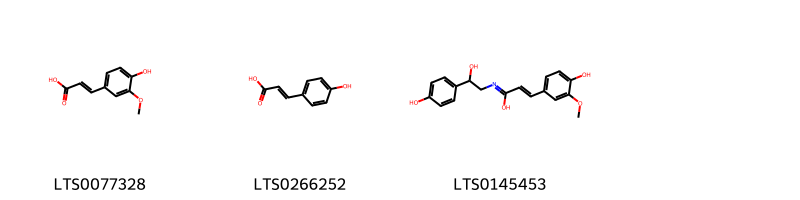
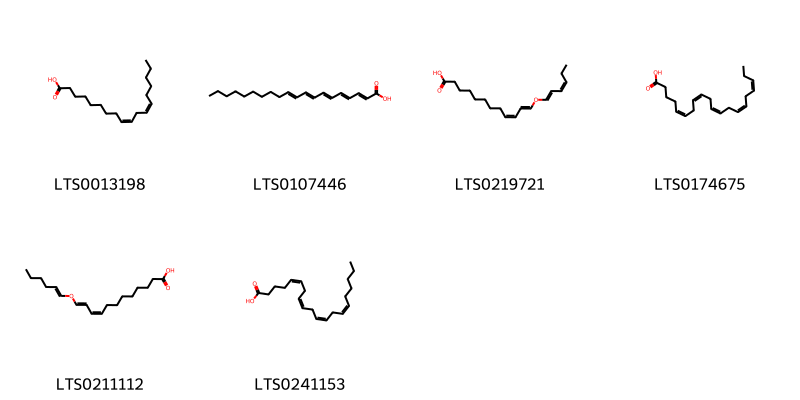
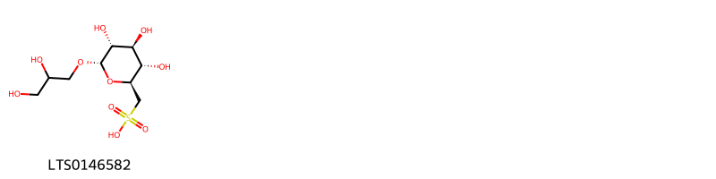
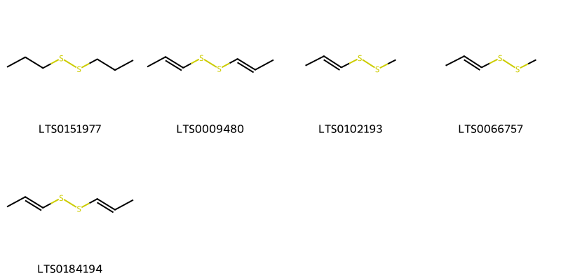
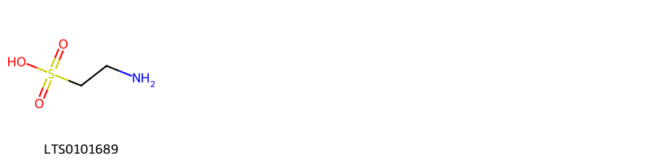
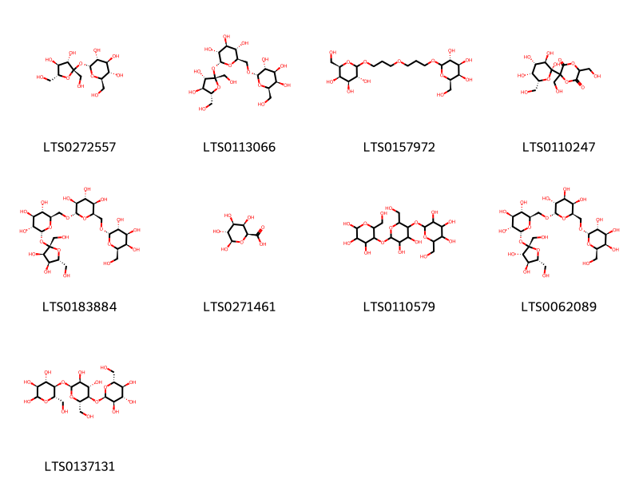
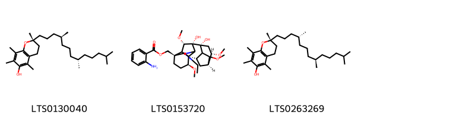
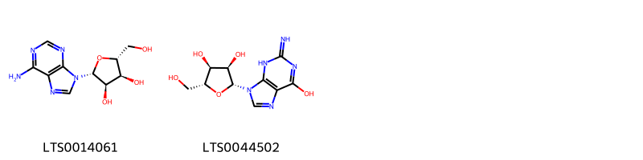
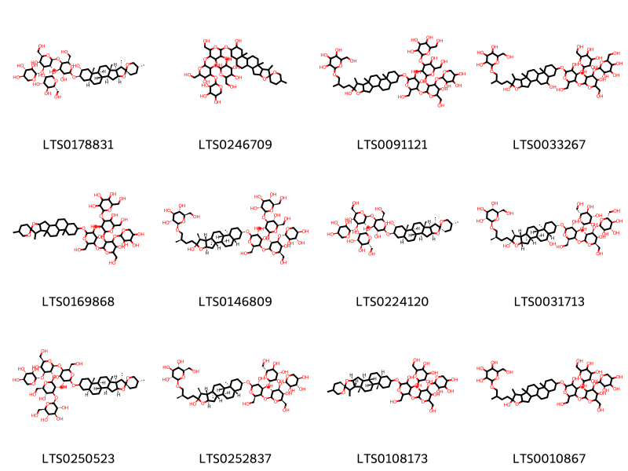

!!! abstract "Tóm tắt"

    Tỏi (Bulbus Allii sativi) là lá dự trữ được phơi khô của cây Tỏi (Allium sativum L.), họ Hành (Alliaceae). Cây phân bố rộng rãi trên khắp thế giới, đặc biệt ở các vùng nhiệt đới và ôn đới. Theo tài liệu cổ, tỏi có tính tân, ôn, quy vào các kinh phế, tỳ, vị. Tỏi đã được sử dụng từ lâu đời có tác dụng kháng khuẩn, kháng viêm, hạ cholesterol và tăng cường miễn dịch. Thành phần chính của tỏi gồm các hợp chất chứa lưu huỳnh như allicin, alliin và ajoene

## Thông tin về thực vật

Dược liệu **Tỏi (Củ)** từ bộ phận **nan** từ loài *Allium sativum*.

**Mô tả thực vật:** Tập hợp các lá dự trữ (hành) quen gọi là củ gần hình cầu, đường kính 3 cm đến 5 cm, chứa khoảng 8 đến 20 hành con. Bao xung quanh củ gồm 2 đến 5 lớp lá vẩy trắng mỏng, do các bẹ lá trước tạo thành, gắn vào một đế hình cầu dẹt (thân hành). Các hành con hình trứng, 3 mặt đến 4 mặt, đỉnh nhọn, đế cụt. Mỗi hành con được phủ những lớp lá vẩy trắng và một lớp biểu bì màu trắng hồng dễ tách khỏi phần rắn bên trong. Các hành con xếp thành lớp quanh một sợi dài, đường kính 1 mm đến 3 mm mọc từ giữa đế. Phần rắn bên trong của các hành con chứa nhiều nước, mùi thơm, vị hăng và bền

*Tài liệu tham khảo:* Tài liệu khác 
Trong dược điển Việt nam, một loài được sử dụng làm dược liệu là *Allium sativum*.

!!! info "Phân loại thực vật của *Allium sativum*"
    - **Kingdom:** Plantae
    - **Phylum:** Tracheophyta
    - **Order:** Asparagales
    - **Family:** Amaryllidaceae
    - **Genus:** Allium
    - **Species:** *Allium sativum*

**Phân bố trên thế giới:** Germany, nan, France, Switzerland, Czechia, Finland, Hungary, Spain, Poland, Mexico, Sweden, Australia, Belarus, Russian Federation, Estonia, Romania, United Kingdom of Great Britain and Northern Ireland, India, Türkiye, Ukraine, Latvia, United States of America, Pakistan, Algeria, Kazakhstan, Italy, Norway, Canada, Ecuador, Iran (Islamic Republic of), Austria

**Phân bố tại Việt nam:** Không có ghi nhận ở Việt Nam

## Thông tin về dược liệu 

### Định danh

!!! info "Thông tin về tên gọi"

    - Dược liệu tiếng Việt: nan
    - Dược liệu tiếng Trung: nan (nan)
    - Dược liệu tiếng Anh: nan
    - Dược liệu latin thông dụng: nan
    - Dược liệu latin kiểu DĐVN: *bulbus allii*
    - Dược liệu latin kiểu DĐVN: *nan*
    - Dược liệu latin kiểu thông tư: *nan*
    - Bộ phận dùng: nan (nan)

### Mô tả dược liệu 

- **Theo dược điển Việt nam V:** nan

- **Mô tả dược liệu theo thông tư chế biến dược liệu theo phương pháp cổ truyền:** nan

### Chế biến 

- **Chế biến theo dược điển việt nam V**: nan

- **Chế biến theo thông tư:** nan

--- 

## Thành phần hóa học

- Theo tài liệu của GS. Đỗ Tất Lợi:  (1) Trong tỏi có một ít iốt và tinh dầu, alixin C6H10OS2, aliin
(2) Tên hoạt chất biomaker: Allicin, Alliin, Ajoene
    

**Thành phần hóa học từ loài **Allium sativum**

Theo cơ sở dữ liệu lotus, loài *Allium sativum* đã phân lập và xác định được **172** hoạt chất thuộc về các nhóm Fatty Acyls, Thiosulfinic acid esters, Organic thiosulfuric acids and derivatives, Carboxylic acids and derivatives, Steroids and steroid derivatives, Allyl sulfur compounds, Flavonoids, Furanoid lignans, Sulfonyls, Organic phosphoric acids and derivatives, Organic oxoanionic compounds, Purine nucleosides, Prenol lipids, Pyrans, Organic disulfides, Sulfoxides, Organooxygen compounds, Cinnamic acids and derivatives, Indoles and derivatives, Triphenyl compounds, Organic trisulfides, Sphingolipids, Organic sulfonic acids and derivatives, Glycerolipids, Organic sulfuric acids and derivatives, Dibenzylbutane lignans trong bảng dưới đây. Danh sách các hoạt chất như sau 3-(propylthio)propene [(LTS0218893)](https://lotus.naturalproducts.net/compound/lotus_id/LTS0218893), d-aspartic acid [(LTS0144001)](https://lotus.naturalproducts.net/compound/lotus_id/LTS0144001), (2r)-2-amino-3-[(r)-prop-2-ene-1-sulfinyl]propanoic acid [(LTS0125648)](https://lotus.naturalproducts.net/compound/lotus_id/LTS0125648), 1-[(prop-2-en-1-yloxy)-λ⁴-disulfanyl]propane [(LTS0169114)](https://lotus.naturalproducts.net/compound/lotus_id/LTS0169114), amylose [(LTS0110579)](https://lotus.naturalproducts.net/compound/lotus_id/LTS0110579), ferulic acid [(LTS0077328)](https://lotus.naturalproducts.net/compound/lotus_id/LTS0077328), methyl propenyl disulfide [(LTS0066757)](https://lotus.naturalproducts.net/compound/lotus_id/LTS0066757), garlicin [(LTS0050684)](https://lotus.naturalproducts.net/compound/lotus_id/LTS0050684), 3-(methanesulfinylsulfanyl)prop-1-ene [(LTS0000272)](https://lotus.naturalproducts.net/compound/lotus_id/LTS0000272), (2r)-2-hydroxy-n-[(2s,3r,4e)-3-hydroxy-1-{[(2r,3r,4s,5s,6r)-3,4,5-trihydroxy-6-(hydroxymethyl)oxan-2-yl]oxy}octadec-4-en-2-yl]hexadecanimidic acid [(LTS0217809)](https://lotus.naturalproducts.net/compound/lotus_id/LTS0217809), (2r,3r,4s,5r)-2-(hydroxymethyl)-6-[3-(3-{[(3r,4s,5r,6r)-3,4,5-trihydroxy-6-(hydroxymethyl)oxan-2-yl]oxy}propoxy)propoxy]oxane-3,4,5-triol [(LTS0157972)](https://lotus.naturalproducts.net/compound/lotus_id/LTS0157972), linoleic [(LTS0013198)](https://lotus.naturalproducts.net/compound/lotus_id/LTS0013198), para-coumaric acid [(LTS0266252)](https://lotus.naturalproducts.net/compound/lotus_id/LTS0266252), etherolenic acid [(LTS0219721)](https://lotus.naturalproducts.net/compound/lotus_id/LTS0219721), (9z,11e)-12-[(1e)-hex-1-en-1-yloxy]dodeca-9,11-dienoic acid [(LTS0211112)](https://lotus.naturalproducts.net/compound/lotus_id/LTS0211112), 2-hydroxy-n-(3-hydroxy-1-{[3,4,5-trihydroxy-6-(hydroxymethyl)oxan-2-yl]oxy}octadeca-4,8-dien-2-yl)pentadecanimidic acid [(LTS0026005)](https://lotus.naturalproducts.net/compound/lotus_id/LTS0026005), [(1s,4s,5r,6s,8r,9r,13s,16s,18s)-11-ethyl-8,9-dihydroxy-4,6,16,18-tetramethoxy-11-azahexacyclo[7.7.2.1²,⁵.0¹,¹⁰.0³,⁸.0¹³,¹⁷]nonadecan-13-yl]methyl 2-aminobenzoate [(LTS0153720)](https://lotus.naturalproducts.net/compound/lotus_id/LTS0153720), eicosapentaenoic acid [(LTS0174675)](https://lotus.naturalproducts.net/compound/lotus_id/LTS0174675), 1-hydroxy-1-(prop-2-en-1-yloxy)-1λ⁶-disulfen-1-one [(LTS0262385)](https://lotus.naturalproducts.net/compound/lotus_id/LTS0262385), allyl trisulfide [(LTS0055014)](https://lotus.naturalproducts.net/compound/lotus_id/LTS0055014), 3-[(prop-2-en-1-yloxysulfonyl)sulfanyl]prop-1-ene [(LTS0088695)](https://lotus.naturalproducts.net/compound/lotus_id/LTS0088695), (2z)-but-2-en-1-yl-λ⁴-disulfanylol [(LTS0190764)](https://lotus.naturalproducts.net/compound/lotus_id/LTS0190764), (2e)-n-[2-hydroxy-2-(4-hydroxyphenyl)ethyl]-3-(4-hydroxy-3-methoxyphenyl)prop-2-enimidic acid [(LTS0145453)](https://lotus.naturalproducts.net/compound/lotus_id/LTS0145453), lariciresinol [(LTS0010950)](https://lotus.naturalproducts.net/compound/lotus_id/LTS0010950), allicin [(LTS0248420)](https://lotus.naturalproducts.net/compound/lotus_id/LTS0248420), allixin [(LTS0115650)](https://lotus.naturalproducts.net/compound/lotus_id/LTS0115650), l-arginine [(LTS0064737)](https://lotus.naturalproducts.net/compound/lotus_id/LTS0064737), l-isoleucine [(LTS0249538)](https://lotus.naturalproducts.net/compound/lotus_id/LTS0249538), 2-hydroxy-n-(3-hydroxy-1-{[3,4,5-trihydroxy-6-(hydroxymethyl)oxan-2-yl]oxy}octadeca-4,8-dien-2-yl)tetradecanimidic acid [(LTS0181919)](https://lotus.naturalproducts.net/compound/lotus_id/LTS0181919), l glutamine [(LTS0263175)](https://lotus.naturalproducts.net/compound/lotus_id/LTS0263175), 2-({2-[(4,5-dihydroxy-6-{[6-hydroxy-7,9,13-trimethyl-6-(3-methyl-4-{[3,4,5-trihydroxy-6-(hydroxymethyl)oxan-2-yl]oxy}butyl)-5-oxapentacyclo[10.8.0.0²,⁹.0⁴,⁸.0¹³,¹⁸]icosan-16-yl]oxy}-2-(hydroxymethyl)oxan-3-yl)oxy]-5-hydroxy-6-(hydroxymethyl)-4-[(3,4,5-trihydroxyoxan-2-yl)oxy]oxan-3-yl}oxy)-6-(hydroxymethyl)oxane-3,4,5-triol [(LTS0010867)](https://lotus.naturalproducts.net/compound/lotus_id/LTS0010867), (+,-)-selenomethionine [(LTS0150888)](https://lotus.naturalproducts.net/compound/lotus_id/LTS0150888), (1e)-1-[(prop-2-ene-1-sulfinyl)sulfanyl]prop-1-ene [(LTS0097985)](https://lotus.naturalproducts.net/compound/lotus_id/LTS0097985), 2-amino-3-[(triphenylmethyl)sulfanyl]propanoic acid [(LTS0024342)](https://lotus.naturalproducts.net/compound/lotus_id/LTS0024342), 1-(methyldisulfanyl)prop-1-ene [(LTS0102193)](https://lotus.naturalproducts.net/compound/lotus_id/LTS0102193), l-cystine [(LTS0192149)](https://lotus.naturalproducts.net/compound/lotus_id/LTS0192149), prop-2-en-1-yl 3-(prop-2-en-1-ylsulfanyl)prop-2-en-1-yl sulfate [(LTS0146386)](https://lotus.naturalproducts.net/compound/lotus_id/LTS0146386), prop-2-en-1-yl-λ⁴-disulfanylol [(LTS0203521)](https://lotus.naturalproducts.net/compound/lotus_id/LTS0203521), alliin [(LTS0015270)](https://lotus.naturalproducts.net/compound/lotus_id/LTS0015270), vitamin e [(LTS0263269)](https://lotus.naturalproducts.net/compound/lotus_id/LTS0263269), l-selenomethionine [(LTS0227125)](https://lotus.naturalproducts.net/compound/lotus_id/LTS0227125), (2r)-2,5,7,8-tetramethyl-2-[(4s,8s)-4,8,12-trimethyltridecyl]-3,4-dihydro-1-benzopyran-6-ol [(LTS0130040)](https://lotus.naturalproducts.net/compound/lotus_id/LTS0130040), 2-amino-3-(ethanesulfinyl)propanoic acid [(LTS0022212)](https://lotus.naturalproducts.net/compound/lotus_id/LTS0022212), (2s)-2-amino-4-{[(1r)-1-(carboxymethyl-c-hydroxycarbonimidoyl)-2-sulfanylethyl]-c-hydroxycarbonimidoyl}butanoic acid [(LTS0008500)](https://lotus.naturalproducts.net/compound/lotus_id/LTS0008500), (2r)-2-amino-3-(propane-1-sulfinyl)propanoic acid [(LTS0263475)](https://lotus.naturalproducts.net/compound/lotus_id/LTS0263475), 2-amino-4-[(1-carboxy-2-phenylethyl)-c-hydroxycarbonimidoyl]butanoic acid [(LTS0161892)](https://lotus.naturalproducts.net/compound/lotus_id/LTS0161892), 3-{[(2s,3r,4s,5r,6r)-4-[(2-carboxyacetyl)oxy]-6-{[(2-carboxyacetyl)oxy]methyl}-3,5-dihydroxyoxan-2-yl]oxy}-2-(3,4-dihydroxyphenyl)-5,7-dihydroxy-1λ⁴-chromen-1-ylium [(LTS0132043)](https://lotus.naturalproducts.net/compound/lotus_id/LTS0132043), (2s)-2-amino-4-{[(1r)-1-carboxy-2-[(1e)-prop-1-en-1-ylsulfanyl]ethyl]-c-hydroxycarbonimidoyl}butanoic acid [(LTS0086027)](https://lotus.naturalproducts.net/compound/lotus_id/LTS0086027), se-methylselenocysteine [(LTS0239727)](https://lotus.naturalproducts.net/compound/lotus_id/LTS0239727), d-phenylalanine [(LTS0048920)](https://lotus.naturalproducts.net/compound/lotus_id/LTS0048920), 2-amino-3-[(1z)-prop-1-ene-1-sulfinyl]propanoic acid [(LTS0218728)](https://lotus.naturalproducts.net/compound/lotus_id/LTS0218728), (1z)-1-(methoxy-λ⁴-disulfanyl)prop-1-ene [(LTS0138094)](https://lotus.naturalproducts.net/compound/lotus_id/LTS0138094), ribonucleoside [(LTS0044502)](https://lotus.naturalproducts.net/compound/lotus_id/LTS0044502), selenocysteine [(LTS0162463)](https://lotus.naturalproducts.net/compound/lotus_id/LTS0162463), stachyose [(LTS0062089)](https://lotus.naturalproducts.net/compound/lotus_id/LTS0062089), tetraethylammonium [(LTS0203824)](https://lotus.naturalproducts.net/compound/lotus_id/LTS0203824), bis(prop-2-en-1-yl)heptasulfane [(LTS0267309)](https://lotus.naturalproducts.net/compound/lotus_id/LTS0267309), 3-[(methoxysulfinyl)sulfanyl]prop-1-ene [(LTS0206233)](https://lotus.naturalproducts.net/compound/lotus_id/LTS0206233), (z)-ajoene [(LTS0148764)](https://lotus.naturalproducts.net/compound/lotus_id/LTS0148764), l-aspartic acid [(LTS0205466)](https://lotus.naturalproducts.net/compound/lotus_id/LTS0205466), (2r)-2-amino-3-(ethanesulfinyl)propanoic acid [(LTS0208939)](https://lotus.naturalproducts.net/compound/lotus_id/LTS0208939), 3-{[(1e)-3-[(r)-prop-2-ene-1-sulfinyl]prop-1-en-1-yl]disulfanyl}prop-1-ene [(LTS0126255)](https://lotus.naturalproducts.net/compound/lotus_id/LTS0126255), (5s)-2-carboxy-5-methylthiomorpholin-1-ium-1-olate [(LTS0086000)](https://lotus.naturalproducts.net/compound/lotus_id/LTS0086000), matairesinol [(LTS0193475)](https://lotus.naturalproducts.net/compound/lotus_id/LTS0193475), 1-(prop-1-en-1-yldisulfanyl)prop-1-ene [(LTS0009480)](https://lotus.naturalproducts.net/compound/lotus_id/LTS0009480), d-methionine [(LTS0108782)](https://lotus.naturalproducts.net/compound/lotus_id/LTS0108782), (4e)-hexa-1,4-dien-3-yl-λ⁴-disulfanylol [(LTS0074654)](https://lotus.naturalproducts.net/compound/lotus_id/LTS0074654), 3-{[(2s,3r,4r,5s,6r)-6-{[(2-carboxyacetyl)oxy]methyl}-3,4,5-trihydroxyoxan-2-yl]oxy}-2-(3,4-dihydroxyphenyl)-5,7-dihydroxy-1λ⁴-chromen-1-ylium [(LTS0186341)](https://lotus.naturalproducts.net/compound/lotus_id/LTS0186341), l-glutamic acid [(LTS0037133)](https://lotus.naturalproducts.net/compound/lotus_id/LTS0037133), propyl disulfide [(LTS0151977)](https://lotus.naturalproducts.net/compound/lotus_id/LTS0151977), 3-{[(2s,3r,4s,5r,6s)-4-[(2-carboxyacetyl)oxy]-3,5-dihydroxy-6-(hydroxymethyl)oxan-2-yl]oxy}-2-(3,4-dihydroxyphenyl)-5,7-dihydroxy-1λ⁴-chromen-1-ylium [(LTS0207967)](https://lotus.naturalproducts.net/compound/lotus_id/LTS0207967), 2-({2-[(6-{[6,19-dihydroxy-7,9,13-trimethyl-6-(3-methyl-4-{[3,4,5-trihydroxy-6-(hydroxymethyl)oxan-2-yl]oxy}butyl)-5-oxapentacyclo[10.8.0.0²,⁹.0⁴,⁸.0¹³,¹⁸]icosan-16-yl]oxy}-4,5-dihydroxy-2-(hydroxymethyl)oxan-3-yl)oxy]-5-hydroxy-6-(hydroxymethyl)-3-{[3,4,5-trihydroxy-6-(hydroxymethyl)oxan-2-yl]oxy}oxan-4-yl}oxy)-6-(hydroxymethyl)oxane-3,4,5-triol [(LTS0033267)](https://lotus.naturalproducts.net/compound/lotus_id/LTS0033267), 3-carboxy-5-methylthiomorpholin-1-ium-1-olate [(LTS0003262)](https://lotus.naturalproducts.net/compound/lotus_id/LTS0003262), (2r)-2-amino-3-methanesulfinylpropanoic acid [(LTS0021122)](https://lotus.naturalproducts.net/compound/lotus_id/LTS0021122), isoalliin [(LTS0234401)](https://lotus.naturalproducts.net/compound/lotus_id/LTS0234401), o-phosphoethanolamine; bis(nonane) [(LTS0249963)](https://lotus.naturalproducts.net/compound/lotus_id/LTS0249963), arachidonic acid [(LTS0241153)](https://lotus.naturalproducts.net/compound/lotus_id/LTS0241153), l(+)-citrulline [(LTS0065454)](https://lotus.naturalproducts.net/compound/lotus_id/LTS0065454), l-leucine [(LTS0113423)](https://lotus.naturalproducts.net/compound/lotus_id/LTS0113423), (2r)-2-hydroxy-n-[(2s,3r,4e,8e)-3-hydroxy-1-{[(2r,3r,4s,5s,6r)-3,4,5-trihydroxy-6-(hydroxymethyl)oxan-2-yl]oxy}octadeca-4,8-dien-2-yl]tetradecanimidic acid [(LTS0268925)](https://lotus.naturalproducts.net/compound/lotus_id/LTS0268925), d-cystine [(LTS0177923)](https://lotus.naturalproducts.net/compound/lotus_id/LTS0177923), l-ornithine [(LTS0093444)](https://lotus.naturalproducts.net/compound/lotus_id/LTS0093444), abu [(LTS0208699)](https://lotus.naturalproducts.net/compound/lotus_id/LTS0208699), bis(prop-2-en-1-yl)hexasulfane [(LTS0272714)](https://lotus.naturalproducts.net/compound/lotus_id/LTS0272714), sucrose [(LTS0272557)](https://lotus.naturalproducts.net/compound/lotus_id/LTS0272557), (2s)-2-amino-4-{[(1s)-1-carboxy-2-phenylethyl]-c-hydroxycarbonimidoyl}butanoic acid [(LTS0250484)](https://lotus.naturalproducts.net/compound/lotus_id/LTS0250484), 2-(prop-2-en-1-yldisulfanyl)ethanimidic acid [(LTS0113306)](https://lotus.naturalproducts.net/compound/lotus_id/LTS0113306), allyl methyl trisulfide [(LTS0190743)](https://lotus.naturalproducts.net/compound/lotus_id/LTS0190743), diallyl tetrasulfide [(LTS0005396)](https://lotus.naturalproducts.net/compound/lotus_id/LTS0005396), oil garlic [(LTS0069687)](https://lotus.naturalproducts.net/compound/lotus_id/LTS0069687), (2s,3r)-2,3-bis[(4-hydroxy-3-methoxyphenyl)(¹³c)methyl](1-¹³c)butane-1,4-diol [(LTS0268699)](https://lotus.naturalproducts.net/compound/lotus_id/LTS0268699), (1e)-1-[(1e)-prop-1-en-1-yldisulfanyl]prop-1-ene [(LTS0184194)](https://lotus.naturalproducts.net/compound/lotus_id/LTS0184194), allyl pentasulfide [(LTS0173905)](https://lotus.naturalproducts.net/compound/lotus_id/LTS0173905), {[(1e)-prop-1-ene-1-sulfinyl]sulfanyl}methane [(LTS0191876)](https://lotus.naturalproducts.net/compound/lotus_id/LTS0191876), 2-hydroxy-n-(3-hydroxy-1-{[3,4,5-trihydroxy-6-(hydroxymethyl)oxan-2-yl]oxy}octadeca-4,8-dien-2-yl)hexadecanimidic acid [(LTS0121977)](https://lotus.naturalproducts.net/compound/lotus_id/LTS0121977), l-alanine [(LTS0042208)](https://lotus.naturalproducts.net/compound/lotus_id/LTS0042208), pinoresinol [(LTS0057431)](https://lotus.naturalproducts.net/compound/lotus_id/LTS0057431), d-alanine [(LTS0272178)](https://lotus.naturalproducts.net/compound/lotus_id/LTS0272178), icosa-2,4,6,8,10-pentaenoic acid [(LTS0107446)](https://lotus.naturalproducts.net/compound/lotus_id/LTS0107446), (3s,4s,5r,6s)-5-{[(2s,3s,4s,5r,6s)-3,4-dihydroxy-6-(hydroxymethyl)-5-{[(2r,3r,4s,5s,6r)-3,4,5-trihydroxy-6-(hydroxymethyl)oxan-2-yl]oxy}oxan-2-yl]oxy}-6-(hydroxymethyl)oxane-2,3,4-triol [(LTS0137131)](https://lotus.naturalproducts.net/compound/lotus_id/LTS0137131), 3,6-bis(hydroxymethyl)-3-[(2s,3r,4s,5r,6r)-2,3,4,5-tetrahydroxy-6-(hydroxymethyl)oxan-2-yl]-1,4-dioxane-2,5-dione [(LTS0110247)](https://lotus.naturalproducts.net/compound/lotus_id/LTS0110247), 1-(prop-1-en-1-yl)-3-(prop-2-en-1-yl)trisulfane [(LTS0106388)](https://lotus.naturalproducts.net/compound/lotus_id/LTS0106388), (2r)-2-amino-3-[(s)-methanesulfinyl]propanoic acid [(LTS0078575)](https://lotus.naturalproducts.net/compound/lotus_id/LTS0078575), 2-aminoethanesulfonic acid [(LTS0101689)](https://lotus.naturalproducts.net/compound/lotus_id/LTS0101689), (2r)-2-hydroxy-n-[(2s,3r,4e,8e)-3-hydroxy-1-{[(2r,3r,4s,5s,6r)-3,4,5-trihydroxy-6-(hydroxymethyl)oxan-2-yl]oxy}octadeca-4,8-dien-2-yl]hexadecanimidic acid [(LTS0055771)](https://lotus.naturalproducts.net/compound/lotus_id/LTS0055771), (4z)-hexa-1,4-dien-3-yl-λ⁴-disulfanylol [(LTS0020251)](https://lotus.naturalproducts.net/compound/lotus_id/LTS0020251), l-serine [(LTS0106692)](https://lotus.naturalproducts.net/compound/lotus_id/LTS0106692), aspartamate [(LTS0243014)](https://lotus.naturalproducts.net/compound/lotus_id/LTS0243014), 5,7-dihydroxy-2-(4-hydroxy-3-oxidophenyl)-3-{[(2s,3r,4s,5s,6r)-3,4,5-trihydroxy-6-(hydroxymethyl)oxan-2-yl]oxy}-1λ⁴-chromen-1-ylium [(LTS0083222)](https://lotus.naturalproducts.net/compound/lotus_id/LTS0083222), 2-{[2-({2-[(4,5-dihydroxy-6-{[6-hydroxy-7,9,13-trimethyl-6-(3-methyl-4-{[3,4,5-trihydroxy-6-(hydroxymethyl)oxan-2-yl]oxy}butyl)-5-oxapentacyclo[10.8.0.0²,⁹.0⁴,⁸.0¹³,¹⁸]icosan-16-yl]oxy}-2-(hydroxymethyl)oxan-3-yl)oxy]-5-hydroxy-6-(hydroxymethyl)-4-[(3,4,5-trihydroxyoxan-2-yl)oxy]oxan-3-yl}oxy)-3,5-dihydroxy-6-(hydroxymethyl)oxan-4-yl]oxy}-6-(hydroxymethyl)oxane-3,4,5-triol [(LTS0091121)](https://lotus.naturalproducts.net/compound/lotus_id/LTS0091121), (1e)-1-(methanesulfinylsulfanyl)prop-1-ene [(LTS0040661)](https://lotus.naturalproducts.net/compound/lotus_id/LTS0040661), l-tyrosine [(LTS0029981)](https://lotus.naturalproducts.net/compound/lotus_id/LTS0029981), l-proline [(LTS0090383)](https://lotus.naturalproducts.net/compound/lotus_id/LTS0090383), prop-2-en-1-yl (2e)-3-(prop-2-en-1-ylsulfanyl)prop-2-en-1-yl sulfate [(LTS0142449)](https://lotus.naturalproducts.net/compound/lotus_id/LTS0142449), l-valine [(LTS0231703)](https://lotus.naturalproducts.net/compound/lotus_id/LTS0231703), β-d-galactopyranuronic acid [(LTS0271461)](https://lotus.naturalproducts.net/compound/lotus_id/LTS0271461), (2e)-but-2-en-1-yl-λ⁴-disulfanylol [(LTS0178952)](https://lotus.naturalproducts.net/compound/lotus_id/LTS0178952), (1e)-1-[(prop-2-en-1-yloxy)-λ⁴-disulfanyl]prop-1-ene [(LTS0072906)](https://lotus.naturalproducts.net/compound/lotus_id/LTS0072906), l-threonine [(LTS0184056)](https://lotus.naturalproducts.net/compound/lotus_id/LTS0184056), (2s,3r,4s,5s,6r)-2-{[(2s,3r,4s,5r,6r)-2-{[(2s,3r,4s,5r,6r)-2-{[(2r,3r,4r,5r,6r)-4,5-dihydroxy-2-(hydroxymethyl)-6-[(1'r,2r,2's,4's,5r,7's,8'r,9's,12's,13's,16's,18's)-5,7',9',13'-tetramethyl-5'-oxaspiro[oxane-2,6'-pentacyclo[10.8.0.0²,⁹.0⁴,⁸.0¹³,¹⁸]icosane]oxy]oxan-3-yl]oxy}-5-hydroxy-6-(hydroxymethyl)-4-{[(2s,3r,4s,5r)-3,4,5-trihydroxyoxan-2-yl]oxy}oxan-3-yl]oxy}-3,5-dihydroxy-6-(hydroxymethyl)oxan-4-yl]oxy}-6-(hydroxymethyl)oxane-3,4,5-triol [(LTS0250523)](https://lotus.naturalproducts.net/compound/lotus_id/LTS0250523), (2s)-2-amino-4-{[(1r)-1-carboxy-2-(prop-2-en-1-ylsulfanyl)ethyl]-c-hydroxycarbonimidoyl}butanoic acid [(LTS0055613)](https://lotus.naturalproducts.net/compound/lotus_id/LTS0055613), 2-amino-4-{[1-carboxy-2-(prop-1-en-1-ylsulfanyl)ethyl]-c-hydroxycarbonimidoyl}butanoic acid [(LTS0052570)](https://lotus.naturalproducts.net/compound/lotus_id/LTS0052570), (2s)-2-amino-4-{[(1r)-1-carboxy-2-(prop-2-en-1-yldisulfanyl)ethyl]-c-hydroxycarbonimidoyl}butanoic acid [(LTS0019976)](https://lotus.naturalproducts.net/compound/lotus_id/LTS0019976), (2r)-2-hydroxy-n-[(2s,3r,4e,8z)-3-hydroxy-1-{[(2r,3r,4s,5s,6r)-3,4,5-trihydroxy-6-(hydroxymethyl)oxan-2-yl]oxy}octadeca-4,8-dien-2-yl]hexadecanimidic acid [(LTS0070116)](https://lotus.naturalproducts.net/compound/lotus_id/LTS0070116), 1-methyl-2h,3h,8h,8ah-pyrrolo[2,3-b]indol-3a-ol [(LTS0245542)](https://lotus.naturalproducts.net/compound/lotus_id/LTS0245542), adenosine [(LTS0014061)](https://lotus.naturalproducts.net/compound/lotus_id/LTS0014061), alliin [(LTS0012435)](https://lotus.naturalproducts.net/compound/lotus_id/LTS0012435), 3-(methoxy-λ⁴-disulfanyl)prop-1-ene [(LTS0008651)](https://lotus.naturalproducts.net/compound/lotus_id/LTS0008651), l-methionine [(LTS0196746)](https://lotus.naturalproducts.net/compound/lotus_id/LTS0196746), (2s,3r,4s,5s,6r)-2-{[(2s,3r,4s,5r,6r)-2-{[(2r,3r,4r,5r,6r)-4,5-dihydroxy-2-(hydroxymethyl)-6-[(1'r,2s,2's,4's,5r,7's,8'r,9's,12's,13's,15'r,16'r,18's)-5,7',9',13'-tetramethyl-5'-oxaspiro[oxane-2,6'-pentacyclo[10.8.0.0²,⁹.0⁴,⁸.0¹³,¹⁸]icosan]-15'-oloxy]oxan-3-yl]oxy}-5-hydroxy-6-(hydroxymethyl)-4-{[(2s,3r,4s,5r)-3,4,5-trihydroxyoxan-2-yl]oxy}oxan-3-yl]oxy}-6-(hydroxymethyl)oxane-3,4,5-triol [(LTS0224120)](https://lotus.naturalproducts.net/compound/lotus_id/LTS0224120), allyl propyl disulfide [(LTS0050924)](https://lotus.naturalproducts.net/compound/lotus_id/LTS0050924), [(prop-2-ene-1-sulfinyl)sulfanyl]methane [(LTS0214069)](https://lotus.naturalproducts.net/compound/lotus_id/LTS0214069), [(2s,3s,4s,5r,6s)-6-(2,3-dihydroxypropoxy)-3,4,5-trihydroxyoxan-2-yl]methanesulfonic acid [(LTS0146582)](https://lotus.naturalproducts.net/compound/lotus_id/LTS0146582), l-selenocysteine [(LTS0034809)](https://lotus.naturalproducts.net/compound/lotus_id/LTS0034809), [(prop-2-en-1-yloxy)-λ⁴-disulfanyl]methane [(LTS0087364)](https://lotus.naturalproducts.net/compound/lotus_id/LTS0087364), 3-{[(1e)-prop-1-ene-1-sulfinyl]sulfanyl}prop-1-ene [(LTS0077006)](https://lotus.naturalproducts.net/compound/lotus_id/LTS0077006), 3-[(prop-2-ene-1-sulfonyl)sulfanyl]prop-1-ene [(LTS0190924)](https://lotus.naturalproducts.net/compound/lotus_id/LTS0190924), s-methylcysteine [(LTS0201907)](https://lotus.naturalproducts.net/compound/lotus_id/LTS0201907), 2-amino-3-methanesulfinylpropanoic acid [(LTS0056315)](https://lotus.naturalproducts.net/compound/lotus_id/LTS0056315), 2-[(2-{[4,5-dihydroxy-2-(hydroxymethyl)-6-{5,7',9',13'-tetramethyl-5'-oxaspiro[oxane-2,6'-pentacyclo[10.8.0.0²,⁹.0⁴,⁸.0¹³,¹⁸]icosan]-15'-oloxy}oxan-3-yl]oxy}-5-hydroxy-6-(hydroxymethyl)-4-[(3,4,5-trihydroxyoxan-2-yl)oxy]oxan-3-yl)oxy]-6-(hydroxymethyl)oxane-3,4,5-triol [(LTS0246709)](https://lotus.naturalproducts.net/compound/lotus_id/LTS0246709), 3-[(1e)-prop-1-en-1-yldisulfanyl]prop-1-ene [(LTS0022646)](https://lotus.naturalproducts.net/compound/lotus_id/LTS0022646), (2s)-2-(phenylamino)propanoic acid [(LTS0199539)](https://lotus.naturalproducts.net/compound/lotus_id/LTS0199539), (2r,3r,4s,5s,6r)-2-{[(2s,3r,4s,5r)-3,4-dihydroxy-2,5-bis(hydroxymethyl)oxolan-2-yl]oxy}-6-({[(2s,3s,4r,5r,6r)-3,4,5-trihydroxy-6-({[(2s,3r,4s,5r,6r)-3,4,5-trihydroxy-6-(hydroxymethyl)oxan-2-yl]oxy}methyl)oxan-2-yl]oxy}methyl)oxane-3,4,5-triol [(LTS0183884)](https://lotus.naturalproducts.net/compound/lotus_id/LTS0183884), 2-hydroxy-n-(3-hydroxy-1-{[3,4,5-trihydroxy-6-(hydroxymethyl)oxan-2-yl]oxy}octadec-4-en-2-yl)hexadecanimidic acid [(LTS0156651)](https://lotus.naturalproducts.net/compound/lotus_id/LTS0156651), (2s,3r,4s,5s,6r)-2-{[(2s,3r,4s,5r,6r)-2-{[(2s,3r,4s,5r,6r)-2-{[(2r,3r,4r,5r,6r)-4,5-dihydroxy-6-{[(1r,2s,4r,6r,7s,8r,9s,12s,13s,16s,18s)-6-hydroxy-7,9,13-trimethyl-6-[(3r)-3-methyl-4-{[(2r,3r,4s,5s,6r)-3,4,5-trihydroxy-6-(hydroxymethyl)oxan-2-yl]oxy}butyl]-5-oxapentacyclo[10.8.0.0²,⁹.0⁴,⁸.0¹³,¹⁸]icosan-16-yl]oxy}-2-(hydroxymethyl)oxan-3-yl]oxy}-5-hydroxy-6-(hydroxymethyl)-4-{[(2s,3r,4s,5r)-3,4,5-trihydroxyoxan-2-yl]oxy}oxan-3-yl]oxy}-3,5-dihydroxy-6-(hydroxymethyl)oxan-4-yl]oxy}-6-(hydroxymethyl)oxane-3,4,5-triol [(LTS0146809)](https://lotus.naturalproducts.net/compound/lotus_id/LTS0146809), allyl methyl disulfide [(LTS0004503)](https://lotus.naturalproducts.net/compound/lotus_id/LTS0004503), 3-{[(s)-prop-2-ene-1-sulfinyl]sulfanyl}prop-1-ene [(LTS0090444)](https://lotus.naturalproducts.net/compound/lotus_id/LTS0090444), 2-amino-4-{[1-carboxy-2-(prop-2-en-1-yldisulfanyl)ethyl]-c-hydroxycarbonimidoyl}butanoic acid [(LTS0239254)](https://lotus.naturalproducts.net/compound/lotus_id/LTS0239254), s-allylcysteine [(LTS0136939)](https://lotus.naturalproducts.net/compound/lotus_id/LTS0136939), 2-amino-4-{[1-carboxy-2-(prop-2-en-1-ylsulfanyl)ethyl]-c-hydroxycarbonimidoyl}butanoic acid [(LTS0100045)](https://lotus.naturalproducts.net/compound/lotus_id/LTS0100045), (2s,3r,4s,5s,6r)-2-{[(2s,3r,4s,5r,6r)-2-{[(2r,3r,4r,5r,6r)-6-{[(1r,2s,4s,6s,7s,8r,9s,12s,13r,16s,18s,19r)-6,19-dihydroxy-7,9,13-trimethyl-6-[(3r)-3-methyl-4-{[(2r,3r,4s,5s,6r)-3,4,5-trihydroxy-6-(hydroxymethyl)oxan-2-yl]oxy}butyl]-5-oxapentacyclo[10.8.0.0²,⁹.0⁴,⁸.0¹³,¹⁸]icosan-16-yl]oxy}-4,5-dihydroxy-2-(hydroxymethyl)oxan-3-yl]oxy}-5-hydroxy-6-(hydroxymethyl)-3-{[(2s,3r,4s,5s,6r)-3,4,5-trihydroxy-6-(hydroxymethyl)oxan-2-yl]oxy}oxan-4-yl]oxy}-6-(hydroxymethyl)oxane-3,4,5-triol [(LTS0031713)](https://lotus.naturalproducts.net/compound/lotus_id/LTS0031713), l-lysine [(LTS0068734)](https://lotus.naturalproducts.net/compound/lotus_id/LTS0068734), chrysanthemin [(LTS0221391)](https://lotus.naturalproducts.net/compound/lotus_id/LTS0221391), (1e)-1-(methoxy-λ⁴-disulfanyl)prop-1-ene [(LTS0230354)](https://lotus.naturalproducts.net/compound/lotus_id/LTS0230354), 3-{[3-(prop-2-ene-1-sulfinyl)prop-1-en-1-yl]disulfanyl}prop-1-ene [(LTS0097898)](https://lotus.naturalproducts.net/compound/lotus_id/LTS0097898), 3-(propoxy-λ⁴-disulfanyl)prop-1-ene [(LTS0111586)](https://lotus.naturalproducts.net/compound/lotus_id/LTS0111586), l-histidine [(LTS0094081)](https://lotus.naturalproducts.net/compound/lotus_id/LTS0094081), (4s,6r)-2-{[(2s,3r,5r)-2-{[(2r,3r,4r)-4,5-dihydroxy-2-(hydroxymethyl)-6-[(1'r,2r,5r,9's,13's,16'r)-5,7',9',13'-tetramethyl-5'-oxaspiro[oxane-2,6'-pentacyclo[10.8.0.0²,⁹.0⁴,⁸.0¹³,¹⁸]icosan]-15'-oloxy]oxan-3-yl]oxy}-5-hydroxy-6-(hydroxymethyl)-4-{[(2s,3r,5r)-3,4,5-trihydroxyoxan-2-yl]oxy}oxan-3-yl]oxy}-6-(hydroxymethyl)oxane-3,4,5-triol [(LTS0162290)](https://lotus.naturalproducts.net/compound/lotus_id/LTS0162290), secoisolariciresinol [(LTS0086727)](https://lotus.naturalproducts.net/compound/lotus_id/LTS0086727), cyanidin 3-glucoside [(LTS0217835)](https://lotus.naturalproducts.net/compound/lotus_id/LTS0217835), 3-(prop-1-en-1-yldisulfanyl)prop-1-ene [(LTS0143200)](https://lotus.naturalproducts.net/compound/lotus_id/LTS0143200), l-tryptophan [(LTS0263809)](https://lotus.naturalproducts.net/compound/lotus_id/LTS0263809), (2s)-2-amino-3-(prop-2-ene-1-sulfinyl)propanoic acid [(LTS0030025)](https://lotus.naturalproducts.net/compound/lotus_id/LTS0030025), allin [(LTS0000756)](https://lotus.naturalproducts.net/compound/lotus_id/LTS0000756), raffinose [(LTS0113066)](https://lotus.naturalproducts.net/compound/lotus_id/LTS0113066), 2-({2-[(2-{[4,5-dihydroxy-2-(hydroxymethyl)-6-{5,7',9',13'-tetramethyl-5'-oxaspiro[oxane-2,6'-pentacyclo[10.8.0.0²,⁹.0⁴,⁸.0¹³,¹⁸]icosane]oxy}oxan-3-yl]oxy}-5-hydroxy-6-(hydroxymethyl)-4-[(3,4,5-trihydroxyoxan-2-yl)oxy]oxan-3-yl)oxy]-3,5-dihydroxy-6-(hydroxymethyl)oxan-4-yl}oxy)-6-(hydroxymethyl)oxane-3,4,5-triol [(LTS0169868)](https://lotus.naturalproducts.net/compound/lotus_id/LTS0169868), ethyl prop-2-ene-1-sulfinate [(LTS0253441)](https://lotus.naturalproducts.net/compound/lotus_id/LTS0253441), (2r)-2-hydroxy-n-[(2s,3r,4e,8e)-3-hydroxy-1-{[(2r,3r,4s,5s,6r)-3,4,5-trihydroxy-6-(hydroxymethyl)oxan-2-yl]oxy}octadeca-4,8-dien-2-yl]pentadecanimidic acid [(LTS0157949)](https://lotus.naturalproducts.net/compound/lotus_id/LTS0157949), ajoene [(LTS0118127)](https://lotus.naturalproducts.net/compound/lotus_id/LTS0118127), (2s,3r,4s,5s,6r)-2-{[(2s,3r,4s,5r,6r)-2-{[(2r,3r,4r,5r,6r)-4,5-dihydroxy-6-{[(1r,2s,4r,6r,7s,8r,9s,12s,13s,16s,18s)-6-hydroxy-7,9,13-trimethyl-6-[(3r)-3-methyl-4-{[(2r,3r,4s,5s,6r)-3,4,5-trihydroxy-6-(hydroxymethyl)oxan-2-yl]oxy}butyl]-5-oxapentacyclo[10.8.0.0²,⁹.0⁴,⁸.0¹³,¹⁸]icosan-16-yl]oxy}-2-(hydroxymethyl)oxan-3-yl]oxy}-5-hydroxy-6-(hydroxymethyl)-4-{[(2s,3r,4s,5r)-3,4,5-trihydroxyoxan-2-yl]oxy}oxan-3-yl]oxy}-6-(hydroxymethyl)oxane-3,4,5-triol [(LTS0252837)](https://lotus.naturalproducts.net/compound/lotus_id/LTS0252837), f-gitonin [(LTS0178831)](https://lotus.naturalproducts.net/compound/lotus_id/LTS0178831), 2-[(2-{[4,5-dihydroxy-2-(hydroxymethyl)-6-[(1'r,2r,2's,4's,8's,9's,12'r,13's,18's)-5,7',9',13'-tetramethyl-5'-oxaspiro[oxane-2,6'-pentacyclo[10.8.0.0²,⁹.0⁴,⁸.0¹³,¹⁸]icosane]oxy]oxan-3-yl]oxy}-5-hydroxy-6-(hydroxymethyl)-4-[(3,4,5-trihydroxyoxan-2-yl)oxy]oxan-3-yl)oxy]-6-(hydroxymethyl)oxane-3,4,5-triol [(LTS0108173)](https://lotus.naturalproducts.net/compound/lotus_id/LTS0108173). 
        
| chemicalTaxonomyClassyfireClass            |   smiles_count |
|:-------------------------------------------|---------------:|
|                                            |            128 |
| Allyl sulfur compounds                     |            177 |
| Carboxylic acids and derivatives           |           1442 |
| Cinnamic acids and derivatives             |             86 |
| Dibenzylbutane lignans                     |            116 |
| Fatty Acyls                                |            202 |
| Flavonoids                                 |            519 |
| Furanoid lignans                           |            162 |
| Glycerolipids                              |             58 |
| Indoles and derivatives                    |             54 |
| Organic disulfides                         |             48 |
| Organic oxoanionic compounds               |             15 |
| Organic phosphoric acids and derivatives   |             33 |
| Organic sulfonic acids and derivatives     |             13 |
| Organic sulfuric acids and derivatives     |             50 |
| Organic thiosulfuric acids and derivatives |             19 |
| Organic trisulfides                        |             30 |
| Organooxygen compounds                     |            877 |
| Prenol lipids                              |            240 |
| Purine nucleosides                         |            103 |
| Pyrans                                     |             25 |
| Sphingolipids                              |            806 |
| Steroids and steroid derivatives           |           2643 |
| Sulfonyls                                  |             18 |
| Sulfoxides                                 |            103 |
| Thiosulfinic acid esters                   |            149 |
| Triphenyl compounds                        |             41 |

            
### Nhóm 
<figure markdown="span">
    { width=100% }
<figcaption>Hình ảnh cấu trúc hóa học của hoạt chất thuộc nhóm **. Tên thường gọi của các hoạt chất tương ứng là [(prop-2-en-1-yloxy)-λ⁴-disulfanyl]methane [(LTS0087364)](https://lotus.naturalproducts.net/compound/lotus_id/LTS0087364), (2z)-but-2-en-1-yl-λ⁴-disulfanylol [(LTS0190764)](https://lotus.naturalproducts.net/compound/lotus_id/LTS0190764), (1e)-1-[(prop-2-en-1-yloxy)-λ⁴-disulfanyl]prop-1-ene [(LTS0072906)](https://lotus.naturalproducts.net/compound/lotus_id/LTS0072906), 1-[(prop-2-en-1-yloxy)-λ⁴-disulfanyl]propane [(LTS0169114)](https://lotus.naturalproducts.net/compound/lotus_id/LTS0169114), (2e)-but-2-en-1-yl-λ⁴-disulfanylol [(LTS0178952)](https://lotus.naturalproducts.net/compound/lotus_id/LTS0178952), (4e)-hexa-1,4-dien-3-yl-λ⁴-disulfanylol [(LTS0074654)](https://lotus.naturalproducts.net/compound/lotus_id/LTS0074654), (4z)-hexa-1,4-dien-3-yl-λ⁴-disulfanylol [(LTS0020251)](https://lotus.naturalproducts.net/compound/lotus_id/LTS0020251), (1z)-1-(methoxy-λ⁴-disulfanyl)prop-1-ene [(LTS0138094)](https://lotus.naturalproducts.net/compound/lotus_id/LTS0138094), (1e)-1-(methoxy-λ⁴-disulfanyl)prop-1-ene [(LTS0230354)](https://lotus.naturalproducts.net/compound/lotus_id/LTS0230354).</figcaption>
</figure>

            
            
### Nhóm 
<figure markdown="span">
    { width=100% }
<figcaption>Hình ảnh cấu trúc hóa học của hoạt chất thuộc nhóm **. Tên thường gọi của các hoạt chất tương ứng là [(prop-2-en-1-yloxy)-λ⁴-disulfanyl]methane [(LTS0087364)](https://lotus.naturalproducts.net/compound/lotus_id/LTS0087364), (2z)-but-2-en-1-yl-λ⁴-disulfanylol [(LTS0190764)](https://lotus.naturalproducts.net/compound/lotus_id/LTS0190764), (1e)-1-[(prop-2-en-1-yloxy)-λ⁴-disulfanyl]prop-1-ene [(LTS0072906)](https://lotus.naturalproducts.net/compound/lotus_id/LTS0072906), 1-[(prop-2-en-1-yloxy)-λ⁴-disulfanyl]propane [(LTS0169114)](https://lotus.naturalproducts.net/compound/lotus_id/LTS0169114), (2e)-but-2-en-1-yl-λ⁴-disulfanylol [(LTS0178952)](https://lotus.naturalproducts.net/compound/lotus_id/LTS0178952), (4e)-hexa-1,4-dien-3-yl-λ⁴-disulfanylol [(LTS0074654)](https://lotus.naturalproducts.net/compound/lotus_id/LTS0074654), (4z)-hexa-1,4-dien-3-yl-λ⁴-disulfanylol [(LTS0020251)](https://lotus.naturalproducts.net/compound/lotus_id/LTS0020251), (1z)-1-(methoxy-λ⁴-disulfanyl)prop-1-ene [(LTS0138094)](https://lotus.naturalproducts.net/compound/lotus_id/LTS0138094), (1e)-1-(methoxy-λ⁴-disulfanyl)prop-1-ene [(LTS0230354)](https://lotus.naturalproducts.net/compound/lotus_id/LTS0230354).</figcaption>
</figure>

### Nhóm Allyl sulfur compounds
<figure markdown="span">
    { width=100% }
<figcaption>Hình ảnh cấu trúc hóa học của hoạt chất thuộc nhóm *Allyl sulfur compounds*. Tên thường gọi của các hoạt chất tương ứng là garlicin [(LTS0050684)](https://lotus.naturalproducts.net/compound/lotus_id/LTS0050684), allyl propyl disulfide [(LTS0050924)](https://lotus.naturalproducts.net/compound/lotus_id/LTS0050924), allyl methyl disulfide [(LTS0004503)](https://lotus.naturalproducts.net/compound/lotus_id/LTS0004503), oil garlic [(LTS0069687)](https://lotus.naturalproducts.net/compound/lotus_id/LTS0069687), prop-2-en-1-yl-λ⁴-disulfanylol [(LTS0203521)](https://lotus.naturalproducts.net/compound/lotus_id/LTS0203521), diallyl tetrasulfide [(LTS0005396)](https://lotus.naturalproducts.net/compound/lotus_id/LTS0005396), 3-(propylthio)propene [(LTS0218893)](https://lotus.naturalproducts.net/compound/lotus_id/LTS0218893), 3-[(methoxysulfinyl)sulfanyl]prop-1-ene [(LTS0206233)](https://lotus.naturalproducts.net/compound/lotus_id/LTS0206233), 3-(methoxy-λ⁴-disulfanyl)prop-1-ene [(LTS0008651)](https://lotus.naturalproducts.net/compound/lotus_id/LTS0008651), 3-[(1e)-prop-1-en-1-yldisulfanyl]prop-1-ene [(LTS0022646)](https://lotus.naturalproducts.net/compound/lotus_id/LTS0022646), 3-(propoxy-λ⁴-disulfanyl)prop-1-ene [(LTS0111586)](https://lotus.naturalproducts.net/compound/lotus_id/LTS0111586), allyl pentasulfide [(LTS0173905)](https://lotus.naturalproducts.net/compound/lotus_id/LTS0173905), 3-(prop-1-en-1-yldisulfanyl)prop-1-ene [(LTS0143200)](https://lotus.naturalproducts.net/compound/lotus_id/LTS0143200), bis(prop-2-en-1-yl)hexasulfane [(LTS0272714)](https://lotus.naturalproducts.net/compound/lotus_id/LTS0272714), ethyl prop-2-ene-1-sulfinate [(LTS0253441)](https://lotus.naturalproducts.net/compound/lotus_id/LTS0253441), bis(prop-2-en-1-yl)heptasulfane [(LTS0267309)](https://lotus.naturalproducts.net/compound/lotus_id/LTS0267309).</figcaption>
</figure>

            
            
### Nhóm 
<figure markdown="span">
    { width=100% }
<figcaption>Hình ảnh cấu trúc hóa học của hoạt chất thuộc nhóm **. Tên thường gọi của các hoạt chất tương ứng là [(prop-2-en-1-yloxy)-λ⁴-disulfanyl]methane [(LTS0087364)](https://lotus.naturalproducts.net/compound/lotus_id/LTS0087364), (2z)-but-2-en-1-yl-λ⁴-disulfanylol [(LTS0190764)](https://lotus.naturalproducts.net/compound/lotus_id/LTS0190764), (1e)-1-[(prop-2-en-1-yloxy)-λ⁴-disulfanyl]prop-1-ene [(LTS0072906)](https://lotus.naturalproducts.net/compound/lotus_id/LTS0072906), 1-[(prop-2-en-1-yloxy)-λ⁴-disulfanyl]propane [(LTS0169114)](https://lotus.naturalproducts.net/compound/lotus_id/LTS0169114), (2e)-but-2-en-1-yl-λ⁴-disulfanylol [(LTS0178952)](https://lotus.naturalproducts.net/compound/lotus_id/LTS0178952), (4e)-hexa-1,4-dien-3-yl-λ⁴-disulfanylol [(LTS0074654)](https://lotus.naturalproducts.net/compound/lotus_id/LTS0074654), (4z)-hexa-1,4-dien-3-yl-λ⁴-disulfanylol [(LTS0020251)](https://lotus.naturalproducts.net/compound/lotus_id/LTS0020251), (1z)-1-(methoxy-λ⁴-disulfanyl)prop-1-ene [(LTS0138094)](https://lotus.naturalproducts.net/compound/lotus_id/LTS0138094), (1e)-1-(methoxy-λ⁴-disulfanyl)prop-1-ene [(LTS0230354)](https://lotus.naturalproducts.net/compound/lotus_id/LTS0230354).</figcaption>
</figure>

### Nhóm Allyl sulfur compounds
<figure markdown="span">
    { width=100% }
<figcaption>Hình ảnh cấu trúc hóa học của hoạt chất thuộc nhóm *Allyl sulfur compounds*. Tên thường gọi của các hoạt chất tương ứng là garlicin [(LTS0050684)](https://lotus.naturalproducts.net/compound/lotus_id/LTS0050684), allyl propyl disulfide [(LTS0050924)](https://lotus.naturalproducts.net/compound/lotus_id/LTS0050924), allyl methyl disulfide [(LTS0004503)](https://lotus.naturalproducts.net/compound/lotus_id/LTS0004503), oil garlic [(LTS0069687)](https://lotus.naturalproducts.net/compound/lotus_id/LTS0069687), prop-2-en-1-yl-λ⁴-disulfanylol [(LTS0203521)](https://lotus.naturalproducts.net/compound/lotus_id/LTS0203521), diallyl tetrasulfide [(LTS0005396)](https://lotus.naturalproducts.net/compound/lotus_id/LTS0005396), 3-(propylthio)propene [(LTS0218893)](https://lotus.naturalproducts.net/compound/lotus_id/LTS0218893), 3-[(methoxysulfinyl)sulfanyl]prop-1-ene [(LTS0206233)](https://lotus.naturalproducts.net/compound/lotus_id/LTS0206233), 3-(methoxy-λ⁴-disulfanyl)prop-1-ene [(LTS0008651)](https://lotus.naturalproducts.net/compound/lotus_id/LTS0008651), 3-[(1e)-prop-1-en-1-yldisulfanyl]prop-1-ene [(LTS0022646)](https://lotus.naturalproducts.net/compound/lotus_id/LTS0022646), 3-(propoxy-λ⁴-disulfanyl)prop-1-ene [(LTS0111586)](https://lotus.naturalproducts.net/compound/lotus_id/LTS0111586), allyl pentasulfide [(LTS0173905)](https://lotus.naturalproducts.net/compound/lotus_id/LTS0173905), 3-(prop-1-en-1-yldisulfanyl)prop-1-ene [(LTS0143200)](https://lotus.naturalproducts.net/compound/lotus_id/LTS0143200), bis(prop-2-en-1-yl)hexasulfane [(LTS0272714)](https://lotus.naturalproducts.net/compound/lotus_id/LTS0272714), ethyl prop-2-ene-1-sulfinate [(LTS0253441)](https://lotus.naturalproducts.net/compound/lotus_id/LTS0253441), bis(prop-2-en-1-yl)heptasulfane [(LTS0267309)](https://lotus.naturalproducts.net/compound/lotus_id/LTS0267309).</figcaption>
</figure>

### Nhóm Carboxylic acids and derivatives
<figure markdown="span">
    { width=100% }
<figcaption>Hình ảnh cấu trúc hóa học của hoạt chất thuộc nhóm *Carboxylic acids and derivatives*. Tên thường gọi của các hoạt chất tương ứng là (2r)-2-amino-3-[(s)-methanesulfinyl]propanoic acid [(LTS0078575)](https://lotus.naturalproducts.net/compound/lotus_id/LTS0078575), 2-amino-3-methanesulfinylpropanoic acid [(LTS0056315)](https://lotus.naturalproducts.net/compound/lotus_id/LTS0056315), (2r)-2-amino-3-(propane-1-sulfinyl)propanoic acid [(LTS0263475)](https://lotus.naturalproducts.net/compound/lotus_id/LTS0263475), (2r)-2-amino-3-(ethanesulfinyl)propanoic acid [(LTS0208939)](https://lotus.naturalproducts.net/compound/lotus_id/LTS0208939), isoalliin [(LTS0234401)](https://lotus.naturalproducts.net/compound/lotus_id/LTS0234401), 2-amino-3-(ethanesulfinyl)propanoic acid [(LTS0022212)](https://lotus.naturalproducts.net/compound/lotus_id/LTS0022212), (2s)-2-amino-3-(prop-2-ene-1-sulfinyl)propanoic acid [(LTS0030025)](https://lotus.naturalproducts.net/compound/lotus_id/LTS0030025), alliin [(LTS0015270)](https://lotus.naturalproducts.net/compound/lotus_id/LTS0015270), 2-amino-3-[(1z)-prop-1-ene-1-sulfinyl]propanoic acid [(LTS0218728)](https://lotus.naturalproducts.net/compound/lotus_id/LTS0218728), l-valine [(LTS0231703)](https://lotus.naturalproducts.net/compound/lotus_id/LTS0231703), (2r)-2-amino-3-methanesulfinylpropanoic acid [(LTS0021122)](https://lotus.naturalproducts.net/compound/lotus_id/LTS0021122), allin [(LTS0000756)](https://lotus.naturalproducts.net/compound/lotus_id/LTS0000756), l-methionine [(LTS0196746)](https://lotus.naturalproducts.net/compound/lotus_id/LTS0196746), l-glutamic acid [(LTS0037133)](https://lotus.naturalproducts.net/compound/lotus_id/LTS0037133), (2r)-2-amino-3-[(r)-prop-2-ene-1-sulfinyl]propanoic acid [(LTS0125648)](https://lotus.naturalproducts.net/compound/lotus_id/LTS0125648), l-serine [(LTS0106692)](https://lotus.naturalproducts.net/compound/lotus_id/LTS0106692), l-alanine [(LTS0042208)](https://lotus.naturalproducts.net/compound/lotus_id/LTS0042208), l-lysine [(LTS0068734)](https://lotus.naturalproducts.net/compound/lotus_id/LTS0068734), d-methionine [(LTS0108782)](https://lotus.naturalproducts.net/compound/lotus_id/LTS0108782), s-methylcysteine [(LTS0201907)](https://lotus.naturalproducts.net/compound/lotus_id/LTS0201907), l-aspartic acid [(LTS0205466)](https://lotus.naturalproducts.net/compound/lotus_id/LTS0205466), l-selenocysteine [(LTS0034809)](https://lotus.naturalproducts.net/compound/lotus_id/LTS0034809), selenocysteine [(LTS0162463)](https://lotus.naturalproducts.net/compound/lotus_id/LTS0162463), 2-amino-4-[(1-carboxy-2-phenylethyl)-c-hydroxycarbonimidoyl]butanoic acid [(LTS0161892)](https://lotus.naturalproducts.net/compound/lotus_id/LTS0161892), s-allylcysteine [(LTS0136939)](https://lotus.naturalproducts.net/compound/lotus_id/LTS0136939), (2s)-2-amino-4-{[(1r)-1-carboxy-2-[(1e)-prop-1-en-1-ylsulfanyl]ethyl]-c-hydroxycarbonimidoyl}butanoic acid [(LTS0086027)](https://lotus.naturalproducts.net/compound/lotus_id/LTS0086027), se-methylselenocysteine [(LTS0239727)](https://lotus.naturalproducts.net/compound/lotus_id/LTS0239727), 2-amino-4-{[1-carboxy-2-(prop-1-en-1-ylsulfanyl)ethyl]-c-hydroxycarbonimidoyl}butanoic acid [(LTS0052570)](https://lotus.naturalproducts.net/compound/lotus_id/LTS0052570), 3-carboxy-5-methylthiomorpholin-1-ium-1-olate [(LTS0003262)](https://lotus.naturalproducts.net/compound/lotus_id/LTS0003262), alliin [(LTS0012435)](https://lotus.naturalproducts.net/compound/lotus_id/LTS0012435), l-tyrosine [(LTS0029981)](https://lotus.naturalproducts.net/compound/lotus_id/LTS0029981), (2s)-2-amino-4-{[(1r)-1-(carboxymethyl-c-hydroxycarbonimidoyl)-2-sulfanylethyl]-c-hydroxycarbonimidoyl}butanoic acid [(LTS0008500)](https://lotus.naturalproducts.net/compound/lotus_id/LTS0008500), (2s)-2-amino-4-{[(1s)-1-carboxy-2-phenylethyl]-c-hydroxycarbonimidoyl}butanoic acid [(LTS0250484)](https://lotus.naturalproducts.net/compound/lotus_id/LTS0250484), l-threonine [(LTS0184056)](https://lotus.naturalproducts.net/compound/lotus_id/LTS0184056), 2-(prop-2-en-1-yldisulfanyl)ethanimidic acid [(LTS0113306)](https://lotus.naturalproducts.net/compound/lotus_id/LTS0113306), l(+)-citrulline [(LTS0065454)](https://lotus.naturalproducts.net/compound/lotus_id/LTS0065454), 2-amino-4-{[1-carboxy-2-(prop-2-en-1-ylsulfanyl)ethyl]-c-hydroxycarbonimidoyl}butanoic acid [(LTS0100045)](https://lotus.naturalproducts.net/compound/lotus_id/LTS0100045), l-proline [(LTS0090383)](https://lotus.naturalproducts.net/compound/lotus_id/LTS0090383), d-phenylalanine [(LTS0048920)](https://lotus.naturalproducts.net/compound/lotus_id/LTS0048920), l-isoleucine [(LTS0249538)](https://lotus.naturalproducts.net/compound/lotus_id/LTS0249538), (+,-)-selenomethionine [(LTS0150888)](https://lotus.naturalproducts.net/compound/lotus_id/LTS0150888), (2s)-2-(phenylamino)propanoic acid [(LTS0199539)](https://lotus.naturalproducts.net/compound/lotus_id/LTS0199539), l-cystine [(LTS0192149)](https://lotus.naturalproducts.net/compound/lotus_id/LTS0192149), d-aspartic acid [(LTS0144001)](https://lotus.naturalproducts.net/compound/lotus_id/LTS0144001), d-alanine [(LTS0272178)](https://lotus.naturalproducts.net/compound/lotus_id/LTS0272178), d-cystine [(LTS0177923)](https://lotus.naturalproducts.net/compound/lotus_id/LTS0177923), l glutamine [(LTS0263175)](https://lotus.naturalproducts.net/compound/lotus_id/LTS0263175), l-arginine [(LTS0064737)](https://lotus.naturalproducts.net/compound/lotus_id/LTS0064737), l-ornithine [(LTS0093444)](https://lotus.naturalproducts.net/compound/lotus_id/LTS0093444), 2-amino-4-{[1-carboxy-2-(prop-2-en-1-yldisulfanyl)ethyl]-c-hydroxycarbonimidoyl}butanoic acid [(LTS0239254)](https://lotus.naturalproducts.net/compound/lotus_id/LTS0239254), abu [(LTS0208699)](https://lotus.naturalproducts.net/compound/lotus_id/LTS0208699), aspartamate [(LTS0243014)](https://lotus.naturalproducts.net/compound/lotus_id/LTS0243014), (2s)-2-amino-4-{[(1r)-1-carboxy-2-(prop-2-en-1-ylsulfanyl)ethyl]-c-hydroxycarbonimidoyl}butanoic acid [(LTS0055613)](https://lotus.naturalproducts.net/compound/lotus_id/LTS0055613), (2s)-2-amino-4-{[(1r)-1-carboxy-2-(prop-2-en-1-yldisulfanyl)ethyl]-c-hydroxycarbonimidoyl}butanoic acid [(LTS0019976)](https://lotus.naturalproducts.net/compound/lotus_id/LTS0019976), l-selenomethionine [(LTS0227125)](https://lotus.naturalproducts.net/compound/lotus_id/LTS0227125), l-leucine [(LTS0113423)](https://lotus.naturalproducts.net/compound/lotus_id/LTS0113423), l-histidine [(LTS0094081)](https://lotus.naturalproducts.net/compound/lotus_id/LTS0094081).</figcaption>
</figure>

            
            
### Nhóm 
<figure markdown="span">
    { width=100% }
<figcaption>Hình ảnh cấu trúc hóa học của hoạt chất thuộc nhóm **. Tên thường gọi của các hoạt chất tương ứng là [(prop-2-en-1-yloxy)-λ⁴-disulfanyl]methane [(LTS0087364)](https://lotus.naturalproducts.net/compound/lotus_id/LTS0087364), (2z)-but-2-en-1-yl-λ⁴-disulfanylol [(LTS0190764)](https://lotus.naturalproducts.net/compound/lotus_id/LTS0190764), (1e)-1-[(prop-2-en-1-yloxy)-λ⁴-disulfanyl]prop-1-ene [(LTS0072906)](https://lotus.naturalproducts.net/compound/lotus_id/LTS0072906), 1-[(prop-2-en-1-yloxy)-λ⁴-disulfanyl]propane [(LTS0169114)](https://lotus.naturalproducts.net/compound/lotus_id/LTS0169114), (2e)-but-2-en-1-yl-λ⁴-disulfanylol [(LTS0178952)](https://lotus.naturalproducts.net/compound/lotus_id/LTS0178952), (4e)-hexa-1,4-dien-3-yl-λ⁴-disulfanylol [(LTS0074654)](https://lotus.naturalproducts.net/compound/lotus_id/LTS0074654), (4z)-hexa-1,4-dien-3-yl-λ⁴-disulfanylol [(LTS0020251)](https://lotus.naturalproducts.net/compound/lotus_id/LTS0020251), (1z)-1-(methoxy-λ⁴-disulfanyl)prop-1-ene [(LTS0138094)](https://lotus.naturalproducts.net/compound/lotus_id/LTS0138094), (1e)-1-(methoxy-λ⁴-disulfanyl)prop-1-ene [(LTS0230354)](https://lotus.naturalproducts.net/compound/lotus_id/LTS0230354).</figcaption>
</figure>

### Nhóm Allyl sulfur compounds
<figure markdown="span">
    { width=100% }
<figcaption>Hình ảnh cấu trúc hóa học của hoạt chất thuộc nhóm *Allyl sulfur compounds*. Tên thường gọi của các hoạt chất tương ứng là garlicin [(LTS0050684)](https://lotus.naturalproducts.net/compound/lotus_id/LTS0050684), allyl propyl disulfide [(LTS0050924)](https://lotus.naturalproducts.net/compound/lotus_id/LTS0050924), allyl methyl disulfide [(LTS0004503)](https://lotus.naturalproducts.net/compound/lotus_id/LTS0004503), oil garlic [(LTS0069687)](https://lotus.naturalproducts.net/compound/lotus_id/LTS0069687), prop-2-en-1-yl-λ⁴-disulfanylol [(LTS0203521)](https://lotus.naturalproducts.net/compound/lotus_id/LTS0203521), diallyl tetrasulfide [(LTS0005396)](https://lotus.naturalproducts.net/compound/lotus_id/LTS0005396), 3-(propylthio)propene [(LTS0218893)](https://lotus.naturalproducts.net/compound/lotus_id/LTS0218893), 3-[(methoxysulfinyl)sulfanyl]prop-1-ene [(LTS0206233)](https://lotus.naturalproducts.net/compound/lotus_id/LTS0206233), 3-(methoxy-λ⁴-disulfanyl)prop-1-ene [(LTS0008651)](https://lotus.naturalproducts.net/compound/lotus_id/LTS0008651), 3-[(1e)-prop-1-en-1-yldisulfanyl]prop-1-ene [(LTS0022646)](https://lotus.naturalproducts.net/compound/lotus_id/LTS0022646), 3-(propoxy-λ⁴-disulfanyl)prop-1-ene [(LTS0111586)](https://lotus.naturalproducts.net/compound/lotus_id/LTS0111586), allyl pentasulfide [(LTS0173905)](https://lotus.naturalproducts.net/compound/lotus_id/LTS0173905), 3-(prop-1-en-1-yldisulfanyl)prop-1-ene [(LTS0143200)](https://lotus.naturalproducts.net/compound/lotus_id/LTS0143200), bis(prop-2-en-1-yl)hexasulfane [(LTS0272714)](https://lotus.naturalproducts.net/compound/lotus_id/LTS0272714), ethyl prop-2-ene-1-sulfinate [(LTS0253441)](https://lotus.naturalproducts.net/compound/lotus_id/LTS0253441), bis(prop-2-en-1-yl)heptasulfane [(LTS0267309)](https://lotus.naturalproducts.net/compound/lotus_id/LTS0267309).</figcaption>
</figure>

### Nhóm Carboxylic acids and derivatives
<figure markdown="span">
    { width=100% }
<figcaption>Hình ảnh cấu trúc hóa học của hoạt chất thuộc nhóm *Carboxylic acids and derivatives*. Tên thường gọi của các hoạt chất tương ứng là (2r)-2-amino-3-[(s)-methanesulfinyl]propanoic acid [(LTS0078575)](https://lotus.naturalproducts.net/compound/lotus_id/LTS0078575), 2-amino-3-methanesulfinylpropanoic acid [(LTS0056315)](https://lotus.naturalproducts.net/compound/lotus_id/LTS0056315), (2r)-2-amino-3-(propane-1-sulfinyl)propanoic acid [(LTS0263475)](https://lotus.naturalproducts.net/compound/lotus_id/LTS0263475), (2r)-2-amino-3-(ethanesulfinyl)propanoic acid [(LTS0208939)](https://lotus.naturalproducts.net/compound/lotus_id/LTS0208939), isoalliin [(LTS0234401)](https://lotus.naturalproducts.net/compound/lotus_id/LTS0234401), 2-amino-3-(ethanesulfinyl)propanoic acid [(LTS0022212)](https://lotus.naturalproducts.net/compound/lotus_id/LTS0022212), (2s)-2-amino-3-(prop-2-ene-1-sulfinyl)propanoic acid [(LTS0030025)](https://lotus.naturalproducts.net/compound/lotus_id/LTS0030025), alliin [(LTS0015270)](https://lotus.naturalproducts.net/compound/lotus_id/LTS0015270), 2-amino-3-[(1z)-prop-1-ene-1-sulfinyl]propanoic acid [(LTS0218728)](https://lotus.naturalproducts.net/compound/lotus_id/LTS0218728), l-valine [(LTS0231703)](https://lotus.naturalproducts.net/compound/lotus_id/LTS0231703), (2r)-2-amino-3-methanesulfinylpropanoic acid [(LTS0021122)](https://lotus.naturalproducts.net/compound/lotus_id/LTS0021122), allin [(LTS0000756)](https://lotus.naturalproducts.net/compound/lotus_id/LTS0000756), l-methionine [(LTS0196746)](https://lotus.naturalproducts.net/compound/lotus_id/LTS0196746), l-glutamic acid [(LTS0037133)](https://lotus.naturalproducts.net/compound/lotus_id/LTS0037133), (2r)-2-amino-3-[(r)-prop-2-ene-1-sulfinyl]propanoic acid [(LTS0125648)](https://lotus.naturalproducts.net/compound/lotus_id/LTS0125648), l-serine [(LTS0106692)](https://lotus.naturalproducts.net/compound/lotus_id/LTS0106692), l-alanine [(LTS0042208)](https://lotus.naturalproducts.net/compound/lotus_id/LTS0042208), l-lysine [(LTS0068734)](https://lotus.naturalproducts.net/compound/lotus_id/LTS0068734), d-methionine [(LTS0108782)](https://lotus.naturalproducts.net/compound/lotus_id/LTS0108782), s-methylcysteine [(LTS0201907)](https://lotus.naturalproducts.net/compound/lotus_id/LTS0201907), l-aspartic acid [(LTS0205466)](https://lotus.naturalproducts.net/compound/lotus_id/LTS0205466), l-selenocysteine [(LTS0034809)](https://lotus.naturalproducts.net/compound/lotus_id/LTS0034809), selenocysteine [(LTS0162463)](https://lotus.naturalproducts.net/compound/lotus_id/LTS0162463), 2-amino-4-[(1-carboxy-2-phenylethyl)-c-hydroxycarbonimidoyl]butanoic acid [(LTS0161892)](https://lotus.naturalproducts.net/compound/lotus_id/LTS0161892), s-allylcysteine [(LTS0136939)](https://lotus.naturalproducts.net/compound/lotus_id/LTS0136939), (2s)-2-amino-4-{[(1r)-1-carboxy-2-[(1e)-prop-1-en-1-ylsulfanyl]ethyl]-c-hydroxycarbonimidoyl}butanoic acid [(LTS0086027)](https://lotus.naturalproducts.net/compound/lotus_id/LTS0086027), se-methylselenocysteine [(LTS0239727)](https://lotus.naturalproducts.net/compound/lotus_id/LTS0239727), 2-amino-4-{[1-carboxy-2-(prop-1-en-1-ylsulfanyl)ethyl]-c-hydroxycarbonimidoyl}butanoic acid [(LTS0052570)](https://lotus.naturalproducts.net/compound/lotus_id/LTS0052570), 3-carboxy-5-methylthiomorpholin-1-ium-1-olate [(LTS0003262)](https://lotus.naturalproducts.net/compound/lotus_id/LTS0003262), alliin [(LTS0012435)](https://lotus.naturalproducts.net/compound/lotus_id/LTS0012435), l-tyrosine [(LTS0029981)](https://lotus.naturalproducts.net/compound/lotus_id/LTS0029981), (2s)-2-amino-4-{[(1r)-1-(carboxymethyl-c-hydroxycarbonimidoyl)-2-sulfanylethyl]-c-hydroxycarbonimidoyl}butanoic acid [(LTS0008500)](https://lotus.naturalproducts.net/compound/lotus_id/LTS0008500), (2s)-2-amino-4-{[(1s)-1-carboxy-2-phenylethyl]-c-hydroxycarbonimidoyl}butanoic acid [(LTS0250484)](https://lotus.naturalproducts.net/compound/lotus_id/LTS0250484), l-threonine [(LTS0184056)](https://lotus.naturalproducts.net/compound/lotus_id/LTS0184056), 2-(prop-2-en-1-yldisulfanyl)ethanimidic acid [(LTS0113306)](https://lotus.naturalproducts.net/compound/lotus_id/LTS0113306), l(+)-citrulline [(LTS0065454)](https://lotus.naturalproducts.net/compound/lotus_id/LTS0065454), 2-amino-4-{[1-carboxy-2-(prop-2-en-1-ylsulfanyl)ethyl]-c-hydroxycarbonimidoyl}butanoic acid [(LTS0100045)](https://lotus.naturalproducts.net/compound/lotus_id/LTS0100045), l-proline [(LTS0090383)](https://lotus.naturalproducts.net/compound/lotus_id/LTS0090383), d-phenylalanine [(LTS0048920)](https://lotus.naturalproducts.net/compound/lotus_id/LTS0048920), l-isoleucine [(LTS0249538)](https://lotus.naturalproducts.net/compound/lotus_id/LTS0249538), (+,-)-selenomethionine [(LTS0150888)](https://lotus.naturalproducts.net/compound/lotus_id/LTS0150888), (2s)-2-(phenylamino)propanoic acid [(LTS0199539)](https://lotus.naturalproducts.net/compound/lotus_id/LTS0199539), l-cystine [(LTS0192149)](https://lotus.naturalproducts.net/compound/lotus_id/LTS0192149), d-aspartic acid [(LTS0144001)](https://lotus.naturalproducts.net/compound/lotus_id/LTS0144001), d-alanine [(LTS0272178)](https://lotus.naturalproducts.net/compound/lotus_id/LTS0272178), d-cystine [(LTS0177923)](https://lotus.naturalproducts.net/compound/lotus_id/LTS0177923), l glutamine [(LTS0263175)](https://lotus.naturalproducts.net/compound/lotus_id/LTS0263175), l-arginine [(LTS0064737)](https://lotus.naturalproducts.net/compound/lotus_id/LTS0064737), l-ornithine [(LTS0093444)](https://lotus.naturalproducts.net/compound/lotus_id/LTS0093444), 2-amino-4-{[1-carboxy-2-(prop-2-en-1-yldisulfanyl)ethyl]-c-hydroxycarbonimidoyl}butanoic acid [(LTS0239254)](https://lotus.naturalproducts.net/compound/lotus_id/LTS0239254), abu [(LTS0208699)](https://lotus.naturalproducts.net/compound/lotus_id/LTS0208699), aspartamate [(LTS0243014)](https://lotus.naturalproducts.net/compound/lotus_id/LTS0243014), (2s)-2-amino-4-{[(1r)-1-carboxy-2-(prop-2-en-1-ylsulfanyl)ethyl]-c-hydroxycarbonimidoyl}butanoic acid [(LTS0055613)](https://lotus.naturalproducts.net/compound/lotus_id/LTS0055613), (2s)-2-amino-4-{[(1r)-1-carboxy-2-(prop-2-en-1-yldisulfanyl)ethyl]-c-hydroxycarbonimidoyl}butanoic acid [(LTS0019976)](https://lotus.naturalproducts.net/compound/lotus_id/LTS0019976), l-selenomethionine [(LTS0227125)](https://lotus.naturalproducts.net/compound/lotus_id/LTS0227125), l-leucine [(LTS0113423)](https://lotus.naturalproducts.net/compound/lotus_id/LTS0113423), l-histidine [(LTS0094081)](https://lotus.naturalproducts.net/compound/lotus_id/LTS0094081).</figcaption>
</figure>

### Nhóm Cinnamic acids and derivatives
<figure markdown="span">
    { width=100% }
<figcaption>Hình ảnh cấu trúc hóa học của hoạt chất thuộc nhóm *Cinnamic acids and derivatives*. Tên thường gọi của các hoạt chất tương ứng là ferulic acid [(LTS0077328)](https://lotus.naturalproducts.net/compound/lotus_id/LTS0077328), para-coumaric acid [(LTS0266252)](https://lotus.naturalproducts.net/compound/lotus_id/LTS0266252), (2e)-n-[2-hydroxy-2-(4-hydroxyphenyl)ethyl]-3-(4-hydroxy-3-methoxyphenyl)prop-2-enimidic acid [(LTS0145453)](https://lotus.naturalproducts.net/compound/lotus_id/LTS0145453).</figcaption>
</figure>

            
            
### Nhóm 
<figure markdown="span">
    { width=100% }
<figcaption>Hình ảnh cấu trúc hóa học của hoạt chất thuộc nhóm **. Tên thường gọi của các hoạt chất tương ứng là [(prop-2-en-1-yloxy)-λ⁴-disulfanyl]methane [(LTS0087364)](https://lotus.naturalproducts.net/compound/lotus_id/LTS0087364), (2z)-but-2-en-1-yl-λ⁴-disulfanylol [(LTS0190764)](https://lotus.naturalproducts.net/compound/lotus_id/LTS0190764), (1e)-1-[(prop-2-en-1-yloxy)-λ⁴-disulfanyl]prop-1-ene [(LTS0072906)](https://lotus.naturalproducts.net/compound/lotus_id/LTS0072906), 1-[(prop-2-en-1-yloxy)-λ⁴-disulfanyl]propane [(LTS0169114)](https://lotus.naturalproducts.net/compound/lotus_id/LTS0169114), (2e)-but-2-en-1-yl-λ⁴-disulfanylol [(LTS0178952)](https://lotus.naturalproducts.net/compound/lotus_id/LTS0178952), (4e)-hexa-1,4-dien-3-yl-λ⁴-disulfanylol [(LTS0074654)](https://lotus.naturalproducts.net/compound/lotus_id/LTS0074654), (4z)-hexa-1,4-dien-3-yl-λ⁴-disulfanylol [(LTS0020251)](https://lotus.naturalproducts.net/compound/lotus_id/LTS0020251), (1z)-1-(methoxy-λ⁴-disulfanyl)prop-1-ene [(LTS0138094)](https://lotus.naturalproducts.net/compound/lotus_id/LTS0138094), (1e)-1-(methoxy-λ⁴-disulfanyl)prop-1-ene [(LTS0230354)](https://lotus.naturalproducts.net/compound/lotus_id/LTS0230354).</figcaption>
</figure>

### Nhóm Allyl sulfur compounds
<figure markdown="span">
    { width=100% }
<figcaption>Hình ảnh cấu trúc hóa học của hoạt chất thuộc nhóm *Allyl sulfur compounds*. Tên thường gọi của các hoạt chất tương ứng là garlicin [(LTS0050684)](https://lotus.naturalproducts.net/compound/lotus_id/LTS0050684), allyl propyl disulfide [(LTS0050924)](https://lotus.naturalproducts.net/compound/lotus_id/LTS0050924), allyl methyl disulfide [(LTS0004503)](https://lotus.naturalproducts.net/compound/lotus_id/LTS0004503), oil garlic [(LTS0069687)](https://lotus.naturalproducts.net/compound/lotus_id/LTS0069687), prop-2-en-1-yl-λ⁴-disulfanylol [(LTS0203521)](https://lotus.naturalproducts.net/compound/lotus_id/LTS0203521), diallyl tetrasulfide [(LTS0005396)](https://lotus.naturalproducts.net/compound/lotus_id/LTS0005396), 3-(propylthio)propene [(LTS0218893)](https://lotus.naturalproducts.net/compound/lotus_id/LTS0218893), 3-[(methoxysulfinyl)sulfanyl]prop-1-ene [(LTS0206233)](https://lotus.naturalproducts.net/compound/lotus_id/LTS0206233), 3-(methoxy-λ⁴-disulfanyl)prop-1-ene [(LTS0008651)](https://lotus.naturalproducts.net/compound/lotus_id/LTS0008651), 3-[(1e)-prop-1-en-1-yldisulfanyl]prop-1-ene [(LTS0022646)](https://lotus.naturalproducts.net/compound/lotus_id/LTS0022646), 3-(propoxy-λ⁴-disulfanyl)prop-1-ene [(LTS0111586)](https://lotus.naturalproducts.net/compound/lotus_id/LTS0111586), allyl pentasulfide [(LTS0173905)](https://lotus.naturalproducts.net/compound/lotus_id/LTS0173905), 3-(prop-1-en-1-yldisulfanyl)prop-1-ene [(LTS0143200)](https://lotus.naturalproducts.net/compound/lotus_id/LTS0143200), bis(prop-2-en-1-yl)hexasulfane [(LTS0272714)](https://lotus.naturalproducts.net/compound/lotus_id/LTS0272714), ethyl prop-2-ene-1-sulfinate [(LTS0253441)](https://lotus.naturalproducts.net/compound/lotus_id/LTS0253441), bis(prop-2-en-1-yl)heptasulfane [(LTS0267309)](https://lotus.naturalproducts.net/compound/lotus_id/LTS0267309).</figcaption>
</figure>

### Nhóm Carboxylic acids and derivatives
<figure markdown="span">
    { width=100% }
<figcaption>Hình ảnh cấu trúc hóa học của hoạt chất thuộc nhóm *Carboxylic acids and derivatives*. Tên thường gọi của các hoạt chất tương ứng là (2r)-2-amino-3-[(s)-methanesulfinyl]propanoic acid [(LTS0078575)](https://lotus.naturalproducts.net/compound/lotus_id/LTS0078575), 2-amino-3-methanesulfinylpropanoic acid [(LTS0056315)](https://lotus.naturalproducts.net/compound/lotus_id/LTS0056315), (2r)-2-amino-3-(propane-1-sulfinyl)propanoic acid [(LTS0263475)](https://lotus.naturalproducts.net/compound/lotus_id/LTS0263475), (2r)-2-amino-3-(ethanesulfinyl)propanoic acid [(LTS0208939)](https://lotus.naturalproducts.net/compound/lotus_id/LTS0208939), isoalliin [(LTS0234401)](https://lotus.naturalproducts.net/compound/lotus_id/LTS0234401), 2-amino-3-(ethanesulfinyl)propanoic acid [(LTS0022212)](https://lotus.naturalproducts.net/compound/lotus_id/LTS0022212), (2s)-2-amino-3-(prop-2-ene-1-sulfinyl)propanoic acid [(LTS0030025)](https://lotus.naturalproducts.net/compound/lotus_id/LTS0030025), alliin [(LTS0015270)](https://lotus.naturalproducts.net/compound/lotus_id/LTS0015270), 2-amino-3-[(1z)-prop-1-ene-1-sulfinyl]propanoic acid [(LTS0218728)](https://lotus.naturalproducts.net/compound/lotus_id/LTS0218728), l-valine [(LTS0231703)](https://lotus.naturalproducts.net/compound/lotus_id/LTS0231703), (2r)-2-amino-3-methanesulfinylpropanoic acid [(LTS0021122)](https://lotus.naturalproducts.net/compound/lotus_id/LTS0021122), allin [(LTS0000756)](https://lotus.naturalproducts.net/compound/lotus_id/LTS0000756), l-methionine [(LTS0196746)](https://lotus.naturalproducts.net/compound/lotus_id/LTS0196746), l-glutamic acid [(LTS0037133)](https://lotus.naturalproducts.net/compound/lotus_id/LTS0037133), (2r)-2-amino-3-[(r)-prop-2-ene-1-sulfinyl]propanoic acid [(LTS0125648)](https://lotus.naturalproducts.net/compound/lotus_id/LTS0125648), l-serine [(LTS0106692)](https://lotus.naturalproducts.net/compound/lotus_id/LTS0106692), l-alanine [(LTS0042208)](https://lotus.naturalproducts.net/compound/lotus_id/LTS0042208), l-lysine [(LTS0068734)](https://lotus.naturalproducts.net/compound/lotus_id/LTS0068734), d-methionine [(LTS0108782)](https://lotus.naturalproducts.net/compound/lotus_id/LTS0108782), s-methylcysteine [(LTS0201907)](https://lotus.naturalproducts.net/compound/lotus_id/LTS0201907), l-aspartic acid [(LTS0205466)](https://lotus.naturalproducts.net/compound/lotus_id/LTS0205466), l-selenocysteine [(LTS0034809)](https://lotus.naturalproducts.net/compound/lotus_id/LTS0034809), selenocysteine [(LTS0162463)](https://lotus.naturalproducts.net/compound/lotus_id/LTS0162463), 2-amino-4-[(1-carboxy-2-phenylethyl)-c-hydroxycarbonimidoyl]butanoic acid [(LTS0161892)](https://lotus.naturalproducts.net/compound/lotus_id/LTS0161892), s-allylcysteine [(LTS0136939)](https://lotus.naturalproducts.net/compound/lotus_id/LTS0136939), (2s)-2-amino-4-{[(1r)-1-carboxy-2-[(1e)-prop-1-en-1-ylsulfanyl]ethyl]-c-hydroxycarbonimidoyl}butanoic acid [(LTS0086027)](https://lotus.naturalproducts.net/compound/lotus_id/LTS0086027), se-methylselenocysteine [(LTS0239727)](https://lotus.naturalproducts.net/compound/lotus_id/LTS0239727), 2-amino-4-{[1-carboxy-2-(prop-1-en-1-ylsulfanyl)ethyl]-c-hydroxycarbonimidoyl}butanoic acid [(LTS0052570)](https://lotus.naturalproducts.net/compound/lotus_id/LTS0052570), 3-carboxy-5-methylthiomorpholin-1-ium-1-olate [(LTS0003262)](https://lotus.naturalproducts.net/compound/lotus_id/LTS0003262), alliin [(LTS0012435)](https://lotus.naturalproducts.net/compound/lotus_id/LTS0012435), l-tyrosine [(LTS0029981)](https://lotus.naturalproducts.net/compound/lotus_id/LTS0029981), (2s)-2-amino-4-{[(1r)-1-(carboxymethyl-c-hydroxycarbonimidoyl)-2-sulfanylethyl]-c-hydroxycarbonimidoyl}butanoic acid [(LTS0008500)](https://lotus.naturalproducts.net/compound/lotus_id/LTS0008500), (2s)-2-amino-4-{[(1s)-1-carboxy-2-phenylethyl]-c-hydroxycarbonimidoyl}butanoic acid [(LTS0250484)](https://lotus.naturalproducts.net/compound/lotus_id/LTS0250484), l-threonine [(LTS0184056)](https://lotus.naturalproducts.net/compound/lotus_id/LTS0184056), 2-(prop-2-en-1-yldisulfanyl)ethanimidic acid [(LTS0113306)](https://lotus.naturalproducts.net/compound/lotus_id/LTS0113306), l(+)-citrulline [(LTS0065454)](https://lotus.naturalproducts.net/compound/lotus_id/LTS0065454), 2-amino-4-{[1-carboxy-2-(prop-2-en-1-ylsulfanyl)ethyl]-c-hydroxycarbonimidoyl}butanoic acid [(LTS0100045)](https://lotus.naturalproducts.net/compound/lotus_id/LTS0100045), l-proline [(LTS0090383)](https://lotus.naturalproducts.net/compound/lotus_id/LTS0090383), d-phenylalanine [(LTS0048920)](https://lotus.naturalproducts.net/compound/lotus_id/LTS0048920), l-isoleucine [(LTS0249538)](https://lotus.naturalproducts.net/compound/lotus_id/LTS0249538), (+,-)-selenomethionine [(LTS0150888)](https://lotus.naturalproducts.net/compound/lotus_id/LTS0150888), (2s)-2-(phenylamino)propanoic acid [(LTS0199539)](https://lotus.naturalproducts.net/compound/lotus_id/LTS0199539), l-cystine [(LTS0192149)](https://lotus.naturalproducts.net/compound/lotus_id/LTS0192149), d-aspartic acid [(LTS0144001)](https://lotus.naturalproducts.net/compound/lotus_id/LTS0144001), d-alanine [(LTS0272178)](https://lotus.naturalproducts.net/compound/lotus_id/LTS0272178), d-cystine [(LTS0177923)](https://lotus.naturalproducts.net/compound/lotus_id/LTS0177923), l glutamine [(LTS0263175)](https://lotus.naturalproducts.net/compound/lotus_id/LTS0263175), l-arginine [(LTS0064737)](https://lotus.naturalproducts.net/compound/lotus_id/LTS0064737), l-ornithine [(LTS0093444)](https://lotus.naturalproducts.net/compound/lotus_id/LTS0093444), 2-amino-4-{[1-carboxy-2-(prop-2-en-1-yldisulfanyl)ethyl]-c-hydroxycarbonimidoyl}butanoic acid [(LTS0239254)](https://lotus.naturalproducts.net/compound/lotus_id/LTS0239254), abu [(LTS0208699)](https://lotus.naturalproducts.net/compound/lotus_id/LTS0208699), aspartamate [(LTS0243014)](https://lotus.naturalproducts.net/compound/lotus_id/LTS0243014), (2s)-2-amino-4-{[(1r)-1-carboxy-2-(prop-2-en-1-ylsulfanyl)ethyl]-c-hydroxycarbonimidoyl}butanoic acid [(LTS0055613)](https://lotus.naturalproducts.net/compound/lotus_id/LTS0055613), (2s)-2-amino-4-{[(1r)-1-carboxy-2-(prop-2-en-1-yldisulfanyl)ethyl]-c-hydroxycarbonimidoyl}butanoic acid [(LTS0019976)](https://lotus.naturalproducts.net/compound/lotus_id/LTS0019976), l-selenomethionine [(LTS0227125)](https://lotus.naturalproducts.net/compound/lotus_id/LTS0227125), l-leucine [(LTS0113423)](https://lotus.naturalproducts.net/compound/lotus_id/LTS0113423), l-histidine [(LTS0094081)](https://lotus.naturalproducts.net/compound/lotus_id/LTS0094081).</figcaption>
</figure>

### Nhóm Cinnamic acids and derivatives
<figure markdown="span">
    { width=100% }
<figcaption>Hình ảnh cấu trúc hóa học của hoạt chất thuộc nhóm *Cinnamic acids and derivatives*. Tên thường gọi của các hoạt chất tương ứng là ferulic acid [(LTS0077328)](https://lotus.naturalproducts.net/compound/lotus_id/LTS0077328), para-coumaric acid [(LTS0266252)](https://lotus.naturalproducts.net/compound/lotus_id/LTS0266252), (2e)-n-[2-hydroxy-2-(4-hydroxyphenyl)ethyl]-3-(4-hydroxy-3-methoxyphenyl)prop-2-enimidic acid [(LTS0145453)](https://lotus.naturalproducts.net/compound/lotus_id/LTS0145453).</figcaption>
</figure>

### Nhóm Dibenzylbutane lignans
<figure markdown="span">
    { width=100% }
<figcaption>Hình ảnh cấu trúc hóa học của hoạt chất thuộc nhóm *Dibenzylbutane lignans*. Tên thường gọi của các hoạt chất tương ứng là (2s,3r)-2,3-bis[(4-hydroxy-3-methoxyphenyl)(¹³c)methyl](1-¹³c)butane-1,4-diol [(LTS0268699)](https://lotus.naturalproducts.net/compound/lotus_id/LTS0268699), secoisolariciresinol [(LTS0086727)](https://lotus.naturalproducts.net/compound/lotus_id/LTS0086727).</figcaption>
</figure>

            
            
### Nhóm 
<figure markdown="span">
    { width=100% }
<figcaption>Hình ảnh cấu trúc hóa học của hoạt chất thuộc nhóm **. Tên thường gọi của các hoạt chất tương ứng là [(prop-2-en-1-yloxy)-λ⁴-disulfanyl]methane [(LTS0087364)](https://lotus.naturalproducts.net/compound/lotus_id/LTS0087364), (2z)-but-2-en-1-yl-λ⁴-disulfanylol [(LTS0190764)](https://lotus.naturalproducts.net/compound/lotus_id/LTS0190764), (1e)-1-[(prop-2-en-1-yloxy)-λ⁴-disulfanyl]prop-1-ene [(LTS0072906)](https://lotus.naturalproducts.net/compound/lotus_id/LTS0072906), 1-[(prop-2-en-1-yloxy)-λ⁴-disulfanyl]propane [(LTS0169114)](https://lotus.naturalproducts.net/compound/lotus_id/LTS0169114), (2e)-but-2-en-1-yl-λ⁴-disulfanylol [(LTS0178952)](https://lotus.naturalproducts.net/compound/lotus_id/LTS0178952), (4e)-hexa-1,4-dien-3-yl-λ⁴-disulfanylol [(LTS0074654)](https://lotus.naturalproducts.net/compound/lotus_id/LTS0074654), (4z)-hexa-1,4-dien-3-yl-λ⁴-disulfanylol [(LTS0020251)](https://lotus.naturalproducts.net/compound/lotus_id/LTS0020251), (1z)-1-(methoxy-λ⁴-disulfanyl)prop-1-ene [(LTS0138094)](https://lotus.naturalproducts.net/compound/lotus_id/LTS0138094), (1e)-1-(methoxy-λ⁴-disulfanyl)prop-1-ene [(LTS0230354)](https://lotus.naturalproducts.net/compound/lotus_id/LTS0230354).</figcaption>
</figure>

### Nhóm Allyl sulfur compounds
<figure markdown="span">
    { width=100% }
<figcaption>Hình ảnh cấu trúc hóa học của hoạt chất thuộc nhóm *Allyl sulfur compounds*. Tên thường gọi của các hoạt chất tương ứng là garlicin [(LTS0050684)](https://lotus.naturalproducts.net/compound/lotus_id/LTS0050684), allyl propyl disulfide [(LTS0050924)](https://lotus.naturalproducts.net/compound/lotus_id/LTS0050924), allyl methyl disulfide [(LTS0004503)](https://lotus.naturalproducts.net/compound/lotus_id/LTS0004503), oil garlic [(LTS0069687)](https://lotus.naturalproducts.net/compound/lotus_id/LTS0069687), prop-2-en-1-yl-λ⁴-disulfanylol [(LTS0203521)](https://lotus.naturalproducts.net/compound/lotus_id/LTS0203521), diallyl tetrasulfide [(LTS0005396)](https://lotus.naturalproducts.net/compound/lotus_id/LTS0005396), 3-(propylthio)propene [(LTS0218893)](https://lotus.naturalproducts.net/compound/lotus_id/LTS0218893), 3-[(methoxysulfinyl)sulfanyl]prop-1-ene [(LTS0206233)](https://lotus.naturalproducts.net/compound/lotus_id/LTS0206233), 3-(methoxy-λ⁴-disulfanyl)prop-1-ene [(LTS0008651)](https://lotus.naturalproducts.net/compound/lotus_id/LTS0008651), 3-[(1e)-prop-1-en-1-yldisulfanyl]prop-1-ene [(LTS0022646)](https://lotus.naturalproducts.net/compound/lotus_id/LTS0022646), 3-(propoxy-λ⁴-disulfanyl)prop-1-ene [(LTS0111586)](https://lotus.naturalproducts.net/compound/lotus_id/LTS0111586), allyl pentasulfide [(LTS0173905)](https://lotus.naturalproducts.net/compound/lotus_id/LTS0173905), 3-(prop-1-en-1-yldisulfanyl)prop-1-ene [(LTS0143200)](https://lotus.naturalproducts.net/compound/lotus_id/LTS0143200), bis(prop-2-en-1-yl)hexasulfane [(LTS0272714)](https://lotus.naturalproducts.net/compound/lotus_id/LTS0272714), ethyl prop-2-ene-1-sulfinate [(LTS0253441)](https://lotus.naturalproducts.net/compound/lotus_id/LTS0253441), bis(prop-2-en-1-yl)heptasulfane [(LTS0267309)](https://lotus.naturalproducts.net/compound/lotus_id/LTS0267309).</figcaption>
</figure>

### Nhóm Carboxylic acids and derivatives
<figure markdown="span">
    { width=100% }
<figcaption>Hình ảnh cấu trúc hóa học của hoạt chất thuộc nhóm *Carboxylic acids and derivatives*. Tên thường gọi của các hoạt chất tương ứng là (2r)-2-amino-3-[(s)-methanesulfinyl]propanoic acid [(LTS0078575)](https://lotus.naturalproducts.net/compound/lotus_id/LTS0078575), 2-amino-3-methanesulfinylpropanoic acid [(LTS0056315)](https://lotus.naturalproducts.net/compound/lotus_id/LTS0056315), (2r)-2-amino-3-(propane-1-sulfinyl)propanoic acid [(LTS0263475)](https://lotus.naturalproducts.net/compound/lotus_id/LTS0263475), (2r)-2-amino-3-(ethanesulfinyl)propanoic acid [(LTS0208939)](https://lotus.naturalproducts.net/compound/lotus_id/LTS0208939), isoalliin [(LTS0234401)](https://lotus.naturalproducts.net/compound/lotus_id/LTS0234401), 2-amino-3-(ethanesulfinyl)propanoic acid [(LTS0022212)](https://lotus.naturalproducts.net/compound/lotus_id/LTS0022212), (2s)-2-amino-3-(prop-2-ene-1-sulfinyl)propanoic acid [(LTS0030025)](https://lotus.naturalproducts.net/compound/lotus_id/LTS0030025), alliin [(LTS0015270)](https://lotus.naturalproducts.net/compound/lotus_id/LTS0015270), 2-amino-3-[(1z)-prop-1-ene-1-sulfinyl]propanoic acid [(LTS0218728)](https://lotus.naturalproducts.net/compound/lotus_id/LTS0218728), l-valine [(LTS0231703)](https://lotus.naturalproducts.net/compound/lotus_id/LTS0231703), (2r)-2-amino-3-methanesulfinylpropanoic acid [(LTS0021122)](https://lotus.naturalproducts.net/compound/lotus_id/LTS0021122), allin [(LTS0000756)](https://lotus.naturalproducts.net/compound/lotus_id/LTS0000756), l-methionine [(LTS0196746)](https://lotus.naturalproducts.net/compound/lotus_id/LTS0196746), l-glutamic acid [(LTS0037133)](https://lotus.naturalproducts.net/compound/lotus_id/LTS0037133), (2r)-2-amino-3-[(r)-prop-2-ene-1-sulfinyl]propanoic acid [(LTS0125648)](https://lotus.naturalproducts.net/compound/lotus_id/LTS0125648), l-serine [(LTS0106692)](https://lotus.naturalproducts.net/compound/lotus_id/LTS0106692), l-alanine [(LTS0042208)](https://lotus.naturalproducts.net/compound/lotus_id/LTS0042208), l-lysine [(LTS0068734)](https://lotus.naturalproducts.net/compound/lotus_id/LTS0068734), d-methionine [(LTS0108782)](https://lotus.naturalproducts.net/compound/lotus_id/LTS0108782), s-methylcysteine [(LTS0201907)](https://lotus.naturalproducts.net/compound/lotus_id/LTS0201907), l-aspartic acid [(LTS0205466)](https://lotus.naturalproducts.net/compound/lotus_id/LTS0205466), l-selenocysteine [(LTS0034809)](https://lotus.naturalproducts.net/compound/lotus_id/LTS0034809), selenocysteine [(LTS0162463)](https://lotus.naturalproducts.net/compound/lotus_id/LTS0162463), 2-amino-4-[(1-carboxy-2-phenylethyl)-c-hydroxycarbonimidoyl]butanoic acid [(LTS0161892)](https://lotus.naturalproducts.net/compound/lotus_id/LTS0161892), s-allylcysteine [(LTS0136939)](https://lotus.naturalproducts.net/compound/lotus_id/LTS0136939), (2s)-2-amino-4-{[(1r)-1-carboxy-2-[(1e)-prop-1-en-1-ylsulfanyl]ethyl]-c-hydroxycarbonimidoyl}butanoic acid [(LTS0086027)](https://lotus.naturalproducts.net/compound/lotus_id/LTS0086027), se-methylselenocysteine [(LTS0239727)](https://lotus.naturalproducts.net/compound/lotus_id/LTS0239727), 2-amino-4-{[1-carboxy-2-(prop-1-en-1-ylsulfanyl)ethyl]-c-hydroxycarbonimidoyl}butanoic acid [(LTS0052570)](https://lotus.naturalproducts.net/compound/lotus_id/LTS0052570), 3-carboxy-5-methylthiomorpholin-1-ium-1-olate [(LTS0003262)](https://lotus.naturalproducts.net/compound/lotus_id/LTS0003262), alliin [(LTS0012435)](https://lotus.naturalproducts.net/compound/lotus_id/LTS0012435), l-tyrosine [(LTS0029981)](https://lotus.naturalproducts.net/compound/lotus_id/LTS0029981), (2s)-2-amino-4-{[(1r)-1-(carboxymethyl-c-hydroxycarbonimidoyl)-2-sulfanylethyl]-c-hydroxycarbonimidoyl}butanoic acid [(LTS0008500)](https://lotus.naturalproducts.net/compound/lotus_id/LTS0008500), (2s)-2-amino-4-{[(1s)-1-carboxy-2-phenylethyl]-c-hydroxycarbonimidoyl}butanoic acid [(LTS0250484)](https://lotus.naturalproducts.net/compound/lotus_id/LTS0250484), l-threonine [(LTS0184056)](https://lotus.naturalproducts.net/compound/lotus_id/LTS0184056), 2-(prop-2-en-1-yldisulfanyl)ethanimidic acid [(LTS0113306)](https://lotus.naturalproducts.net/compound/lotus_id/LTS0113306), l(+)-citrulline [(LTS0065454)](https://lotus.naturalproducts.net/compound/lotus_id/LTS0065454), 2-amino-4-{[1-carboxy-2-(prop-2-en-1-ylsulfanyl)ethyl]-c-hydroxycarbonimidoyl}butanoic acid [(LTS0100045)](https://lotus.naturalproducts.net/compound/lotus_id/LTS0100045), l-proline [(LTS0090383)](https://lotus.naturalproducts.net/compound/lotus_id/LTS0090383), d-phenylalanine [(LTS0048920)](https://lotus.naturalproducts.net/compound/lotus_id/LTS0048920), l-isoleucine [(LTS0249538)](https://lotus.naturalproducts.net/compound/lotus_id/LTS0249538), (+,-)-selenomethionine [(LTS0150888)](https://lotus.naturalproducts.net/compound/lotus_id/LTS0150888), (2s)-2-(phenylamino)propanoic acid [(LTS0199539)](https://lotus.naturalproducts.net/compound/lotus_id/LTS0199539), l-cystine [(LTS0192149)](https://lotus.naturalproducts.net/compound/lotus_id/LTS0192149), d-aspartic acid [(LTS0144001)](https://lotus.naturalproducts.net/compound/lotus_id/LTS0144001), d-alanine [(LTS0272178)](https://lotus.naturalproducts.net/compound/lotus_id/LTS0272178), d-cystine [(LTS0177923)](https://lotus.naturalproducts.net/compound/lotus_id/LTS0177923), l glutamine [(LTS0263175)](https://lotus.naturalproducts.net/compound/lotus_id/LTS0263175), l-arginine [(LTS0064737)](https://lotus.naturalproducts.net/compound/lotus_id/LTS0064737), l-ornithine [(LTS0093444)](https://lotus.naturalproducts.net/compound/lotus_id/LTS0093444), 2-amino-4-{[1-carboxy-2-(prop-2-en-1-yldisulfanyl)ethyl]-c-hydroxycarbonimidoyl}butanoic acid [(LTS0239254)](https://lotus.naturalproducts.net/compound/lotus_id/LTS0239254), abu [(LTS0208699)](https://lotus.naturalproducts.net/compound/lotus_id/LTS0208699), aspartamate [(LTS0243014)](https://lotus.naturalproducts.net/compound/lotus_id/LTS0243014), (2s)-2-amino-4-{[(1r)-1-carboxy-2-(prop-2-en-1-ylsulfanyl)ethyl]-c-hydroxycarbonimidoyl}butanoic acid [(LTS0055613)](https://lotus.naturalproducts.net/compound/lotus_id/LTS0055613), (2s)-2-amino-4-{[(1r)-1-carboxy-2-(prop-2-en-1-yldisulfanyl)ethyl]-c-hydroxycarbonimidoyl}butanoic acid [(LTS0019976)](https://lotus.naturalproducts.net/compound/lotus_id/LTS0019976), l-selenomethionine [(LTS0227125)](https://lotus.naturalproducts.net/compound/lotus_id/LTS0227125), l-leucine [(LTS0113423)](https://lotus.naturalproducts.net/compound/lotus_id/LTS0113423), l-histidine [(LTS0094081)](https://lotus.naturalproducts.net/compound/lotus_id/LTS0094081).</figcaption>
</figure>

### Nhóm Cinnamic acids and derivatives
<figure markdown="span">
    { width=100% }
<figcaption>Hình ảnh cấu trúc hóa học của hoạt chất thuộc nhóm *Cinnamic acids and derivatives*. Tên thường gọi của các hoạt chất tương ứng là ferulic acid [(LTS0077328)](https://lotus.naturalproducts.net/compound/lotus_id/LTS0077328), para-coumaric acid [(LTS0266252)](https://lotus.naturalproducts.net/compound/lotus_id/LTS0266252), (2e)-n-[2-hydroxy-2-(4-hydroxyphenyl)ethyl]-3-(4-hydroxy-3-methoxyphenyl)prop-2-enimidic acid [(LTS0145453)](https://lotus.naturalproducts.net/compound/lotus_id/LTS0145453).</figcaption>
</figure>

### Nhóm Dibenzylbutane lignans
<figure markdown="span">
    { width=100% }
<figcaption>Hình ảnh cấu trúc hóa học của hoạt chất thuộc nhóm *Dibenzylbutane lignans*. Tên thường gọi của các hoạt chất tương ứng là (2s,3r)-2,3-bis[(4-hydroxy-3-methoxyphenyl)(¹³c)methyl](1-¹³c)butane-1,4-diol [(LTS0268699)](https://lotus.naturalproducts.net/compound/lotus_id/LTS0268699), secoisolariciresinol [(LTS0086727)](https://lotus.naturalproducts.net/compound/lotus_id/LTS0086727).</figcaption>
</figure>

### Nhóm Fatty Acyls
<figure markdown="span">
    { width=100% }
<figcaption>Hình ảnh cấu trúc hóa học của hoạt chất thuộc nhóm *Fatty Acyls*. Tên thường gọi của các hoạt chất tương ứng là linoleic [(LTS0013198)](https://lotus.naturalproducts.net/compound/lotus_id/LTS0013198), icosa-2,4,6,8,10-pentaenoic acid [(LTS0107446)](https://lotus.naturalproducts.net/compound/lotus_id/LTS0107446), etherolenic acid [(LTS0219721)](https://lotus.naturalproducts.net/compound/lotus_id/LTS0219721), eicosapentaenoic acid [(LTS0174675)](https://lotus.naturalproducts.net/compound/lotus_id/LTS0174675), (9z,11e)-12-[(1e)-hex-1-en-1-yloxy]dodeca-9,11-dienoic acid [(LTS0211112)](https://lotus.naturalproducts.net/compound/lotus_id/LTS0211112), arachidonic acid [(LTS0241153)](https://lotus.naturalproducts.net/compound/lotus_id/LTS0241153).</figcaption>
</figure>

            
            
### Nhóm 
<figure markdown="span">
    { width=100% }
<figcaption>Hình ảnh cấu trúc hóa học của hoạt chất thuộc nhóm **. Tên thường gọi của các hoạt chất tương ứng là [(prop-2-en-1-yloxy)-λ⁴-disulfanyl]methane [(LTS0087364)](https://lotus.naturalproducts.net/compound/lotus_id/LTS0087364), (2z)-but-2-en-1-yl-λ⁴-disulfanylol [(LTS0190764)](https://lotus.naturalproducts.net/compound/lotus_id/LTS0190764), (1e)-1-[(prop-2-en-1-yloxy)-λ⁴-disulfanyl]prop-1-ene [(LTS0072906)](https://lotus.naturalproducts.net/compound/lotus_id/LTS0072906), 1-[(prop-2-en-1-yloxy)-λ⁴-disulfanyl]propane [(LTS0169114)](https://lotus.naturalproducts.net/compound/lotus_id/LTS0169114), (2e)-but-2-en-1-yl-λ⁴-disulfanylol [(LTS0178952)](https://lotus.naturalproducts.net/compound/lotus_id/LTS0178952), (4e)-hexa-1,4-dien-3-yl-λ⁴-disulfanylol [(LTS0074654)](https://lotus.naturalproducts.net/compound/lotus_id/LTS0074654), (4z)-hexa-1,4-dien-3-yl-λ⁴-disulfanylol [(LTS0020251)](https://lotus.naturalproducts.net/compound/lotus_id/LTS0020251), (1z)-1-(methoxy-λ⁴-disulfanyl)prop-1-ene [(LTS0138094)](https://lotus.naturalproducts.net/compound/lotus_id/LTS0138094), (1e)-1-(methoxy-λ⁴-disulfanyl)prop-1-ene [(LTS0230354)](https://lotus.naturalproducts.net/compound/lotus_id/LTS0230354).</figcaption>
</figure>

### Nhóm Allyl sulfur compounds
<figure markdown="span">
    { width=100% }
<figcaption>Hình ảnh cấu trúc hóa học của hoạt chất thuộc nhóm *Allyl sulfur compounds*. Tên thường gọi của các hoạt chất tương ứng là garlicin [(LTS0050684)](https://lotus.naturalproducts.net/compound/lotus_id/LTS0050684), allyl propyl disulfide [(LTS0050924)](https://lotus.naturalproducts.net/compound/lotus_id/LTS0050924), allyl methyl disulfide [(LTS0004503)](https://lotus.naturalproducts.net/compound/lotus_id/LTS0004503), oil garlic [(LTS0069687)](https://lotus.naturalproducts.net/compound/lotus_id/LTS0069687), prop-2-en-1-yl-λ⁴-disulfanylol [(LTS0203521)](https://lotus.naturalproducts.net/compound/lotus_id/LTS0203521), diallyl tetrasulfide [(LTS0005396)](https://lotus.naturalproducts.net/compound/lotus_id/LTS0005396), 3-(propylthio)propene [(LTS0218893)](https://lotus.naturalproducts.net/compound/lotus_id/LTS0218893), 3-[(methoxysulfinyl)sulfanyl]prop-1-ene [(LTS0206233)](https://lotus.naturalproducts.net/compound/lotus_id/LTS0206233), 3-(methoxy-λ⁴-disulfanyl)prop-1-ene [(LTS0008651)](https://lotus.naturalproducts.net/compound/lotus_id/LTS0008651), 3-[(1e)-prop-1-en-1-yldisulfanyl]prop-1-ene [(LTS0022646)](https://lotus.naturalproducts.net/compound/lotus_id/LTS0022646), 3-(propoxy-λ⁴-disulfanyl)prop-1-ene [(LTS0111586)](https://lotus.naturalproducts.net/compound/lotus_id/LTS0111586), allyl pentasulfide [(LTS0173905)](https://lotus.naturalproducts.net/compound/lotus_id/LTS0173905), 3-(prop-1-en-1-yldisulfanyl)prop-1-ene [(LTS0143200)](https://lotus.naturalproducts.net/compound/lotus_id/LTS0143200), bis(prop-2-en-1-yl)hexasulfane [(LTS0272714)](https://lotus.naturalproducts.net/compound/lotus_id/LTS0272714), ethyl prop-2-ene-1-sulfinate [(LTS0253441)](https://lotus.naturalproducts.net/compound/lotus_id/LTS0253441), bis(prop-2-en-1-yl)heptasulfane [(LTS0267309)](https://lotus.naturalproducts.net/compound/lotus_id/LTS0267309).</figcaption>
</figure>

### Nhóm Carboxylic acids and derivatives
<figure markdown="span">
    { width=100% }
<figcaption>Hình ảnh cấu trúc hóa học của hoạt chất thuộc nhóm *Carboxylic acids and derivatives*. Tên thường gọi của các hoạt chất tương ứng là (2r)-2-amino-3-[(s)-methanesulfinyl]propanoic acid [(LTS0078575)](https://lotus.naturalproducts.net/compound/lotus_id/LTS0078575), 2-amino-3-methanesulfinylpropanoic acid [(LTS0056315)](https://lotus.naturalproducts.net/compound/lotus_id/LTS0056315), (2r)-2-amino-3-(propane-1-sulfinyl)propanoic acid [(LTS0263475)](https://lotus.naturalproducts.net/compound/lotus_id/LTS0263475), (2r)-2-amino-3-(ethanesulfinyl)propanoic acid [(LTS0208939)](https://lotus.naturalproducts.net/compound/lotus_id/LTS0208939), isoalliin [(LTS0234401)](https://lotus.naturalproducts.net/compound/lotus_id/LTS0234401), 2-amino-3-(ethanesulfinyl)propanoic acid [(LTS0022212)](https://lotus.naturalproducts.net/compound/lotus_id/LTS0022212), (2s)-2-amino-3-(prop-2-ene-1-sulfinyl)propanoic acid [(LTS0030025)](https://lotus.naturalproducts.net/compound/lotus_id/LTS0030025), alliin [(LTS0015270)](https://lotus.naturalproducts.net/compound/lotus_id/LTS0015270), 2-amino-3-[(1z)-prop-1-ene-1-sulfinyl]propanoic acid [(LTS0218728)](https://lotus.naturalproducts.net/compound/lotus_id/LTS0218728), l-valine [(LTS0231703)](https://lotus.naturalproducts.net/compound/lotus_id/LTS0231703), (2r)-2-amino-3-methanesulfinylpropanoic acid [(LTS0021122)](https://lotus.naturalproducts.net/compound/lotus_id/LTS0021122), allin [(LTS0000756)](https://lotus.naturalproducts.net/compound/lotus_id/LTS0000756), l-methionine [(LTS0196746)](https://lotus.naturalproducts.net/compound/lotus_id/LTS0196746), l-glutamic acid [(LTS0037133)](https://lotus.naturalproducts.net/compound/lotus_id/LTS0037133), (2r)-2-amino-3-[(r)-prop-2-ene-1-sulfinyl]propanoic acid [(LTS0125648)](https://lotus.naturalproducts.net/compound/lotus_id/LTS0125648), l-serine [(LTS0106692)](https://lotus.naturalproducts.net/compound/lotus_id/LTS0106692), l-alanine [(LTS0042208)](https://lotus.naturalproducts.net/compound/lotus_id/LTS0042208), l-lysine [(LTS0068734)](https://lotus.naturalproducts.net/compound/lotus_id/LTS0068734), d-methionine [(LTS0108782)](https://lotus.naturalproducts.net/compound/lotus_id/LTS0108782), s-methylcysteine [(LTS0201907)](https://lotus.naturalproducts.net/compound/lotus_id/LTS0201907), l-aspartic acid [(LTS0205466)](https://lotus.naturalproducts.net/compound/lotus_id/LTS0205466), l-selenocysteine [(LTS0034809)](https://lotus.naturalproducts.net/compound/lotus_id/LTS0034809), selenocysteine [(LTS0162463)](https://lotus.naturalproducts.net/compound/lotus_id/LTS0162463), 2-amino-4-[(1-carboxy-2-phenylethyl)-c-hydroxycarbonimidoyl]butanoic acid [(LTS0161892)](https://lotus.naturalproducts.net/compound/lotus_id/LTS0161892), s-allylcysteine [(LTS0136939)](https://lotus.naturalproducts.net/compound/lotus_id/LTS0136939), (2s)-2-amino-4-{[(1r)-1-carboxy-2-[(1e)-prop-1-en-1-ylsulfanyl]ethyl]-c-hydroxycarbonimidoyl}butanoic acid [(LTS0086027)](https://lotus.naturalproducts.net/compound/lotus_id/LTS0086027), se-methylselenocysteine [(LTS0239727)](https://lotus.naturalproducts.net/compound/lotus_id/LTS0239727), 2-amino-4-{[1-carboxy-2-(prop-1-en-1-ylsulfanyl)ethyl]-c-hydroxycarbonimidoyl}butanoic acid [(LTS0052570)](https://lotus.naturalproducts.net/compound/lotus_id/LTS0052570), 3-carboxy-5-methylthiomorpholin-1-ium-1-olate [(LTS0003262)](https://lotus.naturalproducts.net/compound/lotus_id/LTS0003262), alliin [(LTS0012435)](https://lotus.naturalproducts.net/compound/lotus_id/LTS0012435), l-tyrosine [(LTS0029981)](https://lotus.naturalproducts.net/compound/lotus_id/LTS0029981), (2s)-2-amino-4-{[(1r)-1-(carboxymethyl-c-hydroxycarbonimidoyl)-2-sulfanylethyl]-c-hydroxycarbonimidoyl}butanoic acid [(LTS0008500)](https://lotus.naturalproducts.net/compound/lotus_id/LTS0008500), (2s)-2-amino-4-{[(1s)-1-carboxy-2-phenylethyl]-c-hydroxycarbonimidoyl}butanoic acid [(LTS0250484)](https://lotus.naturalproducts.net/compound/lotus_id/LTS0250484), l-threonine [(LTS0184056)](https://lotus.naturalproducts.net/compound/lotus_id/LTS0184056), 2-(prop-2-en-1-yldisulfanyl)ethanimidic acid [(LTS0113306)](https://lotus.naturalproducts.net/compound/lotus_id/LTS0113306), l(+)-citrulline [(LTS0065454)](https://lotus.naturalproducts.net/compound/lotus_id/LTS0065454), 2-amino-4-{[1-carboxy-2-(prop-2-en-1-ylsulfanyl)ethyl]-c-hydroxycarbonimidoyl}butanoic acid [(LTS0100045)](https://lotus.naturalproducts.net/compound/lotus_id/LTS0100045), l-proline [(LTS0090383)](https://lotus.naturalproducts.net/compound/lotus_id/LTS0090383), d-phenylalanine [(LTS0048920)](https://lotus.naturalproducts.net/compound/lotus_id/LTS0048920), l-isoleucine [(LTS0249538)](https://lotus.naturalproducts.net/compound/lotus_id/LTS0249538), (+,-)-selenomethionine [(LTS0150888)](https://lotus.naturalproducts.net/compound/lotus_id/LTS0150888), (2s)-2-(phenylamino)propanoic acid [(LTS0199539)](https://lotus.naturalproducts.net/compound/lotus_id/LTS0199539), l-cystine [(LTS0192149)](https://lotus.naturalproducts.net/compound/lotus_id/LTS0192149), d-aspartic acid [(LTS0144001)](https://lotus.naturalproducts.net/compound/lotus_id/LTS0144001), d-alanine [(LTS0272178)](https://lotus.naturalproducts.net/compound/lotus_id/LTS0272178), d-cystine [(LTS0177923)](https://lotus.naturalproducts.net/compound/lotus_id/LTS0177923), l glutamine [(LTS0263175)](https://lotus.naturalproducts.net/compound/lotus_id/LTS0263175), l-arginine [(LTS0064737)](https://lotus.naturalproducts.net/compound/lotus_id/LTS0064737), l-ornithine [(LTS0093444)](https://lotus.naturalproducts.net/compound/lotus_id/LTS0093444), 2-amino-4-{[1-carboxy-2-(prop-2-en-1-yldisulfanyl)ethyl]-c-hydroxycarbonimidoyl}butanoic acid [(LTS0239254)](https://lotus.naturalproducts.net/compound/lotus_id/LTS0239254), abu [(LTS0208699)](https://lotus.naturalproducts.net/compound/lotus_id/LTS0208699), aspartamate [(LTS0243014)](https://lotus.naturalproducts.net/compound/lotus_id/LTS0243014), (2s)-2-amino-4-{[(1r)-1-carboxy-2-(prop-2-en-1-ylsulfanyl)ethyl]-c-hydroxycarbonimidoyl}butanoic acid [(LTS0055613)](https://lotus.naturalproducts.net/compound/lotus_id/LTS0055613), (2s)-2-amino-4-{[(1r)-1-carboxy-2-(prop-2-en-1-yldisulfanyl)ethyl]-c-hydroxycarbonimidoyl}butanoic acid [(LTS0019976)](https://lotus.naturalproducts.net/compound/lotus_id/LTS0019976), l-selenomethionine [(LTS0227125)](https://lotus.naturalproducts.net/compound/lotus_id/LTS0227125), l-leucine [(LTS0113423)](https://lotus.naturalproducts.net/compound/lotus_id/LTS0113423), l-histidine [(LTS0094081)](https://lotus.naturalproducts.net/compound/lotus_id/LTS0094081).</figcaption>
</figure>

### Nhóm Cinnamic acids and derivatives
<figure markdown="span">
    { width=100% }
<figcaption>Hình ảnh cấu trúc hóa học của hoạt chất thuộc nhóm *Cinnamic acids and derivatives*. Tên thường gọi của các hoạt chất tương ứng là ferulic acid [(LTS0077328)](https://lotus.naturalproducts.net/compound/lotus_id/LTS0077328), para-coumaric acid [(LTS0266252)](https://lotus.naturalproducts.net/compound/lotus_id/LTS0266252), (2e)-n-[2-hydroxy-2-(4-hydroxyphenyl)ethyl]-3-(4-hydroxy-3-methoxyphenyl)prop-2-enimidic acid [(LTS0145453)](https://lotus.naturalproducts.net/compound/lotus_id/LTS0145453).</figcaption>
</figure>

### Nhóm Dibenzylbutane lignans
<figure markdown="span">
    { width=100% }
<figcaption>Hình ảnh cấu trúc hóa học của hoạt chất thuộc nhóm *Dibenzylbutane lignans*. Tên thường gọi của các hoạt chất tương ứng là (2s,3r)-2,3-bis[(4-hydroxy-3-methoxyphenyl)(¹³c)methyl](1-¹³c)butane-1,4-diol [(LTS0268699)](https://lotus.naturalproducts.net/compound/lotus_id/LTS0268699), secoisolariciresinol [(LTS0086727)](https://lotus.naturalproducts.net/compound/lotus_id/LTS0086727).</figcaption>
</figure>

### Nhóm Fatty Acyls
<figure markdown="span">
    { width=100% }
<figcaption>Hình ảnh cấu trúc hóa học của hoạt chất thuộc nhóm *Fatty Acyls*. Tên thường gọi của các hoạt chất tương ứng là linoleic [(LTS0013198)](https://lotus.naturalproducts.net/compound/lotus_id/LTS0013198), icosa-2,4,6,8,10-pentaenoic acid [(LTS0107446)](https://lotus.naturalproducts.net/compound/lotus_id/LTS0107446), etherolenic acid [(LTS0219721)](https://lotus.naturalproducts.net/compound/lotus_id/LTS0219721), eicosapentaenoic acid [(LTS0174675)](https://lotus.naturalproducts.net/compound/lotus_id/LTS0174675), (9z,11e)-12-[(1e)-hex-1-en-1-yloxy]dodeca-9,11-dienoic acid [(LTS0211112)](https://lotus.naturalproducts.net/compound/lotus_id/LTS0211112), arachidonic acid [(LTS0241153)](https://lotus.naturalproducts.net/compound/lotus_id/LTS0241153).</figcaption>
</figure>

### Nhóm Flavonoids
<figure markdown="span">
    { width=100% }
<figcaption>Hình ảnh cấu trúc hóa học của hoạt chất thuộc nhóm *Flavonoids*. Tên thường gọi của các hoạt chất tương ứng là 5,7-dihydroxy-2-(4-hydroxy-3-oxidophenyl)-3-{[(2s,3r,4s,5s,6r)-3,4,5-trihydroxy-6-(hydroxymethyl)oxan-2-yl]oxy}-1λ⁴-chromen-1-ylium [(LTS0083222)](https://lotus.naturalproducts.net/compound/lotus_id/LTS0083222), cyanidin 3-glucoside [(LTS0217835)](https://lotus.naturalproducts.net/compound/lotus_id/LTS0217835), chrysanthemin [(LTS0221391)](https://lotus.naturalproducts.net/compound/lotus_id/LTS0221391), 3-{[(2s,3r,4r,5s,6r)-6-{[(2-carboxyacetyl)oxy]methyl}-3,4,5-trihydroxyoxan-2-yl]oxy}-2-(3,4-dihydroxyphenyl)-5,7-dihydroxy-1λ⁴-chromen-1-ylium [(LTS0186341)](https://lotus.naturalproducts.net/compound/lotus_id/LTS0186341), 3-{[(2s,3r,4s,5r,6r)-4-[(2-carboxyacetyl)oxy]-6-{[(2-carboxyacetyl)oxy]methyl}-3,5-dihydroxyoxan-2-yl]oxy}-2-(3,4-dihydroxyphenyl)-5,7-dihydroxy-1λ⁴-chromen-1-ylium [(LTS0132043)](https://lotus.naturalproducts.net/compound/lotus_id/LTS0132043), 3-{[(2s,3r,4s,5r,6s)-4-[(2-carboxyacetyl)oxy]-3,5-dihydroxy-6-(hydroxymethyl)oxan-2-yl]oxy}-2-(3,4-dihydroxyphenyl)-5,7-dihydroxy-1λ⁴-chromen-1-ylium [(LTS0207967)](https://lotus.naturalproducts.net/compound/lotus_id/LTS0207967).</figcaption>
</figure>

            
            
### Nhóm 
<figure markdown="span">
    { width=100% }
<figcaption>Hình ảnh cấu trúc hóa học của hoạt chất thuộc nhóm **. Tên thường gọi của các hoạt chất tương ứng là [(prop-2-en-1-yloxy)-λ⁴-disulfanyl]methane [(LTS0087364)](https://lotus.naturalproducts.net/compound/lotus_id/LTS0087364), (2z)-but-2-en-1-yl-λ⁴-disulfanylol [(LTS0190764)](https://lotus.naturalproducts.net/compound/lotus_id/LTS0190764), (1e)-1-[(prop-2-en-1-yloxy)-λ⁴-disulfanyl]prop-1-ene [(LTS0072906)](https://lotus.naturalproducts.net/compound/lotus_id/LTS0072906), 1-[(prop-2-en-1-yloxy)-λ⁴-disulfanyl]propane [(LTS0169114)](https://lotus.naturalproducts.net/compound/lotus_id/LTS0169114), (2e)-but-2-en-1-yl-λ⁴-disulfanylol [(LTS0178952)](https://lotus.naturalproducts.net/compound/lotus_id/LTS0178952), (4e)-hexa-1,4-dien-3-yl-λ⁴-disulfanylol [(LTS0074654)](https://lotus.naturalproducts.net/compound/lotus_id/LTS0074654), (4z)-hexa-1,4-dien-3-yl-λ⁴-disulfanylol [(LTS0020251)](https://lotus.naturalproducts.net/compound/lotus_id/LTS0020251), (1z)-1-(methoxy-λ⁴-disulfanyl)prop-1-ene [(LTS0138094)](https://lotus.naturalproducts.net/compound/lotus_id/LTS0138094), (1e)-1-(methoxy-λ⁴-disulfanyl)prop-1-ene [(LTS0230354)](https://lotus.naturalproducts.net/compound/lotus_id/LTS0230354).</figcaption>
</figure>

### Nhóm Allyl sulfur compounds
<figure markdown="span">
    { width=100% }
<figcaption>Hình ảnh cấu trúc hóa học của hoạt chất thuộc nhóm *Allyl sulfur compounds*. Tên thường gọi của các hoạt chất tương ứng là garlicin [(LTS0050684)](https://lotus.naturalproducts.net/compound/lotus_id/LTS0050684), allyl propyl disulfide [(LTS0050924)](https://lotus.naturalproducts.net/compound/lotus_id/LTS0050924), allyl methyl disulfide [(LTS0004503)](https://lotus.naturalproducts.net/compound/lotus_id/LTS0004503), oil garlic [(LTS0069687)](https://lotus.naturalproducts.net/compound/lotus_id/LTS0069687), prop-2-en-1-yl-λ⁴-disulfanylol [(LTS0203521)](https://lotus.naturalproducts.net/compound/lotus_id/LTS0203521), diallyl tetrasulfide [(LTS0005396)](https://lotus.naturalproducts.net/compound/lotus_id/LTS0005396), 3-(propylthio)propene [(LTS0218893)](https://lotus.naturalproducts.net/compound/lotus_id/LTS0218893), 3-[(methoxysulfinyl)sulfanyl]prop-1-ene [(LTS0206233)](https://lotus.naturalproducts.net/compound/lotus_id/LTS0206233), 3-(methoxy-λ⁴-disulfanyl)prop-1-ene [(LTS0008651)](https://lotus.naturalproducts.net/compound/lotus_id/LTS0008651), 3-[(1e)-prop-1-en-1-yldisulfanyl]prop-1-ene [(LTS0022646)](https://lotus.naturalproducts.net/compound/lotus_id/LTS0022646), 3-(propoxy-λ⁴-disulfanyl)prop-1-ene [(LTS0111586)](https://lotus.naturalproducts.net/compound/lotus_id/LTS0111586), allyl pentasulfide [(LTS0173905)](https://lotus.naturalproducts.net/compound/lotus_id/LTS0173905), 3-(prop-1-en-1-yldisulfanyl)prop-1-ene [(LTS0143200)](https://lotus.naturalproducts.net/compound/lotus_id/LTS0143200), bis(prop-2-en-1-yl)hexasulfane [(LTS0272714)](https://lotus.naturalproducts.net/compound/lotus_id/LTS0272714), ethyl prop-2-ene-1-sulfinate [(LTS0253441)](https://lotus.naturalproducts.net/compound/lotus_id/LTS0253441), bis(prop-2-en-1-yl)heptasulfane [(LTS0267309)](https://lotus.naturalproducts.net/compound/lotus_id/LTS0267309).</figcaption>
</figure>

### Nhóm Carboxylic acids and derivatives
<figure markdown="span">
    { width=100% }
<figcaption>Hình ảnh cấu trúc hóa học của hoạt chất thuộc nhóm *Carboxylic acids and derivatives*. Tên thường gọi của các hoạt chất tương ứng là (2r)-2-amino-3-[(s)-methanesulfinyl]propanoic acid [(LTS0078575)](https://lotus.naturalproducts.net/compound/lotus_id/LTS0078575), 2-amino-3-methanesulfinylpropanoic acid [(LTS0056315)](https://lotus.naturalproducts.net/compound/lotus_id/LTS0056315), (2r)-2-amino-3-(propane-1-sulfinyl)propanoic acid [(LTS0263475)](https://lotus.naturalproducts.net/compound/lotus_id/LTS0263475), (2r)-2-amino-3-(ethanesulfinyl)propanoic acid [(LTS0208939)](https://lotus.naturalproducts.net/compound/lotus_id/LTS0208939), isoalliin [(LTS0234401)](https://lotus.naturalproducts.net/compound/lotus_id/LTS0234401), 2-amino-3-(ethanesulfinyl)propanoic acid [(LTS0022212)](https://lotus.naturalproducts.net/compound/lotus_id/LTS0022212), (2s)-2-amino-3-(prop-2-ene-1-sulfinyl)propanoic acid [(LTS0030025)](https://lotus.naturalproducts.net/compound/lotus_id/LTS0030025), alliin [(LTS0015270)](https://lotus.naturalproducts.net/compound/lotus_id/LTS0015270), 2-amino-3-[(1z)-prop-1-ene-1-sulfinyl]propanoic acid [(LTS0218728)](https://lotus.naturalproducts.net/compound/lotus_id/LTS0218728), l-valine [(LTS0231703)](https://lotus.naturalproducts.net/compound/lotus_id/LTS0231703), (2r)-2-amino-3-methanesulfinylpropanoic acid [(LTS0021122)](https://lotus.naturalproducts.net/compound/lotus_id/LTS0021122), allin [(LTS0000756)](https://lotus.naturalproducts.net/compound/lotus_id/LTS0000756), l-methionine [(LTS0196746)](https://lotus.naturalproducts.net/compound/lotus_id/LTS0196746), l-glutamic acid [(LTS0037133)](https://lotus.naturalproducts.net/compound/lotus_id/LTS0037133), (2r)-2-amino-3-[(r)-prop-2-ene-1-sulfinyl]propanoic acid [(LTS0125648)](https://lotus.naturalproducts.net/compound/lotus_id/LTS0125648), l-serine [(LTS0106692)](https://lotus.naturalproducts.net/compound/lotus_id/LTS0106692), l-alanine [(LTS0042208)](https://lotus.naturalproducts.net/compound/lotus_id/LTS0042208), l-lysine [(LTS0068734)](https://lotus.naturalproducts.net/compound/lotus_id/LTS0068734), d-methionine [(LTS0108782)](https://lotus.naturalproducts.net/compound/lotus_id/LTS0108782), s-methylcysteine [(LTS0201907)](https://lotus.naturalproducts.net/compound/lotus_id/LTS0201907), l-aspartic acid [(LTS0205466)](https://lotus.naturalproducts.net/compound/lotus_id/LTS0205466), l-selenocysteine [(LTS0034809)](https://lotus.naturalproducts.net/compound/lotus_id/LTS0034809), selenocysteine [(LTS0162463)](https://lotus.naturalproducts.net/compound/lotus_id/LTS0162463), 2-amino-4-[(1-carboxy-2-phenylethyl)-c-hydroxycarbonimidoyl]butanoic acid [(LTS0161892)](https://lotus.naturalproducts.net/compound/lotus_id/LTS0161892), s-allylcysteine [(LTS0136939)](https://lotus.naturalproducts.net/compound/lotus_id/LTS0136939), (2s)-2-amino-4-{[(1r)-1-carboxy-2-[(1e)-prop-1-en-1-ylsulfanyl]ethyl]-c-hydroxycarbonimidoyl}butanoic acid [(LTS0086027)](https://lotus.naturalproducts.net/compound/lotus_id/LTS0086027), se-methylselenocysteine [(LTS0239727)](https://lotus.naturalproducts.net/compound/lotus_id/LTS0239727), 2-amino-4-{[1-carboxy-2-(prop-1-en-1-ylsulfanyl)ethyl]-c-hydroxycarbonimidoyl}butanoic acid [(LTS0052570)](https://lotus.naturalproducts.net/compound/lotus_id/LTS0052570), 3-carboxy-5-methylthiomorpholin-1-ium-1-olate [(LTS0003262)](https://lotus.naturalproducts.net/compound/lotus_id/LTS0003262), alliin [(LTS0012435)](https://lotus.naturalproducts.net/compound/lotus_id/LTS0012435), l-tyrosine [(LTS0029981)](https://lotus.naturalproducts.net/compound/lotus_id/LTS0029981), (2s)-2-amino-4-{[(1r)-1-(carboxymethyl-c-hydroxycarbonimidoyl)-2-sulfanylethyl]-c-hydroxycarbonimidoyl}butanoic acid [(LTS0008500)](https://lotus.naturalproducts.net/compound/lotus_id/LTS0008500), (2s)-2-amino-4-{[(1s)-1-carboxy-2-phenylethyl]-c-hydroxycarbonimidoyl}butanoic acid [(LTS0250484)](https://lotus.naturalproducts.net/compound/lotus_id/LTS0250484), l-threonine [(LTS0184056)](https://lotus.naturalproducts.net/compound/lotus_id/LTS0184056), 2-(prop-2-en-1-yldisulfanyl)ethanimidic acid [(LTS0113306)](https://lotus.naturalproducts.net/compound/lotus_id/LTS0113306), l(+)-citrulline [(LTS0065454)](https://lotus.naturalproducts.net/compound/lotus_id/LTS0065454), 2-amino-4-{[1-carboxy-2-(prop-2-en-1-ylsulfanyl)ethyl]-c-hydroxycarbonimidoyl}butanoic acid [(LTS0100045)](https://lotus.naturalproducts.net/compound/lotus_id/LTS0100045), l-proline [(LTS0090383)](https://lotus.naturalproducts.net/compound/lotus_id/LTS0090383), d-phenylalanine [(LTS0048920)](https://lotus.naturalproducts.net/compound/lotus_id/LTS0048920), l-isoleucine [(LTS0249538)](https://lotus.naturalproducts.net/compound/lotus_id/LTS0249538), (+,-)-selenomethionine [(LTS0150888)](https://lotus.naturalproducts.net/compound/lotus_id/LTS0150888), (2s)-2-(phenylamino)propanoic acid [(LTS0199539)](https://lotus.naturalproducts.net/compound/lotus_id/LTS0199539), l-cystine [(LTS0192149)](https://lotus.naturalproducts.net/compound/lotus_id/LTS0192149), d-aspartic acid [(LTS0144001)](https://lotus.naturalproducts.net/compound/lotus_id/LTS0144001), d-alanine [(LTS0272178)](https://lotus.naturalproducts.net/compound/lotus_id/LTS0272178), d-cystine [(LTS0177923)](https://lotus.naturalproducts.net/compound/lotus_id/LTS0177923), l glutamine [(LTS0263175)](https://lotus.naturalproducts.net/compound/lotus_id/LTS0263175), l-arginine [(LTS0064737)](https://lotus.naturalproducts.net/compound/lotus_id/LTS0064737), l-ornithine [(LTS0093444)](https://lotus.naturalproducts.net/compound/lotus_id/LTS0093444), 2-amino-4-{[1-carboxy-2-(prop-2-en-1-yldisulfanyl)ethyl]-c-hydroxycarbonimidoyl}butanoic acid [(LTS0239254)](https://lotus.naturalproducts.net/compound/lotus_id/LTS0239254), abu [(LTS0208699)](https://lotus.naturalproducts.net/compound/lotus_id/LTS0208699), aspartamate [(LTS0243014)](https://lotus.naturalproducts.net/compound/lotus_id/LTS0243014), (2s)-2-amino-4-{[(1r)-1-carboxy-2-(prop-2-en-1-ylsulfanyl)ethyl]-c-hydroxycarbonimidoyl}butanoic acid [(LTS0055613)](https://lotus.naturalproducts.net/compound/lotus_id/LTS0055613), (2s)-2-amino-4-{[(1r)-1-carboxy-2-(prop-2-en-1-yldisulfanyl)ethyl]-c-hydroxycarbonimidoyl}butanoic acid [(LTS0019976)](https://lotus.naturalproducts.net/compound/lotus_id/LTS0019976), l-selenomethionine [(LTS0227125)](https://lotus.naturalproducts.net/compound/lotus_id/LTS0227125), l-leucine [(LTS0113423)](https://lotus.naturalproducts.net/compound/lotus_id/LTS0113423), l-histidine [(LTS0094081)](https://lotus.naturalproducts.net/compound/lotus_id/LTS0094081).</figcaption>
</figure>

### Nhóm Cinnamic acids and derivatives
<figure markdown="span">
    { width=100% }
<figcaption>Hình ảnh cấu trúc hóa học của hoạt chất thuộc nhóm *Cinnamic acids and derivatives*. Tên thường gọi của các hoạt chất tương ứng là ferulic acid [(LTS0077328)](https://lotus.naturalproducts.net/compound/lotus_id/LTS0077328), para-coumaric acid [(LTS0266252)](https://lotus.naturalproducts.net/compound/lotus_id/LTS0266252), (2e)-n-[2-hydroxy-2-(4-hydroxyphenyl)ethyl]-3-(4-hydroxy-3-methoxyphenyl)prop-2-enimidic acid [(LTS0145453)](https://lotus.naturalproducts.net/compound/lotus_id/LTS0145453).</figcaption>
</figure>

### Nhóm Dibenzylbutane lignans
<figure markdown="span">
    { width=100% }
<figcaption>Hình ảnh cấu trúc hóa học của hoạt chất thuộc nhóm *Dibenzylbutane lignans*. Tên thường gọi của các hoạt chất tương ứng là (2s,3r)-2,3-bis[(4-hydroxy-3-methoxyphenyl)(¹³c)methyl](1-¹³c)butane-1,4-diol [(LTS0268699)](https://lotus.naturalproducts.net/compound/lotus_id/LTS0268699), secoisolariciresinol [(LTS0086727)](https://lotus.naturalproducts.net/compound/lotus_id/LTS0086727).</figcaption>
</figure>

### Nhóm Fatty Acyls
<figure markdown="span">
    { width=100% }
<figcaption>Hình ảnh cấu trúc hóa học của hoạt chất thuộc nhóm *Fatty Acyls*. Tên thường gọi của các hoạt chất tương ứng là linoleic [(LTS0013198)](https://lotus.naturalproducts.net/compound/lotus_id/LTS0013198), icosa-2,4,6,8,10-pentaenoic acid [(LTS0107446)](https://lotus.naturalproducts.net/compound/lotus_id/LTS0107446), etherolenic acid [(LTS0219721)](https://lotus.naturalproducts.net/compound/lotus_id/LTS0219721), eicosapentaenoic acid [(LTS0174675)](https://lotus.naturalproducts.net/compound/lotus_id/LTS0174675), (9z,11e)-12-[(1e)-hex-1-en-1-yloxy]dodeca-9,11-dienoic acid [(LTS0211112)](https://lotus.naturalproducts.net/compound/lotus_id/LTS0211112), arachidonic acid [(LTS0241153)](https://lotus.naturalproducts.net/compound/lotus_id/LTS0241153).</figcaption>
</figure>

### Nhóm Flavonoids
<figure markdown="span">
    { width=100% }
<figcaption>Hình ảnh cấu trúc hóa học của hoạt chất thuộc nhóm *Flavonoids*. Tên thường gọi của các hoạt chất tương ứng là 5,7-dihydroxy-2-(4-hydroxy-3-oxidophenyl)-3-{[(2s,3r,4s,5s,6r)-3,4,5-trihydroxy-6-(hydroxymethyl)oxan-2-yl]oxy}-1λ⁴-chromen-1-ylium [(LTS0083222)](https://lotus.naturalproducts.net/compound/lotus_id/LTS0083222), cyanidin 3-glucoside [(LTS0217835)](https://lotus.naturalproducts.net/compound/lotus_id/LTS0217835), chrysanthemin [(LTS0221391)](https://lotus.naturalproducts.net/compound/lotus_id/LTS0221391), 3-{[(2s,3r,4r,5s,6r)-6-{[(2-carboxyacetyl)oxy]methyl}-3,4,5-trihydroxyoxan-2-yl]oxy}-2-(3,4-dihydroxyphenyl)-5,7-dihydroxy-1λ⁴-chromen-1-ylium [(LTS0186341)](https://lotus.naturalproducts.net/compound/lotus_id/LTS0186341), 3-{[(2s,3r,4s,5r,6r)-4-[(2-carboxyacetyl)oxy]-6-{[(2-carboxyacetyl)oxy]methyl}-3,5-dihydroxyoxan-2-yl]oxy}-2-(3,4-dihydroxyphenyl)-5,7-dihydroxy-1λ⁴-chromen-1-ylium [(LTS0132043)](https://lotus.naturalproducts.net/compound/lotus_id/LTS0132043), 3-{[(2s,3r,4s,5r,6s)-4-[(2-carboxyacetyl)oxy]-3,5-dihydroxy-6-(hydroxymethyl)oxan-2-yl]oxy}-2-(3,4-dihydroxyphenyl)-5,7-dihydroxy-1λ⁴-chromen-1-ylium [(LTS0207967)](https://lotus.naturalproducts.net/compound/lotus_id/LTS0207967).</figcaption>
</figure>

### Nhóm Furanoid lignans
<figure markdown="span">
    { width=100% }
<figcaption>Hình ảnh cấu trúc hóa học của hoạt chất thuộc nhóm *Furanoid lignans*. Tên thường gọi của các hoạt chất tương ứng là matairesinol [(LTS0193475)](https://lotus.naturalproducts.net/compound/lotus_id/LTS0193475), pinoresinol [(LTS0057431)](https://lotus.naturalproducts.net/compound/lotus_id/LTS0057431), lariciresinol [(LTS0010950)](https://lotus.naturalproducts.net/compound/lotus_id/LTS0010950).</figcaption>
</figure>

            
            
### Nhóm 
<figure markdown="span">
    { width=100% }
<figcaption>Hình ảnh cấu trúc hóa học của hoạt chất thuộc nhóm **. Tên thường gọi của các hoạt chất tương ứng là [(prop-2-en-1-yloxy)-λ⁴-disulfanyl]methane [(LTS0087364)](https://lotus.naturalproducts.net/compound/lotus_id/LTS0087364), (2z)-but-2-en-1-yl-λ⁴-disulfanylol [(LTS0190764)](https://lotus.naturalproducts.net/compound/lotus_id/LTS0190764), (1e)-1-[(prop-2-en-1-yloxy)-λ⁴-disulfanyl]prop-1-ene [(LTS0072906)](https://lotus.naturalproducts.net/compound/lotus_id/LTS0072906), 1-[(prop-2-en-1-yloxy)-λ⁴-disulfanyl]propane [(LTS0169114)](https://lotus.naturalproducts.net/compound/lotus_id/LTS0169114), (2e)-but-2-en-1-yl-λ⁴-disulfanylol [(LTS0178952)](https://lotus.naturalproducts.net/compound/lotus_id/LTS0178952), (4e)-hexa-1,4-dien-3-yl-λ⁴-disulfanylol [(LTS0074654)](https://lotus.naturalproducts.net/compound/lotus_id/LTS0074654), (4z)-hexa-1,4-dien-3-yl-λ⁴-disulfanylol [(LTS0020251)](https://lotus.naturalproducts.net/compound/lotus_id/LTS0020251), (1z)-1-(methoxy-λ⁴-disulfanyl)prop-1-ene [(LTS0138094)](https://lotus.naturalproducts.net/compound/lotus_id/LTS0138094), (1e)-1-(methoxy-λ⁴-disulfanyl)prop-1-ene [(LTS0230354)](https://lotus.naturalproducts.net/compound/lotus_id/LTS0230354).</figcaption>
</figure>

### Nhóm Allyl sulfur compounds
<figure markdown="span">
    { width=100% }
<figcaption>Hình ảnh cấu trúc hóa học của hoạt chất thuộc nhóm *Allyl sulfur compounds*. Tên thường gọi của các hoạt chất tương ứng là garlicin [(LTS0050684)](https://lotus.naturalproducts.net/compound/lotus_id/LTS0050684), allyl propyl disulfide [(LTS0050924)](https://lotus.naturalproducts.net/compound/lotus_id/LTS0050924), allyl methyl disulfide [(LTS0004503)](https://lotus.naturalproducts.net/compound/lotus_id/LTS0004503), oil garlic [(LTS0069687)](https://lotus.naturalproducts.net/compound/lotus_id/LTS0069687), prop-2-en-1-yl-λ⁴-disulfanylol [(LTS0203521)](https://lotus.naturalproducts.net/compound/lotus_id/LTS0203521), diallyl tetrasulfide [(LTS0005396)](https://lotus.naturalproducts.net/compound/lotus_id/LTS0005396), 3-(propylthio)propene [(LTS0218893)](https://lotus.naturalproducts.net/compound/lotus_id/LTS0218893), 3-[(methoxysulfinyl)sulfanyl]prop-1-ene [(LTS0206233)](https://lotus.naturalproducts.net/compound/lotus_id/LTS0206233), 3-(methoxy-λ⁴-disulfanyl)prop-1-ene [(LTS0008651)](https://lotus.naturalproducts.net/compound/lotus_id/LTS0008651), 3-[(1e)-prop-1-en-1-yldisulfanyl]prop-1-ene [(LTS0022646)](https://lotus.naturalproducts.net/compound/lotus_id/LTS0022646), 3-(propoxy-λ⁴-disulfanyl)prop-1-ene [(LTS0111586)](https://lotus.naturalproducts.net/compound/lotus_id/LTS0111586), allyl pentasulfide [(LTS0173905)](https://lotus.naturalproducts.net/compound/lotus_id/LTS0173905), 3-(prop-1-en-1-yldisulfanyl)prop-1-ene [(LTS0143200)](https://lotus.naturalproducts.net/compound/lotus_id/LTS0143200), bis(prop-2-en-1-yl)hexasulfane [(LTS0272714)](https://lotus.naturalproducts.net/compound/lotus_id/LTS0272714), ethyl prop-2-ene-1-sulfinate [(LTS0253441)](https://lotus.naturalproducts.net/compound/lotus_id/LTS0253441), bis(prop-2-en-1-yl)heptasulfane [(LTS0267309)](https://lotus.naturalproducts.net/compound/lotus_id/LTS0267309).</figcaption>
</figure>

### Nhóm Carboxylic acids and derivatives
<figure markdown="span">
    { width=100% }
<figcaption>Hình ảnh cấu trúc hóa học của hoạt chất thuộc nhóm *Carboxylic acids and derivatives*. Tên thường gọi của các hoạt chất tương ứng là (2r)-2-amino-3-[(s)-methanesulfinyl]propanoic acid [(LTS0078575)](https://lotus.naturalproducts.net/compound/lotus_id/LTS0078575), 2-amino-3-methanesulfinylpropanoic acid [(LTS0056315)](https://lotus.naturalproducts.net/compound/lotus_id/LTS0056315), (2r)-2-amino-3-(propane-1-sulfinyl)propanoic acid [(LTS0263475)](https://lotus.naturalproducts.net/compound/lotus_id/LTS0263475), (2r)-2-amino-3-(ethanesulfinyl)propanoic acid [(LTS0208939)](https://lotus.naturalproducts.net/compound/lotus_id/LTS0208939), isoalliin [(LTS0234401)](https://lotus.naturalproducts.net/compound/lotus_id/LTS0234401), 2-amino-3-(ethanesulfinyl)propanoic acid [(LTS0022212)](https://lotus.naturalproducts.net/compound/lotus_id/LTS0022212), (2s)-2-amino-3-(prop-2-ene-1-sulfinyl)propanoic acid [(LTS0030025)](https://lotus.naturalproducts.net/compound/lotus_id/LTS0030025), alliin [(LTS0015270)](https://lotus.naturalproducts.net/compound/lotus_id/LTS0015270), 2-amino-3-[(1z)-prop-1-ene-1-sulfinyl]propanoic acid [(LTS0218728)](https://lotus.naturalproducts.net/compound/lotus_id/LTS0218728), l-valine [(LTS0231703)](https://lotus.naturalproducts.net/compound/lotus_id/LTS0231703), (2r)-2-amino-3-methanesulfinylpropanoic acid [(LTS0021122)](https://lotus.naturalproducts.net/compound/lotus_id/LTS0021122), allin [(LTS0000756)](https://lotus.naturalproducts.net/compound/lotus_id/LTS0000756), l-methionine [(LTS0196746)](https://lotus.naturalproducts.net/compound/lotus_id/LTS0196746), l-glutamic acid [(LTS0037133)](https://lotus.naturalproducts.net/compound/lotus_id/LTS0037133), (2r)-2-amino-3-[(r)-prop-2-ene-1-sulfinyl]propanoic acid [(LTS0125648)](https://lotus.naturalproducts.net/compound/lotus_id/LTS0125648), l-serine [(LTS0106692)](https://lotus.naturalproducts.net/compound/lotus_id/LTS0106692), l-alanine [(LTS0042208)](https://lotus.naturalproducts.net/compound/lotus_id/LTS0042208), l-lysine [(LTS0068734)](https://lotus.naturalproducts.net/compound/lotus_id/LTS0068734), d-methionine [(LTS0108782)](https://lotus.naturalproducts.net/compound/lotus_id/LTS0108782), s-methylcysteine [(LTS0201907)](https://lotus.naturalproducts.net/compound/lotus_id/LTS0201907), l-aspartic acid [(LTS0205466)](https://lotus.naturalproducts.net/compound/lotus_id/LTS0205466), l-selenocysteine [(LTS0034809)](https://lotus.naturalproducts.net/compound/lotus_id/LTS0034809), selenocysteine [(LTS0162463)](https://lotus.naturalproducts.net/compound/lotus_id/LTS0162463), 2-amino-4-[(1-carboxy-2-phenylethyl)-c-hydroxycarbonimidoyl]butanoic acid [(LTS0161892)](https://lotus.naturalproducts.net/compound/lotus_id/LTS0161892), s-allylcysteine [(LTS0136939)](https://lotus.naturalproducts.net/compound/lotus_id/LTS0136939), (2s)-2-amino-4-{[(1r)-1-carboxy-2-[(1e)-prop-1-en-1-ylsulfanyl]ethyl]-c-hydroxycarbonimidoyl}butanoic acid [(LTS0086027)](https://lotus.naturalproducts.net/compound/lotus_id/LTS0086027), se-methylselenocysteine [(LTS0239727)](https://lotus.naturalproducts.net/compound/lotus_id/LTS0239727), 2-amino-4-{[1-carboxy-2-(prop-1-en-1-ylsulfanyl)ethyl]-c-hydroxycarbonimidoyl}butanoic acid [(LTS0052570)](https://lotus.naturalproducts.net/compound/lotus_id/LTS0052570), 3-carboxy-5-methylthiomorpholin-1-ium-1-olate [(LTS0003262)](https://lotus.naturalproducts.net/compound/lotus_id/LTS0003262), alliin [(LTS0012435)](https://lotus.naturalproducts.net/compound/lotus_id/LTS0012435), l-tyrosine [(LTS0029981)](https://lotus.naturalproducts.net/compound/lotus_id/LTS0029981), (2s)-2-amino-4-{[(1r)-1-(carboxymethyl-c-hydroxycarbonimidoyl)-2-sulfanylethyl]-c-hydroxycarbonimidoyl}butanoic acid [(LTS0008500)](https://lotus.naturalproducts.net/compound/lotus_id/LTS0008500), (2s)-2-amino-4-{[(1s)-1-carboxy-2-phenylethyl]-c-hydroxycarbonimidoyl}butanoic acid [(LTS0250484)](https://lotus.naturalproducts.net/compound/lotus_id/LTS0250484), l-threonine [(LTS0184056)](https://lotus.naturalproducts.net/compound/lotus_id/LTS0184056), 2-(prop-2-en-1-yldisulfanyl)ethanimidic acid [(LTS0113306)](https://lotus.naturalproducts.net/compound/lotus_id/LTS0113306), l(+)-citrulline [(LTS0065454)](https://lotus.naturalproducts.net/compound/lotus_id/LTS0065454), 2-amino-4-{[1-carboxy-2-(prop-2-en-1-ylsulfanyl)ethyl]-c-hydroxycarbonimidoyl}butanoic acid [(LTS0100045)](https://lotus.naturalproducts.net/compound/lotus_id/LTS0100045), l-proline [(LTS0090383)](https://lotus.naturalproducts.net/compound/lotus_id/LTS0090383), d-phenylalanine [(LTS0048920)](https://lotus.naturalproducts.net/compound/lotus_id/LTS0048920), l-isoleucine [(LTS0249538)](https://lotus.naturalproducts.net/compound/lotus_id/LTS0249538), (+,-)-selenomethionine [(LTS0150888)](https://lotus.naturalproducts.net/compound/lotus_id/LTS0150888), (2s)-2-(phenylamino)propanoic acid [(LTS0199539)](https://lotus.naturalproducts.net/compound/lotus_id/LTS0199539), l-cystine [(LTS0192149)](https://lotus.naturalproducts.net/compound/lotus_id/LTS0192149), d-aspartic acid [(LTS0144001)](https://lotus.naturalproducts.net/compound/lotus_id/LTS0144001), d-alanine [(LTS0272178)](https://lotus.naturalproducts.net/compound/lotus_id/LTS0272178), d-cystine [(LTS0177923)](https://lotus.naturalproducts.net/compound/lotus_id/LTS0177923), l glutamine [(LTS0263175)](https://lotus.naturalproducts.net/compound/lotus_id/LTS0263175), l-arginine [(LTS0064737)](https://lotus.naturalproducts.net/compound/lotus_id/LTS0064737), l-ornithine [(LTS0093444)](https://lotus.naturalproducts.net/compound/lotus_id/LTS0093444), 2-amino-4-{[1-carboxy-2-(prop-2-en-1-yldisulfanyl)ethyl]-c-hydroxycarbonimidoyl}butanoic acid [(LTS0239254)](https://lotus.naturalproducts.net/compound/lotus_id/LTS0239254), abu [(LTS0208699)](https://lotus.naturalproducts.net/compound/lotus_id/LTS0208699), aspartamate [(LTS0243014)](https://lotus.naturalproducts.net/compound/lotus_id/LTS0243014), (2s)-2-amino-4-{[(1r)-1-carboxy-2-(prop-2-en-1-ylsulfanyl)ethyl]-c-hydroxycarbonimidoyl}butanoic acid [(LTS0055613)](https://lotus.naturalproducts.net/compound/lotus_id/LTS0055613), (2s)-2-amino-4-{[(1r)-1-carboxy-2-(prop-2-en-1-yldisulfanyl)ethyl]-c-hydroxycarbonimidoyl}butanoic acid [(LTS0019976)](https://lotus.naturalproducts.net/compound/lotus_id/LTS0019976), l-selenomethionine [(LTS0227125)](https://lotus.naturalproducts.net/compound/lotus_id/LTS0227125), l-leucine [(LTS0113423)](https://lotus.naturalproducts.net/compound/lotus_id/LTS0113423), l-histidine [(LTS0094081)](https://lotus.naturalproducts.net/compound/lotus_id/LTS0094081).</figcaption>
</figure>

### Nhóm Cinnamic acids and derivatives
<figure markdown="span">
    { width=100% }
<figcaption>Hình ảnh cấu trúc hóa học của hoạt chất thuộc nhóm *Cinnamic acids and derivatives*. Tên thường gọi của các hoạt chất tương ứng là ferulic acid [(LTS0077328)](https://lotus.naturalproducts.net/compound/lotus_id/LTS0077328), para-coumaric acid [(LTS0266252)](https://lotus.naturalproducts.net/compound/lotus_id/LTS0266252), (2e)-n-[2-hydroxy-2-(4-hydroxyphenyl)ethyl]-3-(4-hydroxy-3-methoxyphenyl)prop-2-enimidic acid [(LTS0145453)](https://lotus.naturalproducts.net/compound/lotus_id/LTS0145453).</figcaption>
</figure>

### Nhóm Dibenzylbutane lignans
<figure markdown="span">
    { width=100% }
<figcaption>Hình ảnh cấu trúc hóa học của hoạt chất thuộc nhóm *Dibenzylbutane lignans*. Tên thường gọi của các hoạt chất tương ứng là (2s,3r)-2,3-bis[(4-hydroxy-3-methoxyphenyl)(¹³c)methyl](1-¹³c)butane-1,4-diol [(LTS0268699)](https://lotus.naturalproducts.net/compound/lotus_id/LTS0268699), secoisolariciresinol [(LTS0086727)](https://lotus.naturalproducts.net/compound/lotus_id/LTS0086727).</figcaption>
</figure>

### Nhóm Fatty Acyls
<figure markdown="span">
    { width=100% }
<figcaption>Hình ảnh cấu trúc hóa học của hoạt chất thuộc nhóm *Fatty Acyls*. Tên thường gọi của các hoạt chất tương ứng là linoleic [(LTS0013198)](https://lotus.naturalproducts.net/compound/lotus_id/LTS0013198), icosa-2,4,6,8,10-pentaenoic acid [(LTS0107446)](https://lotus.naturalproducts.net/compound/lotus_id/LTS0107446), etherolenic acid [(LTS0219721)](https://lotus.naturalproducts.net/compound/lotus_id/LTS0219721), eicosapentaenoic acid [(LTS0174675)](https://lotus.naturalproducts.net/compound/lotus_id/LTS0174675), (9z,11e)-12-[(1e)-hex-1-en-1-yloxy]dodeca-9,11-dienoic acid [(LTS0211112)](https://lotus.naturalproducts.net/compound/lotus_id/LTS0211112), arachidonic acid [(LTS0241153)](https://lotus.naturalproducts.net/compound/lotus_id/LTS0241153).</figcaption>
</figure>

### Nhóm Flavonoids
<figure markdown="span">
    { width=100% }
<figcaption>Hình ảnh cấu trúc hóa học của hoạt chất thuộc nhóm *Flavonoids*. Tên thường gọi của các hoạt chất tương ứng là 5,7-dihydroxy-2-(4-hydroxy-3-oxidophenyl)-3-{[(2s,3r,4s,5s,6r)-3,4,5-trihydroxy-6-(hydroxymethyl)oxan-2-yl]oxy}-1λ⁴-chromen-1-ylium [(LTS0083222)](https://lotus.naturalproducts.net/compound/lotus_id/LTS0083222), cyanidin 3-glucoside [(LTS0217835)](https://lotus.naturalproducts.net/compound/lotus_id/LTS0217835), chrysanthemin [(LTS0221391)](https://lotus.naturalproducts.net/compound/lotus_id/LTS0221391), 3-{[(2s,3r,4r,5s,6r)-6-{[(2-carboxyacetyl)oxy]methyl}-3,4,5-trihydroxyoxan-2-yl]oxy}-2-(3,4-dihydroxyphenyl)-5,7-dihydroxy-1λ⁴-chromen-1-ylium [(LTS0186341)](https://lotus.naturalproducts.net/compound/lotus_id/LTS0186341), 3-{[(2s,3r,4s,5r,6r)-4-[(2-carboxyacetyl)oxy]-6-{[(2-carboxyacetyl)oxy]methyl}-3,5-dihydroxyoxan-2-yl]oxy}-2-(3,4-dihydroxyphenyl)-5,7-dihydroxy-1λ⁴-chromen-1-ylium [(LTS0132043)](https://lotus.naturalproducts.net/compound/lotus_id/LTS0132043), 3-{[(2s,3r,4s,5r,6s)-4-[(2-carboxyacetyl)oxy]-3,5-dihydroxy-6-(hydroxymethyl)oxan-2-yl]oxy}-2-(3,4-dihydroxyphenyl)-5,7-dihydroxy-1λ⁴-chromen-1-ylium [(LTS0207967)](https://lotus.naturalproducts.net/compound/lotus_id/LTS0207967).</figcaption>
</figure>

### Nhóm Furanoid lignans
<figure markdown="span">
    { width=100% }
<figcaption>Hình ảnh cấu trúc hóa học của hoạt chất thuộc nhóm *Furanoid lignans*. Tên thường gọi của các hoạt chất tương ứng là matairesinol [(LTS0193475)](https://lotus.naturalproducts.net/compound/lotus_id/LTS0193475), pinoresinol [(LTS0057431)](https://lotus.naturalproducts.net/compound/lotus_id/LTS0057431), lariciresinol [(LTS0010950)](https://lotus.naturalproducts.net/compound/lotus_id/LTS0010950).</figcaption>
</figure>

### Nhóm Glycerolipids
<figure markdown="span">
    { width=100% }
<figcaption>Hình ảnh cấu trúc hóa học của hoạt chất thuộc nhóm *Glycerolipids*. Tên thường gọi của các hoạt chất tương ứng là [(2s,3s,4s,5r,6s)-6-(2,3-dihydroxypropoxy)-3,4,5-trihydroxyoxan-2-yl]methanesulfonic acid [(LTS0146582)](https://lotus.naturalproducts.net/compound/lotus_id/LTS0146582).</figcaption>
</figure>

            
            
### Nhóm 
<figure markdown="span">
    { width=100% }
<figcaption>Hình ảnh cấu trúc hóa học của hoạt chất thuộc nhóm **. Tên thường gọi của các hoạt chất tương ứng là [(prop-2-en-1-yloxy)-λ⁴-disulfanyl]methane [(LTS0087364)](https://lotus.naturalproducts.net/compound/lotus_id/LTS0087364), (2z)-but-2-en-1-yl-λ⁴-disulfanylol [(LTS0190764)](https://lotus.naturalproducts.net/compound/lotus_id/LTS0190764), (1e)-1-[(prop-2-en-1-yloxy)-λ⁴-disulfanyl]prop-1-ene [(LTS0072906)](https://lotus.naturalproducts.net/compound/lotus_id/LTS0072906), 1-[(prop-2-en-1-yloxy)-λ⁴-disulfanyl]propane [(LTS0169114)](https://lotus.naturalproducts.net/compound/lotus_id/LTS0169114), (2e)-but-2-en-1-yl-λ⁴-disulfanylol [(LTS0178952)](https://lotus.naturalproducts.net/compound/lotus_id/LTS0178952), (4e)-hexa-1,4-dien-3-yl-λ⁴-disulfanylol [(LTS0074654)](https://lotus.naturalproducts.net/compound/lotus_id/LTS0074654), (4z)-hexa-1,4-dien-3-yl-λ⁴-disulfanylol [(LTS0020251)](https://lotus.naturalproducts.net/compound/lotus_id/LTS0020251), (1z)-1-(methoxy-λ⁴-disulfanyl)prop-1-ene [(LTS0138094)](https://lotus.naturalproducts.net/compound/lotus_id/LTS0138094), (1e)-1-(methoxy-λ⁴-disulfanyl)prop-1-ene [(LTS0230354)](https://lotus.naturalproducts.net/compound/lotus_id/LTS0230354).</figcaption>
</figure>

### Nhóm Allyl sulfur compounds
<figure markdown="span">
    { width=100% }
<figcaption>Hình ảnh cấu trúc hóa học của hoạt chất thuộc nhóm *Allyl sulfur compounds*. Tên thường gọi của các hoạt chất tương ứng là garlicin [(LTS0050684)](https://lotus.naturalproducts.net/compound/lotus_id/LTS0050684), allyl propyl disulfide [(LTS0050924)](https://lotus.naturalproducts.net/compound/lotus_id/LTS0050924), allyl methyl disulfide [(LTS0004503)](https://lotus.naturalproducts.net/compound/lotus_id/LTS0004503), oil garlic [(LTS0069687)](https://lotus.naturalproducts.net/compound/lotus_id/LTS0069687), prop-2-en-1-yl-λ⁴-disulfanylol [(LTS0203521)](https://lotus.naturalproducts.net/compound/lotus_id/LTS0203521), diallyl tetrasulfide [(LTS0005396)](https://lotus.naturalproducts.net/compound/lotus_id/LTS0005396), 3-(propylthio)propene [(LTS0218893)](https://lotus.naturalproducts.net/compound/lotus_id/LTS0218893), 3-[(methoxysulfinyl)sulfanyl]prop-1-ene [(LTS0206233)](https://lotus.naturalproducts.net/compound/lotus_id/LTS0206233), 3-(methoxy-λ⁴-disulfanyl)prop-1-ene [(LTS0008651)](https://lotus.naturalproducts.net/compound/lotus_id/LTS0008651), 3-[(1e)-prop-1-en-1-yldisulfanyl]prop-1-ene [(LTS0022646)](https://lotus.naturalproducts.net/compound/lotus_id/LTS0022646), 3-(propoxy-λ⁴-disulfanyl)prop-1-ene [(LTS0111586)](https://lotus.naturalproducts.net/compound/lotus_id/LTS0111586), allyl pentasulfide [(LTS0173905)](https://lotus.naturalproducts.net/compound/lotus_id/LTS0173905), 3-(prop-1-en-1-yldisulfanyl)prop-1-ene [(LTS0143200)](https://lotus.naturalproducts.net/compound/lotus_id/LTS0143200), bis(prop-2-en-1-yl)hexasulfane [(LTS0272714)](https://lotus.naturalproducts.net/compound/lotus_id/LTS0272714), ethyl prop-2-ene-1-sulfinate [(LTS0253441)](https://lotus.naturalproducts.net/compound/lotus_id/LTS0253441), bis(prop-2-en-1-yl)heptasulfane [(LTS0267309)](https://lotus.naturalproducts.net/compound/lotus_id/LTS0267309).</figcaption>
</figure>

### Nhóm Carboxylic acids and derivatives
<figure markdown="span">
    { width=100% }
<figcaption>Hình ảnh cấu trúc hóa học của hoạt chất thuộc nhóm *Carboxylic acids and derivatives*. Tên thường gọi của các hoạt chất tương ứng là (2r)-2-amino-3-[(s)-methanesulfinyl]propanoic acid [(LTS0078575)](https://lotus.naturalproducts.net/compound/lotus_id/LTS0078575), 2-amino-3-methanesulfinylpropanoic acid [(LTS0056315)](https://lotus.naturalproducts.net/compound/lotus_id/LTS0056315), (2r)-2-amino-3-(propane-1-sulfinyl)propanoic acid [(LTS0263475)](https://lotus.naturalproducts.net/compound/lotus_id/LTS0263475), (2r)-2-amino-3-(ethanesulfinyl)propanoic acid [(LTS0208939)](https://lotus.naturalproducts.net/compound/lotus_id/LTS0208939), isoalliin [(LTS0234401)](https://lotus.naturalproducts.net/compound/lotus_id/LTS0234401), 2-amino-3-(ethanesulfinyl)propanoic acid [(LTS0022212)](https://lotus.naturalproducts.net/compound/lotus_id/LTS0022212), (2s)-2-amino-3-(prop-2-ene-1-sulfinyl)propanoic acid [(LTS0030025)](https://lotus.naturalproducts.net/compound/lotus_id/LTS0030025), alliin [(LTS0015270)](https://lotus.naturalproducts.net/compound/lotus_id/LTS0015270), 2-amino-3-[(1z)-prop-1-ene-1-sulfinyl]propanoic acid [(LTS0218728)](https://lotus.naturalproducts.net/compound/lotus_id/LTS0218728), l-valine [(LTS0231703)](https://lotus.naturalproducts.net/compound/lotus_id/LTS0231703), (2r)-2-amino-3-methanesulfinylpropanoic acid [(LTS0021122)](https://lotus.naturalproducts.net/compound/lotus_id/LTS0021122), allin [(LTS0000756)](https://lotus.naturalproducts.net/compound/lotus_id/LTS0000756), l-methionine [(LTS0196746)](https://lotus.naturalproducts.net/compound/lotus_id/LTS0196746), l-glutamic acid [(LTS0037133)](https://lotus.naturalproducts.net/compound/lotus_id/LTS0037133), (2r)-2-amino-3-[(r)-prop-2-ene-1-sulfinyl]propanoic acid [(LTS0125648)](https://lotus.naturalproducts.net/compound/lotus_id/LTS0125648), l-serine [(LTS0106692)](https://lotus.naturalproducts.net/compound/lotus_id/LTS0106692), l-alanine [(LTS0042208)](https://lotus.naturalproducts.net/compound/lotus_id/LTS0042208), l-lysine [(LTS0068734)](https://lotus.naturalproducts.net/compound/lotus_id/LTS0068734), d-methionine [(LTS0108782)](https://lotus.naturalproducts.net/compound/lotus_id/LTS0108782), s-methylcysteine [(LTS0201907)](https://lotus.naturalproducts.net/compound/lotus_id/LTS0201907), l-aspartic acid [(LTS0205466)](https://lotus.naturalproducts.net/compound/lotus_id/LTS0205466), l-selenocysteine [(LTS0034809)](https://lotus.naturalproducts.net/compound/lotus_id/LTS0034809), selenocysteine [(LTS0162463)](https://lotus.naturalproducts.net/compound/lotus_id/LTS0162463), 2-amino-4-[(1-carboxy-2-phenylethyl)-c-hydroxycarbonimidoyl]butanoic acid [(LTS0161892)](https://lotus.naturalproducts.net/compound/lotus_id/LTS0161892), s-allylcysteine [(LTS0136939)](https://lotus.naturalproducts.net/compound/lotus_id/LTS0136939), (2s)-2-amino-4-{[(1r)-1-carboxy-2-[(1e)-prop-1-en-1-ylsulfanyl]ethyl]-c-hydroxycarbonimidoyl}butanoic acid [(LTS0086027)](https://lotus.naturalproducts.net/compound/lotus_id/LTS0086027), se-methylselenocysteine [(LTS0239727)](https://lotus.naturalproducts.net/compound/lotus_id/LTS0239727), 2-amino-4-{[1-carboxy-2-(prop-1-en-1-ylsulfanyl)ethyl]-c-hydroxycarbonimidoyl}butanoic acid [(LTS0052570)](https://lotus.naturalproducts.net/compound/lotus_id/LTS0052570), 3-carboxy-5-methylthiomorpholin-1-ium-1-olate [(LTS0003262)](https://lotus.naturalproducts.net/compound/lotus_id/LTS0003262), alliin [(LTS0012435)](https://lotus.naturalproducts.net/compound/lotus_id/LTS0012435), l-tyrosine [(LTS0029981)](https://lotus.naturalproducts.net/compound/lotus_id/LTS0029981), (2s)-2-amino-4-{[(1r)-1-(carboxymethyl-c-hydroxycarbonimidoyl)-2-sulfanylethyl]-c-hydroxycarbonimidoyl}butanoic acid [(LTS0008500)](https://lotus.naturalproducts.net/compound/lotus_id/LTS0008500), (2s)-2-amino-4-{[(1s)-1-carboxy-2-phenylethyl]-c-hydroxycarbonimidoyl}butanoic acid [(LTS0250484)](https://lotus.naturalproducts.net/compound/lotus_id/LTS0250484), l-threonine [(LTS0184056)](https://lotus.naturalproducts.net/compound/lotus_id/LTS0184056), 2-(prop-2-en-1-yldisulfanyl)ethanimidic acid [(LTS0113306)](https://lotus.naturalproducts.net/compound/lotus_id/LTS0113306), l(+)-citrulline [(LTS0065454)](https://lotus.naturalproducts.net/compound/lotus_id/LTS0065454), 2-amino-4-{[1-carboxy-2-(prop-2-en-1-ylsulfanyl)ethyl]-c-hydroxycarbonimidoyl}butanoic acid [(LTS0100045)](https://lotus.naturalproducts.net/compound/lotus_id/LTS0100045), l-proline [(LTS0090383)](https://lotus.naturalproducts.net/compound/lotus_id/LTS0090383), d-phenylalanine [(LTS0048920)](https://lotus.naturalproducts.net/compound/lotus_id/LTS0048920), l-isoleucine [(LTS0249538)](https://lotus.naturalproducts.net/compound/lotus_id/LTS0249538), (+,-)-selenomethionine [(LTS0150888)](https://lotus.naturalproducts.net/compound/lotus_id/LTS0150888), (2s)-2-(phenylamino)propanoic acid [(LTS0199539)](https://lotus.naturalproducts.net/compound/lotus_id/LTS0199539), l-cystine [(LTS0192149)](https://lotus.naturalproducts.net/compound/lotus_id/LTS0192149), d-aspartic acid [(LTS0144001)](https://lotus.naturalproducts.net/compound/lotus_id/LTS0144001), d-alanine [(LTS0272178)](https://lotus.naturalproducts.net/compound/lotus_id/LTS0272178), d-cystine [(LTS0177923)](https://lotus.naturalproducts.net/compound/lotus_id/LTS0177923), l glutamine [(LTS0263175)](https://lotus.naturalproducts.net/compound/lotus_id/LTS0263175), l-arginine [(LTS0064737)](https://lotus.naturalproducts.net/compound/lotus_id/LTS0064737), l-ornithine [(LTS0093444)](https://lotus.naturalproducts.net/compound/lotus_id/LTS0093444), 2-amino-4-{[1-carboxy-2-(prop-2-en-1-yldisulfanyl)ethyl]-c-hydroxycarbonimidoyl}butanoic acid [(LTS0239254)](https://lotus.naturalproducts.net/compound/lotus_id/LTS0239254), abu [(LTS0208699)](https://lotus.naturalproducts.net/compound/lotus_id/LTS0208699), aspartamate [(LTS0243014)](https://lotus.naturalproducts.net/compound/lotus_id/LTS0243014), (2s)-2-amino-4-{[(1r)-1-carboxy-2-(prop-2-en-1-ylsulfanyl)ethyl]-c-hydroxycarbonimidoyl}butanoic acid [(LTS0055613)](https://lotus.naturalproducts.net/compound/lotus_id/LTS0055613), (2s)-2-amino-4-{[(1r)-1-carboxy-2-(prop-2-en-1-yldisulfanyl)ethyl]-c-hydroxycarbonimidoyl}butanoic acid [(LTS0019976)](https://lotus.naturalproducts.net/compound/lotus_id/LTS0019976), l-selenomethionine [(LTS0227125)](https://lotus.naturalproducts.net/compound/lotus_id/LTS0227125), l-leucine [(LTS0113423)](https://lotus.naturalproducts.net/compound/lotus_id/LTS0113423), l-histidine [(LTS0094081)](https://lotus.naturalproducts.net/compound/lotus_id/LTS0094081).</figcaption>
</figure>

### Nhóm Cinnamic acids and derivatives
<figure markdown="span">
    { width=100% }
<figcaption>Hình ảnh cấu trúc hóa học của hoạt chất thuộc nhóm *Cinnamic acids and derivatives*. Tên thường gọi của các hoạt chất tương ứng là ferulic acid [(LTS0077328)](https://lotus.naturalproducts.net/compound/lotus_id/LTS0077328), para-coumaric acid [(LTS0266252)](https://lotus.naturalproducts.net/compound/lotus_id/LTS0266252), (2e)-n-[2-hydroxy-2-(4-hydroxyphenyl)ethyl]-3-(4-hydroxy-3-methoxyphenyl)prop-2-enimidic acid [(LTS0145453)](https://lotus.naturalproducts.net/compound/lotus_id/LTS0145453).</figcaption>
</figure>

### Nhóm Dibenzylbutane lignans
<figure markdown="span">
    { width=100% }
<figcaption>Hình ảnh cấu trúc hóa học của hoạt chất thuộc nhóm *Dibenzylbutane lignans*. Tên thường gọi của các hoạt chất tương ứng là (2s,3r)-2,3-bis[(4-hydroxy-3-methoxyphenyl)(¹³c)methyl](1-¹³c)butane-1,4-diol [(LTS0268699)](https://lotus.naturalproducts.net/compound/lotus_id/LTS0268699), secoisolariciresinol [(LTS0086727)](https://lotus.naturalproducts.net/compound/lotus_id/LTS0086727).</figcaption>
</figure>

### Nhóm Fatty Acyls
<figure markdown="span">
    { width=100% }
<figcaption>Hình ảnh cấu trúc hóa học của hoạt chất thuộc nhóm *Fatty Acyls*. Tên thường gọi của các hoạt chất tương ứng là linoleic [(LTS0013198)](https://lotus.naturalproducts.net/compound/lotus_id/LTS0013198), icosa-2,4,6,8,10-pentaenoic acid [(LTS0107446)](https://lotus.naturalproducts.net/compound/lotus_id/LTS0107446), etherolenic acid [(LTS0219721)](https://lotus.naturalproducts.net/compound/lotus_id/LTS0219721), eicosapentaenoic acid [(LTS0174675)](https://lotus.naturalproducts.net/compound/lotus_id/LTS0174675), (9z,11e)-12-[(1e)-hex-1-en-1-yloxy]dodeca-9,11-dienoic acid [(LTS0211112)](https://lotus.naturalproducts.net/compound/lotus_id/LTS0211112), arachidonic acid [(LTS0241153)](https://lotus.naturalproducts.net/compound/lotus_id/LTS0241153).</figcaption>
</figure>

### Nhóm Flavonoids
<figure markdown="span">
    { width=100% }
<figcaption>Hình ảnh cấu trúc hóa học của hoạt chất thuộc nhóm *Flavonoids*. Tên thường gọi của các hoạt chất tương ứng là 5,7-dihydroxy-2-(4-hydroxy-3-oxidophenyl)-3-{[(2s,3r,4s,5s,6r)-3,4,5-trihydroxy-6-(hydroxymethyl)oxan-2-yl]oxy}-1λ⁴-chromen-1-ylium [(LTS0083222)](https://lotus.naturalproducts.net/compound/lotus_id/LTS0083222), cyanidin 3-glucoside [(LTS0217835)](https://lotus.naturalproducts.net/compound/lotus_id/LTS0217835), chrysanthemin [(LTS0221391)](https://lotus.naturalproducts.net/compound/lotus_id/LTS0221391), 3-{[(2s,3r,4r,5s,6r)-6-{[(2-carboxyacetyl)oxy]methyl}-3,4,5-trihydroxyoxan-2-yl]oxy}-2-(3,4-dihydroxyphenyl)-5,7-dihydroxy-1λ⁴-chromen-1-ylium [(LTS0186341)](https://lotus.naturalproducts.net/compound/lotus_id/LTS0186341), 3-{[(2s,3r,4s,5r,6r)-4-[(2-carboxyacetyl)oxy]-6-{[(2-carboxyacetyl)oxy]methyl}-3,5-dihydroxyoxan-2-yl]oxy}-2-(3,4-dihydroxyphenyl)-5,7-dihydroxy-1λ⁴-chromen-1-ylium [(LTS0132043)](https://lotus.naturalproducts.net/compound/lotus_id/LTS0132043), 3-{[(2s,3r,4s,5r,6s)-4-[(2-carboxyacetyl)oxy]-3,5-dihydroxy-6-(hydroxymethyl)oxan-2-yl]oxy}-2-(3,4-dihydroxyphenyl)-5,7-dihydroxy-1λ⁴-chromen-1-ylium [(LTS0207967)](https://lotus.naturalproducts.net/compound/lotus_id/LTS0207967).</figcaption>
</figure>

### Nhóm Furanoid lignans
<figure markdown="span">
    { width=100% }
<figcaption>Hình ảnh cấu trúc hóa học của hoạt chất thuộc nhóm *Furanoid lignans*. Tên thường gọi của các hoạt chất tương ứng là matairesinol [(LTS0193475)](https://lotus.naturalproducts.net/compound/lotus_id/LTS0193475), pinoresinol [(LTS0057431)](https://lotus.naturalproducts.net/compound/lotus_id/LTS0057431), lariciresinol [(LTS0010950)](https://lotus.naturalproducts.net/compound/lotus_id/LTS0010950).</figcaption>
</figure>

### Nhóm Glycerolipids
<figure markdown="span">
    { width=100% }
<figcaption>Hình ảnh cấu trúc hóa học của hoạt chất thuộc nhóm *Glycerolipids*. Tên thường gọi của các hoạt chất tương ứng là [(2s,3s,4s,5r,6s)-6-(2,3-dihydroxypropoxy)-3,4,5-trihydroxyoxan-2-yl]methanesulfonic acid [(LTS0146582)](https://lotus.naturalproducts.net/compound/lotus_id/LTS0146582).</figcaption>
</figure>

### Nhóm Indoles and derivatives
<figure markdown="span">
    { width=100% }
<figcaption>Hình ảnh cấu trúc hóa học của hoạt chất thuộc nhóm *Indoles and derivatives*. Tên thường gọi của các hoạt chất tương ứng là 1-methyl-2h,3h,8h,8ah-pyrrolo[2,3-b]indol-3a-ol [(LTS0245542)](https://lotus.naturalproducts.net/compound/lotus_id/LTS0245542), l-tryptophan [(LTS0263809)](https://lotus.naturalproducts.net/compound/lotus_id/LTS0263809).</figcaption>
</figure>

            
            
### Nhóm 
<figure markdown="span">
    { width=100% }
<figcaption>Hình ảnh cấu trúc hóa học của hoạt chất thuộc nhóm **. Tên thường gọi của các hoạt chất tương ứng là [(prop-2-en-1-yloxy)-λ⁴-disulfanyl]methane [(LTS0087364)](https://lotus.naturalproducts.net/compound/lotus_id/LTS0087364), (2z)-but-2-en-1-yl-λ⁴-disulfanylol [(LTS0190764)](https://lotus.naturalproducts.net/compound/lotus_id/LTS0190764), (1e)-1-[(prop-2-en-1-yloxy)-λ⁴-disulfanyl]prop-1-ene [(LTS0072906)](https://lotus.naturalproducts.net/compound/lotus_id/LTS0072906), 1-[(prop-2-en-1-yloxy)-λ⁴-disulfanyl]propane [(LTS0169114)](https://lotus.naturalproducts.net/compound/lotus_id/LTS0169114), (2e)-but-2-en-1-yl-λ⁴-disulfanylol [(LTS0178952)](https://lotus.naturalproducts.net/compound/lotus_id/LTS0178952), (4e)-hexa-1,4-dien-3-yl-λ⁴-disulfanylol [(LTS0074654)](https://lotus.naturalproducts.net/compound/lotus_id/LTS0074654), (4z)-hexa-1,4-dien-3-yl-λ⁴-disulfanylol [(LTS0020251)](https://lotus.naturalproducts.net/compound/lotus_id/LTS0020251), (1z)-1-(methoxy-λ⁴-disulfanyl)prop-1-ene [(LTS0138094)](https://lotus.naturalproducts.net/compound/lotus_id/LTS0138094), (1e)-1-(methoxy-λ⁴-disulfanyl)prop-1-ene [(LTS0230354)](https://lotus.naturalproducts.net/compound/lotus_id/LTS0230354).</figcaption>
</figure>

### Nhóm Allyl sulfur compounds
<figure markdown="span">
    { width=100% }
<figcaption>Hình ảnh cấu trúc hóa học của hoạt chất thuộc nhóm *Allyl sulfur compounds*. Tên thường gọi của các hoạt chất tương ứng là garlicin [(LTS0050684)](https://lotus.naturalproducts.net/compound/lotus_id/LTS0050684), allyl propyl disulfide [(LTS0050924)](https://lotus.naturalproducts.net/compound/lotus_id/LTS0050924), allyl methyl disulfide [(LTS0004503)](https://lotus.naturalproducts.net/compound/lotus_id/LTS0004503), oil garlic [(LTS0069687)](https://lotus.naturalproducts.net/compound/lotus_id/LTS0069687), prop-2-en-1-yl-λ⁴-disulfanylol [(LTS0203521)](https://lotus.naturalproducts.net/compound/lotus_id/LTS0203521), diallyl tetrasulfide [(LTS0005396)](https://lotus.naturalproducts.net/compound/lotus_id/LTS0005396), 3-(propylthio)propene [(LTS0218893)](https://lotus.naturalproducts.net/compound/lotus_id/LTS0218893), 3-[(methoxysulfinyl)sulfanyl]prop-1-ene [(LTS0206233)](https://lotus.naturalproducts.net/compound/lotus_id/LTS0206233), 3-(methoxy-λ⁴-disulfanyl)prop-1-ene [(LTS0008651)](https://lotus.naturalproducts.net/compound/lotus_id/LTS0008651), 3-[(1e)-prop-1-en-1-yldisulfanyl]prop-1-ene [(LTS0022646)](https://lotus.naturalproducts.net/compound/lotus_id/LTS0022646), 3-(propoxy-λ⁴-disulfanyl)prop-1-ene [(LTS0111586)](https://lotus.naturalproducts.net/compound/lotus_id/LTS0111586), allyl pentasulfide [(LTS0173905)](https://lotus.naturalproducts.net/compound/lotus_id/LTS0173905), 3-(prop-1-en-1-yldisulfanyl)prop-1-ene [(LTS0143200)](https://lotus.naturalproducts.net/compound/lotus_id/LTS0143200), bis(prop-2-en-1-yl)hexasulfane [(LTS0272714)](https://lotus.naturalproducts.net/compound/lotus_id/LTS0272714), ethyl prop-2-ene-1-sulfinate [(LTS0253441)](https://lotus.naturalproducts.net/compound/lotus_id/LTS0253441), bis(prop-2-en-1-yl)heptasulfane [(LTS0267309)](https://lotus.naturalproducts.net/compound/lotus_id/LTS0267309).</figcaption>
</figure>

### Nhóm Carboxylic acids and derivatives
<figure markdown="span">
    { width=100% }
<figcaption>Hình ảnh cấu trúc hóa học của hoạt chất thuộc nhóm *Carboxylic acids and derivatives*. Tên thường gọi của các hoạt chất tương ứng là (2r)-2-amino-3-[(s)-methanesulfinyl]propanoic acid [(LTS0078575)](https://lotus.naturalproducts.net/compound/lotus_id/LTS0078575), 2-amino-3-methanesulfinylpropanoic acid [(LTS0056315)](https://lotus.naturalproducts.net/compound/lotus_id/LTS0056315), (2r)-2-amino-3-(propane-1-sulfinyl)propanoic acid [(LTS0263475)](https://lotus.naturalproducts.net/compound/lotus_id/LTS0263475), (2r)-2-amino-3-(ethanesulfinyl)propanoic acid [(LTS0208939)](https://lotus.naturalproducts.net/compound/lotus_id/LTS0208939), isoalliin [(LTS0234401)](https://lotus.naturalproducts.net/compound/lotus_id/LTS0234401), 2-amino-3-(ethanesulfinyl)propanoic acid [(LTS0022212)](https://lotus.naturalproducts.net/compound/lotus_id/LTS0022212), (2s)-2-amino-3-(prop-2-ene-1-sulfinyl)propanoic acid [(LTS0030025)](https://lotus.naturalproducts.net/compound/lotus_id/LTS0030025), alliin [(LTS0015270)](https://lotus.naturalproducts.net/compound/lotus_id/LTS0015270), 2-amino-3-[(1z)-prop-1-ene-1-sulfinyl]propanoic acid [(LTS0218728)](https://lotus.naturalproducts.net/compound/lotus_id/LTS0218728), l-valine [(LTS0231703)](https://lotus.naturalproducts.net/compound/lotus_id/LTS0231703), (2r)-2-amino-3-methanesulfinylpropanoic acid [(LTS0021122)](https://lotus.naturalproducts.net/compound/lotus_id/LTS0021122), allin [(LTS0000756)](https://lotus.naturalproducts.net/compound/lotus_id/LTS0000756), l-methionine [(LTS0196746)](https://lotus.naturalproducts.net/compound/lotus_id/LTS0196746), l-glutamic acid [(LTS0037133)](https://lotus.naturalproducts.net/compound/lotus_id/LTS0037133), (2r)-2-amino-3-[(r)-prop-2-ene-1-sulfinyl]propanoic acid [(LTS0125648)](https://lotus.naturalproducts.net/compound/lotus_id/LTS0125648), l-serine [(LTS0106692)](https://lotus.naturalproducts.net/compound/lotus_id/LTS0106692), l-alanine [(LTS0042208)](https://lotus.naturalproducts.net/compound/lotus_id/LTS0042208), l-lysine [(LTS0068734)](https://lotus.naturalproducts.net/compound/lotus_id/LTS0068734), d-methionine [(LTS0108782)](https://lotus.naturalproducts.net/compound/lotus_id/LTS0108782), s-methylcysteine [(LTS0201907)](https://lotus.naturalproducts.net/compound/lotus_id/LTS0201907), l-aspartic acid [(LTS0205466)](https://lotus.naturalproducts.net/compound/lotus_id/LTS0205466), l-selenocysteine [(LTS0034809)](https://lotus.naturalproducts.net/compound/lotus_id/LTS0034809), selenocysteine [(LTS0162463)](https://lotus.naturalproducts.net/compound/lotus_id/LTS0162463), 2-amino-4-[(1-carboxy-2-phenylethyl)-c-hydroxycarbonimidoyl]butanoic acid [(LTS0161892)](https://lotus.naturalproducts.net/compound/lotus_id/LTS0161892), s-allylcysteine [(LTS0136939)](https://lotus.naturalproducts.net/compound/lotus_id/LTS0136939), (2s)-2-amino-4-{[(1r)-1-carboxy-2-[(1e)-prop-1-en-1-ylsulfanyl]ethyl]-c-hydroxycarbonimidoyl}butanoic acid [(LTS0086027)](https://lotus.naturalproducts.net/compound/lotus_id/LTS0086027), se-methylselenocysteine [(LTS0239727)](https://lotus.naturalproducts.net/compound/lotus_id/LTS0239727), 2-amino-4-{[1-carboxy-2-(prop-1-en-1-ylsulfanyl)ethyl]-c-hydroxycarbonimidoyl}butanoic acid [(LTS0052570)](https://lotus.naturalproducts.net/compound/lotus_id/LTS0052570), 3-carboxy-5-methylthiomorpholin-1-ium-1-olate [(LTS0003262)](https://lotus.naturalproducts.net/compound/lotus_id/LTS0003262), alliin [(LTS0012435)](https://lotus.naturalproducts.net/compound/lotus_id/LTS0012435), l-tyrosine [(LTS0029981)](https://lotus.naturalproducts.net/compound/lotus_id/LTS0029981), (2s)-2-amino-4-{[(1r)-1-(carboxymethyl-c-hydroxycarbonimidoyl)-2-sulfanylethyl]-c-hydroxycarbonimidoyl}butanoic acid [(LTS0008500)](https://lotus.naturalproducts.net/compound/lotus_id/LTS0008500), (2s)-2-amino-4-{[(1s)-1-carboxy-2-phenylethyl]-c-hydroxycarbonimidoyl}butanoic acid [(LTS0250484)](https://lotus.naturalproducts.net/compound/lotus_id/LTS0250484), l-threonine [(LTS0184056)](https://lotus.naturalproducts.net/compound/lotus_id/LTS0184056), 2-(prop-2-en-1-yldisulfanyl)ethanimidic acid [(LTS0113306)](https://lotus.naturalproducts.net/compound/lotus_id/LTS0113306), l(+)-citrulline [(LTS0065454)](https://lotus.naturalproducts.net/compound/lotus_id/LTS0065454), 2-amino-4-{[1-carboxy-2-(prop-2-en-1-ylsulfanyl)ethyl]-c-hydroxycarbonimidoyl}butanoic acid [(LTS0100045)](https://lotus.naturalproducts.net/compound/lotus_id/LTS0100045), l-proline [(LTS0090383)](https://lotus.naturalproducts.net/compound/lotus_id/LTS0090383), d-phenylalanine [(LTS0048920)](https://lotus.naturalproducts.net/compound/lotus_id/LTS0048920), l-isoleucine [(LTS0249538)](https://lotus.naturalproducts.net/compound/lotus_id/LTS0249538), (+,-)-selenomethionine [(LTS0150888)](https://lotus.naturalproducts.net/compound/lotus_id/LTS0150888), (2s)-2-(phenylamino)propanoic acid [(LTS0199539)](https://lotus.naturalproducts.net/compound/lotus_id/LTS0199539), l-cystine [(LTS0192149)](https://lotus.naturalproducts.net/compound/lotus_id/LTS0192149), d-aspartic acid [(LTS0144001)](https://lotus.naturalproducts.net/compound/lotus_id/LTS0144001), d-alanine [(LTS0272178)](https://lotus.naturalproducts.net/compound/lotus_id/LTS0272178), d-cystine [(LTS0177923)](https://lotus.naturalproducts.net/compound/lotus_id/LTS0177923), l glutamine [(LTS0263175)](https://lotus.naturalproducts.net/compound/lotus_id/LTS0263175), l-arginine [(LTS0064737)](https://lotus.naturalproducts.net/compound/lotus_id/LTS0064737), l-ornithine [(LTS0093444)](https://lotus.naturalproducts.net/compound/lotus_id/LTS0093444), 2-amino-4-{[1-carboxy-2-(prop-2-en-1-yldisulfanyl)ethyl]-c-hydroxycarbonimidoyl}butanoic acid [(LTS0239254)](https://lotus.naturalproducts.net/compound/lotus_id/LTS0239254), abu [(LTS0208699)](https://lotus.naturalproducts.net/compound/lotus_id/LTS0208699), aspartamate [(LTS0243014)](https://lotus.naturalproducts.net/compound/lotus_id/LTS0243014), (2s)-2-amino-4-{[(1r)-1-carboxy-2-(prop-2-en-1-ylsulfanyl)ethyl]-c-hydroxycarbonimidoyl}butanoic acid [(LTS0055613)](https://lotus.naturalproducts.net/compound/lotus_id/LTS0055613), (2s)-2-amino-4-{[(1r)-1-carboxy-2-(prop-2-en-1-yldisulfanyl)ethyl]-c-hydroxycarbonimidoyl}butanoic acid [(LTS0019976)](https://lotus.naturalproducts.net/compound/lotus_id/LTS0019976), l-selenomethionine [(LTS0227125)](https://lotus.naturalproducts.net/compound/lotus_id/LTS0227125), l-leucine [(LTS0113423)](https://lotus.naturalproducts.net/compound/lotus_id/LTS0113423), l-histidine [(LTS0094081)](https://lotus.naturalproducts.net/compound/lotus_id/LTS0094081).</figcaption>
</figure>

### Nhóm Cinnamic acids and derivatives
<figure markdown="span">
    { width=100% }
<figcaption>Hình ảnh cấu trúc hóa học của hoạt chất thuộc nhóm *Cinnamic acids and derivatives*. Tên thường gọi của các hoạt chất tương ứng là ferulic acid [(LTS0077328)](https://lotus.naturalproducts.net/compound/lotus_id/LTS0077328), para-coumaric acid [(LTS0266252)](https://lotus.naturalproducts.net/compound/lotus_id/LTS0266252), (2e)-n-[2-hydroxy-2-(4-hydroxyphenyl)ethyl]-3-(4-hydroxy-3-methoxyphenyl)prop-2-enimidic acid [(LTS0145453)](https://lotus.naturalproducts.net/compound/lotus_id/LTS0145453).</figcaption>
</figure>

### Nhóm Dibenzylbutane lignans
<figure markdown="span">
    { width=100% }
<figcaption>Hình ảnh cấu trúc hóa học của hoạt chất thuộc nhóm *Dibenzylbutane lignans*. Tên thường gọi của các hoạt chất tương ứng là (2s,3r)-2,3-bis[(4-hydroxy-3-methoxyphenyl)(¹³c)methyl](1-¹³c)butane-1,4-diol [(LTS0268699)](https://lotus.naturalproducts.net/compound/lotus_id/LTS0268699), secoisolariciresinol [(LTS0086727)](https://lotus.naturalproducts.net/compound/lotus_id/LTS0086727).</figcaption>
</figure>

### Nhóm Fatty Acyls
<figure markdown="span">
    { width=100% }
<figcaption>Hình ảnh cấu trúc hóa học của hoạt chất thuộc nhóm *Fatty Acyls*. Tên thường gọi của các hoạt chất tương ứng là linoleic [(LTS0013198)](https://lotus.naturalproducts.net/compound/lotus_id/LTS0013198), icosa-2,4,6,8,10-pentaenoic acid [(LTS0107446)](https://lotus.naturalproducts.net/compound/lotus_id/LTS0107446), etherolenic acid [(LTS0219721)](https://lotus.naturalproducts.net/compound/lotus_id/LTS0219721), eicosapentaenoic acid [(LTS0174675)](https://lotus.naturalproducts.net/compound/lotus_id/LTS0174675), (9z,11e)-12-[(1e)-hex-1-en-1-yloxy]dodeca-9,11-dienoic acid [(LTS0211112)](https://lotus.naturalproducts.net/compound/lotus_id/LTS0211112), arachidonic acid [(LTS0241153)](https://lotus.naturalproducts.net/compound/lotus_id/LTS0241153).</figcaption>
</figure>

### Nhóm Flavonoids
<figure markdown="span">
    { width=100% }
<figcaption>Hình ảnh cấu trúc hóa học của hoạt chất thuộc nhóm *Flavonoids*. Tên thường gọi của các hoạt chất tương ứng là 5,7-dihydroxy-2-(4-hydroxy-3-oxidophenyl)-3-{[(2s,3r,4s,5s,6r)-3,4,5-trihydroxy-6-(hydroxymethyl)oxan-2-yl]oxy}-1λ⁴-chromen-1-ylium [(LTS0083222)](https://lotus.naturalproducts.net/compound/lotus_id/LTS0083222), cyanidin 3-glucoside [(LTS0217835)](https://lotus.naturalproducts.net/compound/lotus_id/LTS0217835), chrysanthemin [(LTS0221391)](https://lotus.naturalproducts.net/compound/lotus_id/LTS0221391), 3-{[(2s,3r,4r,5s,6r)-6-{[(2-carboxyacetyl)oxy]methyl}-3,4,5-trihydroxyoxan-2-yl]oxy}-2-(3,4-dihydroxyphenyl)-5,7-dihydroxy-1λ⁴-chromen-1-ylium [(LTS0186341)](https://lotus.naturalproducts.net/compound/lotus_id/LTS0186341), 3-{[(2s,3r,4s,5r,6r)-4-[(2-carboxyacetyl)oxy]-6-{[(2-carboxyacetyl)oxy]methyl}-3,5-dihydroxyoxan-2-yl]oxy}-2-(3,4-dihydroxyphenyl)-5,7-dihydroxy-1λ⁴-chromen-1-ylium [(LTS0132043)](https://lotus.naturalproducts.net/compound/lotus_id/LTS0132043), 3-{[(2s,3r,4s,5r,6s)-4-[(2-carboxyacetyl)oxy]-3,5-dihydroxy-6-(hydroxymethyl)oxan-2-yl]oxy}-2-(3,4-dihydroxyphenyl)-5,7-dihydroxy-1λ⁴-chromen-1-ylium [(LTS0207967)](https://lotus.naturalproducts.net/compound/lotus_id/LTS0207967).</figcaption>
</figure>

### Nhóm Furanoid lignans
<figure markdown="span">
    { width=100% }
<figcaption>Hình ảnh cấu trúc hóa học của hoạt chất thuộc nhóm *Furanoid lignans*. Tên thường gọi của các hoạt chất tương ứng là matairesinol [(LTS0193475)](https://lotus.naturalproducts.net/compound/lotus_id/LTS0193475), pinoresinol [(LTS0057431)](https://lotus.naturalproducts.net/compound/lotus_id/LTS0057431), lariciresinol [(LTS0010950)](https://lotus.naturalproducts.net/compound/lotus_id/LTS0010950).</figcaption>
</figure>

### Nhóm Glycerolipids
<figure markdown="span">
    { width=100% }
<figcaption>Hình ảnh cấu trúc hóa học của hoạt chất thuộc nhóm *Glycerolipids*. Tên thường gọi của các hoạt chất tương ứng là [(2s,3s,4s,5r,6s)-6-(2,3-dihydroxypropoxy)-3,4,5-trihydroxyoxan-2-yl]methanesulfonic acid [(LTS0146582)](https://lotus.naturalproducts.net/compound/lotus_id/LTS0146582).</figcaption>
</figure>

### Nhóm Indoles and derivatives
<figure markdown="span">
    { width=100% }
<figcaption>Hình ảnh cấu trúc hóa học của hoạt chất thuộc nhóm *Indoles and derivatives*. Tên thường gọi của các hoạt chất tương ứng là 1-methyl-2h,3h,8h,8ah-pyrrolo[2,3-b]indol-3a-ol [(LTS0245542)](https://lotus.naturalproducts.net/compound/lotus_id/LTS0245542), l-tryptophan [(LTS0263809)](https://lotus.naturalproducts.net/compound/lotus_id/LTS0263809).</figcaption>
</figure>

### Nhóm Organic disulfides
<figure markdown="span">
    { width=100% }
<figcaption>Hình ảnh cấu trúc hóa học của hoạt chất thuộc nhóm *Organic disulfides*. Tên thường gọi của các hoạt chất tương ứng là propyl disulfide [(LTS0151977)](https://lotus.naturalproducts.net/compound/lotus_id/LTS0151977), 1-(prop-1-en-1-yldisulfanyl)prop-1-ene [(LTS0009480)](https://lotus.naturalproducts.net/compound/lotus_id/LTS0009480), 1-(methyldisulfanyl)prop-1-ene [(LTS0102193)](https://lotus.naturalproducts.net/compound/lotus_id/LTS0102193), methyl propenyl disulfide [(LTS0066757)](https://lotus.naturalproducts.net/compound/lotus_id/LTS0066757), (1e)-1-[(1e)-prop-1-en-1-yldisulfanyl]prop-1-ene [(LTS0184194)](https://lotus.naturalproducts.net/compound/lotus_id/LTS0184194).</figcaption>
</figure>

            
            
### Nhóm 
<figure markdown="span">
    { width=100% }
<figcaption>Hình ảnh cấu trúc hóa học của hoạt chất thuộc nhóm **. Tên thường gọi của các hoạt chất tương ứng là [(prop-2-en-1-yloxy)-λ⁴-disulfanyl]methane [(LTS0087364)](https://lotus.naturalproducts.net/compound/lotus_id/LTS0087364), (2z)-but-2-en-1-yl-λ⁴-disulfanylol [(LTS0190764)](https://lotus.naturalproducts.net/compound/lotus_id/LTS0190764), (1e)-1-[(prop-2-en-1-yloxy)-λ⁴-disulfanyl]prop-1-ene [(LTS0072906)](https://lotus.naturalproducts.net/compound/lotus_id/LTS0072906), 1-[(prop-2-en-1-yloxy)-λ⁴-disulfanyl]propane [(LTS0169114)](https://lotus.naturalproducts.net/compound/lotus_id/LTS0169114), (2e)-but-2-en-1-yl-λ⁴-disulfanylol [(LTS0178952)](https://lotus.naturalproducts.net/compound/lotus_id/LTS0178952), (4e)-hexa-1,4-dien-3-yl-λ⁴-disulfanylol [(LTS0074654)](https://lotus.naturalproducts.net/compound/lotus_id/LTS0074654), (4z)-hexa-1,4-dien-3-yl-λ⁴-disulfanylol [(LTS0020251)](https://lotus.naturalproducts.net/compound/lotus_id/LTS0020251), (1z)-1-(methoxy-λ⁴-disulfanyl)prop-1-ene [(LTS0138094)](https://lotus.naturalproducts.net/compound/lotus_id/LTS0138094), (1e)-1-(methoxy-λ⁴-disulfanyl)prop-1-ene [(LTS0230354)](https://lotus.naturalproducts.net/compound/lotus_id/LTS0230354).</figcaption>
</figure>

### Nhóm Allyl sulfur compounds
<figure markdown="span">
    { width=100% }
<figcaption>Hình ảnh cấu trúc hóa học của hoạt chất thuộc nhóm *Allyl sulfur compounds*. Tên thường gọi của các hoạt chất tương ứng là garlicin [(LTS0050684)](https://lotus.naturalproducts.net/compound/lotus_id/LTS0050684), allyl propyl disulfide [(LTS0050924)](https://lotus.naturalproducts.net/compound/lotus_id/LTS0050924), allyl methyl disulfide [(LTS0004503)](https://lotus.naturalproducts.net/compound/lotus_id/LTS0004503), oil garlic [(LTS0069687)](https://lotus.naturalproducts.net/compound/lotus_id/LTS0069687), prop-2-en-1-yl-λ⁴-disulfanylol [(LTS0203521)](https://lotus.naturalproducts.net/compound/lotus_id/LTS0203521), diallyl tetrasulfide [(LTS0005396)](https://lotus.naturalproducts.net/compound/lotus_id/LTS0005396), 3-(propylthio)propene [(LTS0218893)](https://lotus.naturalproducts.net/compound/lotus_id/LTS0218893), 3-[(methoxysulfinyl)sulfanyl]prop-1-ene [(LTS0206233)](https://lotus.naturalproducts.net/compound/lotus_id/LTS0206233), 3-(methoxy-λ⁴-disulfanyl)prop-1-ene [(LTS0008651)](https://lotus.naturalproducts.net/compound/lotus_id/LTS0008651), 3-[(1e)-prop-1-en-1-yldisulfanyl]prop-1-ene [(LTS0022646)](https://lotus.naturalproducts.net/compound/lotus_id/LTS0022646), 3-(propoxy-λ⁴-disulfanyl)prop-1-ene [(LTS0111586)](https://lotus.naturalproducts.net/compound/lotus_id/LTS0111586), allyl pentasulfide [(LTS0173905)](https://lotus.naturalproducts.net/compound/lotus_id/LTS0173905), 3-(prop-1-en-1-yldisulfanyl)prop-1-ene [(LTS0143200)](https://lotus.naturalproducts.net/compound/lotus_id/LTS0143200), bis(prop-2-en-1-yl)hexasulfane [(LTS0272714)](https://lotus.naturalproducts.net/compound/lotus_id/LTS0272714), ethyl prop-2-ene-1-sulfinate [(LTS0253441)](https://lotus.naturalproducts.net/compound/lotus_id/LTS0253441), bis(prop-2-en-1-yl)heptasulfane [(LTS0267309)](https://lotus.naturalproducts.net/compound/lotus_id/LTS0267309).</figcaption>
</figure>

### Nhóm Carboxylic acids and derivatives
<figure markdown="span">
    { width=100% }
<figcaption>Hình ảnh cấu trúc hóa học của hoạt chất thuộc nhóm *Carboxylic acids and derivatives*. Tên thường gọi của các hoạt chất tương ứng là (2r)-2-amino-3-[(s)-methanesulfinyl]propanoic acid [(LTS0078575)](https://lotus.naturalproducts.net/compound/lotus_id/LTS0078575), 2-amino-3-methanesulfinylpropanoic acid [(LTS0056315)](https://lotus.naturalproducts.net/compound/lotus_id/LTS0056315), (2r)-2-amino-3-(propane-1-sulfinyl)propanoic acid [(LTS0263475)](https://lotus.naturalproducts.net/compound/lotus_id/LTS0263475), (2r)-2-amino-3-(ethanesulfinyl)propanoic acid [(LTS0208939)](https://lotus.naturalproducts.net/compound/lotus_id/LTS0208939), isoalliin [(LTS0234401)](https://lotus.naturalproducts.net/compound/lotus_id/LTS0234401), 2-amino-3-(ethanesulfinyl)propanoic acid [(LTS0022212)](https://lotus.naturalproducts.net/compound/lotus_id/LTS0022212), (2s)-2-amino-3-(prop-2-ene-1-sulfinyl)propanoic acid [(LTS0030025)](https://lotus.naturalproducts.net/compound/lotus_id/LTS0030025), alliin [(LTS0015270)](https://lotus.naturalproducts.net/compound/lotus_id/LTS0015270), 2-amino-3-[(1z)-prop-1-ene-1-sulfinyl]propanoic acid [(LTS0218728)](https://lotus.naturalproducts.net/compound/lotus_id/LTS0218728), l-valine [(LTS0231703)](https://lotus.naturalproducts.net/compound/lotus_id/LTS0231703), (2r)-2-amino-3-methanesulfinylpropanoic acid [(LTS0021122)](https://lotus.naturalproducts.net/compound/lotus_id/LTS0021122), allin [(LTS0000756)](https://lotus.naturalproducts.net/compound/lotus_id/LTS0000756), l-methionine [(LTS0196746)](https://lotus.naturalproducts.net/compound/lotus_id/LTS0196746), l-glutamic acid [(LTS0037133)](https://lotus.naturalproducts.net/compound/lotus_id/LTS0037133), (2r)-2-amino-3-[(r)-prop-2-ene-1-sulfinyl]propanoic acid [(LTS0125648)](https://lotus.naturalproducts.net/compound/lotus_id/LTS0125648), l-serine [(LTS0106692)](https://lotus.naturalproducts.net/compound/lotus_id/LTS0106692), l-alanine [(LTS0042208)](https://lotus.naturalproducts.net/compound/lotus_id/LTS0042208), l-lysine [(LTS0068734)](https://lotus.naturalproducts.net/compound/lotus_id/LTS0068734), d-methionine [(LTS0108782)](https://lotus.naturalproducts.net/compound/lotus_id/LTS0108782), s-methylcysteine [(LTS0201907)](https://lotus.naturalproducts.net/compound/lotus_id/LTS0201907), l-aspartic acid [(LTS0205466)](https://lotus.naturalproducts.net/compound/lotus_id/LTS0205466), l-selenocysteine [(LTS0034809)](https://lotus.naturalproducts.net/compound/lotus_id/LTS0034809), selenocysteine [(LTS0162463)](https://lotus.naturalproducts.net/compound/lotus_id/LTS0162463), 2-amino-4-[(1-carboxy-2-phenylethyl)-c-hydroxycarbonimidoyl]butanoic acid [(LTS0161892)](https://lotus.naturalproducts.net/compound/lotus_id/LTS0161892), s-allylcysteine [(LTS0136939)](https://lotus.naturalproducts.net/compound/lotus_id/LTS0136939), (2s)-2-amino-4-{[(1r)-1-carboxy-2-[(1e)-prop-1-en-1-ylsulfanyl]ethyl]-c-hydroxycarbonimidoyl}butanoic acid [(LTS0086027)](https://lotus.naturalproducts.net/compound/lotus_id/LTS0086027), se-methylselenocysteine [(LTS0239727)](https://lotus.naturalproducts.net/compound/lotus_id/LTS0239727), 2-amino-4-{[1-carboxy-2-(prop-1-en-1-ylsulfanyl)ethyl]-c-hydroxycarbonimidoyl}butanoic acid [(LTS0052570)](https://lotus.naturalproducts.net/compound/lotus_id/LTS0052570), 3-carboxy-5-methylthiomorpholin-1-ium-1-olate [(LTS0003262)](https://lotus.naturalproducts.net/compound/lotus_id/LTS0003262), alliin [(LTS0012435)](https://lotus.naturalproducts.net/compound/lotus_id/LTS0012435), l-tyrosine [(LTS0029981)](https://lotus.naturalproducts.net/compound/lotus_id/LTS0029981), (2s)-2-amino-4-{[(1r)-1-(carboxymethyl-c-hydroxycarbonimidoyl)-2-sulfanylethyl]-c-hydroxycarbonimidoyl}butanoic acid [(LTS0008500)](https://lotus.naturalproducts.net/compound/lotus_id/LTS0008500), (2s)-2-amino-4-{[(1s)-1-carboxy-2-phenylethyl]-c-hydroxycarbonimidoyl}butanoic acid [(LTS0250484)](https://lotus.naturalproducts.net/compound/lotus_id/LTS0250484), l-threonine [(LTS0184056)](https://lotus.naturalproducts.net/compound/lotus_id/LTS0184056), 2-(prop-2-en-1-yldisulfanyl)ethanimidic acid [(LTS0113306)](https://lotus.naturalproducts.net/compound/lotus_id/LTS0113306), l(+)-citrulline [(LTS0065454)](https://lotus.naturalproducts.net/compound/lotus_id/LTS0065454), 2-amino-4-{[1-carboxy-2-(prop-2-en-1-ylsulfanyl)ethyl]-c-hydroxycarbonimidoyl}butanoic acid [(LTS0100045)](https://lotus.naturalproducts.net/compound/lotus_id/LTS0100045), l-proline [(LTS0090383)](https://lotus.naturalproducts.net/compound/lotus_id/LTS0090383), d-phenylalanine [(LTS0048920)](https://lotus.naturalproducts.net/compound/lotus_id/LTS0048920), l-isoleucine [(LTS0249538)](https://lotus.naturalproducts.net/compound/lotus_id/LTS0249538), (+,-)-selenomethionine [(LTS0150888)](https://lotus.naturalproducts.net/compound/lotus_id/LTS0150888), (2s)-2-(phenylamino)propanoic acid [(LTS0199539)](https://lotus.naturalproducts.net/compound/lotus_id/LTS0199539), l-cystine [(LTS0192149)](https://lotus.naturalproducts.net/compound/lotus_id/LTS0192149), d-aspartic acid [(LTS0144001)](https://lotus.naturalproducts.net/compound/lotus_id/LTS0144001), d-alanine [(LTS0272178)](https://lotus.naturalproducts.net/compound/lotus_id/LTS0272178), d-cystine [(LTS0177923)](https://lotus.naturalproducts.net/compound/lotus_id/LTS0177923), l glutamine [(LTS0263175)](https://lotus.naturalproducts.net/compound/lotus_id/LTS0263175), l-arginine [(LTS0064737)](https://lotus.naturalproducts.net/compound/lotus_id/LTS0064737), l-ornithine [(LTS0093444)](https://lotus.naturalproducts.net/compound/lotus_id/LTS0093444), 2-amino-4-{[1-carboxy-2-(prop-2-en-1-yldisulfanyl)ethyl]-c-hydroxycarbonimidoyl}butanoic acid [(LTS0239254)](https://lotus.naturalproducts.net/compound/lotus_id/LTS0239254), abu [(LTS0208699)](https://lotus.naturalproducts.net/compound/lotus_id/LTS0208699), aspartamate [(LTS0243014)](https://lotus.naturalproducts.net/compound/lotus_id/LTS0243014), (2s)-2-amino-4-{[(1r)-1-carboxy-2-(prop-2-en-1-ylsulfanyl)ethyl]-c-hydroxycarbonimidoyl}butanoic acid [(LTS0055613)](https://lotus.naturalproducts.net/compound/lotus_id/LTS0055613), (2s)-2-amino-4-{[(1r)-1-carboxy-2-(prop-2-en-1-yldisulfanyl)ethyl]-c-hydroxycarbonimidoyl}butanoic acid [(LTS0019976)](https://lotus.naturalproducts.net/compound/lotus_id/LTS0019976), l-selenomethionine [(LTS0227125)](https://lotus.naturalproducts.net/compound/lotus_id/LTS0227125), l-leucine [(LTS0113423)](https://lotus.naturalproducts.net/compound/lotus_id/LTS0113423), l-histidine [(LTS0094081)](https://lotus.naturalproducts.net/compound/lotus_id/LTS0094081).</figcaption>
</figure>

### Nhóm Cinnamic acids and derivatives
<figure markdown="span">
    { width=100% }
<figcaption>Hình ảnh cấu trúc hóa học của hoạt chất thuộc nhóm *Cinnamic acids and derivatives*. Tên thường gọi của các hoạt chất tương ứng là ferulic acid [(LTS0077328)](https://lotus.naturalproducts.net/compound/lotus_id/LTS0077328), para-coumaric acid [(LTS0266252)](https://lotus.naturalproducts.net/compound/lotus_id/LTS0266252), (2e)-n-[2-hydroxy-2-(4-hydroxyphenyl)ethyl]-3-(4-hydroxy-3-methoxyphenyl)prop-2-enimidic acid [(LTS0145453)](https://lotus.naturalproducts.net/compound/lotus_id/LTS0145453).</figcaption>
</figure>

### Nhóm Dibenzylbutane lignans
<figure markdown="span">
    { width=100% }
<figcaption>Hình ảnh cấu trúc hóa học của hoạt chất thuộc nhóm *Dibenzylbutane lignans*. Tên thường gọi của các hoạt chất tương ứng là (2s,3r)-2,3-bis[(4-hydroxy-3-methoxyphenyl)(¹³c)methyl](1-¹³c)butane-1,4-diol [(LTS0268699)](https://lotus.naturalproducts.net/compound/lotus_id/LTS0268699), secoisolariciresinol [(LTS0086727)](https://lotus.naturalproducts.net/compound/lotus_id/LTS0086727).</figcaption>
</figure>

### Nhóm Fatty Acyls
<figure markdown="span">
    { width=100% }
<figcaption>Hình ảnh cấu trúc hóa học của hoạt chất thuộc nhóm *Fatty Acyls*. Tên thường gọi của các hoạt chất tương ứng là linoleic [(LTS0013198)](https://lotus.naturalproducts.net/compound/lotus_id/LTS0013198), icosa-2,4,6,8,10-pentaenoic acid [(LTS0107446)](https://lotus.naturalproducts.net/compound/lotus_id/LTS0107446), etherolenic acid [(LTS0219721)](https://lotus.naturalproducts.net/compound/lotus_id/LTS0219721), eicosapentaenoic acid [(LTS0174675)](https://lotus.naturalproducts.net/compound/lotus_id/LTS0174675), (9z,11e)-12-[(1e)-hex-1-en-1-yloxy]dodeca-9,11-dienoic acid [(LTS0211112)](https://lotus.naturalproducts.net/compound/lotus_id/LTS0211112), arachidonic acid [(LTS0241153)](https://lotus.naturalproducts.net/compound/lotus_id/LTS0241153).</figcaption>
</figure>

### Nhóm Flavonoids
<figure markdown="span">
    { width=100% }
<figcaption>Hình ảnh cấu trúc hóa học của hoạt chất thuộc nhóm *Flavonoids*. Tên thường gọi của các hoạt chất tương ứng là 5,7-dihydroxy-2-(4-hydroxy-3-oxidophenyl)-3-{[(2s,3r,4s,5s,6r)-3,4,5-trihydroxy-6-(hydroxymethyl)oxan-2-yl]oxy}-1λ⁴-chromen-1-ylium [(LTS0083222)](https://lotus.naturalproducts.net/compound/lotus_id/LTS0083222), cyanidin 3-glucoside [(LTS0217835)](https://lotus.naturalproducts.net/compound/lotus_id/LTS0217835), chrysanthemin [(LTS0221391)](https://lotus.naturalproducts.net/compound/lotus_id/LTS0221391), 3-{[(2s,3r,4r,5s,6r)-6-{[(2-carboxyacetyl)oxy]methyl}-3,4,5-trihydroxyoxan-2-yl]oxy}-2-(3,4-dihydroxyphenyl)-5,7-dihydroxy-1λ⁴-chromen-1-ylium [(LTS0186341)](https://lotus.naturalproducts.net/compound/lotus_id/LTS0186341), 3-{[(2s,3r,4s,5r,6r)-4-[(2-carboxyacetyl)oxy]-6-{[(2-carboxyacetyl)oxy]methyl}-3,5-dihydroxyoxan-2-yl]oxy}-2-(3,4-dihydroxyphenyl)-5,7-dihydroxy-1λ⁴-chromen-1-ylium [(LTS0132043)](https://lotus.naturalproducts.net/compound/lotus_id/LTS0132043), 3-{[(2s,3r,4s,5r,6s)-4-[(2-carboxyacetyl)oxy]-3,5-dihydroxy-6-(hydroxymethyl)oxan-2-yl]oxy}-2-(3,4-dihydroxyphenyl)-5,7-dihydroxy-1λ⁴-chromen-1-ylium [(LTS0207967)](https://lotus.naturalproducts.net/compound/lotus_id/LTS0207967).</figcaption>
</figure>

### Nhóm Furanoid lignans
<figure markdown="span">
    { width=100% }
<figcaption>Hình ảnh cấu trúc hóa học của hoạt chất thuộc nhóm *Furanoid lignans*. Tên thường gọi của các hoạt chất tương ứng là matairesinol [(LTS0193475)](https://lotus.naturalproducts.net/compound/lotus_id/LTS0193475), pinoresinol [(LTS0057431)](https://lotus.naturalproducts.net/compound/lotus_id/LTS0057431), lariciresinol [(LTS0010950)](https://lotus.naturalproducts.net/compound/lotus_id/LTS0010950).</figcaption>
</figure>

### Nhóm Glycerolipids
<figure markdown="span">
    { width=100% }
<figcaption>Hình ảnh cấu trúc hóa học của hoạt chất thuộc nhóm *Glycerolipids*. Tên thường gọi của các hoạt chất tương ứng là [(2s,3s,4s,5r,6s)-6-(2,3-dihydroxypropoxy)-3,4,5-trihydroxyoxan-2-yl]methanesulfonic acid [(LTS0146582)](https://lotus.naturalproducts.net/compound/lotus_id/LTS0146582).</figcaption>
</figure>

### Nhóm Indoles and derivatives
<figure markdown="span">
    { width=100% }
<figcaption>Hình ảnh cấu trúc hóa học của hoạt chất thuộc nhóm *Indoles and derivatives*. Tên thường gọi của các hoạt chất tương ứng là 1-methyl-2h,3h,8h,8ah-pyrrolo[2,3-b]indol-3a-ol [(LTS0245542)](https://lotus.naturalproducts.net/compound/lotus_id/LTS0245542), l-tryptophan [(LTS0263809)](https://lotus.naturalproducts.net/compound/lotus_id/LTS0263809).</figcaption>
</figure>

### Nhóm Organic disulfides
<figure markdown="span">
    { width=100% }
<figcaption>Hình ảnh cấu trúc hóa học của hoạt chất thuộc nhóm *Organic disulfides*. Tên thường gọi của các hoạt chất tương ứng là propyl disulfide [(LTS0151977)](https://lotus.naturalproducts.net/compound/lotus_id/LTS0151977), 1-(prop-1-en-1-yldisulfanyl)prop-1-ene [(LTS0009480)](https://lotus.naturalproducts.net/compound/lotus_id/LTS0009480), 1-(methyldisulfanyl)prop-1-ene [(LTS0102193)](https://lotus.naturalproducts.net/compound/lotus_id/LTS0102193), methyl propenyl disulfide [(LTS0066757)](https://lotus.naturalproducts.net/compound/lotus_id/LTS0066757), (1e)-1-[(1e)-prop-1-en-1-yldisulfanyl]prop-1-ene [(LTS0184194)](https://lotus.naturalproducts.net/compound/lotus_id/LTS0184194).</figcaption>
</figure>

### Nhóm Organic oxoanionic compounds
<figure markdown="span">
    { width=100% }
<figcaption>Hình ảnh cấu trúc hóa học của hoạt chất thuộc nhóm *Organic oxoanionic compounds*. Tên thường gọi của các hoạt chất tương ứng là 1-hydroxy-1-(prop-2-en-1-yloxy)-1λ⁶-disulfen-1-one [(LTS0262385)](https://lotus.naturalproducts.net/compound/lotus_id/LTS0262385).</figcaption>
</figure>

            
            
### Nhóm 
<figure markdown="span">
    { width=100% }
<figcaption>Hình ảnh cấu trúc hóa học của hoạt chất thuộc nhóm **. Tên thường gọi của các hoạt chất tương ứng là [(prop-2-en-1-yloxy)-λ⁴-disulfanyl]methane [(LTS0087364)](https://lotus.naturalproducts.net/compound/lotus_id/LTS0087364), (2z)-but-2-en-1-yl-λ⁴-disulfanylol [(LTS0190764)](https://lotus.naturalproducts.net/compound/lotus_id/LTS0190764), (1e)-1-[(prop-2-en-1-yloxy)-λ⁴-disulfanyl]prop-1-ene [(LTS0072906)](https://lotus.naturalproducts.net/compound/lotus_id/LTS0072906), 1-[(prop-2-en-1-yloxy)-λ⁴-disulfanyl]propane [(LTS0169114)](https://lotus.naturalproducts.net/compound/lotus_id/LTS0169114), (2e)-but-2-en-1-yl-λ⁴-disulfanylol [(LTS0178952)](https://lotus.naturalproducts.net/compound/lotus_id/LTS0178952), (4e)-hexa-1,4-dien-3-yl-λ⁴-disulfanylol [(LTS0074654)](https://lotus.naturalproducts.net/compound/lotus_id/LTS0074654), (4z)-hexa-1,4-dien-3-yl-λ⁴-disulfanylol [(LTS0020251)](https://lotus.naturalproducts.net/compound/lotus_id/LTS0020251), (1z)-1-(methoxy-λ⁴-disulfanyl)prop-1-ene [(LTS0138094)](https://lotus.naturalproducts.net/compound/lotus_id/LTS0138094), (1e)-1-(methoxy-λ⁴-disulfanyl)prop-1-ene [(LTS0230354)](https://lotus.naturalproducts.net/compound/lotus_id/LTS0230354).</figcaption>
</figure>

### Nhóm Allyl sulfur compounds
<figure markdown="span">
    { width=100% }
<figcaption>Hình ảnh cấu trúc hóa học của hoạt chất thuộc nhóm *Allyl sulfur compounds*. Tên thường gọi của các hoạt chất tương ứng là garlicin [(LTS0050684)](https://lotus.naturalproducts.net/compound/lotus_id/LTS0050684), allyl propyl disulfide [(LTS0050924)](https://lotus.naturalproducts.net/compound/lotus_id/LTS0050924), allyl methyl disulfide [(LTS0004503)](https://lotus.naturalproducts.net/compound/lotus_id/LTS0004503), oil garlic [(LTS0069687)](https://lotus.naturalproducts.net/compound/lotus_id/LTS0069687), prop-2-en-1-yl-λ⁴-disulfanylol [(LTS0203521)](https://lotus.naturalproducts.net/compound/lotus_id/LTS0203521), diallyl tetrasulfide [(LTS0005396)](https://lotus.naturalproducts.net/compound/lotus_id/LTS0005396), 3-(propylthio)propene [(LTS0218893)](https://lotus.naturalproducts.net/compound/lotus_id/LTS0218893), 3-[(methoxysulfinyl)sulfanyl]prop-1-ene [(LTS0206233)](https://lotus.naturalproducts.net/compound/lotus_id/LTS0206233), 3-(methoxy-λ⁴-disulfanyl)prop-1-ene [(LTS0008651)](https://lotus.naturalproducts.net/compound/lotus_id/LTS0008651), 3-[(1e)-prop-1-en-1-yldisulfanyl]prop-1-ene [(LTS0022646)](https://lotus.naturalproducts.net/compound/lotus_id/LTS0022646), 3-(propoxy-λ⁴-disulfanyl)prop-1-ene [(LTS0111586)](https://lotus.naturalproducts.net/compound/lotus_id/LTS0111586), allyl pentasulfide [(LTS0173905)](https://lotus.naturalproducts.net/compound/lotus_id/LTS0173905), 3-(prop-1-en-1-yldisulfanyl)prop-1-ene [(LTS0143200)](https://lotus.naturalproducts.net/compound/lotus_id/LTS0143200), bis(prop-2-en-1-yl)hexasulfane [(LTS0272714)](https://lotus.naturalproducts.net/compound/lotus_id/LTS0272714), ethyl prop-2-ene-1-sulfinate [(LTS0253441)](https://lotus.naturalproducts.net/compound/lotus_id/LTS0253441), bis(prop-2-en-1-yl)heptasulfane [(LTS0267309)](https://lotus.naturalproducts.net/compound/lotus_id/LTS0267309).</figcaption>
</figure>

### Nhóm Carboxylic acids and derivatives
<figure markdown="span">
    { width=100% }
<figcaption>Hình ảnh cấu trúc hóa học của hoạt chất thuộc nhóm *Carboxylic acids and derivatives*. Tên thường gọi của các hoạt chất tương ứng là (2r)-2-amino-3-[(s)-methanesulfinyl]propanoic acid [(LTS0078575)](https://lotus.naturalproducts.net/compound/lotus_id/LTS0078575), 2-amino-3-methanesulfinylpropanoic acid [(LTS0056315)](https://lotus.naturalproducts.net/compound/lotus_id/LTS0056315), (2r)-2-amino-3-(propane-1-sulfinyl)propanoic acid [(LTS0263475)](https://lotus.naturalproducts.net/compound/lotus_id/LTS0263475), (2r)-2-amino-3-(ethanesulfinyl)propanoic acid [(LTS0208939)](https://lotus.naturalproducts.net/compound/lotus_id/LTS0208939), isoalliin [(LTS0234401)](https://lotus.naturalproducts.net/compound/lotus_id/LTS0234401), 2-amino-3-(ethanesulfinyl)propanoic acid [(LTS0022212)](https://lotus.naturalproducts.net/compound/lotus_id/LTS0022212), (2s)-2-amino-3-(prop-2-ene-1-sulfinyl)propanoic acid [(LTS0030025)](https://lotus.naturalproducts.net/compound/lotus_id/LTS0030025), alliin [(LTS0015270)](https://lotus.naturalproducts.net/compound/lotus_id/LTS0015270), 2-amino-3-[(1z)-prop-1-ene-1-sulfinyl]propanoic acid [(LTS0218728)](https://lotus.naturalproducts.net/compound/lotus_id/LTS0218728), l-valine [(LTS0231703)](https://lotus.naturalproducts.net/compound/lotus_id/LTS0231703), (2r)-2-amino-3-methanesulfinylpropanoic acid [(LTS0021122)](https://lotus.naturalproducts.net/compound/lotus_id/LTS0021122), allin [(LTS0000756)](https://lotus.naturalproducts.net/compound/lotus_id/LTS0000756), l-methionine [(LTS0196746)](https://lotus.naturalproducts.net/compound/lotus_id/LTS0196746), l-glutamic acid [(LTS0037133)](https://lotus.naturalproducts.net/compound/lotus_id/LTS0037133), (2r)-2-amino-3-[(r)-prop-2-ene-1-sulfinyl]propanoic acid [(LTS0125648)](https://lotus.naturalproducts.net/compound/lotus_id/LTS0125648), l-serine [(LTS0106692)](https://lotus.naturalproducts.net/compound/lotus_id/LTS0106692), l-alanine [(LTS0042208)](https://lotus.naturalproducts.net/compound/lotus_id/LTS0042208), l-lysine [(LTS0068734)](https://lotus.naturalproducts.net/compound/lotus_id/LTS0068734), d-methionine [(LTS0108782)](https://lotus.naturalproducts.net/compound/lotus_id/LTS0108782), s-methylcysteine [(LTS0201907)](https://lotus.naturalproducts.net/compound/lotus_id/LTS0201907), l-aspartic acid [(LTS0205466)](https://lotus.naturalproducts.net/compound/lotus_id/LTS0205466), l-selenocysteine [(LTS0034809)](https://lotus.naturalproducts.net/compound/lotus_id/LTS0034809), selenocysteine [(LTS0162463)](https://lotus.naturalproducts.net/compound/lotus_id/LTS0162463), 2-amino-4-[(1-carboxy-2-phenylethyl)-c-hydroxycarbonimidoyl]butanoic acid [(LTS0161892)](https://lotus.naturalproducts.net/compound/lotus_id/LTS0161892), s-allylcysteine [(LTS0136939)](https://lotus.naturalproducts.net/compound/lotus_id/LTS0136939), (2s)-2-amino-4-{[(1r)-1-carboxy-2-[(1e)-prop-1-en-1-ylsulfanyl]ethyl]-c-hydroxycarbonimidoyl}butanoic acid [(LTS0086027)](https://lotus.naturalproducts.net/compound/lotus_id/LTS0086027), se-methylselenocysteine [(LTS0239727)](https://lotus.naturalproducts.net/compound/lotus_id/LTS0239727), 2-amino-4-{[1-carboxy-2-(prop-1-en-1-ylsulfanyl)ethyl]-c-hydroxycarbonimidoyl}butanoic acid [(LTS0052570)](https://lotus.naturalproducts.net/compound/lotus_id/LTS0052570), 3-carboxy-5-methylthiomorpholin-1-ium-1-olate [(LTS0003262)](https://lotus.naturalproducts.net/compound/lotus_id/LTS0003262), alliin [(LTS0012435)](https://lotus.naturalproducts.net/compound/lotus_id/LTS0012435), l-tyrosine [(LTS0029981)](https://lotus.naturalproducts.net/compound/lotus_id/LTS0029981), (2s)-2-amino-4-{[(1r)-1-(carboxymethyl-c-hydroxycarbonimidoyl)-2-sulfanylethyl]-c-hydroxycarbonimidoyl}butanoic acid [(LTS0008500)](https://lotus.naturalproducts.net/compound/lotus_id/LTS0008500), (2s)-2-amino-4-{[(1s)-1-carboxy-2-phenylethyl]-c-hydroxycarbonimidoyl}butanoic acid [(LTS0250484)](https://lotus.naturalproducts.net/compound/lotus_id/LTS0250484), l-threonine [(LTS0184056)](https://lotus.naturalproducts.net/compound/lotus_id/LTS0184056), 2-(prop-2-en-1-yldisulfanyl)ethanimidic acid [(LTS0113306)](https://lotus.naturalproducts.net/compound/lotus_id/LTS0113306), l(+)-citrulline [(LTS0065454)](https://lotus.naturalproducts.net/compound/lotus_id/LTS0065454), 2-amino-4-{[1-carboxy-2-(prop-2-en-1-ylsulfanyl)ethyl]-c-hydroxycarbonimidoyl}butanoic acid [(LTS0100045)](https://lotus.naturalproducts.net/compound/lotus_id/LTS0100045), l-proline [(LTS0090383)](https://lotus.naturalproducts.net/compound/lotus_id/LTS0090383), d-phenylalanine [(LTS0048920)](https://lotus.naturalproducts.net/compound/lotus_id/LTS0048920), l-isoleucine [(LTS0249538)](https://lotus.naturalproducts.net/compound/lotus_id/LTS0249538), (+,-)-selenomethionine [(LTS0150888)](https://lotus.naturalproducts.net/compound/lotus_id/LTS0150888), (2s)-2-(phenylamino)propanoic acid [(LTS0199539)](https://lotus.naturalproducts.net/compound/lotus_id/LTS0199539), l-cystine [(LTS0192149)](https://lotus.naturalproducts.net/compound/lotus_id/LTS0192149), d-aspartic acid [(LTS0144001)](https://lotus.naturalproducts.net/compound/lotus_id/LTS0144001), d-alanine [(LTS0272178)](https://lotus.naturalproducts.net/compound/lotus_id/LTS0272178), d-cystine [(LTS0177923)](https://lotus.naturalproducts.net/compound/lotus_id/LTS0177923), l glutamine [(LTS0263175)](https://lotus.naturalproducts.net/compound/lotus_id/LTS0263175), l-arginine [(LTS0064737)](https://lotus.naturalproducts.net/compound/lotus_id/LTS0064737), l-ornithine [(LTS0093444)](https://lotus.naturalproducts.net/compound/lotus_id/LTS0093444), 2-amino-4-{[1-carboxy-2-(prop-2-en-1-yldisulfanyl)ethyl]-c-hydroxycarbonimidoyl}butanoic acid [(LTS0239254)](https://lotus.naturalproducts.net/compound/lotus_id/LTS0239254), abu [(LTS0208699)](https://lotus.naturalproducts.net/compound/lotus_id/LTS0208699), aspartamate [(LTS0243014)](https://lotus.naturalproducts.net/compound/lotus_id/LTS0243014), (2s)-2-amino-4-{[(1r)-1-carboxy-2-(prop-2-en-1-ylsulfanyl)ethyl]-c-hydroxycarbonimidoyl}butanoic acid [(LTS0055613)](https://lotus.naturalproducts.net/compound/lotus_id/LTS0055613), (2s)-2-amino-4-{[(1r)-1-carboxy-2-(prop-2-en-1-yldisulfanyl)ethyl]-c-hydroxycarbonimidoyl}butanoic acid [(LTS0019976)](https://lotus.naturalproducts.net/compound/lotus_id/LTS0019976), l-selenomethionine [(LTS0227125)](https://lotus.naturalproducts.net/compound/lotus_id/LTS0227125), l-leucine [(LTS0113423)](https://lotus.naturalproducts.net/compound/lotus_id/LTS0113423), l-histidine [(LTS0094081)](https://lotus.naturalproducts.net/compound/lotus_id/LTS0094081).</figcaption>
</figure>

### Nhóm Cinnamic acids and derivatives
<figure markdown="span">
    { width=100% }
<figcaption>Hình ảnh cấu trúc hóa học của hoạt chất thuộc nhóm *Cinnamic acids and derivatives*. Tên thường gọi của các hoạt chất tương ứng là ferulic acid [(LTS0077328)](https://lotus.naturalproducts.net/compound/lotus_id/LTS0077328), para-coumaric acid [(LTS0266252)](https://lotus.naturalproducts.net/compound/lotus_id/LTS0266252), (2e)-n-[2-hydroxy-2-(4-hydroxyphenyl)ethyl]-3-(4-hydroxy-3-methoxyphenyl)prop-2-enimidic acid [(LTS0145453)](https://lotus.naturalproducts.net/compound/lotus_id/LTS0145453).</figcaption>
</figure>

### Nhóm Dibenzylbutane lignans
<figure markdown="span">
    { width=100% }
<figcaption>Hình ảnh cấu trúc hóa học của hoạt chất thuộc nhóm *Dibenzylbutane lignans*. Tên thường gọi của các hoạt chất tương ứng là (2s,3r)-2,3-bis[(4-hydroxy-3-methoxyphenyl)(¹³c)methyl](1-¹³c)butane-1,4-diol [(LTS0268699)](https://lotus.naturalproducts.net/compound/lotus_id/LTS0268699), secoisolariciresinol [(LTS0086727)](https://lotus.naturalproducts.net/compound/lotus_id/LTS0086727).</figcaption>
</figure>

### Nhóm Fatty Acyls
<figure markdown="span">
    { width=100% }
<figcaption>Hình ảnh cấu trúc hóa học của hoạt chất thuộc nhóm *Fatty Acyls*. Tên thường gọi của các hoạt chất tương ứng là linoleic [(LTS0013198)](https://lotus.naturalproducts.net/compound/lotus_id/LTS0013198), icosa-2,4,6,8,10-pentaenoic acid [(LTS0107446)](https://lotus.naturalproducts.net/compound/lotus_id/LTS0107446), etherolenic acid [(LTS0219721)](https://lotus.naturalproducts.net/compound/lotus_id/LTS0219721), eicosapentaenoic acid [(LTS0174675)](https://lotus.naturalproducts.net/compound/lotus_id/LTS0174675), (9z,11e)-12-[(1e)-hex-1-en-1-yloxy]dodeca-9,11-dienoic acid [(LTS0211112)](https://lotus.naturalproducts.net/compound/lotus_id/LTS0211112), arachidonic acid [(LTS0241153)](https://lotus.naturalproducts.net/compound/lotus_id/LTS0241153).</figcaption>
</figure>

### Nhóm Flavonoids
<figure markdown="span">
    { width=100% }
<figcaption>Hình ảnh cấu trúc hóa học của hoạt chất thuộc nhóm *Flavonoids*. Tên thường gọi của các hoạt chất tương ứng là 5,7-dihydroxy-2-(4-hydroxy-3-oxidophenyl)-3-{[(2s,3r,4s,5s,6r)-3,4,5-trihydroxy-6-(hydroxymethyl)oxan-2-yl]oxy}-1λ⁴-chromen-1-ylium [(LTS0083222)](https://lotus.naturalproducts.net/compound/lotus_id/LTS0083222), cyanidin 3-glucoside [(LTS0217835)](https://lotus.naturalproducts.net/compound/lotus_id/LTS0217835), chrysanthemin [(LTS0221391)](https://lotus.naturalproducts.net/compound/lotus_id/LTS0221391), 3-{[(2s,3r,4r,5s,6r)-6-{[(2-carboxyacetyl)oxy]methyl}-3,4,5-trihydroxyoxan-2-yl]oxy}-2-(3,4-dihydroxyphenyl)-5,7-dihydroxy-1λ⁴-chromen-1-ylium [(LTS0186341)](https://lotus.naturalproducts.net/compound/lotus_id/LTS0186341), 3-{[(2s,3r,4s,5r,6r)-4-[(2-carboxyacetyl)oxy]-6-{[(2-carboxyacetyl)oxy]methyl}-3,5-dihydroxyoxan-2-yl]oxy}-2-(3,4-dihydroxyphenyl)-5,7-dihydroxy-1λ⁴-chromen-1-ylium [(LTS0132043)](https://lotus.naturalproducts.net/compound/lotus_id/LTS0132043), 3-{[(2s,3r,4s,5r,6s)-4-[(2-carboxyacetyl)oxy]-3,5-dihydroxy-6-(hydroxymethyl)oxan-2-yl]oxy}-2-(3,4-dihydroxyphenyl)-5,7-dihydroxy-1λ⁴-chromen-1-ylium [(LTS0207967)](https://lotus.naturalproducts.net/compound/lotus_id/LTS0207967).</figcaption>
</figure>

### Nhóm Furanoid lignans
<figure markdown="span">
    { width=100% }
<figcaption>Hình ảnh cấu trúc hóa học của hoạt chất thuộc nhóm *Furanoid lignans*. Tên thường gọi của các hoạt chất tương ứng là matairesinol [(LTS0193475)](https://lotus.naturalproducts.net/compound/lotus_id/LTS0193475), pinoresinol [(LTS0057431)](https://lotus.naturalproducts.net/compound/lotus_id/LTS0057431), lariciresinol [(LTS0010950)](https://lotus.naturalproducts.net/compound/lotus_id/LTS0010950).</figcaption>
</figure>

### Nhóm Glycerolipids
<figure markdown="span">
    { width=100% }
<figcaption>Hình ảnh cấu trúc hóa học của hoạt chất thuộc nhóm *Glycerolipids*. Tên thường gọi của các hoạt chất tương ứng là [(2s,3s,4s,5r,6s)-6-(2,3-dihydroxypropoxy)-3,4,5-trihydroxyoxan-2-yl]methanesulfonic acid [(LTS0146582)](https://lotus.naturalproducts.net/compound/lotus_id/LTS0146582).</figcaption>
</figure>

### Nhóm Indoles and derivatives
<figure markdown="span">
    { width=100% }
<figcaption>Hình ảnh cấu trúc hóa học của hoạt chất thuộc nhóm *Indoles and derivatives*. Tên thường gọi của các hoạt chất tương ứng là 1-methyl-2h,3h,8h,8ah-pyrrolo[2,3-b]indol-3a-ol [(LTS0245542)](https://lotus.naturalproducts.net/compound/lotus_id/LTS0245542), l-tryptophan [(LTS0263809)](https://lotus.naturalproducts.net/compound/lotus_id/LTS0263809).</figcaption>
</figure>

### Nhóm Organic disulfides
<figure markdown="span">
    { width=100% }
<figcaption>Hình ảnh cấu trúc hóa học của hoạt chất thuộc nhóm *Organic disulfides*. Tên thường gọi của các hoạt chất tương ứng là propyl disulfide [(LTS0151977)](https://lotus.naturalproducts.net/compound/lotus_id/LTS0151977), 1-(prop-1-en-1-yldisulfanyl)prop-1-ene [(LTS0009480)](https://lotus.naturalproducts.net/compound/lotus_id/LTS0009480), 1-(methyldisulfanyl)prop-1-ene [(LTS0102193)](https://lotus.naturalproducts.net/compound/lotus_id/LTS0102193), methyl propenyl disulfide [(LTS0066757)](https://lotus.naturalproducts.net/compound/lotus_id/LTS0066757), (1e)-1-[(1e)-prop-1-en-1-yldisulfanyl]prop-1-ene [(LTS0184194)](https://lotus.naturalproducts.net/compound/lotus_id/LTS0184194).</figcaption>
</figure>

### Nhóm Organic oxoanionic compounds
<figure markdown="span">
    { width=100% }
<figcaption>Hình ảnh cấu trúc hóa học của hoạt chất thuộc nhóm *Organic oxoanionic compounds*. Tên thường gọi của các hoạt chất tương ứng là 1-hydroxy-1-(prop-2-en-1-yloxy)-1λ⁶-disulfen-1-one [(LTS0262385)](https://lotus.naturalproducts.net/compound/lotus_id/LTS0262385).</figcaption>
</figure>

### Nhóm Organic phosphoric acids and derivatives
<figure markdown="span">
    { width=100% }
<figcaption>Hình ảnh cấu trúc hóa học của hoạt chất thuộc nhóm *Organic phosphoric acids and derivatives*. Tên thường gọi của các hoạt chất tương ứng là o-phosphoethanolamine; bis(nonane) [(LTS0249963)](https://lotus.naturalproducts.net/compound/lotus_id/LTS0249963).</figcaption>
</figure>

            
            
### Nhóm 
<figure markdown="span">
    { width=100% }
<figcaption>Hình ảnh cấu trúc hóa học của hoạt chất thuộc nhóm **. Tên thường gọi của các hoạt chất tương ứng là [(prop-2-en-1-yloxy)-λ⁴-disulfanyl]methane [(LTS0087364)](https://lotus.naturalproducts.net/compound/lotus_id/LTS0087364), (2z)-but-2-en-1-yl-λ⁴-disulfanylol [(LTS0190764)](https://lotus.naturalproducts.net/compound/lotus_id/LTS0190764), (1e)-1-[(prop-2-en-1-yloxy)-λ⁴-disulfanyl]prop-1-ene [(LTS0072906)](https://lotus.naturalproducts.net/compound/lotus_id/LTS0072906), 1-[(prop-2-en-1-yloxy)-λ⁴-disulfanyl]propane [(LTS0169114)](https://lotus.naturalproducts.net/compound/lotus_id/LTS0169114), (2e)-but-2-en-1-yl-λ⁴-disulfanylol [(LTS0178952)](https://lotus.naturalproducts.net/compound/lotus_id/LTS0178952), (4e)-hexa-1,4-dien-3-yl-λ⁴-disulfanylol [(LTS0074654)](https://lotus.naturalproducts.net/compound/lotus_id/LTS0074654), (4z)-hexa-1,4-dien-3-yl-λ⁴-disulfanylol [(LTS0020251)](https://lotus.naturalproducts.net/compound/lotus_id/LTS0020251), (1z)-1-(methoxy-λ⁴-disulfanyl)prop-1-ene [(LTS0138094)](https://lotus.naturalproducts.net/compound/lotus_id/LTS0138094), (1e)-1-(methoxy-λ⁴-disulfanyl)prop-1-ene [(LTS0230354)](https://lotus.naturalproducts.net/compound/lotus_id/LTS0230354).</figcaption>
</figure>

### Nhóm Allyl sulfur compounds
<figure markdown="span">
    { width=100% }
<figcaption>Hình ảnh cấu trúc hóa học của hoạt chất thuộc nhóm *Allyl sulfur compounds*. Tên thường gọi của các hoạt chất tương ứng là garlicin [(LTS0050684)](https://lotus.naturalproducts.net/compound/lotus_id/LTS0050684), allyl propyl disulfide [(LTS0050924)](https://lotus.naturalproducts.net/compound/lotus_id/LTS0050924), allyl methyl disulfide [(LTS0004503)](https://lotus.naturalproducts.net/compound/lotus_id/LTS0004503), oil garlic [(LTS0069687)](https://lotus.naturalproducts.net/compound/lotus_id/LTS0069687), prop-2-en-1-yl-λ⁴-disulfanylol [(LTS0203521)](https://lotus.naturalproducts.net/compound/lotus_id/LTS0203521), diallyl tetrasulfide [(LTS0005396)](https://lotus.naturalproducts.net/compound/lotus_id/LTS0005396), 3-(propylthio)propene [(LTS0218893)](https://lotus.naturalproducts.net/compound/lotus_id/LTS0218893), 3-[(methoxysulfinyl)sulfanyl]prop-1-ene [(LTS0206233)](https://lotus.naturalproducts.net/compound/lotus_id/LTS0206233), 3-(methoxy-λ⁴-disulfanyl)prop-1-ene [(LTS0008651)](https://lotus.naturalproducts.net/compound/lotus_id/LTS0008651), 3-[(1e)-prop-1-en-1-yldisulfanyl]prop-1-ene [(LTS0022646)](https://lotus.naturalproducts.net/compound/lotus_id/LTS0022646), 3-(propoxy-λ⁴-disulfanyl)prop-1-ene [(LTS0111586)](https://lotus.naturalproducts.net/compound/lotus_id/LTS0111586), allyl pentasulfide [(LTS0173905)](https://lotus.naturalproducts.net/compound/lotus_id/LTS0173905), 3-(prop-1-en-1-yldisulfanyl)prop-1-ene [(LTS0143200)](https://lotus.naturalproducts.net/compound/lotus_id/LTS0143200), bis(prop-2-en-1-yl)hexasulfane [(LTS0272714)](https://lotus.naturalproducts.net/compound/lotus_id/LTS0272714), ethyl prop-2-ene-1-sulfinate [(LTS0253441)](https://lotus.naturalproducts.net/compound/lotus_id/LTS0253441), bis(prop-2-en-1-yl)heptasulfane [(LTS0267309)](https://lotus.naturalproducts.net/compound/lotus_id/LTS0267309).</figcaption>
</figure>

### Nhóm Carboxylic acids and derivatives
<figure markdown="span">
    { width=100% }
<figcaption>Hình ảnh cấu trúc hóa học của hoạt chất thuộc nhóm *Carboxylic acids and derivatives*. Tên thường gọi của các hoạt chất tương ứng là (2r)-2-amino-3-[(s)-methanesulfinyl]propanoic acid [(LTS0078575)](https://lotus.naturalproducts.net/compound/lotus_id/LTS0078575), 2-amino-3-methanesulfinylpropanoic acid [(LTS0056315)](https://lotus.naturalproducts.net/compound/lotus_id/LTS0056315), (2r)-2-amino-3-(propane-1-sulfinyl)propanoic acid [(LTS0263475)](https://lotus.naturalproducts.net/compound/lotus_id/LTS0263475), (2r)-2-amino-3-(ethanesulfinyl)propanoic acid [(LTS0208939)](https://lotus.naturalproducts.net/compound/lotus_id/LTS0208939), isoalliin [(LTS0234401)](https://lotus.naturalproducts.net/compound/lotus_id/LTS0234401), 2-amino-3-(ethanesulfinyl)propanoic acid [(LTS0022212)](https://lotus.naturalproducts.net/compound/lotus_id/LTS0022212), (2s)-2-amino-3-(prop-2-ene-1-sulfinyl)propanoic acid [(LTS0030025)](https://lotus.naturalproducts.net/compound/lotus_id/LTS0030025), alliin [(LTS0015270)](https://lotus.naturalproducts.net/compound/lotus_id/LTS0015270), 2-amino-3-[(1z)-prop-1-ene-1-sulfinyl]propanoic acid [(LTS0218728)](https://lotus.naturalproducts.net/compound/lotus_id/LTS0218728), l-valine [(LTS0231703)](https://lotus.naturalproducts.net/compound/lotus_id/LTS0231703), (2r)-2-amino-3-methanesulfinylpropanoic acid [(LTS0021122)](https://lotus.naturalproducts.net/compound/lotus_id/LTS0021122), allin [(LTS0000756)](https://lotus.naturalproducts.net/compound/lotus_id/LTS0000756), l-methionine [(LTS0196746)](https://lotus.naturalproducts.net/compound/lotus_id/LTS0196746), l-glutamic acid [(LTS0037133)](https://lotus.naturalproducts.net/compound/lotus_id/LTS0037133), (2r)-2-amino-3-[(r)-prop-2-ene-1-sulfinyl]propanoic acid [(LTS0125648)](https://lotus.naturalproducts.net/compound/lotus_id/LTS0125648), l-serine [(LTS0106692)](https://lotus.naturalproducts.net/compound/lotus_id/LTS0106692), l-alanine [(LTS0042208)](https://lotus.naturalproducts.net/compound/lotus_id/LTS0042208), l-lysine [(LTS0068734)](https://lotus.naturalproducts.net/compound/lotus_id/LTS0068734), d-methionine [(LTS0108782)](https://lotus.naturalproducts.net/compound/lotus_id/LTS0108782), s-methylcysteine [(LTS0201907)](https://lotus.naturalproducts.net/compound/lotus_id/LTS0201907), l-aspartic acid [(LTS0205466)](https://lotus.naturalproducts.net/compound/lotus_id/LTS0205466), l-selenocysteine [(LTS0034809)](https://lotus.naturalproducts.net/compound/lotus_id/LTS0034809), selenocysteine [(LTS0162463)](https://lotus.naturalproducts.net/compound/lotus_id/LTS0162463), 2-amino-4-[(1-carboxy-2-phenylethyl)-c-hydroxycarbonimidoyl]butanoic acid [(LTS0161892)](https://lotus.naturalproducts.net/compound/lotus_id/LTS0161892), s-allylcysteine [(LTS0136939)](https://lotus.naturalproducts.net/compound/lotus_id/LTS0136939), (2s)-2-amino-4-{[(1r)-1-carboxy-2-[(1e)-prop-1-en-1-ylsulfanyl]ethyl]-c-hydroxycarbonimidoyl}butanoic acid [(LTS0086027)](https://lotus.naturalproducts.net/compound/lotus_id/LTS0086027), se-methylselenocysteine [(LTS0239727)](https://lotus.naturalproducts.net/compound/lotus_id/LTS0239727), 2-amino-4-{[1-carboxy-2-(prop-1-en-1-ylsulfanyl)ethyl]-c-hydroxycarbonimidoyl}butanoic acid [(LTS0052570)](https://lotus.naturalproducts.net/compound/lotus_id/LTS0052570), 3-carboxy-5-methylthiomorpholin-1-ium-1-olate [(LTS0003262)](https://lotus.naturalproducts.net/compound/lotus_id/LTS0003262), alliin [(LTS0012435)](https://lotus.naturalproducts.net/compound/lotus_id/LTS0012435), l-tyrosine [(LTS0029981)](https://lotus.naturalproducts.net/compound/lotus_id/LTS0029981), (2s)-2-amino-4-{[(1r)-1-(carboxymethyl-c-hydroxycarbonimidoyl)-2-sulfanylethyl]-c-hydroxycarbonimidoyl}butanoic acid [(LTS0008500)](https://lotus.naturalproducts.net/compound/lotus_id/LTS0008500), (2s)-2-amino-4-{[(1s)-1-carboxy-2-phenylethyl]-c-hydroxycarbonimidoyl}butanoic acid [(LTS0250484)](https://lotus.naturalproducts.net/compound/lotus_id/LTS0250484), l-threonine [(LTS0184056)](https://lotus.naturalproducts.net/compound/lotus_id/LTS0184056), 2-(prop-2-en-1-yldisulfanyl)ethanimidic acid [(LTS0113306)](https://lotus.naturalproducts.net/compound/lotus_id/LTS0113306), l(+)-citrulline [(LTS0065454)](https://lotus.naturalproducts.net/compound/lotus_id/LTS0065454), 2-amino-4-{[1-carboxy-2-(prop-2-en-1-ylsulfanyl)ethyl]-c-hydroxycarbonimidoyl}butanoic acid [(LTS0100045)](https://lotus.naturalproducts.net/compound/lotus_id/LTS0100045), l-proline [(LTS0090383)](https://lotus.naturalproducts.net/compound/lotus_id/LTS0090383), d-phenylalanine [(LTS0048920)](https://lotus.naturalproducts.net/compound/lotus_id/LTS0048920), l-isoleucine [(LTS0249538)](https://lotus.naturalproducts.net/compound/lotus_id/LTS0249538), (+,-)-selenomethionine [(LTS0150888)](https://lotus.naturalproducts.net/compound/lotus_id/LTS0150888), (2s)-2-(phenylamino)propanoic acid [(LTS0199539)](https://lotus.naturalproducts.net/compound/lotus_id/LTS0199539), l-cystine [(LTS0192149)](https://lotus.naturalproducts.net/compound/lotus_id/LTS0192149), d-aspartic acid [(LTS0144001)](https://lotus.naturalproducts.net/compound/lotus_id/LTS0144001), d-alanine [(LTS0272178)](https://lotus.naturalproducts.net/compound/lotus_id/LTS0272178), d-cystine [(LTS0177923)](https://lotus.naturalproducts.net/compound/lotus_id/LTS0177923), l glutamine [(LTS0263175)](https://lotus.naturalproducts.net/compound/lotus_id/LTS0263175), l-arginine [(LTS0064737)](https://lotus.naturalproducts.net/compound/lotus_id/LTS0064737), l-ornithine [(LTS0093444)](https://lotus.naturalproducts.net/compound/lotus_id/LTS0093444), 2-amino-4-{[1-carboxy-2-(prop-2-en-1-yldisulfanyl)ethyl]-c-hydroxycarbonimidoyl}butanoic acid [(LTS0239254)](https://lotus.naturalproducts.net/compound/lotus_id/LTS0239254), abu [(LTS0208699)](https://lotus.naturalproducts.net/compound/lotus_id/LTS0208699), aspartamate [(LTS0243014)](https://lotus.naturalproducts.net/compound/lotus_id/LTS0243014), (2s)-2-amino-4-{[(1r)-1-carboxy-2-(prop-2-en-1-ylsulfanyl)ethyl]-c-hydroxycarbonimidoyl}butanoic acid [(LTS0055613)](https://lotus.naturalproducts.net/compound/lotus_id/LTS0055613), (2s)-2-amino-4-{[(1r)-1-carboxy-2-(prop-2-en-1-yldisulfanyl)ethyl]-c-hydroxycarbonimidoyl}butanoic acid [(LTS0019976)](https://lotus.naturalproducts.net/compound/lotus_id/LTS0019976), l-selenomethionine [(LTS0227125)](https://lotus.naturalproducts.net/compound/lotus_id/LTS0227125), l-leucine [(LTS0113423)](https://lotus.naturalproducts.net/compound/lotus_id/LTS0113423), l-histidine [(LTS0094081)](https://lotus.naturalproducts.net/compound/lotus_id/LTS0094081).</figcaption>
</figure>

### Nhóm Cinnamic acids and derivatives
<figure markdown="span">
    { width=100% }
<figcaption>Hình ảnh cấu trúc hóa học của hoạt chất thuộc nhóm *Cinnamic acids and derivatives*. Tên thường gọi của các hoạt chất tương ứng là ferulic acid [(LTS0077328)](https://lotus.naturalproducts.net/compound/lotus_id/LTS0077328), para-coumaric acid [(LTS0266252)](https://lotus.naturalproducts.net/compound/lotus_id/LTS0266252), (2e)-n-[2-hydroxy-2-(4-hydroxyphenyl)ethyl]-3-(4-hydroxy-3-methoxyphenyl)prop-2-enimidic acid [(LTS0145453)](https://lotus.naturalproducts.net/compound/lotus_id/LTS0145453).</figcaption>
</figure>

### Nhóm Dibenzylbutane lignans
<figure markdown="span">
    { width=100% }
<figcaption>Hình ảnh cấu trúc hóa học của hoạt chất thuộc nhóm *Dibenzylbutane lignans*. Tên thường gọi của các hoạt chất tương ứng là (2s,3r)-2,3-bis[(4-hydroxy-3-methoxyphenyl)(¹³c)methyl](1-¹³c)butane-1,4-diol [(LTS0268699)](https://lotus.naturalproducts.net/compound/lotus_id/LTS0268699), secoisolariciresinol [(LTS0086727)](https://lotus.naturalproducts.net/compound/lotus_id/LTS0086727).</figcaption>
</figure>

### Nhóm Fatty Acyls
<figure markdown="span">
    { width=100% }
<figcaption>Hình ảnh cấu trúc hóa học của hoạt chất thuộc nhóm *Fatty Acyls*. Tên thường gọi của các hoạt chất tương ứng là linoleic [(LTS0013198)](https://lotus.naturalproducts.net/compound/lotus_id/LTS0013198), icosa-2,4,6,8,10-pentaenoic acid [(LTS0107446)](https://lotus.naturalproducts.net/compound/lotus_id/LTS0107446), etherolenic acid [(LTS0219721)](https://lotus.naturalproducts.net/compound/lotus_id/LTS0219721), eicosapentaenoic acid [(LTS0174675)](https://lotus.naturalproducts.net/compound/lotus_id/LTS0174675), (9z,11e)-12-[(1e)-hex-1-en-1-yloxy]dodeca-9,11-dienoic acid [(LTS0211112)](https://lotus.naturalproducts.net/compound/lotus_id/LTS0211112), arachidonic acid [(LTS0241153)](https://lotus.naturalproducts.net/compound/lotus_id/LTS0241153).</figcaption>
</figure>

### Nhóm Flavonoids
<figure markdown="span">
    { width=100% }
<figcaption>Hình ảnh cấu trúc hóa học của hoạt chất thuộc nhóm *Flavonoids*. Tên thường gọi của các hoạt chất tương ứng là 5,7-dihydroxy-2-(4-hydroxy-3-oxidophenyl)-3-{[(2s,3r,4s,5s,6r)-3,4,5-trihydroxy-6-(hydroxymethyl)oxan-2-yl]oxy}-1λ⁴-chromen-1-ylium [(LTS0083222)](https://lotus.naturalproducts.net/compound/lotus_id/LTS0083222), cyanidin 3-glucoside [(LTS0217835)](https://lotus.naturalproducts.net/compound/lotus_id/LTS0217835), chrysanthemin [(LTS0221391)](https://lotus.naturalproducts.net/compound/lotus_id/LTS0221391), 3-{[(2s,3r,4r,5s,6r)-6-{[(2-carboxyacetyl)oxy]methyl}-3,4,5-trihydroxyoxan-2-yl]oxy}-2-(3,4-dihydroxyphenyl)-5,7-dihydroxy-1λ⁴-chromen-1-ylium [(LTS0186341)](https://lotus.naturalproducts.net/compound/lotus_id/LTS0186341), 3-{[(2s,3r,4s,5r,6r)-4-[(2-carboxyacetyl)oxy]-6-{[(2-carboxyacetyl)oxy]methyl}-3,5-dihydroxyoxan-2-yl]oxy}-2-(3,4-dihydroxyphenyl)-5,7-dihydroxy-1λ⁴-chromen-1-ylium [(LTS0132043)](https://lotus.naturalproducts.net/compound/lotus_id/LTS0132043), 3-{[(2s,3r,4s,5r,6s)-4-[(2-carboxyacetyl)oxy]-3,5-dihydroxy-6-(hydroxymethyl)oxan-2-yl]oxy}-2-(3,4-dihydroxyphenyl)-5,7-dihydroxy-1λ⁴-chromen-1-ylium [(LTS0207967)](https://lotus.naturalproducts.net/compound/lotus_id/LTS0207967).</figcaption>
</figure>

### Nhóm Furanoid lignans
<figure markdown="span">
    { width=100% }
<figcaption>Hình ảnh cấu trúc hóa học của hoạt chất thuộc nhóm *Furanoid lignans*. Tên thường gọi của các hoạt chất tương ứng là matairesinol [(LTS0193475)](https://lotus.naturalproducts.net/compound/lotus_id/LTS0193475), pinoresinol [(LTS0057431)](https://lotus.naturalproducts.net/compound/lotus_id/LTS0057431), lariciresinol [(LTS0010950)](https://lotus.naturalproducts.net/compound/lotus_id/LTS0010950).</figcaption>
</figure>

### Nhóm Glycerolipids
<figure markdown="span">
    { width=100% }
<figcaption>Hình ảnh cấu trúc hóa học của hoạt chất thuộc nhóm *Glycerolipids*. Tên thường gọi của các hoạt chất tương ứng là [(2s,3s,4s,5r,6s)-6-(2,3-dihydroxypropoxy)-3,4,5-trihydroxyoxan-2-yl]methanesulfonic acid [(LTS0146582)](https://lotus.naturalproducts.net/compound/lotus_id/LTS0146582).</figcaption>
</figure>

### Nhóm Indoles and derivatives
<figure markdown="span">
    { width=100% }
<figcaption>Hình ảnh cấu trúc hóa học của hoạt chất thuộc nhóm *Indoles and derivatives*. Tên thường gọi của các hoạt chất tương ứng là 1-methyl-2h,3h,8h,8ah-pyrrolo[2,3-b]indol-3a-ol [(LTS0245542)](https://lotus.naturalproducts.net/compound/lotus_id/LTS0245542), l-tryptophan [(LTS0263809)](https://lotus.naturalproducts.net/compound/lotus_id/LTS0263809).</figcaption>
</figure>

### Nhóm Organic disulfides
<figure markdown="span">
    { width=100% }
<figcaption>Hình ảnh cấu trúc hóa học của hoạt chất thuộc nhóm *Organic disulfides*. Tên thường gọi của các hoạt chất tương ứng là propyl disulfide [(LTS0151977)](https://lotus.naturalproducts.net/compound/lotus_id/LTS0151977), 1-(prop-1-en-1-yldisulfanyl)prop-1-ene [(LTS0009480)](https://lotus.naturalproducts.net/compound/lotus_id/LTS0009480), 1-(methyldisulfanyl)prop-1-ene [(LTS0102193)](https://lotus.naturalproducts.net/compound/lotus_id/LTS0102193), methyl propenyl disulfide [(LTS0066757)](https://lotus.naturalproducts.net/compound/lotus_id/LTS0066757), (1e)-1-[(1e)-prop-1-en-1-yldisulfanyl]prop-1-ene [(LTS0184194)](https://lotus.naturalproducts.net/compound/lotus_id/LTS0184194).</figcaption>
</figure>

### Nhóm Organic oxoanionic compounds
<figure markdown="span">
    { width=100% }
<figcaption>Hình ảnh cấu trúc hóa học của hoạt chất thuộc nhóm *Organic oxoanionic compounds*. Tên thường gọi của các hoạt chất tương ứng là 1-hydroxy-1-(prop-2-en-1-yloxy)-1λ⁶-disulfen-1-one [(LTS0262385)](https://lotus.naturalproducts.net/compound/lotus_id/LTS0262385).</figcaption>
</figure>

### Nhóm Organic phosphoric acids and derivatives
<figure markdown="span">
    { width=100% }
<figcaption>Hình ảnh cấu trúc hóa học của hoạt chất thuộc nhóm *Organic phosphoric acids and derivatives*. Tên thường gọi của các hoạt chất tương ứng là o-phosphoethanolamine; bis(nonane) [(LTS0249963)](https://lotus.naturalproducts.net/compound/lotus_id/LTS0249963).</figcaption>
</figure>

### Nhóm Organic sulfonic acids and derivatives
<figure markdown="span">
    { width=100% }
<figcaption>Hình ảnh cấu trúc hóa học của hoạt chất thuộc nhóm *Organic sulfonic acids and derivatives*. Tên thường gọi của các hoạt chất tương ứng là 2-aminoethanesulfonic acid [(LTS0101689)](https://lotus.naturalproducts.net/compound/lotus_id/LTS0101689).</figcaption>
</figure>

            
            
### Nhóm 
<figure markdown="span">
    { width=100% }
<figcaption>Hình ảnh cấu trúc hóa học của hoạt chất thuộc nhóm **. Tên thường gọi của các hoạt chất tương ứng là [(prop-2-en-1-yloxy)-λ⁴-disulfanyl]methane [(LTS0087364)](https://lotus.naturalproducts.net/compound/lotus_id/LTS0087364), (2z)-but-2-en-1-yl-λ⁴-disulfanylol [(LTS0190764)](https://lotus.naturalproducts.net/compound/lotus_id/LTS0190764), (1e)-1-[(prop-2-en-1-yloxy)-λ⁴-disulfanyl]prop-1-ene [(LTS0072906)](https://lotus.naturalproducts.net/compound/lotus_id/LTS0072906), 1-[(prop-2-en-1-yloxy)-λ⁴-disulfanyl]propane [(LTS0169114)](https://lotus.naturalproducts.net/compound/lotus_id/LTS0169114), (2e)-but-2-en-1-yl-λ⁴-disulfanylol [(LTS0178952)](https://lotus.naturalproducts.net/compound/lotus_id/LTS0178952), (4e)-hexa-1,4-dien-3-yl-λ⁴-disulfanylol [(LTS0074654)](https://lotus.naturalproducts.net/compound/lotus_id/LTS0074654), (4z)-hexa-1,4-dien-3-yl-λ⁴-disulfanylol [(LTS0020251)](https://lotus.naturalproducts.net/compound/lotus_id/LTS0020251), (1z)-1-(methoxy-λ⁴-disulfanyl)prop-1-ene [(LTS0138094)](https://lotus.naturalproducts.net/compound/lotus_id/LTS0138094), (1e)-1-(methoxy-λ⁴-disulfanyl)prop-1-ene [(LTS0230354)](https://lotus.naturalproducts.net/compound/lotus_id/LTS0230354).</figcaption>
</figure>

### Nhóm Allyl sulfur compounds
<figure markdown="span">
    { width=100% }
<figcaption>Hình ảnh cấu trúc hóa học của hoạt chất thuộc nhóm *Allyl sulfur compounds*. Tên thường gọi của các hoạt chất tương ứng là garlicin [(LTS0050684)](https://lotus.naturalproducts.net/compound/lotus_id/LTS0050684), allyl propyl disulfide [(LTS0050924)](https://lotus.naturalproducts.net/compound/lotus_id/LTS0050924), allyl methyl disulfide [(LTS0004503)](https://lotus.naturalproducts.net/compound/lotus_id/LTS0004503), oil garlic [(LTS0069687)](https://lotus.naturalproducts.net/compound/lotus_id/LTS0069687), prop-2-en-1-yl-λ⁴-disulfanylol [(LTS0203521)](https://lotus.naturalproducts.net/compound/lotus_id/LTS0203521), diallyl tetrasulfide [(LTS0005396)](https://lotus.naturalproducts.net/compound/lotus_id/LTS0005396), 3-(propylthio)propene [(LTS0218893)](https://lotus.naturalproducts.net/compound/lotus_id/LTS0218893), 3-[(methoxysulfinyl)sulfanyl]prop-1-ene [(LTS0206233)](https://lotus.naturalproducts.net/compound/lotus_id/LTS0206233), 3-(methoxy-λ⁴-disulfanyl)prop-1-ene [(LTS0008651)](https://lotus.naturalproducts.net/compound/lotus_id/LTS0008651), 3-[(1e)-prop-1-en-1-yldisulfanyl]prop-1-ene [(LTS0022646)](https://lotus.naturalproducts.net/compound/lotus_id/LTS0022646), 3-(propoxy-λ⁴-disulfanyl)prop-1-ene [(LTS0111586)](https://lotus.naturalproducts.net/compound/lotus_id/LTS0111586), allyl pentasulfide [(LTS0173905)](https://lotus.naturalproducts.net/compound/lotus_id/LTS0173905), 3-(prop-1-en-1-yldisulfanyl)prop-1-ene [(LTS0143200)](https://lotus.naturalproducts.net/compound/lotus_id/LTS0143200), bis(prop-2-en-1-yl)hexasulfane [(LTS0272714)](https://lotus.naturalproducts.net/compound/lotus_id/LTS0272714), ethyl prop-2-ene-1-sulfinate [(LTS0253441)](https://lotus.naturalproducts.net/compound/lotus_id/LTS0253441), bis(prop-2-en-1-yl)heptasulfane [(LTS0267309)](https://lotus.naturalproducts.net/compound/lotus_id/LTS0267309).</figcaption>
</figure>

### Nhóm Carboxylic acids and derivatives
<figure markdown="span">
    { width=100% }
<figcaption>Hình ảnh cấu trúc hóa học của hoạt chất thuộc nhóm *Carboxylic acids and derivatives*. Tên thường gọi của các hoạt chất tương ứng là (2r)-2-amino-3-[(s)-methanesulfinyl]propanoic acid [(LTS0078575)](https://lotus.naturalproducts.net/compound/lotus_id/LTS0078575), 2-amino-3-methanesulfinylpropanoic acid [(LTS0056315)](https://lotus.naturalproducts.net/compound/lotus_id/LTS0056315), (2r)-2-amino-3-(propane-1-sulfinyl)propanoic acid [(LTS0263475)](https://lotus.naturalproducts.net/compound/lotus_id/LTS0263475), (2r)-2-amino-3-(ethanesulfinyl)propanoic acid [(LTS0208939)](https://lotus.naturalproducts.net/compound/lotus_id/LTS0208939), isoalliin [(LTS0234401)](https://lotus.naturalproducts.net/compound/lotus_id/LTS0234401), 2-amino-3-(ethanesulfinyl)propanoic acid [(LTS0022212)](https://lotus.naturalproducts.net/compound/lotus_id/LTS0022212), (2s)-2-amino-3-(prop-2-ene-1-sulfinyl)propanoic acid [(LTS0030025)](https://lotus.naturalproducts.net/compound/lotus_id/LTS0030025), alliin [(LTS0015270)](https://lotus.naturalproducts.net/compound/lotus_id/LTS0015270), 2-amino-3-[(1z)-prop-1-ene-1-sulfinyl]propanoic acid [(LTS0218728)](https://lotus.naturalproducts.net/compound/lotus_id/LTS0218728), l-valine [(LTS0231703)](https://lotus.naturalproducts.net/compound/lotus_id/LTS0231703), (2r)-2-amino-3-methanesulfinylpropanoic acid [(LTS0021122)](https://lotus.naturalproducts.net/compound/lotus_id/LTS0021122), allin [(LTS0000756)](https://lotus.naturalproducts.net/compound/lotus_id/LTS0000756), l-methionine [(LTS0196746)](https://lotus.naturalproducts.net/compound/lotus_id/LTS0196746), l-glutamic acid [(LTS0037133)](https://lotus.naturalproducts.net/compound/lotus_id/LTS0037133), (2r)-2-amino-3-[(r)-prop-2-ene-1-sulfinyl]propanoic acid [(LTS0125648)](https://lotus.naturalproducts.net/compound/lotus_id/LTS0125648), l-serine [(LTS0106692)](https://lotus.naturalproducts.net/compound/lotus_id/LTS0106692), l-alanine [(LTS0042208)](https://lotus.naturalproducts.net/compound/lotus_id/LTS0042208), l-lysine [(LTS0068734)](https://lotus.naturalproducts.net/compound/lotus_id/LTS0068734), d-methionine [(LTS0108782)](https://lotus.naturalproducts.net/compound/lotus_id/LTS0108782), s-methylcysteine [(LTS0201907)](https://lotus.naturalproducts.net/compound/lotus_id/LTS0201907), l-aspartic acid [(LTS0205466)](https://lotus.naturalproducts.net/compound/lotus_id/LTS0205466), l-selenocysteine [(LTS0034809)](https://lotus.naturalproducts.net/compound/lotus_id/LTS0034809), selenocysteine [(LTS0162463)](https://lotus.naturalproducts.net/compound/lotus_id/LTS0162463), 2-amino-4-[(1-carboxy-2-phenylethyl)-c-hydroxycarbonimidoyl]butanoic acid [(LTS0161892)](https://lotus.naturalproducts.net/compound/lotus_id/LTS0161892), s-allylcysteine [(LTS0136939)](https://lotus.naturalproducts.net/compound/lotus_id/LTS0136939), (2s)-2-amino-4-{[(1r)-1-carboxy-2-[(1e)-prop-1-en-1-ylsulfanyl]ethyl]-c-hydroxycarbonimidoyl}butanoic acid [(LTS0086027)](https://lotus.naturalproducts.net/compound/lotus_id/LTS0086027), se-methylselenocysteine [(LTS0239727)](https://lotus.naturalproducts.net/compound/lotus_id/LTS0239727), 2-amino-4-{[1-carboxy-2-(prop-1-en-1-ylsulfanyl)ethyl]-c-hydroxycarbonimidoyl}butanoic acid [(LTS0052570)](https://lotus.naturalproducts.net/compound/lotus_id/LTS0052570), 3-carboxy-5-methylthiomorpholin-1-ium-1-olate [(LTS0003262)](https://lotus.naturalproducts.net/compound/lotus_id/LTS0003262), alliin [(LTS0012435)](https://lotus.naturalproducts.net/compound/lotus_id/LTS0012435), l-tyrosine [(LTS0029981)](https://lotus.naturalproducts.net/compound/lotus_id/LTS0029981), (2s)-2-amino-4-{[(1r)-1-(carboxymethyl-c-hydroxycarbonimidoyl)-2-sulfanylethyl]-c-hydroxycarbonimidoyl}butanoic acid [(LTS0008500)](https://lotus.naturalproducts.net/compound/lotus_id/LTS0008500), (2s)-2-amino-4-{[(1s)-1-carboxy-2-phenylethyl]-c-hydroxycarbonimidoyl}butanoic acid [(LTS0250484)](https://lotus.naturalproducts.net/compound/lotus_id/LTS0250484), l-threonine [(LTS0184056)](https://lotus.naturalproducts.net/compound/lotus_id/LTS0184056), 2-(prop-2-en-1-yldisulfanyl)ethanimidic acid [(LTS0113306)](https://lotus.naturalproducts.net/compound/lotus_id/LTS0113306), l(+)-citrulline [(LTS0065454)](https://lotus.naturalproducts.net/compound/lotus_id/LTS0065454), 2-amino-4-{[1-carboxy-2-(prop-2-en-1-ylsulfanyl)ethyl]-c-hydroxycarbonimidoyl}butanoic acid [(LTS0100045)](https://lotus.naturalproducts.net/compound/lotus_id/LTS0100045), l-proline [(LTS0090383)](https://lotus.naturalproducts.net/compound/lotus_id/LTS0090383), d-phenylalanine [(LTS0048920)](https://lotus.naturalproducts.net/compound/lotus_id/LTS0048920), l-isoleucine [(LTS0249538)](https://lotus.naturalproducts.net/compound/lotus_id/LTS0249538), (+,-)-selenomethionine [(LTS0150888)](https://lotus.naturalproducts.net/compound/lotus_id/LTS0150888), (2s)-2-(phenylamino)propanoic acid [(LTS0199539)](https://lotus.naturalproducts.net/compound/lotus_id/LTS0199539), l-cystine [(LTS0192149)](https://lotus.naturalproducts.net/compound/lotus_id/LTS0192149), d-aspartic acid [(LTS0144001)](https://lotus.naturalproducts.net/compound/lotus_id/LTS0144001), d-alanine [(LTS0272178)](https://lotus.naturalproducts.net/compound/lotus_id/LTS0272178), d-cystine [(LTS0177923)](https://lotus.naturalproducts.net/compound/lotus_id/LTS0177923), l glutamine [(LTS0263175)](https://lotus.naturalproducts.net/compound/lotus_id/LTS0263175), l-arginine [(LTS0064737)](https://lotus.naturalproducts.net/compound/lotus_id/LTS0064737), l-ornithine [(LTS0093444)](https://lotus.naturalproducts.net/compound/lotus_id/LTS0093444), 2-amino-4-{[1-carboxy-2-(prop-2-en-1-yldisulfanyl)ethyl]-c-hydroxycarbonimidoyl}butanoic acid [(LTS0239254)](https://lotus.naturalproducts.net/compound/lotus_id/LTS0239254), abu [(LTS0208699)](https://lotus.naturalproducts.net/compound/lotus_id/LTS0208699), aspartamate [(LTS0243014)](https://lotus.naturalproducts.net/compound/lotus_id/LTS0243014), (2s)-2-amino-4-{[(1r)-1-carboxy-2-(prop-2-en-1-ylsulfanyl)ethyl]-c-hydroxycarbonimidoyl}butanoic acid [(LTS0055613)](https://lotus.naturalproducts.net/compound/lotus_id/LTS0055613), (2s)-2-amino-4-{[(1r)-1-carboxy-2-(prop-2-en-1-yldisulfanyl)ethyl]-c-hydroxycarbonimidoyl}butanoic acid [(LTS0019976)](https://lotus.naturalproducts.net/compound/lotus_id/LTS0019976), l-selenomethionine [(LTS0227125)](https://lotus.naturalproducts.net/compound/lotus_id/LTS0227125), l-leucine [(LTS0113423)](https://lotus.naturalproducts.net/compound/lotus_id/LTS0113423), l-histidine [(LTS0094081)](https://lotus.naturalproducts.net/compound/lotus_id/LTS0094081).</figcaption>
</figure>

### Nhóm Cinnamic acids and derivatives
<figure markdown="span">
    { width=100% }
<figcaption>Hình ảnh cấu trúc hóa học của hoạt chất thuộc nhóm *Cinnamic acids and derivatives*. Tên thường gọi của các hoạt chất tương ứng là ferulic acid [(LTS0077328)](https://lotus.naturalproducts.net/compound/lotus_id/LTS0077328), para-coumaric acid [(LTS0266252)](https://lotus.naturalproducts.net/compound/lotus_id/LTS0266252), (2e)-n-[2-hydroxy-2-(4-hydroxyphenyl)ethyl]-3-(4-hydroxy-3-methoxyphenyl)prop-2-enimidic acid [(LTS0145453)](https://lotus.naturalproducts.net/compound/lotus_id/LTS0145453).</figcaption>
</figure>

### Nhóm Dibenzylbutane lignans
<figure markdown="span">
    { width=100% }
<figcaption>Hình ảnh cấu trúc hóa học của hoạt chất thuộc nhóm *Dibenzylbutane lignans*. Tên thường gọi của các hoạt chất tương ứng là (2s,3r)-2,3-bis[(4-hydroxy-3-methoxyphenyl)(¹³c)methyl](1-¹³c)butane-1,4-diol [(LTS0268699)](https://lotus.naturalproducts.net/compound/lotus_id/LTS0268699), secoisolariciresinol [(LTS0086727)](https://lotus.naturalproducts.net/compound/lotus_id/LTS0086727).</figcaption>
</figure>

### Nhóm Fatty Acyls
<figure markdown="span">
    { width=100% }
<figcaption>Hình ảnh cấu trúc hóa học của hoạt chất thuộc nhóm *Fatty Acyls*. Tên thường gọi của các hoạt chất tương ứng là linoleic [(LTS0013198)](https://lotus.naturalproducts.net/compound/lotus_id/LTS0013198), icosa-2,4,6,8,10-pentaenoic acid [(LTS0107446)](https://lotus.naturalproducts.net/compound/lotus_id/LTS0107446), etherolenic acid [(LTS0219721)](https://lotus.naturalproducts.net/compound/lotus_id/LTS0219721), eicosapentaenoic acid [(LTS0174675)](https://lotus.naturalproducts.net/compound/lotus_id/LTS0174675), (9z,11e)-12-[(1e)-hex-1-en-1-yloxy]dodeca-9,11-dienoic acid [(LTS0211112)](https://lotus.naturalproducts.net/compound/lotus_id/LTS0211112), arachidonic acid [(LTS0241153)](https://lotus.naturalproducts.net/compound/lotus_id/LTS0241153).</figcaption>
</figure>

### Nhóm Flavonoids
<figure markdown="span">
    { width=100% }
<figcaption>Hình ảnh cấu trúc hóa học của hoạt chất thuộc nhóm *Flavonoids*. Tên thường gọi của các hoạt chất tương ứng là 5,7-dihydroxy-2-(4-hydroxy-3-oxidophenyl)-3-{[(2s,3r,4s,5s,6r)-3,4,5-trihydroxy-6-(hydroxymethyl)oxan-2-yl]oxy}-1λ⁴-chromen-1-ylium [(LTS0083222)](https://lotus.naturalproducts.net/compound/lotus_id/LTS0083222), cyanidin 3-glucoside [(LTS0217835)](https://lotus.naturalproducts.net/compound/lotus_id/LTS0217835), chrysanthemin [(LTS0221391)](https://lotus.naturalproducts.net/compound/lotus_id/LTS0221391), 3-{[(2s,3r,4r,5s,6r)-6-{[(2-carboxyacetyl)oxy]methyl}-3,4,5-trihydroxyoxan-2-yl]oxy}-2-(3,4-dihydroxyphenyl)-5,7-dihydroxy-1λ⁴-chromen-1-ylium [(LTS0186341)](https://lotus.naturalproducts.net/compound/lotus_id/LTS0186341), 3-{[(2s,3r,4s,5r,6r)-4-[(2-carboxyacetyl)oxy]-6-{[(2-carboxyacetyl)oxy]methyl}-3,5-dihydroxyoxan-2-yl]oxy}-2-(3,4-dihydroxyphenyl)-5,7-dihydroxy-1λ⁴-chromen-1-ylium [(LTS0132043)](https://lotus.naturalproducts.net/compound/lotus_id/LTS0132043), 3-{[(2s,3r,4s,5r,6s)-4-[(2-carboxyacetyl)oxy]-3,5-dihydroxy-6-(hydroxymethyl)oxan-2-yl]oxy}-2-(3,4-dihydroxyphenyl)-5,7-dihydroxy-1λ⁴-chromen-1-ylium [(LTS0207967)](https://lotus.naturalproducts.net/compound/lotus_id/LTS0207967).</figcaption>
</figure>

### Nhóm Furanoid lignans
<figure markdown="span">
    { width=100% }
<figcaption>Hình ảnh cấu trúc hóa học của hoạt chất thuộc nhóm *Furanoid lignans*. Tên thường gọi của các hoạt chất tương ứng là matairesinol [(LTS0193475)](https://lotus.naturalproducts.net/compound/lotus_id/LTS0193475), pinoresinol [(LTS0057431)](https://lotus.naturalproducts.net/compound/lotus_id/LTS0057431), lariciresinol [(LTS0010950)](https://lotus.naturalproducts.net/compound/lotus_id/LTS0010950).</figcaption>
</figure>

### Nhóm Glycerolipids
<figure markdown="span">
    { width=100% }
<figcaption>Hình ảnh cấu trúc hóa học của hoạt chất thuộc nhóm *Glycerolipids*. Tên thường gọi của các hoạt chất tương ứng là [(2s,3s,4s,5r,6s)-6-(2,3-dihydroxypropoxy)-3,4,5-trihydroxyoxan-2-yl]methanesulfonic acid [(LTS0146582)](https://lotus.naturalproducts.net/compound/lotus_id/LTS0146582).</figcaption>
</figure>

### Nhóm Indoles and derivatives
<figure markdown="span">
    { width=100% }
<figcaption>Hình ảnh cấu trúc hóa học của hoạt chất thuộc nhóm *Indoles and derivatives*. Tên thường gọi của các hoạt chất tương ứng là 1-methyl-2h,3h,8h,8ah-pyrrolo[2,3-b]indol-3a-ol [(LTS0245542)](https://lotus.naturalproducts.net/compound/lotus_id/LTS0245542), l-tryptophan [(LTS0263809)](https://lotus.naturalproducts.net/compound/lotus_id/LTS0263809).</figcaption>
</figure>

### Nhóm Organic disulfides
<figure markdown="span">
    { width=100% }
<figcaption>Hình ảnh cấu trúc hóa học của hoạt chất thuộc nhóm *Organic disulfides*. Tên thường gọi của các hoạt chất tương ứng là propyl disulfide [(LTS0151977)](https://lotus.naturalproducts.net/compound/lotus_id/LTS0151977), 1-(prop-1-en-1-yldisulfanyl)prop-1-ene [(LTS0009480)](https://lotus.naturalproducts.net/compound/lotus_id/LTS0009480), 1-(methyldisulfanyl)prop-1-ene [(LTS0102193)](https://lotus.naturalproducts.net/compound/lotus_id/LTS0102193), methyl propenyl disulfide [(LTS0066757)](https://lotus.naturalproducts.net/compound/lotus_id/LTS0066757), (1e)-1-[(1e)-prop-1-en-1-yldisulfanyl]prop-1-ene [(LTS0184194)](https://lotus.naturalproducts.net/compound/lotus_id/LTS0184194).</figcaption>
</figure>

### Nhóm Organic oxoanionic compounds
<figure markdown="span">
    { width=100% }
<figcaption>Hình ảnh cấu trúc hóa học của hoạt chất thuộc nhóm *Organic oxoanionic compounds*. Tên thường gọi của các hoạt chất tương ứng là 1-hydroxy-1-(prop-2-en-1-yloxy)-1λ⁶-disulfen-1-one [(LTS0262385)](https://lotus.naturalproducts.net/compound/lotus_id/LTS0262385).</figcaption>
</figure>

### Nhóm Organic phosphoric acids and derivatives
<figure markdown="span">
    { width=100% }
<figcaption>Hình ảnh cấu trúc hóa học của hoạt chất thuộc nhóm *Organic phosphoric acids and derivatives*. Tên thường gọi của các hoạt chất tương ứng là o-phosphoethanolamine; bis(nonane) [(LTS0249963)](https://lotus.naturalproducts.net/compound/lotus_id/LTS0249963).</figcaption>
</figure>

### Nhóm Organic sulfonic acids and derivatives
<figure markdown="span">
    { width=100% }
<figcaption>Hình ảnh cấu trúc hóa học của hoạt chất thuộc nhóm *Organic sulfonic acids and derivatives*. Tên thường gọi của các hoạt chất tương ứng là 2-aminoethanesulfonic acid [(LTS0101689)](https://lotus.naturalproducts.net/compound/lotus_id/LTS0101689).</figcaption>
</figure>

### Nhóm Organic sulfuric acids and derivatives
<figure markdown="span">
    { width=100% }
<figcaption>Hình ảnh cấu trúc hóa học của hoạt chất thuộc nhóm *Organic sulfuric acids and derivatives*. Tên thường gọi của các hoạt chất tương ứng là prop-2-en-1-yl 3-(prop-2-en-1-ylsulfanyl)prop-2-en-1-yl sulfate [(LTS0146386)](https://lotus.naturalproducts.net/compound/lotus_id/LTS0146386), prop-2-en-1-yl (2e)-3-(prop-2-en-1-ylsulfanyl)prop-2-en-1-yl sulfate [(LTS0142449)](https://lotus.naturalproducts.net/compound/lotus_id/LTS0142449).</figcaption>
</figure>

            
            
### Nhóm 
<figure markdown="span">
    { width=100% }
<figcaption>Hình ảnh cấu trúc hóa học của hoạt chất thuộc nhóm **. Tên thường gọi của các hoạt chất tương ứng là [(prop-2-en-1-yloxy)-λ⁴-disulfanyl]methane [(LTS0087364)](https://lotus.naturalproducts.net/compound/lotus_id/LTS0087364), (2z)-but-2-en-1-yl-λ⁴-disulfanylol [(LTS0190764)](https://lotus.naturalproducts.net/compound/lotus_id/LTS0190764), (1e)-1-[(prop-2-en-1-yloxy)-λ⁴-disulfanyl]prop-1-ene [(LTS0072906)](https://lotus.naturalproducts.net/compound/lotus_id/LTS0072906), 1-[(prop-2-en-1-yloxy)-λ⁴-disulfanyl]propane [(LTS0169114)](https://lotus.naturalproducts.net/compound/lotus_id/LTS0169114), (2e)-but-2-en-1-yl-λ⁴-disulfanylol [(LTS0178952)](https://lotus.naturalproducts.net/compound/lotus_id/LTS0178952), (4e)-hexa-1,4-dien-3-yl-λ⁴-disulfanylol [(LTS0074654)](https://lotus.naturalproducts.net/compound/lotus_id/LTS0074654), (4z)-hexa-1,4-dien-3-yl-λ⁴-disulfanylol [(LTS0020251)](https://lotus.naturalproducts.net/compound/lotus_id/LTS0020251), (1z)-1-(methoxy-λ⁴-disulfanyl)prop-1-ene [(LTS0138094)](https://lotus.naturalproducts.net/compound/lotus_id/LTS0138094), (1e)-1-(methoxy-λ⁴-disulfanyl)prop-1-ene [(LTS0230354)](https://lotus.naturalproducts.net/compound/lotus_id/LTS0230354).</figcaption>
</figure>

### Nhóm Allyl sulfur compounds
<figure markdown="span">
    { width=100% }
<figcaption>Hình ảnh cấu trúc hóa học của hoạt chất thuộc nhóm *Allyl sulfur compounds*. Tên thường gọi của các hoạt chất tương ứng là garlicin [(LTS0050684)](https://lotus.naturalproducts.net/compound/lotus_id/LTS0050684), allyl propyl disulfide [(LTS0050924)](https://lotus.naturalproducts.net/compound/lotus_id/LTS0050924), allyl methyl disulfide [(LTS0004503)](https://lotus.naturalproducts.net/compound/lotus_id/LTS0004503), oil garlic [(LTS0069687)](https://lotus.naturalproducts.net/compound/lotus_id/LTS0069687), prop-2-en-1-yl-λ⁴-disulfanylol [(LTS0203521)](https://lotus.naturalproducts.net/compound/lotus_id/LTS0203521), diallyl tetrasulfide [(LTS0005396)](https://lotus.naturalproducts.net/compound/lotus_id/LTS0005396), 3-(propylthio)propene [(LTS0218893)](https://lotus.naturalproducts.net/compound/lotus_id/LTS0218893), 3-[(methoxysulfinyl)sulfanyl]prop-1-ene [(LTS0206233)](https://lotus.naturalproducts.net/compound/lotus_id/LTS0206233), 3-(methoxy-λ⁴-disulfanyl)prop-1-ene [(LTS0008651)](https://lotus.naturalproducts.net/compound/lotus_id/LTS0008651), 3-[(1e)-prop-1-en-1-yldisulfanyl]prop-1-ene [(LTS0022646)](https://lotus.naturalproducts.net/compound/lotus_id/LTS0022646), 3-(propoxy-λ⁴-disulfanyl)prop-1-ene [(LTS0111586)](https://lotus.naturalproducts.net/compound/lotus_id/LTS0111586), allyl pentasulfide [(LTS0173905)](https://lotus.naturalproducts.net/compound/lotus_id/LTS0173905), 3-(prop-1-en-1-yldisulfanyl)prop-1-ene [(LTS0143200)](https://lotus.naturalproducts.net/compound/lotus_id/LTS0143200), bis(prop-2-en-1-yl)hexasulfane [(LTS0272714)](https://lotus.naturalproducts.net/compound/lotus_id/LTS0272714), ethyl prop-2-ene-1-sulfinate [(LTS0253441)](https://lotus.naturalproducts.net/compound/lotus_id/LTS0253441), bis(prop-2-en-1-yl)heptasulfane [(LTS0267309)](https://lotus.naturalproducts.net/compound/lotus_id/LTS0267309).</figcaption>
</figure>

### Nhóm Carboxylic acids and derivatives
<figure markdown="span">
    { width=100% }
<figcaption>Hình ảnh cấu trúc hóa học của hoạt chất thuộc nhóm *Carboxylic acids and derivatives*. Tên thường gọi của các hoạt chất tương ứng là (2r)-2-amino-3-[(s)-methanesulfinyl]propanoic acid [(LTS0078575)](https://lotus.naturalproducts.net/compound/lotus_id/LTS0078575), 2-amino-3-methanesulfinylpropanoic acid [(LTS0056315)](https://lotus.naturalproducts.net/compound/lotus_id/LTS0056315), (2r)-2-amino-3-(propane-1-sulfinyl)propanoic acid [(LTS0263475)](https://lotus.naturalproducts.net/compound/lotus_id/LTS0263475), (2r)-2-amino-3-(ethanesulfinyl)propanoic acid [(LTS0208939)](https://lotus.naturalproducts.net/compound/lotus_id/LTS0208939), isoalliin [(LTS0234401)](https://lotus.naturalproducts.net/compound/lotus_id/LTS0234401), 2-amino-3-(ethanesulfinyl)propanoic acid [(LTS0022212)](https://lotus.naturalproducts.net/compound/lotus_id/LTS0022212), (2s)-2-amino-3-(prop-2-ene-1-sulfinyl)propanoic acid [(LTS0030025)](https://lotus.naturalproducts.net/compound/lotus_id/LTS0030025), alliin [(LTS0015270)](https://lotus.naturalproducts.net/compound/lotus_id/LTS0015270), 2-amino-3-[(1z)-prop-1-ene-1-sulfinyl]propanoic acid [(LTS0218728)](https://lotus.naturalproducts.net/compound/lotus_id/LTS0218728), l-valine [(LTS0231703)](https://lotus.naturalproducts.net/compound/lotus_id/LTS0231703), (2r)-2-amino-3-methanesulfinylpropanoic acid [(LTS0021122)](https://lotus.naturalproducts.net/compound/lotus_id/LTS0021122), allin [(LTS0000756)](https://lotus.naturalproducts.net/compound/lotus_id/LTS0000756), l-methionine [(LTS0196746)](https://lotus.naturalproducts.net/compound/lotus_id/LTS0196746), l-glutamic acid [(LTS0037133)](https://lotus.naturalproducts.net/compound/lotus_id/LTS0037133), (2r)-2-amino-3-[(r)-prop-2-ene-1-sulfinyl]propanoic acid [(LTS0125648)](https://lotus.naturalproducts.net/compound/lotus_id/LTS0125648), l-serine [(LTS0106692)](https://lotus.naturalproducts.net/compound/lotus_id/LTS0106692), l-alanine [(LTS0042208)](https://lotus.naturalproducts.net/compound/lotus_id/LTS0042208), l-lysine [(LTS0068734)](https://lotus.naturalproducts.net/compound/lotus_id/LTS0068734), d-methionine [(LTS0108782)](https://lotus.naturalproducts.net/compound/lotus_id/LTS0108782), s-methylcysteine [(LTS0201907)](https://lotus.naturalproducts.net/compound/lotus_id/LTS0201907), l-aspartic acid [(LTS0205466)](https://lotus.naturalproducts.net/compound/lotus_id/LTS0205466), l-selenocysteine [(LTS0034809)](https://lotus.naturalproducts.net/compound/lotus_id/LTS0034809), selenocysteine [(LTS0162463)](https://lotus.naturalproducts.net/compound/lotus_id/LTS0162463), 2-amino-4-[(1-carboxy-2-phenylethyl)-c-hydroxycarbonimidoyl]butanoic acid [(LTS0161892)](https://lotus.naturalproducts.net/compound/lotus_id/LTS0161892), s-allylcysteine [(LTS0136939)](https://lotus.naturalproducts.net/compound/lotus_id/LTS0136939), (2s)-2-amino-4-{[(1r)-1-carboxy-2-[(1e)-prop-1-en-1-ylsulfanyl]ethyl]-c-hydroxycarbonimidoyl}butanoic acid [(LTS0086027)](https://lotus.naturalproducts.net/compound/lotus_id/LTS0086027), se-methylselenocysteine [(LTS0239727)](https://lotus.naturalproducts.net/compound/lotus_id/LTS0239727), 2-amino-4-{[1-carboxy-2-(prop-1-en-1-ylsulfanyl)ethyl]-c-hydroxycarbonimidoyl}butanoic acid [(LTS0052570)](https://lotus.naturalproducts.net/compound/lotus_id/LTS0052570), 3-carboxy-5-methylthiomorpholin-1-ium-1-olate [(LTS0003262)](https://lotus.naturalproducts.net/compound/lotus_id/LTS0003262), alliin [(LTS0012435)](https://lotus.naturalproducts.net/compound/lotus_id/LTS0012435), l-tyrosine [(LTS0029981)](https://lotus.naturalproducts.net/compound/lotus_id/LTS0029981), (2s)-2-amino-4-{[(1r)-1-(carboxymethyl-c-hydroxycarbonimidoyl)-2-sulfanylethyl]-c-hydroxycarbonimidoyl}butanoic acid [(LTS0008500)](https://lotus.naturalproducts.net/compound/lotus_id/LTS0008500), (2s)-2-amino-4-{[(1s)-1-carboxy-2-phenylethyl]-c-hydroxycarbonimidoyl}butanoic acid [(LTS0250484)](https://lotus.naturalproducts.net/compound/lotus_id/LTS0250484), l-threonine [(LTS0184056)](https://lotus.naturalproducts.net/compound/lotus_id/LTS0184056), 2-(prop-2-en-1-yldisulfanyl)ethanimidic acid [(LTS0113306)](https://lotus.naturalproducts.net/compound/lotus_id/LTS0113306), l(+)-citrulline [(LTS0065454)](https://lotus.naturalproducts.net/compound/lotus_id/LTS0065454), 2-amino-4-{[1-carboxy-2-(prop-2-en-1-ylsulfanyl)ethyl]-c-hydroxycarbonimidoyl}butanoic acid [(LTS0100045)](https://lotus.naturalproducts.net/compound/lotus_id/LTS0100045), l-proline [(LTS0090383)](https://lotus.naturalproducts.net/compound/lotus_id/LTS0090383), d-phenylalanine [(LTS0048920)](https://lotus.naturalproducts.net/compound/lotus_id/LTS0048920), l-isoleucine [(LTS0249538)](https://lotus.naturalproducts.net/compound/lotus_id/LTS0249538), (+,-)-selenomethionine [(LTS0150888)](https://lotus.naturalproducts.net/compound/lotus_id/LTS0150888), (2s)-2-(phenylamino)propanoic acid [(LTS0199539)](https://lotus.naturalproducts.net/compound/lotus_id/LTS0199539), l-cystine [(LTS0192149)](https://lotus.naturalproducts.net/compound/lotus_id/LTS0192149), d-aspartic acid [(LTS0144001)](https://lotus.naturalproducts.net/compound/lotus_id/LTS0144001), d-alanine [(LTS0272178)](https://lotus.naturalproducts.net/compound/lotus_id/LTS0272178), d-cystine [(LTS0177923)](https://lotus.naturalproducts.net/compound/lotus_id/LTS0177923), l glutamine [(LTS0263175)](https://lotus.naturalproducts.net/compound/lotus_id/LTS0263175), l-arginine [(LTS0064737)](https://lotus.naturalproducts.net/compound/lotus_id/LTS0064737), l-ornithine [(LTS0093444)](https://lotus.naturalproducts.net/compound/lotus_id/LTS0093444), 2-amino-4-{[1-carboxy-2-(prop-2-en-1-yldisulfanyl)ethyl]-c-hydroxycarbonimidoyl}butanoic acid [(LTS0239254)](https://lotus.naturalproducts.net/compound/lotus_id/LTS0239254), abu [(LTS0208699)](https://lotus.naturalproducts.net/compound/lotus_id/LTS0208699), aspartamate [(LTS0243014)](https://lotus.naturalproducts.net/compound/lotus_id/LTS0243014), (2s)-2-amino-4-{[(1r)-1-carboxy-2-(prop-2-en-1-ylsulfanyl)ethyl]-c-hydroxycarbonimidoyl}butanoic acid [(LTS0055613)](https://lotus.naturalproducts.net/compound/lotus_id/LTS0055613), (2s)-2-amino-4-{[(1r)-1-carboxy-2-(prop-2-en-1-yldisulfanyl)ethyl]-c-hydroxycarbonimidoyl}butanoic acid [(LTS0019976)](https://lotus.naturalproducts.net/compound/lotus_id/LTS0019976), l-selenomethionine [(LTS0227125)](https://lotus.naturalproducts.net/compound/lotus_id/LTS0227125), l-leucine [(LTS0113423)](https://lotus.naturalproducts.net/compound/lotus_id/LTS0113423), l-histidine [(LTS0094081)](https://lotus.naturalproducts.net/compound/lotus_id/LTS0094081).</figcaption>
</figure>

### Nhóm Cinnamic acids and derivatives
<figure markdown="span">
    { width=100% }
<figcaption>Hình ảnh cấu trúc hóa học của hoạt chất thuộc nhóm *Cinnamic acids and derivatives*. Tên thường gọi của các hoạt chất tương ứng là ferulic acid [(LTS0077328)](https://lotus.naturalproducts.net/compound/lotus_id/LTS0077328), para-coumaric acid [(LTS0266252)](https://lotus.naturalproducts.net/compound/lotus_id/LTS0266252), (2e)-n-[2-hydroxy-2-(4-hydroxyphenyl)ethyl]-3-(4-hydroxy-3-methoxyphenyl)prop-2-enimidic acid [(LTS0145453)](https://lotus.naturalproducts.net/compound/lotus_id/LTS0145453).</figcaption>
</figure>

### Nhóm Dibenzylbutane lignans
<figure markdown="span">
    { width=100% }
<figcaption>Hình ảnh cấu trúc hóa học của hoạt chất thuộc nhóm *Dibenzylbutane lignans*. Tên thường gọi của các hoạt chất tương ứng là (2s,3r)-2,3-bis[(4-hydroxy-3-methoxyphenyl)(¹³c)methyl](1-¹³c)butane-1,4-diol [(LTS0268699)](https://lotus.naturalproducts.net/compound/lotus_id/LTS0268699), secoisolariciresinol [(LTS0086727)](https://lotus.naturalproducts.net/compound/lotus_id/LTS0086727).</figcaption>
</figure>

### Nhóm Fatty Acyls
<figure markdown="span">
    { width=100% }
<figcaption>Hình ảnh cấu trúc hóa học của hoạt chất thuộc nhóm *Fatty Acyls*. Tên thường gọi của các hoạt chất tương ứng là linoleic [(LTS0013198)](https://lotus.naturalproducts.net/compound/lotus_id/LTS0013198), icosa-2,4,6,8,10-pentaenoic acid [(LTS0107446)](https://lotus.naturalproducts.net/compound/lotus_id/LTS0107446), etherolenic acid [(LTS0219721)](https://lotus.naturalproducts.net/compound/lotus_id/LTS0219721), eicosapentaenoic acid [(LTS0174675)](https://lotus.naturalproducts.net/compound/lotus_id/LTS0174675), (9z,11e)-12-[(1e)-hex-1-en-1-yloxy]dodeca-9,11-dienoic acid [(LTS0211112)](https://lotus.naturalproducts.net/compound/lotus_id/LTS0211112), arachidonic acid [(LTS0241153)](https://lotus.naturalproducts.net/compound/lotus_id/LTS0241153).</figcaption>
</figure>

### Nhóm Flavonoids
<figure markdown="span">
    { width=100% }
<figcaption>Hình ảnh cấu trúc hóa học của hoạt chất thuộc nhóm *Flavonoids*. Tên thường gọi của các hoạt chất tương ứng là 5,7-dihydroxy-2-(4-hydroxy-3-oxidophenyl)-3-{[(2s,3r,4s,5s,6r)-3,4,5-trihydroxy-6-(hydroxymethyl)oxan-2-yl]oxy}-1λ⁴-chromen-1-ylium [(LTS0083222)](https://lotus.naturalproducts.net/compound/lotus_id/LTS0083222), cyanidin 3-glucoside [(LTS0217835)](https://lotus.naturalproducts.net/compound/lotus_id/LTS0217835), chrysanthemin [(LTS0221391)](https://lotus.naturalproducts.net/compound/lotus_id/LTS0221391), 3-{[(2s,3r,4r,5s,6r)-6-{[(2-carboxyacetyl)oxy]methyl}-3,4,5-trihydroxyoxan-2-yl]oxy}-2-(3,4-dihydroxyphenyl)-5,7-dihydroxy-1λ⁴-chromen-1-ylium [(LTS0186341)](https://lotus.naturalproducts.net/compound/lotus_id/LTS0186341), 3-{[(2s,3r,4s,5r,6r)-4-[(2-carboxyacetyl)oxy]-6-{[(2-carboxyacetyl)oxy]methyl}-3,5-dihydroxyoxan-2-yl]oxy}-2-(3,4-dihydroxyphenyl)-5,7-dihydroxy-1λ⁴-chromen-1-ylium [(LTS0132043)](https://lotus.naturalproducts.net/compound/lotus_id/LTS0132043), 3-{[(2s,3r,4s,5r,6s)-4-[(2-carboxyacetyl)oxy]-3,5-dihydroxy-6-(hydroxymethyl)oxan-2-yl]oxy}-2-(3,4-dihydroxyphenyl)-5,7-dihydroxy-1λ⁴-chromen-1-ylium [(LTS0207967)](https://lotus.naturalproducts.net/compound/lotus_id/LTS0207967).</figcaption>
</figure>

### Nhóm Furanoid lignans
<figure markdown="span">
    { width=100% }
<figcaption>Hình ảnh cấu trúc hóa học của hoạt chất thuộc nhóm *Furanoid lignans*. Tên thường gọi của các hoạt chất tương ứng là matairesinol [(LTS0193475)](https://lotus.naturalproducts.net/compound/lotus_id/LTS0193475), pinoresinol [(LTS0057431)](https://lotus.naturalproducts.net/compound/lotus_id/LTS0057431), lariciresinol [(LTS0010950)](https://lotus.naturalproducts.net/compound/lotus_id/LTS0010950).</figcaption>
</figure>

### Nhóm Glycerolipids
<figure markdown="span">
    { width=100% }
<figcaption>Hình ảnh cấu trúc hóa học của hoạt chất thuộc nhóm *Glycerolipids*. Tên thường gọi của các hoạt chất tương ứng là [(2s,3s,4s,5r,6s)-6-(2,3-dihydroxypropoxy)-3,4,5-trihydroxyoxan-2-yl]methanesulfonic acid [(LTS0146582)](https://lotus.naturalproducts.net/compound/lotus_id/LTS0146582).</figcaption>
</figure>

### Nhóm Indoles and derivatives
<figure markdown="span">
    { width=100% }
<figcaption>Hình ảnh cấu trúc hóa học của hoạt chất thuộc nhóm *Indoles and derivatives*. Tên thường gọi của các hoạt chất tương ứng là 1-methyl-2h,3h,8h,8ah-pyrrolo[2,3-b]indol-3a-ol [(LTS0245542)](https://lotus.naturalproducts.net/compound/lotus_id/LTS0245542), l-tryptophan [(LTS0263809)](https://lotus.naturalproducts.net/compound/lotus_id/LTS0263809).</figcaption>
</figure>

### Nhóm Organic disulfides
<figure markdown="span">
    { width=100% }
<figcaption>Hình ảnh cấu trúc hóa học của hoạt chất thuộc nhóm *Organic disulfides*. Tên thường gọi của các hoạt chất tương ứng là propyl disulfide [(LTS0151977)](https://lotus.naturalproducts.net/compound/lotus_id/LTS0151977), 1-(prop-1-en-1-yldisulfanyl)prop-1-ene [(LTS0009480)](https://lotus.naturalproducts.net/compound/lotus_id/LTS0009480), 1-(methyldisulfanyl)prop-1-ene [(LTS0102193)](https://lotus.naturalproducts.net/compound/lotus_id/LTS0102193), methyl propenyl disulfide [(LTS0066757)](https://lotus.naturalproducts.net/compound/lotus_id/LTS0066757), (1e)-1-[(1e)-prop-1-en-1-yldisulfanyl]prop-1-ene [(LTS0184194)](https://lotus.naturalproducts.net/compound/lotus_id/LTS0184194).</figcaption>
</figure>

### Nhóm Organic oxoanionic compounds
<figure markdown="span">
    { width=100% }
<figcaption>Hình ảnh cấu trúc hóa học của hoạt chất thuộc nhóm *Organic oxoanionic compounds*. Tên thường gọi của các hoạt chất tương ứng là 1-hydroxy-1-(prop-2-en-1-yloxy)-1λ⁶-disulfen-1-one [(LTS0262385)](https://lotus.naturalproducts.net/compound/lotus_id/LTS0262385).</figcaption>
</figure>

### Nhóm Organic phosphoric acids and derivatives
<figure markdown="span">
    { width=100% }
<figcaption>Hình ảnh cấu trúc hóa học của hoạt chất thuộc nhóm *Organic phosphoric acids and derivatives*. Tên thường gọi của các hoạt chất tương ứng là o-phosphoethanolamine; bis(nonane) [(LTS0249963)](https://lotus.naturalproducts.net/compound/lotus_id/LTS0249963).</figcaption>
</figure>

### Nhóm Organic sulfonic acids and derivatives
<figure markdown="span">
    { width=100% }
<figcaption>Hình ảnh cấu trúc hóa học của hoạt chất thuộc nhóm *Organic sulfonic acids and derivatives*. Tên thường gọi của các hoạt chất tương ứng là 2-aminoethanesulfonic acid [(LTS0101689)](https://lotus.naturalproducts.net/compound/lotus_id/LTS0101689).</figcaption>
</figure>

### Nhóm Organic sulfuric acids and derivatives
<figure markdown="span">
    { width=100% }
<figcaption>Hình ảnh cấu trúc hóa học của hoạt chất thuộc nhóm *Organic sulfuric acids and derivatives*. Tên thường gọi của các hoạt chất tương ứng là prop-2-en-1-yl 3-(prop-2-en-1-ylsulfanyl)prop-2-en-1-yl sulfate [(LTS0146386)](https://lotus.naturalproducts.net/compound/lotus_id/LTS0146386), prop-2-en-1-yl (2e)-3-(prop-2-en-1-ylsulfanyl)prop-2-en-1-yl sulfate [(LTS0142449)](https://lotus.naturalproducts.net/compound/lotus_id/LTS0142449).</figcaption>
</figure>

### Nhóm Organic thiosulfuric acids and derivatives
<figure markdown="span">
    { width=100% }
<figcaption>Hình ảnh cấu trúc hóa học của hoạt chất thuộc nhóm *Organic thiosulfuric acids and derivatives*. Tên thường gọi của các hoạt chất tương ứng là 3-[(prop-2-en-1-yloxysulfonyl)sulfanyl]prop-1-ene [(LTS0088695)](https://lotus.naturalproducts.net/compound/lotus_id/LTS0088695).</figcaption>
</figure>

            
            
### Nhóm 
<figure markdown="span">
    { width=100% }
<figcaption>Hình ảnh cấu trúc hóa học của hoạt chất thuộc nhóm **. Tên thường gọi của các hoạt chất tương ứng là [(prop-2-en-1-yloxy)-λ⁴-disulfanyl]methane [(LTS0087364)](https://lotus.naturalproducts.net/compound/lotus_id/LTS0087364), (2z)-but-2-en-1-yl-λ⁴-disulfanylol [(LTS0190764)](https://lotus.naturalproducts.net/compound/lotus_id/LTS0190764), (1e)-1-[(prop-2-en-1-yloxy)-λ⁴-disulfanyl]prop-1-ene [(LTS0072906)](https://lotus.naturalproducts.net/compound/lotus_id/LTS0072906), 1-[(prop-2-en-1-yloxy)-λ⁴-disulfanyl]propane [(LTS0169114)](https://lotus.naturalproducts.net/compound/lotus_id/LTS0169114), (2e)-but-2-en-1-yl-λ⁴-disulfanylol [(LTS0178952)](https://lotus.naturalproducts.net/compound/lotus_id/LTS0178952), (4e)-hexa-1,4-dien-3-yl-λ⁴-disulfanylol [(LTS0074654)](https://lotus.naturalproducts.net/compound/lotus_id/LTS0074654), (4z)-hexa-1,4-dien-3-yl-λ⁴-disulfanylol [(LTS0020251)](https://lotus.naturalproducts.net/compound/lotus_id/LTS0020251), (1z)-1-(methoxy-λ⁴-disulfanyl)prop-1-ene [(LTS0138094)](https://lotus.naturalproducts.net/compound/lotus_id/LTS0138094), (1e)-1-(methoxy-λ⁴-disulfanyl)prop-1-ene [(LTS0230354)](https://lotus.naturalproducts.net/compound/lotus_id/LTS0230354).</figcaption>
</figure>

### Nhóm Allyl sulfur compounds
<figure markdown="span">
    { width=100% }
<figcaption>Hình ảnh cấu trúc hóa học của hoạt chất thuộc nhóm *Allyl sulfur compounds*. Tên thường gọi của các hoạt chất tương ứng là garlicin [(LTS0050684)](https://lotus.naturalproducts.net/compound/lotus_id/LTS0050684), allyl propyl disulfide [(LTS0050924)](https://lotus.naturalproducts.net/compound/lotus_id/LTS0050924), allyl methyl disulfide [(LTS0004503)](https://lotus.naturalproducts.net/compound/lotus_id/LTS0004503), oil garlic [(LTS0069687)](https://lotus.naturalproducts.net/compound/lotus_id/LTS0069687), prop-2-en-1-yl-λ⁴-disulfanylol [(LTS0203521)](https://lotus.naturalproducts.net/compound/lotus_id/LTS0203521), diallyl tetrasulfide [(LTS0005396)](https://lotus.naturalproducts.net/compound/lotus_id/LTS0005396), 3-(propylthio)propene [(LTS0218893)](https://lotus.naturalproducts.net/compound/lotus_id/LTS0218893), 3-[(methoxysulfinyl)sulfanyl]prop-1-ene [(LTS0206233)](https://lotus.naturalproducts.net/compound/lotus_id/LTS0206233), 3-(methoxy-λ⁴-disulfanyl)prop-1-ene [(LTS0008651)](https://lotus.naturalproducts.net/compound/lotus_id/LTS0008651), 3-[(1e)-prop-1-en-1-yldisulfanyl]prop-1-ene [(LTS0022646)](https://lotus.naturalproducts.net/compound/lotus_id/LTS0022646), 3-(propoxy-λ⁴-disulfanyl)prop-1-ene [(LTS0111586)](https://lotus.naturalproducts.net/compound/lotus_id/LTS0111586), allyl pentasulfide [(LTS0173905)](https://lotus.naturalproducts.net/compound/lotus_id/LTS0173905), 3-(prop-1-en-1-yldisulfanyl)prop-1-ene [(LTS0143200)](https://lotus.naturalproducts.net/compound/lotus_id/LTS0143200), bis(prop-2-en-1-yl)hexasulfane [(LTS0272714)](https://lotus.naturalproducts.net/compound/lotus_id/LTS0272714), ethyl prop-2-ene-1-sulfinate [(LTS0253441)](https://lotus.naturalproducts.net/compound/lotus_id/LTS0253441), bis(prop-2-en-1-yl)heptasulfane [(LTS0267309)](https://lotus.naturalproducts.net/compound/lotus_id/LTS0267309).</figcaption>
</figure>

### Nhóm Carboxylic acids and derivatives
<figure markdown="span">
    { width=100% }
<figcaption>Hình ảnh cấu trúc hóa học của hoạt chất thuộc nhóm *Carboxylic acids and derivatives*. Tên thường gọi của các hoạt chất tương ứng là (2r)-2-amino-3-[(s)-methanesulfinyl]propanoic acid [(LTS0078575)](https://lotus.naturalproducts.net/compound/lotus_id/LTS0078575), 2-amino-3-methanesulfinylpropanoic acid [(LTS0056315)](https://lotus.naturalproducts.net/compound/lotus_id/LTS0056315), (2r)-2-amino-3-(propane-1-sulfinyl)propanoic acid [(LTS0263475)](https://lotus.naturalproducts.net/compound/lotus_id/LTS0263475), (2r)-2-amino-3-(ethanesulfinyl)propanoic acid [(LTS0208939)](https://lotus.naturalproducts.net/compound/lotus_id/LTS0208939), isoalliin [(LTS0234401)](https://lotus.naturalproducts.net/compound/lotus_id/LTS0234401), 2-amino-3-(ethanesulfinyl)propanoic acid [(LTS0022212)](https://lotus.naturalproducts.net/compound/lotus_id/LTS0022212), (2s)-2-amino-3-(prop-2-ene-1-sulfinyl)propanoic acid [(LTS0030025)](https://lotus.naturalproducts.net/compound/lotus_id/LTS0030025), alliin [(LTS0015270)](https://lotus.naturalproducts.net/compound/lotus_id/LTS0015270), 2-amino-3-[(1z)-prop-1-ene-1-sulfinyl]propanoic acid [(LTS0218728)](https://lotus.naturalproducts.net/compound/lotus_id/LTS0218728), l-valine [(LTS0231703)](https://lotus.naturalproducts.net/compound/lotus_id/LTS0231703), (2r)-2-amino-3-methanesulfinylpropanoic acid [(LTS0021122)](https://lotus.naturalproducts.net/compound/lotus_id/LTS0021122), allin [(LTS0000756)](https://lotus.naturalproducts.net/compound/lotus_id/LTS0000756), l-methionine [(LTS0196746)](https://lotus.naturalproducts.net/compound/lotus_id/LTS0196746), l-glutamic acid [(LTS0037133)](https://lotus.naturalproducts.net/compound/lotus_id/LTS0037133), (2r)-2-amino-3-[(r)-prop-2-ene-1-sulfinyl]propanoic acid [(LTS0125648)](https://lotus.naturalproducts.net/compound/lotus_id/LTS0125648), l-serine [(LTS0106692)](https://lotus.naturalproducts.net/compound/lotus_id/LTS0106692), l-alanine [(LTS0042208)](https://lotus.naturalproducts.net/compound/lotus_id/LTS0042208), l-lysine [(LTS0068734)](https://lotus.naturalproducts.net/compound/lotus_id/LTS0068734), d-methionine [(LTS0108782)](https://lotus.naturalproducts.net/compound/lotus_id/LTS0108782), s-methylcysteine [(LTS0201907)](https://lotus.naturalproducts.net/compound/lotus_id/LTS0201907), l-aspartic acid [(LTS0205466)](https://lotus.naturalproducts.net/compound/lotus_id/LTS0205466), l-selenocysteine [(LTS0034809)](https://lotus.naturalproducts.net/compound/lotus_id/LTS0034809), selenocysteine [(LTS0162463)](https://lotus.naturalproducts.net/compound/lotus_id/LTS0162463), 2-amino-4-[(1-carboxy-2-phenylethyl)-c-hydroxycarbonimidoyl]butanoic acid [(LTS0161892)](https://lotus.naturalproducts.net/compound/lotus_id/LTS0161892), s-allylcysteine [(LTS0136939)](https://lotus.naturalproducts.net/compound/lotus_id/LTS0136939), (2s)-2-amino-4-{[(1r)-1-carboxy-2-[(1e)-prop-1-en-1-ylsulfanyl]ethyl]-c-hydroxycarbonimidoyl}butanoic acid [(LTS0086027)](https://lotus.naturalproducts.net/compound/lotus_id/LTS0086027), se-methylselenocysteine [(LTS0239727)](https://lotus.naturalproducts.net/compound/lotus_id/LTS0239727), 2-amino-4-{[1-carboxy-2-(prop-1-en-1-ylsulfanyl)ethyl]-c-hydroxycarbonimidoyl}butanoic acid [(LTS0052570)](https://lotus.naturalproducts.net/compound/lotus_id/LTS0052570), 3-carboxy-5-methylthiomorpholin-1-ium-1-olate [(LTS0003262)](https://lotus.naturalproducts.net/compound/lotus_id/LTS0003262), alliin [(LTS0012435)](https://lotus.naturalproducts.net/compound/lotus_id/LTS0012435), l-tyrosine [(LTS0029981)](https://lotus.naturalproducts.net/compound/lotus_id/LTS0029981), (2s)-2-amino-4-{[(1r)-1-(carboxymethyl-c-hydroxycarbonimidoyl)-2-sulfanylethyl]-c-hydroxycarbonimidoyl}butanoic acid [(LTS0008500)](https://lotus.naturalproducts.net/compound/lotus_id/LTS0008500), (2s)-2-amino-4-{[(1s)-1-carboxy-2-phenylethyl]-c-hydroxycarbonimidoyl}butanoic acid [(LTS0250484)](https://lotus.naturalproducts.net/compound/lotus_id/LTS0250484), l-threonine [(LTS0184056)](https://lotus.naturalproducts.net/compound/lotus_id/LTS0184056), 2-(prop-2-en-1-yldisulfanyl)ethanimidic acid [(LTS0113306)](https://lotus.naturalproducts.net/compound/lotus_id/LTS0113306), l(+)-citrulline [(LTS0065454)](https://lotus.naturalproducts.net/compound/lotus_id/LTS0065454), 2-amino-4-{[1-carboxy-2-(prop-2-en-1-ylsulfanyl)ethyl]-c-hydroxycarbonimidoyl}butanoic acid [(LTS0100045)](https://lotus.naturalproducts.net/compound/lotus_id/LTS0100045), l-proline [(LTS0090383)](https://lotus.naturalproducts.net/compound/lotus_id/LTS0090383), d-phenylalanine [(LTS0048920)](https://lotus.naturalproducts.net/compound/lotus_id/LTS0048920), l-isoleucine [(LTS0249538)](https://lotus.naturalproducts.net/compound/lotus_id/LTS0249538), (+,-)-selenomethionine [(LTS0150888)](https://lotus.naturalproducts.net/compound/lotus_id/LTS0150888), (2s)-2-(phenylamino)propanoic acid [(LTS0199539)](https://lotus.naturalproducts.net/compound/lotus_id/LTS0199539), l-cystine [(LTS0192149)](https://lotus.naturalproducts.net/compound/lotus_id/LTS0192149), d-aspartic acid [(LTS0144001)](https://lotus.naturalproducts.net/compound/lotus_id/LTS0144001), d-alanine [(LTS0272178)](https://lotus.naturalproducts.net/compound/lotus_id/LTS0272178), d-cystine [(LTS0177923)](https://lotus.naturalproducts.net/compound/lotus_id/LTS0177923), l glutamine [(LTS0263175)](https://lotus.naturalproducts.net/compound/lotus_id/LTS0263175), l-arginine [(LTS0064737)](https://lotus.naturalproducts.net/compound/lotus_id/LTS0064737), l-ornithine [(LTS0093444)](https://lotus.naturalproducts.net/compound/lotus_id/LTS0093444), 2-amino-4-{[1-carboxy-2-(prop-2-en-1-yldisulfanyl)ethyl]-c-hydroxycarbonimidoyl}butanoic acid [(LTS0239254)](https://lotus.naturalproducts.net/compound/lotus_id/LTS0239254), abu [(LTS0208699)](https://lotus.naturalproducts.net/compound/lotus_id/LTS0208699), aspartamate [(LTS0243014)](https://lotus.naturalproducts.net/compound/lotus_id/LTS0243014), (2s)-2-amino-4-{[(1r)-1-carboxy-2-(prop-2-en-1-ylsulfanyl)ethyl]-c-hydroxycarbonimidoyl}butanoic acid [(LTS0055613)](https://lotus.naturalproducts.net/compound/lotus_id/LTS0055613), (2s)-2-amino-4-{[(1r)-1-carboxy-2-(prop-2-en-1-yldisulfanyl)ethyl]-c-hydroxycarbonimidoyl}butanoic acid [(LTS0019976)](https://lotus.naturalproducts.net/compound/lotus_id/LTS0019976), l-selenomethionine [(LTS0227125)](https://lotus.naturalproducts.net/compound/lotus_id/LTS0227125), l-leucine [(LTS0113423)](https://lotus.naturalproducts.net/compound/lotus_id/LTS0113423), l-histidine [(LTS0094081)](https://lotus.naturalproducts.net/compound/lotus_id/LTS0094081).</figcaption>
</figure>

### Nhóm Cinnamic acids and derivatives
<figure markdown="span">
    { width=100% }
<figcaption>Hình ảnh cấu trúc hóa học của hoạt chất thuộc nhóm *Cinnamic acids and derivatives*. Tên thường gọi của các hoạt chất tương ứng là ferulic acid [(LTS0077328)](https://lotus.naturalproducts.net/compound/lotus_id/LTS0077328), para-coumaric acid [(LTS0266252)](https://lotus.naturalproducts.net/compound/lotus_id/LTS0266252), (2e)-n-[2-hydroxy-2-(4-hydroxyphenyl)ethyl]-3-(4-hydroxy-3-methoxyphenyl)prop-2-enimidic acid [(LTS0145453)](https://lotus.naturalproducts.net/compound/lotus_id/LTS0145453).</figcaption>
</figure>

### Nhóm Dibenzylbutane lignans
<figure markdown="span">
    { width=100% }
<figcaption>Hình ảnh cấu trúc hóa học của hoạt chất thuộc nhóm *Dibenzylbutane lignans*. Tên thường gọi của các hoạt chất tương ứng là (2s,3r)-2,3-bis[(4-hydroxy-3-methoxyphenyl)(¹³c)methyl](1-¹³c)butane-1,4-diol [(LTS0268699)](https://lotus.naturalproducts.net/compound/lotus_id/LTS0268699), secoisolariciresinol [(LTS0086727)](https://lotus.naturalproducts.net/compound/lotus_id/LTS0086727).</figcaption>
</figure>

### Nhóm Fatty Acyls
<figure markdown="span">
    { width=100% }
<figcaption>Hình ảnh cấu trúc hóa học của hoạt chất thuộc nhóm *Fatty Acyls*. Tên thường gọi của các hoạt chất tương ứng là linoleic [(LTS0013198)](https://lotus.naturalproducts.net/compound/lotus_id/LTS0013198), icosa-2,4,6,8,10-pentaenoic acid [(LTS0107446)](https://lotus.naturalproducts.net/compound/lotus_id/LTS0107446), etherolenic acid [(LTS0219721)](https://lotus.naturalproducts.net/compound/lotus_id/LTS0219721), eicosapentaenoic acid [(LTS0174675)](https://lotus.naturalproducts.net/compound/lotus_id/LTS0174675), (9z,11e)-12-[(1e)-hex-1-en-1-yloxy]dodeca-9,11-dienoic acid [(LTS0211112)](https://lotus.naturalproducts.net/compound/lotus_id/LTS0211112), arachidonic acid [(LTS0241153)](https://lotus.naturalproducts.net/compound/lotus_id/LTS0241153).</figcaption>
</figure>

### Nhóm Flavonoids
<figure markdown="span">
    { width=100% }
<figcaption>Hình ảnh cấu trúc hóa học của hoạt chất thuộc nhóm *Flavonoids*. Tên thường gọi của các hoạt chất tương ứng là 5,7-dihydroxy-2-(4-hydroxy-3-oxidophenyl)-3-{[(2s,3r,4s,5s,6r)-3,4,5-trihydroxy-6-(hydroxymethyl)oxan-2-yl]oxy}-1λ⁴-chromen-1-ylium [(LTS0083222)](https://lotus.naturalproducts.net/compound/lotus_id/LTS0083222), cyanidin 3-glucoside [(LTS0217835)](https://lotus.naturalproducts.net/compound/lotus_id/LTS0217835), chrysanthemin [(LTS0221391)](https://lotus.naturalproducts.net/compound/lotus_id/LTS0221391), 3-{[(2s,3r,4r,5s,6r)-6-{[(2-carboxyacetyl)oxy]methyl}-3,4,5-trihydroxyoxan-2-yl]oxy}-2-(3,4-dihydroxyphenyl)-5,7-dihydroxy-1λ⁴-chromen-1-ylium [(LTS0186341)](https://lotus.naturalproducts.net/compound/lotus_id/LTS0186341), 3-{[(2s,3r,4s,5r,6r)-4-[(2-carboxyacetyl)oxy]-6-{[(2-carboxyacetyl)oxy]methyl}-3,5-dihydroxyoxan-2-yl]oxy}-2-(3,4-dihydroxyphenyl)-5,7-dihydroxy-1λ⁴-chromen-1-ylium [(LTS0132043)](https://lotus.naturalproducts.net/compound/lotus_id/LTS0132043), 3-{[(2s,3r,4s,5r,6s)-4-[(2-carboxyacetyl)oxy]-3,5-dihydroxy-6-(hydroxymethyl)oxan-2-yl]oxy}-2-(3,4-dihydroxyphenyl)-5,7-dihydroxy-1λ⁴-chromen-1-ylium [(LTS0207967)](https://lotus.naturalproducts.net/compound/lotus_id/LTS0207967).</figcaption>
</figure>

### Nhóm Furanoid lignans
<figure markdown="span">
    { width=100% }
<figcaption>Hình ảnh cấu trúc hóa học của hoạt chất thuộc nhóm *Furanoid lignans*. Tên thường gọi của các hoạt chất tương ứng là matairesinol [(LTS0193475)](https://lotus.naturalproducts.net/compound/lotus_id/LTS0193475), pinoresinol [(LTS0057431)](https://lotus.naturalproducts.net/compound/lotus_id/LTS0057431), lariciresinol [(LTS0010950)](https://lotus.naturalproducts.net/compound/lotus_id/LTS0010950).</figcaption>
</figure>

### Nhóm Glycerolipids
<figure markdown="span">
    { width=100% }
<figcaption>Hình ảnh cấu trúc hóa học của hoạt chất thuộc nhóm *Glycerolipids*. Tên thường gọi của các hoạt chất tương ứng là [(2s,3s,4s,5r,6s)-6-(2,3-dihydroxypropoxy)-3,4,5-trihydroxyoxan-2-yl]methanesulfonic acid [(LTS0146582)](https://lotus.naturalproducts.net/compound/lotus_id/LTS0146582).</figcaption>
</figure>

### Nhóm Indoles and derivatives
<figure markdown="span">
    { width=100% }
<figcaption>Hình ảnh cấu trúc hóa học của hoạt chất thuộc nhóm *Indoles and derivatives*. Tên thường gọi của các hoạt chất tương ứng là 1-methyl-2h,3h,8h,8ah-pyrrolo[2,3-b]indol-3a-ol [(LTS0245542)](https://lotus.naturalproducts.net/compound/lotus_id/LTS0245542), l-tryptophan [(LTS0263809)](https://lotus.naturalproducts.net/compound/lotus_id/LTS0263809).</figcaption>
</figure>

### Nhóm Organic disulfides
<figure markdown="span">
    { width=100% }
<figcaption>Hình ảnh cấu trúc hóa học của hoạt chất thuộc nhóm *Organic disulfides*. Tên thường gọi của các hoạt chất tương ứng là propyl disulfide [(LTS0151977)](https://lotus.naturalproducts.net/compound/lotus_id/LTS0151977), 1-(prop-1-en-1-yldisulfanyl)prop-1-ene [(LTS0009480)](https://lotus.naturalproducts.net/compound/lotus_id/LTS0009480), 1-(methyldisulfanyl)prop-1-ene [(LTS0102193)](https://lotus.naturalproducts.net/compound/lotus_id/LTS0102193), methyl propenyl disulfide [(LTS0066757)](https://lotus.naturalproducts.net/compound/lotus_id/LTS0066757), (1e)-1-[(1e)-prop-1-en-1-yldisulfanyl]prop-1-ene [(LTS0184194)](https://lotus.naturalproducts.net/compound/lotus_id/LTS0184194).</figcaption>
</figure>

### Nhóm Organic oxoanionic compounds
<figure markdown="span">
    { width=100% }
<figcaption>Hình ảnh cấu trúc hóa học của hoạt chất thuộc nhóm *Organic oxoanionic compounds*. Tên thường gọi của các hoạt chất tương ứng là 1-hydroxy-1-(prop-2-en-1-yloxy)-1λ⁶-disulfen-1-one [(LTS0262385)](https://lotus.naturalproducts.net/compound/lotus_id/LTS0262385).</figcaption>
</figure>

### Nhóm Organic phosphoric acids and derivatives
<figure markdown="span">
    { width=100% }
<figcaption>Hình ảnh cấu trúc hóa học của hoạt chất thuộc nhóm *Organic phosphoric acids and derivatives*. Tên thường gọi của các hoạt chất tương ứng là o-phosphoethanolamine; bis(nonane) [(LTS0249963)](https://lotus.naturalproducts.net/compound/lotus_id/LTS0249963).</figcaption>
</figure>

### Nhóm Organic sulfonic acids and derivatives
<figure markdown="span">
    { width=100% }
<figcaption>Hình ảnh cấu trúc hóa học của hoạt chất thuộc nhóm *Organic sulfonic acids and derivatives*. Tên thường gọi của các hoạt chất tương ứng là 2-aminoethanesulfonic acid [(LTS0101689)](https://lotus.naturalproducts.net/compound/lotus_id/LTS0101689).</figcaption>
</figure>

### Nhóm Organic sulfuric acids and derivatives
<figure markdown="span">
    { width=100% }
<figcaption>Hình ảnh cấu trúc hóa học của hoạt chất thuộc nhóm *Organic sulfuric acids and derivatives*. Tên thường gọi của các hoạt chất tương ứng là prop-2-en-1-yl 3-(prop-2-en-1-ylsulfanyl)prop-2-en-1-yl sulfate [(LTS0146386)](https://lotus.naturalproducts.net/compound/lotus_id/LTS0146386), prop-2-en-1-yl (2e)-3-(prop-2-en-1-ylsulfanyl)prop-2-en-1-yl sulfate [(LTS0142449)](https://lotus.naturalproducts.net/compound/lotus_id/LTS0142449).</figcaption>
</figure>

### Nhóm Organic thiosulfuric acids and derivatives
<figure markdown="span">
    { width=100% }
<figcaption>Hình ảnh cấu trúc hóa học của hoạt chất thuộc nhóm *Organic thiosulfuric acids and derivatives*. Tên thường gọi của các hoạt chất tương ứng là 3-[(prop-2-en-1-yloxysulfonyl)sulfanyl]prop-1-ene [(LTS0088695)](https://lotus.naturalproducts.net/compound/lotus_id/LTS0088695).</figcaption>
</figure>

### Nhóm Organic trisulfides
<figure markdown="span">
    { width=100% }
<figcaption>Hình ảnh cấu trúc hóa học của hoạt chất thuộc nhóm *Organic trisulfides*. Tên thường gọi của các hoạt chất tương ứng là allyl trisulfide [(LTS0055014)](https://lotus.naturalproducts.net/compound/lotus_id/LTS0055014), allyl methyl trisulfide [(LTS0190743)](https://lotus.naturalproducts.net/compound/lotus_id/LTS0190743), 1-(prop-1-en-1-yl)-3-(prop-2-en-1-yl)trisulfane [(LTS0106388)](https://lotus.naturalproducts.net/compound/lotus_id/LTS0106388).</figcaption>
</figure>

            
            
### Nhóm 
<figure markdown="span">
    { width=100% }
<figcaption>Hình ảnh cấu trúc hóa học của hoạt chất thuộc nhóm **. Tên thường gọi của các hoạt chất tương ứng là [(prop-2-en-1-yloxy)-λ⁴-disulfanyl]methane [(LTS0087364)](https://lotus.naturalproducts.net/compound/lotus_id/LTS0087364), (2z)-but-2-en-1-yl-λ⁴-disulfanylol [(LTS0190764)](https://lotus.naturalproducts.net/compound/lotus_id/LTS0190764), (1e)-1-[(prop-2-en-1-yloxy)-λ⁴-disulfanyl]prop-1-ene [(LTS0072906)](https://lotus.naturalproducts.net/compound/lotus_id/LTS0072906), 1-[(prop-2-en-1-yloxy)-λ⁴-disulfanyl]propane [(LTS0169114)](https://lotus.naturalproducts.net/compound/lotus_id/LTS0169114), (2e)-but-2-en-1-yl-λ⁴-disulfanylol [(LTS0178952)](https://lotus.naturalproducts.net/compound/lotus_id/LTS0178952), (4e)-hexa-1,4-dien-3-yl-λ⁴-disulfanylol [(LTS0074654)](https://lotus.naturalproducts.net/compound/lotus_id/LTS0074654), (4z)-hexa-1,4-dien-3-yl-λ⁴-disulfanylol [(LTS0020251)](https://lotus.naturalproducts.net/compound/lotus_id/LTS0020251), (1z)-1-(methoxy-λ⁴-disulfanyl)prop-1-ene [(LTS0138094)](https://lotus.naturalproducts.net/compound/lotus_id/LTS0138094), (1e)-1-(methoxy-λ⁴-disulfanyl)prop-1-ene [(LTS0230354)](https://lotus.naturalproducts.net/compound/lotus_id/LTS0230354).</figcaption>
</figure>

### Nhóm Allyl sulfur compounds
<figure markdown="span">
    { width=100% }
<figcaption>Hình ảnh cấu trúc hóa học của hoạt chất thuộc nhóm *Allyl sulfur compounds*. Tên thường gọi của các hoạt chất tương ứng là garlicin [(LTS0050684)](https://lotus.naturalproducts.net/compound/lotus_id/LTS0050684), allyl propyl disulfide [(LTS0050924)](https://lotus.naturalproducts.net/compound/lotus_id/LTS0050924), allyl methyl disulfide [(LTS0004503)](https://lotus.naturalproducts.net/compound/lotus_id/LTS0004503), oil garlic [(LTS0069687)](https://lotus.naturalproducts.net/compound/lotus_id/LTS0069687), prop-2-en-1-yl-λ⁴-disulfanylol [(LTS0203521)](https://lotus.naturalproducts.net/compound/lotus_id/LTS0203521), diallyl tetrasulfide [(LTS0005396)](https://lotus.naturalproducts.net/compound/lotus_id/LTS0005396), 3-(propylthio)propene [(LTS0218893)](https://lotus.naturalproducts.net/compound/lotus_id/LTS0218893), 3-[(methoxysulfinyl)sulfanyl]prop-1-ene [(LTS0206233)](https://lotus.naturalproducts.net/compound/lotus_id/LTS0206233), 3-(methoxy-λ⁴-disulfanyl)prop-1-ene [(LTS0008651)](https://lotus.naturalproducts.net/compound/lotus_id/LTS0008651), 3-[(1e)-prop-1-en-1-yldisulfanyl]prop-1-ene [(LTS0022646)](https://lotus.naturalproducts.net/compound/lotus_id/LTS0022646), 3-(propoxy-λ⁴-disulfanyl)prop-1-ene [(LTS0111586)](https://lotus.naturalproducts.net/compound/lotus_id/LTS0111586), allyl pentasulfide [(LTS0173905)](https://lotus.naturalproducts.net/compound/lotus_id/LTS0173905), 3-(prop-1-en-1-yldisulfanyl)prop-1-ene [(LTS0143200)](https://lotus.naturalproducts.net/compound/lotus_id/LTS0143200), bis(prop-2-en-1-yl)hexasulfane [(LTS0272714)](https://lotus.naturalproducts.net/compound/lotus_id/LTS0272714), ethyl prop-2-ene-1-sulfinate [(LTS0253441)](https://lotus.naturalproducts.net/compound/lotus_id/LTS0253441), bis(prop-2-en-1-yl)heptasulfane [(LTS0267309)](https://lotus.naturalproducts.net/compound/lotus_id/LTS0267309).</figcaption>
</figure>

### Nhóm Carboxylic acids and derivatives
<figure markdown="span">
    { width=100% }
<figcaption>Hình ảnh cấu trúc hóa học của hoạt chất thuộc nhóm *Carboxylic acids and derivatives*. Tên thường gọi của các hoạt chất tương ứng là (2r)-2-amino-3-[(s)-methanesulfinyl]propanoic acid [(LTS0078575)](https://lotus.naturalproducts.net/compound/lotus_id/LTS0078575), 2-amino-3-methanesulfinylpropanoic acid [(LTS0056315)](https://lotus.naturalproducts.net/compound/lotus_id/LTS0056315), (2r)-2-amino-3-(propane-1-sulfinyl)propanoic acid [(LTS0263475)](https://lotus.naturalproducts.net/compound/lotus_id/LTS0263475), (2r)-2-amino-3-(ethanesulfinyl)propanoic acid [(LTS0208939)](https://lotus.naturalproducts.net/compound/lotus_id/LTS0208939), isoalliin [(LTS0234401)](https://lotus.naturalproducts.net/compound/lotus_id/LTS0234401), 2-amino-3-(ethanesulfinyl)propanoic acid [(LTS0022212)](https://lotus.naturalproducts.net/compound/lotus_id/LTS0022212), (2s)-2-amino-3-(prop-2-ene-1-sulfinyl)propanoic acid [(LTS0030025)](https://lotus.naturalproducts.net/compound/lotus_id/LTS0030025), alliin [(LTS0015270)](https://lotus.naturalproducts.net/compound/lotus_id/LTS0015270), 2-amino-3-[(1z)-prop-1-ene-1-sulfinyl]propanoic acid [(LTS0218728)](https://lotus.naturalproducts.net/compound/lotus_id/LTS0218728), l-valine [(LTS0231703)](https://lotus.naturalproducts.net/compound/lotus_id/LTS0231703), (2r)-2-amino-3-methanesulfinylpropanoic acid [(LTS0021122)](https://lotus.naturalproducts.net/compound/lotus_id/LTS0021122), allin [(LTS0000756)](https://lotus.naturalproducts.net/compound/lotus_id/LTS0000756), l-methionine [(LTS0196746)](https://lotus.naturalproducts.net/compound/lotus_id/LTS0196746), l-glutamic acid [(LTS0037133)](https://lotus.naturalproducts.net/compound/lotus_id/LTS0037133), (2r)-2-amino-3-[(r)-prop-2-ene-1-sulfinyl]propanoic acid [(LTS0125648)](https://lotus.naturalproducts.net/compound/lotus_id/LTS0125648), l-serine [(LTS0106692)](https://lotus.naturalproducts.net/compound/lotus_id/LTS0106692), l-alanine [(LTS0042208)](https://lotus.naturalproducts.net/compound/lotus_id/LTS0042208), l-lysine [(LTS0068734)](https://lotus.naturalproducts.net/compound/lotus_id/LTS0068734), d-methionine [(LTS0108782)](https://lotus.naturalproducts.net/compound/lotus_id/LTS0108782), s-methylcysteine [(LTS0201907)](https://lotus.naturalproducts.net/compound/lotus_id/LTS0201907), l-aspartic acid [(LTS0205466)](https://lotus.naturalproducts.net/compound/lotus_id/LTS0205466), l-selenocysteine [(LTS0034809)](https://lotus.naturalproducts.net/compound/lotus_id/LTS0034809), selenocysteine [(LTS0162463)](https://lotus.naturalproducts.net/compound/lotus_id/LTS0162463), 2-amino-4-[(1-carboxy-2-phenylethyl)-c-hydroxycarbonimidoyl]butanoic acid [(LTS0161892)](https://lotus.naturalproducts.net/compound/lotus_id/LTS0161892), s-allylcysteine [(LTS0136939)](https://lotus.naturalproducts.net/compound/lotus_id/LTS0136939), (2s)-2-amino-4-{[(1r)-1-carboxy-2-[(1e)-prop-1-en-1-ylsulfanyl]ethyl]-c-hydroxycarbonimidoyl}butanoic acid [(LTS0086027)](https://lotus.naturalproducts.net/compound/lotus_id/LTS0086027), se-methylselenocysteine [(LTS0239727)](https://lotus.naturalproducts.net/compound/lotus_id/LTS0239727), 2-amino-4-{[1-carboxy-2-(prop-1-en-1-ylsulfanyl)ethyl]-c-hydroxycarbonimidoyl}butanoic acid [(LTS0052570)](https://lotus.naturalproducts.net/compound/lotus_id/LTS0052570), 3-carboxy-5-methylthiomorpholin-1-ium-1-olate [(LTS0003262)](https://lotus.naturalproducts.net/compound/lotus_id/LTS0003262), alliin [(LTS0012435)](https://lotus.naturalproducts.net/compound/lotus_id/LTS0012435), l-tyrosine [(LTS0029981)](https://lotus.naturalproducts.net/compound/lotus_id/LTS0029981), (2s)-2-amino-4-{[(1r)-1-(carboxymethyl-c-hydroxycarbonimidoyl)-2-sulfanylethyl]-c-hydroxycarbonimidoyl}butanoic acid [(LTS0008500)](https://lotus.naturalproducts.net/compound/lotus_id/LTS0008500), (2s)-2-amino-4-{[(1s)-1-carboxy-2-phenylethyl]-c-hydroxycarbonimidoyl}butanoic acid [(LTS0250484)](https://lotus.naturalproducts.net/compound/lotus_id/LTS0250484), l-threonine [(LTS0184056)](https://lotus.naturalproducts.net/compound/lotus_id/LTS0184056), 2-(prop-2-en-1-yldisulfanyl)ethanimidic acid [(LTS0113306)](https://lotus.naturalproducts.net/compound/lotus_id/LTS0113306), l(+)-citrulline [(LTS0065454)](https://lotus.naturalproducts.net/compound/lotus_id/LTS0065454), 2-amino-4-{[1-carboxy-2-(prop-2-en-1-ylsulfanyl)ethyl]-c-hydroxycarbonimidoyl}butanoic acid [(LTS0100045)](https://lotus.naturalproducts.net/compound/lotus_id/LTS0100045), l-proline [(LTS0090383)](https://lotus.naturalproducts.net/compound/lotus_id/LTS0090383), d-phenylalanine [(LTS0048920)](https://lotus.naturalproducts.net/compound/lotus_id/LTS0048920), l-isoleucine [(LTS0249538)](https://lotus.naturalproducts.net/compound/lotus_id/LTS0249538), (+,-)-selenomethionine [(LTS0150888)](https://lotus.naturalproducts.net/compound/lotus_id/LTS0150888), (2s)-2-(phenylamino)propanoic acid [(LTS0199539)](https://lotus.naturalproducts.net/compound/lotus_id/LTS0199539), l-cystine [(LTS0192149)](https://lotus.naturalproducts.net/compound/lotus_id/LTS0192149), d-aspartic acid [(LTS0144001)](https://lotus.naturalproducts.net/compound/lotus_id/LTS0144001), d-alanine [(LTS0272178)](https://lotus.naturalproducts.net/compound/lotus_id/LTS0272178), d-cystine [(LTS0177923)](https://lotus.naturalproducts.net/compound/lotus_id/LTS0177923), l glutamine [(LTS0263175)](https://lotus.naturalproducts.net/compound/lotus_id/LTS0263175), l-arginine [(LTS0064737)](https://lotus.naturalproducts.net/compound/lotus_id/LTS0064737), l-ornithine [(LTS0093444)](https://lotus.naturalproducts.net/compound/lotus_id/LTS0093444), 2-amino-4-{[1-carboxy-2-(prop-2-en-1-yldisulfanyl)ethyl]-c-hydroxycarbonimidoyl}butanoic acid [(LTS0239254)](https://lotus.naturalproducts.net/compound/lotus_id/LTS0239254), abu [(LTS0208699)](https://lotus.naturalproducts.net/compound/lotus_id/LTS0208699), aspartamate [(LTS0243014)](https://lotus.naturalproducts.net/compound/lotus_id/LTS0243014), (2s)-2-amino-4-{[(1r)-1-carboxy-2-(prop-2-en-1-ylsulfanyl)ethyl]-c-hydroxycarbonimidoyl}butanoic acid [(LTS0055613)](https://lotus.naturalproducts.net/compound/lotus_id/LTS0055613), (2s)-2-amino-4-{[(1r)-1-carboxy-2-(prop-2-en-1-yldisulfanyl)ethyl]-c-hydroxycarbonimidoyl}butanoic acid [(LTS0019976)](https://lotus.naturalproducts.net/compound/lotus_id/LTS0019976), l-selenomethionine [(LTS0227125)](https://lotus.naturalproducts.net/compound/lotus_id/LTS0227125), l-leucine [(LTS0113423)](https://lotus.naturalproducts.net/compound/lotus_id/LTS0113423), l-histidine [(LTS0094081)](https://lotus.naturalproducts.net/compound/lotus_id/LTS0094081).</figcaption>
</figure>

### Nhóm Cinnamic acids and derivatives
<figure markdown="span">
    { width=100% }
<figcaption>Hình ảnh cấu trúc hóa học của hoạt chất thuộc nhóm *Cinnamic acids and derivatives*. Tên thường gọi của các hoạt chất tương ứng là ferulic acid [(LTS0077328)](https://lotus.naturalproducts.net/compound/lotus_id/LTS0077328), para-coumaric acid [(LTS0266252)](https://lotus.naturalproducts.net/compound/lotus_id/LTS0266252), (2e)-n-[2-hydroxy-2-(4-hydroxyphenyl)ethyl]-3-(4-hydroxy-3-methoxyphenyl)prop-2-enimidic acid [(LTS0145453)](https://lotus.naturalproducts.net/compound/lotus_id/LTS0145453).</figcaption>
</figure>

### Nhóm Dibenzylbutane lignans
<figure markdown="span">
    { width=100% }
<figcaption>Hình ảnh cấu trúc hóa học của hoạt chất thuộc nhóm *Dibenzylbutane lignans*. Tên thường gọi của các hoạt chất tương ứng là (2s,3r)-2,3-bis[(4-hydroxy-3-methoxyphenyl)(¹³c)methyl](1-¹³c)butane-1,4-diol [(LTS0268699)](https://lotus.naturalproducts.net/compound/lotus_id/LTS0268699), secoisolariciresinol [(LTS0086727)](https://lotus.naturalproducts.net/compound/lotus_id/LTS0086727).</figcaption>
</figure>

### Nhóm Fatty Acyls
<figure markdown="span">
    { width=100% }
<figcaption>Hình ảnh cấu trúc hóa học của hoạt chất thuộc nhóm *Fatty Acyls*. Tên thường gọi của các hoạt chất tương ứng là linoleic [(LTS0013198)](https://lotus.naturalproducts.net/compound/lotus_id/LTS0013198), icosa-2,4,6,8,10-pentaenoic acid [(LTS0107446)](https://lotus.naturalproducts.net/compound/lotus_id/LTS0107446), etherolenic acid [(LTS0219721)](https://lotus.naturalproducts.net/compound/lotus_id/LTS0219721), eicosapentaenoic acid [(LTS0174675)](https://lotus.naturalproducts.net/compound/lotus_id/LTS0174675), (9z,11e)-12-[(1e)-hex-1-en-1-yloxy]dodeca-9,11-dienoic acid [(LTS0211112)](https://lotus.naturalproducts.net/compound/lotus_id/LTS0211112), arachidonic acid [(LTS0241153)](https://lotus.naturalproducts.net/compound/lotus_id/LTS0241153).</figcaption>
</figure>

### Nhóm Flavonoids
<figure markdown="span">
    { width=100% }
<figcaption>Hình ảnh cấu trúc hóa học của hoạt chất thuộc nhóm *Flavonoids*. Tên thường gọi của các hoạt chất tương ứng là 5,7-dihydroxy-2-(4-hydroxy-3-oxidophenyl)-3-{[(2s,3r,4s,5s,6r)-3,4,5-trihydroxy-6-(hydroxymethyl)oxan-2-yl]oxy}-1λ⁴-chromen-1-ylium [(LTS0083222)](https://lotus.naturalproducts.net/compound/lotus_id/LTS0083222), cyanidin 3-glucoside [(LTS0217835)](https://lotus.naturalproducts.net/compound/lotus_id/LTS0217835), chrysanthemin [(LTS0221391)](https://lotus.naturalproducts.net/compound/lotus_id/LTS0221391), 3-{[(2s,3r,4r,5s,6r)-6-{[(2-carboxyacetyl)oxy]methyl}-3,4,5-trihydroxyoxan-2-yl]oxy}-2-(3,4-dihydroxyphenyl)-5,7-dihydroxy-1λ⁴-chromen-1-ylium [(LTS0186341)](https://lotus.naturalproducts.net/compound/lotus_id/LTS0186341), 3-{[(2s,3r,4s,5r,6r)-4-[(2-carboxyacetyl)oxy]-6-{[(2-carboxyacetyl)oxy]methyl}-3,5-dihydroxyoxan-2-yl]oxy}-2-(3,4-dihydroxyphenyl)-5,7-dihydroxy-1λ⁴-chromen-1-ylium [(LTS0132043)](https://lotus.naturalproducts.net/compound/lotus_id/LTS0132043), 3-{[(2s,3r,4s,5r,6s)-4-[(2-carboxyacetyl)oxy]-3,5-dihydroxy-6-(hydroxymethyl)oxan-2-yl]oxy}-2-(3,4-dihydroxyphenyl)-5,7-dihydroxy-1λ⁴-chromen-1-ylium [(LTS0207967)](https://lotus.naturalproducts.net/compound/lotus_id/LTS0207967).</figcaption>
</figure>

### Nhóm Furanoid lignans
<figure markdown="span">
    { width=100% }
<figcaption>Hình ảnh cấu trúc hóa học của hoạt chất thuộc nhóm *Furanoid lignans*. Tên thường gọi của các hoạt chất tương ứng là matairesinol [(LTS0193475)](https://lotus.naturalproducts.net/compound/lotus_id/LTS0193475), pinoresinol [(LTS0057431)](https://lotus.naturalproducts.net/compound/lotus_id/LTS0057431), lariciresinol [(LTS0010950)](https://lotus.naturalproducts.net/compound/lotus_id/LTS0010950).</figcaption>
</figure>

### Nhóm Glycerolipids
<figure markdown="span">
    { width=100% }
<figcaption>Hình ảnh cấu trúc hóa học của hoạt chất thuộc nhóm *Glycerolipids*. Tên thường gọi của các hoạt chất tương ứng là [(2s,3s,4s,5r,6s)-6-(2,3-dihydroxypropoxy)-3,4,5-trihydroxyoxan-2-yl]methanesulfonic acid [(LTS0146582)](https://lotus.naturalproducts.net/compound/lotus_id/LTS0146582).</figcaption>
</figure>

### Nhóm Indoles and derivatives
<figure markdown="span">
    { width=100% }
<figcaption>Hình ảnh cấu trúc hóa học của hoạt chất thuộc nhóm *Indoles and derivatives*. Tên thường gọi của các hoạt chất tương ứng là 1-methyl-2h,3h,8h,8ah-pyrrolo[2,3-b]indol-3a-ol [(LTS0245542)](https://lotus.naturalproducts.net/compound/lotus_id/LTS0245542), l-tryptophan [(LTS0263809)](https://lotus.naturalproducts.net/compound/lotus_id/LTS0263809).</figcaption>
</figure>

### Nhóm Organic disulfides
<figure markdown="span">
    { width=100% }
<figcaption>Hình ảnh cấu trúc hóa học của hoạt chất thuộc nhóm *Organic disulfides*. Tên thường gọi của các hoạt chất tương ứng là propyl disulfide [(LTS0151977)](https://lotus.naturalproducts.net/compound/lotus_id/LTS0151977), 1-(prop-1-en-1-yldisulfanyl)prop-1-ene [(LTS0009480)](https://lotus.naturalproducts.net/compound/lotus_id/LTS0009480), 1-(methyldisulfanyl)prop-1-ene [(LTS0102193)](https://lotus.naturalproducts.net/compound/lotus_id/LTS0102193), methyl propenyl disulfide [(LTS0066757)](https://lotus.naturalproducts.net/compound/lotus_id/LTS0066757), (1e)-1-[(1e)-prop-1-en-1-yldisulfanyl]prop-1-ene [(LTS0184194)](https://lotus.naturalproducts.net/compound/lotus_id/LTS0184194).</figcaption>
</figure>

### Nhóm Organic oxoanionic compounds
<figure markdown="span">
    { width=100% }
<figcaption>Hình ảnh cấu trúc hóa học của hoạt chất thuộc nhóm *Organic oxoanionic compounds*. Tên thường gọi của các hoạt chất tương ứng là 1-hydroxy-1-(prop-2-en-1-yloxy)-1λ⁶-disulfen-1-one [(LTS0262385)](https://lotus.naturalproducts.net/compound/lotus_id/LTS0262385).</figcaption>
</figure>

### Nhóm Organic phosphoric acids and derivatives
<figure markdown="span">
    { width=100% }
<figcaption>Hình ảnh cấu trúc hóa học của hoạt chất thuộc nhóm *Organic phosphoric acids and derivatives*. Tên thường gọi của các hoạt chất tương ứng là o-phosphoethanolamine; bis(nonane) [(LTS0249963)](https://lotus.naturalproducts.net/compound/lotus_id/LTS0249963).</figcaption>
</figure>

### Nhóm Organic sulfonic acids and derivatives
<figure markdown="span">
    { width=100% }
<figcaption>Hình ảnh cấu trúc hóa học của hoạt chất thuộc nhóm *Organic sulfonic acids and derivatives*. Tên thường gọi của các hoạt chất tương ứng là 2-aminoethanesulfonic acid [(LTS0101689)](https://lotus.naturalproducts.net/compound/lotus_id/LTS0101689).</figcaption>
</figure>

### Nhóm Organic sulfuric acids and derivatives
<figure markdown="span">
    { width=100% }
<figcaption>Hình ảnh cấu trúc hóa học của hoạt chất thuộc nhóm *Organic sulfuric acids and derivatives*. Tên thường gọi của các hoạt chất tương ứng là prop-2-en-1-yl 3-(prop-2-en-1-ylsulfanyl)prop-2-en-1-yl sulfate [(LTS0146386)](https://lotus.naturalproducts.net/compound/lotus_id/LTS0146386), prop-2-en-1-yl (2e)-3-(prop-2-en-1-ylsulfanyl)prop-2-en-1-yl sulfate [(LTS0142449)](https://lotus.naturalproducts.net/compound/lotus_id/LTS0142449).</figcaption>
</figure>

### Nhóm Organic thiosulfuric acids and derivatives
<figure markdown="span">
    { width=100% }
<figcaption>Hình ảnh cấu trúc hóa học của hoạt chất thuộc nhóm *Organic thiosulfuric acids and derivatives*. Tên thường gọi của các hoạt chất tương ứng là 3-[(prop-2-en-1-yloxysulfonyl)sulfanyl]prop-1-ene [(LTS0088695)](https://lotus.naturalproducts.net/compound/lotus_id/LTS0088695).</figcaption>
</figure>

### Nhóm Organic trisulfides
<figure markdown="span">
    { width=100% }
<figcaption>Hình ảnh cấu trúc hóa học của hoạt chất thuộc nhóm *Organic trisulfides*. Tên thường gọi của các hoạt chất tương ứng là allyl trisulfide [(LTS0055014)](https://lotus.naturalproducts.net/compound/lotus_id/LTS0055014), allyl methyl trisulfide [(LTS0190743)](https://lotus.naturalproducts.net/compound/lotus_id/LTS0190743), 1-(prop-1-en-1-yl)-3-(prop-2-en-1-yl)trisulfane [(LTS0106388)](https://lotus.naturalproducts.net/compound/lotus_id/LTS0106388).</figcaption>
</figure>

### Nhóm Organooxygen compounds
<figure markdown="span">
    { width=100% }
<figcaption>Hình ảnh cấu trúc hóa học của hoạt chất thuộc nhóm *Organooxygen compounds*. Tên thường gọi của các hoạt chất tương ứng là sucrose [(LTS0272557)](https://lotus.naturalproducts.net/compound/lotus_id/LTS0272557), raffinose [(LTS0113066)](https://lotus.naturalproducts.net/compound/lotus_id/LTS0113066), (2r,3r,4s,5r)-2-(hydroxymethyl)-6-[3-(3-{[(3r,4s,5r,6r)-3,4,5-trihydroxy-6-(hydroxymethyl)oxan-2-yl]oxy}propoxy)propoxy]oxane-3,4,5-triol [(LTS0157972)](https://lotus.naturalproducts.net/compound/lotus_id/LTS0157972), 3,6-bis(hydroxymethyl)-3-[(2s,3r,4s,5r,6r)-2,3,4,5-tetrahydroxy-6-(hydroxymethyl)oxan-2-yl]-1,4-dioxane-2,5-dione [(LTS0110247)](https://lotus.naturalproducts.net/compound/lotus_id/LTS0110247), (2r,3r,4s,5s,6r)-2-{[(2s,3r,4s,5r)-3,4-dihydroxy-2,5-bis(hydroxymethyl)oxolan-2-yl]oxy}-6-({[(2s,3s,4r,5r,6r)-3,4,5-trihydroxy-6-({[(2s,3r,4s,5r,6r)-3,4,5-trihydroxy-6-(hydroxymethyl)oxan-2-yl]oxy}methyl)oxan-2-yl]oxy}methyl)oxane-3,4,5-triol [(LTS0183884)](https://lotus.naturalproducts.net/compound/lotus_id/LTS0183884), β-d-galactopyranuronic acid [(LTS0271461)](https://lotus.naturalproducts.net/compound/lotus_id/LTS0271461), amylose [(LTS0110579)](https://lotus.naturalproducts.net/compound/lotus_id/LTS0110579), stachyose [(LTS0062089)](https://lotus.naturalproducts.net/compound/lotus_id/LTS0062089), (3s,4s,5r,6s)-5-{[(2s,3s,4s,5r,6s)-3,4-dihydroxy-6-(hydroxymethyl)-5-{[(2r,3r,4s,5s,6r)-3,4,5-trihydroxy-6-(hydroxymethyl)oxan-2-yl]oxy}oxan-2-yl]oxy}-6-(hydroxymethyl)oxane-2,3,4-triol [(LTS0137131)](https://lotus.naturalproducts.net/compound/lotus_id/LTS0137131).</figcaption>
</figure>

            
            
### Nhóm 
<figure markdown="span">
    { width=100% }
<figcaption>Hình ảnh cấu trúc hóa học của hoạt chất thuộc nhóm **. Tên thường gọi của các hoạt chất tương ứng là [(prop-2-en-1-yloxy)-λ⁴-disulfanyl]methane [(LTS0087364)](https://lotus.naturalproducts.net/compound/lotus_id/LTS0087364), (2z)-but-2-en-1-yl-λ⁴-disulfanylol [(LTS0190764)](https://lotus.naturalproducts.net/compound/lotus_id/LTS0190764), (1e)-1-[(prop-2-en-1-yloxy)-λ⁴-disulfanyl]prop-1-ene [(LTS0072906)](https://lotus.naturalproducts.net/compound/lotus_id/LTS0072906), 1-[(prop-2-en-1-yloxy)-λ⁴-disulfanyl]propane [(LTS0169114)](https://lotus.naturalproducts.net/compound/lotus_id/LTS0169114), (2e)-but-2-en-1-yl-λ⁴-disulfanylol [(LTS0178952)](https://lotus.naturalproducts.net/compound/lotus_id/LTS0178952), (4e)-hexa-1,4-dien-3-yl-λ⁴-disulfanylol [(LTS0074654)](https://lotus.naturalproducts.net/compound/lotus_id/LTS0074654), (4z)-hexa-1,4-dien-3-yl-λ⁴-disulfanylol [(LTS0020251)](https://lotus.naturalproducts.net/compound/lotus_id/LTS0020251), (1z)-1-(methoxy-λ⁴-disulfanyl)prop-1-ene [(LTS0138094)](https://lotus.naturalproducts.net/compound/lotus_id/LTS0138094), (1e)-1-(methoxy-λ⁴-disulfanyl)prop-1-ene [(LTS0230354)](https://lotus.naturalproducts.net/compound/lotus_id/LTS0230354).</figcaption>
</figure>

### Nhóm Allyl sulfur compounds
<figure markdown="span">
    { width=100% }
<figcaption>Hình ảnh cấu trúc hóa học của hoạt chất thuộc nhóm *Allyl sulfur compounds*. Tên thường gọi của các hoạt chất tương ứng là garlicin [(LTS0050684)](https://lotus.naturalproducts.net/compound/lotus_id/LTS0050684), allyl propyl disulfide [(LTS0050924)](https://lotus.naturalproducts.net/compound/lotus_id/LTS0050924), allyl methyl disulfide [(LTS0004503)](https://lotus.naturalproducts.net/compound/lotus_id/LTS0004503), oil garlic [(LTS0069687)](https://lotus.naturalproducts.net/compound/lotus_id/LTS0069687), prop-2-en-1-yl-λ⁴-disulfanylol [(LTS0203521)](https://lotus.naturalproducts.net/compound/lotus_id/LTS0203521), diallyl tetrasulfide [(LTS0005396)](https://lotus.naturalproducts.net/compound/lotus_id/LTS0005396), 3-(propylthio)propene [(LTS0218893)](https://lotus.naturalproducts.net/compound/lotus_id/LTS0218893), 3-[(methoxysulfinyl)sulfanyl]prop-1-ene [(LTS0206233)](https://lotus.naturalproducts.net/compound/lotus_id/LTS0206233), 3-(methoxy-λ⁴-disulfanyl)prop-1-ene [(LTS0008651)](https://lotus.naturalproducts.net/compound/lotus_id/LTS0008651), 3-[(1e)-prop-1-en-1-yldisulfanyl]prop-1-ene [(LTS0022646)](https://lotus.naturalproducts.net/compound/lotus_id/LTS0022646), 3-(propoxy-λ⁴-disulfanyl)prop-1-ene [(LTS0111586)](https://lotus.naturalproducts.net/compound/lotus_id/LTS0111586), allyl pentasulfide [(LTS0173905)](https://lotus.naturalproducts.net/compound/lotus_id/LTS0173905), 3-(prop-1-en-1-yldisulfanyl)prop-1-ene [(LTS0143200)](https://lotus.naturalproducts.net/compound/lotus_id/LTS0143200), bis(prop-2-en-1-yl)hexasulfane [(LTS0272714)](https://lotus.naturalproducts.net/compound/lotus_id/LTS0272714), ethyl prop-2-ene-1-sulfinate [(LTS0253441)](https://lotus.naturalproducts.net/compound/lotus_id/LTS0253441), bis(prop-2-en-1-yl)heptasulfane [(LTS0267309)](https://lotus.naturalproducts.net/compound/lotus_id/LTS0267309).</figcaption>
</figure>

### Nhóm Carboxylic acids and derivatives
<figure markdown="span">
    { width=100% }
<figcaption>Hình ảnh cấu trúc hóa học của hoạt chất thuộc nhóm *Carboxylic acids and derivatives*. Tên thường gọi của các hoạt chất tương ứng là (2r)-2-amino-3-[(s)-methanesulfinyl]propanoic acid [(LTS0078575)](https://lotus.naturalproducts.net/compound/lotus_id/LTS0078575), 2-amino-3-methanesulfinylpropanoic acid [(LTS0056315)](https://lotus.naturalproducts.net/compound/lotus_id/LTS0056315), (2r)-2-amino-3-(propane-1-sulfinyl)propanoic acid [(LTS0263475)](https://lotus.naturalproducts.net/compound/lotus_id/LTS0263475), (2r)-2-amino-3-(ethanesulfinyl)propanoic acid [(LTS0208939)](https://lotus.naturalproducts.net/compound/lotus_id/LTS0208939), isoalliin [(LTS0234401)](https://lotus.naturalproducts.net/compound/lotus_id/LTS0234401), 2-amino-3-(ethanesulfinyl)propanoic acid [(LTS0022212)](https://lotus.naturalproducts.net/compound/lotus_id/LTS0022212), (2s)-2-amino-3-(prop-2-ene-1-sulfinyl)propanoic acid [(LTS0030025)](https://lotus.naturalproducts.net/compound/lotus_id/LTS0030025), alliin [(LTS0015270)](https://lotus.naturalproducts.net/compound/lotus_id/LTS0015270), 2-amino-3-[(1z)-prop-1-ene-1-sulfinyl]propanoic acid [(LTS0218728)](https://lotus.naturalproducts.net/compound/lotus_id/LTS0218728), l-valine [(LTS0231703)](https://lotus.naturalproducts.net/compound/lotus_id/LTS0231703), (2r)-2-amino-3-methanesulfinylpropanoic acid [(LTS0021122)](https://lotus.naturalproducts.net/compound/lotus_id/LTS0021122), allin [(LTS0000756)](https://lotus.naturalproducts.net/compound/lotus_id/LTS0000756), l-methionine [(LTS0196746)](https://lotus.naturalproducts.net/compound/lotus_id/LTS0196746), l-glutamic acid [(LTS0037133)](https://lotus.naturalproducts.net/compound/lotus_id/LTS0037133), (2r)-2-amino-3-[(r)-prop-2-ene-1-sulfinyl]propanoic acid [(LTS0125648)](https://lotus.naturalproducts.net/compound/lotus_id/LTS0125648), l-serine [(LTS0106692)](https://lotus.naturalproducts.net/compound/lotus_id/LTS0106692), l-alanine [(LTS0042208)](https://lotus.naturalproducts.net/compound/lotus_id/LTS0042208), l-lysine [(LTS0068734)](https://lotus.naturalproducts.net/compound/lotus_id/LTS0068734), d-methionine [(LTS0108782)](https://lotus.naturalproducts.net/compound/lotus_id/LTS0108782), s-methylcysteine [(LTS0201907)](https://lotus.naturalproducts.net/compound/lotus_id/LTS0201907), l-aspartic acid [(LTS0205466)](https://lotus.naturalproducts.net/compound/lotus_id/LTS0205466), l-selenocysteine [(LTS0034809)](https://lotus.naturalproducts.net/compound/lotus_id/LTS0034809), selenocysteine [(LTS0162463)](https://lotus.naturalproducts.net/compound/lotus_id/LTS0162463), 2-amino-4-[(1-carboxy-2-phenylethyl)-c-hydroxycarbonimidoyl]butanoic acid [(LTS0161892)](https://lotus.naturalproducts.net/compound/lotus_id/LTS0161892), s-allylcysteine [(LTS0136939)](https://lotus.naturalproducts.net/compound/lotus_id/LTS0136939), (2s)-2-amino-4-{[(1r)-1-carboxy-2-[(1e)-prop-1-en-1-ylsulfanyl]ethyl]-c-hydroxycarbonimidoyl}butanoic acid [(LTS0086027)](https://lotus.naturalproducts.net/compound/lotus_id/LTS0086027), se-methylselenocysteine [(LTS0239727)](https://lotus.naturalproducts.net/compound/lotus_id/LTS0239727), 2-amino-4-{[1-carboxy-2-(prop-1-en-1-ylsulfanyl)ethyl]-c-hydroxycarbonimidoyl}butanoic acid [(LTS0052570)](https://lotus.naturalproducts.net/compound/lotus_id/LTS0052570), 3-carboxy-5-methylthiomorpholin-1-ium-1-olate [(LTS0003262)](https://lotus.naturalproducts.net/compound/lotus_id/LTS0003262), alliin [(LTS0012435)](https://lotus.naturalproducts.net/compound/lotus_id/LTS0012435), l-tyrosine [(LTS0029981)](https://lotus.naturalproducts.net/compound/lotus_id/LTS0029981), (2s)-2-amino-4-{[(1r)-1-(carboxymethyl-c-hydroxycarbonimidoyl)-2-sulfanylethyl]-c-hydroxycarbonimidoyl}butanoic acid [(LTS0008500)](https://lotus.naturalproducts.net/compound/lotus_id/LTS0008500), (2s)-2-amino-4-{[(1s)-1-carboxy-2-phenylethyl]-c-hydroxycarbonimidoyl}butanoic acid [(LTS0250484)](https://lotus.naturalproducts.net/compound/lotus_id/LTS0250484), l-threonine [(LTS0184056)](https://lotus.naturalproducts.net/compound/lotus_id/LTS0184056), 2-(prop-2-en-1-yldisulfanyl)ethanimidic acid [(LTS0113306)](https://lotus.naturalproducts.net/compound/lotus_id/LTS0113306), l(+)-citrulline [(LTS0065454)](https://lotus.naturalproducts.net/compound/lotus_id/LTS0065454), 2-amino-4-{[1-carboxy-2-(prop-2-en-1-ylsulfanyl)ethyl]-c-hydroxycarbonimidoyl}butanoic acid [(LTS0100045)](https://lotus.naturalproducts.net/compound/lotus_id/LTS0100045), l-proline [(LTS0090383)](https://lotus.naturalproducts.net/compound/lotus_id/LTS0090383), d-phenylalanine [(LTS0048920)](https://lotus.naturalproducts.net/compound/lotus_id/LTS0048920), l-isoleucine [(LTS0249538)](https://lotus.naturalproducts.net/compound/lotus_id/LTS0249538), (+,-)-selenomethionine [(LTS0150888)](https://lotus.naturalproducts.net/compound/lotus_id/LTS0150888), (2s)-2-(phenylamino)propanoic acid [(LTS0199539)](https://lotus.naturalproducts.net/compound/lotus_id/LTS0199539), l-cystine [(LTS0192149)](https://lotus.naturalproducts.net/compound/lotus_id/LTS0192149), d-aspartic acid [(LTS0144001)](https://lotus.naturalproducts.net/compound/lotus_id/LTS0144001), d-alanine [(LTS0272178)](https://lotus.naturalproducts.net/compound/lotus_id/LTS0272178), d-cystine [(LTS0177923)](https://lotus.naturalproducts.net/compound/lotus_id/LTS0177923), l glutamine [(LTS0263175)](https://lotus.naturalproducts.net/compound/lotus_id/LTS0263175), l-arginine [(LTS0064737)](https://lotus.naturalproducts.net/compound/lotus_id/LTS0064737), l-ornithine [(LTS0093444)](https://lotus.naturalproducts.net/compound/lotus_id/LTS0093444), 2-amino-4-{[1-carboxy-2-(prop-2-en-1-yldisulfanyl)ethyl]-c-hydroxycarbonimidoyl}butanoic acid [(LTS0239254)](https://lotus.naturalproducts.net/compound/lotus_id/LTS0239254), abu [(LTS0208699)](https://lotus.naturalproducts.net/compound/lotus_id/LTS0208699), aspartamate [(LTS0243014)](https://lotus.naturalproducts.net/compound/lotus_id/LTS0243014), (2s)-2-amino-4-{[(1r)-1-carboxy-2-(prop-2-en-1-ylsulfanyl)ethyl]-c-hydroxycarbonimidoyl}butanoic acid [(LTS0055613)](https://lotus.naturalproducts.net/compound/lotus_id/LTS0055613), (2s)-2-amino-4-{[(1r)-1-carboxy-2-(prop-2-en-1-yldisulfanyl)ethyl]-c-hydroxycarbonimidoyl}butanoic acid [(LTS0019976)](https://lotus.naturalproducts.net/compound/lotus_id/LTS0019976), l-selenomethionine [(LTS0227125)](https://lotus.naturalproducts.net/compound/lotus_id/LTS0227125), l-leucine [(LTS0113423)](https://lotus.naturalproducts.net/compound/lotus_id/LTS0113423), l-histidine [(LTS0094081)](https://lotus.naturalproducts.net/compound/lotus_id/LTS0094081).</figcaption>
</figure>

### Nhóm Cinnamic acids and derivatives
<figure markdown="span">
    { width=100% }
<figcaption>Hình ảnh cấu trúc hóa học của hoạt chất thuộc nhóm *Cinnamic acids and derivatives*. Tên thường gọi của các hoạt chất tương ứng là ferulic acid [(LTS0077328)](https://lotus.naturalproducts.net/compound/lotus_id/LTS0077328), para-coumaric acid [(LTS0266252)](https://lotus.naturalproducts.net/compound/lotus_id/LTS0266252), (2e)-n-[2-hydroxy-2-(4-hydroxyphenyl)ethyl]-3-(4-hydroxy-3-methoxyphenyl)prop-2-enimidic acid [(LTS0145453)](https://lotus.naturalproducts.net/compound/lotus_id/LTS0145453).</figcaption>
</figure>

### Nhóm Dibenzylbutane lignans
<figure markdown="span">
    { width=100% }
<figcaption>Hình ảnh cấu trúc hóa học của hoạt chất thuộc nhóm *Dibenzylbutane lignans*. Tên thường gọi của các hoạt chất tương ứng là (2s,3r)-2,3-bis[(4-hydroxy-3-methoxyphenyl)(¹³c)methyl](1-¹³c)butane-1,4-diol [(LTS0268699)](https://lotus.naturalproducts.net/compound/lotus_id/LTS0268699), secoisolariciresinol [(LTS0086727)](https://lotus.naturalproducts.net/compound/lotus_id/LTS0086727).</figcaption>
</figure>

### Nhóm Fatty Acyls
<figure markdown="span">
    { width=100% }
<figcaption>Hình ảnh cấu trúc hóa học của hoạt chất thuộc nhóm *Fatty Acyls*. Tên thường gọi của các hoạt chất tương ứng là linoleic [(LTS0013198)](https://lotus.naturalproducts.net/compound/lotus_id/LTS0013198), icosa-2,4,6,8,10-pentaenoic acid [(LTS0107446)](https://lotus.naturalproducts.net/compound/lotus_id/LTS0107446), etherolenic acid [(LTS0219721)](https://lotus.naturalproducts.net/compound/lotus_id/LTS0219721), eicosapentaenoic acid [(LTS0174675)](https://lotus.naturalproducts.net/compound/lotus_id/LTS0174675), (9z,11e)-12-[(1e)-hex-1-en-1-yloxy]dodeca-9,11-dienoic acid [(LTS0211112)](https://lotus.naturalproducts.net/compound/lotus_id/LTS0211112), arachidonic acid [(LTS0241153)](https://lotus.naturalproducts.net/compound/lotus_id/LTS0241153).</figcaption>
</figure>

### Nhóm Flavonoids
<figure markdown="span">
    { width=100% }
<figcaption>Hình ảnh cấu trúc hóa học của hoạt chất thuộc nhóm *Flavonoids*. Tên thường gọi của các hoạt chất tương ứng là 5,7-dihydroxy-2-(4-hydroxy-3-oxidophenyl)-3-{[(2s,3r,4s,5s,6r)-3,4,5-trihydroxy-6-(hydroxymethyl)oxan-2-yl]oxy}-1λ⁴-chromen-1-ylium [(LTS0083222)](https://lotus.naturalproducts.net/compound/lotus_id/LTS0083222), cyanidin 3-glucoside [(LTS0217835)](https://lotus.naturalproducts.net/compound/lotus_id/LTS0217835), chrysanthemin [(LTS0221391)](https://lotus.naturalproducts.net/compound/lotus_id/LTS0221391), 3-{[(2s,3r,4r,5s,6r)-6-{[(2-carboxyacetyl)oxy]methyl}-3,4,5-trihydroxyoxan-2-yl]oxy}-2-(3,4-dihydroxyphenyl)-5,7-dihydroxy-1λ⁴-chromen-1-ylium [(LTS0186341)](https://lotus.naturalproducts.net/compound/lotus_id/LTS0186341), 3-{[(2s,3r,4s,5r,6r)-4-[(2-carboxyacetyl)oxy]-6-{[(2-carboxyacetyl)oxy]methyl}-3,5-dihydroxyoxan-2-yl]oxy}-2-(3,4-dihydroxyphenyl)-5,7-dihydroxy-1λ⁴-chromen-1-ylium [(LTS0132043)](https://lotus.naturalproducts.net/compound/lotus_id/LTS0132043), 3-{[(2s,3r,4s,5r,6s)-4-[(2-carboxyacetyl)oxy]-3,5-dihydroxy-6-(hydroxymethyl)oxan-2-yl]oxy}-2-(3,4-dihydroxyphenyl)-5,7-dihydroxy-1λ⁴-chromen-1-ylium [(LTS0207967)](https://lotus.naturalproducts.net/compound/lotus_id/LTS0207967).</figcaption>
</figure>

### Nhóm Furanoid lignans
<figure markdown="span">
    { width=100% }
<figcaption>Hình ảnh cấu trúc hóa học của hoạt chất thuộc nhóm *Furanoid lignans*. Tên thường gọi của các hoạt chất tương ứng là matairesinol [(LTS0193475)](https://lotus.naturalproducts.net/compound/lotus_id/LTS0193475), pinoresinol [(LTS0057431)](https://lotus.naturalproducts.net/compound/lotus_id/LTS0057431), lariciresinol [(LTS0010950)](https://lotus.naturalproducts.net/compound/lotus_id/LTS0010950).</figcaption>
</figure>

### Nhóm Glycerolipids
<figure markdown="span">
    { width=100% }
<figcaption>Hình ảnh cấu trúc hóa học của hoạt chất thuộc nhóm *Glycerolipids*. Tên thường gọi của các hoạt chất tương ứng là [(2s,3s,4s,5r,6s)-6-(2,3-dihydroxypropoxy)-3,4,5-trihydroxyoxan-2-yl]methanesulfonic acid [(LTS0146582)](https://lotus.naturalproducts.net/compound/lotus_id/LTS0146582).</figcaption>
</figure>

### Nhóm Indoles and derivatives
<figure markdown="span">
    { width=100% }
<figcaption>Hình ảnh cấu trúc hóa học của hoạt chất thuộc nhóm *Indoles and derivatives*. Tên thường gọi của các hoạt chất tương ứng là 1-methyl-2h,3h,8h,8ah-pyrrolo[2,3-b]indol-3a-ol [(LTS0245542)](https://lotus.naturalproducts.net/compound/lotus_id/LTS0245542), l-tryptophan [(LTS0263809)](https://lotus.naturalproducts.net/compound/lotus_id/LTS0263809).</figcaption>
</figure>

### Nhóm Organic disulfides
<figure markdown="span">
    { width=100% }
<figcaption>Hình ảnh cấu trúc hóa học của hoạt chất thuộc nhóm *Organic disulfides*. Tên thường gọi của các hoạt chất tương ứng là propyl disulfide [(LTS0151977)](https://lotus.naturalproducts.net/compound/lotus_id/LTS0151977), 1-(prop-1-en-1-yldisulfanyl)prop-1-ene [(LTS0009480)](https://lotus.naturalproducts.net/compound/lotus_id/LTS0009480), 1-(methyldisulfanyl)prop-1-ene [(LTS0102193)](https://lotus.naturalproducts.net/compound/lotus_id/LTS0102193), methyl propenyl disulfide [(LTS0066757)](https://lotus.naturalproducts.net/compound/lotus_id/LTS0066757), (1e)-1-[(1e)-prop-1-en-1-yldisulfanyl]prop-1-ene [(LTS0184194)](https://lotus.naturalproducts.net/compound/lotus_id/LTS0184194).</figcaption>
</figure>

### Nhóm Organic oxoanionic compounds
<figure markdown="span">
    { width=100% }
<figcaption>Hình ảnh cấu trúc hóa học của hoạt chất thuộc nhóm *Organic oxoanionic compounds*. Tên thường gọi của các hoạt chất tương ứng là 1-hydroxy-1-(prop-2-en-1-yloxy)-1λ⁶-disulfen-1-one [(LTS0262385)](https://lotus.naturalproducts.net/compound/lotus_id/LTS0262385).</figcaption>
</figure>

### Nhóm Organic phosphoric acids and derivatives
<figure markdown="span">
    { width=100% }
<figcaption>Hình ảnh cấu trúc hóa học của hoạt chất thuộc nhóm *Organic phosphoric acids and derivatives*. Tên thường gọi của các hoạt chất tương ứng là o-phosphoethanolamine; bis(nonane) [(LTS0249963)](https://lotus.naturalproducts.net/compound/lotus_id/LTS0249963).</figcaption>
</figure>

### Nhóm Organic sulfonic acids and derivatives
<figure markdown="span">
    { width=100% }
<figcaption>Hình ảnh cấu trúc hóa học của hoạt chất thuộc nhóm *Organic sulfonic acids and derivatives*. Tên thường gọi của các hoạt chất tương ứng là 2-aminoethanesulfonic acid [(LTS0101689)](https://lotus.naturalproducts.net/compound/lotus_id/LTS0101689).</figcaption>
</figure>

### Nhóm Organic sulfuric acids and derivatives
<figure markdown="span">
    { width=100% }
<figcaption>Hình ảnh cấu trúc hóa học của hoạt chất thuộc nhóm *Organic sulfuric acids and derivatives*. Tên thường gọi của các hoạt chất tương ứng là prop-2-en-1-yl 3-(prop-2-en-1-ylsulfanyl)prop-2-en-1-yl sulfate [(LTS0146386)](https://lotus.naturalproducts.net/compound/lotus_id/LTS0146386), prop-2-en-1-yl (2e)-3-(prop-2-en-1-ylsulfanyl)prop-2-en-1-yl sulfate [(LTS0142449)](https://lotus.naturalproducts.net/compound/lotus_id/LTS0142449).</figcaption>
</figure>

### Nhóm Organic thiosulfuric acids and derivatives
<figure markdown="span">
    { width=100% }
<figcaption>Hình ảnh cấu trúc hóa học của hoạt chất thuộc nhóm *Organic thiosulfuric acids and derivatives*. Tên thường gọi của các hoạt chất tương ứng là 3-[(prop-2-en-1-yloxysulfonyl)sulfanyl]prop-1-ene [(LTS0088695)](https://lotus.naturalproducts.net/compound/lotus_id/LTS0088695).</figcaption>
</figure>

### Nhóm Organic trisulfides
<figure markdown="span">
    { width=100% }
<figcaption>Hình ảnh cấu trúc hóa học của hoạt chất thuộc nhóm *Organic trisulfides*. Tên thường gọi của các hoạt chất tương ứng là allyl trisulfide [(LTS0055014)](https://lotus.naturalproducts.net/compound/lotus_id/LTS0055014), allyl methyl trisulfide [(LTS0190743)](https://lotus.naturalproducts.net/compound/lotus_id/LTS0190743), 1-(prop-1-en-1-yl)-3-(prop-2-en-1-yl)trisulfane [(LTS0106388)](https://lotus.naturalproducts.net/compound/lotus_id/LTS0106388).</figcaption>
</figure>

### Nhóm Organooxygen compounds
<figure markdown="span">
    { width=100% }
<figcaption>Hình ảnh cấu trúc hóa học của hoạt chất thuộc nhóm *Organooxygen compounds*. Tên thường gọi của các hoạt chất tương ứng là sucrose [(LTS0272557)](https://lotus.naturalproducts.net/compound/lotus_id/LTS0272557), raffinose [(LTS0113066)](https://lotus.naturalproducts.net/compound/lotus_id/LTS0113066), (2r,3r,4s,5r)-2-(hydroxymethyl)-6-[3-(3-{[(3r,4s,5r,6r)-3,4,5-trihydroxy-6-(hydroxymethyl)oxan-2-yl]oxy}propoxy)propoxy]oxane-3,4,5-triol [(LTS0157972)](https://lotus.naturalproducts.net/compound/lotus_id/LTS0157972), 3,6-bis(hydroxymethyl)-3-[(2s,3r,4s,5r,6r)-2,3,4,5-tetrahydroxy-6-(hydroxymethyl)oxan-2-yl]-1,4-dioxane-2,5-dione [(LTS0110247)](https://lotus.naturalproducts.net/compound/lotus_id/LTS0110247), (2r,3r,4s,5s,6r)-2-{[(2s,3r,4s,5r)-3,4-dihydroxy-2,5-bis(hydroxymethyl)oxolan-2-yl]oxy}-6-({[(2s,3s,4r,5r,6r)-3,4,5-trihydroxy-6-({[(2s,3r,4s,5r,6r)-3,4,5-trihydroxy-6-(hydroxymethyl)oxan-2-yl]oxy}methyl)oxan-2-yl]oxy}methyl)oxane-3,4,5-triol [(LTS0183884)](https://lotus.naturalproducts.net/compound/lotus_id/LTS0183884), β-d-galactopyranuronic acid [(LTS0271461)](https://lotus.naturalproducts.net/compound/lotus_id/LTS0271461), amylose [(LTS0110579)](https://lotus.naturalproducts.net/compound/lotus_id/LTS0110579), stachyose [(LTS0062089)](https://lotus.naturalproducts.net/compound/lotus_id/LTS0062089), (3s,4s,5r,6s)-5-{[(2s,3s,4s,5r,6s)-3,4-dihydroxy-6-(hydroxymethyl)-5-{[(2r,3r,4s,5s,6r)-3,4,5-trihydroxy-6-(hydroxymethyl)oxan-2-yl]oxy}oxan-2-yl]oxy}-6-(hydroxymethyl)oxane-2,3,4-triol [(LTS0137131)](https://lotus.naturalproducts.net/compound/lotus_id/LTS0137131).</figcaption>
</figure>

### Nhóm Prenol lipids
<figure markdown="span">
    { width=100% }
<figcaption>Hình ảnh cấu trúc hóa học của hoạt chất thuộc nhóm *Prenol lipids*. Tên thường gọi của các hoạt chất tương ứng là (2r)-2,5,7,8-tetramethyl-2-[(4s,8s)-4,8,12-trimethyltridecyl]-3,4-dihydro-1-benzopyran-6-ol [(LTS0130040)](https://lotus.naturalproducts.net/compound/lotus_id/LTS0130040), [(1s,4s,5r,6s,8r,9r,13s,16s,18s)-11-ethyl-8,9-dihydroxy-4,6,16,18-tetramethoxy-11-azahexacyclo[7.7.2.1²,⁵.0¹,¹⁰.0³,⁸.0¹³,¹⁷]nonadecan-13-yl]methyl 2-aminobenzoate [(LTS0153720)](https://lotus.naturalproducts.net/compound/lotus_id/LTS0153720), vitamin e [(LTS0263269)](https://lotus.naturalproducts.net/compound/lotus_id/LTS0263269).</figcaption>
</figure>

            
            
### Nhóm 
<figure markdown="span">
    { width=100% }
<figcaption>Hình ảnh cấu trúc hóa học của hoạt chất thuộc nhóm **. Tên thường gọi của các hoạt chất tương ứng là [(prop-2-en-1-yloxy)-λ⁴-disulfanyl]methane [(LTS0087364)](https://lotus.naturalproducts.net/compound/lotus_id/LTS0087364), (2z)-but-2-en-1-yl-λ⁴-disulfanylol [(LTS0190764)](https://lotus.naturalproducts.net/compound/lotus_id/LTS0190764), (1e)-1-[(prop-2-en-1-yloxy)-λ⁴-disulfanyl]prop-1-ene [(LTS0072906)](https://lotus.naturalproducts.net/compound/lotus_id/LTS0072906), 1-[(prop-2-en-1-yloxy)-λ⁴-disulfanyl]propane [(LTS0169114)](https://lotus.naturalproducts.net/compound/lotus_id/LTS0169114), (2e)-but-2-en-1-yl-λ⁴-disulfanylol [(LTS0178952)](https://lotus.naturalproducts.net/compound/lotus_id/LTS0178952), (4e)-hexa-1,4-dien-3-yl-λ⁴-disulfanylol [(LTS0074654)](https://lotus.naturalproducts.net/compound/lotus_id/LTS0074654), (4z)-hexa-1,4-dien-3-yl-λ⁴-disulfanylol [(LTS0020251)](https://lotus.naturalproducts.net/compound/lotus_id/LTS0020251), (1z)-1-(methoxy-λ⁴-disulfanyl)prop-1-ene [(LTS0138094)](https://lotus.naturalproducts.net/compound/lotus_id/LTS0138094), (1e)-1-(methoxy-λ⁴-disulfanyl)prop-1-ene [(LTS0230354)](https://lotus.naturalproducts.net/compound/lotus_id/LTS0230354).</figcaption>
</figure>

### Nhóm Allyl sulfur compounds
<figure markdown="span">
    { width=100% }
<figcaption>Hình ảnh cấu trúc hóa học của hoạt chất thuộc nhóm *Allyl sulfur compounds*. Tên thường gọi của các hoạt chất tương ứng là garlicin [(LTS0050684)](https://lotus.naturalproducts.net/compound/lotus_id/LTS0050684), allyl propyl disulfide [(LTS0050924)](https://lotus.naturalproducts.net/compound/lotus_id/LTS0050924), allyl methyl disulfide [(LTS0004503)](https://lotus.naturalproducts.net/compound/lotus_id/LTS0004503), oil garlic [(LTS0069687)](https://lotus.naturalproducts.net/compound/lotus_id/LTS0069687), prop-2-en-1-yl-λ⁴-disulfanylol [(LTS0203521)](https://lotus.naturalproducts.net/compound/lotus_id/LTS0203521), diallyl tetrasulfide [(LTS0005396)](https://lotus.naturalproducts.net/compound/lotus_id/LTS0005396), 3-(propylthio)propene [(LTS0218893)](https://lotus.naturalproducts.net/compound/lotus_id/LTS0218893), 3-[(methoxysulfinyl)sulfanyl]prop-1-ene [(LTS0206233)](https://lotus.naturalproducts.net/compound/lotus_id/LTS0206233), 3-(methoxy-λ⁴-disulfanyl)prop-1-ene [(LTS0008651)](https://lotus.naturalproducts.net/compound/lotus_id/LTS0008651), 3-[(1e)-prop-1-en-1-yldisulfanyl]prop-1-ene [(LTS0022646)](https://lotus.naturalproducts.net/compound/lotus_id/LTS0022646), 3-(propoxy-λ⁴-disulfanyl)prop-1-ene [(LTS0111586)](https://lotus.naturalproducts.net/compound/lotus_id/LTS0111586), allyl pentasulfide [(LTS0173905)](https://lotus.naturalproducts.net/compound/lotus_id/LTS0173905), 3-(prop-1-en-1-yldisulfanyl)prop-1-ene [(LTS0143200)](https://lotus.naturalproducts.net/compound/lotus_id/LTS0143200), bis(prop-2-en-1-yl)hexasulfane [(LTS0272714)](https://lotus.naturalproducts.net/compound/lotus_id/LTS0272714), ethyl prop-2-ene-1-sulfinate [(LTS0253441)](https://lotus.naturalproducts.net/compound/lotus_id/LTS0253441), bis(prop-2-en-1-yl)heptasulfane [(LTS0267309)](https://lotus.naturalproducts.net/compound/lotus_id/LTS0267309).</figcaption>
</figure>

### Nhóm Carboxylic acids and derivatives
<figure markdown="span">
    { width=100% }
<figcaption>Hình ảnh cấu trúc hóa học của hoạt chất thuộc nhóm *Carboxylic acids and derivatives*. Tên thường gọi của các hoạt chất tương ứng là (2r)-2-amino-3-[(s)-methanesulfinyl]propanoic acid [(LTS0078575)](https://lotus.naturalproducts.net/compound/lotus_id/LTS0078575), 2-amino-3-methanesulfinylpropanoic acid [(LTS0056315)](https://lotus.naturalproducts.net/compound/lotus_id/LTS0056315), (2r)-2-amino-3-(propane-1-sulfinyl)propanoic acid [(LTS0263475)](https://lotus.naturalproducts.net/compound/lotus_id/LTS0263475), (2r)-2-amino-3-(ethanesulfinyl)propanoic acid [(LTS0208939)](https://lotus.naturalproducts.net/compound/lotus_id/LTS0208939), isoalliin [(LTS0234401)](https://lotus.naturalproducts.net/compound/lotus_id/LTS0234401), 2-amino-3-(ethanesulfinyl)propanoic acid [(LTS0022212)](https://lotus.naturalproducts.net/compound/lotus_id/LTS0022212), (2s)-2-amino-3-(prop-2-ene-1-sulfinyl)propanoic acid [(LTS0030025)](https://lotus.naturalproducts.net/compound/lotus_id/LTS0030025), alliin [(LTS0015270)](https://lotus.naturalproducts.net/compound/lotus_id/LTS0015270), 2-amino-3-[(1z)-prop-1-ene-1-sulfinyl]propanoic acid [(LTS0218728)](https://lotus.naturalproducts.net/compound/lotus_id/LTS0218728), l-valine [(LTS0231703)](https://lotus.naturalproducts.net/compound/lotus_id/LTS0231703), (2r)-2-amino-3-methanesulfinylpropanoic acid [(LTS0021122)](https://lotus.naturalproducts.net/compound/lotus_id/LTS0021122), allin [(LTS0000756)](https://lotus.naturalproducts.net/compound/lotus_id/LTS0000756), l-methionine [(LTS0196746)](https://lotus.naturalproducts.net/compound/lotus_id/LTS0196746), l-glutamic acid [(LTS0037133)](https://lotus.naturalproducts.net/compound/lotus_id/LTS0037133), (2r)-2-amino-3-[(r)-prop-2-ene-1-sulfinyl]propanoic acid [(LTS0125648)](https://lotus.naturalproducts.net/compound/lotus_id/LTS0125648), l-serine [(LTS0106692)](https://lotus.naturalproducts.net/compound/lotus_id/LTS0106692), l-alanine [(LTS0042208)](https://lotus.naturalproducts.net/compound/lotus_id/LTS0042208), l-lysine [(LTS0068734)](https://lotus.naturalproducts.net/compound/lotus_id/LTS0068734), d-methionine [(LTS0108782)](https://lotus.naturalproducts.net/compound/lotus_id/LTS0108782), s-methylcysteine [(LTS0201907)](https://lotus.naturalproducts.net/compound/lotus_id/LTS0201907), l-aspartic acid [(LTS0205466)](https://lotus.naturalproducts.net/compound/lotus_id/LTS0205466), l-selenocysteine [(LTS0034809)](https://lotus.naturalproducts.net/compound/lotus_id/LTS0034809), selenocysteine [(LTS0162463)](https://lotus.naturalproducts.net/compound/lotus_id/LTS0162463), 2-amino-4-[(1-carboxy-2-phenylethyl)-c-hydroxycarbonimidoyl]butanoic acid [(LTS0161892)](https://lotus.naturalproducts.net/compound/lotus_id/LTS0161892), s-allylcysteine [(LTS0136939)](https://lotus.naturalproducts.net/compound/lotus_id/LTS0136939), (2s)-2-amino-4-{[(1r)-1-carboxy-2-[(1e)-prop-1-en-1-ylsulfanyl]ethyl]-c-hydroxycarbonimidoyl}butanoic acid [(LTS0086027)](https://lotus.naturalproducts.net/compound/lotus_id/LTS0086027), se-methylselenocysteine [(LTS0239727)](https://lotus.naturalproducts.net/compound/lotus_id/LTS0239727), 2-amino-4-{[1-carboxy-2-(prop-1-en-1-ylsulfanyl)ethyl]-c-hydroxycarbonimidoyl}butanoic acid [(LTS0052570)](https://lotus.naturalproducts.net/compound/lotus_id/LTS0052570), 3-carboxy-5-methylthiomorpholin-1-ium-1-olate [(LTS0003262)](https://lotus.naturalproducts.net/compound/lotus_id/LTS0003262), alliin [(LTS0012435)](https://lotus.naturalproducts.net/compound/lotus_id/LTS0012435), l-tyrosine [(LTS0029981)](https://lotus.naturalproducts.net/compound/lotus_id/LTS0029981), (2s)-2-amino-4-{[(1r)-1-(carboxymethyl-c-hydroxycarbonimidoyl)-2-sulfanylethyl]-c-hydroxycarbonimidoyl}butanoic acid [(LTS0008500)](https://lotus.naturalproducts.net/compound/lotus_id/LTS0008500), (2s)-2-amino-4-{[(1s)-1-carboxy-2-phenylethyl]-c-hydroxycarbonimidoyl}butanoic acid [(LTS0250484)](https://lotus.naturalproducts.net/compound/lotus_id/LTS0250484), l-threonine [(LTS0184056)](https://lotus.naturalproducts.net/compound/lotus_id/LTS0184056), 2-(prop-2-en-1-yldisulfanyl)ethanimidic acid [(LTS0113306)](https://lotus.naturalproducts.net/compound/lotus_id/LTS0113306), l(+)-citrulline [(LTS0065454)](https://lotus.naturalproducts.net/compound/lotus_id/LTS0065454), 2-amino-4-{[1-carboxy-2-(prop-2-en-1-ylsulfanyl)ethyl]-c-hydroxycarbonimidoyl}butanoic acid [(LTS0100045)](https://lotus.naturalproducts.net/compound/lotus_id/LTS0100045), l-proline [(LTS0090383)](https://lotus.naturalproducts.net/compound/lotus_id/LTS0090383), d-phenylalanine [(LTS0048920)](https://lotus.naturalproducts.net/compound/lotus_id/LTS0048920), l-isoleucine [(LTS0249538)](https://lotus.naturalproducts.net/compound/lotus_id/LTS0249538), (+,-)-selenomethionine [(LTS0150888)](https://lotus.naturalproducts.net/compound/lotus_id/LTS0150888), (2s)-2-(phenylamino)propanoic acid [(LTS0199539)](https://lotus.naturalproducts.net/compound/lotus_id/LTS0199539), l-cystine [(LTS0192149)](https://lotus.naturalproducts.net/compound/lotus_id/LTS0192149), d-aspartic acid [(LTS0144001)](https://lotus.naturalproducts.net/compound/lotus_id/LTS0144001), d-alanine [(LTS0272178)](https://lotus.naturalproducts.net/compound/lotus_id/LTS0272178), d-cystine [(LTS0177923)](https://lotus.naturalproducts.net/compound/lotus_id/LTS0177923), l glutamine [(LTS0263175)](https://lotus.naturalproducts.net/compound/lotus_id/LTS0263175), l-arginine [(LTS0064737)](https://lotus.naturalproducts.net/compound/lotus_id/LTS0064737), l-ornithine [(LTS0093444)](https://lotus.naturalproducts.net/compound/lotus_id/LTS0093444), 2-amino-4-{[1-carboxy-2-(prop-2-en-1-yldisulfanyl)ethyl]-c-hydroxycarbonimidoyl}butanoic acid [(LTS0239254)](https://lotus.naturalproducts.net/compound/lotus_id/LTS0239254), abu [(LTS0208699)](https://lotus.naturalproducts.net/compound/lotus_id/LTS0208699), aspartamate [(LTS0243014)](https://lotus.naturalproducts.net/compound/lotus_id/LTS0243014), (2s)-2-amino-4-{[(1r)-1-carboxy-2-(prop-2-en-1-ylsulfanyl)ethyl]-c-hydroxycarbonimidoyl}butanoic acid [(LTS0055613)](https://lotus.naturalproducts.net/compound/lotus_id/LTS0055613), (2s)-2-amino-4-{[(1r)-1-carboxy-2-(prop-2-en-1-yldisulfanyl)ethyl]-c-hydroxycarbonimidoyl}butanoic acid [(LTS0019976)](https://lotus.naturalproducts.net/compound/lotus_id/LTS0019976), l-selenomethionine [(LTS0227125)](https://lotus.naturalproducts.net/compound/lotus_id/LTS0227125), l-leucine [(LTS0113423)](https://lotus.naturalproducts.net/compound/lotus_id/LTS0113423), l-histidine [(LTS0094081)](https://lotus.naturalproducts.net/compound/lotus_id/LTS0094081).</figcaption>
</figure>

### Nhóm Cinnamic acids and derivatives
<figure markdown="span">
    { width=100% }
<figcaption>Hình ảnh cấu trúc hóa học của hoạt chất thuộc nhóm *Cinnamic acids and derivatives*. Tên thường gọi của các hoạt chất tương ứng là ferulic acid [(LTS0077328)](https://lotus.naturalproducts.net/compound/lotus_id/LTS0077328), para-coumaric acid [(LTS0266252)](https://lotus.naturalproducts.net/compound/lotus_id/LTS0266252), (2e)-n-[2-hydroxy-2-(4-hydroxyphenyl)ethyl]-3-(4-hydroxy-3-methoxyphenyl)prop-2-enimidic acid [(LTS0145453)](https://lotus.naturalproducts.net/compound/lotus_id/LTS0145453).</figcaption>
</figure>

### Nhóm Dibenzylbutane lignans
<figure markdown="span">
    { width=100% }
<figcaption>Hình ảnh cấu trúc hóa học của hoạt chất thuộc nhóm *Dibenzylbutane lignans*. Tên thường gọi của các hoạt chất tương ứng là (2s,3r)-2,3-bis[(4-hydroxy-3-methoxyphenyl)(¹³c)methyl](1-¹³c)butane-1,4-diol [(LTS0268699)](https://lotus.naturalproducts.net/compound/lotus_id/LTS0268699), secoisolariciresinol [(LTS0086727)](https://lotus.naturalproducts.net/compound/lotus_id/LTS0086727).</figcaption>
</figure>

### Nhóm Fatty Acyls
<figure markdown="span">
    { width=100% }
<figcaption>Hình ảnh cấu trúc hóa học của hoạt chất thuộc nhóm *Fatty Acyls*. Tên thường gọi của các hoạt chất tương ứng là linoleic [(LTS0013198)](https://lotus.naturalproducts.net/compound/lotus_id/LTS0013198), icosa-2,4,6,8,10-pentaenoic acid [(LTS0107446)](https://lotus.naturalproducts.net/compound/lotus_id/LTS0107446), etherolenic acid [(LTS0219721)](https://lotus.naturalproducts.net/compound/lotus_id/LTS0219721), eicosapentaenoic acid [(LTS0174675)](https://lotus.naturalproducts.net/compound/lotus_id/LTS0174675), (9z,11e)-12-[(1e)-hex-1-en-1-yloxy]dodeca-9,11-dienoic acid [(LTS0211112)](https://lotus.naturalproducts.net/compound/lotus_id/LTS0211112), arachidonic acid [(LTS0241153)](https://lotus.naturalproducts.net/compound/lotus_id/LTS0241153).</figcaption>
</figure>

### Nhóm Flavonoids
<figure markdown="span">
    { width=100% }
<figcaption>Hình ảnh cấu trúc hóa học của hoạt chất thuộc nhóm *Flavonoids*. Tên thường gọi của các hoạt chất tương ứng là 5,7-dihydroxy-2-(4-hydroxy-3-oxidophenyl)-3-{[(2s,3r,4s,5s,6r)-3,4,5-trihydroxy-6-(hydroxymethyl)oxan-2-yl]oxy}-1λ⁴-chromen-1-ylium [(LTS0083222)](https://lotus.naturalproducts.net/compound/lotus_id/LTS0083222), cyanidin 3-glucoside [(LTS0217835)](https://lotus.naturalproducts.net/compound/lotus_id/LTS0217835), chrysanthemin [(LTS0221391)](https://lotus.naturalproducts.net/compound/lotus_id/LTS0221391), 3-{[(2s,3r,4r,5s,6r)-6-{[(2-carboxyacetyl)oxy]methyl}-3,4,5-trihydroxyoxan-2-yl]oxy}-2-(3,4-dihydroxyphenyl)-5,7-dihydroxy-1λ⁴-chromen-1-ylium [(LTS0186341)](https://lotus.naturalproducts.net/compound/lotus_id/LTS0186341), 3-{[(2s,3r,4s,5r,6r)-4-[(2-carboxyacetyl)oxy]-6-{[(2-carboxyacetyl)oxy]methyl}-3,5-dihydroxyoxan-2-yl]oxy}-2-(3,4-dihydroxyphenyl)-5,7-dihydroxy-1λ⁴-chromen-1-ylium [(LTS0132043)](https://lotus.naturalproducts.net/compound/lotus_id/LTS0132043), 3-{[(2s,3r,4s,5r,6s)-4-[(2-carboxyacetyl)oxy]-3,5-dihydroxy-6-(hydroxymethyl)oxan-2-yl]oxy}-2-(3,4-dihydroxyphenyl)-5,7-dihydroxy-1λ⁴-chromen-1-ylium [(LTS0207967)](https://lotus.naturalproducts.net/compound/lotus_id/LTS0207967).</figcaption>
</figure>

### Nhóm Furanoid lignans
<figure markdown="span">
    { width=100% }
<figcaption>Hình ảnh cấu trúc hóa học của hoạt chất thuộc nhóm *Furanoid lignans*. Tên thường gọi của các hoạt chất tương ứng là matairesinol [(LTS0193475)](https://lotus.naturalproducts.net/compound/lotus_id/LTS0193475), pinoresinol [(LTS0057431)](https://lotus.naturalproducts.net/compound/lotus_id/LTS0057431), lariciresinol [(LTS0010950)](https://lotus.naturalproducts.net/compound/lotus_id/LTS0010950).</figcaption>
</figure>

### Nhóm Glycerolipids
<figure markdown="span">
    { width=100% }
<figcaption>Hình ảnh cấu trúc hóa học của hoạt chất thuộc nhóm *Glycerolipids*. Tên thường gọi của các hoạt chất tương ứng là [(2s,3s,4s,5r,6s)-6-(2,3-dihydroxypropoxy)-3,4,5-trihydroxyoxan-2-yl]methanesulfonic acid [(LTS0146582)](https://lotus.naturalproducts.net/compound/lotus_id/LTS0146582).</figcaption>
</figure>

### Nhóm Indoles and derivatives
<figure markdown="span">
    { width=100% }
<figcaption>Hình ảnh cấu trúc hóa học của hoạt chất thuộc nhóm *Indoles and derivatives*. Tên thường gọi của các hoạt chất tương ứng là 1-methyl-2h,3h,8h,8ah-pyrrolo[2,3-b]indol-3a-ol [(LTS0245542)](https://lotus.naturalproducts.net/compound/lotus_id/LTS0245542), l-tryptophan [(LTS0263809)](https://lotus.naturalproducts.net/compound/lotus_id/LTS0263809).</figcaption>
</figure>

### Nhóm Organic disulfides
<figure markdown="span">
    { width=100% }
<figcaption>Hình ảnh cấu trúc hóa học của hoạt chất thuộc nhóm *Organic disulfides*. Tên thường gọi của các hoạt chất tương ứng là propyl disulfide [(LTS0151977)](https://lotus.naturalproducts.net/compound/lotus_id/LTS0151977), 1-(prop-1-en-1-yldisulfanyl)prop-1-ene [(LTS0009480)](https://lotus.naturalproducts.net/compound/lotus_id/LTS0009480), 1-(methyldisulfanyl)prop-1-ene [(LTS0102193)](https://lotus.naturalproducts.net/compound/lotus_id/LTS0102193), methyl propenyl disulfide [(LTS0066757)](https://lotus.naturalproducts.net/compound/lotus_id/LTS0066757), (1e)-1-[(1e)-prop-1-en-1-yldisulfanyl]prop-1-ene [(LTS0184194)](https://lotus.naturalproducts.net/compound/lotus_id/LTS0184194).</figcaption>
</figure>

### Nhóm Organic oxoanionic compounds
<figure markdown="span">
    { width=100% }
<figcaption>Hình ảnh cấu trúc hóa học của hoạt chất thuộc nhóm *Organic oxoanionic compounds*. Tên thường gọi của các hoạt chất tương ứng là 1-hydroxy-1-(prop-2-en-1-yloxy)-1λ⁶-disulfen-1-one [(LTS0262385)](https://lotus.naturalproducts.net/compound/lotus_id/LTS0262385).</figcaption>
</figure>

### Nhóm Organic phosphoric acids and derivatives
<figure markdown="span">
    { width=100% }
<figcaption>Hình ảnh cấu trúc hóa học của hoạt chất thuộc nhóm *Organic phosphoric acids and derivatives*. Tên thường gọi của các hoạt chất tương ứng là o-phosphoethanolamine; bis(nonane) [(LTS0249963)](https://lotus.naturalproducts.net/compound/lotus_id/LTS0249963).</figcaption>
</figure>

### Nhóm Organic sulfonic acids and derivatives
<figure markdown="span">
    { width=100% }
<figcaption>Hình ảnh cấu trúc hóa học của hoạt chất thuộc nhóm *Organic sulfonic acids and derivatives*. Tên thường gọi của các hoạt chất tương ứng là 2-aminoethanesulfonic acid [(LTS0101689)](https://lotus.naturalproducts.net/compound/lotus_id/LTS0101689).</figcaption>
</figure>

### Nhóm Organic sulfuric acids and derivatives
<figure markdown="span">
    { width=100% }
<figcaption>Hình ảnh cấu trúc hóa học của hoạt chất thuộc nhóm *Organic sulfuric acids and derivatives*. Tên thường gọi của các hoạt chất tương ứng là prop-2-en-1-yl 3-(prop-2-en-1-ylsulfanyl)prop-2-en-1-yl sulfate [(LTS0146386)](https://lotus.naturalproducts.net/compound/lotus_id/LTS0146386), prop-2-en-1-yl (2e)-3-(prop-2-en-1-ylsulfanyl)prop-2-en-1-yl sulfate [(LTS0142449)](https://lotus.naturalproducts.net/compound/lotus_id/LTS0142449).</figcaption>
</figure>

### Nhóm Organic thiosulfuric acids and derivatives
<figure markdown="span">
    { width=100% }
<figcaption>Hình ảnh cấu trúc hóa học của hoạt chất thuộc nhóm *Organic thiosulfuric acids and derivatives*. Tên thường gọi của các hoạt chất tương ứng là 3-[(prop-2-en-1-yloxysulfonyl)sulfanyl]prop-1-ene [(LTS0088695)](https://lotus.naturalproducts.net/compound/lotus_id/LTS0088695).</figcaption>
</figure>

### Nhóm Organic trisulfides
<figure markdown="span">
    { width=100% }
<figcaption>Hình ảnh cấu trúc hóa học của hoạt chất thuộc nhóm *Organic trisulfides*. Tên thường gọi của các hoạt chất tương ứng là allyl trisulfide [(LTS0055014)](https://lotus.naturalproducts.net/compound/lotus_id/LTS0055014), allyl methyl trisulfide [(LTS0190743)](https://lotus.naturalproducts.net/compound/lotus_id/LTS0190743), 1-(prop-1-en-1-yl)-3-(prop-2-en-1-yl)trisulfane [(LTS0106388)](https://lotus.naturalproducts.net/compound/lotus_id/LTS0106388).</figcaption>
</figure>

### Nhóm Organooxygen compounds
<figure markdown="span">
    { width=100% }
<figcaption>Hình ảnh cấu trúc hóa học của hoạt chất thuộc nhóm *Organooxygen compounds*. Tên thường gọi của các hoạt chất tương ứng là sucrose [(LTS0272557)](https://lotus.naturalproducts.net/compound/lotus_id/LTS0272557), raffinose [(LTS0113066)](https://lotus.naturalproducts.net/compound/lotus_id/LTS0113066), (2r,3r,4s,5r)-2-(hydroxymethyl)-6-[3-(3-{[(3r,4s,5r,6r)-3,4,5-trihydroxy-6-(hydroxymethyl)oxan-2-yl]oxy}propoxy)propoxy]oxane-3,4,5-triol [(LTS0157972)](https://lotus.naturalproducts.net/compound/lotus_id/LTS0157972), 3,6-bis(hydroxymethyl)-3-[(2s,3r,4s,5r,6r)-2,3,4,5-tetrahydroxy-6-(hydroxymethyl)oxan-2-yl]-1,4-dioxane-2,5-dione [(LTS0110247)](https://lotus.naturalproducts.net/compound/lotus_id/LTS0110247), (2r,3r,4s,5s,6r)-2-{[(2s,3r,4s,5r)-3,4-dihydroxy-2,5-bis(hydroxymethyl)oxolan-2-yl]oxy}-6-({[(2s,3s,4r,5r,6r)-3,4,5-trihydroxy-6-({[(2s,3r,4s,5r,6r)-3,4,5-trihydroxy-6-(hydroxymethyl)oxan-2-yl]oxy}methyl)oxan-2-yl]oxy}methyl)oxane-3,4,5-triol [(LTS0183884)](https://lotus.naturalproducts.net/compound/lotus_id/LTS0183884), β-d-galactopyranuronic acid [(LTS0271461)](https://lotus.naturalproducts.net/compound/lotus_id/LTS0271461), amylose [(LTS0110579)](https://lotus.naturalproducts.net/compound/lotus_id/LTS0110579), stachyose [(LTS0062089)](https://lotus.naturalproducts.net/compound/lotus_id/LTS0062089), (3s,4s,5r,6s)-5-{[(2s,3s,4s,5r,6s)-3,4-dihydroxy-6-(hydroxymethyl)-5-{[(2r,3r,4s,5s,6r)-3,4,5-trihydroxy-6-(hydroxymethyl)oxan-2-yl]oxy}oxan-2-yl]oxy}-6-(hydroxymethyl)oxane-2,3,4-triol [(LTS0137131)](https://lotus.naturalproducts.net/compound/lotus_id/LTS0137131).</figcaption>
</figure>

### Nhóm Prenol lipids
<figure markdown="span">
    { width=100% }
<figcaption>Hình ảnh cấu trúc hóa học của hoạt chất thuộc nhóm *Prenol lipids*. Tên thường gọi của các hoạt chất tương ứng là (2r)-2,5,7,8-tetramethyl-2-[(4s,8s)-4,8,12-trimethyltridecyl]-3,4-dihydro-1-benzopyran-6-ol [(LTS0130040)](https://lotus.naturalproducts.net/compound/lotus_id/LTS0130040), [(1s,4s,5r,6s,8r,9r,13s,16s,18s)-11-ethyl-8,9-dihydroxy-4,6,16,18-tetramethoxy-11-azahexacyclo[7.7.2.1²,⁵.0¹,¹⁰.0³,⁸.0¹³,¹⁷]nonadecan-13-yl]methyl 2-aminobenzoate [(LTS0153720)](https://lotus.naturalproducts.net/compound/lotus_id/LTS0153720), vitamin e [(LTS0263269)](https://lotus.naturalproducts.net/compound/lotus_id/LTS0263269).</figcaption>
</figure>

### Nhóm Purine nucleosides
<figure markdown="span">
    { width=100% }
<figcaption>Hình ảnh cấu trúc hóa học của hoạt chất thuộc nhóm *Purine nucleosides*. Tên thường gọi của các hoạt chất tương ứng là adenosine [(LTS0014061)](https://lotus.naturalproducts.net/compound/lotus_id/LTS0014061), ribonucleoside [(LTS0044502)](https://lotus.naturalproducts.net/compound/lotus_id/LTS0044502).</figcaption>
</figure>

            
            
### Nhóm 
<figure markdown="span">
    { width=100% }
<figcaption>Hình ảnh cấu trúc hóa học của hoạt chất thuộc nhóm **. Tên thường gọi của các hoạt chất tương ứng là [(prop-2-en-1-yloxy)-λ⁴-disulfanyl]methane [(LTS0087364)](https://lotus.naturalproducts.net/compound/lotus_id/LTS0087364), (2z)-but-2-en-1-yl-λ⁴-disulfanylol [(LTS0190764)](https://lotus.naturalproducts.net/compound/lotus_id/LTS0190764), (1e)-1-[(prop-2-en-1-yloxy)-λ⁴-disulfanyl]prop-1-ene [(LTS0072906)](https://lotus.naturalproducts.net/compound/lotus_id/LTS0072906), 1-[(prop-2-en-1-yloxy)-λ⁴-disulfanyl]propane [(LTS0169114)](https://lotus.naturalproducts.net/compound/lotus_id/LTS0169114), (2e)-but-2-en-1-yl-λ⁴-disulfanylol [(LTS0178952)](https://lotus.naturalproducts.net/compound/lotus_id/LTS0178952), (4e)-hexa-1,4-dien-3-yl-λ⁴-disulfanylol [(LTS0074654)](https://lotus.naturalproducts.net/compound/lotus_id/LTS0074654), (4z)-hexa-1,4-dien-3-yl-λ⁴-disulfanylol [(LTS0020251)](https://lotus.naturalproducts.net/compound/lotus_id/LTS0020251), (1z)-1-(methoxy-λ⁴-disulfanyl)prop-1-ene [(LTS0138094)](https://lotus.naturalproducts.net/compound/lotus_id/LTS0138094), (1e)-1-(methoxy-λ⁴-disulfanyl)prop-1-ene [(LTS0230354)](https://lotus.naturalproducts.net/compound/lotus_id/LTS0230354).</figcaption>
</figure>

### Nhóm Allyl sulfur compounds
<figure markdown="span">
    { width=100% }
<figcaption>Hình ảnh cấu trúc hóa học của hoạt chất thuộc nhóm *Allyl sulfur compounds*. Tên thường gọi của các hoạt chất tương ứng là garlicin [(LTS0050684)](https://lotus.naturalproducts.net/compound/lotus_id/LTS0050684), allyl propyl disulfide [(LTS0050924)](https://lotus.naturalproducts.net/compound/lotus_id/LTS0050924), allyl methyl disulfide [(LTS0004503)](https://lotus.naturalproducts.net/compound/lotus_id/LTS0004503), oil garlic [(LTS0069687)](https://lotus.naturalproducts.net/compound/lotus_id/LTS0069687), prop-2-en-1-yl-λ⁴-disulfanylol [(LTS0203521)](https://lotus.naturalproducts.net/compound/lotus_id/LTS0203521), diallyl tetrasulfide [(LTS0005396)](https://lotus.naturalproducts.net/compound/lotus_id/LTS0005396), 3-(propylthio)propene [(LTS0218893)](https://lotus.naturalproducts.net/compound/lotus_id/LTS0218893), 3-[(methoxysulfinyl)sulfanyl]prop-1-ene [(LTS0206233)](https://lotus.naturalproducts.net/compound/lotus_id/LTS0206233), 3-(methoxy-λ⁴-disulfanyl)prop-1-ene [(LTS0008651)](https://lotus.naturalproducts.net/compound/lotus_id/LTS0008651), 3-[(1e)-prop-1-en-1-yldisulfanyl]prop-1-ene [(LTS0022646)](https://lotus.naturalproducts.net/compound/lotus_id/LTS0022646), 3-(propoxy-λ⁴-disulfanyl)prop-1-ene [(LTS0111586)](https://lotus.naturalproducts.net/compound/lotus_id/LTS0111586), allyl pentasulfide [(LTS0173905)](https://lotus.naturalproducts.net/compound/lotus_id/LTS0173905), 3-(prop-1-en-1-yldisulfanyl)prop-1-ene [(LTS0143200)](https://lotus.naturalproducts.net/compound/lotus_id/LTS0143200), bis(prop-2-en-1-yl)hexasulfane [(LTS0272714)](https://lotus.naturalproducts.net/compound/lotus_id/LTS0272714), ethyl prop-2-ene-1-sulfinate [(LTS0253441)](https://lotus.naturalproducts.net/compound/lotus_id/LTS0253441), bis(prop-2-en-1-yl)heptasulfane [(LTS0267309)](https://lotus.naturalproducts.net/compound/lotus_id/LTS0267309).</figcaption>
</figure>

### Nhóm Carboxylic acids and derivatives
<figure markdown="span">
    { width=100% }
<figcaption>Hình ảnh cấu trúc hóa học của hoạt chất thuộc nhóm *Carboxylic acids and derivatives*. Tên thường gọi của các hoạt chất tương ứng là (2r)-2-amino-3-[(s)-methanesulfinyl]propanoic acid [(LTS0078575)](https://lotus.naturalproducts.net/compound/lotus_id/LTS0078575), 2-amino-3-methanesulfinylpropanoic acid [(LTS0056315)](https://lotus.naturalproducts.net/compound/lotus_id/LTS0056315), (2r)-2-amino-3-(propane-1-sulfinyl)propanoic acid [(LTS0263475)](https://lotus.naturalproducts.net/compound/lotus_id/LTS0263475), (2r)-2-amino-3-(ethanesulfinyl)propanoic acid [(LTS0208939)](https://lotus.naturalproducts.net/compound/lotus_id/LTS0208939), isoalliin [(LTS0234401)](https://lotus.naturalproducts.net/compound/lotus_id/LTS0234401), 2-amino-3-(ethanesulfinyl)propanoic acid [(LTS0022212)](https://lotus.naturalproducts.net/compound/lotus_id/LTS0022212), (2s)-2-amino-3-(prop-2-ene-1-sulfinyl)propanoic acid [(LTS0030025)](https://lotus.naturalproducts.net/compound/lotus_id/LTS0030025), alliin [(LTS0015270)](https://lotus.naturalproducts.net/compound/lotus_id/LTS0015270), 2-amino-3-[(1z)-prop-1-ene-1-sulfinyl]propanoic acid [(LTS0218728)](https://lotus.naturalproducts.net/compound/lotus_id/LTS0218728), l-valine [(LTS0231703)](https://lotus.naturalproducts.net/compound/lotus_id/LTS0231703), (2r)-2-amino-3-methanesulfinylpropanoic acid [(LTS0021122)](https://lotus.naturalproducts.net/compound/lotus_id/LTS0021122), allin [(LTS0000756)](https://lotus.naturalproducts.net/compound/lotus_id/LTS0000756), l-methionine [(LTS0196746)](https://lotus.naturalproducts.net/compound/lotus_id/LTS0196746), l-glutamic acid [(LTS0037133)](https://lotus.naturalproducts.net/compound/lotus_id/LTS0037133), (2r)-2-amino-3-[(r)-prop-2-ene-1-sulfinyl]propanoic acid [(LTS0125648)](https://lotus.naturalproducts.net/compound/lotus_id/LTS0125648), l-serine [(LTS0106692)](https://lotus.naturalproducts.net/compound/lotus_id/LTS0106692), l-alanine [(LTS0042208)](https://lotus.naturalproducts.net/compound/lotus_id/LTS0042208), l-lysine [(LTS0068734)](https://lotus.naturalproducts.net/compound/lotus_id/LTS0068734), d-methionine [(LTS0108782)](https://lotus.naturalproducts.net/compound/lotus_id/LTS0108782), s-methylcysteine [(LTS0201907)](https://lotus.naturalproducts.net/compound/lotus_id/LTS0201907), l-aspartic acid [(LTS0205466)](https://lotus.naturalproducts.net/compound/lotus_id/LTS0205466), l-selenocysteine [(LTS0034809)](https://lotus.naturalproducts.net/compound/lotus_id/LTS0034809), selenocysteine [(LTS0162463)](https://lotus.naturalproducts.net/compound/lotus_id/LTS0162463), 2-amino-4-[(1-carboxy-2-phenylethyl)-c-hydroxycarbonimidoyl]butanoic acid [(LTS0161892)](https://lotus.naturalproducts.net/compound/lotus_id/LTS0161892), s-allylcysteine [(LTS0136939)](https://lotus.naturalproducts.net/compound/lotus_id/LTS0136939), (2s)-2-amino-4-{[(1r)-1-carboxy-2-[(1e)-prop-1-en-1-ylsulfanyl]ethyl]-c-hydroxycarbonimidoyl}butanoic acid [(LTS0086027)](https://lotus.naturalproducts.net/compound/lotus_id/LTS0086027), se-methylselenocysteine [(LTS0239727)](https://lotus.naturalproducts.net/compound/lotus_id/LTS0239727), 2-amino-4-{[1-carboxy-2-(prop-1-en-1-ylsulfanyl)ethyl]-c-hydroxycarbonimidoyl}butanoic acid [(LTS0052570)](https://lotus.naturalproducts.net/compound/lotus_id/LTS0052570), 3-carboxy-5-methylthiomorpholin-1-ium-1-olate [(LTS0003262)](https://lotus.naturalproducts.net/compound/lotus_id/LTS0003262), alliin [(LTS0012435)](https://lotus.naturalproducts.net/compound/lotus_id/LTS0012435), l-tyrosine [(LTS0029981)](https://lotus.naturalproducts.net/compound/lotus_id/LTS0029981), (2s)-2-amino-4-{[(1r)-1-(carboxymethyl-c-hydroxycarbonimidoyl)-2-sulfanylethyl]-c-hydroxycarbonimidoyl}butanoic acid [(LTS0008500)](https://lotus.naturalproducts.net/compound/lotus_id/LTS0008500), (2s)-2-amino-4-{[(1s)-1-carboxy-2-phenylethyl]-c-hydroxycarbonimidoyl}butanoic acid [(LTS0250484)](https://lotus.naturalproducts.net/compound/lotus_id/LTS0250484), l-threonine [(LTS0184056)](https://lotus.naturalproducts.net/compound/lotus_id/LTS0184056), 2-(prop-2-en-1-yldisulfanyl)ethanimidic acid [(LTS0113306)](https://lotus.naturalproducts.net/compound/lotus_id/LTS0113306), l(+)-citrulline [(LTS0065454)](https://lotus.naturalproducts.net/compound/lotus_id/LTS0065454), 2-amino-4-{[1-carboxy-2-(prop-2-en-1-ylsulfanyl)ethyl]-c-hydroxycarbonimidoyl}butanoic acid [(LTS0100045)](https://lotus.naturalproducts.net/compound/lotus_id/LTS0100045), l-proline [(LTS0090383)](https://lotus.naturalproducts.net/compound/lotus_id/LTS0090383), d-phenylalanine [(LTS0048920)](https://lotus.naturalproducts.net/compound/lotus_id/LTS0048920), l-isoleucine [(LTS0249538)](https://lotus.naturalproducts.net/compound/lotus_id/LTS0249538), (+,-)-selenomethionine [(LTS0150888)](https://lotus.naturalproducts.net/compound/lotus_id/LTS0150888), (2s)-2-(phenylamino)propanoic acid [(LTS0199539)](https://lotus.naturalproducts.net/compound/lotus_id/LTS0199539), l-cystine [(LTS0192149)](https://lotus.naturalproducts.net/compound/lotus_id/LTS0192149), d-aspartic acid [(LTS0144001)](https://lotus.naturalproducts.net/compound/lotus_id/LTS0144001), d-alanine [(LTS0272178)](https://lotus.naturalproducts.net/compound/lotus_id/LTS0272178), d-cystine [(LTS0177923)](https://lotus.naturalproducts.net/compound/lotus_id/LTS0177923), l glutamine [(LTS0263175)](https://lotus.naturalproducts.net/compound/lotus_id/LTS0263175), l-arginine [(LTS0064737)](https://lotus.naturalproducts.net/compound/lotus_id/LTS0064737), l-ornithine [(LTS0093444)](https://lotus.naturalproducts.net/compound/lotus_id/LTS0093444), 2-amino-4-{[1-carboxy-2-(prop-2-en-1-yldisulfanyl)ethyl]-c-hydroxycarbonimidoyl}butanoic acid [(LTS0239254)](https://lotus.naturalproducts.net/compound/lotus_id/LTS0239254), abu [(LTS0208699)](https://lotus.naturalproducts.net/compound/lotus_id/LTS0208699), aspartamate [(LTS0243014)](https://lotus.naturalproducts.net/compound/lotus_id/LTS0243014), (2s)-2-amino-4-{[(1r)-1-carboxy-2-(prop-2-en-1-ylsulfanyl)ethyl]-c-hydroxycarbonimidoyl}butanoic acid [(LTS0055613)](https://lotus.naturalproducts.net/compound/lotus_id/LTS0055613), (2s)-2-amino-4-{[(1r)-1-carboxy-2-(prop-2-en-1-yldisulfanyl)ethyl]-c-hydroxycarbonimidoyl}butanoic acid [(LTS0019976)](https://lotus.naturalproducts.net/compound/lotus_id/LTS0019976), l-selenomethionine [(LTS0227125)](https://lotus.naturalproducts.net/compound/lotus_id/LTS0227125), l-leucine [(LTS0113423)](https://lotus.naturalproducts.net/compound/lotus_id/LTS0113423), l-histidine [(LTS0094081)](https://lotus.naturalproducts.net/compound/lotus_id/LTS0094081).</figcaption>
</figure>

### Nhóm Cinnamic acids and derivatives
<figure markdown="span">
    { width=100% }
<figcaption>Hình ảnh cấu trúc hóa học của hoạt chất thuộc nhóm *Cinnamic acids and derivatives*. Tên thường gọi của các hoạt chất tương ứng là ferulic acid [(LTS0077328)](https://lotus.naturalproducts.net/compound/lotus_id/LTS0077328), para-coumaric acid [(LTS0266252)](https://lotus.naturalproducts.net/compound/lotus_id/LTS0266252), (2e)-n-[2-hydroxy-2-(4-hydroxyphenyl)ethyl]-3-(4-hydroxy-3-methoxyphenyl)prop-2-enimidic acid [(LTS0145453)](https://lotus.naturalproducts.net/compound/lotus_id/LTS0145453).</figcaption>
</figure>

### Nhóm Dibenzylbutane lignans
<figure markdown="span">
    { width=100% }
<figcaption>Hình ảnh cấu trúc hóa học của hoạt chất thuộc nhóm *Dibenzylbutane lignans*. Tên thường gọi của các hoạt chất tương ứng là (2s,3r)-2,3-bis[(4-hydroxy-3-methoxyphenyl)(¹³c)methyl](1-¹³c)butane-1,4-diol [(LTS0268699)](https://lotus.naturalproducts.net/compound/lotus_id/LTS0268699), secoisolariciresinol [(LTS0086727)](https://lotus.naturalproducts.net/compound/lotus_id/LTS0086727).</figcaption>
</figure>

### Nhóm Fatty Acyls
<figure markdown="span">
    { width=100% }
<figcaption>Hình ảnh cấu trúc hóa học của hoạt chất thuộc nhóm *Fatty Acyls*. Tên thường gọi của các hoạt chất tương ứng là linoleic [(LTS0013198)](https://lotus.naturalproducts.net/compound/lotus_id/LTS0013198), icosa-2,4,6,8,10-pentaenoic acid [(LTS0107446)](https://lotus.naturalproducts.net/compound/lotus_id/LTS0107446), etherolenic acid [(LTS0219721)](https://lotus.naturalproducts.net/compound/lotus_id/LTS0219721), eicosapentaenoic acid [(LTS0174675)](https://lotus.naturalproducts.net/compound/lotus_id/LTS0174675), (9z,11e)-12-[(1e)-hex-1-en-1-yloxy]dodeca-9,11-dienoic acid [(LTS0211112)](https://lotus.naturalproducts.net/compound/lotus_id/LTS0211112), arachidonic acid [(LTS0241153)](https://lotus.naturalproducts.net/compound/lotus_id/LTS0241153).</figcaption>
</figure>

### Nhóm Flavonoids
<figure markdown="span">
    { width=100% }
<figcaption>Hình ảnh cấu trúc hóa học của hoạt chất thuộc nhóm *Flavonoids*. Tên thường gọi của các hoạt chất tương ứng là 5,7-dihydroxy-2-(4-hydroxy-3-oxidophenyl)-3-{[(2s,3r,4s,5s,6r)-3,4,5-trihydroxy-6-(hydroxymethyl)oxan-2-yl]oxy}-1λ⁴-chromen-1-ylium [(LTS0083222)](https://lotus.naturalproducts.net/compound/lotus_id/LTS0083222), cyanidin 3-glucoside [(LTS0217835)](https://lotus.naturalproducts.net/compound/lotus_id/LTS0217835), chrysanthemin [(LTS0221391)](https://lotus.naturalproducts.net/compound/lotus_id/LTS0221391), 3-{[(2s,3r,4r,5s,6r)-6-{[(2-carboxyacetyl)oxy]methyl}-3,4,5-trihydroxyoxan-2-yl]oxy}-2-(3,4-dihydroxyphenyl)-5,7-dihydroxy-1λ⁴-chromen-1-ylium [(LTS0186341)](https://lotus.naturalproducts.net/compound/lotus_id/LTS0186341), 3-{[(2s,3r,4s,5r,6r)-4-[(2-carboxyacetyl)oxy]-6-{[(2-carboxyacetyl)oxy]methyl}-3,5-dihydroxyoxan-2-yl]oxy}-2-(3,4-dihydroxyphenyl)-5,7-dihydroxy-1λ⁴-chromen-1-ylium [(LTS0132043)](https://lotus.naturalproducts.net/compound/lotus_id/LTS0132043), 3-{[(2s,3r,4s,5r,6s)-4-[(2-carboxyacetyl)oxy]-3,5-dihydroxy-6-(hydroxymethyl)oxan-2-yl]oxy}-2-(3,4-dihydroxyphenyl)-5,7-dihydroxy-1λ⁴-chromen-1-ylium [(LTS0207967)](https://lotus.naturalproducts.net/compound/lotus_id/LTS0207967).</figcaption>
</figure>

### Nhóm Furanoid lignans
<figure markdown="span">
    { width=100% }
<figcaption>Hình ảnh cấu trúc hóa học của hoạt chất thuộc nhóm *Furanoid lignans*. Tên thường gọi của các hoạt chất tương ứng là matairesinol [(LTS0193475)](https://lotus.naturalproducts.net/compound/lotus_id/LTS0193475), pinoresinol [(LTS0057431)](https://lotus.naturalproducts.net/compound/lotus_id/LTS0057431), lariciresinol [(LTS0010950)](https://lotus.naturalproducts.net/compound/lotus_id/LTS0010950).</figcaption>
</figure>

### Nhóm Glycerolipids
<figure markdown="span">
    { width=100% }
<figcaption>Hình ảnh cấu trúc hóa học của hoạt chất thuộc nhóm *Glycerolipids*. Tên thường gọi của các hoạt chất tương ứng là [(2s,3s,4s,5r,6s)-6-(2,3-dihydroxypropoxy)-3,4,5-trihydroxyoxan-2-yl]methanesulfonic acid [(LTS0146582)](https://lotus.naturalproducts.net/compound/lotus_id/LTS0146582).</figcaption>
</figure>

### Nhóm Indoles and derivatives
<figure markdown="span">
    { width=100% }
<figcaption>Hình ảnh cấu trúc hóa học của hoạt chất thuộc nhóm *Indoles and derivatives*. Tên thường gọi của các hoạt chất tương ứng là 1-methyl-2h,3h,8h,8ah-pyrrolo[2,3-b]indol-3a-ol [(LTS0245542)](https://lotus.naturalproducts.net/compound/lotus_id/LTS0245542), l-tryptophan [(LTS0263809)](https://lotus.naturalproducts.net/compound/lotus_id/LTS0263809).</figcaption>
</figure>

### Nhóm Organic disulfides
<figure markdown="span">
    { width=100% }
<figcaption>Hình ảnh cấu trúc hóa học của hoạt chất thuộc nhóm *Organic disulfides*. Tên thường gọi của các hoạt chất tương ứng là propyl disulfide [(LTS0151977)](https://lotus.naturalproducts.net/compound/lotus_id/LTS0151977), 1-(prop-1-en-1-yldisulfanyl)prop-1-ene [(LTS0009480)](https://lotus.naturalproducts.net/compound/lotus_id/LTS0009480), 1-(methyldisulfanyl)prop-1-ene [(LTS0102193)](https://lotus.naturalproducts.net/compound/lotus_id/LTS0102193), methyl propenyl disulfide [(LTS0066757)](https://lotus.naturalproducts.net/compound/lotus_id/LTS0066757), (1e)-1-[(1e)-prop-1-en-1-yldisulfanyl]prop-1-ene [(LTS0184194)](https://lotus.naturalproducts.net/compound/lotus_id/LTS0184194).</figcaption>
</figure>

### Nhóm Organic oxoanionic compounds
<figure markdown="span">
    { width=100% }
<figcaption>Hình ảnh cấu trúc hóa học của hoạt chất thuộc nhóm *Organic oxoanionic compounds*. Tên thường gọi của các hoạt chất tương ứng là 1-hydroxy-1-(prop-2-en-1-yloxy)-1λ⁶-disulfen-1-one [(LTS0262385)](https://lotus.naturalproducts.net/compound/lotus_id/LTS0262385).</figcaption>
</figure>

### Nhóm Organic phosphoric acids and derivatives
<figure markdown="span">
    { width=100% }
<figcaption>Hình ảnh cấu trúc hóa học của hoạt chất thuộc nhóm *Organic phosphoric acids and derivatives*. Tên thường gọi của các hoạt chất tương ứng là o-phosphoethanolamine; bis(nonane) [(LTS0249963)](https://lotus.naturalproducts.net/compound/lotus_id/LTS0249963).</figcaption>
</figure>

### Nhóm Organic sulfonic acids and derivatives
<figure markdown="span">
    { width=100% }
<figcaption>Hình ảnh cấu trúc hóa học của hoạt chất thuộc nhóm *Organic sulfonic acids and derivatives*. Tên thường gọi của các hoạt chất tương ứng là 2-aminoethanesulfonic acid [(LTS0101689)](https://lotus.naturalproducts.net/compound/lotus_id/LTS0101689).</figcaption>
</figure>

### Nhóm Organic sulfuric acids and derivatives
<figure markdown="span">
    { width=100% }
<figcaption>Hình ảnh cấu trúc hóa học của hoạt chất thuộc nhóm *Organic sulfuric acids and derivatives*. Tên thường gọi của các hoạt chất tương ứng là prop-2-en-1-yl 3-(prop-2-en-1-ylsulfanyl)prop-2-en-1-yl sulfate [(LTS0146386)](https://lotus.naturalproducts.net/compound/lotus_id/LTS0146386), prop-2-en-1-yl (2e)-3-(prop-2-en-1-ylsulfanyl)prop-2-en-1-yl sulfate [(LTS0142449)](https://lotus.naturalproducts.net/compound/lotus_id/LTS0142449).</figcaption>
</figure>

### Nhóm Organic thiosulfuric acids and derivatives
<figure markdown="span">
    { width=100% }
<figcaption>Hình ảnh cấu trúc hóa học của hoạt chất thuộc nhóm *Organic thiosulfuric acids and derivatives*. Tên thường gọi của các hoạt chất tương ứng là 3-[(prop-2-en-1-yloxysulfonyl)sulfanyl]prop-1-ene [(LTS0088695)](https://lotus.naturalproducts.net/compound/lotus_id/LTS0088695).</figcaption>
</figure>

### Nhóm Organic trisulfides
<figure markdown="span">
    { width=100% }
<figcaption>Hình ảnh cấu trúc hóa học của hoạt chất thuộc nhóm *Organic trisulfides*. Tên thường gọi của các hoạt chất tương ứng là allyl trisulfide [(LTS0055014)](https://lotus.naturalproducts.net/compound/lotus_id/LTS0055014), allyl methyl trisulfide [(LTS0190743)](https://lotus.naturalproducts.net/compound/lotus_id/LTS0190743), 1-(prop-1-en-1-yl)-3-(prop-2-en-1-yl)trisulfane [(LTS0106388)](https://lotus.naturalproducts.net/compound/lotus_id/LTS0106388).</figcaption>
</figure>

### Nhóm Organooxygen compounds
<figure markdown="span">
    { width=100% }
<figcaption>Hình ảnh cấu trúc hóa học của hoạt chất thuộc nhóm *Organooxygen compounds*. Tên thường gọi của các hoạt chất tương ứng là sucrose [(LTS0272557)](https://lotus.naturalproducts.net/compound/lotus_id/LTS0272557), raffinose [(LTS0113066)](https://lotus.naturalproducts.net/compound/lotus_id/LTS0113066), (2r,3r,4s,5r)-2-(hydroxymethyl)-6-[3-(3-{[(3r,4s,5r,6r)-3,4,5-trihydroxy-6-(hydroxymethyl)oxan-2-yl]oxy}propoxy)propoxy]oxane-3,4,5-triol [(LTS0157972)](https://lotus.naturalproducts.net/compound/lotus_id/LTS0157972), 3,6-bis(hydroxymethyl)-3-[(2s,3r,4s,5r,6r)-2,3,4,5-tetrahydroxy-6-(hydroxymethyl)oxan-2-yl]-1,4-dioxane-2,5-dione [(LTS0110247)](https://lotus.naturalproducts.net/compound/lotus_id/LTS0110247), (2r,3r,4s,5s,6r)-2-{[(2s,3r,4s,5r)-3,4-dihydroxy-2,5-bis(hydroxymethyl)oxolan-2-yl]oxy}-6-({[(2s,3s,4r,5r,6r)-3,4,5-trihydroxy-6-({[(2s,3r,4s,5r,6r)-3,4,5-trihydroxy-6-(hydroxymethyl)oxan-2-yl]oxy}methyl)oxan-2-yl]oxy}methyl)oxane-3,4,5-triol [(LTS0183884)](https://lotus.naturalproducts.net/compound/lotus_id/LTS0183884), β-d-galactopyranuronic acid [(LTS0271461)](https://lotus.naturalproducts.net/compound/lotus_id/LTS0271461), amylose [(LTS0110579)](https://lotus.naturalproducts.net/compound/lotus_id/LTS0110579), stachyose [(LTS0062089)](https://lotus.naturalproducts.net/compound/lotus_id/LTS0062089), (3s,4s,5r,6s)-5-{[(2s,3s,4s,5r,6s)-3,4-dihydroxy-6-(hydroxymethyl)-5-{[(2r,3r,4s,5s,6r)-3,4,5-trihydroxy-6-(hydroxymethyl)oxan-2-yl]oxy}oxan-2-yl]oxy}-6-(hydroxymethyl)oxane-2,3,4-triol [(LTS0137131)](https://lotus.naturalproducts.net/compound/lotus_id/LTS0137131).</figcaption>
</figure>

### Nhóm Prenol lipids
<figure markdown="span">
    { width=100% }
<figcaption>Hình ảnh cấu trúc hóa học của hoạt chất thuộc nhóm *Prenol lipids*. Tên thường gọi của các hoạt chất tương ứng là (2r)-2,5,7,8-tetramethyl-2-[(4s,8s)-4,8,12-trimethyltridecyl]-3,4-dihydro-1-benzopyran-6-ol [(LTS0130040)](https://lotus.naturalproducts.net/compound/lotus_id/LTS0130040), [(1s,4s,5r,6s,8r,9r,13s,16s,18s)-11-ethyl-8,9-dihydroxy-4,6,16,18-tetramethoxy-11-azahexacyclo[7.7.2.1²,⁵.0¹,¹⁰.0³,⁸.0¹³,¹⁷]nonadecan-13-yl]methyl 2-aminobenzoate [(LTS0153720)](https://lotus.naturalproducts.net/compound/lotus_id/LTS0153720), vitamin e [(LTS0263269)](https://lotus.naturalproducts.net/compound/lotus_id/LTS0263269).</figcaption>
</figure>

### Nhóm Purine nucleosides
<figure markdown="span">
    { width=100% }
<figcaption>Hình ảnh cấu trúc hóa học của hoạt chất thuộc nhóm *Purine nucleosides*. Tên thường gọi của các hoạt chất tương ứng là adenosine [(LTS0014061)](https://lotus.naturalproducts.net/compound/lotus_id/LTS0014061), ribonucleoside [(LTS0044502)](https://lotus.naturalproducts.net/compound/lotus_id/LTS0044502).</figcaption>
</figure>

### Nhóm Pyrans
<figure markdown="span">
    { width=100% }
<figcaption>Hình ảnh cấu trúc hóa học của hoạt chất thuộc nhóm *Pyrans*. Tên thường gọi của các hoạt chất tương ứng là allixin [(LTS0115650)](https://lotus.naturalproducts.net/compound/lotus_id/LTS0115650).</figcaption>
</figure>

            
            
### Nhóm 
<figure markdown="span">
    { width=100% }
<figcaption>Hình ảnh cấu trúc hóa học của hoạt chất thuộc nhóm **. Tên thường gọi của các hoạt chất tương ứng là [(prop-2-en-1-yloxy)-λ⁴-disulfanyl]methane [(LTS0087364)](https://lotus.naturalproducts.net/compound/lotus_id/LTS0087364), (2z)-but-2-en-1-yl-λ⁴-disulfanylol [(LTS0190764)](https://lotus.naturalproducts.net/compound/lotus_id/LTS0190764), (1e)-1-[(prop-2-en-1-yloxy)-λ⁴-disulfanyl]prop-1-ene [(LTS0072906)](https://lotus.naturalproducts.net/compound/lotus_id/LTS0072906), 1-[(prop-2-en-1-yloxy)-λ⁴-disulfanyl]propane [(LTS0169114)](https://lotus.naturalproducts.net/compound/lotus_id/LTS0169114), (2e)-but-2-en-1-yl-λ⁴-disulfanylol [(LTS0178952)](https://lotus.naturalproducts.net/compound/lotus_id/LTS0178952), (4e)-hexa-1,4-dien-3-yl-λ⁴-disulfanylol [(LTS0074654)](https://lotus.naturalproducts.net/compound/lotus_id/LTS0074654), (4z)-hexa-1,4-dien-3-yl-λ⁴-disulfanylol [(LTS0020251)](https://lotus.naturalproducts.net/compound/lotus_id/LTS0020251), (1z)-1-(methoxy-λ⁴-disulfanyl)prop-1-ene [(LTS0138094)](https://lotus.naturalproducts.net/compound/lotus_id/LTS0138094), (1e)-1-(methoxy-λ⁴-disulfanyl)prop-1-ene [(LTS0230354)](https://lotus.naturalproducts.net/compound/lotus_id/LTS0230354).</figcaption>
</figure>

### Nhóm Allyl sulfur compounds
<figure markdown="span">
    { width=100% }
<figcaption>Hình ảnh cấu trúc hóa học của hoạt chất thuộc nhóm *Allyl sulfur compounds*. Tên thường gọi của các hoạt chất tương ứng là garlicin [(LTS0050684)](https://lotus.naturalproducts.net/compound/lotus_id/LTS0050684), allyl propyl disulfide [(LTS0050924)](https://lotus.naturalproducts.net/compound/lotus_id/LTS0050924), allyl methyl disulfide [(LTS0004503)](https://lotus.naturalproducts.net/compound/lotus_id/LTS0004503), oil garlic [(LTS0069687)](https://lotus.naturalproducts.net/compound/lotus_id/LTS0069687), prop-2-en-1-yl-λ⁴-disulfanylol [(LTS0203521)](https://lotus.naturalproducts.net/compound/lotus_id/LTS0203521), diallyl tetrasulfide [(LTS0005396)](https://lotus.naturalproducts.net/compound/lotus_id/LTS0005396), 3-(propylthio)propene [(LTS0218893)](https://lotus.naturalproducts.net/compound/lotus_id/LTS0218893), 3-[(methoxysulfinyl)sulfanyl]prop-1-ene [(LTS0206233)](https://lotus.naturalproducts.net/compound/lotus_id/LTS0206233), 3-(methoxy-λ⁴-disulfanyl)prop-1-ene [(LTS0008651)](https://lotus.naturalproducts.net/compound/lotus_id/LTS0008651), 3-[(1e)-prop-1-en-1-yldisulfanyl]prop-1-ene [(LTS0022646)](https://lotus.naturalproducts.net/compound/lotus_id/LTS0022646), 3-(propoxy-λ⁴-disulfanyl)prop-1-ene [(LTS0111586)](https://lotus.naturalproducts.net/compound/lotus_id/LTS0111586), allyl pentasulfide [(LTS0173905)](https://lotus.naturalproducts.net/compound/lotus_id/LTS0173905), 3-(prop-1-en-1-yldisulfanyl)prop-1-ene [(LTS0143200)](https://lotus.naturalproducts.net/compound/lotus_id/LTS0143200), bis(prop-2-en-1-yl)hexasulfane [(LTS0272714)](https://lotus.naturalproducts.net/compound/lotus_id/LTS0272714), ethyl prop-2-ene-1-sulfinate [(LTS0253441)](https://lotus.naturalproducts.net/compound/lotus_id/LTS0253441), bis(prop-2-en-1-yl)heptasulfane [(LTS0267309)](https://lotus.naturalproducts.net/compound/lotus_id/LTS0267309).</figcaption>
</figure>

### Nhóm Carboxylic acids and derivatives
<figure markdown="span">
    { width=100% }
<figcaption>Hình ảnh cấu trúc hóa học của hoạt chất thuộc nhóm *Carboxylic acids and derivatives*. Tên thường gọi của các hoạt chất tương ứng là (2r)-2-amino-3-[(s)-methanesulfinyl]propanoic acid [(LTS0078575)](https://lotus.naturalproducts.net/compound/lotus_id/LTS0078575), 2-amino-3-methanesulfinylpropanoic acid [(LTS0056315)](https://lotus.naturalproducts.net/compound/lotus_id/LTS0056315), (2r)-2-amino-3-(propane-1-sulfinyl)propanoic acid [(LTS0263475)](https://lotus.naturalproducts.net/compound/lotus_id/LTS0263475), (2r)-2-amino-3-(ethanesulfinyl)propanoic acid [(LTS0208939)](https://lotus.naturalproducts.net/compound/lotus_id/LTS0208939), isoalliin [(LTS0234401)](https://lotus.naturalproducts.net/compound/lotus_id/LTS0234401), 2-amino-3-(ethanesulfinyl)propanoic acid [(LTS0022212)](https://lotus.naturalproducts.net/compound/lotus_id/LTS0022212), (2s)-2-amino-3-(prop-2-ene-1-sulfinyl)propanoic acid [(LTS0030025)](https://lotus.naturalproducts.net/compound/lotus_id/LTS0030025), alliin [(LTS0015270)](https://lotus.naturalproducts.net/compound/lotus_id/LTS0015270), 2-amino-3-[(1z)-prop-1-ene-1-sulfinyl]propanoic acid [(LTS0218728)](https://lotus.naturalproducts.net/compound/lotus_id/LTS0218728), l-valine [(LTS0231703)](https://lotus.naturalproducts.net/compound/lotus_id/LTS0231703), (2r)-2-amino-3-methanesulfinylpropanoic acid [(LTS0021122)](https://lotus.naturalproducts.net/compound/lotus_id/LTS0021122), allin [(LTS0000756)](https://lotus.naturalproducts.net/compound/lotus_id/LTS0000756), l-methionine [(LTS0196746)](https://lotus.naturalproducts.net/compound/lotus_id/LTS0196746), l-glutamic acid [(LTS0037133)](https://lotus.naturalproducts.net/compound/lotus_id/LTS0037133), (2r)-2-amino-3-[(r)-prop-2-ene-1-sulfinyl]propanoic acid [(LTS0125648)](https://lotus.naturalproducts.net/compound/lotus_id/LTS0125648), l-serine [(LTS0106692)](https://lotus.naturalproducts.net/compound/lotus_id/LTS0106692), l-alanine [(LTS0042208)](https://lotus.naturalproducts.net/compound/lotus_id/LTS0042208), l-lysine [(LTS0068734)](https://lotus.naturalproducts.net/compound/lotus_id/LTS0068734), d-methionine [(LTS0108782)](https://lotus.naturalproducts.net/compound/lotus_id/LTS0108782), s-methylcysteine [(LTS0201907)](https://lotus.naturalproducts.net/compound/lotus_id/LTS0201907), l-aspartic acid [(LTS0205466)](https://lotus.naturalproducts.net/compound/lotus_id/LTS0205466), l-selenocysteine [(LTS0034809)](https://lotus.naturalproducts.net/compound/lotus_id/LTS0034809), selenocysteine [(LTS0162463)](https://lotus.naturalproducts.net/compound/lotus_id/LTS0162463), 2-amino-4-[(1-carboxy-2-phenylethyl)-c-hydroxycarbonimidoyl]butanoic acid [(LTS0161892)](https://lotus.naturalproducts.net/compound/lotus_id/LTS0161892), s-allylcysteine [(LTS0136939)](https://lotus.naturalproducts.net/compound/lotus_id/LTS0136939), (2s)-2-amino-4-{[(1r)-1-carboxy-2-[(1e)-prop-1-en-1-ylsulfanyl]ethyl]-c-hydroxycarbonimidoyl}butanoic acid [(LTS0086027)](https://lotus.naturalproducts.net/compound/lotus_id/LTS0086027), se-methylselenocysteine [(LTS0239727)](https://lotus.naturalproducts.net/compound/lotus_id/LTS0239727), 2-amino-4-{[1-carboxy-2-(prop-1-en-1-ylsulfanyl)ethyl]-c-hydroxycarbonimidoyl}butanoic acid [(LTS0052570)](https://lotus.naturalproducts.net/compound/lotus_id/LTS0052570), 3-carboxy-5-methylthiomorpholin-1-ium-1-olate [(LTS0003262)](https://lotus.naturalproducts.net/compound/lotus_id/LTS0003262), alliin [(LTS0012435)](https://lotus.naturalproducts.net/compound/lotus_id/LTS0012435), l-tyrosine [(LTS0029981)](https://lotus.naturalproducts.net/compound/lotus_id/LTS0029981), (2s)-2-amino-4-{[(1r)-1-(carboxymethyl-c-hydroxycarbonimidoyl)-2-sulfanylethyl]-c-hydroxycarbonimidoyl}butanoic acid [(LTS0008500)](https://lotus.naturalproducts.net/compound/lotus_id/LTS0008500), (2s)-2-amino-4-{[(1s)-1-carboxy-2-phenylethyl]-c-hydroxycarbonimidoyl}butanoic acid [(LTS0250484)](https://lotus.naturalproducts.net/compound/lotus_id/LTS0250484), l-threonine [(LTS0184056)](https://lotus.naturalproducts.net/compound/lotus_id/LTS0184056), 2-(prop-2-en-1-yldisulfanyl)ethanimidic acid [(LTS0113306)](https://lotus.naturalproducts.net/compound/lotus_id/LTS0113306), l(+)-citrulline [(LTS0065454)](https://lotus.naturalproducts.net/compound/lotus_id/LTS0065454), 2-amino-4-{[1-carboxy-2-(prop-2-en-1-ylsulfanyl)ethyl]-c-hydroxycarbonimidoyl}butanoic acid [(LTS0100045)](https://lotus.naturalproducts.net/compound/lotus_id/LTS0100045), l-proline [(LTS0090383)](https://lotus.naturalproducts.net/compound/lotus_id/LTS0090383), d-phenylalanine [(LTS0048920)](https://lotus.naturalproducts.net/compound/lotus_id/LTS0048920), l-isoleucine [(LTS0249538)](https://lotus.naturalproducts.net/compound/lotus_id/LTS0249538), (+,-)-selenomethionine [(LTS0150888)](https://lotus.naturalproducts.net/compound/lotus_id/LTS0150888), (2s)-2-(phenylamino)propanoic acid [(LTS0199539)](https://lotus.naturalproducts.net/compound/lotus_id/LTS0199539), l-cystine [(LTS0192149)](https://lotus.naturalproducts.net/compound/lotus_id/LTS0192149), d-aspartic acid [(LTS0144001)](https://lotus.naturalproducts.net/compound/lotus_id/LTS0144001), d-alanine [(LTS0272178)](https://lotus.naturalproducts.net/compound/lotus_id/LTS0272178), d-cystine [(LTS0177923)](https://lotus.naturalproducts.net/compound/lotus_id/LTS0177923), l glutamine [(LTS0263175)](https://lotus.naturalproducts.net/compound/lotus_id/LTS0263175), l-arginine [(LTS0064737)](https://lotus.naturalproducts.net/compound/lotus_id/LTS0064737), l-ornithine [(LTS0093444)](https://lotus.naturalproducts.net/compound/lotus_id/LTS0093444), 2-amino-4-{[1-carboxy-2-(prop-2-en-1-yldisulfanyl)ethyl]-c-hydroxycarbonimidoyl}butanoic acid [(LTS0239254)](https://lotus.naturalproducts.net/compound/lotus_id/LTS0239254), abu [(LTS0208699)](https://lotus.naturalproducts.net/compound/lotus_id/LTS0208699), aspartamate [(LTS0243014)](https://lotus.naturalproducts.net/compound/lotus_id/LTS0243014), (2s)-2-amino-4-{[(1r)-1-carboxy-2-(prop-2-en-1-ylsulfanyl)ethyl]-c-hydroxycarbonimidoyl}butanoic acid [(LTS0055613)](https://lotus.naturalproducts.net/compound/lotus_id/LTS0055613), (2s)-2-amino-4-{[(1r)-1-carboxy-2-(prop-2-en-1-yldisulfanyl)ethyl]-c-hydroxycarbonimidoyl}butanoic acid [(LTS0019976)](https://lotus.naturalproducts.net/compound/lotus_id/LTS0019976), l-selenomethionine [(LTS0227125)](https://lotus.naturalproducts.net/compound/lotus_id/LTS0227125), l-leucine [(LTS0113423)](https://lotus.naturalproducts.net/compound/lotus_id/LTS0113423), l-histidine [(LTS0094081)](https://lotus.naturalproducts.net/compound/lotus_id/LTS0094081).</figcaption>
</figure>

### Nhóm Cinnamic acids and derivatives
<figure markdown="span">
    { width=100% }
<figcaption>Hình ảnh cấu trúc hóa học của hoạt chất thuộc nhóm *Cinnamic acids and derivatives*. Tên thường gọi của các hoạt chất tương ứng là ferulic acid [(LTS0077328)](https://lotus.naturalproducts.net/compound/lotus_id/LTS0077328), para-coumaric acid [(LTS0266252)](https://lotus.naturalproducts.net/compound/lotus_id/LTS0266252), (2e)-n-[2-hydroxy-2-(4-hydroxyphenyl)ethyl]-3-(4-hydroxy-3-methoxyphenyl)prop-2-enimidic acid [(LTS0145453)](https://lotus.naturalproducts.net/compound/lotus_id/LTS0145453).</figcaption>
</figure>

### Nhóm Dibenzylbutane lignans
<figure markdown="span">
    { width=100% }
<figcaption>Hình ảnh cấu trúc hóa học của hoạt chất thuộc nhóm *Dibenzylbutane lignans*. Tên thường gọi của các hoạt chất tương ứng là (2s,3r)-2,3-bis[(4-hydroxy-3-methoxyphenyl)(¹³c)methyl](1-¹³c)butane-1,4-diol [(LTS0268699)](https://lotus.naturalproducts.net/compound/lotus_id/LTS0268699), secoisolariciresinol [(LTS0086727)](https://lotus.naturalproducts.net/compound/lotus_id/LTS0086727).</figcaption>
</figure>

### Nhóm Fatty Acyls
<figure markdown="span">
    { width=100% }
<figcaption>Hình ảnh cấu trúc hóa học của hoạt chất thuộc nhóm *Fatty Acyls*. Tên thường gọi của các hoạt chất tương ứng là linoleic [(LTS0013198)](https://lotus.naturalproducts.net/compound/lotus_id/LTS0013198), icosa-2,4,6,8,10-pentaenoic acid [(LTS0107446)](https://lotus.naturalproducts.net/compound/lotus_id/LTS0107446), etherolenic acid [(LTS0219721)](https://lotus.naturalproducts.net/compound/lotus_id/LTS0219721), eicosapentaenoic acid [(LTS0174675)](https://lotus.naturalproducts.net/compound/lotus_id/LTS0174675), (9z,11e)-12-[(1e)-hex-1-en-1-yloxy]dodeca-9,11-dienoic acid [(LTS0211112)](https://lotus.naturalproducts.net/compound/lotus_id/LTS0211112), arachidonic acid [(LTS0241153)](https://lotus.naturalproducts.net/compound/lotus_id/LTS0241153).</figcaption>
</figure>

### Nhóm Flavonoids
<figure markdown="span">
    { width=100% }
<figcaption>Hình ảnh cấu trúc hóa học của hoạt chất thuộc nhóm *Flavonoids*. Tên thường gọi của các hoạt chất tương ứng là 5,7-dihydroxy-2-(4-hydroxy-3-oxidophenyl)-3-{[(2s,3r,4s,5s,6r)-3,4,5-trihydroxy-6-(hydroxymethyl)oxan-2-yl]oxy}-1λ⁴-chromen-1-ylium [(LTS0083222)](https://lotus.naturalproducts.net/compound/lotus_id/LTS0083222), cyanidin 3-glucoside [(LTS0217835)](https://lotus.naturalproducts.net/compound/lotus_id/LTS0217835), chrysanthemin [(LTS0221391)](https://lotus.naturalproducts.net/compound/lotus_id/LTS0221391), 3-{[(2s,3r,4r,5s,6r)-6-{[(2-carboxyacetyl)oxy]methyl}-3,4,5-trihydroxyoxan-2-yl]oxy}-2-(3,4-dihydroxyphenyl)-5,7-dihydroxy-1λ⁴-chromen-1-ylium [(LTS0186341)](https://lotus.naturalproducts.net/compound/lotus_id/LTS0186341), 3-{[(2s,3r,4s,5r,6r)-4-[(2-carboxyacetyl)oxy]-6-{[(2-carboxyacetyl)oxy]methyl}-3,5-dihydroxyoxan-2-yl]oxy}-2-(3,4-dihydroxyphenyl)-5,7-dihydroxy-1λ⁴-chromen-1-ylium [(LTS0132043)](https://lotus.naturalproducts.net/compound/lotus_id/LTS0132043), 3-{[(2s,3r,4s,5r,6s)-4-[(2-carboxyacetyl)oxy]-3,5-dihydroxy-6-(hydroxymethyl)oxan-2-yl]oxy}-2-(3,4-dihydroxyphenyl)-5,7-dihydroxy-1λ⁴-chromen-1-ylium [(LTS0207967)](https://lotus.naturalproducts.net/compound/lotus_id/LTS0207967).</figcaption>
</figure>

### Nhóm Furanoid lignans
<figure markdown="span">
    { width=100% }
<figcaption>Hình ảnh cấu trúc hóa học của hoạt chất thuộc nhóm *Furanoid lignans*. Tên thường gọi của các hoạt chất tương ứng là matairesinol [(LTS0193475)](https://lotus.naturalproducts.net/compound/lotus_id/LTS0193475), pinoresinol [(LTS0057431)](https://lotus.naturalproducts.net/compound/lotus_id/LTS0057431), lariciresinol [(LTS0010950)](https://lotus.naturalproducts.net/compound/lotus_id/LTS0010950).</figcaption>
</figure>

### Nhóm Glycerolipids
<figure markdown="span">
    { width=100% }
<figcaption>Hình ảnh cấu trúc hóa học của hoạt chất thuộc nhóm *Glycerolipids*. Tên thường gọi của các hoạt chất tương ứng là [(2s,3s,4s,5r,6s)-6-(2,3-dihydroxypropoxy)-3,4,5-trihydroxyoxan-2-yl]methanesulfonic acid [(LTS0146582)](https://lotus.naturalproducts.net/compound/lotus_id/LTS0146582).</figcaption>
</figure>

### Nhóm Indoles and derivatives
<figure markdown="span">
    { width=100% }
<figcaption>Hình ảnh cấu trúc hóa học của hoạt chất thuộc nhóm *Indoles and derivatives*. Tên thường gọi của các hoạt chất tương ứng là 1-methyl-2h,3h,8h,8ah-pyrrolo[2,3-b]indol-3a-ol [(LTS0245542)](https://lotus.naturalproducts.net/compound/lotus_id/LTS0245542), l-tryptophan [(LTS0263809)](https://lotus.naturalproducts.net/compound/lotus_id/LTS0263809).</figcaption>
</figure>

### Nhóm Organic disulfides
<figure markdown="span">
    { width=100% }
<figcaption>Hình ảnh cấu trúc hóa học của hoạt chất thuộc nhóm *Organic disulfides*. Tên thường gọi của các hoạt chất tương ứng là propyl disulfide [(LTS0151977)](https://lotus.naturalproducts.net/compound/lotus_id/LTS0151977), 1-(prop-1-en-1-yldisulfanyl)prop-1-ene [(LTS0009480)](https://lotus.naturalproducts.net/compound/lotus_id/LTS0009480), 1-(methyldisulfanyl)prop-1-ene [(LTS0102193)](https://lotus.naturalproducts.net/compound/lotus_id/LTS0102193), methyl propenyl disulfide [(LTS0066757)](https://lotus.naturalproducts.net/compound/lotus_id/LTS0066757), (1e)-1-[(1e)-prop-1-en-1-yldisulfanyl]prop-1-ene [(LTS0184194)](https://lotus.naturalproducts.net/compound/lotus_id/LTS0184194).</figcaption>
</figure>

### Nhóm Organic oxoanionic compounds
<figure markdown="span">
    { width=100% }
<figcaption>Hình ảnh cấu trúc hóa học của hoạt chất thuộc nhóm *Organic oxoanionic compounds*. Tên thường gọi của các hoạt chất tương ứng là 1-hydroxy-1-(prop-2-en-1-yloxy)-1λ⁶-disulfen-1-one [(LTS0262385)](https://lotus.naturalproducts.net/compound/lotus_id/LTS0262385).</figcaption>
</figure>

### Nhóm Organic phosphoric acids and derivatives
<figure markdown="span">
    { width=100% }
<figcaption>Hình ảnh cấu trúc hóa học của hoạt chất thuộc nhóm *Organic phosphoric acids and derivatives*. Tên thường gọi của các hoạt chất tương ứng là o-phosphoethanolamine; bis(nonane) [(LTS0249963)](https://lotus.naturalproducts.net/compound/lotus_id/LTS0249963).</figcaption>
</figure>

### Nhóm Organic sulfonic acids and derivatives
<figure markdown="span">
    { width=100% }
<figcaption>Hình ảnh cấu trúc hóa học của hoạt chất thuộc nhóm *Organic sulfonic acids and derivatives*. Tên thường gọi của các hoạt chất tương ứng là 2-aminoethanesulfonic acid [(LTS0101689)](https://lotus.naturalproducts.net/compound/lotus_id/LTS0101689).</figcaption>
</figure>

### Nhóm Organic sulfuric acids and derivatives
<figure markdown="span">
    { width=100% }
<figcaption>Hình ảnh cấu trúc hóa học của hoạt chất thuộc nhóm *Organic sulfuric acids and derivatives*. Tên thường gọi của các hoạt chất tương ứng là prop-2-en-1-yl 3-(prop-2-en-1-ylsulfanyl)prop-2-en-1-yl sulfate [(LTS0146386)](https://lotus.naturalproducts.net/compound/lotus_id/LTS0146386), prop-2-en-1-yl (2e)-3-(prop-2-en-1-ylsulfanyl)prop-2-en-1-yl sulfate [(LTS0142449)](https://lotus.naturalproducts.net/compound/lotus_id/LTS0142449).</figcaption>
</figure>

### Nhóm Organic thiosulfuric acids and derivatives
<figure markdown="span">
    { width=100% }
<figcaption>Hình ảnh cấu trúc hóa học của hoạt chất thuộc nhóm *Organic thiosulfuric acids and derivatives*. Tên thường gọi của các hoạt chất tương ứng là 3-[(prop-2-en-1-yloxysulfonyl)sulfanyl]prop-1-ene [(LTS0088695)](https://lotus.naturalproducts.net/compound/lotus_id/LTS0088695).</figcaption>
</figure>

### Nhóm Organic trisulfides
<figure markdown="span">
    { width=100% }
<figcaption>Hình ảnh cấu trúc hóa học của hoạt chất thuộc nhóm *Organic trisulfides*. Tên thường gọi của các hoạt chất tương ứng là allyl trisulfide [(LTS0055014)](https://lotus.naturalproducts.net/compound/lotus_id/LTS0055014), allyl methyl trisulfide [(LTS0190743)](https://lotus.naturalproducts.net/compound/lotus_id/LTS0190743), 1-(prop-1-en-1-yl)-3-(prop-2-en-1-yl)trisulfane [(LTS0106388)](https://lotus.naturalproducts.net/compound/lotus_id/LTS0106388).</figcaption>
</figure>

### Nhóm Organooxygen compounds
<figure markdown="span">
    { width=100% }
<figcaption>Hình ảnh cấu trúc hóa học của hoạt chất thuộc nhóm *Organooxygen compounds*. Tên thường gọi của các hoạt chất tương ứng là sucrose [(LTS0272557)](https://lotus.naturalproducts.net/compound/lotus_id/LTS0272557), raffinose [(LTS0113066)](https://lotus.naturalproducts.net/compound/lotus_id/LTS0113066), (2r,3r,4s,5r)-2-(hydroxymethyl)-6-[3-(3-{[(3r,4s,5r,6r)-3,4,5-trihydroxy-6-(hydroxymethyl)oxan-2-yl]oxy}propoxy)propoxy]oxane-3,4,5-triol [(LTS0157972)](https://lotus.naturalproducts.net/compound/lotus_id/LTS0157972), 3,6-bis(hydroxymethyl)-3-[(2s,3r,4s,5r,6r)-2,3,4,5-tetrahydroxy-6-(hydroxymethyl)oxan-2-yl]-1,4-dioxane-2,5-dione [(LTS0110247)](https://lotus.naturalproducts.net/compound/lotus_id/LTS0110247), (2r,3r,4s,5s,6r)-2-{[(2s,3r,4s,5r)-3,4-dihydroxy-2,5-bis(hydroxymethyl)oxolan-2-yl]oxy}-6-({[(2s,3s,4r,5r,6r)-3,4,5-trihydroxy-6-({[(2s,3r,4s,5r,6r)-3,4,5-trihydroxy-6-(hydroxymethyl)oxan-2-yl]oxy}methyl)oxan-2-yl]oxy}methyl)oxane-3,4,5-triol [(LTS0183884)](https://lotus.naturalproducts.net/compound/lotus_id/LTS0183884), β-d-galactopyranuronic acid [(LTS0271461)](https://lotus.naturalproducts.net/compound/lotus_id/LTS0271461), amylose [(LTS0110579)](https://lotus.naturalproducts.net/compound/lotus_id/LTS0110579), stachyose [(LTS0062089)](https://lotus.naturalproducts.net/compound/lotus_id/LTS0062089), (3s,4s,5r,6s)-5-{[(2s,3s,4s,5r,6s)-3,4-dihydroxy-6-(hydroxymethyl)-5-{[(2r,3r,4s,5s,6r)-3,4,5-trihydroxy-6-(hydroxymethyl)oxan-2-yl]oxy}oxan-2-yl]oxy}-6-(hydroxymethyl)oxane-2,3,4-triol [(LTS0137131)](https://lotus.naturalproducts.net/compound/lotus_id/LTS0137131).</figcaption>
</figure>

### Nhóm Prenol lipids
<figure markdown="span">
    { width=100% }
<figcaption>Hình ảnh cấu trúc hóa học của hoạt chất thuộc nhóm *Prenol lipids*. Tên thường gọi của các hoạt chất tương ứng là (2r)-2,5,7,8-tetramethyl-2-[(4s,8s)-4,8,12-trimethyltridecyl]-3,4-dihydro-1-benzopyran-6-ol [(LTS0130040)](https://lotus.naturalproducts.net/compound/lotus_id/LTS0130040), [(1s,4s,5r,6s,8r,9r,13s,16s,18s)-11-ethyl-8,9-dihydroxy-4,6,16,18-tetramethoxy-11-azahexacyclo[7.7.2.1²,⁵.0¹,¹⁰.0³,⁸.0¹³,¹⁷]nonadecan-13-yl]methyl 2-aminobenzoate [(LTS0153720)](https://lotus.naturalproducts.net/compound/lotus_id/LTS0153720), vitamin e [(LTS0263269)](https://lotus.naturalproducts.net/compound/lotus_id/LTS0263269).</figcaption>
</figure>

### Nhóm Purine nucleosides
<figure markdown="span">
    { width=100% }
<figcaption>Hình ảnh cấu trúc hóa học của hoạt chất thuộc nhóm *Purine nucleosides*. Tên thường gọi của các hoạt chất tương ứng là adenosine [(LTS0014061)](https://lotus.naturalproducts.net/compound/lotus_id/LTS0014061), ribonucleoside [(LTS0044502)](https://lotus.naturalproducts.net/compound/lotus_id/LTS0044502).</figcaption>
</figure>

### Nhóm Pyrans
<figure markdown="span">
    { width=100% }
<figcaption>Hình ảnh cấu trúc hóa học của hoạt chất thuộc nhóm *Pyrans*. Tên thường gọi của các hoạt chất tương ứng là allixin [(LTS0115650)](https://lotus.naturalproducts.net/compound/lotus_id/LTS0115650).</figcaption>
</figure>

### Nhóm Sphingolipids
<figure markdown="span">
    { width=100% }
<figcaption>Hình ảnh cấu trúc hóa học của hoạt chất thuộc nhóm *Sphingolipids*. Tên thường gọi của các hoạt chất tương ứng là (2r)-2-hydroxy-n-[(2s,3r,4e,8e)-3-hydroxy-1-{[(2r,3r,4s,5s,6r)-3,4,5-trihydroxy-6-(hydroxymethyl)oxan-2-yl]oxy}octadeca-4,8-dien-2-yl]hexadecanimidic acid [(LTS0055771)](https://lotus.naturalproducts.net/compound/lotus_id/LTS0055771), (2r)-2-hydroxy-n-[(2s,3r,4e)-3-hydroxy-1-{[(2r,3r,4s,5s,6r)-3,4,5-trihydroxy-6-(hydroxymethyl)oxan-2-yl]oxy}octadec-4-en-2-yl]hexadecanimidic acid [(LTS0217809)](https://lotus.naturalproducts.net/compound/lotus_id/LTS0217809), (2r)-2-hydroxy-n-[(2s,3r,4e,8e)-3-hydroxy-1-{[(2r,3r,4s,5s,6r)-3,4,5-trihydroxy-6-(hydroxymethyl)oxan-2-yl]oxy}octadeca-4,8-dien-2-yl]pentadecanimidic acid [(LTS0157949)](https://lotus.naturalproducts.net/compound/lotus_id/LTS0157949), (2r)-2-hydroxy-n-[(2s,3r,4e,8e)-3-hydroxy-1-{[(2r,3r,4s,5s,6r)-3,4,5-trihydroxy-6-(hydroxymethyl)oxan-2-yl]oxy}octadeca-4,8-dien-2-yl]tetradecanimidic acid [(LTS0268925)](https://lotus.naturalproducts.net/compound/lotus_id/LTS0268925), 2-hydroxy-n-(3-hydroxy-1-{[3,4,5-trihydroxy-6-(hydroxymethyl)oxan-2-yl]oxy}octadeca-4,8-dien-2-yl)tetradecanimidic acid [(LTS0181919)](https://lotus.naturalproducts.net/compound/lotus_id/LTS0181919), 2-hydroxy-n-(3-hydroxy-1-{[3,4,5-trihydroxy-6-(hydroxymethyl)oxan-2-yl]oxy}octadec-4-en-2-yl)hexadecanimidic acid [(LTS0156651)](https://lotus.naturalproducts.net/compound/lotus_id/LTS0156651), 2-hydroxy-n-(3-hydroxy-1-{[3,4,5-trihydroxy-6-(hydroxymethyl)oxan-2-yl]oxy}octadeca-4,8-dien-2-yl)pentadecanimidic acid [(LTS0026005)](https://lotus.naturalproducts.net/compound/lotus_id/LTS0026005), (2r)-2-hydroxy-n-[(2s,3r,4e,8z)-3-hydroxy-1-{[(2r,3r,4s,5s,6r)-3,4,5-trihydroxy-6-(hydroxymethyl)oxan-2-yl]oxy}octadeca-4,8-dien-2-yl]hexadecanimidic acid [(LTS0070116)](https://lotus.naturalproducts.net/compound/lotus_id/LTS0070116), 2-hydroxy-n-(3-hydroxy-1-{[3,4,5-trihydroxy-6-(hydroxymethyl)oxan-2-yl]oxy}octadeca-4,8-dien-2-yl)hexadecanimidic acid [(LTS0121977)](https://lotus.naturalproducts.net/compound/lotus_id/LTS0121977).</figcaption>
</figure>

            
            
### Nhóm 
<figure markdown="span">
    { width=100% }
<figcaption>Hình ảnh cấu trúc hóa học của hoạt chất thuộc nhóm **. Tên thường gọi của các hoạt chất tương ứng là [(prop-2-en-1-yloxy)-λ⁴-disulfanyl]methane [(LTS0087364)](https://lotus.naturalproducts.net/compound/lotus_id/LTS0087364), (2z)-but-2-en-1-yl-λ⁴-disulfanylol [(LTS0190764)](https://lotus.naturalproducts.net/compound/lotus_id/LTS0190764), (1e)-1-[(prop-2-en-1-yloxy)-λ⁴-disulfanyl]prop-1-ene [(LTS0072906)](https://lotus.naturalproducts.net/compound/lotus_id/LTS0072906), 1-[(prop-2-en-1-yloxy)-λ⁴-disulfanyl]propane [(LTS0169114)](https://lotus.naturalproducts.net/compound/lotus_id/LTS0169114), (2e)-but-2-en-1-yl-λ⁴-disulfanylol [(LTS0178952)](https://lotus.naturalproducts.net/compound/lotus_id/LTS0178952), (4e)-hexa-1,4-dien-3-yl-λ⁴-disulfanylol [(LTS0074654)](https://lotus.naturalproducts.net/compound/lotus_id/LTS0074654), (4z)-hexa-1,4-dien-3-yl-λ⁴-disulfanylol [(LTS0020251)](https://lotus.naturalproducts.net/compound/lotus_id/LTS0020251), (1z)-1-(methoxy-λ⁴-disulfanyl)prop-1-ene [(LTS0138094)](https://lotus.naturalproducts.net/compound/lotus_id/LTS0138094), (1e)-1-(methoxy-λ⁴-disulfanyl)prop-1-ene [(LTS0230354)](https://lotus.naturalproducts.net/compound/lotus_id/LTS0230354).</figcaption>
</figure>

### Nhóm Allyl sulfur compounds
<figure markdown="span">
    { width=100% }
<figcaption>Hình ảnh cấu trúc hóa học của hoạt chất thuộc nhóm *Allyl sulfur compounds*. Tên thường gọi của các hoạt chất tương ứng là garlicin [(LTS0050684)](https://lotus.naturalproducts.net/compound/lotus_id/LTS0050684), allyl propyl disulfide [(LTS0050924)](https://lotus.naturalproducts.net/compound/lotus_id/LTS0050924), allyl methyl disulfide [(LTS0004503)](https://lotus.naturalproducts.net/compound/lotus_id/LTS0004503), oil garlic [(LTS0069687)](https://lotus.naturalproducts.net/compound/lotus_id/LTS0069687), prop-2-en-1-yl-λ⁴-disulfanylol [(LTS0203521)](https://lotus.naturalproducts.net/compound/lotus_id/LTS0203521), diallyl tetrasulfide [(LTS0005396)](https://lotus.naturalproducts.net/compound/lotus_id/LTS0005396), 3-(propylthio)propene [(LTS0218893)](https://lotus.naturalproducts.net/compound/lotus_id/LTS0218893), 3-[(methoxysulfinyl)sulfanyl]prop-1-ene [(LTS0206233)](https://lotus.naturalproducts.net/compound/lotus_id/LTS0206233), 3-(methoxy-λ⁴-disulfanyl)prop-1-ene [(LTS0008651)](https://lotus.naturalproducts.net/compound/lotus_id/LTS0008651), 3-[(1e)-prop-1-en-1-yldisulfanyl]prop-1-ene [(LTS0022646)](https://lotus.naturalproducts.net/compound/lotus_id/LTS0022646), 3-(propoxy-λ⁴-disulfanyl)prop-1-ene [(LTS0111586)](https://lotus.naturalproducts.net/compound/lotus_id/LTS0111586), allyl pentasulfide [(LTS0173905)](https://lotus.naturalproducts.net/compound/lotus_id/LTS0173905), 3-(prop-1-en-1-yldisulfanyl)prop-1-ene [(LTS0143200)](https://lotus.naturalproducts.net/compound/lotus_id/LTS0143200), bis(prop-2-en-1-yl)hexasulfane [(LTS0272714)](https://lotus.naturalproducts.net/compound/lotus_id/LTS0272714), ethyl prop-2-ene-1-sulfinate [(LTS0253441)](https://lotus.naturalproducts.net/compound/lotus_id/LTS0253441), bis(prop-2-en-1-yl)heptasulfane [(LTS0267309)](https://lotus.naturalproducts.net/compound/lotus_id/LTS0267309).</figcaption>
</figure>

### Nhóm Carboxylic acids and derivatives
<figure markdown="span">
    { width=100% }
<figcaption>Hình ảnh cấu trúc hóa học của hoạt chất thuộc nhóm *Carboxylic acids and derivatives*. Tên thường gọi của các hoạt chất tương ứng là (2r)-2-amino-3-[(s)-methanesulfinyl]propanoic acid [(LTS0078575)](https://lotus.naturalproducts.net/compound/lotus_id/LTS0078575), 2-amino-3-methanesulfinylpropanoic acid [(LTS0056315)](https://lotus.naturalproducts.net/compound/lotus_id/LTS0056315), (2r)-2-amino-3-(propane-1-sulfinyl)propanoic acid [(LTS0263475)](https://lotus.naturalproducts.net/compound/lotus_id/LTS0263475), (2r)-2-amino-3-(ethanesulfinyl)propanoic acid [(LTS0208939)](https://lotus.naturalproducts.net/compound/lotus_id/LTS0208939), isoalliin [(LTS0234401)](https://lotus.naturalproducts.net/compound/lotus_id/LTS0234401), 2-amino-3-(ethanesulfinyl)propanoic acid [(LTS0022212)](https://lotus.naturalproducts.net/compound/lotus_id/LTS0022212), (2s)-2-amino-3-(prop-2-ene-1-sulfinyl)propanoic acid [(LTS0030025)](https://lotus.naturalproducts.net/compound/lotus_id/LTS0030025), alliin [(LTS0015270)](https://lotus.naturalproducts.net/compound/lotus_id/LTS0015270), 2-amino-3-[(1z)-prop-1-ene-1-sulfinyl]propanoic acid [(LTS0218728)](https://lotus.naturalproducts.net/compound/lotus_id/LTS0218728), l-valine [(LTS0231703)](https://lotus.naturalproducts.net/compound/lotus_id/LTS0231703), (2r)-2-amino-3-methanesulfinylpropanoic acid [(LTS0021122)](https://lotus.naturalproducts.net/compound/lotus_id/LTS0021122), allin [(LTS0000756)](https://lotus.naturalproducts.net/compound/lotus_id/LTS0000756), l-methionine [(LTS0196746)](https://lotus.naturalproducts.net/compound/lotus_id/LTS0196746), l-glutamic acid [(LTS0037133)](https://lotus.naturalproducts.net/compound/lotus_id/LTS0037133), (2r)-2-amino-3-[(r)-prop-2-ene-1-sulfinyl]propanoic acid [(LTS0125648)](https://lotus.naturalproducts.net/compound/lotus_id/LTS0125648), l-serine [(LTS0106692)](https://lotus.naturalproducts.net/compound/lotus_id/LTS0106692), l-alanine [(LTS0042208)](https://lotus.naturalproducts.net/compound/lotus_id/LTS0042208), l-lysine [(LTS0068734)](https://lotus.naturalproducts.net/compound/lotus_id/LTS0068734), d-methionine [(LTS0108782)](https://lotus.naturalproducts.net/compound/lotus_id/LTS0108782), s-methylcysteine [(LTS0201907)](https://lotus.naturalproducts.net/compound/lotus_id/LTS0201907), l-aspartic acid [(LTS0205466)](https://lotus.naturalproducts.net/compound/lotus_id/LTS0205466), l-selenocysteine [(LTS0034809)](https://lotus.naturalproducts.net/compound/lotus_id/LTS0034809), selenocysteine [(LTS0162463)](https://lotus.naturalproducts.net/compound/lotus_id/LTS0162463), 2-amino-4-[(1-carboxy-2-phenylethyl)-c-hydroxycarbonimidoyl]butanoic acid [(LTS0161892)](https://lotus.naturalproducts.net/compound/lotus_id/LTS0161892), s-allylcysteine [(LTS0136939)](https://lotus.naturalproducts.net/compound/lotus_id/LTS0136939), (2s)-2-amino-4-{[(1r)-1-carboxy-2-[(1e)-prop-1-en-1-ylsulfanyl]ethyl]-c-hydroxycarbonimidoyl}butanoic acid [(LTS0086027)](https://lotus.naturalproducts.net/compound/lotus_id/LTS0086027), se-methylselenocysteine [(LTS0239727)](https://lotus.naturalproducts.net/compound/lotus_id/LTS0239727), 2-amino-4-{[1-carboxy-2-(prop-1-en-1-ylsulfanyl)ethyl]-c-hydroxycarbonimidoyl}butanoic acid [(LTS0052570)](https://lotus.naturalproducts.net/compound/lotus_id/LTS0052570), 3-carboxy-5-methylthiomorpholin-1-ium-1-olate [(LTS0003262)](https://lotus.naturalproducts.net/compound/lotus_id/LTS0003262), alliin [(LTS0012435)](https://lotus.naturalproducts.net/compound/lotus_id/LTS0012435), l-tyrosine [(LTS0029981)](https://lotus.naturalproducts.net/compound/lotus_id/LTS0029981), (2s)-2-amino-4-{[(1r)-1-(carboxymethyl-c-hydroxycarbonimidoyl)-2-sulfanylethyl]-c-hydroxycarbonimidoyl}butanoic acid [(LTS0008500)](https://lotus.naturalproducts.net/compound/lotus_id/LTS0008500), (2s)-2-amino-4-{[(1s)-1-carboxy-2-phenylethyl]-c-hydroxycarbonimidoyl}butanoic acid [(LTS0250484)](https://lotus.naturalproducts.net/compound/lotus_id/LTS0250484), l-threonine [(LTS0184056)](https://lotus.naturalproducts.net/compound/lotus_id/LTS0184056), 2-(prop-2-en-1-yldisulfanyl)ethanimidic acid [(LTS0113306)](https://lotus.naturalproducts.net/compound/lotus_id/LTS0113306), l(+)-citrulline [(LTS0065454)](https://lotus.naturalproducts.net/compound/lotus_id/LTS0065454), 2-amino-4-{[1-carboxy-2-(prop-2-en-1-ylsulfanyl)ethyl]-c-hydroxycarbonimidoyl}butanoic acid [(LTS0100045)](https://lotus.naturalproducts.net/compound/lotus_id/LTS0100045), l-proline [(LTS0090383)](https://lotus.naturalproducts.net/compound/lotus_id/LTS0090383), d-phenylalanine [(LTS0048920)](https://lotus.naturalproducts.net/compound/lotus_id/LTS0048920), l-isoleucine [(LTS0249538)](https://lotus.naturalproducts.net/compound/lotus_id/LTS0249538), (+,-)-selenomethionine [(LTS0150888)](https://lotus.naturalproducts.net/compound/lotus_id/LTS0150888), (2s)-2-(phenylamino)propanoic acid [(LTS0199539)](https://lotus.naturalproducts.net/compound/lotus_id/LTS0199539), l-cystine [(LTS0192149)](https://lotus.naturalproducts.net/compound/lotus_id/LTS0192149), d-aspartic acid [(LTS0144001)](https://lotus.naturalproducts.net/compound/lotus_id/LTS0144001), d-alanine [(LTS0272178)](https://lotus.naturalproducts.net/compound/lotus_id/LTS0272178), d-cystine [(LTS0177923)](https://lotus.naturalproducts.net/compound/lotus_id/LTS0177923), l glutamine [(LTS0263175)](https://lotus.naturalproducts.net/compound/lotus_id/LTS0263175), l-arginine [(LTS0064737)](https://lotus.naturalproducts.net/compound/lotus_id/LTS0064737), l-ornithine [(LTS0093444)](https://lotus.naturalproducts.net/compound/lotus_id/LTS0093444), 2-amino-4-{[1-carboxy-2-(prop-2-en-1-yldisulfanyl)ethyl]-c-hydroxycarbonimidoyl}butanoic acid [(LTS0239254)](https://lotus.naturalproducts.net/compound/lotus_id/LTS0239254), abu [(LTS0208699)](https://lotus.naturalproducts.net/compound/lotus_id/LTS0208699), aspartamate [(LTS0243014)](https://lotus.naturalproducts.net/compound/lotus_id/LTS0243014), (2s)-2-amino-4-{[(1r)-1-carboxy-2-(prop-2-en-1-ylsulfanyl)ethyl]-c-hydroxycarbonimidoyl}butanoic acid [(LTS0055613)](https://lotus.naturalproducts.net/compound/lotus_id/LTS0055613), (2s)-2-amino-4-{[(1r)-1-carboxy-2-(prop-2-en-1-yldisulfanyl)ethyl]-c-hydroxycarbonimidoyl}butanoic acid [(LTS0019976)](https://lotus.naturalproducts.net/compound/lotus_id/LTS0019976), l-selenomethionine [(LTS0227125)](https://lotus.naturalproducts.net/compound/lotus_id/LTS0227125), l-leucine [(LTS0113423)](https://lotus.naturalproducts.net/compound/lotus_id/LTS0113423), l-histidine [(LTS0094081)](https://lotus.naturalproducts.net/compound/lotus_id/LTS0094081).</figcaption>
</figure>

### Nhóm Cinnamic acids and derivatives
<figure markdown="span">
    { width=100% }
<figcaption>Hình ảnh cấu trúc hóa học của hoạt chất thuộc nhóm *Cinnamic acids and derivatives*. Tên thường gọi của các hoạt chất tương ứng là ferulic acid [(LTS0077328)](https://lotus.naturalproducts.net/compound/lotus_id/LTS0077328), para-coumaric acid [(LTS0266252)](https://lotus.naturalproducts.net/compound/lotus_id/LTS0266252), (2e)-n-[2-hydroxy-2-(4-hydroxyphenyl)ethyl]-3-(4-hydroxy-3-methoxyphenyl)prop-2-enimidic acid [(LTS0145453)](https://lotus.naturalproducts.net/compound/lotus_id/LTS0145453).</figcaption>
</figure>

### Nhóm Dibenzylbutane lignans
<figure markdown="span">
    { width=100% }
<figcaption>Hình ảnh cấu trúc hóa học của hoạt chất thuộc nhóm *Dibenzylbutane lignans*. Tên thường gọi của các hoạt chất tương ứng là (2s,3r)-2,3-bis[(4-hydroxy-3-methoxyphenyl)(¹³c)methyl](1-¹³c)butane-1,4-diol [(LTS0268699)](https://lotus.naturalproducts.net/compound/lotus_id/LTS0268699), secoisolariciresinol [(LTS0086727)](https://lotus.naturalproducts.net/compound/lotus_id/LTS0086727).</figcaption>
</figure>

### Nhóm Fatty Acyls
<figure markdown="span">
    { width=100% }
<figcaption>Hình ảnh cấu trúc hóa học của hoạt chất thuộc nhóm *Fatty Acyls*. Tên thường gọi của các hoạt chất tương ứng là linoleic [(LTS0013198)](https://lotus.naturalproducts.net/compound/lotus_id/LTS0013198), icosa-2,4,6,8,10-pentaenoic acid [(LTS0107446)](https://lotus.naturalproducts.net/compound/lotus_id/LTS0107446), etherolenic acid [(LTS0219721)](https://lotus.naturalproducts.net/compound/lotus_id/LTS0219721), eicosapentaenoic acid [(LTS0174675)](https://lotus.naturalproducts.net/compound/lotus_id/LTS0174675), (9z,11e)-12-[(1e)-hex-1-en-1-yloxy]dodeca-9,11-dienoic acid [(LTS0211112)](https://lotus.naturalproducts.net/compound/lotus_id/LTS0211112), arachidonic acid [(LTS0241153)](https://lotus.naturalproducts.net/compound/lotus_id/LTS0241153).</figcaption>
</figure>

### Nhóm Flavonoids
<figure markdown="span">
    { width=100% }
<figcaption>Hình ảnh cấu trúc hóa học của hoạt chất thuộc nhóm *Flavonoids*. Tên thường gọi của các hoạt chất tương ứng là 5,7-dihydroxy-2-(4-hydroxy-3-oxidophenyl)-3-{[(2s,3r,4s,5s,6r)-3,4,5-trihydroxy-6-(hydroxymethyl)oxan-2-yl]oxy}-1λ⁴-chromen-1-ylium [(LTS0083222)](https://lotus.naturalproducts.net/compound/lotus_id/LTS0083222), cyanidin 3-glucoside [(LTS0217835)](https://lotus.naturalproducts.net/compound/lotus_id/LTS0217835), chrysanthemin [(LTS0221391)](https://lotus.naturalproducts.net/compound/lotus_id/LTS0221391), 3-{[(2s,3r,4r,5s,6r)-6-{[(2-carboxyacetyl)oxy]methyl}-3,4,5-trihydroxyoxan-2-yl]oxy}-2-(3,4-dihydroxyphenyl)-5,7-dihydroxy-1λ⁴-chromen-1-ylium [(LTS0186341)](https://lotus.naturalproducts.net/compound/lotus_id/LTS0186341), 3-{[(2s,3r,4s,5r,6r)-4-[(2-carboxyacetyl)oxy]-6-{[(2-carboxyacetyl)oxy]methyl}-3,5-dihydroxyoxan-2-yl]oxy}-2-(3,4-dihydroxyphenyl)-5,7-dihydroxy-1λ⁴-chromen-1-ylium [(LTS0132043)](https://lotus.naturalproducts.net/compound/lotus_id/LTS0132043), 3-{[(2s,3r,4s,5r,6s)-4-[(2-carboxyacetyl)oxy]-3,5-dihydroxy-6-(hydroxymethyl)oxan-2-yl]oxy}-2-(3,4-dihydroxyphenyl)-5,7-dihydroxy-1λ⁴-chromen-1-ylium [(LTS0207967)](https://lotus.naturalproducts.net/compound/lotus_id/LTS0207967).</figcaption>
</figure>

### Nhóm Furanoid lignans
<figure markdown="span">
    { width=100% }
<figcaption>Hình ảnh cấu trúc hóa học của hoạt chất thuộc nhóm *Furanoid lignans*. Tên thường gọi của các hoạt chất tương ứng là matairesinol [(LTS0193475)](https://lotus.naturalproducts.net/compound/lotus_id/LTS0193475), pinoresinol [(LTS0057431)](https://lotus.naturalproducts.net/compound/lotus_id/LTS0057431), lariciresinol [(LTS0010950)](https://lotus.naturalproducts.net/compound/lotus_id/LTS0010950).</figcaption>
</figure>

### Nhóm Glycerolipids
<figure markdown="span">
    { width=100% }
<figcaption>Hình ảnh cấu trúc hóa học của hoạt chất thuộc nhóm *Glycerolipids*. Tên thường gọi của các hoạt chất tương ứng là [(2s,3s,4s,5r,6s)-6-(2,3-dihydroxypropoxy)-3,4,5-trihydroxyoxan-2-yl]methanesulfonic acid [(LTS0146582)](https://lotus.naturalproducts.net/compound/lotus_id/LTS0146582).</figcaption>
</figure>

### Nhóm Indoles and derivatives
<figure markdown="span">
    { width=100% }
<figcaption>Hình ảnh cấu trúc hóa học của hoạt chất thuộc nhóm *Indoles and derivatives*. Tên thường gọi của các hoạt chất tương ứng là 1-methyl-2h,3h,8h,8ah-pyrrolo[2,3-b]indol-3a-ol [(LTS0245542)](https://lotus.naturalproducts.net/compound/lotus_id/LTS0245542), l-tryptophan [(LTS0263809)](https://lotus.naturalproducts.net/compound/lotus_id/LTS0263809).</figcaption>
</figure>

### Nhóm Organic disulfides
<figure markdown="span">
    { width=100% }
<figcaption>Hình ảnh cấu trúc hóa học của hoạt chất thuộc nhóm *Organic disulfides*. Tên thường gọi của các hoạt chất tương ứng là propyl disulfide [(LTS0151977)](https://lotus.naturalproducts.net/compound/lotus_id/LTS0151977), 1-(prop-1-en-1-yldisulfanyl)prop-1-ene [(LTS0009480)](https://lotus.naturalproducts.net/compound/lotus_id/LTS0009480), 1-(methyldisulfanyl)prop-1-ene [(LTS0102193)](https://lotus.naturalproducts.net/compound/lotus_id/LTS0102193), methyl propenyl disulfide [(LTS0066757)](https://lotus.naturalproducts.net/compound/lotus_id/LTS0066757), (1e)-1-[(1e)-prop-1-en-1-yldisulfanyl]prop-1-ene [(LTS0184194)](https://lotus.naturalproducts.net/compound/lotus_id/LTS0184194).</figcaption>
</figure>

### Nhóm Organic oxoanionic compounds
<figure markdown="span">
    { width=100% }
<figcaption>Hình ảnh cấu trúc hóa học của hoạt chất thuộc nhóm *Organic oxoanionic compounds*. Tên thường gọi của các hoạt chất tương ứng là 1-hydroxy-1-(prop-2-en-1-yloxy)-1λ⁶-disulfen-1-one [(LTS0262385)](https://lotus.naturalproducts.net/compound/lotus_id/LTS0262385).</figcaption>
</figure>

### Nhóm Organic phosphoric acids and derivatives
<figure markdown="span">
    { width=100% }
<figcaption>Hình ảnh cấu trúc hóa học của hoạt chất thuộc nhóm *Organic phosphoric acids and derivatives*. Tên thường gọi của các hoạt chất tương ứng là o-phosphoethanolamine; bis(nonane) [(LTS0249963)](https://lotus.naturalproducts.net/compound/lotus_id/LTS0249963).</figcaption>
</figure>

### Nhóm Organic sulfonic acids and derivatives
<figure markdown="span">
    { width=100% }
<figcaption>Hình ảnh cấu trúc hóa học của hoạt chất thuộc nhóm *Organic sulfonic acids and derivatives*. Tên thường gọi của các hoạt chất tương ứng là 2-aminoethanesulfonic acid [(LTS0101689)](https://lotus.naturalproducts.net/compound/lotus_id/LTS0101689).</figcaption>
</figure>

### Nhóm Organic sulfuric acids and derivatives
<figure markdown="span">
    { width=100% }
<figcaption>Hình ảnh cấu trúc hóa học của hoạt chất thuộc nhóm *Organic sulfuric acids and derivatives*. Tên thường gọi của các hoạt chất tương ứng là prop-2-en-1-yl 3-(prop-2-en-1-ylsulfanyl)prop-2-en-1-yl sulfate [(LTS0146386)](https://lotus.naturalproducts.net/compound/lotus_id/LTS0146386), prop-2-en-1-yl (2e)-3-(prop-2-en-1-ylsulfanyl)prop-2-en-1-yl sulfate [(LTS0142449)](https://lotus.naturalproducts.net/compound/lotus_id/LTS0142449).</figcaption>
</figure>

### Nhóm Organic thiosulfuric acids and derivatives
<figure markdown="span">
    { width=100% }
<figcaption>Hình ảnh cấu trúc hóa học của hoạt chất thuộc nhóm *Organic thiosulfuric acids and derivatives*. Tên thường gọi của các hoạt chất tương ứng là 3-[(prop-2-en-1-yloxysulfonyl)sulfanyl]prop-1-ene [(LTS0088695)](https://lotus.naturalproducts.net/compound/lotus_id/LTS0088695).</figcaption>
</figure>

### Nhóm Organic trisulfides
<figure markdown="span">
    { width=100% }
<figcaption>Hình ảnh cấu trúc hóa học của hoạt chất thuộc nhóm *Organic trisulfides*. Tên thường gọi của các hoạt chất tương ứng là allyl trisulfide [(LTS0055014)](https://lotus.naturalproducts.net/compound/lotus_id/LTS0055014), allyl methyl trisulfide [(LTS0190743)](https://lotus.naturalproducts.net/compound/lotus_id/LTS0190743), 1-(prop-1-en-1-yl)-3-(prop-2-en-1-yl)trisulfane [(LTS0106388)](https://lotus.naturalproducts.net/compound/lotus_id/LTS0106388).</figcaption>
</figure>

### Nhóm Organooxygen compounds
<figure markdown="span">
    { width=100% }
<figcaption>Hình ảnh cấu trúc hóa học của hoạt chất thuộc nhóm *Organooxygen compounds*. Tên thường gọi của các hoạt chất tương ứng là sucrose [(LTS0272557)](https://lotus.naturalproducts.net/compound/lotus_id/LTS0272557), raffinose [(LTS0113066)](https://lotus.naturalproducts.net/compound/lotus_id/LTS0113066), (2r,3r,4s,5r)-2-(hydroxymethyl)-6-[3-(3-{[(3r,4s,5r,6r)-3,4,5-trihydroxy-6-(hydroxymethyl)oxan-2-yl]oxy}propoxy)propoxy]oxane-3,4,5-triol [(LTS0157972)](https://lotus.naturalproducts.net/compound/lotus_id/LTS0157972), 3,6-bis(hydroxymethyl)-3-[(2s,3r,4s,5r,6r)-2,3,4,5-tetrahydroxy-6-(hydroxymethyl)oxan-2-yl]-1,4-dioxane-2,5-dione [(LTS0110247)](https://lotus.naturalproducts.net/compound/lotus_id/LTS0110247), (2r,3r,4s,5s,6r)-2-{[(2s,3r,4s,5r)-3,4-dihydroxy-2,5-bis(hydroxymethyl)oxolan-2-yl]oxy}-6-({[(2s,3s,4r,5r,6r)-3,4,5-trihydroxy-6-({[(2s,3r,4s,5r,6r)-3,4,5-trihydroxy-6-(hydroxymethyl)oxan-2-yl]oxy}methyl)oxan-2-yl]oxy}methyl)oxane-3,4,5-triol [(LTS0183884)](https://lotus.naturalproducts.net/compound/lotus_id/LTS0183884), β-d-galactopyranuronic acid [(LTS0271461)](https://lotus.naturalproducts.net/compound/lotus_id/LTS0271461), amylose [(LTS0110579)](https://lotus.naturalproducts.net/compound/lotus_id/LTS0110579), stachyose [(LTS0062089)](https://lotus.naturalproducts.net/compound/lotus_id/LTS0062089), (3s,4s,5r,6s)-5-{[(2s,3s,4s,5r,6s)-3,4-dihydroxy-6-(hydroxymethyl)-5-{[(2r,3r,4s,5s,6r)-3,4,5-trihydroxy-6-(hydroxymethyl)oxan-2-yl]oxy}oxan-2-yl]oxy}-6-(hydroxymethyl)oxane-2,3,4-triol [(LTS0137131)](https://lotus.naturalproducts.net/compound/lotus_id/LTS0137131).</figcaption>
</figure>

### Nhóm Prenol lipids
<figure markdown="span">
    { width=100% }
<figcaption>Hình ảnh cấu trúc hóa học của hoạt chất thuộc nhóm *Prenol lipids*. Tên thường gọi của các hoạt chất tương ứng là (2r)-2,5,7,8-tetramethyl-2-[(4s,8s)-4,8,12-trimethyltridecyl]-3,4-dihydro-1-benzopyran-6-ol [(LTS0130040)](https://lotus.naturalproducts.net/compound/lotus_id/LTS0130040), [(1s,4s,5r,6s,8r,9r,13s,16s,18s)-11-ethyl-8,9-dihydroxy-4,6,16,18-tetramethoxy-11-azahexacyclo[7.7.2.1²,⁵.0¹,¹⁰.0³,⁸.0¹³,¹⁷]nonadecan-13-yl]methyl 2-aminobenzoate [(LTS0153720)](https://lotus.naturalproducts.net/compound/lotus_id/LTS0153720), vitamin e [(LTS0263269)](https://lotus.naturalproducts.net/compound/lotus_id/LTS0263269).</figcaption>
</figure>

### Nhóm Purine nucleosides
<figure markdown="span">
    { width=100% }
<figcaption>Hình ảnh cấu trúc hóa học của hoạt chất thuộc nhóm *Purine nucleosides*. Tên thường gọi của các hoạt chất tương ứng là adenosine [(LTS0014061)](https://lotus.naturalproducts.net/compound/lotus_id/LTS0014061), ribonucleoside [(LTS0044502)](https://lotus.naturalproducts.net/compound/lotus_id/LTS0044502).</figcaption>
</figure>

### Nhóm Pyrans
<figure markdown="span">
    { width=100% }
<figcaption>Hình ảnh cấu trúc hóa học của hoạt chất thuộc nhóm *Pyrans*. Tên thường gọi của các hoạt chất tương ứng là allixin [(LTS0115650)](https://lotus.naturalproducts.net/compound/lotus_id/LTS0115650).</figcaption>
</figure>

### Nhóm Sphingolipids
<figure markdown="span">
    { width=100% }
<figcaption>Hình ảnh cấu trúc hóa học của hoạt chất thuộc nhóm *Sphingolipids*. Tên thường gọi của các hoạt chất tương ứng là (2r)-2-hydroxy-n-[(2s,3r,4e,8e)-3-hydroxy-1-{[(2r,3r,4s,5s,6r)-3,4,5-trihydroxy-6-(hydroxymethyl)oxan-2-yl]oxy}octadeca-4,8-dien-2-yl]hexadecanimidic acid [(LTS0055771)](https://lotus.naturalproducts.net/compound/lotus_id/LTS0055771), (2r)-2-hydroxy-n-[(2s,3r,4e)-3-hydroxy-1-{[(2r,3r,4s,5s,6r)-3,4,5-trihydroxy-6-(hydroxymethyl)oxan-2-yl]oxy}octadec-4-en-2-yl]hexadecanimidic acid [(LTS0217809)](https://lotus.naturalproducts.net/compound/lotus_id/LTS0217809), (2r)-2-hydroxy-n-[(2s,3r,4e,8e)-3-hydroxy-1-{[(2r,3r,4s,5s,6r)-3,4,5-trihydroxy-6-(hydroxymethyl)oxan-2-yl]oxy}octadeca-4,8-dien-2-yl]pentadecanimidic acid [(LTS0157949)](https://lotus.naturalproducts.net/compound/lotus_id/LTS0157949), (2r)-2-hydroxy-n-[(2s,3r,4e,8e)-3-hydroxy-1-{[(2r,3r,4s,5s,6r)-3,4,5-trihydroxy-6-(hydroxymethyl)oxan-2-yl]oxy}octadeca-4,8-dien-2-yl]tetradecanimidic acid [(LTS0268925)](https://lotus.naturalproducts.net/compound/lotus_id/LTS0268925), 2-hydroxy-n-(3-hydroxy-1-{[3,4,5-trihydroxy-6-(hydroxymethyl)oxan-2-yl]oxy}octadeca-4,8-dien-2-yl)tetradecanimidic acid [(LTS0181919)](https://lotus.naturalproducts.net/compound/lotus_id/LTS0181919), 2-hydroxy-n-(3-hydroxy-1-{[3,4,5-trihydroxy-6-(hydroxymethyl)oxan-2-yl]oxy}octadec-4-en-2-yl)hexadecanimidic acid [(LTS0156651)](https://lotus.naturalproducts.net/compound/lotus_id/LTS0156651), 2-hydroxy-n-(3-hydroxy-1-{[3,4,5-trihydroxy-6-(hydroxymethyl)oxan-2-yl]oxy}octadeca-4,8-dien-2-yl)pentadecanimidic acid [(LTS0026005)](https://lotus.naturalproducts.net/compound/lotus_id/LTS0026005), (2r)-2-hydroxy-n-[(2s,3r,4e,8z)-3-hydroxy-1-{[(2r,3r,4s,5s,6r)-3,4,5-trihydroxy-6-(hydroxymethyl)oxan-2-yl]oxy}octadeca-4,8-dien-2-yl]hexadecanimidic acid [(LTS0070116)](https://lotus.naturalproducts.net/compound/lotus_id/LTS0070116), 2-hydroxy-n-(3-hydroxy-1-{[3,4,5-trihydroxy-6-(hydroxymethyl)oxan-2-yl]oxy}octadeca-4,8-dien-2-yl)hexadecanimidic acid [(LTS0121977)](https://lotus.naturalproducts.net/compound/lotus_id/LTS0121977).</figcaption>
</figure>

### Nhóm Steroids and steroid derivatives
<figure markdown="span">
    { width=100% }
<figcaption>Hình ảnh cấu trúc hóa học của hoạt chất thuộc nhóm *Steroids and steroid derivatives*. Tên thường gọi của các hoạt chất tương ứng là f-gitonin [(LTS0178831)](https://lotus.naturalproducts.net/compound/lotus_id/LTS0178831), 2-[(2-{[4,5-dihydroxy-2-(hydroxymethyl)-6-{5,7',9',13'-tetramethyl-5'-oxaspiro[oxane-2,6'-pentacyclo[10.8.0.0²,⁹.0⁴,⁸.0¹³,¹⁸]icosan]-15'-oloxy}oxan-3-yl]oxy}-5-hydroxy-6-(hydroxymethyl)-4-[(3,4,5-trihydroxyoxan-2-yl)oxy]oxan-3-yl)oxy]-6-(hydroxymethyl)oxane-3,4,5-triol [(LTS0246709)](https://lotus.naturalproducts.net/compound/lotus_id/LTS0246709), 2-{[2-({2-[(4,5-dihydroxy-6-{[6-hydroxy-7,9,13-trimethyl-6-(3-methyl-4-{[3,4,5-trihydroxy-6-(hydroxymethyl)oxan-2-yl]oxy}butyl)-5-oxapentacyclo[10.8.0.0²,⁹.0⁴,⁸.0¹³,¹⁸]icosan-16-yl]oxy}-2-(hydroxymethyl)oxan-3-yl)oxy]-5-hydroxy-6-(hydroxymethyl)-4-[(3,4,5-trihydroxyoxan-2-yl)oxy]oxan-3-yl}oxy)-3,5-dihydroxy-6-(hydroxymethyl)oxan-4-yl]oxy}-6-(hydroxymethyl)oxane-3,4,5-triol [(LTS0091121)](https://lotus.naturalproducts.net/compound/lotus_id/LTS0091121), 2-({2-[(6-{[6,19-dihydroxy-7,9,13-trimethyl-6-(3-methyl-4-{[3,4,5-trihydroxy-6-(hydroxymethyl)oxan-2-yl]oxy}butyl)-5-oxapentacyclo[10.8.0.0²,⁹.0⁴,⁸.0¹³,¹⁸]icosan-16-yl]oxy}-4,5-dihydroxy-2-(hydroxymethyl)oxan-3-yl)oxy]-5-hydroxy-6-(hydroxymethyl)-3-{[3,4,5-trihydroxy-6-(hydroxymethyl)oxan-2-yl]oxy}oxan-4-yl}oxy)-6-(hydroxymethyl)oxane-3,4,5-triol [(LTS0033267)](https://lotus.naturalproducts.net/compound/lotus_id/LTS0033267), 2-({2-[(2-{[4,5-dihydroxy-2-(hydroxymethyl)-6-{5,7',9',13'-tetramethyl-5'-oxaspiro[oxane-2,6'-pentacyclo[10.8.0.0²,⁹.0⁴,⁸.0¹³,¹⁸]icosane]oxy}oxan-3-yl]oxy}-5-hydroxy-6-(hydroxymethyl)-4-[(3,4,5-trihydroxyoxan-2-yl)oxy]oxan-3-yl)oxy]-3,5-dihydroxy-6-(hydroxymethyl)oxan-4-yl}oxy)-6-(hydroxymethyl)oxane-3,4,5-triol [(LTS0169868)](https://lotus.naturalproducts.net/compound/lotus_id/LTS0169868), (2s,3r,4s,5s,6r)-2-{[(2s,3r,4s,5r,6r)-2-{[(2s,3r,4s,5r,6r)-2-{[(2r,3r,4r,5r,6r)-4,5-dihydroxy-6-{[(1r,2s,4r,6r,7s,8r,9s,12s,13s,16s,18s)-6-hydroxy-7,9,13-trimethyl-6-[(3r)-3-methyl-4-{[(2r,3r,4s,5s,6r)-3,4,5-trihydroxy-6-(hydroxymethyl)oxan-2-yl]oxy}butyl]-5-oxapentacyclo[10.8.0.0²,⁹.0⁴,⁸.0¹³,¹⁸]icosan-16-yl]oxy}-2-(hydroxymethyl)oxan-3-yl]oxy}-5-hydroxy-6-(hydroxymethyl)-4-{[(2s,3r,4s,5r)-3,4,5-trihydroxyoxan-2-yl]oxy}oxan-3-yl]oxy}-3,5-dihydroxy-6-(hydroxymethyl)oxan-4-yl]oxy}-6-(hydroxymethyl)oxane-3,4,5-triol [(LTS0146809)](https://lotus.naturalproducts.net/compound/lotus_id/LTS0146809), (2s,3r,4s,5s,6r)-2-{[(2s,3r,4s,5r,6r)-2-{[(2r,3r,4r,5r,6r)-4,5-dihydroxy-2-(hydroxymethyl)-6-[(1'r,2s,2's,4's,5r,7's,8'r,9's,12's,13's,15'r,16'r,18's)-5,7',9',13'-tetramethyl-5'-oxaspiro[oxane-2,6'-pentacyclo[10.8.0.0²,⁹.0⁴,⁸.0¹³,¹⁸]icosan]-15'-oloxy]oxan-3-yl]oxy}-5-hydroxy-6-(hydroxymethyl)-4-{[(2s,3r,4s,5r)-3,4,5-trihydroxyoxan-2-yl]oxy}oxan-3-yl]oxy}-6-(hydroxymethyl)oxane-3,4,5-triol [(LTS0224120)](https://lotus.naturalproducts.net/compound/lotus_id/LTS0224120), (2s,3r,4s,5s,6r)-2-{[(2s,3r,4s,5r,6r)-2-{[(2r,3r,4r,5r,6r)-6-{[(1r,2s,4s,6s,7s,8r,9s,12s,13r,16s,18s,19r)-6,19-dihydroxy-7,9,13-trimethyl-6-[(3r)-3-methyl-4-{[(2r,3r,4s,5s,6r)-3,4,5-trihydroxy-6-(hydroxymethyl)oxan-2-yl]oxy}butyl]-5-oxapentacyclo[10.8.0.0²,⁹.0⁴,⁸.0¹³,¹⁸]icosan-16-yl]oxy}-4,5-dihydroxy-2-(hydroxymethyl)oxan-3-yl]oxy}-5-hydroxy-6-(hydroxymethyl)-3-{[(2s,3r,4s,5s,6r)-3,4,5-trihydroxy-6-(hydroxymethyl)oxan-2-yl]oxy}oxan-4-yl]oxy}-6-(hydroxymethyl)oxane-3,4,5-triol [(LTS0031713)](https://lotus.naturalproducts.net/compound/lotus_id/LTS0031713), (2s,3r,4s,5s,6r)-2-{[(2s,3r,4s,5r,6r)-2-{[(2s,3r,4s,5r,6r)-2-{[(2r,3r,4r,5r,6r)-4,5-dihydroxy-2-(hydroxymethyl)-6-[(1'r,2r,2's,4's,5r,7's,8'r,9's,12's,13's,16's,18's)-5,7',9',13'-tetramethyl-5'-oxaspiro[oxane-2,6'-pentacyclo[10.8.0.0²,⁹.0⁴,⁸.0¹³,¹⁸]icosane]oxy]oxan-3-yl]oxy}-5-hydroxy-6-(hydroxymethyl)-4-{[(2s,3r,4s,5r)-3,4,5-trihydroxyoxan-2-yl]oxy}oxan-3-yl]oxy}-3,5-dihydroxy-6-(hydroxymethyl)oxan-4-yl]oxy}-6-(hydroxymethyl)oxane-3,4,5-triol [(LTS0250523)](https://lotus.naturalproducts.net/compound/lotus_id/LTS0250523), (2s,3r,4s,5s,6r)-2-{[(2s,3r,4s,5r,6r)-2-{[(2r,3r,4r,5r,6r)-4,5-dihydroxy-6-{[(1r,2s,4r,6r,7s,8r,9s,12s,13s,16s,18s)-6-hydroxy-7,9,13-trimethyl-6-[(3r)-3-methyl-4-{[(2r,3r,4s,5s,6r)-3,4,5-trihydroxy-6-(hydroxymethyl)oxan-2-yl]oxy}butyl]-5-oxapentacyclo[10.8.0.0²,⁹.0⁴,⁸.0¹³,¹⁸]icosan-16-yl]oxy}-2-(hydroxymethyl)oxan-3-yl]oxy}-5-hydroxy-6-(hydroxymethyl)-4-{[(2s,3r,4s,5r)-3,4,5-trihydroxyoxan-2-yl]oxy}oxan-3-yl]oxy}-6-(hydroxymethyl)oxane-3,4,5-triol [(LTS0252837)](https://lotus.naturalproducts.net/compound/lotus_id/LTS0252837), 2-[(2-{[4,5-dihydroxy-2-(hydroxymethyl)-6-[(1'r,2r,2's,4's,8's,9's,12'r,13's,18's)-5,7',9',13'-tetramethyl-5'-oxaspiro[oxane-2,6'-pentacyclo[10.8.0.0²,⁹.0⁴,⁸.0¹³,¹⁸]icosane]oxy]oxan-3-yl]oxy}-5-hydroxy-6-(hydroxymethyl)-4-[(3,4,5-trihydroxyoxan-2-yl)oxy]oxan-3-yl)oxy]-6-(hydroxymethyl)oxane-3,4,5-triol [(LTS0108173)](https://lotus.naturalproducts.net/compound/lotus_id/LTS0108173), 2-({2-[(4,5-dihydroxy-6-{[6-hydroxy-7,9,13-trimethyl-6-(3-methyl-4-{[3,4,5-trihydroxy-6-(hydroxymethyl)oxan-2-yl]oxy}butyl)-5-oxapentacyclo[10.8.0.0²,⁹.0⁴,⁸.0¹³,¹⁸]icosan-16-yl]oxy}-2-(hydroxymethyl)oxan-3-yl)oxy]-5-hydroxy-6-(hydroxymethyl)-4-[(3,4,5-trihydroxyoxan-2-yl)oxy]oxan-3-yl}oxy)-6-(hydroxymethyl)oxane-3,4,5-triol [(LTS0010867)](https://lotus.naturalproducts.net/compound/lotus_id/LTS0010867).</figcaption>
</figure>

            
            
### Nhóm 
<figure markdown="span">
    { width=100% }
<figcaption>Hình ảnh cấu trúc hóa học của hoạt chất thuộc nhóm **. Tên thường gọi của các hoạt chất tương ứng là [(prop-2-en-1-yloxy)-λ⁴-disulfanyl]methane [(LTS0087364)](https://lotus.naturalproducts.net/compound/lotus_id/LTS0087364), (2z)-but-2-en-1-yl-λ⁴-disulfanylol [(LTS0190764)](https://lotus.naturalproducts.net/compound/lotus_id/LTS0190764), (1e)-1-[(prop-2-en-1-yloxy)-λ⁴-disulfanyl]prop-1-ene [(LTS0072906)](https://lotus.naturalproducts.net/compound/lotus_id/LTS0072906), 1-[(prop-2-en-1-yloxy)-λ⁴-disulfanyl]propane [(LTS0169114)](https://lotus.naturalproducts.net/compound/lotus_id/LTS0169114), (2e)-but-2-en-1-yl-λ⁴-disulfanylol [(LTS0178952)](https://lotus.naturalproducts.net/compound/lotus_id/LTS0178952), (4e)-hexa-1,4-dien-3-yl-λ⁴-disulfanylol [(LTS0074654)](https://lotus.naturalproducts.net/compound/lotus_id/LTS0074654), (4z)-hexa-1,4-dien-3-yl-λ⁴-disulfanylol [(LTS0020251)](https://lotus.naturalproducts.net/compound/lotus_id/LTS0020251), (1z)-1-(methoxy-λ⁴-disulfanyl)prop-1-ene [(LTS0138094)](https://lotus.naturalproducts.net/compound/lotus_id/LTS0138094), (1e)-1-(methoxy-λ⁴-disulfanyl)prop-1-ene [(LTS0230354)](https://lotus.naturalproducts.net/compound/lotus_id/LTS0230354).</figcaption>
</figure>

### Nhóm Allyl sulfur compounds
<figure markdown="span">
    { width=100% }
<figcaption>Hình ảnh cấu trúc hóa học của hoạt chất thuộc nhóm *Allyl sulfur compounds*. Tên thường gọi của các hoạt chất tương ứng là garlicin [(LTS0050684)](https://lotus.naturalproducts.net/compound/lotus_id/LTS0050684), allyl propyl disulfide [(LTS0050924)](https://lotus.naturalproducts.net/compound/lotus_id/LTS0050924), allyl methyl disulfide [(LTS0004503)](https://lotus.naturalproducts.net/compound/lotus_id/LTS0004503), oil garlic [(LTS0069687)](https://lotus.naturalproducts.net/compound/lotus_id/LTS0069687), prop-2-en-1-yl-λ⁴-disulfanylol [(LTS0203521)](https://lotus.naturalproducts.net/compound/lotus_id/LTS0203521), diallyl tetrasulfide [(LTS0005396)](https://lotus.naturalproducts.net/compound/lotus_id/LTS0005396), 3-(propylthio)propene [(LTS0218893)](https://lotus.naturalproducts.net/compound/lotus_id/LTS0218893), 3-[(methoxysulfinyl)sulfanyl]prop-1-ene [(LTS0206233)](https://lotus.naturalproducts.net/compound/lotus_id/LTS0206233), 3-(methoxy-λ⁴-disulfanyl)prop-1-ene [(LTS0008651)](https://lotus.naturalproducts.net/compound/lotus_id/LTS0008651), 3-[(1e)-prop-1-en-1-yldisulfanyl]prop-1-ene [(LTS0022646)](https://lotus.naturalproducts.net/compound/lotus_id/LTS0022646), 3-(propoxy-λ⁴-disulfanyl)prop-1-ene [(LTS0111586)](https://lotus.naturalproducts.net/compound/lotus_id/LTS0111586), allyl pentasulfide [(LTS0173905)](https://lotus.naturalproducts.net/compound/lotus_id/LTS0173905), 3-(prop-1-en-1-yldisulfanyl)prop-1-ene [(LTS0143200)](https://lotus.naturalproducts.net/compound/lotus_id/LTS0143200), bis(prop-2-en-1-yl)hexasulfane [(LTS0272714)](https://lotus.naturalproducts.net/compound/lotus_id/LTS0272714), ethyl prop-2-ene-1-sulfinate [(LTS0253441)](https://lotus.naturalproducts.net/compound/lotus_id/LTS0253441), bis(prop-2-en-1-yl)heptasulfane [(LTS0267309)](https://lotus.naturalproducts.net/compound/lotus_id/LTS0267309).</figcaption>
</figure>

### Nhóm Carboxylic acids and derivatives
<figure markdown="span">
    { width=100% }
<figcaption>Hình ảnh cấu trúc hóa học của hoạt chất thuộc nhóm *Carboxylic acids and derivatives*. Tên thường gọi của các hoạt chất tương ứng là (2r)-2-amino-3-[(s)-methanesulfinyl]propanoic acid [(LTS0078575)](https://lotus.naturalproducts.net/compound/lotus_id/LTS0078575), 2-amino-3-methanesulfinylpropanoic acid [(LTS0056315)](https://lotus.naturalproducts.net/compound/lotus_id/LTS0056315), (2r)-2-amino-3-(propane-1-sulfinyl)propanoic acid [(LTS0263475)](https://lotus.naturalproducts.net/compound/lotus_id/LTS0263475), (2r)-2-amino-3-(ethanesulfinyl)propanoic acid [(LTS0208939)](https://lotus.naturalproducts.net/compound/lotus_id/LTS0208939), isoalliin [(LTS0234401)](https://lotus.naturalproducts.net/compound/lotus_id/LTS0234401), 2-amino-3-(ethanesulfinyl)propanoic acid [(LTS0022212)](https://lotus.naturalproducts.net/compound/lotus_id/LTS0022212), (2s)-2-amino-3-(prop-2-ene-1-sulfinyl)propanoic acid [(LTS0030025)](https://lotus.naturalproducts.net/compound/lotus_id/LTS0030025), alliin [(LTS0015270)](https://lotus.naturalproducts.net/compound/lotus_id/LTS0015270), 2-amino-3-[(1z)-prop-1-ene-1-sulfinyl]propanoic acid [(LTS0218728)](https://lotus.naturalproducts.net/compound/lotus_id/LTS0218728), l-valine [(LTS0231703)](https://lotus.naturalproducts.net/compound/lotus_id/LTS0231703), (2r)-2-amino-3-methanesulfinylpropanoic acid [(LTS0021122)](https://lotus.naturalproducts.net/compound/lotus_id/LTS0021122), allin [(LTS0000756)](https://lotus.naturalproducts.net/compound/lotus_id/LTS0000756), l-methionine [(LTS0196746)](https://lotus.naturalproducts.net/compound/lotus_id/LTS0196746), l-glutamic acid [(LTS0037133)](https://lotus.naturalproducts.net/compound/lotus_id/LTS0037133), (2r)-2-amino-3-[(r)-prop-2-ene-1-sulfinyl]propanoic acid [(LTS0125648)](https://lotus.naturalproducts.net/compound/lotus_id/LTS0125648), l-serine [(LTS0106692)](https://lotus.naturalproducts.net/compound/lotus_id/LTS0106692), l-alanine [(LTS0042208)](https://lotus.naturalproducts.net/compound/lotus_id/LTS0042208), l-lysine [(LTS0068734)](https://lotus.naturalproducts.net/compound/lotus_id/LTS0068734), d-methionine [(LTS0108782)](https://lotus.naturalproducts.net/compound/lotus_id/LTS0108782), s-methylcysteine [(LTS0201907)](https://lotus.naturalproducts.net/compound/lotus_id/LTS0201907), l-aspartic acid [(LTS0205466)](https://lotus.naturalproducts.net/compound/lotus_id/LTS0205466), l-selenocysteine [(LTS0034809)](https://lotus.naturalproducts.net/compound/lotus_id/LTS0034809), selenocysteine [(LTS0162463)](https://lotus.naturalproducts.net/compound/lotus_id/LTS0162463), 2-amino-4-[(1-carboxy-2-phenylethyl)-c-hydroxycarbonimidoyl]butanoic acid [(LTS0161892)](https://lotus.naturalproducts.net/compound/lotus_id/LTS0161892), s-allylcysteine [(LTS0136939)](https://lotus.naturalproducts.net/compound/lotus_id/LTS0136939), (2s)-2-amino-4-{[(1r)-1-carboxy-2-[(1e)-prop-1-en-1-ylsulfanyl]ethyl]-c-hydroxycarbonimidoyl}butanoic acid [(LTS0086027)](https://lotus.naturalproducts.net/compound/lotus_id/LTS0086027), se-methylselenocysteine [(LTS0239727)](https://lotus.naturalproducts.net/compound/lotus_id/LTS0239727), 2-amino-4-{[1-carboxy-2-(prop-1-en-1-ylsulfanyl)ethyl]-c-hydroxycarbonimidoyl}butanoic acid [(LTS0052570)](https://lotus.naturalproducts.net/compound/lotus_id/LTS0052570), 3-carboxy-5-methylthiomorpholin-1-ium-1-olate [(LTS0003262)](https://lotus.naturalproducts.net/compound/lotus_id/LTS0003262), alliin [(LTS0012435)](https://lotus.naturalproducts.net/compound/lotus_id/LTS0012435), l-tyrosine [(LTS0029981)](https://lotus.naturalproducts.net/compound/lotus_id/LTS0029981), (2s)-2-amino-4-{[(1r)-1-(carboxymethyl-c-hydroxycarbonimidoyl)-2-sulfanylethyl]-c-hydroxycarbonimidoyl}butanoic acid [(LTS0008500)](https://lotus.naturalproducts.net/compound/lotus_id/LTS0008500), (2s)-2-amino-4-{[(1s)-1-carboxy-2-phenylethyl]-c-hydroxycarbonimidoyl}butanoic acid [(LTS0250484)](https://lotus.naturalproducts.net/compound/lotus_id/LTS0250484), l-threonine [(LTS0184056)](https://lotus.naturalproducts.net/compound/lotus_id/LTS0184056), 2-(prop-2-en-1-yldisulfanyl)ethanimidic acid [(LTS0113306)](https://lotus.naturalproducts.net/compound/lotus_id/LTS0113306), l(+)-citrulline [(LTS0065454)](https://lotus.naturalproducts.net/compound/lotus_id/LTS0065454), 2-amino-4-{[1-carboxy-2-(prop-2-en-1-ylsulfanyl)ethyl]-c-hydroxycarbonimidoyl}butanoic acid [(LTS0100045)](https://lotus.naturalproducts.net/compound/lotus_id/LTS0100045), l-proline [(LTS0090383)](https://lotus.naturalproducts.net/compound/lotus_id/LTS0090383), d-phenylalanine [(LTS0048920)](https://lotus.naturalproducts.net/compound/lotus_id/LTS0048920), l-isoleucine [(LTS0249538)](https://lotus.naturalproducts.net/compound/lotus_id/LTS0249538), (+,-)-selenomethionine [(LTS0150888)](https://lotus.naturalproducts.net/compound/lotus_id/LTS0150888), (2s)-2-(phenylamino)propanoic acid [(LTS0199539)](https://lotus.naturalproducts.net/compound/lotus_id/LTS0199539), l-cystine [(LTS0192149)](https://lotus.naturalproducts.net/compound/lotus_id/LTS0192149), d-aspartic acid [(LTS0144001)](https://lotus.naturalproducts.net/compound/lotus_id/LTS0144001), d-alanine [(LTS0272178)](https://lotus.naturalproducts.net/compound/lotus_id/LTS0272178), d-cystine [(LTS0177923)](https://lotus.naturalproducts.net/compound/lotus_id/LTS0177923), l glutamine [(LTS0263175)](https://lotus.naturalproducts.net/compound/lotus_id/LTS0263175), l-arginine [(LTS0064737)](https://lotus.naturalproducts.net/compound/lotus_id/LTS0064737), l-ornithine [(LTS0093444)](https://lotus.naturalproducts.net/compound/lotus_id/LTS0093444), 2-amino-4-{[1-carboxy-2-(prop-2-en-1-yldisulfanyl)ethyl]-c-hydroxycarbonimidoyl}butanoic acid [(LTS0239254)](https://lotus.naturalproducts.net/compound/lotus_id/LTS0239254), abu [(LTS0208699)](https://lotus.naturalproducts.net/compound/lotus_id/LTS0208699), aspartamate [(LTS0243014)](https://lotus.naturalproducts.net/compound/lotus_id/LTS0243014), (2s)-2-amino-4-{[(1r)-1-carboxy-2-(prop-2-en-1-ylsulfanyl)ethyl]-c-hydroxycarbonimidoyl}butanoic acid [(LTS0055613)](https://lotus.naturalproducts.net/compound/lotus_id/LTS0055613), (2s)-2-amino-4-{[(1r)-1-carboxy-2-(prop-2-en-1-yldisulfanyl)ethyl]-c-hydroxycarbonimidoyl}butanoic acid [(LTS0019976)](https://lotus.naturalproducts.net/compound/lotus_id/LTS0019976), l-selenomethionine [(LTS0227125)](https://lotus.naturalproducts.net/compound/lotus_id/LTS0227125), l-leucine [(LTS0113423)](https://lotus.naturalproducts.net/compound/lotus_id/LTS0113423), l-histidine [(LTS0094081)](https://lotus.naturalproducts.net/compound/lotus_id/LTS0094081).</figcaption>
</figure>

### Nhóm Cinnamic acids and derivatives
<figure markdown="span">
    { width=100% }
<figcaption>Hình ảnh cấu trúc hóa học của hoạt chất thuộc nhóm *Cinnamic acids and derivatives*. Tên thường gọi của các hoạt chất tương ứng là ferulic acid [(LTS0077328)](https://lotus.naturalproducts.net/compound/lotus_id/LTS0077328), para-coumaric acid [(LTS0266252)](https://lotus.naturalproducts.net/compound/lotus_id/LTS0266252), (2e)-n-[2-hydroxy-2-(4-hydroxyphenyl)ethyl]-3-(4-hydroxy-3-methoxyphenyl)prop-2-enimidic acid [(LTS0145453)](https://lotus.naturalproducts.net/compound/lotus_id/LTS0145453).</figcaption>
</figure>

### Nhóm Dibenzylbutane lignans
<figure markdown="span">
    { width=100% }
<figcaption>Hình ảnh cấu trúc hóa học của hoạt chất thuộc nhóm *Dibenzylbutane lignans*. Tên thường gọi của các hoạt chất tương ứng là (2s,3r)-2,3-bis[(4-hydroxy-3-methoxyphenyl)(¹³c)methyl](1-¹³c)butane-1,4-diol [(LTS0268699)](https://lotus.naturalproducts.net/compound/lotus_id/LTS0268699), secoisolariciresinol [(LTS0086727)](https://lotus.naturalproducts.net/compound/lotus_id/LTS0086727).</figcaption>
</figure>

### Nhóm Fatty Acyls
<figure markdown="span">
    { width=100% }
<figcaption>Hình ảnh cấu trúc hóa học của hoạt chất thuộc nhóm *Fatty Acyls*. Tên thường gọi của các hoạt chất tương ứng là linoleic [(LTS0013198)](https://lotus.naturalproducts.net/compound/lotus_id/LTS0013198), icosa-2,4,6,8,10-pentaenoic acid [(LTS0107446)](https://lotus.naturalproducts.net/compound/lotus_id/LTS0107446), etherolenic acid [(LTS0219721)](https://lotus.naturalproducts.net/compound/lotus_id/LTS0219721), eicosapentaenoic acid [(LTS0174675)](https://lotus.naturalproducts.net/compound/lotus_id/LTS0174675), (9z,11e)-12-[(1e)-hex-1-en-1-yloxy]dodeca-9,11-dienoic acid [(LTS0211112)](https://lotus.naturalproducts.net/compound/lotus_id/LTS0211112), arachidonic acid [(LTS0241153)](https://lotus.naturalproducts.net/compound/lotus_id/LTS0241153).</figcaption>
</figure>

### Nhóm Flavonoids
<figure markdown="span">
    { width=100% }
<figcaption>Hình ảnh cấu trúc hóa học của hoạt chất thuộc nhóm *Flavonoids*. Tên thường gọi của các hoạt chất tương ứng là 5,7-dihydroxy-2-(4-hydroxy-3-oxidophenyl)-3-{[(2s,3r,4s,5s,6r)-3,4,5-trihydroxy-6-(hydroxymethyl)oxan-2-yl]oxy}-1λ⁴-chromen-1-ylium [(LTS0083222)](https://lotus.naturalproducts.net/compound/lotus_id/LTS0083222), cyanidin 3-glucoside [(LTS0217835)](https://lotus.naturalproducts.net/compound/lotus_id/LTS0217835), chrysanthemin [(LTS0221391)](https://lotus.naturalproducts.net/compound/lotus_id/LTS0221391), 3-{[(2s,3r,4r,5s,6r)-6-{[(2-carboxyacetyl)oxy]methyl}-3,4,5-trihydroxyoxan-2-yl]oxy}-2-(3,4-dihydroxyphenyl)-5,7-dihydroxy-1λ⁴-chromen-1-ylium [(LTS0186341)](https://lotus.naturalproducts.net/compound/lotus_id/LTS0186341), 3-{[(2s,3r,4s,5r,6r)-4-[(2-carboxyacetyl)oxy]-6-{[(2-carboxyacetyl)oxy]methyl}-3,5-dihydroxyoxan-2-yl]oxy}-2-(3,4-dihydroxyphenyl)-5,7-dihydroxy-1λ⁴-chromen-1-ylium [(LTS0132043)](https://lotus.naturalproducts.net/compound/lotus_id/LTS0132043), 3-{[(2s,3r,4s,5r,6s)-4-[(2-carboxyacetyl)oxy]-3,5-dihydroxy-6-(hydroxymethyl)oxan-2-yl]oxy}-2-(3,4-dihydroxyphenyl)-5,7-dihydroxy-1λ⁴-chromen-1-ylium [(LTS0207967)](https://lotus.naturalproducts.net/compound/lotus_id/LTS0207967).</figcaption>
</figure>

### Nhóm Furanoid lignans
<figure markdown="span">
    { width=100% }
<figcaption>Hình ảnh cấu trúc hóa học của hoạt chất thuộc nhóm *Furanoid lignans*. Tên thường gọi của các hoạt chất tương ứng là matairesinol [(LTS0193475)](https://lotus.naturalproducts.net/compound/lotus_id/LTS0193475), pinoresinol [(LTS0057431)](https://lotus.naturalproducts.net/compound/lotus_id/LTS0057431), lariciresinol [(LTS0010950)](https://lotus.naturalproducts.net/compound/lotus_id/LTS0010950).</figcaption>
</figure>

### Nhóm Glycerolipids
<figure markdown="span">
    { width=100% }
<figcaption>Hình ảnh cấu trúc hóa học của hoạt chất thuộc nhóm *Glycerolipids*. Tên thường gọi của các hoạt chất tương ứng là [(2s,3s,4s,5r,6s)-6-(2,3-dihydroxypropoxy)-3,4,5-trihydroxyoxan-2-yl]methanesulfonic acid [(LTS0146582)](https://lotus.naturalproducts.net/compound/lotus_id/LTS0146582).</figcaption>
</figure>

### Nhóm Indoles and derivatives
<figure markdown="span">
    { width=100% }
<figcaption>Hình ảnh cấu trúc hóa học của hoạt chất thuộc nhóm *Indoles and derivatives*. Tên thường gọi của các hoạt chất tương ứng là 1-methyl-2h,3h,8h,8ah-pyrrolo[2,3-b]indol-3a-ol [(LTS0245542)](https://lotus.naturalproducts.net/compound/lotus_id/LTS0245542), l-tryptophan [(LTS0263809)](https://lotus.naturalproducts.net/compound/lotus_id/LTS0263809).</figcaption>
</figure>

### Nhóm Organic disulfides
<figure markdown="span">
    { width=100% }
<figcaption>Hình ảnh cấu trúc hóa học của hoạt chất thuộc nhóm *Organic disulfides*. Tên thường gọi của các hoạt chất tương ứng là propyl disulfide [(LTS0151977)](https://lotus.naturalproducts.net/compound/lotus_id/LTS0151977), 1-(prop-1-en-1-yldisulfanyl)prop-1-ene [(LTS0009480)](https://lotus.naturalproducts.net/compound/lotus_id/LTS0009480), 1-(methyldisulfanyl)prop-1-ene [(LTS0102193)](https://lotus.naturalproducts.net/compound/lotus_id/LTS0102193), methyl propenyl disulfide [(LTS0066757)](https://lotus.naturalproducts.net/compound/lotus_id/LTS0066757), (1e)-1-[(1e)-prop-1-en-1-yldisulfanyl]prop-1-ene [(LTS0184194)](https://lotus.naturalproducts.net/compound/lotus_id/LTS0184194).</figcaption>
</figure>

### Nhóm Organic oxoanionic compounds
<figure markdown="span">
    { width=100% }
<figcaption>Hình ảnh cấu trúc hóa học của hoạt chất thuộc nhóm *Organic oxoanionic compounds*. Tên thường gọi của các hoạt chất tương ứng là 1-hydroxy-1-(prop-2-en-1-yloxy)-1λ⁶-disulfen-1-one [(LTS0262385)](https://lotus.naturalproducts.net/compound/lotus_id/LTS0262385).</figcaption>
</figure>

### Nhóm Organic phosphoric acids and derivatives
<figure markdown="span">
    { width=100% }
<figcaption>Hình ảnh cấu trúc hóa học của hoạt chất thuộc nhóm *Organic phosphoric acids and derivatives*. Tên thường gọi của các hoạt chất tương ứng là o-phosphoethanolamine; bis(nonane) [(LTS0249963)](https://lotus.naturalproducts.net/compound/lotus_id/LTS0249963).</figcaption>
</figure>

### Nhóm Organic sulfonic acids and derivatives
<figure markdown="span">
    { width=100% }
<figcaption>Hình ảnh cấu trúc hóa học của hoạt chất thuộc nhóm *Organic sulfonic acids and derivatives*. Tên thường gọi của các hoạt chất tương ứng là 2-aminoethanesulfonic acid [(LTS0101689)](https://lotus.naturalproducts.net/compound/lotus_id/LTS0101689).</figcaption>
</figure>

### Nhóm Organic sulfuric acids and derivatives
<figure markdown="span">
    { width=100% }
<figcaption>Hình ảnh cấu trúc hóa học của hoạt chất thuộc nhóm *Organic sulfuric acids and derivatives*. Tên thường gọi của các hoạt chất tương ứng là prop-2-en-1-yl 3-(prop-2-en-1-ylsulfanyl)prop-2-en-1-yl sulfate [(LTS0146386)](https://lotus.naturalproducts.net/compound/lotus_id/LTS0146386), prop-2-en-1-yl (2e)-3-(prop-2-en-1-ylsulfanyl)prop-2-en-1-yl sulfate [(LTS0142449)](https://lotus.naturalproducts.net/compound/lotus_id/LTS0142449).</figcaption>
</figure>

### Nhóm Organic thiosulfuric acids and derivatives
<figure markdown="span">
    { width=100% }
<figcaption>Hình ảnh cấu trúc hóa học của hoạt chất thuộc nhóm *Organic thiosulfuric acids and derivatives*. Tên thường gọi của các hoạt chất tương ứng là 3-[(prop-2-en-1-yloxysulfonyl)sulfanyl]prop-1-ene [(LTS0088695)](https://lotus.naturalproducts.net/compound/lotus_id/LTS0088695).</figcaption>
</figure>

### Nhóm Organic trisulfides
<figure markdown="span">
    { width=100% }
<figcaption>Hình ảnh cấu trúc hóa học của hoạt chất thuộc nhóm *Organic trisulfides*. Tên thường gọi của các hoạt chất tương ứng là allyl trisulfide [(LTS0055014)](https://lotus.naturalproducts.net/compound/lotus_id/LTS0055014), allyl methyl trisulfide [(LTS0190743)](https://lotus.naturalproducts.net/compound/lotus_id/LTS0190743), 1-(prop-1-en-1-yl)-3-(prop-2-en-1-yl)trisulfane [(LTS0106388)](https://lotus.naturalproducts.net/compound/lotus_id/LTS0106388).</figcaption>
</figure>

### Nhóm Organooxygen compounds
<figure markdown="span">
    { width=100% }
<figcaption>Hình ảnh cấu trúc hóa học của hoạt chất thuộc nhóm *Organooxygen compounds*. Tên thường gọi của các hoạt chất tương ứng là sucrose [(LTS0272557)](https://lotus.naturalproducts.net/compound/lotus_id/LTS0272557), raffinose [(LTS0113066)](https://lotus.naturalproducts.net/compound/lotus_id/LTS0113066), (2r,3r,4s,5r)-2-(hydroxymethyl)-6-[3-(3-{[(3r,4s,5r,6r)-3,4,5-trihydroxy-6-(hydroxymethyl)oxan-2-yl]oxy}propoxy)propoxy]oxane-3,4,5-triol [(LTS0157972)](https://lotus.naturalproducts.net/compound/lotus_id/LTS0157972), 3,6-bis(hydroxymethyl)-3-[(2s,3r,4s,5r,6r)-2,3,4,5-tetrahydroxy-6-(hydroxymethyl)oxan-2-yl]-1,4-dioxane-2,5-dione [(LTS0110247)](https://lotus.naturalproducts.net/compound/lotus_id/LTS0110247), (2r,3r,4s,5s,6r)-2-{[(2s,3r,4s,5r)-3,4-dihydroxy-2,5-bis(hydroxymethyl)oxolan-2-yl]oxy}-6-({[(2s,3s,4r,5r,6r)-3,4,5-trihydroxy-6-({[(2s,3r,4s,5r,6r)-3,4,5-trihydroxy-6-(hydroxymethyl)oxan-2-yl]oxy}methyl)oxan-2-yl]oxy}methyl)oxane-3,4,5-triol [(LTS0183884)](https://lotus.naturalproducts.net/compound/lotus_id/LTS0183884), β-d-galactopyranuronic acid [(LTS0271461)](https://lotus.naturalproducts.net/compound/lotus_id/LTS0271461), amylose [(LTS0110579)](https://lotus.naturalproducts.net/compound/lotus_id/LTS0110579), stachyose [(LTS0062089)](https://lotus.naturalproducts.net/compound/lotus_id/LTS0062089), (3s,4s,5r,6s)-5-{[(2s,3s,4s,5r,6s)-3,4-dihydroxy-6-(hydroxymethyl)-5-{[(2r,3r,4s,5s,6r)-3,4,5-trihydroxy-6-(hydroxymethyl)oxan-2-yl]oxy}oxan-2-yl]oxy}-6-(hydroxymethyl)oxane-2,3,4-triol [(LTS0137131)](https://lotus.naturalproducts.net/compound/lotus_id/LTS0137131).</figcaption>
</figure>

### Nhóm Prenol lipids
<figure markdown="span">
    { width=100% }
<figcaption>Hình ảnh cấu trúc hóa học của hoạt chất thuộc nhóm *Prenol lipids*. Tên thường gọi của các hoạt chất tương ứng là (2r)-2,5,7,8-tetramethyl-2-[(4s,8s)-4,8,12-trimethyltridecyl]-3,4-dihydro-1-benzopyran-6-ol [(LTS0130040)](https://lotus.naturalproducts.net/compound/lotus_id/LTS0130040), [(1s,4s,5r,6s,8r,9r,13s,16s,18s)-11-ethyl-8,9-dihydroxy-4,6,16,18-tetramethoxy-11-azahexacyclo[7.7.2.1²,⁵.0¹,¹⁰.0³,⁸.0¹³,¹⁷]nonadecan-13-yl]methyl 2-aminobenzoate [(LTS0153720)](https://lotus.naturalproducts.net/compound/lotus_id/LTS0153720), vitamin e [(LTS0263269)](https://lotus.naturalproducts.net/compound/lotus_id/LTS0263269).</figcaption>
</figure>

### Nhóm Purine nucleosides
<figure markdown="span">
    { width=100% }
<figcaption>Hình ảnh cấu trúc hóa học của hoạt chất thuộc nhóm *Purine nucleosides*. Tên thường gọi của các hoạt chất tương ứng là adenosine [(LTS0014061)](https://lotus.naturalproducts.net/compound/lotus_id/LTS0014061), ribonucleoside [(LTS0044502)](https://lotus.naturalproducts.net/compound/lotus_id/LTS0044502).</figcaption>
</figure>

### Nhóm Pyrans
<figure markdown="span">
    { width=100% }
<figcaption>Hình ảnh cấu trúc hóa học của hoạt chất thuộc nhóm *Pyrans*. Tên thường gọi của các hoạt chất tương ứng là allixin [(LTS0115650)](https://lotus.naturalproducts.net/compound/lotus_id/LTS0115650).</figcaption>
</figure>

### Nhóm Sphingolipids
<figure markdown="span">
    { width=100% }
<figcaption>Hình ảnh cấu trúc hóa học của hoạt chất thuộc nhóm *Sphingolipids*. Tên thường gọi của các hoạt chất tương ứng là (2r)-2-hydroxy-n-[(2s,3r,4e,8e)-3-hydroxy-1-{[(2r,3r,4s,5s,6r)-3,4,5-trihydroxy-6-(hydroxymethyl)oxan-2-yl]oxy}octadeca-4,8-dien-2-yl]hexadecanimidic acid [(LTS0055771)](https://lotus.naturalproducts.net/compound/lotus_id/LTS0055771), (2r)-2-hydroxy-n-[(2s,3r,4e)-3-hydroxy-1-{[(2r,3r,4s,5s,6r)-3,4,5-trihydroxy-6-(hydroxymethyl)oxan-2-yl]oxy}octadec-4-en-2-yl]hexadecanimidic acid [(LTS0217809)](https://lotus.naturalproducts.net/compound/lotus_id/LTS0217809), (2r)-2-hydroxy-n-[(2s,3r,4e,8e)-3-hydroxy-1-{[(2r,3r,4s,5s,6r)-3,4,5-trihydroxy-6-(hydroxymethyl)oxan-2-yl]oxy}octadeca-4,8-dien-2-yl]pentadecanimidic acid [(LTS0157949)](https://lotus.naturalproducts.net/compound/lotus_id/LTS0157949), (2r)-2-hydroxy-n-[(2s,3r,4e,8e)-3-hydroxy-1-{[(2r,3r,4s,5s,6r)-3,4,5-trihydroxy-6-(hydroxymethyl)oxan-2-yl]oxy}octadeca-4,8-dien-2-yl]tetradecanimidic acid [(LTS0268925)](https://lotus.naturalproducts.net/compound/lotus_id/LTS0268925), 2-hydroxy-n-(3-hydroxy-1-{[3,4,5-trihydroxy-6-(hydroxymethyl)oxan-2-yl]oxy}octadeca-4,8-dien-2-yl)tetradecanimidic acid [(LTS0181919)](https://lotus.naturalproducts.net/compound/lotus_id/LTS0181919), 2-hydroxy-n-(3-hydroxy-1-{[3,4,5-trihydroxy-6-(hydroxymethyl)oxan-2-yl]oxy}octadec-4-en-2-yl)hexadecanimidic acid [(LTS0156651)](https://lotus.naturalproducts.net/compound/lotus_id/LTS0156651), 2-hydroxy-n-(3-hydroxy-1-{[3,4,5-trihydroxy-6-(hydroxymethyl)oxan-2-yl]oxy}octadeca-4,8-dien-2-yl)pentadecanimidic acid [(LTS0026005)](https://lotus.naturalproducts.net/compound/lotus_id/LTS0026005), (2r)-2-hydroxy-n-[(2s,3r,4e,8z)-3-hydroxy-1-{[(2r,3r,4s,5s,6r)-3,4,5-trihydroxy-6-(hydroxymethyl)oxan-2-yl]oxy}octadeca-4,8-dien-2-yl]hexadecanimidic acid [(LTS0070116)](https://lotus.naturalproducts.net/compound/lotus_id/LTS0070116), 2-hydroxy-n-(3-hydroxy-1-{[3,4,5-trihydroxy-6-(hydroxymethyl)oxan-2-yl]oxy}octadeca-4,8-dien-2-yl)hexadecanimidic acid [(LTS0121977)](https://lotus.naturalproducts.net/compound/lotus_id/LTS0121977).</figcaption>
</figure>

### Nhóm Steroids and steroid derivatives
<figure markdown="span">
    { width=100% }
<figcaption>Hình ảnh cấu trúc hóa học của hoạt chất thuộc nhóm *Steroids and steroid derivatives*. Tên thường gọi của các hoạt chất tương ứng là f-gitonin [(LTS0178831)](https://lotus.naturalproducts.net/compound/lotus_id/LTS0178831), 2-[(2-{[4,5-dihydroxy-2-(hydroxymethyl)-6-{5,7',9',13'-tetramethyl-5'-oxaspiro[oxane-2,6'-pentacyclo[10.8.0.0²,⁹.0⁴,⁸.0¹³,¹⁸]icosan]-15'-oloxy}oxan-3-yl]oxy}-5-hydroxy-6-(hydroxymethyl)-4-[(3,4,5-trihydroxyoxan-2-yl)oxy]oxan-3-yl)oxy]-6-(hydroxymethyl)oxane-3,4,5-triol [(LTS0246709)](https://lotus.naturalproducts.net/compound/lotus_id/LTS0246709), 2-{[2-({2-[(4,5-dihydroxy-6-{[6-hydroxy-7,9,13-trimethyl-6-(3-methyl-4-{[3,4,5-trihydroxy-6-(hydroxymethyl)oxan-2-yl]oxy}butyl)-5-oxapentacyclo[10.8.0.0²,⁹.0⁴,⁸.0¹³,¹⁸]icosan-16-yl]oxy}-2-(hydroxymethyl)oxan-3-yl)oxy]-5-hydroxy-6-(hydroxymethyl)-4-[(3,4,5-trihydroxyoxan-2-yl)oxy]oxan-3-yl}oxy)-3,5-dihydroxy-6-(hydroxymethyl)oxan-4-yl]oxy}-6-(hydroxymethyl)oxane-3,4,5-triol [(LTS0091121)](https://lotus.naturalproducts.net/compound/lotus_id/LTS0091121), 2-({2-[(6-{[6,19-dihydroxy-7,9,13-trimethyl-6-(3-methyl-4-{[3,4,5-trihydroxy-6-(hydroxymethyl)oxan-2-yl]oxy}butyl)-5-oxapentacyclo[10.8.0.0²,⁹.0⁴,⁸.0¹³,¹⁸]icosan-16-yl]oxy}-4,5-dihydroxy-2-(hydroxymethyl)oxan-3-yl)oxy]-5-hydroxy-6-(hydroxymethyl)-3-{[3,4,5-trihydroxy-6-(hydroxymethyl)oxan-2-yl]oxy}oxan-4-yl}oxy)-6-(hydroxymethyl)oxane-3,4,5-triol [(LTS0033267)](https://lotus.naturalproducts.net/compound/lotus_id/LTS0033267), 2-({2-[(2-{[4,5-dihydroxy-2-(hydroxymethyl)-6-{5,7',9',13'-tetramethyl-5'-oxaspiro[oxane-2,6'-pentacyclo[10.8.0.0²,⁹.0⁴,⁸.0¹³,¹⁸]icosane]oxy}oxan-3-yl]oxy}-5-hydroxy-6-(hydroxymethyl)-4-[(3,4,5-trihydroxyoxan-2-yl)oxy]oxan-3-yl)oxy]-3,5-dihydroxy-6-(hydroxymethyl)oxan-4-yl}oxy)-6-(hydroxymethyl)oxane-3,4,5-triol [(LTS0169868)](https://lotus.naturalproducts.net/compound/lotus_id/LTS0169868), (2s,3r,4s,5s,6r)-2-{[(2s,3r,4s,5r,6r)-2-{[(2s,3r,4s,5r,6r)-2-{[(2r,3r,4r,5r,6r)-4,5-dihydroxy-6-{[(1r,2s,4r,6r,7s,8r,9s,12s,13s,16s,18s)-6-hydroxy-7,9,13-trimethyl-6-[(3r)-3-methyl-4-{[(2r,3r,4s,5s,6r)-3,4,5-trihydroxy-6-(hydroxymethyl)oxan-2-yl]oxy}butyl]-5-oxapentacyclo[10.8.0.0²,⁹.0⁴,⁸.0¹³,¹⁸]icosan-16-yl]oxy}-2-(hydroxymethyl)oxan-3-yl]oxy}-5-hydroxy-6-(hydroxymethyl)-4-{[(2s,3r,4s,5r)-3,4,5-trihydroxyoxan-2-yl]oxy}oxan-3-yl]oxy}-3,5-dihydroxy-6-(hydroxymethyl)oxan-4-yl]oxy}-6-(hydroxymethyl)oxane-3,4,5-triol [(LTS0146809)](https://lotus.naturalproducts.net/compound/lotus_id/LTS0146809), (2s,3r,4s,5s,6r)-2-{[(2s,3r,4s,5r,6r)-2-{[(2r,3r,4r,5r,6r)-4,5-dihydroxy-2-(hydroxymethyl)-6-[(1'r,2s,2's,4's,5r,7's,8'r,9's,12's,13's,15'r,16'r,18's)-5,7',9',13'-tetramethyl-5'-oxaspiro[oxane-2,6'-pentacyclo[10.8.0.0²,⁹.0⁴,⁸.0¹³,¹⁸]icosan]-15'-oloxy]oxan-3-yl]oxy}-5-hydroxy-6-(hydroxymethyl)-4-{[(2s,3r,4s,5r)-3,4,5-trihydroxyoxan-2-yl]oxy}oxan-3-yl]oxy}-6-(hydroxymethyl)oxane-3,4,5-triol [(LTS0224120)](https://lotus.naturalproducts.net/compound/lotus_id/LTS0224120), (2s,3r,4s,5s,6r)-2-{[(2s,3r,4s,5r,6r)-2-{[(2r,3r,4r,5r,6r)-6-{[(1r,2s,4s,6s,7s,8r,9s,12s,13r,16s,18s,19r)-6,19-dihydroxy-7,9,13-trimethyl-6-[(3r)-3-methyl-4-{[(2r,3r,4s,5s,6r)-3,4,5-trihydroxy-6-(hydroxymethyl)oxan-2-yl]oxy}butyl]-5-oxapentacyclo[10.8.0.0²,⁹.0⁴,⁸.0¹³,¹⁸]icosan-16-yl]oxy}-4,5-dihydroxy-2-(hydroxymethyl)oxan-3-yl]oxy}-5-hydroxy-6-(hydroxymethyl)-3-{[(2s,3r,4s,5s,6r)-3,4,5-trihydroxy-6-(hydroxymethyl)oxan-2-yl]oxy}oxan-4-yl]oxy}-6-(hydroxymethyl)oxane-3,4,5-triol [(LTS0031713)](https://lotus.naturalproducts.net/compound/lotus_id/LTS0031713), (2s,3r,4s,5s,6r)-2-{[(2s,3r,4s,5r,6r)-2-{[(2s,3r,4s,5r,6r)-2-{[(2r,3r,4r,5r,6r)-4,5-dihydroxy-2-(hydroxymethyl)-6-[(1'r,2r,2's,4's,5r,7's,8'r,9's,12's,13's,16's,18's)-5,7',9',13'-tetramethyl-5'-oxaspiro[oxane-2,6'-pentacyclo[10.8.0.0²,⁹.0⁴,⁸.0¹³,¹⁸]icosane]oxy]oxan-3-yl]oxy}-5-hydroxy-6-(hydroxymethyl)-4-{[(2s,3r,4s,5r)-3,4,5-trihydroxyoxan-2-yl]oxy}oxan-3-yl]oxy}-3,5-dihydroxy-6-(hydroxymethyl)oxan-4-yl]oxy}-6-(hydroxymethyl)oxane-3,4,5-triol [(LTS0250523)](https://lotus.naturalproducts.net/compound/lotus_id/LTS0250523), (2s,3r,4s,5s,6r)-2-{[(2s,3r,4s,5r,6r)-2-{[(2r,3r,4r,5r,6r)-4,5-dihydroxy-6-{[(1r,2s,4r,6r,7s,8r,9s,12s,13s,16s,18s)-6-hydroxy-7,9,13-trimethyl-6-[(3r)-3-methyl-4-{[(2r,3r,4s,5s,6r)-3,4,5-trihydroxy-6-(hydroxymethyl)oxan-2-yl]oxy}butyl]-5-oxapentacyclo[10.8.0.0²,⁹.0⁴,⁸.0¹³,¹⁸]icosan-16-yl]oxy}-2-(hydroxymethyl)oxan-3-yl]oxy}-5-hydroxy-6-(hydroxymethyl)-4-{[(2s,3r,4s,5r)-3,4,5-trihydroxyoxan-2-yl]oxy}oxan-3-yl]oxy}-6-(hydroxymethyl)oxane-3,4,5-triol [(LTS0252837)](https://lotus.naturalproducts.net/compound/lotus_id/LTS0252837), 2-[(2-{[4,5-dihydroxy-2-(hydroxymethyl)-6-[(1'r,2r,2's,4's,8's,9's,12'r,13's,18's)-5,7',9',13'-tetramethyl-5'-oxaspiro[oxane-2,6'-pentacyclo[10.8.0.0²,⁹.0⁴,⁸.0¹³,¹⁸]icosane]oxy]oxan-3-yl]oxy}-5-hydroxy-6-(hydroxymethyl)-4-[(3,4,5-trihydroxyoxan-2-yl)oxy]oxan-3-yl)oxy]-6-(hydroxymethyl)oxane-3,4,5-triol [(LTS0108173)](https://lotus.naturalproducts.net/compound/lotus_id/LTS0108173), 2-({2-[(4,5-dihydroxy-6-{[6-hydroxy-7,9,13-trimethyl-6-(3-methyl-4-{[3,4,5-trihydroxy-6-(hydroxymethyl)oxan-2-yl]oxy}butyl)-5-oxapentacyclo[10.8.0.0²,⁹.0⁴,⁸.0¹³,¹⁸]icosan-16-yl]oxy}-2-(hydroxymethyl)oxan-3-yl)oxy]-5-hydroxy-6-(hydroxymethyl)-4-[(3,4,5-trihydroxyoxan-2-yl)oxy]oxan-3-yl}oxy)-6-(hydroxymethyl)oxane-3,4,5-triol [(LTS0010867)](https://lotus.naturalproducts.net/compound/lotus_id/LTS0010867).</figcaption>
</figure>

### Nhóm Sulfonyls
<figure markdown="span">
    { width=100% }
<figcaption>Hình ảnh cấu trúc hóa học của hoạt chất thuộc nhóm *Sulfonyls*. Tên thường gọi của các hoạt chất tương ứng là 3-[(prop-2-ene-1-sulfonyl)sulfanyl]prop-1-ene [(LTS0190924)](https://lotus.naturalproducts.net/compound/lotus_id/LTS0190924).</figcaption>
</figure>

            
            
### Nhóm 
<figure markdown="span">
    { width=100% }
<figcaption>Hình ảnh cấu trúc hóa học của hoạt chất thuộc nhóm **. Tên thường gọi của các hoạt chất tương ứng là [(prop-2-en-1-yloxy)-λ⁴-disulfanyl]methane [(LTS0087364)](https://lotus.naturalproducts.net/compound/lotus_id/LTS0087364), (2z)-but-2-en-1-yl-λ⁴-disulfanylol [(LTS0190764)](https://lotus.naturalproducts.net/compound/lotus_id/LTS0190764), (1e)-1-[(prop-2-en-1-yloxy)-λ⁴-disulfanyl]prop-1-ene [(LTS0072906)](https://lotus.naturalproducts.net/compound/lotus_id/LTS0072906), 1-[(prop-2-en-1-yloxy)-λ⁴-disulfanyl]propane [(LTS0169114)](https://lotus.naturalproducts.net/compound/lotus_id/LTS0169114), (2e)-but-2-en-1-yl-λ⁴-disulfanylol [(LTS0178952)](https://lotus.naturalproducts.net/compound/lotus_id/LTS0178952), (4e)-hexa-1,4-dien-3-yl-λ⁴-disulfanylol [(LTS0074654)](https://lotus.naturalproducts.net/compound/lotus_id/LTS0074654), (4z)-hexa-1,4-dien-3-yl-λ⁴-disulfanylol [(LTS0020251)](https://lotus.naturalproducts.net/compound/lotus_id/LTS0020251), (1z)-1-(methoxy-λ⁴-disulfanyl)prop-1-ene [(LTS0138094)](https://lotus.naturalproducts.net/compound/lotus_id/LTS0138094), (1e)-1-(methoxy-λ⁴-disulfanyl)prop-1-ene [(LTS0230354)](https://lotus.naturalproducts.net/compound/lotus_id/LTS0230354).</figcaption>
</figure>

### Nhóm Allyl sulfur compounds
<figure markdown="span">
    { width=100% }
<figcaption>Hình ảnh cấu trúc hóa học của hoạt chất thuộc nhóm *Allyl sulfur compounds*. Tên thường gọi của các hoạt chất tương ứng là garlicin [(LTS0050684)](https://lotus.naturalproducts.net/compound/lotus_id/LTS0050684), allyl propyl disulfide [(LTS0050924)](https://lotus.naturalproducts.net/compound/lotus_id/LTS0050924), allyl methyl disulfide [(LTS0004503)](https://lotus.naturalproducts.net/compound/lotus_id/LTS0004503), oil garlic [(LTS0069687)](https://lotus.naturalproducts.net/compound/lotus_id/LTS0069687), prop-2-en-1-yl-λ⁴-disulfanylol [(LTS0203521)](https://lotus.naturalproducts.net/compound/lotus_id/LTS0203521), diallyl tetrasulfide [(LTS0005396)](https://lotus.naturalproducts.net/compound/lotus_id/LTS0005396), 3-(propylthio)propene [(LTS0218893)](https://lotus.naturalproducts.net/compound/lotus_id/LTS0218893), 3-[(methoxysulfinyl)sulfanyl]prop-1-ene [(LTS0206233)](https://lotus.naturalproducts.net/compound/lotus_id/LTS0206233), 3-(methoxy-λ⁴-disulfanyl)prop-1-ene [(LTS0008651)](https://lotus.naturalproducts.net/compound/lotus_id/LTS0008651), 3-[(1e)-prop-1-en-1-yldisulfanyl]prop-1-ene [(LTS0022646)](https://lotus.naturalproducts.net/compound/lotus_id/LTS0022646), 3-(propoxy-λ⁴-disulfanyl)prop-1-ene [(LTS0111586)](https://lotus.naturalproducts.net/compound/lotus_id/LTS0111586), allyl pentasulfide [(LTS0173905)](https://lotus.naturalproducts.net/compound/lotus_id/LTS0173905), 3-(prop-1-en-1-yldisulfanyl)prop-1-ene [(LTS0143200)](https://lotus.naturalproducts.net/compound/lotus_id/LTS0143200), bis(prop-2-en-1-yl)hexasulfane [(LTS0272714)](https://lotus.naturalproducts.net/compound/lotus_id/LTS0272714), ethyl prop-2-ene-1-sulfinate [(LTS0253441)](https://lotus.naturalproducts.net/compound/lotus_id/LTS0253441), bis(prop-2-en-1-yl)heptasulfane [(LTS0267309)](https://lotus.naturalproducts.net/compound/lotus_id/LTS0267309).</figcaption>
</figure>

### Nhóm Carboxylic acids and derivatives
<figure markdown="span">
    { width=100% }
<figcaption>Hình ảnh cấu trúc hóa học của hoạt chất thuộc nhóm *Carboxylic acids and derivatives*. Tên thường gọi của các hoạt chất tương ứng là (2r)-2-amino-3-[(s)-methanesulfinyl]propanoic acid [(LTS0078575)](https://lotus.naturalproducts.net/compound/lotus_id/LTS0078575), 2-amino-3-methanesulfinylpropanoic acid [(LTS0056315)](https://lotus.naturalproducts.net/compound/lotus_id/LTS0056315), (2r)-2-amino-3-(propane-1-sulfinyl)propanoic acid [(LTS0263475)](https://lotus.naturalproducts.net/compound/lotus_id/LTS0263475), (2r)-2-amino-3-(ethanesulfinyl)propanoic acid [(LTS0208939)](https://lotus.naturalproducts.net/compound/lotus_id/LTS0208939), isoalliin [(LTS0234401)](https://lotus.naturalproducts.net/compound/lotus_id/LTS0234401), 2-amino-3-(ethanesulfinyl)propanoic acid [(LTS0022212)](https://lotus.naturalproducts.net/compound/lotus_id/LTS0022212), (2s)-2-amino-3-(prop-2-ene-1-sulfinyl)propanoic acid [(LTS0030025)](https://lotus.naturalproducts.net/compound/lotus_id/LTS0030025), alliin [(LTS0015270)](https://lotus.naturalproducts.net/compound/lotus_id/LTS0015270), 2-amino-3-[(1z)-prop-1-ene-1-sulfinyl]propanoic acid [(LTS0218728)](https://lotus.naturalproducts.net/compound/lotus_id/LTS0218728), l-valine [(LTS0231703)](https://lotus.naturalproducts.net/compound/lotus_id/LTS0231703), (2r)-2-amino-3-methanesulfinylpropanoic acid [(LTS0021122)](https://lotus.naturalproducts.net/compound/lotus_id/LTS0021122), allin [(LTS0000756)](https://lotus.naturalproducts.net/compound/lotus_id/LTS0000756), l-methionine [(LTS0196746)](https://lotus.naturalproducts.net/compound/lotus_id/LTS0196746), l-glutamic acid [(LTS0037133)](https://lotus.naturalproducts.net/compound/lotus_id/LTS0037133), (2r)-2-amino-3-[(r)-prop-2-ene-1-sulfinyl]propanoic acid [(LTS0125648)](https://lotus.naturalproducts.net/compound/lotus_id/LTS0125648), l-serine [(LTS0106692)](https://lotus.naturalproducts.net/compound/lotus_id/LTS0106692), l-alanine [(LTS0042208)](https://lotus.naturalproducts.net/compound/lotus_id/LTS0042208), l-lysine [(LTS0068734)](https://lotus.naturalproducts.net/compound/lotus_id/LTS0068734), d-methionine [(LTS0108782)](https://lotus.naturalproducts.net/compound/lotus_id/LTS0108782), s-methylcysteine [(LTS0201907)](https://lotus.naturalproducts.net/compound/lotus_id/LTS0201907), l-aspartic acid [(LTS0205466)](https://lotus.naturalproducts.net/compound/lotus_id/LTS0205466), l-selenocysteine [(LTS0034809)](https://lotus.naturalproducts.net/compound/lotus_id/LTS0034809), selenocysteine [(LTS0162463)](https://lotus.naturalproducts.net/compound/lotus_id/LTS0162463), 2-amino-4-[(1-carboxy-2-phenylethyl)-c-hydroxycarbonimidoyl]butanoic acid [(LTS0161892)](https://lotus.naturalproducts.net/compound/lotus_id/LTS0161892), s-allylcysteine [(LTS0136939)](https://lotus.naturalproducts.net/compound/lotus_id/LTS0136939), (2s)-2-amino-4-{[(1r)-1-carboxy-2-[(1e)-prop-1-en-1-ylsulfanyl]ethyl]-c-hydroxycarbonimidoyl}butanoic acid [(LTS0086027)](https://lotus.naturalproducts.net/compound/lotus_id/LTS0086027), se-methylselenocysteine [(LTS0239727)](https://lotus.naturalproducts.net/compound/lotus_id/LTS0239727), 2-amino-4-{[1-carboxy-2-(prop-1-en-1-ylsulfanyl)ethyl]-c-hydroxycarbonimidoyl}butanoic acid [(LTS0052570)](https://lotus.naturalproducts.net/compound/lotus_id/LTS0052570), 3-carboxy-5-methylthiomorpholin-1-ium-1-olate [(LTS0003262)](https://lotus.naturalproducts.net/compound/lotus_id/LTS0003262), alliin [(LTS0012435)](https://lotus.naturalproducts.net/compound/lotus_id/LTS0012435), l-tyrosine [(LTS0029981)](https://lotus.naturalproducts.net/compound/lotus_id/LTS0029981), (2s)-2-amino-4-{[(1r)-1-(carboxymethyl-c-hydroxycarbonimidoyl)-2-sulfanylethyl]-c-hydroxycarbonimidoyl}butanoic acid [(LTS0008500)](https://lotus.naturalproducts.net/compound/lotus_id/LTS0008500), (2s)-2-amino-4-{[(1s)-1-carboxy-2-phenylethyl]-c-hydroxycarbonimidoyl}butanoic acid [(LTS0250484)](https://lotus.naturalproducts.net/compound/lotus_id/LTS0250484), l-threonine [(LTS0184056)](https://lotus.naturalproducts.net/compound/lotus_id/LTS0184056), 2-(prop-2-en-1-yldisulfanyl)ethanimidic acid [(LTS0113306)](https://lotus.naturalproducts.net/compound/lotus_id/LTS0113306), l(+)-citrulline [(LTS0065454)](https://lotus.naturalproducts.net/compound/lotus_id/LTS0065454), 2-amino-4-{[1-carboxy-2-(prop-2-en-1-ylsulfanyl)ethyl]-c-hydroxycarbonimidoyl}butanoic acid [(LTS0100045)](https://lotus.naturalproducts.net/compound/lotus_id/LTS0100045), l-proline [(LTS0090383)](https://lotus.naturalproducts.net/compound/lotus_id/LTS0090383), d-phenylalanine [(LTS0048920)](https://lotus.naturalproducts.net/compound/lotus_id/LTS0048920), l-isoleucine [(LTS0249538)](https://lotus.naturalproducts.net/compound/lotus_id/LTS0249538), (+,-)-selenomethionine [(LTS0150888)](https://lotus.naturalproducts.net/compound/lotus_id/LTS0150888), (2s)-2-(phenylamino)propanoic acid [(LTS0199539)](https://lotus.naturalproducts.net/compound/lotus_id/LTS0199539), l-cystine [(LTS0192149)](https://lotus.naturalproducts.net/compound/lotus_id/LTS0192149), d-aspartic acid [(LTS0144001)](https://lotus.naturalproducts.net/compound/lotus_id/LTS0144001), d-alanine [(LTS0272178)](https://lotus.naturalproducts.net/compound/lotus_id/LTS0272178), d-cystine [(LTS0177923)](https://lotus.naturalproducts.net/compound/lotus_id/LTS0177923), l glutamine [(LTS0263175)](https://lotus.naturalproducts.net/compound/lotus_id/LTS0263175), l-arginine [(LTS0064737)](https://lotus.naturalproducts.net/compound/lotus_id/LTS0064737), l-ornithine [(LTS0093444)](https://lotus.naturalproducts.net/compound/lotus_id/LTS0093444), 2-amino-4-{[1-carboxy-2-(prop-2-en-1-yldisulfanyl)ethyl]-c-hydroxycarbonimidoyl}butanoic acid [(LTS0239254)](https://lotus.naturalproducts.net/compound/lotus_id/LTS0239254), abu [(LTS0208699)](https://lotus.naturalproducts.net/compound/lotus_id/LTS0208699), aspartamate [(LTS0243014)](https://lotus.naturalproducts.net/compound/lotus_id/LTS0243014), (2s)-2-amino-4-{[(1r)-1-carboxy-2-(prop-2-en-1-ylsulfanyl)ethyl]-c-hydroxycarbonimidoyl}butanoic acid [(LTS0055613)](https://lotus.naturalproducts.net/compound/lotus_id/LTS0055613), (2s)-2-amino-4-{[(1r)-1-carboxy-2-(prop-2-en-1-yldisulfanyl)ethyl]-c-hydroxycarbonimidoyl}butanoic acid [(LTS0019976)](https://lotus.naturalproducts.net/compound/lotus_id/LTS0019976), l-selenomethionine [(LTS0227125)](https://lotus.naturalproducts.net/compound/lotus_id/LTS0227125), l-leucine [(LTS0113423)](https://lotus.naturalproducts.net/compound/lotus_id/LTS0113423), l-histidine [(LTS0094081)](https://lotus.naturalproducts.net/compound/lotus_id/LTS0094081).</figcaption>
</figure>

### Nhóm Cinnamic acids and derivatives
<figure markdown="span">
    { width=100% }
<figcaption>Hình ảnh cấu trúc hóa học của hoạt chất thuộc nhóm *Cinnamic acids and derivatives*. Tên thường gọi của các hoạt chất tương ứng là ferulic acid [(LTS0077328)](https://lotus.naturalproducts.net/compound/lotus_id/LTS0077328), para-coumaric acid [(LTS0266252)](https://lotus.naturalproducts.net/compound/lotus_id/LTS0266252), (2e)-n-[2-hydroxy-2-(4-hydroxyphenyl)ethyl]-3-(4-hydroxy-3-methoxyphenyl)prop-2-enimidic acid [(LTS0145453)](https://lotus.naturalproducts.net/compound/lotus_id/LTS0145453).</figcaption>
</figure>

### Nhóm Dibenzylbutane lignans
<figure markdown="span">
    { width=100% }
<figcaption>Hình ảnh cấu trúc hóa học của hoạt chất thuộc nhóm *Dibenzylbutane lignans*. Tên thường gọi của các hoạt chất tương ứng là (2s,3r)-2,3-bis[(4-hydroxy-3-methoxyphenyl)(¹³c)methyl](1-¹³c)butane-1,4-diol [(LTS0268699)](https://lotus.naturalproducts.net/compound/lotus_id/LTS0268699), secoisolariciresinol [(LTS0086727)](https://lotus.naturalproducts.net/compound/lotus_id/LTS0086727).</figcaption>
</figure>

### Nhóm Fatty Acyls
<figure markdown="span">
    { width=100% }
<figcaption>Hình ảnh cấu trúc hóa học của hoạt chất thuộc nhóm *Fatty Acyls*. Tên thường gọi của các hoạt chất tương ứng là linoleic [(LTS0013198)](https://lotus.naturalproducts.net/compound/lotus_id/LTS0013198), icosa-2,4,6,8,10-pentaenoic acid [(LTS0107446)](https://lotus.naturalproducts.net/compound/lotus_id/LTS0107446), etherolenic acid [(LTS0219721)](https://lotus.naturalproducts.net/compound/lotus_id/LTS0219721), eicosapentaenoic acid [(LTS0174675)](https://lotus.naturalproducts.net/compound/lotus_id/LTS0174675), (9z,11e)-12-[(1e)-hex-1-en-1-yloxy]dodeca-9,11-dienoic acid [(LTS0211112)](https://lotus.naturalproducts.net/compound/lotus_id/LTS0211112), arachidonic acid [(LTS0241153)](https://lotus.naturalproducts.net/compound/lotus_id/LTS0241153).</figcaption>
</figure>

### Nhóm Flavonoids
<figure markdown="span">
    { width=100% }
<figcaption>Hình ảnh cấu trúc hóa học của hoạt chất thuộc nhóm *Flavonoids*. Tên thường gọi của các hoạt chất tương ứng là 5,7-dihydroxy-2-(4-hydroxy-3-oxidophenyl)-3-{[(2s,3r,4s,5s,6r)-3,4,5-trihydroxy-6-(hydroxymethyl)oxan-2-yl]oxy}-1λ⁴-chromen-1-ylium [(LTS0083222)](https://lotus.naturalproducts.net/compound/lotus_id/LTS0083222), cyanidin 3-glucoside [(LTS0217835)](https://lotus.naturalproducts.net/compound/lotus_id/LTS0217835), chrysanthemin [(LTS0221391)](https://lotus.naturalproducts.net/compound/lotus_id/LTS0221391), 3-{[(2s,3r,4r,5s,6r)-6-{[(2-carboxyacetyl)oxy]methyl}-3,4,5-trihydroxyoxan-2-yl]oxy}-2-(3,4-dihydroxyphenyl)-5,7-dihydroxy-1λ⁴-chromen-1-ylium [(LTS0186341)](https://lotus.naturalproducts.net/compound/lotus_id/LTS0186341), 3-{[(2s,3r,4s,5r,6r)-4-[(2-carboxyacetyl)oxy]-6-{[(2-carboxyacetyl)oxy]methyl}-3,5-dihydroxyoxan-2-yl]oxy}-2-(3,4-dihydroxyphenyl)-5,7-dihydroxy-1λ⁴-chromen-1-ylium [(LTS0132043)](https://lotus.naturalproducts.net/compound/lotus_id/LTS0132043), 3-{[(2s,3r,4s,5r,6s)-4-[(2-carboxyacetyl)oxy]-3,5-dihydroxy-6-(hydroxymethyl)oxan-2-yl]oxy}-2-(3,4-dihydroxyphenyl)-5,7-dihydroxy-1λ⁴-chromen-1-ylium [(LTS0207967)](https://lotus.naturalproducts.net/compound/lotus_id/LTS0207967).</figcaption>
</figure>

### Nhóm Furanoid lignans
<figure markdown="span">
    { width=100% }
<figcaption>Hình ảnh cấu trúc hóa học của hoạt chất thuộc nhóm *Furanoid lignans*. Tên thường gọi của các hoạt chất tương ứng là matairesinol [(LTS0193475)](https://lotus.naturalproducts.net/compound/lotus_id/LTS0193475), pinoresinol [(LTS0057431)](https://lotus.naturalproducts.net/compound/lotus_id/LTS0057431), lariciresinol [(LTS0010950)](https://lotus.naturalproducts.net/compound/lotus_id/LTS0010950).</figcaption>
</figure>

### Nhóm Glycerolipids
<figure markdown="span">
    { width=100% }
<figcaption>Hình ảnh cấu trúc hóa học của hoạt chất thuộc nhóm *Glycerolipids*. Tên thường gọi của các hoạt chất tương ứng là [(2s,3s,4s,5r,6s)-6-(2,3-dihydroxypropoxy)-3,4,5-trihydroxyoxan-2-yl]methanesulfonic acid [(LTS0146582)](https://lotus.naturalproducts.net/compound/lotus_id/LTS0146582).</figcaption>
</figure>

### Nhóm Indoles and derivatives
<figure markdown="span">
    { width=100% }
<figcaption>Hình ảnh cấu trúc hóa học của hoạt chất thuộc nhóm *Indoles and derivatives*. Tên thường gọi của các hoạt chất tương ứng là 1-methyl-2h,3h,8h,8ah-pyrrolo[2,3-b]indol-3a-ol [(LTS0245542)](https://lotus.naturalproducts.net/compound/lotus_id/LTS0245542), l-tryptophan [(LTS0263809)](https://lotus.naturalproducts.net/compound/lotus_id/LTS0263809).</figcaption>
</figure>

### Nhóm Organic disulfides
<figure markdown="span">
    { width=100% }
<figcaption>Hình ảnh cấu trúc hóa học của hoạt chất thuộc nhóm *Organic disulfides*. Tên thường gọi của các hoạt chất tương ứng là propyl disulfide [(LTS0151977)](https://lotus.naturalproducts.net/compound/lotus_id/LTS0151977), 1-(prop-1-en-1-yldisulfanyl)prop-1-ene [(LTS0009480)](https://lotus.naturalproducts.net/compound/lotus_id/LTS0009480), 1-(methyldisulfanyl)prop-1-ene [(LTS0102193)](https://lotus.naturalproducts.net/compound/lotus_id/LTS0102193), methyl propenyl disulfide [(LTS0066757)](https://lotus.naturalproducts.net/compound/lotus_id/LTS0066757), (1e)-1-[(1e)-prop-1-en-1-yldisulfanyl]prop-1-ene [(LTS0184194)](https://lotus.naturalproducts.net/compound/lotus_id/LTS0184194).</figcaption>
</figure>

### Nhóm Organic oxoanionic compounds
<figure markdown="span">
    { width=100% }
<figcaption>Hình ảnh cấu trúc hóa học của hoạt chất thuộc nhóm *Organic oxoanionic compounds*. Tên thường gọi của các hoạt chất tương ứng là 1-hydroxy-1-(prop-2-en-1-yloxy)-1λ⁶-disulfen-1-one [(LTS0262385)](https://lotus.naturalproducts.net/compound/lotus_id/LTS0262385).</figcaption>
</figure>

### Nhóm Organic phosphoric acids and derivatives
<figure markdown="span">
    { width=100% }
<figcaption>Hình ảnh cấu trúc hóa học của hoạt chất thuộc nhóm *Organic phosphoric acids and derivatives*. Tên thường gọi của các hoạt chất tương ứng là o-phosphoethanolamine; bis(nonane) [(LTS0249963)](https://lotus.naturalproducts.net/compound/lotus_id/LTS0249963).</figcaption>
</figure>

### Nhóm Organic sulfonic acids and derivatives
<figure markdown="span">
    { width=100% }
<figcaption>Hình ảnh cấu trúc hóa học của hoạt chất thuộc nhóm *Organic sulfonic acids and derivatives*. Tên thường gọi của các hoạt chất tương ứng là 2-aminoethanesulfonic acid [(LTS0101689)](https://lotus.naturalproducts.net/compound/lotus_id/LTS0101689).</figcaption>
</figure>

### Nhóm Organic sulfuric acids and derivatives
<figure markdown="span">
    { width=100% }
<figcaption>Hình ảnh cấu trúc hóa học của hoạt chất thuộc nhóm *Organic sulfuric acids and derivatives*. Tên thường gọi của các hoạt chất tương ứng là prop-2-en-1-yl 3-(prop-2-en-1-ylsulfanyl)prop-2-en-1-yl sulfate [(LTS0146386)](https://lotus.naturalproducts.net/compound/lotus_id/LTS0146386), prop-2-en-1-yl (2e)-3-(prop-2-en-1-ylsulfanyl)prop-2-en-1-yl sulfate [(LTS0142449)](https://lotus.naturalproducts.net/compound/lotus_id/LTS0142449).</figcaption>
</figure>

### Nhóm Organic thiosulfuric acids and derivatives
<figure markdown="span">
    { width=100% }
<figcaption>Hình ảnh cấu trúc hóa học của hoạt chất thuộc nhóm *Organic thiosulfuric acids and derivatives*. Tên thường gọi của các hoạt chất tương ứng là 3-[(prop-2-en-1-yloxysulfonyl)sulfanyl]prop-1-ene [(LTS0088695)](https://lotus.naturalproducts.net/compound/lotus_id/LTS0088695).</figcaption>
</figure>

### Nhóm Organic trisulfides
<figure markdown="span">
    { width=100% }
<figcaption>Hình ảnh cấu trúc hóa học của hoạt chất thuộc nhóm *Organic trisulfides*. Tên thường gọi của các hoạt chất tương ứng là allyl trisulfide [(LTS0055014)](https://lotus.naturalproducts.net/compound/lotus_id/LTS0055014), allyl methyl trisulfide [(LTS0190743)](https://lotus.naturalproducts.net/compound/lotus_id/LTS0190743), 1-(prop-1-en-1-yl)-3-(prop-2-en-1-yl)trisulfane [(LTS0106388)](https://lotus.naturalproducts.net/compound/lotus_id/LTS0106388).</figcaption>
</figure>

### Nhóm Organooxygen compounds
<figure markdown="span">
    { width=100% }
<figcaption>Hình ảnh cấu trúc hóa học của hoạt chất thuộc nhóm *Organooxygen compounds*. Tên thường gọi của các hoạt chất tương ứng là sucrose [(LTS0272557)](https://lotus.naturalproducts.net/compound/lotus_id/LTS0272557), raffinose [(LTS0113066)](https://lotus.naturalproducts.net/compound/lotus_id/LTS0113066), (2r,3r,4s,5r)-2-(hydroxymethyl)-6-[3-(3-{[(3r,4s,5r,6r)-3,4,5-trihydroxy-6-(hydroxymethyl)oxan-2-yl]oxy}propoxy)propoxy]oxane-3,4,5-triol [(LTS0157972)](https://lotus.naturalproducts.net/compound/lotus_id/LTS0157972), 3,6-bis(hydroxymethyl)-3-[(2s,3r,4s,5r,6r)-2,3,4,5-tetrahydroxy-6-(hydroxymethyl)oxan-2-yl]-1,4-dioxane-2,5-dione [(LTS0110247)](https://lotus.naturalproducts.net/compound/lotus_id/LTS0110247), (2r,3r,4s,5s,6r)-2-{[(2s,3r,4s,5r)-3,4-dihydroxy-2,5-bis(hydroxymethyl)oxolan-2-yl]oxy}-6-({[(2s,3s,4r,5r,6r)-3,4,5-trihydroxy-6-({[(2s,3r,4s,5r,6r)-3,4,5-trihydroxy-6-(hydroxymethyl)oxan-2-yl]oxy}methyl)oxan-2-yl]oxy}methyl)oxane-3,4,5-triol [(LTS0183884)](https://lotus.naturalproducts.net/compound/lotus_id/LTS0183884), β-d-galactopyranuronic acid [(LTS0271461)](https://lotus.naturalproducts.net/compound/lotus_id/LTS0271461), amylose [(LTS0110579)](https://lotus.naturalproducts.net/compound/lotus_id/LTS0110579), stachyose [(LTS0062089)](https://lotus.naturalproducts.net/compound/lotus_id/LTS0062089), (3s,4s,5r,6s)-5-{[(2s,3s,4s,5r,6s)-3,4-dihydroxy-6-(hydroxymethyl)-5-{[(2r,3r,4s,5s,6r)-3,4,5-trihydroxy-6-(hydroxymethyl)oxan-2-yl]oxy}oxan-2-yl]oxy}-6-(hydroxymethyl)oxane-2,3,4-triol [(LTS0137131)](https://lotus.naturalproducts.net/compound/lotus_id/LTS0137131).</figcaption>
</figure>

### Nhóm Prenol lipids
<figure markdown="span">
    { width=100% }
<figcaption>Hình ảnh cấu trúc hóa học của hoạt chất thuộc nhóm *Prenol lipids*. Tên thường gọi của các hoạt chất tương ứng là (2r)-2,5,7,8-tetramethyl-2-[(4s,8s)-4,8,12-trimethyltridecyl]-3,4-dihydro-1-benzopyran-6-ol [(LTS0130040)](https://lotus.naturalproducts.net/compound/lotus_id/LTS0130040), [(1s,4s,5r,6s,8r,9r,13s,16s,18s)-11-ethyl-8,9-dihydroxy-4,6,16,18-tetramethoxy-11-azahexacyclo[7.7.2.1²,⁵.0¹,¹⁰.0³,⁸.0¹³,¹⁷]nonadecan-13-yl]methyl 2-aminobenzoate [(LTS0153720)](https://lotus.naturalproducts.net/compound/lotus_id/LTS0153720), vitamin e [(LTS0263269)](https://lotus.naturalproducts.net/compound/lotus_id/LTS0263269).</figcaption>
</figure>

### Nhóm Purine nucleosides
<figure markdown="span">
    { width=100% }
<figcaption>Hình ảnh cấu trúc hóa học của hoạt chất thuộc nhóm *Purine nucleosides*. Tên thường gọi của các hoạt chất tương ứng là adenosine [(LTS0014061)](https://lotus.naturalproducts.net/compound/lotus_id/LTS0014061), ribonucleoside [(LTS0044502)](https://lotus.naturalproducts.net/compound/lotus_id/LTS0044502).</figcaption>
</figure>

### Nhóm Pyrans
<figure markdown="span">
    { width=100% }
<figcaption>Hình ảnh cấu trúc hóa học của hoạt chất thuộc nhóm *Pyrans*. Tên thường gọi của các hoạt chất tương ứng là allixin [(LTS0115650)](https://lotus.naturalproducts.net/compound/lotus_id/LTS0115650).</figcaption>
</figure>

### Nhóm Sphingolipids
<figure markdown="span">
    { width=100% }
<figcaption>Hình ảnh cấu trúc hóa học của hoạt chất thuộc nhóm *Sphingolipids*. Tên thường gọi của các hoạt chất tương ứng là (2r)-2-hydroxy-n-[(2s,3r,4e,8e)-3-hydroxy-1-{[(2r,3r,4s,5s,6r)-3,4,5-trihydroxy-6-(hydroxymethyl)oxan-2-yl]oxy}octadeca-4,8-dien-2-yl]hexadecanimidic acid [(LTS0055771)](https://lotus.naturalproducts.net/compound/lotus_id/LTS0055771), (2r)-2-hydroxy-n-[(2s,3r,4e)-3-hydroxy-1-{[(2r,3r,4s,5s,6r)-3,4,5-trihydroxy-6-(hydroxymethyl)oxan-2-yl]oxy}octadec-4-en-2-yl]hexadecanimidic acid [(LTS0217809)](https://lotus.naturalproducts.net/compound/lotus_id/LTS0217809), (2r)-2-hydroxy-n-[(2s,3r,4e,8e)-3-hydroxy-1-{[(2r,3r,4s,5s,6r)-3,4,5-trihydroxy-6-(hydroxymethyl)oxan-2-yl]oxy}octadeca-4,8-dien-2-yl]pentadecanimidic acid [(LTS0157949)](https://lotus.naturalproducts.net/compound/lotus_id/LTS0157949), (2r)-2-hydroxy-n-[(2s,3r,4e,8e)-3-hydroxy-1-{[(2r,3r,4s,5s,6r)-3,4,5-trihydroxy-6-(hydroxymethyl)oxan-2-yl]oxy}octadeca-4,8-dien-2-yl]tetradecanimidic acid [(LTS0268925)](https://lotus.naturalproducts.net/compound/lotus_id/LTS0268925), 2-hydroxy-n-(3-hydroxy-1-{[3,4,5-trihydroxy-6-(hydroxymethyl)oxan-2-yl]oxy}octadeca-4,8-dien-2-yl)tetradecanimidic acid [(LTS0181919)](https://lotus.naturalproducts.net/compound/lotus_id/LTS0181919), 2-hydroxy-n-(3-hydroxy-1-{[3,4,5-trihydroxy-6-(hydroxymethyl)oxan-2-yl]oxy}octadec-4-en-2-yl)hexadecanimidic acid [(LTS0156651)](https://lotus.naturalproducts.net/compound/lotus_id/LTS0156651), 2-hydroxy-n-(3-hydroxy-1-{[3,4,5-trihydroxy-6-(hydroxymethyl)oxan-2-yl]oxy}octadeca-4,8-dien-2-yl)pentadecanimidic acid [(LTS0026005)](https://lotus.naturalproducts.net/compound/lotus_id/LTS0026005), (2r)-2-hydroxy-n-[(2s,3r,4e,8z)-3-hydroxy-1-{[(2r,3r,4s,5s,6r)-3,4,5-trihydroxy-6-(hydroxymethyl)oxan-2-yl]oxy}octadeca-4,8-dien-2-yl]hexadecanimidic acid [(LTS0070116)](https://lotus.naturalproducts.net/compound/lotus_id/LTS0070116), 2-hydroxy-n-(3-hydroxy-1-{[3,4,5-trihydroxy-6-(hydroxymethyl)oxan-2-yl]oxy}octadeca-4,8-dien-2-yl)hexadecanimidic acid [(LTS0121977)](https://lotus.naturalproducts.net/compound/lotus_id/LTS0121977).</figcaption>
</figure>

### Nhóm Steroids and steroid derivatives
<figure markdown="span">
    { width=100% }
<figcaption>Hình ảnh cấu trúc hóa học của hoạt chất thuộc nhóm *Steroids and steroid derivatives*. Tên thường gọi của các hoạt chất tương ứng là f-gitonin [(LTS0178831)](https://lotus.naturalproducts.net/compound/lotus_id/LTS0178831), 2-[(2-{[4,5-dihydroxy-2-(hydroxymethyl)-6-{5,7',9',13'-tetramethyl-5'-oxaspiro[oxane-2,6'-pentacyclo[10.8.0.0²,⁹.0⁴,⁸.0¹³,¹⁸]icosan]-15'-oloxy}oxan-3-yl]oxy}-5-hydroxy-6-(hydroxymethyl)-4-[(3,4,5-trihydroxyoxan-2-yl)oxy]oxan-3-yl)oxy]-6-(hydroxymethyl)oxane-3,4,5-triol [(LTS0246709)](https://lotus.naturalproducts.net/compound/lotus_id/LTS0246709), 2-{[2-({2-[(4,5-dihydroxy-6-{[6-hydroxy-7,9,13-trimethyl-6-(3-methyl-4-{[3,4,5-trihydroxy-6-(hydroxymethyl)oxan-2-yl]oxy}butyl)-5-oxapentacyclo[10.8.0.0²,⁹.0⁴,⁸.0¹³,¹⁸]icosan-16-yl]oxy}-2-(hydroxymethyl)oxan-3-yl)oxy]-5-hydroxy-6-(hydroxymethyl)-4-[(3,4,5-trihydroxyoxan-2-yl)oxy]oxan-3-yl}oxy)-3,5-dihydroxy-6-(hydroxymethyl)oxan-4-yl]oxy}-6-(hydroxymethyl)oxane-3,4,5-triol [(LTS0091121)](https://lotus.naturalproducts.net/compound/lotus_id/LTS0091121), 2-({2-[(6-{[6,19-dihydroxy-7,9,13-trimethyl-6-(3-methyl-4-{[3,4,5-trihydroxy-6-(hydroxymethyl)oxan-2-yl]oxy}butyl)-5-oxapentacyclo[10.8.0.0²,⁹.0⁴,⁸.0¹³,¹⁸]icosan-16-yl]oxy}-4,5-dihydroxy-2-(hydroxymethyl)oxan-3-yl)oxy]-5-hydroxy-6-(hydroxymethyl)-3-{[3,4,5-trihydroxy-6-(hydroxymethyl)oxan-2-yl]oxy}oxan-4-yl}oxy)-6-(hydroxymethyl)oxane-3,4,5-triol [(LTS0033267)](https://lotus.naturalproducts.net/compound/lotus_id/LTS0033267), 2-({2-[(2-{[4,5-dihydroxy-2-(hydroxymethyl)-6-{5,7',9',13'-tetramethyl-5'-oxaspiro[oxane-2,6'-pentacyclo[10.8.0.0²,⁹.0⁴,⁸.0¹³,¹⁸]icosane]oxy}oxan-3-yl]oxy}-5-hydroxy-6-(hydroxymethyl)-4-[(3,4,5-trihydroxyoxan-2-yl)oxy]oxan-3-yl)oxy]-3,5-dihydroxy-6-(hydroxymethyl)oxan-4-yl}oxy)-6-(hydroxymethyl)oxane-3,4,5-triol [(LTS0169868)](https://lotus.naturalproducts.net/compound/lotus_id/LTS0169868), (2s,3r,4s,5s,6r)-2-{[(2s,3r,4s,5r,6r)-2-{[(2s,3r,4s,5r,6r)-2-{[(2r,3r,4r,5r,6r)-4,5-dihydroxy-6-{[(1r,2s,4r,6r,7s,8r,9s,12s,13s,16s,18s)-6-hydroxy-7,9,13-trimethyl-6-[(3r)-3-methyl-4-{[(2r,3r,4s,5s,6r)-3,4,5-trihydroxy-6-(hydroxymethyl)oxan-2-yl]oxy}butyl]-5-oxapentacyclo[10.8.0.0²,⁹.0⁴,⁸.0¹³,¹⁸]icosan-16-yl]oxy}-2-(hydroxymethyl)oxan-3-yl]oxy}-5-hydroxy-6-(hydroxymethyl)-4-{[(2s,3r,4s,5r)-3,4,5-trihydroxyoxan-2-yl]oxy}oxan-3-yl]oxy}-3,5-dihydroxy-6-(hydroxymethyl)oxan-4-yl]oxy}-6-(hydroxymethyl)oxane-3,4,5-triol [(LTS0146809)](https://lotus.naturalproducts.net/compound/lotus_id/LTS0146809), (2s,3r,4s,5s,6r)-2-{[(2s,3r,4s,5r,6r)-2-{[(2r,3r,4r,5r,6r)-4,5-dihydroxy-2-(hydroxymethyl)-6-[(1'r,2s,2's,4's,5r,7's,8'r,9's,12's,13's,15'r,16'r,18's)-5,7',9',13'-tetramethyl-5'-oxaspiro[oxane-2,6'-pentacyclo[10.8.0.0²,⁹.0⁴,⁸.0¹³,¹⁸]icosan]-15'-oloxy]oxan-3-yl]oxy}-5-hydroxy-6-(hydroxymethyl)-4-{[(2s,3r,4s,5r)-3,4,5-trihydroxyoxan-2-yl]oxy}oxan-3-yl]oxy}-6-(hydroxymethyl)oxane-3,4,5-triol [(LTS0224120)](https://lotus.naturalproducts.net/compound/lotus_id/LTS0224120), (2s,3r,4s,5s,6r)-2-{[(2s,3r,4s,5r,6r)-2-{[(2r,3r,4r,5r,6r)-6-{[(1r,2s,4s,6s,7s,8r,9s,12s,13r,16s,18s,19r)-6,19-dihydroxy-7,9,13-trimethyl-6-[(3r)-3-methyl-4-{[(2r,3r,4s,5s,6r)-3,4,5-trihydroxy-6-(hydroxymethyl)oxan-2-yl]oxy}butyl]-5-oxapentacyclo[10.8.0.0²,⁹.0⁴,⁸.0¹³,¹⁸]icosan-16-yl]oxy}-4,5-dihydroxy-2-(hydroxymethyl)oxan-3-yl]oxy}-5-hydroxy-6-(hydroxymethyl)-3-{[(2s,3r,4s,5s,6r)-3,4,5-trihydroxy-6-(hydroxymethyl)oxan-2-yl]oxy}oxan-4-yl]oxy}-6-(hydroxymethyl)oxane-3,4,5-triol [(LTS0031713)](https://lotus.naturalproducts.net/compound/lotus_id/LTS0031713), (2s,3r,4s,5s,6r)-2-{[(2s,3r,4s,5r,6r)-2-{[(2s,3r,4s,5r,6r)-2-{[(2r,3r,4r,5r,6r)-4,5-dihydroxy-2-(hydroxymethyl)-6-[(1'r,2r,2's,4's,5r,7's,8'r,9's,12's,13's,16's,18's)-5,7',9',13'-tetramethyl-5'-oxaspiro[oxane-2,6'-pentacyclo[10.8.0.0²,⁹.0⁴,⁸.0¹³,¹⁸]icosane]oxy]oxan-3-yl]oxy}-5-hydroxy-6-(hydroxymethyl)-4-{[(2s,3r,4s,5r)-3,4,5-trihydroxyoxan-2-yl]oxy}oxan-3-yl]oxy}-3,5-dihydroxy-6-(hydroxymethyl)oxan-4-yl]oxy}-6-(hydroxymethyl)oxane-3,4,5-triol [(LTS0250523)](https://lotus.naturalproducts.net/compound/lotus_id/LTS0250523), (2s,3r,4s,5s,6r)-2-{[(2s,3r,4s,5r,6r)-2-{[(2r,3r,4r,5r,6r)-4,5-dihydroxy-6-{[(1r,2s,4r,6r,7s,8r,9s,12s,13s,16s,18s)-6-hydroxy-7,9,13-trimethyl-6-[(3r)-3-methyl-4-{[(2r,3r,4s,5s,6r)-3,4,5-trihydroxy-6-(hydroxymethyl)oxan-2-yl]oxy}butyl]-5-oxapentacyclo[10.8.0.0²,⁹.0⁴,⁸.0¹³,¹⁸]icosan-16-yl]oxy}-2-(hydroxymethyl)oxan-3-yl]oxy}-5-hydroxy-6-(hydroxymethyl)-4-{[(2s,3r,4s,5r)-3,4,5-trihydroxyoxan-2-yl]oxy}oxan-3-yl]oxy}-6-(hydroxymethyl)oxane-3,4,5-triol [(LTS0252837)](https://lotus.naturalproducts.net/compound/lotus_id/LTS0252837), 2-[(2-{[4,5-dihydroxy-2-(hydroxymethyl)-6-[(1'r,2r,2's,4's,8's,9's,12'r,13's,18's)-5,7',9',13'-tetramethyl-5'-oxaspiro[oxane-2,6'-pentacyclo[10.8.0.0²,⁹.0⁴,⁸.0¹³,¹⁸]icosane]oxy]oxan-3-yl]oxy}-5-hydroxy-6-(hydroxymethyl)-4-[(3,4,5-trihydroxyoxan-2-yl)oxy]oxan-3-yl)oxy]-6-(hydroxymethyl)oxane-3,4,5-triol [(LTS0108173)](https://lotus.naturalproducts.net/compound/lotus_id/LTS0108173), 2-({2-[(4,5-dihydroxy-6-{[6-hydroxy-7,9,13-trimethyl-6-(3-methyl-4-{[3,4,5-trihydroxy-6-(hydroxymethyl)oxan-2-yl]oxy}butyl)-5-oxapentacyclo[10.8.0.0²,⁹.0⁴,⁸.0¹³,¹⁸]icosan-16-yl]oxy}-2-(hydroxymethyl)oxan-3-yl)oxy]-5-hydroxy-6-(hydroxymethyl)-4-[(3,4,5-trihydroxyoxan-2-yl)oxy]oxan-3-yl}oxy)-6-(hydroxymethyl)oxane-3,4,5-triol [(LTS0010867)](https://lotus.naturalproducts.net/compound/lotus_id/LTS0010867).</figcaption>
</figure>

### Nhóm Sulfonyls
<figure markdown="span">
    { width=100% }
<figcaption>Hình ảnh cấu trúc hóa học của hoạt chất thuộc nhóm *Sulfonyls*. Tên thường gọi của các hoạt chất tương ứng là 3-[(prop-2-ene-1-sulfonyl)sulfanyl]prop-1-ene [(LTS0190924)](https://lotus.naturalproducts.net/compound/lotus_id/LTS0190924).</figcaption>
</figure>

### Nhóm Sulfoxides
<figure markdown="span">
    { width=100% }
<figcaption>Hình ảnh cấu trúc hóa học của hoạt chất thuộc nhóm *Sulfoxides*. Tên thường gọi của các hoạt chất tương ứng là (z)-ajoene [(LTS0148764)](https://lotus.naturalproducts.net/compound/lotus_id/LTS0148764), ajoene [(LTS0118127)](https://lotus.naturalproducts.net/compound/lotus_id/LTS0118127), 3-{[3-(prop-2-ene-1-sulfinyl)prop-1-en-1-yl]disulfanyl}prop-1-ene [(LTS0097898)](https://lotus.naturalproducts.net/compound/lotus_id/LTS0097898), 3-{[(1e)-3-[(r)-prop-2-ene-1-sulfinyl]prop-1-en-1-yl]disulfanyl}prop-1-ene [(LTS0126255)](https://lotus.naturalproducts.net/compound/lotus_id/LTS0126255).</figcaption>
</figure>

            
            
### Nhóm 
<figure markdown="span">
    { width=100% }
<figcaption>Hình ảnh cấu trúc hóa học của hoạt chất thuộc nhóm **. Tên thường gọi của các hoạt chất tương ứng là [(prop-2-en-1-yloxy)-λ⁴-disulfanyl]methane [(LTS0087364)](https://lotus.naturalproducts.net/compound/lotus_id/LTS0087364), (2z)-but-2-en-1-yl-λ⁴-disulfanylol [(LTS0190764)](https://lotus.naturalproducts.net/compound/lotus_id/LTS0190764), (1e)-1-[(prop-2-en-1-yloxy)-λ⁴-disulfanyl]prop-1-ene [(LTS0072906)](https://lotus.naturalproducts.net/compound/lotus_id/LTS0072906), 1-[(prop-2-en-1-yloxy)-λ⁴-disulfanyl]propane [(LTS0169114)](https://lotus.naturalproducts.net/compound/lotus_id/LTS0169114), (2e)-but-2-en-1-yl-λ⁴-disulfanylol [(LTS0178952)](https://lotus.naturalproducts.net/compound/lotus_id/LTS0178952), (4e)-hexa-1,4-dien-3-yl-λ⁴-disulfanylol [(LTS0074654)](https://lotus.naturalproducts.net/compound/lotus_id/LTS0074654), (4z)-hexa-1,4-dien-3-yl-λ⁴-disulfanylol [(LTS0020251)](https://lotus.naturalproducts.net/compound/lotus_id/LTS0020251), (1z)-1-(methoxy-λ⁴-disulfanyl)prop-1-ene [(LTS0138094)](https://lotus.naturalproducts.net/compound/lotus_id/LTS0138094), (1e)-1-(methoxy-λ⁴-disulfanyl)prop-1-ene [(LTS0230354)](https://lotus.naturalproducts.net/compound/lotus_id/LTS0230354).</figcaption>
</figure>

### Nhóm Allyl sulfur compounds
<figure markdown="span">
    { width=100% }
<figcaption>Hình ảnh cấu trúc hóa học của hoạt chất thuộc nhóm *Allyl sulfur compounds*. Tên thường gọi của các hoạt chất tương ứng là garlicin [(LTS0050684)](https://lotus.naturalproducts.net/compound/lotus_id/LTS0050684), allyl propyl disulfide [(LTS0050924)](https://lotus.naturalproducts.net/compound/lotus_id/LTS0050924), allyl methyl disulfide [(LTS0004503)](https://lotus.naturalproducts.net/compound/lotus_id/LTS0004503), oil garlic [(LTS0069687)](https://lotus.naturalproducts.net/compound/lotus_id/LTS0069687), prop-2-en-1-yl-λ⁴-disulfanylol [(LTS0203521)](https://lotus.naturalproducts.net/compound/lotus_id/LTS0203521), diallyl tetrasulfide [(LTS0005396)](https://lotus.naturalproducts.net/compound/lotus_id/LTS0005396), 3-(propylthio)propene [(LTS0218893)](https://lotus.naturalproducts.net/compound/lotus_id/LTS0218893), 3-[(methoxysulfinyl)sulfanyl]prop-1-ene [(LTS0206233)](https://lotus.naturalproducts.net/compound/lotus_id/LTS0206233), 3-(methoxy-λ⁴-disulfanyl)prop-1-ene [(LTS0008651)](https://lotus.naturalproducts.net/compound/lotus_id/LTS0008651), 3-[(1e)-prop-1-en-1-yldisulfanyl]prop-1-ene [(LTS0022646)](https://lotus.naturalproducts.net/compound/lotus_id/LTS0022646), 3-(propoxy-λ⁴-disulfanyl)prop-1-ene [(LTS0111586)](https://lotus.naturalproducts.net/compound/lotus_id/LTS0111586), allyl pentasulfide [(LTS0173905)](https://lotus.naturalproducts.net/compound/lotus_id/LTS0173905), 3-(prop-1-en-1-yldisulfanyl)prop-1-ene [(LTS0143200)](https://lotus.naturalproducts.net/compound/lotus_id/LTS0143200), bis(prop-2-en-1-yl)hexasulfane [(LTS0272714)](https://lotus.naturalproducts.net/compound/lotus_id/LTS0272714), ethyl prop-2-ene-1-sulfinate [(LTS0253441)](https://lotus.naturalproducts.net/compound/lotus_id/LTS0253441), bis(prop-2-en-1-yl)heptasulfane [(LTS0267309)](https://lotus.naturalproducts.net/compound/lotus_id/LTS0267309).</figcaption>
</figure>

### Nhóm Carboxylic acids and derivatives
<figure markdown="span">
    { width=100% }
<figcaption>Hình ảnh cấu trúc hóa học của hoạt chất thuộc nhóm *Carboxylic acids and derivatives*. Tên thường gọi của các hoạt chất tương ứng là (2r)-2-amino-3-[(s)-methanesulfinyl]propanoic acid [(LTS0078575)](https://lotus.naturalproducts.net/compound/lotus_id/LTS0078575), 2-amino-3-methanesulfinylpropanoic acid [(LTS0056315)](https://lotus.naturalproducts.net/compound/lotus_id/LTS0056315), (2r)-2-amino-3-(propane-1-sulfinyl)propanoic acid [(LTS0263475)](https://lotus.naturalproducts.net/compound/lotus_id/LTS0263475), (2r)-2-amino-3-(ethanesulfinyl)propanoic acid [(LTS0208939)](https://lotus.naturalproducts.net/compound/lotus_id/LTS0208939), isoalliin [(LTS0234401)](https://lotus.naturalproducts.net/compound/lotus_id/LTS0234401), 2-amino-3-(ethanesulfinyl)propanoic acid [(LTS0022212)](https://lotus.naturalproducts.net/compound/lotus_id/LTS0022212), (2s)-2-amino-3-(prop-2-ene-1-sulfinyl)propanoic acid [(LTS0030025)](https://lotus.naturalproducts.net/compound/lotus_id/LTS0030025), alliin [(LTS0015270)](https://lotus.naturalproducts.net/compound/lotus_id/LTS0015270), 2-amino-3-[(1z)-prop-1-ene-1-sulfinyl]propanoic acid [(LTS0218728)](https://lotus.naturalproducts.net/compound/lotus_id/LTS0218728), l-valine [(LTS0231703)](https://lotus.naturalproducts.net/compound/lotus_id/LTS0231703), (2r)-2-amino-3-methanesulfinylpropanoic acid [(LTS0021122)](https://lotus.naturalproducts.net/compound/lotus_id/LTS0021122), allin [(LTS0000756)](https://lotus.naturalproducts.net/compound/lotus_id/LTS0000756), l-methionine [(LTS0196746)](https://lotus.naturalproducts.net/compound/lotus_id/LTS0196746), l-glutamic acid [(LTS0037133)](https://lotus.naturalproducts.net/compound/lotus_id/LTS0037133), (2r)-2-amino-3-[(r)-prop-2-ene-1-sulfinyl]propanoic acid [(LTS0125648)](https://lotus.naturalproducts.net/compound/lotus_id/LTS0125648), l-serine [(LTS0106692)](https://lotus.naturalproducts.net/compound/lotus_id/LTS0106692), l-alanine [(LTS0042208)](https://lotus.naturalproducts.net/compound/lotus_id/LTS0042208), l-lysine [(LTS0068734)](https://lotus.naturalproducts.net/compound/lotus_id/LTS0068734), d-methionine [(LTS0108782)](https://lotus.naturalproducts.net/compound/lotus_id/LTS0108782), s-methylcysteine [(LTS0201907)](https://lotus.naturalproducts.net/compound/lotus_id/LTS0201907), l-aspartic acid [(LTS0205466)](https://lotus.naturalproducts.net/compound/lotus_id/LTS0205466), l-selenocysteine [(LTS0034809)](https://lotus.naturalproducts.net/compound/lotus_id/LTS0034809), selenocysteine [(LTS0162463)](https://lotus.naturalproducts.net/compound/lotus_id/LTS0162463), 2-amino-4-[(1-carboxy-2-phenylethyl)-c-hydroxycarbonimidoyl]butanoic acid [(LTS0161892)](https://lotus.naturalproducts.net/compound/lotus_id/LTS0161892), s-allylcysteine [(LTS0136939)](https://lotus.naturalproducts.net/compound/lotus_id/LTS0136939), (2s)-2-amino-4-{[(1r)-1-carboxy-2-[(1e)-prop-1-en-1-ylsulfanyl]ethyl]-c-hydroxycarbonimidoyl}butanoic acid [(LTS0086027)](https://lotus.naturalproducts.net/compound/lotus_id/LTS0086027), se-methylselenocysteine [(LTS0239727)](https://lotus.naturalproducts.net/compound/lotus_id/LTS0239727), 2-amino-4-{[1-carboxy-2-(prop-1-en-1-ylsulfanyl)ethyl]-c-hydroxycarbonimidoyl}butanoic acid [(LTS0052570)](https://lotus.naturalproducts.net/compound/lotus_id/LTS0052570), 3-carboxy-5-methylthiomorpholin-1-ium-1-olate [(LTS0003262)](https://lotus.naturalproducts.net/compound/lotus_id/LTS0003262), alliin [(LTS0012435)](https://lotus.naturalproducts.net/compound/lotus_id/LTS0012435), l-tyrosine [(LTS0029981)](https://lotus.naturalproducts.net/compound/lotus_id/LTS0029981), (2s)-2-amino-4-{[(1r)-1-(carboxymethyl-c-hydroxycarbonimidoyl)-2-sulfanylethyl]-c-hydroxycarbonimidoyl}butanoic acid [(LTS0008500)](https://lotus.naturalproducts.net/compound/lotus_id/LTS0008500), (2s)-2-amino-4-{[(1s)-1-carboxy-2-phenylethyl]-c-hydroxycarbonimidoyl}butanoic acid [(LTS0250484)](https://lotus.naturalproducts.net/compound/lotus_id/LTS0250484), l-threonine [(LTS0184056)](https://lotus.naturalproducts.net/compound/lotus_id/LTS0184056), 2-(prop-2-en-1-yldisulfanyl)ethanimidic acid [(LTS0113306)](https://lotus.naturalproducts.net/compound/lotus_id/LTS0113306), l(+)-citrulline [(LTS0065454)](https://lotus.naturalproducts.net/compound/lotus_id/LTS0065454), 2-amino-4-{[1-carboxy-2-(prop-2-en-1-ylsulfanyl)ethyl]-c-hydroxycarbonimidoyl}butanoic acid [(LTS0100045)](https://lotus.naturalproducts.net/compound/lotus_id/LTS0100045), l-proline [(LTS0090383)](https://lotus.naturalproducts.net/compound/lotus_id/LTS0090383), d-phenylalanine [(LTS0048920)](https://lotus.naturalproducts.net/compound/lotus_id/LTS0048920), l-isoleucine [(LTS0249538)](https://lotus.naturalproducts.net/compound/lotus_id/LTS0249538), (+,-)-selenomethionine [(LTS0150888)](https://lotus.naturalproducts.net/compound/lotus_id/LTS0150888), (2s)-2-(phenylamino)propanoic acid [(LTS0199539)](https://lotus.naturalproducts.net/compound/lotus_id/LTS0199539), l-cystine [(LTS0192149)](https://lotus.naturalproducts.net/compound/lotus_id/LTS0192149), d-aspartic acid [(LTS0144001)](https://lotus.naturalproducts.net/compound/lotus_id/LTS0144001), d-alanine [(LTS0272178)](https://lotus.naturalproducts.net/compound/lotus_id/LTS0272178), d-cystine [(LTS0177923)](https://lotus.naturalproducts.net/compound/lotus_id/LTS0177923), l glutamine [(LTS0263175)](https://lotus.naturalproducts.net/compound/lotus_id/LTS0263175), l-arginine [(LTS0064737)](https://lotus.naturalproducts.net/compound/lotus_id/LTS0064737), l-ornithine [(LTS0093444)](https://lotus.naturalproducts.net/compound/lotus_id/LTS0093444), 2-amino-4-{[1-carboxy-2-(prop-2-en-1-yldisulfanyl)ethyl]-c-hydroxycarbonimidoyl}butanoic acid [(LTS0239254)](https://lotus.naturalproducts.net/compound/lotus_id/LTS0239254), abu [(LTS0208699)](https://lotus.naturalproducts.net/compound/lotus_id/LTS0208699), aspartamate [(LTS0243014)](https://lotus.naturalproducts.net/compound/lotus_id/LTS0243014), (2s)-2-amino-4-{[(1r)-1-carboxy-2-(prop-2-en-1-ylsulfanyl)ethyl]-c-hydroxycarbonimidoyl}butanoic acid [(LTS0055613)](https://lotus.naturalproducts.net/compound/lotus_id/LTS0055613), (2s)-2-amino-4-{[(1r)-1-carboxy-2-(prop-2-en-1-yldisulfanyl)ethyl]-c-hydroxycarbonimidoyl}butanoic acid [(LTS0019976)](https://lotus.naturalproducts.net/compound/lotus_id/LTS0019976), l-selenomethionine [(LTS0227125)](https://lotus.naturalproducts.net/compound/lotus_id/LTS0227125), l-leucine [(LTS0113423)](https://lotus.naturalproducts.net/compound/lotus_id/LTS0113423), l-histidine [(LTS0094081)](https://lotus.naturalproducts.net/compound/lotus_id/LTS0094081).</figcaption>
</figure>

### Nhóm Cinnamic acids and derivatives
<figure markdown="span">
    { width=100% }
<figcaption>Hình ảnh cấu trúc hóa học của hoạt chất thuộc nhóm *Cinnamic acids and derivatives*. Tên thường gọi của các hoạt chất tương ứng là ferulic acid [(LTS0077328)](https://lotus.naturalproducts.net/compound/lotus_id/LTS0077328), para-coumaric acid [(LTS0266252)](https://lotus.naturalproducts.net/compound/lotus_id/LTS0266252), (2e)-n-[2-hydroxy-2-(4-hydroxyphenyl)ethyl]-3-(4-hydroxy-3-methoxyphenyl)prop-2-enimidic acid [(LTS0145453)](https://lotus.naturalproducts.net/compound/lotus_id/LTS0145453).</figcaption>
</figure>

### Nhóm Dibenzylbutane lignans
<figure markdown="span">
    { width=100% }
<figcaption>Hình ảnh cấu trúc hóa học của hoạt chất thuộc nhóm *Dibenzylbutane lignans*. Tên thường gọi của các hoạt chất tương ứng là (2s,3r)-2,3-bis[(4-hydroxy-3-methoxyphenyl)(¹³c)methyl](1-¹³c)butane-1,4-diol [(LTS0268699)](https://lotus.naturalproducts.net/compound/lotus_id/LTS0268699), secoisolariciresinol [(LTS0086727)](https://lotus.naturalproducts.net/compound/lotus_id/LTS0086727).</figcaption>
</figure>

### Nhóm Fatty Acyls
<figure markdown="span">
    { width=100% }
<figcaption>Hình ảnh cấu trúc hóa học của hoạt chất thuộc nhóm *Fatty Acyls*. Tên thường gọi của các hoạt chất tương ứng là linoleic [(LTS0013198)](https://lotus.naturalproducts.net/compound/lotus_id/LTS0013198), icosa-2,4,6,8,10-pentaenoic acid [(LTS0107446)](https://lotus.naturalproducts.net/compound/lotus_id/LTS0107446), etherolenic acid [(LTS0219721)](https://lotus.naturalproducts.net/compound/lotus_id/LTS0219721), eicosapentaenoic acid [(LTS0174675)](https://lotus.naturalproducts.net/compound/lotus_id/LTS0174675), (9z,11e)-12-[(1e)-hex-1-en-1-yloxy]dodeca-9,11-dienoic acid [(LTS0211112)](https://lotus.naturalproducts.net/compound/lotus_id/LTS0211112), arachidonic acid [(LTS0241153)](https://lotus.naturalproducts.net/compound/lotus_id/LTS0241153).</figcaption>
</figure>

### Nhóm Flavonoids
<figure markdown="span">
    { width=100% }
<figcaption>Hình ảnh cấu trúc hóa học của hoạt chất thuộc nhóm *Flavonoids*. Tên thường gọi của các hoạt chất tương ứng là 5,7-dihydroxy-2-(4-hydroxy-3-oxidophenyl)-3-{[(2s,3r,4s,5s,6r)-3,4,5-trihydroxy-6-(hydroxymethyl)oxan-2-yl]oxy}-1λ⁴-chromen-1-ylium [(LTS0083222)](https://lotus.naturalproducts.net/compound/lotus_id/LTS0083222), cyanidin 3-glucoside [(LTS0217835)](https://lotus.naturalproducts.net/compound/lotus_id/LTS0217835), chrysanthemin [(LTS0221391)](https://lotus.naturalproducts.net/compound/lotus_id/LTS0221391), 3-{[(2s,3r,4r,5s,6r)-6-{[(2-carboxyacetyl)oxy]methyl}-3,4,5-trihydroxyoxan-2-yl]oxy}-2-(3,4-dihydroxyphenyl)-5,7-dihydroxy-1λ⁴-chromen-1-ylium [(LTS0186341)](https://lotus.naturalproducts.net/compound/lotus_id/LTS0186341), 3-{[(2s,3r,4s,5r,6r)-4-[(2-carboxyacetyl)oxy]-6-{[(2-carboxyacetyl)oxy]methyl}-3,5-dihydroxyoxan-2-yl]oxy}-2-(3,4-dihydroxyphenyl)-5,7-dihydroxy-1λ⁴-chromen-1-ylium [(LTS0132043)](https://lotus.naturalproducts.net/compound/lotus_id/LTS0132043), 3-{[(2s,3r,4s,5r,6s)-4-[(2-carboxyacetyl)oxy]-3,5-dihydroxy-6-(hydroxymethyl)oxan-2-yl]oxy}-2-(3,4-dihydroxyphenyl)-5,7-dihydroxy-1λ⁴-chromen-1-ylium [(LTS0207967)](https://lotus.naturalproducts.net/compound/lotus_id/LTS0207967).</figcaption>
</figure>

### Nhóm Furanoid lignans
<figure markdown="span">
    { width=100% }
<figcaption>Hình ảnh cấu trúc hóa học của hoạt chất thuộc nhóm *Furanoid lignans*. Tên thường gọi của các hoạt chất tương ứng là matairesinol [(LTS0193475)](https://lotus.naturalproducts.net/compound/lotus_id/LTS0193475), pinoresinol [(LTS0057431)](https://lotus.naturalproducts.net/compound/lotus_id/LTS0057431), lariciresinol [(LTS0010950)](https://lotus.naturalproducts.net/compound/lotus_id/LTS0010950).</figcaption>
</figure>

### Nhóm Glycerolipids
<figure markdown="span">
    { width=100% }
<figcaption>Hình ảnh cấu trúc hóa học của hoạt chất thuộc nhóm *Glycerolipids*. Tên thường gọi của các hoạt chất tương ứng là [(2s,3s,4s,5r,6s)-6-(2,3-dihydroxypropoxy)-3,4,5-trihydroxyoxan-2-yl]methanesulfonic acid [(LTS0146582)](https://lotus.naturalproducts.net/compound/lotus_id/LTS0146582).</figcaption>
</figure>

### Nhóm Indoles and derivatives
<figure markdown="span">
    { width=100% }
<figcaption>Hình ảnh cấu trúc hóa học của hoạt chất thuộc nhóm *Indoles and derivatives*. Tên thường gọi của các hoạt chất tương ứng là 1-methyl-2h,3h,8h,8ah-pyrrolo[2,3-b]indol-3a-ol [(LTS0245542)](https://lotus.naturalproducts.net/compound/lotus_id/LTS0245542), l-tryptophan [(LTS0263809)](https://lotus.naturalproducts.net/compound/lotus_id/LTS0263809).</figcaption>
</figure>

### Nhóm Organic disulfides
<figure markdown="span">
    { width=100% }
<figcaption>Hình ảnh cấu trúc hóa học của hoạt chất thuộc nhóm *Organic disulfides*. Tên thường gọi của các hoạt chất tương ứng là propyl disulfide [(LTS0151977)](https://lotus.naturalproducts.net/compound/lotus_id/LTS0151977), 1-(prop-1-en-1-yldisulfanyl)prop-1-ene [(LTS0009480)](https://lotus.naturalproducts.net/compound/lotus_id/LTS0009480), 1-(methyldisulfanyl)prop-1-ene [(LTS0102193)](https://lotus.naturalproducts.net/compound/lotus_id/LTS0102193), methyl propenyl disulfide [(LTS0066757)](https://lotus.naturalproducts.net/compound/lotus_id/LTS0066757), (1e)-1-[(1e)-prop-1-en-1-yldisulfanyl]prop-1-ene [(LTS0184194)](https://lotus.naturalproducts.net/compound/lotus_id/LTS0184194).</figcaption>
</figure>

### Nhóm Organic oxoanionic compounds
<figure markdown="span">
    { width=100% }
<figcaption>Hình ảnh cấu trúc hóa học của hoạt chất thuộc nhóm *Organic oxoanionic compounds*. Tên thường gọi của các hoạt chất tương ứng là 1-hydroxy-1-(prop-2-en-1-yloxy)-1λ⁶-disulfen-1-one [(LTS0262385)](https://lotus.naturalproducts.net/compound/lotus_id/LTS0262385).</figcaption>
</figure>

### Nhóm Organic phosphoric acids and derivatives
<figure markdown="span">
    { width=100% }
<figcaption>Hình ảnh cấu trúc hóa học của hoạt chất thuộc nhóm *Organic phosphoric acids and derivatives*. Tên thường gọi của các hoạt chất tương ứng là o-phosphoethanolamine; bis(nonane) [(LTS0249963)](https://lotus.naturalproducts.net/compound/lotus_id/LTS0249963).</figcaption>
</figure>

### Nhóm Organic sulfonic acids and derivatives
<figure markdown="span">
    { width=100% }
<figcaption>Hình ảnh cấu trúc hóa học của hoạt chất thuộc nhóm *Organic sulfonic acids and derivatives*. Tên thường gọi của các hoạt chất tương ứng là 2-aminoethanesulfonic acid [(LTS0101689)](https://lotus.naturalproducts.net/compound/lotus_id/LTS0101689).</figcaption>
</figure>

### Nhóm Organic sulfuric acids and derivatives
<figure markdown="span">
    { width=100% }
<figcaption>Hình ảnh cấu trúc hóa học của hoạt chất thuộc nhóm *Organic sulfuric acids and derivatives*. Tên thường gọi của các hoạt chất tương ứng là prop-2-en-1-yl 3-(prop-2-en-1-ylsulfanyl)prop-2-en-1-yl sulfate [(LTS0146386)](https://lotus.naturalproducts.net/compound/lotus_id/LTS0146386), prop-2-en-1-yl (2e)-3-(prop-2-en-1-ylsulfanyl)prop-2-en-1-yl sulfate [(LTS0142449)](https://lotus.naturalproducts.net/compound/lotus_id/LTS0142449).</figcaption>
</figure>

### Nhóm Organic thiosulfuric acids and derivatives
<figure markdown="span">
    { width=100% }
<figcaption>Hình ảnh cấu trúc hóa học của hoạt chất thuộc nhóm *Organic thiosulfuric acids and derivatives*. Tên thường gọi của các hoạt chất tương ứng là 3-[(prop-2-en-1-yloxysulfonyl)sulfanyl]prop-1-ene [(LTS0088695)](https://lotus.naturalproducts.net/compound/lotus_id/LTS0088695).</figcaption>
</figure>

### Nhóm Organic trisulfides
<figure markdown="span">
    { width=100% }
<figcaption>Hình ảnh cấu trúc hóa học của hoạt chất thuộc nhóm *Organic trisulfides*. Tên thường gọi của các hoạt chất tương ứng là allyl trisulfide [(LTS0055014)](https://lotus.naturalproducts.net/compound/lotus_id/LTS0055014), allyl methyl trisulfide [(LTS0190743)](https://lotus.naturalproducts.net/compound/lotus_id/LTS0190743), 1-(prop-1-en-1-yl)-3-(prop-2-en-1-yl)trisulfane [(LTS0106388)](https://lotus.naturalproducts.net/compound/lotus_id/LTS0106388).</figcaption>
</figure>

### Nhóm Organooxygen compounds
<figure markdown="span">
    { width=100% }
<figcaption>Hình ảnh cấu trúc hóa học của hoạt chất thuộc nhóm *Organooxygen compounds*. Tên thường gọi của các hoạt chất tương ứng là sucrose [(LTS0272557)](https://lotus.naturalproducts.net/compound/lotus_id/LTS0272557), raffinose [(LTS0113066)](https://lotus.naturalproducts.net/compound/lotus_id/LTS0113066), (2r,3r,4s,5r)-2-(hydroxymethyl)-6-[3-(3-{[(3r,4s,5r,6r)-3,4,5-trihydroxy-6-(hydroxymethyl)oxan-2-yl]oxy}propoxy)propoxy]oxane-3,4,5-triol [(LTS0157972)](https://lotus.naturalproducts.net/compound/lotus_id/LTS0157972), 3,6-bis(hydroxymethyl)-3-[(2s,3r,4s,5r,6r)-2,3,4,5-tetrahydroxy-6-(hydroxymethyl)oxan-2-yl]-1,4-dioxane-2,5-dione [(LTS0110247)](https://lotus.naturalproducts.net/compound/lotus_id/LTS0110247), (2r,3r,4s,5s,6r)-2-{[(2s,3r,4s,5r)-3,4-dihydroxy-2,5-bis(hydroxymethyl)oxolan-2-yl]oxy}-6-({[(2s,3s,4r,5r,6r)-3,4,5-trihydroxy-6-({[(2s,3r,4s,5r,6r)-3,4,5-trihydroxy-6-(hydroxymethyl)oxan-2-yl]oxy}methyl)oxan-2-yl]oxy}methyl)oxane-3,4,5-triol [(LTS0183884)](https://lotus.naturalproducts.net/compound/lotus_id/LTS0183884), β-d-galactopyranuronic acid [(LTS0271461)](https://lotus.naturalproducts.net/compound/lotus_id/LTS0271461), amylose [(LTS0110579)](https://lotus.naturalproducts.net/compound/lotus_id/LTS0110579), stachyose [(LTS0062089)](https://lotus.naturalproducts.net/compound/lotus_id/LTS0062089), (3s,4s,5r,6s)-5-{[(2s,3s,4s,5r,6s)-3,4-dihydroxy-6-(hydroxymethyl)-5-{[(2r,3r,4s,5s,6r)-3,4,5-trihydroxy-6-(hydroxymethyl)oxan-2-yl]oxy}oxan-2-yl]oxy}-6-(hydroxymethyl)oxane-2,3,4-triol [(LTS0137131)](https://lotus.naturalproducts.net/compound/lotus_id/LTS0137131).</figcaption>
</figure>

### Nhóm Prenol lipids
<figure markdown="span">
    { width=100% }
<figcaption>Hình ảnh cấu trúc hóa học của hoạt chất thuộc nhóm *Prenol lipids*. Tên thường gọi của các hoạt chất tương ứng là (2r)-2,5,7,8-tetramethyl-2-[(4s,8s)-4,8,12-trimethyltridecyl]-3,4-dihydro-1-benzopyran-6-ol [(LTS0130040)](https://lotus.naturalproducts.net/compound/lotus_id/LTS0130040), [(1s,4s,5r,6s,8r,9r,13s,16s,18s)-11-ethyl-8,9-dihydroxy-4,6,16,18-tetramethoxy-11-azahexacyclo[7.7.2.1²,⁵.0¹,¹⁰.0³,⁸.0¹³,¹⁷]nonadecan-13-yl]methyl 2-aminobenzoate [(LTS0153720)](https://lotus.naturalproducts.net/compound/lotus_id/LTS0153720), vitamin e [(LTS0263269)](https://lotus.naturalproducts.net/compound/lotus_id/LTS0263269).</figcaption>
</figure>

### Nhóm Purine nucleosides
<figure markdown="span">
    { width=100% }
<figcaption>Hình ảnh cấu trúc hóa học của hoạt chất thuộc nhóm *Purine nucleosides*. Tên thường gọi của các hoạt chất tương ứng là adenosine [(LTS0014061)](https://lotus.naturalproducts.net/compound/lotus_id/LTS0014061), ribonucleoside [(LTS0044502)](https://lotus.naturalproducts.net/compound/lotus_id/LTS0044502).</figcaption>
</figure>

### Nhóm Pyrans
<figure markdown="span">
    { width=100% }
<figcaption>Hình ảnh cấu trúc hóa học của hoạt chất thuộc nhóm *Pyrans*. Tên thường gọi của các hoạt chất tương ứng là allixin [(LTS0115650)](https://lotus.naturalproducts.net/compound/lotus_id/LTS0115650).</figcaption>
</figure>

### Nhóm Sphingolipids
<figure markdown="span">
    { width=100% }
<figcaption>Hình ảnh cấu trúc hóa học của hoạt chất thuộc nhóm *Sphingolipids*. Tên thường gọi của các hoạt chất tương ứng là (2r)-2-hydroxy-n-[(2s,3r,4e,8e)-3-hydroxy-1-{[(2r,3r,4s,5s,6r)-3,4,5-trihydroxy-6-(hydroxymethyl)oxan-2-yl]oxy}octadeca-4,8-dien-2-yl]hexadecanimidic acid [(LTS0055771)](https://lotus.naturalproducts.net/compound/lotus_id/LTS0055771), (2r)-2-hydroxy-n-[(2s,3r,4e)-3-hydroxy-1-{[(2r,3r,4s,5s,6r)-3,4,5-trihydroxy-6-(hydroxymethyl)oxan-2-yl]oxy}octadec-4-en-2-yl]hexadecanimidic acid [(LTS0217809)](https://lotus.naturalproducts.net/compound/lotus_id/LTS0217809), (2r)-2-hydroxy-n-[(2s,3r,4e,8e)-3-hydroxy-1-{[(2r,3r,4s,5s,6r)-3,4,5-trihydroxy-6-(hydroxymethyl)oxan-2-yl]oxy}octadeca-4,8-dien-2-yl]pentadecanimidic acid [(LTS0157949)](https://lotus.naturalproducts.net/compound/lotus_id/LTS0157949), (2r)-2-hydroxy-n-[(2s,3r,4e,8e)-3-hydroxy-1-{[(2r,3r,4s,5s,6r)-3,4,5-trihydroxy-6-(hydroxymethyl)oxan-2-yl]oxy}octadeca-4,8-dien-2-yl]tetradecanimidic acid [(LTS0268925)](https://lotus.naturalproducts.net/compound/lotus_id/LTS0268925), 2-hydroxy-n-(3-hydroxy-1-{[3,4,5-trihydroxy-6-(hydroxymethyl)oxan-2-yl]oxy}octadeca-4,8-dien-2-yl)tetradecanimidic acid [(LTS0181919)](https://lotus.naturalproducts.net/compound/lotus_id/LTS0181919), 2-hydroxy-n-(3-hydroxy-1-{[3,4,5-trihydroxy-6-(hydroxymethyl)oxan-2-yl]oxy}octadec-4-en-2-yl)hexadecanimidic acid [(LTS0156651)](https://lotus.naturalproducts.net/compound/lotus_id/LTS0156651), 2-hydroxy-n-(3-hydroxy-1-{[3,4,5-trihydroxy-6-(hydroxymethyl)oxan-2-yl]oxy}octadeca-4,8-dien-2-yl)pentadecanimidic acid [(LTS0026005)](https://lotus.naturalproducts.net/compound/lotus_id/LTS0026005), (2r)-2-hydroxy-n-[(2s,3r,4e,8z)-3-hydroxy-1-{[(2r,3r,4s,5s,6r)-3,4,5-trihydroxy-6-(hydroxymethyl)oxan-2-yl]oxy}octadeca-4,8-dien-2-yl]hexadecanimidic acid [(LTS0070116)](https://lotus.naturalproducts.net/compound/lotus_id/LTS0070116), 2-hydroxy-n-(3-hydroxy-1-{[3,4,5-trihydroxy-6-(hydroxymethyl)oxan-2-yl]oxy}octadeca-4,8-dien-2-yl)hexadecanimidic acid [(LTS0121977)](https://lotus.naturalproducts.net/compound/lotus_id/LTS0121977).</figcaption>
</figure>

### Nhóm Steroids and steroid derivatives
<figure markdown="span">
    { width=100% }
<figcaption>Hình ảnh cấu trúc hóa học của hoạt chất thuộc nhóm *Steroids and steroid derivatives*. Tên thường gọi của các hoạt chất tương ứng là f-gitonin [(LTS0178831)](https://lotus.naturalproducts.net/compound/lotus_id/LTS0178831), 2-[(2-{[4,5-dihydroxy-2-(hydroxymethyl)-6-{5,7',9',13'-tetramethyl-5'-oxaspiro[oxane-2,6'-pentacyclo[10.8.0.0²,⁹.0⁴,⁸.0¹³,¹⁸]icosan]-15'-oloxy}oxan-3-yl]oxy}-5-hydroxy-6-(hydroxymethyl)-4-[(3,4,5-trihydroxyoxan-2-yl)oxy]oxan-3-yl)oxy]-6-(hydroxymethyl)oxane-3,4,5-triol [(LTS0246709)](https://lotus.naturalproducts.net/compound/lotus_id/LTS0246709), 2-{[2-({2-[(4,5-dihydroxy-6-{[6-hydroxy-7,9,13-trimethyl-6-(3-methyl-4-{[3,4,5-trihydroxy-6-(hydroxymethyl)oxan-2-yl]oxy}butyl)-5-oxapentacyclo[10.8.0.0²,⁹.0⁴,⁸.0¹³,¹⁸]icosan-16-yl]oxy}-2-(hydroxymethyl)oxan-3-yl)oxy]-5-hydroxy-6-(hydroxymethyl)-4-[(3,4,5-trihydroxyoxan-2-yl)oxy]oxan-3-yl}oxy)-3,5-dihydroxy-6-(hydroxymethyl)oxan-4-yl]oxy}-6-(hydroxymethyl)oxane-3,4,5-triol [(LTS0091121)](https://lotus.naturalproducts.net/compound/lotus_id/LTS0091121), 2-({2-[(6-{[6,19-dihydroxy-7,9,13-trimethyl-6-(3-methyl-4-{[3,4,5-trihydroxy-6-(hydroxymethyl)oxan-2-yl]oxy}butyl)-5-oxapentacyclo[10.8.0.0²,⁹.0⁴,⁸.0¹³,¹⁸]icosan-16-yl]oxy}-4,5-dihydroxy-2-(hydroxymethyl)oxan-3-yl)oxy]-5-hydroxy-6-(hydroxymethyl)-3-{[3,4,5-trihydroxy-6-(hydroxymethyl)oxan-2-yl]oxy}oxan-4-yl}oxy)-6-(hydroxymethyl)oxane-3,4,5-triol [(LTS0033267)](https://lotus.naturalproducts.net/compound/lotus_id/LTS0033267), 2-({2-[(2-{[4,5-dihydroxy-2-(hydroxymethyl)-6-{5,7',9',13'-tetramethyl-5'-oxaspiro[oxane-2,6'-pentacyclo[10.8.0.0²,⁹.0⁴,⁸.0¹³,¹⁸]icosane]oxy}oxan-3-yl]oxy}-5-hydroxy-6-(hydroxymethyl)-4-[(3,4,5-trihydroxyoxan-2-yl)oxy]oxan-3-yl)oxy]-3,5-dihydroxy-6-(hydroxymethyl)oxan-4-yl}oxy)-6-(hydroxymethyl)oxane-3,4,5-triol [(LTS0169868)](https://lotus.naturalproducts.net/compound/lotus_id/LTS0169868), (2s,3r,4s,5s,6r)-2-{[(2s,3r,4s,5r,6r)-2-{[(2s,3r,4s,5r,6r)-2-{[(2r,3r,4r,5r,6r)-4,5-dihydroxy-6-{[(1r,2s,4r,6r,7s,8r,9s,12s,13s,16s,18s)-6-hydroxy-7,9,13-trimethyl-6-[(3r)-3-methyl-4-{[(2r,3r,4s,5s,6r)-3,4,5-trihydroxy-6-(hydroxymethyl)oxan-2-yl]oxy}butyl]-5-oxapentacyclo[10.8.0.0²,⁹.0⁴,⁸.0¹³,¹⁸]icosan-16-yl]oxy}-2-(hydroxymethyl)oxan-3-yl]oxy}-5-hydroxy-6-(hydroxymethyl)-4-{[(2s,3r,4s,5r)-3,4,5-trihydroxyoxan-2-yl]oxy}oxan-3-yl]oxy}-3,5-dihydroxy-6-(hydroxymethyl)oxan-4-yl]oxy}-6-(hydroxymethyl)oxane-3,4,5-triol [(LTS0146809)](https://lotus.naturalproducts.net/compound/lotus_id/LTS0146809), (2s,3r,4s,5s,6r)-2-{[(2s,3r,4s,5r,6r)-2-{[(2r,3r,4r,5r,6r)-4,5-dihydroxy-2-(hydroxymethyl)-6-[(1'r,2s,2's,4's,5r,7's,8'r,9's,12's,13's,15'r,16'r,18's)-5,7',9',13'-tetramethyl-5'-oxaspiro[oxane-2,6'-pentacyclo[10.8.0.0²,⁹.0⁴,⁸.0¹³,¹⁸]icosan]-15'-oloxy]oxan-3-yl]oxy}-5-hydroxy-6-(hydroxymethyl)-4-{[(2s,3r,4s,5r)-3,4,5-trihydroxyoxan-2-yl]oxy}oxan-3-yl]oxy}-6-(hydroxymethyl)oxane-3,4,5-triol [(LTS0224120)](https://lotus.naturalproducts.net/compound/lotus_id/LTS0224120), (2s,3r,4s,5s,6r)-2-{[(2s,3r,4s,5r,6r)-2-{[(2r,3r,4r,5r,6r)-6-{[(1r,2s,4s,6s,7s,8r,9s,12s,13r,16s,18s,19r)-6,19-dihydroxy-7,9,13-trimethyl-6-[(3r)-3-methyl-4-{[(2r,3r,4s,5s,6r)-3,4,5-trihydroxy-6-(hydroxymethyl)oxan-2-yl]oxy}butyl]-5-oxapentacyclo[10.8.0.0²,⁹.0⁴,⁸.0¹³,¹⁸]icosan-16-yl]oxy}-4,5-dihydroxy-2-(hydroxymethyl)oxan-3-yl]oxy}-5-hydroxy-6-(hydroxymethyl)-3-{[(2s,3r,4s,5s,6r)-3,4,5-trihydroxy-6-(hydroxymethyl)oxan-2-yl]oxy}oxan-4-yl]oxy}-6-(hydroxymethyl)oxane-3,4,5-triol [(LTS0031713)](https://lotus.naturalproducts.net/compound/lotus_id/LTS0031713), (2s,3r,4s,5s,6r)-2-{[(2s,3r,4s,5r,6r)-2-{[(2s,3r,4s,5r,6r)-2-{[(2r,3r,4r,5r,6r)-4,5-dihydroxy-2-(hydroxymethyl)-6-[(1'r,2r,2's,4's,5r,7's,8'r,9's,12's,13's,16's,18's)-5,7',9',13'-tetramethyl-5'-oxaspiro[oxane-2,6'-pentacyclo[10.8.0.0²,⁹.0⁴,⁸.0¹³,¹⁸]icosane]oxy]oxan-3-yl]oxy}-5-hydroxy-6-(hydroxymethyl)-4-{[(2s,3r,4s,5r)-3,4,5-trihydroxyoxan-2-yl]oxy}oxan-3-yl]oxy}-3,5-dihydroxy-6-(hydroxymethyl)oxan-4-yl]oxy}-6-(hydroxymethyl)oxane-3,4,5-triol [(LTS0250523)](https://lotus.naturalproducts.net/compound/lotus_id/LTS0250523), (2s,3r,4s,5s,6r)-2-{[(2s,3r,4s,5r,6r)-2-{[(2r,3r,4r,5r,6r)-4,5-dihydroxy-6-{[(1r,2s,4r,6r,7s,8r,9s,12s,13s,16s,18s)-6-hydroxy-7,9,13-trimethyl-6-[(3r)-3-methyl-4-{[(2r,3r,4s,5s,6r)-3,4,5-trihydroxy-6-(hydroxymethyl)oxan-2-yl]oxy}butyl]-5-oxapentacyclo[10.8.0.0²,⁹.0⁴,⁸.0¹³,¹⁸]icosan-16-yl]oxy}-2-(hydroxymethyl)oxan-3-yl]oxy}-5-hydroxy-6-(hydroxymethyl)-4-{[(2s,3r,4s,5r)-3,4,5-trihydroxyoxan-2-yl]oxy}oxan-3-yl]oxy}-6-(hydroxymethyl)oxane-3,4,5-triol [(LTS0252837)](https://lotus.naturalproducts.net/compound/lotus_id/LTS0252837), 2-[(2-{[4,5-dihydroxy-2-(hydroxymethyl)-6-[(1'r,2r,2's,4's,8's,9's,12'r,13's,18's)-5,7',9',13'-tetramethyl-5'-oxaspiro[oxane-2,6'-pentacyclo[10.8.0.0²,⁹.0⁴,⁸.0¹³,¹⁸]icosane]oxy]oxan-3-yl]oxy}-5-hydroxy-6-(hydroxymethyl)-4-[(3,4,5-trihydroxyoxan-2-yl)oxy]oxan-3-yl)oxy]-6-(hydroxymethyl)oxane-3,4,5-triol [(LTS0108173)](https://lotus.naturalproducts.net/compound/lotus_id/LTS0108173), 2-({2-[(4,5-dihydroxy-6-{[6-hydroxy-7,9,13-trimethyl-6-(3-methyl-4-{[3,4,5-trihydroxy-6-(hydroxymethyl)oxan-2-yl]oxy}butyl)-5-oxapentacyclo[10.8.0.0²,⁹.0⁴,⁸.0¹³,¹⁸]icosan-16-yl]oxy}-2-(hydroxymethyl)oxan-3-yl)oxy]-5-hydroxy-6-(hydroxymethyl)-4-[(3,4,5-trihydroxyoxan-2-yl)oxy]oxan-3-yl}oxy)-6-(hydroxymethyl)oxane-3,4,5-triol [(LTS0010867)](https://lotus.naturalproducts.net/compound/lotus_id/LTS0010867).</figcaption>
</figure>

### Nhóm Sulfonyls
<figure markdown="span">
    { width=100% }
<figcaption>Hình ảnh cấu trúc hóa học của hoạt chất thuộc nhóm *Sulfonyls*. Tên thường gọi của các hoạt chất tương ứng là 3-[(prop-2-ene-1-sulfonyl)sulfanyl]prop-1-ene [(LTS0190924)](https://lotus.naturalproducts.net/compound/lotus_id/LTS0190924).</figcaption>
</figure>

### Nhóm Sulfoxides
<figure markdown="span">
    { width=100% }
<figcaption>Hình ảnh cấu trúc hóa học của hoạt chất thuộc nhóm *Sulfoxides*. Tên thường gọi của các hoạt chất tương ứng là (z)-ajoene [(LTS0148764)](https://lotus.naturalproducts.net/compound/lotus_id/LTS0148764), ajoene [(LTS0118127)](https://lotus.naturalproducts.net/compound/lotus_id/LTS0118127), 3-{[3-(prop-2-ene-1-sulfinyl)prop-1-en-1-yl]disulfanyl}prop-1-ene [(LTS0097898)](https://lotus.naturalproducts.net/compound/lotus_id/LTS0097898), 3-{[(1e)-3-[(r)-prop-2-ene-1-sulfinyl]prop-1-en-1-yl]disulfanyl}prop-1-ene [(LTS0126255)](https://lotus.naturalproducts.net/compound/lotus_id/LTS0126255).</figcaption>
</figure>

### Nhóm Thiosulfinic acid esters
<figure markdown="span">
    { width=100% }
<figcaption>Hình ảnh cấu trúc hóa học của hoạt chất thuộc nhóm *Thiosulfinic acid esters*. Tên thường gọi của các hoạt chất tương ứng là allicin [(LTS0248420)](https://lotus.naturalproducts.net/compound/lotus_id/LTS0248420), (1e)-1-(methanesulfinylsulfanyl)prop-1-ene [(LTS0040661)](https://lotus.naturalproducts.net/compound/lotus_id/LTS0040661), {[(1e)-prop-1-ene-1-sulfinyl]sulfanyl}methane [(LTS0191876)](https://lotus.naturalproducts.net/compound/lotus_id/LTS0191876), [(prop-2-ene-1-sulfinyl)sulfanyl]methane [(LTS0214069)](https://lotus.naturalproducts.net/compound/lotus_id/LTS0214069), 3-{[(1e)-prop-1-ene-1-sulfinyl]sulfanyl}prop-1-ene [(LTS0077006)](https://lotus.naturalproducts.net/compound/lotus_id/LTS0077006), (1e)-1-[(prop-2-ene-1-sulfinyl)sulfanyl]prop-1-ene [(LTS0097985)](https://lotus.naturalproducts.net/compound/lotus_id/LTS0097985), 3-(methanesulfinylsulfanyl)prop-1-ene [(LTS0000272)](https://lotus.naturalproducts.net/compound/lotus_id/LTS0000272), 3-{[(s)-prop-2-ene-1-sulfinyl]sulfanyl}prop-1-ene [(LTS0090444)](https://lotus.naturalproducts.net/compound/lotus_id/LTS0090444).</figcaption>
</figure>

            
            
### Nhóm 
<figure markdown="span">
    { width=100% }
<figcaption>Hình ảnh cấu trúc hóa học của hoạt chất thuộc nhóm **. Tên thường gọi của các hoạt chất tương ứng là [(prop-2-en-1-yloxy)-λ⁴-disulfanyl]methane [(LTS0087364)](https://lotus.naturalproducts.net/compound/lotus_id/LTS0087364), (2z)-but-2-en-1-yl-λ⁴-disulfanylol [(LTS0190764)](https://lotus.naturalproducts.net/compound/lotus_id/LTS0190764), (1e)-1-[(prop-2-en-1-yloxy)-λ⁴-disulfanyl]prop-1-ene [(LTS0072906)](https://lotus.naturalproducts.net/compound/lotus_id/LTS0072906), 1-[(prop-2-en-1-yloxy)-λ⁴-disulfanyl]propane [(LTS0169114)](https://lotus.naturalproducts.net/compound/lotus_id/LTS0169114), (2e)-but-2-en-1-yl-λ⁴-disulfanylol [(LTS0178952)](https://lotus.naturalproducts.net/compound/lotus_id/LTS0178952), (4e)-hexa-1,4-dien-3-yl-λ⁴-disulfanylol [(LTS0074654)](https://lotus.naturalproducts.net/compound/lotus_id/LTS0074654), (4z)-hexa-1,4-dien-3-yl-λ⁴-disulfanylol [(LTS0020251)](https://lotus.naturalproducts.net/compound/lotus_id/LTS0020251), (1z)-1-(methoxy-λ⁴-disulfanyl)prop-1-ene [(LTS0138094)](https://lotus.naturalproducts.net/compound/lotus_id/LTS0138094), (1e)-1-(methoxy-λ⁴-disulfanyl)prop-1-ene [(LTS0230354)](https://lotus.naturalproducts.net/compound/lotus_id/LTS0230354).</figcaption>
</figure>

### Nhóm Allyl sulfur compounds
<figure markdown="span">
    { width=100% }
<figcaption>Hình ảnh cấu trúc hóa học của hoạt chất thuộc nhóm *Allyl sulfur compounds*. Tên thường gọi của các hoạt chất tương ứng là garlicin [(LTS0050684)](https://lotus.naturalproducts.net/compound/lotus_id/LTS0050684), allyl propyl disulfide [(LTS0050924)](https://lotus.naturalproducts.net/compound/lotus_id/LTS0050924), allyl methyl disulfide [(LTS0004503)](https://lotus.naturalproducts.net/compound/lotus_id/LTS0004503), oil garlic [(LTS0069687)](https://lotus.naturalproducts.net/compound/lotus_id/LTS0069687), prop-2-en-1-yl-λ⁴-disulfanylol [(LTS0203521)](https://lotus.naturalproducts.net/compound/lotus_id/LTS0203521), diallyl tetrasulfide [(LTS0005396)](https://lotus.naturalproducts.net/compound/lotus_id/LTS0005396), 3-(propylthio)propene [(LTS0218893)](https://lotus.naturalproducts.net/compound/lotus_id/LTS0218893), 3-[(methoxysulfinyl)sulfanyl]prop-1-ene [(LTS0206233)](https://lotus.naturalproducts.net/compound/lotus_id/LTS0206233), 3-(methoxy-λ⁴-disulfanyl)prop-1-ene [(LTS0008651)](https://lotus.naturalproducts.net/compound/lotus_id/LTS0008651), 3-[(1e)-prop-1-en-1-yldisulfanyl]prop-1-ene [(LTS0022646)](https://lotus.naturalproducts.net/compound/lotus_id/LTS0022646), 3-(propoxy-λ⁴-disulfanyl)prop-1-ene [(LTS0111586)](https://lotus.naturalproducts.net/compound/lotus_id/LTS0111586), allyl pentasulfide [(LTS0173905)](https://lotus.naturalproducts.net/compound/lotus_id/LTS0173905), 3-(prop-1-en-1-yldisulfanyl)prop-1-ene [(LTS0143200)](https://lotus.naturalproducts.net/compound/lotus_id/LTS0143200), bis(prop-2-en-1-yl)hexasulfane [(LTS0272714)](https://lotus.naturalproducts.net/compound/lotus_id/LTS0272714), ethyl prop-2-ene-1-sulfinate [(LTS0253441)](https://lotus.naturalproducts.net/compound/lotus_id/LTS0253441), bis(prop-2-en-1-yl)heptasulfane [(LTS0267309)](https://lotus.naturalproducts.net/compound/lotus_id/LTS0267309).</figcaption>
</figure>

### Nhóm Carboxylic acids and derivatives
<figure markdown="span">
    { width=100% }
<figcaption>Hình ảnh cấu trúc hóa học của hoạt chất thuộc nhóm *Carboxylic acids and derivatives*. Tên thường gọi của các hoạt chất tương ứng là (2r)-2-amino-3-[(s)-methanesulfinyl]propanoic acid [(LTS0078575)](https://lotus.naturalproducts.net/compound/lotus_id/LTS0078575), 2-amino-3-methanesulfinylpropanoic acid [(LTS0056315)](https://lotus.naturalproducts.net/compound/lotus_id/LTS0056315), (2r)-2-amino-3-(propane-1-sulfinyl)propanoic acid [(LTS0263475)](https://lotus.naturalproducts.net/compound/lotus_id/LTS0263475), (2r)-2-amino-3-(ethanesulfinyl)propanoic acid [(LTS0208939)](https://lotus.naturalproducts.net/compound/lotus_id/LTS0208939), isoalliin [(LTS0234401)](https://lotus.naturalproducts.net/compound/lotus_id/LTS0234401), 2-amino-3-(ethanesulfinyl)propanoic acid [(LTS0022212)](https://lotus.naturalproducts.net/compound/lotus_id/LTS0022212), (2s)-2-amino-3-(prop-2-ene-1-sulfinyl)propanoic acid [(LTS0030025)](https://lotus.naturalproducts.net/compound/lotus_id/LTS0030025), alliin [(LTS0015270)](https://lotus.naturalproducts.net/compound/lotus_id/LTS0015270), 2-amino-3-[(1z)-prop-1-ene-1-sulfinyl]propanoic acid [(LTS0218728)](https://lotus.naturalproducts.net/compound/lotus_id/LTS0218728), l-valine [(LTS0231703)](https://lotus.naturalproducts.net/compound/lotus_id/LTS0231703), (2r)-2-amino-3-methanesulfinylpropanoic acid [(LTS0021122)](https://lotus.naturalproducts.net/compound/lotus_id/LTS0021122), allin [(LTS0000756)](https://lotus.naturalproducts.net/compound/lotus_id/LTS0000756), l-methionine [(LTS0196746)](https://lotus.naturalproducts.net/compound/lotus_id/LTS0196746), l-glutamic acid [(LTS0037133)](https://lotus.naturalproducts.net/compound/lotus_id/LTS0037133), (2r)-2-amino-3-[(r)-prop-2-ene-1-sulfinyl]propanoic acid [(LTS0125648)](https://lotus.naturalproducts.net/compound/lotus_id/LTS0125648), l-serine [(LTS0106692)](https://lotus.naturalproducts.net/compound/lotus_id/LTS0106692), l-alanine [(LTS0042208)](https://lotus.naturalproducts.net/compound/lotus_id/LTS0042208), l-lysine [(LTS0068734)](https://lotus.naturalproducts.net/compound/lotus_id/LTS0068734), d-methionine [(LTS0108782)](https://lotus.naturalproducts.net/compound/lotus_id/LTS0108782), s-methylcysteine [(LTS0201907)](https://lotus.naturalproducts.net/compound/lotus_id/LTS0201907), l-aspartic acid [(LTS0205466)](https://lotus.naturalproducts.net/compound/lotus_id/LTS0205466), l-selenocysteine [(LTS0034809)](https://lotus.naturalproducts.net/compound/lotus_id/LTS0034809), selenocysteine [(LTS0162463)](https://lotus.naturalproducts.net/compound/lotus_id/LTS0162463), 2-amino-4-[(1-carboxy-2-phenylethyl)-c-hydroxycarbonimidoyl]butanoic acid [(LTS0161892)](https://lotus.naturalproducts.net/compound/lotus_id/LTS0161892), s-allylcysteine [(LTS0136939)](https://lotus.naturalproducts.net/compound/lotus_id/LTS0136939), (2s)-2-amino-4-{[(1r)-1-carboxy-2-[(1e)-prop-1-en-1-ylsulfanyl]ethyl]-c-hydroxycarbonimidoyl}butanoic acid [(LTS0086027)](https://lotus.naturalproducts.net/compound/lotus_id/LTS0086027), se-methylselenocysteine [(LTS0239727)](https://lotus.naturalproducts.net/compound/lotus_id/LTS0239727), 2-amino-4-{[1-carboxy-2-(prop-1-en-1-ylsulfanyl)ethyl]-c-hydroxycarbonimidoyl}butanoic acid [(LTS0052570)](https://lotus.naturalproducts.net/compound/lotus_id/LTS0052570), 3-carboxy-5-methylthiomorpholin-1-ium-1-olate [(LTS0003262)](https://lotus.naturalproducts.net/compound/lotus_id/LTS0003262), alliin [(LTS0012435)](https://lotus.naturalproducts.net/compound/lotus_id/LTS0012435), l-tyrosine [(LTS0029981)](https://lotus.naturalproducts.net/compound/lotus_id/LTS0029981), (2s)-2-amino-4-{[(1r)-1-(carboxymethyl-c-hydroxycarbonimidoyl)-2-sulfanylethyl]-c-hydroxycarbonimidoyl}butanoic acid [(LTS0008500)](https://lotus.naturalproducts.net/compound/lotus_id/LTS0008500), (2s)-2-amino-4-{[(1s)-1-carboxy-2-phenylethyl]-c-hydroxycarbonimidoyl}butanoic acid [(LTS0250484)](https://lotus.naturalproducts.net/compound/lotus_id/LTS0250484), l-threonine [(LTS0184056)](https://lotus.naturalproducts.net/compound/lotus_id/LTS0184056), 2-(prop-2-en-1-yldisulfanyl)ethanimidic acid [(LTS0113306)](https://lotus.naturalproducts.net/compound/lotus_id/LTS0113306), l(+)-citrulline [(LTS0065454)](https://lotus.naturalproducts.net/compound/lotus_id/LTS0065454), 2-amino-4-{[1-carboxy-2-(prop-2-en-1-ylsulfanyl)ethyl]-c-hydroxycarbonimidoyl}butanoic acid [(LTS0100045)](https://lotus.naturalproducts.net/compound/lotus_id/LTS0100045), l-proline [(LTS0090383)](https://lotus.naturalproducts.net/compound/lotus_id/LTS0090383), d-phenylalanine [(LTS0048920)](https://lotus.naturalproducts.net/compound/lotus_id/LTS0048920), l-isoleucine [(LTS0249538)](https://lotus.naturalproducts.net/compound/lotus_id/LTS0249538), (+,-)-selenomethionine [(LTS0150888)](https://lotus.naturalproducts.net/compound/lotus_id/LTS0150888), (2s)-2-(phenylamino)propanoic acid [(LTS0199539)](https://lotus.naturalproducts.net/compound/lotus_id/LTS0199539), l-cystine [(LTS0192149)](https://lotus.naturalproducts.net/compound/lotus_id/LTS0192149), d-aspartic acid [(LTS0144001)](https://lotus.naturalproducts.net/compound/lotus_id/LTS0144001), d-alanine [(LTS0272178)](https://lotus.naturalproducts.net/compound/lotus_id/LTS0272178), d-cystine [(LTS0177923)](https://lotus.naturalproducts.net/compound/lotus_id/LTS0177923), l glutamine [(LTS0263175)](https://lotus.naturalproducts.net/compound/lotus_id/LTS0263175), l-arginine [(LTS0064737)](https://lotus.naturalproducts.net/compound/lotus_id/LTS0064737), l-ornithine [(LTS0093444)](https://lotus.naturalproducts.net/compound/lotus_id/LTS0093444), 2-amino-4-{[1-carboxy-2-(prop-2-en-1-yldisulfanyl)ethyl]-c-hydroxycarbonimidoyl}butanoic acid [(LTS0239254)](https://lotus.naturalproducts.net/compound/lotus_id/LTS0239254), abu [(LTS0208699)](https://lotus.naturalproducts.net/compound/lotus_id/LTS0208699), aspartamate [(LTS0243014)](https://lotus.naturalproducts.net/compound/lotus_id/LTS0243014), (2s)-2-amino-4-{[(1r)-1-carboxy-2-(prop-2-en-1-ylsulfanyl)ethyl]-c-hydroxycarbonimidoyl}butanoic acid [(LTS0055613)](https://lotus.naturalproducts.net/compound/lotus_id/LTS0055613), (2s)-2-amino-4-{[(1r)-1-carboxy-2-(prop-2-en-1-yldisulfanyl)ethyl]-c-hydroxycarbonimidoyl}butanoic acid [(LTS0019976)](https://lotus.naturalproducts.net/compound/lotus_id/LTS0019976), l-selenomethionine [(LTS0227125)](https://lotus.naturalproducts.net/compound/lotus_id/LTS0227125), l-leucine [(LTS0113423)](https://lotus.naturalproducts.net/compound/lotus_id/LTS0113423), l-histidine [(LTS0094081)](https://lotus.naturalproducts.net/compound/lotus_id/LTS0094081).</figcaption>
</figure>

### Nhóm Cinnamic acids and derivatives
<figure markdown="span">
    { width=100% }
<figcaption>Hình ảnh cấu trúc hóa học của hoạt chất thuộc nhóm *Cinnamic acids and derivatives*. Tên thường gọi của các hoạt chất tương ứng là ferulic acid [(LTS0077328)](https://lotus.naturalproducts.net/compound/lotus_id/LTS0077328), para-coumaric acid [(LTS0266252)](https://lotus.naturalproducts.net/compound/lotus_id/LTS0266252), (2e)-n-[2-hydroxy-2-(4-hydroxyphenyl)ethyl]-3-(4-hydroxy-3-methoxyphenyl)prop-2-enimidic acid [(LTS0145453)](https://lotus.naturalproducts.net/compound/lotus_id/LTS0145453).</figcaption>
</figure>

### Nhóm Dibenzylbutane lignans
<figure markdown="span">
    { width=100% }
<figcaption>Hình ảnh cấu trúc hóa học của hoạt chất thuộc nhóm *Dibenzylbutane lignans*. Tên thường gọi của các hoạt chất tương ứng là (2s,3r)-2,3-bis[(4-hydroxy-3-methoxyphenyl)(¹³c)methyl](1-¹³c)butane-1,4-diol [(LTS0268699)](https://lotus.naturalproducts.net/compound/lotus_id/LTS0268699), secoisolariciresinol [(LTS0086727)](https://lotus.naturalproducts.net/compound/lotus_id/LTS0086727).</figcaption>
</figure>

### Nhóm Fatty Acyls
<figure markdown="span">
    { width=100% }
<figcaption>Hình ảnh cấu trúc hóa học của hoạt chất thuộc nhóm *Fatty Acyls*. Tên thường gọi của các hoạt chất tương ứng là linoleic [(LTS0013198)](https://lotus.naturalproducts.net/compound/lotus_id/LTS0013198), icosa-2,4,6,8,10-pentaenoic acid [(LTS0107446)](https://lotus.naturalproducts.net/compound/lotus_id/LTS0107446), etherolenic acid [(LTS0219721)](https://lotus.naturalproducts.net/compound/lotus_id/LTS0219721), eicosapentaenoic acid [(LTS0174675)](https://lotus.naturalproducts.net/compound/lotus_id/LTS0174675), (9z,11e)-12-[(1e)-hex-1-en-1-yloxy]dodeca-9,11-dienoic acid [(LTS0211112)](https://lotus.naturalproducts.net/compound/lotus_id/LTS0211112), arachidonic acid [(LTS0241153)](https://lotus.naturalproducts.net/compound/lotus_id/LTS0241153).</figcaption>
</figure>

### Nhóm Flavonoids
<figure markdown="span">
    { width=100% }
<figcaption>Hình ảnh cấu trúc hóa học của hoạt chất thuộc nhóm *Flavonoids*. Tên thường gọi của các hoạt chất tương ứng là 5,7-dihydroxy-2-(4-hydroxy-3-oxidophenyl)-3-{[(2s,3r,4s,5s,6r)-3,4,5-trihydroxy-6-(hydroxymethyl)oxan-2-yl]oxy}-1λ⁴-chromen-1-ylium [(LTS0083222)](https://lotus.naturalproducts.net/compound/lotus_id/LTS0083222), cyanidin 3-glucoside [(LTS0217835)](https://lotus.naturalproducts.net/compound/lotus_id/LTS0217835), chrysanthemin [(LTS0221391)](https://lotus.naturalproducts.net/compound/lotus_id/LTS0221391), 3-{[(2s,3r,4r,5s,6r)-6-{[(2-carboxyacetyl)oxy]methyl}-3,4,5-trihydroxyoxan-2-yl]oxy}-2-(3,4-dihydroxyphenyl)-5,7-dihydroxy-1λ⁴-chromen-1-ylium [(LTS0186341)](https://lotus.naturalproducts.net/compound/lotus_id/LTS0186341), 3-{[(2s,3r,4s,5r,6r)-4-[(2-carboxyacetyl)oxy]-6-{[(2-carboxyacetyl)oxy]methyl}-3,5-dihydroxyoxan-2-yl]oxy}-2-(3,4-dihydroxyphenyl)-5,7-dihydroxy-1λ⁴-chromen-1-ylium [(LTS0132043)](https://lotus.naturalproducts.net/compound/lotus_id/LTS0132043), 3-{[(2s,3r,4s,5r,6s)-4-[(2-carboxyacetyl)oxy]-3,5-dihydroxy-6-(hydroxymethyl)oxan-2-yl]oxy}-2-(3,4-dihydroxyphenyl)-5,7-dihydroxy-1λ⁴-chromen-1-ylium [(LTS0207967)](https://lotus.naturalproducts.net/compound/lotus_id/LTS0207967).</figcaption>
</figure>

### Nhóm Furanoid lignans
<figure markdown="span">
    { width=100% }
<figcaption>Hình ảnh cấu trúc hóa học của hoạt chất thuộc nhóm *Furanoid lignans*. Tên thường gọi của các hoạt chất tương ứng là matairesinol [(LTS0193475)](https://lotus.naturalproducts.net/compound/lotus_id/LTS0193475), pinoresinol [(LTS0057431)](https://lotus.naturalproducts.net/compound/lotus_id/LTS0057431), lariciresinol [(LTS0010950)](https://lotus.naturalproducts.net/compound/lotus_id/LTS0010950).</figcaption>
</figure>

### Nhóm Glycerolipids
<figure markdown="span">
    { width=100% }
<figcaption>Hình ảnh cấu trúc hóa học của hoạt chất thuộc nhóm *Glycerolipids*. Tên thường gọi của các hoạt chất tương ứng là [(2s,3s,4s,5r,6s)-6-(2,3-dihydroxypropoxy)-3,4,5-trihydroxyoxan-2-yl]methanesulfonic acid [(LTS0146582)](https://lotus.naturalproducts.net/compound/lotus_id/LTS0146582).</figcaption>
</figure>

### Nhóm Indoles and derivatives
<figure markdown="span">
    { width=100% }
<figcaption>Hình ảnh cấu trúc hóa học của hoạt chất thuộc nhóm *Indoles and derivatives*. Tên thường gọi của các hoạt chất tương ứng là 1-methyl-2h,3h,8h,8ah-pyrrolo[2,3-b]indol-3a-ol [(LTS0245542)](https://lotus.naturalproducts.net/compound/lotus_id/LTS0245542), l-tryptophan [(LTS0263809)](https://lotus.naturalproducts.net/compound/lotus_id/LTS0263809).</figcaption>
</figure>

### Nhóm Organic disulfides
<figure markdown="span">
    { width=100% }
<figcaption>Hình ảnh cấu trúc hóa học của hoạt chất thuộc nhóm *Organic disulfides*. Tên thường gọi của các hoạt chất tương ứng là propyl disulfide [(LTS0151977)](https://lotus.naturalproducts.net/compound/lotus_id/LTS0151977), 1-(prop-1-en-1-yldisulfanyl)prop-1-ene [(LTS0009480)](https://lotus.naturalproducts.net/compound/lotus_id/LTS0009480), 1-(methyldisulfanyl)prop-1-ene [(LTS0102193)](https://lotus.naturalproducts.net/compound/lotus_id/LTS0102193), methyl propenyl disulfide [(LTS0066757)](https://lotus.naturalproducts.net/compound/lotus_id/LTS0066757), (1e)-1-[(1e)-prop-1-en-1-yldisulfanyl]prop-1-ene [(LTS0184194)](https://lotus.naturalproducts.net/compound/lotus_id/LTS0184194).</figcaption>
</figure>

### Nhóm Organic oxoanionic compounds
<figure markdown="span">
    { width=100% }
<figcaption>Hình ảnh cấu trúc hóa học của hoạt chất thuộc nhóm *Organic oxoanionic compounds*. Tên thường gọi của các hoạt chất tương ứng là 1-hydroxy-1-(prop-2-en-1-yloxy)-1λ⁶-disulfen-1-one [(LTS0262385)](https://lotus.naturalproducts.net/compound/lotus_id/LTS0262385).</figcaption>
</figure>

### Nhóm Organic phosphoric acids and derivatives
<figure markdown="span">
    { width=100% }
<figcaption>Hình ảnh cấu trúc hóa học của hoạt chất thuộc nhóm *Organic phosphoric acids and derivatives*. Tên thường gọi của các hoạt chất tương ứng là o-phosphoethanolamine; bis(nonane) [(LTS0249963)](https://lotus.naturalproducts.net/compound/lotus_id/LTS0249963).</figcaption>
</figure>

### Nhóm Organic sulfonic acids and derivatives
<figure markdown="span">
    { width=100% }
<figcaption>Hình ảnh cấu trúc hóa học của hoạt chất thuộc nhóm *Organic sulfonic acids and derivatives*. Tên thường gọi của các hoạt chất tương ứng là 2-aminoethanesulfonic acid [(LTS0101689)](https://lotus.naturalproducts.net/compound/lotus_id/LTS0101689).</figcaption>
</figure>

### Nhóm Organic sulfuric acids and derivatives
<figure markdown="span">
    { width=100% }
<figcaption>Hình ảnh cấu trúc hóa học của hoạt chất thuộc nhóm *Organic sulfuric acids and derivatives*. Tên thường gọi của các hoạt chất tương ứng là prop-2-en-1-yl 3-(prop-2-en-1-ylsulfanyl)prop-2-en-1-yl sulfate [(LTS0146386)](https://lotus.naturalproducts.net/compound/lotus_id/LTS0146386), prop-2-en-1-yl (2e)-3-(prop-2-en-1-ylsulfanyl)prop-2-en-1-yl sulfate [(LTS0142449)](https://lotus.naturalproducts.net/compound/lotus_id/LTS0142449).</figcaption>
</figure>

### Nhóm Organic thiosulfuric acids and derivatives
<figure markdown="span">
    { width=100% }
<figcaption>Hình ảnh cấu trúc hóa học của hoạt chất thuộc nhóm *Organic thiosulfuric acids and derivatives*. Tên thường gọi của các hoạt chất tương ứng là 3-[(prop-2-en-1-yloxysulfonyl)sulfanyl]prop-1-ene [(LTS0088695)](https://lotus.naturalproducts.net/compound/lotus_id/LTS0088695).</figcaption>
</figure>

### Nhóm Organic trisulfides
<figure markdown="span">
    { width=100% }
<figcaption>Hình ảnh cấu trúc hóa học của hoạt chất thuộc nhóm *Organic trisulfides*. Tên thường gọi của các hoạt chất tương ứng là allyl trisulfide [(LTS0055014)](https://lotus.naturalproducts.net/compound/lotus_id/LTS0055014), allyl methyl trisulfide [(LTS0190743)](https://lotus.naturalproducts.net/compound/lotus_id/LTS0190743), 1-(prop-1-en-1-yl)-3-(prop-2-en-1-yl)trisulfane [(LTS0106388)](https://lotus.naturalproducts.net/compound/lotus_id/LTS0106388).</figcaption>
</figure>

### Nhóm Organooxygen compounds
<figure markdown="span">
    { width=100% }
<figcaption>Hình ảnh cấu trúc hóa học của hoạt chất thuộc nhóm *Organooxygen compounds*. Tên thường gọi của các hoạt chất tương ứng là sucrose [(LTS0272557)](https://lotus.naturalproducts.net/compound/lotus_id/LTS0272557), raffinose [(LTS0113066)](https://lotus.naturalproducts.net/compound/lotus_id/LTS0113066), (2r,3r,4s,5r)-2-(hydroxymethyl)-6-[3-(3-{[(3r,4s,5r,6r)-3,4,5-trihydroxy-6-(hydroxymethyl)oxan-2-yl]oxy}propoxy)propoxy]oxane-3,4,5-triol [(LTS0157972)](https://lotus.naturalproducts.net/compound/lotus_id/LTS0157972), 3,6-bis(hydroxymethyl)-3-[(2s,3r,4s,5r,6r)-2,3,4,5-tetrahydroxy-6-(hydroxymethyl)oxan-2-yl]-1,4-dioxane-2,5-dione [(LTS0110247)](https://lotus.naturalproducts.net/compound/lotus_id/LTS0110247), (2r,3r,4s,5s,6r)-2-{[(2s,3r,4s,5r)-3,4-dihydroxy-2,5-bis(hydroxymethyl)oxolan-2-yl]oxy}-6-({[(2s,3s,4r,5r,6r)-3,4,5-trihydroxy-6-({[(2s,3r,4s,5r,6r)-3,4,5-trihydroxy-6-(hydroxymethyl)oxan-2-yl]oxy}methyl)oxan-2-yl]oxy}methyl)oxane-3,4,5-triol [(LTS0183884)](https://lotus.naturalproducts.net/compound/lotus_id/LTS0183884), β-d-galactopyranuronic acid [(LTS0271461)](https://lotus.naturalproducts.net/compound/lotus_id/LTS0271461), amylose [(LTS0110579)](https://lotus.naturalproducts.net/compound/lotus_id/LTS0110579), stachyose [(LTS0062089)](https://lotus.naturalproducts.net/compound/lotus_id/LTS0062089), (3s,4s,5r,6s)-5-{[(2s,3s,4s,5r,6s)-3,4-dihydroxy-6-(hydroxymethyl)-5-{[(2r,3r,4s,5s,6r)-3,4,5-trihydroxy-6-(hydroxymethyl)oxan-2-yl]oxy}oxan-2-yl]oxy}-6-(hydroxymethyl)oxane-2,3,4-triol [(LTS0137131)](https://lotus.naturalproducts.net/compound/lotus_id/LTS0137131).</figcaption>
</figure>

### Nhóm Prenol lipids
<figure markdown="span">
    { width=100% }
<figcaption>Hình ảnh cấu trúc hóa học của hoạt chất thuộc nhóm *Prenol lipids*. Tên thường gọi của các hoạt chất tương ứng là (2r)-2,5,7,8-tetramethyl-2-[(4s,8s)-4,8,12-trimethyltridecyl]-3,4-dihydro-1-benzopyran-6-ol [(LTS0130040)](https://lotus.naturalproducts.net/compound/lotus_id/LTS0130040), [(1s,4s,5r,6s,8r,9r,13s,16s,18s)-11-ethyl-8,9-dihydroxy-4,6,16,18-tetramethoxy-11-azahexacyclo[7.7.2.1²,⁵.0¹,¹⁰.0³,⁸.0¹³,¹⁷]nonadecan-13-yl]methyl 2-aminobenzoate [(LTS0153720)](https://lotus.naturalproducts.net/compound/lotus_id/LTS0153720), vitamin e [(LTS0263269)](https://lotus.naturalproducts.net/compound/lotus_id/LTS0263269).</figcaption>
</figure>

### Nhóm Purine nucleosides
<figure markdown="span">
    { width=100% }
<figcaption>Hình ảnh cấu trúc hóa học của hoạt chất thuộc nhóm *Purine nucleosides*. Tên thường gọi của các hoạt chất tương ứng là adenosine [(LTS0014061)](https://lotus.naturalproducts.net/compound/lotus_id/LTS0014061), ribonucleoside [(LTS0044502)](https://lotus.naturalproducts.net/compound/lotus_id/LTS0044502).</figcaption>
</figure>

### Nhóm Pyrans
<figure markdown="span">
    { width=100% }
<figcaption>Hình ảnh cấu trúc hóa học của hoạt chất thuộc nhóm *Pyrans*. Tên thường gọi của các hoạt chất tương ứng là allixin [(LTS0115650)](https://lotus.naturalproducts.net/compound/lotus_id/LTS0115650).</figcaption>
</figure>

### Nhóm Sphingolipids
<figure markdown="span">
    { width=100% }
<figcaption>Hình ảnh cấu trúc hóa học của hoạt chất thuộc nhóm *Sphingolipids*. Tên thường gọi của các hoạt chất tương ứng là (2r)-2-hydroxy-n-[(2s,3r,4e,8e)-3-hydroxy-1-{[(2r,3r,4s,5s,6r)-3,4,5-trihydroxy-6-(hydroxymethyl)oxan-2-yl]oxy}octadeca-4,8-dien-2-yl]hexadecanimidic acid [(LTS0055771)](https://lotus.naturalproducts.net/compound/lotus_id/LTS0055771), (2r)-2-hydroxy-n-[(2s,3r,4e)-3-hydroxy-1-{[(2r,3r,4s,5s,6r)-3,4,5-trihydroxy-6-(hydroxymethyl)oxan-2-yl]oxy}octadec-4-en-2-yl]hexadecanimidic acid [(LTS0217809)](https://lotus.naturalproducts.net/compound/lotus_id/LTS0217809), (2r)-2-hydroxy-n-[(2s,3r,4e,8e)-3-hydroxy-1-{[(2r,3r,4s,5s,6r)-3,4,5-trihydroxy-6-(hydroxymethyl)oxan-2-yl]oxy}octadeca-4,8-dien-2-yl]pentadecanimidic acid [(LTS0157949)](https://lotus.naturalproducts.net/compound/lotus_id/LTS0157949), (2r)-2-hydroxy-n-[(2s,3r,4e,8e)-3-hydroxy-1-{[(2r,3r,4s,5s,6r)-3,4,5-trihydroxy-6-(hydroxymethyl)oxan-2-yl]oxy}octadeca-4,8-dien-2-yl]tetradecanimidic acid [(LTS0268925)](https://lotus.naturalproducts.net/compound/lotus_id/LTS0268925), 2-hydroxy-n-(3-hydroxy-1-{[3,4,5-trihydroxy-6-(hydroxymethyl)oxan-2-yl]oxy}octadeca-4,8-dien-2-yl)tetradecanimidic acid [(LTS0181919)](https://lotus.naturalproducts.net/compound/lotus_id/LTS0181919), 2-hydroxy-n-(3-hydroxy-1-{[3,4,5-trihydroxy-6-(hydroxymethyl)oxan-2-yl]oxy}octadec-4-en-2-yl)hexadecanimidic acid [(LTS0156651)](https://lotus.naturalproducts.net/compound/lotus_id/LTS0156651), 2-hydroxy-n-(3-hydroxy-1-{[3,4,5-trihydroxy-6-(hydroxymethyl)oxan-2-yl]oxy}octadeca-4,8-dien-2-yl)pentadecanimidic acid [(LTS0026005)](https://lotus.naturalproducts.net/compound/lotus_id/LTS0026005), (2r)-2-hydroxy-n-[(2s,3r,4e,8z)-3-hydroxy-1-{[(2r,3r,4s,5s,6r)-3,4,5-trihydroxy-6-(hydroxymethyl)oxan-2-yl]oxy}octadeca-4,8-dien-2-yl]hexadecanimidic acid [(LTS0070116)](https://lotus.naturalproducts.net/compound/lotus_id/LTS0070116), 2-hydroxy-n-(3-hydroxy-1-{[3,4,5-trihydroxy-6-(hydroxymethyl)oxan-2-yl]oxy}octadeca-4,8-dien-2-yl)hexadecanimidic acid [(LTS0121977)](https://lotus.naturalproducts.net/compound/lotus_id/LTS0121977).</figcaption>
</figure>

### Nhóm Steroids and steroid derivatives
<figure markdown="span">
    { width=100% }
<figcaption>Hình ảnh cấu trúc hóa học của hoạt chất thuộc nhóm *Steroids and steroid derivatives*. Tên thường gọi của các hoạt chất tương ứng là f-gitonin [(LTS0178831)](https://lotus.naturalproducts.net/compound/lotus_id/LTS0178831), 2-[(2-{[4,5-dihydroxy-2-(hydroxymethyl)-6-{5,7',9',13'-tetramethyl-5'-oxaspiro[oxane-2,6'-pentacyclo[10.8.0.0²,⁹.0⁴,⁸.0¹³,¹⁸]icosan]-15'-oloxy}oxan-3-yl]oxy}-5-hydroxy-6-(hydroxymethyl)-4-[(3,4,5-trihydroxyoxan-2-yl)oxy]oxan-3-yl)oxy]-6-(hydroxymethyl)oxane-3,4,5-triol [(LTS0246709)](https://lotus.naturalproducts.net/compound/lotus_id/LTS0246709), 2-{[2-({2-[(4,5-dihydroxy-6-{[6-hydroxy-7,9,13-trimethyl-6-(3-methyl-4-{[3,4,5-trihydroxy-6-(hydroxymethyl)oxan-2-yl]oxy}butyl)-5-oxapentacyclo[10.8.0.0²,⁹.0⁴,⁸.0¹³,¹⁸]icosan-16-yl]oxy}-2-(hydroxymethyl)oxan-3-yl)oxy]-5-hydroxy-6-(hydroxymethyl)-4-[(3,4,5-trihydroxyoxan-2-yl)oxy]oxan-3-yl}oxy)-3,5-dihydroxy-6-(hydroxymethyl)oxan-4-yl]oxy}-6-(hydroxymethyl)oxane-3,4,5-triol [(LTS0091121)](https://lotus.naturalproducts.net/compound/lotus_id/LTS0091121), 2-({2-[(6-{[6,19-dihydroxy-7,9,13-trimethyl-6-(3-methyl-4-{[3,4,5-trihydroxy-6-(hydroxymethyl)oxan-2-yl]oxy}butyl)-5-oxapentacyclo[10.8.0.0²,⁹.0⁴,⁸.0¹³,¹⁸]icosan-16-yl]oxy}-4,5-dihydroxy-2-(hydroxymethyl)oxan-3-yl)oxy]-5-hydroxy-6-(hydroxymethyl)-3-{[3,4,5-trihydroxy-6-(hydroxymethyl)oxan-2-yl]oxy}oxan-4-yl}oxy)-6-(hydroxymethyl)oxane-3,4,5-triol [(LTS0033267)](https://lotus.naturalproducts.net/compound/lotus_id/LTS0033267), 2-({2-[(2-{[4,5-dihydroxy-2-(hydroxymethyl)-6-{5,7',9',13'-tetramethyl-5'-oxaspiro[oxane-2,6'-pentacyclo[10.8.0.0²,⁹.0⁴,⁸.0¹³,¹⁸]icosane]oxy}oxan-3-yl]oxy}-5-hydroxy-6-(hydroxymethyl)-4-[(3,4,5-trihydroxyoxan-2-yl)oxy]oxan-3-yl)oxy]-3,5-dihydroxy-6-(hydroxymethyl)oxan-4-yl}oxy)-6-(hydroxymethyl)oxane-3,4,5-triol [(LTS0169868)](https://lotus.naturalproducts.net/compound/lotus_id/LTS0169868), (2s,3r,4s,5s,6r)-2-{[(2s,3r,4s,5r,6r)-2-{[(2s,3r,4s,5r,6r)-2-{[(2r,3r,4r,5r,6r)-4,5-dihydroxy-6-{[(1r,2s,4r,6r,7s,8r,9s,12s,13s,16s,18s)-6-hydroxy-7,9,13-trimethyl-6-[(3r)-3-methyl-4-{[(2r,3r,4s,5s,6r)-3,4,5-trihydroxy-6-(hydroxymethyl)oxan-2-yl]oxy}butyl]-5-oxapentacyclo[10.8.0.0²,⁹.0⁴,⁸.0¹³,¹⁸]icosan-16-yl]oxy}-2-(hydroxymethyl)oxan-3-yl]oxy}-5-hydroxy-6-(hydroxymethyl)-4-{[(2s,3r,4s,5r)-3,4,5-trihydroxyoxan-2-yl]oxy}oxan-3-yl]oxy}-3,5-dihydroxy-6-(hydroxymethyl)oxan-4-yl]oxy}-6-(hydroxymethyl)oxane-3,4,5-triol [(LTS0146809)](https://lotus.naturalproducts.net/compound/lotus_id/LTS0146809), (2s,3r,4s,5s,6r)-2-{[(2s,3r,4s,5r,6r)-2-{[(2r,3r,4r,5r,6r)-4,5-dihydroxy-2-(hydroxymethyl)-6-[(1'r,2s,2's,4's,5r,7's,8'r,9's,12's,13's,15'r,16'r,18's)-5,7',9',13'-tetramethyl-5'-oxaspiro[oxane-2,6'-pentacyclo[10.8.0.0²,⁹.0⁴,⁸.0¹³,¹⁸]icosan]-15'-oloxy]oxan-3-yl]oxy}-5-hydroxy-6-(hydroxymethyl)-4-{[(2s,3r,4s,5r)-3,4,5-trihydroxyoxan-2-yl]oxy}oxan-3-yl]oxy}-6-(hydroxymethyl)oxane-3,4,5-triol [(LTS0224120)](https://lotus.naturalproducts.net/compound/lotus_id/LTS0224120), (2s,3r,4s,5s,6r)-2-{[(2s,3r,4s,5r,6r)-2-{[(2r,3r,4r,5r,6r)-6-{[(1r,2s,4s,6s,7s,8r,9s,12s,13r,16s,18s,19r)-6,19-dihydroxy-7,9,13-trimethyl-6-[(3r)-3-methyl-4-{[(2r,3r,4s,5s,6r)-3,4,5-trihydroxy-6-(hydroxymethyl)oxan-2-yl]oxy}butyl]-5-oxapentacyclo[10.8.0.0²,⁹.0⁴,⁸.0¹³,¹⁸]icosan-16-yl]oxy}-4,5-dihydroxy-2-(hydroxymethyl)oxan-3-yl]oxy}-5-hydroxy-6-(hydroxymethyl)-3-{[(2s,3r,4s,5s,6r)-3,4,5-trihydroxy-6-(hydroxymethyl)oxan-2-yl]oxy}oxan-4-yl]oxy}-6-(hydroxymethyl)oxane-3,4,5-triol [(LTS0031713)](https://lotus.naturalproducts.net/compound/lotus_id/LTS0031713), (2s,3r,4s,5s,6r)-2-{[(2s,3r,4s,5r,6r)-2-{[(2s,3r,4s,5r,6r)-2-{[(2r,3r,4r,5r,6r)-4,5-dihydroxy-2-(hydroxymethyl)-6-[(1'r,2r,2's,4's,5r,7's,8'r,9's,12's,13's,16's,18's)-5,7',9',13'-tetramethyl-5'-oxaspiro[oxane-2,6'-pentacyclo[10.8.0.0²,⁹.0⁴,⁸.0¹³,¹⁸]icosane]oxy]oxan-3-yl]oxy}-5-hydroxy-6-(hydroxymethyl)-4-{[(2s,3r,4s,5r)-3,4,5-trihydroxyoxan-2-yl]oxy}oxan-3-yl]oxy}-3,5-dihydroxy-6-(hydroxymethyl)oxan-4-yl]oxy}-6-(hydroxymethyl)oxane-3,4,5-triol [(LTS0250523)](https://lotus.naturalproducts.net/compound/lotus_id/LTS0250523), (2s,3r,4s,5s,6r)-2-{[(2s,3r,4s,5r,6r)-2-{[(2r,3r,4r,5r,6r)-4,5-dihydroxy-6-{[(1r,2s,4r,6r,7s,8r,9s,12s,13s,16s,18s)-6-hydroxy-7,9,13-trimethyl-6-[(3r)-3-methyl-4-{[(2r,3r,4s,5s,6r)-3,4,5-trihydroxy-6-(hydroxymethyl)oxan-2-yl]oxy}butyl]-5-oxapentacyclo[10.8.0.0²,⁹.0⁴,⁸.0¹³,¹⁸]icosan-16-yl]oxy}-2-(hydroxymethyl)oxan-3-yl]oxy}-5-hydroxy-6-(hydroxymethyl)-4-{[(2s,3r,4s,5r)-3,4,5-trihydroxyoxan-2-yl]oxy}oxan-3-yl]oxy}-6-(hydroxymethyl)oxane-3,4,5-triol [(LTS0252837)](https://lotus.naturalproducts.net/compound/lotus_id/LTS0252837), 2-[(2-{[4,5-dihydroxy-2-(hydroxymethyl)-6-[(1'r,2r,2's,4's,8's,9's,12'r,13's,18's)-5,7',9',13'-tetramethyl-5'-oxaspiro[oxane-2,6'-pentacyclo[10.8.0.0²,⁹.0⁴,⁸.0¹³,¹⁸]icosane]oxy]oxan-3-yl]oxy}-5-hydroxy-6-(hydroxymethyl)-4-[(3,4,5-trihydroxyoxan-2-yl)oxy]oxan-3-yl)oxy]-6-(hydroxymethyl)oxane-3,4,5-triol [(LTS0108173)](https://lotus.naturalproducts.net/compound/lotus_id/LTS0108173), 2-({2-[(4,5-dihydroxy-6-{[6-hydroxy-7,9,13-trimethyl-6-(3-methyl-4-{[3,4,5-trihydroxy-6-(hydroxymethyl)oxan-2-yl]oxy}butyl)-5-oxapentacyclo[10.8.0.0²,⁹.0⁴,⁸.0¹³,¹⁸]icosan-16-yl]oxy}-2-(hydroxymethyl)oxan-3-yl)oxy]-5-hydroxy-6-(hydroxymethyl)-4-[(3,4,5-trihydroxyoxan-2-yl)oxy]oxan-3-yl}oxy)-6-(hydroxymethyl)oxane-3,4,5-triol [(LTS0010867)](https://lotus.naturalproducts.net/compound/lotus_id/LTS0010867).</figcaption>
</figure>

### Nhóm Sulfonyls
<figure markdown="span">
    { width=100% }
<figcaption>Hình ảnh cấu trúc hóa học của hoạt chất thuộc nhóm *Sulfonyls*. Tên thường gọi của các hoạt chất tương ứng là 3-[(prop-2-ene-1-sulfonyl)sulfanyl]prop-1-ene [(LTS0190924)](https://lotus.naturalproducts.net/compound/lotus_id/LTS0190924).</figcaption>
</figure>

### Nhóm Sulfoxides
<figure markdown="span">
    { width=100% }
<figcaption>Hình ảnh cấu trúc hóa học của hoạt chất thuộc nhóm *Sulfoxides*. Tên thường gọi của các hoạt chất tương ứng là (z)-ajoene [(LTS0148764)](https://lotus.naturalproducts.net/compound/lotus_id/LTS0148764), ajoene [(LTS0118127)](https://lotus.naturalproducts.net/compound/lotus_id/LTS0118127), 3-{[3-(prop-2-ene-1-sulfinyl)prop-1-en-1-yl]disulfanyl}prop-1-ene [(LTS0097898)](https://lotus.naturalproducts.net/compound/lotus_id/LTS0097898), 3-{[(1e)-3-[(r)-prop-2-ene-1-sulfinyl]prop-1-en-1-yl]disulfanyl}prop-1-ene [(LTS0126255)](https://lotus.naturalproducts.net/compound/lotus_id/LTS0126255).</figcaption>
</figure>

### Nhóm Thiosulfinic acid esters
<figure markdown="span">
    { width=100% }
<figcaption>Hình ảnh cấu trúc hóa học của hoạt chất thuộc nhóm *Thiosulfinic acid esters*. Tên thường gọi của các hoạt chất tương ứng là allicin [(LTS0248420)](https://lotus.naturalproducts.net/compound/lotus_id/LTS0248420), (1e)-1-(methanesulfinylsulfanyl)prop-1-ene [(LTS0040661)](https://lotus.naturalproducts.net/compound/lotus_id/LTS0040661), {[(1e)-prop-1-ene-1-sulfinyl]sulfanyl}methane [(LTS0191876)](https://lotus.naturalproducts.net/compound/lotus_id/LTS0191876), [(prop-2-ene-1-sulfinyl)sulfanyl]methane [(LTS0214069)](https://lotus.naturalproducts.net/compound/lotus_id/LTS0214069), 3-{[(1e)-prop-1-ene-1-sulfinyl]sulfanyl}prop-1-ene [(LTS0077006)](https://lotus.naturalproducts.net/compound/lotus_id/LTS0077006), (1e)-1-[(prop-2-ene-1-sulfinyl)sulfanyl]prop-1-ene [(LTS0097985)](https://lotus.naturalproducts.net/compound/lotus_id/LTS0097985), 3-(methanesulfinylsulfanyl)prop-1-ene [(LTS0000272)](https://lotus.naturalproducts.net/compound/lotus_id/LTS0000272), 3-{[(s)-prop-2-ene-1-sulfinyl]sulfanyl}prop-1-ene [(LTS0090444)](https://lotus.naturalproducts.net/compound/lotus_id/LTS0090444).</figcaption>
</figure>

### Nhóm Triphenyl compounds
<figure markdown="span">
    { width=100% }
<figcaption>Hình ảnh cấu trúc hóa học của hoạt chất thuộc nhóm *Triphenyl compounds*. Tên thường gọi của các hoạt chất tương ứng là 2-amino-3-[(triphenylmethyl)sulfanyl]propanoic acid [(LTS0024342)](https://lotus.naturalproducts.net/compound/lotus_id/LTS0024342).</figcaption>
</figure>

            

---

## Tác dụng dược lý

Theo tài liệu Tài liệu khác:- Kháng khuẩn
- Kháng viêm
- Hạ cholesterol
- Tăng cường miễn dịch
- Chống oxi hóa

Theo tài liệu quốc tế: nan

---

## Dược điển Việt Nam V

### Soi bột:

nan

<!-- Hình ảnh soi bột sẽ được tự động chèn vào đây sau -->

### Vi phẫu:

nan

<!-- Hình ảnh vi phẫu sẽ được tự động chèn vào đây sau -->

### Định tính

nan

### Định lượng

nan

### Thông tin khác 

- ** Độ ẩm: ** nan
- ** Bảo quản:** nan

## Dược điển Hồng kong

<!-- PDF sẽ được tự động chèn vào đây sau -->

---

## Y dược học cổ truyền

- **Tên vị thuốc:** nan
- **Tính vị quy kinh:** Tân, ôn. Quy vào các kinh phế, tỳ, vị.
- **Công năng chủ trị:** Công năng: Hành khí, ôn trung, tiêu tích trệ, sát trùng, giải độc.

Chủ trị: Cảm cúm, ho gà, viêm phế quản, ăn uống tích trệ, thượng vị đau nhức do đầy hơi, tiêu chảy mụn nhọt, áp xe viêm tấy, hói trán, trị giun kim.
- **Chú ý:** nan
- **Kiêng kỵ:** nan

## Bình luận

