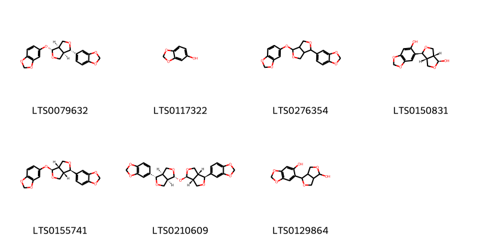
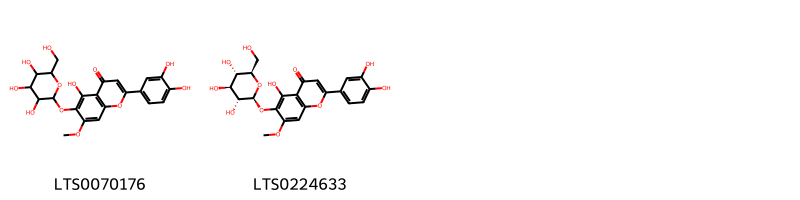
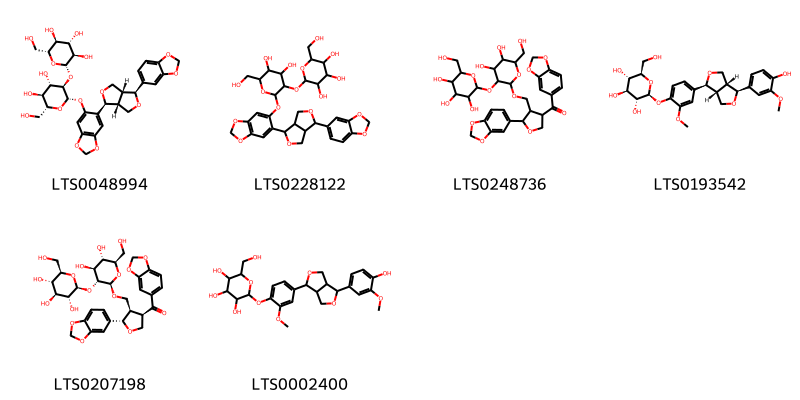
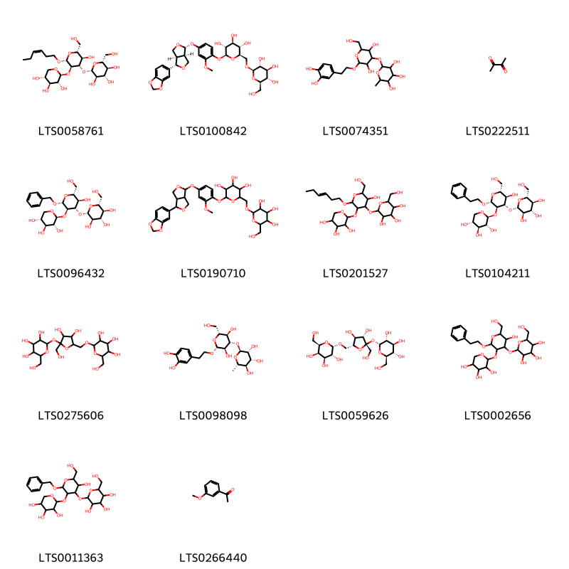
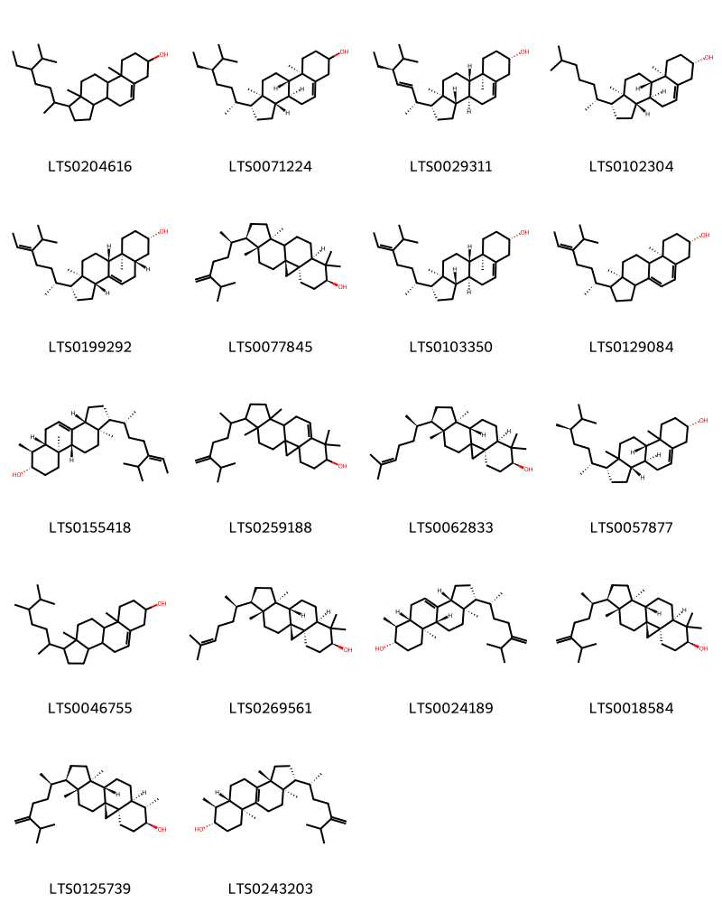

!!! abstract "Tóm tắt"

    Vừng đen (Sesami Nigrum Semen) là hạt già phơi khô của cây Vừng đen (Sesanum indicum DC.), họ Vừng (Pedaliaceae). Cây có nguồn gốc từ khu vực Nam Á và được di thực đến nhiều nơi trên thế giới như châu Phi, châu Mỹ, Đông Nam Á và châu Âu. Tại Việt Nam, cây vừng đen được trồng phổ biến ở khắp các vùng miền trong cả nước. Theo y học cổ truyền, vừng đen được dùng chủ trị các bệnh như thiếu máu do huyết hư, tóc bạc sớm, xuất huyết do giảm tiểu cầu, táo bón và ít sữa sau sinh. Thành phần hóa học chính trong hạt vừng gồm dầu (40–55%), các hợp chất như pedaliin, planteose, sesamose, sesamin, sesamolin và sesamol. Dầu vừng chứa acid đặc (12–16%), acid loãng (75–80%), phần không xà phòng hóa (0,9–1,7%) và lexitin (khoảng 1%), cùng với các chất như sesamin (0,25–1%) và sesamol (0,1%).

## Thông tin về thực vật

Dược liệu **Vừng Đen (Hạt)** từ bộ phận **nan** từ loài *Sesamum indicum*.

**Mô tả thực vật:** Cây vừng là một loại cỏ nhỏ, thân có nhiều lông, cao chừng 0,6m, sống hằng năm. Lá mọc đối, đơn, không có lá kèm, nguyên, có cuống.
Hoa trắng mọc đơn độc ở kẽ lá, lưỡng tính, không đều, có cuống ngắn. Đài hơi hợp ở gốc. Tràng hình ống loe ra thành hai mồi, môi dưới gồm 3 thùy, mỗi trên 2 thùy, 4 nhị. 2 to, 2 nhỏ, 2 lá noãn, đầu nhụy có 2 nuốm, bầu có vách già chia thành 4 ô, mỗi ô chứa một dãy dọc nhiều noãn. Quả nang dìa, 4 ô mở thành 4 mảnh. Nhiều hạt nhỏ màu vàng hay nâu đen, Lá mầm chứa nhiều dầu.

*Tài liệu tham khảo:* "Những cây thuốc và vị thuốc Việt Nam" - Đỗ Tất Lợi 
Trong dược điển Việt nam, một loài được sử dụng làm dược liệu là *Sesamum indicum*.

!!! info "Phân loại thực vật của *Sesamum indicum*"
    - **Kingdom:** Plantae
    - **Phylum:** Tracheophyta
    - **Order:** Lamiales
    - **Family:** Pedaliaceae
    - **Genus:** Sesamum
    - **Species:** *Sesamum indicum*

**Phân bố trên thế giới:** nan, Benin, Malawi, Tanzania, United Republic of, Nepal, Korea, Republic of, Singapore, Sri Lanka, Spain, French Guiana, Venezuela (Bolivarian Republic of), Mexico, Chinese Taipei, Colombia, Angola, United Arab Emirates, Australia, Madagascar, Indonesia, Palestine, State of, Nigeria, Russian Federation, Honduras, Burkina Faso, Guatemala, India, Brazil, Peru, Argentina, Viet Nam, Thailand, United States of America, China, Pakistan

**Phân bố tại Việt nam:** Quảng Ngãi

## Thông tin về dược liệu 

### Định danh

!!! info "Thông tin về tên gọi"

    - Dược liệu tiếng Việt: nan
    - Dược liệu tiếng Trung: nan (nan)
    - Dược liệu tiếng Anh: nan
    - Dược liệu latin thông dụng: nan
    - Dược liệu latin kiểu DĐVN: *sesami nigrum semen*
    - Dược liệu latin kiểu DĐVN: *nan*
    - Dược liệu latin kiểu thông tư: *nan*
    - Bộ phận dùng: nan (nan)

### Mô tả dược liệu 

- **Theo dược điển Việt nam V:** nan

- **Mô tả dược liệu theo thông tư chế biến dược liệu theo phương pháp cổ truyền:** nan

### Chế biến 

- **Chế biến theo dược điển việt nam V**: nan

- **Chế biến theo thông tư:** nan

--- 

## Thành phần hóa học

- Theo tài liệu của GS. Đỗ Tất Lợi:  (1) Nhóm hóa học;
Hạt Vừng chứa dầu màu vàng (40.55%), nước (5-8%), protein (20-22%), tro (5%, trong đó có 1.7mg đồng), Canxi oxalat (1%), chất không có nitơ (6.3-8.8%) và các chất pedaliin planteose, sesamose, sesamin, sesamolin, sesamol. Dầu Vừng chứa acid đặc (12-16%) và acid loãng (75-80%), phần không xà phòng hoá (0.9-1.7%) và lexitin (khoảng 1%). Trong dầu có chất sesamin (tỷ lệ chừng 0.25-1%) và chất sesamol (tỷ lệ chừng 0.1%).
    

**Thành phần hóa học từ loài **Sesamum indicum**

Theo cơ sở dữ liệu lotus, loài *Sesamum indicum* đã phân lập và xác định được **151** hoạt chất thuộc về các nhóm Anthracenes, Steroids and steroid derivatives, Organooxygen compounds, Lignan glycosides, Fatty Acyls, Flavonoids, Cinnamic acids and derivatives, Benzodioxoles, Furanoid lignans, Naphthalenes, Phenols, 2-arylbenzofuran flavonoids, Prenol lipids, Dibenzylbutane lignans trong bảng dưới đây. Danh sách các hoạt chất như sau 2,3-dihydroxy-6-[(3z)-5-hydroxy-4-methylpent-3-en-1-yl]anthracene-9,10-dione [(LTS0110155)](https://lotus.naturalproducts.net/compound/lotus_id/LTS0110155), sesamin [(LTS0228898)](https://lotus.naturalproducts.net/compound/lotus_id/LTS0228898), 4-{[4-(2h-1,3-benzodioxol-5-yl)-hexahydrofuro[3,4-c]furan-1-yl]oxy}-2-methoxyphenol [(LTS0138026)](https://lotus.naturalproducts.net/compound/lotus_id/LTS0138026), ferulic acid [(LTS0077328)](https://lotus.naturalproducts.net/compound/lotus_id/LTS0077328), campesterol [(LTS0046755)](https://lotus.naturalproducts.net/compound/lotus_id/LTS0046755), stearic acid [(LTS0237766)](https://lotus.naturalproducts.net/compound/lotus_id/LTS0237766), 1,4-dihydroxy-2-(4-methylpent-3-en-1-yl)anthracene-9,10-dione [(LTS0143371)](https://lotus.naturalproducts.net/compound/lotus_id/LTS0143371), 2-{[2-(hex-3-en-1-yloxy)-5-hydroxy-6-(hydroxymethyl)-3-[(3,4,5-trihydroxyoxan-2-yl)oxy]oxan-4-yl]oxy}-6-(hydroxymethyl)oxane-3,4,5-triol [(LTS0201527)](https://lotus.naturalproducts.net/compound/lotus_id/LTS0201527), [(2r,3s,4r)-2-(2h-1,3-benzodioxol-5-yl)-4-(2h-1,3-benzodioxole-5-carbonyl)oxolan-3-yl]methanol [(LTS0154020)](https://lotus.naturalproducts.net/compound/lotus_id/LTS0154020), (1r,7s,9as,11ar)-1-[(5z)-5-isopropylhept-5-en-2-yl]-6,9a,11a-trimethyl-1h,2h,3h,3ah,5h,5ah,6h,7h,8h,9h,9bh,10h,11h-cyclopenta[a]phenanthren-7-ol [(LTS0207040)](https://lotus.naturalproducts.net/compound/lotus_id/LTS0207040), hydroxymatairesinol [(LTS0054747)](https://lotus.naturalproducts.net/compound/lotus_id/LTS0054747), (1as,7ar)-3,6-dihydroxy-1a-(3-methylbut-2-en-1-yl)-7ah-naphtho[2,3-b]oxirene-2,7-dione [(LTS0136980)](https://lotus.naturalproducts.net/compound/lotus_id/LTS0136980), linoleic [(LTS0013198)](https://lotus.naturalproducts.net/compound/lotus_id/LTS0013198), 7,7,12,16-tetramethyl-15-(6-methyl-5-methylideneheptan-2-yl)pentacyclo[9.7.0.0¹,³.0³,⁸.0¹²,¹⁶]octadec-8-en-6-ol [(LTS0259188)](https://lotus.naturalproducts.net/compound/lotus_id/LTS0259188), 4-{4-[(4-hydroxy-3,5-dimethoxyphenyl)methyl]-3-(hydroxymethyl)oxolan-2-yl}-2-methoxyphenol [(LTS0151025)](https://lotus.naturalproducts.net/compound/lotus_id/LTS0151025), 2,3-bis[(3-hydroxyphenyl)methyl]butane-1,4-diol [(LTS0027824)](https://lotus.naturalproducts.net/compound/lotus_id/LTS0027824), 2-{4-[4-(4-hydroxy-3-methoxyphenyl)-hexahydrofuro[3,4-c]furan-1-yl]-2-methoxyphenoxy}-6-(hydroxymethyl)oxane-3,4,5-triol [(LTS0002400)](https://lotus.naturalproducts.net/compound/lotus_id/LTS0002400), (2r,3r,4r,5r,6r)-5,6-dihydroxy-2-(hydroxymethyl)-4-{[(2s,3r,4r,5r,6s)-3,4,5-trihydroxy-6-methyloxan-2-yl]oxy}oxan-3-yl (2e)-3-(3,4-dihydroxyphenyl)prop-2-enoate [(LTS0068977)](https://lotus.naturalproducts.net/compound/lotus_id/LTS0068977), delta-tocopherol [(LTS0005408)](https://lotus.naturalproducts.net/compound/lotus_id/LTS0005408), (2s,3r,4s,5s,6r)-2-{[(2s,3r,4s,5s,6r)-2-({6-[(1s,3ar,4s,6ar)-4-(2h-1,3-benzodioxol-5-yl)-hexahydrofuro[3,4-c]furan-1-yl]-2h-1,3-benzodioxol-5-yl}oxy)-4,5-dihydroxy-6-(hydroxymethyl)oxan-3-yl]oxy}-6-(hydroxymethyl)oxane-3,4,5-triol [(LTS0048994)](https://lotus.naturalproducts.net/compound/lotus_id/LTS0048994), 2-{[3,4-dihydroxy-5-(hydroxymethyl)-5-{[3,4,5-trihydroxy-6-(hydroxymethyl)oxan-2-yl]oxy}oxolan-2-yl]methoxy}-6-(hydroxymethyl)oxane-3,4,5-triol [(LTS0275606)](https://lotus.naturalproducts.net/compound/lotus_id/LTS0275606), 6-[2-(3,4-dihydroxyphenyl)-2-hydroxyethoxy]-5-hydroxy-2-(hydroxymethyl)-4-[(3,4,5-trihydroxy-6-methyloxan-2-yl)oxy]oxan-3-yl 3-(3,4-dihydroxyphenyl)prop-2-enoate [(LTS0108017)](https://lotus.naturalproducts.net/compound/lotus_id/LTS0108017), (2r,3r,4s,5s,6r)-2-{[(2s,3s,4s,5r)-3,4-dihydroxy-2-(hydroxymethyl)-5-({[(2s,3r,4s,5r,6r)-3,4,5-trihydroxy-6-(hydroxymethyl)oxan-2-yl]oxy}methyl)oxolan-2-yl]oxy}-6-(hydroxymethyl)oxane-3,4,5-triol [(LTS0059626)](https://lotus.naturalproducts.net/compound/lotus_id/LTS0059626), [(2s,3r,4r)-2-(2h-1,3-benzodioxol-5-yl)-4-(2h-1,3-benzodioxole-5-carbonyl)oxolan-3-yl]methanol [(LTS0117283)](https://lotus.naturalproducts.net/compound/lotus_id/LTS0117283), 2-({2-[2-(3,4-dihydroxyphenyl)ethoxy]-3,5-dihydroxy-6-(hydroxymethyl)oxan-4-yl}oxy)-6-methyloxane-3,4,5-triol [(LTS0074351)](https://lotus.naturalproducts.net/compound/lotus_id/LTS0074351), 4,5,8-trihydroxy-3-(3-methylbut-2-en-1-yl)naphthalene-1,2-dione [(LTS0228213)](https://lotus.naturalproducts.net/compound/lotus_id/LTS0228213), lariciresinol [(LTS0010950)](https://lotus.naturalproducts.net/compound/lotus_id/LTS0010950), 5-[4-(2h-1,3-benzodioxol-5-yl)-hexahydrofuro[3,4-c]furan-1-yl]-6-methoxy-2h-1,3-benzodioxole [(LTS0141911)](https://lotus.naturalproducts.net/compound/lotus_id/LTS0141911), 4-[4-(6-hydroxy-2h-1,3-benzodioxol-5-yl)-hexahydrofuro[3,4-c]furan-1-yl]benzene-1,2-diol [(LTS0270387)](https://lotus.naturalproducts.net/compound/lotus_id/LTS0270387), sesamolinol [(LTS0198193)](https://lotus.naturalproducts.net/compound/lotus_id/LTS0198193), 2-[(1z)-4-methylpenta-1,3-dien-1-yl]anthracene-9,10-dione [(LTS0092110)](https://lotus.naturalproducts.net/compound/lotus_id/LTS0092110), 1-hydroxy-2-(4-methylpent-3-en-1-yl)anthracene-9,10-dione [(LTS0238783)](https://lotus.naturalproducts.net/compound/lotus_id/LTS0238783), 6-[2-(3,4-dihydroxyphenyl)ethoxy]-5-hydroxy-2-(hydroxymethyl)-4-[(3,4,5-trihydroxy-6-methyloxan-2-yl)oxy]oxan-3-yl 3-(3,4-dihydroxyphenyl)prop-2-enoate [(LTS0050472)](https://lotus.naturalproducts.net/compound/lotus_id/LTS0050472), sesamol [(LTS0117322)](https://lotus.naturalproducts.net/compound/lotus_id/LTS0117322), hpmf [(LTS0110410)](https://lotus.naturalproducts.net/compound/lotus_id/LTS0110410), (2s,3r,4s,5s,6r)-2-(4-{[(1r,3ar,4s,6ar)-4-(2h-1,3-benzodioxol-5-yl)-hexahydrofuro[3,4-c]furan-1-yl]oxy}-2-methoxyphenoxy)-6-({[(2r,3r,4s,5s,6r)-3,4,5-trihydroxy-6-(hydroxymethyl)oxan-2-yl]oxy}methyl)oxane-3,4,5-triol [(LTS0100842)](https://lotus.naturalproducts.net/compound/lotus_id/LTS0100842), (2r,3r,4r)-4-[(r)-hydroxy(4-hydroxy-3-methoxyphenyl)methyl]-3-[(4-hydroxy-3-methoxyphenyl)methyl]oxolan-2-ol [(LTS0121296)](https://lotus.naturalproducts.net/compound/lotus_id/LTS0121296), delta7-avenasterol [(LTS0199292)](https://lotus.naturalproducts.net/compound/lotus_id/LTS0199292), 1,2,4-trihydroxy-3-(4-methylpent-3-en-1-yl)anthracene-9,10-dione [(LTS0076305)](https://lotus.naturalproducts.net/compound/lotus_id/LTS0076305), 2,3-dihydroxy-6-(5-hydroxy-4-methylpent-3-en-1-yl)anthracene-9,10-dione [(LTS0149199)](https://lotus.naturalproducts.net/compound/lotus_id/LTS0149199), verbascoside [(LTS0168159)](https://lotus.naturalproducts.net/compound/lotus_id/LTS0168159), behenic acid [(LTS0058784)](https://lotus.naturalproducts.net/compound/lotus_id/LTS0058784), sesamolin [(LTS0079632)](https://lotus.naturalproducts.net/compound/lotus_id/LTS0079632), isoacteoside [(LTS0012202)](https://lotus.naturalproducts.net/compound/lotus_id/LTS0012202), cycloartenol [(LTS0269561)](https://lotus.naturalproducts.net/compound/lotus_id/LTS0269561), vitamin e [(LTS0263269)](https://lotus.naturalproducts.net/compound/lotus_id/LTS0263269), {3,5,6-trihydroxy-4-[(3,4,5-trihydroxy-6-methyloxan-2-yl)oxy]oxan-2-yl}methyl 3-(3,4-dihydroxyphenyl)prop-2-enoate [(LTS0265054)](https://lotus.naturalproducts.net/compound/lotus_id/LTS0265054), (2r)-2,5,7,8-tetramethyl-2-[(4s,8s)-4,8,12-trimethyltridecyl]-3,4-dihydro-1-benzopyran-6-ol [(LTS0130040)](https://lotus.naturalproducts.net/compound/lotus_id/LTS0130040), 4-[2-(3,4-dihydroxyphenyl)-2-methoxyethoxy]-3-hydroxy-6-(hydroxymethyl)-2-[(3,4,5,6-tetrahydroxyoxan-2-yl)oxy]cyclohexyl 3-(3,4-dihydroxyphenyl)prop-2-enoate [(LTS0168967)](https://lotus.naturalproducts.net/compound/lotus_id/LTS0168967), 6-[(1s,3ar,4s,6ar)-4-hydroxy-hexahydrofuro[3,4-c]furan-1-yl]-2h-1,3-benzodioxol-5-ol [(LTS0150831)](https://lotus.naturalproducts.net/compound/lotus_id/LTS0150831), 2-(4-{[4-(2h-1,3-benzodioxol-5-yl)-hexahydrofuro[3,4-c]furan-1-yl]oxy}-2-methoxyphenoxy)-6-({[3,4,5-trihydroxy-6-(hydroxymethyl)oxan-2-yl]oxy}methyl)oxane-3,4,5-triol [(LTS0190710)](https://lotus.naturalproducts.net/compound/lotus_id/LTS0190710), α linolenic acid [(LTS0132789)](https://lotus.naturalproducts.net/compound/lotus_id/LTS0132789), 4-[(1s,3ar,4r,6ar)-4-(6-hydroxy-2h-1,3-benzodioxol-5-yl)-hexahydrofuro[3,4-c]furan-1-yl]benzene-1,2-diol [(LTS0163912)](https://lotus.naturalproducts.net/compound/lotus_id/LTS0163912), (3r,4r,6r)-6-[2-(3,4-dihydroxyphenyl)ethoxy]-5-hydroxy-2-(hydroxymethyl)-4-{[(2s,3s,5r)-3,4,5-trihydroxy-6-methyloxan-2-yl]oxy}oxan-3-yl (2e)-3-(3,4-dihydroxyphenyl)prop-2-enoate [(LTS0063526)](https://lotus.naturalproducts.net/compound/lotus_id/LTS0063526), 4-[(3ar,6as)-4-(4-hydroxy-3-methoxyphenyl)-hexahydrofuro[3,4-c]furan-1-yl]-2-methoxyphenol [(LTS0191067)](https://lotus.naturalproducts.net/compound/lotus_id/LTS0191067), (2s,3r,4s,5s,6r)-2-{[(2r,3r,4s,5r,6r)-3-hydroxy-2-(hydroxymethyl)-6-(2-phenylethoxy)-5-{[(2s,3r,4s,5r)-3,4,5-trihydroxyoxan-2-yl]oxy}oxan-4-yl]oxy}-6-(hydroxymethyl)oxane-3,4,5-triol [(LTS0104211)](https://lotus.naturalproducts.net/compound/lotus_id/LTS0104211), gamma-linolenic acid [(LTS0160094)](https://lotus.naturalproducts.net/compound/lotus_id/LTS0160094), 24-methylidenelophenol [(LTS0024189)](https://lotus.naturalproducts.net/compound/lotus_id/LTS0024189), 5-dehydroavenasterol [(LTS0129084)](https://lotus.naturalproducts.net/compound/lotus_id/LTS0129084), (3r)-3,4-bis[(3-hydroxyphenyl)methyl]oxolan-2-one [(LTS0092187)](https://lotus.naturalproducts.net/compound/lotus_id/LTS0092187), sesamin [(LTS0120161)](https://lotus.naturalproducts.net/compound/lotus_id/LTS0120161), palmitoleic acid [(LTS0261591)](https://lotus.naturalproducts.net/compound/lotus_id/LTS0261591), 2,5,8-trihydroxy-3-(3-methylbut-2-en-1-yl)naphthalene-1,4-dione [(LTS0259942)](https://lotus.naturalproducts.net/compound/lotus_id/LTS0259942), amyrin [(LTS0222826)](https://lotus.naturalproducts.net/compound/lotus_id/LTS0222826), cholesterol [(LTS0102304)](https://lotus.naturalproducts.net/compound/lotus_id/LTS0102304), matairesinol [(LTS0193475)](https://lotus.naturalproducts.net/compound/lotus_id/LTS0193475), 4-[(2s,3r,4r)-4-[(4-hydroxy-3,5-dimethoxyphenyl)methyl]-3-(hydroxymethyl)oxolan-2-yl]-2-methoxyphenol [(LTS0195026)](https://lotus.naturalproducts.net/compound/lotus_id/LTS0195026), gamma-tocopherol [(LTS0058127)](https://lotus.naturalproducts.net/compound/lotus_id/LTS0058127), guaiacol [(LTS0179228)](https://lotus.naturalproducts.net/compound/lotus_id/LTS0179228), 5-[(1s,3ar,4s,6ar)-4-(3,4-dimethoxyphenyl)-hexahydrofuro[3,4-c]furan-1-yl]-2h-1,3-benzodioxole [(LTS0081634)](https://lotus.naturalproducts.net/compound/lotus_id/LTS0081634), 2-demethylmenaquinone [(LTS0133659)](https://lotus.naturalproducts.net/compound/lotus_id/LTS0133659), gadoleic acid [(LTS0227586)](https://lotus.naturalproducts.net/compound/lotus_id/LTS0227586), 1,2-dihydroxy-3-(4-methylpent-3-en-1-yl)anthracene-9,10-dione [(LTS0197595)](https://lotus.naturalproducts.net/compound/lotus_id/LTS0197595), 2-(4-methylpent-3-en-1-yl)anthracene-9,10-dione [(LTS0264358)](https://lotus.naturalproducts.net/compound/lotus_id/LTS0264358), (2s,3r,4s,5s,6r)-2-{4-[(1s,3ar,4s,6ar)-4-(4-hydroxy-3-methoxyphenyl)-hexahydrofuro[3,4-c]furan-1-yl]-2-methoxyphenoxy}-6-(hydroxymethyl)oxane-3,4,5-triol [(LTS0193542)](https://lotus.naturalproducts.net/compound/lotus_id/LTS0193542), 2-chloro-5,8-dihydroxy-3-(3-methylbut-2-en-1-yl)naphthalene-1,4-dione [(LTS0211758)](https://lotus.naturalproducts.net/compound/lotus_id/LTS0211758), 2-(3,4-dimethoxyphenyl)-7-methoxy-3-methyl-5-(prop-1-en-1-yl)-2,3-dihydro-1-benzofuran [(LTS0225858)](https://lotus.naturalproducts.net/compound/lotus_id/LTS0225858), 2-[(2-{[2-(2h-1,3-benzodioxol-5-yl)-4-(2h-1,3-benzodioxole-5-carbonyl)oxolan-3-yl]methoxy}-4,5-dihydroxy-6-(hydroxymethyl)oxan-3-yl)oxy]-6-(hydroxymethyl)oxane-3,4,5-triol [(LTS0248736)](https://lotus.naturalproducts.net/compound/lotus_id/LTS0248736), {6-[2-(3,4-dihydroxyphenyl)ethoxy]-3,5-dihydroxy-4-[(3,4,5-trihydroxy-6-methyloxan-2-yl)oxy]oxan-2-yl}methyl 3-(3,4-dihydroxyphenyl)prop-2-enoate [(LTS0270785)](https://lotus.naturalproducts.net/compound/lotus_id/LTS0270785), (z)-24-ethylidenelophenol [(LTS0155418)](https://lotus.naturalproducts.net/compound/lotus_id/LTS0155418), 2-[(1e)-4-methylpenta-1,3-dien-1-yl]anthracene-9,10-dione [(LTS0237333)](https://lotus.naturalproducts.net/compound/lotus_id/LTS0237333), arachidonic acid [(LTS0241153)](https://lotus.naturalproducts.net/compound/lotus_id/LTS0241153), 5,6-dihydroxy-2-(hydroxymethyl)-4-[(3,4,5-trihydroxy-6-methyloxan-2-yl)oxy]oxan-3-yl 3-(3,4-dihydroxyphenyl)prop-2-enoate [(LTS0048309)](https://lotus.naturalproducts.net/compound/lotus_id/LTS0048309), 4-{[(1s,3as,4r,6as)-4-(2h-1,3-benzodioxol-5-yl)-hexahydrofuro[3,4-c]furan-1-yl]oxy}-2-methoxyphenol [(LTS0136076)](https://lotus.naturalproducts.net/compound/lotus_id/LTS0136076), 6-[4-(2h-1,3-benzodioxol-5-yl)-hexahydrofuro[3,4-c]furan-1-yl]-2h-1,3-benzodioxol-5-ol [(LTS0003215)](https://lotus.naturalproducts.net/compound/lotus_id/LTS0003215), (2s,3r,4s,5s,6r)-2-{[(2r,3r,4s,5r,6r)-2-(benzyloxy)-5-hydroxy-6-(hydroxymethyl)-3-{[(2s,3r,4s,5r)-3,4,5-trihydroxyoxan-2-yl]oxy}oxan-4-yl]oxy}-6-(hydroxymethyl)oxane-3,4,5-triol [(LTS0096432)](https://lotus.naturalproducts.net/compound/lotus_id/LTS0096432), stigmast-5-en-3-ol, (3β)- [(LTS0204616)](https://lotus.naturalproducts.net/compound/lotus_id/LTS0204616), 4-[(1r,3as,4r,6as)-4-(2h-1,3-benzodioxol-5-yl)-hexahydrofuro[3,4-c]furan-1-yl]-2-methoxyphenol [(LTS0073999)](https://lotus.naturalproducts.net/compound/lotus_id/LTS0073999), (2s,3r)-2,3-bis[(4-hydroxy-3-methoxyphenyl)(¹³c)methyl](1-¹³c)butane-1,4-diol [(LTS0268699)](https://lotus.naturalproducts.net/compound/lotus_id/LTS0268699), avenasterol [(LTS0103350)](https://lotus.naturalproducts.net/compound/lotus_id/LTS0103350), palmitic acid [(LTS0079439)](https://lotus.naturalproducts.net/compound/lotus_id/LTS0079439), 24-methylene-cycloartanol [(LTS0077845)](https://lotus.naturalproducts.net/compound/lotus_id/LTS0077845), 3,4-bis[(4-hydroxy-3-methoxyphenyl)methyl]oxolan-2-one [(LTS0017723)](https://lotus.naturalproducts.net/compound/lotus_id/LTS0017723), pinoresinol [(LTS0057431)](https://lotus.naturalproducts.net/compound/lotus_id/LTS0057431), {6-[2-(3,4-dihydroxyphenyl)-2-hydroxyethoxy]-3,5-dihydroxy-4-[(3,4,5-trihydroxy-6-methyloxan-2-yl)oxy]oxan-2-yl}methyl 3-(3,4-dihydroxyphenyl)prop-2-enoate [(LTS0041659)](https://lotus.naturalproducts.net/compound/lotus_id/LTS0041659), (1r,3ar,5as,6s,7s,9as,11ar)-3a,6,9a,11a-tetramethyl-1-[(2r)-6-methyl-5-methylideneheptan-2-yl]-1h,2h,3h,4h,5h,5ah,6h,7h,8h,9h,10h,11h-cyclopenta[a]phenanthren-7-ol [(LTS0243203)](https://lotus.naturalproducts.net/compound/lotus_id/LTS0243203), 6-{4-hydroxy-hexahydrofuro[3,4-c]furan-1-yl}-2h-1,3-benzodioxol-5-ol [(LTS0129864)](https://lotus.naturalproducts.net/compound/lotus_id/LTS0129864), (2s,3r,4r,5r,6s)-2-{[(2r,3r,4s,5r,6r)-2-[2-(3,4-dihydroxyphenyl)ethoxy]-3,5-dihydroxy-6-(hydroxymethyl)oxan-4-yl]oxy}-6-methyloxane-3,4,5-triol [(LTS0098098)](https://lotus.naturalproducts.net/compound/lotus_id/LTS0098098), 6-[2-(3,4-dihydroxyphenyl)-2-methoxyethoxy]-5-hydroxy-2-(hydroxymethyl)-4-[(3,4,5-trihydroxy-6-methyloxan-2-yl)oxy]oxan-3-yl 3-(3,4-dihydroxyphenyl)prop-2-enoate [(LTS0242946)](https://lotus.naturalproducts.net/compound/lotus_id/LTS0242946), cycloeucalenol [(LTS0125739)](https://lotus.naturalproducts.net/compound/lotus_id/LTS0125739), 5-[(1r,3as,4s,6as)-4-(2h-1,3-benzodioxol-5-yloxy)-hexahydrofuro[3,4-c]furan-1-yl]-2h-1,3-benzodioxole [(LTS0155741)](https://lotus.naturalproducts.net/compound/lotus_id/LTS0155741), stigmast-5-en-3-ol [(LTS0071224)](https://lotus.naturalproducts.net/compound/lotus_id/LTS0071224), (2s,3r,4s,5s,6r)-2-{[(2r,3r,4s,5s,6r)-2-{[(2s,3r,4r)-2-(2h-1,3-benzodioxol-5-yl)-4-(2h-1,3-benzodioxole-5-carbonyl)oxolan-3-yl]methoxy}-4,5-dihydroxy-6-(hydroxymethyl)oxan-3-yl]oxy}-6-(hydroxymethyl)oxane-3,4,5-triol [(LTS0207198)](https://lotus.naturalproducts.net/compound/lotus_id/LTS0207198), 3,6-dihydroxy-1a-(3-methylbut-2-en-1-yl)-7ah-naphtho[2,3-b]oxirene-2,7-dione [(LTS0233312)](https://lotus.naturalproducts.net/compound/lotus_id/LTS0233312), (2s,3r,4s,5s,6r)-2-{[(2r,3r,4s,5r,6r)-2-[(3z)-hex-3-en-1-yloxy]-5-hydroxy-6-(hydroxymethyl)-3-{[(2s,3r,4s,5r)-3,4,5-trihydroxyoxan-2-yl]oxy}oxan-4-yl]oxy}-6-(hydroxymethyl)oxane-3,4,5-triol [(LTS0058761)](https://lotus.naturalproducts.net/compound/lotus_id/LTS0058761), 2-methoxy-5-(prop-1-en-1-yl)phenol [(LTS0170720)](https://lotus.naturalproducts.net/compound/lotus_id/LTS0170720), [2-(2h-1,3-benzodioxol-5-yl)-4-(2h-1,3-benzodioxole-5-carbonyl)oxolan-3-yl]methanol [(LTS0002413)](https://lotus.naturalproducts.net/compound/lotus_id/LTS0002413), 4-[(1s,3ar,4s,6ar)-4-(2h-1,3-benzodioxol-5-yl)-hexahydrofuro[3,4-c]furan-1-yl]-2-methoxyphenol [(LTS0184010)](https://lotus.naturalproducts.net/compound/lotus_id/LTS0184010), 2-(3,4-dihydroxyphenyl)-5-hydroxy-7-methoxy-6-{[3,4,5-trihydroxy-6-(hydroxymethyl)oxan-2-yl]oxy}chromen-4-one [(LTS0070176)](https://lotus.naturalproducts.net/compound/lotus_id/LTS0070176), (2r,3r,4r,5r,6r)-6-[(2r)-2-(3,4-dihydroxyphenyl)-2-hydroxyethoxy]-5-hydroxy-2-(hydroxymethyl)-4-{[(2s,3r,4r,5r,6s)-3,4,5-trihydroxy-6-methyloxan-2-yl]oxy}oxan-3-yl (2e)-3-(3,4-dihydroxyphenyl)prop-2-enoate [(LTS0064210)](https://lotus.naturalproducts.net/compound/lotus_id/LTS0064210), diacetyl [(LTS0222511)](https://lotus.naturalproducts.net/compound/lotus_id/LTS0222511), 2-{[2-({6-[4-(2h-1,3-benzodioxol-5-yl)-hexahydrofuro[3,4-c]furan-1-yl]-2h-1,3-benzodioxol-5-yl}oxy)-4,5-dihydroxy-6-(hydroxymethyl)oxan-3-yl]oxy}-6-(hydroxymethyl)oxane-3,4,5-triol [(LTS0228122)](https://lotus.naturalproducts.net/compound/lotus_id/LTS0228122), [(2r,3r,4s,5r,6r)-3,5,6-trihydroxy-4-{[(2s,3r,4r,5r,6s)-3,4,5-trihydroxy-6-methyloxan-2-yl]oxy}oxan-2-yl]methyl (2e)-3-(3,4-dihydroxyphenyl)prop-2-enoate [(LTS0195798)](https://lotus.naturalproducts.net/compound/lotus_id/LTS0195798), phytosterol [(LTS0029311)](https://lotus.naturalproducts.net/compound/lotus_id/LTS0029311), (2r,3r,4r,5r,6r)-6-[(2s)-2-(3,4-dihydroxyphenyl)-2-methoxyethoxy]-5-hydroxy-2-(hydroxymethyl)-4-{[(2s,3r,4r,5r,6s)-3,4,5-trihydroxy-6-methyloxan-2-yl]oxy}oxan-3-yl (2e)-3-(3,4-dihydroxyphenyl)prop-2-enoate [(LTS0061146)](https://lotus.naturalproducts.net/compound/lotus_id/LTS0061146), 2-chloro-1,4-dihydroxy-3-(4-methylpent-3-en-1-yl)anthracene-9,10-dione [(LTS0206407)](https://lotus.naturalproducts.net/compound/lotus_id/LTS0206407), (2r)-2,5,8-trimethyl-2-(4,8,12-trimethyltridecyl)-3,4-dihydro-1-benzopyran-6-ol [(LTS0030802)](https://lotus.naturalproducts.net/compound/lotus_id/LTS0030802), 4-{4-[(4-hydroxy-3-methoxyphenyl)methyl]-3-(hydroxymethyl)oxolan-2-yl}-2-methoxyphenol [(LTS0211349)](https://lotus.naturalproducts.net/compound/lotus_id/LTS0211349), 2-(4-methylpenta-1,3-dien-1-yl)anthracene-9,10-dione [(LTS0025227)](https://lotus.naturalproducts.net/compound/lotus_id/LTS0025227), (3r,6s,8r,11s,12s,15r,16r)-7,7,12,16-tetramethyl-15-[(2r)-6-methylhept-5-en-2-yl]pentacyclo[9.7.0.0¹,³.0³,⁸.0¹²,¹⁶]octadecan-6-ol [(LTS0062833)](https://lotus.naturalproducts.net/compound/lotus_id/LTS0062833), myristic acid [(LTS0102566)](https://lotus.naturalproducts.net/compound/lotus_id/LTS0102566), 5-[(1s,3ar,4r,6ar)-4-(2h-1,3-benzodioxol-5-yl)-hexahydrofuro[3,4-c]furan-1-yl]-2h-1,3-benzodioxole [(LTS0230803)](https://lotus.naturalproducts.net/compound/lotus_id/LTS0230803), (2r,3r,4r,5r,6r)-6-[2-(3,4-dihydroxyphenyl)-2-methoxyethoxy]-5-hydroxy-2-(hydroxymethyl)-4-{[(2s,3r,4r,5r,6s)-3,4,5-trihydroxy-6-methyloxan-2-yl]oxy}oxan-3-yl (2e)-3-(3,4-dihydroxyphenyl)prop-2-enoate [(LTS0018489)](https://lotus.naturalproducts.net/compound/lotus_id/LTS0018489), sesamolin [(LTS0276354)](https://lotus.naturalproducts.net/compound/lotus_id/LTS0276354), β-tocopherol [(LTS0152412)](https://lotus.naturalproducts.net/compound/lotus_id/LTS0152412), β-amyrin [(LTS0251864)](https://lotus.naturalproducts.net/compound/lotus_id/LTS0251864), 6-[(1r,3ar,4s,6ar)-4-(2h-1,3-benzodioxol-5-yl)-hexahydrofuro[3,4-c]furan-1-yl]-2h-1,3-benzodioxol-5-ol [(LTS0145133)](https://lotus.naturalproducts.net/compound/lotus_id/LTS0145133), 5-[(1s,3ar,4r,6ar)-4-{[(1r,3ar,4s,6ar)-4-(2h-1,3-benzodioxol-5-yl)-hexahydrofuro[3,4-c]furan-1-yl]oxy}-hexahydrofuro[3,4-c]furan-1-yl]-2h-1,3-benzodioxole [(LTS0210609)](https://lotus.naturalproducts.net/compound/lotus_id/LTS0210609), m-methoxyacetophenone [(LTS0266440)](https://lotus.naturalproducts.net/compound/lotus_id/LTS0266440), [(2r,3r,4s,5r,6r)-6-[(2r)-2-(3,4-dihydroxyphenyl)-2-hydroxyethoxy]-3,5-dihydroxy-4-{[(2s,3r,4r,5r,6s)-3,4,5-trihydroxy-6-methyloxan-2-yl]oxy}oxan-2-yl]methyl (2e)-3-(3,4-dihydroxyphenyl)prop-2-enoate [(LTS0144126)](https://lotus.naturalproducts.net/compound/lotus_id/LTS0144126), (1r,3as,3bs,7s,9bs)-1-[(2r,5r)-5,6-dimethylheptan-2-yl]-9a,11a-dimethyl-1h,2h,3h,3ah,3bh,4h,6h,7h,8h,9h,9bh,10h,11h-cyclopenta[a]phenanthren-7-ol [(LTS0057877)](https://lotus.naturalproducts.net/compound/lotus_id/LTS0057877), 2-(3,4-dihydroxyphenyl)-5-hydroxy-7-methoxy-6-{[(2s,3r,4s,5s,6r)-3,4,5-trihydroxy-6-(hydroxymethyl)oxan-2-yl]oxy}chromen-4-one [(LTS0224633)](https://lotus.naturalproducts.net/compound/lotus_id/LTS0224633), 2-{[2-(benzyloxy)-5-hydroxy-6-(hydroxymethyl)-3-[(3,4,5-trihydroxyoxan-2-yl)oxy]oxan-4-yl]oxy}-6-(hydroxymethyl)oxane-3,4,5-triol [(LTS0011363)](https://lotus.naturalproducts.net/compound/lotus_id/LTS0011363), acuminatin [(LTS0198896)](https://lotus.naturalproducts.net/compound/lotus_id/LTS0198896), 4-[hydroxy(4-hydroxy-3-methoxyphenyl)methyl]-3-[(4-hydroxy-3-methoxyphenyl)methyl]oxolan-2-ol [(LTS0197099)](https://lotus.naturalproducts.net/compound/lotus_id/LTS0197099), 5-[(3ar,4r,6ar)-4-(2h-1,3-benzodioxol-5-yl)-hexahydrofuro[3,4-c]furan-1-yl]-2h-1,3-benzodioxole [(LTS0105150)](https://lotus.naturalproducts.net/compound/lotus_id/LTS0105150), secoisolariciresinol [(LTS0086727)](https://lotus.naturalproducts.net/compound/lotus_id/LTS0086727), 5-ethenyl-2-methoxyphenol [(LTS0076260)](https://lotus.naturalproducts.net/compound/lotus_id/LTS0076260), pinoresinol [(LTS0011247)](https://lotus.naturalproducts.net/compound/lotus_id/LTS0011247), α-linolenic acid [(LTS0275508)](https://lotus.naturalproducts.net/compound/lotus_id/LTS0275508), 2-(3,7-dimethylocta-2,6-dien-1-yl)naphthalene-1,4-dione [(LTS0218402)](https://lotus.naturalproducts.net/compound/lotus_id/LTS0218402), 6-[(1s,3ar,4s,6ar)-4-(2h-1,3-benzodioxol-5-yl)-hexahydrofuro[3,4-c]furan-1-yl]-2h-1,3-benzodioxol-5-ol [(LTS0117922)](https://lotus.naturalproducts.net/compound/lotus_id/LTS0117922), oleic acid [(LTS0256910)](https://lotus.naturalproducts.net/compound/lotus_id/LTS0256910), 24-methylenecycloartanol [(LTS0018584)](https://lotus.naturalproducts.net/compound/lotus_id/LTS0018584), 4-[4-(2h-1,3-benzodioxol-5-yl)-hexahydrofuro[3,4-c]furan-1-yl]-2-methoxyphenol [(LTS0208433)](https://lotus.naturalproducts.net/compound/lotus_id/LTS0208433), 2-methoxy-4-vinyl-phenol [(LTS0128961)](https://lotus.naturalproducts.net/compound/lotus_id/LTS0128961), 4-[hydroxy(4-hydroxy-3-methoxyphenyl)methyl]-3-[(4-hydroxy-3-methoxyphenyl)methyl]oxolan-2-one [(LTS0211711)](https://lotus.naturalproducts.net/compound/lotus_id/LTS0211711), (4as,6as,6br,8ar,9r,12ar,12br,14bs)-10,11-dihydroxy-9-(hydroxymethyl)-1,2,6a,6b,9,12a-hexamethyl-2,3,4,5,6,7,8,8a,10,11,12,12b,13,14b-tetradecahydro-1h-picene-4a-carboxylic acid [(LTS0133560)](https://lotus.naturalproducts.net/compound/lotus_id/LTS0133560), 2-{[3-hydroxy-2-(hydroxymethyl)-6-(2-phenylethoxy)-5-[(3,4,5-trihydroxyoxan-2-yl)oxy]oxan-4-yl]oxy}-6-(hydroxymethyl)oxane-3,4,5-triol [(LTS0002656)](https://lotus.naturalproducts.net/compound/lotus_id/LTS0002656), (2r,3r,4r,5r)-1,2,5-trihydroxy-6-oxo-4-{[(2s,3r,4r,5r,6s)-3,4,5-trihydroxy-6-methyloxan-2-yl]oxy}hexan-3-yl (2e)-3-(3,4-dihydroxyphenyl)prop-2-enoate [(LTS0248847)](https://lotus.naturalproducts.net/compound/lotus_id/LTS0248847), (-)-enterodiol [(LTS0263294)](https://lotus.naturalproducts.net/compound/lotus_id/LTS0263294). 
        
| chemicalTaxonomyClassyfireClass   |   smiles_count |
|:----------------------------------|---------------:|
| 2-arylbenzofuran flavonoids       |             99 |
| Anthracenes                       |            454 |
| Benzodioxoles                     |            360 |
| Cinnamic acids and derivatives    |           1693 |
| Dibenzylbutane lignans            |            192 |
| Fatty Acyls                       |            432 |
| Flavonoids                        |            142 |
| Furanoid lignans                  |           1606 |
| Lignan glycosides                 |            615 |
| Naphthalenes                      |             38 |
| Organooxygen compounds            |           1150 |
| Phenols                           |            229 |
| Prenol lipids                     |            871 |
| Steroids and steroid derivatives  |           1459 |

            
### Nhóm 2-arylbenzofuran flavonoids
<figure markdown="span">
    { width=100% }
<figcaption>Hình ảnh cấu trúc hóa học của hoạt chất thuộc nhóm *2-arylbenzofuran flavonoids*. Tên thường gọi của các hoạt chất tương ứng là 2-(3,4-dimethoxyphenyl)-7-methoxy-3-methyl-5-(prop-1-en-1-yl)-2,3-dihydro-1-benzofuran [(LTS0225858)](https://lotus.naturalproducts.net/compound/lotus_id/LTS0225858), acuminatin [(LTS0198896)](https://lotus.naturalproducts.net/compound/lotus_id/LTS0198896).</figcaption>
</figure>

            
            
### Nhóm 2-arylbenzofuran flavonoids
<figure markdown="span">
    { width=100% }
<figcaption>Hình ảnh cấu trúc hóa học của hoạt chất thuộc nhóm *2-arylbenzofuran flavonoids*. Tên thường gọi của các hoạt chất tương ứng là 2-(3,4-dimethoxyphenyl)-7-methoxy-3-methyl-5-(prop-1-en-1-yl)-2,3-dihydro-1-benzofuran [(LTS0225858)](https://lotus.naturalproducts.net/compound/lotus_id/LTS0225858), acuminatin [(LTS0198896)](https://lotus.naturalproducts.net/compound/lotus_id/LTS0198896).</figcaption>
</figure>

### Nhóm Anthracenes
<figure markdown="span">
    { width=100% }
<figcaption>Hình ảnh cấu trúc hóa học của hoạt chất thuộc nhóm *Anthracenes*. Tên thường gọi của các hoạt chất tương ứng là 1,2,4-trihydroxy-3-(4-methylpent-3-en-1-yl)anthracene-9,10-dione [(LTS0076305)](https://lotus.naturalproducts.net/compound/lotus_id/LTS0076305), 2,3-dihydroxy-6-[(3z)-5-hydroxy-4-methylpent-3-en-1-yl]anthracene-9,10-dione [(LTS0110155)](https://lotus.naturalproducts.net/compound/lotus_id/LTS0110155), 2-(4-methylpent-3-en-1-yl)anthracene-9,10-dione [(LTS0264358)](https://lotus.naturalproducts.net/compound/lotus_id/LTS0264358), 2-chloro-1,4-dihydroxy-3-(4-methylpent-3-en-1-yl)anthracene-9,10-dione [(LTS0206407)](https://lotus.naturalproducts.net/compound/lotus_id/LTS0206407), 1,4-dihydroxy-2-(4-methylpent-3-en-1-yl)anthracene-9,10-dione [(LTS0143371)](https://lotus.naturalproducts.net/compound/lotus_id/LTS0143371), 2-[(1z)-4-methylpenta-1,3-dien-1-yl]anthracene-9,10-dione [(LTS0092110)](https://lotus.naturalproducts.net/compound/lotus_id/LTS0092110), 2,3-dihydroxy-6-(5-hydroxy-4-methylpent-3-en-1-yl)anthracene-9,10-dione [(LTS0149199)](https://lotus.naturalproducts.net/compound/lotus_id/LTS0149199), 1-hydroxy-2-(4-methylpent-3-en-1-yl)anthracene-9,10-dione [(LTS0238783)](https://lotus.naturalproducts.net/compound/lotus_id/LTS0238783), 2-[(1e)-4-methylpenta-1,3-dien-1-yl]anthracene-9,10-dione [(LTS0237333)](https://lotus.naturalproducts.net/compound/lotus_id/LTS0237333), 1,2-dihydroxy-3-(4-methylpent-3-en-1-yl)anthracene-9,10-dione [(LTS0197595)](https://lotus.naturalproducts.net/compound/lotus_id/LTS0197595), 2-(4-methylpenta-1,3-dien-1-yl)anthracene-9,10-dione [(LTS0025227)](https://lotus.naturalproducts.net/compound/lotus_id/LTS0025227).</figcaption>
</figure>

            
            
### Nhóm 2-arylbenzofuran flavonoids
<figure markdown="span">
    { width=100% }
<figcaption>Hình ảnh cấu trúc hóa học của hoạt chất thuộc nhóm *2-arylbenzofuran flavonoids*. Tên thường gọi của các hoạt chất tương ứng là 2-(3,4-dimethoxyphenyl)-7-methoxy-3-methyl-5-(prop-1-en-1-yl)-2,3-dihydro-1-benzofuran [(LTS0225858)](https://lotus.naturalproducts.net/compound/lotus_id/LTS0225858), acuminatin [(LTS0198896)](https://lotus.naturalproducts.net/compound/lotus_id/LTS0198896).</figcaption>
</figure>

### Nhóm Anthracenes
<figure markdown="span">
    { width=100% }
<figcaption>Hình ảnh cấu trúc hóa học của hoạt chất thuộc nhóm *Anthracenes*. Tên thường gọi của các hoạt chất tương ứng là 1,2,4-trihydroxy-3-(4-methylpent-3-en-1-yl)anthracene-9,10-dione [(LTS0076305)](https://lotus.naturalproducts.net/compound/lotus_id/LTS0076305), 2,3-dihydroxy-6-[(3z)-5-hydroxy-4-methylpent-3-en-1-yl]anthracene-9,10-dione [(LTS0110155)](https://lotus.naturalproducts.net/compound/lotus_id/LTS0110155), 2-(4-methylpent-3-en-1-yl)anthracene-9,10-dione [(LTS0264358)](https://lotus.naturalproducts.net/compound/lotus_id/LTS0264358), 2-chloro-1,4-dihydroxy-3-(4-methylpent-3-en-1-yl)anthracene-9,10-dione [(LTS0206407)](https://lotus.naturalproducts.net/compound/lotus_id/LTS0206407), 1,4-dihydroxy-2-(4-methylpent-3-en-1-yl)anthracene-9,10-dione [(LTS0143371)](https://lotus.naturalproducts.net/compound/lotus_id/LTS0143371), 2-[(1z)-4-methylpenta-1,3-dien-1-yl]anthracene-9,10-dione [(LTS0092110)](https://lotus.naturalproducts.net/compound/lotus_id/LTS0092110), 2,3-dihydroxy-6-(5-hydroxy-4-methylpent-3-en-1-yl)anthracene-9,10-dione [(LTS0149199)](https://lotus.naturalproducts.net/compound/lotus_id/LTS0149199), 1-hydroxy-2-(4-methylpent-3-en-1-yl)anthracene-9,10-dione [(LTS0238783)](https://lotus.naturalproducts.net/compound/lotus_id/LTS0238783), 2-[(1e)-4-methylpenta-1,3-dien-1-yl]anthracene-9,10-dione [(LTS0237333)](https://lotus.naturalproducts.net/compound/lotus_id/LTS0237333), 1,2-dihydroxy-3-(4-methylpent-3-en-1-yl)anthracene-9,10-dione [(LTS0197595)](https://lotus.naturalproducts.net/compound/lotus_id/LTS0197595), 2-(4-methylpenta-1,3-dien-1-yl)anthracene-9,10-dione [(LTS0025227)](https://lotus.naturalproducts.net/compound/lotus_id/LTS0025227).</figcaption>
</figure>

### Nhóm Benzodioxoles
<figure markdown="span">
    { width=100% }
<figcaption>Hình ảnh cấu trúc hóa học của hoạt chất thuộc nhóm *Benzodioxoles*. Tên thường gọi của các hoạt chất tương ứng là sesamolin [(LTS0079632)](https://lotus.naturalproducts.net/compound/lotus_id/LTS0079632), sesamol [(LTS0117322)](https://lotus.naturalproducts.net/compound/lotus_id/LTS0117322), sesamolin [(LTS0276354)](https://lotus.naturalproducts.net/compound/lotus_id/LTS0276354), 6-[(1s,3ar,4s,6ar)-4-hydroxy-hexahydrofuro[3,4-c]furan-1-yl]-2h-1,3-benzodioxol-5-ol [(LTS0150831)](https://lotus.naturalproducts.net/compound/lotus_id/LTS0150831), 5-[(1r,3as,4s,6as)-4-(2h-1,3-benzodioxol-5-yloxy)-hexahydrofuro[3,4-c]furan-1-yl]-2h-1,3-benzodioxole [(LTS0155741)](https://lotus.naturalproducts.net/compound/lotus_id/LTS0155741), 5-[(1s,3ar,4r,6ar)-4-{[(1r,3ar,4s,6ar)-4-(2h-1,3-benzodioxol-5-yl)-hexahydrofuro[3,4-c]furan-1-yl]oxy}-hexahydrofuro[3,4-c]furan-1-yl]-2h-1,3-benzodioxole [(LTS0210609)](https://lotus.naturalproducts.net/compound/lotus_id/LTS0210609), 6-{4-hydroxy-hexahydrofuro[3,4-c]furan-1-yl}-2h-1,3-benzodioxol-5-ol [(LTS0129864)](https://lotus.naturalproducts.net/compound/lotus_id/LTS0129864).</figcaption>
</figure>

            
            
### Nhóm 2-arylbenzofuran flavonoids
<figure markdown="span">
    { width=100% }
<figcaption>Hình ảnh cấu trúc hóa học của hoạt chất thuộc nhóm *2-arylbenzofuran flavonoids*. Tên thường gọi của các hoạt chất tương ứng là 2-(3,4-dimethoxyphenyl)-7-methoxy-3-methyl-5-(prop-1-en-1-yl)-2,3-dihydro-1-benzofuran [(LTS0225858)](https://lotus.naturalproducts.net/compound/lotus_id/LTS0225858), acuminatin [(LTS0198896)](https://lotus.naturalproducts.net/compound/lotus_id/LTS0198896).</figcaption>
</figure>

### Nhóm Anthracenes
<figure markdown="span">
    { width=100% }
<figcaption>Hình ảnh cấu trúc hóa học của hoạt chất thuộc nhóm *Anthracenes*. Tên thường gọi của các hoạt chất tương ứng là 1,2,4-trihydroxy-3-(4-methylpent-3-en-1-yl)anthracene-9,10-dione [(LTS0076305)](https://lotus.naturalproducts.net/compound/lotus_id/LTS0076305), 2,3-dihydroxy-6-[(3z)-5-hydroxy-4-methylpent-3-en-1-yl]anthracene-9,10-dione [(LTS0110155)](https://lotus.naturalproducts.net/compound/lotus_id/LTS0110155), 2-(4-methylpent-3-en-1-yl)anthracene-9,10-dione [(LTS0264358)](https://lotus.naturalproducts.net/compound/lotus_id/LTS0264358), 2-chloro-1,4-dihydroxy-3-(4-methylpent-3-en-1-yl)anthracene-9,10-dione [(LTS0206407)](https://lotus.naturalproducts.net/compound/lotus_id/LTS0206407), 1,4-dihydroxy-2-(4-methylpent-3-en-1-yl)anthracene-9,10-dione [(LTS0143371)](https://lotus.naturalproducts.net/compound/lotus_id/LTS0143371), 2-[(1z)-4-methylpenta-1,3-dien-1-yl]anthracene-9,10-dione [(LTS0092110)](https://lotus.naturalproducts.net/compound/lotus_id/LTS0092110), 2,3-dihydroxy-6-(5-hydroxy-4-methylpent-3-en-1-yl)anthracene-9,10-dione [(LTS0149199)](https://lotus.naturalproducts.net/compound/lotus_id/LTS0149199), 1-hydroxy-2-(4-methylpent-3-en-1-yl)anthracene-9,10-dione [(LTS0238783)](https://lotus.naturalproducts.net/compound/lotus_id/LTS0238783), 2-[(1e)-4-methylpenta-1,3-dien-1-yl]anthracene-9,10-dione [(LTS0237333)](https://lotus.naturalproducts.net/compound/lotus_id/LTS0237333), 1,2-dihydroxy-3-(4-methylpent-3-en-1-yl)anthracene-9,10-dione [(LTS0197595)](https://lotus.naturalproducts.net/compound/lotus_id/LTS0197595), 2-(4-methylpenta-1,3-dien-1-yl)anthracene-9,10-dione [(LTS0025227)](https://lotus.naturalproducts.net/compound/lotus_id/LTS0025227).</figcaption>
</figure>

### Nhóm Benzodioxoles
<figure markdown="span">
    { width=100% }
<figcaption>Hình ảnh cấu trúc hóa học của hoạt chất thuộc nhóm *Benzodioxoles*. Tên thường gọi của các hoạt chất tương ứng là sesamolin [(LTS0079632)](https://lotus.naturalproducts.net/compound/lotus_id/LTS0079632), sesamol [(LTS0117322)](https://lotus.naturalproducts.net/compound/lotus_id/LTS0117322), sesamolin [(LTS0276354)](https://lotus.naturalproducts.net/compound/lotus_id/LTS0276354), 6-[(1s,3ar,4s,6ar)-4-hydroxy-hexahydrofuro[3,4-c]furan-1-yl]-2h-1,3-benzodioxol-5-ol [(LTS0150831)](https://lotus.naturalproducts.net/compound/lotus_id/LTS0150831), 5-[(1r,3as,4s,6as)-4-(2h-1,3-benzodioxol-5-yloxy)-hexahydrofuro[3,4-c]furan-1-yl]-2h-1,3-benzodioxole [(LTS0155741)](https://lotus.naturalproducts.net/compound/lotus_id/LTS0155741), 5-[(1s,3ar,4r,6ar)-4-{[(1r,3ar,4s,6ar)-4-(2h-1,3-benzodioxol-5-yl)-hexahydrofuro[3,4-c]furan-1-yl]oxy}-hexahydrofuro[3,4-c]furan-1-yl]-2h-1,3-benzodioxole [(LTS0210609)](https://lotus.naturalproducts.net/compound/lotus_id/LTS0210609), 6-{4-hydroxy-hexahydrofuro[3,4-c]furan-1-yl}-2h-1,3-benzodioxol-5-ol [(LTS0129864)](https://lotus.naturalproducts.net/compound/lotus_id/LTS0129864).</figcaption>
</figure>

### Nhóm Cinnamic acids and derivatives
<figure markdown="span">
    { width=100% }
<figcaption>Hình ảnh cấu trúc hóa học của hoạt chất thuộc nhóm *Cinnamic acids and derivatives*. Tên thường gọi của các hoạt chất tương ứng là ferulic acid [(LTS0077328)](https://lotus.naturalproducts.net/compound/lotus_id/LTS0077328), (3r,4r,6r)-6-[2-(3,4-dihydroxyphenyl)ethoxy]-5-hydroxy-2-(hydroxymethyl)-4-{[(2s,3s,5r)-3,4,5-trihydroxy-6-methyloxan-2-yl]oxy}oxan-3-yl (2e)-3-(3,4-dihydroxyphenyl)prop-2-enoate [(LTS0063526)](https://lotus.naturalproducts.net/compound/lotus_id/LTS0063526), (2r,3r,4r,5r,6r)-6-[(2s)-2-(3,4-dihydroxyphenyl)-2-methoxyethoxy]-5-hydroxy-2-(hydroxymethyl)-4-{[(2s,3r,4r,5r,6s)-3,4,5-trihydroxy-6-methyloxan-2-yl]oxy}oxan-3-yl (2e)-3-(3,4-dihydroxyphenyl)prop-2-enoate [(LTS0061146)](https://lotus.naturalproducts.net/compound/lotus_id/LTS0061146), {6-[2-(3,4-dihydroxyphenyl)-2-hydroxyethoxy]-3,5-dihydroxy-4-[(3,4,5-trihydroxy-6-methyloxan-2-yl)oxy]oxan-2-yl}methyl 3-(3,4-dihydroxyphenyl)prop-2-enoate [(LTS0041659)](https://lotus.naturalproducts.net/compound/lotus_id/LTS0041659), verbascoside [(LTS0168159)](https://lotus.naturalproducts.net/compound/lotus_id/LTS0168159), {6-[2-(3,4-dihydroxyphenyl)ethoxy]-3,5-dihydroxy-4-[(3,4,5-trihydroxy-6-methyloxan-2-yl)oxy]oxan-2-yl}methyl 3-(3,4-dihydroxyphenyl)prop-2-enoate [(LTS0270785)](https://lotus.naturalproducts.net/compound/lotus_id/LTS0270785), 6-[2-(3,4-dihydroxyphenyl)-2-methoxyethoxy]-5-hydroxy-2-(hydroxymethyl)-4-[(3,4,5-trihydroxy-6-methyloxan-2-yl)oxy]oxan-3-yl 3-(3,4-dihydroxyphenyl)prop-2-enoate [(LTS0242946)](https://lotus.naturalproducts.net/compound/lotus_id/LTS0242946), 4-[2-(3,4-dihydroxyphenyl)-2-methoxyethoxy]-3-hydroxy-6-(hydroxymethyl)-2-[(3,4,5,6-tetrahydroxyoxan-2-yl)oxy]cyclohexyl 3-(3,4-dihydroxyphenyl)prop-2-enoate [(LTS0168967)](https://lotus.naturalproducts.net/compound/lotus_id/LTS0168967), [(2r,3r,4s,5r,6r)-6-[(2r)-2-(3,4-dihydroxyphenyl)-2-hydroxyethoxy]-3,5-dihydroxy-4-{[(2s,3r,4r,5r,6s)-3,4,5-trihydroxy-6-methyloxan-2-yl]oxy}oxan-2-yl]methyl (2e)-3-(3,4-dihydroxyphenyl)prop-2-enoate [(LTS0144126)](https://lotus.naturalproducts.net/compound/lotus_id/LTS0144126), [(2r,3r,4s,5r,6r)-3,5,6-trihydroxy-4-{[(2s,3r,4r,5r,6s)-3,4,5-trihydroxy-6-methyloxan-2-yl]oxy}oxan-2-yl]methyl (2e)-3-(3,4-dihydroxyphenyl)prop-2-enoate [(LTS0195798)](https://lotus.naturalproducts.net/compound/lotus_id/LTS0195798), 6-[2-(3,4-dihydroxyphenyl)ethoxy]-5-hydroxy-2-(hydroxymethyl)-4-[(3,4,5-trihydroxy-6-methyloxan-2-yl)oxy]oxan-3-yl 3-(3,4-dihydroxyphenyl)prop-2-enoate [(LTS0050472)](https://lotus.naturalproducts.net/compound/lotus_id/LTS0050472), (2r,3r,4r,5r,6r)-6-[(2r)-2-(3,4-dihydroxyphenyl)-2-hydroxyethoxy]-5-hydroxy-2-(hydroxymethyl)-4-{[(2s,3r,4r,5r,6s)-3,4,5-trihydroxy-6-methyloxan-2-yl]oxy}oxan-3-yl (2e)-3-(3,4-dihydroxyphenyl)prop-2-enoate [(LTS0064210)](https://lotus.naturalproducts.net/compound/lotus_id/LTS0064210), (2r,3r,4r,5r,6r)-5,6-dihydroxy-2-(hydroxymethyl)-4-{[(2s,3r,4r,5r,6s)-3,4,5-trihydroxy-6-methyloxan-2-yl]oxy}oxan-3-yl (2e)-3-(3,4-dihydroxyphenyl)prop-2-enoate [(LTS0068977)](https://lotus.naturalproducts.net/compound/lotus_id/LTS0068977), isoacteoside [(LTS0012202)](https://lotus.naturalproducts.net/compound/lotus_id/LTS0012202), (2r,3r,4r,5r,6r)-6-[2-(3,4-dihydroxyphenyl)-2-methoxyethoxy]-5-hydroxy-2-(hydroxymethyl)-4-{[(2s,3r,4r,5r,6s)-3,4,5-trihydroxy-6-methyloxan-2-yl]oxy}oxan-3-yl (2e)-3-(3,4-dihydroxyphenyl)prop-2-enoate [(LTS0018489)](https://lotus.naturalproducts.net/compound/lotus_id/LTS0018489), 5,6-dihydroxy-2-(hydroxymethyl)-4-[(3,4,5-trihydroxy-6-methyloxan-2-yl)oxy]oxan-3-yl 3-(3,4-dihydroxyphenyl)prop-2-enoate [(LTS0048309)](https://lotus.naturalproducts.net/compound/lotus_id/LTS0048309), 6-[2-(3,4-dihydroxyphenyl)-2-hydroxyethoxy]-5-hydroxy-2-(hydroxymethyl)-4-[(3,4,5-trihydroxy-6-methyloxan-2-yl)oxy]oxan-3-yl 3-(3,4-dihydroxyphenyl)prop-2-enoate [(LTS0108017)](https://lotus.naturalproducts.net/compound/lotus_id/LTS0108017), {3,5,6-trihydroxy-4-[(3,4,5-trihydroxy-6-methyloxan-2-yl)oxy]oxan-2-yl}methyl 3-(3,4-dihydroxyphenyl)prop-2-enoate [(LTS0265054)](https://lotus.naturalproducts.net/compound/lotus_id/LTS0265054).</figcaption>
</figure>

            
            
### Nhóm 2-arylbenzofuran flavonoids
<figure markdown="span">
    { width=100% }
<figcaption>Hình ảnh cấu trúc hóa học của hoạt chất thuộc nhóm *2-arylbenzofuran flavonoids*. Tên thường gọi của các hoạt chất tương ứng là 2-(3,4-dimethoxyphenyl)-7-methoxy-3-methyl-5-(prop-1-en-1-yl)-2,3-dihydro-1-benzofuran [(LTS0225858)](https://lotus.naturalproducts.net/compound/lotus_id/LTS0225858), acuminatin [(LTS0198896)](https://lotus.naturalproducts.net/compound/lotus_id/LTS0198896).</figcaption>
</figure>

### Nhóm Anthracenes
<figure markdown="span">
    { width=100% }
<figcaption>Hình ảnh cấu trúc hóa học của hoạt chất thuộc nhóm *Anthracenes*. Tên thường gọi của các hoạt chất tương ứng là 1,2,4-trihydroxy-3-(4-methylpent-3-en-1-yl)anthracene-9,10-dione [(LTS0076305)](https://lotus.naturalproducts.net/compound/lotus_id/LTS0076305), 2,3-dihydroxy-6-[(3z)-5-hydroxy-4-methylpent-3-en-1-yl]anthracene-9,10-dione [(LTS0110155)](https://lotus.naturalproducts.net/compound/lotus_id/LTS0110155), 2-(4-methylpent-3-en-1-yl)anthracene-9,10-dione [(LTS0264358)](https://lotus.naturalproducts.net/compound/lotus_id/LTS0264358), 2-chloro-1,4-dihydroxy-3-(4-methylpent-3-en-1-yl)anthracene-9,10-dione [(LTS0206407)](https://lotus.naturalproducts.net/compound/lotus_id/LTS0206407), 1,4-dihydroxy-2-(4-methylpent-3-en-1-yl)anthracene-9,10-dione [(LTS0143371)](https://lotus.naturalproducts.net/compound/lotus_id/LTS0143371), 2-[(1z)-4-methylpenta-1,3-dien-1-yl]anthracene-9,10-dione [(LTS0092110)](https://lotus.naturalproducts.net/compound/lotus_id/LTS0092110), 2,3-dihydroxy-6-(5-hydroxy-4-methylpent-3-en-1-yl)anthracene-9,10-dione [(LTS0149199)](https://lotus.naturalproducts.net/compound/lotus_id/LTS0149199), 1-hydroxy-2-(4-methylpent-3-en-1-yl)anthracene-9,10-dione [(LTS0238783)](https://lotus.naturalproducts.net/compound/lotus_id/LTS0238783), 2-[(1e)-4-methylpenta-1,3-dien-1-yl]anthracene-9,10-dione [(LTS0237333)](https://lotus.naturalproducts.net/compound/lotus_id/LTS0237333), 1,2-dihydroxy-3-(4-methylpent-3-en-1-yl)anthracene-9,10-dione [(LTS0197595)](https://lotus.naturalproducts.net/compound/lotus_id/LTS0197595), 2-(4-methylpenta-1,3-dien-1-yl)anthracene-9,10-dione [(LTS0025227)](https://lotus.naturalproducts.net/compound/lotus_id/LTS0025227).</figcaption>
</figure>

### Nhóm Benzodioxoles
<figure markdown="span">
    { width=100% }
<figcaption>Hình ảnh cấu trúc hóa học của hoạt chất thuộc nhóm *Benzodioxoles*. Tên thường gọi của các hoạt chất tương ứng là sesamolin [(LTS0079632)](https://lotus.naturalproducts.net/compound/lotus_id/LTS0079632), sesamol [(LTS0117322)](https://lotus.naturalproducts.net/compound/lotus_id/LTS0117322), sesamolin [(LTS0276354)](https://lotus.naturalproducts.net/compound/lotus_id/LTS0276354), 6-[(1s,3ar,4s,6ar)-4-hydroxy-hexahydrofuro[3,4-c]furan-1-yl]-2h-1,3-benzodioxol-5-ol [(LTS0150831)](https://lotus.naturalproducts.net/compound/lotus_id/LTS0150831), 5-[(1r,3as,4s,6as)-4-(2h-1,3-benzodioxol-5-yloxy)-hexahydrofuro[3,4-c]furan-1-yl]-2h-1,3-benzodioxole [(LTS0155741)](https://lotus.naturalproducts.net/compound/lotus_id/LTS0155741), 5-[(1s,3ar,4r,6ar)-4-{[(1r,3ar,4s,6ar)-4-(2h-1,3-benzodioxol-5-yl)-hexahydrofuro[3,4-c]furan-1-yl]oxy}-hexahydrofuro[3,4-c]furan-1-yl]-2h-1,3-benzodioxole [(LTS0210609)](https://lotus.naturalproducts.net/compound/lotus_id/LTS0210609), 6-{4-hydroxy-hexahydrofuro[3,4-c]furan-1-yl}-2h-1,3-benzodioxol-5-ol [(LTS0129864)](https://lotus.naturalproducts.net/compound/lotus_id/LTS0129864).</figcaption>
</figure>

### Nhóm Cinnamic acids and derivatives
<figure markdown="span">
    { width=100% }
<figcaption>Hình ảnh cấu trúc hóa học của hoạt chất thuộc nhóm *Cinnamic acids and derivatives*. Tên thường gọi của các hoạt chất tương ứng là ferulic acid [(LTS0077328)](https://lotus.naturalproducts.net/compound/lotus_id/LTS0077328), (3r,4r,6r)-6-[2-(3,4-dihydroxyphenyl)ethoxy]-5-hydroxy-2-(hydroxymethyl)-4-{[(2s,3s,5r)-3,4,5-trihydroxy-6-methyloxan-2-yl]oxy}oxan-3-yl (2e)-3-(3,4-dihydroxyphenyl)prop-2-enoate [(LTS0063526)](https://lotus.naturalproducts.net/compound/lotus_id/LTS0063526), (2r,3r,4r,5r,6r)-6-[(2s)-2-(3,4-dihydroxyphenyl)-2-methoxyethoxy]-5-hydroxy-2-(hydroxymethyl)-4-{[(2s,3r,4r,5r,6s)-3,4,5-trihydroxy-6-methyloxan-2-yl]oxy}oxan-3-yl (2e)-3-(3,4-dihydroxyphenyl)prop-2-enoate [(LTS0061146)](https://lotus.naturalproducts.net/compound/lotus_id/LTS0061146), {6-[2-(3,4-dihydroxyphenyl)-2-hydroxyethoxy]-3,5-dihydroxy-4-[(3,4,5-trihydroxy-6-methyloxan-2-yl)oxy]oxan-2-yl}methyl 3-(3,4-dihydroxyphenyl)prop-2-enoate [(LTS0041659)](https://lotus.naturalproducts.net/compound/lotus_id/LTS0041659), verbascoside [(LTS0168159)](https://lotus.naturalproducts.net/compound/lotus_id/LTS0168159), {6-[2-(3,4-dihydroxyphenyl)ethoxy]-3,5-dihydroxy-4-[(3,4,5-trihydroxy-6-methyloxan-2-yl)oxy]oxan-2-yl}methyl 3-(3,4-dihydroxyphenyl)prop-2-enoate [(LTS0270785)](https://lotus.naturalproducts.net/compound/lotus_id/LTS0270785), 6-[2-(3,4-dihydroxyphenyl)-2-methoxyethoxy]-5-hydroxy-2-(hydroxymethyl)-4-[(3,4,5-trihydroxy-6-methyloxan-2-yl)oxy]oxan-3-yl 3-(3,4-dihydroxyphenyl)prop-2-enoate [(LTS0242946)](https://lotus.naturalproducts.net/compound/lotus_id/LTS0242946), 4-[2-(3,4-dihydroxyphenyl)-2-methoxyethoxy]-3-hydroxy-6-(hydroxymethyl)-2-[(3,4,5,6-tetrahydroxyoxan-2-yl)oxy]cyclohexyl 3-(3,4-dihydroxyphenyl)prop-2-enoate [(LTS0168967)](https://lotus.naturalproducts.net/compound/lotus_id/LTS0168967), [(2r,3r,4s,5r,6r)-6-[(2r)-2-(3,4-dihydroxyphenyl)-2-hydroxyethoxy]-3,5-dihydroxy-4-{[(2s,3r,4r,5r,6s)-3,4,5-trihydroxy-6-methyloxan-2-yl]oxy}oxan-2-yl]methyl (2e)-3-(3,4-dihydroxyphenyl)prop-2-enoate [(LTS0144126)](https://lotus.naturalproducts.net/compound/lotus_id/LTS0144126), [(2r,3r,4s,5r,6r)-3,5,6-trihydroxy-4-{[(2s,3r,4r,5r,6s)-3,4,5-trihydroxy-6-methyloxan-2-yl]oxy}oxan-2-yl]methyl (2e)-3-(3,4-dihydroxyphenyl)prop-2-enoate [(LTS0195798)](https://lotus.naturalproducts.net/compound/lotus_id/LTS0195798), 6-[2-(3,4-dihydroxyphenyl)ethoxy]-5-hydroxy-2-(hydroxymethyl)-4-[(3,4,5-trihydroxy-6-methyloxan-2-yl)oxy]oxan-3-yl 3-(3,4-dihydroxyphenyl)prop-2-enoate [(LTS0050472)](https://lotus.naturalproducts.net/compound/lotus_id/LTS0050472), (2r,3r,4r,5r,6r)-6-[(2r)-2-(3,4-dihydroxyphenyl)-2-hydroxyethoxy]-5-hydroxy-2-(hydroxymethyl)-4-{[(2s,3r,4r,5r,6s)-3,4,5-trihydroxy-6-methyloxan-2-yl]oxy}oxan-3-yl (2e)-3-(3,4-dihydroxyphenyl)prop-2-enoate [(LTS0064210)](https://lotus.naturalproducts.net/compound/lotus_id/LTS0064210), (2r,3r,4r,5r,6r)-5,6-dihydroxy-2-(hydroxymethyl)-4-{[(2s,3r,4r,5r,6s)-3,4,5-trihydroxy-6-methyloxan-2-yl]oxy}oxan-3-yl (2e)-3-(3,4-dihydroxyphenyl)prop-2-enoate [(LTS0068977)](https://lotus.naturalproducts.net/compound/lotus_id/LTS0068977), isoacteoside [(LTS0012202)](https://lotus.naturalproducts.net/compound/lotus_id/LTS0012202), (2r,3r,4r,5r,6r)-6-[2-(3,4-dihydroxyphenyl)-2-methoxyethoxy]-5-hydroxy-2-(hydroxymethyl)-4-{[(2s,3r,4r,5r,6s)-3,4,5-trihydroxy-6-methyloxan-2-yl]oxy}oxan-3-yl (2e)-3-(3,4-dihydroxyphenyl)prop-2-enoate [(LTS0018489)](https://lotus.naturalproducts.net/compound/lotus_id/LTS0018489), 5,6-dihydroxy-2-(hydroxymethyl)-4-[(3,4,5-trihydroxy-6-methyloxan-2-yl)oxy]oxan-3-yl 3-(3,4-dihydroxyphenyl)prop-2-enoate [(LTS0048309)](https://lotus.naturalproducts.net/compound/lotus_id/LTS0048309), 6-[2-(3,4-dihydroxyphenyl)-2-hydroxyethoxy]-5-hydroxy-2-(hydroxymethyl)-4-[(3,4,5-trihydroxy-6-methyloxan-2-yl)oxy]oxan-3-yl 3-(3,4-dihydroxyphenyl)prop-2-enoate [(LTS0108017)](https://lotus.naturalproducts.net/compound/lotus_id/LTS0108017), {3,5,6-trihydroxy-4-[(3,4,5-trihydroxy-6-methyloxan-2-yl)oxy]oxan-2-yl}methyl 3-(3,4-dihydroxyphenyl)prop-2-enoate [(LTS0265054)](https://lotus.naturalproducts.net/compound/lotus_id/LTS0265054).</figcaption>
</figure>

### Nhóm Dibenzylbutane lignans
<figure markdown="span">
    { width=100% }
<figcaption>Hình ảnh cấu trúc hóa học của hoạt chất thuộc nhóm *Dibenzylbutane lignans*. Tên thường gọi của các hoạt chất tương ứng là (-)-enterodiol [(LTS0263294)](https://lotus.naturalproducts.net/compound/lotus_id/LTS0263294), (2s,3r)-2,3-bis[(4-hydroxy-3-methoxyphenyl)(¹³c)methyl](1-¹³c)butane-1,4-diol [(LTS0268699)](https://lotus.naturalproducts.net/compound/lotus_id/LTS0268699), secoisolariciresinol [(LTS0086727)](https://lotus.naturalproducts.net/compound/lotus_id/LTS0086727), 2,3-bis[(3-hydroxyphenyl)methyl]butane-1,4-diol [(LTS0027824)](https://lotus.naturalproducts.net/compound/lotus_id/LTS0027824).</figcaption>
</figure>

            
            
### Nhóm 2-arylbenzofuran flavonoids
<figure markdown="span">
    { width=100% }
<figcaption>Hình ảnh cấu trúc hóa học của hoạt chất thuộc nhóm *2-arylbenzofuran flavonoids*. Tên thường gọi của các hoạt chất tương ứng là 2-(3,4-dimethoxyphenyl)-7-methoxy-3-methyl-5-(prop-1-en-1-yl)-2,3-dihydro-1-benzofuran [(LTS0225858)](https://lotus.naturalproducts.net/compound/lotus_id/LTS0225858), acuminatin [(LTS0198896)](https://lotus.naturalproducts.net/compound/lotus_id/LTS0198896).</figcaption>
</figure>

### Nhóm Anthracenes
<figure markdown="span">
    { width=100% }
<figcaption>Hình ảnh cấu trúc hóa học của hoạt chất thuộc nhóm *Anthracenes*. Tên thường gọi của các hoạt chất tương ứng là 1,2,4-trihydroxy-3-(4-methylpent-3-en-1-yl)anthracene-9,10-dione [(LTS0076305)](https://lotus.naturalproducts.net/compound/lotus_id/LTS0076305), 2,3-dihydroxy-6-[(3z)-5-hydroxy-4-methylpent-3-en-1-yl]anthracene-9,10-dione [(LTS0110155)](https://lotus.naturalproducts.net/compound/lotus_id/LTS0110155), 2-(4-methylpent-3-en-1-yl)anthracene-9,10-dione [(LTS0264358)](https://lotus.naturalproducts.net/compound/lotus_id/LTS0264358), 2-chloro-1,4-dihydroxy-3-(4-methylpent-3-en-1-yl)anthracene-9,10-dione [(LTS0206407)](https://lotus.naturalproducts.net/compound/lotus_id/LTS0206407), 1,4-dihydroxy-2-(4-methylpent-3-en-1-yl)anthracene-9,10-dione [(LTS0143371)](https://lotus.naturalproducts.net/compound/lotus_id/LTS0143371), 2-[(1z)-4-methylpenta-1,3-dien-1-yl]anthracene-9,10-dione [(LTS0092110)](https://lotus.naturalproducts.net/compound/lotus_id/LTS0092110), 2,3-dihydroxy-6-(5-hydroxy-4-methylpent-3-en-1-yl)anthracene-9,10-dione [(LTS0149199)](https://lotus.naturalproducts.net/compound/lotus_id/LTS0149199), 1-hydroxy-2-(4-methylpent-3-en-1-yl)anthracene-9,10-dione [(LTS0238783)](https://lotus.naturalproducts.net/compound/lotus_id/LTS0238783), 2-[(1e)-4-methylpenta-1,3-dien-1-yl]anthracene-9,10-dione [(LTS0237333)](https://lotus.naturalproducts.net/compound/lotus_id/LTS0237333), 1,2-dihydroxy-3-(4-methylpent-3-en-1-yl)anthracene-9,10-dione [(LTS0197595)](https://lotus.naturalproducts.net/compound/lotus_id/LTS0197595), 2-(4-methylpenta-1,3-dien-1-yl)anthracene-9,10-dione [(LTS0025227)](https://lotus.naturalproducts.net/compound/lotus_id/LTS0025227).</figcaption>
</figure>

### Nhóm Benzodioxoles
<figure markdown="span">
    { width=100% }
<figcaption>Hình ảnh cấu trúc hóa học của hoạt chất thuộc nhóm *Benzodioxoles*. Tên thường gọi của các hoạt chất tương ứng là sesamolin [(LTS0079632)](https://lotus.naturalproducts.net/compound/lotus_id/LTS0079632), sesamol [(LTS0117322)](https://lotus.naturalproducts.net/compound/lotus_id/LTS0117322), sesamolin [(LTS0276354)](https://lotus.naturalproducts.net/compound/lotus_id/LTS0276354), 6-[(1s,3ar,4s,6ar)-4-hydroxy-hexahydrofuro[3,4-c]furan-1-yl]-2h-1,3-benzodioxol-5-ol [(LTS0150831)](https://lotus.naturalproducts.net/compound/lotus_id/LTS0150831), 5-[(1r,3as,4s,6as)-4-(2h-1,3-benzodioxol-5-yloxy)-hexahydrofuro[3,4-c]furan-1-yl]-2h-1,3-benzodioxole [(LTS0155741)](https://lotus.naturalproducts.net/compound/lotus_id/LTS0155741), 5-[(1s,3ar,4r,6ar)-4-{[(1r,3ar,4s,6ar)-4-(2h-1,3-benzodioxol-5-yl)-hexahydrofuro[3,4-c]furan-1-yl]oxy}-hexahydrofuro[3,4-c]furan-1-yl]-2h-1,3-benzodioxole [(LTS0210609)](https://lotus.naturalproducts.net/compound/lotus_id/LTS0210609), 6-{4-hydroxy-hexahydrofuro[3,4-c]furan-1-yl}-2h-1,3-benzodioxol-5-ol [(LTS0129864)](https://lotus.naturalproducts.net/compound/lotus_id/LTS0129864).</figcaption>
</figure>

### Nhóm Cinnamic acids and derivatives
<figure markdown="span">
    { width=100% }
<figcaption>Hình ảnh cấu trúc hóa học của hoạt chất thuộc nhóm *Cinnamic acids and derivatives*. Tên thường gọi của các hoạt chất tương ứng là ferulic acid [(LTS0077328)](https://lotus.naturalproducts.net/compound/lotus_id/LTS0077328), (3r,4r,6r)-6-[2-(3,4-dihydroxyphenyl)ethoxy]-5-hydroxy-2-(hydroxymethyl)-4-{[(2s,3s,5r)-3,4,5-trihydroxy-6-methyloxan-2-yl]oxy}oxan-3-yl (2e)-3-(3,4-dihydroxyphenyl)prop-2-enoate [(LTS0063526)](https://lotus.naturalproducts.net/compound/lotus_id/LTS0063526), (2r,3r,4r,5r,6r)-6-[(2s)-2-(3,4-dihydroxyphenyl)-2-methoxyethoxy]-5-hydroxy-2-(hydroxymethyl)-4-{[(2s,3r,4r,5r,6s)-3,4,5-trihydroxy-6-methyloxan-2-yl]oxy}oxan-3-yl (2e)-3-(3,4-dihydroxyphenyl)prop-2-enoate [(LTS0061146)](https://lotus.naturalproducts.net/compound/lotus_id/LTS0061146), {6-[2-(3,4-dihydroxyphenyl)-2-hydroxyethoxy]-3,5-dihydroxy-4-[(3,4,5-trihydroxy-6-methyloxan-2-yl)oxy]oxan-2-yl}methyl 3-(3,4-dihydroxyphenyl)prop-2-enoate [(LTS0041659)](https://lotus.naturalproducts.net/compound/lotus_id/LTS0041659), verbascoside [(LTS0168159)](https://lotus.naturalproducts.net/compound/lotus_id/LTS0168159), {6-[2-(3,4-dihydroxyphenyl)ethoxy]-3,5-dihydroxy-4-[(3,4,5-trihydroxy-6-methyloxan-2-yl)oxy]oxan-2-yl}methyl 3-(3,4-dihydroxyphenyl)prop-2-enoate [(LTS0270785)](https://lotus.naturalproducts.net/compound/lotus_id/LTS0270785), 6-[2-(3,4-dihydroxyphenyl)-2-methoxyethoxy]-5-hydroxy-2-(hydroxymethyl)-4-[(3,4,5-trihydroxy-6-methyloxan-2-yl)oxy]oxan-3-yl 3-(3,4-dihydroxyphenyl)prop-2-enoate [(LTS0242946)](https://lotus.naturalproducts.net/compound/lotus_id/LTS0242946), 4-[2-(3,4-dihydroxyphenyl)-2-methoxyethoxy]-3-hydroxy-6-(hydroxymethyl)-2-[(3,4,5,6-tetrahydroxyoxan-2-yl)oxy]cyclohexyl 3-(3,4-dihydroxyphenyl)prop-2-enoate [(LTS0168967)](https://lotus.naturalproducts.net/compound/lotus_id/LTS0168967), [(2r,3r,4s,5r,6r)-6-[(2r)-2-(3,4-dihydroxyphenyl)-2-hydroxyethoxy]-3,5-dihydroxy-4-{[(2s,3r,4r,5r,6s)-3,4,5-trihydroxy-6-methyloxan-2-yl]oxy}oxan-2-yl]methyl (2e)-3-(3,4-dihydroxyphenyl)prop-2-enoate [(LTS0144126)](https://lotus.naturalproducts.net/compound/lotus_id/LTS0144126), [(2r,3r,4s,5r,6r)-3,5,6-trihydroxy-4-{[(2s,3r,4r,5r,6s)-3,4,5-trihydroxy-6-methyloxan-2-yl]oxy}oxan-2-yl]methyl (2e)-3-(3,4-dihydroxyphenyl)prop-2-enoate [(LTS0195798)](https://lotus.naturalproducts.net/compound/lotus_id/LTS0195798), 6-[2-(3,4-dihydroxyphenyl)ethoxy]-5-hydroxy-2-(hydroxymethyl)-4-[(3,4,5-trihydroxy-6-methyloxan-2-yl)oxy]oxan-3-yl 3-(3,4-dihydroxyphenyl)prop-2-enoate [(LTS0050472)](https://lotus.naturalproducts.net/compound/lotus_id/LTS0050472), (2r,3r,4r,5r,6r)-6-[(2r)-2-(3,4-dihydroxyphenyl)-2-hydroxyethoxy]-5-hydroxy-2-(hydroxymethyl)-4-{[(2s,3r,4r,5r,6s)-3,4,5-trihydroxy-6-methyloxan-2-yl]oxy}oxan-3-yl (2e)-3-(3,4-dihydroxyphenyl)prop-2-enoate [(LTS0064210)](https://lotus.naturalproducts.net/compound/lotus_id/LTS0064210), (2r,3r,4r,5r,6r)-5,6-dihydroxy-2-(hydroxymethyl)-4-{[(2s,3r,4r,5r,6s)-3,4,5-trihydroxy-6-methyloxan-2-yl]oxy}oxan-3-yl (2e)-3-(3,4-dihydroxyphenyl)prop-2-enoate [(LTS0068977)](https://lotus.naturalproducts.net/compound/lotus_id/LTS0068977), isoacteoside [(LTS0012202)](https://lotus.naturalproducts.net/compound/lotus_id/LTS0012202), (2r,3r,4r,5r,6r)-6-[2-(3,4-dihydroxyphenyl)-2-methoxyethoxy]-5-hydroxy-2-(hydroxymethyl)-4-{[(2s,3r,4r,5r,6s)-3,4,5-trihydroxy-6-methyloxan-2-yl]oxy}oxan-3-yl (2e)-3-(3,4-dihydroxyphenyl)prop-2-enoate [(LTS0018489)](https://lotus.naturalproducts.net/compound/lotus_id/LTS0018489), 5,6-dihydroxy-2-(hydroxymethyl)-4-[(3,4,5-trihydroxy-6-methyloxan-2-yl)oxy]oxan-3-yl 3-(3,4-dihydroxyphenyl)prop-2-enoate [(LTS0048309)](https://lotus.naturalproducts.net/compound/lotus_id/LTS0048309), 6-[2-(3,4-dihydroxyphenyl)-2-hydroxyethoxy]-5-hydroxy-2-(hydroxymethyl)-4-[(3,4,5-trihydroxy-6-methyloxan-2-yl)oxy]oxan-3-yl 3-(3,4-dihydroxyphenyl)prop-2-enoate [(LTS0108017)](https://lotus.naturalproducts.net/compound/lotus_id/LTS0108017), {3,5,6-trihydroxy-4-[(3,4,5-trihydroxy-6-methyloxan-2-yl)oxy]oxan-2-yl}methyl 3-(3,4-dihydroxyphenyl)prop-2-enoate [(LTS0265054)](https://lotus.naturalproducts.net/compound/lotus_id/LTS0265054).</figcaption>
</figure>

### Nhóm Dibenzylbutane lignans
<figure markdown="span">
    { width=100% }
<figcaption>Hình ảnh cấu trúc hóa học của hoạt chất thuộc nhóm *Dibenzylbutane lignans*. Tên thường gọi của các hoạt chất tương ứng là (-)-enterodiol [(LTS0263294)](https://lotus.naturalproducts.net/compound/lotus_id/LTS0263294), (2s,3r)-2,3-bis[(4-hydroxy-3-methoxyphenyl)(¹³c)methyl](1-¹³c)butane-1,4-diol [(LTS0268699)](https://lotus.naturalproducts.net/compound/lotus_id/LTS0268699), secoisolariciresinol [(LTS0086727)](https://lotus.naturalproducts.net/compound/lotus_id/LTS0086727), 2,3-bis[(3-hydroxyphenyl)methyl]butane-1,4-diol [(LTS0027824)](https://lotus.naturalproducts.net/compound/lotus_id/LTS0027824).</figcaption>
</figure>

### Nhóm Fatty Acyls
<figure markdown="span">
    { width=100% }
<figcaption>Hình ảnh cấu trúc hóa học của hoạt chất thuộc nhóm *Fatty Acyls*. Tên thường gọi của các hoạt chất tương ứng là stearic acid [(LTS0237766)](https://lotus.naturalproducts.net/compound/lotus_id/LTS0237766), palmitic acid [(LTS0079439)](https://lotus.naturalproducts.net/compound/lotus_id/LTS0079439), gadoleic acid [(LTS0227586)](https://lotus.naturalproducts.net/compound/lotus_id/LTS0227586), gamma-linolenic acid [(LTS0160094)](https://lotus.naturalproducts.net/compound/lotus_id/LTS0160094), behenic acid [(LTS0058784)](https://lotus.naturalproducts.net/compound/lotus_id/LTS0058784), palmitoleic acid [(LTS0261591)](https://lotus.naturalproducts.net/compound/lotus_id/LTS0261591), oleic acid [(LTS0256910)](https://lotus.naturalproducts.net/compound/lotus_id/LTS0256910), myristic acid [(LTS0102566)](https://lotus.naturalproducts.net/compound/lotus_id/LTS0102566), arachidonic acid [(LTS0241153)](https://lotus.naturalproducts.net/compound/lotus_id/LTS0241153), (2r,3r,4r,5r)-1,2,5-trihydroxy-6-oxo-4-{[(2s,3r,4r,5r,6s)-3,4,5-trihydroxy-6-methyloxan-2-yl]oxy}hexan-3-yl (2e)-3-(3,4-dihydroxyphenyl)prop-2-enoate [(LTS0248847)](https://lotus.naturalproducts.net/compound/lotus_id/LTS0248847), α-linolenic acid [(LTS0275508)](https://lotus.naturalproducts.net/compound/lotus_id/LTS0275508), α linolenic acid [(LTS0132789)](https://lotus.naturalproducts.net/compound/lotus_id/LTS0132789), linoleic [(LTS0013198)](https://lotus.naturalproducts.net/compound/lotus_id/LTS0013198).</figcaption>
</figure>

            
            
### Nhóm 2-arylbenzofuran flavonoids
<figure markdown="span">
    { width=100% }
<figcaption>Hình ảnh cấu trúc hóa học của hoạt chất thuộc nhóm *2-arylbenzofuran flavonoids*. Tên thường gọi của các hoạt chất tương ứng là 2-(3,4-dimethoxyphenyl)-7-methoxy-3-methyl-5-(prop-1-en-1-yl)-2,3-dihydro-1-benzofuran [(LTS0225858)](https://lotus.naturalproducts.net/compound/lotus_id/LTS0225858), acuminatin [(LTS0198896)](https://lotus.naturalproducts.net/compound/lotus_id/LTS0198896).</figcaption>
</figure>

### Nhóm Anthracenes
<figure markdown="span">
    { width=100% }
<figcaption>Hình ảnh cấu trúc hóa học của hoạt chất thuộc nhóm *Anthracenes*. Tên thường gọi của các hoạt chất tương ứng là 1,2,4-trihydroxy-3-(4-methylpent-3-en-1-yl)anthracene-9,10-dione [(LTS0076305)](https://lotus.naturalproducts.net/compound/lotus_id/LTS0076305), 2,3-dihydroxy-6-[(3z)-5-hydroxy-4-methylpent-3-en-1-yl]anthracene-9,10-dione [(LTS0110155)](https://lotus.naturalproducts.net/compound/lotus_id/LTS0110155), 2-(4-methylpent-3-en-1-yl)anthracene-9,10-dione [(LTS0264358)](https://lotus.naturalproducts.net/compound/lotus_id/LTS0264358), 2-chloro-1,4-dihydroxy-3-(4-methylpent-3-en-1-yl)anthracene-9,10-dione [(LTS0206407)](https://lotus.naturalproducts.net/compound/lotus_id/LTS0206407), 1,4-dihydroxy-2-(4-methylpent-3-en-1-yl)anthracene-9,10-dione [(LTS0143371)](https://lotus.naturalproducts.net/compound/lotus_id/LTS0143371), 2-[(1z)-4-methylpenta-1,3-dien-1-yl]anthracene-9,10-dione [(LTS0092110)](https://lotus.naturalproducts.net/compound/lotus_id/LTS0092110), 2,3-dihydroxy-6-(5-hydroxy-4-methylpent-3-en-1-yl)anthracene-9,10-dione [(LTS0149199)](https://lotus.naturalproducts.net/compound/lotus_id/LTS0149199), 1-hydroxy-2-(4-methylpent-3-en-1-yl)anthracene-9,10-dione [(LTS0238783)](https://lotus.naturalproducts.net/compound/lotus_id/LTS0238783), 2-[(1e)-4-methylpenta-1,3-dien-1-yl]anthracene-9,10-dione [(LTS0237333)](https://lotus.naturalproducts.net/compound/lotus_id/LTS0237333), 1,2-dihydroxy-3-(4-methylpent-3-en-1-yl)anthracene-9,10-dione [(LTS0197595)](https://lotus.naturalproducts.net/compound/lotus_id/LTS0197595), 2-(4-methylpenta-1,3-dien-1-yl)anthracene-9,10-dione [(LTS0025227)](https://lotus.naturalproducts.net/compound/lotus_id/LTS0025227).</figcaption>
</figure>

### Nhóm Benzodioxoles
<figure markdown="span">
    { width=100% }
<figcaption>Hình ảnh cấu trúc hóa học của hoạt chất thuộc nhóm *Benzodioxoles*. Tên thường gọi của các hoạt chất tương ứng là sesamolin [(LTS0079632)](https://lotus.naturalproducts.net/compound/lotus_id/LTS0079632), sesamol [(LTS0117322)](https://lotus.naturalproducts.net/compound/lotus_id/LTS0117322), sesamolin [(LTS0276354)](https://lotus.naturalproducts.net/compound/lotus_id/LTS0276354), 6-[(1s,3ar,4s,6ar)-4-hydroxy-hexahydrofuro[3,4-c]furan-1-yl]-2h-1,3-benzodioxol-5-ol [(LTS0150831)](https://lotus.naturalproducts.net/compound/lotus_id/LTS0150831), 5-[(1r,3as,4s,6as)-4-(2h-1,3-benzodioxol-5-yloxy)-hexahydrofuro[3,4-c]furan-1-yl]-2h-1,3-benzodioxole [(LTS0155741)](https://lotus.naturalproducts.net/compound/lotus_id/LTS0155741), 5-[(1s,3ar,4r,6ar)-4-{[(1r,3ar,4s,6ar)-4-(2h-1,3-benzodioxol-5-yl)-hexahydrofuro[3,4-c]furan-1-yl]oxy}-hexahydrofuro[3,4-c]furan-1-yl]-2h-1,3-benzodioxole [(LTS0210609)](https://lotus.naturalproducts.net/compound/lotus_id/LTS0210609), 6-{4-hydroxy-hexahydrofuro[3,4-c]furan-1-yl}-2h-1,3-benzodioxol-5-ol [(LTS0129864)](https://lotus.naturalproducts.net/compound/lotus_id/LTS0129864).</figcaption>
</figure>

### Nhóm Cinnamic acids and derivatives
<figure markdown="span">
    { width=100% }
<figcaption>Hình ảnh cấu trúc hóa học của hoạt chất thuộc nhóm *Cinnamic acids and derivatives*. Tên thường gọi của các hoạt chất tương ứng là ferulic acid [(LTS0077328)](https://lotus.naturalproducts.net/compound/lotus_id/LTS0077328), (3r,4r,6r)-6-[2-(3,4-dihydroxyphenyl)ethoxy]-5-hydroxy-2-(hydroxymethyl)-4-{[(2s,3s,5r)-3,4,5-trihydroxy-6-methyloxan-2-yl]oxy}oxan-3-yl (2e)-3-(3,4-dihydroxyphenyl)prop-2-enoate [(LTS0063526)](https://lotus.naturalproducts.net/compound/lotus_id/LTS0063526), (2r,3r,4r,5r,6r)-6-[(2s)-2-(3,4-dihydroxyphenyl)-2-methoxyethoxy]-5-hydroxy-2-(hydroxymethyl)-4-{[(2s,3r,4r,5r,6s)-3,4,5-trihydroxy-6-methyloxan-2-yl]oxy}oxan-3-yl (2e)-3-(3,4-dihydroxyphenyl)prop-2-enoate [(LTS0061146)](https://lotus.naturalproducts.net/compound/lotus_id/LTS0061146), {6-[2-(3,4-dihydroxyphenyl)-2-hydroxyethoxy]-3,5-dihydroxy-4-[(3,4,5-trihydroxy-6-methyloxan-2-yl)oxy]oxan-2-yl}methyl 3-(3,4-dihydroxyphenyl)prop-2-enoate [(LTS0041659)](https://lotus.naturalproducts.net/compound/lotus_id/LTS0041659), verbascoside [(LTS0168159)](https://lotus.naturalproducts.net/compound/lotus_id/LTS0168159), {6-[2-(3,4-dihydroxyphenyl)ethoxy]-3,5-dihydroxy-4-[(3,4,5-trihydroxy-6-methyloxan-2-yl)oxy]oxan-2-yl}methyl 3-(3,4-dihydroxyphenyl)prop-2-enoate [(LTS0270785)](https://lotus.naturalproducts.net/compound/lotus_id/LTS0270785), 6-[2-(3,4-dihydroxyphenyl)-2-methoxyethoxy]-5-hydroxy-2-(hydroxymethyl)-4-[(3,4,5-trihydroxy-6-methyloxan-2-yl)oxy]oxan-3-yl 3-(3,4-dihydroxyphenyl)prop-2-enoate [(LTS0242946)](https://lotus.naturalproducts.net/compound/lotus_id/LTS0242946), 4-[2-(3,4-dihydroxyphenyl)-2-methoxyethoxy]-3-hydroxy-6-(hydroxymethyl)-2-[(3,4,5,6-tetrahydroxyoxan-2-yl)oxy]cyclohexyl 3-(3,4-dihydroxyphenyl)prop-2-enoate [(LTS0168967)](https://lotus.naturalproducts.net/compound/lotus_id/LTS0168967), [(2r,3r,4s,5r,6r)-6-[(2r)-2-(3,4-dihydroxyphenyl)-2-hydroxyethoxy]-3,5-dihydroxy-4-{[(2s,3r,4r,5r,6s)-3,4,5-trihydroxy-6-methyloxan-2-yl]oxy}oxan-2-yl]methyl (2e)-3-(3,4-dihydroxyphenyl)prop-2-enoate [(LTS0144126)](https://lotus.naturalproducts.net/compound/lotus_id/LTS0144126), [(2r,3r,4s,5r,6r)-3,5,6-trihydroxy-4-{[(2s,3r,4r,5r,6s)-3,4,5-trihydroxy-6-methyloxan-2-yl]oxy}oxan-2-yl]methyl (2e)-3-(3,4-dihydroxyphenyl)prop-2-enoate [(LTS0195798)](https://lotus.naturalproducts.net/compound/lotus_id/LTS0195798), 6-[2-(3,4-dihydroxyphenyl)ethoxy]-5-hydroxy-2-(hydroxymethyl)-4-[(3,4,5-trihydroxy-6-methyloxan-2-yl)oxy]oxan-3-yl 3-(3,4-dihydroxyphenyl)prop-2-enoate [(LTS0050472)](https://lotus.naturalproducts.net/compound/lotus_id/LTS0050472), (2r,3r,4r,5r,6r)-6-[(2r)-2-(3,4-dihydroxyphenyl)-2-hydroxyethoxy]-5-hydroxy-2-(hydroxymethyl)-4-{[(2s,3r,4r,5r,6s)-3,4,5-trihydroxy-6-methyloxan-2-yl]oxy}oxan-3-yl (2e)-3-(3,4-dihydroxyphenyl)prop-2-enoate [(LTS0064210)](https://lotus.naturalproducts.net/compound/lotus_id/LTS0064210), (2r,3r,4r,5r,6r)-5,6-dihydroxy-2-(hydroxymethyl)-4-{[(2s,3r,4r,5r,6s)-3,4,5-trihydroxy-6-methyloxan-2-yl]oxy}oxan-3-yl (2e)-3-(3,4-dihydroxyphenyl)prop-2-enoate [(LTS0068977)](https://lotus.naturalproducts.net/compound/lotus_id/LTS0068977), isoacteoside [(LTS0012202)](https://lotus.naturalproducts.net/compound/lotus_id/LTS0012202), (2r,3r,4r,5r,6r)-6-[2-(3,4-dihydroxyphenyl)-2-methoxyethoxy]-5-hydroxy-2-(hydroxymethyl)-4-{[(2s,3r,4r,5r,6s)-3,4,5-trihydroxy-6-methyloxan-2-yl]oxy}oxan-3-yl (2e)-3-(3,4-dihydroxyphenyl)prop-2-enoate [(LTS0018489)](https://lotus.naturalproducts.net/compound/lotus_id/LTS0018489), 5,6-dihydroxy-2-(hydroxymethyl)-4-[(3,4,5-trihydroxy-6-methyloxan-2-yl)oxy]oxan-3-yl 3-(3,4-dihydroxyphenyl)prop-2-enoate [(LTS0048309)](https://lotus.naturalproducts.net/compound/lotus_id/LTS0048309), 6-[2-(3,4-dihydroxyphenyl)-2-hydroxyethoxy]-5-hydroxy-2-(hydroxymethyl)-4-[(3,4,5-trihydroxy-6-methyloxan-2-yl)oxy]oxan-3-yl 3-(3,4-dihydroxyphenyl)prop-2-enoate [(LTS0108017)](https://lotus.naturalproducts.net/compound/lotus_id/LTS0108017), {3,5,6-trihydroxy-4-[(3,4,5-trihydroxy-6-methyloxan-2-yl)oxy]oxan-2-yl}methyl 3-(3,4-dihydroxyphenyl)prop-2-enoate [(LTS0265054)](https://lotus.naturalproducts.net/compound/lotus_id/LTS0265054).</figcaption>
</figure>

### Nhóm Dibenzylbutane lignans
<figure markdown="span">
    { width=100% }
<figcaption>Hình ảnh cấu trúc hóa học của hoạt chất thuộc nhóm *Dibenzylbutane lignans*. Tên thường gọi của các hoạt chất tương ứng là (-)-enterodiol [(LTS0263294)](https://lotus.naturalproducts.net/compound/lotus_id/LTS0263294), (2s,3r)-2,3-bis[(4-hydroxy-3-methoxyphenyl)(¹³c)methyl](1-¹³c)butane-1,4-diol [(LTS0268699)](https://lotus.naturalproducts.net/compound/lotus_id/LTS0268699), secoisolariciresinol [(LTS0086727)](https://lotus.naturalproducts.net/compound/lotus_id/LTS0086727), 2,3-bis[(3-hydroxyphenyl)methyl]butane-1,4-diol [(LTS0027824)](https://lotus.naturalproducts.net/compound/lotus_id/LTS0027824).</figcaption>
</figure>

### Nhóm Fatty Acyls
<figure markdown="span">
    { width=100% }
<figcaption>Hình ảnh cấu trúc hóa học của hoạt chất thuộc nhóm *Fatty Acyls*. Tên thường gọi của các hoạt chất tương ứng là stearic acid [(LTS0237766)](https://lotus.naturalproducts.net/compound/lotus_id/LTS0237766), palmitic acid [(LTS0079439)](https://lotus.naturalproducts.net/compound/lotus_id/LTS0079439), gadoleic acid [(LTS0227586)](https://lotus.naturalproducts.net/compound/lotus_id/LTS0227586), gamma-linolenic acid [(LTS0160094)](https://lotus.naturalproducts.net/compound/lotus_id/LTS0160094), behenic acid [(LTS0058784)](https://lotus.naturalproducts.net/compound/lotus_id/LTS0058784), palmitoleic acid [(LTS0261591)](https://lotus.naturalproducts.net/compound/lotus_id/LTS0261591), oleic acid [(LTS0256910)](https://lotus.naturalproducts.net/compound/lotus_id/LTS0256910), myristic acid [(LTS0102566)](https://lotus.naturalproducts.net/compound/lotus_id/LTS0102566), arachidonic acid [(LTS0241153)](https://lotus.naturalproducts.net/compound/lotus_id/LTS0241153), (2r,3r,4r,5r)-1,2,5-trihydroxy-6-oxo-4-{[(2s,3r,4r,5r,6s)-3,4,5-trihydroxy-6-methyloxan-2-yl]oxy}hexan-3-yl (2e)-3-(3,4-dihydroxyphenyl)prop-2-enoate [(LTS0248847)](https://lotus.naturalproducts.net/compound/lotus_id/LTS0248847), α-linolenic acid [(LTS0275508)](https://lotus.naturalproducts.net/compound/lotus_id/LTS0275508), α linolenic acid [(LTS0132789)](https://lotus.naturalproducts.net/compound/lotus_id/LTS0132789), linoleic [(LTS0013198)](https://lotus.naturalproducts.net/compound/lotus_id/LTS0013198).</figcaption>
</figure>

### Nhóm Flavonoids
<figure markdown="span">
    { width=100% }
<figcaption>Hình ảnh cấu trúc hóa học của hoạt chất thuộc nhóm *Flavonoids*. Tên thường gọi của các hoạt chất tương ứng là 2-(3,4-dihydroxyphenyl)-5-hydroxy-7-methoxy-6-{[3,4,5-trihydroxy-6-(hydroxymethyl)oxan-2-yl]oxy}chromen-4-one [(LTS0070176)](https://lotus.naturalproducts.net/compound/lotus_id/LTS0070176), 2-(3,4-dihydroxyphenyl)-5-hydroxy-7-methoxy-6-{[(2s,3r,4s,5s,6r)-3,4,5-trihydroxy-6-(hydroxymethyl)oxan-2-yl]oxy}chromen-4-one [(LTS0224633)](https://lotus.naturalproducts.net/compound/lotus_id/LTS0224633).</figcaption>
</figure>

            
            
### Nhóm 2-arylbenzofuran flavonoids
<figure markdown="span">
    { width=100% }
<figcaption>Hình ảnh cấu trúc hóa học của hoạt chất thuộc nhóm *2-arylbenzofuran flavonoids*. Tên thường gọi của các hoạt chất tương ứng là 2-(3,4-dimethoxyphenyl)-7-methoxy-3-methyl-5-(prop-1-en-1-yl)-2,3-dihydro-1-benzofuran [(LTS0225858)](https://lotus.naturalproducts.net/compound/lotus_id/LTS0225858), acuminatin [(LTS0198896)](https://lotus.naturalproducts.net/compound/lotus_id/LTS0198896).</figcaption>
</figure>

### Nhóm Anthracenes
<figure markdown="span">
    { width=100% }
<figcaption>Hình ảnh cấu trúc hóa học của hoạt chất thuộc nhóm *Anthracenes*. Tên thường gọi của các hoạt chất tương ứng là 1,2,4-trihydroxy-3-(4-methylpent-3-en-1-yl)anthracene-9,10-dione [(LTS0076305)](https://lotus.naturalproducts.net/compound/lotus_id/LTS0076305), 2,3-dihydroxy-6-[(3z)-5-hydroxy-4-methylpent-3-en-1-yl]anthracene-9,10-dione [(LTS0110155)](https://lotus.naturalproducts.net/compound/lotus_id/LTS0110155), 2-(4-methylpent-3-en-1-yl)anthracene-9,10-dione [(LTS0264358)](https://lotus.naturalproducts.net/compound/lotus_id/LTS0264358), 2-chloro-1,4-dihydroxy-3-(4-methylpent-3-en-1-yl)anthracene-9,10-dione [(LTS0206407)](https://lotus.naturalproducts.net/compound/lotus_id/LTS0206407), 1,4-dihydroxy-2-(4-methylpent-3-en-1-yl)anthracene-9,10-dione [(LTS0143371)](https://lotus.naturalproducts.net/compound/lotus_id/LTS0143371), 2-[(1z)-4-methylpenta-1,3-dien-1-yl]anthracene-9,10-dione [(LTS0092110)](https://lotus.naturalproducts.net/compound/lotus_id/LTS0092110), 2,3-dihydroxy-6-(5-hydroxy-4-methylpent-3-en-1-yl)anthracene-9,10-dione [(LTS0149199)](https://lotus.naturalproducts.net/compound/lotus_id/LTS0149199), 1-hydroxy-2-(4-methylpent-3-en-1-yl)anthracene-9,10-dione [(LTS0238783)](https://lotus.naturalproducts.net/compound/lotus_id/LTS0238783), 2-[(1e)-4-methylpenta-1,3-dien-1-yl]anthracene-9,10-dione [(LTS0237333)](https://lotus.naturalproducts.net/compound/lotus_id/LTS0237333), 1,2-dihydroxy-3-(4-methylpent-3-en-1-yl)anthracene-9,10-dione [(LTS0197595)](https://lotus.naturalproducts.net/compound/lotus_id/LTS0197595), 2-(4-methylpenta-1,3-dien-1-yl)anthracene-9,10-dione [(LTS0025227)](https://lotus.naturalproducts.net/compound/lotus_id/LTS0025227).</figcaption>
</figure>

### Nhóm Benzodioxoles
<figure markdown="span">
    { width=100% }
<figcaption>Hình ảnh cấu trúc hóa học của hoạt chất thuộc nhóm *Benzodioxoles*. Tên thường gọi của các hoạt chất tương ứng là sesamolin [(LTS0079632)](https://lotus.naturalproducts.net/compound/lotus_id/LTS0079632), sesamol [(LTS0117322)](https://lotus.naturalproducts.net/compound/lotus_id/LTS0117322), sesamolin [(LTS0276354)](https://lotus.naturalproducts.net/compound/lotus_id/LTS0276354), 6-[(1s,3ar,4s,6ar)-4-hydroxy-hexahydrofuro[3,4-c]furan-1-yl]-2h-1,3-benzodioxol-5-ol [(LTS0150831)](https://lotus.naturalproducts.net/compound/lotus_id/LTS0150831), 5-[(1r,3as,4s,6as)-4-(2h-1,3-benzodioxol-5-yloxy)-hexahydrofuro[3,4-c]furan-1-yl]-2h-1,3-benzodioxole [(LTS0155741)](https://lotus.naturalproducts.net/compound/lotus_id/LTS0155741), 5-[(1s,3ar,4r,6ar)-4-{[(1r,3ar,4s,6ar)-4-(2h-1,3-benzodioxol-5-yl)-hexahydrofuro[3,4-c]furan-1-yl]oxy}-hexahydrofuro[3,4-c]furan-1-yl]-2h-1,3-benzodioxole [(LTS0210609)](https://lotus.naturalproducts.net/compound/lotus_id/LTS0210609), 6-{4-hydroxy-hexahydrofuro[3,4-c]furan-1-yl}-2h-1,3-benzodioxol-5-ol [(LTS0129864)](https://lotus.naturalproducts.net/compound/lotus_id/LTS0129864).</figcaption>
</figure>

### Nhóm Cinnamic acids and derivatives
<figure markdown="span">
    { width=100% }
<figcaption>Hình ảnh cấu trúc hóa học của hoạt chất thuộc nhóm *Cinnamic acids and derivatives*. Tên thường gọi của các hoạt chất tương ứng là ferulic acid [(LTS0077328)](https://lotus.naturalproducts.net/compound/lotus_id/LTS0077328), (3r,4r,6r)-6-[2-(3,4-dihydroxyphenyl)ethoxy]-5-hydroxy-2-(hydroxymethyl)-4-{[(2s,3s,5r)-3,4,5-trihydroxy-6-methyloxan-2-yl]oxy}oxan-3-yl (2e)-3-(3,4-dihydroxyphenyl)prop-2-enoate [(LTS0063526)](https://lotus.naturalproducts.net/compound/lotus_id/LTS0063526), (2r,3r,4r,5r,6r)-6-[(2s)-2-(3,4-dihydroxyphenyl)-2-methoxyethoxy]-5-hydroxy-2-(hydroxymethyl)-4-{[(2s,3r,4r,5r,6s)-3,4,5-trihydroxy-6-methyloxan-2-yl]oxy}oxan-3-yl (2e)-3-(3,4-dihydroxyphenyl)prop-2-enoate [(LTS0061146)](https://lotus.naturalproducts.net/compound/lotus_id/LTS0061146), {6-[2-(3,4-dihydroxyphenyl)-2-hydroxyethoxy]-3,5-dihydroxy-4-[(3,4,5-trihydroxy-6-methyloxan-2-yl)oxy]oxan-2-yl}methyl 3-(3,4-dihydroxyphenyl)prop-2-enoate [(LTS0041659)](https://lotus.naturalproducts.net/compound/lotus_id/LTS0041659), verbascoside [(LTS0168159)](https://lotus.naturalproducts.net/compound/lotus_id/LTS0168159), {6-[2-(3,4-dihydroxyphenyl)ethoxy]-3,5-dihydroxy-4-[(3,4,5-trihydroxy-6-methyloxan-2-yl)oxy]oxan-2-yl}methyl 3-(3,4-dihydroxyphenyl)prop-2-enoate [(LTS0270785)](https://lotus.naturalproducts.net/compound/lotus_id/LTS0270785), 6-[2-(3,4-dihydroxyphenyl)-2-methoxyethoxy]-5-hydroxy-2-(hydroxymethyl)-4-[(3,4,5-trihydroxy-6-methyloxan-2-yl)oxy]oxan-3-yl 3-(3,4-dihydroxyphenyl)prop-2-enoate [(LTS0242946)](https://lotus.naturalproducts.net/compound/lotus_id/LTS0242946), 4-[2-(3,4-dihydroxyphenyl)-2-methoxyethoxy]-3-hydroxy-6-(hydroxymethyl)-2-[(3,4,5,6-tetrahydroxyoxan-2-yl)oxy]cyclohexyl 3-(3,4-dihydroxyphenyl)prop-2-enoate [(LTS0168967)](https://lotus.naturalproducts.net/compound/lotus_id/LTS0168967), [(2r,3r,4s,5r,6r)-6-[(2r)-2-(3,4-dihydroxyphenyl)-2-hydroxyethoxy]-3,5-dihydroxy-4-{[(2s,3r,4r,5r,6s)-3,4,5-trihydroxy-6-methyloxan-2-yl]oxy}oxan-2-yl]methyl (2e)-3-(3,4-dihydroxyphenyl)prop-2-enoate [(LTS0144126)](https://lotus.naturalproducts.net/compound/lotus_id/LTS0144126), [(2r,3r,4s,5r,6r)-3,5,6-trihydroxy-4-{[(2s,3r,4r,5r,6s)-3,4,5-trihydroxy-6-methyloxan-2-yl]oxy}oxan-2-yl]methyl (2e)-3-(3,4-dihydroxyphenyl)prop-2-enoate [(LTS0195798)](https://lotus.naturalproducts.net/compound/lotus_id/LTS0195798), 6-[2-(3,4-dihydroxyphenyl)ethoxy]-5-hydroxy-2-(hydroxymethyl)-4-[(3,4,5-trihydroxy-6-methyloxan-2-yl)oxy]oxan-3-yl 3-(3,4-dihydroxyphenyl)prop-2-enoate [(LTS0050472)](https://lotus.naturalproducts.net/compound/lotus_id/LTS0050472), (2r,3r,4r,5r,6r)-6-[(2r)-2-(3,4-dihydroxyphenyl)-2-hydroxyethoxy]-5-hydroxy-2-(hydroxymethyl)-4-{[(2s,3r,4r,5r,6s)-3,4,5-trihydroxy-6-methyloxan-2-yl]oxy}oxan-3-yl (2e)-3-(3,4-dihydroxyphenyl)prop-2-enoate [(LTS0064210)](https://lotus.naturalproducts.net/compound/lotus_id/LTS0064210), (2r,3r,4r,5r,6r)-5,6-dihydroxy-2-(hydroxymethyl)-4-{[(2s,3r,4r,5r,6s)-3,4,5-trihydroxy-6-methyloxan-2-yl]oxy}oxan-3-yl (2e)-3-(3,4-dihydroxyphenyl)prop-2-enoate [(LTS0068977)](https://lotus.naturalproducts.net/compound/lotus_id/LTS0068977), isoacteoside [(LTS0012202)](https://lotus.naturalproducts.net/compound/lotus_id/LTS0012202), (2r,3r,4r,5r,6r)-6-[2-(3,4-dihydroxyphenyl)-2-methoxyethoxy]-5-hydroxy-2-(hydroxymethyl)-4-{[(2s,3r,4r,5r,6s)-3,4,5-trihydroxy-6-methyloxan-2-yl]oxy}oxan-3-yl (2e)-3-(3,4-dihydroxyphenyl)prop-2-enoate [(LTS0018489)](https://lotus.naturalproducts.net/compound/lotus_id/LTS0018489), 5,6-dihydroxy-2-(hydroxymethyl)-4-[(3,4,5-trihydroxy-6-methyloxan-2-yl)oxy]oxan-3-yl 3-(3,4-dihydroxyphenyl)prop-2-enoate [(LTS0048309)](https://lotus.naturalproducts.net/compound/lotus_id/LTS0048309), 6-[2-(3,4-dihydroxyphenyl)-2-hydroxyethoxy]-5-hydroxy-2-(hydroxymethyl)-4-[(3,4,5-trihydroxy-6-methyloxan-2-yl)oxy]oxan-3-yl 3-(3,4-dihydroxyphenyl)prop-2-enoate [(LTS0108017)](https://lotus.naturalproducts.net/compound/lotus_id/LTS0108017), {3,5,6-trihydroxy-4-[(3,4,5-trihydroxy-6-methyloxan-2-yl)oxy]oxan-2-yl}methyl 3-(3,4-dihydroxyphenyl)prop-2-enoate [(LTS0265054)](https://lotus.naturalproducts.net/compound/lotus_id/LTS0265054).</figcaption>
</figure>

### Nhóm Dibenzylbutane lignans
<figure markdown="span">
    { width=100% }
<figcaption>Hình ảnh cấu trúc hóa học của hoạt chất thuộc nhóm *Dibenzylbutane lignans*. Tên thường gọi của các hoạt chất tương ứng là (-)-enterodiol [(LTS0263294)](https://lotus.naturalproducts.net/compound/lotus_id/LTS0263294), (2s,3r)-2,3-bis[(4-hydroxy-3-methoxyphenyl)(¹³c)methyl](1-¹³c)butane-1,4-diol [(LTS0268699)](https://lotus.naturalproducts.net/compound/lotus_id/LTS0268699), secoisolariciresinol [(LTS0086727)](https://lotus.naturalproducts.net/compound/lotus_id/LTS0086727), 2,3-bis[(3-hydroxyphenyl)methyl]butane-1,4-diol [(LTS0027824)](https://lotus.naturalproducts.net/compound/lotus_id/LTS0027824).</figcaption>
</figure>

### Nhóm Fatty Acyls
<figure markdown="span">
    { width=100% }
<figcaption>Hình ảnh cấu trúc hóa học của hoạt chất thuộc nhóm *Fatty Acyls*. Tên thường gọi của các hoạt chất tương ứng là stearic acid [(LTS0237766)](https://lotus.naturalproducts.net/compound/lotus_id/LTS0237766), palmitic acid [(LTS0079439)](https://lotus.naturalproducts.net/compound/lotus_id/LTS0079439), gadoleic acid [(LTS0227586)](https://lotus.naturalproducts.net/compound/lotus_id/LTS0227586), gamma-linolenic acid [(LTS0160094)](https://lotus.naturalproducts.net/compound/lotus_id/LTS0160094), behenic acid [(LTS0058784)](https://lotus.naturalproducts.net/compound/lotus_id/LTS0058784), palmitoleic acid [(LTS0261591)](https://lotus.naturalproducts.net/compound/lotus_id/LTS0261591), oleic acid [(LTS0256910)](https://lotus.naturalproducts.net/compound/lotus_id/LTS0256910), myristic acid [(LTS0102566)](https://lotus.naturalproducts.net/compound/lotus_id/LTS0102566), arachidonic acid [(LTS0241153)](https://lotus.naturalproducts.net/compound/lotus_id/LTS0241153), (2r,3r,4r,5r)-1,2,5-trihydroxy-6-oxo-4-{[(2s,3r,4r,5r,6s)-3,4,5-trihydroxy-6-methyloxan-2-yl]oxy}hexan-3-yl (2e)-3-(3,4-dihydroxyphenyl)prop-2-enoate [(LTS0248847)](https://lotus.naturalproducts.net/compound/lotus_id/LTS0248847), α-linolenic acid [(LTS0275508)](https://lotus.naturalproducts.net/compound/lotus_id/LTS0275508), α linolenic acid [(LTS0132789)](https://lotus.naturalproducts.net/compound/lotus_id/LTS0132789), linoleic [(LTS0013198)](https://lotus.naturalproducts.net/compound/lotus_id/LTS0013198).</figcaption>
</figure>

### Nhóm Flavonoids
<figure markdown="span">
    { width=100% }
<figcaption>Hình ảnh cấu trúc hóa học của hoạt chất thuộc nhóm *Flavonoids*. Tên thường gọi của các hoạt chất tương ứng là 2-(3,4-dihydroxyphenyl)-5-hydroxy-7-methoxy-6-{[3,4,5-trihydroxy-6-(hydroxymethyl)oxan-2-yl]oxy}chromen-4-one [(LTS0070176)](https://lotus.naturalproducts.net/compound/lotus_id/LTS0070176), 2-(3,4-dihydroxyphenyl)-5-hydroxy-7-methoxy-6-{[(2s,3r,4s,5s,6r)-3,4,5-trihydroxy-6-(hydroxymethyl)oxan-2-yl]oxy}chromen-4-one [(LTS0224633)](https://lotus.naturalproducts.net/compound/lotus_id/LTS0224633).</figcaption>
</figure>

### Nhóm Furanoid lignans
<figure markdown="span">
    { width=100% }
<figcaption>Hình ảnh cấu trúc hóa học của hoạt chất thuộc nhóm *Furanoid lignans*. Tên thường gọi của các hoạt chất tương ứng là 4-{4-[(4-hydroxy-3-methoxyphenyl)methyl]-3-(hydroxymethyl)oxolan-2-yl}-2-methoxyphenol [(LTS0211349)](https://lotus.naturalproducts.net/compound/lotus_id/LTS0211349), 5-[(1s,3ar,4r,6ar)-4-(2h-1,3-benzodioxol-5-yl)-hexahydrofuro[3,4-c]furan-1-yl]-2h-1,3-benzodioxole [(LTS0230803)](https://lotus.naturalproducts.net/compound/lotus_id/LTS0230803), [(2s,3r,4r)-2-(2h-1,3-benzodioxol-5-yl)-4-(2h-1,3-benzodioxole-5-carbonyl)oxolan-3-yl]methanol [(LTS0117283)](https://lotus.naturalproducts.net/compound/lotus_id/LTS0117283), 4-[(1s,3ar,4s,6ar)-4-(2h-1,3-benzodioxol-5-yl)-hexahydrofuro[3,4-c]furan-1-yl]-2-methoxyphenol [(LTS0184010)](https://lotus.naturalproducts.net/compound/lotus_id/LTS0184010), 4-[(3ar,6as)-4-(4-hydroxy-3-methoxyphenyl)-hexahydrofuro[3,4-c]furan-1-yl]-2-methoxyphenol [(LTS0191067)](https://lotus.naturalproducts.net/compound/lotus_id/LTS0191067), pinoresinol [(LTS0057431)](https://lotus.naturalproducts.net/compound/lotus_id/LTS0057431), 5-[4-(2h-1,3-benzodioxol-5-yl)-hexahydrofuro[3,4-c]furan-1-yl]-6-methoxy-2h-1,3-benzodioxole [(LTS0141911)](https://lotus.naturalproducts.net/compound/lotus_id/LTS0141911), matairesinol [(LTS0193475)](https://lotus.naturalproducts.net/compound/lotus_id/LTS0193475), 4-[(2s,3r,4r)-4-[(4-hydroxy-3,5-dimethoxyphenyl)methyl]-3-(hydroxymethyl)oxolan-2-yl]-2-methoxyphenol [(LTS0195026)](https://lotus.naturalproducts.net/compound/lotus_id/LTS0195026), 4-[hydroxy(4-hydroxy-3-methoxyphenyl)methyl]-3-[(4-hydroxy-3-methoxyphenyl)methyl]oxolan-2-ol [(LTS0197099)](https://lotus.naturalproducts.net/compound/lotus_id/LTS0197099), 4-{4-[(4-hydroxy-3,5-dimethoxyphenyl)methyl]-3-(hydroxymethyl)oxolan-2-yl}-2-methoxyphenol [(LTS0151025)](https://lotus.naturalproducts.net/compound/lotus_id/LTS0151025), [(2r,3s,4r)-2-(2h-1,3-benzodioxol-5-yl)-4-(2h-1,3-benzodioxole-5-carbonyl)oxolan-3-yl]methanol [(LTS0154020)](https://lotus.naturalproducts.net/compound/lotus_id/LTS0154020), 6-[(1r,3ar,4s,6ar)-4-(2h-1,3-benzodioxol-5-yl)-hexahydrofuro[3,4-c]furan-1-yl]-2h-1,3-benzodioxol-5-ol [(LTS0145133)](https://lotus.naturalproducts.net/compound/lotus_id/LTS0145133), 5-[(3ar,4r,6ar)-4-(2h-1,3-benzodioxol-5-yl)-hexahydrofuro[3,4-c]furan-1-yl]-2h-1,3-benzodioxole [(LTS0105150)](https://lotus.naturalproducts.net/compound/lotus_id/LTS0105150), hpmf [(LTS0110410)](https://lotus.naturalproducts.net/compound/lotus_id/LTS0110410), 4-[(1s,3ar,4r,6ar)-4-(6-hydroxy-2h-1,3-benzodioxol-5-yl)-hexahydrofuro[3,4-c]furan-1-yl]benzene-1,2-diol [(LTS0163912)](https://lotus.naturalproducts.net/compound/lotus_id/LTS0163912), 4-[4-(6-hydroxy-2h-1,3-benzodioxol-5-yl)-hexahydrofuro[3,4-c]furan-1-yl]benzene-1,2-diol [(LTS0270387)](https://lotus.naturalproducts.net/compound/lotus_id/LTS0270387), (2r,3r,4r)-4-[(r)-hydroxy(4-hydroxy-3-methoxyphenyl)methyl]-3-[(4-hydroxy-3-methoxyphenyl)methyl]oxolan-2-ol [(LTS0121296)](https://lotus.naturalproducts.net/compound/lotus_id/LTS0121296), 4-[(1r,3as,4r,6as)-4-(2h-1,3-benzodioxol-5-yl)-hexahydrofuro[3,4-c]furan-1-yl]-2-methoxyphenol [(LTS0073999)](https://lotus.naturalproducts.net/compound/lotus_id/LTS0073999), 4-[hydroxy(4-hydroxy-3-methoxyphenyl)methyl]-3-[(4-hydroxy-3-methoxyphenyl)methyl]oxolan-2-one [(LTS0211711)](https://lotus.naturalproducts.net/compound/lotus_id/LTS0211711), 4-[4-(2h-1,3-benzodioxol-5-yl)-hexahydrofuro[3,4-c]furan-1-yl]-2-methoxyphenol [(LTS0208433)](https://lotus.naturalproducts.net/compound/lotus_id/LTS0208433), sesamin [(LTS0228898)](https://lotus.naturalproducts.net/compound/lotus_id/LTS0228898), hydroxymatairesinol [(LTS0054747)](https://lotus.naturalproducts.net/compound/lotus_id/LTS0054747), lariciresinol [(LTS0010950)](https://lotus.naturalproducts.net/compound/lotus_id/LTS0010950), 3,4-bis[(4-hydroxy-3-methoxyphenyl)methyl]oxolan-2-one [(LTS0017723)](https://lotus.naturalproducts.net/compound/lotus_id/LTS0017723), [2-(2h-1,3-benzodioxol-5-yl)-4-(2h-1,3-benzodioxole-5-carbonyl)oxolan-3-yl]methanol [(LTS0002413)](https://lotus.naturalproducts.net/compound/lotus_id/LTS0002413), pinoresinol [(LTS0011247)](https://lotus.naturalproducts.net/compound/lotus_id/LTS0011247), 5-[(1s,3ar,4s,6ar)-4-(3,4-dimethoxyphenyl)-hexahydrofuro[3,4-c]furan-1-yl]-2h-1,3-benzodioxole [(LTS0081634)](https://lotus.naturalproducts.net/compound/lotus_id/LTS0081634), 6-[4-(2h-1,3-benzodioxol-5-yl)-hexahydrofuro[3,4-c]furan-1-yl]-2h-1,3-benzodioxol-5-ol [(LTS0003215)](https://lotus.naturalproducts.net/compound/lotus_id/LTS0003215), 6-[(1s,3ar,4s,6ar)-4-(2h-1,3-benzodioxol-5-yl)-hexahydrofuro[3,4-c]furan-1-yl]-2h-1,3-benzodioxol-5-ol [(LTS0117922)](https://lotus.naturalproducts.net/compound/lotus_id/LTS0117922), sesamin [(LTS0120161)](https://lotus.naturalproducts.net/compound/lotus_id/LTS0120161).</figcaption>
</figure>

            
            
### Nhóm 2-arylbenzofuran flavonoids
<figure markdown="span">
    { width=100% }
<figcaption>Hình ảnh cấu trúc hóa học của hoạt chất thuộc nhóm *2-arylbenzofuran flavonoids*. Tên thường gọi của các hoạt chất tương ứng là 2-(3,4-dimethoxyphenyl)-7-methoxy-3-methyl-5-(prop-1-en-1-yl)-2,3-dihydro-1-benzofuran [(LTS0225858)](https://lotus.naturalproducts.net/compound/lotus_id/LTS0225858), acuminatin [(LTS0198896)](https://lotus.naturalproducts.net/compound/lotus_id/LTS0198896).</figcaption>
</figure>

### Nhóm Anthracenes
<figure markdown="span">
    { width=100% }
<figcaption>Hình ảnh cấu trúc hóa học của hoạt chất thuộc nhóm *Anthracenes*. Tên thường gọi của các hoạt chất tương ứng là 1,2,4-trihydroxy-3-(4-methylpent-3-en-1-yl)anthracene-9,10-dione [(LTS0076305)](https://lotus.naturalproducts.net/compound/lotus_id/LTS0076305), 2,3-dihydroxy-6-[(3z)-5-hydroxy-4-methylpent-3-en-1-yl]anthracene-9,10-dione [(LTS0110155)](https://lotus.naturalproducts.net/compound/lotus_id/LTS0110155), 2-(4-methylpent-3-en-1-yl)anthracene-9,10-dione [(LTS0264358)](https://lotus.naturalproducts.net/compound/lotus_id/LTS0264358), 2-chloro-1,4-dihydroxy-3-(4-methylpent-3-en-1-yl)anthracene-9,10-dione [(LTS0206407)](https://lotus.naturalproducts.net/compound/lotus_id/LTS0206407), 1,4-dihydroxy-2-(4-methylpent-3-en-1-yl)anthracene-9,10-dione [(LTS0143371)](https://lotus.naturalproducts.net/compound/lotus_id/LTS0143371), 2-[(1z)-4-methylpenta-1,3-dien-1-yl]anthracene-9,10-dione [(LTS0092110)](https://lotus.naturalproducts.net/compound/lotus_id/LTS0092110), 2,3-dihydroxy-6-(5-hydroxy-4-methylpent-3-en-1-yl)anthracene-9,10-dione [(LTS0149199)](https://lotus.naturalproducts.net/compound/lotus_id/LTS0149199), 1-hydroxy-2-(4-methylpent-3-en-1-yl)anthracene-9,10-dione [(LTS0238783)](https://lotus.naturalproducts.net/compound/lotus_id/LTS0238783), 2-[(1e)-4-methylpenta-1,3-dien-1-yl]anthracene-9,10-dione [(LTS0237333)](https://lotus.naturalproducts.net/compound/lotus_id/LTS0237333), 1,2-dihydroxy-3-(4-methylpent-3-en-1-yl)anthracene-9,10-dione [(LTS0197595)](https://lotus.naturalproducts.net/compound/lotus_id/LTS0197595), 2-(4-methylpenta-1,3-dien-1-yl)anthracene-9,10-dione [(LTS0025227)](https://lotus.naturalproducts.net/compound/lotus_id/LTS0025227).</figcaption>
</figure>

### Nhóm Benzodioxoles
<figure markdown="span">
    { width=100% }
<figcaption>Hình ảnh cấu trúc hóa học của hoạt chất thuộc nhóm *Benzodioxoles*. Tên thường gọi của các hoạt chất tương ứng là sesamolin [(LTS0079632)](https://lotus.naturalproducts.net/compound/lotus_id/LTS0079632), sesamol [(LTS0117322)](https://lotus.naturalproducts.net/compound/lotus_id/LTS0117322), sesamolin [(LTS0276354)](https://lotus.naturalproducts.net/compound/lotus_id/LTS0276354), 6-[(1s,3ar,4s,6ar)-4-hydroxy-hexahydrofuro[3,4-c]furan-1-yl]-2h-1,3-benzodioxol-5-ol [(LTS0150831)](https://lotus.naturalproducts.net/compound/lotus_id/LTS0150831), 5-[(1r,3as,4s,6as)-4-(2h-1,3-benzodioxol-5-yloxy)-hexahydrofuro[3,4-c]furan-1-yl]-2h-1,3-benzodioxole [(LTS0155741)](https://lotus.naturalproducts.net/compound/lotus_id/LTS0155741), 5-[(1s,3ar,4r,6ar)-4-{[(1r,3ar,4s,6ar)-4-(2h-1,3-benzodioxol-5-yl)-hexahydrofuro[3,4-c]furan-1-yl]oxy}-hexahydrofuro[3,4-c]furan-1-yl]-2h-1,3-benzodioxole [(LTS0210609)](https://lotus.naturalproducts.net/compound/lotus_id/LTS0210609), 6-{4-hydroxy-hexahydrofuro[3,4-c]furan-1-yl}-2h-1,3-benzodioxol-5-ol [(LTS0129864)](https://lotus.naturalproducts.net/compound/lotus_id/LTS0129864).</figcaption>
</figure>

### Nhóm Cinnamic acids and derivatives
<figure markdown="span">
    { width=100% }
<figcaption>Hình ảnh cấu trúc hóa học của hoạt chất thuộc nhóm *Cinnamic acids and derivatives*. Tên thường gọi của các hoạt chất tương ứng là ferulic acid [(LTS0077328)](https://lotus.naturalproducts.net/compound/lotus_id/LTS0077328), (3r,4r,6r)-6-[2-(3,4-dihydroxyphenyl)ethoxy]-5-hydroxy-2-(hydroxymethyl)-4-{[(2s,3s,5r)-3,4,5-trihydroxy-6-methyloxan-2-yl]oxy}oxan-3-yl (2e)-3-(3,4-dihydroxyphenyl)prop-2-enoate [(LTS0063526)](https://lotus.naturalproducts.net/compound/lotus_id/LTS0063526), (2r,3r,4r,5r,6r)-6-[(2s)-2-(3,4-dihydroxyphenyl)-2-methoxyethoxy]-5-hydroxy-2-(hydroxymethyl)-4-{[(2s,3r,4r,5r,6s)-3,4,5-trihydroxy-6-methyloxan-2-yl]oxy}oxan-3-yl (2e)-3-(3,4-dihydroxyphenyl)prop-2-enoate [(LTS0061146)](https://lotus.naturalproducts.net/compound/lotus_id/LTS0061146), {6-[2-(3,4-dihydroxyphenyl)-2-hydroxyethoxy]-3,5-dihydroxy-4-[(3,4,5-trihydroxy-6-methyloxan-2-yl)oxy]oxan-2-yl}methyl 3-(3,4-dihydroxyphenyl)prop-2-enoate [(LTS0041659)](https://lotus.naturalproducts.net/compound/lotus_id/LTS0041659), verbascoside [(LTS0168159)](https://lotus.naturalproducts.net/compound/lotus_id/LTS0168159), {6-[2-(3,4-dihydroxyphenyl)ethoxy]-3,5-dihydroxy-4-[(3,4,5-trihydroxy-6-methyloxan-2-yl)oxy]oxan-2-yl}methyl 3-(3,4-dihydroxyphenyl)prop-2-enoate [(LTS0270785)](https://lotus.naturalproducts.net/compound/lotus_id/LTS0270785), 6-[2-(3,4-dihydroxyphenyl)-2-methoxyethoxy]-5-hydroxy-2-(hydroxymethyl)-4-[(3,4,5-trihydroxy-6-methyloxan-2-yl)oxy]oxan-3-yl 3-(3,4-dihydroxyphenyl)prop-2-enoate [(LTS0242946)](https://lotus.naturalproducts.net/compound/lotus_id/LTS0242946), 4-[2-(3,4-dihydroxyphenyl)-2-methoxyethoxy]-3-hydroxy-6-(hydroxymethyl)-2-[(3,4,5,6-tetrahydroxyoxan-2-yl)oxy]cyclohexyl 3-(3,4-dihydroxyphenyl)prop-2-enoate [(LTS0168967)](https://lotus.naturalproducts.net/compound/lotus_id/LTS0168967), [(2r,3r,4s,5r,6r)-6-[(2r)-2-(3,4-dihydroxyphenyl)-2-hydroxyethoxy]-3,5-dihydroxy-4-{[(2s,3r,4r,5r,6s)-3,4,5-trihydroxy-6-methyloxan-2-yl]oxy}oxan-2-yl]methyl (2e)-3-(3,4-dihydroxyphenyl)prop-2-enoate [(LTS0144126)](https://lotus.naturalproducts.net/compound/lotus_id/LTS0144126), [(2r,3r,4s,5r,6r)-3,5,6-trihydroxy-4-{[(2s,3r,4r,5r,6s)-3,4,5-trihydroxy-6-methyloxan-2-yl]oxy}oxan-2-yl]methyl (2e)-3-(3,4-dihydroxyphenyl)prop-2-enoate [(LTS0195798)](https://lotus.naturalproducts.net/compound/lotus_id/LTS0195798), 6-[2-(3,4-dihydroxyphenyl)ethoxy]-5-hydroxy-2-(hydroxymethyl)-4-[(3,4,5-trihydroxy-6-methyloxan-2-yl)oxy]oxan-3-yl 3-(3,4-dihydroxyphenyl)prop-2-enoate [(LTS0050472)](https://lotus.naturalproducts.net/compound/lotus_id/LTS0050472), (2r,3r,4r,5r,6r)-6-[(2r)-2-(3,4-dihydroxyphenyl)-2-hydroxyethoxy]-5-hydroxy-2-(hydroxymethyl)-4-{[(2s,3r,4r,5r,6s)-3,4,5-trihydroxy-6-methyloxan-2-yl]oxy}oxan-3-yl (2e)-3-(3,4-dihydroxyphenyl)prop-2-enoate [(LTS0064210)](https://lotus.naturalproducts.net/compound/lotus_id/LTS0064210), (2r,3r,4r,5r,6r)-5,6-dihydroxy-2-(hydroxymethyl)-4-{[(2s,3r,4r,5r,6s)-3,4,5-trihydroxy-6-methyloxan-2-yl]oxy}oxan-3-yl (2e)-3-(3,4-dihydroxyphenyl)prop-2-enoate [(LTS0068977)](https://lotus.naturalproducts.net/compound/lotus_id/LTS0068977), isoacteoside [(LTS0012202)](https://lotus.naturalproducts.net/compound/lotus_id/LTS0012202), (2r,3r,4r,5r,6r)-6-[2-(3,4-dihydroxyphenyl)-2-methoxyethoxy]-5-hydroxy-2-(hydroxymethyl)-4-{[(2s,3r,4r,5r,6s)-3,4,5-trihydroxy-6-methyloxan-2-yl]oxy}oxan-3-yl (2e)-3-(3,4-dihydroxyphenyl)prop-2-enoate [(LTS0018489)](https://lotus.naturalproducts.net/compound/lotus_id/LTS0018489), 5,6-dihydroxy-2-(hydroxymethyl)-4-[(3,4,5-trihydroxy-6-methyloxan-2-yl)oxy]oxan-3-yl 3-(3,4-dihydroxyphenyl)prop-2-enoate [(LTS0048309)](https://lotus.naturalproducts.net/compound/lotus_id/LTS0048309), 6-[2-(3,4-dihydroxyphenyl)-2-hydroxyethoxy]-5-hydroxy-2-(hydroxymethyl)-4-[(3,4,5-trihydroxy-6-methyloxan-2-yl)oxy]oxan-3-yl 3-(3,4-dihydroxyphenyl)prop-2-enoate [(LTS0108017)](https://lotus.naturalproducts.net/compound/lotus_id/LTS0108017), {3,5,6-trihydroxy-4-[(3,4,5-trihydroxy-6-methyloxan-2-yl)oxy]oxan-2-yl}methyl 3-(3,4-dihydroxyphenyl)prop-2-enoate [(LTS0265054)](https://lotus.naturalproducts.net/compound/lotus_id/LTS0265054).</figcaption>
</figure>

### Nhóm Dibenzylbutane lignans
<figure markdown="span">
    { width=100% }
<figcaption>Hình ảnh cấu trúc hóa học của hoạt chất thuộc nhóm *Dibenzylbutane lignans*. Tên thường gọi của các hoạt chất tương ứng là (-)-enterodiol [(LTS0263294)](https://lotus.naturalproducts.net/compound/lotus_id/LTS0263294), (2s,3r)-2,3-bis[(4-hydroxy-3-methoxyphenyl)(¹³c)methyl](1-¹³c)butane-1,4-diol [(LTS0268699)](https://lotus.naturalproducts.net/compound/lotus_id/LTS0268699), secoisolariciresinol [(LTS0086727)](https://lotus.naturalproducts.net/compound/lotus_id/LTS0086727), 2,3-bis[(3-hydroxyphenyl)methyl]butane-1,4-diol [(LTS0027824)](https://lotus.naturalproducts.net/compound/lotus_id/LTS0027824).</figcaption>
</figure>

### Nhóm Fatty Acyls
<figure markdown="span">
    { width=100% }
<figcaption>Hình ảnh cấu trúc hóa học của hoạt chất thuộc nhóm *Fatty Acyls*. Tên thường gọi của các hoạt chất tương ứng là stearic acid [(LTS0237766)](https://lotus.naturalproducts.net/compound/lotus_id/LTS0237766), palmitic acid [(LTS0079439)](https://lotus.naturalproducts.net/compound/lotus_id/LTS0079439), gadoleic acid [(LTS0227586)](https://lotus.naturalproducts.net/compound/lotus_id/LTS0227586), gamma-linolenic acid [(LTS0160094)](https://lotus.naturalproducts.net/compound/lotus_id/LTS0160094), behenic acid [(LTS0058784)](https://lotus.naturalproducts.net/compound/lotus_id/LTS0058784), palmitoleic acid [(LTS0261591)](https://lotus.naturalproducts.net/compound/lotus_id/LTS0261591), oleic acid [(LTS0256910)](https://lotus.naturalproducts.net/compound/lotus_id/LTS0256910), myristic acid [(LTS0102566)](https://lotus.naturalproducts.net/compound/lotus_id/LTS0102566), arachidonic acid [(LTS0241153)](https://lotus.naturalproducts.net/compound/lotus_id/LTS0241153), (2r,3r,4r,5r)-1,2,5-trihydroxy-6-oxo-4-{[(2s,3r,4r,5r,6s)-3,4,5-trihydroxy-6-methyloxan-2-yl]oxy}hexan-3-yl (2e)-3-(3,4-dihydroxyphenyl)prop-2-enoate [(LTS0248847)](https://lotus.naturalproducts.net/compound/lotus_id/LTS0248847), α-linolenic acid [(LTS0275508)](https://lotus.naturalproducts.net/compound/lotus_id/LTS0275508), α linolenic acid [(LTS0132789)](https://lotus.naturalproducts.net/compound/lotus_id/LTS0132789), linoleic [(LTS0013198)](https://lotus.naturalproducts.net/compound/lotus_id/LTS0013198).</figcaption>
</figure>

### Nhóm Flavonoids
<figure markdown="span">
    { width=100% }
<figcaption>Hình ảnh cấu trúc hóa học của hoạt chất thuộc nhóm *Flavonoids*. Tên thường gọi của các hoạt chất tương ứng là 2-(3,4-dihydroxyphenyl)-5-hydroxy-7-methoxy-6-{[3,4,5-trihydroxy-6-(hydroxymethyl)oxan-2-yl]oxy}chromen-4-one [(LTS0070176)](https://lotus.naturalproducts.net/compound/lotus_id/LTS0070176), 2-(3,4-dihydroxyphenyl)-5-hydroxy-7-methoxy-6-{[(2s,3r,4s,5s,6r)-3,4,5-trihydroxy-6-(hydroxymethyl)oxan-2-yl]oxy}chromen-4-one [(LTS0224633)](https://lotus.naturalproducts.net/compound/lotus_id/LTS0224633).</figcaption>
</figure>

### Nhóm Furanoid lignans
<figure markdown="span">
    { width=100% }
<figcaption>Hình ảnh cấu trúc hóa học của hoạt chất thuộc nhóm *Furanoid lignans*. Tên thường gọi của các hoạt chất tương ứng là 4-{4-[(4-hydroxy-3-methoxyphenyl)methyl]-3-(hydroxymethyl)oxolan-2-yl}-2-methoxyphenol [(LTS0211349)](https://lotus.naturalproducts.net/compound/lotus_id/LTS0211349), 5-[(1s,3ar,4r,6ar)-4-(2h-1,3-benzodioxol-5-yl)-hexahydrofuro[3,4-c]furan-1-yl]-2h-1,3-benzodioxole [(LTS0230803)](https://lotus.naturalproducts.net/compound/lotus_id/LTS0230803), [(2s,3r,4r)-2-(2h-1,3-benzodioxol-5-yl)-4-(2h-1,3-benzodioxole-5-carbonyl)oxolan-3-yl]methanol [(LTS0117283)](https://lotus.naturalproducts.net/compound/lotus_id/LTS0117283), 4-[(1s,3ar,4s,6ar)-4-(2h-1,3-benzodioxol-5-yl)-hexahydrofuro[3,4-c]furan-1-yl]-2-methoxyphenol [(LTS0184010)](https://lotus.naturalproducts.net/compound/lotus_id/LTS0184010), 4-[(3ar,6as)-4-(4-hydroxy-3-methoxyphenyl)-hexahydrofuro[3,4-c]furan-1-yl]-2-methoxyphenol [(LTS0191067)](https://lotus.naturalproducts.net/compound/lotus_id/LTS0191067), pinoresinol [(LTS0057431)](https://lotus.naturalproducts.net/compound/lotus_id/LTS0057431), 5-[4-(2h-1,3-benzodioxol-5-yl)-hexahydrofuro[3,4-c]furan-1-yl]-6-methoxy-2h-1,3-benzodioxole [(LTS0141911)](https://lotus.naturalproducts.net/compound/lotus_id/LTS0141911), matairesinol [(LTS0193475)](https://lotus.naturalproducts.net/compound/lotus_id/LTS0193475), 4-[(2s,3r,4r)-4-[(4-hydroxy-3,5-dimethoxyphenyl)methyl]-3-(hydroxymethyl)oxolan-2-yl]-2-methoxyphenol [(LTS0195026)](https://lotus.naturalproducts.net/compound/lotus_id/LTS0195026), 4-[hydroxy(4-hydroxy-3-methoxyphenyl)methyl]-3-[(4-hydroxy-3-methoxyphenyl)methyl]oxolan-2-ol [(LTS0197099)](https://lotus.naturalproducts.net/compound/lotus_id/LTS0197099), 4-{4-[(4-hydroxy-3,5-dimethoxyphenyl)methyl]-3-(hydroxymethyl)oxolan-2-yl}-2-methoxyphenol [(LTS0151025)](https://lotus.naturalproducts.net/compound/lotus_id/LTS0151025), [(2r,3s,4r)-2-(2h-1,3-benzodioxol-5-yl)-4-(2h-1,3-benzodioxole-5-carbonyl)oxolan-3-yl]methanol [(LTS0154020)](https://lotus.naturalproducts.net/compound/lotus_id/LTS0154020), 6-[(1r,3ar,4s,6ar)-4-(2h-1,3-benzodioxol-5-yl)-hexahydrofuro[3,4-c]furan-1-yl]-2h-1,3-benzodioxol-5-ol [(LTS0145133)](https://lotus.naturalproducts.net/compound/lotus_id/LTS0145133), 5-[(3ar,4r,6ar)-4-(2h-1,3-benzodioxol-5-yl)-hexahydrofuro[3,4-c]furan-1-yl]-2h-1,3-benzodioxole [(LTS0105150)](https://lotus.naturalproducts.net/compound/lotus_id/LTS0105150), hpmf [(LTS0110410)](https://lotus.naturalproducts.net/compound/lotus_id/LTS0110410), 4-[(1s,3ar,4r,6ar)-4-(6-hydroxy-2h-1,3-benzodioxol-5-yl)-hexahydrofuro[3,4-c]furan-1-yl]benzene-1,2-diol [(LTS0163912)](https://lotus.naturalproducts.net/compound/lotus_id/LTS0163912), 4-[4-(6-hydroxy-2h-1,3-benzodioxol-5-yl)-hexahydrofuro[3,4-c]furan-1-yl]benzene-1,2-diol [(LTS0270387)](https://lotus.naturalproducts.net/compound/lotus_id/LTS0270387), (2r,3r,4r)-4-[(r)-hydroxy(4-hydroxy-3-methoxyphenyl)methyl]-3-[(4-hydroxy-3-methoxyphenyl)methyl]oxolan-2-ol [(LTS0121296)](https://lotus.naturalproducts.net/compound/lotus_id/LTS0121296), 4-[(1r,3as,4r,6as)-4-(2h-1,3-benzodioxol-5-yl)-hexahydrofuro[3,4-c]furan-1-yl]-2-methoxyphenol [(LTS0073999)](https://lotus.naturalproducts.net/compound/lotus_id/LTS0073999), 4-[hydroxy(4-hydroxy-3-methoxyphenyl)methyl]-3-[(4-hydroxy-3-methoxyphenyl)methyl]oxolan-2-one [(LTS0211711)](https://lotus.naturalproducts.net/compound/lotus_id/LTS0211711), 4-[4-(2h-1,3-benzodioxol-5-yl)-hexahydrofuro[3,4-c]furan-1-yl]-2-methoxyphenol [(LTS0208433)](https://lotus.naturalproducts.net/compound/lotus_id/LTS0208433), sesamin [(LTS0228898)](https://lotus.naturalproducts.net/compound/lotus_id/LTS0228898), hydroxymatairesinol [(LTS0054747)](https://lotus.naturalproducts.net/compound/lotus_id/LTS0054747), lariciresinol [(LTS0010950)](https://lotus.naturalproducts.net/compound/lotus_id/LTS0010950), 3,4-bis[(4-hydroxy-3-methoxyphenyl)methyl]oxolan-2-one [(LTS0017723)](https://lotus.naturalproducts.net/compound/lotus_id/LTS0017723), [2-(2h-1,3-benzodioxol-5-yl)-4-(2h-1,3-benzodioxole-5-carbonyl)oxolan-3-yl]methanol [(LTS0002413)](https://lotus.naturalproducts.net/compound/lotus_id/LTS0002413), pinoresinol [(LTS0011247)](https://lotus.naturalproducts.net/compound/lotus_id/LTS0011247), 5-[(1s,3ar,4s,6ar)-4-(3,4-dimethoxyphenyl)-hexahydrofuro[3,4-c]furan-1-yl]-2h-1,3-benzodioxole [(LTS0081634)](https://lotus.naturalproducts.net/compound/lotus_id/LTS0081634), 6-[4-(2h-1,3-benzodioxol-5-yl)-hexahydrofuro[3,4-c]furan-1-yl]-2h-1,3-benzodioxol-5-ol [(LTS0003215)](https://lotus.naturalproducts.net/compound/lotus_id/LTS0003215), 6-[(1s,3ar,4s,6ar)-4-(2h-1,3-benzodioxol-5-yl)-hexahydrofuro[3,4-c]furan-1-yl]-2h-1,3-benzodioxol-5-ol [(LTS0117922)](https://lotus.naturalproducts.net/compound/lotus_id/LTS0117922), sesamin [(LTS0120161)](https://lotus.naturalproducts.net/compound/lotus_id/LTS0120161).</figcaption>
</figure>

### Nhóm Lignan glycosides
<figure markdown="span">
    { width=100% }
<figcaption>Hình ảnh cấu trúc hóa học của hoạt chất thuộc nhóm *Lignan glycosides*. Tên thường gọi của các hoạt chất tương ứng là (2s,3r,4s,5s,6r)-2-{[(2s,3r,4s,5s,6r)-2-({6-[(1s,3ar,4s,6ar)-4-(2h-1,3-benzodioxol-5-yl)-hexahydrofuro[3,4-c]furan-1-yl]-2h-1,3-benzodioxol-5-yl}oxy)-4,5-dihydroxy-6-(hydroxymethyl)oxan-3-yl]oxy}-6-(hydroxymethyl)oxane-3,4,5-triol [(LTS0048994)](https://lotus.naturalproducts.net/compound/lotus_id/LTS0048994), 2-{[2-({6-[4-(2h-1,3-benzodioxol-5-yl)-hexahydrofuro[3,4-c]furan-1-yl]-2h-1,3-benzodioxol-5-yl}oxy)-4,5-dihydroxy-6-(hydroxymethyl)oxan-3-yl]oxy}-6-(hydroxymethyl)oxane-3,4,5-triol [(LTS0228122)](https://lotus.naturalproducts.net/compound/lotus_id/LTS0228122), 2-[(2-{[2-(2h-1,3-benzodioxol-5-yl)-4-(2h-1,3-benzodioxole-5-carbonyl)oxolan-3-yl]methoxy}-4,5-dihydroxy-6-(hydroxymethyl)oxan-3-yl)oxy]-6-(hydroxymethyl)oxane-3,4,5-triol [(LTS0248736)](https://lotus.naturalproducts.net/compound/lotus_id/LTS0248736), (2s,3r,4s,5s,6r)-2-{4-[(1s,3ar,4s,6ar)-4-(4-hydroxy-3-methoxyphenyl)-hexahydrofuro[3,4-c]furan-1-yl]-2-methoxyphenoxy}-6-(hydroxymethyl)oxane-3,4,5-triol [(LTS0193542)](https://lotus.naturalproducts.net/compound/lotus_id/LTS0193542), (2s,3r,4s,5s,6r)-2-{[(2r,3r,4s,5s,6r)-2-{[(2s,3r,4r)-2-(2h-1,3-benzodioxol-5-yl)-4-(2h-1,3-benzodioxole-5-carbonyl)oxolan-3-yl]methoxy}-4,5-dihydroxy-6-(hydroxymethyl)oxan-3-yl]oxy}-6-(hydroxymethyl)oxane-3,4,5-triol [(LTS0207198)](https://lotus.naturalproducts.net/compound/lotus_id/LTS0207198), 2-{4-[4-(4-hydroxy-3-methoxyphenyl)-hexahydrofuro[3,4-c]furan-1-yl]-2-methoxyphenoxy}-6-(hydroxymethyl)oxane-3,4,5-triol [(LTS0002400)](https://lotus.naturalproducts.net/compound/lotus_id/LTS0002400).</figcaption>
</figure>

            
            
### Nhóm 2-arylbenzofuran flavonoids
<figure markdown="span">
    { width=100% }
<figcaption>Hình ảnh cấu trúc hóa học của hoạt chất thuộc nhóm *2-arylbenzofuran flavonoids*. Tên thường gọi của các hoạt chất tương ứng là 2-(3,4-dimethoxyphenyl)-7-methoxy-3-methyl-5-(prop-1-en-1-yl)-2,3-dihydro-1-benzofuran [(LTS0225858)](https://lotus.naturalproducts.net/compound/lotus_id/LTS0225858), acuminatin [(LTS0198896)](https://lotus.naturalproducts.net/compound/lotus_id/LTS0198896).</figcaption>
</figure>

### Nhóm Anthracenes
<figure markdown="span">
    { width=100% }
<figcaption>Hình ảnh cấu trúc hóa học của hoạt chất thuộc nhóm *Anthracenes*. Tên thường gọi của các hoạt chất tương ứng là 1,2,4-trihydroxy-3-(4-methylpent-3-en-1-yl)anthracene-9,10-dione [(LTS0076305)](https://lotus.naturalproducts.net/compound/lotus_id/LTS0076305), 2,3-dihydroxy-6-[(3z)-5-hydroxy-4-methylpent-3-en-1-yl]anthracene-9,10-dione [(LTS0110155)](https://lotus.naturalproducts.net/compound/lotus_id/LTS0110155), 2-(4-methylpent-3-en-1-yl)anthracene-9,10-dione [(LTS0264358)](https://lotus.naturalproducts.net/compound/lotus_id/LTS0264358), 2-chloro-1,4-dihydroxy-3-(4-methylpent-3-en-1-yl)anthracene-9,10-dione [(LTS0206407)](https://lotus.naturalproducts.net/compound/lotus_id/LTS0206407), 1,4-dihydroxy-2-(4-methylpent-3-en-1-yl)anthracene-9,10-dione [(LTS0143371)](https://lotus.naturalproducts.net/compound/lotus_id/LTS0143371), 2-[(1z)-4-methylpenta-1,3-dien-1-yl]anthracene-9,10-dione [(LTS0092110)](https://lotus.naturalproducts.net/compound/lotus_id/LTS0092110), 2,3-dihydroxy-6-(5-hydroxy-4-methylpent-3-en-1-yl)anthracene-9,10-dione [(LTS0149199)](https://lotus.naturalproducts.net/compound/lotus_id/LTS0149199), 1-hydroxy-2-(4-methylpent-3-en-1-yl)anthracene-9,10-dione [(LTS0238783)](https://lotus.naturalproducts.net/compound/lotus_id/LTS0238783), 2-[(1e)-4-methylpenta-1,3-dien-1-yl]anthracene-9,10-dione [(LTS0237333)](https://lotus.naturalproducts.net/compound/lotus_id/LTS0237333), 1,2-dihydroxy-3-(4-methylpent-3-en-1-yl)anthracene-9,10-dione [(LTS0197595)](https://lotus.naturalproducts.net/compound/lotus_id/LTS0197595), 2-(4-methylpenta-1,3-dien-1-yl)anthracene-9,10-dione [(LTS0025227)](https://lotus.naturalproducts.net/compound/lotus_id/LTS0025227).</figcaption>
</figure>

### Nhóm Benzodioxoles
<figure markdown="span">
    { width=100% }
<figcaption>Hình ảnh cấu trúc hóa học của hoạt chất thuộc nhóm *Benzodioxoles*. Tên thường gọi của các hoạt chất tương ứng là sesamolin [(LTS0079632)](https://lotus.naturalproducts.net/compound/lotus_id/LTS0079632), sesamol [(LTS0117322)](https://lotus.naturalproducts.net/compound/lotus_id/LTS0117322), sesamolin [(LTS0276354)](https://lotus.naturalproducts.net/compound/lotus_id/LTS0276354), 6-[(1s,3ar,4s,6ar)-4-hydroxy-hexahydrofuro[3,4-c]furan-1-yl]-2h-1,3-benzodioxol-5-ol [(LTS0150831)](https://lotus.naturalproducts.net/compound/lotus_id/LTS0150831), 5-[(1r,3as,4s,6as)-4-(2h-1,3-benzodioxol-5-yloxy)-hexahydrofuro[3,4-c]furan-1-yl]-2h-1,3-benzodioxole [(LTS0155741)](https://lotus.naturalproducts.net/compound/lotus_id/LTS0155741), 5-[(1s,3ar,4r,6ar)-4-{[(1r,3ar,4s,6ar)-4-(2h-1,3-benzodioxol-5-yl)-hexahydrofuro[3,4-c]furan-1-yl]oxy}-hexahydrofuro[3,4-c]furan-1-yl]-2h-1,3-benzodioxole [(LTS0210609)](https://lotus.naturalproducts.net/compound/lotus_id/LTS0210609), 6-{4-hydroxy-hexahydrofuro[3,4-c]furan-1-yl}-2h-1,3-benzodioxol-5-ol [(LTS0129864)](https://lotus.naturalproducts.net/compound/lotus_id/LTS0129864).</figcaption>
</figure>

### Nhóm Cinnamic acids and derivatives
<figure markdown="span">
    { width=100% }
<figcaption>Hình ảnh cấu trúc hóa học của hoạt chất thuộc nhóm *Cinnamic acids and derivatives*. Tên thường gọi của các hoạt chất tương ứng là ferulic acid [(LTS0077328)](https://lotus.naturalproducts.net/compound/lotus_id/LTS0077328), (3r,4r,6r)-6-[2-(3,4-dihydroxyphenyl)ethoxy]-5-hydroxy-2-(hydroxymethyl)-4-{[(2s,3s,5r)-3,4,5-trihydroxy-6-methyloxan-2-yl]oxy}oxan-3-yl (2e)-3-(3,4-dihydroxyphenyl)prop-2-enoate [(LTS0063526)](https://lotus.naturalproducts.net/compound/lotus_id/LTS0063526), (2r,3r,4r,5r,6r)-6-[(2s)-2-(3,4-dihydroxyphenyl)-2-methoxyethoxy]-5-hydroxy-2-(hydroxymethyl)-4-{[(2s,3r,4r,5r,6s)-3,4,5-trihydroxy-6-methyloxan-2-yl]oxy}oxan-3-yl (2e)-3-(3,4-dihydroxyphenyl)prop-2-enoate [(LTS0061146)](https://lotus.naturalproducts.net/compound/lotus_id/LTS0061146), {6-[2-(3,4-dihydroxyphenyl)-2-hydroxyethoxy]-3,5-dihydroxy-4-[(3,4,5-trihydroxy-6-methyloxan-2-yl)oxy]oxan-2-yl}methyl 3-(3,4-dihydroxyphenyl)prop-2-enoate [(LTS0041659)](https://lotus.naturalproducts.net/compound/lotus_id/LTS0041659), verbascoside [(LTS0168159)](https://lotus.naturalproducts.net/compound/lotus_id/LTS0168159), {6-[2-(3,4-dihydroxyphenyl)ethoxy]-3,5-dihydroxy-4-[(3,4,5-trihydroxy-6-methyloxan-2-yl)oxy]oxan-2-yl}methyl 3-(3,4-dihydroxyphenyl)prop-2-enoate [(LTS0270785)](https://lotus.naturalproducts.net/compound/lotus_id/LTS0270785), 6-[2-(3,4-dihydroxyphenyl)-2-methoxyethoxy]-5-hydroxy-2-(hydroxymethyl)-4-[(3,4,5-trihydroxy-6-methyloxan-2-yl)oxy]oxan-3-yl 3-(3,4-dihydroxyphenyl)prop-2-enoate [(LTS0242946)](https://lotus.naturalproducts.net/compound/lotus_id/LTS0242946), 4-[2-(3,4-dihydroxyphenyl)-2-methoxyethoxy]-3-hydroxy-6-(hydroxymethyl)-2-[(3,4,5,6-tetrahydroxyoxan-2-yl)oxy]cyclohexyl 3-(3,4-dihydroxyphenyl)prop-2-enoate [(LTS0168967)](https://lotus.naturalproducts.net/compound/lotus_id/LTS0168967), [(2r,3r,4s,5r,6r)-6-[(2r)-2-(3,4-dihydroxyphenyl)-2-hydroxyethoxy]-3,5-dihydroxy-4-{[(2s,3r,4r,5r,6s)-3,4,5-trihydroxy-6-methyloxan-2-yl]oxy}oxan-2-yl]methyl (2e)-3-(3,4-dihydroxyphenyl)prop-2-enoate [(LTS0144126)](https://lotus.naturalproducts.net/compound/lotus_id/LTS0144126), [(2r,3r,4s,5r,6r)-3,5,6-trihydroxy-4-{[(2s,3r,4r,5r,6s)-3,4,5-trihydroxy-6-methyloxan-2-yl]oxy}oxan-2-yl]methyl (2e)-3-(3,4-dihydroxyphenyl)prop-2-enoate [(LTS0195798)](https://lotus.naturalproducts.net/compound/lotus_id/LTS0195798), 6-[2-(3,4-dihydroxyphenyl)ethoxy]-5-hydroxy-2-(hydroxymethyl)-4-[(3,4,5-trihydroxy-6-methyloxan-2-yl)oxy]oxan-3-yl 3-(3,4-dihydroxyphenyl)prop-2-enoate [(LTS0050472)](https://lotus.naturalproducts.net/compound/lotus_id/LTS0050472), (2r,3r,4r,5r,6r)-6-[(2r)-2-(3,4-dihydroxyphenyl)-2-hydroxyethoxy]-5-hydroxy-2-(hydroxymethyl)-4-{[(2s,3r,4r,5r,6s)-3,4,5-trihydroxy-6-methyloxan-2-yl]oxy}oxan-3-yl (2e)-3-(3,4-dihydroxyphenyl)prop-2-enoate [(LTS0064210)](https://lotus.naturalproducts.net/compound/lotus_id/LTS0064210), (2r,3r,4r,5r,6r)-5,6-dihydroxy-2-(hydroxymethyl)-4-{[(2s,3r,4r,5r,6s)-3,4,5-trihydroxy-6-methyloxan-2-yl]oxy}oxan-3-yl (2e)-3-(3,4-dihydroxyphenyl)prop-2-enoate [(LTS0068977)](https://lotus.naturalproducts.net/compound/lotus_id/LTS0068977), isoacteoside [(LTS0012202)](https://lotus.naturalproducts.net/compound/lotus_id/LTS0012202), (2r,3r,4r,5r,6r)-6-[2-(3,4-dihydroxyphenyl)-2-methoxyethoxy]-5-hydroxy-2-(hydroxymethyl)-4-{[(2s,3r,4r,5r,6s)-3,4,5-trihydroxy-6-methyloxan-2-yl]oxy}oxan-3-yl (2e)-3-(3,4-dihydroxyphenyl)prop-2-enoate [(LTS0018489)](https://lotus.naturalproducts.net/compound/lotus_id/LTS0018489), 5,6-dihydroxy-2-(hydroxymethyl)-4-[(3,4,5-trihydroxy-6-methyloxan-2-yl)oxy]oxan-3-yl 3-(3,4-dihydroxyphenyl)prop-2-enoate [(LTS0048309)](https://lotus.naturalproducts.net/compound/lotus_id/LTS0048309), 6-[2-(3,4-dihydroxyphenyl)-2-hydroxyethoxy]-5-hydroxy-2-(hydroxymethyl)-4-[(3,4,5-trihydroxy-6-methyloxan-2-yl)oxy]oxan-3-yl 3-(3,4-dihydroxyphenyl)prop-2-enoate [(LTS0108017)](https://lotus.naturalproducts.net/compound/lotus_id/LTS0108017), {3,5,6-trihydroxy-4-[(3,4,5-trihydroxy-6-methyloxan-2-yl)oxy]oxan-2-yl}methyl 3-(3,4-dihydroxyphenyl)prop-2-enoate [(LTS0265054)](https://lotus.naturalproducts.net/compound/lotus_id/LTS0265054).</figcaption>
</figure>

### Nhóm Dibenzylbutane lignans
<figure markdown="span">
    { width=100% }
<figcaption>Hình ảnh cấu trúc hóa học của hoạt chất thuộc nhóm *Dibenzylbutane lignans*. Tên thường gọi của các hoạt chất tương ứng là (-)-enterodiol [(LTS0263294)](https://lotus.naturalproducts.net/compound/lotus_id/LTS0263294), (2s,3r)-2,3-bis[(4-hydroxy-3-methoxyphenyl)(¹³c)methyl](1-¹³c)butane-1,4-diol [(LTS0268699)](https://lotus.naturalproducts.net/compound/lotus_id/LTS0268699), secoisolariciresinol [(LTS0086727)](https://lotus.naturalproducts.net/compound/lotus_id/LTS0086727), 2,3-bis[(3-hydroxyphenyl)methyl]butane-1,4-diol [(LTS0027824)](https://lotus.naturalproducts.net/compound/lotus_id/LTS0027824).</figcaption>
</figure>

### Nhóm Fatty Acyls
<figure markdown="span">
    { width=100% }
<figcaption>Hình ảnh cấu trúc hóa học của hoạt chất thuộc nhóm *Fatty Acyls*. Tên thường gọi của các hoạt chất tương ứng là stearic acid [(LTS0237766)](https://lotus.naturalproducts.net/compound/lotus_id/LTS0237766), palmitic acid [(LTS0079439)](https://lotus.naturalproducts.net/compound/lotus_id/LTS0079439), gadoleic acid [(LTS0227586)](https://lotus.naturalproducts.net/compound/lotus_id/LTS0227586), gamma-linolenic acid [(LTS0160094)](https://lotus.naturalproducts.net/compound/lotus_id/LTS0160094), behenic acid [(LTS0058784)](https://lotus.naturalproducts.net/compound/lotus_id/LTS0058784), palmitoleic acid [(LTS0261591)](https://lotus.naturalproducts.net/compound/lotus_id/LTS0261591), oleic acid [(LTS0256910)](https://lotus.naturalproducts.net/compound/lotus_id/LTS0256910), myristic acid [(LTS0102566)](https://lotus.naturalproducts.net/compound/lotus_id/LTS0102566), arachidonic acid [(LTS0241153)](https://lotus.naturalproducts.net/compound/lotus_id/LTS0241153), (2r,3r,4r,5r)-1,2,5-trihydroxy-6-oxo-4-{[(2s,3r,4r,5r,6s)-3,4,5-trihydroxy-6-methyloxan-2-yl]oxy}hexan-3-yl (2e)-3-(3,4-dihydroxyphenyl)prop-2-enoate [(LTS0248847)](https://lotus.naturalproducts.net/compound/lotus_id/LTS0248847), α-linolenic acid [(LTS0275508)](https://lotus.naturalproducts.net/compound/lotus_id/LTS0275508), α linolenic acid [(LTS0132789)](https://lotus.naturalproducts.net/compound/lotus_id/LTS0132789), linoleic [(LTS0013198)](https://lotus.naturalproducts.net/compound/lotus_id/LTS0013198).</figcaption>
</figure>

### Nhóm Flavonoids
<figure markdown="span">
    { width=100% }
<figcaption>Hình ảnh cấu trúc hóa học của hoạt chất thuộc nhóm *Flavonoids*. Tên thường gọi của các hoạt chất tương ứng là 2-(3,4-dihydroxyphenyl)-5-hydroxy-7-methoxy-6-{[3,4,5-trihydroxy-6-(hydroxymethyl)oxan-2-yl]oxy}chromen-4-one [(LTS0070176)](https://lotus.naturalproducts.net/compound/lotus_id/LTS0070176), 2-(3,4-dihydroxyphenyl)-5-hydroxy-7-methoxy-6-{[(2s,3r,4s,5s,6r)-3,4,5-trihydroxy-6-(hydroxymethyl)oxan-2-yl]oxy}chromen-4-one [(LTS0224633)](https://lotus.naturalproducts.net/compound/lotus_id/LTS0224633).</figcaption>
</figure>

### Nhóm Furanoid lignans
<figure markdown="span">
    { width=100% }
<figcaption>Hình ảnh cấu trúc hóa học của hoạt chất thuộc nhóm *Furanoid lignans*. Tên thường gọi của các hoạt chất tương ứng là 4-{4-[(4-hydroxy-3-methoxyphenyl)methyl]-3-(hydroxymethyl)oxolan-2-yl}-2-methoxyphenol [(LTS0211349)](https://lotus.naturalproducts.net/compound/lotus_id/LTS0211349), 5-[(1s,3ar,4r,6ar)-4-(2h-1,3-benzodioxol-5-yl)-hexahydrofuro[3,4-c]furan-1-yl]-2h-1,3-benzodioxole [(LTS0230803)](https://lotus.naturalproducts.net/compound/lotus_id/LTS0230803), [(2s,3r,4r)-2-(2h-1,3-benzodioxol-5-yl)-4-(2h-1,3-benzodioxole-5-carbonyl)oxolan-3-yl]methanol [(LTS0117283)](https://lotus.naturalproducts.net/compound/lotus_id/LTS0117283), 4-[(1s,3ar,4s,6ar)-4-(2h-1,3-benzodioxol-5-yl)-hexahydrofuro[3,4-c]furan-1-yl]-2-methoxyphenol [(LTS0184010)](https://lotus.naturalproducts.net/compound/lotus_id/LTS0184010), 4-[(3ar,6as)-4-(4-hydroxy-3-methoxyphenyl)-hexahydrofuro[3,4-c]furan-1-yl]-2-methoxyphenol [(LTS0191067)](https://lotus.naturalproducts.net/compound/lotus_id/LTS0191067), pinoresinol [(LTS0057431)](https://lotus.naturalproducts.net/compound/lotus_id/LTS0057431), 5-[4-(2h-1,3-benzodioxol-5-yl)-hexahydrofuro[3,4-c]furan-1-yl]-6-methoxy-2h-1,3-benzodioxole [(LTS0141911)](https://lotus.naturalproducts.net/compound/lotus_id/LTS0141911), matairesinol [(LTS0193475)](https://lotus.naturalproducts.net/compound/lotus_id/LTS0193475), 4-[(2s,3r,4r)-4-[(4-hydroxy-3,5-dimethoxyphenyl)methyl]-3-(hydroxymethyl)oxolan-2-yl]-2-methoxyphenol [(LTS0195026)](https://lotus.naturalproducts.net/compound/lotus_id/LTS0195026), 4-[hydroxy(4-hydroxy-3-methoxyphenyl)methyl]-3-[(4-hydroxy-3-methoxyphenyl)methyl]oxolan-2-ol [(LTS0197099)](https://lotus.naturalproducts.net/compound/lotus_id/LTS0197099), 4-{4-[(4-hydroxy-3,5-dimethoxyphenyl)methyl]-3-(hydroxymethyl)oxolan-2-yl}-2-methoxyphenol [(LTS0151025)](https://lotus.naturalproducts.net/compound/lotus_id/LTS0151025), [(2r,3s,4r)-2-(2h-1,3-benzodioxol-5-yl)-4-(2h-1,3-benzodioxole-5-carbonyl)oxolan-3-yl]methanol [(LTS0154020)](https://lotus.naturalproducts.net/compound/lotus_id/LTS0154020), 6-[(1r,3ar,4s,6ar)-4-(2h-1,3-benzodioxol-5-yl)-hexahydrofuro[3,4-c]furan-1-yl]-2h-1,3-benzodioxol-5-ol [(LTS0145133)](https://lotus.naturalproducts.net/compound/lotus_id/LTS0145133), 5-[(3ar,4r,6ar)-4-(2h-1,3-benzodioxol-5-yl)-hexahydrofuro[3,4-c]furan-1-yl]-2h-1,3-benzodioxole [(LTS0105150)](https://lotus.naturalproducts.net/compound/lotus_id/LTS0105150), hpmf [(LTS0110410)](https://lotus.naturalproducts.net/compound/lotus_id/LTS0110410), 4-[(1s,3ar,4r,6ar)-4-(6-hydroxy-2h-1,3-benzodioxol-5-yl)-hexahydrofuro[3,4-c]furan-1-yl]benzene-1,2-diol [(LTS0163912)](https://lotus.naturalproducts.net/compound/lotus_id/LTS0163912), 4-[4-(6-hydroxy-2h-1,3-benzodioxol-5-yl)-hexahydrofuro[3,4-c]furan-1-yl]benzene-1,2-diol [(LTS0270387)](https://lotus.naturalproducts.net/compound/lotus_id/LTS0270387), (2r,3r,4r)-4-[(r)-hydroxy(4-hydroxy-3-methoxyphenyl)methyl]-3-[(4-hydroxy-3-methoxyphenyl)methyl]oxolan-2-ol [(LTS0121296)](https://lotus.naturalproducts.net/compound/lotus_id/LTS0121296), 4-[(1r,3as,4r,6as)-4-(2h-1,3-benzodioxol-5-yl)-hexahydrofuro[3,4-c]furan-1-yl]-2-methoxyphenol [(LTS0073999)](https://lotus.naturalproducts.net/compound/lotus_id/LTS0073999), 4-[hydroxy(4-hydroxy-3-methoxyphenyl)methyl]-3-[(4-hydroxy-3-methoxyphenyl)methyl]oxolan-2-one [(LTS0211711)](https://lotus.naturalproducts.net/compound/lotus_id/LTS0211711), 4-[4-(2h-1,3-benzodioxol-5-yl)-hexahydrofuro[3,4-c]furan-1-yl]-2-methoxyphenol [(LTS0208433)](https://lotus.naturalproducts.net/compound/lotus_id/LTS0208433), sesamin [(LTS0228898)](https://lotus.naturalproducts.net/compound/lotus_id/LTS0228898), hydroxymatairesinol [(LTS0054747)](https://lotus.naturalproducts.net/compound/lotus_id/LTS0054747), lariciresinol [(LTS0010950)](https://lotus.naturalproducts.net/compound/lotus_id/LTS0010950), 3,4-bis[(4-hydroxy-3-methoxyphenyl)methyl]oxolan-2-one [(LTS0017723)](https://lotus.naturalproducts.net/compound/lotus_id/LTS0017723), [2-(2h-1,3-benzodioxol-5-yl)-4-(2h-1,3-benzodioxole-5-carbonyl)oxolan-3-yl]methanol [(LTS0002413)](https://lotus.naturalproducts.net/compound/lotus_id/LTS0002413), pinoresinol [(LTS0011247)](https://lotus.naturalproducts.net/compound/lotus_id/LTS0011247), 5-[(1s,3ar,4s,6ar)-4-(3,4-dimethoxyphenyl)-hexahydrofuro[3,4-c]furan-1-yl]-2h-1,3-benzodioxole [(LTS0081634)](https://lotus.naturalproducts.net/compound/lotus_id/LTS0081634), 6-[4-(2h-1,3-benzodioxol-5-yl)-hexahydrofuro[3,4-c]furan-1-yl]-2h-1,3-benzodioxol-5-ol [(LTS0003215)](https://lotus.naturalproducts.net/compound/lotus_id/LTS0003215), 6-[(1s,3ar,4s,6ar)-4-(2h-1,3-benzodioxol-5-yl)-hexahydrofuro[3,4-c]furan-1-yl]-2h-1,3-benzodioxol-5-ol [(LTS0117922)](https://lotus.naturalproducts.net/compound/lotus_id/LTS0117922), sesamin [(LTS0120161)](https://lotus.naturalproducts.net/compound/lotus_id/LTS0120161).</figcaption>
</figure>

### Nhóm Lignan glycosides
<figure markdown="span">
    { width=100% }
<figcaption>Hình ảnh cấu trúc hóa học của hoạt chất thuộc nhóm *Lignan glycosides*. Tên thường gọi của các hoạt chất tương ứng là (2s,3r,4s,5s,6r)-2-{[(2s,3r,4s,5s,6r)-2-({6-[(1s,3ar,4s,6ar)-4-(2h-1,3-benzodioxol-5-yl)-hexahydrofuro[3,4-c]furan-1-yl]-2h-1,3-benzodioxol-5-yl}oxy)-4,5-dihydroxy-6-(hydroxymethyl)oxan-3-yl]oxy}-6-(hydroxymethyl)oxane-3,4,5-triol [(LTS0048994)](https://lotus.naturalproducts.net/compound/lotus_id/LTS0048994), 2-{[2-({6-[4-(2h-1,3-benzodioxol-5-yl)-hexahydrofuro[3,4-c]furan-1-yl]-2h-1,3-benzodioxol-5-yl}oxy)-4,5-dihydroxy-6-(hydroxymethyl)oxan-3-yl]oxy}-6-(hydroxymethyl)oxane-3,4,5-triol [(LTS0228122)](https://lotus.naturalproducts.net/compound/lotus_id/LTS0228122), 2-[(2-{[2-(2h-1,3-benzodioxol-5-yl)-4-(2h-1,3-benzodioxole-5-carbonyl)oxolan-3-yl]methoxy}-4,5-dihydroxy-6-(hydroxymethyl)oxan-3-yl)oxy]-6-(hydroxymethyl)oxane-3,4,5-triol [(LTS0248736)](https://lotus.naturalproducts.net/compound/lotus_id/LTS0248736), (2s,3r,4s,5s,6r)-2-{4-[(1s,3ar,4s,6ar)-4-(4-hydroxy-3-methoxyphenyl)-hexahydrofuro[3,4-c]furan-1-yl]-2-methoxyphenoxy}-6-(hydroxymethyl)oxane-3,4,5-triol [(LTS0193542)](https://lotus.naturalproducts.net/compound/lotus_id/LTS0193542), (2s,3r,4s,5s,6r)-2-{[(2r,3r,4s,5s,6r)-2-{[(2s,3r,4r)-2-(2h-1,3-benzodioxol-5-yl)-4-(2h-1,3-benzodioxole-5-carbonyl)oxolan-3-yl]methoxy}-4,5-dihydroxy-6-(hydroxymethyl)oxan-3-yl]oxy}-6-(hydroxymethyl)oxane-3,4,5-triol [(LTS0207198)](https://lotus.naturalproducts.net/compound/lotus_id/LTS0207198), 2-{4-[4-(4-hydroxy-3-methoxyphenyl)-hexahydrofuro[3,4-c]furan-1-yl]-2-methoxyphenoxy}-6-(hydroxymethyl)oxane-3,4,5-triol [(LTS0002400)](https://lotus.naturalproducts.net/compound/lotus_id/LTS0002400).</figcaption>
</figure>

### Nhóm Naphthalenes
<figure markdown="span">
    { width=100% }
<figcaption>Hình ảnh cấu trúc hóa học của hoạt chất thuộc nhóm *Naphthalenes*. Tên thường gọi của các hoạt chất tương ứng là 4,5,8-trihydroxy-3-(3-methylbut-2-en-1-yl)naphthalene-1,2-dione [(LTS0228213)](https://lotus.naturalproducts.net/compound/lotus_id/LTS0228213).</figcaption>
</figure>

            
            
### Nhóm 2-arylbenzofuran flavonoids
<figure markdown="span">
    { width=100% }
<figcaption>Hình ảnh cấu trúc hóa học của hoạt chất thuộc nhóm *2-arylbenzofuran flavonoids*. Tên thường gọi của các hoạt chất tương ứng là 2-(3,4-dimethoxyphenyl)-7-methoxy-3-methyl-5-(prop-1-en-1-yl)-2,3-dihydro-1-benzofuran [(LTS0225858)](https://lotus.naturalproducts.net/compound/lotus_id/LTS0225858), acuminatin [(LTS0198896)](https://lotus.naturalproducts.net/compound/lotus_id/LTS0198896).</figcaption>
</figure>

### Nhóm Anthracenes
<figure markdown="span">
    { width=100% }
<figcaption>Hình ảnh cấu trúc hóa học của hoạt chất thuộc nhóm *Anthracenes*. Tên thường gọi của các hoạt chất tương ứng là 1,2,4-trihydroxy-3-(4-methylpent-3-en-1-yl)anthracene-9,10-dione [(LTS0076305)](https://lotus.naturalproducts.net/compound/lotus_id/LTS0076305), 2,3-dihydroxy-6-[(3z)-5-hydroxy-4-methylpent-3-en-1-yl]anthracene-9,10-dione [(LTS0110155)](https://lotus.naturalproducts.net/compound/lotus_id/LTS0110155), 2-(4-methylpent-3-en-1-yl)anthracene-9,10-dione [(LTS0264358)](https://lotus.naturalproducts.net/compound/lotus_id/LTS0264358), 2-chloro-1,4-dihydroxy-3-(4-methylpent-3-en-1-yl)anthracene-9,10-dione [(LTS0206407)](https://lotus.naturalproducts.net/compound/lotus_id/LTS0206407), 1,4-dihydroxy-2-(4-methylpent-3-en-1-yl)anthracene-9,10-dione [(LTS0143371)](https://lotus.naturalproducts.net/compound/lotus_id/LTS0143371), 2-[(1z)-4-methylpenta-1,3-dien-1-yl]anthracene-9,10-dione [(LTS0092110)](https://lotus.naturalproducts.net/compound/lotus_id/LTS0092110), 2,3-dihydroxy-6-(5-hydroxy-4-methylpent-3-en-1-yl)anthracene-9,10-dione [(LTS0149199)](https://lotus.naturalproducts.net/compound/lotus_id/LTS0149199), 1-hydroxy-2-(4-methylpent-3-en-1-yl)anthracene-9,10-dione [(LTS0238783)](https://lotus.naturalproducts.net/compound/lotus_id/LTS0238783), 2-[(1e)-4-methylpenta-1,3-dien-1-yl]anthracene-9,10-dione [(LTS0237333)](https://lotus.naturalproducts.net/compound/lotus_id/LTS0237333), 1,2-dihydroxy-3-(4-methylpent-3-en-1-yl)anthracene-9,10-dione [(LTS0197595)](https://lotus.naturalproducts.net/compound/lotus_id/LTS0197595), 2-(4-methylpenta-1,3-dien-1-yl)anthracene-9,10-dione [(LTS0025227)](https://lotus.naturalproducts.net/compound/lotus_id/LTS0025227).</figcaption>
</figure>

### Nhóm Benzodioxoles
<figure markdown="span">
    { width=100% }
<figcaption>Hình ảnh cấu trúc hóa học của hoạt chất thuộc nhóm *Benzodioxoles*. Tên thường gọi của các hoạt chất tương ứng là sesamolin [(LTS0079632)](https://lotus.naturalproducts.net/compound/lotus_id/LTS0079632), sesamol [(LTS0117322)](https://lotus.naturalproducts.net/compound/lotus_id/LTS0117322), sesamolin [(LTS0276354)](https://lotus.naturalproducts.net/compound/lotus_id/LTS0276354), 6-[(1s,3ar,4s,6ar)-4-hydroxy-hexahydrofuro[3,4-c]furan-1-yl]-2h-1,3-benzodioxol-5-ol [(LTS0150831)](https://lotus.naturalproducts.net/compound/lotus_id/LTS0150831), 5-[(1r,3as,4s,6as)-4-(2h-1,3-benzodioxol-5-yloxy)-hexahydrofuro[3,4-c]furan-1-yl]-2h-1,3-benzodioxole [(LTS0155741)](https://lotus.naturalproducts.net/compound/lotus_id/LTS0155741), 5-[(1s,3ar,4r,6ar)-4-{[(1r,3ar,4s,6ar)-4-(2h-1,3-benzodioxol-5-yl)-hexahydrofuro[3,4-c]furan-1-yl]oxy}-hexahydrofuro[3,4-c]furan-1-yl]-2h-1,3-benzodioxole [(LTS0210609)](https://lotus.naturalproducts.net/compound/lotus_id/LTS0210609), 6-{4-hydroxy-hexahydrofuro[3,4-c]furan-1-yl}-2h-1,3-benzodioxol-5-ol [(LTS0129864)](https://lotus.naturalproducts.net/compound/lotus_id/LTS0129864).</figcaption>
</figure>

### Nhóm Cinnamic acids and derivatives
<figure markdown="span">
    { width=100% }
<figcaption>Hình ảnh cấu trúc hóa học của hoạt chất thuộc nhóm *Cinnamic acids and derivatives*. Tên thường gọi của các hoạt chất tương ứng là ferulic acid [(LTS0077328)](https://lotus.naturalproducts.net/compound/lotus_id/LTS0077328), (3r,4r,6r)-6-[2-(3,4-dihydroxyphenyl)ethoxy]-5-hydroxy-2-(hydroxymethyl)-4-{[(2s,3s,5r)-3,4,5-trihydroxy-6-methyloxan-2-yl]oxy}oxan-3-yl (2e)-3-(3,4-dihydroxyphenyl)prop-2-enoate [(LTS0063526)](https://lotus.naturalproducts.net/compound/lotus_id/LTS0063526), (2r,3r,4r,5r,6r)-6-[(2s)-2-(3,4-dihydroxyphenyl)-2-methoxyethoxy]-5-hydroxy-2-(hydroxymethyl)-4-{[(2s,3r,4r,5r,6s)-3,4,5-trihydroxy-6-methyloxan-2-yl]oxy}oxan-3-yl (2e)-3-(3,4-dihydroxyphenyl)prop-2-enoate [(LTS0061146)](https://lotus.naturalproducts.net/compound/lotus_id/LTS0061146), {6-[2-(3,4-dihydroxyphenyl)-2-hydroxyethoxy]-3,5-dihydroxy-4-[(3,4,5-trihydroxy-6-methyloxan-2-yl)oxy]oxan-2-yl}methyl 3-(3,4-dihydroxyphenyl)prop-2-enoate [(LTS0041659)](https://lotus.naturalproducts.net/compound/lotus_id/LTS0041659), verbascoside [(LTS0168159)](https://lotus.naturalproducts.net/compound/lotus_id/LTS0168159), {6-[2-(3,4-dihydroxyphenyl)ethoxy]-3,5-dihydroxy-4-[(3,4,5-trihydroxy-6-methyloxan-2-yl)oxy]oxan-2-yl}methyl 3-(3,4-dihydroxyphenyl)prop-2-enoate [(LTS0270785)](https://lotus.naturalproducts.net/compound/lotus_id/LTS0270785), 6-[2-(3,4-dihydroxyphenyl)-2-methoxyethoxy]-5-hydroxy-2-(hydroxymethyl)-4-[(3,4,5-trihydroxy-6-methyloxan-2-yl)oxy]oxan-3-yl 3-(3,4-dihydroxyphenyl)prop-2-enoate [(LTS0242946)](https://lotus.naturalproducts.net/compound/lotus_id/LTS0242946), 4-[2-(3,4-dihydroxyphenyl)-2-methoxyethoxy]-3-hydroxy-6-(hydroxymethyl)-2-[(3,4,5,6-tetrahydroxyoxan-2-yl)oxy]cyclohexyl 3-(3,4-dihydroxyphenyl)prop-2-enoate [(LTS0168967)](https://lotus.naturalproducts.net/compound/lotus_id/LTS0168967), [(2r,3r,4s,5r,6r)-6-[(2r)-2-(3,4-dihydroxyphenyl)-2-hydroxyethoxy]-3,5-dihydroxy-4-{[(2s,3r,4r,5r,6s)-3,4,5-trihydroxy-6-methyloxan-2-yl]oxy}oxan-2-yl]methyl (2e)-3-(3,4-dihydroxyphenyl)prop-2-enoate [(LTS0144126)](https://lotus.naturalproducts.net/compound/lotus_id/LTS0144126), [(2r,3r,4s,5r,6r)-3,5,6-trihydroxy-4-{[(2s,3r,4r,5r,6s)-3,4,5-trihydroxy-6-methyloxan-2-yl]oxy}oxan-2-yl]methyl (2e)-3-(3,4-dihydroxyphenyl)prop-2-enoate [(LTS0195798)](https://lotus.naturalproducts.net/compound/lotus_id/LTS0195798), 6-[2-(3,4-dihydroxyphenyl)ethoxy]-5-hydroxy-2-(hydroxymethyl)-4-[(3,4,5-trihydroxy-6-methyloxan-2-yl)oxy]oxan-3-yl 3-(3,4-dihydroxyphenyl)prop-2-enoate [(LTS0050472)](https://lotus.naturalproducts.net/compound/lotus_id/LTS0050472), (2r,3r,4r,5r,6r)-6-[(2r)-2-(3,4-dihydroxyphenyl)-2-hydroxyethoxy]-5-hydroxy-2-(hydroxymethyl)-4-{[(2s,3r,4r,5r,6s)-3,4,5-trihydroxy-6-methyloxan-2-yl]oxy}oxan-3-yl (2e)-3-(3,4-dihydroxyphenyl)prop-2-enoate [(LTS0064210)](https://lotus.naturalproducts.net/compound/lotus_id/LTS0064210), (2r,3r,4r,5r,6r)-5,6-dihydroxy-2-(hydroxymethyl)-4-{[(2s,3r,4r,5r,6s)-3,4,5-trihydroxy-6-methyloxan-2-yl]oxy}oxan-3-yl (2e)-3-(3,4-dihydroxyphenyl)prop-2-enoate [(LTS0068977)](https://lotus.naturalproducts.net/compound/lotus_id/LTS0068977), isoacteoside [(LTS0012202)](https://lotus.naturalproducts.net/compound/lotus_id/LTS0012202), (2r,3r,4r,5r,6r)-6-[2-(3,4-dihydroxyphenyl)-2-methoxyethoxy]-5-hydroxy-2-(hydroxymethyl)-4-{[(2s,3r,4r,5r,6s)-3,4,5-trihydroxy-6-methyloxan-2-yl]oxy}oxan-3-yl (2e)-3-(3,4-dihydroxyphenyl)prop-2-enoate [(LTS0018489)](https://lotus.naturalproducts.net/compound/lotus_id/LTS0018489), 5,6-dihydroxy-2-(hydroxymethyl)-4-[(3,4,5-trihydroxy-6-methyloxan-2-yl)oxy]oxan-3-yl 3-(3,4-dihydroxyphenyl)prop-2-enoate [(LTS0048309)](https://lotus.naturalproducts.net/compound/lotus_id/LTS0048309), 6-[2-(3,4-dihydroxyphenyl)-2-hydroxyethoxy]-5-hydroxy-2-(hydroxymethyl)-4-[(3,4,5-trihydroxy-6-methyloxan-2-yl)oxy]oxan-3-yl 3-(3,4-dihydroxyphenyl)prop-2-enoate [(LTS0108017)](https://lotus.naturalproducts.net/compound/lotus_id/LTS0108017), {3,5,6-trihydroxy-4-[(3,4,5-trihydroxy-6-methyloxan-2-yl)oxy]oxan-2-yl}methyl 3-(3,4-dihydroxyphenyl)prop-2-enoate [(LTS0265054)](https://lotus.naturalproducts.net/compound/lotus_id/LTS0265054).</figcaption>
</figure>

### Nhóm Dibenzylbutane lignans
<figure markdown="span">
    { width=100% }
<figcaption>Hình ảnh cấu trúc hóa học của hoạt chất thuộc nhóm *Dibenzylbutane lignans*. Tên thường gọi của các hoạt chất tương ứng là (-)-enterodiol [(LTS0263294)](https://lotus.naturalproducts.net/compound/lotus_id/LTS0263294), (2s,3r)-2,3-bis[(4-hydroxy-3-methoxyphenyl)(¹³c)methyl](1-¹³c)butane-1,4-diol [(LTS0268699)](https://lotus.naturalproducts.net/compound/lotus_id/LTS0268699), secoisolariciresinol [(LTS0086727)](https://lotus.naturalproducts.net/compound/lotus_id/LTS0086727), 2,3-bis[(3-hydroxyphenyl)methyl]butane-1,4-diol [(LTS0027824)](https://lotus.naturalproducts.net/compound/lotus_id/LTS0027824).</figcaption>
</figure>

### Nhóm Fatty Acyls
<figure markdown="span">
    { width=100% }
<figcaption>Hình ảnh cấu trúc hóa học của hoạt chất thuộc nhóm *Fatty Acyls*. Tên thường gọi của các hoạt chất tương ứng là stearic acid [(LTS0237766)](https://lotus.naturalproducts.net/compound/lotus_id/LTS0237766), palmitic acid [(LTS0079439)](https://lotus.naturalproducts.net/compound/lotus_id/LTS0079439), gadoleic acid [(LTS0227586)](https://lotus.naturalproducts.net/compound/lotus_id/LTS0227586), gamma-linolenic acid [(LTS0160094)](https://lotus.naturalproducts.net/compound/lotus_id/LTS0160094), behenic acid [(LTS0058784)](https://lotus.naturalproducts.net/compound/lotus_id/LTS0058784), palmitoleic acid [(LTS0261591)](https://lotus.naturalproducts.net/compound/lotus_id/LTS0261591), oleic acid [(LTS0256910)](https://lotus.naturalproducts.net/compound/lotus_id/LTS0256910), myristic acid [(LTS0102566)](https://lotus.naturalproducts.net/compound/lotus_id/LTS0102566), arachidonic acid [(LTS0241153)](https://lotus.naturalproducts.net/compound/lotus_id/LTS0241153), (2r,3r,4r,5r)-1,2,5-trihydroxy-6-oxo-4-{[(2s,3r,4r,5r,6s)-3,4,5-trihydroxy-6-methyloxan-2-yl]oxy}hexan-3-yl (2e)-3-(3,4-dihydroxyphenyl)prop-2-enoate [(LTS0248847)](https://lotus.naturalproducts.net/compound/lotus_id/LTS0248847), α-linolenic acid [(LTS0275508)](https://lotus.naturalproducts.net/compound/lotus_id/LTS0275508), α linolenic acid [(LTS0132789)](https://lotus.naturalproducts.net/compound/lotus_id/LTS0132789), linoleic [(LTS0013198)](https://lotus.naturalproducts.net/compound/lotus_id/LTS0013198).</figcaption>
</figure>

### Nhóm Flavonoids
<figure markdown="span">
    { width=100% }
<figcaption>Hình ảnh cấu trúc hóa học của hoạt chất thuộc nhóm *Flavonoids*. Tên thường gọi của các hoạt chất tương ứng là 2-(3,4-dihydroxyphenyl)-5-hydroxy-7-methoxy-6-{[3,4,5-trihydroxy-6-(hydroxymethyl)oxan-2-yl]oxy}chromen-4-one [(LTS0070176)](https://lotus.naturalproducts.net/compound/lotus_id/LTS0070176), 2-(3,4-dihydroxyphenyl)-5-hydroxy-7-methoxy-6-{[(2s,3r,4s,5s,6r)-3,4,5-trihydroxy-6-(hydroxymethyl)oxan-2-yl]oxy}chromen-4-one [(LTS0224633)](https://lotus.naturalproducts.net/compound/lotus_id/LTS0224633).</figcaption>
</figure>

### Nhóm Furanoid lignans
<figure markdown="span">
    { width=100% }
<figcaption>Hình ảnh cấu trúc hóa học của hoạt chất thuộc nhóm *Furanoid lignans*. Tên thường gọi của các hoạt chất tương ứng là 4-{4-[(4-hydroxy-3-methoxyphenyl)methyl]-3-(hydroxymethyl)oxolan-2-yl}-2-methoxyphenol [(LTS0211349)](https://lotus.naturalproducts.net/compound/lotus_id/LTS0211349), 5-[(1s,3ar,4r,6ar)-4-(2h-1,3-benzodioxol-5-yl)-hexahydrofuro[3,4-c]furan-1-yl]-2h-1,3-benzodioxole [(LTS0230803)](https://lotus.naturalproducts.net/compound/lotus_id/LTS0230803), [(2s,3r,4r)-2-(2h-1,3-benzodioxol-5-yl)-4-(2h-1,3-benzodioxole-5-carbonyl)oxolan-3-yl]methanol [(LTS0117283)](https://lotus.naturalproducts.net/compound/lotus_id/LTS0117283), 4-[(1s,3ar,4s,6ar)-4-(2h-1,3-benzodioxol-5-yl)-hexahydrofuro[3,4-c]furan-1-yl]-2-methoxyphenol [(LTS0184010)](https://lotus.naturalproducts.net/compound/lotus_id/LTS0184010), 4-[(3ar,6as)-4-(4-hydroxy-3-methoxyphenyl)-hexahydrofuro[3,4-c]furan-1-yl]-2-methoxyphenol [(LTS0191067)](https://lotus.naturalproducts.net/compound/lotus_id/LTS0191067), pinoresinol [(LTS0057431)](https://lotus.naturalproducts.net/compound/lotus_id/LTS0057431), 5-[4-(2h-1,3-benzodioxol-5-yl)-hexahydrofuro[3,4-c]furan-1-yl]-6-methoxy-2h-1,3-benzodioxole [(LTS0141911)](https://lotus.naturalproducts.net/compound/lotus_id/LTS0141911), matairesinol [(LTS0193475)](https://lotus.naturalproducts.net/compound/lotus_id/LTS0193475), 4-[(2s,3r,4r)-4-[(4-hydroxy-3,5-dimethoxyphenyl)methyl]-3-(hydroxymethyl)oxolan-2-yl]-2-methoxyphenol [(LTS0195026)](https://lotus.naturalproducts.net/compound/lotus_id/LTS0195026), 4-[hydroxy(4-hydroxy-3-methoxyphenyl)methyl]-3-[(4-hydroxy-3-methoxyphenyl)methyl]oxolan-2-ol [(LTS0197099)](https://lotus.naturalproducts.net/compound/lotus_id/LTS0197099), 4-{4-[(4-hydroxy-3,5-dimethoxyphenyl)methyl]-3-(hydroxymethyl)oxolan-2-yl}-2-methoxyphenol [(LTS0151025)](https://lotus.naturalproducts.net/compound/lotus_id/LTS0151025), [(2r,3s,4r)-2-(2h-1,3-benzodioxol-5-yl)-4-(2h-1,3-benzodioxole-5-carbonyl)oxolan-3-yl]methanol [(LTS0154020)](https://lotus.naturalproducts.net/compound/lotus_id/LTS0154020), 6-[(1r,3ar,4s,6ar)-4-(2h-1,3-benzodioxol-5-yl)-hexahydrofuro[3,4-c]furan-1-yl]-2h-1,3-benzodioxol-5-ol [(LTS0145133)](https://lotus.naturalproducts.net/compound/lotus_id/LTS0145133), 5-[(3ar,4r,6ar)-4-(2h-1,3-benzodioxol-5-yl)-hexahydrofuro[3,4-c]furan-1-yl]-2h-1,3-benzodioxole [(LTS0105150)](https://lotus.naturalproducts.net/compound/lotus_id/LTS0105150), hpmf [(LTS0110410)](https://lotus.naturalproducts.net/compound/lotus_id/LTS0110410), 4-[(1s,3ar,4r,6ar)-4-(6-hydroxy-2h-1,3-benzodioxol-5-yl)-hexahydrofuro[3,4-c]furan-1-yl]benzene-1,2-diol [(LTS0163912)](https://lotus.naturalproducts.net/compound/lotus_id/LTS0163912), 4-[4-(6-hydroxy-2h-1,3-benzodioxol-5-yl)-hexahydrofuro[3,4-c]furan-1-yl]benzene-1,2-diol [(LTS0270387)](https://lotus.naturalproducts.net/compound/lotus_id/LTS0270387), (2r,3r,4r)-4-[(r)-hydroxy(4-hydroxy-3-methoxyphenyl)methyl]-3-[(4-hydroxy-3-methoxyphenyl)methyl]oxolan-2-ol [(LTS0121296)](https://lotus.naturalproducts.net/compound/lotus_id/LTS0121296), 4-[(1r,3as,4r,6as)-4-(2h-1,3-benzodioxol-5-yl)-hexahydrofuro[3,4-c]furan-1-yl]-2-methoxyphenol [(LTS0073999)](https://lotus.naturalproducts.net/compound/lotus_id/LTS0073999), 4-[hydroxy(4-hydroxy-3-methoxyphenyl)methyl]-3-[(4-hydroxy-3-methoxyphenyl)methyl]oxolan-2-one [(LTS0211711)](https://lotus.naturalproducts.net/compound/lotus_id/LTS0211711), 4-[4-(2h-1,3-benzodioxol-5-yl)-hexahydrofuro[3,4-c]furan-1-yl]-2-methoxyphenol [(LTS0208433)](https://lotus.naturalproducts.net/compound/lotus_id/LTS0208433), sesamin [(LTS0228898)](https://lotus.naturalproducts.net/compound/lotus_id/LTS0228898), hydroxymatairesinol [(LTS0054747)](https://lotus.naturalproducts.net/compound/lotus_id/LTS0054747), lariciresinol [(LTS0010950)](https://lotus.naturalproducts.net/compound/lotus_id/LTS0010950), 3,4-bis[(4-hydroxy-3-methoxyphenyl)methyl]oxolan-2-one [(LTS0017723)](https://lotus.naturalproducts.net/compound/lotus_id/LTS0017723), [2-(2h-1,3-benzodioxol-5-yl)-4-(2h-1,3-benzodioxole-5-carbonyl)oxolan-3-yl]methanol [(LTS0002413)](https://lotus.naturalproducts.net/compound/lotus_id/LTS0002413), pinoresinol [(LTS0011247)](https://lotus.naturalproducts.net/compound/lotus_id/LTS0011247), 5-[(1s,3ar,4s,6ar)-4-(3,4-dimethoxyphenyl)-hexahydrofuro[3,4-c]furan-1-yl]-2h-1,3-benzodioxole [(LTS0081634)](https://lotus.naturalproducts.net/compound/lotus_id/LTS0081634), 6-[4-(2h-1,3-benzodioxol-5-yl)-hexahydrofuro[3,4-c]furan-1-yl]-2h-1,3-benzodioxol-5-ol [(LTS0003215)](https://lotus.naturalproducts.net/compound/lotus_id/LTS0003215), 6-[(1s,3ar,4s,6ar)-4-(2h-1,3-benzodioxol-5-yl)-hexahydrofuro[3,4-c]furan-1-yl]-2h-1,3-benzodioxol-5-ol [(LTS0117922)](https://lotus.naturalproducts.net/compound/lotus_id/LTS0117922), sesamin [(LTS0120161)](https://lotus.naturalproducts.net/compound/lotus_id/LTS0120161).</figcaption>
</figure>

### Nhóm Lignan glycosides
<figure markdown="span">
    { width=100% }
<figcaption>Hình ảnh cấu trúc hóa học của hoạt chất thuộc nhóm *Lignan glycosides*. Tên thường gọi của các hoạt chất tương ứng là (2s,3r,4s,5s,6r)-2-{[(2s,3r,4s,5s,6r)-2-({6-[(1s,3ar,4s,6ar)-4-(2h-1,3-benzodioxol-5-yl)-hexahydrofuro[3,4-c]furan-1-yl]-2h-1,3-benzodioxol-5-yl}oxy)-4,5-dihydroxy-6-(hydroxymethyl)oxan-3-yl]oxy}-6-(hydroxymethyl)oxane-3,4,5-triol [(LTS0048994)](https://lotus.naturalproducts.net/compound/lotus_id/LTS0048994), 2-{[2-({6-[4-(2h-1,3-benzodioxol-5-yl)-hexahydrofuro[3,4-c]furan-1-yl]-2h-1,3-benzodioxol-5-yl}oxy)-4,5-dihydroxy-6-(hydroxymethyl)oxan-3-yl]oxy}-6-(hydroxymethyl)oxane-3,4,5-triol [(LTS0228122)](https://lotus.naturalproducts.net/compound/lotus_id/LTS0228122), 2-[(2-{[2-(2h-1,3-benzodioxol-5-yl)-4-(2h-1,3-benzodioxole-5-carbonyl)oxolan-3-yl]methoxy}-4,5-dihydroxy-6-(hydroxymethyl)oxan-3-yl)oxy]-6-(hydroxymethyl)oxane-3,4,5-triol [(LTS0248736)](https://lotus.naturalproducts.net/compound/lotus_id/LTS0248736), (2s,3r,4s,5s,6r)-2-{4-[(1s,3ar,4s,6ar)-4-(4-hydroxy-3-methoxyphenyl)-hexahydrofuro[3,4-c]furan-1-yl]-2-methoxyphenoxy}-6-(hydroxymethyl)oxane-3,4,5-triol [(LTS0193542)](https://lotus.naturalproducts.net/compound/lotus_id/LTS0193542), (2s,3r,4s,5s,6r)-2-{[(2r,3r,4s,5s,6r)-2-{[(2s,3r,4r)-2-(2h-1,3-benzodioxol-5-yl)-4-(2h-1,3-benzodioxole-5-carbonyl)oxolan-3-yl]methoxy}-4,5-dihydroxy-6-(hydroxymethyl)oxan-3-yl]oxy}-6-(hydroxymethyl)oxane-3,4,5-triol [(LTS0207198)](https://lotus.naturalproducts.net/compound/lotus_id/LTS0207198), 2-{4-[4-(4-hydroxy-3-methoxyphenyl)-hexahydrofuro[3,4-c]furan-1-yl]-2-methoxyphenoxy}-6-(hydroxymethyl)oxane-3,4,5-triol [(LTS0002400)](https://lotus.naturalproducts.net/compound/lotus_id/LTS0002400).</figcaption>
</figure>

### Nhóm Naphthalenes
<figure markdown="span">
    { width=100% }
<figcaption>Hình ảnh cấu trúc hóa học của hoạt chất thuộc nhóm *Naphthalenes*. Tên thường gọi của các hoạt chất tương ứng là 4,5,8-trihydroxy-3-(3-methylbut-2-en-1-yl)naphthalene-1,2-dione [(LTS0228213)](https://lotus.naturalproducts.net/compound/lotus_id/LTS0228213).</figcaption>
</figure>

### Nhóm Organooxygen compounds
<figure markdown="span">
    { width=100% }
<figcaption>Hình ảnh cấu trúc hóa học của hoạt chất thuộc nhóm *Organooxygen compounds*. Tên thường gọi của các hoạt chất tương ứng là (2s,3r,4s,5s,6r)-2-{[(2r,3r,4s,5r,6r)-2-[(3z)-hex-3-en-1-yloxy]-5-hydroxy-6-(hydroxymethyl)-3-{[(2s,3r,4s,5r)-3,4,5-trihydroxyoxan-2-yl]oxy}oxan-4-yl]oxy}-6-(hydroxymethyl)oxane-3,4,5-triol [(LTS0058761)](https://lotus.naturalproducts.net/compound/lotus_id/LTS0058761), (2s,3r,4s,5s,6r)-2-(4-{[(1r,3ar,4s,6ar)-4-(2h-1,3-benzodioxol-5-yl)-hexahydrofuro[3,4-c]furan-1-yl]oxy}-2-methoxyphenoxy)-6-({[(2r,3r,4s,5s,6r)-3,4,5-trihydroxy-6-(hydroxymethyl)oxan-2-yl]oxy}methyl)oxane-3,4,5-triol [(LTS0100842)](https://lotus.naturalproducts.net/compound/lotus_id/LTS0100842), 2-({2-[2-(3,4-dihydroxyphenyl)ethoxy]-3,5-dihydroxy-6-(hydroxymethyl)oxan-4-yl}oxy)-6-methyloxane-3,4,5-triol [(LTS0074351)](https://lotus.naturalproducts.net/compound/lotus_id/LTS0074351), diacetyl [(LTS0222511)](https://lotus.naturalproducts.net/compound/lotus_id/LTS0222511), (2s,3r,4s,5s,6r)-2-{[(2r,3r,4s,5r,6r)-2-(benzyloxy)-5-hydroxy-6-(hydroxymethyl)-3-{[(2s,3r,4s,5r)-3,4,5-trihydroxyoxan-2-yl]oxy}oxan-4-yl]oxy}-6-(hydroxymethyl)oxane-3,4,5-triol [(LTS0096432)](https://lotus.naturalproducts.net/compound/lotus_id/LTS0096432), 2-(4-{[4-(2h-1,3-benzodioxol-5-yl)-hexahydrofuro[3,4-c]furan-1-yl]oxy}-2-methoxyphenoxy)-6-({[3,4,5-trihydroxy-6-(hydroxymethyl)oxan-2-yl]oxy}methyl)oxane-3,4,5-triol [(LTS0190710)](https://lotus.naturalproducts.net/compound/lotus_id/LTS0190710), 2-{[2-(hex-3-en-1-yloxy)-5-hydroxy-6-(hydroxymethyl)-3-[(3,4,5-trihydroxyoxan-2-yl)oxy]oxan-4-yl]oxy}-6-(hydroxymethyl)oxane-3,4,5-triol [(LTS0201527)](https://lotus.naturalproducts.net/compound/lotus_id/LTS0201527), (2s,3r,4s,5s,6r)-2-{[(2r,3r,4s,5r,6r)-3-hydroxy-2-(hydroxymethyl)-6-(2-phenylethoxy)-5-{[(2s,3r,4s,5r)-3,4,5-trihydroxyoxan-2-yl]oxy}oxan-4-yl]oxy}-6-(hydroxymethyl)oxane-3,4,5-triol [(LTS0104211)](https://lotus.naturalproducts.net/compound/lotus_id/LTS0104211), 2-{[3,4-dihydroxy-5-(hydroxymethyl)-5-{[3,4,5-trihydroxy-6-(hydroxymethyl)oxan-2-yl]oxy}oxolan-2-yl]methoxy}-6-(hydroxymethyl)oxane-3,4,5-triol [(LTS0275606)](https://lotus.naturalproducts.net/compound/lotus_id/LTS0275606), (2s,3r,4r,5r,6s)-2-{[(2r,3r,4s,5r,6r)-2-[2-(3,4-dihydroxyphenyl)ethoxy]-3,5-dihydroxy-6-(hydroxymethyl)oxan-4-yl]oxy}-6-methyloxane-3,4,5-triol [(LTS0098098)](https://lotus.naturalproducts.net/compound/lotus_id/LTS0098098), (2r,3r,4s,5s,6r)-2-{[(2s,3s,4s,5r)-3,4-dihydroxy-2-(hydroxymethyl)-5-({[(2s,3r,4s,5r,6r)-3,4,5-trihydroxy-6-(hydroxymethyl)oxan-2-yl]oxy}methyl)oxolan-2-yl]oxy}-6-(hydroxymethyl)oxane-3,4,5-triol [(LTS0059626)](https://lotus.naturalproducts.net/compound/lotus_id/LTS0059626), 2-{[3-hydroxy-2-(hydroxymethyl)-6-(2-phenylethoxy)-5-[(3,4,5-trihydroxyoxan-2-yl)oxy]oxan-4-yl]oxy}-6-(hydroxymethyl)oxane-3,4,5-triol [(LTS0002656)](https://lotus.naturalproducts.net/compound/lotus_id/LTS0002656), 2-{[2-(benzyloxy)-5-hydroxy-6-(hydroxymethyl)-3-[(3,4,5-trihydroxyoxan-2-yl)oxy]oxan-4-yl]oxy}-6-(hydroxymethyl)oxane-3,4,5-triol [(LTS0011363)](https://lotus.naturalproducts.net/compound/lotus_id/LTS0011363), m-methoxyacetophenone [(LTS0266440)](https://lotus.naturalproducts.net/compound/lotus_id/LTS0266440).</figcaption>
</figure>

            
            
### Nhóm 2-arylbenzofuran flavonoids
<figure markdown="span">
    { width=100% }
<figcaption>Hình ảnh cấu trúc hóa học của hoạt chất thuộc nhóm *2-arylbenzofuran flavonoids*. Tên thường gọi của các hoạt chất tương ứng là 2-(3,4-dimethoxyphenyl)-7-methoxy-3-methyl-5-(prop-1-en-1-yl)-2,3-dihydro-1-benzofuran [(LTS0225858)](https://lotus.naturalproducts.net/compound/lotus_id/LTS0225858), acuminatin [(LTS0198896)](https://lotus.naturalproducts.net/compound/lotus_id/LTS0198896).</figcaption>
</figure>

### Nhóm Anthracenes
<figure markdown="span">
    { width=100% }
<figcaption>Hình ảnh cấu trúc hóa học của hoạt chất thuộc nhóm *Anthracenes*. Tên thường gọi của các hoạt chất tương ứng là 1,2,4-trihydroxy-3-(4-methylpent-3-en-1-yl)anthracene-9,10-dione [(LTS0076305)](https://lotus.naturalproducts.net/compound/lotus_id/LTS0076305), 2,3-dihydroxy-6-[(3z)-5-hydroxy-4-methylpent-3-en-1-yl]anthracene-9,10-dione [(LTS0110155)](https://lotus.naturalproducts.net/compound/lotus_id/LTS0110155), 2-(4-methylpent-3-en-1-yl)anthracene-9,10-dione [(LTS0264358)](https://lotus.naturalproducts.net/compound/lotus_id/LTS0264358), 2-chloro-1,4-dihydroxy-3-(4-methylpent-3-en-1-yl)anthracene-9,10-dione [(LTS0206407)](https://lotus.naturalproducts.net/compound/lotus_id/LTS0206407), 1,4-dihydroxy-2-(4-methylpent-3-en-1-yl)anthracene-9,10-dione [(LTS0143371)](https://lotus.naturalproducts.net/compound/lotus_id/LTS0143371), 2-[(1z)-4-methylpenta-1,3-dien-1-yl]anthracene-9,10-dione [(LTS0092110)](https://lotus.naturalproducts.net/compound/lotus_id/LTS0092110), 2,3-dihydroxy-6-(5-hydroxy-4-methylpent-3-en-1-yl)anthracene-9,10-dione [(LTS0149199)](https://lotus.naturalproducts.net/compound/lotus_id/LTS0149199), 1-hydroxy-2-(4-methylpent-3-en-1-yl)anthracene-9,10-dione [(LTS0238783)](https://lotus.naturalproducts.net/compound/lotus_id/LTS0238783), 2-[(1e)-4-methylpenta-1,3-dien-1-yl]anthracene-9,10-dione [(LTS0237333)](https://lotus.naturalproducts.net/compound/lotus_id/LTS0237333), 1,2-dihydroxy-3-(4-methylpent-3-en-1-yl)anthracene-9,10-dione [(LTS0197595)](https://lotus.naturalproducts.net/compound/lotus_id/LTS0197595), 2-(4-methylpenta-1,3-dien-1-yl)anthracene-9,10-dione [(LTS0025227)](https://lotus.naturalproducts.net/compound/lotus_id/LTS0025227).</figcaption>
</figure>

### Nhóm Benzodioxoles
<figure markdown="span">
    { width=100% }
<figcaption>Hình ảnh cấu trúc hóa học của hoạt chất thuộc nhóm *Benzodioxoles*. Tên thường gọi của các hoạt chất tương ứng là sesamolin [(LTS0079632)](https://lotus.naturalproducts.net/compound/lotus_id/LTS0079632), sesamol [(LTS0117322)](https://lotus.naturalproducts.net/compound/lotus_id/LTS0117322), sesamolin [(LTS0276354)](https://lotus.naturalproducts.net/compound/lotus_id/LTS0276354), 6-[(1s,3ar,4s,6ar)-4-hydroxy-hexahydrofuro[3,4-c]furan-1-yl]-2h-1,3-benzodioxol-5-ol [(LTS0150831)](https://lotus.naturalproducts.net/compound/lotus_id/LTS0150831), 5-[(1r,3as,4s,6as)-4-(2h-1,3-benzodioxol-5-yloxy)-hexahydrofuro[3,4-c]furan-1-yl]-2h-1,3-benzodioxole [(LTS0155741)](https://lotus.naturalproducts.net/compound/lotus_id/LTS0155741), 5-[(1s,3ar,4r,6ar)-4-{[(1r,3ar,4s,6ar)-4-(2h-1,3-benzodioxol-5-yl)-hexahydrofuro[3,4-c]furan-1-yl]oxy}-hexahydrofuro[3,4-c]furan-1-yl]-2h-1,3-benzodioxole [(LTS0210609)](https://lotus.naturalproducts.net/compound/lotus_id/LTS0210609), 6-{4-hydroxy-hexahydrofuro[3,4-c]furan-1-yl}-2h-1,3-benzodioxol-5-ol [(LTS0129864)](https://lotus.naturalproducts.net/compound/lotus_id/LTS0129864).</figcaption>
</figure>

### Nhóm Cinnamic acids and derivatives
<figure markdown="span">
    { width=100% }
<figcaption>Hình ảnh cấu trúc hóa học của hoạt chất thuộc nhóm *Cinnamic acids and derivatives*. Tên thường gọi của các hoạt chất tương ứng là ferulic acid [(LTS0077328)](https://lotus.naturalproducts.net/compound/lotus_id/LTS0077328), (3r,4r,6r)-6-[2-(3,4-dihydroxyphenyl)ethoxy]-5-hydroxy-2-(hydroxymethyl)-4-{[(2s,3s,5r)-3,4,5-trihydroxy-6-methyloxan-2-yl]oxy}oxan-3-yl (2e)-3-(3,4-dihydroxyphenyl)prop-2-enoate [(LTS0063526)](https://lotus.naturalproducts.net/compound/lotus_id/LTS0063526), (2r,3r,4r,5r,6r)-6-[(2s)-2-(3,4-dihydroxyphenyl)-2-methoxyethoxy]-5-hydroxy-2-(hydroxymethyl)-4-{[(2s,3r,4r,5r,6s)-3,4,5-trihydroxy-6-methyloxan-2-yl]oxy}oxan-3-yl (2e)-3-(3,4-dihydroxyphenyl)prop-2-enoate [(LTS0061146)](https://lotus.naturalproducts.net/compound/lotus_id/LTS0061146), {6-[2-(3,4-dihydroxyphenyl)-2-hydroxyethoxy]-3,5-dihydroxy-4-[(3,4,5-trihydroxy-6-methyloxan-2-yl)oxy]oxan-2-yl}methyl 3-(3,4-dihydroxyphenyl)prop-2-enoate [(LTS0041659)](https://lotus.naturalproducts.net/compound/lotus_id/LTS0041659), verbascoside [(LTS0168159)](https://lotus.naturalproducts.net/compound/lotus_id/LTS0168159), {6-[2-(3,4-dihydroxyphenyl)ethoxy]-3,5-dihydroxy-4-[(3,4,5-trihydroxy-6-methyloxan-2-yl)oxy]oxan-2-yl}methyl 3-(3,4-dihydroxyphenyl)prop-2-enoate [(LTS0270785)](https://lotus.naturalproducts.net/compound/lotus_id/LTS0270785), 6-[2-(3,4-dihydroxyphenyl)-2-methoxyethoxy]-5-hydroxy-2-(hydroxymethyl)-4-[(3,4,5-trihydroxy-6-methyloxan-2-yl)oxy]oxan-3-yl 3-(3,4-dihydroxyphenyl)prop-2-enoate [(LTS0242946)](https://lotus.naturalproducts.net/compound/lotus_id/LTS0242946), 4-[2-(3,4-dihydroxyphenyl)-2-methoxyethoxy]-3-hydroxy-6-(hydroxymethyl)-2-[(3,4,5,6-tetrahydroxyoxan-2-yl)oxy]cyclohexyl 3-(3,4-dihydroxyphenyl)prop-2-enoate [(LTS0168967)](https://lotus.naturalproducts.net/compound/lotus_id/LTS0168967), [(2r,3r,4s,5r,6r)-6-[(2r)-2-(3,4-dihydroxyphenyl)-2-hydroxyethoxy]-3,5-dihydroxy-4-{[(2s,3r,4r,5r,6s)-3,4,5-trihydroxy-6-methyloxan-2-yl]oxy}oxan-2-yl]methyl (2e)-3-(3,4-dihydroxyphenyl)prop-2-enoate [(LTS0144126)](https://lotus.naturalproducts.net/compound/lotus_id/LTS0144126), [(2r,3r,4s,5r,6r)-3,5,6-trihydroxy-4-{[(2s,3r,4r,5r,6s)-3,4,5-trihydroxy-6-methyloxan-2-yl]oxy}oxan-2-yl]methyl (2e)-3-(3,4-dihydroxyphenyl)prop-2-enoate [(LTS0195798)](https://lotus.naturalproducts.net/compound/lotus_id/LTS0195798), 6-[2-(3,4-dihydroxyphenyl)ethoxy]-5-hydroxy-2-(hydroxymethyl)-4-[(3,4,5-trihydroxy-6-methyloxan-2-yl)oxy]oxan-3-yl 3-(3,4-dihydroxyphenyl)prop-2-enoate [(LTS0050472)](https://lotus.naturalproducts.net/compound/lotus_id/LTS0050472), (2r,3r,4r,5r,6r)-6-[(2r)-2-(3,4-dihydroxyphenyl)-2-hydroxyethoxy]-5-hydroxy-2-(hydroxymethyl)-4-{[(2s,3r,4r,5r,6s)-3,4,5-trihydroxy-6-methyloxan-2-yl]oxy}oxan-3-yl (2e)-3-(3,4-dihydroxyphenyl)prop-2-enoate [(LTS0064210)](https://lotus.naturalproducts.net/compound/lotus_id/LTS0064210), (2r,3r,4r,5r,6r)-5,6-dihydroxy-2-(hydroxymethyl)-4-{[(2s,3r,4r,5r,6s)-3,4,5-trihydroxy-6-methyloxan-2-yl]oxy}oxan-3-yl (2e)-3-(3,4-dihydroxyphenyl)prop-2-enoate [(LTS0068977)](https://lotus.naturalproducts.net/compound/lotus_id/LTS0068977), isoacteoside [(LTS0012202)](https://lotus.naturalproducts.net/compound/lotus_id/LTS0012202), (2r,3r,4r,5r,6r)-6-[2-(3,4-dihydroxyphenyl)-2-methoxyethoxy]-5-hydroxy-2-(hydroxymethyl)-4-{[(2s,3r,4r,5r,6s)-3,4,5-trihydroxy-6-methyloxan-2-yl]oxy}oxan-3-yl (2e)-3-(3,4-dihydroxyphenyl)prop-2-enoate [(LTS0018489)](https://lotus.naturalproducts.net/compound/lotus_id/LTS0018489), 5,6-dihydroxy-2-(hydroxymethyl)-4-[(3,4,5-trihydroxy-6-methyloxan-2-yl)oxy]oxan-3-yl 3-(3,4-dihydroxyphenyl)prop-2-enoate [(LTS0048309)](https://lotus.naturalproducts.net/compound/lotus_id/LTS0048309), 6-[2-(3,4-dihydroxyphenyl)-2-hydroxyethoxy]-5-hydroxy-2-(hydroxymethyl)-4-[(3,4,5-trihydroxy-6-methyloxan-2-yl)oxy]oxan-3-yl 3-(3,4-dihydroxyphenyl)prop-2-enoate [(LTS0108017)](https://lotus.naturalproducts.net/compound/lotus_id/LTS0108017), {3,5,6-trihydroxy-4-[(3,4,5-trihydroxy-6-methyloxan-2-yl)oxy]oxan-2-yl}methyl 3-(3,4-dihydroxyphenyl)prop-2-enoate [(LTS0265054)](https://lotus.naturalproducts.net/compound/lotus_id/LTS0265054).</figcaption>
</figure>

### Nhóm Dibenzylbutane lignans
<figure markdown="span">
    { width=100% }
<figcaption>Hình ảnh cấu trúc hóa học của hoạt chất thuộc nhóm *Dibenzylbutane lignans*. Tên thường gọi của các hoạt chất tương ứng là (-)-enterodiol [(LTS0263294)](https://lotus.naturalproducts.net/compound/lotus_id/LTS0263294), (2s,3r)-2,3-bis[(4-hydroxy-3-methoxyphenyl)(¹³c)methyl](1-¹³c)butane-1,4-diol [(LTS0268699)](https://lotus.naturalproducts.net/compound/lotus_id/LTS0268699), secoisolariciresinol [(LTS0086727)](https://lotus.naturalproducts.net/compound/lotus_id/LTS0086727), 2,3-bis[(3-hydroxyphenyl)methyl]butane-1,4-diol [(LTS0027824)](https://lotus.naturalproducts.net/compound/lotus_id/LTS0027824).</figcaption>
</figure>

### Nhóm Fatty Acyls
<figure markdown="span">
    { width=100% }
<figcaption>Hình ảnh cấu trúc hóa học của hoạt chất thuộc nhóm *Fatty Acyls*. Tên thường gọi của các hoạt chất tương ứng là stearic acid [(LTS0237766)](https://lotus.naturalproducts.net/compound/lotus_id/LTS0237766), palmitic acid [(LTS0079439)](https://lotus.naturalproducts.net/compound/lotus_id/LTS0079439), gadoleic acid [(LTS0227586)](https://lotus.naturalproducts.net/compound/lotus_id/LTS0227586), gamma-linolenic acid [(LTS0160094)](https://lotus.naturalproducts.net/compound/lotus_id/LTS0160094), behenic acid [(LTS0058784)](https://lotus.naturalproducts.net/compound/lotus_id/LTS0058784), palmitoleic acid [(LTS0261591)](https://lotus.naturalproducts.net/compound/lotus_id/LTS0261591), oleic acid [(LTS0256910)](https://lotus.naturalproducts.net/compound/lotus_id/LTS0256910), myristic acid [(LTS0102566)](https://lotus.naturalproducts.net/compound/lotus_id/LTS0102566), arachidonic acid [(LTS0241153)](https://lotus.naturalproducts.net/compound/lotus_id/LTS0241153), (2r,3r,4r,5r)-1,2,5-trihydroxy-6-oxo-4-{[(2s,3r,4r,5r,6s)-3,4,5-trihydroxy-6-methyloxan-2-yl]oxy}hexan-3-yl (2e)-3-(3,4-dihydroxyphenyl)prop-2-enoate [(LTS0248847)](https://lotus.naturalproducts.net/compound/lotus_id/LTS0248847), α-linolenic acid [(LTS0275508)](https://lotus.naturalproducts.net/compound/lotus_id/LTS0275508), α linolenic acid [(LTS0132789)](https://lotus.naturalproducts.net/compound/lotus_id/LTS0132789), linoleic [(LTS0013198)](https://lotus.naturalproducts.net/compound/lotus_id/LTS0013198).</figcaption>
</figure>

### Nhóm Flavonoids
<figure markdown="span">
    { width=100% }
<figcaption>Hình ảnh cấu trúc hóa học của hoạt chất thuộc nhóm *Flavonoids*. Tên thường gọi của các hoạt chất tương ứng là 2-(3,4-dihydroxyphenyl)-5-hydroxy-7-methoxy-6-{[3,4,5-trihydroxy-6-(hydroxymethyl)oxan-2-yl]oxy}chromen-4-one [(LTS0070176)](https://lotus.naturalproducts.net/compound/lotus_id/LTS0070176), 2-(3,4-dihydroxyphenyl)-5-hydroxy-7-methoxy-6-{[(2s,3r,4s,5s,6r)-3,4,5-trihydroxy-6-(hydroxymethyl)oxan-2-yl]oxy}chromen-4-one [(LTS0224633)](https://lotus.naturalproducts.net/compound/lotus_id/LTS0224633).</figcaption>
</figure>

### Nhóm Furanoid lignans
<figure markdown="span">
    { width=100% }
<figcaption>Hình ảnh cấu trúc hóa học của hoạt chất thuộc nhóm *Furanoid lignans*. Tên thường gọi của các hoạt chất tương ứng là 4-{4-[(4-hydroxy-3-methoxyphenyl)methyl]-3-(hydroxymethyl)oxolan-2-yl}-2-methoxyphenol [(LTS0211349)](https://lotus.naturalproducts.net/compound/lotus_id/LTS0211349), 5-[(1s,3ar,4r,6ar)-4-(2h-1,3-benzodioxol-5-yl)-hexahydrofuro[3,4-c]furan-1-yl]-2h-1,3-benzodioxole [(LTS0230803)](https://lotus.naturalproducts.net/compound/lotus_id/LTS0230803), [(2s,3r,4r)-2-(2h-1,3-benzodioxol-5-yl)-4-(2h-1,3-benzodioxole-5-carbonyl)oxolan-3-yl]methanol [(LTS0117283)](https://lotus.naturalproducts.net/compound/lotus_id/LTS0117283), 4-[(1s,3ar,4s,6ar)-4-(2h-1,3-benzodioxol-5-yl)-hexahydrofuro[3,4-c]furan-1-yl]-2-methoxyphenol [(LTS0184010)](https://lotus.naturalproducts.net/compound/lotus_id/LTS0184010), 4-[(3ar,6as)-4-(4-hydroxy-3-methoxyphenyl)-hexahydrofuro[3,4-c]furan-1-yl]-2-methoxyphenol [(LTS0191067)](https://lotus.naturalproducts.net/compound/lotus_id/LTS0191067), pinoresinol [(LTS0057431)](https://lotus.naturalproducts.net/compound/lotus_id/LTS0057431), 5-[4-(2h-1,3-benzodioxol-5-yl)-hexahydrofuro[3,4-c]furan-1-yl]-6-methoxy-2h-1,3-benzodioxole [(LTS0141911)](https://lotus.naturalproducts.net/compound/lotus_id/LTS0141911), matairesinol [(LTS0193475)](https://lotus.naturalproducts.net/compound/lotus_id/LTS0193475), 4-[(2s,3r,4r)-4-[(4-hydroxy-3,5-dimethoxyphenyl)methyl]-3-(hydroxymethyl)oxolan-2-yl]-2-methoxyphenol [(LTS0195026)](https://lotus.naturalproducts.net/compound/lotus_id/LTS0195026), 4-[hydroxy(4-hydroxy-3-methoxyphenyl)methyl]-3-[(4-hydroxy-3-methoxyphenyl)methyl]oxolan-2-ol [(LTS0197099)](https://lotus.naturalproducts.net/compound/lotus_id/LTS0197099), 4-{4-[(4-hydroxy-3,5-dimethoxyphenyl)methyl]-3-(hydroxymethyl)oxolan-2-yl}-2-methoxyphenol [(LTS0151025)](https://lotus.naturalproducts.net/compound/lotus_id/LTS0151025), [(2r,3s,4r)-2-(2h-1,3-benzodioxol-5-yl)-4-(2h-1,3-benzodioxole-5-carbonyl)oxolan-3-yl]methanol [(LTS0154020)](https://lotus.naturalproducts.net/compound/lotus_id/LTS0154020), 6-[(1r,3ar,4s,6ar)-4-(2h-1,3-benzodioxol-5-yl)-hexahydrofuro[3,4-c]furan-1-yl]-2h-1,3-benzodioxol-5-ol [(LTS0145133)](https://lotus.naturalproducts.net/compound/lotus_id/LTS0145133), 5-[(3ar,4r,6ar)-4-(2h-1,3-benzodioxol-5-yl)-hexahydrofuro[3,4-c]furan-1-yl]-2h-1,3-benzodioxole [(LTS0105150)](https://lotus.naturalproducts.net/compound/lotus_id/LTS0105150), hpmf [(LTS0110410)](https://lotus.naturalproducts.net/compound/lotus_id/LTS0110410), 4-[(1s,3ar,4r,6ar)-4-(6-hydroxy-2h-1,3-benzodioxol-5-yl)-hexahydrofuro[3,4-c]furan-1-yl]benzene-1,2-diol [(LTS0163912)](https://lotus.naturalproducts.net/compound/lotus_id/LTS0163912), 4-[4-(6-hydroxy-2h-1,3-benzodioxol-5-yl)-hexahydrofuro[3,4-c]furan-1-yl]benzene-1,2-diol [(LTS0270387)](https://lotus.naturalproducts.net/compound/lotus_id/LTS0270387), (2r,3r,4r)-4-[(r)-hydroxy(4-hydroxy-3-methoxyphenyl)methyl]-3-[(4-hydroxy-3-methoxyphenyl)methyl]oxolan-2-ol [(LTS0121296)](https://lotus.naturalproducts.net/compound/lotus_id/LTS0121296), 4-[(1r,3as,4r,6as)-4-(2h-1,3-benzodioxol-5-yl)-hexahydrofuro[3,4-c]furan-1-yl]-2-methoxyphenol [(LTS0073999)](https://lotus.naturalproducts.net/compound/lotus_id/LTS0073999), 4-[hydroxy(4-hydroxy-3-methoxyphenyl)methyl]-3-[(4-hydroxy-3-methoxyphenyl)methyl]oxolan-2-one [(LTS0211711)](https://lotus.naturalproducts.net/compound/lotus_id/LTS0211711), 4-[4-(2h-1,3-benzodioxol-5-yl)-hexahydrofuro[3,4-c]furan-1-yl]-2-methoxyphenol [(LTS0208433)](https://lotus.naturalproducts.net/compound/lotus_id/LTS0208433), sesamin [(LTS0228898)](https://lotus.naturalproducts.net/compound/lotus_id/LTS0228898), hydroxymatairesinol [(LTS0054747)](https://lotus.naturalproducts.net/compound/lotus_id/LTS0054747), lariciresinol [(LTS0010950)](https://lotus.naturalproducts.net/compound/lotus_id/LTS0010950), 3,4-bis[(4-hydroxy-3-methoxyphenyl)methyl]oxolan-2-one [(LTS0017723)](https://lotus.naturalproducts.net/compound/lotus_id/LTS0017723), [2-(2h-1,3-benzodioxol-5-yl)-4-(2h-1,3-benzodioxole-5-carbonyl)oxolan-3-yl]methanol [(LTS0002413)](https://lotus.naturalproducts.net/compound/lotus_id/LTS0002413), pinoresinol [(LTS0011247)](https://lotus.naturalproducts.net/compound/lotus_id/LTS0011247), 5-[(1s,3ar,4s,6ar)-4-(3,4-dimethoxyphenyl)-hexahydrofuro[3,4-c]furan-1-yl]-2h-1,3-benzodioxole [(LTS0081634)](https://lotus.naturalproducts.net/compound/lotus_id/LTS0081634), 6-[4-(2h-1,3-benzodioxol-5-yl)-hexahydrofuro[3,4-c]furan-1-yl]-2h-1,3-benzodioxol-5-ol [(LTS0003215)](https://lotus.naturalproducts.net/compound/lotus_id/LTS0003215), 6-[(1s,3ar,4s,6ar)-4-(2h-1,3-benzodioxol-5-yl)-hexahydrofuro[3,4-c]furan-1-yl]-2h-1,3-benzodioxol-5-ol [(LTS0117922)](https://lotus.naturalproducts.net/compound/lotus_id/LTS0117922), sesamin [(LTS0120161)](https://lotus.naturalproducts.net/compound/lotus_id/LTS0120161).</figcaption>
</figure>

### Nhóm Lignan glycosides
<figure markdown="span">
    { width=100% }
<figcaption>Hình ảnh cấu trúc hóa học của hoạt chất thuộc nhóm *Lignan glycosides*. Tên thường gọi của các hoạt chất tương ứng là (2s,3r,4s,5s,6r)-2-{[(2s,3r,4s,5s,6r)-2-({6-[(1s,3ar,4s,6ar)-4-(2h-1,3-benzodioxol-5-yl)-hexahydrofuro[3,4-c]furan-1-yl]-2h-1,3-benzodioxol-5-yl}oxy)-4,5-dihydroxy-6-(hydroxymethyl)oxan-3-yl]oxy}-6-(hydroxymethyl)oxane-3,4,5-triol [(LTS0048994)](https://lotus.naturalproducts.net/compound/lotus_id/LTS0048994), 2-{[2-({6-[4-(2h-1,3-benzodioxol-5-yl)-hexahydrofuro[3,4-c]furan-1-yl]-2h-1,3-benzodioxol-5-yl}oxy)-4,5-dihydroxy-6-(hydroxymethyl)oxan-3-yl]oxy}-6-(hydroxymethyl)oxane-3,4,5-triol [(LTS0228122)](https://lotus.naturalproducts.net/compound/lotus_id/LTS0228122), 2-[(2-{[2-(2h-1,3-benzodioxol-5-yl)-4-(2h-1,3-benzodioxole-5-carbonyl)oxolan-3-yl]methoxy}-4,5-dihydroxy-6-(hydroxymethyl)oxan-3-yl)oxy]-6-(hydroxymethyl)oxane-3,4,5-triol [(LTS0248736)](https://lotus.naturalproducts.net/compound/lotus_id/LTS0248736), (2s,3r,4s,5s,6r)-2-{4-[(1s,3ar,4s,6ar)-4-(4-hydroxy-3-methoxyphenyl)-hexahydrofuro[3,4-c]furan-1-yl]-2-methoxyphenoxy}-6-(hydroxymethyl)oxane-3,4,5-triol [(LTS0193542)](https://lotus.naturalproducts.net/compound/lotus_id/LTS0193542), (2s,3r,4s,5s,6r)-2-{[(2r,3r,4s,5s,6r)-2-{[(2s,3r,4r)-2-(2h-1,3-benzodioxol-5-yl)-4-(2h-1,3-benzodioxole-5-carbonyl)oxolan-3-yl]methoxy}-4,5-dihydroxy-6-(hydroxymethyl)oxan-3-yl]oxy}-6-(hydroxymethyl)oxane-3,4,5-triol [(LTS0207198)](https://lotus.naturalproducts.net/compound/lotus_id/LTS0207198), 2-{4-[4-(4-hydroxy-3-methoxyphenyl)-hexahydrofuro[3,4-c]furan-1-yl]-2-methoxyphenoxy}-6-(hydroxymethyl)oxane-3,4,5-triol [(LTS0002400)](https://lotus.naturalproducts.net/compound/lotus_id/LTS0002400).</figcaption>
</figure>

### Nhóm Naphthalenes
<figure markdown="span">
    { width=100% }
<figcaption>Hình ảnh cấu trúc hóa học của hoạt chất thuộc nhóm *Naphthalenes*. Tên thường gọi của các hoạt chất tương ứng là 4,5,8-trihydroxy-3-(3-methylbut-2-en-1-yl)naphthalene-1,2-dione [(LTS0228213)](https://lotus.naturalproducts.net/compound/lotus_id/LTS0228213).</figcaption>
</figure>

### Nhóm Organooxygen compounds
<figure markdown="span">
    { width=100% }
<figcaption>Hình ảnh cấu trúc hóa học của hoạt chất thuộc nhóm *Organooxygen compounds*. Tên thường gọi của các hoạt chất tương ứng là (2s,3r,4s,5s,6r)-2-{[(2r,3r,4s,5r,6r)-2-[(3z)-hex-3-en-1-yloxy]-5-hydroxy-6-(hydroxymethyl)-3-{[(2s,3r,4s,5r)-3,4,5-trihydroxyoxan-2-yl]oxy}oxan-4-yl]oxy}-6-(hydroxymethyl)oxane-3,4,5-triol [(LTS0058761)](https://lotus.naturalproducts.net/compound/lotus_id/LTS0058761), (2s,3r,4s,5s,6r)-2-(4-{[(1r,3ar,4s,6ar)-4-(2h-1,3-benzodioxol-5-yl)-hexahydrofuro[3,4-c]furan-1-yl]oxy}-2-methoxyphenoxy)-6-({[(2r,3r,4s,5s,6r)-3,4,5-trihydroxy-6-(hydroxymethyl)oxan-2-yl]oxy}methyl)oxane-3,4,5-triol [(LTS0100842)](https://lotus.naturalproducts.net/compound/lotus_id/LTS0100842), 2-({2-[2-(3,4-dihydroxyphenyl)ethoxy]-3,5-dihydroxy-6-(hydroxymethyl)oxan-4-yl}oxy)-6-methyloxane-3,4,5-triol [(LTS0074351)](https://lotus.naturalproducts.net/compound/lotus_id/LTS0074351), diacetyl [(LTS0222511)](https://lotus.naturalproducts.net/compound/lotus_id/LTS0222511), (2s,3r,4s,5s,6r)-2-{[(2r,3r,4s,5r,6r)-2-(benzyloxy)-5-hydroxy-6-(hydroxymethyl)-3-{[(2s,3r,4s,5r)-3,4,5-trihydroxyoxan-2-yl]oxy}oxan-4-yl]oxy}-6-(hydroxymethyl)oxane-3,4,5-triol [(LTS0096432)](https://lotus.naturalproducts.net/compound/lotus_id/LTS0096432), 2-(4-{[4-(2h-1,3-benzodioxol-5-yl)-hexahydrofuro[3,4-c]furan-1-yl]oxy}-2-methoxyphenoxy)-6-({[3,4,5-trihydroxy-6-(hydroxymethyl)oxan-2-yl]oxy}methyl)oxane-3,4,5-triol [(LTS0190710)](https://lotus.naturalproducts.net/compound/lotus_id/LTS0190710), 2-{[2-(hex-3-en-1-yloxy)-5-hydroxy-6-(hydroxymethyl)-3-[(3,4,5-trihydroxyoxan-2-yl)oxy]oxan-4-yl]oxy}-6-(hydroxymethyl)oxane-3,4,5-triol [(LTS0201527)](https://lotus.naturalproducts.net/compound/lotus_id/LTS0201527), (2s,3r,4s,5s,6r)-2-{[(2r,3r,4s,5r,6r)-3-hydroxy-2-(hydroxymethyl)-6-(2-phenylethoxy)-5-{[(2s,3r,4s,5r)-3,4,5-trihydroxyoxan-2-yl]oxy}oxan-4-yl]oxy}-6-(hydroxymethyl)oxane-3,4,5-triol [(LTS0104211)](https://lotus.naturalproducts.net/compound/lotus_id/LTS0104211), 2-{[3,4-dihydroxy-5-(hydroxymethyl)-5-{[3,4,5-trihydroxy-6-(hydroxymethyl)oxan-2-yl]oxy}oxolan-2-yl]methoxy}-6-(hydroxymethyl)oxane-3,4,5-triol [(LTS0275606)](https://lotus.naturalproducts.net/compound/lotus_id/LTS0275606), (2s,3r,4r,5r,6s)-2-{[(2r,3r,4s,5r,6r)-2-[2-(3,4-dihydroxyphenyl)ethoxy]-3,5-dihydroxy-6-(hydroxymethyl)oxan-4-yl]oxy}-6-methyloxane-3,4,5-triol [(LTS0098098)](https://lotus.naturalproducts.net/compound/lotus_id/LTS0098098), (2r,3r,4s,5s,6r)-2-{[(2s,3s,4s,5r)-3,4-dihydroxy-2-(hydroxymethyl)-5-({[(2s,3r,4s,5r,6r)-3,4,5-trihydroxy-6-(hydroxymethyl)oxan-2-yl]oxy}methyl)oxolan-2-yl]oxy}-6-(hydroxymethyl)oxane-3,4,5-triol [(LTS0059626)](https://lotus.naturalproducts.net/compound/lotus_id/LTS0059626), 2-{[3-hydroxy-2-(hydroxymethyl)-6-(2-phenylethoxy)-5-[(3,4,5-trihydroxyoxan-2-yl)oxy]oxan-4-yl]oxy}-6-(hydroxymethyl)oxane-3,4,5-triol [(LTS0002656)](https://lotus.naturalproducts.net/compound/lotus_id/LTS0002656), 2-{[2-(benzyloxy)-5-hydroxy-6-(hydroxymethyl)-3-[(3,4,5-trihydroxyoxan-2-yl)oxy]oxan-4-yl]oxy}-6-(hydroxymethyl)oxane-3,4,5-triol [(LTS0011363)](https://lotus.naturalproducts.net/compound/lotus_id/LTS0011363), m-methoxyacetophenone [(LTS0266440)](https://lotus.naturalproducts.net/compound/lotus_id/LTS0266440).</figcaption>
</figure>

### Nhóm Phenols
<figure markdown="span">
    { width=100% }
<figcaption>Hình ảnh cấu trúc hóa học của hoạt chất thuộc nhóm *Phenols*. Tên thường gọi của các hoạt chất tương ứng là 4-{[4-(2h-1,3-benzodioxol-5-yl)-hexahydrofuro[3,4-c]furan-1-yl]oxy}-2-methoxyphenol [(LTS0138026)](https://lotus.naturalproducts.net/compound/lotus_id/LTS0138026), 2-methoxy-4-vinyl-phenol [(LTS0128961)](https://lotus.naturalproducts.net/compound/lotus_id/LTS0128961), 2-methoxy-5-(prop-1-en-1-yl)phenol [(LTS0170720)](https://lotus.naturalproducts.net/compound/lotus_id/LTS0170720), sesamolinol [(LTS0198193)](https://lotus.naturalproducts.net/compound/lotus_id/LTS0198193), guaiacol [(LTS0179228)](https://lotus.naturalproducts.net/compound/lotus_id/LTS0179228), 4-{[(1s,3as,4r,6as)-4-(2h-1,3-benzodioxol-5-yl)-hexahydrofuro[3,4-c]furan-1-yl]oxy}-2-methoxyphenol [(LTS0136076)](https://lotus.naturalproducts.net/compound/lotus_id/LTS0136076), 5-ethenyl-2-methoxyphenol [(LTS0076260)](https://lotus.naturalproducts.net/compound/lotus_id/LTS0076260).</figcaption>
</figure>

            
            
### Nhóm 2-arylbenzofuran flavonoids
<figure markdown="span">
    { width=100% }
<figcaption>Hình ảnh cấu trúc hóa học của hoạt chất thuộc nhóm *2-arylbenzofuran flavonoids*. Tên thường gọi của các hoạt chất tương ứng là 2-(3,4-dimethoxyphenyl)-7-methoxy-3-methyl-5-(prop-1-en-1-yl)-2,3-dihydro-1-benzofuran [(LTS0225858)](https://lotus.naturalproducts.net/compound/lotus_id/LTS0225858), acuminatin [(LTS0198896)](https://lotus.naturalproducts.net/compound/lotus_id/LTS0198896).</figcaption>
</figure>

### Nhóm Anthracenes
<figure markdown="span">
    { width=100% }
<figcaption>Hình ảnh cấu trúc hóa học của hoạt chất thuộc nhóm *Anthracenes*. Tên thường gọi của các hoạt chất tương ứng là 1,2,4-trihydroxy-3-(4-methylpent-3-en-1-yl)anthracene-9,10-dione [(LTS0076305)](https://lotus.naturalproducts.net/compound/lotus_id/LTS0076305), 2,3-dihydroxy-6-[(3z)-5-hydroxy-4-methylpent-3-en-1-yl]anthracene-9,10-dione [(LTS0110155)](https://lotus.naturalproducts.net/compound/lotus_id/LTS0110155), 2-(4-methylpent-3-en-1-yl)anthracene-9,10-dione [(LTS0264358)](https://lotus.naturalproducts.net/compound/lotus_id/LTS0264358), 2-chloro-1,4-dihydroxy-3-(4-methylpent-3-en-1-yl)anthracene-9,10-dione [(LTS0206407)](https://lotus.naturalproducts.net/compound/lotus_id/LTS0206407), 1,4-dihydroxy-2-(4-methylpent-3-en-1-yl)anthracene-9,10-dione [(LTS0143371)](https://lotus.naturalproducts.net/compound/lotus_id/LTS0143371), 2-[(1z)-4-methylpenta-1,3-dien-1-yl]anthracene-9,10-dione [(LTS0092110)](https://lotus.naturalproducts.net/compound/lotus_id/LTS0092110), 2,3-dihydroxy-6-(5-hydroxy-4-methylpent-3-en-1-yl)anthracene-9,10-dione [(LTS0149199)](https://lotus.naturalproducts.net/compound/lotus_id/LTS0149199), 1-hydroxy-2-(4-methylpent-3-en-1-yl)anthracene-9,10-dione [(LTS0238783)](https://lotus.naturalproducts.net/compound/lotus_id/LTS0238783), 2-[(1e)-4-methylpenta-1,3-dien-1-yl]anthracene-9,10-dione [(LTS0237333)](https://lotus.naturalproducts.net/compound/lotus_id/LTS0237333), 1,2-dihydroxy-3-(4-methylpent-3-en-1-yl)anthracene-9,10-dione [(LTS0197595)](https://lotus.naturalproducts.net/compound/lotus_id/LTS0197595), 2-(4-methylpenta-1,3-dien-1-yl)anthracene-9,10-dione [(LTS0025227)](https://lotus.naturalproducts.net/compound/lotus_id/LTS0025227).</figcaption>
</figure>

### Nhóm Benzodioxoles
<figure markdown="span">
    { width=100% }
<figcaption>Hình ảnh cấu trúc hóa học của hoạt chất thuộc nhóm *Benzodioxoles*. Tên thường gọi của các hoạt chất tương ứng là sesamolin [(LTS0079632)](https://lotus.naturalproducts.net/compound/lotus_id/LTS0079632), sesamol [(LTS0117322)](https://lotus.naturalproducts.net/compound/lotus_id/LTS0117322), sesamolin [(LTS0276354)](https://lotus.naturalproducts.net/compound/lotus_id/LTS0276354), 6-[(1s,3ar,4s,6ar)-4-hydroxy-hexahydrofuro[3,4-c]furan-1-yl]-2h-1,3-benzodioxol-5-ol [(LTS0150831)](https://lotus.naturalproducts.net/compound/lotus_id/LTS0150831), 5-[(1r,3as,4s,6as)-4-(2h-1,3-benzodioxol-5-yloxy)-hexahydrofuro[3,4-c]furan-1-yl]-2h-1,3-benzodioxole [(LTS0155741)](https://lotus.naturalproducts.net/compound/lotus_id/LTS0155741), 5-[(1s,3ar,4r,6ar)-4-{[(1r,3ar,4s,6ar)-4-(2h-1,3-benzodioxol-5-yl)-hexahydrofuro[3,4-c]furan-1-yl]oxy}-hexahydrofuro[3,4-c]furan-1-yl]-2h-1,3-benzodioxole [(LTS0210609)](https://lotus.naturalproducts.net/compound/lotus_id/LTS0210609), 6-{4-hydroxy-hexahydrofuro[3,4-c]furan-1-yl}-2h-1,3-benzodioxol-5-ol [(LTS0129864)](https://lotus.naturalproducts.net/compound/lotus_id/LTS0129864).</figcaption>
</figure>

### Nhóm Cinnamic acids and derivatives
<figure markdown="span">
    { width=100% }
<figcaption>Hình ảnh cấu trúc hóa học của hoạt chất thuộc nhóm *Cinnamic acids and derivatives*. Tên thường gọi của các hoạt chất tương ứng là ferulic acid [(LTS0077328)](https://lotus.naturalproducts.net/compound/lotus_id/LTS0077328), (3r,4r,6r)-6-[2-(3,4-dihydroxyphenyl)ethoxy]-5-hydroxy-2-(hydroxymethyl)-4-{[(2s,3s,5r)-3,4,5-trihydroxy-6-methyloxan-2-yl]oxy}oxan-3-yl (2e)-3-(3,4-dihydroxyphenyl)prop-2-enoate [(LTS0063526)](https://lotus.naturalproducts.net/compound/lotus_id/LTS0063526), (2r,3r,4r,5r,6r)-6-[(2s)-2-(3,4-dihydroxyphenyl)-2-methoxyethoxy]-5-hydroxy-2-(hydroxymethyl)-4-{[(2s,3r,4r,5r,6s)-3,4,5-trihydroxy-6-methyloxan-2-yl]oxy}oxan-3-yl (2e)-3-(3,4-dihydroxyphenyl)prop-2-enoate [(LTS0061146)](https://lotus.naturalproducts.net/compound/lotus_id/LTS0061146), {6-[2-(3,4-dihydroxyphenyl)-2-hydroxyethoxy]-3,5-dihydroxy-4-[(3,4,5-trihydroxy-6-methyloxan-2-yl)oxy]oxan-2-yl}methyl 3-(3,4-dihydroxyphenyl)prop-2-enoate [(LTS0041659)](https://lotus.naturalproducts.net/compound/lotus_id/LTS0041659), verbascoside [(LTS0168159)](https://lotus.naturalproducts.net/compound/lotus_id/LTS0168159), {6-[2-(3,4-dihydroxyphenyl)ethoxy]-3,5-dihydroxy-4-[(3,4,5-trihydroxy-6-methyloxan-2-yl)oxy]oxan-2-yl}methyl 3-(3,4-dihydroxyphenyl)prop-2-enoate [(LTS0270785)](https://lotus.naturalproducts.net/compound/lotus_id/LTS0270785), 6-[2-(3,4-dihydroxyphenyl)-2-methoxyethoxy]-5-hydroxy-2-(hydroxymethyl)-4-[(3,4,5-trihydroxy-6-methyloxan-2-yl)oxy]oxan-3-yl 3-(3,4-dihydroxyphenyl)prop-2-enoate [(LTS0242946)](https://lotus.naturalproducts.net/compound/lotus_id/LTS0242946), 4-[2-(3,4-dihydroxyphenyl)-2-methoxyethoxy]-3-hydroxy-6-(hydroxymethyl)-2-[(3,4,5,6-tetrahydroxyoxan-2-yl)oxy]cyclohexyl 3-(3,4-dihydroxyphenyl)prop-2-enoate [(LTS0168967)](https://lotus.naturalproducts.net/compound/lotus_id/LTS0168967), [(2r,3r,4s,5r,6r)-6-[(2r)-2-(3,4-dihydroxyphenyl)-2-hydroxyethoxy]-3,5-dihydroxy-4-{[(2s,3r,4r,5r,6s)-3,4,5-trihydroxy-6-methyloxan-2-yl]oxy}oxan-2-yl]methyl (2e)-3-(3,4-dihydroxyphenyl)prop-2-enoate [(LTS0144126)](https://lotus.naturalproducts.net/compound/lotus_id/LTS0144126), [(2r,3r,4s,5r,6r)-3,5,6-trihydroxy-4-{[(2s,3r,4r,5r,6s)-3,4,5-trihydroxy-6-methyloxan-2-yl]oxy}oxan-2-yl]methyl (2e)-3-(3,4-dihydroxyphenyl)prop-2-enoate [(LTS0195798)](https://lotus.naturalproducts.net/compound/lotus_id/LTS0195798), 6-[2-(3,4-dihydroxyphenyl)ethoxy]-5-hydroxy-2-(hydroxymethyl)-4-[(3,4,5-trihydroxy-6-methyloxan-2-yl)oxy]oxan-3-yl 3-(3,4-dihydroxyphenyl)prop-2-enoate [(LTS0050472)](https://lotus.naturalproducts.net/compound/lotus_id/LTS0050472), (2r,3r,4r,5r,6r)-6-[(2r)-2-(3,4-dihydroxyphenyl)-2-hydroxyethoxy]-5-hydroxy-2-(hydroxymethyl)-4-{[(2s,3r,4r,5r,6s)-3,4,5-trihydroxy-6-methyloxan-2-yl]oxy}oxan-3-yl (2e)-3-(3,4-dihydroxyphenyl)prop-2-enoate [(LTS0064210)](https://lotus.naturalproducts.net/compound/lotus_id/LTS0064210), (2r,3r,4r,5r,6r)-5,6-dihydroxy-2-(hydroxymethyl)-4-{[(2s,3r,4r,5r,6s)-3,4,5-trihydroxy-6-methyloxan-2-yl]oxy}oxan-3-yl (2e)-3-(3,4-dihydroxyphenyl)prop-2-enoate [(LTS0068977)](https://lotus.naturalproducts.net/compound/lotus_id/LTS0068977), isoacteoside [(LTS0012202)](https://lotus.naturalproducts.net/compound/lotus_id/LTS0012202), (2r,3r,4r,5r,6r)-6-[2-(3,4-dihydroxyphenyl)-2-methoxyethoxy]-5-hydroxy-2-(hydroxymethyl)-4-{[(2s,3r,4r,5r,6s)-3,4,5-trihydroxy-6-methyloxan-2-yl]oxy}oxan-3-yl (2e)-3-(3,4-dihydroxyphenyl)prop-2-enoate [(LTS0018489)](https://lotus.naturalproducts.net/compound/lotus_id/LTS0018489), 5,6-dihydroxy-2-(hydroxymethyl)-4-[(3,4,5-trihydroxy-6-methyloxan-2-yl)oxy]oxan-3-yl 3-(3,4-dihydroxyphenyl)prop-2-enoate [(LTS0048309)](https://lotus.naturalproducts.net/compound/lotus_id/LTS0048309), 6-[2-(3,4-dihydroxyphenyl)-2-hydroxyethoxy]-5-hydroxy-2-(hydroxymethyl)-4-[(3,4,5-trihydroxy-6-methyloxan-2-yl)oxy]oxan-3-yl 3-(3,4-dihydroxyphenyl)prop-2-enoate [(LTS0108017)](https://lotus.naturalproducts.net/compound/lotus_id/LTS0108017), {3,5,6-trihydroxy-4-[(3,4,5-trihydroxy-6-methyloxan-2-yl)oxy]oxan-2-yl}methyl 3-(3,4-dihydroxyphenyl)prop-2-enoate [(LTS0265054)](https://lotus.naturalproducts.net/compound/lotus_id/LTS0265054).</figcaption>
</figure>

### Nhóm Dibenzylbutane lignans
<figure markdown="span">
    { width=100% }
<figcaption>Hình ảnh cấu trúc hóa học của hoạt chất thuộc nhóm *Dibenzylbutane lignans*. Tên thường gọi của các hoạt chất tương ứng là (-)-enterodiol [(LTS0263294)](https://lotus.naturalproducts.net/compound/lotus_id/LTS0263294), (2s,3r)-2,3-bis[(4-hydroxy-3-methoxyphenyl)(¹³c)methyl](1-¹³c)butane-1,4-diol [(LTS0268699)](https://lotus.naturalproducts.net/compound/lotus_id/LTS0268699), secoisolariciresinol [(LTS0086727)](https://lotus.naturalproducts.net/compound/lotus_id/LTS0086727), 2,3-bis[(3-hydroxyphenyl)methyl]butane-1,4-diol [(LTS0027824)](https://lotus.naturalproducts.net/compound/lotus_id/LTS0027824).</figcaption>
</figure>

### Nhóm Fatty Acyls
<figure markdown="span">
    { width=100% }
<figcaption>Hình ảnh cấu trúc hóa học của hoạt chất thuộc nhóm *Fatty Acyls*. Tên thường gọi của các hoạt chất tương ứng là stearic acid [(LTS0237766)](https://lotus.naturalproducts.net/compound/lotus_id/LTS0237766), palmitic acid [(LTS0079439)](https://lotus.naturalproducts.net/compound/lotus_id/LTS0079439), gadoleic acid [(LTS0227586)](https://lotus.naturalproducts.net/compound/lotus_id/LTS0227586), gamma-linolenic acid [(LTS0160094)](https://lotus.naturalproducts.net/compound/lotus_id/LTS0160094), behenic acid [(LTS0058784)](https://lotus.naturalproducts.net/compound/lotus_id/LTS0058784), palmitoleic acid [(LTS0261591)](https://lotus.naturalproducts.net/compound/lotus_id/LTS0261591), oleic acid [(LTS0256910)](https://lotus.naturalproducts.net/compound/lotus_id/LTS0256910), myristic acid [(LTS0102566)](https://lotus.naturalproducts.net/compound/lotus_id/LTS0102566), arachidonic acid [(LTS0241153)](https://lotus.naturalproducts.net/compound/lotus_id/LTS0241153), (2r,3r,4r,5r)-1,2,5-trihydroxy-6-oxo-4-{[(2s,3r,4r,5r,6s)-3,4,5-trihydroxy-6-methyloxan-2-yl]oxy}hexan-3-yl (2e)-3-(3,4-dihydroxyphenyl)prop-2-enoate [(LTS0248847)](https://lotus.naturalproducts.net/compound/lotus_id/LTS0248847), α-linolenic acid [(LTS0275508)](https://lotus.naturalproducts.net/compound/lotus_id/LTS0275508), α linolenic acid [(LTS0132789)](https://lotus.naturalproducts.net/compound/lotus_id/LTS0132789), linoleic [(LTS0013198)](https://lotus.naturalproducts.net/compound/lotus_id/LTS0013198).</figcaption>
</figure>

### Nhóm Flavonoids
<figure markdown="span">
    { width=100% }
<figcaption>Hình ảnh cấu trúc hóa học của hoạt chất thuộc nhóm *Flavonoids*. Tên thường gọi của các hoạt chất tương ứng là 2-(3,4-dihydroxyphenyl)-5-hydroxy-7-methoxy-6-{[3,4,5-trihydroxy-6-(hydroxymethyl)oxan-2-yl]oxy}chromen-4-one [(LTS0070176)](https://lotus.naturalproducts.net/compound/lotus_id/LTS0070176), 2-(3,4-dihydroxyphenyl)-5-hydroxy-7-methoxy-6-{[(2s,3r,4s,5s,6r)-3,4,5-trihydroxy-6-(hydroxymethyl)oxan-2-yl]oxy}chromen-4-one [(LTS0224633)](https://lotus.naturalproducts.net/compound/lotus_id/LTS0224633).</figcaption>
</figure>

### Nhóm Furanoid lignans
<figure markdown="span">
    { width=100% }
<figcaption>Hình ảnh cấu trúc hóa học của hoạt chất thuộc nhóm *Furanoid lignans*. Tên thường gọi của các hoạt chất tương ứng là 4-{4-[(4-hydroxy-3-methoxyphenyl)methyl]-3-(hydroxymethyl)oxolan-2-yl}-2-methoxyphenol [(LTS0211349)](https://lotus.naturalproducts.net/compound/lotus_id/LTS0211349), 5-[(1s,3ar,4r,6ar)-4-(2h-1,3-benzodioxol-5-yl)-hexahydrofuro[3,4-c]furan-1-yl]-2h-1,3-benzodioxole [(LTS0230803)](https://lotus.naturalproducts.net/compound/lotus_id/LTS0230803), [(2s,3r,4r)-2-(2h-1,3-benzodioxol-5-yl)-4-(2h-1,3-benzodioxole-5-carbonyl)oxolan-3-yl]methanol [(LTS0117283)](https://lotus.naturalproducts.net/compound/lotus_id/LTS0117283), 4-[(1s,3ar,4s,6ar)-4-(2h-1,3-benzodioxol-5-yl)-hexahydrofuro[3,4-c]furan-1-yl]-2-methoxyphenol [(LTS0184010)](https://lotus.naturalproducts.net/compound/lotus_id/LTS0184010), 4-[(3ar,6as)-4-(4-hydroxy-3-methoxyphenyl)-hexahydrofuro[3,4-c]furan-1-yl]-2-methoxyphenol [(LTS0191067)](https://lotus.naturalproducts.net/compound/lotus_id/LTS0191067), pinoresinol [(LTS0057431)](https://lotus.naturalproducts.net/compound/lotus_id/LTS0057431), 5-[4-(2h-1,3-benzodioxol-5-yl)-hexahydrofuro[3,4-c]furan-1-yl]-6-methoxy-2h-1,3-benzodioxole [(LTS0141911)](https://lotus.naturalproducts.net/compound/lotus_id/LTS0141911), matairesinol [(LTS0193475)](https://lotus.naturalproducts.net/compound/lotus_id/LTS0193475), 4-[(2s,3r,4r)-4-[(4-hydroxy-3,5-dimethoxyphenyl)methyl]-3-(hydroxymethyl)oxolan-2-yl]-2-methoxyphenol [(LTS0195026)](https://lotus.naturalproducts.net/compound/lotus_id/LTS0195026), 4-[hydroxy(4-hydroxy-3-methoxyphenyl)methyl]-3-[(4-hydroxy-3-methoxyphenyl)methyl]oxolan-2-ol [(LTS0197099)](https://lotus.naturalproducts.net/compound/lotus_id/LTS0197099), 4-{4-[(4-hydroxy-3,5-dimethoxyphenyl)methyl]-3-(hydroxymethyl)oxolan-2-yl}-2-methoxyphenol [(LTS0151025)](https://lotus.naturalproducts.net/compound/lotus_id/LTS0151025), [(2r,3s,4r)-2-(2h-1,3-benzodioxol-5-yl)-4-(2h-1,3-benzodioxole-5-carbonyl)oxolan-3-yl]methanol [(LTS0154020)](https://lotus.naturalproducts.net/compound/lotus_id/LTS0154020), 6-[(1r,3ar,4s,6ar)-4-(2h-1,3-benzodioxol-5-yl)-hexahydrofuro[3,4-c]furan-1-yl]-2h-1,3-benzodioxol-5-ol [(LTS0145133)](https://lotus.naturalproducts.net/compound/lotus_id/LTS0145133), 5-[(3ar,4r,6ar)-4-(2h-1,3-benzodioxol-5-yl)-hexahydrofuro[3,4-c]furan-1-yl]-2h-1,3-benzodioxole [(LTS0105150)](https://lotus.naturalproducts.net/compound/lotus_id/LTS0105150), hpmf [(LTS0110410)](https://lotus.naturalproducts.net/compound/lotus_id/LTS0110410), 4-[(1s,3ar,4r,6ar)-4-(6-hydroxy-2h-1,3-benzodioxol-5-yl)-hexahydrofuro[3,4-c]furan-1-yl]benzene-1,2-diol [(LTS0163912)](https://lotus.naturalproducts.net/compound/lotus_id/LTS0163912), 4-[4-(6-hydroxy-2h-1,3-benzodioxol-5-yl)-hexahydrofuro[3,4-c]furan-1-yl]benzene-1,2-diol [(LTS0270387)](https://lotus.naturalproducts.net/compound/lotus_id/LTS0270387), (2r,3r,4r)-4-[(r)-hydroxy(4-hydroxy-3-methoxyphenyl)methyl]-3-[(4-hydroxy-3-methoxyphenyl)methyl]oxolan-2-ol [(LTS0121296)](https://lotus.naturalproducts.net/compound/lotus_id/LTS0121296), 4-[(1r,3as,4r,6as)-4-(2h-1,3-benzodioxol-5-yl)-hexahydrofuro[3,4-c]furan-1-yl]-2-methoxyphenol [(LTS0073999)](https://lotus.naturalproducts.net/compound/lotus_id/LTS0073999), 4-[hydroxy(4-hydroxy-3-methoxyphenyl)methyl]-3-[(4-hydroxy-3-methoxyphenyl)methyl]oxolan-2-one [(LTS0211711)](https://lotus.naturalproducts.net/compound/lotus_id/LTS0211711), 4-[4-(2h-1,3-benzodioxol-5-yl)-hexahydrofuro[3,4-c]furan-1-yl]-2-methoxyphenol [(LTS0208433)](https://lotus.naturalproducts.net/compound/lotus_id/LTS0208433), sesamin [(LTS0228898)](https://lotus.naturalproducts.net/compound/lotus_id/LTS0228898), hydroxymatairesinol [(LTS0054747)](https://lotus.naturalproducts.net/compound/lotus_id/LTS0054747), lariciresinol [(LTS0010950)](https://lotus.naturalproducts.net/compound/lotus_id/LTS0010950), 3,4-bis[(4-hydroxy-3-methoxyphenyl)methyl]oxolan-2-one [(LTS0017723)](https://lotus.naturalproducts.net/compound/lotus_id/LTS0017723), [2-(2h-1,3-benzodioxol-5-yl)-4-(2h-1,3-benzodioxole-5-carbonyl)oxolan-3-yl]methanol [(LTS0002413)](https://lotus.naturalproducts.net/compound/lotus_id/LTS0002413), pinoresinol [(LTS0011247)](https://lotus.naturalproducts.net/compound/lotus_id/LTS0011247), 5-[(1s,3ar,4s,6ar)-4-(3,4-dimethoxyphenyl)-hexahydrofuro[3,4-c]furan-1-yl]-2h-1,3-benzodioxole [(LTS0081634)](https://lotus.naturalproducts.net/compound/lotus_id/LTS0081634), 6-[4-(2h-1,3-benzodioxol-5-yl)-hexahydrofuro[3,4-c]furan-1-yl]-2h-1,3-benzodioxol-5-ol [(LTS0003215)](https://lotus.naturalproducts.net/compound/lotus_id/LTS0003215), 6-[(1s,3ar,4s,6ar)-4-(2h-1,3-benzodioxol-5-yl)-hexahydrofuro[3,4-c]furan-1-yl]-2h-1,3-benzodioxol-5-ol [(LTS0117922)](https://lotus.naturalproducts.net/compound/lotus_id/LTS0117922), sesamin [(LTS0120161)](https://lotus.naturalproducts.net/compound/lotus_id/LTS0120161).</figcaption>
</figure>

### Nhóm Lignan glycosides
<figure markdown="span">
    { width=100% }
<figcaption>Hình ảnh cấu trúc hóa học của hoạt chất thuộc nhóm *Lignan glycosides*. Tên thường gọi của các hoạt chất tương ứng là (2s,3r,4s,5s,6r)-2-{[(2s,3r,4s,5s,6r)-2-({6-[(1s,3ar,4s,6ar)-4-(2h-1,3-benzodioxol-5-yl)-hexahydrofuro[3,4-c]furan-1-yl]-2h-1,3-benzodioxol-5-yl}oxy)-4,5-dihydroxy-6-(hydroxymethyl)oxan-3-yl]oxy}-6-(hydroxymethyl)oxane-3,4,5-triol [(LTS0048994)](https://lotus.naturalproducts.net/compound/lotus_id/LTS0048994), 2-{[2-({6-[4-(2h-1,3-benzodioxol-5-yl)-hexahydrofuro[3,4-c]furan-1-yl]-2h-1,3-benzodioxol-5-yl}oxy)-4,5-dihydroxy-6-(hydroxymethyl)oxan-3-yl]oxy}-6-(hydroxymethyl)oxane-3,4,5-triol [(LTS0228122)](https://lotus.naturalproducts.net/compound/lotus_id/LTS0228122), 2-[(2-{[2-(2h-1,3-benzodioxol-5-yl)-4-(2h-1,3-benzodioxole-5-carbonyl)oxolan-3-yl]methoxy}-4,5-dihydroxy-6-(hydroxymethyl)oxan-3-yl)oxy]-6-(hydroxymethyl)oxane-3,4,5-triol [(LTS0248736)](https://lotus.naturalproducts.net/compound/lotus_id/LTS0248736), (2s,3r,4s,5s,6r)-2-{4-[(1s,3ar,4s,6ar)-4-(4-hydroxy-3-methoxyphenyl)-hexahydrofuro[3,4-c]furan-1-yl]-2-methoxyphenoxy}-6-(hydroxymethyl)oxane-3,4,5-triol [(LTS0193542)](https://lotus.naturalproducts.net/compound/lotus_id/LTS0193542), (2s,3r,4s,5s,6r)-2-{[(2r,3r,4s,5s,6r)-2-{[(2s,3r,4r)-2-(2h-1,3-benzodioxol-5-yl)-4-(2h-1,3-benzodioxole-5-carbonyl)oxolan-3-yl]methoxy}-4,5-dihydroxy-6-(hydroxymethyl)oxan-3-yl]oxy}-6-(hydroxymethyl)oxane-3,4,5-triol [(LTS0207198)](https://lotus.naturalproducts.net/compound/lotus_id/LTS0207198), 2-{4-[4-(4-hydroxy-3-methoxyphenyl)-hexahydrofuro[3,4-c]furan-1-yl]-2-methoxyphenoxy}-6-(hydroxymethyl)oxane-3,4,5-triol [(LTS0002400)](https://lotus.naturalproducts.net/compound/lotus_id/LTS0002400).</figcaption>
</figure>

### Nhóm Naphthalenes
<figure markdown="span">
    { width=100% }
<figcaption>Hình ảnh cấu trúc hóa học của hoạt chất thuộc nhóm *Naphthalenes*. Tên thường gọi của các hoạt chất tương ứng là 4,5,8-trihydroxy-3-(3-methylbut-2-en-1-yl)naphthalene-1,2-dione [(LTS0228213)](https://lotus.naturalproducts.net/compound/lotus_id/LTS0228213).</figcaption>
</figure>

### Nhóm Organooxygen compounds
<figure markdown="span">
    { width=100% }
<figcaption>Hình ảnh cấu trúc hóa học của hoạt chất thuộc nhóm *Organooxygen compounds*. Tên thường gọi của các hoạt chất tương ứng là (2s,3r,4s,5s,6r)-2-{[(2r,3r,4s,5r,6r)-2-[(3z)-hex-3-en-1-yloxy]-5-hydroxy-6-(hydroxymethyl)-3-{[(2s,3r,4s,5r)-3,4,5-trihydroxyoxan-2-yl]oxy}oxan-4-yl]oxy}-6-(hydroxymethyl)oxane-3,4,5-triol [(LTS0058761)](https://lotus.naturalproducts.net/compound/lotus_id/LTS0058761), (2s,3r,4s,5s,6r)-2-(4-{[(1r,3ar,4s,6ar)-4-(2h-1,3-benzodioxol-5-yl)-hexahydrofuro[3,4-c]furan-1-yl]oxy}-2-methoxyphenoxy)-6-({[(2r,3r,4s,5s,6r)-3,4,5-trihydroxy-6-(hydroxymethyl)oxan-2-yl]oxy}methyl)oxane-3,4,5-triol [(LTS0100842)](https://lotus.naturalproducts.net/compound/lotus_id/LTS0100842), 2-({2-[2-(3,4-dihydroxyphenyl)ethoxy]-3,5-dihydroxy-6-(hydroxymethyl)oxan-4-yl}oxy)-6-methyloxane-3,4,5-triol [(LTS0074351)](https://lotus.naturalproducts.net/compound/lotus_id/LTS0074351), diacetyl [(LTS0222511)](https://lotus.naturalproducts.net/compound/lotus_id/LTS0222511), (2s,3r,4s,5s,6r)-2-{[(2r,3r,4s,5r,6r)-2-(benzyloxy)-5-hydroxy-6-(hydroxymethyl)-3-{[(2s,3r,4s,5r)-3,4,5-trihydroxyoxan-2-yl]oxy}oxan-4-yl]oxy}-6-(hydroxymethyl)oxane-3,4,5-triol [(LTS0096432)](https://lotus.naturalproducts.net/compound/lotus_id/LTS0096432), 2-(4-{[4-(2h-1,3-benzodioxol-5-yl)-hexahydrofuro[3,4-c]furan-1-yl]oxy}-2-methoxyphenoxy)-6-({[3,4,5-trihydroxy-6-(hydroxymethyl)oxan-2-yl]oxy}methyl)oxane-3,4,5-triol [(LTS0190710)](https://lotus.naturalproducts.net/compound/lotus_id/LTS0190710), 2-{[2-(hex-3-en-1-yloxy)-5-hydroxy-6-(hydroxymethyl)-3-[(3,4,5-trihydroxyoxan-2-yl)oxy]oxan-4-yl]oxy}-6-(hydroxymethyl)oxane-3,4,5-triol [(LTS0201527)](https://lotus.naturalproducts.net/compound/lotus_id/LTS0201527), (2s,3r,4s,5s,6r)-2-{[(2r,3r,4s,5r,6r)-3-hydroxy-2-(hydroxymethyl)-6-(2-phenylethoxy)-5-{[(2s,3r,4s,5r)-3,4,5-trihydroxyoxan-2-yl]oxy}oxan-4-yl]oxy}-6-(hydroxymethyl)oxane-3,4,5-triol [(LTS0104211)](https://lotus.naturalproducts.net/compound/lotus_id/LTS0104211), 2-{[3,4-dihydroxy-5-(hydroxymethyl)-5-{[3,4,5-trihydroxy-6-(hydroxymethyl)oxan-2-yl]oxy}oxolan-2-yl]methoxy}-6-(hydroxymethyl)oxane-3,4,5-triol [(LTS0275606)](https://lotus.naturalproducts.net/compound/lotus_id/LTS0275606), (2s,3r,4r,5r,6s)-2-{[(2r,3r,4s,5r,6r)-2-[2-(3,4-dihydroxyphenyl)ethoxy]-3,5-dihydroxy-6-(hydroxymethyl)oxan-4-yl]oxy}-6-methyloxane-3,4,5-triol [(LTS0098098)](https://lotus.naturalproducts.net/compound/lotus_id/LTS0098098), (2r,3r,4s,5s,6r)-2-{[(2s,3s,4s,5r)-3,4-dihydroxy-2-(hydroxymethyl)-5-({[(2s,3r,4s,5r,6r)-3,4,5-trihydroxy-6-(hydroxymethyl)oxan-2-yl]oxy}methyl)oxolan-2-yl]oxy}-6-(hydroxymethyl)oxane-3,4,5-triol [(LTS0059626)](https://lotus.naturalproducts.net/compound/lotus_id/LTS0059626), 2-{[3-hydroxy-2-(hydroxymethyl)-6-(2-phenylethoxy)-5-[(3,4,5-trihydroxyoxan-2-yl)oxy]oxan-4-yl]oxy}-6-(hydroxymethyl)oxane-3,4,5-triol [(LTS0002656)](https://lotus.naturalproducts.net/compound/lotus_id/LTS0002656), 2-{[2-(benzyloxy)-5-hydroxy-6-(hydroxymethyl)-3-[(3,4,5-trihydroxyoxan-2-yl)oxy]oxan-4-yl]oxy}-6-(hydroxymethyl)oxane-3,4,5-triol [(LTS0011363)](https://lotus.naturalproducts.net/compound/lotus_id/LTS0011363), m-methoxyacetophenone [(LTS0266440)](https://lotus.naturalproducts.net/compound/lotus_id/LTS0266440).</figcaption>
</figure>

### Nhóm Phenols
<figure markdown="span">
    { width=100% }
<figcaption>Hình ảnh cấu trúc hóa học của hoạt chất thuộc nhóm *Phenols*. Tên thường gọi của các hoạt chất tương ứng là 4-{[4-(2h-1,3-benzodioxol-5-yl)-hexahydrofuro[3,4-c]furan-1-yl]oxy}-2-methoxyphenol [(LTS0138026)](https://lotus.naturalproducts.net/compound/lotus_id/LTS0138026), 2-methoxy-4-vinyl-phenol [(LTS0128961)](https://lotus.naturalproducts.net/compound/lotus_id/LTS0128961), 2-methoxy-5-(prop-1-en-1-yl)phenol [(LTS0170720)](https://lotus.naturalproducts.net/compound/lotus_id/LTS0170720), sesamolinol [(LTS0198193)](https://lotus.naturalproducts.net/compound/lotus_id/LTS0198193), guaiacol [(LTS0179228)](https://lotus.naturalproducts.net/compound/lotus_id/LTS0179228), 4-{[(1s,3as,4r,6as)-4-(2h-1,3-benzodioxol-5-yl)-hexahydrofuro[3,4-c]furan-1-yl]oxy}-2-methoxyphenol [(LTS0136076)](https://lotus.naturalproducts.net/compound/lotus_id/LTS0136076), 5-ethenyl-2-methoxyphenol [(LTS0076260)](https://lotus.naturalproducts.net/compound/lotus_id/LTS0076260).</figcaption>
</figure>

### Nhóm Prenol lipids
<figure markdown="span">
    { width=100% }
<figcaption>Hình ảnh cấu trúc hóa học của hoạt chất thuộc nhóm *Prenol lipids*. Tên thường gọi của các hoạt chất tương ứng là amyrin [(LTS0222826)](https://lotus.naturalproducts.net/compound/lotus_id/LTS0222826), β-amyrin [(LTS0251864)](https://lotus.naturalproducts.net/compound/lotus_id/LTS0251864), 2-demethylmenaquinone [(LTS0133659)](https://lotus.naturalproducts.net/compound/lotus_id/LTS0133659), (2r)-2,5,7,8-tetramethyl-2-[(4s,8s)-4,8,12-trimethyltridecyl]-3,4-dihydro-1-benzopyran-6-ol [(LTS0130040)](https://lotus.naturalproducts.net/compound/lotus_id/LTS0130040), 2,5,8-trihydroxy-3-(3-methylbut-2-en-1-yl)naphthalene-1,4-dione [(LTS0259942)](https://lotus.naturalproducts.net/compound/lotus_id/LTS0259942), β-tocopherol [(LTS0152412)](https://lotus.naturalproducts.net/compound/lotus_id/LTS0152412), vitamin e [(LTS0263269)](https://lotus.naturalproducts.net/compound/lotus_id/LTS0263269), 2-(3,7-dimethylocta-2,6-dien-1-yl)naphthalene-1,4-dione [(LTS0218402)](https://lotus.naturalproducts.net/compound/lotus_id/LTS0218402), 2-chloro-5,8-dihydroxy-3-(3-methylbut-2-en-1-yl)naphthalene-1,4-dione [(LTS0211758)](https://lotus.naturalproducts.net/compound/lotus_id/LTS0211758), 3,6-dihydroxy-1a-(3-methylbut-2-en-1-yl)-7ah-naphtho[2,3-b]oxirene-2,7-dione [(LTS0233312)](https://lotus.naturalproducts.net/compound/lotus_id/LTS0233312), gamma-tocopherol [(LTS0058127)](https://lotus.naturalproducts.net/compound/lotus_id/LTS0058127), (2r)-2,5,8-trimethyl-2-(4,8,12-trimethyltridecyl)-3,4-dihydro-1-benzopyran-6-ol [(LTS0030802)](https://lotus.naturalproducts.net/compound/lotus_id/LTS0030802), (1as,7ar)-3,6-dihydroxy-1a-(3-methylbut-2-en-1-yl)-7ah-naphtho[2,3-b]oxirene-2,7-dione [(LTS0136980)](https://lotus.naturalproducts.net/compound/lotus_id/LTS0136980), delta-tocopherol [(LTS0005408)](https://lotus.naturalproducts.net/compound/lotus_id/LTS0005408), (4as,6as,6br,8ar,9r,12ar,12br,14bs)-10,11-dihydroxy-9-(hydroxymethyl)-1,2,6a,6b,9,12a-hexamethyl-2,3,4,5,6,7,8,8a,10,11,12,12b,13,14b-tetradecahydro-1h-picene-4a-carboxylic acid [(LTS0133560)](https://lotus.naturalproducts.net/compound/lotus_id/LTS0133560).</figcaption>
</figure>

            
            
### Nhóm 2-arylbenzofuran flavonoids
<figure markdown="span">
    { width=100% }
<figcaption>Hình ảnh cấu trúc hóa học của hoạt chất thuộc nhóm *2-arylbenzofuran flavonoids*. Tên thường gọi của các hoạt chất tương ứng là 2-(3,4-dimethoxyphenyl)-7-methoxy-3-methyl-5-(prop-1-en-1-yl)-2,3-dihydro-1-benzofuran [(LTS0225858)](https://lotus.naturalproducts.net/compound/lotus_id/LTS0225858), acuminatin [(LTS0198896)](https://lotus.naturalproducts.net/compound/lotus_id/LTS0198896).</figcaption>
</figure>

### Nhóm Anthracenes
<figure markdown="span">
    { width=100% }
<figcaption>Hình ảnh cấu trúc hóa học của hoạt chất thuộc nhóm *Anthracenes*. Tên thường gọi của các hoạt chất tương ứng là 1,2,4-trihydroxy-3-(4-methylpent-3-en-1-yl)anthracene-9,10-dione [(LTS0076305)](https://lotus.naturalproducts.net/compound/lotus_id/LTS0076305), 2,3-dihydroxy-6-[(3z)-5-hydroxy-4-methylpent-3-en-1-yl]anthracene-9,10-dione [(LTS0110155)](https://lotus.naturalproducts.net/compound/lotus_id/LTS0110155), 2-(4-methylpent-3-en-1-yl)anthracene-9,10-dione [(LTS0264358)](https://lotus.naturalproducts.net/compound/lotus_id/LTS0264358), 2-chloro-1,4-dihydroxy-3-(4-methylpent-3-en-1-yl)anthracene-9,10-dione [(LTS0206407)](https://lotus.naturalproducts.net/compound/lotus_id/LTS0206407), 1,4-dihydroxy-2-(4-methylpent-3-en-1-yl)anthracene-9,10-dione [(LTS0143371)](https://lotus.naturalproducts.net/compound/lotus_id/LTS0143371), 2-[(1z)-4-methylpenta-1,3-dien-1-yl]anthracene-9,10-dione [(LTS0092110)](https://lotus.naturalproducts.net/compound/lotus_id/LTS0092110), 2,3-dihydroxy-6-(5-hydroxy-4-methylpent-3-en-1-yl)anthracene-9,10-dione [(LTS0149199)](https://lotus.naturalproducts.net/compound/lotus_id/LTS0149199), 1-hydroxy-2-(4-methylpent-3-en-1-yl)anthracene-9,10-dione [(LTS0238783)](https://lotus.naturalproducts.net/compound/lotus_id/LTS0238783), 2-[(1e)-4-methylpenta-1,3-dien-1-yl]anthracene-9,10-dione [(LTS0237333)](https://lotus.naturalproducts.net/compound/lotus_id/LTS0237333), 1,2-dihydroxy-3-(4-methylpent-3-en-1-yl)anthracene-9,10-dione [(LTS0197595)](https://lotus.naturalproducts.net/compound/lotus_id/LTS0197595), 2-(4-methylpenta-1,3-dien-1-yl)anthracene-9,10-dione [(LTS0025227)](https://lotus.naturalproducts.net/compound/lotus_id/LTS0025227).</figcaption>
</figure>

### Nhóm Benzodioxoles
<figure markdown="span">
    { width=100% }
<figcaption>Hình ảnh cấu trúc hóa học của hoạt chất thuộc nhóm *Benzodioxoles*. Tên thường gọi của các hoạt chất tương ứng là sesamolin [(LTS0079632)](https://lotus.naturalproducts.net/compound/lotus_id/LTS0079632), sesamol [(LTS0117322)](https://lotus.naturalproducts.net/compound/lotus_id/LTS0117322), sesamolin [(LTS0276354)](https://lotus.naturalproducts.net/compound/lotus_id/LTS0276354), 6-[(1s,3ar,4s,6ar)-4-hydroxy-hexahydrofuro[3,4-c]furan-1-yl]-2h-1,3-benzodioxol-5-ol [(LTS0150831)](https://lotus.naturalproducts.net/compound/lotus_id/LTS0150831), 5-[(1r,3as,4s,6as)-4-(2h-1,3-benzodioxol-5-yloxy)-hexahydrofuro[3,4-c]furan-1-yl]-2h-1,3-benzodioxole [(LTS0155741)](https://lotus.naturalproducts.net/compound/lotus_id/LTS0155741), 5-[(1s,3ar,4r,6ar)-4-{[(1r,3ar,4s,6ar)-4-(2h-1,3-benzodioxol-5-yl)-hexahydrofuro[3,4-c]furan-1-yl]oxy}-hexahydrofuro[3,4-c]furan-1-yl]-2h-1,3-benzodioxole [(LTS0210609)](https://lotus.naturalproducts.net/compound/lotus_id/LTS0210609), 6-{4-hydroxy-hexahydrofuro[3,4-c]furan-1-yl}-2h-1,3-benzodioxol-5-ol [(LTS0129864)](https://lotus.naturalproducts.net/compound/lotus_id/LTS0129864).</figcaption>
</figure>

### Nhóm Cinnamic acids and derivatives
<figure markdown="span">
    { width=100% }
<figcaption>Hình ảnh cấu trúc hóa học của hoạt chất thuộc nhóm *Cinnamic acids and derivatives*. Tên thường gọi của các hoạt chất tương ứng là ferulic acid [(LTS0077328)](https://lotus.naturalproducts.net/compound/lotus_id/LTS0077328), (3r,4r,6r)-6-[2-(3,4-dihydroxyphenyl)ethoxy]-5-hydroxy-2-(hydroxymethyl)-4-{[(2s,3s,5r)-3,4,5-trihydroxy-6-methyloxan-2-yl]oxy}oxan-3-yl (2e)-3-(3,4-dihydroxyphenyl)prop-2-enoate [(LTS0063526)](https://lotus.naturalproducts.net/compound/lotus_id/LTS0063526), (2r,3r,4r,5r,6r)-6-[(2s)-2-(3,4-dihydroxyphenyl)-2-methoxyethoxy]-5-hydroxy-2-(hydroxymethyl)-4-{[(2s,3r,4r,5r,6s)-3,4,5-trihydroxy-6-methyloxan-2-yl]oxy}oxan-3-yl (2e)-3-(3,4-dihydroxyphenyl)prop-2-enoate [(LTS0061146)](https://lotus.naturalproducts.net/compound/lotus_id/LTS0061146), {6-[2-(3,4-dihydroxyphenyl)-2-hydroxyethoxy]-3,5-dihydroxy-4-[(3,4,5-trihydroxy-6-methyloxan-2-yl)oxy]oxan-2-yl}methyl 3-(3,4-dihydroxyphenyl)prop-2-enoate [(LTS0041659)](https://lotus.naturalproducts.net/compound/lotus_id/LTS0041659), verbascoside [(LTS0168159)](https://lotus.naturalproducts.net/compound/lotus_id/LTS0168159), {6-[2-(3,4-dihydroxyphenyl)ethoxy]-3,5-dihydroxy-4-[(3,4,5-trihydroxy-6-methyloxan-2-yl)oxy]oxan-2-yl}methyl 3-(3,4-dihydroxyphenyl)prop-2-enoate [(LTS0270785)](https://lotus.naturalproducts.net/compound/lotus_id/LTS0270785), 6-[2-(3,4-dihydroxyphenyl)-2-methoxyethoxy]-5-hydroxy-2-(hydroxymethyl)-4-[(3,4,5-trihydroxy-6-methyloxan-2-yl)oxy]oxan-3-yl 3-(3,4-dihydroxyphenyl)prop-2-enoate [(LTS0242946)](https://lotus.naturalproducts.net/compound/lotus_id/LTS0242946), 4-[2-(3,4-dihydroxyphenyl)-2-methoxyethoxy]-3-hydroxy-6-(hydroxymethyl)-2-[(3,4,5,6-tetrahydroxyoxan-2-yl)oxy]cyclohexyl 3-(3,4-dihydroxyphenyl)prop-2-enoate [(LTS0168967)](https://lotus.naturalproducts.net/compound/lotus_id/LTS0168967), [(2r,3r,4s,5r,6r)-6-[(2r)-2-(3,4-dihydroxyphenyl)-2-hydroxyethoxy]-3,5-dihydroxy-4-{[(2s,3r,4r,5r,6s)-3,4,5-trihydroxy-6-methyloxan-2-yl]oxy}oxan-2-yl]methyl (2e)-3-(3,4-dihydroxyphenyl)prop-2-enoate [(LTS0144126)](https://lotus.naturalproducts.net/compound/lotus_id/LTS0144126), [(2r,3r,4s,5r,6r)-3,5,6-trihydroxy-4-{[(2s,3r,4r,5r,6s)-3,4,5-trihydroxy-6-methyloxan-2-yl]oxy}oxan-2-yl]methyl (2e)-3-(3,4-dihydroxyphenyl)prop-2-enoate [(LTS0195798)](https://lotus.naturalproducts.net/compound/lotus_id/LTS0195798), 6-[2-(3,4-dihydroxyphenyl)ethoxy]-5-hydroxy-2-(hydroxymethyl)-4-[(3,4,5-trihydroxy-6-methyloxan-2-yl)oxy]oxan-3-yl 3-(3,4-dihydroxyphenyl)prop-2-enoate [(LTS0050472)](https://lotus.naturalproducts.net/compound/lotus_id/LTS0050472), (2r,3r,4r,5r,6r)-6-[(2r)-2-(3,4-dihydroxyphenyl)-2-hydroxyethoxy]-5-hydroxy-2-(hydroxymethyl)-4-{[(2s,3r,4r,5r,6s)-3,4,5-trihydroxy-6-methyloxan-2-yl]oxy}oxan-3-yl (2e)-3-(3,4-dihydroxyphenyl)prop-2-enoate [(LTS0064210)](https://lotus.naturalproducts.net/compound/lotus_id/LTS0064210), (2r,3r,4r,5r,6r)-5,6-dihydroxy-2-(hydroxymethyl)-4-{[(2s,3r,4r,5r,6s)-3,4,5-trihydroxy-6-methyloxan-2-yl]oxy}oxan-3-yl (2e)-3-(3,4-dihydroxyphenyl)prop-2-enoate [(LTS0068977)](https://lotus.naturalproducts.net/compound/lotus_id/LTS0068977), isoacteoside [(LTS0012202)](https://lotus.naturalproducts.net/compound/lotus_id/LTS0012202), (2r,3r,4r,5r,6r)-6-[2-(3,4-dihydroxyphenyl)-2-methoxyethoxy]-5-hydroxy-2-(hydroxymethyl)-4-{[(2s,3r,4r,5r,6s)-3,4,5-trihydroxy-6-methyloxan-2-yl]oxy}oxan-3-yl (2e)-3-(3,4-dihydroxyphenyl)prop-2-enoate [(LTS0018489)](https://lotus.naturalproducts.net/compound/lotus_id/LTS0018489), 5,6-dihydroxy-2-(hydroxymethyl)-4-[(3,4,5-trihydroxy-6-methyloxan-2-yl)oxy]oxan-3-yl 3-(3,4-dihydroxyphenyl)prop-2-enoate [(LTS0048309)](https://lotus.naturalproducts.net/compound/lotus_id/LTS0048309), 6-[2-(3,4-dihydroxyphenyl)-2-hydroxyethoxy]-5-hydroxy-2-(hydroxymethyl)-4-[(3,4,5-trihydroxy-6-methyloxan-2-yl)oxy]oxan-3-yl 3-(3,4-dihydroxyphenyl)prop-2-enoate [(LTS0108017)](https://lotus.naturalproducts.net/compound/lotus_id/LTS0108017), {3,5,6-trihydroxy-4-[(3,4,5-trihydroxy-6-methyloxan-2-yl)oxy]oxan-2-yl}methyl 3-(3,4-dihydroxyphenyl)prop-2-enoate [(LTS0265054)](https://lotus.naturalproducts.net/compound/lotus_id/LTS0265054).</figcaption>
</figure>

### Nhóm Dibenzylbutane lignans
<figure markdown="span">
    { width=100% }
<figcaption>Hình ảnh cấu trúc hóa học của hoạt chất thuộc nhóm *Dibenzylbutane lignans*. Tên thường gọi của các hoạt chất tương ứng là (-)-enterodiol [(LTS0263294)](https://lotus.naturalproducts.net/compound/lotus_id/LTS0263294), (2s,3r)-2,3-bis[(4-hydroxy-3-methoxyphenyl)(¹³c)methyl](1-¹³c)butane-1,4-diol [(LTS0268699)](https://lotus.naturalproducts.net/compound/lotus_id/LTS0268699), secoisolariciresinol [(LTS0086727)](https://lotus.naturalproducts.net/compound/lotus_id/LTS0086727), 2,3-bis[(3-hydroxyphenyl)methyl]butane-1,4-diol [(LTS0027824)](https://lotus.naturalproducts.net/compound/lotus_id/LTS0027824).</figcaption>
</figure>

### Nhóm Fatty Acyls
<figure markdown="span">
    { width=100% }
<figcaption>Hình ảnh cấu trúc hóa học của hoạt chất thuộc nhóm *Fatty Acyls*. Tên thường gọi của các hoạt chất tương ứng là stearic acid [(LTS0237766)](https://lotus.naturalproducts.net/compound/lotus_id/LTS0237766), palmitic acid [(LTS0079439)](https://lotus.naturalproducts.net/compound/lotus_id/LTS0079439), gadoleic acid [(LTS0227586)](https://lotus.naturalproducts.net/compound/lotus_id/LTS0227586), gamma-linolenic acid [(LTS0160094)](https://lotus.naturalproducts.net/compound/lotus_id/LTS0160094), behenic acid [(LTS0058784)](https://lotus.naturalproducts.net/compound/lotus_id/LTS0058784), palmitoleic acid [(LTS0261591)](https://lotus.naturalproducts.net/compound/lotus_id/LTS0261591), oleic acid [(LTS0256910)](https://lotus.naturalproducts.net/compound/lotus_id/LTS0256910), myristic acid [(LTS0102566)](https://lotus.naturalproducts.net/compound/lotus_id/LTS0102566), arachidonic acid [(LTS0241153)](https://lotus.naturalproducts.net/compound/lotus_id/LTS0241153), (2r,3r,4r,5r)-1,2,5-trihydroxy-6-oxo-4-{[(2s,3r,4r,5r,6s)-3,4,5-trihydroxy-6-methyloxan-2-yl]oxy}hexan-3-yl (2e)-3-(3,4-dihydroxyphenyl)prop-2-enoate [(LTS0248847)](https://lotus.naturalproducts.net/compound/lotus_id/LTS0248847), α-linolenic acid [(LTS0275508)](https://lotus.naturalproducts.net/compound/lotus_id/LTS0275508), α linolenic acid [(LTS0132789)](https://lotus.naturalproducts.net/compound/lotus_id/LTS0132789), linoleic [(LTS0013198)](https://lotus.naturalproducts.net/compound/lotus_id/LTS0013198).</figcaption>
</figure>

### Nhóm Flavonoids
<figure markdown="span">
    { width=100% }
<figcaption>Hình ảnh cấu trúc hóa học của hoạt chất thuộc nhóm *Flavonoids*. Tên thường gọi của các hoạt chất tương ứng là 2-(3,4-dihydroxyphenyl)-5-hydroxy-7-methoxy-6-{[3,4,5-trihydroxy-6-(hydroxymethyl)oxan-2-yl]oxy}chromen-4-one [(LTS0070176)](https://lotus.naturalproducts.net/compound/lotus_id/LTS0070176), 2-(3,4-dihydroxyphenyl)-5-hydroxy-7-methoxy-6-{[(2s,3r,4s,5s,6r)-3,4,5-trihydroxy-6-(hydroxymethyl)oxan-2-yl]oxy}chromen-4-one [(LTS0224633)](https://lotus.naturalproducts.net/compound/lotus_id/LTS0224633).</figcaption>
</figure>

### Nhóm Furanoid lignans
<figure markdown="span">
    { width=100% }
<figcaption>Hình ảnh cấu trúc hóa học của hoạt chất thuộc nhóm *Furanoid lignans*. Tên thường gọi của các hoạt chất tương ứng là 4-{4-[(4-hydroxy-3-methoxyphenyl)methyl]-3-(hydroxymethyl)oxolan-2-yl}-2-methoxyphenol [(LTS0211349)](https://lotus.naturalproducts.net/compound/lotus_id/LTS0211349), 5-[(1s,3ar,4r,6ar)-4-(2h-1,3-benzodioxol-5-yl)-hexahydrofuro[3,4-c]furan-1-yl]-2h-1,3-benzodioxole [(LTS0230803)](https://lotus.naturalproducts.net/compound/lotus_id/LTS0230803), [(2s,3r,4r)-2-(2h-1,3-benzodioxol-5-yl)-4-(2h-1,3-benzodioxole-5-carbonyl)oxolan-3-yl]methanol [(LTS0117283)](https://lotus.naturalproducts.net/compound/lotus_id/LTS0117283), 4-[(1s,3ar,4s,6ar)-4-(2h-1,3-benzodioxol-5-yl)-hexahydrofuro[3,4-c]furan-1-yl]-2-methoxyphenol [(LTS0184010)](https://lotus.naturalproducts.net/compound/lotus_id/LTS0184010), 4-[(3ar,6as)-4-(4-hydroxy-3-methoxyphenyl)-hexahydrofuro[3,4-c]furan-1-yl]-2-methoxyphenol [(LTS0191067)](https://lotus.naturalproducts.net/compound/lotus_id/LTS0191067), pinoresinol [(LTS0057431)](https://lotus.naturalproducts.net/compound/lotus_id/LTS0057431), 5-[4-(2h-1,3-benzodioxol-5-yl)-hexahydrofuro[3,4-c]furan-1-yl]-6-methoxy-2h-1,3-benzodioxole [(LTS0141911)](https://lotus.naturalproducts.net/compound/lotus_id/LTS0141911), matairesinol [(LTS0193475)](https://lotus.naturalproducts.net/compound/lotus_id/LTS0193475), 4-[(2s,3r,4r)-4-[(4-hydroxy-3,5-dimethoxyphenyl)methyl]-3-(hydroxymethyl)oxolan-2-yl]-2-methoxyphenol [(LTS0195026)](https://lotus.naturalproducts.net/compound/lotus_id/LTS0195026), 4-[hydroxy(4-hydroxy-3-methoxyphenyl)methyl]-3-[(4-hydroxy-3-methoxyphenyl)methyl]oxolan-2-ol [(LTS0197099)](https://lotus.naturalproducts.net/compound/lotus_id/LTS0197099), 4-{4-[(4-hydroxy-3,5-dimethoxyphenyl)methyl]-3-(hydroxymethyl)oxolan-2-yl}-2-methoxyphenol [(LTS0151025)](https://lotus.naturalproducts.net/compound/lotus_id/LTS0151025), [(2r,3s,4r)-2-(2h-1,3-benzodioxol-5-yl)-4-(2h-1,3-benzodioxole-5-carbonyl)oxolan-3-yl]methanol [(LTS0154020)](https://lotus.naturalproducts.net/compound/lotus_id/LTS0154020), 6-[(1r,3ar,4s,6ar)-4-(2h-1,3-benzodioxol-5-yl)-hexahydrofuro[3,4-c]furan-1-yl]-2h-1,3-benzodioxol-5-ol [(LTS0145133)](https://lotus.naturalproducts.net/compound/lotus_id/LTS0145133), 5-[(3ar,4r,6ar)-4-(2h-1,3-benzodioxol-5-yl)-hexahydrofuro[3,4-c]furan-1-yl]-2h-1,3-benzodioxole [(LTS0105150)](https://lotus.naturalproducts.net/compound/lotus_id/LTS0105150), hpmf [(LTS0110410)](https://lotus.naturalproducts.net/compound/lotus_id/LTS0110410), 4-[(1s,3ar,4r,6ar)-4-(6-hydroxy-2h-1,3-benzodioxol-5-yl)-hexahydrofuro[3,4-c]furan-1-yl]benzene-1,2-diol [(LTS0163912)](https://lotus.naturalproducts.net/compound/lotus_id/LTS0163912), 4-[4-(6-hydroxy-2h-1,3-benzodioxol-5-yl)-hexahydrofuro[3,4-c]furan-1-yl]benzene-1,2-diol [(LTS0270387)](https://lotus.naturalproducts.net/compound/lotus_id/LTS0270387), (2r,3r,4r)-4-[(r)-hydroxy(4-hydroxy-3-methoxyphenyl)methyl]-3-[(4-hydroxy-3-methoxyphenyl)methyl]oxolan-2-ol [(LTS0121296)](https://lotus.naturalproducts.net/compound/lotus_id/LTS0121296), 4-[(1r,3as,4r,6as)-4-(2h-1,3-benzodioxol-5-yl)-hexahydrofuro[3,4-c]furan-1-yl]-2-methoxyphenol [(LTS0073999)](https://lotus.naturalproducts.net/compound/lotus_id/LTS0073999), 4-[hydroxy(4-hydroxy-3-methoxyphenyl)methyl]-3-[(4-hydroxy-3-methoxyphenyl)methyl]oxolan-2-one [(LTS0211711)](https://lotus.naturalproducts.net/compound/lotus_id/LTS0211711), 4-[4-(2h-1,3-benzodioxol-5-yl)-hexahydrofuro[3,4-c]furan-1-yl]-2-methoxyphenol [(LTS0208433)](https://lotus.naturalproducts.net/compound/lotus_id/LTS0208433), sesamin [(LTS0228898)](https://lotus.naturalproducts.net/compound/lotus_id/LTS0228898), hydroxymatairesinol [(LTS0054747)](https://lotus.naturalproducts.net/compound/lotus_id/LTS0054747), lariciresinol [(LTS0010950)](https://lotus.naturalproducts.net/compound/lotus_id/LTS0010950), 3,4-bis[(4-hydroxy-3-methoxyphenyl)methyl]oxolan-2-one [(LTS0017723)](https://lotus.naturalproducts.net/compound/lotus_id/LTS0017723), [2-(2h-1,3-benzodioxol-5-yl)-4-(2h-1,3-benzodioxole-5-carbonyl)oxolan-3-yl]methanol [(LTS0002413)](https://lotus.naturalproducts.net/compound/lotus_id/LTS0002413), pinoresinol [(LTS0011247)](https://lotus.naturalproducts.net/compound/lotus_id/LTS0011247), 5-[(1s,3ar,4s,6ar)-4-(3,4-dimethoxyphenyl)-hexahydrofuro[3,4-c]furan-1-yl]-2h-1,3-benzodioxole [(LTS0081634)](https://lotus.naturalproducts.net/compound/lotus_id/LTS0081634), 6-[4-(2h-1,3-benzodioxol-5-yl)-hexahydrofuro[3,4-c]furan-1-yl]-2h-1,3-benzodioxol-5-ol [(LTS0003215)](https://lotus.naturalproducts.net/compound/lotus_id/LTS0003215), 6-[(1s,3ar,4s,6ar)-4-(2h-1,3-benzodioxol-5-yl)-hexahydrofuro[3,4-c]furan-1-yl]-2h-1,3-benzodioxol-5-ol [(LTS0117922)](https://lotus.naturalproducts.net/compound/lotus_id/LTS0117922), sesamin [(LTS0120161)](https://lotus.naturalproducts.net/compound/lotus_id/LTS0120161).</figcaption>
</figure>

### Nhóm Lignan glycosides
<figure markdown="span">
    { width=100% }
<figcaption>Hình ảnh cấu trúc hóa học của hoạt chất thuộc nhóm *Lignan glycosides*. Tên thường gọi của các hoạt chất tương ứng là (2s,3r,4s,5s,6r)-2-{[(2s,3r,4s,5s,6r)-2-({6-[(1s,3ar,4s,6ar)-4-(2h-1,3-benzodioxol-5-yl)-hexahydrofuro[3,4-c]furan-1-yl]-2h-1,3-benzodioxol-5-yl}oxy)-4,5-dihydroxy-6-(hydroxymethyl)oxan-3-yl]oxy}-6-(hydroxymethyl)oxane-3,4,5-triol [(LTS0048994)](https://lotus.naturalproducts.net/compound/lotus_id/LTS0048994), 2-{[2-({6-[4-(2h-1,3-benzodioxol-5-yl)-hexahydrofuro[3,4-c]furan-1-yl]-2h-1,3-benzodioxol-5-yl}oxy)-4,5-dihydroxy-6-(hydroxymethyl)oxan-3-yl]oxy}-6-(hydroxymethyl)oxane-3,4,5-triol [(LTS0228122)](https://lotus.naturalproducts.net/compound/lotus_id/LTS0228122), 2-[(2-{[2-(2h-1,3-benzodioxol-5-yl)-4-(2h-1,3-benzodioxole-5-carbonyl)oxolan-3-yl]methoxy}-4,5-dihydroxy-6-(hydroxymethyl)oxan-3-yl)oxy]-6-(hydroxymethyl)oxane-3,4,5-triol [(LTS0248736)](https://lotus.naturalproducts.net/compound/lotus_id/LTS0248736), (2s,3r,4s,5s,6r)-2-{4-[(1s,3ar,4s,6ar)-4-(4-hydroxy-3-methoxyphenyl)-hexahydrofuro[3,4-c]furan-1-yl]-2-methoxyphenoxy}-6-(hydroxymethyl)oxane-3,4,5-triol [(LTS0193542)](https://lotus.naturalproducts.net/compound/lotus_id/LTS0193542), (2s,3r,4s,5s,6r)-2-{[(2r,3r,4s,5s,6r)-2-{[(2s,3r,4r)-2-(2h-1,3-benzodioxol-5-yl)-4-(2h-1,3-benzodioxole-5-carbonyl)oxolan-3-yl]methoxy}-4,5-dihydroxy-6-(hydroxymethyl)oxan-3-yl]oxy}-6-(hydroxymethyl)oxane-3,4,5-triol [(LTS0207198)](https://lotus.naturalproducts.net/compound/lotus_id/LTS0207198), 2-{4-[4-(4-hydroxy-3-methoxyphenyl)-hexahydrofuro[3,4-c]furan-1-yl]-2-methoxyphenoxy}-6-(hydroxymethyl)oxane-3,4,5-triol [(LTS0002400)](https://lotus.naturalproducts.net/compound/lotus_id/LTS0002400).</figcaption>
</figure>

### Nhóm Naphthalenes
<figure markdown="span">
    { width=100% }
<figcaption>Hình ảnh cấu trúc hóa học của hoạt chất thuộc nhóm *Naphthalenes*. Tên thường gọi của các hoạt chất tương ứng là 4,5,8-trihydroxy-3-(3-methylbut-2-en-1-yl)naphthalene-1,2-dione [(LTS0228213)](https://lotus.naturalproducts.net/compound/lotus_id/LTS0228213).</figcaption>
</figure>

### Nhóm Organooxygen compounds
<figure markdown="span">
    { width=100% }
<figcaption>Hình ảnh cấu trúc hóa học của hoạt chất thuộc nhóm *Organooxygen compounds*. Tên thường gọi của các hoạt chất tương ứng là (2s,3r,4s,5s,6r)-2-{[(2r,3r,4s,5r,6r)-2-[(3z)-hex-3-en-1-yloxy]-5-hydroxy-6-(hydroxymethyl)-3-{[(2s,3r,4s,5r)-3,4,5-trihydroxyoxan-2-yl]oxy}oxan-4-yl]oxy}-6-(hydroxymethyl)oxane-3,4,5-triol [(LTS0058761)](https://lotus.naturalproducts.net/compound/lotus_id/LTS0058761), (2s,3r,4s,5s,6r)-2-(4-{[(1r,3ar,4s,6ar)-4-(2h-1,3-benzodioxol-5-yl)-hexahydrofuro[3,4-c]furan-1-yl]oxy}-2-methoxyphenoxy)-6-({[(2r,3r,4s,5s,6r)-3,4,5-trihydroxy-6-(hydroxymethyl)oxan-2-yl]oxy}methyl)oxane-3,4,5-triol [(LTS0100842)](https://lotus.naturalproducts.net/compound/lotus_id/LTS0100842), 2-({2-[2-(3,4-dihydroxyphenyl)ethoxy]-3,5-dihydroxy-6-(hydroxymethyl)oxan-4-yl}oxy)-6-methyloxane-3,4,5-triol [(LTS0074351)](https://lotus.naturalproducts.net/compound/lotus_id/LTS0074351), diacetyl [(LTS0222511)](https://lotus.naturalproducts.net/compound/lotus_id/LTS0222511), (2s,3r,4s,5s,6r)-2-{[(2r,3r,4s,5r,6r)-2-(benzyloxy)-5-hydroxy-6-(hydroxymethyl)-3-{[(2s,3r,4s,5r)-3,4,5-trihydroxyoxan-2-yl]oxy}oxan-4-yl]oxy}-6-(hydroxymethyl)oxane-3,4,5-triol [(LTS0096432)](https://lotus.naturalproducts.net/compound/lotus_id/LTS0096432), 2-(4-{[4-(2h-1,3-benzodioxol-5-yl)-hexahydrofuro[3,4-c]furan-1-yl]oxy}-2-methoxyphenoxy)-6-({[3,4,5-trihydroxy-6-(hydroxymethyl)oxan-2-yl]oxy}methyl)oxane-3,4,5-triol [(LTS0190710)](https://lotus.naturalproducts.net/compound/lotus_id/LTS0190710), 2-{[2-(hex-3-en-1-yloxy)-5-hydroxy-6-(hydroxymethyl)-3-[(3,4,5-trihydroxyoxan-2-yl)oxy]oxan-4-yl]oxy}-6-(hydroxymethyl)oxane-3,4,5-triol [(LTS0201527)](https://lotus.naturalproducts.net/compound/lotus_id/LTS0201527), (2s,3r,4s,5s,6r)-2-{[(2r,3r,4s,5r,6r)-3-hydroxy-2-(hydroxymethyl)-6-(2-phenylethoxy)-5-{[(2s,3r,4s,5r)-3,4,5-trihydroxyoxan-2-yl]oxy}oxan-4-yl]oxy}-6-(hydroxymethyl)oxane-3,4,5-triol [(LTS0104211)](https://lotus.naturalproducts.net/compound/lotus_id/LTS0104211), 2-{[3,4-dihydroxy-5-(hydroxymethyl)-5-{[3,4,5-trihydroxy-6-(hydroxymethyl)oxan-2-yl]oxy}oxolan-2-yl]methoxy}-6-(hydroxymethyl)oxane-3,4,5-triol [(LTS0275606)](https://lotus.naturalproducts.net/compound/lotus_id/LTS0275606), (2s,3r,4r,5r,6s)-2-{[(2r,3r,4s,5r,6r)-2-[2-(3,4-dihydroxyphenyl)ethoxy]-3,5-dihydroxy-6-(hydroxymethyl)oxan-4-yl]oxy}-6-methyloxane-3,4,5-triol [(LTS0098098)](https://lotus.naturalproducts.net/compound/lotus_id/LTS0098098), (2r,3r,4s,5s,6r)-2-{[(2s,3s,4s,5r)-3,4-dihydroxy-2-(hydroxymethyl)-5-({[(2s,3r,4s,5r,6r)-3,4,5-trihydroxy-6-(hydroxymethyl)oxan-2-yl]oxy}methyl)oxolan-2-yl]oxy}-6-(hydroxymethyl)oxane-3,4,5-triol [(LTS0059626)](https://lotus.naturalproducts.net/compound/lotus_id/LTS0059626), 2-{[3-hydroxy-2-(hydroxymethyl)-6-(2-phenylethoxy)-5-[(3,4,5-trihydroxyoxan-2-yl)oxy]oxan-4-yl]oxy}-6-(hydroxymethyl)oxane-3,4,5-triol [(LTS0002656)](https://lotus.naturalproducts.net/compound/lotus_id/LTS0002656), 2-{[2-(benzyloxy)-5-hydroxy-6-(hydroxymethyl)-3-[(3,4,5-trihydroxyoxan-2-yl)oxy]oxan-4-yl]oxy}-6-(hydroxymethyl)oxane-3,4,5-triol [(LTS0011363)](https://lotus.naturalproducts.net/compound/lotus_id/LTS0011363), m-methoxyacetophenone [(LTS0266440)](https://lotus.naturalproducts.net/compound/lotus_id/LTS0266440).</figcaption>
</figure>

### Nhóm Phenols
<figure markdown="span">
    { width=100% }
<figcaption>Hình ảnh cấu trúc hóa học của hoạt chất thuộc nhóm *Phenols*. Tên thường gọi của các hoạt chất tương ứng là 4-{[4-(2h-1,3-benzodioxol-5-yl)-hexahydrofuro[3,4-c]furan-1-yl]oxy}-2-methoxyphenol [(LTS0138026)](https://lotus.naturalproducts.net/compound/lotus_id/LTS0138026), 2-methoxy-4-vinyl-phenol [(LTS0128961)](https://lotus.naturalproducts.net/compound/lotus_id/LTS0128961), 2-methoxy-5-(prop-1-en-1-yl)phenol [(LTS0170720)](https://lotus.naturalproducts.net/compound/lotus_id/LTS0170720), sesamolinol [(LTS0198193)](https://lotus.naturalproducts.net/compound/lotus_id/LTS0198193), guaiacol [(LTS0179228)](https://lotus.naturalproducts.net/compound/lotus_id/LTS0179228), 4-{[(1s,3as,4r,6as)-4-(2h-1,3-benzodioxol-5-yl)-hexahydrofuro[3,4-c]furan-1-yl]oxy}-2-methoxyphenol [(LTS0136076)](https://lotus.naturalproducts.net/compound/lotus_id/LTS0136076), 5-ethenyl-2-methoxyphenol [(LTS0076260)](https://lotus.naturalproducts.net/compound/lotus_id/LTS0076260).</figcaption>
</figure>

### Nhóm Prenol lipids
<figure markdown="span">
    { width=100% }
<figcaption>Hình ảnh cấu trúc hóa học của hoạt chất thuộc nhóm *Prenol lipids*. Tên thường gọi của các hoạt chất tương ứng là amyrin [(LTS0222826)](https://lotus.naturalproducts.net/compound/lotus_id/LTS0222826), β-amyrin [(LTS0251864)](https://lotus.naturalproducts.net/compound/lotus_id/LTS0251864), 2-demethylmenaquinone [(LTS0133659)](https://lotus.naturalproducts.net/compound/lotus_id/LTS0133659), (2r)-2,5,7,8-tetramethyl-2-[(4s,8s)-4,8,12-trimethyltridecyl]-3,4-dihydro-1-benzopyran-6-ol [(LTS0130040)](https://lotus.naturalproducts.net/compound/lotus_id/LTS0130040), 2,5,8-trihydroxy-3-(3-methylbut-2-en-1-yl)naphthalene-1,4-dione [(LTS0259942)](https://lotus.naturalproducts.net/compound/lotus_id/LTS0259942), β-tocopherol [(LTS0152412)](https://lotus.naturalproducts.net/compound/lotus_id/LTS0152412), vitamin e [(LTS0263269)](https://lotus.naturalproducts.net/compound/lotus_id/LTS0263269), 2-(3,7-dimethylocta-2,6-dien-1-yl)naphthalene-1,4-dione [(LTS0218402)](https://lotus.naturalproducts.net/compound/lotus_id/LTS0218402), 2-chloro-5,8-dihydroxy-3-(3-methylbut-2-en-1-yl)naphthalene-1,4-dione [(LTS0211758)](https://lotus.naturalproducts.net/compound/lotus_id/LTS0211758), 3,6-dihydroxy-1a-(3-methylbut-2-en-1-yl)-7ah-naphtho[2,3-b]oxirene-2,7-dione [(LTS0233312)](https://lotus.naturalproducts.net/compound/lotus_id/LTS0233312), gamma-tocopherol [(LTS0058127)](https://lotus.naturalproducts.net/compound/lotus_id/LTS0058127), (2r)-2,5,8-trimethyl-2-(4,8,12-trimethyltridecyl)-3,4-dihydro-1-benzopyran-6-ol [(LTS0030802)](https://lotus.naturalproducts.net/compound/lotus_id/LTS0030802), (1as,7ar)-3,6-dihydroxy-1a-(3-methylbut-2-en-1-yl)-7ah-naphtho[2,3-b]oxirene-2,7-dione [(LTS0136980)](https://lotus.naturalproducts.net/compound/lotus_id/LTS0136980), delta-tocopherol [(LTS0005408)](https://lotus.naturalproducts.net/compound/lotus_id/LTS0005408), (4as,6as,6br,8ar,9r,12ar,12br,14bs)-10,11-dihydroxy-9-(hydroxymethyl)-1,2,6a,6b,9,12a-hexamethyl-2,3,4,5,6,7,8,8a,10,11,12,12b,13,14b-tetradecahydro-1h-picene-4a-carboxylic acid [(LTS0133560)](https://lotus.naturalproducts.net/compound/lotus_id/LTS0133560).</figcaption>
</figure>

### Nhóm Steroids and steroid derivatives
<figure markdown="span">
    { width=100% }
<figcaption>Hình ảnh cấu trúc hóa học của hoạt chất thuộc nhóm *Steroids and steroid derivatives*. Tên thường gọi của các hoạt chất tương ứng là stigmast-5-en-3-ol, (3β)- [(LTS0204616)](https://lotus.naturalproducts.net/compound/lotus_id/LTS0204616), stigmast-5-en-3-ol [(LTS0071224)](https://lotus.naturalproducts.net/compound/lotus_id/LTS0071224), phytosterol [(LTS0029311)](https://lotus.naturalproducts.net/compound/lotus_id/LTS0029311), cholesterol [(LTS0102304)](https://lotus.naturalproducts.net/compound/lotus_id/LTS0102304), delta7-avenasterol [(LTS0199292)](https://lotus.naturalproducts.net/compound/lotus_id/LTS0199292), 24-methylene-cycloartanol [(LTS0077845)](https://lotus.naturalproducts.net/compound/lotus_id/LTS0077845), avenasterol [(LTS0103350)](https://lotus.naturalproducts.net/compound/lotus_id/LTS0103350), 5-dehydroavenasterol [(LTS0129084)](https://lotus.naturalproducts.net/compound/lotus_id/LTS0129084), (z)-24-ethylidenelophenol [(LTS0155418)](https://lotus.naturalproducts.net/compound/lotus_id/LTS0155418), 7,7,12,16-tetramethyl-15-(6-methyl-5-methylideneheptan-2-yl)pentacyclo[9.7.0.0¹,³.0³,⁸.0¹²,¹⁶]octadec-8-en-6-ol [(LTS0259188)](https://lotus.naturalproducts.net/compound/lotus_id/LTS0259188), (3r,6s,8r,11s,12s,15r,16r)-7,7,12,16-tetramethyl-15-[(2r)-6-methylhept-5-en-2-yl]pentacyclo[9.7.0.0¹,³.0³,⁸.0¹²,¹⁶]octadecan-6-ol [(LTS0062833)](https://lotus.naturalproducts.net/compound/lotus_id/LTS0062833), (1r,3as,3bs,7s,9bs)-1-[(2r,5r)-5,6-dimethylheptan-2-yl]-9a,11a-dimethyl-1h,2h,3h,3ah,3bh,4h,6h,7h,8h,9h,9bh,10h,11h-cyclopenta[a]phenanthren-7-ol [(LTS0057877)](https://lotus.naturalproducts.net/compound/lotus_id/LTS0057877), campesterol [(LTS0046755)](https://lotus.naturalproducts.net/compound/lotus_id/LTS0046755), cycloartenol [(LTS0269561)](https://lotus.naturalproducts.net/compound/lotus_id/LTS0269561), 24-methylidenelophenol [(LTS0024189)](https://lotus.naturalproducts.net/compound/lotus_id/LTS0024189), 24-methylenecycloartanol [(LTS0018584)](https://lotus.naturalproducts.net/compound/lotus_id/LTS0018584), cycloeucalenol [(LTS0125739)](https://lotus.naturalproducts.net/compound/lotus_id/LTS0125739), (1r,3ar,5as,6s,7s,9as,11ar)-3a,6,9a,11a-tetramethyl-1-[(2r)-6-methyl-5-methylideneheptan-2-yl]-1h,2h,3h,4h,5h,5ah,6h,7h,8h,9h,10h,11h-cyclopenta[a]phenanthren-7-ol [(LTS0243203)](https://lotus.naturalproducts.net/compound/lotus_id/LTS0243203).</figcaption>
</figure>

            

---

## Tác dụng dược lý

Theo tài liệu "Những cây thuốc và vị thuốc Việt Nam" - Đỗ Tất Lợi:- Giảm cholesterol máu, ngăn ngừa xơ cứng động mạch và hạ huyết áp. 
- Bảo vệ gan khỏi tác hại của Ethanol và carbon tetrachlorid.
- Tác dụng giảm đau, kháng viêm và hỗ trợ hệ tiêu hóa.
- Nhuận tràng, lợi sữa.

Theo tài liệu quốc tế: nan

---

## Dược điển Việt Nam V

### Soi bột:

nan

<!-- Hình ảnh soi bột sẽ được tự động chèn vào đây sau -->

### Vi phẫu:

nan

<!-- Hình ảnh vi phẫu sẽ được tự động chèn vào đây sau -->

### Định tính

nan

### Định lượng

nan

### Thông tin khác 

- ** Độ ẩm: ** nan
- ** Bảo quản:** nan

## Dược điển Hồng kong

<!-- PDF sẽ được tự động chèn vào đây sau -->

---

## Y dược học cổ truyền

- **Tên vị thuốc:** nan
- **Tính vị quy kinh:** Vị ngọt, tính bình, không độc. Vào các kinh tỳ, can, thận.
- **Công năng chủ trị:** Công năng: Bổ can thận, đường huyết, chỉ huyết, nhuận tràng thông tiện, lợi sữa.
Chủ trị: Thiếu máu do huyết hư, tóc bạc sớm, xuất huyết do giảm tiểu cầu, táo bón, sau đẻ ít sữa.
- **Chú ý:** nan
- **Kiêng kỵ:** nan

## Bình luận

