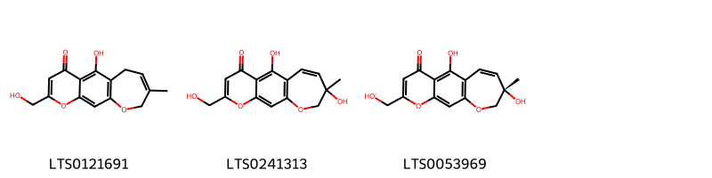
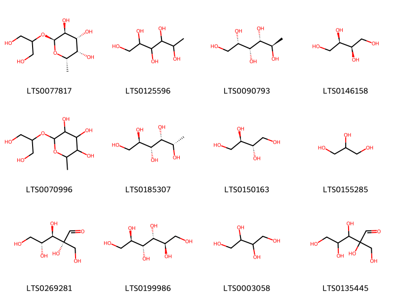
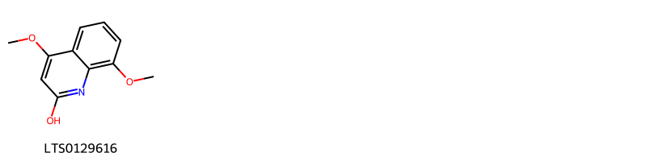

!!! abstract "Tóm tắt"

    Xà sàng (Fructus Cnidii) là quả chín đã phơi hay sấy khô của cây Xà sàng (Cnidium monnieri L.), thuộc họ Hoa tán (Apiaceae). Cây xà sàng phân bố chủ yếu ở Châu Á và mọc hoang nhiều ở những vùng đất trống tại miền Bắc và Trung Bộ nước ta. Dược liệu này được nghiên cứu với các tác dụng dược lý như tăng cường chức năng sinh dục, chống ngứa, chống dị ứng, kháng khuẩn, chống viêm, và hỗ trợ điều trị các bệnh viêm loét âm đạo. Thành phần hóa học chính của xà sàng bao gồm osthole và tinh dầu (1,3%) với các hợp chất chính như L-pinen, camphen và bocnylisovalerianat.

## Thông tin về thực vật

Dược liệu **Xà Sàng (Quả)** từ bộ phận **Quả** từ loài *Cnidium monnieri*.

**Mô tả thực vật:** Cây xà sàng là một loại cỏ cao từ 0,4-1m. Thân có vạch dọc. Lá hai lần xẻ lông chim, chiều rộng của thùy 1-1,5mm. Cuống lá dài 4-8cm. Có bẹ lá ngắn. Hoa mọc thành tán kép. Tổng bao có ít lá bắc hẹp. Cuống hoa dài 7-12cm, dài hơn lá. Quả dài 2-5mm, có dìa mỏng

*Tài liệu tham khảo:* "Những cây thuốc và vị thuốc Việt Nam" - Đỗ Tất Lợi 
Trong dược điển Việt nam, một loài được sử dụng làm dược liệu là *Cnidium monnieri*.

!!! info "Phân loại thực vật của *Cnidium monnieri*"
    - **Kingdom:** Plantae
    - **Phylum:** Tracheophyta
    - **Order:** Apiales
    - **Family:** Apiaceae
    - **Genus:** Cnidium
    - **Species:** *Cnidium monnieri*

**Phân bố trên thế giới:** nan, United States of America, Russian Federation, Chinese Taipei, China, Korea, Republic of, Mongolia

**Phân bố tại Việt nam:** Không có ghi nhận ở Việt Nam

## Thông tin về dược liệu 

### Định danh

!!! info "Thông tin về tên gọi"

    - Dược liệu tiếng Việt: xà sàng
    - Dược liệu tiếng Trung: 蛇床子 (She Chuang Zi)
    - Dược liệu tiếng Anh: Cnidium Monnieri
    - Dược liệu latin thông dụng: Fructus cnidiinCnidii Fructus
    - Dược liệu latin kiểu DĐVN: *fructus cnidii*
    - Dược liệu latin kiểu DĐVN: *Cnidii Fructus*
    - Dược liệu latin kiểu thông tư: *None*
    - Bộ phận dùng: Quả (Fructus)

### Mô tả dược liệu 

- **Theo dược điển Việt nam V:** 
Quả đóng với hai phân quả dính nhau ở một mặt tạo thành hình trứng nhỏ, có khía lồi; dài 2 mm đến 4 mm, đường kính 1 mm đến 2 mm. Mặt ngoài màu vàng nhạt hoặc vàng sẫm. Đỉnh có hai vòi mảnh, dài khoảng 2 mm đến 4 mm. Mỗi phân quả có 5 khía lồi nhô cao xen kẽ với 4 rãnh khá sâu, trông giống như quả có cánh; giữa là một hạt hình trứng. Mặt tiếp xúc giữa hai phân quả là mặt phẳng, có 2 đường chỉ dọc nồi lên màu nâu. Mặt cắt ngang qua tâm của quả nguyên vẹn gồm hai phần là hai phân quả dính liền nhau. Nếu vết cắt không ở ngay giữa thì hai phân quả có thẻ tách rời. Môi phân quả có thê nhìn thấy 6 vết tròn nhỏ tương ứng với 6 ống tiết. Hạt nhỏ, màu nâu xám, có dầu. Quả có mùi thơm, vị cay.

- **Mô tả dược liệu theo thông tư chế biến dược liệu theo phương pháp cổ truyền:** 

### Chế biến 

- **Chế biến theo dược điển việt nam V**: 
Thu hoạch bằng cách nhổ hay cắt cả cây. phơi hoặc sấy nhẹ cho đến khô. Đập lấy quả, loại bỏ tạp chất, phơi hay sấy khô.

- **Chế biến theo thông tư:** 

--- 

## Thành phần hóa học

- Theo tài liệu của GS. Đỗ Tất Lợi:  (1) Nhóm hóa học:
- Tinh dầu: Với tỷ lệ 1.3% có mùi hắc đặc biệt. Thành phần chủ yếu của tinh dầu là chất L. pinen, camphen và bocnylisovalerianat.
- Chất osthole tinh thể không màu có công thức C15H16O3, độ chảy 82°5-83°5.
- Chất dầu màu đen xanh có thành phần chủ yếu là 92,66% axid béo không no, 4,56% axid béo no và 0,38% chất không xà phòng hóa , 3,27% glycerin.
(2) Tên hoạt chất là biomaker: osthole
    

**Thành phần hóa học từ loài **Cnidium monnieri**

Theo cơ sở dữ liệu lotus, loài *Cnidium monnieri* đã phân lập và xác định được **80** hoạt chất thuộc về các nhóm Organooxygen compounds, Fatty Acyls, Flavonoids, Cinnamic acids and derivatives, Benzopyrans, Lactones, Quinolines and derivatives, Benzoxepines, Stilbenes, Coumarins and derivatives, Prenol lipids trong bảng dưới đây. Danh sách các hoạt chất như sau 5,8-dihydroxy-2-methyl-6-[(1z,3r)-3-methyl-4-{[(2r,3r,4s,5s,6r)-3,4,5-trihydroxy-6-(hydroxymethyl)oxan-2-yl]oxy}but-1-en-1-yl]chromen-4-one [(LTS0270890)](https://lotus.naturalproducts.net/compound/lotus_id/LTS0270890), (8s)-5,8-dihydroxy-2-(hydroxymethyl)-8-methyl-9h-oxepino[3,2-g]chromen-4-one [(LTS0053969)](https://lotus.naturalproducts.net/compound/lotus_id/LTS0053969), (2e)-2,3-bis(7-methoxy-2-oxochromen-8-yl)prop-2-enal [(LTS0041644)](https://lotus.naturalproducts.net/compound/lotus_id/LTS0041644), fucitol [(LTS0125596)](https://lotus.naturalproducts.net/compound/lotus_id/LTS0125596), ferulic acid [(LTS0077328)](https://lotus.naturalproducts.net/compound/lotus_id/LTS0077328), 2,3,4,5-tetramethylhexane-1,2,3,4,5-pentol [(LTS0109367)](https://lotus.naturalproducts.net/compound/lotus_id/LTS0109367), deoxyribonolactone [(LTS0075306)](https://lotus.naturalproducts.net/compound/lotus_id/LTS0075306), 2-{2-oxo-8h,9h-furo[2,3-h]chromen-8-yl}propan-2-yl acetate [(LTS0125318)](https://lotus.naturalproducts.net/compound/lotus_id/LTS0125318), glycerol [(LTS0155285)](https://lotus.naturalproducts.net/compound/lotus_id/LTS0155285), 7-methoxy-2-oxochromene-8-carbaldehyde [(LTS0066932)](https://lotus.naturalproducts.net/compound/lotus_id/LTS0066932), osthole [(LTS0149433)](https://lotus.naturalproducts.net/compound/lotus_id/LTS0149433), (2r,3r,4r,5s)-hexane-1,2,3,4,5-pentol [(LTS0185307)](https://lotus.naturalproducts.net/compound/lotus_id/LTS0185307), 8-({9-hydroxy-7-oxofuro[3,2-g]chromen-4-yl}methyl)-7-methoxychromen-2-one [(LTS0260508)](https://lotus.naturalproducts.net/compound/lotus_id/LTS0260508), (8s,9r)-8-[2-(acetyloxy)propan-2-yl]-2-oxo-8h,9h-furo[2,3-h]chromen-9-yl 2-methylpropanoate [(LTS0246913)](https://lotus.naturalproducts.net/compound/lotus_id/LTS0246913), 8-(3-hydroxy-3-methylbutyl)-7-methoxychromen-2-one [(LTS0193076)](https://lotus.naturalproducts.net/compound/lotus_id/LTS0193076), 2-(1,2-dihydroxypropan-2-yl)-4-hydroxy-7-methyl-2h,3h-furo[3,2-g]chromen-5-one [(LTS0036861)](https://lotus.naturalproducts.net/compound/lotus_id/LTS0036861), 8-(2,3-dihydroxy-3-methylbutyl)-7-methoxychromen-2-one [(LTS0247238)](https://lotus.naturalproducts.net/compound/lotus_id/LTS0247238), 5,7-dihydroxy-6-[(2z)-4-hydroxy-3-methylbut-2-en-1-yl]-2-(hydroxymethyl)chromen-4-one [(LTS0220691)](https://lotus.naturalproducts.net/compound/lotus_id/LTS0220691), (-)-threitol [(LTS0146158)](https://lotus.naturalproducts.net/compound/lotus_id/LTS0146158), 4-hydroxy-5-(hydroxymethyl)oxolan-2-one [(LTS0167629)](https://lotus.naturalproducts.net/compound/lotus_id/LTS0167629), cnidiadin [(LTS0029490)](https://lotus.naturalproducts.net/compound/lotus_id/LTS0029490), 8-[(2s)-2,3-dihydroxy-3-methylbutyl]-7-methoxychromen-2-one [(LTS0179979)](https://lotus.naturalproducts.net/compound/lotus_id/LTS0179979), meso-erythritol [(LTS0150163)](https://lotus.naturalproducts.net/compound/lotus_id/LTS0150163), isopimpinellin [(LTS0015558)](https://lotus.naturalproducts.net/compound/lotus_id/LTS0015558), 8-{9-hydroxy-7-oxofuro[3,2-g]chromen-4-yl}-7-methoxychromen-2-one [(LTS0099224)](https://lotus.naturalproducts.net/compound/lotus_id/LTS0099224), 5,7-dihydroxy-6-(4-hydroxy-3-methylbut-2-en-1-yl)-2-(hydroxymethyl)chromen-4-one [(LTS0156721)](https://lotus.naturalproducts.net/compound/lotus_id/LTS0156721), (4s,6r,7s)-7-[2-(acetyloxy)propan-2-yl]-1,4-dimethyl-2-oxo-octahydro-1h-azulen-6-yl (2z)-2-methylbut-2-enoate [(LTS0011890)](https://lotus.naturalproducts.net/compound/lotus_id/LTS0011890), (-)-columbianetin [(LTS0097915)](https://lotus.naturalproducts.net/compound/lotus_id/LTS0097915), methoxsalen [(LTS0260944)](https://lotus.naturalproducts.net/compound/lotus_id/LTS0260944), (4s,6r,7s)-6-hydroxy-7-(2-hydroxypropan-2-yl)-1,4-dimethyl-3a,4,5,6,7,8-hexahydro-3h-azulen-2-one [(LTS0244237)](https://lotus.naturalproducts.net/compound/lotus_id/LTS0244237), (2r,3r,7s)-2-methyl-6-methylideneoctane-1,2,3,7,8-pentol [(LTS0200657)](https://lotus.naturalproducts.net/compound/lotus_id/LTS0200657), 6-hydroxy-7-(2-hydroxypropan-2-yl)-1,4-dimethyl-3a,4,5,6,7,8-hexahydro-3h-azulen-2-one [(LTS0030140)](https://lotus.naturalproducts.net/compound/lotus_id/LTS0030140), bergapten [(LTS0019861)](https://lotus.naturalproducts.net/compound/lotus_id/LTS0019861), (2r,3s,4r,5s,6s)-2-[(1,3-dihydroxypropan-2-yl)oxy]-6-methyloxane-3,4,5-triol [(LTS0077817)](https://lotus.naturalproducts.net/compound/lotus_id/LTS0077817), alloimperatorin [(LTS0170139)](https://lotus.naturalproducts.net/compound/lotus_id/LTS0170139), (2r)-2-[(2s)-1,2-dihydroxypropan-2-yl]-4-hydroxy-7-methyl-2h,3h-furo[3,2-g]chromen-5-one [(LTS0222225)](https://lotus.naturalproducts.net/compound/lotus_id/LTS0222225), 7-[2-(acetyloxy)propan-2-yl]-1,4-dimethyl-2-oxo-3a,4,5,6,7,8-hexahydro-3h-azulen-6-yl 2-methylbut-2-enoate [(LTS0216493)](https://lotus.naturalproducts.net/compound/lotus_id/LTS0216493), 4,9-dihydroxyfuro[3,2-g]chromen-7-one [(LTS0095944)](https://lotus.naturalproducts.net/compound/lotus_id/LTS0095944), 8-(2-hydroxy-3-methylbut-3-en-1-yl)-7-methoxychromen-2-one [(LTS0133360)](https://lotus.naturalproducts.net/compound/lotus_id/LTS0133360), 5-hydroxy-2-(hydroxymethyl)-8-methyl-6h,9h-oxepino[3,2-g]chromen-4-one [(LTS0121691)](https://lotus.naturalproducts.net/compound/lotus_id/LTS0121691), 2,6-dimethyloct-7-ene-2,3,6-triol [(LTS0176233)](https://lotus.naturalproducts.net/compound/lotus_id/LTS0176233), (8s,9r)-8-[2-(acetyloxy)propan-2-yl]-2-oxo-8h,9h-furo[2,3-h]chromen-9-yl (2z)-2-methylbut-2-enoate [(LTS0066824)](https://lotus.naturalproducts.net/compound/lotus_id/LTS0066824), 2-[(8s)-2-oxo-8h,9h-furo[2,3-h]chromen-8-yl]propan-2-yl acetate [(LTS0021879)](https://lotus.naturalproducts.net/compound/lotus_id/LTS0021879), (1r,2r,4s)-4-[(2s)-1,2-dihydroxypropan-2-yl]-1-methylcyclohexane-1,2-diol [(LTS0104707)](https://lotus.naturalproducts.net/compound/lotus_id/LTS0104707), 5,8-dihydroxy-2-(hydroxymethyl)-8-methyl-9h-oxepino[3,2-g]chromen-4-one [(LTS0241313)](https://lotus.naturalproducts.net/compound/lotus_id/LTS0241313), (3ar,4s,6r,7s)-7-[2-(acetyloxy)propan-2-yl]-3a-hydroxy-1,4-dimethyl-2-oxo-3,4,5,6,7,8-hexahydroazulen-6-yl (2z)-2-methylbut-2-enoate [(LTS0053705)](https://lotus.naturalproducts.net/compound/lotus_id/LTS0053705), 5,7-dihydroxy-6-[(2z)-4-hydroxy-3-methylbut-2-en-1-yl]-2-methylchromen-4-one [(LTS0245419)](https://lotus.naturalproducts.net/compound/lotus_id/LTS0245419), 5,7-dihydroxy-2-methyl-6-[(2z)-3-methyl-4-{[(2r,3r,4s,5s,6r)-3,4,5-trihydroxy-6-(hydroxymethyl)oxan-2-yl]oxy}but-2-en-1-yl]chromen-4-one [(LTS0135789)](https://lotus.naturalproducts.net/compound/lotus_id/LTS0135789), 2-[(1,3-dihydroxypropan-2-yl)oxy]-6-methyloxane-3,4,5-triol [(LTS0070996)](https://lotus.naturalproducts.net/compound/lotus_id/LTS0070996), 2,3,4,5-tetrahydroxy-2-(hydroxymethyl)pentanal [(LTS0135445)](https://lotus.naturalproducts.net/compound/lotus_id/LTS0135445), torilin [(LTS0036352)](https://lotus.naturalproducts.net/compound/lotus_id/LTS0036352), 8-(hydroxymethyl)-7-methoxychromen-2-one [(LTS0243525)](https://lotus.naturalproducts.net/compound/lotus_id/LTS0243525), 7-[2-(acetyloxy)propan-2-yl]-3a-hydroxy-1,4-dimethyl-2-oxo-3,4,5,6,7,8-hexahydroazulen-6-yl 2-methylbut-2-enoate [(LTS0260087)](https://lotus.naturalproducts.net/compound/lotus_id/LTS0260087), 5,8-dihydroxy-2-methyl-6-(3-methyl-4-{[3,4,5-trihydroxy-6-(hydroxymethyl)oxan-2-yl]oxy}but-1-en-1-yl)chromen-4-one [(LTS0168542)](https://lotus.naturalproducts.net/compound/lotus_id/LTS0168542), 2,3-bis(7-methoxy-2-oxochromen-8-yl)prop-2-enal [(LTS0234514)](https://lotus.naturalproducts.net/compound/lotus_id/LTS0234514), erythrite [(LTS0003058)](https://lotus.naturalproducts.net/compound/lotus_id/LTS0003058), 2-methyl-6-methylideneoctane-1,2,3,7,8-pentol [(LTS0177702)](https://lotus.naturalproducts.net/compound/lotus_id/LTS0177702), 4,8-dimethoxyquinolin-2-ol [(LTS0129616)](https://lotus.naturalproducts.net/compound/lotus_id/LTS0129616), isoimperatorin [(LTS0257448)](https://lotus.naturalproducts.net/compound/lotus_id/LTS0257448), 5,7-dihydroxy-6-[(2r)-2-hydroxy-3-methylbut-3-en-1-yl]-2-(hydroxymethyl)chromen-4-one [(LTS0030132)](https://lotus.naturalproducts.net/compound/lotus_id/LTS0030132), 7-{[(2e,6e)-8-hydroxy-3,7-dimethylocta-2,6-dien-1-yl]oxy}chromen-2-one [(LTS0155998)](https://lotus.naturalproducts.net/compound/lotus_id/LTS0155998), (1s,2r,4as,6ar,6br,8ar,10s,12ar,12br,14bs)-10-hydroxy-4a-({[(2z)-3-(4-hydroxyphenyl)prop-2-enoyl]oxy}methyl)-1,2,6b,9,9,12a-hexamethyl-2,3,4,5,6,7,8,8a,10,11,12,12b,13,14b-tetradecahydro-1h-picene-6a-carboxylic acid [(LTS0155076)](https://lotus.naturalproducts.net/compound/lotus_id/LTS0155076), 5,7-dihydroxy-2-(hydroxymethyl)chromen-4-one [(LTS0035517)](https://lotus.naturalproducts.net/compound/lotus_id/LTS0035517), (3ar,4s,6r,7s)-6-hydroxy-7-(2-hydroxypropan-2-yl)-1,4-dimethyl-3a,4,5,6,7,8-hexahydro-3h-azulen-2-one [(LTS0109782)](https://lotus.naturalproducts.net/compound/lotus_id/LTS0109782), 5,7-dihydroxy-6-(2-hydroxy-3-methylbut-3-en-1-yl)-2-(hydroxymethyl)chromen-4-one [(LTS0004925)](https://lotus.naturalproducts.net/compound/lotus_id/LTS0004925), mannitol [(LTS0199986)](https://lotus.naturalproducts.net/compound/lotus_id/LTS0199986), xanthotoxol [(LTS0086962)](https://lotus.naturalproducts.net/compound/lotus_id/LTS0086962), imperatorin [(LTS0113114)](https://lotus.naturalproducts.net/compound/lotus_id/LTS0113114), (3r,6s)-2,6-dimethyloct-7-ene-2,3,6-triol [(LTS0037277)](https://lotus.naturalproducts.net/compound/lotus_id/LTS0037277), (2s,3r,4r)-2,3,4,5-tetramethylhexane-1,2,3,4,5-pentol [(LTS0216793)](https://lotus.naturalproducts.net/compound/lotus_id/LTS0216793), 8-[(2s)-2-hydroxy-3-methylbut-3-en-1-yl]-7-methoxychromen-2-one [(LTS0021110)](https://lotus.naturalproducts.net/compound/lotus_id/LTS0021110), hamamelose [(LTS0269281)](https://lotus.naturalproducts.net/compound/lotus_id/LTS0269281), (2s,3r,6s)-3,7-dimethyloctane-1,2,6,7-tetrol [(LTS0046257)](https://lotus.naturalproducts.net/compound/lotus_id/LTS0046257), 3,7-dimethyloctane-1,2,6,7-tetrol [(LTS0181896)](https://lotus.naturalproducts.net/compound/lotus_id/LTS0181896), 2-[(8s)-2-oxo-8h,9h-furo[2,3-h]chromen-8-yl]propan-2-yl (2z)-2-methylbut-2-enoate [(LTS0072589)](https://lotus.naturalproducts.net/compound/lotus_id/LTS0072589), 9-hydroxy-7-oxofuro[3,2-g]chromene-4-carbaldehyde [(LTS0210942)](https://lotus.naturalproducts.net/compound/lotus_id/LTS0210942), 4-(1,2-dihydroxypropan-2-yl)-1-methylcyclohexane-1,2-diol [(LTS0221872)](https://lotus.naturalproducts.net/compound/lotus_id/LTS0221872), diosmetin [(LTS0252065)](https://lotus.naturalproducts.net/compound/lotus_id/LTS0252065), (2s,3r,4r,5r)-hexane-1,2,3,4,5-pentol [(LTS0090793)](https://lotus.naturalproducts.net/compound/lotus_id/LTS0090793), (2r,3s,7s)-2-methyl-6-methylideneoctane-1,2,3,7,8-pentol [(LTS0191247)](https://lotus.naturalproducts.net/compound/lotus_id/LTS0191247). 
        
| chemicalTaxonomyClassyfireClass   |   smiles_count |
|:----------------------------------|---------------:|
| Benzopyrans                       |            301 |
| Benzoxepines                      |            111 |
| Cinnamic acids and derivatives    |             24 |
| Coumarins and derivatives         |            930 |
| Fatty Acyls                       |            507 |
| Flavonoids                        |             38 |
| Lactones                          |             41 |
| Organooxygen compounds            |            322 |
| Prenol lipids                     |            681 |
| Quinolines and derivatives        |             23 |
| Stilbenes                         |            102 |

            
### Nhóm Benzopyrans
<figure markdown="span">
    { width=100% }
<figcaption>Hình ảnh cấu trúc hóa học của hoạt chất thuộc nhóm *Benzopyrans*. Tên thường gọi của các hoạt chất tương ứng là 2-(1,2-dihydroxypropan-2-yl)-4-hydroxy-7-methyl-2h,3h-furo[3,2-g]chromen-5-one [(LTS0036861)](https://lotus.naturalproducts.net/compound/lotus_id/LTS0036861), 5,7-dihydroxy-6-[(2z)-4-hydroxy-3-methylbut-2-en-1-yl]-2-methylchromen-4-one [(LTS0245419)](https://lotus.naturalproducts.net/compound/lotus_id/LTS0245419), 5,7-dihydroxy-6-[(2z)-4-hydroxy-3-methylbut-2-en-1-yl]-2-(hydroxymethyl)chromen-4-one [(LTS0220691)](https://lotus.naturalproducts.net/compound/lotus_id/LTS0220691), 5,7-dihydroxy-6-(4-hydroxy-3-methylbut-2-en-1-yl)-2-(hydroxymethyl)chromen-4-one [(LTS0156721)](https://lotus.naturalproducts.net/compound/lotus_id/LTS0156721), (2r)-2-[(2s)-1,2-dihydroxypropan-2-yl]-4-hydroxy-7-methyl-2h,3h-furo[3,2-g]chromen-5-one [(LTS0222225)](https://lotus.naturalproducts.net/compound/lotus_id/LTS0222225), 5,7-dihydroxy-2-(hydroxymethyl)chromen-4-one [(LTS0035517)](https://lotus.naturalproducts.net/compound/lotus_id/LTS0035517), 5,7-dihydroxy-6-[(2r)-2-hydroxy-3-methylbut-3-en-1-yl]-2-(hydroxymethyl)chromen-4-one [(LTS0030132)](https://lotus.naturalproducts.net/compound/lotus_id/LTS0030132), 5,7-dihydroxy-6-(2-hydroxy-3-methylbut-3-en-1-yl)-2-(hydroxymethyl)chromen-4-one [(LTS0004925)](https://lotus.naturalproducts.net/compound/lotus_id/LTS0004925).</figcaption>
</figure>

            
            
### Nhóm Benzopyrans
<figure markdown="span">
    { width=100% }
<figcaption>Hình ảnh cấu trúc hóa học của hoạt chất thuộc nhóm *Benzopyrans*. Tên thường gọi của các hoạt chất tương ứng là 2-(1,2-dihydroxypropan-2-yl)-4-hydroxy-7-methyl-2h,3h-furo[3,2-g]chromen-5-one [(LTS0036861)](https://lotus.naturalproducts.net/compound/lotus_id/LTS0036861), 5,7-dihydroxy-6-[(2z)-4-hydroxy-3-methylbut-2-en-1-yl]-2-methylchromen-4-one [(LTS0245419)](https://lotus.naturalproducts.net/compound/lotus_id/LTS0245419), 5,7-dihydroxy-6-[(2z)-4-hydroxy-3-methylbut-2-en-1-yl]-2-(hydroxymethyl)chromen-4-one [(LTS0220691)](https://lotus.naturalproducts.net/compound/lotus_id/LTS0220691), 5,7-dihydroxy-6-(4-hydroxy-3-methylbut-2-en-1-yl)-2-(hydroxymethyl)chromen-4-one [(LTS0156721)](https://lotus.naturalproducts.net/compound/lotus_id/LTS0156721), (2r)-2-[(2s)-1,2-dihydroxypropan-2-yl]-4-hydroxy-7-methyl-2h,3h-furo[3,2-g]chromen-5-one [(LTS0222225)](https://lotus.naturalproducts.net/compound/lotus_id/LTS0222225), 5,7-dihydroxy-2-(hydroxymethyl)chromen-4-one [(LTS0035517)](https://lotus.naturalproducts.net/compound/lotus_id/LTS0035517), 5,7-dihydroxy-6-[(2r)-2-hydroxy-3-methylbut-3-en-1-yl]-2-(hydroxymethyl)chromen-4-one [(LTS0030132)](https://lotus.naturalproducts.net/compound/lotus_id/LTS0030132), 5,7-dihydroxy-6-(2-hydroxy-3-methylbut-3-en-1-yl)-2-(hydroxymethyl)chromen-4-one [(LTS0004925)](https://lotus.naturalproducts.net/compound/lotus_id/LTS0004925).</figcaption>
</figure>

### Nhóm Benzoxepines
<figure markdown="span">
    { width=100% }
<figcaption>Hình ảnh cấu trúc hóa học của hoạt chất thuộc nhóm *Benzoxepines*. Tên thường gọi của các hoạt chất tương ứng là 5-hydroxy-2-(hydroxymethyl)-8-methyl-6h,9h-oxepino[3,2-g]chromen-4-one [(LTS0121691)](https://lotus.naturalproducts.net/compound/lotus_id/LTS0121691), 5,8-dihydroxy-2-(hydroxymethyl)-8-methyl-9h-oxepino[3,2-g]chromen-4-one [(LTS0241313)](https://lotus.naturalproducts.net/compound/lotus_id/LTS0241313), (8s)-5,8-dihydroxy-2-(hydroxymethyl)-8-methyl-9h-oxepino[3,2-g]chromen-4-one [(LTS0053969)](https://lotus.naturalproducts.net/compound/lotus_id/LTS0053969).</figcaption>
</figure>

            
            
### Nhóm Benzopyrans
<figure markdown="span">
    { width=100% }
<figcaption>Hình ảnh cấu trúc hóa học của hoạt chất thuộc nhóm *Benzopyrans*. Tên thường gọi của các hoạt chất tương ứng là 2-(1,2-dihydroxypropan-2-yl)-4-hydroxy-7-methyl-2h,3h-furo[3,2-g]chromen-5-one [(LTS0036861)](https://lotus.naturalproducts.net/compound/lotus_id/LTS0036861), 5,7-dihydroxy-6-[(2z)-4-hydroxy-3-methylbut-2-en-1-yl]-2-methylchromen-4-one [(LTS0245419)](https://lotus.naturalproducts.net/compound/lotus_id/LTS0245419), 5,7-dihydroxy-6-[(2z)-4-hydroxy-3-methylbut-2-en-1-yl]-2-(hydroxymethyl)chromen-4-one [(LTS0220691)](https://lotus.naturalproducts.net/compound/lotus_id/LTS0220691), 5,7-dihydroxy-6-(4-hydroxy-3-methylbut-2-en-1-yl)-2-(hydroxymethyl)chromen-4-one [(LTS0156721)](https://lotus.naturalproducts.net/compound/lotus_id/LTS0156721), (2r)-2-[(2s)-1,2-dihydroxypropan-2-yl]-4-hydroxy-7-methyl-2h,3h-furo[3,2-g]chromen-5-one [(LTS0222225)](https://lotus.naturalproducts.net/compound/lotus_id/LTS0222225), 5,7-dihydroxy-2-(hydroxymethyl)chromen-4-one [(LTS0035517)](https://lotus.naturalproducts.net/compound/lotus_id/LTS0035517), 5,7-dihydroxy-6-[(2r)-2-hydroxy-3-methylbut-3-en-1-yl]-2-(hydroxymethyl)chromen-4-one [(LTS0030132)](https://lotus.naturalproducts.net/compound/lotus_id/LTS0030132), 5,7-dihydroxy-6-(2-hydroxy-3-methylbut-3-en-1-yl)-2-(hydroxymethyl)chromen-4-one [(LTS0004925)](https://lotus.naturalproducts.net/compound/lotus_id/LTS0004925).</figcaption>
</figure>

### Nhóm Benzoxepines
<figure markdown="span">
    { width=100% }
<figcaption>Hình ảnh cấu trúc hóa học của hoạt chất thuộc nhóm *Benzoxepines*. Tên thường gọi của các hoạt chất tương ứng là 5-hydroxy-2-(hydroxymethyl)-8-methyl-6h,9h-oxepino[3,2-g]chromen-4-one [(LTS0121691)](https://lotus.naturalproducts.net/compound/lotus_id/LTS0121691), 5,8-dihydroxy-2-(hydroxymethyl)-8-methyl-9h-oxepino[3,2-g]chromen-4-one [(LTS0241313)](https://lotus.naturalproducts.net/compound/lotus_id/LTS0241313), (8s)-5,8-dihydroxy-2-(hydroxymethyl)-8-methyl-9h-oxepino[3,2-g]chromen-4-one [(LTS0053969)](https://lotus.naturalproducts.net/compound/lotus_id/LTS0053969).</figcaption>
</figure>

### Nhóm Cinnamic acids and derivatives
<figure markdown="span">
    { width=100% }
<figcaption>Hình ảnh cấu trúc hóa học của hoạt chất thuộc nhóm *Cinnamic acids and derivatives*. Tên thường gọi của các hoạt chất tương ứng là ferulic acid [(LTS0077328)](https://lotus.naturalproducts.net/compound/lotus_id/LTS0077328).</figcaption>
</figure>

            
            
### Nhóm Benzopyrans
<figure markdown="span">
    { width=100% }
<figcaption>Hình ảnh cấu trúc hóa học của hoạt chất thuộc nhóm *Benzopyrans*. Tên thường gọi của các hoạt chất tương ứng là 2-(1,2-dihydroxypropan-2-yl)-4-hydroxy-7-methyl-2h,3h-furo[3,2-g]chromen-5-one [(LTS0036861)](https://lotus.naturalproducts.net/compound/lotus_id/LTS0036861), 5,7-dihydroxy-6-[(2z)-4-hydroxy-3-methylbut-2-en-1-yl]-2-methylchromen-4-one [(LTS0245419)](https://lotus.naturalproducts.net/compound/lotus_id/LTS0245419), 5,7-dihydroxy-6-[(2z)-4-hydroxy-3-methylbut-2-en-1-yl]-2-(hydroxymethyl)chromen-4-one [(LTS0220691)](https://lotus.naturalproducts.net/compound/lotus_id/LTS0220691), 5,7-dihydroxy-6-(4-hydroxy-3-methylbut-2-en-1-yl)-2-(hydroxymethyl)chromen-4-one [(LTS0156721)](https://lotus.naturalproducts.net/compound/lotus_id/LTS0156721), (2r)-2-[(2s)-1,2-dihydroxypropan-2-yl]-4-hydroxy-7-methyl-2h,3h-furo[3,2-g]chromen-5-one [(LTS0222225)](https://lotus.naturalproducts.net/compound/lotus_id/LTS0222225), 5,7-dihydroxy-2-(hydroxymethyl)chromen-4-one [(LTS0035517)](https://lotus.naturalproducts.net/compound/lotus_id/LTS0035517), 5,7-dihydroxy-6-[(2r)-2-hydroxy-3-methylbut-3-en-1-yl]-2-(hydroxymethyl)chromen-4-one [(LTS0030132)](https://lotus.naturalproducts.net/compound/lotus_id/LTS0030132), 5,7-dihydroxy-6-(2-hydroxy-3-methylbut-3-en-1-yl)-2-(hydroxymethyl)chromen-4-one [(LTS0004925)](https://lotus.naturalproducts.net/compound/lotus_id/LTS0004925).</figcaption>
</figure>

### Nhóm Benzoxepines
<figure markdown="span">
    { width=100% }
<figcaption>Hình ảnh cấu trúc hóa học của hoạt chất thuộc nhóm *Benzoxepines*. Tên thường gọi của các hoạt chất tương ứng là 5-hydroxy-2-(hydroxymethyl)-8-methyl-6h,9h-oxepino[3,2-g]chromen-4-one [(LTS0121691)](https://lotus.naturalproducts.net/compound/lotus_id/LTS0121691), 5,8-dihydroxy-2-(hydroxymethyl)-8-methyl-9h-oxepino[3,2-g]chromen-4-one [(LTS0241313)](https://lotus.naturalproducts.net/compound/lotus_id/LTS0241313), (8s)-5,8-dihydroxy-2-(hydroxymethyl)-8-methyl-9h-oxepino[3,2-g]chromen-4-one [(LTS0053969)](https://lotus.naturalproducts.net/compound/lotus_id/LTS0053969).</figcaption>
</figure>

### Nhóm Cinnamic acids and derivatives
<figure markdown="span">
    { width=100% }
<figcaption>Hình ảnh cấu trúc hóa học của hoạt chất thuộc nhóm *Cinnamic acids and derivatives*. Tên thường gọi của các hoạt chất tương ứng là ferulic acid [(LTS0077328)](https://lotus.naturalproducts.net/compound/lotus_id/LTS0077328).</figcaption>
</figure>

### Nhóm Coumarins and derivatives
<figure markdown="span">
    { width=100% }
<figcaption>Hình ảnh cấu trúc hóa học của hoạt chất thuộc nhóm *Coumarins and derivatives*. Tên thường gọi của các hoạt chất tương ứng là cnidiadin [(LTS0029490)](https://lotus.naturalproducts.net/compound/lotus_id/LTS0029490), bergapten [(LTS0019861)](https://lotus.naturalproducts.net/compound/lotus_id/LTS0019861), isopimpinellin [(LTS0015558)](https://lotus.naturalproducts.net/compound/lotus_id/LTS0015558), 8-(3-hydroxy-3-methylbutyl)-7-methoxychromen-2-one [(LTS0193076)](https://lotus.naturalproducts.net/compound/lotus_id/LTS0193076), 8-{9-hydroxy-7-oxofuro[3,2-g]chromen-4-yl}-7-methoxychromen-2-one [(LTS0099224)](https://lotus.naturalproducts.net/compound/lotus_id/LTS0099224), 4,9-dihydroxyfuro[3,2-g]chromen-7-one [(LTS0095944)](https://lotus.naturalproducts.net/compound/lotus_id/LTS0095944), 8-[(2s)-2-hydroxy-3-methylbut-3-en-1-yl]-7-methoxychromen-2-one [(LTS0021110)](https://lotus.naturalproducts.net/compound/lotus_id/LTS0021110), imperatorin [(LTS0113114)](https://lotus.naturalproducts.net/compound/lotus_id/LTS0113114), isoimperatorin [(LTS0257448)](https://lotus.naturalproducts.net/compound/lotus_id/LTS0257448), methoxsalen [(LTS0260944)](https://lotus.naturalproducts.net/compound/lotus_id/LTS0260944), 2-{2-oxo-8h,9h-furo[2,3-h]chromen-8-yl}propan-2-yl acetate [(LTS0125318)](https://lotus.naturalproducts.net/compound/lotus_id/LTS0125318), 8-(2-hydroxy-3-methylbut-3-en-1-yl)-7-methoxychromen-2-one [(LTS0133360)](https://lotus.naturalproducts.net/compound/lotus_id/LTS0133360), osthole [(LTS0149433)](https://lotus.naturalproducts.net/compound/lotus_id/LTS0149433), alloimperatorin [(LTS0170139)](https://lotus.naturalproducts.net/compound/lotus_id/LTS0170139), 2-[(8s)-2-oxo-8h,9h-furo[2,3-h]chromen-8-yl]propan-2-yl (2z)-2-methylbut-2-enoate [(LTS0072589)](https://lotus.naturalproducts.net/compound/lotus_id/LTS0072589), 8-[(2s)-2,3-dihydroxy-3-methylbutyl]-7-methoxychromen-2-one [(LTS0179979)](https://lotus.naturalproducts.net/compound/lotus_id/LTS0179979), xanthotoxol [(LTS0086962)](https://lotus.naturalproducts.net/compound/lotus_id/LTS0086962), 8-({9-hydroxy-7-oxofuro[3,2-g]chromen-4-yl}methyl)-7-methoxychromen-2-one [(LTS0260508)](https://lotus.naturalproducts.net/compound/lotus_id/LTS0260508), 9-hydroxy-7-oxofuro[3,2-g]chromene-4-carbaldehyde [(LTS0210942)](https://lotus.naturalproducts.net/compound/lotus_id/LTS0210942), 2-[(8s)-2-oxo-8h,9h-furo[2,3-h]chromen-8-yl]propan-2-yl acetate [(LTS0021879)](https://lotus.naturalproducts.net/compound/lotus_id/LTS0021879), (8s,9r)-8-[2-(acetyloxy)propan-2-yl]-2-oxo-8h,9h-furo[2,3-h]chromen-9-yl (2z)-2-methylbut-2-enoate [(LTS0066824)](https://lotus.naturalproducts.net/compound/lotus_id/LTS0066824), 8-(hydroxymethyl)-7-methoxychromen-2-one [(LTS0243525)](https://lotus.naturalproducts.net/compound/lotus_id/LTS0243525), (8s,9r)-8-[2-(acetyloxy)propan-2-yl]-2-oxo-8h,9h-furo[2,3-h]chromen-9-yl 2-methylpropanoate [(LTS0246913)](https://lotus.naturalproducts.net/compound/lotus_id/LTS0246913), 7-methoxy-2-oxochromene-8-carbaldehyde [(LTS0066932)](https://lotus.naturalproducts.net/compound/lotus_id/LTS0066932), (-)-columbianetin [(LTS0097915)](https://lotus.naturalproducts.net/compound/lotus_id/LTS0097915), 8-(2,3-dihydroxy-3-methylbutyl)-7-methoxychromen-2-one [(LTS0247238)](https://lotus.naturalproducts.net/compound/lotus_id/LTS0247238).</figcaption>
</figure>

            
            
### Nhóm Benzopyrans
<figure markdown="span">
    { width=100% }
<figcaption>Hình ảnh cấu trúc hóa học của hoạt chất thuộc nhóm *Benzopyrans*. Tên thường gọi của các hoạt chất tương ứng là 2-(1,2-dihydroxypropan-2-yl)-4-hydroxy-7-methyl-2h,3h-furo[3,2-g]chromen-5-one [(LTS0036861)](https://lotus.naturalproducts.net/compound/lotus_id/LTS0036861), 5,7-dihydroxy-6-[(2z)-4-hydroxy-3-methylbut-2-en-1-yl]-2-methylchromen-4-one [(LTS0245419)](https://lotus.naturalproducts.net/compound/lotus_id/LTS0245419), 5,7-dihydroxy-6-[(2z)-4-hydroxy-3-methylbut-2-en-1-yl]-2-(hydroxymethyl)chromen-4-one [(LTS0220691)](https://lotus.naturalproducts.net/compound/lotus_id/LTS0220691), 5,7-dihydroxy-6-(4-hydroxy-3-methylbut-2-en-1-yl)-2-(hydroxymethyl)chromen-4-one [(LTS0156721)](https://lotus.naturalproducts.net/compound/lotus_id/LTS0156721), (2r)-2-[(2s)-1,2-dihydroxypropan-2-yl]-4-hydroxy-7-methyl-2h,3h-furo[3,2-g]chromen-5-one [(LTS0222225)](https://lotus.naturalproducts.net/compound/lotus_id/LTS0222225), 5,7-dihydroxy-2-(hydroxymethyl)chromen-4-one [(LTS0035517)](https://lotus.naturalproducts.net/compound/lotus_id/LTS0035517), 5,7-dihydroxy-6-[(2r)-2-hydroxy-3-methylbut-3-en-1-yl]-2-(hydroxymethyl)chromen-4-one [(LTS0030132)](https://lotus.naturalproducts.net/compound/lotus_id/LTS0030132), 5,7-dihydroxy-6-(2-hydroxy-3-methylbut-3-en-1-yl)-2-(hydroxymethyl)chromen-4-one [(LTS0004925)](https://lotus.naturalproducts.net/compound/lotus_id/LTS0004925).</figcaption>
</figure>

### Nhóm Benzoxepines
<figure markdown="span">
    { width=100% }
<figcaption>Hình ảnh cấu trúc hóa học của hoạt chất thuộc nhóm *Benzoxepines*. Tên thường gọi của các hoạt chất tương ứng là 5-hydroxy-2-(hydroxymethyl)-8-methyl-6h,9h-oxepino[3,2-g]chromen-4-one [(LTS0121691)](https://lotus.naturalproducts.net/compound/lotus_id/LTS0121691), 5,8-dihydroxy-2-(hydroxymethyl)-8-methyl-9h-oxepino[3,2-g]chromen-4-one [(LTS0241313)](https://lotus.naturalproducts.net/compound/lotus_id/LTS0241313), (8s)-5,8-dihydroxy-2-(hydroxymethyl)-8-methyl-9h-oxepino[3,2-g]chromen-4-one [(LTS0053969)](https://lotus.naturalproducts.net/compound/lotus_id/LTS0053969).</figcaption>
</figure>

### Nhóm Cinnamic acids and derivatives
<figure markdown="span">
    { width=100% }
<figcaption>Hình ảnh cấu trúc hóa học của hoạt chất thuộc nhóm *Cinnamic acids and derivatives*. Tên thường gọi của các hoạt chất tương ứng là ferulic acid [(LTS0077328)](https://lotus.naturalproducts.net/compound/lotus_id/LTS0077328).</figcaption>
</figure>

### Nhóm Coumarins and derivatives
<figure markdown="span">
    { width=100% }
<figcaption>Hình ảnh cấu trúc hóa học của hoạt chất thuộc nhóm *Coumarins and derivatives*. Tên thường gọi của các hoạt chất tương ứng là cnidiadin [(LTS0029490)](https://lotus.naturalproducts.net/compound/lotus_id/LTS0029490), bergapten [(LTS0019861)](https://lotus.naturalproducts.net/compound/lotus_id/LTS0019861), isopimpinellin [(LTS0015558)](https://lotus.naturalproducts.net/compound/lotus_id/LTS0015558), 8-(3-hydroxy-3-methylbutyl)-7-methoxychromen-2-one [(LTS0193076)](https://lotus.naturalproducts.net/compound/lotus_id/LTS0193076), 8-{9-hydroxy-7-oxofuro[3,2-g]chromen-4-yl}-7-methoxychromen-2-one [(LTS0099224)](https://lotus.naturalproducts.net/compound/lotus_id/LTS0099224), 4,9-dihydroxyfuro[3,2-g]chromen-7-one [(LTS0095944)](https://lotus.naturalproducts.net/compound/lotus_id/LTS0095944), 8-[(2s)-2-hydroxy-3-methylbut-3-en-1-yl]-7-methoxychromen-2-one [(LTS0021110)](https://lotus.naturalproducts.net/compound/lotus_id/LTS0021110), imperatorin [(LTS0113114)](https://lotus.naturalproducts.net/compound/lotus_id/LTS0113114), isoimperatorin [(LTS0257448)](https://lotus.naturalproducts.net/compound/lotus_id/LTS0257448), methoxsalen [(LTS0260944)](https://lotus.naturalproducts.net/compound/lotus_id/LTS0260944), 2-{2-oxo-8h,9h-furo[2,3-h]chromen-8-yl}propan-2-yl acetate [(LTS0125318)](https://lotus.naturalproducts.net/compound/lotus_id/LTS0125318), 8-(2-hydroxy-3-methylbut-3-en-1-yl)-7-methoxychromen-2-one [(LTS0133360)](https://lotus.naturalproducts.net/compound/lotus_id/LTS0133360), osthole [(LTS0149433)](https://lotus.naturalproducts.net/compound/lotus_id/LTS0149433), alloimperatorin [(LTS0170139)](https://lotus.naturalproducts.net/compound/lotus_id/LTS0170139), 2-[(8s)-2-oxo-8h,9h-furo[2,3-h]chromen-8-yl]propan-2-yl (2z)-2-methylbut-2-enoate [(LTS0072589)](https://lotus.naturalproducts.net/compound/lotus_id/LTS0072589), 8-[(2s)-2,3-dihydroxy-3-methylbutyl]-7-methoxychromen-2-one [(LTS0179979)](https://lotus.naturalproducts.net/compound/lotus_id/LTS0179979), xanthotoxol [(LTS0086962)](https://lotus.naturalproducts.net/compound/lotus_id/LTS0086962), 8-({9-hydroxy-7-oxofuro[3,2-g]chromen-4-yl}methyl)-7-methoxychromen-2-one [(LTS0260508)](https://lotus.naturalproducts.net/compound/lotus_id/LTS0260508), 9-hydroxy-7-oxofuro[3,2-g]chromene-4-carbaldehyde [(LTS0210942)](https://lotus.naturalproducts.net/compound/lotus_id/LTS0210942), 2-[(8s)-2-oxo-8h,9h-furo[2,3-h]chromen-8-yl]propan-2-yl acetate [(LTS0021879)](https://lotus.naturalproducts.net/compound/lotus_id/LTS0021879), (8s,9r)-8-[2-(acetyloxy)propan-2-yl]-2-oxo-8h,9h-furo[2,3-h]chromen-9-yl (2z)-2-methylbut-2-enoate [(LTS0066824)](https://lotus.naturalproducts.net/compound/lotus_id/LTS0066824), 8-(hydroxymethyl)-7-methoxychromen-2-one [(LTS0243525)](https://lotus.naturalproducts.net/compound/lotus_id/LTS0243525), (8s,9r)-8-[2-(acetyloxy)propan-2-yl]-2-oxo-8h,9h-furo[2,3-h]chromen-9-yl 2-methylpropanoate [(LTS0246913)](https://lotus.naturalproducts.net/compound/lotus_id/LTS0246913), 7-methoxy-2-oxochromene-8-carbaldehyde [(LTS0066932)](https://lotus.naturalproducts.net/compound/lotus_id/LTS0066932), (-)-columbianetin [(LTS0097915)](https://lotus.naturalproducts.net/compound/lotus_id/LTS0097915), 8-(2,3-dihydroxy-3-methylbutyl)-7-methoxychromen-2-one [(LTS0247238)](https://lotus.naturalproducts.net/compound/lotus_id/LTS0247238).</figcaption>
</figure>

### Nhóm Fatty Acyls
<figure markdown="span">
    { width=100% }
<figcaption>Hình ảnh cấu trúc hóa học của hoạt chất thuộc nhóm *Fatty Acyls*. Tên thường gọi của các hoạt chất tương ứng là 5,7-dihydroxy-2-methyl-6-[(2z)-3-methyl-4-{[(2r,3r,4s,5s,6r)-3,4,5-trihydroxy-6-(hydroxymethyl)oxan-2-yl]oxy}but-2-en-1-yl]chromen-4-one [(LTS0135789)](https://lotus.naturalproducts.net/compound/lotus_id/LTS0135789), (2s,3r,4r)-2,3,4,5-tetramethylhexane-1,2,3,4,5-pentol [(LTS0216793)](https://lotus.naturalproducts.net/compound/lotus_id/LTS0216793), 5,8-dihydroxy-2-methyl-6-(3-methyl-4-{[3,4,5-trihydroxy-6-(hydroxymethyl)oxan-2-yl]oxy}but-1-en-1-yl)chromen-4-one [(LTS0168542)](https://lotus.naturalproducts.net/compound/lotus_id/LTS0168542), (2r,3s,7s)-2-methyl-6-methylideneoctane-1,2,3,7,8-pentol [(LTS0191247)](https://lotus.naturalproducts.net/compound/lotus_id/LTS0191247), 2-methyl-6-methylideneoctane-1,2,3,7,8-pentol [(LTS0177702)](https://lotus.naturalproducts.net/compound/lotus_id/LTS0177702), (2r,3r,7s)-2-methyl-6-methylideneoctane-1,2,3,7,8-pentol [(LTS0200657)](https://lotus.naturalproducts.net/compound/lotus_id/LTS0200657), 5,8-dihydroxy-2-methyl-6-[(1z,3r)-3-methyl-4-{[(2r,3r,4s,5s,6r)-3,4,5-trihydroxy-6-(hydroxymethyl)oxan-2-yl]oxy}but-1-en-1-yl]chromen-4-one [(LTS0270890)](https://lotus.naturalproducts.net/compound/lotus_id/LTS0270890), (3r,6s)-2,6-dimethyloct-7-ene-2,3,6-triol [(LTS0037277)](https://lotus.naturalproducts.net/compound/lotus_id/LTS0037277), 3,7-dimethyloctane-1,2,6,7-tetrol [(LTS0181896)](https://lotus.naturalproducts.net/compound/lotus_id/LTS0181896), 2,6-dimethyloct-7-ene-2,3,6-triol [(LTS0176233)](https://lotus.naturalproducts.net/compound/lotus_id/LTS0176233), (2s,3r,6s)-3,7-dimethyloctane-1,2,6,7-tetrol [(LTS0046257)](https://lotus.naturalproducts.net/compound/lotus_id/LTS0046257), 2,3,4,5-tetramethylhexane-1,2,3,4,5-pentol [(LTS0109367)](https://lotus.naturalproducts.net/compound/lotus_id/LTS0109367).</figcaption>
</figure>

            
            
### Nhóm Benzopyrans
<figure markdown="span">
    { width=100% }
<figcaption>Hình ảnh cấu trúc hóa học của hoạt chất thuộc nhóm *Benzopyrans*. Tên thường gọi của các hoạt chất tương ứng là 2-(1,2-dihydroxypropan-2-yl)-4-hydroxy-7-methyl-2h,3h-furo[3,2-g]chromen-5-one [(LTS0036861)](https://lotus.naturalproducts.net/compound/lotus_id/LTS0036861), 5,7-dihydroxy-6-[(2z)-4-hydroxy-3-methylbut-2-en-1-yl]-2-methylchromen-4-one [(LTS0245419)](https://lotus.naturalproducts.net/compound/lotus_id/LTS0245419), 5,7-dihydroxy-6-[(2z)-4-hydroxy-3-methylbut-2-en-1-yl]-2-(hydroxymethyl)chromen-4-one [(LTS0220691)](https://lotus.naturalproducts.net/compound/lotus_id/LTS0220691), 5,7-dihydroxy-6-(4-hydroxy-3-methylbut-2-en-1-yl)-2-(hydroxymethyl)chromen-4-one [(LTS0156721)](https://lotus.naturalproducts.net/compound/lotus_id/LTS0156721), (2r)-2-[(2s)-1,2-dihydroxypropan-2-yl]-4-hydroxy-7-methyl-2h,3h-furo[3,2-g]chromen-5-one [(LTS0222225)](https://lotus.naturalproducts.net/compound/lotus_id/LTS0222225), 5,7-dihydroxy-2-(hydroxymethyl)chromen-4-one [(LTS0035517)](https://lotus.naturalproducts.net/compound/lotus_id/LTS0035517), 5,7-dihydroxy-6-[(2r)-2-hydroxy-3-methylbut-3-en-1-yl]-2-(hydroxymethyl)chromen-4-one [(LTS0030132)](https://lotus.naturalproducts.net/compound/lotus_id/LTS0030132), 5,7-dihydroxy-6-(2-hydroxy-3-methylbut-3-en-1-yl)-2-(hydroxymethyl)chromen-4-one [(LTS0004925)](https://lotus.naturalproducts.net/compound/lotus_id/LTS0004925).</figcaption>
</figure>

### Nhóm Benzoxepines
<figure markdown="span">
    { width=100% }
<figcaption>Hình ảnh cấu trúc hóa học của hoạt chất thuộc nhóm *Benzoxepines*. Tên thường gọi của các hoạt chất tương ứng là 5-hydroxy-2-(hydroxymethyl)-8-methyl-6h,9h-oxepino[3,2-g]chromen-4-one [(LTS0121691)](https://lotus.naturalproducts.net/compound/lotus_id/LTS0121691), 5,8-dihydroxy-2-(hydroxymethyl)-8-methyl-9h-oxepino[3,2-g]chromen-4-one [(LTS0241313)](https://lotus.naturalproducts.net/compound/lotus_id/LTS0241313), (8s)-5,8-dihydroxy-2-(hydroxymethyl)-8-methyl-9h-oxepino[3,2-g]chromen-4-one [(LTS0053969)](https://lotus.naturalproducts.net/compound/lotus_id/LTS0053969).</figcaption>
</figure>

### Nhóm Cinnamic acids and derivatives
<figure markdown="span">
    { width=100% }
<figcaption>Hình ảnh cấu trúc hóa học của hoạt chất thuộc nhóm *Cinnamic acids and derivatives*. Tên thường gọi của các hoạt chất tương ứng là ferulic acid [(LTS0077328)](https://lotus.naturalproducts.net/compound/lotus_id/LTS0077328).</figcaption>
</figure>

### Nhóm Coumarins and derivatives
<figure markdown="span">
    { width=100% }
<figcaption>Hình ảnh cấu trúc hóa học của hoạt chất thuộc nhóm *Coumarins and derivatives*. Tên thường gọi của các hoạt chất tương ứng là cnidiadin [(LTS0029490)](https://lotus.naturalproducts.net/compound/lotus_id/LTS0029490), bergapten [(LTS0019861)](https://lotus.naturalproducts.net/compound/lotus_id/LTS0019861), isopimpinellin [(LTS0015558)](https://lotus.naturalproducts.net/compound/lotus_id/LTS0015558), 8-(3-hydroxy-3-methylbutyl)-7-methoxychromen-2-one [(LTS0193076)](https://lotus.naturalproducts.net/compound/lotus_id/LTS0193076), 8-{9-hydroxy-7-oxofuro[3,2-g]chromen-4-yl}-7-methoxychromen-2-one [(LTS0099224)](https://lotus.naturalproducts.net/compound/lotus_id/LTS0099224), 4,9-dihydroxyfuro[3,2-g]chromen-7-one [(LTS0095944)](https://lotus.naturalproducts.net/compound/lotus_id/LTS0095944), 8-[(2s)-2-hydroxy-3-methylbut-3-en-1-yl]-7-methoxychromen-2-one [(LTS0021110)](https://lotus.naturalproducts.net/compound/lotus_id/LTS0021110), imperatorin [(LTS0113114)](https://lotus.naturalproducts.net/compound/lotus_id/LTS0113114), isoimperatorin [(LTS0257448)](https://lotus.naturalproducts.net/compound/lotus_id/LTS0257448), methoxsalen [(LTS0260944)](https://lotus.naturalproducts.net/compound/lotus_id/LTS0260944), 2-{2-oxo-8h,9h-furo[2,3-h]chromen-8-yl}propan-2-yl acetate [(LTS0125318)](https://lotus.naturalproducts.net/compound/lotus_id/LTS0125318), 8-(2-hydroxy-3-methylbut-3-en-1-yl)-7-methoxychromen-2-one [(LTS0133360)](https://lotus.naturalproducts.net/compound/lotus_id/LTS0133360), osthole [(LTS0149433)](https://lotus.naturalproducts.net/compound/lotus_id/LTS0149433), alloimperatorin [(LTS0170139)](https://lotus.naturalproducts.net/compound/lotus_id/LTS0170139), 2-[(8s)-2-oxo-8h,9h-furo[2,3-h]chromen-8-yl]propan-2-yl (2z)-2-methylbut-2-enoate [(LTS0072589)](https://lotus.naturalproducts.net/compound/lotus_id/LTS0072589), 8-[(2s)-2,3-dihydroxy-3-methylbutyl]-7-methoxychromen-2-one [(LTS0179979)](https://lotus.naturalproducts.net/compound/lotus_id/LTS0179979), xanthotoxol [(LTS0086962)](https://lotus.naturalproducts.net/compound/lotus_id/LTS0086962), 8-({9-hydroxy-7-oxofuro[3,2-g]chromen-4-yl}methyl)-7-methoxychromen-2-one [(LTS0260508)](https://lotus.naturalproducts.net/compound/lotus_id/LTS0260508), 9-hydroxy-7-oxofuro[3,2-g]chromene-4-carbaldehyde [(LTS0210942)](https://lotus.naturalproducts.net/compound/lotus_id/LTS0210942), 2-[(8s)-2-oxo-8h,9h-furo[2,3-h]chromen-8-yl]propan-2-yl acetate [(LTS0021879)](https://lotus.naturalproducts.net/compound/lotus_id/LTS0021879), (8s,9r)-8-[2-(acetyloxy)propan-2-yl]-2-oxo-8h,9h-furo[2,3-h]chromen-9-yl (2z)-2-methylbut-2-enoate [(LTS0066824)](https://lotus.naturalproducts.net/compound/lotus_id/LTS0066824), 8-(hydroxymethyl)-7-methoxychromen-2-one [(LTS0243525)](https://lotus.naturalproducts.net/compound/lotus_id/LTS0243525), (8s,9r)-8-[2-(acetyloxy)propan-2-yl]-2-oxo-8h,9h-furo[2,3-h]chromen-9-yl 2-methylpropanoate [(LTS0246913)](https://lotus.naturalproducts.net/compound/lotus_id/LTS0246913), 7-methoxy-2-oxochromene-8-carbaldehyde [(LTS0066932)](https://lotus.naturalproducts.net/compound/lotus_id/LTS0066932), (-)-columbianetin [(LTS0097915)](https://lotus.naturalproducts.net/compound/lotus_id/LTS0097915), 8-(2,3-dihydroxy-3-methylbutyl)-7-methoxychromen-2-one [(LTS0247238)](https://lotus.naturalproducts.net/compound/lotus_id/LTS0247238).</figcaption>
</figure>

### Nhóm Fatty Acyls
<figure markdown="span">
    { width=100% }
<figcaption>Hình ảnh cấu trúc hóa học của hoạt chất thuộc nhóm *Fatty Acyls*. Tên thường gọi của các hoạt chất tương ứng là 5,7-dihydroxy-2-methyl-6-[(2z)-3-methyl-4-{[(2r,3r,4s,5s,6r)-3,4,5-trihydroxy-6-(hydroxymethyl)oxan-2-yl]oxy}but-2-en-1-yl]chromen-4-one [(LTS0135789)](https://lotus.naturalproducts.net/compound/lotus_id/LTS0135789), (2s,3r,4r)-2,3,4,5-tetramethylhexane-1,2,3,4,5-pentol [(LTS0216793)](https://lotus.naturalproducts.net/compound/lotus_id/LTS0216793), 5,8-dihydroxy-2-methyl-6-(3-methyl-4-{[3,4,5-trihydroxy-6-(hydroxymethyl)oxan-2-yl]oxy}but-1-en-1-yl)chromen-4-one [(LTS0168542)](https://lotus.naturalproducts.net/compound/lotus_id/LTS0168542), (2r,3s,7s)-2-methyl-6-methylideneoctane-1,2,3,7,8-pentol [(LTS0191247)](https://lotus.naturalproducts.net/compound/lotus_id/LTS0191247), 2-methyl-6-methylideneoctane-1,2,3,7,8-pentol [(LTS0177702)](https://lotus.naturalproducts.net/compound/lotus_id/LTS0177702), (2r,3r,7s)-2-methyl-6-methylideneoctane-1,2,3,7,8-pentol [(LTS0200657)](https://lotus.naturalproducts.net/compound/lotus_id/LTS0200657), 5,8-dihydroxy-2-methyl-6-[(1z,3r)-3-methyl-4-{[(2r,3r,4s,5s,6r)-3,4,5-trihydroxy-6-(hydroxymethyl)oxan-2-yl]oxy}but-1-en-1-yl]chromen-4-one [(LTS0270890)](https://lotus.naturalproducts.net/compound/lotus_id/LTS0270890), (3r,6s)-2,6-dimethyloct-7-ene-2,3,6-triol [(LTS0037277)](https://lotus.naturalproducts.net/compound/lotus_id/LTS0037277), 3,7-dimethyloctane-1,2,6,7-tetrol [(LTS0181896)](https://lotus.naturalproducts.net/compound/lotus_id/LTS0181896), 2,6-dimethyloct-7-ene-2,3,6-triol [(LTS0176233)](https://lotus.naturalproducts.net/compound/lotus_id/LTS0176233), (2s,3r,6s)-3,7-dimethyloctane-1,2,6,7-tetrol [(LTS0046257)](https://lotus.naturalproducts.net/compound/lotus_id/LTS0046257), 2,3,4,5-tetramethylhexane-1,2,3,4,5-pentol [(LTS0109367)](https://lotus.naturalproducts.net/compound/lotus_id/LTS0109367).</figcaption>
</figure>

### Nhóm Flavonoids
<figure markdown="span">
    { width=100% }
<figcaption>Hình ảnh cấu trúc hóa học của hoạt chất thuộc nhóm *Flavonoids*. Tên thường gọi của các hoạt chất tương ứng là diosmetin [(LTS0252065)](https://lotus.naturalproducts.net/compound/lotus_id/LTS0252065).</figcaption>
</figure>

            
            
### Nhóm Benzopyrans
<figure markdown="span">
    { width=100% }
<figcaption>Hình ảnh cấu trúc hóa học của hoạt chất thuộc nhóm *Benzopyrans*. Tên thường gọi của các hoạt chất tương ứng là 2-(1,2-dihydroxypropan-2-yl)-4-hydroxy-7-methyl-2h,3h-furo[3,2-g]chromen-5-one [(LTS0036861)](https://lotus.naturalproducts.net/compound/lotus_id/LTS0036861), 5,7-dihydroxy-6-[(2z)-4-hydroxy-3-methylbut-2-en-1-yl]-2-methylchromen-4-one [(LTS0245419)](https://lotus.naturalproducts.net/compound/lotus_id/LTS0245419), 5,7-dihydroxy-6-[(2z)-4-hydroxy-3-methylbut-2-en-1-yl]-2-(hydroxymethyl)chromen-4-one [(LTS0220691)](https://lotus.naturalproducts.net/compound/lotus_id/LTS0220691), 5,7-dihydroxy-6-(4-hydroxy-3-methylbut-2-en-1-yl)-2-(hydroxymethyl)chromen-4-one [(LTS0156721)](https://lotus.naturalproducts.net/compound/lotus_id/LTS0156721), (2r)-2-[(2s)-1,2-dihydroxypropan-2-yl]-4-hydroxy-7-methyl-2h,3h-furo[3,2-g]chromen-5-one [(LTS0222225)](https://lotus.naturalproducts.net/compound/lotus_id/LTS0222225), 5,7-dihydroxy-2-(hydroxymethyl)chromen-4-one [(LTS0035517)](https://lotus.naturalproducts.net/compound/lotus_id/LTS0035517), 5,7-dihydroxy-6-[(2r)-2-hydroxy-3-methylbut-3-en-1-yl]-2-(hydroxymethyl)chromen-4-one [(LTS0030132)](https://lotus.naturalproducts.net/compound/lotus_id/LTS0030132), 5,7-dihydroxy-6-(2-hydroxy-3-methylbut-3-en-1-yl)-2-(hydroxymethyl)chromen-4-one [(LTS0004925)](https://lotus.naturalproducts.net/compound/lotus_id/LTS0004925).</figcaption>
</figure>

### Nhóm Benzoxepines
<figure markdown="span">
    { width=100% }
<figcaption>Hình ảnh cấu trúc hóa học của hoạt chất thuộc nhóm *Benzoxepines*. Tên thường gọi của các hoạt chất tương ứng là 5-hydroxy-2-(hydroxymethyl)-8-methyl-6h,9h-oxepino[3,2-g]chromen-4-one [(LTS0121691)](https://lotus.naturalproducts.net/compound/lotus_id/LTS0121691), 5,8-dihydroxy-2-(hydroxymethyl)-8-methyl-9h-oxepino[3,2-g]chromen-4-one [(LTS0241313)](https://lotus.naturalproducts.net/compound/lotus_id/LTS0241313), (8s)-5,8-dihydroxy-2-(hydroxymethyl)-8-methyl-9h-oxepino[3,2-g]chromen-4-one [(LTS0053969)](https://lotus.naturalproducts.net/compound/lotus_id/LTS0053969).</figcaption>
</figure>

### Nhóm Cinnamic acids and derivatives
<figure markdown="span">
    { width=100% }
<figcaption>Hình ảnh cấu trúc hóa học của hoạt chất thuộc nhóm *Cinnamic acids and derivatives*. Tên thường gọi của các hoạt chất tương ứng là ferulic acid [(LTS0077328)](https://lotus.naturalproducts.net/compound/lotus_id/LTS0077328).</figcaption>
</figure>

### Nhóm Coumarins and derivatives
<figure markdown="span">
    { width=100% }
<figcaption>Hình ảnh cấu trúc hóa học của hoạt chất thuộc nhóm *Coumarins and derivatives*. Tên thường gọi của các hoạt chất tương ứng là cnidiadin [(LTS0029490)](https://lotus.naturalproducts.net/compound/lotus_id/LTS0029490), bergapten [(LTS0019861)](https://lotus.naturalproducts.net/compound/lotus_id/LTS0019861), isopimpinellin [(LTS0015558)](https://lotus.naturalproducts.net/compound/lotus_id/LTS0015558), 8-(3-hydroxy-3-methylbutyl)-7-methoxychromen-2-one [(LTS0193076)](https://lotus.naturalproducts.net/compound/lotus_id/LTS0193076), 8-{9-hydroxy-7-oxofuro[3,2-g]chromen-4-yl}-7-methoxychromen-2-one [(LTS0099224)](https://lotus.naturalproducts.net/compound/lotus_id/LTS0099224), 4,9-dihydroxyfuro[3,2-g]chromen-7-one [(LTS0095944)](https://lotus.naturalproducts.net/compound/lotus_id/LTS0095944), 8-[(2s)-2-hydroxy-3-methylbut-3-en-1-yl]-7-methoxychromen-2-one [(LTS0021110)](https://lotus.naturalproducts.net/compound/lotus_id/LTS0021110), imperatorin [(LTS0113114)](https://lotus.naturalproducts.net/compound/lotus_id/LTS0113114), isoimperatorin [(LTS0257448)](https://lotus.naturalproducts.net/compound/lotus_id/LTS0257448), methoxsalen [(LTS0260944)](https://lotus.naturalproducts.net/compound/lotus_id/LTS0260944), 2-{2-oxo-8h,9h-furo[2,3-h]chromen-8-yl}propan-2-yl acetate [(LTS0125318)](https://lotus.naturalproducts.net/compound/lotus_id/LTS0125318), 8-(2-hydroxy-3-methylbut-3-en-1-yl)-7-methoxychromen-2-one [(LTS0133360)](https://lotus.naturalproducts.net/compound/lotus_id/LTS0133360), osthole [(LTS0149433)](https://lotus.naturalproducts.net/compound/lotus_id/LTS0149433), alloimperatorin [(LTS0170139)](https://lotus.naturalproducts.net/compound/lotus_id/LTS0170139), 2-[(8s)-2-oxo-8h,9h-furo[2,3-h]chromen-8-yl]propan-2-yl (2z)-2-methylbut-2-enoate [(LTS0072589)](https://lotus.naturalproducts.net/compound/lotus_id/LTS0072589), 8-[(2s)-2,3-dihydroxy-3-methylbutyl]-7-methoxychromen-2-one [(LTS0179979)](https://lotus.naturalproducts.net/compound/lotus_id/LTS0179979), xanthotoxol [(LTS0086962)](https://lotus.naturalproducts.net/compound/lotus_id/LTS0086962), 8-({9-hydroxy-7-oxofuro[3,2-g]chromen-4-yl}methyl)-7-methoxychromen-2-one [(LTS0260508)](https://lotus.naturalproducts.net/compound/lotus_id/LTS0260508), 9-hydroxy-7-oxofuro[3,2-g]chromene-4-carbaldehyde [(LTS0210942)](https://lotus.naturalproducts.net/compound/lotus_id/LTS0210942), 2-[(8s)-2-oxo-8h,9h-furo[2,3-h]chromen-8-yl]propan-2-yl acetate [(LTS0021879)](https://lotus.naturalproducts.net/compound/lotus_id/LTS0021879), (8s,9r)-8-[2-(acetyloxy)propan-2-yl]-2-oxo-8h,9h-furo[2,3-h]chromen-9-yl (2z)-2-methylbut-2-enoate [(LTS0066824)](https://lotus.naturalproducts.net/compound/lotus_id/LTS0066824), 8-(hydroxymethyl)-7-methoxychromen-2-one [(LTS0243525)](https://lotus.naturalproducts.net/compound/lotus_id/LTS0243525), (8s,9r)-8-[2-(acetyloxy)propan-2-yl]-2-oxo-8h,9h-furo[2,3-h]chromen-9-yl 2-methylpropanoate [(LTS0246913)](https://lotus.naturalproducts.net/compound/lotus_id/LTS0246913), 7-methoxy-2-oxochromene-8-carbaldehyde [(LTS0066932)](https://lotus.naturalproducts.net/compound/lotus_id/LTS0066932), (-)-columbianetin [(LTS0097915)](https://lotus.naturalproducts.net/compound/lotus_id/LTS0097915), 8-(2,3-dihydroxy-3-methylbutyl)-7-methoxychromen-2-one [(LTS0247238)](https://lotus.naturalproducts.net/compound/lotus_id/LTS0247238).</figcaption>
</figure>

### Nhóm Fatty Acyls
<figure markdown="span">
    { width=100% }
<figcaption>Hình ảnh cấu trúc hóa học của hoạt chất thuộc nhóm *Fatty Acyls*. Tên thường gọi của các hoạt chất tương ứng là 5,7-dihydroxy-2-methyl-6-[(2z)-3-methyl-4-{[(2r,3r,4s,5s,6r)-3,4,5-trihydroxy-6-(hydroxymethyl)oxan-2-yl]oxy}but-2-en-1-yl]chromen-4-one [(LTS0135789)](https://lotus.naturalproducts.net/compound/lotus_id/LTS0135789), (2s,3r,4r)-2,3,4,5-tetramethylhexane-1,2,3,4,5-pentol [(LTS0216793)](https://lotus.naturalproducts.net/compound/lotus_id/LTS0216793), 5,8-dihydroxy-2-methyl-6-(3-methyl-4-{[3,4,5-trihydroxy-6-(hydroxymethyl)oxan-2-yl]oxy}but-1-en-1-yl)chromen-4-one [(LTS0168542)](https://lotus.naturalproducts.net/compound/lotus_id/LTS0168542), (2r,3s,7s)-2-methyl-6-methylideneoctane-1,2,3,7,8-pentol [(LTS0191247)](https://lotus.naturalproducts.net/compound/lotus_id/LTS0191247), 2-methyl-6-methylideneoctane-1,2,3,7,8-pentol [(LTS0177702)](https://lotus.naturalproducts.net/compound/lotus_id/LTS0177702), (2r,3r,7s)-2-methyl-6-methylideneoctane-1,2,3,7,8-pentol [(LTS0200657)](https://lotus.naturalproducts.net/compound/lotus_id/LTS0200657), 5,8-dihydroxy-2-methyl-6-[(1z,3r)-3-methyl-4-{[(2r,3r,4s,5s,6r)-3,4,5-trihydroxy-6-(hydroxymethyl)oxan-2-yl]oxy}but-1-en-1-yl]chromen-4-one [(LTS0270890)](https://lotus.naturalproducts.net/compound/lotus_id/LTS0270890), (3r,6s)-2,6-dimethyloct-7-ene-2,3,6-triol [(LTS0037277)](https://lotus.naturalproducts.net/compound/lotus_id/LTS0037277), 3,7-dimethyloctane-1,2,6,7-tetrol [(LTS0181896)](https://lotus.naturalproducts.net/compound/lotus_id/LTS0181896), 2,6-dimethyloct-7-ene-2,3,6-triol [(LTS0176233)](https://lotus.naturalproducts.net/compound/lotus_id/LTS0176233), (2s,3r,6s)-3,7-dimethyloctane-1,2,6,7-tetrol [(LTS0046257)](https://lotus.naturalproducts.net/compound/lotus_id/LTS0046257), 2,3,4,5-tetramethylhexane-1,2,3,4,5-pentol [(LTS0109367)](https://lotus.naturalproducts.net/compound/lotus_id/LTS0109367).</figcaption>
</figure>

### Nhóm Flavonoids
<figure markdown="span">
    { width=100% }
<figcaption>Hình ảnh cấu trúc hóa học của hoạt chất thuộc nhóm *Flavonoids*. Tên thường gọi của các hoạt chất tương ứng là diosmetin [(LTS0252065)](https://lotus.naturalproducts.net/compound/lotus_id/LTS0252065).</figcaption>
</figure>

### Nhóm Lactones
<figure markdown="span">
    { width=100% }
<figcaption>Hình ảnh cấu trúc hóa học của hoạt chất thuộc nhóm *Lactones*. Tên thường gọi của các hoạt chất tương ứng là deoxyribonolactone [(LTS0075306)](https://lotus.naturalproducts.net/compound/lotus_id/LTS0075306), 4-hydroxy-5-(hydroxymethyl)oxolan-2-one [(LTS0167629)](https://lotus.naturalproducts.net/compound/lotus_id/LTS0167629).</figcaption>
</figure>

            
            
### Nhóm Benzopyrans
<figure markdown="span">
    { width=100% }
<figcaption>Hình ảnh cấu trúc hóa học của hoạt chất thuộc nhóm *Benzopyrans*. Tên thường gọi của các hoạt chất tương ứng là 2-(1,2-dihydroxypropan-2-yl)-4-hydroxy-7-methyl-2h,3h-furo[3,2-g]chromen-5-one [(LTS0036861)](https://lotus.naturalproducts.net/compound/lotus_id/LTS0036861), 5,7-dihydroxy-6-[(2z)-4-hydroxy-3-methylbut-2-en-1-yl]-2-methylchromen-4-one [(LTS0245419)](https://lotus.naturalproducts.net/compound/lotus_id/LTS0245419), 5,7-dihydroxy-6-[(2z)-4-hydroxy-3-methylbut-2-en-1-yl]-2-(hydroxymethyl)chromen-4-one [(LTS0220691)](https://lotus.naturalproducts.net/compound/lotus_id/LTS0220691), 5,7-dihydroxy-6-(4-hydroxy-3-methylbut-2-en-1-yl)-2-(hydroxymethyl)chromen-4-one [(LTS0156721)](https://lotus.naturalproducts.net/compound/lotus_id/LTS0156721), (2r)-2-[(2s)-1,2-dihydroxypropan-2-yl]-4-hydroxy-7-methyl-2h,3h-furo[3,2-g]chromen-5-one [(LTS0222225)](https://lotus.naturalproducts.net/compound/lotus_id/LTS0222225), 5,7-dihydroxy-2-(hydroxymethyl)chromen-4-one [(LTS0035517)](https://lotus.naturalproducts.net/compound/lotus_id/LTS0035517), 5,7-dihydroxy-6-[(2r)-2-hydroxy-3-methylbut-3-en-1-yl]-2-(hydroxymethyl)chromen-4-one [(LTS0030132)](https://lotus.naturalproducts.net/compound/lotus_id/LTS0030132), 5,7-dihydroxy-6-(2-hydroxy-3-methylbut-3-en-1-yl)-2-(hydroxymethyl)chromen-4-one [(LTS0004925)](https://lotus.naturalproducts.net/compound/lotus_id/LTS0004925).</figcaption>
</figure>

### Nhóm Benzoxepines
<figure markdown="span">
    { width=100% }
<figcaption>Hình ảnh cấu trúc hóa học của hoạt chất thuộc nhóm *Benzoxepines*. Tên thường gọi của các hoạt chất tương ứng là 5-hydroxy-2-(hydroxymethyl)-8-methyl-6h,9h-oxepino[3,2-g]chromen-4-one [(LTS0121691)](https://lotus.naturalproducts.net/compound/lotus_id/LTS0121691), 5,8-dihydroxy-2-(hydroxymethyl)-8-methyl-9h-oxepino[3,2-g]chromen-4-one [(LTS0241313)](https://lotus.naturalproducts.net/compound/lotus_id/LTS0241313), (8s)-5,8-dihydroxy-2-(hydroxymethyl)-8-methyl-9h-oxepino[3,2-g]chromen-4-one [(LTS0053969)](https://lotus.naturalproducts.net/compound/lotus_id/LTS0053969).</figcaption>
</figure>

### Nhóm Cinnamic acids and derivatives
<figure markdown="span">
    { width=100% }
<figcaption>Hình ảnh cấu trúc hóa học của hoạt chất thuộc nhóm *Cinnamic acids and derivatives*. Tên thường gọi của các hoạt chất tương ứng là ferulic acid [(LTS0077328)](https://lotus.naturalproducts.net/compound/lotus_id/LTS0077328).</figcaption>
</figure>

### Nhóm Coumarins and derivatives
<figure markdown="span">
    { width=100% }
<figcaption>Hình ảnh cấu trúc hóa học của hoạt chất thuộc nhóm *Coumarins and derivatives*. Tên thường gọi của các hoạt chất tương ứng là cnidiadin [(LTS0029490)](https://lotus.naturalproducts.net/compound/lotus_id/LTS0029490), bergapten [(LTS0019861)](https://lotus.naturalproducts.net/compound/lotus_id/LTS0019861), isopimpinellin [(LTS0015558)](https://lotus.naturalproducts.net/compound/lotus_id/LTS0015558), 8-(3-hydroxy-3-methylbutyl)-7-methoxychromen-2-one [(LTS0193076)](https://lotus.naturalproducts.net/compound/lotus_id/LTS0193076), 8-{9-hydroxy-7-oxofuro[3,2-g]chromen-4-yl}-7-methoxychromen-2-one [(LTS0099224)](https://lotus.naturalproducts.net/compound/lotus_id/LTS0099224), 4,9-dihydroxyfuro[3,2-g]chromen-7-one [(LTS0095944)](https://lotus.naturalproducts.net/compound/lotus_id/LTS0095944), 8-[(2s)-2-hydroxy-3-methylbut-3-en-1-yl]-7-methoxychromen-2-one [(LTS0021110)](https://lotus.naturalproducts.net/compound/lotus_id/LTS0021110), imperatorin [(LTS0113114)](https://lotus.naturalproducts.net/compound/lotus_id/LTS0113114), isoimperatorin [(LTS0257448)](https://lotus.naturalproducts.net/compound/lotus_id/LTS0257448), methoxsalen [(LTS0260944)](https://lotus.naturalproducts.net/compound/lotus_id/LTS0260944), 2-{2-oxo-8h,9h-furo[2,3-h]chromen-8-yl}propan-2-yl acetate [(LTS0125318)](https://lotus.naturalproducts.net/compound/lotus_id/LTS0125318), 8-(2-hydroxy-3-methylbut-3-en-1-yl)-7-methoxychromen-2-one [(LTS0133360)](https://lotus.naturalproducts.net/compound/lotus_id/LTS0133360), osthole [(LTS0149433)](https://lotus.naturalproducts.net/compound/lotus_id/LTS0149433), alloimperatorin [(LTS0170139)](https://lotus.naturalproducts.net/compound/lotus_id/LTS0170139), 2-[(8s)-2-oxo-8h,9h-furo[2,3-h]chromen-8-yl]propan-2-yl (2z)-2-methylbut-2-enoate [(LTS0072589)](https://lotus.naturalproducts.net/compound/lotus_id/LTS0072589), 8-[(2s)-2,3-dihydroxy-3-methylbutyl]-7-methoxychromen-2-one [(LTS0179979)](https://lotus.naturalproducts.net/compound/lotus_id/LTS0179979), xanthotoxol [(LTS0086962)](https://lotus.naturalproducts.net/compound/lotus_id/LTS0086962), 8-({9-hydroxy-7-oxofuro[3,2-g]chromen-4-yl}methyl)-7-methoxychromen-2-one [(LTS0260508)](https://lotus.naturalproducts.net/compound/lotus_id/LTS0260508), 9-hydroxy-7-oxofuro[3,2-g]chromene-4-carbaldehyde [(LTS0210942)](https://lotus.naturalproducts.net/compound/lotus_id/LTS0210942), 2-[(8s)-2-oxo-8h,9h-furo[2,3-h]chromen-8-yl]propan-2-yl acetate [(LTS0021879)](https://lotus.naturalproducts.net/compound/lotus_id/LTS0021879), (8s,9r)-8-[2-(acetyloxy)propan-2-yl]-2-oxo-8h,9h-furo[2,3-h]chromen-9-yl (2z)-2-methylbut-2-enoate [(LTS0066824)](https://lotus.naturalproducts.net/compound/lotus_id/LTS0066824), 8-(hydroxymethyl)-7-methoxychromen-2-one [(LTS0243525)](https://lotus.naturalproducts.net/compound/lotus_id/LTS0243525), (8s,9r)-8-[2-(acetyloxy)propan-2-yl]-2-oxo-8h,9h-furo[2,3-h]chromen-9-yl 2-methylpropanoate [(LTS0246913)](https://lotus.naturalproducts.net/compound/lotus_id/LTS0246913), 7-methoxy-2-oxochromene-8-carbaldehyde [(LTS0066932)](https://lotus.naturalproducts.net/compound/lotus_id/LTS0066932), (-)-columbianetin [(LTS0097915)](https://lotus.naturalproducts.net/compound/lotus_id/LTS0097915), 8-(2,3-dihydroxy-3-methylbutyl)-7-methoxychromen-2-one [(LTS0247238)](https://lotus.naturalproducts.net/compound/lotus_id/LTS0247238).</figcaption>
</figure>

### Nhóm Fatty Acyls
<figure markdown="span">
    { width=100% }
<figcaption>Hình ảnh cấu trúc hóa học của hoạt chất thuộc nhóm *Fatty Acyls*. Tên thường gọi của các hoạt chất tương ứng là 5,7-dihydroxy-2-methyl-6-[(2z)-3-methyl-4-{[(2r,3r,4s,5s,6r)-3,4,5-trihydroxy-6-(hydroxymethyl)oxan-2-yl]oxy}but-2-en-1-yl]chromen-4-one [(LTS0135789)](https://lotus.naturalproducts.net/compound/lotus_id/LTS0135789), (2s,3r,4r)-2,3,4,5-tetramethylhexane-1,2,3,4,5-pentol [(LTS0216793)](https://lotus.naturalproducts.net/compound/lotus_id/LTS0216793), 5,8-dihydroxy-2-methyl-6-(3-methyl-4-{[3,4,5-trihydroxy-6-(hydroxymethyl)oxan-2-yl]oxy}but-1-en-1-yl)chromen-4-one [(LTS0168542)](https://lotus.naturalproducts.net/compound/lotus_id/LTS0168542), (2r,3s,7s)-2-methyl-6-methylideneoctane-1,2,3,7,8-pentol [(LTS0191247)](https://lotus.naturalproducts.net/compound/lotus_id/LTS0191247), 2-methyl-6-methylideneoctane-1,2,3,7,8-pentol [(LTS0177702)](https://lotus.naturalproducts.net/compound/lotus_id/LTS0177702), (2r,3r,7s)-2-methyl-6-methylideneoctane-1,2,3,7,8-pentol [(LTS0200657)](https://lotus.naturalproducts.net/compound/lotus_id/LTS0200657), 5,8-dihydroxy-2-methyl-6-[(1z,3r)-3-methyl-4-{[(2r,3r,4s,5s,6r)-3,4,5-trihydroxy-6-(hydroxymethyl)oxan-2-yl]oxy}but-1-en-1-yl]chromen-4-one [(LTS0270890)](https://lotus.naturalproducts.net/compound/lotus_id/LTS0270890), (3r,6s)-2,6-dimethyloct-7-ene-2,3,6-triol [(LTS0037277)](https://lotus.naturalproducts.net/compound/lotus_id/LTS0037277), 3,7-dimethyloctane-1,2,6,7-tetrol [(LTS0181896)](https://lotus.naturalproducts.net/compound/lotus_id/LTS0181896), 2,6-dimethyloct-7-ene-2,3,6-triol [(LTS0176233)](https://lotus.naturalproducts.net/compound/lotus_id/LTS0176233), (2s,3r,6s)-3,7-dimethyloctane-1,2,6,7-tetrol [(LTS0046257)](https://lotus.naturalproducts.net/compound/lotus_id/LTS0046257), 2,3,4,5-tetramethylhexane-1,2,3,4,5-pentol [(LTS0109367)](https://lotus.naturalproducts.net/compound/lotus_id/LTS0109367).</figcaption>
</figure>

### Nhóm Flavonoids
<figure markdown="span">
    { width=100% }
<figcaption>Hình ảnh cấu trúc hóa học của hoạt chất thuộc nhóm *Flavonoids*. Tên thường gọi của các hoạt chất tương ứng là diosmetin [(LTS0252065)](https://lotus.naturalproducts.net/compound/lotus_id/LTS0252065).</figcaption>
</figure>

### Nhóm Lactones
<figure markdown="span">
    { width=100% }
<figcaption>Hình ảnh cấu trúc hóa học của hoạt chất thuộc nhóm *Lactones*. Tên thường gọi của các hoạt chất tương ứng là deoxyribonolactone [(LTS0075306)](https://lotus.naturalproducts.net/compound/lotus_id/LTS0075306), 4-hydroxy-5-(hydroxymethyl)oxolan-2-one [(LTS0167629)](https://lotus.naturalproducts.net/compound/lotus_id/LTS0167629).</figcaption>
</figure>

### Nhóm Organooxygen compounds
<figure markdown="span">
    { width=100% }
<figcaption>Hình ảnh cấu trúc hóa học của hoạt chất thuộc nhóm *Organooxygen compounds*. Tên thường gọi của các hoạt chất tương ứng là (2r,3s,4r,5s,6s)-2-[(1,3-dihydroxypropan-2-yl)oxy]-6-methyloxane-3,4,5-triol [(LTS0077817)](https://lotus.naturalproducts.net/compound/lotus_id/LTS0077817), fucitol [(LTS0125596)](https://lotus.naturalproducts.net/compound/lotus_id/LTS0125596), (2s,3r,4r,5r)-hexane-1,2,3,4,5-pentol [(LTS0090793)](https://lotus.naturalproducts.net/compound/lotus_id/LTS0090793), (-)-threitol [(LTS0146158)](https://lotus.naturalproducts.net/compound/lotus_id/LTS0146158), 2-[(1,3-dihydroxypropan-2-yl)oxy]-6-methyloxane-3,4,5-triol [(LTS0070996)](https://lotus.naturalproducts.net/compound/lotus_id/LTS0070996), (2r,3r,4r,5s)-hexane-1,2,3,4,5-pentol [(LTS0185307)](https://lotus.naturalproducts.net/compound/lotus_id/LTS0185307), meso-erythritol [(LTS0150163)](https://lotus.naturalproducts.net/compound/lotus_id/LTS0150163), glycerol [(LTS0155285)](https://lotus.naturalproducts.net/compound/lotus_id/LTS0155285), hamamelose [(LTS0269281)](https://lotus.naturalproducts.net/compound/lotus_id/LTS0269281), mannitol [(LTS0199986)](https://lotus.naturalproducts.net/compound/lotus_id/LTS0199986), erythrite [(LTS0003058)](https://lotus.naturalproducts.net/compound/lotus_id/LTS0003058), 2,3,4,5-tetrahydroxy-2-(hydroxymethyl)pentanal [(LTS0135445)](https://lotus.naturalproducts.net/compound/lotus_id/LTS0135445).</figcaption>
</figure>

            
            
### Nhóm Benzopyrans
<figure markdown="span">
    { width=100% }
<figcaption>Hình ảnh cấu trúc hóa học của hoạt chất thuộc nhóm *Benzopyrans*. Tên thường gọi của các hoạt chất tương ứng là 2-(1,2-dihydroxypropan-2-yl)-4-hydroxy-7-methyl-2h,3h-furo[3,2-g]chromen-5-one [(LTS0036861)](https://lotus.naturalproducts.net/compound/lotus_id/LTS0036861), 5,7-dihydroxy-6-[(2z)-4-hydroxy-3-methylbut-2-en-1-yl]-2-methylchromen-4-one [(LTS0245419)](https://lotus.naturalproducts.net/compound/lotus_id/LTS0245419), 5,7-dihydroxy-6-[(2z)-4-hydroxy-3-methylbut-2-en-1-yl]-2-(hydroxymethyl)chromen-4-one [(LTS0220691)](https://lotus.naturalproducts.net/compound/lotus_id/LTS0220691), 5,7-dihydroxy-6-(4-hydroxy-3-methylbut-2-en-1-yl)-2-(hydroxymethyl)chromen-4-one [(LTS0156721)](https://lotus.naturalproducts.net/compound/lotus_id/LTS0156721), (2r)-2-[(2s)-1,2-dihydroxypropan-2-yl]-4-hydroxy-7-methyl-2h,3h-furo[3,2-g]chromen-5-one [(LTS0222225)](https://lotus.naturalproducts.net/compound/lotus_id/LTS0222225), 5,7-dihydroxy-2-(hydroxymethyl)chromen-4-one [(LTS0035517)](https://lotus.naturalproducts.net/compound/lotus_id/LTS0035517), 5,7-dihydroxy-6-[(2r)-2-hydroxy-3-methylbut-3-en-1-yl]-2-(hydroxymethyl)chromen-4-one [(LTS0030132)](https://lotus.naturalproducts.net/compound/lotus_id/LTS0030132), 5,7-dihydroxy-6-(2-hydroxy-3-methylbut-3-en-1-yl)-2-(hydroxymethyl)chromen-4-one [(LTS0004925)](https://lotus.naturalproducts.net/compound/lotus_id/LTS0004925).</figcaption>
</figure>

### Nhóm Benzoxepines
<figure markdown="span">
    { width=100% }
<figcaption>Hình ảnh cấu trúc hóa học của hoạt chất thuộc nhóm *Benzoxepines*. Tên thường gọi của các hoạt chất tương ứng là 5-hydroxy-2-(hydroxymethyl)-8-methyl-6h,9h-oxepino[3,2-g]chromen-4-one [(LTS0121691)](https://lotus.naturalproducts.net/compound/lotus_id/LTS0121691), 5,8-dihydroxy-2-(hydroxymethyl)-8-methyl-9h-oxepino[3,2-g]chromen-4-one [(LTS0241313)](https://lotus.naturalproducts.net/compound/lotus_id/LTS0241313), (8s)-5,8-dihydroxy-2-(hydroxymethyl)-8-methyl-9h-oxepino[3,2-g]chromen-4-one [(LTS0053969)](https://lotus.naturalproducts.net/compound/lotus_id/LTS0053969).</figcaption>
</figure>

### Nhóm Cinnamic acids and derivatives
<figure markdown="span">
    { width=100% }
<figcaption>Hình ảnh cấu trúc hóa học của hoạt chất thuộc nhóm *Cinnamic acids and derivatives*. Tên thường gọi của các hoạt chất tương ứng là ferulic acid [(LTS0077328)](https://lotus.naturalproducts.net/compound/lotus_id/LTS0077328).</figcaption>
</figure>

### Nhóm Coumarins and derivatives
<figure markdown="span">
    { width=100% }
<figcaption>Hình ảnh cấu trúc hóa học của hoạt chất thuộc nhóm *Coumarins and derivatives*. Tên thường gọi của các hoạt chất tương ứng là cnidiadin [(LTS0029490)](https://lotus.naturalproducts.net/compound/lotus_id/LTS0029490), bergapten [(LTS0019861)](https://lotus.naturalproducts.net/compound/lotus_id/LTS0019861), isopimpinellin [(LTS0015558)](https://lotus.naturalproducts.net/compound/lotus_id/LTS0015558), 8-(3-hydroxy-3-methylbutyl)-7-methoxychromen-2-one [(LTS0193076)](https://lotus.naturalproducts.net/compound/lotus_id/LTS0193076), 8-{9-hydroxy-7-oxofuro[3,2-g]chromen-4-yl}-7-methoxychromen-2-one [(LTS0099224)](https://lotus.naturalproducts.net/compound/lotus_id/LTS0099224), 4,9-dihydroxyfuro[3,2-g]chromen-7-one [(LTS0095944)](https://lotus.naturalproducts.net/compound/lotus_id/LTS0095944), 8-[(2s)-2-hydroxy-3-methylbut-3-en-1-yl]-7-methoxychromen-2-one [(LTS0021110)](https://lotus.naturalproducts.net/compound/lotus_id/LTS0021110), imperatorin [(LTS0113114)](https://lotus.naturalproducts.net/compound/lotus_id/LTS0113114), isoimperatorin [(LTS0257448)](https://lotus.naturalproducts.net/compound/lotus_id/LTS0257448), methoxsalen [(LTS0260944)](https://lotus.naturalproducts.net/compound/lotus_id/LTS0260944), 2-{2-oxo-8h,9h-furo[2,3-h]chromen-8-yl}propan-2-yl acetate [(LTS0125318)](https://lotus.naturalproducts.net/compound/lotus_id/LTS0125318), 8-(2-hydroxy-3-methylbut-3-en-1-yl)-7-methoxychromen-2-one [(LTS0133360)](https://lotus.naturalproducts.net/compound/lotus_id/LTS0133360), osthole [(LTS0149433)](https://lotus.naturalproducts.net/compound/lotus_id/LTS0149433), alloimperatorin [(LTS0170139)](https://lotus.naturalproducts.net/compound/lotus_id/LTS0170139), 2-[(8s)-2-oxo-8h,9h-furo[2,3-h]chromen-8-yl]propan-2-yl (2z)-2-methylbut-2-enoate [(LTS0072589)](https://lotus.naturalproducts.net/compound/lotus_id/LTS0072589), 8-[(2s)-2,3-dihydroxy-3-methylbutyl]-7-methoxychromen-2-one [(LTS0179979)](https://lotus.naturalproducts.net/compound/lotus_id/LTS0179979), xanthotoxol [(LTS0086962)](https://lotus.naturalproducts.net/compound/lotus_id/LTS0086962), 8-({9-hydroxy-7-oxofuro[3,2-g]chromen-4-yl}methyl)-7-methoxychromen-2-one [(LTS0260508)](https://lotus.naturalproducts.net/compound/lotus_id/LTS0260508), 9-hydroxy-7-oxofuro[3,2-g]chromene-4-carbaldehyde [(LTS0210942)](https://lotus.naturalproducts.net/compound/lotus_id/LTS0210942), 2-[(8s)-2-oxo-8h,9h-furo[2,3-h]chromen-8-yl]propan-2-yl acetate [(LTS0021879)](https://lotus.naturalproducts.net/compound/lotus_id/LTS0021879), (8s,9r)-8-[2-(acetyloxy)propan-2-yl]-2-oxo-8h,9h-furo[2,3-h]chromen-9-yl (2z)-2-methylbut-2-enoate [(LTS0066824)](https://lotus.naturalproducts.net/compound/lotus_id/LTS0066824), 8-(hydroxymethyl)-7-methoxychromen-2-one [(LTS0243525)](https://lotus.naturalproducts.net/compound/lotus_id/LTS0243525), (8s,9r)-8-[2-(acetyloxy)propan-2-yl]-2-oxo-8h,9h-furo[2,3-h]chromen-9-yl 2-methylpropanoate [(LTS0246913)](https://lotus.naturalproducts.net/compound/lotus_id/LTS0246913), 7-methoxy-2-oxochromene-8-carbaldehyde [(LTS0066932)](https://lotus.naturalproducts.net/compound/lotus_id/LTS0066932), (-)-columbianetin [(LTS0097915)](https://lotus.naturalproducts.net/compound/lotus_id/LTS0097915), 8-(2,3-dihydroxy-3-methylbutyl)-7-methoxychromen-2-one [(LTS0247238)](https://lotus.naturalproducts.net/compound/lotus_id/LTS0247238).</figcaption>
</figure>

### Nhóm Fatty Acyls
<figure markdown="span">
    { width=100% }
<figcaption>Hình ảnh cấu trúc hóa học của hoạt chất thuộc nhóm *Fatty Acyls*. Tên thường gọi của các hoạt chất tương ứng là 5,7-dihydroxy-2-methyl-6-[(2z)-3-methyl-4-{[(2r,3r,4s,5s,6r)-3,4,5-trihydroxy-6-(hydroxymethyl)oxan-2-yl]oxy}but-2-en-1-yl]chromen-4-one [(LTS0135789)](https://lotus.naturalproducts.net/compound/lotus_id/LTS0135789), (2s,3r,4r)-2,3,4,5-tetramethylhexane-1,2,3,4,5-pentol [(LTS0216793)](https://lotus.naturalproducts.net/compound/lotus_id/LTS0216793), 5,8-dihydroxy-2-methyl-6-(3-methyl-4-{[3,4,5-trihydroxy-6-(hydroxymethyl)oxan-2-yl]oxy}but-1-en-1-yl)chromen-4-one [(LTS0168542)](https://lotus.naturalproducts.net/compound/lotus_id/LTS0168542), (2r,3s,7s)-2-methyl-6-methylideneoctane-1,2,3,7,8-pentol [(LTS0191247)](https://lotus.naturalproducts.net/compound/lotus_id/LTS0191247), 2-methyl-6-methylideneoctane-1,2,3,7,8-pentol [(LTS0177702)](https://lotus.naturalproducts.net/compound/lotus_id/LTS0177702), (2r,3r,7s)-2-methyl-6-methylideneoctane-1,2,3,7,8-pentol [(LTS0200657)](https://lotus.naturalproducts.net/compound/lotus_id/LTS0200657), 5,8-dihydroxy-2-methyl-6-[(1z,3r)-3-methyl-4-{[(2r,3r,4s,5s,6r)-3,4,5-trihydroxy-6-(hydroxymethyl)oxan-2-yl]oxy}but-1-en-1-yl]chromen-4-one [(LTS0270890)](https://lotus.naturalproducts.net/compound/lotus_id/LTS0270890), (3r,6s)-2,6-dimethyloct-7-ene-2,3,6-triol [(LTS0037277)](https://lotus.naturalproducts.net/compound/lotus_id/LTS0037277), 3,7-dimethyloctane-1,2,6,7-tetrol [(LTS0181896)](https://lotus.naturalproducts.net/compound/lotus_id/LTS0181896), 2,6-dimethyloct-7-ene-2,3,6-triol [(LTS0176233)](https://lotus.naturalproducts.net/compound/lotus_id/LTS0176233), (2s,3r,6s)-3,7-dimethyloctane-1,2,6,7-tetrol [(LTS0046257)](https://lotus.naturalproducts.net/compound/lotus_id/LTS0046257), 2,3,4,5-tetramethylhexane-1,2,3,4,5-pentol [(LTS0109367)](https://lotus.naturalproducts.net/compound/lotus_id/LTS0109367).</figcaption>
</figure>

### Nhóm Flavonoids
<figure markdown="span">
    { width=100% }
<figcaption>Hình ảnh cấu trúc hóa học của hoạt chất thuộc nhóm *Flavonoids*. Tên thường gọi của các hoạt chất tương ứng là diosmetin [(LTS0252065)](https://lotus.naturalproducts.net/compound/lotus_id/LTS0252065).</figcaption>
</figure>

### Nhóm Lactones
<figure markdown="span">
    { width=100% }
<figcaption>Hình ảnh cấu trúc hóa học của hoạt chất thuộc nhóm *Lactones*. Tên thường gọi của các hoạt chất tương ứng là deoxyribonolactone [(LTS0075306)](https://lotus.naturalproducts.net/compound/lotus_id/LTS0075306), 4-hydroxy-5-(hydroxymethyl)oxolan-2-one [(LTS0167629)](https://lotus.naturalproducts.net/compound/lotus_id/LTS0167629).</figcaption>
</figure>

### Nhóm Organooxygen compounds
<figure markdown="span">
    { width=100% }
<figcaption>Hình ảnh cấu trúc hóa học của hoạt chất thuộc nhóm *Organooxygen compounds*. Tên thường gọi của các hoạt chất tương ứng là (2r,3s,4r,5s,6s)-2-[(1,3-dihydroxypropan-2-yl)oxy]-6-methyloxane-3,4,5-triol [(LTS0077817)](https://lotus.naturalproducts.net/compound/lotus_id/LTS0077817), fucitol [(LTS0125596)](https://lotus.naturalproducts.net/compound/lotus_id/LTS0125596), (2s,3r,4r,5r)-hexane-1,2,3,4,5-pentol [(LTS0090793)](https://lotus.naturalproducts.net/compound/lotus_id/LTS0090793), (-)-threitol [(LTS0146158)](https://lotus.naturalproducts.net/compound/lotus_id/LTS0146158), 2-[(1,3-dihydroxypropan-2-yl)oxy]-6-methyloxane-3,4,5-triol [(LTS0070996)](https://lotus.naturalproducts.net/compound/lotus_id/LTS0070996), (2r,3r,4r,5s)-hexane-1,2,3,4,5-pentol [(LTS0185307)](https://lotus.naturalproducts.net/compound/lotus_id/LTS0185307), meso-erythritol [(LTS0150163)](https://lotus.naturalproducts.net/compound/lotus_id/LTS0150163), glycerol [(LTS0155285)](https://lotus.naturalproducts.net/compound/lotus_id/LTS0155285), hamamelose [(LTS0269281)](https://lotus.naturalproducts.net/compound/lotus_id/LTS0269281), mannitol [(LTS0199986)](https://lotus.naturalproducts.net/compound/lotus_id/LTS0199986), erythrite [(LTS0003058)](https://lotus.naturalproducts.net/compound/lotus_id/LTS0003058), 2,3,4,5-tetrahydroxy-2-(hydroxymethyl)pentanal [(LTS0135445)](https://lotus.naturalproducts.net/compound/lotus_id/LTS0135445).</figcaption>
</figure>

### Nhóm Prenol lipids
<figure markdown="span">
    { width=100% }
<figcaption>Hình ảnh cấu trúc hóa học của hoạt chất thuộc nhóm *Prenol lipids*. Tên thường gọi của các hoạt chất tương ứng là (1r,2r,4s)-4-[(2s)-1,2-dihydroxypropan-2-yl]-1-methylcyclohexane-1,2-diol [(LTS0104707)](https://lotus.naturalproducts.net/compound/lotus_id/LTS0104707), (1s,2r,4as,6ar,6br,8ar,10s,12ar,12br,14bs)-10-hydroxy-4a-({[(2z)-3-(4-hydroxyphenyl)prop-2-enoyl]oxy}methyl)-1,2,6b,9,9,12a-hexamethyl-2,3,4,5,6,7,8,8a,10,11,12,12b,13,14b-tetradecahydro-1h-picene-6a-carboxylic acid [(LTS0155076)](https://lotus.naturalproducts.net/compound/lotus_id/LTS0155076), (4s,6r,7s)-6-hydroxy-7-(2-hydroxypropan-2-yl)-1,4-dimethyl-3a,4,5,6,7,8-hexahydro-3h-azulen-2-one [(LTS0244237)](https://lotus.naturalproducts.net/compound/lotus_id/LTS0244237), 7-{[(2e,6e)-8-hydroxy-3,7-dimethylocta-2,6-dien-1-yl]oxy}chromen-2-one [(LTS0155998)](https://lotus.naturalproducts.net/compound/lotus_id/LTS0155998), (3ar,4s,6r,7s)-6-hydroxy-7-(2-hydroxypropan-2-yl)-1,4-dimethyl-3a,4,5,6,7,8-hexahydro-3h-azulen-2-one [(LTS0109782)](https://lotus.naturalproducts.net/compound/lotus_id/LTS0109782), 4-(1,2-dihydroxypropan-2-yl)-1-methylcyclohexane-1,2-diol [(LTS0221872)](https://lotus.naturalproducts.net/compound/lotus_id/LTS0221872), 7-[2-(acetyloxy)propan-2-yl]-1,4-dimethyl-2-oxo-3a,4,5,6,7,8-hexahydro-3h-azulen-6-yl 2-methylbut-2-enoate [(LTS0216493)](https://lotus.naturalproducts.net/compound/lotus_id/LTS0216493), 7-[2-(acetyloxy)propan-2-yl]-3a-hydroxy-1,4-dimethyl-2-oxo-3,4,5,6,7,8-hexahydroazulen-6-yl 2-methylbut-2-enoate [(LTS0260087)](https://lotus.naturalproducts.net/compound/lotus_id/LTS0260087), (4s,6r,7s)-7-[2-(acetyloxy)propan-2-yl]-1,4-dimethyl-2-oxo-octahydro-1h-azulen-6-yl (2z)-2-methylbut-2-enoate [(LTS0011890)](https://lotus.naturalproducts.net/compound/lotus_id/LTS0011890), (3ar,4s,6r,7s)-7-[2-(acetyloxy)propan-2-yl]-3a-hydroxy-1,4-dimethyl-2-oxo-3,4,5,6,7,8-hexahydroazulen-6-yl (2z)-2-methylbut-2-enoate [(LTS0053705)](https://lotus.naturalproducts.net/compound/lotus_id/LTS0053705), 6-hydroxy-7-(2-hydroxypropan-2-yl)-1,4-dimethyl-3a,4,5,6,7,8-hexahydro-3h-azulen-2-one [(LTS0030140)](https://lotus.naturalproducts.net/compound/lotus_id/LTS0030140), torilin [(LTS0036352)](https://lotus.naturalproducts.net/compound/lotus_id/LTS0036352).</figcaption>
</figure>

            
            
### Nhóm Benzopyrans
<figure markdown="span">
    { width=100% }
<figcaption>Hình ảnh cấu trúc hóa học của hoạt chất thuộc nhóm *Benzopyrans*. Tên thường gọi của các hoạt chất tương ứng là 2-(1,2-dihydroxypropan-2-yl)-4-hydroxy-7-methyl-2h,3h-furo[3,2-g]chromen-5-one [(LTS0036861)](https://lotus.naturalproducts.net/compound/lotus_id/LTS0036861), 5,7-dihydroxy-6-[(2z)-4-hydroxy-3-methylbut-2-en-1-yl]-2-methylchromen-4-one [(LTS0245419)](https://lotus.naturalproducts.net/compound/lotus_id/LTS0245419), 5,7-dihydroxy-6-[(2z)-4-hydroxy-3-methylbut-2-en-1-yl]-2-(hydroxymethyl)chromen-4-one [(LTS0220691)](https://lotus.naturalproducts.net/compound/lotus_id/LTS0220691), 5,7-dihydroxy-6-(4-hydroxy-3-methylbut-2-en-1-yl)-2-(hydroxymethyl)chromen-4-one [(LTS0156721)](https://lotus.naturalproducts.net/compound/lotus_id/LTS0156721), (2r)-2-[(2s)-1,2-dihydroxypropan-2-yl]-4-hydroxy-7-methyl-2h,3h-furo[3,2-g]chromen-5-one [(LTS0222225)](https://lotus.naturalproducts.net/compound/lotus_id/LTS0222225), 5,7-dihydroxy-2-(hydroxymethyl)chromen-4-one [(LTS0035517)](https://lotus.naturalproducts.net/compound/lotus_id/LTS0035517), 5,7-dihydroxy-6-[(2r)-2-hydroxy-3-methylbut-3-en-1-yl]-2-(hydroxymethyl)chromen-4-one [(LTS0030132)](https://lotus.naturalproducts.net/compound/lotus_id/LTS0030132), 5,7-dihydroxy-6-(2-hydroxy-3-methylbut-3-en-1-yl)-2-(hydroxymethyl)chromen-4-one [(LTS0004925)](https://lotus.naturalproducts.net/compound/lotus_id/LTS0004925).</figcaption>
</figure>

### Nhóm Benzoxepines
<figure markdown="span">
    { width=100% }
<figcaption>Hình ảnh cấu trúc hóa học của hoạt chất thuộc nhóm *Benzoxepines*. Tên thường gọi của các hoạt chất tương ứng là 5-hydroxy-2-(hydroxymethyl)-8-methyl-6h,9h-oxepino[3,2-g]chromen-4-one [(LTS0121691)](https://lotus.naturalproducts.net/compound/lotus_id/LTS0121691), 5,8-dihydroxy-2-(hydroxymethyl)-8-methyl-9h-oxepino[3,2-g]chromen-4-one [(LTS0241313)](https://lotus.naturalproducts.net/compound/lotus_id/LTS0241313), (8s)-5,8-dihydroxy-2-(hydroxymethyl)-8-methyl-9h-oxepino[3,2-g]chromen-4-one [(LTS0053969)](https://lotus.naturalproducts.net/compound/lotus_id/LTS0053969).</figcaption>
</figure>

### Nhóm Cinnamic acids and derivatives
<figure markdown="span">
    { width=100% }
<figcaption>Hình ảnh cấu trúc hóa học của hoạt chất thuộc nhóm *Cinnamic acids and derivatives*. Tên thường gọi của các hoạt chất tương ứng là ferulic acid [(LTS0077328)](https://lotus.naturalproducts.net/compound/lotus_id/LTS0077328).</figcaption>
</figure>

### Nhóm Coumarins and derivatives
<figure markdown="span">
    { width=100% }
<figcaption>Hình ảnh cấu trúc hóa học của hoạt chất thuộc nhóm *Coumarins and derivatives*. Tên thường gọi của các hoạt chất tương ứng là cnidiadin [(LTS0029490)](https://lotus.naturalproducts.net/compound/lotus_id/LTS0029490), bergapten [(LTS0019861)](https://lotus.naturalproducts.net/compound/lotus_id/LTS0019861), isopimpinellin [(LTS0015558)](https://lotus.naturalproducts.net/compound/lotus_id/LTS0015558), 8-(3-hydroxy-3-methylbutyl)-7-methoxychromen-2-one [(LTS0193076)](https://lotus.naturalproducts.net/compound/lotus_id/LTS0193076), 8-{9-hydroxy-7-oxofuro[3,2-g]chromen-4-yl}-7-methoxychromen-2-one [(LTS0099224)](https://lotus.naturalproducts.net/compound/lotus_id/LTS0099224), 4,9-dihydroxyfuro[3,2-g]chromen-7-one [(LTS0095944)](https://lotus.naturalproducts.net/compound/lotus_id/LTS0095944), 8-[(2s)-2-hydroxy-3-methylbut-3-en-1-yl]-7-methoxychromen-2-one [(LTS0021110)](https://lotus.naturalproducts.net/compound/lotus_id/LTS0021110), imperatorin [(LTS0113114)](https://lotus.naturalproducts.net/compound/lotus_id/LTS0113114), isoimperatorin [(LTS0257448)](https://lotus.naturalproducts.net/compound/lotus_id/LTS0257448), methoxsalen [(LTS0260944)](https://lotus.naturalproducts.net/compound/lotus_id/LTS0260944), 2-{2-oxo-8h,9h-furo[2,3-h]chromen-8-yl}propan-2-yl acetate [(LTS0125318)](https://lotus.naturalproducts.net/compound/lotus_id/LTS0125318), 8-(2-hydroxy-3-methylbut-3-en-1-yl)-7-methoxychromen-2-one [(LTS0133360)](https://lotus.naturalproducts.net/compound/lotus_id/LTS0133360), osthole [(LTS0149433)](https://lotus.naturalproducts.net/compound/lotus_id/LTS0149433), alloimperatorin [(LTS0170139)](https://lotus.naturalproducts.net/compound/lotus_id/LTS0170139), 2-[(8s)-2-oxo-8h,9h-furo[2,3-h]chromen-8-yl]propan-2-yl (2z)-2-methylbut-2-enoate [(LTS0072589)](https://lotus.naturalproducts.net/compound/lotus_id/LTS0072589), 8-[(2s)-2,3-dihydroxy-3-methylbutyl]-7-methoxychromen-2-one [(LTS0179979)](https://lotus.naturalproducts.net/compound/lotus_id/LTS0179979), xanthotoxol [(LTS0086962)](https://lotus.naturalproducts.net/compound/lotus_id/LTS0086962), 8-({9-hydroxy-7-oxofuro[3,2-g]chromen-4-yl}methyl)-7-methoxychromen-2-one [(LTS0260508)](https://lotus.naturalproducts.net/compound/lotus_id/LTS0260508), 9-hydroxy-7-oxofuro[3,2-g]chromene-4-carbaldehyde [(LTS0210942)](https://lotus.naturalproducts.net/compound/lotus_id/LTS0210942), 2-[(8s)-2-oxo-8h,9h-furo[2,3-h]chromen-8-yl]propan-2-yl acetate [(LTS0021879)](https://lotus.naturalproducts.net/compound/lotus_id/LTS0021879), (8s,9r)-8-[2-(acetyloxy)propan-2-yl]-2-oxo-8h,9h-furo[2,3-h]chromen-9-yl (2z)-2-methylbut-2-enoate [(LTS0066824)](https://lotus.naturalproducts.net/compound/lotus_id/LTS0066824), 8-(hydroxymethyl)-7-methoxychromen-2-one [(LTS0243525)](https://lotus.naturalproducts.net/compound/lotus_id/LTS0243525), (8s,9r)-8-[2-(acetyloxy)propan-2-yl]-2-oxo-8h,9h-furo[2,3-h]chromen-9-yl 2-methylpropanoate [(LTS0246913)](https://lotus.naturalproducts.net/compound/lotus_id/LTS0246913), 7-methoxy-2-oxochromene-8-carbaldehyde [(LTS0066932)](https://lotus.naturalproducts.net/compound/lotus_id/LTS0066932), (-)-columbianetin [(LTS0097915)](https://lotus.naturalproducts.net/compound/lotus_id/LTS0097915), 8-(2,3-dihydroxy-3-methylbutyl)-7-methoxychromen-2-one [(LTS0247238)](https://lotus.naturalproducts.net/compound/lotus_id/LTS0247238).</figcaption>
</figure>

### Nhóm Fatty Acyls
<figure markdown="span">
    { width=100% }
<figcaption>Hình ảnh cấu trúc hóa học của hoạt chất thuộc nhóm *Fatty Acyls*. Tên thường gọi của các hoạt chất tương ứng là 5,7-dihydroxy-2-methyl-6-[(2z)-3-methyl-4-{[(2r,3r,4s,5s,6r)-3,4,5-trihydroxy-6-(hydroxymethyl)oxan-2-yl]oxy}but-2-en-1-yl]chromen-4-one [(LTS0135789)](https://lotus.naturalproducts.net/compound/lotus_id/LTS0135789), (2s,3r,4r)-2,3,4,5-tetramethylhexane-1,2,3,4,5-pentol [(LTS0216793)](https://lotus.naturalproducts.net/compound/lotus_id/LTS0216793), 5,8-dihydroxy-2-methyl-6-(3-methyl-4-{[3,4,5-trihydroxy-6-(hydroxymethyl)oxan-2-yl]oxy}but-1-en-1-yl)chromen-4-one [(LTS0168542)](https://lotus.naturalproducts.net/compound/lotus_id/LTS0168542), (2r,3s,7s)-2-methyl-6-methylideneoctane-1,2,3,7,8-pentol [(LTS0191247)](https://lotus.naturalproducts.net/compound/lotus_id/LTS0191247), 2-methyl-6-methylideneoctane-1,2,3,7,8-pentol [(LTS0177702)](https://lotus.naturalproducts.net/compound/lotus_id/LTS0177702), (2r,3r,7s)-2-methyl-6-methylideneoctane-1,2,3,7,8-pentol [(LTS0200657)](https://lotus.naturalproducts.net/compound/lotus_id/LTS0200657), 5,8-dihydroxy-2-methyl-6-[(1z,3r)-3-methyl-4-{[(2r,3r,4s,5s,6r)-3,4,5-trihydroxy-6-(hydroxymethyl)oxan-2-yl]oxy}but-1-en-1-yl]chromen-4-one [(LTS0270890)](https://lotus.naturalproducts.net/compound/lotus_id/LTS0270890), (3r,6s)-2,6-dimethyloct-7-ene-2,3,6-triol [(LTS0037277)](https://lotus.naturalproducts.net/compound/lotus_id/LTS0037277), 3,7-dimethyloctane-1,2,6,7-tetrol [(LTS0181896)](https://lotus.naturalproducts.net/compound/lotus_id/LTS0181896), 2,6-dimethyloct-7-ene-2,3,6-triol [(LTS0176233)](https://lotus.naturalproducts.net/compound/lotus_id/LTS0176233), (2s,3r,6s)-3,7-dimethyloctane-1,2,6,7-tetrol [(LTS0046257)](https://lotus.naturalproducts.net/compound/lotus_id/LTS0046257), 2,3,4,5-tetramethylhexane-1,2,3,4,5-pentol [(LTS0109367)](https://lotus.naturalproducts.net/compound/lotus_id/LTS0109367).</figcaption>
</figure>

### Nhóm Flavonoids
<figure markdown="span">
    { width=100% }
<figcaption>Hình ảnh cấu trúc hóa học của hoạt chất thuộc nhóm *Flavonoids*. Tên thường gọi của các hoạt chất tương ứng là diosmetin [(LTS0252065)](https://lotus.naturalproducts.net/compound/lotus_id/LTS0252065).</figcaption>
</figure>

### Nhóm Lactones
<figure markdown="span">
    { width=100% }
<figcaption>Hình ảnh cấu trúc hóa học của hoạt chất thuộc nhóm *Lactones*. Tên thường gọi của các hoạt chất tương ứng là deoxyribonolactone [(LTS0075306)](https://lotus.naturalproducts.net/compound/lotus_id/LTS0075306), 4-hydroxy-5-(hydroxymethyl)oxolan-2-one [(LTS0167629)](https://lotus.naturalproducts.net/compound/lotus_id/LTS0167629).</figcaption>
</figure>

### Nhóm Organooxygen compounds
<figure markdown="span">
    { width=100% }
<figcaption>Hình ảnh cấu trúc hóa học của hoạt chất thuộc nhóm *Organooxygen compounds*. Tên thường gọi của các hoạt chất tương ứng là (2r,3s,4r,5s,6s)-2-[(1,3-dihydroxypropan-2-yl)oxy]-6-methyloxane-3,4,5-triol [(LTS0077817)](https://lotus.naturalproducts.net/compound/lotus_id/LTS0077817), fucitol [(LTS0125596)](https://lotus.naturalproducts.net/compound/lotus_id/LTS0125596), (2s,3r,4r,5r)-hexane-1,2,3,4,5-pentol [(LTS0090793)](https://lotus.naturalproducts.net/compound/lotus_id/LTS0090793), (-)-threitol [(LTS0146158)](https://lotus.naturalproducts.net/compound/lotus_id/LTS0146158), 2-[(1,3-dihydroxypropan-2-yl)oxy]-6-methyloxane-3,4,5-triol [(LTS0070996)](https://lotus.naturalproducts.net/compound/lotus_id/LTS0070996), (2r,3r,4r,5s)-hexane-1,2,3,4,5-pentol [(LTS0185307)](https://lotus.naturalproducts.net/compound/lotus_id/LTS0185307), meso-erythritol [(LTS0150163)](https://lotus.naturalproducts.net/compound/lotus_id/LTS0150163), glycerol [(LTS0155285)](https://lotus.naturalproducts.net/compound/lotus_id/LTS0155285), hamamelose [(LTS0269281)](https://lotus.naturalproducts.net/compound/lotus_id/LTS0269281), mannitol [(LTS0199986)](https://lotus.naturalproducts.net/compound/lotus_id/LTS0199986), erythrite [(LTS0003058)](https://lotus.naturalproducts.net/compound/lotus_id/LTS0003058), 2,3,4,5-tetrahydroxy-2-(hydroxymethyl)pentanal [(LTS0135445)](https://lotus.naturalproducts.net/compound/lotus_id/LTS0135445).</figcaption>
</figure>

### Nhóm Prenol lipids
<figure markdown="span">
    { width=100% }
<figcaption>Hình ảnh cấu trúc hóa học của hoạt chất thuộc nhóm *Prenol lipids*. Tên thường gọi của các hoạt chất tương ứng là (1r,2r,4s)-4-[(2s)-1,2-dihydroxypropan-2-yl]-1-methylcyclohexane-1,2-diol [(LTS0104707)](https://lotus.naturalproducts.net/compound/lotus_id/LTS0104707), (1s,2r,4as,6ar,6br,8ar,10s,12ar,12br,14bs)-10-hydroxy-4a-({[(2z)-3-(4-hydroxyphenyl)prop-2-enoyl]oxy}methyl)-1,2,6b,9,9,12a-hexamethyl-2,3,4,5,6,7,8,8a,10,11,12,12b,13,14b-tetradecahydro-1h-picene-6a-carboxylic acid [(LTS0155076)](https://lotus.naturalproducts.net/compound/lotus_id/LTS0155076), (4s,6r,7s)-6-hydroxy-7-(2-hydroxypropan-2-yl)-1,4-dimethyl-3a,4,5,6,7,8-hexahydro-3h-azulen-2-one [(LTS0244237)](https://lotus.naturalproducts.net/compound/lotus_id/LTS0244237), 7-{[(2e,6e)-8-hydroxy-3,7-dimethylocta-2,6-dien-1-yl]oxy}chromen-2-one [(LTS0155998)](https://lotus.naturalproducts.net/compound/lotus_id/LTS0155998), (3ar,4s,6r,7s)-6-hydroxy-7-(2-hydroxypropan-2-yl)-1,4-dimethyl-3a,4,5,6,7,8-hexahydro-3h-azulen-2-one [(LTS0109782)](https://lotus.naturalproducts.net/compound/lotus_id/LTS0109782), 4-(1,2-dihydroxypropan-2-yl)-1-methylcyclohexane-1,2-diol [(LTS0221872)](https://lotus.naturalproducts.net/compound/lotus_id/LTS0221872), 7-[2-(acetyloxy)propan-2-yl]-1,4-dimethyl-2-oxo-3a,4,5,6,7,8-hexahydro-3h-azulen-6-yl 2-methylbut-2-enoate [(LTS0216493)](https://lotus.naturalproducts.net/compound/lotus_id/LTS0216493), 7-[2-(acetyloxy)propan-2-yl]-3a-hydroxy-1,4-dimethyl-2-oxo-3,4,5,6,7,8-hexahydroazulen-6-yl 2-methylbut-2-enoate [(LTS0260087)](https://lotus.naturalproducts.net/compound/lotus_id/LTS0260087), (4s,6r,7s)-7-[2-(acetyloxy)propan-2-yl]-1,4-dimethyl-2-oxo-octahydro-1h-azulen-6-yl (2z)-2-methylbut-2-enoate [(LTS0011890)](https://lotus.naturalproducts.net/compound/lotus_id/LTS0011890), (3ar,4s,6r,7s)-7-[2-(acetyloxy)propan-2-yl]-3a-hydroxy-1,4-dimethyl-2-oxo-3,4,5,6,7,8-hexahydroazulen-6-yl (2z)-2-methylbut-2-enoate [(LTS0053705)](https://lotus.naturalproducts.net/compound/lotus_id/LTS0053705), 6-hydroxy-7-(2-hydroxypropan-2-yl)-1,4-dimethyl-3a,4,5,6,7,8-hexahydro-3h-azulen-2-one [(LTS0030140)](https://lotus.naturalproducts.net/compound/lotus_id/LTS0030140), torilin [(LTS0036352)](https://lotus.naturalproducts.net/compound/lotus_id/LTS0036352).</figcaption>
</figure>

### Nhóm Quinolines and derivatives
<figure markdown="span">
    { width=100% }
<figcaption>Hình ảnh cấu trúc hóa học của hoạt chất thuộc nhóm *Quinolines and derivatives*. Tên thường gọi của các hoạt chất tương ứng là 4,8-dimethoxyquinolin-2-ol [(LTS0129616)](https://lotus.naturalproducts.net/compound/lotus_id/LTS0129616).</figcaption>
</figure>

            
            
### Nhóm Benzopyrans
<figure markdown="span">
    { width=100% }
<figcaption>Hình ảnh cấu trúc hóa học của hoạt chất thuộc nhóm *Benzopyrans*. Tên thường gọi của các hoạt chất tương ứng là 2-(1,2-dihydroxypropan-2-yl)-4-hydroxy-7-methyl-2h,3h-furo[3,2-g]chromen-5-one [(LTS0036861)](https://lotus.naturalproducts.net/compound/lotus_id/LTS0036861), 5,7-dihydroxy-6-[(2z)-4-hydroxy-3-methylbut-2-en-1-yl]-2-methylchromen-4-one [(LTS0245419)](https://lotus.naturalproducts.net/compound/lotus_id/LTS0245419), 5,7-dihydroxy-6-[(2z)-4-hydroxy-3-methylbut-2-en-1-yl]-2-(hydroxymethyl)chromen-4-one [(LTS0220691)](https://lotus.naturalproducts.net/compound/lotus_id/LTS0220691), 5,7-dihydroxy-6-(4-hydroxy-3-methylbut-2-en-1-yl)-2-(hydroxymethyl)chromen-4-one [(LTS0156721)](https://lotus.naturalproducts.net/compound/lotus_id/LTS0156721), (2r)-2-[(2s)-1,2-dihydroxypropan-2-yl]-4-hydroxy-7-methyl-2h,3h-furo[3,2-g]chromen-5-one [(LTS0222225)](https://lotus.naturalproducts.net/compound/lotus_id/LTS0222225), 5,7-dihydroxy-2-(hydroxymethyl)chromen-4-one [(LTS0035517)](https://lotus.naturalproducts.net/compound/lotus_id/LTS0035517), 5,7-dihydroxy-6-[(2r)-2-hydroxy-3-methylbut-3-en-1-yl]-2-(hydroxymethyl)chromen-4-one [(LTS0030132)](https://lotus.naturalproducts.net/compound/lotus_id/LTS0030132), 5,7-dihydroxy-6-(2-hydroxy-3-methylbut-3-en-1-yl)-2-(hydroxymethyl)chromen-4-one [(LTS0004925)](https://lotus.naturalproducts.net/compound/lotus_id/LTS0004925).</figcaption>
</figure>

### Nhóm Benzoxepines
<figure markdown="span">
    { width=100% }
<figcaption>Hình ảnh cấu trúc hóa học của hoạt chất thuộc nhóm *Benzoxepines*. Tên thường gọi của các hoạt chất tương ứng là 5-hydroxy-2-(hydroxymethyl)-8-methyl-6h,9h-oxepino[3,2-g]chromen-4-one [(LTS0121691)](https://lotus.naturalproducts.net/compound/lotus_id/LTS0121691), 5,8-dihydroxy-2-(hydroxymethyl)-8-methyl-9h-oxepino[3,2-g]chromen-4-one [(LTS0241313)](https://lotus.naturalproducts.net/compound/lotus_id/LTS0241313), (8s)-5,8-dihydroxy-2-(hydroxymethyl)-8-methyl-9h-oxepino[3,2-g]chromen-4-one [(LTS0053969)](https://lotus.naturalproducts.net/compound/lotus_id/LTS0053969).</figcaption>
</figure>

### Nhóm Cinnamic acids and derivatives
<figure markdown="span">
    { width=100% }
<figcaption>Hình ảnh cấu trúc hóa học của hoạt chất thuộc nhóm *Cinnamic acids and derivatives*. Tên thường gọi của các hoạt chất tương ứng là ferulic acid [(LTS0077328)](https://lotus.naturalproducts.net/compound/lotus_id/LTS0077328).</figcaption>
</figure>

### Nhóm Coumarins and derivatives
<figure markdown="span">
    { width=100% }
<figcaption>Hình ảnh cấu trúc hóa học của hoạt chất thuộc nhóm *Coumarins and derivatives*. Tên thường gọi của các hoạt chất tương ứng là cnidiadin [(LTS0029490)](https://lotus.naturalproducts.net/compound/lotus_id/LTS0029490), bergapten [(LTS0019861)](https://lotus.naturalproducts.net/compound/lotus_id/LTS0019861), isopimpinellin [(LTS0015558)](https://lotus.naturalproducts.net/compound/lotus_id/LTS0015558), 8-(3-hydroxy-3-methylbutyl)-7-methoxychromen-2-one [(LTS0193076)](https://lotus.naturalproducts.net/compound/lotus_id/LTS0193076), 8-{9-hydroxy-7-oxofuro[3,2-g]chromen-4-yl}-7-methoxychromen-2-one [(LTS0099224)](https://lotus.naturalproducts.net/compound/lotus_id/LTS0099224), 4,9-dihydroxyfuro[3,2-g]chromen-7-one [(LTS0095944)](https://lotus.naturalproducts.net/compound/lotus_id/LTS0095944), 8-[(2s)-2-hydroxy-3-methylbut-3-en-1-yl]-7-methoxychromen-2-one [(LTS0021110)](https://lotus.naturalproducts.net/compound/lotus_id/LTS0021110), imperatorin [(LTS0113114)](https://lotus.naturalproducts.net/compound/lotus_id/LTS0113114), isoimperatorin [(LTS0257448)](https://lotus.naturalproducts.net/compound/lotus_id/LTS0257448), methoxsalen [(LTS0260944)](https://lotus.naturalproducts.net/compound/lotus_id/LTS0260944), 2-{2-oxo-8h,9h-furo[2,3-h]chromen-8-yl}propan-2-yl acetate [(LTS0125318)](https://lotus.naturalproducts.net/compound/lotus_id/LTS0125318), 8-(2-hydroxy-3-methylbut-3-en-1-yl)-7-methoxychromen-2-one [(LTS0133360)](https://lotus.naturalproducts.net/compound/lotus_id/LTS0133360), osthole [(LTS0149433)](https://lotus.naturalproducts.net/compound/lotus_id/LTS0149433), alloimperatorin [(LTS0170139)](https://lotus.naturalproducts.net/compound/lotus_id/LTS0170139), 2-[(8s)-2-oxo-8h,9h-furo[2,3-h]chromen-8-yl]propan-2-yl (2z)-2-methylbut-2-enoate [(LTS0072589)](https://lotus.naturalproducts.net/compound/lotus_id/LTS0072589), 8-[(2s)-2,3-dihydroxy-3-methylbutyl]-7-methoxychromen-2-one [(LTS0179979)](https://lotus.naturalproducts.net/compound/lotus_id/LTS0179979), xanthotoxol [(LTS0086962)](https://lotus.naturalproducts.net/compound/lotus_id/LTS0086962), 8-({9-hydroxy-7-oxofuro[3,2-g]chromen-4-yl}methyl)-7-methoxychromen-2-one [(LTS0260508)](https://lotus.naturalproducts.net/compound/lotus_id/LTS0260508), 9-hydroxy-7-oxofuro[3,2-g]chromene-4-carbaldehyde [(LTS0210942)](https://lotus.naturalproducts.net/compound/lotus_id/LTS0210942), 2-[(8s)-2-oxo-8h,9h-furo[2,3-h]chromen-8-yl]propan-2-yl acetate [(LTS0021879)](https://lotus.naturalproducts.net/compound/lotus_id/LTS0021879), (8s,9r)-8-[2-(acetyloxy)propan-2-yl]-2-oxo-8h,9h-furo[2,3-h]chromen-9-yl (2z)-2-methylbut-2-enoate [(LTS0066824)](https://lotus.naturalproducts.net/compound/lotus_id/LTS0066824), 8-(hydroxymethyl)-7-methoxychromen-2-one [(LTS0243525)](https://lotus.naturalproducts.net/compound/lotus_id/LTS0243525), (8s,9r)-8-[2-(acetyloxy)propan-2-yl]-2-oxo-8h,9h-furo[2,3-h]chromen-9-yl 2-methylpropanoate [(LTS0246913)](https://lotus.naturalproducts.net/compound/lotus_id/LTS0246913), 7-methoxy-2-oxochromene-8-carbaldehyde [(LTS0066932)](https://lotus.naturalproducts.net/compound/lotus_id/LTS0066932), (-)-columbianetin [(LTS0097915)](https://lotus.naturalproducts.net/compound/lotus_id/LTS0097915), 8-(2,3-dihydroxy-3-methylbutyl)-7-methoxychromen-2-one [(LTS0247238)](https://lotus.naturalproducts.net/compound/lotus_id/LTS0247238).</figcaption>
</figure>

### Nhóm Fatty Acyls
<figure markdown="span">
    { width=100% }
<figcaption>Hình ảnh cấu trúc hóa học của hoạt chất thuộc nhóm *Fatty Acyls*. Tên thường gọi của các hoạt chất tương ứng là 5,7-dihydroxy-2-methyl-6-[(2z)-3-methyl-4-{[(2r,3r,4s,5s,6r)-3,4,5-trihydroxy-6-(hydroxymethyl)oxan-2-yl]oxy}but-2-en-1-yl]chromen-4-one [(LTS0135789)](https://lotus.naturalproducts.net/compound/lotus_id/LTS0135789), (2s,3r,4r)-2,3,4,5-tetramethylhexane-1,2,3,4,5-pentol [(LTS0216793)](https://lotus.naturalproducts.net/compound/lotus_id/LTS0216793), 5,8-dihydroxy-2-methyl-6-(3-methyl-4-{[3,4,5-trihydroxy-6-(hydroxymethyl)oxan-2-yl]oxy}but-1-en-1-yl)chromen-4-one [(LTS0168542)](https://lotus.naturalproducts.net/compound/lotus_id/LTS0168542), (2r,3s,7s)-2-methyl-6-methylideneoctane-1,2,3,7,8-pentol [(LTS0191247)](https://lotus.naturalproducts.net/compound/lotus_id/LTS0191247), 2-methyl-6-methylideneoctane-1,2,3,7,8-pentol [(LTS0177702)](https://lotus.naturalproducts.net/compound/lotus_id/LTS0177702), (2r,3r,7s)-2-methyl-6-methylideneoctane-1,2,3,7,8-pentol [(LTS0200657)](https://lotus.naturalproducts.net/compound/lotus_id/LTS0200657), 5,8-dihydroxy-2-methyl-6-[(1z,3r)-3-methyl-4-{[(2r,3r,4s,5s,6r)-3,4,5-trihydroxy-6-(hydroxymethyl)oxan-2-yl]oxy}but-1-en-1-yl]chromen-4-one [(LTS0270890)](https://lotus.naturalproducts.net/compound/lotus_id/LTS0270890), (3r,6s)-2,6-dimethyloct-7-ene-2,3,6-triol [(LTS0037277)](https://lotus.naturalproducts.net/compound/lotus_id/LTS0037277), 3,7-dimethyloctane-1,2,6,7-tetrol [(LTS0181896)](https://lotus.naturalproducts.net/compound/lotus_id/LTS0181896), 2,6-dimethyloct-7-ene-2,3,6-triol [(LTS0176233)](https://lotus.naturalproducts.net/compound/lotus_id/LTS0176233), (2s,3r,6s)-3,7-dimethyloctane-1,2,6,7-tetrol [(LTS0046257)](https://lotus.naturalproducts.net/compound/lotus_id/LTS0046257), 2,3,4,5-tetramethylhexane-1,2,3,4,5-pentol [(LTS0109367)](https://lotus.naturalproducts.net/compound/lotus_id/LTS0109367).</figcaption>
</figure>

### Nhóm Flavonoids
<figure markdown="span">
    { width=100% }
<figcaption>Hình ảnh cấu trúc hóa học của hoạt chất thuộc nhóm *Flavonoids*. Tên thường gọi của các hoạt chất tương ứng là diosmetin [(LTS0252065)](https://lotus.naturalproducts.net/compound/lotus_id/LTS0252065).</figcaption>
</figure>

### Nhóm Lactones
<figure markdown="span">
    { width=100% }
<figcaption>Hình ảnh cấu trúc hóa học của hoạt chất thuộc nhóm *Lactones*. Tên thường gọi của các hoạt chất tương ứng là deoxyribonolactone [(LTS0075306)](https://lotus.naturalproducts.net/compound/lotus_id/LTS0075306), 4-hydroxy-5-(hydroxymethyl)oxolan-2-one [(LTS0167629)](https://lotus.naturalproducts.net/compound/lotus_id/LTS0167629).</figcaption>
</figure>

### Nhóm Organooxygen compounds
<figure markdown="span">
    { width=100% }
<figcaption>Hình ảnh cấu trúc hóa học của hoạt chất thuộc nhóm *Organooxygen compounds*. Tên thường gọi của các hoạt chất tương ứng là (2r,3s,4r,5s,6s)-2-[(1,3-dihydroxypropan-2-yl)oxy]-6-methyloxane-3,4,5-triol [(LTS0077817)](https://lotus.naturalproducts.net/compound/lotus_id/LTS0077817), fucitol [(LTS0125596)](https://lotus.naturalproducts.net/compound/lotus_id/LTS0125596), (2s,3r,4r,5r)-hexane-1,2,3,4,5-pentol [(LTS0090793)](https://lotus.naturalproducts.net/compound/lotus_id/LTS0090793), (-)-threitol [(LTS0146158)](https://lotus.naturalproducts.net/compound/lotus_id/LTS0146158), 2-[(1,3-dihydroxypropan-2-yl)oxy]-6-methyloxane-3,4,5-triol [(LTS0070996)](https://lotus.naturalproducts.net/compound/lotus_id/LTS0070996), (2r,3r,4r,5s)-hexane-1,2,3,4,5-pentol [(LTS0185307)](https://lotus.naturalproducts.net/compound/lotus_id/LTS0185307), meso-erythritol [(LTS0150163)](https://lotus.naturalproducts.net/compound/lotus_id/LTS0150163), glycerol [(LTS0155285)](https://lotus.naturalproducts.net/compound/lotus_id/LTS0155285), hamamelose [(LTS0269281)](https://lotus.naturalproducts.net/compound/lotus_id/LTS0269281), mannitol [(LTS0199986)](https://lotus.naturalproducts.net/compound/lotus_id/LTS0199986), erythrite [(LTS0003058)](https://lotus.naturalproducts.net/compound/lotus_id/LTS0003058), 2,3,4,5-tetrahydroxy-2-(hydroxymethyl)pentanal [(LTS0135445)](https://lotus.naturalproducts.net/compound/lotus_id/LTS0135445).</figcaption>
</figure>

### Nhóm Prenol lipids
<figure markdown="span">
    { width=100% }
<figcaption>Hình ảnh cấu trúc hóa học của hoạt chất thuộc nhóm *Prenol lipids*. Tên thường gọi của các hoạt chất tương ứng là (1r,2r,4s)-4-[(2s)-1,2-dihydroxypropan-2-yl]-1-methylcyclohexane-1,2-diol [(LTS0104707)](https://lotus.naturalproducts.net/compound/lotus_id/LTS0104707), (1s,2r,4as,6ar,6br,8ar,10s,12ar,12br,14bs)-10-hydroxy-4a-({[(2z)-3-(4-hydroxyphenyl)prop-2-enoyl]oxy}methyl)-1,2,6b,9,9,12a-hexamethyl-2,3,4,5,6,7,8,8a,10,11,12,12b,13,14b-tetradecahydro-1h-picene-6a-carboxylic acid [(LTS0155076)](https://lotus.naturalproducts.net/compound/lotus_id/LTS0155076), (4s,6r,7s)-6-hydroxy-7-(2-hydroxypropan-2-yl)-1,4-dimethyl-3a,4,5,6,7,8-hexahydro-3h-azulen-2-one [(LTS0244237)](https://lotus.naturalproducts.net/compound/lotus_id/LTS0244237), 7-{[(2e,6e)-8-hydroxy-3,7-dimethylocta-2,6-dien-1-yl]oxy}chromen-2-one [(LTS0155998)](https://lotus.naturalproducts.net/compound/lotus_id/LTS0155998), (3ar,4s,6r,7s)-6-hydroxy-7-(2-hydroxypropan-2-yl)-1,4-dimethyl-3a,4,5,6,7,8-hexahydro-3h-azulen-2-one [(LTS0109782)](https://lotus.naturalproducts.net/compound/lotus_id/LTS0109782), 4-(1,2-dihydroxypropan-2-yl)-1-methylcyclohexane-1,2-diol [(LTS0221872)](https://lotus.naturalproducts.net/compound/lotus_id/LTS0221872), 7-[2-(acetyloxy)propan-2-yl]-1,4-dimethyl-2-oxo-3a,4,5,6,7,8-hexahydro-3h-azulen-6-yl 2-methylbut-2-enoate [(LTS0216493)](https://lotus.naturalproducts.net/compound/lotus_id/LTS0216493), 7-[2-(acetyloxy)propan-2-yl]-3a-hydroxy-1,4-dimethyl-2-oxo-3,4,5,6,7,8-hexahydroazulen-6-yl 2-methylbut-2-enoate [(LTS0260087)](https://lotus.naturalproducts.net/compound/lotus_id/LTS0260087), (4s,6r,7s)-7-[2-(acetyloxy)propan-2-yl]-1,4-dimethyl-2-oxo-octahydro-1h-azulen-6-yl (2z)-2-methylbut-2-enoate [(LTS0011890)](https://lotus.naturalproducts.net/compound/lotus_id/LTS0011890), (3ar,4s,6r,7s)-7-[2-(acetyloxy)propan-2-yl]-3a-hydroxy-1,4-dimethyl-2-oxo-3,4,5,6,7,8-hexahydroazulen-6-yl (2z)-2-methylbut-2-enoate [(LTS0053705)](https://lotus.naturalproducts.net/compound/lotus_id/LTS0053705), 6-hydroxy-7-(2-hydroxypropan-2-yl)-1,4-dimethyl-3a,4,5,6,7,8-hexahydro-3h-azulen-2-one [(LTS0030140)](https://lotus.naturalproducts.net/compound/lotus_id/LTS0030140), torilin [(LTS0036352)](https://lotus.naturalproducts.net/compound/lotus_id/LTS0036352).</figcaption>
</figure>

### Nhóm Quinolines and derivatives
<figure markdown="span">
    { width=100% }
<figcaption>Hình ảnh cấu trúc hóa học của hoạt chất thuộc nhóm *Quinolines and derivatives*. Tên thường gọi của các hoạt chất tương ứng là 4,8-dimethoxyquinolin-2-ol [(LTS0129616)](https://lotus.naturalproducts.net/compound/lotus_id/LTS0129616).</figcaption>
</figure>

### Nhóm Stilbenes
<figure markdown="span">
    { width=100% }
<figcaption>Hình ảnh cấu trúc hóa học của hoạt chất thuộc nhóm *Stilbenes*. Tên thường gọi của các hoạt chất tương ứng là 2,3-bis(7-methoxy-2-oxochromen-8-yl)prop-2-enal [(LTS0234514)](https://lotus.naturalproducts.net/compound/lotus_id/LTS0234514), (2e)-2,3-bis(7-methoxy-2-oxochromen-8-yl)prop-2-enal [(LTS0041644)](https://lotus.naturalproducts.net/compound/lotus_id/LTS0041644).</figcaption>
</figure>

            

---

## Tác dụng dược lý

Theo tài liệu "Những cây thuốc và vị thuốc Việt Nam" - Đỗ Tất Lợi:- Tăng cường chức năng sinh dục.
- Các bệnh liên quan đến da và thể hiện tác dụng chống ngứa, chống dị ứng.
- Kháng khuẩn, chống viêm.
- Chữa trị viêm loét âm đạo, âm hộ ngứa.

Theo tài liệu quốc tế: To warm the kidney and promote virility, to remove damp, to dispel wind, and to kill parasites.

---

## Dược điển Việt Nam V

### Soi bột:

Bột có màu vàng nâu, mùi thơm, vị cay. Soi kính hiền vi thấy: Mảnh vỏ quả gồm các tế bào hình chữ nhật hay đa giác, thành mỏng, chứa chất có màu vàng, mảnh ống tiết bị vỡ, mảnh mô cứng gồm các tế hào hình chữ nhật hay da giác có thành tế bào cẩu tạo như mạch mạng, mảnh mạch vạch, mạch xoắn nhỏ và hiếm, mảnh nội nhũ chứa nhiều giọt dầu béo to nhỏ không đều, tinh thể calci oxalat hình khối.

<!-- Hình ảnh soi bột sẽ được tự động chèn vào đây sau -->

### Vi phẫu:

<i>Quả:</i> Vỏ quả ngoài là một lớp gồm các tế bào hình chữ nhật nhỏ, thành mỏng, có cutin hơi răng cưa ở mặt ngoài. Kế đến là 1 đến 2 lớp tế bào mô mềm hình chữ nhật. Vùng mô mềm tương ứng với cạnh lồi có bó libe-gỗ nhỏ gồm libe và gỗ liền nhau, rải rác có tinh thể calci oxalat hình khối nhỏ. Xung quanh bó libe-gỗ, các tế bào của vùng vỏ quả giữa có một phần hóa mô cứng, những thành tế bào khá mỏng, có cấu tạo giống như mạch mạng. Vỏ quả trong là một lớp tế bào tạo thành vòng liên tục, hơi uốn lượn mấp mô. thành tế bào khá dày. Ở mặt tiếp giáp của hai phân quả, mỗi bên có hai ống tiết, bốn ổng tiết còn lại nằm trong mô mềm của vỏ quả giữa, bên dưới bốn rãnh sâu. Ống tiết kiều ly bào với các tế bào xung quanh còn khá nguyên vẹn, bên trong chứa tinh dầu dưới dạng giọt tròn màu vàng. Ở vùng giữa mặt tiếp hợp, chỗ hạt đính vào, mỗi bên phân quả có một bó libe-gỗ nhỏ (sống noãn) gồm gỗ ờ giữa, bao quanh là libe. <i>Hạt:</i> Vỏ hạt gồm một vòng tế bào mô mềm hình chữ nhật, thành mỏng, xếp sít nhau theo hướng xuyên tâm. Bên trong là nội nhũ gồm các tế bào hình đa giác, thành mỏng, chứa đầy dầu béo.

<!-- Hình ảnh vi phẫu sẽ được tự động chèn vào đây sau -->

### Định tính

A.Lấỵ 2 g bột dược liệu, thêm 20 ml <i>ethanol 96 % (TT)</i>, đun hồi lưu trong cách thủy 10 min. Lọc, lấy dịch lọc làm các phàn ứng sau: Dịch lọc đem quan sát dưới ánh sáng tử ngoại ở 366 nm, có huỳnh quang màu đò tía. Lấy 2 ml dịch lọc, nhỏ vài giọt <i>dung dịch acid hydrocloric 10 % (TT)</i>. Xuất hiện có tủa đục. Nhỏ tiếp khoảng 10 giọt <i>dung dịch natri hydroxyd 10 % (TT)</i> cho đến pH kiềm. Dung dịch trở nên trong và tăng màu vàng. Lấy 2 ml dịch lọc, thêm đồng thể tích <i>dung dịch natri carbonat 3 % (TT),</i> đun nóng nhẹ trong 5 min. Để nguội, thêm 1 đến 2 giọt <i>hỗn hợp diazo p-nitroanilin,</i> xuất hiện màu đỏ anh đào. Cách pha hỗn hợp diazo p-nitroanilin: Hòa tan 0,4 g <i>p-nitroanilin (TT)</i> trong một hỗn hợp gồm 20 ml <i>dung dịch acid hydrocloric loãng (TT)</i> và 40 ml nước, làm lạnh ở 15 °C và thêm <i>dung dịch acid nitric 10 % (TT)</i> cho đến khi một giọt dung dịch làm giấy hồ tinh bột có iodid chuyển thành màu xanh. B. Phương pháp sắc ký lớp mỏng (Phụ lục 5.4). <i>Bản mỏng: Silica gel GF254.</i> <i>Dung môi khai triển: Cloroform – ethyl acetat (9 : 1).</i> <i>Dung dịch thử:</i> Lấy khoảng 0,3 g bột dược liệu thô, thêm 5 ml <i>ethanol 96 % (TT)</i>, siêu âm trong 5 min, để lắng, lấy phần dịch trong ở trên làm dung dịch thử. <i>Dung dịch đối chiếu</i>: Lấy 0,3 g bột Xà sàng (mẫu chuẩn), tiến hành chiết như mô tả ở phẩn Dung dịch thử. <i>Cách tiến hành:</i> Chấm riêng biệt lên bản mỏng 20 µl mỗi dung dịch trên. Triển khai sắc ký đến khi dung môi đi được khoảng 10 cm, lấy bản mỏng ra, để khô ở nhiệt độ phòng. Quan sát dưới ánh sáng tử ngoại ở bước sóng 366 nm. Trên sắc đồ của dung dịch thử phải có các vết cùng màu sắc và giá trị Rf với các vết trên sắc ký đồ của <i>dung dịch đối chiếu</i>.

### Định lượng

Tiến hành phương pháp Định lượng tinh dầu trong dược liệu (Phụ lục 12.7). Lấy khoảng 30 g dược liệu khô, thêm khoảng 200 ml <i>nước</i>, cất trong 3 h với tốc độ 2,5 ml/min đến 3,5 ml/min. Dược liệu phải chứa ít nhất 1,0 % tinh dầu tính theo dược liệu khô kiệt.

### Thông tin khác 

- ** Độ ẩm: ** 
Không quá 13,0 % (Phụ lục 12.13).

- ** Bảo quản:** 
Để nơi khô, thoáng mát, tránh làm mất tinh dầu.

## Dược điển Hồng kong

<!-- PDF sẽ được tự động chèn vào đây sau -->

---

## Y dược học cổ truyền

- **Tên vị thuốc:** xà sàng tử
- **Tính vị quy kinh:** Khổ, vi tân, mùi thơm hắc, ôn, hơi có độc. Vào hai kinh thận, tam tiêu.
- **Công năng chủ trị:** Công năng: Cường dương, ôn thận, sát trùng, tán hàn.
Chủ trị: Liệt dương, di tinh, mộng tinh, hoạt tinh, viêm loét âm đạo, âm hộ ngứa, ra khí hư đỏ lẫn trắng, phong thấp, đau khớp, nhiễm trùng ngoài da.
- **Chú ý:** 
- **Kiêng kỵ:** 
Người thận suy, hỏa bốc hay cường dương không nên dùng.

## Bình luận

