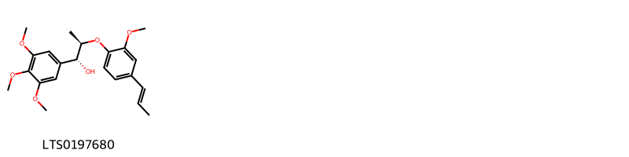
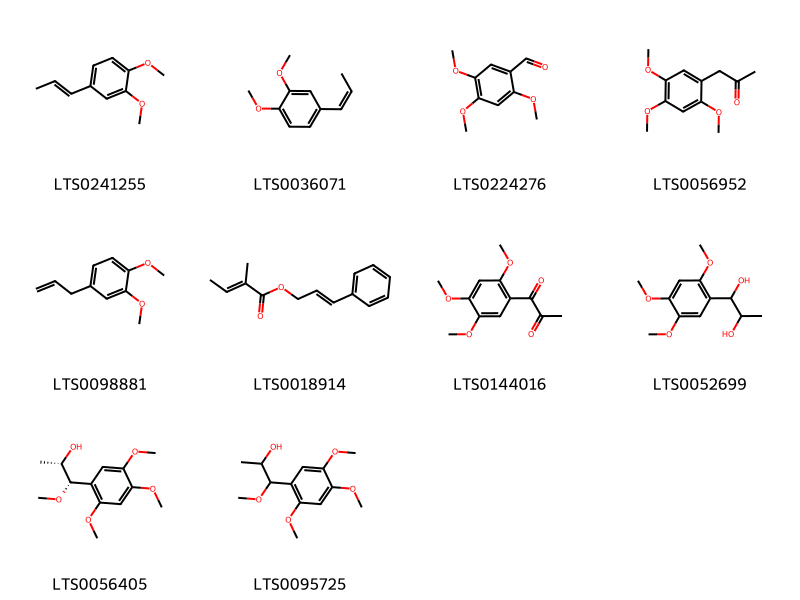
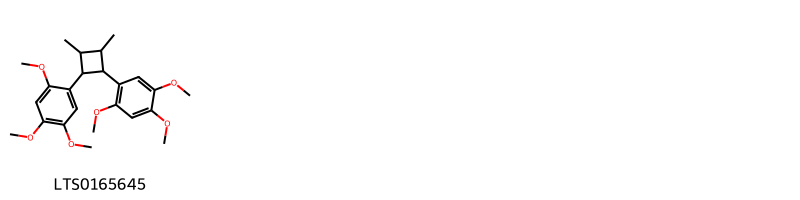
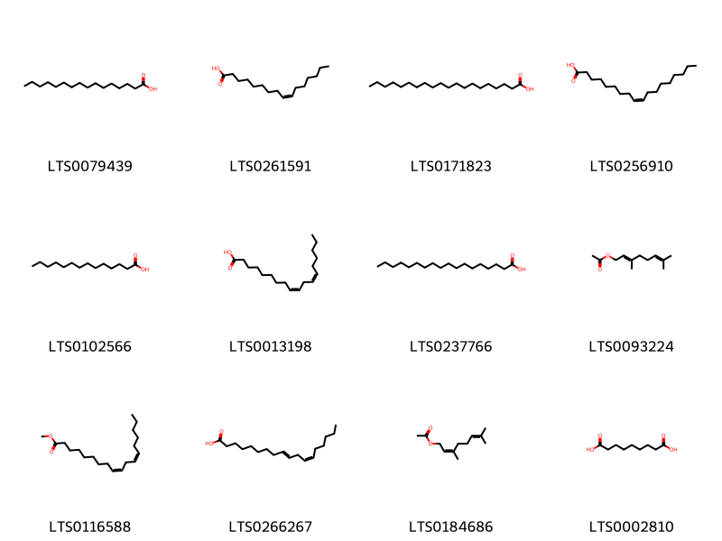
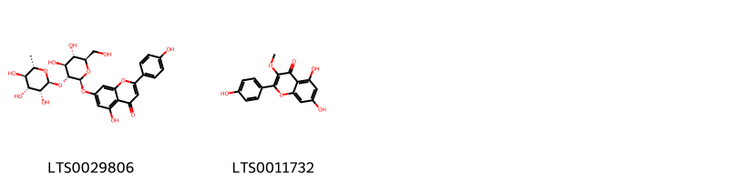
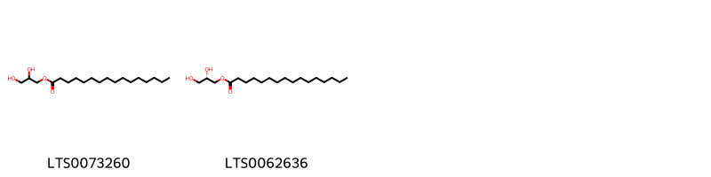
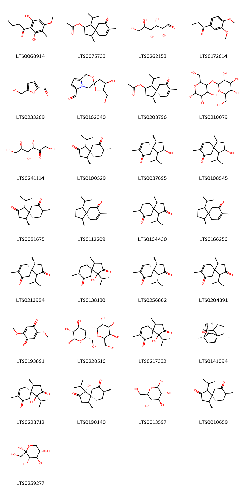
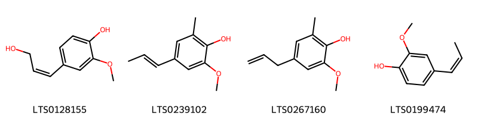
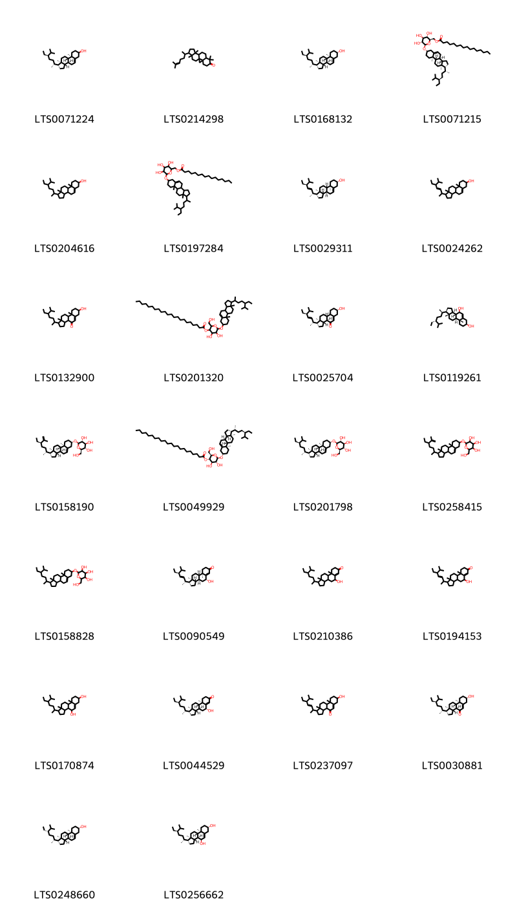

!!! abstract "Tóm tắt"

    Xương bồ (Rhizoma Acori) là thân rễ đã phơi khô, hoặc sấy khô của cây Thạch xương bồ lá to (Acorus gramineus Soland. var. macrospadiceus Yamamoto Contr) và cây Thủy Xương bồ (Acorus calamus L. var. angustatus Bess.), họ Ráy (Araceae). Loài cây này mọc hoang tại các vùng núi miền Bắc và Trung Việt Nam, thường tìm thấy ở những nơi khe đá, khe suối, và chỗ mát. Theo tài liệu cổ, xương bồ có tính tân, ôn, vào các kinh tâm, can, tỳ. Dược liệu dùng trị bệnh phong điên gian, đờm vít tắc, hôn mê, hay quên, mộng nhiều, viêm phế quản, tai điếc, đi lỵ đau bụng, dùng ngoài, trị mụn nhọt, ghé lở chảy nước. Thành phần hóa học của xương bồ chủ yếu bao gồm tinh dầu với các hợp chất như asaron, acorenon, và iso-acorenon.

## Thông tin về thực vật

Dược liệu **Xương Bồ** từ bộ phận **nan** từ loài *Acorus gramineus*.

**Mô tả thực vật:** "Thạch Xương Bồ
Thạch xương bồ là một loại cỏ sống lâu năm với các đặc điểm sau:

Thân rễ: Mọc ngang, đường kính tương đương ngón tay, có nhiều đốt với các sẹo lá. Khi khô, thân rễ có màu nâu sắt và mùi thơm đặc trưng. Thân rễ dài khoảng 20 cm đến 5 cm, đường kính từ 5 mm đến 7 mm.

Lá: Mọc đứng, hình dải, dài từ 30-50 cm, rộng 2-6 mm, chỉ có gân giữa.

Hoa: Hoa mọc thành bông mo ở đầu một cán dẹt dài 10-30 cm, được phủ bởi một lá bắc dài 7-20 cm, rộng 2-4 mm, vượt cao hơn cụm hoa. Cụm hoa dài từ 5-12 cm, đường kính 2-4 mm.

Quả: Quả mọng màu đỏ nhạt, một ngăn, có thành gần như khô, quanh hạt có một chất nhầy.

Thủy Xương Bồ (Acorus calamus)
Thủy xương bồ cũng có các đặc điểm tương tự như thạch xương bồ nhưng lớn và cao hơn:

Thân rễ: Hình trụ dẹt, dài trung bình từ 50 cm đến 60 cm, có khi tới 1 m, dày 0,5 cm đến 1 cm, đốt dài khoảng 1 cm. Mặt vỏ có màu nâu sắt với nhiều chấm đen. Thân rễ có mùi thơm đặc trưng, thể chất dai và xốp.

Lá: Dài từ 50-150 cm, rộng 6-30 mm. Lá bắc của cán hoa cũng dài hơn, thường tới 45 cm.

Hoa: Cụm hoa mọc thành bóng mẫm, so với cụm hoa của thạch xương bồ thì to và ngắn hơn, dài từ 4-8 cm, đường kính 6-12 mm. Mùa hoa vào tháng 5-7, mùa quả từ tháng 6-8."

*Tài liệu tham khảo:* "Những cây thuốc và vị thuốc Việt Nam" - Đỗ Tất Lợi 
Trong dược điển Việt nam, một số loài có thể dùng thay thế cho nhau làm dược liệu bao gồm *Acorus gramineus, Acorus calamus*

!!! info "Phân loại thực vật của *Acorus gramineus*"
    - **Kingdom:** Plantae
    - **Phylum:** Tracheophyta
    - **Order:** Acorales
    - **Family:** Acoraceae
    - **Genus:** Acorus
    - **Species:** *Acorus gramineus*

**Phân bố trên thế giới:** Germany, nan, United States of America, Philippines, Chinese Taipei, China, Hong Kong, United Kingdom of Great Britain and Northern Ireland, Japan, Korea, Republic of, Macao, Viet Nam, Belgium

**Phân bố tại Việt nam:** Không có ghi nhận ở Việt Nam

!!! info "Phân loại thực vật của *Acorus calamus*"
    - **Kingdom:** Plantae
    - **Phylum:** Tracheophyta
    - **Order:** Acorales
    - **Family:** Acoraceae
    - **Genus:** Acorus
    - **Species:** *Acorus calamus*

**Phân bố trên thế giới:** Germany, Switzerland, Czechia, Netherlands, Finland, Poland, Sweden, Japan, Belarus, Russian Federation, United Kingdom of Great Britain and Northern Ireland, Ukraine, United States of America, China, Lithuania, Italy, Norway, Canada, Denmark, Austria, Belgium

**Phân bố tại Việt nam:** Không có ghi nhận ở Việt Nam

## Thông tin về dược liệu 

### Định danh

!!! info "Thông tin về tên gọi"

    - Dược liệu tiếng Việt: nan
    - Dược liệu tiếng Trung: nan (nan)
    - Dược liệu tiếng Anh: nan
    - Dược liệu latin thông dụng: nan
    - Dược liệu latin kiểu DĐVN: *rhizoma acori*
    - Dược liệu latin kiểu DĐVN: *nan*
    - Dược liệu latin kiểu thông tư: *nan*
    - Bộ phận dùng: nan (nan)

### Mô tả dược liệu 

- **Theo dược điển Việt nam V:** nan

- **Mô tả dược liệu theo thông tư chế biến dược liệu theo phương pháp cổ truyền:** nan

### Chế biến 

- **Chế biến theo dược điển việt nam V**: nan

- **Chế biến theo thông tư:** nan

--- 

## Thành phần hóa học

- Theo tài liệu của GS. Đỗ Tất Lợi:  (1) Nhóm hóa học: Tinh dầu: Chứa các hợp chất như Asaron, acorenon, iso-acorenon.

(2) Tên hoạt chất là biomarker: Asaron
    

**Thành phần hóa học từ loài **Acorus calamus**

Theo cơ sở dữ liệu lotus, loài *Acorus calamus* đã phân lập và xác định được **283** hoạt chất thuộc về các nhóm Organonitrogen compounds, Lignan lactones, Fatty Acyls, Indanes, Phenols, Tropones, Carboxylic acids and derivatives, Unsaturated hydrocarbons, Cinnamaldehydes, Steroids and steroid derivatives, Cyclobutane lignans, Flavonoids, Furanoid lignans, Dioxolanes, Alkyl halides, Benzene and substituted derivatives, Prenol lipids, Organooxygen compounds, Cinnamic acids and derivatives, Hydroxy acids and derivatives, Phenol ethers, Benzofurans, Glycerolipids trong bảng dưới đây. Danh sách các hoạt chất như sau (1s,4s,4as,6r,8ar)-4-isopropyl-1,6-dimethyl-octahydronaphthalene-1,6-diol [(LTS0146428)](https://lotus.naturalproducts.net/compound/lotus_id/LTS0146428), (1r,2s,5r,6s,9r,10s)-2-isopropyl-5-methyl-11-oxatricyclo[7.2.1.0¹,⁶]dodecane-5,9,10-triol [(LTS0032791)](https://lotus.naturalproducts.net/compound/lotus_id/LTS0032791), 4-isopropyl-1,6-dimethyl-2,3,4,4a,7,8-hexahydronaphthalene [(LTS0270743)](https://lotus.naturalproducts.net/compound/lotus_id/LTS0270743), (2r,3r,4s,5s,6r)-2-{[(1r,3as,3bs,7s,9ar,9bs,11ar)-1-[(2r,5r)-5-ethyl-6-methylhept-6-en-2-yl]-9a,11a-dimethyl-1h,2h,3h,3ah,3bh,4h,6h,7h,8h,9h,9bh,10h,11h-cyclopenta[a]phenanthren-7-yl]oxy}-6-(hydroxymethyl)oxane-3,4,5-triol [(LTS0158190)](https://lotus.naturalproducts.net/compound/lotus_id/LTS0158190), (1r,4s,5s,8s)-1-isopropyl-4,8-dimethylspiro[4.5]decane-2,7-dione [(LTS0081675)](https://lotus.naturalproducts.net/compound/lotus_id/LTS0081675), 1-hydroxy-1-isopropyl-4,8-dimethylspiro[4.5]dec-8-ene-2,7-dione [(LTS0217332)](https://lotus.naturalproducts.net/compound/lotus_id/LTS0217332), (1ar,7r,7ar,7bs)-1,1,7,7a-tetramethyl-1ah,2h,4h,5h,6h,7h,7bh-cyclopropa[a]naphthalene [(LTS0261904)](https://lotus.naturalproducts.net/compound/lotus_id/LTS0261904), (2r,3r,4r,5s)-2,4-dimethyl-3,5-bis(2,4,5-trimethoxyphenyl)oxolane [(LTS0234140)](https://lotus.naturalproducts.net/compound/lotus_id/LTS0234140), (1s,2r,4s,5s)-1-isopropyl-4,8-dimethyl-9-oxospiro[4.5]dec-7-en-2-yl acetate [(LTS0203796)](https://lotus.naturalproducts.net/compound/lotus_id/LTS0203796), (+)-glucose [(LTS0262158)](https://lotus.naturalproducts.net/compound/lotus_id/LTS0262158), 1-(2,4,5-trimethoxyphenyl)propane-1,2-diol [(LTS0052699)](https://lotus.naturalproducts.net/compound/lotus_id/LTS0052699), 3,7-dimethyloct-7-en-3-ol [(LTS0106290)](https://lotus.naturalproducts.net/compound/lotus_id/LTS0106290), sitoindoside i [(LTS0071215)](https://lotus.naturalproducts.net/compound/lotus_id/LTS0071215), α pinene [(LTS0132416)](https://lotus.naturalproducts.net/compound/lotus_id/LTS0132416), glucose [(LTS0013597)](https://lotus.naturalproducts.net/compound/lotus_id/LTS0013597), stearic acid [(LTS0237766)](https://lotus.naturalproducts.net/compound/lotus_id/LTS0237766), tatarinoid b [(LTS0099152)](https://lotus.naturalproducts.net/compound/lotus_id/LTS0099152), (2s,3s,6s)-3-ethenyl-6-isopropyl-2-(prop-1-en-2-yl)cyclohexan-1-one [(LTS0025923)](https://lotus.naturalproducts.net/compound/lotus_id/LTS0025923), linoleic [(LTS0013198)](https://lotus.naturalproducts.net/compound/lotus_id/LTS0013198), 2-acetonaphthone [(LTS0259932)](https://lotus.naturalproducts.net/compound/lotus_id/LTS0259932), (-)-malic acid [(LTS0128885)](https://lotus.naturalproducts.net/compound/lotus_id/LTS0128885), geranyl acetate [(LTS0093224)](https://lotus.naturalproducts.net/compound/lotus_id/LTS0093224), (1r,4s,5s)-1-isopropyl-4,8-dimethylspiro[4.5]dec-8-ene-2,7-dione [(LTS0256862)](https://lotus.naturalproducts.net/compound/lotus_id/LTS0256862), d-fructopyranose [(LTS0259277)](https://lotus.naturalproducts.net/compound/lotus_id/LTS0259277), 3-ethenyl-6-isopropyl-3-methyl-2-(prop-1-en-2-yl)cyclohexan-1-one [(LTS0138920)](https://lotus.naturalproducts.net/compound/lotus_id/LTS0138920), 4-[(2s,3s,4s,5s)-5-(4-hydroxy-3-methoxyphenyl)-3,4-dimethyloxolan-2-yl]-2-methoxyphenol [(LTS0041148)](https://lotus.naturalproducts.net/compound/lotus_id/LTS0041148), proximadiol [(LTS0133156)](https://lotus.naturalproducts.net/compound/lotus_id/LTS0133156), 2,5-dimethoxy-4-benzoquinone [(LTS0193891)](https://lotus.naturalproducts.net/compound/lotus_id/LTS0193891), (3ar,4s)-1,4-dimethyl-7-(propan-2-ylidene)-2,3,3a,4,5,8-hexahydroazulen-6-one [(LTS0052280)](https://lotus.naturalproducts.net/compound/lotus_id/LTS0052280), (z)-methyl isoeugenol [(LTS0036071)](https://lotus.naturalproducts.net/compound/lotus_id/LTS0036071), α-selinene [(LTS0024564)](https://lotus.naturalproducts.net/compound/lotus_id/LTS0024564), bicyclogermacrene [(LTS0099340)](https://lotus.naturalproducts.net/compound/lotus_id/LTS0099340), 4-[5-(3,4-dihydroxybut-1-en-1-yl)pyrazin-2-yl]butane-1,2,3-triol [(LTS0244350)](https://lotus.naturalproducts.net/compound/lotus_id/LTS0244350), (1s,3ar,4r,7s,8r,8ar)-7-isopropyl-1,4-dimethyl-octahydroazulene-1,4,8-triol [(LTS0207765)](https://lotus.naturalproducts.net/compound/lotus_id/LTS0207765), (2r,3s,4r,5r,6r)-6-{[(1r,3as,3bs,7s,9ar,9bs,11ar)-1-[(2r,5r)-5-ethyl-6-methylheptan-2-yl]-9a,11a-dimethyl-1h,2h,3h,3ah,3bh,4h,6h,7h,8h,9h,9bh,10h,11h-cyclopenta[a]phenanthren-7-yl]oxy}-4,5-dihydroxy-2-(hydroxymethyl)oxan-3-yl docosanoate [(LTS0049929)](https://lotus.naturalproducts.net/compound/lotus_id/LTS0049929), (+)-preisocalamenediol [(LTS0086036)](https://lotus.naturalproducts.net/compound/lotus_id/LTS0086036), (-)-α-curcumene [(LTS0216936)](https://lotus.naturalproducts.net/compound/lotus_id/LTS0216936), (1r,4ar,5s,7s)-5-isopropyl-3,8-dimethyl-1,2,4a,5,6,7-hexahydronaphthalene-1,7-diol [(LTS0129166)](https://lotus.naturalproducts.net/compound/lotus_id/LTS0129166), 3-ethenyl-6-isopropyl-3-methyl-2-(propan-2-ylidene)cyclohexan-1-one [(LTS0251606)](https://lotus.naturalproducts.net/compound/lotus_id/LTS0251606), 1,4-dimethyl-2,3-dihydro-1h-azulen-6-one [(LTS0001429)](https://lotus.naturalproducts.net/compound/lotus_id/LTS0001429), 7,8-dimethoxy-2-azatetracyclo[7.6.1.0⁵,¹⁶.0¹⁰,¹⁵]hexadeca-1(16),2,4,6,8,10,12,14-octaen-11-ol [(LTS0239965)](https://lotus.naturalproducts.net/compound/lotus_id/LTS0239965), (1r,2s,6s,7s,8r)-8-isopropyl-1,3-dimethyltricyclo[4.4.0.0²,⁷]dec-3-ene [(LTS0106607)](https://lotus.naturalproducts.net/compound/lotus_id/LTS0106607), 1-[2,3-dimethyl-4-(2,4,5-trimethoxyphenyl)cyclobutyl]-2,4,5-trimethoxybenzene [(LTS0165645)](https://lotus.naturalproducts.net/compound/lotus_id/LTS0165645), 1,2,4-trimethoxy-5-(prop-1-en-1-yl)benzene [(LTS0011897)](https://lotus.naturalproducts.net/compound/lotus_id/LTS0011897), 3,7-dimethylocta-2,6-dien-1-yl acetate [(LTS0184686)](https://lotus.naturalproducts.net/compound/lotus_id/LTS0184686), 1,1-bis(2,4,5-trimethoxyphenyl)propan-2-ol [(LTS0177291)](https://lotus.naturalproducts.net/compound/lotus_id/LTS0177291), azelaic acid [(LTS0002810)](https://lotus.naturalproducts.net/compound/lotus_id/LTS0002810), 3-ethenyl-6-isopropyl-2-(prop-1-en-2-yl)cyclohexan-1-one [(LTS0019773)](https://lotus.naturalproducts.net/compound/lotus_id/LTS0019773), (2r,3s)-2-methyl-3-(2,4,5-trimethoxyphenyl)oxirane [(LTS0123607)](https://lotus.naturalproducts.net/compound/lotus_id/LTS0123607), (1r,2r,5s,7r)-2,6,6-trimethyl-8-methylidenetricyclo[5.3.1.0¹,⁵]undecane [(LTS0199043)](https://lotus.naturalproducts.net/compound/lotus_id/LTS0199043), (1r,3as,4r,6as)-1,4-bis(3,4-dimethoxyphenyl)-hexahydrofuro[3,4-c]furan [(LTS0140022)](https://lotus.naturalproducts.net/compound/lotus_id/LTS0140022), (4s,5s)-1-isopropyl-4,8-dimethylspiro[4.5]dec-8-ene-2,7-dione [(LTS0148099)](https://lotus.naturalproducts.net/compound/lotus_id/LTS0148099), (1ar,4r,4ar,7r,7as,7br)-1,1,4,7-tetramethyl-octahydrocyclopropa[e]azulene-4,7-diol [(LTS0161970)](https://lotus.naturalproducts.net/compound/lotus_id/LTS0161970), (2r,4ar,8ar)-2-isopropyl-4a,8-dimethyl-2,3,4,5,6,8a-hexahydronaphthalen-1-one [(LTS0139814)](https://lotus.naturalproducts.net/compound/lotus_id/LTS0139814), (1r,4r,4as,6r,8as)-4-isopropyl-1,6-dimethyl-hexahydro-2h-naphthalene-1,6,8a-triol [(LTS0117149)](https://lotus.naturalproducts.net/compound/lotus_id/LTS0117149), 2-isopropyl-5-methyl-9-methylidenecyclodec-5-en-1-one [(LTS0257046)](https://lotus.naturalproducts.net/compound/lotus_id/LTS0257046), 3-phenylprop-2-en-1-yl (2e)-2-methylbut-2-enoate [(LTS0018914)](https://lotus.naturalproducts.net/compound/lotus_id/LTS0018914), 7-isopropyl-1,4-dimethyl-3,3a,6,7,8,8a-hexahydro-2h-azulene-1,8-diol [(LTS0254923)](https://lotus.naturalproducts.net/compound/lotus_id/LTS0254923), arachidic acid [(LTS0171823)](https://lotus.naturalproducts.net/compound/lotus_id/LTS0171823), (4s,4as,8as)-4-isopropyl-1,6-dimethyl-3,4,4a,7,8,8a-hexahydronaphthalene [(LTS0014980)](https://lotus.naturalproducts.net/compound/lotus_id/LTS0014980), (1r)-1,4-dimethyl-2,3-dihydro-1h-azulen-6-one [(LTS0140869)](https://lotus.naturalproducts.net/compound/lotus_id/LTS0140869), (1s,4s,5s)-1-hydroxy-1-isopropyl-4,8-dimethylspiro[4.5]dec-8-ene-2,7-dione [(LTS0228712)](https://lotus.naturalproducts.net/compound/lotus_id/LTS0228712), (2s,4ar,5r)-5-hydroxy-2-isopropyl-4a,8-dimethyl-2,3,4,5,6,7-hexahydronaphthalen-1-one [(LTS0025879)](https://lotus.naturalproducts.net/compound/lotus_id/LTS0025879), 2-isopropyl-4a-methyl-8-methylidene-hexahydro-2h-naphthalen-1-one [(LTS0080817)](https://lotus.naturalproducts.net/compound/lotus_id/LTS0080817), (5s,8s,9ar)-3,3,5,8-tetramethyl-5h,6h,7h,8h,9h-azuleno[6,5-c][1,2]dioxol-9a-ol [(LTS0205591)](https://lotus.naturalproducts.net/compound/lotus_id/LTS0205591), 1-(5-ethyl-6-methylhept-3-en-2-yl)-5-hydroxy-9a,11a-dimethyl-1h,2h,3h,3ah,3bh,4h,5h,8h,9h,9bh,10h,11h-cyclopenta[a]phenanthren-7-one [(LTS0194153)](https://lotus.naturalproducts.net/compound/lotus_id/LTS0194153), 1-isopropyl-4,8-dimethyl-9-oxospiro[4.5]dec-7-en-2-yl acetate [(LTS0075733)](https://lotus.naturalproducts.net/compound/lotus_id/LTS0075733), 2,4,5-trimethoxybenzaldehyde [(LTS0224276)](https://lotus.naturalproducts.net/compound/lotus_id/LTS0224276), β-caryophyllene oxide [(LTS0213960)](https://lotus.naturalproducts.net/compound/lotus_id/LTS0213960), 3-[(2s)-6-methylhept-5-en-2-yl]-6-methylidenecyclohex-1-ene [(LTS0195839)](https://lotus.naturalproducts.net/compound/lotus_id/LTS0195839), 1-(3,4-dimethoxyphenyl)propan-1-one [(LTS0172614)](https://lotus.naturalproducts.net/compound/lotus_id/LTS0172614), methyl eugenol [(LTS0098881)](https://lotus.naturalproducts.net/compound/lotus_id/LTS0098881), 4-[(2r,3r,4r,5r)-5-(4-hydroxy-3-methoxyphenyl)-3,4-dimethyloxolan-2-yl]-2-methoxyphenol [(LTS0214916)](https://lotus.naturalproducts.net/compound/lotus_id/LTS0214916), 1-(2,4,5-trimethoxyphenyl)propane-1,2-dione [(LTS0144016)](https://lotus.naturalproducts.net/compound/lotus_id/LTS0144016), camphor [(LTS0091905)](https://lotus.naturalproducts.net/compound/lotus_id/LTS0091905), 2,5-bis(3,4-dimethoxyphenyl)-3,4-dimethyloxolane [(LTS0021613)](https://lotus.naturalproducts.net/compound/lotus_id/LTS0021613), cymene [(LTS0181568)](https://lotus.naturalproducts.net/compound/lotus_id/LTS0181568), terpineol [(LTS0136148)](https://lotus.naturalproducts.net/compound/lotus_id/LTS0136148), 1,4-dimethyl-7-(propan-2-ylidene)-1,2,3,4,5,8-hexahydroazulen-6-one [(LTS0030968)](https://lotus.naturalproducts.net/compound/lotus_id/LTS0030968), 5-(butoxymethyl)furan-2-carbaldehyde [(LTS0220329)](https://lotus.naturalproducts.net/compound/lotus_id/LTS0220329), 1-hexadecanoyl-sn-glycerol [(LTS0062636)](https://lotus.naturalproducts.net/compound/lotus_id/LTS0062636), humulene [(LTS0263171)](https://lotus.naturalproducts.net/compound/lotus_id/LTS0263171), (2r,3s,6s)-3-ethenyl-6-isopropyl-2-(prop-1-en-2-yl)cyclohexan-1-one [(LTS0147891)](https://lotus.naturalproducts.net/compound/lotus_id/LTS0147891), (+)-α-terpineol [(LTS0258249)](https://lotus.naturalproducts.net/compound/lotus_id/LTS0258249), (1s,2r)-1-(2,4,5-trimethoxyphenyl)propane-1,2-diol [(LTS0051018)](https://lotus.naturalproducts.net/compound/lotus_id/LTS0051018), 4-hydroxy-5-isopropyl-3,8-dimethyl-4a,5,6,7-tetrahydro-4h-naphthalen-1-one [(LTS0212628)](https://lotus.naturalproducts.net/compound/lotus_id/LTS0212628), 7-isopropyl-10-methyl-2-oxatricyclo[6.3.1.0⁴,¹²]dodeca-1(11),3,8(12),9-tetraene [(LTS0033231)](https://lotus.naturalproducts.net/compound/lotus_id/LTS0033231), (1s,2s)-1-methoxy-1-(2,4,5-trimethoxyphenyl)propan-2-ol [(LTS0056405)](https://lotus.naturalproducts.net/compound/lotus_id/LTS0056405), (1r,4s,4ar,8as)-4-isopropyl-1-methyl-6-methylidene-hexahydro-2h-naphthalene-1,4a-diol [(LTS0099635)](https://lotus.naturalproducts.net/compound/lotus_id/LTS0099635), (3r,6e)-nerolidol [(LTS0145065)](https://lotus.naturalproducts.net/compound/lotus_id/LTS0145065), (1s,3ar,4s,6ar)-1-(3,5-dimethoxyphenyl)-4-(3,4,5-trimethoxyphenyl)-hexahydrofuro[3,4-c]furan [(LTS0268696)](https://lotus.naturalproducts.net/compound/lotus_id/LTS0268696), choline [(LTS0170307)](https://lotus.naturalproducts.net/compound/lotus_id/LTS0170307), (1r,4s,4as,8ar)-4-isopropyl-1,6-dimethyl-3,4,4a,7,8,8a-hexahydro-2h-naphthalen-1-ol [(LTS0087313)](https://lotus.naturalproducts.net/compound/lotus_id/LTS0087313), 1,4-bis(3,4-dimethoxyphenyl)-hexahydrofuro[3,4-c]furan [(LTS0153100)](https://lotus.naturalproducts.net/compound/lotus_id/LTS0153100), 6-methylisoeugenol [(LTS0239102)](https://lotus.naturalproducts.net/compound/lotus_id/LTS0239102), (1r,4s,5s,8r)-1-isopropyl-4,8-dimethylspiro[4.5]decane-2,7-dione [(LTS0100529)](https://lotus.naturalproducts.net/compound/lotus_id/LTS0100529), 1-(5-ethyl-6-methylheptan-2-yl)-9a,11a-dimethyl-1h,2h,3h,3ah,3bh,4h,6h,7h,8h,9h,9bh,10h,11h-cyclopenta[a]phenanthrene-4,7-diol [(LTS0170874)](https://lotus.naturalproducts.net/compound/lotus_id/LTS0170874), l-aspartic acid [(LTS0205466)](https://lotus.naturalproducts.net/compound/lotus_id/LTS0205466), palmitoleic acid [(LTS0261591)](https://lotus.naturalproducts.net/compound/lotus_id/LTS0261591), (-)-linalool [(LTS0200382)](https://lotus.naturalproducts.net/compound/lotus_id/LTS0200382), eudesmin [(LTS0184210)](https://lotus.naturalproducts.net/compound/lotus_id/LTS0184210), (+)-galbacin [(LTS0024698)](https://lotus.naturalproducts.net/compound/lotus_id/LTS0024698), isoeugenyl methyl ether [(LTS0241255)](https://lotus.naturalproducts.net/compound/lotus_id/LTS0241255), (1r)-1,8-dimethyl-4-(prop-1-en-2-yl)spiro[4.5]dec-7-ene [(LTS0247635)](https://lotus.naturalproducts.net/compound/lotus_id/LTS0247635), (1s,3ar,7s,8r,8ar)-7-isopropyl-1,4-dimethyl-3,3a,6,7,8,8a-hexahydro-2h-azulene-1,8-diol [(LTS0260746)](https://lotus.naturalproducts.net/compound/lotus_id/LTS0260746), 2-hydroxy-1-(2,4,5-trimethoxyphenyl)propan-1-one [(LTS0246129)](https://lotus.naturalproducts.net/compound/lotus_id/LTS0246129), methyl 4-{[(1s,2s)-1-(3,4-dimethoxyphenyl)-1-hydroxypropan-2-yl]oxy}-3-methoxybenzoate [(LTS0230346)](https://lotus.naturalproducts.net/compound/lotus_id/LTS0230346), 2-methyl-3-(2,4,5-trimethoxyphenyl)oxirane [(LTS0174916)](https://lotus.naturalproducts.net/compound/lotus_id/LTS0174916), 2-isopropyl-5-methyl-11-oxatricyclo[7.2.1.0¹,⁶]dodecane-5,9,10-triol [(LTS0134442)](https://lotus.naturalproducts.net/compound/lotus_id/LTS0134442), (2r,3s)-4-{5-[(1e,3s)-3,4-dihydroxybut-1-en-1-yl]pyrazin-2-yl}butane-1,2,3-triol [(LTS0269873)](https://lotus.naturalproducts.net/compound/lotus_id/LTS0269873), (+)-4-terpineol [(LTS0140257)](https://lotus.naturalproducts.net/compound/lotus_id/LTS0140257), tatarinowin a [(LTS0060221)](https://lotus.naturalproducts.net/compound/lotus_id/LTS0060221), (+)-β-cedrene [(LTS0009064)](https://lotus.naturalproducts.net/compound/lotus_id/LTS0009064), (-)-isoshyobunone [(LTS0268112)](https://lotus.naturalproducts.net/compound/lotus_id/LTS0268112), l-glutamic acid [(LTS0037133)](https://lotus.naturalproducts.net/compound/lotus_id/LTS0037133), (2s,3s,4s,5r)-2,4-dimethyl-3,5-bis(2,4,5-trimethoxyphenyl)oxolane [(LTS0061285)](https://lotus.naturalproducts.net/compound/lotus_id/LTS0061285), (4z)-5,9-dimethyl-2-(prop-1-en-2-yl)deca-4,8-dien-1-ol [(LTS0063111)](https://lotus.naturalproducts.net/compound/lotus_id/LTS0063111), (2r,3r,4r,5s,6s)-6-(hydroxymethyl)-5-{[(2r,3r,4s,5r,6r)-3,4,5-trihydroxy-6-(hydroxymethyl)oxan-2-yl]oxy}oxane-2,3,4-triol [(LTS0220516)](https://lotus.naturalproducts.net/compound/lotus_id/LTS0220516), (4s,4as)-4-isopropyl-1,6-dimethyl-3,4,4a,7-tetrahydronaphthalene [(LTS0098195)](https://lotus.naturalproducts.net/compound/lotus_id/LTS0098195), β-pinene [(LTS0117550)](https://lotus.naturalproducts.net/compound/lotus_id/LTS0117550), 1-(2,4,5-trimethoxyphenyl)propan-2-one [(LTS0056952)](https://lotus.naturalproducts.net/compound/lotus_id/LTS0056952), 6-methyleugenol [(LTS0267160)](https://lotus.naturalproducts.net/compound/lotus_id/LTS0267160), 7β-hydroxysitosterol [(LTS0119261)](https://lotus.naturalproducts.net/compound/lotus_id/LTS0119261), 1-(5-ethyl-6-methylheptan-2-yl)-5-hydroxy-9a,11a-dimethyl-1h,2h,3h,3ah,3bh,4h,5h,8h,9h,9bh,10h,11h-cyclopenta[a]phenanthren-7-one [(LTS0210386)](https://lotus.naturalproducts.net/compound/lotus_id/LTS0210386), 7-isopropyl-1-methyl-4-methylidene-octahydroazulene-1,8-diol [(LTS0046165)](https://lotus.naturalproducts.net/compound/lotus_id/LTS0046165), (-)-germacrene a [(LTS0022487)](https://lotus.naturalproducts.net/compound/lotus_id/LTS0022487), 3,4-dihydroxy-5-(hydroxymethyl)-1',4'-dihydrospiro[oxolane-2,3'-pyrrolo[2,1-c][1,4]oxazine]-6'-carbaldehyde [(LTS0140403)](https://lotus.naturalproducts.net/compound/lotus_id/LTS0140403), 1,1,4,7-tetramethyl-octahydrocyclopropa[e]azulene-4,7-diol [(LTS0107117)](https://lotus.naturalproducts.net/compound/lotus_id/LTS0107117), (1s,3ar,4r,7s,8r,8ar)-4-ethoxy-7-isopropyl-1,4-dimethyl-octahydroazulene-1,8-diol [(LTS0083570)](https://lotus.naturalproducts.net/compound/lotus_id/LTS0083570), (7r)-7-isopropyl-10-methyl-2-oxatricyclo[6.3.1.0⁴,¹²]dodeca-1(11),3,8(12),9-tetraene [(LTS0246083)](https://lotus.naturalproducts.net/compound/lotus_id/LTS0246083), α-limonene [(LTS0244943)](https://lotus.naturalproducts.net/compound/lotus_id/LTS0244943), methyl linoleate [(LTS0116588)](https://lotus.naturalproducts.net/compound/lotus_id/LTS0116588), 4-(4-hydroxy-3,5-dimethoxyphenyl)-tetrahydro-3h-furo[3,4-c]furan-1-one [(LTS0153368)](https://lotus.naturalproducts.net/compound/lotus_id/LTS0153368), (2r,3s,4r,5s)-3,4-dihydroxy-5-(hydroxymethyl)-1',4'-dihydrospiro[oxolane-2,3'-pyrrolo[2,1-c][1,4]oxazine]-6'-carbaldehyde [(LTS0130029)](https://lotus.naturalproducts.net/compound/lotus_id/LTS0130029), (1s,3ar,7s,8r,8ar)-7-isopropyl-1-methyl-4-methylidene-octahydroazulene-1,8-diol [(LTS0194689)](https://lotus.naturalproducts.net/compound/lotus_id/LTS0194689), (1r,2r,3r)-1-ethyl-4,5,7-trimethoxy-2-methyl-3-(2,4,5-trimethoxyphenyl)-2,3-dihydro-1h-indene [(LTS0056067)](https://lotus.naturalproducts.net/compound/lotus_id/LTS0056067), (1ar,4s,4ar,7r,7ar,7bs)-1,1,4,7-tetramethyl-decahydrocyclopropa[e]azulene [(LTS0244850)](https://lotus.naturalproducts.net/compound/lotus_id/LTS0244850), (1s,2r,4s,5s)-2-hydroxy-1-isopropyl-4,8-dimethylspiro[4.5]dec-8-en-7-one [(LTS0037695)](https://lotus.naturalproducts.net/compound/lotus_id/LTS0037695), (6-{[1-(5-ethyl-6-methylheptan-2-yl)-9a,11a-dimethyl-1h,2h,3h,3ah,3bh,4h,6h,7h,8h,9h,9bh,10h,11h-cyclopenta[a]phenanthren-7-yl]oxy}-3,4,5-trihydroxyoxan-2-yl)methyl hexadecanoate [(LTS0197284)](https://lotus.naturalproducts.net/compound/lotus_id/LTS0197284), aspidinol [(LTS0068914)](https://lotus.naturalproducts.net/compound/lotus_id/LTS0068914), methyl 4-{[(1s,2s)-1-hydroxy-1-(3,4,5-trimethoxyphenyl)propan-2-yl]oxy}-3-methoxybenzoate [(LTS0213550)](https://lotus.naturalproducts.net/compound/lotus_id/LTS0213550), cuparene [(LTS0028747)](https://lotus.naturalproducts.net/compound/lotus_id/LTS0028747), stigmast-5-en-3-ol, (3β)- [(LTS0204616)](https://lotus.naturalproducts.net/compound/lotus_id/LTS0204616), 7,7,12,16-tetramethyl-15-(6-methylhept-5-en-2-yl)pentacyclo[9.7.0.0¹,³.0³,⁸.0¹²,¹⁶]octadecan-6-one [(LTS0214298)](https://lotus.naturalproducts.net/compound/lotus_id/LTS0214298), malic acid [(LTS0216520)](https://lotus.naturalproducts.net/compound/lotus_id/LTS0216520), β-ocimene [(LTS0242381)](https://lotus.naturalproducts.net/compound/lotus_id/LTS0242381), β-sesquiphellandrene [(LTS0106193)](https://lotus.naturalproducts.net/compound/lotus_id/LTS0106193), 2,4,5-trimethoxypropiophenone [(LTS0242806)](https://lotus.naturalproducts.net/compound/lotus_id/LTS0242806), palmitic acid [(LTS0079439)](https://lotus.naturalproducts.net/compound/lotus_id/LTS0079439), β-elemene [(LTS0225699)](https://lotus.naturalproducts.net/compound/lotus_id/LTS0225699), 1,2,4-trimethoxy-5-(prop-2-en-1-yl)benzene [(LTS0252786)](https://lotus.naturalproducts.net/compound/lotus_id/LTS0252786), (1r,3as,4r,6as)-1-(3,5-dimethoxyphenyl)-4-(3,4,5-trimethoxyphenyl)-hexahydrofuro[3,4-c]furan [(LTS0096879)](https://lotus.naturalproducts.net/compound/lotus_id/LTS0096879), (1s,2s,5s,7s,8s)-2,6,6,7-tetramethyltricyclo[5.2.2.0¹,⁵]undecan-8-ol [(LTS0141094)](https://lotus.naturalproducts.net/compound/lotus_id/LTS0141094), (1ar,7r,7ar,7bs)-1,1,7,7a-tetramethyl-1ah,2h,3h,5h,6h,7h,7bh-cyclopropa[a]naphthalene [(LTS0234436)](https://lotus.naturalproducts.net/compound/lotus_id/LTS0234436), 2,6,6,8-tetramethyltricyclo[5.3.1.0¹,⁵]undecan-9-one [(LTS0059869)](https://lotus.naturalproducts.net/compound/lotus_id/LTS0059869), methyl 4-[2-formyl-5-(methoxymethyl)pyrrol-1-yl]butanoate [(LTS0191296)](https://lotus.naturalproducts.net/compound/lotus_id/LTS0191296), (2s,4r,5s)-4-hydroxy-5-(hydroxymethyl)-1',4'-dihydrospiro[oxolane-2,3'-pyrrolo[2,1-c][1,4]oxazine]-6'-carbaldehyde [(LTS0144802)](https://lotus.naturalproducts.net/compound/lotus_id/LTS0144802), 2-methoxy-6-methyl-4-[(1z)-prop-1-en-1-yl]phenol [(LTS0086001)](https://lotus.naturalproducts.net/compound/lotus_id/LTS0086001), 2-hydroxy-1-isopropyl-4,8-dimethylspiro[4.5]dec-8-en-7-one [(LTS0108545)](https://lotus.naturalproducts.net/compound/lotus_id/LTS0108545), (-)-α-pinene [(LTS0032699)](https://lotus.naturalproducts.net/compound/lotus_id/LTS0032699), 1-(3,4-dimethoxyphenyl)propan-2-one [(LTS0164502)](https://lotus.naturalproducts.net/compound/lotus_id/LTS0164502), tatarinoid a [(LTS0008942)](https://lotus.naturalproducts.net/compound/lotus_id/LTS0008942), sitogluside [(LTS0201798)](https://lotus.naturalproducts.net/compound/lotus_id/LTS0201798), (1r,2r,5r)-2-methyl-5-(prop-1-en-2-yl)cyclohexyl acetate [(LTS0174962)](https://lotus.naturalproducts.net/compound/lotus_id/LTS0174962), (1s,4s,5s)-1-isopropyl-4,8-dimethylspiro[4.5]dec-8-ene-2,7-dione [(LTS0213984)](https://lotus.naturalproducts.net/compound/lotus_id/LTS0213984), cedrol [(LTS0251071)](https://lotus.naturalproducts.net/compound/lotus_id/LTS0251071), (1r,4s,5s,8s)-1-hydroxy-1-isopropyl-4,8-dimethylspiro[4.5]decane-2,7-dione [(LTS0190140)](https://lotus.naturalproducts.net/compound/lotus_id/LTS0190140), clionasterol [(LTS0248660)](https://lotus.naturalproducts.net/compound/lotus_id/LTS0248660), (+)-shyobunone [(LTS0097992)](https://lotus.naturalproducts.net/compound/lotus_id/LTS0097992), (1s,1as,1bs,5r,5ar)-1-isopropyl-5a-methyl-2-methylidene-octahydrocyclopropa[a]inden-5-ol [(LTS0091451)](https://lotus.naturalproducts.net/compound/lotus_id/LTS0091451), 1-methoxy-1-(2,4,5-trimethoxyphenyl)propan-2-ol [(LTS0095725)](https://lotus.naturalproducts.net/compound/lotus_id/LTS0095725), stigmast-5-en-3-ol [(LTS0071224)](https://lotus.naturalproducts.net/compound/lotus_id/LTS0071224), isokaempferide [(LTS0011732)](https://lotus.naturalproducts.net/compound/lotus_id/LTS0011732), (-)-β-pinene [(LTS0108757)](https://lotus.naturalproducts.net/compound/lotus_id/LTS0108757), terpinolene [(LTS0104525)](https://lotus.naturalproducts.net/compound/lotus_id/LTS0104525), 6-{[1-(5-ethyl-6-methylheptan-2-yl)-9a,11a-dimethyl-1h,2h,3h,3ah,3bh,4h,6h,7h,8h,9h,9bh,10h,11h-cyclopenta[a]phenanthren-7-yl]oxy}-4,5-dihydroxy-2-(hydroxymethyl)oxan-3-yl docosanoate [(LTS0201320)](https://lotus.naturalproducts.net/compound/lotus_id/LTS0201320), keto-d-fructose [(LTS0241114)](https://lotus.naturalproducts.net/compound/lotus_id/LTS0241114), (+)-camphene [(LTS0109845)](https://lotus.naturalproducts.net/compound/lotus_id/LTS0109845), 3-(2,4,5-trimethoxyphenyl)prop-2-enal [(LTS0207683)](https://lotus.naturalproducts.net/compound/lotus_id/LTS0207683), (1r,3as,3bs,7s,9ar,9bs,11ar)-1-[(2r,3e,5s)-5-ethyl-6-methylhept-3-en-2-yl]-7-hydroxy-9a,11a-dimethyl-1h,2h,3h,3ah,3bh,6h,7h,8h,9h,9bh,10h,11h-cyclopenta[a]phenanthren-4-one [(LTS0025704)](https://lotus.naturalproducts.net/compound/lotus_id/LTS0025704), delta-cadinene [(LTS0019321)](https://lotus.naturalproducts.net/compound/lotus_id/LTS0019321), 1-hydroxy-1-(2,4,5-trimethoxyphenyl)propan-2-one [(LTS0005209)](https://lotus.naturalproducts.net/compound/lotus_id/LTS0005209), (+)-dioxosarcoguaiacol, (rel)- [(LTS0112043)](https://lotus.naturalproducts.net/compound/lotus_id/LTS0112043), (+)-gamma-cadinene [(LTS0103949)](https://lotus.naturalproducts.net/compound/lotus_id/LTS0103949), (1r,6s,7s)-8-isopropyl-1,3-dimethyltricyclo[4.4.0.0²,⁷]dec-3-ene [(LTS0115648)](https://lotus.naturalproducts.net/compound/lotus_id/LTS0115648), (3as,4r,6as)-4-(4-hydroxy-3,5-dimethoxyphenyl)-tetrahydro-3h-furo[3,4-c]furan-1-one [(LTS0264160)](https://lotus.naturalproducts.net/compound/lotus_id/LTS0264160), 1-(5-ethyl-6-methylhept-3-en-2-yl)-7-hydroxy-9a,11a-dimethyl-1h,2h,3h,3ah,3bh,6h,7h,8h,9h,9bh,10h,11h-cyclopenta[a]phenanthren-4-one [(LTS0237097)](https://lotus.naturalproducts.net/compound/lotus_id/LTS0237097), surinamensin [(LTS0197680)](https://lotus.naturalproducts.net/compound/lotus_id/LTS0197680), (1s,2s)-1-(2,4,5-trimethoxyphenyl)propane-1,2-diol [(LTS0026832)](https://lotus.naturalproducts.net/compound/lotus_id/LTS0026832), (1ar,7ar,7bs)-1,1,7-trimethyl-4-methylidene-octahydro-1ah-cyclopropa[e]azulene [(LTS0234655)](https://lotus.naturalproducts.net/compound/lotus_id/LTS0234655), 2-isopropyl-4a,8-dimethyl-2,3,4,5,6,8a-hexahydronaphthalen-1-one [(LTS0173913)](https://lotus.naturalproducts.net/compound/lotus_id/LTS0173913), (1r,4r,5r)-1,8-dimethyl-4-(prop-1-en-2-yl)spiro[4.5]dec-7-ene [(LTS0007005)](https://lotus.naturalproducts.net/compound/lotus_id/LTS0007005), cis-isoeugenol [(LTS0199474)](https://lotus.naturalproducts.net/compound/lotus_id/LTS0199474), 5-ethoxy-4-methoxy-2-(prop-2-en-1-yl)phenol [(LTS0041599)](https://lotus.naturalproducts.net/compound/lotus_id/LTS0041599), (1s,1as,1bs,5r,5ar,6ar)-1-isopropyl-5a-methyl-2-methylidene-octahydrocyclopropa[a]inden-5-ol [(LTS0013574)](https://lotus.naturalproducts.net/compound/lotus_id/LTS0013574), (2r,3r,4s,5s)-2,5-bis(3,4-dimethoxyphenyl)-3,4-dimethyloxolane [(LTS0056207)](https://lotus.naturalproducts.net/compound/lotus_id/LTS0056207), 1-ethyl-4,5,7-trimethoxy-2-methyl-3-(2,4,5-trimethoxyphenyl)-2,3-dihydro-1h-indene [(LTS0248110)](https://lotus.naturalproducts.net/compound/lotus_id/LTS0248110), 1-(5-ethyl-6-methylheptan-2-yl)-7-hydroxy-9a,11a-dimethyl-1h,2h,3h,3ah,3bh,6h,7h,8h,9h,9bh,10h,11h-cyclopenta[a]phenanthren-4-one [(LTS0132900)](https://lotus.naturalproducts.net/compound/lotus_id/LTS0132900), (1r,4s,4as,6r,8ar)-4-isopropyl-1,6-dimethyl-hexahydro-2h-naphthalene-1,4a,6-triol [(LTS0104888)](https://lotus.naturalproducts.net/compound/lotus_id/LTS0104888), (1ar,7r,7as,7br)-1,1,4,7-tetramethyl-1ah,2h,5h,6h,7h,7ah,7bh-cyclopropa[e]azulen-3-one [(LTS0266320)](https://lotus.naturalproducts.net/compound/lotus_id/LTS0266320), d-camphor [(LTS0002057)](https://lotus.naturalproducts.net/compound/lotus_id/LTS0002057), (+)-sabinene [(LTS0110694)](https://lotus.naturalproducts.net/compound/lotus_id/LTS0110694), 7-(2-hydroxypropan-2-yl)-1,4a-dimethyl-octahydronaphthalen-1-ol [(LTS0110530)](https://lotus.naturalproducts.net/compound/lotus_id/LTS0110530), 1-isopropyl-4,8-dimethylspiro[4.5]decane-2,7-dione [(LTS0164430)](https://lotus.naturalproducts.net/compound/lotus_id/LTS0164430), (+)-veraguensin [(LTS0159494)](https://lotus.naturalproducts.net/compound/lotus_id/LTS0159494), cedrene [(LTS0120985)](https://lotus.naturalproducts.net/compound/lotus_id/LTS0120985), (1r,4s,5r)-1,8-dimethyl-4-(prop-1-en-2-yl)spiro[4.5]dec-7-ene [(LTS0138267)](https://lotus.naturalproducts.net/compound/lotus_id/LTS0138267), (1r,4s,4ar)-4-isopropyl-1-methyl-6-methylidene-hexahydro-2h-naphthalene-1,4a-diol [(LTS0037664)](https://lotus.naturalproducts.net/compound/lotus_id/LTS0037664), (2s,4ar,5r,7r)-5,7-dihydroxy-2-isopropyl-4a,8-dimethyl-2,3,4,5,6,7-hexahydronaphthalen-1-one [(LTS0028210)](https://lotus.naturalproducts.net/compound/lotus_id/LTS0028210), tatarinoid c [(LTS0165812)](https://lotus.naturalproducts.net/compound/lotus_id/LTS0165812), 5,7-dihydroxy-2-isopropyl-4a,8-dimethyl-2,3,4,5,6,7-hexahydronaphthalen-1-one [(LTS0007192)](https://lotus.naturalproducts.net/compound/lotus_id/LTS0007192), 1-(4-methoxyphenyl)prop-2-en-1-yl acetate [(LTS0073255)](https://lotus.naturalproducts.net/compound/lotus_id/LTS0073255), 1-hydroxy-1-isopropyl-4,8-dimethylspiro[4.5]decane-2,7-dione [(LTS0138130)](https://lotus.naturalproducts.net/compound/lotus_id/LTS0138130), (+)-α-thujene [(LTS0272912)](https://lotus.naturalproducts.net/compound/lotus_id/LTS0272912), 10-isopropyl-3,7-dimethylcyclodeca-2,6-dien-1-one [(LTS0196979)](https://lotus.naturalproducts.net/compound/lotus_id/LTS0196979), β-selinene [(LTS0096341)](https://lotus.naturalproducts.net/compound/lotus_id/LTS0096341), 4-isopropyl-1,6-dimethyl-3,4,4a,7-tetrahydronaphthalene [(LTS0130921)](https://lotus.naturalproducts.net/compound/lotus_id/LTS0130921), 2-{[1-(5-ethyl-6-methylheptan-2-yl)-9a,11a-dimethyl-1h,2h,3h,3ah,3bh,4h,6h,7h,8h,9h,9bh,10h,11h-cyclopenta[a]phenanthren-7-yl]oxy}-6-(hydroxymethyl)oxane-3,4,5-triol [(LTS0158828)](https://lotus.naturalproducts.net/compound/lotus_id/LTS0158828), phytosterol [(LTS0029311)](https://lotus.naturalproducts.net/compound/lotus_id/LTS0029311), α terpinene [(LTS0232891)](https://lotus.naturalproducts.net/compound/lotus_id/LTS0232891), (2r,3r,6s)-3-ethenyl-6-isopropyl-3-methyl-2-(prop-1-en-2-yl)cyclohexan-1-one [(LTS0231932)](https://lotus.naturalproducts.net/compound/lotus_id/LTS0231932), cis-asarone [(LTS0188628)](https://lotus.naturalproducts.net/compound/lotus_id/LTS0188628), rhoifolin [(LTS0029806)](https://lotus.naturalproducts.net/compound/lotus_id/LTS0029806), (1r,3as,3bs,7s,9ar,9bs,11ar)-1-[(2r,5r)-5-ethyl-6-methylheptan-2-yl]-7-hydroxy-9a,11a-dimethyl-1h,2h,3h,3ah,3bh,6h,7h,8h,9h,9bh,10h,11h-cyclopenta[a]phenanthren-4-one [(LTS0030881)](https://lotus.naturalproducts.net/compound/lotus_id/LTS0030881), acolamone [(LTS0113441)](https://lotus.naturalproducts.net/compound/lotus_id/LTS0113441), (4s,4ar)-4-isopropyl-1,6-dimethyl-3,4,4a,7-tetrahydronaphthalene [(LTS0116393)](https://lotus.naturalproducts.net/compound/lotus_id/LTS0116393), myristic acid [(LTS0102566)](https://lotus.naturalproducts.net/compound/lotus_id/LTS0102566), starch [(LTS0210079)](https://lotus.naturalproducts.net/compound/lotus_id/LTS0210079), (1s,4s,4ar,8as)-4-isopropyl-1-methyl-6-methylidene-hexahydro-2h-naphthalene-1,4a-diol [(LTS0038890)](https://lotus.naturalproducts.net/compound/lotus_id/LTS0038890), 10-hydroxy-2,6,6,8-tetramethyltricyclo[6.2.1.0¹,⁵]undecan-7-one [(LTS0229126)](https://lotus.naturalproducts.net/compound/lotus_id/LTS0229126), (1r,2r,5s,7r)-2,6,6,8-tetramethyltricyclo[5.3.1.0¹,⁵]undec-8-ene [(LTS0188060)](https://lotus.naturalproducts.net/compound/lotus_id/LTS0188060), α-thujene [(LTS0185078)](https://lotus.naturalproducts.net/compound/lotus_id/LTS0185078), (1r,4r)-1,4-dimethyl-7-(propan-2-ylidene)-1,2,3,4,5,8-hexahydroazulen-6-one [(LTS0076114)](https://lotus.naturalproducts.net/compound/lotus_id/LTS0076114), (z)-β-farnesene [(LTS0254048)](https://lotus.naturalproducts.net/compound/lotus_id/LTS0254048), (2r,4ar,5r,8as)-4a-hydroxy-2,5-dimethyl-8-(propan-2-ylidene)-hexahydronaphthalene-1,7-dione [(LTS0234455)](https://lotus.naturalproducts.net/compound/lotus_id/LTS0234455), (1s,4s,4as,8ar)-4-isopropyl-1,6-dimethyl-3,4,4a,7,8,8a-hexahydro-2h-naphthalen-1-ol [(LTS0234538)](https://lotus.naturalproducts.net/compound/lotus_id/LTS0234538), cedrene [(LTS0023956)](https://lotus.naturalproducts.net/compound/lotus_id/LTS0023956), dihydrocarvyl acetate [(LTS0126582)](https://lotus.naturalproducts.net/compound/lotus_id/LTS0126582), 2-{[1-(5-ethyl-6-methylhept-6-en-2-yl)-9a,11a-dimethyl-1h,2h,3h,3ah,3bh,4h,6h,7h,8h,9h,9bh,10h,11h-cyclopenta[a]phenanthren-7-yl]oxy}-6-(hydroxymethyl)oxane-3,4,5-triol [(LTS0258415)](https://lotus.naturalproducts.net/compound/lotus_id/LTS0258415), 4-hydroxy-5-(hydroxymethyl)-1',4'-dihydrospiro[oxolane-2,3'-pyrrolo[2,1-c][1,4]oxazine]-6'-carbaldehyde [(LTS0162340)](https://lotus.naturalproducts.net/compound/lotus_id/LTS0162340), (2e)-3-(2,4,5-trimethoxyphenyl)prop-2-enal [(LTS0077494)](https://lotus.naturalproducts.net/compound/lotus_id/LTS0077494), (1r,3as,3bs,5r,9ar,9bs,11ar)-1-[(2r,3e,5s)-5-ethyl-6-methylhept-3-en-2-yl]-5-hydroxy-9a,11a-dimethyl-1h,2h,3h,3ah,3bh,4h,5h,8h,9h,9bh,10h,11h-cyclopenta[a]phenanthren-7-one [(LTS0090549)](https://lotus.naturalproducts.net/compound/lotus_id/LTS0090549), isocaespitol [(LTS0169510)](https://lotus.naturalproducts.net/compound/lotus_id/LTS0169510), 3-isopropyl-6-methyl-2-(3-methylbut-3-en-1-yl)cyclohex-2-en-1-one [(LTS0029404)](https://lotus.naturalproducts.net/compound/lotus_id/LTS0029404), (4s,4as,5s)-4-hydroxy-5-isopropyl-3,8-dimethyl-4a,5,6,7-tetrahydro-4h-naphthalen-1-one [(LTS0132472)](https://lotus.naturalproducts.net/compound/lotus_id/LTS0132472), (1s,2s,5r,8r,10r)-10-hydroxy-2,6,6,8-tetramethyltricyclo[6.2.1.0¹,⁵]undecan-7-one [(LTS0161641)](https://lotus.naturalproducts.net/compound/lotus_id/LTS0161641), hydroxymethylfurfural [(LTS0233269)](https://lotus.naturalproducts.net/compound/lotus_id/LTS0233269), 4-isopropyl-1,6-dimethyl-3,4,4a,7,8,8a-hexahydronaphthalene [(LTS0154650)](https://lotus.naturalproducts.net/compound/lotus_id/LTS0154650), β-asarone [(LTS0003070)](https://lotus.naturalproducts.net/compound/lotus_id/LTS0003070), magnosalicin [(LTS0207294)](https://lotus.naturalproducts.net/compound/lotus_id/LTS0207294), 1,4-dimethyl-7-(propan-2-ylidene)-2,3,3a,4,5,8-hexahydroazulen-6-one [(LTS0226581)](https://lotus.naturalproducts.net/compound/lotus_id/LTS0226581), glyceryl palmitate [(LTS0073260)](https://lotus.naturalproducts.net/compound/lotus_id/LTS0073260), (2r,3s,6s)-3-ethenyl-6-isopropyl-3-methyl-2-(prop-1-en-2-yl)cyclohexan-1-one [(LTS0156272)](https://lotus.naturalproducts.net/compound/lotus_id/LTS0156272), sitosterol [(LTS0168132)](https://lotus.naturalproducts.net/compound/lotus_id/LTS0168132), (-)-acorenone [(LTS0112209)](https://lotus.naturalproducts.net/compound/lotus_id/LTS0112209), (1r,3as,3bs,4s,7s,9ar,9bs,11ar)-1-[(2r,5r)-5-ethyl-6-methylheptan-2-yl]-9a,11a-dimethyl-1h,2h,3h,3ah,3bh,4h,6h,7h,8h,9h,9bh,10h,11h-cyclopenta[a]phenanthrene-4,7-diol [(LTS0256662)](https://lotus.naturalproducts.net/compound/lotus_id/LTS0256662), (-)-β-curcumene [(LTS0027873)](https://lotus.naturalproducts.net/compound/lotus_id/LTS0027873), (1as,4ar,7s,7ar,7bs)-1,1,4,7-tetramethyl-1ah,2h,4ah,5h,6h,7h,7ah,7bh-cyclopropa[e]azulene [(LTS0192172)](https://lotus.naturalproducts.net/compound/lotus_id/LTS0192172), oleic acid [(LTS0256910)](https://lotus.naturalproducts.net/compound/lotus_id/LTS0256910), α-myrcene [(LTS0115731)](https://lotus.naturalproducts.net/compound/lotus_id/LTS0115731), β-farnesene [(LTS0067925)](https://lotus.naturalproducts.net/compound/lotus_id/LTS0067925), 5-hydroxy-2-isopropyl-4a,8-dimethyl-2,3,4,5,6,7-hexahydronaphthalen-1-one [(LTS0153030)](https://lotus.naturalproducts.net/compound/lotus_id/LTS0153030), limonene,  [(LTS0155981)](https://lotus.naturalproducts.net/compound/lotus_id/LTS0155981), (1s,4s,5r,8s)-1-isopropyl-4,8-dimethylspiro[4.5]decan-7-one [(LTS0225417)](https://lotus.naturalproducts.net/compound/lotus_id/LTS0225417), (1s,8ar)-4-isopropyl-1-methyl-6-methylidene-5,7,8,8a-tetrahydro-2h-naphthalene-1,4a-diol [(LTS0031736)](https://lotus.naturalproducts.net/compound/lotus_id/LTS0031736), 1-isopropyl-4,8-dimethylspiro[4.5]dec-8-ene-2,7-dione [(LTS0204391)](https://lotus.naturalproducts.net/compound/lotus_id/LTS0204391), (1r,3as,3bs,5r,9ar,9bs,11ar)-1-[(2r,5r)-5-ethyl-6-methylheptan-2-yl]-5-hydroxy-9a,11a-dimethyl-1h,2h,3h,3ah,3bh,4h,5h,8h,9h,9bh,10h,11h-cyclopenta[a]phenanthren-7-one [(LTS0044529)](https://lotus.naturalproducts.net/compound/lotus_id/LTS0044529), 7-isopropyl-1,4-dimethyl-octahydroazulene-1,4,8-triol [(LTS0207438)](https://lotus.naturalproducts.net/compound/lotus_id/LTS0207438), (2z)-3-(2,4,5-trimethoxyphenyl)prop-2-enal [(LTS0035147)](https://lotus.naturalproducts.net/compound/lotus_id/LTS0035147), (2e)-3-(3,4-dihydroxyphenyl)-2-methylbut-2-enoic acid [(LTS0229673)](https://lotus.naturalproducts.net/compound/lotus_id/LTS0229673), 4-isopropyl-1-methyl-6-methylidene-hexahydro-2h-naphthalene-1,4a-diol [(LTS0004913)](https://lotus.naturalproducts.net/compound/lotus_id/LTS0004913), azulen-5-ylmethanol [(LTS0256865)](https://lotus.naturalproducts.net/compound/lotus_id/LTS0256865), 10-trans,12-cis-linoleic acid [(LTS0266267)](https://lotus.naturalproducts.net/compound/lotus_id/LTS0266267), 1-isopropyl-4,8-dimethylspiro[4.5]dec-8-en-7-one [(LTS0166256)](https://lotus.naturalproducts.net/compound/lotus_id/LTS0166256), 1-(4-hydroxy-7-isopropyl-4-methyl-octahydroinden-1-yl)ethanone [(LTS0119894)](https://lotus.naturalproducts.net/compound/lotus_id/LTS0119894), 4-[(1z)-3-hydroxyprop-1-en-1-yl]-2-methoxyphenol [(LTS0128155)](https://lotus.naturalproducts.net/compound/lotus_id/LTS0128155), camphene [(LTS0267242)](https://lotus.naturalproducts.net/compound/lotus_id/LTS0267242), 2-methyl-6-(4-methylidenecyclohex-2-en-1-yl)hept-2-en-4-one [(LTS0145225)](https://lotus.naturalproducts.net/compound/lotus_id/LTS0145225), stigmasterol [(LTS0024262)](https://lotus.naturalproducts.net/compound/lotus_id/LTS0024262), (2r,4ar,8as)-2-isopropyl-4a-methyl-8-methylidene-hexahydro-2h-naphthalen-1-one [(LTS0143966)](https://lotus.naturalproducts.net/compound/lotus_id/LTS0143966), (1s,4s,5s,8s)-1-isopropyl-4,8-dimethylspiro[4.5]decane-2,7-dione [(LTS0010659)](https://lotus.naturalproducts.net/compound/lotus_id/LTS0010659), (2e,6e,10r)-10-isopropyl-3,7-dimethylcyclodeca-2,6-dien-1-one [(LTS0236380)](https://lotus.naturalproducts.net/compound/lotus_id/LTS0236380), β-farnesene [(LTS0091648)](https://lotus.naturalproducts.net/compound/lotus_id/LTS0091648). 
        
| chemicalTaxonomyClassyfireClass     |   smiles_count |
|:------------------------------------|---------------:|
|                                     |             57 |
| Alkyl halides                       |             64 |
| Benzene and substituted derivatives |            255 |
| Benzofurans                         |             57 |
| Carboxylic acids and derivatives    |             45 |
| Cinnamaldehydes                     |             76 |
| Cinnamic acids and derivatives      |             31 |
| Cyclobutane lignans                 |             48 |
| Dioxolanes                          |             89 |
| Fatty Acyls                         |            293 |
| Flavonoids                          |            155 |
| Furanoid lignans                    |            577 |
| Glycerolipids                       |             61 |
| Hydroxy acids and derivatives       |             38 |
| Indanes                             |            110 |
| Lignan lactones                     |             79 |
| Organonitrogen compounds            |             14 |
| Organooxygen compounds              |           1142 |
| Phenol ethers                       |            116 |
| Phenols                             |             87 |
| Prenol lipids                       |           4200 |
| Steroids and steroid derivatives    |           2221 |
| Tropones                            |             44 |
| Unsaturated hydrocarbons            |            131 |

            
### Nhóm 
<figure markdown="span">
    { width=100% }
<figcaption>Hình ảnh cấu trúc hóa học của hoạt chất thuộc nhóm **. Tên thường gọi của các hoạt chất tương ứng là surinamensin [(LTS0197680)](https://lotus.naturalproducts.net/compound/lotus_id/LTS0197680).</figcaption>
</figure>

            
            
### Nhóm 
<figure markdown="span">
    { width=100% }
<figcaption>Hình ảnh cấu trúc hóa học của hoạt chất thuộc nhóm **. Tên thường gọi của các hoạt chất tương ứng là surinamensin [(LTS0197680)](https://lotus.naturalproducts.net/compound/lotus_id/LTS0197680).</figcaption>
</figure>

### Nhóm Alkyl halides
<figure markdown="span">
    { width=100% }
<figcaption>Hình ảnh cấu trúc hóa học của hoạt chất thuộc nhóm *Alkyl halides*. Tên thường gọi của các hoạt chất tương ứng là isocaespitol [(LTS0169510)](https://lotus.naturalproducts.net/compound/lotus_id/LTS0169510).</figcaption>
</figure>

            
            
### Nhóm 
<figure markdown="span">
    { width=100% }
<figcaption>Hình ảnh cấu trúc hóa học của hoạt chất thuộc nhóm **. Tên thường gọi của các hoạt chất tương ứng là surinamensin [(LTS0197680)](https://lotus.naturalproducts.net/compound/lotus_id/LTS0197680).</figcaption>
</figure>

### Nhóm Alkyl halides
<figure markdown="span">
    { width=100% }
<figcaption>Hình ảnh cấu trúc hóa học của hoạt chất thuộc nhóm *Alkyl halides*. Tên thường gọi của các hoạt chất tương ứng là isocaespitol [(LTS0169510)](https://lotus.naturalproducts.net/compound/lotus_id/LTS0169510).</figcaption>
</figure>

### Nhóm Benzene and substituted derivatives
<figure markdown="span">
    { width=100% }
<figcaption>Hình ảnh cấu trúc hóa học của hoạt chất thuộc nhóm *Benzene and substituted derivatives*. Tên thường gọi của các hoạt chất tương ứng là isoeugenyl methyl ether [(LTS0241255)](https://lotus.naturalproducts.net/compound/lotus_id/LTS0241255), (z)-methyl isoeugenol [(LTS0036071)](https://lotus.naturalproducts.net/compound/lotus_id/LTS0036071), 2,4,5-trimethoxybenzaldehyde [(LTS0224276)](https://lotus.naturalproducts.net/compound/lotus_id/LTS0224276), 1-(2,4,5-trimethoxyphenyl)propan-2-one [(LTS0056952)](https://lotus.naturalproducts.net/compound/lotus_id/LTS0056952), methyl eugenol [(LTS0098881)](https://lotus.naturalproducts.net/compound/lotus_id/LTS0098881), 3-phenylprop-2-en-1-yl (2e)-2-methylbut-2-enoate [(LTS0018914)](https://lotus.naturalproducts.net/compound/lotus_id/LTS0018914), 1-(2,4,5-trimethoxyphenyl)propane-1,2-dione [(LTS0144016)](https://lotus.naturalproducts.net/compound/lotus_id/LTS0144016), 1-(2,4,5-trimethoxyphenyl)propane-1,2-diol [(LTS0052699)](https://lotus.naturalproducts.net/compound/lotus_id/LTS0052699), (1s,2s)-1-methoxy-1-(2,4,5-trimethoxyphenyl)propan-2-ol [(LTS0056405)](https://lotus.naturalproducts.net/compound/lotus_id/LTS0056405), 1-methoxy-1-(2,4,5-trimethoxyphenyl)propan-2-ol [(LTS0095725)](https://lotus.naturalproducts.net/compound/lotus_id/LTS0095725).</figcaption>
</figure>

            
            
### Nhóm 
<figure markdown="span">
    { width=100% }
<figcaption>Hình ảnh cấu trúc hóa học của hoạt chất thuộc nhóm **. Tên thường gọi của các hoạt chất tương ứng là surinamensin [(LTS0197680)](https://lotus.naturalproducts.net/compound/lotus_id/LTS0197680).</figcaption>
</figure>

### Nhóm Alkyl halides
<figure markdown="span">
    { width=100% }
<figcaption>Hình ảnh cấu trúc hóa học của hoạt chất thuộc nhóm *Alkyl halides*. Tên thường gọi của các hoạt chất tương ứng là isocaespitol [(LTS0169510)](https://lotus.naturalproducts.net/compound/lotus_id/LTS0169510).</figcaption>
</figure>

### Nhóm Benzene and substituted derivatives
<figure markdown="span">
    { width=100% }
<figcaption>Hình ảnh cấu trúc hóa học của hoạt chất thuộc nhóm *Benzene and substituted derivatives*. Tên thường gọi của các hoạt chất tương ứng là isoeugenyl methyl ether [(LTS0241255)](https://lotus.naturalproducts.net/compound/lotus_id/LTS0241255), (z)-methyl isoeugenol [(LTS0036071)](https://lotus.naturalproducts.net/compound/lotus_id/LTS0036071), 2,4,5-trimethoxybenzaldehyde [(LTS0224276)](https://lotus.naturalproducts.net/compound/lotus_id/LTS0224276), 1-(2,4,5-trimethoxyphenyl)propan-2-one [(LTS0056952)](https://lotus.naturalproducts.net/compound/lotus_id/LTS0056952), methyl eugenol [(LTS0098881)](https://lotus.naturalproducts.net/compound/lotus_id/LTS0098881), 3-phenylprop-2-en-1-yl (2e)-2-methylbut-2-enoate [(LTS0018914)](https://lotus.naturalproducts.net/compound/lotus_id/LTS0018914), 1-(2,4,5-trimethoxyphenyl)propane-1,2-dione [(LTS0144016)](https://lotus.naturalproducts.net/compound/lotus_id/LTS0144016), 1-(2,4,5-trimethoxyphenyl)propane-1,2-diol [(LTS0052699)](https://lotus.naturalproducts.net/compound/lotus_id/LTS0052699), (1s,2s)-1-methoxy-1-(2,4,5-trimethoxyphenyl)propan-2-ol [(LTS0056405)](https://lotus.naturalproducts.net/compound/lotus_id/LTS0056405), 1-methoxy-1-(2,4,5-trimethoxyphenyl)propan-2-ol [(LTS0095725)](https://lotus.naturalproducts.net/compound/lotus_id/LTS0095725).</figcaption>
</figure>

### Nhóm Benzofurans
<figure markdown="span">
    { width=100% }
<figcaption>Hình ảnh cấu trúc hóa học của hoạt chất thuộc nhóm *Benzofurans*. Tên thường gọi của các hoạt chất tương ứng là (7r)-7-isopropyl-10-methyl-2-oxatricyclo[6.3.1.0⁴,¹²]dodeca-1(11),3,8(12),9-tetraene [(LTS0246083)](https://lotus.naturalproducts.net/compound/lotus_id/LTS0246083), 7-isopropyl-10-methyl-2-oxatricyclo[6.3.1.0⁴,¹²]dodeca-1(11),3,8(12),9-tetraene [(LTS0033231)](https://lotus.naturalproducts.net/compound/lotus_id/LTS0033231).</figcaption>
</figure>

            
            
### Nhóm 
<figure markdown="span">
    { width=100% }
<figcaption>Hình ảnh cấu trúc hóa học của hoạt chất thuộc nhóm **. Tên thường gọi của các hoạt chất tương ứng là surinamensin [(LTS0197680)](https://lotus.naturalproducts.net/compound/lotus_id/LTS0197680).</figcaption>
</figure>

### Nhóm Alkyl halides
<figure markdown="span">
    { width=100% }
<figcaption>Hình ảnh cấu trúc hóa học của hoạt chất thuộc nhóm *Alkyl halides*. Tên thường gọi của các hoạt chất tương ứng là isocaespitol [(LTS0169510)](https://lotus.naturalproducts.net/compound/lotus_id/LTS0169510).</figcaption>
</figure>

### Nhóm Benzene and substituted derivatives
<figure markdown="span">
    { width=100% }
<figcaption>Hình ảnh cấu trúc hóa học của hoạt chất thuộc nhóm *Benzene and substituted derivatives*. Tên thường gọi của các hoạt chất tương ứng là isoeugenyl methyl ether [(LTS0241255)](https://lotus.naturalproducts.net/compound/lotus_id/LTS0241255), (z)-methyl isoeugenol [(LTS0036071)](https://lotus.naturalproducts.net/compound/lotus_id/LTS0036071), 2,4,5-trimethoxybenzaldehyde [(LTS0224276)](https://lotus.naturalproducts.net/compound/lotus_id/LTS0224276), 1-(2,4,5-trimethoxyphenyl)propan-2-one [(LTS0056952)](https://lotus.naturalproducts.net/compound/lotus_id/LTS0056952), methyl eugenol [(LTS0098881)](https://lotus.naturalproducts.net/compound/lotus_id/LTS0098881), 3-phenylprop-2-en-1-yl (2e)-2-methylbut-2-enoate [(LTS0018914)](https://lotus.naturalproducts.net/compound/lotus_id/LTS0018914), 1-(2,4,5-trimethoxyphenyl)propane-1,2-dione [(LTS0144016)](https://lotus.naturalproducts.net/compound/lotus_id/LTS0144016), 1-(2,4,5-trimethoxyphenyl)propane-1,2-diol [(LTS0052699)](https://lotus.naturalproducts.net/compound/lotus_id/LTS0052699), (1s,2s)-1-methoxy-1-(2,4,5-trimethoxyphenyl)propan-2-ol [(LTS0056405)](https://lotus.naturalproducts.net/compound/lotus_id/LTS0056405), 1-methoxy-1-(2,4,5-trimethoxyphenyl)propan-2-ol [(LTS0095725)](https://lotus.naturalproducts.net/compound/lotus_id/LTS0095725).</figcaption>
</figure>

### Nhóm Benzofurans
<figure markdown="span">
    { width=100% }
<figcaption>Hình ảnh cấu trúc hóa học của hoạt chất thuộc nhóm *Benzofurans*. Tên thường gọi của các hoạt chất tương ứng là (7r)-7-isopropyl-10-methyl-2-oxatricyclo[6.3.1.0⁴,¹²]dodeca-1(11),3,8(12),9-tetraene [(LTS0246083)](https://lotus.naturalproducts.net/compound/lotus_id/LTS0246083), 7-isopropyl-10-methyl-2-oxatricyclo[6.3.1.0⁴,¹²]dodeca-1(11),3,8(12),9-tetraene [(LTS0033231)](https://lotus.naturalproducts.net/compound/lotus_id/LTS0033231).</figcaption>
</figure>

### Nhóm Carboxylic acids and derivatives
<figure markdown="span">
    { width=100% }
<figcaption>Hình ảnh cấu trúc hóa học của hoạt chất thuộc nhóm *Carboxylic acids and derivatives*. Tên thường gọi của các hoạt chất tương ứng là l-aspartic acid [(LTS0205466)](https://lotus.naturalproducts.net/compound/lotus_id/LTS0205466), l-glutamic acid [(LTS0037133)](https://lotus.naturalproducts.net/compound/lotus_id/LTS0037133).</figcaption>
</figure>

            
            
### Nhóm 
<figure markdown="span">
    { width=100% }
<figcaption>Hình ảnh cấu trúc hóa học của hoạt chất thuộc nhóm **. Tên thường gọi của các hoạt chất tương ứng là surinamensin [(LTS0197680)](https://lotus.naturalproducts.net/compound/lotus_id/LTS0197680).</figcaption>
</figure>

### Nhóm Alkyl halides
<figure markdown="span">
    { width=100% }
<figcaption>Hình ảnh cấu trúc hóa học của hoạt chất thuộc nhóm *Alkyl halides*. Tên thường gọi của các hoạt chất tương ứng là isocaespitol [(LTS0169510)](https://lotus.naturalproducts.net/compound/lotus_id/LTS0169510).</figcaption>
</figure>

### Nhóm Benzene and substituted derivatives
<figure markdown="span">
    { width=100% }
<figcaption>Hình ảnh cấu trúc hóa học của hoạt chất thuộc nhóm *Benzene and substituted derivatives*. Tên thường gọi của các hoạt chất tương ứng là isoeugenyl methyl ether [(LTS0241255)](https://lotus.naturalproducts.net/compound/lotus_id/LTS0241255), (z)-methyl isoeugenol [(LTS0036071)](https://lotus.naturalproducts.net/compound/lotus_id/LTS0036071), 2,4,5-trimethoxybenzaldehyde [(LTS0224276)](https://lotus.naturalproducts.net/compound/lotus_id/LTS0224276), 1-(2,4,5-trimethoxyphenyl)propan-2-one [(LTS0056952)](https://lotus.naturalproducts.net/compound/lotus_id/LTS0056952), methyl eugenol [(LTS0098881)](https://lotus.naturalproducts.net/compound/lotus_id/LTS0098881), 3-phenylprop-2-en-1-yl (2e)-2-methylbut-2-enoate [(LTS0018914)](https://lotus.naturalproducts.net/compound/lotus_id/LTS0018914), 1-(2,4,5-trimethoxyphenyl)propane-1,2-dione [(LTS0144016)](https://lotus.naturalproducts.net/compound/lotus_id/LTS0144016), 1-(2,4,5-trimethoxyphenyl)propane-1,2-diol [(LTS0052699)](https://lotus.naturalproducts.net/compound/lotus_id/LTS0052699), (1s,2s)-1-methoxy-1-(2,4,5-trimethoxyphenyl)propan-2-ol [(LTS0056405)](https://lotus.naturalproducts.net/compound/lotus_id/LTS0056405), 1-methoxy-1-(2,4,5-trimethoxyphenyl)propan-2-ol [(LTS0095725)](https://lotus.naturalproducts.net/compound/lotus_id/LTS0095725).</figcaption>
</figure>

### Nhóm Benzofurans
<figure markdown="span">
    { width=100% }
<figcaption>Hình ảnh cấu trúc hóa học của hoạt chất thuộc nhóm *Benzofurans*. Tên thường gọi của các hoạt chất tương ứng là (7r)-7-isopropyl-10-methyl-2-oxatricyclo[6.3.1.0⁴,¹²]dodeca-1(11),3,8(12),9-tetraene [(LTS0246083)](https://lotus.naturalproducts.net/compound/lotus_id/LTS0246083), 7-isopropyl-10-methyl-2-oxatricyclo[6.3.1.0⁴,¹²]dodeca-1(11),3,8(12),9-tetraene [(LTS0033231)](https://lotus.naturalproducts.net/compound/lotus_id/LTS0033231).</figcaption>
</figure>

### Nhóm Carboxylic acids and derivatives
<figure markdown="span">
    { width=100% }
<figcaption>Hình ảnh cấu trúc hóa học của hoạt chất thuộc nhóm *Carboxylic acids and derivatives*. Tên thường gọi của các hoạt chất tương ứng là l-aspartic acid [(LTS0205466)](https://lotus.naturalproducts.net/compound/lotus_id/LTS0205466), l-glutamic acid [(LTS0037133)](https://lotus.naturalproducts.net/compound/lotus_id/LTS0037133).</figcaption>
</figure>

### Nhóm Cinnamaldehydes
<figure markdown="span">
    { width=100% }
<figcaption>Hình ảnh cấu trúc hóa học của hoạt chất thuộc nhóm *Cinnamaldehydes*. Tên thường gọi của các hoạt chất tương ứng là 3-(2,4,5-trimethoxyphenyl)prop-2-enal [(LTS0207683)](https://lotus.naturalproducts.net/compound/lotus_id/LTS0207683), (2z)-3-(2,4,5-trimethoxyphenyl)prop-2-enal [(LTS0035147)](https://lotus.naturalproducts.net/compound/lotus_id/LTS0035147), (2e)-3-(2,4,5-trimethoxyphenyl)prop-2-enal [(LTS0077494)](https://lotus.naturalproducts.net/compound/lotus_id/LTS0077494).</figcaption>
</figure>

            
            
### Nhóm 
<figure markdown="span">
    { width=100% }
<figcaption>Hình ảnh cấu trúc hóa học của hoạt chất thuộc nhóm **. Tên thường gọi của các hoạt chất tương ứng là surinamensin [(LTS0197680)](https://lotus.naturalproducts.net/compound/lotus_id/LTS0197680).</figcaption>
</figure>

### Nhóm Alkyl halides
<figure markdown="span">
    { width=100% }
<figcaption>Hình ảnh cấu trúc hóa học của hoạt chất thuộc nhóm *Alkyl halides*. Tên thường gọi của các hoạt chất tương ứng là isocaespitol [(LTS0169510)](https://lotus.naturalproducts.net/compound/lotus_id/LTS0169510).</figcaption>
</figure>

### Nhóm Benzene and substituted derivatives
<figure markdown="span">
    { width=100% }
<figcaption>Hình ảnh cấu trúc hóa học của hoạt chất thuộc nhóm *Benzene and substituted derivatives*. Tên thường gọi của các hoạt chất tương ứng là isoeugenyl methyl ether [(LTS0241255)](https://lotus.naturalproducts.net/compound/lotus_id/LTS0241255), (z)-methyl isoeugenol [(LTS0036071)](https://lotus.naturalproducts.net/compound/lotus_id/LTS0036071), 2,4,5-trimethoxybenzaldehyde [(LTS0224276)](https://lotus.naturalproducts.net/compound/lotus_id/LTS0224276), 1-(2,4,5-trimethoxyphenyl)propan-2-one [(LTS0056952)](https://lotus.naturalproducts.net/compound/lotus_id/LTS0056952), methyl eugenol [(LTS0098881)](https://lotus.naturalproducts.net/compound/lotus_id/LTS0098881), 3-phenylprop-2-en-1-yl (2e)-2-methylbut-2-enoate [(LTS0018914)](https://lotus.naturalproducts.net/compound/lotus_id/LTS0018914), 1-(2,4,5-trimethoxyphenyl)propane-1,2-dione [(LTS0144016)](https://lotus.naturalproducts.net/compound/lotus_id/LTS0144016), 1-(2,4,5-trimethoxyphenyl)propane-1,2-diol [(LTS0052699)](https://lotus.naturalproducts.net/compound/lotus_id/LTS0052699), (1s,2s)-1-methoxy-1-(2,4,5-trimethoxyphenyl)propan-2-ol [(LTS0056405)](https://lotus.naturalproducts.net/compound/lotus_id/LTS0056405), 1-methoxy-1-(2,4,5-trimethoxyphenyl)propan-2-ol [(LTS0095725)](https://lotus.naturalproducts.net/compound/lotus_id/LTS0095725).</figcaption>
</figure>

### Nhóm Benzofurans
<figure markdown="span">
    { width=100% }
<figcaption>Hình ảnh cấu trúc hóa học của hoạt chất thuộc nhóm *Benzofurans*. Tên thường gọi của các hoạt chất tương ứng là (7r)-7-isopropyl-10-methyl-2-oxatricyclo[6.3.1.0⁴,¹²]dodeca-1(11),3,8(12),9-tetraene [(LTS0246083)](https://lotus.naturalproducts.net/compound/lotus_id/LTS0246083), 7-isopropyl-10-methyl-2-oxatricyclo[6.3.1.0⁴,¹²]dodeca-1(11),3,8(12),9-tetraene [(LTS0033231)](https://lotus.naturalproducts.net/compound/lotus_id/LTS0033231).</figcaption>
</figure>

### Nhóm Carboxylic acids and derivatives
<figure markdown="span">
    { width=100% }
<figcaption>Hình ảnh cấu trúc hóa học của hoạt chất thuộc nhóm *Carboxylic acids and derivatives*. Tên thường gọi của các hoạt chất tương ứng là l-aspartic acid [(LTS0205466)](https://lotus.naturalproducts.net/compound/lotus_id/LTS0205466), l-glutamic acid [(LTS0037133)](https://lotus.naturalproducts.net/compound/lotus_id/LTS0037133).</figcaption>
</figure>

### Nhóm Cinnamaldehydes
<figure markdown="span">
    { width=100% }
<figcaption>Hình ảnh cấu trúc hóa học của hoạt chất thuộc nhóm *Cinnamaldehydes*. Tên thường gọi của các hoạt chất tương ứng là 3-(2,4,5-trimethoxyphenyl)prop-2-enal [(LTS0207683)](https://lotus.naturalproducts.net/compound/lotus_id/LTS0207683), (2z)-3-(2,4,5-trimethoxyphenyl)prop-2-enal [(LTS0035147)](https://lotus.naturalproducts.net/compound/lotus_id/LTS0035147), (2e)-3-(2,4,5-trimethoxyphenyl)prop-2-enal [(LTS0077494)](https://lotus.naturalproducts.net/compound/lotus_id/LTS0077494).</figcaption>
</figure>

### Nhóm Cinnamic acids and derivatives
<figure markdown="span">
    { width=100% }
<figcaption>Hình ảnh cấu trúc hóa học của hoạt chất thuộc nhóm *Cinnamic acids and derivatives*. Tên thường gọi của các hoạt chất tương ứng là (2e)-3-(3,4-dihydroxyphenyl)-2-methylbut-2-enoic acid [(LTS0229673)](https://lotus.naturalproducts.net/compound/lotus_id/LTS0229673).</figcaption>
</figure>

            
            
### Nhóm 
<figure markdown="span">
    { width=100% }
<figcaption>Hình ảnh cấu trúc hóa học của hoạt chất thuộc nhóm **. Tên thường gọi của các hoạt chất tương ứng là surinamensin [(LTS0197680)](https://lotus.naturalproducts.net/compound/lotus_id/LTS0197680).</figcaption>
</figure>

### Nhóm Alkyl halides
<figure markdown="span">
    { width=100% }
<figcaption>Hình ảnh cấu trúc hóa học của hoạt chất thuộc nhóm *Alkyl halides*. Tên thường gọi của các hoạt chất tương ứng là isocaespitol [(LTS0169510)](https://lotus.naturalproducts.net/compound/lotus_id/LTS0169510).</figcaption>
</figure>

### Nhóm Benzene and substituted derivatives
<figure markdown="span">
    { width=100% }
<figcaption>Hình ảnh cấu trúc hóa học của hoạt chất thuộc nhóm *Benzene and substituted derivatives*. Tên thường gọi của các hoạt chất tương ứng là isoeugenyl methyl ether [(LTS0241255)](https://lotus.naturalproducts.net/compound/lotus_id/LTS0241255), (z)-methyl isoeugenol [(LTS0036071)](https://lotus.naturalproducts.net/compound/lotus_id/LTS0036071), 2,4,5-trimethoxybenzaldehyde [(LTS0224276)](https://lotus.naturalproducts.net/compound/lotus_id/LTS0224276), 1-(2,4,5-trimethoxyphenyl)propan-2-one [(LTS0056952)](https://lotus.naturalproducts.net/compound/lotus_id/LTS0056952), methyl eugenol [(LTS0098881)](https://lotus.naturalproducts.net/compound/lotus_id/LTS0098881), 3-phenylprop-2-en-1-yl (2e)-2-methylbut-2-enoate [(LTS0018914)](https://lotus.naturalproducts.net/compound/lotus_id/LTS0018914), 1-(2,4,5-trimethoxyphenyl)propane-1,2-dione [(LTS0144016)](https://lotus.naturalproducts.net/compound/lotus_id/LTS0144016), 1-(2,4,5-trimethoxyphenyl)propane-1,2-diol [(LTS0052699)](https://lotus.naturalproducts.net/compound/lotus_id/LTS0052699), (1s,2s)-1-methoxy-1-(2,4,5-trimethoxyphenyl)propan-2-ol [(LTS0056405)](https://lotus.naturalproducts.net/compound/lotus_id/LTS0056405), 1-methoxy-1-(2,4,5-trimethoxyphenyl)propan-2-ol [(LTS0095725)](https://lotus.naturalproducts.net/compound/lotus_id/LTS0095725).</figcaption>
</figure>

### Nhóm Benzofurans
<figure markdown="span">
    { width=100% }
<figcaption>Hình ảnh cấu trúc hóa học của hoạt chất thuộc nhóm *Benzofurans*. Tên thường gọi của các hoạt chất tương ứng là (7r)-7-isopropyl-10-methyl-2-oxatricyclo[6.3.1.0⁴,¹²]dodeca-1(11),3,8(12),9-tetraene [(LTS0246083)](https://lotus.naturalproducts.net/compound/lotus_id/LTS0246083), 7-isopropyl-10-methyl-2-oxatricyclo[6.3.1.0⁴,¹²]dodeca-1(11),3,8(12),9-tetraene [(LTS0033231)](https://lotus.naturalproducts.net/compound/lotus_id/LTS0033231).</figcaption>
</figure>

### Nhóm Carboxylic acids and derivatives
<figure markdown="span">
    { width=100% }
<figcaption>Hình ảnh cấu trúc hóa học của hoạt chất thuộc nhóm *Carboxylic acids and derivatives*. Tên thường gọi của các hoạt chất tương ứng là l-aspartic acid [(LTS0205466)](https://lotus.naturalproducts.net/compound/lotus_id/LTS0205466), l-glutamic acid [(LTS0037133)](https://lotus.naturalproducts.net/compound/lotus_id/LTS0037133).</figcaption>
</figure>

### Nhóm Cinnamaldehydes
<figure markdown="span">
    { width=100% }
<figcaption>Hình ảnh cấu trúc hóa học của hoạt chất thuộc nhóm *Cinnamaldehydes*. Tên thường gọi của các hoạt chất tương ứng là 3-(2,4,5-trimethoxyphenyl)prop-2-enal [(LTS0207683)](https://lotus.naturalproducts.net/compound/lotus_id/LTS0207683), (2z)-3-(2,4,5-trimethoxyphenyl)prop-2-enal [(LTS0035147)](https://lotus.naturalproducts.net/compound/lotus_id/LTS0035147), (2e)-3-(2,4,5-trimethoxyphenyl)prop-2-enal [(LTS0077494)](https://lotus.naturalproducts.net/compound/lotus_id/LTS0077494).</figcaption>
</figure>

### Nhóm Cinnamic acids and derivatives
<figure markdown="span">
    { width=100% }
<figcaption>Hình ảnh cấu trúc hóa học của hoạt chất thuộc nhóm *Cinnamic acids and derivatives*. Tên thường gọi của các hoạt chất tương ứng là (2e)-3-(3,4-dihydroxyphenyl)-2-methylbut-2-enoic acid [(LTS0229673)](https://lotus.naturalproducts.net/compound/lotus_id/LTS0229673).</figcaption>
</figure>

### Nhóm Cyclobutane lignans
<figure markdown="span">
    { width=100% }
<figcaption>Hình ảnh cấu trúc hóa học của hoạt chất thuộc nhóm *Cyclobutane lignans*. Tên thường gọi của các hoạt chất tương ứng là 1-[2,3-dimethyl-4-(2,4,5-trimethoxyphenyl)cyclobutyl]-2,4,5-trimethoxybenzene [(LTS0165645)](https://lotus.naturalproducts.net/compound/lotus_id/LTS0165645).</figcaption>
</figure>

            
            
### Nhóm 
<figure markdown="span">
    { width=100% }
<figcaption>Hình ảnh cấu trúc hóa học của hoạt chất thuộc nhóm **. Tên thường gọi của các hoạt chất tương ứng là surinamensin [(LTS0197680)](https://lotus.naturalproducts.net/compound/lotus_id/LTS0197680).</figcaption>
</figure>

### Nhóm Alkyl halides
<figure markdown="span">
    { width=100% }
<figcaption>Hình ảnh cấu trúc hóa học của hoạt chất thuộc nhóm *Alkyl halides*. Tên thường gọi của các hoạt chất tương ứng là isocaespitol [(LTS0169510)](https://lotus.naturalproducts.net/compound/lotus_id/LTS0169510).</figcaption>
</figure>

### Nhóm Benzene and substituted derivatives
<figure markdown="span">
    { width=100% }
<figcaption>Hình ảnh cấu trúc hóa học của hoạt chất thuộc nhóm *Benzene and substituted derivatives*. Tên thường gọi của các hoạt chất tương ứng là isoeugenyl methyl ether [(LTS0241255)](https://lotus.naturalproducts.net/compound/lotus_id/LTS0241255), (z)-methyl isoeugenol [(LTS0036071)](https://lotus.naturalproducts.net/compound/lotus_id/LTS0036071), 2,4,5-trimethoxybenzaldehyde [(LTS0224276)](https://lotus.naturalproducts.net/compound/lotus_id/LTS0224276), 1-(2,4,5-trimethoxyphenyl)propan-2-one [(LTS0056952)](https://lotus.naturalproducts.net/compound/lotus_id/LTS0056952), methyl eugenol [(LTS0098881)](https://lotus.naturalproducts.net/compound/lotus_id/LTS0098881), 3-phenylprop-2-en-1-yl (2e)-2-methylbut-2-enoate [(LTS0018914)](https://lotus.naturalproducts.net/compound/lotus_id/LTS0018914), 1-(2,4,5-trimethoxyphenyl)propane-1,2-dione [(LTS0144016)](https://lotus.naturalproducts.net/compound/lotus_id/LTS0144016), 1-(2,4,5-trimethoxyphenyl)propane-1,2-diol [(LTS0052699)](https://lotus.naturalproducts.net/compound/lotus_id/LTS0052699), (1s,2s)-1-methoxy-1-(2,4,5-trimethoxyphenyl)propan-2-ol [(LTS0056405)](https://lotus.naturalproducts.net/compound/lotus_id/LTS0056405), 1-methoxy-1-(2,4,5-trimethoxyphenyl)propan-2-ol [(LTS0095725)](https://lotus.naturalproducts.net/compound/lotus_id/LTS0095725).</figcaption>
</figure>

### Nhóm Benzofurans
<figure markdown="span">
    { width=100% }
<figcaption>Hình ảnh cấu trúc hóa học của hoạt chất thuộc nhóm *Benzofurans*. Tên thường gọi của các hoạt chất tương ứng là (7r)-7-isopropyl-10-methyl-2-oxatricyclo[6.3.1.0⁴,¹²]dodeca-1(11),3,8(12),9-tetraene [(LTS0246083)](https://lotus.naturalproducts.net/compound/lotus_id/LTS0246083), 7-isopropyl-10-methyl-2-oxatricyclo[6.3.1.0⁴,¹²]dodeca-1(11),3,8(12),9-tetraene [(LTS0033231)](https://lotus.naturalproducts.net/compound/lotus_id/LTS0033231).</figcaption>
</figure>

### Nhóm Carboxylic acids and derivatives
<figure markdown="span">
    { width=100% }
<figcaption>Hình ảnh cấu trúc hóa học của hoạt chất thuộc nhóm *Carboxylic acids and derivatives*. Tên thường gọi của các hoạt chất tương ứng là l-aspartic acid [(LTS0205466)](https://lotus.naturalproducts.net/compound/lotus_id/LTS0205466), l-glutamic acid [(LTS0037133)](https://lotus.naturalproducts.net/compound/lotus_id/LTS0037133).</figcaption>
</figure>

### Nhóm Cinnamaldehydes
<figure markdown="span">
    { width=100% }
<figcaption>Hình ảnh cấu trúc hóa học của hoạt chất thuộc nhóm *Cinnamaldehydes*. Tên thường gọi của các hoạt chất tương ứng là 3-(2,4,5-trimethoxyphenyl)prop-2-enal [(LTS0207683)](https://lotus.naturalproducts.net/compound/lotus_id/LTS0207683), (2z)-3-(2,4,5-trimethoxyphenyl)prop-2-enal [(LTS0035147)](https://lotus.naturalproducts.net/compound/lotus_id/LTS0035147), (2e)-3-(2,4,5-trimethoxyphenyl)prop-2-enal [(LTS0077494)](https://lotus.naturalproducts.net/compound/lotus_id/LTS0077494).</figcaption>
</figure>

### Nhóm Cinnamic acids and derivatives
<figure markdown="span">
    { width=100% }
<figcaption>Hình ảnh cấu trúc hóa học của hoạt chất thuộc nhóm *Cinnamic acids and derivatives*. Tên thường gọi của các hoạt chất tương ứng là (2e)-3-(3,4-dihydroxyphenyl)-2-methylbut-2-enoic acid [(LTS0229673)](https://lotus.naturalproducts.net/compound/lotus_id/LTS0229673).</figcaption>
</figure>

### Nhóm Cyclobutane lignans
<figure markdown="span">
    { width=100% }
<figcaption>Hình ảnh cấu trúc hóa học của hoạt chất thuộc nhóm *Cyclobutane lignans*. Tên thường gọi của các hoạt chất tương ứng là 1-[2,3-dimethyl-4-(2,4,5-trimethoxyphenyl)cyclobutyl]-2,4,5-trimethoxybenzene [(LTS0165645)](https://lotus.naturalproducts.net/compound/lotus_id/LTS0165645).</figcaption>
</figure>

### Nhóm Dioxolanes
<figure markdown="span">
    { width=100% }
<figcaption>Hình ảnh cấu trúc hóa học của hoạt chất thuộc nhóm *Dioxolanes*. Tên thường gọi của các hoạt chất tương ứng là (+)-dioxosarcoguaiacol, (rel)- [(LTS0112043)](https://lotus.naturalproducts.net/compound/lotus_id/LTS0112043), (5s,8s,9ar)-3,3,5,8-tetramethyl-5h,6h,7h,8h,9h-azuleno[6,5-c][1,2]dioxol-9a-ol [(LTS0205591)](https://lotus.naturalproducts.net/compound/lotus_id/LTS0205591).</figcaption>
</figure>

            
            
### Nhóm 
<figure markdown="span">
    { width=100% }
<figcaption>Hình ảnh cấu trúc hóa học của hoạt chất thuộc nhóm **. Tên thường gọi của các hoạt chất tương ứng là surinamensin [(LTS0197680)](https://lotus.naturalproducts.net/compound/lotus_id/LTS0197680).</figcaption>
</figure>

### Nhóm Alkyl halides
<figure markdown="span">
    { width=100% }
<figcaption>Hình ảnh cấu trúc hóa học của hoạt chất thuộc nhóm *Alkyl halides*. Tên thường gọi của các hoạt chất tương ứng là isocaespitol [(LTS0169510)](https://lotus.naturalproducts.net/compound/lotus_id/LTS0169510).</figcaption>
</figure>

### Nhóm Benzene and substituted derivatives
<figure markdown="span">
    { width=100% }
<figcaption>Hình ảnh cấu trúc hóa học của hoạt chất thuộc nhóm *Benzene and substituted derivatives*. Tên thường gọi của các hoạt chất tương ứng là isoeugenyl methyl ether [(LTS0241255)](https://lotus.naturalproducts.net/compound/lotus_id/LTS0241255), (z)-methyl isoeugenol [(LTS0036071)](https://lotus.naturalproducts.net/compound/lotus_id/LTS0036071), 2,4,5-trimethoxybenzaldehyde [(LTS0224276)](https://lotus.naturalproducts.net/compound/lotus_id/LTS0224276), 1-(2,4,5-trimethoxyphenyl)propan-2-one [(LTS0056952)](https://lotus.naturalproducts.net/compound/lotus_id/LTS0056952), methyl eugenol [(LTS0098881)](https://lotus.naturalproducts.net/compound/lotus_id/LTS0098881), 3-phenylprop-2-en-1-yl (2e)-2-methylbut-2-enoate [(LTS0018914)](https://lotus.naturalproducts.net/compound/lotus_id/LTS0018914), 1-(2,4,5-trimethoxyphenyl)propane-1,2-dione [(LTS0144016)](https://lotus.naturalproducts.net/compound/lotus_id/LTS0144016), 1-(2,4,5-trimethoxyphenyl)propane-1,2-diol [(LTS0052699)](https://lotus.naturalproducts.net/compound/lotus_id/LTS0052699), (1s,2s)-1-methoxy-1-(2,4,5-trimethoxyphenyl)propan-2-ol [(LTS0056405)](https://lotus.naturalproducts.net/compound/lotus_id/LTS0056405), 1-methoxy-1-(2,4,5-trimethoxyphenyl)propan-2-ol [(LTS0095725)](https://lotus.naturalproducts.net/compound/lotus_id/LTS0095725).</figcaption>
</figure>

### Nhóm Benzofurans
<figure markdown="span">
    { width=100% }
<figcaption>Hình ảnh cấu trúc hóa học của hoạt chất thuộc nhóm *Benzofurans*. Tên thường gọi của các hoạt chất tương ứng là (7r)-7-isopropyl-10-methyl-2-oxatricyclo[6.3.1.0⁴,¹²]dodeca-1(11),3,8(12),9-tetraene [(LTS0246083)](https://lotus.naturalproducts.net/compound/lotus_id/LTS0246083), 7-isopropyl-10-methyl-2-oxatricyclo[6.3.1.0⁴,¹²]dodeca-1(11),3,8(12),9-tetraene [(LTS0033231)](https://lotus.naturalproducts.net/compound/lotus_id/LTS0033231).</figcaption>
</figure>

### Nhóm Carboxylic acids and derivatives
<figure markdown="span">
    { width=100% }
<figcaption>Hình ảnh cấu trúc hóa học của hoạt chất thuộc nhóm *Carboxylic acids and derivatives*. Tên thường gọi của các hoạt chất tương ứng là l-aspartic acid [(LTS0205466)](https://lotus.naturalproducts.net/compound/lotus_id/LTS0205466), l-glutamic acid [(LTS0037133)](https://lotus.naturalproducts.net/compound/lotus_id/LTS0037133).</figcaption>
</figure>

### Nhóm Cinnamaldehydes
<figure markdown="span">
    { width=100% }
<figcaption>Hình ảnh cấu trúc hóa học của hoạt chất thuộc nhóm *Cinnamaldehydes*. Tên thường gọi của các hoạt chất tương ứng là 3-(2,4,5-trimethoxyphenyl)prop-2-enal [(LTS0207683)](https://lotus.naturalproducts.net/compound/lotus_id/LTS0207683), (2z)-3-(2,4,5-trimethoxyphenyl)prop-2-enal [(LTS0035147)](https://lotus.naturalproducts.net/compound/lotus_id/LTS0035147), (2e)-3-(2,4,5-trimethoxyphenyl)prop-2-enal [(LTS0077494)](https://lotus.naturalproducts.net/compound/lotus_id/LTS0077494).</figcaption>
</figure>

### Nhóm Cinnamic acids and derivatives
<figure markdown="span">
    { width=100% }
<figcaption>Hình ảnh cấu trúc hóa học của hoạt chất thuộc nhóm *Cinnamic acids and derivatives*. Tên thường gọi của các hoạt chất tương ứng là (2e)-3-(3,4-dihydroxyphenyl)-2-methylbut-2-enoic acid [(LTS0229673)](https://lotus.naturalproducts.net/compound/lotus_id/LTS0229673).</figcaption>
</figure>

### Nhóm Cyclobutane lignans
<figure markdown="span">
    { width=100% }
<figcaption>Hình ảnh cấu trúc hóa học của hoạt chất thuộc nhóm *Cyclobutane lignans*. Tên thường gọi của các hoạt chất tương ứng là 1-[2,3-dimethyl-4-(2,4,5-trimethoxyphenyl)cyclobutyl]-2,4,5-trimethoxybenzene [(LTS0165645)](https://lotus.naturalproducts.net/compound/lotus_id/LTS0165645).</figcaption>
</figure>

### Nhóm Dioxolanes
<figure markdown="span">
    { width=100% }
<figcaption>Hình ảnh cấu trúc hóa học của hoạt chất thuộc nhóm *Dioxolanes*. Tên thường gọi của các hoạt chất tương ứng là (+)-dioxosarcoguaiacol, (rel)- [(LTS0112043)](https://lotus.naturalproducts.net/compound/lotus_id/LTS0112043), (5s,8s,9ar)-3,3,5,8-tetramethyl-5h,6h,7h,8h,9h-azuleno[6,5-c][1,2]dioxol-9a-ol [(LTS0205591)](https://lotus.naturalproducts.net/compound/lotus_id/LTS0205591).</figcaption>
</figure>

### Nhóm Fatty Acyls
<figure markdown="span">
    { width=100% }
<figcaption>Hình ảnh cấu trúc hóa học của hoạt chất thuộc nhóm *Fatty Acyls*. Tên thường gọi của các hoạt chất tương ứng là palmitic acid [(LTS0079439)](https://lotus.naturalproducts.net/compound/lotus_id/LTS0079439), palmitoleic acid [(LTS0261591)](https://lotus.naturalproducts.net/compound/lotus_id/LTS0261591), arachidic acid [(LTS0171823)](https://lotus.naturalproducts.net/compound/lotus_id/LTS0171823), oleic acid [(LTS0256910)](https://lotus.naturalproducts.net/compound/lotus_id/LTS0256910), myristic acid [(LTS0102566)](https://lotus.naturalproducts.net/compound/lotus_id/LTS0102566), linoleic [(LTS0013198)](https://lotus.naturalproducts.net/compound/lotus_id/LTS0013198), stearic acid [(LTS0237766)](https://lotus.naturalproducts.net/compound/lotus_id/LTS0237766), geranyl acetate [(LTS0093224)](https://lotus.naturalproducts.net/compound/lotus_id/LTS0093224), methyl linoleate [(LTS0116588)](https://lotus.naturalproducts.net/compound/lotus_id/LTS0116588), 10-trans,12-cis-linoleic acid [(LTS0266267)](https://lotus.naturalproducts.net/compound/lotus_id/LTS0266267), 3,7-dimethylocta-2,6-dien-1-yl acetate [(LTS0184686)](https://lotus.naturalproducts.net/compound/lotus_id/LTS0184686), azelaic acid [(LTS0002810)](https://lotus.naturalproducts.net/compound/lotus_id/LTS0002810).</figcaption>
</figure>

            
            
### Nhóm 
<figure markdown="span">
    { width=100% }
<figcaption>Hình ảnh cấu trúc hóa học của hoạt chất thuộc nhóm **. Tên thường gọi của các hoạt chất tương ứng là surinamensin [(LTS0197680)](https://lotus.naturalproducts.net/compound/lotus_id/LTS0197680).</figcaption>
</figure>

### Nhóm Alkyl halides
<figure markdown="span">
    { width=100% }
<figcaption>Hình ảnh cấu trúc hóa học của hoạt chất thuộc nhóm *Alkyl halides*. Tên thường gọi của các hoạt chất tương ứng là isocaespitol [(LTS0169510)](https://lotus.naturalproducts.net/compound/lotus_id/LTS0169510).</figcaption>
</figure>

### Nhóm Benzene and substituted derivatives
<figure markdown="span">
    { width=100% }
<figcaption>Hình ảnh cấu trúc hóa học của hoạt chất thuộc nhóm *Benzene and substituted derivatives*. Tên thường gọi của các hoạt chất tương ứng là isoeugenyl methyl ether [(LTS0241255)](https://lotus.naturalproducts.net/compound/lotus_id/LTS0241255), (z)-methyl isoeugenol [(LTS0036071)](https://lotus.naturalproducts.net/compound/lotus_id/LTS0036071), 2,4,5-trimethoxybenzaldehyde [(LTS0224276)](https://lotus.naturalproducts.net/compound/lotus_id/LTS0224276), 1-(2,4,5-trimethoxyphenyl)propan-2-one [(LTS0056952)](https://lotus.naturalproducts.net/compound/lotus_id/LTS0056952), methyl eugenol [(LTS0098881)](https://lotus.naturalproducts.net/compound/lotus_id/LTS0098881), 3-phenylprop-2-en-1-yl (2e)-2-methylbut-2-enoate [(LTS0018914)](https://lotus.naturalproducts.net/compound/lotus_id/LTS0018914), 1-(2,4,5-trimethoxyphenyl)propane-1,2-dione [(LTS0144016)](https://lotus.naturalproducts.net/compound/lotus_id/LTS0144016), 1-(2,4,5-trimethoxyphenyl)propane-1,2-diol [(LTS0052699)](https://lotus.naturalproducts.net/compound/lotus_id/LTS0052699), (1s,2s)-1-methoxy-1-(2,4,5-trimethoxyphenyl)propan-2-ol [(LTS0056405)](https://lotus.naturalproducts.net/compound/lotus_id/LTS0056405), 1-methoxy-1-(2,4,5-trimethoxyphenyl)propan-2-ol [(LTS0095725)](https://lotus.naturalproducts.net/compound/lotus_id/LTS0095725).</figcaption>
</figure>

### Nhóm Benzofurans
<figure markdown="span">
    { width=100% }
<figcaption>Hình ảnh cấu trúc hóa học của hoạt chất thuộc nhóm *Benzofurans*. Tên thường gọi của các hoạt chất tương ứng là (7r)-7-isopropyl-10-methyl-2-oxatricyclo[6.3.1.0⁴,¹²]dodeca-1(11),3,8(12),9-tetraene [(LTS0246083)](https://lotus.naturalproducts.net/compound/lotus_id/LTS0246083), 7-isopropyl-10-methyl-2-oxatricyclo[6.3.1.0⁴,¹²]dodeca-1(11),3,8(12),9-tetraene [(LTS0033231)](https://lotus.naturalproducts.net/compound/lotus_id/LTS0033231).</figcaption>
</figure>

### Nhóm Carboxylic acids and derivatives
<figure markdown="span">
    { width=100% }
<figcaption>Hình ảnh cấu trúc hóa học của hoạt chất thuộc nhóm *Carboxylic acids and derivatives*. Tên thường gọi của các hoạt chất tương ứng là l-aspartic acid [(LTS0205466)](https://lotus.naturalproducts.net/compound/lotus_id/LTS0205466), l-glutamic acid [(LTS0037133)](https://lotus.naturalproducts.net/compound/lotus_id/LTS0037133).</figcaption>
</figure>

### Nhóm Cinnamaldehydes
<figure markdown="span">
    { width=100% }
<figcaption>Hình ảnh cấu trúc hóa học của hoạt chất thuộc nhóm *Cinnamaldehydes*. Tên thường gọi của các hoạt chất tương ứng là 3-(2,4,5-trimethoxyphenyl)prop-2-enal [(LTS0207683)](https://lotus.naturalproducts.net/compound/lotus_id/LTS0207683), (2z)-3-(2,4,5-trimethoxyphenyl)prop-2-enal [(LTS0035147)](https://lotus.naturalproducts.net/compound/lotus_id/LTS0035147), (2e)-3-(2,4,5-trimethoxyphenyl)prop-2-enal [(LTS0077494)](https://lotus.naturalproducts.net/compound/lotus_id/LTS0077494).</figcaption>
</figure>

### Nhóm Cinnamic acids and derivatives
<figure markdown="span">
    { width=100% }
<figcaption>Hình ảnh cấu trúc hóa học của hoạt chất thuộc nhóm *Cinnamic acids and derivatives*. Tên thường gọi của các hoạt chất tương ứng là (2e)-3-(3,4-dihydroxyphenyl)-2-methylbut-2-enoic acid [(LTS0229673)](https://lotus.naturalproducts.net/compound/lotus_id/LTS0229673).</figcaption>
</figure>

### Nhóm Cyclobutane lignans
<figure markdown="span">
    { width=100% }
<figcaption>Hình ảnh cấu trúc hóa học của hoạt chất thuộc nhóm *Cyclobutane lignans*. Tên thường gọi của các hoạt chất tương ứng là 1-[2,3-dimethyl-4-(2,4,5-trimethoxyphenyl)cyclobutyl]-2,4,5-trimethoxybenzene [(LTS0165645)](https://lotus.naturalproducts.net/compound/lotus_id/LTS0165645).</figcaption>
</figure>

### Nhóm Dioxolanes
<figure markdown="span">
    { width=100% }
<figcaption>Hình ảnh cấu trúc hóa học của hoạt chất thuộc nhóm *Dioxolanes*. Tên thường gọi của các hoạt chất tương ứng là (+)-dioxosarcoguaiacol, (rel)- [(LTS0112043)](https://lotus.naturalproducts.net/compound/lotus_id/LTS0112043), (5s,8s,9ar)-3,3,5,8-tetramethyl-5h,6h,7h,8h,9h-azuleno[6,5-c][1,2]dioxol-9a-ol [(LTS0205591)](https://lotus.naturalproducts.net/compound/lotus_id/LTS0205591).</figcaption>
</figure>

### Nhóm Fatty Acyls
<figure markdown="span">
    { width=100% }
<figcaption>Hình ảnh cấu trúc hóa học của hoạt chất thuộc nhóm *Fatty Acyls*. Tên thường gọi của các hoạt chất tương ứng là palmitic acid [(LTS0079439)](https://lotus.naturalproducts.net/compound/lotus_id/LTS0079439), palmitoleic acid [(LTS0261591)](https://lotus.naturalproducts.net/compound/lotus_id/LTS0261591), arachidic acid [(LTS0171823)](https://lotus.naturalproducts.net/compound/lotus_id/LTS0171823), oleic acid [(LTS0256910)](https://lotus.naturalproducts.net/compound/lotus_id/LTS0256910), myristic acid [(LTS0102566)](https://lotus.naturalproducts.net/compound/lotus_id/LTS0102566), linoleic [(LTS0013198)](https://lotus.naturalproducts.net/compound/lotus_id/LTS0013198), stearic acid [(LTS0237766)](https://lotus.naturalproducts.net/compound/lotus_id/LTS0237766), geranyl acetate [(LTS0093224)](https://lotus.naturalproducts.net/compound/lotus_id/LTS0093224), methyl linoleate [(LTS0116588)](https://lotus.naturalproducts.net/compound/lotus_id/LTS0116588), 10-trans,12-cis-linoleic acid [(LTS0266267)](https://lotus.naturalproducts.net/compound/lotus_id/LTS0266267), 3,7-dimethylocta-2,6-dien-1-yl acetate [(LTS0184686)](https://lotus.naturalproducts.net/compound/lotus_id/LTS0184686), azelaic acid [(LTS0002810)](https://lotus.naturalproducts.net/compound/lotus_id/LTS0002810).</figcaption>
</figure>

### Nhóm Flavonoids
<figure markdown="span">
    { width=100% }
<figcaption>Hình ảnh cấu trúc hóa học của hoạt chất thuộc nhóm *Flavonoids*. Tên thường gọi của các hoạt chất tương ứng là rhoifolin [(LTS0029806)](https://lotus.naturalproducts.net/compound/lotus_id/LTS0029806), isokaempferide [(LTS0011732)](https://lotus.naturalproducts.net/compound/lotus_id/LTS0011732).</figcaption>
</figure>

            
            
### Nhóm 
<figure markdown="span">
    { width=100% }
<figcaption>Hình ảnh cấu trúc hóa học của hoạt chất thuộc nhóm **. Tên thường gọi của các hoạt chất tương ứng là surinamensin [(LTS0197680)](https://lotus.naturalproducts.net/compound/lotus_id/LTS0197680).</figcaption>
</figure>

### Nhóm Alkyl halides
<figure markdown="span">
    { width=100% }
<figcaption>Hình ảnh cấu trúc hóa học của hoạt chất thuộc nhóm *Alkyl halides*. Tên thường gọi của các hoạt chất tương ứng là isocaespitol [(LTS0169510)](https://lotus.naturalproducts.net/compound/lotus_id/LTS0169510).</figcaption>
</figure>

### Nhóm Benzene and substituted derivatives
<figure markdown="span">
    { width=100% }
<figcaption>Hình ảnh cấu trúc hóa học của hoạt chất thuộc nhóm *Benzene and substituted derivatives*. Tên thường gọi của các hoạt chất tương ứng là isoeugenyl methyl ether [(LTS0241255)](https://lotus.naturalproducts.net/compound/lotus_id/LTS0241255), (z)-methyl isoeugenol [(LTS0036071)](https://lotus.naturalproducts.net/compound/lotus_id/LTS0036071), 2,4,5-trimethoxybenzaldehyde [(LTS0224276)](https://lotus.naturalproducts.net/compound/lotus_id/LTS0224276), 1-(2,4,5-trimethoxyphenyl)propan-2-one [(LTS0056952)](https://lotus.naturalproducts.net/compound/lotus_id/LTS0056952), methyl eugenol [(LTS0098881)](https://lotus.naturalproducts.net/compound/lotus_id/LTS0098881), 3-phenylprop-2-en-1-yl (2e)-2-methylbut-2-enoate [(LTS0018914)](https://lotus.naturalproducts.net/compound/lotus_id/LTS0018914), 1-(2,4,5-trimethoxyphenyl)propane-1,2-dione [(LTS0144016)](https://lotus.naturalproducts.net/compound/lotus_id/LTS0144016), 1-(2,4,5-trimethoxyphenyl)propane-1,2-diol [(LTS0052699)](https://lotus.naturalproducts.net/compound/lotus_id/LTS0052699), (1s,2s)-1-methoxy-1-(2,4,5-trimethoxyphenyl)propan-2-ol [(LTS0056405)](https://lotus.naturalproducts.net/compound/lotus_id/LTS0056405), 1-methoxy-1-(2,4,5-trimethoxyphenyl)propan-2-ol [(LTS0095725)](https://lotus.naturalproducts.net/compound/lotus_id/LTS0095725).</figcaption>
</figure>

### Nhóm Benzofurans
<figure markdown="span">
    { width=100% }
<figcaption>Hình ảnh cấu trúc hóa học của hoạt chất thuộc nhóm *Benzofurans*. Tên thường gọi của các hoạt chất tương ứng là (7r)-7-isopropyl-10-methyl-2-oxatricyclo[6.3.1.0⁴,¹²]dodeca-1(11),3,8(12),9-tetraene [(LTS0246083)](https://lotus.naturalproducts.net/compound/lotus_id/LTS0246083), 7-isopropyl-10-methyl-2-oxatricyclo[6.3.1.0⁴,¹²]dodeca-1(11),3,8(12),9-tetraene [(LTS0033231)](https://lotus.naturalproducts.net/compound/lotus_id/LTS0033231).</figcaption>
</figure>

### Nhóm Carboxylic acids and derivatives
<figure markdown="span">
    { width=100% }
<figcaption>Hình ảnh cấu trúc hóa học của hoạt chất thuộc nhóm *Carboxylic acids and derivatives*. Tên thường gọi của các hoạt chất tương ứng là l-aspartic acid [(LTS0205466)](https://lotus.naturalproducts.net/compound/lotus_id/LTS0205466), l-glutamic acid [(LTS0037133)](https://lotus.naturalproducts.net/compound/lotus_id/LTS0037133).</figcaption>
</figure>

### Nhóm Cinnamaldehydes
<figure markdown="span">
    { width=100% }
<figcaption>Hình ảnh cấu trúc hóa học của hoạt chất thuộc nhóm *Cinnamaldehydes*. Tên thường gọi của các hoạt chất tương ứng là 3-(2,4,5-trimethoxyphenyl)prop-2-enal [(LTS0207683)](https://lotus.naturalproducts.net/compound/lotus_id/LTS0207683), (2z)-3-(2,4,5-trimethoxyphenyl)prop-2-enal [(LTS0035147)](https://lotus.naturalproducts.net/compound/lotus_id/LTS0035147), (2e)-3-(2,4,5-trimethoxyphenyl)prop-2-enal [(LTS0077494)](https://lotus.naturalproducts.net/compound/lotus_id/LTS0077494).</figcaption>
</figure>

### Nhóm Cinnamic acids and derivatives
<figure markdown="span">
    { width=100% }
<figcaption>Hình ảnh cấu trúc hóa học của hoạt chất thuộc nhóm *Cinnamic acids and derivatives*. Tên thường gọi của các hoạt chất tương ứng là (2e)-3-(3,4-dihydroxyphenyl)-2-methylbut-2-enoic acid [(LTS0229673)](https://lotus.naturalproducts.net/compound/lotus_id/LTS0229673).</figcaption>
</figure>

### Nhóm Cyclobutane lignans
<figure markdown="span">
    { width=100% }
<figcaption>Hình ảnh cấu trúc hóa học của hoạt chất thuộc nhóm *Cyclobutane lignans*. Tên thường gọi của các hoạt chất tương ứng là 1-[2,3-dimethyl-4-(2,4,5-trimethoxyphenyl)cyclobutyl]-2,4,5-trimethoxybenzene [(LTS0165645)](https://lotus.naturalproducts.net/compound/lotus_id/LTS0165645).</figcaption>
</figure>

### Nhóm Dioxolanes
<figure markdown="span">
    { width=100% }
<figcaption>Hình ảnh cấu trúc hóa học của hoạt chất thuộc nhóm *Dioxolanes*. Tên thường gọi của các hoạt chất tương ứng là (+)-dioxosarcoguaiacol, (rel)- [(LTS0112043)](https://lotus.naturalproducts.net/compound/lotus_id/LTS0112043), (5s,8s,9ar)-3,3,5,8-tetramethyl-5h,6h,7h,8h,9h-azuleno[6,5-c][1,2]dioxol-9a-ol [(LTS0205591)](https://lotus.naturalproducts.net/compound/lotus_id/LTS0205591).</figcaption>
</figure>

### Nhóm Fatty Acyls
<figure markdown="span">
    { width=100% }
<figcaption>Hình ảnh cấu trúc hóa học của hoạt chất thuộc nhóm *Fatty Acyls*. Tên thường gọi của các hoạt chất tương ứng là palmitic acid [(LTS0079439)](https://lotus.naturalproducts.net/compound/lotus_id/LTS0079439), palmitoleic acid [(LTS0261591)](https://lotus.naturalproducts.net/compound/lotus_id/LTS0261591), arachidic acid [(LTS0171823)](https://lotus.naturalproducts.net/compound/lotus_id/LTS0171823), oleic acid [(LTS0256910)](https://lotus.naturalproducts.net/compound/lotus_id/LTS0256910), myristic acid [(LTS0102566)](https://lotus.naturalproducts.net/compound/lotus_id/LTS0102566), linoleic [(LTS0013198)](https://lotus.naturalproducts.net/compound/lotus_id/LTS0013198), stearic acid [(LTS0237766)](https://lotus.naturalproducts.net/compound/lotus_id/LTS0237766), geranyl acetate [(LTS0093224)](https://lotus.naturalproducts.net/compound/lotus_id/LTS0093224), methyl linoleate [(LTS0116588)](https://lotus.naturalproducts.net/compound/lotus_id/LTS0116588), 10-trans,12-cis-linoleic acid [(LTS0266267)](https://lotus.naturalproducts.net/compound/lotus_id/LTS0266267), 3,7-dimethylocta-2,6-dien-1-yl acetate [(LTS0184686)](https://lotus.naturalproducts.net/compound/lotus_id/LTS0184686), azelaic acid [(LTS0002810)](https://lotus.naturalproducts.net/compound/lotus_id/LTS0002810).</figcaption>
</figure>

### Nhóm Flavonoids
<figure markdown="span">
    { width=100% }
<figcaption>Hình ảnh cấu trúc hóa học của hoạt chất thuộc nhóm *Flavonoids*. Tên thường gọi của các hoạt chất tương ứng là rhoifolin [(LTS0029806)](https://lotus.naturalproducts.net/compound/lotus_id/LTS0029806), isokaempferide [(LTS0011732)](https://lotus.naturalproducts.net/compound/lotus_id/LTS0011732).</figcaption>
</figure>

### Nhóm Furanoid lignans
<figure markdown="span">
    { width=100% }
<figcaption>Hình ảnh cấu trúc hóa học của hoạt chất thuộc nhóm *Furanoid lignans*. Tên thường gọi của các hoạt chất tương ứng là (+)-veraguensin [(LTS0159494)](https://lotus.naturalproducts.net/compound/lotus_id/LTS0159494), (2r,3r,4r,5s)-2,4-dimethyl-3,5-bis(2,4,5-trimethoxyphenyl)oxolane [(LTS0234140)](https://lotus.naturalproducts.net/compound/lotus_id/LTS0234140), 2,5-bis(3,4-dimethoxyphenyl)-3,4-dimethyloxolane [(LTS0021613)](https://lotus.naturalproducts.net/compound/lotus_id/LTS0021613), 4-[(2s,3s,4s,5s)-5-(4-hydroxy-3-methoxyphenyl)-3,4-dimethyloxolan-2-yl]-2-methoxyphenol [(LTS0041148)](https://lotus.naturalproducts.net/compound/lotus_id/LTS0041148), (2r,3r,4s,5s)-2,5-bis(3,4-dimethoxyphenyl)-3,4-dimethyloxolane [(LTS0056207)](https://lotus.naturalproducts.net/compound/lotus_id/LTS0056207), (1r,3as,4r,6as)-1,4-bis(3,4-dimethoxyphenyl)-hexahydrofuro[3,4-c]furan [(LTS0140022)](https://lotus.naturalproducts.net/compound/lotus_id/LTS0140022), 1,4-bis(3,4-dimethoxyphenyl)-hexahydrofuro[3,4-c]furan [(LTS0153100)](https://lotus.naturalproducts.net/compound/lotus_id/LTS0153100), eudesmin [(LTS0184210)](https://lotus.naturalproducts.net/compound/lotus_id/LTS0184210), 4-[(2r,3r,4r,5r)-5-(4-hydroxy-3-methoxyphenyl)-3,4-dimethyloxolan-2-yl]-2-methoxyphenol [(LTS0214916)](https://lotus.naturalproducts.net/compound/lotus_id/LTS0214916), (+)-galbacin [(LTS0024698)](https://lotus.naturalproducts.net/compound/lotus_id/LTS0024698).</figcaption>
</figure>

            
            
### Nhóm 
<figure markdown="span">
    { width=100% }
<figcaption>Hình ảnh cấu trúc hóa học của hoạt chất thuộc nhóm **. Tên thường gọi của các hoạt chất tương ứng là surinamensin [(LTS0197680)](https://lotus.naturalproducts.net/compound/lotus_id/LTS0197680).</figcaption>
</figure>

### Nhóm Alkyl halides
<figure markdown="span">
    { width=100% }
<figcaption>Hình ảnh cấu trúc hóa học của hoạt chất thuộc nhóm *Alkyl halides*. Tên thường gọi của các hoạt chất tương ứng là isocaespitol [(LTS0169510)](https://lotus.naturalproducts.net/compound/lotus_id/LTS0169510).</figcaption>
</figure>

### Nhóm Benzene and substituted derivatives
<figure markdown="span">
    { width=100% }
<figcaption>Hình ảnh cấu trúc hóa học của hoạt chất thuộc nhóm *Benzene and substituted derivatives*. Tên thường gọi của các hoạt chất tương ứng là isoeugenyl methyl ether [(LTS0241255)](https://lotus.naturalproducts.net/compound/lotus_id/LTS0241255), (z)-methyl isoeugenol [(LTS0036071)](https://lotus.naturalproducts.net/compound/lotus_id/LTS0036071), 2,4,5-trimethoxybenzaldehyde [(LTS0224276)](https://lotus.naturalproducts.net/compound/lotus_id/LTS0224276), 1-(2,4,5-trimethoxyphenyl)propan-2-one [(LTS0056952)](https://lotus.naturalproducts.net/compound/lotus_id/LTS0056952), methyl eugenol [(LTS0098881)](https://lotus.naturalproducts.net/compound/lotus_id/LTS0098881), 3-phenylprop-2-en-1-yl (2e)-2-methylbut-2-enoate [(LTS0018914)](https://lotus.naturalproducts.net/compound/lotus_id/LTS0018914), 1-(2,4,5-trimethoxyphenyl)propane-1,2-dione [(LTS0144016)](https://lotus.naturalproducts.net/compound/lotus_id/LTS0144016), 1-(2,4,5-trimethoxyphenyl)propane-1,2-diol [(LTS0052699)](https://lotus.naturalproducts.net/compound/lotus_id/LTS0052699), (1s,2s)-1-methoxy-1-(2,4,5-trimethoxyphenyl)propan-2-ol [(LTS0056405)](https://lotus.naturalproducts.net/compound/lotus_id/LTS0056405), 1-methoxy-1-(2,4,5-trimethoxyphenyl)propan-2-ol [(LTS0095725)](https://lotus.naturalproducts.net/compound/lotus_id/LTS0095725).</figcaption>
</figure>

### Nhóm Benzofurans
<figure markdown="span">
    { width=100% }
<figcaption>Hình ảnh cấu trúc hóa học của hoạt chất thuộc nhóm *Benzofurans*. Tên thường gọi của các hoạt chất tương ứng là (7r)-7-isopropyl-10-methyl-2-oxatricyclo[6.3.1.0⁴,¹²]dodeca-1(11),3,8(12),9-tetraene [(LTS0246083)](https://lotus.naturalproducts.net/compound/lotus_id/LTS0246083), 7-isopropyl-10-methyl-2-oxatricyclo[6.3.1.0⁴,¹²]dodeca-1(11),3,8(12),9-tetraene [(LTS0033231)](https://lotus.naturalproducts.net/compound/lotus_id/LTS0033231).</figcaption>
</figure>

### Nhóm Carboxylic acids and derivatives
<figure markdown="span">
    { width=100% }
<figcaption>Hình ảnh cấu trúc hóa học của hoạt chất thuộc nhóm *Carboxylic acids and derivatives*. Tên thường gọi của các hoạt chất tương ứng là l-aspartic acid [(LTS0205466)](https://lotus.naturalproducts.net/compound/lotus_id/LTS0205466), l-glutamic acid [(LTS0037133)](https://lotus.naturalproducts.net/compound/lotus_id/LTS0037133).</figcaption>
</figure>

### Nhóm Cinnamaldehydes
<figure markdown="span">
    { width=100% }
<figcaption>Hình ảnh cấu trúc hóa học của hoạt chất thuộc nhóm *Cinnamaldehydes*. Tên thường gọi của các hoạt chất tương ứng là 3-(2,4,5-trimethoxyphenyl)prop-2-enal [(LTS0207683)](https://lotus.naturalproducts.net/compound/lotus_id/LTS0207683), (2z)-3-(2,4,5-trimethoxyphenyl)prop-2-enal [(LTS0035147)](https://lotus.naturalproducts.net/compound/lotus_id/LTS0035147), (2e)-3-(2,4,5-trimethoxyphenyl)prop-2-enal [(LTS0077494)](https://lotus.naturalproducts.net/compound/lotus_id/LTS0077494).</figcaption>
</figure>

### Nhóm Cinnamic acids and derivatives
<figure markdown="span">
    { width=100% }
<figcaption>Hình ảnh cấu trúc hóa học của hoạt chất thuộc nhóm *Cinnamic acids and derivatives*. Tên thường gọi của các hoạt chất tương ứng là (2e)-3-(3,4-dihydroxyphenyl)-2-methylbut-2-enoic acid [(LTS0229673)](https://lotus.naturalproducts.net/compound/lotus_id/LTS0229673).</figcaption>
</figure>

### Nhóm Cyclobutane lignans
<figure markdown="span">
    { width=100% }
<figcaption>Hình ảnh cấu trúc hóa học của hoạt chất thuộc nhóm *Cyclobutane lignans*. Tên thường gọi của các hoạt chất tương ứng là 1-[2,3-dimethyl-4-(2,4,5-trimethoxyphenyl)cyclobutyl]-2,4,5-trimethoxybenzene [(LTS0165645)](https://lotus.naturalproducts.net/compound/lotus_id/LTS0165645).</figcaption>
</figure>

### Nhóm Dioxolanes
<figure markdown="span">
    { width=100% }
<figcaption>Hình ảnh cấu trúc hóa học của hoạt chất thuộc nhóm *Dioxolanes*. Tên thường gọi của các hoạt chất tương ứng là (+)-dioxosarcoguaiacol, (rel)- [(LTS0112043)](https://lotus.naturalproducts.net/compound/lotus_id/LTS0112043), (5s,8s,9ar)-3,3,5,8-tetramethyl-5h,6h,7h,8h,9h-azuleno[6,5-c][1,2]dioxol-9a-ol [(LTS0205591)](https://lotus.naturalproducts.net/compound/lotus_id/LTS0205591).</figcaption>
</figure>

### Nhóm Fatty Acyls
<figure markdown="span">
    { width=100% }
<figcaption>Hình ảnh cấu trúc hóa học của hoạt chất thuộc nhóm *Fatty Acyls*. Tên thường gọi của các hoạt chất tương ứng là palmitic acid [(LTS0079439)](https://lotus.naturalproducts.net/compound/lotus_id/LTS0079439), palmitoleic acid [(LTS0261591)](https://lotus.naturalproducts.net/compound/lotus_id/LTS0261591), arachidic acid [(LTS0171823)](https://lotus.naturalproducts.net/compound/lotus_id/LTS0171823), oleic acid [(LTS0256910)](https://lotus.naturalproducts.net/compound/lotus_id/LTS0256910), myristic acid [(LTS0102566)](https://lotus.naturalproducts.net/compound/lotus_id/LTS0102566), linoleic [(LTS0013198)](https://lotus.naturalproducts.net/compound/lotus_id/LTS0013198), stearic acid [(LTS0237766)](https://lotus.naturalproducts.net/compound/lotus_id/LTS0237766), geranyl acetate [(LTS0093224)](https://lotus.naturalproducts.net/compound/lotus_id/LTS0093224), methyl linoleate [(LTS0116588)](https://lotus.naturalproducts.net/compound/lotus_id/LTS0116588), 10-trans,12-cis-linoleic acid [(LTS0266267)](https://lotus.naturalproducts.net/compound/lotus_id/LTS0266267), 3,7-dimethylocta-2,6-dien-1-yl acetate [(LTS0184686)](https://lotus.naturalproducts.net/compound/lotus_id/LTS0184686), azelaic acid [(LTS0002810)](https://lotus.naturalproducts.net/compound/lotus_id/LTS0002810).</figcaption>
</figure>

### Nhóm Flavonoids
<figure markdown="span">
    { width=100% }
<figcaption>Hình ảnh cấu trúc hóa học của hoạt chất thuộc nhóm *Flavonoids*. Tên thường gọi của các hoạt chất tương ứng là rhoifolin [(LTS0029806)](https://lotus.naturalproducts.net/compound/lotus_id/LTS0029806), isokaempferide [(LTS0011732)](https://lotus.naturalproducts.net/compound/lotus_id/LTS0011732).</figcaption>
</figure>

### Nhóm Furanoid lignans
<figure markdown="span">
    { width=100% }
<figcaption>Hình ảnh cấu trúc hóa học của hoạt chất thuộc nhóm *Furanoid lignans*. Tên thường gọi của các hoạt chất tương ứng là (+)-veraguensin [(LTS0159494)](https://lotus.naturalproducts.net/compound/lotus_id/LTS0159494), (2r,3r,4r,5s)-2,4-dimethyl-3,5-bis(2,4,5-trimethoxyphenyl)oxolane [(LTS0234140)](https://lotus.naturalproducts.net/compound/lotus_id/LTS0234140), 2,5-bis(3,4-dimethoxyphenyl)-3,4-dimethyloxolane [(LTS0021613)](https://lotus.naturalproducts.net/compound/lotus_id/LTS0021613), 4-[(2s,3s,4s,5s)-5-(4-hydroxy-3-methoxyphenyl)-3,4-dimethyloxolan-2-yl]-2-methoxyphenol [(LTS0041148)](https://lotus.naturalproducts.net/compound/lotus_id/LTS0041148), (2r,3r,4s,5s)-2,5-bis(3,4-dimethoxyphenyl)-3,4-dimethyloxolane [(LTS0056207)](https://lotus.naturalproducts.net/compound/lotus_id/LTS0056207), (1r,3as,4r,6as)-1,4-bis(3,4-dimethoxyphenyl)-hexahydrofuro[3,4-c]furan [(LTS0140022)](https://lotus.naturalproducts.net/compound/lotus_id/LTS0140022), 1,4-bis(3,4-dimethoxyphenyl)-hexahydrofuro[3,4-c]furan [(LTS0153100)](https://lotus.naturalproducts.net/compound/lotus_id/LTS0153100), eudesmin [(LTS0184210)](https://lotus.naturalproducts.net/compound/lotus_id/LTS0184210), 4-[(2r,3r,4r,5r)-5-(4-hydroxy-3-methoxyphenyl)-3,4-dimethyloxolan-2-yl]-2-methoxyphenol [(LTS0214916)](https://lotus.naturalproducts.net/compound/lotus_id/LTS0214916), (+)-galbacin [(LTS0024698)](https://lotus.naturalproducts.net/compound/lotus_id/LTS0024698).</figcaption>
</figure>

### Nhóm Glycerolipids
<figure markdown="span">
    { width=100% }
<figcaption>Hình ảnh cấu trúc hóa học của hoạt chất thuộc nhóm *Glycerolipids*. Tên thường gọi của các hoạt chất tương ứng là glyceryl palmitate [(LTS0073260)](https://lotus.naturalproducts.net/compound/lotus_id/LTS0073260), 1-hexadecanoyl-sn-glycerol [(LTS0062636)](https://lotus.naturalproducts.net/compound/lotus_id/LTS0062636).</figcaption>
</figure>

            
            
### Nhóm 
<figure markdown="span">
    { width=100% }
<figcaption>Hình ảnh cấu trúc hóa học của hoạt chất thuộc nhóm **. Tên thường gọi của các hoạt chất tương ứng là surinamensin [(LTS0197680)](https://lotus.naturalproducts.net/compound/lotus_id/LTS0197680).</figcaption>
</figure>

### Nhóm Alkyl halides
<figure markdown="span">
    { width=100% }
<figcaption>Hình ảnh cấu trúc hóa học của hoạt chất thuộc nhóm *Alkyl halides*. Tên thường gọi của các hoạt chất tương ứng là isocaespitol [(LTS0169510)](https://lotus.naturalproducts.net/compound/lotus_id/LTS0169510).</figcaption>
</figure>

### Nhóm Benzene and substituted derivatives
<figure markdown="span">
    { width=100% }
<figcaption>Hình ảnh cấu trúc hóa học của hoạt chất thuộc nhóm *Benzene and substituted derivatives*. Tên thường gọi của các hoạt chất tương ứng là isoeugenyl methyl ether [(LTS0241255)](https://lotus.naturalproducts.net/compound/lotus_id/LTS0241255), (z)-methyl isoeugenol [(LTS0036071)](https://lotus.naturalproducts.net/compound/lotus_id/LTS0036071), 2,4,5-trimethoxybenzaldehyde [(LTS0224276)](https://lotus.naturalproducts.net/compound/lotus_id/LTS0224276), 1-(2,4,5-trimethoxyphenyl)propan-2-one [(LTS0056952)](https://lotus.naturalproducts.net/compound/lotus_id/LTS0056952), methyl eugenol [(LTS0098881)](https://lotus.naturalproducts.net/compound/lotus_id/LTS0098881), 3-phenylprop-2-en-1-yl (2e)-2-methylbut-2-enoate [(LTS0018914)](https://lotus.naturalproducts.net/compound/lotus_id/LTS0018914), 1-(2,4,5-trimethoxyphenyl)propane-1,2-dione [(LTS0144016)](https://lotus.naturalproducts.net/compound/lotus_id/LTS0144016), 1-(2,4,5-trimethoxyphenyl)propane-1,2-diol [(LTS0052699)](https://lotus.naturalproducts.net/compound/lotus_id/LTS0052699), (1s,2s)-1-methoxy-1-(2,4,5-trimethoxyphenyl)propan-2-ol [(LTS0056405)](https://lotus.naturalproducts.net/compound/lotus_id/LTS0056405), 1-methoxy-1-(2,4,5-trimethoxyphenyl)propan-2-ol [(LTS0095725)](https://lotus.naturalproducts.net/compound/lotus_id/LTS0095725).</figcaption>
</figure>

### Nhóm Benzofurans
<figure markdown="span">
    { width=100% }
<figcaption>Hình ảnh cấu trúc hóa học của hoạt chất thuộc nhóm *Benzofurans*. Tên thường gọi của các hoạt chất tương ứng là (7r)-7-isopropyl-10-methyl-2-oxatricyclo[6.3.1.0⁴,¹²]dodeca-1(11),3,8(12),9-tetraene [(LTS0246083)](https://lotus.naturalproducts.net/compound/lotus_id/LTS0246083), 7-isopropyl-10-methyl-2-oxatricyclo[6.3.1.0⁴,¹²]dodeca-1(11),3,8(12),9-tetraene [(LTS0033231)](https://lotus.naturalproducts.net/compound/lotus_id/LTS0033231).</figcaption>
</figure>

### Nhóm Carboxylic acids and derivatives
<figure markdown="span">
    { width=100% }
<figcaption>Hình ảnh cấu trúc hóa học của hoạt chất thuộc nhóm *Carboxylic acids and derivatives*. Tên thường gọi của các hoạt chất tương ứng là l-aspartic acid [(LTS0205466)](https://lotus.naturalproducts.net/compound/lotus_id/LTS0205466), l-glutamic acid [(LTS0037133)](https://lotus.naturalproducts.net/compound/lotus_id/LTS0037133).</figcaption>
</figure>

### Nhóm Cinnamaldehydes
<figure markdown="span">
    { width=100% }
<figcaption>Hình ảnh cấu trúc hóa học của hoạt chất thuộc nhóm *Cinnamaldehydes*. Tên thường gọi của các hoạt chất tương ứng là 3-(2,4,5-trimethoxyphenyl)prop-2-enal [(LTS0207683)](https://lotus.naturalproducts.net/compound/lotus_id/LTS0207683), (2z)-3-(2,4,5-trimethoxyphenyl)prop-2-enal [(LTS0035147)](https://lotus.naturalproducts.net/compound/lotus_id/LTS0035147), (2e)-3-(2,4,5-trimethoxyphenyl)prop-2-enal [(LTS0077494)](https://lotus.naturalproducts.net/compound/lotus_id/LTS0077494).</figcaption>
</figure>

### Nhóm Cinnamic acids and derivatives
<figure markdown="span">
    { width=100% }
<figcaption>Hình ảnh cấu trúc hóa học của hoạt chất thuộc nhóm *Cinnamic acids and derivatives*. Tên thường gọi của các hoạt chất tương ứng là (2e)-3-(3,4-dihydroxyphenyl)-2-methylbut-2-enoic acid [(LTS0229673)](https://lotus.naturalproducts.net/compound/lotus_id/LTS0229673).</figcaption>
</figure>

### Nhóm Cyclobutane lignans
<figure markdown="span">
    { width=100% }
<figcaption>Hình ảnh cấu trúc hóa học của hoạt chất thuộc nhóm *Cyclobutane lignans*. Tên thường gọi của các hoạt chất tương ứng là 1-[2,3-dimethyl-4-(2,4,5-trimethoxyphenyl)cyclobutyl]-2,4,5-trimethoxybenzene [(LTS0165645)](https://lotus.naturalproducts.net/compound/lotus_id/LTS0165645).</figcaption>
</figure>

### Nhóm Dioxolanes
<figure markdown="span">
    { width=100% }
<figcaption>Hình ảnh cấu trúc hóa học của hoạt chất thuộc nhóm *Dioxolanes*. Tên thường gọi của các hoạt chất tương ứng là (+)-dioxosarcoguaiacol, (rel)- [(LTS0112043)](https://lotus.naturalproducts.net/compound/lotus_id/LTS0112043), (5s,8s,9ar)-3,3,5,8-tetramethyl-5h,6h,7h,8h,9h-azuleno[6,5-c][1,2]dioxol-9a-ol [(LTS0205591)](https://lotus.naturalproducts.net/compound/lotus_id/LTS0205591).</figcaption>
</figure>

### Nhóm Fatty Acyls
<figure markdown="span">
    { width=100% }
<figcaption>Hình ảnh cấu trúc hóa học của hoạt chất thuộc nhóm *Fatty Acyls*. Tên thường gọi của các hoạt chất tương ứng là palmitic acid [(LTS0079439)](https://lotus.naturalproducts.net/compound/lotus_id/LTS0079439), palmitoleic acid [(LTS0261591)](https://lotus.naturalproducts.net/compound/lotus_id/LTS0261591), arachidic acid [(LTS0171823)](https://lotus.naturalproducts.net/compound/lotus_id/LTS0171823), oleic acid [(LTS0256910)](https://lotus.naturalproducts.net/compound/lotus_id/LTS0256910), myristic acid [(LTS0102566)](https://lotus.naturalproducts.net/compound/lotus_id/LTS0102566), linoleic [(LTS0013198)](https://lotus.naturalproducts.net/compound/lotus_id/LTS0013198), stearic acid [(LTS0237766)](https://lotus.naturalproducts.net/compound/lotus_id/LTS0237766), geranyl acetate [(LTS0093224)](https://lotus.naturalproducts.net/compound/lotus_id/LTS0093224), methyl linoleate [(LTS0116588)](https://lotus.naturalproducts.net/compound/lotus_id/LTS0116588), 10-trans,12-cis-linoleic acid [(LTS0266267)](https://lotus.naturalproducts.net/compound/lotus_id/LTS0266267), 3,7-dimethylocta-2,6-dien-1-yl acetate [(LTS0184686)](https://lotus.naturalproducts.net/compound/lotus_id/LTS0184686), azelaic acid [(LTS0002810)](https://lotus.naturalproducts.net/compound/lotus_id/LTS0002810).</figcaption>
</figure>

### Nhóm Flavonoids
<figure markdown="span">
    { width=100% }
<figcaption>Hình ảnh cấu trúc hóa học của hoạt chất thuộc nhóm *Flavonoids*. Tên thường gọi của các hoạt chất tương ứng là rhoifolin [(LTS0029806)](https://lotus.naturalproducts.net/compound/lotus_id/LTS0029806), isokaempferide [(LTS0011732)](https://lotus.naturalproducts.net/compound/lotus_id/LTS0011732).</figcaption>
</figure>

### Nhóm Furanoid lignans
<figure markdown="span">
    { width=100% }
<figcaption>Hình ảnh cấu trúc hóa học của hoạt chất thuộc nhóm *Furanoid lignans*. Tên thường gọi của các hoạt chất tương ứng là (+)-veraguensin [(LTS0159494)](https://lotus.naturalproducts.net/compound/lotus_id/LTS0159494), (2r,3r,4r,5s)-2,4-dimethyl-3,5-bis(2,4,5-trimethoxyphenyl)oxolane [(LTS0234140)](https://lotus.naturalproducts.net/compound/lotus_id/LTS0234140), 2,5-bis(3,4-dimethoxyphenyl)-3,4-dimethyloxolane [(LTS0021613)](https://lotus.naturalproducts.net/compound/lotus_id/LTS0021613), 4-[(2s,3s,4s,5s)-5-(4-hydroxy-3-methoxyphenyl)-3,4-dimethyloxolan-2-yl]-2-methoxyphenol [(LTS0041148)](https://lotus.naturalproducts.net/compound/lotus_id/LTS0041148), (2r,3r,4s,5s)-2,5-bis(3,4-dimethoxyphenyl)-3,4-dimethyloxolane [(LTS0056207)](https://lotus.naturalproducts.net/compound/lotus_id/LTS0056207), (1r,3as,4r,6as)-1,4-bis(3,4-dimethoxyphenyl)-hexahydrofuro[3,4-c]furan [(LTS0140022)](https://lotus.naturalproducts.net/compound/lotus_id/LTS0140022), 1,4-bis(3,4-dimethoxyphenyl)-hexahydrofuro[3,4-c]furan [(LTS0153100)](https://lotus.naturalproducts.net/compound/lotus_id/LTS0153100), eudesmin [(LTS0184210)](https://lotus.naturalproducts.net/compound/lotus_id/LTS0184210), 4-[(2r,3r,4r,5r)-5-(4-hydroxy-3-methoxyphenyl)-3,4-dimethyloxolan-2-yl]-2-methoxyphenol [(LTS0214916)](https://lotus.naturalproducts.net/compound/lotus_id/LTS0214916), (+)-galbacin [(LTS0024698)](https://lotus.naturalproducts.net/compound/lotus_id/LTS0024698).</figcaption>
</figure>

### Nhóm Glycerolipids
<figure markdown="span">
    { width=100% }
<figcaption>Hình ảnh cấu trúc hóa học của hoạt chất thuộc nhóm *Glycerolipids*. Tên thường gọi của các hoạt chất tương ứng là glyceryl palmitate [(LTS0073260)](https://lotus.naturalproducts.net/compound/lotus_id/LTS0073260), 1-hexadecanoyl-sn-glycerol [(LTS0062636)](https://lotus.naturalproducts.net/compound/lotus_id/LTS0062636).</figcaption>
</figure>

### Nhóm Hydroxy acids and derivatives
<figure markdown="span">
    { width=100% }
<figcaption>Hình ảnh cấu trúc hóa học của hoạt chất thuộc nhóm *Hydroxy acids and derivatives*. Tên thường gọi của các hoạt chất tương ứng là (-)-malic acid [(LTS0128885)](https://lotus.naturalproducts.net/compound/lotus_id/LTS0128885), malic acid [(LTS0216520)](https://lotus.naturalproducts.net/compound/lotus_id/LTS0216520).</figcaption>
</figure>

            
            
### Nhóm 
<figure markdown="span">
    { width=100% }
<figcaption>Hình ảnh cấu trúc hóa học của hoạt chất thuộc nhóm **. Tên thường gọi của các hoạt chất tương ứng là surinamensin [(LTS0197680)](https://lotus.naturalproducts.net/compound/lotus_id/LTS0197680).</figcaption>
</figure>

### Nhóm Alkyl halides
<figure markdown="span">
    { width=100% }
<figcaption>Hình ảnh cấu trúc hóa học của hoạt chất thuộc nhóm *Alkyl halides*. Tên thường gọi của các hoạt chất tương ứng là isocaespitol [(LTS0169510)](https://lotus.naturalproducts.net/compound/lotus_id/LTS0169510).</figcaption>
</figure>

### Nhóm Benzene and substituted derivatives
<figure markdown="span">
    { width=100% }
<figcaption>Hình ảnh cấu trúc hóa học của hoạt chất thuộc nhóm *Benzene and substituted derivatives*. Tên thường gọi của các hoạt chất tương ứng là isoeugenyl methyl ether [(LTS0241255)](https://lotus.naturalproducts.net/compound/lotus_id/LTS0241255), (z)-methyl isoeugenol [(LTS0036071)](https://lotus.naturalproducts.net/compound/lotus_id/LTS0036071), 2,4,5-trimethoxybenzaldehyde [(LTS0224276)](https://lotus.naturalproducts.net/compound/lotus_id/LTS0224276), 1-(2,4,5-trimethoxyphenyl)propan-2-one [(LTS0056952)](https://lotus.naturalproducts.net/compound/lotus_id/LTS0056952), methyl eugenol [(LTS0098881)](https://lotus.naturalproducts.net/compound/lotus_id/LTS0098881), 3-phenylprop-2-en-1-yl (2e)-2-methylbut-2-enoate [(LTS0018914)](https://lotus.naturalproducts.net/compound/lotus_id/LTS0018914), 1-(2,4,5-trimethoxyphenyl)propane-1,2-dione [(LTS0144016)](https://lotus.naturalproducts.net/compound/lotus_id/LTS0144016), 1-(2,4,5-trimethoxyphenyl)propane-1,2-diol [(LTS0052699)](https://lotus.naturalproducts.net/compound/lotus_id/LTS0052699), (1s,2s)-1-methoxy-1-(2,4,5-trimethoxyphenyl)propan-2-ol [(LTS0056405)](https://lotus.naturalproducts.net/compound/lotus_id/LTS0056405), 1-methoxy-1-(2,4,5-trimethoxyphenyl)propan-2-ol [(LTS0095725)](https://lotus.naturalproducts.net/compound/lotus_id/LTS0095725).</figcaption>
</figure>

### Nhóm Benzofurans
<figure markdown="span">
    { width=100% }
<figcaption>Hình ảnh cấu trúc hóa học của hoạt chất thuộc nhóm *Benzofurans*. Tên thường gọi của các hoạt chất tương ứng là (7r)-7-isopropyl-10-methyl-2-oxatricyclo[6.3.1.0⁴,¹²]dodeca-1(11),3,8(12),9-tetraene [(LTS0246083)](https://lotus.naturalproducts.net/compound/lotus_id/LTS0246083), 7-isopropyl-10-methyl-2-oxatricyclo[6.3.1.0⁴,¹²]dodeca-1(11),3,8(12),9-tetraene [(LTS0033231)](https://lotus.naturalproducts.net/compound/lotus_id/LTS0033231).</figcaption>
</figure>

### Nhóm Carboxylic acids and derivatives
<figure markdown="span">
    { width=100% }
<figcaption>Hình ảnh cấu trúc hóa học của hoạt chất thuộc nhóm *Carboxylic acids and derivatives*. Tên thường gọi của các hoạt chất tương ứng là l-aspartic acid [(LTS0205466)](https://lotus.naturalproducts.net/compound/lotus_id/LTS0205466), l-glutamic acid [(LTS0037133)](https://lotus.naturalproducts.net/compound/lotus_id/LTS0037133).</figcaption>
</figure>

### Nhóm Cinnamaldehydes
<figure markdown="span">
    { width=100% }
<figcaption>Hình ảnh cấu trúc hóa học của hoạt chất thuộc nhóm *Cinnamaldehydes*. Tên thường gọi của các hoạt chất tương ứng là 3-(2,4,5-trimethoxyphenyl)prop-2-enal [(LTS0207683)](https://lotus.naturalproducts.net/compound/lotus_id/LTS0207683), (2z)-3-(2,4,5-trimethoxyphenyl)prop-2-enal [(LTS0035147)](https://lotus.naturalproducts.net/compound/lotus_id/LTS0035147), (2e)-3-(2,4,5-trimethoxyphenyl)prop-2-enal [(LTS0077494)](https://lotus.naturalproducts.net/compound/lotus_id/LTS0077494).</figcaption>
</figure>

### Nhóm Cinnamic acids and derivatives
<figure markdown="span">
    { width=100% }
<figcaption>Hình ảnh cấu trúc hóa học của hoạt chất thuộc nhóm *Cinnamic acids and derivatives*. Tên thường gọi của các hoạt chất tương ứng là (2e)-3-(3,4-dihydroxyphenyl)-2-methylbut-2-enoic acid [(LTS0229673)](https://lotus.naturalproducts.net/compound/lotus_id/LTS0229673).</figcaption>
</figure>

### Nhóm Cyclobutane lignans
<figure markdown="span">
    { width=100% }
<figcaption>Hình ảnh cấu trúc hóa học của hoạt chất thuộc nhóm *Cyclobutane lignans*. Tên thường gọi của các hoạt chất tương ứng là 1-[2,3-dimethyl-4-(2,4,5-trimethoxyphenyl)cyclobutyl]-2,4,5-trimethoxybenzene [(LTS0165645)](https://lotus.naturalproducts.net/compound/lotus_id/LTS0165645).</figcaption>
</figure>

### Nhóm Dioxolanes
<figure markdown="span">
    { width=100% }
<figcaption>Hình ảnh cấu trúc hóa học của hoạt chất thuộc nhóm *Dioxolanes*. Tên thường gọi của các hoạt chất tương ứng là (+)-dioxosarcoguaiacol, (rel)- [(LTS0112043)](https://lotus.naturalproducts.net/compound/lotus_id/LTS0112043), (5s,8s,9ar)-3,3,5,8-tetramethyl-5h,6h,7h,8h,9h-azuleno[6,5-c][1,2]dioxol-9a-ol [(LTS0205591)](https://lotus.naturalproducts.net/compound/lotus_id/LTS0205591).</figcaption>
</figure>

### Nhóm Fatty Acyls
<figure markdown="span">
    { width=100% }
<figcaption>Hình ảnh cấu trúc hóa học của hoạt chất thuộc nhóm *Fatty Acyls*. Tên thường gọi của các hoạt chất tương ứng là palmitic acid [(LTS0079439)](https://lotus.naturalproducts.net/compound/lotus_id/LTS0079439), palmitoleic acid [(LTS0261591)](https://lotus.naturalproducts.net/compound/lotus_id/LTS0261591), arachidic acid [(LTS0171823)](https://lotus.naturalproducts.net/compound/lotus_id/LTS0171823), oleic acid [(LTS0256910)](https://lotus.naturalproducts.net/compound/lotus_id/LTS0256910), myristic acid [(LTS0102566)](https://lotus.naturalproducts.net/compound/lotus_id/LTS0102566), linoleic [(LTS0013198)](https://lotus.naturalproducts.net/compound/lotus_id/LTS0013198), stearic acid [(LTS0237766)](https://lotus.naturalproducts.net/compound/lotus_id/LTS0237766), geranyl acetate [(LTS0093224)](https://lotus.naturalproducts.net/compound/lotus_id/LTS0093224), methyl linoleate [(LTS0116588)](https://lotus.naturalproducts.net/compound/lotus_id/LTS0116588), 10-trans,12-cis-linoleic acid [(LTS0266267)](https://lotus.naturalproducts.net/compound/lotus_id/LTS0266267), 3,7-dimethylocta-2,6-dien-1-yl acetate [(LTS0184686)](https://lotus.naturalproducts.net/compound/lotus_id/LTS0184686), azelaic acid [(LTS0002810)](https://lotus.naturalproducts.net/compound/lotus_id/LTS0002810).</figcaption>
</figure>

### Nhóm Flavonoids
<figure markdown="span">
    { width=100% }
<figcaption>Hình ảnh cấu trúc hóa học của hoạt chất thuộc nhóm *Flavonoids*. Tên thường gọi của các hoạt chất tương ứng là rhoifolin [(LTS0029806)](https://lotus.naturalproducts.net/compound/lotus_id/LTS0029806), isokaempferide [(LTS0011732)](https://lotus.naturalproducts.net/compound/lotus_id/LTS0011732).</figcaption>
</figure>

### Nhóm Furanoid lignans
<figure markdown="span">
    { width=100% }
<figcaption>Hình ảnh cấu trúc hóa học của hoạt chất thuộc nhóm *Furanoid lignans*. Tên thường gọi của các hoạt chất tương ứng là (+)-veraguensin [(LTS0159494)](https://lotus.naturalproducts.net/compound/lotus_id/LTS0159494), (2r,3r,4r,5s)-2,4-dimethyl-3,5-bis(2,4,5-trimethoxyphenyl)oxolane [(LTS0234140)](https://lotus.naturalproducts.net/compound/lotus_id/LTS0234140), 2,5-bis(3,4-dimethoxyphenyl)-3,4-dimethyloxolane [(LTS0021613)](https://lotus.naturalproducts.net/compound/lotus_id/LTS0021613), 4-[(2s,3s,4s,5s)-5-(4-hydroxy-3-methoxyphenyl)-3,4-dimethyloxolan-2-yl]-2-methoxyphenol [(LTS0041148)](https://lotus.naturalproducts.net/compound/lotus_id/LTS0041148), (2r,3r,4s,5s)-2,5-bis(3,4-dimethoxyphenyl)-3,4-dimethyloxolane [(LTS0056207)](https://lotus.naturalproducts.net/compound/lotus_id/LTS0056207), (1r,3as,4r,6as)-1,4-bis(3,4-dimethoxyphenyl)-hexahydrofuro[3,4-c]furan [(LTS0140022)](https://lotus.naturalproducts.net/compound/lotus_id/LTS0140022), 1,4-bis(3,4-dimethoxyphenyl)-hexahydrofuro[3,4-c]furan [(LTS0153100)](https://lotus.naturalproducts.net/compound/lotus_id/LTS0153100), eudesmin [(LTS0184210)](https://lotus.naturalproducts.net/compound/lotus_id/LTS0184210), 4-[(2r,3r,4r,5r)-5-(4-hydroxy-3-methoxyphenyl)-3,4-dimethyloxolan-2-yl]-2-methoxyphenol [(LTS0214916)](https://lotus.naturalproducts.net/compound/lotus_id/LTS0214916), (+)-galbacin [(LTS0024698)](https://lotus.naturalproducts.net/compound/lotus_id/LTS0024698).</figcaption>
</figure>

### Nhóm Glycerolipids
<figure markdown="span">
    { width=100% }
<figcaption>Hình ảnh cấu trúc hóa học của hoạt chất thuộc nhóm *Glycerolipids*. Tên thường gọi của các hoạt chất tương ứng là glyceryl palmitate [(LTS0073260)](https://lotus.naturalproducts.net/compound/lotus_id/LTS0073260), 1-hexadecanoyl-sn-glycerol [(LTS0062636)](https://lotus.naturalproducts.net/compound/lotus_id/LTS0062636).</figcaption>
</figure>

### Nhóm Hydroxy acids and derivatives
<figure markdown="span">
    { width=100% }
<figcaption>Hình ảnh cấu trúc hóa học của hoạt chất thuộc nhóm *Hydroxy acids and derivatives*. Tên thường gọi của các hoạt chất tương ứng là (-)-malic acid [(LTS0128885)](https://lotus.naturalproducts.net/compound/lotus_id/LTS0128885), malic acid [(LTS0216520)](https://lotus.naturalproducts.net/compound/lotus_id/LTS0216520).</figcaption>
</figure>

### Nhóm Indanes
<figure markdown="span">
    { width=100% }
<figcaption>Hình ảnh cấu trúc hóa học của hoạt chất thuộc nhóm *Indanes*. Tên thường gọi của các hoạt chất tương ứng là 1-ethyl-4,5,7-trimethoxy-2-methyl-3-(2,4,5-trimethoxyphenyl)-2,3-dihydro-1h-indene [(LTS0248110)](https://lotus.naturalproducts.net/compound/lotus_id/LTS0248110), (1r,2r,3r)-1-ethyl-4,5,7-trimethoxy-2-methyl-3-(2,4,5-trimethoxyphenyl)-2,3-dihydro-1h-indene [(LTS0056067)](https://lotus.naturalproducts.net/compound/lotus_id/LTS0056067).</figcaption>
</figure>

            
            
### Nhóm 
<figure markdown="span">
    { width=100% }
<figcaption>Hình ảnh cấu trúc hóa học của hoạt chất thuộc nhóm **. Tên thường gọi của các hoạt chất tương ứng là surinamensin [(LTS0197680)](https://lotus.naturalproducts.net/compound/lotus_id/LTS0197680).</figcaption>
</figure>

### Nhóm Alkyl halides
<figure markdown="span">
    { width=100% }
<figcaption>Hình ảnh cấu trúc hóa học của hoạt chất thuộc nhóm *Alkyl halides*. Tên thường gọi của các hoạt chất tương ứng là isocaespitol [(LTS0169510)](https://lotus.naturalproducts.net/compound/lotus_id/LTS0169510).</figcaption>
</figure>

### Nhóm Benzene and substituted derivatives
<figure markdown="span">
    { width=100% }
<figcaption>Hình ảnh cấu trúc hóa học của hoạt chất thuộc nhóm *Benzene and substituted derivatives*. Tên thường gọi của các hoạt chất tương ứng là isoeugenyl methyl ether [(LTS0241255)](https://lotus.naturalproducts.net/compound/lotus_id/LTS0241255), (z)-methyl isoeugenol [(LTS0036071)](https://lotus.naturalproducts.net/compound/lotus_id/LTS0036071), 2,4,5-trimethoxybenzaldehyde [(LTS0224276)](https://lotus.naturalproducts.net/compound/lotus_id/LTS0224276), 1-(2,4,5-trimethoxyphenyl)propan-2-one [(LTS0056952)](https://lotus.naturalproducts.net/compound/lotus_id/LTS0056952), methyl eugenol [(LTS0098881)](https://lotus.naturalproducts.net/compound/lotus_id/LTS0098881), 3-phenylprop-2-en-1-yl (2e)-2-methylbut-2-enoate [(LTS0018914)](https://lotus.naturalproducts.net/compound/lotus_id/LTS0018914), 1-(2,4,5-trimethoxyphenyl)propane-1,2-dione [(LTS0144016)](https://lotus.naturalproducts.net/compound/lotus_id/LTS0144016), 1-(2,4,5-trimethoxyphenyl)propane-1,2-diol [(LTS0052699)](https://lotus.naturalproducts.net/compound/lotus_id/LTS0052699), (1s,2s)-1-methoxy-1-(2,4,5-trimethoxyphenyl)propan-2-ol [(LTS0056405)](https://lotus.naturalproducts.net/compound/lotus_id/LTS0056405), 1-methoxy-1-(2,4,5-trimethoxyphenyl)propan-2-ol [(LTS0095725)](https://lotus.naturalproducts.net/compound/lotus_id/LTS0095725).</figcaption>
</figure>

### Nhóm Benzofurans
<figure markdown="span">
    { width=100% }
<figcaption>Hình ảnh cấu trúc hóa học của hoạt chất thuộc nhóm *Benzofurans*. Tên thường gọi của các hoạt chất tương ứng là (7r)-7-isopropyl-10-methyl-2-oxatricyclo[6.3.1.0⁴,¹²]dodeca-1(11),3,8(12),9-tetraene [(LTS0246083)](https://lotus.naturalproducts.net/compound/lotus_id/LTS0246083), 7-isopropyl-10-methyl-2-oxatricyclo[6.3.1.0⁴,¹²]dodeca-1(11),3,8(12),9-tetraene [(LTS0033231)](https://lotus.naturalproducts.net/compound/lotus_id/LTS0033231).</figcaption>
</figure>

### Nhóm Carboxylic acids and derivatives
<figure markdown="span">
    { width=100% }
<figcaption>Hình ảnh cấu trúc hóa học của hoạt chất thuộc nhóm *Carboxylic acids and derivatives*. Tên thường gọi của các hoạt chất tương ứng là l-aspartic acid [(LTS0205466)](https://lotus.naturalproducts.net/compound/lotus_id/LTS0205466), l-glutamic acid [(LTS0037133)](https://lotus.naturalproducts.net/compound/lotus_id/LTS0037133).</figcaption>
</figure>

### Nhóm Cinnamaldehydes
<figure markdown="span">
    { width=100% }
<figcaption>Hình ảnh cấu trúc hóa học của hoạt chất thuộc nhóm *Cinnamaldehydes*. Tên thường gọi của các hoạt chất tương ứng là 3-(2,4,5-trimethoxyphenyl)prop-2-enal [(LTS0207683)](https://lotus.naturalproducts.net/compound/lotus_id/LTS0207683), (2z)-3-(2,4,5-trimethoxyphenyl)prop-2-enal [(LTS0035147)](https://lotus.naturalproducts.net/compound/lotus_id/LTS0035147), (2e)-3-(2,4,5-trimethoxyphenyl)prop-2-enal [(LTS0077494)](https://lotus.naturalproducts.net/compound/lotus_id/LTS0077494).</figcaption>
</figure>

### Nhóm Cinnamic acids and derivatives
<figure markdown="span">
    { width=100% }
<figcaption>Hình ảnh cấu trúc hóa học của hoạt chất thuộc nhóm *Cinnamic acids and derivatives*. Tên thường gọi của các hoạt chất tương ứng là (2e)-3-(3,4-dihydroxyphenyl)-2-methylbut-2-enoic acid [(LTS0229673)](https://lotus.naturalproducts.net/compound/lotus_id/LTS0229673).</figcaption>
</figure>

### Nhóm Cyclobutane lignans
<figure markdown="span">
    { width=100% }
<figcaption>Hình ảnh cấu trúc hóa học của hoạt chất thuộc nhóm *Cyclobutane lignans*. Tên thường gọi của các hoạt chất tương ứng là 1-[2,3-dimethyl-4-(2,4,5-trimethoxyphenyl)cyclobutyl]-2,4,5-trimethoxybenzene [(LTS0165645)](https://lotus.naturalproducts.net/compound/lotus_id/LTS0165645).</figcaption>
</figure>

### Nhóm Dioxolanes
<figure markdown="span">
    { width=100% }
<figcaption>Hình ảnh cấu trúc hóa học của hoạt chất thuộc nhóm *Dioxolanes*. Tên thường gọi của các hoạt chất tương ứng là (+)-dioxosarcoguaiacol, (rel)- [(LTS0112043)](https://lotus.naturalproducts.net/compound/lotus_id/LTS0112043), (5s,8s,9ar)-3,3,5,8-tetramethyl-5h,6h,7h,8h,9h-azuleno[6,5-c][1,2]dioxol-9a-ol [(LTS0205591)](https://lotus.naturalproducts.net/compound/lotus_id/LTS0205591).</figcaption>
</figure>

### Nhóm Fatty Acyls
<figure markdown="span">
    { width=100% }
<figcaption>Hình ảnh cấu trúc hóa học của hoạt chất thuộc nhóm *Fatty Acyls*. Tên thường gọi của các hoạt chất tương ứng là palmitic acid [(LTS0079439)](https://lotus.naturalproducts.net/compound/lotus_id/LTS0079439), palmitoleic acid [(LTS0261591)](https://lotus.naturalproducts.net/compound/lotus_id/LTS0261591), arachidic acid [(LTS0171823)](https://lotus.naturalproducts.net/compound/lotus_id/LTS0171823), oleic acid [(LTS0256910)](https://lotus.naturalproducts.net/compound/lotus_id/LTS0256910), myristic acid [(LTS0102566)](https://lotus.naturalproducts.net/compound/lotus_id/LTS0102566), linoleic [(LTS0013198)](https://lotus.naturalproducts.net/compound/lotus_id/LTS0013198), stearic acid [(LTS0237766)](https://lotus.naturalproducts.net/compound/lotus_id/LTS0237766), geranyl acetate [(LTS0093224)](https://lotus.naturalproducts.net/compound/lotus_id/LTS0093224), methyl linoleate [(LTS0116588)](https://lotus.naturalproducts.net/compound/lotus_id/LTS0116588), 10-trans,12-cis-linoleic acid [(LTS0266267)](https://lotus.naturalproducts.net/compound/lotus_id/LTS0266267), 3,7-dimethylocta-2,6-dien-1-yl acetate [(LTS0184686)](https://lotus.naturalproducts.net/compound/lotus_id/LTS0184686), azelaic acid [(LTS0002810)](https://lotus.naturalproducts.net/compound/lotus_id/LTS0002810).</figcaption>
</figure>

### Nhóm Flavonoids
<figure markdown="span">
    { width=100% }
<figcaption>Hình ảnh cấu trúc hóa học của hoạt chất thuộc nhóm *Flavonoids*. Tên thường gọi của các hoạt chất tương ứng là rhoifolin [(LTS0029806)](https://lotus.naturalproducts.net/compound/lotus_id/LTS0029806), isokaempferide [(LTS0011732)](https://lotus.naturalproducts.net/compound/lotus_id/LTS0011732).</figcaption>
</figure>

### Nhóm Furanoid lignans
<figure markdown="span">
    { width=100% }
<figcaption>Hình ảnh cấu trúc hóa học của hoạt chất thuộc nhóm *Furanoid lignans*. Tên thường gọi của các hoạt chất tương ứng là (+)-veraguensin [(LTS0159494)](https://lotus.naturalproducts.net/compound/lotus_id/LTS0159494), (2r,3r,4r,5s)-2,4-dimethyl-3,5-bis(2,4,5-trimethoxyphenyl)oxolane [(LTS0234140)](https://lotus.naturalproducts.net/compound/lotus_id/LTS0234140), 2,5-bis(3,4-dimethoxyphenyl)-3,4-dimethyloxolane [(LTS0021613)](https://lotus.naturalproducts.net/compound/lotus_id/LTS0021613), 4-[(2s,3s,4s,5s)-5-(4-hydroxy-3-methoxyphenyl)-3,4-dimethyloxolan-2-yl]-2-methoxyphenol [(LTS0041148)](https://lotus.naturalproducts.net/compound/lotus_id/LTS0041148), (2r,3r,4s,5s)-2,5-bis(3,4-dimethoxyphenyl)-3,4-dimethyloxolane [(LTS0056207)](https://lotus.naturalproducts.net/compound/lotus_id/LTS0056207), (1r,3as,4r,6as)-1,4-bis(3,4-dimethoxyphenyl)-hexahydrofuro[3,4-c]furan [(LTS0140022)](https://lotus.naturalproducts.net/compound/lotus_id/LTS0140022), 1,4-bis(3,4-dimethoxyphenyl)-hexahydrofuro[3,4-c]furan [(LTS0153100)](https://lotus.naturalproducts.net/compound/lotus_id/LTS0153100), eudesmin [(LTS0184210)](https://lotus.naturalproducts.net/compound/lotus_id/LTS0184210), 4-[(2r,3r,4r,5r)-5-(4-hydroxy-3-methoxyphenyl)-3,4-dimethyloxolan-2-yl]-2-methoxyphenol [(LTS0214916)](https://lotus.naturalproducts.net/compound/lotus_id/LTS0214916), (+)-galbacin [(LTS0024698)](https://lotus.naturalproducts.net/compound/lotus_id/LTS0024698).</figcaption>
</figure>

### Nhóm Glycerolipids
<figure markdown="span">
    { width=100% }
<figcaption>Hình ảnh cấu trúc hóa học của hoạt chất thuộc nhóm *Glycerolipids*. Tên thường gọi của các hoạt chất tương ứng là glyceryl palmitate [(LTS0073260)](https://lotus.naturalproducts.net/compound/lotus_id/LTS0073260), 1-hexadecanoyl-sn-glycerol [(LTS0062636)](https://lotus.naturalproducts.net/compound/lotus_id/LTS0062636).</figcaption>
</figure>

### Nhóm Hydroxy acids and derivatives
<figure markdown="span">
    { width=100% }
<figcaption>Hình ảnh cấu trúc hóa học của hoạt chất thuộc nhóm *Hydroxy acids and derivatives*. Tên thường gọi của các hoạt chất tương ứng là (-)-malic acid [(LTS0128885)](https://lotus.naturalproducts.net/compound/lotus_id/LTS0128885), malic acid [(LTS0216520)](https://lotus.naturalproducts.net/compound/lotus_id/LTS0216520).</figcaption>
</figure>

### Nhóm Indanes
<figure markdown="span">
    { width=100% }
<figcaption>Hình ảnh cấu trúc hóa học của hoạt chất thuộc nhóm *Indanes*. Tên thường gọi của các hoạt chất tương ứng là 1-ethyl-4,5,7-trimethoxy-2-methyl-3-(2,4,5-trimethoxyphenyl)-2,3-dihydro-1h-indene [(LTS0248110)](https://lotus.naturalproducts.net/compound/lotus_id/LTS0248110), (1r,2r,3r)-1-ethyl-4,5,7-trimethoxy-2-methyl-3-(2,4,5-trimethoxyphenyl)-2,3-dihydro-1h-indene [(LTS0056067)](https://lotus.naturalproducts.net/compound/lotus_id/LTS0056067).</figcaption>
</figure>

### Nhóm Lignan lactones
<figure markdown="span">
    { width=100% }
<figcaption>Hình ảnh cấu trúc hóa học của hoạt chất thuộc nhóm *Lignan lactones*. Tên thường gọi của các hoạt chất tương ứng là 4-(4-hydroxy-3,5-dimethoxyphenyl)-tetrahydro-3h-furo[3,4-c]furan-1-one [(LTS0153368)](https://lotus.naturalproducts.net/compound/lotus_id/LTS0153368), (3as,4r,6as)-4-(4-hydroxy-3,5-dimethoxyphenyl)-tetrahydro-3h-furo[3,4-c]furan-1-one [(LTS0264160)](https://lotus.naturalproducts.net/compound/lotus_id/LTS0264160).</figcaption>
</figure>

            
            
### Nhóm 
<figure markdown="span">
    { width=100% }
<figcaption>Hình ảnh cấu trúc hóa học của hoạt chất thuộc nhóm **. Tên thường gọi của các hoạt chất tương ứng là surinamensin [(LTS0197680)](https://lotus.naturalproducts.net/compound/lotus_id/LTS0197680).</figcaption>
</figure>

### Nhóm Alkyl halides
<figure markdown="span">
    { width=100% }
<figcaption>Hình ảnh cấu trúc hóa học của hoạt chất thuộc nhóm *Alkyl halides*. Tên thường gọi của các hoạt chất tương ứng là isocaespitol [(LTS0169510)](https://lotus.naturalproducts.net/compound/lotus_id/LTS0169510).</figcaption>
</figure>

### Nhóm Benzene and substituted derivatives
<figure markdown="span">
    { width=100% }
<figcaption>Hình ảnh cấu trúc hóa học của hoạt chất thuộc nhóm *Benzene and substituted derivatives*. Tên thường gọi của các hoạt chất tương ứng là isoeugenyl methyl ether [(LTS0241255)](https://lotus.naturalproducts.net/compound/lotus_id/LTS0241255), (z)-methyl isoeugenol [(LTS0036071)](https://lotus.naturalproducts.net/compound/lotus_id/LTS0036071), 2,4,5-trimethoxybenzaldehyde [(LTS0224276)](https://lotus.naturalproducts.net/compound/lotus_id/LTS0224276), 1-(2,4,5-trimethoxyphenyl)propan-2-one [(LTS0056952)](https://lotus.naturalproducts.net/compound/lotus_id/LTS0056952), methyl eugenol [(LTS0098881)](https://lotus.naturalproducts.net/compound/lotus_id/LTS0098881), 3-phenylprop-2-en-1-yl (2e)-2-methylbut-2-enoate [(LTS0018914)](https://lotus.naturalproducts.net/compound/lotus_id/LTS0018914), 1-(2,4,5-trimethoxyphenyl)propane-1,2-dione [(LTS0144016)](https://lotus.naturalproducts.net/compound/lotus_id/LTS0144016), 1-(2,4,5-trimethoxyphenyl)propane-1,2-diol [(LTS0052699)](https://lotus.naturalproducts.net/compound/lotus_id/LTS0052699), (1s,2s)-1-methoxy-1-(2,4,5-trimethoxyphenyl)propan-2-ol [(LTS0056405)](https://lotus.naturalproducts.net/compound/lotus_id/LTS0056405), 1-methoxy-1-(2,4,5-trimethoxyphenyl)propan-2-ol [(LTS0095725)](https://lotus.naturalproducts.net/compound/lotus_id/LTS0095725).</figcaption>
</figure>

### Nhóm Benzofurans
<figure markdown="span">
    { width=100% }
<figcaption>Hình ảnh cấu trúc hóa học của hoạt chất thuộc nhóm *Benzofurans*. Tên thường gọi của các hoạt chất tương ứng là (7r)-7-isopropyl-10-methyl-2-oxatricyclo[6.3.1.0⁴,¹²]dodeca-1(11),3,8(12),9-tetraene [(LTS0246083)](https://lotus.naturalproducts.net/compound/lotus_id/LTS0246083), 7-isopropyl-10-methyl-2-oxatricyclo[6.3.1.0⁴,¹²]dodeca-1(11),3,8(12),9-tetraene [(LTS0033231)](https://lotus.naturalproducts.net/compound/lotus_id/LTS0033231).</figcaption>
</figure>

### Nhóm Carboxylic acids and derivatives
<figure markdown="span">
    { width=100% }
<figcaption>Hình ảnh cấu trúc hóa học của hoạt chất thuộc nhóm *Carboxylic acids and derivatives*. Tên thường gọi của các hoạt chất tương ứng là l-aspartic acid [(LTS0205466)](https://lotus.naturalproducts.net/compound/lotus_id/LTS0205466), l-glutamic acid [(LTS0037133)](https://lotus.naturalproducts.net/compound/lotus_id/LTS0037133).</figcaption>
</figure>

### Nhóm Cinnamaldehydes
<figure markdown="span">
    { width=100% }
<figcaption>Hình ảnh cấu trúc hóa học của hoạt chất thuộc nhóm *Cinnamaldehydes*. Tên thường gọi của các hoạt chất tương ứng là 3-(2,4,5-trimethoxyphenyl)prop-2-enal [(LTS0207683)](https://lotus.naturalproducts.net/compound/lotus_id/LTS0207683), (2z)-3-(2,4,5-trimethoxyphenyl)prop-2-enal [(LTS0035147)](https://lotus.naturalproducts.net/compound/lotus_id/LTS0035147), (2e)-3-(2,4,5-trimethoxyphenyl)prop-2-enal [(LTS0077494)](https://lotus.naturalproducts.net/compound/lotus_id/LTS0077494).</figcaption>
</figure>

### Nhóm Cinnamic acids and derivatives
<figure markdown="span">
    { width=100% }
<figcaption>Hình ảnh cấu trúc hóa học của hoạt chất thuộc nhóm *Cinnamic acids and derivatives*. Tên thường gọi của các hoạt chất tương ứng là (2e)-3-(3,4-dihydroxyphenyl)-2-methylbut-2-enoic acid [(LTS0229673)](https://lotus.naturalproducts.net/compound/lotus_id/LTS0229673).</figcaption>
</figure>

### Nhóm Cyclobutane lignans
<figure markdown="span">
    { width=100% }
<figcaption>Hình ảnh cấu trúc hóa học của hoạt chất thuộc nhóm *Cyclobutane lignans*. Tên thường gọi của các hoạt chất tương ứng là 1-[2,3-dimethyl-4-(2,4,5-trimethoxyphenyl)cyclobutyl]-2,4,5-trimethoxybenzene [(LTS0165645)](https://lotus.naturalproducts.net/compound/lotus_id/LTS0165645).</figcaption>
</figure>

### Nhóm Dioxolanes
<figure markdown="span">
    { width=100% }
<figcaption>Hình ảnh cấu trúc hóa học của hoạt chất thuộc nhóm *Dioxolanes*. Tên thường gọi của các hoạt chất tương ứng là (+)-dioxosarcoguaiacol, (rel)- [(LTS0112043)](https://lotus.naturalproducts.net/compound/lotus_id/LTS0112043), (5s,8s,9ar)-3,3,5,8-tetramethyl-5h,6h,7h,8h,9h-azuleno[6,5-c][1,2]dioxol-9a-ol [(LTS0205591)](https://lotus.naturalproducts.net/compound/lotus_id/LTS0205591).</figcaption>
</figure>

### Nhóm Fatty Acyls
<figure markdown="span">
    { width=100% }
<figcaption>Hình ảnh cấu trúc hóa học của hoạt chất thuộc nhóm *Fatty Acyls*. Tên thường gọi của các hoạt chất tương ứng là palmitic acid [(LTS0079439)](https://lotus.naturalproducts.net/compound/lotus_id/LTS0079439), palmitoleic acid [(LTS0261591)](https://lotus.naturalproducts.net/compound/lotus_id/LTS0261591), arachidic acid [(LTS0171823)](https://lotus.naturalproducts.net/compound/lotus_id/LTS0171823), oleic acid [(LTS0256910)](https://lotus.naturalproducts.net/compound/lotus_id/LTS0256910), myristic acid [(LTS0102566)](https://lotus.naturalproducts.net/compound/lotus_id/LTS0102566), linoleic [(LTS0013198)](https://lotus.naturalproducts.net/compound/lotus_id/LTS0013198), stearic acid [(LTS0237766)](https://lotus.naturalproducts.net/compound/lotus_id/LTS0237766), geranyl acetate [(LTS0093224)](https://lotus.naturalproducts.net/compound/lotus_id/LTS0093224), methyl linoleate [(LTS0116588)](https://lotus.naturalproducts.net/compound/lotus_id/LTS0116588), 10-trans,12-cis-linoleic acid [(LTS0266267)](https://lotus.naturalproducts.net/compound/lotus_id/LTS0266267), 3,7-dimethylocta-2,6-dien-1-yl acetate [(LTS0184686)](https://lotus.naturalproducts.net/compound/lotus_id/LTS0184686), azelaic acid [(LTS0002810)](https://lotus.naturalproducts.net/compound/lotus_id/LTS0002810).</figcaption>
</figure>

### Nhóm Flavonoids
<figure markdown="span">
    { width=100% }
<figcaption>Hình ảnh cấu trúc hóa học của hoạt chất thuộc nhóm *Flavonoids*. Tên thường gọi của các hoạt chất tương ứng là rhoifolin [(LTS0029806)](https://lotus.naturalproducts.net/compound/lotus_id/LTS0029806), isokaempferide [(LTS0011732)](https://lotus.naturalproducts.net/compound/lotus_id/LTS0011732).</figcaption>
</figure>

### Nhóm Furanoid lignans
<figure markdown="span">
    { width=100% }
<figcaption>Hình ảnh cấu trúc hóa học của hoạt chất thuộc nhóm *Furanoid lignans*. Tên thường gọi của các hoạt chất tương ứng là (+)-veraguensin [(LTS0159494)](https://lotus.naturalproducts.net/compound/lotus_id/LTS0159494), (2r,3r,4r,5s)-2,4-dimethyl-3,5-bis(2,4,5-trimethoxyphenyl)oxolane [(LTS0234140)](https://lotus.naturalproducts.net/compound/lotus_id/LTS0234140), 2,5-bis(3,4-dimethoxyphenyl)-3,4-dimethyloxolane [(LTS0021613)](https://lotus.naturalproducts.net/compound/lotus_id/LTS0021613), 4-[(2s,3s,4s,5s)-5-(4-hydroxy-3-methoxyphenyl)-3,4-dimethyloxolan-2-yl]-2-methoxyphenol [(LTS0041148)](https://lotus.naturalproducts.net/compound/lotus_id/LTS0041148), (2r,3r,4s,5s)-2,5-bis(3,4-dimethoxyphenyl)-3,4-dimethyloxolane [(LTS0056207)](https://lotus.naturalproducts.net/compound/lotus_id/LTS0056207), (1r,3as,4r,6as)-1,4-bis(3,4-dimethoxyphenyl)-hexahydrofuro[3,4-c]furan [(LTS0140022)](https://lotus.naturalproducts.net/compound/lotus_id/LTS0140022), 1,4-bis(3,4-dimethoxyphenyl)-hexahydrofuro[3,4-c]furan [(LTS0153100)](https://lotus.naturalproducts.net/compound/lotus_id/LTS0153100), eudesmin [(LTS0184210)](https://lotus.naturalproducts.net/compound/lotus_id/LTS0184210), 4-[(2r,3r,4r,5r)-5-(4-hydroxy-3-methoxyphenyl)-3,4-dimethyloxolan-2-yl]-2-methoxyphenol [(LTS0214916)](https://lotus.naturalproducts.net/compound/lotus_id/LTS0214916), (+)-galbacin [(LTS0024698)](https://lotus.naturalproducts.net/compound/lotus_id/LTS0024698).</figcaption>
</figure>

### Nhóm Glycerolipids
<figure markdown="span">
    { width=100% }
<figcaption>Hình ảnh cấu trúc hóa học của hoạt chất thuộc nhóm *Glycerolipids*. Tên thường gọi của các hoạt chất tương ứng là glyceryl palmitate [(LTS0073260)](https://lotus.naturalproducts.net/compound/lotus_id/LTS0073260), 1-hexadecanoyl-sn-glycerol [(LTS0062636)](https://lotus.naturalproducts.net/compound/lotus_id/LTS0062636).</figcaption>
</figure>

### Nhóm Hydroxy acids and derivatives
<figure markdown="span">
    { width=100% }
<figcaption>Hình ảnh cấu trúc hóa học của hoạt chất thuộc nhóm *Hydroxy acids and derivatives*. Tên thường gọi của các hoạt chất tương ứng là (-)-malic acid [(LTS0128885)](https://lotus.naturalproducts.net/compound/lotus_id/LTS0128885), malic acid [(LTS0216520)](https://lotus.naturalproducts.net/compound/lotus_id/LTS0216520).</figcaption>
</figure>

### Nhóm Indanes
<figure markdown="span">
    { width=100% }
<figcaption>Hình ảnh cấu trúc hóa học của hoạt chất thuộc nhóm *Indanes*. Tên thường gọi của các hoạt chất tương ứng là 1-ethyl-4,5,7-trimethoxy-2-methyl-3-(2,4,5-trimethoxyphenyl)-2,3-dihydro-1h-indene [(LTS0248110)](https://lotus.naturalproducts.net/compound/lotus_id/LTS0248110), (1r,2r,3r)-1-ethyl-4,5,7-trimethoxy-2-methyl-3-(2,4,5-trimethoxyphenyl)-2,3-dihydro-1h-indene [(LTS0056067)](https://lotus.naturalproducts.net/compound/lotus_id/LTS0056067).</figcaption>
</figure>

### Nhóm Lignan lactones
<figure markdown="span">
    { width=100% }
<figcaption>Hình ảnh cấu trúc hóa học của hoạt chất thuộc nhóm *Lignan lactones*. Tên thường gọi của các hoạt chất tương ứng là 4-(4-hydroxy-3,5-dimethoxyphenyl)-tetrahydro-3h-furo[3,4-c]furan-1-one [(LTS0153368)](https://lotus.naturalproducts.net/compound/lotus_id/LTS0153368), (3as,4r,6as)-4-(4-hydroxy-3,5-dimethoxyphenyl)-tetrahydro-3h-furo[3,4-c]furan-1-one [(LTS0264160)](https://lotus.naturalproducts.net/compound/lotus_id/LTS0264160).</figcaption>
</figure>

### Nhóm Organonitrogen compounds
<figure markdown="span">
    { width=100% }
<figcaption>Hình ảnh cấu trúc hóa học của hoạt chất thuộc nhóm *Organonitrogen compounds*. Tên thường gọi của các hoạt chất tương ứng là choline [(LTS0170307)](https://lotus.naturalproducts.net/compound/lotus_id/LTS0170307).</figcaption>
</figure>

            
            
### Nhóm 
<figure markdown="span">
    { width=100% }
<figcaption>Hình ảnh cấu trúc hóa học của hoạt chất thuộc nhóm **. Tên thường gọi của các hoạt chất tương ứng là surinamensin [(LTS0197680)](https://lotus.naturalproducts.net/compound/lotus_id/LTS0197680).</figcaption>
</figure>

### Nhóm Alkyl halides
<figure markdown="span">
    { width=100% }
<figcaption>Hình ảnh cấu trúc hóa học của hoạt chất thuộc nhóm *Alkyl halides*. Tên thường gọi của các hoạt chất tương ứng là isocaespitol [(LTS0169510)](https://lotus.naturalproducts.net/compound/lotus_id/LTS0169510).</figcaption>
</figure>

### Nhóm Benzene and substituted derivatives
<figure markdown="span">
    { width=100% }
<figcaption>Hình ảnh cấu trúc hóa học của hoạt chất thuộc nhóm *Benzene and substituted derivatives*. Tên thường gọi của các hoạt chất tương ứng là isoeugenyl methyl ether [(LTS0241255)](https://lotus.naturalproducts.net/compound/lotus_id/LTS0241255), (z)-methyl isoeugenol [(LTS0036071)](https://lotus.naturalproducts.net/compound/lotus_id/LTS0036071), 2,4,5-trimethoxybenzaldehyde [(LTS0224276)](https://lotus.naturalproducts.net/compound/lotus_id/LTS0224276), 1-(2,4,5-trimethoxyphenyl)propan-2-one [(LTS0056952)](https://lotus.naturalproducts.net/compound/lotus_id/LTS0056952), methyl eugenol [(LTS0098881)](https://lotus.naturalproducts.net/compound/lotus_id/LTS0098881), 3-phenylprop-2-en-1-yl (2e)-2-methylbut-2-enoate [(LTS0018914)](https://lotus.naturalproducts.net/compound/lotus_id/LTS0018914), 1-(2,4,5-trimethoxyphenyl)propane-1,2-dione [(LTS0144016)](https://lotus.naturalproducts.net/compound/lotus_id/LTS0144016), 1-(2,4,5-trimethoxyphenyl)propane-1,2-diol [(LTS0052699)](https://lotus.naturalproducts.net/compound/lotus_id/LTS0052699), (1s,2s)-1-methoxy-1-(2,4,5-trimethoxyphenyl)propan-2-ol [(LTS0056405)](https://lotus.naturalproducts.net/compound/lotus_id/LTS0056405), 1-methoxy-1-(2,4,5-trimethoxyphenyl)propan-2-ol [(LTS0095725)](https://lotus.naturalproducts.net/compound/lotus_id/LTS0095725).</figcaption>
</figure>

### Nhóm Benzofurans
<figure markdown="span">
    { width=100% }
<figcaption>Hình ảnh cấu trúc hóa học của hoạt chất thuộc nhóm *Benzofurans*. Tên thường gọi của các hoạt chất tương ứng là (7r)-7-isopropyl-10-methyl-2-oxatricyclo[6.3.1.0⁴,¹²]dodeca-1(11),3,8(12),9-tetraene [(LTS0246083)](https://lotus.naturalproducts.net/compound/lotus_id/LTS0246083), 7-isopropyl-10-methyl-2-oxatricyclo[6.3.1.0⁴,¹²]dodeca-1(11),3,8(12),9-tetraene [(LTS0033231)](https://lotus.naturalproducts.net/compound/lotus_id/LTS0033231).</figcaption>
</figure>

### Nhóm Carboxylic acids and derivatives
<figure markdown="span">
    { width=100% }
<figcaption>Hình ảnh cấu trúc hóa học của hoạt chất thuộc nhóm *Carboxylic acids and derivatives*. Tên thường gọi của các hoạt chất tương ứng là l-aspartic acid [(LTS0205466)](https://lotus.naturalproducts.net/compound/lotus_id/LTS0205466), l-glutamic acid [(LTS0037133)](https://lotus.naturalproducts.net/compound/lotus_id/LTS0037133).</figcaption>
</figure>

### Nhóm Cinnamaldehydes
<figure markdown="span">
    { width=100% }
<figcaption>Hình ảnh cấu trúc hóa học của hoạt chất thuộc nhóm *Cinnamaldehydes*. Tên thường gọi của các hoạt chất tương ứng là 3-(2,4,5-trimethoxyphenyl)prop-2-enal [(LTS0207683)](https://lotus.naturalproducts.net/compound/lotus_id/LTS0207683), (2z)-3-(2,4,5-trimethoxyphenyl)prop-2-enal [(LTS0035147)](https://lotus.naturalproducts.net/compound/lotus_id/LTS0035147), (2e)-3-(2,4,5-trimethoxyphenyl)prop-2-enal [(LTS0077494)](https://lotus.naturalproducts.net/compound/lotus_id/LTS0077494).</figcaption>
</figure>

### Nhóm Cinnamic acids and derivatives
<figure markdown="span">
    { width=100% }
<figcaption>Hình ảnh cấu trúc hóa học của hoạt chất thuộc nhóm *Cinnamic acids and derivatives*. Tên thường gọi của các hoạt chất tương ứng là (2e)-3-(3,4-dihydroxyphenyl)-2-methylbut-2-enoic acid [(LTS0229673)](https://lotus.naturalproducts.net/compound/lotus_id/LTS0229673).</figcaption>
</figure>

### Nhóm Cyclobutane lignans
<figure markdown="span">
    { width=100% }
<figcaption>Hình ảnh cấu trúc hóa học của hoạt chất thuộc nhóm *Cyclobutane lignans*. Tên thường gọi của các hoạt chất tương ứng là 1-[2,3-dimethyl-4-(2,4,5-trimethoxyphenyl)cyclobutyl]-2,4,5-trimethoxybenzene [(LTS0165645)](https://lotus.naturalproducts.net/compound/lotus_id/LTS0165645).</figcaption>
</figure>

### Nhóm Dioxolanes
<figure markdown="span">
    { width=100% }
<figcaption>Hình ảnh cấu trúc hóa học của hoạt chất thuộc nhóm *Dioxolanes*. Tên thường gọi của các hoạt chất tương ứng là (+)-dioxosarcoguaiacol, (rel)- [(LTS0112043)](https://lotus.naturalproducts.net/compound/lotus_id/LTS0112043), (5s,8s,9ar)-3,3,5,8-tetramethyl-5h,6h,7h,8h,9h-azuleno[6,5-c][1,2]dioxol-9a-ol [(LTS0205591)](https://lotus.naturalproducts.net/compound/lotus_id/LTS0205591).</figcaption>
</figure>

### Nhóm Fatty Acyls
<figure markdown="span">
    { width=100% }
<figcaption>Hình ảnh cấu trúc hóa học của hoạt chất thuộc nhóm *Fatty Acyls*. Tên thường gọi của các hoạt chất tương ứng là palmitic acid [(LTS0079439)](https://lotus.naturalproducts.net/compound/lotus_id/LTS0079439), palmitoleic acid [(LTS0261591)](https://lotus.naturalproducts.net/compound/lotus_id/LTS0261591), arachidic acid [(LTS0171823)](https://lotus.naturalproducts.net/compound/lotus_id/LTS0171823), oleic acid [(LTS0256910)](https://lotus.naturalproducts.net/compound/lotus_id/LTS0256910), myristic acid [(LTS0102566)](https://lotus.naturalproducts.net/compound/lotus_id/LTS0102566), linoleic [(LTS0013198)](https://lotus.naturalproducts.net/compound/lotus_id/LTS0013198), stearic acid [(LTS0237766)](https://lotus.naturalproducts.net/compound/lotus_id/LTS0237766), geranyl acetate [(LTS0093224)](https://lotus.naturalproducts.net/compound/lotus_id/LTS0093224), methyl linoleate [(LTS0116588)](https://lotus.naturalproducts.net/compound/lotus_id/LTS0116588), 10-trans,12-cis-linoleic acid [(LTS0266267)](https://lotus.naturalproducts.net/compound/lotus_id/LTS0266267), 3,7-dimethylocta-2,6-dien-1-yl acetate [(LTS0184686)](https://lotus.naturalproducts.net/compound/lotus_id/LTS0184686), azelaic acid [(LTS0002810)](https://lotus.naturalproducts.net/compound/lotus_id/LTS0002810).</figcaption>
</figure>

### Nhóm Flavonoids
<figure markdown="span">
    { width=100% }
<figcaption>Hình ảnh cấu trúc hóa học của hoạt chất thuộc nhóm *Flavonoids*. Tên thường gọi của các hoạt chất tương ứng là rhoifolin [(LTS0029806)](https://lotus.naturalproducts.net/compound/lotus_id/LTS0029806), isokaempferide [(LTS0011732)](https://lotus.naturalproducts.net/compound/lotus_id/LTS0011732).</figcaption>
</figure>

### Nhóm Furanoid lignans
<figure markdown="span">
    { width=100% }
<figcaption>Hình ảnh cấu trúc hóa học của hoạt chất thuộc nhóm *Furanoid lignans*. Tên thường gọi của các hoạt chất tương ứng là (+)-veraguensin [(LTS0159494)](https://lotus.naturalproducts.net/compound/lotus_id/LTS0159494), (2r,3r,4r,5s)-2,4-dimethyl-3,5-bis(2,4,5-trimethoxyphenyl)oxolane [(LTS0234140)](https://lotus.naturalproducts.net/compound/lotus_id/LTS0234140), 2,5-bis(3,4-dimethoxyphenyl)-3,4-dimethyloxolane [(LTS0021613)](https://lotus.naturalproducts.net/compound/lotus_id/LTS0021613), 4-[(2s,3s,4s,5s)-5-(4-hydroxy-3-methoxyphenyl)-3,4-dimethyloxolan-2-yl]-2-methoxyphenol [(LTS0041148)](https://lotus.naturalproducts.net/compound/lotus_id/LTS0041148), (2r,3r,4s,5s)-2,5-bis(3,4-dimethoxyphenyl)-3,4-dimethyloxolane [(LTS0056207)](https://lotus.naturalproducts.net/compound/lotus_id/LTS0056207), (1r,3as,4r,6as)-1,4-bis(3,4-dimethoxyphenyl)-hexahydrofuro[3,4-c]furan [(LTS0140022)](https://lotus.naturalproducts.net/compound/lotus_id/LTS0140022), 1,4-bis(3,4-dimethoxyphenyl)-hexahydrofuro[3,4-c]furan [(LTS0153100)](https://lotus.naturalproducts.net/compound/lotus_id/LTS0153100), eudesmin [(LTS0184210)](https://lotus.naturalproducts.net/compound/lotus_id/LTS0184210), 4-[(2r,3r,4r,5r)-5-(4-hydroxy-3-methoxyphenyl)-3,4-dimethyloxolan-2-yl]-2-methoxyphenol [(LTS0214916)](https://lotus.naturalproducts.net/compound/lotus_id/LTS0214916), (+)-galbacin [(LTS0024698)](https://lotus.naturalproducts.net/compound/lotus_id/LTS0024698).</figcaption>
</figure>

### Nhóm Glycerolipids
<figure markdown="span">
    { width=100% }
<figcaption>Hình ảnh cấu trúc hóa học của hoạt chất thuộc nhóm *Glycerolipids*. Tên thường gọi của các hoạt chất tương ứng là glyceryl palmitate [(LTS0073260)](https://lotus.naturalproducts.net/compound/lotus_id/LTS0073260), 1-hexadecanoyl-sn-glycerol [(LTS0062636)](https://lotus.naturalproducts.net/compound/lotus_id/LTS0062636).</figcaption>
</figure>

### Nhóm Hydroxy acids and derivatives
<figure markdown="span">
    { width=100% }
<figcaption>Hình ảnh cấu trúc hóa học của hoạt chất thuộc nhóm *Hydroxy acids and derivatives*. Tên thường gọi của các hoạt chất tương ứng là (-)-malic acid [(LTS0128885)](https://lotus.naturalproducts.net/compound/lotus_id/LTS0128885), malic acid [(LTS0216520)](https://lotus.naturalproducts.net/compound/lotus_id/LTS0216520).</figcaption>
</figure>

### Nhóm Indanes
<figure markdown="span">
    { width=100% }
<figcaption>Hình ảnh cấu trúc hóa học của hoạt chất thuộc nhóm *Indanes*. Tên thường gọi của các hoạt chất tương ứng là 1-ethyl-4,5,7-trimethoxy-2-methyl-3-(2,4,5-trimethoxyphenyl)-2,3-dihydro-1h-indene [(LTS0248110)](https://lotus.naturalproducts.net/compound/lotus_id/LTS0248110), (1r,2r,3r)-1-ethyl-4,5,7-trimethoxy-2-methyl-3-(2,4,5-trimethoxyphenyl)-2,3-dihydro-1h-indene [(LTS0056067)](https://lotus.naturalproducts.net/compound/lotus_id/LTS0056067).</figcaption>
</figure>

### Nhóm Lignan lactones
<figure markdown="span">
    { width=100% }
<figcaption>Hình ảnh cấu trúc hóa học của hoạt chất thuộc nhóm *Lignan lactones*. Tên thường gọi của các hoạt chất tương ứng là 4-(4-hydroxy-3,5-dimethoxyphenyl)-tetrahydro-3h-furo[3,4-c]furan-1-one [(LTS0153368)](https://lotus.naturalproducts.net/compound/lotus_id/LTS0153368), (3as,4r,6as)-4-(4-hydroxy-3,5-dimethoxyphenyl)-tetrahydro-3h-furo[3,4-c]furan-1-one [(LTS0264160)](https://lotus.naturalproducts.net/compound/lotus_id/LTS0264160).</figcaption>
</figure>

### Nhóm Organonitrogen compounds
<figure markdown="span">
    { width=100% }
<figcaption>Hình ảnh cấu trúc hóa học của hoạt chất thuộc nhóm *Organonitrogen compounds*. Tên thường gọi của các hoạt chất tương ứng là choline [(LTS0170307)](https://lotus.naturalproducts.net/compound/lotus_id/LTS0170307).</figcaption>
</figure>

### Nhóm Organooxygen compounds
<figure markdown="span">
    { width=100% }
<figcaption>Hình ảnh cấu trúc hóa học của hoạt chất thuộc nhóm *Organooxygen compounds*. Tên thường gọi của các hoạt chất tương ứng là aspidinol [(LTS0068914)](https://lotus.naturalproducts.net/compound/lotus_id/LTS0068914), 1-isopropyl-4,8-dimethyl-9-oxospiro[4.5]dec-7-en-2-yl acetate [(LTS0075733)](https://lotus.naturalproducts.net/compound/lotus_id/LTS0075733), (+)-glucose [(LTS0262158)](https://lotus.naturalproducts.net/compound/lotus_id/LTS0262158), 1-(3,4-dimethoxyphenyl)propan-1-one [(LTS0172614)](https://lotus.naturalproducts.net/compound/lotus_id/LTS0172614), hydroxymethylfurfural [(LTS0233269)](https://lotus.naturalproducts.net/compound/lotus_id/LTS0233269), 4-hydroxy-5-(hydroxymethyl)-1',4'-dihydrospiro[oxolane-2,3'-pyrrolo[2,1-c][1,4]oxazine]-6'-carbaldehyde [(LTS0162340)](https://lotus.naturalproducts.net/compound/lotus_id/LTS0162340), (1s,2r,4s,5s)-1-isopropyl-4,8-dimethyl-9-oxospiro[4.5]dec-7-en-2-yl acetate [(LTS0203796)](https://lotus.naturalproducts.net/compound/lotus_id/LTS0203796), starch [(LTS0210079)](https://lotus.naturalproducts.net/compound/lotus_id/LTS0210079), keto-d-fructose [(LTS0241114)](https://lotus.naturalproducts.net/compound/lotus_id/LTS0241114), (1r,4s,5s,8r)-1-isopropyl-4,8-dimethylspiro[4.5]decane-2,7-dione [(LTS0100529)](https://lotus.naturalproducts.net/compound/lotus_id/LTS0100529), (1s,2r,4s,5s)-2-hydroxy-1-isopropyl-4,8-dimethylspiro[4.5]dec-8-en-7-one [(LTS0037695)](https://lotus.naturalproducts.net/compound/lotus_id/LTS0037695), 2-hydroxy-1-isopropyl-4,8-dimethylspiro[4.5]dec-8-en-7-one [(LTS0108545)](https://lotus.naturalproducts.net/compound/lotus_id/LTS0108545), (1r,4s,5s,8s)-1-isopropyl-4,8-dimethylspiro[4.5]decane-2,7-dione [(LTS0081675)](https://lotus.naturalproducts.net/compound/lotus_id/LTS0081675), (-)-acorenone [(LTS0112209)](https://lotus.naturalproducts.net/compound/lotus_id/LTS0112209), 1-isopropyl-4,8-dimethylspiro[4.5]decane-2,7-dione [(LTS0164430)](https://lotus.naturalproducts.net/compound/lotus_id/LTS0164430), 1-isopropyl-4,8-dimethylspiro[4.5]dec-8-en-7-one [(LTS0166256)](https://lotus.naturalproducts.net/compound/lotus_id/LTS0166256), (1s,4s,5s)-1-isopropyl-4,8-dimethylspiro[4.5]dec-8-ene-2,7-dione [(LTS0213984)](https://lotus.naturalproducts.net/compound/lotus_id/LTS0213984), 1-hydroxy-1-isopropyl-4,8-dimethylspiro[4.5]decane-2,7-dione [(LTS0138130)](https://lotus.naturalproducts.net/compound/lotus_id/LTS0138130), (1r,4s,5s)-1-isopropyl-4,8-dimethylspiro[4.5]dec-8-ene-2,7-dione [(LTS0256862)](https://lotus.naturalproducts.net/compound/lotus_id/LTS0256862), 1-isopropyl-4,8-dimethylspiro[4.5]dec-8-ene-2,7-dione [(LTS0204391)](https://lotus.naturalproducts.net/compound/lotus_id/LTS0204391), 2,5-dimethoxy-4-benzoquinone [(LTS0193891)](https://lotus.naturalproducts.net/compound/lotus_id/LTS0193891), (2r,3r,4r,5s,6s)-6-(hydroxymethyl)-5-{[(2r,3r,4s,5r,6r)-3,4,5-trihydroxy-6-(hydroxymethyl)oxan-2-yl]oxy}oxane-2,3,4-triol [(LTS0220516)](https://lotus.naturalproducts.net/compound/lotus_id/LTS0220516), 1-hydroxy-1-isopropyl-4,8-dimethylspiro[4.5]dec-8-ene-2,7-dione [(LTS0217332)](https://lotus.naturalproducts.net/compound/lotus_id/LTS0217332), (1s,2s,5s,7s,8s)-2,6,6,7-tetramethyltricyclo[5.2.2.0¹,⁵]undecan-8-ol [(LTS0141094)](https://lotus.naturalproducts.net/compound/lotus_id/LTS0141094), (1s,4s,5s)-1-hydroxy-1-isopropyl-4,8-dimethylspiro[4.5]dec-8-ene-2,7-dione [(LTS0228712)](https://lotus.naturalproducts.net/compound/lotus_id/LTS0228712), (1r,4s,5s,8s)-1-hydroxy-1-isopropyl-4,8-dimethylspiro[4.5]decane-2,7-dione [(LTS0190140)](https://lotus.naturalproducts.net/compound/lotus_id/LTS0190140), glucose [(LTS0013597)](https://lotus.naturalproducts.net/compound/lotus_id/LTS0013597), (1s,4s,5s,8s)-1-isopropyl-4,8-dimethylspiro[4.5]decane-2,7-dione [(LTS0010659)](https://lotus.naturalproducts.net/compound/lotus_id/LTS0010659), d-fructopyranose [(LTS0259277)](https://lotus.naturalproducts.net/compound/lotus_id/LTS0259277).</figcaption>
</figure>

            
            
### Nhóm 
<figure markdown="span">
    { width=100% }
<figcaption>Hình ảnh cấu trúc hóa học của hoạt chất thuộc nhóm **. Tên thường gọi của các hoạt chất tương ứng là surinamensin [(LTS0197680)](https://lotus.naturalproducts.net/compound/lotus_id/LTS0197680).</figcaption>
</figure>

### Nhóm Alkyl halides
<figure markdown="span">
    { width=100% }
<figcaption>Hình ảnh cấu trúc hóa học của hoạt chất thuộc nhóm *Alkyl halides*. Tên thường gọi của các hoạt chất tương ứng là isocaespitol [(LTS0169510)](https://lotus.naturalproducts.net/compound/lotus_id/LTS0169510).</figcaption>
</figure>

### Nhóm Benzene and substituted derivatives
<figure markdown="span">
    { width=100% }
<figcaption>Hình ảnh cấu trúc hóa học của hoạt chất thuộc nhóm *Benzene and substituted derivatives*. Tên thường gọi của các hoạt chất tương ứng là isoeugenyl methyl ether [(LTS0241255)](https://lotus.naturalproducts.net/compound/lotus_id/LTS0241255), (z)-methyl isoeugenol [(LTS0036071)](https://lotus.naturalproducts.net/compound/lotus_id/LTS0036071), 2,4,5-trimethoxybenzaldehyde [(LTS0224276)](https://lotus.naturalproducts.net/compound/lotus_id/LTS0224276), 1-(2,4,5-trimethoxyphenyl)propan-2-one [(LTS0056952)](https://lotus.naturalproducts.net/compound/lotus_id/LTS0056952), methyl eugenol [(LTS0098881)](https://lotus.naturalproducts.net/compound/lotus_id/LTS0098881), 3-phenylprop-2-en-1-yl (2e)-2-methylbut-2-enoate [(LTS0018914)](https://lotus.naturalproducts.net/compound/lotus_id/LTS0018914), 1-(2,4,5-trimethoxyphenyl)propane-1,2-dione [(LTS0144016)](https://lotus.naturalproducts.net/compound/lotus_id/LTS0144016), 1-(2,4,5-trimethoxyphenyl)propane-1,2-diol [(LTS0052699)](https://lotus.naturalproducts.net/compound/lotus_id/LTS0052699), (1s,2s)-1-methoxy-1-(2,4,5-trimethoxyphenyl)propan-2-ol [(LTS0056405)](https://lotus.naturalproducts.net/compound/lotus_id/LTS0056405), 1-methoxy-1-(2,4,5-trimethoxyphenyl)propan-2-ol [(LTS0095725)](https://lotus.naturalproducts.net/compound/lotus_id/LTS0095725).</figcaption>
</figure>

### Nhóm Benzofurans
<figure markdown="span">
    { width=100% }
<figcaption>Hình ảnh cấu trúc hóa học của hoạt chất thuộc nhóm *Benzofurans*. Tên thường gọi của các hoạt chất tương ứng là (7r)-7-isopropyl-10-methyl-2-oxatricyclo[6.3.1.0⁴,¹²]dodeca-1(11),3,8(12),9-tetraene [(LTS0246083)](https://lotus.naturalproducts.net/compound/lotus_id/LTS0246083), 7-isopropyl-10-methyl-2-oxatricyclo[6.3.1.0⁴,¹²]dodeca-1(11),3,8(12),9-tetraene [(LTS0033231)](https://lotus.naturalproducts.net/compound/lotus_id/LTS0033231).</figcaption>
</figure>

### Nhóm Carboxylic acids and derivatives
<figure markdown="span">
    { width=100% }
<figcaption>Hình ảnh cấu trúc hóa học của hoạt chất thuộc nhóm *Carboxylic acids and derivatives*. Tên thường gọi của các hoạt chất tương ứng là l-aspartic acid [(LTS0205466)](https://lotus.naturalproducts.net/compound/lotus_id/LTS0205466), l-glutamic acid [(LTS0037133)](https://lotus.naturalproducts.net/compound/lotus_id/LTS0037133).</figcaption>
</figure>

### Nhóm Cinnamaldehydes
<figure markdown="span">
    { width=100% }
<figcaption>Hình ảnh cấu trúc hóa học của hoạt chất thuộc nhóm *Cinnamaldehydes*. Tên thường gọi của các hoạt chất tương ứng là 3-(2,4,5-trimethoxyphenyl)prop-2-enal [(LTS0207683)](https://lotus.naturalproducts.net/compound/lotus_id/LTS0207683), (2z)-3-(2,4,5-trimethoxyphenyl)prop-2-enal [(LTS0035147)](https://lotus.naturalproducts.net/compound/lotus_id/LTS0035147), (2e)-3-(2,4,5-trimethoxyphenyl)prop-2-enal [(LTS0077494)](https://lotus.naturalproducts.net/compound/lotus_id/LTS0077494).</figcaption>
</figure>

### Nhóm Cinnamic acids and derivatives
<figure markdown="span">
    { width=100% }
<figcaption>Hình ảnh cấu trúc hóa học của hoạt chất thuộc nhóm *Cinnamic acids and derivatives*. Tên thường gọi của các hoạt chất tương ứng là (2e)-3-(3,4-dihydroxyphenyl)-2-methylbut-2-enoic acid [(LTS0229673)](https://lotus.naturalproducts.net/compound/lotus_id/LTS0229673).</figcaption>
</figure>

### Nhóm Cyclobutane lignans
<figure markdown="span">
    { width=100% }
<figcaption>Hình ảnh cấu trúc hóa học của hoạt chất thuộc nhóm *Cyclobutane lignans*. Tên thường gọi của các hoạt chất tương ứng là 1-[2,3-dimethyl-4-(2,4,5-trimethoxyphenyl)cyclobutyl]-2,4,5-trimethoxybenzene [(LTS0165645)](https://lotus.naturalproducts.net/compound/lotus_id/LTS0165645).</figcaption>
</figure>

### Nhóm Dioxolanes
<figure markdown="span">
    { width=100% }
<figcaption>Hình ảnh cấu trúc hóa học của hoạt chất thuộc nhóm *Dioxolanes*. Tên thường gọi của các hoạt chất tương ứng là (+)-dioxosarcoguaiacol, (rel)- [(LTS0112043)](https://lotus.naturalproducts.net/compound/lotus_id/LTS0112043), (5s,8s,9ar)-3,3,5,8-tetramethyl-5h,6h,7h,8h,9h-azuleno[6,5-c][1,2]dioxol-9a-ol [(LTS0205591)](https://lotus.naturalproducts.net/compound/lotus_id/LTS0205591).</figcaption>
</figure>

### Nhóm Fatty Acyls
<figure markdown="span">
    { width=100% }
<figcaption>Hình ảnh cấu trúc hóa học của hoạt chất thuộc nhóm *Fatty Acyls*. Tên thường gọi của các hoạt chất tương ứng là palmitic acid [(LTS0079439)](https://lotus.naturalproducts.net/compound/lotus_id/LTS0079439), palmitoleic acid [(LTS0261591)](https://lotus.naturalproducts.net/compound/lotus_id/LTS0261591), arachidic acid [(LTS0171823)](https://lotus.naturalproducts.net/compound/lotus_id/LTS0171823), oleic acid [(LTS0256910)](https://lotus.naturalproducts.net/compound/lotus_id/LTS0256910), myristic acid [(LTS0102566)](https://lotus.naturalproducts.net/compound/lotus_id/LTS0102566), linoleic [(LTS0013198)](https://lotus.naturalproducts.net/compound/lotus_id/LTS0013198), stearic acid [(LTS0237766)](https://lotus.naturalproducts.net/compound/lotus_id/LTS0237766), geranyl acetate [(LTS0093224)](https://lotus.naturalproducts.net/compound/lotus_id/LTS0093224), methyl linoleate [(LTS0116588)](https://lotus.naturalproducts.net/compound/lotus_id/LTS0116588), 10-trans,12-cis-linoleic acid [(LTS0266267)](https://lotus.naturalproducts.net/compound/lotus_id/LTS0266267), 3,7-dimethylocta-2,6-dien-1-yl acetate [(LTS0184686)](https://lotus.naturalproducts.net/compound/lotus_id/LTS0184686), azelaic acid [(LTS0002810)](https://lotus.naturalproducts.net/compound/lotus_id/LTS0002810).</figcaption>
</figure>

### Nhóm Flavonoids
<figure markdown="span">
    { width=100% }
<figcaption>Hình ảnh cấu trúc hóa học của hoạt chất thuộc nhóm *Flavonoids*. Tên thường gọi của các hoạt chất tương ứng là rhoifolin [(LTS0029806)](https://lotus.naturalproducts.net/compound/lotus_id/LTS0029806), isokaempferide [(LTS0011732)](https://lotus.naturalproducts.net/compound/lotus_id/LTS0011732).</figcaption>
</figure>

### Nhóm Furanoid lignans
<figure markdown="span">
    { width=100% }
<figcaption>Hình ảnh cấu trúc hóa học của hoạt chất thuộc nhóm *Furanoid lignans*. Tên thường gọi của các hoạt chất tương ứng là (+)-veraguensin [(LTS0159494)](https://lotus.naturalproducts.net/compound/lotus_id/LTS0159494), (2r,3r,4r,5s)-2,4-dimethyl-3,5-bis(2,4,5-trimethoxyphenyl)oxolane [(LTS0234140)](https://lotus.naturalproducts.net/compound/lotus_id/LTS0234140), 2,5-bis(3,4-dimethoxyphenyl)-3,4-dimethyloxolane [(LTS0021613)](https://lotus.naturalproducts.net/compound/lotus_id/LTS0021613), 4-[(2s,3s,4s,5s)-5-(4-hydroxy-3-methoxyphenyl)-3,4-dimethyloxolan-2-yl]-2-methoxyphenol [(LTS0041148)](https://lotus.naturalproducts.net/compound/lotus_id/LTS0041148), (2r,3r,4s,5s)-2,5-bis(3,4-dimethoxyphenyl)-3,4-dimethyloxolane [(LTS0056207)](https://lotus.naturalproducts.net/compound/lotus_id/LTS0056207), (1r,3as,4r,6as)-1,4-bis(3,4-dimethoxyphenyl)-hexahydrofuro[3,4-c]furan [(LTS0140022)](https://lotus.naturalproducts.net/compound/lotus_id/LTS0140022), 1,4-bis(3,4-dimethoxyphenyl)-hexahydrofuro[3,4-c]furan [(LTS0153100)](https://lotus.naturalproducts.net/compound/lotus_id/LTS0153100), eudesmin [(LTS0184210)](https://lotus.naturalproducts.net/compound/lotus_id/LTS0184210), 4-[(2r,3r,4r,5r)-5-(4-hydroxy-3-methoxyphenyl)-3,4-dimethyloxolan-2-yl]-2-methoxyphenol [(LTS0214916)](https://lotus.naturalproducts.net/compound/lotus_id/LTS0214916), (+)-galbacin [(LTS0024698)](https://lotus.naturalproducts.net/compound/lotus_id/LTS0024698).</figcaption>
</figure>

### Nhóm Glycerolipids
<figure markdown="span">
    { width=100% }
<figcaption>Hình ảnh cấu trúc hóa học của hoạt chất thuộc nhóm *Glycerolipids*. Tên thường gọi của các hoạt chất tương ứng là glyceryl palmitate [(LTS0073260)](https://lotus.naturalproducts.net/compound/lotus_id/LTS0073260), 1-hexadecanoyl-sn-glycerol [(LTS0062636)](https://lotus.naturalproducts.net/compound/lotus_id/LTS0062636).</figcaption>
</figure>

### Nhóm Hydroxy acids and derivatives
<figure markdown="span">
    { width=100% }
<figcaption>Hình ảnh cấu trúc hóa học của hoạt chất thuộc nhóm *Hydroxy acids and derivatives*. Tên thường gọi của các hoạt chất tương ứng là (-)-malic acid [(LTS0128885)](https://lotus.naturalproducts.net/compound/lotus_id/LTS0128885), malic acid [(LTS0216520)](https://lotus.naturalproducts.net/compound/lotus_id/LTS0216520).</figcaption>
</figure>

### Nhóm Indanes
<figure markdown="span">
    { width=100% }
<figcaption>Hình ảnh cấu trúc hóa học của hoạt chất thuộc nhóm *Indanes*. Tên thường gọi của các hoạt chất tương ứng là 1-ethyl-4,5,7-trimethoxy-2-methyl-3-(2,4,5-trimethoxyphenyl)-2,3-dihydro-1h-indene [(LTS0248110)](https://lotus.naturalproducts.net/compound/lotus_id/LTS0248110), (1r,2r,3r)-1-ethyl-4,5,7-trimethoxy-2-methyl-3-(2,4,5-trimethoxyphenyl)-2,3-dihydro-1h-indene [(LTS0056067)](https://lotus.naturalproducts.net/compound/lotus_id/LTS0056067).</figcaption>
</figure>

### Nhóm Lignan lactones
<figure markdown="span">
    { width=100% }
<figcaption>Hình ảnh cấu trúc hóa học của hoạt chất thuộc nhóm *Lignan lactones*. Tên thường gọi của các hoạt chất tương ứng là 4-(4-hydroxy-3,5-dimethoxyphenyl)-tetrahydro-3h-furo[3,4-c]furan-1-one [(LTS0153368)](https://lotus.naturalproducts.net/compound/lotus_id/LTS0153368), (3as,4r,6as)-4-(4-hydroxy-3,5-dimethoxyphenyl)-tetrahydro-3h-furo[3,4-c]furan-1-one [(LTS0264160)](https://lotus.naturalproducts.net/compound/lotus_id/LTS0264160).</figcaption>
</figure>

### Nhóm Organonitrogen compounds
<figure markdown="span">
    { width=100% }
<figcaption>Hình ảnh cấu trúc hóa học của hoạt chất thuộc nhóm *Organonitrogen compounds*. Tên thường gọi của các hoạt chất tương ứng là choline [(LTS0170307)](https://lotus.naturalproducts.net/compound/lotus_id/LTS0170307).</figcaption>
</figure>

### Nhóm Organooxygen compounds
<figure markdown="span">
    { width=100% }
<figcaption>Hình ảnh cấu trúc hóa học của hoạt chất thuộc nhóm *Organooxygen compounds*. Tên thường gọi của các hoạt chất tương ứng là aspidinol [(LTS0068914)](https://lotus.naturalproducts.net/compound/lotus_id/LTS0068914), 1-isopropyl-4,8-dimethyl-9-oxospiro[4.5]dec-7-en-2-yl acetate [(LTS0075733)](https://lotus.naturalproducts.net/compound/lotus_id/LTS0075733), (+)-glucose [(LTS0262158)](https://lotus.naturalproducts.net/compound/lotus_id/LTS0262158), 1-(3,4-dimethoxyphenyl)propan-1-one [(LTS0172614)](https://lotus.naturalproducts.net/compound/lotus_id/LTS0172614), hydroxymethylfurfural [(LTS0233269)](https://lotus.naturalproducts.net/compound/lotus_id/LTS0233269), 4-hydroxy-5-(hydroxymethyl)-1',4'-dihydrospiro[oxolane-2,3'-pyrrolo[2,1-c][1,4]oxazine]-6'-carbaldehyde [(LTS0162340)](https://lotus.naturalproducts.net/compound/lotus_id/LTS0162340), (1s,2r,4s,5s)-1-isopropyl-4,8-dimethyl-9-oxospiro[4.5]dec-7-en-2-yl acetate [(LTS0203796)](https://lotus.naturalproducts.net/compound/lotus_id/LTS0203796), starch [(LTS0210079)](https://lotus.naturalproducts.net/compound/lotus_id/LTS0210079), keto-d-fructose [(LTS0241114)](https://lotus.naturalproducts.net/compound/lotus_id/LTS0241114), (1r,4s,5s,8r)-1-isopropyl-4,8-dimethylspiro[4.5]decane-2,7-dione [(LTS0100529)](https://lotus.naturalproducts.net/compound/lotus_id/LTS0100529), (1s,2r,4s,5s)-2-hydroxy-1-isopropyl-4,8-dimethylspiro[4.5]dec-8-en-7-one [(LTS0037695)](https://lotus.naturalproducts.net/compound/lotus_id/LTS0037695), 2-hydroxy-1-isopropyl-4,8-dimethylspiro[4.5]dec-8-en-7-one [(LTS0108545)](https://lotus.naturalproducts.net/compound/lotus_id/LTS0108545), (1r,4s,5s,8s)-1-isopropyl-4,8-dimethylspiro[4.5]decane-2,7-dione [(LTS0081675)](https://lotus.naturalproducts.net/compound/lotus_id/LTS0081675), (-)-acorenone [(LTS0112209)](https://lotus.naturalproducts.net/compound/lotus_id/LTS0112209), 1-isopropyl-4,8-dimethylspiro[4.5]decane-2,7-dione [(LTS0164430)](https://lotus.naturalproducts.net/compound/lotus_id/LTS0164430), 1-isopropyl-4,8-dimethylspiro[4.5]dec-8-en-7-one [(LTS0166256)](https://lotus.naturalproducts.net/compound/lotus_id/LTS0166256), (1s,4s,5s)-1-isopropyl-4,8-dimethylspiro[4.5]dec-8-ene-2,7-dione [(LTS0213984)](https://lotus.naturalproducts.net/compound/lotus_id/LTS0213984), 1-hydroxy-1-isopropyl-4,8-dimethylspiro[4.5]decane-2,7-dione [(LTS0138130)](https://lotus.naturalproducts.net/compound/lotus_id/LTS0138130), (1r,4s,5s)-1-isopropyl-4,8-dimethylspiro[4.5]dec-8-ene-2,7-dione [(LTS0256862)](https://lotus.naturalproducts.net/compound/lotus_id/LTS0256862), 1-isopropyl-4,8-dimethylspiro[4.5]dec-8-ene-2,7-dione [(LTS0204391)](https://lotus.naturalproducts.net/compound/lotus_id/LTS0204391), 2,5-dimethoxy-4-benzoquinone [(LTS0193891)](https://lotus.naturalproducts.net/compound/lotus_id/LTS0193891), (2r,3r,4r,5s,6s)-6-(hydroxymethyl)-5-{[(2r,3r,4s,5r,6r)-3,4,5-trihydroxy-6-(hydroxymethyl)oxan-2-yl]oxy}oxane-2,3,4-triol [(LTS0220516)](https://lotus.naturalproducts.net/compound/lotus_id/LTS0220516), 1-hydroxy-1-isopropyl-4,8-dimethylspiro[4.5]dec-8-ene-2,7-dione [(LTS0217332)](https://lotus.naturalproducts.net/compound/lotus_id/LTS0217332), (1s,2s,5s,7s,8s)-2,6,6,7-tetramethyltricyclo[5.2.2.0¹,⁵]undecan-8-ol [(LTS0141094)](https://lotus.naturalproducts.net/compound/lotus_id/LTS0141094), (1s,4s,5s)-1-hydroxy-1-isopropyl-4,8-dimethylspiro[4.5]dec-8-ene-2,7-dione [(LTS0228712)](https://lotus.naturalproducts.net/compound/lotus_id/LTS0228712), (1r,4s,5s,8s)-1-hydroxy-1-isopropyl-4,8-dimethylspiro[4.5]decane-2,7-dione [(LTS0190140)](https://lotus.naturalproducts.net/compound/lotus_id/LTS0190140), glucose [(LTS0013597)](https://lotus.naturalproducts.net/compound/lotus_id/LTS0013597), (1s,4s,5s,8s)-1-isopropyl-4,8-dimethylspiro[4.5]decane-2,7-dione [(LTS0010659)](https://lotus.naturalproducts.net/compound/lotus_id/LTS0010659), d-fructopyranose [(LTS0259277)](https://lotus.naturalproducts.net/compound/lotus_id/LTS0259277).</figcaption>
</figure>

### Nhóm Phenol ethers
<figure markdown="span">
    { width=100% }
<figcaption>Hình ảnh cấu trúc hóa học của hoạt chất thuộc nhóm *Phenol ethers*. Tên thường gọi của các hoạt chất tương ứng là cis-asarone [(LTS0188628)](https://lotus.naturalproducts.net/compound/lotus_id/LTS0188628), β-asarone [(LTS0003070)](https://lotus.naturalproducts.net/compound/lotus_id/LTS0003070), 2-methyl-3-(2,4,5-trimethoxyphenyl)oxirane [(LTS0174916)](https://lotus.naturalproducts.net/compound/lotus_id/LTS0174916), 1,2,4-trimethoxy-5-(prop-2-en-1-yl)benzene [(LTS0252786)](https://lotus.naturalproducts.net/compound/lotus_id/LTS0252786), 1,2,4-trimethoxy-5-(prop-1-en-1-yl)benzene [(LTS0011897)](https://lotus.naturalproducts.net/compound/lotus_id/LTS0011897).</figcaption>
</figure>

            
            
### Nhóm 
<figure markdown="span">
    { width=100% }
<figcaption>Hình ảnh cấu trúc hóa học của hoạt chất thuộc nhóm **. Tên thường gọi của các hoạt chất tương ứng là surinamensin [(LTS0197680)](https://lotus.naturalproducts.net/compound/lotus_id/LTS0197680).</figcaption>
</figure>

### Nhóm Alkyl halides
<figure markdown="span">
    { width=100% }
<figcaption>Hình ảnh cấu trúc hóa học của hoạt chất thuộc nhóm *Alkyl halides*. Tên thường gọi của các hoạt chất tương ứng là isocaespitol [(LTS0169510)](https://lotus.naturalproducts.net/compound/lotus_id/LTS0169510).</figcaption>
</figure>

### Nhóm Benzene and substituted derivatives
<figure markdown="span">
    { width=100% }
<figcaption>Hình ảnh cấu trúc hóa học của hoạt chất thuộc nhóm *Benzene and substituted derivatives*. Tên thường gọi của các hoạt chất tương ứng là isoeugenyl methyl ether [(LTS0241255)](https://lotus.naturalproducts.net/compound/lotus_id/LTS0241255), (z)-methyl isoeugenol [(LTS0036071)](https://lotus.naturalproducts.net/compound/lotus_id/LTS0036071), 2,4,5-trimethoxybenzaldehyde [(LTS0224276)](https://lotus.naturalproducts.net/compound/lotus_id/LTS0224276), 1-(2,4,5-trimethoxyphenyl)propan-2-one [(LTS0056952)](https://lotus.naturalproducts.net/compound/lotus_id/LTS0056952), methyl eugenol [(LTS0098881)](https://lotus.naturalproducts.net/compound/lotus_id/LTS0098881), 3-phenylprop-2-en-1-yl (2e)-2-methylbut-2-enoate [(LTS0018914)](https://lotus.naturalproducts.net/compound/lotus_id/LTS0018914), 1-(2,4,5-trimethoxyphenyl)propane-1,2-dione [(LTS0144016)](https://lotus.naturalproducts.net/compound/lotus_id/LTS0144016), 1-(2,4,5-trimethoxyphenyl)propane-1,2-diol [(LTS0052699)](https://lotus.naturalproducts.net/compound/lotus_id/LTS0052699), (1s,2s)-1-methoxy-1-(2,4,5-trimethoxyphenyl)propan-2-ol [(LTS0056405)](https://lotus.naturalproducts.net/compound/lotus_id/LTS0056405), 1-methoxy-1-(2,4,5-trimethoxyphenyl)propan-2-ol [(LTS0095725)](https://lotus.naturalproducts.net/compound/lotus_id/LTS0095725).</figcaption>
</figure>

### Nhóm Benzofurans
<figure markdown="span">
    { width=100% }
<figcaption>Hình ảnh cấu trúc hóa học của hoạt chất thuộc nhóm *Benzofurans*. Tên thường gọi của các hoạt chất tương ứng là (7r)-7-isopropyl-10-methyl-2-oxatricyclo[6.3.1.0⁴,¹²]dodeca-1(11),3,8(12),9-tetraene [(LTS0246083)](https://lotus.naturalproducts.net/compound/lotus_id/LTS0246083), 7-isopropyl-10-methyl-2-oxatricyclo[6.3.1.0⁴,¹²]dodeca-1(11),3,8(12),9-tetraene [(LTS0033231)](https://lotus.naturalproducts.net/compound/lotus_id/LTS0033231).</figcaption>
</figure>

### Nhóm Carboxylic acids and derivatives
<figure markdown="span">
    { width=100% }
<figcaption>Hình ảnh cấu trúc hóa học của hoạt chất thuộc nhóm *Carboxylic acids and derivatives*. Tên thường gọi của các hoạt chất tương ứng là l-aspartic acid [(LTS0205466)](https://lotus.naturalproducts.net/compound/lotus_id/LTS0205466), l-glutamic acid [(LTS0037133)](https://lotus.naturalproducts.net/compound/lotus_id/LTS0037133).</figcaption>
</figure>

### Nhóm Cinnamaldehydes
<figure markdown="span">
    { width=100% }
<figcaption>Hình ảnh cấu trúc hóa học của hoạt chất thuộc nhóm *Cinnamaldehydes*. Tên thường gọi của các hoạt chất tương ứng là 3-(2,4,5-trimethoxyphenyl)prop-2-enal [(LTS0207683)](https://lotus.naturalproducts.net/compound/lotus_id/LTS0207683), (2z)-3-(2,4,5-trimethoxyphenyl)prop-2-enal [(LTS0035147)](https://lotus.naturalproducts.net/compound/lotus_id/LTS0035147), (2e)-3-(2,4,5-trimethoxyphenyl)prop-2-enal [(LTS0077494)](https://lotus.naturalproducts.net/compound/lotus_id/LTS0077494).</figcaption>
</figure>

### Nhóm Cinnamic acids and derivatives
<figure markdown="span">
    { width=100% }
<figcaption>Hình ảnh cấu trúc hóa học của hoạt chất thuộc nhóm *Cinnamic acids and derivatives*. Tên thường gọi của các hoạt chất tương ứng là (2e)-3-(3,4-dihydroxyphenyl)-2-methylbut-2-enoic acid [(LTS0229673)](https://lotus.naturalproducts.net/compound/lotus_id/LTS0229673).</figcaption>
</figure>

### Nhóm Cyclobutane lignans
<figure markdown="span">
    { width=100% }
<figcaption>Hình ảnh cấu trúc hóa học của hoạt chất thuộc nhóm *Cyclobutane lignans*. Tên thường gọi của các hoạt chất tương ứng là 1-[2,3-dimethyl-4-(2,4,5-trimethoxyphenyl)cyclobutyl]-2,4,5-trimethoxybenzene [(LTS0165645)](https://lotus.naturalproducts.net/compound/lotus_id/LTS0165645).</figcaption>
</figure>

### Nhóm Dioxolanes
<figure markdown="span">
    { width=100% }
<figcaption>Hình ảnh cấu trúc hóa học của hoạt chất thuộc nhóm *Dioxolanes*. Tên thường gọi của các hoạt chất tương ứng là (+)-dioxosarcoguaiacol, (rel)- [(LTS0112043)](https://lotus.naturalproducts.net/compound/lotus_id/LTS0112043), (5s,8s,9ar)-3,3,5,8-tetramethyl-5h,6h,7h,8h,9h-azuleno[6,5-c][1,2]dioxol-9a-ol [(LTS0205591)](https://lotus.naturalproducts.net/compound/lotus_id/LTS0205591).</figcaption>
</figure>

### Nhóm Fatty Acyls
<figure markdown="span">
    { width=100% }
<figcaption>Hình ảnh cấu trúc hóa học của hoạt chất thuộc nhóm *Fatty Acyls*. Tên thường gọi của các hoạt chất tương ứng là palmitic acid [(LTS0079439)](https://lotus.naturalproducts.net/compound/lotus_id/LTS0079439), palmitoleic acid [(LTS0261591)](https://lotus.naturalproducts.net/compound/lotus_id/LTS0261591), arachidic acid [(LTS0171823)](https://lotus.naturalproducts.net/compound/lotus_id/LTS0171823), oleic acid [(LTS0256910)](https://lotus.naturalproducts.net/compound/lotus_id/LTS0256910), myristic acid [(LTS0102566)](https://lotus.naturalproducts.net/compound/lotus_id/LTS0102566), linoleic [(LTS0013198)](https://lotus.naturalproducts.net/compound/lotus_id/LTS0013198), stearic acid [(LTS0237766)](https://lotus.naturalproducts.net/compound/lotus_id/LTS0237766), geranyl acetate [(LTS0093224)](https://lotus.naturalproducts.net/compound/lotus_id/LTS0093224), methyl linoleate [(LTS0116588)](https://lotus.naturalproducts.net/compound/lotus_id/LTS0116588), 10-trans,12-cis-linoleic acid [(LTS0266267)](https://lotus.naturalproducts.net/compound/lotus_id/LTS0266267), 3,7-dimethylocta-2,6-dien-1-yl acetate [(LTS0184686)](https://lotus.naturalproducts.net/compound/lotus_id/LTS0184686), azelaic acid [(LTS0002810)](https://lotus.naturalproducts.net/compound/lotus_id/LTS0002810).</figcaption>
</figure>

### Nhóm Flavonoids
<figure markdown="span">
    { width=100% }
<figcaption>Hình ảnh cấu trúc hóa học của hoạt chất thuộc nhóm *Flavonoids*. Tên thường gọi của các hoạt chất tương ứng là rhoifolin [(LTS0029806)](https://lotus.naturalproducts.net/compound/lotus_id/LTS0029806), isokaempferide [(LTS0011732)](https://lotus.naturalproducts.net/compound/lotus_id/LTS0011732).</figcaption>
</figure>

### Nhóm Furanoid lignans
<figure markdown="span">
    { width=100% }
<figcaption>Hình ảnh cấu trúc hóa học của hoạt chất thuộc nhóm *Furanoid lignans*. Tên thường gọi của các hoạt chất tương ứng là (+)-veraguensin [(LTS0159494)](https://lotus.naturalproducts.net/compound/lotus_id/LTS0159494), (2r,3r,4r,5s)-2,4-dimethyl-3,5-bis(2,4,5-trimethoxyphenyl)oxolane [(LTS0234140)](https://lotus.naturalproducts.net/compound/lotus_id/LTS0234140), 2,5-bis(3,4-dimethoxyphenyl)-3,4-dimethyloxolane [(LTS0021613)](https://lotus.naturalproducts.net/compound/lotus_id/LTS0021613), 4-[(2s,3s,4s,5s)-5-(4-hydroxy-3-methoxyphenyl)-3,4-dimethyloxolan-2-yl]-2-methoxyphenol [(LTS0041148)](https://lotus.naturalproducts.net/compound/lotus_id/LTS0041148), (2r,3r,4s,5s)-2,5-bis(3,4-dimethoxyphenyl)-3,4-dimethyloxolane [(LTS0056207)](https://lotus.naturalproducts.net/compound/lotus_id/LTS0056207), (1r,3as,4r,6as)-1,4-bis(3,4-dimethoxyphenyl)-hexahydrofuro[3,4-c]furan [(LTS0140022)](https://lotus.naturalproducts.net/compound/lotus_id/LTS0140022), 1,4-bis(3,4-dimethoxyphenyl)-hexahydrofuro[3,4-c]furan [(LTS0153100)](https://lotus.naturalproducts.net/compound/lotus_id/LTS0153100), eudesmin [(LTS0184210)](https://lotus.naturalproducts.net/compound/lotus_id/LTS0184210), 4-[(2r,3r,4r,5r)-5-(4-hydroxy-3-methoxyphenyl)-3,4-dimethyloxolan-2-yl]-2-methoxyphenol [(LTS0214916)](https://lotus.naturalproducts.net/compound/lotus_id/LTS0214916), (+)-galbacin [(LTS0024698)](https://lotus.naturalproducts.net/compound/lotus_id/LTS0024698).</figcaption>
</figure>

### Nhóm Glycerolipids
<figure markdown="span">
    { width=100% }
<figcaption>Hình ảnh cấu trúc hóa học của hoạt chất thuộc nhóm *Glycerolipids*. Tên thường gọi của các hoạt chất tương ứng là glyceryl palmitate [(LTS0073260)](https://lotus.naturalproducts.net/compound/lotus_id/LTS0073260), 1-hexadecanoyl-sn-glycerol [(LTS0062636)](https://lotus.naturalproducts.net/compound/lotus_id/LTS0062636).</figcaption>
</figure>

### Nhóm Hydroxy acids and derivatives
<figure markdown="span">
    { width=100% }
<figcaption>Hình ảnh cấu trúc hóa học của hoạt chất thuộc nhóm *Hydroxy acids and derivatives*. Tên thường gọi của các hoạt chất tương ứng là (-)-malic acid [(LTS0128885)](https://lotus.naturalproducts.net/compound/lotus_id/LTS0128885), malic acid [(LTS0216520)](https://lotus.naturalproducts.net/compound/lotus_id/LTS0216520).</figcaption>
</figure>

### Nhóm Indanes
<figure markdown="span">
    { width=100% }
<figcaption>Hình ảnh cấu trúc hóa học của hoạt chất thuộc nhóm *Indanes*. Tên thường gọi của các hoạt chất tương ứng là 1-ethyl-4,5,7-trimethoxy-2-methyl-3-(2,4,5-trimethoxyphenyl)-2,3-dihydro-1h-indene [(LTS0248110)](https://lotus.naturalproducts.net/compound/lotus_id/LTS0248110), (1r,2r,3r)-1-ethyl-4,5,7-trimethoxy-2-methyl-3-(2,4,5-trimethoxyphenyl)-2,3-dihydro-1h-indene [(LTS0056067)](https://lotus.naturalproducts.net/compound/lotus_id/LTS0056067).</figcaption>
</figure>

### Nhóm Lignan lactones
<figure markdown="span">
    { width=100% }
<figcaption>Hình ảnh cấu trúc hóa học của hoạt chất thuộc nhóm *Lignan lactones*. Tên thường gọi của các hoạt chất tương ứng là 4-(4-hydroxy-3,5-dimethoxyphenyl)-tetrahydro-3h-furo[3,4-c]furan-1-one [(LTS0153368)](https://lotus.naturalproducts.net/compound/lotus_id/LTS0153368), (3as,4r,6as)-4-(4-hydroxy-3,5-dimethoxyphenyl)-tetrahydro-3h-furo[3,4-c]furan-1-one [(LTS0264160)](https://lotus.naturalproducts.net/compound/lotus_id/LTS0264160).</figcaption>
</figure>

### Nhóm Organonitrogen compounds
<figure markdown="span">
    { width=100% }
<figcaption>Hình ảnh cấu trúc hóa học của hoạt chất thuộc nhóm *Organonitrogen compounds*. Tên thường gọi của các hoạt chất tương ứng là choline [(LTS0170307)](https://lotus.naturalproducts.net/compound/lotus_id/LTS0170307).</figcaption>
</figure>

### Nhóm Organooxygen compounds
<figure markdown="span">
    { width=100% }
<figcaption>Hình ảnh cấu trúc hóa học của hoạt chất thuộc nhóm *Organooxygen compounds*. Tên thường gọi của các hoạt chất tương ứng là aspidinol [(LTS0068914)](https://lotus.naturalproducts.net/compound/lotus_id/LTS0068914), 1-isopropyl-4,8-dimethyl-9-oxospiro[4.5]dec-7-en-2-yl acetate [(LTS0075733)](https://lotus.naturalproducts.net/compound/lotus_id/LTS0075733), (+)-glucose [(LTS0262158)](https://lotus.naturalproducts.net/compound/lotus_id/LTS0262158), 1-(3,4-dimethoxyphenyl)propan-1-one [(LTS0172614)](https://lotus.naturalproducts.net/compound/lotus_id/LTS0172614), hydroxymethylfurfural [(LTS0233269)](https://lotus.naturalproducts.net/compound/lotus_id/LTS0233269), 4-hydroxy-5-(hydroxymethyl)-1',4'-dihydrospiro[oxolane-2,3'-pyrrolo[2,1-c][1,4]oxazine]-6'-carbaldehyde [(LTS0162340)](https://lotus.naturalproducts.net/compound/lotus_id/LTS0162340), (1s,2r,4s,5s)-1-isopropyl-4,8-dimethyl-9-oxospiro[4.5]dec-7-en-2-yl acetate [(LTS0203796)](https://lotus.naturalproducts.net/compound/lotus_id/LTS0203796), starch [(LTS0210079)](https://lotus.naturalproducts.net/compound/lotus_id/LTS0210079), keto-d-fructose [(LTS0241114)](https://lotus.naturalproducts.net/compound/lotus_id/LTS0241114), (1r,4s,5s,8r)-1-isopropyl-4,8-dimethylspiro[4.5]decane-2,7-dione [(LTS0100529)](https://lotus.naturalproducts.net/compound/lotus_id/LTS0100529), (1s,2r,4s,5s)-2-hydroxy-1-isopropyl-4,8-dimethylspiro[4.5]dec-8-en-7-one [(LTS0037695)](https://lotus.naturalproducts.net/compound/lotus_id/LTS0037695), 2-hydroxy-1-isopropyl-4,8-dimethylspiro[4.5]dec-8-en-7-one [(LTS0108545)](https://lotus.naturalproducts.net/compound/lotus_id/LTS0108545), (1r,4s,5s,8s)-1-isopropyl-4,8-dimethylspiro[4.5]decane-2,7-dione [(LTS0081675)](https://lotus.naturalproducts.net/compound/lotus_id/LTS0081675), (-)-acorenone [(LTS0112209)](https://lotus.naturalproducts.net/compound/lotus_id/LTS0112209), 1-isopropyl-4,8-dimethylspiro[4.5]decane-2,7-dione [(LTS0164430)](https://lotus.naturalproducts.net/compound/lotus_id/LTS0164430), 1-isopropyl-4,8-dimethylspiro[4.5]dec-8-en-7-one [(LTS0166256)](https://lotus.naturalproducts.net/compound/lotus_id/LTS0166256), (1s,4s,5s)-1-isopropyl-4,8-dimethylspiro[4.5]dec-8-ene-2,7-dione [(LTS0213984)](https://lotus.naturalproducts.net/compound/lotus_id/LTS0213984), 1-hydroxy-1-isopropyl-4,8-dimethylspiro[4.5]decane-2,7-dione [(LTS0138130)](https://lotus.naturalproducts.net/compound/lotus_id/LTS0138130), (1r,4s,5s)-1-isopropyl-4,8-dimethylspiro[4.5]dec-8-ene-2,7-dione [(LTS0256862)](https://lotus.naturalproducts.net/compound/lotus_id/LTS0256862), 1-isopropyl-4,8-dimethylspiro[4.5]dec-8-ene-2,7-dione [(LTS0204391)](https://lotus.naturalproducts.net/compound/lotus_id/LTS0204391), 2,5-dimethoxy-4-benzoquinone [(LTS0193891)](https://lotus.naturalproducts.net/compound/lotus_id/LTS0193891), (2r,3r,4r,5s,6s)-6-(hydroxymethyl)-5-{[(2r,3r,4s,5r,6r)-3,4,5-trihydroxy-6-(hydroxymethyl)oxan-2-yl]oxy}oxane-2,3,4-triol [(LTS0220516)](https://lotus.naturalproducts.net/compound/lotus_id/LTS0220516), 1-hydroxy-1-isopropyl-4,8-dimethylspiro[4.5]dec-8-ene-2,7-dione [(LTS0217332)](https://lotus.naturalproducts.net/compound/lotus_id/LTS0217332), (1s,2s,5s,7s,8s)-2,6,6,7-tetramethyltricyclo[5.2.2.0¹,⁵]undecan-8-ol [(LTS0141094)](https://lotus.naturalproducts.net/compound/lotus_id/LTS0141094), (1s,4s,5s)-1-hydroxy-1-isopropyl-4,8-dimethylspiro[4.5]dec-8-ene-2,7-dione [(LTS0228712)](https://lotus.naturalproducts.net/compound/lotus_id/LTS0228712), (1r,4s,5s,8s)-1-hydroxy-1-isopropyl-4,8-dimethylspiro[4.5]decane-2,7-dione [(LTS0190140)](https://lotus.naturalproducts.net/compound/lotus_id/LTS0190140), glucose [(LTS0013597)](https://lotus.naturalproducts.net/compound/lotus_id/LTS0013597), (1s,4s,5s,8s)-1-isopropyl-4,8-dimethylspiro[4.5]decane-2,7-dione [(LTS0010659)](https://lotus.naturalproducts.net/compound/lotus_id/LTS0010659), d-fructopyranose [(LTS0259277)](https://lotus.naturalproducts.net/compound/lotus_id/LTS0259277).</figcaption>
</figure>

### Nhóm Phenol ethers
<figure markdown="span">
    { width=100% }
<figcaption>Hình ảnh cấu trúc hóa học của hoạt chất thuộc nhóm *Phenol ethers*. Tên thường gọi của các hoạt chất tương ứng là cis-asarone [(LTS0188628)](https://lotus.naturalproducts.net/compound/lotus_id/LTS0188628), β-asarone [(LTS0003070)](https://lotus.naturalproducts.net/compound/lotus_id/LTS0003070), 2-methyl-3-(2,4,5-trimethoxyphenyl)oxirane [(LTS0174916)](https://lotus.naturalproducts.net/compound/lotus_id/LTS0174916), 1,2,4-trimethoxy-5-(prop-2-en-1-yl)benzene [(LTS0252786)](https://lotus.naturalproducts.net/compound/lotus_id/LTS0252786), 1,2,4-trimethoxy-5-(prop-1-en-1-yl)benzene [(LTS0011897)](https://lotus.naturalproducts.net/compound/lotus_id/LTS0011897).</figcaption>
</figure>

### Nhóm Phenols
<figure markdown="span">
    { width=100% }
<figcaption>Hình ảnh cấu trúc hóa học của hoạt chất thuộc nhóm *Phenols*. Tên thường gọi của các hoạt chất tương ứng là 4-[(1z)-3-hydroxyprop-1-en-1-yl]-2-methoxyphenol [(LTS0128155)](https://lotus.naturalproducts.net/compound/lotus_id/LTS0128155), 6-methylisoeugenol [(LTS0239102)](https://lotus.naturalproducts.net/compound/lotus_id/LTS0239102), 6-methyleugenol [(LTS0267160)](https://lotus.naturalproducts.net/compound/lotus_id/LTS0267160), cis-isoeugenol [(LTS0199474)](https://lotus.naturalproducts.net/compound/lotus_id/LTS0199474).</figcaption>
</figure>

            
            
### Nhóm 
<figure markdown="span">
    { width=100% }
<figcaption>Hình ảnh cấu trúc hóa học của hoạt chất thuộc nhóm **. Tên thường gọi của các hoạt chất tương ứng là surinamensin [(LTS0197680)](https://lotus.naturalproducts.net/compound/lotus_id/LTS0197680).</figcaption>
</figure>

### Nhóm Alkyl halides
<figure markdown="span">
    { width=100% }
<figcaption>Hình ảnh cấu trúc hóa học của hoạt chất thuộc nhóm *Alkyl halides*. Tên thường gọi của các hoạt chất tương ứng là isocaespitol [(LTS0169510)](https://lotus.naturalproducts.net/compound/lotus_id/LTS0169510).</figcaption>
</figure>

### Nhóm Benzene and substituted derivatives
<figure markdown="span">
    { width=100% }
<figcaption>Hình ảnh cấu trúc hóa học của hoạt chất thuộc nhóm *Benzene and substituted derivatives*. Tên thường gọi của các hoạt chất tương ứng là isoeugenyl methyl ether [(LTS0241255)](https://lotus.naturalproducts.net/compound/lotus_id/LTS0241255), (z)-methyl isoeugenol [(LTS0036071)](https://lotus.naturalproducts.net/compound/lotus_id/LTS0036071), 2,4,5-trimethoxybenzaldehyde [(LTS0224276)](https://lotus.naturalproducts.net/compound/lotus_id/LTS0224276), 1-(2,4,5-trimethoxyphenyl)propan-2-one [(LTS0056952)](https://lotus.naturalproducts.net/compound/lotus_id/LTS0056952), methyl eugenol [(LTS0098881)](https://lotus.naturalproducts.net/compound/lotus_id/LTS0098881), 3-phenylprop-2-en-1-yl (2e)-2-methylbut-2-enoate [(LTS0018914)](https://lotus.naturalproducts.net/compound/lotus_id/LTS0018914), 1-(2,4,5-trimethoxyphenyl)propane-1,2-dione [(LTS0144016)](https://lotus.naturalproducts.net/compound/lotus_id/LTS0144016), 1-(2,4,5-trimethoxyphenyl)propane-1,2-diol [(LTS0052699)](https://lotus.naturalproducts.net/compound/lotus_id/LTS0052699), (1s,2s)-1-methoxy-1-(2,4,5-trimethoxyphenyl)propan-2-ol [(LTS0056405)](https://lotus.naturalproducts.net/compound/lotus_id/LTS0056405), 1-methoxy-1-(2,4,5-trimethoxyphenyl)propan-2-ol [(LTS0095725)](https://lotus.naturalproducts.net/compound/lotus_id/LTS0095725).</figcaption>
</figure>

### Nhóm Benzofurans
<figure markdown="span">
    { width=100% }
<figcaption>Hình ảnh cấu trúc hóa học của hoạt chất thuộc nhóm *Benzofurans*. Tên thường gọi của các hoạt chất tương ứng là (7r)-7-isopropyl-10-methyl-2-oxatricyclo[6.3.1.0⁴,¹²]dodeca-1(11),3,8(12),9-tetraene [(LTS0246083)](https://lotus.naturalproducts.net/compound/lotus_id/LTS0246083), 7-isopropyl-10-methyl-2-oxatricyclo[6.3.1.0⁴,¹²]dodeca-1(11),3,8(12),9-tetraene [(LTS0033231)](https://lotus.naturalproducts.net/compound/lotus_id/LTS0033231).</figcaption>
</figure>

### Nhóm Carboxylic acids and derivatives
<figure markdown="span">
    { width=100% }
<figcaption>Hình ảnh cấu trúc hóa học của hoạt chất thuộc nhóm *Carboxylic acids and derivatives*. Tên thường gọi của các hoạt chất tương ứng là l-aspartic acid [(LTS0205466)](https://lotus.naturalproducts.net/compound/lotus_id/LTS0205466), l-glutamic acid [(LTS0037133)](https://lotus.naturalproducts.net/compound/lotus_id/LTS0037133).</figcaption>
</figure>

### Nhóm Cinnamaldehydes
<figure markdown="span">
    { width=100% }
<figcaption>Hình ảnh cấu trúc hóa học của hoạt chất thuộc nhóm *Cinnamaldehydes*. Tên thường gọi của các hoạt chất tương ứng là 3-(2,4,5-trimethoxyphenyl)prop-2-enal [(LTS0207683)](https://lotus.naturalproducts.net/compound/lotus_id/LTS0207683), (2z)-3-(2,4,5-trimethoxyphenyl)prop-2-enal [(LTS0035147)](https://lotus.naturalproducts.net/compound/lotus_id/LTS0035147), (2e)-3-(2,4,5-trimethoxyphenyl)prop-2-enal [(LTS0077494)](https://lotus.naturalproducts.net/compound/lotus_id/LTS0077494).</figcaption>
</figure>

### Nhóm Cinnamic acids and derivatives
<figure markdown="span">
    { width=100% }
<figcaption>Hình ảnh cấu trúc hóa học của hoạt chất thuộc nhóm *Cinnamic acids and derivatives*. Tên thường gọi của các hoạt chất tương ứng là (2e)-3-(3,4-dihydroxyphenyl)-2-methylbut-2-enoic acid [(LTS0229673)](https://lotus.naturalproducts.net/compound/lotus_id/LTS0229673).</figcaption>
</figure>

### Nhóm Cyclobutane lignans
<figure markdown="span">
    { width=100% }
<figcaption>Hình ảnh cấu trúc hóa học của hoạt chất thuộc nhóm *Cyclobutane lignans*. Tên thường gọi của các hoạt chất tương ứng là 1-[2,3-dimethyl-4-(2,4,5-trimethoxyphenyl)cyclobutyl]-2,4,5-trimethoxybenzene [(LTS0165645)](https://lotus.naturalproducts.net/compound/lotus_id/LTS0165645).</figcaption>
</figure>

### Nhóm Dioxolanes
<figure markdown="span">
    { width=100% }
<figcaption>Hình ảnh cấu trúc hóa học của hoạt chất thuộc nhóm *Dioxolanes*. Tên thường gọi của các hoạt chất tương ứng là (+)-dioxosarcoguaiacol, (rel)- [(LTS0112043)](https://lotus.naturalproducts.net/compound/lotus_id/LTS0112043), (5s,8s,9ar)-3,3,5,8-tetramethyl-5h,6h,7h,8h,9h-azuleno[6,5-c][1,2]dioxol-9a-ol [(LTS0205591)](https://lotus.naturalproducts.net/compound/lotus_id/LTS0205591).</figcaption>
</figure>

### Nhóm Fatty Acyls
<figure markdown="span">
    { width=100% }
<figcaption>Hình ảnh cấu trúc hóa học của hoạt chất thuộc nhóm *Fatty Acyls*. Tên thường gọi của các hoạt chất tương ứng là palmitic acid [(LTS0079439)](https://lotus.naturalproducts.net/compound/lotus_id/LTS0079439), palmitoleic acid [(LTS0261591)](https://lotus.naturalproducts.net/compound/lotus_id/LTS0261591), arachidic acid [(LTS0171823)](https://lotus.naturalproducts.net/compound/lotus_id/LTS0171823), oleic acid [(LTS0256910)](https://lotus.naturalproducts.net/compound/lotus_id/LTS0256910), myristic acid [(LTS0102566)](https://lotus.naturalproducts.net/compound/lotus_id/LTS0102566), linoleic [(LTS0013198)](https://lotus.naturalproducts.net/compound/lotus_id/LTS0013198), stearic acid [(LTS0237766)](https://lotus.naturalproducts.net/compound/lotus_id/LTS0237766), geranyl acetate [(LTS0093224)](https://lotus.naturalproducts.net/compound/lotus_id/LTS0093224), methyl linoleate [(LTS0116588)](https://lotus.naturalproducts.net/compound/lotus_id/LTS0116588), 10-trans,12-cis-linoleic acid [(LTS0266267)](https://lotus.naturalproducts.net/compound/lotus_id/LTS0266267), 3,7-dimethylocta-2,6-dien-1-yl acetate [(LTS0184686)](https://lotus.naturalproducts.net/compound/lotus_id/LTS0184686), azelaic acid [(LTS0002810)](https://lotus.naturalproducts.net/compound/lotus_id/LTS0002810).</figcaption>
</figure>

### Nhóm Flavonoids
<figure markdown="span">
    { width=100% }
<figcaption>Hình ảnh cấu trúc hóa học của hoạt chất thuộc nhóm *Flavonoids*. Tên thường gọi của các hoạt chất tương ứng là rhoifolin [(LTS0029806)](https://lotus.naturalproducts.net/compound/lotus_id/LTS0029806), isokaempferide [(LTS0011732)](https://lotus.naturalproducts.net/compound/lotus_id/LTS0011732).</figcaption>
</figure>

### Nhóm Furanoid lignans
<figure markdown="span">
    { width=100% }
<figcaption>Hình ảnh cấu trúc hóa học của hoạt chất thuộc nhóm *Furanoid lignans*. Tên thường gọi của các hoạt chất tương ứng là (+)-veraguensin [(LTS0159494)](https://lotus.naturalproducts.net/compound/lotus_id/LTS0159494), (2r,3r,4r,5s)-2,4-dimethyl-3,5-bis(2,4,5-trimethoxyphenyl)oxolane [(LTS0234140)](https://lotus.naturalproducts.net/compound/lotus_id/LTS0234140), 2,5-bis(3,4-dimethoxyphenyl)-3,4-dimethyloxolane [(LTS0021613)](https://lotus.naturalproducts.net/compound/lotus_id/LTS0021613), 4-[(2s,3s,4s,5s)-5-(4-hydroxy-3-methoxyphenyl)-3,4-dimethyloxolan-2-yl]-2-methoxyphenol [(LTS0041148)](https://lotus.naturalproducts.net/compound/lotus_id/LTS0041148), (2r,3r,4s,5s)-2,5-bis(3,4-dimethoxyphenyl)-3,4-dimethyloxolane [(LTS0056207)](https://lotus.naturalproducts.net/compound/lotus_id/LTS0056207), (1r,3as,4r,6as)-1,4-bis(3,4-dimethoxyphenyl)-hexahydrofuro[3,4-c]furan [(LTS0140022)](https://lotus.naturalproducts.net/compound/lotus_id/LTS0140022), 1,4-bis(3,4-dimethoxyphenyl)-hexahydrofuro[3,4-c]furan [(LTS0153100)](https://lotus.naturalproducts.net/compound/lotus_id/LTS0153100), eudesmin [(LTS0184210)](https://lotus.naturalproducts.net/compound/lotus_id/LTS0184210), 4-[(2r,3r,4r,5r)-5-(4-hydroxy-3-methoxyphenyl)-3,4-dimethyloxolan-2-yl]-2-methoxyphenol [(LTS0214916)](https://lotus.naturalproducts.net/compound/lotus_id/LTS0214916), (+)-galbacin [(LTS0024698)](https://lotus.naturalproducts.net/compound/lotus_id/LTS0024698).</figcaption>
</figure>

### Nhóm Glycerolipids
<figure markdown="span">
    { width=100% }
<figcaption>Hình ảnh cấu trúc hóa học của hoạt chất thuộc nhóm *Glycerolipids*. Tên thường gọi của các hoạt chất tương ứng là glyceryl palmitate [(LTS0073260)](https://lotus.naturalproducts.net/compound/lotus_id/LTS0073260), 1-hexadecanoyl-sn-glycerol [(LTS0062636)](https://lotus.naturalproducts.net/compound/lotus_id/LTS0062636).</figcaption>
</figure>

### Nhóm Hydroxy acids and derivatives
<figure markdown="span">
    { width=100% }
<figcaption>Hình ảnh cấu trúc hóa học của hoạt chất thuộc nhóm *Hydroxy acids and derivatives*. Tên thường gọi của các hoạt chất tương ứng là (-)-malic acid [(LTS0128885)](https://lotus.naturalproducts.net/compound/lotus_id/LTS0128885), malic acid [(LTS0216520)](https://lotus.naturalproducts.net/compound/lotus_id/LTS0216520).</figcaption>
</figure>

### Nhóm Indanes
<figure markdown="span">
    { width=100% }
<figcaption>Hình ảnh cấu trúc hóa học của hoạt chất thuộc nhóm *Indanes*. Tên thường gọi của các hoạt chất tương ứng là 1-ethyl-4,5,7-trimethoxy-2-methyl-3-(2,4,5-trimethoxyphenyl)-2,3-dihydro-1h-indene [(LTS0248110)](https://lotus.naturalproducts.net/compound/lotus_id/LTS0248110), (1r,2r,3r)-1-ethyl-4,5,7-trimethoxy-2-methyl-3-(2,4,5-trimethoxyphenyl)-2,3-dihydro-1h-indene [(LTS0056067)](https://lotus.naturalproducts.net/compound/lotus_id/LTS0056067).</figcaption>
</figure>

### Nhóm Lignan lactones
<figure markdown="span">
    { width=100% }
<figcaption>Hình ảnh cấu trúc hóa học của hoạt chất thuộc nhóm *Lignan lactones*. Tên thường gọi của các hoạt chất tương ứng là 4-(4-hydroxy-3,5-dimethoxyphenyl)-tetrahydro-3h-furo[3,4-c]furan-1-one [(LTS0153368)](https://lotus.naturalproducts.net/compound/lotus_id/LTS0153368), (3as,4r,6as)-4-(4-hydroxy-3,5-dimethoxyphenyl)-tetrahydro-3h-furo[3,4-c]furan-1-one [(LTS0264160)](https://lotus.naturalproducts.net/compound/lotus_id/LTS0264160).</figcaption>
</figure>

### Nhóm Organonitrogen compounds
<figure markdown="span">
    { width=100% }
<figcaption>Hình ảnh cấu trúc hóa học của hoạt chất thuộc nhóm *Organonitrogen compounds*. Tên thường gọi của các hoạt chất tương ứng là choline [(LTS0170307)](https://lotus.naturalproducts.net/compound/lotus_id/LTS0170307).</figcaption>
</figure>

### Nhóm Organooxygen compounds
<figure markdown="span">
    { width=100% }
<figcaption>Hình ảnh cấu trúc hóa học của hoạt chất thuộc nhóm *Organooxygen compounds*. Tên thường gọi của các hoạt chất tương ứng là aspidinol [(LTS0068914)](https://lotus.naturalproducts.net/compound/lotus_id/LTS0068914), 1-isopropyl-4,8-dimethyl-9-oxospiro[4.5]dec-7-en-2-yl acetate [(LTS0075733)](https://lotus.naturalproducts.net/compound/lotus_id/LTS0075733), (+)-glucose [(LTS0262158)](https://lotus.naturalproducts.net/compound/lotus_id/LTS0262158), 1-(3,4-dimethoxyphenyl)propan-1-one [(LTS0172614)](https://lotus.naturalproducts.net/compound/lotus_id/LTS0172614), hydroxymethylfurfural [(LTS0233269)](https://lotus.naturalproducts.net/compound/lotus_id/LTS0233269), 4-hydroxy-5-(hydroxymethyl)-1',4'-dihydrospiro[oxolane-2,3'-pyrrolo[2,1-c][1,4]oxazine]-6'-carbaldehyde [(LTS0162340)](https://lotus.naturalproducts.net/compound/lotus_id/LTS0162340), (1s,2r,4s,5s)-1-isopropyl-4,8-dimethyl-9-oxospiro[4.5]dec-7-en-2-yl acetate [(LTS0203796)](https://lotus.naturalproducts.net/compound/lotus_id/LTS0203796), starch [(LTS0210079)](https://lotus.naturalproducts.net/compound/lotus_id/LTS0210079), keto-d-fructose [(LTS0241114)](https://lotus.naturalproducts.net/compound/lotus_id/LTS0241114), (1r,4s,5s,8r)-1-isopropyl-4,8-dimethylspiro[4.5]decane-2,7-dione [(LTS0100529)](https://lotus.naturalproducts.net/compound/lotus_id/LTS0100529), (1s,2r,4s,5s)-2-hydroxy-1-isopropyl-4,8-dimethylspiro[4.5]dec-8-en-7-one [(LTS0037695)](https://lotus.naturalproducts.net/compound/lotus_id/LTS0037695), 2-hydroxy-1-isopropyl-4,8-dimethylspiro[4.5]dec-8-en-7-one [(LTS0108545)](https://lotus.naturalproducts.net/compound/lotus_id/LTS0108545), (1r,4s,5s,8s)-1-isopropyl-4,8-dimethylspiro[4.5]decane-2,7-dione [(LTS0081675)](https://lotus.naturalproducts.net/compound/lotus_id/LTS0081675), (-)-acorenone [(LTS0112209)](https://lotus.naturalproducts.net/compound/lotus_id/LTS0112209), 1-isopropyl-4,8-dimethylspiro[4.5]decane-2,7-dione [(LTS0164430)](https://lotus.naturalproducts.net/compound/lotus_id/LTS0164430), 1-isopropyl-4,8-dimethylspiro[4.5]dec-8-en-7-one [(LTS0166256)](https://lotus.naturalproducts.net/compound/lotus_id/LTS0166256), (1s,4s,5s)-1-isopropyl-4,8-dimethylspiro[4.5]dec-8-ene-2,7-dione [(LTS0213984)](https://lotus.naturalproducts.net/compound/lotus_id/LTS0213984), 1-hydroxy-1-isopropyl-4,8-dimethylspiro[4.5]decane-2,7-dione [(LTS0138130)](https://lotus.naturalproducts.net/compound/lotus_id/LTS0138130), (1r,4s,5s)-1-isopropyl-4,8-dimethylspiro[4.5]dec-8-ene-2,7-dione [(LTS0256862)](https://lotus.naturalproducts.net/compound/lotus_id/LTS0256862), 1-isopropyl-4,8-dimethylspiro[4.5]dec-8-ene-2,7-dione [(LTS0204391)](https://lotus.naturalproducts.net/compound/lotus_id/LTS0204391), 2,5-dimethoxy-4-benzoquinone [(LTS0193891)](https://lotus.naturalproducts.net/compound/lotus_id/LTS0193891), (2r,3r,4r,5s,6s)-6-(hydroxymethyl)-5-{[(2r,3r,4s,5r,6r)-3,4,5-trihydroxy-6-(hydroxymethyl)oxan-2-yl]oxy}oxane-2,3,4-triol [(LTS0220516)](https://lotus.naturalproducts.net/compound/lotus_id/LTS0220516), 1-hydroxy-1-isopropyl-4,8-dimethylspiro[4.5]dec-8-ene-2,7-dione [(LTS0217332)](https://lotus.naturalproducts.net/compound/lotus_id/LTS0217332), (1s,2s,5s,7s,8s)-2,6,6,7-tetramethyltricyclo[5.2.2.0¹,⁵]undecan-8-ol [(LTS0141094)](https://lotus.naturalproducts.net/compound/lotus_id/LTS0141094), (1s,4s,5s)-1-hydroxy-1-isopropyl-4,8-dimethylspiro[4.5]dec-8-ene-2,7-dione [(LTS0228712)](https://lotus.naturalproducts.net/compound/lotus_id/LTS0228712), (1r,4s,5s,8s)-1-hydroxy-1-isopropyl-4,8-dimethylspiro[4.5]decane-2,7-dione [(LTS0190140)](https://lotus.naturalproducts.net/compound/lotus_id/LTS0190140), glucose [(LTS0013597)](https://lotus.naturalproducts.net/compound/lotus_id/LTS0013597), (1s,4s,5s,8s)-1-isopropyl-4,8-dimethylspiro[4.5]decane-2,7-dione [(LTS0010659)](https://lotus.naturalproducts.net/compound/lotus_id/LTS0010659), d-fructopyranose [(LTS0259277)](https://lotus.naturalproducts.net/compound/lotus_id/LTS0259277).</figcaption>
</figure>

### Nhóm Phenol ethers
<figure markdown="span">
    { width=100% }
<figcaption>Hình ảnh cấu trúc hóa học của hoạt chất thuộc nhóm *Phenol ethers*. Tên thường gọi của các hoạt chất tương ứng là cis-asarone [(LTS0188628)](https://lotus.naturalproducts.net/compound/lotus_id/LTS0188628), β-asarone [(LTS0003070)](https://lotus.naturalproducts.net/compound/lotus_id/LTS0003070), 2-methyl-3-(2,4,5-trimethoxyphenyl)oxirane [(LTS0174916)](https://lotus.naturalproducts.net/compound/lotus_id/LTS0174916), 1,2,4-trimethoxy-5-(prop-2-en-1-yl)benzene [(LTS0252786)](https://lotus.naturalproducts.net/compound/lotus_id/LTS0252786), 1,2,4-trimethoxy-5-(prop-1-en-1-yl)benzene [(LTS0011897)](https://lotus.naturalproducts.net/compound/lotus_id/LTS0011897).</figcaption>
</figure>

### Nhóm Phenols
<figure markdown="span">
    { width=100% }
<figcaption>Hình ảnh cấu trúc hóa học của hoạt chất thuộc nhóm *Phenols*. Tên thường gọi của các hoạt chất tương ứng là 4-[(1z)-3-hydroxyprop-1-en-1-yl]-2-methoxyphenol [(LTS0128155)](https://lotus.naturalproducts.net/compound/lotus_id/LTS0128155), 6-methylisoeugenol [(LTS0239102)](https://lotus.naturalproducts.net/compound/lotus_id/LTS0239102), 6-methyleugenol [(LTS0267160)](https://lotus.naturalproducts.net/compound/lotus_id/LTS0267160), cis-isoeugenol [(LTS0199474)](https://lotus.naturalproducts.net/compound/lotus_id/LTS0199474).</figcaption>
</figure>

### Nhóm Prenol lipids
<figure markdown="span">
    { width=100% }
<figcaption>Hình ảnh cấu trúc hóa học của hoạt chất thuộc nhóm *Prenol lipids*. Tên thường gọi của các hoạt chất tương ứng là (2r,3s,6s)-3-ethenyl-6-isopropyl-2-(prop-1-en-2-yl)cyclohexan-1-one [(LTS0147891)](https://lotus.naturalproducts.net/compound/lotus_id/LTS0147891), camphor [(LTS0091905)](https://lotus.naturalproducts.net/compound/lotus_id/LTS0091905), β-pinene [(LTS0117550)](https://lotus.naturalproducts.net/compound/lotus_id/LTS0117550), cymene [(LTS0181568)](https://lotus.naturalproducts.net/compound/lotus_id/LTS0181568), α pinene [(LTS0132416)](https://lotus.naturalproducts.net/compound/lotus_id/LTS0132416), humulene [(LTS0263171)](https://lotus.naturalproducts.net/compound/lotus_id/LTS0263171), camphene [(LTS0267242)](https://lotus.naturalproducts.net/compound/lotus_id/LTS0267242), limonene,  [(LTS0155981)](https://lotus.naturalproducts.net/compound/lotus_id/LTS0155981), (+)-4-terpineol [(LTS0140257)](https://lotus.naturalproducts.net/compound/lotus_id/LTS0140257), β-elemene [(LTS0225699)](https://lotus.naturalproducts.net/compound/lotus_id/LTS0225699), (-)-β-pinene [(LTS0108757)](https://lotus.naturalproducts.net/compound/lotus_id/LTS0108757), α-limonene [(LTS0244943)](https://lotus.naturalproducts.net/compound/lotus_id/LTS0244943), (2s,3s,6s)-3-ethenyl-6-isopropyl-2-(prop-1-en-2-yl)cyclohexan-1-one [(LTS0025923)](https://lotus.naturalproducts.net/compound/lotus_id/LTS0025923), d-camphor [(LTS0002057)](https://lotus.naturalproducts.net/compound/lotus_id/LTS0002057), (1r,2s,6s,7s,8r)-8-isopropyl-1,3-dimethyltricyclo[4.4.0.0²,⁷]dec-3-ene [(LTS0106607)](https://lotus.naturalproducts.net/compound/lotus_id/LTS0106607), 3-ethenyl-6-isopropyl-2-(prop-1-en-2-yl)cyclohexan-1-one [(LTS0019773)](https://lotus.naturalproducts.net/compound/lotus_id/LTS0019773), (1r,6s,7s)-8-isopropyl-1,3-dimethyltricyclo[4.4.0.0²,⁷]dec-3-ene [(LTS0115648)](https://lotus.naturalproducts.net/compound/lotus_id/LTS0115648), cedrene [(LTS0120985)](https://lotus.naturalproducts.net/compound/lotus_id/LTS0120985), (1r,4s,4ar,8as)-4-isopropyl-1-methyl-6-methylidene-hexahydro-2h-naphthalene-1,4a-diol [(LTS0099635)](https://lotus.naturalproducts.net/compound/lotus_id/LTS0099635), 1,4-dimethyl-7-(propan-2-ylidene)-1,2,3,4,5,8-hexahydroazulen-6-one [(LTS0030968)](https://lotus.naturalproducts.net/compound/lotus_id/LTS0030968), cuparene [(LTS0028747)](https://lotus.naturalproducts.net/compound/lotus_id/LTS0028747), 2-methyl-6-(4-methylidenecyclohex-2-en-1-yl)hept-2-en-4-one [(LTS0145225)](https://lotus.naturalproducts.net/compound/lotus_id/LTS0145225), (1ar,4r,4ar,7r,7as,7br)-1,1,4,7-tetramethyl-octahydrocyclopropa[e]azulene-4,7-diol [(LTS0161970)](https://lotus.naturalproducts.net/compound/lotus_id/LTS0161970), (1r,4r)-1,4-dimethyl-7-(propan-2-ylidene)-1,2,3,4,5,8-hexahydroazulen-6-one [(LTS0076114)](https://lotus.naturalproducts.net/compound/lotus_id/LTS0076114), cedrol [(LTS0251071)](https://lotus.naturalproducts.net/compound/lotus_id/LTS0251071), (1ar,7r,7as,7br)-1,1,4,7-tetramethyl-1ah,2h,5h,6h,7h,7ah,7bh-cyclopropa[e]azulen-3-one [(LTS0266320)](https://lotus.naturalproducts.net/compound/lotus_id/LTS0266320), 4-isopropyl-1-methyl-6-methylidene-hexahydro-2h-naphthalene-1,4a-diol [(LTS0004913)](https://lotus.naturalproducts.net/compound/lotus_id/LTS0004913), 1,1,4,7-tetramethyl-octahydrocyclopropa[e]azulene-4,7-diol [(LTS0107117)](https://lotus.naturalproducts.net/compound/lotus_id/LTS0107117), 3-isopropyl-6-methyl-2-(3-methylbut-3-en-1-yl)cyclohex-2-en-1-one [(LTS0029404)](https://lotus.naturalproducts.net/compound/lotus_id/LTS0029404), (-)-linalool [(LTS0200382)](https://lotus.naturalproducts.net/compound/lotus_id/LTS0200382), terpineol [(LTS0136148)](https://lotus.naturalproducts.net/compound/lotus_id/LTS0136148), (1r,2r,5s,7r)-2,6,6,8-tetramethyltricyclo[5.3.1.0¹,⁵]undec-8-ene [(LTS0188060)](https://lotus.naturalproducts.net/compound/lotus_id/LTS0188060), (1r,4ar,5s,7s)-5-isopropyl-3,8-dimethyl-1,2,4a,5,6,7-hexahydronaphthalene-1,7-diol [(LTS0129166)](https://lotus.naturalproducts.net/compound/lotus_id/LTS0129166), (+)-preisocalamenediol [(LTS0086036)](https://lotus.naturalproducts.net/compound/lotus_id/LTS0086036), 4-isopropyl-1,6-dimethyl-3,4,4a,7-tetrahydronaphthalene [(LTS0130921)](https://lotus.naturalproducts.net/compound/lotus_id/LTS0130921), 2-isopropyl-4a-methyl-8-methylidene-hexahydro-2h-naphthalen-1-one [(LTS0080817)](https://lotus.naturalproducts.net/compound/lotus_id/LTS0080817), 7-isopropyl-1,4-dimethyl-octahydroazulene-1,4,8-triol [(LTS0207438)](https://lotus.naturalproducts.net/compound/lotus_id/LTS0207438), (1r,2s,5r,6s,9r,10s)-2-isopropyl-5-methyl-11-oxatricyclo[7.2.1.0¹,⁶]dodecane-5,9,10-triol [(LTS0032791)](https://lotus.naturalproducts.net/compound/lotus_id/LTS0032791), β-farnesene [(LTS0091648)](https://lotus.naturalproducts.net/compound/lotus_id/LTS0091648), acolamone [(LTS0113441)](https://lotus.naturalproducts.net/compound/lotus_id/LTS0113441), (+)-sabinene [(LTS0110694)](https://lotus.naturalproducts.net/compound/lotus_id/LTS0110694), α-myrcene [(LTS0115731)](https://lotus.naturalproducts.net/compound/lotus_id/LTS0115731), (1r,2r,5s,7r)-2,6,6-trimethyl-8-methylidenetricyclo[5.3.1.0¹,⁵]undecane [(LTS0199043)](https://lotus.naturalproducts.net/compound/lotus_id/LTS0199043), β-sesquiphellandrene [(LTS0106193)](https://lotus.naturalproducts.net/compound/lotus_id/LTS0106193), β-selinene [(LTS0096341)](https://lotus.naturalproducts.net/compound/lotus_id/LTS0096341), (-)-α-pinene [(LTS0032699)](https://lotus.naturalproducts.net/compound/lotus_id/LTS0032699), 7-(2-hydroxypropan-2-yl)-1,4a-dimethyl-octahydronaphthalen-1-ol [(LTS0110530)](https://lotus.naturalproducts.net/compound/lotus_id/LTS0110530), (+)-camphene [(LTS0109845)](https://lotus.naturalproducts.net/compound/lotus_id/LTS0109845), terpinolene [(LTS0104525)](https://lotus.naturalproducts.net/compound/lotus_id/LTS0104525), 3-[(2s)-6-methylhept-5-en-2-yl]-6-methylidenecyclohex-1-ene [(LTS0195839)](https://lotus.naturalproducts.net/compound/lotus_id/LTS0195839), (2r,4ar,8as)-2-isopropyl-4a-methyl-8-methylidene-hexahydro-2h-naphthalen-1-one [(LTS0143966)](https://lotus.naturalproducts.net/compound/lotus_id/LTS0143966), (1as,4ar,7s,7ar,7bs)-1,1,4,7-tetramethyl-1ah,2h,4ah,5h,6h,7h,7ah,7bh-cyclopropa[e]azulene [(LTS0192172)](https://lotus.naturalproducts.net/compound/lotus_id/LTS0192172), (2r,4ar,8ar)-2-isopropyl-4a,8-dimethyl-2,3,4,5,6,8a-hexahydronaphthalen-1-one [(LTS0139814)](https://lotus.naturalproducts.net/compound/lotus_id/LTS0139814), proximadiol [(LTS0133156)](https://lotus.naturalproducts.net/compound/lotus_id/LTS0133156), 4-isopropyl-1,6-dimethyl-2,3,4,4a,7,8-hexahydronaphthalene [(LTS0270743)](https://lotus.naturalproducts.net/compound/lotus_id/LTS0270743), (3r,6e)-nerolidol [(LTS0145065)](https://lotus.naturalproducts.net/compound/lotus_id/LTS0145065), (1s,4s,4as,6r,8ar)-4-isopropyl-1,6-dimethyl-octahydronaphthalene-1,6-diol [(LTS0146428)](https://lotus.naturalproducts.net/compound/lotus_id/LTS0146428), 4-isopropyl-1,6-dimethyl-3,4,4a,7,8,8a-hexahydronaphthalene [(LTS0154650)](https://lotus.naturalproducts.net/compound/lotus_id/LTS0154650), 3-ethenyl-6-isopropyl-3-methyl-2-(prop-1-en-2-yl)cyclohexan-1-one [(LTS0138920)](https://lotus.naturalproducts.net/compound/lotus_id/LTS0138920), 5-hydroxy-2-isopropyl-4a,8-dimethyl-2,3,4,5,6,7-hexahydronaphthalen-1-one [(LTS0153030)](https://lotus.naturalproducts.net/compound/lotus_id/LTS0153030), (1s,3ar,4r,7s,8r,8ar)-4-ethoxy-7-isopropyl-1,4-dimethyl-octahydroazulene-1,8-diol [(LTS0083570)](https://lotus.naturalproducts.net/compound/lotus_id/LTS0083570), 1-(4-hydroxy-7-isopropyl-4-methyl-octahydroinden-1-yl)ethanone [(LTS0119894)](https://lotus.naturalproducts.net/compound/lotus_id/LTS0119894), (4s,4as)-4-isopropyl-1,6-dimethyl-3,4,4a,7-tetrahydronaphthalene [(LTS0098195)](https://lotus.naturalproducts.net/compound/lotus_id/LTS0098195), (1r,4s,4as,6r,8ar)-4-isopropyl-1,6-dimethyl-hexahydro-2h-naphthalene-1,4a,6-triol [(LTS0104888)](https://lotus.naturalproducts.net/compound/lotus_id/LTS0104888), (2r,4ar,5r,8as)-4a-hydroxy-2,5-dimethyl-8-(propan-2-ylidene)-hexahydronaphthalene-1,7-dione [(LTS0234455)](https://lotus.naturalproducts.net/compound/lotus_id/LTS0234455), (+)-gamma-cadinene [(LTS0103949)](https://lotus.naturalproducts.net/compound/lotus_id/LTS0103949), (1r,2r,5r)-2-methyl-5-(prop-1-en-2-yl)cyclohexyl acetate [(LTS0174962)](https://lotus.naturalproducts.net/compound/lotus_id/LTS0174962), (1r,4r,4as,6r,8as)-4-isopropyl-1,6-dimethyl-hexahydro-2h-naphthalene-1,6,8a-triol [(LTS0117149)](https://lotus.naturalproducts.net/compound/lotus_id/LTS0117149), (-)-α-curcumene [(LTS0216936)](https://lotus.naturalproducts.net/compound/lotus_id/LTS0216936), (-)-isoshyobunone [(LTS0268112)](https://lotus.naturalproducts.net/compound/lotus_id/LTS0268112), 10-isopropyl-3,7-dimethylcyclodeca-2,6-dien-1-one [(LTS0196979)](https://lotus.naturalproducts.net/compound/lotus_id/LTS0196979), (1s,3ar,7s,8r,8ar)-7-isopropyl-1-methyl-4-methylidene-octahydroazulene-1,8-diol [(LTS0194689)](https://lotus.naturalproducts.net/compound/lotus_id/LTS0194689), β-farnesene [(LTS0067925)](https://lotus.naturalproducts.net/compound/lotus_id/LTS0067925), (1s,4s,4as,8ar)-4-isopropyl-1,6-dimethyl-3,4,4a,7,8,8a-hexahydro-2h-naphthalen-1-ol [(LTS0234538)](https://lotus.naturalproducts.net/compound/lotus_id/LTS0234538), (1s,3ar,7s,8r,8ar)-7-isopropyl-1,4-dimethyl-3,3a,6,7,8,8a-hexahydro-2h-azulene-1,8-diol [(LTS0260746)](https://lotus.naturalproducts.net/compound/lotus_id/LTS0260746), β-caryophyllene oxide [(LTS0213960)](https://lotus.naturalproducts.net/compound/lotus_id/LTS0213960), 1,4-dimethyl-7-(propan-2-ylidene)-2,3,3a,4,5,8-hexahydroazulen-6-one [(LTS0226581)](https://lotus.naturalproducts.net/compound/lotus_id/LTS0226581), (1s,3ar,4r,7s,8r,8ar)-7-isopropyl-1,4-dimethyl-octahydroazulene-1,4,8-triol [(LTS0207765)](https://lotus.naturalproducts.net/compound/lotus_id/LTS0207765), (1ar,7r,7ar,7bs)-1,1,7,7a-tetramethyl-1ah,2h,3h,5h,6h,7h,7bh-cyclopropa[a]naphthalene [(LTS0234436)](https://lotus.naturalproducts.net/compound/lotus_id/LTS0234436), 7-isopropyl-1-methyl-4-methylidene-octahydroazulene-1,8-diol [(LTS0046165)](https://lotus.naturalproducts.net/compound/lotus_id/LTS0046165), α-thujene [(LTS0185078)](https://lotus.naturalproducts.net/compound/lotus_id/LTS0185078), (1s,4s,4ar,8as)-4-isopropyl-1-methyl-6-methylidene-hexahydro-2h-naphthalene-1,4a-diol [(LTS0038890)](https://lotus.naturalproducts.net/compound/lotus_id/LTS0038890), (1r,4s,4ar)-4-isopropyl-1-methyl-6-methylidene-hexahydro-2h-naphthalene-1,4a-diol [(LTS0037664)](https://lotus.naturalproducts.net/compound/lotus_id/LTS0037664), (2e,6e,10r)-10-isopropyl-3,7-dimethylcyclodeca-2,6-dien-1-one [(LTS0236380)](https://lotus.naturalproducts.net/compound/lotus_id/LTS0236380), (4z)-5,9-dimethyl-2-(prop-1-en-2-yl)deca-4,8-dien-1-ol [(LTS0063111)](https://lotus.naturalproducts.net/compound/lotus_id/LTS0063111), (-)-germacrene a [(LTS0022487)](https://lotus.naturalproducts.net/compound/lotus_id/LTS0022487), 2-isopropyl-4a,8-dimethyl-2,3,4,5,6,8a-hexahydronaphthalen-1-one [(LTS0173913)](https://lotus.naturalproducts.net/compound/lotus_id/LTS0173913), β-ocimene [(LTS0242381)](https://lotus.naturalproducts.net/compound/lotus_id/LTS0242381), (2r,3s,6s)-3-ethenyl-6-isopropyl-3-methyl-2-(prop-1-en-2-yl)cyclohexan-1-one [(LTS0156272)](https://lotus.naturalproducts.net/compound/lotus_id/LTS0156272), 7-isopropyl-1,4-dimethyl-3,3a,6,7,8,8a-hexahydro-2h-azulene-1,8-diol [(LTS0254923)](https://lotus.naturalproducts.net/compound/lotus_id/LTS0254923), (1ar,4s,4ar,7r,7ar,7bs)-1,1,4,7-tetramethyl-decahydrocyclopropa[e]azulene [(LTS0244850)](https://lotus.naturalproducts.net/compound/lotus_id/LTS0244850), 3-ethenyl-6-isopropyl-3-methyl-2-(propan-2-ylidene)cyclohexan-1-one [(LTS0251606)](https://lotus.naturalproducts.net/compound/lotus_id/LTS0251606), (+)-α-terpineol [(LTS0258249)](https://lotus.naturalproducts.net/compound/lotus_id/LTS0258249), 5,7-dihydroxy-2-isopropyl-4a,8-dimethyl-2,3,4,5,6,7-hexahydronaphthalen-1-one [(LTS0007192)](https://lotus.naturalproducts.net/compound/lotus_id/LTS0007192), (+)-β-cedrene [(LTS0009064)](https://lotus.naturalproducts.net/compound/lotus_id/LTS0009064), (1s,1as,1bs,5r,5ar,6ar)-1-isopropyl-5a-methyl-2-methylidene-octahydrocyclopropa[a]inden-5-ol [(LTS0013574)](https://lotus.naturalproducts.net/compound/lotus_id/LTS0013574), 2-isopropyl-5-methyl-11-oxatricyclo[7.2.1.0¹,⁶]dodecane-5,9,10-triol [(LTS0134442)](https://lotus.naturalproducts.net/compound/lotus_id/LTS0134442), (4s,4as,8as)-4-isopropyl-1,6-dimethyl-3,4,4a,7,8,8a-hexahydronaphthalene [(LTS0014980)](https://lotus.naturalproducts.net/compound/lotus_id/LTS0014980), (3ar,4s)-1,4-dimethyl-7-(propan-2-ylidene)-2,3,3a,4,5,8-hexahydroazulen-6-one [(LTS0052280)](https://lotus.naturalproducts.net/compound/lotus_id/LTS0052280), dihydrocarvyl acetate [(LTS0126582)](https://lotus.naturalproducts.net/compound/lotus_id/LTS0126582), (1ar,7r,7ar,7bs)-1,1,7,7a-tetramethyl-1ah,2h,4h,5h,6h,7h,7bh-cyclopropa[a]naphthalene [(LTS0261904)](https://lotus.naturalproducts.net/compound/lotus_id/LTS0261904), cedrene [(LTS0023956)](https://lotus.naturalproducts.net/compound/lotus_id/LTS0023956), bicyclogermacrene [(LTS0099340)](https://lotus.naturalproducts.net/compound/lotus_id/LTS0099340), (2s,4ar,5r)-5-hydroxy-2-isopropyl-4a,8-dimethyl-2,3,4,5,6,7-hexahydronaphthalen-1-one [(LTS0025879)](https://lotus.naturalproducts.net/compound/lotus_id/LTS0025879), delta-cadinene [(LTS0019321)](https://lotus.naturalproducts.net/compound/lotus_id/LTS0019321), (1r,4s,4as,8ar)-4-isopropyl-1,6-dimethyl-3,4,4a,7,8,8a-hexahydro-2h-naphthalen-1-ol [(LTS0087313)](https://lotus.naturalproducts.net/compound/lotus_id/LTS0087313), α-selinene [(LTS0024564)](https://lotus.naturalproducts.net/compound/lotus_id/LTS0024564), (2r,3r,6s)-3-ethenyl-6-isopropyl-3-methyl-2-(prop-1-en-2-yl)cyclohexan-1-one [(LTS0231932)](https://lotus.naturalproducts.net/compound/lotus_id/LTS0231932), (+)-shyobunone [(LTS0097992)](https://lotus.naturalproducts.net/compound/lotus_id/LTS0097992), (-)-β-curcumene [(LTS0027873)](https://lotus.naturalproducts.net/compound/lotus_id/LTS0027873), (2s,4ar,5r,7r)-5,7-dihydroxy-2-isopropyl-4a,8-dimethyl-2,3,4,5,6,7-hexahydronaphthalen-1-one [(LTS0028210)](https://lotus.naturalproducts.net/compound/lotus_id/LTS0028210), (1s,1as,1bs,5r,5ar)-1-isopropyl-5a-methyl-2-methylidene-octahydrocyclopropa[a]inden-5-ol [(LTS0091451)](https://lotus.naturalproducts.net/compound/lotus_id/LTS0091451), (z)-β-farnesene [(LTS0254048)](https://lotus.naturalproducts.net/compound/lotus_id/LTS0254048), (+)-α-thujene [(LTS0272912)](https://lotus.naturalproducts.net/compound/lotus_id/LTS0272912), (4s,4ar)-4-isopropyl-1,6-dimethyl-3,4,4a,7-tetrahydronaphthalene [(LTS0116393)](https://lotus.naturalproducts.net/compound/lotus_id/LTS0116393), 2-isopropyl-5-methyl-9-methylidenecyclodec-5-en-1-one [(LTS0257046)](https://lotus.naturalproducts.net/compound/lotus_id/LTS0257046).</figcaption>
</figure>

            
            
### Nhóm 
<figure markdown="span">
    { width=100% }
<figcaption>Hình ảnh cấu trúc hóa học của hoạt chất thuộc nhóm **. Tên thường gọi của các hoạt chất tương ứng là surinamensin [(LTS0197680)](https://lotus.naturalproducts.net/compound/lotus_id/LTS0197680).</figcaption>
</figure>

### Nhóm Alkyl halides
<figure markdown="span">
    { width=100% }
<figcaption>Hình ảnh cấu trúc hóa học của hoạt chất thuộc nhóm *Alkyl halides*. Tên thường gọi của các hoạt chất tương ứng là isocaespitol [(LTS0169510)](https://lotus.naturalproducts.net/compound/lotus_id/LTS0169510).</figcaption>
</figure>

### Nhóm Benzene and substituted derivatives
<figure markdown="span">
    { width=100% }
<figcaption>Hình ảnh cấu trúc hóa học của hoạt chất thuộc nhóm *Benzene and substituted derivatives*. Tên thường gọi của các hoạt chất tương ứng là isoeugenyl methyl ether [(LTS0241255)](https://lotus.naturalproducts.net/compound/lotus_id/LTS0241255), (z)-methyl isoeugenol [(LTS0036071)](https://lotus.naturalproducts.net/compound/lotus_id/LTS0036071), 2,4,5-trimethoxybenzaldehyde [(LTS0224276)](https://lotus.naturalproducts.net/compound/lotus_id/LTS0224276), 1-(2,4,5-trimethoxyphenyl)propan-2-one [(LTS0056952)](https://lotus.naturalproducts.net/compound/lotus_id/LTS0056952), methyl eugenol [(LTS0098881)](https://lotus.naturalproducts.net/compound/lotus_id/LTS0098881), 3-phenylprop-2-en-1-yl (2e)-2-methylbut-2-enoate [(LTS0018914)](https://lotus.naturalproducts.net/compound/lotus_id/LTS0018914), 1-(2,4,5-trimethoxyphenyl)propane-1,2-dione [(LTS0144016)](https://lotus.naturalproducts.net/compound/lotus_id/LTS0144016), 1-(2,4,5-trimethoxyphenyl)propane-1,2-diol [(LTS0052699)](https://lotus.naturalproducts.net/compound/lotus_id/LTS0052699), (1s,2s)-1-methoxy-1-(2,4,5-trimethoxyphenyl)propan-2-ol [(LTS0056405)](https://lotus.naturalproducts.net/compound/lotus_id/LTS0056405), 1-methoxy-1-(2,4,5-trimethoxyphenyl)propan-2-ol [(LTS0095725)](https://lotus.naturalproducts.net/compound/lotus_id/LTS0095725).</figcaption>
</figure>

### Nhóm Benzofurans
<figure markdown="span">
    { width=100% }
<figcaption>Hình ảnh cấu trúc hóa học của hoạt chất thuộc nhóm *Benzofurans*. Tên thường gọi của các hoạt chất tương ứng là (7r)-7-isopropyl-10-methyl-2-oxatricyclo[6.3.1.0⁴,¹²]dodeca-1(11),3,8(12),9-tetraene [(LTS0246083)](https://lotus.naturalproducts.net/compound/lotus_id/LTS0246083), 7-isopropyl-10-methyl-2-oxatricyclo[6.3.1.0⁴,¹²]dodeca-1(11),3,8(12),9-tetraene [(LTS0033231)](https://lotus.naturalproducts.net/compound/lotus_id/LTS0033231).</figcaption>
</figure>

### Nhóm Carboxylic acids and derivatives
<figure markdown="span">
    { width=100% }
<figcaption>Hình ảnh cấu trúc hóa học của hoạt chất thuộc nhóm *Carboxylic acids and derivatives*. Tên thường gọi của các hoạt chất tương ứng là l-aspartic acid [(LTS0205466)](https://lotus.naturalproducts.net/compound/lotus_id/LTS0205466), l-glutamic acid [(LTS0037133)](https://lotus.naturalproducts.net/compound/lotus_id/LTS0037133).</figcaption>
</figure>

### Nhóm Cinnamaldehydes
<figure markdown="span">
    { width=100% }
<figcaption>Hình ảnh cấu trúc hóa học của hoạt chất thuộc nhóm *Cinnamaldehydes*. Tên thường gọi của các hoạt chất tương ứng là 3-(2,4,5-trimethoxyphenyl)prop-2-enal [(LTS0207683)](https://lotus.naturalproducts.net/compound/lotus_id/LTS0207683), (2z)-3-(2,4,5-trimethoxyphenyl)prop-2-enal [(LTS0035147)](https://lotus.naturalproducts.net/compound/lotus_id/LTS0035147), (2e)-3-(2,4,5-trimethoxyphenyl)prop-2-enal [(LTS0077494)](https://lotus.naturalproducts.net/compound/lotus_id/LTS0077494).</figcaption>
</figure>

### Nhóm Cinnamic acids and derivatives
<figure markdown="span">
    { width=100% }
<figcaption>Hình ảnh cấu trúc hóa học của hoạt chất thuộc nhóm *Cinnamic acids and derivatives*. Tên thường gọi của các hoạt chất tương ứng là (2e)-3-(3,4-dihydroxyphenyl)-2-methylbut-2-enoic acid [(LTS0229673)](https://lotus.naturalproducts.net/compound/lotus_id/LTS0229673).</figcaption>
</figure>

### Nhóm Cyclobutane lignans
<figure markdown="span">
    { width=100% }
<figcaption>Hình ảnh cấu trúc hóa học của hoạt chất thuộc nhóm *Cyclobutane lignans*. Tên thường gọi của các hoạt chất tương ứng là 1-[2,3-dimethyl-4-(2,4,5-trimethoxyphenyl)cyclobutyl]-2,4,5-trimethoxybenzene [(LTS0165645)](https://lotus.naturalproducts.net/compound/lotus_id/LTS0165645).</figcaption>
</figure>

### Nhóm Dioxolanes
<figure markdown="span">
    { width=100% }
<figcaption>Hình ảnh cấu trúc hóa học của hoạt chất thuộc nhóm *Dioxolanes*. Tên thường gọi của các hoạt chất tương ứng là (+)-dioxosarcoguaiacol, (rel)- [(LTS0112043)](https://lotus.naturalproducts.net/compound/lotus_id/LTS0112043), (5s,8s,9ar)-3,3,5,8-tetramethyl-5h,6h,7h,8h,9h-azuleno[6,5-c][1,2]dioxol-9a-ol [(LTS0205591)](https://lotus.naturalproducts.net/compound/lotus_id/LTS0205591).</figcaption>
</figure>

### Nhóm Fatty Acyls
<figure markdown="span">
    { width=100% }
<figcaption>Hình ảnh cấu trúc hóa học của hoạt chất thuộc nhóm *Fatty Acyls*. Tên thường gọi của các hoạt chất tương ứng là palmitic acid [(LTS0079439)](https://lotus.naturalproducts.net/compound/lotus_id/LTS0079439), palmitoleic acid [(LTS0261591)](https://lotus.naturalproducts.net/compound/lotus_id/LTS0261591), arachidic acid [(LTS0171823)](https://lotus.naturalproducts.net/compound/lotus_id/LTS0171823), oleic acid [(LTS0256910)](https://lotus.naturalproducts.net/compound/lotus_id/LTS0256910), myristic acid [(LTS0102566)](https://lotus.naturalproducts.net/compound/lotus_id/LTS0102566), linoleic [(LTS0013198)](https://lotus.naturalproducts.net/compound/lotus_id/LTS0013198), stearic acid [(LTS0237766)](https://lotus.naturalproducts.net/compound/lotus_id/LTS0237766), geranyl acetate [(LTS0093224)](https://lotus.naturalproducts.net/compound/lotus_id/LTS0093224), methyl linoleate [(LTS0116588)](https://lotus.naturalproducts.net/compound/lotus_id/LTS0116588), 10-trans,12-cis-linoleic acid [(LTS0266267)](https://lotus.naturalproducts.net/compound/lotus_id/LTS0266267), 3,7-dimethylocta-2,6-dien-1-yl acetate [(LTS0184686)](https://lotus.naturalproducts.net/compound/lotus_id/LTS0184686), azelaic acid [(LTS0002810)](https://lotus.naturalproducts.net/compound/lotus_id/LTS0002810).</figcaption>
</figure>

### Nhóm Flavonoids
<figure markdown="span">
    { width=100% }
<figcaption>Hình ảnh cấu trúc hóa học của hoạt chất thuộc nhóm *Flavonoids*. Tên thường gọi của các hoạt chất tương ứng là rhoifolin [(LTS0029806)](https://lotus.naturalproducts.net/compound/lotus_id/LTS0029806), isokaempferide [(LTS0011732)](https://lotus.naturalproducts.net/compound/lotus_id/LTS0011732).</figcaption>
</figure>

### Nhóm Furanoid lignans
<figure markdown="span">
    { width=100% }
<figcaption>Hình ảnh cấu trúc hóa học của hoạt chất thuộc nhóm *Furanoid lignans*. Tên thường gọi của các hoạt chất tương ứng là (+)-veraguensin [(LTS0159494)](https://lotus.naturalproducts.net/compound/lotus_id/LTS0159494), (2r,3r,4r,5s)-2,4-dimethyl-3,5-bis(2,4,5-trimethoxyphenyl)oxolane [(LTS0234140)](https://lotus.naturalproducts.net/compound/lotus_id/LTS0234140), 2,5-bis(3,4-dimethoxyphenyl)-3,4-dimethyloxolane [(LTS0021613)](https://lotus.naturalproducts.net/compound/lotus_id/LTS0021613), 4-[(2s,3s,4s,5s)-5-(4-hydroxy-3-methoxyphenyl)-3,4-dimethyloxolan-2-yl]-2-methoxyphenol [(LTS0041148)](https://lotus.naturalproducts.net/compound/lotus_id/LTS0041148), (2r,3r,4s,5s)-2,5-bis(3,4-dimethoxyphenyl)-3,4-dimethyloxolane [(LTS0056207)](https://lotus.naturalproducts.net/compound/lotus_id/LTS0056207), (1r,3as,4r,6as)-1,4-bis(3,4-dimethoxyphenyl)-hexahydrofuro[3,4-c]furan [(LTS0140022)](https://lotus.naturalproducts.net/compound/lotus_id/LTS0140022), 1,4-bis(3,4-dimethoxyphenyl)-hexahydrofuro[3,4-c]furan [(LTS0153100)](https://lotus.naturalproducts.net/compound/lotus_id/LTS0153100), eudesmin [(LTS0184210)](https://lotus.naturalproducts.net/compound/lotus_id/LTS0184210), 4-[(2r,3r,4r,5r)-5-(4-hydroxy-3-methoxyphenyl)-3,4-dimethyloxolan-2-yl]-2-methoxyphenol [(LTS0214916)](https://lotus.naturalproducts.net/compound/lotus_id/LTS0214916), (+)-galbacin [(LTS0024698)](https://lotus.naturalproducts.net/compound/lotus_id/LTS0024698).</figcaption>
</figure>

### Nhóm Glycerolipids
<figure markdown="span">
    { width=100% }
<figcaption>Hình ảnh cấu trúc hóa học của hoạt chất thuộc nhóm *Glycerolipids*. Tên thường gọi của các hoạt chất tương ứng là glyceryl palmitate [(LTS0073260)](https://lotus.naturalproducts.net/compound/lotus_id/LTS0073260), 1-hexadecanoyl-sn-glycerol [(LTS0062636)](https://lotus.naturalproducts.net/compound/lotus_id/LTS0062636).</figcaption>
</figure>

### Nhóm Hydroxy acids and derivatives
<figure markdown="span">
    { width=100% }
<figcaption>Hình ảnh cấu trúc hóa học của hoạt chất thuộc nhóm *Hydroxy acids and derivatives*. Tên thường gọi của các hoạt chất tương ứng là (-)-malic acid [(LTS0128885)](https://lotus.naturalproducts.net/compound/lotus_id/LTS0128885), malic acid [(LTS0216520)](https://lotus.naturalproducts.net/compound/lotus_id/LTS0216520).</figcaption>
</figure>

### Nhóm Indanes
<figure markdown="span">
    { width=100% }
<figcaption>Hình ảnh cấu trúc hóa học của hoạt chất thuộc nhóm *Indanes*. Tên thường gọi của các hoạt chất tương ứng là 1-ethyl-4,5,7-trimethoxy-2-methyl-3-(2,4,5-trimethoxyphenyl)-2,3-dihydro-1h-indene [(LTS0248110)](https://lotus.naturalproducts.net/compound/lotus_id/LTS0248110), (1r,2r,3r)-1-ethyl-4,5,7-trimethoxy-2-methyl-3-(2,4,5-trimethoxyphenyl)-2,3-dihydro-1h-indene [(LTS0056067)](https://lotus.naturalproducts.net/compound/lotus_id/LTS0056067).</figcaption>
</figure>

### Nhóm Lignan lactones
<figure markdown="span">
    { width=100% }
<figcaption>Hình ảnh cấu trúc hóa học của hoạt chất thuộc nhóm *Lignan lactones*. Tên thường gọi của các hoạt chất tương ứng là 4-(4-hydroxy-3,5-dimethoxyphenyl)-tetrahydro-3h-furo[3,4-c]furan-1-one [(LTS0153368)](https://lotus.naturalproducts.net/compound/lotus_id/LTS0153368), (3as,4r,6as)-4-(4-hydroxy-3,5-dimethoxyphenyl)-tetrahydro-3h-furo[3,4-c]furan-1-one [(LTS0264160)](https://lotus.naturalproducts.net/compound/lotus_id/LTS0264160).</figcaption>
</figure>

### Nhóm Organonitrogen compounds
<figure markdown="span">
    { width=100% }
<figcaption>Hình ảnh cấu trúc hóa học của hoạt chất thuộc nhóm *Organonitrogen compounds*. Tên thường gọi của các hoạt chất tương ứng là choline [(LTS0170307)](https://lotus.naturalproducts.net/compound/lotus_id/LTS0170307).</figcaption>
</figure>

### Nhóm Organooxygen compounds
<figure markdown="span">
    { width=100% }
<figcaption>Hình ảnh cấu trúc hóa học của hoạt chất thuộc nhóm *Organooxygen compounds*. Tên thường gọi của các hoạt chất tương ứng là aspidinol [(LTS0068914)](https://lotus.naturalproducts.net/compound/lotus_id/LTS0068914), 1-isopropyl-4,8-dimethyl-9-oxospiro[4.5]dec-7-en-2-yl acetate [(LTS0075733)](https://lotus.naturalproducts.net/compound/lotus_id/LTS0075733), (+)-glucose [(LTS0262158)](https://lotus.naturalproducts.net/compound/lotus_id/LTS0262158), 1-(3,4-dimethoxyphenyl)propan-1-one [(LTS0172614)](https://lotus.naturalproducts.net/compound/lotus_id/LTS0172614), hydroxymethylfurfural [(LTS0233269)](https://lotus.naturalproducts.net/compound/lotus_id/LTS0233269), 4-hydroxy-5-(hydroxymethyl)-1',4'-dihydrospiro[oxolane-2,3'-pyrrolo[2,1-c][1,4]oxazine]-6'-carbaldehyde [(LTS0162340)](https://lotus.naturalproducts.net/compound/lotus_id/LTS0162340), (1s,2r,4s,5s)-1-isopropyl-4,8-dimethyl-9-oxospiro[4.5]dec-7-en-2-yl acetate [(LTS0203796)](https://lotus.naturalproducts.net/compound/lotus_id/LTS0203796), starch [(LTS0210079)](https://lotus.naturalproducts.net/compound/lotus_id/LTS0210079), keto-d-fructose [(LTS0241114)](https://lotus.naturalproducts.net/compound/lotus_id/LTS0241114), (1r,4s,5s,8r)-1-isopropyl-4,8-dimethylspiro[4.5]decane-2,7-dione [(LTS0100529)](https://lotus.naturalproducts.net/compound/lotus_id/LTS0100529), (1s,2r,4s,5s)-2-hydroxy-1-isopropyl-4,8-dimethylspiro[4.5]dec-8-en-7-one [(LTS0037695)](https://lotus.naturalproducts.net/compound/lotus_id/LTS0037695), 2-hydroxy-1-isopropyl-4,8-dimethylspiro[4.5]dec-8-en-7-one [(LTS0108545)](https://lotus.naturalproducts.net/compound/lotus_id/LTS0108545), (1r,4s,5s,8s)-1-isopropyl-4,8-dimethylspiro[4.5]decane-2,7-dione [(LTS0081675)](https://lotus.naturalproducts.net/compound/lotus_id/LTS0081675), (-)-acorenone [(LTS0112209)](https://lotus.naturalproducts.net/compound/lotus_id/LTS0112209), 1-isopropyl-4,8-dimethylspiro[4.5]decane-2,7-dione [(LTS0164430)](https://lotus.naturalproducts.net/compound/lotus_id/LTS0164430), 1-isopropyl-4,8-dimethylspiro[4.5]dec-8-en-7-one [(LTS0166256)](https://lotus.naturalproducts.net/compound/lotus_id/LTS0166256), (1s,4s,5s)-1-isopropyl-4,8-dimethylspiro[4.5]dec-8-ene-2,7-dione [(LTS0213984)](https://lotus.naturalproducts.net/compound/lotus_id/LTS0213984), 1-hydroxy-1-isopropyl-4,8-dimethylspiro[4.5]decane-2,7-dione [(LTS0138130)](https://lotus.naturalproducts.net/compound/lotus_id/LTS0138130), (1r,4s,5s)-1-isopropyl-4,8-dimethylspiro[4.5]dec-8-ene-2,7-dione [(LTS0256862)](https://lotus.naturalproducts.net/compound/lotus_id/LTS0256862), 1-isopropyl-4,8-dimethylspiro[4.5]dec-8-ene-2,7-dione [(LTS0204391)](https://lotus.naturalproducts.net/compound/lotus_id/LTS0204391), 2,5-dimethoxy-4-benzoquinone [(LTS0193891)](https://lotus.naturalproducts.net/compound/lotus_id/LTS0193891), (2r,3r,4r,5s,6s)-6-(hydroxymethyl)-5-{[(2r,3r,4s,5r,6r)-3,4,5-trihydroxy-6-(hydroxymethyl)oxan-2-yl]oxy}oxane-2,3,4-triol [(LTS0220516)](https://lotus.naturalproducts.net/compound/lotus_id/LTS0220516), 1-hydroxy-1-isopropyl-4,8-dimethylspiro[4.5]dec-8-ene-2,7-dione [(LTS0217332)](https://lotus.naturalproducts.net/compound/lotus_id/LTS0217332), (1s,2s,5s,7s,8s)-2,6,6,7-tetramethyltricyclo[5.2.2.0¹,⁵]undecan-8-ol [(LTS0141094)](https://lotus.naturalproducts.net/compound/lotus_id/LTS0141094), (1s,4s,5s)-1-hydroxy-1-isopropyl-4,8-dimethylspiro[4.5]dec-8-ene-2,7-dione [(LTS0228712)](https://lotus.naturalproducts.net/compound/lotus_id/LTS0228712), (1r,4s,5s,8s)-1-hydroxy-1-isopropyl-4,8-dimethylspiro[4.5]decane-2,7-dione [(LTS0190140)](https://lotus.naturalproducts.net/compound/lotus_id/LTS0190140), glucose [(LTS0013597)](https://lotus.naturalproducts.net/compound/lotus_id/LTS0013597), (1s,4s,5s,8s)-1-isopropyl-4,8-dimethylspiro[4.5]decane-2,7-dione [(LTS0010659)](https://lotus.naturalproducts.net/compound/lotus_id/LTS0010659), d-fructopyranose [(LTS0259277)](https://lotus.naturalproducts.net/compound/lotus_id/LTS0259277).</figcaption>
</figure>

### Nhóm Phenol ethers
<figure markdown="span">
    { width=100% }
<figcaption>Hình ảnh cấu trúc hóa học của hoạt chất thuộc nhóm *Phenol ethers*. Tên thường gọi của các hoạt chất tương ứng là cis-asarone [(LTS0188628)](https://lotus.naturalproducts.net/compound/lotus_id/LTS0188628), β-asarone [(LTS0003070)](https://lotus.naturalproducts.net/compound/lotus_id/LTS0003070), 2-methyl-3-(2,4,5-trimethoxyphenyl)oxirane [(LTS0174916)](https://lotus.naturalproducts.net/compound/lotus_id/LTS0174916), 1,2,4-trimethoxy-5-(prop-2-en-1-yl)benzene [(LTS0252786)](https://lotus.naturalproducts.net/compound/lotus_id/LTS0252786), 1,2,4-trimethoxy-5-(prop-1-en-1-yl)benzene [(LTS0011897)](https://lotus.naturalproducts.net/compound/lotus_id/LTS0011897).</figcaption>
</figure>

### Nhóm Phenols
<figure markdown="span">
    { width=100% }
<figcaption>Hình ảnh cấu trúc hóa học của hoạt chất thuộc nhóm *Phenols*. Tên thường gọi của các hoạt chất tương ứng là 4-[(1z)-3-hydroxyprop-1-en-1-yl]-2-methoxyphenol [(LTS0128155)](https://lotus.naturalproducts.net/compound/lotus_id/LTS0128155), 6-methylisoeugenol [(LTS0239102)](https://lotus.naturalproducts.net/compound/lotus_id/LTS0239102), 6-methyleugenol [(LTS0267160)](https://lotus.naturalproducts.net/compound/lotus_id/LTS0267160), cis-isoeugenol [(LTS0199474)](https://lotus.naturalproducts.net/compound/lotus_id/LTS0199474).</figcaption>
</figure>

### Nhóm Prenol lipids
<figure markdown="span">
    { width=100% }
<figcaption>Hình ảnh cấu trúc hóa học của hoạt chất thuộc nhóm *Prenol lipids*. Tên thường gọi của các hoạt chất tương ứng là (2r,3s,6s)-3-ethenyl-6-isopropyl-2-(prop-1-en-2-yl)cyclohexan-1-one [(LTS0147891)](https://lotus.naturalproducts.net/compound/lotus_id/LTS0147891), camphor [(LTS0091905)](https://lotus.naturalproducts.net/compound/lotus_id/LTS0091905), β-pinene [(LTS0117550)](https://lotus.naturalproducts.net/compound/lotus_id/LTS0117550), cymene [(LTS0181568)](https://lotus.naturalproducts.net/compound/lotus_id/LTS0181568), α pinene [(LTS0132416)](https://lotus.naturalproducts.net/compound/lotus_id/LTS0132416), humulene [(LTS0263171)](https://lotus.naturalproducts.net/compound/lotus_id/LTS0263171), camphene [(LTS0267242)](https://lotus.naturalproducts.net/compound/lotus_id/LTS0267242), limonene,  [(LTS0155981)](https://lotus.naturalproducts.net/compound/lotus_id/LTS0155981), (+)-4-terpineol [(LTS0140257)](https://lotus.naturalproducts.net/compound/lotus_id/LTS0140257), β-elemene [(LTS0225699)](https://lotus.naturalproducts.net/compound/lotus_id/LTS0225699), (-)-β-pinene [(LTS0108757)](https://lotus.naturalproducts.net/compound/lotus_id/LTS0108757), α-limonene [(LTS0244943)](https://lotus.naturalproducts.net/compound/lotus_id/LTS0244943), (2s,3s,6s)-3-ethenyl-6-isopropyl-2-(prop-1-en-2-yl)cyclohexan-1-one [(LTS0025923)](https://lotus.naturalproducts.net/compound/lotus_id/LTS0025923), d-camphor [(LTS0002057)](https://lotus.naturalproducts.net/compound/lotus_id/LTS0002057), (1r,2s,6s,7s,8r)-8-isopropyl-1,3-dimethyltricyclo[4.4.0.0²,⁷]dec-3-ene [(LTS0106607)](https://lotus.naturalproducts.net/compound/lotus_id/LTS0106607), 3-ethenyl-6-isopropyl-2-(prop-1-en-2-yl)cyclohexan-1-one [(LTS0019773)](https://lotus.naturalproducts.net/compound/lotus_id/LTS0019773), (1r,6s,7s)-8-isopropyl-1,3-dimethyltricyclo[4.4.0.0²,⁷]dec-3-ene [(LTS0115648)](https://lotus.naturalproducts.net/compound/lotus_id/LTS0115648), cedrene [(LTS0120985)](https://lotus.naturalproducts.net/compound/lotus_id/LTS0120985), (1r,4s,4ar,8as)-4-isopropyl-1-methyl-6-methylidene-hexahydro-2h-naphthalene-1,4a-diol [(LTS0099635)](https://lotus.naturalproducts.net/compound/lotus_id/LTS0099635), 1,4-dimethyl-7-(propan-2-ylidene)-1,2,3,4,5,8-hexahydroazulen-6-one [(LTS0030968)](https://lotus.naturalproducts.net/compound/lotus_id/LTS0030968), cuparene [(LTS0028747)](https://lotus.naturalproducts.net/compound/lotus_id/LTS0028747), 2-methyl-6-(4-methylidenecyclohex-2-en-1-yl)hept-2-en-4-one [(LTS0145225)](https://lotus.naturalproducts.net/compound/lotus_id/LTS0145225), (1ar,4r,4ar,7r,7as,7br)-1,1,4,7-tetramethyl-octahydrocyclopropa[e]azulene-4,7-diol [(LTS0161970)](https://lotus.naturalproducts.net/compound/lotus_id/LTS0161970), (1r,4r)-1,4-dimethyl-7-(propan-2-ylidene)-1,2,3,4,5,8-hexahydroazulen-6-one [(LTS0076114)](https://lotus.naturalproducts.net/compound/lotus_id/LTS0076114), cedrol [(LTS0251071)](https://lotus.naturalproducts.net/compound/lotus_id/LTS0251071), (1ar,7r,7as,7br)-1,1,4,7-tetramethyl-1ah,2h,5h,6h,7h,7ah,7bh-cyclopropa[e]azulen-3-one [(LTS0266320)](https://lotus.naturalproducts.net/compound/lotus_id/LTS0266320), 4-isopropyl-1-methyl-6-methylidene-hexahydro-2h-naphthalene-1,4a-diol [(LTS0004913)](https://lotus.naturalproducts.net/compound/lotus_id/LTS0004913), 1,1,4,7-tetramethyl-octahydrocyclopropa[e]azulene-4,7-diol [(LTS0107117)](https://lotus.naturalproducts.net/compound/lotus_id/LTS0107117), 3-isopropyl-6-methyl-2-(3-methylbut-3-en-1-yl)cyclohex-2-en-1-one [(LTS0029404)](https://lotus.naturalproducts.net/compound/lotus_id/LTS0029404), (-)-linalool [(LTS0200382)](https://lotus.naturalproducts.net/compound/lotus_id/LTS0200382), terpineol [(LTS0136148)](https://lotus.naturalproducts.net/compound/lotus_id/LTS0136148), (1r,2r,5s,7r)-2,6,6,8-tetramethyltricyclo[5.3.1.0¹,⁵]undec-8-ene [(LTS0188060)](https://lotus.naturalproducts.net/compound/lotus_id/LTS0188060), (1r,4ar,5s,7s)-5-isopropyl-3,8-dimethyl-1,2,4a,5,6,7-hexahydronaphthalene-1,7-diol [(LTS0129166)](https://lotus.naturalproducts.net/compound/lotus_id/LTS0129166), (+)-preisocalamenediol [(LTS0086036)](https://lotus.naturalproducts.net/compound/lotus_id/LTS0086036), 4-isopropyl-1,6-dimethyl-3,4,4a,7-tetrahydronaphthalene [(LTS0130921)](https://lotus.naturalproducts.net/compound/lotus_id/LTS0130921), 2-isopropyl-4a-methyl-8-methylidene-hexahydro-2h-naphthalen-1-one [(LTS0080817)](https://lotus.naturalproducts.net/compound/lotus_id/LTS0080817), 7-isopropyl-1,4-dimethyl-octahydroazulene-1,4,8-triol [(LTS0207438)](https://lotus.naturalproducts.net/compound/lotus_id/LTS0207438), (1r,2s,5r,6s,9r,10s)-2-isopropyl-5-methyl-11-oxatricyclo[7.2.1.0¹,⁶]dodecane-5,9,10-triol [(LTS0032791)](https://lotus.naturalproducts.net/compound/lotus_id/LTS0032791), β-farnesene [(LTS0091648)](https://lotus.naturalproducts.net/compound/lotus_id/LTS0091648), acolamone [(LTS0113441)](https://lotus.naturalproducts.net/compound/lotus_id/LTS0113441), (+)-sabinene [(LTS0110694)](https://lotus.naturalproducts.net/compound/lotus_id/LTS0110694), α-myrcene [(LTS0115731)](https://lotus.naturalproducts.net/compound/lotus_id/LTS0115731), (1r,2r,5s,7r)-2,6,6-trimethyl-8-methylidenetricyclo[5.3.1.0¹,⁵]undecane [(LTS0199043)](https://lotus.naturalproducts.net/compound/lotus_id/LTS0199043), β-sesquiphellandrene [(LTS0106193)](https://lotus.naturalproducts.net/compound/lotus_id/LTS0106193), β-selinene [(LTS0096341)](https://lotus.naturalproducts.net/compound/lotus_id/LTS0096341), (-)-α-pinene [(LTS0032699)](https://lotus.naturalproducts.net/compound/lotus_id/LTS0032699), 7-(2-hydroxypropan-2-yl)-1,4a-dimethyl-octahydronaphthalen-1-ol [(LTS0110530)](https://lotus.naturalproducts.net/compound/lotus_id/LTS0110530), (+)-camphene [(LTS0109845)](https://lotus.naturalproducts.net/compound/lotus_id/LTS0109845), terpinolene [(LTS0104525)](https://lotus.naturalproducts.net/compound/lotus_id/LTS0104525), 3-[(2s)-6-methylhept-5-en-2-yl]-6-methylidenecyclohex-1-ene [(LTS0195839)](https://lotus.naturalproducts.net/compound/lotus_id/LTS0195839), (2r,4ar,8as)-2-isopropyl-4a-methyl-8-methylidene-hexahydro-2h-naphthalen-1-one [(LTS0143966)](https://lotus.naturalproducts.net/compound/lotus_id/LTS0143966), (1as,4ar,7s,7ar,7bs)-1,1,4,7-tetramethyl-1ah,2h,4ah,5h,6h,7h,7ah,7bh-cyclopropa[e]azulene [(LTS0192172)](https://lotus.naturalproducts.net/compound/lotus_id/LTS0192172), (2r,4ar,8ar)-2-isopropyl-4a,8-dimethyl-2,3,4,5,6,8a-hexahydronaphthalen-1-one [(LTS0139814)](https://lotus.naturalproducts.net/compound/lotus_id/LTS0139814), proximadiol [(LTS0133156)](https://lotus.naturalproducts.net/compound/lotus_id/LTS0133156), 4-isopropyl-1,6-dimethyl-2,3,4,4a,7,8-hexahydronaphthalene [(LTS0270743)](https://lotus.naturalproducts.net/compound/lotus_id/LTS0270743), (3r,6e)-nerolidol [(LTS0145065)](https://lotus.naturalproducts.net/compound/lotus_id/LTS0145065), (1s,4s,4as,6r,8ar)-4-isopropyl-1,6-dimethyl-octahydronaphthalene-1,6-diol [(LTS0146428)](https://lotus.naturalproducts.net/compound/lotus_id/LTS0146428), 4-isopropyl-1,6-dimethyl-3,4,4a,7,8,8a-hexahydronaphthalene [(LTS0154650)](https://lotus.naturalproducts.net/compound/lotus_id/LTS0154650), 3-ethenyl-6-isopropyl-3-methyl-2-(prop-1-en-2-yl)cyclohexan-1-one [(LTS0138920)](https://lotus.naturalproducts.net/compound/lotus_id/LTS0138920), 5-hydroxy-2-isopropyl-4a,8-dimethyl-2,3,4,5,6,7-hexahydronaphthalen-1-one [(LTS0153030)](https://lotus.naturalproducts.net/compound/lotus_id/LTS0153030), (1s,3ar,4r,7s,8r,8ar)-4-ethoxy-7-isopropyl-1,4-dimethyl-octahydroazulene-1,8-diol [(LTS0083570)](https://lotus.naturalproducts.net/compound/lotus_id/LTS0083570), 1-(4-hydroxy-7-isopropyl-4-methyl-octahydroinden-1-yl)ethanone [(LTS0119894)](https://lotus.naturalproducts.net/compound/lotus_id/LTS0119894), (4s,4as)-4-isopropyl-1,6-dimethyl-3,4,4a,7-tetrahydronaphthalene [(LTS0098195)](https://lotus.naturalproducts.net/compound/lotus_id/LTS0098195), (1r,4s,4as,6r,8ar)-4-isopropyl-1,6-dimethyl-hexahydro-2h-naphthalene-1,4a,6-triol [(LTS0104888)](https://lotus.naturalproducts.net/compound/lotus_id/LTS0104888), (2r,4ar,5r,8as)-4a-hydroxy-2,5-dimethyl-8-(propan-2-ylidene)-hexahydronaphthalene-1,7-dione [(LTS0234455)](https://lotus.naturalproducts.net/compound/lotus_id/LTS0234455), (+)-gamma-cadinene [(LTS0103949)](https://lotus.naturalproducts.net/compound/lotus_id/LTS0103949), (1r,2r,5r)-2-methyl-5-(prop-1-en-2-yl)cyclohexyl acetate [(LTS0174962)](https://lotus.naturalproducts.net/compound/lotus_id/LTS0174962), (1r,4r,4as,6r,8as)-4-isopropyl-1,6-dimethyl-hexahydro-2h-naphthalene-1,6,8a-triol [(LTS0117149)](https://lotus.naturalproducts.net/compound/lotus_id/LTS0117149), (-)-α-curcumene [(LTS0216936)](https://lotus.naturalproducts.net/compound/lotus_id/LTS0216936), (-)-isoshyobunone [(LTS0268112)](https://lotus.naturalproducts.net/compound/lotus_id/LTS0268112), 10-isopropyl-3,7-dimethylcyclodeca-2,6-dien-1-one [(LTS0196979)](https://lotus.naturalproducts.net/compound/lotus_id/LTS0196979), (1s,3ar,7s,8r,8ar)-7-isopropyl-1-methyl-4-methylidene-octahydroazulene-1,8-diol [(LTS0194689)](https://lotus.naturalproducts.net/compound/lotus_id/LTS0194689), β-farnesene [(LTS0067925)](https://lotus.naturalproducts.net/compound/lotus_id/LTS0067925), (1s,4s,4as,8ar)-4-isopropyl-1,6-dimethyl-3,4,4a,7,8,8a-hexahydro-2h-naphthalen-1-ol [(LTS0234538)](https://lotus.naturalproducts.net/compound/lotus_id/LTS0234538), (1s,3ar,7s,8r,8ar)-7-isopropyl-1,4-dimethyl-3,3a,6,7,8,8a-hexahydro-2h-azulene-1,8-diol [(LTS0260746)](https://lotus.naturalproducts.net/compound/lotus_id/LTS0260746), β-caryophyllene oxide [(LTS0213960)](https://lotus.naturalproducts.net/compound/lotus_id/LTS0213960), 1,4-dimethyl-7-(propan-2-ylidene)-2,3,3a,4,5,8-hexahydroazulen-6-one [(LTS0226581)](https://lotus.naturalproducts.net/compound/lotus_id/LTS0226581), (1s,3ar,4r,7s,8r,8ar)-7-isopropyl-1,4-dimethyl-octahydroazulene-1,4,8-triol [(LTS0207765)](https://lotus.naturalproducts.net/compound/lotus_id/LTS0207765), (1ar,7r,7ar,7bs)-1,1,7,7a-tetramethyl-1ah,2h,3h,5h,6h,7h,7bh-cyclopropa[a]naphthalene [(LTS0234436)](https://lotus.naturalproducts.net/compound/lotus_id/LTS0234436), 7-isopropyl-1-methyl-4-methylidene-octahydroazulene-1,8-diol [(LTS0046165)](https://lotus.naturalproducts.net/compound/lotus_id/LTS0046165), α-thujene [(LTS0185078)](https://lotus.naturalproducts.net/compound/lotus_id/LTS0185078), (1s,4s,4ar,8as)-4-isopropyl-1-methyl-6-methylidene-hexahydro-2h-naphthalene-1,4a-diol [(LTS0038890)](https://lotus.naturalproducts.net/compound/lotus_id/LTS0038890), (1r,4s,4ar)-4-isopropyl-1-methyl-6-methylidene-hexahydro-2h-naphthalene-1,4a-diol [(LTS0037664)](https://lotus.naturalproducts.net/compound/lotus_id/LTS0037664), (2e,6e,10r)-10-isopropyl-3,7-dimethylcyclodeca-2,6-dien-1-one [(LTS0236380)](https://lotus.naturalproducts.net/compound/lotus_id/LTS0236380), (4z)-5,9-dimethyl-2-(prop-1-en-2-yl)deca-4,8-dien-1-ol [(LTS0063111)](https://lotus.naturalproducts.net/compound/lotus_id/LTS0063111), (-)-germacrene a [(LTS0022487)](https://lotus.naturalproducts.net/compound/lotus_id/LTS0022487), 2-isopropyl-4a,8-dimethyl-2,3,4,5,6,8a-hexahydronaphthalen-1-one [(LTS0173913)](https://lotus.naturalproducts.net/compound/lotus_id/LTS0173913), β-ocimene [(LTS0242381)](https://lotus.naturalproducts.net/compound/lotus_id/LTS0242381), (2r,3s,6s)-3-ethenyl-6-isopropyl-3-methyl-2-(prop-1-en-2-yl)cyclohexan-1-one [(LTS0156272)](https://lotus.naturalproducts.net/compound/lotus_id/LTS0156272), 7-isopropyl-1,4-dimethyl-3,3a,6,7,8,8a-hexahydro-2h-azulene-1,8-diol [(LTS0254923)](https://lotus.naturalproducts.net/compound/lotus_id/LTS0254923), (1ar,4s,4ar,7r,7ar,7bs)-1,1,4,7-tetramethyl-decahydrocyclopropa[e]azulene [(LTS0244850)](https://lotus.naturalproducts.net/compound/lotus_id/LTS0244850), 3-ethenyl-6-isopropyl-3-methyl-2-(propan-2-ylidene)cyclohexan-1-one [(LTS0251606)](https://lotus.naturalproducts.net/compound/lotus_id/LTS0251606), (+)-α-terpineol [(LTS0258249)](https://lotus.naturalproducts.net/compound/lotus_id/LTS0258249), 5,7-dihydroxy-2-isopropyl-4a,8-dimethyl-2,3,4,5,6,7-hexahydronaphthalen-1-one [(LTS0007192)](https://lotus.naturalproducts.net/compound/lotus_id/LTS0007192), (+)-β-cedrene [(LTS0009064)](https://lotus.naturalproducts.net/compound/lotus_id/LTS0009064), (1s,1as,1bs,5r,5ar,6ar)-1-isopropyl-5a-methyl-2-methylidene-octahydrocyclopropa[a]inden-5-ol [(LTS0013574)](https://lotus.naturalproducts.net/compound/lotus_id/LTS0013574), 2-isopropyl-5-methyl-11-oxatricyclo[7.2.1.0¹,⁶]dodecane-5,9,10-triol [(LTS0134442)](https://lotus.naturalproducts.net/compound/lotus_id/LTS0134442), (4s,4as,8as)-4-isopropyl-1,6-dimethyl-3,4,4a,7,8,8a-hexahydronaphthalene [(LTS0014980)](https://lotus.naturalproducts.net/compound/lotus_id/LTS0014980), (3ar,4s)-1,4-dimethyl-7-(propan-2-ylidene)-2,3,3a,4,5,8-hexahydroazulen-6-one [(LTS0052280)](https://lotus.naturalproducts.net/compound/lotus_id/LTS0052280), dihydrocarvyl acetate [(LTS0126582)](https://lotus.naturalproducts.net/compound/lotus_id/LTS0126582), (1ar,7r,7ar,7bs)-1,1,7,7a-tetramethyl-1ah,2h,4h,5h,6h,7h,7bh-cyclopropa[a]naphthalene [(LTS0261904)](https://lotus.naturalproducts.net/compound/lotus_id/LTS0261904), cedrene [(LTS0023956)](https://lotus.naturalproducts.net/compound/lotus_id/LTS0023956), bicyclogermacrene [(LTS0099340)](https://lotus.naturalproducts.net/compound/lotus_id/LTS0099340), (2s,4ar,5r)-5-hydroxy-2-isopropyl-4a,8-dimethyl-2,3,4,5,6,7-hexahydronaphthalen-1-one [(LTS0025879)](https://lotus.naturalproducts.net/compound/lotus_id/LTS0025879), delta-cadinene [(LTS0019321)](https://lotus.naturalproducts.net/compound/lotus_id/LTS0019321), (1r,4s,4as,8ar)-4-isopropyl-1,6-dimethyl-3,4,4a,7,8,8a-hexahydro-2h-naphthalen-1-ol [(LTS0087313)](https://lotus.naturalproducts.net/compound/lotus_id/LTS0087313), α-selinene [(LTS0024564)](https://lotus.naturalproducts.net/compound/lotus_id/LTS0024564), (2r,3r,6s)-3-ethenyl-6-isopropyl-3-methyl-2-(prop-1-en-2-yl)cyclohexan-1-one [(LTS0231932)](https://lotus.naturalproducts.net/compound/lotus_id/LTS0231932), (+)-shyobunone [(LTS0097992)](https://lotus.naturalproducts.net/compound/lotus_id/LTS0097992), (-)-β-curcumene [(LTS0027873)](https://lotus.naturalproducts.net/compound/lotus_id/LTS0027873), (2s,4ar,5r,7r)-5,7-dihydroxy-2-isopropyl-4a,8-dimethyl-2,3,4,5,6,7-hexahydronaphthalen-1-one [(LTS0028210)](https://lotus.naturalproducts.net/compound/lotus_id/LTS0028210), (1s,1as,1bs,5r,5ar)-1-isopropyl-5a-methyl-2-methylidene-octahydrocyclopropa[a]inden-5-ol [(LTS0091451)](https://lotus.naturalproducts.net/compound/lotus_id/LTS0091451), (z)-β-farnesene [(LTS0254048)](https://lotus.naturalproducts.net/compound/lotus_id/LTS0254048), (+)-α-thujene [(LTS0272912)](https://lotus.naturalproducts.net/compound/lotus_id/LTS0272912), (4s,4ar)-4-isopropyl-1,6-dimethyl-3,4,4a,7-tetrahydronaphthalene [(LTS0116393)](https://lotus.naturalproducts.net/compound/lotus_id/LTS0116393), 2-isopropyl-5-methyl-9-methylidenecyclodec-5-en-1-one [(LTS0257046)](https://lotus.naturalproducts.net/compound/lotus_id/LTS0257046).</figcaption>
</figure>

### Nhóm Steroids and steroid derivatives
<figure markdown="span">
    { width=100% }
<figcaption>Hình ảnh cấu trúc hóa học của hoạt chất thuộc nhóm *Steroids and steroid derivatives*. Tên thường gọi của các hoạt chất tương ứng là stigmast-5-en-3-ol [(LTS0071224)](https://lotus.naturalproducts.net/compound/lotus_id/LTS0071224), 7,7,12,16-tetramethyl-15-(6-methylhept-5-en-2-yl)pentacyclo[9.7.0.0¹,³.0³,⁸.0¹²,¹⁶]octadecan-6-one [(LTS0214298)](https://lotus.naturalproducts.net/compound/lotus_id/LTS0214298), sitosterol [(LTS0168132)](https://lotus.naturalproducts.net/compound/lotus_id/LTS0168132), sitoindoside i [(LTS0071215)](https://lotus.naturalproducts.net/compound/lotus_id/LTS0071215), stigmast-5-en-3-ol, (3β)- [(LTS0204616)](https://lotus.naturalproducts.net/compound/lotus_id/LTS0204616), (6-{[1-(5-ethyl-6-methylheptan-2-yl)-9a,11a-dimethyl-1h,2h,3h,3ah,3bh,4h,6h,7h,8h,9h,9bh,10h,11h-cyclopenta[a]phenanthren-7-yl]oxy}-3,4,5-trihydroxyoxan-2-yl)methyl hexadecanoate [(LTS0197284)](https://lotus.naturalproducts.net/compound/lotus_id/LTS0197284), phytosterol [(LTS0029311)](https://lotus.naturalproducts.net/compound/lotus_id/LTS0029311), stigmasterol [(LTS0024262)](https://lotus.naturalproducts.net/compound/lotus_id/LTS0024262), 1-(5-ethyl-6-methylheptan-2-yl)-7-hydroxy-9a,11a-dimethyl-1h,2h,3h,3ah,3bh,6h,7h,8h,9h,9bh,10h,11h-cyclopenta[a]phenanthren-4-one [(LTS0132900)](https://lotus.naturalproducts.net/compound/lotus_id/LTS0132900), 6-{[1-(5-ethyl-6-methylheptan-2-yl)-9a,11a-dimethyl-1h,2h,3h,3ah,3bh,4h,6h,7h,8h,9h,9bh,10h,11h-cyclopenta[a]phenanthren-7-yl]oxy}-4,5-dihydroxy-2-(hydroxymethyl)oxan-3-yl docosanoate [(LTS0201320)](https://lotus.naturalproducts.net/compound/lotus_id/LTS0201320), (1r,3as,3bs,7s,9ar,9bs,11ar)-1-[(2r,3e,5s)-5-ethyl-6-methylhept-3-en-2-yl]-7-hydroxy-9a,11a-dimethyl-1h,2h,3h,3ah,3bh,6h,7h,8h,9h,9bh,10h,11h-cyclopenta[a]phenanthren-4-one [(LTS0025704)](https://lotus.naturalproducts.net/compound/lotus_id/LTS0025704), 7β-hydroxysitosterol [(LTS0119261)](https://lotus.naturalproducts.net/compound/lotus_id/LTS0119261), (2r,3r,4s,5s,6r)-2-{[(1r,3as,3bs,7s,9ar,9bs,11ar)-1-[(2r,5r)-5-ethyl-6-methylhept-6-en-2-yl]-9a,11a-dimethyl-1h,2h,3h,3ah,3bh,4h,6h,7h,8h,9h,9bh,10h,11h-cyclopenta[a]phenanthren-7-yl]oxy}-6-(hydroxymethyl)oxane-3,4,5-triol [(LTS0158190)](https://lotus.naturalproducts.net/compound/lotus_id/LTS0158190), (2r,3s,4r,5r,6r)-6-{[(1r,3as,3bs,7s,9ar,9bs,11ar)-1-[(2r,5r)-5-ethyl-6-methylheptan-2-yl]-9a,11a-dimethyl-1h,2h,3h,3ah,3bh,4h,6h,7h,8h,9h,9bh,10h,11h-cyclopenta[a]phenanthren-7-yl]oxy}-4,5-dihydroxy-2-(hydroxymethyl)oxan-3-yl docosanoate [(LTS0049929)](https://lotus.naturalproducts.net/compound/lotus_id/LTS0049929), sitogluside [(LTS0201798)](https://lotus.naturalproducts.net/compound/lotus_id/LTS0201798), 2-{[1-(5-ethyl-6-methylhept-6-en-2-yl)-9a,11a-dimethyl-1h,2h,3h,3ah,3bh,4h,6h,7h,8h,9h,9bh,10h,11h-cyclopenta[a]phenanthren-7-yl]oxy}-6-(hydroxymethyl)oxane-3,4,5-triol [(LTS0258415)](https://lotus.naturalproducts.net/compound/lotus_id/LTS0258415), 2-{[1-(5-ethyl-6-methylheptan-2-yl)-9a,11a-dimethyl-1h,2h,3h,3ah,3bh,4h,6h,7h,8h,9h,9bh,10h,11h-cyclopenta[a]phenanthren-7-yl]oxy}-6-(hydroxymethyl)oxane-3,4,5-triol [(LTS0158828)](https://lotus.naturalproducts.net/compound/lotus_id/LTS0158828), (1r,3as,3bs,5r,9ar,9bs,11ar)-1-[(2r,3e,5s)-5-ethyl-6-methylhept-3-en-2-yl]-5-hydroxy-9a,11a-dimethyl-1h,2h,3h,3ah,3bh,4h,5h,8h,9h,9bh,10h,11h-cyclopenta[a]phenanthren-7-one [(LTS0090549)](https://lotus.naturalproducts.net/compound/lotus_id/LTS0090549), 1-(5-ethyl-6-methylheptan-2-yl)-5-hydroxy-9a,11a-dimethyl-1h,2h,3h,3ah,3bh,4h,5h,8h,9h,9bh,10h,11h-cyclopenta[a]phenanthren-7-one [(LTS0210386)](https://lotus.naturalproducts.net/compound/lotus_id/LTS0210386), 1-(5-ethyl-6-methylhept-3-en-2-yl)-5-hydroxy-9a,11a-dimethyl-1h,2h,3h,3ah,3bh,4h,5h,8h,9h,9bh,10h,11h-cyclopenta[a]phenanthren-7-one [(LTS0194153)](https://lotus.naturalproducts.net/compound/lotus_id/LTS0194153), 1-(5-ethyl-6-methylheptan-2-yl)-9a,11a-dimethyl-1h,2h,3h,3ah,3bh,4h,6h,7h,8h,9h,9bh,10h,11h-cyclopenta[a]phenanthrene-4,7-diol [(LTS0170874)](https://lotus.naturalproducts.net/compound/lotus_id/LTS0170874), (1r,3as,3bs,5r,9ar,9bs,11ar)-1-[(2r,5r)-5-ethyl-6-methylheptan-2-yl]-5-hydroxy-9a,11a-dimethyl-1h,2h,3h,3ah,3bh,4h,5h,8h,9h,9bh,10h,11h-cyclopenta[a]phenanthren-7-one [(LTS0044529)](https://lotus.naturalproducts.net/compound/lotus_id/LTS0044529), 1-(5-ethyl-6-methylhept-3-en-2-yl)-7-hydroxy-9a,11a-dimethyl-1h,2h,3h,3ah,3bh,6h,7h,8h,9h,9bh,10h,11h-cyclopenta[a]phenanthren-4-one [(LTS0237097)](https://lotus.naturalproducts.net/compound/lotus_id/LTS0237097), (1r,3as,3bs,7s,9ar,9bs,11ar)-1-[(2r,5r)-5-ethyl-6-methylheptan-2-yl]-7-hydroxy-9a,11a-dimethyl-1h,2h,3h,3ah,3bh,6h,7h,8h,9h,9bh,10h,11h-cyclopenta[a]phenanthren-4-one [(LTS0030881)](https://lotus.naturalproducts.net/compound/lotus_id/LTS0030881), clionasterol [(LTS0248660)](https://lotus.naturalproducts.net/compound/lotus_id/LTS0248660), (1r,3as,3bs,4s,7s,9ar,9bs,11ar)-1-[(2r,5r)-5-ethyl-6-methylheptan-2-yl]-9a,11a-dimethyl-1h,2h,3h,3ah,3bh,4h,6h,7h,8h,9h,9bh,10h,11h-cyclopenta[a]phenanthrene-4,7-diol [(LTS0256662)](https://lotus.naturalproducts.net/compound/lotus_id/LTS0256662).</figcaption>
</figure>

            
            
### Nhóm 
<figure markdown="span">
    { width=100% }
<figcaption>Hình ảnh cấu trúc hóa học của hoạt chất thuộc nhóm **. Tên thường gọi của các hoạt chất tương ứng là surinamensin [(LTS0197680)](https://lotus.naturalproducts.net/compound/lotus_id/LTS0197680).</figcaption>
</figure>

### Nhóm Alkyl halides
<figure markdown="span">
    { width=100% }
<figcaption>Hình ảnh cấu trúc hóa học của hoạt chất thuộc nhóm *Alkyl halides*. Tên thường gọi của các hoạt chất tương ứng là isocaespitol [(LTS0169510)](https://lotus.naturalproducts.net/compound/lotus_id/LTS0169510).</figcaption>
</figure>

### Nhóm Benzene and substituted derivatives
<figure markdown="span">
    { width=100% }
<figcaption>Hình ảnh cấu trúc hóa học của hoạt chất thuộc nhóm *Benzene and substituted derivatives*. Tên thường gọi của các hoạt chất tương ứng là isoeugenyl methyl ether [(LTS0241255)](https://lotus.naturalproducts.net/compound/lotus_id/LTS0241255), (z)-methyl isoeugenol [(LTS0036071)](https://lotus.naturalproducts.net/compound/lotus_id/LTS0036071), 2,4,5-trimethoxybenzaldehyde [(LTS0224276)](https://lotus.naturalproducts.net/compound/lotus_id/LTS0224276), 1-(2,4,5-trimethoxyphenyl)propan-2-one [(LTS0056952)](https://lotus.naturalproducts.net/compound/lotus_id/LTS0056952), methyl eugenol [(LTS0098881)](https://lotus.naturalproducts.net/compound/lotus_id/LTS0098881), 3-phenylprop-2-en-1-yl (2e)-2-methylbut-2-enoate [(LTS0018914)](https://lotus.naturalproducts.net/compound/lotus_id/LTS0018914), 1-(2,4,5-trimethoxyphenyl)propane-1,2-dione [(LTS0144016)](https://lotus.naturalproducts.net/compound/lotus_id/LTS0144016), 1-(2,4,5-trimethoxyphenyl)propane-1,2-diol [(LTS0052699)](https://lotus.naturalproducts.net/compound/lotus_id/LTS0052699), (1s,2s)-1-methoxy-1-(2,4,5-trimethoxyphenyl)propan-2-ol [(LTS0056405)](https://lotus.naturalproducts.net/compound/lotus_id/LTS0056405), 1-methoxy-1-(2,4,5-trimethoxyphenyl)propan-2-ol [(LTS0095725)](https://lotus.naturalproducts.net/compound/lotus_id/LTS0095725).</figcaption>
</figure>

### Nhóm Benzofurans
<figure markdown="span">
    { width=100% }
<figcaption>Hình ảnh cấu trúc hóa học của hoạt chất thuộc nhóm *Benzofurans*. Tên thường gọi của các hoạt chất tương ứng là (7r)-7-isopropyl-10-methyl-2-oxatricyclo[6.3.1.0⁴,¹²]dodeca-1(11),3,8(12),9-tetraene [(LTS0246083)](https://lotus.naturalproducts.net/compound/lotus_id/LTS0246083), 7-isopropyl-10-methyl-2-oxatricyclo[6.3.1.0⁴,¹²]dodeca-1(11),3,8(12),9-tetraene [(LTS0033231)](https://lotus.naturalproducts.net/compound/lotus_id/LTS0033231).</figcaption>
</figure>

### Nhóm Carboxylic acids and derivatives
<figure markdown="span">
    { width=100% }
<figcaption>Hình ảnh cấu trúc hóa học của hoạt chất thuộc nhóm *Carboxylic acids and derivatives*. Tên thường gọi của các hoạt chất tương ứng là l-aspartic acid [(LTS0205466)](https://lotus.naturalproducts.net/compound/lotus_id/LTS0205466), l-glutamic acid [(LTS0037133)](https://lotus.naturalproducts.net/compound/lotus_id/LTS0037133).</figcaption>
</figure>

### Nhóm Cinnamaldehydes
<figure markdown="span">
    { width=100% }
<figcaption>Hình ảnh cấu trúc hóa học của hoạt chất thuộc nhóm *Cinnamaldehydes*. Tên thường gọi của các hoạt chất tương ứng là 3-(2,4,5-trimethoxyphenyl)prop-2-enal [(LTS0207683)](https://lotus.naturalproducts.net/compound/lotus_id/LTS0207683), (2z)-3-(2,4,5-trimethoxyphenyl)prop-2-enal [(LTS0035147)](https://lotus.naturalproducts.net/compound/lotus_id/LTS0035147), (2e)-3-(2,4,5-trimethoxyphenyl)prop-2-enal [(LTS0077494)](https://lotus.naturalproducts.net/compound/lotus_id/LTS0077494).</figcaption>
</figure>

### Nhóm Cinnamic acids and derivatives
<figure markdown="span">
    { width=100% }
<figcaption>Hình ảnh cấu trúc hóa học của hoạt chất thuộc nhóm *Cinnamic acids and derivatives*. Tên thường gọi của các hoạt chất tương ứng là (2e)-3-(3,4-dihydroxyphenyl)-2-methylbut-2-enoic acid [(LTS0229673)](https://lotus.naturalproducts.net/compound/lotus_id/LTS0229673).</figcaption>
</figure>

### Nhóm Cyclobutane lignans
<figure markdown="span">
    { width=100% }
<figcaption>Hình ảnh cấu trúc hóa học của hoạt chất thuộc nhóm *Cyclobutane lignans*. Tên thường gọi của các hoạt chất tương ứng là 1-[2,3-dimethyl-4-(2,4,5-trimethoxyphenyl)cyclobutyl]-2,4,5-trimethoxybenzene [(LTS0165645)](https://lotus.naturalproducts.net/compound/lotus_id/LTS0165645).</figcaption>
</figure>

### Nhóm Dioxolanes
<figure markdown="span">
    { width=100% }
<figcaption>Hình ảnh cấu trúc hóa học của hoạt chất thuộc nhóm *Dioxolanes*. Tên thường gọi của các hoạt chất tương ứng là (+)-dioxosarcoguaiacol, (rel)- [(LTS0112043)](https://lotus.naturalproducts.net/compound/lotus_id/LTS0112043), (5s,8s,9ar)-3,3,5,8-tetramethyl-5h,6h,7h,8h,9h-azuleno[6,5-c][1,2]dioxol-9a-ol [(LTS0205591)](https://lotus.naturalproducts.net/compound/lotus_id/LTS0205591).</figcaption>
</figure>

### Nhóm Fatty Acyls
<figure markdown="span">
    { width=100% }
<figcaption>Hình ảnh cấu trúc hóa học của hoạt chất thuộc nhóm *Fatty Acyls*. Tên thường gọi của các hoạt chất tương ứng là palmitic acid [(LTS0079439)](https://lotus.naturalproducts.net/compound/lotus_id/LTS0079439), palmitoleic acid [(LTS0261591)](https://lotus.naturalproducts.net/compound/lotus_id/LTS0261591), arachidic acid [(LTS0171823)](https://lotus.naturalproducts.net/compound/lotus_id/LTS0171823), oleic acid [(LTS0256910)](https://lotus.naturalproducts.net/compound/lotus_id/LTS0256910), myristic acid [(LTS0102566)](https://lotus.naturalproducts.net/compound/lotus_id/LTS0102566), linoleic [(LTS0013198)](https://lotus.naturalproducts.net/compound/lotus_id/LTS0013198), stearic acid [(LTS0237766)](https://lotus.naturalproducts.net/compound/lotus_id/LTS0237766), geranyl acetate [(LTS0093224)](https://lotus.naturalproducts.net/compound/lotus_id/LTS0093224), methyl linoleate [(LTS0116588)](https://lotus.naturalproducts.net/compound/lotus_id/LTS0116588), 10-trans,12-cis-linoleic acid [(LTS0266267)](https://lotus.naturalproducts.net/compound/lotus_id/LTS0266267), 3,7-dimethylocta-2,6-dien-1-yl acetate [(LTS0184686)](https://lotus.naturalproducts.net/compound/lotus_id/LTS0184686), azelaic acid [(LTS0002810)](https://lotus.naturalproducts.net/compound/lotus_id/LTS0002810).</figcaption>
</figure>

### Nhóm Flavonoids
<figure markdown="span">
    { width=100% }
<figcaption>Hình ảnh cấu trúc hóa học của hoạt chất thuộc nhóm *Flavonoids*. Tên thường gọi của các hoạt chất tương ứng là rhoifolin [(LTS0029806)](https://lotus.naturalproducts.net/compound/lotus_id/LTS0029806), isokaempferide [(LTS0011732)](https://lotus.naturalproducts.net/compound/lotus_id/LTS0011732).</figcaption>
</figure>

### Nhóm Furanoid lignans
<figure markdown="span">
    { width=100% }
<figcaption>Hình ảnh cấu trúc hóa học của hoạt chất thuộc nhóm *Furanoid lignans*. Tên thường gọi của các hoạt chất tương ứng là (+)-veraguensin [(LTS0159494)](https://lotus.naturalproducts.net/compound/lotus_id/LTS0159494), (2r,3r,4r,5s)-2,4-dimethyl-3,5-bis(2,4,5-trimethoxyphenyl)oxolane [(LTS0234140)](https://lotus.naturalproducts.net/compound/lotus_id/LTS0234140), 2,5-bis(3,4-dimethoxyphenyl)-3,4-dimethyloxolane [(LTS0021613)](https://lotus.naturalproducts.net/compound/lotus_id/LTS0021613), 4-[(2s,3s,4s,5s)-5-(4-hydroxy-3-methoxyphenyl)-3,4-dimethyloxolan-2-yl]-2-methoxyphenol [(LTS0041148)](https://lotus.naturalproducts.net/compound/lotus_id/LTS0041148), (2r,3r,4s,5s)-2,5-bis(3,4-dimethoxyphenyl)-3,4-dimethyloxolane [(LTS0056207)](https://lotus.naturalproducts.net/compound/lotus_id/LTS0056207), (1r,3as,4r,6as)-1,4-bis(3,4-dimethoxyphenyl)-hexahydrofuro[3,4-c]furan [(LTS0140022)](https://lotus.naturalproducts.net/compound/lotus_id/LTS0140022), 1,4-bis(3,4-dimethoxyphenyl)-hexahydrofuro[3,4-c]furan [(LTS0153100)](https://lotus.naturalproducts.net/compound/lotus_id/LTS0153100), eudesmin [(LTS0184210)](https://lotus.naturalproducts.net/compound/lotus_id/LTS0184210), 4-[(2r,3r,4r,5r)-5-(4-hydroxy-3-methoxyphenyl)-3,4-dimethyloxolan-2-yl]-2-methoxyphenol [(LTS0214916)](https://lotus.naturalproducts.net/compound/lotus_id/LTS0214916), (+)-galbacin [(LTS0024698)](https://lotus.naturalproducts.net/compound/lotus_id/LTS0024698).</figcaption>
</figure>

### Nhóm Glycerolipids
<figure markdown="span">
    { width=100% }
<figcaption>Hình ảnh cấu trúc hóa học của hoạt chất thuộc nhóm *Glycerolipids*. Tên thường gọi của các hoạt chất tương ứng là glyceryl palmitate [(LTS0073260)](https://lotus.naturalproducts.net/compound/lotus_id/LTS0073260), 1-hexadecanoyl-sn-glycerol [(LTS0062636)](https://lotus.naturalproducts.net/compound/lotus_id/LTS0062636).</figcaption>
</figure>

### Nhóm Hydroxy acids and derivatives
<figure markdown="span">
    { width=100% }
<figcaption>Hình ảnh cấu trúc hóa học của hoạt chất thuộc nhóm *Hydroxy acids and derivatives*. Tên thường gọi của các hoạt chất tương ứng là (-)-malic acid [(LTS0128885)](https://lotus.naturalproducts.net/compound/lotus_id/LTS0128885), malic acid [(LTS0216520)](https://lotus.naturalproducts.net/compound/lotus_id/LTS0216520).</figcaption>
</figure>

### Nhóm Indanes
<figure markdown="span">
    { width=100% }
<figcaption>Hình ảnh cấu trúc hóa học của hoạt chất thuộc nhóm *Indanes*. Tên thường gọi của các hoạt chất tương ứng là 1-ethyl-4,5,7-trimethoxy-2-methyl-3-(2,4,5-trimethoxyphenyl)-2,3-dihydro-1h-indene [(LTS0248110)](https://lotus.naturalproducts.net/compound/lotus_id/LTS0248110), (1r,2r,3r)-1-ethyl-4,5,7-trimethoxy-2-methyl-3-(2,4,5-trimethoxyphenyl)-2,3-dihydro-1h-indene [(LTS0056067)](https://lotus.naturalproducts.net/compound/lotus_id/LTS0056067).</figcaption>
</figure>

### Nhóm Lignan lactones
<figure markdown="span">
    { width=100% }
<figcaption>Hình ảnh cấu trúc hóa học của hoạt chất thuộc nhóm *Lignan lactones*. Tên thường gọi của các hoạt chất tương ứng là 4-(4-hydroxy-3,5-dimethoxyphenyl)-tetrahydro-3h-furo[3,4-c]furan-1-one [(LTS0153368)](https://lotus.naturalproducts.net/compound/lotus_id/LTS0153368), (3as,4r,6as)-4-(4-hydroxy-3,5-dimethoxyphenyl)-tetrahydro-3h-furo[3,4-c]furan-1-one [(LTS0264160)](https://lotus.naturalproducts.net/compound/lotus_id/LTS0264160).</figcaption>
</figure>

### Nhóm Organonitrogen compounds
<figure markdown="span">
    { width=100% }
<figcaption>Hình ảnh cấu trúc hóa học của hoạt chất thuộc nhóm *Organonitrogen compounds*. Tên thường gọi của các hoạt chất tương ứng là choline [(LTS0170307)](https://lotus.naturalproducts.net/compound/lotus_id/LTS0170307).</figcaption>
</figure>

### Nhóm Organooxygen compounds
<figure markdown="span">
    { width=100% }
<figcaption>Hình ảnh cấu trúc hóa học của hoạt chất thuộc nhóm *Organooxygen compounds*. Tên thường gọi của các hoạt chất tương ứng là aspidinol [(LTS0068914)](https://lotus.naturalproducts.net/compound/lotus_id/LTS0068914), 1-isopropyl-4,8-dimethyl-9-oxospiro[4.5]dec-7-en-2-yl acetate [(LTS0075733)](https://lotus.naturalproducts.net/compound/lotus_id/LTS0075733), (+)-glucose [(LTS0262158)](https://lotus.naturalproducts.net/compound/lotus_id/LTS0262158), 1-(3,4-dimethoxyphenyl)propan-1-one [(LTS0172614)](https://lotus.naturalproducts.net/compound/lotus_id/LTS0172614), hydroxymethylfurfural [(LTS0233269)](https://lotus.naturalproducts.net/compound/lotus_id/LTS0233269), 4-hydroxy-5-(hydroxymethyl)-1',4'-dihydrospiro[oxolane-2,3'-pyrrolo[2,1-c][1,4]oxazine]-6'-carbaldehyde [(LTS0162340)](https://lotus.naturalproducts.net/compound/lotus_id/LTS0162340), (1s,2r,4s,5s)-1-isopropyl-4,8-dimethyl-9-oxospiro[4.5]dec-7-en-2-yl acetate [(LTS0203796)](https://lotus.naturalproducts.net/compound/lotus_id/LTS0203796), starch [(LTS0210079)](https://lotus.naturalproducts.net/compound/lotus_id/LTS0210079), keto-d-fructose [(LTS0241114)](https://lotus.naturalproducts.net/compound/lotus_id/LTS0241114), (1r,4s,5s,8r)-1-isopropyl-4,8-dimethylspiro[4.5]decane-2,7-dione [(LTS0100529)](https://lotus.naturalproducts.net/compound/lotus_id/LTS0100529), (1s,2r,4s,5s)-2-hydroxy-1-isopropyl-4,8-dimethylspiro[4.5]dec-8-en-7-one [(LTS0037695)](https://lotus.naturalproducts.net/compound/lotus_id/LTS0037695), 2-hydroxy-1-isopropyl-4,8-dimethylspiro[4.5]dec-8-en-7-one [(LTS0108545)](https://lotus.naturalproducts.net/compound/lotus_id/LTS0108545), (1r,4s,5s,8s)-1-isopropyl-4,8-dimethylspiro[4.5]decane-2,7-dione [(LTS0081675)](https://lotus.naturalproducts.net/compound/lotus_id/LTS0081675), (-)-acorenone [(LTS0112209)](https://lotus.naturalproducts.net/compound/lotus_id/LTS0112209), 1-isopropyl-4,8-dimethylspiro[4.5]decane-2,7-dione [(LTS0164430)](https://lotus.naturalproducts.net/compound/lotus_id/LTS0164430), 1-isopropyl-4,8-dimethylspiro[4.5]dec-8-en-7-one [(LTS0166256)](https://lotus.naturalproducts.net/compound/lotus_id/LTS0166256), (1s,4s,5s)-1-isopropyl-4,8-dimethylspiro[4.5]dec-8-ene-2,7-dione [(LTS0213984)](https://lotus.naturalproducts.net/compound/lotus_id/LTS0213984), 1-hydroxy-1-isopropyl-4,8-dimethylspiro[4.5]decane-2,7-dione [(LTS0138130)](https://lotus.naturalproducts.net/compound/lotus_id/LTS0138130), (1r,4s,5s)-1-isopropyl-4,8-dimethylspiro[4.5]dec-8-ene-2,7-dione [(LTS0256862)](https://lotus.naturalproducts.net/compound/lotus_id/LTS0256862), 1-isopropyl-4,8-dimethylspiro[4.5]dec-8-ene-2,7-dione [(LTS0204391)](https://lotus.naturalproducts.net/compound/lotus_id/LTS0204391), 2,5-dimethoxy-4-benzoquinone [(LTS0193891)](https://lotus.naturalproducts.net/compound/lotus_id/LTS0193891), (2r,3r,4r,5s,6s)-6-(hydroxymethyl)-5-{[(2r,3r,4s,5r,6r)-3,4,5-trihydroxy-6-(hydroxymethyl)oxan-2-yl]oxy}oxane-2,3,4-triol [(LTS0220516)](https://lotus.naturalproducts.net/compound/lotus_id/LTS0220516), 1-hydroxy-1-isopropyl-4,8-dimethylspiro[4.5]dec-8-ene-2,7-dione [(LTS0217332)](https://lotus.naturalproducts.net/compound/lotus_id/LTS0217332), (1s,2s,5s,7s,8s)-2,6,6,7-tetramethyltricyclo[5.2.2.0¹,⁵]undecan-8-ol [(LTS0141094)](https://lotus.naturalproducts.net/compound/lotus_id/LTS0141094), (1s,4s,5s)-1-hydroxy-1-isopropyl-4,8-dimethylspiro[4.5]dec-8-ene-2,7-dione [(LTS0228712)](https://lotus.naturalproducts.net/compound/lotus_id/LTS0228712), (1r,4s,5s,8s)-1-hydroxy-1-isopropyl-4,8-dimethylspiro[4.5]decane-2,7-dione [(LTS0190140)](https://lotus.naturalproducts.net/compound/lotus_id/LTS0190140), glucose [(LTS0013597)](https://lotus.naturalproducts.net/compound/lotus_id/LTS0013597), (1s,4s,5s,8s)-1-isopropyl-4,8-dimethylspiro[4.5]decane-2,7-dione [(LTS0010659)](https://lotus.naturalproducts.net/compound/lotus_id/LTS0010659), d-fructopyranose [(LTS0259277)](https://lotus.naturalproducts.net/compound/lotus_id/LTS0259277).</figcaption>
</figure>

### Nhóm Phenol ethers
<figure markdown="span">
    { width=100% }
<figcaption>Hình ảnh cấu trúc hóa học của hoạt chất thuộc nhóm *Phenol ethers*. Tên thường gọi của các hoạt chất tương ứng là cis-asarone [(LTS0188628)](https://lotus.naturalproducts.net/compound/lotus_id/LTS0188628), β-asarone [(LTS0003070)](https://lotus.naturalproducts.net/compound/lotus_id/LTS0003070), 2-methyl-3-(2,4,5-trimethoxyphenyl)oxirane [(LTS0174916)](https://lotus.naturalproducts.net/compound/lotus_id/LTS0174916), 1,2,4-trimethoxy-5-(prop-2-en-1-yl)benzene [(LTS0252786)](https://lotus.naturalproducts.net/compound/lotus_id/LTS0252786), 1,2,4-trimethoxy-5-(prop-1-en-1-yl)benzene [(LTS0011897)](https://lotus.naturalproducts.net/compound/lotus_id/LTS0011897).</figcaption>
</figure>

### Nhóm Phenols
<figure markdown="span">
    { width=100% }
<figcaption>Hình ảnh cấu trúc hóa học của hoạt chất thuộc nhóm *Phenols*. Tên thường gọi của các hoạt chất tương ứng là 4-[(1z)-3-hydroxyprop-1-en-1-yl]-2-methoxyphenol [(LTS0128155)](https://lotus.naturalproducts.net/compound/lotus_id/LTS0128155), 6-methylisoeugenol [(LTS0239102)](https://lotus.naturalproducts.net/compound/lotus_id/LTS0239102), 6-methyleugenol [(LTS0267160)](https://lotus.naturalproducts.net/compound/lotus_id/LTS0267160), cis-isoeugenol [(LTS0199474)](https://lotus.naturalproducts.net/compound/lotus_id/LTS0199474).</figcaption>
</figure>

### Nhóm Prenol lipids
<figure markdown="span">
    { width=100% }
<figcaption>Hình ảnh cấu trúc hóa học của hoạt chất thuộc nhóm *Prenol lipids*. Tên thường gọi của các hoạt chất tương ứng là (2r,3s,6s)-3-ethenyl-6-isopropyl-2-(prop-1-en-2-yl)cyclohexan-1-one [(LTS0147891)](https://lotus.naturalproducts.net/compound/lotus_id/LTS0147891), camphor [(LTS0091905)](https://lotus.naturalproducts.net/compound/lotus_id/LTS0091905), β-pinene [(LTS0117550)](https://lotus.naturalproducts.net/compound/lotus_id/LTS0117550), cymene [(LTS0181568)](https://lotus.naturalproducts.net/compound/lotus_id/LTS0181568), α pinene [(LTS0132416)](https://lotus.naturalproducts.net/compound/lotus_id/LTS0132416), humulene [(LTS0263171)](https://lotus.naturalproducts.net/compound/lotus_id/LTS0263171), camphene [(LTS0267242)](https://lotus.naturalproducts.net/compound/lotus_id/LTS0267242), limonene,  [(LTS0155981)](https://lotus.naturalproducts.net/compound/lotus_id/LTS0155981), (+)-4-terpineol [(LTS0140257)](https://lotus.naturalproducts.net/compound/lotus_id/LTS0140257), β-elemene [(LTS0225699)](https://lotus.naturalproducts.net/compound/lotus_id/LTS0225699), (-)-β-pinene [(LTS0108757)](https://lotus.naturalproducts.net/compound/lotus_id/LTS0108757), α-limonene [(LTS0244943)](https://lotus.naturalproducts.net/compound/lotus_id/LTS0244943), (2s,3s,6s)-3-ethenyl-6-isopropyl-2-(prop-1-en-2-yl)cyclohexan-1-one [(LTS0025923)](https://lotus.naturalproducts.net/compound/lotus_id/LTS0025923), d-camphor [(LTS0002057)](https://lotus.naturalproducts.net/compound/lotus_id/LTS0002057), (1r,2s,6s,7s,8r)-8-isopropyl-1,3-dimethyltricyclo[4.4.0.0²,⁷]dec-3-ene [(LTS0106607)](https://lotus.naturalproducts.net/compound/lotus_id/LTS0106607), 3-ethenyl-6-isopropyl-2-(prop-1-en-2-yl)cyclohexan-1-one [(LTS0019773)](https://lotus.naturalproducts.net/compound/lotus_id/LTS0019773), (1r,6s,7s)-8-isopropyl-1,3-dimethyltricyclo[4.4.0.0²,⁷]dec-3-ene [(LTS0115648)](https://lotus.naturalproducts.net/compound/lotus_id/LTS0115648), cedrene [(LTS0120985)](https://lotus.naturalproducts.net/compound/lotus_id/LTS0120985), (1r,4s,4ar,8as)-4-isopropyl-1-methyl-6-methylidene-hexahydro-2h-naphthalene-1,4a-diol [(LTS0099635)](https://lotus.naturalproducts.net/compound/lotus_id/LTS0099635), 1,4-dimethyl-7-(propan-2-ylidene)-1,2,3,4,5,8-hexahydroazulen-6-one [(LTS0030968)](https://lotus.naturalproducts.net/compound/lotus_id/LTS0030968), cuparene [(LTS0028747)](https://lotus.naturalproducts.net/compound/lotus_id/LTS0028747), 2-methyl-6-(4-methylidenecyclohex-2-en-1-yl)hept-2-en-4-one [(LTS0145225)](https://lotus.naturalproducts.net/compound/lotus_id/LTS0145225), (1ar,4r,4ar,7r,7as,7br)-1,1,4,7-tetramethyl-octahydrocyclopropa[e]azulene-4,7-diol [(LTS0161970)](https://lotus.naturalproducts.net/compound/lotus_id/LTS0161970), (1r,4r)-1,4-dimethyl-7-(propan-2-ylidene)-1,2,3,4,5,8-hexahydroazulen-6-one [(LTS0076114)](https://lotus.naturalproducts.net/compound/lotus_id/LTS0076114), cedrol [(LTS0251071)](https://lotus.naturalproducts.net/compound/lotus_id/LTS0251071), (1ar,7r,7as,7br)-1,1,4,7-tetramethyl-1ah,2h,5h,6h,7h,7ah,7bh-cyclopropa[e]azulen-3-one [(LTS0266320)](https://lotus.naturalproducts.net/compound/lotus_id/LTS0266320), 4-isopropyl-1-methyl-6-methylidene-hexahydro-2h-naphthalene-1,4a-diol [(LTS0004913)](https://lotus.naturalproducts.net/compound/lotus_id/LTS0004913), 1,1,4,7-tetramethyl-octahydrocyclopropa[e]azulene-4,7-diol [(LTS0107117)](https://lotus.naturalproducts.net/compound/lotus_id/LTS0107117), 3-isopropyl-6-methyl-2-(3-methylbut-3-en-1-yl)cyclohex-2-en-1-one [(LTS0029404)](https://lotus.naturalproducts.net/compound/lotus_id/LTS0029404), (-)-linalool [(LTS0200382)](https://lotus.naturalproducts.net/compound/lotus_id/LTS0200382), terpineol [(LTS0136148)](https://lotus.naturalproducts.net/compound/lotus_id/LTS0136148), (1r,2r,5s,7r)-2,6,6,8-tetramethyltricyclo[5.3.1.0¹,⁵]undec-8-ene [(LTS0188060)](https://lotus.naturalproducts.net/compound/lotus_id/LTS0188060), (1r,4ar,5s,7s)-5-isopropyl-3,8-dimethyl-1,2,4a,5,6,7-hexahydronaphthalene-1,7-diol [(LTS0129166)](https://lotus.naturalproducts.net/compound/lotus_id/LTS0129166), (+)-preisocalamenediol [(LTS0086036)](https://lotus.naturalproducts.net/compound/lotus_id/LTS0086036), 4-isopropyl-1,6-dimethyl-3,4,4a,7-tetrahydronaphthalene [(LTS0130921)](https://lotus.naturalproducts.net/compound/lotus_id/LTS0130921), 2-isopropyl-4a-methyl-8-methylidene-hexahydro-2h-naphthalen-1-one [(LTS0080817)](https://lotus.naturalproducts.net/compound/lotus_id/LTS0080817), 7-isopropyl-1,4-dimethyl-octahydroazulene-1,4,8-triol [(LTS0207438)](https://lotus.naturalproducts.net/compound/lotus_id/LTS0207438), (1r,2s,5r,6s,9r,10s)-2-isopropyl-5-methyl-11-oxatricyclo[7.2.1.0¹,⁶]dodecane-5,9,10-triol [(LTS0032791)](https://lotus.naturalproducts.net/compound/lotus_id/LTS0032791), β-farnesene [(LTS0091648)](https://lotus.naturalproducts.net/compound/lotus_id/LTS0091648), acolamone [(LTS0113441)](https://lotus.naturalproducts.net/compound/lotus_id/LTS0113441), (+)-sabinene [(LTS0110694)](https://lotus.naturalproducts.net/compound/lotus_id/LTS0110694), α-myrcene [(LTS0115731)](https://lotus.naturalproducts.net/compound/lotus_id/LTS0115731), (1r,2r,5s,7r)-2,6,6-trimethyl-8-methylidenetricyclo[5.3.1.0¹,⁵]undecane [(LTS0199043)](https://lotus.naturalproducts.net/compound/lotus_id/LTS0199043), β-sesquiphellandrene [(LTS0106193)](https://lotus.naturalproducts.net/compound/lotus_id/LTS0106193), β-selinene [(LTS0096341)](https://lotus.naturalproducts.net/compound/lotus_id/LTS0096341), (-)-α-pinene [(LTS0032699)](https://lotus.naturalproducts.net/compound/lotus_id/LTS0032699), 7-(2-hydroxypropan-2-yl)-1,4a-dimethyl-octahydronaphthalen-1-ol [(LTS0110530)](https://lotus.naturalproducts.net/compound/lotus_id/LTS0110530), (+)-camphene [(LTS0109845)](https://lotus.naturalproducts.net/compound/lotus_id/LTS0109845), terpinolene [(LTS0104525)](https://lotus.naturalproducts.net/compound/lotus_id/LTS0104525), 3-[(2s)-6-methylhept-5-en-2-yl]-6-methylidenecyclohex-1-ene [(LTS0195839)](https://lotus.naturalproducts.net/compound/lotus_id/LTS0195839), (2r,4ar,8as)-2-isopropyl-4a-methyl-8-methylidene-hexahydro-2h-naphthalen-1-one [(LTS0143966)](https://lotus.naturalproducts.net/compound/lotus_id/LTS0143966), (1as,4ar,7s,7ar,7bs)-1,1,4,7-tetramethyl-1ah,2h,4ah,5h,6h,7h,7ah,7bh-cyclopropa[e]azulene [(LTS0192172)](https://lotus.naturalproducts.net/compound/lotus_id/LTS0192172), (2r,4ar,8ar)-2-isopropyl-4a,8-dimethyl-2,3,4,5,6,8a-hexahydronaphthalen-1-one [(LTS0139814)](https://lotus.naturalproducts.net/compound/lotus_id/LTS0139814), proximadiol [(LTS0133156)](https://lotus.naturalproducts.net/compound/lotus_id/LTS0133156), 4-isopropyl-1,6-dimethyl-2,3,4,4a,7,8-hexahydronaphthalene [(LTS0270743)](https://lotus.naturalproducts.net/compound/lotus_id/LTS0270743), (3r,6e)-nerolidol [(LTS0145065)](https://lotus.naturalproducts.net/compound/lotus_id/LTS0145065), (1s,4s,4as,6r,8ar)-4-isopropyl-1,6-dimethyl-octahydronaphthalene-1,6-diol [(LTS0146428)](https://lotus.naturalproducts.net/compound/lotus_id/LTS0146428), 4-isopropyl-1,6-dimethyl-3,4,4a,7,8,8a-hexahydronaphthalene [(LTS0154650)](https://lotus.naturalproducts.net/compound/lotus_id/LTS0154650), 3-ethenyl-6-isopropyl-3-methyl-2-(prop-1-en-2-yl)cyclohexan-1-one [(LTS0138920)](https://lotus.naturalproducts.net/compound/lotus_id/LTS0138920), 5-hydroxy-2-isopropyl-4a,8-dimethyl-2,3,4,5,6,7-hexahydronaphthalen-1-one [(LTS0153030)](https://lotus.naturalproducts.net/compound/lotus_id/LTS0153030), (1s,3ar,4r,7s,8r,8ar)-4-ethoxy-7-isopropyl-1,4-dimethyl-octahydroazulene-1,8-diol [(LTS0083570)](https://lotus.naturalproducts.net/compound/lotus_id/LTS0083570), 1-(4-hydroxy-7-isopropyl-4-methyl-octahydroinden-1-yl)ethanone [(LTS0119894)](https://lotus.naturalproducts.net/compound/lotus_id/LTS0119894), (4s,4as)-4-isopropyl-1,6-dimethyl-3,4,4a,7-tetrahydronaphthalene [(LTS0098195)](https://lotus.naturalproducts.net/compound/lotus_id/LTS0098195), (1r,4s,4as,6r,8ar)-4-isopropyl-1,6-dimethyl-hexahydro-2h-naphthalene-1,4a,6-triol [(LTS0104888)](https://lotus.naturalproducts.net/compound/lotus_id/LTS0104888), (2r,4ar,5r,8as)-4a-hydroxy-2,5-dimethyl-8-(propan-2-ylidene)-hexahydronaphthalene-1,7-dione [(LTS0234455)](https://lotus.naturalproducts.net/compound/lotus_id/LTS0234455), (+)-gamma-cadinene [(LTS0103949)](https://lotus.naturalproducts.net/compound/lotus_id/LTS0103949), (1r,2r,5r)-2-methyl-5-(prop-1-en-2-yl)cyclohexyl acetate [(LTS0174962)](https://lotus.naturalproducts.net/compound/lotus_id/LTS0174962), (1r,4r,4as,6r,8as)-4-isopropyl-1,6-dimethyl-hexahydro-2h-naphthalene-1,6,8a-triol [(LTS0117149)](https://lotus.naturalproducts.net/compound/lotus_id/LTS0117149), (-)-α-curcumene [(LTS0216936)](https://lotus.naturalproducts.net/compound/lotus_id/LTS0216936), (-)-isoshyobunone [(LTS0268112)](https://lotus.naturalproducts.net/compound/lotus_id/LTS0268112), 10-isopropyl-3,7-dimethylcyclodeca-2,6-dien-1-one [(LTS0196979)](https://lotus.naturalproducts.net/compound/lotus_id/LTS0196979), (1s,3ar,7s,8r,8ar)-7-isopropyl-1-methyl-4-methylidene-octahydroazulene-1,8-diol [(LTS0194689)](https://lotus.naturalproducts.net/compound/lotus_id/LTS0194689), β-farnesene [(LTS0067925)](https://lotus.naturalproducts.net/compound/lotus_id/LTS0067925), (1s,4s,4as,8ar)-4-isopropyl-1,6-dimethyl-3,4,4a,7,8,8a-hexahydro-2h-naphthalen-1-ol [(LTS0234538)](https://lotus.naturalproducts.net/compound/lotus_id/LTS0234538), (1s,3ar,7s,8r,8ar)-7-isopropyl-1,4-dimethyl-3,3a,6,7,8,8a-hexahydro-2h-azulene-1,8-diol [(LTS0260746)](https://lotus.naturalproducts.net/compound/lotus_id/LTS0260746), β-caryophyllene oxide [(LTS0213960)](https://lotus.naturalproducts.net/compound/lotus_id/LTS0213960), 1,4-dimethyl-7-(propan-2-ylidene)-2,3,3a,4,5,8-hexahydroazulen-6-one [(LTS0226581)](https://lotus.naturalproducts.net/compound/lotus_id/LTS0226581), (1s,3ar,4r,7s,8r,8ar)-7-isopropyl-1,4-dimethyl-octahydroazulene-1,4,8-triol [(LTS0207765)](https://lotus.naturalproducts.net/compound/lotus_id/LTS0207765), (1ar,7r,7ar,7bs)-1,1,7,7a-tetramethyl-1ah,2h,3h,5h,6h,7h,7bh-cyclopropa[a]naphthalene [(LTS0234436)](https://lotus.naturalproducts.net/compound/lotus_id/LTS0234436), 7-isopropyl-1-methyl-4-methylidene-octahydroazulene-1,8-diol [(LTS0046165)](https://lotus.naturalproducts.net/compound/lotus_id/LTS0046165), α-thujene [(LTS0185078)](https://lotus.naturalproducts.net/compound/lotus_id/LTS0185078), (1s,4s,4ar,8as)-4-isopropyl-1-methyl-6-methylidene-hexahydro-2h-naphthalene-1,4a-diol [(LTS0038890)](https://lotus.naturalproducts.net/compound/lotus_id/LTS0038890), (1r,4s,4ar)-4-isopropyl-1-methyl-6-methylidene-hexahydro-2h-naphthalene-1,4a-diol [(LTS0037664)](https://lotus.naturalproducts.net/compound/lotus_id/LTS0037664), (2e,6e,10r)-10-isopropyl-3,7-dimethylcyclodeca-2,6-dien-1-one [(LTS0236380)](https://lotus.naturalproducts.net/compound/lotus_id/LTS0236380), (4z)-5,9-dimethyl-2-(prop-1-en-2-yl)deca-4,8-dien-1-ol [(LTS0063111)](https://lotus.naturalproducts.net/compound/lotus_id/LTS0063111), (-)-germacrene a [(LTS0022487)](https://lotus.naturalproducts.net/compound/lotus_id/LTS0022487), 2-isopropyl-4a,8-dimethyl-2,3,4,5,6,8a-hexahydronaphthalen-1-one [(LTS0173913)](https://lotus.naturalproducts.net/compound/lotus_id/LTS0173913), β-ocimene [(LTS0242381)](https://lotus.naturalproducts.net/compound/lotus_id/LTS0242381), (2r,3s,6s)-3-ethenyl-6-isopropyl-3-methyl-2-(prop-1-en-2-yl)cyclohexan-1-one [(LTS0156272)](https://lotus.naturalproducts.net/compound/lotus_id/LTS0156272), 7-isopropyl-1,4-dimethyl-3,3a,6,7,8,8a-hexahydro-2h-azulene-1,8-diol [(LTS0254923)](https://lotus.naturalproducts.net/compound/lotus_id/LTS0254923), (1ar,4s,4ar,7r,7ar,7bs)-1,1,4,7-tetramethyl-decahydrocyclopropa[e]azulene [(LTS0244850)](https://lotus.naturalproducts.net/compound/lotus_id/LTS0244850), 3-ethenyl-6-isopropyl-3-methyl-2-(propan-2-ylidene)cyclohexan-1-one [(LTS0251606)](https://lotus.naturalproducts.net/compound/lotus_id/LTS0251606), (+)-α-terpineol [(LTS0258249)](https://lotus.naturalproducts.net/compound/lotus_id/LTS0258249), 5,7-dihydroxy-2-isopropyl-4a,8-dimethyl-2,3,4,5,6,7-hexahydronaphthalen-1-one [(LTS0007192)](https://lotus.naturalproducts.net/compound/lotus_id/LTS0007192), (+)-β-cedrene [(LTS0009064)](https://lotus.naturalproducts.net/compound/lotus_id/LTS0009064), (1s,1as,1bs,5r,5ar,6ar)-1-isopropyl-5a-methyl-2-methylidene-octahydrocyclopropa[a]inden-5-ol [(LTS0013574)](https://lotus.naturalproducts.net/compound/lotus_id/LTS0013574), 2-isopropyl-5-methyl-11-oxatricyclo[7.2.1.0¹,⁶]dodecane-5,9,10-triol [(LTS0134442)](https://lotus.naturalproducts.net/compound/lotus_id/LTS0134442), (4s,4as,8as)-4-isopropyl-1,6-dimethyl-3,4,4a,7,8,8a-hexahydronaphthalene [(LTS0014980)](https://lotus.naturalproducts.net/compound/lotus_id/LTS0014980), (3ar,4s)-1,4-dimethyl-7-(propan-2-ylidene)-2,3,3a,4,5,8-hexahydroazulen-6-one [(LTS0052280)](https://lotus.naturalproducts.net/compound/lotus_id/LTS0052280), dihydrocarvyl acetate [(LTS0126582)](https://lotus.naturalproducts.net/compound/lotus_id/LTS0126582), (1ar,7r,7ar,7bs)-1,1,7,7a-tetramethyl-1ah,2h,4h,5h,6h,7h,7bh-cyclopropa[a]naphthalene [(LTS0261904)](https://lotus.naturalproducts.net/compound/lotus_id/LTS0261904), cedrene [(LTS0023956)](https://lotus.naturalproducts.net/compound/lotus_id/LTS0023956), bicyclogermacrene [(LTS0099340)](https://lotus.naturalproducts.net/compound/lotus_id/LTS0099340), (2s,4ar,5r)-5-hydroxy-2-isopropyl-4a,8-dimethyl-2,3,4,5,6,7-hexahydronaphthalen-1-one [(LTS0025879)](https://lotus.naturalproducts.net/compound/lotus_id/LTS0025879), delta-cadinene [(LTS0019321)](https://lotus.naturalproducts.net/compound/lotus_id/LTS0019321), (1r,4s,4as,8ar)-4-isopropyl-1,6-dimethyl-3,4,4a,7,8,8a-hexahydro-2h-naphthalen-1-ol [(LTS0087313)](https://lotus.naturalproducts.net/compound/lotus_id/LTS0087313), α-selinene [(LTS0024564)](https://lotus.naturalproducts.net/compound/lotus_id/LTS0024564), (2r,3r,6s)-3-ethenyl-6-isopropyl-3-methyl-2-(prop-1-en-2-yl)cyclohexan-1-one [(LTS0231932)](https://lotus.naturalproducts.net/compound/lotus_id/LTS0231932), (+)-shyobunone [(LTS0097992)](https://lotus.naturalproducts.net/compound/lotus_id/LTS0097992), (-)-β-curcumene [(LTS0027873)](https://lotus.naturalproducts.net/compound/lotus_id/LTS0027873), (2s,4ar,5r,7r)-5,7-dihydroxy-2-isopropyl-4a,8-dimethyl-2,3,4,5,6,7-hexahydronaphthalen-1-one [(LTS0028210)](https://lotus.naturalproducts.net/compound/lotus_id/LTS0028210), (1s,1as,1bs,5r,5ar)-1-isopropyl-5a-methyl-2-methylidene-octahydrocyclopropa[a]inden-5-ol [(LTS0091451)](https://lotus.naturalproducts.net/compound/lotus_id/LTS0091451), (z)-β-farnesene [(LTS0254048)](https://lotus.naturalproducts.net/compound/lotus_id/LTS0254048), (+)-α-thujene [(LTS0272912)](https://lotus.naturalproducts.net/compound/lotus_id/LTS0272912), (4s,4ar)-4-isopropyl-1,6-dimethyl-3,4,4a,7-tetrahydronaphthalene [(LTS0116393)](https://lotus.naturalproducts.net/compound/lotus_id/LTS0116393), 2-isopropyl-5-methyl-9-methylidenecyclodec-5-en-1-one [(LTS0257046)](https://lotus.naturalproducts.net/compound/lotus_id/LTS0257046).</figcaption>
</figure>

### Nhóm Steroids and steroid derivatives
<figure markdown="span">
    { width=100% }
<figcaption>Hình ảnh cấu trúc hóa học của hoạt chất thuộc nhóm *Steroids and steroid derivatives*. Tên thường gọi của các hoạt chất tương ứng là stigmast-5-en-3-ol [(LTS0071224)](https://lotus.naturalproducts.net/compound/lotus_id/LTS0071224), 7,7,12,16-tetramethyl-15-(6-methylhept-5-en-2-yl)pentacyclo[9.7.0.0¹,³.0³,⁸.0¹²,¹⁶]octadecan-6-one [(LTS0214298)](https://lotus.naturalproducts.net/compound/lotus_id/LTS0214298), sitosterol [(LTS0168132)](https://lotus.naturalproducts.net/compound/lotus_id/LTS0168132), sitoindoside i [(LTS0071215)](https://lotus.naturalproducts.net/compound/lotus_id/LTS0071215), stigmast-5-en-3-ol, (3β)- [(LTS0204616)](https://lotus.naturalproducts.net/compound/lotus_id/LTS0204616), (6-{[1-(5-ethyl-6-methylheptan-2-yl)-9a,11a-dimethyl-1h,2h,3h,3ah,3bh,4h,6h,7h,8h,9h,9bh,10h,11h-cyclopenta[a]phenanthren-7-yl]oxy}-3,4,5-trihydroxyoxan-2-yl)methyl hexadecanoate [(LTS0197284)](https://lotus.naturalproducts.net/compound/lotus_id/LTS0197284), phytosterol [(LTS0029311)](https://lotus.naturalproducts.net/compound/lotus_id/LTS0029311), stigmasterol [(LTS0024262)](https://lotus.naturalproducts.net/compound/lotus_id/LTS0024262), 1-(5-ethyl-6-methylheptan-2-yl)-7-hydroxy-9a,11a-dimethyl-1h,2h,3h,3ah,3bh,6h,7h,8h,9h,9bh,10h,11h-cyclopenta[a]phenanthren-4-one [(LTS0132900)](https://lotus.naturalproducts.net/compound/lotus_id/LTS0132900), 6-{[1-(5-ethyl-6-methylheptan-2-yl)-9a,11a-dimethyl-1h,2h,3h,3ah,3bh,4h,6h,7h,8h,9h,9bh,10h,11h-cyclopenta[a]phenanthren-7-yl]oxy}-4,5-dihydroxy-2-(hydroxymethyl)oxan-3-yl docosanoate [(LTS0201320)](https://lotus.naturalproducts.net/compound/lotus_id/LTS0201320), (1r,3as,3bs,7s,9ar,9bs,11ar)-1-[(2r,3e,5s)-5-ethyl-6-methylhept-3-en-2-yl]-7-hydroxy-9a,11a-dimethyl-1h,2h,3h,3ah,3bh,6h,7h,8h,9h,9bh,10h,11h-cyclopenta[a]phenanthren-4-one [(LTS0025704)](https://lotus.naturalproducts.net/compound/lotus_id/LTS0025704), 7β-hydroxysitosterol [(LTS0119261)](https://lotus.naturalproducts.net/compound/lotus_id/LTS0119261), (2r,3r,4s,5s,6r)-2-{[(1r,3as,3bs,7s,9ar,9bs,11ar)-1-[(2r,5r)-5-ethyl-6-methylhept-6-en-2-yl]-9a,11a-dimethyl-1h,2h,3h,3ah,3bh,4h,6h,7h,8h,9h,9bh,10h,11h-cyclopenta[a]phenanthren-7-yl]oxy}-6-(hydroxymethyl)oxane-3,4,5-triol [(LTS0158190)](https://lotus.naturalproducts.net/compound/lotus_id/LTS0158190), (2r,3s,4r,5r,6r)-6-{[(1r,3as,3bs,7s,9ar,9bs,11ar)-1-[(2r,5r)-5-ethyl-6-methylheptan-2-yl]-9a,11a-dimethyl-1h,2h,3h,3ah,3bh,4h,6h,7h,8h,9h,9bh,10h,11h-cyclopenta[a]phenanthren-7-yl]oxy}-4,5-dihydroxy-2-(hydroxymethyl)oxan-3-yl docosanoate [(LTS0049929)](https://lotus.naturalproducts.net/compound/lotus_id/LTS0049929), sitogluside [(LTS0201798)](https://lotus.naturalproducts.net/compound/lotus_id/LTS0201798), 2-{[1-(5-ethyl-6-methylhept-6-en-2-yl)-9a,11a-dimethyl-1h,2h,3h,3ah,3bh,4h,6h,7h,8h,9h,9bh,10h,11h-cyclopenta[a]phenanthren-7-yl]oxy}-6-(hydroxymethyl)oxane-3,4,5-triol [(LTS0258415)](https://lotus.naturalproducts.net/compound/lotus_id/LTS0258415), 2-{[1-(5-ethyl-6-methylheptan-2-yl)-9a,11a-dimethyl-1h,2h,3h,3ah,3bh,4h,6h,7h,8h,9h,9bh,10h,11h-cyclopenta[a]phenanthren-7-yl]oxy}-6-(hydroxymethyl)oxane-3,4,5-triol [(LTS0158828)](https://lotus.naturalproducts.net/compound/lotus_id/LTS0158828), (1r,3as,3bs,5r,9ar,9bs,11ar)-1-[(2r,3e,5s)-5-ethyl-6-methylhept-3-en-2-yl]-5-hydroxy-9a,11a-dimethyl-1h,2h,3h,3ah,3bh,4h,5h,8h,9h,9bh,10h,11h-cyclopenta[a]phenanthren-7-one [(LTS0090549)](https://lotus.naturalproducts.net/compound/lotus_id/LTS0090549), 1-(5-ethyl-6-methylheptan-2-yl)-5-hydroxy-9a,11a-dimethyl-1h,2h,3h,3ah,3bh,4h,5h,8h,9h,9bh,10h,11h-cyclopenta[a]phenanthren-7-one [(LTS0210386)](https://lotus.naturalproducts.net/compound/lotus_id/LTS0210386), 1-(5-ethyl-6-methylhept-3-en-2-yl)-5-hydroxy-9a,11a-dimethyl-1h,2h,3h,3ah,3bh,4h,5h,8h,9h,9bh,10h,11h-cyclopenta[a]phenanthren-7-one [(LTS0194153)](https://lotus.naturalproducts.net/compound/lotus_id/LTS0194153), 1-(5-ethyl-6-methylheptan-2-yl)-9a,11a-dimethyl-1h,2h,3h,3ah,3bh,4h,6h,7h,8h,9h,9bh,10h,11h-cyclopenta[a]phenanthrene-4,7-diol [(LTS0170874)](https://lotus.naturalproducts.net/compound/lotus_id/LTS0170874), (1r,3as,3bs,5r,9ar,9bs,11ar)-1-[(2r,5r)-5-ethyl-6-methylheptan-2-yl]-5-hydroxy-9a,11a-dimethyl-1h,2h,3h,3ah,3bh,4h,5h,8h,9h,9bh,10h,11h-cyclopenta[a]phenanthren-7-one [(LTS0044529)](https://lotus.naturalproducts.net/compound/lotus_id/LTS0044529), 1-(5-ethyl-6-methylhept-3-en-2-yl)-7-hydroxy-9a,11a-dimethyl-1h,2h,3h,3ah,3bh,6h,7h,8h,9h,9bh,10h,11h-cyclopenta[a]phenanthren-4-one [(LTS0237097)](https://lotus.naturalproducts.net/compound/lotus_id/LTS0237097), (1r,3as,3bs,7s,9ar,9bs,11ar)-1-[(2r,5r)-5-ethyl-6-methylheptan-2-yl]-7-hydroxy-9a,11a-dimethyl-1h,2h,3h,3ah,3bh,6h,7h,8h,9h,9bh,10h,11h-cyclopenta[a]phenanthren-4-one [(LTS0030881)](https://lotus.naturalproducts.net/compound/lotus_id/LTS0030881), clionasterol [(LTS0248660)](https://lotus.naturalproducts.net/compound/lotus_id/LTS0248660), (1r,3as,3bs,4s,7s,9ar,9bs,11ar)-1-[(2r,5r)-5-ethyl-6-methylheptan-2-yl]-9a,11a-dimethyl-1h,2h,3h,3ah,3bh,4h,6h,7h,8h,9h,9bh,10h,11h-cyclopenta[a]phenanthrene-4,7-diol [(LTS0256662)](https://lotus.naturalproducts.net/compound/lotus_id/LTS0256662).</figcaption>
</figure>

### Nhóm Tropones
<figure markdown="span">
    { width=100% }
<figcaption>Hình ảnh cấu trúc hóa học của hoạt chất thuộc nhóm *Tropones*. Tên thường gọi của các hoạt chất tương ứng là (1r)-1,4-dimethyl-2,3-dihydro-1h-azulen-6-one [(LTS0140869)](https://lotus.naturalproducts.net/compound/lotus_id/LTS0140869), 1,4-dimethyl-2,3-dihydro-1h-azulen-6-one [(LTS0001429)](https://lotus.naturalproducts.net/compound/lotus_id/LTS0001429).</figcaption>
</figure>

            
            
### Nhóm 
<figure markdown="span">
    { width=100% }
<figcaption>Hình ảnh cấu trúc hóa học của hoạt chất thuộc nhóm **. Tên thường gọi của các hoạt chất tương ứng là surinamensin [(LTS0197680)](https://lotus.naturalproducts.net/compound/lotus_id/LTS0197680).</figcaption>
</figure>

### Nhóm Alkyl halides
<figure markdown="span">
    { width=100% }
<figcaption>Hình ảnh cấu trúc hóa học của hoạt chất thuộc nhóm *Alkyl halides*. Tên thường gọi của các hoạt chất tương ứng là isocaespitol [(LTS0169510)](https://lotus.naturalproducts.net/compound/lotus_id/LTS0169510).</figcaption>
</figure>

### Nhóm Benzene and substituted derivatives
<figure markdown="span">
    { width=100% }
<figcaption>Hình ảnh cấu trúc hóa học của hoạt chất thuộc nhóm *Benzene and substituted derivatives*. Tên thường gọi của các hoạt chất tương ứng là isoeugenyl methyl ether [(LTS0241255)](https://lotus.naturalproducts.net/compound/lotus_id/LTS0241255), (z)-methyl isoeugenol [(LTS0036071)](https://lotus.naturalproducts.net/compound/lotus_id/LTS0036071), 2,4,5-trimethoxybenzaldehyde [(LTS0224276)](https://lotus.naturalproducts.net/compound/lotus_id/LTS0224276), 1-(2,4,5-trimethoxyphenyl)propan-2-one [(LTS0056952)](https://lotus.naturalproducts.net/compound/lotus_id/LTS0056952), methyl eugenol [(LTS0098881)](https://lotus.naturalproducts.net/compound/lotus_id/LTS0098881), 3-phenylprop-2-en-1-yl (2e)-2-methylbut-2-enoate [(LTS0018914)](https://lotus.naturalproducts.net/compound/lotus_id/LTS0018914), 1-(2,4,5-trimethoxyphenyl)propane-1,2-dione [(LTS0144016)](https://lotus.naturalproducts.net/compound/lotus_id/LTS0144016), 1-(2,4,5-trimethoxyphenyl)propane-1,2-diol [(LTS0052699)](https://lotus.naturalproducts.net/compound/lotus_id/LTS0052699), (1s,2s)-1-methoxy-1-(2,4,5-trimethoxyphenyl)propan-2-ol [(LTS0056405)](https://lotus.naturalproducts.net/compound/lotus_id/LTS0056405), 1-methoxy-1-(2,4,5-trimethoxyphenyl)propan-2-ol [(LTS0095725)](https://lotus.naturalproducts.net/compound/lotus_id/LTS0095725).</figcaption>
</figure>

### Nhóm Benzofurans
<figure markdown="span">
    { width=100% }
<figcaption>Hình ảnh cấu trúc hóa học của hoạt chất thuộc nhóm *Benzofurans*. Tên thường gọi của các hoạt chất tương ứng là (7r)-7-isopropyl-10-methyl-2-oxatricyclo[6.3.1.0⁴,¹²]dodeca-1(11),3,8(12),9-tetraene [(LTS0246083)](https://lotus.naturalproducts.net/compound/lotus_id/LTS0246083), 7-isopropyl-10-methyl-2-oxatricyclo[6.3.1.0⁴,¹²]dodeca-1(11),3,8(12),9-tetraene [(LTS0033231)](https://lotus.naturalproducts.net/compound/lotus_id/LTS0033231).</figcaption>
</figure>

### Nhóm Carboxylic acids and derivatives
<figure markdown="span">
    { width=100% }
<figcaption>Hình ảnh cấu trúc hóa học của hoạt chất thuộc nhóm *Carboxylic acids and derivatives*. Tên thường gọi của các hoạt chất tương ứng là l-aspartic acid [(LTS0205466)](https://lotus.naturalproducts.net/compound/lotus_id/LTS0205466), l-glutamic acid [(LTS0037133)](https://lotus.naturalproducts.net/compound/lotus_id/LTS0037133).</figcaption>
</figure>

### Nhóm Cinnamaldehydes
<figure markdown="span">
    { width=100% }
<figcaption>Hình ảnh cấu trúc hóa học của hoạt chất thuộc nhóm *Cinnamaldehydes*. Tên thường gọi của các hoạt chất tương ứng là 3-(2,4,5-trimethoxyphenyl)prop-2-enal [(LTS0207683)](https://lotus.naturalproducts.net/compound/lotus_id/LTS0207683), (2z)-3-(2,4,5-trimethoxyphenyl)prop-2-enal [(LTS0035147)](https://lotus.naturalproducts.net/compound/lotus_id/LTS0035147), (2e)-3-(2,4,5-trimethoxyphenyl)prop-2-enal [(LTS0077494)](https://lotus.naturalproducts.net/compound/lotus_id/LTS0077494).</figcaption>
</figure>

### Nhóm Cinnamic acids and derivatives
<figure markdown="span">
    { width=100% }
<figcaption>Hình ảnh cấu trúc hóa học của hoạt chất thuộc nhóm *Cinnamic acids and derivatives*. Tên thường gọi của các hoạt chất tương ứng là (2e)-3-(3,4-dihydroxyphenyl)-2-methylbut-2-enoic acid [(LTS0229673)](https://lotus.naturalproducts.net/compound/lotus_id/LTS0229673).</figcaption>
</figure>

### Nhóm Cyclobutane lignans
<figure markdown="span">
    { width=100% }
<figcaption>Hình ảnh cấu trúc hóa học của hoạt chất thuộc nhóm *Cyclobutane lignans*. Tên thường gọi của các hoạt chất tương ứng là 1-[2,3-dimethyl-4-(2,4,5-trimethoxyphenyl)cyclobutyl]-2,4,5-trimethoxybenzene [(LTS0165645)](https://lotus.naturalproducts.net/compound/lotus_id/LTS0165645).</figcaption>
</figure>

### Nhóm Dioxolanes
<figure markdown="span">
    { width=100% }
<figcaption>Hình ảnh cấu trúc hóa học của hoạt chất thuộc nhóm *Dioxolanes*. Tên thường gọi của các hoạt chất tương ứng là (+)-dioxosarcoguaiacol, (rel)- [(LTS0112043)](https://lotus.naturalproducts.net/compound/lotus_id/LTS0112043), (5s,8s,9ar)-3,3,5,8-tetramethyl-5h,6h,7h,8h,9h-azuleno[6,5-c][1,2]dioxol-9a-ol [(LTS0205591)](https://lotus.naturalproducts.net/compound/lotus_id/LTS0205591).</figcaption>
</figure>

### Nhóm Fatty Acyls
<figure markdown="span">
    { width=100% }
<figcaption>Hình ảnh cấu trúc hóa học của hoạt chất thuộc nhóm *Fatty Acyls*. Tên thường gọi của các hoạt chất tương ứng là palmitic acid [(LTS0079439)](https://lotus.naturalproducts.net/compound/lotus_id/LTS0079439), palmitoleic acid [(LTS0261591)](https://lotus.naturalproducts.net/compound/lotus_id/LTS0261591), arachidic acid [(LTS0171823)](https://lotus.naturalproducts.net/compound/lotus_id/LTS0171823), oleic acid [(LTS0256910)](https://lotus.naturalproducts.net/compound/lotus_id/LTS0256910), myristic acid [(LTS0102566)](https://lotus.naturalproducts.net/compound/lotus_id/LTS0102566), linoleic [(LTS0013198)](https://lotus.naturalproducts.net/compound/lotus_id/LTS0013198), stearic acid [(LTS0237766)](https://lotus.naturalproducts.net/compound/lotus_id/LTS0237766), geranyl acetate [(LTS0093224)](https://lotus.naturalproducts.net/compound/lotus_id/LTS0093224), methyl linoleate [(LTS0116588)](https://lotus.naturalproducts.net/compound/lotus_id/LTS0116588), 10-trans,12-cis-linoleic acid [(LTS0266267)](https://lotus.naturalproducts.net/compound/lotus_id/LTS0266267), 3,7-dimethylocta-2,6-dien-1-yl acetate [(LTS0184686)](https://lotus.naturalproducts.net/compound/lotus_id/LTS0184686), azelaic acid [(LTS0002810)](https://lotus.naturalproducts.net/compound/lotus_id/LTS0002810).</figcaption>
</figure>

### Nhóm Flavonoids
<figure markdown="span">
    { width=100% }
<figcaption>Hình ảnh cấu trúc hóa học của hoạt chất thuộc nhóm *Flavonoids*. Tên thường gọi của các hoạt chất tương ứng là rhoifolin [(LTS0029806)](https://lotus.naturalproducts.net/compound/lotus_id/LTS0029806), isokaempferide [(LTS0011732)](https://lotus.naturalproducts.net/compound/lotus_id/LTS0011732).</figcaption>
</figure>

### Nhóm Furanoid lignans
<figure markdown="span">
    { width=100% }
<figcaption>Hình ảnh cấu trúc hóa học của hoạt chất thuộc nhóm *Furanoid lignans*. Tên thường gọi của các hoạt chất tương ứng là (+)-veraguensin [(LTS0159494)](https://lotus.naturalproducts.net/compound/lotus_id/LTS0159494), (2r,3r,4r,5s)-2,4-dimethyl-3,5-bis(2,4,5-trimethoxyphenyl)oxolane [(LTS0234140)](https://lotus.naturalproducts.net/compound/lotus_id/LTS0234140), 2,5-bis(3,4-dimethoxyphenyl)-3,4-dimethyloxolane [(LTS0021613)](https://lotus.naturalproducts.net/compound/lotus_id/LTS0021613), 4-[(2s,3s,4s,5s)-5-(4-hydroxy-3-methoxyphenyl)-3,4-dimethyloxolan-2-yl]-2-methoxyphenol [(LTS0041148)](https://lotus.naturalproducts.net/compound/lotus_id/LTS0041148), (2r,3r,4s,5s)-2,5-bis(3,4-dimethoxyphenyl)-3,4-dimethyloxolane [(LTS0056207)](https://lotus.naturalproducts.net/compound/lotus_id/LTS0056207), (1r,3as,4r,6as)-1,4-bis(3,4-dimethoxyphenyl)-hexahydrofuro[3,4-c]furan [(LTS0140022)](https://lotus.naturalproducts.net/compound/lotus_id/LTS0140022), 1,4-bis(3,4-dimethoxyphenyl)-hexahydrofuro[3,4-c]furan [(LTS0153100)](https://lotus.naturalproducts.net/compound/lotus_id/LTS0153100), eudesmin [(LTS0184210)](https://lotus.naturalproducts.net/compound/lotus_id/LTS0184210), 4-[(2r,3r,4r,5r)-5-(4-hydroxy-3-methoxyphenyl)-3,4-dimethyloxolan-2-yl]-2-methoxyphenol [(LTS0214916)](https://lotus.naturalproducts.net/compound/lotus_id/LTS0214916), (+)-galbacin [(LTS0024698)](https://lotus.naturalproducts.net/compound/lotus_id/LTS0024698).</figcaption>
</figure>

### Nhóm Glycerolipids
<figure markdown="span">
    { width=100% }
<figcaption>Hình ảnh cấu trúc hóa học của hoạt chất thuộc nhóm *Glycerolipids*. Tên thường gọi của các hoạt chất tương ứng là glyceryl palmitate [(LTS0073260)](https://lotus.naturalproducts.net/compound/lotus_id/LTS0073260), 1-hexadecanoyl-sn-glycerol [(LTS0062636)](https://lotus.naturalproducts.net/compound/lotus_id/LTS0062636).</figcaption>
</figure>

### Nhóm Hydroxy acids and derivatives
<figure markdown="span">
    { width=100% }
<figcaption>Hình ảnh cấu trúc hóa học của hoạt chất thuộc nhóm *Hydroxy acids and derivatives*. Tên thường gọi của các hoạt chất tương ứng là (-)-malic acid [(LTS0128885)](https://lotus.naturalproducts.net/compound/lotus_id/LTS0128885), malic acid [(LTS0216520)](https://lotus.naturalproducts.net/compound/lotus_id/LTS0216520).</figcaption>
</figure>

### Nhóm Indanes
<figure markdown="span">
    { width=100% }
<figcaption>Hình ảnh cấu trúc hóa học của hoạt chất thuộc nhóm *Indanes*. Tên thường gọi của các hoạt chất tương ứng là 1-ethyl-4,5,7-trimethoxy-2-methyl-3-(2,4,5-trimethoxyphenyl)-2,3-dihydro-1h-indene [(LTS0248110)](https://lotus.naturalproducts.net/compound/lotus_id/LTS0248110), (1r,2r,3r)-1-ethyl-4,5,7-trimethoxy-2-methyl-3-(2,4,5-trimethoxyphenyl)-2,3-dihydro-1h-indene [(LTS0056067)](https://lotus.naturalproducts.net/compound/lotus_id/LTS0056067).</figcaption>
</figure>

### Nhóm Lignan lactones
<figure markdown="span">
    { width=100% }
<figcaption>Hình ảnh cấu trúc hóa học của hoạt chất thuộc nhóm *Lignan lactones*. Tên thường gọi của các hoạt chất tương ứng là 4-(4-hydroxy-3,5-dimethoxyphenyl)-tetrahydro-3h-furo[3,4-c]furan-1-one [(LTS0153368)](https://lotus.naturalproducts.net/compound/lotus_id/LTS0153368), (3as,4r,6as)-4-(4-hydroxy-3,5-dimethoxyphenyl)-tetrahydro-3h-furo[3,4-c]furan-1-one [(LTS0264160)](https://lotus.naturalproducts.net/compound/lotus_id/LTS0264160).</figcaption>
</figure>

### Nhóm Organonitrogen compounds
<figure markdown="span">
    { width=100% }
<figcaption>Hình ảnh cấu trúc hóa học của hoạt chất thuộc nhóm *Organonitrogen compounds*. Tên thường gọi của các hoạt chất tương ứng là choline [(LTS0170307)](https://lotus.naturalproducts.net/compound/lotus_id/LTS0170307).</figcaption>
</figure>

### Nhóm Organooxygen compounds
<figure markdown="span">
    { width=100% }
<figcaption>Hình ảnh cấu trúc hóa học của hoạt chất thuộc nhóm *Organooxygen compounds*. Tên thường gọi của các hoạt chất tương ứng là aspidinol [(LTS0068914)](https://lotus.naturalproducts.net/compound/lotus_id/LTS0068914), 1-isopropyl-4,8-dimethyl-9-oxospiro[4.5]dec-7-en-2-yl acetate [(LTS0075733)](https://lotus.naturalproducts.net/compound/lotus_id/LTS0075733), (+)-glucose [(LTS0262158)](https://lotus.naturalproducts.net/compound/lotus_id/LTS0262158), 1-(3,4-dimethoxyphenyl)propan-1-one [(LTS0172614)](https://lotus.naturalproducts.net/compound/lotus_id/LTS0172614), hydroxymethylfurfural [(LTS0233269)](https://lotus.naturalproducts.net/compound/lotus_id/LTS0233269), 4-hydroxy-5-(hydroxymethyl)-1',4'-dihydrospiro[oxolane-2,3'-pyrrolo[2,1-c][1,4]oxazine]-6'-carbaldehyde [(LTS0162340)](https://lotus.naturalproducts.net/compound/lotus_id/LTS0162340), (1s,2r,4s,5s)-1-isopropyl-4,8-dimethyl-9-oxospiro[4.5]dec-7-en-2-yl acetate [(LTS0203796)](https://lotus.naturalproducts.net/compound/lotus_id/LTS0203796), starch [(LTS0210079)](https://lotus.naturalproducts.net/compound/lotus_id/LTS0210079), keto-d-fructose [(LTS0241114)](https://lotus.naturalproducts.net/compound/lotus_id/LTS0241114), (1r,4s,5s,8r)-1-isopropyl-4,8-dimethylspiro[4.5]decane-2,7-dione [(LTS0100529)](https://lotus.naturalproducts.net/compound/lotus_id/LTS0100529), (1s,2r,4s,5s)-2-hydroxy-1-isopropyl-4,8-dimethylspiro[4.5]dec-8-en-7-one [(LTS0037695)](https://lotus.naturalproducts.net/compound/lotus_id/LTS0037695), 2-hydroxy-1-isopropyl-4,8-dimethylspiro[4.5]dec-8-en-7-one [(LTS0108545)](https://lotus.naturalproducts.net/compound/lotus_id/LTS0108545), (1r,4s,5s,8s)-1-isopropyl-4,8-dimethylspiro[4.5]decane-2,7-dione [(LTS0081675)](https://lotus.naturalproducts.net/compound/lotus_id/LTS0081675), (-)-acorenone [(LTS0112209)](https://lotus.naturalproducts.net/compound/lotus_id/LTS0112209), 1-isopropyl-4,8-dimethylspiro[4.5]decane-2,7-dione [(LTS0164430)](https://lotus.naturalproducts.net/compound/lotus_id/LTS0164430), 1-isopropyl-4,8-dimethylspiro[4.5]dec-8-en-7-one [(LTS0166256)](https://lotus.naturalproducts.net/compound/lotus_id/LTS0166256), (1s,4s,5s)-1-isopropyl-4,8-dimethylspiro[4.5]dec-8-ene-2,7-dione [(LTS0213984)](https://lotus.naturalproducts.net/compound/lotus_id/LTS0213984), 1-hydroxy-1-isopropyl-4,8-dimethylspiro[4.5]decane-2,7-dione [(LTS0138130)](https://lotus.naturalproducts.net/compound/lotus_id/LTS0138130), (1r,4s,5s)-1-isopropyl-4,8-dimethylspiro[4.5]dec-8-ene-2,7-dione [(LTS0256862)](https://lotus.naturalproducts.net/compound/lotus_id/LTS0256862), 1-isopropyl-4,8-dimethylspiro[4.5]dec-8-ene-2,7-dione [(LTS0204391)](https://lotus.naturalproducts.net/compound/lotus_id/LTS0204391), 2,5-dimethoxy-4-benzoquinone [(LTS0193891)](https://lotus.naturalproducts.net/compound/lotus_id/LTS0193891), (2r,3r,4r,5s,6s)-6-(hydroxymethyl)-5-{[(2r,3r,4s,5r,6r)-3,4,5-trihydroxy-6-(hydroxymethyl)oxan-2-yl]oxy}oxane-2,3,4-triol [(LTS0220516)](https://lotus.naturalproducts.net/compound/lotus_id/LTS0220516), 1-hydroxy-1-isopropyl-4,8-dimethylspiro[4.5]dec-8-ene-2,7-dione [(LTS0217332)](https://lotus.naturalproducts.net/compound/lotus_id/LTS0217332), (1s,2s,5s,7s,8s)-2,6,6,7-tetramethyltricyclo[5.2.2.0¹,⁵]undecan-8-ol [(LTS0141094)](https://lotus.naturalproducts.net/compound/lotus_id/LTS0141094), (1s,4s,5s)-1-hydroxy-1-isopropyl-4,8-dimethylspiro[4.5]dec-8-ene-2,7-dione [(LTS0228712)](https://lotus.naturalproducts.net/compound/lotus_id/LTS0228712), (1r,4s,5s,8s)-1-hydroxy-1-isopropyl-4,8-dimethylspiro[4.5]decane-2,7-dione [(LTS0190140)](https://lotus.naturalproducts.net/compound/lotus_id/LTS0190140), glucose [(LTS0013597)](https://lotus.naturalproducts.net/compound/lotus_id/LTS0013597), (1s,4s,5s,8s)-1-isopropyl-4,8-dimethylspiro[4.5]decane-2,7-dione [(LTS0010659)](https://lotus.naturalproducts.net/compound/lotus_id/LTS0010659), d-fructopyranose [(LTS0259277)](https://lotus.naturalproducts.net/compound/lotus_id/LTS0259277).</figcaption>
</figure>

### Nhóm Phenol ethers
<figure markdown="span">
    { width=100% }
<figcaption>Hình ảnh cấu trúc hóa học của hoạt chất thuộc nhóm *Phenol ethers*. Tên thường gọi của các hoạt chất tương ứng là cis-asarone [(LTS0188628)](https://lotus.naturalproducts.net/compound/lotus_id/LTS0188628), β-asarone [(LTS0003070)](https://lotus.naturalproducts.net/compound/lotus_id/LTS0003070), 2-methyl-3-(2,4,5-trimethoxyphenyl)oxirane [(LTS0174916)](https://lotus.naturalproducts.net/compound/lotus_id/LTS0174916), 1,2,4-trimethoxy-5-(prop-2-en-1-yl)benzene [(LTS0252786)](https://lotus.naturalproducts.net/compound/lotus_id/LTS0252786), 1,2,4-trimethoxy-5-(prop-1-en-1-yl)benzene [(LTS0011897)](https://lotus.naturalproducts.net/compound/lotus_id/LTS0011897).</figcaption>
</figure>

### Nhóm Phenols
<figure markdown="span">
    { width=100% }
<figcaption>Hình ảnh cấu trúc hóa học của hoạt chất thuộc nhóm *Phenols*. Tên thường gọi của các hoạt chất tương ứng là 4-[(1z)-3-hydroxyprop-1-en-1-yl]-2-methoxyphenol [(LTS0128155)](https://lotus.naturalproducts.net/compound/lotus_id/LTS0128155), 6-methylisoeugenol [(LTS0239102)](https://lotus.naturalproducts.net/compound/lotus_id/LTS0239102), 6-methyleugenol [(LTS0267160)](https://lotus.naturalproducts.net/compound/lotus_id/LTS0267160), cis-isoeugenol [(LTS0199474)](https://lotus.naturalproducts.net/compound/lotus_id/LTS0199474).</figcaption>
</figure>

### Nhóm Prenol lipids
<figure markdown="span">
    { width=100% }
<figcaption>Hình ảnh cấu trúc hóa học của hoạt chất thuộc nhóm *Prenol lipids*. Tên thường gọi của các hoạt chất tương ứng là (2r,3s,6s)-3-ethenyl-6-isopropyl-2-(prop-1-en-2-yl)cyclohexan-1-one [(LTS0147891)](https://lotus.naturalproducts.net/compound/lotus_id/LTS0147891), camphor [(LTS0091905)](https://lotus.naturalproducts.net/compound/lotus_id/LTS0091905), β-pinene [(LTS0117550)](https://lotus.naturalproducts.net/compound/lotus_id/LTS0117550), cymene [(LTS0181568)](https://lotus.naturalproducts.net/compound/lotus_id/LTS0181568), α pinene [(LTS0132416)](https://lotus.naturalproducts.net/compound/lotus_id/LTS0132416), humulene [(LTS0263171)](https://lotus.naturalproducts.net/compound/lotus_id/LTS0263171), camphene [(LTS0267242)](https://lotus.naturalproducts.net/compound/lotus_id/LTS0267242), limonene,  [(LTS0155981)](https://lotus.naturalproducts.net/compound/lotus_id/LTS0155981), (+)-4-terpineol [(LTS0140257)](https://lotus.naturalproducts.net/compound/lotus_id/LTS0140257), β-elemene [(LTS0225699)](https://lotus.naturalproducts.net/compound/lotus_id/LTS0225699), (-)-β-pinene [(LTS0108757)](https://lotus.naturalproducts.net/compound/lotus_id/LTS0108757), α-limonene [(LTS0244943)](https://lotus.naturalproducts.net/compound/lotus_id/LTS0244943), (2s,3s,6s)-3-ethenyl-6-isopropyl-2-(prop-1-en-2-yl)cyclohexan-1-one [(LTS0025923)](https://lotus.naturalproducts.net/compound/lotus_id/LTS0025923), d-camphor [(LTS0002057)](https://lotus.naturalproducts.net/compound/lotus_id/LTS0002057), (1r,2s,6s,7s,8r)-8-isopropyl-1,3-dimethyltricyclo[4.4.0.0²,⁷]dec-3-ene [(LTS0106607)](https://lotus.naturalproducts.net/compound/lotus_id/LTS0106607), 3-ethenyl-6-isopropyl-2-(prop-1-en-2-yl)cyclohexan-1-one [(LTS0019773)](https://lotus.naturalproducts.net/compound/lotus_id/LTS0019773), (1r,6s,7s)-8-isopropyl-1,3-dimethyltricyclo[4.4.0.0²,⁷]dec-3-ene [(LTS0115648)](https://lotus.naturalproducts.net/compound/lotus_id/LTS0115648), cedrene [(LTS0120985)](https://lotus.naturalproducts.net/compound/lotus_id/LTS0120985), (1r,4s,4ar,8as)-4-isopropyl-1-methyl-6-methylidene-hexahydro-2h-naphthalene-1,4a-diol [(LTS0099635)](https://lotus.naturalproducts.net/compound/lotus_id/LTS0099635), 1,4-dimethyl-7-(propan-2-ylidene)-1,2,3,4,5,8-hexahydroazulen-6-one [(LTS0030968)](https://lotus.naturalproducts.net/compound/lotus_id/LTS0030968), cuparene [(LTS0028747)](https://lotus.naturalproducts.net/compound/lotus_id/LTS0028747), 2-methyl-6-(4-methylidenecyclohex-2-en-1-yl)hept-2-en-4-one [(LTS0145225)](https://lotus.naturalproducts.net/compound/lotus_id/LTS0145225), (1ar,4r,4ar,7r,7as,7br)-1,1,4,7-tetramethyl-octahydrocyclopropa[e]azulene-4,7-diol [(LTS0161970)](https://lotus.naturalproducts.net/compound/lotus_id/LTS0161970), (1r,4r)-1,4-dimethyl-7-(propan-2-ylidene)-1,2,3,4,5,8-hexahydroazulen-6-one [(LTS0076114)](https://lotus.naturalproducts.net/compound/lotus_id/LTS0076114), cedrol [(LTS0251071)](https://lotus.naturalproducts.net/compound/lotus_id/LTS0251071), (1ar,7r,7as,7br)-1,1,4,7-tetramethyl-1ah,2h,5h,6h,7h,7ah,7bh-cyclopropa[e]azulen-3-one [(LTS0266320)](https://lotus.naturalproducts.net/compound/lotus_id/LTS0266320), 4-isopropyl-1-methyl-6-methylidene-hexahydro-2h-naphthalene-1,4a-diol [(LTS0004913)](https://lotus.naturalproducts.net/compound/lotus_id/LTS0004913), 1,1,4,7-tetramethyl-octahydrocyclopropa[e]azulene-4,7-diol [(LTS0107117)](https://lotus.naturalproducts.net/compound/lotus_id/LTS0107117), 3-isopropyl-6-methyl-2-(3-methylbut-3-en-1-yl)cyclohex-2-en-1-one [(LTS0029404)](https://lotus.naturalproducts.net/compound/lotus_id/LTS0029404), (-)-linalool [(LTS0200382)](https://lotus.naturalproducts.net/compound/lotus_id/LTS0200382), terpineol [(LTS0136148)](https://lotus.naturalproducts.net/compound/lotus_id/LTS0136148), (1r,2r,5s,7r)-2,6,6,8-tetramethyltricyclo[5.3.1.0¹,⁵]undec-8-ene [(LTS0188060)](https://lotus.naturalproducts.net/compound/lotus_id/LTS0188060), (1r,4ar,5s,7s)-5-isopropyl-3,8-dimethyl-1,2,4a,5,6,7-hexahydronaphthalene-1,7-diol [(LTS0129166)](https://lotus.naturalproducts.net/compound/lotus_id/LTS0129166), (+)-preisocalamenediol [(LTS0086036)](https://lotus.naturalproducts.net/compound/lotus_id/LTS0086036), 4-isopropyl-1,6-dimethyl-3,4,4a,7-tetrahydronaphthalene [(LTS0130921)](https://lotus.naturalproducts.net/compound/lotus_id/LTS0130921), 2-isopropyl-4a-methyl-8-methylidene-hexahydro-2h-naphthalen-1-one [(LTS0080817)](https://lotus.naturalproducts.net/compound/lotus_id/LTS0080817), 7-isopropyl-1,4-dimethyl-octahydroazulene-1,4,8-triol [(LTS0207438)](https://lotus.naturalproducts.net/compound/lotus_id/LTS0207438), (1r,2s,5r,6s,9r,10s)-2-isopropyl-5-methyl-11-oxatricyclo[7.2.1.0¹,⁶]dodecane-5,9,10-triol [(LTS0032791)](https://lotus.naturalproducts.net/compound/lotus_id/LTS0032791), β-farnesene [(LTS0091648)](https://lotus.naturalproducts.net/compound/lotus_id/LTS0091648), acolamone [(LTS0113441)](https://lotus.naturalproducts.net/compound/lotus_id/LTS0113441), (+)-sabinene [(LTS0110694)](https://lotus.naturalproducts.net/compound/lotus_id/LTS0110694), α-myrcene [(LTS0115731)](https://lotus.naturalproducts.net/compound/lotus_id/LTS0115731), (1r,2r,5s,7r)-2,6,6-trimethyl-8-methylidenetricyclo[5.3.1.0¹,⁵]undecane [(LTS0199043)](https://lotus.naturalproducts.net/compound/lotus_id/LTS0199043), β-sesquiphellandrene [(LTS0106193)](https://lotus.naturalproducts.net/compound/lotus_id/LTS0106193), β-selinene [(LTS0096341)](https://lotus.naturalproducts.net/compound/lotus_id/LTS0096341), (-)-α-pinene [(LTS0032699)](https://lotus.naturalproducts.net/compound/lotus_id/LTS0032699), 7-(2-hydroxypropan-2-yl)-1,4a-dimethyl-octahydronaphthalen-1-ol [(LTS0110530)](https://lotus.naturalproducts.net/compound/lotus_id/LTS0110530), (+)-camphene [(LTS0109845)](https://lotus.naturalproducts.net/compound/lotus_id/LTS0109845), terpinolene [(LTS0104525)](https://lotus.naturalproducts.net/compound/lotus_id/LTS0104525), 3-[(2s)-6-methylhept-5-en-2-yl]-6-methylidenecyclohex-1-ene [(LTS0195839)](https://lotus.naturalproducts.net/compound/lotus_id/LTS0195839), (2r,4ar,8as)-2-isopropyl-4a-methyl-8-methylidene-hexahydro-2h-naphthalen-1-one [(LTS0143966)](https://lotus.naturalproducts.net/compound/lotus_id/LTS0143966), (1as,4ar,7s,7ar,7bs)-1,1,4,7-tetramethyl-1ah,2h,4ah,5h,6h,7h,7ah,7bh-cyclopropa[e]azulene [(LTS0192172)](https://lotus.naturalproducts.net/compound/lotus_id/LTS0192172), (2r,4ar,8ar)-2-isopropyl-4a,8-dimethyl-2,3,4,5,6,8a-hexahydronaphthalen-1-one [(LTS0139814)](https://lotus.naturalproducts.net/compound/lotus_id/LTS0139814), proximadiol [(LTS0133156)](https://lotus.naturalproducts.net/compound/lotus_id/LTS0133156), 4-isopropyl-1,6-dimethyl-2,3,4,4a,7,8-hexahydronaphthalene [(LTS0270743)](https://lotus.naturalproducts.net/compound/lotus_id/LTS0270743), (3r,6e)-nerolidol [(LTS0145065)](https://lotus.naturalproducts.net/compound/lotus_id/LTS0145065), (1s,4s,4as,6r,8ar)-4-isopropyl-1,6-dimethyl-octahydronaphthalene-1,6-diol [(LTS0146428)](https://lotus.naturalproducts.net/compound/lotus_id/LTS0146428), 4-isopropyl-1,6-dimethyl-3,4,4a,7,8,8a-hexahydronaphthalene [(LTS0154650)](https://lotus.naturalproducts.net/compound/lotus_id/LTS0154650), 3-ethenyl-6-isopropyl-3-methyl-2-(prop-1-en-2-yl)cyclohexan-1-one [(LTS0138920)](https://lotus.naturalproducts.net/compound/lotus_id/LTS0138920), 5-hydroxy-2-isopropyl-4a,8-dimethyl-2,3,4,5,6,7-hexahydronaphthalen-1-one [(LTS0153030)](https://lotus.naturalproducts.net/compound/lotus_id/LTS0153030), (1s,3ar,4r,7s,8r,8ar)-4-ethoxy-7-isopropyl-1,4-dimethyl-octahydroazulene-1,8-diol [(LTS0083570)](https://lotus.naturalproducts.net/compound/lotus_id/LTS0083570), 1-(4-hydroxy-7-isopropyl-4-methyl-octahydroinden-1-yl)ethanone [(LTS0119894)](https://lotus.naturalproducts.net/compound/lotus_id/LTS0119894), (4s,4as)-4-isopropyl-1,6-dimethyl-3,4,4a,7-tetrahydronaphthalene [(LTS0098195)](https://lotus.naturalproducts.net/compound/lotus_id/LTS0098195), (1r,4s,4as,6r,8ar)-4-isopropyl-1,6-dimethyl-hexahydro-2h-naphthalene-1,4a,6-triol [(LTS0104888)](https://lotus.naturalproducts.net/compound/lotus_id/LTS0104888), (2r,4ar,5r,8as)-4a-hydroxy-2,5-dimethyl-8-(propan-2-ylidene)-hexahydronaphthalene-1,7-dione [(LTS0234455)](https://lotus.naturalproducts.net/compound/lotus_id/LTS0234455), (+)-gamma-cadinene [(LTS0103949)](https://lotus.naturalproducts.net/compound/lotus_id/LTS0103949), (1r,2r,5r)-2-methyl-5-(prop-1-en-2-yl)cyclohexyl acetate [(LTS0174962)](https://lotus.naturalproducts.net/compound/lotus_id/LTS0174962), (1r,4r,4as,6r,8as)-4-isopropyl-1,6-dimethyl-hexahydro-2h-naphthalene-1,6,8a-triol [(LTS0117149)](https://lotus.naturalproducts.net/compound/lotus_id/LTS0117149), (-)-α-curcumene [(LTS0216936)](https://lotus.naturalproducts.net/compound/lotus_id/LTS0216936), (-)-isoshyobunone [(LTS0268112)](https://lotus.naturalproducts.net/compound/lotus_id/LTS0268112), 10-isopropyl-3,7-dimethylcyclodeca-2,6-dien-1-one [(LTS0196979)](https://lotus.naturalproducts.net/compound/lotus_id/LTS0196979), (1s,3ar,7s,8r,8ar)-7-isopropyl-1-methyl-4-methylidene-octahydroazulene-1,8-diol [(LTS0194689)](https://lotus.naturalproducts.net/compound/lotus_id/LTS0194689), β-farnesene [(LTS0067925)](https://lotus.naturalproducts.net/compound/lotus_id/LTS0067925), (1s,4s,4as,8ar)-4-isopropyl-1,6-dimethyl-3,4,4a,7,8,8a-hexahydro-2h-naphthalen-1-ol [(LTS0234538)](https://lotus.naturalproducts.net/compound/lotus_id/LTS0234538), (1s,3ar,7s,8r,8ar)-7-isopropyl-1,4-dimethyl-3,3a,6,7,8,8a-hexahydro-2h-azulene-1,8-diol [(LTS0260746)](https://lotus.naturalproducts.net/compound/lotus_id/LTS0260746), β-caryophyllene oxide [(LTS0213960)](https://lotus.naturalproducts.net/compound/lotus_id/LTS0213960), 1,4-dimethyl-7-(propan-2-ylidene)-2,3,3a,4,5,8-hexahydroazulen-6-one [(LTS0226581)](https://lotus.naturalproducts.net/compound/lotus_id/LTS0226581), (1s,3ar,4r,7s,8r,8ar)-7-isopropyl-1,4-dimethyl-octahydroazulene-1,4,8-triol [(LTS0207765)](https://lotus.naturalproducts.net/compound/lotus_id/LTS0207765), (1ar,7r,7ar,7bs)-1,1,7,7a-tetramethyl-1ah,2h,3h,5h,6h,7h,7bh-cyclopropa[a]naphthalene [(LTS0234436)](https://lotus.naturalproducts.net/compound/lotus_id/LTS0234436), 7-isopropyl-1-methyl-4-methylidene-octahydroazulene-1,8-diol [(LTS0046165)](https://lotus.naturalproducts.net/compound/lotus_id/LTS0046165), α-thujene [(LTS0185078)](https://lotus.naturalproducts.net/compound/lotus_id/LTS0185078), (1s,4s,4ar,8as)-4-isopropyl-1-methyl-6-methylidene-hexahydro-2h-naphthalene-1,4a-diol [(LTS0038890)](https://lotus.naturalproducts.net/compound/lotus_id/LTS0038890), (1r,4s,4ar)-4-isopropyl-1-methyl-6-methylidene-hexahydro-2h-naphthalene-1,4a-diol [(LTS0037664)](https://lotus.naturalproducts.net/compound/lotus_id/LTS0037664), (2e,6e,10r)-10-isopropyl-3,7-dimethylcyclodeca-2,6-dien-1-one [(LTS0236380)](https://lotus.naturalproducts.net/compound/lotus_id/LTS0236380), (4z)-5,9-dimethyl-2-(prop-1-en-2-yl)deca-4,8-dien-1-ol [(LTS0063111)](https://lotus.naturalproducts.net/compound/lotus_id/LTS0063111), (-)-germacrene a [(LTS0022487)](https://lotus.naturalproducts.net/compound/lotus_id/LTS0022487), 2-isopropyl-4a,8-dimethyl-2,3,4,5,6,8a-hexahydronaphthalen-1-one [(LTS0173913)](https://lotus.naturalproducts.net/compound/lotus_id/LTS0173913), β-ocimene [(LTS0242381)](https://lotus.naturalproducts.net/compound/lotus_id/LTS0242381), (2r,3s,6s)-3-ethenyl-6-isopropyl-3-methyl-2-(prop-1-en-2-yl)cyclohexan-1-one [(LTS0156272)](https://lotus.naturalproducts.net/compound/lotus_id/LTS0156272), 7-isopropyl-1,4-dimethyl-3,3a,6,7,8,8a-hexahydro-2h-azulene-1,8-diol [(LTS0254923)](https://lotus.naturalproducts.net/compound/lotus_id/LTS0254923), (1ar,4s,4ar,7r,7ar,7bs)-1,1,4,7-tetramethyl-decahydrocyclopropa[e]azulene [(LTS0244850)](https://lotus.naturalproducts.net/compound/lotus_id/LTS0244850), 3-ethenyl-6-isopropyl-3-methyl-2-(propan-2-ylidene)cyclohexan-1-one [(LTS0251606)](https://lotus.naturalproducts.net/compound/lotus_id/LTS0251606), (+)-α-terpineol [(LTS0258249)](https://lotus.naturalproducts.net/compound/lotus_id/LTS0258249), 5,7-dihydroxy-2-isopropyl-4a,8-dimethyl-2,3,4,5,6,7-hexahydronaphthalen-1-one [(LTS0007192)](https://lotus.naturalproducts.net/compound/lotus_id/LTS0007192), (+)-β-cedrene [(LTS0009064)](https://lotus.naturalproducts.net/compound/lotus_id/LTS0009064), (1s,1as,1bs,5r,5ar,6ar)-1-isopropyl-5a-methyl-2-methylidene-octahydrocyclopropa[a]inden-5-ol [(LTS0013574)](https://lotus.naturalproducts.net/compound/lotus_id/LTS0013574), 2-isopropyl-5-methyl-11-oxatricyclo[7.2.1.0¹,⁶]dodecane-5,9,10-triol [(LTS0134442)](https://lotus.naturalproducts.net/compound/lotus_id/LTS0134442), (4s,4as,8as)-4-isopropyl-1,6-dimethyl-3,4,4a,7,8,8a-hexahydronaphthalene [(LTS0014980)](https://lotus.naturalproducts.net/compound/lotus_id/LTS0014980), (3ar,4s)-1,4-dimethyl-7-(propan-2-ylidene)-2,3,3a,4,5,8-hexahydroazulen-6-one [(LTS0052280)](https://lotus.naturalproducts.net/compound/lotus_id/LTS0052280), dihydrocarvyl acetate [(LTS0126582)](https://lotus.naturalproducts.net/compound/lotus_id/LTS0126582), (1ar,7r,7ar,7bs)-1,1,7,7a-tetramethyl-1ah,2h,4h,5h,6h,7h,7bh-cyclopropa[a]naphthalene [(LTS0261904)](https://lotus.naturalproducts.net/compound/lotus_id/LTS0261904), cedrene [(LTS0023956)](https://lotus.naturalproducts.net/compound/lotus_id/LTS0023956), bicyclogermacrene [(LTS0099340)](https://lotus.naturalproducts.net/compound/lotus_id/LTS0099340), (2s,4ar,5r)-5-hydroxy-2-isopropyl-4a,8-dimethyl-2,3,4,5,6,7-hexahydronaphthalen-1-one [(LTS0025879)](https://lotus.naturalproducts.net/compound/lotus_id/LTS0025879), delta-cadinene [(LTS0019321)](https://lotus.naturalproducts.net/compound/lotus_id/LTS0019321), (1r,4s,4as,8ar)-4-isopropyl-1,6-dimethyl-3,4,4a,7,8,8a-hexahydro-2h-naphthalen-1-ol [(LTS0087313)](https://lotus.naturalproducts.net/compound/lotus_id/LTS0087313), α-selinene [(LTS0024564)](https://lotus.naturalproducts.net/compound/lotus_id/LTS0024564), (2r,3r,6s)-3-ethenyl-6-isopropyl-3-methyl-2-(prop-1-en-2-yl)cyclohexan-1-one [(LTS0231932)](https://lotus.naturalproducts.net/compound/lotus_id/LTS0231932), (+)-shyobunone [(LTS0097992)](https://lotus.naturalproducts.net/compound/lotus_id/LTS0097992), (-)-β-curcumene [(LTS0027873)](https://lotus.naturalproducts.net/compound/lotus_id/LTS0027873), (2s,4ar,5r,7r)-5,7-dihydroxy-2-isopropyl-4a,8-dimethyl-2,3,4,5,6,7-hexahydronaphthalen-1-one [(LTS0028210)](https://lotus.naturalproducts.net/compound/lotus_id/LTS0028210), (1s,1as,1bs,5r,5ar)-1-isopropyl-5a-methyl-2-methylidene-octahydrocyclopropa[a]inden-5-ol [(LTS0091451)](https://lotus.naturalproducts.net/compound/lotus_id/LTS0091451), (z)-β-farnesene [(LTS0254048)](https://lotus.naturalproducts.net/compound/lotus_id/LTS0254048), (+)-α-thujene [(LTS0272912)](https://lotus.naturalproducts.net/compound/lotus_id/LTS0272912), (4s,4ar)-4-isopropyl-1,6-dimethyl-3,4,4a,7-tetrahydronaphthalene [(LTS0116393)](https://lotus.naturalproducts.net/compound/lotus_id/LTS0116393), 2-isopropyl-5-methyl-9-methylidenecyclodec-5-en-1-one [(LTS0257046)](https://lotus.naturalproducts.net/compound/lotus_id/LTS0257046).</figcaption>
</figure>

### Nhóm Steroids and steroid derivatives
<figure markdown="span">
    { width=100% }
<figcaption>Hình ảnh cấu trúc hóa học của hoạt chất thuộc nhóm *Steroids and steroid derivatives*. Tên thường gọi của các hoạt chất tương ứng là stigmast-5-en-3-ol [(LTS0071224)](https://lotus.naturalproducts.net/compound/lotus_id/LTS0071224), 7,7,12,16-tetramethyl-15-(6-methylhept-5-en-2-yl)pentacyclo[9.7.0.0¹,³.0³,⁸.0¹²,¹⁶]octadecan-6-one [(LTS0214298)](https://lotus.naturalproducts.net/compound/lotus_id/LTS0214298), sitosterol [(LTS0168132)](https://lotus.naturalproducts.net/compound/lotus_id/LTS0168132), sitoindoside i [(LTS0071215)](https://lotus.naturalproducts.net/compound/lotus_id/LTS0071215), stigmast-5-en-3-ol, (3β)- [(LTS0204616)](https://lotus.naturalproducts.net/compound/lotus_id/LTS0204616), (6-{[1-(5-ethyl-6-methylheptan-2-yl)-9a,11a-dimethyl-1h,2h,3h,3ah,3bh,4h,6h,7h,8h,9h,9bh,10h,11h-cyclopenta[a]phenanthren-7-yl]oxy}-3,4,5-trihydroxyoxan-2-yl)methyl hexadecanoate [(LTS0197284)](https://lotus.naturalproducts.net/compound/lotus_id/LTS0197284), phytosterol [(LTS0029311)](https://lotus.naturalproducts.net/compound/lotus_id/LTS0029311), stigmasterol [(LTS0024262)](https://lotus.naturalproducts.net/compound/lotus_id/LTS0024262), 1-(5-ethyl-6-methylheptan-2-yl)-7-hydroxy-9a,11a-dimethyl-1h,2h,3h,3ah,3bh,6h,7h,8h,9h,9bh,10h,11h-cyclopenta[a]phenanthren-4-one [(LTS0132900)](https://lotus.naturalproducts.net/compound/lotus_id/LTS0132900), 6-{[1-(5-ethyl-6-methylheptan-2-yl)-9a,11a-dimethyl-1h,2h,3h,3ah,3bh,4h,6h,7h,8h,9h,9bh,10h,11h-cyclopenta[a]phenanthren-7-yl]oxy}-4,5-dihydroxy-2-(hydroxymethyl)oxan-3-yl docosanoate [(LTS0201320)](https://lotus.naturalproducts.net/compound/lotus_id/LTS0201320), (1r,3as,3bs,7s,9ar,9bs,11ar)-1-[(2r,3e,5s)-5-ethyl-6-methylhept-3-en-2-yl]-7-hydroxy-9a,11a-dimethyl-1h,2h,3h,3ah,3bh,6h,7h,8h,9h,9bh,10h,11h-cyclopenta[a]phenanthren-4-one [(LTS0025704)](https://lotus.naturalproducts.net/compound/lotus_id/LTS0025704), 7β-hydroxysitosterol [(LTS0119261)](https://lotus.naturalproducts.net/compound/lotus_id/LTS0119261), (2r,3r,4s,5s,6r)-2-{[(1r,3as,3bs,7s,9ar,9bs,11ar)-1-[(2r,5r)-5-ethyl-6-methylhept-6-en-2-yl]-9a,11a-dimethyl-1h,2h,3h,3ah,3bh,4h,6h,7h,8h,9h,9bh,10h,11h-cyclopenta[a]phenanthren-7-yl]oxy}-6-(hydroxymethyl)oxane-3,4,5-triol [(LTS0158190)](https://lotus.naturalproducts.net/compound/lotus_id/LTS0158190), (2r,3s,4r,5r,6r)-6-{[(1r,3as,3bs,7s,9ar,9bs,11ar)-1-[(2r,5r)-5-ethyl-6-methylheptan-2-yl]-9a,11a-dimethyl-1h,2h,3h,3ah,3bh,4h,6h,7h,8h,9h,9bh,10h,11h-cyclopenta[a]phenanthren-7-yl]oxy}-4,5-dihydroxy-2-(hydroxymethyl)oxan-3-yl docosanoate [(LTS0049929)](https://lotus.naturalproducts.net/compound/lotus_id/LTS0049929), sitogluside [(LTS0201798)](https://lotus.naturalproducts.net/compound/lotus_id/LTS0201798), 2-{[1-(5-ethyl-6-methylhept-6-en-2-yl)-9a,11a-dimethyl-1h,2h,3h,3ah,3bh,4h,6h,7h,8h,9h,9bh,10h,11h-cyclopenta[a]phenanthren-7-yl]oxy}-6-(hydroxymethyl)oxane-3,4,5-triol [(LTS0258415)](https://lotus.naturalproducts.net/compound/lotus_id/LTS0258415), 2-{[1-(5-ethyl-6-methylheptan-2-yl)-9a,11a-dimethyl-1h,2h,3h,3ah,3bh,4h,6h,7h,8h,9h,9bh,10h,11h-cyclopenta[a]phenanthren-7-yl]oxy}-6-(hydroxymethyl)oxane-3,4,5-triol [(LTS0158828)](https://lotus.naturalproducts.net/compound/lotus_id/LTS0158828), (1r,3as,3bs,5r,9ar,9bs,11ar)-1-[(2r,3e,5s)-5-ethyl-6-methylhept-3-en-2-yl]-5-hydroxy-9a,11a-dimethyl-1h,2h,3h,3ah,3bh,4h,5h,8h,9h,9bh,10h,11h-cyclopenta[a]phenanthren-7-one [(LTS0090549)](https://lotus.naturalproducts.net/compound/lotus_id/LTS0090549), 1-(5-ethyl-6-methylheptan-2-yl)-5-hydroxy-9a,11a-dimethyl-1h,2h,3h,3ah,3bh,4h,5h,8h,9h,9bh,10h,11h-cyclopenta[a]phenanthren-7-one [(LTS0210386)](https://lotus.naturalproducts.net/compound/lotus_id/LTS0210386), 1-(5-ethyl-6-methylhept-3-en-2-yl)-5-hydroxy-9a,11a-dimethyl-1h,2h,3h,3ah,3bh,4h,5h,8h,9h,9bh,10h,11h-cyclopenta[a]phenanthren-7-one [(LTS0194153)](https://lotus.naturalproducts.net/compound/lotus_id/LTS0194153), 1-(5-ethyl-6-methylheptan-2-yl)-9a,11a-dimethyl-1h,2h,3h,3ah,3bh,4h,6h,7h,8h,9h,9bh,10h,11h-cyclopenta[a]phenanthrene-4,7-diol [(LTS0170874)](https://lotus.naturalproducts.net/compound/lotus_id/LTS0170874), (1r,3as,3bs,5r,9ar,9bs,11ar)-1-[(2r,5r)-5-ethyl-6-methylheptan-2-yl]-5-hydroxy-9a,11a-dimethyl-1h,2h,3h,3ah,3bh,4h,5h,8h,9h,9bh,10h,11h-cyclopenta[a]phenanthren-7-one [(LTS0044529)](https://lotus.naturalproducts.net/compound/lotus_id/LTS0044529), 1-(5-ethyl-6-methylhept-3-en-2-yl)-7-hydroxy-9a,11a-dimethyl-1h,2h,3h,3ah,3bh,6h,7h,8h,9h,9bh,10h,11h-cyclopenta[a]phenanthren-4-one [(LTS0237097)](https://lotus.naturalproducts.net/compound/lotus_id/LTS0237097), (1r,3as,3bs,7s,9ar,9bs,11ar)-1-[(2r,5r)-5-ethyl-6-methylheptan-2-yl]-7-hydroxy-9a,11a-dimethyl-1h,2h,3h,3ah,3bh,6h,7h,8h,9h,9bh,10h,11h-cyclopenta[a]phenanthren-4-one [(LTS0030881)](https://lotus.naturalproducts.net/compound/lotus_id/LTS0030881), clionasterol [(LTS0248660)](https://lotus.naturalproducts.net/compound/lotus_id/LTS0248660), (1r,3as,3bs,4s,7s,9ar,9bs,11ar)-1-[(2r,5r)-5-ethyl-6-methylheptan-2-yl]-9a,11a-dimethyl-1h,2h,3h,3ah,3bh,4h,6h,7h,8h,9h,9bh,10h,11h-cyclopenta[a]phenanthrene-4,7-diol [(LTS0256662)](https://lotus.naturalproducts.net/compound/lotus_id/LTS0256662).</figcaption>
</figure>

### Nhóm Tropones
<figure markdown="span">
    { width=100% }
<figcaption>Hình ảnh cấu trúc hóa học của hoạt chất thuộc nhóm *Tropones*. Tên thường gọi của các hoạt chất tương ứng là (1r)-1,4-dimethyl-2,3-dihydro-1h-azulen-6-one [(LTS0140869)](https://lotus.naturalproducts.net/compound/lotus_id/LTS0140869), 1,4-dimethyl-2,3-dihydro-1h-azulen-6-one [(LTS0001429)](https://lotus.naturalproducts.net/compound/lotus_id/LTS0001429).</figcaption>
</figure>

### Nhóm Unsaturated hydrocarbons
<figure markdown="span">
    { width=100% }
<figcaption>Hình ảnh cấu trúc hóa học của hoạt chất thuộc nhóm *Unsaturated hydrocarbons*. Tên thường gọi của các hoạt chất tương ứng là (1r,4s,5r)-1,8-dimethyl-4-(prop-1-en-2-yl)spiro[4.5]dec-7-ene [(LTS0138267)](https://lotus.naturalproducts.net/compound/lotus_id/LTS0138267), (1r)-1,8-dimethyl-4-(prop-1-en-2-yl)spiro[4.5]dec-7-ene [(LTS0247635)](https://lotus.naturalproducts.net/compound/lotus_id/LTS0247635), α terpinene [(LTS0232891)](https://lotus.naturalproducts.net/compound/lotus_id/LTS0232891), (1r,4r,5r)-1,8-dimethyl-4-(prop-1-en-2-yl)spiro[4.5]dec-7-ene [(LTS0007005)](https://lotus.naturalproducts.net/compound/lotus_id/LTS0007005).</figcaption>
</figure>

            

---

## Tác dụng dược lý

Theo tài liệu "Những cây thuốc và vị thuốc Việt Nam" - Đỗ Tất Lợi:- Kích thích sự phân tiết các dịch tiêu hoá
- Giảm căng thẳng cơ trơn trong ruột
- Chữa vết thương ngoài da
- Dự phòng và điều trị loạn nhịp tim
- Điều hòa nhịp tim trong lâm sàng

Theo tài liệu quốc tế: nan

---

## Dược điển Việt Nam V

### Soi bột:

nan

<!-- Hình ảnh soi bột sẽ được tự động chèn vào đây sau -->

### Vi phẫu:

nan

<!-- Hình ảnh vi phẫu sẽ được tự động chèn vào đây sau -->

### Định tính

nan

### Định lượng

nan

### Thông tin khác 

- ** Độ ẩm: ** nan
- ** Bảo quản:** nan

## Dược điển Hồng kong

<!-- PDF sẽ được tự động chèn vào đây sau -->

---

## Y dược học cổ truyền

- **Tên vị thuốc:** nan
- **Tính vị quy kinh:** Tân, ôn. Vào các kinh tâm, can, tv.
- **Công năng chủ trị:** Thông khiếu, trục đờm, tăng trí nhớ, tán phong, khoan
trung khứ thấp, giãi dộc, sát trùng. Chủ trị: Bệnh phong
điên gian, đờm vít tãc, hòn mê, hay quên, mộng nhiều,
viêm phê quàn, tai điếc, đi lỵ đau bụng. Dùng ngoài, trị
mụn nhọt, ghé lớ chây nước.
- **Chú ý:** nan
- **Kiêng kỵ:** nan

## Bình luận

