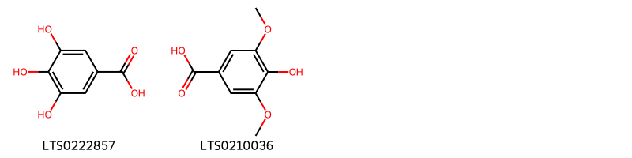
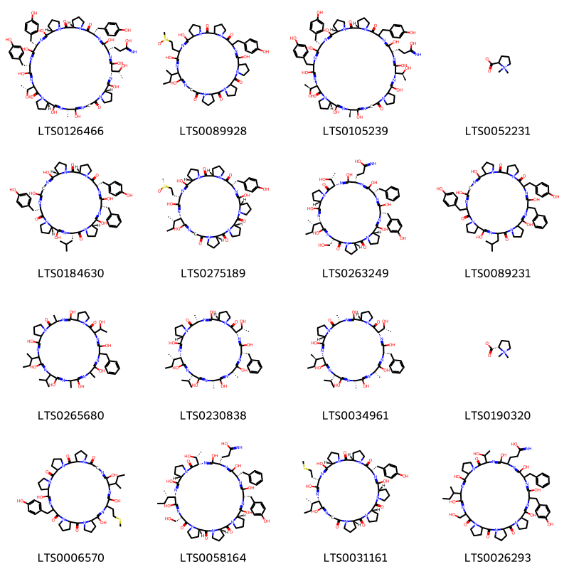
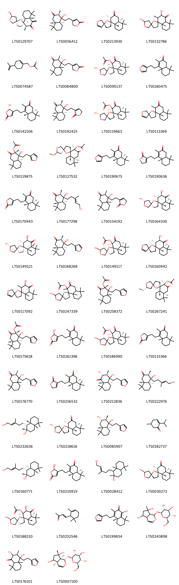
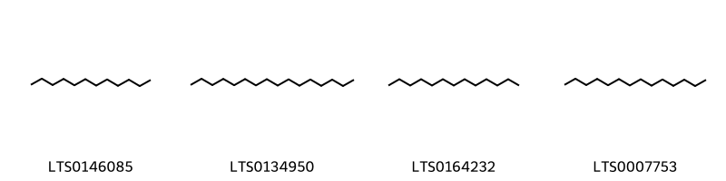
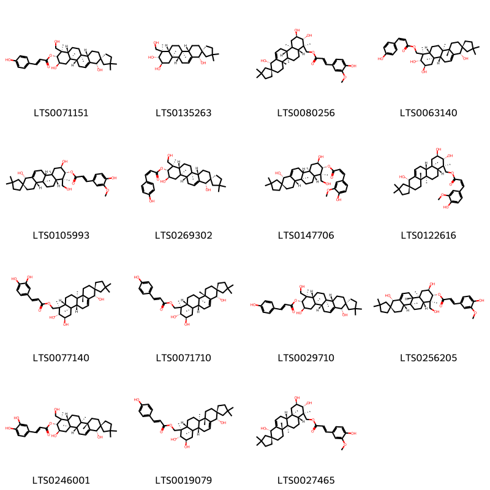

!!! abstract "Tóm tắt"

    Ích Mẫu có tên khoa học là Herba Leonuri japonici, thuộc họ Lamiaceae. Trên thế giới cây có nguồn gốc chủ yếu ở ở Đông Á, Đông Nam Á, Nam Á, một phần nước Úc và được di thực đến một số nước ở Châu Mỹ. Tại Việt Nam hiện nay cây chủ yếu mọc hoang, thường thấy ở ven suối, ven sông nơi đất cát, còn mọc hoang ở ruộng hoang, ven đường. Cây thường dùng trong trường hợp bị rong huyết (cầm máu tử cung), chữa viêm niêm mạc dạ con, kinh nguyệt quá nhiều. Còn dùng chữa huyết áp cao, thuốc bổ huyết, các bệnh về tuần hoàn cơ tim, thần kinh của tim, chứng tim hẹp nhẹ (stenocardie), chữa lỵ. Quả ích mẫu dùng với tên sung úy tử làm thuốc thông tiểu, chữa phù thũng, thiên đầu thống (glôcôm). Dùng ngoài thân và quả ích mẫu giã đắp hay sắc lấy nước rửa chữa một số bệnh như sưng vú, chốc đầu, lở ngứa. Theo sách cổ, ích mẫu có tính chất: Vị cay, đắng, tính hơi hàn, có khả năng trục ứ huyết, sinh huyết mới, hoạt huyết điều kinh, những người có đồng tử mở rộng không dùng được. Ích mẫu có tác dụng dược lý trên tử cung, huyết áp, tim mạch, hệ thần kinh, kháng sinh. Cây chứa các nhóm thành phần hóa học: Alcaloid, glycoside, saponin, flavonoid và tinh dầu. Trong đó có Stachydrin được sử dụng làm biomarker để định tính dược liệu ích mẫu trong dược điển Việt Nam

## Thông tin về thực vật

Dược liệu **Ích Mẫu (Phần Trên Mặt Đất)** từ bộ phận **Phần trên mặt đất** từ loài *Leonurus japonicus*.

**Mô tả thực vật:** Ích mẫu là một loại cỏ sống 1-2 năm, cao 0,6m đến 1m. Thân hình vuông, ít phân nhánh, toàn thân có phủ lông nhỏ ngắn. Lá mọc đối, tùy theo lá mọc ở gốc, giữa thân hay đầu cành mà có hình dạng khác nhau. Lá ở gốc, có cuống dài, phiến lá hình tim, mép có răng cưa thô và sâu; lá ở thân có cuống ngắn hơn, phiến lá thường xẻ sau thành 3 thùy, trên mỗi thùy lại có răng cưa thưa; lá trên cùng phần lớn không chia thùy và hầu như không cuống. Hoa mọc vòng ở kẽ lá. Tràng hoa màu hồng hay tím hồng, xẻ thành hai môi gần đều nhau. Quả nhỏ, 3 cạnh, vỏ màu xám nâu.

*Tài liệu tham khảo:* "Những cây thuốc và vị thuốc Việt Nam" - Đỗ Tất Lợi 
Trong dược điển Việt nam, một loài được sử dụng làm dược liệu là *Leonurus japonicus*.

!!! info "Phân loại thực vật của *Leonurus japonicus*"
    - **Kingdom:** Plantae
    - **Phylum:** Tracheophyta
    - **Order:** Lamiales
    - **Family:** Lamiaceae
    - **Genus:** Leonurus
    - **Species:** *Leonurus japonicus*

**Phân bố trên thế giới:** Puerto Rico, Netherlands, Russian Federation, India, Finland, Dominican Republic, Japan, China, Argentina, Brazil, Chinese Taipei, Vanuatu, Nicaragua, Virgin Islands (U.S.), Korea, Republic of, United States of America, Hong Kong, Venezuela (Bolivarian Republic of)

**Phân bố tại Việt nam:** Không có ghi nhận ở Việt Nam

## Thông tin về dược liệu 

### Định danh

!!! info "Thông tin về tên gọi"

    - Dược liệu tiếng Việt: ích mẫu
    - Dược liệu tiếng Trung: 茺蔚子 (Chong Wei Zi)
    - Dược liệu tiếng Anh: Motherwort Fruit
    - Dược liệu latin thông dụng: Herba Leonuri japonicinHerba Leonuri
    - Dược liệu latin kiểu DĐVN: *herba leonuri japonici*
    - Dược liệu latin kiểu DĐVN: *Herba Leonuri*
    - Dược liệu latin kiểu thông tư: *Herba Leonuri japonici*
    - Bộ phận dùng: Phần trên mặt đất (Herba)

### Mô tả dược liệu 

- **Theo dược điển Việt nam V:** Dược liệu là những đoạn thân, có hoặc không có lá, dài từ 5 cm đến 7 cm, đường kính 0,2 cm đển 1 cm, thiết diện vuông, bổn mặt lõm, thẳng, mặt ngoài có nhiều rãnh dọc, lông bao phủ ngắn. Thân có màu xanh xám hoặc màu xanh hơi vàng, chỗ rãnh màu nhạt hơn. Chất nhẹ, dai, vết bẻ có ruột ở giữa. Trên các đoạn thân, phần lớn mang lá mọc đối; lả có cuống, ờ phần phía trên cuống ngắn hơn. Lá phía gốc và trên ngọn có hình dáng thay đổi. Lá mọc đối, phiến lá xẻ sâu thành 3 thùy, mỗi thùy lại chia 3 phần không đều, thùy mép nguyên hoặc hơi xẻ răng cưa. Lá màu xanh xám, thường nhàu nát và gãy vụn, dễ bị rụng. Cụm hoa mọc ở kẽ lá thành vòng dày đặc, càng lên phía ngọn cụm hoa càng dày đặc. Tràng hoa màu hồng tím khi tươi. Khi khô chun sít lại. Quả nhò có 3 cạnh, nhằn, màu xám nâu. Mùi nhẹ, vị hơi đắng.

- **Mô tả dược liệu theo thông tư chế biến dược liệu theo phương pháp cổ truyền:** 

### Chế biến 

- **Chế biến theo dược điển việt nam V**: Vào mùa hè (khoảng tháng 5 đến 6), khi có tới một nửa số hoa trên cây đã nở, có thể tiến hành thu hái. Chặt lấy phần trên mặt đất dài không quá 40 cm kể từ ngọn xuống, phơi hay sấy khô. Bó lại thành từng bó. Cũng có thể, sau khi phơi khô, chặt từng đoạn 5 cm đến 7 cm, rồi đóng gói vào các bao tải, để nơi thoáng mát. Trước khi dùng cần sao vàng.

- **Chế biến theo thông tư:** 

--- 

## Thành phần hóa học

- Theo tài liệu của GS. Đỗ Tất Lợi:  (1) Alcaloid, glycoside, saponin, flavonoid và tinh dầu.
(2) 
Dược điển Việt Nam V
Stachydrin
Dung dịch chất đối chiếu: Hòa tan stachydrin hydroclorid chuẩn trong ethanol (TT) để được dung dịch có nồng độ khoảng 1 mg/ml.
Dung dịch dược liệu đối chiếu: Nếu không có stachydrin hydroclorid chuẩn thì dùng 0,5 g bột thô Ích mẫu (mẫu chuẩn), tiến hành chiết như mô tả trong phần Dung dịch thử.
    

**Thành phần hóa học từ loài **Leonurus japonicus**

Theo cơ sở dữ liệu lotus, loài *Leonurus japonicus* đã phân lập và xác định được **109** hoạt chất thuộc về các nhóm Steroids and steroid derivatives, Organonitrogen compounds, Organooxygen compounds, Flavonoids, Fatty Acyls, Indoles and derivatives, Carboxylic acids and derivatives, Benzene and substituted derivatives, Saturated hydrocarbons, Prenol lipids trong bảng dưới đây. Danh sách các hoạt chất như sau 3-[2-(2,5,5,8a-tetramethyl-3-oxo-4a,6,7,8-tetrahydro-4h-naphthalen-1-yl)ethyl]-5h-furan-2-one [(LTS0190636)](https://lotus.naturalproducts.net/compound/lotus_id/LTS0190636), tetradec-2-enal [(LTS0177671)](https://lotus.naturalproducts.net/compound/lotus_id/LTS0177671), kaempherol [(LTS0155822)](https://lotus.naturalproducts.net/compound/lotus_id/LTS0155822), methyl octadec-2-enoate [(LTS0080207)](https://lotus.naturalproducts.net/compound/lotus_id/LTS0080207), 4-[2-(furan-3-yl)ethyl]-3,4a,8,8-tetramethyl-5,6,7,8a-tetrahydro-1h-naphthalen-2-one [(LTS0180475)](https://lotus.naturalproducts.net/compound/lotus_id/LTS0180475), 1-(5-hydroxy-3-methylpent-3-en-1-yl)-2,5,5,8a-tetramethyl-hexahydro-1h-naphthalen-2-ol [(LTS0028412)](https://lotus.naturalproducts.net/compound/lotus_id/LTS0028412), (1s,2r,4as,4br,6ar,7r,8r,9r,10ar,10br)-1,8,9-trihydroxy-4',4',4a,4b,7,10a-hexamethyl-3,4,5,6,6a,8,9,10,10b,11-decahydro-1h-spiro[chrysene-2,1'-cyclopentan]-7-ylmethyl (2e)-3-(3,4-dihydroxyphenyl)prop-2-enoate [(LTS0077140)](https://lotus.naturalproducts.net/compound/lotus_id/LTS0077140), 2-isopropyl-5-methylcyclohex-2-en-1-one [(LTS0182737)](https://lotus.naturalproducts.net/compound/lotus_id/LTS0182737), galop [(LTS0222857)](https://lotus.naturalproducts.net/compound/lotus_id/LTS0222857), (1s,2r,4as,4br,6ar,7r,8r,9r,10ar,10br)-1,8,9-trihydroxy-4',4',4a,4b,7,10a-hexamethyl-3,4,5,6,6a,8,9,10,10b,11-decahydro-1h-spiro[chrysene-2,1'-cyclopentan]-7-ylmethyl (2z)-3-(4-hydroxyphenyl)prop-2-enoate [(LTS0063140)](https://lotus.naturalproducts.net/compound/lotus_id/LTS0063140), tridecane [(LTS0164232)](https://lotus.naturalproducts.net/compound/lotus_id/LTS0164232), (1s,2r,4as,4br,6ar,7r,8r,9r,10ar,10br)-1,8,9-trihydroxy-3',3',4a,4b,7,10a-hexamethyl-3,4,5,6,6a,8,9,10,10b,11-decahydro-1h-spiro[chrysene-2,1'-cyclopentan]-7-ylmethyl 3-(4-hydroxy-3-methoxyphenyl)prop-2-enoate [(LTS0080256)](https://lotus.naturalproducts.net/compound/lotus_id/LTS0080256), 3-[(3s,9s,12s,15s,18s,27s,30s,39s,42s,45s)-11,14,17,26,29,38,41,44-octahydroxy-15,36-bis[(1r)-1-hydroxyethyl]-9,39,42-tris[(4-hydroxyphenyl)methyl]-27-methyl-2,8,23,35-tetraoxo-1,7,10,13,16,22,25,28,34,37,40,43-dodecaazapentacyclo[43.3.0.0³,⁷.0¹⁸,²².0³⁰,³⁴]octatetraconta-10,13,16,25,28,37,40,43-octaen-12-yl]propanimidic acid [(LTS0126466)](https://lotus.naturalproducts.net/compound/lotus_id/LTS0126466), 15-benzyl-5,14,17,20,23,26,29-heptahydroxy-12-(1-hydroxyethyl)-24-isopropyl-3,18,21-trimethyl-27-(sec-butyl)-1,4,10,13,16,19,22,25,28-nonaazatricyclo[28.3.0.0⁶,¹⁰]tritriaconta-4,13,16,19,22,25,28-heptaene-2,11-dione [(LTS0265680)](https://lotus.naturalproducts.net/compound/lotus_id/LTS0265680), 14,29,32,35-tetrahydroxy-16-[(4-hydroxyphenyl)methyl]-31-(2-methanesulfinylethyl)-34-(sec-butyl)-3,9,15,18,24,30,33,36,39-nonaazahexacyclo[37.3.0.0³,⁷.0⁹,¹³.0¹⁸,²².0²⁴,²⁸]dotetraconta-14,29,32,35-tetraene-2,8,17,23,38-pentone [(LTS0089928)](https://lotus.naturalproducts.net/compound/lotus_id/LTS0089928), (2s,3r,4s,5s,6r)-2-(4-hydroxy-2,6-dimethoxyphenoxy)-6-(hydroxymethyl)oxane-3,4,5-triol [(LTS0120164)](https://lotus.naturalproducts.net/compound/lotus_id/LTS0120164), (2r,3r,4r,4as,8as)-4-[2-(furan-3-yl)ethyl]-2,4-dihydroxy-3,4a,8,8-tetramethyl-hexahydronaphthalen-1-one [(LTS0212836)](https://lotus.naturalproducts.net/compound/lotus_id/LTS0212836), (1s,2r,4as,4br,6ar,7r,8r,9r,10ar,10bs)-1,9-dihydroxy-7-(hydroxymethyl)-4',4',4b,7,10a-pentamethyl-1,3,4,4a,5,6,6a,8,9,10,10b,11-dodecahydrospiro[chrysene-2,1'-cyclopentan]-8-yl (2e)-3-(4-hydroxyphenyl)prop-2-enoate [(LTS0071151)](https://lotus.naturalproducts.net/compound/lotus_id/LTS0071151), (1r,2r,3r,4as,5'r,5''s,8as)-3,5''-dihydroxy-2,5,5,8a-tetramethyl-hexahydrodispiro[naphthalene-1,2':5',3''-bis(oxolane)]-4-one [(LTS0164330)](https://lotus.naturalproducts.net/compound/lotus_id/LTS0164330), luteolin [(LTS0017052)](https://lotus.naturalproducts.net/compound/lotus_id/LTS0017052), stachydrine [(LTS0190320)](https://lotus.naturalproducts.net/compound/lotus_id/LTS0190320), (1s,2r,4as,4br,6ar,7r,8r,9r,10ar,10bs)-1,9-dihydroxy-7-(hydroxymethyl)-4',4',4b,7,10a-pentamethyl-1,3,4,4a,5,6,6a,8,9,10,10b,11-dodecahydrospiro[chrysene-2,1'-cyclopentan]-8-yl (2z)-3-(4-hydroxyphenyl)prop-2-enoate [(LTS0269302)](https://lotus.naturalproducts.net/compound/lotus_id/LTS0269302), (1s,2r,4as,4br,6ar,7r,8r,9r,10ar,10br)-1,8,9-trihydroxy-4',4',4a,4b,7,10a-hexamethyl-3,4,5,6,6a,8,9,10,10b,11-decahydro-1h-spiro[chrysene-2,1'-cyclopentan]-7-ylmethyl (2e)-3-(4-hydroxyphenyl)prop-2-enoate [(LTS0019079)](https://lotus.naturalproducts.net/compound/lotus_id/LTS0019079), 5''-hydroxy-2,5,5,8a-tetramethyl-3-oxo-tetrahydro-4h-dispiro[naphthalene-1,2':5',3''-bis(oxolane)]-2-yl acetate [(LTS0247339)](https://lotus.naturalproducts.net/compound/lotus_id/LTS0247339), (3s,4r,4as,8as)-4-[2-(furan-3-yl)ethyl]-4-hydroxy-3,4a,8,8-tetramethyl-hexahydronaphthalen-2-one [(LTS0168268)](https://lotus.naturalproducts.net/compound/lotus_id/LTS0168268), (1s,2r,4as,5'r,5''r,8as)-5''-hydroxy-2,5,5,8a-tetramethyl-3-oxo-tetrahydro-4h-dispiro[naphthalene-1,2':5',3''-bis(oxolane)]-2-yl acetate [(LTS0149117)](https://lotus.naturalproducts.net/compound/lotus_id/LTS0149117), (1s,2r,4as,4br,6ar,7r,8r,9r,10ar,10br)-1,8,9-trihydroxy-4',4',4a,4b,7,10a-hexamethyl-3,4,5,6,6a,8,9,10,10b,11-decahydro-1h-spiro[chrysene-2,1'-cyclopentan]-7-ylmethyl 3-(4-hydroxyphenyl)prop-2-enoate [(LTS0071710)](https://lotus.naturalproducts.net/compound/lotus_id/LTS0071710), (2s,3r,4s,5s)-2-{[(2s,3r,4r,5r,6s)-2-{[(2r,3r,4s,5r,6r)-2-[2-(3,4-dihydroxyphenyl)ethoxy]-3,5-dihydroxy-6-(hydroxymethyl)oxan-4-yl]oxy}-4,5-dihydroxy-6-methyloxan-3-yl]oxy}oxane-3,4,5-triol [(LTS0106028)](https://lotus.naturalproducts.net/compound/lotus_id/LTS0106028), myricetin [(LTS0139858)](https://lotus.naturalproducts.net/compound/lotus_id/LTS0139858), 4-[2-(1-hydroxy-2,5,5,8a-tetramethyl-3-oxo-hexahydronaphthalen-1-yl)ethyl]-5h-furan-2-one [(LTS0084800)](https://lotus.naturalproducts.net/compound/lotus_id/LTS0084800), (2''s,3r,5'r,8''as)-2'',5'',5'',8''a-tetramethyl-2'',4'',4''a,6'',7'',8''-hexahydro-2h-dispiro[furan-3,2'-oxolane-5',1''-naphthalen]-3''-one [(LTS0089408)](https://lotus.naturalproducts.net/compound/lotus_id/LTS0089408), choline [(LTS0170307)](https://lotus.naturalproducts.net/compound/lotus_id/LTS0170307), (2''r,3r,3''r,4''as,5'r,8''as)-3''-hydroxy-2'',5'',5'',8''a-tetramethyl-2'',3'',4''a,6'',7'',8''-hexahydro-2h-dispiro[furan-3,2'-oxolane-5',1''-naphthalen]-4''-one [(LTS0160942)](https://lotus.naturalproducts.net/compound/lotus_id/LTS0160942), (1s,2r,4as,4br,6ar,7r,8r,9r,10ar,10bs)-1,9-dihydroxy-7-(hydroxymethyl)-3',3',4b,7,10a-pentamethyl-1,3,4,4a,5,6,6a,8,9,10,10b,11-dodecahydrospiro[chrysene-2,1'-cyclopentan]-8-yl (2e)-3-(4-hydroxy-3-methoxyphenyl)prop-2-enoate [(LTS0105993)](https://lotus.naturalproducts.net/compound/lotus_id/LTS0105993), 5''-methoxy-2,5,5,8a-tetramethyl-3-oxo-tetrahydro-4h-dispiro[naphthalene-1,2':5',3''-bis(oxolane)]-2-yl acetate [(LTS0071113)](https://lotus.naturalproducts.net/compound/lotus_id/LTS0071113), (3s,4r,4as,8as)-4-hydroxy-4-(5-hydroxy-3-methylpent-3-en-1-yl)-3,4a,8,8-tetramethyl-hexahydronaphthalen-2-one [(LTS0177298)](https://lotus.naturalproducts.net/compound/lotus_id/LTS0177298), dodecane [(LTS0146085)](https://lotus.naturalproducts.net/compound/lotus_id/LTS0146085), isoquercetin [(LTS0254337)](https://lotus.naturalproducts.net/compound/lotus_id/LTS0254337), methyl 14-methylpentadecanoate [(LTS0261234)](https://lotus.naturalproducts.net/compound/lotus_id/LTS0261234), (1r,2s,4as,5's,5''s,8as)-5''-hydroxy-2,5,5,8a-tetramethyl-hexahydrodispiro[naphthalene-1,2':5',3''-bis(oxolane)]-3-one [(LTS0218616)](https://lotus.naturalproducts.net/compound/lotus_id/LTS0218616), 1,7,7-trimethylbicyclo[2.2.1]heptan-2-yl prop-2-enoate [(LTS0252509)](https://lotus.naturalproducts.net/compound/lotus_id/LTS0252509), genkwanin [(LTS0107928)](https://lotus.naturalproducts.net/compound/lotus_id/LTS0107928), [4-(prop-1-en-2-yl)cyclohex-1-en-1-yl]methyl acetate [(LTS0074587)](https://lotus.naturalproducts.net/compound/lotus_id/LTS0074587), (1s,2r,4as,4br,6ar,7r,8r,9r,10ar,10bs)-1,9-dihydroxy-7-(hydroxymethyl)-4',4',4b,7,10a-pentamethyl-1,3,4,4a,5,6,6a,8,9,10,10b,11-dodecahydrospiro[chrysene-2,1'-cyclopentan]-8-yl 3-(4-hydroxyphenyl)prop-2-enoate [(LTS0029710)](https://lotus.naturalproducts.net/compound/lotus_id/LTS0029710), (5s)-4-{2-[(4as,8as)-2,5,5,8a-tetramethyl-3-oxo-4a,6,7,8-tetrahydro-4h-naphthalen-1-yl]ethyl}-5-hydroxy-5h-furan-2-one [(LTS0142106)](https://lotus.naturalproducts.net/compound/lotus_id/LTS0142106), 3-{2-[(4as,8as)-2,5,5,8a-tetramethyl-3-oxo-4a,6,7,8-tetrahydro-4h-naphthalen-1-yl]ethyl}-5h-furan-2-one [(LTS0256532)](https://lotus.naturalproducts.net/compound/lotus_id/LTS0256532), 12-benzyl-11,14,23,32,35-pentahydroxy-9,30-bis[(4-hydroxyphenyl)methyl]-21-(2-methylpropyl)-1,7,10,13,19,22,28,31,34-nonaazapentacyclo[34.3.0.0³,⁷.0¹⁵,¹⁹.0²⁴,²⁸]nonatriaconta-10,13,22,31,34-pentaene-2,8,20,29-tetrone [(LTS0089231)](https://lotus.naturalproducts.net/compound/lotus_id/LTS0089231), (3s,9s,12s,15s,21s,24s,30s,36s)-12-benzyl-11,14,23,32,35-pentahydroxy-9,30-bis[(4-hydroxyphenyl)methyl]-21-(2-methylpropyl)-1,7,10,13,19,22,28,31,34-nonaazapentacyclo[34.3.0.0³,⁷.0¹⁵,¹⁹.0²⁴,²⁸]nonatriaconta-10,13,22,31,34-pentaene-2,8,20,29-tetrone [(LTS0184630)](https://lotus.naturalproducts.net/compound/lotus_id/LTS0184630), 4-[2-(2,5,5,8a-tetramethyl-3-oxo-4a,6,7,8-tetrahydro-4h-naphthalen-1-yl)ethyl]-5-hydroxy-5h-furan-2-one [(LTS0261396)](https://lotus.naturalproducts.net/compound/lotus_id/LTS0261396), (2s,3r,4s,5s,6r)-2-{[(1s,4ar,7s,7as)-5,7-dihydroxy-7-methyl-1h,4ah,5h,6h,7ah-cyclopenta[c]pyran-1-yl]oxy}-6-(hydroxymethyl)oxane-3,4,5-triol [(LTS0007100)](https://lotus.naturalproducts.net/compound/lotus_id/LTS0007100), 2'',5'',5'',8''a-tetramethyl-2'',4'',4''a,6'',7'',8''-hexahydro-2h-dispiro[furan-3,2'-oxolane-5',1''-naphthalen]-3''-one [(LTS0113369)](https://lotus.naturalproducts.net/compound/lotus_id/LTS0113369), (5r)-4-{2-[(4as,8as)-2,5,5,8a-tetramethyl-3-oxo-4a,6,7,8-tetrahydro-4h-naphthalen-1-yl]ethyl}-5-hydroxy-5h-furan-2-one [(LTS0210919)](https://lotus.naturalproducts.net/compound/lotus_id/LTS0210919), 1-[2-(furan-3-yl)ethyl]-1-hydroxy-2,5,5,8a-tetramethyl-3-oxo-tetrahydro-4h-naphthalen-2-yl acetate [(LTS0258372)](https://lotus.naturalproducts.net/compound/lotus_id/LTS0258372), methyl linolelaidate [(LTS0083433)](https://lotus.naturalproducts.net/compound/lotus_id/LTS0083433), 4-[2-(2,5,5,8a-tetramethyl-3-oxo-4a,6,7,8-tetrahydro-4h-naphthalen-1-yl)ethyl]-5h-furan-2-one [(LTS0115366)](https://lotus.naturalproducts.net/compound/lotus_id/LTS0115366), 3-rutinosyl quercetin [(LTS0032845)](https://lotus.naturalproducts.net/compound/lotus_id/LTS0032845), quercetin [(LTS0004651)](https://lotus.naturalproducts.net/compound/lotus_id/LTS0004651), (1s,2r,4as,4br,6ar,7r,8r,9r,10ar,10bs)-1,9-dihydroxy-7-(hydroxymethyl)-3',3',4b,7,10a-pentamethyl-1,3,4,4a,5,6,6a,8,9,10,10b,11-dodecahydrospiro[chrysene-2,1'-cyclopentan]-8-yl 3-(4-hydroxy-3-methoxyphenyl)prop-2-enoate [(LTS0256205)](https://lotus.naturalproducts.net/compound/lotus_id/LTS0256205), (2r,3r,4r,5r,6r)-4-{[(2s,3r,4r,5r,6s)-4,5-dihydroxy-6-methyl-3-{[(2s,3r,4s,5s)-3,4,5-trihydroxyoxan-2-yl]oxy}oxan-2-yl]oxy}-6-[2-(3,4-dihydroxyphenyl)ethoxy]-5-hydroxy-2-(hydroxymethyl)oxan-3-yl (2e)-3-(3,4-dihydroxyphenyl)prop-2-enoate [(LTS0001896)](https://lotus.naturalproducts.net/compound/lotus_id/LTS0001896), (1s,7s,13s,16s,22s,28s,31s,34s)-34-[(2s)-butan-2-yl]-14,29,32,35-tetrahydroxy-16-[(4-hydroxyphenyl)methyl]-31-[2-(methylsulfanyl)ethyl]-3,9,15,18,24,30,33,36,39-nonaazahexacyclo[37.3.0.0³,⁷.0⁹,¹³.0¹⁸,²².0²⁴,²⁸]dotetraconta-14,29,32,35-tetraene-2,8,17,23,38-pentone [(LTS0031161)](https://lotus.naturalproducts.net/compound/lotus_id/LTS0031161), (1s,2r,4as,4br,6ar,7r,8r,9r,10ar,10br)-1,8,9-trihydroxy-3',3',4a,4b,7,10a-hexamethyl-3,4,5,6,6a,8,9,10,10b,11-decahydro-1h-spiro[chrysene-2,1'-cyclopentan]-7-ylmethyl (2z)-3-(4-hydroxy-3-methoxyphenyl)prop-2-enoate [(LTS0122616)](https://lotus.naturalproducts.net/compound/lotus_id/LTS0122616), (1r,2s,4as,5's,5''r,8as)-5''-hydroxy-2,5,5,8a-tetramethyl-hexahydrodispiro[naphthalene-1,2':5',3''-bis(oxolane)]-3-one [(LTS0030273)](https://lotus.naturalproducts.net/compound/lotus_id/LTS0030273), (4as,8as)-4-[2-(furan-3-yl)ethyl]-3,4a,8,8-tetramethyl-5,6,7,8a-tetrahydro-1h-naphthalen-2-one [(LTS0190675)](https://lotus.naturalproducts.net/compound/lotus_id/LTS0190675), n-[2-(5-methoxy-1h-indol-3-yl)ethyl]ethanimidic acid [(LTS0219322)](https://lotus.naturalproducts.net/compound/lotus_id/LTS0219322), 1,1-dimethylpyrrolidin-1-ium-2-carboxylate [(LTS0052231)](https://lotus.naturalproducts.net/compound/lotus_id/LTS0052231), (1s,2r,4as,5'r,5''s,8as)-5''-hydroxy-2,5,5,8a-tetramethyl-3-oxo-tetrahydro-4h-dispiro[naphthalene-1,2':5',3''-bis(oxolane)]-2-yl acetate [(LTS0090137)](https://lotus.naturalproducts.net/compound/lotus_id/LTS0090137), 4-[2-(furan-3-yl)ethyl]-2,4-dihydroxy-3,4a,8,8-tetramethyl-hexahydronaphthalen-1-one [(LTS0176101)](https://lotus.naturalproducts.net/compound/lotus_id/LTS0176101), (1s,2s,3r,4as,5'r,5''r,8as)-3,5''-dihydroxy-2,5,5,8a-tetramethyl-4-oxo-tetrahydro-3h-dispiro[naphthalene-1,2':5',3''-bis(oxolane)]-2-yl acetate [(LTS0188210)](https://lotus.naturalproducts.net/compound/lotus_id/LTS0188210), 3-[33-benzyl-17,20,29,32,35,38-hexahydroxy-27-(1-hydroxyethyl)-15-(hydroxymethyl)-36-[(4-hydroxyphenyl)methyl]-2,8,14,26-tetraoxo-18-(sec-butyl)-1,7,13,16,19,25,28,31,34,37-decaazapentacyclo[37.3.0.0³,⁷.0⁹,¹³.0²¹,²⁵]dotetraconta-16,19,28,31,34,37-hexaen-30-yl]propanimidic acid [(LTS0026293)](https://lotus.naturalproducts.net/compound/lotus_id/LTS0026293), (1s,7s,13s,16s,22s,28s,31s,34s)-34-[(2s)-butan-2-yl]-14,29,32,35-tetrahydroxy-16-[(4-hydroxyphenyl)methyl]-31-{2-[(r)-methanesulfinyl]ethyl}-3,9,15,18,24,30,33,36,39-nonaazahexacyclo[37.3.0.0³,⁷.0⁹,¹³.0¹⁸,²².0²⁴,²⁸]dotetraconta-14,29,32,35-tetraene-2,8,17,23,38-pentone [(LTS0275189)](https://lotus.naturalproducts.net/compound/lotus_id/LTS0275189), chamomile [(LTS0104946)](https://lotus.naturalproducts.net/compound/lotus_id/LTS0104946), 3-[(3s,9s,12s,15s,21s,24s,27s,30s,33s)-27-benzyl-12-[(2s)-butan-2-yl]-11,14,23,26,29,32-hexahydroxy-21-[(1r)-1-hydroxyethyl]-9-(hydroxymethyl)-30-[(4-hydroxyphenyl)methyl]-2,8,20-trioxo-1,7,10,13,19,22,25,28,31-nonaazatetracyclo[31.3.0.0³,⁷.0¹⁵,¹⁹]hexatriaconta-10,13,22,25,28,31-hexaen-24-yl]propanimidic acid [(LTS0263249)](https://lotus.naturalproducts.net/compound/lotus_id/LTS0263249), 4-{2-[(4as,8as)-2,5,5,8a-tetramethyl-3-oxo-4a,6,7,8-tetrahydro-4h-naphthalen-1-yl]ethyl}-5h-furan-2-one [(LTS0170943)](https://lotus.naturalproducts.net/compound/lotus_id/LTS0170943), (1s,2r,4as,5'r,5''r,8as)-5''-methoxy-2,5,5,8a-tetramethyl-4-methylidene-3-oxo-tetrahydrodispiro[naphthalene-1,2':5',3''-bis(oxolane)]-2-yl acetate [(LTS0046698)](https://lotus.naturalproducts.net/compound/lotus_id/LTS0046698), ionone [(LTS0252546)](https://lotus.naturalproducts.net/compound/lotus_id/LTS0252546), (1s,2r,4as,4br,6ar,7r,8r,9r,10ar,10br)-1,9-dihydroxy-7-(hydroxymethyl)-4',4',4a,4b,7,10a-hexamethyl-3,4,5,6,6a,8,9,10,10b,11-decahydro-1h-spiro[chrysene-2,1'-cyclopentan]-8-yl (2e)-3-(3,4-dihydroxyphenyl)prop-2-enoate [(LTS0246001)](https://lotus.naturalproducts.net/compound/lotus_id/LTS0246001), 3''-hydroxy-2'',5'',5'',8''a-tetramethyl-2'',3'',4''a,6'',7'',8''-hexahydro-2h-dispiro[furan-3,2'-oxolane-5',1''-naphthalen]-4''-one [(LTS0117092)](https://lotus.naturalproducts.net/compound/lotus_id/LTS0117092), tiliroside [(LTS0222327)](https://lotus.naturalproducts.net/compound/lotus_id/LTS0222327), (1s,2r,8as)-1-[2-(furan-3-yl)ethyl]-1-hydroxy-2,5,5,8a-tetramethyl-3-oxo-tetrahydro-4h-naphthalen-2-yl acetate [(LTS0119875)](https://lotus.naturalproducts.net/compound/lotus_id/LTS0119875), 3,5''-dihydroxy-2,5,5,8a-tetramethyl-hexahydrodispiro[naphthalene-1,2':5',3''-bis(oxolane)]-4-one [(LTS0132786)](https://lotus.naturalproducts.net/compound/lotus_id/LTS0132786), (1r,2s,4as,8as)-1-[(3e)-5-hydroxy-3-methylpent-3-en-1-yl]-2,5,5,8a-tetramethyl-hexahydro-1h-naphthalen-2-ol [(LTS0160771)](https://lotus.naturalproducts.net/compound/lotus_id/LTS0160771), syringic acid [(LTS0210036)](https://lotus.naturalproducts.net/compound/lotus_id/LTS0210036), (3s,6s,12s,15s,18s,21s,24s,27s,30s)-15-benzyl-27-[(2s)-butan-2-yl]-5,14,17,20,23,26,29-heptahydroxy-12-[(1r)-1-hydroxyethyl]-24-isopropyl-3,18,21-trimethyl-1,4,10,13,16,19,22,25,28-nonaazatricyclo[28.3.0.0⁶,¹⁰]tritriaconta-4,13,16,19,22,25,28-heptaene-2,11-dione [(LTS0230838)](https://lotus.naturalproducts.net/compound/lotus_id/LTS0230838), (1s,2r,4as,5's,5''r,8as)-5''-hydroxy-2,5,5,8a-tetramethyl-3-oxo-tetrahydro-4h-dispiro[naphthalene-1,2':5',3''-bis(oxolane)]-2-yl acetate [(LTS0186990)](https://lotus.naturalproducts.net/compound/lotus_id/LTS0186990), (1r,2r,3s,4as,8as)-1-[2-(furan-3-yl)ethyl]-2,5,5,8a-tetramethyl-hexahydro-2h-naphthalene-1,3-diol [(LTS0085907)](https://lotus.naturalproducts.net/compound/lotus_id/LTS0085907), (1r,2s,4as,5'r,5''r,8as)-5''-hydroxy-2,5,5,8a-tetramethyl-4-methylidene-tetrahydro-2h-dispiro[naphthalene-1,2':5',3''-bis(oxolane)]-3-one [(LTS0129707)](https://lotus.naturalproducts.net/compound/lotus_id/LTS0129707), tetradecane [(LTS0007753)](https://lotus.naturalproducts.net/compound/lotus_id/LTS0007753), (2''s,3r,4''as,5'r,8''as)-2'',5'',5'',8''a-tetramethyl-2'',4'',4''a,6'',7'',8''-hexahydro-2h-dispiro[furan-3,2'-oxolane-5',1''-naphthalen]-3''-one [(LTS0213930)](https://lotus.naturalproducts.net/compound/lotus_id/LTS0213930), (1s,2r,3r,4ar,5'r,5''s,8as)-3,5''-dihydroxy-2,5,5,8a-tetramethyl-hexahydrodispiro[naphthalene-1,2':5',3''-bis(oxolane)]-4-one [(LTS0149521)](https://lotus.naturalproducts.net/compound/lotus_id/LTS0149521), cetane [(LTS0134950)](https://lotus.naturalproducts.net/compound/lotus_id/LTS0134950), (4ar)-4-[2-(furan-3-yl)ethyl]-1-hydroxy-3,4a,8,8-tetramethyl-6,7-dihydro-5h-naphthalen-2-one [(LTS0199834)](https://lotus.naturalproducts.net/compound/lotus_id/LTS0199834), (3s,6s,12s,15s,18s,21s,24s,27s,30s)-15-benzyl-27-[(2r)-butan-2-yl]-5,14,17,20,23,26,29-heptahydroxy-12-[(1r)-1-hydroxyethyl]-24-isopropyl-3,18,21-trimethyl-1,4,10,13,16,19,22,25,28-nonaazatricyclo[28.3.0.0⁶,¹⁰]tritriaconta-4,13,16,19,22,25,28-heptaene-2,11-dione [(LTS0034961)](https://lotus.naturalproducts.net/compound/lotus_id/LTS0034961), (1s,2r,4as,4br,6ar,7r,8r,9r,10ar,10br)-1,8,9-trihydroxy-3',3',4a,4b,7,10a-hexamethyl-3,4,5,6,6a,8,9,10,10b,11-decahydro-1h-spiro[chrysene-2,1'-cyclopentan]-7-ylmethyl (2e)-3-(4-hydroxy-3-methoxyphenyl)prop-2-enoate [(LTS0027465)](https://lotus.naturalproducts.net/compound/lotus_id/LTS0027465), (1s,2r,4as,5'r,5''r,8as)-5''-methoxy-2,5,5,8a-tetramethyl-3-oxo-tetrahydro-4h-dispiro[naphthalene-1,2':5',3''-bis(oxolane)]-2-yl acetate [(LTS0267241)](https://lotus.naturalproducts.net/compound/lotus_id/LTS0267241), (1s,2r,4as,8as)-1-[2-(furan-3-yl)ethyl]-1-hydroxy-2,5,5,8a-tetramethyl-3-oxo-tetrahydro-4h-naphthalen-2-yl acetate [(LTS0175618)](https://lotus.naturalproducts.net/compound/lotus_id/LTS0175618), 4-[2-(furan-3-yl)ethyl]-4-hydroxy-3,4a,8,8-tetramethyl-hexahydronaphthalen-2-one [(LTS0176770)](https://lotus.naturalproducts.net/compound/lotus_id/LTS0176770), (1s,2r,4as,4br,6ar,7r,8r,9r,10ar,10bs)-1,9-dihydroxy-7-(hydroxymethyl)-3',3',4b,7,10a-pentamethyl-1,3,4,4a,5,6,6a,8,9,10,10b,11-dodecahydrospiro[chrysene-2,1'-cyclopentan]-8-yl (2z)-3-(4-hydroxy-3-methoxyphenyl)prop-2-enoate [(LTS0147706)](https://lotus.naturalproducts.net/compound/lotus_id/LTS0147706), leonuridine [(LTS0243898)](https://lotus.naturalproducts.net/compound/lotus_id/LTS0243898), 4-{2-[(1r,2s,4as,8as)-1-hydroxy-2,5,5,8a-tetramethyl-3-oxo-hexahydronaphthalen-1-yl]ethyl}-5h-furan-2-one [(LTS0056412)](https://lotus.naturalproducts.net/compound/lotus_id/LTS0056412), (3s,4r,4as,8as)-4-hydroxy-4-[(3e)-5-hydroxy-3-methylpent-3-en-1-yl]-3,4a,8,8-tetramethyl-hexahydronaphthalen-2-one [(LTS0222976)](https://lotus.naturalproducts.net/compound/lotus_id/LTS0222976), (1s,2r,4as,5's,5''s,8as)-5''-hydroxy-2,5,5,8a-tetramethyl-3-oxo-tetrahydro-4h-dispiro[naphthalene-1,2':5',3''-bis(oxolane)]-2-yl acetate [(LTS0119663)](https://lotus.naturalproducts.net/compound/lotus_id/LTS0119663), 3-[2-(1-hydroxy-2,5,5,8a-tetramethyl-3-oxo-hexahydronaphthalen-1-yl)ethyl]-5h-furan-2-one [(LTS0154192)](https://lotus.naturalproducts.net/compound/lotus_id/LTS0154192), 3-{2-[(1r,2s,4as,8as)-1-hydroxy-2,5,5,8a-tetramethyl-3-oxo-hexahydronaphthalen-1-yl]ethyl}-5h-furan-2-one [(LTS0192425)](https://lotus.naturalproducts.net/compound/lotus_id/LTS0192425), (1s,2r,4as,4br,6ar,7r,8r,9r,10ar,10bs)-7-(hydroxymethyl)-4',4',4b,7,10a-pentamethyl-1,3,4,4a,5,6,6a,8,9,10,10b,11-dodecahydrospiro[chrysene-2,1'-cyclopentane]-1,8,9-triol [(LTS0135263)](https://lotus.naturalproducts.net/compound/lotus_id/LTS0135263), 14,29,32,35-tetrahydroxy-16-[(4-hydroxyphenyl)methyl]-31-[2-(methylsulfanyl)ethyl]-34-(sec-butyl)-3,9,15,18,24,30,33,36,39-nonaazahexacyclo[37.3.0.0³,⁷.0⁹,¹³.0¹⁸,²².0²⁴,²⁸]dotetraconta-14,29,32,35-tetraene-2,8,17,23,38-pentone [(LTS0006570)](https://lotus.naturalproducts.net/compound/lotus_id/LTS0006570), 3-[(3s,9s,15s,18s,21s,27s,30s,33s,36s,39s)-33-benzyl-18-[(2s)-butan-2-yl]-17,20,29,32,35,38-hexahydroxy-27-[(1r)-1-hydroxyethyl]-15-(hydroxymethyl)-36-[(4-hydroxyphenyl)methyl]-2,8,14,26-tetraoxo-1,7,13,16,19,25,28,31,34,37-decaazapentacyclo[37.3.0.0³,⁷.0⁹,¹³.0²¹,²⁵]dotetraconta-16,19,28,31,34,37-hexaen-30-yl]propanimidic acid [(LTS0058164)](https://lotus.naturalproducts.net/compound/lotus_id/LTS0058164), (1r,2s,4as,8ar)-1-[(3e)-5-hydroxy-3-methylpent-3-en-1-yl]-2,5,5,8a-tetramethyl-hexahydro-1h-naphthalen-2-ol [(LTS0232636)](https://lotus.naturalproducts.net/compound/lotus_id/LTS0232636), 3-[(3s,12s,15r,27r,30s,36r,42s,45s)-11,14,17,26,29,38,41,44-octahydroxy-15,36-bis[(1s)-1-hydroxyethyl]-9,39,42-tris[(4-hydroxyphenyl)methyl]-27-methyl-2,8,23,35-tetraoxo-1,7,10,13,16,22,25,28,34,37,40,43-dodecaazapentacyclo[43.3.0.0³,⁷.0¹⁸,²².0³⁰,³⁴]octatetraconta-10,13,16,25,28,37,40,43-octaen-12-yl]propanimidic acid [(LTS0105239)](https://lotus.naturalproducts.net/compound/lotus_id/LTS0105239), (1s,2r,4as,5's,5''s,8as)-5''-methoxy-2,5,5,8a-tetramethyl-3-oxo-tetrahydro-4h-dispiro[naphthalene-1,2':5',3''-bis(oxolane)]-2-yl acetate [(LTS0127532)](https://lotus.naturalproducts.net/compound/lotus_id/LTS0127532). 
        
| chemicalTaxonomyClassyfireClass     |   smiles_count |
|:------------------------------------|---------------:|
| Benzene and substituted derivatives |             46 |
| Carboxylic acids and derivatives    |           2298 |
| Fatty Acyls                         |             96 |
| Flavonoids                          |            543 |
| Indoles and derivatives             |             29 |
| Organonitrogen compounds            |             14 |
| Organooxygen compounds              |            344 |
| Prenol lipids                       |           3067 |
| Saturated hydrocarbons              |             55 |
| Steroids and steroid derivatives    |           1810 |

            
### Nhóm Benzene and substituted derivatives
<figure markdown="span">
    { width=100% }
<figcaption>Hình ảnh cấu trúc hóa học của hoạt chất thuộc nhóm *Benzene and substituted derivatives*. Tên thường gọi của các hoạt chất tương ứng là galop [(LTS0222857)](https://lotus.naturalproducts.net/compound/lotus_id/LTS0222857), syringic acid [(LTS0210036)](https://lotus.naturalproducts.net/compound/lotus_id/LTS0210036).</figcaption>
</figure>

            
            
### Nhóm Benzene and substituted derivatives
<figure markdown="span">
    { width=100% }
<figcaption>Hình ảnh cấu trúc hóa học của hoạt chất thuộc nhóm *Benzene and substituted derivatives*. Tên thường gọi của các hoạt chất tương ứng là galop [(LTS0222857)](https://lotus.naturalproducts.net/compound/lotus_id/LTS0222857), syringic acid [(LTS0210036)](https://lotus.naturalproducts.net/compound/lotus_id/LTS0210036).</figcaption>
</figure>

### Nhóm Carboxylic acids and derivatives
<figure markdown="span">
    { width=100% }
<figcaption>Hình ảnh cấu trúc hóa học của hoạt chất thuộc nhóm *Carboxylic acids and derivatives*. Tên thường gọi của các hoạt chất tương ứng là 3-[(3s,9s,12s,15s,18s,27s,30s,39s,42s,45s)-11,14,17,26,29,38,41,44-octahydroxy-15,36-bis[(1r)-1-hydroxyethyl]-9,39,42-tris[(4-hydroxyphenyl)methyl]-27-methyl-2,8,23,35-tetraoxo-1,7,10,13,16,22,25,28,34,37,40,43-dodecaazapentacyclo[43.3.0.0³,⁷.0¹⁸,²².0³⁰,³⁴]octatetraconta-10,13,16,25,28,37,40,43-octaen-12-yl]propanimidic acid [(LTS0126466)](https://lotus.naturalproducts.net/compound/lotus_id/LTS0126466), 14,29,32,35-tetrahydroxy-16-[(4-hydroxyphenyl)methyl]-31-(2-methanesulfinylethyl)-34-(sec-butyl)-3,9,15,18,24,30,33,36,39-nonaazahexacyclo[37.3.0.0³,⁷.0⁹,¹³.0¹⁸,²².0²⁴,²⁸]dotetraconta-14,29,32,35-tetraene-2,8,17,23,38-pentone [(LTS0089928)](https://lotus.naturalproducts.net/compound/lotus_id/LTS0089928), 3-[(3s,12s,15r,27r,30s,36r,42s,45s)-11,14,17,26,29,38,41,44-octahydroxy-15,36-bis[(1s)-1-hydroxyethyl]-9,39,42-tris[(4-hydroxyphenyl)methyl]-27-methyl-2,8,23,35-tetraoxo-1,7,10,13,16,22,25,28,34,37,40,43-dodecaazapentacyclo[43.3.0.0³,⁷.0¹⁸,²².0³⁰,³⁴]octatetraconta-10,13,16,25,28,37,40,43-octaen-12-yl]propanimidic acid [(LTS0105239)](https://lotus.naturalproducts.net/compound/lotus_id/LTS0105239), 1,1-dimethylpyrrolidin-1-ium-2-carboxylate [(LTS0052231)](https://lotus.naturalproducts.net/compound/lotus_id/LTS0052231), (3s,9s,12s,15s,21s,24s,30s,36s)-12-benzyl-11,14,23,32,35-pentahydroxy-9,30-bis[(4-hydroxyphenyl)methyl]-21-(2-methylpropyl)-1,7,10,13,19,22,28,31,34-nonaazapentacyclo[34.3.0.0³,⁷.0¹⁵,¹⁹.0²⁴,²⁸]nonatriaconta-10,13,22,31,34-pentaene-2,8,20,29-tetrone [(LTS0184630)](https://lotus.naturalproducts.net/compound/lotus_id/LTS0184630), (1s,7s,13s,16s,22s,28s,31s,34s)-34-[(2s)-butan-2-yl]-14,29,32,35-tetrahydroxy-16-[(4-hydroxyphenyl)methyl]-31-{2-[(r)-methanesulfinyl]ethyl}-3,9,15,18,24,30,33,36,39-nonaazahexacyclo[37.3.0.0³,⁷.0⁹,¹³.0¹⁸,²².0²⁴,²⁸]dotetraconta-14,29,32,35-tetraene-2,8,17,23,38-pentone [(LTS0275189)](https://lotus.naturalproducts.net/compound/lotus_id/LTS0275189), 3-[(3s,9s,12s,15s,21s,24s,27s,30s,33s)-27-benzyl-12-[(2s)-butan-2-yl]-11,14,23,26,29,32-hexahydroxy-21-[(1r)-1-hydroxyethyl]-9-(hydroxymethyl)-30-[(4-hydroxyphenyl)methyl]-2,8,20-trioxo-1,7,10,13,19,22,25,28,31-nonaazatetracyclo[31.3.0.0³,⁷.0¹⁵,¹⁹]hexatriaconta-10,13,22,25,28,31-hexaen-24-yl]propanimidic acid [(LTS0263249)](https://lotus.naturalproducts.net/compound/lotus_id/LTS0263249), 12-benzyl-11,14,23,32,35-pentahydroxy-9,30-bis[(4-hydroxyphenyl)methyl]-21-(2-methylpropyl)-1,7,10,13,19,22,28,31,34-nonaazapentacyclo[34.3.0.0³,⁷.0¹⁵,¹⁹.0²⁴,²⁸]nonatriaconta-10,13,22,31,34-pentaene-2,8,20,29-tetrone [(LTS0089231)](https://lotus.naturalproducts.net/compound/lotus_id/LTS0089231), 15-benzyl-5,14,17,20,23,26,29-heptahydroxy-12-(1-hydroxyethyl)-24-isopropyl-3,18,21-trimethyl-27-(sec-butyl)-1,4,10,13,16,19,22,25,28-nonaazatricyclo[28.3.0.0⁶,¹⁰]tritriaconta-4,13,16,19,22,25,28-heptaene-2,11-dione [(LTS0265680)](https://lotus.naturalproducts.net/compound/lotus_id/LTS0265680), (3s,6s,12s,15s,18s,21s,24s,27s,30s)-15-benzyl-27-[(2s)-butan-2-yl]-5,14,17,20,23,26,29-heptahydroxy-12-[(1r)-1-hydroxyethyl]-24-isopropyl-3,18,21-trimethyl-1,4,10,13,16,19,22,25,28-nonaazatricyclo[28.3.0.0⁶,¹⁰]tritriaconta-4,13,16,19,22,25,28-heptaene-2,11-dione [(LTS0230838)](https://lotus.naturalproducts.net/compound/lotus_id/LTS0230838), (3s,6s,12s,15s,18s,21s,24s,27s,30s)-15-benzyl-27-[(2r)-butan-2-yl]-5,14,17,20,23,26,29-heptahydroxy-12-[(1r)-1-hydroxyethyl]-24-isopropyl-3,18,21-trimethyl-1,4,10,13,16,19,22,25,28-nonaazatricyclo[28.3.0.0⁶,¹⁰]tritriaconta-4,13,16,19,22,25,28-heptaene-2,11-dione [(LTS0034961)](https://lotus.naturalproducts.net/compound/lotus_id/LTS0034961), stachydrine [(LTS0190320)](https://lotus.naturalproducts.net/compound/lotus_id/LTS0190320), 14,29,32,35-tetrahydroxy-16-[(4-hydroxyphenyl)methyl]-31-[2-(methylsulfanyl)ethyl]-34-(sec-butyl)-3,9,15,18,24,30,33,36,39-nonaazahexacyclo[37.3.0.0³,⁷.0⁹,¹³.0¹⁸,²².0²⁴,²⁸]dotetraconta-14,29,32,35-tetraene-2,8,17,23,38-pentone [(LTS0006570)](https://lotus.naturalproducts.net/compound/lotus_id/LTS0006570), 3-[(3s,9s,15s,18s,21s,27s,30s,33s,36s,39s)-33-benzyl-18-[(2s)-butan-2-yl]-17,20,29,32,35,38-hexahydroxy-27-[(1r)-1-hydroxyethyl]-15-(hydroxymethyl)-36-[(4-hydroxyphenyl)methyl]-2,8,14,26-tetraoxo-1,7,13,16,19,25,28,31,34,37-decaazapentacyclo[37.3.0.0³,⁷.0⁹,¹³.0²¹,²⁵]dotetraconta-16,19,28,31,34,37-hexaen-30-yl]propanimidic acid [(LTS0058164)](https://lotus.naturalproducts.net/compound/lotus_id/LTS0058164), (1s,7s,13s,16s,22s,28s,31s,34s)-34-[(2s)-butan-2-yl]-14,29,32,35-tetrahydroxy-16-[(4-hydroxyphenyl)methyl]-31-[2-(methylsulfanyl)ethyl]-3,9,15,18,24,30,33,36,39-nonaazahexacyclo[37.3.0.0³,⁷.0⁹,¹³.0¹⁸,²².0²⁴,²⁸]dotetraconta-14,29,32,35-tetraene-2,8,17,23,38-pentone [(LTS0031161)](https://lotus.naturalproducts.net/compound/lotus_id/LTS0031161), 3-[33-benzyl-17,20,29,32,35,38-hexahydroxy-27-(1-hydroxyethyl)-15-(hydroxymethyl)-36-[(4-hydroxyphenyl)methyl]-2,8,14,26-tetraoxo-18-(sec-butyl)-1,7,13,16,19,25,28,31,34,37-decaazapentacyclo[37.3.0.0³,⁷.0⁹,¹³.0²¹,²⁵]dotetraconta-16,19,28,31,34,37-hexaen-30-yl]propanimidic acid [(LTS0026293)](https://lotus.naturalproducts.net/compound/lotus_id/LTS0026293).</figcaption>
</figure>

            
            
### Nhóm Benzene and substituted derivatives
<figure markdown="span">
    { width=100% }
<figcaption>Hình ảnh cấu trúc hóa học của hoạt chất thuộc nhóm *Benzene and substituted derivatives*. Tên thường gọi của các hoạt chất tương ứng là galop [(LTS0222857)](https://lotus.naturalproducts.net/compound/lotus_id/LTS0222857), syringic acid [(LTS0210036)](https://lotus.naturalproducts.net/compound/lotus_id/LTS0210036).</figcaption>
</figure>

### Nhóm Carboxylic acids and derivatives
<figure markdown="span">
    { width=100% }
<figcaption>Hình ảnh cấu trúc hóa học của hoạt chất thuộc nhóm *Carboxylic acids and derivatives*. Tên thường gọi của các hoạt chất tương ứng là 3-[(3s,9s,12s,15s,18s,27s,30s,39s,42s,45s)-11,14,17,26,29,38,41,44-octahydroxy-15,36-bis[(1r)-1-hydroxyethyl]-9,39,42-tris[(4-hydroxyphenyl)methyl]-27-methyl-2,8,23,35-tetraoxo-1,7,10,13,16,22,25,28,34,37,40,43-dodecaazapentacyclo[43.3.0.0³,⁷.0¹⁸,²².0³⁰,³⁴]octatetraconta-10,13,16,25,28,37,40,43-octaen-12-yl]propanimidic acid [(LTS0126466)](https://lotus.naturalproducts.net/compound/lotus_id/LTS0126466), 14,29,32,35-tetrahydroxy-16-[(4-hydroxyphenyl)methyl]-31-(2-methanesulfinylethyl)-34-(sec-butyl)-3,9,15,18,24,30,33,36,39-nonaazahexacyclo[37.3.0.0³,⁷.0⁹,¹³.0¹⁸,²².0²⁴,²⁸]dotetraconta-14,29,32,35-tetraene-2,8,17,23,38-pentone [(LTS0089928)](https://lotus.naturalproducts.net/compound/lotus_id/LTS0089928), 3-[(3s,12s,15r,27r,30s,36r,42s,45s)-11,14,17,26,29,38,41,44-octahydroxy-15,36-bis[(1s)-1-hydroxyethyl]-9,39,42-tris[(4-hydroxyphenyl)methyl]-27-methyl-2,8,23,35-tetraoxo-1,7,10,13,16,22,25,28,34,37,40,43-dodecaazapentacyclo[43.3.0.0³,⁷.0¹⁸,²².0³⁰,³⁴]octatetraconta-10,13,16,25,28,37,40,43-octaen-12-yl]propanimidic acid [(LTS0105239)](https://lotus.naturalproducts.net/compound/lotus_id/LTS0105239), 1,1-dimethylpyrrolidin-1-ium-2-carboxylate [(LTS0052231)](https://lotus.naturalproducts.net/compound/lotus_id/LTS0052231), (3s,9s,12s,15s,21s,24s,30s,36s)-12-benzyl-11,14,23,32,35-pentahydroxy-9,30-bis[(4-hydroxyphenyl)methyl]-21-(2-methylpropyl)-1,7,10,13,19,22,28,31,34-nonaazapentacyclo[34.3.0.0³,⁷.0¹⁵,¹⁹.0²⁴,²⁸]nonatriaconta-10,13,22,31,34-pentaene-2,8,20,29-tetrone [(LTS0184630)](https://lotus.naturalproducts.net/compound/lotus_id/LTS0184630), (1s,7s,13s,16s,22s,28s,31s,34s)-34-[(2s)-butan-2-yl]-14,29,32,35-tetrahydroxy-16-[(4-hydroxyphenyl)methyl]-31-{2-[(r)-methanesulfinyl]ethyl}-3,9,15,18,24,30,33,36,39-nonaazahexacyclo[37.3.0.0³,⁷.0⁹,¹³.0¹⁸,²².0²⁴,²⁸]dotetraconta-14,29,32,35-tetraene-2,8,17,23,38-pentone [(LTS0275189)](https://lotus.naturalproducts.net/compound/lotus_id/LTS0275189), 3-[(3s,9s,12s,15s,21s,24s,27s,30s,33s)-27-benzyl-12-[(2s)-butan-2-yl]-11,14,23,26,29,32-hexahydroxy-21-[(1r)-1-hydroxyethyl]-9-(hydroxymethyl)-30-[(4-hydroxyphenyl)methyl]-2,8,20-trioxo-1,7,10,13,19,22,25,28,31-nonaazatetracyclo[31.3.0.0³,⁷.0¹⁵,¹⁹]hexatriaconta-10,13,22,25,28,31-hexaen-24-yl]propanimidic acid [(LTS0263249)](https://lotus.naturalproducts.net/compound/lotus_id/LTS0263249), 12-benzyl-11,14,23,32,35-pentahydroxy-9,30-bis[(4-hydroxyphenyl)methyl]-21-(2-methylpropyl)-1,7,10,13,19,22,28,31,34-nonaazapentacyclo[34.3.0.0³,⁷.0¹⁵,¹⁹.0²⁴,²⁸]nonatriaconta-10,13,22,31,34-pentaene-2,8,20,29-tetrone [(LTS0089231)](https://lotus.naturalproducts.net/compound/lotus_id/LTS0089231), 15-benzyl-5,14,17,20,23,26,29-heptahydroxy-12-(1-hydroxyethyl)-24-isopropyl-3,18,21-trimethyl-27-(sec-butyl)-1,4,10,13,16,19,22,25,28-nonaazatricyclo[28.3.0.0⁶,¹⁰]tritriaconta-4,13,16,19,22,25,28-heptaene-2,11-dione [(LTS0265680)](https://lotus.naturalproducts.net/compound/lotus_id/LTS0265680), (3s,6s,12s,15s,18s,21s,24s,27s,30s)-15-benzyl-27-[(2s)-butan-2-yl]-5,14,17,20,23,26,29-heptahydroxy-12-[(1r)-1-hydroxyethyl]-24-isopropyl-3,18,21-trimethyl-1,4,10,13,16,19,22,25,28-nonaazatricyclo[28.3.0.0⁶,¹⁰]tritriaconta-4,13,16,19,22,25,28-heptaene-2,11-dione [(LTS0230838)](https://lotus.naturalproducts.net/compound/lotus_id/LTS0230838), (3s,6s,12s,15s,18s,21s,24s,27s,30s)-15-benzyl-27-[(2r)-butan-2-yl]-5,14,17,20,23,26,29-heptahydroxy-12-[(1r)-1-hydroxyethyl]-24-isopropyl-3,18,21-trimethyl-1,4,10,13,16,19,22,25,28-nonaazatricyclo[28.3.0.0⁶,¹⁰]tritriaconta-4,13,16,19,22,25,28-heptaene-2,11-dione [(LTS0034961)](https://lotus.naturalproducts.net/compound/lotus_id/LTS0034961), stachydrine [(LTS0190320)](https://lotus.naturalproducts.net/compound/lotus_id/LTS0190320), 14,29,32,35-tetrahydroxy-16-[(4-hydroxyphenyl)methyl]-31-[2-(methylsulfanyl)ethyl]-34-(sec-butyl)-3,9,15,18,24,30,33,36,39-nonaazahexacyclo[37.3.0.0³,⁷.0⁹,¹³.0¹⁸,²².0²⁴,²⁸]dotetraconta-14,29,32,35-tetraene-2,8,17,23,38-pentone [(LTS0006570)](https://lotus.naturalproducts.net/compound/lotus_id/LTS0006570), 3-[(3s,9s,15s,18s,21s,27s,30s,33s,36s,39s)-33-benzyl-18-[(2s)-butan-2-yl]-17,20,29,32,35,38-hexahydroxy-27-[(1r)-1-hydroxyethyl]-15-(hydroxymethyl)-36-[(4-hydroxyphenyl)methyl]-2,8,14,26-tetraoxo-1,7,13,16,19,25,28,31,34,37-decaazapentacyclo[37.3.0.0³,⁷.0⁹,¹³.0²¹,²⁵]dotetraconta-16,19,28,31,34,37-hexaen-30-yl]propanimidic acid [(LTS0058164)](https://lotus.naturalproducts.net/compound/lotus_id/LTS0058164), (1s,7s,13s,16s,22s,28s,31s,34s)-34-[(2s)-butan-2-yl]-14,29,32,35-tetrahydroxy-16-[(4-hydroxyphenyl)methyl]-31-[2-(methylsulfanyl)ethyl]-3,9,15,18,24,30,33,36,39-nonaazahexacyclo[37.3.0.0³,⁷.0⁹,¹³.0¹⁸,²².0²⁴,²⁸]dotetraconta-14,29,32,35-tetraene-2,8,17,23,38-pentone [(LTS0031161)](https://lotus.naturalproducts.net/compound/lotus_id/LTS0031161), 3-[33-benzyl-17,20,29,32,35,38-hexahydroxy-27-(1-hydroxyethyl)-15-(hydroxymethyl)-36-[(4-hydroxyphenyl)methyl]-2,8,14,26-tetraoxo-18-(sec-butyl)-1,7,13,16,19,25,28,31,34,37-decaazapentacyclo[37.3.0.0³,⁷.0⁹,¹³.0²¹,²⁵]dotetraconta-16,19,28,31,34,37-hexaen-30-yl]propanimidic acid [(LTS0026293)](https://lotus.naturalproducts.net/compound/lotus_id/LTS0026293).</figcaption>
</figure>

### Nhóm Fatty Acyls
<figure markdown="span">
    { width=100% }
<figcaption>Hình ảnh cấu trúc hóa học của hoạt chất thuộc nhóm *Fatty Acyls*. Tên thường gọi của các hoạt chất tương ứng là tetradec-2-enal [(LTS0177671)](https://lotus.naturalproducts.net/compound/lotus_id/LTS0177671), methyl 14-methylpentadecanoate [(LTS0261234)](https://lotus.naturalproducts.net/compound/lotus_id/LTS0261234), methyl octadec-2-enoate [(LTS0080207)](https://lotus.naturalproducts.net/compound/lotus_id/LTS0080207), methyl linolelaidate [(LTS0083433)](https://lotus.naturalproducts.net/compound/lotus_id/LTS0083433).</figcaption>
</figure>

            
            
### Nhóm Benzene and substituted derivatives
<figure markdown="span">
    { width=100% }
<figcaption>Hình ảnh cấu trúc hóa học của hoạt chất thuộc nhóm *Benzene and substituted derivatives*. Tên thường gọi của các hoạt chất tương ứng là galop [(LTS0222857)](https://lotus.naturalproducts.net/compound/lotus_id/LTS0222857), syringic acid [(LTS0210036)](https://lotus.naturalproducts.net/compound/lotus_id/LTS0210036).</figcaption>
</figure>

### Nhóm Carboxylic acids and derivatives
<figure markdown="span">
    { width=100% }
<figcaption>Hình ảnh cấu trúc hóa học của hoạt chất thuộc nhóm *Carboxylic acids and derivatives*. Tên thường gọi của các hoạt chất tương ứng là 3-[(3s,9s,12s,15s,18s,27s,30s,39s,42s,45s)-11,14,17,26,29,38,41,44-octahydroxy-15,36-bis[(1r)-1-hydroxyethyl]-9,39,42-tris[(4-hydroxyphenyl)methyl]-27-methyl-2,8,23,35-tetraoxo-1,7,10,13,16,22,25,28,34,37,40,43-dodecaazapentacyclo[43.3.0.0³,⁷.0¹⁸,²².0³⁰,³⁴]octatetraconta-10,13,16,25,28,37,40,43-octaen-12-yl]propanimidic acid [(LTS0126466)](https://lotus.naturalproducts.net/compound/lotus_id/LTS0126466), 14,29,32,35-tetrahydroxy-16-[(4-hydroxyphenyl)methyl]-31-(2-methanesulfinylethyl)-34-(sec-butyl)-3,9,15,18,24,30,33,36,39-nonaazahexacyclo[37.3.0.0³,⁷.0⁹,¹³.0¹⁸,²².0²⁴,²⁸]dotetraconta-14,29,32,35-tetraene-2,8,17,23,38-pentone [(LTS0089928)](https://lotus.naturalproducts.net/compound/lotus_id/LTS0089928), 3-[(3s,12s,15r,27r,30s,36r,42s,45s)-11,14,17,26,29,38,41,44-octahydroxy-15,36-bis[(1s)-1-hydroxyethyl]-9,39,42-tris[(4-hydroxyphenyl)methyl]-27-methyl-2,8,23,35-tetraoxo-1,7,10,13,16,22,25,28,34,37,40,43-dodecaazapentacyclo[43.3.0.0³,⁷.0¹⁸,²².0³⁰,³⁴]octatetraconta-10,13,16,25,28,37,40,43-octaen-12-yl]propanimidic acid [(LTS0105239)](https://lotus.naturalproducts.net/compound/lotus_id/LTS0105239), 1,1-dimethylpyrrolidin-1-ium-2-carboxylate [(LTS0052231)](https://lotus.naturalproducts.net/compound/lotus_id/LTS0052231), (3s,9s,12s,15s,21s,24s,30s,36s)-12-benzyl-11,14,23,32,35-pentahydroxy-9,30-bis[(4-hydroxyphenyl)methyl]-21-(2-methylpropyl)-1,7,10,13,19,22,28,31,34-nonaazapentacyclo[34.3.0.0³,⁷.0¹⁵,¹⁹.0²⁴,²⁸]nonatriaconta-10,13,22,31,34-pentaene-2,8,20,29-tetrone [(LTS0184630)](https://lotus.naturalproducts.net/compound/lotus_id/LTS0184630), (1s,7s,13s,16s,22s,28s,31s,34s)-34-[(2s)-butan-2-yl]-14,29,32,35-tetrahydroxy-16-[(4-hydroxyphenyl)methyl]-31-{2-[(r)-methanesulfinyl]ethyl}-3,9,15,18,24,30,33,36,39-nonaazahexacyclo[37.3.0.0³,⁷.0⁹,¹³.0¹⁸,²².0²⁴,²⁸]dotetraconta-14,29,32,35-tetraene-2,8,17,23,38-pentone [(LTS0275189)](https://lotus.naturalproducts.net/compound/lotus_id/LTS0275189), 3-[(3s,9s,12s,15s,21s,24s,27s,30s,33s)-27-benzyl-12-[(2s)-butan-2-yl]-11,14,23,26,29,32-hexahydroxy-21-[(1r)-1-hydroxyethyl]-9-(hydroxymethyl)-30-[(4-hydroxyphenyl)methyl]-2,8,20-trioxo-1,7,10,13,19,22,25,28,31-nonaazatetracyclo[31.3.0.0³,⁷.0¹⁵,¹⁹]hexatriaconta-10,13,22,25,28,31-hexaen-24-yl]propanimidic acid [(LTS0263249)](https://lotus.naturalproducts.net/compound/lotus_id/LTS0263249), 12-benzyl-11,14,23,32,35-pentahydroxy-9,30-bis[(4-hydroxyphenyl)methyl]-21-(2-methylpropyl)-1,7,10,13,19,22,28,31,34-nonaazapentacyclo[34.3.0.0³,⁷.0¹⁵,¹⁹.0²⁴,²⁸]nonatriaconta-10,13,22,31,34-pentaene-2,8,20,29-tetrone [(LTS0089231)](https://lotus.naturalproducts.net/compound/lotus_id/LTS0089231), 15-benzyl-5,14,17,20,23,26,29-heptahydroxy-12-(1-hydroxyethyl)-24-isopropyl-3,18,21-trimethyl-27-(sec-butyl)-1,4,10,13,16,19,22,25,28-nonaazatricyclo[28.3.0.0⁶,¹⁰]tritriaconta-4,13,16,19,22,25,28-heptaene-2,11-dione [(LTS0265680)](https://lotus.naturalproducts.net/compound/lotus_id/LTS0265680), (3s,6s,12s,15s,18s,21s,24s,27s,30s)-15-benzyl-27-[(2s)-butan-2-yl]-5,14,17,20,23,26,29-heptahydroxy-12-[(1r)-1-hydroxyethyl]-24-isopropyl-3,18,21-trimethyl-1,4,10,13,16,19,22,25,28-nonaazatricyclo[28.3.0.0⁶,¹⁰]tritriaconta-4,13,16,19,22,25,28-heptaene-2,11-dione [(LTS0230838)](https://lotus.naturalproducts.net/compound/lotus_id/LTS0230838), (3s,6s,12s,15s,18s,21s,24s,27s,30s)-15-benzyl-27-[(2r)-butan-2-yl]-5,14,17,20,23,26,29-heptahydroxy-12-[(1r)-1-hydroxyethyl]-24-isopropyl-3,18,21-trimethyl-1,4,10,13,16,19,22,25,28-nonaazatricyclo[28.3.0.0⁶,¹⁰]tritriaconta-4,13,16,19,22,25,28-heptaene-2,11-dione [(LTS0034961)](https://lotus.naturalproducts.net/compound/lotus_id/LTS0034961), stachydrine [(LTS0190320)](https://lotus.naturalproducts.net/compound/lotus_id/LTS0190320), 14,29,32,35-tetrahydroxy-16-[(4-hydroxyphenyl)methyl]-31-[2-(methylsulfanyl)ethyl]-34-(sec-butyl)-3,9,15,18,24,30,33,36,39-nonaazahexacyclo[37.3.0.0³,⁷.0⁹,¹³.0¹⁸,²².0²⁴,²⁸]dotetraconta-14,29,32,35-tetraene-2,8,17,23,38-pentone [(LTS0006570)](https://lotus.naturalproducts.net/compound/lotus_id/LTS0006570), 3-[(3s,9s,15s,18s,21s,27s,30s,33s,36s,39s)-33-benzyl-18-[(2s)-butan-2-yl]-17,20,29,32,35,38-hexahydroxy-27-[(1r)-1-hydroxyethyl]-15-(hydroxymethyl)-36-[(4-hydroxyphenyl)methyl]-2,8,14,26-tetraoxo-1,7,13,16,19,25,28,31,34,37-decaazapentacyclo[37.3.0.0³,⁷.0⁹,¹³.0²¹,²⁵]dotetraconta-16,19,28,31,34,37-hexaen-30-yl]propanimidic acid [(LTS0058164)](https://lotus.naturalproducts.net/compound/lotus_id/LTS0058164), (1s,7s,13s,16s,22s,28s,31s,34s)-34-[(2s)-butan-2-yl]-14,29,32,35-tetrahydroxy-16-[(4-hydroxyphenyl)methyl]-31-[2-(methylsulfanyl)ethyl]-3,9,15,18,24,30,33,36,39-nonaazahexacyclo[37.3.0.0³,⁷.0⁹,¹³.0¹⁸,²².0²⁴,²⁸]dotetraconta-14,29,32,35-tetraene-2,8,17,23,38-pentone [(LTS0031161)](https://lotus.naturalproducts.net/compound/lotus_id/LTS0031161), 3-[33-benzyl-17,20,29,32,35,38-hexahydroxy-27-(1-hydroxyethyl)-15-(hydroxymethyl)-36-[(4-hydroxyphenyl)methyl]-2,8,14,26-tetraoxo-18-(sec-butyl)-1,7,13,16,19,25,28,31,34,37-decaazapentacyclo[37.3.0.0³,⁷.0⁹,¹³.0²¹,²⁵]dotetraconta-16,19,28,31,34,37-hexaen-30-yl]propanimidic acid [(LTS0026293)](https://lotus.naturalproducts.net/compound/lotus_id/LTS0026293).</figcaption>
</figure>

### Nhóm Fatty Acyls
<figure markdown="span">
    { width=100% }
<figcaption>Hình ảnh cấu trúc hóa học của hoạt chất thuộc nhóm *Fatty Acyls*. Tên thường gọi của các hoạt chất tương ứng là tetradec-2-enal [(LTS0177671)](https://lotus.naturalproducts.net/compound/lotus_id/LTS0177671), methyl 14-methylpentadecanoate [(LTS0261234)](https://lotus.naturalproducts.net/compound/lotus_id/LTS0261234), methyl octadec-2-enoate [(LTS0080207)](https://lotus.naturalproducts.net/compound/lotus_id/LTS0080207), methyl linolelaidate [(LTS0083433)](https://lotus.naturalproducts.net/compound/lotus_id/LTS0083433).</figcaption>
</figure>

### Nhóm Flavonoids
<figure markdown="span">
    { width=100% }
<figcaption>Hình ảnh cấu trúc hóa học của hoạt chất thuộc nhóm *Flavonoids*. Tên thường gọi của các hoạt chất tương ứng là 3-rutinosyl quercetin [(LTS0032845)](https://lotus.naturalproducts.net/compound/lotus_id/LTS0032845), quercetin [(LTS0004651)](https://lotus.naturalproducts.net/compound/lotus_id/LTS0004651), isoquercetin [(LTS0254337)](https://lotus.naturalproducts.net/compound/lotus_id/LTS0254337), kaempherol [(LTS0155822)](https://lotus.naturalproducts.net/compound/lotus_id/LTS0155822), myricetin [(LTS0139858)](https://lotus.naturalproducts.net/compound/lotus_id/LTS0139858), chamomile [(LTS0104946)](https://lotus.naturalproducts.net/compound/lotus_id/LTS0104946), tiliroside [(LTS0222327)](https://lotus.naturalproducts.net/compound/lotus_id/LTS0222327), luteolin [(LTS0017052)](https://lotus.naturalproducts.net/compound/lotus_id/LTS0017052), genkwanin [(LTS0107928)](https://lotus.naturalproducts.net/compound/lotus_id/LTS0107928).</figcaption>
</figure>

            
            
### Nhóm Benzene and substituted derivatives
<figure markdown="span">
    { width=100% }
<figcaption>Hình ảnh cấu trúc hóa học của hoạt chất thuộc nhóm *Benzene and substituted derivatives*. Tên thường gọi của các hoạt chất tương ứng là galop [(LTS0222857)](https://lotus.naturalproducts.net/compound/lotus_id/LTS0222857), syringic acid [(LTS0210036)](https://lotus.naturalproducts.net/compound/lotus_id/LTS0210036).</figcaption>
</figure>

### Nhóm Carboxylic acids and derivatives
<figure markdown="span">
    { width=100% }
<figcaption>Hình ảnh cấu trúc hóa học của hoạt chất thuộc nhóm *Carboxylic acids and derivatives*. Tên thường gọi của các hoạt chất tương ứng là 3-[(3s,9s,12s,15s,18s,27s,30s,39s,42s,45s)-11,14,17,26,29,38,41,44-octahydroxy-15,36-bis[(1r)-1-hydroxyethyl]-9,39,42-tris[(4-hydroxyphenyl)methyl]-27-methyl-2,8,23,35-tetraoxo-1,7,10,13,16,22,25,28,34,37,40,43-dodecaazapentacyclo[43.3.0.0³,⁷.0¹⁸,²².0³⁰,³⁴]octatetraconta-10,13,16,25,28,37,40,43-octaen-12-yl]propanimidic acid [(LTS0126466)](https://lotus.naturalproducts.net/compound/lotus_id/LTS0126466), 14,29,32,35-tetrahydroxy-16-[(4-hydroxyphenyl)methyl]-31-(2-methanesulfinylethyl)-34-(sec-butyl)-3,9,15,18,24,30,33,36,39-nonaazahexacyclo[37.3.0.0³,⁷.0⁹,¹³.0¹⁸,²².0²⁴,²⁸]dotetraconta-14,29,32,35-tetraene-2,8,17,23,38-pentone [(LTS0089928)](https://lotus.naturalproducts.net/compound/lotus_id/LTS0089928), 3-[(3s,12s,15r,27r,30s,36r,42s,45s)-11,14,17,26,29,38,41,44-octahydroxy-15,36-bis[(1s)-1-hydroxyethyl]-9,39,42-tris[(4-hydroxyphenyl)methyl]-27-methyl-2,8,23,35-tetraoxo-1,7,10,13,16,22,25,28,34,37,40,43-dodecaazapentacyclo[43.3.0.0³,⁷.0¹⁸,²².0³⁰,³⁴]octatetraconta-10,13,16,25,28,37,40,43-octaen-12-yl]propanimidic acid [(LTS0105239)](https://lotus.naturalproducts.net/compound/lotus_id/LTS0105239), 1,1-dimethylpyrrolidin-1-ium-2-carboxylate [(LTS0052231)](https://lotus.naturalproducts.net/compound/lotus_id/LTS0052231), (3s,9s,12s,15s,21s,24s,30s,36s)-12-benzyl-11,14,23,32,35-pentahydroxy-9,30-bis[(4-hydroxyphenyl)methyl]-21-(2-methylpropyl)-1,7,10,13,19,22,28,31,34-nonaazapentacyclo[34.3.0.0³,⁷.0¹⁵,¹⁹.0²⁴,²⁸]nonatriaconta-10,13,22,31,34-pentaene-2,8,20,29-tetrone [(LTS0184630)](https://lotus.naturalproducts.net/compound/lotus_id/LTS0184630), (1s,7s,13s,16s,22s,28s,31s,34s)-34-[(2s)-butan-2-yl]-14,29,32,35-tetrahydroxy-16-[(4-hydroxyphenyl)methyl]-31-{2-[(r)-methanesulfinyl]ethyl}-3,9,15,18,24,30,33,36,39-nonaazahexacyclo[37.3.0.0³,⁷.0⁹,¹³.0¹⁸,²².0²⁴,²⁸]dotetraconta-14,29,32,35-tetraene-2,8,17,23,38-pentone [(LTS0275189)](https://lotus.naturalproducts.net/compound/lotus_id/LTS0275189), 3-[(3s,9s,12s,15s,21s,24s,27s,30s,33s)-27-benzyl-12-[(2s)-butan-2-yl]-11,14,23,26,29,32-hexahydroxy-21-[(1r)-1-hydroxyethyl]-9-(hydroxymethyl)-30-[(4-hydroxyphenyl)methyl]-2,8,20-trioxo-1,7,10,13,19,22,25,28,31-nonaazatetracyclo[31.3.0.0³,⁷.0¹⁵,¹⁹]hexatriaconta-10,13,22,25,28,31-hexaen-24-yl]propanimidic acid [(LTS0263249)](https://lotus.naturalproducts.net/compound/lotus_id/LTS0263249), 12-benzyl-11,14,23,32,35-pentahydroxy-9,30-bis[(4-hydroxyphenyl)methyl]-21-(2-methylpropyl)-1,7,10,13,19,22,28,31,34-nonaazapentacyclo[34.3.0.0³,⁷.0¹⁵,¹⁹.0²⁴,²⁸]nonatriaconta-10,13,22,31,34-pentaene-2,8,20,29-tetrone [(LTS0089231)](https://lotus.naturalproducts.net/compound/lotus_id/LTS0089231), 15-benzyl-5,14,17,20,23,26,29-heptahydroxy-12-(1-hydroxyethyl)-24-isopropyl-3,18,21-trimethyl-27-(sec-butyl)-1,4,10,13,16,19,22,25,28-nonaazatricyclo[28.3.0.0⁶,¹⁰]tritriaconta-4,13,16,19,22,25,28-heptaene-2,11-dione [(LTS0265680)](https://lotus.naturalproducts.net/compound/lotus_id/LTS0265680), (3s,6s,12s,15s,18s,21s,24s,27s,30s)-15-benzyl-27-[(2s)-butan-2-yl]-5,14,17,20,23,26,29-heptahydroxy-12-[(1r)-1-hydroxyethyl]-24-isopropyl-3,18,21-trimethyl-1,4,10,13,16,19,22,25,28-nonaazatricyclo[28.3.0.0⁶,¹⁰]tritriaconta-4,13,16,19,22,25,28-heptaene-2,11-dione [(LTS0230838)](https://lotus.naturalproducts.net/compound/lotus_id/LTS0230838), (3s,6s,12s,15s,18s,21s,24s,27s,30s)-15-benzyl-27-[(2r)-butan-2-yl]-5,14,17,20,23,26,29-heptahydroxy-12-[(1r)-1-hydroxyethyl]-24-isopropyl-3,18,21-trimethyl-1,4,10,13,16,19,22,25,28-nonaazatricyclo[28.3.0.0⁶,¹⁰]tritriaconta-4,13,16,19,22,25,28-heptaene-2,11-dione [(LTS0034961)](https://lotus.naturalproducts.net/compound/lotus_id/LTS0034961), stachydrine [(LTS0190320)](https://lotus.naturalproducts.net/compound/lotus_id/LTS0190320), 14,29,32,35-tetrahydroxy-16-[(4-hydroxyphenyl)methyl]-31-[2-(methylsulfanyl)ethyl]-34-(sec-butyl)-3,9,15,18,24,30,33,36,39-nonaazahexacyclo[37.3.0.0³,⁷.0⁹,¹³.0¹⁸,²².0²⁴,²⁸]dotetraconta-14,29,32,35-tetraene-2,8,17,23,38-pentone [(LTS0006570)](https://lotus.naturalproducts.net/compound/lotus_id/LTS0006570), 3-[(3s,9s,15s,18s,21s,27s,30s,33s,36s,39s)-33-benzyl-18-[(2s)-butan-2-yl]-17,20,29,32,35,38-hexahydroxy-27-[(1r)-1-hydroxyethyl]-15-(hydroxymethyl)-36-[(4-hydroxyphenyl)methyl]-2,8,14,26-tetraoxo-1,7,13,16,19,25,28,31,34,37-decaazapentacyclo[37.3.0.0³,⁷.0⁹,¹³.0²¹,²⁵]dotetraconta-16,19,28,31,34,37-hexaen-30-yl]propanimidic acid [(LTS0058164)](https://lotus.naturalproducts.net/compound/lotus_id/LTS0058164), (1s,7s,13s,16s,22s,28s,31s,34s)-34-[(2s)-butan-2-yl]-14,29,32,35-tetrahydroxy-16-[(4-hydroxyphenyl)methyl]-31-[2-(methylsulfanyl)ethyl]-3,9,15,18,24,30,33,36,39-nonaazahexacyclo[37.3.0.0³,⁷.0⁹,¹³.0¹⁸,²².0²⁴,²⁸]dotetraconta-14,29,32,35-tetraene-2,8,17,23,38-pentone [(LTS0031161)](https://lotus.naturalproducts.net/compound/lotus_id/LTS0031161), 3-[33-benzyl-17,20,29,32,35,38-hexahydroxy-27-(1-hydroxyethyl)-15-(hydroxymethyl)-36-[(4-hydroxyphenyl)methyl]-2,8,14,26-tetraoxo-18-(sec-butyl)-1,7,13,16,19,25,28,31,34,37-decaazapentacyclo[37.3.0.0³,⁷.0⁹,¹³.0²¹,²⁵]dotetraconta-16,19,28,31,34,37-hexaen-30-yl]propanimidic acid [(LTS0026293)](https://lotus.naturalproducts.net/compound/lotus_id/LTS0026293).</figcaption>
</figure>

### Nhóm Fatty Acyls
<figure markdown="span">
    { width=100% }
<figcaption>Hình ảnh cấu trúc hóa học của hoạt chất thuộc nhóm *Fatty Acyls*. Tên thường gọi của các hoạt chất tương ứng là tetradec-2-enal [(LTS0177671)](https://lotus.naturalproducts.net/compound/lotus_id/LTS0177671), methyl 14-methylpentadecanoate [(LTS0261234)](https://lotus.naturalproducts.net/compound/lotus_id/LTS0261234), methyl octadec-2-enoate [(LTS0080207)](https://lotus.naturalproducts.net/compound/lotus_id/LTS0080207), methyl linolelaidate [(LTS0083433)](https://lotus.naturalproducts.net/compound/lotus_id/LTS0083433).</figcaption>
</figure>

### Nhóm Flavonoids
<figure markdown="span">
    { width=100% }
<figcaption>Hình ảnh cấu trúc hóa học của hoạt chất thuộc nhóm *Flavonoids*. Tên thường gọi của các hoạt chất tương ứng là 3-rutinosyl quercetin [(LTS0032845)](https://lotus.naturalproducts.net/compound/lotus_id/LTS0032845), quercetin [(LTS0004651)](https://lotus.naturalproducts.net/compound/lotus_id/LTS0004651), isoquercetin [(LTS0254337)](https://lotus.naturalproducts.net/compound/lotus_id/LTS0254337), kaempherol [(LTS0155822)](https://lotus.naturalproducts.net/compound/lotus_id/LTS0155822), myricetin [(LTS0139858)](https://lotus.naturalproducts.net/compound/lotus_id/LTS0139858), chamomile [(LTS0104946)](https://lotus.naturalproducts.net/compound/lotus_id/LTS0104946), tiliroside [(LTS0222327)](https://lotus.naturalproducts.net/compound/lotus_id/LTS0222327), luteolin [(LTS0017052)](https://lotus.naturalproducts.net/compound/lotus_id/LTS0017052), genkwanin [(LTS0107928)](https://lotus.naturalproducts.net/compound/lotus_id/LTS0107928).</figcaption>
</figure>

### Nhóm Indoles and derivatives
<figure markdown="span">
    { width=100% }
<figcaption>Hình ảnh cấu trúc hóa học của hoạt chất thuộc nhóm *Indoles and derivatives*. Tên thường gọi của các hoạt chất tương ứng là n-[2-(5-methoxy-1h-indol-3-yl)ethyl]ethanimidic acid [(LTS0219322)](https://lotus.naturalproducts.net/compound/lotus_id/LTS0219322).</figcaption>
</figure>

            
            
### Nhóm Benzene and substituted derivatives
<figure markdown="span">
    { width=100% }
<figcaption>Hình ảnh cấu trúc hóa học của hoạt chất thuộc nhóm *Benzene and substituted derivatives*. Tên thường gọi của các hoạt chất tương ứng là galop [(LTS0222857)](https://lotus.naturalproducts.net/compound/lotus_id/LTS0222857), syringic acid [(LTS0210036)](https://lotus.naturalproducts.net/compound/lotus_id/LTS0210036).</figcaption>
</figure>

### Nhóm Carboxylic acids and derivatives
<figure markdown="span">
    { width=100% }
<figcaption>Hình ảnh cấu trúc hóa học của hoạt chất thuộc nhóm *Carboxylic acids and derivatives*. Tên thường gọi của các hoạt chất tương ứng là 3-[(3s,9s,12s,15s,18s,27s,30s,39s,42s,45s)-11,14,17,26,29,38,41,44-octahydroxy-15,36-bis[(1r)-1-hydroxyethyl]-9,39,42-tris[(4-hydroxyphenyl)methyl]-27-methyl-2,8,23,35-tetraoxo-1,7,10,13,16,22,25,28,34,37,40,43-dodecaazapentacyclo[43.3.0.0³,⁷.0¹⁸,²².0³⁰,³⁴]octatetraconta-10,13,16,25,28,37,40,43-octaen-12-yl]propanimidic acid [(LTS0126466)](https://lotus.naturalproducts.net/compound/lotus_id/LTS0126466), 14,29,32,35-tetrahydroxy-16-[(4-hydroxyphenyl)methyl]-31-(2-methanesulfinylethyl)-34-(sec-butyl)-3,9,15,18,24,30,33,36,39-nonaazahexacyclo[37.3.0.0³,⁷.0⁹,¹³.0¹⁸,²².0²⁴,²⁸]dotetraconta-14,29,32,35-tetraene-2,8,17,23,38-pentone [(LTS0089928)](https://lotus.naturalproducts.net/compound/lotus_id/LTS0089928), 3-[(3s,12s,15r,27r,30s,36r,42s,45s)-11,14,17,26,29,38,41,44-octahydroxy-15,36-bis[(1s)-1-hydroxyethyl]-9,39,42-tris[(4-hydroxyphenyl)methyl]-27-methyl-2,8,23,35-tetraoxo-1,7,10,13,16,22,25,28,34,37,40,43-dodecaazapentacyclo[43.3.0.0³,⁷.0¹⁸,²².0³⁰,³⁴]octatetraconta-10,13,16,25,28,37,40,43-octaen-12-yl]propanimidic acid [(LTS0105239)](https://lotus.naturalproducts.net/compound/lotus_id/LTS0105239), 1,1-dimethylpyrrolidin-1-ium-2-carboxylate [(LTS0052231)](https://lotus.naturalproducts.net/compound/lotus_id/LTS0052231), (3s,9s,12s,15s,21s,24s,30s,36s)-12-benzyl-11,14,23,32,35-pentahydroxy-9,30-bis[(4-hydroxyphenyl)methyl]-21-(2-methylpropyl)-1,7,10,13,19,22,28,31,34-nonaazapentacyclo[34.3.0.0³,⁷.0¹⁵,¹⁹.0²⁴,²⁸]nonatriaconta-10,13,22,31,34-pentaene-2,8,20,29-tetrone [(LTS0184630)](https://lotus.naturalproducts.net/compound/lotus_id/LTS0184630), (1s,7s,13s,16s,22s,28s,31s,34s)-34-[(2s)-butan-2-yl]-14,29,32,35-tetrahydroxy-16-[(4-hydroxyphenyl)methyl]-31-{2-[(r)-methanesulfinyl]ethyl}-3,9,15,18,24,30,33,36,39-nonaazahexacyclo[37.3.0.0³,⁷.0⁹,¹³.0¹⁸,²².0²⁴,²⁸]dotetraconta-14,29,32,35-tetraene-2,8,17,23,38-pentone [(LTS0275189)](https://lotus.naturalproducts.net/compound/lotus_id/LTS0275189), 3-[(3s,9s,12s,15s,21s,24s,27s,30s,33s)-27-benzyl-12-[(2s)-butan-2-yl]-11,14,23,26,29,32-hexahydroxy-21-[(1r)-1-hydroxyethyl]-9-(hydroxymethyl)-30-[(4-hydroxyphenyl)methyl]-2,8,20-trioxo-1,7,10,13,19,22,25,28,31-nonaazatetracyclo[31.3.0.0³,⁷.0¹⁵,¹⁹]hexatriaconta-10,13,22,25,28,31-hexaen-24-yl]propanimidic acid [(LTS0263249)](https://lotus.naturalproducts.net/compound/lotus_id/LTS0263249), 12-benzyl-11,14,23,32,35-pentahydroxy-9,30-bis[(4-hydroxyphenyl)methyl]-21-(2-methylpropyl)-1,7,10,13,19,22,28,31,34-nonaazapentacyclo[34.3.0.0³,⁷.0¹⁵,¹⁹.0²⁴,²⁸]nonatriaconta-10,13,22,31,34-pentaene-2,8,20,29-tetrone [(LTS0089231)](https://lotus.naturalproducts.net/compound/lotus_id/LTS0089231), 15-benzyl-5,14,17,20,23,26,29-heptahydroxy-12-(1-hydroxyethyl)-24-isopropyl-3,18,21-trimethyl-27-(sec-butyl)-1,4,10,13,16,19,22,25,28-nonaazatricyclo[28.3.0.0⁶,¹⁰]tritriaconta-4,13,16,19,22,25,28-heptaene-2,11-dione [(LTS0265680)](https://lotus.naturalproducts.net/compound/lotus_id/LTS0265680), (3s,6s,12s,15s,18s,21s,24s,27s,30s)-15-benzyl-27-[(2s)-butan-2-yl]-5,14,17,20,23,26,29-heptahydroxy-12-[(1r)-1-hydroxyethyl]-24-isopropyl-3,18,21-trimethyl-1,4,10,13,16,19,22,25,28-nonaazatricyclo[28.3.0.0⁶,¹⁰]tritriaconta-4,13,16,19,22,25,28-heptaene-2,11-dione [(LTS0230838)](https://lotus.naturalproducts.net/compound/lotus_id/LTS0230838), (3s,6s,12s,15s,18s,21s,24s,27s,30s)-15-benzyl-27-[(2r)-butan-2-yl]-5,14,17,20,23,26,29-heptahydroxy-12-[(1r)-1-hydroxyethyl]-24-isopropyl-3,18,21-trimethyl-1,4,10,13,16,19,22,25,28-nonaazatricyclo[28.3.0.0⁶,¹⁰]tritriaconta-4,13,16,19,22,25,28-heptaene-2,11-dione [(LTS0034961)](https://lotus.naturalproducts.net/compound/lotus_id/LTS0034961), stachydrine [(LTS0190320)](https://lotus.naturalproducts.net/compound/lotus_id/LTS0190320), 14,29,32,35-tetrahydroxy-16-[(4-hydroxyphenyl)methyl]-31-[2-(methylsulfanyl)ethyl]-34-(sec-butyl)-3,9,15,18,24,30,33,36,39-nonaazahexacyclo[37.3.0.0³,⁷.0⁹,¹³.0¹⁸,²².0²⁴,²⁸]dotetraconta-14,29,32,35-tetraene-2,8,17,23,38-pentone [(LTS0006570)](https://lotus.naturalproducts.net/compound/lotus_id/LTS0006570), 3-[(3s,9s,15s,18s,21s,27s,30s,33s,36s,39s)-33-benzyl-18-[(2s)-butan-2-yl]-17,20,29,32,35,38-hexahydroxy-27-[(1r)-1-hydroxyethyl]-15-(hydroxymethyl)-36-[(4-hydroxyphenyl)methyl]-2,8,14,26-tetraoxo-1,7,13,16,19,25,28,31,34,37-decaazapentacyclo[37.3.0.0³,⁷.0⁹,¹³.0²¹,²⁵]dotetraconta-16,19,28,31,34,37-hexaen-30-yl]propanimidic acid [(LTS0058164)](https://lotus.naturalproducts.net/compound/lotus_id/LTS0058164), (1s,7s,13s,16s,22s,28s,31s,34s)-34-[(2s)-butan-2-yl]-14,29,32,35-tetrahydroxy-16-[(4-hydroxyphenyl)methyl]-31-[2-(methylsulfanyl)ethyl]-3,9,15,18,24,30,33,36,39-nonaazahexacyclo[37.3.0.0³,⁷.0⁹,¹³.0¹⁸,²².0²⁴,²⁸]dotetraconta-14,29,32,35-tetraene-2,8,17,23,38-pentone [(LTS0031161)](https://lotus.naturalproducts.net/compound/lotus_id/LTS0031161), 3-[33-benzyl-17,20,29,32,35,38-hexahydroxy-27-(1-hydroxyethyl)-15-(hydroxymethyl)-36-[(4-hydroxyphenyl)methyl]-2,8,14,26-tetraoxo-18-(sec-butyl)-1,7,13,16,19,25,28,31,34,37-decaazapentacyclo[37.3.0.0³,⁷.0⁹,¹³.0²¹,²⁵]dotetraconta-16,19,28,31,34,37-hexaen-30-yl]propanimidic acid [(LTS0026293)](https://lotus.naturalproducts.net/compound/lotus_id/LTS0026293).</figcaption>
</figure>

### Nhóm Fatty Acyls
<figure markdown="span">
    { width=100% }
<figcaption>Hình ảnh cấu trúc hóa học của hoạt chất thuộc nhóm *Fatty Acyls*. Tên thường gọi của các hoạt chất tương ứng là tetradec-2-enal [(LTS0177671)](https://lotus.naturalproducts.net/compound/lotus_id/LTS0177671), methyl 14-methylpentadecanoate [(LTS0261234)](https://lotus.naturalproducts.net/compound/lotus_id/LTS0261234), methyl octadec-2-enoate [(LTS0080207)](https://lotus.naturalproducts.net/compound/lotus_id/LTS0080207), methyl linolelaidate [(LTS0083433)](https://lotus.naturalproducts.net/compound/lotus_id/LTS0083433).</figcaption>
</figure>

### Nhóm Flavonoids
<figure markdown="span">
    { width=100% }
<figcaption>Hình ảnh cấu trúc hóa học của hoạt chất thuộc nhóm *Flavonoids*. Tên thường gọi của các hoạt chất tương ứng là 3-rutinosyl quercetin [(LTS0032845)](https://lotus.naturalproducts.net/compound/lotus_id/LTS0032845), quercetin [(LTS0004651)](https://lotus.naturalproducts.net/compound/lotus_id/LTS0004651), isoquercetin [(LTS0254337)](https://lotus.naturalproducts.net/compound/lotus_id/LTS0254337), kaempherol [(LTS0155822)](https://lotus.naturalproducts.net/compound/lotus_id/LTS0155822), myricetin [(LTS0139858)](https://lotus.naturalproducts.net/compound/lotus_id/LTS0139858), chamomile [(LTS0104946)](https://lotus.naturalproducts.net/compound/lotus_id/LTS0104946), tiliroside [(LTS0222327)](https://lotus.naturalproducts.net/compound/lotus_id/LTS0222327), luteolin [(LTS0017052)](https://lotus.naturalproducts.net/compound/lotus_id/LTS0017052), genkwanin [(LTS0107928)](https://lotus.naturalproducts.net/compound/lotus_id/LTS0107928).</figcaption>
</figure>

### Nhóm Indoles and derivatives
<figure markdown="span">
    { width=100% }
<figcaption>Hình ảnh cấu trúc hóa học của hoạt chất thuộc nhóm *Indoles and derivatives*. Tên thường gọi của các hoạt chất tương ứng là n-[2-(5-methoxy-1h-indol-3-yl)ethyl]ethanimidic acid [(LTS0219322)](https://lotus.naturalproducts.net/compound/lotus_id/LTS0219322).</figcaption>
</figure>

### Nhóm Organonitrogen compounds
<figure markdown="span">
    { width=100% }
<figcaption>Hình ảnh cấu trúc hóa học của hoạt chất thuộc nhóm *Organonitrogen compounds*. Tên thường gọi của các hoạt chất tương ứng là choline [(LTS0170307)](https://lotus.naturalproducts.net/compound/lotus_id/LTS0170307).</figcaption>
</figure>

            
            
### Nhóm Benzene and substituted derivatives
<figure markdown="span">
    { width=100% }
<figcaption>Hình ảnh cấu trúc hóa học của hoạt chất thuộc nhóm *Benzene and substituted derivatives*. Tên thường gọi của các hoạt chất tương ứng là galop [(LTS0222857)](https://lotus.naturalproducts.net/compound/lotus_id/LTS0222857), syringic acid [(LTS0210036)](https://lotus.naturalproducts.net/compound/lotus_id/LTS0210036).</figcaption>
</figure>

### Nhóm Carboxylic acids and derivatives
<figure markdown="span">
    { width=100% }
<figcaption>Hình ảnh cấu trúc hóa học của hoạt chất thuộc nhóm *Carboxylic acids and derivatives*. Tên thường gọi của các hoạt chất tương ứng là 3-[(3s,9s,12s,15s,18s,27s,30s,39s,42s,45s)-11,14,17,26,29,38,41,44-octahydroxy-15,36-bis[(1r)-1-hydroxyethyl]-9,39,42-tris[(4-hydroxyphenyl)methyl]-27-methyl-2,8,23,35-tetraoxo-1,7,10,13,16,22,25,28,34,37,40,43-dodecaazapentacyclo[43.3.0.0³,⁷.0¹⁸,²².0³⁰,³⁴]octatetraconta-10,13,16,25,28,37,40,43-octaen-12-yl]propanimidic acid [(LTS0126466)](https://lotus.naturalproducts.net/compound/lotus_id/LTS0126466), 14,29,32,35-tetrahydroxy-16-[(4-hydroxyphenyl)methyl]-31-(2-methanesulfinylethyl)-34-(sec-butyl)-3,9,15,18,24,30,33,36,39-nonaazahexacyclo[37.3.0.0³,⁷.0⁹,¹³.0¹⁸,²².0²⁴,²⁸]dotetraconta-14,29,32,35-tetraene-2,8,17,23,38-pentone [(LTS0089928)](https://lotus.naturalproducts.net/compound/lotus_id/LTS0089928), 3-[(3s,12s,15r,27r,30s,36r,42s,45s)-11,14,17,26,29,38,41,44-octahydroxy-15,36-bis[(1s)-1-hydroxyethyl]-9,39,42-tris[(4-hydroxyphenyl)methyl]-27-methyl-2,8,23,35-tetraoxo-1,7,10,13,16,22,25,28,34,37,40,43-dodecaazapentacyclo[43.3.0.0³,⁷.0¹⁸,²².0³⁰,³⁴]octatetraconta-10,13,16,25,28,37,40,43-octaen-12-yl]propanimidic acid [(LTS0105239)](https://lotus.naturalproducts.net/compound/lotus_id/LTS0105239), 1,1-dimethylpyrrolidin-1-ium-2-carboxylate [(LTS0052231)](https://lotus.naturalproducts.net/compound/lotus_id/LTS0052231), (3s,9s,12s,15s,21s,24s,30s,36s)-12-benzyl-11,14,23,32,35-pentahydroxy-9,30-bis[(4-hydroxyphenyl)methyl]-21-(2-methylpropyl)-1,7,10,13,19,22,28,31,34-nonaazapentacyclo[34.3.0.0³,⁷.0¹⁵,¹⁹.0²⁴,²⁸]nonatriaconta-10,13,22,31,34-pentaene-2,8,20,29-tetrone [(LTS0184630)](https://lotus.naturalproducts.net/compound/lotus_id/LTS0184630), (1s,7s,13s,16s,22s,28s,31s,34s)-34-[(2s)-butan-2-yl]-14,29,32,35-tetrahydroxy-16-[(4-hydroxyphenyl)methyl]-31-{2-[(r)-methanesulfinyl]ethyl}-3,9,15,18,24,30,33,36,39-nonaazahexacyclo[37.3.0.0³,⁷.0⁹,¹³.0¹⁸,²².0²⁴,²⁸]dotetraconta-14,29,32,35-tetraene-2,8,17,23,38-pentone [(LTS0275189)](https://lotus.naturalproducts.net/compound/lotus_id/LTS0275189), 3-[(3s,9s,12s,15s,21s,24s,27s,30s,33s)-27-benzyl-12-[(2s)-butan-2-yl]-11,14,23,26,29,32-hexahydroxy-21-[(1r)-1-hydroxyethyl]-9-(hydroxymethyl)-30-[(4-hydroxyphenyl)methyl]-2,8,20-trioxo-1,7,10,13,19,22,25,28,31-nonaazatetracyclo[31.3.0.0³,⁷.0¹⁵,¹⁹]hexatriaconta-10,13,22,25,28,31-hexaen-24-yl]propanimidic acid [(LTS0263249)](https://lotus.naturalproducts.net/compound/lotus_id/LTS0263249), 12-benzyl-11,14,23,32,35-pentahydroxy-9,30-bis[(4-hydroxyphenyl)methyl]-21-(2-methylpropyl)-1,7,10,13,19,22,28,31,34-nonaazapentacyclo[34.3.0.0³,⁷.0¹⁵,¹⁹.0²⁴,²⁸]nonatriaconta-10,13,22,31,34-pentaene-2,8,20,29-tetrone [(LTS0089231)](https://lotus.naturalproducts.net/compound/lotus_id/LTS0089231), 15-benzyl-5,14,17,20,23,26,29-heptahydroxy-12-(1-hydroxyethyl)-24-isopropyl-3,18,21-trimethyl-27-(sec-butyl)-1,4,10,13,16,19,22,25,28-nonaazatricyclo[28.3.0.0⁶,¹⁰]tritriaconta-4,13,16,19,22,25,28-heptaene-2,11-dione [(LTS0265680)](https://lotus.naturalproducts.net/compound/lotus_id/LTS0265680), (3s,6s,12s,15s,18s,21s,24s,27s,30s)-15-benzyl-27-[(2s)-butan-2-yl]-5,14,17,20,23,26,29-heptahydroxy-12-[(1r)-1-hydroxyethyl]-24-isopropyl-3,18,21-trimethyl-1,4,10,13,16,19,22,25,28-nonaazatricyclo[28.3.0.0⁶,¹⁰]tritriaconta-4,13,16,19,22,25,28-heptaene-2,11-dione [(LTS0230838)](https://lotus.naturalproducts.net/compound/lotus_id/LTS0230838), (3s,6s,12s,15s,18s,21s,24s,27s,30s)-15-benzyl-27-[(2r)-butan-2-yl]-5,14,17,20,23,26,29-heptahydroxy-12-[(1r)-1-hydroxyethyl]-24-isopropyl-3,18,21-trimethyl-1,4,10,13,16,19,22,25,28-nonaazatricyclo[28.3.0.0⁶,¹⁰]tritriaconta-4,13,16,19,22,25,28-heptaene-2,11-dione [(LTS0034961)](https://lotus.naturalproducts.net/compound/lotus_id/LTS0034961), stachydrine [(LTS0190320)](https://lotus.naturalproducts.net/compound/lotus_id/LTS0190320), 14,29,32,35-tetrahydroxy-16-[(4-hydroxyphenyl)methyl]-31-[2-(methylsulfanyl)ethyl]-34-(sec-butyl)-3,9,15,18,24,30,33,36,39-nonaazahexacyclo[37.3.0.0³,⁷.0⁹,¹³.0¹⁸,²².0²⁴,²⁸]dotetraconta-14,29,32,35-tetraene-2,8,17,23,38-pentone [(LTS0006570)](https://lotus.naturalproducts.net/compound/lotus_id/LTS0006570), 3-[(3s,9s,15s,18s,21s,27s,30s,33s,36s,39s)-33-benzyl-18-[(2s)-butan-2-yl]-17,20,29,32,35,38-hexahydroxy-27-[(1r)-1-hydroxyethyl]-15-(hydroxymethyl)-36-[(4-hydroxyphenyl)methyl]-2,8,14,26-tetraoxo-1,7,13,16,19,25,28,31,34,37-decaazapentacyclo[37.3.0.0³,⁷.0⁹,¹³.0²¹,²⁵]dotetraconta-16,19,28,31,34,37-hexaen-30-yl]propanimidic acid [(LTS0058164)](https://lotus.naturalproducts.net/compound/lotus_id/LTS0058164), (1s,7s,13s,16s,22s,28s,31s,34s)-34-[(2s)-butan-2-yl]-14,29,32,35-tetrahydroxy-16-[(4-hydroxyphenyl)methyl]-31-[2-(methylsulfanyl)ethyl]-3,9,15,18,24,30,33,36,39-nonaazahexacyclo[37.3.0.0³,⁷.0⁹,¹³.0¹⁸,²².0²⁴,²⁸]dotetraconta-14,29,32,35-tetraene-2,8,17,23,38-pentone [(LTS0031161)](https://lotus.naturalproducts.net/compound/lotus_id/LTS0031161), 3-[33-benzyl-17,20,29,32,35,38-hexahydroxy-27-(1-hydroxyethyl)-15-(hydroxymethyl)-36-[(4-hydroxyphenyl)methyl]-2,8,14,26-tetraoxo-18-(sec-butyl)-1,7,13,16,19,25,28,31,34,37-decaazapentacyclo[37.3.0.0³,⁷.0⁹,¹³.0²¹,²⁵]dotetraconta-16,19,28,31,34,37-hexaen-30-yl]propanimidic acid [(LTS0026293)](https://lotus.naturalproducts.net/compound/lotus_id/LTS0026293).</figcaption>
</figure>

### Nhóm Fatty Acyls
<figure markdown="span">
    { width=100% }
<figcaption>Hình ảnh cấu trúc hóa học của hoạt chất thuộc nhóm *Fatty Acyls*. Tên thường gọi của các hoạt chất tương ứng là tetradec-2-enal [(LTS0177671)](https://lotus.naturalproducts.net/compound/lotus_id/LTS0177671), methyl 14-methylpentadecanoate [(LTS0261234)](https://lotus.naturalproducts.net/compound/lotus_id/LTS0261234), methyl octadec-2-enoate [(LTS0080207)](https://lotus.naturalproducts.net/compound/lotus_id/LTS0080207), methyl linolelaidate [(LTS0083433)](https://lotus.naturalproducts.net/compound/lotus_id/LTS0083433).</figcaption>
</figure>

### Nhóm Flavonoids
<figure markdown="span">
    { width=100% }
<figcaption>Hình ảnh cấu trúc hóa học của hoạt chất thuộc nhóm *Flavonoids*. Tên thường gọi của các hoạt chất tương ứng là 3-rutinosyl quercetin [(LTS0032845)](https://lotus.naturalproducts.net/compound/lotus_id/LTS0032845), quercetin [(LTS0004651)](https://lotus.naturalproducts.net/compound/lotus_id/LTS0004651), isoquercetin [(LTS0254337)](https://lotus.naturalproducts.net/compound/lotus_id/LTS0254337), kaempherol [(LTS0155822)](https://lotus.naturalproducts.net/compound/lotus_id/LTS0155822), myricetin [(LTS0139858)](https://lotus.naturalproducts.net/compound/lotus_id/LTS0139858), chamomile [(LTS0104946)](https://lotus.naturalproducts.net/compound/lotus_id/LTS0104946), tiliroside [(LTS0222327)](https://lotus.naturalproducts.net/compound/lotus_id/LTS0222327), luteolin [(LTS0017052)](https://lotus.naturalproducts.net/compound/lotus_id/LTS0017052), genkwanin [(LTS0107928)](https://lotus.naturalproducts.net/compound/lotus_id/LTS0107928).</figcaption>
</figure>

### Nhóm Indoles and derivatives
<figure markdown="span">
    { width=100% }
<figcaption>Hình ảnh cấu trúc hóa học của hoạt chất thuộc nhóm *Indoles and derivatives*. Tên thường gọi của các hoạt chất tương ứng là n-[2-(5-methoxy-1h-indol-3-yl)ethyl]ethanimidic acid [(LTS0219322)](https://lotus.naturalproducts.net/compound/lotus_id/LTS0219322).</figcaption>
</figure>

### Nhóm Organonitrogen compounds
<figure markdown="span">
    { width=100% }
<figcaption>Hình ảnh cấu trúc hóa học của hoạt chất thuộc nhóm *Organonitrogen compounds*. Tên thường gọi của các hoạt chất tương ứng là choline [(LTS0170307)](https://lotus.naturalproducts.net/compound/lotus_id/LTS0170307).</figcaption>
</figure>

### Nhóm Organooxygen compounds
<figure markdown="span">
    { width=100% }
<figcaption>Hình ảnh cấu trúc hóa học của hoạt chất thuộc nhóm *Organooxygen compounds*. Tên thường gọi của các hoạt chất tương ứng là (2s,3r,4s,5s)-2-{[(2s,3r,4r,5r,6s)-2-{[(2r,3r,4s,5r,6r)-2-[2-(3,4-dihydroxyphenyl)ethoxy]-3,5-dihydroxy-6-(hydroxymethyl)oxan-4-yl]oxy}-4,5-dihydroxy-6-methyloxan-3-yl]oxy}oxane-3,4,5-triol [(LTS0106028)](https://lotus.naturalproducts.net/compound/lotus_id/LTS0106028), (2s,3r,4s,5s,6r)-2-(4-hydroxy-2,6-dimethoxyphenoxy)-6-(hydroxymethyl)oxane-3,4,5-triol [(LTS0120164)](https://lotus.naturalproducts.net/compound/lotus_id/LTS0120164), (2r,3r,4r,5r,6r)-4-{[(2s,3r,4r,5r,6s)-4,5-dihydroxy-6-methyl-3-{[(2s,3r,4s,5s)-3,4,5-trihydroxyoxan-2-yl]oxy}oxan-2-yl]oxy}-6-[2-(3,4-dihydroxyphenyl)ethoxy]-5-hydroxy-2-(hydroxymethyl)oxan-3-yl (2e)-3-(3,4-dihydroxyphenyl)prop-2-enoate [(LTS0001896)](https://lotus.naturalproducts.net/compound/lotus_id/LTS0001896).</figcaption>
</figure>

            
            
### Nhóm Benzene and substituted derivatives
<figure markdown="span">
    { width=100% }
<figcaption>Hình ảnh cấu trúc hóa học của hoạt chất thuộc nhóm *Benzene and substituted derivatives*. Tên thường gọi của các hoạt chất tương ứng là galop [(LTS0222857)](https://lotus.naturalproducts.net/compound/lotus_id/LTS0222857), syringic acid [(LTS0210036)](https://lotus.naturalproducts.net/compound/lotus_id/LTS0210036).</figcaption>
</figure>

### Nhóm Carboxylic acids and derivatives
<figure markdown="span">
    { width=100% }
<figcaption>Hình ảnh cấu trúc hóa học của hoạt chất thuộc nhóm *Carboxylic acids and derivatives*. Tên thường gọi của các hoạt chất tương ứng là 3-[(3s,9s,12s,15s,18s,27s,30s,39s,42s,45s)-11,14,17,26,29,38,41,44-octahydroxy-15,36-bis[(1r)-1-hydroxyethyl]-9,39,42-tris[(4-hydroxyphenyl)methyl]-27-methyl-2,8,23,35-tetraoxo-1,7,10,13,16,22,25,28,34,37,40,43-dodecaazapentacyclo[43.3.0.0³,⁷.0¹⁸,²².0³⁰,³⁴]octatetraconta-10,13,16,25,28,37,40,43-octaen-12-yl]propanimidic acid [(LTS0126466)](https://lotus.naturalproducts.net/compound/lotus_id/LTS0126466), 14,29,32,35-tetrahydroxy-16-[(4-hydroxyphenyl)methyl]-31-(2-methanesulfinylethyl)-34-(sec-butyl)-3,9,15,18,24,30,33,36,39-nonaazahexacyclo[37.3.0.0³,⁷.0⁹,¹³.0¹⁸,²².0²⁴,²⁸]dotetraconta-14,29,32,35-tetraene-2,8,17,23,38-pentone [(LTS0089928)](https://lotus.naturalproducts.net/compound/lotus_id/LTS0089928), 3-[(3s,12s,15r,27r,30s,36r,42s,45s)-11,14,17,26,29,38,41,44-octahydroxy-15,36-bis[(1s)-1-hydroxyethyl]-9,39,42-tris[(4-hydroxyphenyl)methyl]-27-methyl-2,8,23,35-tetraoxo-1,7,10,13,16,22,25,28,34,37,40,43-dodecaazapentacyclo[43.3.0.0³,⁷.0¹⁸,²².0³⁰,³⁴]octatetraconta-10,13,16,25,28,37,40,43-octaen-12-yl]propanimidic acid [(LTS0105239)](https://lotus.naturalproducts.net/compound/lotus_id/LTS0105239), 1,1-dimethylpyrrolidin-1-ium-2-carboxylate [(LTS0052231)](https://lotus.naturalproducts.net/compound/lotus_id/LTS0052231), (3s,9s,12s,15s,21s,24s,30s,36s)-12-benzyl-11,14,23,32,35-pentahydroxy-9,30-bis[(4-hydroxyphenyl)methyl]-21-(2-methylpropyl)-1,7,10,13,19,22,28,31,34-nonaazapentacyclo[34.3.0.0³,⁷.0¹⁵,¹⁹.0²⁴,²⁸]nonatriaconta-10,13,22,31,34-pentaene-2,8,20,29-tetrone [(LTS0184630)](https://lotus.naturalproducts.net/compound/lotus_id/LTS0184630), (1s,7s,13s,16s,22s,28s,31s,34s)-34-[(2s)-butan-2-yl]-14,29,32,35-tetrahydroxy-16-[(4-hydroxyphenyl)methyl]-31-{2-[(r)-methanesulfinyl]ethyl}-3,9,15,18,24,30,33,36,39-nonaazahexacyclo[37.3.0.0³,⁷.0⁹,¹³.0¹⁸,²².0²⁴,²⁸]dotetraconta-14,29,32,35-tetraene-2,8,17,23,38-pentone [(LTS0275189)](https://lotus.naturalproducts.net/compound/lotus_id/LTS0275189), 3-[(3s,9s,12s,15s,21s,24s,27s,30s,33s)-27-benzyl-12-[(2s)-butan-2-yl]-11,14,23,26,29,32-hexahydroxy-21-[(1r)-1-hydroxyethyl]-9-(hydroxymethyl)-30-[(4-hydroxyphenyl)methyl]-2,8,20-trioxo-1,7,10,13,19,22,25,28,31-nonaazatetracyclo[31.3.0.0³,⁷.0¹⁵,¹⁹]hexatriaconta-10,13,22,25,28,31-hexaen-24-yl]propanimidic acid [(LTS0263249)](https://lotus.naturalproducts.net/compound/lotus_id/LTS0263249), 12-benzyl-11,14,23,32,35-pentahydroxy-9,30-bis[(4-hydroxyphenyl)methyl]-21-(2-methylpropyl)-1,7,10,13,19,22,28,31,34-nonaazapentacyclo[34.3.0.0³,⁷.0¹⁵,¹⁹.0²⁴,²⁸]nonatriaconta-10,13,22,31,34-pentaene-2,8,20,29-tetrone [(LTS0089231)](https://lotus.naturalproducts.net/compound/lotus_id/LTS0089231), 15-benzyl-5,14,17,20,23,26,29-heptahydroxy-12-(1-hydroxyethyl)-24-isopropyl-3,18,21-trimethyl-27-(sec-butyl)-1,4,10,13,16,19,22,25,28-nonaazatricyclo[28.3.0.0⁶,¹⁰]tritriaconta-4,13,16,19,22,25,28-heptaene-2,11-dione [(LTS0265680)](https://lotus.naturalproducts.net/compound/lotus_id/LTS0265680), (3s,6s,12s,15s,18s,21s,24s,27s,30s)-15-benzyl-27-[(2s)-butan-2-yl]-5,14,17,20,23,26,29-heptahydroxy-12-[(1r)-1-hydroxyethyl]-24-isopropyl-3,18,21-trimethyl-1,4,10,13,16,19,22,25,28-nonaazatricyclo[28.3.0.0⁶,¹⁰]tritriaconta-4,13,16,19,22,25,28-heptaene-2,11-dione [(LTS0230838)](https://lotus.naturalproducts.net/compound/lotus_id/LTS0230838), (3s,6s,12s,15s,18s,21s,24s,27s,30s)-15-benzyl-27-[(2r)-butan-2-yl]-5,14,17,20,23,26,29-heptahydroxy-12-[(1r)-1-hydroxyethyl]-24-isopropyl-3,18,21-trimethyl-1,4,10,13,16,19,22,25,28-nonaazatricyclo[28.3.0.0⁶,¹⁰]tritriaconta-4,13,16,19,22,25,28-heptaene-2,11-dione [(LTS0034961)](https://lotus.naturalproducts.net/compound/lotus_id/LTS0034961), stachydrine [(LTS0190320)](https://lotus.naturalproducts.net/compound/lotus_id/LTS0190320), 14,29,32,35-tetrahydroxy-16-[(4-hydroxyphenyl)methyl]-31-[2-(methylsulfanyl)ethyl]-34-(sec-butyl)-3,9,15,18,24,30,33,36,39-nonaazahexacyclo[37.3.0.0³,⁷.0⁹,¹³.0¹⁸,²².0²⁴,²⁸]dotetraconta-14,29,32,35-tetraene-2,8,17,23,38-pentone [(LTS0006570)](https://lotus.naturalproducts.net/compound/lotus_id/LTS0006570), 3-[(3s,9s,15s,18s,21s,27s,30s,33s,36s,39s)-33-benzyl-18-[(2s)-butan-2-yl]-17,20,29,32,35,38-hexahydroxy-27-[(1r)-1-hydroxyethyl]-15-(hydroxymethyl)-36-[(4-hydroxyphenyl)methyl]-2,8,14,26-tetraoxo-1,7,13,16,19,25,28,31,34,37-decaazapentacyclo[37.3.0.0³,⁷.0⁹,¹³.0²¹,²⁵]dotetraconta-16,19,28,31,34,37-hexaen-30-yl]propanimidic acid [(LTS0058164)](https://lotus.naturalproducts.net/compound/lotus_id/LTS0058164), (1s,7s,13s,16s,22s,28s,31s,34s)-34-[(2s)-butan-2-yl]-14,29,32,35-tetrahydroxy-16-[(4-hydroxyphenyl)methyl]-31-[2-(methylsulfanyl)ethyl]-3,9,15,18,24,30,33,36,39-nonaazahexacyclo[37.3.0.0³,⁷.0⁹,¹³.0¹⁸,²².0²⁴,²⁸]dotetraconta-14,29,32,35-tetraene-2,8,17,23,38-pentone [(LTS0031161)](https://lotus.naturalproducts.net/compound/lotus_id/LTS0031161), 3-[33-benzyl-17,20,29,32,35,38-hexahydroxy-27-(1-hydroxyethyl)-15-(hydroxymethyl)-36-[(4-hydroxyphenyl)methyl]-2,8,14,26-tetraoxo-18-(sec-butyl)-1,7,13,16,19,25,28,31,34,37-decaazapentacyclo[37.3.0.0³,⁷.0⁹,¹³.0²¹,²⁵]dotetraconta-16,19,28,31,34,37-hexaen-30-yl]propanimidic acid [(LTS0026293)](https://lotus.naturalproducts.net/compound/lotus_id/LTS0026293).</figcaption>
</figure>

### Nhóm Fatty Acyls
<figure markdown="span">
    { width=100% }
<figcaption>Hình ảnh cấu trúc hóa học của hoạt chất thuộc nhóm *Fatty Acyls*. Tên thường gọi của các hoạt chất tương ứng là tetradec-2-enal [(LTS0177671)](https://lotus.naturalproducts.net/compound/lotus_id/LTS0177671), methyl 14-methylpentadecanoate [(LTS0261234)](https://lotus.naturalproducts.net/compound/lotus_id/LTS0261234), methyl octadec-2-enoate [(LTS0080207)](https://lotus.naturalproducts.net/compound/lotus_id/LTS0080207), methyl linolelaidate [(LTS0083433)](https://lotus.naturalproducts.net/compound/lotus_id/LTS0083433).</figcaption>
</figure>

### Nhóm Flavonoids
<figure markdown="span">
    { width=100% }
<figcaption>Hình ảnh cấu trúc hóa học của hoạt chất thuộc nhóm *Flavonoids*. Tên thường gọi của các hoạt chất tương ứng là 3-rutinosyl quercetin [(LTS0032845)](https://lotus.naturalproducts.net/compound/lotus_id/LTS0032845), quercetin [(LTS0004651)](https://lotus.naturalproducts.net/compound/lotus_id/LTS0004651), isoquercetin [(LTS0254337)](https://lotus.naturalproducts.net/compound/lotus_id/LTS0254337), kaempherol [(LTS0155822)](https://lotus.naturalproducts.net/compound/lotus_id/LTS0155822), myricetin [(LTS0139858)](https://lotus.naturalproducts.net/compound/lotus_id/LTS0139858), chamomile [(LTS0104946)](https://lotus.naturalproducts.net/compound/lotus_id/LTS0104946), tiliroside [(LTS0222327)](https://lotus.naturalproducts.net/compound/lotus_id/LTS0222327), luteolin [(LTS0017052)](https://lotus.naturalproducts.net/compound/lotus_id/LTS0017052), genkwanin [(LTS0107928)](https://lotus.naturalproducts.net/compound/lotus_id/LTS0107928).</figcaption>
</figure>

### Nhóm Indoles and derivatives
<figure markdown="span">
    { width=100% }
<figcaption>Hình ảnh cấu trúc hóa học của hoạt chất thuộc nhóm *Indoles and derivatives*. Tên thường gọi của các hoạt chất tương ứng là n-[2-(5-methoxy-1h-indol-3-yl)ethyl]ethanimidic acid [(LTS0219322)](https://lotus.naturalproducts.net/compound/lotus_id/LTS0219322).</figcaption>
</figure>

### Nhóm Organonitrogen compounds
<figure markdown="span">
    { width=100% }
<figcaption>Hình ảnh cấu trúc hóa học của hoạt chất thuộc nhóm *Organonitrogen compounds*. Tên thường gọi của các hoạt chất tương ứng là choline [(LTS0170307)](https://lotus.naturalproducts.net/compound/lotus_id/LTS0170307).</figcaption>
</figure>

### Nhóm Organooxygen compounds
<figure markdown="span">
    { width=100% }
<figcaption>Hình ảnh cấu trúc hóa học của hoạt chất thuộc nhóm *Organooxygen compounds*. Tên thường gọi của các hoạt chất tương ứng là (2s,3r,4s,5s)-2-{[(2s,3r,4r,5r,6s)-2-{[(2r,3r,4s,5r,6r)-2-[2-(3,4-dihydroxyphenyl)ethoxy]-3,5-dihydroxy-6-(hydroxymethyl)oxan-4-yl]oxy}-4,5-dihydroxy-6-methyloxan-3-yl]oxy}oxane-3,4,5-triol [(LTS0106028)](https://lotus.naturalproducts.net/compound/lotus_id/LTS0106028), (2s,3r,4s,5s,6r)-2-(4-hydroxy-2,6-dimethoxyphenoxy)-6-(hydroxymethyl)oxane-3,4,5-triol [(LTS0120164)](https://lotus.naturalproducts.net/compound/lotus_id/LTS0120164), (2r,3r,4r,5r,6r)-4-{[(2s,3r,4r,5r,6s)-4,5-dihydroxy-6-methyl-3-{[(2s,3r,4s,5s)-3,4,5-trihydroxyoxan-2-yl]oxy}oxan-2-yl]oxy}-6-[2-(3,4-dihydroxyphenyl)ethoxy]-5-hydroxy-2-(hydroxymethyl)oxan-3-yl (2e)-3-(3,4-dihydroxyphenyl)prop-2-enoate [(LTS0001896)](https://lotus.naturalproducts.net/compound/lotus_id/LTS0001896).</figcaption>
</figure>

### Nhóm Prenol lipids
<figure markdown="span">
    { width=100% }
<figcaption>Hình ảnh cấu trúc hóa học của hoạt chất thuộc nhóm *Prenol lipids*. Tên thường gọi của các hoạt chất tương ứng là (1r,2s,4as,5'r,5''r,8as)-5''-hydroxy-2,5,5,8a-tetramethyl-4-methylidene-tetrahydro-2h-dispiro[naphthalene-1,2':5',3''-bis(oxolane)]-3-one [(LTS0129707)](https://lotus.naturalproducts.net/compound/lotus_id/LTS0129707), 4-{2-[(1r,2s,4as,8as)-1-hydroxy-2,5,5,8a-tetramethyl-3-oxo-hexahydronaphthalen-1-yl]ethyl}-5h-furan-2-one [(LTS0056412)](https://lotus.naturalproducts.net/compound/lotus_id/LTS0056412), (2''s,3r,4''as,5'r,8''as)-2'',5'',5'',8''a-tetramethyl-2'',4'',4''a,6'',7'',8''-hexahydro-2h-dispiro[furan-3,2'-oxolane-5',1''-naphthalen]-3''-one [(LTS0213930)](https://lotus.naturalproducts.net/compound/lotus_id/LTS0213930), 3,5''-dihydroxy-2,5,5,8a-tetramethyl-hexahydrodispiro[naphthalene-1,2':5',3''-bis(oxolane)]-4-one [(LTS0132786)](https://lotus.naturalproducts.net/compound/lotus_id/LTS0132786), [4-(prop-1-en-2-yl)cyclohex-1-en-1-yl]methyl acetate [(LTS0074587)](https://lotus.naturalproducts.net/compound/lotus_id/LTS0074587), 4-[2-(1-hydroxy-2,5,5,8a-tetramethyl-3-oxo-hexahydronaphthalen-1-yl)ethyl]-5h-furan-2-one [(LTS0084800)](https://lotus.naturalproducts.net/compound/lotus_id/LTS0084800), (1s,2r,4as,5'r,5''s,8as)-5''-hydroxy-2,5,5,8a-tetramethyl-3-oxo-tetrahydro-4h-dispiro[naphthalene-1,2':5',3''-bis(oxolane)]-2-yl acetate [(LTS0090137)](https://lotus.naturalproducts.net/compound/lotus_id/LTS0090137), 4-[2-(furan-3-yl)ethyl]-3,4a,8,8-tetramethyl-5,6,7,8a-tetrahydro-1h-naphthalen-2-one [(LTS0180475)](https://lotus.naturalproducts.net/compound/lotus_id/LTS0180475), (5s)-4-{2-[(4as,8as)-2,5,5,8a-tetramethyl-3-oxo-4a,6,7,8-tetrahydro-4h-naphthalen-1-yl]ethyl}-5-hydroxy-5h-furan-2-one [(LTS0142106)](https://lotus.naturalproducts.net/compound/lotus_id/LTS0142106), 3-{2-[(1r,2s,4as,8as)-1-hydroxy-2,5,5,8a-tetramethyl-3-oxo-hexahydronaphthalen-1-yl]ethyl}-5h-furan-2-one [(LTS0192425)](https://lotus.naturalproducts.net/compound/lotus_id/LTS0192425), (1s,2r,4as,5's,5''s,8as)-5''-hydroxy-2,5,5,8a-tetramethyl-3-oxo-tetrahydro-4h-dispiro[naphthalene-1,2':5',3''-bis(oxolane)]-2-yl acetate [(LTS0119663)](https://lotus.naturalproducts.net/compound/lotus_id/LTS0119663), 2'',5'',5'',8''a-tetramethyl-2'',4'',4''a,6'',7'',8''-hexahydro-2h-dispiro[furan-3,2'-oxolane-5',1''-naphthalen]-3''-one [(LTS0113369)](https://lotus.naturalproducts.net/compound/lotus_id/LTS0113369), (1s,2r,8as)-1-[2-(furan-3-yl)ethyl]-1-hydroxy-2,5,5,8a-tetramethyl-3-oxo-tetrahydro-4h-naphthalen-2-yl acetate [(LTS0119875)](https://lotus.naturalproducts.net/compound/lotus_id/LTS0119875), (1s,2r,4as,5's,5''s,8as)-5''-methoxy-2,5,5,8a-tetramethyl-3-oxo-tetrahydro-4h-dispiro[naphthalene-1,2':5',3''-bis(oxolane)]-2-yl acetate [(LTS0127532)](https://lotus.naturalproducts.net/compound/lotus_id/LTS0127532), (4as,8as)-4-[2-(furan-3-yl)ethyl]-3,4a,8,8-tetramethyl-5,6,7,8a-tetrahydro-1h-naphthalen-2-one [(LTS0190675)](https://lotus.naturalproducts.net/compound/lotus_id/LTS0190675), 3-[2-(2,5,5,8a-tetramethyl-3-oxo-4a,6,7,8-tetrahydro-4h-naphthalen-1-yl)ethyl]-5h-furan-2-one [(LTS0190636)](https://lotus.naturalproducts.net/compound/lotus_id/LTS0190636), 4-{2-[(4as,8as)-2,5,5,8a-tetramethyl-3-oxo-4a,6,7,8-tetrahydro-4h-naphthalen-1-yl]ethyl}-5h-furan-2-one [(LTS0170943)](https://lotus.naturalproducts.net/compound/lotus_id/LTS0170943), (3s,4r,4as,8as)-4-hydroxy-4-(5-hydroxy-3-methylpent-3-en-1-yl)-3,4a,8,8-tetramethyl-hexahydronaphthalen-2-one [(LTS0177298)](https://lotus.naturalproducts.net/compound/lotus_id/LTS0177298), 3-[2-(1-hydroxy-2,5,5,8a-tetramethyl-3-oxo-hexahydronaphthalen-1-yl)ethyl]-5h-furan-2-one [(LTS0154192)](https://lotus.naturalproducts.net/compound/lotus_id/LTS0154192), (1r,2r,3r,4as,5'r,5''s,8as)-3,5''-dihydroxy-2,5,5,8a-tetramethyl-hexahydrodispiro[naphthalene-1,2':5',3''-bis(oxolane)]-4-one [(LTS0164330)](https://lotus.naturalproducts.net/compound/lotus_id/LTS0164330), (1s,2r,3r,4ar,5'r,5''s,8as)-3,5''-dihydroxy-2,5,5,8a-tetramethyl-hexahydrodispiro[naphthalene-1,2':5',3''-bis(oxolane)]-4-one [(LTS0149521)](https://lotus.naturalproducts.net/compound/lotus_id/LTS0149521), (3s,4r,4as,8as)-4-[2-(furan-3-yl)ethyl]-4-hydroxy-3,4a,8,8-tetramethyl-hexahydronaphthalen-2-one [(LTS0168268)](https://lotus.naturalproducts.net/compound/lotus_id/LTS0168268), (1s,2r,4as,5'r,5''r,8as)-5''-hydroxy-2,5,5,8a-tetramethyl-3-oxo-tetrahydro-4h-dispiro[naphthalene-1,2':5',3''-bis(oxolane)]-2-yl acetate [(LTS0149117)](https://lotus.naturalproducts.net/compound/lotus_id/LTS0149117), (2''r,3r,3''r,4''as,5'r,8''as)-3''-hydroxy-2'',5'',5'',8''a-tetramethyl-2'',3'',4''a,6'',7'',8''-hexahydro-2h-dispiro[furan-3,2'-oxolane-5',1''-naphthalen]-4''-one [(LTS0160942)](https://lotus.naturalproducts.net/compound/lotus_id/LTS0160942), 3''-hydroxy-2'',5'',5'',8''a-tetramethyl-2'',3'',4''a,6'',7'',8''-hexahydro-2h-dispiro[furan-3,2'-oxolane-5',1''-naphthalen]-4''-one [(LTS0117092)](https://lotus.naturalproducts.net/compound/lotus_id/LTS0117092), 5''-hydroxy-2,5,5,8a-tetramethyl-3-oxo-tetrahydro-4h-dispiro[naphthalene-1,2':5',3''-bis(oxolane)]-2-yl acetate [(LTS0247339)](https://lotus.naturalproducts.net/compound/lotus_id/LTS0247339), 1-[2-(furan-3-yl)ethyl]-1-hydroxy-2,5,5,8a-tetramethyl-3-oxo-tetrahydro-4h-naphthalen-2-yl acetate [(LTS0258372)](https://lotus.naturalproducts.net/compound/lotus_id/LTS0258372), (1s,2r,4as,5'r,5''r,8as)-5''-methoxy-2,5,5,8a-tetramethyl-3-oxo-tetrahydro-4h-dispiro[naphthalene-1,2':5',3''-bis(oxolane)]-2-yl acetate [(LTS0267241)](https://lotus.naturalproducts.net/compound/lotus_id/LTS0267241), (1s,2r,4as,8as)-1-[2-(furan-3-yl)ethyl]-1-hydroxy-2,5,5,8a-tetramethyl-3-oxo-tetrahydro-4h-naphthalen-2-yl acetate [(LTS0175618)](https://lotus.naturalproducts.net/compound/lotus_id/LTS0175618), 4-[2-(2,5,5,8a-tetramethyl-3-oxo-4a,6,7,8-tetrahydro-4h-naphthalen-1-yl)ethyl]-5-hydroxy-5h-furan-2-one [(LTS0261396)](https://lotus.naturalproducts.net/compound/lotus_id/LTS0261396), (1s,2r,4as,5's,5''r,8as)-5''-hydroxy-2,5,5,8a-tetramethyl-3-oxo-tetrahydro-4h-dispiro[naphthalene-1,2':5',3''-bis(oxolane)]-2-yl acetate [(LTS0186990)](https://lotus.naturalproducts.net/compound/lotus_id/LTS0186990), 4-[2-(2,5,5,8a-tetramethyl-3-oxo-4a,6,7,8-tetrahydro-4h-naphthalen-1-yl)ethyl]-5h-furan-2-one [(LTS0115366)](https://lotus.naturalproducts.net/compound/lotus_id/LTS0115366), 4-[2-(furan-3-yl)ethyl]-4-hydroxy-3,4a,8,8-tetramethyl-hexahydronaphthalen-2-one [(LTS0176770)](https://lotus.naturalproducts.net/compound/lotus_id/LTS0176770), 3-{2-[(4as,8as)-2,5,5,8a-tetramethyl-3-oxo-4a,6,7,8-tetrahydro-4h-naphthalen-1-yl]ethyl}-5h-furan-2-one [(LTS0256532)](https://lotus.naturalproducts.net/compound/lotus_id/LTS0256532), (2r,3r,4r,4as,8as)-4-[2-(furan-3-yl)ethyl]-2,4-dihydroxy-3,4a,8,8-tetramethyl-hexahydronaphthalen-1-one [(LTS0212836)](https://lotus.naturalproducts.net/compound/lotus_id/LTS0212836), (3s,4r,4as,8as)-4-hydroxy-4-[(3e)-5-hydroxy-3-methylpent-3-en-1-yl]-3,4a,8,8-tetramethyl-hexahydronaphthalen-2-one [(LTS0222976)](https://lotus.naturalproducts.net/compound/lotus_id/LTS0222976), (1r,2s,4as,8ar)-1-[(3e)-5-hydroxy-3-methylpent-3-en-1-yl]-2,5,5,8a-tetramethyl-hexahydro-1h-naphthalen-2-ol [(LTS0232636)](https://lotus.naturalproducts.net/compound/lotus_id/LTS0232636), (1r,2s,4as,5's,5''s,8as)-5''-hydroxy-2,5,5,8a-tetramethyl-hexahydrodispiro[naphthalene-1,2':5',3''-bis(oxolane)]-3-one [(LTS0218616)](https://lotus.naturalproducts.net/compound/lotus_id/LTS0218616), (1r,2r,3s,4as,8as)-1-[2-(furan-3-yl)ethyl]-2,5,5,8a-tetramethyl-hexahydro-2h-naphthalene-1,3-diol [(LTS0085907)](https://lotus.naturalproducts.net/compound/lotus_id/LTS0085907), 2-isopropyl-5-methylcyclohex-2-en-1-one [(LTS0182737)](https://lotus.naturalproducts.net/compound/lotus_id/LTS0182737), (1r,2s,4as,8as)-1-[(3e)-5-hydroxy-3-methylpent-3-en-1-yl]-2,5,5,8a-tetramethyl-hexahydro-1h-naphthalen-2-ol [(LTS0160771)](https://lotus.naturalproducts.net/compound/lotus_id/LTS0160771), (5r)-4-{2-[(4as,8as)-2,5,5,8a-tetramethyl-3-oxo-4a,6,7,8-tetrahydro-4h-naphthalen-1-yl]ethyl}-5-hydroxy-5h-furan-2-one [(LTS0210919)](https://lotus.naturalproducts.net/compound/lotus_id/LTS0210919), 1-(5-hydroxy-3-methylpent-3-en-1-yl)-2,5,5,8a-tetramethyl-hexahydro-1h-naphthalen-2-ol [(LTS0028412)](https://lotus.naturalproducts.net/compound/lotus_id/LTS0028412), (1r,2s,4as,5's,5''r,8as)-5''-hydroxy-2,5,5,8a-tetramethyl-hexahydrodispiro[naphthalene-1,2':5',3''-bis(oxolane)]-3-one [(LTS0030273)](https://lotus.naturalproducts.net/compound/lotus_id/LTS0030273), (1s,2s,3r,4as,5'r,5''r,8as)-3,5''-dihydroxy-2,5,5,8a-tetramethyl-4-oxo-tetrahydro-3h-dispiro[naphthalene-1,2':5',3''-bis(oxolane)]-2-yl acetate [(LTS0188210)](https://lotus.naturalproducts.net/compound/lotus_id/LTS0188210), ionone [(LTS0252546)](https://lotus.naturalproducts.net/compound/lotus_id/LTS0252546), (4ar)-4-[2-(furan-3-yl)ethyl]-1-hydroxy-3,4a,8,8-tetramethyl-6,7-dihydro-5h-naphthalen-2-one [(LTS0199834)](https://lotus.naturalproducts.net/compound/lotus_id/LTS0199834), leonuridine [(LTS0243898)](https://lotus.naturalproducts.net/compound/lotus_id/LTS0243898), 4-[2-(furan-3-yl)ethyl]-2,4-dihydroxy-3,4a,8,8-tetramethyl-hexahydronaphthalen-1-one [(LTS0176101)](https://lotus.naturalproducts.net/compound/lotus_id/LTS0176101), (2s,3r,4s,5s,6r)-2-{[(1s,4ar,7s,7as)-5,7-dihydroxy-7-methyl-1h,4ah,5h,6h,7ah-cyclopenta[c]pyran-1-yl]oxy}-6-(hydroxymethyl)oxane-3,4,5-triol [(LTS0007100)](https://lotus.naturalproducts.net/compound/lotus_id/LTS0007100), 5''-methoxy-2,5,5,8a-tetramethyl-3-oxo-tetrahydro-4h-dispiro[naphthalene-1,2':5',3''-bis(oxolane)]-2-yl acetate [(LTS0071113)](https://lotus.naturalproducts.net/compound/lotus_id/LTS0071113), (1s,2r,4as,5'r,5''r,8as)-5''-methoxy-2,5,5,8a-tetramethyl-4-methylidene-3-oxo-tetrahydrodispiro[naphthalene-1,2':5',3''-bis(oxolane)]-2-yl acetate [(LTS0046698)](https://lotus.naturalproducts.net/compound/lotus_id/LTS0046698), 1,7,7-trimethylbicyclo[2.2.1]heptan-2-yl prop-2-enoate [(LTS0252509)](https://lotus.naturalproducts.net/compound/lotus_id/LTS0252509), (2''s,3r,5'r,8''as)-2'',5'',5'',8''a-tetramethyl-2'',4'',4''a,6'',7'',8''-hexahydro-2h-dispiro[furan-3,2'-oxolane-5',1''-naphthalen]-3''-one [(LTS0089408)](https://lotus.naturalproducts.net/compound/lotus_id/LTS0089408).</figcaption>
</figure>

            
            
### Nhóm Benzene and substituted derivatives
<figure markdown="span">
    { width=100% }
<figcaption>Hình ảnh cấu trúc hóa học của hoạt chất thuộc nhóm *Benzene and substituted derivatives*. Tên thường gọi của các hoạt chất tương ứng là galop [(LTS0222857)](https://lotus.naturalproducts.net/compound/lotus_id/LTS0222857), syringic acid [(LTS0210036)](https://lotus.naturalproducts.net/compound/lotus_id/LTS0210036).</figcaption>
</figure>

### Nhóm Carboxylic acids and derivatives
<figure markdown="span">
    { width=100% }
<figcaption>Hình ảnh cấu trúc hóa học của hoạt chất thuộc nhóm *Carboxylic acids and derivatives*. Tên thường gọi của các hoạt chất tương ứng là 3-[(3s,9s,12s,15s,18s,27s,30s,39s,42s,45s)-11,14,17,26,29,38,41,44-octahydroxy-15,36-bis[(1r)-1-hydroxyethyl]-9,39,42-tris[(4-hydroxyphenyl)methyl]-27-methyl-2,8,23,35-tetraoxo-1,7,10,13,16,22,25,28,34,37,40,43-dodecaazapentacyclo[43.3.0.0³,⁷.0¹⁸,²².0³⁰,³⁴]octatetraconta-10,13,16,25,28,37,40,43-octaen-12-yl]propanimidic acid [(LTS0126466)](https://lotus.naturalproducts.net/compound/lotus_id/LTS0126466), 14,29,32,35-tetrahydroxy-16-[(4-hydroxyphenyl)methyl]-31-(2-methanesulfinylethyl)-34-(sec-butyl)-3,9,15,18,24,30,33,36,39-nonaazahexacyclo[37.3.0.0³,⁷.0⁹,¹³.0¹⁸,²².0²⁴,²⁸]dotetraconta-14,29,32,35-tetraene-2,8,17,23,38-pentone [(LTS0089928)](https://lotus.naturalproducts.net/compound/lotus_id/LTS0089928), 3-[(3s,12s,15r,27r,30s,36r,42s,45s)-11,14,17,26,29,38,41,44-octahydroxy-15,36-bis[(1s)-1-hydroxyethyl]-9,39,42-tris[(4-hydroxyphenyl)methyl]-27-methyl-2,8,23,35-tetraoxo-1,7,10,13,16,22,25,28,34,37,40,43-dodecaazapentacyclo[43.3.0.0³,⁷.0¹⁸,²².0³⁰,³⁴]octatetraconta-10,13,16,25,28,37,40,43-octaen-12-yl]propanimidic acid [(LTS0105239)](https://lotus.naturalproducts.net/compound/lotus_id/LTS0105239), 1,1-dimethylpyrrolidin-1-ium-2-carboxylate [(LTS0052231)](https://lotus.naturalproducts.net/compound/lotus_id/LTS0052231), (3s,9s,12s,15s,21s,24s,30s,36s)-12-benzyl-11,14,23,32,35-pentahydroxy-9,30-bis[(4-hydroxyphenyl)methyl]-21-(2-methylpropyl)-1,7,10,13,19,22,28,31,34-nonaazapentacyclo[34.3.0.0³,⁷.0¹⁵,¹⁹.0²⁴,²⁸]nonatriaconta-10,13,22,31,34-pentaene-2,8,20,29-tetrone [(LTS0184630)](https://lotus.naturalproducts.net/compound/lotus_id/LTS0184630), (1s,7s,13s,16s,22s,28s,31s,34s)-34-[(2s)-butan-2-yl]-14,29,32,35-tetrahydroxy-16-[(4-hydroxyphenyl)methyl]-31-{2-[(r)-methanesulfinyl]ethyl}-3,9,15,18,24,30,33,36,39-nonaazahexacyclo[37.3.0.0³,⁷.0⁹,¹³.0¹⁸,²².0²⁴,²⁸]dotetraconta-14,29,32,35-tetraene-2,8,17,23,38-pentone [(LTS0275189)](https://lotus.naturalproducts.net/compound/lotus_id/LTS0275189), 3-[(3s,9s,12s,15s,21s,24s,27s,30s,33s)-27-benzyl-12-[(2s)-butan-2-yl]-11,14,23,26,29,32-hexahydroxy-21-[(1r)-1-hydroxyethyl]-9-(hydroxymethyl)-30-[(4-hydroxyphenyl)methyl]-2,8,20-trioxo-1,7,10,13,19,22,25,28,31-nonaazatetracyclo[31.3.0.0³,⁷.0¹⁵,¹⁹]hexatriaconta-10,13,22,25,28,31-hexaen-24-yl]propanimidic acid [(LTS0263249)](https://lotus.naturalproducts.net/compound/lotus_id/LTS0263249), 12-benzyl-11,14,23,32,35-pentahydroxy-9,30-bis[(4-hydroxyphenyl)methyl]-21-(2-methylpropyl)-1,7,10,13,19,22,28,31,34-nonaazapentacyclo[34.3.0.0³,⁷.0¹⁵,¹⁹.0²⁴,²⁸]nonatriaconta-10,13,22,31,34-pentaene-2,8,20,29-tetrone [(LTS0089231)](https://lotus.naturalproducts.net/compound/lotus_id/LTS0089231), 15-benzyl-5,14,17,20,23,26,29-heptahydroxy-12-(1-hydroxyethyl)-24-isopropyl-3,18,21-trimethyl-27-(sec-butyl)-1,4,10,13,16,19,22,25,28-nonaazatricyclo[28.3.0.0⁶,¹⁰]tritriaconta-4,13,16,19,22,25,28-heptaene-2,11-dione [(LTS0265680)](https://lotus.naturalproducts.net/compound/lotus_id/LTS0265680), (3s,6s,12s,15s,18s,21s,24s,27s,30s)-15-benzyl-27-[(2s)-butan-2-yl]-5,14,17,20,23,26,29-heptahydroxy-12-[(1r)-1-hydroxyethyl]-24-isopropyl-3,18,21-trimethyl-1,4,10,13,16,19,22,25,28-nonaazatricyclo[28.3.0.0⁶,¹⁰]tritriaconta-4,13,16,19,22,25,28-heptaene-2,11-dione [(LTS0230838)](https://lotus.naturalproducts.net/compound/lotus_id/LTS0230838), (3s,6s,12s,15s,18s,21s,24s,27s,30s)-15-benzyl-27-[(2r)-butan-2-yl]-5,14,17,20,23,26,29-heptahydroxy-12-[(1r)-1-hydroxyethyl]-24-isopropyl-3,18,21-trimethyl-1,4,10,13,16,19,22,25,28-nonaazatricyclo[28.3.0.0⁶,¹⁰]tritriaconta-4,13,16,19,22,25,28-heptaene-2,11-dione [(LTS0034961)](https://lotus.naturalproducts.net/compound/lotus_id/LTS0034961), stachydrine [(LTS0190320)](https://lotus.naturalproducts.net/compound/lotus_id/LTS0190320), 14,29,32,35-tetrahydroxy-16-[(4-hydroxyphenyl)methyl]-31-[2-(methylsulfanyl)ethyl]-34-(sec-butyl)-3,9,15,18,24,30,33,36,39-nonaazahexacyclo[37.3.0.0³,⁷.0⁹,¹³.0¹⁸,²².0²⁴,²⁸]dotetraconta-14,29,32,35-tetraene-2,8,17,23,38-pentone [(LTS0006570)](https://lotus.naturalproducts.net/compound/lotus_id/LTS0006570), 3-[(3s,9s,15s,18s,21s,27s,30s,33s,36s,39s)-33-benzyl-18-[(2s)-butan-2-yl]-17,20,29,32,35,38-hexahydroxy-27-[(1r)-1-hydroxyethyl]-15-(hydroxymethyl)-36-[(4-hydroxyphenyl)methyl]-2,8,14,26-tetraoxo-1,7,13,16,19,25,28,31,34,37-decaazapentacyclo[37.3.0.0³,⁷.0⁹,¹³.0²¹,²⁵]dotetraconta-16,19,28,31,34,37-hexaen-30-yl]propanimidic acid [(LTS0058164)](https://lotus.naturalproducts.net/compound/lotus_id/LTS0058164), (1s,7s,13s,16s,22s,28s,31s,34s)-34-[(2s)-butan-2-yl]-14,29,32,35-tetrahydroxy-16-[(4-hydroxyphenyl)methyl]-31-[2-(methylsulfanyl)ethyl]-3,9,15,18,24,30,33,36,39-nonaazahexacyclo[37.3.0.0³,⁷.0⁹,¹³.0¹⁸,²².0²⁴,²⁸]dotetraconta-14,29,32,35-tetraene-2,8,17,23,38-pentone [(LTS0031161)](https://lotus.naturalproducts.net/compound/lotus_id/LTS0031161), 3-[33-benzyl-17,20,29,32,35,38-hexahydroxy-27-(1-hydroxyethyl)-15-(hydroxymethyl)-36-[(4-hydroxyphenyl)methyl]-2,8,14,26-tetraoxo-18-(sec-butyl)-1,7,13,16,19,25,28,31,34,37-decaazapentacyclo[37.3.0.0³,⁷.0⁹,¹³.0²¹,²⁵]dotetraconta-16,19,28,31,34,37-hexaen-30-yl]propanimidic acid [(LTS0026293)](https://lotus.naturalproducts.net/compound/lotus_id/LTS0026293).</figcaption>
</figure>

### Nhóm Fatty Acyls
<figure markdown="span">
    { width=100% }
<figcaption>Hình ảnh cấu trúc hóa học của hoạt chất thuộc nhóm *Fatty Acyls*. Tên thường gọi của các hoạt chất tương ứng là tetradec-2-enal [(LTS0177671)](https://lotus.naturalproducts.net/compound/lotus_id/LTS0177671), methyl 14-methylpentadecanoate [(LTS0261234)](https://lotus.naturalproducts.net/compound/lotus_id/LTS0261234), methyl octadec-2-enoate [(LTS0080207)](https://lotus.naturalproducts.net/compound/lotus_id/LTS0080207), methyl linolelaidate [(LTS0083433)](https://lotus.naturalproducts.net/compound/lotus_id/LTS0083433).</figcaption>
</figure>

### Nhóm Flavonoids
<figure markdown="span">
    { width=100% }
<figcaption>Hình ảnh cấu trúc hóa học của hoạt chất thuộc nhóm *Flavonoids*. Tên thường gọi của các hoạt chất tương ứng là 3-rutinosyl quercetin [(LTS0032845)](https://lotus.naturalproducts.net/compound/lotus_id/LTS0032845), quercetin [(LTS0004651)](https://lotus.naturalproducts.net/compound/lotus_id/LTS0004651), isoquercetin [(LTS0254337)](https://lotus.naturalproducts.net/compound/lotus_id/LTS0254337), kaempherol [(LTS0155822)](https://lotus.naturalproducts.net/compound/lotus_id/LTS0155822), myricetin [(LTS0139858)](https://lotus.naturalproducts.net/compound/lotus_id/LTS0139858), chamomile [(LTS0104946)](https://lotus.naturalproducts.net/compound/lotus_id/LTS0104946), tiliroside [(LTS0222327)](https://lotus.naturalproducts.net/compound/lotus_id/LTS0222327), luteolin [(LTS0017052)](https://lotus.naturalproducts.net/compound/lotus_id/LTS0017052), genkwanin [(LTS0107928)](https://lotus.naturalproducts.net/compound/lotus_id/LTS0107928).</figcaption>
</figure>

### Nhóm Indoles and derivatives
<figure markdown="span">
    { width=100% }
<figcaption>Hình ảnh cấu trúc hóa học của hoạt chất thuộc nhóm *Indoles and derivatives*. Tên thường gọi của các hoạt chất tương ứng là n-[2-(5-methoxy-1h-indol-3-yl)ethyl]ethanimidic acid [(LTS0219322)](https://lotus.naturalproducts.net/compound/lotus_id/LTS0219322).</figcaption>
</figure>

### Nhóm Organonitrogen compounds
<figure markdown="span">
    { width=100% }
<figcaption>Hình ảnh cấu trúc hóa học của hoạt chất thuộc nhóm *Organonitrogen compounds*. Tên thường gọi của các hoạt chất tương ứng là choline [(LTS0170307)](https://lotus.naturalproducts.net/compound/lotus_id/LTS0170307).</figcaption>
</figure>

### Nhóm Organooxygen compounds
<figure markdown="span">
    { width=100% }
<figcaption>Hình ảnh cấu trúc hóa học của hoạt chất thuộc nhóm *Organooxygen compounds*. Tên thường gọi của các hoạt chất tương ứng là (2s,3r,4s,5s)-2-{[(2s,3r,4r,5r,6s)-2-{[(2r,3r,4s,5r,6r)-2-[2-(3,4-dihydroxyphenyl)ethoxy]-3,5-dihydroxy-6-(hydroxymethyl)oxan-4-yl]oxy}-4,5-dihydroxy-6-methyloxan-3-yl]oxy}oxane-3,4,5-triol [(LTS0106028)](https://lotus.naturalproducts.net/compound/lotus_id/LTS0106028), (2s,3r,4s,5s,6r)-2-(4-hydroxy-2,6-dimethoxyphenoxy)-6-(hydroxymethyl)oxane-3,4,5-triol [(LTS0120164)](https://lotus.naturalproducts.net/compound/lotus_id/LTS0120164), (2r,3r,4r,5r,6r)-4-{[(2s,3r,4r,5r,6s)-4,5-dihydroxy-6-methyl-3-{[(2s,3r,4s,5s)-3,4,5-trihydroxyoxan-2-yl]oxy}oxan-2-yl]oxy}-6-[2-(3,4-dihydroxyphenyl)ethoxy]-5-hydroxy-2-(hydroxymethyl)oxan-3-yl (2e)-3-(3,4-dihydroxyphenyl)prop-2-enoate [(LTS0001896)](https://lotus.naturalproducts.net/compound/lotus_id/LTS0001896).</figcaption>
</figure>

### Nhóm Prenol lipids
<figure markdown="span">
    { width=100% }
<figcaption>Hình ảnh cấu trúc hóa học của hoạt chất thuộc nhóm *Prenol lipids*. Tên thường gọi của các hoạt chất tương ứng là (1r,2s,4as,5'r,5''r,8as)-5''-hydroxy-2,5,5,8a-tetramethyl-4-methylidene-tetrahydro-2h-dispiro[naphthalene-1,2':5',3''-bis(oxolane)]-3-one [(LTS0129707)](https://lotus.naturalproducts.net/compound/lotus_id/LTS0129707), 4-{2-[(1r,2s,4as,8as)-1-hydroxy-2,5,5,8a-tetramethyl-3-oxo-hexahydronaphthalen-1-yl]ethyl}-5h-furan-2-one [(LTS0056412)](https://lotus.naturalproducts.net/compound/lotus_id/LTS0056412), (2''s,3r,4''as,5'r,8''as)-2'',5'',5'',8''a-tetramethyl-2'',4'',4''a,6'',7'',8''-hexahydro-2h-dispiro[furan-3,2'-oxolane-5',1''-naphthalen]-3''-one [(LTS0213930)](https://lotus.naturalproducts.net/compound/lotus_id/LTS0213930), 3,5''-dihydroxy-2,5,5,8a-tetramethyl-hexahydrodispiro[naphthalene-1,2':5',3''-bis(oxolane)]-4-one [(LTS0132786)](https://lotus.naturalproducts.net/compound/lotus_id/LTS0132786), [4-(prop-1-en-2-yl)cyclohex-1-en-1-yl]methyl acetate [(LTS0074587)](https://lotus.naturalproducts.net/compound/lotus_id/LTS0074587), 4-[2-(1-hydroxy-2,5,5,8a-tetramethyl-3-oxo-hexahydronaphthalen-1-yl)ethyl]-5h-furan-2-one [(LTS0084800)](https://lotus.naturalproducts.net/compound/lotus_id/LTS0084800), (1s,2r,4as,5'r,5''s,8as)-5''-hydroxy-2,5,5,8a-tetramethyl-3-oxo-tetrahydro-4h-dispiro[naphthalene-1,2':5',3''-bis(oxolane)]-2-yl acetate [(LTS0090137)](https://lotus.naturalproducts.net/compound/lotus_id/LTS0090137), 4-[2-(furan-3-yl)ethyl]-3,4a,8,8-tetramethyl-5,6,7,8a-tetrahydro-1h-naphthalen-2-one [(LTS0180475)](https://lotus.naturalproducts.net/compound/lotus_id/LTS0180475), (5s)-4-{2-[(4as,8as)-2,5,5,8a-tetramethyl-3-oxo-4a,6,7,8-tetrahydro-4h-naphthalen-1-yl]ethyl}-5-hydroxy-5h-furan-2-one [(LTS0142106)](https://lotus.naturalproducts.net/compound/lotus_id/LTS0142106), 3-{2-[(1r,2s,4as,8as)-1-hydroxy-2,5,5,8a-tetramethyl-3-oxo-hexahydronaphthalen-1-yl]ethyl}-5h-furan-2-one [(LTS0192425)](https://lotus.naturalproducts.net/compound/lotus_id/LTS0192425), (1s,2r,4as,5's,5''s,8as)-5''-hydroxy-2,5,5,8a-tetramethyl-3-oxo-tetrahydro-4h-dispiro[naphthalene-1,2':5',3''-bis(oxolane)]-2-yl acetate [(LTS0119663)](https://lotus.naturalproducts.net/compound/lotus_id/LTS0119663), 2'',5'',5'',8''a-tetramethyl-2'',4'',4''a,6'',7'',8''-hexahydro-2h-dispiro[furan-3,2'-oxolane-5',1''-naphthalen]-3''-one [(LTS0113369)](https://lotus.naturalproducts.net/compound/lotus_id/LTS0113369), (1s,2r,8as)-1-[2-(furan-3-yl)ethyl]-1-hydroxy-2,5,5,8a-tetramethyl-3-oxo-tetrahydro-4h-naphthalen-2-yl acetate [(LTS0119875)](https://lotus.naturalproducts.net/compound/lotus_id/LTS0119875), (1s,2r,4as,5's,5''s,8as)-5''-methoxy-2,5,5,8a-tetramethyl-3-oxo-tetrahydro-4h-dispiro[naphthalene-1,2':5',3''-bis(oxolane)]-2-yl acetate [(LTS0127532)](https://lotus.naturalproducts.net/compound/lotus_id/LTS0127532), (4as,8as)-4-[2-(furan-3-yl)ethyl]-3,4a,8,8-tetramethyl-5,6,7,8a-tetrahydro-1h-naphthalen-2-one [(LTS0190675)](https://lotus.naturalproducts.net/compound/lotus_id/LTS0190675), 3-[2-(2,5,5,8a-tetramethyl-3-oxo-4a,6,7,8-tetrahydro-4h-naphthalen-1-yl)ethyl]-5h-furan-2-one [(LTS0190636)](https://lotus.naturalproducts.net/compound/lotus_id/LTS0190636), 4-{2-[(4as,8as)-2,5,5,8a-tetramethyl-3-oxo-4a,6,7,8-tetrahydro-4h-naphthalen-1-yl]ethyl}-5h-furan-2-one [(LTS0170943)](https://lotus.naturalproducts.net/compound/lotus_id/LTS0170943), (3s,4r,4as,8as)-4-hydroxy-4-(5-hydroxy-3-methylpent-3-en-1-yl)-3,4a,8,8-tetramethyl-hexahydronaphthalen-2-one [(LTS0177298)](https://lotus.naturalproducts.net/compound/lotus_id/LTS0177298), 3-[2-(1-hydroxy-2,5,5,8a-tetramethyl-3-oxo-hexahydronaphthalen-1-yl)ethyl]-5h-furan-2-one [(LTS0154192)](https://lotus.naturalproducts.net/compound/lotus_id/LTS0154192), (1r,2r,3r,4as,5'r,5''s,8as)-3,5''-dihydroxy-2,5,5,8a-tetramethyl-hexahydrodispiro[naphthalene-1,2':5',3''-bis(oxolane)]-4-one [(LTS0164330)](https://lotus.naturalproducts.net/compound/lotus_id/LTS0164330), (1s,2r,3r,4ar,5'r,5''s,8as)-3,5''-dihydroxy-2,5,5,8a-tetramethyl-hexahydrodispiro[naphthalene-1,2':5',3''-bis(oxolane)]-4-one [(LTS0149521)](https://lotus.naturalproducts.net/compound/lotus_id/LTS0149521), (3s,4r,4as,8as)-4-[2-(furan-3-yl)ethyl]-4-hydroxy-3,4a,8,8-tetramethyl-hexahydronaphthalen-2-one [(LTS0168268)](https://lotus.naturalproducts.net/compound/lotus_id/LTS0168268), (1s,2r,4as,5'r,5''r,8as)-5''-hydroxy-2,5,5,8a-tetramethyl-3-oxo-tetrahydro-4h-dispiro[naphthalene-1,2':5',3''-bis(oxolane)]-2-yl acetate [(LTS0149117)](https://lotus.naturalproducts.net/compound/lotus_id/LTS0149117), (2''r,3r,3''r,4''as,5'r,8''as)-3''-hydroxy-2'',5'',5'',8''a-tetramethyl-2'',3'',4''a,6'',7'',8''-hexahydro-2h-dispiro[furan-3,2'-oxolane-5',1''-naphthalen]-4''-one [(LTS0160942)](https://lotus.naturalproducts.net/compound/lotus_id/LTS0160942), 3''-hydroxy-2'',5'',5'',8''a-tetramethyl-2'',3'',4''a,6'',7'',8''-hexahydro-2h-dispiro[furan-3,2'-oxolane-5',1''-naphthalen]-4''-one [(LTS0117092)](https://lotus.naturalproducts.net/compound/lotus_id/LTS0117092), 5''-hydroxy-2,5,5,8a-tetramethyl-3-oxo-tetrahydro-4h-dispiro[naphthalene-1,2':5',3''-bis(oxolane)]-2-yl acetate [(LTS0247339)](https://lotus.naturalproducts.net/compound/lotus_id/LTS0247339), 1-[2-(furan-3-yl)ethyl]-1-hydroxy-2,5,5,8a-tetramethyl-3-oxo-tetrahydro-4h-naphthalen-2-yl acetate [(LTS0258372)](https://lotus.naturalproducts.net/compound/lotus_id/LTS0258372), (1s,2r,4as,5'r,5''r,8as)-5''-methoxy-2,5,5,8a-tetramethyl-3-oxo-tetrahydro-4h-dispiro[naphthalene-1,2':5',3''-bis(oxolane)]-2-yl acetate [(LTS0267241)](https://lotus.naturalproducts.net/compound/lotus_id/LTS0267241), (1s,2r,4as,8as)-1-[2-(furan-3-yl)ethyl]-1-hydroxy-2,5,5,8a-tetramethyl-3-oxo-tetrahydro-4h-naphthalen-2-yl acetate [(LTS0175618)](https://lotus.naturalproducts.net/compound/lotus_id/LTS0175618), 4-[2-(2,5,5,8a-tetramethyl-3-oxo-4a,6,7,8-tetrahydro-4h-naphthalen-1-yl)ethyl]-5-hydroxy-5h-furan-2-one [(LTS0261396)](https://lotus.naturalproducts.net/compound/lotus_id/LTS0261396), (1s,2r,4as,5's,5''r,8as)-5''-hydroxy-2,5,5,8a-tetramethyl-3-oxo-tetrahydro-4h-dispiro[naphthalene-1,2':5',3''-bis(oxolane)]-2-yl acetate [(LTS0186990)](https://lotus.naturalproducts.net/compound/lotus_id/LTS0186990), 4-[2-(2,5,5,8a-tetramethyl-3-oxo-4a,6,7,8-tetrahydro-4h-naphthalen-1-yl)ethyl]-5h-furan-2-one [(LTS0115366)](https://lotus.naturalproducts.net/compound/lotus_id/LTS0115366), 4-[2-(furan-3-yl)ethyl]-4-hydroxy-3,4a,8,8-tetramethyl-hexahydronaphthalen-2-one [(LTS0176770)](https://lotus.naturalproducts.net/compound/lotus_id/LTS0176770), 3-{2-[(4as,8as)-2,5,5,8a-tetramethyl-3-oxo-4a,6,7,8-tetrahydro-4h-naphthalen-1-yl]ethyl}-5h-furan-2-one [(LTS0256532)](https://lotus.naturalproducts.net/compound/lotus_id/LTS0256532), (2r,3r,4r,4as,8as)-4-[2-(furan-3-yl)ethyl]-2,4-dihydroxy-3,4a,8,8-tetramethyl-hexahydronaphthalen-1-one [(LTS0212836)](https://lotus.naturalproducts.net/compound/lotus_id/LTS0212836), (3s,4r,4as,8as)-4-hydroxy-4-[(3e)-5-hydroxy-3-methylpent-3-en-1-yl]-3,4a,8,8-tetramethyl-hexahydronaphthalen-2-one [(LTS0222976)](https://lotus.naturalproducts.net/compound/lotus_id/LTS0222976), (1r,2s,4as,8ar)-1-[(3e)-5-hydroxy-3-methylpent-3-en-1-yl]-2,5,5,8a-tetramethyl-hexahydro-1h-naphthalen-2-ol [(LTS0232636)](https://lotus.naturalproducts.net/compound/lotus_id/LTS0232636), (1r,2s,4as,5's,5''s,8as)-5''-hydroxy-2,5,5,8a-tetramethyl-hexahydrodispiro[naphthalene-1,2':5',3''-bis(oxolane)]-3-one [(LTS0218616)](https://lotus.naturalproducts.net/compound/lotus_id/LTS0218616), (1r,2r,3s,4as,8as)-1-[2-(furan-3-yl)ethyl]-2,5,5,8a-tetramethyl-hexahydro-2h-naphthalene-1,3-diol [(LTS0085907)](https://lotus.naturalproducts.net/compound/lotus_id/LTS0085907), 2-isopropyl-5-methylcyclohex-2-en-1-one [(LTS0182737)](https://lotus.naturalproducts.net/compound/lotus_id/LTS0182737), (1r,2s,4as,8as)-1-[(3e)-5-hydroxy-3-methylpent-3-en-1-yl]-2,5,5,8a-tetramethyl-hexahydro-1h-naphthalen-2-ol [(LTS0160771)](https://lotus.naturalproducts.net/compound/lotus_id/LTS0160771), (5r)-4-{2-[(4as,8as)-2,5,5,8a-tetramethyl-3-oxo-4a,6,7,8-tetrahydro-4h-naphthalen-1-yl]ethyl}-5-hydroxy-5h-furan-2-one [(LTS0210919)](https://lotus.naturalproducts.net/compound/lotus_id/LTS0210919), 1-(5-hydroxy-3-methylpent-3-en-1-yl)-2,5,5,8a-tetramethyl-hexahydro-1h-naphthalen-2-ol [(LTS0028412)](https://lotus.naturalproducts.net/compound/lotus_id/LTS0028412), (1r,2s,4as,5's,5''r,8as)-5''-hydroxy-2,5,5,8a-tetramethyl-hexahydrodispiro[naphthalene-1,2':5',3''-bis(oxolane)]-3-one [(LTS0030273)](https://lotus.naturalproducts.net/compound/lotus_id/LTS0030273), (1s,2s,3r,4as,5'r,5''r,8as)-3,5''-dihydroxy-2,5,5,8a-tetramethyl-4-oxo-tetrahydro-3h-dispiro[naphthalene-1,2':5',3''-bis(oxolane)]-2-yl acetate [(LTS0188210)](https://lotus.naturalproducts.net/compound/lotus_id/LTS0188210), ionone [(LTS0252546)](https://lotus.naturalproducts.net/compound/lotus_id/LTS0252546), (4ar)-4-[2-(furan-3-yl)ethyl]-1-hydroxy-3,4a,8,8-tetramethyl-6,7-dihydro-5h-naphthalen-2-one [(LTS0199834)](https://lotus.naturalproducts.net/compound/lotus_id/LTS0199834), leonuridine [(LTS0243898)](https://lotus.naturalproducts.net/compound/lotus_id/LTS0243898), 4-[2-(furan-3-yl)ethyl]-2,4-dihydroxy-3,4a,8,8-tetramethyl-hexahydronaphthalen-1-one [(LTS0176101)](https://lotus.naturalproducts.net/compound/lotus_id/LTS0176101), (2s,3r,4s,5s,6r)-2-{[(1s,4ar,7s,7as)-5,7-dihydroxy-7-methyl-1h,4ah,5h,6h,7ah-cyclopenta[c]pyran-1-yl]oxy}-6-(hydroxymethyl)oxane-3,4,5-triol [(LTS0007100)](https://lotus.naturalproducts.net/compound/lotus_id/LTS0007100), 5''-methoxy-2,5,5,8a-tetramethyl-3-oxo-tetrahydro-4h-dispiro[naphthalene-1,2':5',3''-bis(oxolane)]-2-yl acetate [(LTS0071113)](https://lotus.naturalproducts.net/compound/lotus_id/LTS0071113), (1s,2r,4as,5'r,5''r,8as)-5''-methoxy-2,5,5,8a-tetramethyl-4-methylidene-3-oxo-tetrahydrodispiro[naphthalene-1,2':5',3''-bis(oxolane)]-2-yl acetate [(LTS0046698)](https://lotus.naturalproducts.net/compound/lotus_id/LTS0046698), 1,7,7-trimethylbicyclo[2.2.1]heptan-2-yl prop-2-enoate [(LTS0252509)](https://lotus.naturalproducts.net/compound/lotus_id/LTS0252509), (2''s,3r,5'r,8''as)-2'',5'',5'',8''a-tetramethyl-2'',4'',4''a,6'',7'',8''-hexahydro-2h-dispiro[furan-3,2'-oxolane-5',1''-naphthalen]-3''-one [(LTS0089408)](https://lotus.naturalproducts.net/compound/lotus_id/LTS0089408).</figcaption>
</figure>

### Nhóm Saturated hydrocarbons
<figure markdown="span">
    { width=100% }
<figcaption>Hình ảnh cấu trúc hóa học của hoạt chất thuộc nhóm *Saturated hydrocarbons*. Tên thường gọi của các hoạt chất tương ứng là dodecane [(LTS0146085)](https://lotus.naturalproducts.net/compound/lotus_id/LTS0146085), cetane [(LTS0134950)](https://lotus.naturalproducts.net/compound/lotus_id/LTS0134950), tridecane [(LTS0164232)](https://lotus.naturalproducts.net/compound/lotus_id/LTS0164232), tetradecane [(LTS0007753)](https://lotus.naturalproducts.net/compound/lotus_id/LTS0007753).</figcaption>
</figure>

            
            
### Nhóm Benzene and substituted derivatives
<figure markdown="span">
    { width=100% }
<figcaption>Hình ảnh cấu trúc hóa học của hoạt chất thuộc nhóm *Benzene and substituted derivatives*. Tên thường gọi của các hoạt chất tương ứng là galop [(LTS0222857)](https://lotus.naturalproducts.net/compound/lotus_id/LTS0222857), syringic acid [(LTS0210036)](https://lotus.naturalproducts.net/compound/lotus_id/LTS0210036).</figcaption>
</figure>

### Nhóm Carboxylic acids and derivatives
<figure markdown="span">
    { width=100% }
<figcaption>Hình ảnh cấu trúc hóa học của hoạt chất thuộc nhóm *Carboxylic acids and derivatives*. Tên thường gọi của các hoạt chất tương ứng là 3-[(3s,9s,12s,15s,18s,27s,30s,39s,42s,45s)-11,14,17,26,29,38,41,44-octahydroxy-15,36-bis[(1r)-1-hydroxyethyl]-9,39,42-tris[(4-hydroxyphenyl)methyl]-27-methyl-2,8,23,35-tetraoxo-1,7,10,13,16,22,25,28,34,37,40,43-dodecaazapentacyclo[43.3.0.0³,⁷.0¹⁸,²².0³⁰,³⁴]octatetraconta-10,13,16,25,28,37,40,43-octaen-12-yl]propanimidic acid [(LTS0126466)](https://lotus.naturalproducts.net/compound/lotus_id/LTS0126466), 14,29,32,35-tetrahydroxy-16-[(4-hydroxyphenyl)methyl]-31-(2-methanesulfinylethyl)-34-(sec-butyl)-3,9,15,18,24,30,33,36,39-nonaazahexacyclo[37.3.0.0³,⁷.0⁹,¹³.0¹⁸,²².0²⁴,²⁸]dotetraconta-14,29,32,35-tetraene-2,8,17,23,38-pentone [(LTS0089928)](https://lotus.naturalproducts.net/compound/lotus_id/LTS0089928), 3-[(3s,12s,15r,27r,30s,36r,42s,45s)-11,14,17,26,29,38,41,44-octahydroxy-15,36-bis[(1s)-1-hydroxyethyl]-9,39,42-tris[(4-hydroxyphenyl)methyl]-27-methyl-2,8,23,35-tetraoxo-1,7,10,13,16,22,25,28,34,37,40,43-dodecaazapentacyclo[43.3.0.0³,⁷.0¹⁸,²².0³⁰,³⁴]octatetraconta-10,13,16,25,28,37,40,43-octaen-12-yl]propanimidic acid [(LTS0105239)](https://lotus.naturalproducts.net/compound/lotus_id/LTS0105239), 1,1-dimethylpyrrolidin-1-ium-2-carboxylate [(LTS0052231)](https://lotus.naturalproducts.net/compound/lotus_id/LTS0052231), (3s,9s,12s,15s,21s,24s,30s,36s)-12-benzyl-11,14,23,32,35-pentahydroxy-9,30-bis[(4-hydroxyphenyl)methyl]-21-(2-methylpropyl)-1,7,10,13,19,22,28,31,34-nonaazapentacyclo[34.3.0.0³,⁷.0¹⁵,¹⁹.0²⁴,²⁸]nonatriaconta-10,13,22,31,34-pentaene-2,8,20,29-tetrone [(LTS0184630)](https://lotus.naturalproducts.net/compound/lotus_id/LTS0184630), (1s,7s,13s,16s,22s,28s,31s,34s)-34-[(2s)-butan-2-yl]-14,29,32,35-tetrahydroxy-16-[(4-hydroxyphenyl)methyl]-31-{2-[(r)-methanesulfinyl]ethyl}-3,9,15,18,24,30,33,36,39-nonaazahexacyclo[37.3.0.0³,⁷.0⁹,¹³.0¹⁸,²².0²⁴,²⁸]dotetraconta-14,29,32,35-tetraene-2,8,17,23,38-pentone [(LTS0275189)](https://lotus.naturalproducts.net/compound/lotus_id/LTS0275189), 3-[(3s,9s,12s,15s,21s,24s,27s,30s,33s)-27-benzyl-12-[(2s)-butan-2-yl]-11,14,23,26,29,32-hexahydroxy-21-[(1r)-1-hydroxyethyl]-9-(hydroxymethyl)-30-[(4-hydroxyphenyl)methyl]-2,8,20-trioxo-1,7,10,13,19,22,25,28,31-nonaazatetracyclo[31.3.0.0³,⁷.0¹⁵,¹⁹]hexatriaconta-10,13,22,25,28,31-hexaen-24-yl]propanimidic acid [(LTS0263249)](https://lotus.naturalproducts.net/compound/lotus_id/LTS0263249), 12-benzyl-11,14,23,32,35-pentahydroxy-9,30-bis[(4-hydroxyphenyl)methyl]-21-(2-methylpropyl)-1,7,10,13,19,22,28,31,34-nonaazapentacyclo[34.3.0.0³,⁷.0¹⁵,¹⁹.0²⁴,²⁸]nonatriaconta-10,13,22,31,34-pentaene-2,8,20,29-tetrone [(LTS0089231)](https://lotus.naturalproducts.net/compound/lotus_id/LTS0089231), 15-benzyl-5,14,17,20,23,26,29-heptahydroxy-12-(1-hydroxyethyl)-24-isopropyl-3,18,21-trimethyl-27-(sec-butyl)-1,4,10,13,16,19,22,25,28-nonaazatricyclo[28.3.0.0⁶,¹⁰]tritriaconta-4,13,16,19,22,25,28-heptaene-2,11-dione [(LTS0265680)](https://lotus.naturalproducts.net/compound/lotus_id/LTS0265680), (3s,6s,12s,15s,18s,21s,24s,27s,30s)-15-benzyl-27-[(2s)-butan-2-yl]-5,14,17,20,23,26,29-heptahydroxy-12-[(1r)-1-hydroxyethyl]-24-isopropyl-3,18,21-trimethyl-1,4,10,13,16,19,22,25,28-nonaazatricyclo[28.3.0.0⁶,¹⁰]tritriaconta-4,13,16,19,22,25,28-heptaene-2,11-dione [(LTS0230838)](https://lotus.naturalproducts.net/compound/lotus_id/LTS0230838), (3s,6s,12s,15s,18s,21s,24s,27s,30s)-15-benzyl-27-[(2r)-butan-2-yl]-5,14,17,20,23,26,29-heptahydroxy-12-[(1r)-1-hydroxyethyl]-24-isopropyl-3,18,21-trimethyl-1,4,10,13,16,19,22,25,28-nonaazatricyclo[28.3.0.0⁶,¹⁰]tritriaconta-4,13,16,19,22,25,28-heptaene-2,11-dione [(LTS0034961)](https://lotus.naturalproducts.net/compound/lotus_id/LTS0034961), stachydrine [(LTS0190320)](https://lotus.naturalproducts.net/compound/lotus_id/LTS0190320), 14,29,32,35-tetrahydroxy-16-[(4-hydroxyphenyl)methyl]-31-[2-(methylsulfanyl)ethyl]-34-(sec-butyl)-3,9,15,18,24,30,33,36,39-nonaazahexacyclo[37.3.0.0³,⁷.0⁹,¹³.0¹⁸,²².0²⁴,²⁸]dotetraconta-14,29,32,35-tetraene-2,8,17,23,38-pentone [(LTS0006570)](https://lotus.naturalproducts.net/compound/lotus_id/LTS0006570), 3-[(3s,9s,15s,18s,21s,27s,30s,33s,36s,39s)-33-benzyl-18-[(2s)-butan-2-yl]-17,20,29,32,35,38-hexahydroxy-27-[(1r)-1-hydroxyethyl]-15-(hydroxymethyl)-36-[(4-hydroxyphenyl)methyl]-2,8,14,26-tetraoxo-1,7,13,16,19,25,28,31,34,37-decaazapentacyclo[37.3.0.0³,⁷.0⁹,¹³.0²¹,²⁵]dotetraconta-16,19,28,31,34,37-hexaen-30-yl]propanimidic acid [(LTS0058164)](https://lotus.naturalproducts.net/compound/lotus_id/LTS0058164), (1s,7s,13s,16s,22s,28s,31s,34s)-34-[(2s)-butan-2-yl]-14,29,32,35-tetrahydroxy-16-[(4-hydroxyphenyl)methyl]-31-[2-(methylsulfanyl)ethyl]-3,9,15,18,24,30,33,36,39-nonaazahexacyclo[37.3.0.0³,⁷.0⁹,¹³.0¹⁸,²².0²⁴,²⁸]dotetraconta-14,29,32,35-tetraene-2,8,17,23,38-pentone [(LTS0031161)](https://lotus.naturalproducts.net/compound/lotus_id/LTS0031161), 3-[33-benzyl-17,20,29,32,35,38-hexahydroxy-27-(1-hydroxyethyl)-15-(hydroxymethyl)-36-[(4-hydroxyphenyl)methyl]-2,8,14,26-tetraoxo-18-(sec-butyl)-1,7,13,16,19,25,28,31,34,37-decaazapentacyclo[37.3.0.0³,⁷.0⁹,¹³.0²¹,²⁵]dotetraconta-16,19,28,31,34,37-hexaen-30-yl]propanimidic acid [(LTS0026293)](https://lotus.naturalproducts.net/compound/lotus_id/LTS0026293).</figcaption>
</figure>

### Nhóm Fatty Acyls
<figure markdown="span">
    { width=100% }
<figcaption>Hình ảnh cấu trúc hóa học của hoạt chất thuộc nhóm *Fatty Acyls*. Tên thường gọi của các hoạt chất tương ứng là tetradec-2-enal [(LTS0177671)](https://lotus.naturalproducts.net/compound/lotus_id/LTS0177671), methyl 14-methylpentadecanoate [(LTS0261234)](https://lotus.naturalproducts.net/compound/lotus_id/LTS0261234), methyl octadec-2-enoate [(LTS0080207)](https://lotus.naturalproducts.net/compound/lotus_id/LTS0080207), methyl linolelaidate [(LTS0083433)](https://lotus.naturalproducts.net/compound/lotus_id/LTS0083433).</figcaption>
</figure>

### Nhóm Flavonoids
<figure markdown="span">
    { width=100% }
<figcaption>Hình ảnh cấu trúc hóa học của hoạt chất thuộc nhóm *Flavonoids*. Tên thường gọi của các hoạt chất tương ứng là 3-rutinosyl quercetin [(LTS0032845)](https://lotus.naturalproducts.net/compound/lotus_id/LTS0032845), quercetin [(LTS0004651)](https://lotus.naturalproducts.net/compound/lotus_id/LTS0004651), isoquercetin [(LTS0254337)](https://lotus.naturalproducts.net/compound/lotus_id/LTS0254337), kaempherol [(LTS0155822)](https://lotus.naturalproducts.net/compound/lotus_id/LTS0155822), myricetin [(LTS0139858)](https://lotus.naturalproducts.net/compound/lotus_id/LTS0139858), chamomile [(LTS0104946)](https://lotus.naturalproducts.net/compound/lotus_id/LTS0104946), tiliroside [(LTS0222327)](https://lotus.naturalproducts.net/compound/lotus_id/LTS0222327), luteolin [(LTS0017052)](https://lotus.naturalproducts.net/compound/lotus_id/LTS0017052), genkwanin [(LTS0107928)](https://lotus.naturalproducts.net/compound/lotus_id/LTS0107928).</figcaption>
</figure>

### Nhóm Indoles and derivatives
<figure markdown="span">
    { width=100% }
<figcaption>Hình ảnh cấu trúc hóa học của hoạt chất thuộc nhóm *Indoles and derivatives*. Tên thường gọi của các hoạt chất tương ứng là n-[2-(5-methoxy-1h-indol-3-yl)ethyl]ethanimidic acid [(LTS0219322)](https://lotus.naturalproducts.net/compound/lotus_id/LTS0219322).</figcaption>
</figure>

### Nhóm Organonitrogen compounds
<figure markdown="span">
    { width=100% }
<figcaption>Hình ảnh cấu trúc hóa học của hoạt chất thuộc nhóm *Organonitrogen compounds*. Tên thường gọi của các hoạt chất tương ứng là choline [(LTS0170307)](https://lotus.naturalproducts.net/compound/lotus_id/LTS0170307).</figcaption>
</figure>

### Nhóm Organooxygen compounds
<figure markdown="span">
    { width=100% }
<figcaption>Hình ảnh cấu trúc hóa học của hoạt chất thuộc nhóm *Organooxygen compounds*. Tên thường gọi của các hoạt chất tương ứng là (2s,3r,4s,5s)-2-{[(2s,3r,4r,5r,6s)-2-{[(2r,3r,4s,5r,6r)-2-[2-(3,4-dihydroxyphenyl)ethoxy]-3,5-dihydroxy-6-(hydroxymethyl)oxan-4-yl]oxy}-4,5-dihydroxy-6-methyloxan-3-yl]oxy}oxane-3,4,5-triol [(LTS0106028)](https://lotus.naturalproducts.net/compound/lotus_id/LTS0106028), (2s,3r,4s,5s,6r)-2-(4-hydroxy-2,6-dimethoxyphenoxy)-6-(hydroxymethyl)oxane-3,4,5-triol [(LTS0120164)](https://lotus.naturalproducts.net/compound/lotus_id/LTS0120164), (2r,3r,4r,5r,6r)-4-{[(2s,3r,4r,5r,6s)-4,5-dihydroxy-6-methyl-3-{[(2s,3r,4s,5s)-3,4,5-trihydroxyoxan-2-yl]oxy}oxan-2-yl]oxy}-6-[2-(3,4-dihydroxyphenyl)ethoxy]-5-hydroxy-2-(hydroxymethyl)oxan-3-yl (2e)-3-(3,4-dihydroxyphenyl)prop-2-enoate [(LTS0001896)](https://lotus.naturalproducts.net/compound/lotus_id/LTS0001896).</figcaption>
</figure>

### Nhóm Prenol lipids
<figure markdown="span">
    { width=100% }
<figcaption>Hình ảnh cấu trúc hóa học của hoạt chất thuộc nhóm *Prenol lipids*. Tên thường gọi của các hoạt chất tương ứng là (1r,2s,4as,5'r,5''r,8as)-5''-hydroxy-2,5,5,8a-tetramethyl-4-methylidene-tetrahydro-2h-dispiro[naphthalene-1,2':5',3''-bis(oxolane)]-3-one [(LTS0129707)](https://lotus.naturalproducts.net/compound/lotus_id/LTS0129707), 4-{2-[(1r,2s,4as,8as)-1-hydroxy-2,5,5,8a-tetramethyl-3-oxo-hexahydronaphthalen-1-yl]ethyl}-5h-furan-2-one [(LTS0056412)](https://lotus.naturalproducts.net/compound/lotus_id/LTS0056412), (2''s,3r,4''as,5'r,8''as)-2'',5'',5'',8''a-tetramethyl-2'',4'',4''a,6'',7'',8''-hexahydro-2h-dispiro[furan-3,2'-oxolane-5',1''-naphthalen]-3''-one [(LTS0213930)](https://lotus.naturalproducts.net/compound/lotus_id/LTS0213930), 3,5''-dihydroxy-2,5,5,8a-tetramethyl-hexahydrodispiro[naphthalene-1,2':5',3''-bis(oxolane)]-4-one [(LTS0132786)](https://lotus.naturalproducts.net/compound/lotus_id/LTS0132786), [4-(prop-1-en-2-yl)cyclohex-1-en-1-yl]methyl acetate [(LTS0074587)](https://lotus.naturalproducts.net/compound/lotus_id/LTS0074587), 4-[2-(1-hydroxy-2,5,5,8a-tetramethyl-3-oxo-hexahydronaphthalen-1-yl)ethyl]-5h-furan-2-one [(LTS0084800)](https://lotus.naturalproducts.net/compound/lotus_id/LTS0084800), (1s,2r,4as,5'r,5''s,8as)-5''-hydroxy-2,5,5,8a-tetramethyl-3-oxo-tetrahydro-4h-dispiro[naphthalene-1,2':5',3''-bis(oxolane)]-2-yl acetate [(LTS0090137)](https://lotus.naturalproducts.net/compound/lotus_id/LTS0090137), 4-[2-(furan-3-yl)ethyl]-3,4a,8,8-tetramethyl-5,6,7,8a-tetrahydro-1h-naphthalen-2-one [(LTS0180475)](https://lotus.naturalproducts.net/compound/lotus_id/LTS0180475), (5s)-4-{2-[(4as,8as)-2,5,5,8a-tetramethyl-3-oxo-4a,6,7,8-tetrahydro-4h-naphthalen-1-yl]ethyl}-5-hydroxy-5h-furan-2-one [(LTS0142106)](https://lotus.naturalproducts.net/compound/lotus_id/LTS0142106), 3-{2-[(1r,2s,4as,8as)-1-hydroxy-2,5,5,8a-tetramethyl-3-oxo-hexahydronaphthalen-1-yl]ethyl}-5h-furan-2-one [(LTS0192425)](https://lotus.naturalproducts.net/compound/lotus_id/LTS0192425), (1s,2r,4as,5's,5''s,8as)-5''-hydroxy-2,5,5,8a-tetramethyl-3-oxo-tetrahydro-4h-dispiro[naphthalene-1,2':5',3''-bis(oxolane)]-2-yl acetate [(LTS0119663)](https://lotus.naturalproducts.net/compound/lotus_id/LTS0119663), 2'',5'',5'',8''a-tetramethyl-2'',4'',4''a,6'',7'',8''-hexahydro-2h-dispiro[furan-3,2'-oxolane-5',1''-naphthalen]-3''-one [(LTS0113369)](https://lotus.naturalproducts.net/compound/lotus_id/LTS0113369), (1s,2r,8as)-1-[2-(furan-3-yl)ethyl]-1-hydroxy-2,5,5,8a-tetramethyl-3-oxo-tetrahydro-4h-naphthalen-2-yl acetate [(LTS0119875)](https://lotus.naturalproducts.net/compound/lotus_id/LTS0119875), (1s,2r,4as,5's,5''s,8as)-5''-methoxy-2,5,5,8a-tetramethyl-3-oxo-tetrahydro-4h-dispiro[naphthalene-1,2':5',3''-bis(oxolane)]-2-yl acetate [(LTS0127532)](https://lotus.naturalproducts.net/compound/lotus_id/LTS0127532), (4as,8as)-4-[2-(furan-3-yl)ethyl]-3,4a,8,8-tetramethyl-5,6,7,8a-tetrahydro-1h-naphthalen-2-one [(LTS0190675)](https://lotus.naturalproducts.net/compound/lotus_id/LTS0190675), 3-[2-(2,5,5,8a-tetramethyl-3-oxo-4a,6,7,8-tetrahydro-4h-naphthalen-1-yl)ethyl]-5h-furan-2-one [(LTS0190636)](https://lotus.naturalproducts.net/compound/lotus_id/LTS0190636), 4-{2-[(4as,8as)-2,5,5,8a-tetramethyl-3-oxo-4a,6,7,8-tetrahydro-4h-naphthalen-1-yl]ethyl}-5h-furan-2-one [(LTS0170943)](https://lotus.naturalproducts.net/compound/lotus_id/LTS0170943), (3s,4r,4as,8as)-4-hydroxy-4-(5-hydroxy-3-methylpent-3-en-1-yl)-3,4a,8,8-tetramethyl-hexahydronaphthalen-2-one [(LTS0177298)](https://lotus.naturalproducts.net/compound/lotus_id/LTS0177298), 3-[2-(1-hydroxy-2,5,5,8a-tetramethyl-3-oxo-hexahydronaphthalen-1-yl)ethyl]-5h-furan-2-one [(LTS0154192)](https://lotus.naturalproducts.net/compound/lotus_id/LTS0154192), (1r,2r,3r,4as,5'r,5''s,8as)-3,5''-dihydroxy-2,5,5,8a-tetramethyl-hexahydrodispiro[naphthalene-1,2':5',3''-bis(oxolane)]-4-one [(LTS0164330)](https://lotus.naturalproducts.net/compound/lotus_id/LTS0164330), (1s,2r,3r,4ar,5'r,5''s,8as)-3,5''-dihydroxy-2,5,5,8a-tetramethyl-hexahydrodispiro[naphthalene-1,2':5',3''-bis(oxolane)]-4-one [(LTS0149521)](https://lotus.naturalproducts.net/compound/lotus_id/LTS0149521), (3s,4r,4as,8as)-4-[2-(furan-3-yl)ethyl]-4-hydroxy-3,4a,8,8-tetramethyl-hexahydronaphthalen-2-one [(LTS0168268)](https://lotus.naturalproducts.net/compound/lotus_id/LTS0168268), (1s,2r,4as,5'r,5''r,8as)-5''-hydroxy-2,5,5,8a-tetramethyl-3-oxo-tetrahydro-4h-dispiro[naphthalene-1,2':5',3''-bis(oxolane)]-2-yl acetate [(LTS0149117)](https://lotus.naturalproducts.net/compound/lotus_id/LTS0149117), (2''r,3r,3''r,4''as,5'r,8''as)-3''-hydroxy-2'',5'',5'',8''a-tetramethyl-2'',3'',4''a,6'',7'',8''-hexahydro-2h-dispiro[furan-3,2'-oxolane-5',1''-naphthalen]-4''-one [(LTS0160942)](https://lotus.naturalproducts.net/compound/lotus_id/LTS0160942), 3''-hydroxy-2'',5'',5'',8''a-tetramethyl-2'',3'',4''a,6'',7'',8''-hexahydro-2h-dispiro[furan-3,2'-oxolane-5',1''-naphthalen]-4''-one [(LTS0117092)](https://lotus.naturalproducts.net/compound/lotus_id/LTS0117092), 5''-hydroxy-2,5,5,8a-tetramethyl-3-oxo-tetrahydro-4h-dispiro[naphthalene-1,2':5',3''-bis(oxolane)]-2-yl acetate [(LTS0247339)](https://lotus.naturalproducts.net/compound/lotus_id/LTS0247339), 1-[2-(furan-3-yl)ethyl]-1-hydroxy-2,5,5,8a-tetramethyl-3-oxo-tetrahydro-4h-naphthalen-2-yl acetate [(LTS0258372)](https://lotus.naturalproducts.net/compound/lotus_id/LTS0258372), (1s,2r,4as,5'r,5''r,8as)-5''-methoxy-2,5,5,8a-tetramethyl-3-oxo-tetrahydro-4h-dispiro[naphthalene-1,2':5',3''-bis(oxolane)]-2-yl acetate [(LTS0267241)](https://lotus.naturalproducts.net/compound/lotus_id/LTS0267241), (1s,2r,4as,8as)-1-[2-(furan-3-yl)ethyl]-1-hydroxy-2,5,5,8a-tetramethyl-3-oxo-tetrahydro-4h-naphthalen-2-yl acetate [(LTS0175618)](https://lotus.naturalproducts.net/compound/lotus_id/LTS0175618), 4-[2-(2,5,5,8a-tetramethyl-3-oxo-4a,6,7,8-tetrahydro-4h-naphthalen-1-yl)ethyl]-5-hydroxy-5h-furan-2-one [(LTS0261396)](https://lotus.naturalproducts.net/compound/lotus_id/LTS0261396), (1s,2r,4as,5's,5''r,8as)-5''-hydroxy-2,5,5,8a-tetramethyl-3-oxo-tetrahydro-4h-dispiro[naphthalene-1,2':5',3''-bis(oxolane)]-2-yl acetate [(LTS0186990)](https://lotus.naturalproducts.net/compound/lotus_id/LTS0186990), 4-[2-(2,5,5,8a-tetramethyl-3-oxo-4a,6,7,8-tetrahydro-4h-naphthalen-1-yl)ethyl]-5h-furan-2-one [(LTS0115366)](https://lotus.naturalproducts.net/compound/lotus_id/LTS0115366), 4-[2-(furan-3-yl)ethyl]-4-hydroxy-3,4a,8,8-tetramethyl-hexahydronaphthalen-2-one [(LTS0176770)](https://lotus.naturalproducts.net/compound/lotus_id/LTS0176770), 3-{2-[(4as,8as)-2,5,5,8a-tetramethyl-3-oxo-4a,6,7,8-tetrahydro-4h-naphthalen-1-yl]ethyl}-5h-furan-2-one [(LTS0256532)](https://lotus.naturalproducts.net/compound/lotus_id/LTS0256532), (2r,3r,4r,4as,8as)-4-[2-(furan-3-yl)ethyl]-2,4-dihydroxy-3,4a,8,8-tetramethyl-hexahydronaphthalen-1-one [(LTS0212836)](https://lotus.naturalproducts.net/compound/lotus_id/LTS0212836), (3s,4r,4as,8as)-4-hydroxy-4-[(3e)-5-hydroxy-3-methylpent-3-en-1-yl]-3,4a,8,8-tetramethyl-hexahydronaphthalen-2-one [(LTS0222976)](https://lotus.naturalproducts.net/compound/lotus_id/LTS0222976), (1r,2s,4as,8ar)-1-[(3e)-5-hydroxy-3-methylpent-3-en-1-yl]-2,5,5,8a-tetramethyl-hexahydro-1h-naphthalen-2-ol [(LTS0232636)](https://lotus.naturalproducts.net/compound/lotus_id/LTS0232636), (1r,2s,4as,5's,5''s,8as)-5''-hydroxy-2,5,5,8a-tetramethyl-hexahydrodispiro[naphthalene-1,2':5',3''-bis(oxolane)]-3-one [(LTS0218616)](https://lotus.naturalproducts.net/compound/lotus_id/LTS0218616), (1r,2r,3s,4as,8as)-1-[2-(furan-3-yl)ethyl]-2,5,5,8a-tetramethyl-hexahydro-2h-naphthalene-1,3-diol [(LTS0085907)](https://lotus.naturalproducts.net/compound/lotus_id/LTS0085907), 2-isopropyl-5-methylcyclohex-2-en-1-one [(LTS0182737)](https://lotus.naturalproducts.net/compound/lotus_id/LTS0182737), (1r,2s,4as,8as)-1-[(3e)-5-hydroxy-3-methylpent-3-en-1-yl]-2,5,5,8a-tetramethyl-hexahydro-1h-naphthalen-2-ol [(LTS0160771)](https://lotus.naturalproducts.net/compound/lotus_id/LTS0160771), (5r)-4-{2-[(4as,8as)-2,5,5,8a-tetramethyl-3-oxo-4a,6,7,8-tetrahydro-4h-naphthalen-1-yl]ethyl}-5-hydroxy-5h-furan-2-one [(LTS0210919)](https://lotus.naturalproducts.net/compound/lotus_id/LTS0210919), 1-(5-hydroxy-3-methylpent-3-en-1-yl)-2,5,5,8a-tetramethyl-hexahydro-1h-naphthalen-2-ol [(LTS0028412)](https://lotus.naturalproducts.net/compound/lotus_id/LTS0028412), (1r,2s,4as,5's,5''r,8as)-5''-hydroxy-2,5,5,8a-tetramethyl-hexahydrodispiro[naphthalene-1,2':5',3''-bis(oxolane)]-3-one [(LTS0030273)](https://lotus.naturalproducts.net/compound/lotus_id/LTS0030273), (1s,2s,3r,4as,5'r,5''r,8as)-3,5''-dihydroxy-2,5,5,8a-tetramethyl-4-oxo-tetrahydro-3h-dispiro[naphthalene-1,2':5',3''-bis(oxolane)]-2-yl acetate [(LTS0188210)](https://lotus.naturalproducts.net/compound/lotus_id/LTS0188210), ionone [(LTS0252546)](https://lotus.naturalproducts.net/compound/lotus_id/LTS0252546), (4ar)-4-[2-(furan-3-yl)ethyl]-1-hydroxy-3,4a,8,8-tetramethyl-6,7-dihydro-5h-naphthalen-2-one [(LTS0199834)](https://lotus.naturalproducts.net/compound/lotus_id/LTS0199834), leonuridine [(LTS0243898)](https://lotus.naturalproducts.net/compound/lotus_id/LTS0243898), 4-[2-(furan-3-yl)ethyl]-2,4-dihydroxy-3,4a,8,8-tetramethyl-hexahydronaphthalen-1-one [(LTS0176101)](https://lotus.naturalproducts.net/compound/lotus_id/LTS0176101), (2s,3r,4s,5s,6r)-2-{[(1s,4ar,7s,7as)-5,7-dihydroxy-7-methyl-1h,4ah,5h,6h,7ah-cyclopenta[c]pyran-1-yl]oxy}-6-(hydroxymethyl)oxane-3,4,5-triol [(LTS0007100)](https://lotus.naturalproducts.net/compound/lotus_id/LTS0007100), 5''-methoxy-2,5,5,8a-tetramethyl-3-oxo-tetrahydro-4h-dispiro[naphthalene-1,2':5',3''-bis(oxolane)]-2-yl acetate [(LTS0071113)](https://lotus.naturalproducts.net/compound/lotus_id/LTS0071113), (1s,2r,4as,5'r,5''r,8as)-5''-methoxy-2,5,5,8a-tetramethyl-4-methylidene-3-oxo-tetrahydrodispiro[naphthalene-1,2':5',3''-bis(oxolane)]-2-yl acetate [(LTS0046698)](https://lotus.naturalproducts.net/compound/lotus_id/LTS0046698), 1,7,7-trimethylbicyclo[2.2.1]heptan-2-yl prop-2-enoate [(LTS0252509)](https://lotus.naturalproducts.net/compound/lotus_id/LTS0252509), (2''s,3r,5'r,8''as)-2'',5'',5'',8''a-tetramethyl-2'',4'',4''a,6'',7'',8''-hexahydro-2h-dispiro[furan-3,2'-oxolane-5',1''-naphthalen]-3''-one [(LTS0089408)](https://lotus.naturalproducts.net/compound/lotus_id/LTS0089408).</figcaption>
</figure>

### Nhóm Saturated hydrocarbons
<figure markdown="span">
    { width=100% }
<figcaption>Hình ảnh cấu trúc hóa học của hoạt chất thuộc nhóm *Saturated hydrocarbons*. Tên thường gọi của các hoạt chất tương ứng là dodecane [(LTS0146085)](https://lotus.naturalproducts.net/compound/lotus_id/LTS0146085), cetane [(LTS0134950)](https://lotus.naturalproducts.net/compound/lotus_id/LTS0134950), tridecane [(LTS0164232)](https://lotus.naturalproducts.net/compound/lotus_id/LTS0164232), tetradecane [(LTS0007753)](https://lotus.naturalproducts.net/compound/lotus_id/LTS0007753).</figcaption>
</figure>

### Nhóm Steroids and steroid derivatives
<figure markdown="span">
    { width=100% }
<figcaption>Hình ảnh cấu trúc hóa học của hoạt chất thuộc nhóm *Steroids and steroid derivatives*. Tên thường gọi của các hoạt chất tương ứng là (1s,2r,4as,4br,6ar,7r,8r,9r,10ar,10bs)-1,9-dihydroxy-7-(hydroxymethyl)-4',4',4b,7,10a-pentamethyl-1,3,4,4a,5,6,6a,8,9,10,10b,11-dodecahydrospiro[chrysene-2,1'-cyclopentan]-8-yl (2e)-3-(4-hydroxyphenyl)prop-2-enoate [(LTS0071151)](https://lotus.naturalproducts.net/compound/lotus_id/LTS0071151), (1s,2r,4as,4br,6ar,7r,8r,9r,10ar,10bs)-7-(hydroxymethyl)-4',4',4b,7,10a-pentamethyl-1,3,4,4a,5,6,6a,8,9,10,10b,11-dodecahydrospiro[chrysene-2,1'-cyclopentane]-1,8,9-triol [(LTS0135263)](https://lotus.naturalproducts.net/compound/lotus_id/LTS0135263), (1s,2r,4as,4br,6ar,7r,8r,9r,10ar,10br)-1,8,9-trihydroxy-3',3',4a,4b,7,10a-hexamethyl-3,4,5,6,6a,8,9,10,10b,11-decahydro-1h-spiro[chrysene-2,1'-cyclopentan]-7-ylmethyl 3-(4-hydroxy-3-methoxyphenyl)prop-2-enoate [(LTS0080256)](https://lotus.naturalproducts.net/compound/lotus_id/LTS0080256), (1s,2r,4as,4br,6ar,7r,8r,9r,10ar,10br)-1,8,9-trihydroxy-4',4',4a,4b,7,10a-hexamethyl-3,4,5,6,6a,8,9,10,10b,11-decahydro-1h-spiro[chrysene-2,1'-cyclopentan]-7-ylmethyl (2z)-3-(4-hydroxyphenyl)prop-2-enoate [(LTS0063140)](https://lotus.naturalproducts.net/compound/lotus_id/LTS0063140), (1s,2r,4as,4br,6ar,7r,8r,9r,10ar,10bs)-1,9-dihydroxy-7-(hydroxymethyl)-3',3',4b,7,10a-pentamethyl-1,3,4,4a,5,6,6a,8,9,10,10b,11-dodecahydrospiro[chrysene-2,1'-cyclopentan]-8-yl (2e)-3-(4-hydroxy-3-methoxyphenyl)prop-2-enoate [(LTS0105993)](https://lotus.naturalproducts.net/compound/lotus_id/LTS0105993), (1s,2r,4as,4br,6ar,7r,8r,9r,10ar,10bs)-1,9-dihydroxy-7-(hydroxymethyl)-4',4',4b,7,10a-pentamethyl-1,3,4,4a,5,6,6a,8,9,10,10b,11-dodecahydrospiro[chrysene-2,1'-cyclopentan]-8-yl (2z)-3-(4-hydroxyphenyl)prop-2-enoate [(LTS0269302)](https://lotus.naturalproducts.net/compound/lotus_id/LTS0269302), (1s,2r,4as,4br,6ar,7r,8r,9r,10ar,10bs)-1,9-dihydroxy-7-(hydroxymethyl)-3',3',4b,7,10a-pentamethyl-1,3,4,4a,5,6,6a,8,9,10,10b,11-dodecahydrospiro[chrysene-2,1'-cyclopentan]-8-yl (2z)-3-(4-hydroxy-3-methoxyphenyl)prop-2-enoate [(LTS0147706)](https://lotus.naturalproducts.net/compound/lotus_id/LTS0147706), (1s,2r,4as,4br,6ar,7r,8r,9r,10ar,10br)-1,8,9-trihydroxy-3',3',4a,4b,7,10a-hexamethyl-3,4,5,6,6a,8,9,10,10b,11-decahydro-1h-spiro[chrysene-2,1'-cyclopentan]-7-ylmethyl (2z)-3-(4-hydroxy-3-methoxyphenyl)prop-2-enoate [(LTS0122616)](https://lotus.naturalproducts.net/compound/lotus_id/LTS0122616), (1s,2r,4as,4br,6ar,7r,8r,9r,10ar,10br)-1,8,9-trihydroxy-4',4',4a,4b,7,10a-hexamethyl-3,4,5,6,6a,8,9,10,10b,11-decahydro-1h-spiro[chrysene-2,1'-cyclopentan]-7-ylmethyl (2e)-3-(3,4-dihydroxyphenyl)prop-2-enoate [(LTS0077140)](https://lotus.naturalproducts.net/compound/lotus_id/LTS0077140), (1s,2r,4as,4br,6ar,7r,8r,9r,10ar,10br)-1,8,9-trihydroxy-4',4',4a,4b,7,10a-hexamethyl-3,4,5,6,6a,8,9,10,10b,11-decahydro-1h-spiro[chrysene-2,1'-cyclopentan]-7-ylmethyl 3-(4-hydroxyphenyl)prop-2-enoate [(LTS0071710)](https://lotus.naturalproducts.net/compound/lotus_id/LTS0071710), (1s,2r,4as,4br,6ar,7r,8r,9r,10ar,10bs)-1,9-dihydroxy-7-(hydroxymethyl)-4',4',4b,7,10a-pentamethyl-1,3,4,4a,5,6,6a,8,9,10,10b,11-dodecahydrospiro[chrysene-2,1'-cyclopentan]-8-yl 3-(4-hydroxyphenyl)prop-2-enoate [(LTS0029710)](https://lotus.naturalproducts.net/compound/lotus_id/LTS0029710), (1s,2r,4as,4br,6ar,7r,8r,9r,10ar,10bs)-1,9-dihydroxy-7-(hydroxymethyl)-3',3',4b,7,10a-pentamethyl-1,3,4,4a,5,6,6a,8,9,10,10b,11-dodecahydrospiro[chrysene-2,1'-cyclopentan]-8-yl 3-(4-hydroxy-3-methoxyphenyl)prop-2-enoate [(LTS0256205)](https://lotus.naturalproducts.net/compound/lotus_id/LTS0256205), (1s,2r,4as,4br,6ar,7r,8r,9r,10ar,10br)-1,9-dihydroxy-7-(hydroxymethyl)-4',4',4a,4b,7,10a-hexamethyl-3,4,5,6,6a,8,9,10,10b,11-decahydro-1h-spiro[chrysene-2,1'-cyclopentan]-8-yl (2e)-3-(3,4-dihydroxyphenyl)prop-2-enoate [(LTS0246001)](https://lotus.naturalproducts.net/compound/lotus_id/LTS0246001), (1s,2r,4as,4br,6ar,7r,8r,9r,10ar,10br)-1,8,9-trihydroxy-4',4',4a,4b,7,10a-hexamethyl-3,4,5,6,6a,8,9,10,10b,11-decahydro-1h-spiro[chrysene-2,1'-cyclopentan]-7-ylmethyl (2e)-3-(4-hydroxyphenyl)prop-2-enoate [(LTS0019079)](https://lotus.naturalproducts.net/compound/lotus_id/LTS0019079), (1s,2r,4as,4br,6ar,7r,8r,9r,10ar,10br)-1,8,9-trihydroxy-3',3',4a,4b,7,10a-hexamethyl-3,4,5,6,6a,8,9,10,10b,11-decahydro-1h-spiro[chrysene-2,1'-cyclopentan]-7-ylmethyl (2e)-3-(4-hydroxy-3-methoxyphenyl)prop-2-enoate [(LTS0027465)](https://lotus.naturalproducts.net/compound/lotus_id/LTS0027465).</figcaption>
</figure>

            

---

## Tác dụng dược lý

Theo tài liệu "Những cây thuốc và vị thuốc Việt Nam" - Đỗ Tất Lợi:-Tác dụng trên tử cung: kích thích đối với tử cung
-Tác dụng trên huyết áp: Làm giảm huyết áp
-Tác dụng trên tim mạch: Tác dụng tốt
-Tác dụng đối với hệ thần kinh
-Tác dụng kháng sinh đối với một số vi trùng trên da
-Tác dụng trên viêm thận và phù cấp tính

Theo tài liệu quốc tế: To activate blood circulation and regulate menstruation, to subdue hyperactivity of the liver, and to clear the eye of opacity.

---

## Dược điển Việt Nam V

### Soi bột:

Bột có màu lục xám. Soi dưới kính hiển vi thấy: Lông che chở đa bào, hơi cong, thành dày, bề mặt có nhiều u lồi nhỏ. Lông tiết có đầu gồm 4 đến 8 tế bào, nhìn từ đỉnh có hình gần tròn hoặc ellip, chân rất ngắn. Mảnh mạch có lỗ trao đổi hình thang hoặc hình xoắn. Hạt phấn hoa hình cầu, đường kính 20 μm đến 22 μm, 3 rãnh, bề mặt có chẩm mờ. Sợi có thành dày, tụ thành đảm. Mảnh biểu bì mang lông che chở, lông tiết, lỗ khí. Mảnh lá cỏ mạch gỗ xoắn.

<!-- Hình ảnh soi bột sẽ được tự động chèn vào đây sau -->

### Vi phẫu:

Thân: Mặt cắt ngang hình gần vuông, lồi ờ 4 góc. Từ ngoài vào trong có: Biểu bì, gồm 1 lớp tế bào hình chữ nhật, xếp đều đặn, được bao phủ bời một lớp cutin ở phía ngoài, mang lông che chở đa bào và lông tiết, lông che chở nhiều ở 4 góc lồi. Lông tiết có đầu gồm 4 đến 8 tế bào, chân đơn bào. Mô dày gồm 6 đến 10 hàng tế bào thành dày rất phát triển ờ 4 góc lồi. Mô mềm vỏ có từ 3 đến 4 hàng tế bào nhỏ, thành mông. Trong mô mềm vỏ sát libe cổ sợi xếp thành từng đám nhỏ. Gỗ gồm các mạch gỗ to xếp thành hàng rải rác trong mô gỗ. Libe khá hẹp gồm những tế bào nhỏ, xếp liên tục thành vòng bao quanh gỗ. Tầng phát sinh nằm giữa libe và gỗ, gồm những tể bào hình chữ nhật, hoặc vuông, thành mỏng, xếp thành vòng. Mô mềm ruột khá rộng gồm những tế bào kích thước lớn, thành mỏng, càng vào giữa tế bào càng lớn hơn. Một số tế bào có chứa tinh thể calci oxalat hình kim và hình lăng trụ nhỏ. Gân giữa lá: Biểu bì trên hoặc dưới gồm một hàng tế bào hình chữ nhật, xếp đều đặn, mang lông che chở đa bào và lông tiết. Mô dày xếp sát biểu bì trên và biểu bì dưới, gồm những tế bào thành dày. Mô dày trên gồm 2 đển 3 hàng tế bảo. Mô dày dưới tạo thành hình vòng cung, chỗ dày nhất gồm 2 đen 3 hàng tế bào. Mô mềm gồm những tể bào tròn, thảnh mỏng. Libe-gỗ xếp thành hình vòng cung ở giữa, gỗ xếp ở trên và libe ở dưới; đôi khi cung libe-gỗ chia thành các cụm. Thỉnh thoảng trên cung chính có thêm một cung nhỏ với libe ở trên và gỗ ở dưới. Phiến lá: Biểu bì trên và biểu bì dưới gồm 1 hàng tế bào hình chữ nhật. Tế bào biểu bì trên có kích thước tương đối lớn, tế bào biểu bì dưới nhỏ và dẹt hơn. Cả 2 mặt phiến lá đều mang lông che chở, lông tiết; biểu bì dưới có lỗ khí. Mô dậu và mô khuyết gồm các tế bào hình giậu không đều hoặc các tế bào hình gần tròn.

<!-- Hình ảnh vi phẫu sẽ được tự động chèn vào đây sau -->

### Định tính

A. Lấy khoảng 3 g bột dược liệu, loại tạp bằng ether dầu hòa (30°C đến 600°C)(TT) trong dụng cụ Soxhlet 2 h. Lấy bã dược liệu cho bay hết ether dầu hòa, thấm ẩm bằng 5 ml đển 7 ml amoniac đậm đặc (TT). Thêm 20 ml ether (TT), lắc đều và để ngâm trong 2 h. Lọc, cất thu hồi dung môi ether đến cắn, thêm vào cán 5 ml đến 7 ml dung dịch acid sulfuric 10 % (TT), lắc kỹ, ly tâm. Gạn và chia dịch ly tâm vào 3 ồng nghiệm để làm các phản ứng sau: Ống 1 : Nhỏ 1 giọt thuốc thử Mayer (TT), xuất hiện tủa trắng. Ống 2: Nhỏ 2 giọt thuốc thử Dragendorff (TT), xuất hiện tủa vàng cam. Ống 3: Nhỏ 1 giọt thuốc thử Bouchardat (TT), xuất hiện tủa nâu. B. Phương pháp sắc ký lớp mỏng (Phụ lục 5.4). Bản mỏng: Silica gel 60F254 Dung môi khai triển: n-Butanoỉ – acid hydrocloric – ethyl acetat (8 : 2 : 0,5). Dung dịch thử: Cân chính xác khoảng 1 g bột thô dược liệu, chuyên vào túi giấy lọc rồi cho vào bình chiết Soxhlet. Thêm 300 ml ethanol (TT) vào bình cầu đáy tròn dung tích 500 ml. Tiến hành chiết trong khoảng 15 h. Lây dịch chiết ethanol, cô dưới áp suất giảm đến còn khoảng 5 ml, chuyên dịch chiết đậm đặc vào cột nhôm oxyd trung tính đã được chuẩn bị trước {10 g nhôm oxyd trung tính dùng cho sắc ký cột, cỡ hạt 0,063 – 0,200 mm, được nhồi ướt bằng ethanol 95 % (TT) vào cột thủy tinh cỏ khóa, đường kính trong tử 1,5 cm đến 1,8 cm để có chiều cao khoảng 4 cm}. Rửa giải bằng 200 ml ethanol (TT), gộp dịch rửa giải vào bình cầu 250 ml, cô cạn dưới áp suất giảm trong máy cẩt quay chân không. Hòa tan và chuyển toàn bộ can bằng hỗn hợp acetonitril – dung dịch acid acetic 0,1 % (2 : 8) vào bình định mức 10 ml, thêm cùng dung môi đến vạch, lắc đều (được dung dịch A). Lấy 3 ml dung dịch A, cô trên cách thủy đến cạn. Hòa cắn trong 0,5 ml ethanol (TT) được dung dịch thử. Dung dịch chất đối chiếu: Hòa tan stachydrin hydroclorid chuẩn trong ethanol (TT) để được dung dịch có nồng độ khoảng 1 mg/ml. Dung dịch dược liệu đối chiếu: Nếu không cỏ stachydrin hydroclorid chuẩn thì dùng 0,5 g bột thô Ích mẫu (mẫu chuẩn), tiến hành chiết như mô tả trong phần Dung dịch thử. Cách tiến hành: Chấm riêng biệt lên bản mỏng 5 μl mỗi dung dịch trên. Sau khi triển khai sắc ký, lấy bản mỏng ra, để khô trong không khí rồi phun thuốc thử Dragendorff (TT) đến khi hiện rõ vết. Quan sát dưới ánh sáng thường. Sắc ký đồ của dung dịch thử phải có vết cùng màu sắc và giá trị Rf với vết stachydrin hydroclorid của dung dịch đối chất chiếu hoặc trên sắc ký đồ của dung dịch thử phải có các vết có cùng màu sắc và giá trị Rf với các vết trên sắc ký đồ của dung dịch dược liệu đối chiếu.

### Định lượng

Chất chiết được trong dược liệu Không ít hơn 15,0 % tính theo dược liệu khô kiệt. Tiến hành theo phương pháp chiết nóng (Phụ lục 12.10), dùng nước lảm dung môi. Định lượng Phương pháp sắc ký lỏng (Phụ lục 5.3). Pha động: Acetonitril – nước (80 : 20). Dung dịch chuẩn (1): Hòa tan stachydrin hydroclorid chuẩn trong ethanol (TT) để được dung dịch có nồng độ chính xác khoảng 2 mg/ml. Dung dịch chuẩn (2): Pha loãng 1 ml dung dung dịch chuẩn (1) bằng ethanol (TT) để được dung dịch có nồng độ stachydrin hydroclorid vào khoảng 0,4 mg/ml. Dung dịch thử: Lấy phần dung dịch A thu được trong phép thử định tính B, lọc qua màng lọc 0,45 μm. Điều kiện sắc ký Cột kích thước (15 cm X 4,6 mm) được nhồi pha tĩnh aininopropyl liên kết silica gel dùng cho sắc ký (5 μm). Detector quang phổ tử ngoại đặt ở bước sóng 203 nm Tốc độ dòng: 1 ml/min. Thể tích tiêm: 20 μl. Cách tiến hành: Kiểm tra tính phù hợp cùa hệ thống: Tiêm 6 lần dung dich chuẩn (1). Độ lệch chuẩn tương đối của diện tích pic stachydrin hydroclorid của 6 lần tiêm không được lớn hơn 2,0 %. Tiêm riêng biệt dung dịch chuẩn (2), dung dịch thử. Căn cứ vào diện tích pic thu được từ dung dịch thử, dung dịch chuẩn (2) và hàm lượng C7H13NO2.HCl của stachydrin hvdroclorid chuẩn, tính hàm lượng của stachydrin hydroclorid trong dược liệu. Dược liệu phải chứa ít nhất 0,5 % stachydrin hyđroclorid (C7H13N02.HCl), tỉnh theo dược liệu khô kiệt.

### Thông tin khác 

- ** Độ ẩm: ** Không quá 13,5 % (Phụ lục 9.6, 1 g, 100 °C, 4 h)
- ** Bảo quản:** Để nơi khô, mát.nn

## Dược điển Hồng kong

<!-- PDF sẽ được tự động chèn vào đây sau -->

---

## Y dược học cổ truyền

- **Tên vị thuốc:** 
- **Tính vị quy kinh:** Khổ, tân, hơi hàn. Vào các kinh can, tâm bào.
- **Công năng chủ trị:** Hoạt huyết khứ ứ, lợi thủy tiêu phù.
Chủ trị: Rối loạn kinh nguyệt, kinh đau, kinh bế, khí hư bạch đới, rong kinh, rong huyết, huyết hôi ra không hết, phù thũng, tiểu tiện không lợi.
- **Chú ý:** 
- **Kiêng kỵ:** Không dùng cho người huyết hư không có huyết ứ.nn

## Bình luận

