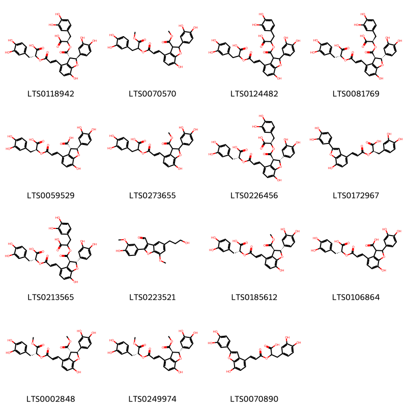
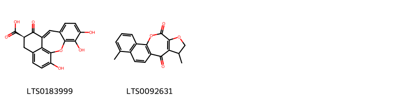
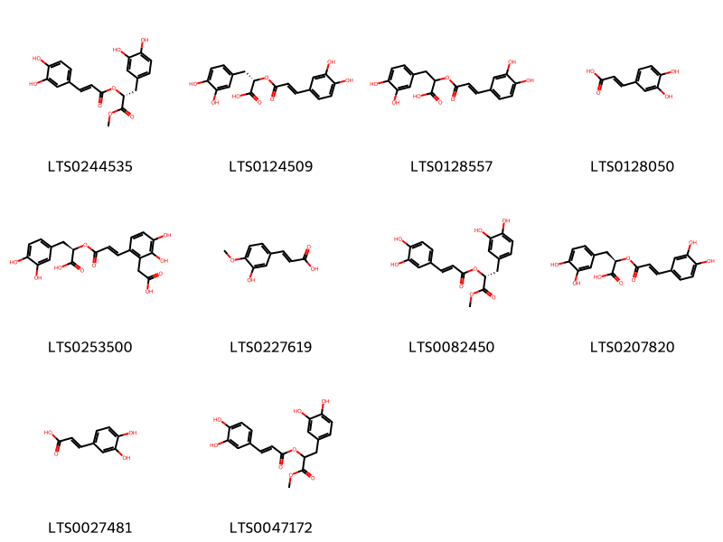
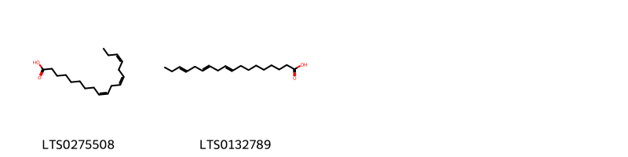
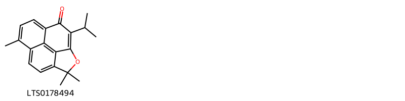
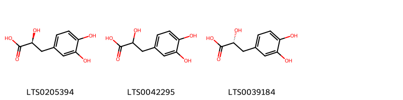
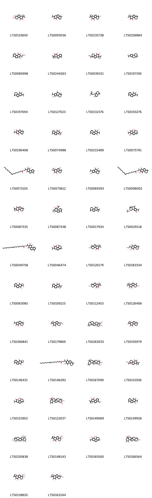

!!! abstract "Tóm tắt"

    Bạc hà (Herba Menthae) là toàn cây của cây bạc hà (Mentha arvensis L.), thuộc họ Bạc Hà (Lamiaceae). Bạc hà phân bố chủ yếu ở khu vực Đông Á và Đông Nam Á. Ở Việt Nam, cây mọc phổ biến và thường được trồng tại nhiều nơi để làm thuốc. Theo tài liệu cổ, bạc hà có vị cay, tính mát, quy vào kinh phế và can, được dùng để giải nhiệt, chữa cảm mạo, nhức đầu, cổ họng sưng đau, và các bệnh liên quan đến đường hô hấp. Bạc hà chứa nhiều thành phần hóa học như nhóm diterpenoids (tanshinones), axit phenolic (axit salvianolic, axit rosmarinic), cùng hoạt chất chính là tanshinone IIA, có tác dụng tương tự vitamin K.

## Thông tin về thực vật

Dược liệu **Đan Sâm (Rễ Và Thân Rễ)** từ bộ phận **nan** từ loài *Salvia miltiorrhiza*.

**Mô tả thực vật:** Đan sâm là một loại cỏ sống lâu năm, cao 30-80cm, toàn thân mang lòng ngắn màu vàng trắng nhạt. Rễ nhỏ dài hình trụ, đường kính 0,5- 1,5cm, màu đỏ nâu. Thần vuông trên có các gân dọc. Lá kép, mọc đối: 3-5 lá chét, đặc biệt có thể có 7. Lá chét giữa thường lớn hơn cả. Lá kép có cuống dài, cuống lá chét ngắn có dìa. Lá chét dài 2-7,5cm, rộng 0,8-5cm. Mép lá chét có răng cưa tù. Mặt trên lá chét màu xanh, có các lông mềm màu trắng, mặt dưới màu xanh tro, cũng có lòng nhưng dài hơn. Gần nổi ở mặt dưới, chia phiến lá chét thành múi nhỏ. Cụm hoa mọc thành chùm ở đầu cành hay ở kẽ lá, chùm hoa dài 10-20cm. Hoa mọc vòng, mỗi vòng 3-10 hoa thường là 2 hoa. Hoa có tràng màu xanh tím nhạt, 2 mỏi, môi trên trống nghiêng hình lưỡi liềm, môi dưới xẻ 3 thuỳ, thuỳ giữa có răng cưa tròn. Hai nhị ở môi dưới bầu có vòi dài lòi ra ở môi trên. Quả nhỏ, dài 3mm, rộng 1,5mm. Mùa hoa từ tháng 5-8 (Tam Đảo) mùa quả tháng 6-9.

*Tài liệu tham khảo:* "Những cây thuốc và vị thuốc Việt Nam" - Đỗ Tất Lợi 
Trong dược điển Việt nam, một loài được sử dụng làm dược liệu là *Salvia miltiorrhiza*.

!!! info "Phân loại thực vật của *Salvia miltiorrhiza*"
    - **Kingdom:** Plantae
    - **Phylum:** Tracheophyta
    - **Order:** Lamiales
    - **Family:** Lamiaceae
    - **Genus:** Salvia
    - **Species:** *Salvia miltiorrhiza*

**Phân bố trên thế giới:** China, United States of America, Chinese Taipei, Korea, Republic of

**Phân bố tại Việt nam:** Không có ghi nhận ở Việt Nam

## Thông tin về dược liệu 

### Định danh

!!! info "Thông tin về tên gọi"

    - Dược liệu tiếng Việt: nan
    - Dược liệu tiếng Trung: nan (nan)
    - Dược liệu tiếng Anh: nan
    - Dược liệu latin thông dụng: nan
    - Dược liệu latin kiểu DĐVN: *radix et rhizoma salviae mitiorrhizae*
    - Dược liệu latin kiểu DĐVN: *nan*
    - Dược liệu latin kiểu thông tư: *nan*
    - Bộ phận dùng: nan (nan)

### Mô tả dược liệu 

- **Theo dược điển Việt nam V:** nan

- **Mô tả dược liệu theo thông tư chế biến dược liệu theo phương pháp cổ truyền:** nan

### Chế biến 

- **Chế biến theo dược điển việt nam V**: nan

- **Chế biến theo thông tư:** nan

--- 

## Thành phần hóa học

- Theo tài liệu của GS. Đỗ Tất Lợi:  1, Nhóm hóa học: Nhóm hóa học: Tanshinones (diterpenoids), phenolic acids (như acid salvianolic, acid rosmarinic).
2, Tên hoạt chất 
Dược điển Đài Loan tái bản lần 4: Tanshinone IIA
    

**Thành phần hóa học từ loài **Salvia miltiorrhiza**

Theo cơ sở dữ liệu lotus, loài *Salvia miltiorrhiza* đã phân lập và xác định được **191** hoạt chất thuộc về các nhóm Fatty Acyls, Benzoxepines, Phenols, Tropones, Carboxylic acids and derivatives, Phenanthrenes and derivatives, Steroids and steroid derivatives, Flavonoids, Phenylpropanoic acids, Phenalenes, Naphthofurans, Heteroaromatic compounds, 2-arylbenzofuran flavonoids, Benzene and substituted derivatives, Stilbenes, Coumarins and derivatives, Prenol lipids, Organooxygen compounds, Naphthalenes, Cinnamic acids and derivatives, Indoles and derivatives, Naphthopyrans trong bảng dưới đây. Danh sách các hoạt chất như sau (2r)-2-{[(2e)-3-[(2r,3r)-3-{[1-carboxy-2-(3,4-dihydroxyphenyl)ethoxy]carbonyl}-2-(3,4-dihydroxyphenyl)-7-hydroxy-2,3-dihydro-1-benzofuran-4-yl]prop-2-enoyl]oxy}-3-(3,4-dihydroxyphenyl)propanoic acid [(LTS0213565)](https://lotus.naturalproducts.net/compound/lotus_id/LTS0213565), (2s,8r)-2,5,10,11-tetrahydroxy-8-methoxy-2,6,7,8-tetrahydro-1h-4-benzazecin-3-one [(LTS0066886)](https://lotus.naturalproducts.net/compound/lotus_id/LTS0066886), 3-hydroxy-2-(1-hydroxypropan-2-yl)-8,8-dimethyl-6,7-dihydro-5h-phenanthrene-1,4-dione [(LTS0183334)](https://lotus.naturalproducts.net/compound/lotus_id/LTS0183334), (3s,4'r)-4',6-dimethylspiro[naphtho[1,2-c]furan-3,2'-oxolan]-1-one [(LTS0121786)](https://lotus.naturalproducts.net/compound/lotus_id/LTS0121786), 1-methyl-7h,8h,9h-phenanthro[1,2-b]furan-6,10,11-trione [(LTS0050930)](https://lotus.naturalproducts.net/compound/lotus_id/LTS0050930), 6-(hydroxymethyl)-1,6-dimethyl-7h,8h,9h-phenanthro[1,2-b]furan-10,11-dione [(LTS0163244)](https://lotus.naturalproducts.net/compound/lotus_id/LTS0163244), isoferulic acid [(LTS0227619)](https://lotus.naturalproducts.net/compound/lotus_id/LTS0227619), 2-(4-hydroxy-3-methoxyphenyl)-5-(3-hydroxypropyl)-7-methoxy-1-benzofuran-3-carbaldehyde [(LTS0223521)](https://lotus.naturalproducts.net/compound/lotus_id/LTS0223521), 5,9,17,17-tetramethyl-3,10-dioxa-8-azapentacyclo[10.8.0.0²,⁶.0⁷,¹¹.0¹³,¹⁸]icosa-1(12),2(6),4,7(11),8,13(18),19-heptaene [(LTS0069159)](https://lotus.naturalproducts.net/compound/lotus_id/LTS0069159), 6-hydroxy-6-(hydroxymethyl)-1-methyl-7h,8h,9h-phenanthro[1,2-b]furan-10,11-dione [(LTS0123070)](https://lotus.naturalproducts.net/compound/lotus_id/LTS0123070), dihydrotanshinone i [(LTS0074988)](https://lotus.naturalproducts.net/compound/lotus_id/LTS0074988), salvianolic acid c [(LTS0172967)](https://lotus.naturalproducts.net/compound/lotus_id/LTS0172967), 2-[(1s,2s)-2-formyl-1,3,3-trimethylcyclohexyl]-3,4-dihydroxy-5-isopropylbenzaldehyde [(LTS0148090)](https://lotus.naturalproducts.net/compound/lotus_id/LTS0148090), (3r,4's)-4',6-dimethylspiro[naphtho[1,2-c]furan-3,2'-oxolan]-1-one [(LTS0142755)](https://lotus.naturalproducts.net/compound/lotus_id/LTS0142755), 10-isopropyl-5,13,13-trimethyl-12-oxatetracyclo[6.5.2.0⁴,¹⁵.0¹¹,¹⁴]pentadeca-1,3,5,7,10,14-hexaen-9-one [(LTS0178494)](https://lotus.naturalproducts.net/compound/lotus_id/LTS0178494), (3s,4's)-4',6-dimethylspiro[naphtho[1,2-c]furan-3,2'-oxolan]-1-one [(LTS0148491)](https://lotus.naturalproducts.net/compound/lotus_id/LTS0148491), (6r,7r)-6,7-dihydroxy-1,6-dimethyl-7h,8h,9h-phenanthro[1,2-b]furan-10,11-dione [(LTS0043464)](https://lotus.naturalproducts.net/compound/lotus_id/LTS0043464), 3-(3,4-dihydroxyphenyl)-2-{[(2e)-3-{2-[(1e)-2-(3,4-dihydroxyphenyl)ethenyl]-3,4-dihydroxyphenyl}prop-2-enoyl]oxy}propanoic acid [(LTS0098116)](https://lotus.naturalproducts.net/compound/lotus_id/LTS0098116), 3-(3,4-dihydroxyphenyl)-2-({3-[2-(3,4-dihydroxyphenyl)-7-hydroxy-3-(methoxycarbonyl)-2,3-dihydro-1-benzofuran-4-yl]prop-2-enoyl}oxy)propanoic acid [(LTS0273655)](https://lotus.naturalproducts.net/compound/lotus_id/LTS0273655), 3,4-dihydroxybenzoic acid [(LTS0018765)](https://lotus.naturalproducts.net/compound/lotus_id/LTS0018765), 1-hydroxy-2-(1-hydroxypropan-2-yl)-8-methylphenanthrene-3,4-dione [(LTS0085998)](https://lotus.naturalproducts.net/compound/lotus_id/LTS0085998), przewaquinone a [(LTS0209017)](https://lotus.naturalproducts.net/compound/lotus_id/LTS0209017), (2r)-2-{[(2e)-2-{2-[(1e)-3-[(1r)-1-carboxy-2-(3,4-dihydroxyphenyl)ethoxy]-3-oxoprop-1-en-1-yl]-4,5-dihydroxyphenyl}-3-(3,4-dihydroxyphenyl)prop-2-enoyl]oxy}-3-(3,4-dihydroxyphenyl)propanoic acid [(LTS0146975)](https://lotus.naturalproducts.net/compound/lotus_id/LTS0146975), 2-(3-hydroxy-8-methyl-1,4-dioxophenanthren-2-yl)propyl octadec-9-enoate [(LTS0049758)](https://lotus.naturalproducts.net/compound/lotus_id/LTS0049758), (4r)-4-hydroxy-2-isopropyl-8,8-dimethyl-6,7-dihydro-4h-phenanthrene-3,5-dione [(LTS0151903)](https://lotus.naturalproducts.net/compound/lotus_id/LTS0151903), 6-hydroxy-1,6-dimethyl-7h,8h,9h-phenanthro[1,2-b]furan-10,11-dione [(LTS0235738)](https://lotus.naturalproducts.net/compound/lotus_id/LTS0235738), 4-hydroxy-2-isopropyl-8,8-dimethyl-5-oxo-6,7-dihydrophenanthren-3-yl hexadecanoate [(LTS0014325)](https://lotus.naturalproducts.net/compound/lotus_id/LTS0014325), 3-isopropyl-9,9-dimethyl-15-azatetracyclo[10.2.1.0⁵,¹⁴.0⁸,¹³]pentadeca-1(14),3,5,7,12-pentaene-2,11-dione [(LTS0112083)](https://lotus.naturalproducts.net/compound/lotus_id/LTS0112083), 4-[5-(hydroxymethyl)furan-2-yl]but-3-en-2-one [(LTS0252341)](https://lotus.naturalproducts.net/compound/lotus_id/LTS0252341), 10-hydroxy-1,2,6a,6b,9,9,12a-heptamethyl-2,3,4,5,6,7,8,8a,10,11,12,12b,13,14b-tetradecahydro-1h-picene-4a-carboxylic acid [(LTS0166564)](https://lotus.naturalproducts.net/compound/lotus_id/LTS0166564), 3,4-dihydroxyphenyllactic acid [(LTS0042295)](https://lotus.naturalproducts.net/compound/lotus_id/LTS0042295), methyl 2-(3,4-dihydroxyphenyl)-4-(3-{[3-(3,4-dihydroxyphenyl)-1-methoxy-1-oxopropan-2-yl]oxy}-3-oxoprop-1-en-1-yl)-7-hydroxy-2,3-dihydro-1-benzofuran-3-carboxylate [(LTS0070570)](https://lotus.naturalproducts.net/compound/lotus_id/LTS0070570), 3-hydroxy-2-[(2r)-1-hydroxypropan-2-yl]-8-methylphenanthrene-1,4-dione [(LTS0110547)](https://lotus.naturalproducts.net/compound/lotus_id/LTS0110547), 2-isopropyl-8,8-dimethyl-7h-phenanthrene-3,4-dione [(LTS0093036)](https://lotus.naturalproducts.net/compound/lotus_id/LTS0093036), (1r)-10-hydroxy-1,6,6-trimethyl-1h,2h,7h,8h,9h-phenanthro[1,2-b]furan-5,11-dione [(LTS0152322)](https://lotus.naturalproducts.net/compound/lotus_id/LTS0152322), (6s)-6-hydroxy-6-(hydroxymethyl)-1-methyl-7h,8h,9h-phenanthro[1,2-b]furan-10,11-dione [(LTS0118820)](https://lotus.naturalproducts.net/compound/lotus_id/LTS0118820), (4ar)-6,10-dihydroxy-7-isopropyl-1,1,4a-trimethyl-3,4-dihydro-2h-phenanthren-9-one [(LTS0069393)](https://lotus.naturalproducts.net/compound/lotus_id/LTS0069393), 3-(3,4-dihydroxyphenyl)-2-{[(2e)-3-[2-(3,4-dihydroxyphenyl)-7-hydroxy-1-benzofuran-4-yl]prop-2-enoyl]oxy}propanoic acid [(LTS0070890)](https://lotus.naturalproducts.net/compound/lotus_id/LTS0070890), 6,14-dimethyl-12,17-dioxatetracyclo[8.7.0.0²,⁷.0¹¹,¹⁵]heptadeca-1(10),2(7),3,5,8,11(15),13-heptaen-16-one [(LTS0210856)](https://lotus.naturalproducts.net/compound/lotus_id/LTS0210856), 1-hydroxy-2-[(2r)-1-hydroxypropan-2-yl]-8-methylphenanthrene-3,4-dione [(LTS0000886)](https://lotus.naturalproducts.net/compound/lotus_id/LTS0000886), (2r)-5-hydroxy-2-(3-hydroxy-4-methoxyphenyl)-7-methoxy-2,3-dihydro-1-benzopyran-4-one [(LTS0111301)](https://lotus.naturalproducts.net/compound/lotus_id/LTS0111301), (3s)-5-[(1s,4as,8as)-2,5,5,8a-tetramethyl-1,4,4a,6,7,8-hexahydronaphthalen-1-yl]-3-methylpent-1-en-3-ol [(LTS0212260)](https://lotus.naturalproducts.net/compound/lotus_id/LTS0212260), (3e)-4-[5-(hydroxymethyl)furan-2-yl]but-3-en-2-one [(LTS0154332)](https://lotus.naturalproducts.net/compound/lotus_id/LTS0154332), (s)-rosmarinic acid [(LTS0124509)](https://lotus.naturalproducts.net/compound/lotus_id/LTS0124509), methyl 1,6-dimethyl-10,11-dioxo-7h,8h,9h-phenanthro[1,2-b]furan-6-carboxylate [(LTS0151926)](https://lotus.naturalproducts.net/compound/lotus_id/LTS0151926), miltirone [(LTS0266841)](https://lotus.naturalproducts.net/compound/lotus_id/LTS0266841), α linolenic acid [(LTS0132789)](https://lotus.naturalproducts.net/compound/lotus_id/LTS0132789), (3r,4r,4ar,6ar,6bs,8ar,11r,12s,12ar,14ar,14br)-4-(hydroxymethyl)-4,6a,6b,8a,11,12,14b-heptamethyl-2,3,4a,5,6,7,8,9,10,11,12,12a,14,14a-tetradecahydro-1h-picen-3-ol [(LTS0087521)](https://lotus.naturalproducts.net/compound/lotus_id/LTS0087521), 6,7-dihydroxy-1,6-dimethyl-7h,8h,9h-phenanthro[1,2-b]furan-10,11-dione [(LTS0015786)](https://lotus.naturalproducts.net/compound/lotus_id/LTS0015786), cryptotanshinone [(LTS0256884)](https://lotus.naturalproducts.net/compound/lotus_id/LTS0256884), 2-(2-formyl-1,3,3-trimethylcyclohexyl)-3,4-dihydroxy-5-isopropylbenzaldehyde [(LTS0023197)](https://lotus.naturalproducts.net/compound/lotus_id/LTS0023197), (6s)-6-(hydroxymethyl)-1,6-dimethyl-7h,8h,9h-phenanthro[1,2-b]furan-10,11-dione [(LTS0179869)](https://lotus.naturalproducts.net/compound/lotus_id/LTS0179869), 10,11-dihydroxy-2,2,6a,6b,9,9,12a-heptamethyl-1,3,4,5,6,7,8,8a,10,11,12,12b,13,14b-tetradecahydropicene-4a-carboxylic acid [(LTS0167090)](https://lotus.naturalproducts.net/compound/lotus_id/LTS0167090), 1-hydroxy-2,8,8-trimethyl-6,7-dihydro-5h-phenanthrene-3,4-dione [(LTS0147609)](https://lotus.naturalproducts.net/compound/lotus_id/LTS0147609), 3-(3,4-dihydroxyphenyl)-2-[(3-{2-[2-(3,4-dihydroxyphenyl)ethenyl]-3,4-dihydroxyphenyl}prop-2-enoyl)oxy]propanoic acid [(LTS0095003)](https://lotus.naturalproducts.net/compound/lotus_id/LTS0095003), methyl (6r)-1,6-dimethyl-10,11-dioxo-7h,8h,9h-phenanthro[1,2-b]furan-6-carboxylate [(LTS0222755)](https://lotus.naturalproducts.net/compound/lotus_id/LTS0222755), 7-hydroxy-1-methyl-6-methylidene-7h,8h,9h-phenanthro[1,2-b]furan-10,11-dione [(LTS0126406)](https://lotus.naturalproducts.net/compound/lotus_id/LTS0126406), 4-hydroxy-6,12,12-trimethyl-17-oxatetracyclo[7.6.2.0¹,¹¹.0²,⁸]heptadeca-2(8),3,6-trien-5-one [(LTS0145253)](https://lotus.naturalproducts.net/compound/lotus_id/LTS0145253), methyl 1,6-dimethyl-10,11-dioxo-1h,2h,7h,8h,9h-phenanthro[1,2-b]furan-6-carboxylate [(LTS0039331)](https://lotus.naturalproducts.net/compound/lotus_id/LTS0039331), (2s)-3-(3,4-dihydroxyphenyl)-2-hydroxypropanoic acid [(LTS0205394)](https://lotus.naturalproducts.net/compound/lotus_id/LTS0205394), methyl (2s,3s)-2-(3,4-dihydroxyphenyl)-4-[(1e)-3-{[(2r)-3-(3,4-dihydroxyphenyl)-1-methoxy-1-oxopropan-2-yl]oxy}-3-oxoprop-1-en-1-yl]-7-hydroxy-2,3-dihydro-1-benzofuran-3-carboxylate [(LTS0002848)](https://lotus.naturalproducts.net/compound/lotus_id/LTS0002848), salvianolic acid b [(LTS0118942)](https://lotus.naturalproducts.net/compound/lotus_id/LTS0118942), (2r)-3-(3,4-dihydroxyphenyl)-1-methoxy-1-oxopropan-2-yl 3-(3,4-dihydroxyphenyl)prop-2-enoate [(LTS0244535)](https://lotus.naturalproducts.net/compound/lotus_id/LTS0244535), (3s,4as,10as)-6-hydroxy-7-isopropyl-1,1,4a-trimethyl-9-oxo-3,4,10,10a-tetrahydro-2h-phenanthren-3-yl acetate [(LTS0029118)](https://lotus.naturalproducts.net/compound/lotus_id/LTS0029118), (7s)-7-hydroxy-1-methyl-6-methylidene-7h,8h,9h-phenanthro[1,2-b]furan-10,11-dione [(LTS0026970)](https://lotus.naturalproducts.net/compound/lotus_id/LTS0026970), 3-(3,4-dihydroxyphenyl)-1-methoxy-1-oxopropan-2-yl 3-(3,4-dihydroxyphenyl)prop-2-enoate [(LTS0047172)](https://lotus.naturalproducts.net/compound/lotus_id/LTS0047172), 2-isopropyl-8,8-dimethyl-6,7-dihydrophenanthrene-3,4,5-trione [(LTS0046474)](https://lotus.naturalproducts.net/compound/lotus_id/LTS0046474), (7s)-7-hydroxy-1,6,6-trimethyl-7h,8h,9h-phenanthro[1,2-b]furan-10,11-dione [(LTS0112453)](https://lotus.naturalproducts.net/compound/lotus_id/LTS0112453), 3-hydroxy-2-isopropyl-8,8-dimethyl-6,7-dihydrophenanthrene-1,4,5-trione [(LTS0251597)](https://lotus.naturalproducts.net/compound/lotus_id/LTS0251597), (8r)-4,8-dimethyl-8h,9h-phenanthro[3,2-b]furan-7,11-dione [(LTS0146431)](https://lotus.naturalproducts.net/compound/lotus_id/LTS0146431), (6r,7s)-6,7-dihydroxy-1,6-dimethyl-7h,8h,9h-phenanthro[1,2-b]furan-10,11-dione [(LTS0259936)](https://lotus.naturalproducts.net/compound/lotus_id/LTS0259936), 5,6-dihydroxy-7-isopropyl-1,1-dimethyl-2,3-dihydrophenanthren-4-one [(LTS0165500)](https://lotus.naturalproducts.net/compound/lotus_id/LTS0165500), 7-hydroxy-1,6,6-trimethyl-7h,8h,9h-phenanthro[1,2-b]furan-10,11-dione [(LTS0120179)](https://lotus.naturalproducts.net/compound/lotus_id/LTS0120179), 3,4-dihydroxycinnamic acid [(LTS0128050)](https://lotus.naturalproducts.net/compound/lotus_id/LTS0128050), 2-isopropyl-8,8-dimethyl-7h-phenanthrene-1,4-dione [(LTS0196408)](https://lotus.naturalproducts.net/compound/lotus_id/LTS0196408), (6r)-6,7-dihydroxy-1,6-dimethyl-7h,8h,9h-phenanthro[1,2-b]furan-10,11-dione [(LTS0153650)](https://lotus.naturalproducts.net/compound/lotus_id/LTS0153650), (3r,4'r)-4',6,6-trimethyl-8,9-dihydro-7h-spiro[naphtho[1,2-c]furan-3,2'-oxolan]-1-one [(LTS0092018)](https://lotus.naturalproducts.net/compound/lotus_id/LTS0092018), (1r,10s)-10-hydroxy-1,6-dimethyl-10-(2-oxopropyl)-1h,2h-phenanthro[1,2-b]furan-11-one [(LTS0087438)](https://lotus.naturalproducts.net/compound/lotus_id/LTS0087438), 1-methyl-6-methylidene-7h,8h,9h-phenanthro[1,2-b]furan-10,11-dione [(LTS0017934)](https://lotus.naturalproducts.net/compound/lotus_id/LTS0017934), 2-isopropyl-8,8-dimethyl-6,7-dihydro-5h-phenanthrene-1,4-dione [(LTS0044266)](https://lotus.naturalproducts.net/compound/lotus_id/LTS0044266), 2-isopropyl-4b,8,8-trimethyl-5,6,7,8a,9,10-hexahydrophenanthren-3-ol [(LTS0255397)](https://lotus.naturalproducts.net/compound/lotus_id/LTS0255397), maslinic acid [(LTS0109701)](https://lotus.naturalproducts.net/compound/lotus_id/LTS0109701), 1-(3-hydroxy-8,8-dimethyl-6,7-dihydro-5h-phenanthren-2-yl)ethanone [(LTS0180808)](https://lotus.naturalproducts.net/compound/lotus_id/LTS0180808), 4,4,8-trimethyl-1h,2h,3h-phenanthro[3,2-b]furan-7,11-dione [(LTS0087535)](https://lotus.naturalproducts.net/compound/lotus_id/LTS0087535), 10-hydroxy-1,6,6-trimethyl-1h,2h,7h,8h,9h-phenanthro[1,2-b]furan-5,11-dione [(LTS0089656)](https://lotus.naturalproducts.net/compound/lotus_id/LTS0089656), (2r)-3-(3,4-dihydroxyphenyl)-2-hydroxypropanimidic acid [(LTS0126859)](https://lotus.naturalproducts.net/compound/lotus_id/LTS0126859), 6,14-dimethyl-12,16-dioxatetracyclo[8.7.0.0²,⁷.0¹¹,¹⁵]heptadeca-1(10),2(7),3,5,8,11(15),13-heptaen-17-one [(LTS0075374)](https://lotus.naturalproducts.net/compound/lotus_id/LTS0075374), 2-isopropyl-8-methyl-3,4-dioxophenanthrene-1-carboxylic acid [(LTS0235344)](https://lotus.naturalproducts.net/compound/lotus_id/LTS0235344), danshensu [(LTS0039184)](https://lotus.naturalproducts.net/compound/lotus_id/LTS0039184), 1-hydroxy-2-isopropyl-8,8-dimethyl-6,7-dihydro-5h-phenanthrene-3,4-dione [(LTS0225174)](https://lotus.naturalproducts.net/compound/lotus_id/LTS0225174), 2-isopropyl-8-methylphenanthrene-3,4-dione [(LTS0193276)](https://lotus.naturalproducts.net/compound/lotus_id/LTS0193276), sugiol [(LTS0127023)](https://lotus.naturalproducts.net/compound/lotus_id/LTS0127023), 2-isopropyl-8-methylidene-6,7-dihydro-5h-phenanthrene-3,4-dione [(LTS0197694)](https://lotus.naturalproducts.net/compound/lotus_id/LTS0197694), (6r)-6-hydroxy-6-(hydroxymethyl)-1-methyl-7h,8h,9h-phenanthro[1,2-b]furan-10,11-dione [(LTS0148143)](https://lotus.naturalproducts.net/compound/lotus_id/LTS0148143), 2-(3-hydroxy-8,8-dimethyl-1,4-dioxo-6,7-dihydro-5h-phenanthren-2-yl)propyl octadec-9-enoate [(LTS0146292)](https://lotus.naturalproducts.net/compound/lotus_id/LTS0146292), (1r,9s,11r)-4-hydroxy-6,12,12-trimethyl-17-oxatetracyclo[7.6.2.0¹,¹¹.0²,⁸]heptadeca-2(8),3,6-trien-5-one [(LTS0242640)](https://lotus.naturalproducts.net/compound/lotus_id/LTS0242640), 5-(2,5,5,8a-tetramethyl-1,4,4a,6,7,8-hexahydronaphthalen-1-yl)-3-methylpent-1-en-3-ol [(LTS0132376)](https://lotus.naturalproducts.net/compound/lotus_id/LTS0132376), 2,5,10,11-tetrahydroxy-8-methoxy-2,6,7,8-tetrahydro-1h-4-benzazecin-3-one [(LTS0192631)](https://lotus.naturalproducts.net/compound/lotus_id/LTS0192631), 6-hydroxy-7-isopropyl-1,1,4a-trimethyl-3,4,10,10a-tetrahydro-2h-phenanthren-9-one [(LTS0270724)](https://lotus.naturalproducts.net/compound/lotus_id/LTS0270724), 4-(hydroxymethyl)-4,6a,6b,8a,11,11,14b-heptamethyl-1,2,3,4a,5,6,7,8,9,10,12,12a,14,14a-tetradecahydropicen-3-ol [(LTS0124497)](https://lotus.naturalproducts.net/compound/lotus_id/LTS0124497), (2r)-2-{[(2e)-3-{2-[(1z)-3-[(1r)-1-carboxy-2-(3,4-dihydroxyphenyl)ethoxy]-1-(3,4-dihydroxyphenyl)-3-oxoprop-1-en-2-yl]-3,4-dihydroxyphenyl}prop-2-enoyl]oxy}-3-(3,4-dihydroxyphenyl)propanoic acid [(LTS0269443)](https://lotus.naturalproducts.net/compound/lotus_id/LTS0269443), 1-hydroxy-2-isopropyl-8,8-dimethyl-6,7-dihydrophenanthrene-3,4,5-trione [(LTS0075791)](https://lotus.naturalproducts.net/compound/lotus_id/LTS0075791), (4as,10ar)-7-isopropyl-1,1,4a-trimethyl-2,3,4,9,10,10a-hexahydrophenanthrene [(LTS0197190)](https://lotus.naturalproducts.net/compound/lotus_id/LTS0197190), 3-[2-oxo-6-(1,2,3,4-tetrahydroxybutyl)morpholin-3-yl]propanimidic acid [(LTS0072322)](https://lotus.naturalproducts.net/compound/lotus_id/LTS0072322), 3-hydroxy-2-(1-hydroxypropan-2-yl)-8-methylphenanthrene-1,4-dione [(LTS0055576)](https://lotus.naturalproducts.net/compound/lotus_id/LTS0055576), (8s)-4,4,8-trimethyl-1h,2h,3h,8h,9h-phenanthro[3,2-b]furan-7,11-dione [(LTS0174804)](https://lotus.naturalproducts.net/compound/lotus_id/LTS0174804), 3,4-dihydroxybenzaldehyde [(LTS0251601)](https://lotus.naturalproducts.net/compound/lotus_id/LTS0251601), (4r)-4,8-dimethyl-3,4-dihydro-2,12-dioxatetraphene-1,5-dione [(LTS0116433)](https://lotus.naturalproducts.net/compound/lotus_id/LTS0116433), 6-hydroxy-7-isopropyl-1,1,4a-trimethyl-9-oxo-3,4,10,10a-tetrahydro-2h-phenanthren-3-yl acetate [(LTS0211957)](https://lotus.naturalproducts.net/compound/lotus_id/LTS0211957), oleoyl danshenxinkun a [(LTS0073105)](https://lotus.naturalproducts.net/compound/lotus_id/LTS0073105), 6,13-dimethyl-15,18-dioxatetracyclo[8.8.0.0²,⁷.0¹²,¹⁶]octadeca-1(10),2(7),3,5,8,12(16)-hexaene-11,17-dione [(LTS0092631)](https://lotus.naturalproducts.net/compound/lotus_id/LTS0092631), 3,8-dimethyl-2h,3h-phenanthro[4,3-b]furan-4,5-dione [(LTS0122080)](https://lotus.naturalproducts.net/compound/lotus_id/LTS0122080), ferruginol [(LTS0045608)](https://lotus.naturalproducts.net/compound/lotus_id/LTS0045608), tanshinone i [(LTS0244263)](https://lotus.naturalproducts.net/compound/lotus_id/LTS0244263), 3,8-dimethylphenanthro[4,3-b]furan-4,5-dione [(LTS0049217)](https://lotus.naturalproducts.net/compound/lotus_id/LTS0049217), 5,9,17,17-tetramethyl-3,8-dioxa-10-azapentacyclo[10.8.0.0²,⁶.0⁷,¹¹.0¹³,¹⁸]icosa-1(12),2(6),4,7(11),9,13(18),19-heptaene [(LTS0006481)](https://lotus.naturalproducts.net/compound/lotus_id/LTS0006481), 6-hydroxy-5,6-dehydrosugiol [(LTS0027737)](https://lotus.naturalproducts.net/compound/lotus_id/LTS0027737), salvianolic acid a [(LTS0062066)](https://lotus.naturalproducts.net/compound/lotus_id/LTS0062066), 1,6-dimethyl-10,11-dioxo-7h-phenanthro[1,2-b]furan-6-carbaldehyde [(LTS0237544)](https://lotus.naturalproducts.net/compound/lotus_id/LTS0237544), 1-methyl-10,11-dioxophenanthro[1,2-b]furan-6-carbaldehyde [(LTS0149069)](https://lotus.naturalproducts.net/compound/lotus_id/LTS0149069), 5,11,11-trimethyl-16-oxatetracyclo[6.6.2.0¹,¹⁰.0²,⁷]hexadeca-2(7),3,5-trien-4-ol [(LTS0021674)](https://lotus.naturalproducts.net/compound/lotus_id/LTS0021674), caffeic acid [(LTS0027481)](https://lotus.naturalproducts.net/compound/lotus_id/LTS0027481), 2-(4-{3-[1-carboxy-2-(3,4-dihydroxyphenyl)ethoxy]-3-oxoprop-1-en-1-yl}-2-(3,4-dihydroxyphenyl)-7-hydroxy-2,3-dihydro-1-benzofuran-3-carbonyloxy)-3-(3,4-dihydroxyphenyl)propanoic acid [(LTS0124482)](https://lotus.naturalproducts.net/compound/lotus_id/LTS0124482), n-[2-(5-methoxy-1h-indol-3-yl)ethyl]ethanimidic acid [(LTS0219322)](https://lotus.naturalproducts.net/compound/lotus_id/LTS0219322), dihydrotanshinone [(LTS0109215)](https://lotus.naturalproducts.net/compound/lotus_id/LTS0109215), isoimperatorin [(LTS0257448)](https://lotus.naturalproducts.net/compound/lotus_id/LTS0257448), methyl (2r,3r)-2-(3,4-dihydroxyphenyl)-4-[(1e)-3-{[(2r)-3-(3,4-dihydroxyphenyl)-1-methoxy-1-oxopropan-2-yl]oxy}-3-oxoprop-1-en-1-yl]-7-hydroxy-2,3-dihydro-1-benzofuran-3-carboxylate [(LTS0249974)](https://lotus.naturalproducts.net/compound/lotus_id/LTS0249974), 3-hydroxy-2,8,8-trimethyl-6,7-dihydro-5h-phenanthrene-1,4-dione [(LTS0204020)](https://lotus.naturalproducts.net/compound/lotus_id/LTS0204020), (2s,3s)-4-[(1e)-3-[(1s)-1-carboxy-2-(3,4-dihydroxyphenyl)ethoxy]-3-oxoprop-1-en-1-yl]-2-(3,4-dihydroxyphenyl)-7-hydroxy-2,3-dihydro-1-benzofuran-3-carboxylic acid [(LTS0059529)](https://lotus.naturalproducts.net/compound/lotus_id/LTS0059529), corosolic acid [(LTS0231285)](https://lotus.naturalproducts.net/compound/lotus_id/LTS0231285), (1r,9s,11s)-4-hydroxy-6,12,12-trimethyl-17-oxatetracyclo[7.6.2.0¹,¹¹.0²,⁸]heptadeca-2(8),3,6-trien-5-one [(LTS0044398)](https://lotus.naturalproducts.net/compound/lotus_id/LTS0044398), (1r,8s,10s)-5,11,11-trimethyl-16-oxatetracyclo[6.6.2.0¹,¹⁰.0²,⁷]hexadeca-2(7),3,5-trien-4-ol [(LTS0118271)](https://lotus.naturalproducts.net/compound/lotus_id/LTS0118271), cryptotanshinone [(LTS0192623)](https://lotus.naturalproducts.net/compound/lotus_id/LTS0192623), (3r,4'r)-4',6-dimethylspiro[naphtho[1,2-c]furan-3,2'-oxolan]-1-one [(LTS0039066)](https://lotus.naturalproducts.net/compound/lotus_id/LTS0039066), (6s)-6-hydroxy-1,6-dimethyl-7h,8h,9h-phenanthro[1,2-b]furan-10,11-dione [(LTS0187816)](https://lotus.naturalproducts.net/compound/lotus_id/LTS0187816), 3-(3,4-dihydroxyphenyl)-2-{[3-(3,4-dihydroxyphenyl)prop-2-enoyl]oxy}propanoic acid [(LTS0128557)](https://lotus.naturalproducts.net/compound/lotus_id/LTS0128557), (2s)-2-(3-hydroxy-8,8-dimethyl-1,4-dioxo-6,7-dihydro-5h-phenanthren-2-yl)propyl (9z)-octadec-9-enoate [(LTS0014289)](https://lotus.naturalproducts.net/compound/lotus_id/LTS0014289), 7-isopropyl-1,1,4a-trimethyl-2,3,4,9,10,10a-hexahydrophenanthrene [(LTS0210076)](https://lotus.naturalproducts.net/compound/lotus_id/LTS0210076), (3s,4'r)-4',6,6-trimethyl-8,9-dihydro-7h-spiro[naphtho[1,2-c]furan-3,2'-oxolan]-1-one [(LTS0078483)](https://lotus.naturalproducts.net/compound/lotus_id/LTS0078483), 4',6,6-trimethyl-8,9-dihydro-7h-spiro[naphtho[1,2-c]furan-3,2'-oxolan]-1-one [(LTS0167968)](https://lotus.naturalproducts.net/compound/lotus_id/LTS0167968), (12r)-4,5,17-trihydroxy-11-oxo-2-oxatetracyclo[8.7.1.0³,⁸.0¹⁴,¹⁸]octadeca-1(18),3,5,7,9,14,16-heptaene-12-carboxylic acid [(LTS0183999)](https://lotus.naturalproducts.net/compound/lotus_id/LTS0183999), (3r,4r,4ar,6ar,6bs,8ar,12ar,14ar,14br)-4-(hydroxymethyl)-4,6a,6b,8a,11,11,14b-heptamethyl-1,2,3,4a,5,6,7,8,9,10,12,12a,14,14a-tetradecahydropicen-3-ol [(LTS0263033)](https://lotus.naturalproducts.net/compound/lotus_id/LTS0263033), oleanolic acid [(LTS0141130)](https://lotus.naturalproducts.net/compound/lotus_id/LTS0141130), rosemary acid [(LTS0207820)](https://lotus.naturalproducts.net/compound/lotus_id/LTS0207820), phytosterol [(LTS0029311)](https://lotus.naturalproducts.net/compound/lotus_id/LTS0029311), 5,9,17,17-tetramethyl-3,8-dioxa-10-azapentacyclo[10.8.0.0²,⁶.0⁷,¹¹.0¹³,¹⁸]icosa-1(12),2(6),7(11),9,13(18),19-hexaene [(LTS0193718)](https://lotus.naturalproducts.net/compound/lotus_id/LTS0193718), (2e)-3-{2-[(1e)-2-(3,4-dihydroxyphenyl)ethenyl]-3,4-dihydroxyphenyl}prop-2-enoic acid [(LTS0048832)](https://lotus.naturalproducts.net/compound/lotus_id/LTS0048832), (5s)-5,9,17,17-tetramethyl-3,8-dioxa-10-azapentacyclo[10.8.0.0²,⁶.0⁷,¹¹.0¹³,¹⁸]icosa-1(12),2(6),7(11),9,13(18),19-hexaene [(LTS0148326)](https://lotus.naturalproducts.net/compound/lotus_id/LTS0148326), 4,8-dimethyl-3,4-dihydro-2,12-dioxatetraphene-1,5-dione [(LTS0141307)](https://lotus.naturalproducts.net/compound/lotus_id/LTS0141307), 3-(3,4-dihydroxyphenyl)-2-hydroxypropanimidic acid [(LTS0010885)](https://lotus.naturalproducts.net/compound/lotus_id/LTS0010885), tanshinone iia [(LTS0195979)](https://lotus.naturalproducts.net/compound/lotus_id/LTS0195979), (2r)-2-[(2r,3r)-4-{3-[(1r)-1-carboxy-2-(3,4-dihydroxyphenyl)ethoxy]-3-oxoprop-1-en-1-yl}-2-(3,4-dihydroxyphenyl)-7-hydroxy-2,3-dihydro-1-benzofuran-3-carbonyloxy]-3-(3,4-dihydroxyphenyl)propanoic acid [(LTS0081769)](https://lotus.naturalproducts.net/compound/lotus_id/LTS0081769), 1,6-dimethyl-8h,9h-phenanthro[1,2-b]furan-10,11-dione [(LTS0223537)](https://lotus.naturalproducts.net/compound/lotus_id/LTS0223537), salvianolic acid d [(LTS0253500)](https://lotus.naturalproducts.net/compound/lotus_id/LTS0253500), 4-(1-hydroxy-5-methylnaphthalen-2-yl)-2-methyl-4-oxobutyl acetate [(LTS0223144)](https://lotus.naturalproducts.net/compound/lotus_id/LTS0223144), (5r)-5,9,17,17-tetramethyl-3,8-dioxa-10-azapentacyclo[10.8.0.0²,⁶.0⁷,¹¹.0¹³,¹⁸]icosa-1(12),2(6),7(11),9,13(18),19-hexaene [(LTS0022743)](https://lotus.naturalproducts.net/compound/lotus_id/LTS0022743), 4,4,8-trimethyl-1h,2h,3h,8h,9h-phenanthro[3,2-b]furan-7,11-dione [(LTS0170337)](https://lotus.naturalproducts.net/compound/lotus_id/LTS0170337), lithospermic acid [(LTS0106864)](https://lotus.naturalproducts.net/compound/lotus_id/LTS0106864), oleoyl neocryptotanshinone [(LTS0098002)](https://lotus.naturalproducts.net/compound/lotus_id/LTS0098002), (2r)-2-{[(2e)-3-[(2r,3r)-3-{[(1r)-1-carboxy-2-(3,4-dihydroxyphenyl)ethoxy]carbonyl}-2-(3,4-dihydroxyphenyl)-7-hydroxy-2,3-dihydro-1-benzofuran-4-yl]prop-2-enoyl]oxy}-3-(3,4-dihydroxyphenyl)propanoic acid [(LTS0226456)](https://lotus.naturalproducts.net/compound/lotus_id/LTS0226456), 2-(1-hydroxy-8-methyl-3,4-dioxophenanthren-2-yl)propyl (9z)-octadec-9-enoate [(LTS0209721)](https://lotus.naturalproducts.net/compound/lotus_id/LTS0209721), (2s)-2-(3-hydroxy-8-methyl-1,4-dioxophenanthren-2-yl)propyl (9z)-octadec-9-enoate [(LTS0224161)](https://lotus.naturalproducts.net/compound/lotus_id/LTS0224161), 10-hydroxy-4,4,8-trimethyl-1h,2h,3h-cyclohepta[a]naphthalen-9-one [(LTS0252535)](https://lotus.naturalproducts.net/compound/lotus_id/LTS0252535), oleanolic acid [(LTS0117717)](https://lotus.naturalproducts.net/compound/lotus_id/LTS0117717), 1-hydroxy-2-isopropyl-8-methylphenanthrene-3,4-dione [(LTS0149926)](https://lotus.naturalproducts.net/compound/lotus_id/LTS0149926), 10,11-dihydroxy-1,2,6a,6b,9,9,12a-heptamethyl-2,3,4,5,6,7,8,8a,10,11,12,12b,13,14b-tetradecahydro-1h-picene-4a-carboxylic acid [(LTS0122037)](https://lotus.naturalproducts.net/compound/lotus_id/LTS0122037), (8s)-4,8-dimethyl-8h,9h-phenanthro[3,2-b]furan-7,11-dione [(LTS0063085)](https://lotus.naturalproducts.net/compound/lotus_id/LTS0063085), 6-(hydroxymethyl)-1-methylphenanthro[1,2-b]furan-10,11-dione [(LTS0111186)](https://lotus.naturalproducts.net/compound/lotus_id/LTS0111186), (4bs)-2-isopropyl-4b,8,8-trimethyl-5,6,7,8a,9,10-hexahydrophenanthren-3-ol [(LTS0251712)](https://lotus.naturalproducts.net/compound/lotus_id/LTS0251712), ursolic acid [(LTS0250838)](https://lotus.naturalproducts.net/compound/lotus_id/LTS0250838), α-linolenic acid [(LTS0275508)](https://lotus.naturalproducts.net/compound/lotus_id/LTS0275508), (2r)-2-(3-hydroxy-8-methyl-1,4-dioxophenanthren-2-yl)propyl (9z)-octadec-9-enoate [(LTS0276431)](https://lotus.naturalproducts.net/compound/lotus_id/LTS0276431), 1-hydroxy-2-(1-hydroxypropan-2-yl)-8,8-dimethyl-6,7-dihydro-5h-phenanthrene-3,4-dione [(LTS0210950)](https://lotus.naturalproducts.net/compound/lotus_id/LTS0210950), (4bs,8ar)-2-isopropyl-4b,8,8-trimethyl-5,6,7,8a,9,10-hexahydrophenanthren-3-ol [(LTS0222762)](https://lotus.naturalproducts.net/compound/lotus_id/LTS0222762), (1r)-5-hydroxy-1,6,6-trimethyl-1h,2h,7h,8h,9h-phenanthro[1,2-b]furan-10,11-dione [(LTS0073812)](https://lotus.naturalproducts.net/compound/lotus_id/LTS0073812), (1r,10s)-10-hydroxy-1,6,6-trimethyl-10-(2-oxopropyl)-1h,2h,7h,8h,9h-phenanthro[1,2-b]furan-11-one [(LTS0244450)](https://lotus.naturalproducts.net/compound/lotus_id/LTS0244450), 5-(methoxymethyl)-1h-pyrrole-2-carbaldehyde [(LTS0074678)](https://lotus.naturalproducts.net/compound/lotus_id/LTS0074678), 1-hydroxy-2-[(2s)-1-hydroxypropan-2-yl]-8,8-dimethyl-6,7-dihydro-5h-phenanthrene-3,4-dione [(LTS0105767)](https://lotus.naturalproducts.net/compound/lotus_id/LTS0105767), 3-hydroxy-2-[(2s)-1-hydroxypropan-2-yl]-8,8-dimethyl-6,7-dihydro-5h-phenanthrene-1,4-dione [(LTS0193285)](https://lotus.naturalproducts.net/compound/lotus_id/LTS0193285), 4-(hydroxymethyl)-4,6a,6b,8a,11,12,14b-heptamethyl-2,3,4a,5,6,7,8,9,10,11,12,12a,14,14a-tetradecahydro-1h-picen-3-ol [(LTS0010476)](https://lotus.naturalproducts.net/compound/lotus_id/LTS0010476), 3-hydroxy-2-isopropyl-8-methylphenanthrene-1,4-dione [(LTS0215489)](https://lotus.naturalproducts.net/compound/lotus_id/LTS0215489), (2r)-3-(3,4-dihydroxyphenyl)-1-methoxy-1-oxopropan-2-yl (2e)-3-(3,4-dihydroxyphenyl)prop-2-enoate [(LTS0082450)](https://lotus.naturalproducts.net/compound/lotus_id/LTS0082450), 4,8-dimethyl-8h,9h-phenanthro[3,2-b]furan-7,11-dione [(LTS0058655)](https://lotus.naturalproducts.net/compound/lotus_id/LTS0058655), methyl (6s)-1,6-dimethyl-10,11-dioxo-7h,8h,9h-phenanthro[1,2-b]furan-6-carboxylate [(LTS0037700)](https://lotus.naturalproducts.net/compound/lotus_id/LTS0037700), (2s)-4-(1-hydroxy-5-methylnaphthalen-2-yl)-2-methyl-4-oxobutyl acetate [(LTS0014327)](https://lotus.naturalproducts.net/compound/lotus_id/LTS0014327), 2-isopropyl-8-methylphenanthrene-1,4-dione [(LTS0258668)](https://lotus.naturalproducts.net/compound/lotus_id/LTS0258668), (2r)-3-(3,4-dihydroxyphenyl)-2-{[(2e)-3-[(2r,3r)-2-(3,4-dihydroxyphenyl)-7-hydroxy-3-(methoxycarbonyl)-2,3-dihydro-1-benzofuran-4-yl]prop-2-enoyl]oxy}propanoic acid [(LTS0185612)](https://lotus.naturalproducts.net/compound/lotus_id/LTS0185612), stigmasterol [(LTS0024262)](https://lotus.naturalproducts.net/compound/lotus_id/LTS0024262), (3s)-3,8-dimethyl-2h,3h-phenanthro[4,3-b]furan-4,5-dione [(LTS0008391)](https://lotus.naturalproducts.net/compound/lotus_id/LTS0008391), 4',6-dimethylspiro[naphtho[1,2-c]furan-3,2'-oxolan]-1-one [(LTS0095231)](https://lotus.naturalproducts.net/compound/lotus_id/LTS0095231), (2s)-3-(3,4-dihydroxyphenyl)-2-{[(2e)-3-{2-[(1e)-2-(3,4-dihydroxyphenyl)ethenyl]-3,4-dihydroxyphenyl}prop-2-enoyl]oxy}propanoic acid [(LTS0127316)](https://lotus.naturalproducts.net/compound/lotus_id/LTS0127316). 
        
| chemicalTaxonomyClassyfireClass     |   smiles_count |
|:------------------------------------|---------------:|
| 2-arylbenzofuran flavonoids         |           1316 |
| Benzene and substituted derivatives |            117 |
| Benzoxepines                        |             89 |
| Carboxylic acids and derivatives    |             34 |
| Cinnamic acids and derivatives      |            442 |
| Coumarins and derivatives           |             32 |
| Fatty Acyls                         |             64 |
| Flavonoids                          |             45 |
| Heteroaromatic compounds            |             42 |
| Indoles and derivatives             |             29 |
| Naphthalenes                        |             77 |
| Naphthofurans                       |            330 |
| Naphthopyrans                       |             81 |
| Organooxygen compounds              |             35 |
| Phenalenes                          |             42 |
| Phenanthrenes and derivatives       |            541 |
| Phenols                             |            138 |
| Phenylpropanoic acids               |             84 |
| Prenol lipids                       |           5053 |
| Steroids and steroid derivatives    |            300 |
| Stilbenes                           |            469 |
| Tropones                            |             91 |

            
### Nhóm 2-arylbenzofuran flavonoids
<figure markdown="span">
    { width=100% }
<figcaption>Hình ảnh cấu trúc hóa học của hoạt chất thuộc nhóm *2-arylbenzofuran flavonoids*. Tên thường gọi của các hoạt chất tương ứng là salvianolic acid b [(LTS0118942)](https://lotus.naturalproducts.net/compound/lotus_id/LTS0118942), methyl 2-(3,4-dihydroxyphenyl)-4-(3-{[3-(3,4-dihydroxyphenyl)-1-methoxy-1-oxopropan-2-yl]oxy}-3-oxoprop-1-en-1-yl)-7-hydroxy-2,3-dihydro-1-benzofuran-3-carboxylate [(LTS0070570)](https://lotus.naturalproducts.net/compound/lotus_id/LTS0070570), 2-(4-{3-[1-carboxy-2-(3,4-dihydroxyphenyl)ethoxy]-3-oxoprop-1-en-1-yl}-2-(3,4-dihydroxyphenyl)-7-hydroxy-2,3-dihydro-1-benzofuran-3-carbonyloxy)-3-(3,4-dihydroxyphenyl)propanoic acid [(LTS0124482)](https://lotus.naturalproducts.net/compound/lotus_id/LTS0124482), (2r)-2-[(2r,3r)-4-{3-[(1r)-1-carboxy-2-(3,4-dihydroxyphenyl)ethoxy]-3-oxoprop-1-en-1-yl}-2-(3,4-dihydroxyphenyl)-7-hydroxy-2,3-dihydro-1-benzofuran-3-carbonyloxy]-3-(3,4-dihydroxyphenyl)propanoic acid [(LTS0081769)](https://lotus.naturalproducts.net/compound/lotus_id/LTS0081769), (2s,3s)-4-[(1e)-3-[(1s)-1-carboxy-2-(3,4-dihydroxyphenyl)ethoxy]-3-oxoprop-1-en-1-yl]-2-(3,4-dihydroxyphenyl)-7-hydroxy-2,3-dihydro-1-benzofuran-3-carboxylic acid [(LTS0059529)](https://lotus.naturalproducts.net/compound/lotus_id/LTS0059529), 3-(3,4-dihydroxyphenyl)-2-({3-[2-(3,4-dihydroxyphenyl)-7-hydroxy-3-(methoxycarbonyl)-2,3-dihydro-1-benzofuran-4-yl]prop-2-enoyl}oxy)propanoic acid [(LTS0273655)](https://lotus.naturalproducts.net/compound/lotus_id/LTS0273655), (2r)-2-{[(2e)-3-[(2r,3r)-3-{[(1r)-1-carboxy-2-(3,4-dihydroxyphenyl)ethoxy]carbonyl}-2-(3,4-dihydroxyphenyl)-7-hydroxy-2,3-dihydro-1-benzofuran-4-yl]prop-2-enoyl]oxy}-3-(3,4-dihydroxyphenyl)propanoic acid [(LTS0226456)](https://lotus.naturalproducts.net/compound/lotus_id/LTS0226456), salvianolic acid c [(LTS0172967)](https://lotus.naturalproducts.net/compound/lotus_id/LTS0172967), (2r)-2-{[(2e)-3-[(2r,3r)-3-{[1-carboxy-2-(3,4-dihydroxyphenyl)ethoxy]carbonyl}-2-(3,4-dihydroxyphenyl)-7-hydroxy-2,3-dihydro-1-benzofuran-4-yl]prop-2-enoyl]oxy}-3-(3,4-dihydroxyphenyl)propanoic acid [(LTS0213565)](https://lotus.naturalproducts.net/compound/lotus_id/LTS0213565), 2-(4-hydroxy-3-methoxyphenyl)-5-(3-hydroxypropyl)-7-methoxy-1-benzofuran-3-carbaldehyde [(LTS0223521)](https://lotus.naturalproducts.net/compound/lotus_id/LTS0223521), (2r)-3-(3,4-dihydroxyphenyl)-2-{[(2e)-3-[(2r,3r)-2-(3,4-dihydroxyphenyl)-7-hydroxy-3-(methoxycarbonyl)-2,3-dihydro-1-benzofuran-4-yl]prop-2-enoyl]oxy}propanoic acid [(LTS0185612)](https://lotus.naturalproducts.net/compound/lotus_id/LTS0185612), lithospermic acid [(LTS0106864)](https://lotus.naturalproducts.net/compound/lotus_id/LTS0106864), methyl (2s,3s)-2-(3,4-dihydroxyphenyl)-4-[(1e)-3-{[(2r)-3-(3,4-dihydroxyphenyl)-1-methoxy-1-oxopropan-2-yl]oxy}-3-oxoprop-1-en-1-yl]-7-hydroxy-2,3-dihydro-1-benzofuran-3-carboxylate [(LTS0002848)](https://lotus.naturalproducts.net/compound/lotus_id/LTS0002848), methyl (2r,3r)-2-(3,4-dihydroxyphenyl)-4-[(1e)-3-{[(2r)-3-(3,4-dihydroxyphenyl)-1-methoxy-1-oxopropan-2-yl]oxy}-3-oxoprop-1-en-1-yl]-7-hydroxy-2,3-dihydro-1-benzofuran-3-carboxylate [(LTS0249974)](https://lotus.naturalproducts.net/compound/lotus_id/LTS0249974), 3-(3,4-dihydroxyphenyl)-2-{[(2e)-3-[2-(3,4-dihydroxyphenyl)-7-hydroxy-1-benzofuran-4-yl]prop-2-enoyl]oxy}propanoic acid [(LTS0070890)](https://lotus.naturalproducts.net/compound/lotus_id/LTS0070890).</figcaption>
</figure>

            
            
### Nhóm 2-arylbenzofuran flavonoids
<figure markdown="span">
    { width=100% }
<figcaption>Hình ảnh cấu trúc hóa học của hoạt chất thuộc nhóm *2-arylbenzofuran flavonoids*. Tên thường gọi của các hoạt chất tương ứng là salvianolic acid b [(LTS0118942)](https://lotus.naturalproducts.net/compound/lotus_id/LTS0118942), methyl 2-(3,4-dihydroxyphenyl)-4-(3-{[3-(3,4-dihydroxyphenyl)-1-methoxy-1-oxopropan-2-yl]oxy}-3-oxoprop-1-en-1-yl)-7-hydroxy-2,3-dihydro-1-benzofuran-3-carboxylate [(LTS0070570)](https://lotus.naturalproducts.net/compound/lotus_id/LTS0070570), 2-(4-{3-[1-carboxy-2-(3,4-dihydroxyphenyl)ethoxy]-3-oxoprop-1-en-1-yl}-2-(3,4-dihydroxyphenyl)-7-hydroxy-2,3-dihydro-1-benzofuran-3-carbonyloxy)-3-(3,4-dihydroxyphenyl)propanoic acid [(LTS0124482)](https://lotus.naturalproducts.net/compound/lotus_id/LTS0124482), (2r)-2-[(2r,3r)-4-{3-[(1r)-1-carboxy-2-(3,4-dihydroxyphenyl)ethoxy]-3-oxoprop-1-en-1-yl}-2-(3,4-dihydroxyphenyl)-7-hydroxy-2,3-dihydro-1-benzofuran-3-carbonyloxy]-3-(3,4-dihydroxyphenyl)propanoic acid [(LTS0081769)](https://lotus.naturalproducts.net/compound/lotus_id/LTS0081769), (2s,3s)-4-[(1e)-3-[(1s)-1-carboxy-2-(3,4-dihydroxyphenyl)ethoxy]-3-oxoprop-1-en-1-yl]-2-(3,4-dihydroxyphenyl)-7-hydroxy-2,3-dihydro-1-benzofuran-3-carboxylic acid [(LTS0059529)](https://lotus.naturalproducts.net/compound/lotus_id/LTS0059529), 3-(3,4-dihydroxyphenyl)-2-({3-[2-(3,4-dihydroxyphenyl)-7-hydroxy-3-(methoxycarbonyl)-2,3-dihydro-1-benzofuran-4-yl]prop-2-enoyl}oxy)propanoic acid [(LTS0273655)](https://lotus.naturalproducts.net/compound/lotus_id/LTS0273655), (2r)-2-{[(2e)-3-[(2r,3r)-3-{[(1r)-1-carboxy-2-(3,4-dihydroxyphenyl)ethoxy]carbonyl}-2-(3,4-dihydroxyphenyl)-7-hydroxy-2,3-dihydro-1-benzofuran-4-yl]prop-2-enoyl]oxy}-3-(3,4-dihydroxyphenyl)propanoic acid [(LTS0226456)](https://lotus.naturalproducts.net/compound/lotus_id/LTS0226456), salvianolic acid c [(LTS0172967)](https://lotus.naturalproducts.net/compound/lotus_id/LTS0172967), (2r)-2-{[(2e)-3-[(2r,3r)-3-{[1-carboxy-2-(3,4-dihydroxyphenyl)ethoxy]carbonyl}-2-(3,4-dihydroxyphenyl)-7-hydroxy-2,3-dihydro-1-benzofuran-4-yl]prop-2-enoyl]oxy}-3-(3,4-dihydroxyphenyl)propanoic acid [(LTS0213565)](https://lotus.naturalproducts.net/compound/lotus_id/LTS0213565), 2-(4-hydroxy-3-methoxyphenyl)-5-(3-hydroxypropyl)-7-methoxy-1-benzofuran-3-carbaldehyde [(LTS0223521)](https://lotus.naturalproducts.net/compound/lotus_id/LTS0223521), (2r)-3-(3,4-dihydroxyphenyl)-2-{[(2e)-3-[(2r,3r)-2-(3,4-dihydroxyphenyl)-7-hydroxy-3-(methoxycarbonyl)-2,3-dihydro-1-benzofuran-4-yl]prop-2-enoyl]oxy}propanoic acid [(LTS0185612)](https://lotus.naturalproducts.net/compound/lotus_id/LTS0185612), lithospermic acid [(LTS0106864)](https://lotus.naturalproducts.net/compound/lotus_id/LTS0106864), methyl (2s,3s)-2-(3,4-dihydroxyphenyl)-4-[(1e)-3-{[(2r)-3-(3,4-dihydroxyphenyl)-1-methoxy-1-oxopropan-2-yl]oxy}-3-oxoprop-1-en-1-yl]-7-hydroxy-2,3-dihydro-1-benzofuran-3-carboxylate [(LTS0002848)](https://lotus.naturalproducts.net/compound/lotus_id/LTS0002848), methyl (2r,3r)-2-(3,4-dihydroxyphenyl)-4-[(1e)-3-{[(2r)-3-(3,4-dihydroxyphenyl)-1-methoxy-1-oxopropan-2-yl]oxy}-3-oxoprop-1-en-1-yl]-7-hydroxy-2,3-dihydro-1-benzofuran-3-carboxylate [(LTS0249974)](https://lotus.naturalproducts.net/compound/lotus_id/LTS0249974), 3-(3,4-dihydroxyphenyl)-2-{[(2e)-3-[2-(3,4-dihydroxyphenyl)-7-hydroxy-1-benzofuran-4-yl]prop-2-enoyl]oxy}propanoic acid [(LTS0070890)](https://lotus.naturalproducts.net/compound/lotus_id/LTS0070890).</figcaption>
</figure>

### Nhóm Benzene and substituted derivatives
<figure markdown="span">
    { width=100% }
<figcaption>Hình ảnh cấu trúc hóa học của hoạt chất thuộc nhóm *Benzene and substituted derivatives*. Tên thường gọi của các hoạt chất tương ứng là 2-[(1s,2s)-2-formyl-1,3,3-trimethylcyclohexyl]-3,4-dihydroxy-5-isopropylbenzaldehyde [(LTS0148090)](https://lotus.naturalproducts.net/compound/lotus_id/LTS0148090), 3,4-dihydroxybenzoic acid [(LTS0018765)](https://lotus.naturalproducts.net/compound/lotus_id/LTS0018765), 2-(2-formyl-1,3,3-trimethylcyclohexyl)-3,4-dihydroxy-5-isopropylbenzaldehyde [(LTS0023197)](https://lotus.naturalproducts.net/compound/lotus_id/LTS0023197).</figcaption>
</figure>

            
            
### Nhóm 2-arylbenzofuran flavonoids
<figure markdown="span">
    { width=100% }
<figcaption>Hình ảnh cấu trúc hóa học của hoạt chất thuộc nhóm *2-arylbenzofuran flavonoids*. Tên thường gọi của các hoạt chất tương ứng là salvianolic acid b [(LTS0118942)](https://lotus.naturalproducts.net/compound/lotus_id/LTS0118942), methyl 2-(3,4-dihydroxyphenyl)-4-(3-{[3-(3,4-dihydroxyphenyl)-1-methoxy-1-oxopropan-2-yl]oxy}-3-oxoprop-1-en-1-yl)-7-hydroxy-2,3-dihydro-1-benzofuran-3-carboxylate [(LTS0070570)](https://lotus.naturalproducts.net/compound/lotus_id/LTS0070570), 2-(4-{3-[1-carboxy-2-(3,4-dihydroxyphenyl)ethoxy]-3-oxoprop-1-en-1-yl}-2-(3,4-dihydroxyphenyl)-7-hydroxy-2,3-dihydro-1-benzofuran-3-carbonyloxy)-3-(3,4-dihydroxyphenyl)propanoic acid [(LTS0124482)](https://lotus.naturalproducts.net/compound/lotus_id/LTS0124482), (2r)-2-[(2r,3r)-4-{3-[(1r)-1-carboxy-2-(3,4-dihydroxyphenyl)ethoxy]-3-oxoprop-1-en-1-yl}-2-(3,4-dihydroxyphenyl)-7-hydroxy-2,3-dihydro-1-benzofuran-3-carbonyloxy]-3-(3,4-dihydroxyphenyl)propanoic acid [(LTS0081769)](https://lotus.naturalproducts.net/compound/lotus_id/LTS0081769), (2s,3s)-4-[(1e)-3-[(1s)-1-carboxy-2-(3,4-dihydroxyphenyl)ethoxy]-3-oxoprop-1-en-1-yl]-2-(3,4-dihydroxyphenyl)-7-hydroxy-2,3-dihydro-1-benzofuran-3-carboxylic acid [(LTS0059529)](https://lotus.naturalproducts.net/compound/lotus_id/LTS0059529), 3-(3,4-dihydroxyphenyl)-2-({3-[2-(3,4-dihydroxyphenyl)-7-hydroxy-3-(methoxycarbonyl)-2,3-dihydro-1-benzofuran-4-yl]prop-2-enoyl}oxy)propanoic acid [(LTS0273655)](https://lotus.naturalproducts.net/compound/lotus_id/LTS0273655), (2r)-2-{[(2e)-3-[(2r,3r)-3-{[(1r)-1-carboxy-2-(3,4-dihydroxyphenyl)ethoxy]carbonyl}-2-(3,4-dihydroxyphenyl)-7-hydroxy-2,3-dihydro-1-benzofuran-4-yl]prop-2-enoyl]oxy}-3-(3,4-dihydroxyphenyl)propanoic acid [(LTS0226456)](https://lotus.naturalproducts.net/compound/lotus_id/LTS0226456), salvianolic acid c [(LTS0172967)](https://lotus.naturalproducts.net/compound/lotus_id/LTS0172967), (2r)-2-{[(2e)-3-[(2r,3r)-3-{[1-carboxy-2-(3,4-dihydroxyphenyl)ethoxy]carbonyl}-2-(3,4-dihydroxyphenyl)-7-hydroxy-2,3-dihydro-1-benzofuran-4-yl]prop-2-enoyl]oxy}-3-(3,4-dihydroxyphenyl)propanoic acid [(LTS0213565)](https://lotus.naturalproducts.net/compound/lotus_id/LTS0213565), 2-(4-hydroxy-3-methoxyphenyl)-5-(3-hydroxypropyl)-7-methoxy-1-benzofuran-3-carbaldehyde [(LTS0223521)](https://lotus.naturalproducts.net/compound/lotus_id/LTS0223521), (2r)-3-(3,4-dihydroxyphenyl)-2-{[(2e)-3-[(2r,3r)-2-(3,4-dihydroxyphenyl)-7-hydroxy-3-(methoxycarbonyl)-2,3-dihydro-1-benzofuran-4-yl]prop-2-enoyl]oxy}propanoic acid [(LTS0185612)](https://lotus.naturalproducts.net/compound/lotus_id/LTS0185612), lithospermic acid [(LTS0106864)](https://lotus.naturalproducts.net/compound/lotus_id/LTS0106864), methyl (2s,3s)-2-(3,4-dihydroxyphenyl)-4-[(1e)-3-{[(2r)-3-(3,4-dihydroxyphenyl)-1-methoxy-1-oxopropan-2-yl]oxy}-3-oxoprop-1-en-1-yl]-7-hydroxy-2,3-dihydro-1-benzofuran-3-carboxylate [(LTS0002848)](https://lotus.naturalproducts.net/compound/lotus_id/LTS0002848), methyl (2r,3r)-2-(3,4-dihydroxyphenyl)-4-[(1e)-3-{[(2r)-3-(3,4-dihydroxyphenyl)-1-methoxy-1-oxopropan-2-yl]oxy}-3-oxoprop-1-en-1-yl]-7-hydroxy-2,3-dihydro-1-benzofuran-3-carboxylate [(LTS0249974)](https://lotus.naturalproducts.net/compound/lotus_id/LTS0249974), 3-(3,4-dihydroxyphenyl)-2-{[(2e)-3-[2-(3,4-dihydroxyphenyl)-7-hydroxy-1-benzofuran-4-yl]prop-2-enoyl]oxy}propanoic acid [(LTS0070890)](https://lotus.naturalproducts.net/compound/lotus_id/LTS0070890).</figcaption>
</figure>

### Nhóm Benzene and substituted derivatives
<figure markdown="span">
    { width=100% }
<figcaption>Hình ảnh cấu trúc hóa học của hoạt chất thuộc nhóm *Benzene and substituted derivatives*. Tên thường gọi của các hoạt chất tương ứng là 2-[(1s,2s)-2-formyl-1,3,3-trimethylcyclohexyl]-3,4-dihydroxy-5-isopropylbenzaldehyde [(LTS0148090)](https://lotus.naturalproducts.net/compound/lotus_id/LTS0148090), 3,4-dihydroxybenzoic acid [(LTS0018765)](https://lotus.naturalproducts.net/compound/lotus_id/LTS0018765), 2-(2-formyl-1,3,3-trimethylcyclohexyl)-3,4-dihydroxy-5-isopropylbenzaldehyde [(LTS0023197)](https://lotus.naturalproducts.net/compound/lotus_id/LTS0023197).</figcaption>
</figure>

### Nhóm Benzoxepines
<figure markdown="span">
    { width=100% }
<figcaption>Hình ảnh cấu trúc hóa học của hoạt chất thuộc nhóm *Benzoxepines*. Tên thường gọi của các hoạt chất tương ứng là (12r)-4,5,17-trihydroxy-11-oxo-2-oxatetracyclo[8.7.1.0³,⁸.0¹⁴,¹⁸]octadeca-1(18),3,5,7,9,14,16-heptaene-12-carboxylic acid [(LTS0183999)](https://lotus.naturalproducts.net/compound/lotus_id/LTS0183999), 6,13-dimethyl-15,18-dioxatetracyclo[8.8.0.0²,⁷.0¹²,¹⁶]octadeca-1(10),2(7),3,5,8,12(16)-hexaene-11,17-dione [(LTS0092631)](https://lotus.naturalproducts.net/compound/lotus_id/LTS0092631).</figcaption>
</figure>

            
            
### Nhóm 2-arylbenzofuran flavonoids
<figure markdown="span">
    { width=100% }
<figcaption>Hình ảnh cấu trúc hóa học của hoạt chất thuộc nhóm *2-arylbenzofuran flavonoids*. Tên thường gọi của các hoạt chất tương ứng là salvianolic acid b [(LTS0118942)](https://lotus.naturalproducts.net/compound/lotus_id/LTS0118942), methyl 2-(3,4-dihydroxyphenyl)-4-(3-{[3-(3,4-dihydroxyphenyl)-1-methoxy-1-oxopropan-2-yl]oxy}-3-oxoprop-1-en-1-yl)-7-hydroxy-2,3-dihydro-1-benzofuran-3-carboxylate [(LTS0070570)](https://lotus.naturalproducts.net/compound/lotus_id/LTS0070570), 2-(4-{3-[1-carboxy-2-(3,4-dihydroxyphenyl)ethoxy]-3-oxoprop-1-en-1-yl}-2-(3,4-dihydroxyphenyl)-7-hydroxy-2,3-dihydro-1-benzofuran-3-carbonyloxy)-3-(3,4-dihydroxyphenyl)propanoic acid [(LTS0124482)](https://lotus.naturalproducts.net/compound/lotus_id/LTS0124482), (2r)-2-[(2r,3r)-4-{3-[(1r)-1-carboxy-2-(3,4-dihydroxyphenyl)ethoxy]-3-oxoprop-1-en-1-yl}-2-(3,4-dihydroxyphenyl)-7-hydroxy-2,3-dihydro-1-benzofuran-3-carbonyloxy]-3-(3,4-dihydroxyphenyl)propanoic acid [(LTS0081769)](https://lotus.naturalproducts.net/compound/lotus_id/LTS0081769), (2s,3s)-4-[(1e)-3-[(1s)-1-carboxy-2-(3,4-dihydroxyphenyl)ethoxy]-3-oxoprop-1-en-1-yl]-2-(3,4-dihydroxyphenyl)-7-hydroxy-2,3-dihydro-1-benzofuran-3-carboxylic acid [(LTS0059529)](https://lotus.naturalproducts.net/compound/lotus_id/LTS0059529), 3-(3,4-dihydroxyphenyl)-2-({3-[2-(3,4-dihydroxyphenyl)-7-hydroxy-3-(methoxycarbonyl)-2,3-dihydro-1-benzofuran-4-yl]prop-2-enoyl}oxy)propanoic acid [(LTS0273655)](https://lotus.naturalproducts.net/compound/lotus_id/LTS0273655), (2r)-2-{[(2e)-3-[(2r,3r)-3-{[(1r)-1-carboxy-2-(3,4-dihydroxyphenyl)ethoxy]carbonyl}-2-(3,4-dihydroxyphenyl)-7-hydroxy-2,3-dihydro-1-benzofuran-4-yl]prop-2-enoyl]oxy}-3-(3,4-dihydroxyphenyl)propanoic acid [(LTS0226456)](https://lotus.naturalproducts.net/compound/lotus_id/LTS0226456), salvianolic acid c [(LTS0172967)](https://lotus.naturalproducts.net/compound/lotus_id/LTS0172967), (2r)-2-{[(2e)-3-[(2r,3r)-3-{[1-carboxy-2-(3,4-dihydroxyphenyl)ethoxy]carbonyl}-2-(3,4-dihydroxyphenyl)-7-hydroxy-2,3-dihydro-1-benzofuran-4-yl]prop-2-enoyl]oxy}-3-(3,4-dihydroxyphenyl)propanoic acid [(LTS0213565)](https://lotus.naturalproducts.net/compound/lotus_id/LTS0213565), 2-(4-hydroxy-3-methoxyphenyl)-5-(3-hydroxypropyl)-7-methoxy-1-benzofuran-3-carbaldehyde [(LTS0223521)](https://lotus.naturalproducts.net/compound/lotus_id/LTS0223521), (2r)-3-(3,4-dihydroxyphenyl)-2-{[(2e)-3-[(2r,3r)-2-(3,4-dihydroxyphenyl)-7-hydroxy-3-(methoxycarbonyl)-2,3-dihydro-1-benzofuran-4-yl]prop-2-enoyl]oxy}propanoic acid [(LTS0185612)](https://lotus.naturalproducts.net/compound/lotus_id/LTS0185612), lithospermic acid [(LTS0106864)](https://lotus.naturalproducts.net/compound/lotus_id/LTS0106864), methyl (2s,3s)-2-(3,4-dihydroxyphenyl)-4-[(1e)-3-{[(2r)-3-(3,4-dihydroxyphenyl)-1-methoxy-1-oxopropan-2-yl]oxy}-3-oxoprop-1-en-1-yl]-7-hydroxy-2,3-dihydro-1-benzofuran-3-carboxylate [(LTS0002848)](https://lotus.naturalproducts.net/compound/lotus_id/LTS0002848), methyl (2r,3r)-2-(3,4-dihydroxyphenyl)-4-[(1e)-3-{[(2r)-3-(3,4-dihydroxyphenyl)-1-methoxy-1-oxopropan-2-yl]oxy}-3-oxoprop-1-en-1-yl]-7-hydroxy-2,3-dihydro-1-benzofuran-3-carboxylate [(LTS0249974)](https://lotus.naturalproducts.net/compound/lotus_id/LTS0249974), 3-(3,4-dihydroxyphenyl)-2-{[(2e)-3-[2-(3,4-dihydroxyphenyl)-7-hydroxy-1-benzofuran-4-yl]prop-2-enoyl]oxy}propanoic acid [(LTS0070890)](https://lotus.naturalproducts.net/compound/lotus_id/LTS0070890).</figcaption>
</figure>

### Nhóm Benzene and substituted derivatives
<figure markdown="span">
    { width=100% }
<figcaption>Hình ảnh cấu trúc hóa học của hoạt chất thuộc nhóm *Benzene and substituted derivatives*. Tên thường gọi của các hoạt chất tương ứng là 2-[(1s,2s)-2-formyl-1,3,3-trimethylcyclohexyl]-3,4-dihydroxy-5-isopropylbenzaldehyde [(LTS0148090)](https://lotus.naturalproducts.net/compound/lotus_id/LTS0148090), 3,4-dihydroxybenzoic acid [(LTS0018765)](https://lotus.naturalproducts.net/compound/lotus_id/LTS0018765), 2-(2-formyl-1,3,3-trimethylcyclohexyl)-3,4-dihydroxy-5-isopropylbenzaldehyde [(LTS0023197)](https://lotus.naturalproducts.net/compound/lotus_id/LTS0023197).</figcaption>
</figure>

### Nhóm Benzoxepines
<figure markdown="span">
    { width=100% }
<figcaption>Hình ảnh cấu trúc hóa học của hoạt chất thuộc nhóm *Benzoxepines*. Tên thường gọi của các hoạt chất tương ứng là (12r)-4,5,17-trihydroxy-11-oxo-2-oxatetracyclo[8.7.1.0³,⁸.0¹⁴,¹⁸]octadeca-1(18),3,5,7,9,14,16-heptaene-12-carboxylic acid [(LTS0183999)](https://lotus.naturalproducts.net/compound/lotus_id/LTS0183999), 6,13-dimethyl-15,18-dioxatetracyclo[8.8.0.0²,⁷.0¹²,¹⁶]octadeca-1(10),2(7),3,5,8,12(16)-hexaene-11,17-dione [(LTS0092631)](https://lotus.naturalproducts.net/compound/lotus_id/LTS0092631).</figcaption>
</figure>

### Nhóm Carboxylic acids and derivatives
<figure markdown="span">
    { width=100% }
<figcaption>Hình ảnh cấu trúc hóa học của hoạt chất thuộc nhóm *Carboxylic acids and derivatives*. Tên thường gọi của các hoạt chất tương ứng là 3-[2-oxo-6-(1,2,3,4-tetrahydroxybutyl)morpholin-3-yl]propanimidic acid [(LTS0072322)](https://lotus.naturalproducts.net/compound/lotus_id/LTS0072322).</figcaption>
</figure>

            
            
### Nhóm 2-arylbenzofuran flavonoids
<figure markdown="span">
    { width=100% }
<figcaption>Hình ảnh cấu trúc hóa học của hoạt chất thuộc nhóm *2-arylbenzofuran flavonoids*. Tên thường gọi của các hoạt chất tương ứng là salvianolic acid b [(LTS0118942)](https://lotus.naturalproducts.net/compound/lotus_id/LTS0118942), methyl 2-(3,4-dihydroxyphenyl)-4-(3-{[3-(3,4-dihydroxyphenyl)-1-methoxy-1-oxopropan-2-yl]oxy}-3-oxoprop-1-en-1-yl)-7-hydroxy-2,3-dihydro-1-benzofuran-3-carboxylate [(LTS0070570)](https://lotus.naturalproducts.net/compound/lotus_id/LTS0070570), 2-(4-{3-[1-carboxy-2-(3,4-dihydroxyphenyl)ethoxy]-3-oxoprop-1-en-1-yl}-2-(3,4-dihydroxyphenyl)-7-hydroxy-2,3-dihydro-1-benzofuran-3-carbonyloxy)-3-(3,4-dihydroxyphenyl)propanoic acid [(LTS0124482)](https://lotus.naturalproducts.net/compound/lotus_id/LTS0124482), (2r)-2-[(2r,3r)-4-{3-[(1r)-1-carboxy-2-(3,4-dihydroxyphenyl)ethoxy]-3-oxoprop-1-en-1-yl}-2-(3,4-dihydroxyphenyl)-7-hydroxy-2,3-dihydro-1-benzofuran-3-carbonyloxy]-3-(3,4-dihydroxyphenyl)propanoic acid [(LTS0081769)](https://lotus.naturalproducts.net/compound/lotus_id/LTS0081769), (2s,3s)-4-[(1e)-3-[(1s)-1-carboxy-2-(3,4-dihydroxyphenyl)ethoxy]-3-oxoprop-1-en-1-yl]-2-(3,4-dihydroxyphenyl)-7-hydroxy-2,3-dihydro-1-benzofuran-3-carboxylic acid [(LTS0059529)](https://lotus.naturalproducts.net/compound/lotus_id/LTS0059529), 3-(3,4-dihydroxyphenyl)-2-({3-[2-(3,4-dihydroxyphenyl)-7-hydroxy-3-(methoxycarbonyl)-2,3-dihydro-1-benzofuran-4-yl]prop-2-enoyl}oxy)propanoic acid [(LTS0273655)](https://lotus.naturalproducts.net/compound/lotus_id/LTS0273655), (2r)-2-{[(2e)-3-[(2r,3r)-3-{[(1r)-1-carboxy-2-(3,4-dihydroxyphenyl)ethoxy]carbonyl}-2-(3,4-dihydroxyphenyl)-7-hydroxy-2,3-dihydro-1-benzofuran-4-yl]prop-2-enoyl]oxy}-3-(3,4-dihydroxyphenyl)propanoic acid [(LTS0226456)](https://lotus.naturalproducts.net/compound/lotus_id/LTS0226456), salvianolic acid c [(LTS0172967)](https://lotus.naturalproducts.net/compound/lotus_id/LTS0172967), (2r)-2-{[(2e)-3-[(2r,3r)-3-{[1-carboxy-2-(3,4-dihydroxyphenyl)ethoxy]carbonyl}-2-(3,4-dihydroxyphenyl)-7-hydroxy-2,3-dihydro-1-benzofuran-4-yl]prop-2-enoyl]oxy}-3-(3,4-dihydroxyphenyl)propanoic acid [(LTS0213565)](https://lotus.naturalproducts.net/compound/lotus_id/LTS0213565), 2-(4-hydroxy-3-methoxyphenyl)-5-(3-hydroxypropyl)-7-methoxy-1-benzofuran-3-carbaldehyde [(LTS0223521)](https://lotus.naturalproducts.net/compound/lotus_id/LTS0223521), (2r)-3-(3,4-dihydroxyphenyl)-2-{[(2e)-3-[(2r,3r)-2-(3,4-dihydroxyphenyl)-7-hydroxy-3-(methoxycarbonyl)-2,3-dihydro-1-benzofuran-4-yl]prop-2-enoyl]oxy}propanoic acid [(LTS0185612)](https://lotus.naturalproducts.net/compound/lotus_id/LTS0185612), lithospermic acid [(LTS0106864)](https://lotus.naturalproducts.net/compound/lotus_id/LTS0106864), methyl (2s,3s)-2-(3,4-dihydroxyphenyl)-4-[(1e)-3-{[(2r)-3-(3,4-dihydroxyphenyl)-1-methoxy-1-oxopropan-2-yl]oxy}-3-oxoprop-1-en-1-yl]-7-hydroxy-2,3-dihydro-1-benzofuran-3-carboxylate [(LTS0002848)](https://lotus.naturalproducts.net/compound/lotus_id/LTS0002848), methyl (2r,3r)-2-(3,4-dihydroxyphenyl)-4-[(1e)-3-{[(2r)-3-(3,4-dihydroxyphenyl)-1-methoxy-1-oxopropan-2-yl]oxy}-3-oxoprop-1-en-1-yl]-7-hydroxy-2,3-dihydro-1-benzofuran-3-carboxylate [(LTS0249974)](https://lotus.naturalproducts.net/compound/lotus_id/LTS0249974), 3-(3,4-dihydroxyphenyl)-2-{[(2e)-3-[2-(3,4-dihydroxyphenyl)-7-hydroxy-1-benzofuran-4-yl]prop-2-enoyl]oxy}propanoic acid [(LTS0070890)](https://lotus.naturalproducts.net/compound/lotus_id/LTS0070890).</figcaption>
</figure>

### Nhóm Benzene and substituted derivatives
<figure markdown="span">
    { width=100% }
<figcaption>Hình ảnh cấu trúc hóa học của hoạt chất thuộc nhóm *Benzene and substituted derivatives*. Tên thường gọi của các hoạt chất tương ứng là 2-[(1s,2s)-2-formyl-1,3,3-trimethylcyclohexyl]-3,4-dihydroxy-5-isopropylbenzaldehyde [(LTS0148090)](https://lotus.naturalproducts.net/compound/lotus_id/LTS0148090), 3,4-dihydroxybenzoic acid [(LTS0018765)](https://lotus.naturalproducts.net/compound/lotus_id/LTS0018765), 2-(2-formyl-1,3,3-trimethylcyclohexyl)-3,4-dihydroxy-5-isopropylbenzaldehyde [(LTS0023197)](https://lotus.naturalproducts.net/compound/lotus_id/LTS0023197).</figcaption>
</figure>

### Nhóm Benzoxepines
<figure markdown="span">
    { width=100% }
<figcaption>Hình ảnh cấu trúc hóa học của hoạt chất thuộc nhóm *Benzoxepines*. Tên thường gọi của các hoạt chất tương ứng là (12r)-4,5,17-trihydroxy-11-oxo-2-oxatetracyclo[8.7.1.0³,⁸.0¹⁴,¹⁸]octadeca-1(18),3,5,7,9,14,16-heptaene-12-carboxylic acid [(LTS0183999)](https://lotus.naturalproducts.net/compound/lotus_id/LTS0183999), 6,13-dimethyl-15,18-dioxatetracyclo[8.8.0.0²,⁷.0¹²,¹⁶]octadeca-1(10),2(7),3,5,8,12(16)-hexaene-11,17-dione [(LTS0092631)](https://lotus.naturalproducts.net/compound/lotus_id/LTS0092631).</figcaption>
</figure>

### Nhóm Carboxylic acids and derivatives
<figure markdown="span">
    { width=100% }
<figcaption>Hình ảnh cấu trúc hóa học của hoạt chất thuộc nhóm *Carboxylic acids and derivatives*. Tên thường gọi của các hoạt chất tương ứng là 3-[2-oxo-6-(1,2,3,4-tetrahydroxybutyl)morpholin-3-yl]propanimidic acid [(LTS0072322)](https://lotus.naturalproducts.net/compound/lotus_id/LTS0072322).</figcaption>
</figure>

### Nhóm Cinnamic acids and derivatives
<figure markdown="span">
    { width=100% }
<figcaption>Hình ảnh cấu trúc hóa học của hoạt chất thuộc nhóm *Cinnamic acids and derivatives*. Tên thường gọi của các hoạt chất tương ứng là (2r)-3-(3,4-dihydroxyphenyl)-1-methoxy-1-oxopropan-2-yl 3-(3,4-dihydroxyphenyl)prop-2-enoate [(LTS0244535)](https://lotus.naturalproducts.net/compound/lotus_id/LTS0244535), (s)-rosmarinic acid [(LTS0124509)](https://lotus.naturalproducts.net/compound/lotus_id/LTS0124509), 3-(3,4-dihydroxyphenyl)-2-{[3-(3,4-dihydroxyphenyl)prop-2-enoyl]oxy}propanoic acid [(LTS0128557)](https://lotus.naturalproducts.net/compound/lotus_id/LTS0128557), 3,4-dihydroxycinnamic acid [(LTS0128050)](https://lotus.naturalproducts.net/compound/lotus_id/LTS0128050), salvianolic acid d [(LTS0253500)](https://lotus.naturalproducts.net/compound/lotus_id/LTS0253500), isoferulic acid [(LTS0227619)](https://lotus.naturalproducts.net/compound/lotus_id/LTS0227619), (2r)-3-(3,4-dihydroxyphenyl)-1-methoxy-1-oxopropan-2-yl (2e)-3-(3,4-dihydroxyphenyl)prop-2-enoate [(LTS0082450)](https://lotus.naturalproducts.net/compound/lotus_id/LTS0082450), rosemary acid [(LTS0207820)](https://lotus.naturalproducts.net/compound/lotus_id/LTS0207820), caffeic acid [(LTS0027481)](https://lotus.naturalproducts.net/compound/lotus_id/LTS0027481), 3-(3,4-dihydroxyphenyl)-1-methoxy-1-oxopropan-2-yl 3-(3,4-dihydroxyphenyl)prop-2-enoate [(LTS0047172)](https://lotus.naturalproducts.net/compound/lotus_id/LTS0047172).</figcaption>
</figure>

            
            
### Nhóm 2-arylbenzofuran flavonoids
<figure markdown="span">
    { width=100% }
<figcaption>Hình ảnh cấu trúc hóa học của hoạt chất thuộc nhóm *2-arylbenzofuran flavonoids*. Tên thường gọi của các hoạt chất tương ứng là salvianolic acid b [(LTS0118942)](https://lotus.naturalproducts.net/compound/lotus_id/LTS0118942), methyl 2-(3,4-dihydroxyphenyl)-4-(3-{[3-(3,4-dihydroxyphenyl)-1-methoxy-1-oxopropan-2-yl]oxy}-3-oxoprop-1-en-1-yl)-7-hydroxy-2,3-dihydro-1-benzofuran-3-carboxylate [(LTS0070570)](https://lotus.naturalproducts.net/compound/lotus_id/LTS0070570), 2-(4-{3-[1-carboxy-2-(3,4-dihydroxyphenyl)ethoxy]-3-oxoprop-1-en-1-yl}-2-(3,4-dihydroxyphenyl)-7-hydroxy-2,3-dihydro-1-benzofuran-3-carbonyloxy)-3-(3,4-dihydroxyphenyl)propanoic acid [(LTS0124482)](https://lotus.naturalproducts.net/compound/lotus_id/LTS0124482), (2r)-2-[(2r,3r)-4-{3-[(1r)-1-carboxy-2-(3,4-dihydroxyphenyl)ethoxy]-3-oxoprop-1-en-1-yl}-2-(3,4-dihydroxyphenyl)-7-hydroxy-2,3-dihydro-1-benzofuran-3-carbonyloxy]-3-(3,4-dihydroxyphenyl)propanoic acid [(LTS0081769)](https://lotus.naturalproducts.net/compound/lotus_id/LTS0081769), (2s,3s)-4-[(1e)-3-[(1s)-1-carboxy-2-(3,4-dihydroxyphenyl)ethoxy]-3-oxoprop-1-en-1-yl]-2-(3,4-dihydroxyphenyl)-7-hydroxy-2,3-dihydro-1-benzofuran-3-carboxylic acid [(LTS0059529)](https://lotus.naturalproducts.net/compound/lotus_id/LTS0059529), 3-(3,4-dihydroxyphenyl)-2-({3-[2-(3,4-dihydroxyphenyl)-7-hydroxy-3-(methoxycarbonyl)-2,3-dihydro-1-benzofuran-4-yl]prop-2-enoyl}oxy)propanoic acid [(LTS0273655)](https://lotus.naturalproducts.net/compound/lotus_id/LTS0273655), (2r)-2-{[(2e)-3-[(2r,3r)-3-{[(1r)-1-carboxy-2-(3,4-dihydroxyphenyl)ethoxy]carbonyl}-2-(3,4-dihydroxyphenyl)-7-hydroxy-2,3-dihydro-1-benzofuran-4-yl]prop-2-enoyl]oxy}-3-(3,4-dihydroxyphenyl)propanoic acid [(LTS0226456)](https://lotus.naturalproducts.net/compound/lotus_id/LTS0226456), salvianolic acid c [(LTS0172967)](https://lotus.naturalproducts.net/compound/lotus_id/LTS0172967), (2r)-2-{[(2e)-3-[(2r,3r)-3-{[1-carboxy-2-(3,4-dihydroxyphenyl)ethoxy]carbonyl}-2-(3,4-dihydroxyphenyl)-7-hydroxy-2,3-dihydro-1-benzofuran-4-yl]prop-2-enoyl]oxy}-3-(3,4-dihydroxyphenyl)propanoic acid [(LTS0213565)](https://lotus.naturalproducts.net/compound/lotus_id/LTS0213565), 2-(4-hydroxy-3-methoxyphenyl)-5-(3-hydroxypropyl)-7-methoxy-1-benzofuran-3-carbaldehyde [(LTS0223521)](https://lotus.naturalproducts.net/compound/lotus_id/LTS0223521), (2r)-3-(3,4-dihydroxyphenyl)-2-{[(2e)-3-[(2r,3r)-2-(3,4-dihydroxyphenyl)-7-hydroxy-3-(methoxycarbonyl)-2,3-dihydro-1-benzofuran-4-yl]prop-2-enoyl]oxy}propanoic acid [(LTS0185612)](https://lotus.naturalproducts.net/compound/lotus_id/LTS0185612), lithospermic acid [(LTS0106864)](https://lotus.naturalproducts.net/compound/lotus_id/LTS0106864), methyl (2s,3s)-2-(3,4-dihydroxyphenyl)-4-[(1e)-3-{[(2r)-3-(3,4-dihydroxyphenyl)-1-methoxy-1-oxopropan-2-yl]oxy}-3-oxoprop-1-en-1-yl]-7-hydroxy-2,3-dihydro-1-benzofuran-3-carboxylate [(LTS0002848)](https://lotus.naturalproducts.net/compound/lotus_id/LTS0002848), methyl (2r,3r)-2-(3,4-dihydroxyphenyl)-4-[(1e)-3-{[(2r)-3-(3,4-dihydroxyphenyl)-1-methoxy-1-oxopropan-2-yl]oxy}-3-oxoprop-1-en-1-yl]-7-hydroxy-2,3-dihydro-1-benzofuran-3-carboxylate [(LTS0249974)](https://lotus.naturalproducts.net/compound/lotus_id/LTS0249974), 3-(3,4-dihydroxyphenyl)-2-{[(2e)-3-[2-(3,4-dihydroxyphenyl)-7-hydroxy-1-benzofuran-4-yl]prop-2-enoyl]oxy}propanoic acid [(LTS0070890)](https://lotus.naturalproducts.net/compound/lotus_id/LTS0070890).</figcaption>
</figure>

### Nhóm Benzene and substituted derivatives
<figure markdown="span">
    { width=100% }
<figcaption>Hình ảnh cấu trúc hóa học của hoạt chất thuộc nhóm *Benzene and substituted derivatives*. Tên thường gọi của các hoạt chất tương ứng là 2-[(1s,2s)-2-formyl-1,3,3-trimethylcyclohexyl]-3,4-dihydroxy-5-isopropylbenzaldehyde [(LTS0148090)](https://lotus.naturalproducts.net/compound/lotus_id/LTS0148090), 3,4-dihydroxybenzoic acid [(LTS0018765)](https://lotus.naturalproducts.net/compound/lotus_id/LTS0018765), 2-(2-formyl-1,3,3-trimethylcyclohexyl)-3,4-dihydroxy-5-isopropylbenzaldehyde [(LTS0023197)](https://lotus.naturalproducts.net/compound/lotus_id/LTS0023197).</figcaption>
</figure>

### Nhóm Benzoxepines
<figure markdown="span">
    { width=100% }
<figcaption>Hình ảnh cấu trúc hóa học của hoạt chất thuộc nhóm *Benzoxepines*. Tên thường gọi của các hoạt chất tương ứng là (12r)-4,5,17-trihydroxy-11-oxo-2-oxatetracyclo[8.7.1.0³,⁸.0¹⁴,¹⁸]octadeca-1(18),3,5,7,9,14,16-heptaene-12-carboxylic acid [(LTS0183999)](https://lotus.naturalproducts.net/compound/lotus_id/LTS0183999), 6,13-dimethyl-15,18-dioxatetracyclo[8.8.0.0²,⁷.0¹²,¹⁶]octadeca-1(10),2(7),3,5,8,12(16)-hexaene-11,17-dione [(LTS0092631)](https://lotus.naturalproducts.net/compound/lotus_id/LTS0092631).</figcaption>
</figure>

### Nhóm Carboxylic acids and derivatives
<figure markdown="span">
    { width=100% }
<figcaption>Hình ảnh cấu trúc hóa học của hoạt chất thuộc nhóm *Carboxylic acids and derivatives*. Tên thường gọi của các hoạt chất tương ứng là 3-[2-oxo-6-(1,2,3,4-tetrahydroxybutyl)morpholin-3-yl]propanimidic acid [(LTS0072322)](https://lotus.naturalproducts.net/compound/lotus_id/LTS0072322).</figcaption>
</figure>

### Nhóm Cinnamic acids and derivatives
<figure markdown="span">
    { width=100% }
<figcaption>Hình ảnh cấu trúc hóa học của hoạt chất thuộc nhóm *Cinnamic acids and derivatives*. Tên thường gọi của các hoạt chất tương ứng là (2r)-3-(3,4-dihydroxyphenyl)-1-methoxy-1-oxopropan-2-yl 3-(3,4-dihydroxyphenyl)prop-2-enoate [(LTS0244535)](https://lotus.naturalproducts.net/compound/lotus_id/LTS0244535), (s)-rosmarinic acid [(LTS0124509)](https://lotus.naturalproducts.net/compound/lotus_id/LTS0124509), 3-(3,4-dihydroxyphenyl)-2-{[3-(3,4-dihydroxyphenyl)prop-2-enoyl]oxy}propanoic acid [(LTS0128557)](https://lotus.naturalproducts.net/compound/lotus_id/LTS0128557), 3,4-dihydroxycinnamic acid [(LTS0128050)](https://lotus.naturalproducts.net/compound/lotus_id/LTS0128050), salvianolic acid d [(LTS0253500)](https://lotus.naturalproducts.net/compound/lotus_id/LTS0253500), isoferulic acid [(LTS0227619)](https://lotus.naturalproducts.net/compound/lotus_id/LTS0227619), (2r)-3-(3,4-dihydroxyphenyl)-1-methoxy-1-oxopropan-2-yl (2e)-3-(3,4-dihydroxyphenyl)prop-2-enoate [(LTS0082450)](https://lotus.naturalproducts.net/compound/lotus_id/LTS0082450), rosemary acid [(LTS0207820)](https://lotus.naturalproducts.net/compound/lotus_id/LTS0207820), caffeic acid [(LTS0027481)](https://lotus.naturalproducts.net/compound/lotus_id/LTS0027481), 3-(3,4-dihydroxyphenyl)-1-methoxy-1-oxopropan-2-yl 3-(3,4-dihydroxyphenyl)prop-2-enoate [(LTS0047172)](https://lotus.naturalproducts.net/compound/lotus_id/LTS0047172).</figcaption>
</figure>

### Nhóm Coumarins and derivatives
<figure markdown="span">
    { width=100% }
<figcaption>Hình ảnh cấu trúc hóa học của hoạt chất thuộc nhóm *Coumarins and derivatives*. Tên thường gọi của các hoạt chất tương ứng là isoimperatorin [(LTS0257448)](https://lotus.naturalproducts.net/compound/lotus_id/LTS0257448).</figcaption>
</figure>

            
            
### Nhóm 2-arylbenzofuran flavonoids
<figure markdown="span">
    { width=100% }
<figcaption>Hình ảnh cấu trúc hóa học của hoạt chất thuộc nhóm *2-arylbenzofuran flavonoids*. Tên thường gọi của các hoạt chất tương ứng là salvianolic acid b [(LTS0118942)](https://lotus.naturalproducts.net/compound/lotus_id/LTS0118942), methyl 2-(3,4-dihydroxyphenyl)-4-(3-{[3-(3,4-dihydroxyphenyl)-1-methoxy-1-oxopropan-2-yl]oxy}-3-oxoprop-1-en-1-yl)-7-hydroxy-2,3-dihydro-1-benzofuran-3-carboxylate [(LTS0070570)](https://lotus.naturalproducts.net/compound/lotus_id/LTS0070570), 2-(4-{3-[1-carboxy-2-(3,4-dihydroxyphenyl)ethoxy]-3-oxoprop-1-en-1-yl}-2-(3,4-dihydroxyphenyl)-7-hydroxy-2,3-dihydro-1-benzofuran-3-carbonyloxy)-3-(3,4-dihydroxyphenyl)propanoic acid [(LTS0124482)](https://lotus.naturalproducts.net/compound/lotus_id/LTS0124482), (2r)-2-[(2r,3r)-4-{3-[(1r)-1-carboxy-2-(3,4-dihydroxyphenyl)ethoxy]-3-oxoprop-1-en-1-yl}-2-(3,4-dihydroxyphenyl)-7-hydroxy-2,3-dihydro-1-benzofuran-3-carbonyloxy]-3-(3,4-dihydroxyphenyl)propanoic acid [(LTS0081769)](https://lotus.naturalproducts.net/compound/lotus_id/LTS0081769), (2s,3s)-4-[(1e)-3-[(1s)-1-carboxy-2-(3,4-dihydroxyphenyl)ethoxy]-3-oxoprop-1-en-1-yl]-2-(3,4-dihydroxyphenyl)-7-hydroxy-2,3-dihydro-1-benzofuran-3-carboxylic acid [(LTS0059529)](https://lotus.naturalproducts.net/compound/lotus_id/LTS0059529), 3-(3,4-dihydroxyphenyl)-2-({3-[2-(3,4-dihydroxyphenyl)-7-hydroxy-3-(methoxycarbonyl)-2,3-dihydro-1-benzofuran-4-yl]prop-2-enoyl}oxy)propanoic acid [(LTS0273655)](https://lotus.naturalproducts.net/compound/lotus_id/LTS0273655), (2r)-2-{[(2e)-3-[(2r,3r)-3-{[(1r)-1-carboxy-2-(3,4-dihydroxyphenyl)ethoxy]carbonyl}-2-(3,4-dihydroxyphenyl)-7-hydroxy-2,3-dihydro-1-benzofuran-4-yl]prop-2-enoyl]oxy}-3-(3,4-dihydroxyphenyl)propanoic acid [(LTS0226456)](https://lotus.naturalproducts.net/compound/lotus_id/LTS0226456), salvianolic acid c [(LTS0172967)](https://lotus.naturalproducts.net/compound/lotus_id/LTS0172967), (2r)-2-{[(2e)-3-[(2r,3r)-3-{[1-carboxy-2-(3,4-dihydroxyphenyl)ethoxy]carbonyl}-2-(3,4-dihydroxyphenyl)-7-hydroxy-2,3-dihydro-1-benzofuran-4-yl]prop-2-enoyl]oxy}-3-(3,4-dihydroxyphenyl)propanoic acid [(LTS0213565)](https://lotus.naturalproducts.net/compound/lotus_id/LTS0213565), 2-(4-hydroxy-3-methoxyphenyl)-5-(3-hydroxypropyl)-7-methoxy-1-benzofuran-3-carbaldehyde [(LTS0223521)](https://lotus.naturalproducts.net/compound/lotus_id/LTS0223521), (2r)-3-(3,4-dihydroxyphenyl)-2-{[(2e)-3-[(2r,3r)-2-(3,4-dihydroxyphenyl)-7-hydroxy-3-(methoxycarbonyl)-2,3-dihydro-1-benzofuran-4-yl]prop-2-enoyl]oxy}propanoic acid [(LTS0185612)](https://lotus.naturalproducts.net/compound/lotus_id/LTS0185612), lithospermic acid [(LTS0106864)](https://lotus.naturalproducts.net/compound/lotus_id/LTS0106864), methyl (2s,3s)-2-(3,4-dihydroxyphenyl)-4-[(1e)-3-{[(2r)-3-(3,4-dihydroxyphenyl)-1-methoxy-1-oxopropan-2-yl]oxy}-3-oxoprop-1-en-1-yl]-7-hydroxy-2,3-dihydro-1-benzofuran-3-carboxylate [(LTS0002848)](https://lotus.naturalproducts.net/compound/lotus_id/LTS0002848), methyl (2r,3r)-2-(3,4-dihydroxyphenyl)-4-[(1e)-3-{[(2r)-3-(3,4-dihydroxyphenyl)-1-methoxy-1-oxopropan-2-yl]oxy}-3-oxoprop-1-en-1-yl]-7-hydroxy-2,3-dihydro-1-benzofuran-3-carboxylate [(LTS0249974)](https://lotus.naturalproducts.net/compound/lotus_id/LTS0249974), 3-(3,4-dihydroxyphenyl)-2-{[(2e)-3-[2-(3,4-dihydroxyphenyl)-7-hydroxy-1-benzofuran-4-yl]prop-2-enoyl]oxy}propanoic acid [(LTS0070890)](https://lotus.naturalproducts.net/compound/lotus_id/LTS0070890).</figcaption>
</figure>

### Nhóm Benzene and substituted derivatives
<figure markdown="span">
    { width=100% }
<figcaption>Hình ảnh cấu trúc hóa học của hoạt chất thuộc nhóm *Benzene and substituted derivatives*. Tên thường gọi của các hoạt chất tương ứng là 2-[(1s,2s)-2-formyl-1,3,3-trimethylcyclohexyl]-3,4-dihydroxy-5-isopropylbenzaldehyde [(LTS0148090)](https://lotus.naturalproducts.net/compound/lotus_id/LTS0148090), 3,4-dihydroxybenzoic acid [(LTS0018765)](https://lotus.naturalproducts.net/compound/lotus_id/LTS0018765), 2-(2-formyl-1,3,3-trimethylcyclohexyl)-3,4-dihydroxy-5-isopropylbenzaldehyde [(LTS0023197)](https://lotus.naturalproducts.net/compound/lotus_id/LTS0023197).</figcaption>
</figure>

### Nhóm Benzoxepines
<figure markdown="span">
    { width=100% }
<figcaption>Hình ảnh cấu trúc hóa học của hoạt chất thuộc nhóm *Benzoxepines*. Tên thường gọi của các hoạt chất tương ứng là (12r)-4,5,17-trihydroxy-11-oxo-2-oxatetracyclo[8.7.1.0³,⁸.0¹⁴,¹⁸]octadeca-1(18),3,5,7,9,14,16-heptaene-12-carboxylic acid [(LTS0183999)](https://lotus.naturalproducts.net/compound/lotus_id/LTS0183999), 6,13-dimethyl-15,18-dioxatetracyclo[8.8.0.0²,⁷.0¹²,¹⁶]octadeca-1(10),2(7),3,5,8,12(16)-hexaene-11,17-dione [(LTS0092631)](https://lotus.naturalproducts.net/compound/lotus_id/LTS0092631).</figcaption>
</figure>

### Nhóm Carboxylic acids and derivatives
<figure markdown="span">
    { width=100% }
<figcaption>Hình ảnh cấu trúc hóa học của hoạt chất thuộc nhóm *Carboxylic acids and derivatives*. Tên thường gọi của các hoạt chất tương ứng là 3-[2-oxo-6-(1,2,3,4-tetrahydroxybutyl)morpholin-3-yl]propanimidic acid [(LTS0072322)](https://lotus.naturalproducts.net/compound/lotus_id/LTS0072322).</figcaption>
</figure>

### Nhóm Cinnamic acids and derivatives
<figure markdown="span">
    { width=100% }
<figcaption>Hình ảnh cấu trúc hóa học của hoạt chất thuộc nhóm *Cinnamic acids and derivatives*. Tên thường gọi của các hoạt chất tương ứng là (2r)-3-(3,4-dihydroxyphenyl)-1-methoxy-1-oxopropan-2-yl 3-(3,4-dihydroxyphenyl)prop-2-enoate [(LTS0244535)](https://lotus.naturalproducts.net/compound/lotus_id/LTS0244535), (s)-rosmarinic acid [(LTS0124509)](https://lotus.naturalproducts.net/compound/lotus_id/LTS0124509), 3-(3,4-dihydroxyphenyl)-2-{[3-(3,4-dihydroxyphenyl)prop-2-enoyl]oxy}propanoic acid [(LTS0128557)](https://lotus.naturalproducts.net/compound/lotus_id/LTS0128557), 3,4-dihydroxycinnamic acid [(LTS0128050)](https://lotus.naturalproducts.net/compound/lotus_id/LTS0128050), salvianolic acid d [(LTS0253500)](https://lotus.naturalproducts.net/compound/lotus_id/LTS0253500), isoferulic acid [(LTS0227619)](https://lotus.naturalproducts.net/compound/lotus_id/LTS0227619), (2r)-3-(3,4-dihydroxyphenyl)-1-methoxy-1-oxopropan-2-yl (2e)-3-(3,4-dihydroxyphenyl)prop-2-enoate [(LTS0082450)](https://lotus.naturalproducts.net/compound/lotus_id/LTS0082450), rosemary acid [(LTS0207820)](https://lotus.naturalproducts.net/compound/lotus_id/LTS0207820), caffeic acid [(LTS0027481)](https://lotus.naturalproducts.net/compound/lotus_id/LTS0027481), 3-(3,4-dihydroxyphenyl)-1-methoxy-1-oxopropan-2-yl 3-(3,4-dihydroxyphenyl)prop-2-enoate [(LTS0047172)](https://lotus.naturalproducts.net/compound/lotus_id/LTS0047172).</figcaption>
</figure>

### Nhóm Coumarins and derivatives
<figure markdown="span">
    { width=100% }
<figcaption>Hình ảnh cấu trúc hóa học của hoạt chất thuộc nhóm *Coumarins and derivatives*. Tên thường gọi của các hoạt chất tương ứng là isoimperatorin [(LTS0257448)](https://lotus.naturalproducts.net/compound/lotus_id/LTS0257448).</figcaption>
</figure>

### Nhóm Fatty Acyls
<figure markdown="span">
    { width=100% }
<figcaption>Hình ảnh cấu trúc hóa học của hoạt chất thuộc nhóm *Fatty Acyls*. Tên thường gọi của các hoạt chất tương ứng là α-linolenic acid [(LTS0275508)](https://lotus.naturalproducts.net/compound/lotus_id/LTS0275508), α linolenic acid [(LTS0132789)](https://lotus.naturalproducts.net/compound/lotus_id/LTS0132789).</figcaption>
</figure>

            
            
### Nhóm 2-arylbenzofuran flavonoids
<figure markdown="span">
    { width=100% }
<figcaption>Hình ảnh cấu trúc hóa học của hoạt chất thuộc nhóm *2-arylbenzofuran flavonoids*. Tên thường gọi của các hoạt chất tương ứng là salvianolic acid b [(LTS0118942)](https://lotus.naturalproducts.net/compound/lotus_id/LTS0118942), methyl 2-(3,4-dihydroxyphenyl)-4-(3-{[3-(3,4-dihydroxyphenyl)-1-methoxy-1-oxopropan-2-yl]oxy}-3-oxoprop-1-en-1-yl)-7-hydroxy-2,3-dihydro-1-benzofuran-3-carboxylate [(LTS0070570)](https://lotus.naturalproducts.net/compound/lotus_id/LTS0070570), 2-(4-{3-[1-carboxy-2-(3,4-dihydroxyphenyl)ethoxy]-3-oxoprop-1-en-1-yl}-2-(3,4-dihydroxyphenyl)-7-hydroxy-2,3-dihydro-1-benzofuran-3-carbonyloxy)-3-(3,4-dihydroxyphenyl)propanoic acid [(LTS0124482)](https://lotus.naturalproducts.net/compound/lotus_id/LTS0124482), (2r)-2-[(2r,3r)-4-{3-[(1r)-1-carboxy-2-(3,4-dihydroxyphenyl)ethoxy]-3-oxoprop-1-en-1-yl}-2-(3,4-dihydroxyphenyl)-7-hydroxy-2,3-dihydro-1-benzofuran-3-carbonyloxy]-3-(3,4-dihydroxyphenyl)propanoic acid [(LTS0081769)](https://lotus.naturalproducts.net/compound/lotus_id/LTS0081769), (2s,3s)-4-[(1e)-3-[(1s)-1-carboxy-2-(3,4-dihydroxyphenyl)ethoxy]-3-oxoprop-1-en-1-yl]-2-(3,4-dihydroxyphenyl)-7-hydroxy-2,3-dihydro-1-benzofuran-3-carboxylic acid [(LTS0059529)](https://lotus.naturalproducts.net/compound/lotus_id/LTS0059529), 3-(3,4-dihydroxyphenyl)-2-({3-[2-(3,4-dihydroxyphenyl)-7-hydroxy-3-(methoxycarbonyl)-2,3-dihydro-1-benzofuran-4-yl]prop-2-enoyl}oxy)propanoic acid [(LTS0273655)](https://lotus.naturalproducts.net/compound/lotus_id/LTS0273655), (2r)-2-{[(2e)-3-[(2r,3r)-3-{[(1r)-1-carboxy-2-(3,4-dihydroxyphenyl)ethoxy]carbonyl}-2-(3,4-dihydroxyphenyl)-7-hydroxy-2,3-dihydro-1-benzofuran-4-yl]prop-2-enoyl]oxy}-3-(3,4-dihydroxyphenyl)propanoic acid [(LTS0226456)](https://lotus.naturalproducts.net/compound/lotus_id/LTS0226456), salvianolic acid c [(LTS0172967)](https://lotus.naturalproducts.net/compound/lotus_id/LTS0172967), (2r)-2-{[(2e)-3-[(2r,3r)-3-{[1-carboxy-2-(3,4-dihydroxyphenyl)ethoxy]carbonyl}-2-(3,4-dihydroxyphenyl)-7-hydroxy-2,3-dihydro-1-benzofuran-4-yl]prop-2-enoyl]oxy}-3-(3,4-dihydroxyphenyl)propanoic acid [(LTS0213565)](https://lotus.naturalproducts.net/compound/lotus_id/LTS0213565), 2-(4-hydroxy-3-methoxyphenyl)-5-(3-hydroxypropyl)-7-methoxy-1-benzofuran-3-carbaldehyde [(LTS0223521)](https://lotus.naturalproducts.net/compound/lotus_id/LTS0223521), (2r)-3-(3,4-dihydroxyphenyl)-2-{[(2e)-3-[(2r,3r)-2-(3,4-dihydroxyphenyl)-7-hydroxy-3-(methoxycarbonyl)-2,3-dihydro-1-benzofuran-4-yl]prop-2-enoyl]oxy}propanoic acid [(LTS0185612)](https://lotus.naturalproducts.net/compound/lotus_id/LTS0185612), lithospermic acid [(LTS0106864)](https://lotus.naturalproducts.net/compound/lotus_id/LTS0106864), methyl (2s,3s)-2-(3,4-dihydroxyphenyl)-4-[(1e)-3-{[(2r)-3-(3,4-dihydroxyphenyl)-1-methoxy-1-oxopropan-2-yl]oxy}-3-oxoprop-1-en-1-yl]-7-hydroxy-2,3-dihydro-1-benzofuran-3-carboxylate [(LTS0002848)](https://lotus.naturalproducts.net/compound/lotus_id/LTS0002848), methyl (2r,3r)-2-(3,4-dihydroxyphenyl)-4-[(1e)-3-{[(2r)-3-(3,4-dihydroxyphenyl)-1-methoxy-1-oxopropan-2-yl]oxy}-3-oxoprop-1-en-1-yl]-7-hydroxy-2,3-dihydro-1-benzofuran-3-carboxylate [(LTS0249974)](https://lotus.naturalproducts.net/compound/lotus_id/LTS0249974), 3-(3,4-dihydroxyphenyl)-2-{[(2e)-3-[2-(3,4-dihydroxyphenyl)-7-hydroxy-1-benzofuran-4-yl]prop-2-enoyl]oxy}propanoic acid [(LTS0070890)](https://lotus.naturalproducts.net/compound/lotus_id/LTS0070890).</figcaption>
</figure>

### Nhóm Benzene and substituted derivatives
<figure markdown="span">
    { width=100% }
<figcaption>Hình ảnh cấu trúc hóa học của hoạt chất thuộc nhóm *Benzene and substituted derivatives*. Tên thường gọi của các hoạt chất tương ứng là 2-[(1s,2s)-2-formyl-1,3,3-trimethylcyclohexyl]-3,4-dihydroxy-5-isopropylbenzaldehyde [(LTS0148090)](https://lotus.naturalproducts.net/compound/lotus_id/LTS0148090), 3,4-dihydroxybenzoic acid [(LTS0018765)](https://lotus.naturalproducts.net/compound/lotus_id/LTS0018765), 2-(2-formyl-1,3,3-trimethylcyclohexyl)-3,4-dihydroxy-5-isopropylbenzaldehyde [(LTS0023197)](https://lotus.naturalproducts.net/compound/lotus_id/LTS0023197).</figcaption>
</figure>

### Nhóm Benzoxepines
<figure markdown="span">
    { width=100% }
<figcaption>Hình ảnh cấu trúc hóa học của hoạt chất thuộc nhóm *Benzoxepines*. Tên thường gọi của các hoạt chất tương ứng là (12r)-4,5,17-trihydroxy-11-oxo-2-oxatetracyclo[8.7.1.0³,⁸.0¹⁴,¹⁸]octadeca-1(18),3,5,7,9,14,16-heptaene-12-carboxylic acid [(LTS0183999)](https://lotus.naturalproducts.net/compound/lotus_id/LTS0183999), 6,13-dimethyl-15,18-dioxatetracyclo[8.8.0.0²,⁷.0¹²,¹⁶]octadeca-1(10),2(7),3,5,8,12(16)-hexaene-11,17-dione [(LTS0092631)](https://lotus.naturalproducts.net/compound/lotus_id/LTS0092631).</figcaption>
</figure>

### Nhóm Carboxylic acids and derivatives
<figure markdown="span">
    { width=100% }
<figcaption>Hình ảnh cấu trúc hóa học của hoạt chất thuộc nhóm *Carboxylic acids and derivatives*. Tên thường gọi của các hoạt chất tương ứng là 3-[2-oxo-6-(1,2,3,4-tetrahydroxybutyl)morpholin-3-yl]propanimidic acid [(LTS0072322)](https://lotus.naturalproducts.net/compound/lotus_id/LTS0072322).</figcaption>
</figure>

### Nhóm Cinnamic acids and derivatives
<figure markdown="span">
    { width=100% }
<figcaption>Hình ảnh cấu trúc hóa học của hoạt chất thuộc nhóm *Cinnamic acids and derivatives*. Tên thường gọi của các hoạt chất tương ứng là (2r)-3-(3,4-dihydroxyphenyl)-1-methoxy-1-oxopropan-2-yl 3-(3,4-dihydroxyphenyl)prop-2-enoate [(LTS0244535)](https://lotus.naturalproducts.net/compound/lotus_id/LTS0244535), (s)-rosmarinic acid [(LTS0124509)](https://lotus.naturalproducts.net/compound/lotus_id/LTS0124509), 3-(3,4-dihydroxyphenyl)-2-{[3-(3,4-dihydroxyphenyl)prop-2-enoyl]oxy}propanoic acid [(LTS0128557)](https://lotus.naturalproducts.net/compound/lotus_id/LTS0128557), 3,4-dihydroxycinnamic acid [(LTS0128050)](https://lotus.naturalproducts.net/compound/lotus_id/LTS0128050), salvianolic acid d [(LTS0253500)](https://lotus.naturalproducts.net/compound/lotus_id/LTS0253500), isoferulic acid [(LTS0227619)](https://lotus.naturalproducts.net/compound/lotus_id/LTS0227619), (2r)-3-(3,4-dihydroxyphenyl)-1-methoxy-1-oxopropan-2-yl (2e)-3-(3,4-dihydroxyphenyl)prop-2-enoate [(LTS0082450)](https://lotus.naturalproducts.net/compound/lotus_id/LTS0082450), rosemary acid [(LTS0207820)](https://lotus.naturalproducts.net/compound/lotus_id/LTS0207820), caffeic acid [(LTS0027481)](https://lotus.naturalproducts.net/compound/lotus_id/LTS0027481), 3-(3,4-dihydroxyphenyl)-1-methoxy-1-oxopropan-2-yl 3-(3,4-dihydroxyphenyl)prop-2-enoate [(LTS0047172)](https://lotus.naturalproducts.net/compound/lotus_id/LTS0047172).</figcaption>
</figure>

### Nhóm Coumarins and derivatives
<figure markdown="span">
    { width=100% }
<figcaption>Hình ảnh cấu trúc hóa học của hoạt chất thuộc nhóm *Coumarins and derivatives*. Tên thường gọi của các hoạt chất tương ứng là isoimperatorin [(LTS0257448)](https://lotus.naturalproducts.net/compound/lotus_id/LTS0257448).</figcaption>
</figure>

### Nhóm Fatty Acyls
<figure markdown="span">
    { width=100% }
<figcaption>Hình ảnh cấu trúc hóa học của hoạt chất thuộc nhóm *Fatty Acyls*. Tên thường gọi của các hoạt chất tương ứng là α-linolenic acid [(LTS0275508)](https://lotus.naturalproducts.net/compound/lotus_id/LTS0275508), α linolenic acid [(LTS0132789)](https://lotus.naturalproducts.net/compound/lotus_id/LTS0132789).</figcaption>
</figure>

### Nhóm Flavonoids
<figure markdown="span">
    { width=100% }
<figcaption>Hình ảnh cấu trúc hóa học của hoạt chất thuộc nhóm *Flavonoids*. Tên thường gọi của các hoạt chất tương ứng là (2r)-5-hydroxy-2-(3-hydroxy-4-methoxyphenyl)-7-methoxy-2,3-dihydro-1-benzopyran-4-one [(LTS0111301)](https://lotus.naturalproducts.net/compound/lotus_id/LTS0111301).</figcaption>
</figure>

            
            
### Nhóm 2-arylbenzofuran flavonoids
<figure markdown="span">
    { width=100% }
<figcaption>Hình ảnh cấu trúc hóa học của hoạt chất thuộc nhóm *2-arylbenzofuran flavonoids*. Tên thường gọi của các hoạt chất tương ứng là salvianolic acid b [(LTS0118942)](https://lotus.naturalproducts.net/compound/lotus_id/LTS0118942), methyl 2-(3,4-dihydroxyphenyl)-4-(3-{[3-(3,4-dihydroxyphenyl)-1-methoxy-1-oxopropan-2-yl]oxy}-3-oxoprop-1-en-1-yl)-7-hydroxy-2,3-dihydro-1-benzofuran-3-carboxylate [(LTS0070570)](https://lotus.naturalproducts.net/compound/lotus_id/LTS0070570), 2-(4-{3-[1-carboxy-2-(3,4-dihydroxyphenyl)ethoxy]-3-oxoprop-1-en-1-yl}-2-(3,4-dihydroxyphenyl)-7-hydroxy-2,3-dihydro-1-benzofuran-3-carbonyloxy)-3-(3,4-dihydroxyphenyl)propanoic acid [(LTS0124482)](https://lotus.naturalproducts.net/compound/lotus_id/LTS0124482), (2r)-2-[(2r,3r)-4-{3-[(1r)-1-carboxy-2-(3,4-dihydroxyphenyl)ethoxy]-3-oxoprop-1-en-1-yl}-2-(3,4-dihydroxyphenyl)-7-hydroxy-2,3-dihydro-1-benzofuran-3-carbonyloxy]-3-(3,4-dihydroxyphenyl)propanoic acid [(LTS0081769)](https://lotus.naturalproducts.net/compound/lotus_id/LTS0081769), (2s,3s)-4-[(1e)-3-[(1s)-1-carboxy-2-(3,4-dihydroxyphenyl)ethoxy]-3-oxoprop-1-en-1-yl]-2-(3,4-dihydroxyphenyl)-7-hydroxy-2,3-dihydro-1-benzofuran-3-carboxylic acid [(LTS0059529)](https://lotus.naturalproducts.net/compound/lotus_id/LTS0059529), 3-(3,4-dihydroxyphenyl)-2-({3-[2-(3,4-dihydroxyphenyl)-7-hydroxy-3-(methoxycarbonyl)-2,3-dihydro-1-benzofuran-4-yl]prop-2-enoyl}oxy)propanoic acid [(LTS0273655)](https://lotus.naturalproducts.net/compound/lotus_id/LTS0273655), (2r)-2-{[(2e)-3-[(2r,3r)-3-{[(1r)-1-carboxy-2-(3,4-dihydroxyphenyl)ethoxy]carbonyl}-2-(3,4-dihydroxyphenyl)-7-hydroxy-2,3-dihydro-1-benzofuran-4-yl]prop-2-enoyl]oxy}-3-(3,4-dihydroxyphenyl)propanoic acid [(LTS0226456)](https://lotus.naturalproducts.net/compound/lotus_id/LTS0226456), salvianolic acid c [(LTS0172967)](https://lotus.naturalproducts.net/compound/lotus_id/LTS0172967), (2r)-2-{[(2e)-3-[(2r,3r)-3-{[1-carboxy-2-(3,4-dihydroxyphenyl)ethoxy]carbonyl}-2-(3,4-dihydroxyphenyl)-7-hydroxy-2,3-dihydro-1-benzofuran-4-yl]prop-2-enoyl]oxy}-3-(3,4-dihydroxyphenyl)propanoic acid [(LTS0213565)](https://lotus.naturalproducts.net/compound/lotus_id/LTS0213565), 2-(4-hydroxy-3-methoxyphenyl)-5-(3-hydroxypropyl)-7-methoxy-1-benzofuran-3-carbaldehyde [(LTS0223521)](https://lotus.naturalproducts.net/compound/lotus_id/LTS0223521), (2r)-3-(3,4-dihydroxyphenyl)-2-{[(2e)-3-[(2r,3r)-2-(3,4-dihydroxyphenyl)-7-hydroxy-3-(methoxycarbonyl)-2,3-dihydro-1-benzofuran-4-yl]prop-2-enoyl]oxy}propanoic acid [(LTS0185612)](https://lotus.naturalproducts.net/compound/lotus_id/LTS0185612), lithospermic acid [(LTS0106864)](https://lotus.naturalproducts.net/compound/lotus_id/LTS0106864), methyl (2s,3s)-2-(3,4-dihydroxyphenyl)-4-[(1e)-3-{[(2r)-3-(3,4-dihydroxyphenyl)-1-methoxy-1-oxopropan-2-yl]oxy}-3-oxoprop-1-en-1-yl]-7-hydroxy-2,3-dihydro-1-benzofuran-3-carboxylate [(LTS0002848)](https://lotus.naturalproducts.net/compound/lotus_id/LTS0002848), methyl (2r,3r)-2-(3,4-dihydroxyphenyl)-4-[(1e)-3-{[(2r)-3-(3,4-dihydroxyphenyl)-1-methoxy-1-oxopropan-2-yl]oxy}-3-oxoprop-1-en-1-yl]-7-hydroxy-2,3-dihydro-1-benzofuran-3-carboxylate [(LTS0249974)](https://lotus.naturalproducts.net/compound/lotus_id/LTS0249974), 3-(3,4-dihydroxyphenyl)-2-{[(2e)-3-[2-(3,4-dihydroxyphenyl)-7-hydroxy-1-benzofuran-4-yl]prop-2-enoyl]oxy}propanoic acid [(LTS0070890)](https://lotus.naturalproducts.net/compound/lotus_id/LTS0070890).</figcaption>
</figure>

### Nhóm Benzene and substituted derivatives
<figure markdown="span">
    { width=100% }
<figcaption>Hình ảnh cấu trúc hóa học của hoạt chất thuộc nhóm *Benzene and substituted derivatives*. Tên thường gọi của các hoạt chất tương ứng là 2-[(1s,2s)-2-formyl-1,3,3-trimethylcyclohexyl]-3,4-dihydroxy-5-isopropylbenzaldehyde [(LTS0148090)](https://lotus.naturalproducts.net/compound/lotus_id/LTS0148090), 3,4-dihydroxybenzoic acid [(LTS0018765)](https://lotus.naturalproducts.net/compound/lotus_id/LTS0018765), 2-(2-formyl-1,3,3-trimethylcyclohexyl)-3,4-dihydroxy-5-isopropylbenzaldehyde [(LTS0023197)](https://lotus.naturalproducts.net/compound/lotus_id/LTS0023197).</figcaption>
</figure>

### Nhóm Benzoxepines
<figure markdown="span">
    { width=100% }
<figcaption>Hình ảnh cấu trúc hóa học của hoạt chất thuộc nhóm *Benzoxepines*. Tên thường gọi của các hoạt chất tương ứng là (12r)-4,5,17-trihydroxy-11-oxo-2-oxatetracyclo[8.7.1.0³,⁸.0¹⁴,¹⁸]octadeca-1(18),3,5,7,9,14,16-heptaene-12-carboxylic acid [(LTS0183999)](https://lotus.naturalproducts.net/compound/lotus_id/LTS0183999), 6,13-dimethyl-15,18-dioxatetracyclo[8.8.0.0²,⁷.0¹²,¹⁶]octadeca-1(10),2(7),3,5,8,12(16)-hexaene-11,17-dione [(LTS0092631)](https://lotus.naturalproducts.net/compound/lotus_id/LTS0092631).</figcaption>
</figure>

### Nhóm Carboxylic acids and derivatives
<figure markdown="span">
    { width=100% }
<figcaption>Hình ảnh cấu trúc hóa học của hoạt chất thuộc nhóm *Carboxylic acids and derivatives*. Tên thường gọi của các hoạt chất tương ứng là 3-[2-oxo-6-(1,2,3,4-tetrahydroxybutyl)morpholin-3-yl]propanimidic acid [(LTS0072322)](https://lotus.naturalproducts.net/compound/lotus_id/LTS0072322).</figcaption>
</figure>

### Nhóm Cinnamic acids and derivatives
<figure markdown="span">
    { width=100% }
<figcaption>Hình ảnh cấu trúc hóa học của hoạt chất thuộc nhóm *Cinnamic acids and derivatives*. Tên thường gọi của các hoạt chất tương ứng là (2r)-3-(3,4-dihydroxyphenyl)-1-methoxy-1-oxopropan-2-yl 3-(3,4-dihydroxyphenyl)prop-2-enoate [(LTS0244535)](https://lotus.naturalproducts.net/compound/lotus_id/LTS0244535), (s)-rosmarinic acid [(LTS0124509)](https://lotus.naturalproducts.net/compound/lotus_id/LTS0124509), 3-(3,4-dihydroxyphenyl)-2-{[3-(3,4-dihydroxyphenyl)prop-2-enoyl]oxy}propanoic acid [(LTS0128557)](https://lotus.naturalproducts.net/compound/lotus_id/LTS0128557), 3,4-dihydroxycinnamic acid [(LTS0128050)](https://lotus.naturalproducts.net/compound/lotus_id/LTS0128050), salvianolic acid d [(LTS0253500)](https://lotus.naturalproducts.net/compound/lotus_id/LTS0253500), isoferulic acid [(LTS0227619)](https://lotus.naturalproducts.net/compound/lotus_id/LTS0227619), (2r)-3-(3,4-dihydroxyphenyl)-1-methoxy-1-oxopropan-2-yl (2e)-3-(3,4-dihydroxyphenyl)prop-2-enoate [(LTS0082450)](https://lotus.naturalproducts.net/compound/lotus_id/LTS0082450), rosemary acid [(LTS0207820)](https://lotus.naturalproducts.net/compound/lotus_id/LTS0207820), caffeic acid [(LTS0027481)](https://lotus.naturalproducts.net/compound/lotus_id/LTS0027481), 3-(3,4-dihydroxyphenyl)-1-methoxy-1-oxopropan-2-yl 3-(3,4-dihydroxyphenyl)prop-2-enoate [(LTS0047172)](https://lotus.naturalproducts.net/compound/lotus_id/LTS0047172).</figcaption>
</figure>

### Nhóm Coumarins and derivatives
<figure markdown="span">
    { width=100% }
<figcaption>Hình ảnh cấu trúc hóa học của hoạt chất thuộc nhóm *Coumarins and derivatives*. Tên thường gọi của các hoạt chất tương ứng là isoimperatorin [(LTS0257448)](https://lotus.naturalproducts.net/compound/lotus_id/LTS0257448).</figcaption>
</figure>

### Nhóm Fatty Acyls
<figure markdown="span">
    { width=100% }
<figcaption>Hình ảnh cấu trúc hóa học của hoạt chất thuộc nhóm *Fatty Acyls*. Tên thường gọi của các hoạt chất tương ứng là α-linolenic acid [(LTS0275508)](https://lotus.naturalproducts.net/compound/lotus_id/LTS0275508), α linolenic acid [(LTS0132789)](https://lotus.naturalproducts.net/compound/lotus_id/LTS0132789).</figcaption>
</figure>

### Nhóm Flavonoids
<figure markdown="span">
    { width=100% }
<figcaption>Hình ảnh cấu trúc hóa học của hoạt chất thuộc nhóm *Flavonoids*. Tên thường gọi của các hoạt chất tương ứng là (2r)-5-hydroxy-2-(3-hydroxy-4-methoxyphenyl)-7-methoxy-2,3-dihydro-1-benzopyran-4-one [(LTS0111301)](https://lotus.naturalproducts.net/compound/lotus_id/LTS0111301).</figcaption>
</figure>

### Nhóm Heteroaromatic compounds
<figure markdown="span">
    { width=100% }
<figcaption>Hình ảnh cấu trúc hóa học của hoạt chất thuộc nhóm *Heteroaromatic compounds*. Tên thường gọi của các hoạt chất tương ứng là (3e)-4-[5-(hydroxymethyl)furan-2-yl]but-3-en-2-one [(LTS0154332)](https://lotus.naturalproducts.net/compound/lotus_id/LTS0154332), 4-[5-(hydroxymethyl)furan-2-yl]but-3-en-2-one [(LTS0252341)](https://lotus.naturalproducts.net/compound/lotus_id/LTS0252341).</figcaption>
</figure>

            
            
### Nhóm 2-arylbenzofuran flavonoids
<figure markdown="span">
    { width=100% }
<figcaption>Hình ảnh cấu trúc hóa học của hoạt chất thuộc nhóm *2-arylbenzofuran flavonoids*. Tên thường gọi của các hoạt chất tương ứng là salvianolic acid b [(LTS0118942)](https://lotus.naturalproducts.net/compound/lotus_id/LTS0118942), methyl 2-(3,4-dihydroxyphenyl)-4-(3-{[3-(3,4-dihydroxyphenyl)-1-methoxy-1-oxopropan-2-yl]oxy}-3-oxoprop-1-en-1-yl)-7-hydroxy-2,3-dihydro-1-benzofuran-3-carboxylate [(LTS0070570)](https://lotus.naturalproducts.net/compound/lotus_id/LTS0070570), 2-(4-{3-[1-carboxy-2-(3,4-dihydroxyphenyl)ethoxy]-3-oxoprop-1-en-1-yl}-2-(3,4-dihydroxyphenyl)-7-hydroxy-2,3-dihydro-1-benzofuran-3-carbonyloxy)-3-(3,4-dihydroxyphenyl)propanoic acid [(LTS0124482)](https://lotus.naturalproducts.net/compound/lotus_id/LTS0124482), (2r)-2-[(2r,3r)-4-{3-[(1r)-1-carboxy-2-(3,4-dihydroxyphenyl)ethoxy]-3-oxoprop-1-en-1-yl}-2-(3,4-dihydroxyphenyl)-7-hydroxy-2,3-dihydro-1-benzofuran-3-carbonyloxy]-3-(3,4-dihydroxyphenyl)propanoic acid [(LTS0081769)](https://lotus.naturalproducts.net/compound/lotus_id/LTS0081769), (2s,3s)-4-[(1e)-3-[(1s)-1-carboxy-2-(3,4-dihydroxyphenyl)ethoxy]-3-oxoprop-1-en-1-yl]-2-(3,4-dihydroxyphenyl)-7-hydroxy-2,3-dihydro-1-benzofuran-3-carboxylic acid [(LTS0059529)](https://lotus.naturalproducts.net/compound/lotus_id/LTS0059529), 3-(3,4-dihydroxyphenyl)-2-({3-[2-(3,4-dihydroxyphenyl)-7-hydroxy-3-(methoxycarbonyl)-2,3-dihydro-1-benzofuran-4-yl]prop-2-enoyl}oxy)propanoic acid [(LTS0273655)](https://lotus.naturalproducts.net/compound/lotus_id/LTS0273655), (2r)-2-{[(2e)-3-[(2r,3r)-3-{[(1r)-1-carboxy-2-(3,4-dihydroxyphenyl)ethoxy]carbonyl}-2-(3,4-dihydroxyphenyl)-7-hydroxy-2,3-dihydro-1-benzofuran-4-yl]prop-2-enoyl]oxy}-3-(3,4-dihydroxyphenyl)propanoic acid [(LTS0226456)](https://lotus.naturalproducts.net/compound/lotus_id/LTS0226456), salvianolic acid c [(LTS0172967)](https://lotus.naturalproducts.net/compound/lotus_id/LTS0172967), (2r)-2-{[(2e)-3-[(2r,3r)-3-{[1-carboxy-2-(3,4-dihydroxyphenyl)ethoxy]carbonyl}-2-(3,4-dihydroxyphenyl)-7-hydroxy-2,3-dihydro-1-benzofuran-4-yl]prop-2-enoyl]oxy}-3-(3,4-dihydroxyphenyl)propanoic acid [(LTS0213565)](https://lotus.naturalproducts.net/compound/lotus_id/LTS0213565), 2-(4-hydroxy-3-methoxyphenyl)-5-(3-hydroxypropyl)-7-methoxy-1-benzofuran-3-carbaldehyde [(LTS0223521)](https://lotus.naturalproducts.net/compound/lotus_id/LTS0223521), (2r)-3-(3,4-dihydroxyphenyl)-2-{[(2e)-3-[(2r,3r)-2-(3,4-dihydroxyphenyl)-7-hydroxy-3-(methoxycarbonyl)-2,3-dihydro-1-benzofuran-4-yl]prop-2-enoyl]oxy}propanoic acid [(LTS0185612)](https://lotus.naturalproducts.net/compound/lotus_id/LTS0185612), lithospermic acid [(LTS0106864)](https://lotus.naturalproducts.net/compound/lotus_id/LTS0106864), methyl (2s,3s)-2-(3,4-dihydroxyphenyl)-4-[(1e)-3-{[(2r)-3-(3,4-dihydroxyphenyl)-1-methoxy-1-oxopropan-2-yl]oxy}-3-oxoprop-1-en-1-yl]-7-hydroxy-2,3-dihydro-1-benzofuran-3-carboxylate [(LTS0002848)](https://lotus.naturalproducts.net/compound/lotus_id/LTS0002848), methyl (2r,3r)-2-(3,4-dihydroxyphenyl)-4-[(1e)-3-{[(2r)-3-(3,4-dihydroxyphenyl)-1-methoxy-1-oxopropan-2-yl]oxy}-3-oxoprop-1-en-1-yl]-7-hydroxy-2,3-dihydro-1-benzofuran-3-carboxylate [(LTS0249974)](https://lotus.naturalproducts.net/compound/lotus_id/LTS0249974), 3-(3,4-dihydroxyphenyl)-2-{[(2e)-3-[2-(3,4-dihydroxyphenyl)-7-hydroxy-1-benzofuran-4-yl]prop-2-enoyl]oxy}propanoic acid [(LTS0070890)](https://lotus.naturalproducts.net/compound/lotus_id/LTS0070890).</figcaption>
</figure>

### Nhóm Benzene and substituted derivatives
<figure markdown="span">
    { width=100% }
<figcaption>Hình ảnh cấu trúc hóa học của hoạt chất thuộc nhóm *Benzene and substituted derivatives*. Tên thường gọi của các hoạt chất tương ứng là 2-[(1s,2s)-2-formyl-1,3,3-trimethylcyclohexyl]-3,4-dihydroxy-5-isopropylbenzaldehyde [(LTS0148090)](https://lotus.naturalproducts.net/compound/lotus_id/LTS0148090), 3,4-dihydroxybenzoic acid [(LTS0018765)](https://lotus.naturalproducts.net/compound/lotus_id/LTS0018765), 2-(2-formyl-1,3,3-trimethylcyclohexyl)-3,4-dihydroxy-5-isopropylbenzaldehyde [(LTS0023197)](https://lotus.naturalproducts.net/compound/lotus_id/LTS0023197).</figcaption>
</figure>

### Nhóm Benzoxepines
<figure markdown="span">
    { width=100% }
<figcaption>Hình ảnh cấu trúc hóa học của hoạt chất thuộc nhóm *Benzoxepines*. Tên thường gọi của các hoạt chất tương ứng là (12r)-4,5,17-trihydroxy-11-oxo-2-oxatetracyclo[8.7.1.0³,⁸.0¹⁴,¹⁸]octadeca-1(18),3,5,7,9,14,16-heptaene-12-carboxylic acid [(LTS0183999)](https://lotus.naturalproducts.net/compound/lotus_id/LTS0183999), 6,13-dimethyl-15,18-dioxatetracyclo[8.8.0.0²,⁷.0¹²,¹⁶]octadeca-1(10),2(7),3,5,8,12(16)-hexaene-11,17-dione [(LTS0092631)](https://lotus.naturalproducts.net/compound/lotus_id/LTS0092631).</figcaption>
</figure>

### Nhóm Carboxylic acids and derivatives
<figure markdown="span">
    { width=100% }
<figcaption>Hình ảnh cấu trúc hóa học của hoạt chất thuộc nhóm *Carboxylic acids and derivatives*. Tên thường gọi của các hoạt chất tương ứng là 3-[2-oxo-6-(1,2,3,4-tetrahydroxybutyl)morpholin-3-yl]propanimidic acid [(LTS0072322)](https://lotus.naturalproducts.net/compound/lotus_id/LTS0072322).</figcaption>
</figure>

### Nhóm Cinnamic acids and derivatives
<figure markdown="span">
    { width=100% }
<figcaption>Hình ảnh cấu trúc hóa học của hoạt chất thuộc nhóm *Cinnamic acids and derivatives*. Tên thường gọi của các hoạt chất tương ứng là (2r)-3-(3,4-dihydroxyphenyl)-1-methoxy-1-oxopropan-2-yl 3-(3,4-dihydroxyphenyl)prop-2-enoate [(LTS0244535)](https://lotus.naturalproducts.net/compound/lotus_id/LTS0244535), (s)-rosmarinic acid [(LTS0124509)](https://lotus.naturalproducts.net/compound/lotus_id/LTS0124509), 3-(3,4-dihydroxyphenyl)-2-{[3-(3,4-dihydroxyphenyl)prop-2-enoyl]oxy}propanoic acid [(LTS0128557)](https://lotus.naturalproducts.net/compound/lotus_id/LTS0128557), 3,4-dihydroxycinnamic acid [(LTS0128050)](https://lotus.naturalproducts.net/compound/lotus_id/LTS0128050), salvianolic acid d [(LTS0253500)](https://lotus.naturalproducts.net/compound/lotus_id/LTS0253500), isoferulic acid [(LTS0227619)](https://lotus.naturalproducts.net/compound/lotus_id/LTS0227619), (2r)-3-(3,4-dihydroxyphenyl)-1-methoxy-1-oxopropan-2-yl (2e)-3-(3,4-dihydroxyphenyl)prop-2-enoate [(LTS0082450)](https://lotus.naturalproducts.net/compound/lotus_id/LTS0082450), rosemary acid [(LTS0207820)](https://lotus.naturalproducts.net/compound/lotus_id/LTS0207820), caffeic acid [(LTS0027481)](https://lotus.naturalproducts.net/compound/lotus_id/LTS0027481), 3-(3,4-dihydroxyphenyl)-1-methoxy-1-oxopropan-2-yl 3-(3,4-dihydroxyphenyl)prop-2-enoate [(LTS0047172)](https://lotus.naturalproducts.net/compound/lotus_id/LTS0047172).</figcaption>
</figure>

### Nhóm Coumarins and derivatives
<figure markdown="span">
    { width=100% }
<figcaption>Hình ảnh cấu trúc hóa học của hoạt chất thuộc nhóm *Coumarins and derivatives*. Tên thường gọi của các hoạt chất tương ứng là isoimperatorin [(LTS0257448)](https://lotus.naturalproducts.net/compound/lotus_id/LTS0257448).</figcaption>
</figure>

### Nhóm Fatty Acyls
<figure markdown="span">
    { width=100% }
<figcaption>Hình ảnh cấu trúc hóa học của hoạt chất thuộc nhóm *Fatty Acyls*. Tên thường gọi của các hoạt chất tương ứng là α-linolenic acid [(LTS0275508)](https://lotus.naturalproducts.net/compound/lotus_id/LTS0275508), α linolenic acid [(LTS0132789)](https://lotus.naturalproducts.net/compound/lotus_id/LTS0132789).</figcaption>
</figure>

### Nhóm Flavonoids
<figure markdown="span">
    { width=100% }
<figcaption>Hình ảnh cấu trúc hóa học của hoạt chất thuộc nhóm *Flavonoids*. Tên thường gọi của các hoạt chất tương ứng là (2r)-5-hydroxy-2-(3-hydroxy-4-methoxyphenyl)-7-methoxy-2,3-dihydro-1-benzopyran-4-one [(LTS0111301)](https://lotus.naturalproducts.net/compound/lotus_id/LTS0111301).</figcaption>
</figure>

### Nhóm Heteroaromatic compounds
<figure markdown="span">
    { width=100% }
<figcaption>Hình ảnh cấu trúc hóa học của hoạt chất thuộc nhóm *Heteroaromatic compounds*. Tên thường gọi của các hoạt chất tương ứng là (3e)-4-[5-(hydroxymethyl)furan-2-yl]but-3-en-2-one [(LTS0154332)](https://lotus.naturalproducts.net/compound/lotus_id/LTS0154332), 4-[5-(hydroxymethyl)furan-2-yl]but-3-en-2-one [(LTS0252341)](https://lotus.naturalproducts.net/compound/lotus_id/LTS0252341).</figcaption>
</figure>

### Nhóm Indoles and derivatives
<figure markdown="span">
    { width=100% }
<figcaption>Hình ảnh cấu trúc hóa học của hoạt chất thuộc nhóm *Indoles and derivatives*. Tên thường gọi của các hoạt chất tương ứng là n-[2-(5-methoxy-1h-indol-3-yl)ethyl]ethanimidic acid [(LTS0219322)](https://lotus.naturalproducts.net/compound/lotus_id/LTS0219322).</figcaption>
</figure>

            
            
### Nhóm 2-arylbenzofuran flavonoids
<figure markdown="span">
    { width=100% }
<figcaption>Hình ảnh cấu trúc hóa học của hoạt chất thuộc nhóm *2-arylbenzofuran flavonoids*. Tên thường gọi của các hoạt chất tương ứng là salvianolic acid b [(LTS0118942)](https://lotus.naturalproducts.net/compound/lotus_id/LTS0118942), methyl 2-(3,4-dihydroxyphenyl)-4-(3-{[3-(3,4-dihydroxyphenyl)-1-methoxy-1-oxopropan-2-yl]oxy}-3-oxoprop-1-en-1-yl)-7-hydroxy-2,3-dihydro-1-benzofuran-3-carboxylate [(LTS0070570)](https://lotus.naturalproducts.net/compound/lotus_id/LTS0070570), 2-(4-{3-[1-carboxy-2-(3,4-dihydroxyphenyl)ethoxy]-3-oxoprop-1-en-1-yl}-2-(3,4-dihydroxyphenyl)-7-hydroxy-2,3-dihydro-1-benzofuran-3-carbonyloxy)-3-(3,4-dihydroxyphenyl)propanoic acid [(LTS0124482)](https://lotus.naturalproducts.net/compound/lotus_id/LTS0124482), (2r)-2-[(2r,3r)-4-{3-[(1r)-1-carboxy-2-(3,4-dihydroxyphenyl)ethoxy]-3-oxoprop-1-en-1-yl}-2-(3,4-dihydroxyphenyl)-7-hydroxy-2,3-dihydro-1-benzofuran-3-carbonyloxy]-3-(3,4-dihydroxyphenyl)propanoic acid [(LTS0081769)](https://lotus.naturalproducts.net/compound/lotus_id/LTS0081769), (2s,3s)-4-[(1e)-3-[(1s)-1-carboxy-2-(3,4-dihydroxyphenyl)ethoxy]-3-oxoprop-1-en-1-yl]-2-(3,4-dihydroxyphenyl)-7-hydroxy-2,3-dihydro-1-benzofuran-3-carboxylic acid [(LTS0059529)](https://lotus.naturalproducts.net/compound/lotus_id/LTS0059529), 3-(3,4-dihydroxyphenyl)-2-({3-[2-(3,4-dihydroxyphenyl)-7-hydroxy-3-(methoxycarbonyl)-2,3-dihydro-1-benzofuran-4-yl]prop-2-enoyl}oxy)propanoic acid [(LTS0273655)](https://lotus.naturalproducts.net/compound/lotus_id/LTS0273655), (2r)-2-{[(2e)-3-[(2r,3r)-3-{[(1r)-1-carboxy-2-(3,4-dihydroxyphenyl)ethoxy]carbonyl}-2-(3,4-dihydroxyphenyl)-7-hydroxy-2,3-dihydro-1-benzofuran-4-yl]prop-2-enoyl]oxy}-3-(3,4-dihydroxyphenyl)propanoic acid [(LTS0226456)](https://lotus.naturalproducts.net/compound/lotus_id/LTS0226456), salvianolic acid c [(LTS0172967)](https://lotus.naturalproducts.net/compound/lotus_id/LTS0172967), (2r)-2-{[(2e)-3-[(2r,3r)-3-{[1-carboxy-2-(3,4-dihydroxyphenyl)ethoxy]carbonyl}-2-(3,4-dihydroxyphenyl)-7-hydroxy-2,3-dihydro-1-benzofuran-4-yl]prop-2-enoyl]oxy}-3-(3,4-dihydroxyphenyl)propanoic acid [(LTS0213565)](https://lotus.naturalproducts.net/compound/lotus_id/LTS0213565), 2-(4-hydroxy-3-methoxyphenyl)-5-(3-hydroxypropyl)-7-methoxy-1-benzofuran-3-carbaldehyde [(LTS0223521)](https://lotus.naturalproducts.net/compound/lotus_id/LTS0223521), (2r)-3-(3,4-dihydroxyphenyl)-2-{[(2e)-3-[(2r,3r)-2-(3,4-dihydroxyphenyl)-7-hydroxy-3-(methoxycarbonyl)-2,3-dihydro-1-benzofuran-4-yl]prop-2-enoyl]oxy}propanoic acid [(LTS0185612)](https://lotus.naturalproducts.net/compound/lotus_id/LTS0185612), lithospermic acid [(LTS0106864)](https://lotus.naturalproducts.net/compound/lotus_id/LTS0106864), methyl (2s,3s)-2-(3,4-dihydroxyphenyl)-4-[(1e)-3-{[(2r)-3-(3,4-dihydroxyphenyl)-1-methoxy-1-oxopropan-2-yl]oxy}-3-oxoprop-1-en-1-yl]-7-hydroxy-2,3-dihydro-1-benzofuran-3-carboxylate [(LTS0002848)](https://lotus.naturalproducts.net/compound/lotus_id/LTS0002848), methyl (2r,3r)-2-(3,4-dihydroxyphenyl)-4-[(1e)-3-{[(2r)-3-(3,4-dihydroxyphenyl)-1-methoxy-1-oxopropan-2-yl]oxy}-3-oxoprop-1-en-1-yl]-7-hydroxy-2,3-dihydro-1-benzofuran-3-carboxylate [(LTS0249974)](https://lotus.naturalproducts.net/compound/lotus_id/LTS0249974), 3-(3,4-dihydroxyphenyl)-2-{[(2e)-3-[2-(3,4-dihydroxyphenyl)-7-hydroxy-1-benzofuran-4-yl]prop-2-enoyl]oxy}propanoic acid [(LTS0070890)](https://lotus.naturalproducts.net/compound/lotus_id/LTS0070890).</figcaption>
</figure>

### Nhóm Benzene and substituted derivatives
<figure markdown="span">
    { width=100% }
<figcaption>Hình ảnh cấu trúc hóa học của hoạt chất thuộc nhóm *Benzene and substituted derivatives*. Tên thường gọi của các hoạt chất tương ứng là 2-[(1s,2s)-2-formyl-1,3,3-trimethylcyclohexyl]-3,4-dihydroxy-5-isopropylbenzaldehyde [(LTS0148090)](https://lotus.naturalproducts.net/compound/lotus_id/LTS0148090), 3,4-dihydroxybenzoic acid [(LTS0018765)](https://lotus.naturalproducts.net/compound/lotus_id/LTS0018765), 2-(2-formyl-1,3,3-trimethylcyclohexyl)-3,4-dihydroxy-5-isopropylbenzaldehyde [(LTS0023197)](https://lotus.naturalproducts.net/compound/lotus_id/LTS0023197).</figcaption>
</figure>

### Nhóm Benzoxepines
<figure markdown="span">
    { width=100% }
<figcaption>Hình ảnh cấu trúc hóa học của hoạt chất thuộc nhóm *Benzoxepines*. Tên thường gọi của các hoạt chất tương ứng là (12r)-4,5,17-trihydroxy-11-oxo-2-oxatetracyclo[8.7.1.0³,⁸.0¹⁴,¹⁸]octadeca-1(18),3,5,7,9,14,16-heptaene-12-carboxylic acid [(LTS0183999)](https://lotus.naturalproducts.net/compound/lotus_id/LTS0183999), 6,13-dimethyl-15,18-dioxatetracyclo[8.8.0.0²,⁷.0¹²,¹⁶]octadeca-1(10),2(7),3,5,8,12(16)-hexaene-11,17-dione [(LTS0092631)](https://lotus.naturalproducts.net/compound/lotus_id/LTS0092631).</figcaption>
</figure>

### Nhóm Carboxylic acids and derivatives
<figure markdown="span">
    { width=100% }
<figcaption>Hình ảnh cấu trúc hóa học của hoạt chất thuộc nhóm *Carboxylic acids and derivatives*. Tên thường gọi của các hoạt chất tương ứng là 3-[2-oxo-6-(1,2,3,4-tetrahydroxybutyl)morpholin-3-yl]propanimidic acid [(LTS0072322)](https://lotus.naturalproducts.net/compound/lotus_id/LTS0072322).</figcaption>
</figure>

### Nhóm Cinnamic acids and derivatives
<figure markdown="span">
    { width=100% }
<figcaption>Hình ảnh cấu trúc hóa học của hoạt chất thuộc nhóm *Cinnamic acids and derivatives*. Tên thường gọi của các hoạt chất tương ứng là (2r)-3-(3,4-dihydroxyphenyl)-1-methoxy-1-oxopropan-2-yl 3-(3,4-dihydroxyphenyl)prop-2-enoate [(LTS0244535)](https://lotus.naturalproducts.net/compound/lotus_id/LTS0244535), (s)-rosmarinic acid [(LTS0124509)](https://lotus.naturalproducts.net/compound/lotus_id/LTS0124509), 3-(3,4-dihydroxyphenyl)-2-{[3-(3,4-dihydroxyphenyl)prop-2-enoyl]oxy}propanoic acid [(LTS0128557)](https://lotus.naturalproducts.net/compound/lotus_id/LTS0128557), 3,4-dihydroxycinnamic acid [(LTS0128050)](https://lotus.naturalproducts.net/compound/lotus_id/LTS0128050), salvianolic acid d [(LTS0253500)](https://lotus.naturalproducts.net/compound/lotus_id/LTS0253500), isoferulic acid [(LTS0227619)](https://lotus.naturalproducts.net/compound/lotus_id/LTS0227619), (2r)-3-(3,4-dihydroxyphenyl)-1-methoxy-1-oxopropan-2-yl (2e)-3-(3,4-dihydroxyphenyl)prop-2-enoate [(LTS0082450)](https://lotus.naturalproducts.net/compound/lotus_id/LTS0082450), rosemary acid [(LTS0207820)](https://lotus.naturalproducts.net/compound/lotus_id/LTS0207820), caffeic acid [(LTS0027481)](https://lotus.naturalproducts.net/compound/lotus_id/LTS0027481), 3-(3,4-dihydroxyphenyl)-1-methoxy-1-oxopropan-2-yl 3-(3,4-dihydroxyphenyl)prop-2-enoate [(LTS0047172)](https://lotus.naturalproducts.net/compound/lotus_id/LTS0047172).</figcaption>
</figure>

### Nhóm Coumarins and derivatives
<figure markdown="span">
    { width=100% }
<figcaption>Hình ảnh cấu trúc hóa học của hoạt chất thuộc nhóm *Coumarins and derivatives*. Tên thường gọi của các hoạt chất tương ứng là isoimperatorin [(LTS0257448)](https://lotus.naturalproducts.net/compound/lotus_id/LTS0257448).</figcaption>
</figure>

### Nhóm Fatty Acyls
<figure markdown="span">
    { width=100% }
<figcaption>Hình ảnh cấu trúc hóa học của hoạt chất thuộc nhóm *Fatty Acyls*. Tên thường gọi của các hoạt chất tương ứng là α-linolenic acid [(LTS0275508)](https://lotus.naturalproducts.net/compound/lotus_id/LTS0275508), α linolenic acid [(LTS0132789)](https://lotus.naturalproducts.net/compound/lotus_id/LTS0132789).</figcaption>
</figure>

### Nhóm Flavonoids
<figure markdown="span">
    { width=100% }
<figcaption>Hình ảnh cấu trúc hóa học của hoạt chất thuộc nhóm *Flavonoids*. Tên thường gọi của các hoạt chất tương ứng là (2r)-5-hydroxy-2-(3-hydroxy-4-methoxyphenyl)-7-methoxy-2,3-dihydro-1-benzopyran-4-one [(LTS0111301)](https://lotus.naturalproducts.net/compound/lotus_id/LTS0111301).</figcaption>
</figure>

### Nhóm Heteroaromatic compounds
<figure markdown="span">
    { width=100% }
<figcaption>Hình ảnh cấu trúc hóa học của hoạt chất thuộc nhóm *Heteroaromatic compounds*. Tên thường gọi của các hoạt chất tương ứng là (3e)-4-[5-(hydroxymethyl)furan-2-yl]but-3-en-2-one [(LTS0154332)](https://lotus.naturalproducts.net/compound/lotus_id/LTS0154332), 4-[5-(hydroxymethyl)furan-2-yl]but-3-en-2-one [(LTS0252341)](https://lotus.naturalproducts.net/compound/lotus_id/LTS0252341).</figcaption>
</figure>

### Nhóm Indoles and derivatives
<figure markdown="span">
    { width=100% }
<figcaption>Hình ảnh cấu trúc hóa học của hoạt chất thuộc nhóm *Indoles and derivatives*. Tên thường gọi của các hoạt chất tương ứng là n-[2-(5-methoxy-1h-indol-3-yl)ethyl]ethanimidic acid [(LTS0219322)](https://lotus.naturalproducts.net/compound/lotus_id/LTS0219322).</figcaption>
</figure>

### Nhóm Naphthalenes
<figure markdown="span">
    { width=100% }
<figcaption>Hình ảnh cấu trúc hóa học của hoạt chất thuộc nhóm *Naphthalenes*. Tên thường gọi của các hoạt chất tương ứng là 4-(1-hydroxy-5-methylnaphthalen-2-yl)-2-methyl-4-oxobutyl acetate [(LTS0223144)](https://lotus.naturalproducts.net/compound/lotus_id/LTS0223144), (2s)-4-(1-hydroxy-5-methylnaphthalen-2-yl)-2-methyl-4-oxobutyl acetate [(LTS0014327)](https://lotus.naturalproducts.net/compound/lotus_id/LTS0014327).</figcaption>
</figure>

            
            
### Nhóm 2-arylbenzofuran flavonoids
<figure markdown="span">
    { width=100% }
<figcaption>Hình ảnh cấu trúc hóa học của hoạt chất thuộc nhóm *2-arylbenzofuran flavonoids*. Tên thường gọi của các hoạt chất tương ứng là salvianolic acid b [(LTS0118942)](https://lotus.naturalproducts.net/compound/lotus_id/LTS0118942), methyl 2-(3,4-dihydroxyphenyl)-4-(3-{[3-(3,4-dihydroxyphenyl)-1-methoxy-1-oxopropan-2-yl]oxy}-3-oxoprop-1-en-1-yl)-7-hydroxy-2,3-dihydro-1-benzofuran-3-carboxylate [(LTS0070570)](https://lotus.naturalproducts.net/compound/lotus_id/LTS0070570), 2-(4-{3-[1-carboxy-2-(3,4-dihydroxyphenyl)ethoxy]-3-oxoprop-1-en-1-yl}-2-(3,4-dihydroxyphenyl)-7-hydroxy-2,3-dihydro-1-benzofuran-3-carbonyloxy)-3-(3,4-dihydroxyphenyl)propanoic acid [(LTS0124482)](https://lotus.naturalproducts.net/compound/lotus_id/LTS0124482), (2r)-2-[(2r,3r)-4-{3-[(1r)-1-carboxy-2-(3,4-dihydroxyphenyl)ethoxy]-3-oxoprop-1-en-1-yl}-2-(3,4-dihydroxyphenyl)-7-hydroxy-2,3-dihydro-1-benzofuran-3-carbonyloxy]-3-(3,4-dihydroxyphenyl)propanoic acid [(LTS0081769)](https://lotus.naturalproducts.net/compound/lotus_id/LTS0081769), (2s,3s)-4-[(1e)-3-[(1s)-1-carboxy-2-(3,4-dihydroxyphenyl)ethoxy]-3-oxoprop-1-en-1-yl]-2-(3,4-dihydroxyphenyl)-7-hydroxy-2,3-dihydro-1-benzofuran-3-carboxylic acid [(LTS0059529)](https://lotus.naturalproducts.net/compound/lotus_id/LTS0059529), 3-(3,4-dihydroxyphenyl)-2-({3-[2-(3,4-dihydroxyphenyl)-7-hydroxy-3-(methoxycarbonyl)-2,3-dihydro-1-benzofuran-4-yl]prop-2-enoyl}oxy)propanoic acid [(LTS0273655)](https://lotus.naturalproducts.net/compound/lotus_id/LTS0273655), (2r)-2-{[(2e)-3-[(2r,3r)-3-{[(1r)-1-carboxy-2-(3,4-dihydroxyphenyl)ethoxy]carbonyl}-2-(3,4-dihydroxyphenyl)-7-hydroxy-2,3-dihydro-1-benzofuran-4-yl]prop-2-enoyl]oxy}-3-(3,4-dihydroxyphenyl)propanoic acid [(LTS0226456)](https://lotus.naturalproducts.net/compound/lotus_id/LTS0226456), salvianolic acid c [(LTS0172967)](https://lotus.naturalproducts.net/compound/lotus_id/LTS0172967), (2r)-2-{[(2e)-3-[(2r,3r)-3-{[1-carboxy-2-(3,4-dihydroxyphenyl)ethoxy]carbonyl}-2-(3,4-dihydroxyphenyl)-7-hydroxy-2,3-dihydro-1-benzofuran-4-yl]prop-2-enoyl]oxy}-3-(3,4-dihydroxyphenyl)propanoic acid [(LTS0213565)](https://lotus.naturalproducts.net/compound/lotus_id/LTS0213565), 2-(4-hydroxy-3-methoxyphenyl)-5-(3-hydroxypropyl)-7-methoxy-1-benzofuran-3-carbaldehyde [(LTS0223521)](https://lotus.naturalproducts.net/compound/lotus_id/LTS0223521), (2r)-3-(3,4-dihydroxyphenyl)-2-{[(2e)-3-[(2r,3r)-2-(3,4-dihydroxyphenyl)-7-hydroxy-3-(methoxycarbonyl)-2,3-dihydro-1-benzofuran-4-yl]prop-2-enoyl]oxy}propanoic acid [(LTS0185612)](https://lotus.naturalproducts.net/compound/lotus_id/LTS0185612), lithospermic acid [(LTS0106864)](https://lotus.naturalproducts.net/compound/lotus_id/LTS0106864), methyl (2s,3s)-2-(3,4-dihydroxyphenyl)-4-[(1e)-3-{[(2r)-3-(3,4-dihydroxyphenyl)-1-methoxy-1-oxopropan-2-yl]oxy}-3-oxoprop-1-en-1-yl]-7-hydroxy-2,3-dihydro-1-benzofuran-3-carboxylate [(LTS0002848)](https://lotus.naturalproducts.net/compound/lotus_id/LTS0002848), methyl (2r,3r)-2-(3,4-dihydroxyphenyl)-4-[(1e)-3-{[(2r)-3-(3,4-dihydroxyphenyl)-1-methoxy-1-oxopropan-2-yl]oxy}-3-oxoprop-1-en-1-yl]-7-hydroxy-2,3-dihydro-1-benzofuran-3-carboxylate [(LTS0249974)](https://lotus.naturalproducts.net/compound/lotus_id/LTS0249974), 3-(3,4-dihydroxyphenyl)-2-{[(2e)-3-[2-(3,4-dihydroxyphenyl)-7-hydroxy-1-benzofuran-4-yl]prop-2-enoyl]oxy}propanoic acid [(LTS0070890)](https://lotus.naturalproducts.net/compound/lotus_id/LTS0070890).</figcaption>
</figure>

### Nhóm Benzene and substituted derivatives
<figure markdown="span">
    { width=100% }
<figcaption>Hình ảnh cấu trúc hóa học của hoạt chất thuộc nhóm *Benzene and substituted derivatives*. Tên thường gọi của các hoạt chất tương ứng là 2-[(1s,2s)-2-formyl-1,3,3-trimethylcyclohexyl]-3,4-dihydroxy-5-isopropylbenzaldehyde [(LTS0148090)](https://lotus.naturalproducts.net/compound/lotus_id/LTS0148090), 3,4-dihydroxybenzoic acid [(LTS0018765)](https://lotus.naturalproducts.net/compound/lotus_id/LTS0018765), 2-(2-formyl-1,3,3-trimethylcyclohexyl)-3,4-dihydroxy-5-isopropylbenzaldehyde [(LTS0023197)](https://lotus.naturalproducts.net/compound/lotus_id/LTS0023197).</figcaption>
</figure>

### Nhóm Benzoxepines
<figure markdown="span">
    { width=100% }
<figcaption>Hình ảnh cấu trúc hóa học của hoạt chất thuộc nhóm *Benzoxepines*. Tên thường gọi của các hoạt chất tương ứng là (12r)-4,5,17-trihydroxy-11-oxo-2-oxatetracyclo[8.7.1.0³,⁸.0¹⁴,¹⁸]octadeca-1(18),3,5,7,9,14,16-heptaene-12-carboxylic acid [(LTS0183999)](https://lotus.naturalproducts.net/compound/lotus_id/LTS0183999), 6,13-dimethyl-15,18-dioxatetracyclo[8.8.0.0²,⁷.0¹²,¹⁶]octadeca-1(10),2(7),3,5,8,12(16)-hexaene-11,17-dione [(LTS0092631)](https://lotus.naturalproducts.net/compound/lotus_id/LTS0092631).</figcaption>
</figure>

### Nhóm Carboxylic acids and derivatives
<figure markdown="span">
    { width=100% }
<figcaption>Hình ảnh cấu trúc hóa học của hoạt chất thuộc nhóm *Carboxylic acids and derivatives*. Tên thường gọi của các hoạt chất tương ứng là 3-[2-oxo-6-(1,2,3,4-tetrahydroxybutyl)morpholin-3-yl]propanimidic acid [(LTS0072322)](https://lotus.naturalproducts.net/compound/lotus_id/LTS0072322).</figcaption>
</figure>

### Nhóm Cinnamic acids and derivatives
<figure markdown="span">
    { width=100% }
<figcaption>Hình ảnh cấu trúc hóa học của hoạt chất thuộc nhóm *Cinnamic acids and derivatives*. Tên thường gọi của các hoạt chất tương ứng là (2r)-3-(3,4-dihydroxyphenyl)-1-methoxy-1-oxopropan-2-yl 3-(3,4-dihydroxyphenyl)prop-2-enoate [(LTS0244535)](https://lotus.naturalproducts.net/compound/lotus_id/LTS0244535), (s)-rosmarinic acid [(LTS0124509)](https://lotus.naturalproducts.net/compound/lotus_id/LTS0124509), 3-(3,4-dihydroxyphenyl)-2-{[3-(3,4-dihydroxyphenyl)prop-2-enoyl]oxy}propanoic acid [(LTS0128557)](https://lotus.naturalproducts.net/compound/lotus_id/LTS0128557), 3,4-dihydroxycinnamic acid [(LTS0128050)](https://lotus.naturalproducts.net/compound/lotus_id/LTS0128050), salvianolic acid d [(LTS0253500)](https://lotus.naturalproducts.net/compound/lotus_id/LTS0253500), isoferulic acid [(LTS0227619)](https://lotus.naturalproducts.net/compound/lotus_id/LTS0227619), (2r)-3-(3,4-dihydroxyphenyl)-1-methoxy-1-oxopropan-2-yl (2e)-3-(3,4-dihydroxyphenyl)prop-2-enoate [(LTS0082450)](https://lotus.naturalproducts.net/compound/lotus_id/LTS0082450), rosemary acid [(LTS0207820)](https://lotus.naturalproducts.net/compound/lotus_id/LTS0207820), caffeic acid [(LTS0027481)](https://lotus.naturalproducts.net/compound/lotus_id/LTS0027481), 3-(3,4-dihydroxyphenyl)-1-methoxy-1-oxopropan-2-yl 3-(3,4-dihydroxyphenyl)prop-2-enoate [(LTS0047172)](https://lotus.naturalproducts.net/compound/lotus_id/LTS0047172).</figcaption>
</figure>

### Nhóm Coumarins and derivatives
<figure markdown="span">
    { width=100% }
<figcaption>Hình ảnh cấu trúc hóa học của hoạt chất thuộc nhóm *Coumarins and derivatives*. Tên thường gọi của các hoạt chất tương ứng là isoimperatorin [(LTS0257448)](https://lotus.naturalproducts.net/compound/lotus_id/LTS0257448).</figcaption>
</figure>

### Nhóm Fatty Acyls
<figure markdown="span">
    { width=100% }
<figcaption>Hình ảnh cấu trúc hóa học của hoạt chất thuộc nhóm *Fatty Acyls*. Tên thường gọi của các hoạt chất tương ứng là α-linolenic acid [(LTS0275508)](https://lotus.naturalproducts.net/compound/lotus_id/LTS0275508), α linolenic acid [(LTS0132789)](https://lotus.naturalproducts.net/compound/lotus_id/LTS0132789).</figcaption>
</figure>

### Nhóm Flavonoids
<figure markdown="span">
    { width=100% }
<figcaption>Hình ảnh cấu trúc hóa học của hoạt chất thuộc nhóm *Flavonoids*. Tên thường gọi của các hoạt chất tương ứng là (2r)-5-hydroxy-2-(3-hydroxy-4-methoxyphenyl)-7-methoxy-2,3-dihydro-1-benzopyran-4-one [(LTS0111301)](https://lotus.naturalproducts.net/compound/lotus_id/LTS0111301).</figcaption>
</figure>

### Nhóm Heteroaromatic compounds
<figure markdown="span">
    { width=100% }
<figcaption>Hình ảnh cấu trúc hóa học của hoạt chất thuộc nhóm *Heteroaromatic compounds*. Tên thường gọi của các hoạt chất tương ứng là (3e)-4-[5-(hydroxymethyl)furan-2-yl]but-3-en-2-one [(LTS0154332)](https://lotus.naturalproducts.net/compound/lotus_id/LTS0154332), 4-[5-(hydroxymethyl)furan-2-yl]but-3-en-2-one [(LTS0252341)](https://lotus.naturalproducts.net/compound/lotus_id/LTS0252341).</figcaption>
</figure>

### Nhóm Indoles and derivatives
<figure markdown="span">
    { width=100% }
<figcaption>Hình ảnh cấu trúc hóa học của hoạt chất thuộc nhóm *Indoles and derivatives*. Tên thường gọi của các hoạt chất tương ứng là n-[2-(5-methoxy-1h-indol-3-yl)ethyl]ethanimidic acid [(LTS0219322)](https://lotus.naturalproducts.net/compound/lotus_id/LTS0219322).</figcaption>
</figure>

### Nhóm Naphthalenes
<figure markdown="span">
    { width=100% }
<figcaption>Hình ảnh cấu trúc hóa học của hoạt chất thuộc nhóm *Naphthalenes*. Tên thường gọi của các hoạt chất tương ứng là 4-(1-hydroxy-5-methylnaphthalen-2-yl)-2-methyl-4-oxobutyl acetate [(LTS0223144)](https://lotus.naturalproducts.net/compound/lotus_id/LTS0223144), (2s)-4-(1-hydroxy-5-methylnaphthalen-2-yl)-2-methyl-4-oxobutyl acetate [(LTS0014327)](https://lotus.naturalproducts.net/compound/lotus_id/LTS0014327).</figcaption>
</figure>

### Nhóm Naphthofurans
<figure markdown="span">
    { width=100% }
<figcaption>Hình ảnh cấu trúc hóa học của hoạt chất thuộc nhóm *Naphthofurans*. Tên thường gọi của các hoạt chất tương ứng là (3s,4'r)-4',6-dimethylspiro[naphtho[1,2-c]furan-3,2'-oxolan]-1-one [(LTS0121786)](https://lotus.naturalproducts.net/compound/lotus_id/LTS0121786), (3s,4'r)-4',6,6-trimethyl-8,9-dihydro-7h-spiro[naphtho[1,2-c]furan-3,2'-oxolan]-1-one [(LTS0078483)](https://lotus.naturalproducts.net/compound/lotus_id/LTS0078483), (3r,4'r)-4',6,6-trimethyl-8,9-dihydro-7h-spiro[naphtho[1,2-c]furan-3,2'-oxolan]-1-one [(LTS0092018)](https://lotus.naturalproducts.net/compound/lotus_id/LTS0092018), (3s,4's)-4',6-dimethylspiro[naphtho[1,2-c]furan-3,2'-oxolan]-1-one [(LTS0148491)](https://lotus.naturalproducts.net/compound/lotus_id/LTS0148491), (3r,4's)-4',6-dimethylspiro[naphtho[1,2-c]furan-3,2'-oxolan]-1-one [(LTS0142755)](https://lotus.naturalproducts.net/compound/lotus_id/LTS0142755), 4',6,6-trimethyl-8,9-dihydro-7h-spiro[naphtho[1,2-c]furan-3,2'-oxolan]-1-one [(LTS0167968)](https://lotus.naturalproducts.net/compound/lotus_id/LTS0167968), 4',6-dimethylspiro[naphtho[1,2-c]furan-3,2'-oxolan]-1-one [(LTS0095231)](https://lotus.naturalproducts.net/compound/lotus_id/LTS0095231), (3r,4'r)-4',6-dimethylspiro[naphtho[1,2-c]furan-3,2'-oxolan]-1-one [(LTS0039066)](https://lotus.naturalproducts.net/compound/lotus_id/LTS0039066).</figcaption>
</figure>

            
            
### Nhóm 2-arylbenzofuran flavonoids
<figure markdown="span">
    { width=100% }
<figcaption>Hình ảnh cấu trúc hóa học của hoạt chất thuộc nhóm *2-arylbenzofuran flavonoids*. Tên thường gọi của các hoạt chất tương ứng là salvianolic acid b [(LTS0118942)](https://lotus.naturalproducts.net/compound/lotus_id/LTS0118942), methyl 2-(3,4-dihydroxyphenyl)-4-(3-{[3-(3,4-dihydroxyphenyl)-1-methoxy-1-oxopropan-2-yl]oxy}-3-oxoprop-1-en-1-yl)-7-hydroxy-2,3-dihydro-1-benzofuran-3-carboxylate [(LTS0070570)](https://lotus.naturalproducts.net/compound/lotus_id/LTS0070570), 2-(4-{3-[1-carboxy-2-(3,4-dihydroxyphenyl)ethoxy]-3-oxoprop-1-en-1-yl}-2-(3,4-dihydroxyphenyl)-7-hydroxy-2,3-dihydro-1-benzofuran-3-carbonyloxy)-3-(3,4-dihydroxyphenyl)propanoic acid [(LTS0124482)](https://lotus.naturalproducts.net/compound/lotus_id/LTS0124482), (2r)-2-[(2r,3r)-4-{3-[(1r)-1-carboxy-2-(3,4-dihydroxyphenyl)ethoxy]-3-oxoprop-1-en-1-yl}-2-(3,4-dihydroxyphenyl)-7-hydroxy-2,3-dihydro-1-benzofuran-3-carbonyloxy]-3-(3,4-dihydroxyphenyl)propanoic acid [(LTS0081769)](https://lotus.naturalproducts.net/compound/lotus_id/LTS0081769), (2s,3s)-4-[(1e)-3-[(1s)-1-carboxy-2-(3,4-dihydroxyphenyl)ethoxy]-3-oxoprop-1-en-1-yl]-2-(3,4-dihydroxyphenyl)-7-hydroxy-2,3-dihydro-1-benzofuran-3-carboxylic acid [(LTS0059529)](https://lotus.naturalproducts.net/compound/lotus_id/LTS0059529), 3-(3,4-dihydroxyphenyl)-2-({3-[2-(3,4-dihydroxyphenyl)-7-hydroxy-3-(methoxycarbonyl)-2,3-dihydro-1-benzofuran-4-yl]prop-2-enoyl}oxy)propanoic acid [(LTS0273655)](https://lotus.naturalproducts.net/compound/lotus_id/LTS0273655), (2r)-2-{[(2e)-3-[(2r,3r)-3-{[(1r)-1-carboxy-2-(3,4-dihydroxyphenyl)ethoxy]carbonyl}-2-(3,4-dihydroxyphenyl)-7-hydroxy-2,3-dihydro-1-benzofuran-4-yl]prop-2-enoyl]oxy}-3-(3,4-dihydroxyphenyl)propanoic acid [(LTS0226456)](https://lotus.naturalproducts.net/compound/lotus_id/LTS0226456), salvianolic acid c [(LTS0172967)](https://lotus.naturalproducts.net/compound/lotus_id/LTS0172967), (2r)-2-{[(2e)-3-[(2r,3r)-3-{[1-carboxy-2-(3,4-dihydroxyphenyl)ethoxy]carbonyl}-2-(3,4-dihydroxyphenyl)-7-hydroxy-2,3-dihydro-1-benzofuran-4-yl]prop-2-enoyl]oxy}-3-(3,4-dihydroxyphenyl)propanoic acid [(LTS0213565)](https://lotus.naturalproducts.net/compound/lotus_id/LTS0213565), 2-(4-hydroxy-3-methoxyphenyl)-5-(3-hydroxypropyl)-7-methoxy-1-benzofuran-3-carbaldehyde [(LTS0223521)](https://lotus.naturalproducts.net/compound/lotus_id/LTS0223521), (2r)-3-(3,4-dihydroxyphenyl)-2-{[(2e)-3-[(2r,3r)-2-(3,4-dihydroxyphenyl)-7-hydroxy-3-(methoxycarbonyl)-2,3-dihydro-1-benzofuran-4-yl]prop-2-enoyl]oxy}propanoic acid [(LTS0185612)](https://lotus.naturalproducts.net/compound/lotus_id/LTS0185612), lithospermic acid [(LTS0106864)](https://lotus.naturalproducts.net/compound/lotus_id/LTS0106864), methyl (2s,3s)-2-(3,4-dihydroxyphenyl)-4-[(1e)-3-{[(2r)-3-(3,4-dihydroxyphenyl)-1-methoxy-1-oxopropan-2-yl]oxy}-3-oxoprop-1-en-1-yl]-7-hydroxy-2,3-dihydro-1-benzofuran-3-carboxylate [(LTS0002848)](https://lotus.naturalproducts.net/compound/lotus_id/LTS0002848), methyl (2r,3r)-2-(3,4-dihydroxyphenyl)-4-[(1e)-3-{[(2r)-3-(3,4-dihydroxyphenyl)-1-methoxy-1-oxopropan-2-yl]oxy}-3-oxoprop-1-en-1-yl]-7-hydroxy-2,3-dihydro-1-benzofuran-3-carboxylate [(LTS0249974)](https://lotus.naturalproducts.net/compound/lotus_id/LTS0249974), 3-(3,4-dihydroxyphenyl)-2-{[(2e)-3-[2-(3,4-dihydroxyphenyl)-7-hydroxy-1-benzofuran-4-yl]prop-2-enoyl]oxy}propanoic acid [(LTS0070890)](https://lotus.naturalproducts.net/compound/lotus_id/LTS0070890).</figcaption>
</figure>

### Nhóm Benzene and substituted derivatives
<figure markdown="span">
    { width=100% }
<figcaption>Hình ảnh cấu trúc hóa học của hoạt chất thuộc nhóm *Benzene and substituted derivatives*. Tên thường gọi của các hoạt chất tương ứng là 2-[(1s,2s)-2-formyl-1,3,3-trimethylcyclohexyl]-3,4-dihydroxy-5-isopropylbenzaldehyde [(LTS0148090)](https://lotus.naturalproducts.net/compound/lotus_id/LTS0148090), 3,4-dihydroxybenzoic acid [(LTS0018765)](https://lotus.naturalproducts.net/compound/lotus_id/LTS0018765), 2-(2-formyl-1,3,3-trimethylcyclohexyl)-3,4-dihydroxy-5-isopropylbenzaldehyde [(LTS0023197)](https://lotus.naturalproducts.net/compound/lotus_id/LTS0023197).</figcaption>
</figure>

### Nhóm Benzoxepines
<figure markdown="span">
    { width=100% }
<figcaption>Hình ảnh cấu trúc hóa học của hoạt chất thuộc nhóm *Benzoxepines*. Tên thường gọi của các hoạt chất tương ứng là (12r)-4,5,17-trihydroxy-11-oxo-2-oxatetracyclo[8.7.1.0³,⁸.0¹⁴,¹⁸]octadeca-1(18),3,5,7,9,14,16-heptaene-12-carboxylic acid [(LTS0183999)](https://lotus.naturalproducts.net/compound/lotus_id/LTS0183999), 6,13-dimethyl-15,18-dioxatetracyclo[8.8.0.0²,⁷.0¹²,¹⁶]octadeca-1(10),2(7),3,5,8,12(16)-hexaene-11,17-dione [(LTS0092631)](https://lotus.naturalproducts.net/compound/lotus_id/LTS0092631).</figcaption>
</figure>

### Nhóm Carboxylic acids and derivatives
<figure markdown="span">
    { width=100% }
<figcaption>Hình ảnh cấu trúc hóa học của hoạt chất thuộc nhóm *Carboxylic acids and derivatives*. Tên thường gọi của các hoạt chất tương ứng là 3-[2-oxo-6-(1,2,3,4-tetrahydroxybutyl)morpholin-3-yl]propanimidic acid [(LTS0072322)](https://lotus.naturalproducts.net/compound/lotus_id/LTS0072322).</figcaption>
</figure>

### Nhóm Cinnamic acids and derivatives
<figure markdown="span">
    { width=100% }
<figcaption>Hình ảnh cấu trúc hóa học của hoạt chất thuộc nhóm *Cinnamic acids and derivatives*. Tên thường gọi của các hoạt chất tương ứng là (2r)-3-(3,4-dihydroxyphenyl)-1-methoxy-1-oxopropan-2-yl 3-(3,4-dihydroxyphenyl)prop-2-enoate [(LTS0244535)](https://lotus.naturalproducts.net/compound/lotus_id/LTS0244535), (s)-rosmarinic acid [(LTS0124509)](https://lotus.naturalproducts.net/compound/lotus_id/LTS0124509), 3-(3,4-dihydroxyphenyl)-2-{[3-(3,4-dihydroxyphenyl)prop-2-enoyl]oxy}propanoic acid [(LTS0128557)](https://lotus.naturalproducts.net/compound/lotus_id/LTS0128557), 3,4-dihydroxycinnamic acid [(LTS0128050)](https://lotus.naturalproducts.net/compound/lotus_id/LTS0128050), salvianolic acid d [(LTS0253500)](https://lotus.naturalproducts.net/compound/lotus_id/LTS0253500), isoferulic acid [(LTS0227619)](https://lotus.naturalproducts.net/compound/lotus_id/LTS0227619), (2r)-3-(3,4-dihydroxyphenyl)-1-methoxy-1-oxopropan-2-yl (2e)-3-(3,4-dihydroxyphenyl)prop-2-enoate [(LTS0082450)](https://lotus.naturalproducts.net/compound/lotus_id/LTS0082450), rosemary acid [(LTS0207820)](https://lotus.naturalproducts.net/compound/lotus_id/LTS0207820), caffeic acid [(LTS0027481)](https://lotus.naturalproducts.net/compound/lotus_id/LTS0027481), 3-(3,4-dihydroxyphenyl)-1-methoxy-1-oxopropan-2-yl 3-(3,4-dihydroxyphenyl)prop-2-enoate [(LTS0047172)](https://lotus.naturalproducts.net/compound/lotus_id/LTS0047172).</figcaption>
</figure>

### Nhóm Coumarins and derivatives
<figure markdown="span">
    { width=100% }
<figcaption>Hình ảnh cấu trúc hóa học của hoạt chất thuộc nhóm *Coumarins and derivatives*. Tên thường gọi của các hoạt chất tương ứng là isoimperatorin [(LTS0257448)](https://lotus.naturalproducts.net/compound/lotus_id/LTS0257448).</figcaption>
</figure>

### Nhóm Fatty Acyls
<figure markdown="span">
    { width=100% }
<figcaption>Hình ảnh cấu trúc hóa học của hoạt chất thuộc nhóm *Fatty Acyls*. Tên thường gọi của các hoạt chất tương ứng là α-linolenic acid [(LTS0275508)](https://lotus.naturalproducts.net/compound/lotus_id/LTS0275508), α linolenic acid [(LTS0132789)](https://lotus.naturalproducts.net/compound/lotus_id/LTS0132789).</figcaption>
</figure>

### Nhóm Flavonoids
<figure markdown="span">
    { width=100% }
<figcaption>Hình ảnh cấu trúc hóa học của hoạt chất thuộc nhóm *Flavonoids*. Tên thường gọi của các hoạt chất tương ứng là (2r)-5-hydroxy-2-(3-hydroxy-4-methoxyphenyl)-7-methoxy-2,3-dihydro-1-benzopyran-4-one [(LTS0111301)](https://lotus.naturalproducts.net/compound/lotus_id/LTS0111301).</figcaption>
</figure>

### Nhóm Heteroaromatic compounds
<figure markdown="span">
    { width=100% }
<figcaption>Hình ảnh cấu trúc hóa học của hoạt chất thuộc nhóm *Heteroaromatic compounds*. Tên thường gọi của các hoạt chất tương ứng là (3e)-4-[5-(hydroxymethyl)furan-2-yl]but-3-en-2-one [(LTS0154332)](https://lotus.naturalproducts.net/compound/lotus_id/LTS0154332), 4-[5-(hydroxymethyl)furan-2-yl]but-3-en-2-one [(LTS0252341)](https://lotus.naturalproducts.net/compound/lotus_id/LTS0252341).</figcaption>
</figure>

### Nhóm Indoles and derivatives
<figure markdown="span">
    { width=100% }
<figcaption>Hình ảnh cấu trúc hóa học của hoạt chất thuộc nhóm *Indoles and derivatives*. Tên thường gọi của các hoạt chất tương ứng là n-[2-(5-methoxy-1h-indol-3-yl)ethyl]ethanimidic acid [(LTS0219322)](https://lotus.naturalproducts.net/compound/lotus_id/LTS0219322).</figcaption>
</figure>

### Nhóm Naphthalenes
<figure markdown="span">
    { width=100% }
<figcaption>Hình ảnh cấu trúc hóa học của hoạt chất thuộc nhóm *Naphthalenes*. Tên thường gọi của các hoạt chất tương ứng là 4-(1-hydroxy-5-methylnaphthalen-2-yl)-2-methyl-4-oxobutyl acetate [(LTS0223144)](https://lotus.naturalproducts.net/compound/lotus_id/LTS0223144), (2s)-4-(1-hydroxy-5-methylnaphthalen-2-yl)-2-methyl-4-oxobutyl acetate [(LTS0014327)](https://lotus.naturalproducts.net/compound/lotus_id/LTS0014327).</figcaption>
</figure>

### Nhóm Naphthofurans
<figure markdown="span">
    { width=100% }
<figcaption>Hình ảnh cấu trúc hóa học của hoạt chất thuộc nhóm *Naphthofurans*. Tên thường gọi của các hoạt chất tương ứng là (3s,4'r)-4',6-dimethylspiro[naphtho[1,2-c]furan-3,2'-oxolan]-1-one [(LTS0121786)](https://lotus.naturalproducts.net/compound/lotus_id/LTS0121786), (3s,4'r)-4',6,6-trimethyl-8,9-dihydro-7h-spiro[naphtho[1,2-c]furan-3,2'-oxolan]-1-one [(LTS0078483)](https://lotus.naturalproducts.net/compound/lotus_id/LTS0078483), (3r,4'r)-4',6,6-trimethyl-8,9-dihydro-7h-spiro[naphtho[1,2-c]furan-3,2'-oxolan]-1-one [(LTS0092018)](https://lotus.naturalproducts.net/compound/lotus_id/LTS0092018), (3s,4's)-4',6-dimethylspiro[naphtho[1,2-c]furan-3,2'-oxolan]-1-one [(LTS0148491)](https://lotus.naturalproducts.net/compound/lotus_id/LTS0148491), (3r,4's)-4',6-dimethylspiro[naphtho[1,2-c]furan-3,2'-oxolan]-1-one [(LTS0142755)](https://lotus.naturalproducts.net/compound/lotus_id/LTS0142755), 4',6,6-trimethyl-8,9-dihydro-7h-spiro[naphtho[1,2-c]furan-3,2'-oxolan]-1-one [(LTS0167968)](https://lotus.naturalproducts.net/compound/lotus_id/LTS0167968), 4',6-dimethylspiro[naphtho[1,2-c]furan-3,2'-oxolan]-1-one [(LTS0095231)](https://lotus.naturalproducts.net/compound/lotus_id/LTS0095231), (3r,4'r)-4',6-dimethylspiro[naphtho[1,2-c]furan-3,2'-oxolan]-1-one [(LTS0039066)](https://lotus.naturalproducts.net/compound/lotus_id/LTS0039066).</figcaption>
</figure>

### Nhóm Naphthopyrans
<figure markdown="span">
    { width=100% }
<figcaption>Hình ảnh cấu trúc hóa học của hoạt chất thuộc nhóm *Naphthopyrans*. Tên thường gọi của các hoạt chất tương ứng là (4r)-4,8-dimethyl-3,4-dihydro-2,12-dioxatetraphene-1,5-dione [(LTS0116433)](https://lotus.naturalproducts.net/compound/lotus_id/LTS0116433), 4,8-dimethyl-3,4-dihydro-2,12-dioxatetraphene-1,5-dione [(LTS0141307)](https://lotus.naturalproducts.net/compound/lotus_id/LTS0141307).</figcaption>
</figure>

            
            
### Nhóm 2-arylbenzofuran flavonoids
<figure markdown="span">
    { width=100% }
<figcaption>Hình ảnh cấu trúc hóa học của hoạt chất thuộc nhóm *2-arylbenzofuran flavonoids*. Tên thường gọi của các hoạt chất tương ứng là salvianolic acid b [(LTS0118942)](https://lotus.naturalproducts.net/compound/lotus_id/LTS0118942), methyl 2-(3,4-dihydroxyphenyl)-4-(3-{[3-(3,4-dihydroxyphenyl)-1-methoxy-1-oxopropan-2-yl]oxy}-3-oxoprop-1-en-1-yl)-7-hydroxy-2,3-dihydro-1-benzofuran-3-carboxylate [(LTS0070570)](https://lotus.naturalproducts.net/compound/lotus_id/LTS0070570), 2-(4-{3-[1-carboxy-2-(3,4-dihydroxyphenyl)ethoxy]-3-oxoprop-1-en-1-yl}-2-(3,4-dihydroxyphenyl)-7-hydroxy-2,3-dihydro-1-benzofuran-3-carbonyloxy)-3-(3,4-dihydroxyphenyl)propanoic acid [(LTS0124482)](https://lotus.naturalproducts.net/compound/lotus_id/LTS0124482), (2r)-2-[(2r,3r)-4-{3-[(1r)-1-carboxy-2-(3,4-dihydroxyphenyl)ethoxy]-3-oxoprop-1-en-1-yl}-2-(3,4-dihydroxyphenyl)-7-hydroxy-2,3-dihydro-1-benzofuran-3-carbonyloxy]-3-(3,4-dihydroxyphenyl)propanoic acid [(LTS0081769)](https://lotus.naturalproducts.net/compound/lotus_id/LTS0081769), (2s,3s)-4-[(1e)-3-[(1s)-1-carboxy-2-(3,4-dihydroxyphenyl)ethoxy]-3-oxoprop-1-en-1-yl]-2-(3,4-dihydroxyphenyl)-7-hydroxy-2,3-dihydro-1-benzofuran-3-carboxylic acid [(LTS0059529)](https://lotus.naturalproducts.net/compound/lotus_id/LTS0059529), 3-(3,4-dihydroxyphenyl)-2-({3-[2-(3,4-dihydroxyphenyl)-7-hydroxy-3-(methoxycarbonyl)-2,3-dihydro-1-benzofuran-4-yl]prop-2-enoyl}oxy)propanoic acid [(LTS0273655)](https://lotus.naturalproducts.net/compound/lotus_id/LTS0273655), (2r)-2-{[(2e)-3-[(2r,3r)-3-{[(1r)-1-carboxy-2-(3,4-dihydroxyphenyl)ethoxy]carbonyl}-2-(3,4-dihydroxyphenyl)-7-hydroxy-2,3-dihydro-1-benzofuran-4-yl]prop-2-enoyl]oxy}-3-(3,4-dihydroxyphenyl)propanoic acid [(LTS0226456)](https://lotus.naturalproducts.net/compound/lotus_id/LTS0226456), salvianolic acid c [(LTS0172967)](https://lotus.naturalproducts.net/compound/lotus_id/LTS0172967), (2r)-2-{[(2e)-3-[(2r,3r)-3-{[1-carboxy-2-(3,4-dihydroxyphenyl)ethoxy]carbonyl}-2-(3,4-dihydroxyphenyl)-7-hydroxy-2,3-dihydro-1-benzofuran-4-yl]prop-2-enoyl]oxy}-3-(3,4-dihydroxyphenyl)propanoic acid [(LTS0213565)](https://lotus.naturalproducts.net/compound/lotus_id/LTS0213565), 2-(4-hydroxy-3-methoxyphenyl)-5-(3-hydroxypropyl)-7-methoxy-1-benzofuran-3-carbaldehyde [(LTS0223521)](https://lotus.naturalproducts.net/compound/lotus_id/LTS0223521), (2r)-3-(3,4-dihydroxyphenyl)-2-{[(2e)-3-[(2r,3r)-2-(3,4-dihydroxyphenyl)-7-hydroxy-3-(methoxycarbonyl)-2,3-dihydro-1-benzofuran-4-yl]prop-2-enoyl]oxy}propanoic acid [(LTS0185612)](https://lotus.naturalproducts.net/compound/lotus_id/LTS0185612), lithospermic acid [(LTS0106864)](https://lotus.naturalproducts.net/compound/lotus_id/LTS0106864), methyl (2s,3s)-2-(3,4-dihydroxyphenyl)-4-[(1e)-3-{[(2r)-3-(3,4-dihydroxyphenyl)-1-methoxy-1-oxopropan-2-yl]oxy}-3-oxoprop-1-en-1-yl]-7-hydroxy-2,3-dihydro-1-benzofuran-3-carboxylate [(LTS0002848)](https://lotus.naturalproducts.net/compound/lotus_id/LTS0002848), methyl (2r,3r)-2-(3,4-dihydroxyphenyl)-4-[(1e)-3-{[(2r)-3-(3,4-dihydroxyphenyl)-1-methoxy-1-oxopropan-2-yl]oxy}-3-oxoprop-1-en-1-yl]-7-hydroxy-2,3-dihydro-1-benzofuran-3-carboxylate [(LTS0249974)](https://lotus.naturalproducts.net/compound/lotus_id/LTS0249974), 3-(3,4-dihydroxyphenyl)-2-{[(2e)-3-[2-(3,4-dihydroxyphenyl)-7-hydroxy-1-benzofuran-4-yl]prop-2-enoyl]oxy}propanoic acid [(LTS0070890)](https://lotus.naturalproducts.net/compound/lotus_id/LTS0070890).</figcaption>
</figure>

### Nhóm Benzene and substituted derivatives
<figure markdown="span">
    { width=100% }
<figcaption>Hình ảnh cấu trúc hóa học của hoạt chất thuộc nhóm *Benzene and substituted derivatives*. Tên thường gọi của các hoạt chất tương ứng là 2-[(1s,2s)-2-formyl-1,3,3-trimethylcyclohexyl]-3,4-dihydroxy-5-isopropylbenzaldehyde [(LTS0148090)](https://lotus.naturalproducts.net/compound/lotus_id/LTS0148090), 3,4-dihydroxybenzoic acid [(LTS0018765)](https://lotus.naturalproducts.net/compound/lotus_id/LTS0018765), 2-(2-formyl-1,3,3-trimethylcyclohexyl)-3,4-dihydroxy-5-isopropylbenzaldehyde [(LTS0023197)](https://lotus.naturalproducts.net/compound/lotus_id/LTS0023197).</figcaption>
</figure>

### Nhóm Benzoxepines
<figure markdown="span">
    { width=100% }
<figcaption>Hình ảnh cấu trúc hóa học của hoạt chất thuộc nhóm *Benzoxepines*. Tên thường gọi của các hoạt chất tương ứng là (12r)-4,5,17-trihydroxy-11-oxo-2-oxatetracyclo[8.7.1.0³,⁸.0¹⁴,¹⁸]octadeca-1(18),3,5,7,9,14,16-heptaene-12-carboxylic acid [(LTS0183999)](https://lotus.naturalproducts.net/compound/lotus_id/LTS0183999), 6,13-dimethyl-15,18-dioxatetracyclo[8.8.0.0²,⁷.0¹²,¹⁶]octadeca-1(10),2(7),3,5,8,12(16)-hexaene-11,17-dione [(LTS0092631)](https://lotus.naturalproducts.net/compound/lotus_id/LTS0092631).</figcaption>
</figure>

### Nhóm Carboxylic acids and derivatives
<figure markdown="span">
    { width=100% }
<figcaption>Hình ảnh cấu trúc hóa học của hoạt chất thuộc nhóm *Carboxylic acids and derivatives*. Tên thường gọi của các hoạt chất tương ứng là 3-[2-oxo-6-(1,2,3,4-tetrahydroxybutyl)morpholin-3-yl]propanimidic acid [(LTS0072322)](https://lotus.naturalproducts.net/compound/lotus_id/LTS0072322).</figcaption>
</figure>

### Nhóm Cinnamic acids and derivatives
<figure markdown="span">
    { width=100% }
<figcaption>Hình ảnh cấu trúc hóa học của hoạt chất thuộc nhóm *Cinnamic acids and derivatives*. Tên thường gọi của các hoạt chất tương ứng là (2r)-3-(3,4-dihydroxyphenyl)-1-methoxy-1-oxopropan-2-yl 3-(3,4-dihydroxyphenyl)prop-2-enoate [(LTS0244535)](https://lotus.naturalproducts.net/compound/lotus_id/LTS0244535), (s)-rosmarinic acid [(LTS0124509)](https://lotus.naturalproducts.net/compound/lotus_id/LTS0124509), 3-(3,4-dihydroxyphenyl)-2-{[3-(3,4-dihydroxyphenyl)prop-2-enoyl]oxy}propanoic acid [(LTS0128557)](https://lotus.naturalproducts.net/compound/lotus_id/LTS0128557), 3,4-dihydroxycinnamic acid [(LTS0128050)](https://lotus.naturalproducts.net/compound/lotus_id/LTS0128050), salvianolic acid d [(LTS0253500)](https://lotus.naturalproducts.net/compound/lotus_id/LTS0253500), isoferulic acid [(LTS0227619)](https://lotus.naturalproducts.net/compound/lotus_id/LTS0227619), (2r)-3-(3,4-dihydroxyphenyl)-1-methoxy-1-oxopropan-2-yl (2e)-3-(3,4-dihydroxyphenyl)prop-2-enoate [(LTS0082450)](https://lotus.naturalproducts.net/compound/lotus_id/LTS0082450), rosemary acid [(LTS0207820)](https://lotus.naturalproducts.net/compound/lotus_id/LTS0207820), caffeic acid [(LTS0027481)](https://lotus.naturalproducts.net/compound/lotus_id/LTS0027481), 3-(3,4-dihydroxyphenyl)-1-methoxy-1-oxopropan-2-yl 3-(3,4-dihydroxyphenyl)prop-2-enoate [(LTS0047172)](https://lotus.naturalproducts.net/compound/lotus_id/LTS0047172).</figcaption>
</figure>

### Nhóm Coumarins and derivatives
<figure markdown="span">
    { width=100% }
<figcaption>Hình ảnh cấu trúc hóa học của hoạt chất thuộc nhóm *Coumarins and derivatives*. Tên thường gọi của các hoạt chất tương ứng là isoimperatorin [(LTS0257448)](https://lotus.naturalproducts.net/compound/lotus_id/LTS0257448).</figcaption>
</figure>

### Nhóm Fatty Acyls
<figure markdown="span">
    { width=100% }
<figcaption>Hình ảnh cấu trúc hóa học của hoạt chất thuộc nhóm *Fatty Acyls*. Tên thường gọi của các hoạt chất tương ứng là α-linolenic acid [(LTS0275508)](https://lotus.naturalproducts.net/compound/lotus_id/LTS0275508), α linolenic acid [(LTS0132789)](https://lotus.naturalproducts.net/compound/lotus_id/LTS0132789).</figcaption>
</figure>

### Nhóm Flavonoids
<figure markdown="span">
    { width=100% }
<figcaption>Hình ảnh cấu trúc hóa học của hoạt chất thuộc nhóm *Flavonoids*. Tên thường gọi của các hoạt chất tương ứng là (2r)-5-hydroxy-2-(3-hydroxy-4-methoxyphenyl)-7-methoxy-2,3-dihydro-1-benzopyran-4-one [(LTS0111301)](https://lotus.naturalproducts.net/compound/lotus_id/LTS0111301).</figcaption>
</figure>

### Nhóm Heteroaromatic compounds
<figure markdown="span">
    { width=100% }
<figcaption>Hình ảnh cấu trúc hóa học của hoạt chất thuộc nhóm *Heteroaromatic compounds*. Tên thường gọi của các hoạt chất tương ứng là (3e)-4-[5-(hydroxymethyl)furan-2-yl]but-3-en-2-one [(LTS0154332)](https://lotus.naturalproducts.net/compound/lotus_id/LTS0154332), 4-[5-(hydroxymethyl)furan-2-yl]but-3-en-2-one [(LTS0252341)](https://lotus.naturalproducts.net/compound/lotus_id/LTS0252341).</figcaption>
</figure>

### Nhóm Indoles and derivatives
<figure markdown="span">
    { width=100% }
<figcaption>Hình ảnh cấu trúc hóa học của hoạt chất thuộc nhóm *Indoles and derivatives*. Tên thường gọi của các hoạt chất tương ứng là n-[2-(5-methoxy-1h-indol-3-yl)ethyl]ethanimidic acid [(LTS0219322)](https://lotus.naturalproducts.net/compound/lotus_id/LTS0219322).</figcaption>
</figure>

### Nhóm Naphthalenes
<figure markdown="span">
    { width=100% }
<figcaption>Hình ảnh cấu trúc hóa học của hoạt chất thuộc nhóm *Naphthalenes*. Tên thường gọi của các hoạt chất tương ứng là 4-(1-hydroxy-5-methylnaphthalen-2-yl)-2-methyl-4-oxobutyl acetate [(LTS0223144)](https://lotus.naturalproducts.net/compound/lotus_id/LTS0223144), (2s)-4-(1-hydroxy-5-methylnaphthalen-2-yl)-2-methyl-4-oxobutyl acetate [(LTS0014327)](https://lotus.naturalproducts.net/compound/lotus_id/LTS0014327).</figcaption>
</figure>

### Nhóm Naphthofurans
<figure markdown="span">
    { width=100% }
<figcaption>Hình ảnh cấu trúc hóa học của hoạt chất thuộc nhóm *Naphthofurans*. Tên thường gọi của các hoạt chất tương ứng là (3s,4'r)-4',6-dimethylspiro[naphtho[1,2-c]furan-3,2'-oxolan]-1-one [(LTS0121786)](https://lotus.naturalproducts.net/compound/lotus_id/LTS0121786), (3s,4'r)-4',6,6-trimethyl-8,9-dihydro-7h-spiro[naphtho[1,2-c]furan-3,2'-oxolan]-1-one [(LTS0078483)](https://lotus.naturalproducts.net/compound/lotus_id/LTS0078483), (3r,4'r)-4',6,6-trimethyl-8,9-dihydro-7h-spiro[naphtho[1,2-c]furan-3,2'-oxolan]-1-one [(LTS0092018)](https://lotus.naturalproducts.net/compound/lotus_id/LTS0092018), (3s,4's)-4',6-dimethylspiro[naphtho[1,2-c]furan-3,2'-oxolan]-1-one [(LTS0148491)](https://lotus.naturalproducts.net/compound/lotus_id/LTS0148491), (3r,4's)-4',6-dimethylspiro[naphtho[1,2-c]furan-3,2'-oxolan]-1-one [(LTS0142755)](https://lotus.naturalproducts.net/compound/lotus_id/LTS0142755), 4',6,6-trimethyl-8,9-dihydro-7h-spiro[naphtho[1,2-c]furan-3,2'-oxolan]-1-one [(LTS0167968)](https://lotus.naturalproducts.net/compound/lotus_id/LTS0167968), 4',6-dimethylspiro[naphtho[1,2-c]furan-3,2'-oxolan]-1-one [(LTS0095231)](https://lotus.naturalproducts.net/compound/lotus_id/LTS0095231), (3r,4'r)-4',6-dimethylspiro[naphtho[1,2-c]furan-3,2'-oxolan]-1-one [(LTS0039066)](https://lotus.naturalproducts.net/compound/lotus_id/LTS0039066).</figcaption>
</figure>

### Nhóm Naphthopyrans
<figure markdown="span">
    { width=100% }
<figcaption>Hình ảnh cấu trúc hóa học của hoạt chất thuộc nhóm *Naphthopyrans*. Tên thường gọi của các hoạt chất tương ứng là (4r)-4,8-dimethyl-3,4-dihydro-2,12-dioxatetraphene-1,5-dione [(LTS0116433)](https://lotus.naturalproducts.net/compound/lotus_id/LTS0116433), 4,8-dimethyl-3,4-dihydro-2,12-dioxatetraphene-1,5-dione [(LTS0141307)](https://lotus.naturalproducts.net/compound/lotus_id/LTS0141307).</figcaption>
</figure>

### Nhóm Organooxygen compounds
<figure markdown="span">
    { width=100% }
<figcaption>Hình ảnh cấu trúc hóa học của hoạt chất thuộc nhóm *Organooxygen compounds*. Tên thường gọi của các hoạt chất tương ứng là 3,4-dihydroxybenzaldehyde [(LTS0251601)](https://lotus.naturalproducts.net/compound/lotus_id/LTS0251601), 5-(methoxymethyl)-1h-pyrrole-2-carbaldehyde [(LTS0074678)](https://lotus.naturalproducts.net/compound/lotus_id/LTS0074678).</figcaption>
</figure>

            
            
### Nhóm 2-arylbenzofuran flavonoids
<figure markdown="span">
    { width=100% }
<figcaption>Hình ảnh cấu trúc hóa học của hoạt chất thuộc nhóm *2-arylbenzofuran flavonoids*. Tên thường gọi của các hoạt chất tương ứng là salvianolic acid b [(LTS0118942)](https://lotus.naturalproducts.net/compound/lotus_id/LTS0118942), methyl 2-(3,4-dihydroxyphenyl)-4-(3-{[3-(3,4-dihydroxyphenyl)-1-methoxy-1-oxopropan-2-yl]oxy}-3-oxoprop-1-en-1-yl)-7-hydroxy-2,3-dihydro-1-benzofuran-3-carboxylate [(LTS0070570)](https://lotus.naturalproducts.net/compound/lotus_id/LTS0070570), 2-(4-{3-[1-carboxy-2-(3,4-dihydroxyphenyl)ethoxy]-3-oxoprop-1-en-1-yl}-2-(3,4-dihydroxyphenyl)-7-hydroxy-2,3-dihydro-1-benzofuran-3-carbonyloxy)-3-(3,4-dihydroxyphenyl)propanoic acid [(LTS0124482)](https://lotus.naturalproducts.net/compound/lotus_id/LTS0124482), (2r)-2-[(2r,3r)-4-{3-[(1r)-1-carboxy-2-(3,4-dihydroxyphenyl)ethoxy]-3-oxoprop-1-en-1-yl}-2-(3,4-dihydroxyphenyl)-7-hydroxy-2,3-dihydro-1-benzofuran-3-carbonyloxy]-3-(3,4-dihydroxyphenyl)propanoic acid [(LTS0081769)](https://lotus.naturalproducts.net/compound/lotus_id/LTS0081769), (2s,3s)-4-[(1e)-3-[(1s)-1-carboxy-2-(3,4-dihydroxyphenyl)ethoxy]-3-oxoprop-1-en-1-yl]-2-(3,4-dihydroxyphenyl)-7-hydroxy-2,3-dihydro-1-benzofuran-3-carboxylic acid [(LTS0059529)](https://lotus.naturalproducts.net/compound/lotus_id/LTS0059529), 3-(3,4-dihydroxyphenyl)-2-({3-[2-(3,4-dihydroxyphenyl)-7-hydroxy-3-(methoxycarbonyl)-2,3-dihydro-1-benzofuran-4-yl]prop-2-enoyl}oxy)propanoic acid [(LTS0273655)](https://lotus.naturalproducts.net/compound/lotus_id/LTS0273655), (2r)-2-{[(2e)-3-[(2r,3r)-3-{[(1r)-1-carboxy-2-(3,4-dihydroxyphenyl)ethoxy]carbonyl}-2-(3,4-dihydroxyphenyl)-7-hydroxy-2,3-dihydro-1-benzofuran-4-yl]prop-2-enoyl]oxy}-3-(3,4-dihydroxyphenyl)propanoic acid [(LTS0226456)](https://lotus.naturalproducts.net/compound/lotus_id/LTS0226456), salvianolic acid c [(LTS0172967)](https://lotus.naturalproducts.net/compound/lotus_id/LTS0172967), (2r)-2-{[(2e)-3-[(2r,3r)-3-{[1-carboxy-2-(3,4-dihydroxyphenyl)ethoxy]carbonyl}-2-(3,4-dihydroxyphenyl)-7-hydroxy-2,3-dihydro-1-benzofuran-4-yl]prop-2-enoyl]oxy}-3-(3,4-dihydroxyphenyl)propanoic acid [(LTS0213565)](https://lotus.naturalproducts.net/compound/lotus_id/LTS0213565), 2-(4-hydroxy-3-methoxyphenyl)-5-(3-hydroxypropyl)-7-methoxy-1-benzofuran-3-carbaldehyde [(LTS0223521)](https://lotus.naturalproducts.net/compound/lotus_id/LTS0223521), (2r)-3-(3,4-dihydroxyphenyl)-2-{[(2e)-3-[(2r,3r)-2-(3,4-dihydroxyphenyl)-7-hydroxy-3-(methoxycarbonyl)-2,3-dihydro-1-benzofuran-4-yl]prop-2-enoyl]oxy}propanoic acid [(LTS0185612)](https://lotus.naturalproducts.net/compound/lotus_id/LTS0185612), lithospermic acid [(LTS0106864)](https://lotus.naturalproducts.net/compound/lotus_id/LTS0106864), methyl (2s,3s)-2-(3,4-dihydroxyphenyl)-4-[(1e)-3-{[(2r)-3-(3,4-dihydroxyphenyl)-1-methoxy-1-oxopropan-2-yl]oxy}-3-oxoprop-1-en-1-yl]-7-hydroxy-2,3-dihydro-1-benzofuran-3-carboxylate [(LTS0002848)](https://lotus.naturalproducts.net/compound/lotus_id/LTS0002848), methyl (2r,3r)-2-(3,4-dihydroxyphenyl)-4-[(1e)-3-{[(2r)-3-(3,4-dihydroxyphenyl)-1-methoxy-1-oxopropan-2-yl]oxy}-3-oxoprop-1-en-1-yl]-7-hydroxy-2,3-dihydro-1-benzofuran-3-carboxylate [(LTS0249974)](https://lotus.naturalproducts.net/compound/lotus_id/LTS0249974), 3-(3,4-dihydroxyphenyl)-2-{[(2e)-3-[2-(3,4-dihydroxyphenyl)-7-hydroxy-1-benzofuran-4-yl]prop-2-enoyl]oxy}propanoic acid [(LTS0070890)](https://lotus.naturalproducts.net/compound/lotus_id/LTS0070890).</figcaption>
</figure>

### Nhóm Benzene and substituted derivatives
<figure markdown="span">
    { width=100% }
<figcaption>Hình ảnh cấu trúc hóa học của hoạt chất thuộc nhóm *Benzene and substituted derivatives*. Tên thường gọi của các hoạt chất tương ứng là 2-[(1s,2s)-2-formyl-1,3,3-trimethylcyclohexyl]-3,4-dihydroxy-5-isopropylbenzaldehyde [(LTS0148090)](https://lotus.naturalproducts.net/compound/lotus_id/LTS0148090), 3,4-dihydroxybenzoic acid [(LTS0018765)](https://lotus.naturalproducts.net/compound/lotus_id/LTS0018765), 2-(2-formyl-1,3,3-trimethylcyclohexyl)-3,4-dihydroxy-5-isopropylbenzaldehyde [(LTS0023197)](https://lotus.naturalproducts.net/compound/lotus_id/LTS0023197).</figcaption>
</figure>

### Nhóm Benzoxepines
<figure markdown="span">
    { width=100% }
<figcaption>Hình ảnh cấu trúc hóa học của hoạt chất thuộc nhóm *Benzoxepines*. Tên thường gọi của các hoạt chất tương ứng là (12r)-4,5,17-trihydroxy-11-oxo-2-oxatetracyclo[8.7.1.0³,⁸.0¹⁴,¹⁸]octadeca-1(18),3,5,7,9,14,16-heptaene-12-carboxylic acid [(LTS0183999)](https://lotus.naturalproducts.net/compound/lotus_id/LTS0183999), 6,13-dimethyl-15,18-dioxatetracyclo[8.8.0.0²,⁷.0¹²,¹⁶]octadeca-1(10),2(7),3,5,8,12(16)-hexaene-11,17-dione [(LTS0092631)](https://lotus.naturalproducts.net/compound/lotus_id/LTS0092631).</figcaption>
</figure>

### Nhóm Carboxylic acids and derivatives
<figure markdown="span">
    { width=100% }
<figcaption>Hình ảnh cấu trúc hóa học của hoạt chất thuộc nhóm *Carboxylic acids and derivatives*. Tên thường gọi của các hoạt chất tương ứng là 3-[2-oxo-6-(1,2,3,4-tetrahydroxybutyl)morpholin-3-yl]propanimidic acid [(LTS0072322)](https://lotus.naturalproducts.net/compound/lotus_id/LTS0072322).</figcaption>
</figure>

### Nhóm Cinnamic acids and derivatives
<figure markdown="span">
    { width=100% }
<figcaption>Hình ảnh cấu trúc hóa học của hoạt chất thuộc nhóm *Cinnamic acids and derivatives*. Tên thường gọi của các hoạt chất tương ứng là (2r)-3-(3,4-dihydroxyphenyl)-1-methoxy-1-oxopropan-2-yl 3-(3,4-dihydroxyphenyl)prop-2-enoate [(LTS0244535)](https://lotus.naturalproducts.net/compound/lotus_id/LTS0244535), (s)-rosmarinic acid [(LTS0124509)](https://lotus.naturalproducts.net/compound/lotus_id/LTS0124509), 3-(3,4-dihydroxyphenyl)-2-{[3-(3,4-dihydroxyphenyl)prop-2-enoyl]oxy}propanoic acid [(LTS0128557)](https://lotus.naturalproducts.net/compound/lotus_id/LTS0128557), 3,4-dihydroxycinnamic acid [(LTS0128050)](https://lotus.naturalproducts.net/compound/lotus_id/LTS0128050), salvianolic acid d [(LTS0253500)](https://lotus.naturalproducts.net/compound/lotus_id/LTS0253500), isoferulic acid [(LTS0227619)](https://lotus.naturalproducts.net/compound/lotus_id/LTS0227619), (2r)-3-(3,4-dihydroxyphenyl)-1-methoxy-1-oxopropan-2-yl (2e)-3-(3,4-dihydroxyphenyl)prop-2-enoate [(LTS0082450)](https://lotus.naturalproducts.net/compound/lotus_id/LTS0082450), rosemary acid [(LTS0207820)](https://lotus.naturalproducts.net/compound/lotus_id/LTS0207820), caffeic acid [(LTS0027481)](https://lotus.naturalproducts.net/compound/lotus_id/LTS0027481), 3-(3,4-dihydroxyphenyl)-1-methoxy-1-oxopropan-2-yl 3-(3,4-dihydroxyphenyl)prop-2-enoate [(LTS0047172)](https://lotus.naturalproducts.net/compound/lotus_id/LTS0047172).</figcaption>
</figure>

### Nhóm Coumarins and derivatives
<figure markdown="span">
    { width=100% }
<figcaption>Hình ảnh cấu trúc hóa học của hoạt chất thuộc nhóm *Coumarins and derivatives*. Tên thường gọi của các hoạt chất tương ứng là isoimperatorin [(LTS0257448)](https://lotus.naturalproducts.net/compound/lotus_id/LTS0257448).</figcaption>
</figure>

### Nhóm Fatty Acyls
<figure markdown="span">
    { width=100% }
<figcaption>Hình ảnh cấu trúc hóa học của hoạt chất thuộc nhóm *Fatty Acyls*. Tên thường gọi của các hoạt chất tương ứng là α-linolenic acid [(LTS0275508)](https://lotus.naturalproducts.net/compound/lotus_id/LTS0275508), α linolenic acid [(LTS0132789)](https://lotus.naturalproducts.net/compound/lotus_id/LTS0132789).</figcaption>
</figure>

### Nhóm Flavonoids
<figure markdown="span">
    { width=100% }
<figcaption>Hình ảnh cấu trúc hóa học của hoạt chất thuộc nhóm *Flavonoids*. Tên thường gọi của các hoạt chất tương ứng là (2r)-5-hydroxy-2-(3-hydroxy-4-methoxyphenyl)-7-methoxy-2,3-dihydro-1-benzopyran-4-one [(LTS0111301)](https://lotus.naturalproducts.net/compound/lotus_id/LTS0111301).</figcaption>
</figure>

### Nhóm Heteroaromatic compounds
<figure markdown="span">
    { width=100% }
<figcaption>Hình ảnh cấu trúc hóa học của hoạt chất thuộc nhóm *Heteroaromatic compounds*. Tên thường gọi của các hoạt chất tương ứng là (3e)-4-[5-(hydroxymethyl)furan-2-yl]but-3-en-2-one [(LTS0154332)](https://lotus.naturalproducts.net/compound/lotus_id/LTS0154332), 4-[5-(hydroxymethyl)furan-2-yl]but-3-en-2-one [(LTS0252341)](https://lotus.naturalproducts.net/compound/lotus_id/LTS0252341).</figcaption>
</figure>

### Nhóm Indoles and derivatives
<figure markdown="span">
    { width=100% }
<figcaption>Hình ảnh cấu trúc hóa học của hoạt chất thuộc nhóm *Indoles and derivatives*. Tên thường gọi của các hoạt chất tương ứng là n-[2-(5-methoxy-1h-indol-3-yl)ethyl]ethanimidic acid [(LTS0219322)](https://lotus.naturalproducts.net/compound/lotus_id/LTS0219322).</figcaption>
</figure>

### Nhóm Naphthalenes
<figure markdown="span">
    { width=100% }
<figcaption>Hình ảnh cấu trúc hóa học của hoạt chất thuộc nhóm *Naphthalenes*. Tên thường gọi của các hoạt chất tương ứng là 4-(1-hydroxy-5-methylnaphthalen-2-yl)-2-methyl-4-oxobutyl acetate [(LTS0223144)](https://lotus.naturalproducts.net/compound/lotus_id/LTS0223144), (2s)-4-(1-hydroxy-5-methylnaphthalen-2-yl)-2-methyl-4-oxobutyl acetate [(LTS0014327)](https://lotus.naturalproducts.net/compound/lotus_id/LTS0014327).</figcaption>
</figure>

### Nhóm Naphthofurans
<figure markdown="span">
    { width=100% }
<figcaption>Hình ảnh cấu trúc hóa học của hoạt chất thuộc nhóm *Naphthofurans*. Tên thường gọi của các hoạt chất tương ứng là (3s,4'r)-4',6-dimethylspiro[naphtho[1,2-c]furan-3,2'-oxolan]-1-one [(LTS0121786)](https://lotus.naturalproducts.net/compound/lotus_id/LTS0121786), (3s,4'r)-4',6,6-trimethyl-8,9-dihydro-7h-spiro[naphtho[1,2-c]furan-3,2'-oxolan]-1-one [(LTS0078483)](https://lotus.naturalproducts.net/compound/lotus_id/LTS0078483), (3r,4'r)-4',6,6-trimethyl-8,9-dihydro-7h-spiro[naphtho[1,2-c]furan-3,2'-oxolan]-1-one [(LTS0092018)](https://lotus.naturalproducts.net/compound/lotus_id/LTS0092018), (3s,4's)-4',6-dimethylspiro[naphtho[1,2-c]furan-3,2'-oxolan]-1-one [(LTS0148491)](https://lotus.naturalproducts.net/compound/lotus_id/LTS0148491), (3r,4's)-4',6-dimethylspiro[naphtho[1,2-c]furan-3,2'-oxolan]-1-one [(LTS0142755)](https://lotus.naturalproducts.net/compound/lotus_id/LTS0142755), 4',6,6-trimethyl-8,9-dihydro-7h-spiro[naphtho[1,2-c]furan-3,2'-oxolan]-1-one [(LTS0167968)](https://lotus.naturalproducts.net/compound/lotus_id/LTS0167968), 4',6-dimethylspiro[naphtho[1,2-c]furan-3,2'-oxolan]-1-one [(LTS0095231)](https://lotus.naturalproducts.net/compound/lotus_id/LTS0095231), (3r,4'r)-4',6-dimethylspiro[naphtho[1,2-c]furan-3,2'-oxolan]-1-one [(LTS0039066)](https://lotus.naturalproducts.net/compound/lotus_id/LTS0039066).</figcaption>
</figure>

### Nhóm Naphthopyrans
<figure markdown="span">
    { width=100% }
<figcaption>Hình ảnh cấu trúc hóa học của hoạt chất thuộc nhóm *Naphthopyrans*. Tên thường gọi của các hoạt chất tương ứng là (4r)-4,8-dimethyl-3,4-dihydro-2,12-dioxatetraphene-1,5-dione [(LTS0116433)](https://lotus.naturalproducts.net/compound/lotus_id/LTS0116433), 4,8-dimethyl-3,4-dihydro-2,12-dioxatetraphene-1,5-dione [(LTS0141307)](https://lotus.naturalproducts.net/compound/lotus_id/LTS0141307).</figcaption>
</figure>

### Nhóm Organooxygen compounds
<figure markdown="span">
    { width=100% }
<figcaption>Hình ảnh cấu trúc hóa học của hoạt chất thuộc nhóm *Organooxygen compounds*. Tên thường gọi của các hoạt chất tương ứng là 3,4-dihydroxybenzaldehyde [(LTS0251601)](https://lotus.naturalproducts.net/compound/lotus_id/LTS0251601), 5-(methoxymethyl)-1h-pyrrole-2-carbaldehyde [(LTS0074678)](https://lotus.naturalproducts.net/compound/lotus_id/LTS0074678).</figcaption>
</figure>

### Nhóm Phenalenes
<figure markdown="span">
    { width=100% }
<figcaption>Hình ảnh cấu trúc hóa học của hoạt chất thuộc nhóm *Phenalenes*. Tên thường gọi của các hoạt chất tương ứng là 10-isopropyl-5,13,13-trimethyl-12-oxatetracyclo[6.5.2.0⁴,¹⁵.0¹¹,¹⁴]pentadeca-1,3,5,7,10,14-hexaen-9-one [(LTS0178494)](https://lotus.naturalproducts.net/compound/lotus_id/LTS0178494).</figcaption>
</figure>

            
            
### Nhóm 2-arylbenzofuran flavonoids
<figure markdown="span">
    { width=100% }
<figcaption>Hình ảnh cấu trúc hóa học của hoạt chất thuộc nhóm *2-arylbenzofuran flavonoids*. Tên thường gọi của các hoạt chất tương ứng là salvianolic acid b [(LTS0118942)](https://lotus.naturalproducts.net/compound/lotus_id/LTS0118942), methyl 2-(3,4-dihydroxyphenyl)-4-(3-{[3-(3,4-dihydroxyphenyl)-1-methoxy-1-oxopropan-2-yl]oxy}-3-oxoprop-1-en-1-yl)-7-hydroxy-2,3-dihydro-1-benzofuran-3-carboxylate [(LTS0070570)](https://lotus.naturalproducts.net/compound/lotus_id/LTS0070570), 2-(4-{3-[1-carboxy-2-(3,4-dihydroxyphenyl)ethoxy]-3-oxoprop-1-en-1-yl}-2-(3,4-dihydroxyphenyl)-7-hydroxy-2,3-dihydro-1-benzofuran-3-carbonyloxy)-3-(3,4-dihydroxyphenyl)propanoic acid [(LTS0124482)](https://lotus.naturalproducts.net/compound/lotus_id/LTS0124482), (2r)-2-[(2r,3r)-4-{3-[(1r)-1-carboxy-2-(3,4-dihydroxyphenyl)ethoxy]-3-oxoprop-1-en-1-yl}-2-(3,4-dihydroxyphenyl)-7-hydroxy-2,3-dihydro-1-benzofuran-3-carbonyloxy]-3-(3,4-dihydroxyphenyl)propanoic acid [(LTS0081769)](https://lotus.naturalproducts.net/compound/lotus_id/LTS0081769), (2s,3s)-4-[(1e)-3-[(1s)-1-carboxy-2-(3,4-dihydroxyphenyl)ethoxy]-3-oxoprop-1-en-1-yl]-2-(3,4-dihydroxyphenyl)-7-hydroxy-2,3-dihydro-1-benzofuran-3-carboxylic acid [(LTS0059529)](https://lotus.naturalproducts.net/compound/lotus_id/LTS0059529), 3-(3,4-dihydroxyphenyl)-2-({3-[2-(3,4-dihydroxyphenyl)-7-hydroxy-3-(methoxycarbonyl)-2,3-dihydro-1-benzofuran-4-yl]prop-2-enoyl}oxy)propanoic acid [(LTS0273655)](https://lotus.naturalproducts.net/compound/lotus_id/LTS0273655), (2r)-2-{[(2e)-3-[(2r,3r)-3-{[(1r)-1-carboxy-2-(3,4-dihydroxyphenyl)ethoxy]carbonyl}-2-(3,4-dihydroxyphenyl)-7-hydroxy-2,3-dihydro-1-benzofuran-4-yl]prop-2-enoyl]oxy}-3-(3,4-dihydroxyphenyl)propanoic acid [(LTS0226456)](https://lotus.naturalproducts.net/compound/lotus_id/LTS0226456), salvianolic acid c [(LTS0172967)](https://lotus.naturalproducts.net/compound/lotus_id/LTS0172967), (2r)-2-{[(2e)-3-[(2r,3r)-3-{[1-carboxy-2-(3,4-dihydroxyphenyl)ethoxy]carbonyl}-2-(3,4-dihydroxyphenyl)-7-hydroxy-2,3-dihydro-1-benzofuran-4-yl]prop-2-enoyl]oxy}-3-(3,4-dihydroxyphenyl)propanoic acid [(LTS0213565)](https://lotus.naturalproducts.net/compound/lotus_id/LTS0213565), 2-(4-hydroxy-3-methoxyphenyl)-5-(3-hydroxypropyl)-7-methoxy-1-benzofuran-3-carbaldehyde [(LTS0223521)](https://lotus.naturalproducts.net/compound/lotus_id/LTS0223521), (2r)-3-(3,4-dihydroxyphenyl)-2-{[(2e)-3-[(2r,3r)-2-(3,4-dihydroxyphenyl)-7-hydroxy-3-(methoxycarbonyl)-2,3-dihydro-1-benzofuran-4-yl]prop-2-enoyl]oxy}propanoic acid [(LTS0185612)](https://lotus.naturalproducts.net/compound/lotus_id/LTS0185612), lithospermic acid [(LTS0106864)](https://lotus.naturalproducts.net/compound/lotus_id/LTS0106864), methyl (2s,3s)-2-(3,4-dihydroxyphenyl)-4-[(1e)-3-{[(2r)-3-(3,4-dihydroxyphenyl)-1-methoxy-1-oxopropan-2-yl]oxy}-3-oxoprop-1-en-1-yl]-7-hydroxy-2,3-dihydro-1-benzofuran-3-carboxylate [(LTS0002848)](https://lotus.naturalproducts.net/compound/lotus_id/LTS0002848), methyl (2r,3r)-2-(3,4-dihydroxyphenyl)-4-[(1e)-3-{[(2r)-3-(3,4-dihydroxyphenyl)-1-methoxy-1-oxopropan-2-yl]oxy}-3-oxoprop-1-en-1-yl]-7-hydroxy-2,3-dihydro-1-benzofuran-3-carboxylate [(LTS0249974)](https://lotus.naturalproducts.net/compound/lotus_id/LTS0249974), 3-(3,4-dihydroxyphenyl)-2-{[(2e)-3-[2-(3,4-dihydroxyphenyl)-7-hydroxy-1-benzofuran-4-yl]prop-2-enoyl]oxy}propanoic acid [(LTS0070890)](https://lotus.naturalproducts.net/compound/lotus_id/LTS0070890).</figcaption>
</figure>

### Nhóm Benzene and substituted derivatives
<figure markdown="span">
    { width=100% }
<figcaption>Hình ảnh cấu trúc hóa học của hoạt chất thuộc nhóm *Benzene and substituted derivatives*. Tên thường gọi của các hoạt chất tương ứng là 2-[(1s,2s)-2-formyl-1,3,3-trimethylcyclohexyl]-3,4-dihydroxy-5-isopropylbenzaldehyde [(LTS0148090)](https://lotus.naturalproducts.net/compound/lotus_id/LTS0148090), 3,4-dihydroxybenzoic acid [(LTS0018765)](https://lotus.naturalproducts.net/compound/lotus_id/LTS0018765), 2-(2-formyl-1,3,3-trimethylcyclohexyl)-3,4-dihydroxy-5-isopropylbenzaldehyde [(LTS0023197)](https://lotus.naturalproducts.net/compound/lotus_id/LTS0023197).</figcaption>
</figure>

### Nhóm Benzoxepines
<figure markdown="span">
    { width=100% }
<figcaption>Hình ảnh cấu trúc hóa học của hoạt chất thuộc nhóm *Benzoxepines*. Tên thường gọi của các hoạt chất tương ứng là (12r)-4,5,17-trihydroxy-11-oxo-2-oxatetracyclo[8.7.1.0³,⁸.0¹⁴,¹⁸]octadeca-1(18),3,5,7,9,14,16-heptaene-12-carboxylic acid [(LTS0183999)](https://lotus.naturalproducts.net/compound/lotus_id/LTS0183999), 6,13-dimethyl-15,18-dioxatetracyclo[8.8.0.0²,⁷.0¹²,¹⁶]octadeca-1(10),2(7),3,5,8,12(16)-hexaene-11,17-dione [(LTS0092631)](https://lotus.naturalproducts.net/compound/lotus_id/LTS0092631).</figcaption>
</figure>

### Nhóm Carboxylic acids and derivatives
<figure markdown="span">
    { width=100% }
<figcaption>Hình ảnh cấu trúc hóa học của hoạt chất thuộc nhóm *Carboxylic acids and derivatives*. Tên thường gọi của các hoạt chất tương ứng là 3-[2-oxo-6-(1,2,3,4-tetrahydroxybutyl)morpholin-3-yl]propanimidic acid [(LTS0072322)](https://lotus.naturalproducts.net/compound/lotus_id/LTS0072322).</figcaption>
</figure>

### Nhóm Cinnamic acids and derivatives
<figure markdown="span">
    { width=100% }
<figcaption>Hình ảnh cấu trúc hóa học của hoạt chất thuộc nhóm *Cinnamic acids and derivatives*. Tên thường gọi của các hoạt chất tương ứng là (2r)-3-(3,4-dihydroxyphenyl)-1-methoxy-1-oxopropan-2-yl 3-(3,4-dihydroxyphenyl)prop-2-enoate [(LTS0244535)](https://lotus.naturalproducts.net/compound/lotus_id/LTS0244535), (s)-rosmarinic acid [(LTS0124509)](https://lotus.naturalproducts.net/compound/lotus_id/LTS0124509), 3-(3,4-dihydroxyphenyl)-2-{[3-(3,4-dihydroxyphenyl)prop-2-enoyl]oxy}propanoic acid [(LTS0128557)](https://lotus.naturalproducts.net/compound/lotus_id/LTS0128557), 3,4-dihydroxycinnamic acid [(LTS0128050)](https://lotus.naturalproducts.net/compound/lotus_id/LTS0128050), salvianolic acid d [(LTS0253500)](https://lotus.naturalproducts.net/compound/lotus_id/LTS0253500), isoferulic acid [(LTS0227619)](https://lotus.naturalproducts.net/compound/lotus_id/LTS0227619), (2r)-3-(3,4-dihydroxyphenyl)-1-methoxy-1-oxopropan-2-yl (2e)-3-(3,4-dihydroxyphenyl)prop-2-enoate [(LTS0082450)](https://lotus.naturalproducts.net/compound/lotus_id/LTS0082450), rosemary acid [(LTS0207820)](https://lotus.naturalproducts.net/compound/lotus_id/LTS0207820), caffeic acid [(LTS0027481)](https://lotus.naturalproducts.net/compound/lotus_id/LTS0027481), 3-(3,4-dihydroxyphenyl)-1-methoxy-1-oxopropan-2-yl 3-(3,4-dihydroxyphenyl)prop-2-enoate [(LTS0047172)](https://lotus.naturalproducts.net/compound/lotus_id/LTS0047172).</figcaption>
</figure>

### Nhóm Coumarins and derivatives
<figure markdown="span">
    { width=100% }
<figcaption>Hình ảnh cấu trúc hóa học của hoạt chất thuộc nhóm *Coumarins and derivatives*. Tên thường gọi của các hoạt chất tương ứng là isoimperatorin [(LTS0257448)](https://lotus.naturalproducts.net/compound/lotus_id/LTS0257448).</figcaption>
</figure>

### Nhóm Fatty Acyls
<figure markdown="span">
    { width=100% }
<figcaption>Hình ảnh cấu trúc hóa học của hoạt chất thuộc nhóm *Fatty Acyls*. Tên thường gọi của các hoạt chất tương ứng là α-linolenic acid [(LTS0275508)](https://lotus.naturalproducts.net/compound/lotus_id/LTS0275508), α linolenic acid [(LTS0132789)](https://lotus.naturalproducts.net/compound/lotus_id/LTS0132789).</figcaption>
</figure>

### Nhóm Flavonoids
<figure markdown="span">
    { width=100% }
<figcaption>Hình ảnh cấu trúc hóa học của hoạt chất thuộc nhóm *Flavonoids*. Tên thường gọi của các hoạt chất tương ứng là (2r)-5-hydroxy-2-(3-hydroxy-4-methoxyphenyl)-7-methoxy-2,3-dihydro-1-benzopyran-4-one [(LTS0111301)](https://lotus.naturalproducts.net/compound/lotus_id/LTS0111301).</figcaption>
</figure>

### Nhóm Heteroaromatic compounds
<figure markdown="span">
    { width=100% }
<figcaption>Hình ảnh cấu trúc hóa học của hoạt chất thuộc nhóm *Heteroaromatic compounds*. Tên thường gọi của các hoạt chất tương ứng là (3e)-4-[5-(hydroxymethyl)furan-2-yl]but-3-en-2-one [(LTS0154332)](https://lotus.naturalproducts.net/compound/lotus_id/LTS0154332), 4-[5-(hydroxymethyl)furan-2-yl]but-3-en-2-one [(LTS0252341)](https://lotus.naturalproducts.net/compound/lotus_id/LTS0252341).</figcaption>
</figure>

### Nhóm Indoles and derivatives
<figure markdown="span">
    { width=100% }
<figcaption>Hình ảnh cấu trúc hóa học của hoạt chất thuộc nhóm *Indoles and derivatives*. Tên thường gọi của các hoạt chất tương ứng là n-[2-(5-methoxy-1h-indol-3-yl)ethyl]ethanimidic acid [(LTS0219322)](https://lotus.naturalproducts.net/compound/lotus_id/LTS0219322).</figcaption>
</figure>

### Nhóm Naphthalenes
<figure markdown="span">
    { width=100% }
<figcaption>Hình ảnh cấu trúc hóa học của hoạt chất thuộc nhóm *Naphthalenes*. Tên thường gọi của các hoạt chất tương ứng là 4-(1-hydroxy-5-methylnaphthalen-2-yl)-2-methyl-4-oxobutyl acetate [(LTS0223144)](https://lotus.naturalproducts.net/compound/lotus_id/LTS0223144), (2s)-4-(1-hydroxy-5-methylnaphthalen-2-yl)-2-methyl-4-oxobutyl acetate [(LTS0014327)](https://lotus.naturalproducts.net/compound/lotus_id/LTS0014327).</figcaption>
</figure>

### Nhóm Naphthofurans
<figure markdown="span">
    { width=100% }
<figcaption>Hình ảnh cấu trúc hóa học của hoạt chất thuộc nhóm *Naphthofurans*. Tên thường gọi của các hoạt chất tương ứng là (3s,4'r)-4',6-dimethylspiro[naphtho[1,2-c]furan-3,2'-oxolan]-1-one [(LTS0121786)](https://lotus.naturalproducts.net/compound/lotus_id/LTS0121786), (3s,4'r)-4',6,6-trimethyl-8,9-dihydro-7h-spiro[naphtho[1,2-c]furan-3,2'-oxolan]-1-one [(LTS0078483)](https://lotus.naturalproducts.net/compound/lotus_id/LTS0078483), (3r,4'r)-4',6,6-trimethyl-8,9-dihydro-7h-spiro[naphtho[1,2-c]furan-3,2'-oxolan]-1-one [(LTS0092018)](https://lotus.naturalproducts.net/compound/lotus_id/LTS0092018), (3s,4's)-4',6-dimethylspiro[naphtho[1,2-c]furan-3,2'-oxolan]-1-one [(LTS0148491)](https://lotus.naturalproducts.net/compound/lotus_id/LTS0148491), (3r,4's)-4',6-dimethylspiro[naphtho[1,2-c]furan-3,2'-oxolan]-1-one [(LTS0142755)](https://lotus.naturalproducts.net/compound/lotus_id/LTS0142755), 4',6,6-trimethyl-8,9-dihydro-7h-spiro[naphtho[1,2-c]furan-3,2'-oxolan]-1-one [(LTS0167968)](https://lotus.naturalproducts.net/compound/lotus_id/LTS0167968), 4',6-dimethylspiro[naphtho[1,2-c]furan-3,2'-oxolan]-1-one [(LTS0095231)](https://lotus.naturalproducts.net/compound/lotus_id/LTS0095231), (3r,4'r)-4',6-dimethylspiro[naphtho[1,2-c]furan-3,2'-oxolan]-1-one [(LTS0039066)](https://lotus.naturalproducts.net/compound/lotus_id/LTS0039066).</figcaption>
</figure>

### Nhóm Naphthopyrans
<figure markdown="span">
    { width=100% }
<figcaption>Hình ảnh cấu trúc hóa học của hoạt chất thuộc nhóm *Naphthopyrans*. Tên thường gọi của các hoạt chất tương ứng là (4r)-4,8-dimethyl-3,4-dihydro-2,12-dioxatetraphene-1,5-dione [(LTS0116433)](https://lotus.naturalproducts.net/compound/lotus_id/LTS0116433), 4,8-dimethyl-3,4-dihydro-2,12-dioxatetraphene-1,5-dione [(LTS0141307)](https://lotus.naturalproducts.net/compound/lotus_id/LTS0141307).</figcaption>
</figure>

### Nhóm Organooxygen compounds
<figure markdown="span">
    { width=100% }
<figcaption>Hình ảnh cấu trúc hóa học của hoạt chất thuộc nhóm *Organooxygen compounds*. Tên thường gọi của các hoạt chất tương ứng là 3,4-dihydroxybenzaldehyde [(LTS0251601)](https://lotus.naturalproducts.net/compound/lotus_id/LTS0251601), 5-(methoxymethyl)-1h-pyrrole-2-carbaldehyde [(LTS0074678)](https://lotus.naturalproducts.net/compound/lotus_id/LTS0074678).</figcaption>
</figure>

### Nhóm Phenalenes
<figure markdown="span">
    { width=100% }
<figcaption>Hình ảnh cấu trúc hóa học của hoạt chất thuộc nhóm *Phenalenes*. Tên thường gọi của các hoạt chất tương ứng là 10-isopropyl-5,13,13-trimethyl-12-oxatetracyclo[6.5.2.0⁴,¹⁵.0¹¹,¹⁴]pentadeca-1,3,5,7,10,14-hexaen-9-one [(LTS0178494)](https://lotus.naturalproducts.net/compound/lotus_id/LTS0178494).</figcaption>
</figure>

### Nhóm Phenanthrenes and derivatives
<figure markdown="span">
    { width=100% }
<figcaption>Hình ảnh cấu trúc hóa học của hoạt chất thuộc nhóm *Phenanthrenes and derivatives*. Tên thường gọi của các hoạt chất tương ứng là 5,9,17,17-tetramethyl-3,10-dioxa-8-azapentacyclo[10.8.0.0²,⁶.0⁷,¹¹.0¹³,¹⁸]icosa-1(12),2(6),4,7(11),8,13(18),19-heptaene [(LTS0069159)](https://lotus.naturalproducts.net/compound/lotus_id/LTS0069159), 3-hydroxy-2,8,8-trimethyl-6,7-dihydro-5h-phenanthrene-1,4-dione [(LTS0204020)](https://lotus.naturalproducts.net/compound/lotus_id/LTS0204020), (5s)-5,9,17,17-tetramethyl-3,8-dioxa-10-azapentacyclo[10.8.0.0²,⁶.0⁷,¹¹.0¹³,¹⁸]icosa-1(12),2(6),7(11),9,13(18),19-hexaene [(LTS0148326)](https://lotus.naturalproducts.net/compound/lotus_id/LTS0148326), 1-hydroxy-2,8,8-trimethyl-6,7-dihydro-5h-phenanthrene-3,4-dione [(LTS0147609)](https://lotus.naturalproducts.net/compound/lotus_id/LTS0147609), 3-isopropyl-9,9-dimethyl-15-azatetracyclo[10.2.1.0⁵,¹⁴.0⁸,¹³]pentadeca-1(14),3,5,7,12-pentaene-2,11-dione [(LTS0112083)](https://lotus.naturalproducts.net/compound/lotus_id/LTS0112083), 5,11,11-trimethyl-16-oxatetracyclo[6.6.2.0¹,¹⁰.0²,⁷]hexadeca-2(7),3,5-trien-4-ol [(LTS0021674)](https://lotus.naturalproducts.net/compound/lotus_id/LTS0021674), 5,9,17,17-tetramethyl-3,8-dioxa-10-azapentacyclo[10.8.0.0²,⁶.0⁷,¹¹.0¹³,¹⁸]icosa-1(12),2(6),7(11),9,13(18),19-hexaene [(LTS0193718)](https://lotus.naturalproducts.net/compound/lotus_id/LTS0193718), (1r,8s,10s)-5,11,11-trimethyl-16-oxatetracyclo[6.6.2.0¹,¹⁰.0²,⁷]hexadeca-2(7),3,5-trien-4-ol [(LTS0118271)](https://lotus.naturalproducts.net/compound/lotus_id/LTS0118271), 5,9,17,17-tetramethyl-3,8-dioxa-10-azapentacyclo[10.8.0.0²,⁶.0⁷,¹¹.0¹³,¹⁸]icosa-1(12),2(6),4,7(11),9,13(18),19-heptaene [(LTS0006481)](https://lotus.naturalproducts.net/compound/lotus_id/LTS0006481), 3,8-dimethyl-2h,3h-phenanthro[4,3-b]furan-4,5-dione [(LTS0122080)](https://lotus.naturalproducts.net/compound/lotus_id/LTS0122080), (5r)-5,9,17,17-tetramethyl-3,8-dioxa-10-azapentacyclo[10.8.0.0²,⁶.0⁷,¹¹.0¹³,¹⁸]icosa-1(12),2(6),7(11),9,13(18),19-hexaene [(LTS0022743)](https://lotus.naturalproducts.net/compound/lotus_id/LTS0022743), (3s)-3,8-dimethyl-2h,3h-phenanthro[4,3-b]furan-4,5-dione [(LTS0008391)](https://lotus.naturalproducts.net/compound/lotus_id/LTS0008391), 3,8-dimethylphenanthro[4,3-b]furan-4,5-dione [(LTS0049217)](https://lotus.naturalproducts.net/compound/lotus_id/LTS0049217).</figcaption>
</figure>

            
            
### Nhóm 2-arylbenzofuran flavonoids
<figure markdown="span">
    { width=100% }
<figcaption>Hình ảnh cấu trúc hóa học của hoạt chất thuộc nhóm *2-arylbenzofuran flavonoids*. Tên thường gọi của các hoạt chất tương ứng là salvianolic acid b [(LTS0118942)](https://lotus.naturalproducts.net/compound/lotus_id/LTS0118942), methyl 2-(3,4-dihydroxyphenyl)-4-(3-{[3-(3,4-dihydroxyphenyl)-1-methoxy-1-oxopropan-2-yl]oxy}-3-oxoprop-1-en-1-yl)-7-hydroxy-2,3-dihydro-1-benzofuran-3-carboxylate [(LTS0070570)](https://lotus.naturalproducts.net/compound/lotus_id/LTS0070570), 2-(4-{3-[1-carboxy-2-(3,4-dihydroxyphenyl)ethoxy]-3-oxoprop-1-en-1-yl}-2-(3,4-dihydroxyphenyl)-7-hydroxy-2,3-dihydro-1-benzofuran-3-carbonyloxy)-3-(3,4-dihydroxyphenyl)propanoic acid [(LTS0124482)](https://lotus.naturalproducts.net/compound/lotus_id/LTS0124482), (2r)-2-[(2r,3r)-4-{3-[(1r)-1-carboxy-2-(3,4-dihydroxyphenyl)ethoxy]-3-oxoprop-1-en-1-yl}-2-(3,4-dihydroxyphenyl)-7-hydroxy-2,3-dihydro-1-benzofuran-3-carbonyloxy]-3-(3,4-dihydroxyphenyl)propanoic acid [(LTS0081769)](https://lotus.naturalproducts.net/compound/lotus_id/LTS0081769), (2s,3s)-4-[(1e)-3-[(1s)-1-carboxy-2-(3,4-dihydroxyphenyl)ethoxy]-3-oxoprop-1-en-1-yl]-2-(3,4-dihydroxyphenyl)-7-hydroxy-2,3-dihydro-1-benzofuran-3-carboxylic acid [(LTS0059529)](https://lotus.naturalproducts.net/compound/lotus_id/LTS0059529), 3-(3,4-dihydroxyphenyl)-2-({3-[2-(3,4-dihydroxyphenyl)-7-hydroxy-3-(methoxycarbonyl)-2,3-dihydro-1-benzofuran-4-yl]prop-2-enoyl}oxy)propanoic acid [(LTS0273655)](https://lotus.naturalproducts.net/compound/lotus_id/LTS0273655), (2r)-2-{[(2e)-3-[(2r,3r)-3-{[(1r)-1-carboxy-2-(3,4-dihydroxyphenyl)ethoxy]carbonyl}-2-(3,4-dihydroxyphenyl)-7-hydroxy-2,3-dihydro-1-benzofuran-4-yl]prop-2-enoyl]oxy}-3-(3,4-dihydroxyphenyl)propanoic acid [(LTS0226456)](https://lotus.naturalproducts.net/compound/lotus_id/LTS0226456), salvianolic acid c [(LTS0172967)](https://lotus.naturalproducts.net/compound/lotus_id/LTS0172967), (2r)-2-{[(2e)-3-[(2r,3r)-3-{[1-carboxy-2-(3,4-dihydroxyphenyl)ethoxy]carbonyl}-2-(3,4-dihydroxyphenyl)-7-hydroxy-2,3-dihydro-1-benzofuran-4-yl]prop-2-enoyl]oxy}-3-(3,4-dihydroxyphenyl)propanoic acid [(LTS0213565)](https://lotus.naturalproducts.net/compound/lotus_id/LTS0213565), 2-(4-hydroxy-3-methoxyphenyl)-5-(3-hydroxypropyl)-7-methoxy-1-benzofuran-3-carbaldehyde [(LTS0223521)](https://lotus.naturalproducts.net/compound/lotus_id/LTS0223521), (2r)-3-(3,4-dihydroxyphenyl)-2-{[(2e)-3-[(2r,3r)-2-(3,4-dihydroxyphenyl)-7-hydroxy-3-(methoxycarbonyl)-2,3-dihydro-1-benzofuran-4-yl]prop-2-enoyl]oxy}propanoic acid [(LTS0185612)](https://lotus.naturalproducts.net/compound/lotus_id/LTS0185612), lithospermic acid [(LTS0106864)](https://lotus.naturalproducts.net/compound/lotus_id/LTS0106864), methyl (2s,3s)-2-(3,4-dihydroxyphenyl)-4-[(1e)-3-{[(2r)-3-(3,4-dihydroxyphenyl)-1-methoxy-1-oxopropan-2-yl]oxy}-3-oxoprop-1-en-1-yl]-7-hydroxy-2,3-dihydro-1-benzofuran-3-carboxylate [(LTS0002848)](https://lotus.naturalproducts.net/compound/lotus_id/LTS0002848), methyl (2r,3r)-2-(3,4-dihydroxyphenyl)-4-[(1e)-3-{[(2r)-3-(3,4-dihydroxyphenyl)-1-methoxy-1-oxopropan-2-yl]oxy}-3-oxoprop-1-en-1-yl]-7-hydroxy-2,3-dihydro-1-benzofuran-3-carboxylate [(LTS0249974)](https://lotus.naturalproducts.net/compound/lotus_id/LTS0249974), 3-(3,4-dihydroxyphenyl)-2-{[(2e)-3-[2-(3,4-dihydroxyphenyl)-7-hydroxy-1-benzofuran-4-yl]prop-2-enoyl]oxy}propanoic acid [(LTS0070890)](https://lotus.naturalproducts.net/compound/lotus_id/LTS0070890).</figcaption>
</figure>

### Nhóm Benzene and substituted derivatives
<figure markdown="span">
    { width=100% }
<figcaption>Hình ảnh cấu trúc hóa học của hoạt chất thuộc nhóm *Benzene and substituted derivatives*. Tên thường gọi của các hoạt chất tương ứng là 2-[(1s,2s)-2-formyl-1,3,3-trimethylcyclohexyl]-3,4-dihydroxy-5-isopropylbenzaldehyde [(LTS0148090)](https://lotus.naturalproducts.net/compound/lotus_id/LTS0148090), 3,4-dihydroxybenzoic acid [(LTS0018765)](https://lotus.naturalproducts.net/compound/lotus_id/LTS0018765), 2-(2-formyl-1,3,3-trimethylcyclohexyl)-3,4-dihydroxy-5-isopropylbenzaldehyde [(LTS0023197)](https://lotus.naturalproducts.net/compound/lotus_id/LTS0023197).</figcaption>
</figure>

### Nhóm Benzoxepines
<figure markdown="span">
    { width=100% }
<figcaption>Hình ảnh cấu trúc hóa học của hoạt chất thuộc nhóm *Benzoxepines*. Tên thường gọi của các hoạt chất tương ứng là (12r)-4,5,17-trihydroxy-11-oxo-2-oxatetracyclo[8.7.1.0³,⁸.0¹⁴,¹⁸]octadeca-1(18),3,5,7,9,14,16-heptaene-12-carboxylic acid [(LTS0183999)](https://lotus.naturalproducts.net/compound/lotus_id/LTS0183999), 6,13-dimethyl-15,18-dioxatetracyclo[8.8.0.0²,⁷.0¹²,¹⁶]octadeca-1(10),2(7),3,5,8,12(16)-hexaene-11,17-dione [(LTS0092631)](https://lotus.naturalproducts.net/compound/lotus_id/LTS0092631).</figcaption>
</figure>

### Nhóm Carboxylic acids and derivatives
<figure markdown="span">
    { width=100% }
<figcaption>Hình ảnh cấu trúc hóa học của hoạt chất thuộc nhóm *Carboxylic acids and derivatives*. Tên thường gọi của các hoạt chất tương ứng là 3-[2-oxo-6-(1,2,3,4-tetrahydroxybutyl)morpholin-3-yl]propanimidic acid [(LTS0072322)](https://lotus.naturalproducts.net/compound/lotus_id/LTS0072322).</figcaption>
</figure>

### Nhóm Cinnamic acids and derivatives
<figure markdown="span">
    { width=100% }
<figcaption>Hình ảnh cấu trúc hóa học của hoạt chất thuộc nhóm *Cinnamic acids and derivatives*. Tên thường gọi của các hoạt chất tương ứng là (2r)-3-(3,4-dihydroxyphenyl)-1-methoxy-1-oxopropan-2-yl 3-(3,4-dihydroxyphenyl)prop-2-enoate [(LTS0244535)](https://lotus.naturalproducts.net/compound/lotus_id/LTS0244535), (s)-rosmarinic acid [(LTS0124509)](https://lotus.naturalproducts.net/compound/lotus_id/LTS0124509), 3-(3,4-dihydroxyphenyl)-2-{[3-(3,4-dihydroxyphenyl)prop-2-enoyl]oxy}propanoic acid [(LTS0128557)](https://lotus.naturalproducts.net/compound/lotus_id/LTS0128557), 3,4-dihydroxycinnamic acid [(LTS0128050)](https://lotus.naturalproducts.net/compound/lotus_id/LTS0128050), salvianolic acid d [(LTS0253500)](https://lotus.naturalproducts.net/compound/lotus_id/LTS0253500), isoferulic acid [(LTS0227619)](https://lotus.naturalproducts.net/compound/lotus_id/LTS0227619), (2r)-3-(3,4-dihydroxyphenyl)-1-methoxy-1-oxopropan-2-yl (2e)-3-(3,4-dihydroxyphenyl)prop-2-enoate [(LTS0082450)](https://lotus.naturalproducts.net/compound/lotus_id/LTS0082450), rosemary acid [(LTS0207820)](https://lotus.naturalproducts.net/compound/lotus_id/LTS0207820), caffeic acid [(LTS0027481)](https://lotus.naturalproducts.net/compound/lotus_id/LTS0027481), 3-(3,4-dihydroxyphenyl)-1-methoxy-1-oxopropan-2-yl 3-(3,4-dihydroxyphenyl)prop-2-enoate [(LTS0047172)](https://lotus.naturalproducts.net/compound/lotus_id/LTS0047172).</figcaption>
</figure>

### Nhóm Coumarins and derivatives
<figure markdown="span">
    { width=100% }
<figcaption>Hình ảnh cấu trúc hóa học của hoạt chất thuộc nhóm *Coumarins and derivatives*. Tên thường gọi của các hoạt chất tương ứng là isoimperatorin [(LTS0257448)](https://lotus.naturalproducts.net/compound/lotus_id/LTS0257448).</figcaption>
</figure>

### Nhóm Fatty Acyls
<figure markdown="span">
    { width=100% }
<figcaption>Hình ảnh cấu trúc hóa học của hoạt chất thuộc nhóm *Fatty Acyls*. Tên thường gọi của các hoạt chất tương ứng là α-linolenic acid [(LTS0275508)](https://lotus.naturalproducts.net/compound/lotus_id/LTS0275508), α linolenic acid [(LTS0132789)](https://lotus.naturalproducts.net/compound/lotus_id/LTS0132789).</figcaption>
</figure>

### Nhóm Flavonoids
<figure markdown="span">
    { width=100% }
<figcaption>Hình ảnh cấu trúc hóa học của hoạt chất thuộc nhóm *Flavonoids*. Tên thường gọi của các hoạt chất tương ứng là (2r)-5-hydroxy-2-(3-hydroxy-4-methoxyphenyl)-7-methoxy-2,3-dihydro-1-benzopyran-4-one [(LTS0111301)](https://lotus.naturalproducts.net/compound/lotus_id/LTS0111301).</figcaption>
</figure>

### Nhóm Heteroaromatic compounds
<figure markdown="span">
    { width=100% }
<figcaption>Hình ảnh cấu trúc hóa học của hoạt chất thuộc nhóm *Heteroaromatic compounds*. Tên thường gọi của các hoạt chất tương ứng là (3e)-4-[5-(hydroxymethyl)furan-2-yl]but-3-en-2-one [(LTS0154332)](https://lotus.naturalproducts.net/compound/lotus_id/LTS0154332), 4-[5-(hydroxymethyl)furan-2-yl]but-3-en-2-one [(LTS0252341)](https://lotus.naturalproducts.net/compound/lotus_id/LTS0252341).</figcaption>
</figure>

### Nhóm Indoles and derivatives
<figure markdown="span">
    { width=100% }
<figcaption>Hình ảnh cấu trúc hóa học của hoạt chất thuộc nhóm *Indoles and derivatives*. Tên thường gọi của các hoạt chất tương ứng là n-[2-(5-methoxy-1h-indol-3-yl)ethyl]ethanimidic acid [(LTS0219322)](https://lotus.naturalproducts.net/compound/lotus_id/LTS0219322).</figcaption>
</figure>

### Nhóm Naphthalenes
<figure markdown="span">
    { width=100% }
<figcaption>Hình ảnh cấu trúc hóa học của hoạt chất thuộc nhóm *Naphthalenes*. Tên thường gọi của các hoạt chất tương ứng là 4-(1-hydroxy-5-methylnaphthalen-2-yl)-2-methyl-4-oxobutyl acetate [(LTS0223144)](https://lotus.naturalproducts.net/compound/lotus_id/LTS0223144), (2s)-4-(1-hydroxy-5-methylnaphthalen-2-yl)-2-methyl-4-oxobutyl acetate [(LTS0014327)](https://lotus.naturalproducts.net/compound/lotus_id/LTS0014327).</figcaption>
</figure>

### Nhóm Naphthofurans
<figure markdown="span">
    { width=100% }
<figcaption>Hình ảnh cấu trúc hóa học của hoạt chất thuộc nhóm *Naphthofurans*. Tên thường gọi của các hoạt chất tương ứng là (3s,4'r)-4',6-dimethylspiro[naphtho[1,2-c]furan-3,2'-oxolan]-1-one [(LTS0121786)](https://lotus.naturalproducts.net/compound/lotus_id/LTS0121786), (3s,4'r)-4',6,6-trimethyl-8,9-dihydro-7h-spiro[naphtho[1,2-c]furan-3,2'-oxolan]-1-one [(LTS0078483)](https://lotus.naturalproducts.net/compound/lotus_id/LTS0078483), (3r,4'r)-4',6,6-trimethyl-8,9-dihydro-7h-spiro[naphtho[1,2-c]furan-3,2'-oxolan]-1-one [(LTS0092018)](https://lotus.naturalproducts.net/compound/lotus_id/LTS0092018), (3s,4's)-4',6-dimethylspiro[naphtho[1,2-c]furan-3,2'-oxolan]-1-one [(LTS0148491)](https://lotus.naturalproducts.net/compound/lotus_id/LTS0148491), (3r,4's)-4',6-dimethylspiro[naphtho[1,2-c]furan-3,2'-oxolan]-1-one [(LTS0142755)](https://lotus.naturalproducts.net/compound/lotus_id/LTS0142755), 4',6,6-trimethyl-8,9-dihydro-7h-spiro[naphtho[1,2-c]furan-3,2'-oxolan]-1-one [(LTS0167968)](https://lotus.naturalproducts.net/compound/lotus_id/LTS0167968), 4',6-dimethylspiro[naphtho[1,2-c]furan-3,2'-oxolan]-1-one [(LTS0095231)](https://lotus.naturalproducts.net/compound/lotus_id/LTS0095231), (3r,4'r)-4',6-dimethylspiro[naphtho[1,2-c]furan-3,2'-oxolan]-1-one [(LTS0039066)](https://lotus.naturalproducts.net/compound/lotus_id/LTS0039066).</figcaption>
</figure>

### Nhóm Naphthopyrans
<figure markdown="span">
    { width=100% }
<figcaption>Hình ảnh cấu trúc hóa học của hoạt chất thuộc nhóm *Naphthopyrans*. Tên thường gọi của các hoạt chất tương ứng là (4r)-4,8-dimethyl-3,4-dihydro-2,12-dioxatetraphene-1,5-dione [(LTS0116433)](https://lotus.naturalproducts.net/compound/lotus_id/LTS0116433), 4,8-dimethyl-3,4-dihydro-2,12-dioxatetraphene-1,5-dione [(LTS0141307)](https://lotus.naturalproducts.net/compound/lotus_id/LTS0141307).</figcaption>
</figure>

### Nhóm Organooxygen compounds
<figure markdown="span">
    { width=100% }
<figcaption>Hình ảnh cấu trúc hóa học của hoạt chất thuộc nhóm *Organooxygen compounds*. Tên thường gọi của các hoạt chất tương ứng là 3,4-dihydroxybenzaldehyde [(LTS0251601)](https://lotus.naturalproducts.net/compound/lotus_id/LTS0251601), 5-(methoxymethyl)-1h-pyrrole-2-carbaldehyde [(LTS0074678)](https://lotus.naturalproducts.net/compound/lotus_id/LTS0074678).</figcaption>
</figure>

### Nhóm Phenalenes
<figure markdown="span">
    { width=100% }
<figcaption>Hình ảnh cấu trúc hóa học của hoạt chất thuộc nhóm *Phenalenes*. Tên thường gọi của các hoạt chất tương ứng là 10-isopropyl-5,13,13-trimethyl-12-oxatetracyclo[6.5.2.0⁴,¹⁵.0¹¹,¹⁴]pentadeca-1,3,5,7,10,14-hexaen-9-one [(LTS0178494)](https://lotus.naturalproducts.net/compound/lotus_id/LTS0178494).</figcaption>
</figure>

### Nhóm Phenanthrenes and derivatives
<figure markdown="span">
    { width=100% }
<figcaption>Hình ảnh cấu trúc hóa học của hoạt chất thuộc nhóm *Phenanthrenes and derivatives*. Tên thường gọi của các hoạt chất tương ứng là 5,9,17,17-tetramethyl-3,10-dioxa-8-azapentacyclo[10.8.0.0²,⁶.0⁷,¹¹.0¹³,¹⁸]icosa-1(12),2(6),4,7(11),8,13(18),19-heptaene [(LTS0069159)](https://lotus.naturalproducts.net/compound/lotus_id/LTS0069159), 3-hydroxy-2,8,8-trimethyl-6,7-dihydro-5h-phenanthrene-1,4-dione [(LTS0204020)](https://lotus.naturalproducts.net/compound/lotus_id/LTS0204020), (5s)-5,9,17,17-tetramethyl-3,8-dioxa-10-azapentacyclo[10.8.0.0²,⁶.0⁷,¹¹.0¹³,¹⁸]icosa-1(12),2(6),7(11),9,13(18),19-hexaene [(LTS0148326)](https://lotus.naturalproducts.net/compound/lotus_id/LTS0148326), 1-hydroxy-2,8,8-trimethyl-6,7-dihydro-5h-phenanthrene-3,4-dione [(LTS0147609)](https://lotus.naturalproducts.net/compound/lotus_id/LTS0147609), 3-isopropyl-9,9-dimethyl-15-azatetracyclo[10.2.1.0⁵,¹⁴.0⁸,¹³]pentadeca-1(14),3,5,7,12-pentaene-2,11-dione [(LTS0112083)](https://lotus.naturalproducts.net/compound/lotus_id/LTS0112083), 5,11,11-trimethyl-16-oxatetracyclo[6.6.2.0¹,¹⁰.0²,⁷]hexadeca-2(7),3,5-trien-4-ol [(LTS0021674)](https://lotus.naturalproducts.net/compound/lotus_id/LTS0021674), 5,9,17,17-tetramethyl-3,8-dioxa-10-azapentacyclo[10.8.0.0²,⁶.0⁷,¹¹.0¹³,¹⁸]icosa-1(12),2(6),7(11),9,13(18),19-hexaene [(LTS0193718)](https://lotus.naturalproducts.net/compound/lotus_id/LTS0193718), (1r,8s,10s)-5,11,11-trimethyl-16-oxatetracyclo[6.6.2.0¹,¹⁰.0²,⁷]hexadeca-2(7),3,5-trien-4-ol [(LTS0118271)](https://lotus.naturalproducts.net/compound/lotus_id/LTS0118271), 5,9,17,17-tetramethyl-3,8-dioxa-10-azapentacyclo[10.8.0.0²,⁶.0⁷,¹¹.0¹³,¹⁸]icosa-1(12),2(6),4,7(11),9,13(18),19-heptaene [(LTS0006481)](https://lotus.naturalproducts.net/compound/lotus_id/LTS0006481), 3,8-dimethyl-2h,3h-phenanthro[4,3-b]furan-4,5-dione [(LTS0122080)](https://lotus.naturalproducts.net/compound/lotus_id/LTS0122080), (5r)-5,9,17,17-tetramethyl-3,8-dioxa-10-azapentacyclo[10.8.0.0²,⁶.0⁷,¹¹.0¹³,¹⁸]icosa-1(12),2(6),7(11),9,13(18),19-hexaene [(LTS0022743)](https://lotus.naturalproducts.net/compound/lotus_id/LTS0022743), (3s)-3,8-dimethyl-2h,3h-phenanthro[4,3-b]furan-4,5-dione [(LTS0008391)](https://lotus.naturalproducts.net/compound/lotus_id/LTS0008391), 3,8-dimethylphenanthro[4,3-b]furan-4,5-dione [(LTS0049217)](https://lotus.naturalproducts.net/compound/lotus_id/LTS0049217).</figcaption>
</figure>

### Nhóm Phenols
<figure markdown="span">
    { width=100% }
<figcaption>Hình ảnh cấu trúc hóa học của hoạt chất thuộc nhóm *Phenols*. Tên thường gọi của các hoạt chất tương ứng là 2,5,10,11-tetrahydroxy-8-methoxy-2,6,7,8-tetrahydro-1h-4-benzazecin-3-one [(LTS0192631)](https://lotus.naturalproducts.net/compound/lotus_id/LTS0192631), (2r)-3-(3,4-dihydroxyphenyl)-2-hydroxypropanimidic acid [(LTS0126859)](https://lotus.naturalproducts.net/compound/lotus_id/LTS0126859), (2s,8r)-2,5,10,11-tetrahydroxy-8-methoxy-2,6,7,8-tetrahydro-1h-4-benzazecin-3-one [(LTS0066886)](https://lotus.naturalproducts.net/compound/lotus_id/LTS0066886), 3-(3,4-dihydroxyphenyl)-2-hydroxypropanimidic acid [(LTS0010885)](https://lotus.naturalproducts.net/compound/lotus_id/LTS0010885).</figcaption>
</figure>

            
            
### Nhóm 2-arylbenzofuran flavonoids
<figure markdown="span">
    { width=100% }
<figcaption>Hình ảnh cấu trúc hóa học của hoạt chất thuộc nhóm *2-arylbenzofuran flavonoids*. Tên thường gọi của các hoạt chất tương ứng là salvianolic acid b [(LTS0118942)](https://lotus.naturalproducts.net/compound/lotus_id/LTS0118942), methyl 2-(3,4-dihydroxyphenyl)-4-(3-{[3-(3,4-dihydroxyphenyl)-1-methoxy-1-oxopropan-2-yl]oxy}-3-oxoprop-1-en-1-yl)-7-hydroxy-2,3-dihydro-1-benzofuran-3-carboxylate [(LTS0070570)](https://lotus.naturalproducts.net/compound/lotus_id/LTS0070570), 2-(4-{3-[1-carboxy-2-(3,4-dihydroxyphenyl)ethoxy]-3-oxoprop-1-en-1-yl}-2-(3,4-dihydroxyphenyl)-7-hydroxy-2,3-dihydro-1-benzofuran-3-carbonyloxy)-3-(3,4-dihydroxyphenyl)propanoic acid [(LTS0124482)](https://lotus.naturalproducts.net/compound/lotus_id/LTS0124482), (2r)-2-[(2r,3r)-4-{3-[(1r)-1-carboxy-2-(3,4-dihydroxyphenyl)ethoxy]-3-oxoprop-1-en-1-yl}-2-(3,4-dihydroxyphenyl)-7-hydroxy-2,3-dihydro-1-benzofuran-3-carbonyloxy]-3-(3,4-dihydroxyphenyl)propanoic acid [(LTS0081769)](https://lotus.naturalproducts.net/compound/lotus_id/LTS0081769), (2s,3s)-4-[(1e)-3-[(1s)-1-carboxy-2-(3,4-dihydroxyphenyl)ethoxy]-3-oxoprop-1-en-1-yl]-2-(3,4-dihydroxyphenyl)-7-hydroxy-2,3-dihydro-1-benzofuran-3-carboxylic acid [(LTS0059529)](https://lotus.naturalproducts.net/compound/lotus_id/LTS0059529), 3-(3,4-dihydroxyphenyl)-2-({3-[2-(3,4-dihydroxyphenyl)-7-hydroxy-3-(methoxycarbonyl)-2,3-dihydro-1-benzofuran-4-yl]prop-2-enoyl}oxy)propanoic acid [(LTS0273655)](https://lotus.naturalproducts.net/compound/lotus_id/LTS0273655), (2r)-2-{[(2e)-3-[(2r,3r)-3-{[(1r)-1-carboxy-2-(3,4-dihydroxyphenyl)ethoxy]carbonyl}-2-(3,4-dihydroxyphenyl)-7-hydroxy-2,3-dihydro-1-benzofuran-4-yl]prop-2-enoyl]oxy}-3-(3,4-dihydroxyphenyl)propanoic acid [(LTS0226456)](https://lotus.naturalproducts.net/compound/lotus_id/LTS0226456), salvianolic acid c [(LTS0172967)](https://lotus.naturalproducts.net/compound/lotus_id/LTS0172967), (2r)-2-{[(2e)-3-[(2r,3r)-3-{[1-carboxy-2-(3,4-dihydroxyphenyl)ethoxy]carbonyl}-2-(3,4-dihydroxyphenyl)-7-hydroxy-2,3-dihydro-1-benzofuran-4-yl]prop-2-enoyl]oxy}-3-(3,4-dihydroxyphenyl)propanoic acid [(LTS0213565)](https://lotus.naturalproducts.net/compound/lotus_id/LTS0213565), 2-(4-hydroxy-3-methoxyphenyl)-5-(3-hydroxypropyl)-7-methoxy-1-benzofuran-3-carbaldehyde [(LTS0223521)](https://lotus.naturalproducts.net/compound/lotus_id/LTS0223521), (2r)-3-(3,4-dihydroxyphenyl)-2-{[(2e)-3-[(2r,3r)-2-(3,4-dihydroxyphenyl)-7-hydroxy-3-(methoxycarbonyl)-2,3-dihydro-1-benzofuran-4-yl]prop-2-enoyl]oxy}propanoic acid [(LTS0185612)](https://lotus.naturalproducts.net/compound/lotus_id/LTS0185612), lithospermic acid [(LTS0106864)](https://lotus.naturalproducts.net/compound/lotus_id/LTS0106864), methyl (2s,3s)-2-(3,4-dihydroxyphenyl)-4-[(1e)-3-{[(2r)-3-(3,4-dihydroxyphenyl)-1-methoxy-1-oxopropan-2-yl]oxy}-3-oxoprop-1-en-1-yl]-7-hydroxy-2,3-dihydro-1-benzofuran-3-carboxylate [(LTS0002848)](https://lotus.naturalproducts.net/compound/lotus_id/LTS0002848), methyl (2r,3r)-2-(3,4-dihydroxyphenyl)-4-[(1e)-3-{[(2r)-3-(3,4-dihydroxyphenyl)-1-methoxy-1-oxopropan-2-yl]oxy}-3-oxoprop-1-en-1-yl]-7-hydroxy-2,3-dihydro-1-benzofuran-3-carboxylate [(LTS0249974)](https://lotus.naturalproducts.net/compound/lotus_id/LTS0249974), 3-(3,4-dihydroxyphenyl)-2-{[(2e)-3-[2-(3,4-dihydroxyphenyl)-7-hydroxy-1-benzofuran-4-yl]prop-2-enoyl]oxy}propanoic acid [(LTS0070890)](https://lotus.naturalproducts.net/compound/lotus_id/LTS0070890).</figcaption>
</figure>

### Nhóm Benzene and substituted derivatives
<figure markdown="span">
    { width=100% }
<figcaption>Hình ảnh cấu trúc hóa học của hoạt chất thuộc nhóm *Benzene and substituted derivatives*. Tên thường gọi của các hoạt chất tương ứng là 2-[(1s,2s)-2-formyl-1,3,3-trimethylcyclohexyl]-3,4-dihydroxy-5-isopropylbenzaldehyde [(LTS0148090)](https://lotus.naturalproducts.net/compound/lotus_id/LTS0148090), 3,4-dihydroxybenzoic acid [(LTS0018765)](https://lotus.naturalproducts.net/compound/lotus_id/LTS0018765), 2-(2-formyl-1,3,3-trimethylcyclohexyl)-3,4-dihydroxy-5-isopropylbenzaldehyde [(LTS0023197)](https://lotus.naturalproducts.net/compound/lotus_id/LTS0023197).</figcaption>
</figure>

### Nhóm Benzoxepines
<figure markdown="span">
    { width=100% }
<figcaption>Hình ảnh cấu trúc hóa học của hoạt chất thuộc nhóm *Benzoxepines*. Tên thường gọi của các hoạt chất tương ứng là (12r)-4,5,17-trihydroxy-11-oxo-2-oxatetracyclo[8.7.1.0³,⁸.0¹⁴,¹⁸]octadeca-1(18),3,5,7,9,14,16-heptaene-12-carboxylic acid [(LTS0183999)](https://lotus.naturalproducts.net/compound/lotus_id/LTS0183999), 6,13-dimethyl-15,18-dioxatetracyclo[8.8.0.0²,⁷.0¹²,¹⁶]octadeca-1(10),2(7),3,5,8,12(16)-hexaene-11,17-dione [(LTS0092631)](https://lotus.naturalproducts.net/compound/lotus_id/LTS0092631).</figcaption>
</figure>

### Nhóm Carboxylic acids and derivatives
<figure markdown="span">
    { width=100% }
<figcaption>Hình ảnh cấu trúc hóa học của hoạt chất thuộc nhóm *Carboxylic acids and derivatives*. Tên thường gọi của các hoạt chất tương ứng là 3-[2-oxo-6-(1,2,3,4-tetrahydroxybutyl)morpholin-3-yl]propanimidic acid [(LTS0072322)](https://lotus.naturalproducts.net/compound/lotus_id/LTS0072322).</figcaption>
</figure>

### Nhóm Cinnamic acids and derivatives
<figure markdown="span">
    { width=100% }
<figcaption>Hình ảnh cấu trúc hóa học của hoạt chất thuộc nhóm *Cinnamic acids and derivatives*. Tên thường gọi của các hoạt chất tương ứng là (2r)-3-(3,4-dihydroxyphenyl)-1-methoxy-1-oxopropan-2-yl 3-(3,4-dihydroxyphenyl)prop-2-enoate [(LTS0244535)](https://lotus.naturalproducts.net/compound/lotus_id/LTS0244535), (s)-rosmarinic acid [(LTS0124509)](https://lotus.naturalproducts.net/compound/lotus_id/LTS0124509), 3-(3,4-dihydroxyphenyl)-2-{[3-(3,4-dihydroxyphenyl)prop-2-enoyl]oxy}propanoic acid [(LTS0128557)](https://lotus.naturalproducts.net/compound/lotus_id/LTS0128557), 3,4-dihydroxycinnamic acid [(LTS0128050)](https://lotus.naturalproducts.net/compound/lotus_id/LTS0128050), salvianolic acid d [(LTS0253500)](https://lotus.naturalproducts.net/compound/lotus_id/LTS0253500), isoferulic acid [(LTS0227619)](https://lotus.naturalproducts.net/compound/lotus_id/LTS0227619), (2r)-3-(3,4-dihydroxyphenyl)-1-methoxy-1-oxopropan-2-yl (2e)-3-(3,4-dihydroxyphenyl)prop-2-enoate [(LTS0082450)](https://lotus.naturalproducts.net/compound/lotus_id/LTS0082450), rosemary acid [(LTS0207820)](https://lotus.naturalproducts.net/compound/lotus_id/LTS0207820), caffeic acid [(LTS0027481)](https://lotus.naturalproducts.net/compound/lotus_id/LTS0027481), 3-(3,4-dihydroxyphenyl)-1-methoxy-1-oxopropan-2-yl 3-(3,4-dihydroxyphenyl)prop-2-enoate [(LTS0047172)](https://lotus.naturalproducts.net/compound/lotus_id/LTS0047172).</figcaption>
</figure>

### Nhóm Coumarins and derivatives
<figure markdown="span">
    { width=100% }
<figcaption>Hình ảnh cấu trúc hóa học của hoạt chất thuộc nhóm *Coumarins and derivatives*. Tên thường gọi của các hoạt chất tương ứng là isoimperatorin [(LTS0257448)](https://lotus.naturalproducts.net/compound/lotus_id/LTS0257448).</figcaption>
</figure>

### Nhóm Fatty Acyls
<figure markdown="span">
    { width=100% }
<figcaption>Hình ảnh cấu trúc hóa học của hoạt chất thuộc nhóm *Fatty Acyls*. Tên thường gọi của các hoạt chất tương ứng là α-linolenic acid [(LTS0275508)](https://lotus.naturalproducts.net/compound/lotus_id/LTS0275508), α linolenic acid [(LTS0132789)](https://lotus.naturalproducts.net/compound/lotus_id/LTS0132789).</figcaption>
</figure>

### Nhóm Flavonoids
<figure markdown="span">
    { width=100% }
<figcaption>Hình ảnh cấu trúc hóa học của hoạt chất thuộc nhóm *Flavonoids*. Tên thường gọi của các hoạt chất tương ứng là (2r)-5-hydroxy-2-(3-hydroxy-4-methoxyphenyl)-7-methoxy-2,3-dihydro-1-benzopyran-4-one [(LTS0111301)](https://lotus.naturalproducts.net/compound/lotus_id/LTS0111301).</figcaption>
</figure>

### Nhóm Heteroaromatic compounds
<figure markdown="span">
    { width=100% }
<figcaption>Hình ảnh cấu trúc hóa học của hoạt chất thuộc nhóm *Heteroaromatic compounds*. Tên thường gọi của các hoạt chất tương ứng là (3e)-4-[5-(hydroxymethyl)furan-2-yl]but-3-en-2-one [(LTS0154332)](https://lotus.naturalproducts.net/compound/lotus_id/LTS0154332), 4-[5-(hydroxymethyl)furan-2-yl]but-3-en-2-one [(LTS0252341)](https://lotus.naturalproducts.net/compound/lotus_id/LTS0252341).</figcaption>
</figure>

### Nhóm Indoles and derivatives
<figure markdown="span">
    { width=100% }
<figcaption>Hình ảnh cấu trúc hóa học của hoạt chất thuộc nhóm *Indoles and derivatives*. Tên thường gọi của các hoạt chất tương ứng là n-[2-(5-methoxy-1h-indol-3-yl)ethyl]ethanimidic acid [(LTS0219322)](https://lotus.naturalproducts.net/compound/lotus_id/LTS0219322).</figcaption>
</figure>

### Nhóm Naphthalenes
<figure markdown="span">
    { width=100% }
<figcaption>Hình ảnh cấu trúc hóa học của hoạt chất thuộc nhóm *Naphthalenes*. Tên thường gọi của các hoạt chất tương ứng là 4-(1-hydroxy-5-methylnaphthalen-2-yl)-2-methyl-4-oxobutyl acetate [(LTS0223144)](https://lotus.naturalproducts.net/compound/lotus_id/LTS0223144), (2s)-4-(1-hydroxy-5-methylnaphthalen-2-yl)-2-methyl-4-oxobutyl acetate [(LTS0014327)](https://lotus.naturalproducts.net/compound/lotus_id/LTS0014327).</figcaption>
</figure>

### Nhóm Naphthofurans
<figure markdown="span">
    { width=100% }
<figcaption>Hình ảnh cấu trúc hóa học của hoạt chất thuộc nhóm *Naphthofurans*. Tên thường gọi của các hoạt chất tương ứng là (3s,4'r)-4',6-dimethylspiro[naphtho[1,2-c]furan-3,2'-oxolan]-1-one [(LTS0121786)](https://lotus.naturalproducts.net/compound/lotus_id/LTS0121786), (3s,4'r)-4',6,6-trimethyl-8,9-dihydro-7h-spiro[naphtho[1,2-c]furan-3,2'-oxolan]-1-one [(LTS0078483)](https://lotus.naturalproducts.net/compound/lotus_id/LTS0078483), (3r,4'r)-4',6,6-trimethyl-8,9-dihydro-7h-spiro[naphtho[1,2-c]furan-3,2'-oxolan]-1-one [(LTS0092018)](https://lotus.naturalproducts.net/compound/lotus_id/LTS0092018), (3s,4's)-4',6-dimethylspiro[naphtho[1,2-c]furan-3,2'-oxolan]-1-one [(LTS0148491)](https://lotus.naturalproducts.net/compound/lotus_id/LTS0148491), (3r,4's)-4',6-dimethylspiro[naphtho[1,2-c]furan-3,2'-oxolan]-1-one [(LTS0142755)](https://lotus.naturalproducts.net/compound/lotus_id/LTS0142755), 4',6,6-trimethyl-8,9-dihydro-7h-spiro[naphtho[1,2-c]furan-3,2'-oxolan]-1-one [(LTS0167968)](https://lotus.naturalproducts.net/compound/lotus_id/LTS0167968), 4',6-dimethylspiro[naphtho[1,2-c]furan-3,2'-oxolan]-1-one [(LTS0095231)](https://lotus.naturalproducts.net/compound/lotus_id/LTS0095231), (3r,4'r)-4',6-dimethylspiro[naphtho[1,2-c]furan-3,2'-oxolan]-1-one [(LTS0039066)](https://lotus.naturalproducts.net/compound/lotus_id/LTS0039066).</figcaption>
</figure>

### Nhóm Naphthopyrans
<figure markdown="span">
    { width=100% }
<figcaption>Hình ảnh cấu trúc hóa học của hoạt chất thuộc nhóm *Naphthopyrans*. Tên thường gọi của các hoạt chất tương ứng là (4r)-4,8-dimethyl-3,4-dihydro-2,12-dioxatetraphene-1,5-dione [(LTS0116433)](https://lotus.naturalproducts.net/compound/lotus_id/LTS0116433), 4,8-dimethyl-3,4-dihydro-2,12-dioxatetraphene-1,5-dione [(LTS0141307)](https://lotus.naturalproducts.net/compound/lotus_id/LTS0141307).</figcaption>
</figure>

### Nhóm Organooxygen compounds
<figure markdown="span">
    { width=100% }
<figcaption>Hình ảnh cấu trúc hóa học của hoạt chất thuộc nhóm *Organooxygen compounds*. Tên thường gọi của các hoạt chất tương ứng là 3,4-dihydroxybenzaldehyde [(LTS0251601)](https://lotus.naturalproducts.net/compound/lotus_id/LTS0251601), 5-(methoxymethyl)-1h-pyrrole-2-carbaldehyde [(LTS0074678)](https://lotus.naturalproducts.net/compound/lotus_id/LTS0074678).</figcaption>
</figure>

### Nhóm Phenalenes
<figure markdown="span">
    { width=100% }
<figcaption>Hình ảnh cấu trúc hóa học của hoạt chất thuộc nhóm *Phenalenes*. Tên thường gọi của các hoạt chất tương ứng là 10-isopropyl-5,13,13-trimethyl-12-oxatetracyclo[6.5.2.0⁴,¹⁵.0¹¹,¹⁴]pentadeca-1,3,5,7,10,14-hexaen-9-one [(LTS0178494)](https://lotus.naturalproducts.net/compound/lotus_id/LTS0178494).</figcaption>
</figure>

### Nhóm Phenanthrenes and derivatives
<figure markdown="span">
    { width=100% }
<figcaption>Hình ảnh cấu trúc hóa học của hoạt chất thuộc nhóm *Phenanthrenes and derivatives*. Tên thường gọi của các hoạt chất tương ứng là 5,9,17,17-tetramethyl-3,10-dioxa-8-azapentacyclo[10.8.0.0²,⁶.0⁷,¹¹.0¹³,¹⁸]icosa-1(12),2(6),4,7(11),8,13(18),19-heptaene [(LTS0069159)](https://lotus.naturalproducts.net/compound/lotus_id/LTS0069159), 3-hydroxy-2,8,8-trimethyl-6,7-dihydro-5h-phenanthrene-1,4-dione [(LTS0204020)](https://lotus.naturalproducts.net/compound/lotus_id/LTS0204020), (5s)-5,9,17,17-tetramethyl-3,8-dioxa-10-azapentacyclo[10.8.0.0²,⁶.0⁷,¹¹.0¹³,¹⁸]icosa-1(12),2(6),7(11),9,13(18),19-hexaene [(LTS0148326)](https://lotus.naturalproducts.net/compound/lotus_id/LTS0148326), 1-hydroxy-2,8,8-trimethyl-6,7-dihydro-5h-phenanthrene-3,4-dione [(LTS0147609)](https://lotus.naturalproducts.net/compound/lotus_id/LTS0147609), 3-isopropyl-9,9-dimethyl-15-azatetracyclo[10.2.1.0⁵,¹⁴.0⁸,¹³]pentadeca-1(14),3,5,7,12-pentaene-2,11-dione [(LTS0112083)](https://lotus.naturalproducts.net/compound/lotus_id/LTS0112083), 5,11,11-trimethyl-16-oxatetracyclo[6.6.2.0¹,¹⁰.0²,⁷]hexadeca-2(7),3,5-trien-4-ol [(LTS0021674)](https://lotus.naturalproducts.net/compound/lotus_id/LTS0021674), 5,9,17,17-tetramethyl-3,8-dioxa-10-azapentacyclo[10.8.0.0²,⁶.0⁷,¹¹.0¹³,¹⁸]icosa-1(12),2(6),7(11),9,13(18),19-hexaene [(LTS0193718)](https://lotus.naturalproducts.net/compound/lotus_id/LTS0193718), (1r,8s,10s)-5,11,11-trimethyl-16-oxatetracyclo[6.6.2.0¹,¹⁰.0²,⁷]hexadeca-2(7),3,5-trien-4-ol [(LTS0118271)](https://lotus.naturalproducts.net/compound/lotus_id/LTS0118271), 5,9,17,17-tetramethyl-3,8-dioxa-10-azapentacyclo[10.8.0.0²,⁶.0⁷,¹¹.0¹³,¹⁸]icosa-1(12),2(6),4,7(11),9,13(18),19-heptaene [(LTS0006481)](https://lotus.naturalproducts.net/compound/lotus_id/LTS0006481), 3,8-dimethyl-2h,3h-phenanthro[4,3-b]furan-4,5-dione [(LTS0122080)](https://lotus.naturalproducts.net/compound/lotus_id/LTS0122080), (5r)-5,9,17,17-tetramethyl-3,8-dioxa-10-azapentacyclo[10.8.0.0²,⁶.0⁷,¹¹.0¹³,¹⁸]icosa-1(12),2(6),7(11),9,13(18),19-hexaene [(LTS0022743)](https://lotus.naturalproducts.net/compound/lotus_id/LTS0022743), (3s)-3,8-dimethyl-2h,3h-phenanthro[4,3-b]furan-4,5-dione [(LTS0008391)](https://lotus.naturalproducts.net/compound/lotus_id/LTS0008391), 3,8-dimethylphenanthro[4,3-b]furan-4,5-dione [(LTS0049217)](https://lotus.naturalproducts.net/compound/lotus_id/LTS0049217).</figcaption>
</figure>

### Nhóm Phenols
<figure markdown="span">
    { width=100% }
<figcaption>Hình ảnh cấu trúc hóa học của hoạt chất thuộc nhóm *Phenols*. Tên thường gọi của các hoạt chất tương ứng là 2,5,10,11-tetrahydroxy-8-methoxy-2,6,7,8-tetrahydro-1h-4-benzazecin-3-one [(LTS0192631)](https://lotus.naturalproducts.net/compound/lotus_id/LTS0192631), (2r)-3-(3,4-dihydroxyphenyl)-2-hydroxypropanimidic acid [(LTS0126859)](https://lotus.naturalproducts.net/compound/lotus_id/LTS0126859), (2s,8r)-2,5,10,11-tetrahydroxy-8-methoxy-2,6,7,8-tetrahydro-1h-4-benzazecin-3-one [(LTS0066886)](https://lotus.naturalproducts.net/compound/lotus_id/LTS0066886), 3-(3,4-dihydroxyphenyl)-2-hydroxypropanimidic acid [(LTS0010885)](https://lotus.naturalproducts.net/compound/lotus_id/LTS0010885).</figcaption>
</figure>

### Nhóm Phenylpropanoic acids
<figure markdown="span">
    { width=100% }
<figcaption>Hình ảnh cấu trúc hóa học của hoạt chất thuộc nhóm *Phenylpropanoic acids*. Tên thường gọi của các hoạt chất tương ứng là (2s)-3-(3,4-dihydroxyphenyl)-2-hydroxypropanoic acid [(LTS0205394)](https://lotus.naturalproducts.net/compound/lotus_id/LTS0205394), 3,4-dihydroxyphenyllactic acid [(LTS0042295)](https://lotus.naturalproducts.net/compound/lotus_id/LTS0042295), danshensu [(LTS0039184)](https://lotus.naturalproducts.net/compound/lotus_id/LTS0039184).</figcaption>
</figure>

            
            
### Nhóm 2-arylbenzofuran flavonoids
<figure markdown="span">
    { width=100% }
<figcaption>Hình ảnh cấu trúc hóa học của hoạt chất thuộc nhóm *2-arylbenzofuran flavonoids*. Tên thường gọi của các hoạt chất tương ứng là salvianolic acid b [(LTS0118942)](https://lotus.naturalproducts.net/compound/lotus_id/LTS0118942), methyl 2-(3,4-dihydroxyphenyl)-4-(3-{[3-(3,4-dihydroxyphenyl)-1-methoxy-1-oxopropan-2-yl]oxy}-3-oxoprop-1-en-1-yl)-7-hydroxy-2,3-dihydro-1-benzofuran-3-carboxylate [(LTS0070570)](https://lotus.naturalproducts.net/compound/lotus_id/LTS0070570), 2-(4-{3-[1-carboxy-2-(3,4-dihydroxyphenyl)ethoxy]-3-oxoprop-1-en-1-yl}-2-(3,4-dihydroxyphenyl)-7-hydroxy-2,3-dihydro-1-benzofuran-3-carbonyloxy)-3-(3,4-dihydroxyphenyl)propanoic acid [(LTS0124482)](https://lotus.naturalproducts.net/compound/lotus_id/LTS0124482), (2r)-2-[(2r,3r)-4-{3-[(1r)-1-carboxy-2-(3,4-dihydroxyphenyl)ethoxy]-3-oxoprop-1-en-1-yl}-2-(3,4-dihydroxyphenyl)-7-hydroxy-2,3-dihydro-1-benzofuran-3-carbonyloxy]-3-(3,4-dihydroxyphenyl)propanoic acid [(LTS0081769)](https://lotus.naturalproducts.net/compound/lotus_id/LTS0081769), (2s,3s)-4-[(1e)-3-[(1s)-1-carboxy-2-(3,4-dihydroxyphenyl)ethoxy]-3-oxoprop-1-en-1-yl]-2-(3,4-dihydroxyphenyl)-7-hydroxy-2,3-dihydro-1-benzofuran-3-carboxylic acid [(LTS0059529)](https://lotus.naturalproducts.net/compound/lotus_id/LTS0059529), 3-(3,4-dihydroxyphenyl)-2-({3-[2-(3,4-dihydroxyphenyl)-7-hydroxy-3-(methoxycarbonyl)-2,3-dihydro-1-benzofuran-4-yl]prop-2-enoyl}oxy)propanoic acid [(LTS0273655)](https://lotus.naturalproducts.net/compound/lotus_id/LTS0273655), (2r)-2-{[(2e)-3-[(2r,3r)-3-{[(1r)-1-carboxy-2-(3,4-dihydroxyphenyl)ethoxy]carbonyl}-2-(3,4-dihydroxyphenyl)-7-hydroxy-2,3-dihydro-1-benzofuran-4-yl]prop-2-enoyl]oxy}-3-(3,4-dihydroxyphenyl)propanoic acid [(LTS0226456)](https://lotus.naturalproducts.net/compound/lotus_id/LTS0226456), salvianolic acid c [(LTS0172967)](https://lotus.naturalproducts.net/compound/lotus_id/LTS0172967), (2r)-2-{[(2e)-3-[(2r,3r)-3-{[1-carboxy-2-(3,4-dihydroxyphenyl)ethoxy]carbonyl}-2-(3,4-dihydroxyphenyl)-7-hydroxy-2,3-dihydro-1-benzofuran-4-yl]prop-2-enoyl]oxy}-3-(3,4-dihydroxyphenyl)propanoic acid [(LTS0213565)](https://lotus.naturalproducts.net/compound/lotus_id/LTS0213565), 2-(4-hydroxy-3-methoxyphenyl)-5-(3-hydroxypropyl)-7-methoxy-1-benzofuran-3-carbaldehyde [(LTS0223521)](https://lotus.naturalproducts.net/compound/lotus_id/LTS0223521), (2r)-3-(3,4-dihydroxyphenyl)-2-{[(2e)-3-[(2r,3r)-2-(3,4-dihydroxyphenyl)-7-hydroxy-3-(methoxycarbonyl)-2,3-dihydro-1-benzofuran-4-yl]prop-2-enoyl]oxy}propanoic acid [(LTS0185612)](https://lotus.naturalproducts.net/compound/lotus_id/LTS0185612), lithospermic acid [(LTS0106864)](https://lotus.naturalproducts.net/compound/lotus_id/LTS0106864), methyl (2s,3s)-2-(3,4-dihydroxyphenyl)-4-[(1e)-3-{[(2r)-3-(3,4-dihydroxyphenyl)-1-methoxy-1-oxopropan-2-yl]oxy}-3-oxoprop-1-en-1-yl]-7-hydroxy-2,3-dihydro-1-benzofuran-3-carboxylate [(LTS0002848)](https://lotus.naturalproducts.net/compound/lotus_id/LTS0002848), methyl (2r,3r)-2-(3,4-dihydroxyphenyl)-4-[(1e)-3-{[(2r)-3-(3,4-dihydroxyphenyl)-1-methoxy-1-oxopropan-2-yl]oxy}-3-oxoprop-1-en-1-yl]-7-hydroxy-2,3-dihydro-1-benzofuran-3-carboxylate [(LTS0249974)](https://lotus.naturalproducts.net/compound/lotus_id/LTS0249974), 3-(3,4-dihydroxyphenyl)-2-{[(2e)-3-[2-(3,4-dihydroxyphenyl)-7-hydroxy-1-benzofuran-4-yl]prop-2-enoyl]oxy}propanoic acid [(LTS0070890)](https://lotus.naturalproducts.net/compound/lotus_id/LTS0070890).</figcaption>
</figure>

### Nhóm Benzene and substituted derivatives
<figure markdown="span">
    { width=100% }
<figcaption>Hình ảnh cấu trúc hóa học của hoạt chất thuộc nhóm *Benzene and substituted derivatives*. Tên thường gọi của các hoạt chất tương ứng là 2-[(1s,2s)-2-formyl-1,3,3-trimethylcyclohexyl]-3,4-dihydroxy-5-isopropylbenzaldehyde [(LTS0148090)](https://lotus.naturalproducts.net/compound/lotus_id/LTS0148090), 3,4-dihydroxybenzoic acid [(LTS0018765)](https://lotus.naturalproducts.net/compound/lotus_id/LTS0018765), 2-(2-formyl-1,3,3-trimethylcyclohexyl)-3,4-dihydroxy-5-isopropylbenzaldehyde [(LTS0023197)](https://lotus.naturalproducts.net/compound/lotus_id/LTS0023197).</figcaption>
</figure>

### Nhóm Benzoxepines
<figure markdown="span">
    { width=100% }
<figcaption>Hình ảnh cấu trúc hóa học của hoạt chất thuộc nhóm *Benzoxepines*. Tên thường gọi của các hoạt chất tương ứng là (12r)-4,5,17-trihydroxy-11-oxo-2-oxatetracyclo[8.7.1.0³,⁸.0¹⁴,¹⁸]octadeca-1(18),3,5,7,9,14,16-heptaene-12-carboxylic acid [(LTS0183999)](https://lotus.naturalproducts.net/compound/lotus_id/LTS0183999), 6,13-dimethyl-15,18-dioxatetracyclo[8.8.0.0²,⁷.0¹²,¹⁶]octadeca-1(10),2(7),3,5,8,12(16)-hexaene-11,17-dione [(LTS0092631)](https://lotus.naturalproducts.net/compound/lotus_id/LTS0092631).</figcaption>
</figure>

### Nhóm Carboxylic acids and derivatives
<figure markdown="span">
    { width=100% }
<figcaption>Hình ảnh cấu trúc hóa học của hoạt chất thuộc nhóm *Carboxylic acids and derivatives*. Tên thường gọi của các hoạt chất tương ứng là 3-[2-oxo-6-(1,2,3,4-tetrahydroxybutyl)morpholin-3-yl]propanimidic acid [(LTS0072322)](https://lotus.naturalproducts.net/compound/lotus_id/LTS0072322).</figcaption>
</figure>

### Nhóm Cinnamic acids and derivatives
<figure markdown="span">
    { width=100% }
<figcaption>Hình ảnh cấu trúc hóa học của hoạt chất thuộc nhóm *Cinnamic acids and derivatives*. Tên thường gọi của các hoạt chất tương ứng là (2r)-3-(3,4-dihydroxyphenyl)-1-methoxy-1-oxopropan-2-yl 3-(3,4-dihydroxyphenyl)prop-2-enoate [(LTS0244535)](https://lotus.naturalproducts.net/compound/lotus_id/LTS0244535), (s)-rosmarinic acid [(LTS0124509)](https://lotus.naturalproducts.net/compound/lotus_id/LTS0124509), 3-(3,4-dihydroxyphenyl)-2-{[3-(3,4-dihydroxyphenyl)prop-2-enoyl]oxy}propanoic acid [(LTS0128557)](https://lotus.naturalproducts.net/compound/lotus_id/LTS0128557), 3,4-dihydroxycinnamic acid [(LTS0128050)](https://lotus.naturalproducts.net/compound/lotus_id/LTS0128050), salvianolic acid d [(LTS0253500)](https://lotus.naturalproducts.net/compound/lotus_id/LTS0253500), isoferulic acid [(LTS0227619)](https://lotus.naturalproducts.net/compound/lotus_id/LTS0227619), (2r)-3-(3,4-dihydroxyphenyl)-1-methoxy-1-oxopropan-2-yl (2e)-3-(3,4-dihydroxyphenyl)prop-2-enoate [(LTS0082450)](https://lotus.naturalproducts.net/compound/lotus_id/LTS0082450), rosemary acid [(LTS0207820)](https://lotus.naturalproducts.net/compound/lotus_id/LTS0207820), caffeic acid [(LTS0027481)](https://lotus.naturalproducts.net/compound/lotus_id/LTS0027481), 3-(3,4-dihydroxyphenyl)-1-methoxy-1-oxopropan-2-yl 3-(3,4-dihydroxyphenyl)prop-2-enoate [(LTS0047172)](https://lotus.naturalproducts.net/compound/lotus_id/LTS0047172).</figcaption>
</figure>

### Nhóm Coumarins and derivatives
<figure markdown="span">
    { width=100% }
<figcaption>Hình ảnh cấu trúc hóa học của hoạt chất thuộc nhóm *Coumarins and derivatives*. Tên thường gọi của các hoạt chất tương ứng là isoimperatorin [(LTS0257448)](https://lotus.naturalproducts.net/compound/lotus_id/LTS0257448).</figcaption>
</figure>

### Nhóm Fatty Acyls
<figure markdown="span">
    { width=100% }
<figcaption>Hình ảnh cấu trúc hóa học của hoạt chất thuộc nhóm *Fatty Acyls*. Tên thường gọi của các hoạt chất tương ứng là α-linolenic acid [(LTS0275508)](https://lotus.naturalproducts.net/compound/lotus_id/LTS0275508), α linolenic acid [(LTS0132789)](https://lotus.naturalproducts.net/compound/lotus_id/LTS0132789).</figcaption>
</figure>

### Nhóm Flavonoids
<figure markdown="span">
    { width=100% }
<figcaption>Hình ảnh cấu trúc hóa học của hoạt chất thuộc nhóm *Flavonoids*. Tên thường gọi của các hoạt chất tương ứng là (2r)-5-hydroxy-2-(3-hydroxy-4-methoxyphenyl)-7-methoxy-2,3-dihydro-1-benzopyran-4-one [(LTS0111301)](https://lotus.naturalproducts.net/compound/lotus_id/LTS0111301).</figcaption>
</figure>

### Nhóm Heteroaromatic compounds
<figure markdown="span">
    { width=100% }
<figcaption>Hình ảnh cấu trúc hóa học của hoạt chất thuộc nhóm *Heteroaromatic compounds*. Tên thường gọi của các hoạt chất tương ứng là (3e)-4-[5-(hydroxymethyl)furan-2-yl]but-3-en-2-one [(LTS0154332)](https://lotus.naturalproducts.net/compound/lotus_id/LTS0154332), 4-[5-(hydroxymethyl)furan-2-yl]but-3-en-2-one [(LTS0252341)](https://lotus.naturalproducts.net/compound/lotus_id/LTS0252341).</figcaption>
</figure>

### Nhóm Indoles and derivatives
<figure markdown="span">
    { width=100% }
<figcaption>Hình ảnh cấu trúc hóa học của hoạt chất thuộc nhóm *Indoles and derivatives*. Tên thường gọi của các hoạt chất tương ứng là n-[2-(5-methoxy-1h-indol-3-yl)ethyl]ethanimidic acid [(LTS0219322)](https://lotus.naturalproducts.net/compound/lotus_id/LTS0219322).</figcaption>
</figure>

### Nhóm Naphthalenes
<figure markdown="span">
    { width=100% }
<figcaption>Hình ảnh cấu trúc hóa học của hoạt chất thuộc nhóm *Naphthalenes*. Tên thường gọi của các hoạt chất tương ứng là 4-(1-hydroxy-5-methylnaphthalen-2-yl)-2-methyl-4-oxobutyl acetate [(LTS0223144)](https://lotus.naturalproducts.net/compound/lotus_id/LTS0223144), (2s)-4-(1-hydroxy-5-methylnaphthalen-2-yl)-2-methyl-4-oxobutyl acetate [(LTS0014327)](https://lotus.naturalproducts.net/compound/lotus_id/LTS0014327).</figcaption>
</figure>

### Nhóm Naphthofurans
<figure markdown="span">
    { width=100% }
<figcaption>Hình ảnh cấu trúc hóa học của hoạt chất thuộc nhóm *Naphthofurans*. Tên thường gọi của các hoạt chất tương ứng là (3s,4'r)-4',6-dimethylspiro[naphtho[1,2-c]furan-3,2'-oxolan]-1-one [(LTS0121786)](https://lotus.naturalproducts.net/compound/lotus_id/LTS0121786), (3s,4'r)-4',6,6-trimethyl-8,9-dihydro-7h-spiro[naphtho[1,2-c]furan-3,2'-oxolan]-1-one [(LTS0078483)](https://lotus.naturalproducts.net/compound/lotus_id/LTS0078483), (3r,4'r)-4',6,6-trimethyl-8,9-dihydro-7h-spiro[naphtho[1,2-c]furan-3,2'-oxolan]-1-one [(LTS0092018)](https://lotus.naturalproducts.net/compound/lotus_id/LTS0092018), (3s,4's)-4',6-dimethylspiro[naphtho[1,2-c]furan-3,2'-oxolan]-1-one [(LTS0148491)](https://lotus.naturalproducts.net/compound/lotus_id/LTS0148491), (3r,4's)-4',6-dimethylspiro[naphtho[1,2-c]furan-3,2'-oxolan]-1-one [(LTS0142755)](https://lotus.naturalproducts.net/compound/lotus_id/LTS0142755), 4',6,6-trimethyl-8,9-dihydro-7h-spiro[naphtho[1,2-c]furan-3,2'-oxolan]-1-one [(LTS0167968)](https://lotus.naturalproducts.net/compound/lotus_id/LTS0167968), 4',6-dimethylspiro[naphtho[1,2-c]furan-3,2'-oxolan]-1-one [(LTS0095231)](https://lotus.naturalproducts.net/compound/lotus_id/LTS0095231), (3r,4'r)-4',6-dimethylspiro[naphtho[1,2-c]furan-3,2'-oxolan]-1-one [(LTS0039066)](https://lotus.naturalproducts.net/compound/lotus_id/LTS0039066).</figcaption>
</figure>

### Nhóm Naphthopyrans
<figure markdown="span">
    { width=100% }
<figcaption>Hình ảnh cấu trúc hóa học của hoạt chất thuộc nhóm *Naphthopyrans*. Tên thường gọi của các hoạt chất tương ứng là (4r)-4,8-dimethyl-3,4-dihydro-2,12-dioxatetraphene-1,5-dione [(LTS0116433)](https://lotus.naturalproducts.net/compound/lotus_id/LTS0116433), 4,8-dimethyl-3,4-dihydro-2,12-dioxatetraphene-1,5-dione [(LTS0141307)](https://lotus.naturalproducts.net/compound/lotus_id/LTS0141307).</figcaption>
</figure>

### Nhóm Organooxygen compounds
<figure markdown="span">
    { width=100% }
<figcaption>Hình ảnh cấu trúc hóa học của hoạt chất thuộc nhóm *Organooxygen compounds*. Tên thường gọi của các hoạt chất tương ứng là 3,4-dihydroxybenzaldehyde [(LTS0251601)](https://lotus.naturalproducts.net/compound/lotus_id/LTS0251601), 5-(methoxymethyl)-1h-pyrrole-2-carbaldehyde [(LTS0074678)](https://lotus.naturalproducts.net/compound/lotus_id/LTS0074678).</figcaption>
</figure>

### Nhóm Phenalenes
<figure markdown="span">
    { width=100% }
<figcaption>Hình ảnh cấu trúc hóa học của hoạt chất thuộc nhóm *Phenalenes*. Tên thường gọi của các hoạt chất tương ứng là 10-isopropyl-5,13,13-trimethyl-12-oxatetracyclo[6.5.2.0⁴,¹⁵.0¹¹,¹⁴]pentadeca-1,3,5,7,10,14-hexaen-9-one [(LTS0178494)](https://lotus.naturalproducts.net/compound/lotus_id/LTS0178494).</figcaption>
</figure>

### Nhóm Phenanthrenes and derivatives
<figure markdown="span">
    { width=100% }
<figcaption>Hình ảnh cấu trúc hóa học của hoạt chất thuộc nhóm *Phenanthrenes and derivatives*. Tên thường gọi của các hoạt chất tương ứng là 5,9,17,17-tetramethyl-3,10-dioxa-8-azapentacyclo[10.8.0.0²,⁶.0⁷,¹¹.0¹³,¹⁸]icosa-1(12),2(6),4,7(11),8,13(18),19-heptaene [(LTS0069159)](https://lotus.naturalproducts.net/compound/lotus_id/LTS0069159), 3-hydroxy-2,8,8-trimethyl-6,7-dihydro-5h-phenanthrene-1,4-dione [(LTS0204020)](https://lotus.naturalproducts.net/compound/lotus_id/LTS0204020), (5s)-5,9,17,17-tetramethyl-3,8-dioxa-10-azapentacyclo[10.8.0.0²,⁶.0⁷,¹¹.0¹³,¹⁸]icosa-1(12),2(6),7(11),9,13(18),19-hexaene [(LTS0148326)](https://lotus.naturalproducts.net/compound/lotus_id/LTS0148326), 1-hydroxy-2,8,8-trimethyl-6,7-dihydro-5h-phenanthrene-3,4-dione [(LTS0147609)](https://lotus.naturalproducts.net/compound/lotus_id/LTS0147609), 3-isopropyl-9,9-dimethyl-15-azatetracyclo[10.2.1.0⁵,¹⁴.0⁸,¹³]pentadeca-1(14),3,5,7,12-pentaene-2,11-dione [(LTS0112083)](https://lotus.naturalproducts.net/compound/lotus_id/LTS0112083), 5,11,11-trimethyl-16-oxatetracyclo[6.6.2.0¹,¹⁰.0²,⁷]hexadeca-2(7),3,5-trien-4-ol [(LTS0021674)](https://lotus.naturalproducts.net/compound/lotus_id/LTS0021674), 5,9,17,17-tetramethyl-3,8-dioxa-10-azapentacyclo[10.8.0.0²,⁶.0⁷,¹¹.0¹³,¹⁸]icosa-1(12),2(6),7(11),9,13(18),19-hexaene [(LTS0193718)](https://lotus.naturalproducts.net/compound/lotus_id/LTS0193718), (1r,8s,10s)-5,11,11-trimethyl-16-oxatetracyclo[6.6.2.0¹,¹⁰.0²,⁷]hexadeca-2(7),3,5-trien-4-ol [(LTS0118271)](https://lotus.naturalproducts.net/compound/lotus_id/LTS0118271), 5,9,17,17-tetramethyl-3,8-dioxa-10-azapentacyclo[10.8.0.0²,⁶.0⁷,¹¹.0¹³,¹⁸]icosa-1(12),2(6),4,7(11),9,13(18),19-heptaene [(LTS0006481)](https://lotus.naturalproducts.net/compound/lotus_id/LTS0006481), 3,8-dimethyl-2h,3h-phenanthro[4,3-b]furan-4,5-dione [(LTS0122080)](https://lotus.naturalproducts.net/compound/lotus_id/LTS0122080), (5r)-5,9,17,17-tetramethyl-3,8-dioxa-10-azapentacyclo[10.8.0.0²,⁶.0⁷,¹¹.0¹³,¹⁸]icosa-1(12),2(6),7(11),9,13(18),19-hexaene [(LTS0022743)](https://lotus.naturalproducts.net/compound/lotus_id/LTS0022743), (3s)-3,8-dimethyl-2h,3h-phenanthro[4,3-b]furan-4,5-dione [(LTS0008391)](https://lotus.naturalproducts.net/compound/lotus_id/LTS0008391), 3,8-dimethylphenanthro[4,3-b]furan-4,5-dione [(LTS0049217)](https://lotus.naturalproducts.net/compound/lotus_id/LTS0049217).</figcaption>
</figure>

### Nhóm Phenols
<figure markdown="span">
    { width=100% }
<figcaption>Hình ảnh cấu trúc hóa học của hoạt chất thuộc nhóm *Phenols*. Tên thường gọi của các hoạt chất tương ứng là 2,5,10,11-tetrahydroxy-8-methoxy-2,6,7,8-tetrahydro-1h-4-benzazecin-3-one [(LTS0192631)](https://lotus.naturalproducts.net/compound/lotus_id/LTS0192631), (2r)-3-(3,4-dihydroxyphenyl)-2-hydroxypropanimidic acid [(LTS0126859)](https://lotus.naturalproducts.net/compound/lotus_id/LTS0126859), (2s,8r)-2,5,10,11-tetrahydroxy-8-methoxy-2,6,7,8-tetrahydro-1h-4-benzazecin-3-one [(LTS0066886)](https://lotus.naturalproducts.net/compound/lotus_id/LTS0066886), 3-(3,4-dihydroxyphenyl)-2-hydroxypropanimidic acid [(LTS0010885)](https://lotus.naturalproducts.net/compound/lotus_id/LTS0010885).</figcaption>
</figure>

### Nhóm Phenylpropanoic acids
<figure markdown="span">
    { width=100% }
<figcaption>Hình ảnh cấu trúc hóa học của hoạt chất thuộc nhóm *Phenylpropanoic acids*. Tên thường gọi của các hoạt chất tương ứng là (2s)-3-(3,4-dihydroxyphenyl)-2-hydroxypropanoic acid [(LTS0205394)](https://lotus.naturalproducts.net/compound/lotus_id/LTS0205394), 3,4-dihydroxyphenyllactic acid [(LTS0042295)](https://lotus.naturalproducts.net/compound/lotus_id/LTS0042295), danshensu [(LTS0039184)](https://lotus.naturalproducts.net/compound/lotus_id/LTS0039184).</figcaption>
</figure>

### Nhóm Prenol lipids
<figure markdown="span">
    { width=100% }
<figcaption>Hình ảnh cấu trúc hóa học của hoạt chất thuộc nhóm *Prenol lipids*. Tên thường gọi của các hoạt chất tương ứng là (6r)-6,7-dihydroxy-1,6-dimethyl-7h,8h,9h-phenanthro[1,2-b]furan-10,11-dione [(LTS0153650)](https://lotus.naturalproducts.net/compound/lotus_id/LTS0153650), 2-isopropyl-8,8-dimethyl-7h-phenanthrene-3,4-dione [(LTS0093036)](https://lotus.naturalproducts.net/compound/lotus_id/LTS0093036), 6-hydroxy-1,6-dimethyl-7h,8h,9h-phenanthro[1,2-b]furan-10,11-dione [(LTS0235738)](https://lotus.naturalproducts.net/compound/lotus_id/LTS0235738), cryptotanshinone [(LTS0256884)](https://lotus.naturalproducts.net/compound/lotus_id/LTS0256884), 1-hydroxy-2-(1-hydroxypropan-2-yl)-8-methylphenanthrene-3,4-dione [(LTS0085998)](https://lotus.naturalproducts.net/compound/lotus_id/LTS0085998), tanshinone i [(LTS0244263)](https://lotus.naturalproducts.net/compound/lotus_id/LTS0244263), methyl 1,6-dimethyl-10,11-dioxo-1h,2h,7h,8h,9h-phenanthro[1,2-b]furan-6-carboxylate [(LTS0039331)](https://lotus.naturalproducts.net/compound/lotus_id/LTS0039331), (4as,10ar)-7-isopropyl-1,1,4a-trimethyl-2,3,4,9,10,10a-hexahydrophenanthrene [(LTS0197190)](https://lotus.naturalproducts.net/compound/lotus_id/LTS0197190), 2-isopropyl-8-methylidene-6,7-dihydro-5h-phenanthrene-3,4-dione [(LTS0197694)](https://lotus.naturalproducts.net/compound/lotus_id/LTS0197694), sugiol [(LTS0127023)](https://lotus.naturalproducts.net/compound/lotus_id/LTS0127023), 5-(2,5,5,8a-tetramethyl-1,4,4a,6,7,8-hexahydronaphthalen-1-yl)-3-methylpent-1-en-3-ol [(LTS0132376)](https://lotus.naturalproducts.net/compound/lotus_id/LTS0132376), 2-isopropyl-8-methylphenanthrene-3,4-dione [(LTS0193276)](https://lotus.naturalproducts.net/compound/lotus_id/LTS0193276), 2-isopropyl-8,8-dimethyl-7h-phenanthrene-1,4-dione [(LTS0196408)](https://lotus.naturalproducts.net/compound/lotus_id/LTS0196408), dihydrotanshinone i [(LTS0074988)](https://lotus.naturalproducts.net/compound/lotus_id/LTS0074988), 3-hydroxy-2-isopropyl-8-methylphenanthrene-1,4-dione [(LTS0215489)](https://lotus.naturalproducts.net/compound/lotus_id/LTS0215489), 1-hydroxy-2-isopropyl-8,8-dimethyl-6,7-dihydrophenanthrene-3,4,5-trione [(LTS0075791)](https://lotus.naturalproducts.net/compound/lotus_id/LTS0075791), oleoyl danshenxinkun a [(LTS0073105)](https://lotus.naturalproducts.net/compound/lotus_id/LTS0073105), (1r)-5-hydroxy-1,6,6-trimethyl-1h,2h,7h,8h,9h-phenanthro[1,2-b]furan-10,11-dione [(LTS0073812)](https://lotus.naturalproducts.net/compound/lotus_id/LTS0073812), (4ar)-6,10-dihydroxy-7-isopropyl-1,1,4a-trimethyl-3,4-dihydro-2h-phenanthren-9-one [(LTS0069393)](https://lotus.naturalproducts.net/compound/lotus_id/LTS0069393), oleoyl neocryptotanshinone [(LTS0098002)](https://lotus.naturalproducts.net/compound/lotus_id/LTS0098002), 4,4,8-trimethyl-1h,2h,3h-phenanthro[3,2-b]furan-7,11-dione [(LTS0087535)](https://lotus.naturalproducts.net/compound/lotus_id/LTS0087535), (1r,10s)-10-hydroxy-1,6-dimethyl-10-(2-oxopropyl)-1h,2h-phenanthro[1,2-b]furan-11-one [(LTS0087438)](https://lotus.naturalproducts.net/compound/lotus_id/LTS0087438), 1-methyl-6-methylidene-7h,8h,9h-phenanthro[1,2-b]furan-10,11-dione [(LTS0017934)](https://lotus.naturalproducts.net/compound/lotus_id/LTS0017934), (3s,4as,10as)-6-hydroxy-7-isopropyl-1,1,4a-trimethyl-9-oxo-3,4,10,10a-tetrahydro-2h-phenanthren-3-yl acetate [(LTS0029118)](https://lotus.naturalproducts.net/compound/lotus_id/LTS0029118), 2-(3-hydroxy-8-methyl-1,4-dioxophenanthren-2-yl)propyl octadec-9-enoate [(LTS0049758)](https://lotus.naturalproducts.net/compound/lotus_id/LTS0049758), 2-isopropyl-8,8-dimethyl-6,7-dihydrophenanthrene-3,4,5-trione [(LTS0046474)](https://lotus.naturalproducts.net/compound/lotus_id/LTS0046474), 7-hydroxy-1,6,6-trimethyl-7h,8h,9h-phenanthro[1,2-b]furan-10,11-dione [(LTS0120179)](https://lotus.naturalproducts.net/compound/lotus_id/LTS0120179), 3-hydroxy-2-(1-hydroxypropan-2-yl)-8,8-dimethyl-6,7-dihydro-5h-phenanthrene-1,4-dione [(LTS0183334)](https://lotus.naturalproducts.net/compound/lotus_id/LTS0183334), (8s)-4,8-dimethyl-8h,9h-phenanthro[3,2-b]furan-7,11-dione [(LTS0063085)](https://lotus.naturalproducts.net/compound/lotus_id/LTS0063085), dihydrotanshinone [(LTS0109215)](https://lotus.naturalproducts.net/compound/lotus_id/LTS0109215), (7s)-7-hydroxy-1,6,6-trimethyl-7h,8h,9h-phenanthro[1,2-b]furan-10,11-dione [(LTS0112453)](https://lotus.naturalproducts.net/compound/lotus_id/LTS0112453), 7-hydroxy-1-methyl-6-methylidene-7h,8h,9h-phenanthro[1,2-b]furan-10,11-dione [(LTS0126406)](https://lotus.naturalproducts.net/compound/lotus_id/LTS0126406), miltirone [(LTS0266841)](https://lotus.naturalproducts.net/compound/lotus_id/LTS0266841), (6s)-6-(hydroxymethyl)-1,6-dimethyl-7h,8h,9h-phenanthro[1,2-b]furan-10,11-dione [(LTS0179869)](https://lotus.naturalproducts.net/compound/lotus_id/LTS0179869), (3r,4r,4ar,6ar,6bs,8ar,12ar,14ar,14br)-4-(hydroxymethyl)-4,6a,6b,8a,11,11,14b-heptamethyl-1,2,3,4a,5,6,7,8,9,10,12,12a,14,14a-tetradecahydropicen-3-ol [(LTS0263033)](https://lotus.naturalproducts.net/compound/lotus_id/LTS0263033), tanshinone iia [(LTS0195979)](https://lotus.naturalproducts.net/compound/lotus_id/LTS0195979), (8r)-4,8-dimethyl-8h,9h-phenanthro[3,2-b]furan-7,11-dione [(LTS0146431)](https://lotus.naturalproducts.net/compound/lotus_id/LTS0146431), 2-(3-hydroxy-8,8-dimethyl-1,4-dioxo-6,7-dihydro-5h-phenanthren-2-yl)propyl octadec-9-enoate [(LTS0146292)](https://lotus.naturalproducts.net/compound/lotus_id/LTS0146292), 10,11-dihydroxy-2,2,6a,6b,9,9,12a-heptamethyl-1,3,4,5,6,7,8,8a,10,11,12,12b,13,14b-tetradecahydropicene-4a-carboxylic acid [(LTS0167090)](https://lotus.naturalproducts.net/compound/lotus_id/LTS0167090), methyl 1,6-dimethyl-10,11-dioxo-7h,8h,9h-phenanthro[1,2-b]furan-6-carboxylate [(LTS0151926)](https://lotus.naturalproducts.net/compound/lotus_id/LTS0151926), (4r)-4-hydroxy-2-isopropyl-8,8-dimethyl-6,7-dihydro-4h-phenanthrene-3,5-dione [(LTS0151903)](https://lotus.naturalproducts.net/compound/lotus_id/LTS0151903), 10,11-dihydroxy-1,2,6a,6b,9,9,12a-heptamethyl-2,3,4,5,6,7,8,8a,10,11,12,12b,13,14b-tetradecahydro-1h-picene-4a-carboxylic acid [(LTS0122037)](https://lotus.naturalproducts.net/compound/lotus_id/LTS0122037), 1-methyl-10,11-dioxophenanthro[1,2-b]furan-6-carbaldehyde [(LTS0149069)](https://lotus.naturalproducts.net/compound/lotus_id/LTS0149069), 1-hydroxy-2-isopropyl-8-methylphenanthrene-3,4-dione [(LTS0149926)](https://lotus.naturalproducts.net/compound/lotus_id/LTS0149926), ursolic acid [(LTS0250838)](https://lotus.naturalproducts.net/compound/lotus_id/LTS0250838), (6r)-6-hydroxy-6-(hydroxymethyl)-1-methyl-7h,8h,9h-phenanthro[1,2-b]furan-10,11-dione [(LTS0148143)](https://lotus.naturalproducts.net/compound/lotus_id/LTS0148143), 5,6-dihydroxy-7-isopropyl-1,1-dimethyl-2,3-dihydrophenanthren-4-one [(LTS0165500)](https://lotus.naturalproducts.net/compound/lotus_id/LTS0165500), 10-hydroxy-1,2,6a,6b,9,9,12a-heptamethyl-2,3,4,5,6,7,8,8a,10,11,12,12b,13,14b-tetradecahydro-1h-picene-4a-carboxylic acid [(LTS0166564)](https://lotus.naturalproducts.net/compound/lotus_id/LTS0166564), (6s)-6-hydroxy-6-(hydroxymethyl)-1-methyl-7h,8h,9h-phenanthro[1,2-b]furan-10,11-dione [(LTS0118820)](https://lotus.naturalproducts.net/compound/lotus_id/LTS0118820), 6-(hydroxymethyl)-1,6-dimethyl-7h,8h,9h-phenanthro[1,2-b]furan-10,11-dione [(LTS0163244)](https://lotus.naturalproducts.net/compound/lotus_id/LTS0163244), (6s)-6-hydroxy-1,6-dimethyl-7h,8h,9h-phenanthro[1,2-b]furan-10,11-dione [(LTS0187816)](https://lotus.naturalproducts.net/compound/lotus_id/LTS0187816), 4,8-dimethyl-8h,9h-phenanthro[3,2-b]furan-7,11-dione [(LTS0058655)](https://lotus.naturalproducts.net/compound/lotus_id/LTS0058655), (3s)-5-[(1s,4as,8as)-2,5,5,8a-tetramethyl-1,4,4a,6,7,8-hexahydronaphthalen-1-yl]-3-methylpent-1-en-3-ol [(LTS0212260)](https://lotus.naturalproducts.net/compound/lotus_id/LTS0212260), cryptotanshinone [(LTS0192623)](https://lotus.naturalproducts.net/compound/lotus_id/LTS0192623), 6-hydroxy-7-isopropyl-1,1,4a-trimethyl-3,4,10,10a-tetrahydro-2h-phenanthren-9-one [(LTS0270724)](https://lotus.naturalproducts.net/compound/lotus_id/LTS0270724), 2-(1-hydroxy-8-methyl-3,4-dioxophenanthren-2-yl)propyl (9z)-octadec-9-enoate [(LTS0209721)](https://lotus.naturalproducts.net/compound/lotus_id/LTS0209721), (6r,7s)-6,7-dihydroxy-1,6-dimethyl-7h,8h,9h-phenanthro[1,2-b]furan-10,11-dione [(LTS0259936)](https://lotus.naturalproducts.net/compound/lotus_id/LTS0259936), przewaquinone a [(LTS0209017)](https://lotus.naturalproducts.net/compound/lotus_id/LTS0209017), (4bs,8ar)-2-isopropyl-4b,8,8-trimethyl-5,6,7,8a,9,10-hexahydrophenanthren-3-ol [(LTS0222762)](https://lotus.naturalproducts.net/compound/lotus_id/LTS0222762), methyl (6r)-1,6-dimethyl-10,11-dioxo-7h,8h,9h-phenanthro[1,2-b]furan-6-carboxylate [(LTS0222755)](https://lotus.naturalproducts.net/compound/lotus_id/LTS0222755), (3r,4r,4ar,6ar,6bs,8ar,11r,12s,12ar,14ar,14br)-4-(hydroxymethyl)-4,6a,6b,8a,11,12,14b-heptamethyl-2,3,4a,5,6,7,8,9,10,11,12,12a,14,14a-tetradecahydro-1h-picen-3-ol [(LTS0087521)](https://lotus.naturalproducts.net/compound/lotus_id/LTS0087521), 3-hydroxy-2-[(2s)-1-hydroxypropan-2-yl]-8,8-dimethyl-6,7-dihydro-5h-phenanthrene-1,4-dione [(LTS0193285)](https://lotus.naturalproducts.net/compound/lotus_id/LTS0193285), (2s)-2-(3-hydroxy-8-methyl-1,4-dioxophenanthren-2-yl)propyl (9z)-octadec-9-enoate [(LTS0224161)](https://lotus.naturalproducts.net/compound/lotus_id/LTS0224161), 6-hydroxy-7-isopropyl-1,1,4a-trimethyl-9-oxo-3,4,10,10a-tetrahydro-2h-phenanthren-3-yl acetate [(LTS0211957)](https://lotus.naturalproducts.net/compound/lotus_id/LTS0211957), 1,6-dimethyl-8h,9h-phenanthro[1,2-b]furan-10,11-dione [(LTS0223537)](https://lotus.naturalproducts.net/compound/lotus_id/LTS0223537), 6-hydroxy-5,6-dehydrosugiol [(LTS0027737)](https://lotus.naturalproducts.net/compound/lotus_id/LTS0027737), 1-hydroxy-2-isopropyl-8,8-dimethyl-6,7-dihydro-5h-phenanthrene-3,4-dione [(LTS0225174)](https://lotus.naturalproducts.net/compound/lotus_id/LTS0225174), corosolic acid [(LTS0231285)](https://lotus.naturalproducts.net/compound/lotus_id/LTS0231285), oleanolic acid [(LTS0141130)](https://lotus.naturalproducts.net/compound/lotus_id/LTS0141130), 2-isopropyl-8-methyl-3,4-dioxophenanthrene-1-carboxylic acid [(LTS0235344)](https://lotus.naturalproducts.net/compound/lotus_id/LTS0235344), 7-isopropyl-1,1,4a-trimethyl-2,3,4,9,10,10a-hexahydrophenanthrene [(LTS0210076)](https://lotus.naturalproducts.net/compound/lotus_id/LTS0210076), 4,4,8-trimethyl-1h,2h,3h,8h,9h-phenanthro[3,2-b]furan-7,11-dione [(LTS0170337)](https://lotus.naturalproducts.net/compound/lotus_id/LTS0170337), 1-(3-hydroxy-8,8-dimethyl-6,7-dihydro-5h-phenanthren-2-yl)ethanone [(LTS0180808)](https://lotus.naturalproducts.net/compound/lotus_id/LTS0180808), (7s)-7-hydroxy-1-methyl-6-methylidene-7h,8h,9h-phenanthro[1,2-b]furan-10,11-dione [(LTS0026970)](https://lotus.naturalproducts.net/compound/lotus_id/LTS0026970), (8s)-4,4,8-trimethyl-1h,2h,3h,8h,9h-phenanthro[3,2-b]furan-7,11-dione [(LTS0174804)](https://lotus.naturalproducts.net/compound/lotus_id/LTS0174804), 2-isopropyl-8-methylphenanthrene-1,4-dione [(LTS0258668)](https://lotus.naturalproducts.net/compound/lotus_id/LTS0258668), (1r,9s,11s)-4-hydroxy-6,12,12-trimethyl-17-oxatetracyclo[7.6.2.0¹,¹¹.0²,⁸]heptadeca-2(8),3,6-trien-5-one [(LTS0044398)](https://lotus.naturalproducts.net/compound/lotus_id/LTS0044398), (1r,10s)-10-hydroxy-1,6,6-trimethyl-10-(2-oxopropyl)-1h,2h,7h,8h,9h-phenanthro[1,2-b]furan-11-one [(LTS0244450)](https://lotus.naturalproducts.net/compound/lotus_id/LTS0244450), 2-isopropyl-4b,8,8-trimethyl-5,6,7,8a,9,10-hexahydrophenanthren-3-ol [(LTS0255397)](https://lotus.naturalproducts.net/compound/lotus_id/LTS0255397), (6r,7r)-6,7-dihydroxy-1,6-dimethyl-7h,8h,9h-phenanthro[1,2-b]furan-10,11-dione [(LTS0043464)](https://lotus.naturalproducts.net/compound/lotus_id/LTS0043464), 1-methyl-7h,8h,9h-phenanthro[1,2-b]furan-6,10,11-trione [(LTS0050930)](https://lotus.naturalproducts.net/compound/lotus_id/LTS0050930), ferruginol [(LTS0045608)](https://lotus.naturalproducts.net/compound/lotus_id/LTS0045608), maslinic acid [(LTS0109701)](https://lotus.naturalproducts.net/compound/lotus_id/LTS0109701), 3-hydroxy-2-(1-hydroxypropan-2-yl)-8-methylphenanthrene-1,4-dione [(LTS0055576)](https://lotus.naturalproducts.net/compound/lotus_id/LTS0055576), 4-(hydroxymethyl)-4,6a,6b,8a,11,11,14b-heptamethyl-1,2,3,4a,5,6,7,8,9,10,12,12a,14,14a-tetradecahydropicen-3-ol [(LTS0124497)](https://lotus.naturalproducts.net/compound/lotus_id/LTS0124497), 4-hydroxy-2-isopropyl-8,8-dimethyl-5-oxo-6,7-dihydrophenanthren-3-yl hexadecanoate [(LTS0014325)](https://lotus.naturalproducts.net/compound/lotus_id/LTS0014325), 6,7-dihydroxy-1,6-dimethyl-7h,8h,9h-phenanthro[1,2-b]furan-10,11-dione [(LTS0015786)](https://lotus.naturalproducts.net/compound/lotus_id/LTS0015786), 1-hydroxy-2-[(2r)-1-hydroxypropan-2-yl]-8-methylphenanthrene-3,4-dione [(LTS0000886)](https://lotus.naturalproducts.net/compound/lotus_id/LTS0000886), (2s)-2-(3-hydroxy-8,8-dimethyl-1,4-dioxo-6,7-dihydro-5h-phenanthren-2-yl)propyl (9z)-octadec-9-enoate [(LTS0014289)](https://lotus.naturalproducts.net/compound/lotus_id/LTS0014289), 4-(hydroxymethyl)-4,6a,6b,8a,11,12,14b-heptamethyl-2,3,4a,5,6,7,8,9,10,11,12,12a,14,14a-tetradecahydro-1h-picen-3-ol [(LTS0010476)](https://lotus.naturalproducts.net/compound/lotus_id/LTS0010476), 3-hydroxy-2-isopropyl-8,8-dimethyl-6,7-dihydrophenanthrene-1,4,5-trione [(LTS0251597)](https://lotus.naturalproducts.net/compound/lotus_id/LTS0251597), 1,6-dimethyl-10,11-dioxo-7h-phenanthro[1,2-b]furan-6-carbaldehyde [(LTS0237544)](https://lotus.naturalproducts.net/compound/lotus_id/LTS0237544), (2r)-2-(3-hydroxy-8-methyl-1,4-dioxophenanthren-2-yl)propyl (9z)-octadec-9-enoate [(LTS0276431)](https://lotus.naturalproducts.net/compound/lotus_id/LTS0276431), 1-hydroxy-2-[(2s)-1-hydroxypropan-2-yl]-8,8-dimethyl-6,7-dihydro-5h-phenanthrene-3,4-dione [(LTS0105767)](https://lotus.naturalproducts.net/compound/lotus_id/LTS0105767), 1-hydroxy-2-(1-hydroxypropan-2-yl)-8,8-dimethyl-6,7-dihydro-5h-phenanthrene-3,4-dione [(LTS0210950)](https://lotus.naturalproducts.net/compound/lotus_id/LTS0210950), 10-hydroxy-4,4,8-trimethyl-1h,2h,3h-cyclohepta[a]naphthalen-9-one [(LTS0252535)](https://lotus.naturalproducts.net/compound/lotus_id/LTS0252535), 6-(hydroxymethyl)-1-methylphenanthro[1,2-b]furan-10,11-dione [(LTS0111186)](https://lotus.naturalproducts.net/compound/lotus_id/LTS0111186), 3-hydroxy-2-[(2r)-1-hydroxypropan-2-yl]-8-methylphenanthrene-1,4-dione [(LTS0110547)](https://lotus.naturalproducts.net/compound/lotus_id/LTS0110547), methyl (6s)-1,6-dimethyl-10,11-dioxo-7h,8h,9h-phenanthro[1,2-b]furan-6-carboxylate [(LTS0037700)](https://lotus.naturalproducts.net/compound/lotus_id/LTS0037700), 2-isopropyl-8,8-dimethyl-6,7-dihydro-5h-phenanthrene-1,4-dione [(LTS0044266)](https://lotus.naturalproducts.net/compound/lotus_id/LTS0044266), 6-hydroxy-6-(hydroxymethyl)-1-methyl-7h,8h,9h-phenanthro[1,2-b]furan-10,11-dione [(LTS0123070)](https://lotus.naturalproducts.net/compound/lotus_id/LTS0123070), oleanolic acid [(LTS0117717)](https://lotus.naturalproducts.net/compound/lotus_id/LTS0117717).</figcaption>
</figure>

            
            
### Nhóm 2-arylbenzofuran flavonoids
<figure markdown="span">
    { width=100% }
<figcaption>Hình ảnh cấu trúc hóa học của hoạt chất thuộc nhóm *2-arylbenzofuran flavonoids*. Tên thường gọi của các hoạt chất tương ứng là salvianolic acid b [(LTS0118942)](https://lotus.naturalproducts.net/compound/lotus_id/LTS0118942), methyl 2-(3,4-dihydroxyphenyl)-4-(3-{[3-(3,4-dihydroxyphenyl)-1-methoxy-1-oxopropan-2-yl]oxy}-3-oxoprop-1-en-1-yl)-7-hydroxy-2,3-dihydro-1-benzofuran-3-carboxylate [(LTS0070570)](https://lotus.naturalproducts.net/compound/lotus_id/LTS0070570), 2-(4-{3-[1-carboxy-2-(3,4-dihydroxyphenyl)ethoxy]-3-oxoprop-1-en-1-yl}-2-(3,4-dihydroxyphenyl)-7-hydroxy-2,3-dihydro-1-benzofuran-3-carbonyloxy)-3-(3,4-dihydroxyphenyl)propanoic acid [(LTS0124482)](https://lotus.naturalproducts.net/compound/lotus_id/LTS0124482), (2r)-2-[(2r,3r)-4-{3-[(1r)-1-carboxy-2-(3,4-dihydroxyphenyl)ethoxy]-3-oxoprop-1-en-1-yl}-2-(3,4-dihydroxyphenyl)-7-hydroxy-2,3-dihydro-1-benzofuran-3-carbonyloxy]-3-(3,4-dihydroxyphenyl)propanoic acid [(LTS0081769)](https://lotus.naturalproducts.net/compound/lotus_id/LTS0081769), (2s,3s)-4-[(1e)-3-[(1s)-1-carboxy-2-(3,4-dihydroxyphenyl)ethoxy]-3-oxoprop-1-en-1-yl]-2-(3,4-dihydroxyphenyl)-7-hydroxy-2,3-dihydro-1-benzofuran-3-carboxylic acid [(LTS0059529)](https://lotus.naturalproducts.net/compound/lotus_id/LTS0059529), 3-(3,4-dihydroxyphenyl)-2-({3-[2-(3,4-dihydroxyphenyl)-7-hydroxy-3-(methoxycarbonyl)-2,3-dihydro-1-benzofuran-4-yl]prop-2-enoyl}oxy)propanoic acid [(LTS0273655)](https://lotus.naturalproducts.net/compound/lotus_id/LTS0273655), (2r)-2-{[(2e)-3-[(2r,3r)-3-{[(1r)-1-carboxy-2-(3,4-dihydroxyphenyl)ethoxy]carbonyl}-2-(3,4-dihydroxyphenyl)-7-hydroxy-2,3-dihydro-1-benzofuran-4-yl]prop-2-enoyl]oxy}-3-(3,4-dihydroxyphenyl)propanoic acid [(LTS0226456)](https://lotus.naturalproducts.net/compound/lotus_id/LTS0226456), salvianolic acid c [(LTS0172967)](https://lotus.naturalproducts.net/compound/lotus_id/LTS0172967), (2r)-2-{[(2e)-3-[(2r,3r)-3-{[1-carboxy-2-(3,4-dihydroxyphenyl)ethoxy]carbonyl}-2-(3,4-dihydroxyphenyl)-7-hydroxy-2,3-dihydro-1-benzofuran-4-yl]prop-2-enoyl]oxy}-3-(3,4-dihydroxyphenyl)propanoic acid [(LTS0213565)](https://lotus.naturalproducts.net/compound/lotus_id/LTS0213565), 2-(4-hydroxy-3-methoxyphenyl)-5-(3-hydroxypropyl)-7-methoxy-1-benzofuran-3-carbaldehyde [(LTS0223521)](https://lotus.naturalproducts.net/compound/lotus_id/LTS0223521), (2r)-3-(3,4-dihydroxyphenyl)-2-{[(2e)-3-[(2r,3r)-2-(3,4-dihydroxyphenyl)-7-hydroxy-3-(methoxycarbonyl)-2,3-dihydro-1-benzofuran-4-yl]prop-2-enoyl]oxy}propanoic acid [(LTS0185612)](https://lotus.naturalproducts.net/compound/lotus_id/LTS0185612), lithospermic acid [(LTS0106864)](https://lotus.naturalproducts.net/compound/lotus_id/LTS0106864), methyl (2s,3s)-2-(3,4-dihydroxyphenyl)-4-[(1e)-3-{[(2r)-3-(3,4-dihydroxyphenyl)-1-methoxy-1-oxopropan-2-yl]oxy}-3-oxoprop-1-en-1-yl]-7-hydroxy-2,3-dihydro-1-benzofuran-3-carboxylate [(LTS0002848)](https://lotus.naturalproducts.net/compound/lotus_id/LTS0002848), methyl (2r,3r)-2-(3,4-dihydroxyphenyl)-4-[(1e)-3-{[(2r)-3-(3,4-dihydroxyphenyl)-1-methoxy-1-oxopropan-2-yl]oxy}-3-oxoprop-1-en-1-yl]-7-hydroxy-2,3-dihydro-1-benzofuran-3-carboxylate [(LTS0249974)](https://lotus.naturalproducts.net/compound/lotus_id/LTS0249974), 3-(3,4-dihydroxyphenyl)-2-{[(2e)-3-[2-(3,4-dihydroxyphenyl)-7-hydroxy-1-benzofuran-4-yl]prop-2-enoyl]oxy}propanoic acid [(LTS0070890)](https://lotus.naturalproducts.net/compound/lotus_id/LTS0070890).</figcaption>
</figure>

### Nhóm Benzene and substituted derivatives
<figure markdown="span">
    { width=100% }
<figcaption>Hình ảnh cấu trúc hóa học của hoạt chất thuộc nhóm *Benzene and substituted derivatives*. Tên thường gọi của các hoạt chất tương ứng là 2-[(1s,2s)-2-formyl-1,3,3-trimethylcyclohexyl]-3,4-dihydroxy-5-isopropylbenzaldehyde [(LTS0148090)](https://lotus.naturalproducts.net/compound/lotus_id/LTS0148090), 3,4-dihydroxybenzoic acid [(LTS0018765)](https://lotus.naturalproducts.net/compound/lotus_id/LTS0018765), 2-(2-formyl-1,3,3-trimethylcyclohexyl)-3,4-dihydroxy-5-isopropylbenzaldehyde [(LTS0023197)](https://lotus.naturalproducts.net/compound/lotus_id/LTS0023197).</figcaption>
</figure>

### Nhóm Benzoxepines
<figure markdown="span">
    { width=100% }
<figcaption>Hình ảnh cấu trúc hóa học của hoạt chất thuộc nhóm *Benzoxepines*. Tên thường gọi của các hoạt chất tương ứng là (12r)-4,5,17-trihydroxy-11-oxo-2-oxatetracyclo[8.7.1.0³,⁸.0¹⁴,¹⁸]octadeca-1(18),3,5,7,9,14,16-heptaene-12-carboxylic acid [(LTS0183999)](https://lotus.naturalproducts.net/compound/lotus_id/LTS0183999), 6,13-dimethyl-15,18-dioxatetracyclo[8.8.0.0²,⁷.0¹²,¹⁶]octadeca-1(10),2(7),3,5,8,12(16)-hexaene-11,17-dione [(LTS0092631)](https://lotus.naturalproducts.net/compound/lotus_id/LTS0092631).</figcaption>
</figure>

### Nhóm Carboxylic acids and derivatives
<figure markdown="span">
    { width=100% }
<figcaption>Hình ảnh cấu trúc hóa học của hoạt chất thuộc nhóm *Carboxylic acids and derivatives*. Tên thường gọi của các hoạt chất tương ứng là 3-[2-oxo-6-(1,2,3,4-tetrahydroxybutyl)morpholin-3-yl]propanimidic acid [(LTS0072322)](https://lotus.naturalproducts.net/compound/lotus_id/LTS0072322).</figcaption>
</figure>

### Nhóm Cinnamic acids and derivatives
<figure markdown="span">
    { width=100% }
<figcaption>Hình ảnh cấu trúc hóa học của hoạt chất thuộc nhóm *Cinnamic acids and derivatives*. Tên thường gọi của các hoạt chất tương ứng là (2r)-3-(3,4-dihydroxyphenyl)-1-methoxy-1-oxopropan-2-yl 3-(3,4-dihydroxyphenyl)prop-2-enoate [(LTS0244535)](https://lotus.naturalproducts.net/compound/lotus_id/LTS0244535), (s)-rosmarinic acid [(LTS0124509)](https://lotus.naturalproducts.net/compound/lotus_id/LTS0124509), 3-(3,4-dihydroxyphenyl)-2-{[3-(3,4-dihydroxyphenyl)prop-2-enoyl]oxy}propanoic acid [(LTS0128557)](https://lotus.naturalproducts.net/compound/lotus_id/LTS0128557), 3,4-dihydroxycinnamic acid [(LTS0128050)](https://lotus.naturalproducts.net/compound/lotus_id/LTS0128050), salvianolic acid d [(LTS0253500)](https://lotus.naturalproducts.net/compound/lotus_id/LTS0253500), isoferulic acid [(LTS0227619)](https://lotus.naturalproducts.net/compound/lotus_id/LTS0227619), (2r)-3-(3,4-dihydroxyphenyl)-1-methoxy-1-oxopropan-2-yl (2e)-3-(3,4-dihydroxyphenyl)prop-2-enoate [(LTS0082450)](https://lotus.naturalproducts.net/compound/lotus_id/LTS0082450), rosemary acid [(LTS0207820)](https://lotus.naturalproducts.net/compound/lotus_id/LTS0207820), caffeic acid [(LTS0027481)](https://lotus.naturalproducts.net/compound/lotus_id/LTS0027481), 3-(3,4-dihydroxyphenyl)-1-methoxy-1-oxopropan-2-yl 3-(3,4-dihydroxyphenyl)prop-2-enoate [(LTS0047172)](https://lotus.naturalproducts.net/compound/lotus_id/LTS0047172).</figcaption>
</figure>

### Nhóm Coumarins and derivatives
<figure markdown="span">
    { width=100% }
<figcaption>Hình ảnh cấu trúc hóa học của hoạt chất thuộc nhóm *Coumarins and derivatives*. Tên thường gọi của các hoạt chất tương ứng là isoimperatorin [(LTS0257448)](https://lotus.naturalproducts.net/compound/lotus_id/LTS0257448).</figcaption>
</figure>

### Nhóm Fatty Acyls
<figure markdown="span">
    { width=100% }
<figcaption>Hình ảnh cấu trúc hóa học của hoạt chất thuộc nhóm *Fatty Acyls*. Tên thường gọi của các hoạt chất tương ứng là α-linolenic acid [(LTS0275508)](https://lotus.naturalproducts.net/compound/lotus_id/LTS0275508), α linolenic acid [(LTS0132789)](https://lotus.naturalproducts.net/compound/lotus_id/LTS0132789).</figcaption>
</figure>

### Nhóm Flavonoids
<figure markdown="span">
    { width=100% }
<figcaption>Hình ảnh cấu trúc hóa học của hoạt chất thuộc nhóm *Flavonoids*. Tên thường gọi của các hoạt chất tương ứng là (2r)-5-hydroxy-2-(3-hydroxy-4-methoxyphenyl)-7-methoxy-2,3-dihydro-1-benzopyran-4-one [(LTS0111301)](https://lotus.naturalproducts.net/compound/lotus_id/LTS0111301).</figcaption>
</figure>

### Nhóm Heteroaromatic compounds
<figure markdown="span">
    { width=100% }
<figcaption>Hình ảnh cấu trúc hóa học của hoạt chất thuộc nhóm *Heteroaromatic compounds*. Tên thường gọi của các hoạt chất tương ứng là (3e)-4-[5-(hydroxymethyl)furan-2-yl]but-3-en-2-one [(LTS0154332)](https://lotus.naturalproducts.net/compound/lotus_id/LTS0154332), 4-[5-(hydroxymethyl)furan-2-yl]but-3-en-2-one [(LTS0252341)](https://lotus.naturalproducts.net/compound/lotus_id/LTS0252341).</figcaption>
</figure>

### Nhóm Indoles and derivatives
<figure markdown="span">
    { width=100% }
<figcaption>Hình ảnh cấu trúc hóa học của hoạt chất thuộc nhóm *Indoles and derivatives*. Tên thường gọi của các hoạt chất tương ứng là n-[2-(5-methoxy-1h-indol-3-yl)ethyl]ethanimidic acid [(LTS0219322)](https://lotus.naturalproducts.net/compound/lotus_id/LTS0219322).</figcaption>
</figure>

### Nhóm Naphthalenes
<figure markdown="span">
    { width=100% }
<figcaption>Hình ảnh cấu trúc hóa học của hoạt chất thuộc nhóm *Naphthalenes*. Tên thường gọi của các hoạt chất tương ứng là 4-(1-hydroxy-5-methylnaphthalen-2-yl)-2-methyl-4-oxobutyl acetate [(LTS0223144)](https://lotus.naturalproducts.net/compound/lotus_id/LTS0223144), (2s)-4-(1-hydroxy-5-methylnaphthalen-2-yl)-2-methyl-4-oxobutyl acetate [(LTS0014327)](https://lotus.naturalproducts.net/compound/lotus_id/LTS0014327).</figcaption>
</figure>

### Nhóm Naphthofurans
<figure markdown="span">
    { width=100% }
<figcaption>Hình ảnh cấu trúc hóa học của hoạt chất thuộc nhóm *Naphthofurans*. Tên thường gọi của các hoạt chất tương ứng là (3s,4'r)-4',6-dimethylspiro[naphtho[1,2-c]furan-3,2'-oxolan]-1-one [(LTS0121786)](https://lotus.naturalproducts.net/compound/lotus_id/LTS0121786), (3s,4'r)-4',6,6-trimethyl-8,9-dihydro-7h-spiro[naphtho[1,2-c]furan-3,2'-oxolan]-1-one [(LTS0078483)](https://lotus.naturalproducts.net/compound/lotus_id/LTS0078483), (3r,4'r)-4',6,6-trimethyl-8,9-dihydro-7h-spiro[naphtho[1,2-c]furan-3,2'-oxolan]-1-one [(LTS0092018)](https://lotus.naturalproducts.net/compound/lotus_id/LTS0092018), (3s,4's)-4',6-dimethylspiro[naphtho[1,2-c]furan-3,2'-oxolan]-1-one [(LTS0148491)](https://lotus.naturalproducts.net/compound/lotus_id/LTS0148491), (3r,4's)-4',6-dimethylspiro[naphtho[1,2-c]furan-3,2'-oxolan]-1-one [(LTS0142755)](https://lotus.naturalproducts.net/compound/lotus_id/LTS0142755), 4',6,6-trimethyl-8,9-dihydro-7h-spiro[naphtho[1,2-c]furan-3,2'-oxolan]-1-one [(LTS0167968)](https://lotus.naturalproducts.net/compound/lotus_id/LTS0167968), 4',6-dimethylspiro[naphtho[1,2-c]furan-3,2'-oxolan]-1-one [(LTS0095231)](https://lotus.naturalproducts.net/compound/lotus_id/LTS0095231), (3r,4'r)-4',6-dimethylspiro[naphtho[1,2-c]furan-3,2'-oxolan]-1-one [(LTS0039066)](https://lotus.naturalproducts.net/compound/lotus_id/LTS0039066).</figcaption>
</figure>

### Nhóm Naphthopyrans
<figure markdown="span">
    { width=100% }
<figcaption>Hình ảnh cấu trúc hóa học của hoạt chất thuộc nhóm *Naphthopyrans*. Tên thường gọi của các hoạt chất tương ứng là (4r)-4,8-dimethyl-3,4-dihydro-2,12-dioxatetraphene-1,5-dione [(LTS0116433)](https://lotus.naturalproducts.net/compound/lotus_id/LTS0116433), 4,8-dimethyl-3,4-dihydro-2,12-dioxatetraphene-1,5-dione [(LTS0141307)](https://lotus.naturalproducts.net/compound/lotus_id/LTS0141307).</figcaption>
</figure>

### Nhóm Organooxygen compounds
<figure markdown="span">
    { width=100% }
<figcaption>Hình ảnh cấu trúc hóa học của hoạt chất thuộc nhóm *Organooxygen compounds*. Tên thường gọi của các hoạt chất tương ứng là 3,4-dihydroxybenzaldehyde [(LTS0251601)](https://lotus.naturalproducts.net/compound/lotus_id/LTS0251601), 5-(methoxymethyl)-1h-pyrrole-2-carbaldehyde [(LTS0074678)](https://lotus.naturalproducts.net/compound/lotus_id/LTS0074678).</figcaption>
</figure>

### Nhóm Phenalenes
<figure markdown="span">
    { width=100% }
<figcaption>Hình ảnh cấu trúc hóa học của hoạt chất thuộc nhóm *Phenalenes*. Tên thường gọi của các hoạt chất tương ứng là 10-isopropyl-5,13,13-trimethyl-12-oxatetracyclo[6.5.2.0⁴,¹⁵.0¹¹,¹⁴]pentadeca-1,3,5,7,10,14-hexaen-9-one [(LTS0178494)](https://lotus.naturalproducts.net/compound/lotus_id/LTS0178494).</figcaption>
</figure>

### Nhóm Phenanthrenes and derivatives
<figure markdown="span">
    { width=100% }
<figcaption>Hình ảnh cấu trúc hóa học của hoạt chất thuộc nhóm *Phenanthrenes and derivatives*. Tên thường gọi của các hoạt chất tương ứng là 5,9,17,17-tetramethyl-3,10-dioxa-8-azapentacyclo[10.8.0.0²,⁶.0⁷,¹¹.0¹³,¹⁸]icosa-1(12),2(6),4,7(11),8,13(18),19-heptaene [(LTS0069159)](https://lotus.naturalproducts.net/compound/lotus_id/LTS0069159), 3-hydroxy-2,8,8-trimethyl-6,7-dihydro-5h-phenanthrene-1,4-dione [(LTS0204020)](https://lotus.naturalproducts.net/compound/lotus_id/LTS0204020), (5s)-5,9,17,17-tetramethyl-3,8-dioxa-10-azapentacyclo[10.8.0.0²,⁶.0⁷,¹¹.0¹³,¹⁸]icosa-1(12),2(6),7(11),9,13(18),19-hexaene [(LTS0148326)](https://lotus.naturalproducts.net/compound/lotus_id/LTS0148326), 1-hydroxy-2,8,8-trimethyl-6,7-dihydro-5h-phenanthrene-3,4-dione [(LTS0147609)](https://lotus.naturalproducts.net/compound/lotus_id/LTS0147609), 3-isopropyl-9,9-dimethyl-15-azatetracyclo[10.2.1.0⁵,¹⁴.0⁸,¹³]pentadeca-1(14),3,5,7,12-pentaene-2,11-dione [(LTS0112083)](https://lotus.naturalproducts.net/compound/lotus_id/LTS0112083), 5,11,11-trimethyl-16-oxatetracyclo[6.6.2.0¹,¹⁰.0²,⁷]hexadeca-2(7),3,5-trien-4-ol [(LTS0021674)](https://lotus.naturalproducts.net/compound/lotus_id/LTS0021674), 5,9,17,17-tetramethyl-3,8-dioxa-10-azapentacyclo[10.8.0.0²,⁶.0⁷,¹¹.0¹³,¹⁸]icosa-1(12),2(6),7(11),9,13(18),19-hexaene [(LTS0193718)](https://lotus.naturalproducts.net/compound/lotus_id/LTS0193718), (1r,8s,10s)-5,11,11-trimethyl-16-oxatetracyclo[6.6.2.0¹,¹⁰.0²,⁷]hexadeca-2(7),3,5-trien-4-ol [(LTS0118271)](https://lotus.naturalproducts.net/compound/lotus_id/LTS0118271), 5,9,17,17-tetramethyl-3,8-dioxa-10-azapentacyclo[10.8.0.0²,⁶.0⁷,¹¹.0¹³,¹⁸]icosa-1(12),2(6),4,7(11),9,13(18),19-heptaene [(LTS0006481)](https://lotus.naturalproducts.net/compound/lotus_id/LTS0006481), 3,8-dimethyl-2h,3h-phenanthro[4,3-b]furan-4,5-dione [(LTS0122080)](https://lotus.naturalproducts.net/compound/lotus_id/LTS0122080), (5r)-5,9,17,17-tetramethyl-3,8-dioxa-10-azapentacyclo[10.8.0.0²,⁶.0⁷,¹¹.0¹³,¹⁸]icosa-1(12),2(6),7(11),9,13(18),19-hexaene [(LTS0022743)](https://lotus.naturalproducts.net/compound/lotus_id/LTS0022743), (3s)-3,8-dimethyl-2h,3h-phenanthro[4,3-b]furan-4,5-dione [(LTS0008391)](https://lotus.naturalproducts.net/compound/lotus_id/LTS0008391), 3,8-dimethylphenanthro[4,3-b]furan-4,5-dione [(LTS0049217)](https://lotus.naturalproducts.net/compound/lotus_id/LTS0049217).</figcaption>
</figure>

### Nhóm Phenols
<figure markdown="span">
    { width=100% }
<figcaption>Hình ảnh cấu trúc hóa học của hoạt chất thuộc nhóm *Phenols*. Tên thường gọi của các hoạt chất tương ứng là 2,5,10,11-tetrahydroxy-8-methoxy-2,6,7,8-tetrahydro-1h-4-benzazecin-3-one [(LTS0192631)](https://lotus.naturalproducts.net/compound/lotus_id/LTS0192631), (2r)-3-(3,4-dihydroxyphenyl)-2-hydroxypropanimidic acid [(LTS0126859)](https://lotus.naturalproducts.net/compound/lotus_id/LTS0126859), (2s,8r)-2,5,10,11-tetrahydroxy-8-methoxy-2,6,7,8-tetrahydro-1h-4-benzazecin-3-one [(LTS0066886)](https://lotus.naturalproducts.net/compound/lotus_id/LTS0066886), 3-(3,4-dihydroxyphenyl)-2-hydroxypropanimidic acid [(LTS0010885)](https://lotus.naturalproducts.net/compound/lotus_id/LTS0010885).</figcaption>
</figure>

### Nhóm Phenylpropanoic acids
<figure markdown="span">
    { width=100% }
<figcaption>Hình ảnh cấu trúc hóa học của hoạt chất thuộc nhóm *Phenylpropanoic acids*. Tên thường gọi của các hoạt chất tương ứng là (2s)-3-(3,4-dihydroxyphenyl)-2-hydroxypropanoic acid [(LTS0205394)](https://lotus.naturalproducts.net/compound/lotus_id/LTS0205394), 3,4-dihydroxyphenyllactic acid [(LTS0042295)](https://lotus.naturalproducts.net/compound/lotus_id/LTS0042295), danshensu [(LTS0039184)](https://lotus.naturalproducts.net/compound/lotus_id/LTS0039184).</figcaption>
</figure>

### Nhóm Prenol lipids
<figure markdown="span">
    { width=100% }
<figcaption>Hình ảnh cấu trúc hóa học của hoạt chất thuộc nhóm *Prenol lipids*. Tên thường gọi của các hoạt chất tương ứng là (6r)-6,7-dihydroxy-1,6-dimethyl-7h,8h,9h-phenanthro[1,2-b]furan-10,11-dione [(LTS0153650)](https://lotus.naturalproducts.net/compound/lotus_id/LTS0153650), 2-isopropyl-8,8-dimethyl-7h-phenanthrene-3,4-dione [(LTS0093036)](https://lotus.naturalproducts.net/compound/lotus_id/LTS0093036), 6-hydroxy-1,6-dimethyl-7h,8h,9h-phenanthro[1,2-b]furan-10,11-dione [(LTS0235738)](https://lotus.naturalproducts.net/compound/lotus_id/LTS0235738), cryptotanshinone [(LTS0256884)](https://lotus.naturalproducts.net/compound/lotus_id/LTS0256884), 1-hydroxy-2-(1-hydroxypropan-2-yl)-8-methylphenanthrene-3,4-dione [(LTS0085998)](https://lotus.naturalproducts.net/compound/lotus_id/LTS0085998), tanshinone i [(LTS0244263)](https://lotus.naturalproducts.net/compound/lotus_id/LTS0244263), methyl 1,6-dimethyl-10,11-dioxo-1h,2h,7h,8h,9h-phenanthro[1,2-b]furan-6-carboxylate [(LTS0039331)](https://lotus.naturalproducts.net/compound/lotus_id/LTS0039331), (4as,10ar)-7-isopropyl-1,1,4a-trimethyl-2,3,4,9,10,10a-hexahydrophenanthrene [(LTS0197190)](https://lotus.naturalproducts.net/compound/lotus_id/LTS0197190), 2-isopropyl-8-methylidene-6,7-dihydro-5h-phenanthrene-3,4-dione [(LTS0197694)](https://lotus.naturalproducts.net/compound/lotus_id/LTS0197694), sugiol [(LTS0127023)](https://lotus.naturalproducts.net/compound/lotus_id/LTS0127023), 5-(2,5,5,8a-tetramethyl-1,4,4a,6,7,8-hexahydronaphthalen-1-yl)-3-methylpent-1-en-3-ol [(LTS0132376)](https://lotus.naturalproducts.net/compound/lotus_id/LTS0132376), 2-isopropyl-8-methylphenanthrene-3,4-dione [(LTS0193276)](https://lotus.naturalproducts.net/compound/lotus_id/LTS0193276), 2-isopropyl-8,8-dimethyl-7h-phenanthrene-1,4-dione [(LTS0196408)](https://lotus.naturalproducts.net/compound/lotus_id/LTS0196408), dihydrotanshinone i [(LTS0074988)](https://lotus.naturalproducts.net/compound/lotus_id/LTS0074988), 3-hydroxy-2-isopropyl-8-methylphenanthrene-1,4-dione [(LTS0215489)](https://lotus.naturalproducts.net/compound/lotus_id/LTS0215489), 1-hydroxy-2-isopropyl-8,8-dimethyl-6,7-dihydrophenanthrene-3,4,5-trione [(LTS0075791)](https://lotus.naturalproducts.net/compound/lotus_id/LTS0075791), oleoyl danshenxinkun a [(LTS0073105)](https://lotus.naturalproducts.net/compound/lotus_id/LTS0073105), (1r)-5-hydroxy-1,6,6-trimethyl-1h,2h,7h,8h,9h-phenanthro[1,2-b]furan-10,11-dione [(LTS0073812)](https://lotus.naturalproducts.net/compound/lotus_id/LTS0073812), (4ar)-6,10-dihydroxy-7-isopropyl-1,1,4a-trimethyl-3,4-dihydro-2h-phenanthren-9-one [(LTS0069393)](https://lotus.naturalproducts.net/compound/lotus_id/LTS0069393), oleoyl neocryptotanshinone [(LTS0098002)](https://lotus.naturalproducts.net/compound/lotus_id/LTS0098002), 4,4,8-trimethyl-1h,2h,3h-phenanthro[3,2-b]furan-7,11-dione [(LTS0087535)](https://lotus.naturalproducts.net/compound/lotus_id/LTS0087535), (1r,10s)-10-hydroxy-1,6-dimethyl-10-(2-oxopropyl)-1h,2h-phenanthro[1,2-b]furan-11-one [(LTS0087438)](https://lotus.naturalproducts.net/compound/lotus_id/LTS0087438), 1-methyl-6-methylidene-7h,8h,9h-phenanthro[1,2-b]furan-10,11-dione [(LTS0017934)](https://lotus.naturalproducts.net/compound/lotus_id/LTS0017934), (3s,4as,10as)-6-hydroxy-7-isopropyl-1,1,4a-trimethyl-9-oxo-3,4,10,10a-tetrahydro-2h-phenanthren-3-yl acetate [(LTS0029118)](https://lotus.naturalproducts.net/compound/lotus_id/LTS0029118), 2-(3-hydroxy-8-methyl-1,4-dioxophenanthren-2-yl)propyl octadec-9-enoate [(LTS0049758)](https://lotus.naturalproducts.net/compound/lotus_id/LTS0049758), 2-isopropyl-8,8-dimethyl-6,7-dihydrophenanthrene-3,4,5-trione [(LTS0046474)](https://lotus.naturalproducts.net/compound/lotus_id/LTS0046474), 7-hydroxy-1,6,6-trimethyl-7h,8h,9h-phenanthro[1,2-b]furan-10,11-dione [(LTS0120179)](https://lotus.naturalproducts.net/compound/lotus_id/LTS0120179), 3-hydroxy-2-(1-hydroxypropan-2-yl)-8,8-dimethyl-6,7-dihydro-5h-phenanthrene-1,4-dione [(LTS0183334)](https://lotus.naturalproducts.net/compound/lotus_id/LTS0183334), (8s)-4,8-dimethyl-8h,9h-phenanthro[3,2-b]furan-7,11-dione [(LTS0063085)](https://lotus.naturalproducts.net/compound/lotus_id/LTS0063085), dihydrotanshinone [(LTS0109215)](https://lotus.naturalproducts.net/compound/lotus_id/LTS0109215), (7s)-7-hydroxy-1,6,6-trimethyl-7h,8h,9h-phenanthro[1,2-b]furan-10,11-dione [(LTS0112453)](https://lotus.naturalproducts.net/compound/lotus_id/LTS0112453), 7-hydroxy-1-methyl-6-methylidene-7h,8h,9h-phenanthro[1,2-b]furan-10,11-dione [(LTS0126406)](https://lotus.naturalproducts.net/compound/lotus_id/LTS0126406), miltirone [(LTS0266841)](https://lotus.naturalproducts.net/compound/lotus_id/LTS0266841), (6s)-6-(hydroxymethyl)-1,6-dimethyl-7h,8h,9h-phenanthro[1,2-b]furan-10,11-dione [(LTS0179869)](https://lotus.naturalproducts.net/compound/lotus_id/LTS0179869), (3r,4r,4ar,6ar,6bs,8ar,12ar,14ar,14br)-4-(hydroxymethyl)-4,6a,6b,8a,11,11,14b-heptamethyl-1,2,3,4a,5,6,7,8,9,10,12,12a,14,14a-tetradecahydropicen-3-ol [(LTS0263033)](https://lotus.naturalproducts.net/compound/lotus_id/LTS0263033), tanshinone iia [(LTS0195979)](https://lotus.naturalproducts.net/compound/lotus_id/LTS0195979), (8r)-4,8-dimethyl-8h,9h-phenanthro[3,2-b]furan-7,11-dione [(LTS0146431)](https://lotus.naturalproducts.net/compound/lotus_id/LTS0146431), 2-(3-hydroxy-8,8-dimethyl-1,4-dioxo-6,7-dihydro-5h-phenanthren-2-yl)propyl octadec-9-enoate [(LTS0146292)](https://lotus.naturalproducts.net/compound/lotus_id/LTS0146292), 10,11-dihydroxy-2,2,6a,6b,9,9,12a-heptamethyl-1,3,4,5,6,7,8,8a,10,11,12,12b,13,14b-tetradecahydropicene-4a-carboxylic acid [(LTS0167090)](https://lotus.naturalproducts.net/compound/lotus_id/LTS0167090), methyl 1,6-dimethyl-10,11-dioxo-7h,8h,9h-phenanthro[1,2-b]furan-6-carboxylate [(LTS0151926)](https://lotus.naturalproducts.net/compound/lotus_id/LTS0151926), (4r)-4-hydroxy-2-isopropyl-8,8-dimethyl-6,7-dihydro-4h-phenanthrene-3,5-dione [(LTS0151903)](https://lotus.naturalproducts.net/compound/lotus_id/LTS0151903), 10,11-dihydroxy-1,2,6a,6b,9,9,12a-heptamethyl-2,3,4,5,6,7,8,8a,10,11,12,12b,13,14b-tetradecahydro-1h-picene-4a-carboxylic acid [(LTS0122037)](https://lotus.naturalproducts.net/compound/lotus_id/LTS0122037), 1-methyl-10,11-dioxophenanthro[1,2-b]furan-6-carbaldehyde [(LTS0149069)](https://lotus.naturalproducts.net/compound/lotus_id/LTS0149069), 1-hydroxy-2-isopropyl-8-methylphenanthrene-3,4-dione [(LTS0149926)](https://lotus.naturalproducts.net/compound/lotus_id/LTS0149926), ursolic acid [(LTS0250838)](https://lotus.naturalproducts.net/compound/lotus_id/LTS0250838), (6r)-6-hydroxy-6-(hydroxymethyl)-1-methyl-7h,8h,9h-phenanthro[1,2-b]furan-10,11-dione [(LTS0148143)](https://lotus.naturalproducts.net/compound/lotus_id/LTS0148143), 5,6-dihydroxy-7-isopropyl-1,1-dimethyl-2,3-dihydrophenanthren-4-one [(LTS0165500)](https://lotus.naturalproducts.net/compound/lotus_id/LTS0165500), 10-hydroxy-1,2,6a,6b,9,9,12a-heptamethyl-2,3,4,5,6,7,8,8a,10,11,12,12b,13,14b-tetradecahydro-1h-picene-4a-carboxylic acid [(LTS0166564)](https://lotus.naturalproducts.net/compound/lotus_id/LTS0166564), (6s)-6-hydroxy-6-(hydroxymethyl)-1-methyl-7h,8h,9h-phenanthro[1,2-b]furan-10,11-dione [(LTS0118820)](https://lotus.naturalproducts.net/compound/lotus_id/LTS0118820), 6-(hydroxymethyl)-1,6-dimethyl-7h,8h,9h-phenanthro[1,2-b]furan-10,11-dione [(LTS0163244)](https://lotus.naturalproducts.net/compound/lotus_id/LTS0163244), (6s)-6-hydroxy-1,6-dimethyl-7h,8h,9h-phenanthro[1,2-b]furan-10,11-dione [(LTS0187816)](https://lotus.naturalproducts.net/compound/lotus_id/LTS0187816), 4,8-dimethyl-8h,9h-phenanthro[3,2-b]furan-7,11-dione [(LTS0058655)](https://lotus.naturalproducts.net/compound/lotus_id/LTS0058655), (3s)-5-[(1s,4as,8as)-2,5,5,8a-tetramethyl-1,4,4a,6,7,8-hexahydronaphthalen-1-yl]-3-methylpent-1-en-3-ol [(LTS0212260)](https://lotus.naturalproducts.net/compound/lotus_id/LTS0212260), cryptotanshinone [(LTS0192623)](https://lotus.naturalproducts.net/compound/lotus_id/LTS0192623), 6-hydroxy-7-isopropyl-1,1,4a-trimethyl-3,4,10,10a-tetrahydro-2h-phenanthren-9-one [(LTS0270724)](https://lotus.naturalproducts.net/compound/lotus_id/LTS0270724), 2-(1-hydroxy-8-methyl-3,4-dioxophenanthren-2-yl)propyl (9z)-octadec-9-enoate [(LTS0209721)](https://lotus.naturalproducts.net/compound/lotus_id/LTS0209721), (6r,7s)-6,7-dihydroxy-1,6-dimethyl-7h,8h,9h-phenanthro[1,2-b]furan-10,11-dione [(LTS0259936)](https://lotus.naturalproducts.net/compound/lotus_id/LTS0259936), przewaquinone a [(LTS0209017)](https://lotus.naturalproducts.net/compound/lotus_id/LTS0209017), (4bs,8ar)-2-isopropyl-4b,8,8-trimethyl-5,6,7,8a,9,10-hexahydrophenanthren-3-ol [(LTS0222762)](https://lotus.naturalproducts.net/compound/lotus_id/LTS0222762), methyl (6r)-1,6-dimethyl-10,11-dioxo-7h,8h,9h-phenanthro[1,2-b]furan-6-carboxylate [(LTS0222755)](https://lotus.naturalproducts.net/compound/lotus_id/LTS0222755), (3r,4r,4ar,6ar,6bs,8ar,11r,12s,12ar,14ar,14br)-4-(hydroxymethyl)-4,6a,6b,8a,11,12,14b-heptamethyl-2,3,4a,5,6,7,8,9,10,11,12,12a,14,14a-tetradecahydro-1h-picen-3-ol [(LTS0087521)](https://lotus.naturalproducts.net/compound/lotus_id/LTS0087521), 3-hydroxy-2-[(2s)-1-hydroxypropan-2-yl]-8,8-dimethyl-6,7-dihydro-5h-phenanthrene-1,4-dione [(LTS0193285)](https://lotus.naturalproducts.net/compound/lotus_id/LTS0193285), (2s)-2-(3-hydroxy-8-methyl-1,4-dioxophenanthren-2-yl)propyl (9z)-octadec-9-enoate [(LTS0224161)](https://lotus.naturalproducts.net/compound/lotus_id/LTS0224161), 6-hydroxy-7-isopropyl-1,1,4a-trimethyl-9-oxo-3,4,10,10a-tetrahydro-2h-phenanthren-3-yl acetate [(LTS0211957)](https://lotus.naturalproducts.net/compound/lotus_id/LTS0211957), 1,6-dimethyl-8h,9h-phenanthro[1,2-b]furan-10,11-dione [(LTS0223537)](https://lotus.naturalproducts.net/compound/lotus_id/LTS0223537), 6-hydroxy-5,6-dehydrosugiol [(LTS0027737)](https://lotus.naturalproducts.net/compound/lotus_id/LTS0027737), 1-hydroxy-2-isopropyl-8,8-dimethyl-6,7-dihydro-5h-phenanthrene-3,4-dione [(LTS0225174)](https://lotus.naturalproducts.net/compound/lotus_id/LTS0225174), corosolic acid [(LTS0231285)](https://lotus.naturalproducts.net/compound/lotus_id/LTS0231285), oleanolic acid [(LTS0141130)](https://lotus.naturalproducts.net/compound/lotus_id/LTS0141130), 2-isopropyl-8-methyl-3,4-dioxophenanthrene-1-carboxylic acid [(LTS0235344)](https://lotus.naturalproducts.net/compound/lotus_id/LTS0235344), 7-isopropyl-1,1,4a-trimethyl-2,3,4,9,10,10a-hexahydrophenanthrene [(LTS0210076)](https://lotus.naturalproducts.net/compound/lotus_id/LTS0210076), 4,4,8-trimethyl-1h,2h,3h,8h,9h-phenanthro[3,2-b]furan-7,11-dione [(LTS0170337)](https://lotus.naturalproducts.net/compound/lotus_id/LTS0170337), 1-(3-hydroxy-8,8-dimethyl-6,7-dihydro-5h-phenanthren-2-yl)ethanone [(LTS0180808)](https://lotus.naturalproducts.net/compound/lotus_id/LTS0180808), (7s)-7-hydroxy-1-methyl-6-methylidene-7h,8h,9h-phenanthro[1,2-b]furan-10,11-dione [(LTS0026970)](https://lotus.naturalproducts.net/compound/lotus_id/LTS0026970), (8s)-4,4,8-trimethyl-1h,2h,3h,8h,9h-phenanthro[3,2-b]furan-7,11-dione [(LTS0174804)](https://lotus.naturalproducts.net/compound/lotus_id/LTS0174804), 2-isopropyl-8-methylphenanthrene-1,4-dione [(LTS0258668)](https://lotus.naturalproducts.net/compound/lotus_id/LTS0258668), (1r,9s,11s)-4-hydroxy-6,12,12-trimethyl-17-oxatetracyclo[7.6.2.0¹,¹¹.0²,⁸]heptadeca-2(8),3,6-trien-5-one [(LTS0044398)](https://lotus.naturalproducts.net/compound/lotus_id/LTS0044398), (1r,10s)-10-hydroxy-1,6,6-trimethyl-10-(2-oxopropyl)-1h,2h,7h,8h,9h-phenanthro[1,2-b]furan-11-one [(LTS0244450)](https://lotus.naturalproducts.net/compound/lotus_id/LTS0244450), 2-isopropyl-4b,8,8-trimethyl-5,6,7,8a,9,10-hexahydrophenanthren-3-ol [(LTS0255397)](https://lotus.naturalproducts.net/compound/lotus_id/LTS0255397), (6r,7r)-6,7-dihydroxy-1,6-dimethyl-7h,8h,9h-phenanthro[1,2-b]furan-10,11-dione [(LTS0043464)](https://lotus.naturalproducts.net/compound/lotus_id/LTS0043464), 1-methyl-7h,8h,9h-phenanthro[1,2-b]furan-6,10,11-trione [(LTS0050930)](https://lotus.naturalproducts.net/compound/lotus_id/LTS0050930), ferruginol [(LTS0045608)](https://lotus.naturalproducts.net/compound/lotus_id/LTS0045608), maslinic acid [(LTS0109701)](https://lotus.naturalproducts.net/compound/lotus_id/LTS0109701), 3-hydroxy-2-(1-hydroxypropan-2-yl)-8-methylphenanthrene-1,4-dione [(LTS0055576)](https://lotus.naturalproducts.net/compound/lotus_id/LTS0055576), 4-(hydroxymethyl)-4,6a,6b,8a,11,11,14b-heptamethyl-1,2,3,4a,5,6,7,8,9,10,12,12a,14,14a-tetradecahydropicen-3-ol [(LTS0124497)](https://lotus.naturalproducts.net/compound/lotus_id/LTS0124497), 4-hydroxy-2-isopropyl-8,8-dimethyl-5-oxo-6,7-dihydrophenanthren-3-yl hexadecanoate [(LTS0014325)](https://lotus.naturalproducts.net/compound/lotus_id/LTS0014325), 6,7-dihydroxy-1,6-dimethyl-7h,8h,9h-phenanthro[1,2-b]furan-10,11-dione [(LTS0015786)](https://lotus.naturalproducts.net/compound/lotus_id/LTS0015786), 1-hydroxy-2-[(2r)-1-hydroxypropan-2-yl]-8-methylphenanthrene-3,4-dione [(LTS0000886)](https://lotus.naturalproducts.net/compound/lotus_id/LTS0000886), (2s)-2-(3-hydroxy-8,8-dimethyl-1,4-dioxo-6,7-dihydro-5h-phenanthren-2-yl)propyl (9z)-octadec-9-enoate [(LTS0014289)](https://lotus.naturalproducts.net/compound/lotus_id/LTS0014289), 4-(hydroxymethyl)-4,6a,6b,8a,11,12,14b-heptamethyl-2,3,4a,5,6,7,8,9,10,11,12,12a,14,14a-tetradecahydro-1h-picen-3-ol [(LTS0010476)](https://lotus.naturalproducts.net/compound/lotus_id/LTS0010476), 3-hydroxy-2-isopropyl-8,8-dimethyl-6,7-dihydrophenanthrene-1,4,5-trione [(LTS0251597)](https://lotus.naturalproducts.net/compound/lotus_id/LTS0251597), 1,6-dimethyl-10,11-dioxo-7h-phenanthro[1,2-b]furan-6-carbaldehyde [(LTS0237544)](https://lotus.naturalproducts.net/compound/lotus_id/LTS0237544), (2r)-2-(3-hydroxy-8-methyl-1,4-dioxophenanthren-2-yl)propyl (9z)-octadec-9-enoate [(LTS0276431)](https://lotus.naturalproducts.net/compound/lotus_id/LTS0276431), 1-hydroxy-2-[(2s)-1-hydroxypropan-2-yl]-8,8-dimethyl-6,7-dihydro-5h-phenanthrene-3,4-dione [(LTS0105767)](https://lotus.naturalproducts.net/compound/lotus_id/LTS0105767), 1-hydroxy-2-(1-hydroxypropan-2-yl)-8,8-dimethyl-6,7-dihydro-5h-phenanthrene-3,4-dione [(LTS0210950)](https://lotus.naturalproducts.net/compound/lotus_id/LTS0210950), 10-hydroxy-4,4,8-trimethyl-1h,2h,3h-cyclohepta[a]naphthalen-9-one [(LTS0252535)](https://lotus.naturalproducts.net/compound/lotus_id/LTS0252535), 6-(hydroxymethyl)-1-methylphenanthro[1,2-b]furan-10,11-dione [(LTS0111186)](https://lotus.naturalproducts.net/compound/lotus_id/LTS0111186), 3-hydroxy-2-[(2r)-1-hydroxypropan-2-yl]-8-methylphenanthrene-1,4-dione [(LTS0110547)](https://lotus.naturalproducts.net/compound/lotus_id/LTS0110547), methyl (6s)-1,6-dimethyl-10,11-dioxo-7h,8h,9h-phenanthro[1,2-b]furan-6-carboxylate [(LTS0037700)](https://lotus.naturalproducts.net/compound/lotus_id/LTS0037700), 2-isopropyl-8,8-dimethyl-6,7-dihydro-5h-phenanthrene-1,4-dione [(LTS0044266)](https://lotus.naturalproducts.net/compound/lotus_id/LTS0044266), 6-hydroxy-6-(hydroxymethyl)-1-methyl-7h,8h,9h-phenanthro[1,2-b]furan-10,11-dione [(LTS0123070)](https://lotus.naturalproducts.net/compound/lotus_id/LTS0123070), oleanolic acid [(LTS0117717)](https://lotus.naturalproducts.net/compound/lotus_id/LTS0117717).</figcaption>
</figure>

### Nhóm Steroids and steroid derivatives
<figure markdown="span">
    { width=100% }
<figcaption>Hình ảnh cấu trúc hóa học của hoạt chất thuộc nhóm *Steroids and steroid derivatives*. Tên thường gọi của các hoạt chất tương ứng là 10-hydroxy-1,6,6-trimethyl-1h,2h,7h,8h,9h-phenanthro[1,2-b]furan-5,11-dione [(LTS0089656)](https://lotus.naturalproducts.net/compound/lotus_id/LTS0089656), (1r)-10-hydroxy-1,6,6-trimethyl-1h,2h,7h,8h,9h-phenanthro[1,2-b]furan-5,11-dione [(LTS0152322)](https://lotus.naturalproducts.net/compound/lotus_id/LTS0152322), 6,14-dimethyl-12,16-dioxatetracyclo[8.7.0.0²,⁷.0¹¹,¹⁵]heptadeca-1(10),2(7),3,5,8,11(15),13-heptaen-17-one [(LTS0075374)](https://lotus.naturalproducts.net/compound/lotus_id/LTS0075374), 6,14-dimethyl-12,17-dioxatetracyclo[8.7.0.0²,⁷.0¹¹,¹⁵]heptadeca-1(10),2(7),3,5,8,11(15),13-heptaen-16-one [(LTS0210856)](https://lotus.naturalproducts.net/compound/lotus_id/LTS0210856), phytosterol [(LTS0029311)](https://lotus.naturalproducts.net/compound/lotus_id/LTS0029311), stigmasterol [(LTS0024262)](https://lotus.naturalproducts.net/compound/lotus_id/LTS0024262).</figcaption>
</figure>

            
            
### Nhóm 2-arylbenzofuran flavonoids
<figure markdown="span">
    { width=100% }
<figcaption>Hình ảnh cấu trúc hóa học của hoạt chất thuộc nhóm *2-arylbenzofuran flavonoids*. Tên thường gọi của các hoạt chất tương ứng là salvianolic acid b [(LTS0118942)](https://lotus.naturalproducts.net/compound/lotus_id/LTS0118942), methyl 2-(3,4-dihydroxyphenyl)-4-(3-{[3-(3,4-dihydroxyphenyl)-1-methoxy-1-oxopropan-2-yl]oxy}-3-oxoprop-1-en-1-yl)-7-hydroxy-2,3-dihydro-1-benzofuran-3-carboxylate [(LTS0070570)](https://lotus.naturalproducts.net/compound/lotus_id/LTS0070570), 2-(4-{3-[1-carboxy-2-(3,4-dihydroxyphenyl)ethoxy]-3-oxoprop-1-en-1-yl}-2-(3,4-dihydroxyphenyl)-7-hydroxy-2,3-dihydro-1-benzofuran-3-carbonyloxy)-3-(3,4-dihydroxyphenyl)propanoic acid [(LTS0124482)](https://lotus.naturalproducts.net/compound/lotus_id/LTS0124482), (2r)-2-[(2r,3r)-4-{3-[(1r)-1-carboxy-2-(3,4-dihydroxyphenyl)ethoxy]-3-oxoprop-1-en-1-yl}-2-(3,4-dihydroxyphenyl)-7-hydroxy-2,3-dihydro-1-benzofuran-3-carbonyloxy]-3-(3,4-dihydroxyphenyl)propanoic acid [(LTS0081769)](https://lotus.naturalproducts.net/compound/lotus_id/LTS0081769), (2s,3s)-4-[(1e)-3-[(1s)-1-carboxy-2-(3,4-dihydroxyphenyl)ethoxy]-3-oxoprop-1-en-1-yl]-2-(3,4-dihydroxyphenyl)-7-hydroxy-2,3-dihydro-1-benzofuran-3-carboxylic acid [(LTS0059529)](https://lotus.naturalproducts.net/compound/lotus_id/LTS0059529), 3-(3,4-dihydroxyphenyl)-2-({3-[2-(3,4-dihydroxyphenyl)-7-hydroxy-3-(methoxycarbonyl)-2,3-dihydro-1-benzofuran-4-yl]prop-2-enoyl}oxy)propanoic acid [(LTS0273655)](https://lotus.naturalproducts.net/compound/lotus_id/LTS0273655), (2r)-2-{[(2e)-3-[(2r,3r)-3-{[(1r)-1-carboxy-2-(3,4-dihydroxyphenyl)ethoxy]carbonyl}-2-(3,4-dihydroxyphenyl)-7-hydroxy-2,3-dihydro-1-benzofuran-4-yl]prop-2-enoyl]oxy}-3-(3,4-dihydroxyphenyl)propanoic acid [(LTS0226456)](https://lotus.naturalproducts.net/compound/lotus_id/LTS0226456), salvianolic acid c [(LTS0172967)](https://lotus.naturalproducts.net/compound/lotus_id/LTS0172967), (2r)-2-{[(2e)-3-[(2r,3r)-3-{[1-carboxy-2-(3,4-dihydroxyphenyl)ethoxy]carbonyl}-2-(3,4-dihydroxyphenyl)-7-hydroxy-2,3-dihydro-1-benzofuran-4-yl]prop-2-enoyl]oxy}-3-(3,4-dihydroxyphenyl)propanoic acid [(LTS0213565)](https://lotus.naturalproducts.net/compound/lotus_id/LTS0213565), 2-(4-hydroxy-3-methoxyphenyl)-5-(3-hydroxypropyl)-7-methoxy-1-benzofuran-3-carbaldehyde [(LTS0223521)](https://lotus.naturalproducts.net/compound/lotus_id/LTS0223521), (2r)-3-(3,4-dihydroxyphenyl)-2-{[(2e)-3-[(2r,3r)-2-(3,4-dihydroxyphenyl)-7-hydroxy-3-(methoxycarbonyl)-2,3-dihydro-1-benzofuran-4-yl]prop-2-enoyl]oxy}propanoic acid [(LTS0185612)](https://lotus.naturalproducts.net/compound/lotus_id/LTS0185612), lithospermic acid [(LTS0106864)](https://lotus.naturalproducts.net/compound/lotus_id/LTS0106864), methyl (2s,3s)-2-(3,4-dihydroxyphenyl)-4-[(1e)-3-{[(2r)-3-(3,4-dihydroxyphenyl)-1-methoxy-1-oxopropan-2-yl]oxy}-3-oxoprop-1-en-1-yl]-7-hydroxy-2,3-dihydro-1-benzofuran-3-carboxylate [(LTS0002848)](https://lotus.naturalproducts.net/compound/lotus_id/LTS0002848), methyl (2r,3r)-2-(3,4-dihydroxyphenyl)-4-[(1e)-3-{[(2r)-3-(3,4-dihydroxyphenyl)-1-methoxy-1-oxopropan-2-yl]oxy}-3-oxoprop-1-en-1-yl]-7-hydroxy-2,3-dihydro-1-benzofuran-3-carboxylate [(LTS0249974)](https://lotus.naturalproducts.net/compound/lotus_id/LTS0249974), 3-(3,4-dihydroxyphenyl)-2-{[(2e)-3-[2-(3,4-dihydroxyphenyl)-7-hydroxy-1-benzofuran-4-yl]prop-2-enoyl]oxy}propanoic acid [(LTS0070890)](https://lotus.naturalproducts.net/compound/lotus_id/LTS0070890).</figcaption>
</figure>

### Nhóm Benzene and substituted derivatives
<figure markdown="span">
    { width=100% }
<figcaption>Hình ảnh cấu trúc hóa học của hoạt chất thuộc nhóm *Benzene and substituted derivatives*. Tên thường gọi của các hoạt chất tương ứng là 2-[(1s,2s)-2-formyl-1,3,3-trimethylcyclohexyl]-3,4-dihydroxy-5-isopropylbenzaldehyde [(LTS0148090)](https://lotus.naturalproducts.net/compound/lotus_id/LTS0148090), 3,4-dihydroxybenzoic acid [(LTS0018765)](https://lotus.naturalproducts.net/compound/lotus_id/LTS0018765), 2-(2-formyl-1,3,3-trimethylcyclohexyl)-3,4-dihydroxy-5-isopropylbenzaldehyde [(LTS0023197)](https://lotus.naturalproducts.net/compound/lotus_id/LTS0023197).</figcaption>
</figure>

### Nhóm Benzoxepines
<figure markdown="span">
    { width=100% }
<figcaption>Hình ảnh cấu trúc hóa học của hoạt chất thuộc nhóm *Benzoxepines*. Tên thường gọi của các hoạt chất tương ứng là (12r)-4,5,17-trihydroxy-11-oxo-2-oxatetracyclo[8.7.1.0³,⁸.0¹⁴,¹⁸]octadeca-1(18),3,5,7,9,14,16-heptaene-12-carboxylic acid [(LTS0183999)](https://lotus.naturalproducts.net/compound/lotus_id/LTS0183999), 6,13-dimethyl-15,18-dioxatetracyclo[8.8.0.0²,⁷.0¹²,¹⁶]octadeca-1(10),2(7),3,5,8,12(16)-hexaene-11,17-dione [(LTS0092631)](https://lotus.naturalproducts.net/compound/lotus_id/LTS0092631).</figcaption>
</figure>

### Nhóm Carboxylic acids and derivatives
<figure markdown="span">
    { width=100% }
<figcaption>Hình ảnh cấu trúc hóa học của hoạt chất thuộc nhóm *Carboxylic acids and derivatives*. Tên thường gọi của các hoạt chất tương ứng là 3-[2-oxo-6-(1,2,3,4-tetrahydroxybutyl)morpholin-3-yl]propanimidic acid [(LTS0072322)](https://lotus.naturalproducts.net/compound/lotus_id/LTS0072322).</figcaption>
</figure>

### Nhóm Cinnamic acids and derivatives
<figure markdown="span">
    { width=100% }
<figcaption>Hình ảnh cấu trúc hóa học của hoạt chất thuộc nhóm *Cinnamic acids and derivatives*. Tên thường gọi của các hoạt chất tương ứng là (2r)-3-(3,4-dihydroxyphenyl)-1-methoxy-1-oxopropan-2-yl 3-(3,4-dihydroxyphenyl)prop-2-enoate [(LTS0244535)](https://lotus.naturalproducts.net/compound/lotus_id/LTS0244535), (s)-rosmarinic acid [(LTS0124509)](https://lotus.naturalproducts.net/compound/lotus_id/LTS0124509), 3-(3,4-dihydroxyphenyl)-2-{[3-(3,4-dihydroxyphenyl)prop-2-enoyl]oxy}propanoic acid [(LTS0128557)](https://lotus.naturalproducts.net/compound/lotus_id/LTS0128557), 3,4-dihydroxycinnamic acid [(LTS0128050)](https://lotus.naturalproducts.net/compound/lotus_id/LTS0128050), salvianolic acid d [(LTS0253500)](https://lotus.naturalproducts.net/compound/lotus_id/LTS0253500), isoferulic acid [(LTS0227619)](https://lotus.naturalproducts.net/compound/lotus_id/LTS0227619), (2r)-3-(3,4-dihydroxyphenyl)-1-methoxy-1-oxopropan-2-yl (2e)-3-(3,4-dihydroxyphenyl)prop-2-enoate [(LTS0082450)](https://lotus.naturalproducts.net/compound/lotus_id/LTS0082450), rosemary acid [(LTS0207820)](https://lotus.naturalproducts.net/compound/lotus_id/LTS0207820), caffeic acid [(LTS0027481)](https://lotus.naturalproducts.net/compound/lotus_id/LTS0027481), 3-(3,4-dihydroxyphenyl)-1-methoxy-1-oxopropan-2-yl 3-(3,4-dihydroxyphenyl)prop-2-enoate [(LTS0047172)](https://lotus.naturalproducts.net/compound/lotus_id/LTS0047172).</figcaption>
</figure>

### Nhóm Coumarins and derivatives
<figure markdown="span">
    { width=100% }
<figcaption>Hình ảnh cấu trúc hóa học của hoạt chất thuộc nhóm *Coumarins and derivatives*. Tên thường gọi của các hoạt chất tương ứng là isoimperatorin [(LTS0257448)](https://lotus.naturalproducts.net/compound/lotus_id/LTS0257448).</figcaption>
</figure>

### Nhóm Fatty Acyls
<figure markdown="span">
    { width=100% }
<figcaption>Hình ảnh cấu trúc hóa học của hoạt chất thuộc nhóm *Fatty Acyls*. Tên thường gọi của các hoạt chất tương ứng là α-linolenic acid [(LTS0275508)](https://lotus.naturalproducts.net/compound/lotus_id/LTS0275508), α linolenic acid [(LTS0132789)](https://lotus.naturalproducts.net/compound/lotus_id/LTS0132789).</figcaption>
</figure>

### Nhóm Flavonoids
<figure markdown="span">
    { width=100% }
<figcaption>Hình ảnh cấu trúc hóa học của hoạt chất thuộc nhóm *Flavonoids*. Tên thường gọi của các hoạt chất tương ứng là (2r)-5-hydroxy-2-(3-hydroxy-4-methoxyphenyl)-7-methoxy-2,3-dihydro-1-benzopyran-4-one [(LTS0111301)](https://lotus.naturalproducts.net/compound/lotus_id/LTS0111301).</figcaption>
</figure>

### Nhóm Heteroaromatic compounds
<figure markdown="span">
    { width=100% }
<figcaption>Hình ảnh cấu trúc hóa học của hoạt chất thuộc nhóm *Heteroaromatic compounds*. Tên thường gọi của các hoạt chất tương ứng là (3e)-4-[5-(hydroxymethyl)furan-2-yl]but-3-en-2-one [(LTS0154332)](https://lotus.naturalproducts.net/compound/lotus_id/LTS0154332), 4-[5-(hydroxymethyl)furan-2-yl]but-3-en-2-one [(LTS0252341)](https://lotus.naturalproducts.net/compound/lotus_id/LTS0252341).</figcaption>
</figure>

### Nhóm Indoles and derivatives
<figure markdown="span">
    { width=100% }
<figcaption>Hình ảnh cấu trúc hóa học của hoạt chất thuộc nhóm *Indoles and derivatives*. Tên thường gọi của các hoạt chất tương ứng là n-[2-(5-methoxy-1h-indol-3-yl)ethyl]ethanimidic acid [(LTS0219322)](https://lotus.naturalproducts.net/compound/lotus_id/LTS0219322).</figcaption>
</figure>

### Nhóm Naphthalenes
<figure markdown="span">
    { width=100% }
<figcaption>Hình ảnh cấu trúc hóa học của hoạt chất thuộc nhóm *Naphthalenes*. Tên thường gọi của các hoạt chất tương ứng là 4-(1-hydroxy-5-methylnaphthalen-2-yl)-2-methyl-4-oxobutyl acetate [(LTS0223144)](https://lotus.naturalproducts.net/compound/lotus_id/LTS0223144), (2s)-4-(1-hydroxy-5-methylnaphthalen-2-yl)-2-methyl-4-oxobutyl acetate [(LTS0014327)](https://lotus.naturalproducts.net/compound/lotus_id/LTS0014327).</figcaption>
</figure>

### Nhóm Naphthofurans
<figure markdown="span">
    { width=100% }
<figcaption>Hình ảnh cấu trúc hóa học của hoạt chất thuộc nhóm *Naphthofurans*. Tên thường gọi của các hoạt chất tương ứng là (3s,4'r)-4',6-dimethylspiro[naphtho[1,2-c]furan-3,2'-oxolan]-1-one [(LTS0121786)](https://lotus.naturalproducts.net/compound/lotus_id/LTS0121786), (3s,4'r)-4',6,6-trimethyl-8,9-dihydro-7h-spiro[naphtho[1,2-c]furan-3,2'-oxolan]-1-one [(LTS0078483)](https://lotus.naturalproducts.net/compound/lotus_id/LTS0078483), (3r,4'r)-4',6,6-trimethyl-8,9-dihydro-7h-spiro[naphtho[1,2-c]furan-3,2'-oxolan]-1-one [(LTS0092018)](https://lotus.naturalproducts.net/compound/lotus_id/LTS0092018), (3s,4's)-4',6-dimethylspiro[naphtho[1,2-c]furan-3,2'-oxolan]-1-one [(LTS0148491)](https://lotus.naturalproducts.net/compound/lotus_id/LTS0148491), (3r,4's)-4',6-dimethylspiro[naphtho[1,2-c]furan-3,2'-oxolan]-1-one [(LTS0142755)](https://lotus.naturalproducts.net/compound/lotus_id/LTS0142755), 4',6,6-trimethyl-8,9-dihydro-7h-spiro[naphtho[1,2-c]furan-3,2'-oxolan]-1-one [(LTS0167968)](https://lotus.naturalproducts.net/compound/lotus_id/LTS0167968), 4',6-dimethylspiro[naphtho[1,2-c]furan-3,2'-oxolan]-1-one [(LTS0095231)](https://lotus.naturalproducts.net/compound/lotus_id/LTS0095231), (3r,4'r)-4',6-dimethylspiro[naphtho[1,2-c]furan-3,2'-oxolan]-1-one [(LTS0039066)](https://lotus.naturalproducts.net/compound/lotus_id/LTS0039066).</figcaption>
</figure>

### Nhóm Naphthopyrans
<figure markdown="span">
    { width=100% }
<figcaption>Hình ảnh cấu trúc hóa học của hoạt chất thuộc nhóm *Naphthopyrans*. Tên thường gọi của các hoạt chất tương ứng là (4r)-4,8-dimethyl-3,4-dihydro-2,12-dioxatetraphene-1,5-dione [(LTS0116433)](https://lotus.naturalproducts.net/compound/lotus_id/LTS0116433), 4,8-dimethyl-3,4-dihydro-2,12-dioxatetraphene-1,5-dione [(LTS0141307)](https://lotus.naturalproducts.net/compound/lotus_id/LTS0141307).</figcaption>
</figure>

### Nhóm Organooxygen compounds
<figure markdown="span">
    { width=100% }
<figcaption>Hình ảnh cấu trúc hóa học của hoạt chất thuộc nhóm *Organooxygen compounds*. Tên thường gọi của các hoạt chất tương ứng là 3,4-dihydroxybenzaldehyde [(LTS0251601)](https://lotus.naturalproducts.net/compound/lotus_id/LTS0251601), 5-(methoxymethyl)-1h-pyrrole-2-carbaldehyde [(LTS0074678)](https://lotus.naturalproducts.net/compound/lotus_id/LTS0074678).</figcaption>
</figure>

### Nhóm Phenalenes
<figure markdown="span">
    { width=100% }
<figcaption>Hình ảnh cấu trúc hóa học của hoạt chất thuộc nhóm *Phenalenes*. Tên thường gọi của các hoạt chất tương ứng là 10-isopropyl-5,13,13-trimethyl-12-oxatetracyclo[6.5.2.0⁴,¹⁵.0¹¹,¹⁴]pentadeca-1,3,5,7,10,14-hexaen-9-one [(LTS0178494)](https://lotus.naturalproducts.net/compound/lotus_id/LTS0178494).</figcaption>
</figure>

### Nhóm Phenanthrenes and derivatives
<figure markdown="span">
    { width=100% }
<figcaption>Hình ảnh cấu trúc hóa học của hoạt chất thuộc nhóm *Phenanthrenes and derivatives*. Tên thường gọi của các hoạt chất tương ứng là 5,9,17,17-tetramethyl-3,10-dioxa-8-azapentacyclo[10.8.0.0²,⁶.0⁷,¹¹.0¹³,¹⁸]icosa-1(12),2(6),4,7(11),8,13(18),19-heptaene [(LTS0069159)](https://lotus.naturalproducts.net/compound/lotus_id/LTS0069159), 3-hydroxy-2,8,8-trimethyl-6,7-dihydro-5h-phenanthrene-1,4-dione [(LTS0204020)](https://lotus.naturalproducts.net/compound/lotus_id/LTS0204020), (5s)-5,9,17,17-tetramethyl-3,8-dioxa-10-azapentacyclo[10.8.0.0²,⁶.0⁷,¹¹.0¹³,¹⁸]icosa-1(12),2(6),7(11),9,13(18),19-hexaene [(LTS0148326)](https://lotus.naturalproducts.net/compound/lotus_id/LTS0148326), 1-hydroxy-2,8,8-trimethyl-6,7-dihydro-5h-phenanthrene-3,4-dione [(LTS0147609)](https://lotus.naturalproducts.net/compound/lotus_id/LTS0147609), 3-isopropyl-9,9-dimethyl-15-azatetracyclo[10.2.1.0⁵,¹⁴.0⁸,¹³]pentadeca-1(14),3,5,7,12-pentaene-2,11-dione [(LTS0112083)](https://lotus.naturalproducts.net/compound/lotus_id/LTS0112083), 5,11,11-trimethyl-16-oxatetracyclo[6.6.2.0¹,¹⁰.0²,⁷]hexadeca-2(7),3,5-trien-4-ol [(LTS0021674)](https://lotus.naturalproducts.net/compound/lotus_id/LTS0021674), 5,9,17,17-tetramethyl-3,8-dioxa-10-azapentacyclo[10.8.0.0²,⁶.0⁷,¹¹.0¹³,¹⁸]icosa-1(12),2(6),7(11),9,13(18),19-hexaene [(LTS0193718)](https://lotus.naturalproducts.net/compound/lotus_id/LTS0193718), (1r,8s,10s)-5,11,11-trimethyl-16-oxatetracyclo[6.6.2.0¹,¹⁰.0²,⁷]hexadeca-2(7),3,5-trien-4-ol [(LTS0118271)](https://lotus.naturalproducts.net/compound/lotus_id/LTS0118271), 5,9,17,17-tetramethyl-3,8-dioxa-10-azapentacyclo[10.8.0.0²,⁶.0⁷,¹¹.0¹³,¹⁸]icosa-1(12),2(6),4,7(11),9,13(18),19-heptaene [(LTS0006481)](https://lotus.naturalproducts.net/compound/lotus_id/LTS0006481), 3,8-dimethyl-2h,3h-phenanthro[4,3-b]furan-4,5-dione [(LTS0122080)](https://lotus.naturalproducts.net/compound/lotus_id/LTS0122080), (5r)-5,9,17,17-tetramethyl-3,8-dioxa-10-azapentacyclo[10.8.0.0²,⁶.0⁷,¹¹.0¹³,¹⁸]icosa-1(12),2(6),7(11),9,13(18),19-hexaene [(LTS0022743)](https://lotus.naturalproducts.net/compound/lotus_id/LTS0022743), (3s)-3,8-dimethyl-2h,3h-phenanthro[4,3-b]furan-4,5-dione [(LTS0008391)](https://lotus.naturalproducts.net/compound/lotus_id/LTS0008391), 3,8-dimethylphenanthro[4,3-b]furan-4,5-dione [(LTS0049217)](https://lotus.naturalproducts.net/compound/lotus_id/LTS0049217).</figcaption>
</figure>

### Nhóm Phenols
<figure markdown="span">
    { width=100% }
<figcaption>Hình ảnh cấu trúc hóa học của hoạt chất thuộc nhóm *Phenols*. Tên thường gọi của các hoạt chất tương ứng là 2,5,10,11-tetrahydroxy-8-methoxy-2,6,7,8-tetrahydro-1h-4-benzazecin-3-one [(LTS0192631)](https://lotus.naturalproducts.net/compound/lotus_id/LTS0192631), (2r)-3-(3,4-dihydroxyphenyl)-2-hydroxypropanimidic acid [(LTS0126859)](https://lotus.naturalproducts.net/compound/lotus_id/LTS0126859), (2s,8r)-2,5,10,11-tetrahydroxy-8-methoxy-2,6,7,8-tetrahydro-1h-4-benzazecin-3-one [(LTS0066886)](https://lotus.naturalproducts.net/compound/lotus_id/LTS0066886), 3-(3,4-dihydroxyphenyl)-2-hydroxypropanimidic acid [(LTS0010885)](https://lotus.naturalproducts.net/compound/lotus_id/LTS0010885).</figcaption>
</figure>

### Nhóm Phenylpropanoic acids
<figure markdown="span">
    { width=100% }
<figcaption>Hình ảnh cấu trúc hóa học của hoạt chất thuộc nhóm *Phenylpropanoic acids*. Tên thường gọi của các hoạt chất tương ứng là (2s)-3-(3,4-dihydroxyphenyl)-2-hydroxypropanoic acid [(LTS0205394)](https://lotus.naturalproducts.net/compound/lotus_id/LTS0205394), 3,4-dihydroxyphenyllactic acid [(LTS0042295)](https://lotus.naturalproducts.net/compound/lotus_id/LTS0042295), danshensu [(LTS0039184)](https://lotus.naturalproducts.net/compound/lotus_id/LTS0039184).</figcaption>
</figure>

### Nhóm Prenol lipids
<figure markdown="span">
    { width=100% }
<figcaption>Hình ảnh cấu trúc hóa học của hoạt chất thuộc nhóm *Prenol lipids*. Tên thường gọi của các hoạt chất tương ứng là (6r)-6,7-dihydroxy-1,6-dimethyl-7h,8h,9h-phenanthro[1,2-b]furan-10,11-dione [(LTS0153650)](https://lotus.naturalproducts.net/compound/lotus_id/LTS0153650), 2-isopropyl-8,8-dimethyl-7h-phenanthrene-3,4-dione [(LTS0093036)](https://lotus.naturalproducts.net/compound/lotus_id/LTS0093036), 6-hydroxy-1,6-dimethyl-7h,8h,9h-phenanthro[1,2-b]furan-10,11-dione [(LTS0235738)](https://lotus.naturalproducts.net/compound/lotus_id/LTS0235738), cryptotanshinone [(LTS0256884)](https://lotus.naturalproducts.net/compound/lotus_id/LTS0256884), 1-hydroxy-2-(1-hydroxypropan-2-yl)-8-methylphenanthrene-3,4-dione [(LTS0085998)](https://lotus.naturalproducts.net/compound/lotus_id/LTS0085998), tanshinone i [(LTS0244263)](https://lotus.naturalproducts.net/compound/lotus_id/LTS0244263), methyl 1,6-dimethyl-10,11-dioxo-1h,2h,7h,8h,9h-phenanthro[1,2-b]furan-6-carboxylate [(LTS0039331)](https://lotus.naturalproducts.net/compound/lotus_id/LTS0039331), (4as,10ar)-7-isopropyl-1,1,4a-trimethyl-2,3,4,9,10,10a-hexahydrophenanthrene [(LTS0197190)](https://lotus.naturalproducts.net/compound/lotus_id/LTS0197190), 2-isopropyl-8-methylidene-6,7-dihydro-5h-phenanthrene-3,4-dione [(LTS0197694)](https://lotus.naturalproducts.net/compound/lotus_id/LTS0197694), sugiol [(LTS0127023)](https://lotus.naturalproducts.net/compound/lotus_id/LTS0127023), 5-(2,5,5,8a-tetramethyl-1,4,4a,6,7,8-hexahydronaphthalen-1-yl)-3-methylpent-1-en-3-ol [(LTS0132376)](https://lotus.naturalproducts.net/compound/lotus_id/LTS0132376), 2-isopropyl-8-methylphenanthrene-3,4-dione [(LTS0193276)](https://lotus.naturalproducts.net/compound/lotus_id/LTS0193276), 2-isopropyl-8,8-dimethyl-7h-phenanthrene-1,4-dione [(LTS0196408)](https://lotus.naturalproducts.net/compound/lotus_id/LTS0196408), dihydrotanshinone i [(LTS0074988)](https://lotus.naturalproducts.net/compound/lotus_id/LTS0074988), 3-hydroxy-2-isopropyl-8-methylphenanthrene-1,4-dione [(LTS0215489)](https://lotus.naturalproducts.net/compound/lotus_id/LTS0215489), 1-hydroxy-2-isopropyl-8,8-dimethyl-6,7-dihydrophenanthrene-3,4,5-trione [(LTS0075791)](https://lotus.naturalproducts.net/compound/lotus_id/LTS0075791), oleoyl danshenxinkun a [(LTS0073105)](https://lotus.naturalproducts.net/compound/lotus_id/LTS0073105), (1r)-5-hydroxy-1,6,6-trimethyl-1h,2h,7h,8h,9h-phenanthro[1,2-b]furan-10,11-dione [(LTS0073812)](https://lotus.naturalproducts.net/compound/lotus_id/LTS0073812), (4ar)-6,10-dihydroxy-7-isopropyl-1,1,4a-trimethyl-3,4-dihydro-2h-phenanthren-9-one [(LTS0069393)](https://lotus.naturalproducts.net/compound/lotus_id/LTS0069393), oleoyl neocryptotanshinone [(LTS0098002)](https://lotus.naturalproducts.net/compound/lotus_id/LTS0098002), 4,4,8-trimethyl-1h,2h,3h-phenanthro[3,2-b]furan-7,11-dione [(LTS0087535)](https://lotus.naturalproducts.net/compound/lotus_id/LTS0087535), (1r,10s)-10-hydroxy-1,6-dimethyl-10-(2-oxopropyl)-1h,2h-phenanthro[1,2-b]furan-11-one [(LTS0087438)](https://lotus.naturalproducts.net/compound/lotus_id/LTS0087438), 1-methyl-6-methylidene-7h,8h,9h-phenanthro[1,2-b]furan-10,11-dione [(LTS0017934)](https://lotus.naturalproducts.net/compound/lotus_id/LTS0017934), (3s,4as,10as)-6-hydroxy-7-isopropyl-1,1,4a-trimethyl-9-oxo-3,4,10,10a-tetrahydro-2h-phenanthren-3-yl acetate [(LTS0029118)](https://lotus.naturalproducts.net/compound/lotus_id/LTS0029118), 2-(3-hydroxy-8-methyl-1,4-dioxophenanthren-2-yl)propyl octadec-9-enoate [(LTS0049758)](https://lotus.naturalproducts.net/compound/lotus_id/LTS0049758), 2-isopropyl-8,8-dimethyl-6,7-dihydrophenanthrene-3,4,5-trione [(LTS0046474)](https://lotus.naturalproducts.net/compound/lotus_id/LTS0046474), 7-hydroxy-1,6,6-trimethyl-7h,8h,9h-phenanthro[1,2-b]furan-10,11-dione [(LTS0120179)](https://lotus.naturalproducts.net/compound/lotus_id/LTS0120179), 3-hydroxy-2-(1-hydroxypropan-2-yl)-8,8-dimethyl-6,7-dihydro-5h-phenanthrene-1,4-dione [(LTS0183334)](https://lotus.naturalproducts.net/compound/lotus_id/LTS0183334), (8s)-4,8-dimethyl-8h,9h-phenanthro[3,2-b]furan-7,11-dione [(LTS0063085)](https://lotus.naturalproducts.net/compound/lotus_id/LTS0063085), dihydrotanshinone [(LTS0109215)](https://lotus.naturalproducts.net/compound/lotus_id/LTS0109215), (7s)-7-hydroxy-1,6,6-trimethyl-7h,8h,9h-phenanthro[1,2-b]furan-10,11-dione [(LTS0112453)](https://lotus.naturalproducts.net/compound/lotus_id/LTS0112453), 7-hydroxy-1-methyl-6-methylidene-7h,8h,9h-phenanthro[1,2-b]furan-10,11-dione [(LTS0126406)](https://lotus.naturalproducts.net/compound/lotus_id/LTS0126406), miltirone [(LTS0266841)](https://lotus.naturalproducts.net/compound/lotus_id/LTS0266841), (6s)-6-(hydroxymethyl)-1,6-dimethyl-7h,8h,9h-phenanthro[1,2-b]furan-10,11-dione [(LTS0179869)](https://lotus.naturalproducts.net/compound/lotus_id/LTS0179869), (3r,4r,4ar,6ar,6bs,8ar,12ar,14ar,14br)-4-(hydroxymethyl)-4,6a,6b,8a,11,11,14b-heptamethyl-1,2,3,4a,5,6,7,8,9,10,12,12a,14,14a-tetradecahydropicen-3-ol [(LTS0263033)](https://lotus.naturalproducts.net/compound/lotus_id/LTS0263033), tanshinone iia [(LTS0195979)](https://lotus.naturalproducts.net/compound/lotus_id/LTS0195979), (8r)-4,8-dimethyl-8h,9h-phenanthro[3,2-b]furan-7,11-dione [(LTS0146431)](https://lotus.naturalproducts.net/compound/lotus_id/LTS0146431), 2-(3-hydroxy-8,8-dimethyl-1,4-dioxo-6,7-dihydro-5h-phenanthren-2-yl)propyl octadec-9-enoate [(LTS0146292)](https://lotus.naturalproducts.net/compound/lotus_id/LTS0146292), 10,11-dihydroxy-2,2,6a,6b,9,9,12a-heptamethyl-1,3,4,5,6,7,8,8a,10,11,12,12b,13,14b-tetradecahydropicene-4a-carboxylic acid [(LTS0167090)](https://lotus.naturalproducts.net/compound/lotus_id/LTS0167090), methyl 1,6-dimethyl-10,11-dioxo-7h,8h,9h-phenanthro[1,2-b]furan-6-carboxylate [(LTS0151926)](https://lotus.naturalproducts.net/compound/lotus_id/LTS0151926), (4r)-4-hydroxy-2-isopropyl-8,8-dimethyl-6,7-dihydro-4h-phenanthrene-3,5-dione [(LTS0151903)](https://lotus.naturalproducts.net/compound/lotus_id/LTS0151903), 10,11-dihydroxy-1,2,6a,6b,9,9,12a-heptamethyl-2,3,4,5,6,7,8,8a,10,11,12,12b,13,14b-tetradecahydro-1h-picene-4a-carboxylic acid [(LTS0122037)](https://lotus.naturalproducts.net/compound/lotus_id/LTS0122037), 1-methyl-10,11-dioxophenanthro[1,2-b]furan-6-carbaldehyde [(LTS0149069)](https://lotus.naturalproducts.net/compound/lotus_id/LTS0149069), 1-hydroxy-2-isopropyl-8-methylphenanthrene-3,4-dione [(LTS0149926)](https://lotus.naturalproducts.net/compound/lotus_id/LTS0149926), ursolic acid [(LTS0250838)](https://lotus.naturalproducts.net/compound/lotus_id/LTS0250838), (6r)-6-hydroxy-6-(hydroxymethyl)-1-methyl-7h,8h,9h-phenanthro[1,2-b]furan-10,11-dione [(LTS0148143)](https://lotus.naturalproducts.net/compound/lotus_id/LTS0148143), 5,6-dihydroxy-7-isopropyl-1,1-dimethyl-2,3-dihydrophenanthren-4-one [(LTS0165500)](https://lotus.naturalproducts.net/compound/lotus_id/LTS0165500), 10-hydroxy-1,2,6a,6b,9,9,12a-heptamethyl-2,3,4,5,6,7,8,8a,10,11,12,12b,13,14b-tetradecahydro-1h-picene-4a-carboxylic acid [(LTS0166564)](https://lotus.naturalproducts.net/compound/lotus_id/LTS0166564), (6s)-6-hydroxy-6-(hydroxymethyl)-1-methyl-7h,8h,9h-phenanthro[1,2-b]furan-10,11-dione [(LTS0118820)](https://lotus.naturalproducts.net/compound/lotus_id/LTS0118820), 6-(hydroxymethyl)-1,6-dimethyl-7h,8h,9h-phenanthro[1,2-b]furan-10,11-dione [(LTS0163244)](https://lotus.naturalproducts.net/compound/lotus_id/LTS0163244), (6s)-6-hydroxy-1,6-dimethyl-7h,8h,9h-phenanthro[1,2-b]furan-10,11-dione [(LTS0187816)](https://lotus.naturalproducts.net/compound/lotus_id/LTS0187816), 4,8-dimethyl-8h,9h-phenanthro[3,2-b]furan-7,11-dione [(LTS0058655)](https://lotus.naturalproducts.net/compound/lotus_id/LTS0058655), (3s)-5-[(1s,4as,8as)-2,5,5,8a-tetramethyl-1,4,4a,6,7,8-hexahydronaphthalen-1-yl]-3-methylpent-1-en-3-ol [(LTS0212260)](https://lotus.naturalproducts.net/compound/lotus_id/LTS0212260), cryptotanshinone [(LTS0192623)](https://lotus.naturalproducts.net/compound/lotus_id/LTS0192623), 6-hydroxy-7-isopropyl-1,1,4a-trimethyl-3,4,10,10a-tetrahydro-2h-phenanthren-9-one [(LTS0270724)](https://lotus.naturalproducts.net/compound/lotus_id/LTS0270724), 2-(1-hydroxy-8-methyl-3,4-dioxophenanthren-2-yl)propyl (9z)-octadec-9-enoate [(LTS0209721)](https://lotus.naturalproducts.net/compound/lotus_id/LTS0209721), (6r,7s)-6,7-dihydroxy-1,6-dimethyl-7h,8h,9h-phenanthro[1,2-b]furan-10,11-dione [(LTS0259936)](https://lotus.naturalproducts.net/compound/lotus_id/LTS0259936), przewaquinone a [(LTS0209017)](https://lotus.naturalproducts.net/compound/lotus_id/LTS0209017), (4bs,8ar)-2-isopropyl-4b,8,8-trimethyl-5,6,7,8a,9,10-hexahydrophenanthren-3-ol [(LTS0222762)](https://lotus.naturalproducts.net/compound/lotus_id/LTS0222762), methyl (6r)-1,6-dimethyl-10,11-dioxo-7h,8h,9h-phenanthro[1,2-b]furan-6-carboxylate [(LTS0222755)](https://lotus.naturalproducts.net/compound/lotus_id/LTS0222755), (3r,4r,4ar,6ar,6bs,8ar,11r,12s,12ar,14ar,14br)-4-(hydroxymethyl)-4,6a,6b,8a,11,12,14b-heptamethyl-2,3,4a,5,6,7,8,9,10,11,12,12a,14,14a-tetradecahydro-1h-picen-3-ol [(LTS0087521)](https://lotus.naturalproducts.net/compound/lotus_id/LTS0087521), 3-hydroxy-2-[(2s)-1-hydroxypropan-2-yl]-8,8-dimethyl-6,7-dihydro-5h-phenanthrene-1,4-dione [(LTS0193285)](https://lotus.naturalproducts.net/compound/lotus_id/LTS0193285), (2s)-2-(3-hydroxy-8-methyl-1,4-dioxophenanthren-2-yl)propyl (9z)-octadec-9-enoate [(LTS0224161)](https://lotus.naturalproducts.net/compound/lotus_id/LTS0224161), 6-hydroxy-7-isopropyl-1,1,4a-trimethyl-9-oxo-3,4,10,10a-tetrahydro-2h-phenanthren-3-yl acetate [(LTS0211957)](https://lotus.naturalproducts.net/compound/lotus_id/LTS0211957), 1,6-dimethyl-8h,9h-phenanthro[1,2-b]furan-10,11-dione [(LTS0223537)](https://lotus.naturalproducts.net/compound/lotus_id/LTS0223537), 6-hydroxy-5,6-dehydrosugiol [(LTS0027737)](https://lotus.naturalproducts.net/compound/lotus_id/LTS0027737), 1-hydroxy-2-isopropyl-8,8-dimethyl-6,7-dihydro-5h-phenanthrene-3,4-dione [(LTS0225174)](https://lotus.naturalproducts.net/compound/lotus_id/LTS0225174), corosolic acid [(LTS0231285)](https://lotus.naturalproducts.net/compound/lotus_id/LTS0231285), oleanolic acid [(LTS0141130)](https://lotus.naturalproducts.net/compound/lotus_id/LTS0141130), 2-isopropyl-8-methyl-3,4-dioxophenanthrene-1-carboxylic acid [(LTS0235344)](https://lotus.naturalproducts.net/compound/lotus_id/LTS0235344), 7-isopropyl-1,1,4a-trimethyl-2,3,4,9,10,10a-hexahydrophenanthrene [(LTS0210076)](https://lotus.naturalproducts.net/compound/lotus_id/LTS0210076), 4,4,8-trimethyl-1h,2h,3h,8h,9h-phenanthro[3,2-b]furan-7,11-dione [(LTS0170337)](https://lotus.naturalproducts.net/compound/lotus_id/LTS0170337), 1-(3-hydroxy-8,8-dimethyl-6,7-dihydro-5h-phenanthren-2-yl)ethanone [(LTS0180808)](https://lotus.naturalproducts.net/compound/lotus_id/LTS0180808), (7s)-7-hydroxy-1-methyl-6-methylidene-7h,8h,9h-phenanthro[1,2-b]furan-10,11-dione [(LTS0026970)](https://lotus.naturalproducts.net/compound/lotus_id/LTS0026970), (8s)-4,4,8-trimethyl-1h,2h,3h,8h,9h-phenanthro[3,2-b]furan-7,11-dione [(LTS0174804)](https://lotus.naturalproducts.net/compound/lotus_id/LTS0174804), 2-isopropyl-8-methylphenanthrene-1,4-dione [(LTS0258668)](https://lotus.naturalproducts.net/compound/lotus_id/LTS0258668), (1r,9s,11s)-4-hydroxy-6,12,12-trimethyl-17-oxatetracyclo[7.6.2.0¹,¹¹.0²,⁸]heptadeca-2(8),3,6-trien-5-one [(LTS0044398)](https://lotus.naturalproducts.net/compound/lotus_id/LTS0044398), (1r,10s)-10-hydroxy-1,6,6-trimethyl-10-(2-oxopropyl)-1h,2h,7h,8h,9h-phenanthro[1,2-b]furan-11-one [(LTS0244450)](https://lotus.naturalproducts.net/compound/lotus_id/LTS0244450), 2-isopropyl-4b,8,8-trimethyl-5,6,7,8a,9,10-hexahydrophenanthren-3-ol [(LTS0255397)](https://lotus.naturalproducts.net/compound/lotus_id/LTS0255397), (6r,7r)-6,7-dihydroxy-1,6-dimethyl-7h,8h,9h-phenanthro[1,2-b]furan-10,11-dione [(LTS0043464)](https://lotus.naturalproducts.net/compound/lotus_id/LTS0043464), 1-methyl-7h,8h,9h-phenanthro[1,2-b]furan-6,10,11-trione [(LTS0050930)](https://lotus.naturalproducts.net/compound/lotus_id/LTS0050930), ferruginol [(LTS0045608)](https://lotus.naturalproducts.net/compound/lotus_id/LTS0045608), maslinic acid [(LTS0109701)](https://lotus.naturalproducts.net/compound/lotus_id/LTS0109701), 3-hydroxy-2-(1-hydroxypropan-2-yl)-8-methylphenanthrene-1,4-dione [(LTS0055576)](https://lotus.naturalproducts.net/compound/lotus_id/LTS0055576), 4-(hydroxymethyl)-4,6a,6b,8a,11,11,14b-heptamethyl-1,2,3,4a,5,6,7,8,9,10,12,12a,14,14a-tetradecahydropicen-3-ol [(LTS0124497)](https://lotus.naturalproducts.net/compound/lotus_id/LTS0124497), 4-hydroxy-2-isopropyl-8,8-dimethyl-5-oxo-6,7-dihydrophenanthren-3-yl hexadecanoate [(LTS0014325)](https://lotus.naturalproducts.net/compound/lotus_id/LTS0014325), 6,7-dihydroxy-1,6-dimethyl-7h,8h,9h-phenanthro[1,2-b]furan-10,11-dione [(LTS0015786)](https://lotus.naturalproducts.net/compound/lotus_id/LTS0015786), 1-hydroxy-2-[(2r)-1-hydroxypropan-2-yl]-8-methylphenanthrene-3,4-dione [(LTS0000886)](https://lotus.naturalproducts.net/compound/lotus_id/LTS0000886), (2s)-2-(3-hydroxy-8,8-dimethyl-1,4-dioxo-6,7-dihydro-5h-phenanthren-2-yl)propyl (9z)-octadec-9-enoate [(LTS0014289)](https://lotus.naturalproducts.net/compound/lotus_id/LTS0014289), 4-(hydroxymethyl)-4,6a,6b,8a,11,12,14b-heptamethyl-2,3,4a,5,6,7,8,9,10,11,12,12a,14,14a-tetradecahydro-1h-picen-3-ol [(LTS0010476)](https://lotus.naturalproducts.net/compound/lotus_id/LTS0010476), 3-hydroxy-2-isopropyl-8,8-dimethyl-6,7-dihydrophenanthrene-1,4,5-trione [(LTS0251597)](https://lotus.naturalproducts.net/compound/lotus_id/LTS0251597), 1,6-dimethyl-10,11-dioxo-7h-phenanthro[1,2-b]furan-6-carbaldehyde [(LTS0237544)](https://lotus.naturalproducts.net/compound/lotus_id/LTS0237544), (2r)-2-(3-hydroxy-8-methyl-1,4-dioxophenanthren-2-yl)propyl (9z)-octadec-9-enoate [(LTS0276431)](https://lotus.naturalproducts.net/compound/lotus_id/LTS0276431), 1-hydroxy-2-[(2s)-1-hydroxypropan-2-yl]-8,8-dimethyl-6,7-dihydro-5h-phenanthrene-3,4-dione [(LTS0105767)](https://lotus.naturalproducts.net/compound/lotus_id/LTS0105767), 1-hydroxy-2-(1-hydroxypropan-2-yl)-8,8-dimethyl-6,7-dihydro-5h-phenanthrene-3,4-dione [(LTS0210950)](https://lotus.naturalproducts.net/compound/lotus_id/LTS0210950), 10-hydroxy-4,4,8-trimethyl-1h,2h,3h-cyclohepta[a]naphthalen-9-one [(LTS0252535)](https://lotus.naturalproducts.net/compound/lotus_id/LTS0252535), 6-(hydroxymethyl)-1-methylphenanthro[1,2-b]furan-10,11-dione [(LTS0111186)](https://lotus.naturalproducts.net/compound/lotus_id/LTS0111186), 3-hydroxy-2-[(2r)-1-hydroxypropan-2-yl]-8-methylphenanthrene-1,4-dione [(LTS0110547)](https://lotus.naturalproducts.net/compound/lotus_id/LTS0110547), methyl (6s)-1,6-dimethyl-10,11-dioxo-7h,8h,9h-phenanthro[1,2-b]furan-6-carboxylate [(LTS0037700)](https://lotus.naturalproducts.net/compound/lotus_id/LTS0037700), 2-isopropyl-8,8-dimethyl-6,7-dihydro-5h-phenanthrene-1,4-dione [(LTS0044266)](https://lotus.naturalproducts.net/compound/lotus_id/LTS0044266), 6-hydroxy-6-(hydroxymethyl)-1-methyl-7h,8h,9h-phenanthro[1,2-b]furan-10,11-dione [(LTS0123070)](https://lotus.naturalproducts.net/compound/lotus_id/LTS0123070), oleanolic acid [(LTS0117717)](https://lotus.naturalproducts.net/compound/lotus_id/LTS0117717).</figcaption>
</figure>

### Nhóm Steroids and steroid derivatives
<figure markdown="span">
    { width=100% }
<figcaption>Hình ảnh cấu trúc hóa học của hoạt chất thuộc nhóm *Steroids and steroid derivatives*. Tên thường gọi của các hoạt chất tương ứng là 10-hydroxy-1,6,6-trimethyl-1h,2h,7h,8h,9h-phenanthro[1,2-b]furan-5,11-dione [(LTS0089656)](https://lotus.naturalproducts.net/compound/lotus_id/LTS0089656), (1r)-10-hydroxy-1,6,6-trimethyl-1h,2h,7h,8h,9h-phenanthro[1,2-b]furan-5,11-dione [(LTS0152322)](https://lotus.naturalproducts.net/compound/lotus_id/LTS0152322), 6,14-dimethyl-12,16-dioxatetracyclo[8.7.0.0²,⁷.0¹¹,¹⁵]heptadeca-1(10),2(7),3,5,8,11(15),13-heptaen-17-one [(LTS0075374)](https://lotus.naturalproducts.net/compound/lotus_id/LTS0075374), 6,14-dimethyl-12,17-dioxatetracyclo[8.7.0.0²,⁷.0¹¹,¹⁵]heptadeca-1(10),2(7),3,5,8,11(15),13-heptaen-16-one [(LTS0210856)](https://lotus.naturalproducts.net/compound/lotus_id/LTS0210856), phytosterol [(LTS0029311)](https://lotus.naturalproducts.net/compound/lotus_id/LTS0029311), stigmasterol [(LTS0024262)](https://lotus.naturalproducts.net/compound/lotus_id/LTS0024262).</figcaption>
</figure>

### Nhóm Stilbenes
<figure markdown="span">
    { width=100% }
<figcaption>Hình ảnh cấu trúc hóa học của hoạt chất thuộc nhóm *Stilbenes*. Tên thường gọi của các hoạt chất tương ứng là (2r)-2-{[(2e)-3-{2-[(1z)-3-[(1r)-1-carboxy-2-(3,4-dihydroxyphenyl)ethoxy]-1-(3,4-dihydroxyphenyl)-3-oxoprop-1-en-2-yl]-3,4-dihydroxyphenyl}prop-2-enoyl]oxy}-3-(3,4-dihydroxyphenyl)propanoic acid [(LTS0269443)](https://lotus.naturalproducts.net/compound/lotus_id/LTS0269443), (2r)-2-{[(2e)-2-{2-[(1e)-3-[(1r)-1-carboxy-2-(3,4-dihydroxyphenyl)ethoxy]-3-oxoprop-1-en-1-yl]-4,5-dihydroxyphenyl}-3-(3,4-dihydroxyphenyl)prop-2-enoyl]oxy}-3-(3,4-dihydroxyphenyl)propanoic acid [(LTS0146975)](https://lotus.naturalproducts.net/compound/lotus_id/LTS0146975), (2s)-3-(3,4-dihydroxyphenyl)-2-{[(2e)-3-{2-[(1e)-2-(3,4-dihydroxyphenyl)ethenyl]-3,4-dihydroxyphenyl}prop-2-enoyl]oxy}propanoic acid [(LTS0127316)](https://lotus.naturalproducts.net/compound/lotus_id/LTS0127316), 3-(3,4-dihydroxyphenyl)-2-[(3-{2-[2-(3,4-dihydroxyphenyl)ethenyl]-3,4-dihydroxyphenyl}prop-2-enoyl)oxy]propanoic acid [(LTS0095003)](https://lotus.naturalproducts.net/compound/lotus_id/LTS0095003), salvianolic acid a [(LTS0062066)](https://lotus.naturalproducts.net/compound/lotus_id/LTS0062066), (2e)-3-{2-[(1e)-2-(3,4-dihydroxyphenyl)ethenyl]-3,4-dihydroxyphenyl}prop-2-enoic acid [(LTS0048832)](https://lotus.naturalproducts.net/compound/lotus_id/LTS0048832).</figcaption>
</figure>

            
            
### Nhóm 2-arylbenzofuran flavonoids
<figure markdown="span">
    { width=100% }
<figcaption>Hình ảnh cấu trúc hóa học của hoạt chất thuộc nhóm *2-arylbenzofuran flavonoids*. Tên thường gọi của các hoạt chất tương ứng là salvianolic acid b [(LTS0118942)](https://lotus.naturalproducts.net/compound/lotus_id/LTS0118942), methyl 2-(3,4-dihydroxyphenyl)-4-(3-{[3-(3,4-dihydroxyphenyl)-1-methoxy-1-oxopropan-2-yl]oxy}-3-oxoprop-1-en-1-yl)-7-hydroxy-2,3-dihydro-1-benzofuran-3-carboxylate [(LTS0070570)](https://lotus.naturalproducts.net/compound/lotus_id/LTS0070570), 2-(4-{3-[1-carboxy-2-(3,4-dihydroxyphenyl)ethoxy]-3-oxoprop-1-en-1-yl}-2-(3,4-dihydroxyphenyl)-7-hydroxy-2,3-dihydro-1-benzofuran-3-carbonyloxy)-3-(3,4-dihydroxyphenyl)propanoic acid [(LTS0124482)](https://lotus.naturalproducts.net/compound/lotus_id/LTS0124482), (2r)-2-[(2r,3r)-4-{3-[(1r)-1-carboxy-2-(3,4-dihydroxyphenyl)ethoxy]-3-oxoprop-1-en-1-yl}-2-(3,4-dihydroxyphenyl)-7-hydroxy-2,3-dihydro-1-benzofuran-3-carbonyloxy]-3-(3,4-dihydroxyphenyl)propanoic acid [(LTS0081769)](https://lotus.naturalproducts.net/compound/lotus_id/LTS0081769), (2s,3s)-4-[(1e)-3-[(1s)-1-carboxy-2-(3,4-dihydroxyphenyl)ethoxy]-3-oxoprop-1-en-1-yl]-2-(3,4-dihydroxyphenyl)-7-hydroxy-2,3-dihydro-1-benzofuran-3-carboxylic acid [(LTS0059529)](https://lotus.naturalproducts.net/compound/lotus_id/LTS0059529), 3-(3,4-dihydroxyphenyl)-2-({3-[2-(3,4-dihydroxyphenyl)-7-hydroxy-3-(methoxycarbonyl)-2,3-dihydro-1-benzofuran-4-yl]prop-2-enoyl}oxy)propanoic acid [(LTS0273655)](https://lotus.naturalproducts.net/compound/lotus_id/LTS0273655), (2r)-2-{[(2e)-3-[(2r,3r)-3-{[(1r)-1-carboxy-2-(3,4-dihydroxyphenyl)ethoxy]carbonyl}-2-(3,4-dihydroxyphenyl)-7-hydroxy-2,3-dihydro-1-benzofuran-4-yl]prop-2-enoyl]oxy}-3-(3,4-dihydroxyphenyl)propanoic acid [(LTS0226456)](https://lotus.naturalproducts.net/compound/lotus_id/LTS0226456), salvianolic acid c [(LTS0172967)](https://lotus.naturalproducts.net/compound/lotus_id/LTS0172967), (2r)-2-{[(2e)-3-[(2r,3r)-3-{[1-carboxy-2-(3,4-dihydroxyphenyl)ethoxy]carbonyl}-2-(3,4-dihydroxyphenyl)-7-hydroxy-2,3-dihydro-1-benzofuran-4-yl]prop-2-enoyl]oxy}-3-(3,4-dihydroxyphenyl)propanoic acid [(LTS0213565)](https://lotus.naturalproducts.net/compound/lotus_id/LTS0213565), 2-(4-hydroxy-3-methoxyphenyl)-5-(3-hydroxypropyl)-7-methoxy-1-benzofuran-3-carbaldehyde [(LTS0223521)](https://lotus.naturalproducts.net/compound/lotus_id/LTS0223521), (2r)-3-(3,4-dihydroxyphenyl)-2-{[(2e)-3-[(2r,3r)-2-(3,4-dihydroxyphenyl)-7-hydroxy-3-(methoxycarbonyl)-2,3-dihydro-1-benzofuran-4-yl]prop-2-enoyl]oxy}propanoic acid [(LTS0185612)](https://lotus.naturalproducts.net/compound/lotus_id/LTS0185612), lithospermic acid [(LTS0106864)](https://lotus.naturalproducts.net/compound/lotus_id/LTS0106864), methyl (2s,3s)-2-(3,4-dihydroxyphenyl)-4-[(1e)-3-{[(2r)-3-(3,4-dihydroxyphenyl)-1-methoxy-1-oxopropan-2-yl]oxy}-3-oxoprop-1-en-1-yl]-7-hydroxy-2,3-dihydro-1-benzofuran-3-carboxylate [(LTS0002848)](https://lotus.naturalproducts.net/compound/lotus_id/LTS0002848), methyl (2r,3r)-2-(3,4-dihydroxyphenyl)-4-[(1e)-3-{[(2r)-3-(3,4-dihydroxyphenyl)-1-methoxy-1-oxopropan-2-yl]oxy}-3-oxoprop-1-en-1-yl]-7-hydroxy-2,3-dihydro-1-benzofuran-3-carboxylate [(LTS0249974)](https://lotus.naturalproducts.net/compound/lotus_id/LTS0249974), 3-(3,4-dihydroxyphenyl)-2-{[(2e)-3-[2-(3,4-dihydroxyphenyl)-7-hydroxy-1-benzofuran-4-yl]prop-2-enoyl]oxy}propanoic acid [(LTS0070890)](https://lotus.naturalproducts.net/compound/lotus_id/LTS0070890).</figcaption>
</figure>

### Nhóm Benzene and substituted derivatives
<figure markdown="span">
    { width=100% }
<figcaption>Hình ảnh cấu trúc hóa học của hoạt chất thuộc nhóm *Benzene and substituted derivatives*. Tên thường gọi của các hoạt chất tương ứng là 2-[(1s,2s)-2-formyl-1,3,3-trimethylcyclohexyl]-3,4-dihydroxy-5-isopropylbenzaldehyde [(LTS0148090)](https://lotus.naturalproducts.net/compound/lotus_id/LTS0148090), 3,4-dihydroxybenzoic acid [(LTS0018765)](https://lotus.naturalproducts.net/compound/lotus_id/LTS0018765), 2-(2-formyl-1,3,3-trimethylcyclohexyl)-3,4-dihydroxy-5-isopropylbenzaldehyde [(LTS0023197)](https://lotus.naturalproducts.net/compound/lotus_id/LTS0023197).</figcaption>
</figure>

### Nhóm Benzoxepines
<figure markdown="span">
    { width=100% }
<figcaption>Hình ảnh cấu trúc hóa học của hoạt chất thuộc nhóm *Benzoxepines*. Tên thường gọi của các hoạt chất tương ứng là (12r)-4,5,17-trihydroxy-11-oxo-2-oxatetracyclo[8.7.1.0³,⁸.0¹⁴,¹⁸]octadeca-1(18),3,5,7,9,14,16-heptaene-12-carboxylic acid [(LTS0183999)](https://lotus.naturalproducts.net/compound/lotus_id/LTS0183999), 6,13-dimethyl-15,18-dioxatetracyclo[8.8.0.0²,⁷.0¹²,¹⁶]octadeca-1(10),2(7),3,5,8,12(16)-hexaene-11,17-dione [(LTS0092631)](https://lotus.naturalproducts.net/compound/lotus_id/LTS0092631).</figcaption>
</figure>

### Nhóm Carboxylic acids and derivatives
<figure markdown="span">
    { width=100% }
<figcaption>Hình ảnh cấu trúc hóa học của hoạt chất thuộc nhóm *Carboxylic acids and derivatives*. Tên thường gọi của các hoạt chất tương ứng là 3-[2-oxo-6-(1,2,3,4-tetrahydroxybutyl)morpholin-3-yl]propanimidic acid [(LTS0072322)](https://lotus.naturalproducts.net/compound/lotus_id/LTS0072322).</figcaption>
</figure>

### Nhóm Cinnamic acids and derivatives
<figure markdown="span">
    { width=100% }
<figcaption>Hình ảnh cấu trúc hóa học của hoạt chất thuộc nhóm *Cinnamic acids and derivatives*. Tên thường gọi của các hoạt chất tương ứng là (2r)-3-(3,4-dihydroxyphenyl)-1-methoxy-1-oxopropan-2-yl 3-(3,4-dihydroxyphenyl)prop-2-enoate [(LTS0244535)](https://lotus.naturalproducts.net/compound/lotus_id/LTS0244535), (s)-rosmarinic acid [(LTS0124509)](https://lotus.naturalproducts.net/compound/lotus_id/LTS0124509), 3-(3,4-dihydroxyphenyl)-2-{[3-(3,4-dihydroxyphenyl)prop-2-enoyl]oxy}propanoic acid [(LTS0128557)](https://lotus.naturalproducts.net/compound/lotus_id/LTS0128557), 3,4-dihydroxycinnamic acid [(LTS0128050)](https://lotus.naturalproducts.net/compound/lotus_id/LTS0128050), salvianolic acid d [(LTS0253500)](https://lotus.naturalproducts.net/compound/lotus_id/LTS0253500), isoferulic acid [(LTS0227619)](https://lotus.naturalproducts.net/compound/lotus_id/LTS0227619), (2r)-3-(3,4-dihydroxyphenyl)-1-methoxy-1-oxopropan-2-yl (2e)-3-(3,4-dihydroxyphenyl)prop-2-enoate [(LTS0082450)](https://lotus.naturalproducts.net/compound/lotus_id/LTS0082450), rosemary acid [(LTS0207820)](https://lotus.naturalproducts.net/compound/lotus_id/LTS0207820), caffeic acid [(LTS0027481)](https://lotus.naturalproducts.net/compound/lotus_id/LTS0027481), 3-(3,4-dihydroxyphenyl)-1-methoxy-1-oxopropan-2-yl 3-(3,4-dihydroxyphenyl)prop-2-enoate [(LTS0047172)](https://lotus.naturalproducts.net/compound/lotus_id/LTS0047172).</figcaption>
</figure>

### Nhóm Coumarins and derivatives
<figure markdown="span">
    { width=100% }
<figcaption>Hình ảnh cấu trúc hóa học của hoạt chất thuộc nhóm *Coumarins and derivatives*. Tên thường gọi của các hoạt chất tương ứng là isoimperatorin [(LTS0257448)](https://lotus.naturalproducts.net/compound/lotus_id/LTS0257448).</figcaption>
</figure>

### Nhóm Fatty Acyls
<figure markdown="span">
    { width=100% }
<figcaption>Hình ảnh cấu trúc hóa học của hoạt chất thuộc nhóm *Fatty Acyls*. Tên thường gọi của các hoạt chất tương ứng là α-linolenic acid [(LTS0275508)](https://lotus.naturalproducts.net/compound/lotus_id/LTS0275508), α linolenic acid [(LTS0132789)](https://lotus.naturalproducts.net/compound/lotus_id/LTS0132789).</figcaption>
</figure>

### Nhóm Flavonoids
<figure markdown="span">
    { width=100% }
<figcaption>Hình ảnh cấu trúc hóa học của hoạt chất thuộc nhóm *Flavonoids*. Tên thường gọi của các hoạt chất tương ứng là (2r)-5-hydroxy-2-(3-hydroxy-4-methoxyphenyl)-7-methoxy-2,3-dihydro-1-benzopyran-4-one [(LTS0111301)](https://lotus.naturalproducts.net/compound/lotus_id/LTS0111301).</figcaption>
</figure>

### Nhóm Heteroaromatic compounds
<figure markdown="span">
    { width=100% }
<figcaption>Hình ảnh cấu trúc hóa học của hoạt chất thuộc nhóm *Heteroaromatic compounds*. Tên thường gọi của các hoạt chất tương ứng là (3e)-4-[5-(hydroxymethyl)furan-2-yl]but-3-en-2-one [(LTS0154332)](https://lotus.naturalproducts.net/compound/lotus_id/LTS0154332), 4-[5-(hydroxymethyl)furan-2-yl]but-3-en-2-one [(LTS0252341)](https://lotus.naturalproducts.net/compound/lotus_id/LTS0252341).</figcaption>
</figure>

### Nhóm Indoles and derivatives
<figure markdown="span">
    { width=100% }
<figcaption>Hình ảnh cấu trúc hóa học của hoạt chất thuộc nhóm *Indoles and derivatives*. Tên thường gọi của các hoạt chất tương ứng là n-[2-(5-methoxy-1h-indol-3-yl)ethyl]ethanimidic acid [(LTS0219322)](https://lotus.naturalproducts.net/compound/lotus_id/LTS0219322).</figcaption>
</figure>

### Nhóm Naphthalenes
<figure markdown="span">
    { width=100% }
<figcaption>Hình ảnh cấu trúc hóa học của hoạt chất thuộc nhóm *Naphthalenes*. Tên thường gọi của các hoạt chất tương ứng là 4-(1-hydroxy-5-methylnaphthalen-2-yl)-2-methyl-4-oxobutyl acetate [(LTS0223144)](https://lotus.naturalproducts.net/compound/lotus_id/LTS0223144), (2s)-4-(1-hydroxy-5-methylnaphthalen-2-yl)-2-methyl-4-oxobutyl acetate [(LTS0014327)](https://lotus.naturalproducts.net/compound/lotus_id/LTS0014327).</figcaption>
</figure>

### Nhóm Naphthofurans
<figure markdown="span">
    { width=100% }
<figcaption>Hình ảnh cấu trúc hóa học của hoạt chất thuộc nhóm *Naphthofurans*. Tên thường gọi của các hoạt chất tương ứng là (3s,4'r)-4',6-dimethylspiro[naphtho[1,2-c]furan-3,2'-oxolan]-1-one [(LTS0121786)](https://lotus.naturalproducts.net/compound/lotus_id/LTS0121786), (3s,4'r)-4',6,6-trimethyl-8,9-dihydro-7h-spiro[naphtho[1,2-c]furan-3,2'-oxolan]-1-one [(LTS0078483)](https://lotus.naturalproducts.net/compound/lotus_id/LTS0078483), (3r,4'r)-4',6,6-trimethyl-8,9-dihydro-7h-spiro[naphtho[1,2-c]furan-3,2'-oxolan]-1-one [(LTS0092018)](https://lotus.naturalproducts.net/compound/lotus_id/LTS0092018), (3s,4's)-4',6-dimethylspiro[naphtho[1,2-c]furan-3,2'-oxolan]-1-one [(LTS0148491)](https://lotus.naturalproducts.net/compound/lotus_id/LTS0148491), (3r,4's)-4',6-dimethylspiro[naphtho[1,2-c]furan-3,2'-oxolan]-1-one [(LTS0142755)](https://lotus.naturalproducts.net/compound/lotus_id/LTS0142755), 4',6,6-trimethyl-8,9-dihydro-7h-spiro[naphtho[1,2-c]furan-3,2'-oxolan]-1-one [(LTS0167968)](https://lotus.naturalproducts.net/compound/lotus_id/LTS0167968), 4',6-dimethylspiro[naphtho[1,2-c]furan-3,2'-oxolan]-1-one [(LTS0095231)](https://lotus.naturalproducts.net/compound/lotus_id/LTS0095231), (3r,4'r)-4',6-dimethylspiro[naphtho[1,2-c]furan-3,2'-oxolan]-1-one [(LTS0039066)](https://lotus.naturalproducts.net/compound/lotus_id/LTS0039066).</figcaption>
</figure>

### Nhóm Naphthopyrans
<figure markdown="span">
    { width=100% }
<figcaption>Hình ảnh cấu trúc hóa học của hoạt chất thuộc nhóm *Naphthopyrans*. Tên thường gọi của các hoạt chất tương ứng là (4r)-4,8-dimethyl-3,4-dihydro-2,12-dioxatetraphene-1,5-dione [(LTS0116433)](https://lotus.naturalproducts.net/compound/lotus_id/LTS0116433), 4,8-dimethyl-3,4-dihydro-2,12-dioxatetraphene-1,5-dione [(LTS0141307)](https://lotus.naturalproducts.net/compound/lotus_id/LTS0141307).</figcaption>
</figure>

### Nhóm Organooxygen compounds
<figure markdown="span">
    { width=100% }
<figcaption>Hình ảnh cấu trúc hóa học của hoạt chất thuộc nhóm *Organooxygen compounds*. Tên thường gọi của các hoạt chất tương ứng là 3,4-dihydroxybenzaldehyde [(LTS0251601)](https://lotus.naturalproducts.net/compound/lotus_id/LTS0251601), 5-(methoxymethyl)-1h-pyrrole-2-carbaldehyde [(LTS0074678)](https://lotus.naturalproducts.net/compound/lotus_id/LTS0074678).</figcaption>
</figure>

### Nhóm Phenalenes
<figure markdown="span">
    { width=100% }
<figcaption>Hình ảnh cấu trúc hóa học của hoạt chất thuộc nhóm *Phenalenes*. Tên thường gọi của các hoạt chất tương ứng là 10-isopropyl-5,13,13-trimethyl-12-oxatetracyclo[6.5.2.0⁴,¹⁵.0¹¹,¹⁴]pentadeca-1,3,5,7,10,14-hexaen-9-one [(LTS0178494)](https://lotus.naturalproducts.net/compound/lotus_id/LTS0178494).</figcaption>
</figure>

### Nhóm Phenanthrenes and derivatives
<figure markdown="span">
    { width=100% }
<figcaption>Hình ảnh cấu trúc hóa học của hoạt chất thuộc nhóm *Phenanthrenes and derivatives*. Tên thường gọi của các hoạt chất tương ứng là 5,9,17,17-tetramethyl-3,10-dioxa-8-azapentacyclo[10.8.0.0²,⁶.0⁷,¹¹.0¹³,¹⁸]icosa-1(12),2(6),4,7(11),8,13(18),19-heptaene [(LTS0069159)](https://lotus.naturalproducts.net/compound/lotus_id/LTS0069159), 3-hydroxy-2,8,8-trimethyl-6,7-dihydro-5h-phenanthrene-1,4-dione [(LTS0204020)](https://lotus.naturalproducts.net/compound/lotus_id/LTS0204020), (5s)-5,9,17,17-tetramethyl-3,8-dioxa-10-azapentacyclo[10.8.0.0²,⁶.0⁷,¹¹.0¹³,¹⁸]icosa-1(12),2(6),7(11),9,13(18),19-hexaene [(LTS0148326)](https://lotus.naturalproducts.net/compound/lotus_id/LTS0148326), 1-hydroxy-2,8,8-trimethyl-6,7-dihydro-5h-phenanthrene-3,4-dione [(LTS0147609)](https://lotus.naturalproducts.net/compound/lotus_id/LTS0147609), 3-isopropyl-9,9-dimethyl-15-azatetracyclo[10.2.1.0⁵,¹⁴.0⁸,¹³]pentadeca-1(14),3,5,7,12-pentaene-2,11-dione [(LTS0112083)](https://lotus.naturalproducts.net/compound/lotus_id/LTS0112083), 5,11,11-trimethyl-16-oxatetracyclo[6.6.2.0¹,¹⁰.0²,⁷]hexadeca-2(7),3,5-trien-4-ol [(LTS0021674)](https://lotus.naturalproducts.net/compound/lotus_id/LTS0021674), 5,9,17,17-tetramethyl-3,8-dioxa-10-azapentacyclo[10.8.0.0²,⁶.0⁷,¹¹.0¹³,¹⁸]icosa-1(12),2(6),7(11),9,13(18),19-hexaene [(LTS0193718)](https://lotus.naturalproducts.net/compound/lotus_id/LTS0193718), (1r,8s,10s)-5,11,11-trimethyl-16-oxatetracyclo[6.6.2.0¹,¹⁰.0²,⁷]hexadeca-2(7),3,5-trien-4-ol [(LTS0118271)](https://lotus.naturalproducts.net/compound/lotus_id/LTS0118271), 5,9,17,17-tetramethyl-3,8-dioxa-10-azapentacyclo[10.8.0.0²,⁶.0⁷,¹¹.0¹³,¹⁸]icosa-1(12),2(6),4,7(11),9,13(18),19-heptaene [(LTS0006481)](https://lotus.naturalproducts.net/compound/lotus_id/LTS0006481), 3,8-dimethyl-2h,3h-phenanthro[4,3-b]furan-4,5-dione [(LTS0122080)](https://lotus.naturalproducts.net/compound/lotus_id/LTS0122080), (5r)-5,9,17,17-tetramethyl-3,8-dioxa-10-azapentacyclo[10.8.0.0²,⁶.0⁷,¹¹.0¹³,¹⁸]icosa-1(12),2(6),7(11),9,13(18),19-hexaene [(LTS0022743)](https://lotus.naturalproducts.net/compound/lotus_id/LTS0022743), (3s)-3,8-dimethyl-2h,3h-phenanthro[4,3-b]furan-4,5-dione [(LTS0008391)](https://lotus.naturalproducts.net/compound/lotus_id/LTS0008391), 3,8-dimethylphenanthro[4,3-b]furan-4,5-dione [(LTS0049217)](https://lotus.naturalproducts.net/compound/lotus_id/LTS0049217).</figcaption>
</figure>

### Nhóm Phenols
<figure markdown="span">
    { width=100% }
<figcaption>Hình ảnh cấu trúc hóa học của hoạt chất thuộc nhóm *Phenols*. Tên thường gọi của các hoạt chất tương ứng là 2,5,10,11-tetrahydroxy-8-methoxy-2,6,7,8-tetrahydro-1h-4-benzazecin-3-one [(LTS0192631)](https://lotus.naturalproducts.net/compound/lotus_id/LTS0192631), (2r)-3-(3,4-dihydroxyphenyl)-2-hydroxypropanimidic acid [(LTS0126859)](https://lotus.naturalproducts.net/compound/lotus_id/LTS0126859), (2s,8r)-2,5,10,11-tetrahydroxy-8-methoxy-2,6,7,8-tetrahydro-1h-4-benzazecin-3-one [(LTS0066886)](https://lotus.naturalproducts.net/compound/lotus_id/LTS0066886), 3-(3,4-dihydroxyphenyl)-2-hydroxypropanimidic acid [(LTS0010885)](https://lotus.naturalproducts.net/compound/lotus_id/LTS0010885).</figcaption>
</figure>

### Nhóm Phenylpropanoic acids
<figure markdown="span">
    { width=100% }
<figcaption>Hình ảnh cấu trúc hóa học của hoạt chất thuộc nhóm *Phenylpropanoic acids*. Tên thường gọi của các hoạt chất tương ứng là (2s)-3-(3,4-dihydroxyphenyl)-2-hydroxypropanoic acid [(LTS0205394)](https://lotus.naturalproducts.net/compound/lotus_id/LTS0205394), 3,4-dihydroxyphenyllactic acid [(LTS0042295)](https://lotus.naturalproducts.net/compound/lotus_id/LTS0042295), danshensu [(LTS0039184)](https://lotus.naturalproducts.net/compound/lotus_id/LTS0039184).</figcaption>
</figure>

### Nhóm Prenol lipids
<figure markdown="span">
    { width=100% }
<figcaption>Hình ảnh cấu trúc hóa học của hoạt chất thuộc nhóm *Prenol lipids*. Tên thường gọi của các hoạt chất tương ứng là (6r)-6,7-dihydroxy-1,6-dimethyl-7h,8h,9h-phenanthro[1,2-b]furan-10,11-dione [(LTS0153650)](https://lotus.naturalproducts.net/compound/lotus_id/LTS0153650), 2-isopropyl-8,8-dimethyl-7h-phenanthrene-3,4-dione [(LTS0093036)](https://lotus.naturalproducts.net/compound/lotus_id/LTS0093036), 6-hydroxy-1,6-dimethyl-7h,8h,9h-phenanthro[1,2-b]furan-10,11-dione [(LTS0235738)](https://lotus.naturalproducts.net/compound/lotus_id/LTS0235738), cryptotanshinone [(LTS0256884)](https://lotus.naturalproducts.net/compound/lotus_id/LTS0256884), 1-hydroxy-2-(1-hydroxypropan-2-yl)-8-methylphenanthrene-3,4-dione [(LTS0085998)](https://lotus.naturalproducts.net/compound/lotus_id/LTS0085998), tanshinone i [(LTS0244263)](https://lotus.naturalproducts.net/compound/lotus_id/LTS0244263), methyl 1,6-dimethyl-10,11-dioxo-1h,2h,7h,8h,9h-phenanthro[1,2-b]furan-6-carboxylate [(LTS0039331)](https://lotus.naturalproducts.net/compound/lotus_id/LTS0039331), (4as,10ar)-7-isopropyl-1,1,4a-trimethyl-2,3,4,9,10,10a-hexahydrophenanthrene [(LTS0197190)](https://lotus.naturalproducts.net/compound/lotus_id/LTS0197190), 2-isopropyl-8-methylidene-6,7-dihydro-5h-phenanthrene-3,4-dione [(LTS0197694)](https://lotus.naturalproducts.net/compound/lotus_id/LTS0197694), sugiol [(LTS0127023)](https://lotus.naturalproducts.net/compound/lotus_id/LTS0127023), 5-(2,5,5,8a-tetramethyl-1,4,4a,6,7,8-hexahydronaphthalen-1-yl)-3-methylpent-1-en-3-ol [(LTS0132376)](https://lotus.naturalproducts.net/compound/lotus_id/LTS0132376), 2-isopropyl-8-methylphenanthrene-3,4-dione [(LTS0193276)](https://lotus.naturalproducts.net/compound/lotus_id/LTS0193276), 2-isopropyl-8,8-dimethyl-7h-phenanthrene-1,4-dione [(LTS0196408)](https://lotus.naturalproducts.net/compound/lotus_id/LTS0196408), dihydrotanshinone i [(LTS0074988)](https://lotus.naturalproducts.net/compound/lotus_id/LTS0074988), 3-hydroxy-2-isopropyl-8-methylphenanthrene-1,4-dione [(LTS0215489)](https://lotus.naturalproducts.net/compound/lotus_id/LTS0215489), 1-hydroxy-2-isopropyl-8,8-dimethyl-6,7-dihydrophenanthrene-3,4,5-trione [(LTS0075791)](https://lotus.naturalproducts.net/compound/lotus_id/LTS0075791), oleoyl danshenxinkun a [(LTS0073105)](https://lotus.naturalproducts.net/compound/lotus_id/LTS0073105), (1r)-5-hydroxy-1,6,6-trimethyl-1h,2h,7h,8h,9h-phenanthro[1,2-b]furan-10,11-dione [(LTS0073812)](https://lotus.naturalproducts.net/compound/lotus_id/LTS0073812), (4ar)-6,10-dihydroxy-7-isopropyl-1,1,4a-trimethyl-3,4-dihydro-2h-phenanthren-9-one [(LTS0069393)](https://lotus.naturalproducts.net/compound/lotus_id/LTS0069393), oleoyl neocryptotanshinone [(LTS0098002)](https://lotus.naturalproducts.net/compound/lotus_id/LTS0098002), 4,4,8-trimethyl-1h,2h,3h-phenanthro[3,2-b]furan-7,11-dione [(LTS0087535)](https://lotus.naturalproducts.net/compound/lotus_id/LTS0087535), (1r,10s)-10-hydroxy-1,6-dimethyl-10-(2-oxopropyl)-1h,2h-phenanthro[1,2-b]furan-11-one [(LTS0087438)](https://lotus.naturalproducts.net/compound/lotus_id/LTS0087438), 1-methyl-6-methylidene-7h,8h,9h-phenanthro[1,2-b]furan-10,11-dione [(LTS0017934)](https://lotus.naturalproducts.net/compound/lotus_id/LTS0017934), (3s,4as,10as)-6-hydroxy-7-isopropyl-1,1,4a-trimethyl-9-oxo-3,4,10,10a-tetrahydro-2h-phenanthren-3-yl acetate [(LTS0029118)](https://lotus.naturalproducts.net/compound/lotus_id/LTS0029118), 2-(3-hydroxy-8-methyl-1,4-dioxophenanthren-2-yl)propyl octadec-9-enoate [(LTS0049758)](https://lotus.naturalproducts.net/compound/lotus_id/LTS0049758), 2-isopropyl-8,8-dimethyl-6,7-dihydrophenanthrene-3,4,5-trione [(LTS0046474)](https://lotus.naturalproducts.net/compound/lotus_id/LTS0046474), 7-hydroxy-1,6,6-trimethyl-7h,8h,9h-phenanthro[1,2-b]furan-10,11-dione [(LTS0120179)](https://lotus.naturalproducts.net/compound/lotus_id/LTS0120179), 3-hydroxy-2-(1-hydroxypropan-2-yl)-8,8-dimethyl-6,7-dihydro-5h-phenanthrene-1,4-dione [(LTS0183334)](https://lotus.naturalproducts.net/compound/lotus_id/LTS0183334), (8s)-4,8-dimethyl-8h,9h-phenanthro[3,2-b]furan-7,11-dione [(LTS0063085)](https://lotus.naturalproducts.net/compound/lotus_id/LTS0063085), dihydrotanshinone [(LTS0109215)](https://lotus.naturalproducts.net/compound/lotus_id/LTS0109215), (7s)-7-hydroxy-1,6,6-trimethyl-7h,8h,9h-phenanthro[1,2-b]furan-10,11-dione [(LTS0112453)](https://lotus.naturalproducts.net/compound/lotus_id/LTS0112453), 7-hydroxy-1-methyl-6-methylidene-7h,8h,9h-phenanthro[1,2-b]furan-10,11-dione [(LTS0126406)](https://lotus.naturalproducts.net/compound/lotus_id/LTS0126406), miltirone [(LTS0266841)](https://lotus.naturalproducts.net/compound/lotus_id/LTS0266841), (6s)-6-(hydroxymethyl)-1,6-dimethyl-7h,8h,9h-phenanthro[1,2-b]furan-10,11-dione [(LTS0179869)](https://lotus.naturalproducts.net/compound/lotus_id/LTS0179869), (3r,4r,4ar,6ar,6bs,8ar,12ar,14ar,14br)-4-(hydroxymethyl)-4,6a,6b,8a,11,11,14b-heptamethyl-1,2,3,4a,5,6,7,8,9,10,12,12a,14,14a-tetradecahydropicen-3-ol [(LTS0263033)](https://lotus.naturalproducts.net/compound/lotus_id/LTS0263033), tanshinone iia [(LTS0195979)](https://lotus.naturalproducts.net/compound/lotus_id/LTS0195979), (8r)-4,8-dimethyl-8h,9h-phenanthro[3,2-b]furan-7,11-dione [(LTS0146431)](https://lotus.naturalproducts.net/compound/lotus_id/LTS0146431), 2-(3-hydroxy-8,8-dimethyl-1,4-dioxo-6,7-dihydro-5h-phenanthren-2-yl)propyl octadec-9-enoate [(LTS0146292)](https://lotus.naturalproducts.net/compound/lotus_id/LTS0146292), 10,11-dihydroxy-2,2,6a,6b,9,9,12a-heptamethyl-1,3,4,5,6,7,8,8a,10,11,12,12b,13,14b-tetradecahydropicene-4a-carboxylic acid [(LTS0167090)](https://lotus.naturalproducts.net/compound/lotus_id/LTS0167090), methyl 1,6-dimethyl-10,11-dioxo-7h,8h,9h-phenanthro[1,2-b]furan-6-carboxylate [(LTS0151926)](https://lotus.naturalproducts.net/compound/lotus_id/LTS0151926), (4r)-4-hydroxy-2-isopropyl-8,8-dimethyl-6,7-dihydro-4h-phenanthrene-3,5-dione [(LTS0151903)](https://lotus.naturalproducts.net/compound/lotus_id/LTS0151903), 10,11-dihydroxy-1,2,6a,6b,9,9,12a-heptamethyl-2,3,4,5,6,7,8,8a,10,11,12,12b,13,14b-tetradecahydro-1h-picene-4a-carboxylic acid [(LTS0122037)](https://lotus.naturalproducts.net/compound/lotus_id/LTS0122037), 1-methyl-10,11-dioxophenanthro[1,2-b]furan-6-carbaldehyde [(LTS0149069)](https://lotus.naturalproducts.net/compound/lotus_id/LTS0149069), 1-hydroxy-2-isopropyl-8-methylphenanthrene-3,4-dione [(LTS0149926)](https://lotus.naturalproducts.net/compound/lotus_id/LTS0149926), ursolic acid [(LTS0250838)](https://lotus.naturalproducts.net/compound/lotus_id/LTS0250838), (6r)-6-hydroxy-6-(hydroxymethyl)-1-methyl-7h,8h,9h-phenanthro[1,2-b]furan-10,11-dione [(LTS0148143)](https://lotus.naturalproducts.net/compound/lotus_id/LTS0148143), 5,6-dihydroxy-7-isopropyl-1,1-dimethyl-2,3-dihydrophenanthren-4-one [(LTS0165500)](https://lotus.naturalproducts.net/compound/lotus_id/LTS0165500), 10-hydroxy-1,2,6a,6b,9,9,12a-heptamethyl-2,3,4,5,6,7,8,8a,10,11,12,12b,13,14b-tetradecahydro-1h-picene-4a-carboxylic acid [(LTS0166564)](https://lotus.naturalproducts.net/compound/lotus_id/LTS0166564), (6s)-6-hydroxy-6-(hydroxymethyl)-1-methyl-7h,8h,9h-phenanthro[1,2-b]furan-10,11-dione [(LTS0118820)](https://lotus.naturalproducts.net/compound/lotus_id/LTS0118820), 6-(hydroxymethyl)-1,6-dimethyl-7h,8h,9h-phenanthro[1,2-b]furan-10,11-dione [(LTS0163244)](https://lotus.naturalproducts.net/compound/lotus_id/LTS0163244), (6s)-6-hydroxy-1,6-dimethyl-7h,8h,9h-phenanthro[1,2-b]furan-10,11-dione [(LTS0187816)](https://lotus.naturalproducts.net/compound/lotus_id/LTS0187816), 4,8-dimethyl-8h,9h-phenanthro[3,2-b]furan-7,11-dione [(LTS0058655)](https://lotus.naturalproducts.net/compound/lotus_id/LTS0058655), (3s)-5-[(1s,4as,8as)-2,5,5,8a-tetramethyl-1,4,4a,6,7,8-hexahydronaphthalen-1-yl]-3-methylpent-1-en-3-ol [(LTS0212260)](https://lotus.naturalproducts.net/compound/lotus_id/LTS0212260), cryptotanshinone [(LTS0192623)](https://lotus.naturalproducts.net/compound/lotus_id/LTS0192623), 6-hydroxy-7-isopropyl-1,1,4a-trimethyl-3,4,10,10a-tetrahydro-2h-phenanthren-9-one [(LTS0270724)](https://lotus.naturalproducts.net/compound/lotus_id/LTS0270724), 2-(1-hydroxy-8-methyl-3,4-dioxophenanthren-2-yl)propyl (9z)-octadec-9-enoate [(LTS0209721)](https://lotus.naturalproducts.net/compound/lotus_id/LTS0209721), (6r,7s)-6,7-dihydroxy-1,6-dimethyl-7h,8h,9h-phenanthro[1,2-b]furan-10,11-dione [(LTS0259936)](https://lotus.naturalproducts.net/compound/lotus_id/LTS0259936), przewaquinone a [(LTS0209017)](https://lotus.naturalproducts.net/compound/lotus_id/LTS0209017), (4bs,8ar)-2-isopropyl-4b,8,8-trimethyl-5,6,7,8a,9,10-hexahydrophenanthren-3-ol [(LTS0222762)](https://lotus.naturalproducts.net/compound/lotus_id/LTS0222762), methyl (6r)-1,6-dimethyl-10,11-dioxo-7h,8h,9h-phenanthro[1,2-b]furan-6-carboxylate [(LTS0222755)](https://lotus.naturalproducts.net/compound/lotus_id/LTS0222755), (3r,4r,4ar,6ar,6bs,8ar,11r,12s,12ar,14ar,14br)-4-(hydroxymethyl)-4,6a,6b,8a,11,12,14b-heptamethyl-2,3,4a,5,6,7,8,9,10,11,12,12a,14,14a-tetradecahydro-1h-picen-3-ol [(LTS0087521)](https://lotus.naturalproducts.net/compound/lotus_id/LTS0087521), 3-hydroxy-2-[(2s)-1-hydroxypropan-2-yl]-8,8-dimethyl-6,7-dihydro-5h-phenanthrene-1,4-dione [(LTS0193285)](https://lotus.naturalproducts.net/compound/lotus_id/LTS0193285), (2s)-2-(3-hydroxy-8-methyl-1,4-dioxophenanthren-2-yl)propyl (9z)-octadec-9-enoate [(LTS0224161)](https://lotus.naturalproducts.net/compound/lotus_id/LTS0224161), 6-hydroxy-7-isopropyl-1,1,4a-trimethyl-9-oxo-3,4,10,10a-tetrahydro-2h-phenanthren-3-yl acetate [(LTS0211957)](https://lotus.naturalproducts.net/compound/lotus_id/LTS0211957), 1,6-dimethyl-8h,9h-phenanthro[1,2-b]furan-10,11-dione [(LTS0223537)](https://lotus.naturalproducts.net/compound/lotus_id/LTS0223537), 6-hydroxy-5,6-dehydrosugiol [(LTS0027737)](https://lotus.naturalproducts.net/compound/lotus_id/LTS0027737), 1-hydroxy-2-isopropyl-8,8-dimethyl-6,7-dihydro-5h-phenanthrene-3,4-dione [(LTS0225174)](https://lotus.naturalproducts.net/compound/lotus_id/LTS0225174), corosolic acid [(LTS0231285)](https://lotus.naturalproducts.net/compound/lotus_id/LTS0231285), oleanolic acid [(LTS0141130)](https://lotus.naturalproducts.net/compound/lotus_id/LTS0141130), 2-isopropyl-8-methyl-3,4-dioxophenanthrene-1-carboxylic acid [(LTS0235344)](https://lotus.naturalproducts.net/compound/lotus_id/LTS0235344), 7-isopropyl-1,1,4a-trimethyl-2,3,4,9,10,10a-hexahydrophenanthrene [(LTS0210076)](https://lotus.naturalproducts.net/compound/lotus_id/LTS0210076), 4,4,8-trimethyl-1h,2h,3h,8h,9h-phenanthro[3,2-b]furan-7,11-dione [(LTS0170337)](https://lotus.naturalproducts.net/compound/lotus_id/LTS0170337), 1-(3-hydroxy-8,8-dimethyl-6,7-dihydro-5h-phenanthren-2-yl)ethanone [(LTS0180808)](https://lotus.naturalproducts.net/compound/lotus_id/LTS0180808), (7s)-7-hydroxy-1-methyl-6-methylidene-7h,8h,9h-phenanthro[1,2-b]furan-10,11-dione [(LTS0026970)](https://lotus.naturalproducts.net/compound/lotus_id/LTS0026970), (8s)-4,4,8-trimethyl-1h,2h,3h,8h,9h-phenanthro[3,2-b]furan-7,11-dione [(LTS0174804)](https://lotus.naturalproducts.net/compound/lotus_id/LTS0174804), 2-isopropyl-8-methylphenanthrene-1,4-dione [(LTS0258668)](https://lotus.naturalproducts.net/compound/lotus_id/LTS0258668), (1r,9s,11s)-4-hydroxy-6,12,12-trimethyl-17-oxatetracyclo[7.6.2.0¹,¹¹.0²,⁸]heptadeca-2(8),3,6-trien-5-one [(LTS0044398)](https://lotus.naturalproducts.net/compound/lotus_id/LTS0044398), (1r,10s)-10-hydroxy-1,6,6-trimethyl-10-(2-oxopropyl)-1h,2h,7h,8h,9h-phenanthro[1,2-b]furan-11-one [(LTS0244450)](https://lotus.naturalproducts.net/compound/lotus_id/LTS0244450), 2-isopropyl-4b,8,8-trimethyl-5,6,7,8a,9,10-hexahydrophenanthren-3-ol [(LTS0255397)](https://lotus.naturalproducts.net/compound/lotus_id/LTS0255397), (6r,7r)-6,7-dihydroxy-1,6-dimethyl-7h,8h,9h-phenanthro[1,2-b]furan-10,11-dione [(LTS0043464)](https://lotus.naturalproducts.net/compound/lotus_id/LTS0043464), 1-methyl-7h,8h,9h-phenanthro[1,2-b]furan-6,10,11-trione [(LTS0050930)](https://lotus.naturalproducts.net/compound/lotus_id/LTS0050930), ferruginol [(LTS0045608)](https://lotus.naturalproducts.net/compound/lotus_id/LTS0045608), maslinic acid [(LTS0109701)](https://lotus.naturalproducts.net/compound/lotus_id/LTS0109701), 3-hydroxy-2-(1-hydroxypropan-2-yl)-8-methylphenanthrene-1,4-dione [(LTS0055576)](https://lotus.naturalproducts.net/compound/lotus_id/LTS0055576), 4-(hydroxymethyl)-4,6a,6b,8a,11,11,14b-heptamethyl-1,2,3,4a,5,6,7,8,9,10,12,12a,14,14a-tetradecahydropicen-3-ol [(LTS0124497)](https://lotus.naturalproducts.net/compound/lotus_id/LTS0124497), 4-hydroxy-2-isopropyl-8,8-dimethyl-5-oxo-6,7-dihydrophenanthren-3-yl hexadecanoate [(LTS0014325)](https://lotus.naturalproducts.net/compound/lotus_id/LTS0014325), 6,7-dihydroxy-1,6-dimethyl-7h,8h,9h-phenanthro[1,2-b]furan-10,11-dione [(LTS0015786)](https://lotus.naturalproducts.net/compound/lotus_id/LTS0015786), 1-hydroxy-2-[(2r)-1-hydroxypropan-2-yl]-8-methylphenanthrene-3,4-dione [(LTS0000886)](https://lotus.naturalproducts.net/compound/lotus_id/LTS0000886), (2s)-2-(3-hydroxy-8,8-dimethyl-1,4-dioxo-6,7-dihydro-5h-phenanthren-2-yl)propyl (9z)-octadec-9-enoate [(LTS0014289)](https://lotus.naturalproducts.net/compound/lotus_id/LTS0014289), 4-(hydroxymethyl)-4,6a,6b,8a,11,12,14b-heptamethyl-2,3,4a,5,6,7,8,9,10,11,12,12a,14,14a-tetradecahydro-1h-picen-3-ol [(LTS0010476)](https://lotus.naturalproducts.net/compound/lotus_id/LTS0010476), 3-hydroxy-2-isopropyl-8,8-dimethyl-6,7-dihydrophenanthrene-1,4,5-trione [(LTS0251597)](https://lotus.naturalproducts.net/compound/lotus_id/LTS0251597), 1,6-dimethyl-10,11-dioxo-7h-phenanthro[1,2-b]furan-6-carbaldehyde [(LTS0237544)](https://lotus.naturalproducts.net/compound/lotus_id/LTS0237544), (2r)-2-(3-hydroxy-8-methyl-1,4-dioxophenanthren-2-yl)propyl (9z)-octadec-9-enoate [(LTS0276431)](https://lotus.naturalproducts.net/compound/lotus_id/LTS0276431), 1-hydroxy-2-[(2s)-1-hydroxypropan-2-yl]-8,8-dimethyl-6,7-dihydro-5h-phenanthrene-3,4-dione [(LTS0105767)](https://lotus.naturalproducts.net/compound/lotus_id/LTS0105767), 1-hydroxy-2-(1-hydroxypropan-2-yl)-8,8-dimethyl-6,7-dihydro-5h-phenanthrene-3,4-dione [(LTS0210950)](https://lotus.naturalproducts.net/compound/lotus_id/LTS0210950), 10-hydroxy-4,4,8-trimethyl-1h,2h,3h-cyclohepta[a]naphthalen-9-one [(LTS0252535)](https://lotus.naturalproducts.net/compound/lotus_id/LTS0252535), 6-(hydroxymethyl)-1-methylphenanthro[1,2-b]furan-10,11-dione [(LTS0111186)](https://lotus.naturalproducts.net/compound/lotus_id/LTS0111186), 3-hydroxy-2-[(2r)-1-hydroxypropan-2-yl]-8-methylphenanthrene-1,4-dione [(LTS0110547)](https://lotus.naturalproducts.net/compound/lotus_id/LTS0110547), methyl (6s)-1,6-dimethyl-10,11-dioxo-7h,8h,9h-phenanthro[1,2-b]furan-6-carboxylate [(LTS0037700)](https://lotus.naturalproducts.net/compound/lotus_id/LTS0037700), 2-isopropyl-8,8-dimethyl-6,7-dihydro-5h-phenanthrene-1,4-dione [(LTS0044266)](https://lotus.naturalproducts.net/compound/lotus_id/LTS0044266), 6-hydroxy-6-(hydroxymethyl)-1-methyl-7h,8h,9h-phenanthro[1,2-b]furan-10,11-dione [(LTS0123070)](https://lotus.naturalproducts.net/compound/lotus_id/LTS0123070), oleanolic acid [(LTS0117717)](https://lotus.naturalproducts.net/compound/lotus_id/LTS0117717).</figcaption>
</figure>

### Nhóm Steroids and steroid derivatives
<figure markdown="span">
    { width=100% }
<figcaption>Hình ảnh cấu trúc hóa học của hoạt chất thuộc nhóm *Steroids and steroid derivatives*. Tên thường gọi của các hoạt chất tương ứng là 10-hydroxy-1,6,6-trimethyl-1h,2h,7h,8h,9h-phenanthro[1,2-b]furan-5,11-dione [(LTS0089656)](https://lotus.naturalproducts.net/compound/lotus_id/LTS0089656), (1r)-10-hydroxy-1,6,6-trimethyl-1h,2h,7h,8h,9h-phenanthro[1,2-b]furan-5,11-dione [(LTS0152322)](https://lotus.naturalproducts.net/compound/lotus_id/LTS0152322), 6,14-dimethyl-12,16-dioxatetracyclo[8.7.0.0²,⁷.0¹¹,¹⁵]heptadeca-1(10),2(7),3,5,8,11(15),13-heptaen-17-one [(LTS0075374)](https://lotus.naturalproducts.net/compound/lotus_id/LTS0075374), 6,14-dimethyl-12,17-dioxatetracyclo[8.7.0.0²,⁷.0¹¹,¹⁵]heptadeca-1(10),2(7),3,5,8,11(15),13-heptaen-16-one [(LTS0210856)](https://lotus.naturalproducts.net/compound/lotus_id/LTS0210856), phytosterol [(LTS0029311)](https://lotus.naturalproducts.net/compound/lotus_id/LTS0029311), stigmasterol [(LTS0024262)](https://lotus.naturalproducts.net/compound/lotus_id/LTS0024262).</figcaption>
</figure>

### Nhóm Stilbenes
<figure markdown="span">
    { width=100% }
<figcaption>Hình ảnh cấu trúc hóa học của hoạt chất thuộc nhóm *Stilbenes*. Tên thường gọi của các hoạt chất tương ứng là (2r)-2-{[(2e)-3-{2-[(1z)-3-[(1r)-1-carboxy-2-(3,4-dihydroxyphenyl)ethoxy]-1-(3,4-dihydroxyphenyl)-3-oxoprop-1-en-2-yl]-3,4-dihydroxyphenyl}prop-2-enoyl]oxy}-3-(3,4-dihydroxyphenyl)propanoic acid [(LTS0269443)](https://lotus.naturalproducts.net/compound/lotus_id/LTS0269443), (2r)-2-{[(2e)-2-{2-[(1e)-3-[(1r)-1-carboxy-2-(3,4-dihydroxyphenyl)ethoxy]-3-oxoprop-1-en-1-yl]-4,5-dihydroxyphenyl}-3-(3,4-dihydroxyphenyl)prop-2-enoyl]oxy}-3-(3,4-dihydroxyphenyl)propanoic acid [(LTS0146975)](https://lotus.naturalproducts.net/compound/lotus_id/LTS0146975), (2s)-3-(3,4-dihydroxyphenyl)-2-{[(2e)-3-{2-[(1e)-2-(3,4-dihydroxyphenyl)ethenyl]-3,4-dihydroxyphenyl}prop-2-enoyl]oxy}propanoic acid [(LTS0127316)](https://lotus.naturalproducts.net/compound/lotus_id/LTS0127316), 3-(3,4-dihydroxyphenyl)-2-[(3-{2-[2-(3,4-dihydroxyphenyl)ethenyl]-3,4-dihydroxyphenyl}prop-2-enoyl)oxy]propanoic acid [(LTS0095003)](https://lotus.naturalproducts.net/compound/lotus_id/LTS0095003), salvianolic acid a [(LTS0062066)](https://lotus.naturalproducts.net/compound/lotus_id/LTS0062066), (2e)-3-{2-[(1e)-2-(3,4-dihydroxyphenyl)ethenyl]-3,4-dihydroxyphenyl}prop-2-enoic acid [(LTS0048832)](https://lotus.naturalproducts.net/compound/lotus_id/LTS0048832).</figcaption>
</figure>

### Nhóm Tropones
<figure markdown="span">
    { width=100% }
<figcaption>Hình ảnh cấu trúc hóa học của hoạt chất thuộc nhóm *Tropones*. Tên thường gọi của các hoạt chất tương ứng là 4-hydroxy-6,12,12-trimethyl-17-oxatetracyclo[7.6.2.0¹,¹¹.0²,⁸]heptadeca-2(8),3,6-trien-5-one [(LTS0145253)](https://lotus.naturalproducts.net/compound/lotus_id/LTS0145253), (1r,9s,11r)-4-hydroxy-6,12,12-trimethyl-17-oxatetracyclo[7.6.2.0¹,¹¹.0²,⁸]heptadeca-2(8),3,6-trien-5-one [(LTS0242640)](https://lotus.naturalproducts.net/compound/lotus_id/LTS0242640).</figcaption>
</figure>

            

---

## Tác dụng dược lý

Theo tài liệu "Những cây thuốc và vị thuốc Việt Nam" - Đỗ Tất Lợi:Chưa thấy có tài liệu nghiên cứu, nhìn công thức cấu tạo thấy có tính chất của vitamin K.

Theo tài liệu quốc tế: nan

---

## Dược điển Việt Nam V

### Soi bột:

nan

<!-- Hình ảnh soi bột sẽ được tự động chèn vào đây sau -->

### Vi phẫu:

nan

<!-- Hình ảnh vi phẫu sẽ được tự động chèn vào đây sau -->

### Định tính

nan

### Định lượng

nan

### Thông tin khác 

- ** Độ ẩm: ** nan
- ** Bảo quản:** nan

## Dược điển Hồng kong

<!-- PDF sẽ được tự động chèn vào đây sau -->

---

## Y dược học cổ truyền

- **Tên vị thuốc:** nan
- **Tính vị quy kinh:** Khô, vi hàn. Vào các kinh tâm, can
- **Công năng chủ trị:** "Hoạt huyết, thông kinh, giảm đau, thanh tâm lương huyết.

Chù trị: Kinh nguyệt không đều, kinh nguyệt bế tắc, hành kinh đau bụng, huyết tích hòn cục, đau thắt ngực, mất ngủ, tâm phiền."
- **Chú ý:** nan
- **Kiêng kỵ:** nan

## Bình luận

