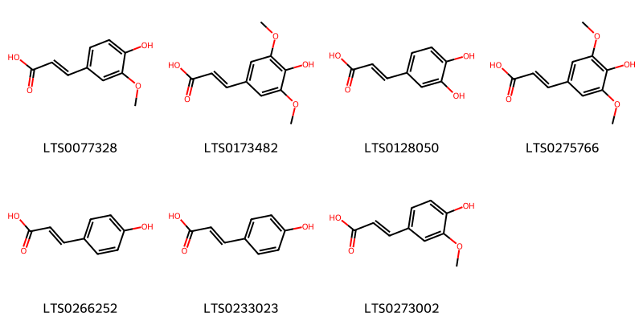
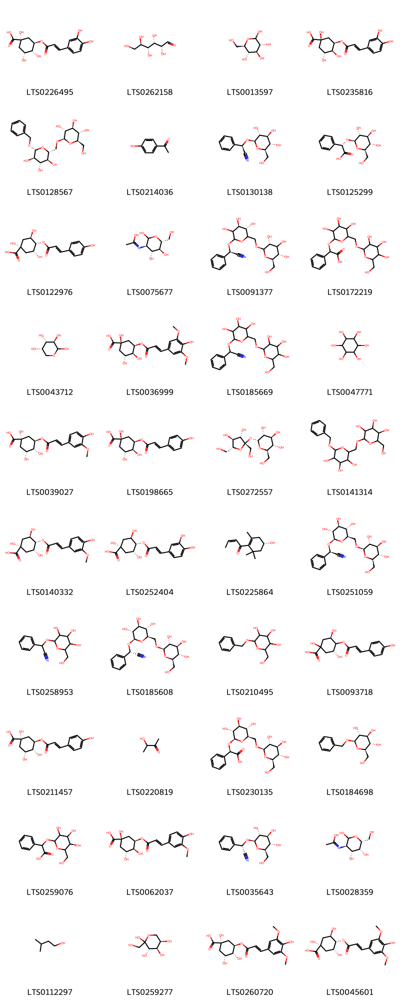
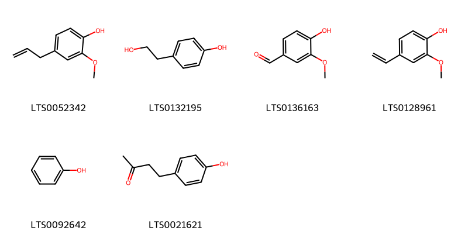

!!! abstract "Tóm tắt"

    Đào nhân (Semen Pruni) là hạt lấy ở quả chín của cây Đào [Prunus persica (L.) Bätsch] hoặc cây Sơn đào [Prunus persica Batsch var. davidiana Maximowicz], thuộc họ Hoa hồng (Rosaceae). Cây đào có nguồn gốc từ Trung Quốc và hiện nay được trồng rộng rãi ở nhiều quốc gia, trong đó có Việt Nam. Theo y học cổ truyền, hạt đào có công năng hoạt huyết, khứ ứ, và nhuận tràng, thường được sử dụng để điều trị các chứng như vô kinh, mất kinh, sưng đau do sang chấn và táo bón. Hạt đào còn có tác dụng chữa đau đầu, đau tai, giảm đau, chống viêm, trị ho, long đờm, chữa ung thư, táo bón, đau bụng, khó tiêu, hỗ trợ lợi tiểu, an thần và điều trị tăng huyết áp. Hạt đào chứa nhiều thành phần hóa học quan trọng như glycoside cyanogenic, dầu béo, protein, acid amin và tannin.

## Thông tin về thực vật

Dược liệu **Đào (Hạt)** từ bộ phận **** từ loài *Prunus persica*.

**Mô tả thực vật:** Cây đào là một cây nhỏ, cao 3-4m, da thân cây nhẫn. Trên thân thường có chất nhầy đùn ra gọi là nhựa đào. Lá đơn, mọc so le, có cuống ngắn, hình mác. Phiến lá dài 5-8cm, rộng 1,2 1,5cm, mép lá có răng cưa. Khi vò có mùi hạnh nhân. Hoa xuất hiện trước lã, màu hồng nhạt, 5 cánh, 8 nhị màu vàng. Quả hạch hình cầu, đầu nhọn có một ngấn lõm vào, chạy dọc theo quả. Vỏ ngoài có lông rất mịn. Quả chín có những đám đỏ.

*Tài liệu tham khảo:* "Những cây thuốc và vị thuốc Việt Nam" - Đỗ Tất Lợi 
Trong dược điển Việt nam, một số loài có thể dùng thay thế cho nhau làm dược liệu bao gồm *Prunus persica, Prunus persica*

!!! info "Phân loại thực vật của *Prunus persica*"
    - **Kingdom:** Plantae
    - **Phylum:** Tracheophyta
    - **Order:** Rosales
    - **Family:** Rosaceae
    - **Genus:** Prunus
    - **Species:** *Prunus persica*

**Phân bố trên thế giới:** France, nan, Germany, Switzerland, Korea, Republic of, Netherlands, Hungary, Spain, Poland, Mexico, Sweden, South Africa, Australia, Jordan, Russian Federation, Portugal, Honduras, United Kingdom of Great Britain and Northern Ireland, India, Ukraine, Georgia, Slovakia, United States of America, Bolivia (Plurinational State of), Croatia, China, Dominican Republic, Italy, Slovenia, Norway, New Zealand, Austria, Belgium

**Phân bố tại Việt nam:** Không có ghi nhận ở Việt Nam

!!! info "Phân loại thực vật của *Prunus persica*"
    - **Kingdom:** Plantae
    - **Phylum:** Tracheophyta
    - **Order:** Rosales
    - **Family:** Rosaceae
    - **Genus:** Prunus
    - **Species:** *Prunus persica*

**Phân bố trên thế giới:** France, nan, Germany, Switzerland, Korea, Republic of, Netherlands, Hungary, Spain, Poland, Mexico, Sweden, South Africa, Australia, Jordan, Russian Federation, Portugal, Honduras, United Kingdom of Great Britain and Northern Ireland, India, Ukraine, Georgia, Slovakia, United States of America, Bolivia (Plurinational State of), Croatia, China, Dominican Republic, Italy, Slovenia, Norway, New Zealand, Austria, Belgium

**Phân bố tại Việt nam:** Không có ghi nhận ở Việt Nam

## Thông tin về dược liệu 

### Định danh

!!! info "Thông tin về tên gọi"

    - Dược liệu tiếng Việt: 
    - Dược liệu tiếng Trung:  ()
    - Dược liệu tiếng Anh: 
    - Dược liệu latin thông dụng: Semen Pruni
    - Dược liệu latin kiểu DĐVN: *semen pruni*
    - Dược liệu latin kiểu DĐVN: **
    - Dược liệu latin kiểu thông tư: **
    - Bộ phận dùng:  (Semen)

### Mô tả dược liệu 

- **Theo dược điển Việt nam V:** 

- **Mô tả dược liệu theo thông tư chế biến dược liệu theo phương pháp cổ truyền:** 

### Chế biến 

- **Chế biến theo dược điển việt nam V**: 

- **Chế biến theo thông tư:** 

--- 

## Thành phần hóa học

- Theo tài liệu của GS. Đỗ Tất Lợi:  (1) Glycoside cyanogenic, dầu béo, protein và acid amin, tannin
    

**Thành phần hóa học từ loài **Prunus persica**

Theo cơ sở dữ liệu lotus, loài *Prunus persica* đã phân lập và xác định được **204** hoạt chất thuộc về các nhóm Steroids and steroid derivatives, Organooxygen compounds, Flavonoids, Fatty Acyls, Cinnamic acids and derivatives, Lactones, Furanoid lignans, Phenols, Cinnamyl alcohols, Carboxylic acids and derivatives, Benzene and substituted derivatives, Glycerolipids, Coumarins and derivatives, Saturated hydrocarbons, Prenol lipids, Dibenzylbutane lignans trong bảng dưới đây. Danh sách các hoạt chất như sau scopolin [(LTS0061811)](https://lotus.naturalproducts.net/compound/lotus_id/LTS0061811), hexanol [(LTS0217299)](https://lotus.naturalproducts.net/compound/lotus_id/LTS0217299), laetrile [(LTS0251059)](https://lotus.naturalproducts.net/compound/lotus_id/LTS0251059), 4-vinylphenol [(LTS0148777)](https://lotus.naturalproducts.net/compound/lotus_id/LTS0148777), (+)-glucose [(LTS0262158)](https://lotus.naturalproducts.net/compound/lotus_id/LTS0262158), glucose [(LTS0013597)](https://lotus.naturalproducts.net/compound/lotus_id/LTS0013597), kaempherol [(LTS0155822)](https://lotus.naturalproducts.net/compound/lotus_id/LTS0155822), umbelliferone [(LTS0162728)](https://lotus.naturalproducts.net/compound/lotus_id/LTS0162728), (-)-naringenin [(LTS0072900)](https://lotus.naturalproducts.net/compound/lotus_id/LTS0072900), phenyl({[3,4,5-trihydroxy-6-({[3,4,5-trihydroxy-6-(hydroxymethyl)oxan-2-yl]oxy}methyl)oxan-2-yl]oxy})acetic acid [(LTS0172219)](https://lotus.naturalproducts.net/compound/lotus_id/LTS0172219), ferulic acid [(LTS0077328)](https://lotus.naturalproducts.net/compound/lotus_id/LTS0077328), (+)-catechol [(LTS0117079)](https://lotus.naturalproducts.net/compound/lotus_id/LTS0117079), (1r,2r,8s,9s,10r)-11-methyl-6-methylidene-16-oxo-15-oxapentacyclo[9.3.2.1⁵,⁸.0¹,¹⁰.0²,⁸]heptadec-13-ene-9-carboxylic acid [(LTS0049851)](https://lotus.naturalproducts.net/compound/lotus_id/LTS0049851), hesperetin [(LTS0087195)](https://lotus.naturalproducts.net/compound/lotus_id/LTS0087195), eugenol [(LTS0052342)](https://lotus.naturalproducts.net/compound/lotus_id/LTS0052342), scopolin [(LTS0014838)](https://lotus.naturalproducts.net/compound/lotus_id/LTS0014838), linoleic [(LTS0013198)](https://lotus.naturalproducts.net/compound/lotus_id/LTS0013198), para-coumaric acid [(LTS0266252)](https://lotus.naturalproducts.net/compound/lotus_id/LTS0266252), 2-phenyl-ethanol [(LTS0206341)](https://lotus.naturalproducts.net/compound/lotus_id/LTS0206341), isovaleric acid [(LTS0156600)](https://lotus.naturalproducts.net/compound/lotus_id/LTS0156600), gibberellin a3 [(LTS0185015)](https://lotus.naturalproducts.net/compound/lotus_id/LTS0185015), benzyl β-d-glucoside [(LTS0184698)](https://lotus.naturalproducts.net/compound/lotus_id/LTS0184698), d-fructopyranose [(LTS0259277)](https://lotus.naturalproducts.net/compound/lotus_id/LTS0259277), cyanidin 3-o-rutinoside [(LTS0049654)](https://lotus.naturalproducts.net/compound/lotus_id/LTS0049654), (1r,2r,4s,5r,8r,9s,10r,11r)-4-hydroxy-11-methyl-6-methylidene-16-oxo-15-oxapentacyclo[9.3.2.1⁵,⁸.0¹,¹⁰.0²,⁸]heptadec-13-ene-9-carboxylic acid [(LTS0243402)](https://lotus.naturalproducts.net/compound/lotus_id/LTS0243402), phytoene [(LTS0186029)](https://lotus.naturalproducts.net/compound/lotus_id/LTS0186029), chlorogenic acid [(LTS0226495)](https://lotus.naturalproducts.net/compound/lotus_id/LTS0226495), gibberellin a5 [(LTS0176017)](https://lotus.naturalproducts.net/compound/lotus_id/LTS0176017), sinapoyl alcohol [(LTS0275766)](https://lotus.naturalproducts.net/compound/lotus_id/LTS0275766), β-carotene [(LTS0275716)](https://lotus.naturalproducts.net/compound/lotus_id/LTS0275716), (2r,3r,4s,5s,6r)-2-{[(2r,3s,4s,5r,6r)-6-(benzyloxy)-3,4,5-trihydroxyoxan-2-yl]methoxy}-6-(hydroxymethyl)oxane-3,4,5-triol [(LTS0128567)](https://lotus.naturalproducts.net/compound/lotus_id/LTS0128567), benzyl alcohol [(LTS0125638)](https://lotus.naturalproducts.net/compound/lotus_id/LTS0125638), astragalin [(LTS0249588)](https://lotus.naturalproducts.net/compound/lotus_id/LTS0249588), lariciresinol [(LTS0010950)](https://lotus.naturalproducts.net/compound/lotus_id/LTS0010950), l-arabinopyranose [(LTS0043712)](https://lotus.naturalproducts.net/compound/lotus_id/LTS0043712), (1r,2r,5s,8s,9s,10r,11r,14s)-5,14-dihydroxy-11-methyl-6-methylidene-16-oxo-15-oxapentacyclo[9.3.2.1⁵,⁸.0¹,¹⁰.0²,⁸]heptadecane-9-carboxylic acid [(LTS0240244)](https://lotus.naturalproducts.net/compound/lotus_id/LTS0240244), lauric acid [(LTS0051907)](https://lotus.naturalproducts.net/compound/lotus_id/LTS0051907), l-arginine [(LTS0064737)](https://lotus.naturalproducts.net/compound/lotus_id/LTS0064737), (3r,5r)-1,3,5-trihydroxy-4-{[(2e)-3-(4-hydroxyphenyl)prop-2-enoyl]oxy}cyclohexane-1-carboxylic acid [(LTS0093718)](https://lotus.naturalproducts.net/compound/lotus_id/LTS0093718), (2s,6r,7as)-2-[(2e,4e,6e,8e,10e,12e,14e)-15-[(2s,7ar)-4,4,7a-trimethyl-2,5,6,7-tetrahydro-1-benzofuran-2-yl]-6,11-dimethylhexadeca-2,4,6,8,10,12,14-heptaen-2-yl]-4,4,7a-trimethyl-2,5,6,7-tetrahydro-1-benzofuran-6-ol [(LTS0220558)](https://lotus.naturalproducts.net/compound/lotus_id/LTS0220558), 3-{[(2s,3r,4r,5s,6r)-3,4-dihydroxy-6-(hydroxymethyl)-5-{[(3s,5r)-3,4,5-trihydroxy-6-(hydroxymethyl)oxan-2-yl]oxy}oxan-2-yl]oxy}-2-(3,4-dihydroxyphenyl)-5,7-dihydroxychromen-4-one [(LTS0162166)](https://lotus.naturalproducts.net/compound/lotus_id/LTS0162166), (s)-phenyl({[(2s,3r,4s,5s,6r)-3,4,5-trihydroxy-6-(hydroxymethyl)oxan-2-yl]oxy})acetic acid [(LTS0125299)](https://lotus.naturalproducts.net/compound/lotus_id/LTS0125299), acetoin [(LTS0220819)](https://lotus.naturalproducts.net/compound/lotus_id/LTS0220819), afzelechin [(LTS0233697)](https://lotus.naturalproducts.net/compound/lotus_id/LTS0233697), hyperoside [(LTS0089156)](https://lotus.naturalproducts.net/compound/lotus_id/LTS0089156), 2-[(2z,4e,6e,8e,10e,12e,14e,16e)-17-{4-hydroxy-2,2,6-trimethyl-7-oxabicyclo[4.1.0]heptan-1-yl}-6,11,15-trimethylheptadeca-2,4,6,8,10,12,14,16-octaen-2-yl]-4,4,7a-trimethyl-2,5,6,7-tetrahydro-1-benzofuran-6-ol [(LTS0193507)](https://lotus.naturalproducts.net/compound/lotus_id/LTS0193507), luteolin [(LTS0017052)](https://lotus.naturalproducts.net/compound/lotus_id/LTS0017052), (2s,6r)-6-[(1r,3ar,3bs,5r,5ar,7r,9ar,9br,11as)-5,7-dihydroxy-9a,11a-dimethyl-2-oxo-tetradecahydrocyclopenta[a]phenanthren-1-yl]-2-methyl-5-oxoheptanoic acid [(LTS0231216)](https://lotus.naturalproducts.net/compound/lotus_id/LTS0231216), epicatechin gallate [(LTS0071606)](https://lotus.naturalproducts.net/compound/lotus_id/LTS0071606), 3,5,7,4'-tetrahydroxyflavan [(LTS0039714)](https://lotus.naturalproducts.net/compound/lotus_id/LTS0039714), isoamyl alcohol [(LTS0112297)](https://lotus.naturalproducts.net/compound/lotus_id/LTS0112297), sinapinate [(LTS0173482)](https://lotus.naturalproducts.net/compound/lotus_id/LTS0173482), carotenoid [(LTS0205297)](https://lotus.naturalproducts.net/compound/lotus_id/LTS0205297), 5-(1-hydroxy-2,6,6-trimethyl-4-oxocyclohex-2-en-1-yl)-3-methylpenta-2,4-dienoic acid [(LTS0021517)](https://lotus.naturalproducts.net/compound/lotus_id/LTS0021517), scopoletin [(LTS0193112)](https://lotus.naturalproducts.net/compound/lotus_id/LTS0193112), α-carotene [(LTS0224243)](https://lotus.naturalproducts.net/compound/lotus_id/LTS0224243), gibberellin a9 [(LTS0243888)](https://lotus.naturalproducts.net/compound/lotus_id/LTS0243888), 3-{[(2s,3r,4r,5s,6r)-3,4-dihydroxy-6-(hydroxymethyl)-5-{[(2s,3r,4s,5s,6r)-3,4,5-trihydroxy-6-(hydroxymethyl)oxan-2-yl]oxy}oxan-2-yl]oxy}-5,7-dihydroxy-2-(4-hydroxyphenyl)chromen-4-one [(LTS0113148)](https://lotus.naturalproducts.net/compound/lotus_id/LTS0113148), terpineol [(LTS0136148)](https://lotus.naturalproducts.net/compound/lotus_id/LTS0136148), 2-{[6-(benzyloxy)-3,4,5-trihydroxyoxan-2-yl]methoxy}-6-(hydroxymethyl)oxane-3,4,5-triol [(LTS0141314)](https://lotus.naturalproducts.net/compound/lotus_id/LTS0141314), (1r,2s,3s,4r,6s,8r,9s,12s)-6,12-dihydroxy-4,8-dimethyl-13-methylidenetetracyclo[10.2.1.0¹,⁹.0³,⁸]pentadecane-2,4-dicarboxylic acid [(LTS0086231)](https://lotus.naturalproducts.net/compound/lotus_id/LTS0086231), (2r,3r,4r)-2-(3,4-dihydroxyphenyl)-4-[(2r,3r)-2-(3,4-dihydroxyphenyl)-3,5,7-trihydroxy-3,4-dihydro-2h-1-benzopyran-8-yl]-3,4-dihydro-2h-1-benzopyran-3,5,7-triol [(LTS0135510)](https://lotus.naturalproducts.net/compound/lotus_id/LTS0135510), (1s,3r,4r,5r)-1,3,4-trihydroxy-5-{[(2e)-3-(4-hydroxyphenyl)prop-2-enoyl]oxy}cyclohexane-1-carboxylic acid [(LTS0211457)](https://lotus.naturalproducts.net/compound/lotus_id/LTS0211457), γ-dodecalactone [(LTS0229009)](https://lotus.naturalproducts.net/compound/lotus_id/LTS0229009), gibberellin a44 [(LTS0078749)](https://lotus.naturalproducts.net/compound/lotus_id/LTS0078749), myricetin [(LTS0139858)](https://lotus.naturalproducts.net/compound/lotus_id/LTS0139858), 2-(3,4-dihydroxyphenyl)-5,7-dihydroxy-3-{[(2s,3r,4r,5r,6s)-3,4,5-trihydroxy-6-(hydroxymethyl)oxan-2-yl]oxy}chromen-4-one [(LTS0241372)](https://lotus.naturalproducts.net/compound/lotus_id/LTS0241372), triolein [(LTS0254684)](https://lotus.naturalproducts.net/compound/lotus_id/LTS0254684), geraniol [(LTS0258838)](https://lotus.naturalproducts.net/compound/lotus_id/LTS0258838), n-[(3r,4r,5r,6r)-2,4,5-trihydroxy-6-(hydroxymethyl)oxan-3-yl]ethanimidic acid [(LTS0028359)](https://lotus.naturalproducts.net/compound/lotus_id/LTS0028359), (2r,3s,4r)-2-(3,4-dihydroxyphenyl)-4-[(2r,3r)-2-(3,4-dihydroxyphenyl)-3,5,7-trihydroxy-3,4-dihydro-2h-1-benzopyran-6-yl]-3,4-dihydro-2h-1-benzopyran-3,5,7-triol [(LTS0076760)](https://lotus.naturalproducts.net/compound/lotus_id/LTS0076760), (1r,2r,5r,8s,9s,10r,11r)-11-methyl-6-methylidene-16-oxo-15-oxapentacyclo[9.3.2.1⁵,⁸.0¹,¹⁰.0²,⁸]heptadec-13-ene-9-carboxylic acid [(LTS0159711)](https://lotus.naturalproducts.net/compound/lotus_id/LTS0159711), benzaldehyde [(LTS0094193)](https://lotus.naturalproducts.net/compound/lotus_id/LTS0094193), 2h-1-benzopyran-2-one [(LTS0069773)](https://lotus.naturalproducts.net/compound/lotus_id/LTS0069773), cryptochlorogenic acid [(LTS0252404)](https://lotus.naturalproducts.net/compound/lotus_id/LTS0252404), 10,15-dihydroxy-6,6,14-trimethyl-9-methylidene-19-oxo-5,7,18-trioxahexacyclo[12.3.2.1⁸,¹¹.0¹,¹³.0²,¹¹.0⁴,⁸]icos-16-ene-12-carboxylic acid [(LTS0003721)](https://lotus.naturalproducts.net/compound/lotus_id/LTS0003721), (r)-phenyl({[(2s,3r,4s,5s,6r)-3,4,5-trihydroxy-6-({[(2r,3r,4s,5s,6r)-3,4,5-trihydroxy-6-(hydroxymethyl)oxan-2-yl]oxy}methyl)oxan-2-yl]oxy})acetic acid [(LTS0230135)](https://lotus.naturalproducts.net/compound/lotus_id/LTS0230135), 6-{5,7-dihydroxy-9a,11a-dimethyl-2-oxo-tetradecahydrocyclopenta[a]phenanthren-1-yl}-2-methyl-5-oxoheptanoic acid [(LTS0218243)](https://lotus.naturalproducts.net/compound/lotus_id/LTS0218243), 4-[(1e)-3-hydroxybut-1-en-1-yl]-3,5,5-trimethylcyclohex-3-en-1-ol [(LTS0247025)](https://lotus.naturalproducts.net/compound/lotus_id/LTS0247025), 3-o-sinapoylquinic acid [(LTS0036999)](https://lotus.naturalproducts.net/compound/lotus_id/LTS0036999), gibberellin a8 [(LTS0126599)](https://lotus.naturalproducts.net/compound/lotus_id/LTS0126599), matairesinol [(LTS0193475)](https://lotus.naturalproducts.net/compound/lotus_id/LTS0193475), 2-(3,4-dihydroxyphenyl)-5,7-dihydroxy-3-{[(2s,3r,4s,5s,6r)-3,4,5-trihydroxy-6-({[(2r,3r,4s,5s,6r)-3,4,5-trihydroxy-6-(hydroxymethyl)oxan-2-yl]oxy}methyl)oxan-2-yl]oxy}chromen-4-one [(LTS0183115)](https://lotus.naturalproducts.net/compound/lotus_id/LTS0183115), creatine [(LTS0246540)](https://lotus.naturalproducts.net/compound/lotus_id/LTS0246540), guanidinosuccinic acid [(LTS0172937)](https://lotus.naturalproducts.net/compound/lotus_id/LTS0172937), 3,4-dihydroxycinnamic acid [(LTS0128050)](https://lotus.naturalproducts.net/compound/lotus_id/LTS0128050), isoquercetin [(LTS0254337)](https://lotus.naturalproducts.net/compound/lotus_id/LTS0254337), β,β-carotene [(LTS0168447)](https://lotus.naturalproducts.net/compound/lotus_id/LTS0168447), 5-(3,4-dihydroxyphenyl)-13-(4-hydroxyphenyl)-4,12,14-trioxapentacyclo[11.7.1.0²,¹¹.0³,⁸.0¹⁵,²⁰]henicosa-2(11),3(8),9,15,17,19-hexaene-6,9,17,19,21-pentol [(LTS0268035)](https://lotus.naturalproducts.net/compound/lotus_id/LTS0268035), neochlorogenic acid [(LTS0235816)](https://lotus.naturalproducts.net/compound/lotus_id/LTS0235816), 2-methylbutanoic acid [(LTS0213858)](https://lotus.naturalproducts.net/compound/lotus_id/LTS0213858), 4-[3,5,7-trihydroxy-2-(3,4,5-trihydroxyphenyl)-3,4-dihydro-2h-1-benzopyran-8-yl]-2-(3,4,5-trihydroxyphenyl)-3,4-dihydro-2h-1-benzopyran-3,5,7-triol [(LTS0144797)](https://lotus.naturalproducts.net/compound/lotus_id/LTS0144797), hesperetin 5-o-glucoside [(LTS0163163)](https://lotus.naturalproducts.net/compound/lotus_id/LTS0163163), (1r,5r,6s,13s,21s)-5-(3,4-dihydroxyphenyl)-13-(4-hydroxyphenyl)-4,12,14-trioxapentacyclo[11.7.1.0²,¹¹.0³,⁸.0¹⁵,²⁰]henicosa-2(11),3(8),9,15,17,19-hexaene-6,9,17,19,21-pentol [(LTS0239289)](https://lotus.naturalproducts.net/compound/lotus_id/LTS0239289), (2s)-2-(3-hydroxy-4-methoxyphenyl)-7-methoxy-5-{[(2s,3r,4s,5s,6s)-3,4,5-trihydroxy-6-(hydroxymethyl)oxan-2-yl]oxy}-2,3-dihydro-1-benzopyran-4-one [(LTS0234295)](https://lotus.naturalproducts.net/compound/lotus_id/LTS0234295), (1r,2r,4s,8s,10s,11r,12s,13r,14s,15s)-10,15-dihydroxy-6,6,14-trimethyl-9-methylidene-19-oxo-5,7,18-trioxahexacyclo[12.3.2.1⁸,¹¹.0¹,¹³.0²,¹¹.0⁴,⁸]icos-16-ene-12-carboxylic acid [(LTS0016694)](https://lotus.naturalproducts.net/compound/lotus_id/LTS0016694), (1r,5r,6s,13s,21s)-5,13-bis(4-hydroxyphenyl)-4,12,14-trioxapentacyclo[11.7.1.0²,¹¹.0³,⁸.0¹⁵,²⁰]henicosa-2(11),3(8),9,15,17,19-hexaene-6,9,17,19,21-pentol [(LTS0209983)](https://lotus.naturalproducts.net/compound/lotus_id/LTS0209983), (1r,2r,5r,8r,9s,10r,11r,14s)-14-hydroxy-11-methyl-6-methylidene-16-oxo-15-oxapentacyclo[9.3.2.1⁵,⁸.0¹,¹⁰.0²,⁸]heptadecane-9-carboxylic acid [(LTS0059228)](https://lotus.naturalproducts.net/compound/lotus_id/LTS0059228), (2s,3s,4r,6s,8r,9s,12s)-6,12-dihydroxy-4,8-dimethyl-13-methylidenetetracyclo[10.2.1.0¹,⁹.0³,⁸]pentadecane-2,4-dicarboxylic acid [(LTS0221918)](https://lotus.naturalproducts.net/compound/lotus_id/LTS0221918), hydroxyacetophenone [(LTS0214036)](https://lotus.naturalproducts.net/compound/lotus_id/LTS0214036), (+)-α-carotene [(LTS0200789)](https://lotus.naturalproducts.net/compound/lotus_id/LTS0200789), (3e)-4-(4-hydroxy-2,6,6-trimethylcyclohex-1-en-1-yl)but-3-en-2-one [(LTS0059292)](https://lotus.naturalproducts.net/compound/lotus_id/LTS0059292), 4-guanidinobutyric acid [(LTS0236153)](https://lotus.naturalproducts.net/compound/lotus_id/LTS0236153), 4-o-sinapoylquinic acid [(LTS0045601)](https://lotus.naturalproducts.net/compound/lotus_id/LTS0045601), 4-o-feruloyl-d-quinic acid [(LTS0140332)](https://lotus.naturalproducts.net/compound/lotus_id/LTS0140332), stigmast-5-en-3-ol, (3β)- [(LTS0204616)](https://lotus.naturalproducts.net/compound/lotus_id/LTS0204616), sucrose [(LTS0272557)](https://lotus.naturalproducts.net/compound/lotus_id/LTS0272557), benzyl glucopyranoside [(LTS0210495)](https://lotus.naturalproducts.net/compound/lotus_id/LTS0210495), trifolin [(LTS0237581)](https://lotus.naturalproducts.net/compound/lotus_id/LTS0237581), procyanidin c1 [(LTS0260445)](https://lotus.naturalproducts.net/compound/lotus_id/LTS0260445), n-amidino-l-aspartic acid [(LTS0014971)](https://lotus.naturalproducts.net/compound/lotus_id/LTS0014971), 3-feruloylquinic acid [(LTS0062037)](https://lotus.naturalproducts.net/compound/lotus_id/LTS0062037), (2s,3r)-2,3-bis[(4-hydroxy-3-methoxyphenyl)(¹³c)methyl](1-¹³c)butane-1,4-diol [(LTS0268699)](https://lotus.naturalproducts.net/compound/lotus_id/LTS0268699), ent-epicatechin [(LTS0265245)](https://lotus.naturalproducts.net/compound/lotus_id/LTS0265245), (9z)-β-carotene [(LTS0252839)](https://lotus.naturalproducts.net/compound/lotus_id/LTS0252839), mandelic acid [(LTS0194920)](https://lotus.naturalproducts.net/compound/lotus_id/LTS0194920), phenol [(LTS0092642)](https://lotus.naturalproducts.net/compound/lotus_id/LTS0092642), geranin a [(LTS0153482)](https://lotus.naturalproducts.net/compound/lotus_id/LTS0153482), hentriacontane [(LTS0046415)](https://lotus.naturalproducts.net/compound/lotus_id/LTS0046415), pinoresinol [(LTS0057431)](https://lotus.naturalproducts.net/compound/lotus_id/LTS0057431), (+)-dihydrokaempferol [(LTS0134832)](https://lotus.naturalproducts.net/compound/lotus_id/LTS0134832), helichrysin [(LTS0126816)](https://lotus.naturalproducts.net/compound/lotus_id/LTS0126816), frambinone [(LTS0021621)](https://lotus.naturalproducts.net/compound/lotus_id/LTS0021621), (1s,3r,4s,5r)-1,3,5-trihydroxy-4-{[(2e)-3-(4-hydroxyphenyl)prop-2-enoyl]oxy}cyclohexane-1-carboxylic acid [(LTS0122976)](https://lotus.naturalproducts.net/compound/lotus_id/LTS0122976), sitogluside [(LTS0201798)](https://lotus.naturalproducts.net/compound/lotus_id/LTS0201798), cis-phytoene [(LTS0239283)](https://lotus.naturalproducts.net/compound/lotus_id/LTS0239283), vanillin [(LTS0136163)](https://lotus.naturalproducts.net/compound/lotus_id/LTS0136163), 3-rutinosyl quercetin [(LTS0032845)](https://lotus.naturalproducts.net/compound/lotus_id/LTS0032845), pilloin [(LTS0220710)](https://lotus.naturalproducts.net/compound/lotus_id/LTS0220710), quercetin [(LTS0004651)](https://lotus.naturalproducts.net/compound/lotus_id/LTS0004651), phytofluene [(LTS0181914)](https://lotus.naturalproducts.net/compound/lotus_id/LTS0181914), glycocyamine [(LTS0275175)](https://lotus.naturalproducts.net/compound/lotus_id/LTS0275175), 5,7-dihydroxy-2-(4-hydroxy-3-oxidophenyl)-3-{[(2s,3r,4s,5s,6r)-3,4,5-trihydroxy-6-(hydroxymethyl)oxan-2-yl]oxy}-1λ⁴-chromen-1-ylium [(LTS0083222)](https://lotus.naturalproducts.net/compound/lotus_id/LTS0083222), (2r,3s,4s)-2-(3,4-dihydroxyphenyl)-4-[(2r,3s)-2-(3,4-dihydroxyphenyl)-3,5,7-trihydroxy-3,4-dihydro-2h-1-benzopyran-8-yl]-3,4-dihydro-2h-1-benzopyran-3,5,7-triol [(LTS0151498)](https://lotus.naturalproducts.net/compound/lotus_id/LTS0151498), asahina [(LTS0068303)](https://lotus.naturalproducts.net/compound/lotus_id/LTS0068303), (1r,2r,5r,7r,8r,9s,10r,11s,12s)-7,12-dihydroxy-11-methyl-6-methylidene-16-oxo-15-oxapentacyclo[9.3.2.1⁵,⁸.0¹,¹⁰.0²,⁸]heptadec-13-ene-9-carboxylic acid [(LTS0262222)](https://lotus.naturalproducts.net/compound/lotus_id/LTS0262222), (1s,2r,4r,5s,9s,10r,11s)-4,5-dihydroxy-11-methyl-6-methylidene-16-oxo-15-oxapentacyclo[9.3.2.1⁵,⁸.0¹,¹⁰.0²,⁸]heptadec-13-ene-9-carboxylic acid [(LTS0254428)](https://lotus.naturalproducts.net/compound/lotus_id/LTS0254428), dehydrovomifoliol [(LTS0209706)](https://lotus.naturalproducts.net/compound/lotus_id/LTS0209706), 5-hydroxy-11-methyl-6-methylidene-16-oxo-15-oxapentacyclo[9.3.2.1⁵,⁸.0¹,¹⁰.0²,⁸]heptadec-12-ene-9-carboxylic acid [(LTS0187802)](https://lotus.naturalproducts.net/compound/lotus_id/LTS0187802), (1r,2r,5r,8r,9s,10r,11r,14r)-14-hydroxy-11-methyl-6-methylidene-16-oxo-15-oxapentacyclo[9.3.2.1⁵,⁸.0¹,¹⁰.0²,⁸]heptadecane-9-carboxylic acid [(LTS0129490)](https://lotus.naturalproducts.net/compound/lotus_id/LTS0129490), ferulic acid [(LTS0273002)](https://lotus.naturalproducts.net/compound/lotus_id/LTS0273002), amygdalin [(LTS0185669)](https://lotus.naturalproducts.net/compound/lotus_id/LTS0185669), 4-[(1e)-3-hydroxybut-1-en-1-yl]-3,5,5-trimethylcyclohex-2-en-1-one [(LTS0120878)](https://lotus.naturalproducts.net/compound/lotus_id/LTS0120878), 6-[(1e,3z,5e,7e,9e,11z)-13-hydroxy-3,7,12-trimethyltrideca-1,3,5,7,9,11-hexaen-1-yl]-1,5,5-trimethyl-7-oxabicyclo[4.1.0]heptan-3-ol [(LTS0013466)](https://lotus.naturalproducts.net/compound/lotus_id/LTS0013466), violaxanthin [(LTS0102265)](https://lotus.naturalproducts.net/compound/lotus_id/LTS0102265), chamomile [(LTS0104946)](https://lotus.naturalproducts.net/compound/lotus_id/LTS0104946), (2r)-2-phenyl-2-{[(4s,5s)-3,4,5-trihydroxy-6-({[(3r,5s,6r)-3,4,5-trihydroxy-6-(hydroxymethyl)oxan-2-yl]oxy}methyl)oxan-2-yl]oxy}acetonitrile [(LTS0091377)](https://lotus.naturalproducts.net/compound/lotus_id/LTS0091377), cryptoxanthin [(LTS0132646)](https://lotus.naturalproducts.net/compound/lotus_id/LTS0132646), (6e,8e,10e)-2-{tetracyclo[4.3.0.0²,⁴.0³,⁷]non-8-en-1-yl}trideca-6,8,10-trienoic acid [(LTS0262212)](https://lotus.naturalproducts.net/compound/lotus_id/LTS0262212), butanoic acid [(LTS0175510)](https://lotus.naturalproducts.net/compound/lotus_id/LTS0175510), antheraxanthin [(LTS0210072)](https://lotus.naturalproducts.net/compound/lotus_id/LTS0210072), (2r,3s,4s)-2-(3,4-dihydroxyphenyl)-4-[(2r,3r)-2-(3,4-dihydroxyphenyl)-3,5,7-trihydroxy-3,4-dihydro-2h-1-benzopyran-6-yl]-3,4-dihydro-2h-1-benzopyran-3,5,7-triol [(LTS0196496)](https://lotus.naturalproducts.net/compound/lotus_id/LTS0196496), caprylic acid [(LTS0254176)](https://lotus.naturalproducts.net/compound/lotus_id/LTS0254176), 5-o-sinapoylquinic acid [(LTS0260720)](https://lotus.naturalproducts.net/compound/lotus_id/LTS0260720), 2-phenyl-2-{[3,4,5-trihydroxy-6-(hydroxymethyl)oxan-2-yl]oxy}acetonitrile [(LTS0258953)](https://lotus.naturalproducts.net/compound/lotus_id/LTS0258953), (1r,3r,4s,5r)-1,3,4-trihydroxy-5-{[(2e)-3-(4-hydroxyphenyl)prop-2-enoyl]oxy}cyclohexane-1-carboxylic acid [(LTS0198665)](https://lotus.naturalproducts.net/compound/lotus_id/LTS0198665), (1s,2r,4r,5s,8r,9s,10r,11s)-4,5-dihydroxy-11-methyl-6-methylidene-16-oxo-15-oxapentacyclo[9.3.2.1⁵,⁸.0¹,¹⁰.0²,⁸]heptadec-13-ene-9-carboxylic acid [(LTS0180508)](https://lotus.naturalproducts.net/compound/lotus_id/LTS0180508), (s)-prunasin [(LTS0035643)](https://lotus.naturalproducts.net/compound/lotus_id/LTS0035643), 1,3,3-trimethyl-2-[(1e,3z,5z,7e,9e,11e,13z,15z,17e)-3,7,12,16-tetramethyl-18-(2,6,6-trimethylcyclohex-1-en-1-yl)octadeca-1,3,5,7,9,11,13,15,17-nonaen-1-yl]cyclohex-1-ene [(LTS0078967)](https://lotus.naturalproducts.net/compound/lotus_id/LTS0078967), (1r,2r,5r,7r,8r,9s,10r,11s,12s)-7,12-dihydroxy-11-methyl-6-methylidene-16-oxo-15-oxapentacyclo[9.3.2.1⁵,⁸.0¹,¹⁰.0²,⁸]heptadecane-9-carboxylic acid [(LTS0026845)](https://lotus.naturalproducts.net/compound/lotus_id/LTS0026845), (2r,3s,4s)-2-(3,4-dihydroxyphenyl)-4-[(2r,3r)-2-(3,4-dihydroxyphenyl)-3,5,7-trihydroxy-3,4-dihydro-2h-1-benzopyran-8-yl]-3,4-dihydro-2h-1-benzopyran-3,5,7-triol [(LTS0116257)](https://lotus.naturalproducts.net/compound/lotus_id/LTS0116257), (2z)-1-[(4s)-4-hydroxy-2,6,6-trimethylcyclohex-1-en-1-yl]but-2-en-1-one [(LTS0225864)](https://lotus.naturalproducts.net/compound/lotus_id/LTS0225864), (1r,2r,4s,5s,7s,8r,9s,10r,11s,12s)-4,5,7,12-tetrahydroxy-11-methyl-6-methylidene-16-oxo-15-oxapentacyclo[9.3.2.1⁵,⁸.0¹,¹⁰.0²,⁸]heptadec-13-ene-9-carboxylic acid [(LTS0266721)](https://lotus.naturalproducts.net/compound/lotus_id/LTS0266721), phenyl({[3,4,5-trihydroxy-6-(hydroxymethyl)oxan-2-yl]oxy})acetic acid [(LTS0259076)](https://lotus.naturalproducts.net/compound/lotus_id/LTS0259076), 4,5,7,12-tetrahydroxy-11-methyl-6-methylidene-16-oxo-15-oxapentacyclo[9.3.2.1⁵,⁸.0¹,¹⁰.0²,⁸]heptadecane-9-carboxylic acid [(LTS0246551)](https://lotus.naturalproducts.net/compound/lotus_id/LTS0246551), eriodictyol [(LTS0220769)](https://lotus.naturalproducts.net/compound/lotus_id/LTS0220769), chrysanthemin [(LTS0221391)](https://lotus.naturalproducts.net/compound/lotus_id/LTS0221391), n-[(3r,4r,5s,6r)-2,4,5-trihydroxy-6-(hydroxymethyl)oxan-3-yl]ethanimidic acid [(LTS0075677)](https://lotus.naturalproducts.net/compound/lotus_id/LTS0075677), (1r,2r,4s,5s,8s,9s,10r,11s,12s)-4,5,12-trihydroxy-11-methyl-6-methylidene-16-oxo-15-oxapentacyclo[9.3.2.1⁵,⁸.0¹,¹⁰.0²,⁸]heptadec-13-ene-9-carboxylic acid [(LTS0161599)](https://lotus.naturalproducts.net/compound/lotus_id/LTS0161599), (2s)-2-phenyl-2-{[(2r,3r,4s,5s,6r)-3,4,5-trihydroxy-6-({[(2r,3r,4s,5s,6r)-3,4,5-trihydroxy-6-(hydroxymethyl)oxan-2-yl]oxy}methyl)oxan-2-yl]oxy}acetonitrile [(LTS0185608)](https://lotus.naturalproducts.net/compound/lotus_id/LTS0185608), 3-o-feruloyl-d-quinic acid [(LTS0039027)](https://lotus.naturalproducts.net/compound/lotus_id/LTS0039027), hexanoic acid [(LTS0031054)](https://lotus.naturalproducts.net/compound/lotus_id/LTS0031054), (1s,2r,5s,8r,9s,10r,11s)-5-hydroxy-11-methyl-6-methylidene-16-oxo-15-oxapentacyclo[9.3.2.1⁵,⁸.0¹,¹⁰.0²,⁸]heptadec-13-ene-9-carboxylic acid [(LTS0230537)](https://lotus.naturalproducts.net/compound/lotus_id/LTS0230537), zeaxanthin [(LTS0192928)](https://lotus.naturalproducts.net/compound/lotus_id/LTS0192928), zeta-carotene [(LTS0007334)](https://lotus.naturalproducts.net/compound/lotus_id/LTS0007334), persicogenin [(LTS0184013)](https://lotus.naturalproducts.net/compound/lotus_id/LTS0184013), secoisolariciresinol [(LTS0086727)](https://lotus.naturalproducts.net/compound/lotus_id/LTS0086727), (-)-inositol [(LTS0047771)](https://lotus.naturalproducts.net/compound/lotus_id/LTS0047771), cyanidin 3-glucoside [(LTS0217835)](https://lotus.naturalproducts.net/compound/lotus_id/LTS0217835), (-)-epigallocatechin gallate [(LTS0173211)](https://lotus.naturalproducts.net/compound/lotus_id/LTS0173211), (1r,2r,4s,5s,7s,8r,9s,10r,11s,12s)-4,5,7,12-tetrahydroxy-11-methyl-6-methylidene-16-oxo-15-oxapentacyclo[9.3.2.1⁵,⁸.0¹,¹⁰.0²,⁸]heptadecane-9-carboxylic acid [(LTS0196169)](https://lotus.naturalproducts.net/compound/lotus_id/LTS0196169), prunasin [(LTS0130138)](https://lotus.naturalproducts.net/compound/lotus_id/LTS0130138), ursolic acid [(LTS0250838)](https://lotus.naturalproducts.net/compound/lotus_id/LTS0250838), (1r,2r,4r,5r,8r,9s,10r,11r)-4-hydroxy-11-methyl-6-methylidene-16-oxo-15-oxapentacyclo[9.3.2.1⁵,⁸.0¹,¹⁰.0²,⁸]heptadec-13-ene-9-carboxylic acid [(LTS0035223)](https://lotus.naturalproducts.net/compound/lotus_id/LTS0035223), abscisic acid [(LTS0200774)](https://lotus.naturalproducts.net/compound/lotus_id/LTS0200774), cinnamyl alcohol [(LTS0010678)](https://lotus.naturalproducts.net/compound/lotus_id/LTS0010678), (2r,3r)-2-(3,4-dihydroxyphenyl)-8-[(2r,3r)-2-(3,4-dihydroxyphenyl)-3,5,7-trihydroxy-3,4-dihydro-2h-1-benzopyran-4-yl]-4-[(2r,3s)-2-(3,4-dihydroxyphenyl)-3,5,7-trihydroxy-3,4-dihydro-2h-1-benzopyran-8-yl]-3,4-dihydro-2h-1-benzopyran-3,5,7-triol [(LTS0059648)](https://lotus.naturalproducts.net/compound/lotus_id/LTS0059648), (1r,2r,4s,5r,8r,9s,10r,11s,12s)-4,12-dihydroxy-11-methyl-6-methylidene-16-oxo-15-oxapentacyclo[9.3.2.1⁵,⁸.0¹,¹⁰.0²,⁸]heptadec-13-ene-9-carboxylic acid [(LTS0211799)](https://lotus.naturalproducts.net/compound/lotus_id/LTS0211799), oleic acid [(LTS0256910)](https://lotus.naturalproducts.net/compound/lotus_id/LTS0256910), benzoic acid [(LTS0145871)](https://lotus.naturalproducts.net/compound/lotus_id/LTS0145871), (4s)-4-hydroxy-4-(3-hydroxybut-1-en-1-yl)-3,5,5-trimethylcyclohex-2-en-1-one [(LTS0225700)](https://lotus.naturalproducts.net/compound/lotus_id/LTS0225700), gibberellin a19 [(LTS0044672)](https://lotus.naturalproducts.net/compound/lotus_id/LTS0044672), (2r,3r,4r)-2-(3,4-dihydroxyphenyl)-4-[(2r,3s)-2-(3,4-dihydroxyphenyl)-3,5,7-trihydroxy-3,4-dihydro-2h-1-benzopyran-8-yl]-3,4-dihydro-2h-1-benzopyran-3,5,7-triol [(LTS0066122)](https://lotus.naturalproducts.net/compound/lotus_id/LTS0066122), hydroxycinnamic acid [(LTS0233023)](https://lotus.naturalproducts.net/compound/lotus_id/LTS0233023), all-trans-phytofluene [(LTS0269894)](https://lotus.naturalproducts.net/compound/lotus_id/LTS0269894), 2-methoxy-4-vinyl-phenol [(LTS0128961)](https://lotus.naturalproducts.net/compound/lotus_id/LTS0128961), (1s,2r,5s,9s,10r,11s)-5-hydroxy-11-methyl-6-methylidene-16-oxo-15-oxapentacyclo[9.3.2.1⁵,⁸.0¹,¹⁰.0²,⁸]heptadec-13-ene-9-carboxylic acid [(LTS0148617)](https://lotus.naturalproducts.net/compound/lotus_id/LTS0148617), tyrosol [(LTS0132195)](https://lotus.naturalproducts.net/compound/lotus_id/LTS0132195), gibberellin a1 [(LTS0013777)](https://lotus.naturalproducts.net/compound/lotus_id/LTS0013777), epigallocatechin [(LTS0052496)](https://lotus.naturalproducts.net/compound/lotus_id/LTS0052496), aromadendrin [(LTS0153299)](https://lotus.naturalproducts.net/compound/lotus_id/LTS0153299), linalool, (+-)- [(LTS0128839)](https://lotus.naturalproducts.net/compound/lotus_id/LTS0128839), gallocatechol [(LTS0267305)](https://lotus.naturalproducts.net/compound/lotus_id/LTS0267305), rutin [(LTS0042292)](https://lotus.naturalproducts.net/compound/lotus_id/LTS0042292). 
        
| chemicalTaxonomyClassyfireClass     |   smiles_count |
|:------------------------------------|---------------:|
| Benzene and substituted derivatives |             78 |
| Carboxylic acids and derivatives    |            122 |
| Cinnamic acids and derivatives      |            167 |
| Cinnamyl alcohols                   |             15 |
| Coumarins and derivatives           |            118 |
| Dibenzylbutane lignans              |            116 |
| Fatty Acyls                         |            183 |
| Flavonoids                          |           3750 |
| Furanoid lignans                    |            162 |
| Glycerolipids                       |             83 |
| Lactones                            |             19 |
| Organooxygen compounds              |           2200 |
| Phenols                             |             95 |
| Prenol lipids                       |           4446 |
| Saturated hydrocarbons              |             31 |
| Steroids and steroid derivatives    |            345 |

            
### Nhóm Benzene and substituted derivatives
<figure markdown="span">
    { width=100% }
<figcaption>Hình ảnh cấu trúc hóa học của hoạt chất thuộc nhóm *Benzene and substituted derivatives*. Tên thường gọi của các hoạt chất tương ứng là 2-phenyl-ethanol [(LTS0206341)](https://lotus.naturalproducts.net/compound/lotus_id/LTS0206341), mandelic acid [(LTS0194920)](https://lotus.naturalproducts.net/compound/lotus_id/LTS0194920), 4-vinylphenol [(LTS0148777)](https://lotus.naturalproducts.net/compound/lotus_id/LTS0148777), benzoic acid [(LTS0145871)](https://lotus.naturalproducts.net/compound/lotus_id/LTS0145871), benzaldehyde [(LTS0094193)](https://lotus.naturalproducts.net/compound/lotus_id/LTS0094193), benzyl alcohol [(LTS0125638)](https://lotus.naturalproducts.net/compound/lotus_id/LTS0125638).</figcaption>
</figure>

            
            
### Nhóm Benzene and substituted derivatives
<figure markdown="span">
    { width=100% }
<figcaption>Hình ảnh cấu trúc hóa học của hoạt chất thuộc nhóm *Benzene and substituted derivatives*. Tên thường gọi của các hoạt chất tương ứng là 2-phenyl-ethanol [(LTS0206341)](https://lotus.naturalproducts.net/compound/lotus_id/LTS0206341), mandelic acid [(LTS0194920)](https://lotus.naturalproducts.net/compound/lotus_id/LTS0194920), 4-vinylphenol [(LTS0148777)](https://lotus.naturalproducts.net/compound/lotus_id/LTS0148777), benzoic acid [(LTS0145871)](https://lotus.naturalproducts.net/compound/lotus_id/LTS0145871), benzaldehyde [(LTS0094193)](https://lotus.naturalproducts.net/compound/lotus_id/LTS0094193), benzyl alcohol [(LTS0125638)](https://lotus.naturalproducts.net/compound/lotus_id/LTS0125638).</figcaption>
</figure>

### Nhóm Carboxylic acids and derivatives
<figure markdown="span">
    { width=100% }
<figcaption>Hình ảnh cấu trúc hóa học của hoạt chất thuộc nhóm *Carboxylic acids and derivatives*. Tên thường gọi của các hoạt chất tương ứng là glycocyamine [(LTS0275175)](https://lotus.naturalproducts.net/compound/lotus_id/LTS0275175), 4-guanidinobutyric acid [(LTS0236153)](https://lotus.naturalproducts.net/compound/lotus_id/LTS0236153), l-arginine [(LTS0064737)](https://lotus.naturalproducts.net/compound/lotus_id/LTS0064737), guanidinosuccinic acid [(LTS0172937)](https://lotus.naturalproducts.net/compound/lotus_id/LTS0172937), n-amidino-l-aspartic acid [(LTS0014971)](https://lotus.naturalproducts.net/compound/lotus_id/LTS0014971), creatine [(LTS0246540)](https://lotus.naturalproducts.net/compound/lotus_id/LTS0246540).</figcaption>
</figure>

            
            
### Nhóm Benzene and substituted derivatives
<figure markdown="span">
    { width=100% }
<figcaption>Hình ảnh cấu trúc hóa học của hoạt chất thuộc nhóm *Benzene and substituted derivatives*. Tên thường gọi của các hoạt chất tương ứng là 2-phenyl-ethanol [(LTS0206341)](https://lotus.naturalproducts.net/compound/lotus_id/LTS0206341), mandelic acid [(LTS0194920)](https://lotus.naturalproducts.net/compound/lotus_id/LTS0194920), 4-vinylphenol [(LTS0148777)](https://lotus.naturalproducts.net/compound/lotus_id/LTS0148777), benzoic acid [(LTS0145871)](https://lotus.naturalproducts.net/compound/lotus_id/LTS0145871), benzaldehyde [(LTS0094193)](https://lotus.naturalproducts.net/compound/lotus_id/LTS0094193), benzyl alcohol [(LTS0125638)](https://lotus.naturalproducts.net/compound/lotus_id/LTS0125638).</figcaption>
</figure>

### Nhóm Carboxylic acids and derivatives
<figure markdown="span">
    { width=100% }
<figcaption>Hình ảnh cấu trúc hóa học của hoạt chất thuộc nhóm *Carboxylic acids and derivatives*. Tên thường gọi của các hoạt chất tương ứng là glycocyamine [(LTS0275175)](https://lotus.naturalproducts.net/compound/lotus_id/LTS0275175), 4-guanidinobutyric acid [(LTS0236153)](https://lotus.naturalproducts.net/compound/lotus_id/LTS0236153), l-arginine [(LTS0064737)](https://lotus.naturalproducts.net/compound/lotus_id/LTS0064737), guanidinosuccinic acid [(LTS0172937)](https://lotus.naturalproducts.net/compound/lotus_id/LTS0172937), n-amidino-l-aspartic acid [(LTS0014971)](https://lotus.naturalproducts.net/compound/lotus_id/LTS0014971), creatine [(LTS0246540)](https://lotus.naturalproducts.net/compound/lotus_id/LTS0246540).</figcaption>
</figure>

### Nhóm Cinnamic acids and derivatives
<figure markdown="span">
    { width=100% }
<figcaption>Hình ảnh cấu trúc hóa học của hoạt chất thuộc nhóm *Cinnamic acids and derivatives*. Tên thường gọi của các hoạt chất tương ứng là ferulic acid [(LTS0077328)](https://lotus.naturalproducts.net/compound/lotus_id/LTS0077328), sinapinate [(LTS0173482)](https://lotus.naturalproducts.net/compound/lotus_id/LTS0173482), 3,4-dihydroxycinnamic acid [(LTS0128050)](https://lotus.naturalproducts.net/compound/lotus_id/LTS0128050), sinapoyl alcohol [(LTS0275766)](https://lotus.naturalproducts.net/compound/lotus_id/LTS0275766), para-coumaric acid [(LTS0266252)](https://lotus.naturalproducts.net/compound/lotus_id/LTS0266252), hydroxycinnamic acid [(LTS0233023)](https://lotus.naturalproducts.net/compound/lotus_id/LTS0233023), ferulic acid [(LTS0273002)](https://lotus.naturalproducts.net/compound/lotus_id/LTS0273002).</figcaption>
</figure>

            
            
### Nhóm Benzene and substituted derivatives
<figure markdown="span">
    { width=100% }
<figcaption>Hình ảnh cấu trúc hóa học của hoạt chất thuộc nhóm *Benzene and substituted derivatives*. Tên thường gọi của các hoạt chất tương ứng là 2-phenyl-ethanol [(LTS0206341)](https://lotus.naturalproducts.net/compound/lotus_id/LTS0206341), mandelic acid [(LTS0194920)](https://lotus.naturalproducts.net/compound/lotus_id/LTS0194920), 4-vinylphenol [(LTS0148777)](https://lotus.naturalproducts.net/compound/lotus_id/LTS0148777), benzoic acid [(LTS0145871)](https://lotus.naturalproducts.net/compound/lotus_id/LTS0145871), benzaldehyde [(LTS0094193)](https://lotus.naturalproducts.net/compound/lotus_id/LTS0094193), benzyl alcohol [(LTS0125638)](https://lotus.naturalproducts.net/compound/lotus_id/LTS0125638).</figcaption>
</figure>

### Nhóm Carboxylic acids and derivatives
<figure markdown="span">
    { width=100% }
<figcaption>Hình ảnh cấu trúc hóa học của hoạt chất thuộc nhóm *Carboxylic acids and derivatives*. Tên thường gọi của các hoạt chất tương ứng là glycocyamine [(LTS0275175)](https://lotus.naturalproducts.net/compound/lotus_id/LTS0275175), 4-guanidinobutyric acid [(LTS0236153)](https://lotus.naturalproducts.net/compound/lotus_id/LTS0236153), l-arginine [(LTS0064737)](https://lotus.naturalproducts.net/compound/lotus_id/LTS0064737), guanidinosuccinic acid [(LTS0172937)](https://lotus.naturalproducts.net/compound/lotus_id/LTS0172937), n-amidino-l-aspartic acid [(LTS0014971)](https://lotus.naturalproducts.net/compound/lotus_id/LTS0014971), creatine [(LTS0246540)](https://lotus.naturalproducts.net/compound/lotus_id/LTS0246540).</figcaption>
</figure>

### Nhóm Cinnamic acids and derivatives
<figure markdown="span">
    { width=100% }
<figcaption>Hình ảnh cấu trúc hóa học của hoạt chất thuộc nhóm *Cinnamic acids and derivatives*. Tên thường gọi của các hoạt chất tương ứng là ferulic acid [(LTS0077328)](https://lotus.naturalproducts.net/compound/lotus_id/LTS0077328), sinapinate [(LTS0173482)](https://lotus.naturalproducts.net/compound/lotus_id/LTS0173482), 3,4-dihydroxycinnamic acid [(LTS0128050)](https://lotus.naturalproducts.net/compound/lotus_id/LTS0128050), sinapoyl alcohol [(LTS0275766)](https://lotus.naturalproducts.net/compound/lotus_id/LTS0275766), para-coumaric acid [(LTS0266252)](https://lotus.naturalproducts.net/compound/lotus_id/LTS0266252), hydroxycinnamic acid [(LTS0233023)](https://lotus.naturalproducts.net/compound/lotus_id/LTS0233023), ferulic acid [(LTS0273002)](https://lotus.naturalproducts.net/compound/lotus_id/LTS0273002).</figcaption>
</figure>

### Nhóm Cinnamyl alcohols
<figure markdown="span">
    { width=100% }
<figcaption>Hình ảnh cấu trúc hóa học của hoạt chất thuộc nhóm *Cinnamyl alcohols*. Tên thường gọi của các hoạt chất tương ứng là cinnamyl alcohol [(LTS0010678)](https://lotus.naturalproducts.net/compound/lotus_id/LTS0010678).</figcaption>
</figure>

            
            
### Nhóm Benzene and substituted derivatives
<figure markdown="span">
    { width=100% }
<figcaption>Hình ảnh cấu trúc hóa học của hoạt chất thuộc nhóm *Benzene and substituted derivatives*. Tên thường gọi của các hoạt chất tương ứng là 2-phenyl-ethanol [(LTS0206341)](https://lotus.naturalproducts.net/compound/lotus_id/LTS0206341), mandelic acid [(LTS0194920)](https://lotus.naturalproducts.net/compound/lotus_id/LTS0194920), 4-vinylphenol [(LTS0148777)](https://lotus.naturalproducts.net/compound/lotus_id/LTS0148777), benzoic acid [(LTS0145871)](https://lotus.naturalproducts.net/compound/lotus_id/LTS0145871), benzaldehyde [(LTS0094193)](https://lotus.naturalproducts.net/compound/lotus_id/LTS0094193), benzyl alcohol [(LTS0125638)](https://lotus.naturalproducts.net/compound/lotus_id/LTS0125638).</figcaption>
</figure>

### Nhóm Carboxylic acids and derivatives
<figure markdown="span">
    { width=100% }
<figcaption>Hình ảnh cấu trúc hóa học của hoạt chất thuộc nhóm *Carboxylic acids and derivatives*. Tên thường gọi của các hoạt chất tương ứng là glycocyamine [(LTS0275175)](https://lotus.naturalproducts.net/compound/lotus_id/LTS0275175), 4-guanidinobutyric acid [(LTS0236153)](https://lotus.naturalproducts.net/compound/lotus_id/LTS0236153), l-arginine [(LTS0064737)](https://lotus.naturalproducts.net/compound/lotus_id/LTS0064737), guanidinosuccinic acid [(LTS0172937)](https://lotus.naturalproducts.net/compound/lotus_id/LTS0172937), n-amidino-l-aspartic acid [(LTS0014971)](https://lotus.naturalproducts.net/compound/lotus_id/LTS0014971), creatine [(LTS0246540)](https://lotus.naturalproducts.net/compound/lotus_id/LTS0246540).</figcaption>
</figure>

### Nhóm Cinnamic acids and derivatives
<figure markdown="span">
    { width=100% }
<figcaption>Hình ảnh cấu trúc hóa học của hoạt chất thuộc nhóm *Cinnamic acids and derivatives*. Tên thường gọi của các hoạt chất tương ứng là ferulic acid [(LTS0077328)](https://lotus.naturalproducts.net/compound/lotus_id/LTS0077328), sinapinate [(LTS0173482)](https://lotus.naturalproducts.net/compound/lotus_id/LTS0173482), 3,4-dihydroxycinnamic acid [(LTS0128050)](https://lotus.naturalproducts.net/compound/lotus_id/LTS0128050), sinapoyl alcohol [(LTS0275766)](https://lotus.naturalproducts.net/compound/lotus_id/LTS0275766), para-coumaric acid [(LTS0266252)](https://lotus.naturalproducts.net/compound/lotus_id/LTS0266252), hydroxycinnamic acid [(LTS0233023)](https://lotus.naturalproducts.net/compound/lotus_id/LTS0233023), ferulic acid [(LTS0273002)](https://lotus.naturalproducts.net/compound/lotus_id/LTS0273002).</figcaption>
</figure>

### Nhóm Cinnamyl alcohols
<figure markdown="span">
    { width=100% }
<figcaption>Hình ảnh cấu trúc hóa học của hoạt chất thuộc nhóm *Cinnamyl alcohols*. Tên thường gọi của các hoạt chất tương ứng là cinnamyl alcohol [(LTS0010678)](https://lotus.naturalproducts.net/compound/lotus_id/LTS0010678).</figcaption>
</figure>

### Nhóm Coumarins and derivatives
<figure markdown="span">
    { width=100% }
<figcaption>Hình ảnh cấu trúc hóa học của hoạt chất thuộc nhóm *Coumarins and derivatives*. Tên thường gọi của các hoạt chất tương ứng là umbelliferone [(LTS0162728)](https://lotus.naturalproducts.net/compound/lotus_id/LTS0162728), 2h-1-benzopyran-2-one [(LTS0069773)](https://lotus.naturalproducts.net/compound/lotus_id/LTS0069773), scopolin [(LTS0061811)](https://lotus.naturalproducts.net/compound/lotus_id/LTS0061811), scopoletin [(LTS0193112)](https://lotus.naturalproducts.net/compound/lotus_id/LTS0193112).</figcaption>
</figure>

            
            
### Nhóm Benzene and substituted derivatives
<figure markdown="span">
    { width=100% }
<figcaption>Hình ảnh cấu trúc hóa học của hoạt chất thuộc nhóm *Benzene and substituted derivatives*. Tên thường gọi của các hoạt chất tương ứng là 2-phenyl-ethanol [(LTS0206341)](https://lotus.naturalproducts.net/compound/lotus_id/LTS0206341), mandelic acid [(LTS0194920)](https://lotus.naturalproducts.net/compound/lotus_id/LTS0194920), 4-vinylphenol [(LTS0148777)](https://lotus.naturalproducts.net/compound/lotus_id/LTS0148777), benzoic acid [(LTS0145871)](https://lotus.naturalproducts.net/compound/lotus_id/LTS0145871), benzaldehyde [(LTS0094193)](https://lotus.naturalproducts.net/compound/lotus_id/LTS0094193), benzyl alcohol [(LTS0125638)](https://lotus.naturalproducts.net/compound/lotus_id/LTS0125638).</figcaption>
</figure>

### Nhóm Carboxylic acids and derivatives
<figure markdown="span">
    { width=100% }
<figcaption>Hình ảnh cấu trúc hóa học của hoạt chất thuộc nhóm *Carboxylic acids and derivatives*. Tên thường gọi của các hoạt chất tương ứng là glycocyamine [(LTS0275175)](https://lotus.naturalproducts.net/compound/lotus_id/LTS0275175), 4-guanidinobutyric acid [(LTS0236153)](https://lotus.naturalproducts.net/compound/lotus_id/LTS0236153), l-arginine [(LTS0064737)](https://lotus.naturalproducts.net/compound/lotus_id/LTS0064737), guanidinosuccinic acid [(LTS0172937)](https://lotus.naturalproducts.net/compound/lotus_id/LTS0172937), n-amidino-l-aspartic acid [(LTS0014971)](https://lotus.naturalproducts.net/compound/lotus_id/LTS0014971), creatine [(LTS0246540)](https://lotus.naturalproducts.net/compound/lotus_id/LTS0246540).</figcaption>
</figure>

### Nhóm Cinnamic acids and derivatives
<figure markdown="span">
    { width=100% }
<figcaption>Hình ảnh cấu trúc hóa học của hoạt chất thuộc nhóm *Cinnamic acids and derivatives*. Tên thường gọi của các hoạt chất tương ứng là ferulic acid [(LTS0077328)](https://lotus.naturalproducts.net/compound/lotus_id/LTS0077328), sinapinate [(LTS0173482)](https://lotus.naturalproducts.net/compound/lotus_id/LTS0173482), 3,4-dihydroxycinnamic acid [(LTS0128050)](https://lotus.naturalproducts.net/compound/lotus_id/LTS0128050), sinapoyl alcohol [(LTS0275766)](https://lotus.naturalproducts.net/compound/lotus_id/LTS0275766), para-coumaric acid [(LTS0266252)](https://lotus.naturalproducts.net/compound/lotus_id/LTS0266252), hydroxycinnamic acid [(LTS0233023)](https://lotus.naturalproducts.net/compound/lotus_id/LTS0233023), ferulic acid [(LTS0273002)](https://lotus.naturalproducts.net/compound/lotus_id/LTS0273002).</figcaption>
</figure>

### Nhóm Cinnamyl alcohols
<figure markdown="span">
    { width=100% }
<figcaption>Hình ảnh cấu trúc hóa học của hoạt chất thuộc nhóm *Cinnamyl alcohols*. Tên thường gọi của các hoạt chất tương ứng là cinnamyl alcohol [(LTS0010678)](https://lotus.naturalproducts.net/compound/lotus_id/LTS0010678).</figcaption>
</figure>

### Nhóm Coumarins and derivatives
<figure markdown="span">
    { width=100% }
<figcaption>Hình ảnh cấu trúc hóa học của hoạt chất thuộc nhóm *Coumarins and derivatives*. Tên thường gọi của các hoạt chất tương ứng là umbelliferone [(LTS0162728)](https://lotus.naturalproducts.net/compound/lotus_id/LTS0162728), 2h-1-benzopyran-2-one [(LTS0069773)](https://lotus.naturalproducts.net/compound/lotus_id/LTS0069773), scopolin [(LTS0061811)](https://lotus.naturalproducts.net/compound/lotus_id/LTS0061811), scopoletin [(LTS0193112)](https://lotus.naturalproducts.net/compound/lotus_id/LTS0193112).</figcaption>
</figure>

### Nhóm Dibenzylbutane lignans
<figure markdown="span">
    { width=100% }
<figcaption>Hình ảnh cấu trúc hóa học của hoạt chất thuộc nhóm *Dibenzylbutane lignans*. Tên thường gọi của các hoạt chất tương ứng là (2s,3r)-2,3-bis[(4-hydroxy-3-methoxyphenyl)(¹³c)methyl](1-¹³c)butane-1,4-diol [(LTS0268699)](https://lotus.naturalproducts.net/compound/lotus_id/LTS0268699), secoisolariciresinol [(LTS0086727)](https://lotus.naturalproducts.net/compound/lotus_id/LTS0086727).</figcaption>
</figure>

            
            
### Nhóm Benzene and substituted derivatives
<figure markdown="span">
    { width=100% }
<figcaption>Hình ảnh cấu trúc hóa học của hoạt chất thuộc nhóm *Benzene and substituted derivatives*. Tên thường gọi của các hoạt chất tương ứng là 2-phenyl-ethanol [(LTS0206341)](https://lotus.naturalproducts.net/compound/lotus_id/LTS0206341), mandelic acid [(LTS0194920)](https://lotus.naturalproducts.net/compound/lotus_id/LTS0194920), 4-vinylphenol [(LTS0148777)](https://lotus.naturalproducts.net/compound/lotus_id/LTS0148777), benzoic acid [(LTS0145871)](https://lotus.naturalproducts.net/compound/lotus_id/LTS0145871), benzaldehyde [(LTS0094193)](https://lotus.naturalproducts.net/compound/lotus_id/LTS0094193), benzyl alcohol [(LTS0125638)](https://lotus.naturalproducts.net/compound/lotus_id/LTS0125638).</figcaption>
</figure>

### Nhóm Carboxylic acids and derivatives
<figure markdown="span">
    { width=100% }
<figcaption>Hình ảnh cấu trúc hóa học của hoạt chất thuộc nhóm *Carboxylic acids and derivatives*. Tên thường gọi của các hoạt chất tương ứng là glycocyamine [(LTS0275175)](https://lotus.naturalproducts.net/compound/lotus_id/LTS0275175), 4-guanidinobutyric acid [(LTS0236153)](https://lotus.naturalproducts.net/compound/lotus_id/LTS0236153), l-arginine [(LTS0064737)](https://lotus.naturalproducts.net/compound/lotus_id/LTS0064737), guanidinosuccinic acid [(LTS0172937)](https://lotus.naturalproducts.net/compound/lotus_id/LTS0172937), n-amidino-l-aspartic acid [(LTS0014971)](https://lotus.naturalproducts.net/compound/lotus_id/LTS0014971), creatine [(LTS0246540)](https://lotus.naturalproducts.net/compound/lotus_id/LTS0246540).</figcaption>
</figure>

### Nhóm Cinnamic acids and derivatives
<figure markdown="span">
    { width=100% }
<figcaption>Hình ảnh cấu trúc hóa học của hoạt chất thuộc nhóm *Cinnamic acids and derivatives*. Tên thường gọi của các hoạt chất tương ứng là ferulic acid [(LTS0077328)](https://lotus.naturalproducts.net/compound/lotus_id/LTS0077328), sinapinate [(LTS0173482)](https://lotus.naturalproducts.net/compound/lotus_id/LTS0173482), 3,4-dihydroxycinnamic acid [(LTS0128050)](https://lotus.naturalproducts.net/compound/lotus_id/LTS0128050), sinapoyl alcohol [(LTS0275766)](https://lotus.naturalproducts.net/compound/lotus_id/LTS0275766), para-coumaric acid [(LTS0266252)](https://lotus.naturalproducts.net/compound/lotus_id/LTS0266252), hydroxycinnamic acid [(LTS0233023)](https://lotus.naturalproducts.net/compound/lotus_id/LTS0233023), ferulic acid [(LTS0273002)](https://lotus.naturalproducts.net/compound/lotus_id/LTS0273002).</figcaption>
</figure>

### Nhóm Cinnamyl alcohols
<figure markdown="span">
    { width=100% }
<figcaption>Hình ảnh cấu trúc hóa học của hoạt chất thuộc nhóm *Cinnamyl alcohols*. Tên thường gọi của các hoạt chất tương ứng là cinnamyl alcohol [(LTS0010678)](https://lotus.naturalproducts.net/compound/lotus_id/LTS0010678).</figcaption>
</figure>

### Nhóm Coumarins and derivatives
<figure markdown="span">
    { width=100% }
<figcaption>Hình ảnh cấu trúc hóa học của hoạt chất thuộc nhóm *Coumarins and derivatives*. Tên thường gọi của các hoạt chất tương ứng là umbelliferone [(LTS0162728)](https://lotus.naturalproducts.net/compound/lotus_id/LTS0162728), 2h-1-benzopyran-2-one [(LTS0069773)](https://lotus.naturalproducts.net/compound/lotus_id/LTS0069773), scopolin [(LTS0061811)](https://lotus.naturalproducts.net/compound/lotus_id/LTS0061811), scopoletin [(LTS0193112)](https://lotus.naturalproducts.net/compound/lotus_id/LTS0193112).</figcaption>
</figure>

### Nhóm Dibenzylbutane lignans
<figure markdown="span">
    { width=100% }
<figcaption>Hình ảnh cấu trúc hóa học của hoạt chất thuộc nhóm *Dibenzylbutane lignans*. Tên thường gọi của các hoạt chất tương ứng là (2s,3r)-2,3-bis[(4-hydroxy-3-methoxyphenyl)(¹³c)methyl](1-¹³c)butane-1,4-diol [(LTS0268699)](https://lotus.naturalproducts.net/compound/lotus_id/LTS0268699), secoisolariciresinol [(LTS0086727)](https://lotus.naturalproducts.net/compound/lotus_id/LTS0086727).</figcaption>
</figure>

### Nhóm Fatty Acyls
<figure markdown="span">
    { width=100% }
<figcaption>Hình ảnh cấu trúc hóa học của hoạt chất thuộc nhóm *Fatty Acyls*. Tên thường gọi của các hoạt chất tương ứng là isovaleric acid [(LTS0156600)](https://lotus.naturalproducts.net/compound/lotus_id/LTS0156600), oleic acid [(LTS0256910)](https://lotus.naturalproducts.net/compound/lotus_id/LTS0256910), butanoic acid [(LTS0175510)](https://lotus.naturalproducts.net/compound/lotus_id/LTS0175510), 2-methylbutanoic acid [(LTS0213858)](https://lotus.naturalproducts.net/compound/lotus_id/LTS0213858), hexanol [(LTS0217299)](https://lotus.naturalproducts.net/compound/lotus_id/LTS0217299), (6e,8e,10e)-2-{tetracyclo[4.3.0.0²,⁴.0³,⁷]non-8-en-1-yl}trideca-6,8,10-trienoic acid [(LTS0262212)](https://lotus.naturalproducts.net/compound/lotus_id/LTS0262212), hexanoic acid [(LTS0031054)](https://lotus.naturalproducts.net/compound/lotus_id/LTS0031054), lauric acid [(LTS0051907)](https://lotus.naturalproducts.net/compound/lotus_id/LTS0051907), linoleic [(LTS0013198)](https://lotus.naturalproducts.net/compound/lotus_id/LTS0013198), caprylic acid [(LTS0254176)](https://lotus.naturalproducts.net/compound/lotus_id/LTS0254176).</figcaption>
</figure>

            
            
### Nhóm Benzene and substituted derivatives
<figure markdown="span">
    { width=100% }
<figcaption>Hình ảnh cấu trúc hóa học của hoạt chất thuộc nhóm *Benzene and substituted derivatives*. Tên thường gọi của các hoạt chất tương ứng là 2-phenyl-ethanol [(LTS0206341)](https://lotus.naturalproducts.net/compound/lotus_id/LTS0206341), mandelic acid [(LTS0194920)](https://lotus.naturalproducts.net/compound/lotus_id/LTS0194920), 4-vinylphenol [(LTS0148777)](https://lotus.naturalproducts.net/compound/lotus_id/LTS0148777), benzoic acid [(LTS0145871)](https://lotus.naturalproducts.net/compound/lotus_id/LTS0145871), benzaldehyde [(LTS0094193)](https://lotus.naturalproducts.net/compound/lotus_id/LTS0094193), benzyl alcohol [(LTS0125638)](https://lotus.naturalproducts.net/compound/lotus_id/LTS0125638).</figcaption>
</figure>

### Nhóm Carboxylic acids and derivatives
<figure markdown="span">
    { width=100% }
<figcaption>Hình ảnh cấu trúc hóa học của hoạt chất thuộc nhóm *Carboxylic acids and derivatives*. Tên thường gọi của các hoạt chất tương ứng là glycocyamine [(LTS0275175)](https://lotus.naturalproducts.net/compound/lotus_id/LTS0275175), 4-guanidinobutyric acid [(LTS0236153)](https://lotus.naturalproducts.net/compound/lotus_id/LTS0236153), l-arginine [(LTS0064737)](https://lotus.naturalproducts.net/compound/lotus_id/LTS0064737), guanidinosuccinic acid [(LTS0172937)](https://lotus.naturalproducts.net/compound/lotus_id/LTS0172937), n-amidino-l-aspartic acid [(LTS0014971)](https://lotus.naturalproducts.net/compound/lotus_id/LTS0014971), creatine [(LTS0246540)](https://lotus.naturalproducts.net/compound/lotus_id/LTS0246540).</figcaption>
</figure>

### Nhóm Cinnamic acids and derivatives
<figure markdown="span">
    { width=100% }
<figcaption>Hình ảnh cấu trúc hóa học của hoạt chất thuộc nhóm *Cinnamic acids and derivatives*. Tên thường gọi của các hoạt chất tương ứng là ferulic acid [(LTS0077328)](https://lotus.naturalproducts.net/compound/lotus_id/LTS0077328), sinapinate [(LTS0173482)](https://lotus.naturalproducts.net/compound/lotus_id/LTS0173482), 3,4-dihydroxycinnamic acid [(LTS0128050)](https://lotus.naturalproducts.net/compound/lotus_id/LTS0128050), sinapoyl alcohol [(LTS0275766)](https://lotus.naturalproducts.net/compound/lotus_id/LTS0275766), para-coumaric acid [(LTS0266252)](https://lotus.naturalproducts.net/compound/lotus_id/LTS0266252), hydroxycinnamic acid [(LTS0233023)](https://lotus.naturalproducts.net/compound/lotus_id/LTS0233023), ferulic acid [(LTS0273002)](https://lotus.naturalproducts.net/compound/lotus_id/LTS0273002).</figcaption>
</figure>

### Nhóm Cinnamyl alcohols
<figure markdown="span">
    { width=100% }
<figcaption>Hình ảnh cấu trúc hóa học của hoạt chất thuộc nhóm *Cinnamyl alcohols*. Tên thường gọi của các hoạt chất tương ứng là cinnamyl alcohol [(LTS0010678)](https://lotus.naturalproducts.net/compound/lotus_id/LTS0010678).</figcaption>
</figure>

### Nhóm Coumarins and derivatives
<figure markdown="span">
    { width=100% }
<figcaption>Hình ảnh cấu trúc hóa học của hoạt chất thuộc nhóm *Coumarins and derivatives*. Tên thường gọi của các hoạt chất tương ứng là umbelliferone [(LTS0162728)](https://lotus.naturalproducts.net/compound/lotus_id/LTS0162728), 2h-1-benzopyran-2-one [(LTS0069773)](https://lotus.naturalproducts.net/compound/lotus_id/LTS0069773), scopolin [(LTS0061811)](https://lotus.naturalproducts.net/compound/lotus_id/LTS0061811), scopoletin [(LTS0193112)](https://lotus.naturalproducts.net/compound/lotus_id/LTS0193112).</figcaption>
</figure>

### Nhóm Dibenzylbutane lignans
<figure markdown="span">
    { width=100% }
<figcaption>Hình ảnh cấu trúc hóa học của hoạt chất thuộc nhóm *Dibenzylbutane lignans*. Tên thường gọi của các hoạt chất tương ứng là (2s,3r)-2,3-bis[(4-hydroxy-3-methoxyphenyl)(¹³c)methyl](1-¹³c)butane-1,4-diol [(LTS0268699)](https://lotus.naturalproducts.net/compound/lotus_id/LTS0268699), secoisolariciresinol [(LTS0086727)](https://lotus.naturalproducts.net/compound/lotus_id/LTS0086727).</figcaption>
</figure>

### Nhóm Fatty Acyls
<figure markdown="span">
    { width=100% }
<figcaption>Hình ảnh cấu trúc hóa học của hoạt chất thuộc nhóm *Fatty Acyls*. Tên thường gọi của các hoạt chất tương ứng là isovaleric acid [(LTS0156600)](https://lotus.naturalproducts.net/compound/lotus_id/LTS0156600), oleic acid [(LTS0256910)](https://lotus.naturalproducts.net/compound/lotus_id/LTS0256910), butanoic acid [(LTS0175510)](https://lotus.naturalproducts.net/compound/lotus_id/LTS0175510), 2-methylbutanoic acid [(LTS0213858)](https://lotus.naturalproducts.net/compound/lotus_id/LTS0213858), hexanol [(LTS0217299)](https://lotus.naturalproducts.net/compound/lotus_id/LTS0217299), (6e,8e,10e)-2-{tetracyclo[4.3.0.0²,⁴.0³,⁷]non-8-en-1-yl}trideca-6,8,10-trienoic acid [(LTS0262212)](https://lotus.naturalproducts.net/compound/lotus_id/LTS0262212), hexanoic acid [(LTS0031054)](https://lotus.naturalproducts.net/compound/lotus_id/LTS0031054), lauric acid [(LTS0051907)](https://lotus.naturalproducts.net/compound/lotus_id/LTS0051907), linoleic [(LTS0013198)](https://lotus.naturalproducts.net/compound/lotus_id/LTS0013198), caprylic acid [(LTS0254176)](https://lotus.naturalproducts.net/compound/lotus_id/LTS0254176).</figcaption>
</figure>

### Nhóm Flavonoids
<figure markdown="span">
    { width=100% }
<figcaption>Hình ảnh cấu trúc hóa học của hoạt chất thuộc nhóm *Flavonoids*. Tên thường gọi của các hoạt chất tương ứng là astragalin [(LTS0249588)](https://lotus.naturalproducts.net/compound/lotus_id/LTS0249588), (+)-catechol [(LTS0117079)](https://lotus.naturalproducts.net/compound/lotus_id/LTS0117079), luteolin [(LTS0017052)](https://lotus.naturalproducts.net/compound/lotus_id/LTS0017052), (+)-dihydrokaempferol [(LTS0134832)](https://lotus.naturalproducts.net/compound/lotus_id/LTS0134832), 3-{[(2s,3r,4r,5s,6r)-3,4-dihydroxy-6-(hydroxymethyl)-5-{[(2s,3r,4s,5s,6r)-3,4,5-trihydroxy-6-(hydroxymethyl)oxan-2-yl]oxy}oxan-2-yl]oxy}-5,7-dihydroxy-2-(4-hydroxyphenyl)chromen-4-one [(LTS0113148)](https://lotus.naturalproducts.net/compound/lotus_id/LTS0113148), aromadendrin [(LTS0153299)](https://lotus.naturalproducts.net/compound/lotus_id/LTS0153299), persicogenin [(LTS0184013)](https://lotus.naturalproducts.net/compound/lotus_id/LTS0184013), 5,7-dihydroxy-2-(4-hydroxy-3-oxidophenyl)-3-{[(2s,3r,4s,5s,6r)-3,4,5-trihydroxy-6-(hydroxymethyl)oxan-2-yl]oxy}-1λ⁴-chromen-1-ylium [(LTS0083222)](https://lotus.naturalproducts.net/compound/lotus_id/LTS0083222), 2-(3,4-dihydroxyphenyl)-5,7-dihydroxy-3-{[(2s,3r,4s,5s,6r)-3,4,5-trihydroxy-6-({[(2r,3r,4s,5s,6r)-3,4,5-trihydroxy-6-(hydroxymethyl)oxan-2-yl]oxy}methyl)oxan-2-yl]oxy}chromen-4-one [(LTS0183115)](https://lotus.naturalproducts.net/compound/lotus_id/LTS0183115), (-)-naringenin [(LTS0072900)](https://lotus.naturalproducts.net/compound/lotus_id/LTS0072900), epicatechin gallate [(LTS0071606)](https://lotus.naturalproducts.net/compound/lotus_id/LTS0071606), pilloin [(LTS0220710)](https://lotus.naturalproducts.net/compound/lotus_id/LTS0220710), chrysanthemin [(LTS0221391)](https://lotus.naturalproducts.net/compound/lotus_id/LTS0221391), 3-{[(2s,3r,4r,5s,6r)-3,4-dihydroxy-6-(hydroxymethyl)-5-{[(3s,5r)-3,4,5-trihydroxy-6-(hydroxymethyl)oxan-2-yl]oxy}oxan-2-yl]oxy}-2-(3,4-dihydroxyphenyl)-5,7-dihydroxychromen-4-one [(LTS0162166)](https://lotus.naturalproducts.net/compound/lotus_id/LTS0162166), helichrysin [(LTS0126816)](https://lotus.naturalproducts.net/compound/lotus_id/LTS0126816), asahina [(LTS0068303)](https://lotus.naturalproducts.net/compound/lotus_id/LTS0068303), hesperetin [(LTS0087195)](https://lotus.naturalproducts.net/compound/lotus_id/LTS0087195), rutin [(LTS0042292)](https://lotus.naturalproducts.net/compound/lotus_id/LTS0042292), hyperoside [(LTS0089156)](https://lotus.naturalproducts.net/compound/lotus_id/LTS0089156), isoquercetin [(LTS0254337)](https://lotus.naturalproducts.net/compound/lotus_id/LTS0254337), cyanidin 3-glucoside [(LTS0217835)](https://lotus.naturalproducts.net/compound/lotus_id/LTS0217835), (2r,3r,4r)-2-(3,4-dihydroxyphenyl)-4-[(2r,3s)-2-(3,4-dihydroxyphenyl)-3,5,7-trihydroxy-3,4-dihydro-2h-1-benzopyran-8-yl]-3,4-dihydro-2h-1-benzopyran-3,5,7-triol [(LTS0066122)](https://lotus.naturalproducts.net/compound/lotus_id/LTS0066122), 3-rutinosyl quercetin [(LTS0032845)](https://lotus.naturalproducts.net/compound/lotus_id/LTS0032845), cyanidin 3-o-rutinoside [(LTS0049654)](https://lotus.naturalproducts.net/compound/lotus_id/LTS0049654), ent-epicatechin [(LTS0265245)](https://lotus.naturalproducts.net/compound/lotus_id/LTS0265245), (-)-epigallocatechin gallate [(LTS0173211)](https://lotus.naturalproducts.net/compound/lotus_id/LTS0173211), (1r,5r,6s,13s,21s)-5,13-bis(4-hydroxyphenyl)-4,12,14-trioxapentacyclo[11.7.1.0²,¹¹.0³,⁸.0¹⁵,²⁰]henicosa-2(11),3(8),9,15,17,19-hexaene-6,9,17,19,21-pentol [(LTS0209983)](https://lotus.naturalproducts.net/compound/lotus_id/LTS0209983), chamomile [(LTS0104946)](https://lotus.naturalproducts.net/compound/lotus_id/LTS0104946), (2r,3s,4s)-2-(3,4-dihydroxyphenyl)-4-[(2r,3r)-2-(3,4-dihydroxyphenyl)-3,5,7-trihydroxy-3,4-dihydro-2h-1-benzopyran-8-yl]-3,4-dihydro-2h-1-benzopyran-3,5,7-triol [(LTS0116257)](https://lotus.naturalproducts.net/compound/lotus_id/LTS0116257), (2r,3s,4s)-2-(3,4-dihydroxyphenyl)-4-[(2r,3r)-2-(3,4-dihydroxyphenyl)-3,5,7-trihydroxy-3,4-dihydro-2h-1-benzopyran-6-yl]-3,4-dihydro-2h-1-benzopyran-3,5,7-triol [(LTS0196496)](https://lotus.naturalproducts.net/compound/lotus_id/LTS0196496), (2r,3r,4r)-2-(3,4-dihydroxyphenyl)-4-[(2r,3r)-2-(3,4-dihydroxyphenyl)-3,5,7-trihydroxy-3,4-dihydro-2h-1-benzopyran-8-yl]-3,4-dihydro-2h-1-benzopyran-3,5,7-triol [(LTS0135510)](https://lotus.naturalproducts.net/compound/lotus_id/LTS0135510), gallocatechol [(LTS0267305)](https://lotus.naturalproducts.net/compound/lotus_id/LTS0267305), 4-[3,5,7-trihydroxy-2-(3,4,5-trihydroxyphenyl)-3,4-dihydro-2h-1-benzopyran-8-yl]-2-(3,4,5-trihydroxyphenyl)-3,4-dihydro-2h-1-benzopyran-3,5,7-triol [(LTS0144797)](https://lotus.naturalproducts.net/compound/lotus_id/LTS0144797), hesperetin 5-o-glucoside [(LTS0163163)](https://lotus.naturalproducts.net/compound/lotus_id/LTS0163163), (2r,3s,4s)-2-(3,4-dihydroxyphenyl)-4-[(2r,3s)-2-(3,4-dihydroxyphenyl)-3,5,7-trihydroxy-3,4-dihydro-2h-1-benzopyran-8-yl]-3,4-dihydro-2h-1-benzopyran-3,5,7-triol [(LTS0151498)](https://lotus.naturalproducts.net/compound/lotus_id/LTS0151498), geranin a [(LTS0153482)](https://lotus.naturalproducts.net/compound/lotus_id/LTS0153482), kaempherol [(LTS0155822)](https://lotus.naturalproducts.net/compound/lotus_id/LTS0155822), (2r,3r)-2-(3,4-dihydroxyphenyl)-8-[(2r,3r)-2-(3,4-dihydroxyphenyl)-3,5,7-trihydroxy-3,4-dihydro-2h-1-benzopyran-4-yl]-4-[(2r,3s)-2-(3,4-dihydroxyphenyl)-3,5,7-trihydroxy-3,4-dihydro-2h-1-benzopyran-8-yl]-3,4-dihydro-2h-1-benzopyran-3,5,7-triol [(LTS0059648)](https://lotus.naturalproducts.net/compound/lotus_id/LTS0059648), (1r,5r,6s,13s,21s)-5-(3,4-dihydroxyphenyl)-13-(4-hydroxyphenyl)-4,12,14-trioxapentacyclo[11.7.1.0²,¹¹.0³,⁸.0¹⁵,²⁰]henicosa-2(11),3(8),9,15,17,19-hexaene-6,9,17,19,21-pentol [(LTS0239289)](https://lotus.naturalproducts.net/compound/lotus_id/LTS0239289), trifolin [(LTS0237581)](https://lotus.naturalproducts.net/compound/lotus_id/LTS0237581), eriodictyol [(LTS0220769)](https://lotus.naturalproducts.net/compound/lotus_id/LTS0220769), procyanidin c1 [(LTS0260445)](https://lotus.naturalproducts.net/compound/lotus_id/LTS0260445), 2-(3,4-dihydroxyphenyl)-5,7-dihydroxy-3-{[(2s,3r,4r,5r,6s)-3,4,5-trihydroxy-6-(hydroxymethyl)oxan-2-yl]oxy}chromen-4-one [(LTS0241372)](https://lotus.naturalproducts.net/compound/lotus_id/LTS0241372), myricetin [(LTS0139858)](https://lotus.naturalproducts.net/compound/lotus_id/LTS0139858), 5-(3,4-dihydroxyphenyl)-13-(4-hydroxyphenyl)-4,12,14-trioxapentacyclo[11.7.1.0²,¹¹.0³,⁸.0¹⁵,²⁰]henicosa-2(11),3(8),9,15,17,19-hexaene-6,9,17,19,21-pentol [(LTS0268035)](https://lotus.naturalproducts.net/compound/lotus_id/LTS0268035), epigallocatechin [(LTS0052496)](https://lotus.naturalproducts.net/compound/lotus_id/LTS0052496), quercetin [(LTS0004651)](https://lotus.naturalproducts.net/compound/lotus_id/LTS0004651), afzelechin [(LTS0233697)](https://lotus.naturalproducts.net/compound/lotus_id/LTS0233697), (2r,3s,4r)-2-(3,4-dihydroxyphenyl)-4-[(2r,3r)-2-(3,4-dihydroxyphenyl)-3,5,7-trihydroxy-3,4-dihydro-2h-1-benzopyran-6-yl]-3,4-dihydro-2h-1-benzopyran-3,5,7-triol [(LTS0076760)](https://lotus.naturalproducts.net/compound/lotus_id/LTS0076760), (2s)-2-(3-hydroxy-4-methoxyphenyl)-7-methoxy-5-{[(2s,3r,4s,5s,6s)-3,4,5-trihydroxy-6-(hydroxymethyl)oxan-2-yl]oxy}-2,3-dihydro-1-benzopyran-4-one [(LTS0234295)](https://lotus.naturalproducts.net/compound/lotus_id/LTS0234295), 3,5,7,4'-tetrahydroxyflavan [(LTS0039714)](https://lotus.naturalproducts.net/compound/lotus_id/LTS0039714).</figcaption>
</figure>

            
            
### Nhóm Benzene and substituted derivatives
<figure markdown="span">
    { width=100% }
<figcaption>Hình ảnh cấu trúc hóa học của hoạt chất thuộc nhóm *Benzene and substituted derivatives*. Tên thường gọi của các hoạt chất tương ứng là 2-phenyl-ethanol [(LTS0206341)](https://lotus.naturalproducts.net/compound/lotus_id/LTS0206341), mandelic acid [(LTS0194920)](https://lotus.naturalproducts.net/compound/lotus_id/LTS0194920), 4-vinylphenol [(LTS0148777)](https://lotus.naturalproducts.net/compound/lotus_id/LTS0148777), benzoic acid [(LTS0145871)](https://lotus.naturalproducts.net/compound/lotus_id/LTS0145871), benzaldehyde [(LTS0094193)](https://lotus.naturalproducts.net/compound/lotus_id/LTS0094193), benzyl alcohol [(LTS0125638)](https://lotus.naturalproducts.net/compound/lotus_id/LTS0125638).</figcaption>
</figure>

### Nhóm Carboxylic acids and derivatives
<figure markdown="span">
    { width=100% }
<figcaption>Hình ảnh cấu trúc hóa học của hoạt chất thuộc nhóm *Carboxylic acids and derivatives*. Tên thường gọi của các hoạt chất tương ứng là glycocyamine [(LTS0275175)](https://lotus.naturalproducts.net/compound/lotus_id/LTS0275175), 4-guanidinobutyric acid [(LTS0236153)](https://lotus.naturalproducts.net/compound/lotus_id/LTS0236153), l-arginine [(LTS0064737)](https://lotus.naturalproducts.net/compound/lotus_id/LTS0064737), guanidinosuccinic acid [(LTS0172937)](https://lotus.naturalproducts.net/compound/lotus_id/LTS0172937), n-amidino-l-aspartic acid [(LTS0014971)](https://lotus.naturalproducts.net/compound/lotus_id/LTS0014971), creatine [(LTS0246540)](https://lotus.naturalproducts.net/compound/lotus_id/LTS0246540).</figcaption>
</figure>

### Nhóm Cinnamic acids and derivatives
<figure markdown="span">
    { width=100% }
<figcaption>Hình ảnh cấu trúc hóa học của hoạt chất thuộc nhóm *Cinnamic acids and derivatives*. Tên thường gọi của các hoạt chất tương ứng là ferulic acid [(LTS0077328)](https://lotus.naturalproducts.net/compound/lotus_id/LTS0077328), sinapinate [(LTS0173482)](https://lotus.naturalproducts.net/compound/lotus_id/LTS0173482), 3,4-dihydroxycinnamic acid [(LTS0128050)](https://lotus.naturalproducts.net/compound/lotus_id/LTS0128050), sinapoyl alcohol [(LTS0275766)](https://lotus.naturalproducts.net/compound/lotus_id/LTS0275766), para-coumaric acid [(LTS0266252)](https://lotus.naturalproducts.net/compound/lotus_id/LTS0266252), hydroxycinnamic acid [(LTS0233023)](https://lotus.naturalproducts.net/compound/lotus_id/LTS0233023), ferulic acid [(LTS0273002)](https://lotus.naturalproducts.net/compound/lotus_id/LTS0273002).</figcaption>
</figure>

### Nhóm Cinnamyl alcohols
<figure markdown="span">
    { width=100% }
<figcaption>Hình ảnh cấu trúc hóa học của hoạt chất thuộc nhóm *Cinnamyl alcohols*. Tên thường gọi của các hoạt chất tương ứng là cinnamyl alcohol [(LTS0010678)](https://lotus.naturalproducts.net/compound/lotus_id/LTS0010678).</figcaption>
</figure>

### Nhóm Coumarins and derivatives
<figure markdown="span">
    { width=100% }
<figcaption>Hình ảnh cấu trúc hóa học của hoạt chất thuộc nhóm *Coumarins and derivatives*. Tên thường gọi của các hoạt chất tương ứng là umbelliferone [(LTS0162728)](https://lotus.naturalproducts.net/compound/lotus_id/LTS0162728), 2h-1-benzopyran-2-one [(LTS0069773)](https://lotus.naturalproducts.net/compound/lotus_id/LTS0069773), scopolin [(LTS0061811)](https://lotus.naturalproducts.net/compound/lotus_id/LTS0061811), scopoletin [(LTS0193112)](https://lotus.naturalproducts.net/compound/lotus_id/LTS0193112).</figcaption>
</figure>

### Nhóm Dibenzylbutane lignans
<figure markdown="span">
    { width=100% }
<figcaption>Hình ảnh cấu trúc hóa học của hoạt chất thuộc nhóm *Dibenzylbutane lignans*. Tên thường gọi của các hoạt chất tương ứng là (2s,3r)-2,3-bis[(4-hydroxy-3-methoxyphenyl)(¹³c)methyl](1-¹³c)butane-1,4-diol [(LTS0268699)](https://lotus.naturalproducts.net/compound/lotus_id/LTS0268699), secoisolariciresinol [(LTS0086727)](https://lotus.naturalproducts.net/compound/lotus_id/LTS0086727).</figcaption>
</figure>

### Nhóm Fatty Acyls
<figure markdown="span">
    { width=100% }
<figcaption>Hình ảnh cấu trúc hóa học của hoạt chất thuộc nhóm *Fatty Acyls*. Tên thường gọi của các hoạt chất tương ứng là isovaleric acid [(LTS0156600)](https://lotus.naturalproducts.net/compound/lotus_id/LTS0156600), oleic acid [(LTS0256910)](https://lotus.naturalproducts.net/compound/lotus_id/LTS0256910), butanoic acid [(LTS0175510)](https://lotus.naturalproducts.net/compound/lotus_id/LTS0175510), 2-methylbutanoic acid [(LTS0213858)](https://lotus.naturalproducts.net/compound/lotus_id/LTS0213858), hexanol [(LTS0217299)](https://lotus.naturalproducts.net/compound/lotus_id/LTS0217299), (6e,8e,10e)-2-{tetracyclo[4.3.0.0²,⁴.0³,⁷]non-8-en-1-yl}trideca-6,8,10-trienoic acid [(LTS0262212)](https://lotus.naturalproducts.net/compound/lotus_id/LTS0262212), hexanoic acid [(LTS0031054)](https://lotus.naturalproducts.net/compound/lotus_id/LTS0031054), lauric acid [(LTS0051907)](https://lotus.naturalproducts.net/compound/lotus_id/LTS0051907), linoleic [(LTS0013198)](https://lotus.naturalproducts.net/compound/lotus_id/LTS0013198), caprylic acid [(LTS0254176)](https://lotus.naturalproducts.net/compound/lotus_id/LTS0254176).</figcaption>
</figure>

### Nhóm Flavonoids
<figure markdown="span">
    { width=100% }
<figcaption>Hình ảnh cấu trúc hóa học của hoạt chất thuộc nhóm *Flavonoids*. Tên thường gọi của các hoạt chất tương ứng là astragalin [(LTS0249588)](https://lotus.naturalproducts.net/compound/lotus_id/LTS0249588), (+)-catechol [(LTS0117079)](https://lotus.naturalproducts.net/compound/lotus_id/LTS0117079), luteolin [(LTS0017052)](https://lotus.naturalproducts.net/compound/lotus_id/LTS0017052), (+)-dihydrokaempferol [(LTS0134832)](https://lotus.naturalproducts.net/compound/lotus_id/LTS0134832), 3-{[(2s,3r,4r,5s,6r)-3,4-dihydroxy-6-(hydroxymethyl)-5-{[(2s,3r,4s,5s,6r)-3,4,5-trihydroxy-6-(hydroxymethyl)oxan-2-yl]oxy}oxan-2-yl]oxy}-5,7-dihydroxy-2-(4-hydroxyphenyl)chromen-4-one [(LTS0113148)](https://lotus.naturalproducts.net/compound/lotus_id/LTS0113148), aromadendrin [(LTS0153299)](https://lotus.naturalproducts.net/compound/lotus_id/LTS0153299), persicogenin [(LTS0184013)](https://lotus.naturalproducts.net/compound/lotus_id/LTS0184013), 5,7-dihydroxy-2-(4-hydroxy-3-oxidophenyl)-3-{[(2s,3r,4s,5s,6r)-3,4,5-trihydroxy-6-(hydroxymethyl)oxan-2-yl]oxy}-1λ⁴-chromen-1-ylium [(LTS0083222)](https://lotus.naturalproducts.net/compound/lotus_id/LTS0083222), 2-(3,4-dihydroxyphenyl)-5,7-dihydroxy-3-{[(2s,3r,4s,5s,6r)-3,4,5-trihydroxy-6-({[(2r,3r,4s,5s,6r)-3,4,5-trihydroxy-6-(hydroxymethyl)oxan-2-yl]oxy}methyl)oxan-2-yl]oxy}chromen-4-one [(LTS0183115)](https://lotus.naturalproducts.net/compound/lotus_id/LTS0183115), (-)-naringenin [(LTS0072900)](https://lotus.naturalproducts.net/compound/lotus_id/LTS0072900), epicatechin gallate [(LTS0071606)](https://lotus.naturalproducts.net/compound/lotus_id/LTS0071606), pilloin [(LTS0220710)](https://lotus.naturalproducts.net/compound/lotus_id/LTS0220710), chrysanthemin [(LTS0221391)](https://lotus.naturalproducts.net/compound/lotus_id/LTS0221391), 3-{[(2s,3r,4r,5s,6r)-3,4-dihydroxy-6-(hydroxymethyl)-5-{[(3s,5r)-3,4,5-trihydroxy-6-(hydroxymethyl)oxan-2-yl]oxy}oxan-2-yl]oxy}-2-(3,4-dihydroxyphenyl)-5,7-dihydroxychromen-4-one [(LTS0162166)](https://lotus.naturalproducts.net/compound/lotus_id/LTS0162166), helichrysin [(LTS0126816)](https://lotus.naturalproducts.net/compound/lotus_id/LTS0126816), asahina [(LTS0068303)](https://lotus.naturalproducts.net/compound/lotus_id/LTS0068303), hesperetin [(LTS0087195)](https://lotus.naturalproducts.net/compound/lotus_id/LTS0087195), rutin [(LTS0042292)](https://lotus.naturalproducts.net/compound/lotus_id/LTS0042292), hyperoside [(LTS0089156)](https://lotus.naturalproducts.net/compound/lotus_id/LTS0089156), isoquercetin [(LTS0254337)](https://lotus.naturalproducts.net/compound/lotus_id/LTS0254337), cyanidin 3-glucoside [(LTS0217835)](https://lotus.naturalproducts.net/compound/lotus_id/LTS0217835), (2r,3r,4r)-2-(3,4-dihydroxyphenyl)-4-[(2r,3s)-2-(3,4-dihydroxyphenyl)-3,5,7-trihydroxy-3,4-dihydro-2h-1-benzopyran-8-yl]-3,4-dihydro-2h-1-benzopyran-3,5,7-triol [(LTS0066122)](https://lotus.naturalproducts.net/compound/lotus_id/LTS0066122), 3-rutinosyl quercetin [(LTS0032845)](https://lotus.naturalproducts.net/compound/lotus_id/LTS0032845), cyanidin 3-o-rutinoside [(LTS0049654)](https://lotus.naturalproducts.net/compound/lotus_id/LTS0049654), ent-epicatechin [(LTS0265245)](https://lotus.naturalproducts.net/compound/lotus_id/LTS0265245), (-)-epigallocatechin gallate [(LTS0173211)](https://lotus.naturalproducts.net/compound/lotus_id/LTS0173211), (1r,5r,6s,13s,21s)-5,13-bis(4-hydroxyphenyl)-4,12,14-trioxapentacyclo[11.7.1.0²,¹¹.0³,⁸.0¹⁵,²⁰]henicosa-2(11),3(8),9,15,17,19-hexaene-6,9,17,19,21-pentol [(LTS0209983)](https://lotus.naturalproducts.net/compound/lotus_id/LTS0209983), chamomile [(LTS0104946)](https://lotus.naturalproducts.net/compound/lotus_id/LTS0104946), (2r,3s,4s)-2-(3,4-dihydroxyphenyl)-4-[(2r,3r)-2-(3,4-dihydroxyphenyl)-3,5,7-trihydroxy-3,4-dihydro-2h-1-benzopyran-8-yl]-3,4-dihydro-2h-1-benzopyran-3,5,7-triol [(LTS0116257)](https://lotus.naturalproducts.net/compound/lotus_id/LTS0116257), (2r,3s,4s)-2-(3,4-dihydroxyphenyl)-4-[(2r,3r)-2-(3,4-dihydroxyphenyl)-3,5,7-trihydroxy-3,4-dihydro-2h-1-benzopyran-6-yl]-3,4-dihydro-2h-1-benzopyran-3,5,7-triol [(LTS0196496)](https://lotus.naturalproducts.net/compound/lotus_id/LTS0196496), (2r,3r,4r)-2-(3,4-dihydroxyphenyl)-4-[(2r,3r)-2-(3,4-dihydroxyphenyl)-3,5,7-trihydroxy-3,4-dihydro-2h-1-benzopyran-8-yl]-3,4-dihydro-2h-1-benzopyran-3,5,7-triol [(LTS0135510)](https://lotus.naturalproducts.net/compound/lotus_id/LTS0135510), gallocatechol [(LTS0267305)](https://lotus.naturalproducts.net/compound/lotus_id/LTS0267305), 4-[3,5,7-trihydroxy-2-(3,4,5-trihydroxyphenyl)-3,4-dihydro-2h-1-benzopyran-8-yl]-2-(3,4,5-trihydroxyphenyl)-3,4-dihydro-2h-1-benzopyran-3,5,7-triol [(LTS0144797)](https://lotus.naturalproducts.net/compound/lotus_id/LTS0144797), hesperetin 5-o-glucoside [(LTS0163163)](https://lotus.naturalproducts.net/compound/lotus_id/LTS0163163), (2r,3s,4s)-2-(3,4-dihydroxyphenyl)-4-[(2r,3s)-2-(3,4-dihydroxyphenyl)-3,5,7-trihydroxy-3,4-dihydro-2h-1-benzopyran-8-yl]-3,4-dihydro-2h-1-benzopyran-3,5,7-triol [(LTS0151498)](https://lotus.naturalproducts.net/compound/lotus_id/LTS0151498), geranin a [(LTS0153482)](https://lotus.naturalproducts.net/compound/lotus_id/LTS0153482), kaempherol [(LTS0155822)](https://lotus.naturalproducts.net/compound/lotus_id/LTS0155822), (2r,3r)-2-(3,4-dihydroxyphenyl)-8-[(2r,3r)-2-(3,4-dihydroxyphenyl)-3,5,7-trihydroxy-3,4-dihydro-2h-1-benzopyran-4-yl]-4-[(2r,3s)-2-(3,4-dihydroxyphenyl)-3,5,7-trihydroxy-3,4-dihydro-2h-1-benzopyran-8-yl]-3,4-dihydro-2h-1-benzopyran-3,5,7-triol [(LTS0059648)](https://lotus.naturalproducts.net/compound/lotus_id/LTS0059648), (1r,5r,6s,13s,21s)-5-(3,4-dihydroxyphenyl)-13-(4-hydroxyphenyl)-4,12,14-trioxapentacyclo[11.7.1.0²,¹¹.0³,⁸.0¹⁵,²⁰]henicosa-2(11),3(8),9,15,17,19-hexaene-6,9,17,19,21-pentol [(LTS0239289)](https://lotus.naturalproducts.net/compound/lotus_id/LTS0239289), trifolin [(LTS0237581)](https://lotus.naturalproducts.net/compound/lotus_id/LTS0237581), eriodictyol [(LTS0220769)](https://lotus.naturalproducts.net/compound/lotus_id/LTS0220769), procyanidin c1 [(LTS0260445)](https://lotus.naturalproducts.net/compound/lotus_id/LTS0260445), 2-(3,4-dihydroxyphenyl)-5,7-dihydroxy-3-{[(2s,3r,4r,5r,6s)-3,4,5-trihydroxy-6-(hydroxymethyl)oxan-2-yl]oxy}chromen-4-one [(LTS0241372)](https://lotus.naturalproducts.net/compound/lotus_id/LTS0241372), myricetin [(LTS0139858)](https://lotus.naturalproducts.net/compound/lotus_id/LTS0139858), 5-(3,4-dihydroxyphenyl)-13-(4-hydroxyphenyl)-4,12,14-trioxapentacyclo[11.7.1.0²,¹¹.0³,⁸.0¹⁵,²⁰]henicosa-2(11),3(8),9,15,17,19-hexaene-6,9,17,19,21-pentol [(LTS0268035)](https://lotus.naturalproducts.net/compound/lotus_id/LTS0268035), epigallocatechin [(LTS0052496)](https://lotus.naturalproducts.net/compound/lotus_id/LTS0052496), quercetin [(LTS0004651)](https://lotus.naturalproducts.net/compound/lotus_id/LTS0004651), afzelechin [(LTS0233697)](https://lotus.naturalproducts.net/compound/lotus_id/LTS0233697), (2r,3s,4r)-2-(3,4-dihydroxyphenyl)-4-[(2r,3r)-2-(3,4-dihydroxyphenyl)-3,5,7-trihydroxy-3,4-dihydro-2h-1-benzopyran-6-yl]-3,4-dihydro-2h-1-benzopyran-3,5,7-triol [(LTS0076760)](https://lotus.naturalproducts.net/compound/lotus_id/LTS0076760), (2s)-2-(3-hydroxy-4-methoxyphenyl)-7-methoxy-5-{[(2s,3r,4s,5s,6s)-3,4,5-trihydroxy-6-(hydroxymethyl)oxan-2-yl]oxy}-2,3-dihydro-1-benzopyran-4-one [(LTS0234295)](https://lotus.naturalproducts.net/compound/lotus_id/LTS0234295), 3,5,7,4'-tetrahydroxyflavan [(LTS0039714)](https://lotus.naturalproducts.net/compound/lotus_id/LTS0039714).</figcaption>
</figure>

### Nhóm Furanoid lignans
<figure markdown="span">
    { width=100% }
<figcaption>Hình ảnh cấu trúc hóa học của hoạt chất thuộc nhóm *Furanoid lignans*. Tên thường gọi của các hoạt chất tương ứng là pinoresinol [(LTS0057431)](https://lotus.naturalproducts.net/compound/lotus_id/LTS0057431), matairesinol [(LTS0193475)](https://lotus.naturalproducts.net/compound/lotus_id/LTS0193475), lariciresinol [(LTS0010950)](https://lotus.naturalproducts.net/compound/lotus_id/LTS0010950).</figcaption>
</figure>

            
            
### Nhóm Benzene and substituted derivatives
<figure markdown="span">
    { width=100% }
<figcaption>Hình ảnh cấu trúc hóa học của hoạt chất thuộc nhóm *Benzene and substituted derivatives*. Tên thường gọi của các hoạt chất tương ứng là 2-phenyl-ethanol [(LTS0206341)](https://lotus.naturalproducts.net/compound/lotus_id/LTS0206341), mandelic acid [(LTS0194920)](https://lotus.naturalproducts.net/compound/lotus_id/LTS0194920), 4-vinylphenol [(LTS0148777)](https://lotus.naturalproducts.net/compound/lotus_id/LTS0148777), benzoic acid [(LTS0145871)](https://lotus.naturalproducts.net/compound/lotus_id/LTS0145871), benzaldehyde [(LTS0094193)](https://lotus.naturalproducts.net/compound/lotus_id/LTS0094193), benzyl alcohol [(LTS0125638)](https://lotus.naturalproducts.net/compound/lotus_id/LTS0125638).</figcaption>
</figure>

### Nhóm Carboxylic acids and derivatives
<figure markdown="span">
    { width=100% }
<figcaption>Hình ảnh cấu trúc hóa học của hoạt chất thuộc nhóm *Carboxylic acids and derivatives*. Tên thường gọi của các hoạt chất tương ứng là glycocyamine [(LTS0275175)](https://lotus.naturalproducts.net/compound/lotus_id/LTS0275175), 4-guanidinobutyric acid [(LTS0236153)](https://lotus.naturalproducts.net/compound/lotus_id/LTS0236153), l-arginine [(LTS0064737)](https://lotus.naturalproducts.net/compound/lotus_id/LTS0064737), guanidinosuccinic acid [(LTS0172937)](https://lotus.naturalproducts.net/compound/lotus_id/LTS0172937), n-amidino-l-aspartic acid [(LTS0014971)](https://lotus.naturalproducts.net/compound/lotus_id/LTS0014971), creatine [(LTS0246540)](https://lotus.naturalproducts.net/compound/lotus_id/LTS0246540).</figcaption>
</figure>

### Nhóm Cinnamic acids and derivatives
<figure markdown="span">
    { width=100% }
<figcaption>Hình ảnh cấu trúc hóa học của hoạt chất thuộc nhóm *Cinnamic acids and derivatives*. Tên thường gọi của các hoạt chất tương ứng là ferulic acid [(LTS0077328)](https://lotus.naturalproducts.net/compound/lotus_id/LTS0077328), sinapinate [(LTS0173482)](https://lotus.naturalproducts.net/compound/lotus_id/LTS0173482), 3,4-dihydroxycinnamic acid [(LTS0128050)](https://lotus.naturalproducts.net/compound/lotus_id/LTS0128050), sinapoyl alcohol [(LTS0275766)](https://lotus.naturalproducts.net/compound/lotus_id/LTS0275766), para-coumaric acid [(LTS0266252)](https://lotus.naturalproducts.net/compound/lotus_id/LTS0266252), hydroxycinnamic acid [(LTS0233023)](https://lotus.naturalproducts.net/compound/lotus_id/LTS0233023), ferulic acid [(LTS0273002)](https://lotus.naturalproducts.net/compound/lotus_id/LTS0273002).</figcaption>
</figure>

### Nhóm Cinnamyl alcohols
<figure markdown="span">
    { width=100% }
<figcaption>Hình ảnh cấu trúc hóa học của hoạt chất thuộc nhóm *Cinnamyl alcohols*. Tên thường gọi của các hoạt chất tương ứng là cinnamyl alcohol [(LTS0010678)](https://lotus.naturalproducts.net/compound/lotus_id/LTS0010678).</figcaption>
</figure>

### Nhóm Coumarins and derivatives
<figure markdown="span">
    { width=100% }
<figcaption>Hình ảnh cấu trúc hóa học của hoạt chất thuộc nhóm *Coumarins and derivatives*. Tên thường gọi của các hoạt chất tương ứng là umbelliferone [(LTS0162728)](https://lotus.naturalproducts.net/compound/lotus_id/LTS0162728), 2h-1-benzopyran-2-one [(LTS0069773)](https://lotus.naturalproducts.net/compound/lotus_id/LTS0069773), scopolin [(LTS0061811)](https://lotus.naturalproducts.net/compound/lotus_id/LTS0061811), scopoletin [(LTS0193112)](https://lotus.naturalproducts.net/compound/lotus_id/LTS0193112).</figcaption>
</figure>

### Nhóm Dibenzylbutane lignans
<figure markdown="span">
    { width=100% }
<figcaption>Hình ảnh cấu trúc hóa học của hoạt chất thuộc nhóm *Dibenzylbutane lignans*. Tên thường gọi của các hoạt chất tương ứng là (2s,3r)-2,3-bis[(4-hydroxy-3-methoxyphenyl)(¹³c)methyl](1-¹³c)butane-1,4-diol [(LTS0268699)](https://lotus.naturalproducts.net/compound/lotus_id/LTS0268699), secoisolariciresinol [(LTS0086727)](https://lotus.naturalproducts.net/compound/lotus_id/LTS0086727).</figcaption>
</figure>

### Nhóm Fatty Acyls
<figure markdown="span">
    { width=100% }
<figcaption>Hình ảnh cấu trúc hóa học của hoạt chất thuộc nhóm *Fatty Acyls*. Tên thường gọi của các hoạt chất tương ứng là isovaleric acid [(LTS0156600)](https://lotus.naturalproducts.net/compound/lotus_id/LTS0156600), oleic acid [(LTS0256910)](https://lotus.naturalproducts.net/compound/lotus_id/LTS0256910), butanoic acid [(LTS0175510)](https://lotus.naturalproducts.net/compound/lotus_id/LTS0175510), 2-methylbutanoic acid [(LTS0213858)](https://lotus.naturalproducts.net/compound/lotus_id/LTS0213858), hexanol [(LTS0217299)](https://lotus.naturalproducts.net/compound/lotus_id/LTS0217299), (6e,8e,10e)-2-{tetracyclo[4.3.0.0²,⁴.0³,⁷]non-8-en-1-yl}trideca-6,8,10-trienoic acid [(LTS0262212)](https://lotus.naturalproducts.net/compound/lotus_id/LTS0262212), hexanoic acid [(LTS0031054)](https://lotus.naturalproducts.net/compound/lotus_id/LTS0031054), lauric acid [(LTS0051907)](https://lotus.naturalproducts.net/compound/lotus_id/LTS0051907), linoleic [(LTS0013198)](https://lotus.naturalproducts.net/compound/lotus_id/LTS0013198), caprylic acid [(LTS0254176)](https://lotus.naturalproducts.net/compound/lotus_id/LTS0254176).</figcaption>
</figure>

### Nhóm Flavonoids
<figure markdown="span">
    { width=100% }
<figcaption>Hình ảnh cấu trúc hóa học của hoạt chất thuộc nhóm *Flavonoids*. Tên thường gọi của các hoạt chất tương ứng là astragalin [(LTS0249588)](https://lotus.naturalproducts.net/compound/lotus_id/LTS0249588), (+)-catechol [(LTS0117079)](https://lotus.naturalproducts.net/compound/lotus_id/LTS0117079), luteolin [(LTS0017052)](https://lotus.naturalproducts.net/compound/lotus_id/LTS0017052), (+)-dihydrokaempferol [(LTS0134832)](https://lotus.naturalproducts.net/compound/lotus_id/LTS0134832), 3-{[(2s,3r,4r,5s,6r)-3,4-dihydroxy-6-(hydroxymethyl)-5-{[(2s,3r,4s,5s,6r)-3,4,5-trihydroxy-6-(hydroxymethyl)oxan-2-yl]oxy}oxan-2-yl]oxy}-5,7-dihydroxy-2-(4-hydroxyphenyl)chromen-4-one [(LTS0113148)](https://lotus.naturalproducts.net/compound/lotus_id/LTS0113148), aromadendrin [(LTS0153299)](https://lotus.naturalproducts.net/compound/lotus_id/LTS0153299), persicogenin [(LTS0184013)](https://lotus.naturalproducts.net/compound/lotus_id/LTS0184013), 5,7-dihydroxy-2-(4-hydroxy-3-oxidophenyl)-3-{[(2s,3r,4s,5s,6r)-3,4,5-trihydroxy-6-(hydroxymethyl)oxan-2-yl]oxy}-1λ⁴-chromen-1-ylium [(LTS0083222)](https://lotus.naturalproducts.net/compound/lotus_id/LTS0083222), 2-(3,4-dihydroxyphenyl)-5,7-dihydroxy-3-{[(2s,3r,4s,5s,6r)-3,4,5-trihydroxy-6-({[(2r,3r,4s,5s,6r)-3,4,5-trihydroxy-6-(hydroxymethyl)oxan-2-yl]oxy}methyl)oxan-2-yl]oxy}chromen-4-one [(LTS0183115)](https://lotus.naturalproducts.net/compound/lotus_id/LTS0183115), (-)-naringenin [(LTS0072900)](https://lotus.naturalproducts.net/compound/lotus_id/LTS0072900), epicatechin gallate [(LTS0071606)](https://lotus.naturalproducts.net/compound/lotus_id/LTS0071606), pilloin [(LTS0220710)](https://lotus.naturalproducts.net/compound/lotus_id/LTS0220710), chrysanthemin [(LTS0221391)](https://lotus.naturalproducts.net/compound/lotus_id/LTS0221391), 3-{[(2s,3r,4r,5s,6r)-3,4-dihydroxy-6-(hydroxymethyl)-5-{[(3s,5r)-3,4,5-trihydroxy-6-(hydroxymethyl)oxan-2-yl]oxy}oxan-2-yl]oxy}-2-(3,4-dihydroxyphenyl)-5,7-dihydroxychromen-4-one [(LTS0162166)](https://lotus.naturalproducts.net/compound/lotus_id/LTS0162166), helichrysin [(LTS0126816)](https://lotus.naturalproducts.net/compound/lotus_id/LTS0126816), asahina [(LTS0068303)](https://lotus.naturalproducts.net/compound/lotus_id/LTS0068303), hesperetin [(LTS0087195)](https://lotus.naturalproducts.net/compound/lotus_id/LTS0087195), rutin [(LTS0042292)](https://lotus.naturalproducts.net/compound/lotus_id/LTS0042292), hyperoside [(LTS0089156)](https://lotus.naturalproducts.net/compound/lotus_id/LTS0089156), isoquercetin [(LTS0254337)](https://lotus.naturalproducts.net/compound/lotus_id/LTS0254337), cyanidin 3-glucoside [(LTS0217835)](https://lotus.naturalproducts.net/compound/lotus_id/LTS0217835), (2r,3r,4r)-2-(3,4-dihydroxyphenyl)-4-[(2r,3s)-2-(3,4-dihydroxyphenyl)-3,5,7-trihydroxy-3,4-dihydro-2h-1-benzopyran-8-yl]-3,4-dihydro-2h-1-benzopyran-3,5,7-triol [(LTS0066122)](https://lotus.naturalproducts.net/compound/lotus_id/LTS0066122), 3-rutinosyl quercetin [(LTS0032845)](https://lotus.naturalproducts.net/compound/lotus_id/LTS0032845), cyanidin 3-o-rutinoside [(LTS0049654)](https://lotus.naturalproducts.net/compound/lotus_id/LTS0049654), ent-epicatechin [(LTS0265245)](https://lotus.naturalproducts.net/compound/lotus_id/LTS0265245), (-)-epigallocatechin gallate [(LTS0173211)](https://lotus.naturalproducts.net/compound/lotus_id/LTS0173211), (1r,5r,6s,13s,21s)-5,13-bis(4-hydroxyphenyl)-4,12,14-trioxapentacyclo[11.7.1.0²,¹¹.0³,⁸.0¹⁵,²⁰]henicosa-2(11),3(8),9,15,17,19-hexaene-6,9,17,19,21-pentol [(LTS0209983)](https://lotus.naturalproducts.net/compound/lotus_id/LTS0209983), chamomile [(LTS0104946)](https://lotus.naturalproducts.net/compound/lotus_id/LTS0104946), (2r,3s,4s)-2-(3,4-dihydroxyphenyl)-4-[(2r,3r)-2-(3,4-dihydroxyphenyl)-3,5,7-trihydroxy-3,4-dihydro-2h-1-benzopyran-8-yl]-3,4-dihydro-2h-1-benzopyran-3,5,7-triol [(LTS0116257)](https://lotus.naturalproducts.net/compound/lotus_id/LTS0116257), (2r,3s,4s)-2-(3,4-dihydroxyphenyl)-4-[(2r,3r)-2-(3,4-dihydroxyphenyl)-3,5,7-trihydroxy-3,4-dihydro-2h-1-benzopyran-6-yl]-3,4-dihydro-2h-1-benzopyran-3,5,7-triol [(LTS0196496)](https://lotus.naturalproducts.net/compound/lotus_id/LTS0196496), (2r,3r,4r)-2-(3,4-dihydroxyphenyl)-4-[(2r,3r)-2-(3,4-dihydroxyphenyl)-3,5,7-trihydroxy-3,4-dihydro-2h-1-benzopyran-8-yl]-3,4-dihydro-2h-1-benzopyran-3,5,7-triol [(LTS0135510)](https://lotus.naturalproducts.net/compound/lotus_id/LTS0135510), gallocatechol [(LTS0267305)](https://lotus.naturalproducts.net/compound/lotus_id/LTS0267305), 4-[3,5,7-trihydroxy-2-(3,4,5-trihydroxyphenyl)-3,4-dihydro-2h-1-benzopyran-8-yl]-2-(3,4,5-trihydroxyphenyl)-3,4-dihydro-2h-1-benzopyran-3,5,7-triol [(LTS0144797)](https://lotus.naturalproducts.net/compound/lotus_id/LTS0144797), hesperetin 5-o-glucoside [(LTS0163163)](https://lotus.naturalproducts.net/compound/lotus_id/LTS0163163), (2r,3s,4s)-2-(3,4-dihydroxyphenyl)-4-[(2r,3s)-2-(3,4-dihydroxyphenyl)-3,5,7-trihydroxy-3,4-dihydro-2h-1-benzopyran-8-yl]-3,4-dihydro-2h-1-benzopyran-3,5,7-triol [(LTS0151498)](https://lotus.naturalproducts.net/compound/lotus_id/LTS0151498), geranin a [(LTS0153482)](https://lotus.naturalproducts.net/compound/lotus_id/LTS0153482), kaempherol [(LTS0155822)](https://lotus.naturalproducts.net/compound/lotus_id/LTS0155822), (2r,3r)-2-(3,4-dihydroxyphenyl)-8-[(2r,3r)-2-(3,4-dihydroxyphenyl)-3,5,7-trihydroxy-3,4-dihydro-2h-1-benzopyran-4-yl]-4-[(2r,3s)-2-(3,4-dihydroxyphenyl)-3,5,7-trihydroxy-3,4-dihydro-2h-1-benzopyran-8-yl]-3,4-dihydro-2h-1-benzopyran-3,5,7-triol [(LTS0059648)](https://lotus.naturalproducts.net/compound/lotus_id/LTS0059648), (1r,5r,6s,13s,21s)-5-(3,4-dihydroxyphenyl)-13-(4-hydroxyphenyl)-4,12,14-trioxapentacyclo[11.7.1.0²,¹¹.0³,⁸.0¹⁵,²⁰]henicosa-2(11),3(8),9,15,17,19-hexaene-6,9,17,19,21-pentol [(LTS0239289)](https://lotus.naturalproducts.net/compound/lotus_id/LTS0239289), trifolin [(LTS0237581)](https://lotus.naturalproducts.net/compound/lotus_id/LTS0237581), eriodictyol [(LTS0220769)](https://lotus.naturalproducts.net/compound/lotus_id/LTS0220769), procyanidin c1 [(LTS0260445)](https://lotus.naturalproducts.net/compound/lotus_id/LTS0260445), 2-(3,4-dihydroxyphenyl)-5,7-dihydroxy-3-{[(2s,3r,4r,5r,6s)-3,4,5-trihydroxy-6-(hydroxymethyl)oxan-2-yl]oxy}chromen-4-one [(LTS0241372)](https://lotus.naturalproducts.net/compound/lotus_id/LTS0241372), myricetin [(LTS0139858)](https://lotus.naturalproducts.net/compound/lotus_id/LTS0139858), 5-(3,4-dihydroxyphenyl)-13-(4-hydroxyphenyl)-4,12,14-trioxapentacyclo[11.7.1.0²,¹¹.0³,⁸.0¹⁵,²⁰]henicosa-2(11),3(8),9,15,17,19-hexaene-6,9,17,19,21-pentol [(LTS0268035)](https://lotus.naturalproducts.net/compound/lotus_id/LTS0268035), epigallocatechin [(LTS0052496)](https://lotus.naturalproducts.net/compound/lotus_id/LTS0052496), quercetin [(LTS0004651)](https://lotus.naturalproducts.net/compound/lotus_id/LTS0004651), afzelechin [(LTS0233697)](https://lotus.naturalproducts.net/compound/lotus_id/LTS0233697), (2r,3s,4r)-2-(3,4-dihydroxyphenyl)-4-[(2r,3r)-2-(3,4-dihydroxyphenyl)-3,5,7-trihydroxy-3,4-dihydro-2h-1-benzopyran-6-yl]-3,4-dihydro-2h-1-benzopyran-3,5,7-triol [(LTS0076760)](https://lotus.naturalproducts.net/compound/lotus_id/LTS0076760), (2s)-2-(3-hydroxy-4-methoxyphenyl)-7-methoxy-5-{[(2s,3r,4s,5s,6s)-3,4,5-trihydroxy-6-(hydroxymethyl)oxan-2-yl]oxy}-2,3-dihydro-1-benzopyran-4-one [(LTS0234295)](https://lotus.naturalproducts.net/compound/lotus_id/LTS0234295), 3,5,7,4'-tetrahydroxyflavan [(LTS0039714)](https://lotus.naturalproducts.net/compound/lotus_id/LTS0039714).</figcaption>
</figure>

### Nhóm Furanoid lignans
<figure markdown="span">
    { width=100% }
<figcaption>Hình ảnh cấu trúc hóa học của hoạt chất thuộc nhóm *Furanoid lignans*. Tên thường gọi của các hoạt chất tương ứng là pinoresinol [(LTS0057431)](https://lotus.naturalproducts.net/compound/lotus_id/LTS0057431), matairesinol [(LTS0193475)](https://lotus.naturalproducts.net/compound/lotus_id/LTS0193475), lariciresinol [(LTS0010950)](https://lotus.naturalproducts.net/compound/lotus_id/LTS0010950).</figcaption>
</figure>

### Nhóm Glycerolipids
<figure markdown="span">
    { width=100% }
<figcaption>Hình ảnh cấu trúc hóa học của hoạt chất thuộc nhóm *Glycerolipids*. Tên thường gọi của các hoạt chất tương ứng là triolein [(LTS0254684)](https://lotus.naturalproducts.net/compound/lotus_id/LTS0254684).</figcaption>
</figure>

            
            
### Nhóm Benzene and substituted derivatives
<figure markdown="span">
    { width=100% }
<figcaption>Hình ảnh cấu trúc hóa học của hoạt chất thuộc nhóm *Benzene and substituted derivatives*. Tên thường gọi của các hoạt chất tương ứng là 2-phenyl-ethanol [(LTS0206341)](https://lotus.naturalproducts.net/compound/lotus_id/LTS0206341), mandelic acid [(LTS0194920)](https://lotus.naturalproducts.net/compound/lotus_id/LTS0194920), 4-vinylphenol [(LTS0148777)](https://lotus.naturalproducts.net/compound/lotus_id/LTS0148777), benzoic acid [(LTS0145871)](https://lotus.naturalproducts.net/compound/lotus_id/LTS0145871), benzaldehyde [(LTS0094193)](https://lotus.naturalproducts.net/compound/lotus_id/LTS0094193), benzyl alcohol [(LTS0125638)](https://lotus.naturalproducts.net/compound/lotus_id/LTS0125638).</figcaption>
</figure>

### Nhóm Carboxylic acids and derivatives
<figure markdown="span">
    { width=100% }
<figcaption>Hình ảnh cấu trúc hóa học của hoạt chất thuộc nhóm *Carboxylic acids and derivatives*. Tên thường gọi của các hoạt chất tương ứng là glycocyamine [(LTS0275175)](https://lotus.naturalproducts.net/compound/lotus_id/LTS0275175), 4-guanidinobutyric acid [(LTS0236153)](https://lotus.naturalproducts.net/compound/lotus_id/LTS0236153), l-arginine [(LTS0064737)](https://lotus.naturalproducts.net/compound/lotus_id/LTS0064737), guanidinosuccinic acid [(LTS0172937)](https://lotus.naturalproducts.net/compound/lotus_id/LTS0172937), n-amidino-l-aspartic acid [(LTS0014971)](https://lotus.naturalproducts.net/compound/lotus_id/LTS0014971), creatine [(LTS0246540)](https://lotus.naturalproducts.net/compound/lotus_id/LTS0246540).</figcaption>
</figure>

### Nhóm Cinnamic acids and derivatives
<figure markdown="span">
    { width=100% }
<figcaption>Hình ảnh cấu trúc hóa học của hoạt chất thuộc nhóm *Cinnamic acids and derivatives*. Tên thường gọi của các hoạt chất tương ứng là ferulic acid [(LTS0077328)](https://lotus.naturalproducts.net/compound/lotus_id/LTS0077328), sinapinate [(LTS0173482)](https://lotus.naturalproducts.net/compound/lotus_id/LTS0173482), 3,4-dihydroxycinnamic acid [(LTS0128050)](https://lotus.naturalproducts.net/compound/lotus_id/LTS0128050), sinapoyl alcohol [(LTS0275766)](https://lotus.naturalproducts.net/compound/lotus_id/LTS0275766), para-coumaric acid [(LTS0266252)](https://lotus.naturalproducts.net/compound/lotus_id/LTS0266252), hydroxycinnamic acid [(LTS0233023)](https://lotus.naturalproducts.net/compound/lotus_id/LTS0233023), ferulic acid [(LTS0273002)](https://lotus.naturalproducts.net/compound/lotus_id/LTS0273002).</figcaption>
</figure>

### Nhóm Cinnamyl alcohols
<figure markdown="span">
    { width=100% }
<figcaption>Hình ảnh cấu trúc hóa học của hoạt chất thuộc nhóm *Cinnamyl alcohols*. Tên thường gọi của các hoạt chất tương ứng là cinnamyl alcohol [(LTS0010678)](https://lotus.naturalproducts.net/compound/lotus_id/LTS0010678).</figcaption>
</figure>

### Nhóm Coumarins and derivatives
<figure markdown="span">
    { width=100% }
<figcaption>Hình ảnh cấu trúc hóa học của hoạt chất thuộc nhóm *Coumarins and derivatives*. Tên thường gọi của các hoạt chất tương ứng là umbelliferone [(LTS0162728)](https://lotus.naturalproducts.net/compound/lotus_id/LTS0162728), 2h-1-benzopyran-2-one [(LTS0069773)](https://lotus.naturalproducts.net/compound/lotus_id/LTS0069773), scopolin [(LTS0061811)](https://lotus.naturalproducts.net/compound/lotus_id/LTS0061811), scopoletin [(LTS0193112)](https://lotus.naturalproducts.net/compound/lotus_id/LTS0193112).</figcaption>
</figure>

### Nhóm Dibenzylbutane lignans
<figure markdown="span">
    { width=100% }
<figcaption>Hình ảnh cấu trúc hóa học của hoạt chất thuộc nhóm *Dibenzylbutane lignans*. Tên thường gọi của các hoạt chất tương ứng là (2s,3r)-2,3-bis[(4-hydroxy-3-methoxyphenyl)(¹³c)methyl](1-¹³c)butane-1,4-diol [(LTS0268699)](https://lotus.naturalproducts.net/compound/lotus_id/LTS0268699), secoisolariciresinol [(LTS0086727)](https://lotus.naturalproducts.net/compound/lotus_id/LTS0086727).</figcaption>
</figure>

### Nhóm Fatty Acyls
<figure markdown="span">
    { width=100% }
<figcaption>Hình ảnh cấu trúc hóa học của hoạt chất thuộc nhóm *Fatty Acyls*. Tên thường gọi của các hoạt chất tương ứng là isovaleric acid [(LTS0156600)](https://lotus.naturalproducts.net/compound/lotus_id/LTS0156600), oleic acid [(LTS0256910)](https://lotus.naturalproducts.net/compound/lotus_id/LTS0256910), butanoic acid [(LTS0175510)](https://lotus.naturalproducts.net/compound/lotus_id/LTS0175510), 2-methylbutanoic acid [(LTS0213858)](https://lotus.naturalproducts.net/compound/lotus_id/LTS0213858), hexanol [(LTS0217299)](https://lotus.naturalproducts.net/compound/lotus_id/LTS0217299), (6e,8e,10e)-2-{tetracyclo[4.3.0.0²,⁴.0³,⁷]non-8-en-1-yl}trideca-6,8,10-trienoic acid [(LTS0262212)](https://lotus.naturalproducts.net/compound/lotus_id/LTS0262212), hexanoic acid [(LTS0031054)](https://lotus.naturalproducts.net/compound/lotus_id/LTS0031054), lauric acid [(LTS0051907)](https://lotus.naturalproducts.net/compound/lotus_id/LTS0051907), linoleic [(LTS0013198)](https://lotus.naturalproducts.net/compound/lotus_id/LTS0013198), caprylic acid [(LTS0254176)](https://lotus.naturalproducts.net/compound/lotus_id/LTS0254176).</figcaption>
</figure>

### Nhóm Flavonoids
<figure markdown="span">
    { width=100% }
<figcaption>Hình ảnh cấu trúc hóa học của hoạt chất thuộc nhóm *Flavonoids*. Tên thường gọi của các hoạt chất tương ứng là astragalin [(LTS0249588)](https://lotus.naturalproducts.net/compound/lotus_id/LTS0249588), (+)-catechol [(LTS0117079)](https://lotus.naturalproducts.net/compound/lotus_id/LTS0117079), luteolin [(LTS0017052)](https://lotus.naturalproducts.net/compound/lotus_id/LTS0017052), (+)-dihydrokaempferol [(LTS0134832)](https://lotus.naturalproducts.net/compound/lotus_id/LTS0134832), 3-{[(2s,3r,4r,5s,6r)-3,4-dihydroxy-6-(hydroxymethyl)-5-{[(2s,3r,4s,5s,6r)-3,4,5-trihydroxy-6-(hydroxymethyl)oxan-2-yl]oxy}oxan-2-yl]oxy}-5,7-dihydroxy-2-(4-hydroxyphenyl)chromen-4-one [(LTS0113148)](https://lotus.naturalproducts.net/compound/lotus_id/LTS0113148), aromadendrin [(LTS0153299)](https://lotus.naturalproducts.net/compound/lotus_id/LTS0153299), persicogenin [(LTS0184013)](https://lotus.naturalproducts.net/compound/lotus_id/LTS0184013), 5,7-dihydroxy-2-(4-hydroxy-3-oxidophenyl)-3-{[(2s,3r,4s,5s,6r)-3,4,5-trihydroxy-6-(hydroxymethyl)oxan-2-yl]oxy}-1λ⁴-chromen-1-ylium [(LTS0083222)](https://lotus.naturalproducts.net/compound/lotus_id/LTS0083222), 2-(3,4-dihydroxyphenyl)-5,7-dihydroxy-3-{[(2s,3r,4s,5s,6r)-3,4,5-trihydroxy-6-({[(2r,3r,4s,5s,6r)-3,4,5-trihydroxy-6-(hydroxymethyl)oxan-2-yl]oxy}methyl)oxan-2-yl]oxy}chromen-4-one [(LTS0183115)](https://lotus.naturalproducts.net/compound/lotus_id/LTS0183115), (-)-naringenin [(LTS0072900)](https://lotus.naturalproducts.net/compound/lotus_id/LTS0072900), epicatechin gallate [(LTS0071606)](https://lotus.naturalproducts.net/compound/lotus_id/LTS0071606), pilloin [(LTS0220710)](https://lotus.naturalproducts.net/compound/lotus_id/LTS0220710), chrysanthemin [(LTS0221391)](https://lotus.naturalproducts.net/compound/lotus_id/LTS0221391), 3-{[(2s,3r,4r,5s,6r)-3,4-dihydroxy-6-(hydroxymethyl)-5-{[(3s,5r)-3,4,5-trihydroxy-6-(hydroxymethyl)oxan-2-yl]oxy}oxan-2-yl]oxy}-2-(3,4-dihydroxyphenyl)-5,7-dihydroxychromen-4-one [(LTS0162166)](https://lotus.naturalproducts.net/compound/lotus_id/LTS0162166), helichrysin [(LTS0126816)](https://lotus.naturalproducts.net/compound/lotus_id/LTS0126816), asahina [(LTS0068303)](https://lotus.naturalproducts.net/compound/lotus_id/LTS0068303), hesperetin [(LTS0087195)](https://lotus.naturalproducts.net/compound/lotus_id/LTS0087195), rutin [(LTS0042292)](https://lotus.naturalproducts.net/compound/lotus_id/LTS0042292), hyperoside [(LTS0089156)](https://lotus.naturalproducts.net/compound/lotus_id/LTS0089156), isoquercetin [(LTS0254337)](https://lotus.naturalproducts.net/compound/lotus_id/LTS0254337), cyanidin 3-glucoside [(LTS0217835)](https://lotus.naturalproducts.net/compound/lotus_id/LTS0217835), (2r,3r,4r)-2-(3,4-dihydroxyphenyl)-4-[(2r,3s)-2-(3,4-dihydroxyphenyl)-3,5,7-trihydroxy-3,4-dihydro-2h-1-benzopyran-8-yl]-3,4-dihydro-2h-1-benzopyran-3,5,7-triol [(LTS0066122)](https://lotus.naturalproducts.net/compound/lotus_id/LTS0066122), 3-rutinosyl quercetin [(LTS0032845)](https://lotus.naturalproducts.net/compound/lotus_id/LTS0032845), cyanidin 3-o-rutinoside [(LTS0049654)](https://lotus.naturalproducts.net/compound/lotus_id/LTS0049654), ent-epicatechin [(LTS0265245)](https://lotus.naturalproducts.net/compound/lotus_id/LTS0265245), (-)-epigallocatechin gallate [(LTS0173211)](https://lotus.naturalproducts.net/compound/lotus_id/LTS0173211), (1r,5r,6s,13s,21s)-5,13-bis(4-hydroxyphenyl)-4,12,14-trioxapentacyclo[11.7.1.0²,¹¹.0³,⁸.0¹⁵,²⁰]henicosa-2(11),3(8),9,15,17,19-hexaene-6,9,17,19,21-pentol [(LTS0209983)](https://lotus.naturalproducts.net/compound/lotus_id/LTS0209983), chamomile [(LTS0104946)](https://lotus.naturalproducts.net/compound/lotus_id/LTS0104946), (2r,3s,4s)-2-(3,4-dihydroxyphenyl)-4-[(2r,3r)-2-(3,4-dihydroxyphenyl)-3,5,7-trihydroxy-3,4-dihydro-2h-1-benzopyran-8-yl]-3,4-dihydro-2h-1-benzopyran-3,5,7-triol [(LTS0116257)](https://lotus.naturalproducts.net/compound/lotus_id/LTS0116257), (2r,3s,4s)-2-(3,4-dihydroxyphenyl)-4-[(2r,3r)-2-(3,4-dihydroxyphenyl)-3,5,7-trihydroxy-3,4-dihydro-2h-1-benzopyran-6-yl]-3,4-dihydro-2h-1-benzopyran-3,5,7-triol [(LTS0196496)](https://lotus.naturalproducts.net/compound/lotus_id/LTS0196496), (2r,3r,4r)-2-(3,4-dihydroxyphenyl)-4-[(2r,3r)-2-(3,4-dihydroxyphenyl)-3,5,7-trihydroxy-3,4-dihydro-2h-1-benzopyran-8-yl]-3,4-dihydro-2h-1-benzopyran-3,5,7-triol [(LTS0135510)](https://lotus.naturalproducts.net/compound/lotus_id/LTS0135510), gallocatechol [(LTS0267305)](https://lotus.naturalproducts.net/compound/lotus_id/LTS0267305), 4-[3,5,7-trihydroxy-2-(3,4,5-trihydroxyphenyl)-3,4-dihydro-2h-1-benzopyran-8-yl]-2-(3,4,5-trihydroxyphenyl)-3,4-dihydro-2h-1-benzopyran-3,5,7-triol [(LTS0144797)](https://lotus.naturalproducts.net/compound/lotus_id/LTS0144797), hesperetin 5-o-glucoside [(LTS0163163)](https://lotus.naturalproducts.net/compound/lotus_id/LTS0163163), (2r,3s,4s)-2-(3,4-dihydroxyphenyl)-4-[(2r,3s)-2-(3,4-dihydroxyphenyl)-3,5,7-trihydroxy-3,4-dihydro-2h-1-benzopyran-8-yl]-3,4-dihydro-2h-1-benzopyran-3,5,7-triol [(LTS0151498)](https://lotus.naturalproducts.net/compound/lotus_id/LTS0151498), geranin a [(LTS0153482)](https://lotus.naturalproducts.net/compound/lotus_id/LTS0153482), kaempherol [(LTS0155822)](https://lotus.naturalproducts.net/compound/lotus_id/LTS0155822), (2r,3r)-2-(3,4-dihydroxyphenyl)-8-[(2r,3r)-2-(3,4-dihydroxyphenyl)-3,5,7-trihydroxy-3,4-dihydro-2h-1-benzopyran-4-yl]-4-[(2r,3s)-2-(3,4-dihydroxyphenyl)-3,5,7-trihydroxy-3,4-dihydro-2h-1-benzopyran-8-yl]-3,4-dihydro-2h-1-benzopyran-3,5,7-triol [(LTS0059648)](https://lotus.naturalproducts.net/compound/lotus_id/LTS0059648), (1r,5r,6s,13s,21s)-5-(3,4-dihydroxyphenyl)-13-(4-hydroxyphenyl)-4,12,14-trioxapentacyclo[11.7.1.0²,¹¹.0³,⁸.0¹⁵,²⁰]henicosa-2(11),3(8),9,15,17,19-hexaene-6,9,17,19,21-pentol [(LTS0239289)](https://lotus.naturalproducts.net/compound/lotus_id/LTS0239289), trifolin [(LTS0237581)](https://lotus.naturalproducts.net/compound/lotus_id/LTS0237581), eriodictyol [(LTS0220769)](https://lotus.naturalproducts.net/compound/lotus_id/LTS0220769), procyanidin c1 [(LTS0260445)](https://lotus.naturalproducts.net/compound/lotus_id/LTS0260445), 2-(3,4-dihydroxyphenyl)-5,7-dihydroxy-3-{[(2s,3r,4r,5r,6s)-3,4,5-trihydroxy-6-(hydroxymethyl)oxan-2-yl]oxy}chromen-4-one [(LTS0241372)](https://lotus.naturalproducts.net/compound/lotus_id/LTS0241372), myricetin [(LTS0139858)](https://lotus.naturalproducts.net/compound/lotus_id/LTS0139858), 5-(3,4-dihydroxyphenyl)-13-(4-hydroxyphenyl)-4,12,14-trioxapentacyclo[11.7.1.0²,¹¹.0³,⁸.0¹⁵,²⁰]henicosa-2(11),3(8),9,15,17,19-hexaene-6,9,17,19,21-pentol [(LTS0268035)](https://lotus.naturalproducts.net/compound/lotus_id/LTS0268035), epigallocatechin [(LTS0052496)](https://lotus.naturalproducts.net/compound/lotus_id/LTS0052496), quercetin [(LTS0004651)](https://lotus.naturalproducts.net/compound/lotus_id/LTS0004651), afzelechin [(LTS0233697)](https://lotus.naturalproducts.net/compound/lotus_id/LTS0233697), (2r,3s,4r)-2-(3,4-dihydroxyphenyl)-4-[(2r,3r)-2-(3,4-dihydroxyphenyl)-3,5,7-trihydroxy-3,4-dihydro-2h-1-benzopyran-6-yl]-3,4-dihydro-2h-1-benzopyran-3,5,7-triol [(LTS0076760)](https://lotus.naturalproducts.net/compound/lotus_id/LTS0076760), (2s)-2-(3-hydroxy-4-methoxyphenyl)-7-methoxy-5-{[(2s,3r,4s,5s,6s)-3,4,5-trihydroxy-6-(hydroxymethyl)oxan-2-yl]oxy}-2,3-dihydro-1-benzopyran-4-one [(LTS0234295)](https://lotus.naturalproducts.net/compound/lotus_id/LTS0234295), 3,5,7,4'-tetrahydroxyflavan [(LTS0039714)](https://lotus.naturalproducts.net/compound/lotus_id/LTS0039714).</figcaption>
</figure>

### Nhóm Furanoid lignans
<figure markdown="span">
    { width=100% }
<figcaption>Hình ảnh cấu trúc hóa học của hoạt chất thuộc nhóm *Furanoid lignans*. Tên thường gọi của các hoạt chất tương ứng là pinoresinol [(LTS0057431)](https://lotus.naturalproducts.net/compound/lotus_id/LTS0057431), matairesinol [(LTS0193475)](https://lotus.naturalproducts.net/compound/lotus_id/LTS0193475), lariciresinol [(LTS0010950)](https://lotus.naturalproducts.net/compound/lotus_id/LTS0010950).</figcaption>
</figure>

### Nhóm Glycerolipids
<figure markdown="span">
    { width=100% }
<figcaption>Hình ảnh cấu trúc hóa học của hoạt chất thuộc nhóm *Glycerolipids*. Tên thường gọi của các hoạt chất tương ứng là triolein [(LTS0254684)](https://lotus.naturalproducts.net/compound/lotus_id/LTS0254684).</figcaption>
</figure>

### Nhóm Lactones
<figure markdown="span">
    { width=100% }
<figcaption>Hình ảnh cấu trúc hóa học của hoạt chất thuộc nhóm *Lactones*. Tên thường gọi của các hoạt chất tương ứng là γ-dodecalactone [(LTS0229009)](https://lotus.naturalproducts.net/compound/lotus_id/LTS0229009).</figcaption>
</figure>

            
            
### Nhóm Benzene and substituted derivatives
<figure markdown="span">
    { width=100% }
<figcaption>Hình ảnh cấu trúc hóa học của hoạt chất thuộc nhóm *Benzene and substituted derivatives*. Tên thường gọi của các hoạt chất tương ứng là 2-phenyl-ethanol [(LTS0206341)](https://lotus.naturalproducts.net/compound/lotus_id/LTS0206341), mandelic acid [(LTS0194920)](https://lotus.naturalproducts.net/compound/lotus_id/LTS0194920), 4-vinylphenol [(LTS0148777)](https://lotus.naturalproducts.net/compound/lotus_id/LTS0148777), benzoic acid [(LTS0145871)](https://lotus.naturalproducts.net/compound/lotus_id/LTS0145871), benzaldehyde [(LTS0094193)](https://lotus.naturalproducts.net/compound/lotus_id/LTS0094193), benzyl alcohol [(LTS0125638)](https://lotus.naturalproducts.net/compound/lotus_id/LTS0125638).</figcaption>
</figure>

### Nhóm Carboxylic acids and derivatives
<figure markdown="span">
    { width=100% }
<figcaption>Hình ảnh cấu trúc hóa học của hoạt chất thuộc nhóm *Carboxylic acids and derivatives*. Tên thường gọi của các hoạt chất tương ứng là glycocyamine [(LTS0275175)](https://lotus.naturalproducts.net/compound/lotus_id/LTS0275175), 4-guanidinobutyric acid [(LTS0236153)](https://lotus.naturalproducts.net/compound/lotus_id/LTS0236153), l-arginine [(LTS0064737)](https://lotus.naturalproducts.net/compound/lotus_id/LTS0064737), guanidinosuccinic acid [(LTS0172937)](https://lotus.naturalproducts.net/compound/lotus_id/LTS0172937), n-amidino-l-aspartic acid [(LTS0014971)](https://lotus.naturalproducts.net/compound/lotus_id/LTS0014971), creatine [(LTS0246540)](https://lotus.naturalproducts.net/compound/lotus_id/LTS0246540).</figcaption>
</figure>

### Nhóm Cinnamic acids and derivatives
<figure markdown="span">
    { width=100% }
<figcaption>Hình ảnh cấu trúc hóa học của hoạt chất thuộc nhóm *Cinnamic acids and derivatives*. Tên thường gọi của các hoạt chất tương ứng là ferulic acid [(LTS0077328)](https://lotus.naturalproducts.net/compound/lotus_id/LTS0077328), sinapinate [(LTS0173482)](https://lotus.naturalproducts.net/compound/lotus_id/LTS0173482), 3,4-dihydroxycinnamic acid [(LTS0128050)](https://lotus.naturalproducts.net/compound/lotus_id/LTS0128050), sinapoyl alcohol [(LTS0275766)](https://lotus.naturalproducts.net/compound/lotus_id/LTS0275766), para-coumaric acid [(LTS0266252)](https://lotus.naturalproducts.net/compound/lotus_id/LTS0266252), hydroxycinnamic acid [(LTS0233023)](https://lotus.naturalproducts.net/compound/lotus_id/LTS0233023), ferulic acid [(LTS0273002)](https://lotus.naturalproducts.net/compound/lotus_id/LTS0273002).</figcaption>
</figure>

### Nhóm Cinnamyl alcohols
<figure markdown="span">
    { width=100% }
<figcaption>Hình ảnh cấu trúc hóa học của hoạt chất thuộc nhóm *Cinnamyl alcohols*. Tên thường gọi của các hoạt chất tương ứng là cinnamyl alcohol [(LTS0010678)](https://lotus.naturalproducts.net/compound/lotus_id/LTS0010678).</figcaption>
</figure>

### Nhóm Coumarins and derivatives
<figure markdown="span">
    { width=100% }
<figcaption>Hình ảnh cấu trúc hóa học của hoạt chất thuộc nhóm *Coumarins and derivatives*. Tên thường gọi của các hoạt chất tương ứng là umbelliferone [(LTS0162728)](https://lotus.naturalproducts.net/compound/lotus_id/LTS0162728), 2h-1-benzopyran-2-one [(LTS0069773)](https://lotus.naturalproducts.net/compound/lotus_id/LTS0069773), scopolin [(LTS0061811)](https://lotus.naturalproducts.net/compound/lotus_id/LTS0061811), scopoletin [(LTS0193112)](https://lotus.naturalproducts.net/compound/lotus_id/LTS0193112).</figcaption>
</figure>

### Nhóm Dibenzylbutane lignans
<figure markdown="span">
    { width=100% }
<figcaption>Hình ảnh cấu trúc hóa học của hoạt chất thuộc nhóm *Dibenzylbutane lignans*. Tên thường gọi của các hoạt chất tương ứng là (2s,3r)-2,3-bis[(4-hydroxy-3-methoxyphenyl)(¹³c)methyl](1-¹³c)butane-1,4-diol [(LTS0268699)](https://lotus.naturalproducts.net/compound/lotus_id/LTS0268699), secoisolariciresinol [(LTS0086727)](https://lotus.naturalproducts.net/compound/lotus_id/LTS0086727).</figcaption>
</figure>

### Nhóm Fatty Acyls
<figure markdown="span">
    { width=100% }
<figcaption>Hình ảnh cấu trúc hóa học của hoạt chất thuộc nhóm *Fatty Acyls*. Tên thường gọi của các hoạt chất tương ứng là isovaleric acid [(LTS0156600)](https://lotus.naturalproducts.net/compound/lotus_id/LTS0156600), oleic acid [(LTS0256910)](https://lotus.naturalproducts.net/compound/lotus_id/LTS0256910), butanoic acid [(LTS0175510)](https://lotus.naturalproducts.net/compound/lotus_id/LTS0175510), 2-methylbutanoic acid [(LTS0213858)](https://lotus.naturalproducts.net/compound/lotus_id/LTS0213858), hexanol [(LTS0217299)](https://lotus.naturalproducts.net/compound/lotus_id/LTS0217299), (6e,8e,10e)-2-{tetracyclo[4.3.0.0²,⁴.0³,⁷]non-8-en-1-yl}trideca-6,8,10-trienoic acid [(LTS0262212)](https://lotus.naturalproducts.net/compound/lotus_id/LTS0262212), hexanoic acid [(LTS0031054)](https://lotus.naturalproducts.net/compound/lotus_id/LTS0031054), lauric acid [(LTS0051907)](https://lotus.naturalproducts.net/compound/lotus_id/LTS0051907), linoleic [(LTS0013198)](https://lotus.naturalproducts.net/compound/lotus_id/LTS0013198), caprylic acid [(LTS0254176)](https://lotus.naturalproducts.net/compound/lotus_id/LTS0254176).</figcaption>
</figure>

### Nhóm Flavonoids
<figure markdown="span">
    { width=100% }
<figcaption>Hình ảnh cấu trúc hóa học của hoạt chất thuộc nhóm *Flavonoids*. Tên thường gọi của các hoạt chất tương ứng là astragalin [(LTS0249588)](https://lotus.naturalproducts.net/compound/lotus_id/LTS0249588), (+)-catechol [(LTS0117079)](https://lotus.naturalproducts.net/compound/lotus_id/LTS0117079), luteolin [(LTS0017052)](https://lotus.naturalproducts.net/compound/lotus_id/LTS0017052), (+)-dihydrokaempferol [(LTS0134832)](https://lotus.naturalproducts.net/compound/lotus_id/LTS0134832), 3-{[(2s,3r,4r,5s,6r)-3,4-dihydroxy-6-(hydroxymethyl)-5-{[(2s,3r,4s,5s,6r)-3,4,5-trihydroxy-6-(hydroxymethyl)oxan-2-yl]oxy}oxan-2-yl]oxy}-5,7-dihydroxy-2-(4-hydroxyphenyl)chromen-4-one [(LTS0113148)](https://lotus.naturalproducts.net/compound/lotus_id/LTS0113148), aromadendrin [(LTS0153299)](https://lotus.naturalproducts.net/compound/lotus_id/LTS0153299), persicogenin [(LTS0184013)](https://lotus.naturalproducts.net/compound/lotus_id/LTS0184013), 5,7-dihydroxy-2-(4-hydroxy-3-oxidophenyl)-3-{[(2s,3r,4s,5s,6r)-3,4,5-trihydroxy-6-(hydroxymethyl)oxan-2-yl]oxy}-1λ⁴-chromen-1-ylium [(LTS0083222)](https://lotus.naturalproducts.net/compound/lotus_id/LTS0083222), 2-(3,4-dihydroxyphenyl)-5,7-dihydroxy-3-{[(2s,3r,4s,5s,6r)-3,4,5-trihydroxy-6-({[(2r,3r,4s,5s,6r)-3,4,5-trihydroxy-6-(hydroxymethyl)oxan-2-yl]oxy}methyl)oxan-2-yl]oxy}chromen-4-one [(LTS0183115)](https://lotus.naturalproducts.net/compound/lotus_id/LTS0183115), (-)-naringenin [(LTS0072900)](https://lotus.naturalproducts.net/compound/lotus_id/LTS0072900), epicatechin gallate [(LTS0071606)](https://lotus.naturalproducts.net/compound/lotus_id/LTS0071606), pilloin [(LTS0220710)](https://lotus.naturalproducts.net/compound/lotus_id/LTS0220710), chrysanthemin [(LTS0221391)](https://lotus.naturalproducts.net/compound/lotus_id/LTS0221391), 3-{[(2s,3r,4r,5s,6r)-3,4-dihydroxy-6-(hydroxymethyl)-5-{[(3s,5r)-3,4,5-trihydroxy-6-(hydroxymethyl)oxan-2-yl]oxy}oxan-2-yl]oxy}-2-(3,4-dihydroxyphenyl)-5,7-dihydroxychromen-4-one [(LTS0162166)](https://lotus.naturalproducts.net/compound/lotus_id/LTS0162166), helichrysin [(LTS0126816)](https://lotus.naturalproducts.net/compound/lotus_id/LTS0126816), asahina [(LTS0068303)](https://lotus.naturalproducts.net/compound/lotus_id/LTS0068303), hesperetin [(LTS0087195)](https://lotus.naturalproducts.net/compound/lotus_id/LTS0087195), rutin [(LTS0042292)](https://lotus.naturalproducts.net/compound/lotus_id/LTS0042292), hyperoside [(LTS0089156)](https://lotus.naturalproducts.net/compound/lotus_id/LTS0089156), isoquercetin [(LTS0254337)](https://lotus.naturalproducts.net/compound/lotus_id/LTS0254337), cyanidin 3-glucoside [(LTS0217835)](https://lotus.naturalproducts.net/compound/lotus_id/LTS0217835), (2r,3r,4r)-2-(3,4-dihydroxyphenyl)-4-[(2r,3s)-2-(3,4-dihydroxyphenyl)-3,5,7-trihydroxy-3,4-dihydro-2h-1-benzopyran-8-yl]-3,4-dihydro-2h-1-benzopyran-3,5,7-triol [(LTS0066122)](https://lotus.naturalproducts.net/compound/lotus_id/LTS0066122), 3-rutinosyl quercetin [(LTS0032845)](https://lotus.naturalproducts.net/compound/lotus_id/LTS0032845), cyanidin 3-o-rutinoside [(LTS0049654)](https://lotus.naturalproducts.net/compound/lotus_id/LTS0049654), ent-epicatechin [(LTS0265245)](https://lotus.naturalproducts.net/compound/lotus_id/LTS0265245), (-)-epigallocatechin gallate [(LTS0173211)](https://lotus.naturalproducts.net/compound/lotus_id/LTS0173211), (1r,5r,6s,13s,21s)-5,13-bis(4-hydroxyphenyl)-4,12,14-trioxapentacyclo[11.7.1.0²,¹¹.0³,⁸.0¹⁵,²⁰]henicosa-2(11),3(8),9,15,17,19-hexaene-6,9,17,19,21-pentol [(LTS0209983)](https://lotus.naturalproducts.net/compound/lotus_id/LTS0209983), chamomile [(LTS0104946)](https://lotus.naturalproducts.net/compound/lotus_id/LTS0104946), (2r,3s,4s)-2-(3,4-dihydroxyphenyl)-4-[(2r,3r)-2-(3,4-dihydroxyphenyl)-3,5,7-trihydroxy-3,4-dihydro-2h-1-benzopyran-8-yl]-3,4-dihydro-2h-1-benzopyran-3,5,7-triol [(LTS0116257)](https://lotus.naturalproducts.net/compound/lotus_id/LTS0116257), (2r,3s,4s)-2-(3,4-dihydroxyphenyl)-4-[(2r,3r)-2-(3,4-dihydroxyphenyl)-3,5,7-trihydroxy-3,4-dihydro-2h-1-benzopyran-6-yl]-3,4-dihydro-2h-1-benzopyran-3,5,7-triol [(LTS0196496)](https://lotus.naturalproducts.net/compound/lotus_id/LTS0196496), (2r,3r,4r)-2-(3,4-dihydroxyphenyl)-4-[(2r,3r)-2-(3,4-dihydroxyphenyl)-3,5,7-trihydroxy-3,4-dihydro-2h-1-benzopyran-8-yl]-3,4-dihydro-2h-1-benzopyran-3,5,7-triol [(LTS0135510)](https://lotus.naturalproducts.net/compound/lotus_id/LTS0135510), gallocatechol [(LTS0267305)](https://lotus.naturalproducts.net/compound/lotus_id/LTS0267305), 4-[3,5,7-trihydroxy-2-(3,4,5-trihydroxyphenyl)-3,4-dihydro-2h-1-benzopyran-8-yl]-2-(3,4,5-trihydroxyphenyl)-3,4-dihydro-2h-1-benzopyran-3,5,7-triol [(LTS0144797)](https://lotus.naturalproducts.net/compound/lotus_id/LTS0144797), hesperetin 5-o-glucoside [(LTS0163163)](https://lotus.naturalproducts.net/compound/lotus_id/LTS0163163), (2r,3s,4s)-2-(3,4-dihydroxyphenyl)-4-[(2r,3s)-2-(3,4-dihydroxyphenyl)-3,5,7-trihydroxy-3,4-dihydro-2h-1-benzopyran-8-yl]-3,4-dihydro-2h-1-benzopyran-3,5,7-triol [(LTS0151498)](https://lotus.naturalproducts.net/compound/lotus_id/LTS0151498), geranin a [(LTS0153482)](https://lotus.naturalproducts.net/compound/lotus_id/LTS0153482), kaempherol [(LTS0155822)](https://lotus.naturalproducts.net/compound/lotus_id/LTS0155822), (2r,3r)-2-(3,4-dihydroxyphenyl)-8-[(2r,3r)-2-(3,4-dihydroxyphenyl)-3,5,7-trihydroxy-3,4-dihydro-2h-1-benzopyran-4-yl]-4-[(2r,3s)-2-(3,4-dihydroxyphenyl)-3,5,7-trihydroxy-3,4-dihydro-2h-1-benzopyran-8-yl]-3,4-dihydro-2h-1-benzopyran-3,5,7-triol [(LTS0059648)](https://lotus.naturalproducts.net/compound/lotus_id/LTS0059648), (1r,5r,6s,13s,21s)-5-(3,4-dihydroxyphenyl)-13-(4-hydroxyphenyl)-4,12,14-trioxapentacyclo[11.7.1.0²,¹¹.0³,⁸.0¹⁵,²⁰]henicosa-2(11),3(8),9,15,17,19-hexaene-6,9,17,19,21-pentol [(LTS0239289)](https://lotus.naturalproducts.net/compound/lotus_id/LTS0239289), trifolin [(LTS0237581)](https://lotus.naturalproducts.net/compound/lotus_id/LTS0237581), eriodictyol [(LTS0220769)](https://lotus.naturalproducts.net/compound/lotus_id/LTS0220769), procyanidin c1 [(LTS0260445)](https://lotus.naturalproducts.net/compound/lotus_id/LTS0260445), 2-(3,4-dihydroxyphenyl)-5,7-dihydroxy-3-{[(2s,3r,4r,5r,6s)-3,4,5-trihydroxy-6-(hydroxymethyl)oxan-2-yl]oxy}chromen-4-one [(LTS0241372)](https://lotus.naturalproducts.net/compound/lotus_id/LTS0241372), myricetin [(LTS0139858)](https://lotus.naturalproducts.net/compound/lotus_id/LTS0139858), 5-(3,4-dihydroxyphenyl)-13-(4-hydroxyphenyl)-4,12,14-trioxapentacyclo[11.7.1.0²,¹¹.0³,⁸.0¹⁵,²⁰]henicosa-2(11),3(8),9,15,17,19-hexaene-6,9,17,19,21-pentol [(LTS0268035)](https://lotus.naturalproducts.net/compound/lotus_id/LTS0268035), epigallocatechin [(LTS0052496)](https://lotus.naturalproducts.net/compound/lotus_id/LTS0052496), quercetin [(LTS0004651)](https://lotus.naturalproducts.net/compound/lotus_id/LTS0004651), afzelechin [(LTS0233697)](https://lotus.naturalproducts.net/compound/lotus_id/LTS0233697), (2r,3s,4r)-2-(3,4-dihydroxyphenyl)-4-[(2r,3r)-2-(3,4-dihydroxyphenyl)-3,5,7-trihydroxy-3,4-dihydro-2h-1-benzopyran-6-yl]-3,4-dihydro-2h-1-benzopyran-3,5,7-triol [(LTS0076760)](https://lotus.naturalproducts.net/compound/lotus_id/LTS0076760), (2s)-2-(3-hydroxy-4-methoxyphenyl)-7-methoxy-5-{[(2s,3r,4s,5s,6s)-3,4,5-trihydroxy-6-(hydroxymethyl)oxan-2-yl]oxy}-2,3-dihydro-1-benzopyran-4-one [(LTS0234295)](https://lotus.naturalproducts.net/compound/lotus_id/LTS0234295), 3,5,7,4'-tetrahydroxyflavan [(LTS0039714)](https://lotus.naturalproducts.net/compound/lotus_id/LTS0039714).</figcaption>
</figure>

### Nhóm Furanoid lignans
<figure markdown="span">
    { width=100% }
<figcaption>Hình ảnh cấu trúc hóa học của hoạt chất thuộc nhóm *Furanoid lignans*. Tên thường gọi của các hoạt chất tương ứng là pinoresinol [(LTS0057431)](https://lotus.naturalproducts.net/compound/lotus_id/LTS0057431), matairesinol [(LTS0193475)](https://lotus.naturalproducts.net/compound/lotus_id/LTS0193475), lariciresinol [(LTS0010950)](https://lotus.naturalproducts.net/compound/lotus_id/LTS0010950).</figcaption>
</figure>

### Nhóm Glycerolipids
<figure markdown="span">
    { width=100% }
<figcaption>Hình ảnh cấu trúc hóa học của hoạt chất thuộc nhóm *Glycerolipids*. Tên thường gọi của các hoạt chất tương ứng là triolein [(LTS0254684)](https://lotus.naturalproducts.net/compound/lotus_id/LTS0254684).</figcaption>
</figure>

### Nhóm Lactones
<figure markdown="span">
    { width=100% }
<figcaption>Hình ảnh cấu trúc hóa học của hoạt chất thuộc nhóm *Lactones*. Tên thường gọi của các hoạt chất tương ứng là γ-dodecalactone [(LTS0229009)](https://lotus.naturalproducts.net/compound/lotus_id/LTS0229009).</figcaption>
</figure>

### Nhóm Organooxygen compounds
<figure markdown="span">
    { width=100% }
<figcaption>Hình ảnh cấu trúc hóa học của hoạt chất thuộc nhóm *Organooxygen compounds*. Tên thường gọi của các hoạt chất tương ứng là chlorogenic acid [(LTS0226495)](https://lotus.naturalproducts.net/compound/lotus_id/LTS0226495), (+)-glucose [(LTS0262158)](https://lotus.naturalproducts.net/compound/lotus_id/LTS0262158), glucose [(LTS0013597)](https://lotus.naturalproducts.net/compound/lotus_id/LTS0013597), neochlorogenic acid [(LTS0235816)](https://lotus.naturalproducts.net/compound/lotus_id/LTS0235816), (2r,3r,4s,5s,6r)-2-{[(2r,3s,4s,5r,6r)-6-(benzyloxy)-3,4,5-trihydroxyoxan-2-yl]methoxy}-6-(hydroxymethyl)oxane-3,4,5-triol [(LTS0128567)](https://lotus.naturalproducts.net/compound/lotus_id/LTS0128567), hydroxyacetophenone [(LTS0214036)](https://lotus.naturalproducts.net/compound/lotus_id/LTS0214036), prunasin [(LTS0130138)](https://lotus.naturalproducts.net/compound/lotus_id/LTS0130138), (s)-phenyl({[(2s,3r,4s,5s,6r)-3,4,5-trihydroxy-6-(hydroxymethyl)oxan-2-yl]oxy})acetic acid [(LTS0125299)](https://lotus.naturalproducts.net/compound/lotus_id/LTS0125299), (1s,3r,4s,5r)-1,3,5-trihydroxy-4-{[(2e)-3-(4-hydroxyphenyl)prop-2-enoyl]oxy}cyclohexane-1-carboxylic acid [(LTS0122976)](https://lotus.naturalproducts.net/compound/lotus_id/LTS0122976), n-[(3r,4r,5s,6r)-2,4,5-trihydroxy-6-(hydroxymethyl)oxan-3-yl]ethanimidic acid [(LTS0075677)](https://lotus.naturalproducts.net/compound/lotus_id/LTS0075677), (2r)-2-phenyl-2-{[(4s,5s)-3,4,5-trihydroxy-6-({[(3r,5s,6r)-3,4,5-trihydroxy-6-(hydroxymethyl)oxan-2-yl]oxy}methyl)oxan-2-yl]oxy}acetonitrile [(LTS0091377)](https://lotus.naturalproducts.net/compound/lotus_id/LTS0091377), phenyl({[3,4,5-trihydroxy-6-({[3,4,5-trihydroxy-6-(hydroxymethyl)oxan-2-yl]oxy}methyl)oxan-2-yl]oxy})acetic acid [(LTS0172219)](https://lotus.naturalproducts.net/compound/lotus_id/LTS0172219), l-arabinopyranose [(LTS0043712)](https://lotus.naturalproducts.net/compound/lotus_id/LTS0043712), 3-o-sinapoylquinic acid [(LTS0036999)](https://lotus.naturalproducts.net/compound/lotus_id/LTS0036999), amygdalin [(LTS0185669)](https://lotus.naturalproducts.net/compound/lotus_id/LTS0185669), (-)-inositol [(LTS0047771)](https://lotus.naturalproducts.net/compound/lotus_id/LTS0047771), 3-o-feruloyl-d-quinic acid [(LTS0039027)](https://lotus.naturalproducts.net/compound/lotus_id/LTS0039027), (1r,3r,4s,5r)-1,3,4-trihydroxy-5-{[(2e)-3-(4-hydroxyphenyl)prop-2-enoyl]oxy}cyclohexane-1-carboxylic acid [(LTS0198665)](https://lotus.naturalproducts.net/compound/lotus_id/LTS0198665), sucrose [(LTS0272557)](https://lotus.naturalproducts.net/compound/lotus_id/LTS0272557), 2-{[6-(benzyloxy)-3,4,5-trihydroxyoxan-2-yl]methoxy}-6-(hydroxymethyl)oxane-3,4,5-triol [(LTS0141314)](https://lotus.naturalproducts.net/compound/lotus_id/LTS0141314), 4-o-feruloyl-d-quinic acid [(LTS0140332)](https://lotus.naturalproducts.net/compound/lotus_id/LTS0140332), cryptochlorogenic acid [(LTS0252404)](https://lotus.naturalproducts.net/compound/lotus_id/LTS0252404), (2z)-1-[(4s)-4-hydroxy-2,6,6-trimethylcyclohex-1-en-1-yl]but-2-en-1-one [(LTS0225864)](https://lotus.naturalproducts.net/compound/lotus_id/LTS0225864), laetrile [(LTS0251059)](https://lotus.naturalproducts.net/compound/lotus_id/LTS0251059), 2-phenyl-2-{[3,4,5-trihydroxy-6-(hydroxymethyl)oxan-2-yl]oxy}acetonitrile [(LTS0258953)](https://lotus.naturalproducts.net/compound/lotus_id/LTS0258953), (2s)-2-phenyl-2-{[(2r,3r,4s,5s,6r)-3,4,5-trihydroxy-6-({[(2r,3r,4s,5s,6r)-3,4,5-trihydroxy-6-(hydroxymethyl)oxan-2-yl]oxy}methyl)oxan-2-yl]oxy}acetonitrile [(LTS0185608)](https://lotus.naturalproducts.net/compound/lotus_id/LTS0185608), benzyl glucopyranoside [(LTS0210495)](https://lotus.naturalproducts.net/compound/lotus_id/LTS0210495), (3r,5r)-1,3,5-trihydroxy-4-{[(2e)-3-(4-hydroxyphenyl)prop-2-enoyl]oxy}cyclohexane-1-carboxylic acid [(LTS0093718)](https://lotus.naturalproducts.net/compound/lotus_id/LTS0093718), (1s,3r,4r,5r)-1,3,4-trihydroxy-5-{[(2e)-3-(4-hydroxyphenyl)prop-2-enoyl]oxy}cyclohexane-1-carboxylic acid [(LTS0211457)](https://lotus.naturalproducts.net/compound/lotus_id/LTS0211457), acetoin [(LTS0220819)](https://lotus.naturalproducts.net/compound/lotus_id/LTS0220819), (r)-phenyl({[(2s,3r,4s,5s,6r)-3,4,5-trihydroxy-6-({[(2r,3r,4s,5s,6r)-3,4,5-trihydroxy-6-(hydroxymethyl)oxan-2-yl]oxy}methyl)oxan-2-yl]oxy})acetic acid [(LTS0230135)](https://lotus.naturalproducts.net/compound/lotus_id/LTS0230135), benzyl β-d-glucoside [(LTS0184698)](https://lotus.naturalproducts.net/compound/lotus_id/LTS0184698), phenyl({[3,4,5-trihydroxy-6-(hydroxymethyl)oxan-2-yl]oxy})acetic acid [(LTS0259076)](https://lotus.naturalproducts.net/compound/lotus_id/LTS0259076), 3-feruloylquinic acid [(LTS0062037)](https://lotus.naturalproducts.net/compound/lotus_id/LTS0062037), (s)-prunasin [(LTS0035643)](https://lotus.naturalproducts.net/compound/lotus_id/LTS0035643), n-[(3r,4r,5r,6r)-2,4,5-trihydroxy-6-(hydroxymethyl)oxan-3-yl]ethanimidic acid [(LTS0028359)](https://lotus.naturalproducts.net/compound/lotus_id/LTS0028359), isoamyl alcohol [(LTS0112297)](https://lotus.naturalproducts.net/compound/lotus_id/LTS0112297), d-fructopyranose [(LTS0259277)](https://lotus.naturalproducts.net/compound/lotus_id/LTS0259277), 5-o-sinapoylquinic acid [(LTS0260720)](https://lotus.naturalproducts.net/compound/lotus_id/LTS0260720), 4-o-sinapoylquinic acid [(LTS0045601)](https://lotus.naturalproducts.net/compound/lotus_id/LTS0045601).</figcaption>
</figure>

            
            
### Nhóm Benzene and substituted derivatives
<figure markdown="span">
    { width=100% }
<figcaption>Hình ảnh cấu trúc hóa học của hoạt chất thuộc nhóm *Benzene and substituted derivatives*. Tên thường gọi của các hoạt chất tương ứng là 2-phenyl-ethanol [(LTS0206341)](https://lotus.naturalproducts.net/compound/lotus_id/LTS0206341), mandelic acid [(LTS0194920)](https://lotus.naturalproducts.net/compound/lotus_id/LTS0194920), 4-vinylphenol [(LTS0148777)](https://lotus.naturalproducts.net/compound/lotus_id/LTS0148777), benzoic acid [(LTS0145871)](https://lotus.naturalproducts.net/compound/lotus_id/LTS0145871), benzaldehyde [(LTS0094193)](https://lotus.naturalproducts.net/compound/lotus_id/LTS0094193), benzyl alcohol [(LTS0125638)](https://lotus.naturalproducts.net/compound/lotus_id/LTS0125638).</figcaption>
</figure>

### Nhóm Carboxylic acids and derivatives
<figure markdown="span">
    { width=100% }
<figcaption>Hình ảnh cấu trúc hóa học của hoạt chất thuộc nhóm *Carboxylic acids and derivatives*. Tên thường gọi của các hoạt chất tương ứng là glycocyamine [(LTS0275175)](https://lotus.naturalproducts.net/compound/lotus_id/LTS0275175), 4-guanidinobutyric acid [(LTS0236153)](https://lotus.naturalproducts.net/compound/lotus_id/LTS0236153), l-arginine [(LTS0064737)](https://lotus.naturalproducts.net/compound/lotus_id/LTS0064737), guanidinosuccinic acid [(LTS0172937)](https://lotus.naturalproducts.net/compound/lotus_id/LTS0172937), n-amidino-l-aspartic acid [(LTS0014971)](https://lotus.naturalproducts.net/compound/lotus_id/LTS0014971), creatine [(LTS0246540)](https://lotus.naturalproducts.net/compound/lotus_id/LTS0246540).</figcaption>
</figure>

### Nhóm Cinnamic acids and derivatives
<figure markdown="span">
    { width=100% }
<figcaption>Hình ảnh cấu trúc hóa học của hoạt chất thuộc nhóm *Cinnamic acids and derivatives*. Tên thường gọi của các hoạt chất tương ứng là ferulic acid [(LTS0077328)](https://lotus.naturalproducts.net/compound/lotus_id/LTS0077328), sinapinate [(LTS0173482)](https://lotus.naturalproducts.net/compound/lotus_id/LTS0173482), 3,4-dihydroxycinnamic acid [(LTS0128050)](https://lotus.naturalproducts.net/compound/lotus_id/LTS0128050), sinapoyl alcohol [(LTS0275766)](https://lotus.naturalproducts.net/compound/lotus_id/LTS0275766), para-coumaric acid [(LTS0266252)](https://lotus.naturalproducts.net/compound/lotus_id/LTS0266252), hydroxycinnamic acid [(LTS0233023)](https://lotus.naturalproducts.net/compound/lotus_id/LTS0233023), ferulic acid [(LTS0273002)](https://lotus.naturalproducts.net/compound/lotus_id/LTS0273002).</figcaption>
</figure>

### Nhóm Cinnamyl alcohols
<figure markdown="span">
    { width=100% }
<figcaption>Hình ảnh cấu trúc hóa học của hoạt chất thuộc nhóm *Cinnamyl alcohols*. Tên thường gọi của các hoạt chất tương ứng là cinnamyl alcohol [(LTS0010678)](https://lotus.naturalproducts.net/compound/lotus_id/LTS0010678).</figcaption>
</figure>

### Nhóm Coumarins and derivatives
<figure markdown="span">
    { width=100% }
<figcaption>Hình ảnh cấu trúc hóa học của hoạt chất thuộc nhóm *Coumarins and derivatives*. Tên thường gọi của các hoạt chất tương ứng là umbelliferone [(LTS0162728)](https://lotus.naturalproducts.net/compound/lotus_id/LTS0162728), 2h-1-benzopyran-2-one [(LTS0069773)](https://lotus.naturalproducts.net/compound/lotus_id/LTS0069773), scopolin [(LTS0061811)](https://lotus.naturalproducts.net/compound/lotus_id/LTS0061811), scopoletin [(LTS0193112)](https://lotus.naturalproducts.net/compound/lotus_id/LTS0193112).</figcaption>
</figure>

### Nhóm Dibenzylbutane lignans
<figure markdown="span">
    { width=100% }
<figcaption>Hình ảnh cấu trúc hóa học của hoạt chất thuộc nhóm *Dibenzylbutane lignans*. Tên thường gọi của các hoạt chất tương ứng là (2s,3r)-2,3-bis[(4-hydroxy-3-methoxyphenyl)(¹³c)methyl](1-¹³c)butane-1,4-diol [(LTS0268699)](https://lotus.naturalproducts.net/compound/lotus_id/LTS0268699), secoisolariciresinol [(LTS0086727)](https://lotus.naturalproducts.net/compound/lotus_id/LTS0086727).</figcaption>
</figure>

### Nhóm Fatty Acyls
<figure markdown="span">
    { width=100% }
<figcaption>Hình ảnh cấu trúc hóa học của hoạt chất thuộc nhóm *Fatty Acyls*. Tên thường gọi của các hoạt chất tương ứng là isovaleric acid [(LTS0156600)](https://lotus.naturalproducts.net/compound/lotus_id/LTS0156600), oleic acid [(LTS0256910)](https://lotus.naturalproducts.net/compound/lotus_id/LTS0256910), butanoic acid [(LTS0175510)](https://lotus.naturalproducts.net/compound/lotus_id/LTS0175510), 2-methylbutanoic acid [(LTS0213858)](https://lotus.naturalproducts.net/compound/lotus_id/LTS0213858), hexanol [(LTS0217299)](https://lotus.naturalproducts.net/compound/lotus_id/LTS0217299), (6e,8e,10e)-2-{tetracyclo[4.3.0.0²,⁴.0³,⁷]non-8-en-1-yl}trideca-6,8,10-trienoic acid [(LTS0262212)](https://lotus.naturalproducts.net/compound/lotus_id/LTS0262212), hexanoic acid [(LTS0031054)](https://lotus.naturalproducts.net/compound/lotus_id/LTS0031054), lauric acid [(LTS0051907)](https://lotus.naturalproducts.net/compound/lotus_id/LTS0051907), linoleic [(LTS0013198)](https://lotus.naturalproducts.net/compound/lotus_id/LTS0013198), caprylic acid [(LTS0254176)](https://lotus.naturalproducts.net/compound/lotus_id/LTS0254176).</figcaption>
</figure>

### Nhóm Flavonoids
<figure markdown="span">
    { width=100% }
<figcaption>Hình ảnh cấu trúc hóa học của hoạt chất thuộc nhóm *Flavonoids*. Tên thường gọi của các hoạt chất tương ứng là astragalin [(LTS0249588)](https://lotus.naturalproducts.net/compound/lotus_id/LTS0249588), (+)-catechol [(LTS0117079)](https://lotus.naturalproducts.net/compound/lotus_id/LTS0117079), luteolin [(LTS0017052)](https://lotus.naturalproducts.net/compound/lotus_id/LTS0017052), (+)-dihydrokaempferol [(LTS0134832)](https://lotus.naturalproducts.net/compound/lotus_id/LTS0134832), 3-{[(2s,3r,4r,5s,6r)-3,4-dihydroxy-6-(hydroxymethyl)-5-{[(2s,3r,4s,5s,6r)-3,4,5-trihydroxy-6-(hydroxymethyl)oxan-2-yl]oxy}oxan-2-yl]oxy}-5,7-dihydroxy-2-(4-hydroxyphenyl)chromen-4-one [(LTS0113148)](https://lotus.naturalproducts.net/compound/lotus_id/LTS0113148), aromadendrin [(LTS0153299)](https://lotus.naturalproducts.net/compound/lotus_id/LTS0153299), persicogenin [(LTS0184013)](https://lotus.naturalproducts.net/compound/lotus_id/LTS0184013), 5,7-dihydroxy-2-(4-hydroxy-3-oxidophenyl)-3-{[(2s,3r,4s,5s,6r)-3,4,5-trihydroxy-6-(hydroxymethyl)oxan-2-yl]oxy}-1λ⁴-chromen-1-ylium [(LTS0083222)](https://lotus.naturalproducts.net/compound/lotus_id/LTS0083222), 2-(3,4-dihydroxyphenyl)-5,7-dihydroxy-3-{[(2s,3r,4s,5s,6r)-3,4,5-trihydroxy-6-({[(2r,3r,4s,5s,6r)-3,4,5-trihydroxy-6-(hydroxymethyl)oxan-2-yl]oxy}methyl)oxan-2-yl]oxy}chromen-4-one [(LTS0183115)](https://lotus.naturalproducts.net/compound/lotus_id/LTS0183115), (-)-naringenin [(LTS0072900)](https://lotus.naturalproducts.net/compound/lotus_id/LTS0072900), epicatechin gallate [(LTS0071606)](https://lotus.naturalproducts.net/compound/lotus_id/LTS0071606), pilloin [(LTS0220710)](https://lotus.naturalproducts.net/compound/lotus_id/LTS0220710), chrysanthemin [(LTS0221391)](https://lotus.naturalproducts.net/compound/lotus_id/LTS0221391), 3-{[(2s,3r,4r,5s,6r)-3,4-dihydroxy-6-(hydroxymethyl)-5-{[(3s,5r)-3,4,5-trihydroxy-6-(hydroxymethyl)oxan-2-yl]oxy}oxan-2-yl]oxy}-2-(3,4-dihydroxyphenyl)-5,7-dihydroxychromen-4-one [(LTS0162166)](https://lotus.naturalproducts.net/compound/lotus_id/LTS0162166), helichrysin [(LTS0126816)](https://lotus.naturalproducts.net/compound/lotus_id/LTS0126816), asahina [(LTS0068303)](https://lotus.naturalproducts.net/compound/lotus_id/LTS0068303), hesperetin [(LTS0087195)](https://lotus.naturalproducts.net/compound/lotus_id/LTS0087195), rutin [(LTS0042292)](https://lotus.naturalproducts.net/compound/lotus_id/LTS0042292), hyperoside [(LTS0089156)](https://lotus.naturalproducts.net/compound/lotus_id/LTS0089156), isoquercetin [(LTS0254337)](https://lotus.naturalproducts.net/compound/lotus_id/LTS0254337), cyanidin 3-glucoside [(LTS0217835)](https://lotus.naturalproducts.net/compound/lotus_id/LTS0217835), (2r,3r,4r)-2-(3,4-dihydroxyphenyl)-4-[(2r,3s)-2-(3,4-dihydroxyphenyl)-3,5,7-trihydroxy-3,4-dihydro-2h-1-benzopyran-8-yl]-3,4-dihydro-2h-1-benzopyran-3,5,7-triol [(LTS0066122)](https://lotus.naturalproducts.net/compound/lotus_id/LTS0066122), 3-rutinosyl quercetin [(LTS0032845)](https://lotus.naturalproducts.net/compound/lotus_id/LTS0032845), cyanidin 3-o-rutinoside [(LTS0049654)](https://lotus.naturalproducts.net/compound/lotus_id/LTS0049654), ent-epicatechin [(LTS0265245)](https://lotus.naturalproducts.net/compound/lotus_id/LTS0265245), (-)-epigallocatechin gallate [(LTS0173211)](https://lotus.naturalproducts.net/compound/lotus_id/LTS0173211), (1r,5r,6s,13s,21s)-5,13-bis(4-hydroxyphenyl)-4,12,14-trioxapentacyclo[11.7.1.0²,¹¹.0³,⁸.0¹⁵,²⁰]henicosa-2(11),3(8),9,15,17,19-hexaene-6,9,17,19,21-pentol [(LTS0209983)](https://lotus.naturalproducts.net/compound/lotus_id/LTS0209983), chamomile [(LTS0104946)](https://lotus.naturalproducts.net/compound/lotus_id/LTS0104946), (2r,3s,4s)-2-(3,4-dihydroxyphenyl)-4-[(2r,3r)-2-(3,4-dihydroxyphenyl)-3,5,7-trihydroxy-3,4-dihydro-2h-1-benzopyran-8-yl]-3,4-dihydro-2h-1-benzopyran-3,5,7-triol [(LTS0116257)](https://lotus.naturalproducts.net/compound/lotus_id/LTS0116257), (2r,3s,4s)-2-(3,4-dihydroxyphenyl)-4-[(2r,3r)-2-(3,4-dihydroxyphenyl)-3,5,7-trihydroxy-3,4-dihydro-2h-1-benzopyran-6-yl]-3,4-dihydro-2h-1-benzopyran-3,5,7-triol [(LTS0196496)](https://lotus.naturalproducts.net/compound/lotus_id/LTS0196496), (2r,3r,4r)-2-(3,4-dihydroxyphenyl)-4-[(2r,3r)-2-(3,4-dihydroxyphenyl)-3,5,7-trihydroxy-3,4-dihydro-2h-1-benzopyran-8-yl]-3,4-dihydro-2h-1-benzopyran-3,5,7-triol [(LTS0135510)](https://lotus.naturalproducts.net/compound/lotus_id/LTS0135510), gallocatechol [(LTS0267305)](https://lotus.naturalproducts.net/compound/lotus_id/LTS0267305), 4-[3,5,7-trihydroxy-2-(3,4,5-trihydroxyphenyl)-3,4-dihydro-2h-1-benzopyran-8-yl]-2-(3,4,5-trihydroxyphenyl)-3,4-dihydro-2h-1-benzopyran-3,5,7-triol [(LTS0144797)](https://lotus.naturalproducts.net/compound/lotus_id/LTS0144797), hesperetin 5-o-glucoside [(LTS0163163)](https://lotus.naturalproducts.net/compound/lotus_id/LTS0163163), (2r,3s,4s)-2-(3,4-dihydroxyphenyl)-4-[(2r,3s)-2-(3,4-dihydroxyphenyl)-3,5,7-trihydroxy-3,4-dihydro-2h-1-benzopyran-8-yl]-3,4-dihydro-2h-1-benzopyran-3,5,7-triol [(LTS0151498)](https://lotus.naturalproducts.net/compound/lotus_id/LTS0151498), geranin a [(LTS0153482)](https://lotus.naturalproducts.net/compound/lotus_id/LTS0153482), kaempherol [(LTS0155822)](https://lotus.naturalproducts.net/compound/lotus_id/LTS0155822), (2r,3r)-2-(3,4-dihydroxyphenyl)-8-[(2r,3r)-2-(3,4-dihydroxyphenyl)-3,5,7-trihydroxy-3,4-dihydro-2h-1-benzopyran-4-yl]-4-[(2r,3s)-2-(3,4-dihydroxyphenyl)-3,5,7-trihydroxy-3,4-dihydro-2h-1-benzopyran-8-yl]-3,4-dihydro-2h-1-benzopyran-3,5,7-triol [(LTS0059648)](https://lotus.naturalproducts.net/compound/lotus_id/LTS0059648), (1r,5r,6s,13s,21s)-5-(3,4-dihydroxyphenyl)-13-(4-hydroxyphenyl)-4,12,14-trioxapentacyclo[11.7.1.0²,¹¹.0³,⁸.0¹⁵,²⁰]henicosa-2(11),3(8),9,15,17,19-hexaene-6,9,17,19,21-pentol [(LTS0239289)](https://lotus.naturalproducts.net/compound/lotus_id/LTS0239289), trifolin [(LTS0237581)](https://lotus.naturalproducts.net/compound/lotus_id/LTS0237581), eriodictyol [(LTS0220769)](https://lotus.naturalproducts.net/compound/lotus_id/LTS0220769), procyanidin c1 [(LTS0260445)](https://lotus.naturalproducts.net/compound/lotus_id/LTS0260445), 2-(3,4-dihydroxyphenyl)-5,7-dihydroxy-3-{[(2s,3r,4r,5r,6s)-3,4,5-trihydroxy-6-(hydroxymethyl)oxan-2-yl]oxy}chromen-4-one [(LTS0241372)](https://lotus.naturalproducts.net/compound/lotus_id/LTS0241372), myricetin [(LTS0139858)](https://lotus.naturalproducts.net/compound/lotus_id/LTS0139858), 5-(3,4-dihydroxyphenyl)-13-(4-hydroxyphenyl)-4,12,14-trioxapentacyclo[11.7.1.0²,¹¹.0³,⁸.0¹⁵,²⁰]henicosa-2(11),3(8),9,15,17,19-hexaene-6,9,17,19,21-pentol [(LTS0268035)](https://lotus.naturalproducts.net/compound/lotus_id/LTS0268035), epigallocatechin [(LTS0052496)](https://lotus.naturalproducts.net/compound/lotus_id/LTS0052496), quercetin [(LTS0004651)](https://lotus.naturalproducts.net/compound/lotus_id/LTS0004651), afzelechin [(LTS0233697)](https://lotus.naturalproducts.net/compound/lotus_id/LTS0233697), (2r,3s,4r)-2-(3,4-dihydroxyphenyl)-4-[(2r,3r)-2-(3,4-dihydroxyphenyl)-3,5,7-trihydroxy-3,4-dihydro-2h-1-benzopyran-6-yl]-3,4-dihydro-2h-1-benzopyran-3,5,7-triol [(LTS0076760)](https://lotus.naturalproducts.net/compound/lotus_id/LTS0076760), (2s)-2-(3-hydroxy-4-methoxyphenyl)-7-methoxy-5-{[(2s,3r,4s,5s,6s)-3,4,5-trihydroxy-6-(hydroxymethyl)oxan-2-yl]oxy}-2,3-dihydro-1-benzopyran-4-one [(LTS0234295)](https://lotus.naturalproducts.net/compound/lotus_id/LTS0234295), 3,5,7,4'-tetrahydroxyflavan [(LTS0039714)](https://lotus.naturalproducts.net/compound/lotus_id/LTS0039714).</figcaption>
</figure>

### Nhóm Furanoid lignans
<figure markdown="span">
    { width=100% }
<figcaption>Hình ảnh cấu trúc hóa học của hoạt chất thuộc nhóm *Furanoid lignans*. Tên thường gọi của các hoạt chất tương ứng là pinoresinol [(LTS0057431)](https://lotus.naturalproducts.net/compound/lotus_id/LTS0057431), matairesinol [(LTS0193475)](https://lotus.naturalproducts.net/compound/lotus_id/LTS0193475), lariciresinol [(LTS0010950)](https://lotus.naturalproducts.net/compound/lotus_id/LTS0010950).</figcaption>
</figure>

### Nhóm Glycerolipids
<figure markdown="span">
    { width=100% }
<figcaption>Hình ảnh cấu trúc hóa học của hoạt chất thuộc nhóm *Glycerolipids*. Tên thường gọi của các hoạt chất tương ứng là triolein [(LTS0254684)](https://lotus.naturalproducts.net/compound/lotus_id/LTS0254684).</figcaption>
</figure>

### Nhóm Lactones
<figure markdown="span">
    { width=100% }
<figcaption>Hình ảnh cấu trúc hóa học của hoạt chất thuộc nhóm *Lactones*. Tên thường gọi của các hoạt chất tương ứng là γ-dodecalactone [(LTS0229009)](https://lotus.naturalproducts.net/compound/lotus_id/LTS0229009).</figcaption>
</figure>

### Nhóm Organooxygen compounds
<figure markdown="span">
    { width=100% }
<figcaption>Hình ảnh cấu trúc hóa học của hoạt chất thuộc nhóm *Organooxygen compounds*. Tên thường gọi của các hoạt chất tương ứng là chlorogenic acid [(LTS0226495)](https://lotus.naturalproducts.net/compound/lotus_id/LTS0226495), (+)-glucose [(LTS0262158)](https://lotus.naturalproducts.net/compound/lotus_id/LTS0262158), glucose [(LTS0013597)](https://lotus.naturalproducts.net/compound/lotus_id/LTS0013597), neochlorogenic acid [(LTS0235816)](https://lotus.naturalproducts.net/compound/lotus_id/LTS0235816), (2r,3r,4s,5s,6r)-2-{[(2r,3s,4s,5r,6r)-6-(benzyloxy)-3,4,5-trihydroxyoxan-2-yl]methoxy}-6-(hydroxymethyl)oxane-3,4,5-triol [(LTS0128567)](https://lotus.naturalproducts.net/compound/lotus_id/LTS0128567), hydroxyacetophenone [(LTS0214036)](https://lotus.naturalproducts.net/compound/lotus_id/LTS0214036), prunasin [(LTS0130138)](https://lotus.naturalproducts.net/compound/lotus_id/LTS0130138), (s)-phenyl({[(2s,3r,4s,5s,6r)-3,4,5-trihydroxy-6-(hydroxymethyl)oxan-2-yl]oxy})acetic acid [(LTS0125299)](https://lotus.naturalproducts.net/compound/lotus_id/LTS0125299), (1s,3r,4s,5r)-1,3,5-trihydroxy-4-{[(2e)-3-(4-hydroxyphenyl)prop-2-enoyl]oxy}cyclohexane-1-carboxylic acid [(LTS0122976)](https://lotus.naturalproducts.net/compound/lotus_id/LTS0122976), n-[(3r,4r,5s,6r)-2,4,5-trihydroxy-6-(hydroxymethyl)oxan-3-yl]ethanimidic acid [(LTS0075677)](https://lotus.naturalproducts.net/compound/lotus_id/LTS0075677), (2r)-2-phenyl-2-{[(4s,5s)-3,4,5-trihydroxy-6-({[(3r,5s,6r)-3,4,5-trihydroxy-6-(hydroxymethyl)oxan-2-yl]oxy}methyl)oxan-2-yl]oxy}acetonitrile [(LTS0091377)](https://lotus.naturalproducts.net/compound/lotus_id/LTS0091377), phenyl({[3,4,5-trihydroxy-6-({[3,4,5-trihydroxy-6-(hydroxymethyl)oxan-2-yl]oxy}methyl)oxan-2-yl]oxy})acetic acid [(LTS0172219)](https://lotus.naturalproducts.net/compound/lotus_id/LTS0172219), l-arabinopyranose [(LTS0043712)](https://lotus.naturalproducts.net/compound/lotus_id/LTS0043712), 3-o-sinapoylquinic acid [(LTS0036999)](https://lotus.naturalproducts.net/compound/lotus_id/LTS0036999), amygdalin [(LTS0185669)](https://lotus.naturalproducts.net/compound/lotus_id/LTS0185669), (-)-inositol [(LTS0047771)](https://lotus.naturalproducts.net/compound/lotus_id/LTS0047771), 3-o-feruloyl-d-quinic acid [(LTS0039027)](https://lotus.naturalproducts.net/compound/lotus_id/LTS0039027), (1r,3r,4s,5r)-1,3,4-trihydroxy-5-{[(2e)-3-(4-hydroxyphenyl)prop-2-enoyl]oxy}cyclohexane-1-carboxylic acid [(LTS0198665)](https://lotus.naturalproducts.net/compound/lotus_id/LTS0198665), sucrose [(LTS0272557)](https://lotus.naturalproducts.net/compound/lotus_id/LTS0272557), 2-{[6-(benzyloxy)-3,4,5-trihydroxyoxan-2-yl]methoxy}-6-(hydroxymethyl)oxane-3,4,5-triol [(LTS0141314)](https://lotus.naturalproducts.net/compound/lotus_id/LTS0141314), 4-o-feruloyl-d-quinic acid [(LTS0140332)](https://lotus.naturalproducts.net/compound/lotus_id/LTS0140332), cryptochlorogenic acid [(LTS0252404)](https://lotus.naturalproducts.net/compound/lotus_id/LTS0252404), (2z)-1-[(4s)-4-hydroxy-2,6,6-trimethylcyclohex-1-en-1-yl]but-2-en-1-one [(LTS0225864)](https://lotus.naturalproducts.net/compound/lotus_id/LTS0225864), laetrile [(LTS0251059)](https://lotus.naturalproducts.net/compound/lotus_id/LTS0251059), 2-phenyl-2-{[3,4,5-trihydroxy-6-(hydroxymethyl)oxan-2-yl]oxy}acetonitrile [(LTS0258953)](https://lotus.naturalproducts.net/compound/lotus_id/LTS0258953), (2s)-2-phenyl-2-{[(2r,3r,4s,5s,6r)-3,4,5-trihydroxy-6-({[(2r,3r,4s,5s,6r)-3,4,5-trihydroxy-6-(hydroxymethyl)oxan-2-yl]oxy}methyl)oxan-2-yl]oxy}acetonitrile [(LTS0185608)](https://lotus.naturalproducts.net/compound/lotus_id/LTS0185608), benzyl glucopyranoside [(LTS0210495)](https://lotus.naturalproducts.net/compound/lotus_id/LTS0210495), (3r,5r)-1,3,5-trihydroxy-4-{[(2e)-3-(4-hydroxyphenyl)prop-2-enoyl]oxy}cyclohexane-1-carboxylic acid [(LTS0093718)](https://lotus.naturalproducts.net/compound/lotus_id/LTS0093718), (1s,3r,4r,5r)-1,3,4-trihydroxy-5-{[(2e)-3-(4-hydroxyphenyl)prop-2-enoyl]oxy}cyclohexane-1-carboxylic acid [(LTS0211457)](https://lotus.naturalproducts.net/compound/lotus_id/LTS0211457), acetoin [(LTS0220819)](https://lotus.naturalproducts.net/compound/lotus_id/LTS0220819), (r)-phenyl({[(2s,3r,4s,5s,6r)-3,4,5-trihydroxy-6-({[(2r,3r,4s,5s,6r)-3,4,5-trihydroxy-6-(hydroxymethyl)oxan-2-yl]oxy}methyl)oxan-2-yl]oxy})acetic acid [(LTS0230135)](https://lotus.naturalproducts.net/compound/lotus_id/LTS0230135), benzyl β-d-glucoside [(LTS0184698)](https://lotus.naturalproducts.net/compound/lotus_id/LTS0184698), phenyl({[3,4,5-trihydroxy-6-(hydroxymethyl)oxan-2-yl]oxy})acetic acid [(LTS0259076)](https://lotus.naturalproducts.net/compound/lotus_id/LTS0259076), 3-feruloylquinic acid [(LTS0062037)](https://lotus.naturalproducts.net/compound/lotus_id/LTS0062037), (s)-prunasin [(LTS0035643)](https://lotus.naturalproducts.net/compound/lotus_id/LTS0035643), n-[(3r,4r,5r,6r)-2,4,5-trihydroxy-6-(hydroxymethyl)oxan-3-yl]ethanimidic acid [(LTS0028359)](https://lotus.naturalproducts.net/compound/lotus_id/LTS0028359), isoamyl alcohol [(LTS0112297)](https://lotus.naturalproducts.net/compound/lotus_id/LTS0112297), d-fructopyranose [(LTS0259277)](https://lotus.naturalproducts.net/compound/lotus_id/LTS0259277), 5-o-sinapoylquinic acid [(LTS0260720)](https://lotus.naturalproducts.net/compound/lotus_id/LTS0260720), 4-o-sinapoylquinic acid [(LTS0045601)](https://lotus.naturalproducts.net/compound/lotus_id/LTS0045601).</figcaption>
</figure>

### Nhóm Phenols
<figure markdown="span">
    { width=100% }
<figcaption>Hình ảnh cấu trúc hóa học của hoạt chất thuộc nhóm *Phenols*. Tên thường gọi của các hoạt chất tương ứng là eugenol [(LTS0052342)](https://lotus.naturalproducts.net/compound/lotus_id/LTS0052342), tyrosol [(LTS0132195)](https://lotus.naturalproducts.net/compound/lotus_id/LTS0132195), vanillin [(LTS0136163)](https://lotus.naturalproducts.net/compound/lotus_id/LTS0136163), 2-methoxy-4-vinyl-phenol [(LTS0128961)](https://lotus.naturalproducts.net/compound/lotus_id/LTS0128961), phenol [(LTS0092642)](https://lotus.naturalproducts.net/compound/lotus_id/LTS0092642), frambinone [(LTS0021621)](https://lotus.naturalproducts.net/compound/lotus_id/LTS0021621).</figcaption>
</figure>

            
            
### Nhóm Benzene and substituted derivatives
<figure markdown="span">
    { width=100% }
<figcaption>Hình ảnh cấu trúc hóa học của hoạt chất thuộc nhóm *Benzene and substituted derivatives*. Tên thường gọi của các hoạt chất tương ứng là 2-phenyl-ethanol [(LTS0206341)](https://lotus.naturalproducts.net/compound/lotus_id/LTS0206341), mandelic acid [(LTS0194920)](https://lotus.naturalproducts.net/compound/lotus_id/LTS0194920), 4-vinylphenol [(LTS0148777)](https://lotus.naturalproducts.net/compound/lotus_id/LTS0148777), benzoic acid [(LTS0145871)](https://lotus.naturalproducts.net/compound/lotus_id/LTS0145871), benzaldehyde [(LTS0094193)](https://lotus.naturalproducts.net/compound/lotus_id/LTS0094193), benzyl alcohol [(LTS0125638)](https://lotus.naturalproducts.net/compound/lotus_id/LTS0125638).</figcaption>
</figure>

### Nhóm Carboxylic acids and derivatives
<figure markdown="span">
    { width=100% }
<figcaption>Hình ảnh cấu trúc hóa học của hoạt chất thuộc nhóm *Carboxylic acids and derivatives*. Tên thường gọi của các hoạt chất tương ứng là glycocyamine [(LTS0275175)](https://lotus.naturalproducts.net/compound/lotus_id/LTS0275175), 4-guanidinobutyric acid [(LTS0236153)](https://lotus.naturalproducts.net/compound/lotus_id/LTS0236153), l-arginine [(LTS0064737)](https://lotus.naturalproducts.net/compound/lotus_id/LTS0064737), guanidinosuccinic acid [(LTS0172937)](https://lotus.naturalproducts.net/compound/lotus_id/LTS0172937), n-amidino-l-aspartic acid [(LTS0014971)](https://lotus.naturalproducts.net/compound/lotus_id/LTS0014971), creatine [(LTS0246540)](https://lotus.naturalproducts.net/compound/lotus_id/LTS0246540).</figcaption>
</figure>

### Nhóm Cinnamic acids and derivatives
<figure markdown="span">
    { width=100% }
<figcaption>Hình ảnh cấu trúc hóa học của hoạt chất thuộc nhóm *Cinnamic acids and derivatives*. Tên thường gọi của các hoạt chất tương ứng là ferulic acid [(LTS0077328)](https://lotus.naturalproducts.net/compound/lotus_id/LTS0077328), sinapinate [(LTS0173482)](https://lotus.naturalproducts.net/compound/lotus_id/LTS0173482), 3,4-dihydroxycinnamic acid [(LTS0128050)](https://lotus.naturalproducts.net/compound/lotus_id/LTS0128050), sinapoyl alcohol [(LTS0275766)](https://lotus.naturalproducts.net/compound/lotus_id/LTS0275766), para-coumaric acid [(LTS0266252)](https://lotus.naturalproducts.net/compound/lotus_id/LTS0266252), hydroxycinnamic acid [(LTS0233023)](https://lotus.naturalproducts.net/compound/lotus_id/LTS0233023), ferulic acid [(LTS0273002)](https://lotus.naturalproducts.net/compound/lotus_id/LTS0273002).</figcaption>
</figure>

### Nhóm Cinnamyl alcohols
<figure markdown="span">
    { width=100% }
<figcaption>Hình ảnh cấu trúc hóa học của hoạt chất thuộc nhóm *Cinnamyl alcohols*. Tên thường gọi của các hoạt chất tương ứng là cinnamyl alcohol [(LTS0010678)](https://lotus.naturalproducts.net/compound/lotus_id/LTS0010678).</figcaption>
</figure>

### Nhóm Coumarins and derivatives
<figure markdown="span">
    { width=100% }
<figcaption>Hình ảnh cấu trúc hóa học của hoạt chất thuộc nhóm *Coumarins and derivatives*. Tên thường gọi của các hoạt chất tương ứng là umbelliferone [(LTS0162728)](https://lotus.naturalproducts.net/compound/lotus_id/LTS0162728), 2h-1-benzopyran-2-one [(LTS0069773)](https://lotus.naturalproducts.net/compound/lotus_id/LTS0069773), scopolin [(LTS0061811)](https://lotus.naturalproducts.net/compound/lotus_id/LTS0061811), scopoletin [(LTS0193112)](https://lotus.naturalproducts.net/compound/lotus_id/LTS0193112).</figcaption>
</figure>

### Nhóm Dibenzylbutane lignans
<figure markdown="span">
    { width=100% }
<figcaption>Hình ảnh cấu trúc hóa học của hoạt chất thuộc nhóm *Dibenzylbutane lignans*. Tên thường gọi của các hoạt chất tương ứng là (2s,3r)-2,3-bis[(4-hydroxy-3-methoxyphenyl)(¹³c)methyl](1-¹³c)butane-1,4-diol [(LTS0268699)](https://lotus.naturalproducts.net/compound/lotus_id/LTS0268699), secoisolariciresinol [(LTS0086727)](https://lotus.naturalproducts.net/compound/lotus_id/LTS0086727).</figcaption>
</figure>

### Nhóm Fatty Acyls
<figure markdown="span">
    { width=100% }
<figcaption>Hình ảnh cấu trúc hóa học của hoạt chất thuộc nhóm *Fatty Acyls*. Tên thường gọi của các hoạt chất tương ứng là isovaleric acid [(LTS0156600)](https://lotus.naturalproducts.net/compound/lotus_id/LTS0156600), oleic acid [(LTS0256910)](https://lotus.naturalproducts.net/compound/lotus_id/LTS0256910), butanoic acid [(LTS0175510)](https://lotus.naturalproducts.net/compound/lotus_id/LTS0175510), 2-methylbutanoic acid [(LTS0213858)](https://lotus.naturalproducts.net/compound/lotus_id/LTS0213858), hexanol [(LTS0217299)](https://lotus.naturalproducts.net/compound/lotus_id/LTS0217299), (6e,8e,10e)-2-{tetracyclo[4.3.0.0²,⁴.0³,⁷]non-8-en-1-yl}trideca-6,8,10-trienoic acid [(LTS0262212)](https://lotus.naturalproducts.net/compound/lotus_id/LTS0262212), hexanoic acid [(LTS0031054)](https://lotus.naturalproducts.net/compound/lotus_id/LTS0031054), lauric acid [(LTS0051907)](https://lotus.naturalproducts.net/compound/lotus_id/LTS0051907), linoleic [(LTS0013198)](https://lotus.naturalproducts.net/compound/lotus_id/LTS0013198), caprylic acid [(LTS0254176)](https://lotus.naturalproducts.net/compound/lotus_id/LTS0254176).</figcaption>
</figure>

### Nhóm Flavonoids
<figure markdown="span">
    { width=100% }
<figcaption>Hình ảnh cấu trúc hóa học của hoạt chất thuộc nhóm *Flavonoids*. Tên thường gọi của các hoạt chất tương ứng là astragalin [(LTS0249588)](https://lotus.naturalproducts.net/compound/lotus_id/LTS0249588), (+)-catechol [(LTS0117079)](https://lotus.naturalproducts.net/compound/lotus_id/LTS0117079), luteolin [(LTS0017052)](https://lotus.naturalproducts.net/compound/lotus_id/LTS0017052), (+)-dihydrokaempferol [(LTS0134832)](https://lotus.naturalproducts.net/compound/lotus_id/LTS0134832), 3-{[(2s,3r,4r,5s,6r)-3,4-dihydroxy-6-(hydroxymethyl)-5-{[(2s,3r,4s,5s,6r)-3,4,5-trihydroxy-6-(hydroxymethyl)oxan-2-yl]oxy}oxan-2-yl]oxy}-5,7-dihydroxy-2-(4-hydroxyphenyl)chromen-4-one [(LTS0113148)](https://lotus.naturalproducts.net/compound/lotus_id/LTS0113148), aromadendrin [(LTS0153299)](https://lotus.naturalproducts.net/compound/lotus_id/LTS0153299), persicogenin [(LTS0184013)](https://lotus.naturalproducts.net/compound/lotus_id/LTS0184013), 5,7-dihydroxy-2-(4-hydroxy-3-oxidophenyl)-3-{[(2s,3r,4s,5s,6r)-3,4,5-trihydroxy-6-(hydroxymethyl)oxan-2-yl]oxy}-1λ⁴-chromen-1-ylium [(LTS0083222)](https://lotus.naturalproducts.net/compound/lotus_id/LTS0083222), 2-(3,4-dihydroxyphenyl)-5,7-dihydroxy-3-{[(2s,3r,4s,5s,6r)-3,4,5-trihydroxy-6-({[(2r,3r,4s,5s,6r)-3,4,5-trihydroxy-6-(hydroxymethyl)oxan-2-yl]oxy}methyl)oxan-2-yl]oxy}chromen-4-one [(LTS0183115)](https://lotus.naturalproducts.net/compound/lotus_id/LTS0183115), (-)-naringenin [(LTS0072900)](https://lotus.naturalproducts.net/compound/lotus_id/LTS0072900), epicatechin gallate [(LTS0071606)](https://lotus.naturalproducts.net/compound/lotus_id/LTS0071606), pilloin [(LTS0220710)](https://lotus.naturalproducts.net/compound/lotus_id/LTS0220710), chrysanthemin [(LTS0221391)](https://lotus.naturalproducts.net/compound/lotus_id/LTS0221391), 3-{[(2s,3r,4r,5s,6r)-3,4-dihydroxy-6-(hydroxymethyl)-5-{[(3s,5r)-3,4,5-trihydroxy-6-(hydroxymethyl)oxan-2-yl]oxy}oxan-2-yl]oxy}-2-(3,4-dihydroxyphenyl)-5,7-dihydroxychromen-4-one [(LTS0162166)](https://lotus.naturalproducts.net/compound/lotus_id/LTS0162166), helichrysin [(LTS0126816)](https://lotus.naturalproducts.net/compound/lotus_id/LTS0126816), asahina [(LTS0068303)](https://lotus.naturalproducts.net/compound/lotus_id/LTS0068303), hesperetin [(LTS0087195)](https://lotus.naturalproducts.net/compound/lotus_id/LTS0087195), rutin [(LTS0042292)](https://lotus.naturalproducts.net/compound/lotus_id/LTS0042292), hyperoside [(LTS0089156)](https://lotus.naturalproducts.net/compound/lotus_id/LTS0089156), isoquercetin [(LTS0254337)](https://lotus.naturalproducts.net/compound/lotus_id/LTS0254337), cyanidin 3-glucoside [(LTS0217835)](https://lotus.naturalproducts.net/compound/lotus_id/LTS0217835), (2r,3r,4r)-2-(3,4-dihydroxyphenyl)-4-[(2r,3s)-2-(3,4-dihydroxyphenyl)-3,5,7-trihydroxy-3,4-dihydro-2h-1-benzopyran-8-yl]-3,4-dihydro-2h-1-benzopyran-3,5,7-triol [(LTS0066122)](https://lotus.naturalproducts.net/compound/lotus_id/LTS0066122), 3-rutinosyl quercetin [(LTS0032845)](https://lotus.naturalproducts.net/compound/lotus_id/LTS0032845), cyanidin 3-o-rutinoside [(LTS0049654)](https://lotus.naturalproducts.net/compound/lotus_id/LTS0049654), ent-epicatechin [(LTS0265245)](https://lotus.naturalproducts.net/compound/lotus_id/LTS0265245), (-)-epigallocatechin gallate [(LTS0173211)](https://lotus.naturalproducts.net/compound/lotus_id/LTS0173211), (1r,5r,6s,13s,21s)-5,13-bis(4-hydroxyphenyl)-4,12,14-trioxapentacyclo[11.7.1.0²,¹¹.0³,⁸.0¹⁵,²⁰]henicosa-2(11),3(8),9,15,17,19-hexaene-6,9,17,19,21-pentol [(LTS0209983)](https://lotus.naturalproducts.net/compound/lotus_id/LTS0209983), chamomile [(LTS0104946)](https://lotus.naturalproducts.net/compound/lotus_id/LTS0104946), (2r,3s,4s)-2-(3,4-dihydroxyphenyl)-4-[(2r,3r)-2-(3,4-dihydroxyphenyl)-3,5,7-trihydroxy-3,4-dihydro-2h-1-benzopyran-8-yl]-3,4-dihydro-2h-1-benzopyran-3,5,7-triol [(LTS0116257)](https://lotus.naturalproducts.net/compound/lotus_id/LTS0116257), (2r,3s,4s)-2-(3,4-dihydroxyphenyl)-4-[(2r,3r)-2-(3,4-dihydroxyphenyl)-3,5,7-trihydroxy-3,4-dihydro-2h-1-benzopyran-6-yl]-3,4-dihydro-2h-1-benzopyran-3,5,7-triol [(LTS0196496)](https://lotus.naturalproducts.net/compound/lotus_id/LTS0196496), (2r,3r,4r)-2-(3,4-dihydroxyphenyl)-4-[(2r,3r)-2-(3,4-dihydroxyphenyl)-3,5,7-trihydroxy-3,4-dihydro-2h-1-benzopyran-8-yl]-3,4-dihydro-2h-1-benzopyran-3,5,7-triol [(LTS0135510)](https://lotus.naturalproducts.net/compound/lotus_id/LTS0135510), gallocatechol [(LTS0267305)](https://lotus.naturalproducts.net/compound/lotus_id/LTS0267305), 4-[3,5,7-trihydroxy-2-(3,4,5-trihydroxyphenyl)-3,4-dihydro-2h-1-benzopyran-8-yl]-2-(3,4,5-trihydroxyphenyl)-3,4-dihydro-2h-1-benzopyran-3,5,7-triol [(LTS0144797)](https://lotus.naturalproducts.net/compound/lotus_id/LTS0144797), hesperetin 5-o-glucoside [(LTS0163163)](https://lotus.naturalproducts.net/compound/lotus_id/LTS0163163), (2r,3s,4s)-2-(3,4-dihydroxyphenyl)-4-[(2r,3s)-2-(3,4-dihydroxyphenyl)-3,5,7-trihydroxy-3,4-dihydro-2h-1-benzopyran-8-yl]-3,4-dihydro-2h-1-benzopyran-3,5,7-triol [(LTS0151498)](https://lotus.naturalproducts.net/compound/lotus_id/LTS0151498), geranin a [(LTS0153482)](https://lotus.naturalproducts.net/compound/lotus_id/LTS0153482), kaempherol [(LTS0155822)](https://lotus.naturalproducts.net/compound/lotus_id/LTS0155822), (2r,3r)-2-(3,4-dihydroxyphenyl)-8-[(2r,3r)-2-(3,4-dihydroxyphenyl)-3,5,7-trihydroxy-3,4-dihydro-2h-1-benzopyran-4-yl]-4-[(2r,3s)-2-(3,4-dihydroxyphenyl)-3,5,7-trihydroxy-3,4-dihydro-2h-1-benzopyran-8-yl]-3,4-dihydro-2h-1-benzopyran-3,5,7-triol [(LTS0059648)](https://lotus.naturalproducts.net/compound/lotus_id/LTS0059648), (1r,5r,6s,13s,21s)-5-(3,4-dihydroxyphenyl)-13-(4-hydroxyphenyl)-4,12,14-trioxapentacyclo[11.7.1.0²,¹¹.0³,⁸.0¹⁵,²⁰]henicosa-2(11),3(8),9,15,17,19-hexaene-6,9,17,19,21-pentol [(LTS0239289)](https://lotus.naturalproducts.net/compound/lotus_id/LTS0239289), trifolin [(LTS0237581)](https://lotus.naturalproducts.net/compound/lotus_id/LTS0237581), eriodictyol [(LTS0220769)](https://lotus.naturalproducts.net/compound/lotus_id/LTS0220769), procyanidin c1 [(LTS0260445)](https://lotus.naturalproducts.net/compound/lotus_id/LTS0260445), 2-(3,4-dihydroxyphenyl)-5,7-dihydroxy-3-{[(2s,3r,4r,5r,6s)-3,4,5-trihydroxy-6-(hydroxymethyl)oxan-2-yl]oxy}chromen-4-one [(LTS0241372)](https://lotus.naturalproducts.net/compound/lotus_id/LTS0241372), myricetin [(LTS0139858)](https://lotus.naturalproducts.net/compound/lotus_id/LTS0139858), 5-(3,4-dihydroxyphenyl)-13-(4-hydroxyphenyl)-4,12,14-trioxapentacyclo[11.7.1.0²,¹¹.0³,⁸.0¹⁵,²⁰]henicosa-2(11),3(8),9,15,17,19-hexaene-6,9,17,19,21-pentol [(LTS0268035)](https://lotus.naturalproducts.net/compound/lotus_id/LTS0268035), epigallocatechin [(LTS0052496)](https://lotus.naturalproducts.net/compound/lotus_id/LTS0052496), quercetin [(LTS0004651)](https://lotus.naturalproducts.net/compound/lotus_id/LTS0004651), afzelechin [(LTS0233697)](https://lotus.naturalproducts.net/compound/lotus_id/LTS0233697), (2r,3s,4r)-2-(3,4-dihydroxyphenyl)-4-[(2r,3r)-2-(3,4-dihydroxyphenyl)-3,5,7-trihydroxy-3,4-dihydro-2h-1-benzopyran-6-yl]-3,4-dihydro-2h-1-benzopyran-3,5,7-triol [(LTS0076760)](https://lotus.naturalproducts.net/compound/lotus_id/LTS0076760), (2s)-2-(3-hydroxy-4-methoxyphenyl)-7-methoxy-5-{[(2s,3r,4s,5s,6s)-3,4,5-trihydroxy-6-(hydroxymethyl)oxan-2-yl]oxy}-2,3-dihydro-1-benzopyran-4-one [(LTS0234295)](https://lotus.naturalproducts.net/compound/lotus_id/LTS0234295), 3,5,7,4'-tetrahydroxyflavan [(LTS0039714)](https://lotus.naturalproducts.net/compound/lotus_id/LTS0039714).</figcaption>
</figure>

### Nhóm Furanoid lignans
<figure markdown="span">
    { width=100% }
<figcaption>Hình ảnh cấu trúc hóa học của hoạt chất thuộc nhóm *Furanoid lignans*. Tên thường gọi của các hoạt chất tương ứng là pinoresinol [(LTS0057431)](https://lotus.naturalproducts.net/compound/lotus_id/LTS0057431), matairesinol [(LTS0193475)](https://lotus.naturalproducts.net/compound/lotus_id/LTS0193475), lariciresinol [(LTS0010950)](https://lotus.naturalproducts.net/compound/lotus_id/LTS0010950).</figcaption>
</figure>

### Nhóm Glycerolipids
<figure markdown="span">
    { width=100% }
<figcaption>Hình ảnh cấu trúc hóa học của hoạt chất thuộc nhóm *Glycerolipids*. Tên thường gọi của các hoạt chất tương ứng là triolein [(LTS0254684)](https://lotus.naturalproducts.net/compound/lotus_id/LTS0254684).</figcaption>
</figure>

### Nhóm Lactones
<figure markdown="span">
    { width=100% }
<figcaption>Hình ảnh cấu trúc hóa học của hoạt chất thuộc nhóm *Lactones*. Tên thường gọi của các hoạt chất tương ứng là γ-dodecalactone [(LTS0229009)](https://lotus.naturalproducts.net/compound/lotus_id/LTS0229009).</figcaption>
</figure>

### Nhóm Organooxygen compounds
<figure markdown="span">
    { width=100% }
<figcaption>Hình ảnh cấu trúc hóa học của hoạt chất thuộc nhóm *Organooxygen compounds*. Tên thường gọi của các hoạt chất tương ứng là chlorogenic acid [(LTS0226495)](https://lotus.naturalproducts.net/compound/lotus_id/LTS0226495), (+)-glucose [(LTS0262158)](https://lotus.naturalproducts.net/compound/lotus_id/LTS0262158), glucose [(LTS0013597)](https://lotus.naturalproducts.net/compound/lotus_id/LTS0013597), neochlorogenic acid [(LTS0235816)](https://lotus.naturalproducts.net/compound/lotus_id/LTS0235816), (2r,3r,4s,5s,6r)-2-{[(2r,3s,4s,5r,6r)-6-(benzyloxy)-3,4,5-trihydroxyoxan-2-yl]methoxy}-6-(hydroxymethyl)oxane-3,4,5-triol [(LTS0128567)](https://lotus.naturalproducts.net/compound/lotus_id/LTS0128567), hydroxyacetophenone [(LTS0214036)](https://lotus.naturalproducts.net/compound/lotus_id/LTS0214036), prunasin [(LTS0130138)](https://lotus.naturalproducts.net/compound/lotus_id/LTS0130138), (s)-phenyl({[(2s,3r,4s,5s,6r)-3,4,5-trihydroxy-6-(hydroxymethyl)oxan-2-yl]oxy})acetic acid [(LTS0125299)](https://lotus.naturalproducts.net/compound/lotus_id/LTS0125299), (1s,3r,4s,5r)-1,3,5-trihydroxy-4-{[(2e)-3-(4-hydroxyphenyl)prop-2-enoyl]oxy}cyclohexane-1-carboxylic acid [(LTS0122976)](https://lotus.naturalproducts.net/compound/lotus_id/LTS0122976), n-[(3r,4r,5s,6r)-2,4,5-trihydroxy-6-(hydroxymethyl)oxan-3-yl]ethanimidic acid [(LTS0075677)](https://lotus.naturalproducts.net/compound/lotus_id/LTS0075677), (2r)-2-phenyl-2-{[(4s,5s)-3,4,5-trihydroxy-6-({[(3r,5s,6r)-3,4,5-trihydroxy-6-(hydroxymethyl)oxan-2-yl]oxy}methyl)oxan-2-yl]oxy}acetonitrile [(LTS0091377)](https://lotus.naturalproducts.net/compound/lotus_id/LTS0091377), phenyl({[3,4,5-trihydroxy-6-({[3,4,5-trihydroxy-6-(hydroxymethyl)oxan-2-yl]oxy}methyl)oxan-2-yl]oxy})acetic acid [(LTS0172219)](https://lotus.naturalproducts.net/compound/lotus_id/LTS0172219), l-arabinopyranose [(LTS0043712)](https://lotus.naturalproducts.net/compound/lotus_id/LTS0043712), 3-o-sinapoylquinic acid [(LTS0036999)](https://lotus.naturalproducts.net/compound/lotus_id/LTS0036999), amygdalin [(LTS0185669)](https://lotus.naturalproducts.net/compound/lotus_id/LTS0185669), (-)-inositol [(LTS0047771)](https://lotus.naturalproducts.net/compound/lotus_id/LTS0047771), 3-o-feruloyl-d-quinic acid [(LTS0039027)](https://lotus.naturalproducts.net/compound/lotus_id/LTS0039027), (1r,3r,4s,5r)-1,3,4-trihydroxy-5-{[(2e)-3-(4-hydroxyphenyl)prop-2-enoyl]oxy}cyclohexane-1-carboxylic acid [(LTS0198665)](https://lotus.naturalproducts.net/compound/lotus_id/LTS0198665), sucrose [(LTS0272557)](https://lotus.naturalproducts.net/compound/lotus_id/LTS0272557), 2-{[6-(benzyloxy)-3,4,5-trihydroxyoxan-2-yl]methoxy}-6-(hydroxymethyl)oxane-3,4,5-triol [(LTS0141314)](https://lotus.naturalproducts.net/compound/lotus_id/LTS0141314), 4-o-feruloyl-d-quinic acid [(LTS0140332)](https://lotus.naturalproducts.net/compound/lotus_id/LTS0140332), cryptochlorogenic acid [(LTS0252404)](https://lotus.naturalproducts.net/compound/lotus_id/LTS0252404), (2z)-1-[(4s)-4-hydroxy-2,6,6-trimethylcyclohex-1-en-1-yl]but-2-en-1-one [(LTS0225864)](https://lotus.naturalproducts.net/compound/lotus_id/LTS0225864), laetrile [(LTS0251059)](https://lotus.naturalproducts.net/compound/lotus_id/LTS0251059), 2-phenyl-2-{[3,4,5-trihydroxy-6-(hydroxymethyl)oxan-2-yl]oxy}acetonitrile [(LTS0258953)](https://lotus.naturalproducts.net/compound/lotus_id/LTS0258953), (2s)-2-phenyl-2-{[(2r,3r,4s,5s,6r)-3,4,5-trihydroxy-6-({[(2r,3r,4s,5s,6r)-3,4,5-trihydroxy-6-(hydroxymethyl)oxan-2-yl]oxy}methyl)oxan-2-yl]oxy}acetonitrile [(LTS0185608)](https://lotus.naturalproducts.net/compound/lotus_id/LTS0185608), benzyl glucopyranoside [(LTS0210495)](https://lotus.naturalproducts.net/compound/lotus_id/LTS0210495), (3r,5r)-1,3,5-trihydroxy-4-{[(2e)-3-(4-hydroxyphenyl)prop-2-enoyl]oxy}cyclohexane-1-carboxylic acid [(LTS0093718)](https://lotus.naturalproducts.net/compound/lotus_id/LTS0093718), (1s,3r,4r,5r)-1,3,4-trihydroxy-5-{[(2e)-3-(4-hydroxyphenyl)prop-2-enoyl]oxy}cyclohexane-1-carboxylic acid [(LTS0211457)](https://lotus.naturalproducts.net/compound/lotus_id/LTS0211457), acetoin [(LTS0220819)](https://lotus.naturalproducts.net/compound/lotus_id/LTS0220819), (r)-phenyl({[(2s,3r,4s,5s,6r)-3,4,5-trihydroxy-6-({[(2r,3r,4s,5s,6r)-3,4,5-trihydroxy-6-(hydroxymethyl)oxan-2-yl]oxy}methyl)oxan-2-yl]oxy})acetic acid [(LTS0230135)](https://lotus.naturalproducts.net/compound/lotus_id/LTS0230135), benzyl β-d-glucoside [(LTS0184698)](https://lotus.naturalproducts.net/compound/lotus_id/LTS0184698), phenyl({[3,4,5-trihydroxy-6-(hydroxymethyl)oxan-2-yl]oxy})acetic acid [(LTS0259076)](https://lotus.naturalproducts.net/compound/lotus_id/LTS0259076), 3-feruloylquinic acid [(LTS0062037)](https://lotus.naturalproducts.net/compound/lotus_id/LTS0062037), (s)-prunasin [(LTS0035643)](https://lotus.naturalproducts.net/compound/lotus_id/LTS0035643), n-[(3r,4r,5r,6r)-2,4,5-trihydroxy-6-(hydroxymethyl)oxan-3-yl]ethanimidic acid [(LTS0028359)](https://lotus.naturalproducts.net/compound/lotus_id/LTS0028359), isoamyl alcohol [(LTS0112297)](https://lotus.naturalproducts.net/compound/lotus_id/LTS0112297), d-fructopyranose [(LTS0259277)](https://lotus.naturalproducts.net/compound/lotus_id/LTS0259277), 5-o-sinapoylquinic acid [(LTS0260720)](https://lotus.naturalproducts.net/compound/lotus_id/LTS0260720), 4-o-sinapoylquinic acid [(LTS0045601)](https://lotus.naturalproducts.net/compound/lotus_id/LTS0045601).</figcaption>
</figure>

### Nhóm Phenols
<figure markdown="span">
    { width=100% }
<figcaption>Hình ảnh cấu trúc hóa học của hoạt chất thuộc nhóm *Phenols*. Tên thường gọi của các hoạt chất tương ứng là eugenol [(LTS0052342)](https://lotus.naturalproducts.net/compound/lotus_id/LTS0052342), tyrosol [(LTS0132195)](https://lotus.naturalproducts.net/compound/lotus_id/LTS0132195), vanillin [(LTS0136163)](https://lotus.naturalproducts.net/compound/lotus_id/LTS0136163), 2-methoxy-4-vinyl-phenol [(LTS0128961)](https://lotus.naturalproducts.net/compound/lotus_id/LTS0128961), phenol [(LTS0092642)](https://lotus.naturalproducts.net/compound/lotus_id/LTS0092642), frambinone [(LTS0021621)](https://lotus.naturalproducts.net/compound/lotus_id/LTS0021621).</figcaption>
</figure>

### Nhóm Prenol lipids
<figure markdown="span">
    { width=100% }
<figcaption>Hình ảnh cấu trúc hóa học của hoạt chất thuộc nhóm *Prenol lipids*. Tên thường gọi của các hoạt chất tương ứng là terpineol [(LTS0136148)](https://lotus.naturalproducts.net/compound/lotus_id/LTS0136148), carotenoid [(LTS0205297)](https://lotus.naturalproducts.net/compound/lotus_id/LTS0205297), (+)-α-carotene [(LTS0200789)](https://lotus.naturalproducts.net/compound/lotus_id/LTS0200789), linalool, (+-)- [(LTS0128839)](https://lotus.naturalproducts.net/compound/lotus_id/LTS0128839), (1r,2s,3s,4r,6s,8r,9s,12s)-6,12-dihydroxy-4,8-dimethyl-13-methylidenetetracyclo[10.2.1.0¹,⁹.0³,⁸]pentadecane-2,4-dicarboxylic acid [(LTS0086231)](https://lotus.naturalproducts.net/compound/lotus_id/LTS0086231), 1,3,3-trimethyl-2-[(1e,3z,5z,7e,9e,11e,13z,15z,17e)-3,7,12,16-tetramethyl-18-(2,6,6-trimethylcyclohex-1-en-1-yl)octadeca-1,3,5,7,9,11,13,15,17-nonaen-1-yl]cyclohex-1-ene [(LTS0078967)](https://lotus.naturalproducts.net/compound/lotus_id/LTS0078967), violaxanthin [(LTS0102265)](https://lotus.naturalproducts.net/compound/lotus_id/LTS0102265), (1r,2r,5r,7r,8r,9s,10r,11s,12s)-7,12-dihydroxy-11-methyl-6-methylidene-16-oxo-15-oxapentacyclo[9.3.2.1⁵,⁸.0¹,¹⁰.0²,⁸]heptadecane-9-carboxylic acid [(LTS0026845)](https://lotus.naturalproducts.net/compound/lotus_id/LTS0026845), gibberellin a3 [(LTS0185015)](https://lotus.naturalproducts.net/compound/lotus_id/LTS0185015), (1r,2r,4s,5s,7s,8r,9s,10r,11s,12s)-4,5,7,12-tetrahydroxy-11-methyl-6-methylidene-16-oxo-15-oxapentacyclo[9.3.2.1⁵,⁸.0¹,¹⁰.0²,⁸]heptadecane-9-carboxylic acid [(LTS0196169)](https://lotus.naturalproducts.net/compound/lotus_id/LTS0196169), (1s,2r,5s,9s,10r,11s)-5-hydroxy-11-methyl-6-methylidene-16-oxo-15-oxapentacyclo[9.3.2.1⁵,⁸.0¹,¹⁰.0²,⁸]heptadec-13-ene-9-carboxylic acid [(LTS0148617)](https://lotus.naturalproducts.net/compound/lotus_id/LTS0148617), (1r,2r,5r,8r,9s,10r,11r,14r)-14-hydroxy-11-methyl-6-methylidene-16-oxo-15-oxapentacyclo[9.3.2.1⁵,⁸.0¹,¹⁰.0²,⁸]heptadecane-9-carboxylic acid [(LTS0129490)](https://lotus.naturalproducts.net/compound/lotus_id/LTS0129490), gibberellin a8 [(LTS0126599)](https://lotus.naturalproducts.net/compound/lotus_id/LTS0126599), zeaxanthin [(LTS0192928)](https://lotus.naturalproducts.net/compound/lotus_id/LTS0192928), 4,5,7,12-tetrahydroxy-11-methyl-6-methylidene-16-oxo-15-oxapentacyclo[9.3.2.1⁵,⁸.0¹,¹⁰.0²,⁸]heptadecane-9-carboxylic acid [(LTS0246551)](https://lotus.naturalproducts.net/compound/lotus_id/LTS0246551), ursolic acid [(LTS0250838)](https://lotus.naturalproducts.net/compound/lotus_id/LTS0250838), 4-[(1e)-3-hydroxybut-1-en-1-yl]-3,5,5-trimethylcyclohex-3-en-1-ol [(LTS0247025)](https://lotus.naturalproducts.net/compound/lotus_id/LTS0247025), β,β-carotene [(LTS0168447)](https://lotus.naturalproducts.net/compound/lotus_id/LTS0168447), (1r,2r,5s,8s,9s,10r,11r,14s)-5,14-dihydroxy-11-methyl-6-methylidene-16-oxo-15-oxapentacyclo[9.3.2.1⁵,⁸.0¹,¹⁰.0²,⁸]heptadecane-9-carboxylic acid [(LTS0240244)](https://lotus.naturalproducts.net/compound/lotus_id/LTS0240244), (1s,2r,4r,5s,8r,9s,10r,11s)-4,5-dihydroxy-11-methyl-6-methylidene-16-oxo-15-oxapentacyclo[9.3.2.1⁵,⁸.0¹,¹⁰.0²,⁸]heptadec-13-ene-9-carboxylic acid [(LTS0180508)](https://lotus.naturalproducts.net/compound/lotus_id/LTS0180508), phytofluene [(LTS0181914)](https://lotus.naturalproducts.net/compound/lotus_id/LTS0181914), cryptoxanthin [(LTS0132646)](https://lotus.naturalproducts.net/compound/lotus_id/LTS0132646), (1r,2r,4s,5s,8s,9s,10r,11s,12s)-4,5,12-trihydroxy-11-methyl-6-methylidene-16-oxo-15-oxapentacyclo[9.3.2.1⁵,⁸.0¹,¹⁰.0²,⁸]heptadec-13-ene-9-carboxylic acid [(LTS0161599)](https://lotus.naturalproducts.net/compound/lotus_id/LTS0161599), 4-[(1e)-3-hydroxybut-1-en-1-yl]-3,5,5-trimethylcyclohex-2-en-1-one [(LTS0120878)](https://lotus.naturalproducts.net/compound/lotus_id/LTS0120878), gibberellin a5 [(LTS0176017)](https://lotus.naturalproducts.net/compound/lotus_id/LTS0176017), (3e)-4-(4-hydroxy-2,6,6-trimethylcyclohex-1-en-1-yl)but-3-en-2-one [(LTS0059292)](https://lotus.naturalproducts.net/compound/lotus_id/LTS0059292), (1r,2r,4s,5s,7s,8r,9s,10r,11s,12s)-4,5,7,12-tetrahydroxy-11-methyl-6-methylidene-16-oxo-15-oxapentacyclo[9.3.2.1⁵,⁸.0¹,¹⁰.0²,⁸]heptadec-13-ene-9-carboxylic acid [(LTS0266721)](https://lotus.naturalproducts.net/compound/lotus_id/LTS0266721), β-carotene [(LTS0275716)](https://lotus.naturalproducts.net/compound/lotus_id/LTS0275716), (1r,2r,4r,5r,8r,9s,10r,11r)-4-hydroxy-11-methyl-6-methylidene-16-oxo-15-oxapentacyclo[9.3.2.1⁵,⁸.0¹,¹⁰.0²,⁸]heptadec-13-ene-9-carboxylic acid [(LTS0035223)](https://lotus.naturalproducts.net/compound/lotus_id/LTS0035223), (1r,2r,4s,5r,8r,9s,10r,11s,12s)-4,12-dihydroxy-11-methyl-6-methylidene-16-oxo-15-oxapentacyclo[9.3.2.1⁵,⁸.0¹,¹⁰.0²,⁸]heptadec-13-ene-9-carboxylic acid [(LTS0211799)](https://lotus.naturalproducts.net/compound/lotus_id/LTS0211799), gibberellin a44 [(LTS0078749)](https://lotus.naturalproducts.net/compound/lotus_id/LTS0078749), abscisic acid [(LTS0200774)](https://lotus.naturalproducts.net/compound/lotus_id/LTS0200774), antheraxanthin [(LTS0210072)](https://lotus.naturalproducts.net/compound/lotus_id/LTS0210072), (2s,6r,7as)-2-[(2e,4e,6e,8e,10e,12e,14e)-15-[(2s,7ar)-4,4,7a-trimethyl-2,5,6,7-tetrahydro-1-benzofuran-2-yl]-6,11-dimethylhexadeca-2,4,6,8,10,12,14-heptaen-2-yl]-4,4,7a-trimethyl-2,5,6,7-tetrahydro-1-benzofuran-6-ol [(LTS0220558)](https://lotus.naturalproducts.net/compound/lotus_id/LTS0220558), (2s,3s,4r,6s,8r,9s,12s)-6,12-dihydroxy-4,8-dimethyl-13-methylidenetetracyclo[10.2.1.0¹,⁹.0³,⁸]pentadecane-2,4-dicarboxylic acid [(LTS0221918)](https://lotus.naturalproducts.net/compound/lotus_id/LTS0221918), (1r,2r,5r,7r,8r,9s,10r,11s,12s)-7,12-dihydroxy-11-methyl-6-methylidene-16-oxo-15-oxapentacyclo[9.3.2.1⁵,⁸.0¹,¹⁰.0²,⁸]heptadec-13-ene-9-carboxylic acid [(LTS0262222)](https://lotus.naturalproducts.net/compound/lotus_id/LTS0262222), 5-hydroxy-11-methyl-6-methylidene-16-oxo-15-oxapentacyclo[9.3.2.1⁵,⁸.0¹,¹⁰.0²,⁸]heptadec-12-ene-9-carboxylic acid [(LTS0187802)](https://lotus.naturalproducts.net/compound/lotus_id/LTS0187802), (4s)-4-hydroxy-4-(3-hydroxybut-1-en-1-yl)-3,5,5-trimethylcyclohex-2-en-1-one [(LTS0225700)](https://lotus.naturalproducts.net/compound/lotus_id/LTS0225700), (1r,2r,5r,8s,9s,10r,11r)-11-methyl-6-methylidene-16-oxo-15-oxapentacyclo[9.3.2.1⁵,⁸.0¹,¹⁰.0²,⁸]heptadec-13-ene-9-carboxylic acid [(LTS0159711)](https://lotus.naturalproducts.net/compound/lotus_id/LTS0159711), cis-phytoene [(LTS0239283)](https://lotus.naturalproducts.net/compound/lotus_id/LTS0239283), gibberellin a19 [(LTS0044672)](https://lotus.naturalproducts.net/compound/lotus_id/LTS0044672), 2-[(2z,4e,6e,8e,10e,12e,14e,16e)-17-{4-hydroxy-2,2,6-trimethyl-7-oxabicyclo[4.1.0]heptan-1-yl}-6,11,15-trimethylheptadeca-2,4,6,8,10,12,14,16-octaen-2-yl]-4,4,7a-trimethyl-2,5,6,7-tetrahydro-1-benzofuran-6-ol [(LTS0193507)](https://lotus.naturalproducts.net/compound/lotus_id/LTS0193507), (9z)-β-carotene [(LTS0252839)](https://lotus.naturalproducts.net/compound/lotus_id/LTS0252839), (1r,2r,8s,9s,10r)-11-methyl-6-methylidene-16-oxo-15-oxapentacyclo[9.3.2.1⁵,⁸.0¹,¹⁰.0²,⁸]heptadec-13-ene-9-carboxylic acid [(LTS0049851)](https://lotus.naturalproducts.net/compound/lotus_id/LTS0049851), geraniol [(LTS0258838)](https://lotus.naturalproducts.net/compound/lotus_id/LTS0258838), gibberellin a9 [(LTS0243888)](https://lotus.naturalproducts.net/compound/lotus_id/LTS0243888), (1r,2r,4s,5r,8r,9s,10r,11r)-4-hydroxy-11-methyl-6-methylidene-16-oxo-15-oxapentacyclo[9.3.2.1⁵,⁸.0¹,¹⁰.0²,⁸]heptadec-13-ene-9-carboxylic acid [(LTS0243402)](https://lotus.naturalproducts.net/compound/lotus_id/LTS0243402), phytoene [(LTS0186029)](https://lotus.naturalproducts.net/compound/lotus_id/LTS0186029), all-trans-phytofluene [(LTS0269894)](https://lotus.naturalproducts.net/compound/lotus_id/LTS0269894), 10,15-dihydroxy-6,6,14-trimethyl-9-methylidene-19-oxo-5,7,18-trioxahexacyclo[12.3.2.1⁸,¹¹.0¹,¹³.0²,¹¹.0⁴,⁸]icos-16-ene-12-carboxylic acid [(LTS0003721)](https://lotus.naturalproducts.net/compound/lotus_id/LTS0003721), (1r,2r,5r,8r,9s,10r,11r,14s)-14-hydroxy-11-methyl-6-methylidene-16-oxo-15-oxapentacyclo[9.3.2.1⁵,⁸.0¹,¹⁰.0²,⁸]heptadecane-9-carboxylic acid [(LTS0059228)](https://lotus.naturalproducts.net/compound/lotus_id/LTS0059228), (1r,2r,4s,8s,10s,11r,12s,13r,14s,15s)-10,15-dihydroxy-6,6,14-trimethyl-9-methylidene-19-oxo-5,7,18-trioxahexacyclo[12.3.2.1⁸,¹¹.0¹,¹³.0²,¹¹.0⁴,⁸]icos-16-ene-12-carboxylic acid [(LTS0016694)](https://lotus.naturalproducts.net/compound/lotus_id/LTS0016694), gibberellin a1 [(LTS0013777)](https://lotus.naturalproducts.net/compound/lotus_id/LTS0013777), 6-[(1e,3z,5e,7e,9e,11z)-13-hydroxy-3,7,12-trimethyltrideca-1,3,5,7,9,11-hexaen-1-yl]-1,5,5-trimethyl-7-oxabicyclo[4.1.0]heptan-3-ol [(LTS0013466)](https://lotus.naturalproducts.net/compound/lotus_id/LTS0013466), α-carotene [(LTS0224243)](https://lotus.naturalproducts.net/compound/lotus_id/LTS0224243), dehydrovomifoliol [(LTS0209706)](https://lotus.naturalproducts.net/compound/lotus_id/LTS0209706), zeta-carotene [(LTS0007334)](https://lotus.naturalproducts.net/compound/lotus_id/LTS0007334), (1s,2r,5s,8r,9s,10r,11s)-5-hydroxy-11-methyl-6-methylidene-16-oxo-15-oxapentacyclo[9.3.2.1⁵,⁸.0¹,¹⁰.0²,⁸]heptadec-13-ene-9-carboxylic acid [(LTS0230537)](https://lotus.naturalproducts.net/compound/lotus_id/LTS0230537), (1s,2r,4r,5s,9s,10r,11s)-4,5-dihydroxy-11-methyl-6-methylidene-16-oxo-15-oxapentacyclo[9.3.2.1⁵,⁸.0¹,¹⁰.0²,⁸]heptadec-13-ene-9-carboxylic acid [(LTS0254428)](https://lotus.naturalproducts.net/compound/lotus_id/LTS0254428), 5-(1-hydroxy-2,6,6-trimethyl-4-oxocyclohex-2-en-1-yl)-3-methylpenta-2,4-dienoic acid [(LTS0021517)](https://lotus.naturalproducts.net/compound/lotus_id/LTS0021517).</figcaption>
</figure>

            
            
### Nhóm Benzene and substituted derivatives
<figure markdown="span">
    { width=100% }
<figcaption>Hình ảnh cấu trúc hóa học của hoạt chất thuộc nhóm *Benzene and substituted derivatives*. Tên thường gọi của các hoạt chất tương ứng là 2-phenyl-ethanol [(LTS0206341)](https://lotus.naturalproducts.net/compound/lotus_id/LTS0206341), mandelic acid [(LTS0194920)](https://lotus.naturalproducts.net/compound/lotus_id/LTS0194920), 4-vinylphenol [(LTS0148777)](https://lotus.naturalproducts.net/compound/lotus_id/LTS0148777), benzoic acid [(LTS0145871)](https://lotus.naturalproducts.net/compound/lotus_id/LTS0145871), benzaldehyde [(LTS0094193)](https://lotus.naturalproducts.net/compound/lotus_id/LTS0094193), benzyl alcohol [(LTS0125638)](https://lotus.naturalproducts.net/compound/lotus_id/LTS0125638).</figcaption>
</figure>

### Nhóm Carboxylic acids and derivatives
<figure markdown="span">
    { width=100% }
<figcaption>Hình ảnh cấu trúc hóa học của hoạt chất thuộc nhóm *Carboxylic acids and derivatives*. Tên thường gọi của các hoạt chất tương ứng là glycocyamine [(LTS0275175)](https://lotus.naturalproducts.net/compound/lotus_id/LTS0275175), 4-guanidinobutyric acid [(LTS0236153)](https://lotus.naturalproducts.net/compound/lotus_id/LTS0236153), l-arginine [(LTS0064737)](https://lotus.naturalproducts.net/compound/lotus_id/LTS0064737), guanidinosuccinic acid [(LTS0172937)](https://lotus.naturalproducts.net/compound/lotus_id/LTS0172937), n-amidino-l-aspartic acid [(LTS0014971)](https://lotus.naturalproducts.net/compound/lotus_id/LTS0014971), creatine [(LTS0246540)](https://lotus.naturalproducts.net/compound/lotus_id/LTS0246540).</figcaption>
</figure>

### Nhóm Cinnamic acids and derivatives
<figure markdown="span">
    { width=100% }
<figcaption>Hình ảnh cấu trúc hóa học của hoạt chất thuộc nhóm *Cinnamic acids and derivatives*. Tên thường gọi của các hoạt chất tương ứng là ferulic acid [(LTS0077328)](https://lotus.naturalproducts.net/compound/lotus_id/LTS0077328), sinapinate [(LTS0173482)](https://lotus.naturalproducts.net/compound/lotus_id/LTS0173482), 3,4-dihydroxycinnamic acid [(LTS0128050)](https://lotus.naturalproducts.net/compound/lotus_id/LTS0128050), sinapoyl alcohol [(LTS0275766)](https://lotus.naturalproducts.net/compound/lotus_id/LTS0275766), para-coumaric acid [(LTS0266252)](https://lotus.naturalproducts.net/compound/lotus_id/LTS0266252), hydroxycinnamic acid [(LTS0233023)](https://lotus.naturalproducts.net/compound/lotus_id/LTS0233023), ferulic acid [(LTS0273002)](https://lotus.naturalproducts.net/compound/lotus_id/LTS0273002).</figcaption>
</figure>

### Nhóm Cinnamyl alcohols
<figure markdown="span">
    { width=100% }
<figcaption>Hình ảnh cấu trúc hóa học của hoạt chất thuộc nhóm *Cinnamyl alcohols*. Tên thường gọi của các hoạt chất tương ứng là cinnamyl alcohol [(LTS0010678)](https://lotus.naturalproducts.net/compound/lotus_id/LTS0010678).</figcaption>
</figure>

### Nhóm Coumarins and derivatives
<figure markdown="span">
    { width=100% }
<figcaption>Hình ảnh cấu trúc hóa học của hoạt chất thuộc nhóm *Coumarins and derivatives*. Tên thường gọi của các hoạt chất tương ứng là umbelliferone [(LTS0162728)](https://lotus.naturalproducts.net/compound/lotus_id/LTS0162728), 2h-1-benzopyran-2-one [(LTS0069773)](https://lotus.naturalproducts.net/compound/lotus_id/LTS0069773), scopolin [(LTS0061811)](https://lotus.naturalproducts.net/compound/lotus_id/LTS0061811), scopoletin [(LTS0193112)](https://lotus.naturalproducts.net/compound/lotus_id/LTS0193112).</figcaption>
</figure>

### Nhóm Dibenzylbutane lignans
<figure markdown="span">
    { width=100% }
<figcaption>Hình ảnh cấu trúc hóa học của hoạt chất thuộc nhóm *Dibenzylbutane lignans*. Tên thường gọi của các hoạt chất tương ứng là (2s,3r)-2,3-bis[(4-hydroxy-3-methoxyphenyl)(¹³c)methyl](1-¹³c)butane-1,4-diol [(LTS0268699)](https://lotus.naturalproducts.net/compound/lotus_id/LTS0268699), secoisolariciresinol [(LTS0086727)](https://lotus.naturalproducts.net/compound/lotus_id/LTS0086727).</figcaption>
</figure>

### Nhóm Fatty Acyls
<figure markdown="span">
    { width=100% }
<figcaption>Hình ảnh cấu trúc hóa học của hoạt chất thuộc nhóm *Fatty Acyls*. Tên thường gọi của các hoạt chất tương ứng là isovaleric acid [(LTS0156600)](https://lotus.naturalproducts.net/compound/lotus_id/LTS0156600), oleic acid [(LTS0256910)](https://lotus.naturalproducts.net/compound/lotus_id/LTS0256910), butanoic acid [(LTS0175510)](https://lotus.naturalproducts.net/compound/lotus_id/LTS0175510), 2-methylbutanoic acid [(LTS0213858)](https://lotus.naturalproducts.net/compound/lotus_id/LTS0213858), hexanol [(LTS0217299)](https://lotus.naturalproducts.net/compound/lotus_id/LTS0217299), (6e,8e,10e)-2-{tetracyclo[4.3.0.0²,⁴.0³,⁷]non-8-en-1-yl}trideca-6,8,10-trienoic acid [(LTS0262212)](https://lotus.naturalproducts.net/compound/lotus_id/LTS0262212), hexanoic acid [(LTS0031054)](https://lotus.naturalproducts.net/compound/lotus_id/LTS0031054), lauric acid [(LTS0051907)](https://lotus.naturalproducts.net/compound/lotus_id/LTS0051907), linoleic [(LTS0013198)](https://lotus.naturalproducts.net/compound/lotus_id/LTS0013198), caprylic acid [(LTS0254176)](https://lotus.naturalproducts.net/compound/lotus_id/LTS0254176).</figcaption>
</figure>

### Nhóm Flavonoids
<figure markdown="span">
    { width=100% }
<figcaption>Hình ảnh cấu trúc hóa học của hoạt chất thuộc nhóm *Flavonoids*. Tên thường gọi của các hoạt chất tương ứng là astragalin [(LTS0249588)](https://lotus.naturalproducts.net/compound/lotus_id/LTS0249588), (+)-catechol [(LTS0117079)](https://lotus.naturalproducts.net/compound/lotus_id/LTS0117079), luteolin [(LTS0017052)](https://lotus.naturalproducts.net/compound/lotus_id/LTS0017052), (+)-dihydrokaempferol [(LTS0134832)](https://lotus.naturalproducts.net/compound/lotus_id/LTS0134832), 3-{[(2s,3r,4r,5s,6r)-3,4-dihydroxy-6-(hydroxymethyl)-5-{[(2s,3r,4s,5s,6r)-3,4,5-trihydroxy-6-(hydroxymethyl)oxan-2-yl]oxy}oxan-2-yl]oxy}-5,7-dihydroxy-2-(4-hydroxyphenyl)chromen-4-one [(LTS0113148)](https://lotus.naturalproducts.net/compound/lotus_id/LTS0113148), aromadendrin [(LTS0153299)](https://lotus.naturalproducts.net/compound/lotus_id/LTS0153299), persicogenin [(LTS0184013)](https://lotus.naturalproducts.net/compound/lotus_id/LTS0184013), 5,7-dihydroxy-2-(4-hydroxy-3-oxidophenyl)-3-{[(2s,3r,4s,5s,6r)-3,4,5-trihydroxy-6-(hydroxymethyl)oxan-2-yl]oxy}-1λ⁴-chromen-1-ylium [(LTS0083222)](https://lotus.naturalproducts.net/compound/lotus_id/LTS0083222), 2-(3,4-dihydroxyphenyl)-5,7-dihydroxy-3-{[(2s,3r,4s,5s,6r)-3,4,5-trihydroxy-6-({[(2r,3r,4s,5s,6r)-3,4,5-trihydroxy-6-(hydroxymethyl)oxan-2-yl]oxy}methyl)oxan-2-yl]oxy}chromen-4-one [(LTS0183115)](https://lotus.naturalproducts.net/compound/lotus_id/LTS0183115), (-)-naringenin [(LTS0072900)](https://lotus.naturalproducts.net/compound/lotus_id/LTS0072900), epicatechin gallate [(LTS0071606)](https://lotus.naturalproducts.net/compound/lotus_id/LTS0071606), pilloin [(LTS0220710)](https://lotus.naturalproducts.net/compound/lotus_id/LTS0220710), chrysanthemin [(LTS0221391)](https://lotus.naturalproducts.net/compound/lotus_id/LTS0221391), 3-{[(2s,3r,4r,5s,6r)-3,4-dihydroxy-6-(hydroxymethyl)-5-{[(3s,5r)-3,4,5-trihydroxy-6-(hydroxymethyl)oxan-2-yl]oxy}oxan-2-yl]oxy}-2-(3,4-dihydroxyphenyl)-5,7-dihydroxychromen-4-one [(LTS0162166)](https://lotus.naturalproducts.net/compound/lotus_id/LTS0162166), helichrysin [(LTS0126816)](https://lotus.naturalproducts.net/compound/lotus_id/LTS0126816), asahina [(LTS0068303)](https://lotus.naturalproducts.net/compound/lotus_id/LTS0068303), hesperetin [(LTS0087195)](https://lotus.naturalproducts.net/compound/lotus_id/LTS0087195), rutin [(LTS0042292)](https://lotus.naturalproducts.net/compound/lotus_id/LTS0042292), hyperoside [(LTS0089156)](https://lotus.naturalproducts.net/compound/lotus_id/LTS0089156), isoquercetin [(LTS0254337)](https://lotus.naturalproducts.net/compound/lotus_id/LTS0254337), cyanidin 3-glucoside [(LTS0217835)](https://lotus.naturalproducts.net/compound/lotus_id/LTS0217835), (2r,3r,4r)-2-(3,4-dihydroxyphenyl)-4-[(2r,3s)-2-(3,4-dihydroxyphenyl)-3,5,7-trihydroxy-3,4-dihydro-2h-1-benzopyran-8-yl]-3,4-dihydro-2h-1-benzopyran-3,5,7-triol [(LTS0066122)](https://lotus.naturalproducts.net/compound/lotus_id/LTS0066122), 3-rutinosyl quercetin [(LTS0032845)](https://lotus.naturalproducts.net/compound/lotus_id/LTS0032845), cyanidin 3-o-rutinoside [(LTS0049654)](https://lotus.naturalproducts.net/compound/lotus_id/LTS0049654), ent-epicatechin [(LTS0265245)](https://lotus.naturalproducts.net/compound/lotus_id/LTS0265245), (-)-epigallocatechin gallate [(LTS0173211)](https://lotus.naturalproducts.net/compound/lotus_id/LTS0173211), (1r,5r,6s,13s,21s)-5,13-bis(4-hydroxyphenyl)-4,12,14-trioxapentacyclo[11.7.1.0²,¹¹.0³,⁸.0¹⁵,²⁰]henicosa-2(11),3(8),9,15,17,19-hexaene-6,9,17,19,21-pentol [(LTS0209983)](https://lotus.naturalproducts.net/compound/lotus_id/LTS0209983), chamomile [(LTS0104946)](https://lotus.naturalproducts.net/compound/lotus_id/LTS0104946), (2r,3s,4s)-2-(3,4-dihydroxyphenyl)-4-[(2r,3r)-2-(3,4-dihydroxyphenyl)-3,5,7-trihydroxy-3,4-dihydro-2h-1-benzopyran-8-yl]-3,4-dihydro-2h-1-benzopyran-3,5,7-triol [(LTS0116257)](https://lotus.naturalproducts.net/compound/lotus_id/LTS0116257), (2r,3s,4s)-2-(3,4-dihydroxyphenyl)-4-[(2r,3r)-2-(3,4-dihydroxyphenyl)-3,5,7-trihydroxy-3,4-dihydro-2h-1-benzopyran-6-yl]-3,4-dihydro-2h-1-benzopyran-3,5,7-triol [(LTS0196496)](https://lotus.naturalproducts.net/compound/lotus_id/LTS0196496), (2r,3r,4r)-2-(3,4-dihydroxyphenyl)-4-[(2r,3r)-2-(3,4-dihydroxyphenyl)-3,5,7-trihydroxy-3,4-dihydro-2h-1-benzopyran-8-yl]-3,4-dihydro-2h-1-benzopyran-3,5,7-triol [(LTS0135510)](https://lotus.naturalproducts.net/compound/lotus_id/LTS0135510), gallocatechol [(LTS0267305)](https://lotus.naturalproducts.net/compound/lotus_id/LTS0267305), 4-[3,5,7-trihydroxy-2-(3,4,5-trihydroxyphenyl)-3,4-dihydro-2h-1-benzopyran-8-yl]-2-(3,4,5-trihydroxyphenyl)-3,4-dihydro-2h-1-benzopyran-3,5,7-triol [(LTS0144797)](https://lotus.naturalproducts.net/compound/lotus_id/LTS0144797), hesperetin 5-o-glucoside [(LTS0163163)](https://lotus.naturalproducts.net/compound/lotus_id/LTS0163163), (2r,3s,4s)-2-(3,4-dihydroxyphenyl)-4-[(2r,3s)-2-(3,4-dihydroxyphenyl)-3,5,7-trihydroxy-3,4-dihydro-2h-1-benzopyran-8-yl]-3,4-dihydro-2h-1-benzopyran-3,5,7-triol [(LTS0151498)](https://lotus.naturalproducts.net/compound/lotus_id/LTS0151498), geranin a [(LTS0153482)](https://lotus.naturalproducts.net/compound/lotus_id/LTS0153482), kaempherol [(LTS0155822)](https://lotus.naturalproducts.net/compound/lotus_id/LTS0155822), (2r,3r)-2-(3,4-dihydroxyphenyl)-8-[(2r,3r)-2-(3,4-dihydroxyphenyl)-3,5,7-trihydroxy-3,4-dihydro-2h-1-benzopyran-4-yl]-4-[(2r,3s)-2-(3,4-dihydroxyphenyl)-3,5,7-trihydroxy-3,4-dihydro-2h-1-benzopyran-8-yl]-3,4-dihydro-2h-1-benzopyran-3,5,7-triol [(LTS0059648)](https://lotus.naturalproducts.net/compound/lotus_id/LTS0059648), (1r,5r,6s,13s,21s)-5-(3,4-dihydroxyphenyl)-13-(4-hydroxyphenyl)-4,12,14-trioxapentacyclo[11.7.1.0²,¹¹.0³,⁸.0¹⁵,²⁰]henicosa-2(11),3(8),9,15,17,19-hexaene-6,9,17,19,21-pentol [(LTS0239289)](https://lotus.naturalproducts.net/compound/lotus_id/LTS0239289), trifolin [(LTS0237581)](https://lotus.naturalproducts.net/compound/lotus_id/LTS0237581), eriodictyol [(LTS0220769)](https://lotus.naturalproducts.net/compound/lotus_id/LTS0220769), procyanidin c1 [(LTS0260445)](https://lotus.naturalproducts.net/compound/lotus_id/LTS0260445), 2-(3,4-dihydroxyphenyl)-5,7-dihydroxy-3-{[(2s,3r,4r,5r,6s)-3,4,5-trihydroxy-6-(hydroxymethyl)oxan-2-yl]oxy}chromen-4-one [(LTS0241372)](https://lotus.naturalproducts.net/compound/lotus_id/LTS0241372), myricetin [(LTS0139858)](https://lotus.naturalproducts.net/compound/lotus_id/LTS0139858), 5-(3,4-dihydroxyphenyl)-13-(4-hydroxyphenyl)-4,12,14-trioxapentacyclo[11.7.1.0²,¹¹.0³,⁸.0¹⁵,²⁰]henicosa-2(11),3(8),9,15,17,19-hexaene-6,9,17,19,21-pentol [(LTS0268035)](https://lotus.naturalproducts.net/compound/lotus_id/LTS0268035), epigallocatechin [(LTS0052496)](https://lotus.naturalproducts.net/compound/lotus_id/LTS0052496), quercetin [(LTS0004651)](https://lotus.naturalproducts.net/compound/lotus_id/LTS0004651), afzelechin [(LTS0233697)](https://lotus.naturalproducts.net/compound/lotus_id/LTS0233697), (2r,3s,4r)-2-(3,4-dihydroxyphenyl)-4-[(2r,3r)-2-(3,4-dihydroxyphenyl)-3,5,7-trihydroxy-3,4-dihydro-2h-1-benzopyran-6-yl]-3,4-dihydro-2h-1-benzopyran-3,5,7-triol [(LTS0076760)](https://lotus.naturalproducts.net/compound/lotus_id/LTS0076760), (2s)-2-(3-hydroxy-4-methoxyphenyl)-7-methoxy-5-{[(2s,3r,4s,5s,6s)-3,4,5-trihydroxy-6-(hydroxymethyl)oxan-2-yl]oxy}-2,3-dihydro-1-benzopyran-4-one [(LTS0234295)](https://lotus.naturalproducts.net/compound/lotus_id/LTS0234295), 3,5,7,4'-tetrahydroxyflavan [(LTS0039714)](https://lotus.naturalproducts.net/compound/lotus_id/LTS0039714).</figcaption>
</figure>

### Nhóm Furanoid lignans
<figure markdown="span">
    { width=100% }
<figcaption>Hình ảnh cấu trúc hóa học của hoạt chất thuộc nhóm *Furanoid lignans*. Tên thường gọi của các hoạt chất tương ứng là pinoresinol [(LTS0057431)](https://lotus.naturalproducts.net/compound/lotus_id/LTS0057431), matairesinol [(LTS0193475)](https://lotus.naturalproducts.net/compound/lotus_id/LTS0193475), lariciresinol [(LTS0010950)](https://lotus.naturalproducts.net/compound/lotus_id/LTS0010950).</figcaption>
</figure>

### Nhóm Glycerolipids
<figure markdown="span">
    { width=100% }
<figcaption>Hình ảnh cấu trúc hóa học của hoạt chất thuộc nhóm *Glycerolipids*. Tên thường gọi của các hoạt chất tương ứng là triolein [(LTS0254684)](https://lotus.naturalproducts.net/compound/lotus_id/LTS0254684).</figcaption>
</figure>

### Nhóm Lactones
<figure markdown="span">
    { width=100% }
<figcaption>Hình ảnh cấu trúc hóa học của hoạt chất thuộc nhóm *Lactones*. Tên thường gọi của các hoạt chất tương ứng là γ-dodecalactone [(LTS0229009)](https://lotus.naturalproducts.net/compound/lotus_id/LTS0229009).</figcaption>
</figure>

### Nhóm Organooxygen compounds
<figure markdown="span">
    { width=100% }
<figcaption>Hình ảnh cấu trúc hóa học của hoạt chất thuộc nhóm *Organooxygen compounds*. Tên thường gọi của các hoạt chất tương ứng là chlorogenic acid [(LTS0226495)](https://lotus.naturalproducts.net/compound/lotus_id/LTS0226495), (+)-glucose [(LTS0262158)](https://lotus.naturalproducts.net/compound/lotus_id/LTS0262158), glucose [(LTS0013597)](https://lotus.naturalproducts.net/compound/lotus_id/LTS0013597), neochlorogenic acid [(LTS0235816)](https://lotus.naturalproducts.net/compound/lotus_id/LTS0235816), (2r,3r,4s,5s,6r)-2-{[(2r,3s,4s,5r,6r)-6-(benzyloxy)-3,4,5-trihydroxyoxan-2-yl]methoxy}-6-(hydroxymethyl)oxane-3,4,5-triol [(LTS0128567)](https://lotus.naturalproducts.net/compound/lotus_id/LTS0128567), hydroxyacetophenone [(LTS0214036)](https://lotus.naturalproducts.net/compound/lotus_id/LTS0214036), prunasin [(LTS0130138)](https://lotus.naturalproducts.net/compound/lotus_id/LTS0130138), (s)-phenyl({[(2s,3r,4s,5s,6r)-3,4,5-trihydroxy-6-(hydroxymethyl)oxan-2-yl]oxy})acetic acid [(LTS0125299)](https://lotus.naturalproducts.net/compound/lotus_id/LTS0125299), (1s,3r,4s,5r)-1,3,5-trihydroxy-4-{[(2e)-3-(4-hydroxyphenyl)prop-2-enoyl]oxy}cyclohexane-1-carboxylic acid [(LTS0122976)](https://lotus.naturalproducts.net/compound/lotus_id/LTS0122976), n-[(3r,4r,5s,6r)-2,4,5-trihydroxy-6-(hydroxymethyl)oxan-3-yl]ethanimidic acid [(LTS0075677)](https://lotus.naturalproducts.net/compound/lotus_id/LTS0075677), (2r)-2-phenyl-2-{[(4s,5s)-3,4,5-trihydroxy-6-({[(3r,5s,6r)-3,4,5-trihydroxy-6-(hydroxymethyl)oxan-2-yl]oxy}methyl)oxan-2-yl]oxy}acetonitrile [(LTS0091377)](https://lotus.naturalproducts.net/compound/lotus_id/LTS0091377), phenyl({[3,4,5-trihydroxy-6-({[3,4,5-trihydroxy-6-(hydroxymethyl)oxan-2-yl]oxy}methyl)oxan-2-yl]oxy})acetic acid [(LTS0172219)](https://lotus.naturalproducts.net/compound/lotus_id/LTS0172219), l-arabinopyranose [(LTS0043712)](https://lotus.naturalproducts.net/compound/lotus_id/LTS0043712), 3-o-sinapoylquinic acid [(LTS0036999)](https://lotus.naturalproducts.net/compound/lotus_id/LTS0036999), amygdalin [(LTS0185669)](https://lotus.naturalproducts.net/compound/lotus_id/LTS0185669), (-)-inositol [(LTS0047771)](https://lotus.naturalproducts.net/compound/lotus_id/LTS0047771), 3-o-feruloyl-d-quinic acid [(LTS0039027)](https://lotus.naturalproducts.net/compound/lotus_id/LTS0039027), (1r,3r,4s,5r)-1,3,4-trihydroxy-5-{[(2e)-3-(4-hydroxyphenyl)prop-2-enoyl]oxy}cyclohexane-1-carboxylic acid [(LTS0198665)](https://lotus.naturalproducts.net/compound/lotus_id/LTS0198665), sucrose [(LTS0272557)](https://lotus.naturalproducts.net/compound/lotus_id/LTS0272557), 2-{[6-(benzyloxy)-3,4,5-trihydroxyoxan-2-yl]methoxy}-6-(hydroxymethyl)oxane-3,4,5-triol [(LTS0141314)](https://lotus.naturalproducts.net/compound/lotus_id/LTS0141314), 4-o-feruloyl-d-quinic acid [(LTS0140332)](https://lotus.naturalproducts.net/compound/lotus_id/LTS0140332), cryptochlorogenic acid [(LTS0252404)](https://lotus.naturalproducts.net/compound/lotus_id/LTS0252404), (2z)-1-[(4s)-4-hydroxy-2,6,6-trimethylcyclohex-1-en-1-yl]but-2-en-1-one [(LTS0225864)](https://lotus.naturalproducts.net/compound/lotus_id/LTS0225864), laetrile [(LTS0251059)](https://lotus.naturalproducts.net/compound/lotus_id/LTS0251059), 2-phenyl-2-{[3,4,5-trihydroxy-6-(hydroxymethyl)oxan-2-yl]oxy}acetonitrile [(LTS0258953)](https://lotus.naturalproducts.net/compound/lotus_id/LTS0258953), (2s)-2-phenyl-2-{[(2r,3r,4s,5s,6r)-3,4,5-trihydroxy-6-({[(2r,3r,4s,5s,6r)-3,4,5-trihydroxy-6-(hydroxymethyl)oxan-2-yl]oxy}methyl)oxan-2-yl]oxy}acetonitrile [(LTS0185608)](https://lotus.naturalproducts.net/compound/lotus_id/LTS0185608), benzyl glucopyranoside [(LTS0210495)](https://lotus.naturalproducts.net/compound/lotus_id/LTS0210495), (3r,5r)-1,3,5-trihydroxy-4-{[(2e)-3-(4-hydroxyphenyl)prop-2-enoyl]oxy}cyclohexane-1-carboxylic acid [(LTS0093718)](https://lotus.naturalproducts.net/compound/lotus_id/LTS0093718), (1s,3r,4r,5r)-1,3,4-trihydroxy-5-{[(2e)-3-(4-hydroxyphenyl)prop-2-enoyl]oxy}cyclohexane-1-carboxylic acid [(LTS0211457)](https://lotus.naturalproducts.net/compound/lotus_id/LTS0211457), acetoin [(LTS0220819)](https://lotus.naturalproducts.net/compound/lotus_id/LTS0220819), (r)-phenyl({[(2s,3r,4s,5s,6r)-3,4,5-trihydroxy-6-({[(2r,3r,4s,5s,6r)-3,4,5-trihydroxy-6-(hydroxymethyl)oxan-2-yl]oxy}methyl)oxan-2-yl]oxy})acetic acid [(LTS0230135)](https://lotus.naturalproducts.net/compound/lotus_id/LTS0230135), benzyl β-d-glucoside [(LTS0184698)](https://lotus.naturalproducts.net/compound/lotus_id/LTS0184698), phenyl({[3,4,5-trihydroxy-6-(hydroxymethyl)oxan-2-yl]oxy})acetic acid [(LTS0259076)](https://lotus.naturalproducts.net/compound/lotus_id/LTS0259076), 3-feruloylquinic acid [(LTS0062037)](https://lotus.naturalproducts.net/compound/lotus_id/LTS0062037), (s)-prunasin [(LTS0035643)](https://lotus.naturalproducts.net/compound/lotus_id/LTS0035643), n-[(3r,4r,5r,6r)-2,4,5-trihydroxy-6-(hydroxymethyl)oxan-3-yl]ethanimidic acid [(LTS0028359)](https://lotus.naturalproducts.net/compound/lotus_id/LTS0028359), isoamyl alcohol [(LTS0112297)](https://lotus.naturalproducts.net/compound/lotus_id/LTS0112297), d-fructopyranose [(LTS0259277)](https://lotus.naturalproducts.net/compound/lotus_id/LTS0259277), 5-o-sinapoylquinic acid [(LTS0260720)](https://lotus.naturalproducts.net/compound/lotus_id/LTS0260720), 4-o-sinapoylquinic acid [(LTS0045601)](https://lotus.naturalproducts.net/compound/lotus_id/LTS0045601).</figcaption>
</figure>

### Nhóm Phenols
<figure markdown="span">
    { width=100% }
<figcaption>Hình ảnh cấu trúc hóa học của hoạt chất thuộc nhóm *Phenols*. Tên thường gọi của các hoạt chất tương ứng là eugenol [(LTS0052342)](https://lotus.naturalproducts.net/compound/lotus_id/LTS0052342), tyrosol [(LTS0132195)](https://lotus.naturalproducts.net/compound/lotus_id/LTS0132195), vanillin [(LTS0136163)](https://lotus.naturalproducts.net/compound/lotus_id/LTS0136163), 2-methoxy-4-vinyl-phenol [(LTS0128961)](https://lotus.naturalproducts.net/compound/lotus_id/LTS0128961), phenol [(LTS0092642)](https://lotus.naturalproducts.net/compound/lotus_id/LTS0092642), frambinone [(LTS0021621)](https://lotus.naturalproducts.net/compound/lotus_id/LTS0021621).</figcaption>
</figure>

### Nhóm Prenol lipids
<figure markdown="span">
    { width=100% }
<figcaption>Hình ảnh cấu trúc hóa học của hoạt chất thuộc nhóm *Prenol lipids*. Tên thường gọi của các hoạt chất tương ứng là terpineol [(LTS0136148)](https://lotus.naturalproducts.net/compound/lotus_id/LTS0136148), carotenoid [(LTS0205297)](https://lotus.naturalproducts.net/compound/lotus_id/LTS0205297), (+)-α-carotene [(LTS0200789)](https://lotus.naturalproducts.net/compound/lotus_id/LTS0200789), linalool, (+-)- [(LTS0128839)](https://lotus.naturalproducts.net/compound/lotus_id/LTS0128839), (1r,2s,3s,4r,6s,8r,9s,12s)-6,12-dihydroxy-4,8-dimethyl-13-methylidenetetracyclo[10.2.1.0¹,⁹.0³,⁸]pentadecane-2,4-dicarboxylic acid [(LTS0086231)](https://lotus.naturalproducts.net/compound/lotus_id/LTS0086231), 1,3,3-trimethyl-2-[(1e,3z,5z,7e,9e,11e,13z,15z,17e)-3,7,12,16-tetramethyl-18-(2,6,6-trimethylcyclohex-1-en-1-yl)octadeca-1,3,5,7,9,11,13,15,17-nonaen-1-yl]cyclohex-1-ene [(LTS0078967)](https://lotus.naturalproducts.net/compound/lotus_id/LTS0078967), violaxanthin [(LTS0102265)](https://lotus.naturalproducts.net/compound/lotus_id/LTS0102265), (1r,2r,5r,7r,8r,9s,10r,11s,12s)-7,12-dihydroxy-11-methyl-6-methylidene-16-oxo-15-oxapentacyclo[9.3.2.1⁵,⁸.0¹,¹⁰.0²,⁸]heptadecane-9-carboxylic acid [(LTS0026845)](https://lotus.naturalproducts.net/compound/lotus_id/LTS0026845), gibberellin a3 [(LTS0185015)](https://lotus.naturalproducts.net/compound/lotus_id/LTS0185015), (1r,2r,4s,5s,7s,8r,9s,10r,11s,12s)-4,5,7,12-tetrahydroxy-11-methyl-6-methylidene-16-oxo-15-oxapentacyclo[9.3.2.1⁵,⁸.0¹,¹⁰.0²,⁸]heptadecane-9-carboxylic acid [(LTS0196169)](https://lotus.naturalproducts.net/compound/lotus_id/LTS0196169), (1s,2r,5s,9s,10r,11s)-5-hydroxy-11-methyl-6-methylidene-16-oxo-15-oxapentacyclo[9.3.2.1⁵,⁸.0¹,¹⁰.0²,⁸]heptadec-13-ene-9-carboxylic acid [(LTS0148617)](https://lotus.naturalproducts.net/compound/lotus_id/LTS0148617), (1r,2r,5r,8r,9s,10r,11r,14r)-14-hydroxy-11-methyl-6-methylidene-16-oxo-15-oxapentacyclo[9.3.2.1⁵,⁸.0¹,¹⁰.0²,⁸]heptadecane-9-carboxylic acid [(LTS0129490)](https://lotus.naturalproducts.net/compound/lotus_id/LTS0129490), gibberellin a8 [(LTS0126599)](https://lotus.naturalproducts.net/compound/lotus_id/LTS0126599), zeaxanthin [(LTS0192928)](https://lotus.naturalproducts.net/compound/lotus_id/LTS0192928), 4,5,7,12-tetrahydroxy-11-methyl-6-methylidene-16-oxo-15-oxapentacyclo[9.3.2.1⁵,⁸.0¹,¹⁰.0²,⁸]heptadecane-9-carboxylic acid [(LTS0246551)](https://lotus.naturalproducts.net/compound/lotus_id/LTS0246551), ursolic acid [(LTS0250838)](https://lotus.naturalproducts.net/compound/lotus_id/LTS0250838), 4-[(1e)-3-hydroxybut-1-en-1-yl]-3,5,5-trimethylcyclohex-3-en-1-ol [(LTS0247025)](https://lotus.naturalproducts.net/compound/lotus_id/LTS0247025), β,β-carotene [(LTS0168447)](https://lotus.naturalproducts.net/compound/lotus_id/LTS0168447), (1r,2r,5s,8s,9s,10r,11r,14s)-5,14-dihydroxy-11-methyl-6-methylidene-16-oxo-15-oxapentacyclo[9.3.2.1⁵,⁸.0¹,¹⁰.0²,⁸]heptadecane-9-carboxylic acid [(LTS0240244)](https://lotus.naturalproducts.net/compound/lotus_id/LTS0240244), (1s,2r,4r,5s,8r,9s,10r,11s)-4,5-dihydroxy-11-methyl-6-methylidene-16-oxo-15-oxapentacyclo[9.3.2.1⁵,⁸.0¹,¹⁰.0²,⁸]heptadec-13-ene-9-carboxylic acid [(LTS0180508)](https://lotus.naturalproducts.net/compound/lotus_id/LTS0180508), phytofluene [(LTS0181914)](https://lotus.naturalproducts.net/compound/lotus_id/LTS0181914), cryptoxanthin [(LTS0132646)](https://lotus.naturalproducts.net/compound/lotus_id/LTS0132646), (1r,2r,4s,5s,8s,9s,10r,11s,12s)-4,5,12-trihydroxy-11-methyl-6-methylidene-16-oxo-15-oxapentacyclo[9.3.2.1⁵,⁸.0¹,¹⁰.0²,⁸]heptadec-13-ene-9-carboxylic acid [(LTS0161599)](https://lotus.naturalproducts.net/compound/lotus_id/LTS0161599), 4-[(1e)-3-hydroxybut-1-en-1-yl]-3,5,5-trimethylcyclohex-2-en-1-one [(LTS0120878)](https://lotus.naturalproducts.net/compound/lotus_id/LTS0120878), gibberellin a5 [(LTS0176017)](https://lotus.naturalproducts.net/compound/lotus_id/LTS0176017), (3e)-4-(4-hydroxy-2,6,6-trimethylcyclohex-1-en-1-yl)but-3-en-2-one [(LTS0059292)](https://lotus.naturalproducts.net/compound/lotus_id/LTS0059292), (1r,2r,4s,5s,7s,8r,9s,10r,11s,12s)-4,5,7,12-tetrahydroxy-11-methyl-6-methylidene-16-oxo-15-oxapentacyclo[9.3.2.1⁵,⁸.0¹,¹⁰.0²,⁸]heptadec-13-ene-9-carboxylic acid [(LTS0266721)](https://lotus.naturalproducts.net/compound/lotus_id/LTS0266721), β-carotene [(LTS0275716)](https://lotus.naturalproducts.net/compound/lotus_id/LTS0275716), (1r,2r,4r,5r,8r,9s,10r,11r)-4-hydroxy-11-methyl-6-methylidene-16-oxo-15-oxapentacyclo[9.3.2.1⁵,⁸.0¹,¹⁰.0²,⁸]heptadec-13-ene-9-carboxylic acid [(LTS0035223)](https://lotus.naturalproducts.net/compound/lotus_id/LTS0035223), (1r,2r,4s,5r,8r,9s,10r,11s,12s)-4,12-dihydroxy-11-methyl-6-methylidene-16-oxo-15-oxapentacyclo[9.3.2.1⁵,⁸.0¹,¹⁰.0²,⁸]heptadec-13-ene-9-carboxylic acid [(LTS0211799)](https://lotus.naturalproducts.net/compound/lotus_id/LTS0211799), gibberellin a44 [(LTS0078749)](https://lotus.naturalproducts.net/compound/lotus_id/LTS0078749), abscisic acid [(LTS0200774)](https://lotus.naturalproducts.net/compound/lotus_id/LTS0200774), antheraxanthin [(LTS0210072)](https://lotus.naturalproducts.net/compound/lotus_id/LTS0210072), (2s,6r,7as)-2-[(2e,4e,6e,8e,10e,12e,14e)-15-[(2s,7ar)-4,4,7a-trimethyl-2,5,6,7-tetrahydro-1-benzofuran-2-yl]-6,11-dimethylhexadeca-2,4,6,8,10,12,14-heptaen-2-yl]-4,4,7a-trimethyl-2,5,6,7-tetrahydro-1-benzofuran-6-ol [(LTS0220558)](https://lotus.naturalproducts.net/compound/lotus_id/LTS0220558), (2s,3s,4r,6s,8r,9s,12s)-6,12-dihydroxy-4,8-dimethyl-13-methylidenetetracyclo[10.2.1.0¹,⁹.0³,⁸]pentadecane-2,4-dicarboxylic acid [(LTS0221918)](https://lotus.naturalproducts.net/compound/lotus_id/LTS0221918), (1r,2r,5r,7r,8r,9s,10r,11s,12s)-7,12-dihydroxy-11-methyl-6-methylidene-16-oxo-15-oxapentacyclo[9.3.2.1⁵,⁸.0¹,¹⁰.0²,⁸]heptadec-13-ene-9-carboxylic acid [(LTS0262222)](https://lotus.naturalproducts.net/compound/lotus_id/LTS0262222), 5-hydroxy-11-methyl-6-methylidene-16-oxo-15-oxapentacyclo[9.3.2.1⁵,⁸.0¹,¹⁰.0²,⁸]heptadec-12-ene-9-carboxylic acid [(LTS0187802)](https://lotus.naturalproducts.net/compound/lotus_id/LTS0187802), (4s)-4-hydroxy-4-(3-hydroxybut-1-en-1-yl)-3,5,5-trimethylcyclohex-2-en-1-one [(LTS0225700)](https://lotus.naturalproducts.net/compound/lotus_id/LTS0225700), (1r,2r,5r,8s,9s,10r,11r)-11-methyl-6-methylidene-16-oxo-15-oxapentacyclo[9.3.2.1⁵,⁸.0¹,¹⁰.0²,⁸]heptadec-13-ene-9-carboxylic acid [(LTS0159711)](https://lotus.naturalproducts.net/compound/lotus_id/LTS0159711), cis-phytoene [(LTS0239283)](https://lotus.naturalproducts.net/compound/lotus_id/LTS0239283), gibberellin a19 [(LTS0044672)](https://lotus.naturalproducts.net/compound/lotus_id/LTS0044672), 2-[(2z,4e,6e,8e,10e,12e,14e,16e)-17-{4-hydroxy-2,2,6-trimethyl-7-oxabicyclo[4.1.0]heptan-1-yl}-6,11,15-trimethylheptadeca-2,4,6,8,10,12,14,16-octaen-2-yl]-4,4,7a-trimethyl-2,5,6,7-tetrahydro-1-benzofuran-6-ol [(LTS0193507)](https://lotus.naturalproducts.net/compound/lotus_id/LTS0193507), (9z)-β-carotene [(LTS0252839)](https://lotus.naturalproducts.net/compound/lotus_id/LTS0252839), (1r,2r,8s,9s,10r)-11-methyl-6-methylidene-16-oxo-15-oxapentacyclo[9.3.2.1⁵,⁸.0¹,¹⁰.0²,⁸]heptadec-13-ene-9-carboxylic acid [(LTS0049851)](https://lotus.naturalproducts.net/compound/lotus_id/LTS0049851), geraniol [(LTS0258838)](https://lotus.naturalproducts.net/compound/lotus_id/LTS0258838), gibberellin a9 [(LTS0243888)](https://lotus.naturalproducts.net/compound/lotus_id/LTS0243888), (1r,2r,4s,5r,8r,9s,10r,11r)-4-hydroxy-11-methyl-6-methylidene-16-oxo-15-oxapentacyclo[9.3.2.1⁵,⁸.0¹,¹⁰.0²,⁸]heptadec-13-ene-9-carboxylic acid [(LTS0243402)](https://lotus.naturalproducts.net/compound/lotus_id/LTS0243402), phytoene [(LTS0186029)](https://lotus.naturalproducts.net/compound/lotus_id/LTS0186029), all-trans-phytofluene [(LTS0269894)](https://lotus.naturalproducts.net/compound/lotus_id/LTS0269894), 10,15-dihydroxy-6,6,14-trimethyl-9-methylidene-19-oxo-5,7,18-trioxahexacyclo[12.3.2.1⁸,¹¹.0¹,¹³.0²,¹¹.0⁴,⁸]icos-16-ene-12-carboxylic acid [(LTS0003721)](https://lotus.naturalproducts.net/compound/lotus_id/LTS0003721), (1r,2r,5r,8r,9s,10r,11r,14s)-14-hydroxy-11-methyl-6-methylidene-16-oxo-15-oxapentacyclo[9.3.2.1⁵,⁸.0¹,¹⁰.0²,⁸]heptadecane-9-carboxylic acid [(LTS0059228)](https://lotus.naturalproducts.net/compound/lotus_id/LTS0059228), (1r,2r,4s,8s,10s,11r,12s,13r,14s,15s)-10,15-dihydroxy-6,6,14-trimethyl-9-methylidene-19-oxo-5,7,18-trioxahexacyclo[12.3.2.1⁸,¹¹.0¹,¹³.0²,¹¹.0⁴,⁸]icos-16-ene-12-carboxylic acid [(LTS0016694)](https://lotus.naturalproducts.net/compound/lotus_id/LTS0016694), gibberellin a1 [(LTS0013777)](https://lotus.naturalproducts.net/compound/lotus_id/LTS0013777), 6-[(1e,3z,5e,7e,9e,11z)-13-hydroxy-3,7,12-trimethyltrideca-1,3,5,7,9,11-hexaen-1-yl]-1,5,5-trimethyl-7-oxabicyclo[4.1.0]heptan-3-ol [(LTS0013466)](https://lotus.naturalproducts.net/compound/lotus_id/LTS0013466), α-carotene [(LTS0224243)](https://lotus.naturalproducts.net/compound/lotus_id/LTS0224243), dehydrovomifoliol [(LTS0209706)](https://lotus.naturalproducts.net/compound/lotus_id/LTS0209706), zeta-carotene [(LTS0007334)](https://lotus.naturalproducts.net/compound/lotus_id/LTS0007334), (1s,2r,5s,8r,9s,10r,11s)-5-hydroxy-11-methyl-6-methylidene-16-oxo-15-oxapentacyclo[9.3.2.1⁵,⁸.0¹,¹⁰.0²,⁸]heptadec-13-ene-9-carboxylic acid [(LTS0230537)](https://lotus.naturalproducts.net/compound/lotus_id/LTS0230537), (1s,2r,4r,5s,9s,10r,11s)-4,5-dihydroxy-11-methyl-6-methylidene-16-oxo-15-oxapentacyclo[9.3.2.1⁵,⁸.0¹,¹⁰.0²,⁸]heptadec-13-ene-9-carboxylic acid [(LTS0254428)](https://lotus.naturalproducts.net/compound/lotus_id/LTS0254428), 5-(1-hydroxy-2,6,6-trimethyl-4-oxocyclohex-2-en-1-yl)-3-methylpenta-2,4-dienoic acid [(LTS0021517)](https://lotus.naturalproducts.net/compound/lotus_id/LTS0021517).</figcaption>
</figure>

### Nhóm Saturated hydrocarbons
<figure markdown="span">
    { width=100% }
<figcaption>Hình ảnh cấu trúc hóa học của hoạt chất thuộc nhóm *Saturated hydrocarbons*. Tên thường gọi của các hoạt chất tương ứng là hentriacontane [(LTS0046415)](https://lotus.naturalproducts.net/compound/lotus_id/LTS0046415).</figcaption>
</figure>

            
            
### Nhóm Benzene and substituted derivatives
<figure markdown="span">
    { width=100% }
<figcaption>Hình ảnh cấu trúc hóa học của hoạt chất thuộc nhóm *Benzene and substituted derivatives*. Tên thường gọi của các hoạt chất tương ứng là 2-phenyl-ethanol [(LTS0206341)](https://lotus.naturalproducts.net/compound/lotus_id/LTS0206341), mandelic acid [(LTS0194920)](https://lotus.naturalproducts.net/compound/lotus_id/LTS0194920), 4-vinylphenol [(LTS0148777)](https://lotus.naturalproducts.net/compound/lotus_id/LTS0148777), benzoic acid [(LTS0145871)](https://lotus.naturalproducts.net/compound/lotus_id/LTS0145871), benzaldehyde [(LTS0094193)](https://lotus.naturalproducts.net/compound/lotus_id/LTS0094193), benzyl alcohol [(LTS0125638)](https://lotus.naturalproducts.net/compound/lotus_id/LTS0125638).</figcaption>
</figure>

### Nhóm Carboxylic acids and derivatives
<figure markdown="span">
    { width=100% }
<figcaption>Hình ảnh cấu trúc hóa học của hoạt chất thuộc nhóm *Carboxylic acids and derivatives*. Tên thường gọi của các hoạt chất tương ứng là glycocyamine [(LTS0275175)](https://lotus.naturalproducts.net/compound/lotus_id/LTS0275175), 4-guanidinobutyric acid [(LTS0236153)](https://lotus.naturalproducts.net/compound/lotus_id/LTS0236153), l-arginine [(LTS0064737)](https://lotus.naturalproducts.net/compound/lotus_id/LTS0064737), guanidinosuccinic acid [(LTS0172937)](https://lotus.naturalproducts.net/compound/lotus_id/LTS0172937), n-amidino-l-aspartic acid [(LTS0014971)](https://lotus.naturalproducts.net/compound/lotus_id/LTS0014971), creatine [(LTS0246540)](https://lotus.naturalproducts.net/compound/lotus_id/LTS0246540).</figcaption>
</figure>

### Nhóm Cinnamic acids and derivatives
<figure markdown="span">
    { width=100% }
<figcaption>Hình ảnh cấu trúc hóa học của hoạt chất thuộc nhóm *Cinnamic acids and derivatives*. Tên thường gọi của các hoạt chất tương ứng là ferulic acid [(LTS0077328)](https://lotus.naturalproducts.net/compound/lotus_id/LTS0077328), sinapinate [(LTS0173482)](https://lotus.naturalproducts.net/compound/lotus_id/LTS0173482), 3,4-dihydroxycinnamic acid [(LTS0128050)](https://lotus.naturalproducts.net/compound/lotus_id/LTS0128050), sinapoyl alcohol [(LTS0275766)](https://lotus.naturalproducts.net/compound/lotus_id/LTS0275766), para-coumaric acid [(LTS0266252)](https://lotus.naturalproducts.net/compound/lotus_id/LTS0266252), hydroxycinnamic acid [(LTS0233023)](https://lotus.naturalproducts.net/compound/lotus_id/LTS0233023), ferulic acid [(LTS0273002)](https://lotus.naturalproducts.net/compound/lotus_id/LTS0273002).</figcaption>
</figure>

### Nhóm Cinnamyl alcohols
<figure markdown="span">
    { width=100% }
<figcaption>Hình ảnh cấu trúc hóa học của hoạt chất thuộc nhóm *Cinnamyl alcohols*. Tên thường gọi của các hoạt chất tương ứng là cinnamyl alcohol [(LTS0010678)](https://lotus.naturalproducts.net/compound/lotus_id/LTS0010678).</figcaption>
</figure>

### Nhóm Coumarins and derivatives
<figure markdown="span">
    { width=100% }
<figcaption>Hình ảnh cấu trúc hóa học của hoạt chất thuộc nhóm *Coumarins and derivatives*. Tên thường gọi của các hoạt chất tương ứng là umbelliferone [(LTS0162728)](https://lotus.naturalproducts.net/compound/lotus_id/LTS0162728), 2h-1-benzopyran-2-one [(LTS0069773)](https://lotus.naturalproducts.net/compound/lotus_id/LTS0069773), scopolin [(LTS0061811)](https://lotus.naturalproducts.net/compound/lotus_id/LTS0061811), scopoletin [(LTS0193112)](https://lotus.naturalproducts.net/compound/lotus_id/LTS0193112).</figcaption>
</figure>

### Nhóm Dibenzylbutane lignans
<figure markdown="span">
    { width=100% }
<figcaption>Hình ảnh cấu trúc hóa học của hoạt chất thuộc nhóm *Dibenzylbutane lignans*. Tên thường gọi của các hoạt chất tương ứng là (2s,3r)-2,3-bis[(4-hydroxy-3-methoxyphenyl)(¹³c)methyl](1-¹³c)butane-1,4-diol [(LTS0268699)](https://lotus.naturalproducts.net/compound/lotus_id/LTS0268699), secoisolariciresinol [(LTS0086727)](https://lotus.naturalproducts.net/compound/lotus_id/LTS0086727).</figcaption>
</figure>

### Nhóm Fatty Acyls
<figure markdown="span">
    { width=100% }
<figcaption>Hình ảnh cấu trúc hóa học của hoạt chất thuộc nhóm *Fatty Acyls*. Tên thường gọi của các hoạt chất tương ứng là isovaleric acid [(LTS0156600)](https://lotus.naturalproducts.net/compound/lotus_id/LTS0156600), oleic acid [(LTS0256910)](https://lotus.naturalproducts.net/compound/lotus_id/LTS0256910), butanoic acid [(LTS0175510)](https://lotus.naturalproducts.net/compound/lotus_id/LTS0175510), 2-methylbutanoic acid [(LTS0213858)](https://lotus.naturalproducts.net/compound/lotus_id/LTS0213858), hexanol [(LTS0217299)](https://lotus.naturalproducts.net/compound/lotus_id/LTS0217299), (6e,8e,10e)-2-{tetracyclo[4.3.0.0²,⁴.0³,⁷]non-8-en-1-yl}trideca-6,8,10-trienoic acid [(LTS0262212)](https://lotus.naturalproducts.net/compound/lotus_id/LTS0262212), hexanoic acid [(LTS0031054)](https://lotus.naturalproducts.net/compound/lotus_id/LTS0031054), lauric acid [(LTS0051907)](https://lotus.naturalproducts.net/compound/lotus_id/LTS0051907), linoleic [(LTS0013198)](https://lotus.naturalproducts.net/compound/lotus_id/LTS0013198), caprylic acid [(LTS0254176)](https://lotus.naturalproducts.net/compound/lotus_id/LTS0254176).</figcaption>
</figure>

### Nhóm Flavonoids
<figure markdown="span">
    { width=100% }
<figcaption>Hình ảnh cấu trúc hóa học của hoạt chất thuộc nhóm *Flavonoids*. Tên thường gọi của các hoạt chất tương ứng là astragalin [(LTS0249588)](https://lotus.naturalproducts.net/compound/lotus_id/LTS0249588), (+)-catechol [(LTS0117079)](https://lotus.naturalproducts.net/compound/lotus_id/LTS0117079), luteolin [(LTS0017052)](https://lotus.naturalproducts.net/compound/lotus_id/LTS0017052), (+)-dihydrokaempferol [(LTS0134832)](https://lotus.naturalproducts.net/compound/lotus_id/LTS0134832), 3-{[(2s,3r,4r,5s,6r)-3,4-dihydroxy-6-(hydroxymethyl)-5-{[(2s,3r,4s,5s,6r)-3,4,5-trihydroxy-6-(hydroxymethyl)oxan-2-yl]oxy}oxan-2-yl]oxy}-5,7-dihydroxy-2-(4-hydroxyphenyl)chromen-4-one [(LTS0113148)](https://lotus.naturalproducts.net/compound/lotus_id/LTS0113148), aromadendrin [(LTS0153299)](https://lotus.naturalproducts.net/compound/lotus_id/LTS0153299), persicogenin [(LTS0184013)](https://lotus.naturalproducts.net/compound/lotus_id/LTS0184013), 5,7-dihydroxy-2-(4-hydroxy-3-oxidophenyl)-3-{[(2s,3r,4s,5s,6r)-3,4,5-trihydroxy-6-(hydroxymethyl)oxan-2-yl]oxy}-1λ⁴-chromen-1-ylium [(LTS0083222)](https://lotus.naturalproducts.net/compound/lotus_id/LTS0083222), 2-(3,4-dihydroxyphenyl)-5,7-dihydroxy-3-{[(2s,3r,4s,5s,6r)-3,4,5-trihydroxy-6-({[(2r,3r,4s,5s,6r)-3,4,5-trihydroxy-6-(hydroxymethyl)oxan-2-yl]oxy}methyl)oxan-2-yl]oxy}chromen-4-one [(LTS0183115)](https://lotus.naturalproducts.net/compound/lotus_id/LTS0183115), (-)-naringenin [(LTS0072900)](https://lotus.naturalproducts.net/compound/lotus_id/LTS0072900), epicatechin gallate [(LTS0071606)](https://lotus.naturalproducts.net/compound/lotus_id/LTS0071606), pilloin [(LTS0220710)](https://lotus.naturalproducts.net/compound/lotus_id/LTS0220710), chrysanthemin [(LTS0221391)](https://lotus.naturalproducts.net/compound/lotus_id/LTS0221391), 3-{[(2s,3r,4r,5s,6r)-3,4-dihydroxy-6-(hydroxymethyl)-5-{[(3s,5r)-3,4,5-trihydroxy-6-(hydroxymethyl)oxan-2-yl]oxy}oxan-2-yl]oxy}-2-(3,4-dihydroxyphenyl)-5,7-dihydroxychromen-4-one [(LTS0162166)](https://lotus.naturalproducts.net/compound/lotus_id/LTS0162166), helichrysin [(LTS0126816)](https://lotus.naturalproducts.net/compound/lotus_id/LTS0126816), asahina [(LTS0068303)](https://lotus.naturalproducts.net/compound/lotus_id/LTS0068303), hesperetin [(LTS0087195)](https://lotus.naturalproducts.net/compound/lotus_id/LTS0087195), rutin [(LTS0042292)](https://lotus.naturalproducts.net/compound/lotus_id/LTS0042292), hyperoside [(LTS0089156)](https://lotus.naturalproducts.net/compound/lotus_id/LTS0089156), isoquercetin [(LTS0254337)](https://lotus.naturalproducts.net/compound/lotus_id/LTS0254337), cyanidin 3-glucoside [(LTS0217835)](https://lotus.naturalproducts.net/compound/lotus_id/LTS0217835), (2r,3r,4r)-2-(3,4-dihydroxyphenyl)-4-[(2r,3s)-2-(3,4-dihydroxyphenyl)-3,5,7-trihydroxy-3,4-dihydro-2h-1-benzopyran-8-yl]-3,4-dihydro-2h-1-benzopyran-3,5,7-triol [(LTS0066122)](https://lotus.naturalproducts.net/compound/lotus_id/LTS0066122), 3-rutinosyl quercetin [(LTS0032845)](https://lotus.naturalproducts.net/compound/lotus_id/LTS0032845), cyanidin 3-o-rutinoside [(LTS0049654)](https://lotus.naturalproducts.net/compound/lotus_id/LTS0049654), ent-epicatechin [(LTS0265245)](https://lotus.naturalproducts.net/compound/lotus_id/LTS0265245), (-)-epigallocatechin gallate [(LTS0173211)](https://lotus.naturalproducts.net/compound/lotus_id/LTS0173211), (1r,5r,6s,13s,21s)-5,13-bis(4-hydroxyphenyl)-4,12,14-trioxapentacyclo[11.7.1.0²,¹¹.0³,⁸.0¹⁵,²⁰]henicosa-2(11),3(8),9,15,17,19-hexaene-6,9,17,19,21-pentol [(LTS0209983)](https://lotus.naturalproducts.net/compound/lotus_id/LTS0209983), chamomile [(LTS0104946)](https://lotus.naturalproducts.net/compound/lotus_id/LTS0104946), (2r,3s,4s)-2-(3,4-dihydroxyphenyl)-4-[(2r,3r)-2-(3,4-dihydroxyphenyl)-3,5,7-trihydroxy-3,4-dihydro-2h-1-benzopyran-8-yl]-3,4-dihydro-2h-1-benzopyran-3,5,7-triol [(LTS0116257)](https://lotus.naturalproducts.net/compound/lotus_id/LTS0116257), (2r,3s,4s)-2-(3,4-dihydroxyphenyl)-4-[(2r,3r)-2-(3,4-dihydroxyphenyl)-3,5,7-trihydroxy-3,4-dihydro-2h-1-benzopyran-6-yl]-3,4-dihydro-2h-1-benzopyran-3,5,7-triol [(LTS0196496)](https://lotus.naturalproducts.net/compound/lotus_id/LTS0196496), (2r,3r,4r)-2-(3,4-dihydroxyphenyl)-4-[(2r,3r)-2-(3,4-dihydroxyphenyl)-3,5,7-trihydroxy-3,4-dihydro-2h-1-benzopyran-8-yl]-3,4-dihydro-2h-1-benzopyran-3,5,7-triol [(LTS0135510)](https://lotus.naturalproducts.net/compound/lotus_id/LTS0135510), gallocatechol [(LTS0267305)](https://lotus.naturalproducts.net/compound/lotus_id/LTS0267305), 4-[3,5,7-trihydroxy-2-(3,4,5-trihydroxyphenyl)-3,4-dihydro-2h-1-benzopyran-8-yl]-2-(3,4,5-trihydroxyphenyl)-3,4-dihydro-2h-1-benzopyran-3,5,7-triol [(LTS0144797)](https://lotus.naturalproducts.net/compound/lotus_id/LTS0144797), hesperetin 5-o-glucoside [(LTS0163163)](https://lotus.naturalproducts.net/compound/lotus_id/LTS0163163), (2r,3s,4s)-2-(3,4-dihydroxyphenyl)-4-[(2r,3s)-2-(3,4-dihydroxyphenyl)-3,5,7-trihydroxy-3,4-dihydro-2h-1-benzopyran-8-yl]-3,4-dihydro-2h-1-benzopyran-3,5,7-triol [(LTS0151498)](https://lotus.naturalproducts.net/compound/lotus_id/LTS0151498), geranin a [(LTS0153482)](https://lotus.naturalproducts.net/compound/lotus_id/LTS0153482), kaempherol [(LTS0155822)](https://lotus.naturalproducts.net/compound/lotus_id/LTS0155822), (2r,3r)-2-(3,4-dihydroxyphenyl)-8-[(2r,3r)-2-(3,4-dihydroxyphenyl)-3,5,7-trihydroxy-3,4-dihydro-2h-1-benzopyran-4-yl]-4-[(2r,3s)-2-(3,4-dihydroxyphenyl)-3,5,7-trihydroxy-3,4-dihydro-2h-1-benzopyran-8-yl]-3,4-dihydro-2h-1-benzopyran-3,5,7-triol [(LTS0059648)](https://lotus.naturalproducts.net/compound/lotus_id/LTS0059648), (1r,5r,6s,13s,21s)-5-(3,4-dihydroxyphenyl)-13-(4-hydroxyphenyl)-4,12,14-trioxapentacyclo[11.7.1.0²,¹¹.0³,⁸.0¹⁵,²⁰]henicosa-2(11),3(8),9,15,17,19-hexaene-6,9,17,19,21-pentol [(LTS0239289)](https://lotus.naturalproducts.net/compound/lotus_id/LTS0239289), trifolin [(LTS0237581)](https://lotus.naturalproducts.net/compound/lotus_id/LTS0237581), eriodictyol [(LTS0220769)](https://lotus.naturalproducts.net/compound/lotus_id/LTS0220769), procyanidin c1 [(LTS0260445)](https://lotus.naturalproducts.net/compound/lotus_id/LTS0260445), 2-(3,4-dihydroxyphenyl)-5,7-dihydroxy-3-{[(2s,3r,4r,5r,6s)-3,4,5-trihydroxy-6-(hydroxymethyl)oxan-2-yl]oxy}chromen-4-one [(LTS0241372)](https://lotus.naturalproducts.net/compound/lotus_id/LTS0241372), myricetin [(LTS0139858)](https://lotus.naturalproducts.net/compound/lotus_id/LTS0139858), 5-(3,4-dihydroxyphenyl)-13-(4-hydroxyphenyl)-4,12,14-trioxapentacyclo[11.7.1.0²,¹¹.0³,⁸.0¹⁵,²⁰]henicosa-2(11),3(8),9,15,17,19-hexaene-6,9,17,19,21-pentol [(LTS0268035)](https://lotus.naturalproducts.net/compound/lotus_id/LTS0268035), epigallocatechin [(LTS0052496)](https://lotus.naturalproducts.net/compound/lotus_id/LTS0052496), quercetin [(LTS0004651)](https://lotus.naturalproducts.net/compound/lotus_id/LTS0004651), afzelechin [(LTS0233697)](https://lotus.naturalproducts.net/compound/lotus_id/LTS0233697), (2r,3s,4r)-2-(3,4-dihydroxyphenyl)-4-[(2r,3r)-2-(3,4-dihydroxyphenyl)-3,5,7-trihydroxy-3,4-dihydro-2h-1-benzopyran-6-yl]-3,4-dihydro-2h-1-benzopyran-3,5,7-triol [(LTS0076760)](https://lotus.naturalproducts.net/compound/lotus_id/LTS0076760), (2s)-2-(3-hydroxy-4-methoxyphenyl)-7-methoxy-5-{[(2s,3r,4s,5s,6s)-3,4,5-trihydroxy-6-(hydroxymethyl)oxan-2-yl]oxy}-2,3-dihydro-1-benzopyran-4-one [(LTS0234295)](https://lotus.naturalproducts.net/compound/lotus_id/LTS0234295), 3,5,7,4'-tetrahydroxyflavan [(LTS0039714)](https://lotus.naturalproducts.net/compound/lotus_id/LTS0039714).</figcaption>
</figure>

### Nhóm Furanoid lignans
<figure markdown="span">
    { width=100% }
<figcaption>Hình ảnh cấu trúc hóa học của hoạt chất thuộc nhóm *Furanoid lignans*. Tên thường gọi của các hoạt chất tương ứng là pinoresinol [(LTS0057431)](https://lotus.naturalproducts.net/compound/lotus_id/LTS0057431), matairesinol [(LTS0193475)](https://lotus.naturalproducts.net/compound/lotus_id/LTS0193475), lariciresinol [(LTS0010950)](https://lotus.naturalproducts.net/compound/lotus_id/LTS0010950).</figcaption>
</figure>

### Nhóm Glycerolipids
<figure markdown="span">
    { width=100% }
<figcaption>Hình ảnh cấu trúc hóa học của hoạt chất thuộc nhóm *Glycerolipids*. Tên thường gọi của các hoạt chất tương ứng là triolein [(LTS0254684)](https://lotus.naturalproducts.net/compound/lotus_id/LTS0254684).</figcaption>
</figure>

### Nhóm Lactones
<figure markdown="span">
    { width=100% }
<figcaption>Hình ảnh cấu trúc hóa học của hoạt chất thuộc nhóm *Lactones*. Tên thường gọi của các hoạt chất tương ứng là γ-dodecalactone [(LTS0229009)](https://lotus.naturalproducts.net/compound/lotus_id/LTS0229009).</figcaption>
</figure>

### Nhóm Organooxygen compounds
<figure markdown="span">
    { width=100% }
<figcaption>Hình ảnh cấu trúc hóa học của hoạt chất thuộc nhóm *Organooxygen compounds*. Tên thường gọi của các hoạt chất tương ứng là chlorogenic acid [(LTS0226495)](https://lotus.naturalproducts.net/compound/lotus_id/LTS0226495), (+)-glucose [(LTS0262158)](https://lotus.naturalproducts.net/compound/lotus_id/LTS0262158), glucose [(LTS0013597)](https://lotus.naturalproducts.net/compound/lotus_id/LTS0013597), neochlorogenic acid [(LTS0235816)](https://lotus.naturalproducts.net/compound/lotus_id/LTS0235816), (2r,3r,4s,5s,6r)-2-{[(2r,3s,4s,5r,6r)-6-(benzyloxy)-3,4,5-trihydroxyoxan-2-yl]methoxy}-6-(hydroxymethyl)oxane-3,4,5-triol [(LTS0128567)](https://lotus.naturalproducts.net/compound/lotus_id/LTS0128567), hydroxyacetophenone [(LTS0214036)](https://lotus.naturalproducts.net/compound/lotus_id/LTS0214036), prunasin [(LTS0130138)](https://lotus.naturalproducts.net/compound/lotus_id/LTS0130138), (s)-phenyl({[(2s,3r,4s,5s,6r)-3,4,5-trihydroxy-6-(hydroxymethyl)oxan-2-yl]oxy})acetic acid [(LTS0125299)](https://lotus.naturalproducts.net/compound/lotus_id/LTS0125299), (1s,3r,4s,5r)-1,3,5-trihydroxy-4-{[(2e)-3-(4-hydroxyphenyl)prop-2-enoyl]oxy}cyclohexane-1-carboxylic acid [(LTS0122976)](https://lotus.naturalproducts.net/compound/lotus_id/LTS0122976), n-[(3r,4r,5s,6r)-2,4,5-trihydroxy-6-(hydroxymethyl)oxan-3-yl]ethanimidic acid [(LTS0075677)](https://lotus.naturalproducts.net/compound/lotus_id/LTS0075677), (2r)-2-phenyl-2-{[(4s,5s)-3,4,5-trihydroxy-6-({[(3r,5s,6r)-3,4,5-trihydroxy-6-(hydroxymethyl)oxan-2-yl]oxy}methyl)oxan-2-yl]oxy}acetonitrile [(LTS0091377)](https://lotus.naturalproducts.net/compound/lotus_id/LTS0091377), phenyl({[3,4,5-trihydroxy-6-({[3,4,5-trihydroxy-6-(hydroxymethyl)oxan-2-yl]oxy}methyl)oxan-2-yl]oxy})acetic acid [(LTS0172219)](https://lotus.naturalproducts.net/compound/lotus_id/LTS0172219), l-arabinopyranose [(LTS0043712)](https://lotus.naturalproducts.net/compound/lotus_id/LTS0043712), 3-o-sinapoylquinic acid [(LTS0036999)](https://lotus.naturalproducts.net/compound/lotus_id/LTS0036999), amygdalin [(LTS0185669)](https://lotus.naturalproducts.net/compound/lotus_id/LTS0185669), (-)-inositol [(LTS0047771)](https://lotus.naturalproducts.net/compound/lotus_id/LTS0047771), 3-o-feruloyl-d-quinic acid [(LTS0039027)](https://lotus.naturalproducts.net/compound/lotus_id/LTS0039027), (1r,3r,4s,5r)-1,3,4-trihydroxy-5-{[(2e)-3-(4-hydroxyphenyl)prop-2-enoyl]oxy}cyclohexane-1-carboxylic acid [(LTS0198665)](https://lotus.naturalproducts.net/compound/lotus_id/LTS0198665), sucrose [(LTS0272557)](https://lotus.naturalproducts.net/compound/lotus_id/LTS0272557), 2-{[6-(benzyloxy)-3,4,5-trihydroxyoxan-2-yl]methoxy}-6-(hydroxymethyl)oxane-3,4,5-triol [(LTS0141314)](https://lotus.naturalproducts.net/compound/lotus_id/LTS0141314), 4-o-feruloyl-d-quinic acid [(LTS0140332)](https://lotus.naturalproducts.net/compound/lotus_id/LTS0140332), cryptochlorogenic acid [(LTS0252404)](https://lotus.naturalproducts.net/compound/lotus_id/LTS0252404), (2z)-1-[(4s)-4-hydroxy-2,6,6-trimethylcyclohex-1-en-1-yl]but-2-en-1-one [(LTS0225864)](https://lotus.naturalproducts.net/compound/lotus_id/LTS0225864), laetrile [(LTS0251059)](https://lotus.naturalproducts.net/compound/lotus_id/LTS0251059), 2-phenyl-2-{[3,4,5-trihydroxy-6-(hydroxymethyl)oxan-2-yl]oxy}acetonitrile [(LTS0258953)](https://lotus.naturalproducts.net/compound/lotus_id/LTS0258953), (2s)-2-phenyl-2-{[(2r,3r,4s,5s,6r)-3,4,5-trihydroxy-6-({[(2r,3r,4s,5s,6r)-3,4,5-trihydroxy-6-(hydroxymethyl)oxan-2-yl]oxy}methyl)oxan-2-yl]oxy}acetonitrile [(LTS0185608)](https://lotus.naturalproducts.net/compound/lotus_id/LTS0185608), benzyl glucopyranoside [(LTS0210495)](https://lotus.naturalproducts.net/compound/lotus_id/LTS0210495), (3r,5r)-1,3,5-trihydroxy-4-{[(2e)-3-(4-hydroxyphenyl)prop-2-enoyl]oxy}cyclohexane-1-carboxylic acid [(LTS0093718)](https://lotus.naturalproducts.net/compound/lotus_id/LTS0093718), (1s,3r,4r,5r)-1,3,4-trihydroxy-5-{[(2e)-3-(4-hydroxyphenyl)prop-2-enoyl]oxy}cyclohexane-1-carboxylic acid [(LTS0211457)](https://lotus.naturalproducts.net/compound/lotus_id/LTS0211457), acetoin [(LTS0220819)](https://lotus.naturalproducts.net/compound/lotus_id/LTS0220819), (r)-phenyl({[(2s,3r,4s,5s,6r)-3,4,5-trihydroxy-6-({[(2r,3r,4s,5s,6r)-3,4,5-trihydroxy-6-(hydroxymethyl)oxan-2-yl]oxy}methyl)oxan-2-yl]oxy})acetic acid [(LTS0230135)](https://lotus.naturalproducts.net/compound/lotus_id/LTS0230135), benzyl β-d-glucoside [(LTS0184698)](https://lotus.naturalproducts.net/compound/lotus_id/LTS0184698), phenyl({[3,4,5-trihydroxy-6-(hydroxymethyl)oxan-2-yl]oxy})acetic acid [(LTS0259076)](https://lotus.naturalproducts.net/compound/lotus_id/LTS0259076), 3-feruloylquinic acid [(LTS0062037)](https://lotus.naturalproducts.net/compound/lotus_id/LTS0062037), (s)-prunasin [(LTS0035643)](https://lotus.naturalproducts.net/compound/lotus_id/LTS0035643), n-[(3r,4r,5r,6r)-2,4,5-trihydroxy-6-(hydroxymethyl)oxan-3-yl]ethanimidic acid [(LTS0028359)](https://lotus.naturalproducts.net/compound/lotus_id/LTS0028359), isoamyl alcohol [(LTS0112297)](https://lotus.naturalproducts.net/compound/lotus_id/LTS0112297), d-fructopyranose [(LTS0259277)](https://lotus.naturalproducts.net/compound/lotus_id/LTS0259277), 5-o-sinapoylquinic acid [(LTS0260720)](https://lotus.naturalproducts.net/compound/lotus_id/LTS0260720), 4-o-sinapoylquinic acid [(LTS0045601)](https://lotus.naturalproducts.net/compound/lotus_id/LTS0045601).</figcaption>
</figure>

### Nhóm Phenols
<figure markdown="span">
    { width=100% }
<figcaption>Hình ảnh cấu trúc hóa học của hoạt chất thuộc nhóm *Phenols*. Tên thường gọi của các hoạt chất tương ứng là eugenol [(LTS0052342)](https://lotus.naturalproducts.net/compound/lotus_id/LTS0052342), tyrosol [(LTS0132195)](https://lotus.naturalproducts.net/compound/lotus_id/LTS0132195), vanillin [(LTS0136163)](https://lotus.naturalproducts.net/compound/lotus_id/LTS0136163), 2-methoxy-4-vinyl-phenol [(LTS0128961)](https://lotus.naturalproducts.net/compound/lotus_id/LTS0128961), phenol [(LTS0092642)](https://lotus.naturalproducts.net/compound/lotus_id/LTS0092642), frambinone [(LTS0021621)](https://lotus.naturalproducts.net/compound/lotus_id/LTS0021621).</figcaption>
</figure>

### Nhóm Prenol lipids
<figure markdown="span">
    { width=100% }
<figcaption>Hình ảnh cấu trúc hóa học của hoạt chất thuộc nhóm *Prenol lipids*. Tên thường gọi của các hoạt chất tương ứng là terpineol [(LTS0136148)](https://lotus.naturalproducts.net/compound/lotus_id/LTS0136148), carotenoid [(LTS0205297)](https://lotus.naturalproducts.net/compound/lotus_id/LTS0205297), (+)-α-carotene [(LTS0200789)](https://lotus.naturalproducts.net/compound/lotus_id/LTS0200789), linalool, (+-)- [(LTS0128839)](https://lotus.naturalproducts.net/compound/lotus_id/LTS0128839), (1r,2s,3s,4r,6s,8r,9s,12s)-6,12-dihydroxy-4,8-dimethyl-13-methylidenetetracyclo[10.2.1.0¹,⁹.0³,⁸]pentadecane-2,4-dicarboxylic acid [(LTS0086231)](https://lotus.naturalproducts.net/compound/lotus_id/LTS0086231), 1,3,3-trimethyl-2-[(1e,3z,5z,7e,9e,11e,13z,15z,17e)-3,7,12,16-tetramethyl-18-(2,6,6-trimethylcyclohex-1-en-1-yl)octadeca-1,3,5,7,9,11,13,15,17-nonaen-1-yl]cyclohex-1-ene [(LTS0078967)](https://lotus.naturalproducts.net/compound/lotus_id/LTS0078967), violaxanthin [(LTS0102265)](https://lotus.naturalproducts.net/compound/lotus_id/LTS0102265), (1r,2r,5r,7r,8r,9s,10r,11s,12s)-7,12-dihydroxy-11-methyl-6-methylidene-16-oxo-15-oxapentacyclo[9.3.2.1⁵,⁸.0¹,¹⁰.0²,⁸]heptadecane-9-carboxylic acid [(LTS0026845)](https://lotus.naturalproducts.net/compound/lotus_id/LTS0026845), gibberellin a3 [(LTS0185015)](https://lotus.naturalproducts.net/compound/lotus_id/LTS0185015), (1r,2r,4s,5s,7s,8r,9s,10r,11s,12s)-4,5,7,12-tetrahydroxy-11-methyl-6-methylidene-16-oxo-15-oxapentacyclo[9.3.2.1⁵,⁸.0¹,¹⁰.0²,⁸]heptadecane-9-carboxylic acid [(LTS0196169)](https://lotus.naturalproducts.net/compound/lotus_id/LTS0196169), (1s,2r,5s,9s,10r,11s)-5-hydroxy-11-methyl-6-methylidene-16-oxo-15-oxapentacyclo[9.3.2.1⁵,⁸.0¹,¹⁰.0²,⁸]heptadec-13-ene-9-carboxylic acid [(LTS0148617)](https://lotus.naturalproducts.net/compound/lotus_id/LTS0148617), (1r,2r,5r,8r,9s,10r,11r,14r)-14-hydroxy-11-methyl-6-methylidene-16-oxo-15-oxapentacyclo[9.3.2.1⁵,⁸.0¹,¹⁰.0²,⁸]heptadecane-9-carboxylic acid [(LTS0129490)](https://lotus.naturalproducts.net/compound/lotus_id/LTS0129490), gibberellin a8 [(LTS0126599)](https://lotus.naturalproducts.net/compound/lotus_id/LTS0126599), zeaxanthin [(LTS0192928)](https://lotus.naturalproducts.net/compound/lotus_id/LTS0192928), 4,5,7,12-tetrahydroxy-11-methyl-6-methylidene-16-oxo-15-oxapentacyclo[9.3.2.1⁵,⁸.0¹,¹⁰.0²,⁸]heptadecane-9-carboxylic acid [(LTS0246551)](https://lotus.naturalproducts.net/compound/lotus_id/LTS0246551), ursolic acid [(LTS0250838)](https://lotus.naturalproducts.net/compound/lotus_id/LTS0250838), 4-[(1e)-3-hydroxybut-1-en-1-yl]-3,5,5-trimethylcyclohex-3-en-1-ol [(LTS0247025)](https://lotus.naturalproducts.net/compound/lotus_id/LTS0247025), β,β-carotene [(LTS0168447)](https://lotus.naturalproducts.net/compound/lotus_id/LTS0168447), (1r,2r,5s,8s,9s,10r,11r,14s)-5,14-dihydroxy-11-methyl-6-methylidene-16-oxo-15-oxapentacyclo[9.3.2.1⁵,⁸.0¹,¹⁰.0²,⁸]heptadecane-9-carboxylic acid [(LTS0240244)](https://lotus.naturalproducts.net/compound/lotus_id/LTS0240244), (1s,2r,4r,5s,8r,9s,10r,11s)-4,5-dihydroxy-11-methyl-6-methylidene-16-oxo-15-oxapentacyclo[9.3.2.1⁵,⁸.0¹,¹⁰.0²,⁸]heptadec-13-ene-9-carboxylic acid [(LTS0180508)](https://lotus.naturalproducts.net/compound/lotus_id/LTS0180508), phytofluene [(LTS0181914)](https://lotus.naturalproducts.net/compound/lotus_id/LTS0181914), cryptoxanthin [(LTS0132646)](https://lotus.naturalproducts.net/compound/lotus_id/LTS0132646), (1r,2r,4s,5s,8s,9s,10r,11s,12s)-4,5,12-trihydroxy-11-methyl-6-methylidene-16-oxo-15-oxapentacyclo[9.3.2.1⁵,⁸.0¹,¹⁰.0²,⁸]heptadec-13-ene-9-carboxylic acid [(LTS0161599)](https://lotus.naturalproducts.net/compound/lotus_id/LTS0161599), 4-[(1e)-3-hydroxybut-1-en-1-yl]-3,5,5-trimethylcyclohex-2-en-1-one [(LTS0120878)](https://lotus.naturalproducts.net/compound/lotus_id/LTS0120878), gibberellin a5 [(LTS0176017)](https://lotus.naturalproducts.net/compound/lotus_id/LTS0176017), (3e)-4-(4-hydroxy-2,6,6-trimethylcyclohex-1-en-1-yl)but-3-en-2-one [(LTS0059292)](https://lotus.naturalproducts.net/compound/lotus_id/LTS0059292), (1r,2r,4s,5s,7s,8r,9s,10r,11s,12s)-4,5,7,12-tetrahydroxy-11-methyl-6-methylidene-16-oxo-15-oxapentacyclo[9.3.2.1⁵,⁸.0¹,¹⁰.0²,⁸]heptadec-13-ene-9-carboxylic acid [(LTS0266721)](https://lotus.naturalproducts.net/compound/lotus_id/LTS0266721), β-carotene [(LTS0275716)](https://lotus.naturalproducts.net/compound/lotus_id/LTS0275716), (1r,2r,4r,5r,8r,9s,10r,11r)-4-hydroxy-11-methyl-6-methylidene-16-oxo-15-oxapentacyclo[9.3.2.1⁵,⁸.0¹,¹⁰.0²,⁸]heptadec-13-ene-9-carboxylic acid [(LTS0035223)](https://lotus.naturalproducts.net/compound/lotus_id/LTS0035223), (1r,2r,4s,5r,8r,9s,10r,11s,12s)-4,12-dihydroxy-11-methyl-6-methylidene-16-oxo-15-oxapentacyclo[9.3.2.1⁵,⁸.0¹,¹⁰.0²,⁸]heptadec-13-ene-9-carboxylic acid [(LTS0211799)](https://lotus.naturalproducts.net/compound/lotus_id/LTS0211799), gibberellin a44 [(LTS0078749)](https://lotus.naturalproducts.net/compound/lotus_id/LTS0078749), abscisic acid [(LTS0200774)](https://lotus.naturalproducts.net/compound/lotus_id/LTS0200774), antheraxanthin [(LTS0210072)](https://lotus.naturalproducts.net/compound/lotus_id/LTS0210072), (2s,6r,7as)-2-[(2e,4e,6e,8e,10e,12e,14e)-15-[(2s,7ar)-4,4,7a-trimethyl-2,5,6,7-tetrahydro-1-benzofuran-2-yl]-6,11-dimethylhexadeca-2,4,6,8,10,12,14-heptaen-2-yl]-4,4,7a-trimethyl-2,5,6,7-tetrahydro-1-benzofuran-6-ol [(LTS0220558)](https://lotus.naturalproducts.net/compound/lotus_id/LTS0220558), (2s,3s,4r,6s,8r,9s,12s)-6,12-dihydroxy-4,8-dimethyl-13-methylidenetetracyclo[10.2.1.0¹,⁹.0³,⁸]pentadecane-2,4-dicarboxylic acid [(LTS0221918)](https://lotus.naturalproducts.net/compound/lotus_id/LTS0221918), (1r,2r,5r,7r,8r,9s,10r,11s,12s)-7,12-dihydroxy-11-methyl-6-methylidene-16-oxo-15-oxapentacyclo[9.3.2.1⁵,⁸.0¹,¹⁰.0²,⁸]heptadec-13-ene-9-carboxylic acid [(LTS0262222)](https://lotus.naturalproducts.net/compound/lotus_id/LTS0262222), 5-hydroxy-11-methyl-6-methylidene-16-oxo-15-oxapentacyclo[9.3.2.1⁵,⁸.0¹,¹⁰.0²,⁸]heptadec-12-ene-9-carboxylic acid [(LTS0187802)](https://lotus.naturalproducts.net/compound/lotus_id/LTS0187802), (4s)-4-hydroxy-4-(3-hydroxybut-1-en-1-yl)-3,5,5-trimethylcyclohex-2-en-1-one [(LTS0225700)](https://lotus.naturalproducts.net/compound/lotus_id/LTS0225700), (1r,2r,5r,8s,9s,10r,11r)-11-methyl-6-methylidene-16-oxo-15-oxapentacyclo[9.3.2.1⁵,⁸.0¹,¹⁰.0²,⁸]heptadec-13-ene-9-carboxylic acid [(LTS0159711)](https://lotus.naturalproducts.net/compound/lotus_id/LTS0159711), cis-phytoene [(LTS0239283)](https://lotus.naturalproducts.net/compound/lotus_id/LTS0239283), gibberellin a19 [(LTS0044672)](https://lotus.naturalproducts.net/compound/lotus_id/LTS0044672), 2-[(2z,4e,6e,8e,10e,12e,14e,16e)-17-{4-hydroxy-2,2,6-trimethyl-7-oxabicyclo[4.1.0]heptan-1-yl}-6,11,15-trimethylheptadeca-2,4,6,8,10,12,14,16-octaen-2-yl]-4,4,7a-trimethyl-2,5,6,7-tetrahydro-1-benzofuran-6-ol [(LTS0193507)](https://lotus.naturalproducts.net/compound/lotus_id/LTS0193507), (9z)-β-carotene [(LTS0252839)](https://lotus.naturalproducts.net/compound/lotus_id/LTS0252839), (1r,2r,8s,9s,10r)-11-methyl-6-methylidene-16-oxo-15-oxapentacyclo[9.3.2.1⁵,⁸.0¹,¹⁰.0²,⁸]heptadec-13-ene-9-carboxylic acid [(LTS0049851)](https://lotus.naturalproducts.net/compound/lotus_id/LTS0049851), geraniol [(LTS0258838)](https://lotus.naturalproducts.net/compound/lotus_id/LTS0258838), gibberellin a9 [(LTS0243888)](https://lotus.naturalproducts.net/compound/lotus_id/LTS0243888), (1r,2r,4s,5r,8r,9s,10r,11r)-4-hydroxy-11-methyl-6-methylidene-16-oxo-15-oxapentacyclo[9.3.2.1⁵,⁸.0¹,¹⁰.0²,⁸]heptadec-13-ene-9-carboxylic acid [(LTS0243402)](https://lotus.naturalproducts.net/compound/lotus_id/LTS0243402), phytoene [(LTS0186029)](https://lotus.naturalproducts.net/compound/lotus_id/LTS0186029), all-trans-phytofluene [(LTS0269894)](https://lotus.naturalproducts.net/compound/lotus_id/LTS0269894), 10,15-dihydroxy-6,6,14-trimethyl-9-methylidene-19-oxo-5,7,18-trioxahexacyclo[12.3.2.1⁸,¹¹.0¹,¹³.0²,¹¹.0⁴,⁸]icos-16-ene-12-carboxylic acid [(LTS0003721)](https://lotus.naturalproducts.net/compound/lotus_id/LTS0003721), (1r,2r,5r,8r,9s,10r,11r,14s)-14-hydroxy-11-methyl-6-methylidene-16-oxo-15-oxapentacyclo[9.3.2.1⁵,⁸.0¹,¹⁰.0²,⁸]heptadecane-9-carboxylic acid [(LTS0059228)](https://lotus.naturalproducts.net/compound/lotus_id/LTS0059228), (1r,2r,4s,8s,10s,11r,12s,13r,14s,15s)-10,15-dihydroxy-6,6,14-trimethyl-9-methylidene-19-oxo-5,7,18-trioxahexacyclo[12.3.2.1⁸,¹¹.0¹,¹³.0²,¹¹.0⁴,⁸]icos-16-ene-12-carboxylic acid [(LTS0016694)](https://lotus.naturalproducts.net/compound/lotus_id/LTS0016694), gibberellin a1 [(LTS0013777)](https://lotus.naturalproducts.net/compound/lotus_id/LTS0013777), 6-[(1e,3z,5e,7e,9e,11z)-13-hydroxy-3,7,12-trimethyltrideca-1,3,5,7,9,11-hexaen-1-yl]-1,5,5-trimethyl-7-oxabicyclo[4.1.0]heptan-3-ol [(LTS0013466)](https://lotus.naturalproducts.net/compound/lotus_id/LTS0013466), α-carotene [(LTS0224243)](https://lotus.naturalproducts.net/compound/lotus_id/LTS0224243), dehydrovomifoliol [(LTS0209706)](https://lotus.naturalproducts.net/compound/lotus_id/LTS0209706), zeta-carotene [(LTS0007334)](https://lotus.naturalproducts.net/compound/lotus_id/LTS0007334), (1s,2r,5s,8r,9s,10r,11s)-5-hydroxy-11-methyl-6-methylidene-16-oxo-15-oxapentacyclo[9.3.2.1⁵,⁸.0¹,¹⁰.0²,⁸]heptadec-13-ene-9-carboxylic acid [(LTS0230537)](https://lotus.naturalproducts.net/compound/lotus_id/LTS0230537), (1s,2r,4r,5s,9s,10r,11s)-4,5-dihydroxy-11-methyl-6-methylidene-16-oxo-15-oxapentacyclo[9.3.2.1⁵,⁸.0¹,¹⁰.0²,⁸]heptadec-13-ene-9-carboxylic acid [(LTS0254428)](https://lotus.naturalproducts.net/compound/lotus_id/LTS0254428), 5-(1-hydroxy-2,6,6-trimethyl-4-oxocyclohex-2-en-1-yl)-3-methylpenta-2,4-dienoic acid [(LTS0021517)](https://lotus.naturalproducts.net/compound/lotus_id/LTS0021517).</figcaption>
</figure>

### Nhóm Saturated hydrocarbons
<figure markdown="span">
    { width=100% }
<figcaption>Hình ảnh cấu trúc hóa học của hoạt chất thuộc nhóm *Saturated hydrocarbons*. Tên thường gọi của các hoạt chất tương ứng là hentriacontane [(LTS0046415)](https://lotus.naturalproducts.net/compound/lotus_id/LTS0046415).</figcaption>
</figure>

### Nhóm Steroids and steroid derivatives
<figure markdown="span">
    { width=100% }
<figcaption>Hình ảnh cấu trúc hóa học của hoạt chất thuộc nhóm *Steroids and steroid derivatives*. Tên thường gọi của các hoạt chất tương ứng là stigmast-5-en-3-ol, (3β)- [(LTS0204616)](https://lotus.naturalproducts.net/compound/lotus_id/LTS0204616), sitogluside [(LTS0201798)](https://lotus.naturalproducts.net/compound/lotus_id/LTS0201798), (2s,6r)-6-[(1r,3ar,3bs,5r,5ar,7r,9ar,9br,11as)-5,7-dihydroxy-9a,11a-dimethyl-2-oxo-tetradecahydrocyclopenta[a]phenanthren-1-yl]-2-methyl-5-oxoheptanoic acid [(LTS0231216)](https://lotus.naturalproducts.net/compound/lotus_id/LTS0231216), 6-{5,7-dihydroxy-9a,11a-dimethyl-2-oxo-tetradecahydrocyclopenta[a]phenanthren-1-yl}-2-methyl-5-oxoheptanoic acid [(LTS0218243)](https://lotus.naturalproducts.net/compound/lotus_id/LTS0218243).</figcaption>
</figure>

            

---

## Tác dụng dược lý

Theo tài liệu "Những cây thuốc và vị thuốc Việt Nam" - Đỗ Tất Lợi:- Chữa đau đầu, đau tai
- Giảm đau, chống viêm, ho, long đờm
- Chữa ung thư
- Chữa táo bón, đau bụng, khó tiêu
- Lợi tiểu
- Chữa scorbut
- Điều trị tăng huyết áp
- An thần

Theo tài liệu quốc tế: 

---

## Dược điển Việt Nam V

### Soi bột:

<!-- Hình ảnh soi bột sẽ được tự động chèn vào đây sau -->

### Vi phẫu:

<!-- Hình ảnh vi phẫu sẽ được tự động chèn vào đây sau -->

### Định tính

### Định lượng

### Thông tin khác 

- ** Độ ẩm: ** 
- ** Bảo quản:** 

## Dược điển Hồng kong

<!-- PDF sẽ được tự động chèn vào đây sau -->

---

## Y dược học cổ truyền

- **Tên vị thuốc:** 
- **Tính vị quy kinh:** Hoạt huyết, khứ ứ, nhuận tràng.
Chù trị: Vô kinh, mất kinh, trưng hà, sưng đau do sang chấn, táo bón
- **Công năng chủ trị:** Hoạt huyết, khứ ứ, nhuận tràng.
Chù trị: Vô kinh, mất kinh, trưng hà, sưng đau do sang chấn, táo bón.
- **Chú ý:** 
- **Kiêng kỵ:** 

## Bình luận

