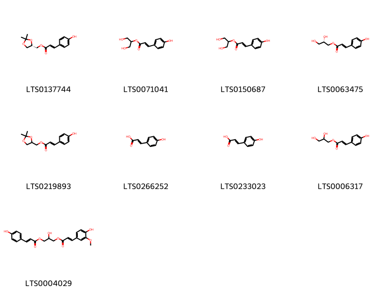
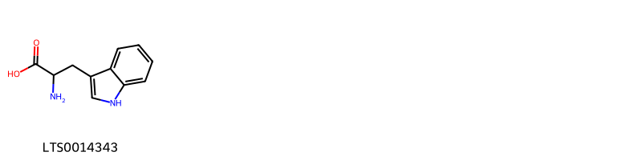
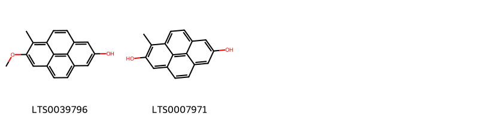

!!! abstract "Tóm tắt"

    Đăng tâm thảo (Medulla Junci Effusi) là ruột thân đã phơi hoặc sấy khô của cây bấc đèn (Juncus effusus L.), thuộc họ Bấc (Juncaceae). Cây bấc đèn phân bố rộng rãi trên thế giới từ châu Á, châu Âu đến Bắc Mỹ, và được trồng tại các vùng ẩm ướt ở Việt Nam như Nam Định, Hà Nam. Theo y học cổ truyền, đăng tâm thảo có vị nhạt, tính hàn, đi vào kinh tâm và tiểu trường, thường được sử dụng để thanh tâm, giải nhiệt, lợi tiểu tiện, và điều trị các chứng như tâm phiền mất ngủ, lở miệng, tiểu tiện ít, đau nhức. Thành phần hóa học  gồm các nhóm Pyrenes, Phenanthrenes, hợp chất chứa oxy, acid carboxylic và dẫn xuất, steroid và dẫn xuất, lipid prenol, indoles và dẫn xuất, benzene và dẫn xuất, benzoxepines, acid cinnamic và dẫn xuất, flavonoid

## Thông tin về thực vật

Dược liệu **Đăng Tâm Thảo (Ruột Thân)** từ bộ phận **nan** từ loài *Juncus effusus*.

**Mô tả thực vật:** Cây bấc là một loại cỏ sống lâu năm, thân tròn cứng, mọc thành cụm dày cao độ 35- Đăng tâm thảo (Medulla Junci caulis) là ruột 100cm, đường kính của thân chừng 1-2mm, mặt ngoài thân có màu xanh nhạt, có vạch dọc. Ruột (lõi) cây bắc cấu tạo bởi những tế bào hình ngôi sao để hở ra nhiều lỗ khuyết lớn. Lá bị giảm rất nhiều, chỉ còn lại bẹ ở góc thân. Hoa đều, lưỡng tính, mọc thành vòng. Bao hoa khô xác Phân bố, thu hái và chế biến

*Tài liệu tham khảo:* "Những cây thuốc và vị thuốc Việt Nam" - Đỗ Tất Lợi 
Trong dược điển Việt nam, một loài được sử dụng làm dược liệu là *Juncus effusus*.

!!! info "Phân loại thực vật của *Juncus effusus*"
    - **Kingdom:** Plantae
    - **Phylum:** Tracheophyta
    - **Order:** Poales
    - **Family:** Juncaceae
    - **Genus:** Juncus
    - **Species:** *Juncus effusus*

**Phân bố trên thế giới:** France, Germany, Switzerland, Chile, Netherlands, Spain, Sweden, South Africa, Australia, Russian Federation, Portugal, United Kingdom of Great Britain and Northern Ireland, Argentina, Ukraine, United States of America, Italy, Norway, Canada, New Zealand, Denmark, Austria, Luxembourg

**Phân bố tại Việt nam:** Không có ghi nhận ở Việt Nam

## Thông tin về dược liệu 

### Định danh

!!! info "Thông tin về tên gọi"

    - Dược liệu tiếng Việt: nan
    - Dược liệu tiếng Trung: nan (nan)
    - Dược liệu tiếng Anh: nan
    - Dược liệu latin thông dụng: nan
    - Dược liệu latin kiểu DĐVN: *medulla junci effusi*
    - Dược liệu latin kiểu DĐVN: *nan*
    - Dược liệu latin kiểu thông tư: *nan*
    - Bộ phận dùng: nan (nan)

### Mô tả dược liệu 

- **Theo dược điển Việt nam V:** nan

- **Mô tả dược liệu theo thông tư chế biến dược liệu theo phương pháp cổ truyền:** nan

### Chế biến 

- **Chế biến theo dược điển việt nam V**: nan

- **Chế biến theo thông tư:** nan

--- 

## Thành phần hóa học

- Theo tài liệu của GS. Đỗ Tất Lợi:  (1) Alkaloid, Flavonoid, Saponin, phenolic acid,  Triterpenoid, carbohydrate
    

**Thành phần hóa học từ loài **Juncus effusus**

Theo cơ sở dữ liệu lotus, loài *Juncus effusus* đã phân lập và xác định được **109** hoạt chất thuộc về các nhóm Steroids and steroid derivatives, Organooxygen compounds, Flavonoids, Cinnamic acids and derivatives, Indoles and derivatives, Benzoxepines, Carboxylic acids and derivatives, Benzene and substituted derivatives, Pyrenes, Prenol lipids, Phenanthrenes and derivatives trong bảng dưới đây. Danh sách các hoạt chất như sau 5-ethenyl-1-methylphenanthrene-2,7-diol [(LTS0146387)](https://lotus.naturalproducts.net/compound/lotus_id/LTS0146387), 5-ethenyl-7-methoxy-1,8-dimethyl-9,10-dihydrophenanthren-2-ol [(LTS0116881)](https://lotus.naturalproducts.net/compound/lotus_id/LTS0116881), (+)-glucose [(LTS0262158)](https://lotus.naturalproducts.net/compound/lotus_id/LTS0262158), glucose [(LTS0013597)](https://lotus.naturalproducts.net/compound/lotus_id/LTS0013597), 4-ethenyl-7-methoxy-3,8-dimethyl-9,10-dihydrophenanthren-1-ol [(LTS0179767)](https://lotus.naturalproducts.net/compound/lotus_id/LTS0179767), 7-hydroxy-2-methoxy-1,8-dimethyl-9,10-dihydrophenanthrene-4-carbaldehyde [(LTS0101476)](https://lotus.naturalproducts.net/compound/lotus_id/LTS0101476), 1-(3,7-dihydroxy-8-methyl-9,10-dihydrophenanthren-4-yl)ethanone [(LTS0266949)](https://lotus.naturalproducts.net/compound/lotus_id/LTS0266949), 3,4,5-trihydroxy-6-(hydroxymethyl)oxan-2-yl 6-{6-[(3-{[4,5-dihydroxy-6-(hydroxymethyl)-3-{[3,4,5-trihydroxy-6-(hydroxymethyl)oxan-2-yl]oxy}oxan-2-yl]oxy}-4,5-dihydroxy-6-(hydroxymethyl)oxan-2-yl)oxy]-7,7,12,16-tetramethylpentacyclo[9.7.0.0¹,³.0³,⁸.0¹²,¹⁶]octadecan-15-yl}-5-hydroxy-2-methylhept-2-enoate [(LTS0194792)](https://lotus.naturalproducts.net/compound/lotus_id/LTS0194792), nobiletin [(LTS0100173)](https://lotus.naturalproducts.net/compound/lotus_id/LTS0100173), 4-{[3,4,5-trihydroxy-6-(hydroxymethyl)oxan-2-yl]oxy}phenyl 6-{6-[(3-{[4,5-dihydroxy-6-(hydroxymethyl)-3-{[3,4,5-trihydroxy-6-(hydroxymethyl)oxan-2-yl]oxy}oxan-2-yl]oxy}-4,5-dihydroxy-6-(hydroxymethyl)oxan-2-yl)oxy]-7,7,12,16-tetramethylpentacyclo[9.7.0.0¹,³.0³,⁸.0¹²,¹⁶]octadecan-15-yl}-5-hydroxy-2-methylhept-2-enoate [(LTS0063601)](https://lotus.naturalproducts.net/compound/lotus_id/LTS0063601), para-coumaric acid [(LTS0266252)](https://lotus.naturalproducts.net/compound/lotus_id/LTS0266252), 5-[(1s)-1-hydroxyethyl]-1,7-dimethyl-9,10-dihydrophenanthrene-2,6-diol [(LTS0188902)](https://lotus.naturalproducts.net/compound/lotus_id/LTS0188902), 4-(1-hydroxyethyl)-1,8-dimethyl-9,10-dihydrophenanthrene-2,7-diol [(LTS0239746)](https://lotus.naturalproducts.net/compound/lotus_id/LTS0239746), 7-(1,2-dihydroxyethyl)-2-hydroxy-1-(hydroxymethyl)-1,4b,7-trimethyl-2,5,6,8,8a,9,10,10a-octahydrophenanthren-3-one [(LTS0232397)](https://lotus.naturalproducts.net/compound/lotus_id/LTS0232397), 1-(2,6-dihydroxy-3,5-dimethyl-9,10-dihydrophenanthren-1-yl)ethanone [(LTS0115469)](https://lotus.naturalproducts.net/compound/lotus_id/LTS0115469), (2,2-dimethyl-1,3-dioxolan-4-yl)methyl 3-(4-hydroxyphenyl)prop-2-enoate [(LTS0219893)](https://lotus.naturalproducts.net/compound/lotus_id/LTS0219893), 4-(hydroxymethyl)-1,8-dimethyl-9,10-dihydrophenanthrene-2,7-diol [(LTS0080640)](https://lotus.naturalproducts.net/compound/lotus_id/LTS0080640), (2r,3r,4s,5s,6r)-2-[(2,7-dihydroxy-1,8-dimethyl-9,10-dihydrophenanthren-4-yl)methoxy]-6-(hydroxymethyl)oxane-3,4,5-triol [(LTS0262551)](https://lotus.naturalproducts.net/compound/lotus_id/LTS0262551), 5-(hydroxymethyl)-7-methoxy-1,8-dimethyl-9,10-dihydrophenanthren-2-ol [(LTS0079384)](https://lotus.naturalproducts.net/compound/lotus_id/LTS0079384), l-arginine [(LTS0064737)](https://lotus.naturalproducts.net/compound/lotus_id/LTS0064737), (2s,3r,4s,5s,6r)-3,4,5-trihydroxy-6-(hydroxymethyl)oxan-2-yl (2e,5s,6s)-6-[(1s,3r,6s,8s,11s,12s,15r,16r)-6-{[(2r,3r,4s,5s,6r)-3-{[(2s,3r,4s,5s,6r)-4,5-dihydroxy-6-(hydroxymethyl)-3-{[(2s,3r,4s,5s,6r)-3,4,5-trihydroxy-6-(hydroxymethyl)oxan-2-yl]oxy}oxan-2-yl]oxy}-4,5-dihydroxy-6-(hydroxymethyl)oxan-2-yl]oxy}-7,7,12,16-tetramethylpentacyclo[9.7.0.0¹,³.0³,⁸.0¹²,¹⁶]octadecan-15-yl]-5-hydroxy-2-methylhept-2-enoate [(LTS0231433)](https://lotus.naturalproducts.net/compound/lotus_id/LTS0231433), valin [(LTS0254747)](https://lotus.naturalproducts.net/compound/lotus_id/LTS0254747), 4-ethenyl-1,8-dimethyl-9,10-dihydrophenanthrene-2,7-diol [(LTS0155703)](https://lotus.naturalproducts.net/compound/lotus_id/LTS0155703), 6-(1-{6-[(3-{[4,5-dihydroxy-6-(hydroxymethyl)-3-{[3,4,5-trihydroxy-6-(hydroxymethyl)oxan-2-yl]oxy}oxan-2-yl]oxy}-4,5-dihydroxy-6-(hydroxymethyl)oxan-2-yl)oxy]-7,7,12,16-tetramethylpentacyclo[9.7.0.0¹,³.0³,⁸.0¹²,¹⁶]octadecan-15-yl}ethyl)-3-methyl-5,6-dihydropyran-2-one [(LTS0208058)](https://lotus.naturalproducts.net/compound/lotus_id/LTS0208058), 7-ethenyl-1,6-dimethyl-9,10-dihydrophenanthren-2-ol [(LTS0229736)](https://lotus.naturalproducts.net/compound/lotus_id/LTS0229736), [(4s)-2,2-dimethyl-1,3-dioxolan-4-yl]methyl (2e)-3-(4-hydroxyphenyl)prop-2-enoate [(LTS0137744)](https://lotus.naturalproducts.net/compound/lotus_id/LTS0137744), 5-(1-hydroxyethyl)-1,7-dimethyl-9,10-dihydrophenanthrene-2,6-diol [(LTS0215142)](https://lotus.naturalproducts.net/compound/lotus_id/LTS0215142), (1s,3r,6s,8r,11s,12s,15r,16r)-15-[(2r,5r)-5-hydroxy-6-methylheptan-2-yl]-7,7,12,16-tetramethylpentacyclo[9.7.0.0¹,³.0³,⁸.0¹²,¹⁶]octadecan-6-ol [(LTS0083209)](https://lotus.naturalproducts.net/compound/lotus_id/LTS0083209), 7,7,12,16-tetramethyl-15-(6-methyl-5-oxohept-6-en-2-yl)pentacyclo[9.7.0.0¹,³.0³,⁸.0¹²,¹⁶]octadecan-6-yl acetate [(LTS0267193)](https://lotus.naturalproducts.net/compound/lotus_id/LTS0267193), aldehydo-d-galactose [(LTS0128031)](https://lotus.naturalproducts.net/compound/lotus_id/LTS0128031), 2-{[7-hydroxy-5-(hydroxymethyl)-1,8-dimethyl-9,10-dihydrophenanthren-2-yl]oxy}-6-(hydroxymethyl)oxane-3,4,5-triol [(LTS0243817)](https://lotus.naturalproducts.net/compound/lotus_id/LTS0243817), galactose [(LTS0171628)](https://lotus.naturalproducts.net/compound/lotus_id/LTS0171628), 5-ethenyl-6-(hydroxymethyl)-1-methyl-9,10-dihydrophenanthren-2-ol [(LTS0121862)](https://lotus.naturalproducts.net/compound/lotus_id/LTS0121862), (1s,3r,6s,8r,11s,12s,15r,16r)-15-[(2r,5s)-5-hydroxy-6-methylheptan-2-yl]-7,7,12,16-tetramethylpentacyclo[9.7.0.0¹,³.0³,⁸.0¹²,¹⁶]octadecan-6-ol [(LTS0021505)](https://lotus.naturalproducts.net/compound/lotus_id/LTS0021505), 5-ethenyl-7-(hydroxymethyl)-1-methyl-9,10-dihydrophenanthren-2-ol [(LTS0075146)](https://lotus.naturalproducts.net/compound/lotus_id/LTS0075146), 1,7-dimethyl-9,10-dihydrophenanthrene-2,6-diol [(LTS0118622)](https://lotus.naturalproducts.net/compound/lotus_id/LTS0118622), 2,7-dihydroxy-3,8-dimethyl-9,10-dihydrophenanthrene-4-carbaldehyde [(LTS0162786)](https://lotus.naturalproducts.net/compound/lotus_id/LTS0162786), 2,7-dihydroxy-8-methylphenanthrene-4-carbaldehyde [(LTS0261605)](https://lotus.naturalproducts.net/compound/lotus_id/LTS0261605), (2s,3r,4s,5s,6r)-2-{[7-hydroxy-4-(hydroxymethyl)-1,8-dimethyl-9,10-dihydrophenanthren-2-yl]oxy}-6-(hydroxymethyl)oxane-3,4,5-triol [(LTS0253384)](https://lotus.naturalproducts.net/compound/lotus_id/LTS0253384), 4-ethenyl-7-hydroxy-8-methyl-9,10-dihydrophenanthrene-2-carboxylic acid [(LTS0035941)](https://lotus.naturalproducts.net/compound/lotus_id/LTS0035941), 6-[6-(acetyloxy)-7,7,12,16-tetramethylpentacyclo[9.7.0.0¹,³.0³,⁸.0¹²,¹⁶]octadecan-15-yl]-2-hydroxy-2-methylheptan-3-yl acetate [(LTS0073059)](https://lotus.naturalproducts.net/compound/lotus_id/LTS0073059), 1-(5-ethyl-6-methylhept-3-en-2-yl)-9a,11a-dimethyl-1h,2h,3h,3ah,5h,5ah,6h,7h,8h,9h,9bh,10h,11h-cyclopenta[a]phenanthren-7-ol [(LTS0173223)](https://lotus.naturalproducts.net/compound/lotus_id/LTS0173223), (1s,3r,6s,8r,11s,12s,15r,16r)-15-[(2r)-4-[(2s)-3,3-dimethyloxiran-2-yl]butan-2-yl]-7,7,12,16-tetramethylpentacyclo[9.7.0.0¹,³.0³,⁸.0¹²,¹⁶]octadecan-6-yl acetate [(LTS0064633)](https://lotus.naturalproducts.net/compound/lotus_id/LTS0064633), (2s)-2,3-dihydroxypropyl (2e)-3-(4-hydroxyphenyl)prop-2-enoate [(LTS0063475)](https://lotus.naturalproducts.net/compound/lotus_id/LTS0063475), l-glutamic acid [(LTS0037133)](https://lotus.naturalproducts.net/compound/lotus_id/LTS0037133), 2-{[7-hydroxy-4-(hydroxymethyl)-1,8-dimethyl-9,10-dihydrophenanthren-2-yl]oxy}-6-(hydroxymethyl)oxane-3,4,5-triol [(LTS0072538)](https://lotus.naturalproducts.net/compound/lotus_id/LTS0072538), (3r,6r)-6-[(1s,3r,6s,8r,11s,12s,15r,16r)-6-(acetyloxy)-7,7,12,16-tetramethylpentacyclo[9.7.0.0¹,³.0³,⁸.0¹²,¹⁶]octadecan-15-yl]-2-hydroxy-2-methylheptan-3-yl acetate [(LTS0174238)](https://lotus.naturalproducts.net/compound/lotus_id/LTS0174238), 2,3-dihydroxypropyl 3-(4-hydroxyphenyl)prop-2-enoate [(LTS0006317)](https://lotus.naturalproducts.net/compound/lotus_id/LTS0006317), 15-ethenyl-7,14-dimethyl-2-oxatricyclo[9.4.0.0³,⁸]pentadeca-1(11),3,5,7,12,14-hexaene-6,13-diol [(LTS0039206)](https://lotus.naturalproducts.net/compound/lotus_id/LTS0039206), 5-ethenyl-1,7-dimethyl-9,10-dihydrophenanthrene-2,6-diol [(LTS0000747)](https://lotus.naturalproducts.net/compound/lotus_id/LTS0000747), stigmast-5-en-3-ol, (3β)- [(LTS0204616)](https://lotus.naturalproducts.net/compound/lotus_id/LTS0204616), (6r)-6-[(1s)-1-[(1s,3r,6s,8s,11s,12s,15r,16r)-6-{[(2r,3r,4s,5s,6r)-3-{[(2s,3r,4s,5s,6r)-4,5-dihydroxy-6-(hydroxymethyl)-3-{[(2s,3r,4s,5s,6r)-3,4,5-trihydroxy-6-(hydroxymethyl)oxan-2-yl]oxy}oxan-2-yl]oxy}-4,5-dihydroxy-6-(hydroxymethyl)oxan-2-yl]oxy}-7,7,12,16-tetramethylpentacyclo[9.7.0.0¹,³.0³,⁸.0¹²,¹⁶]octadecan-15-yl]ethyl]-3-methyl-5,6-dihydropyran-2-one [(LTS0014666)](https://lotus.naturalproducts.net/compound/lotus_id/LTS0014666), sucrose [(LTS0272557)](https://lotus.naturalproducts.net/compound/lotus_id/LTS0272557), (3s,6r)-6-[(1s,3r,6s,8r,11s,12s,15r,16r)-6-(acetyloxy)-7,7,12,16-tetramethylpentacyclo[9.7.0.0¹,³.0³,⁸.0¹²,¹⁶]octadecan-15-yl]-2-hydroxy-2-methylheptan-3-yl acetate [(LTS0029933)](https://lotus.naturalproducts.net/compound/lotus_id/LTS0029933), (3,4,5,6-tetrahydroxyoxan-2-yl)methyl 6-{6-[(3-{[4,5-dihydroxy-6-(hydroxymethyl)-3-{[3,4,5-trihydroxy-6-(hydroxymethyl)oxan-2-yl]oxy}oxan-2-yl]oxy}-4,5-dihydroxy-6-(hydroxymethyl)oxan-2-yl)oxy]-7,7,12,16-tetramethylpentacyclo[9.7.0.0¹,³.0³,⁸.0¹²,¹⁶]octadecan-15-yl}-5-hydroxy-2-methylhept-2-enoate [(LTS0050217)](https://lotus.naturalproducts.net/compound/lotus_id/LTS0050217), 7,7,12,16-tetramethyl-15-(6-methyl-5-oxoheptan-2-yl)pentacyclo[9.7.0.0¹,³.0³,⁸.0¹²,¹⁶]octadecan-6-yl acetate [(LTS0054991)](https://lotus.naturalproducts.net/compound/lotus_id/LTS0054991), 4-ethenyl-7-hydroxy-8-methyl-9,10-dihydrophenanthrene-1-carboxylic acid [(LTS0129083)](https://lotus.naturalproducts.net/compound/lotus_id/LTS0129083), 5-ethenyl-1,7-dimethyl-9,10-dihydrophenanthrene-2,3-diol [(LTS0212795)](https://lotus.naturalproducts.net/compound/lotus_id/LTS0212795), 4-ethenyl-3,8-dimethyl-9,10-dihydrophenanthrene-1,7-diol [(LTS0229707)](https://lotus.naturalproducts.net/compound/lotus_id/LTS0229707), (1s,3r,6s,8r,11s,12s,15r,16r)-15-[(2r)-4-[(2r)-3,3-dimethyloxiran-2-yl]butan-2-yl]-7,7,12,16-tetramethylpentacyclo[9.7.0.0¹,³.0³,⁸.0¹²,¹⁶]octadecan-6-yl acetate [(LTS0122798)](https://lotus.naturalproducts.net/compound/lotus_id/LTS0122798), methionin [(LTS0055972)](https://lotus.naturalproducts.net/compound/lotus_id/LTS0055972), optimax [(LTS0014343)](https://lotus.naturalproducts.net/compound/lotus_id/LTS0014343), 4-[(1s)-1-hydroxyethyl]-2,8-dimethyl-9,10-dihydrophenanthrene-1,7-diol [(LTS0049969)](https://lotus.naturalproducts.net/compound/lotus_id/LTS0049969), (1s,2r,4br,7r,8ar,10ar)-7-[(1s)-1,2-dihydroxyethyl]-2-hydroxy-1-(hydroxymethyl)-1,4b,7-trimethyl-2,5,6,8,8a,9,10,10a-octahydrophenanthren-3-one [(LTS0165974)](https://lotus.naturalproducts.net/compound/lotus_id/LTS0165974), sitogluside [(LTS0201798)](https://lotus.naturalproducts.net/compound/lotus_id/LTS0201798), 15-[4-(3,3-dimethyloxiran-2-yl)butan-2-yl]-7,7,12,16-tetramethylpentacyclo[9.7.0.0¹,³.0³,⁸.0¹²,¹⁶]octadecan-6-yl acetate [(LTS0133483)](https://lotus.naturalproducts.net/compound/lotus_id/LTS0133483), 2-(hydroxymethyl)-6-[(2-methoxy-1,8-dimethyl-7-{[3,4,5-trihydroxy-6-(hydroxymethyl)oxan-2-yl]oxy}-9,10-dihydrophenanthren-4-yl)methoxy]oxane-3,4,5-triol [(LTS0194102)](https://lotus.naturalproducts.net/compound/lotus_id/LTS0194102), (2s,3r,4s,5s,6r)-2-{[7-hydroxy-5-(hydroxymethyl)-1,8-dimethyl-9,10-dihydrophenanthren-2-yl]oxy}-6-(hydroxymethyl)oxane-3,4,5-triol [(LTS0236271)](https://lotus.naturalproducts.net/compound/lotus_id/LTS0236271), quercetin [(LTS0004651)](https://lotus.naturalproducts.net/compound/lotus_id/LTS0004651), (2s,3r,4s,5s,6r)-3,4,5-trihydroxy-6-(hydroxymethyl)oxan-2-yl (2e,5s,6s)-6-[(6s,15r)-6-{[(2r,3r,5s,6r)-3-{[(2s,3r,4s,5s,6r)-4,5-dihydroxy-6-(hydroxymethyl)-3-{[(5s)-3,4,5-trihydroxy-6-(hydroxymethyl)oxan-2-yl]oxy}oxan-2-yl]oxy}-4,5-dihydroxy-6-(hydroxymethyl)oxan-2-yl]oxy}-7,7,12,16-tetramethylpentacyclo[9.7.0.0¹,³.0³,⁸.0¹²,¹⁶]octadecan-15-yl]-5-hydroxy-2-methylhept-2-enoate [(LTS0257223)](https://lotus.naturalproducts.net/compound/lotus_id/LTS0257223), (1s,2s)-4,8-dimethyl-1h,2h,6h,7h-phenanthro[3,4-b]furan-1,2,9-triol [(LTS0108755)](https://lotus.naturalproducts.net/compound/lotus_id/LTS0108755), l-serine [(LTS0106692)](https://lotus.naturalproducts.net/compound/lotus_id/LTS0106692), stigmast-5-en-3-ol [(LTS0071224)](https://lotus.naturalproducts.net/compound/lotus_id/LTS0071224), 4-(1-hydroxyethyl)-2,8-dimethyl-9,10-dihydrophenanthrene-1,7-diol [(LTS0015536)](https://lotus.naturalproducts.net/compound/lotus_id/LTS0015536), 2-[(2,7-dihydroxy-1,8-dimethyl-9,10-dihydrophenanthren-4-yl)methoxy]-6-(hydroxymethyl)oxane-3,4,5-triol [(LTS0151981)](https://lotus.naturalproducts.net/compound/lotus_id/LTS0151981), 4-[(1s)-1-hydroxyethyl]-1,8-dimethyl-9,10-dihydrophenanthrene-2,7-diol [(LTS0044386)](https://lotus.naturalproducts.net/compound/lotus_id/LTS0044386), (1s,3r,6s,8r,11s,12s,15r,16r)-7,7,12,16-tetramethyl-15-[(2r)-6-methyl-5-oxoheptan-2-yl]pentacyclo[9.7.0.0¹,³.0³,⁸.0¹²,¹⁶]octadecan-6-yl acetate [(LTS0138459)](https://lotus.naturalproducts.net/compound/lotus_id/LTS0138459), chondrillasterol [(LTS0142259)](https://lotus.naturalproducts.net/compound/lotus_id/LTS0142259), rutinose [(LTS0061610)](https://lotus.naturalproducts.net/compound/lotus_id/LTS0061610), (2r,3r,4s,5s,6r)-2-[(7-hydroxy-2-methoxy-1,8-dimethyl-9,10-dihydrophenanthren-4-yl)methoxy]-6-(hydroxymethyl)oxane-3,4,5-triol [(LTS0266327)](https://lotus.naturalproducts.net/compound/lotus_id/LTS0266327), 2-[(7-hydroxy-2-methoxy-1,8-dimethyl-9,10-dihydrophenanthren-4-yl)methoxy]-6-(hydroxymethyl)oxane-3,4,5-triol [(LTS0271790)](https://lotus.naturalproducts.net/compound/lotus_id/LTS0271790), 7-methoxy-6-methylpyren-2-ol [(LTS0039796)](https://lotus.naturalproducts.net/compound/lotus_id/LTS0039796), 1,3-dihydroxypropan-2-yl (2e)-3-(4-hydroxyphenyl)prop-2-enoate [(LTS0150687)](https://lotus.naturalproducts.net/compound/lotus_id/LTS0150687), vanillic acid [(LTS0229113)](https://lotus.naturalproducts.net/compound/lotus_id/LTS0229113), 5-(1-methoxyethyl)-1,7-dimethyl-9,10-dihydrophenanthrene-2,6-diol [(LTS0179050)](https://lotus.naturalproducts.net/compound/lotus_id/LTS0179050), 4,8-dimethyl-1h,2h,6h,7h-phenanthro[3,4-b]furan-1,2,9-triol [(LTS0171379)](https://lotus.naturalproducts.net/compound/lotus_id/LTS0171379), 5-ethenyl-1-methyl-9,10-dihydrophenanthrene-2,7-diol [(LTS0238842)](https://lotus.naturalproducts.net/compound/lotus_id/LTS0238842), juncusol [(LTS0130836)](https://lotus.naturalproducts.net/compound/lotus_id/LTS0130836), 2-{[1-(5-ethyl-6-methylheptan-2-yl)-9a,11a-dimethyl-1h,2h,3h,3ah,3bh,4h,6h,7h,8h,9h,9bh,10h,11h-cyclopenta[a]phenanthren-7-yl]oxy}-6-(hydroxymethyl)oxane-3,4,5-triol [(LTS0158828)](https://lotus.naturalproducts.net/compound/lotus_id/LTS0158828), 4-{[(2s,3r,4s,5s,6r)-3,4,5-trihydroxy-6-(hydroxymethyl)oxan-2-yl]oxy}phenyl (2e,5s,6s)-6-[(1s,3r,6s,8r,11s,12s,15r,16r)-6-{[(2r,3r,4s,5s,6r)-3-{[(2s,3r,4s,5s,6r)-4,5-dihydroxy-6-(hydroxymethyl)-3-{[(2s,3r,4s,5s,6r)-3,4,5-trihydroxy-6-(hydroxymethyl)oxan-2-yl]oxy}oxan-2-yl]oxy}-4,5-dihydroxy-6-(hydroxymethyl)oxan-2-yl]oxy}-7,7,12,16-tetramethylpentacyclo[9.7.0.0¹,³.0³,⁸.0¹²,¹⁶]octadecan-15-yl]-5-hydroxy-2-methylhept-2-enoate [(LTS0194512)](https://lotus.naturalproducts.net/compound/lotus_id/LTS0194512), (2r,3s,4s,5r,6r)-2-(hydroxymethyl)-6-[(2-methoxy-1,8-dimethyl-7-{[(2s,3r,4s,5s,6r)-3,4,5-trihydroxy-6-(hydroxymethyl)oxan-2-yl]oxy}-9,10-dihydrophenanthren-4-yl)methoxy]oxane-3,4,5-triol [(LTS0228968)](https://lotus.naturalproducts.net/compound/lotus_id/LTS0228968), β alanine [(LTS0209241)](https://lotus.naturalproducts.net/compound/lotus_id/LTS0209241), 1,3-dihydroxypropan-2-yl 3-(4-hydroxyphenyl)prop-2-enoate [(LTS0071041)](https://lotus.naturalproducts.net/compound/lotus_id/LTS0071041), alanine [(LTS0117512)](https://lotus.naturalproducts.net/compound/lotus_id/LTS0117512), 5-(hydroxymethyl)-1-methylphenanthrene-2,7-diol [(LTS0158391)](https://lotus.naturalproducts.net/compound/lotus_id/LTS0158391), 2-hydroxy-3-{[(2e)-3-(4-hydroxy-3-methoxyphenyl)prop-2-enoyl]oxy}propyl (2e)-3-(4-hydroxyphenyl)prop-2-enoate [(LTS0004029)](https://lotus.naturalproducts.net/compound/lotus_id/LTS0004029), 15-(5-hydroxy-6-methylheptan-2-yl)-7,7,12,16-tetramethylpentacyclo[9.7.0.0¹,³.0³,⁸.0¹²,¹⁶]octadecan-6-ol [(LTS0082374)](https://lotus.naturalproducts.net/compound/lotus_id/LTS0082374), 5-(hydroxymethyl)-1,7-dimethyl-9,10-dihydrophenanthren-2-ol [(LTS0240658)](https://lotus.naturalproducts.net/compound/lotus_id/LTS0240658), 1-methylpyrene-2,7-diol [(LTS0007971)](https://lotus.naturalproducts.net/compound/lotus_id/LTS0007971), [(2r,3s,4s,5r,6r)-3,4,5,6-tetrahydroxyoxan-2-yl]methyl (2e,5s,6s)-6-[(1s,3r,6s,8s,11s,12s,15r,16r)-6-{[(2r,3r,4s,5s,6r)-3-{[(2s,3r,4s,5s,6r)-4,5-dihydroxy-6-(hydroxymethyl)-3-{[(2s,3r,4s,5s,6r)-3,4,5-trihydroxy-6-(hydroxymethyl)oxan-2-yl]oxy}oxan-2-yl]oxy}-4,5-dihydroxy-6-(hydroxymethyl)oxan-2-yl]oxy}-7,7,12,16-tetramethylpentacyclo[9.7.0.0¹,³.0³,⁸.0¹²,¹⁶]octadecan-15-yl]-5-hydroxy-2-methylhept-2-enoate [(LTS0144538)](https://lotus.naturalproducts.net/compound/lotus_id/LTS0144538), sitosterol [(LTS0168132)](https://lotus.naturalproducts.net/compound/lotus_id/LTS0168132), 1-(3,7-dihydroxy-2,8-dimethyl-9,10-dihydrophenanthren-4-yl)ethanone [(LTS0162717)](https://lotus.naturalproducts.net/compound/lotus_id/LTS0162717), 5-ethenyl-1,6-dimethylphenanthrene-2,7-diol [(LTS0008340)](https://lotus.naturalproducts.net/compound/lotus_id/LTS0008340), 5-[(1r)-1-methoxyethyl]-1,7-dimethyl-9,10-dihydrophenanthrene-2,6-diol [(LTS0026172)](https://lotus.naturalproducts.net/compound/lotus_id/LTS0026172), hydroxycinnamic acid [(LTS0233023)](https://lotus.naturalproducts.net/compound/lotus_id/LTS0233023), (1s,3r,6s,8r,11s,12s,15r,16r)-7,7,12,16-tetramethyl-15-[(2r)-6-methyl-5-oxohept-6-en-2-yl]pentacyclo[9.7.0.0¹,³.0³,⁸.0¹²,¹⁶]octadecan-6-yl acetate [(LTS0130322)](https://lotus.naturalproducts.net/compound/lotus_id/LTS0130322), 6-demethoxytangeretin [(LTS0140420)](https://lotus.naturalproducts.net/compound/lotus_id/LTS0140420), rutinose [(LTS0041313)](https://lotus.naturalproducts.net/compound/lotus_id/LTS0041313), [(2r,3s,4s,5r,6s)-3,4,5,6-tetrahydroxyoxan-2-yl]methyl (2e,5s,6s)-6-[(1s,3r,6s,8s,11s,12s,15r,16r)-6-{[(2r,3r,4s,5s,6r)-3-{[(2s,3r,4s,5s,6r)-4,5-dihydroxy-6-(hydroxymethyl)-3-{[(2s,3r,4s,5s,6r)-3,4,5-trihydroxy-6-(hydroxymethyl)oxan-2-yl]oxy}oxan-2-yl]oxy}-4,5-dihydroxy-6-(hydroxymethyl)oxan-2-yl]oxy}-7,7,12,16-tetramethylpentacyclo[9.7.0.0¹,³.0³,⁸.0¹²,¹⁶]octadecan-15-yl]-5-hydroxy-2-methylhept-2-enoate [(LTS0168084)](https://lotus.naturalproducts.net/compound/lotus_id/LTS0168084). 
        
| chemicalTaxonomyClassyfireClass     |   smiles_count |
|:------------------------------------|---------------:|
| Benzene and substituted derivatives |             19 |
| Benzoxepines                        |             36 |
| Carboxylic acids and derivatives    |            113 |
| Cinnamic acids and derivatives      |            286 |
| Flavonoids                          |            134 |
| Indoles and derivatives             |             27 |
| Organooxygen compounds              |            799 |
| Phenanthrenes and derivatives       |           1573 |
| Prenol lipids                       |            341 |
| Pyrenes                             |             63 |
| Steroids and steroid derivatives    |           3559 |

            
### Nhóm Benzene and substituted derivatives
<figure markdown="span">
    { width=100% }
<figcaption>Hình ảnh cấu trúc hóa học của hoạt chất thuộc nhóm *Benzene and substituted derivatives*. Tên thường gọi của các hoạt chất tương ứng là vanillic acid [(LTS0229113)](https://lotus.naturalproducts.net/compound/lotus_id/LTS0229113).</figcaption>
</figure>

            
            
### Nhóm Benzene and substituted derivatives
<figure markdown="span">
    { width=100% }
<figcaption>Hình ảnh cấu trúc hóa học của hoạt chất thuộc nhóm *Benzene and substituted derivatives*. Tên thường gọi của các hoạt chất tương ứng là vanillic acid [(LTS0229113)](https://lotus.naturalproducts.net/compound/lotus_id/LTS0229113).</figcaption>
</figure>

### Nhóm Benzoxepines
<figure markdown="span">
    { width=100% }
<figcaption>Hình ảnh cấu trúc hóa học của hoạt chất thuộc nhóm *Benzoxepines*. Tên thường gọi của các hoạt chất tương ứng là 15-ethenyl-7,14-dimethyl-2-oxatricyclo[9.4.0.0³,⁸]pentadeca-1(11),3,5,7,12,14-hexaene-6,13-diol [(LTS0039206)](https://lotus.naturalproducts.net/compound/lotus_id/LTS0039206).</figcaption>
</figure>

            
            
### Nhóm Benzene and substituted derivatives
<figure markdown="span">
    { width=100% }
<figcaption>Hình ảnh cấu trúc hóa học của hoạt chất thuộc nhóm *Benzene and substituted derivatives*. Tên thường gọi của các hoạt chất tương ứng là vanillic acid [(LTS0229113)](https://lotus.naturalproducts.net/compound/lotus_id/LTS0229113).</figcaption>
</figure>

### Nhóm Benzoxepines
<figure markdown="span">
    { width=100% }
<figcaption>Hình ảnh cấu trúc hóa học của hoạt chất thuộc nhóm *Benzoxepines*. Tên thường gọi của các hoạt chất tương ứng là 15-ethenyl-7,14-dimethyl-2-oxatricyclo[9.4.0.0³,⁸]pentadeca-1(11),3,5,7,12,14-hexaene-6,13-diol [(LTS0039206)](https://lotus.naturalproducts.net/compound/lotus_id/LTS0039206).</figcaption>
</figure>

### Nhóm Carboxylic acids and derivatives
<figure markdown="span">
    { width=100% }
<figcaption>Hình ảnh cấu trúc hóa học của hoạt chất thuộc nhóm *Carboxylic acids and derivatives*. Tên thường gọi của các hoạt chất tương ứng là l-serine [(LTS0106692)](https://lotus.naturalproducts.net/compound/lotus_id/LTS0106692), methionin [(LTS0055972)](https://lotus.naturalproducts.net/compound/lotus_id/LTS0055972), β alanine [(LTS0209241)](https://lotus.naturalproducts.net/compound/lotus_id/LTS0209241), l-glutamic acid [(LTS0037133)](https://lotus.naturalproducts.net/compound/lotus_id/LTS0037133), l-arginine [(LTS0064737)](https://lotus.naturalproducts.net/compound/lotus_id/LTS0064737), valin [(LTS0254747)](https://lotus.naturalproducts.net/compound/lotus_id/LTS0254747), alanine [(LTS0117512)](https://lotus.naturalproducts.net/compound/lotus_id/LTS0117512).</figcaption>
</figure>

            
            
### Nhóm Benzene and substituted derivatives
<figure markdown="span">
    { width=100% }
<figcaption>Hình ảnh cấu trúc hóa học của hoạt chất thuộc nhóm *Benzene and substituted derivatives*. Tên thường gọi của các hoạt chất tương ứng là vanillic acid [(LTS0229113)](https://lotus.naturalproducts.net/compound/lotus_id/LTS0229113).</figcaption>
</figure>

### Nhóm Benzoxepines
<figure markdown="span">
    { width=100% }
<figcaption>Hình ảnh cấu trúc hóa học của hoạt chất thuộc nhóm *Benzoxepines*. Tên thường gọi của các hoạt chất tương ứng là 15-ethenyl-7,14-dimethyl-2-oxatricyclo[9.4.0.0³,⁸]pentadeca-1(11),3,5,7,12,14-hexaene-6,13-diol [(LTS0039206)](https://lotus.naturalproducts.net/compound/lotus_id/LTS0039206).</figcaption>
</figure>

### Nhóm Carboxylic acids and derivatives
<figure markdown="span">
    { width=100% }
<figcaption>Hình ảnh cấu trúc hóa học của hoạt chất thuộc nhóm *Carboxylic acids and derivatives*. Tên thường gọi của các hoạt chất tương ứng là l-serine [(LTS0106692)](https://lotus.naturalproducts.net/compound/lotus_id/LTS0106692), methionin [(LTS0055972)](https://lotus.naturalproducts.net/compound/lotus_id/LTS0055972), β alanine [(LTS0209241)](https://lotus.naturalproducts.net/compound/lotus_id/LTS0209241), l-glutamic acid [(LTS0037133)](https://lotus.naturalproducts.net/compound/lotus_id/LTS0037133), l-arginine [(LTS0064737)](https://lotus.naturalproducts.net/compound/lotus_id/LTS0064737), valin [(LTS0254747)](https://lotus.naturalproducts.net/compound/lotus_id/LTS0254747), alanine [(LTS0117512)](https://lotus.naturalproducts.net/compound/lotus_id/LTS0117512).</figcaption>
</figure>

### Nhóm Cinnamic acids and derivatives
<figure markdown="span">
    { width=100% }
<figcaption>Hình ảnh cấu trúc hóa học của hoạt chất thuộc nhóm *Cinnamic acids and derivatives*. Tên thường gọi của các hoạt chất tương ứng là [(4s)-2,2-dimethyl-1,3-dioxolan-4-yl]methyl (2e)-3-(4-hydroxyphenyl)prop-2-enoate [(LTS0137744)](https://lotus.naturalproducts.net/compound/lotus_id/LTS0137744), 1,3-dihydroxypropan-2-yl 3-(4-hydroxyphenyl)prop-2-enoate [(LTS0071041)](https://lotus.naturalproducts.net/compound/lotus_id/LTS0071041), 1,3-dihydroxypropan-2-yl (2e)-3-(4-hydroxyphenyl)prop-2-enoate [(LTS0150687)](https://lotus.naturalproducts.net/compound/lotus_id/LTS0150687), (2s)-2,3-dihydroxypropyl (2e)-3-(4-hydroxyphenyl)prop-2-enoate [(LTS0063475)](https://lotus.naturalproducts.net/compound/lotus_id/LTS0063475), (2,2-dimethyl-1,3-dioxolan-4-yl)methyl 3-(4-hydroxyphenyl)prop-2-enoate [(LTS0219893)](https://lotus.naturalproducts.net/compound/lotus_id/LTS0219893), para-coumaric acid [(LTS0266252)](https://lotus.naturalproducts.net/compound/lotus_id/LTS0266252), hydroxycinnamic acid [(LTS0233023)](https://lotus.naturalproducts.net/compound/lotus_id/LTS0233023), 2,3-dihydroxypropyl 3-(4-hydroxyphenyl)prop-2-enoate [(LTS0006317)](https://lotus.naturalproducts.net/compound/lotus_id/LTS0006317), 2-hydroxy-3-{[(2e)-3-(4-hydroxy-3-methoxyphenyl)prop-2-enoyl]oxy}propyl (2e)-3-(4-hydroxyphenyl)prop-2-enoate [(LTS0004029)](https://lotus.naturalproducts.net/compound/lotus_id/LTS0004029).</figcaption>
</figure>

            
            
### Nhóm Benzene and substituted derivatives
<figure markdown="span">
    { width=100% }
<figcaption>Hình ảnh cấu trúc hóa học của hoạt chất thuộc nhóm *Benzene and substituted derivatives*. Tên thường gọi của các hoạt chất tương ứng là vanillic acid [(LTS0229113)](https://lotus.naturalproducts.net/compound/lotus_id/LTS0229113).</figcaption>
</figure>

### Nhóm Benzoxepines
<figure markdown="span">
    { width=100% }
<figcaption>Hình ảnh cấu trúc hóa học của hoạt chất thuộc nhóm *Benzoxepines*. Tên thường gọi của các hoạt chất tương ứng là 15-ethenyl-7,14-dimethyl-2-oxatricyclo[9.4.0.0³,⁸]pentadeca-1(11),3,5,7,12,14-hexaene-6,13-diol [(LTS0039206)](https://lotus.naturalproducts.net/compound/lotus_id/LTS0039206).</figcaption>
</figure>

### Nhóm Carboxylic acids and derivatives
<figure markdown="span">
    { width=100% }
<figcaption>Hình ảnh cấu trúc hóa học của hoạt chất thuộc nhóm *Carboxylic acids and derivatives*. Tên thường gọi của các hoạt chất tương ứng là l-serine [(LTS0106692)](https://lotus.naturalproducts.net/compound/lotus_id/LTS0106692), methionin [(LTS0055972)](https://lotus.naturalproducts.net/compound/lotus_id/LTS0055972), β alanine [(LTS0209241)](https://lotus.naturalproducts.net/compound/lotus_id/LTS0209241), l-glutamic acid [(LTS0037133)](https://lotus.naturalproducts.net/compound/lotus_id/LTS0037133), l-arginine [(LTS0064737)](https://lotus.naturalproducts.net/compound/lotus_id/LTS0064737), valin [(LTS0254747)](https://lotus.naturalproducts.net/compound/lotus_id/LTS0254747), alanine [(LTS0117512)](https://lotus.naturalproducts.net/compound/lotus_id/LTS0117512).</figcaption>
</figure>

### Nhóm Cinnamic acids and derivatives
<figure markdown="span">
    { width=100% }
<figcaption>Hình ảnh cấu trúc hóa học của hoạt chất thuộc nhóm *Cinnamic acids and derivatives*. Tên thường gọi của các hoạt chất tương ứng là [(4s)-2,2-dimethyl-1,3-dioxolan-4-yl]methyl (2e)-3-(4-hydroxyphenyl)prop-2-enoate [(LTS0137744)](https://lotus.naturalproducts.net/compound/lotus_id/LTS0137744), 1,3-dihydroxypropan-2-yl 3-(4-hydroxyphenyl)prop-2-enoate [(LTS0071041)](https://lotus.naturalproducts.net/compound/lotus_id/LTS0071041), 1,3-dihydroxypropan-2-yl (2e)-3-(4-hydroxyphenyl)prop-2-enoate [(LTS0150687)](https://lotus.naturalproducts.net/compound/lotus_id/LTS0150687), (2s)-2,3-dihydroxypropyl (2e)-3-(4-hydroxyphenyl)prop-2-enoate [(LTS0063475)](https://lotus.naturalproducts.net/compound/lotus_id/LTS0063475), (2,2-dimethyl-1,3-dioxolan-4-yl)methyl 3-(4-hydroxyphenyl)prop-2-enoate [(LTS0219893)](https://lotus.naturalproducts.net/compound/lotus_id/LTS0219893), para-coumaric acid [(LTS0266252)](https://lotus.naturalproducts.net/compound/lotus_id/LTS0266252), hydroxycinnamic acid [(LTS0233023)](https://lotus.naturalproducts.net/compound/lotus_id/LTS0233023), 2,3-dihydroxypropyl 3-(4-hydroxyphenyl)prop-2-enoate [(LTS0006317)](https://lotus.naturalproducts.net/compound/lotus_id/LTS0006317), 2-hydroxy-3-{[(2e)-3-(4-hydroxy-3-methoxyphenyl)prop-2-enoyl]oxy}propyl (2e)-3-(4-hydroxyphenyl)prop-2-enoate [(LTS0004029)](https://lotus.naturalproducts.net/compound/lotus_id/LTS0004029).</figcaption>
</figure>

### Nhóm Flavonoids
<figure markdown="span">
    { width=100% }
<figcaption>Hình ảnh cấu trúc hóa học của hoạt chất thuộc nhóm *Flavonoids*. Tên thường gọi của các hoạt chất tương ứng là nobiletin [(LTS0100173)](https://lotus.naturalproducts.net/compound/lotus_id/LTS0100173), 6-demethoxytangeretin [(LTS0140420)](https://lotus.naturalproducts.net/compound/lotus_id/LTS0140420), quercetin [(LTS0004651)](https://lotus.naturalproducts.net/compound/lotus_id/LTS0004651).</figcaption>
</figure>

            
            
### Nhóm Benzene and substituted derivatives
<figure markdown="span">
    { width=100% }
<figcaption>Hình ảnh cấu trúc hóa học của hoạt chất thuộc nhóm *Benzene and substituted derivatives*. Tên thường gọi của các hoạt chất tương ứng là vanillic acid [(LTS0229113)](https://lotus.naturalproducts.net/compound/lotus_id/LTS0229113).</figcaption>
</figure>

### Nhóm Benzoxepines
<figure markdown="span">
    { width=100% }
<figcaption>Hình ảnh cấu trúc hóa học của hoạt chất thuộc nhóm *Benzoxepines*. Tên thường gọi của các hoạt chất tương ứng là 15-ethenyl-7,14-dimethyl-2-oxatricyclo[9.4.0.0³,⁸]pentadeca-1(11),3,5,7,12,14-hexaene-6,13-diol [(LTS0039206)](https://lotus.naturalproducts.net/compound/lotus_id/LTS0039206).</figcaption>
</figure>

### Nhóm Carboxylic acids and derivatives
<figure markdown="span">
    { width=100% }
<figcaption>Hình ảnh cấu trúc hóa học của hoạt chất thuộc nhóm *Carboxylic acids and derivatives*. Tên thường gọi của các hoạt chất tương ứng là l-serine [(LTS0106692)](https://lotus.naturalproducts.net/compound/lotus_id/LTS0106692), methionin [(LTS0055972)](https://lotus.naturalproducts.net/compound/lotus_id/LTS0055972), β alanine [(LTS0209241)](https://lotus.naturalproducts.net/compound/lotus_id/LTS0209241), l-glutamic acid [(LTS0037133)](https://lotus.naturalproducts.net/compound/lotus_id/LTS0037133), l-arginine [(LTS0064737)](https://lotus.naturalproducts.net/compound/lotus_id/LTS0064737), valin [(LTS0254747)](https://lotus.naturalproducts.net/compound/lotus_id/LTS0254747), alanine [(LTS0117512)](https://lotus.naturalproducts.net/compound/lotus_id/LTS0117512).</figcaption>
</figure>

### Nhóm Cinnamic acids and derivatives
<figure markdown="span">
    { width=100% }
<figcaption>Hình ảnh cấu trúc hóa học của hoạt chất thuộc nhóm *Cinnamic acids and derivatives*. Tên thường gọi của các hoạt chất tương ứng là [(4s)-2,2-dimethyl-1,3-dioxolan-4-yl]methyl (2e)-3-(4-hydroxyphenyl)prop-2-enoate [(LTS0137744)](https://lotus.naturalproducts.net/compound/lotus_id/LTS0137744), 1,3-dihydroxypropan-2-yl 3-(4-hydroxyphenyl)prop-2-enoate [(LTS0071041)](https://lotus.naturalproducts.net/compound/lotus_id/LTS0071041), 1,3-dihydroxypropan-2-yl (2e)-3-(4-hydroxyphenyl)prop-2-enoate [(LTS0150687)](https://lotus.naturalproducts.net/compound/lotus_id/LTS0150687), (2s)-2,3-dihydroxypropyl (2e)-3-(4-hydroxyphenyl)prop-2-enoate [(LTS0063475)](https://lotus.naturalproducts.net/compound/lotus_id/LTS0063475), (2,2-dimethyl-1,3-dioxolan-4-yl)methyl 3-(4-hydroxyphenyl)prop-2-enoate [(LTS0219893)](https://lotus.naturalproducts.net/compound/lotus_id/LTS0219893), para-coumaric acid [(LTS0266252)](https://lotus.naturalproducts.net/compound/lotus_id/LTS0266252), hydroxycinnamic acid [(LTS0233023)](https://lotus.naturalproducts.net/compound/lotus_id/LTS0233023), 2,3-dihydroxypropyl 3-(4-hydroxyphenyl)prop-2-enoate [(LTS0006317)](https://lotus.naturalproducts.net/compound/lotus_id/LTS0006317), 2-hydroxy-3-{[(2e)-3-(4-hydroxy-3-methoxyphenyl)prop-2-enoyl]oxy}propyl (2e)-3-(4-hydroxyphenyl)prop-2-enoate [(LTS0004029)](https://lotus.naturalproducts.net/compound/lotus_id/LTS0004029).</figcaption>
</figure>

### Nhóm Flavonoids
<figure markdown="span">
    { width=100% }
<figcaption>Hình ảnh cấu trúc hóa học của hoạt chất thuộc nhóm *Flavonoids*. Tên thường gọi của các hoạt chất tương ứng là nobiletin [(LTS0100173)](https://lotus.naturalproducts.net/compound/lotus_id/LTS0100173), 6-demethoxytangeretin [(LTS0140420)](https://lotus.naturalproducts.net/compound/lotus_id/LTS0140420), quercetin [(LTS0004651)](https://lotus.naturalproducts.net/compound/lotus_id/LTS0004651).</figcaption>
</figure>

### Nhóm Indoles and derivatives
<figure markdown="span">
    { width=100% }
<figcaption>Hình ảnh cấu trúc hóa học của hoạt chất thuộc nhóm *Indoles and derivatives*. Tên thường gọi của các hoạt chất tương ứng là optimax [(LTS0014343)](https://lotus.naturalproducts.net/compound/lotus_id/LTS0014343).</figcaption>
</figure>

            
            
### Nhóm Benzene and substituted derivatives
<figure markdown="span">
    { width=100% }
<figcaption>Hình ảnh cấu trúc hóa học của hoạt chất thuộc nhóm *Benzene and substituted derivatives*. Tên thường gọi của các hoạt chất tương ứng là vanillic acid [(LTS0229113)](https://lotus.naturalproducts.net/compound/lotus_id/LTS0229113).</figcaption>
</figure>

### Nhóm Benzoxepines
<figure markdown="span">
    { width=100% }
<figcaption>Hình ảnh cấu trúc hóa học của hoạt chất thuộc nhóm *Benzoxepines*. Tên thường gọi của các hoạt chất tương ứng là 15-ethenyl-7,14-dimethyl-2-oxatricyclo[9.4.0.0³,⁸]pentadeca-1(11),3,5,7,12,14-hexaene-6,13-diol [(LTS0039206)](https://lotus.naturalproducts.net/compound/lotus_id/LTS0039206).</figcaption>
</figure>

### Nhóm Carboxylic acids and derivatives
<figure markdown="span">
    { width=100% }
<figcaption>Hình ảnh cấu trúc hóa học của hoạt chất thuộc nhóm *Carboxylic acids and derivatives*. Tên thường gọi của các hoạt chất tương ứng là l-serine [(LTS0106692)](https://lotus.naturalproducts.net/compound/lotus_id/LTS0106692), methionin [(LTS0055972)](https://lotus.naturalproducts.net/compound/lotus_id/LTS0055972), β alanine [(LTS0209241)](https://lotus.naturalproducts.net/compound/lotus_id/LTS0209241), l-glutamic acid [(LTS0037133)](https://lotus.naturalproducts.net/compound/lotus_id/LTS0037133), l-arginine [(LTS0064737)](https://lotus.naturalproducts.net/compound/lotus_id/LTS0064737), valin [(LTS0254747)](https://lotus.naturalproducts.net/compound/lotus_id/LTS0254747), alanine [(LTS0117512)](https://lotus.naturalproducts.net/compound/lotus_id/LTS0117512).</figcaption>
</figure>

### Nhóm Cinnamic acids and derivatives
<figure markdown="span">
    { width=100% }
<figcaption>Hình ảnh cấu trúc hóa học của hoạt chất thuộc nhóm *Cinnamic acids and derivatives*. Tên thường gọi của các hoạt chất tương ứng là [(4s)-2,2-dimethyl-1,3-dioxolan-4-yl]methyl (2e)-3-(4-hydroxyphenyl)prop-2-enoate [(LTS0137744)](https://lotus.naturalproducts.net/compound/lotus_id/LTS0137744), 1,3-dihydroxypropan-2-yl 3-(4-hydroxyphenyl)prop-2-enoate [(LTS0071041)](https://lotus.naturalproducts.net/compound/lotus_id/LTS0071041), 1,3-dihydroxypropan-2-yl (2e)-3-(4-hydroxyphenyl)prop-2-enoate [(LTS0150687)](https://lotus.naturalproducts.net/compound/lotus_id/LTS0150687), (2s)-2,3-dihydroxypropyl (2e)-3-(4-hydroxyphenyl)prop-2-enoate [(LTS0063475)](https://lotus.naturalproducts.net/compound/lotus_id/LTS0063475), (2,2-dimethyl-1,3-dioxolan-4-yl)methyl 3-(4-hydroxyphenyl)prop-2-enoate [(LTS0219893)](https://lotus.naturalproducts.net/compound/lotus_id/LTS0219893), para-coumaric acid [(LTS0266252)](https://lotus.naturalproducts.net/compound/lotus_id/LTS0266252), hydroxycinnamic acid [(LTS0233023)](https://lotus.naturalproducts.net/compound/lotus_id/LTS0233023), 2,3-dihydroxypropyl 3-(4-hydroxyphenyl)prop-2-enoate [(LTS0006317)](https://lotus.naturalproducts.net/compound/lotus_id/LTS0006317), 2-hydroxy-3-{[(2e)-3-(4-hydroxy-3-methoxyphenyl)prop-2-enoyl]oxy}propyl (2e)-3-(4-hydroxyphenyl)prop-2-enoate [(LTS0004029)](https://lotus.naturalproducts.net/compound/lotus_id/LTS0004029).</figcaption>
</figure>

### Nhóm Flavonoids
<figure markdown="span">
    { width=100% }
<figcaption>Hình ảnh cấu trúc hóa học của hoạt chất thuộc nhóm *Flavonoids*. Tên thường gọi của các hoạt chất tương ứng là nobiletin [(LTS0100173)](https://lotus.naturalproducts.net/compound/lotus_id/LTS0100173), 6-demethoxytangeretin [(LTS0140420)](https://lotus.naturalproducts.net/compound/lotus_id/LTS0140420), quercetin [(LTS0004651)](https://lotus.naturalproducts.net/compound/lotus_id/LTS0004651).</figcaption>
</figure>

### Nhóm Indoles and derivatives
<figure markdown="span">
    { width=100% }
<figcaption>Hình ảnh cấu trúc hóa học của hoạt chất thuộc nhóm *Indoles and derivatives*. Tên thường gọi của các hoạt chất tương ứng là optimax [(LTS0014343)](https://lotus.naturalproducts.net/compound/lotus_id/LTS0014343).</figcaption>
</figure>

### Nhóm Organooxygen compounds
<figure markdown="span">
    { width=100% }
<figcaption>Hình ảnh cấu trúc hóa học của hoạt chất thuộc nhóm *Organooxygen compounds*. Tên thường gọi của các hoạt chất tương ứng là rutinose [(LTS0061610)](https://lotus.naturalproducts.net/compound/lotus_id/LTS0061610), rutinose [(LTS0041313)](https://lotus.naturalproducts.net/compound/lotus_id/LTS0041313), (+)-glucose [(LTS0262158)](https://lotus.naturalproducts.net/compound/lotus_id/LTS0262158), sucrose [(LTS0272557)](https://lotus.naturalproducts.net/compound/lotus_id/LTS0272557), galactose [(LTS0171628)](https://lotus.naturalproducts.net/compound/lotus_id/LTS0171628), 2-{[7-hydroxy-5-(hydroxymethyl)-1,8-dimethyl-9,10-dihydrophenanthren-2-yl]oxy}-6-(hydroxymethyl)oxane-3,4,5-triol [(LTS0243817)](https://lotus.naturalproducts.net/compound/lotus_id/LTS0243817), 2-{[7-hydroxy-4-(hydroxymethyl)-1,8-dimethyl-9,10-dihydrophenanthren-2-yl]oxy}-6-(hydroxymethyl)oxane-3,4,5-triol [(LTS0072538)](https://lotus.naturalproducts.net/compound/lotus_id/LTS0072538), (2s,3r,4s,5s,6r)-2-{[7-hydroxy-5-(hydroxymethyl)-1,8-dimethyl-9,10-dihydrophenanthren-2-yl]oxy}-6-(hydroxymethyl)oxane-3,4,5-triol [(LTS0236271)](https://lotus.naturalproducts.net/compound/lotus_id/LTS0236271), (2r,3s,4s,5r,6r)-2-(hydroxymethyl)-6-[(2-methoxy-1,8-dimethyl-7-{[(2s,3r,4s,5s,6r)-3,4,5-trihydroxy-6-(hydroxymethyl)oxan-2-yl]oxy}-9,10-dihydrophenanthren-4-yl)methoxy]oxane-3,4,5-triol [(LTS0228968)](https://lotus.naturalproducts.net/compound/lotus_id/LTS0228968), 2-(hydroxymethyl)-6-[(2-methoxy-1,8-dimethyl-7-{[3,4,5-trihydroxy-6-(hydroxymethyl)oxan-2-yl]oxy}-9,10-dihydrophenanthren-4-yl)methoxy]oxane-3,4,5-triol [(LTS0194102)](https://lotus.naturalproducts.net/compound/lotus_id/LTS0194102), (2s,3r,4s,5s,6r)-2-{[7-hydroxy-4-(hydroxymethyl)-1,8-dimethyl-9,10-dihydrophenanthren-2-yl]oxy}-6-(hydroxymethyl)oxane-3,4,5-triol [(LTS0253384)](https://lotus.naturalproducts.net/compound/lotus_id/LTS0253384), glucose [(LTS0013597)](https://lotus.naturalproducts.net/compound/lotus_id/LTS0013597), aldehydo-d-galactose [(LTS0128031)](https://lotus.naturalproducts.net/compound/lotus_id/LTS0128031).</figcaption>
</figure>

            
            
### Nhóm Benzene and substituted derivatives
<figure markdown="span">
    { width=100% }
<figcaption>Hình ảnh cấu trúc hóa học của hoạt chất thuộc nhóm *Benzene and substituted derivatives*. Tên thường gọi của các hoạt chất tương ứng là vanillic acid [(LTS0229113)](https://lotus.naturalproducts.net/compound/lotus_id/LTS0229113).</figcaption>
</figure>

### Nhóm Benzoxepines
<figure markdown="span">
    { width=100% }
<figcaption>Hình ảnh cấu trúc hóa học của hoạt chất thuộc nhóm *Benzoxepines*. Tên thường gọi của các hoạt chất tương ứng là 15-ethenyl-7,14-dimethyl-2-oxatricyclo[9.4.0.0³,⁸]pentadeca-1(11),3,5,7,12,14-hexaene-6,13-diol [(LTS0039206)](https://lotus.naturalproducts.net/compound/lotus_id/LTS0039206).</figcaption>
</figure>

### Nhóm Carboxylic acids and derivatives
<figure markdown="span">
    { width=100% }
<figcaption>Hình ảnh cấu trúc hóa học của hoạt chất thuộc nhóm *Carboxylic acids and derivatives*. Tên thường gọi của các hoạt chất tương ứng là l-serine [(LTS0106692)](https://lotus.naturalproducts.net/compound/lotus_id/LTS0106692), methionin [(LTS0055972)](https://lotus.naturalproducts.net/compound/lotus_id/LTS0055972), β alanine [(LTS0209241)](https://lotus.naturalproducts.net/compound/lotus_id/LTS0209241), l-glutamic acid [(LTS0037133)](https://lotus.naturalproducts.net/compound/lotus_id/LTS0037133), l-arginine [(LTS0064737)](https://lotus.naturalproducts.net/compound/lotus_id/LTS0064737), valin [(LTS0254747)](https://lotus.naturalproducts.net/compound/lotus_id/LTS0254747), alanine [(LTS0117512)](https://lotus.naturalproducts.net/compound/lotus_id/LTS0117512).</figcaption>
</figure>

### Nhóm Cinnamic acids and derivatives
<figure markdown="span">
    { width=100% }
<figcaption>Hình ảnh cấu trúc hóa học của hoạt chất thuộc nhóm *Cinnamic acids and derivatives*. Tên thường gọi của các hoạt chất tương ứng là [(4s)-2,2-dimethyl-1,3-dioxolan-4-yl]methyl (2e)-3-(4-hydroxyphenyl)prop-2-enoate [(LTS0137744)](https://lotus.naturalproducts.net/compound/lotus_id/LTS0137744), 1,3-dihydroxypropan-2-yl 3-(4-hydroxyphenyl)prop-2-enoate [(LTS0071041)](https://lotus.naturalproducts.net/compound/lotus_id/LTS0071041), 1,3-dihydroxypropan-2-yl (2e)-3-(4-hydroxyphenyl)prop-2-enoate [(LTS0150687)](https://lotus.naturalproducts.net/compound/lotus_id/LTS0150687), (2s)-2,3-dihydroxypropyl (2e)-3-(4-hydroxyphenyl)prop-2-enoate [(LTS0063475)](https://lotus.naturalproducts.net/compound/lotus_id/LTS0063475), (2,2-dimethyl-1,3-dioxolan-4-yl)methyl 3-(4-hydroxyphenyl)prop-2-enoate [(LTS0219893)](https://lotus.naturalproducts.net/compound/lotus_id/LTS0219893), para-coumaric acid [(LTS0266252)](https://lotus.naturalproducts.net/compound/lotus_id/LTS0266252), hydroxycinnamic acid [(LTS0233023)](https://lotus.naturalproducts.net/compound/lotus_id/LTS0233023), 2,3-dihydroxypropyl 3-(4-hydroxyphenyl)prop-2-enoate [(LTS0006317)](https://lotus.naturalproducts.net/compound/lotus_id/LTS0006317), 2-hydroxy-3-{[(2e)-3-(4-hydroxy-3-methoxyphenyl)prop-2-enoyl]oxy}propyl (2e)-3-(4-hydroxyphenyl)prop-2-enoate [(LTS0004029)](https://lotus.naturalproducts.net/compound/lotus_id/LTS0004029).</figcaption>
</figure>

### Nhóm Flavonoids
<figure markdown="span">
    { width=100% }
<figcaption>Hình ảnh cấu trúc hóa học của hoạt chất thuộc nhóm *Flavonoids*. Tên thường gọi của các hoạt chất tương ứng là nobiletin [(LTS0100173)](https://lotus.naturalproducts.net/compound/lotus_id/LTS0100173), 6-demethoxytangeretin [(LTS0140420)](https://lotus.naturalproducts.net/compound/lotus_id/LTS0140420), quercetin [(LTS0004651)](https://lotus.naturalproducts.net/compound/lotus_id/LTS0004651).</figcaption>
</figure>

### Nhóm Indoles and derivatives
<figure markdown="span">
    { width=100% }
<figcaption>Hình ảnh cấu trúc hóa học của hoạt chất thuộc nhóm *Indoles and derivatives*. Tên thường gọi của các hoạt chất tương ứng là optimax [(LTS0014343)](https://lotus.naturalproducts.net/compound/lotus_id/LTS0014343).</figcaption>
</figure>

### Nhóm Organooxygen compounds
<figure markdown="span">
    { width=100% }
<figcaption>Hình ảnh cấu trúc hóa học của hoạt chất thuộc nhóm *Organooxygen compounds*. Tên thường gọi của các hoạt chất tương ứng là rutinose [(LTS0061610)](https://lotus.naturalproducts.net/compound/lotus_id/LTS0061610), rutinose [(LTS0041313)](https://lotus.naturalproducts.net/compound/lotus_id/LTS0041313), (+)-glucose [(LTS0262158)](https://lotus.naturalproducts.net/compound/lotus_id/LTS0262158), sucrose [(LTS0272557)](https://lotus.naturalproducts.net/compound/lotus_id/LTS0272557), galactose [(LTS0171628)](https://lotus.naturalproducts.net/compound/lotus_id/LTS0171628), 2-{[7-hydroxy-5-(hydroxymethyl)-1,8-dimethyl-9,10-dihydrophenanthren-2-yl]oxy}-6-(hydroxymethyl)oxane-3,4,5-triol [(LTS0243817)](https://lotus.naturalproducts.net/compound/lotus_id/LTS0243817), 2-{[7-hydroxy-4-(hydroxymethyl)-1,8-dimethyl-9,10-dihydrophenanthren-2-yl]oxy}-6-(hydroxymethyl)oxane-3,4,5-triol [(LTS0072538)](https://lotus.naturalproducts.net/compound/lotus_id/LTS0072538), (2s,3r,4s,5s,6r)-2-{[7-hydroxy-5-(hydroxymethyl)-1,8-dimethyl-9,10-dihydrophenanthren-2-yl]oxy}-6-(hydroxymethyl)oxane-3,4,5-triol [(LTS0236271)](https://lotus.naturalproducts.net/compound/lotus_id/LTS0236271), (2r,3s,4s,5r,6r)-2-(hydroxymethyl)-6-[(2-methoxy-1,8-dimethyl-7-{[(2s,3r,4s,5s,6r)-3,4,5-trihydroxy-6-(hydroxymethyl)oxan-2-yl]oxy}-9,10-dihydrophenanthren-4-yl)methoxy]oxane-3,4,5-triol [(LTS0228968)](https://lotus.naturalproducts.net/compound/lotus_id/LTS0228968), 2-(hydroxymethyl)-6-[(2-methoxy-1,8-dimethyl-7-{[3,4,5-trihydroxy-6-(hydroxymethyl)oxan-2-yl]oxy}-9,10-dihydrophenanthren-4-yl)methoxy]oxane-3,4,5-triol [(LTS0194102)](https://lotus.naturalproducts.net/compound/lotus_id/LTS0194102), (2s,3r,4s,5s,6r)-2-{[7-hydroxy-4-(hydroxymethyl)-1,8-dimethyl-9,10-dihydrophenanthren-2-yl]oxy}-6-(hydroxymethyl)oxane-3,4,5-triol [(LTS0253384)](https://lotus.naturalproducts.net/compound/lotus_id/LTS0253384), glucose [(LTS0013597)](https://lotus.naturalproducts.net/compound/lotus_id/LTS0013597), aldehydo-d-galactose [(LTS0128031)](https://lotus.naturalproducts.net/compound/lotus_id/LTS0128031).</figcaption>
</figure>

### Nhóm Phenanthrenes and derivatives
<figure markdown="span">
    { width=100% }
<figcaption>Hình ảnh cấu trúc hóa học của hoạt chất thuộc nhóm *Phenanthrenes and derivatives*. Tên thường gọi của các hoạt chất tương ứng là juncusol [(LTS0130836)](https://lotus.naturalproducts.net/compound/lotus_id/LTS0130836), 4-(hydroxymethyl)-1,8-dimethyl-9,10-dihydrophenanthrene-2,7-diol [(LTS0080640)](https://lotus.naturalproducts.net/compound/lotus_id/LTS0080640), 5-ethenyl-7-(hydroxymethyl)-1-methyl-9,10-dihydrophenanthren-2-ol [(LTS0075146)](https://lotus.naturalproducts.net/compound/lotus_id/LTS0075146), 4-ethenyl-1,8-dimethyl-9,10-dihydrophenanthrene-2,7-diol [(LTS0155703)](https://lotus.naturalproducts.net/compound/lotus_id/LTS0155703), 7-hydroxy-2-methoxy-1,8-dimethyl-9,10-dihydrophenanthrene-4-carbaldehyde [(LTS0101476)](https://lotus.naturalproducts.net/compound/lotus_id/LTS0101476), 5-ethenyl-7-methoxy-1,8-dimethyl-9,10-dihydrophenanthren-2-ol [(LTS0116881)](https://lotus.naturalproducts.net/compound/lotus_id/LTS0116881), 1,7-dimethyl-9,10-dihydrophenanthrene-2,6-diol [(LTS0118622)](https://lotus.naturalproducts.net/compound/lotus_id/LTS0118622), 5-[(1s)-1-hydroxyethyl]-1,7-dimethyl-9,10-dihydrophenanthrene-2,6-diol [(LTS0188902)](https://lotus.naturalproducts.net/compound/lotus_id/LTS0188902), 1-(2,6-dihydroxy-3,5-dimethyl-9,10-dihydrophenanthren-1-yl)ethanone [(LTS0115469)](https://lotus.naturalproducts.net/compound/lotus_id/LTS0115469), 5-(hydroxymethyl)-1-methylphenanthrene-2,7-diol [(LTS0158391)](https://lotus.naturalproducts.net/compound/lotus_id/LTS0158391), 4,8-dimethyl-1h,2h,6h,7h-phenanthro[3,4-b]furan-1,2,9-triol [(LTS0171379)](https://lotus.naturalproducts.net/compound/lotus_id/LTS0171379), 2,7-dihydroxy-3,8-dimethyl-9,10-dihydrophenanthrene-4-carbaldehyde [(LTS0162786)](https://lotus.naturalproducts.net/compound/lotus_id/LTS0162786), 2-[(2,7-dihydroxy-1,8-dimethyl-9,10-dihydrophenanthren-4-yl)methoxy]-6-(hydroxymethyl)oxane-3,4,5-triol [(LTS0151981)](https://lotus.naturalproducts.net/compound/lotus_id/LTS0151981), 5-ethenyl-1-methyl-9,10-dihydrophenanthrene-2,7-diol [(LTS0238842)](https://lotus.naturalproducts.net/compound/lotus_id/LTS0238842), 5-ethenyl-1-methylphenanthrene-2,7-diol [(LTS0146387)](https://lotus.naturalproducts.net/compound/lotus_id/LTS0146387), 4-ethenyl-7-methoxy-3,8-dimethyl-9,10-dihydrophenanthren-1-ol [(LTS0179767)](https://lotus.naturalproducts.net/compound/lotus_id/LTS0179767), (1s,2s)-4,8-dimethyl-1h,2h,6h,7h-phenanthro[3,4-b]furan-1,2,9-triol [(LTS0108755)](https://lotus.naturalproducts.net/compound/lotus_id/LTS0108755), 5-(1-methoxyethyl)-1,7-dimethyl-9,10-dihydrophenanthrene-2,6-diol [(LTS0179050)](https://lotus.naturalproducts.net/compound/lotus_id/LTS0179050), 1-(3,7-dihydroxy-2,8-dimethyl-9,10-dihydrophenanthren-4-yl)ethanone [(LTS0162717)](https://lotus.naturalproducts.net/compound/lotus_id/LTS0162717), 5-ethenyl-6-(hydroxymethyl)-1-methyl-9,10-dihydrophenanthren-2-ol [(LTS0121862)](https://lotus.naturalproducts.net/compound/lotus_id/LTS0121862), 5-(hydroxymethyl)-7-methoxy-1,8-dimethyl-9,10-dihydrophenanthren-2-ol [(LTS0079384)](https://lotus.naturalproducts.net/compound/lotus_id/LTS0079384), 4-[(1s)-1-hydroxyethyl]-1,8-dimethyl-9,10-dihydrophenanthrene-2,7-diol [(LTS0044386)](https://lotus.naturalproducts.net/compound/lotus_id/LTS0044386), 2-[(7-hydroxy-2-methoxy-1,8-dimethyl-9,10-dihydrophenanthren-4-yl)methoxy]-6-(hydroxymethyl)oxane-3,4,5-triol [(LTS0271790)](https://lotus.naturalproducts.net/compound/lotus_id/LTS0271790), 2,7-dihydroxy-8-methylphenanthrene-4-carbaldehyde [(LTS0261605)](https://lotus.naturalproducts.net/compound/lotus_id/LTS0261605), 5-(1-hydroxyethyl)-1,7-dimethyl-9,10-dihydrophenanthrene-2,6-diol [(LTS0215142)](https://lotus.naturalproducts.net/compound/lotus_id/LTS0215142), 1-(3,7-dihydroxy-8-methyl-9,10-dihydrophenanthren-4-yl)ethanone [(LTS0266949)](https://lotus.naturalproducts.net/compound/lotus_id/LTS0266949), 5-ethenyl-1,7-dimethyl-9,10-dihydrophenanthrene-2,3-diol [(LTS0212795)](https://lotus.naturalproducts.net/compound/lotus_id/LTS0212795), 4-ethenyl-3,8-dimethyl-9,10-dihydrophenanthrene-1,7-diol [(LTS0229707)](https://lotus.naturalproducts.net/compound/lotus_id/LTS0229707), 5-(hydroxymethyl)-1,7-dimethyl-9,10-dihydrophenanthren-2-ol [(LTS0240658)](https://lotus.naturalproducts.net/compound/lotus_id/LTS0240658), 4-ethenyl-7-hydroxy-8-methyl-9,10-dihydrophenanthrene-2-carboxylic acid [(LTS0035941)](https://lotus.naturalproducts.net/compound/lotus_id/LTS0035941), 4-(1-hydroxyethyl)-1,8-dimethyl-9,10-dihydrophenanthrene-2,7-diol [(LTS0239746)](https://lotus.naturalproducts.net/compound/lotus_id/LTS0239746), 7-ethenyl-1,6-dimethyl-9,10-dihydrophenanthren-2-ol [(LTS0229736)](https://lotus.naturalproducts.net/compound/lotus_id/LTS0229736), (2r,3r,4s,5s,6r)-2-[(2,7-dihydroxy-1,8-dimethyl-9,10-dihydrophenanthren-4-yl)methoxy]-6-(hydroxymethyl)oxane-3,4,5-triol [(LTS0262551)](https://lotus.naturalproducts.net/compound/lotus_id/LTS0262551), 5-ethenyl-1,7-dimethyl-9,10-dihydrophenanthrene-2,6-diol [(LTS0000747)](https://lotus.naturalproducts.net/compound/lotus_id/LTS0000747), 5-ethenyl-1,6-dimethylphenanthrene-2,7-diol [(LTS0008340)](https://lotus.naturalproducts.net/compound/lotus_id/LTS0008340), 4-(1-hydroxyethyl)-2,8-dimethyl-9,10-dihydrophenanthrene-1,7-diol [(LTS0015536)](https://lotus.naturalproducts.net/compound/lotus_id/LTS0015536), 5-[(1r)-1-methoxyethyl]-1,7-dimethyl-9,10-dihydrophenanthrene-2,6-diol [(LTS0026172)](https://lotus.naturalproducts.net/compound/lotus_id/LTS0026172), 4-[(1s)-1-hydroxyethyl]-2,8-dimethyl-9,10-dihydrophenanthrene-1,7-diol [(LTS0049969)](https://lotus.naturalproducts.net/compound/lotus_id/LTS0049969), 4-ethenyl-7-hydroxy-8-methyl-9,10-dihydrophenanthrene-1-carboxylic acid [(LTS0129083)](https://lotus.naturalproducts.net/compound/lotus_id/LTS0129083), (2r,3r,4s,5s,6r)-2-[(7-hydroxy-2-methoxy-1,8-dimethyl-9,10-dihydrophenanthren-4-yl)methoxy]-6-(hydroxymethyl)oxane-3,4,5-triol [(LTS0266327)](https://lotus.naturalproducts.net/compound/lotus_id/LTS0266327).</figcaption>
</figure>

            
            
### Nhóm Benzene and substituted derivatives
<figure markdown="span">
    { width=100% }
<figcaption>Hình ảnh cấu trúc hóa học của hoạt chất thuộc nhóm *Benzene and substituted derivatives*. Tên thường gọi của các hoạt chất tương ứng là vanillic acid [(LTS0229113)](https://lotus.naturalproducts.net/compound/lotus_id/LTS0229113).</figcaption>
</figure>

### Nhóm Benzoxepines
<figure markdown="span">
    { width=100% }
<figcaption>Hình ảnh cấu trúc hóa học của hoạt chất thuộc nhóm *Benzoxepines*. Tên thường gọi của các hoạt chất tương ứng là 15-ethenyl-7,14-dimethyl-2-oxatricyclo[9.4.0.0³,⁸]pentadeca-1(11),3,5,7,12,14-hexaene-6,13-diol [(LTS0039206)](https://lotus.naturalproducts.net/compound/lotus_id/LTS0039206).</figcaption>
</figure>

### Nhóm Carboxylic acids and derivatives
<figure markdown="span">
    { width=100% }
<figcaption>Hình ảnh cấu trúc hóa học của hoạt chất thuộc nhóm *Carboxylic acids and derivatives*. Tên thường gọi của các hoạt chất tương ứng là l-serine [(LTS0106692)](https://lotus.naturalproducts.net/compound/lotus_id/LTS0106692), methionin [(LTS0055972)](https://lotus.naturalproducts.net/compound/lotus_id/LTS0055972), β alanine [(LTS0209241)](https://lotus.naturalproducts.net/compound/lotus_id/LTS0209241), l-glutamic acid [(LTS0037133)](https://lotus.naturalproducts.net/compound/lotus_id/LTS0037133), l-arginine [(LTS0064737)](https://lotus.naturalproducts.net/compound/lotus_id/LTS0064737), valin [(LTS0254747)](https://lotus.naturalproducts.net/compound/lotus_id/LTS0254747), alanine [(LTS0117512)](https://lotus.naturalproducts.net/compound/lotus_id/LTS0117512).</figcaption>
</figure>

### Nhóm Cinnamic acids and derivatives
<figure markdown="span">
    { width=100% }
<figcaption>Hình ảnh cấu trúc hóa học của hoạt chất thuộc nhóm *Cinnamic acids and derivatives*. Tên thường gọi của các hoạt chất tương ứng là [(4s)-2,2-dimethyl-1,3-dioxolan-4-yl]methyl (2e)-3-(4-hydroxyphenyl)prop-2-enoate [(LTS0137744)](https://lotus.naturalproducts.net/compound/lotus_id/LTS0137744), 1,3-dihydroxypropan-2-yl 3-(4-hydroxyphenyl)prop-2-enoate [(LTS0071041)](https://lotus.naturalproducts.net/compound/lotus_id/LTS0071041), 1,3-dihydroxypropan-2-yl (2e)-3-(4-hydroxyphenyl)prop-2-enoate [(LTS0150687)](https://lotus.naturalproducts.net/compound/lotus_id/LTS0150687), (2s)-2,3-dihydroxypropyl (2e)-3-(4-hydroxyphenyl)prop-2-enoate [(LTS0063475)](https://lotus.naturalproducts.net/compound/lotus_id/LTS0063475), (2,2-dimethyl-1,3-dioxolan-4-yl)methyl 3-(4-hydroxyphenyl)prop-2-enoate [(LTS0219893)](https://lotus.naturalproducts.net/compound/lotus_id/LTS0219893), para-coumaric acid [(LTS0266252)](https://lotus.naturalproducts.net/compound/lotus_id/LTS0266252), hydroxycinnamic acid [(LTS0233023)](https://lotus.naturalproducts.net/compound/lotus_id/LTS0233023), 2,3-dihydroxypropyl 3-(4-hydroxyphenyl)prop-2-enoate [(LTS0006317)](https://lotus.naturalproducts.net/compound/lotus_id/LTS0006317), 2-hydroxy-3-{[(2e)-3-(4-hydroxy-3-methoxyphenyl)prop-2-enoyl]oxy}propyl (2e)-3-(4-hydroxyphenyl)prop-2-enoate [(LTS0004029)](https://lotus.naturalproducts.net/compound/lotus_id/LTS0004029).</figcaption>
</figure>

### Nhóm Flavonoids
<figure markdown="span">
    { width=100% }
<figcaption>Hình ảnh cấu trúc hóa học của hoạt chất thuộc nhóm *Flavonoids*. Tên thường gọi của các hoạt chất tương ứng là nobiletin [(LTS0100173)](https://lotus.naturalproducts.net/compound/lotus_id/LTS0100173), 6-demethoxytangeretin [(LTS0140420)](https://lotus.naturalproducts.net/compound/lotus_id/LTS0140420), quercetin [(LTS0004651)](https://lotus.naturalproducts.net/compound/lotus_id/LTS0004651).</figcaption>
</figure>

### Nhóm Indoles and derivatives
<figure markdown="span">
    { width=100% }
<figcaption>Hình ảnh cấu trúc hóa học của hoạt chất thuộc nhóm *Indoles and derivatives*. Tên thường gọi của các hoạt chất tương ứng là optimax [(LTS0014343)](https://lotus.naturalproducts.net/compound/lotus_id/LTS0014343).</figcaption>
</figure>

### Nhóm Organooxygen compounds
<figure markdown="span">
    { width=100% }
<figcaption>Hình ảnh cấu trúc hóa học của hoạt chất thuộc nhóm *Organooxygen compounds*. Tên thường gọi của các hoạt chất tương ứng là rutinose [(LTS0061610)](https://lotus.naturalproducts.net/compound/lotus_id/LTS0061610), rutinose [(LTS0041313)](https://lotus.naturalproducts.net/compound/lotus_id/LTS0041313), (+)-glucose [(LTS0262158)](https://lotus.naturalproducts.net/compound/lotus_id/LTS0262158), sucrose [(LTS0272557)](https://lotus.naturalproducts.net/compound/lotus_id/LTS0272557), galactose [(LTS0171628)](https://lotus.naturalproducts.net/compound/lotus_id/LTS0171628), 2-{[7-hydroxy-5-(hydroxymethyl)-1,8-dimethyl-9,10-dihydrophenanthren-2-yl]oxy}-6-(hydroxymethyl)oxane-3,4,5-triol [(LTS0243817)](https://lotus.naturalproducts.net/compound/lotus_id/LTS0243817), 2-{[7-hydroxy-4-(hydroxymethyl)-1,8-dimethyl-9,10-dihydrophenanthren-2-yl]oxy}-6-(hydroxymethyl)oxane-3,4,5-triol [(LTS0072538)](https://lotus.naturalproducts.net/compound/lotus_id/LTS0072538), (2s,3r,4s,5s,6r)-2-{[7-hydroxy-5-(hydroxymethyl)-1,8-dimethyl-9,10-dihydrophenanthren-2-yl]oxy}-6-(hydroxymethyl)oxane-3,4,5-triol [(LTS0236271)](https://lotus.naturalproducts.net/compound/lotus_id/LTS0236271), (2r,3s,4s,5r,6r)-2-(hydroxymethyl)-6-[(2-methoxy-1,8-dimethyl-7-{[(2s,3r,4s,5s,6r)-3,4,5-trihydroxy-6-(hydroxymethyl)oxan-2-yl]oxy}-9,10-dihydrophenanthren-4-yl)methoxy]oxane-3,4,5-triol [(LTS0228968)](https://lotus.naturalproducts.net/compound/lotus_id/LTS0228968), 2-(hydroxymethyl)-6-[(2-methoxy-1,8-dimethyl-7-{[3,4,5-trihydroxy-6-(hydroxymethyl)oxan-2-yl]oxy}-9,10-dihydrophenanthren-4-yl)methoxy]oxane-3,4,5-triol [(LTS0194102)](https://lotus.naturalproducts.net/compound/lotus_id/LTS0194102), (2s,3r,4s,5s,6r)-2-{[7-hydroxy-4-(hydroxymethyl)-1,8-dimethyl-9,10-dihydrophenanthren-2-yl]oxy}-6-(hydroxymethyl)oxane-3,4,5-triol [(LTS0253384)](https://lotus.naturalproducts.net/compound/lotus_id/LTS0253384), glucose [(LTS0013597)](https://lotus.naturalproducts.net/compound/lotus_id/LTS0013597), aldehydo-d-galactose [(LTS0128031)](https://lotus.naturalproducts.net/compound/lotus_id/LTS0128031).</figcaption>
</figure>

### Nhóm Phenanthrenes and derivatives
<figure markdown="span">
    { width=100% }
<figcaption>Hình ảnh cấu trúc hóa học của hoạt chất thuộc nhóm *Phenanthrenes and derivatives*. Tên thường gọi của các hoạt chất tương ứng là juncusol [(LTS0130836)](https://lotus.naturalproducts.net/compound/lotus_id/LTS0130836), 4-(hydroxymethyl)-1,8-dimethyl-9,10-dihydrophenanthrene-2,7-diol [(LTS0080640)](https://lotus.naturalproducts.net/compound/lotus_id/LTS0080640), 5-ethenyl-7-(hydroxymethyl)-1-methyl-9,10-dihydrophenanthren-2-ol [(LTS0075146)](https://lotus.naturalproducts.net/compound/lotus_id/LTS0075146), 4-ethenyl-1,8-dimethyl-9,10-dihydrophenanthrene-2,7-diol [(LTS0155703)](https://lotus.naturalproducts.net/compound/lotus_id/LTS0155703), 7-hydroxy-2-methoxy-1,8-dimethyl-9,10-dihydrophenanthrene-4-carbaldehyde [(LTS0101476)](https://lotus.naturalproducts.net/compound/lotus_id/LTS0101476), 5-ethenyl-7-methoxy-1,8-dimethyl-9,10-dihydrophenanthren-2-ol [(LTS0116881)](https://lotus.naturalproducts.net/compound/lotus_id/LTS0116881), 1,7-dimethyl-9,10-dihydrophenanthrene-2,6-diol [(LTS0118622)](https://lotus.naturalproducts.net/compound/lotus_id/LTS0118622), 5-[(1s)-1-hydroxyethyl]-1,7-dimethyl-9,10-dihydrophenanthrene-2,6-diol [(LTS0188902)](https://lotus.naturalproducts.net/compound/lotus_id/LTS0188902), 1-(2,6-dihydroxy-3,5-dimethyl-9,10-dihydrophenanthren-1-yl)ethanone [(LTS0115469)](https://lotus.naturalproducts.net/compound/lotus_id/LTS0115469), 5-(hydroxymethyl)-1-methylphenanthrene-2,7-diol [(LTS0158391)](https://lotus.naturalproducts.net/compound/lotus_id/LTS0158391), 4,8-dimethyl-1h,2h,6h,7h-phenanthro[3,4-b]furan-1,2,9-triol [(LTS0171379)](https://lotus.naturalproducts.net/compound/lotus_id/LTS0171379), 2,7-dihydroxy-3,8-dimethyl-9,10-dihydrophenanthrene-4-carbaldehyde [(LTS0162786)](https://lotus.naturalproducts.net/compound/lotus_id/LTS0162786), 2-[(2,7-dihydroxy-1,8-dimethyl-9,10-dihydrophenanthren-4-yl)methoxy]-6-(hydroxymethyl)oxane-3,4,5-triol [(LTS0151981)](https://lotus.naturalproducts.net/compound/lotus_id/LTS0151981), 5-ethenyl-1-methyl-9,10-dihydrophenanthrene-2,7-diol [(LTS0238842)](https://lotus.naturalproducts.net/compound/lotus_id/LTS0238842), 5-ethenyl-1-methylphenanthrene-2,7-diol [(LTS0146387)](https://lotus.naturalproducts.net/compound/lotus_id/LTS0146387), 4-ethenyl-7-methoxy-3,8-dimethyl-9,10-dihydrophenanthren-1-ol [(LTS0179767)](https://lotus.naturalproducts.net/compound/lotus_id/LTS0179767), (1s,2s)-4,8-dimethyl-1h,2h,6h,7h-phenanthro[3,4-b]furan-1,2,9-triol [(LTS0108755)](https://lotus.naturalproducts.net/compound/lotus_id/LTS0108755), 5-(1-methoxyethyl)-1,7-dimethyl-9,10-dihydrophenanthrene-2,6-diol [(LTS0179050)](https://lotus.naturalproducts.net/compound/lotus_id/LTS0179050), 1-(3,7-dihydroxy-2,8-dimethyl-9,10-dihydrophenanthren-4-yl)ethanone [(LTS0162717)](https://lotus.naturalproducts.net/compound/lotus_id/LTS0162717), 5-ethenyl-6-(hydroxymethyl)-1-methyl-9,10-dihydrophenanthren-2-ol [(LTS0121862)](https://lotus.naturalproducts.net/compound/lotus_id/LTS0121862), 5-(hydroxymethyl)-7-methoxy-1,8-dimethyl-9,10-dihydrophenanthren-2-ol [(LTS0079384)](https://lotus.naturalproducts.net/compound/lotus_id/LTS0079384), 4-[(1s)-1-hydroxyethyl]-1,8-dimethyl-9,10-dihydrophenanthrene-2,7-diol [(LTS0044386)](https://lotus.naturalproducts.net/compound/lotus_id/LTS0044386), 2-[(7-hydroxy-2-methoxy-1,8-dimethyl-9,10-dihydrophenanthren-4-yl)methoxy]-6-(hydroxymethyl)oxane-3,4,5-triol [(LTS0271790)](https://lotus.naturalproducts.net/compound/lotus_id/LTS0271790), 2,7-dihydroxy-8-methylphenanthrene-4-carbaldehyde [(LTS0261605)](https://lotus.naturalproducts.net/compound/lotus_id/LTS0261605), 5-(1-hydroxyethyl)-1,7-dimethyl-9,10-dihydrophenanthrene-2,6-diol [(LTS0215142)](https://lotus.naturalproducts.net/compound/lotus_id/LTS0215142), 1-(3,7-dihydroxy-8-methyl-9,10-dihydrophenanthren-4-yl)ethanone [(LTS0266949)](https://lotus.naturalproducts.net/compound/lotus_id/LTS0266949), 5-ethenyl-1,7-dimethyl-9,10-dihydrophenanthrene-2,3-diol [(LTS0212795)](https://lotus.naturalproducts.net/compound/lotus_id/LTS0212795), 4-ethenyl-3,8-dimethyl-9,10-dihydrophenanthrene-1,7-diol [(LTS0229707)](https://lotus.naturalproducts.net/compound/lotus_id/LTS0229707), 5-(hydroxymethyl)-1,7-dimethyl-9,10-dihydrophenanthren-2-ol [(LTS0240658)](https://lotus.naturalproducts.net/compound/lotus_id/LTS0240658), 4-ethenyl-7-hydroxy-8-methyl-9,10-dihydrophenanthrene-2-carboxylic acid [(LTS0035941)](https://lotus.naturalproducts.net/compound/lotus_id/LTS0035941), 4-(1-hydroxyethyl)-1,8-dimethyl-9,10-dihydrophenanthrene-2,7-diol [(LTS0239746)](https://lotus.naturalproducts.net/compound/lotus_id/LTS0239746), 7-ethenyl-1,6-dimethyl-9,10-dihydrophenanthren-2-ol [(LTS0229736)](https://lotus.naturalproducts.net/compound/lotus_id/LTS0229736), (2r,3r,4s,5s,6r)-2-[(2,7-dihydroxy-1,8-dimethyl-9,10-dihydrophenanthren-4-yl)methoxy]-6-(hydroxymethyl)oxane-3,4,5-triol [(LTS0262551)](https://lotus.naturalproducts.net/compound/lotus_id/LTS0262551), 5-ethenyl-1,7-dimethyl-9,10-dihydrophenanthrene-2,6-diol [(LTS0000747)](https://lotus.naturalproducts.net/compound/lotus_id/LTS0000747), 5-ethenyl-1,6-dimethylphenanthrene-2,7-diol [(LTS0008340)](https://lotus.naturalproducts.net/compound/lotus_id/LTS0008340), 4-(1-hydroxyethyl)-2,8-dimethyl-9,10-dihydrophenanthrene-1,7-diol [(LTS0015536)](https://lotus.naturalproducts.net/compound/lotus_id/LTS0015536), 5-[(1r)-1-methoxyethyl]-1,7-dimethyl-9,10-dihydrophenanthrene-2,6-diol [(LTS0026172)](https://lotus.naturalproducts.net/compound/lotus_id/LTS0026172), 4-[(1s)-1-hydroxyethyl]-2,8-dimethyl-9,10-dihydrophenanthrene-1,7-diol [(LTS0049969)](https://lotus.naturalproducts.net/compound/lotus_id/LTS0049969), 4-ethenyl-7-hydroxy-8-methyl-9,10-dihydrophenanthrene-1-carboxylic acid [(LTS0129083)](https://lotus.naturalproducts.net/compound/lotus_id/LTS0129083), (2r,3r,4s,5s,6r)-2-[(7-hydroxy-2-methoxy-1,8-dimethyl-9,10-dihydrophenanthren-4-yl)methoxy]-6-(hydroxymethyl)oxane-3,4,5-triol [(LTS0266327)](https://lotus.naturalproducts.net/compound/lotus_id/LTS0266327).</figcaption>
</figure>

### Nhóm Prenol lipids
<figure markdown="span">
    { width=100% }
<figcaption>Hình ảnh cấu trúc hóa học của hoạt chất thuộc nhóm *Prenol lipids*. Tên thường gọi của các hoạt chất tương ứng là (6r)-6-[(1s)-1-[(1s,3r,6s,8s,11s,12s,15r,16r)-6-{[(2r,3r,4s,5s,6r)-3-{[(2s,3r,4s,5s,6r)-4,5-dihydroxy-6-(hydroxymethyl)-3-{[(2s,3r,4s,5s,6r)-3,4,5-trihydroxy-6-(hydroxymethyl)oxan-2-yl]oxy}oxan-2-yl]oxy}-4,5-dihydroxy-6-(hydroxymethyl)oxan-2-yl]oxy}-7,7,12,16-tetramethylpentacyclo[9.7.0.0¹,³.0³,⁸.0¹²,¹⁶]octadecan-15-yl]ethyl]-3-methyl-5,6-dihydropyran-2-one [(LTS0014666)](https://lotus.naturalproducts.net/compound/lotus_id/LTS0014666), 6-(1-{6-[(3-{[4,5-dihydroxy-6-(hydroxymethyl)-3-{[3,4,5-trihydroxy-6-(hydroxymethyl)oxan-2-yl]oxy}oxan-2-yl]oxy}-4,5-dihydroxy-6-(hydroxymethyl)oxan-2-yl)oxy]-7,7,12,16-tetramethylpentacyclo[9.7.0.0¹,³.0³,⁸.0¹²,¹⁶]octadecan-15-yl}ethyl)-3-methyl-5,6-dihydropyran-2-one [(LTS0208058)](https://lotus.naturalproducts.net/compound/lotus_id/LTS0208058).</figcaption>
</figure>

            
            
### Nhóm Benzene and substituted derivatives
<figure markdown="span">
    { width=100% }
<figcaption>Hình ảnh cấu trúc hóa học của hoạt chất thuộc nhóm *Benzene and substituted derivatives*. Tên thường gọi của các hoạt chất tương ứng là vanillic acid [(LTS0229113)](https://lotus.naturalproducts.net/compound/lotus_id/LTS0229113).</figcaption>
</figure>

### Nhóm Benzoxepines
<figure markdown="span">
    { width=100% }
<figcaption>Hình ảnh cấu trúc hóa học của hoạt chất thuộc nhóm *Benzoxepines*. Tên thường gọi của các hoạt chất tương ứng là 15-ethenyl-7,14-dimethyl-2-oxatricyclo[9.4.0.0³,⁸]pentadeca-1(11),3,5,7,12,14-hexaene-6,13-diol [(LTS0039206)](https://lotus.naturalproducts.net/compound/lotus_id/LTS0039206).</figcaption>
</figure>

### Nhóm Carboxylic acids and derivatives
<figure markdown="span">
    { width=100% }
<figcaption>Hình ảnh cấu trúc hóa học của hoạt chất thuộc nhóm *Carboxylic acids and derivatives*. Tên thường gọi của các hoạt chất tương ứng là l-serine [(LTS0106692)](https://lotus.naturalproducts.net/compound/lotus_id/LTS0106692), methionin [(LTS0055972)](https://lotus.naturalproducts.net/compound/lotus_id/LTS0055972), β alanine [(LTS0209241)](https://lotus.naturalproducts.net/compound/lotus_id/LTS0209241), l-glutamic acid [(LTS0037133)](https://lotus.naturalproducts.net/compound/lotus_id/LTS0037133), l-arginine [(LTS0064737)](https://lotus.naturalproducts.net/compound/lotus_id/LTS0064737), valin [(LTS0254747)](https://lotus.naturalproducts.net/compound/lotus_id/LTS0254747), alanine [(LTS0117512)](https://lotus.naturalproducts.net/compound/lotus_id/LTS0117512).</figcaption>
</figure>

### Nhóm Cinnamic acids and derivatives
<figure markdown="span">
    { width=100% }
<figcaption>Hình ảnh cấu trúc hóa học của hoạt chất thuộc nhóm *Cinnamic acids and derivatives*. Tên thường gọi của các hoạt chất tương ứng là [(4s)-2,2-dimethyl-1,3-dioxolan-4-yl]methyl (2e)-3-(4-hydroxyphenyl)prop-2-enoate [(LTS0137744)](https://lotus.naturalproducts.net/compound/lotus_id/LTS0137744), 1,3-dihydroxypropan-2-yl 3-(4-hydroxyphenyl)prop-2-enoate [(LTS0071041)](https://lotus.naturalproducts.net/compound/lotus_id/LTS0071041), 1,3-dihydroxypropan-2-yl (2e)-3-(4-hydroxyphenyl)prop-2-enoate [(LTS0150687)](https://lotus.naturalproducts.net/compound/lotus_id/LTS0150687), (2s)-2,3-dihydroxypropyl (2e)-3-(4-hydroxyphenyl)prop-2-enoate [(LTS0063475)](https://lotus.naturalproducts.net/compound/lotus_id/LTS0063475), (2,2-dimethyl-1,3-dioxolan-4-yl)methyl 3-(4-hydroxyphenyl)prop-2-enoate [(LTS0219893)](https://lotus.naturalproducts.net/compound/lotus_id/LTS0219893), para-coumaric acid [(LTS0266252)](https://lotus.naturalproducts.net/compound/lotus_id/LTS0266252), hydroxycinnamic acid [(LTS0233023)](https://lotus.naturalproducts.net/compound/lotus_id/LTS0233023), 2,3-dihydroxypropyl 3-(4-hydroxyphenyl)prop-2-enoate [(LTS0006317)](https://lotus.naturalproducts.net/compound/lotus_id/LTS0006317), 2-hydroxy-3-{[(2e)-3-(4-hydroxy-3-methoxyphenyl)prop-2-enoyl]oxy}propyl (2e)-3-(4-hydroxyphenyl)prop-2-enoate [(LTS0004029)](https://lotus.naturalproducts.net/compound/lotus_id/LTS0004029).</figcaption>
</figure>

### Nhóm Flavonoids
<figure markdown="span">
    { width=100% }
<figcaption>Hình ảnh cấu trúc hóa học của hoạt chất thuộc nhóm *Flavonoids*. Tên thường gọi của các hoạt chất tương ứng là nobiletin [(LTS0100173)](https://lotus.naturalproducts.net/compound/lotus_id/LTS0100173), 6-demethoxytangeretin [(LTS0140420)](https://lotus.naturalproducts.net/compound/lotus_id/LTS0140420), quercetin [(LTS0004651)](https://lotus.naturalproducts.net/compound/lotus_id/LTS0004651).</figcaption>
</figure>

### Nhóm Indoles and derivatives
<figure markdown="span">
    { width=100% }
<figcaption>Hình ảnh cấu trúc hóa học của hoạt chất thuộc nhóm *Indoles and derivatives*. Tên thường gọi của các hoạt chất tương ứng là optimax [(LTS0014343)](https://lotus.naturalproducts.net/compound/lotus_id/LTS0014343).</figcaption>
</figure>

### Nhóm Organooxygen compounds
<figure markdown="span">
    { width=100% }
<figcaption>Hình ảnh cấu trúc hóa học của hoạt chất thuộc nhóm *Organooxygen compounds*. Tên thường gọi của các hoạt chất tương ứng là rutinose [(LTS0061610)](https://lotus.naturalproducts.net/compound/lotus_id/LTS0061610), rutinose [(LTS0041313)](https://lotus.naturalproducts.net/compound/lotus_id/LTS0041313), (+)-glucose [(LTS0262158)](https://lotus.naturalproducts.net/compound/lotus_id/LTS0262158), sucrose [(LTS0272557)](https://lotus.naturalproducts.net/compound/lotus_id/LTS0272557), galactose [(LTS0171628)](https://lotus.naturalproducts.net/compound/lotus_id/LTS0171628), 2-{[7-hydroxy-5-(hydroxymethyl)-1,8-dimethyl-9,10-dihydrophenanthren-2-yl]oxy}-6-(hydroxymethyl)oxane-3,4,5-triol [(LTS0243817)](https://lotus.naturalproducts.net/compound/lotus_id/LTS0243817), 2-{[7-hydroxy-4-(hydroxymethyl)-1,8-dimethyl-9,10-dihydrophenanthren-2-yl]oxy}-6-(hydroxymethyl)oxane-3,4,5-triol [(LTS0072538)](https://lotus.naturalproducts.net/compound/lotus_id/LTS0072538), (2s,3r,4s,5s,6r)-2-{[7-hydroxy-5-(hydroxymethyl)-1,8-dimethyl-9,10-dihydrophenanthren-2-yl]oxy}-6-(hydroxymethyl)oxane-3,4,5-triol [(LTS0236271)](https://lotus.naturalproducts.net/compound/lotus_id/LTS0236271), (2r,3s,4s,5r,6r)-2-(hydroxymethyl)-6-[(2-methoxy-1,8-dimethyl-7-{[(2s,3r,4s,5s,6r)-3,4,5-trihydroxy-6-(hydroxymethyl)oxan-2-yl]oxy}-9,10-dihydrophenanthren-4-yl)methoxy]oxane-3,4,5-triol [(LTS0228968)](https://lotus.naturalproducts.net/compound/lotus_id/LTS0228968), 2-(hydroxymethyl)-6-[(2-methoxy-1,8-dimethyl-7-{[3,4,5-trihydroxy-6-(hydroxymethyl)oxan-2-yl]oxy}-9,10-dihydrophenanthren-4-yl)methoxy]oxane-3,4,5-triol [(LTS0194102)](https://lotus.naturalproducts.net/compound/lotus_id/LTS0194102), (2s,3r,4s,5s,6r)-2-{[7-hydroxy-4-(hydroxymethyl)-1,8-dimethyl-9,10-dihydrophenanthren-2-yl]oxy}-6-(hydroxymethyl)oxane-3,4,5-triol [(LTS0253384)](https://lotus.naturalproducts.net/compound/lotus_id/LTS0253384), glucose [(LTS0013597)](https://lotus.naturalproducts.net/compound/lotus_id/LTS0013597), aldehydo-d-galactose [(LTS0128031)](https://lotus.naturalproducts.net/compound/lotus_id/LTS0128031).</figcaption>
</figure>

### Nhóm Phenanthrenes and derivatives
<figure markdown="span">
    { width=100% }
<figcaption>Hình ảnh cấu trúc hóa học của hoạt chất thuộc nhóm *Phenanthrenes and derivatives*. Tên thường gọi của các hoạt chất tương ứng là juncusol [(LTS0130836)](https://lotus.naturalproducts.net/compound/lotus_id/LTS0130836), 4-(hydroxymethyl)-1,8-dimethyl-9,10-dihydrophenanthrene-2,7-diol [(LTS0080640)](https://lotus.naturalproducts.net/compound/lotus_id/LTS0080640), 5-ethenyl-7-(hydroxymethyl)-1-methyl-9,10-dihydrophenanthren-2-ol [(LTS0075146)](https://lotus.naturalproducts.net/compound/lotus_id/LTS0075146), 4-ethenyl-1,8-dimethyl-9,10-dihydrophenanthrene-2,7-diol [(LTS0155703)](https://lotus.naturalproducts.net/compound/lotus_id/LTS0155703), 7-hydroxy-2-methoxy-1,8-dimethyl-9,10-dihydrophenanthrene-4-carbaldehyde [(LTS0101476)](https://lotus.naturalproducts.net/compound/lotus_id/LTS0101476), 5-ethenyl-7-methoxy-1,8-dimethyl-9,10-dihydrophenanthren-2-ol [(LTS0116881)](https://lotus.naturalproducts.net/compound/lotus_id/LTS0116881), 1,7-dimethyl-9,10-dihydrophenanthrene-2,6-diol [(LTS0118622)](https://lotus.naturalproducts.net/compound/lotus_id/LTS0118622), 5-[(1s)-1-hydroxyethyl]-1,7-dimethyl-9,10-dihydrophenanthrene-2,6-diol [(LTS0188902)](https://lotus.naturalproducts.net/compound/lotus_id/LTS0188902), 1-(2,6-dihydroxy-3,5-dimethyl-9,10-dihydrophenanthren-1-yl)ethanone [(LTS0115469)](https://lotus.naturalproducts.net/compound/lotus_id/LTS0115469), 5-(hydroxymethyl)-1-methylphenanthrene-2,7-diol [(LTS0158391)](https://lotus.naturalproducts.net/compound/lotus_id/LTS0158391), 4,8-dimethyl-1h,2h,6h,7h-phenanthro[3,4-b]furan-1,2,9-triol [(LTS0171379)](https://lotus.naturalproducts.net/compound/lotus_id/LTS0171379), 2,7-dihydroxy-3,8-dimethyl-9,10-dihydrophenanthrene-4-carbaldehyde [(LTS0162786)](https://lotus.naturalproducts.net/compound/lotus_id/LTS0162786), 2-[(2,7-dihydroxy-1,8-dimethyl-9,10-dihydrophenanthren-4-yl)methoxy]-6-(hydroxymethyl)oxane-3,4,5-triol [(LTS0151981)](https://lotus.naturalproducts.net/compound/lotus_id/LTS0151981), 5-ethenyl-1-methyl-9,10-dihydrophenanthrene-2,7-diol [(LTS0238842)](https://lotus.naturalproducts.net/compound/lotus_id/LTS0238842), 5-ethenyl-1-methylphenanthrene-2,7-diol [(LTS0146387)](https://lotus.naturalproducts.net/compound/lotus_id/LTS0146387), 4-ethenyl-7-methoxy-3,8-dimethyl-9,10-dihydrophenanthren-1-ol [(LTS0179767)](https://lotus.naturalproducts.net/compound/lotus_id/LTS0179767), (1s,2s)-4,8-dimethyl-1h,2h,6h,7h-phenanthro[3,4-b]furan-1,2,9-triol [(LTS0108755)](https://lotus.naturalproducts.net/compound/lotus_id/LTS0108755), 5-(1-methoxyethyl)-1,7-dimethyl-9,10-dihydrophenanthrene-2,6-diol [(LTS0179050)](https://lotus.naturalproducts.net/compound/lotus_id/LTS0179050), 1-(3,7-dihydroxy-2,8-dimethyl-9,10-dihydrophenanthren-4-yl)ethanone [(LTS0162717)](https://lotus.naturalproducts.net/compound/lotus_id/LTS0162717), 5-ethenyl-6-(hydroxymethyl)-1-methyl-9,10-dihydrophenanthren-2-ol [(LTS0121862)](https://lotus.naturalproducts.net/compound/lotus_id/LTS0121862), 5-(hydroxymethyl)-7-methoxy-1,8-dimethyl-9,10-dihydrophenanthren-2-ol [(LTS0079384)](https://lotus.naturalproducts.net/compound/lotus_id/LTS0079384), 4-[(1s)-1-hydroxyethyl]-1,8-dimethyl-9,10-dihydrophenanthrene-2,7-diol [(LTS0044386)](https://lotus.naturalproducts.net/compound/lotus_id/LTS0044386), 2-[(7-hydroxy-2-methoxy-1,8-dimethyl-9,10-dihydrophenanthren-4-yl)methoxy]-6-(hydroxymethyl)oxane-3,4,5-triol [(LTS0271790)](https://lotus.naturalproducts.net/compound/lotus_id/LTS0271790), 2,7-dihydroxy-8-methylphenanthrene-4-carbaldehyde [(LTS0261605)](https://lotus.naturalproducts.net/compound/lotus_id/LTS0261605), 5-(1-hydroxyethyl)-1,7-dimethyl-9,10-dihydrophenanthrene-2,6-diol [(LTS0215142)](https://lotus.naturalproducts.net/compound/lotus_id/LTS0215142), 1-(3,7-dihydroxy-8-methyl-9,10-dihydrophenanthren-4-yl)ethanone [(LTS0266949)](https://lotus.naturalproducts.net/compound/lotus_id/LTS0266949), 5-ethenyl-1,7-dimethyl-9,10-dihydrophenanthrene-2,3-diol [(LTS0212795)](https://lotus.naturalproducts.net/compound/lotus_id/LTS0212795), 4-ethenyl-3,8-dimethyl-9,10-dihydrophenanthrene-1,7-diol [(LTS0229707)](https://lotus.naturalproducts.net/compound/lotus_id/LTS0229707), 5-(hydroxymethyl)-1,7-dimethyl-9,10-dihydrophenanthren-2-ol [(LTS0240658)](https://lotus.naturalproducts.net/compound/lotus_id/LTS0240658), 4-ethenyl-7-hydroxy-8-methyl-9,10-dihydrophenanthrene-2-carboxylic acid [(LTS0035941)](https://lotus.naturalproducts.net/compound/lotus_id/LTS0035941), 4-(1-hydroxyethyl)-1,8-dimethyl-9,10-dihydrophenanthrene-2,7-diol [(LTS0239746)](https://lotus.naturalproducts.net/compound/lotus_id/LTS0239746), 7-ethenyl-1,6-dimethyl-9,10-dihydrophenanthren-2-ol [(LTS0229736)](https://lotus.naturalproducts.net/compound/lotus_id/LTS0229736), (2r,3r,4s,5s,6r)-2-[(2,7-dihydroxy-1,8-dimethyl-9,10-dihydrophenanthren-4-yl)methoxy]-6-(hydroxymethyl)oxane-3,4,5-triol [(LTS0262551)](https://lotus.naturalproducts.net/compound/lotus_id/LTS0262551), 5-ethenyl-1,7-dimethyl-9,10-dihydrophenanthrene-2,6-diol [(LTS0000747)](https://lotus.naturalproducts.net/compound/lotus_id/LTS0000747), 5-ethenyl-1,6-dimethylphenanthrene-2,7-diol [(LTS0008340)](https://lotus.naturalproducts.net/compound/lotus_id/LTS0008340), 4-(1-hydroxyethyl)-2,8-dimethyl-9,10-dihydrophenanthrene-1,7-diol [(LTS0015536)](https://lotus.naturalproducts.net/compound/lotus_id/LTS0015536), 5-[(1r)-1-methoxyethyl]-1,7-dimethyl-9,10-dihydrophenanthrene-2,6-diol [(LTS0026172)](https://lotus.naturalproducts.net/compound/lotus_id/LTS0026172), 4-[(1s)-1-hydroxyethyl]-2,8-dimethyl-9,10-dihydrophenanthrene-1,7-diol [(LTS0049969)](https://lotus.naturalproducts.net/compound/lotus_id/LTS0049969), 4-ethenyl-7-hydroxy-8-methyl-9,10-dihydrophenanthrene-1-carboxylic acid [(LTS0129083)](https://lotus.naturalproducts.net/compound/lotus_id/LTS0129083), (2r,3r,4s,5s,6r)-2-[(7-hydroxy-2-methoxy-1,8-dimethyl-9,10-dihydrophenanthren-4-yl)methoxy]-6-(hydroxymethyl)oxane-3,4,5-triol [(LTS0266327)](https://lotus.naturalproducts.net/compound/lotus_id/LTS0266327).</figcaption>
</figure>

### Nhóm Prenol lipids
<figure markdown="span">
    { width=100% }
<figcaption>Hình ảnh cấu trúc hóa học của hoạt chất thuộc nhóm *Prenol lipids*. Tên thường gọi của các hoạt chất tương ứng là (6r)-6-[(1s)-1-[(1s,3r,6s,8s,11s,12s,15r,16r)-6-{[(2r,3r,4s,5s,6r)-3-{[(2s,3r,4s,5s,6r)-4,5-dihydroxy-6-(hydroxymethyl)-3-{[(2s,3r,4s,5s,6r)-3,4,5-trihydroxy-6-(hydroxymethyl)oxan-2-yl]oxy}oxan-2-yl]oxy}-4,5-dihydroxy-6-(hydroxymethyl)oxan-2-yl]oxy}-7,7,12,16-tetramethylpentacyclo[9.7.0.0¹,³.0³,⁸.0¹²,¹⁶]octadecan-15-yl]ethyl]-3-methyl-5,6-dihydropyran-2-one [(LTS0014666)](https://lotus.naturalproducts.net/compound/lotus_id/LTS0014666), 6-(1-{6-[(3-{[4,5-dihydroxy-6-(hydroxymethyl)-3-{[3,4,5-trihydroxy-6-(hydroxymethyl)oxan-2-yl]oxy}oxan-2-yl]oxy}-4,5-dihydroxy-6-(hydroxymethyl)oxan-2-yl)oxy]-7,7,12,16-tetramethylpentacyclo[9.7.0.0¹,³.0³,⁸.0¹²,¹⁶]octadecan-15-yl}ethyl)-3-methyl-5,6-dihydropyran-2-one [(LTS0208058)](https://lotus.naturalproducts.net/compound/lotus_id/LTS0208058).</figcaption>
</figure>

### Nhóm Pyrenes
<figure markdown="span">
    { width=100% }
<figcaption>Hình ảnh cấu trúc hóa học của hoạt chất thuộc nhóm *Pyrenes*. Tên thường gọi của các hoạt chất tương ứng là 7-methoxy-6-methylpyren-2-ol [(LTS0039796)](https://lotus.naturalproducts.net/compound/lotus_id/LTS0039796), 1-methylpyrene-2,7-diol [(LTS0007971)](https://lotus.naturalproducts.net/compound/lotus_id/LTS0007971).</figcaption>
</figure>

            
            
### Nhóm Benzene and substituted derivatives
<figure markdown="span">
    { width=100% }
<figcaption>Hình ảnh cấu trúc hóa học của hoạt chất thuộc nhóm *Benzene and substituted derivatives*. Tên thường gọi của các hoạt chất tương ứng là vanillic acid [(LTS0229113)](https://lotus.naturalproducts.net/compound/lotus_id/LTS0229113).</figcaption>
</figure>

### Nhóm Benzoxepines
<figure markdown="span">
    { width=100% }
<figcaption>Hình ảnh cấu trúc hóa học của hoạt chất thuộc nhóm *Benzoxepines*. Tên thường gọi của các hoạt chất tương ứng là 15-ethenyl-7,14-dimethyl-2-oxatricyclo[9.4.0.0³,⁸]pentadeca-1(11),3,5,7,12,14-hexaene-6,13-diol [(LTS0039206)](https://lotus.naturalproducts.net/compound/lotus_id/LTS0039206).</figcaption>
</figure>

### Nhóm Carboxylic acids and derivatives
<figure markdown="span">
    { width=100% }
<figcaption>Hình ảnh cấu trúc hóa học của hoạt chất thuộc nhóm *Carboxylic acids and derivatives*. Tên thường gọi của các hoạt chất tương ứng là l-serine [(LTS0106692)](https://lotus.naturalproducts.net/compound/lotus_id/LTS0106692), methionin [(LTS0055972)](https://lotus.naturalproducts.net/compound/lotus_id/LTS0055972), β alanine [(LTS0209241)](https://lotus.naturalproducts.net/compound/lotus_id/LTS0209241), l-glutamic acid [(LTS0037133)](https://lotus.naturalproducts.net/compound/lotus_id/LTS0037133), l-arginine [(LTS0064737)](https://lotus.naturalproducts.net/compound/lotus_id/LTS0064737), valin [(LTS0254747)](https://lotus.naturalproducts.net/compound/lotus_id/LTS0254747), alanine [(LTS0117512)](https://lotus.naturalproducts.net/compound/lotus_id/LTS0117512).</figcaption>
</figure>

### Nhóm Cinnamic acids and derivatives
<figure markdown="span">
    { width=100% }
<figcaption>Hình ảnh cấu trúc hóa học của hoạt chất thuộc nhóm *Cinnamic acids and derivatives*. Tên thường gọi của các hoạt chất tương ứng là [(4s)-2,2-dimethyl-1,3-dioxolan-4-yl]methyl (2e)-3-(4-hydroxyphenyl)prop-2-enoate [(LTS0137744)](https://lotus.naturalproducts.net/compound/lotus_id/LTS0137744), 1,3-dihydroxypropan-2-yl 3-(4-hydroxyphenyl)prop-2-enoate [(LTS0071041)](https://lotus.naturalproducts.net/compound/lotus_id/LTS0071041), 1,3-dihydroxypropan-2-yl (2e)-3-(4-hydroxyphenyl)prop-2-enoate [(LTS0150687)](https://lotus.naturalproducts.net/compound/lotus_id/LTS0150687), (2s)-2,3-dihydroxypropyl (2e)-3-(4-hydroxyphenyl)prop-2-enoate [(LTS0063475)](https://lotus.naturalproducts.net/compound/lotus_id/LTS0063475), (2,2-dimethyl-1,3-dioxolan-4-yl)methyl 3-(4-hydroxyphenyl)prop-2-enoate [(LTS0219893)](https://lotus.naturalproducts.net/compound/lotus_id/LTS0219893), para-coumaric acid [(LTS0266252)](https://lotus.naturalproducts.net/compound/lotus_id/LTS0266252), hydroxycinnamic acid [(LTS0233023)](https://lotus.naturalproducts.net/compound/lotus_id/LTS0233023), 2,3-dihydroxypropyl 3-(4-hydroxyphenyl)prop-2-enoate [(LTS0006317)](https://lotus.naturalproducts.net/compound/lotus_id/LTS0006317), 2-hydroxy-3-{[(2e)-3-(4-hydroxy-3-methoxyphenyl)prop-2-enoyl]oxy}propyl (2e)-3-(4-hydroxyphenyl)prop-2-enoate [(LTS0004029)](https://lotus.naturalproducts.net/compound/lotus_id/LTS0004029).</figcaption>
</figure>

### Nhóm Flavonoids
<figure markdown="span">
    { width=100% }
<figcaption>Hình ảnh cấu trúc hóa học của hoạt chất thuộc nhóm *Flavonoids*. Tên thường gọi của các hoạt chất tương ứng là nobiletin [(LTS0100173)](https://lotus.naturalproducts.net/compound/lotus_id/LTS0100173), 6-demethoxytangeretin [(LTS0140420)](https://lotus.naturalproducts.net/compound/lotus_id/LTS0140420), quercetin [(LTS0004651)](https://lotus.naturalproducts.net/compound/lotus_id/LTS0004651).</figcaption>
</figure>

### Nhóm Indoles and derivatives
<figure markdown="span">
    { width=100% }
<figcaption>Hình ảnh cấu trúc hóa học của hoạt chất thuộc nhóm *Indoles and derivatives*. Tên thường gọi của các hoạt chất tương ứng là optimax [(LTS0014343)](https://lotus.naturalproducts.net/compound/lotus_id/LTS0014343).</figcaption>
</figure>

### Nhóm Organooxygen compounds
<figure markdown="span">
    { width=100% }
<figcaption>Hình ảnh cấu trúc hóa học của hoạt chất thuộc nhóm *Organooxygen compounds*. Tên thường gọi của các hoạt chất tương ứng là rutinose [(LTS0061610)](https://lotus.naturalproducts.net/compound/lotus_id/LTS0061610), rutinose [(LTS0041313)](https://lotus.naturalproducts.net/compound/lotus_id/LTS0041313), (+)-glucose [(LTS0262158)](https://lotus.naturalproducts.net/compound/lotus_id/LTS0262158), sucrose [(LTS0272557)](https://lotus.naturalproducts.net/compound/lotus_id/LTS0272557), galactose [(LTS0171628)](https://lotus.naturalproducts.net/compound/lotus_id/LTS0171628), 2-{[7-hydroxy-5-(hydroxymethyl)-1,8-dimethyl-9,10-dihydrophenanthren-2-yl]oxy}-6-(hydroxymethyl)oxane-3,4,5-triol [(LTS0243817)](https://lotus.naturalproducts.net/compound/lotus_id/LTS0243817), 2-{[7-hydroxy-4-(hydroxymethyl)-1,8-dimethyl-9,10-dihydrophenanthren-2-yl]oxy}-6-(hydroxymethyl)oxane-3,4,5-triol [(LTS0072538)](https://lotus.naturalproducts.net/compound/lotus_id/LTS0072538), (2s,3r,4s,5s,6r)-2-{[7-hydroxy-5-(hydroxymethyl)-1,8-dimethyl-9,10-dihydrophenanthren-2-yl]oxy}-6-(hydroxymethyl)oxane-3,4,5-triol [(LTS0236271)](https://lotus.naturalproducts.net/compound/lotus_id/LTS0236271), (2r,3s,4s,5r,6r)-2-(hydroxymethyl)-6-[(2-methoxy-1,8-dimethyl-7-{[(2s,3r,4s,5s,6r)-3,4,5-trihydroxy-6-(hydroxymethyl)oxan-2-yl]oxy}-9,10-dihydrophenanthren-4-yl)methoxy]oxane-3,4,5-triol [(LTS0228968)](https://lotus.naturalproducts.net/compound/lotus_id/LTS0228968), 2-(hydroxymethyl)-6-[(2-methoxy-1,8-dimethyl-7-{[3,4,5-trihydroxy-6-(hydroxymethyl)oxan-2-yl]oxy}-9,10-dihydrophenanthren-4-yl)methoxy]oxane-3,4,5-triol [(LTS0194102)](https://lotus.naturalproducts.net/compound/lotus_id/LTS0194102), (2s,3r,4s,5s,6r)-2-{[7-hydroxy-4-(hydroxymethyl)-1,8-dimethyl-9,10-dihydrophenanthren-2-yl]oxy}-6-(hydroxymethyl)oxane-3,4,5-triol [(LTS0253384)](https://lotus.naturalproducts.net/compound/lotus_id/LTS0253384), glucose [(LTS0013597)](https://lotus.naturalproducts.net/compound/lotus_id/LTS0013597), aldehydo-d-galactose [(LTS0128031)](https://lotus.naturalproducts.net/compound/lotus_id/LTS0128031).</figcaption>
</figure>

### Nhóm Phenanthrenes and derivatives
<figure markdown="span">
    { width=100% }
<figcaption>Hình ảnh cấu trúc hóa học của hoạt chất thuộc nhóm *Phenanthrenes and derivatives*. Tên thường gọi của các hoạt chất tương ứng là juncusol [(LTS0130836)](https://lotus.naturalproducts.net/compound/lotus_id/LTS0130836), 4-(hydroxymethyl)-1,8-dimethyl-9,10-dihydrophenanthrene-2,7-diol [(LTS0080640)](https://lotus.naturalproducts.net/compound/lotus_id/LTS0080640), 5-ethenyl-7-(hydroxymethyl)-1-methyl-9,10-dihydrophenanthren-2-ol [(LTS0075146)](https://lotus.naturalproducts.net/compound/lotus_id/LTS0075146), 4-ethenyl-1,8-dimethyl-9,10-dihydrophenanthrene-2,7-diol [(LTS0155703)](https://lotus.naturalproducts.net/compound/lotus_id/LTS0155703), 7-hydroxy-2-methoxy-1,8-dimethyl-9,10-dihydrophenanthrene-4-carbaldehyde [(LTS0101476)](https://lotus.naturalproducts.net/compound/lotus_id/LTS0101476), 5-ethenyl-7-methoxy-1,8-dimethyl-9,10-dihydrophenanthren-2-ol [(LTS0116881)](https://lotus.naturalproducts.net/compound/lotus_id/LTS0116881), 1,7-dimethyl-9,10-dihydrophenanthrene-2,6-diol [(LTS0118622)](https://lotus.naturalproducts.net/compound/lotus_id/LTS0118622), 5-[(1s)-1-hydroxyethyl]-1,7-dimethyl-9,10-dihydrophenanthrene-2,6-diol [(LTS0188902)](https://lotus.naturalproducts.net/compound/lotus_id/LTS0188902), 1-(2,6-dihydroxy-3,5-dimethyl-9,10-dihydrophenanthren-1-yl)ethanone [(LTS0115469)](https://lotus.naturalproducts.net/compound/lotus_id/LTS0115469), 5-(hydroxymethyl)-1-methylphenanthrene-2,7-diol [(LTS0158391)](https://lotus.naturalproducts.net/compound/lotus_id/LTS0158391), 4,8-dimethyl-1h,2h,6h,7h-phenanthro[3,4-b]furan-1,2,9-triol [(LTS0171379)](https://lotus.naturalproducts.net/compound/lotus_id/LTS0171379), 2,7-dihydroxy-3,8-dimethyl-9,10-dihydrophenanthrene-4-carbaldehyde [(LTS0162786)](https://lotus.naturalproducts.net/compound/lotus_id/LTS0162786), 2-[(2,7-dihydroxy-1,8-dimethyl-9,10-dihydrophenanthren-4-yl)methoxy]-6-(hydroxymethyl)oxane-3,4,5-triol [(LTS0151981)](https://lotus.naturalproducts.net/compound/lotus_id/LTS0151981), 5-ethenyl-1-methyl-9,10-dihydrophenanthrene-2,7-diol [(LTS0238842)](https://lotus.naturalproducts.net/compound/lotus_id/LTS0238842), 5-ethenyl-1-methylphenanthrene-2,7-diol [(LTS0146387)](https://lotus.naturalproducts.net/compound/lotus_id/LTS0146387), 4-ethenyl-7-methoxy-3,8-dimethyl-9,10-dihydrophenanthren-1-ol [(LTS0179767)](https://lotus.naturalproducts.net/compound/lotus_id/LTS0179767), (1s,2s)-4,8-dimethyl-1h,2h,6h,7h-phenanthro[3,4-b]furan-1,2,9-triol [(LTS0108755)](https://lotus.naturalproducts.net/compound/lotus_id/LTS0108755), 5-(1-methoxyethyl)-1,7-dimethyl-9,10-dihydrophenanthrene-2,6-diol [(LTS0179050)](https://lotus.naturalproducts.net/compound/lotus_id/LTS0179050), 1-(3,7-dihydroxy-2,8-dimethyl-9,10-dihydrophenanthren-4-yl)ethanone [(LTS0162717)](https://lotus.naturalproducts.net/compound/lotus_id/LTS0162717), 5-ethenyl-6-(hydroxymethyl)-1-methyl-9,10-dihydrophenanthren-2-ol [(LTS0121862)](https://lotus.naturalproducts.net/compound/lotus_id/LTS0121862), 5-(hydroxymethyl)-7-methoxy-1,8-dimethyl-9,10-dihydrophenanthren-2-ol [(LTS0079384)](https://lotus.naturalproducts.net/compound/lotus_id/LTS0079384), 4-[(1s)-1-hydroxyethyl]-1,8-dimethyl-9,10-dihydrophenanthrene-2,7-diol [(LTS0044386)](https://lotus.naturalproducts.net/compound/lotus_id/LTS0044386), 2-[(7-hydroxy-2-methoxy-1,8-dimethyl-9,10-dihydrophenanthren-4-yl)methoxy]-6-(hydroxymethyl)oxane-3,4,5-triol [(LTS0271790)](https://lotus.naturalproducts.net/compound/lotus_id/LTS0271790), 2,7-dihydroxy-8-methylphenanthrene-4-carbaldehyde [(LTS0261605)](https://lotus.naturalproducts.net/compound/lotus_id/LTS0261605), 5-(1-hydroxyethyl)-1,7-dimethyl-9,10-dihydrophenanthrene-2,6-diol [(LTS0215142)](https://lotus.naturalproducts.net/compound/lotus_id/LTS0215142), 1-(3,7-dihydroxy-8-methyl-9,10-dihydrophenanthren-4-yl)ethanone [(LTS0266949)](https://lotus.naturalproducts.net/compound/lotus_id/LTS0266949), 5-ethenyl-1,7-dimethyl-9,10-dihydrophenanthrene-2,3-diol [(LTS0212795)](https://lotus.naturalproducts.net/compound/lotus_id/LTS0212795), 4-ethenyl-3,8-dimethyl-9,10-dihydrophenanthrene-1,7-diol [(LTS0229707)](https://lotus.naturalproducts.net/compound/lotus_id/LTS0229707), 5-(hydroxymethyl)-1,7-dimethyl-9,10-dihydrophenanthren-2-ol [(LTS0240658)](https://lotus.naturalproducts.net/compound/lotus_id/LTS0240658), 4-ethenyl-7-hydroxy-8-methyl-9,10-dihydrophenanthrene-2-carboxylic acid [(LTS0035941)](https://lotus.naturalproducts.net/compound/lotus_id/LTS0035941), 4-(1-hydroxyethyl)-1,8-dimethyl-9,10-dihydrophenanthrene-2,7-diol [(LTS0239746)](https://lotus.naturalproducts.net/compound/lotus_id/LTS0239746), 7-ethenyl-1,6-dimethyl-9,10-dihydrophenanthren-2-ol [(LTS0229736)](https://lotus.naturalproducts.net/compound/lotus_id/LTS0229736), (2r,3r,4s,5s,6r)-2-[(2,7-dihydroxy-1,8-dimethyl-9,10-dihydrophenanthren-4-yl)methoxy]-6-(hydroxymethyl)oxane-3,4,5-triol [(LTS0262551)](https://lotus.naturalproducts.net/compound/lotus_id/LTS0262551), 5-ethenyl-1,7-dimethyl-9,10-dihydrophenanthrene-2,6-diol [(LTS0000747)](https://lotus.naturalproducts.net/compound/lotus_id/LTS0000747), 5-ethenyl-1,6-dimethylphenanthrene-2,7-diol [(LTS0008340)](https://lotus.naturalproducts.net/compound/lotus_id/LTS0008340), 4-(1-hydroxyethyl)-2,8-dimethyl-9,10-dihydrophenanthrene-1,7-diol [(LTS0015536)](https://lotus.naturalproducts.net/compound/lotus_id/LTS0015536), 5-[(1r)-1-methoxyethyl]-1,7-dimethyl-9,10-dihydrophenanthrene-2,6-diol [(LTS0026172)](https://lotus.naturalproducts.net/compound/lotus_id/LTS0026172), 4-[(1s)-1-hydroxyethyl]-2,8-dimethyl-9,10-dihydrophenanthrene-1,7-diol [(LTS0049969)](https://lotus.naturalproducts.net/compound/lotus_id/LTS0049969), 4-ethenyl-7-hydroxy-8-methyl-9,10-dihydrophenanthrene-1-carboxylic acid [(LTS0129083)](https://lotus.naturalproducts.net/compound/lotus_id/LTS0129083), (2r,3r,4s,5s,6r)-2-[(7-hydroxy-2-methoxy-1,8-dimethyl-9,10-dihydrophenanthren-4-yl)methoxy]-6-(hydroxymethyl)oxane-3,4,5-triol [(LTS0266327)](https://lotus.naturalproducts.net/compound/lotus_id/LTS0266327).</figcaption>
</figure>

### Nhóm Prenol lipids
<figure markdown="span">
    { width=100% }
<figcaption>Hình ảnh cấu trúc hóa học của hoạt chất thuộc nhóm *Prenol lipids*. Tên thường gọi của các hoạt chất tương ứng là (6r)-6-[(1s)-1-[(1s,3r,6s,8s,11s,12s,15r,16r)-6-{[(2r,3r,4s,5s,6r)-3-{[(2s,3r,4s,5s,6r)-4,5-dihydroxy-6-(hydroxymethyl)-3-{[(2s,3r,4s,5s,6r)-3,4,5-trihydroxy-6-(hydroxymethyl)oxan-2-yl]oxy}oxan-2-yl]oxy}-4,5-dihydroxy-6-(hydroxymethyl)oxan-2-yl]oxy}-7,7,12,16-tetramethylpentacyclo[9.7.0.0¹,³.0³,⁸.0¹²,¹⁶]octadecan-15-yl]ethyl]-3-methyl-5,6-dihydropyran-2-one [(LTS0014666)](https://lotus.naturalproducts.net/compound/lotus_id/LTS0014666), 6-(1-{6-[(3-{[4,5-dihydroxy-6-(hydroxymethyl)-3-{[3,4,5-trihydroxy-6-(hydroxymethyl)oxan-2-yl]oxy}oxan-2-yl]oxy}-4,5-dihydroxy-6-(hydroxymethyl)oxan-2-yl)oxy]-7,7,12,16-tetramethylpentacyclo[9.7.0.0¹,³.0³,⁸.0¹²,¹⁶]octadecan-15-yl}ethyl)-3-methyl-5,6-dihydropyran-2-one [(LTS0208058)](https://lotus.naturalproducts.net/compound/lotus_id/LTS0208058).</figcaption>
</figure>

### Nhóm Pyrenes
<figure markdown="span">
    { width=100% }
<figcaption>Hình ảnh cấu trúc hóa học của hoạt chất thuộc nhóm *Pyrenes*. Tên thường gọi của các hoạt chất tương ứng là 7-methoxy-6-methylpyren-2-ol [(LTS0039796)](https://lotus.naturalproducts.net/compound/lotus_id/LTS0039796), 1-methylpyrene-2,7-diol [(LTS0007971)](https://lotus.naturalproducts.net/compound/lotus_id/LTS0007971).</figcaption>
</figure>

### Nhóm Steroids and steroid derivatives
<figure markdown="span">
    { width=100% }
<figcaption>Hình ảnh cấu trúc hóa học của hoạt chất thuộc nhóm *Steroids and steroid derivatives*. Tên thường gọi của các hoạt chất tương ứng là (1s,3r,6s,8r,11s,12s,15r,16r)-15-[(2r)-4-[(2s)-3,3-dimethyloxiran-2-yl]butan-2-yl]-7,7,12,16-tetramethylpentacyclo[9.7.0.0¹,³.0³,⁸.0¹²,¹⁶]octadecan-6-yl acetate [(LTS0064633)](https://lotus.naturalproducts.net/compound/lotus_id/LTS0064633), stigmast-5-en-3-ol [(LTS0071224)](https://lotus.naturalproducts.net/compound/lotus_id/LTS0071224), 7,7,12,16-tetramethyl-15-(6-methyl-5-oxoheptan-2-yl)pentacyclo[9.7.0.0¹,³.0³,⁸.0¹²,¹⁶]octadecan-6-yl acetate [(LTS0054991)](https://lotus.naturalproducts.net/compound/lotus_id/LTS0054991), 15-(5-hydroxy-6-methylheptan-2-yl)-7,7,12,16-tetramethylpentacyclo[9.7.0.0¹,³.0³,⁸.0¹²,¹⁶]octadecan-6-ol [(LTS0082374)](https://lotus.naturalproducts.net/compound/lotus_id/LTS0082374), (1s,3r,6s,8r,11s,12s,15r,16r)-15-[(2r,5r)-5-hydroxy-6-methylheptan-2-yl]-7,7,12,16-tetramethylpentacyclo[9.7.0.0¹,³.0³,⁸.0¹²,¹⁶]octadecan-6-ol [(LTS0083209)](https://lotus.naturalproducts.net/compound/lotus_id/LTS0083209), sitosterol [(LTS0168132)](https://lotus.naturalproducts.net/compound/lotus_id/LTS0168132), (1s,3r,6s,8r,11s,12s,15r,16r)-7,7,12,16-tetramethyl-15-[(2r)-6-methyl-5-oxohept-6-en-2-yl]pentacyclo[9.7.0.0¹,³.0³,⁸.0¹²,¹⁶]octadecan-6-yl acetate [(LTS0130322)](https://lotus.naturalproducts.net/compound/lotus_id/LTS0130322), stigmast-5-en-3-ol, (3β)- [(LTS0204616)](https://lotus.naturalproducts.net/compound/lotus_id/LTS0204616), (1s,3r,6s,8r,11s,12s,15r,16r)-15-[(2r)-4-[(2r)-3,3-dimethyloxiran-2-yl]butan-2-yl]-7,7,12,16-tetramethylpentacyclo[9.7.0.0¹,³.0³,⁸.0¹²,¹⁶]octadecan-6-yl acetate [(LTS0122798)](https://lotus.naturalproducts.net/compound/lotus_id/LTS0122798), (3r,6r)-6-[(1s,3r,6s,8r,11s,12s,15r,16r)-6-(acetyloxy)-7,7,12,16-tetramethylpentacyclo[9.7.0.0¹,³.0³,⁸.0¹²,¹⁶]octadecan-15-yl]-2-hydroxy-2-methylheptan-3-yl acetate [(LTS0174238)](https://lotus.naturalproducts.net/compound/lotus_id/LTS0174238), [(2r,3s,4s,5r,6r)-3,4,5,6-tetrahydroxyoxan-2-yl]methyl (2e,5s,6s)-6-[(1s,3r,6s,8s,11s,12s,15r,16r)-6-{[(2r,3r,4s,5s,6r)-3-{[(2s,3r,4s,5s,6r)-4,5-dihydroxy-6-(hydroxymethyl)-3-{[(2s,3r,4s,5s,6r)-3,4,5-trihydroxy-6-(hydroxymethyl)oxan-2-yl]oxy}oxan-2-yl]oxy}-4,5-dihydroxy-6-(hydroxymethyl)oxan-2-yl]oxy}-7,7,12,16-tetramethylpentacyclo[9.7.0.0¹,³.0³,⁸.0¹²,¹⁶]octadecan-15-yl]-5-hydroxy-2-methylhept-2-enoate [(LTS0144538)](https://lotus.naturalproducts.net/compound/lotus_id/LTS0144538), sitogluside [(LTS0201798)](https://lotus.naturalproducts.net/compound/lotus_id/LTS0201798), 3,4,5-trihydroxy-6-(hydroxymethyl)oxan-2-yl 6-{6-[(3-{[4,5-dihydroxy-6-(hydroxymethyl)-3-{[3,4,5-trihydroxy-6-(hydroxymethyl)oxan-2-yl]oxy}oxan-2-yl]oxy}-4,5-dihydroxy-6-(hydroxymethyl)oxan-2-yl)oxy]-7,7,12,16-tetramethylpentacyclo[9.7.0.0¹,³.0³,⁸.0¹²,¹⁶]octadecan-15-yl}-5-hydroxy-2-methylhept-2-enoate [(LTS0194792)](https://lotus.naturalproducts.net/compound/lotus_id/LTS0194792), chondrillasterol [(LTS0142259)](https://lotus.naturalproducts.net/compound/lotus_id/LTS0142259), 2-{[1-(5-ethyl-6-methylheptan-2-yl)-9a,11a-dimethyl-1h,2h,3h,3ah,3bh,4h,6h,7h,8h,9h,9bh,10h,11h-cyclopenta[a]phenanthren-7-yl]oxy}-6-(hydroxymethyl)oxane-3,4,5-triol [(LTS0158828)](https://lotus.naturalproducts.net/compound/lotus_id/LTS0158828), 1-(5-ethyl-6-methylhept-3-en-2-yl)-9a,11a-dimethyl-1h,2h,3h,3ah,5h,5ah,6h,7h,8h,9h,9bh,10h,11h-cyclopenta[a]phenanthren-7-ol [(LTS0173223)](https://lotus.naturalproducts.net/compound/lotus_id/LTS0173223), 7,7,12,16-tetramethyl-15-(6-methyl-5-oxohept-6-en-2-yl)pentacyclo[9.7.0.0¹,³.0³,⁸.0¹²,¹⁶]octadecan-6-yl acetate [(LTS0267193)](https://lotus.naturalproducts.net/compound/lotus_id/LTS0267193), 4-{[(2s,3r,4s,5s,6r)-3,4,5-trihydroxy-6-(hydroxymethyl)oxan-2-yl]oxy}phenyl (2e,5s,6s)-6-[(1s,3r,6s,8r,11s,12s,15r,16r)-6-{[(2r,3r,4s,5s,6r)-3-{[(2s,3r,4s,5s,6r)-4,5-dihydroxy-6-(hydroxymethyl)-3-{[(2s,3r,4s,5s,6r)-3,4,5-trihydroxy-6-(hydroxymethyl)oxan-2-yl]oxy}oxan-2-yl]oxy}-4,5-dihydroxy-6-(hydroxymethyl)oxan-2-yl]oxy}-7,7,12,16-tetramethylpentacyclo[9.7.0.0¹,³.0³,⁸.0¹²,¹⁶]octadecan-15-yl]-5-hydroxy-2-methylhept-2-enoate [(LTS0194512)](https://lotus.naturalproducts.net/compound/lotus_id/LTS0194512), 6-[6-(acetyloxy)-7,7,12,16-tetramethylpentacyclo[9.7.0.0¹,³.0³,⁸.0¹²,¹⁶]octadecan-15-yl]-2-hydroxy-2-methylheptan-3-yl acetate [(LTS0073059)](https://lotus.naturalproducts.net/compound/lotus_id/LTS0073059), 4-{[3,4,5-trihydroxy-6-(hydroxymethyl)oxan-2-yl]oxy}phenyl 6-{6-[(3-{[4,5-dihydroxy-6-(hydroxymethyl)-3-{[3,4,5-trihydroxy-6-(hydroxymethyl)oxan-2-yl]oxy}oxan-2-yl]oxy}-4,5-dihydroxy-6-(hydroxymethyl)oxan-2-yl)oxy]-7,7,12,16-tetramethylpentacyclo[9.7.0.0¹,³.0³,⁸.0¹²,¹⁶]octadecan-15-yl}-5-hydroxy-2-methylhept-2-enoate [(LTS0063601)](https://lotus.naturalproducts.net/compound/lotus_id/LTS0063601), (1s,3r,6s,8r,11s,12s,15r,16r)-15-[(2r,5s)-5-hydroxy-6-methylheptan-2-yl]-7,7,12,16-tetramethylpentacyclo[9.7.0.0¹,³.0³,⁸.0¹²,¹⁶]octadecan-6-ol [(LTS0021505)](https://lotus.naturalproducts.net/compound/lotus_id/LTS0021505), (1s,2r,4br,7r,8ar,10ar)-7-[(1s)-1,2-dihydroxyethyl]-2-hydroxy-1-(hydroxymethyl)-1,4b,7-trimethyl-2,5,6,8,8a,9,10,10a-octahydrophenanthren-3-one [(LTS0165974)](https://lotus.naturalproducts.net/compound/lotus_id/LTS0165974), [(2r,3s,4s,5r,6s)-3,4,5,6-tetrahydroxyoxan-2-yl]methyl (2e,5s,6s)-6-[(1s,3r,6s,8s,11s,12s,15r,16r)-6-{[(2r,3r,4s,5s,6r)-3-{[(2s,3r,4s,5s,6r)-4,5-dihydroxy-6-(hydroxymethyl)-3-{[(2s,3r,4s,5s,6r)-3,4,5-trihydroxy-6-(hydroxymethyl)oxan-2-yl]oxy}oxan-2-yl]oxy}-4,5-dihydroxy-6-(hydroxymethyl)oxan-2-yl]oxy}-7,7,12,16-tetramethylpentacyclo[9.7.0.0¹,³.0³,⁸.0¹²,¹⁶]octadecan-15-yl]-5-hydroxy-2-methylhept-2-enoate [(LTS0168084)](https://lotus.naturalproducts.net/compound/lotus_id/LTS0168084), (2s,3r,4s,5s,6r)-3,4,5-trihydroxy-6-(hydroxymethyl)oxan-2-yl (2e,5s,6s)-6-[(1s,3r,6s,8s,11s,12s,15r,16r)-6-{[(2r,3r,4s,5s,6r)-3-{[(2s,3r,4s,5s,6r)-4,5-dihydroxy-6-(hydroxymethyl)-3-{[(2s,3r,4s,5s,6r)-3,4,5-trihydroxy-6-(hydroxymethyl)oxan-2-yl]oxy}oxan-2-yl]oxy}-4,5-dihydroxy-6-(hydroxymethyl)oxan-2-yl]oxy}-7,7,12,16-tetramethylpentacyclo[9.7.0.0¹,³.0³,⁸.0¹²,¹⁶]octadecan-15-yl]-5-hydroxy-2-methylhept-2-enoate [(LTS0231433)](https://lotus.naturalproducts.net/compound/lotus_id/LTS0231433), 7-(1,2-dihydroxyethyl)-2-hydroxy-1-(hydroxymethyl)-1,4b,7-trimethyl-2,5,6,8,8a,9,10,10a-octahydrophenanthren-3-one [(LTS0232397)](https://lotus.naturalproducts.net/compound/lotus_id/LTS0232397), (1s,3r,6s,8r,11s,12s,15r,16r)-7,7,12,16-tetramethyl-15-[(2r)-6-methyl-5-oxoheptan-2-yl]pentacyclo[9.7.0.0¹,³.0³,⁸.0¹²,¹⁶]octadecan-6-yl acetate [(LTS0138459)](https://lotus.naturalproducts.net/compound/lotus_id/LTS0138459), (3,4,5,6-tetrahydroxyoxan-2-yl)methyl 6-{6-[(3-{[4,5-dihydroxy-6-(hydroxymethyl)-3-{[3,4,5-trihydroxy-6-(hydroxymethyl)oxan-2-yl]oxy}oxan-2-yl]oxy}-4,5-dihydroxy-6-(hydroxymethyl)oxan-2-yl)oxy]-7,7,12,16-tetramethylpentacyclo[9.7.0.0¹,³.0³,⁸.0¹²,¹⁶]octadecan-15-yl}-5-hydroxy-2-methylhept-2-enoate [(LTS0050217)](https://lotus.naturalproducts.net/compound/lotus_id/LTS0050217), (3s,6r)-6-[(1s,3r,6s,8r,11s,12s,15r,16r)-6-(acetyloxy)-7,7,12,16-tetramethylpentacyclo[9.7.0.0¹,³.0³,⁸.0¹²,¹⁶]octadecan-15-yl]-2-hydroxy-2-methylheptan-3-yl acetate [(LTS0029933)](https://lotus.naturalproducts.net/compound/lotus_id/LTS0029933), 15-[4-(3,3-dimethyloxiran-2-yl)butan-2-yl]-7,7,12,16-tetramethylpentacyclo[9.7.0.0¹,³.0³,⁸.0¹²,¹⁶]octadecan-6-yl acetate [(LTS0133483)](https://lotus.naturalproducts.net/compound/lotus_id/LTS0133483), (2s,3r,4s,5s,6r)-3,4,5-trihydroxy-6-(hydroxymethyl)oxan-2-yl (2e,5s,6s)-6-[(6s,15r)-6-{[(2r,3r,5s,6r)-3-{[(2s,3r,4s,5s,6r)-4,5-dihydroxy-6-(hydroxymethyl)-3-{[(5s)-3,4,5-trihydroxy-6-(hydroxymethyl)oxan-2-yl]oxy}oxan-2-yl]oxy}-4,5-dihydroxy-6-(hydroxymethyl)oxan-2-yl]oxy}-7,7,12,16-tetramethylpentacyclo[9.7.0.0¹,³.0³,⁸.0¹²,¹⁶]octadecan-15-yl]-5-hydroxy-2-methylhept-2-enoate [(LTS0257223)](https://lotus.naturalproducts.net/compound/lotus_id/LTS0257223).</figcaption>
</figure>

            

---

## Tác dụng dược lý

Theo tài liệu "Những cây thuốc và vị thuốc Việt Nam" - Đỗ Tất Lợi:- Chống viêm
- Lợi tiểu
- Chữa mất ngủ
- An thần
- Đau nhức

Theo tài liệu quốc tế: nan

---

## Dược điển Việt Nam V

### Soi bột:

nan

<!-- Hình ảnh soi bột sẽ được tự động chèn vào đây sau -->

### Vi phẫu:

nan

<!-- Hình ảnh vi phẫu sẽ được tự động chèn vào đây sau -->

### Định tính

nan

### Định lượng

nan

### Thông tin khác 

- ** Độ ẩm: ** nan
- ** Bảo quản:** nan

## Dược điển Hồng kong

<!-- PDF sẽ được tự động chèn vào đây sau -->

---

## Y dược học cổ truyền

- **Tên vị thuốc:** nan
- **Tính vị quy kinh:** Cam, đạm. vi hàn. Vào kinh tâm. phế, tiểu trường.
- **Công năng chủ trị:** Thanh tâm hoa, lợi tiểu tiện.
Chủ trị: Tâm phiền mất ngủ, lở miệng, lưỡi, tiểu tiện ít, đau
- **Chú ý:** nan
- **Kiêng kỵ:** nan

## Bình luận

