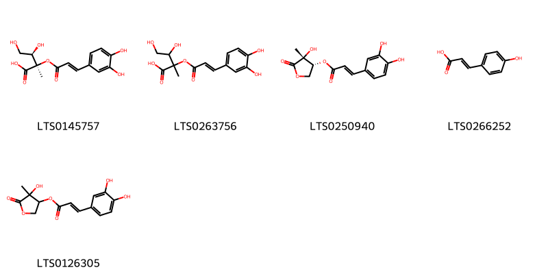
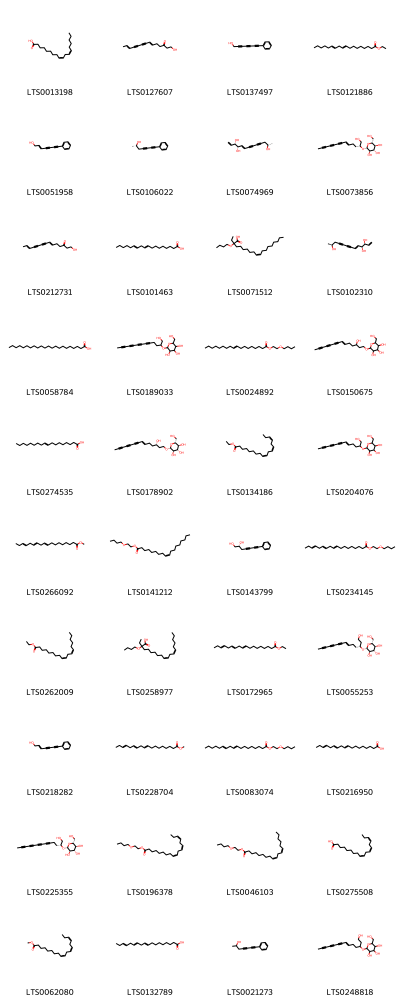
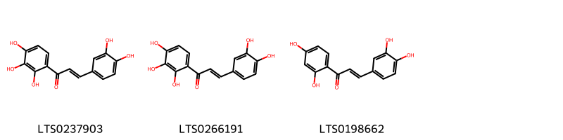
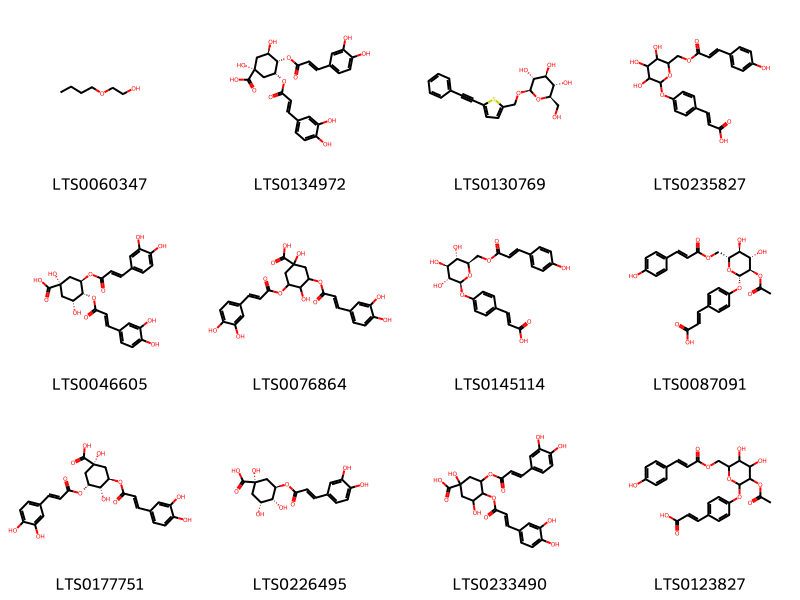
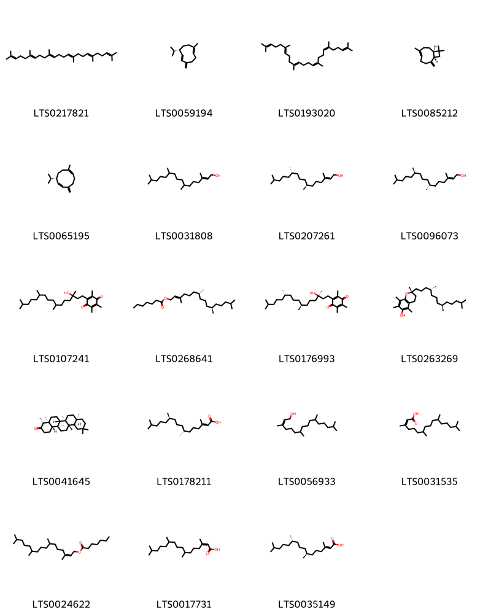

!!! abstract "Tóm tắt"

    Đơn Kim (Bidens pilosa L., họ Cúc - Asteraceae) là loài thực vật mọc hoang nhiều ở các khu vực nhiệt đới và cận nhiệt đới trên thế giới, đặc biệt phổ biến tại miền Bắc và miền Trung Việt Nam. Trong y học cổ truyền, Đơn Kim được biết đến với công năng thanh nhiệt, giải độc, tiêu thũng, hoạt huyết, sát trùng, và giảm đau. Với tính vị đắng, nhạt, hơi the và tính bình, dược liệu quy vào kinh Can và Thận, góp phần quan trọng trong điều trị nhiều bệnh lý dân gian và y học cổ truyền. Cây được sử dụng để chữa các bệnh như cảm mạo, viêm họng, đau dạ dày, tiêu chảy, lỵ, dị ứng, mày đay, và các vết thương do côn trùng hoặc rắn cắn. Lá tươi thường được giã nát để đắp chữa đau mắt, dùng tắm giảm mẩn ngứa, trong khi hoa ngâm rượu hỗ trợ chữa đau răng. Dược liệu này chứa nhiều nhóm hợp chất quan trọng như flavonoid, acetylenic, phenylpropanoid, và terpenoid, mang lại nhiều tác dụng dược lý.

## Thông tin về thực vật

Dược liệu **Đơn Kim (Lá)** từ bộ phận **** từ loài *Bidens pilosa*.

**Mô tả thực vật:** Là một loại cỏ mọc hằng năm, thân cao 0,4 - 1m. Thân và cành đều có những rãnh chạy dọc, có lông. Lá mọc đối, cuống dài, phiến lá kép gồm 3 lá chét. Lá chét hình mác, phía đáy hơi tròn, cuống ngắn, mép lá chét có răng cưa to thô. Cụm hoa hình đầu, màu vàng, mọc ở nách lá hay ở đầu cành, mọc đơn độc hay từng đôi một. Quả bế hình thoi, 3 cạnh không đều, dài 1cm, trên có rãnh chạy dọc.

*Tài liệu tham khảo:* "Những cây thuốc và vị thuốc Việt Nam" - Đỗ Tất Lợi 
Trong dược điển Việt nam, một loài được sử dụng làm dược liệu là *Bidens pilosa*.

!!! info "Phân loại thực vật của *Bidens pilosa*"
    - **Kingdom:** Plantae
    - **Phylum:** Tracheophyta
    - **Order:** Asterales
    - **Family:** Asteraceae
    - **Genus:** Bidens
    - **Species:** *Bidens pilosa*

**Phân bố trên thế giới:** Israel, Kenya, Sri Lanka, Spain, Mexico, Chinese Taipei, Rwanda, Timor-Leste, South Africa, Japan, Australia, Madagascar, Uruguay, Niue, Portugal, Brazil, Argentina, Zimbabwe, Thailand, United States of America, Italy, New Zealand, Morocco, Ecuador

**Phân bố tại Việt nam:** Không có ghi nhận ở Việt Nam

## Thông tin về dược liệu 

### Định danh

!!! info "Thông tin về tên gọi"

    - Dược liệu tiếng Việt: đơn kim
    - Dược liệu tiếng Trung:  ()
    - Dược liệu tiếng Anh: 
    - Dược liệu latin thông dụng: Herba Bidensis pilosae
    - Dược liệu latin kiểu DĐVN: *herba bidensis pilosae*
    - Dược liệu latin kiểu DĐVN: **
    - Dược liệu latin kiểu thông tư: **
    - Bộ phận dùng:  (Herba)

### Mô tả dược liệu 

- **Theo dược điển Việt nam V:** Dược liệu là những đoạn thân, cành mang lá đã cắt thành từng đoạn dài 4 cm đến 6 cm. Lá đơn, thường có 3 lá chét hình trứng, thuôn dài 3 cm đến 5 cm, rộng 1,5 cm đến 2 cm, mặt trên ráp, mép có khía răng cưa nhọn.

- **Mô tả dược liệu theo thông tư chế biến dược liệu theo phương pháp cổ truyền:** 

### Chế biến 

- **Chế biến theo dược điển việt nam V**: Chế biến Thu hái vào mùa hạ. mùa thu, cắt lấy phần trên mặt đất, rửa sạch để dùng tươi hoặc phơi, sấy khô. Trước khi dùng, rửa sạch, để ráo nước, cắt đoạn 4 cm đến 6 cm, phơi hoặc sấy khô. Sao vàng. Bảo quản Để nơi khô, thoáng mát, phòng tránh nấm mốc.

- **Chế biến theo thông tư:** 

--- 

## Thành phần hóa học

- Theo tài liệu của GS. Đỗ Tất Lợi:  1. Nhóm flavonoid 
2. Nhóm acetylenic
3. Nhóm Phenylpropanoid 
4. Nhóm terpenoid
    

**Thành phần hóa học từ loài **Bidens pilosa**

Theo cơ sở dữ liệu lotus, loài *Bidens pilosa* đã phân lập và xác định được **177** hoạt chất thuộc về các nhóm Steroids and steroid derivatives, Organooxygen compounds, Flavonoids, Fatty Acyls, Cinnamic acids and derivatives, Imidazopyrimidines, Benzopyrans, Aurone flavonoids, Carboxylic acids and derivatives, Benzene and substituted derivatives, Linear 1,3-diarylpropanoids, Prenol lipids, Thiophenes trong bảng dưới đây. Danh sách các hoạt chất như sau [3-(acetyloxy)-6-({2-[(3,4-dihydroxyphenyl)methylidene]-7-hydroxy-3-oxo-1-benzofuran-6-yl}oxy)-4,5-dihydroxyoxan-2-yl]methyl acetate [(LTS0213415)](https://lotus.naturalproducts.net/compound/lotus_id/LTS0213415), 1-(5-ethyl-6-methylheptan-2-yl)-9a,11a-dimethyl-1h,2h,3h,3ah,5h,5ah,6h,7h,8h,9h,9bh,10h,11h-cyclopenta[a]phenanthren-7-ol [(LTS0266132)](https://lotus.naturalproducts.net/compound/lotus_id/LTS0266132), [(2r,3r,4s,5r,6s)-3,5-bis(acetyloxy)-6-{[(2s)-2-(3,4-dihydroxyphenyl)-8-hydroxy-4-oxo-2,3-dihydro-1-benzopyran-7-yl]oxy}-4-hydroxyoxan-2-yl]methyl acetate [(LTS0079549)](https://lotus.naturalproducts.net/compound/lotus_id/LTS0079549), 2-butoxyethyl octadec-9-enoate [(LTS0024892)](https://lotus.naturalproducts.net/compound/lotus_id/LTS0024892), 7-{[(2s,3r,4s,5s,6r)-4,5-dihydroxy-3-{[(2s,3r,4s,5s,6r)-3,4,5-trihydroxy-6-(hydroxymethyl)oxan-2-yl]oxy}-6-({[(2r,3r,4r,5r,6s)-3,4,5-trihydroxy-6-methyloxan-2-yl]oxy}methyl)oxan-2-yl]oxy}-5-hydroxy-2-(3-hydroxy-4-methoxyphenyl)-3-methoxychromen-4-one [(LTS0160364)](https://lotus.naturalproducts.net/compound/lotus_id/LTS0160364), marein [(LTS0101507)](https://lotus.naturalproducts.net/compound/lotus_id/LTS0101507), 5-o-methylhoslundin [(LTS0029794)](https://lotus.naturalproducts.net/compound/lotus_id/LTS0029794), [(2s,3r,4s,5s,6s)-6-{4-[(2e)-3-(3,4-dihydroxyphenyl)prop-2-enoyl]-2,3-dihydroxyphenoxy}-3,4,5-trihydroxyoxan-2-yl]methyl (2e)-3-(4-hydroxyphenyl)prop-2-enoate [(LTS0106013)](https://lotus.naturalproducts.net/compound/lotus_id/LTS0106013), (2e)-1-(2,4-dihydroxy-3-{[(2s,3r,4s,5s,6r)-3,4,5-trihydroxy-6-(hydroxymethyl)oxan-2-yl]oxy}phenyl)-3-(3-hydroxy-4-methoxyphenyl)prop-2-en-1-one [(LTS0021162)](https://lotus.naturalproducts.net/compound/lotus_id/LTS0021162), 3,4-bis({[3-(3,4-dihydroxyphenyl)prop-2-enoyl]oxy})-1,5-dihydroxycyclohexane-1-carboxylic acid [(LTS0233490)](https://lotus.naturalproducts.net/compound/lotus_id/LTS0233490), fumaric acid [(LTS0114831)](https://lotus.naturalproducts.net/compound/lotus_id/LTS0114831), 1-hydroxytetradeca-6,12-dien-8,10-diyn-3-one [(LTS0127607)](https://lotus.naturalproducts.net/compound/lotus_id/LTS0127607), 3-(4-{[3-(acetyloxy)-4,5-dihydroxy-6-({[3-(4-hydroxyphenyl)prop-2-enoyl]oxy}methyl)oxan-2-yl]oxy}phenyl)prop-2-enoic acid [(LTS0123827)](https://lotus.naturalproducts.net/compound/lotus_id/LTS0123827), linoleic [(LTS0013198)](https://lotus.naturalproducts.net/compound/lotus_id/LTS0013198), para-coumaric acid [(LTS0266252)](https://lotus.naturalproducts.net/compound/lotus_id/LTS0266252), [(2s,3s,4s,5s,6s)-6-{[(2z)-2-[(3,4-dihydroxyphenyl)methylidene]-7-hydroxy-3-oxo-1-benzofuran-6-yl]oxy}-3,4,5-trihydroxyoxan-2-yl]methyl acetate [(LTS0083621)](https://lotus.naturalproducts.net/compound/lotus_id/LTS0083621), [(2r,3s,4s,5r,6s)-3,5-bis(acetyloxy)-6-{[(2s)-2-(3,4-dihydroxyphenyl)-8-hydroxy-4-oxo-2,3-dihydro-1-benzopyran-7-yl]oxy}-4-hydroxyoxan-2-yl]methyl acetate [(LTS0007914)](https://lotus.naturalproducts.net/compound/lotus_id/LTS0007914), 2-phenyl-ethanol [(LTS0206341)](https://lotus.naturalproducts.net/compound/lotus_id/LTS0206341), [(2r,3s,4s,5s,6s)-3,5-bis(acetyloxy)-6-{4-[(2e)-3-(3,4-dihydroxyphenyl)prop-2-enoyl]-2,3-dihydroxyphenoxy}-4-hydroxyoxan-2-yl]methyl acetate [(LTS0269479)](https://lotus.naturalproducts.net/compound/lotus_id/LTS0269479), [(2r,3s,4s,5r,6s)-3,5-bis(acetyloxy)-6-{4-[(2e)-3-(3,4-dihydroxyphenyl)prop-2-enoyl]-2,3-dihydroxyphenoxy}-4-hydroxyoxan-2-yl]methyl (2e)-3-(4-hydroxyphenyl)prop-2-enoate [(LTS0178724)](https://lotus.naturalproducts.net/compound/lotus_id/LTS0178724), chlorogenic acid [(LTS0226495)](https://lotus.naturalproducts.net/compound/lotus_id/LTS0226495), tocoquinone [(LTS0107241)](https://lotus.naturalproducts.net/compound/lotus_id/LTS0107241), (3β,5α)-stigmast-7-en-3-ol [(LTS0245097)](https://lotus.naturalproducts.net/compound/lotus_id/LTS0245097), [(2r,3s,4r,5r,6s)-3-(acetyloxy)-6-{4-[(2e)-3-(3,4-dihydroxyphenyl)prop-2-enoyl]-2,3-dihydroxyphenoxy}-4,5-dihydroxyoxan-2-yl]methyl acetate [(LTS0212066)](https://lotus.naturalproducts.net/compound/lotus_id/LTS0212066), (2e,7r,11r)-3,7,11,15-tetramethylhexadec-2-en-1-yl heptanoate [(LTS0268641)](https://lotus.naturalproducts.net/compound/lotus_id/LTS0268641), (6-{2,3-dihydroxy-4-[3-(4-hydroxyphenyl)prop-2-enoyl]phenoxy}-3,4,5-trihydroxyoxan-2-yl)methyl 3-(4-hydroxyphenyl)prop-2-enoate [(LTS0010158)](https://lotus.naturalproducts.net/compound/lotus_id/LTS0010158), maritimein [(LTS0140411)](https://lotus.naturalproducts.net/compound/lotus_id/LTS0140411), astragalin [(LTS0249588)](https://lotus.naturalproducts.net/compound/lotus_id/LTS0249588), 5-hydroxy-2-(3-hydroxy-4-methoxyphenyl)-3-methoxy-7-{[(2s,3s,4r,5r,6s)-3,4,5-trihydroxy-6-methyloxan-2-yl]oxy}chromen-4-one [(LTS0237941)](https://lotus.naturalproducts.net/compound/lotus_id/LTS0237941), [3-(acetyloxy)-6-{4-[3-(3,4-dihydroxyphenyl)prop-2-enoyl]-2,3-dihydroxyphenoxy}-4,5-dihydroxyoxan-2-yl]methyl 3-(4-hydroxyphenyl)prop-2-enoate [(LTS0096536)](https://lotus.naturalproducts.net/compound/lotus_id/LTS0096536), octadeca-9,12,15-trienoic acid [(LTS0216950)](https://lotus.naturalproducts.net/compound/lotus_id/LTS0216950), 7-phenylhepta-2,4,6-triyn-1-ol [(LTS0137497)](https://lotus.naturalproducts.net/compound/lotus_id/LTS0137497), luteolin [(LTS0017052)](https://lotus.naturalproducts.net/compound/lotus_id/LTS0017052), 5-hydroxy-2-(4-hydroxy-3-methoxyphenyl)-3-methoxy-7-{[(2s,3r,4s,5s,6r)-3,4,5-trihydroxy-6-({[(2r,3r,4r,5r,6s)-3,4,5-trihydroxy-6-methyloxan-2-yl]oxy}methyl)oxan-2-yl]oxy}chromen-4-one [(LTS0136761)](https://lotus.naturalproducts.net/compound/lotus_id/LTS0136761), 1-(2,3-dihydroxy-4-{[3,4,5-trihydroxy-6-({[3,4,5-trihydroxy-6-(hydroxymethyl)oxan-2-yl]oxy}methyl)oxan-2-yl]oxy}phenyl)-3-(3,4-dihydroxyphenyl)prop-2-en-1-one [(LTS0223602)](https://lotus.naturalproducts.net/compound/lotus_id/LTS0223602), 2-{[3-(3,4-dihydroxyphenyl)prop-2-enoyl]oxy}-3,4-dihydroxy-2-methylbutanoic acid [(LTS0263756)](https://lotus.naturalproducts.net/compound/lotus_id/LTS0263756), [(2r,3r,4s,5r,6s)-6-{2,3-dihydroxy-4-[(2e)-3-(4-hydroxyphenyl)prop-2-enoyl]phenoxy}-3,4,5-trihydroxyoxan-2-yl]methyl (2e)-3-(4-hydroxyphenyl)prop-2-enoate [(LTS0264999)](https://lotus.naturalproducts.net/compound/lotus_id/LTS0264999), behenic acid [(LTS0058784)](https://lotus.naturalproducts.net/compound/lotus_id/LTS0058784), 2-butoxyethyl (9z,12z)-octadeca-9,12-dienoate [(LTS0046103)](https://lotus.naturalproducts.net/compound/lotus_id/LTS0046103), (2e)-3-(4-{[(2s,3r,4s,5s,6r)-3-(acetyloxy)-4,5-dihydroxy-6-({[(2e)-3-(4-hydroxyphenyl)prop-2-enoyl]oxy}methyl)oxan-2-yl]oxy}phenyl)prop-2-enoic acid [(LTS0087091)](https://lotus.naturalproducts.net/compound/lotus_id/LTS0087091), 2-[(3,4-dihydroxyphenyl)methylidene]-6-hydroxy-7-{[3,4,5-trihydroxy-6-(hydroxymethyl)oxan-2-yl]oxy}-1-benzofuran-3-one [(LTS0159278)](https://lotus.naturalproducts.net/compound/lotus_id/LTS0159278), [(2r,3s,4s,5r,6s)-6-{[(2z)-2-[(3,4-dihydroxyphenyl)methylidene]-7-hydroxy-3-oxo-1-benzofuran-6-yl]oxy}-3,4,5-trihydroxyoxan-2-yl]methyl (2e)-3-(4-hydroxyphenyl)prop-2-enoate [(LTS0078527)](https://lotus.naturalproducts.net/compound/lotus_id/LTS0078527), 2-butoxyethyl octadeca-9,12-dienoate [(LTS0083074)](https://lotus.naturalproducts.net/compound/lotus_id/LTS0083074), vitamin e [(LTS0263269)](https://lotus.naturalproducts.net/compound/lotus_id/LTS0263269), 3,5-dicaffeoylquinic acid [(LTS0177751)](https://lotus.naturalproducts.net/compound/lotus_id/LTS0177751), 5-hydroxy-2-(3-hydroxy-4-methoxyphenyl)-3-methoxy-7-{[(2s,3r,4s,5s,6r)-3,4,5-trihydroxy-6-({[(2r,3r,4r,5r,6s)-3,4,5-trihydroxy-6-methyloxan-2-yl]oxy}methyl)oxan-2-yl]oxy}chromen-4-one [(LTS0009772)](https://lotus.naturalproducts.net/compound/lotus_id/LTS0009772), 2-butoxyethyl esteroleic acid [(LTS0141212)](https://lotus.naturalproducts.net/compound/lotus_id/LTS0141212), [(2s,3s,4r,5r,6s)-3-(acetyloxy)-6-{4-[(2e)-3-(3,4-dihydroxyphenyl)prop-2-enoyl]-2,3-dihydroxyphenoxy}-4,5-dihydroxyoxan-2-yl]methyl acetate [(LTS0057711)](https://lotus.naturalproducts.net/compound/lotus_id/LTS0057711), α linolenic acid [(LTS0132789)](https://lotus.naturalproducts.net/compound/lotus_id/LTS0132789), 5-hydroxy-2-(4-hydroxy-3-methoxyphenyl)-3-methoxy-7-{[3,4,5-trihydroxy-6-(hydroxymethyl)oxan-2-yl]oxy}chromen-4-one [(LTS0012211)](https://lotus.naturalproducts.net/compound/lotus_id/LTS0012211), (+-)-propylene glycol [(LTS0274535)](https://lotus.naturalproducts.net/compound/lotus_id/LTS0274535), precocene i [(LTS0128290)](https://lotus.naturalproducts.net/compound/lotus_id/LTS0128290), [6-({2-[(3,4-dihydroxyphenyl)methylidene]-7-hydroxy-3-oxo-1-benzofuran-6-yl}oxy)-3,4,5-trihydroxyoxan-2-yl]methyl acetate [(LTS0220730)](https://lotus.naturalproducts.net/compound/lotus_id/LTS0220730), 2-(3,4-dihydroxyphenyl)-5-hydroxy-3-methoxy-7-{[(2s,3s,4s,5s,6r)-3,4,5-trihydroxy-6-({[(2r,3r,4r,5r,6s)-3,4,5-trihydroxy-6-methyloxan-2-yl]oxy}methyl)oxan-2-yl]oxy}chromen-4-one [(LTS0132596)](https://lotus.naturalproducts.net/compound/lotus_id/LTS0132596), (9z)-2-butoxy-2-ethyloctadec-9-enoic acid [(LTS0071512)](https://lotus.naturalproducts.net/compound/lotus_id/LTS0071512), [3,5-bis(acetyloxy)-6-({2-[(3,4-dihydroxyphenyl)methylidene]-7-hydroxy-3-oxo-1-benzofuran-6-yl}oxy)-4-hydroxyoxan-2-yl]methyl acetate [(LTS0233541)](https://lotus.naturalproducts.net/compound/lotus_id/LTS0233541), 2-(3,4-dihydroxyphenyl)-5,7-dihydroxy-3-{[(2s,3r,4r,5r,6s)-3,4,5-trihydroxy-6-(hydroxymethyl)oxan-2-yl]oxy}chromen-4-one [(LTS0241372)](https://lotus.naturalproducts.net/compound/lotus_id/LTS0241372), centaurein [(LTS0088902)](https://lotus.naturalproducts.net/compound/lotus_id/LTS0088902), [3,5-bis(acetyloxy)-6-{[2-(3,4-dihydroxyphenyl)-8-hydroxy-4-oxo-2,3-dihydro-1-benzopyran-7-yl]oxy}-4-hydroxyoxan-2-yl]methyl acetate [(LTS0169244)](https://lotus.naturalproducts.net/compound/lotus_id/LTS0169244), methyl linolenate [(LTS0062080)](https://lotus.naturalproducts.net/compound/lotus_id/LTS0062080), [5-(2-phenylethynyl)thiophen-2-yl]methanol [(LTS0222876)](https://lotus.naturalproducts.net/compound/lotus_id/LTS0222876), (2r,3s,4s,5r,6r)-2-(hydroxymethyl)-6-{[(3s,6e)-3-hydroxytetradec-6-en-8,10,12-triyn-1-yl]oxy}oxane-3,4,5-triol [(LTS0178902)](https://lotus.naturalproducts.net/compound/lotus_id/LTS0178902), 7-{[(2s,3r,4s,5s,6r)-6-({[(2r,3r,4r,5r,6s)-4,5-dihydroxy-6-methyl-3-{[(2s,3r,4r,5r,6s)-3,4,5-trihydroxy-6-methyloxan-2-yl]oxy}oxan-2-yl]oxy}methyl)-3,4,5-trihydroxyoxan-2-yl]oxy}-5-hydroxy-2-(3-hydroxy-4-methoxyphenyl)-3-methoxychromen-4-one [(LTS0067656)](https://lotus.naturalproducts.net/compound/lotus_id/LTS0067656), (2e)-3-(4-{[(2s,3r,4s,5s,6r)-3,4,5-trihydroxy-6-({[(2e)-3-(4-hydroxyphenyl)prop-2-enoyl]oxy}methyl)oxan-2-yl]oxy}phenyl)prop-2-enoic acid [(LTS0145114)](https://lotus.naturalproducts.net/compound/lotus_id/LTS0145114), 2-(3,4-dihydroxyphenyl)-5-hydroxy-3,6-dimethoxy-7-{[3,4,5-trihydroxy-6-(hydroxymethyl)oxan-2-yl]oxy}chromen-4-one [(LTS0210742)](https://lotus.naturalproducts.net/compound/lotus_id/LTS0210742), 5-hydroxy-2-(4-hydroxy-3-methoxyphenyl)-3,6-dimethoxy-7-{[3,4,5-trihydroxy-6-(hydroxymethyl)oxan-2-yl]oxy}chromen-4-one [(LTS0189681)](https://lotus.naturalproducts.net/compound/lotus_id/LTS0189681), 3,7,11,15-tetramethylhexadec-2-en-1-yl heptanoate [(LTS0024622)](https://lotus.naturalproducts.net/compound/lotus_id/LTS0024622), (1z,6z,8s)-8-isopropyl-1-methyl-5-methylidenecyclodeca-1,6-diene [(LTS0065195)](https://lotus.naturalproducts.net/compound/lotus_id/LTS0065195), (2s)-7-phenylhepta-4,6-diyn-2-ol [(LTS0106022)](https://lotus.naturalproducts.net/compound/lotus_id/LTS0106022), 5-hydroxy-2-(4-hydroxy-3-methoxyphenyl)-3-methoxy-7-{[(2s,3r,4s,5s,6r)-3,4,5-trihydroxy-6-(hydroxymethyl)oxan-2-yl]oxy}chromen-4-one [(LTS0208205)](https://lotus.naturalproducts.net/compound/lotus_id/LTS0208205), marein [(LTS0240680)](https://lotus.naturalproducts.net/compound/lotus_id/LTS0240680), 1-(5-ethyl-6-methylhept-3-en-2-yl)-9a,11a-dimethyl-1h,2h,3h,3ah,5h,5ah,6h,7h,8h,9h,9bh,10h,11h-cyclopenta[a]phenanthren-7-ol [(LTS0173223)](https://lotus.naturalproducts.net/compound/lotus_id/LTS0173223), [(2r,3s,4s,5r,6s)-6-{2,3-dihydroxy-4-[(2e)-3-(4-hydroxyphenyl)prop-2-enoyl]phenoxy}-3,4,5-trihydroxyoxan-2-yl]methyl (2e)-3-(4-hydroxyphenyl)prop-2-enoate [(LTS0029943)](https://lotus.naturalproducts.net/compound/lotus_id/LTS0029943), (2r)-7-phenylhepta-4,6-diyne-1,2-diol [(LTS0143799)](https://lotus.naturalproducts.net/compound/lotus_id/LTS0143799), phytol [(LTS0096073)](https://lotus.naturalproducts.net/compound/lotus_id/LTS0096073), butein [(LTS0198662)](https://lotus.naturalproducts.net/compound/lotus_id/LTS0198662), ethyl linoleate [(LTS0262009)](https://lotus.naturalproducts.net/compound/lotus_id/LTS0262009), 7-phenylhept-2-en-4,6-diyn-1-ol [(LTS0051958)](https://lotus.naturalproducts.net/compound/lotus_id/LTS0051958), hept-1,3-diyn-5-enylbenzene [(LTS0111287)](https://lotus.naturalproducts.net/compound/lotus_id/LTS0111287), sulfuretin [(LTS0129620)](https://lotus.naturalproducts.net/compound/lotus_id/LTS0129620), phenylheptatriyne [(LTS0159313)](https://lotus.naturalproducts.net/compound/lotus_id/LTS0159313), hept-1,3-diyn-5-enylbenzene [(LTS0236377)](https://lotus.naturalproducts.net/compound/lotus_id/LTS0236377), 2-[(3r,7s,11s)-3-hydroxy-3,7,11,15-tetramethylhexadecyl]-3,5,6-trimethylcyclohexa-2,5-diene-1,4-dione [(LTS0176993)](https://lotus.naturalproducts.net/compound/lotus_id/LTS0176993), [3-(acetyloxy)-6-{4-[3-(3,4-dihydroxyphenyl)prop-2-enoyl]-2,3-dihydroxyphenoxy}-4,5-dihydroxyoxan-2-yl]methyl acetate [(LTS0260390)](https://lotus.naturalproducts.net/compound/lotus_id/LTS0260390), 4-hydroxy-4-methyl-5-oxooxolan-3-yl 3-(3,4-dihydroxyphenyl)prop-2-enoate [(LTS0126305)](https://lotus.naturalproducts.net/compound/lotus_id/LTS0126305), (3r,4r)-4-hydroxy-4-methyl-5-oxooxolan-3-yl (2e)-3-(3,4-dihydroxyphenyl)prop-2-enoate [(LTS0250940)](https://lotus.naturalproducts.net/compound/lotus_id/LTS0250940), stigmast-5-en-3-ol, (3β)- [(LTS0204616)](https://lotus.naturalproducts.net/compound/lotus_id/LTS0204616), rutin [(LTS0042292)](https://lotus.naturalproducts.net/compound/lotus_id/LTS0042292), succinic acid [(LTS0237204)](https://lotus.naturalproducts.net/compound/lotus_id/LTS0237204), butoxyethanol [(LTS0060347)](https://lotus.naturalproducts.net/compound/lotus_id/LTS0060347), 1-(2,4-dihydroxy-3-{[3,4,5-trihydroxy-6-(hydroxymethyl)oxan-2-yl]oxy}phenyl)-3-(3,4-dihydroxyphenyl)prop-2-en-1-one [(LTS0176318)](https://lotus.naturalproducts.net/compound/lotus_id/LTS0176318), (2r,3s,4s,5r,6r)-2-(hydroxymethyl)-6-{[(3r,6e)-1-hydroxytetradec-6-en-8,10,12-triyn-3-yl]oxy}oxane-3,4,5-triol [(LTS0055253)](https://lotus.naturalproducts.net/compound/lotus_id/LTS0055253), 2-butoxyethyl octadeca-9,12,15-trienoate [(LTS0234145)](https://lotus.naturalproducts.net/compound/lotus_id/LTS0234145), 7-({6-[({4,5-dihydroxy-6-methyl-3-[(3,4,5-trihydroxy-6-methyloxan-2-yl)oxy]oxan-2-yl}oxy)methyl]-3,4,5-trihydroxyoxan-2-yl}oxy)-5-hydroxy-2-(3-hydroxy-4-methoxyphenyl)-3-methoxychromen-4-one [(LTS0096599)](https://lotus.naturalproducts.net/compound/lotus_id/LTS0096599), 2-(3,4-dihydroxyphenyl)-5-hydroxy-3,6-dimethoxy-7-{[(2s,3r,4s,5s,6r)-3,4,5-trihydroxy-6-(hydroxymethyl)oxan-2-yl]oxy}chromen-4-one [(LTS0200026)](https://lotus.naturalproducts.net/compound/lotus_id/LTS0200026), ethyl octadeca-9,12-dienoate [(LTS0121886)](https://lotus.naturalproducts.net/compound/lotus_id/LTS0121886), 2-(hydroxymethyl)-6-[(1-hydroxytrideca-5,7,9,11-tetrayn-2-yl)oxy]oxane-3,4,5-triol [(LTS0189033)](https://lotus.naturalproducts.net/compound/lotus_id/LTS0189033), 3-(4-{[3,4,5-trihydroxy-6-({[3-(4-hydroxyphenyl)prop-2-enoyl]oxy}methyl)oxan-2-yl]oxy}phenyl)prop-2-enoic acid [(LTS0235827)](https://lotus.naturalproducts.net/compound/lotus_id/LTS0235827), [6-({2-[(3,4-dihydroxyphenyl)methylidene]-7-hydroxy-3-oxo-1-benzofuran-6-yl}oxy)-3,4,5-trihydroxyoxan-2-yl]methyl 3-(4-hydroxyphenyl)prop-2-enoate [(LTS0102677)](https://lotus.naturalproducts.net/compound/lotus_id/LTS0102677), (9z,12z)-2-butoxy-2-ethyloctadeca-9,12-dienoic acid [(LTS0258977)](https://lotus.naturalproducts.net/compound/lotus_id/LTS0258977), (2e)-1-(2,3-dihydroxy-4-{[(2s,3r,4s,5s,6r)-3,4,5-trihydroxy-6-({[(2r,3r,4s,5s,6r)-3,4,5-trihydroxy-6-(hydroxymethyl)oxan-2-yl]oxy}methyl)oxan-2-yl]oxy}phenyl)-3-(3,4-dihydroxyphenyl)prop-2-en-1-one [(LTS0000822)](https://lotus.naturalproducts.net/compound/lotus_id/LTS0000822), 3-rutinosyl quercetin [(LTS0032845)](https://lotus.naturalproducts.net/compound/lotus_id/LTS0032845), 9,12-octadecadienoic acid [(LTS0101463)](https://lotus.naturalproducts.net/compound/lotus_id/LTS0101463), phytic acid [(LTS0178211)](https://lotus.naturalproducts.net/compound/lotus_id/LTS0178211), 5-hydroxy-2-(4-hydroxy-3-methoxyphenyl)-3,6-dimethoxy-7-{[(2s,3r,4s,5s,6r)-3,4,5-trihydroxy-6-(hydroxymethyl)oxan-2-yl]oxy}chromen-4-one [(LTS0120932)](https://lotus.naturalproducts.net/compound/lotus_id/LTS0120932), quercetin [(LTS0004651)](https://lotus.naturalproducts.net/compound/lotus_id/LTS0004651), okanin [(LTS0237903)](https://lotus.naturalproducts.net/compound/lotus_id/LTS0237903), stigmast-5-en-3-ol [(LTS0071224)](https://lotus.naturalproducts.net/compound/lotus_id/LTS0071224), ethyl octadeca-9,12,15-trienoate [(LTS0172965)](https://lotus.naturalproducts.net/compound/lotus_id/LTS0172965), caffeine [(LTS0075508)](https://lotus.naturalproducts.net/compound/lotus_id/LTS0075508), 3-(3,4-dihydroxyphenyl)-1-[2-hydroxy-3,4-bis({[3,4,5-trihydroxy-6-(hydroxymethyl)oxan-2-yl]oxy})phenyl]prop-2-en-1-one [(LTS0004254)](https://lotus.naturalproducts.net/compound/lotus_id/LTS0004254), [(2r,3s,4s,5r,6s)-6-{4-[(2e)-3-(3,4-dihydroxyphenyl)prop-2-enoyl]-2,3-dihydroxyphenoxy}-3,4,5-trihydroxyoxan-2-yl]methyl acetate [(LTS0163632)](https://lotus.naturalproducts.net/compound/lotus_id/LTS0163632), (2s,8e,10s,11s)-trideca-8,12-dien-4,6-diyne-2,10,11-triol [(LTS0074969)](https://lotus.naturalproducts.net/compound/lotus_id/LTS0074969), (2e)-3-(3,4-dihydroxyphenyl)-1-[2-hydroxy-3,4-bis({[(2s,3r,4s,5s,6r)-3,4,5-trihydroxy-6-(hydroxymethyl)oxan-2-yl]oxy})phenyl]prop-2-en-1-one [(LTS0130121)](https://lotus.naturalproducts.net/compound/lotus_id/LTS0130121), 2-(hydroxymethyl)-6-[(1-hydroxytridec-5-en-7,9,11-triyn-2-yl)oxy]oxane-3,4,5-triol [(LTS0204076)](https://lotus.naturalproducts.net/compound/lotus_id/LTS0204076), 2-(hydroxymethyl)-6-[(1-hydroxytetradec-6-en-8,10,12-triyn-3-yl)oxy]oxane-3,4,5-triol [(LTS0248818)](https://lotus.naturalproducts.net/compound/lotus_id/LTS0248818), (2e,7s,11s)-3,7,11,15-tetramethylhexadec-2-en-1-ol [(LTS0207261)](https://lotus.naturalproducts.net/compound/lotus_id/LTS0207261), chondrillasterol [(LTS0142259)](https://lotus.naturalproducts.net/compound/lotus_id/LTS0142259), (2e,7s,11s)-3,7,11,15-tetramethylhexadec-2-enoic acid [(LTS0035149)](https://lotus.naturalproducts.net/compound/lotus_id/LTS0035149), [(2r,3s,4s,5r,6s)-6-{[(2z)-2-[(3,4-dihydroxyphenyl)methylidene]-7-hydroxy-3-oxo-1-benzofuran-6-yl]oxy}-3,4,5-trihydroxyoxan-2-yl]methyl acetate [(LTS0154552)](https://lotus.naturalproducts.net/compound/lotus_id/LTS0154552), okanin [(LTS0266191)](https://lotus.naturalproducts.net/compound/lotus_id/LTS0266191), 7-phenylhepta-4,6-diyn-2-ol [(LTS0021273)](https://lotus.naturalproducts.net/compound/lotus_id/LTS0021273), (2r,3s,4s,5r,6r)-2-(hydroxymethyl)-6-{[(2r)-1-hydroxytrideca-5,7,9,11-tetrayn-2-yl]oxy}oxane-3,4,5-triol [(LTS0225355)](https://lotus.naturalproducts.net/compound/lotus_id/LTS0225355), phytol [(LTS0031808)](https://lotus.naturalproducts.net/compound/lotus_id/LTS0031808), vanillic acid [(LTS0229113)](https://lotus.naturalproducts.net/compound/lotus_id/LTS0229113), [(2s,3r,4r,5r,6s)-3,4-bis(acetyloxy)-6-{[(2z)-2-[(3,4-dihydroxyphenyl)methylidene]-7-hydroxy-3-oxo-1-benzofuran-6-yl]oxy}-5-hydroxyoxan-2-yl]methyl acetate [(LTS0099982)](https://lotus.naturalproducts.net/compound/lotus_id/LTS0099982), okanin 3'-glucoside [(LTS0107318)](https://lotus.naturalproducts.net/compound/lotus_id/LTS0107318), chamomile [(LTS0104946)](https://lotus.naturalproducts.net/compound/lotus_id/LTS0104946), caryophyllene [(LTS0085212)](https://lotus.naturalproducts.net/compound/lotus_id/LTS0085212), 2-(3,4-dihydroxyphenyl)-5-hydroxy-3-methoxy-7-{[(2s,3r,4s,5r,6s)-3,4,5-trihydroxy-6-methyloxan-2-yl]oxy}chromen-4-one [(LTS0112734)](https://lotus.naturalproducts.net/compound/lotus_id/LTS0112734), (2r,3r)-2-{[(2e)-3-(3,4-dihydroxyphenyl)prop-2-enoyl]oxy}-3,4-dihydroxy-2-methylbutanoic acid [(LTS0145757)](https://lotus.naturalproducts.net/compound/lotus_id/LTS0145757), jaceidin [(LTS0240034)](https://lotus.naturalproducts.net/compound/lotus_id/LTS0240034), phytosterol [(LTS0029311)](https://lotus.naturalproducts.net/compound/lotus_id/LTS0029311), [(2r,3s,4r,5r,6s)-3-(acetyloxy)-6-{[(2z)-2-[(3,4-dihydroxyphenyl)methylidene]-7-hydroxy-3-oxo-1-benzofuran-6-yl]oxy}-4,5-dihydroxyoxan-2-yl]methyl acetate [(LTS0269439)](https://lotus.naturalproducts.net/compound/lotus_id/LTS0269439), (6e,12e)-1-hydroxytetradeca-6,12-dien-8,10-diyn-3-one [(LTS0212731)](https://lotus.naturalproducts.net/compound/lotus_id/LTS0212731), [(2r,3r,4r,5r,6s)-3,4-bis(acetyloxy)-6-{[(2z)-2-[(3,4-dihydroxyphenyl)methylidene]-7-hydroxy-3-oxo-1-benzofuran-6-yl]oxy}-5-hydroxyoxan-2-yl]methyl acetate [(LTS0107725)](https://lotus.naturalproducts.net/compound/lotus_id/LTS0107725), (2z)-2-[(3,4-dihydroxyphenyl)methylidene]-6-hydroxy-7-{[(2s,3r,4s,5s,6r)-3,4,5-trihydroxy-6-(hydroxymethyl)oxan-2-yl]oxy}-1-benzofuran-3-one [(LTS0230791)](https://lotus.naturalproducts.net/compound/lotus_id/LTS0230791), (2r,3s,4s,5r,6r)-2-(hydroxymethyl)-6-{[5-(2-phenylethynyl)thiophen-2-yl]methoxy}oxane-3,4,5-triol [(LTS0130769)](https://lotus.naturalproducts.net/compound/lotus_id/LTS0130769), (2e)-7-phenylhept-2-en-4,6-diyn-1-ol [(LTS0218282)](https://lotus.naturalproducts.net/compound/lotus_id/LTS0218282), [(2r,3r,4r,5r,6s)-3,4-bis(acetyloxy)-6-{4-[(2e)-3-(3,4-dihydroxyphenyl)prop-2-enoyl]-2,3-dihydroxyphenoxy}-5-hydroxyoxan-2-yl]methyl acetate [(LTS0188176)](https://lotus.naturalproducts.net/compound/lotus_id/LTS0188176), [(2r,3r,4r,5r,6s)-3,4-bis(acetyloxy)-6-{4-[(2e)-3-(3,4-dihydroxyphenyl)prop-2-enoyl]-2,3-dihydroxyphenoxy}-5-hydroxyoxan-2-yl]methyl (2e)-3-(4-hydroxyphenyl)prop-2-enoate [(LTS0121162)](https://lotus.naturalproducts.net/compound/lotus_id/LTS0121162), 3,7,11,15-tetramethylhexadec-2-enoic acid [(LTS0031535)](https://lotus.naturalproducts.net/compound/lotus_id/LTS0031535), (-)-germacrene d [(LTS0059194)](https://lotus.naturalproducts.net/compound/lotus_id/LTS0059194), (-)-friedelin [(LTS0041645)](https://lotus.naturalproducts.net/compound/lotus_id/LTS0041645), 5-hydroxy-2-(3-hydroxy-4-methoxyphenyl)-3-methoxy-7-{[(2s,3s,4s,5s,6r)-3,4,5-trihydroxy-6-({[(2r,3r,4r,5r,6s)-3,4,5-trihydroxy-6-methyloxan-2-yl]oxy}methyl)oxan-2-yl]oxy}chromen-4-one [(LTS0237166)](https://lotus.naturalproducts.net/compound/lotus_id/LTS0237166), 3,7,11,15-tetramethylhexadec-2-en-1-ol [(LTS0056933)](https://lotus.naturalproducts.net/compound/lotus_id/LTS0056933), 7-[(4,5-dihydroxy-3-{[3,4,5-trihydroxy-6-(hydroxymethyl)oxan-2-yl]oxy}-6-{[(3,4,5-trihydroxy-6-methyloxan-2-yl)oxy]methyl}oxan-2-yl)oxy]-5-hydroxy-2-(3-hydroxy-4-methoxyphenyl)-3-methoxychromen-4-one [(LTS0173615)](https://lotus.naturalproducts.net/compound/lotus_id/LTS0173615), 4,5-dicaffeoylquinic acid [(LTS0046605)](https://lotus.naturalproducts.net/compound/lotus_id/LTS0046605), [3,4-bis(acetyloxy)-6-{4-[3-(3,4-dihydroxyphenyl)prop-2-enoyl]-2,3-dihydroxyphenoxy}-5-hydroxyoxan-2-yl]methyl acetate [(LTS0152583)](https://lotus.naturalproducts.net/compound/lotus_id/LTS0152583), 2-(3,4-dihydroxyphenyl)-5-hydroxy-3-methoxy-7-[(3,4,5-trihydroxy-6-{[(3,4,5-trihydroxy-6-methyloxan-2-yl)oxy]methyl}oxan-2-yl)oxy]chromen-4-one [(LTS0152352)](https://lotus.naturalproducts.net/compound/lotus_id/LTS0152352), jacein [(LTS0234738)](https://lotus.naturalproducts.net/compound/lotus_id/LTS0234738), 5-hydroxy-2-(4-hydroxy-3-methoxyphenyl)-3,7-dimethoxy-6-{[(2s,3r,4s,5s,6r)-3,4,5-trihydroxy-6-(hydroxymethyl)oxan-2-yl]oxy}chromen-4-one [(LTS0090992)](https://lotus.naturalproducts.net/compound/lotus_id/LTS0090992), [(2r,3s,4r,5r,6s)-3-(acetyloxy)-6-{4-[(2e)-3-(3,4-dihydroxyphenyl)prop-2-enoyl]-2,3-dihydroxyphenoxy}-4,5-dihydroxyoxan-2-yl]methyl (2e)-3-(4-hydroxyphenyl)prop-2-enoate [(LTS0156759)](https://lotus.naturalproducts.net/compound/lotus_id/LTS0156759), (2e)-1-(2,4-dihydroxy-3-{[(2s,3r,4s,5s,6r)-3,4,5-trihydroxy-6-(hydroxymethyl)oxan-2-yl]oxy}phenyl)-3-(3,4-dihydroxyphenyl)prop-2-en-1-one [(LTS0219500)](https://lotus.naturalproducts.net/compound/lotus_id/LTS0219500), 3,5-bis({[3-(3,4-dihydroxyphenyl)prop-2-enoyl]oxy})-1,4-dihydroxycyclohexane-1-carboxylic acid [(LTS0076864)](https://lotus.naturalproducts.net/compound/lotus_id/LTS0076864), ethyl linolenate [(LTS0134186)](https://lotus.naturalproducts.net/compound/lotus_id/LTS0134186), [3,4-bis(acetyloxy)-6-({2-[(3,4-dihydroxyphenyl)methylidene]-7-hydroxy-3-oxo-1-benzofuran-6-yl}oxy)-5-hydroxyoxan-2-yl]methyl acetate [(LTS0108921)](https://lotus.naturalproducts.net/compound/lotus_id/LTS0108921), methyl octadeca-9,12,15-trienoate [(LTS0228704)](https://lotus.naturalproducts.net/compound/lotus_id/LTS0228704), α-linolenic acid [(LTS0275508)](https://lotus.naturalproducts.net/compound/lotus_id/LTS0275508), 2-butoxyethyl (9z,12z,15z)-octadeca-9,12,15-trienoate [(LTS0196378)](https://lotus.naturalproducts.net/compound/lotus_id/LTS0196378), methyl elaidolinolenate [(LTS0266092)](https://lotus.naturalproducts.net/compound/lotus_id/LTS0266092), 2,6,10,15,19,23-hexamethyltetracosa-2,6,10,14,18,22-hexaene [(LTS0193020)](https://lotus.naturalproducts.net/compound/lotus_id/LTS0193020), 2-(hydroxymethyl)-6-[(3-hydroxytetradec-6-en-8,10,12-triyn-1-yl)oxy]oxane-3,4,5-triol [(LTS0150675)](https://lotus.naturalproducts.net/compound/lotus_id/LTS0150675), [4-(acetyloxy)-6-{4-[3-(3,4-dihydroxyphenyl)prop-2-enoyl]-2,3-dihydroxyphenoxy}-3,5-dihydroxyoxan-2-yl]methyl acetate [(LTS0145586)](https://lotus.naturalproducts.net/compound/lotus_id/LTS0145586), (2s,10s,11s)-trideca-8,12-dien-4,6-diyne-2,10,11-triol [(LTS0102310)](https://lotus.naturalproducts.net/compound/lotus_id/LTS0102310), 5-hydroxy-2-(4-hydroxy-3-methoxyphenyl)-3-methoxy-7-{[(2s,3s,4s,5r,6s)-3,4,5-trihydroxy-6-({[(2r,3s,4r,5r,6s)-3,4,5-trihydroxy-6-methyloxan-2-yl]oxy}methyl)oxan-2-yl]oxy}chromen-4-one [(LTS0065452)](https://lotus.naturalproducts.net/compound/lotus_id/LTS0065452), [(2r,3s,4s,5r,6s)-3,5-bis(acetyloxy)-6-{[(2z)-2-[(3,4-dihydroxyphenyl)methylidene]-7-hydroxy-3-oxo-1-benzofuran-6-yl]oxy}-4-hydroxyoxan-2-yl]methyl acetate [(LTS0162260)](https://lotus.naturalproducts.net/compound/lotus_id/LTS0162260), [(2r,3r,4s,5r,6s)-4-(acetyloxy)-6-{4-[(2e)-3-(3,4-dihydroxyphenyl)prop-2-enoyl]-2,3-dihydroxyphenoxy}-3,5-dihydroxyoxan-2-yl]methyl acetate [(LTS0195223)](https://lotus.naturalproducts.net/compound/lotus_id/LTS0195223), 3,4-dicaffeoylquinic acid [(LTS0134972)](https://lotus.naturalproducts.net/compound/lotus_id/LTS0134972), squalene [(LTS0217821)](https://lotus.naturalproducts.net/compound/lotus_id/LTS0217821), (2r,3s,4s,5r,6r)-2-(hydroxymethyl)-6-{[(2r,5e)-1-hydroxytridec-5-en-7,9,11-triyn-2-yl]oxy}oxane-3,4,5-triol [(LTS0073856)](https://lotus.naturalproducts.net/compound/lotus_id/LTS0073856), [(2r,3r,4s,5s,6s)-6-{[(2z)-2-[(3,4-dihydroxyphenyl)methylidene]-7-hydroxy-3-oxo-1-benzofuran-6-yl]oxy}-3,4,5-trihydroxyoxan-2-yl]methyl (2e)-3-(4-hydroxyphenyl)prop-2-enoate [(LTS0084487)](https://lotus.naturalproducts.net/compound/lotus_id/LTS0084487), (6-{4-[3-(3,4-dihydroxyphenyl)prop-2-enoyl]-2,3-dihydroxyphenoxy}-3,4,5-trihydroxyoxan-2-yl)methyl acetate [(LTS0100971)](https://lotus.naturalproducts.net/compound/lotus_id/LTS0100971), phytenoic acid [(LTS0017731)](https://lotus.naturalproducts.net/compound/lotus_id/LTS0017731), 1-(2,4-dihydroxy-3-{[3,4,5-trihydroxy-6-(hydroxymethyl)oxan-2-yl]oxy}phenyl)-3-(3-hydroxy-4-methoxyphenyl)prop-2-en-1-one [(LTS0251897)](https://lotus.naturalproducts.net/compound/lotus_id/LTS0251897), 5-hydroxy-2-(4-hydroxy-3-methoxyphenyl)-3-methoxy-7-[(3,4,5-trihydroxy-6-{[(3,4,5-trihydroxy-6-methyloxan-2-yl)oxy]methyl}oxan-2-yl)oxy]chromen-4-one [(LTS0162966)](https://lotus.naturalproducts.net/compound/lotus_id/LTS0162966), 5-hydroxy-2-(3-hydroxy-4-methoxyphenyl)-3-methoxy-7-[(3,4,5-trihydroxy-6-{[(3,4,5-trihydroxy-6-methyloxan-2-yl)oxy]methyl}oxan-2-yl)oxy]chromen-4-one [(LTS0149191)](https://lotus.naturalproducts.net/compound/lotus_id/LTS0149191). 
        
| chemicalTaxonomyClassyfireClass     |   smiles_count |
|:------------------------------------|---------------:|
| Aurone flavonoids                   |            174 |
| Benzene and substituted derivatives |             86 |
| Benzopyrans                         |             25 |
| Carboxylic acids and derivatives    |             31 |
| Cinnamic acids and derivatives      |            198 |
| Fatty Acyls                         |           1383 |
| Flavonoids                          |           6553 |
| Imidazopyrimidines                  |             26 |
| Linear 1,3-diarylpropanoids         |            112 |
| Organooxygen compounds              |            834 |
| Prenol lipids                       |            883 |
| Steroids and steroid derivatives    |            495 |
| Thiophenes                          |             22 |

            
### Nhóm Aurone flavonoids
<figure markdown="span">
    { width=100% }
<figcaption>Hình ảnh cấu trúc hóa học của hoạt chất thuộc nhóm *Aurone flavonoids*. Tên thường gọi của các hoạt chất tương ứng là sulfuretin [(LTS0129620)](https://lotus.naturalproducts.net/compound/lotus_id/LTS0129620), 2-[(3,4-dihydroxyphenyl)methylidene]-6-hydroxy-7-{[3,4,5-trihydroxy-6-(hydroxymethyl)oxan-2-yl]oxy}-1-benzofuran-3-one [(LTS0159278)](https://lotus.naturalproducts.net/compound/lotus_id/LTS0159278), (2z)-2-[(3,4-dihydroxyphenyl)methylidene]-6-hydroxy-7-{[(2s,3r,4s,5s,6r)-3,4,5-trihydroxy-6-(hydroxymethyl)oxan-2-yl]oxy}-1-benzofuran-3-one [(LTS0230791)](https://lotus.naturalproducts.net/compound/lotus_id/LTS0230791).</figcaption>
</figure>

            
            
### Nhóm Aurone flavonoids
<figure markdown="span">
    { width=100% }
<figcaption>Hình ảnh cấu trúc hóa học của hoạt chất thuộc nhóm *Aurone flavonoids*. Tên thường gọi của các hoạt chất tương ứng là sulfuretin [(LTS0129620)](https://lotus.naturalproducts.net/compound/lotus_id/LTS0129620), 2-[(3,4-dihydroxyphenyl)methylidene]-6-hydroxy-7-{[3,4,5-trihydroxy-6-(hydroxymethyl)oxan-2-yl]oxy}-1-benzofuran-3-one [(LTS0159278)](https://lotus.naturalproducts.net/compound/lotus_id/LTS0159278), (2z)-2-[(3,4-dihydroxyphenyl)methylidene]-6-hydroxy-7-{[(2s,3r,4s,5s,6r)-3,4,5-trihydroxy-6-(hydroxymethyl)oxan-2-yl]oxy}-1-benzofuran-3-one [(LTS0230791)](https://lotus.naturalproducts.net/compound/lotus_id/LTS0230791).</figcaption>
</figure>

### Nhóm Benzene and substituted derivatives
<figure markdown="span">
    { width=100% }
<figcaption>Hình ảnh cấu trúc hóa học của hoạt chất thuộc nhóm *Benzene and substituted derivatives*. Tên thường gọi của các hoạt chất tương ứng là phenylheptatriyne [(LTS0159313)](https://lotus.naturalproducts.net/compound/lotus_id/LTS0159313), hept-1,3-diyn-5-enylbenzene [(LTS0236377)](https://lotus.naturalproducts.net/compound/lotus_id/LTS0236377), 2-phenyl-ethanol [(LTS0206341)](https://lotus.naturalproducts.net/compound/lotus_id/LTS0206341), hept-1,3-diyn-5-enylbenzene [(LTS0111287)](https://lotus.naturalproducts.net/compound/lotus_id/LTS0111287), vanillic acid [(LTS0229113)](https://lotus.naturalproducts.net/compound/lotus_id/LTS0229113).</figcaption>
</figure>

            
            
### Nhóm Aurone flavonoids
<figure markdown="span">
    { width=100% }
<figcaption>Hình ảnh cấu trúc hóa học của hoạt chất thuộc nhóm *Aurone flavonoids*. Tên thường gọi của các hoạt chất tương ứng là sulfuretin [(LTS0129620)](https://lotus.naturalproducts.net/compound/lotus_id/LTS0129620), 2-[(3,4-dihydroxyphenyl)methylidene]-6-hydroxy-7-{[3,4,5-trihydroxy-6-(hydroxymethyl)oxan-2-yl]oxy}-1-benzofuran-3-one [(LTS0159278)](https://lotus.naturalproducts.net/compound/lotus_id/LTS0159278), (2z)-2-[(3,4-dihydroxyphenyl)methylidene]-6-hydroxy-7-{[(2s,3r,4s,5s,6r)-3,4,5-trihydroxy-6-(hydroxymethyl)oxan-2-yl]oxy}-1-benzofuran-3-one [(LTS0230791)](https://lotus.naturalproducts.net/compound/lotus_id/LTS0230791).</figcaption>
</figure>

### Nhóm Benzene and substituted derivatives
<figure markdown="span">
    { width=100% }
<figcaption>Hình ảnh cấu trúc hóa học của hoạt chất thuộc nhóm *Benzene and substituted derivatives*. Tên thường gọi của các hoạt chất tương ứng là phenylheptatriyne [(LTS0159313)](https://lotus.naturalproducts.net/compound/lotus_id/LTS0159313), hept-1,3-diyn-5-enylbenzene [(LTS0236377)](https://lotus.naturalproducts.net/compound/lotus_id/LTS0236377), 2-phenyl-ethanol [(LTS0206341)](https://lotus.naturalproducts.net/compound/lotus_id/LTS0206341), hept-1,3-diyn-5-enylbenzene [(LTS0111287)](https://lotus.naturalproducts.net/compound/lotus_id/LTS0111287), vanillic acid [(LTS0229113)](https://lotus.naturalproducts.net/compound/lotus_id/LTS0229113).</figcaption>
</figure>

### Nhóm Benzopyrans
<figure markdown="span">
    { width=100% }
<figcaption>Hình ảnh cấu trúc hóa học của hoạt chất thuộc nhóm *Benzopyrans*. Tên thường gọi của các hoạt chất tương ứng là precocene i [(LTS0128290)](https://lotus.naturalproducts.net/compound/lotus_id/LTS0128290).</figcaption>
</figure>

            
            
### Nhóm Aurone flavonoids
<figure markdown="span">
    { width=100% }
<figcaption>Hình ảnh cấu trúc hóa học của hoạt chất thuộc nhóm *Aurone flavonoids*. Tên thường gọi của các hoạt chất tương ứng là sulfuretin [(LTS0129620)](https://lotus.naturalproducts.net/compound/lotus_id/LTS0129620), 2-[(3,4-dihydroxyphenyl)methylidene]-6-hydroxy-7-{[3,4,5-trihydroxy-6-(hydroxymethyl)oxan-2-yl]oxy}-1-benzofuran-3-one [(LTS0159278)](https://lotus.naturalproducts.net/compound/lotus_id/LTS0159278), (2z)-2-[(3,4-dihydroxyphenyl)methylidene]-6-hydroxy-7-{[(2s,3r,4s,5s,6r)-3,4,5-trihydroxy-6-(hydroxymethyl)oxan-2-yl]oxy}-1-benzofuran-3-one [(LTS0230791)](https://lotus.naturalproducts.net/compound/lotus_id/LTS0230791).</figcaption>
</figure>

### Nhóm Benzene and substituted derivatives
<figure markdown="span">
    { width=100% }
<figcaption>Hình ảnh cấu trúc hóa học của hoạt chất thuộc nhóm *Benzene and substituted derivatives*. Tên thường gọi của các hoạt chất tương ứng là phenylheptatriyne [(LTS0159313)](https://lotus.naturalproducts.net/compound/lotus_id/LTS0159313), hept-1,3-diyn-5-enylbenzene [(LTS0236377)](https://lotus.naturalproducts.net/compound/lotus_id/LTS0236377), 2-phenyl-ethanol [(LTS0206341)](https://lotus.naturalproducts.net/compound/lotus_id/LTS0206341), hept-1,3-diyn-5-enylbenzene [(LTS0111287)](https://lotus.naturalproducts.net/compound/lotus_id/LTS0111287), vanillic acid [(LTS0229113)](https://lotus.naturalproducts.net/compound/lotus_id/LTS0229113).</figcaption>
</figure>

### Nhóm Benzopyrans
<figure markdown="span">
    { width=100% }
<figcaption>Hình ảnh cấu trúc hóa học của hoạt chất thuộc nhóm *Benzopyrans*. Tên thường gọi của các hoạt chất tương ứng là precocene i [(LTS0128290)](https://lotus.naturalproducts.net/compound/lotus_id/LTS0128290).</figcaption>
</figure>

### Nhóm Carboxylic acids and derivatives
<figure markdown="span">
    { width=100% }
<figcaption>Hình ảnh cấu trúc hóa học của hoạt chất thuộc nhóm *Carboxylic acids and derivatives*. Tên thường gọi của các hoạt chất tương ứng là succinic acid [(LTS0237204)](https://lotus.naturalproducts.net/compound/lotus_id/LTS0237204), fumaric acid [(LTS0114831)](https://lotus.naturalproducts.net/compound/lotus_id/LTS0114831).</figcaption>
</figure>

            
            
### Nhóm Aurone flavonoids
<figure markdown="span">
    { width=100% }
<figcaption>Hình ảnh cấu trúc hóa học của hoạt chất thuộc nhóm *Aurone flavonoids*. Tên thường gọi của các hoạt chất tương ứng là sulfuretin [(LTS0129620)](https://lotus.naturalproducts.net/compound/lotus_id/LTS0129620), 2-[(3,4-dihydroxyphenyl)methylidene]-6-hydroxy-7-{[3,4,5-trihydroxy-6-(hydroxymethyl)oxan-2-yl]oxy}-1-benzofuran-3-one [(LTS0159278)](https://lotus.naturalproducts.net/compound/lotus_id/LTS0159278), (2z)-2-[(3,4-dihydroxyphenyl)methylidene]-6-hydroxy-7-{[(2s,3r,4s,5s,6r)-3,4,5-trihydroxy-6-(hydroxymethyl)oxan-2-yl]oxy}-1-benzofuran-3-one [(LTS0230791)](https://lotus.naturalproducts.net/compound/lotus_id/LTS0230791).</figcaption>
</figure>

### Nhóm Benzene and substituted derivatives
<figure markdown="span">
    { width=100% }
<figcaption>Hình ảnh cấu trúc hóa học của hoạt chất thuộc nhóm *Benzene and substituted derivatives*. Tên thường gọi của các hoạt chất tương ứng là phenylheptatriyne [(LTS0159313)](https://lotus.naturalproducts.net/compound/lotus_id/LTS0159313), hept-1,3-diyn-5-enylbenzene [(LTS0236377)](https://lotus.naturalproducts.net/compound/lotus_id/LTS0236377), 2-phenyl-ethanol [(LTS0206341)](https://lotus.naturalproducts.net/compound/lotus_id/LTS0206341), hept-1,3-diyn-5-enylbenzene [(LTS0111287)](https://lotus.naturalproducts.net/compound/lotus_id/LTS0111287), vanillic acid [(LTS0229113)](https://lotus.naturalproducts.net/compound/lotus_id/LTS0229113).</figcaption>
</figure>

### Nhóm Benzopyrans
<figure markdown="span">
    { width=100% }
<figcaption>Hình ảnh cấu trúc hóa học của hoạt chất thuộc nhóm *Benzopyrans*. Tên thường gọi của các hoạt chất tương ứng là precocene i [(LTS0128290)](https://lotus.naturalproducts.net/compound/lotus_id/LTS0128290).</figcaption>
</figure>

### Nhóm Carboxylic acids and derivatives
<figure markdown="span">
    { width=100% }
<figcaption>Hình ảnh cấu trúc hóa học của hoạt chất thuộc nhóm *Carboxylic acids and derivatives*. Tên thường gọi của các hoạt chất tương ứng là succinic acid [(LTS0237204)](https://lotus.naturalproducts.net/compound/lotus_id/LTS0237204), fumaric acid [(LTS0114831)](https://lotus.naturalproducts.net/compound/lotus_id/LTS0114831).</figcaption>
</figure>

### Nhóm Cinnamic acids and derivatives
<figure markdown="span">
    { width=100% }
<figcaption>Hình ảnh cấu trúc hóa học của hoạt chất thuộc nhóm *Cinnamic acids and derivatives*. Tên thường gọi của các hoạt chất tương ứng là (2r,3r)-2-{[(2e)-3-(3,4-dihydroxyphenyl)prop-2-enoyl]oxy}-3,4-dihydroxy-2-methylbutanoic acid [(LTS0145757)](https://lotus.naturalproducts.net/compound/lotus_id/LTS0145757), 2-{[3-(3,4-dihydroxyphenyl)prop-2-enoyl]oxy}-3,4-dihydroxy-2-methylbutanoic acid [(LTS0263756)](https://lotus.naturalproducts.net/compound/lotus_id/LTS0263756), (3r,4r)-4-hydroxy-4-methyl-5-oxooxolan-3-yl (2e)-3-(3,4-dihydroxyphenyl)prop-2-enoate [(LTS0250940)](https://lotus.naturalproducts.net/compound/lotus_id/LTS0250940), para-coumaric acid [(LTS0266252)](https://lotus.naturalproducts.net/compound/lotus_id/LTS0266252), 4-hydroxy-4-methyl-5-oxooxolan-3-yl 3-(3,4-dihydroxyphenyl)prop-2-enoate [(LTS0126305)](https://lotus.naturalproducts.net/compound/lotus_id/LTS0126305).</figcaption>
</figure>

            
            
### Nhóm Aurone flavonoids
<figure markdown="span">
    { width=100% }
<figcaption>Hình ảnh cấu trúc hóa học của hoạt chất thuộc nhóm *Aurone flavonoids*. Tên thường gọi của các hoạt chất tương ứng là sulfuretin [(LTS0129620)](https://lotus.naturalproducts.net/compound/lotus_id/LTS0129620), 2-[(3,4-dihydroxyphenyl)methylidene]-6-hydroxy-7-{[3,4,5-trihydroxy-6-(hydroxymethyl)oxan-2-yl]oxy}-1-benzofuran-3-one [(LTS0159278)](https://lotus.naturalproducts.net/compound/lotus_id/LTS0159278), (2z)-2-[(3,4-dihydroxyphenyl)methylidene]-6-hydroxy-7-{[(2s,3r,4s,5s,6r)-3,4,5-trihydroxy-6-(hydroxymethyl)oxan-2-yl]oxy}-1-benzofuran-3-one [(LTS0230791)](https://lotus.naturalproducts.net/compound/lotus_id/LTS0230791).</figcaption>
</figure>

### Nhóm Benzene and substituted derivatives
<figure markdown="span">
    { width=100% }
<figcaption>Hình ảnh cấu trúc hóa học của hoạt chất thuộc nhóm *Benzene and substituted derivatives*. Tên thường gọi của các hoạt chất tương ứng là phenylheptatriyne [(LTS0159313)](https://lotus.naturalproducts.net/compound/lotus_id/LTS0159313), hept-1,3-diyn-5-enylbenzene [(LTS0236377)](https://lotus.naturalproducts.net/compound/lotus_id/LTS0236377), 2-phenyl-ethanol [(LTS0206341)](https://lotus.naturalproducts.net/compound/lotus_id/LTS0206341), hept-1,3-diyn-5-enylbenzene [(LTS0111287)](https://lotus.naturalproducts.net/compound/lotus_id/LTS0111287), vanillic acid [(LTS0229113)](https://lotus.naturalproducts.net/compound/lotus_id/LTS0229113).</figcaption>
</figure>

### Nhóm Benzopyrans
<figure markdown="span">
    { width=100% }
<figcaption>Hình ảnh cấu trúc hóa học của hoạt chất thuộc nhóm *Benzopyrans*. Tên thường gọi của các hoạt chất tương ứng là precocene i [(LTS0128290)](https://lotus.naturalproducts.net/compound/lotus_id/LTS0128290).</figcaption>
</figure>

### Nhóm Carboxylic acids and derivatives
<figure markdown="span">
    { width=100% }
<figcaption>Hình ảnh cấu trúc hóa học của hoạt chất thuộc nhóm *Carboxylic acids and derivatives*. Tên thường gọi của các hoạt chất tương ứng là succinic acid [(LTS0237204)](https://lotus.naturalproducts.net/compound/lotus_id/LTS0237204), fumaric acid [(LTS0114831)](https://lotus.naturalproducts.net/compound/lotus_id/LTS0114831).</figcaption>
</figure>

### Nhóm Cinnamic acids and derivatives
<figure markdown="span">
    { width=100% }
<figcaption>Hình ảnh cấu trúc hóa học của hoạt chất thuộc nhóm *Cinnamic acids and derivatives*. Tên thường gọi của các hoạt chất tương ứng là (2r,3r)-2-{[(2e)-3-(3,4-dihydroxyphenyl)prop-2-enoyl]oxy}-3,4-dihydroxy-2-methylbutanoic acid [(LTS0145757)](https://lotus.naturalproducts.net/compound/lotus_id/LTS0145757), 2-{[3-(3,4-dihydroxyphenyl)prop-2-enoyl]oxy}-3,4-dihydroxy-2-methylbutanoic acid [(LTS0263756)](https://lotus.naturalproducts.net/compound/lotus_id/LTS0263756), (3r,4r)-4-hydroxy-4-methyl-5-oxooxolan-3-yl (2e)-3-(3,4-dihydroxyphenyl)prop-2-enoate [(LTS0250940)](https://lotus.naturalproducts.net/compound/lotus_id/LTS0250940), para-coumaric acid [(LTS0266252)](https://lotus.naturalproducts.net/compound/lotus_id/LTS0266252), 4-hydroxy-4-methyl-5-oxooxolan-3-yl 3-(3,4-dihydroxyphenyl)prop-2-enoate [(LTS0126305)](https://lotus.naturalproducts.net/compound/lotus_id/LTS0126305).</figcaption>
</figure>

### Nhóm Fatty Acyls
<figure markdown="span">
    { width=100% }
<figcaption>Hình ảnh cấu trúc hóa học của hoạt chất thuộc nhóm *Fatty Acyls*. Tên thường gọi của các hoạt chất tương ứng là linoleic [(LTS0013198)](https://lotus.naturalproducts.net/compound/lotus_id/LTS0013198), 1-hydroxytetradeca-6,12-dien-8,10-diyn-3-one [(LTS0127607)](https://lotus.naturalproducts.net/compound/lotus_id/LTS0127607), 7-phenylhepta-2,4,6-triyn-1-ol [(LTS0137497)](https://lotus.naturalproducts.net/compound/lotus_id/LTS0137497), ethyl octadeca-9,12-dienoate [(LTS0121886)](https://lotus.naturalproducts.net/compound/lotus_id/LTS0121886), 7-phenylhept-2-en-4,6-diyn-1-ol [(LTS0051958)](https://lotus.naturalproducts.net/compound/lotus_id/LTS0051958), (2s)-7-phenylhepta-4,6-diyn-2-ol [(LTS0106022)](https://lotus.naturalproducts.net/compound/lotus_id/LTS0106022), (2s,8e,10s,11s)-trideca-8,12-dien-4,6-diyne-2,10,11-triol [(LTS0074969)](https://lotus.naturalproducts.net/compound/lotus_id/LTS0074969), (2r,3s,4s,5r,6r)-2-(hydroxymethyl)-6-{[(2r,5e)-1-hydroxytridec-5-en-7,9,11-triyn-2-yl]oxy}oxane-3,4,5-triol [(LTS0073856)](https://lotus.naturalproducts.net/compound/lotus_id/LTS0073856), (6e,12e)-1-hydroxytetradeca-6,12-dien-8,10-diyn-3-one [(LTS0212731)](https://lotus.naturalproducts.net/compound/lotus_id/LTS0212731), 9,12-octadecadienoic acid [(LTS0101463)](https://lotus.naturalproducts.net/compound/lotus_id/LTS0101463), (9z)-2-butoxy-2-ethyloctadec-9-enoic acid [(LTS0071512)](https://lotus.naturalproducts.net/compound/lotus_id/LTS0071512), (2s,10s,11s)-trideca-8,12-dien-4,6-diyne-2,10,11-triol [(LTS0102310)](https://lotus.naturalproducts.net/compound/lotus_id/LTS0102310), behenic acid [(LTS0058784)](https://lotus.naturalproducts.net/compound/lotus_id/LTS0058784), 2-(hydroxymethyl)-6-[(1-hydroxytrideca-5,7,9,11-tetrayn-2-yl)oxy]oxane-3,4,5-triol [(LTS0189033)](https://lotus.naturalproducts.net/compound/lotus_id/LTS0189033), 2-butoxyethyl octadec-9-enoate [(LTS0024892)](https://lotus.naturalproducts.net/compound/lotus_id/LTS0024892), 2-(hydroxymethyl)-6-[(3-hydroxytetradec-6-en-8,10,12-triyn-1-yl)oxy]oxane-3,4,5-triol [(LTS0150675)](https://lotus.naturalproducts.net/compound/lotus_id/LTS0150675), (+-)-propylene glycol [(LTS0274535)](https://lotus.naturalproducts.net/compound/lotus_id/LTS0274535), (2r,3s,4s,5r,6r)-2-(hydroxymethyl)-6-{[(3s,6e)-3-hydroxytetradec-6-en-8,10,12-triyn-1-yl]oxy}oxane-3,4,5-triol [(LTS0178902)](https://lotus.naturalproducts.net/compound/lotus_id/LTS0178902), ethyl linolenate [(LTS0134186)](https://lotus.naturalproducts.net/compound/lotus_id/LTS0134186), 2-(hydroxymethyl)-6-[(1-hydroxytridec-5-en-7,9,11-triyn-2-yl)oxy]oxane-3,4,5-triol [(LTS0204076)](https://lotus.naturalproducts.net/compound/lotus_id/LTS0204076), methyl elaidolinolenate [(LTS0266092)](https://lotus.naturalproducts.net/compound/lotus_id/LTS0266092), 2-butoxyethyl esteroleic acid [(LTS0141212)](https://lotus.naturalproducts.net/compound/lotus_id/LTS0141212), (2r)-7-phenylhepta-4,6-diyne-1,2-diol [(LTS0143799)](https://lotus.naturalproducts.net/compound/lotus_id/LTS0143799), 2-butoxyethyl octadeca-9,12,15-trienoate [(LTS0234145)](https://lotus.naturalproducts.net/compound/lotus_id/LTS0234145), ethyl linoleate [(LTS0262009)](https://lotus.naturalproducts.net/compound/lotus_id/LTS0262009), (9z,12z)-2-butoxy-2-ethyloctadeca-9,12-dienoic acid [(LTS0258977)](https://lotus.naturalproducts.net/compound/lotus_id/LTS0258977), ethyl octadeca-9,12,15-trienoate [(LTS0172965)](https://lotus.naturalproducts.net/compound/lotus_id/LTS0172965), (2r,3s,4s,5r,6r)-2-(hydroxymethyl)-6-{[(3r,6e)-1-hydroxytetradec-6-en-8,10,12-triyn-3-yl]oxy}oxane-3,4,5-triol [(LTS0055253)](https://lotus.naturalproducts.net/compound/lotus_id/LTS0055253), (2e)-7-phenylhept-2-en-4,6-diyn-1-ol [(LTS0218282)](https://lotus.naturalproducts.net/compound/lotus_id/LTS0218282), methyl octadeca-9,12,15-trienoate [(LTS0228704)](https://lotus.naturalproducts.net/compound/lotus_id/LTS0228704), 2-butoxyethyl octadeca-9,12-dienoate [(LTS0083074)](https://lotus.naturalproducts.net/compound/lotus_id/LTS0083074), octadeca-9,12,15-trienoic acid [(LTS0216950)](https://lotus.naturalproducts.net/compound/lotus_id/LTS0216950), (2r,3s,4s,5r,6r)-2-(hydroxymethyl)-6-{[(2r)-1-hydroxytrideca-5,7,9,11-tetrayn-2-yl]oxy}oxane-3,4,5-triol [(LTS0225355)](https://lotus.naturalproducts.net/compound/lotus_id/LTS0225355), 2-butoxyethyl (9z,12z,15z)-octadeca-9,12,15-trienoate [(LTS0196378)](https://lotus.naturalproducts.net/compound/lotus_id/LTS0196378), 2-butoxyethyl (9z,12z)-octadeca-9,12-dienoate [(LTS0046103)](https://lotus.naturalproducts.net/compound/lotus_id/LTS0046103), α-linolenic acid [(LTS0275508)](https://lotus.naturalproducts.net/compound/lotus_id/LTS0275508), methyl linolenate [(LTS0062080)](https://lotus.naturalproducts.net/compound/lotus_id/LTS0062080), α linolenic acid [(LTS0132789)](https://lotus.naturalproducts.net/compound/lotus_id/LTS0132789), 7-phenylhepta-4,6-diyn-2-ol [(LTS0021273)](https://lotus.naturalproducts.net/compound/lotus_id/LTS0021273), 2-(hydroxymethyl)-6-[(1-hydroxytetradec-6-en-8,10,12-triyn-3-yl)oxy]oxane-3,4,5-triol [(LTS0248818)](https://lotus.naturalproducts.net/compound/lotus_id/LTS0248818).</figcaption>
</figure>

            
            
### Nhóm Aurone flavonoids
<figure markdown="span">
    { width=100% }
<figcaption>Hình ảnh cấu trúc hóa học của hoạt chất thuộc nhóm *Aurone flavonoids*. Tên thường gọi của các hoạt chất tương ứng là sulfuretin [(LTS0129620)](https://lotus.naturalproducts.net/compound/lotus_id/LTS0129620), 2-[(3,4-dihydroxyphenyl)methylidene]-6-hydroxy-7-{[3,4,5-trihydroxy-6-(hydroxymethyl)oxan-2-yl]oxy}-1-benzofuran-3-one [(LTS0159278)](https://lotus.naturalproducts.net/compound/lotus_id/LTS0159278), (2z)-2-[(3,4-dihydroxyphenyl)methylidene]-6-hydroxy-7-{[(2s,3r,4s,5s,6r)-3,4,5-trihydroxy-6-(hydroxymethyl)oxan-2-yl]oxy}-1-benzofuran-3-one [(LTS0230791)](https://lotus.naturalproducts.net/compound/lotus_id/LTS0230791).</figcaption>
</figure>

### Nhóm Benzene and substituted derivatives
<figure markdown="span">
    { width=100% }
<figcaption>Hình ảnh cấu trúc hóa học của hoạt chất thuộc nhóm *Benzene and substituted derivatives*. Tên thường gọi của các hoạt chất tương ứng là phenylheptatriyne [(LTS0159313)](https://lotus.naturalproducts.net/compound/lotus_id/LTS0159313), hept-1,3-diyn-5-enylbenzene [(LTS0236377)](https://lotus.naturalproducts.net/compound/lotus_id/LTS0236377), 2-phenyl-ethanol [(LTS0206341)](https://lotus.naturalproducts.net/compound/lotus_id/LTS0206341), hept-1,3-diyn-5-enylbenzene [(LTS0111287)](https://lotus.naturalproducts.net/compound/lotus_id/LTS0111287), vanillic acid [(LTS0229113)](https://lotus.naturalproducts.net/compound/lotus_id/LTS0229113).</figcaption>
</figure>

### Nhóm Benzopyrans
<figure markdown="span">
    { width=100% }
<figcaption>Hình ảnh cấu trúc hóa học của hoạt chất thuộc nhóm *Benzopyrans*. Tên thường gọi của các hoạt chất tương ứng là precocene i [(LTS0128290)](https://lotus.naturalproducts.net/compound/lotus_id/LTS0128290).</figcaption>
</figure>

### Nhóm Carboxylic acids and derivatives
<figure markdown="span">
    { width=100% }
<figcaption>Hình ảnh cấu trúc hóa học của hoạt chất thuộc nhóm *Carboxylic acids and derivatives*. Tên thường gọi của các hoạt chất tương ứng là succinic acid [(LTS0237204)](https://lotus.naturalproducts.net/compound/lotus_id/LTS0237204), fumaric acid [(LTS0114831)](https://lotus.naturalproducts.net/compound/lotus_id/LTS0114831).</figcaption>
</figure>

### Nhóm Cinnamic acids and derivatives
<figure markdown="span">
    { width=100% }
<figcaption>Hình ảnh cấu trúc hóa học của hoạt chất thuộc nhóm *Cinnamic acids and derivatives*. Tên thường gọi của các hoạt chất tương ứng là (2r,3r)-2-{[(2e)-3-(3,4-dihydroxyphenyl)prop-2-enoyl]oxy}-3,4-dihydroxy-2-methylbutanoic acid [(LTS0145757)](https://lotus.naturalproducts.net/compound/lotus_id/LTS0145757), 2-{[3-(3,4-dihydroxyphenyl)prop-2-enoyl]oxy}-3,4-dihydroxy-2-methylbutanoic acid [(LTS0263756)](https://lotus.naturalproducts.net/compound/lotus_id/LTS0263756), (3r,4r)-4-hydroxy-4-methyl-5-oxooxolan-3-yl (2e)-3-(3,4-dihydroxyphenyl)prop-2-enoate [(LTS0250940)](https://lotus.naturalproducts.net/compound/lotus_id/LTS0250940), para-coumaric acid [(LTS0266252)](https://lotus.naturalproducts.net/compound/lotus_id/LTS0266252), 4-hydroxy-4-methyl-5-oxooxolan-3-yl 3-(3,4-dihydroxyphenyl)prop-2-enoate [(LTS0126305)](https://lotus.naturalproducts.net/compound/lotus_id/LTS0126305).</figcaption>
</figure>

### Nhóm Fatty Acyls
<figure markdown="span">
    { width=100% }
<figcaption>Hình ảnh cấu trúc hóa học của hoạt chất thuộc nhóm *Fatty Acyls*. Tên thường gọi của các hoạt chất tương ứng là linoleic [(LTS0013198)](https://lotus.naturalproducts.net/compound/lotus_id/LTS0013198), 1-hydroxytetradeca-6,12-dien-8,10-diyn-3-one [(LTS0127607)](https://lotus.naturalproducts.net/compound/lotus_id/LTS0127607), 7-phenylhepta-2,4,6-triyn-1-ol [(LTS0137497)](https://lotus.naturalproducts.net/compound/lotus_id/LTS0137497), ethyl octadeca-9,12-dienoate [(LTS0121886)](https://lotus.naturalproducts.net/compound/lotus_id/LTS0121886), 7-phenylhept-2-en-4,6-diyn-1-ol [(LTS0051958)](https://lotus.naturalproducts.net/compound/lotus_id/LTS0051958), (2s)-7-phenylhepta-4,6-diyn-2-ol [(LTS0106022)](https://lotus.naturalproducts.net/compound/lotus_id/LTS0106022), (2s,8e,10s,11s)-trideca-8,12-dien-4,6-diyne-2,10,11-triol [(LTS0074969)](https://lotus.naturalproducts.net/compound/lotus_id/LTS0074969), (2r,3s,4s,5r,6r)-2-(hydroxymethyl)-6-{[(2r,5e)-1-hydroxytridec-5-en-7,9,11-triyn-2-yl]oxy}oxane-3,4,5-triol [(LTS0073856)](https://lotus.naturalproducts.net/compound/lotus_id/LTS0073856), (6e,12e)-1-hydroxytetradeca-6,12-dien-8,10-diyn-3-one [(LTS0212731)](https://lotus.naturalproducts.net/compound/lotus_id/LTS0212731), 9,12-octadecadienoic acid [(LTS0101463)](https://lotus.naturalproducts.net/compound/lotus_id/LTS0101463), (9z)-2-butoxy-2-ethyloctadec-9-enoic acid [(LTS0071512)](https://lotus.naturalproducts.net/compound/lotus_id/LTS0071512), (2s,10s,11s)-trideca-8,12-dien-4,6-diyne-2,10,11-triol [(LTS0102310)](https://lotus.naturalproducts.net/compound/lotus_id/LTS0102310), behenic acid [(LTS0058784)](https://lotus.naturalproducts.net/compound/lotus_id/LTS0058784), 2-(hydroxymethyl)-6-[(1-hydroxytrideca-5,7,9,11-tetrayn-2-yl)oxy]oxane-3,4,5-triol [(LTS0189033)](https://lotus.naturalproducts.net/compound/lotus_id/LTS0189033), 2-butoxyethyl octadec-9-enoate [(LTS0024892)](https://lotus.naturalproducts.net/compound/lotus_id/LTS0024892), 2-(hydroxymethyl)-6-[(3-hydroxytetradec-6-en-8,10,12-triyn-1-yl)oxy]oxane-3,4,5-triol [(LTS0150675)](https://lotus.naturalproducts.net/compound/lotus_id/LTS0150675), (+-)-propylene glycol [(LTS0274535)](https://lotus.naturalproducts.net/compound/lotus_id/LTS0274535), (2r,3s,4s,5r,6r)-2-(hydroxymethyl)-6-{[(3s,6e)-3-hydroxytetradec-6-en-8,10,12-triyn-1-yl]oxy}oxane-3,4,5-triol [(LTS0178902)](https://lotus.naturalproducts.net/compound/lotus_id/LTS0178902), ethyl linolenate [(LTS0134186)](https://lotus.naturalproducts.net/compound/lotus_id/LTS0134186), 2-(hydroxymethyl)-6-[(1-hydroxytridec-5-en-7,9,11-triyn-2-yl)oxy]oxane-3,4,5-triol [(LTS0204076)](https://lotus.naturalproducts.net/compound/lotus_id/LTS0204076), methyl elaidolinolenate [(LTS0266092)](https://lotus.naturalproducts.net/compound/lotus_id/LTS0266092), 2-butoxyethyl esteroleic acid [(LTS0141212)](https://lotus.naturalproducts.net/compound/lotus_id/LTS0141212), (2r)-7-phenylhepta-4,6-diyne-1,2-diol [(LTS0143799)](https://lotus.naturalproducts.net/compound/lotus_id/LTS0143799), 2-butoxyethyl octadeca-9,12,15-trienoate [(LTS0234145)](https://lotus.naturalproducts.net/compound/lotus_id/LTS0234145), ethyl linoleate [(LTS0262009)](https://lotus.naturalproducts.net/compound/lotus_id/LTS0262009), (9z,12z)-2-butoxy-2-ethyloctadeca-9,12-dienoic acid [(LTS0258977)](https://lotus.naturalproducts.net/compound/lotus_id/LTS0258977), ethyl octadeca-9,12,15-trienoate [(LTS0172965)](https://lotus.naturalproducts.net/compound/lotus_id/LTS0172965), (2r,3s,4s,5r,6r)-2-(hydroxymethyl)-6-{[(3r,6e)-1-hydroxytetradec-6-en-8,10,12-triyn-3-yl]oxy}oxane-3,4,5-triol [(LTS0055253)](https://lotus.naturalproducts.net/compound/lotus_id/LTS0055253), (2e)-7-phenylhept-2-en-4,6-diyn-1-ol [(LTS0218282)](https://lotus.naturalproducts.net/compound/lotus_id/LTS0218282), methyl octadeca-9,12,15-trienoate [(LTS0228704)](https://lotus.naturalproducts.net/compound/lotus_id/LTS0228704), 2-butoxyethyl octadeca-9,12-dienoate [(LTS0083074)](https://lotus.naturalproducts.net/compound/lotus_id/LTS0083074), octadeca-9,12,15-trienoic acid [(LTS0216950)](https://lotus.naturalproducts.net/compound/lotus_id/LTS0216950), (2r,3s,4s,5r,6r)-2-(hydroxymethyl)-6-{[(2r)-1-hydroxytrideca-5,7,9,11-tetrayn-2-yl]oxy}oxane-3,4,5-triol [(LTS0225355)](https://lotus.naturalproducts.net/compound/lotus_id/LTS0225355), 2-butoxyethyl (9z,12z,15z)-octadeca-9,12,15-trienoate [(LTS0196378)](https://lotus.naturalproducts.net/compound/lotus_id/LTS0196378), 2-butoxyethyl (9z,12z)-octadeca-9,12-dienoate [(LTS0046103)](https://lotus.naturalproducts.net/compound/lotus_id/LTS0046103), α-linolenic acid [(LTS0275508)](https://lotus.naturalproducts.net/compound/lotus_id/LTS0275508), methyl linolenate [(LTS0062080)](https://lotus.naturalproducts.net/compound/lotus_id/LTS0062080), α linolenic acid [(LTS0132789)](https://lotus.naturalproducts.net/compound/lotus_id/LTS0132789), 7-phenylhepta-4,6-diyn-2-ol [(LTS0021273)](https://lotus.naturalproducts.net/compound/lotus_id/LTS0021273), 2-(hydroxymethyl)-6-[(1-hydroxytetradec-6-en-8,10,12-triyn-3-yl)oxy]oxane-3,4,5-triol [(LTS0248818)](https://lotus.naturalproducts.net/compound/lotus_id/LTS0248818).</figcaption>
</figure>

### Nhóm Flavonoids
<figure markdown="span">
    { width=100% }
<figcaption>Hình ảnh cấu trúc hóa học của hoạt chất thuộc nhóm *Flavonoids*. Tên thường gọi của các hoạt chất tương ứng là 5-hydroxy-2-(3-hydroxy-4-methoxyphenyl)-3-methoxy-7-{[(2s,3s,4r,5r,6s)-3,4,5-trihydroxy-6-methyloxan-2-yl]oxy}chromen-4-one [(LTS0237941)](https://lotus.naturalproducts.net/compound/lotus_id/LTS0237941), luteolin [(LTS0017052)](https://lotus.naturalproducts.net/compound/lotus_id/LTS0017052), (6-{4-[3-(3,4-dihydroxyphenyl)prop-2-enoyl]-2,3-dihydroxyphenoxy}-3,4,5-trihydroxyoxan-2-yl)methyl acetate [(LTS0100971)](https://lotus.naturalproducts.net/compound/lotus_id/LTS0100971), chamomile [(LTS0104946)](https://lotus.naturalproducts.net/compound/lotus_id/LTS0104946), maritimein [(LTS0140411)](https://lotus.naturalproducts.net/compound/lotus_id/LTS0140411), [(2r,3s,4s,5r,6s)-6-{[(2z)-2-[(3,4-dihydroxyphenyl)methylidene]-7-hydroxy-3-oxo-1-benzofuran-6-yl]oxy}-3,4,5-trihydroxyoxan-2-yl]methyl acetate [(LTS0154552)](https://lotus.naturalproducts.net/compound/lotus_id/LTS0154552), [(2r,3s,4s,5r,6s)-6-{4-[(2e)-3-(3,4-dihydroxyphenyl)prop-2-enoyl]-2,3-dihydroxyphenoxy}-3,4,5-trihydroxyoxan-2-yl]methyl acetate [(LTS0163632)](https://lotus.naturalproducts.net/compound/lotus_id/LTS0163632), [6-({2-[(3,4-dihydroxyphenyl)methylidene]-7-hydroxy-3-oxo-1-benzofuran-6-yl}oxy)-3,4,5-trihydroxyoxan-2-yl]methyl acetate [(LTS0220730)](https://lotus.naturalproducts.net/compound/lotus_id/LTS0220730), astragalin [(LTS0249588)](https://lotus.naturalproducts.net/compound/lotus_id/LTS0249588), [(2s,3s,4s,5s,6s)-6-{[(2z)-2-[(3,4-dihydroxyphenyl)methylidene]-7-hydroxy-3-oxo-1-benzofuran-6-yl]oxy}-3,4,5-trihydroxyoxan-2-yl]methyl acetate [(LTS0083621)](https://lotus.naturalproducts.net/compound/lotus_id/LTS0083621), 5-hydroxy-2-(4-hydroxy-3-methoxyphenyl)-3-methoxy-7-{[(2s,3s,4s,5r,6s)-3,4,5-trihydroxy-6-({[(2r,3s,4r,5r,6s)-3,4,5-trihydroxy-6-methyloxan-2-yl]oxy}methyl)oxan-2-yl]oxy}chromen-4-one [(LTS0065452)](https://lotus.naturalproducts.net/compound/lotus_id/LTS0065452), 5-hydroxy-2-(4-hydroxy-3-methoxyphenyl)-3-methoxy-7-{[(2s,3r,4s,5s,6r)-3,4,5-trihydroxy-6-({[(2r,3r,4r,5r,6s)-3,4,5-trihydroxy-6-methyloxan-2-yl]oxy}methyl)oxan-2-yl]oxy}chromen-4-one [(LTS0136761)](https://lotus.naturalproducts.net/compound/lotus_id/LTS0136761), 5-hydroxy-2-(4-hydroxy-3-methoxyphenyl)-3,6-dimethoxy-7-{[(2s,3r,4s,5s,6r)-3,4,5-trihydroxy-6-(hydroxymethyl)oxan-2-yl]oxy}chromen-4-one [(LTS0120932)](https://lotus.naturalproducts.net/compound/lotus_id/LTS0120932), [(2r,3r,4r,5r,6s)-3,4-bis(acetyloxy)-6-{4-[(2e)-3-(3,4-dihydroxyphenyl)prop-2-enoyl]-2,3-dihydroxyphenoxy}-5-hydroxyoxan-2-yl]methyl (2e)-3-(4-hydroxyphenyl)prop-2-enoate [(LTS0121162)](https://lotus.naturalproducts.net/compound/lotus_id/LTS0121162), [(2r,3r,4s,5r,6s)-4-(acetyloxy)-6-{4-[(2e)-3-(3,4-dihydroxyphenyl)prop-2-enoyl]-2,3-dihydroxyphenoxy}-3,5-dihydroxyoxan-2-yl]methyl acetate [(LTS0195223)](https://lotus.naturalproducts.net/compound/lotus_id/LTS0195223), jaceidin [(LTS0240034)](https://lotus.naturalproducts.net/compound/lotus_id/LTS0240034), [(2r,3s,4s,5r,6s)-6-{[(2z)-2-[(3,4-dihydroxyphenyl)methylidene]-7-hydroxy-3-oxo-1-benzofuran-6-yl]oxy}-3,4,5-trihydroxyoxan-2-yl]methyl (2e)-3-(4-hydroxyphenyl)prop-2-enoate [(LTS0078527)](https://lotus.naturalproducts.net/compound/lotus_id/LTS0078527), [(2r,3r,4s,5r,6s)-3,5-bis(acetyloxy)-6-{[(2s)-2-(3,4-dihydroxyphenyl)-8-hydroxy-4-oxo-2,3-dihydro-1-benzopyran-7-yl]oxy}-4-hydroxyoxan-2-yl]methyl acetate [(LTS0079549)](https://lotus.naturalproducts.net/compound/lotus_id/LTS0079549), [(2r,3r,4s,5s,6s)-6-{[(2z)-2-[(3,4-dihydroxyphenyl)methylidene]-7-hydroxy-3-oxo-1-benzofuran-6-yl]oxy}-3,4,5-trihydroxyoxan-2-yl]methyl (2e)-3-(4-hydroxyphenyl)prop-2-enoate [(LTS0084487)](https://lotus.naturalproducts.net/compound/lotus_id/LTS0084487), [(2r,3s,4r,5r,6s)-3-(acetyloxy)-6-{4-[(2e)-3-(3,4-dihydroxyphenyl)prop-2-enoyl]-2,3-dihydroxyphenoxy}-4,5-dihydroxyoxan-2-yl]methyl acetate [(LTS0212066)](https://lotus.naturalproducts.net/compound/lotus_id/LTS0212066), [3-(acetyloxy)-6-{4-[3-(3,4-dihydroxyphenyl)prop-2-enoyl]-2,3-dihydroxyphenoxy}-4,5-dihydroxyoxan-2-yl]methyl 3-(4-hydroxyphenyl)prop-2-enoate [(LTS0096536)](https://lotus.naturalproducts.net/compound/lotus_id/LTS0096536), marein [(LTS0101507)](https://lotus.naturalproducts.net/compound/lotus_id/LTS0101507), [(2r,3s,4s,5r,6s)-6-{2,3-dihydroxy-4-[(2e)-3-(4-hydroxyphenyl)prop-2-enoyl]phenoxy}-3,4,5-trihydroxyoxan-2-yl]methyl (2e)-3-(4-hydroxyphenyl)prop-2-enoate [(LTS0029943)](https://lotus.naturalproducts.net/compound/lotus_id/LTS0029943), [3,5-bis(acetyloxy)-6-{[2-(3,4-dihydroxyphenyl)-8-hydroxy-4-oxo-2,3-dihydro-1-benzopyran-7-yl]oxy}-4-hydroxyoxan-2-yl]methyl acetate [(LTS0169244)](https://lotus.naturalproducts.net/compound/lotus_id/LTS0169244), rutin [(LTS0042292)](https://lotus.naturalproducts.net/compound/lotus_id/LTS0042292), 7-{[(2s,3r,4s,5s,6r)-6-({[(2r,3r,4r,5r,6s)-4,5-dihydroxy-6-methyl-3-{[(2s,3r,4r,5r,6s)-3,4,5-trihydroxy-6-methyloxan-2-yl]oxy}oxan-2-yl]oxy}methyl)-3,4,5-trihydroxyoxan-2-yl]oxy}-5-hydroxy-2-(3-hydroxy-4-methoxyphenyl)-3-methoxychromen-4-one [(LTS0067656)](https://lotus.naturalproducts.net/compound/lotus_id/LTS0067656), 1-(2,4-dihydroxy-3-{[3,4,5-trihydroxy-6-(hydroxymethyl)oxan-2-yl]oxy}phenyl)-3-(3,4-dihydroxyphenyl)prop-2-en-1-one [(LTS0176318)](https://lotus.naturalproducts.net/compound/lotus_id/LTS0176318), 2-(3,4-dihydroxyphenyl)-5-hydroxy-3-methoxy-7-{[(2s,3r,4s,5r,6s)-3,4,5-trihydroxy-6-methyloxan-2-yl]oxy}chromen-4-one [(LTS0112734)](https://lotus.naturalproducts.net/compound/lotus_id/LTS0112734), [(2r,3s,4s,5r,6s)-3,5-bis(acetyloxy)-6-{4-[(2e)-3-(3,4-dihydroxyphenyl)prop-2-enoyl]-2,3-dihydroxyphenoxy}-4-hydroxyoxan-2-yl]methyl (2e)-3-(4-hydroxyphenyl)prop-2-enoate [(LTS0178724)](https://lotus.naturalproducts.net/compound/lotus_id/LTS0178724), [(2r,3r,4r,5r,6s)-3,4-bis(acetyloxy)-6-{[(2z)-2-[(3,4-dihydroxyphenyl)methylidene]-7-hydroxy-3-oxo-1-benzofuran-6-yl]oxy}-5-hydroxyoxan-2-yl]methyl acetate [(LTS0107725)](https://lotus.naturalproducts.net/compound/lotus_id/LTS0107725), 7-[(4,5-dihydroxy-3-{[3,4,5-trihydroxy-6-(hydroxymethyl)oxan-2-yl]oxy}-6-{[(3,4,5-trihydroxy-6-methyloxan-2-yl)oxy]methyl}oxan-2-yl)oxy]-5-hydroxy-2-(3-hydroxy-4-methoxyphenyl)-3-methoxychromen-4-one [(LTS0173615)](https://lotus.naturalproducts.net/compound/lotus_id/LTS0173615), (2e)-3-(3,4-dihydroxyphenyl)-1-[2-hydroxy-3,4-bis({[(2s,3r,4s,5s,6r)-3,4,5-trihydroxy-6-(hydroxymethyl)oxan-2-yl]oxy})phenyl]prop-2-en-1-one [(LTS0130121)](https://lotus.naturalproducts.net/compound/lotus_id/LTS0130121), [(2r,3r,4s,5r,6s)-6-{2,3-dihydroxy-4-[(2e)-3-(4-hydroxyphenyl)prop-2-enoyl]phenoxy}-3,4,5-trihydroxyoxan-2-yl]methyl (2e)-3-(4-hydroxyphenyl)prop-2-enoate [(LTS0264999)](https://lotus.naturalproducts.net/compound/lotus_id/LTS0264999), [(2r,3s,4s,5s,6s)-3,5-bis(acetyloxy)-6-{4-[(2e)-3-(3,4-dihydroxyphenyl)prop-2-enoyl]-2,3-dihydroxyphenoxy}-4-hydroxyoxan-2-yl]methyl acetate [(LTS0269479)](https://lotus.naturalproducts.net/compound/lotus_id/LTS0269479), 2-(3,4-dihydroxyphenyl)-5-hydroxy-3,6-dimethoxy-7-{[(2s,3r,4s,5s,6r)-3,4,5-trihydroxy-6-(hydroxymethyl)oxan-2-yl]oxy}chromen-4-one [(LTS0200026)](https://lotus.naturalproducts.net/compound/lotus_id/LTS0200026), 5-hydroxy-2-(3-hydroxy-4-methoxyphenyl)-3-methoxy-7-[(3,4,5-trihydroxy-6-{[(3,4,5-trihydroxy-6-methyloxan-2-yl)oxy]methyl}oxan-2-yl)oxy]chromen-4-one [(LTS0149191)](https://lotus.naturalproducts.net/compound/lotus_id/LTS0149191), [3,4-bis(acetyloxy)-6-{4-[3-(3,4-dihydroxyphenyl)prop-2-enoyl]-2,3-dihydroxyphenoxy}-5-hydroxyoxan-2-yl]methyl acetate [(LTS0152583)](https://lotus.naturalproducts.net/compound/lotus_id/LTS0152583), 7-({6-[({4,5-dihydroxy-6-methyl-3-[(3,4,5-trihydroxy-6-methyloxan-2-yl)oxy]oxan-2-yl}oxy)methyl]-3,4,5-trihydroxyoxan-2-yl}oxy)-5-hydroxy-2-(3-hydroxy-4-methoxyphenyl)-3-methoxychromen-4-one [(LTS0096599)](https://lotus.naturalproducts.net/compound/lotus_id/LTS0096599), [4-(acetyloxy)-6-{4-[3-(3,4-dihydroxyphenyl)prop-2-enoyl]-2,3-dihydroxyphenoxy}-3,5-dihydroxyoxan-2-yl]methyl acetate [(LTS0145586)](https://lotus.naturalproducts.net/compound/lotus_id/LTS0145586), 2-(3,4-dihydroxyphenyl)-5-hydroxy-3-methoxy-7-[(3,4,5-trihydroxy-6-{[(3,4,5-trihydroxy-6-methyloxan-2-yl)oxy]methyl}oxan-2-yl)oxy]chromen-4-one [(LTS0152352)](https://lotus.naturalproducts.net/compound/lotus_id/LTS0152352), 5-hydroxy-2-(4-hydroxy-3-methoxyphenyl)-3-methoxy-7-{[(2s,3r,4s,5s,6r)-3,4,5-trihydroxy-6-(hydroxymethyl)oxan-2-yl]oxy}chromen-4-one [(LTS0208205)](https://lotus.naturalproducts.net/compound/lotus_id/LTS0208205), 5-hydroxy-2-(3-hydroxy-4-methoxyphenyl)-3-methoxy-7-{[(2s,3s,4s,5s,6r)-3,4,5-trihydroxy-6-({[(2r,3r,4r,5r,6s)-3,4,5-trihydroxy-6-methyloxan-2-yl]oxy}methyl)oxan-2-yl]oxy}chromen-4-one [(LTS0237166)](https://lotus.naturalproducts.net/compound/lotus_id/LTS0237166), marein [(LTS0240680)](https://lotus.naturalproducts.net/compound/lotus_id/LTS0240680), [(2r,3s,4s,5r,6s)-3,5-bis(acetyloxy)-6-{[(2z)-2-[(3,4-dihydroxyphenyl)methylidene]-7-hydroxy-3-oxo-1-benzofuran-6-yl]oxy}-4-hydroxyoxan-2-yl]methyl acetate [(LTS0162260)](https://lotus.naturalproducts.net/compound/lotus_id/LTS0162260), [(2r,3s,4r,5r,6s)-3-(acetyloxy)-6-{4-[(2e)-3-(3,4-dihydroxyphenyl)prop-2-enoyl]-2,3-dihydroxyphenoxy}-4,5-dihydroxyoxan-2-yl]methyl (2e)-3-(4-hydroxyphenyl)prop-2-enoate [(LTS0156759)](https://lotus.naturalproducts.net/compound/lotus_id/LTS0156759), [(2r,3r,4r,5r,6s)-3,4-bis(acetyloxy)-6-{4-[(2e)-3-(3,4-dihydroxyphenyl)prop-2-enoyl]-2,3-dihydroxyphenoxy}-5-hydroxyoxan-2-yl]methyl acetate [(LTS0188176)](https://lotus.naturalproducts.net/compound/lotus_id/LTS0188176), 1-(2,3-dihydroxy-4-{[3,4,5-trihydroxy-6-({[3,4,5-trihydroxy-6-(hydroxymethyl)oxan-2-yl]oxy}methyl)oxan-2-yl]oxy}phenyl)-3-(3,4-dihydroxyphenyl)prop-2-en-1-one [(LTS0223602)](https://lotus.naturalproducts.net/compound/lotus_id/LTS0223602), (2e)-1-(2,4-dihydroxy-3-{[(2s,3r,4s,5s,6r)-3,4,5-trihydroxy-6-(hydroxymethyl)oxan-2-yl]oxy}phenyl)-3-(3,4-dihydroxyphenyl)prop-2-en-1-one [(LTS0219500)](https://lotus.naturalproducts.net/compound/lotus_id/LTS0219500), 2-(3,4-dihydroxyphenyl)-5,7-dihydroxy-3-{[(2s,3r,4r,5r,6s)-3,4,5-trihydroxy-6-(hydroxymethyl)oxan-2-yl]oxy}chromen-4-one [(LTS0241372)](https://lotus.naturalproducts.net/compound/lotus_id/LTS0241372), 5-hydroxy-2-(4-hydroxy-3-methoxyphenyl)-3,6-dimethoxy-7-{[3,4,5-trihydroxy-6-(hydroxymethyl)oxan-2-yl]oxy}chromen-4-one [(LTS0189681)](https://lotus.naturalproducts.net/compound/lotus_id/LTS0189681), jacein [(LTS0234738)](https://lotus.naturalproducts.net/compound/lotus_id/LTS0234738), 2-(3,4-dihydroxyphenyl)-5-hydroxy-3,6-dimethoxy-7-{[3,4,5-trihydroxy-6-(hydroxymethyl)oxan-2-yl]oxy}chromen-4-one [(LTS0210742)](https://lotus.naturalproducts.net/compound/lotus_id/LTS0210742), [3,5-bis(acetyloxy)-6-({2-[(3,4-dihydroxyphenyl)methylidene]-7-hydroxy-3-oxo-1-benzofuran-6-yl}oxy)-4-hydroxyoxan-2-yl]methyl acetate [(LTS0233541)](https://lotus.naturalproducts.net/compound/lotus_id/LTS0233541), 7-{[(2s,3r,4s,5s,6r)-4,5-dihydroxy-3-{[(2s,3r,4s,5s,6r)-3,4,5-trihydroxy-6-(hydroxymethyl)oxan-2-yl]oxy}-6-({[(2r,3r,4r,5r,6s)-3,4,5-trihydroxy-6-methyloxan-2-yl]oxy}methyl)oxan-2-yl]oxy}-5-hydroxy-2-(3-hydroxy-4-methoxyphenyl)-3-methoxychromen-4-one [(LTS0160364)](https://lotus.naturalproducts.net/compound/lotus_id/LTS0160364), 5-hydroxy-2-(4-hydroxy-3-methoxyphenyl)-3-methoxy-7-[(3,4,5-trihydroxy-6-{[(3,4,5-trihydroxy-6-methyloxan-2-yl)oxy]methyl}oxan-2-yl)oxy]chromen-4-one [(LTS0162966)](https://lotus.naturalproducts.net/compound/lotus_id/LTS0162966), (6-{2,3-dihydroxy-4-[3-(4-hydroxyphenyl)prop-2-enoyl]phenoxy}-3,4,5-trihydroxyoxan-2-yl)methyl 3-(4-hydroxyphenyl)prop-2-enoate [(LTS0010158)](https://lotus.naturalproducts.net/compound/lotus_id/LTS0010158), [(2s,3r,4s,5s,6s)-6-{4-[(2e)-3-(3,4-dihydroxyphenyl)prop-2-enoyl]-2,3-dihydroxyphenoxy}-3,4,5-trihydroxyoxan-2-yl]methyl (2e)-3-(4-hydroxyphenyl)prop-2-enoate [(LTS0106013)](https://lotus.naturalproducts.net/compound/lotus_id/LTS0106013), [3-(acetyloxy)-6-{4-[3-(3,4-dihydroxyphenyl)prop-2-enoyl]-2,3-dihydroxyphenoxy}-4,5-dihydroxyoxan-2-yl]methyl acetate [(LTS0260390)](https://lotus.naturalproducts.net/compound/lotus_id/LTS0260390), okanin 3'-glucoside [(LTS0107318)](https://lotus.naturalproducts.net/compound/lotus_id/LTS0107318), 3-(3,4-dihydroxyphenyl)-1-[2-hydroxy-3,4-bis({[3,4,5-trihydroxy-6-(hydroxymethyl)oxan-2-yl]oxy})phenyl]prop-2-en-1-one [(LTS0004254)](https://lotus.naturalproducts.net/compound/lotus_id/LTS0004254), quercetin [(LTS0004651)](https://lotus.naturalproducts.net/compound/lotus_id/LTS0004651), 5-hydroxy-2-(3-hydroxy-4-methoxyphenyl)-3-methoxy-7-{[(2s,3r,4s,5s,6r)-3,4,5-trihydroxy-6-({[(2r,3r,4r,5r,6s)-3,4,5-trihydroxy-6-methyloxan-2-yl]oxy}methyl)oxan-2-yl]oxy}chromen-4-one [(LTS0009772)](https://lotus.naturalproducts.net/compound/lotus_id/LTS0009772), [(2r,3s,4s,5r,6s)-3,5-bis(acetyloxy)-6-{[(2s)-2-(3,4-dihydroxyphenyl)-8-hydroxy-4-oxo-2,3-dihydro-1-benzopyran-7-yl]oxy}-4-hydroxyoxan-2-yl]methyl acetate [(LTS0007914)](https://lotus.naturalproducts.net/compound/lotus_id/LTS0007914), (2e)-1-(2,3-dihydroxy-4-{[(2s,3r,4s,5s,6r)-3,4,5-trihydroxy-6-({[(2r,3r,4s,5s,6r)-3,4,5-trihydroxy-6-(hydroxymethyl)oxan-2-yl]oxy}methyl)oxan-2-yl]oxy}phenyl)-3-(3,4-dihydroxyphenyl)prop-2-en-1-one [(LTS0000822)](https://lotus.naturalproducts.net/compound/lotus_id/LTS0000822), 5-o-methylhoslundin [(LTS0029794)](https://lotus.naturalproducts.net/compound/lotus_id/LTS0029794), (2e)-1-(2,4-dihydroxy-3-{[(2s,3r,4s,5s,6r)-3,4,5-trihydroxy-6-(hydroxymethyl)oxan-2-yl]oxy}phenyl)-3-(3-hydroxy-4-methoxyphenyl)prop-2-en-1-one [(LTS0021162)](https://lotus.naturalproducts.net/compound/lotus_id/LTS0021162), 5-hydroxy-2-(4-hydroxy-3-methoxyphenyl)-3-methoxy-7-{[3,4,5-trihydroxy-6-(hydroxymethyl)oxan-2-yl]oxy}chromen-4-one [(LTS0012211)](https://lotus.naturalproducts.net/compound/lotus_id/LTS0012211), 3-rutinosyl quercetin [(LTS0032845)](https://lotus.naturalproducts.net/compound/lotus_id/LTS0032845), [6-({2-[(3,4-dihydroxyphenyl)methylidene]-7-hydroxy-3-oxo-1-benzofuran-6-yl}oxy)-3,4,5-trihydroxyoxan-2-yl]methyl 3-(4-hydroxyphenyl)prop-2-enoate [(LTS0102677)](https://lotus.naturalproducts.net/compound/lotus_id/LTS0102677), centaurein [(LTS0088902)](https://lotus.naturalproducts.net/compound/lotus_id/LTS0088902), 2-(3,4-dihydroxyphenyl)-5-hydroxy-3-methoxy-7-{[(2s,3s,4s,5s,6r)-3,4,5-trihydroxy-6-({[(2r,3r,4r,5r,6s)-3,4,5-trihydroxy-6-methyloxan-2-yl]oxy}methyl)oxan-2-yl]oxy}chromen-4-one [(LTS0132596)](https://lotus.naturalproducts.net/compound/lotus_id/LTS0132596), 5-hydroxy-2-(4-hydroxy-3-methoxyphenyl)-3,7-dimethoxy-6-{[(2s,3r,4s,5s,6r)-3,4,5-trihydroxy-6-(hydroxymethyl)oxan-2-yl]oxy}chromen-4-one [(LTS0090992)](https://lotus.naturalproducts.net/compound/lotus_id/LTS0090992), [3-(acetyloxy)-6-({2-[(3,4-dihydroxyphenyl)methylidene]-7-hydroxy-3-oxo-1-benzofuran-6-yl}oxy)-4,5-dihydroxyoxan-2-yl]methyl acetate [(LTS0213415)](https://lotus.naturalproducts.net/compound/lotus_id/LTS0213415), [(2r,3s,4r,5r,6s)-3-(acetyloxy)-6-{[(2z)-2-[(3,4-dihydroxyphenyl)methylidene]-7-hydroxy-3-oxo-1-benzofuran-6-yl]oxy}-4,5-dihydroxyoxan-2-yl]methyl acetate [(LTS0269439)](https://lotus.naturalproducts.net/compound/lotus_id/LTS0269439), [3,4-bis(acetyloxy)-6-({2-[(3,4-dihydroxyphenyl)methylidene]-7-hydroxy-3-oxo-1-benzofuran-6-yl}oxy)-5-hydroxyoxan-2-yl]methyl acetate [(LTS0108921)](https://lotus.naturalproducts.net/compound/lotus_id/LTS0108921), 1-(2,4-dihydroxy-3-{[3,4,5-trihydroxy-6-(hydroxymethyl)oxan-2-yl]oxy}phenyl)-3-(3-hydroxy-4-methoxyphenyl)prop-2-en-1-one [(LTS0251897)](https://lotus.naturalproducts.net/compound/lotus_id/LTS0251897).</figcaption>
</figure>

            
            
### Nhóm Aurone flavonoids
<figure markdown="span">
    { width=100% }
<figcaption>Hình ảnh cấu trúc hóa học của hoạt chất thuộc nhóm *Aurone flavonoids*. Tên thường gọi của các hoạt chất tương ứng là sulfuretin [(LTS0129620)](https://lotus.naturalproducts.net/compound/lotus_id/LTS0129620), 2-[(3,4-dihydroxyphenyl)methylidene]-6-hydroxy-7-{[3,4,5-trihydroxy-6-(hydroxymethyl)oxan-2-yl]oxy}-1-benzofuran-3-one [(LTS0159278)](https://lotus.naturalproducts.net/compound/lotus_id/LTS0159278), (2z)-2-[(3,4-dihydroxyphenyl)methylidene]-6-hydroxy-7-{[(2s,3r,4s,5s,6r)-3,4,5-trihydroxy-6-(hydroxymethyl)oxan-2-yl]oxy}-1-benzofuran-3-one [(LTS0230791)](https://lotus.naturalproducts.net/compound/lotus_id/LTS0230791).</figcaption>
</figure>

### Nhóm Benzene and substituted derivatives
<figure markdown="span">
    { width=100% }
<figcaption>Hình ảnh cấu trúc hóa học của hoạt chất thuộc nhóm *Benzene and substituted derivatives*. Tên thường gọi của các hoạt chất tương ứng là phenylheptatriyne [(LTS0159313)](https://lotus.naturalproducts.net/compound/lotus_id/LTS0159313), hept-1,3-diyn-5-enylbenzene [(LTS0236377)](https://lotus.naturalproducts.net/compound/lotus_id/LTS0236377), 2-phenyl-ethanol [(LTS0206341)](https://lotus.naturalproducts.net/compound/lotus_id/LTS0206341), hept-1,3-diyn-5-enylbenzene [(LTS0111287)](https://lotus.naturalproducts.net/compound/lotus_id/LTS0111287), vanillic acid [(LTS0229113)](https://lotus.naturalproducts.net/compound/lotus_id/LTS0229113).</figcaption>
</figure>

### Nhóm Benzopyrans
<figure markdown="span">
    { width=100% }
<figcaption>Hình ảnh cấu trúc hóa học của hoạt chất thuộc nhóm *Benzopyrans*. Tên thường gọi của các hoạt chất tương ứng là precocene i [(LTS0128290)](https://lotus.naturalproducts.net/compound/lotus_id/LTS0128290).</figcaption>
</figure>

### Nhóm Carboxylic acids and derivatives
<figure markdown="span">
    { width=100% }
<figcaption>Hình ảnh cấu trúc hóa học của hoạt chất thuộc nhóm *Carboxylic acids and derivatives*. Tên thường gọi của các hoạt chất tương ứng là succinic acid [(LTS0237204)](https://lotus.naturalproducts.net/compound/lotus_id/LTS0237204), fumaric acid [(LTS0114831)](https://lotus.naturalproducts.net/compound/lotus_id/LTS0114831).</figcaption>
</figure>

### Nhóm Cinnamic acids and derivatives
<figure markdown="span">
    { width=100% }
<figcaption>Hình ảnh cấu trúc hóa học của hoạt chất thuộc nhóm *Cinnamic acids and derivatives*. Tên thường gọi của các hoạt chất tương ứng là (2r,3r)-2-{[(2e)-3-(3,4-dihydroxyphenyl)prop-2-enoyl]oxy}-3,4-dihydroxy-2-methylbutanoic acid [(LTS0145757)](https://lotus.naturalproducts.net/compound/lotus_id/LTS0145757), 2-{[3-(3,4-dihydroxyphenyl)prop-2-enoyl]oxy}-3,4-dihydroxy-2-methylbutanoic acid [(LTS0263756)](https://lotus.naturalproducts.net/compound/lotus_id/LTS0263756), (3r,4r)-4-hydroxy-4-methyl-5-oxooxolan-3-yl (2e)-3-(3,4-dihydroxyphenyl)prop-2-enoate [(LTS0250940)](https://lotus.naturalproducts.net/compound/lotus_id/LTS0250940), para-coumaric acid [(LTS0266252)](https://lotus.naturalproducts.net/compound/lotus_id/LTS0266252), 4-hydroxy-4-methyl-5-oxooxolan-3-yl 3-(3,4-dihydroxyphenyl)prop-2-enoate [(LTS0126305)](https://lotus.naturalproducts.net/compound/lotus_id/LTS0126305).</figcaption>
</figure>

### Nhóm Fatty Acyls
<figure markdown="span">
    { width=100% }
<figcaption>Hình ảnh cấu trúc hóa học của hoạt chất thuộc nhóm *Fatty Acyls*. Tên thường gọi của các hoạt chất tương ứng là linoleic [(LTS0013198)](https://lotus.naturalproducts.net/compound/lotus_id/LTS0013198), 1-hydroxytetradeca-6,12-dien-8,10-diyn-3-one [(LTS0127607)](https://lotus.naturalproducts.net/compound/lotus_id/LTS0127607), 7-phenylhepta-2,4,6-triyn-1-ol [(LTS0137497)](https://lotus.naturalproducts.net/compound/lotus_id/LTS0137497), ethyl octadeca-9,12-dienoate [(LTS0121886)](https://lotus.naturalproducts.net/compound/lotus_id/LTS0121886), 7-phenylhept-2-en-4,6-diyn-1-ol [(LTS0051958)](https://lotus.naturalproducts.net/compound/lotus_id/LTS0051958), (2s)-7-phenylhepta-4,6-diyn-2-ol [(LTS0106022)](https://lotus.naturalproducts.net/compound/lotus_id/LTS0106022), (2s,8e,10s,11s)-trideca-8,12-dien-4,6-diyne-2,10,11-triol [(LTS0074969)](https://lotus.naturalproducts.net/compound/lotus_id/LTS0074969), (2r,3s,4s,5r,6r)-2-(hydroxymethyl)-6-{[(2r,5e)-1-hydroxytridec-5-en-7,9,11-triyn-2-yl]oxy}oxane-3,4,5-triol [(LTS0073856)](https://lotus.naturalproducts.net/compound/lotus_id/LTS0073856), (6e,12e)-1-hydroxytetradeca-6,12-dien-8,10-diyn-3-one [(LTS0212731)](https://lotus.naturalproducts.net/compound/lotus_id/LTS0212731), 9,12-octadecadienoic acid [(LTS0101463)](https://lotus.naturalproducts.net/compound/lotus_id/LTS0101463), (9z)-2-butoxy-2-ethyloctadec-9-enoic acid [(LTS0071512)](https://lotus.naturalproducts.net/compound/lotus_id/LTS0071512), (2s,10s,11s)-trideca-8,12-dien-4,6-diyne-2,10,11-triol [(LTS0102310)](https://lotus.naturalproducts.net/compound/lotus_id/LTS0102310), behenic acid [(LTS0058784)](https://lotus.naturalproducts.net/compound/lotus_id/LTS0058784), 2-(hydroxymethyl)-6-[(1-hydroxytrideca-5,7,9,11-tetrayn-2-yl)oxy]oxane-3,4,5-triol [(LTS0189033)](https://lotus.naturalproducts.net/compound/lotus_id/LTS0189033), 2-butoxyethyl octadec-9-enoate [(LTS0024892)](https://lotus.naturalproducts.net/compound/lotus_id/LTS0024892), 2-(hydroxymethyl)-6-[(3-hydroxytetradec-6-en-8,10,12-triyn-1-yl)oxy]oxane-3,4,5-triol [(LTS0150675)](https://lotus.naturalproducts.net/compound/lotus_id/LTS0150675), (+-)-propylene glycol [(LTS0274535)](https://lotus.naturalproducts.net/compound/lotus_id/LTS0274535), (2r,3s,4s,5r,6r)-2-(hydroxymethyl)-6-{[(3s,6e)-3-hydroxytetradec-6-en-8,10,12-triyn-1-yl]oxy}oxane-3,4,5-triol [(LTS0178902)](https://lotus.naturalproducts.net/compound/lotus_id/LTS0178902), ethyl linolenate [(LTS0134186)](https://lotus.naturalproducts.net/compound/lotus_id/LTS0134186), 2-(hydroxymethyl)-6-[(1-hydroxytridec-5-en-7,9,11-triyn-2-yl)oxy]oxane-3,4,5-triol [(LTS0204076)](https://lotus.naturalproducts.net/compound/lotus_id/LTS0204076), methyl elaidolinolenate [(LTS0266092)](https://lotus.naturalproducts.net/compound/lotus_id/LTS0266092), 2-butoxyethyl esteroleic acid [(LTS0141212)](https://lotus.naturalproducts.net/compound/lotus_id/LTS0141212), (2r)-7-phenylhepta-4,6-diyne-1,2-diol [(LTS0143799)](https://lotus.naturalproducts.net/compound/lotus_id/LTS0143799), 2-butoxyethyl octadeca-9,12,15-trienoate [(LTS0234145)](https://lotus.naturalproducts.net/compound/lotus_id/LTS0234145), ethyl linoleate [(LTS0262009)](https://lotus.naturalproducts.net/compound/lotus_id/LTS0262009), (9z,12z)-2-butoxy-2-ethyloctadeca-9,12-dienoic acid [(LTS0258977)](https://lotus.naturalproducts.net/compound/lotus_id/LTS0258977), ethyl octadeca-9,12,15-trienoate [(LTS0172965)](https://lotus.naturalproducts.net/compound/lotus_id/LTS0172965), (2r,3s,4s,5r,6r)-2-(hydroxymethyl)-6-{[(3r,6e)-1-hydroxytetradec-6-en-8,10,12-triyn-3-yl]oxy}oxane-3,4,5-triol [(LTS0055253)](https://lotus.naturalproducts.net/compound/lotus_id/LTS0055253), (2e)-7-phenylhept-2-en-4,6-diyn-1-ol [(LTS0218282)](https://lotus.naturalproducts.net/compound/lotus_id/LTS0218282), methyl octadeca-9,12,15-trienoate [(LTS0228704)](https://lotus.naturalproducts.net/compound/lotus_id/LTS0228704), 2-butoxyethyl octadeca-9,12-dienoate [(LTS0083074)](https://lotus.naturalproducts.net/compound/lotus_id/LTS0083074), octadeca-9,12,15-trienoic acid [(LTS0216950)](https://lotus.naturalproducts.net/compound/lotus_id/LTS0216950), (2r,3s,4s,5r,6r)-2-(hydroxymethyl)-6-{[(2r)-1-hydroxytrideca-5,7,9,11-tetrayn-2-yl]oxy}oxane-3,4,5-triol [(LTS0225355)](https://lotus.naturalproducts.net/compound/lotus_id/LTS0225355), 2-butoxyethyl (9z,12z,15z)-octadeca-9,12,15-trienoate [(LTS0196378)](https://lotus.naturalproducts.net/compound/lotus_id/LTS0196378), 2-butoxyethyl (9z,12z)-octadeca-9,12-dienoate [(LTS0046103)](https://lotus.naturalproducts.net/compound/lotus_id/LTS0046103), α-linolenic acid [(LTS0275508)](https://lotus.naturalproducts.net/compound/lotus_id/LTS0275508), methyl linolenate [(LTS0062080)](https://lotus.naturalproducts.net/compound/lotus_id/LTS0062080), α linolenic acid [(LTS0132789)](https://lotus.naturalproducts.net/compound/lotus_id/LTS0132789), 7-phenylhepta-4,6-diyn-2-ol [(LTS0021273)](https://lotus.naturalproducts.net/compound/lotus_id/LTS0021273), 2-(hydroxymethyl)-6-[(1-hydroxytetradec-6-en-8,10,12-triyn-3-yl)oxy]oxane-3,4,5-triol [(LTS0248818)](https://lotus.naturalproducts.net/compound/lotus_id/LTS0248818).</figcaption>
</figure>

### Nhóm Flavonoids
<figure markdown="span">
    { width=100% }
<figcaption>Hình ảnh cấu trúc hóa học của hoạt chất thuộc nhóm *Flavonoids*. Tên thường gọi của các hoạt chất tương ứng là 5-hydroxy-2-(3-hydroxy-4-methoxyphenyl)-3-methoxy-7-{[(2s,3s,4r,5r,6s)-3,4,5-trihydroxy-6-methyloxan-2-yl]oxy}chromen-4-one [(LTS0237941)](https://lotus.naturalproducts.net/compound/lotus_id/LTS0237941), luteolin [(LTS0017052)](https://lotus.naturalproducts.net/compound/lotus_id/LTS0017052), (6-{4-[3-(3,4-dihydroxyphenyl)prop-2-enoyl]-2,3-dihydroxyphenoxy}-3,4,5-trihydroxyoxan-2-yl)methyl acetate [(LTS0100971)](https://lotus.naturalproducts.net/compound/lotus_id/LTS0100971), chamomile [(LTS0104946)](https://lotus.naturalproducts.net/compound/lotus_id/LTS0104946), maritimein [(LTS0140411)](https://lotus.naturalproducts.net/compound/lotus_id/LTS0140411), [(2r,3s,4s,5r,6s)-6-{[(2z)-2-[(3,4-dihydroxyphenyl)methylidene]-7-hydroxy-3-oxo-1-benzofuran-6-yl]oxy}-3,4,5-trihydroxyoxan-2-yl]methyl acetate [(LTS0154552)](https://lotus.naturalproducts.net/compound/lotus_id/LTS0154552), [(2r,3s,4s,5r,6s)-6-{4-[(2e)-3-(3,4-dihydroxyphenyl)prop-2-enoyl]-2,3-dihydroxyphenoxy}-3,4,5-trihydroxyoxan-2-yl]methyl acetate [(LTS0163632)](https://lotus.naturalproducts.net/compound/lotus_id/LTS0163632), [6-({2-[(3,4-dihydroxyphenyl)methylidene]-7-hydroxy-3-oxo-1-benzofuran-6-yl}oxy)-3,4,5-trihydroxyoxan-2-yl]methyl acetate [(LTS0220730)](https://lotus.naturalproducts.net/compound/lotus_id/LTS0220730), astragalin [(LTS0249588)](https://lotus.naturalproducts.net/compound/lotus_id/LTS0249588), [(2s,3s,4s,5s,6s)-6-{[(2z)-2-[(3,4-dihydroxyphenyl)methylidene]-7-hydroxy-3-oxo-1-benzofuran-6-yl]oxy}-3,4,5-trihydroxyoxan-2-yl]methyl acetate [(LTS0083621)](https://lotus.naturalproducts.net/compound/lotus_id/LTS0083621), 5-hydroxy-2-(4-hydroxy-3-methoxyphenyl)-3-methoxy-7-{[(2s,3s,4s,5r,6s)-3,4,5-trihydroxy-6-({[(2r,3s,4r,5r,6s)-3,4,5-trihydroxy-6-methyloxan-2-yl]oxy}methyl)oxan-2-yl]oxy}chromen-4-one [(LTS0065452)](https://lotus.naturalproducts.net/compound/lotus_id/LTS0065452), 5-hydroxy-2-(4-hydroxy-3-methoxyphenyl)-3-methoxy-7-{[(2s,3r,4s,5s,6r)-3,4,5-trihydroxy-6-({[(2r,3r,4r,5r,6s)-3,4,5-trihydroxy-6-methyloxan-2-yl]oxy}methyl)oxan-2-yl]oxy}chromen-4-one [(LTS0136761)](https://lotus.naturalproducts.net/compound/lotus_id/LTS0136761), 5-hydroxy-2-(4-hydroxy-3-methoxyphenyl)-3,6-dimethoxy-7-{[(2s,3r,4s,5s,6r)-3,4,5-trihydroxy-6-(hydroxymethyl)oxan-2-yl]oxy}chromen-4-one [(LTS0120932)](https://lotus.naturalproducts.net/compound/lotus_id/LTS0120932), [(2r,3r,4r,5r,6s)-3,4-bis(acetyloxy)-6-{4-[(2e)-3-(3,4-dihydroxyphenyl)prop-2-enoyl]-2,3-dihydroxyphenoxy}-5-hydroxyoxan-2-yl]methyl (2e)-3-(4-hydroxyphenyl)prop-2-enoate [(LTS0121162)](https://lotus.naturalproducts.net/compound/lotus_id/LTS0121162), [(2r,3r,4s,5r,6s)-4-(acetyloxy)-6-{4-[(2e)-3-(3,4-dihydroxyphenyl)prop-2-enoyl]-2,3-dihydroxyphenoxy}-3,5-dihydroxyoxan-2-yl]methyl acetate [(LTS0195223)](https://lotus.naturalproducts.net/compound/lotus_id/LTS0195223), jaceidin [(LTS0240034)](https://lotus.naturalproducts.net/compound/lotus_id/LTS0240034), [(2r,3s,4s,5r,6s)-6-{[(2z)-2-[(3,4-dihydroxyphenyl)methylidene]-7-hydroxy-3-oxo-1-benzofuran-6-yl]oxy}-3,4,5-trihydroxyoxan-2-yl]methyl (2e)-3-(4-hydroxyphenyl)prop-2-enoate [(LTS0078527)](https://lotus.naturalproducts.net/compound/lotus_id/LTS0078527), [(2r,3r,4s,5r,6s)-3,5-bis(acetyloxy)-6-{[(2s)-2-(3,4-dihydroxyphenyl)-8-hydroxy-4-oxo-2,3-dihydro-1-benzopyran-7-yl]oxy}-4-hydroxyoxan-2-yl]methyl acetate [(LTS0079549)](https://lotus.naturalproducts.net/compound/lotus_id/LTS0079549), [(2r,3r,4s,5s,6s)-6-{[(2z)-2-[(3,4-dihydroxyphenyl)methylidene]-7-hydroxy-3-oxo-1-benzofuran-6-yl]oxy}-3,4,5-trihydroxyoxan-2-yl]methyl (2e)-3-(4-hydroxyphenyl)prop-2-enoate [(LTS0084487)](https://lotus.naturalproducts.net/compound/lotus_id/LTS0084487), [(2r,3s,4r,5r,6s)-3-(acetyloxy)-6-{4-[(2e)-3-(3,4-dihydroxyphenyl)prop-2-enoyl]-2,3-dihydroxyphenoxy}-4,5-dihydroxyoxan-2-yl]methyl acetate [(LTS0212066)](https://lotus.naturalproducts.net/compound/lotus_id/LTS0212066), [3-(acetyloxy)-6-{4-[3-(3,4-dihydroxyphenyl)prop-2-enoyl]-2,3-dihydroxyphenoxy}-4,5-dihydroxyoxan-2-yl]methyl 3-(4-hydroxyphenyl)prop-2-enoate [(LTS0096536)](https://lotus.naturalproducts.net/compound/lotus_id/LTS0096536), marein [(LTS0101507)](https://lotus.naturalproducts.net/compound/lotus_id/LTS0101507), [(2r,3s,4s,5r,6s)-6-{2,3-dihydroxy-4-[(2e)-3-(4-hydroxyphenyl)prop-2-enoyl]phenoxy}-3,4,5-trihydroxyoxan-2-yl]methyl (2e)-3-(4-hydroxyphenyl)prop-2-enoate [(LTS0029943)](https://lotus.naturalproducts.net/compound/lotus_id/LTS0029943), [3,5-bis(acetyloxy)-6-{[2-(3,4-dihydroxyphenyl)-8-hydroxy-4-oxo-2,3-dihydro-1-benzopyran-7-yl]oxy}-4-hydroxyoxan-2-yl]methyl acetate [(LTS0169244)](https://lotus.naturalproducts.net/compound/lotus_id/LTS0169244), rutin [(LTS0042292)](https://lotus.naturalproducts.net/compound/lotus_id/LTS0042292), 7-{[(2s,3r,4s,5s,6r)-6-({[(2r,3r,4r,5r,6s)-4,5-dihydroxy-6-methyl-3-{[(2s,3r,4r,5r,6s)-3,4,5-trihydroxy-6-methyloxan-2-yl]oxy}oxan-2-yl]oxy}methyl)-3,4,5-trihydroxyoxan-2-yl]oxy}-5-hydroxy-2-(3-hydroxy-4-methoxyphenyl)-3-methoxychromen-4-one [(LTS0067656)](https://lotus.naturalproducts.net/compound/lotus_id/LTS0067656), 1-(2,4-dihydroxy-3-{[3,4,5-trihydroxy-6-(hydroxymethyl)oxan-2-yl]oxy}phenyl)-3-(3,4-dihydroxyphenyl)prop-2-en-1-one [(LTS0176318)](https://lotus.naturalproducts.net/compound/lotus_id/LTS0176318), 2-(3,4-dihydroxyphenyl)-5-hydroxy-3-methoxy-7-{[(2s,3r,4s,5r,6s)-3,4,5-trihydroxy-6-methyloxan-2-yl]oxy}chromen-4-one [(LTS0112734)](https://lotus.naturalproducts.net/compound/lotus_id/LTS0112734), [(2r,3s,4s,5r,6s)-3,5-bis(acetyloxy)-6-{4-[(2e)-3-(3,4-dihydroxyphenyl)prop-2-enoyl]-2,3-dihydroxyphenoxy}-4-hydroxyoxan-2-yl]methyl (2e)-3-(4-hydroxyphenyl)prop-2-enoate [(LTS0178724)](https://lotus.naturalproducts.net/compound/lotus_id/LTS0178724), [(2r,3r,4r,5r,6s)-3,4-bis(acetyloxy)-6-{[(2z)-2-[(3,4-dihydroxyphenyl)methylidene]-7-hydroxy-3-oxo-1-benzofuran-6-yl]oxy}-5-hydroxyoxan-2-yl]methyl acetate [(LTS0107725)](https://lotus.naturalproducts.net/compound/lotus_id/LTS0107725), 7-[(4,5-dihydroxy-3-{[3,4,5-trihydroxy-6-(hydroxymethyl)oxan-2-yl]oxy}-6-{[(3,4,5-trihydroxy-6-methyloxan-2-yl)oxy]methyl}oxan-2-yl)oxy]-5-hydroxy-2-(3-hydroxy-4-methoxyphenyl)-3-methoxychromen-4-one [(LTS0173615)](https://lotus.naturalproducts.net/compound/lotus_id/LTS0173615), (2e)-3-(3,4-dihydroxyphenyl)-1-[2-hydroxy-3,4-bis({[(2s,3r,4s,5s,6r)-3,4,5-trihydroxy-6-(hydroxymethyl)oxan-2-yl]oxy})phenyl]prop-2-en-1-one [(LTS0130121)](https://lotus.naturalproducts.net/compound/lotus_id/LTS0130121), [(2r,3r,4s,5r,6s)-6-{2,3-dihydroxy-4-[(2e)-3-(4-hydroxyphenyl)prop-2-enoyl]phenoxy}-3,4,5-trihydroxyoxan-2-yl]methyl (2e)-3-(4-hydroxyphenyl)prop-2-enoate [(LTS0264999)](https://lotus.naturalproducts.net/compound/lotus_id/LTS0264999), [(2r,3s,4s,5s,6s)-3,5-bis(acetyloxy)-6-{4-[(2e)-3-(3,4-dihydroxyphenyl)prop-2-enoyl]-2,3-dihydroxyphenoxy}-4-hydroxyoxan-2-yl]methyl acetate [(LTS0269479)](https://lotus.naturalproducts.net/compound/lotus_id/LTS0269479), 2-(3,4-dihydroxyphenyl)-5-hydroxy-3,6-dimethoxy-7-{[(2s,3r,4s,5s,6r)-3,4,5-trihydroxy-6-(hydroxymethyl)oxan-2-yl]oxy}chromen-4-one [(LTS0200026)](https://lotus.naturalproducts.net/compound/lotus_id/LTS0200026), 5-hydroxy-2-(3-hydroxy-4-methoxyphenyl)-3-methoxy-7-[(3,4,5-trihydroxy-6-{[(3,4,5-trihydroxy-6-methyloxan-2-yl)oxy]methyl}oxan-2-yl)oxy]chromen-4-one [(LTS0149191)](https://lotus.naturalproducts.net/compound/lotus_id/LTS0149191), [3,4-bis(acetyloxy)-6-{4-[3-(3,4-dihydroxyphenyl)prop-2-enoyl]-2,3-dihydroxyphenoxy}-5-hydroxyoxan-2-yl]methyl acetate [(LTS0152583)](https://lotus.naturalproducts.net/compound/lotus_id/LTS0152583), 7-({6-[({4,5-dihydroxy-6-methyl-3-[(3,4,5-trihydroxy-6-methyloxan-2-yl)oxy]oxan-2-yl}oxy)methyl]-3,4,5-trihydroxyoxan-2-yl}oxy)-5-hydroxy-2-(3-hydroxy-4-methoxyphenyl)-3-methoxychromen-4-one [(LTS0096599)](https://lotus.naturalproducts.net/compound/lotus_id/LTS0096599), [4-(acetyloxy)-6-{4-[3-(3,4-dihydroxyphenyl)prop-2-enoyl]-2,3-dihydroxyphenoxy}-3,5-dihydroxyoxan-2-yl]methyl acetate [(LTS0145586)](https://lotus.naturalproducts.net/compound/lotus_id/LTS0145586), 2-(3,4-dihydroxyphenyl)-5-hydroxy-3-methoxy-7-[(3,4,5-trihydroxy-6-{[(3,4,5-trihydroxy-6-methyloxan-2-yl)oxy]methyl}oxan-2-yl)oxy]chromen-4-one [(LTS0152352)](https://lotus.naturalproducts.net/compound/lotus_id/LTS0152352), 5-hydroxy-2-(4-hydroxy-3-methoxyphenyl)-3-methoxy-7-{[(2s,3r,4s,5s,6r)-3,4,5-trihydroxy-6-(hydroxymethyl)oxan-2-yl]oxy}chromen-4-one [(LTS0208205)](https://lotus.naturalproducts.net/compound/lotus_id/LTS0208205), 5-hydroxy-2-(3-hydroxy-4-methoxyphenyl)-3-methoxy-7-{[(2s,3s,4s,5s,6r)-3,4,5-trihydroxy-6-({[(2r,3r,4r,5r,6s)-3,4,5-trihydroxy-6-methyloxan-2-yl]oxy}methyl)oxan-2-yl]oxy}chromen-4-one [(LTS0237166)](https://lotus.naturalproducts.net/compound/lotus_id/LTS0237166), marein [(LTS0240680)](https://lotus.naturalproducts.net/compound/lotus_id/LTS0240680), [(2r,3s,4s,5r,6s)-3,5-bis(acetyloxy)-6-{[(2z)-2-[(3,4-dihydroxyphenyl)methylidene]-7-hydroxy-3-oxo-1-benzofuran-6-yl]oxy}-4-hydroxyoxan-2-yl]methyl acetate [(LTS0162260)](https://lotus.naturalproducts.net/compound/lotus_id/LTS0162260), [(2r,3s,4r,5r,6s)-3-(acetyloxy)-6-{4-[(2e)-3-(3,4-dihydroxyphenyl)prop-2-enoyl]-2,3-dihydroxyphenoxy}-4,5-dihydroxyoxan-2-yl]methyl (2e)-3-(4-hydroxyphenyl)prop-2-enoate [(LTS0156759)](https://lotus.naturalproducts.net/compound/lotus_id/LTS0156759), [(2r,3r,4r,5r,6s)-3,4-bis(acetyloxy)-6-{4-[(2e)-3-(3,4-dihydroxyphenyl)prop-2-enoyl]-2,3-dihydroxyphenoxy}-5-hydroxyoxan-2-yl]methyl acetate [(LTS0188176)](https://lotus.naturalproducts.net/compound/lotus_id/LTS0188176), 1-(2,3-dihydroxy-4-{[3,4,5-trihydroxy-6-({[3,4,5-trihydroxy-6-(hydroxymethyl)oxan-2-yl]oxy}methyl)oxan-2-yl]oxy}phenyl)-3-(3,4-dihydroxyphenyl)prop-2-en-1-one [(LTS0223602)](https://lotus.naturalproducts.net/compound/lotus_id/LTS0223602), (2e)-1-(2,4-dihydroxy-3-{[(2s,3r,4s,5s,6r)-3,4,5-trihydroxy-6-(hydroxymethyl)oxan-2-yl]oxy}phenyl)-3-(3,4-dihydroxyphenyl)prop-2-en-1-one [(LTS0219500)](https://lotus.naturalproducts.net/compound/lotus_id/LTS0219500), 2-(3,4-dihydroxyphenyl)-5,7-dihydroxy-3-{[(2s,3r,4r,5r,6s)-3,4,5-trihydroxy-6-(hydroxymethyl)oxan-2-yl]oxy}chromen-4-one [(LTS0241372)](https://lotus.naturalproducts.net/compound/lotus_id/LTS0241372), 5-hydroxy-2-(4-hydroxy-3-methoxyphenyl)-3,6-dimethoxy-7-{[3,4,5-trihydroxy-6-(hydroxymethyl)oxan-2-yl]oxy}chromen-4-one [(LTS0189681)](https://lotus.naturalproducts.net/compound/lotus_id/LTS0189681), jacein [(LTS0234738)](https://lotus.naturalproducts.net/compound/lotus_id/LTS0234738), 2-(3,4-dihydroxyphenyl)-5-hydroxy-3,6-dimethoxy-7-{[3,4,5-trihydroxy-6-(hydroxymethyl)oxan-2-yl]oxy}chromen-4-one [(LTS0210742)](https://lotus.naturalproducts.net/compound/lotus_id/LTS0210742), [3,5-bis(acetyloxy)-6-({2-[(3,4-dihydroxyphenyl)methylidene]-7-hydroxy-3-oxo-1-benzofuran-6-yl}oxy)-4-hydroxyoxan-2-yl]methyl acetate [(LTS0233541)](https://lotus.naturalproducts.net/compound/lotus_id/LTS0233541), 7-{[(2s,3r,4s,5s,6r)-4,5-dihydroxy-3-{[(2s,3r,4s,5s,6r)-3,4,5-trihydroxy-6-(hydroxymethyl)oxan-2-yl]oxy}-6-({[(2r,3r,4r,5r,6s)-3,4,5-trihydroxy-6-methyloxan-2-yl]oxy}methyl)oxan-2-yl]oxy}-5-hydroxy-2-(3-hydroxy-4-methoxyphenyl)-3-methoxychromen-4-one [(LTS0160364)](https://lotus.naturalproducts.net/compound/lotus_id/LTS0160364), 5-hydroxy-2-(4-hydroxy-3-methoxyphenyl)-3-methoxy-7-[(3,4,5-trihydroxy-6-{[(3,4,5-trihydroxy-6-methyloxan-2-yl)oxy]methyl}oxan-2-yl)oxy]chromen-4-one [(LTS0162966)](https://lotus.naturalproducts.net/compound/lotus_id/LTS0162966), (6-{2,3-dihydroxy-4-[3-(4-hydroxyphenyl)prop-2-enoyl]phenoxy}-3,4,5-trihydroxyoxan-2-yl)methyl 3-(4-hydroxyphenyl)prop-2-enoate [(LTS0010158)](https://lotus.naturalproducts.net/compound/lotus_id/LTS0010158), [(2s,3r,4s,5s,6s)-6-{4-[(2e)-3-(3,4-dihydroxyphenyl)prop-2-enoyl]-2,3-dihydroxyphenoxy}-3,4,5-trihydroxyoxan-2-yl]methyl (2e)-3-(4-hydroxyphenyl)prop-2-enoate [(LTS0106013)](https://lotus.naturalproducts.net/compound/lotus_id/LTS0106013), [3-(acetyloxy)-6-{4-[3-(3,4-dihydroxyphenyl)prop-2-enoyl]-2,3-dihydroxyphenoxy}-4,5-dihydroxyoxan-2-yl]methyl acetate [(LTS0260390)](https://lotus.naturalproducts.net/compound/lotus_id/LTS0260390), okanin 3'-glucoside [(LTS0107318)](https://lotus.naturalproducts.net/compound/lotus_id/LTS0107318), 3-(3,4-dihydroxyphenyl)-1-[2-hydroxy-3,4-bis({[3,4,5-trihydroxy-6-(hydroxymethyl)oxan-2-yl]oxy})phenyl]prop-2-en-1-one [(LTS0004254)](https://lotus.naturalproducts.net/compound/lotus_id/LTS0004254), quercetin [(LTS0004651)](https://lotus.naturalproducts.net/compound/lotus_id/LTS0004651), 5-hydroxy-2-(3-hydroxy-4-methoxyphenyl)-3-methoxy-7-{[(2s,3r,4s,5s,6r)-3,4,5-trihydroxy-6-({[(2r,3r,4r,5r,6s)-3,4,5-trihydroxy-6-methyloxan-2-yl]oxy}methyl)oxan-2-yl]oxy}chromen-4-one [(LTS0009772)](https://lotus.naturalproducts.net/compound/lotus_id/LTS0009772), [(2r,3s,4s,5r,6s)-3,5-bis(acetyloxy)-6-{[(2s)-2-(3,4-dihydroxyphenyl)-8-hydroxy-4-oxo-2,3-dihydro-1-benzopyran-7-yl]oxy}-4-hydroxyoxan-2-yl]methyl acetate [(LTS0007914)](https://lotus.naturalproducts.net/compound/lotus_id/LTS0007914), (2e)-1-(2,3-dihydroxy-4-{[(2s,3r,4s,5s,6r)-3,4,5-trihydroxy-6-({[(2r,3r,4s,5s,6r)-3,4,5-trihydroxy-6-(hydroxymethyl)oxan-2-yl]oxy}methyl)oxan-2-yl]oxy}phenyl)-3-(3,4-dihydroxyphenyl)prop-2-en-1-one [(LTS0000822)](https://lotus.naturalproducts.net/compound/lotus_id/LTS0000822), 5-o-methylhoslundin [(LTS0029794)](https://lotus.naturalproducts.net/compound/lotus_id/LTS0029794), (2e)-1-(2,4-dihydroxy-3-{[(2s,3r,4s,5s,6r)-3,4,5-trihydroxy-6-(hydroxymethyl)oxan-2-yl]oxy}phenyl)-3-(3-hydroxy-4-methoxyphenyl)prop-2-en-1-one [(LTS0021162)](https://lotus.naturalproducts.net/compound/lotus_id/LTS0021162), 5-hydroxy-2-(4-hydroxy-3-methoxyphenyl)-3-methoxy-7-{[3,4,5-trihydroxy-6-(hydroxymethyl)oxan-2-yl]oxy}chromen-4-one [(LTS0012211)](https://lotus.naturalproducts.net/compound/lotus_id/LTS0012211), 3-rutinosyl quercetin [(LTS0032845)](https://lotus.naturalproducts.net/compound/lotus_id/LTS0032845), [6-({2-[(3,4-dihydroxyphenyl)methylidene]-7-hydroxy-3-oxo-1-benzofuran-6-yl}oxy)-3,4,5-trihydroxyoxan-2-yl]methyl 3-(4-hydroxyphenyl)prop-2-enoate [(LTS0102677)](https://lotus.naturalproducts.net/compound/lotus_id/LTS0102677), centaurein [(LTS0088902)](https://lotus.naturalproducts.net/compound/lotus_id/LTS0088902), 2-(3,4-dihydroxyphenyl)-5-hydroxy-3-methoxy-7-{[(2s,3s,4s,5s,6r)-3,4,5-trihydroxy-6-({[(2r,3r,4r,5r,6s)-3,4,5-trihydroxy-6-methyloxan-2-yl]oxy}methyl)oxan-2-yl]oxy}chromen-4-one [(LTS0132596)](https://lotus.naturalproducts.net/compound/lotus_id/LTS0132596), 5-hydroxy-2-(4-hydroxy-3-methoxyphenyl)-3,7-dimethoxy-6-{[(2s,3r,4s,5s,6r)-3,4,5-trihydroxy-6-(hydroxymethyl)oxan-2-yl]oxy}chromen-4-one [(LTS0090992)](https://lotus.naturalproducts.net/compound/lotus_id/LTS0090992), [3-(acetyloxy)-6-({2-[(3,4-dihydroxyphenyl)methylidene]-7-hydroxy-3-oxo-1-benzofuran-6-yl}oxy)-4,5-dihydroxyoxan-2-yl]methyl acetate [(LTS0213415)](https://lotus.naturalproducts.net/compound/lotus_id/LTS0213415), [(2r,3s,4r,5r,6s)-3-(acetyloxy)-6-{[(2z)-2-[(3,4-dihydroxyphenyl)methylidene]-7-hydroxy-3-oxo-1-benzofuran-6-yl]oxy}-4,5-dihydroxyoxan-2-yl]methyl acetate [(LTS0269439)](https://lotus.naturalproducts.net/compound/lotus_id/LTS0269439), [3,4-bis(acetyloxy)-6-({2-[(3,4-dihydroxyphenyl)methylidene]-7-hydroxy-3-oxo-1-benzofuran-6-yl}oxy)-5-hydroxyoxan-2-yl]methyl acetate [(LTS0108921)](https://lotus.naturalproducts.net/compound/lotus_id/LTS0108921), 1-(2,4-dihydroxy-3-{[3,4,5-trihydroxy-6-(hydroxymethyl)oxan-2-yl]oxy}phenyl)-3-(3-hydroxy-4-methoxyphenyl)prop-2-en-1-one [(LTS0251897)](https://lotus.naturalproducts.net/compound/lotus_id/LTS0251897).</figcaption>
</figure>

### Nhóm Imidazopyrimidines
<figure markdown="span">
    { width=100% }
<figcaption>Hình ảnh cấu trúc hóa học của hoạt chất thuộc nhóm *Imidazopyrimidines*. Tên thường gọi của các hoạt chất tương ứng là caffeine [(LTS0075508)](https://lotus.naturalproducts.net/compound/lotus_id/LTS0075508).</figcaption>
</figure>

            
            
### Nhóm Aurone flavonoids
<figure markdown="span">
    { width=100% }
<figcaption>Hình ảnh cấu trúc hóa học của hoạt chất thuộc nhóm *Aurone flavonoids*. Tên thường gọi của các hoạt chất tương ứng là sulfuretin [(LTS0129620)](https://lotus.naturalproducts.net/compound/lotus_id/LTS0129620), 2-[(3,4-dihydroxyphenyl)methylidene]-6-hydroxy-7-{[3,4,5-trihydroxy-6-(hydroxymethyl)oxan-2-yl]oxy}-1-benzofuran-3-one [(LTS0159278)](https://lotus.naturalproducts.net/compound/lotus_id/LTS0159278), (2z)-2-[(3,4-dihydroxyphenyl)methylidene]-6-hydroxy-7-{[(2s,3r,4s,5s,6r)-3,4,5-trihydroxy-6-(hydroxymethyl)oxan-2-yl]oxy}-1-benzofuran-3-one [(LTS0230791)](https://lotus.naturalproducts.net/compound/lotus_id/LTS0230791).</figcaption>
</figure>

### Nhóm Benzene and substituted derivatives
<figure markdown="span">
    { width=100% }
<figcaption>Hình ảnh cấu trúc hóa học của hoạt chất thuộc nhóm *Benzene and substituted derivatives*. Tên thường gọi của các hoạt chất tương ứng là phenylheptatriyne [(LTS0159313)](https://lotus.naturalproducts.net/compound/lotus_id/LTS0159313), hept-1,3-diyn-5-enylbenzene [(LTS0236377)](https://lotus.naturalproducts.net/compound/lotus_id/LTS0236377), 2-phenyl-ethanol [(LTS0206341)](https://lotus.naturalproducts.net/compound/lotus_id/LTS0206341), hept-1,3-diyn-5-enylbenzene [(LTS0111287)](https://lotus.naturalproducts.net/compound/lotus_id/LTS0111287), vanillic acid [(LTS0229113)](https://lotus.naturalproducts.net/compound/lotus_id/LTS0229113).</figcaption>
</figure>

### Nhóm Benzopyrans
<figure markdown="span">
    { width=100% }
<figcaption>Hình ảnh cấu trúc hóa học của hoạt chất thuộc nhóm *Benzopyrans*. Tên thường gọi của các hoạt chất tương ứng là precocene i [(LTS0128290)](https://lotus.naturalproducts.net/compound/lotus_id/LTS0128290).</figcaption>
</figure>

### Nhóm Carboxylic acids and derivatives
<figure markdown="span">
    { width=100% }
<figcaption>Hình ảnh cấu trúc hóa học của hoạt chất thuộc nhóm *Carboxylic acids and derivatives*. Tên thường gọi của các hoạt chất tương ứng là succinic acid [(LTS0237204)](https://lotus.naturalproducts.net/compound/lotus_id/LTS0237204), fumaric acid [(LTS0114831)](https://lotus.naturalproducts.net/compound/lotus_id/LTS0114831).</figcaption>
</figure>

### Nhóm Cinnamic acids and derivatives
<figure markdown="span">
    { width=100% }
<figcaption>Hình ảnh cấu trúc hóa học của hoạt chất thuộc nhóm *Cinnamic acids and derivatives*. Tên thường gọi của các hoạt chất tương ứng là (2r,3r)-2-{[(2e)-3-(3,4-dihydroxyphenyl)prop-2-enoyl]oxy}-3,4-dihydroxy-2-methylbutanoic acid [(LTS0145757)](https://lotus.naturalproducts.net/compound/lotus_id/LTS0145757), 2-{[3-(3,4-dihydroxyphenyl)prop-2-enoyl]oxy}-3,4-dihydroxy-2-methylbutanoic acid [(LTS0263756)](https://lotus.naturalproducts.net/compound/lotus_id/LTS0263756), (3r,4r)-4-hydroxy-4-methyl-5-oxooxolan-3-yl (2e)-3-(3,4-dihydroxyphenyl)prop-2-enoate [(LTS0250940)](https://lotus.naturalproducts.net/compound/lotus_id/LTS0250940), para-coumaric acid [(LTS0266252)](https://lotus.naturalproducts.net/compound/lotus_id/LTS0266252), 4-hydroxy-4-methyl-5-oxooxolan-3-yl 3-(3,4-dihydroxyphenyl)prop-2-enoate [(LTS0126305)](https://lotus.naturalproducts.net/compound/lotus_id/LTS0126305).</figcaption>
</figure>

### Nhóm Fatty Acyls
<figure markdown="span">
    { width=100% }
<figcaption>Hình ảnh cấu trúc hóa học của hoạt chất thuộc nhóm *Fatty Acyls*. Tên thường gọi của các hoạt chất tương ứng là linoleic [(LTS0013198)](https://lotus.naturalproducts.net/compound/lotus_id/LTS0013198), 1-hydroxytetradeca-6,12-dien-8,10-diyn-3-one [(LTS0127607)](https://lotus.naturalproducts.net/compound/lotus_id/LTS0127607), 7-phenylhepta-2,4,6-triyn-1-ol [(LTS0137497)](https://lotus.naturalproducts.net/compound/lotus_id/LTS0137497), ethyl octadeca-9,12-dienoate [(LTS0121886)](https://lotus.naturalproducts.net/compound/lotus_id/LTS0121886), 7-phenylhept-2-en-4,6-diyn-1-ol [(LTS0051958)](https://lotus.naturalproducts.net/compound/lotus_id/LTS0051958), (2s)-7-phenylhepta-4,6-diyn-2-ol [(LTS0106022)](https://lotus.naturalproducts.net/compound/lotus_id/LTS0106022), (2s,8e,10s,11s)-trideca-8,12-dien-4,6-diyne-2,10,11-triol [(LTS0074969)](https://lotus.naturalproducts.net/compound/lotus_id/LTS0074969), (2r,3s,4s,5r,6r)-2-(hydroxymethyl)-6-{[(2r,5e)-1-hydroxytridec-5-en-7,9,11-triyn-2-yl]oxy}oxane-3,4,5-triol [(LTS0073856)](https://lotus.naturalproducts.net/compound/lotus_id/LTS0073856), (6e,12e)-1-hydroxytetradeca-6,12-dien-8,10-diyn-3-one [(LTS0212731)](https://lotus.naturalproducts.net/compound/lotus_id/LTS0212731), 9,12-octadecadienoic acid [(LTS0101463)](https://lotus.naturalproducts.net/compound/lotus_id/LTS0101463), (9z)-2-butoxy-2-ethyloctadec-9-enoic acid [(LTS0071512)](https://lotus.naturalproducts.net/compound/lotus_id/LTS0071512), (2s,10s,11s)-trideca-8,12-dien-4,6-diyne-2,10,11-triol [(LTS0102310)](https://lotus.naturalproducts.net/compound/lotus_id/LTS0102310), behenic acid [(LTS0058784)](https://lotus.naturalproducts.net/compound/lotus_id/LTS0058784), 2-(hydroxymethyl)-6-[(1-hydroxytrideca-5,7,9,11-tetrayn-2-yl)oxy]oxane-3,4,5-triol [(LTS0189033)](https://lotus.naturalproducts.net/compound/lotus_id/LTS0189033), 2-butoxyethyl octadec-9-enoate [(LTS0024892)](https://lotus.naturalproducts.net/compound/lotus_id/LTS0024892), 2-(hydroxymethyl)-6-[(3-hydroxytetradec-6-en-8,10,12-triyn-1-yl)oxy]oxane-3,4,5-triol [(LTS0150675)](https://lotus.naturalproducts.net/compound/lotus_id/LTS0150675), (+-)-propylene glycol [(LTS0274535)](https://lotus.naturalproducts.net/compound/lotus_id/LTS0274535), (2r,3s,4s,5r,6r)-2-(hydroxymethyl)-6-{[(3s,6e)-3-hydroxytetradec-6-en-8,10,12-triyn-1-yl]oxy}oxane-3,4,5-triol [(LTS0178902)](https://lotus.naturalproducts.net/compound/lotus_id/LTS0178902), ethyl linolenate [(LTS0134186)](https://lotus.naturalproducts.net/compound/lotus_id/LTS0134186), 2-(hydroxymethyl)-6-[(1-hydroxytridec-5-en-7,9,11-triyn-2-yl)oxy]oxane-3,4,5-triol [(LTS0204076)](https://lotus.naturalproducts.net/compound/lotus_id/LTS0204076), methyl elaidolinolenate [(LTS0266092)](https://lotus.naturalproducts.net/compound/lotus_id/LTS0266092), 2-butoxyethyl esteroleic acid [(LTS0141212)](https://lotus.naturalproducts.net/compound/lotus_id/LTS0141212), (2r)-7-phenylhepta-4,6-diyne-1,2-diol [(LTS0143799)](https://lotus.naturalproducts.net/compound/lotus_id/LTS0143799), 2-butoxyethyl octadeca-9,12,15-trienoate [(LTS0234145)](https://lotus.naturalproducts.net/compound/lotus_id/LTS0234145), ethyl linoleate [(LTS0262009)](https://lotus.naturalproducts.net/compound/lotus_id/LTS0262009), (9z,12z)-2-butoxy-2-ethyloctadeca-9,12-dienoic acid [(LTS0258977)](https://lotus.naturalproducts.net/compound/lotus_id/LTS0258977), ethyl octadeca-9,12,15-trienoate [(LTS0172965)](https://lotus.naturalproducts.net/compound/lotus_id/LTS0172965), (2r,3s,4s,5r,6r)-2-(hydroxymethyl)-6-{[(3r,6e)-1-hydroxytetradec-6-en-8,10,12-triyn-3-yl]oxy}oxane-3,4,5-triol [(LTS0055253)](https://lotus.naturalproducts.net/compound/lotus_id/LTS0055253), (2e)-7-phenylhept-2-en-4,6-diyn-1-ol [(LTS0218282)](https://lotus.naturalproducts.net/compound/lotus_id/LTS0218282), methyl octadeca-9,12,15-trienoate [(LTS0228704)](https://lotus.naturalproducts.net/compound/lotus_id/LTS0228704), 2-butoxyethyl octadeca-9,12-dienoate [(LTS0083074)](https://lotus.naturalproducts.net/compound/lotus_id/LTS0083074), octadeca-9,12,15-trienoic acid [(LTS0216950)](https://lotus.naturalproducts.net/compound/lotus_id/LTS0216950), (2r,3s,4s,5r,6r)-2-(hydroxymethyl)-6-{[(2r)-1-hydroxytrideca-5,7,9,11-tetrayn-2-yl]oxy}oxane-3,4,5-triol [(LTS0225355)](https://lotus.naturalproducts.net/compound/lotus_id/LTS0225355), 2-butoxyethyl (9z,12z,15z)-octadeca-9,12,15-trienoate [(LTS0196378)](https://lotus.naturalproducts.net/compound/lotus_id/LTS0196378), 2-butoxyethyl (9z,12z)-octadeca-9,12-dienoate [(LTS0046103)](https://lotus.naturalproducts.net/compound/lotus_id/LTS0046103), α-linolenic acid [(LTS0275508)](https://lotus.naturalproducts.net/compound/lotus_id/LTS0275508), methyl linolenate [(LTS0062080)](https://lotus.naturalproducts.net/compound/lotus_id/LTS0062080), α linolenic acid [(LTS0132789)](https://lotus.naturalproducts.net/compound/lotus_id/LTS0132789), 7-phenylhepta-4,6-diyn-2-ol [(LTS0021273)](https://lotus.naturalproducts.net/compound/lotus_id/LTS0021273), 2-(hydroxymethyl)-6-[(1-hydroxytetradec-6-en-8,10,12-triyn-3-yl)oxy]oxane-3,4,5-triol [(LTS0248818)](https://lotus.naturalproducts.net/compound/lotus_id/LTS0248818).</figcaption>
</figure>

### Nhóm Flavonoids
<figure markdown="span">
    { width=100% }
<figcaption>Hình ảnh cấu trúc hóa học của hoạt chất thuộc nhóm *Flavonoids*. Tên thường gọi của các hoạt chất tương ứng là 5-hydroxy-2-(3-hydroxy-4-methoxyphenyl)-3-methoxy-7-{[(2s,3s,4r,5r,6s)-3,4,5-trihydroxy-6-methyloxan-2-yl]oxy}chromen-4-one [(LTS0237941)](https://lotus.naturalproducts.net/compound/lotus_id/LTS0237941), luteolin [(LTS0017052)](https://lotus.naturalproducts.net/compound/lotus_id/LTS0017052), (6-{4-[3-(3,4-dihydroxyphenyl)prop-2-enoyl]-2,3-dihydroxyphenoxy}-3,4,5-trihydroxyoxan-2-yl)methyl acetate [(LTS0100971)](https://lotus.naturalproducts.net/compound/lotus_id/LTS0100971), chamomile [(LTS0104946)](https://lotus.naturalproducts.net/compound/lotus_id/LTS0104946), maritimein [(LTS0140411)](https://lotus.naturalproducts.net/compound/lotus_id/LTS0140411), [(2r,3s,4s,5r,6s)-6-{[(2z)-2-[(3,4-dihydroxyphenyl)methylidene]-7-hydroxy-3-oxo-1-benzofuran-6-yl]oxy}-3,4,5-trihydroxyoxan-2-yl]methyl acetate [(LTS0154552)](https://lotus.naturalproducts.net/compound/lotus_id/LTS0154552), [(2r,3s,4s,5r,6s)-6-{4-[(2e)-3-(3,4-dihydroxyphenyl)prop-2-enoyl]-2,3-dihydroxyphenoxy}-3,4,5-trihydroxyoxan-2-yl]methyl acetate [(LTS0163632)](https://lotus.naturalproducts.net/compound/lotus_id/LTS0163632), [6-({2-[(3,4-dihydroxyphenyl)methylidene]-7-hydroxy-3-oxo-1-benzofuran-6-yl}oxy)-3,4,5-trihydroxyoxan-2-yl]methyl acetate [(LTS0220730)](https://lotus.naturalproducts.net/compound/lotus_id/LTS0220730), astragalin [(LTS0249588)](https://lotus.naturalproducts.net/compound/lotus_id/LTS0249588), [(2s,3s,4s,5s,6s)-6-{[(2z)-2-[(3,4-dihydroxyphenyl)methylidene]-7-hydroxy-3-oxo-1-benzofuran-6-yl]oxy}-3,4,5-trihydroxyoxan-2-yl]methyl acetate [(LTS0083621)](https://lotus.naturalproducts.net/compound/lotus_id/LTS0083621), 5-hydroxy-2-(4-hydroxy-3-methoxyphenyl)-3-methoxy-7-{[(2s,3s,4s,5r,6s)-3,4,5-trihydroxy-6-({[(2r,3s,4r,5r,6s)-3,4,5-trihydroxy-6-methyloxan-2-yl]oxy}methyl)oxan-2-yl]oxy}chromen-4-one [(LTS0065452)](https://lotus.naturalproducts.net/compound/lotus_id/LTS0065452), 5-hydroxy-2-(4-hydroxy-3-methoxyphenyl)-3-methoxy-7-{[(2s,3r,4s,5s,6r)-3,4,5-trihydroxy-6-({[(2r,3r,4r,5r,6s)-3,4,5-trihydroxy-6-methyloxan-2-yl]oxy}methyl)oxan-2-yl]oxy}chromen-4-one [(LTS0136761)](https://lotus.naturalproducts.net/compound/lotus_id/LTS0136761), 5-hydroxy-2-(4-hydroxy-3-methoxyphenyl)-3,6-dimethoxy-7-{[(2s,3r,4s,5s,6r)-3,4,5-trihydroxy-6-(hydroxymethyl)oxan-2-yl]oxy}chromen-4-one [(LTS0120932)](https://lotus.naturalproducts.net/compound/lotus_id/LTS0120932), [(2r,3r,4r,5r,6s)-3,4-bis(acetyloxy)-6-{4-[(2e)-3-(3,4-dihydroxyphenyl)prop-2-enoyl]-2,3-dihydroxyphenoxy}-5-hydroxyoxan-2-yl]methyl (2e)-3-(4-hydroxyphenyl)prop-2-enoate [(LTS0121162)](https://lotus.naturalproducts.net/compound/lotus_id/LTS0121162), [(2r,3r,4s,5r,6s)-4-(acetyloxy)-6-{4-[(2e)-3-(3,4-dihydroxyphenyl)prop-2-enoyl]-2,3-dihydroxyphenoxy}-3,5-dihydroxyoxan-2-yl]methyl acetate [(LTS0195223)](https://lotus.naturalproducts.net/compound/lotus_id/LTS0195223), jaceidin [(LTS0240034)](https://lotus.naturalproducts.net/compound/lotus_id/LTS0240034), [(2r,3s,4s,5r,6s)-6-{[(2z)-2-[(3,4-dihydroxyphenyl)methylidene]-7-hydroxy-3-oxo-1-benzofuran-6-yl]oxy}-3,4,5-trihydroxyoxan-2-yl]methyl (2e)-3-(4-hydroxyphenyl)prop-2-enoate [(LTS0078527)](https://lotus.naturalproducts.net/compound/lotus_id/LTS0078527), [(2r,3r,4s,5r,6s)-3,5-bis(acetyloxy)-6-{[(2s)-2-(3,4-dihydroxyphenyl)-8-hydroxy-4-oxo-2,3-dihydro-1-benzopyran-7-yl]oxy}-4-hydroxyoxan-2-yl]methyl acetate [(LTS0079549)](https://lotus.naturalproducts.net/compound/lotus_id/LTS0079549), [(2r,3r,4s,5s,6s)-6-{[(2z)-2-[(3,4-dihydroxyphenyl)methylidene]-7-hydroxy-3-oxo-1-benzofuran-6-yl]oxy}-3,4,5-trihydroxyoxan-2-yl]methyl (2e)-3-(4-hydroxyphenyl)prop-2-enoate [(LTS0084487)](https://lotus.naturalproducts.net/compound/lotus_id/LTS0084487), [(2r,3s,4r,5r,6s)-3-(acetyloxy)-6-{4-[(2e)-3-(3,4-dihydroxyphenyl)prop-2-enoyl]-2,3-dihydroxyphenoxy}-4,5-dihydroxyoxan-2-yl]methyl acetate [(LTS0212066)](https://lotus.naturalproducts.net/compound/lotus_id/LTS0212066), [3-(acetyloxy)-6-{4-[3-(3,4-dihydroxyphenyl)prop-2-enoyl]-2,3-dihydroxyphenoxy}-4,5-dihydroxyoxan-2-yl]methyl 3-(4-hydroxyphenyl)prop-2-enoate [(LTS0096536)](https://lotus.naturalproducts.net/compound/lotus_id/LTS0096536), marein [(LTS0101507)](https://lotus.naturalproducts.net/compound/lotus_id/LTS0101507), [(2r,3s,4s,5r,6s)-6-{2,3-dihydroxy-4-[(2e)-3-(4-hydroxyphenyl)prop-2-enoyl]phenoxy}-3,4,5-trihydroxyoxan-2-yl]methyl (2e)-3-(4-hydroxyphenyl)prop-2-enoate [(LTS0029943)](https://lotus.naturalproducts.net/compound/lotus_id/LTS0029943), [3,5-bis(acetyloxy)-6-{[2-(3,4-dihydroxyphenyl)-8-hydroxy-4-oxo-2,3-dihydro-1-benzopyran-7-yl]oxy}-4-hydroxyoxan-2-yl]methyl acetate [(LTS0169244)](https://lotus.naturalproducts.net/compound/lotus_id/LTS0169244), rutin [(LTS0042292)](https://lotus.naturalproducts.net/compound/lotus_id/LTS0042292), 7-{[(2s,3r,4s,5s,6r)-6-({[(2r,3r,4r,5r,6s)-4,5-dihydroxy-6-methyl-3-{[(2s,3r,4r,5r,6s)-3,4,5-trihydroxy-6-methyloxan-2-yl]oxy}oxan-2-yl]oxy}methyl)-3,4,5-trihydroxyoxan-2-yl]oxy}-5-hydroxy-2-(3-hydroxy-4-methoxyphenyl)-3-methoxychromen-4-one [(LTS0067656)](https://lotus.naturalproducts.net/compound/lotus_id/LTS0067656), 1-(2,4-dihydroxy-3-{[3,4,5-trihydroxy-6-(hydroxymethyl)oxan-2-yl]oxy}phenyl)-3-(3,4-dihydroxyphenyl)prop-2-en-1-one [(LTS0176318)](https://lotus.naturalproducts.net/compound/lotus_id/LTS0176318), 2-(3,4-dihydroxyphenyl)-5-hydroxy-3-methoxy-7-{[(2s,3r,4s,5r,6s)-3,4,5-trihydroxy-6-methyloxan-2-yl]oxy}chromen-4-one [(LTS0112734)](https://lotus.naturalproducts.net/compound/lotus_id/LTS0112734), [(2r,3s,4s,5r,6s)-3,5-bis(acetyloxy)-6-{4-[(2e)-3-(3,4-dihydroxyphenyl)prop-2-enoyl]-2,3-dihydroxyphenoxy}-4-hydroxyoxan-2-yl]methyl (2e)-3-(4-hydroxyphenyl)prop-2-enoate [(LTS0178724)](https://lotus.naturalproducts.net/compound/lotus_id/LTS0178724), [(2r,3r,4r,5r,6s)-3,4-bis(acetyloxy)-6-{[(2z)-2-[(3,4-dihydroxyphenyl)methylidene]-7-hydroxy-3-oxo-1-benzofuran-6-yl]oxy}-5-hydroxyoxan-2-yl]methyl acetate [(LTS0107725)](https://lotus.naturalproducts.net/compound/lotus_id/LTS0107725), 7-[(4,5-dihydroxy-3-{[3,4,5-trihydroxy-6-(hydroxymethyl)oxan-2-yl]oxy}-6-{[(3,4,5-trihydroxy-6-methyloxan-2-yl)oxy]methyl}oxan-2-yl)oxy]-5-hydroxy-2-(3-hydroxy-4-methoxyphenyl)-3-methoxychromen-4-one [(LTS0173615)](https://lotus.naturalproducts.net/compound/lotus_id/LTS0173615), (2e)-3-(3,4-dihydroxyphenyl)-1-[2-hydroxy-3,4-bis({[(2s,3r,4s,5s,6r)-3,4,5-trihydroxy-6-(hydroxymethyl)oxan-2-yl]oxy})phenyl]prop-2-en-1-one [(LTS0130121)](https://lotus.naturalproducts.net/compound/lotus_id/LTS0130121), [(2r,3r,4s,5r,6s)-6-{2,3-dihydroxy-4-[(2e)-3-(4-hydroxyphenyl)prop-2-enoyl]phenoxy}-3,4,5-trihydroxyoxan-2-yl]methyl (2e)-3-(4-hydroxyphenyl)prop-2-enoate [(LTS0264999)](https://lotus.naturalproducts.net/compound/lotus_id/LTS0264999), [(2r,3s,4s,5s,6s)-3,5-bis(acetyloxy)-6-{4-[(2e)-3-(3,4-dihydroxyphenyl)prop-2-enoyl]-2,3-dihydroxyphenoxy}-4-hydroxyoxan-2-yl]methyl acetate [(LTS0269479)](https://lotus.naturalproducts.net/compound/lotus_id/LTS0269479), 2-(3,4-dihydroxyphenyl)-5-hydroxy-3,6-dimethoxy-7-{[(2s,3r,4s,5s,6r)-3,4,5-trihydroxy-6-(hydroxymethyl)oxan-2-yl]oxy}chromen-4-one [(LTS0200026)](https://lotus.naturalproducts.net/compound/lotus_id/LTS0200026), 5-hydroxy-2-(3-hydroxy-4-methoxyphenyl)-3-methoxy-7-[(3,4,5-trihydroxy-6-{[(3,4,5-trihydroxy-6-methyloxan-2-yl)oxy]methyl}oxan-2-yl)oxy]chromen-4-one [(LTS0149191)](https://lotus.naturalproducts.net/compound/lotus_id/LTS0149191), [3,4-bis(acetyloxy)-6-{4-[3-(3,4-dihydroxyphenyl)prop-2-enoyl]-2,3-dihydroxyphenoxy}-5-hydroxyoxan-2-yl]methyl acetate [(LTS0152583)](https://lotus.naturalproducts.net/compound/lotus_id/LTS0152583), 7-({6-[({4,5-dihydroxy-6-methyl-3-[(3,4,5-trihydroxy-6-methyloxan-2-yl)oxy]oxan-2-yl}oxy)methyl]-3,4,5-trihydroxyoxan-2-yl}oxy)-5-hydroxy-2-(3-hydroxy-4-methoxyphenyl)-3-methoxychromen-4-one [(LTS0096599)](https://lotus.naturalproducts.net/compound/lotus_id/LTS0096599), [4-(acetyloxy)-6-{4-[3-(3,4-dihydroxyphenyl)prop-2-enoyl]-2,3-dihydroxyphenoxy}-3,5-dihydroxyoxan-2-yl]methyl acetate [(LTS0145586)](https://lotus.naturalproducts.net/compound/lotus_id/LTS0145586), 2-(3,4-dihydroxyphenyl)-5-hydroxy-3-methoxy-7-[(3,4,5-trihydroxy-6-{[(3,4,5-trihydroxy-6-methyloxan-2-yl)oxy]methyl}oxan-2-yl)oxy]chromen-4-one [(LTS0152352)](https://lotus.naturalproducts.net/compound/lotus_id/LTS0152352), 5-hydroxy-2-(4-hydroxy-3-methoxyphenyl)-3-methoxy-7-{[(2s,3r,4s,5s,6r)-3,4,5-trihydroxy-6-(hydroxymethyl)oxan-2-yl]oxy}chromen-4-one [(LTS0208205)](https://lotus.naturalproducts.net/compound/lotus_id/LTS0208205), 5-hydroxy-2-(3-hydroxy-4-methoxyphenyl)-3-methoxy-7-{[(2s,3s,4s,5s,6r)-3,4,5-trihydroxy-6-({[(2r,3r,4r,5r,6s)-3,4,5-trihydroxy-6-methyloxan-2-yl]oxy}methyl)oxan-2-yl]oxy}chromen-4-one [(LTS0237166)](https://lotus.naturalproducts.net/compound/lotus_id/LTS0237166), marein [(LTS0240680)](https://lotus.naturalproducts.net/compound/lotus_id/LTS0240680), [(2r,3s,4s,5r,6s)-3,5-bis(acetyloxy)-6-{[(2z)-2-[(3,4-dihydroxyphenyl)methylidene]-7-hydroxy-3-oxo-1-benzofuran-6-yl]oxy}-4-hydroxyoxan-2-yl]methyl acetate [(LTS0162260)](https://lotus.naturalproducts.net/compound/lotus_id/LTS0162260), [(2r,3s,4r,5r,6s)-3-(acetyloxy)-6-{4-[(2e)-3-(3,4-dihydroxyphenyl)prop-2-enoyl]-2,3-dihydroxyphenoxy}-4,5-dihydroxyoxan-2-yl]methyl (2e)-3-(4-hydroxyphenyl)prop-2-enoate [(LTS0156759)](https://lotus.naturalproducts.net/compound/lotus_id/LTS0156759), [(2r,3r,4r,5r,6s)-3,4-bis(acetyloxy)-6-{4-[(2e)-3-(3,4-dihydroxyphenyl)prop-2-enoyl]-2,3-dihydroxyphenoxy}-5-hydroxyoxan-2-yl]methyl acetate [(LTS0188176)](https://lotus.naturalproducts.net/compound/lotus_id/LTS0188176), 1-(2,3-dihydroxy-4-{[3,4,5-trihydroxy-6-({[3,4,5-trihydroxy-6-(hydroxymethyl)oxan-2-yl]oxy}methyl)oxan-2-yl]oxy}phenyl)-3-(3,4-dihydroxyphenyl)prop-2-en-1-one [(LTS0223602)](https://lotus.naturalproducts.net/compound/lotus_id/LTS0223602), (2e)-1-(2,4-dihydroxy-3-{[(2s,3r,4s,5s,6r)-3,4,5-trihydroxy-6-(hydroxymethyl)oxan-2-yl]oxy}phenyl)-3-(3,4-dihydroxyphenyl)prop-2-en-1-one [(LTS0219500)](https://lotus.naturalproducts.net/compound/lotus_id/LTS0219500), 2-(3,4-dihydroxyphenyl)-5,7-dihydroxy-3-{[(2s,3r,4r,5r,6s)-3,4,5-trihydroxy-6-(hydroxymethyl)oxan-2-yl]oxy}chromen-4-one [(LTS0241372)](https://lotus.naturalproducts.net/compound/lotus_id/LTS0241372), 5-hydroxy-2-(4-hydroxy-3-methoxyphenyl)-3,6-dimethoxy-7-{[3,4,5-trihydroxy-6-(hydroxymethyl)oxan-2-yl]oxy}chromen-4-one [(LTS0189681)](https://lotus.naturalproducts.net/compound/lotus_id/LTS0189681), jacein [(LTS0234738)](https://lotus.naturalproducts.net/compound/lotus_id/LTS0234738), 2-(3,4-dihydroxyphenyl)-5-hydroxy-3,6-dimethoxy-7-{[3,4,5-trihydroxy-6-(hydroxymethyl)oxan-2-yl]oxy}chromen-4-one [(LTS0210742)](https://lotus.naturalproducts.net/compound/lotus_id/LTS0210742), [3,5-bis(acetyloxy)-6-({2-[(3,4-dihydroxyphenyl)methylidene]-7-hydroxy-3-oxo-1-benzofuran-6-yl}oxy)-4-hydroxyoxan-2-yl]methyl acetate [(LTS0233541)](https://lotus.naturalproducts.net/compound/lotus_id/LTS0233541), 7-{[(2s,3r,4s,5s,6r)-4,5-dihydroxy-3-{[(2s,3r,4s,5s,6r)-3,4,5-trihydroxy-6-(hydroxymethyl)oxan-2-yl]oxy}-6-({[(2r,3r,4r,5r,6s)-3,4,5-trihydroxy-6-methyloxan-2-yl]oxy}methyl)oxan-2-yl]oxy}-5-hydroxy-2-(3-hydroxy-4-methoxyphenyl)-3-methoxychromen-4-one [(LTS0160364)](https://lotus.naturalproducts.net/compound/lotus_id/LTS0160364), 5-hydroxy-2-(4-hydroxy-3-methoxyphenyl)-3-methoxy-7-[(3,4,5-trihydroxy-6-{[(3,4,5-trihydroxy-6-methyloxan-2-yl)oxy]methyl}oxan-2-yl)oxy]chromen-4-one [(LTS0162966)](https://lotus.naturalproducts.net/compound/lotus_id/LTS0162966), (6-{2,3-dihydroxy-4-[3-(4-hydroxyphenyl)prop-2-enoyl]phenoxy}-3,4,5-trihydroxyoxan-2-yl)methyl 3-(4-hydroxyphenyl)prop-2-enoate [(LTS0010158)](https://lotus.naturalproducts.net/compound/lotus_id/LTS0010158), [(2s,3r,4s,5s,6s)-6-{4-[(2e)-3-(3,4-dihydroxyphenyl)prop-2-enoyl]-2,3-dihydroxyphenoxy}-3,4,5-trihydroxyoxan-2-yl]methyl (2e)-3-(4-hydroxyphenyl)prop-2-enoate [(LTS0106013)](https://lotus.naturalproducts.net/compound/lotus_id/LTS0106013), [3-(acetyloxy)-6-{4-[3-(3,4-dihydroxyphenyl)prop-2-enoyl]-2,3-dihydroxyphenoxy}-4,5-dihydroxyoxan-2-yl]methyl acetate [(LTS0260390)](https://lotus.naturalproducts.net/compound/lotus_id/LTS0260390), okanin 3'-glucoside [(LTS0107318)](https://lotus.naturalproducts.net/compound/lotus_id/LTS0107318), 3-(3,4-dihydroxyphenyl)-1-[2-hydroxy-3,4-bis({[3,4,5-trihydroxy-6-(hydroxymethyl)oxan-2-yl]oxy})phenyl]prop-2-en-1-one [(LTS0004254)](https://lotus.naturalproducts.net/compound/lotus_id/LTS0004254), quercetin [(LTS0004651)](https://lotus.naturalproducts.net/compound/lotus_id/LTS0004651), 5-hydroxy-2-(3-hydroxy-4-methoxyphenyl)-3-methoxy-7-{[(2s,3r,4s,5s,6r)-3,4,5-trihydroxy-6-({[(2r,3r,4r,5r,6s)-3,4,5-trihydroxy-6-methyloxan-2-yl]oxy}methyl)oxan-2-yl]oxy}chromen-4-one [(LTS0009772)](https://lotus.naturalproducts.net/compound/lotus_id/LTS0009772), [(2r,3s,4s,5r,6s)-3,5-bis(acetyloxy)-6-{[(2s)-2-(3,4-dihydroxyphenyl)-8-hydroxy-4-oxo-2,3-dihydro-1-benzopyran-7-yl]oxy}-4-hydroxyoxan-2-yl]methyl acetate [(LTS0007914)](https://lotus.naturalproducts.net/compound/lotus_id/LTS0007914), (2e)-1-(2,3-dihydroxy-4-{[(2s,3r,4s,5s,6r)-3,4,5-trihydroxy-6-({[(2r,3r,4s,5s,6r)-3,4,5-trihydroxy-6-(hydroxymethyl)oxan-2-yl]oxy}methyl)oxan-2-yl]oxy}phenyl)-3-(3,4-dihydroxyphenyl)prop-2-en-1-one [(LTS0000822)](https://lotus.naturalproducts.net/compound/lotus_id/LTS0000822), 5-o-methylhoslundin [(LTS0029794)](https://lotus.naturalproducts.net/compound/lotus_id/LTS0029794), (2e)-1-(2,4-dihydroxy-3-{[(2s,3r,4s,5s,6r)-3,4,5-trihydroxy-6-(hydroxymethyl)oxan-2-yl]oxy}phenyl)-3-(3-hydroxy-4-methoxyphenyl)prop-2-en-1-one [(LTS0021162)](https://lotus.naturalproducts.net/compound/lotus_id/LTS0021162), 5-hydroxy-2-(4-hydroxy-3-methoxyphenyl)-3-methoxy-7-{[3,4,5-trihydroxy-6-(hydroxymethyl)oxan-2-yl]oxy}chromen-4-one [(LTS0012211)](https://lotus.naturalproducts.net/compound/lotus_id/LTS0012211), 3-rutinosyl quercetin [(LTS0032845)](https://lotus.naturalproducts.net/compound/lotus_id/LTS0032845), [6-({2-[(3,4-dihydroxyphenyl)methylidene]-7-hydroxy-3-oxo-1-benzofuran-6-yl}oxy)-3,4,5-trihydroxyoxan-2-yl]methyl 3-(4-hydroxyphenyl)prop-2-enoate [(LTS0102677)](https://lotus.naturalproducts.net/compound/lotus_id/LTS0102677), centaurein [(LTS0088902)](https://lotus.naturalproducts.net/compound/lotus_id/LTS0088902), 2-(3,4-dihydroxyphenyl)-5-hydroxy-3-methoxy-7-{[(2s,3s,4s,5s,6r)-3,4,5-trihydroxy-6-({[(2r,3r,4r,5r,6s)-3,4,5-trihydroxy-6-methyloxan-2-yl]oxy}methyl)oxan-2-yl]oxy}chromen-4-one [(LTS0132596)](https://lotus.naturalproducts.net/compound/lotus_id/LTS0132596), 5-hydroxy-2-(4-hydroxy-3-methoxyphenyl)-3,7-dimethoxy-6-{[(2s,3r,4s,5s,6r)-3,4,5-trihydroxy-6-(hydroxymethyl)oxan-2-yl]oxy}chromen-4-one [(LTS0090992)](https://lotus.naturalproducts.net/compound/lotus_id/LTS0090992), [3-(acetyloxy)-6-({2-[(3,4-dihydroxyphenyl)methylidene]-7-hydroxy-3-oxo-1-benzofuran-6-yl}oxy)-4,5-dihydroxyoxan-2-yl]methyl acetate [(LTS0213415)](https://lotus.naturalproducts.net/compound/lotus_id/LTS0213415), [(2r,3s,4r,5r,6s)-3-(acetyloxy)-6-{[(2z)-2-[(3,4-dihydroxyphenyl)methylidene]-7-hydroxy-3-oxo-1-benzofuran-6-yl]oxy}-4,5-dihydroxyoxan-2-yl]methyl acetate [(LTS0269439)](https://lotus.naturalproducts.net/compound/lotus_id/LTS0269439), [3,4-bis(acetyloxy)-6-({2-[(3,4-dihydroxyphenyl)methylidene]-7-hydroxy-3-oxo-1-benzofuran-6-yl}oxy)-5-hydroxyoxan-2-yl]methyl acetate [(LTS0108921)](https://lotus.naturalproducts.net/compound/lotus_id/LTS0108921), 1-(2,4-dihydroxy-3-{[3,4,5-trihydroxy-6-(hydroxymethyl)oxan-2-yl]oxy}phenyl)-3-(3-hydroxy-4-methoxyphenyl)prop-2-en-1-one [(LTS0251897)](https://lotus.naturalproducts.net/compound/lotus_id/LTS0251897).</figcaption>
</figure>

### Nhóm Imidazopyrimidines
<figure markdown="span">
    { width=100% }
<figcaption>Hình ảnh cấu trúc hóa học của hoạt chất thuộc nhóm *Imidazopyrimidines*. Tên thường gọi của các hoạt chất tương ứng là caffeine [(LTS0075508)](https://lotus.naturalproducts.net/compound/lotus_id/LTS0075508).</figcaption>
</figure>

### Nhóm Linear 1,3-diarylpropanoids
<figure markdown="span">
    { width=100% }
<figcaption>Hình ảnh cấu trúc hóa học của hoạt chất thuộc nhóm *Linear 1,3-diarylpropanoids*. Tên thường gọi của các hoạt chất tương ứng là okanin [(LTS0237903)](https://lotus.naturalproducts.net/compound/lotus_id/LTS0237903), okanin [(LTS0266191)](https://lotus.naturalproducts.net/compound/lotus_id/LTS0266191), butein [(LTS0198662)](https://lotus.naturalproducts.net/compound/lotus_id/LTS0198662).</figcaption>
</figure>

            
            
### Nhóm Aurone flavonoids
<figure markdown="span">
    { width=100% }
<figcaption>Hình ảnh cấu trúc hóa học của hoạt chất thuộc nhóm *Aurone flavonoids*. Tên thường gọi của các hoạt chất tương ứng là sulfuretin [(LTS0129620)](https://lotus.naturalproducts.net/compound/lotus_id/LTS0129620), 2-[(3,4-dihydroxyphenyl)methylidene]-6-hydroxy-7-{[3,4,5-trihydroxy-6-(hydroxymethyl)oxan-2-yl]oxy}-1-benzofuran-3-one [(LTS0159278)](https://lotus.naturalproducts.net/compound/lotus_id/LTS0159278), (2z)-2-[(3,4-dihydroxyphenyl)methylidene]-6-hydroxy-7-{[(2s,3r,4s,5s,6r)-3,4,5-trihydroxy-6-(hydroxymethyl)oxan-2-yl]oxy}-1-benzofuran-3-one [(LTS0230791)](https://lotus.naturalproducts.net/compound/lotus_id/LTS0230791).</figcaption>
</figure>

### Nhóm Benzene and substituted derivatives
<figure markdown="span">
    { width=100% }
<figcaption>Hình ảnh cấu trúc hóa học của hoạt chất thuộc nhóm *Benzene and substituted derivatives*. Tên thường gọi của các hoạt chất tương ứng là phenylheptatriyne [(LTS0159313)](https://lotus.naturalproducts.net/compound/lotus_id/LTS0159313), hept-1,3-diyn-5-enylbenzene [(LTS0236377)](https://lotus.naturalproducts.net/compound/lotus_id/LTS0236377), 2-phenyl-ethanol [(LTS0206341)](https://lotus.naturalproducts.net/compound/lotus_id/LTS0206341), hept-1,3-diyn-5-enylbenzene [(LTS0111287)](https://lotus.naturalproducts.net/compound/lotus_id/LTS0111287), vanillic acid [(LTS0229113)](https://lotus.naturalproducts.net/compound/lotus_id/LTS0229113).</figcaption>
</figure>

### Nhóm Benzopyrans
<figure markdown="span">
    { width=100% }
<figcaption>Hình ảnh cấu trúc hóa học của hoạt chất thuộc nhóm *Benzopyrans*. Tên thường gọi của các hoạt chất tương ứng là precocene i [(LTS0128290)](https://lotus.naturalproducts.net/compound/lotus_id/LTS0128290).</figcaption>
</figure>

### Nhóm Carboxylic acids and derivatives
<figure markdown="span">
    { width=100% }
<figcaption>Hình ảnh cấu trúc hóa học của hoạt chất thuộc nhóm *Carboxylic acids and derivatives*. Tên thường gọi của các hoạt chất tương ứng là succinic acid [(LTS0237204)](https://lotus.naturalproducts.net/compound/lotus_id/LTS0237204), fumaric acid [(LTS0114831)](https://lotus.naturalproducts.net/compound/lotus_id/LTS0114831).</figcaption>
</figure>

### Nhóm Cinnamic acids and derivatives
<figure markdown="span">
    { width=100% }
<figcaption>Hình ảnh cấu trúc hóa học của hoạt chất thuộc nhóm *Cinnamic acids and derivatives*. Tên thường gọi của các hoạt chất tương ứng là (2r,3r)-2-{[(2e)-3-(3,4-dihydroxyphenyl)prop-2-enoyl]oxy}-3,4-dihydroxy-2-methylbutanoic acid [(LTS0145757)](https://lotus.naturalproducts.net/compound/lotus_id/LTS0145757), 2-{[3-(3,4-dihydroxyphenyl)prop-2-enoyl]oxy}-3,4-dihydroxy-2-methylbutanoic acid [(LTS0263756)](https://lotus.naturalproducts.net/compound/lotus_id/LTS0263756), (3r,4r)-4-hydroxy-4-methyl-5-oxooxolan-3-yl (2e)-3-(3,4-dihydroxyphenyl)prop-2-enoate [(LTS0250940)](https://lotus.naturalproducts.net/compound/lotus_id/LTS0250940), para-coumaric acid [(LTS0266252)](https://lotus.naturalproducts.net/compound/lotus_id/LTS0266252), 4-hydroxy-4-methyl-5-oxooxolan-3-yl 3-(3,4-dihydroxyphenyl)prop-2-enoate [(LTS0126305)](https://lotus.naturalproducts.net/compound/lotus_id/LTS0126305).</figcaption>
</figure>

### Nhóm Fatty Acyls
<figure markdown="span">
    { width=100% }
<figcaption>Hình ảnh cấu trúc hóa học của hoạt chất thuộc nhóm *Fatty Acyls*. Tên thường gọi của các hoạt chất tương ứng là linoleic [(LTS0013198)](https://lotus.naturalproducts.net/compound/lotus_id/LTS0013198), 1-hydroxytetradeca-6,12-dien-8,10-diyn-3-one [(LTS0127607)](https://lotus.naturalproducts.net/compound/lotus_id/LTS0127607), 7-phenylhepta-2,4,6-triyn-1-ol [(LTS0137497)](https://lotus.naturalproducts.net/compound/lotus_id/LTS0137497), ethyl octadeca-9,12-dienoate [(LTS0121886)](https://lotus.naturalproducts.net/compound/lotus_id/LTS0121886), 7-phenylhept-2-en-4,6-diyn-1-ol [(LTS0051958)](https://lotus.naturalproducts.net/compound/lotus_id/LTS0051958), (2s)-7-phenylhepta-4,6-diyn-2-ol [(LTS0106022)](https://lotus.naturalproducts.net/compound/lotus_id/LTS0106022), (2s,8e,10s,11s)-trideca-8,12-dien-4,6-diyne-2,10,11-triol [(LTS0074969)](https://lotus.naturalproducts.net/compound/lotus_id/LTS0074969), (2r,3s,4s,5r,6r)-2-(hydroxymethyl)-6-{[(2r,5e)-1-hydroxytridec-5-en-7,9,11-triyn-2-yl]oxy}oxane-3,4,5-triol [(LTS0073856)](https://lotus.naturalproducts.net/compound/lotus_id/LTS0073856), (6e,12e)-1-hydroxytetradeca-6,12-dien-8,10-diyn-3-one [(LTS0212731)](https://lotus.naturalproducts.net/compound/lotus_id/LTS0212731), 9,12-octadecadienoic acid [(LTS0101463)](https://lotus.naturalproducts.net/compound/lotus_id/LTS0101463), (9z)-2-butoxy-2-ethyloctadec-9-enoic acid [(LTS0071512)](https://lotus.naturalproducts.net/compound/lotus_id/LTS0071512), (2s,10s,11s)-trideca-8,12-dien-4,6-diyne-2,10,11-triol [(LTS0102310)](https://lotus.naturalproducts.net/compound/lotus_id/LTS0102310), behenic acid [(LTS0058784)](https://lotus.naturalproducts.net/compound/lotus_id/LTS0058784), 2-(hydroxymethyl)-6-[(1-hydroxytrideca-5,7,9,11-tetrayn-2-yl)oxy]oxane-3,4,5-triol [(LTS0189033)](https://lotus.naturalproducts.net/compound/lotus_id/LTS0189033), 2-butoxyethyl octadec-9-enoate [(LTS0024892)](https://lotus.naturalproducts.net/compound/lotus_id/LTS0024892), 2-(hydroxymethyl)-6-[(3-hydroxytetradec-6-en-8,10,12-triyn-1-yl)oxy]oxane-3,4,5-triol [(LTS0150675)](https://lotus.naturalproducts.net/compound/lotus_id/LTS0150675), (+-)-propylene glycol [(LTS0274535)](https://lotus.naturalproducts.net/compound/lotus_id/LTS0274535), (2r,3s,4s,5r,6r)-2-(hydroxymethyl)-6-{[(3s,6e)-3-hydroxytetradec-6-en-8,10,12-triyn-1-yl]oxy}oxane-3,4,5-triol [(LTS0178902)](https://lotus.naturalproducts.net/compound/lotus_id/LTS0178902), ethyl linolenate [(LTS0134186)](https://lotus.naturalproducts.net/compound/lotus_id/LTS0134186), 2-(hydroxymethyl)-6-[(1-hydroxytridec-5-en-7,9,11-triyn-2-yl)oxy]oxane-3,4,5-triol [(LTS0204076)](https://lotus.naturalproducts.net/compound/lotus_id/LTS0204076), methyl elaidolinolenate [(LTS0266092)](https://lotus.naturalproducts.net/compound/lotus_id/LTS0266092), 2-butoxyethyl esteroleic acid [(LTS0141212)](https://lotus.naturalproducts.net/compound/lotus_id/LTS0141212), (2r)-7-phenylhepta-4,6-diyne-1,2-diol [(LTS0143799)](https://lotus.naturalproducts.net/compound/lotus_id/LTS0143799), 2-butoxyethyl octadeca-9,12,15-trienoate [(LTS0234145)](https://lotus.naturalproducts.net/compound/lotus_id/LTS0234145), ethyl linoleate [(LTS0262009)](https://lotus.naturalproducts.net/compound/lotus_id/LTS0262009), (9z,12z)-2-butoxy-2-ethyloctadeca-9,12-dienoic acid [(LTS0258977)](https://lotus.naturalproducts.net/compound/lotus_id/LTS0258977), ethyl octadeca-9,12,15-trienoate [(LTS0172965)](https://lotus.naturalproducts.net/compound/lotus_id/LTS0172965), (2r,3s,4s,5r,6r)-2-(hydroxymethyl)-6-{[(3r,6e)-1-hydroxytetradec-6-en-8,10,12-triyn-3-yl]oxy}oxane-3,4,5-triol [(LTS0055253)](https://lotus.naturalproducts.net/compound/lotus_id/LTS0055253), (2e)-7-phenylhept-2-en-4,6-diyn-1-ol [(LTS0218282)](https://lotus.naturalproducts.net/compound/lotus_id/LTS0218282), methyl octadeca-9,12,15-trienoate [(LTS0228704)](https://lotus.naturalproducts.net/compound/lotus_id/LTS0228704), 2-butoxyethyl octadeca-9,12-dienoate [(LTS0083074)](https://lotus.naturalproducts.net/compound/lotus_id/LTS0083074), octadeca-9,12,15-trienoic acid [(LTS0216950)](https://lotus.naturalproducts.net/compound/lotus_id/LTS0216950), (2r,3s,4s,5r,6r)-2-(hydroxymethyl)-6-{[(2r)-1-hydroxytrideca-5,7,9,11-tetrayn-2-yl]oxy}oxane-3,4,5-triol [(LTS0225355)](https://lotus.naturalproducts.net/compound/lotus_id/LTS0225355), 2-butoxyethyl (9z,12z,15z)-octadeca-9,12,15-trienoate [(LTS0196378)](https://lotus.naturalproducts.net/compound/lotus_id/LTS0196378), 2-butoxyethyl (9z,12z)-octadeca-9,12-dienoate [(LTS0046103)](https://lotus.naturalproducts.net/compound/lotus_id/LTS0046103), α-linolenic acid [(LTS0275508)](https://lotus.naturalproducts.net/compound/lotus_id/LTS0275508), methyl linolenate [(LTS0062080)](https://lotus.naturalproducts.net/compound/lotus_id/LTS0062080), α linolenic acid [(LTS0132789)](https://lotus.naturalproducts.net/compound/lotus_id/LTS0132789), 7-phenylhepta-4,6-diyn-2-ol [(LTS0021273)](https://lotus.naturalproducts.net/compound/lotus_id/LTS0021273), 2-(hydroxymethyl)-6-[(1-hydroxytetradec-6-en-8,10,12-triyn-3-yl)oxy]oxane-3,4,5-triol [(LTS0248818)](https://lotus.naturalproducts.net/compound/lotus_id/LTS0248818).</figcaption>
</figure>

### Nhóm Flavonoids
<figure markdown="span">
    { width=100% }
<figcaption>Hình ảnh cấu trúc hóa học của hoạt chất thuộc nhóm *Flavonoids*. Tên thường gọi của các hoạt chất tương ứng là 5-hydroxy-2-(3-hydroxy-4-methoxyphenyl)-3-methoxy-7-{[(2s,3s,4r,5r,6s)-3,4,5-trihydroxy-6-methyloxan-2-yl]oxy}chromen-4-one [(LTS0237941)](https://lotus.naturalproducts.net/compound/lotus_id/LTS0237941), luteolin [(LTS0017052)](https://lotus.naturalproducts.net/compound/lotus_id/LTS0017052), (6-{4-[3-(3,4-dihydroxyphenyl)prop-2-enoyl]-2,3-dihydroxyphenoxy}-3,4,5-trihydroxyoxan-2-yl)methyl acetate [(LTS0100971)](https://lotus.naturalproducts.net/compound/lotus_id/LTS0100971), chamomile [(LTS0104946)](https://lotus.naturalproducts.net/compound/lotus_id/LTS0104946), maritimein [(LTS0140411)](https://lotus.naturalproducts.net/compound/lotus_id/LTS0140411), [(2r,3s,4s,5r,6s)-6-{[(2z)-2-[(3,4-dihydroxyphenyl)methylidene]-7-hydroxy-3-oxo-1-benzofuran-6-yl]oxy}-3,4,5-trihydroxyoxan-2-yl]methyl acetate [(LTS0154552)](https://lotus.naturalproducts.net/compound/lotus_id/LTS0154552), [(2r,3s,4s,5r,6s)-6-{4-[(2e)-3-(3,4-dihydroxyphenyl)prop-2-enoyl]-2,3-dihydroxyphenoxy}-3,4,5-trihydroxyoxan-2-yl]methyl acetate [(LTS0163632)](https://lotus.naturalproducts.net/compound/lotus_id/LTS0163632), [6-({2-[(3,4-dihydroxyphenyl)methylidene]-7-hydroxy-3-oxo-1-benzofuran-6-yl}oxy)-3,4,5-trihydroxyoxan-2-yl]methyl acetate [(LTS0220730)](https://lotus.naturalproducts.net/compound/lotus_id/LTS0220730), astragalin [(LTS0249588)](https://lotus.naturalproducts.net/compound/lotus_id/LTS0249588), [(2s,3s,4s,5s,6s)-6-{[(2z)-2-[(3,4-dihydroxyphenyl)methylidene]-7-hydroxy-3-oxo-1-benzofuran-6-yl]oxy}-3,4,5-trihydroxyoxan-2-yl]methyl acetate [(LTS0083621)](https://lotus.naturalproducts.net/compound/lotus_id/LTS0083621), 5-hydroxy-2-(4-hydroxy-3-methoxyphenyl)-3-methoxy-7-{[(2s,3s,4s,5r,6s)-3,4,5-trihydroxy-6-({[(2r,3s,4r,5r,6s)-3,4,5-trihydroxy-6-methyloxan-2-yl]oxy}methyl)oxan-2-yl]oxy}chromen-4-one [(LTS0065452)](https://lotus.naturalproducts.net/compound/lotus_id/LTS0065452), 5-hydroxy-2-(4-hydroxy-3-methoxyphenyl)-3-methoxy-7-{[(2s,3r,4s,5s,6r)-3,4,5-trihydroxy-6-({[(2r,3r,4r,5r,6s)-3,4,5-trihydroxy-6-methyloxan-2-yl]oxy}methyl)oxan-2-yl]oxy}chromen-4-one [(LTS0136761)](https://lotus.naturalproducts.net/compound/lotus_id/LTS0136761), 5-hydroxy-2-(4-hydroxy-3-methoxyphenyl)-3,6-dimethoxy-7-{[(2s,3r,4s,5s,6r)-3,4,5-trihydroxy-6-(hydroxymethyl)oxan-2-yl]oxy}chromen-4-one [(LTS0120932)](https://lotus.naturalproducts.net/compound/lotus_id/LTS0120932), [(2r,3r,4r,5r,6s)-3,4-bis(acetyloxy)-6-{4-[(2e)-3-(3,4-dihydroxyphenyl)prop-2-enoyl]-2,3-dihydroxyphenoxy}-5-hydroxyoxan-2-yl]methyl (2e)-3-(4-hydroxyphenyl)prop-2-enoate [(LTS0121162)](https://lotus.naturalproducts.net/compound/lotus_id/LTS0121162), [(2r,3r,4s,5r,6s)-4-(acetyloxy)-6-{4-[(2e)-3-(3,4-dihydroxyphenyl)prop-2-enoyl]-2,3-dihydroxyphenoxy}-3,5-dihydroxyoxan-2-yl]methyl acetate [(LTS0195223)](https://lotus.naturalproducts.net/compound/lotus_id/LTS0195223), jaceidin [(LTS0240034)](https://lotus.naturalproducts.net/compound/lotus_id/LTS0240034), [(2r,3s,4s,5r,6s)-6-{[(2z)-2-[(3,4-dihydroxyphenyl)methylidene]-7-hydroxy-3-oxo-1-benzofuran-6-yl]oxy}-3,4,5-trihydroxyoxan-2-yl]methyl (2e)-3-(4-hydroxyphenyl)prop-2-enoate [(LTS0078527)](https://lotus.naturalproducts.net/compound/lotus_id/LTS0078527), [(2r,3r,4s,5r,6s)-3,5-bis(acetyloxy)-6-{[(2s)-2-(3,4-dihydroxyphenyl)-8-hydroxy-4-oxo-2,3-dihydro-1-benzopyran-7-yl]oxy}-4-hydroxyoxan-2-yl]methyl acetate [(LTS0079549)](https://lotus.naturalproducts.net/compound/lotus_id/LTS0079549), [(2r,3r,4s,5s,6s)-6-{[(2z)-2-[(3,4-dihydroxyphenyl)methylidene]-7-hydroxy-3-oxo-1-benzofuran-6-yl]oxy}-3,4,5-trihydroxyoxan-2-yl]methyl (2e)-3-(4-hydroxyphenyl)prop-2-enoate [(LTS0084487)](https://lotus.naturalproducts.net/compound/lotus_id/LTS0084487), [(2r,3s,4r,5r,6s)-3-(acetyloxy)-6-{4-[(2e)-3-(3,4-dihydroxyphenyl)prop-2-enoyl]-2,3-dihydroxyphenoxy}-4,5-dihydroxyoxan-2-yl]methyl acetate [(LTS0212066)](https://lotus.naturalproducts.net/compound/lotus_id/LTS0212066), [3-(acetyloxy)-6-{4-[3-(3,4-dihydroxyphenyl)prop-2-enoyl]-2,3-dihydroxyphenoxy}-4,5-dihydroxyoxan-2-yl]methyl 3-(4-hydroxyphenyl)prop-2-enoate [(LTS0096536)](https://lotus.naturalproducts.net/compound/lotus_id/LTS0096536), marein [(LTS0101507)](https://lotus.naturalproducts.net/compound/lotus_id/LTS0101507), [(2r,3s,4s,5r,6s)-6-{2,3-dihydroxy-4-[(2e)-3-(4-hydroxyphenyl)prop-2-enoyl]phenoxy}-3,4,5-trihydroxyoxan-2-yl]methyl (2e)-3-(4-hydroxyphenyl)prop-2-enoate [(LTS0029943)](https://lotus.naturalproducts.net/compound/lotus_id/LTS0029943), [3,5-bis(acetyloxy)-6-{[2-(3,4-dihydroxyphenyl)-8-hydroxy-4-oxo-2,3-dihydro-1-benzopyran-7-yl]oxy}-4-hydroxyoxan-2-yl]methyl acetate [(LTS0169244)](https://lotus.naturalproducts.net/compound/lotus_id/LTS0169244), rutin [(LTS0042292)](https://lotus.naturalproducts.net/compound/lotus_id/LTS0042292), 7-{[(2s,3r,4s,5s,6r)-6-({[(2r,3r,4r,5r,6s)-4,5-dihydroxy-6-methyl-3-{[(2s,3r,4r,5r,6s)-3,4,5-trihydroxy-6-methyloxan-2-yl]oxy}oxan-2-yl]oxy}methyl)-3,4,5-trihydroxyoxan-2-yl]oxy}-5-hydroxy-2-(3-hydroxy-4-methoxyphenyl)-3-methoxychromen-4-one [(LTS0067656)](https://lotus.naturalproducts.net/compound/lotus_id/LTS0067656), 1-(2,4-dihydroxy-3-{[3,4,5-trihydroxy-6-(hydroxymethyl)oxan-2-yl]oxy}phenyl)-3-(3,4-dihydroxyphenyl)prop-2-en-1-one [(LTS0176318)](https://lotus.naturalproducts.net/compound/lotus_id/LTS0176318), 2-(3,4-dihydroxyphenyl)-5-hydroxy-3-methoxy-7-{[(2s,3r,4s,5r,6s)-3,4,5-trihydroxy-6-methyloxan-2-yl]oxy}chromen-4-one [(LTS0112734)](https://lotus.naturalproducts.net/compound/lotus_id/LTS0112734), [(2r,3s,4s,5r,6s)-3,5-bis(acetyloxy)-6-{4-[(2e)-3-(3,4-dihydroxyphenyl)prop-2-enoyl]-2,3-dihydroxyphenoxy}-4-hydroxyoxan-2-yl]methyl (2e)-3-(4-hydroxyphenyl)prop-2-enoate [(LTS0178724)](https://lotus.naturalproducts.net/compound/lotus_id/LTS0178724), [(2r,3r,4r,5r,6s)-3,4-bis(acetyloxy)-6-{[(2z)-2-[(3,4-dihydroxyphenyl)methylidene]-7-hydroxy-3-oxo-1-benzofuran-6-yl]oxy}-5-hydroxyoxan-2-yl]methyl acetate [(LTS0107725)](https://lotus.naturalproducts.net/compound/lotus_id/LTS0107725), 7-[(4,5-dihydroxy-3-{[3,4,5-trihydroxy-6-(hydroxymethyl)oxan-2-yl]oxy}-6-{[(3,4,5-trihydroxy-6-methyloxan-2-yl)oxy]methyl}oxan-2-yl)oxy]-5-hydroxy-2-(3-hydroxy-4-methoxyphenyl)-3-methoxychromen-4-one [(LTS0173615)](https://lotus.naturalproducts.net/compound/lotus_id/LTS0173615), (2e)-3-(3,4-dihydroxyphenyl)-1-[2-hydroxy-3,4-bis({[(2s,3r,4s,5s,6r)-3,4,5-trihydroxy-6-(hydroxymethyl)oxan-2-yl]oxy})phenyl]prop-2-en-1-one [(LTS0130121)](https://lotus.naturalproducts.net/compound/lotus_id/LTS0130121), [(2r,3r,4s,5r,6s)-6-{2,3-dihydroxy-4-[(2e)-3-(4-hydroxyphenyl)prop-2-enoyl]phenoxy}-3,4,5-trihydroxyoxan-2-yl]methyl (2e)-3-(4-hydroxyphenyl)prop-2-enoate [(LTS0264999)](https://lotus.naturalproducts.net/compound/lotus_id/LTS0264999), [(2r,3s,4s,5s,6s)-3,5-bis(acetyloxy)-6-{4-[(2e)-3-(3,4-dihydroxyphenyl)prop-2-enoyl]-2,3-dihydroxyphenoxy}-4-hydroxyoxan-2-yl]methyl acetate [(LTS0269479)](https://lotus.naturalproducts.net/compound/lotus_id/LTS0269479), 2-(3,4-dihydroxyphenyl)-5-hydroxy-3,6-dimethoxy-7-{[(2s,3r,4s,5s,6r)-3,4,5-trihydroxy-6-(hydroxymethyl)oxan-2-yl]oxy}chromen-4-one [(LTS0200026)](https://lotus.naturalproducts.net/compound/lotus_id/LTS0200026), 5-hydroxy-2-(3-hydroxy-4-methoxyphenyl)-3-methoxy-7-[(3,4,5-trihydroxy-6-{[(3,4,5-trihydroxy-6-methyloxan-2-yl)oxy]methyl}oxan-2-yl)oxy]chromen-4-one [(LTS0149191)](https://lotus.naturalproducts.net/compound/lotus_id/LTS0149191), [3,4-bis(acetyloxy)-6-{4-[3-(3,4-dihydroxyphenyl)prop-2-enoyl]-2,3-dihydroxyphenoxy}-5-hydroxyoxan-2-yl]methyl acetate [(LTS0152583)](https://lotus.naturalproducts.net/compound/lotus_id/LTS0152583), 7-({6-[({4,5-dihydroxy-6-methyl-3-[(3,4,5-trihydroxy-6-methyloxan-2-yl)oxy]oxan-2-yl}oxy)methyl]-3,4,5-trihydroxyoxan-2-yl}oxy)-5-hydroxy-2-(3-hydroxy-4-methoxyphenyl)-3-methoxychromen-4-one [(LTS0096599)](https://lotus.naturalproducts.net/compound/lotus_id/LTS0096599), [4-(acetyloxy)-6-{4-[3-(3,4-dihydroxyphenyl)prop-2-enoyl]-2,3-dihydroxyphenoxy}-3,5-dihydroxyoxan-2-yl]methyl acetate [(LTS0145586)](https://lotus.naturalproducts.net/compound/lotus_id/LTS0145586), 2-(3,4-dihydroxyphenyl)-5-hydroxy-3-methoxy-7-[(3,4,5-trihydroxy-6-{[(3,4,5-trihydroxy-6-methyloxan-2-yl)oxy]methyl}oxan-2-yl)oxy]chromen-4-one [(LTS0152352)](https://lotus.naturalproducts.net/compound/lotus_id/LTS0152352), 5-hydroxy-2-(4-hydroxy-3-methoxyphenyl)-3-methoxy-7-{[(2s,3r,4s,5s,6r)-3,4,5-trihydroxy-6-(hydroxymethyl)oxan-2-yl]oxy}chromen-4-one [(LTS0208205)](https://lotus.naturalproducts.net/compound/lotus_id/LTS0208205), 5-hydroxy-2-(3-hydroxy-4-methoxyphenyl)-3-methoxy-7-{[(2s,3s,4s,5s,6r)-3,4,5-trihydroxy-6-({[(2r,3r,4r,5r,6s)-3,4,5-trihydroxy-6-methyloxan-2-yl]oxy}methyl)oxan-2-yl]oxy}chromen-4-one [(LTS0237166)](https://lotus.naturalproducts.net/compound/lotus_id/LTS0237166), marein [(LTS0240680)](https://lotus.naturalproducts.net/compound/lotus_id/LTS0240680), [(2r,3s,4s,5r,6s)-3,5-bis(acetyloxy)-6-{[(2z)-2-[(3,4-dihydroxyphenyl)methylidene]-7-hydroxy-3-oxo-1-benzofuran-6-yl]oxy}-4-hydroxyoxan-2-yl]methyl acetate [(LTS0162260)](https://lotus.naturalproducts.net/compound/lotus_id/LTS0162260), [(2r,3s,4r,5r,6s)-3-(acetyloxy)-6-{4-[(2e)-3-(3,4-dihydroxyphenyl)prop-2-enoyl]-2,3-dihydroxyphenoxy}-4,5-dihydroxyoxan-2-yl]methyl (2e)-3-(4-hydroxyphenyl)prop-2-enoate [(LTS0156759)](https://lotus.naturalproducts.net/compound/lotus_id/LTS0156759), [(2r,3r,4r,5r,6s)-3,4-bis(acetyloxy)-6-{4-[(2e)-3-(3,4-dihydroxyphenyl)prop-2-enoyl]-2,3-dihydroxyphenoxy}-5-hydroxyoxan-2-yl]methyl acetate [(LTS0188176)](https://lotus.naturalproducts.net/compound/lotus_id/LTS0188176), 1-(2,3-dihydroxy-4-{[3,4,5-trihydroxy-6-({[3,4,5-trihydroxy-6-(hydroxymethyl)oxan-2-yl]oxy}methyl)oxan-2-yl]oxy}phenyl)-3-(3,4-dihydroxyphenyl)prop-2-en-1-one [(LTS0223602)](https://lotus.naturalproducts.net/compound/lotus_id/LTS0223602), (2e)-1-(2,4-dihydroxy-3-{[(2s,3r,4s,5s,6r)-3,4,5-trihydroxy-6-(hydroxymethyl)oxan-2-yl]oxy}phenyl)-3-(3,4-dihydroxyphenyl)prop-2-en-1-one [(LTS0219500)](https://lotus.naturalproducts.net/compound/lotus_id/LTS0219500), 2-(3,4-dihydroxyphenyl)-5,7-dihydroxy-3-{[(2s,3r,4r,5r,6s)-3,4,5-trihydroxy-6-(hydroxymethyl)oxan-2-yl]oxy}chromen-4-one [(LTS0241372)](https://lotus.naturalproducts.net/compound/lotus_id/LTS0241372), 5-hydroxy-2-(4-hydroxy-3-methoxyphenyl)-3,6-dimethoxy-7-{[3,4,5-trihydroxy-6-(hydroxymethyl)oxan-2-yl]oxy}chromen-4-one [(LTS0189681)](https://lotus.naturalproducts.net/compound/lotus_id/LTS0189681), jacein [(LTS0234738)](https://lotus.naturalproducts.net/compound/lotus_id/LTS0234738), 2-(3,4-dihydroxyphenyl)-5-hydroxy-3,6-dimethoxy-7-{[3,4,5-trihydroxy-6-(hydroxymethyl)oxan-2-yl]oxy}chromen-4-one [(LTS0210742)](https://lotus.naturalproducts.net/compound/lotus_id/LTS0210742), [3,5-bis(acetyloxy)-6-({2-[(3,4-dihydroxyphenyl)methylidene]-7-hydroxy-3-oxo-1-benzofuran-6-yl}oxy)-4-hydroxyoxan-2-yl]methyl acetate [(LTS0233541)](https://lotus.naturalproducts.net/compound/lotus_id/LTS0233541), 7-{[(2s,3r,4s,5s,6r)-4,5-dihydroxy-3-{[(2s,3r,4s,5s,6r)-3,4,5-trihydroxy-6-(hydroxymethyl)oxan-2-yl]oxy}-6-({[(2r,3r,4r,5r,6s)-3,4,5-trihydroxy-6-methyloxan-2-yl]oxy}methyl)oxan-2-yl]oxy}-5-hydroxy-2-(3-hydroxy-4-methoxyphenyl)-3-methoxychromen-4-one [(LTS0160364)](https://lotus.naturalproducts.net/compound/lotus_id/LTS0160364), 5-hydroxy-2-(4-hydroxy-3-methoxyphenyl)-3-methoxy-7-[(3,4,5-trihydroxy-6-{[(3,4,5-trihydroxy-6-methyloxan-2-yl)oxy]methyl}oxan-2-yl)oxy]chromen-4-one [(LTS0162966)](https://lotus.naturalproducts.net/compound/lotus_id/LTS0162966), (6-{2,3-dihydroxy-4-[3-(4-hydroxyphenyl)prop-2-enoyl]phenoxy}-3,4,5-trihydroxyoxan-2-yl)methyl 3-(4-hydroxyphenyl)prop-2-enoate [(LTS0010158)](https://lotus.naturalproducts.net/compound/lotus_id/LTS0010158), [(2s,3r,4s,5s,6s)-6-{4-[(2e)-3-(3,4-dihydroxyphenyl)prop-2-enoyl]-2,3-dihydroxyphenoxy}-3,4,5-trihydroxyoxan-2-yl]methyl (2e)-3-(4-hydroxyphenyl)prop-2-enoate [(LTS0106013)](https://lotus.naturalproducts.net/compound/lotus_id/LTS0106013), [3-(acetyloxy)-6-{4-[3-(3,4-dihydroxyphenyl)prop-2-enoyl]-2,3-dihydroxyphenoxy}-4,5-dihydroxyoxan-2-yl]methyl acetate [(LTS0260390)](https://lotus.naturalproducts.net/compound/lotus_id/LTS0260390), okanin 3'-glucoside [(LTS0107318)](https://lotus.naturalproducts.net/compound/lotus_id/LTS0107318), 3-(3,4-dihydroxyphenyl)-1-[2-hydroxy-3,4-bis({[3,4,5-trihydroxy-6-(hydroxymethyl)oxan-2-yl]oxy})phenyl]prop-2-en-1-one [(LTS0004254)](https://lotus.naturalproducts.net/compound/lotus_id/LTS0004254), quercetin [(LTS0004651)](https://lotus.naturalproducts.net/compound/lotus_id/LTS0004651), 5-hydroxy-2-(3-hydroxy-4-methoxyphenyl)-3-methoxy-7-{[(2s,3r,4s,5s,6r)-3,4,5-trihydroxy-6-({[(2r,3r,4r,5r,6s)-3,4,5-trihydroxy-6-methyloxan-2-yl]oxy}methyl)oxan-2-yl]oxy}chromen-4-one [(LTS0009772)](https://lotus.naturalproducts.net/compound/lotus_id/LTS0009772), [(2r,3s,4s,5r,6s)-3,5-bis(acetyloxy)-6-{[(2s)-2-(3,4-dihydroxyphenyl)-8-hydroxy-4-oxo-2,3-dihydro-1-benzopyran-7-yl]oxy}-4-hydroxyoxan-2-yl]methyl acetate [(LTS0007914)](https://lotus.naturalproducts.net/compound/lotus_id/LTS0007914), (2e)-1-(2,3-dihydroxy-4-{[(2s,3r,4s,5s,6r)-3,4,5-trihydroxy-6-({[(2r,3r,4s,5s,6r)-3,4,5-trihydroxy-6-(hydroxymethyl)oxan-2-yl]oxy}methyl)oxan-2-yl]oxy}phenyl)-3-(3,4-dihydroxyphenyl)prop-2-en-1-one [(LTS0000822)](https://lotus.naturalproducts.net/compound/lotus_id/LTS0000822), 5-o-methylhoslundin [(LTS0029794)](https://lotus.naturalproducts.net/compound/lotus_id/LTS0029794), (2e)-1-(2,4-dihydroxy-3-{[(2s,3r,4s,5s,6r)-3,4,5-trihydroxy-6-(hydroxymethyl)oxan-2-yl]oxy}phenyl)-3-(3-hydroxy-4-methoxyphenyl)prop-2-en-1-one [(LTS0021162)](https://lotus.naturalproducts.net/compound/lotus_id/LTS0021162), 5-hydroxy-2-(4-hydroxy-3-methoxyphenyl)-3-methoxy-7-{[3,4,5-trihydroxy-6-(hydroxymethyl)oxan-2-yl]oxy}chromen-4-one [(LTS0012211)](https://lotus.naturalproducts.net/compound/lotus_id/LTS0012211), 3-rutinosyl quercetin [(LTS0032845)](https://lotus.naturalproducts.net/compound/lotus_id/LTS0032845), [6-({2-[(3,4-dihydroxyphenyl)methylidene]-7-hydroxy-3-oxo-1-benzofuran-6-yl}oxy)-3,4,5-trihydroxyoxan-2-yl]methyl 3-(4-hydroxyphenyl)prop-2-enoate [(LTS0102677)](https://lotus.naturalproducts.net/compound/lotus_id/LTS0102677), centaurein [(LTS0088902)](https://lotus.naturalproducts.net/compound/lotus_id/LTS0088902), 2-(3,4-dihydroxyphenyl)-5-hydroxy-3-methoxy-7-{[(2s,3s,4s,5s,6r)-3,4,5-trihydroxy-6-({[(2r,3r,4r,5r,6s)-3,4,5-trihydroxy-6-methyloxan-2-yl]oxy}methyl)oxan-2-yl]oxy}chromen-4-one [(LTS0132596)](https://lotus.naturalproducts.net/compound/lotus_id/LTS0132596), 5-hydroxy-2-(4-hydroxy-3-methoxyphenyl)-3,7-dimethoxy-6-{[(2s,3r,4s,5s,6r)-3,4,5-trihydroxy-6-(hydroxymethyl)oxan-2-yl]oxy}chromen-4-one [(LTS0090992)](https://lotus.naturalproducts.net/compound/lotus_id/LTS0090992), [3-(acetyloxy)-6-({2-[(3,4-dihydroxyphenyl)methylidene]-7-hydroxy-3-oxo-1-benzofuran-6-yl}oxy)-4,5-dihydroxyoxan-2-yl]methyl acetate [(LTS0213415)](https://lotus.naturalproducts.net/compound/lotus_id/LTS0213415), [(2r,3s,4r,5r,6s)-3-(acetyloxy)-6-{[(2z)-2-[(3,4-dihydroxyphenyl)methylidene]-7-hydroxy-3-oxo-1-benzofuran-6-yl]oxy}-4,5-dihydroxyoxan-2-yl]methyl acetate [(LTS0269439)](https://lotus.naturalproducts.net/compound/lotus_id/LTS0269439), [3,4-bis(acetyloxy)-6-({2-[(3,4-dihydroxyphenyl)methylidene]-7-hydroxy-3-oxo-1-benzofuran-6-yl}oxy)-5-hydroxyoxan-2-yl]methyl acetate [(LTS0108921)](https://lotus.naturalproducts.net/compound/lotus_id/LTS0108921), 1-(2,4-dihydroxy-3-{[3,4,5-trihydroxy-6-(hydroxymethyl)oxan-2-yl]oxy}phenyl)-3-(3-hydroxy-4-methoxyphenyl)prop-2-en-1-one [(LTS0251897)](https://lotus.naturalproducts.net/compound/lotus_id/LTS0251897).</figcaption>
</figure>

### Nhóm Imidazopyrimidines
<figure markdown="span">
    { width=100% }
<figcaption>Hình ảnh cấu trúc hóa học của hoạt chất thuộc nhóm *Imidazopyrimidines*. Tên thường gọi của các hoạt chất tương ứng là caffeine [(LTS0075508)](https://lotus.naturalproducts.net/compound/lotus_id/LTS0075508).</figcaption>
</figure>

### Nhóm Linear 1,3-diarylpropanoids
<figure markdown="span">
    { width=100% }
<figcaption>Hình ảnh cấu trúc hóa học của hoạt chất thuộc nhóm *Linear 1,3-diarylpropanoids*. Tên thường gọi của các hoạt chất tương ứng là okanin [(LTS0237903)](https://lotus.naturalproducts.net/compound/lotus_id/LTS0237903), okanin [(LTS0266191)](https://lotus.naturalproducts.net/compound/lotus_id/LTS0266191), butein [(LTS0198662)](https://lotus.naturalproducts.net/compound/lotus_id/LTS0198662).</figcaption>
</figure>

### Nhóm Organooxygen compounds
<figure markdown="span">
    { width=100% }
<figcaption>Hình ảnh cấu trúc hóa học của hoạt chất thuộc nhóm *Organooxygen compounds*. Tên thường gọi của các hoạt chất tương ứng là butoxyethanol [(LTS0060347)](https://lotus.naturalproducts.net/compound/lotus_id/LTS0060347), 3,4-dicaffeoylquinic acid [(LTS0134972)](https://lotus.naturalproducts.net/compound/lotus_id/LTS0134972), (2r,3s,4s,5r,6r)-2-(hydroxymethyl)-6-{[5-(2-phenylethynyl)thiophen-2-yl]methoxy}oxane-3,4,5-triol [(LTS0130769)](https://lotus.naturalproducts.net/compound/lotus_id/LTS0130769), 3-(4-{[3,4,5-trihydroxy-6-({[3-(4-hydroxyphenyl)prop-2-enoyl]oxy}methyl)oxan-2-yl]oxy}phenyl)prop-2-enoic acid [(LTS0235827)](https://lotus.naturalproducts.net/compound/lotus_id/LTS0235827), 4,5-dicaffeoylquinic acid [(LTS0046605)](https://lotus.naturalproducts.net/compound/lotus_id/LTS0046605), 3,5-bis({[3-(3,4-dihydroxyphenyl)prop-2-enoyl]oxy})-1,4-dihydroxycyclohexane-1-carboxylic acid [(LTS0076864)](https://lotus.naturalproducts.net/compound/lotus_id/LTS0076864), (2e)-3-(4-{[(2s,3r,4s,5s,6r)-3,4,5-trihydroxy-6-({[(2e)-3-(4-hydroxyphenyl)prop-2-enoyl]oxy}methyl)oxan-2-yl]oxy}phenyl)prop-2-enoic acid [(LTS0145114)](https://lotus.naturalproducts.net/compound/lotus_id/LTS0145114), (2e)-3-(4-{[(2s,3r,4s,5s,6r)-3-(acetyloxy)-4,5-dihydroxy-6-({[(2e)-3-(4-hydroxyphenyl)prop-2-enoyl]oxy}methyl)oxan-2-yl]oxy}phenyl)prop-2-enoic acid [(LTS0087091)](https://lotus.naturalproducts.net/compound/lotus_id/LTS0087091), 3,5-dicaffeoylquinic acid [(LTS0177751)](https://lotus.naturalproducts.net/compound/lotus_id/LTS0177751), chlorogenic acid [(LTS0226495)](https://lotus.naturalproducts.net/compound/lotus_id/LTS0226495), 3,4-bis({[3-(3,4-dihydroxyphenyl)prop-2-enoyl]oxy})-1,5-dihydroxycyclohexane-1-carboxylic acid [(LTS0233490)](https://lotus.naturalproducts.net/compound/lotus_id/LTS0233490), 3-(4-{[3-(acetyloxy)-4,5-dihydroxy-6-({[3-(4-hydroxyphenyl)prop-2-enoyl]oxy}methyl)oxan-2-yl]oxy}phenyl)prop-2-enoic acid [(LTS0123827)](https://lotus.naturalproducts.net/compound/lotus_id/LTS0123827).</figcaption>
</figure>

            
            
### Nhóm Aurone flavonoids
<figure markdown="span">
    { width=100% }
<figcaption>Hình ảnh cấu trúc hóa học của hoạt chất thuộc nhóm *Aurone flavonoids*. Tên thường gọi của các hoạt chất tương ứng là sulfuretin [(LTS0129620)](https://lotus.naturalproducts.net/compound/lotus_id/LTS0129620), 2-[(3,4-dihydroxyphenyl)methylidene]-6-hydroxy-7-{[3,4,5-trihydroxy-6-(hydroxymethyl)oxan-2-yl]oxy}-1-benzofuran-3-one [(LTS0159278)](https://lotus.naturalproducts.net/compound/lotus_id/LTS0159278), (2z)-2-[(3,4-dihydroxyphenyl)methylidene]-6-hydroxy-7-{[(2s,3r,4s,5s,6r)-3,4,5-trihydroxy-6-(hydroxymethyl)oxan-2-yl]oxy}-1-benzofuran-3-one [(LTS0230791)](https://lotus.naturalproducts.net/compound/lotus_id/LTS0230791).</figcaption>
</figure>

### Nhóm Benzene and substituted derivatives
<figure markdown="span">
    { width=100% }
<figcaption>Hình ảnh cấu trúc hóa học của hoạt chất thuộc nhóm *Benzene and substituted derivatives*. Tên thường gọi của các hoạt chất tương ứng là phenylheptatriyne [(LTS0159313)](https://lotus.naturalproducts.net/compound/lotus_id/LTS0159313), hept-1,3-diyn-5-enylbenzene [(LTS0236377)](https://lotus.naturalproducts.net/compound/lotus_id/LTS0236377), 2-phenyl-ethanol [(LTS0206341)](https://lotus.naturalproducts.net/compound/lotus_id/LTS0206341), hept-1,3-diyn-5-enylbenzene [(LTS0111287)](https://lotus.naturalproducts.net/compound/lotus_id/LTS0111287), vanillic acid [(LTS0229113)](https://lotus.naturalproducts.net/compound/lotus_id/LTS0229113).</figcaption>
</figure>

### Nhóm Benzopyrans
<figure markdown="span">
    { width=100% }
<figcaption>Hình ảnh cấu trúc hóa học của hoạt chất thuộc nhóm *Benzopyrans*. Tên thường gọi của các hoạt chất tương ứng là precocene i [(LTS0128290)](https://lotus.naturalproducts.net/compound/lotus_id/LTS0128290).</figcaption>
</figure>

### Nhóm Carboxylic acids and derivatives
<figure markdown="span">
    { width=100% }
<figcaption>Hình ảnh cấu trúc hóa học của hoạt chất thuộc nhóm *Carboxylic acids and derivatives*. Tên thường gọi của các hoạt chất tương ứng là succinic acid [(LTS0237204)](https://lotus.naturalproducts.net/compound/lotus_id/LTS0237204), fumaric acid [(LTS0114831)](https://lotus.naturalproducts.net/compound/lotus_id/LTS0114831).</figcaption>
</figure>

### Nhóm Cinnamic acids and derivatives
<figure markdown="span">
    { width=100% }
<figcaption>Hình ảnh cấu trúc hóa học của hoạt chất thuộc nhóm *Cinnamic acids and derivatives*. Tên thường gọi của các hoạt chất tương ứng là (2r,3r)-2-{[(2e)-3-(3,4-dihydroxyphenyl)prop-2-enoyl]oxy}-3,4-dihydroxy-2-methylbutanoic acid [(LTS0145757)](https://lotus.naturalproducts.net/compound/lotus_id/LTS0145757), 2-{[3-(3,4-dihydroxyphenyl)prop-2-enoyl]oxy}-3,4-dihydroxy-2-methylbutanoic acid [(LTS0263756)](https://lotus.naturalproducts.net/compound/lotus_id/LTS0263756), (3r,4r)-4-hydroxy-4-methyl-5-oxooxolan-3-yl (2e)-3-(3,4-dihydroxyphenyl)prop-2-enoate [(LTS0250940)](https://lotus.naturalproducts.net/compound/lotus_id/LTS0250940), para-coumaric acid [(LTS0266252)](https://lotus.naturalproducts.net/compound/lotus_id/LTS0266252), 4-hydroxy-4-methyl-5-oxooxolan-3-yl 3-(3,4-dihydroxyphenyl)prop-2-enoate [(LTS0126305)](https://lotus.naturalproducts.net/compound/lotus_id/LTS0126305).</figcaption>
</figure>

### Nhóm Fatty Acyls
<figure markdown="span">
    { width=100% }
<figcaption>Hình ảnh cấu trúc hóa học của hoạt chất thuộc nhóm *Fatty Acyls*. Tên thường gọi của các hoạt chất tương ứng là linoleic [(LTS0013198)](https://lotus.naturalproducts.net/compound/lotus_id/LTS0013198), 1-hydroxytetradeca-6,12-dien-8,10-diyn-3-one [(LTS0127607)](https://lotus.naturalproducts.net/compound/lotus_id/LTS0127607), 7-phenylhepta-2,4,6-triyn-1-ol [(LTS0137497)](https://lotus.naturalproducts.net/compound/lotus_id/LTS0137497), ethyl octadeca-9,12-dienoate [(LTS0121886)](https://lotus.naturalproducts.net/compound/lotus_id/LTS0121886), 7-phenylhept-2-en-4,6-diyn-1-ol [(LTS0051958)](https://lotus.naturalproducts.net/compound/lotus_id/LTS0051958), (2s)-7-phenylhepta-4,6-diyn-2-ol [(LTS0106022)](https://lotus.naturalproducts.net/compound/lotus_id/LTS0106022), (2s,8e,10s,11s)-trideca-8,12-dien-4,6-diyne-2,10,11-triol [(LTS0074969)](https://lotus.naturalproducts.net/compound/lotus_id/LTS0074969), (2r,3s,4s,5r,6r)-2-(hydroxymethyl)-6-{[(2r,5e)-1-hydroxytridec-5-en-7,9,11-triyn-2-yl]oxy}oxane-3,4,5-triol [(LTS0073856)](https://lotus.naturalproducts.net/compound/lotus_id/LTS0073856), (6e,12e)-1-hydroxytetradeca-6,12-dien-8,10-diyn-3-one [(LTS0212731)](https://lotus.naturalproducts.net/compound/lotus_id/LTS0212731), 9,12-octadecadienoic acid [(LTS0101463)](https://lotus.naturalproducts.net/compound/lotus_id/LTS0101463), (9z)-2-butoxy-2-ethyloctadec-9-enoic acid [(LTS0071512)](https://lotus.naturalproducts.net/compound/lotus_id/LTS0071512), (2s,10s,11s)-trideca-8,12-dien-4,6-diyne-2,10,11-triol [(LTS0102310)](https://lotus.naturalproducts.net/compound/lotus_id/LTS0102310), behenic acid [(LTS0058784)](https://lotus.naturalproducts.net/compound/lotus_id/LTS0058784), 2-(hydroxymethyl)-6-[(1-hydroxytrideca-5,7,9,11-tetrayn-2-yl)oxy]oxane-3,4,5-triol [(LTS0189033)](https://lotus.naturalproducts.net/compound/lotus_id/LTS0189033), 2-butoxyethyl octadec-9-enoate [(LTS0024892)](https://lotus.naturalproducts.net/compound/lotus_id/LTS0024892), 2-(hydroxymethyl)-6-[(3-hydroxytetradec-6-en-8,10,12-triyn-1-yl)oxy]oxane-3,4,5-triol [(LTS0150675)](https://lotus.naturalproducts.net/compound/lotus_id/LTS0150675), (+-)-propylene glycol [(LTS0274535)](https://lotus.naturalproducts.net/compound/lotus_id/LTS0274535), (2r,3s,4s,5r,6r)-2-(hydroxymethyl)-6-{[(3s,6e)-3-hydroxytetradec-6-en-8,10,12-triyn-1-yl]oxy}oxane-3,4,5-triol [(LTS0178902)](https://lotus.naturalproducts.net/compound/lotus_id/LTS0178902), ethyl linolenate [(LTS0134186)](https://lotus.naturalproducts.net/compound/lotus_id/LTS0134186), 2-(hydroxymethyl)-6-[(1-hydroxytridec-5-en-7,9,11-triyn-2-yl)oxy]oxane-3,4,5-triol [(LTS0204076)](https://lotus.naturalproducts.net/compound/lotus_id/LTS0204076), methyl elaidolinolenate [(LTS0266092)](https://lotus.naturalproducts.net/compound/lotus_id/LTS0266092), 2-butoxyethyl esteroleic acid [(LTS0141212)](https://lotus.naturalproducts.net/compound/lotus_id/LTS0141212), (2r)-7-phenylhepta-4,6-diyne-1,2-diol [(LTS0143799)](https://lotus.naturalproducts.net/compound/lotus_id/LTS0143799), 2-butoxyethyl octadeca-9,12,15-trienoate [(LTS0234145)](https://lotus.naturalproducts.net/compound/lotus_id/LTS0234145), ethyl linoleate [(LTS0262009)](https://lotus.naturalproducts.net/compound/lotus_id/LTS0262009), (9z,12z)-2-butoxy-2-ethyloctadeca-9,12-dienoic acid [(LTS0258977)](https://lotus.naturalproducts.net/compound/lotus_id/LTS0258977), ethyl octadeca-9,12,15-trienoate [(LTS0172965)](https://lotus.naturalproducts.net/compound/lotus_id/LTS0172965), (2r,3s,4s,5r,6r)-2-(hydroxymethyl)-6-{[(3r,6e)-1-hydroxytetradec-6-en-8,10,12-triyn-3-yl]oxy}oxane-3,4,5-triol [(LTS0055253)](https://lotus.naturalproducts.net/compound/lotus_id/LTS0055253), (2e)-7-phenylhept-2-en-4,6-diyn-1-ol [(LTS0218282)](https://lotus.naturalproducts.net/compound/lotus_id/LTS0218282), methyl octadeca-9,12,15-trienoate [(LTS0228704)](https://lotus.naturalproducts.net/compound/lotus_id/LTS0228704), 2-butoxyethyl octadeca-9,12-dienoate [(LTS0083074)](https://lotus.naturalproducts.net/compound/lotus_id/LTS0083074), octadeca-9,12,15-trienoic acid [(LTS0216950)](https://lotus.naturalproducts.net/compound/lotus_id/LTS0216950), (2r,3s,4s,5r,6r)-2-(hydroxymethyl)-6-{[(2r)-1-hydroxytrideca-5,7,9,11-tetrayn-2-yl]oxy}oxane-3,4,5-triol [(LTS0225355)](https://lotus.naturalproducts.net/compound/lotus_id/LTS0225355), 2-butoxyethyl (9z,12z,15z)-octadeca-9,12,15-trienoate [(LTS0196378)](https://lotus.naturalproducts.net/compound/lotus_id/LTS0196378), 2-butoxyethyl (9z,12z)-octadeca-9,12-dienoate [(LTS0046103)](https://lotus.naturalproducts.net/compound/lotus_id/LTS0046103), α-linolenic acid [(LTS0275508)](https://lotus.naturalproducts.net/compound/lotus_id/LTS0275508), methyl linolenate [(LTS0062080)](https://lotus.naturalproducts.net/compound/lotus_id/LTS0062080), α linolenic acid [(LTS0132789)](https://lotus.naturalproducts.net/compound/lotus_id/LTS0132789), 7-phenylhepta-4,6-diyn-2-ol [(LTS0021273)](https://lotus.naturalproducts.net/compound/lotus_id/LTS0021273), 2-(hydroxymethyl)-6-[(1-hydroxytetradec-6-en-8,10,12-triyn-3-yl)oxy]oxane-3,4,5-triol [(LTS0248818)](https://lotus.naturalproducts.net/compound/lotus_id/LTS0248818).</figcaption>
</figure>

### Nhóm Flavonoids
<figure markdown="span">
    { width=100% }
<figcaption>Hình ảnh cấu trúc hóa học của hoạt chất thuộc nhóm *Flavonoids*. Tên thường gọi của các hoạt chất tương ứng là 5-hydroxy-2-(3-hydroxy-4-methoxyphenyl)-3-methoxy-7-{[(2s,3s,4r,5r,6s)-3,4,5-trihydroxy-6-methyloxan-2-yl]oxy}chromen-4-one [(LTS0237941)](https://lotus.naturalproducts.net/compound/lotus_id/LTS0237941), luteolin [(LTS0017052)](https://lotus.naturalproducts.net/compound/lotus_id/LTS0017052), (6-{4-[3-(3,4-dihydroxyphenyl)prop-2-enoyl]-2,3-dihydroxyphenoxy}-3,4,5-trihydroxyoxan-2-yl)methyl acetate [(LTS0100971)](https://lotus.naturalproducts.net/compound/lotus_id/LTS0100971), chamomile [(LTS0104946)](https://lotus.naturalproducts.net/compound/lotus_id/LTS0104946), maritimein [(LTS0140411)](https://lotus.naturalproducts.net/compound/lotus_id/LTS0140411), [(2r,3s,4s,5r,6s)-6-{[(2z)-2-[(3,4-dihydroxyphenyl)methylidene]-7-hydroxy-3-oxo-1-benzofuran-6-yl]oxy}-3,4,5-trihydroxyoxan-2-yl]methyl acetate [(LTS0154552)](https://lotus.naturalproducts.net/compound/lotus_id/LTS0154552), [(2r,3s,4s,5r,6s)-6-{4-[(2e)-3-(3,4-dihydroxyphenyl)prop-2-enoyl]-2,3-dihydroxyphenoxy}-3,4,5-trihydroxyoxan-2-yl]methyl acetate [(LTS0163632)](https://lotus.naturalproducts.net/compound/lotus_id/LTS0163632), [6-({2-[(3,4-dihydroxyphenyl)methylidene]-7-hydroxy-3-oxo-1-benzofuran-6-yl}oxy)-3,4,5-trihydroxyoxan-2-yl]methyl acetate [(LTS0220730)](https://lotus.naturalproducts.net/compound/lotus_id/LTS0220730), astragalin [(LTS0249588)](https://lotus.naturalproducts.net/compound/lotus_id/LTS0249588), [(2s,3s,4s,5s,6s)-6-{[(2z)-2-[(3,4-dihydroxyphenyl)methylidene]-7-hydroxy-3-oxo-1-benzofuran-6-yl]oxy}-3,4,5-trihydroxyoxan-2-yl]methyl acetate [(LTS0083621)](https://lotus.naturalproducts.net/compound/lotus_id/LTS0083621), 5-hydroxy-2-(4-hydroxy-3-methoxyphenyl)-3-methoxy-7-{[(2s,3s,4s,5r,6s)-3,4,5-trihydroxy-6-({[(2r,3s,4r,5r,6s)-3,4,5-trihydroxy-6-methyloxan-2-yl]oxy}methyl)oxan-2-yl]oxy}chromen-4-one [(LTS0065452)](https://lotus.naturalproducts.net/compound/lotus_id/LTS0065452), 5-hydroxy-2-(4-hydroxy-3-methoxyphenyl)-3-methoxy-7-{[(2s,3r,4s,5s,6r)-3,4,5-trihydroxy-6-({[(2r,3r,4r,5r,6s)-3,4,5-trihydroxy-6-methyloxan-2-yl]oxy}methyl)oxan-2-yl]oxy}chromen-4-one [(LTS0136761)](https://lotus.naturalproducts.net/compound/lotus_id/LTS0136761), 5-hydroxy-2-(4-hydroxy-3-methoxyphenyl)-3,6-dimethoxy-7-{[(2s,3r,4s,5s,6r)-3,4,5-trihydroxy-6-(hydroxymethyl)oxan-2-yl]oxy}chromen-4-one [(LTS0120932)](https://lotus.naturalproducts.net/compound/lotus_id/LTS0120932), [(2r,3r,4r,5r,6s)-3,4-bis(acetyloxy)-6-{4-[(2e)-3-(3,4-dihydroxyphenyl)prop-2-enoyl]-2,3-dihydroxyphenoxy}-5-hydroxyoxan-2-yl]methyl (2e)-3-(4-hydroxyphenyl)prop-2-enoate [(LTS0121162)](https://lotus.naturalproducts.net/compound/lotus_id/LTS0121162), [(2r,3r,4s,5r,6s)-4-(acetyloxy)-6-{4-[(2e)-3-(3,4-dihydroxyphenyl)prop-2-enoyl]-2,3-dihydroxyphenoxy}-3,5-dihydroxyoxan-2-yl]methyl acetate [(LTS0195223)](https://lotus.naturalproducts.net/compound/lotus_id/LTS0195223), jaceidin [(LTS0240034)](https://lotus.naturalproducts.net/compound/lotus_id/LTS0240034), [(2r,3s,4s,5r,6s)-6-{[(2z)-2-[(3,4-dihydroxyphenyl)methylidene]-7-hydroxy-3-oxo-1-benzofuran-6-yl]oxy}-3,4,5-trihydroxyoxan-2-yl]methyl (2e)-3-(4-hydroxyphenyl)prop-2-enoate [(LTS0078527)](https://lotus.naturalproducts.net/compound/lotus_id/LTS0078527), [(2r,3r,4s,5r,6s)-3,5-bis(acetyloxy)-6-{[(2s)-2-(3,4-dihydroxyphenyl)-8-hydroxy-4-oxo-2,3-dihydro-1-benzopyran-7-yl]oxy}-4-hydroxyoxan-2-yl]methyl acetate [(LTS0079549)](https://lotus.naturalproducts.net/compound/lotus_id/LTS0079549), [(2r,3r,4s,5s,6s)-6-{[(2z)-2-[(3,4-dihydroxyphenyl)methylidene]-7-hydroxy-3-oxo-1-benzofuran-6-yl]oxy}-3,4,5-trihydroxyoxan-2-yl]methyl (2e)-3-(4-hydroxyphenyl)prop-2-enoate [(LTS0084487)](https://lotus.naturalproducts.net/compound/lotus_id/LTS0084487), [(2r,3s,4r,5r,6s)-3-(acetyloxy)-6-{4-[(2e)-3-(3,4-dihydroxyphenyl)prop-2-enoyl]-2,3-dihydroxyphenoxy}-4,5-dihydroxyoxan-2-yl]methyl acetate [(LTS0212066)](https://lotus.naturalproducts.net/compound/lotus_id/LTS0212066), [3-(acetyloxy)-6-{4-[3-(3,4-dihydroxyphenyl)prop-2-enoyl]-2,3-dihydroxyphenoxy}-4,5-dihydroxyoxan-2-yl]methyl 3-(4-hydroxyphenyl)prop-2-enoate [(LTS0096536)](https://lotus.naturalproducts.net/compound/lotus_id/LTS0096536), marein [(LTS0101507)](https://lotus.naturalproducts.net/compound/lotus_id/LTS0101507), [(2r,3s,4s,5r,6s)-6-{2,3-dihydroxy-4-[(2e)-3-(4-hydroxyphenyl)prop-2-enoyl]phenoxy}-3,4,5-trihydroxyoxan-2-yl]methyl (2e)-3-(4-hydroxyphenyl)prop-2-enoate [(LTS0029943)](https://lotus.naturalproducts.net/compound/lotus_id/LTS0029943), [3,5-bis(acetyloxy)-6-{[2-(3,4-dihydroxyphenyl)-8-hydroxy-4-oxo-2,3-dihydro-1-benzopyran-7-yl]oxy}-4-hydroxyoxan-2-yl]methyl acetate [(LTS0169244)](https://lotus.naturalproducts.net/compound/lotus_id/LTS0169244), rutin [(LTS0042292)](https://lotus.naturalproducts.net/compound/lotus_id/LTS0042292), 7-{[(2s,3r,4s,5s,6r)-6-({[(2r,3r,4r,5r,6s)-4,5-dihydroxy-6-methyl-3-{[(2s,3r,4r,5r,6s)-3,4,5-trihydroxy-6-methyloxan-2-yl]oxy}oxan-2-yl]oxy}methyl)-3,4,5-trihydroxyoxan-2-yl]oxy}-5-hydroxy-2-(3-hydroxy-4-methoxyphenyl)-3-methoxychromen-4-one [(LTS0067656)](https://lotus.naturalproducts.net/compound/lotus_id/LTS0067656), 1-(2,4-dihydroxy-3-{[3,4,5-trihydroxy-6-(hydroxymethyl)oxan-2-yl]oxy}phenyl)-3-(3,4-dihydroxyphenyl)prop-2-en-1-one [(LTS0176318)](https://lotus.naturalproducts.net/compound/lotus_id/LTS0176318), 2-(3,4-dihydroxyphenyl)-5-hydroxy-3-methoxy-7-{[(2s,3r,4s,5r,6s)-3,4,5-trihydroxy-6-methyloxan-2-yl]oxy}chromen-4-one [(LTS0112734)](https://lotus.naturalproducts.net/compound/lotus_id/LTS0112734), [(2r,3s,4s,5r,6s)-3,5-bis(acetyloxy)-6-{4-[(2e)-3-(3,4-dihydroxyphenyl)prop-2-enoyl]-2,3-dihydroxyphenoxy}-4-hydroxyoxan-2-yl]methyl (2e)-3-(4-hydroxyphenyl)prop-2-enoate [(LTS0178724)](https://lotus.naturalproducts.net/compound/lotus_id/LTS0178724), [(2r,3r,4r,5r,6s)-3,4-bis(acetyloxy)-6-{[(2z)-2-[(3,4-dihydroxyphenyl)methylidene]-7-hydroxy-3-oxo-1-benzofuran-6-yl]oxy}-5-hydroxyoxan-2-yl]methyl acetate [(LTS0107725)](https://lotus.naturalproducts.net/compound/lotus_id/LTS0107725), 7-[(4,5-dihydroxy-3-{[3,4,5-trihydroxy-6-(hydroxymethyl)oxan-2-yl]oxy}-6-{[(3,4,5-trihydroxy-6-methyloxan-2-yl)oxy]methyl}oxan-2-yl)oxy]-5-hydroxy-2-(3-hydroxy-4-methoxyphenyl)-3-methoxychromen-4-one [(LTS0173615)](https://lotus.naturalproducts.net/compound/lotus_id/LTS0173615), (2e)-3-(3,4-dihydroxyphenyl)-1-[2-hydroxy-3,4-bis({[(2s,3r,4s,5s,6r)-3,4,5-trihydroxy-6-(hydroxymethyl)oxan-2-yl]oxy})phenyl]prop-2-en-1-one [(LTS0130121)](https://lotus.naturalproducts.net/compound/lotus_id/LTS0130121), [(2r,3r,4s,5r,6s)-6-{2,3-dihydroxy-4-[(2e)-3-(4-hydroxyphenyl)prop-2-enoyl]phenoxy}-3,4,5-trihydroxyoxan-2-yl]methyl (2e)-3-(4-hydroxyphenyl)prop-2-enoate [(LTS0264999)](https://lotus.naturalproducts.net/compound/lotus_id/LTS0264999), [(2r,3s,4s,5s,6s)-3,5-bis(acetyloxy)-6-{4-[(2e)-3-(3,4-dihydroxyphenyl)prop-2-enoyl]-2,3-dihydroxyphenoxy}-4-hydroxyoxan-2-yl]methyl acetate [(LTS0269479)](https://lotus.naturalproducts.net/compound/lotus_id/LTS0269479), 2-(3,4-dihydroxyphenyl)-5-hydroxy-3,6-dimethoxy-7-{[(2s,3r,4s,5s,6r)-3,4,5-trihydroxy-6-(hydroxymethyl)oxan-2-yl]oxy}chromen-4-one [(LTS0200026)](https://lotus.naturalproducts.net/compound/lotus_id/LTS0200026), 5-hydroxy-2-(3-hydroxy-4-methoxyphenyl)-3-methoxy-7-[(3,4,5-trihydroxy-6-{[(3,4,5-trihydroxy-6-methyloxan-2-yl)oxy]methyl}oxan-2-yl)oxy]chromen-4-one [(LTS0149191)](https://lotus.naturalproducts.net/compound/lotus_id/LTS0149191), [3,4-bis(acetyloxy)-6-{4-[3-(3,4-dihydroxyphenyl)prop-2-enoyl]-2,3-dihydroxyphenoxy}-5-hydroxyoxan-2-yl]methyl acetate [(LTS0152583)](https://lotus.naturalproducts.net/compound/lotus_id/LTS0152583), 7-({6-[({4,5-dihydroxy-6-methyl-3-[(3,4,5-trihydroxy-6-methyloxan-2-yl)oxy]oxan-2-yl}oxy)methyl]-3,4,5-trihydroxyoxan-2-yl}oxy)-5-hydroxy-2-(3-hydroxy-4-methoxyphenyl)-3-methoxychromen-4-one [(LTS0096599)](https://lotus.naturalproducts.net/compound/lotus_id/LTS0096599), [4-(acetyloxy)-6-{4-[3-(3,4-dihydroxyphenyl)prop-2-enoyl]-2,3-dihydroxyphenoxy}-3,5-dihydroxyoxan-2-yl]methyl acetate [(LTS0145586)](https://lotus.naturalproducts.net/compound/lotus_id/LTS0145586), 2-(3,4-dihydroxyphenyl)-5-hydroxy-3-methoxy-7-[(3,4,5-trihydroxy-6-{[(3,4,5-trihydroxy-6-methyloxan-2-yl)oxy]methyl}oxan-2-yl)oxy]chromen-4-one [(LTS0152352)](https://lotus.naturalproducts.net/compound/lotus_id/LTS0152352), 5-hydroxy-2-(4-hydroxy-3-methoxyphenyl)-3-methoxy-7-{[(2s,3r,4s,5s,6r)-3,4,5-trihydroxy-6-(hydroxymethyl)oxan-2-yl]oxy}chromen-4-one [(LTS0208205)](https://lotus.naturalproducts.net/compound/lotus_id/LTS0208205), 5-hydroxy-2-(3-hydroxy-4-methoxyphenyl)-3-methoxy-7-{[(2s,3s,4s,5s,6r)-3,4,5-trihydroxy-6-({[(2r,3r,4r,5r,6s)-3,4,5-trihydroxy-6-methyloxan-2-yl]oxy}methyl)oxan-2-yl]oxy}chromen-4-one [(LTS0237166)](https://lotus.naturalproducts.net/compound/lotus_id/LTS0237166), marein [(LTS0240680)](https://lotus.naturalproducts.net/compound/lotus_id/LTS0240680), [(2r,3s,4s,5r,6s)-3,5-bis(acetyloxy)-6-{[(2z)-2-[(3,4-dihydroxyphenyl)methylidene]-7-hydroxy-3-oxo-1-benzofuran-6-yl]oxy}-4-hydroxyoxan-2-yl]methyl acetate [(LTS0162260)](https://lotus.naturalproducts.net/compound/lotus_id/LTS0162260), [(2r,3s,4r,5r,6s)-3-(acetyloxy)-6-{4-[(2e)-3-(3,4-dihydroxyphenyl)prop-2-enoyl]-2,3-dihydroxyphenoxy}-4,5-dihydroxyoxan-2-yl]methyl (2e)-3-(4-hydroxyphenyl)prop-2-enoate [(LTS0156759)](https://lotus.naturalproducts.net/compound/lotus_id/LTS0156759), [(2r,3r,4r,5r,6s)-3,4-bis(acetyloxy)-6-{4-[(2e)-3-(3,4-dihydroxyphenyl)prop-2-enoyl]-2,3-dihydroxyphenoxy}-5-hydroxyoxan-2-yl]methyl acetate [(LTS0188176)](https://lotus.naturalproducts.net/compound/lotus_id/LTS0188176), 1-(2,3-dihydroxy-4-{[3,4,5-trihydroxy-6-({[3,4,5-trihydroxy-6-(hydroxymethyl)oxan-2-yl]oxy}methyl)oxan-2-yl]oxy}phenyl)-3-(3,4-dihydroxyphenyl)prop-2-en-1-one [(LTS0223602)](https://lotus.naturalproducts.net/compound/lotus_id/LTS0223602), (2e)-1-(2,4-dihydroxy-3-{[(2s,3r,4s,5s,6r)-3,4,5-trihydroxy-6-(hydroxymethyl)oxan-2-yl]oxy}phenyl)-3-(3,4-dihydroxyphenyl)prop-2-en-1-one [(LTS0219500)](https://lotus.naturalproducts.net/compound/lotus_id/LTS0219500), 2-(3,4-dihydroxyphenyl)-5,7-dihydroxy-3-{[(2s,3r,4r,5r,6s)-3,4,5-trihydroxy-6-(hydroxymethyl)oxan-2-yl]oxy}chromen-4-one [(LTS0241372)](https://lotus.naturalproducts.net/compound/lotus_id/LTS0241372), 5-hydroxy-2-(4-hydroxy-3-methoxyphenyl)-3,6-dimethoxy-7-{[3,4,5-trihydroxy-6-(hydroxymethyl)oxan-2-yl]oxy}chromen-4-one [(LTS0189681)](https://lotus.naturalproducts.net/compound/lotus_id/LTS0189681), jacein [(LTS0234738)](https://lotus.naturalproducts.net/compound/lotus_id/LTS0234738), 2-(3,4-dihydroxyphenyl)-5-hydroxy-3,6-dimethoxy-7-{[3,4,5-trihydroxy-6-(hydroxymethyl)oxan-2-yl]oxy}chromen-4-one [(LTS0210742)](https://lotus.naturalproducts.net/compound/lotus_id/LTS0210742), [3,5-bis(acetyloxy)-6-({2-[(3,4-dihydroxyphenyl)methylidene]-7-hydroxy-3-oxo-1-benzofuran-6-yl}oxy)-4-hydroxyoxan-2-yl]methyl acetate [(LTS0233541)](https://lotus.naturalproducts.net/compound/lotus_id/LTS0233541), 7-{[(2s,3r,4s,5s,6r)-4,5-dihydroxy-3-{[(2s,3r,4s,5s,6r)-3,4,5-trihydroxy-6-(hydroxymethyl)oxan-2-yl]oxy}-6-({[(2r,3r,4r,5r,6s)-3,4,5-trihydroxy-6-methyloxan-2-yl]oxy}methyl)oxan-2-yl]oxy}-5-hydroxy-2-(3-hydroxy-4-methoxyphenyl)-3-methoxychromen-4-one [(LTS0160364)](https://lotus.naturalproducts.net/compound/lotus_id/LTS0160364), 5-hydroxy-2-(4-hydroxy-3-methoxyphenyl)-3-methoxy-7-[(3,4,5-trihydroxy-6-{[(3,4,5-trihydroxy-6-methyloxan-2-yl)oxy]methyl}oxan-2-yl)oxy]chromen-4-one [(LTS0162966)](https://lotus.naturalproducts.net/compound/lotus_id/LTS0162966), (6-{2,3-dihydroxy-4-[3-(4-hydroxyphenyl)prop-2-enoyl]phenoxy}-3,4,5-trihydroxyoxan-2-yl)methyl 3-(4-hydroxyphenyl)prop-2-enoate [(LTS0010158)](https://lotus.naturalproducts.net/compound/lotus_id/LTS0010158), [(2s,3r,4s,5s,6s)-6-{4-[(2e)-3-(3,4-dihydroxyphenyl)prop-2-enoyl]-2,3-dihydroxyphenoxy}-3,4,5-trihydroxyoxan-2-yl]methyl (2e)-3-(4-hydroxyphenyl)prop-2-enoate [(LTS0106013)](https://lotus.naturalproducts.net/compound/lotus_id/LTS0106013), [3-(acetyloxy)-6-{4-[3-(3,4-dihydroxyphenyl)prop-2-enoyl]-2,3-dihydroxyphenoxy}-4,5-dihydroxyoxan-2-yl]methyl acetate [(LTS0260390)](https://lotus.naturalproducts.net/compound/lotus_id/LTS0260390), okanin 3'-glucoside [(LTS0107318)](https://lotus.naturalproducts.net/compound/lotus_id/LTS0107318), 3-(3,4-dihydroxyphenyl)-1-[2-hydroxy-3,4-bis({[3,4,5-trihydroxy-6-(hydroxymethyl)oxan-2-yl]oxy})phenyl]prop-2-en-1-one [(LTS0004254)](https://lotus.naturalproducts.net/compound/lotus_id/LTS0004254), quercetin [(LTS0004651)](https://lotus.naturalproducts.net/compound/lotus_id/LTS0004651), 5-hydroxy-2-(3-hydroxy-4-methoxyphenyl)-3-methoxy-7-{[(2s,3r,4s,5s,6r)-3,4,5-trihydroxy-6-({[(2r,3r,4r,5r,6s)-3,4,5-trihydroxy-6-methyloxan-2-yl]oxy}methyl)oxan-2-yl]oxy}chromen-4-one [(LTS0009772)](https://lotus.naturalproducts.net/compound/lotus_id/LTS0009772), [(2r,3s,4s,5r,6s)-3,5-bis(acetyloxy)-6-{[(2s)-2-(3,4-dihydroxyphenyl)-8-hydroxy-4-oxo-2,3-dihydro-1-benzopyran-7-yl]oxy}-4-hydroxyoxan-2-yl]methyl acetate [(LTS0007914)](https://lotus.naturalproducts.net/compound/lotus_id/LTS0007914), (2e)-1-(2,3-dihydroxy-4-{[(2s,3r,4s,5s,6r)-3,4,5-trihydroxy-6-({[(2r,3r,4s,5s,6r)-3,4,5-trihydroxy-6-(hydroxymethyl)oxan-2-yl]oxy}methyl)oxan-2-yl]oxy}phenyl)-3-(3,4-dihydroxyphenyl)prop-2-en-1-one [(LTS0000822)](https://lotus.naturalproducts.net/compound/lotus_id/LTS0000822), 5-o-methylhoslundin [(LTS0029794)](https://lotus.naturalproducts.net/compound/lotus_id/LTS0029794), (2e)-1-(2,4-dihydroxy-3-{[(2s,3r,4s,5s,6r)-3,4,5-trihydroxy-6-(hydroxymethyl)oxan-2-yl]oxy}phenyl)-3-(3-hydroxy-4-methoxyphenyl)prop-2-en-1-one [(LTS0021162)](https://lotus.naturalproducts.net/compound/lotus_id/LTS0021162), 5-hydroxy-2-(4-hydroxy-3-methoxyphenyl)-3-methoxy-7-{[3,4,5-trihydroxy-6-(hydroxymethyl)oxan-2-yl]oxy}chromen-4-one [(LTS0012211)](https://lotus.naturalproducts.net/compound/lotus_id/LTS0012211), 3-rutinosyl quercetin [(LTS0032845)](https://lotus.naturalproducts.net/compound/lotus_id/LTS0032845), [6-({2-[(3,4-dihydroxyphenyl)methylidene]-7-hydroxy-3-oxo-1-benzofuran-6-yl}oxy)-3,4,5-trihydroxyoxan-2-yl]methyl 3-(4-hydroxyphenyl)prop-2-enoate [(LTS0102677)](https://lotus.naturalproducts.net/compound/lotus_id/LTS0102677), centaurein [(LTS0088902)](https://lotus.naturalproducts.net/compound/lotus_id/LTS0088902), 2-(3,4-dihydroxyphenyl)-5-hydroxy-3-methoxy-7-{[(2s,3s,4s,5s,6r)-3,4,5-trihydroxy-6-({[(2r,3r,4r,5r,6s)-3,4,5-trihydroxy-6-methyloxan-2-yl]oxy}methyl)oxan-2-yl]oxy}chromen-4-one [(LTS0132596)](https://lotus.naturalproducts.net/compound/lotus_id/LTS0132596), 5-hydroxy-2-(4-hydroxy-3-methoxyphenyl)-3,7-dimethoxy-6-{[(2s,3r,4s,5s,6r)-3,4,5-trihydroxy-6-(hydroxymethyl)oxan-2-yl]oxy}chromen-4-one [(LTS0090992)](https://lotus.naturalproducts.net/compound/lotus_id/LTS0090992), [3-(acetyloxy)-6-({2-[(3,4-dihydroxyphenyl)methylidene]-7-hydroxy-3-oxo-1-benzofuran-6-yl}oxy)-4,5-dihydroxyoxan-2-yl]methyl acetate [(LTS0213415)](https://lotus.naturalproducts.net/compound/lotus_id/LTS0213415), [(2r,3s,4r,5r,6s)-3-(acetyloxy)-6-{[(2z)-2-[(3,4-dihydroxyphenyl)methylidene]-7-hydroxy-3-oxo-1-benzofuran-6-yl]oxy}-4,5-dihydroxyoxan-2-yl]methyl acetate [(LTS0269439)](https://lotus.naturalproducts.net/compound/lotus_id/LTS0269439), [3,4-bis(acetyloxy)-6-({2-[(3,4-dihydroxyphenyl)methylidene]-7-hydroxy-3-oxo-1-benzofuran-6-yl}oxy)-5-hydroxyoxan-2-yl]methyl acetate [(LTS0108921)](https://lotus.naturalproducts.net/compound/lotus_id/LTS0108921), 1-(2,4-dihydroxy-3-{[3,4,5-trihydroxy-6-(hydroxymethyl)oxan-2-yl]oxy}phenyl)-3-(3-hydroxy-4-methoxyphenyl)prop-2-en-1-one [(LTS0251897)](https://lotus.naturalproducts.net/compound/lotus_id/LTS0251897).</figcaption>
</figure>

### Nhóm Imidazopyrimidines
<figure markdown="span">
    { width=100% }
<figcaption>Hình ảnh cấu trúc hóa học của hoạt chất thuộc nhóm *Imidazopyrimidines*. Tên thường gọi của các hoạt chất tương ứng là caffeine [(LTS0075508)](https://lotus.naturalproducts.net/compound/lotus_id/LTS0075508).</figcaption>
</figure>

### Nhóm Linear 1,3-diarylpropanoids
<figure markdown="span">
    { width=100% }
<figcaption>Hình ảnh cấu trúc hóa học của hoạt chất thuộc nhóm *Linear 1,3-diarylpropanoids*. Tên thường gọi của các hoạt chất tương ứng là okanin [(LTS0237903)](https://lotus.naturalproducts.net/compound/lotus_id/LTS0237903), okanin [(LTS0266191)](https://lotus.naturalproducts.net/compound/lotus_id/LTS0266191), butein [(LTS0198662)](https://lotus.naturalproducts.net/compound/lotus_id/LTS0198662).</figcaption>
</figure>

### Nhóm Organooxygen compounds
<figure markdown="span">
    { width=100% }
<figcaption>Hình ảnh cấu trúc hóa học của hoạt chất thuộc nhóm *Organooxygen compounds*. Tên thường gọi của các hoạt chất tương ứng là butoxyethanol [(LTS0060347)](https://lotus.naturalproducts.net/compound/lotus_id/LTS0060347), 3,4-dicaffeoylquinic acid [(LTS0134972)](https://lotus.naturalproducts.net/compound/lotus_id/LTS0134972), (2r,3s,4s,5r,6r)-2-(hydroxymethyl)-6-{[5-(2-phenylethynyl)thiophen-2-yl]methoxy}oxane-3,4,5-triol [(LTS0130769)](https://lotus.naturalproducts.net/compound/lotus_id/LTS0130769), 3-(4-{[3,4,5-trihydroxy-6-({[3-(4-hydroxyphenyl)prop-2-enoyl]oxy}methyl)oxan-2-yl]oxy}phenyl)prop-2-enoic acid [(LTS0235827)](https://lotus.naturalproducts.net/compound/lotus_id/LTS0235827), 4,5-dicaffeoylquinic acid [(LTS0046605)](https://lotus.naturalproducts.net/compound/lotus_id/LTS0046605), 3,5-bis({[3-(3,4-dihydroxyphenyl)prop-2-enoyl]oxy})-1,4-dihydroxycyclohexane-1-carboxylic acid [(LTS0076864)](https://lotus.naturalproducts.net/compound/lotus_id/LTS0076864), (2e)-3-(4-{[(2s,3r,4s,5s,6r)-3,4,5-trihydroxy-6-({[(2e)-3-(4-hydroxyphenyl)prop-2-enoyl]oxy}methyl)oxan-2-yl]oxy}phenyl)prop-2-enoic acid [(LTS0145114)](https://lotus.naturalproducts.net/compound/lotus_id/LTS0145114), (2e)-3-(4-{[(2s,3r,4s,5s,6r)-3-(acetyloxy)-4,5-dihydroxy-6-({[(2e)-3-(4-hydroxyphenyl)prop-2-enoyl]oxy}methyl)oxan-2-yl]oxy}phenyl)prop-2-enoic acid [(LTS0087091)](https://lotus.naturalproducts.net/compound/lotus_id/LTS0087091), 3,5-dicaffeoylquinic acid [(LTS0177751)](https://lotus.naturalproducts.net/compound/lotus_id/LTS0177751), chlorogenic acid [(LTS0226495)](https://lotus.naturalproducts.net/compound/lotus_id/LTS0226495), 3,4-bis({[3-(3,4-dihydroxyphenyl)prop-2-enoyl]oxy})-1,5-dihydroxycyclohexane-1-carboxylic acid [(LTS0233490)](https://lotus.naturalproducts.net/compound/lotus_id/LTS0233490), 3-(4-{[3-(acetyloxy)-4,5-dihydroxy-6-({[3-(4-hydroxyphenyl)prop-2-enoyl]oxy}methyl)oxan-2-yl]oxy}phenyl)prop-2-enoic acid [(LTS0123827)](https://lotus.naturalproducts.net/compound/lotus_id/LTS0123827).</figcaption>
</figure>

### Nhóm Prenol lipids
<figure markdown="span">
    { width=100% }
<figcaption>Hình ảnh cấu trúc hóa học của hoạt chất thuộc nhóm *Prenol lipids*. Tên thường gọi của các hoạt chất tương ứng là squalene [(LTS0217821)](https://lotus.naturalproducts.net/compound/lotus_id/LTS0217821), (-)-germacrene d [(LTS0059194)](https://lotus.naturalproducts.net/compound/lotus_id/LTS0059194), 2,6,10,15,19,23-hexamethyltetracosa-2,6,10,14,18,22-hexaene [(LTS0193020)](https://lotus.naturalproducts.net/compound/lotus_id/LTS0193020), caryophyllene [(LTS0085212)](https://lotus.naturalproducts.net/compound/lotus_id/LTS0085212), (1z,6z,8s)-8-isopropyl-1-methyl-5-methylidenecyclodeca-1,6-diene [(LTS0065195)](https://lotus.naturalproducts.net/compound/lotus_id/LTS0065195), phytol [(LTS0031808)](https://lotus.naturalproducts.net/compound/lotus_id/LTS0031808), (2e,7s,11s)-3,7,11,15-tetramethylhexadec-2-en-1-ol [(LTS0207261)](https://lotus.naturalproducts.net/compound/lotus_id/LTS0207261), phytol [(LTS0096073)](https://lotus.naturalproducts.net/compound/lotus_id/LTS0096073), tocoquinone [(LTS0107241)](https://lotus.naturalproducts.net/compound/lotus_id/LTS0107241), (2e,7r,11r)-3,7,11,15-tetramethylhexadec-2-en-1-yl heptanoate [(LTS0268641)](https://lotus.naturalproducts.net/compound/lotus_id/LTS0268641), 2-[(3r,7s,11s)-3-hydroxy-3,7,11,15-tetramethylhexadecyl]-3,5,6-trimethylcyclohexa-2,5-diene-1,4-dione [(LTS0176993)](https://lotus.naturalproducts.net/compound/lotus_id/LTS0176993), vitamin e [(LTS0263269)](https://lotus.naturalproducts.net/compound/lotus_id/LTS0263269), (-)-friedelin [(LTS0041645)](https://lotus.naturalproducts.net/compound/lotus_id/LTS0041645), phytic acid [(LTS0178211)](https://lotus.naturalproducts.net/compound/lotus_id/LTS0178211), 3,7,11,15-tetramethylhexadec-2-en-1-ol [(LTS0056933)](https://lotus.naturalproducts.net/compound/lotus_id/LTS0056933), 3,7,11,15-tetramethylhexadec-2-enoic acid [(LTS0031535)](https://lotus.naturalproducts.net/compound/lotus_id/LTS0031535), 3,7,11,15-tetramethylhexadec-2-en-1-yl heptanoate [(LTS0024622)](https://lotus.naturalproducts.net/compound/lotus_id/LTS0024622), phytenoic acid [(LTS0017731)](https://lotus.naturalproducts.net/compound/lotus_id/LTS0017731), (2e,7s,11s)-3,7,11,15-tetramethylhexadec-2-enoic acid [(LTS0035149)](https://lotus.naturalproducts.net/compound/lotus_id/LTS0035149).</figcaption>
</figure>

            
            
### Nhóm Aurone flavonoids
<figure markdown="span">
    { width=100% }
<figcaption>Hình ảnh cấu trúc hóa học của hoạt chất thuộc nhóm *Aurone flavonoids*. Tên thường gọi của các hoạt chất tương ứng là sulfuretin [(LTS0129620)](https://lotus.naturalproducts.net/compound/lotus_id/LTS0129620), 2-[(3,4-dihydroxyphenyl)methylidene]-6-hydroxy-7-{[3,4,5-trihydroxy-6-(hydroxymethyl)oxan-2-yl]oxy}-1-benzofuran-3-one [(LTS0159278)](https://lotus.naturalproducts.net/compound/lotus_id/LTS0159278), (2z)-2-[(3,4-dihydroxyphenyl)methylidene]-6-hydroxy-7-{[(2s,3r,4s,5s,6r)-3,4,5-trihydroxy-6-(hydroxymethyl)oxan-2-yl]oxy}-1-benzofuran-3-one [(LTS0230791)](https://lotus.naturalproducts.net/compound/lotus_id/LTS0230791).</figcaption>
</figure>

### Nhóm Benzene and substituted derivatives
<figure markdown="span">
    { width=100% }
<figcaption>Hình ảnh cấu trúc hóa học của hoạt chất thuộc nhóm *Benzene and substituted derivatives*. Tên thường gọi của các hoạt chất tương ứng là phenylheptatriyne [(LTS0159313)](https://lotus.naturalproducts.net/compound/lotus_id/LTS0159313), hept-1,3-diyn-5-enylbenzene [(LTS0236377)](https://lotus.naturalproducts.net/compound/lotus_id/LTS0236377), 2-phenyl-ethanol [(LTS0206341)](https://lotus.naturalproducts.net/compound/lotus_id/LTS0206341), hept-1,3-diyn-5-enylbenzene [(LTS0111287)](https://lotus.naturalproducts.net/compound/lotus_id/LTS0111287), vanillic acid [(LTS0229113)](https://lotus.naturalproducts.net/compound/lotus_id/LTS0229113).</figcaption>
</figure>

### Nhóm Benzopyrans
<figure markdown="span">
    { width=100% }
<figcaption>Hình ảnh cấu trúc hóa học của hoạt chất thuộc nhóm *Benzopyrans*. Tên thường gọi của các hoạt chất tương ứng là precocene i [(LTS0128290)](https://lotus.naturalproducts.net/compound/lotus_id/LTS0128290).</figcaption>
</figure>

### Nhóm Carboxylic acids and derivatives
<figure markdown="span">
    { width=100% }
<figcaption>Hình ảnh cấu trúc hóa học của hoạt chất thuộc nhóm *Carboxylic acids and derivatives*. Tên thường gọi của các hoạt chất tương ứng là succinic acid [(LTS0237204)](https://lotus.naturalproducts.net/compound/lotus_id/LTS0237204), fumaric acid [(LTS0114831)](https://lotus.naturalproducts.net/compound/lotus_id/LTS0114831).</figcaption>
</figure>

### Nhóm Cinnamic acids and derivatives
<figure markdown="span">
    { width=100% }
<figcaption>Hình ảnh cấu trúc hóa học của hoạt chất thuộc nhóm *Cinnamic acids and derivatives*. Tên thường gọi của các hoạt chất tương ứng là (2r,3r)-2-{[(2e)-3-(3,4-dihydroxyphenyl)prop-2-enoyl]oxy}-3,4-dihydroxy-2-methylbutanoic acid [(LTS0145757)](https://lotus.naturalproducts.net/compound/lotus_id/LTS0145757), 2-{[3-(3,4-dihydroxyphenyl)prop-2-enoyl]oxy}-3,4-dihydroxy-2-methylbutanoic acid [(LTS0263756)](https://lotus.naturalproducts.net/compound/lotus_id/LTS0263756), (3r,4r)-4-hydroxy-4-methyl-5-oxooxolan-3-yl (2e)-3-(3,4-dihydroxyphenyl)prop-2-enoate [(LTS0250940)](https://lotus.naturalproducts.net/compound/lotus_id/LTS0250940), para-coumaric acid [(LTS0266252)](https://lotus.naturalproducts.net/compound/lotus_id/LTS0266252), 4-hydroxy-4-methyl-5-oxooxolan-3-yl 3-(3,4-dihydroxyphenyl)prop-2-enoate [(LTS0126305)](https://lotus.naturalproducts.net/compound/lotus_id/LTS0126305).</figcaption>
</figure>

### Nhóm Fatty Acyls
<figure markdown="span">
    { width=100% }
<figcaption>Hình ảnh cấu trúc hóa học của hoạt chất thuộc nhóm *Fatty Acyls*. Tên thường gọi của các hoạt chất tương ứng là linoleic [(LTS0013198)](https://lotus.naturalproducts.net/compound/lotus_id/LTS0013198), 1-hydroxytetradeca-6,12-dien-8,10-diyn-3-one [(LTS0127607)](https://lotus.naturalproducts.net/compound/lotus_id/LTS0127607), 7-phenylhepta-2,4,6-triyn-1-ol [(LTS0137497)](https://lotus.naturalproducts.net/compound/lotus_id/LTS0137497), ethyl octadeca-9,12-dienoate [(LTS0121886)](https://lotus.naturalproducts.net/compound/lotus_id/LTS0121886), 7-phenylhept-2-en-4,6-diyn-1-ol [(LTS0051958)](https://lotus.naturalproducts.net/compound/lotus_id/LTS0051958), (2s)-7-phenylhepta-4,6-diyn-2-ol [(LTS0106022)](https://lotus.naturalproducts.net/compound/lotus_id/LTS0106022), (2s,8e,10s,11s)-trideca-8,12-dien-4,6-diyne-2,10,11-triol [(LTS0074969)](https://lotus.naturalproducts.net/compound/lotus_id/LTS0074969), (2r,3s,4s,5r,6r)-2-(hydroxymethyl)-6-{[(2r,5e)-1-hydroxytridec-5-en-7,9,11-triyn-2-yl]oxy}oxane-3,4,5-triol [(LTS0073856)](https://lotus.naturalproducts.net/compound/lotus_id/LTS0073856), (6e,12e)-1-hydroxytetradeca-6,12-dien-8,10-diyn-3-one [(LTS0212731)](https://lotus.naturalproducts.net/compound/lotus_id/LTS0212731), 9,12-octadecadienoic acid [(LTS0101463)](https://lotus.naturalproducts.net/compound/lotus_id/LTS0101463), (9z)-2-butoxy-2-ethyloctadec-9-enoic acid [(LTS0071512)](https://lotus.naturalproducts.net/compound/lotus_id/LTS0071512), (2s,10s,11s)-trideca-8,12-dien-4,6-diyne-2,10,11-triol [(LTS0102310)](https://lotus.naturalproducts.net/compound/lotus_id/LTS0102310), behenic acid [(LTS0058784)](https://lotus.naturalproducts.net/compound/lotus_id/LTS0058784), 2-(hydroxymethyl)-6-[(1-hydroxytrideca-5,7,9,11-tetrayn-2-yl)oxy]oxane-3,4,5-triol [(LTS0189033)](https://lotus.naturalproducts.net/compound/lotus_id/LTS0189033), 2-butoxyethyl octadec-9-enoate [(LTS0024892)](https://lotus.naturalproducts.net/compound/lotus_id/LTS0024892), 2-(hydroxymethyl)-6-[(3-hydroxytetradec-6-en-8,10,12-triyn-1-yl)oxy]oxane-3,4,5-triol [(LTS0150675)](https://lotus.naturalproducts.net/compound/lotus_id/LTS0150675), (+-)-propylene glycol [(LTS0274535)](https://lotus.naturalproducts.net/compound/lotus_id/LTS0274535), (2r,3s,4s,5r,6r)-2-(hydroxymethyl)-6-{[(3s,6e)-3-hydroxytetradec-6-en-8,10,12-triyn-1-yl]oxy}oxane-3,4,5-triol [(LTS0178902)](https://lotus.naturalproducts.net/compound/lotus_id/LTS0178902), ethyl linolenate [(LTS0134186)](https://lotus.naturalproducts.net/compound/lotus_id/LTS0134186), 2-(hydroxymethyl)-6-[(1-hydroxytridec-5-en-7,9,11-triyn-2-yl)oxy]oxane-3,4,5-triol [(LTS0204076)](https://lotus.naturalproducts.net/compound/lotus_id/LTS0204076), methyl elaidolinolenate [(LTS0266092)](https://lotus.naturalproducts.net/compound/lotus_id/LTS0266092), 2-butoxyethyl esteroleic acid [(LTS0141212)](https://lotus.naturalproducts.net/compound/lotus_id/LTS0141212), (2r)-7-phenylhepta-4,6-diyne-1,2-diol [(LTS0143799)](https://lotus.naturalproducts.net/compound/lotus_id/LTS0143799), 2-butoxyethyl octadeca-9,12,15-trienoate [(LTS0234145)](https://lotus.naturalproducts.net/compound/lotus_id/LTS0234145), ethyl linoleate [(LTS0262009)](https://lotus.naturalproducts.net/compound/lotus_id/LTS0262009), (9z,12z)-2-butoxy-2-ethyloctadeca-9,12-dienoic acid [(LTS0258977)](https://lotus.naturalproducts.net/compound/lotus_id/LTS0258977), ethyl octadeca-9,12,15-trienoate [(LTS0172965)](https://lotus.naturalproducts.net/compound/lotus_id/LTS0172965), (2r,3s,4s,5r,6r)-2-(hydroxymethyl)-6-{[(3r,6e)-1-hydroxytetradec-6-en-8,10,12-triyn-3-yl]oxy}oxane-3,4,5-triol [(LTS0055253)](https://lotus.naturalproducts.net/compound/lotus_id/LTS0055253), (2e)-7-phenylhept-2-en-4,6-diyn-1-ol [(LTS0218282)](https://lotus.naturalproducts.net/compound/lotus_id/LTS0218282), methyl octadeca-9,12,15-trienoate [(LTS0228704)](https://lotus.naturalproducts.net/compound/lotus_id/LTS0228704), 2-butoxyethyl octadeca-9,12-dienoate [(LTS0083074)](https://lotus.naturalproducts.net/compound/lotus_id/LTS0083074), octadeca-9,12,15-trienoic acid [(LTS0216950)](https://lotus.naturalproducts.net/compound/lotus_id/LTS0216950), (2r,3s,4s,5r,6r)-2-(hydroxymethyl)-6-{[(2r)-1-hydroxytrideca-5,7,9,11-tetrayn-2-yl]oxy}oxane-3,4,5-triol [(LTS0225355)](https://lotus.naturalproducts.net/compound/lotus_id/LTS0225355), 2-butoxyethyl (9z,12z,15z)-octadeca-9,12,15-trienoate [(LTS0196378)](https://lotus.naturalproducts.net/compound/lotus_id/LTS0196378), 2-butoxyethyl (9z,12z)-octadeca-9,12-dienoate [(LTS0046103)](https://lotus.naturalproducts.net/compound/lotus_id/LTS0046103), α-linolenic acid [(LTS0275508)](https://lotus.naturalproducts.net/compound/lotus_id/LTS0275508), methyl linolenate [(LTS0062080)](https://lotus.naturalproducts.net/compound/lotus_id/LTS0062080), α linolenic acid [(LTS0132789)](https://lotus.naturalproducts.net/compound/lotus_id/LTS0132789), 7-phenylhepta-4,6-diyn-2-ol [(LTS0021273)](https://lotus.naturalproducts.net/compound/lotus_id/LTS0021273), 2-(hydroxymethyl)-6-[(1-hydroxytetradec-6-en-8,10,12-triyn-3-yl)oxy]oxane-3,4,5-triol [(LTS0248818)](https://lotus.naturalproducts.net/compound/lotus_id/LTS0248818).</figcaption>
</figure>

### Nhóm Flavonoids
<figure markdown="span">
    { width=100% }
<figcaption>Hình ảnh cấu trúc hóa học của hoạt chất thuộc nhóm *Flavonoids*. Tên thường gọi của các hoạt chất tương ứng là 5-hydroxy-2-(3-hydroxy-4-methoxyphenyl)-3-methoxy-7-{[(2s,3s,4r,5r,6s)-3,4,5-trihydroxy-6-methyloxan-2-yl]oxy}chromen-4-one [(LTS0237941)](https://lotus.naturalproducts.net/compound/lotus_id/LTS0237941), luteolin [(LTS0017052)](https://lotus.naturalproducts.net/compound/lotus_id/LTS0017052), (6-{4-[3-(3,4-dihydroxyphenyl)prop-2-enoyl]-2,3-dihydroxyphenoxy}-3,4,5-trihydroxyoxan-2-yl)methyl acetate [(LTS0100971)](https://lotus.naturalproducts.net/compound/lotus_id/LTS0100971), chamomile [(LTS0104946)](https://lotus.naturalproducts.net/compound/lotus_id/LTS0104946), maritimein [(LTS0140411)](https://lotus.naturalproducts.net/compound/lotus_id/LTS0140411), [(2r,3s,4s,5r,6s)-6-{[(2z)-2-[(3,4-dihydroxyphenyl)methylidene]-7-hydroxy-3-oxo-1-benzofuran-6-yl]oxy}-3,4,5-trihydroxyoxan-2-yl]methyl acetate [(LTS0154552)](https://lotus.naturalproducts.net/compound/lotus_id/LTS0154552), [(2r,3s,4s,5r,6s)-6-{4-[(2e)-3-(3,4-dihydroxyphenyl)prop-2-enoyl]-2,3-dihydroxyphenoxy}-3,4,5-trihydroxyoxan-2-yl]methyl acetate [(LTS0163632)](https://lotus.naturalproducts.net/compound/lotus_id/LTS0163632), [6-({2-[(3,4-dihydroxyphenyl)methylidene]-7-hydroxy-3-oxo-1-benzofuran-6-yl}oxy)-3,4,5-trihydroxyoxan-2-yl]methyl acetate [(LTS0220730)](https://lotus.naturalproducts.net/compound/lotus_id/LTS0220730), astragalin [(LTS0249588)](https://lotus.naturalproducts.net/compound/lotus_id/LTS0249588), [(2s,3s,4s,5s,6s)-6-{[(2z)-2-[(3,4-dihydroxyphenyl)methylidene]-7-hydroxy-3-oxo-1-benzofuran-6-yl]oxy}-3,4,5-trihydroxyoxan-2-yl]methyl acetate [(LTS0083621)](https://lotus.naturalproducts.net/compound/lotus_id/LTS0083621), 5-hydroxy-2-(4-hydroxy-3-methoxyphenyl)-3-methoxy-7-{[(2s,3s,4s,5r,6s)-3,4,5-trihydroxy-6-({[(2r,3s,4r,5r,6s)-3,4,5-trihydroxy-6-methyloxan-2-yl]oxy}methyl)oxan-2-yl]oxy}chromen-4-one [(LTS0065452)](https://lotus.naturalproducts.net/compound/lotus_id/LTS0065452), 5-hydroxy-2-(4-hydroxy-3-methoxyphenyl)-3-methoxy-7-{[(2s,3r,4s,5s,6r)-3,4,5-trihydroxy-6-({[(2r,3r,4r,5r,6s)-3,4,5-trihydroxy-6-methyloxan-2-yl]oxy}methyl)oxan-2-yl]oxy}chromen-4-one [(LTS0136761)](https://lotus.naturalproducts.net/compound/lotus_id/LTS0136761), 5-hydroxy-2-(4-hydroxy-3-methoxyphenyl)-3,6-dimethoxy-7-{[(2s,3r,4s,5s,6r)-3,4,5-trihydroxy-6-(hydroxymethyl)oxan-2-yl]oxy}chromen-4-one [(LTS0120932)](https://lotus.naturalproducts.net/compound/lotus_id/LTS0120932), [(2r,3r,4r,5r,6s)-3,4-bis(acetyloxy)-6-{4-[(2e)-3-(3,4-dihydroxyphenyl)prop-2-enoyl]-2,3-dihydroxyphenoxy}-5-hydroxyoxan-2-yl]methyl (2e)-3-(4-hydroxyphenyl)prop-2-enoate [(LTS0121162)](https://lotus.naturalproducts.net/compound/lotus_id/LTS0121162), [(2r,3r,4s,5r,6s)-4-(acetyloxy)-6-{4-[(2e)-3-(3,4-dihydroxyphenyl)prop-2-enoyl]-2,3-dihydroxyphenoxy}-3,5-dihydroxyoxan-2-yl]methyl acetate [(LTS0195223)](https://lotus.naturalproducts.net/compound/lotus_id/LTS0195223), jaceidin [(LTS0240034)](https://lotus.naturalproducts.net/compound/lotus_id/LTS0240034), [(2r,3s,4s,5r,6s)-6-{[(2z)-2-[(3,4-dihydroxyphenyl)methylidene]-7-hydroxy-3-oxo-1-benzofuran-6-yl]oxy}-3,4,5-trihydroxyoxan-2-yl]methyl (2e)-3-(4-hydroxyphenyl)prop-2-enoate [(LTS0078527)](https://lotus.naturalproducts.net/compound/lotus_id/LTS0078527), [(2r,3r,4s,5r,6s)-3,5-bis(acetyloxy)-6-{[(2s)-2-(3,4-dihydroxyphenyl)-8-hydroxy-4-oxo-2,3-dihydro-1-benzopyran-7-yl]oxy}-4-hydroxyoxan-2-yl]methyl acetate [(LTS0079549)](https://lotus.naturalproducts.net/compound/lotus_id/LTS0079549), [(2r,3r,4s,5s,6s)-6-{[(2z)-2-[(3,4-dihydroxyphenyl)methylidene]-7-hydroxy-3-oxo-1-benzofuran-6-yl]oxy}-3,4,5-trihydroxyoxan-2-yl]methyl (2e)-3-(4-hydroxyphenyl)prop-2-enoate [(LTS0084487)](https://lotus.naturalproducts.net/compound/lotus_id/LTS0084487), [(2r,3s,4r,5r,6s)-3-(acetyloxy)-6-{4-[(2e)-3-(3,4-dihydroxyphenyl)prop-2-enoyl]-2,3-dihydroxyphenoxy}-4,5-dihydroxyoxan-2-yl]methyl acetate [(LTS0212066)](https://lotus.naturalproducts.net/compound/lotus_id/LTS0212066), [3-(acetyloxy)-6-{4-[3-(3,4-dihydroxyphenyl)prop-2-enoyl]-2,3-dihydroxyphenoxy}-4,5-dihydroxyoxan-2-yl]methyl 3-(4-hydroxyphenyl)prop-2-enoate [(LTS0096536)](https://lotus.naturalproducts.net/compound/lotus_id/LTS0096536), marein [(LTS0101507)](https://lotus.naturalproducts.net/compound/lotus_id/LTS0101507), [(2r,3s,4s,5r,6s)-6-{2,3-dihydroxy-4-[(2e)-3-(4-hydroxyphenyl)prop-2-enoyl]phenoxy}-3,4,5-trihydroxyoxan-2-yl]methyl (2e)-3-(4-hydroxyphenyl)prop-2-enoate [(LTS0029943)](https://lotus.naturalproducts.net/compound/lotus_id/LTS0029943), [3,5-bis(acetyloxy)-6-{[2-(3,4-dihydroxyphenyl)-8-hydroxy-4-oxo-2,3-dihydro-1-benzopyran-7-yl]oxy}-4-hydroxyoxan-2-yl]methyl acetate [(LTS0169244)](https://lotus.naturalproducts.net/compound/lotus_id/LTS0169244), rutin [(LTS0042292)](https://lotus.naturalproducts.net/compound/lotus_id/LTS0042292), 7-{[(2s,3r,4s,5s,6r)-6-({[(2r,3r,4r,5r,6s)-4,5-dihydroxy-6-methyl-3-{[(2s,3r,4r,5r,6s)-3,4,5-trihydroxy-6-methyloxan-2-yl]oxy}oxan-2-yl]oxy}methyl)-3,4,5-trihydroxyoxan-2-yl]oxy}-5-hydroxy-2-(3-hydroxy-4-methoxyphenyl)-3-methoxychromen-4-one [(LTS0067656)](https://lotus.naturalproducts.net/compound/lotus_id/LTS0067656), 1-(2,4-dihydroxy-3-{[3,4,5-trihydroxy-6-(hydroxymethyl)oxan-2-yl]oxy}phenyl)-3-(3,4-dihydroxyphenyl)prop-2-en-1-one [(LTS0176318)](https://lotus.naturalproducts.net/compound/lotus_id/LTS0176318), 2-(3,4-dihydroxyphenyl)-5-hydroxy-3-methoxy-7-{[(2s,3r,4s,5r,6s)-3,4,5-trihydroxy-6-methyloxan-2-yl]oxy}chromen-4-one [(LTS0112734)](https://lotus.naturalproducts.net/compound/lotus_id/LTS0112734), [(2r,3s,4s,5r,6s)-3,5-bis(acetyloxy)-6-{4-[(2e)-3-(3,4-dihydroxyphenyl)prop-2-enoyl]-2,3-dihydroxyphenoxy}-4-hydroxyoxan-2-yl]methyl (2e)-3-(4-hydroxyphenyl)prop-2-enoate [(LTS0178724)](https://lotus.naturalproducts.net/compound/lotus_id/LTS0178724), [(2r,3r,4r,5r,6s)-3,4-bis(acetyloxy)-6-{[(2z)-2-[(3,4-dihydroxyphenyl)methylidene]-7-hydroxy-3-oxo-1-benzofuran-6-yl]oxy}-5-hydroxyoxan-2-yl]methyl acetate [(LTS0107725)](https://lotus.naturalproducts.net/compound/lotus_id/LTS0107725), 7-[(4,5-dihydroxy-3-{[3,4,5-trihydroxy-6-(hydroxymethyl)oxan-2-yl]oxy}-6-{[(3,4,5-trihydroxy-6-methyloxan-2-yl)oxy]methyl}oxan-2-yl)oxy]-5-hydroxy-2-(3-hydroxy-4-methoxyphenyl)-3-methoxychromen-4-one [(LTS0173615)](https://lotus.naturalproducts.net/compound/lotus_id/LTS0173615), (2e)-3-(3,4-dihydroxyphenyl)-1-[2-hydroxy-3,4-bis({[(2s,3r,4s,5s,6r)-3,4,5-trihydroxy-6-(hydroxymethyl)oxan-2-yl]oxy})phenyl]prop-2-en-1-one [(LTS0130121)](https://lotus.naturalproducts.net/compound/lotus_id/LTS0130121), [(2r,3r,4s,5r,6s)-6-{2,3-dihydroxy-4-[(2e)-3-(4-hydroxyphenyl)prop-2-enoyl]phenoxy}-3,4,5-trihydroxyoxan-2-yl]methyl (2e)-3-(4-hydroxyphenyl)prop-2-enoate [(LTS0264999)](https://lotus.naturalproducts.net/compound/lotus_id/LTS0264999), [(2r,3s,4s,5s,6s)-3,5-bis(acetyloxy)-6-{4-[(2e)-3-(3,4-dihydroxyphenyl)prop-2-enoyl]-2,3-dihydroxyphenoxy}-4-hydroxyoxan-2-yl]methyl acetate [(LTS0269479)](https://lotus.naturalproducts.net/compound/lotus_id/LTS0269479), 2-(3,4-dihydroxyphenyl)-5-hydroxy-3,6-dimethoxy-7-{[(2s,3r,4s,5s,6r)-3,4,5-trihydroxy-6-(hydroxymethyl)oxan-2-yl]oxy}chromen-4-one [(LTS0200026)](https://lotus.naturalproducts.net/compound/lotus_id/LTS0200026), 5-hydroxy-2-(3-hydroxy-4-methoxyphenyl)-3-methoxy-7-[(3,4,5-trihydroxy-6-{[(3,4,5-trihydroxy-6-methyloxan-2-yl)oxy]methyl}oxan-2-yl)oxy]chromen-4-one [(LTS0149191)](https://lotus.naturalproducts.net/compound/lotus_id/LTS0149191), [3,4-bis(acetyloxy)-6-{4-[3-(3,4-dihydroxyphenyl)prop-2-enoyl]-2,3-dihydroxyphenoxy}-5-hydroxyoxan-2-yl]methyl acetate [(LTS0152583)](https://lotus.naturalproducts.net/compound/lotus_id/LTS0152583), 7-({6-[({4,5-dihydroxy-6-methyl-3-[(3,4,5-trihydroxy-6-methyloxan-2-yl)oxy]oxan-2-yl}oxy)methyl]-3,4,5-trihydroxyoxan-2-yl}oxy)-5-hydroxy-2-(3-hydroxy-4-methoxyphenyl)-3-methoxychromen-4-one [(LTS0096599)](https://lotus.naturalproducts.net/compound/lotus_id/LTS0096599), [4-(acetyloxy)-6-{4-[3-(3,4-dihydroxyphenyl)prop-2-enoyl]-2,3-dihydroxyphenoxy}-3,5-dihydroxyoxan-2-yl]methyl acetate [(LTS0145586)](https://lotus.naturalproducts.net/compound/lotus_id/LTS0145586), 2-(3,4-dihydroxyphenyl)-5-hydroxy-3-methoxy-7-[(3,4,5-trihydroxy-6-{[(3,4,5-trihydroxy-6-methyloxan-2-yl)oxy]methyl}oxan-2-yl)oxy]chromen-4-one [(LTS0152352)](https://lotus.naturalproducts.net/compound/lotus_id/LTS0152352), 5-hydroxy-2-(4-hydroxy-3-methoxyphenyl)-3-methoxy-7-{[(2s,3r,4s,5s,6r)-3,4,5-trihydroxy-6-(hydroxymethyl)oxan-2-yl]oxy}chromen-4-one [(LTS0208205)](https://lotus.naturalproducts.net/compound/lotus_id/LTS0208205), 5-hydroxy-2-(3-hydroxy-4-methoxyphenyl)-3-methoxy-7-{[(2s,3s,4s,5s,6r)-3,4,5-trihydroxy-6-({[(2r,3r,4r,5r,6s)-3,4,5-trihydroxy-6-methyloxan-2-yl]oxy}methyl)oxan-2-yl]oxy}chromen-4-one [(LTS0237166)](https://lotus.naturalproducts.net/compound/lotus_id/LTS0237166), marein [(LTS0240680)](https://lotus.naturalproducts.net/compound/lotus_id/LTS0240680), [(2r,3s,4s,5r,6s)-3,5-bis(acetyloxy)-6-{[(2z)-2-[(3,4-dihydroxyphenyl)methylidene]-7-hydroxy-3-oxo-1-benzofuran-6-yl]oxy}-4-hydroxyoxan-2-yl]methyl acetate [(LTS0162260)](https://lotus.naturalproducts.net/compound/lotus_id/LTS0162260), [(2r,3s,4r,5r,6s)-3-(acetyloxy)-6-{4-[(2e)-3-(3,4-dihydroxyphenyl)prop-2-enoyl]-2,3-dihydroxyphenoxy}-4,5-dihydroxyoxan-2-yl]methyl (2e)-3-(4-hydroxyphenyl)prop-2-enoate [(LTS0156759)](https://lotus.naturalproducts.net/compound/lotus_id/LTS0156759), [(2r,3r,4r,5r,6s)-3,4-bis(acetyloxy)-6-{4-[(2e)-3-(3,4-dihydroxyphenyl)prop-2-enoyl]-2,3-dihydroxyphenoxy}-5-hydroxyoxan-2-yl]methyl acetate [(LTS0188176)](https://lotus.naturalproducts.net/compound/lotus_id/LTS0188176), 1-(2,3-dihydroxy-4-{[3,4,5-trihydroxy-6-({[3,4,5-trihydroxy-6-(hydroxymethyl)oxan-2-yl]oxy}methyl)oxan-2-yl]oxy}phenyl)-3-(3,4-dihydroxyphenyl)prop-2-en-1-one [(LTS0223602)](https://lotus.naturalproducts.net/compound/lotus_id/LTS0223602), (2e)-1-(2,4-dihydroxy-3-{[(2s,3r,4s,5s,6r)-3,4,5-trihydroxy-6-(hydroxymethyl)oxan-2-yl]oxy}phenyl)-3-(3,4-dihydroxyphenyl)prop-2-en-1-one [(LTS0219500)](https://lotus.naturalproducts.net/compound/lotus_id/LTS0219500), 2-(3,4-dihydroxyphenyl)-5,7-dihydroxy-3-{[(2s,3r,4r,5r,6s)-3,4,5-trihydroxy-6-(hydroxymethyl)oxan-2-yl]oxy}chromen-4-one [(LTS0241372)](https://lotus.naturalproducts.net/compound/lotus_id/LTS0241372), 5-hydroxy-2-(4-hydroxy-3-methoxyphenyl)-3,6-dimethoxy-7-{[3,4,5-trihydroxy-6-(hydroxymethyl)oxan-2-yl]oxy}chromen-4-one [(LTS0189681)](https://lotus.naturalproducts.net/compound/lotus_id/LTS0189681), jacein [(LTS0234738)](https://lotus.naturalproducts.net/compound/lotus_id/LTS0234738), 2-(3,4-dihydroxyphenyl)-5-hydroxy-3,6-dimethoxy-7-{[3,4,5-trihydroxy-6-(hydroxymethyl)oxan-2-yl]oxy}chromen-4-one [(LTS0210742)](https://lotus.naturalproducts.net/compound/lotus_id/LTS0210742), [3,5-bis(acetyloxy)-6-({2-[(3,4-dihydroxyphenyl)methylidene]-7-hydroxy-3-oxo-1-benzofuran-6-yl}oxy)-4-hydroxyoxan-2-yl]methyl acetate [(LTS0233541)](https://lotus.naturalproducts.net/compound/lotus_id/LTS0233541), 7-{[(2s,3r,4s,5s,6r)-4,5-dihydroxy-3-{[(2s,3r,4s,5s,6r)-3,4,5-trihydroxy-6-(hydroxymethyl)oxan-2-yl]oxy}-6-({[(2r,3r,4r,5r,6s)-3,4,5-trihydroxy-6-methyloxan-2-yl]oxy}methyl)oxan-2-yl]oxy}-5-hydroxy-2-(3-hydroxy-4-methoxyphenyl)-3-methoxychromen-4-one [(LTS0160364)](https://lotus.naturalproducts.net/compound/lotus_id/LTS0160364), 5-hydroxy-2-(4-hydroxy-3-methoxyphenyl)-3-methoxy-7-[(3,4,5-trihydroxy-6-{[(3,4,5-trihydroxy-6-methyloxan-2-yl)oxy]methyl}oxan-2-yl)oxy]chromen-4-one [(LTS0162966)](https://lotus.naturalproducts.net/compound/lotus_id/LTS0162966), (6-{2,3-dihydroxy-4-[3-(4-hydroxyphenyl)prop-2-enoyl]phenoxy}-3,4,5-trihydroxyoxan-2-yl)methyl 3-(4-hydroxyphenyl)prop-2-enoate [(LTS0010158)](https://lotus.naturalproducts.net/compound/lotus_id/LTS0010158), [(2s,3r,4s,5s,6s)-6-{4-[(2e)-3-(3,4-dihydroxyphenyl)prop-2-enoyl]-2,3-dihydroxyphenoxy}-3,4,5-trihydroxyoxan-2-yl]methyl (2e)-3-(4-hydroxyphenyl)prop-2-enoate [(LTS0106013)](https://lotus.naturalproducts.net/compound/lotus_id/LTS0106013), [3-(acetyloxy)-6-{4-[3-(3,4-dihydroxyphenyl)prop-2-enoyl]-2,3-dihydroxyphenoxy}-4,5-dihydroxyoxan-2-yl]methyl acetate [(LTS0260390)](https://lotus.naturalproducts.net/compound/lotus_id/LTS0260390), okanin 3'-glucoside [(LTS0107318)](https://lotus.naturalproducts.net/compound/lotus_id/LTS0107318), 3-(3,4-dihydroxyphenyl)-1-[2-hydroxy-3,4-bis({[3,4,5-trihydroxy-6-(hydroxymethyl)oxan-2-yl]oxy})phenyl]prop-2-en-1-one [(LTS0004254)](https://lotus.naturalproducts.net/compound/lotus_id/LTS0004254), quercetin [(LTS0004651)](https://lotus.naturalproducts.net/compound/lotus_id/LTS0004651), 5-hydroxy-2-(3-hydroxy-4-methoxyphenyl)-3-methoxy-7-{[(2s,3r,4s,5s,6r)-3,4,5-trihydroxy-6-({[(2r,3r,4r,5r,6s)-3,4,5-trihydroxy-6-methyloxan-2-yl]oxy}methyl)oxan-2-yl]oxy}chromen-4-one [(LTS0009772)](https://lotus.naturalproducts.net/compound/lotus_id/LTS0009772), [(2r,3s,4s,5r,6s)-3,5-bis(acetyloxy)-6-{[(2s)-2-(3,4-dihydroxyphenyl)-8-hydroxy-4-oxo-2,3-dihydro-1-benzopyran-7-yl]oxy}-4-hydroxyoxan-2-yl]methyl acetate [(LTS0007914)](https://lotus.naturalproducts.net/compound/lotus_id/LTS0007914), (2e)-1-(2,3-dihydroxy-4-{[(2s,3r,4s,5s,6r)-3,4,5-trihydroxy-6-({[(2r,3r,4s,5s,6r)-3,4,5-trihydroxy-6-(hydroxymethyl)oxan-2-yl]oxy}methyl)oxan-2-yl]oxy}phenyl)-3-(3,4-dihydroxyphenyl)prop-2-en-1-one [(LTS0000822)](https://lotus.naturalproducts.net/compound/lotus_id/LTS0000822), 5-o-methylhoslundin [(LTS0029794)](https://lotus.naturalproducts.net/compound/lotus_id/LTS0029794), (2e)-1-(2,4-dihydroxy-3-{[(2s,3r,4s,5s,6r)-3,4,5-trihydroxy-6-(hydroxymethyl)oxan-2-yl]oxy}phenyl)-3-(3-hydroxy-4-methoxyphenyl)prop-2-en-1-one [(LTS0021162)](https://lotus.naturalproducts.net/compound/lotus_id/LTS0021162), 5-hydroxy-2-(4-hydroxy-3-methoxyphenyl)-3-methoxy-7-{[3,4,5-trihydroxy-6-(hydroxymethyl)oxan-2-yl]oxy}chromen-4-one [(LTS0012211)](https://lotus.naturalproducts.net/compound/lotus_id/LTS0012211), 3-rutinosyl quercetin [(LTS0032845)](https://lotus.naturalproducts.net/compound/lotus_id/LTS0032845), [6-({2-[(3,4-dihydroxyphenyl)methylidene]-7-hydroxy-3-oxo-1-benzofuran-6-yl}oxy)-3,4,5-trihydroxyoxan-2-yl]methyl 3-(4-hydroxyphenyl)prop-2-enoate [(LTS0102677)](https://lotus.naturalproducts.net/compound/lotus_id/LTS0102677), centaurein [(LTS0088902)](https://lotus.naturalproducts.net/compound/lotus_id/LTS0088902), 2-(3,4-dihydroxyphenyl)-5-hydroxy-3-methoxy-7-{[(2s,3s,4s,5s,6r)-3,4,5-trihydroxy-6-({[(2r,3r,4r,5r,6s)-3,4,5-trihydroxy-6-methyloxan-2-yl]oxy}methyl)oxan-2-yl]oxy}chromen-4-one [(LTS0132596)](https://lotus.naturalproducts.net/compound/lotus_id/LTS0132596), 5-hydroxy-2-(4-hydroxy-3-methoxyphenyl)-3,7-dimethoxy-6-{[(2s,3r,4s,5s,6r)-3,4,5-trihydroxy-6-(hydroxymethyl)oxan-2-yl]oxy}chromen-4-one [(LTS0090992)](https://lotus.naturalproducts.net/compound/lotus_id/LTS0090992), [3-(acetyloxy)-6-({2-[(3,4-dihydroxyphenyl)methylidene]-7-hydroxy-3-oxo-1-benzofuran-6-yl}oxy)-4,5-dihydroxyoxan-2-yl]methyl acetate [(LTS0213415)](https://lotus.naturalproducts.net/compound/lotus_id/LTS0213415), [(2r,3s,4r,5r,6s)-3-(acetyloxy)-6-{[(2z)-2-[(3,4-dihydroxyphenyl)methylidene]-7-hydroxy-3-oxo-1-benzofuran-6-yl]oxy}-4,5-dihydroxyoxan-2-yl]methyl acetate [(LTS0269439)](https://lotus.naturalproducts.net/compound/lotus_id/LTS0269439), [3,4-bis(acetyloxy)-6-({2-[(3,4-dihydroxyphenyl)methylidene]-7-hydroxy-3-oxo-1-benzofuran-6-yl}oxy)-5-hydroxyoxan-2-yl]methyl acetate [(LTS0108921)](https://lotus.naturalproducts.net/compound/lotus_id/LTS0108921), 1-(2,4-dihydroxy-3-{[3,4,5-trihydroxy-6-(hydroxymethyl)oxan-2-yl]oxy}phenyl)-3-(3-hydroxy-4-methoxyphenyl)prop-2-en-1-one [(LTS0251897)](https://lotus.naturalproducts.net/compound/lotus_id/LTS0251897).</figcaption>
</figure>

### Nhóm Imidazopyrimidines
<figure markdown="span">
    { width=100% }
<figcaption>Hình ảnh cấu trúc hóa học của hoạt chất thuộc nhóm *Imidazopyrimidines*. Tên thường gọi của các hoạt chất tương ứng là caffeine [(LTS0075508)](https://lotus.naturalproducts.net/compound/lotus_id/LTS0075508).</figcaption>
</figure>

### Nhóm Linear 1,3-diarylpropanoids
<figure markdown="span">
    { width=100% }
<figcaption>Hình ảnh cấu trúc hóa học của hoạt chất thuộc nhóm *Linear 1,3-diarylpropanoids*. Tên thường gọi của các hoạt chất tương ứng là okanin [(LTS0237903)](https://lotus.naturalproducts.net/compound/lotus_id/LTS0237903), okanin [(LTS0266191)](https://lotus.naturalproducts.net/compound/lotus_id/LTS0266191), butein [(LTS0198662)](https://lotus.naturalproducts.net/compound/lotus_id/LTS0198662).</figcaption>
</figure>

### Nhóm Organooxygen compounds
<figure markdown="span">
    { width=100% }
<figcaption>Hình ảnh cấu trúc hóa học của hoạt chất thuộc nhóm *Organooxygen compounds*. Tên thường gọi của các hoạt chất tương ứng là butoxyethanol [(LTS0060347)](https://lotus.naturalproducts.net/compound/lotus_id/LTS0060347), 3,4-dicaffeoylquinic acid [(LTS0134972)](https://lotus.naturalproducts.net/compound/lotus_id/LTS0134972), (2r,3s,4s,5r,6r)-2-(hydroxymethyl)-6-{[5-(2-phenylethynyl)thiophen-2-yl]methoxy}oxane-3,4,5-triol [(LTS0130769)](https://lotus.naturalproducts.net/compound/lotus_id/LTS0130769), 3-(4-{[3,4,5-trihydroxy-6-({[3-(4-hydroxyphenyl)prop-2-enoyl]oxy}methyl)oxan-2-yl]oxy}phenyl)prop-2-enoic acid [(LTS0235827)](https://lotus.naturalproducts.net/compound/lotus_id/LTS0235827), 4,5-dicaffeoylquinic acid [(LTS0046605)](https://lotus.naturalproducts.net/compound/lotus_id/LTS0046605), 3,5-bis({[3-(3,4-dihydroxyphenyl)prop-2-enoyl]oxy})-1,4-dihydroxycyclohexane-1-carboxylic acid [(LTS0076864)](https://lotus.naturalproducts.net/compound/lotus_id/LTS0076864), (2e)-3-(4-{[(2s,3r,4s,5s,6r)-3,4,5-trihydroxy-6-({[(2e)-3-(4-hydroxyphenyl)prop-2-enoyl]oxy}methyl)oxan-2-yl]oxy}phenyl)prop-2-enoic acid [(LTS0145114)](https://lotus.naturalproducts.net/compound/lotus_id/LTS0145114), (2e)-3-(4-{[(2s,3r,4s,5s,6r)-3-(acetyloxy)-4,5-dihydroxy-6-({[(2e)-3-(4-hydroxyphenyl)prop-2-enoyl]oxy}methyl)oxan-2-yl]oxy}phenyl)prop-2-enoic acid [(LTS0087091)](https://lotus.naturalproducts.net/compound/lotus_id/LTS0087091), 3,5-dicaffeoylquinic acid [(LTS0177751)](https://lotus.naturalproducts.net/compound/lotus_id/LTS0177751), chlorogenic acid [(LTS0226495)](https://lotus.naturalproducts.net/compound/lotus_id/LTS0226495), 3,4-bis({[3-(3,4-dihydroxyphenyl)prop-2-enoyl]oxy})-1,5-dihydroxycyclohexane-1-carboxylic acid [(LTS0233490)](https://lotus.naturalproducts.net/compound/lotus_id/LTS0233490), 3-(4-{[3-(acetyloxy)-4,5-dihydroxy-6-({[3-(4-hydroxyphenyl)prop-2-enoyl]oxy}methyl)oxan-2-yl]oxy}phenyl)prop-2-enoic acid [(LTS0123827)](https://lotus.naturalproducts.net/compound/lotus_id/LTS0123827).</figcaption>
</figure>

### Nhóm Prenol lipids
<figure markdown="span">
    { width=100% }
<figcaption>Hình ảnh cấu trúc hóa học của hoạt chất thuộc nhóm *Prenol lipids*. Tên thường gọi của các hoạt chất tương ứng là squalene [(LTS0217821)](https://lotus.naturalproducts.net/compound/lotus_id/LTS0217821), (-)-germacrene d [(LTS0059194)](https://lotus.naturalproducts.net/compound/lotus_id/LTS0059194), 2,6,10,15,19,23-hexamethyltetracosa-2,6,10,14,18,22-hexaene [(LTS0193020)](https://lotus.naturalproducts.net/compound/lotus_id/LTS0193020), caryophyllene [(LTS0085212)](https://lotus.naturalproducts.net/compound/lotus_id/LTS0085212), (1z,6z,8s)-8-isopropyl-1-methyl-5-methylidenecyclodeca-1,6-diene [(LTS0065195)](https://lotus.naturalproducts.net/compound/lotus_id/LTS0065195), phytol [(LTS0031808)](https://lotus.naturalproducts.net/compound/lotus_id/LTS0031808), (2e,7s,11s)-3,7,11,15-tetramethylhexadec-2-en-1-ol [(LTS0207261)](https://lotus.naturalproducts.net/compound/lotus_id/LTS0207261), phytol [(LTS0096073)](https://lotus.naturalproducts.net/compound/lotus_id/LTS0096073), tocoquinone [(LTS0107241)](https://lotus.naturalproducts.net/compound/lotus_id/LTS0107241), (2e,7r,11r)-3,7,11,15-tetramethylhexadec-2-en-1-yl heptanoate [(LTS0268641)](https://lotus.naturalproducts.net/compound/lotus_id/LTS0268641), 2-[(3r,7s,11s)-3-hydroxy-3,7,11,15-tetramethylhexadecyl]-3,5,6-trimethylcyclohexa-2,5-diene-1,4-dione [(LTS0176993)](https://lotus.naturalproducts.net/compound/lotus_id/LTS0176993), vitamin e [(LTS0263269)](https://lotus.naturalproducts.net/compound/lotus_id/LTS0263269), (-)-friedelin [(LTS0041645)](https://lotus.naturalproducts.net/compound/lotus_id/LTS0041645), phytic acid [(LTS0178211)](https://lotus.naturalproducts.net/compound/lotus_id/LTS0178211), 3,7,11,15-tetramethylhexadec-2-en-1-ol [(LTS0056933)](https://lotus.naturalproducts.net/compound/lotus_id/LTS0056933), 3,7,11,15-tetramethylhexadec-2-enoic acid [(LTS0031535)](https://lotus.naturalproducts.net/compound/lotus_id/LTS0031535), 3,7,11,15-tetramethylhexadec-2-en-1-yl heptanoate [(LTS0024622)](https://lotus.naturalproducts.net/compound/lotus_id/LTS0024622), phytenoic acid [(LTS0017731)](https://lotus.naturalproducts.net/compound/lotus_id/LTS0017731), (2e,7s,11s)-3,7,11,15-tetramethylhexadec-2-enoic acid [(LTS0035149)](https://lotus.naturalproducts.net/compound/lotus_id/LTS0035149).</figcaption>
</figure>

### Nhóm Steroids and steroid derivatives
<figure markdown="span">
    { width=100% }
<figcaption>Hình ảnh cấu trúc hóa học của hoạt chất thuộc nhóm *Steroids and steroid derivatives*. Tên thường gọi của các hoạt chất tương ứng là phytosterol [(LTS0029311)](https://lotus.naturalproducts.net/compound/lotus_id/LTS0029311), stigmast-5-en-3-ol [(LTS0071224)](https://lotus.naturalproducts.net/compound/lotus_id/LTS0071224), 1-(5-ethyl-6-methylheptan-2-yl)-9a,11a-dimethyl-1h,2h,3h,3ah,5h,5ah,6h,7h,8h,9h,9bh,10h,11h-cyclopenta[a]phenanthren-7-ol [(LTS0266132)](https://lotus.naturalproducts.net/compound/lotus_id/LTS0266132), stigmast-5-en-3-ol, (3β)- [(LTS0204616)](https://lotus.naturalproducts.net/compound/lotus_id/LTS0204616), chondrillasterol [(LTS0142259)](https://lotus.naturalproducts.net/compound/lotus_id/LTS0142259), 1-(5-ethyl-6-methylhept-3-en-2-yl)-9a,11a-dimethyl-1h,2h,3h,3ah,5h,5ah,6h,7h,8h,9h,9bh,10h,11h-cyclopenta[a]phenanthren-7-ol [(LTS0173223)](https://lotus.naturalproducts.net/compound/lotus_id/LTS0173223), (3β,5α)-stigmast-7-en-3-ol [(LTS0245097)](https://lotus.naturalproducts.net/compound/lotus_id/LTS0245097).</figcaption>
</figure>

            
            
### Nhóm Aurone flavonoids
<figure markdown="span">
    { width=100% }
<figcaption>Hình ảnh cấu trúc hóa học của hoạt chất thuộc nhóm *Aurone flavonoids*. Tên thường gọi của các hoạt chất tương ứng là sulfuretin [(LTS0129620)](https://lotus.naturalproducts.net/compound/lotus_id/LTS0129620), 2-[(3,4-dihydroxyphenyl)methylidene]-6-hydroxy-7-{[3,4,5-trihydroxy-6-(hydroxymethyl)oxan-2-yl]oxy}-1-benzofuran-3-one [(LTS0159278)](https://lotus.naturalproducts.net/compound/lotus_id/LTS0159278), (2z)-2-[(3,4-dihydroxyphenyl)methylidene]-6-hydroxy-7-{[(2s,3r,4s,5s,6r)-3,4,5-trihydroxy-6-(hydroxymethyl)oxan-2-yl]oxy}-1-benzofuran-3-one [(LTS0230791)](https://lotus.naturalproducts.net/compound/lotus_id/LTS0230791).</figcaption>
</figure>

### Nhóm Benzene and substituted derivatives
<figure markdown="span">
    { width=100% }
<figcaption>Hình ảnh cấu trúc hóa học của hoạt chất thuộc nhóm *Benzene and substituted derivatives*. Tên thường gọi của các hoạt chất tương ứng là phenylheptatriyne [(LTS0159313)](https://lotus.naturalproducts.net/compound/lotus_id/LTS0159313), hept-1,3-diyn-5-enylbenzene [(LTS0236377)](https://lotus.naturalproducts.net/compound/lotus_id/LTS0236377), 2-phenyl-ethanol [(LTS0206341)](https://lotus.naturalproducts.net/compound/lotus_id/LTS0206341), hept-1,3-diyn-5-enylbenzene [(LTS0111287)](https://lotus.naturalproducts.net/compound/lotus_id/LTS0111287), vanillic acid [(LTS0229113)](https://lotus.naturalproducts.net/compound/lotus_id/LTS0229113).</figcaption>
</figure>

### Nhóm Benzopyrans
<figure markdown="span">
    { width=100% }
<figcaption>Hình ảnh cấu trúc hóa học của hoạt chất thuộc nhóm *Benzopyrans*. Tên thường gọi của các hoạt chất tương ứng là precocene i [(LTS0128290)](https://lotus.naturalproducts.net/compound/lotus_id/LTS0128290).</figcaption>
</figure>

### Nhóm Carboxylic acids and derivatives
<figure markdown="span">
    { width=100% }
<figcaption>Hình ảnh cấu trúc hóa học của hoạt chất thuộc nhóm *Carboxylic acids and derivatives*. Tên thường gọi của các hoạt chất tương ứng là succinic acid [(LTS0237204)](https://lotus.naturalproducts.net/compound/lotus_id/LTS0237204), fumaric acid [(LTS0114831)](https://lotus.naturalproducts.net/compound/lotus_id/LTS0114831).</figcaption>
</figure>

### Nhóm Cinnamic acids and derivatives
<figure markdown="span">
    { width=100% }
<figcaption>Hình ảnh cấu trúc hóa học của hoạt chất thuộc nhóm *Cinnamic acids and derivatives*. Tên thường gọi của các hoạt chất tương ứng là (2r,3r)-2-{[(2e)-3-(3,4-dihydroxyphenyl)prop-2-enoyl]oxy}-3,4-dihydroxy-2-methylbutanoic acid [(LTS0145757)](https://lotus.naturalproducts.net/compound/lotus_id/LTS0145757), 2-{[3-(3,4-dihydroxyphenyl)prop-2-enoyl]oxy}-3,4-dihydroxy-2-methylbutanoic acid [(LTS0263756)](https://lotus.naturalproducts.net/compound/lotus_id/LTS0263756), (3r,4r)-4-hydroxy-4-methyl-5-oxooxolan-3-yl (2e)-3-(3,4-dihydroxyphenyl)prop-2-enoate [(LTS0250940)](https://lotus.naturalproducts.net/compound/lotus_id/LTS0250940), para-coumaric acid [(LTS0266252)](https://lotus.naturalproducts.net/compound/lotus_id/LTS0266252), 4-hydroxy-4-methyl-5-oxooxolan-3-yl 3-(3,4-dihydroxyphenyl)prop-2-enoate [(LTS0126305)](https://lotus.naturalproducts.net/compound/lotus_id/LTS0126305).</figcaption>
</figure>

### Nhóm Fatty Acyls
<figure markdown="span">
    { width=100% }
<figcaption>Hình ảnh cấu trúc hóa học của hoạt chất thuộc nhóm *Fatty Acyls*. Tên thường gọi của các hoạt chất tương ứng là linoleic [(LTS0013198)](https://lotus.naturalproducts.net/compound/lotus_id/LTS0013198), 1-hydroxytetradeca-6,12-dien-8,10-diyn-3-one [(LTS0127607)](https://lotus.naturalproducts.net/compound/lotus_id/LTS0127607), 7-phenylhepta-2,4,6-triyn-1-ol [(LTS0137497)](https://lotus.naturalproducts.net/compound/lotus_id/LTS0137497), ethyl octadeca-9,12-dienoate [(LTS0121886)](https://lotus.naturalproducts.net/compound/lotus_id/LTS0121886), 7-phenylhept-2-en-4,6-diyn-1-ol [(LTS0051958)](https://lotus.naturalproducts.net/compound/lotus_id/LTS0051958), (2s)-7-phenylhepta-4,6-diyn-2-ol [(LTS0106022)](https://lotus.naturalproducts.net/compound/lotus_id/LTS0106022), (2s,8e,10s,11s)-trideca-8,12-dien-4,6-diyne-2,10,11-triol [(LTS0074969)](https://lotus.naturalproducts.net/compound/lotus_id/LTS0074969), (2r,3s,4s,5r,6r)-2-(hydroxymethyl)-6-{[(2r,5e)-1-hydroxytridec-5-en-7,9,11-triyn-2-yl]oxy}oxane-3,4,5-triol [(LTS0073856)](https://lotus.naturalproducts.net/compound/lotus_id/LTS0073856), (6e,12e)-1-hydroxytetradeca-6,12-dien-8,10-diyn-3-one [(LTS0212731)](https://lotus.naturalproducts.net/compound/lotus_id/LTS0212731), 9,12-octadecadienoic acid [(LTS0101463)](https://lotus.naturalproducts.net/compound/lotus_id/LTS0101463), (9z)-2-butoxy-2-ethyloctadec-9-enoic acid [(LTS0071512)](https://lotus.naturalproducts.net/compound/lotus_id/LTS0071512), (2s,10s,11s)-trideca-8,12-dien-4,6-diyne-2,10,11-triol [(LTS0102310)](https://lotus.naturalproducts.net/compound/lotus_id/LTS0102310), behenic acid [(LTS0058784)](https://lotus.naturalproducts.net/compound/lotus_id/LTS0058784), 2-(hydroxymethyl)-6-[(1-hydroxytrideca-5,7,9,11-tetrayn-2-yl)oxy]oxane-3,4,5-triol [(LTS0189033)](https://lotus.naturalproducts.net/compound/lotus_id/LTS0189033), 2-butoxyethyl octadec-9-enoate [(LTS0024892)](https://lotus.naturalproducts.net/compound/lotus_id/LTS0024892), 2-(hydroxymethyl)-6-[(3-hydroxytetradec-6-en-8,10,12-triyn-1-yl)oxy]oxane-3,4,5-triol [(LTS0150675)](https://lotus.naturalproducts.net/compound/lotus_id/LTS0150675), (+-)-propylene glycol [(LTS0274535)](https://lotus.naturalproducts.net/compound/lotus_id/LTS0274535), (2r,3s,4s,5r,6r)-2-(hydroxymethyl)-6-{[(3s,6e)-3-hydroxytetradec-6-en-8,10,12-triyn-1-yl]oxy}oxane-3,4,5-triol [(LTS0178902)](https://lotus.naturalproducts.net/compound/lotus_id/LTS0178902), ethyl linolenate [(LTS0134186)](https://lotus.naturalproducts.net/compound/lotus_id/LTS0134186), 2-(hydroxymethyl)-6-[(1-hydroxytridec-5-en-7,9,11-triyn-2-yl)oxy]oxane-3,4,5-triol [(LTS0204076)](https://lotus.naturalproducts.net/compound/lotus_id/LTS0204076), methyl elaidolinolenate [(LTS0266092)](https://lotus.naturalproducts.net/compound/lotus_id/LTS0266092), 2-butoxyethyl esteroleic acid [(LTS0141212)](https://lotus.naturalproducts.net/compound/lotus_id/LTS0141212), (2r)-7-phenylhepta-4,6-diyne-1,2-diol [(LTS0143799)](https://lotus.naturalproducts.net/compound/lotus_id/LTS0143799), 2-butoxyethyl octadeca-9,12,15-trienoate [(LTS0234145)](https://lotus.naturalproducts.net/compound/lotus_id/LTS0234145), ethyl linoleate [(LTS0262009)](https://lotus.naturalproducts.net/compound/lotus_id/LTS0262009), (9z,12z)-2-butoxy-2-ethyloctadeca-9,12-dienoic acid [(LTS0258977)](https://lotus.naturalproducts.net/compound/lotus_id/LTS0258977), ethyl octadeca-9,12,15-trienoate [(LTS0172965)](https://lotus.naturalproducts.net/compound/lotus_id/LTS0172965), (2r,3s,4s,5r,6r)-2-(hydroxymethyl)-6-{[(3r,6e)-1-hydroxytetradec-6-en-8,10,12-triyn-3-yl]oxy}oxane-3,4,5-triol [(LTS0055253)](https://lotus.naturalproducts.net/compound/lotus_id/LTS0055253), (2e)-7-phenylhept-2-en-4,6-diyn-1-ol [(LTS0218282)](https://lotus.naturalproducts.net/compound/lotus_id/LTS0218282), methyl octadeca-9,12,15-trienoate [(LTS0228704)](https://lotus.naturalproducts.net/compound/lotus_id/LTS0228704), 2-butoxyethyl octadeca-9,12-dienoate [(LTS0083074)](https://lotus.naturalproducts.net/compound/lotus_id/LTS0083074), octadeca-9,12,15-trienoic acid [(LTS0216950)](https://lotus.naturalproducts.net/compound/lotus_id/LTS0216950), (2r,3s,4s,5r,6r)-2-(hydroxymethyl)-6-{[(2r)-1-hydroxytrideca-5,7,9,11-tetrayn-2-yl]oxy}oxane-3,4,5-triol [(LTS0225355)](https://lotus.naturalproducts.net/compound/lotus_id/LTS0225355), 2-butoxyethyl (9z,12z,15z)-octadeca-9,12,15-trienoate [(LTS0196378)](https://lotus.naturalproducts.net/compound/lotus_id/LTS0196378), 2-butoxyethyl (9z,12z)-octadeca-9,12-dienoate [(LTS0046103)](https://lotus.naturalproducts.net/compound/lotus_id/LTS0046103), α-linolenic acid [(LTS0275508)](https://lotus.naturalproducts.net/compound/lotus_id/LTS0275508), methyl linolenate [(LTS0062080)](https://lotus.naturalproducts.net/compound/lotus_id/LTS0062080), α linolenic acid [(LTS0132789)](https://lotus.naturalproducts.net/compound/lotus_id/LTS0132789), 7-phenylhepta-4,6-diyn-2-ol [(LTS0021273)](https://lotus.naturalproducts.net/compound/lotus_id/LTS0021273), 2-(hydroxymethyl)-6-[(1-hydroxytetradec-6-en-8,10,12-triyn-3-yl)oxy]oxane-3,4,5-triol [(LTS0248818)](https://lotus.naturalproducts.net/compound/lotus_id/LTS0248818).</figcaption>
</figure>

### Nhóm Flavonoids
<figure markdown="span">
    { width=100% }
<figcaption>Hình ảnh cấu trúc hóa học của hoạt chất thuộc nhóm *Flavonoids*. Tên thường gọi của các hoạt chất tương ứng là 5-hydroxy-2-(3-hydroxy-4-methoxyphenyl)-3-methoxy-7-{[(2s,3s,4r,5r,6s)-3,4,5-trihydroxy-6-methyloxan-2-yl]oxy}chromen-4-one [(LTS0237941)](https://lotus.naturalproducts.net/compound/lotus_id/LTS0237941), luteolin [(LTS0017052)](https://lotus.naturalproducts.net/compound/lotus_id/LTS0017052), (6-{4-[3-(3,4-dihydroxyphenyl)prop-2-enoyl]-2,3-dihydroxyphenoxy}-3,4,5-trihydroxyoxan-2-yl)methyl acetate [(LTS0100971)](https://lotus.naturalproducts.net/compound/lotus_id/LTS0100971), chamomile [(LTS0104946)](https://lotus.naturalproducts.net/compound/lotus_id/LTS0104946), maritimein [(LTS0140411)](https://lotus.naturalproducts.net/compound/lotus_id/LTS0140411), [(2r,3s,4s,5r,6s)-6-{[(2z)-2-[(3,4-dihydroxyphenyl)methylidene]-7-hydroxy-3-oxo-1-benzofuran-6-yl]oxy}-3,4,5-trihydroxyoxan-2-yl]methyl acetate [(LTS0154552)](https://lotus.naturalproducts.net/compound/lotus_id/LTS0154552), [(2r,3s,4s,5r,6s)-6-{4-[(2e)-3-(3,4-dihydroxyphenyl)prop-2-enoyl]-2,3-dihydroxyphenoxy}-3,4,5-trihydroxyoxan-2-yl]methyl acetate [(LTS0163632)](https://lotus.naturalproducts.net/compound/lotus_id/LTS0163632), [6-({2-[(3,4-dihydroxyphenyl)methylidene]-7-hydroxy-3-oxo-1-benzofuran-6-yl}oxy)-3,4,5-trihydroxyoxan-2-yl]methyl acetate [(LTS0220730)](https://lotus.naturalproducts.net/compound/lotus_id/LTS0220730), astragalin [(LTS0249588)](https://lotus.naturalproducts.net/compound/lotus_id/LTS0249588), [(2s,3s,4s,5s,6s)-6-{[(2z)-2-[(3,4-dihydroxyphenyl)methylidene]-7-hydroxy-3-oxo-1-benzofuran-6-yl]oxy}-3,4,5-trihydroxyoxan-2-yl]methyl acetate [(LTS0083621)](https://lotus.naturalproducts.net/compound/lotus_id/LTS0083621), 5-hydroxy-2-(4-hydroxy-3-methoxyphenyl)-3-methoxy-7-{[(2s,3s,4s,5r,6s)-3,4,5-trihydroxy-6-({[(2r,3s,4r,5r,6s)-3,4,5-trihydroxy-6-methyloxan-2-yl]oxy}methyl)oxan-2-yl]oxy}chromen-4-one [(LTS0065452)](https://lotus.naturalproducts.net/compound/lotus_id/LTS0065452), 5-hydroxy-2-(4-hydroxy-3-methoxyphenyl)-3-methoxy-7-{[(2s,3r,4s,5s,6r)-3,4,5-trihydroxy-6-({[(2r,3r,4r,5r,6s)-3,4,5-trihydroxy-6-methyloxan-2-yl]oxy}methyl)oxan-2-yl]oxy}chromen-4-one [(LTS0136761)](https://lotus.naturalproducts.net/compound/lotus_id/LTS0136761), 5-hydroxy-2-(4-hydroxy-3-methoxyphenyl)-3,6-dimethoxy-7-{[(2s,3r,4s,5s,6r)-3,4,5-trihydroxy-6-(hydroxymethyl)oxan-2-yl]oxy}chromen-4-one [(LTS0120932)](https://lotus.naturalproducts.net/compound/lotus_id/LTS0120932), [(2r,3r,4r,5r,6s)-3,4-bis(acetyloxy)-6-{4-[(2e)-3-(3,4-dihydroxyphenyl)prop-2-enoyl]-2,3-dihydroxyphenoxy}-5-hydroxyoxan-2-yl]methyl (2e)-3-(4-hydroxyphenyl)prop-2-enoate [(LTS0121162)](https://lotus.naturalproducts.net/compound/lotus_id/LTS0121162), [(2r,3r,4s,5r,6s)-4-(acetyloxy)-6-{4-[(2e)-3-(3,4-dihydroxyphenyl)prop-2-enoyl]-2,3-dihydroxyphenoxy}-3,5-dihydroxyoxan-2-yl]methyl acetate [(LTS0195223)](https://lotus.naturalproducts.net/compound/lotus_id/LTS0195223), jaceidin [(LTS0240034)](https://lotus.naturalproducts.net/compound/lotus_id/LTS0240034), [(2r,3s,4s,5r,6s)-6-{[(2z)-2-[(3,4-dihydroxyphenyl)methylidene]-7-hydroxy-3-oxo-1-benzofuran-6-yl]oxy}-3,4,5-trihydroxyoxan-2-yl]methyl (2e)-3-(4-hydroxyphenyl)prop-2-enoate [(LTS0078527)](https://lotus.naturalproducts.net/compound/lotus_id/LTS0078527), [(2r,3r,4s,5r,6s)-3,5-bis(acetyloxy)-6-{[(2s)-2-(3,4-dihydroxyphenyl)-8-hydroxy-4-oxo-2,3-dihydro-1-benzopyran-7-yl]oxy}-4-hydroxyoxan-2-yl]methyl acetate [(LTS0079549)](https://lotus.naturalproducts.net/compound/lotus_id/LTS0079549), [(2r,3r,4s,5s,6s)-6-{[(2z)-2-[(3,4-dihydroxyphenyl)methylidene]-7-hydroxy-3-oxo-1-benzofuran-6-yl]oxy}-3,4,5-trihydroxyoxan-2-yl]methyl (2e)-3-(4-hydroxyphenyl)prop-2-enoate [(LTS0084487)](https://lotus.naturalproducts.net/compound/lotus_id/LTS0084487), [(2r,3s,4r,5r,6s)-3-(acetyloxy)-6-{4-[(2e)-3-(3,4-dihydroxyphenyl)prop-2-enoyl]-2,3-dihydroxyphenoxy}-4,5-dihydroxyoxan-2-yl]methyl acetate [(LTS0212066)](https://lotus.naturalproducts.net/compound/lotus_id/LTS0212066), [3-(acetyloxy)-6-{4-[3-(3,4-dihydroxyphenyl)prop-2-enoyl]-2,3-dihydroxyphenoxy}-4,5-dihydroxyoxan-2-yl]methyl 3-(4-hydroxyphenyl)prop-2-enoate [(LTS0096536)](https://lotus.naturalproducts.net/compound/lotus_id/LTS0096536), marein [(LTS0101507)](https://lotus.naturalproducts.net/compound/lotus_id/LTS0101507), [(2r,3s,4s,5r,6s)-6-{2,3-dihydroxy-4-[(2e)-3-(4-hydroxyphenyl)prop-2-enoyl]phenoxy}-3,4,5-trihydroxyoxan-2-yl]methyl (2e)-3-(4-hydroxyphenyl)prop-2-enoate [(LTS0029943)](https://lotus.naturalproducts.net/compound/lotus_id/LTS0029943), [3,5-bis(acetyloxy)-6-{[2-(3,4-dihydroxyphenyl)-8-hydroxy-4-oxo-2,3-dihydro-1-benzopyran-7-yl]oxy}-4-hydroxyoxan-2-yl]methyl acetate [(LTS0169244)](https://lotus.naturalproducts.net/compound/lotus_id/LTS0169244), rutin [(LTS0042292)](https://lotus.naturalproducts.net/compound/lotus_id/LTS0042292), 7-{[(2s,3r,4s,5s,6r)-6-({[(2r,3r,4r,5r,6s)-4,5-dihydroxy-6-methyl-3-{[(2s,3r,4r,5r,6s)-3,4,5-trihydroxy-6-methyloxan-2-yl]oxy}oxan-2-yl]oxy}methyl)-3,4,5-trihydroxyoxan-2-yl]oxy}-5-hydroxy-2-(3-hydroxy-4-methoxyphenyl)-3-methoxychromen-4-one [(LTS0067656)](https://lotus.naturalproducts.net/compound/lotus_id/LTS0067656), 1-(2,4-dihydroxy-3-{[3,4,5-trihydroxy-6-(hydroxymethyl)oxan-2-yl]oxy}phenyl)-3-(3,4-dihydroxyphenyl)prop-2-en-1-one [(LTS0176318)](https://lotus.naturalproducts.net/compound/lotus_id/LTS0176318), 2-(3,4-dihydroxyphenyl)-5-hydroxy-3-methoxy-7-{[(2s,3r,4s,5r,6s)-3,4,5-trihydroxy-6-methyloxan-2-yl]oxy}chromen-4-one [(LTS0112734)](https://lotus.naturalproducts.net/compound/lotus_id/LTS0112734), [(2r,3s,4s,5r,6s)-3,5-bis(acetyloxy)-6-{4-[(2e)-3-(3,4-dihydroxyphenyl)prop-2-enoyl]-2,3-dihydroxyphenoxy}-4-hydroxyoxan-2-yl]methyl (2e)-3-(4-hydroxyphenyl)prop-2-enoate [(LTS0178724)](https://lotus.naturalproducts.net/compound/lotus_id/LTS0178724), [(2r,3r,4r,5r,6s)-3,4-bis(acetyloxy)-6-{[(2z)-2-[(3,4-dihydroxyphenyl)methylidene]-7-hydroxy-3-oxo-1-benzofuran-6-yl]oxy}-5-hydroxyoxan-2-yl]methyl acetate [(LTS0107725)](https://lotus.naturalproducts.net/compound/lotus_id/LTS0107725), 7-[(4,5-dihydroxy-3-{[3,4,5-trihydroxy-6-(hydroxymethyl)oxan-2-yl]oxy}-6-{[(3,4,5-trihydroxy-6-methyloxan-2-yl)oxy]methyl}oxan-2-yl)oxy]-5-hydroxy-2-(3-hydroxy-4-methoxyphenyl)-3-methoxychromen-4-one [(LTS0173615)](https://lotus.naturalproducts.net/compound/lotus_id/LTS0173615), (2e)-3-(3,4-dihydroxyphenyl)-1-[2-hydroxy-3,4-bis({[(2s,3r,4s,5s,6r)-3,4,5-trihydroxy-6-(hydroxymethyl)oxan-2-yl]oxy})phenyl]prop-2-en-1-one [(LTS0130121)](https://lotus.naturalproducts.net/compound/lotus_id/LTS0130121), [(2r,3r,4s,5r,6s)-6-{2,3-dihydroxy-4-[(2e)-3-(4-hydroxyphenyl)prop-2-enoyl]phenoxy}-3,4,5-trihydroxyoxan-2-yl]methyl (2e)-3-(4-hydroxyphenyl)prop-2-enoate [(LTS0264999)](https://lotus.naturalproducts.net/compound/lotus_id/LTS0264999), [(2r,3s,4s,5s,6s)-3,5-bis(acetyloxy)-6-{4-[(2e)-3-(3,4-dihydroxyphenyl)prop-2-enoyl]-2,3-dihydroxyphenoxy}-4-hydroxyoxan-2-yl]methyl acetate [(LTS0269479)](https://lotus.naturalproducts.net/compound/lotus_id/LTS0269479), 2-(3,4-dihydroxyphenyl)-5-hydroxy-3,6-dimethoxy-7-{[(2s,3r,4s,5s,6r)-3,4,5-trihydroxy-6-(hydroxymethyl)oxan-2-yl]oxy}chromen-4-one [(LTS0200026)](https://lotus.naturalproducts.net/compound/lotus_id/LTS0200026), 5-hydroxy-2-(3-hydroxy-4-methoxyphenyl)-3-methoxy-7-[(3,4,5-trihydroxy-6-{[(3,4,5-trihydroxy-6-methyloxan-2-yl)oxy]methyl}oxan-2-yl)oxy]chromen-4-one [(LTS0149191)](https://lotus.naturalproducts.net/compound/lotus_id/LTS0149191), [3,4-bis(acetyloxy)-6-{4-[3-(3,4-dihydroxyphenyl)prop-2-enoyl]-2,3-dihydroxyphenoxy}-5-hydroxyoxan-2-yl]methyl acetate [(LTS0152583)](https://lotus.naturalproducts.net/compound/lotus_id/LTS0152583), 7-({6-[({4,5-dihydroxy-6-methyl-3-[(3,4,5-trihydroxy-6-methyloxan-2-yl)oxy]oxan-2-yl}oxy)methyl]-3,4,5-trihydroxyoxan-2-yl}oxy)-5-hydroxy-2-(3-hydroxy-4-methoxyphenyl)-3-methoxychromen-4-one [(LTS0096599)](https://lotus.naturalproducts.net/compound/lotus_id/LTS0096599), [4-(acetyloxy)-6-{4-[3-(3,4-dihydroxyphenyl)prop-2-enoyl]-2,3-dihydroxyphenoxy}-3,5-dihydroxyoxan-2-yl]methyl acetate [(LTS0145586)](https://lotus.naturalproducts.net/compound/lotus_id/LTS0145586), 2-(3,4-dihydroxyphenyl)-5-hydroxy-3-methoxy-7-[(3,4,5-trihydroxy-6-{[(3,4,5-trihydroxy-6-methyloxan-2-yl)oxy]methyl}oxan-2-yl)oxy]chromen-4-one [(LTS0152352)](https://lotus.naturalproducts.net/compound/lotus_id/LTS0152352), 5-hydroxy-2-(4-hydroxy-3-methoxyphenyl)-3-methoxy-7-{[(2s,3r,4s,5s,6r)-3,4,5-trihydroxy-6-(hydroxymethyl)oxan-2-yl]oxy}chromen-4-one [(LTS0208205)](https://lotus.naturalproducts.net/compound/lotus_id/LTS0208205), 5-hydroxy-2-(3-hydroxy-4-methoxyphenyl)-3-methoxy-7-{[(2s,3s,4s,5s,6r)-3,4,5-trihydroxy-6-({[(2r,3r,4r,5r,6s)-3,4,5-trihydroxy-6-methyloxan-2-yl]oxy}methyl)oxan-2-yl]oxy}chromen-4-one [(LTS0237166)](https://lotus.naturalproducts.net/compound/lotus_id/LTS0237166), marein [(LTS0240680)](https://lotus.naturalproducts.net/compound/lotus_id/LTS0240680), [(2r,3s,4s,5r,6s)-3,5-bis(acetyloxy)-6-{[(2z)-2-[(3,4-dihydroxyphenyl)methylidene]-7-hydroxy-3-oxo-1-benzofuran-6-yl]oxy}-4-hydroxyoxan-2-yl]methyl acetate [(LTS0162260)](https://lotus.naturalproducts.net/compound/lotus_id/LTS0162260), [(2r,3s,4r,5r,6s)-3-(acetyloxy)-6-{4-[(2e)-3-(3,4-dihydroxyphenyl)prop-2-enoyl]-2,3-dihydroxyphenoxy}-4,5-dihydroxyoxan-2-yl]methyl (2e)-3-(4-hydroxyphenyl)prop-2-enoate [(LTS0156759)](https://lotus.naturalproducts.net/compound/lotus_id/LTS0156759), [(2r,3r,4r,5r,6s)-3,4-bis(acetyloxy)-6-{4-[(2e)-3-(3,4-dihydroxyphenyl)prop-2-enoyl]-2,3-dihydroxyphenoxy}-5-hydroxyoxan-2-yl]methyl acetate [(LTS0188176)](https://lotus.naturalproducts.net/compound/lotus_id/LTS0188176), 1-(2,3-dihydroxy-4-{[3,4,5-trihydroxy-6-({[3,4,5-trihydroxy-6-(hydroxymethyl)oxan-2-yl]oxy}methyl)oxan-2-yl]oxy}phenyl)-3-(3,4-dihydroxyphenyl)prop-2-en-1-one [(LTS0223602)](https://lotus.naturalproducts.net/compound/lotus_id/LTS0223602), (2e)-1-(2,4-dihydroxy-3-{[(2s,3r,4s,5s,6r)-3,4,5-trihydroxy-6-(hydroxymethyl)oxan-2-yl]oxy}phenyl)-3-(3,4-dihydroxyphenyl)prop-2-en-1-one [(LTS0219500)](https://lotus.naturalproducts.net/compound/lotus_id/LTS0219500), 2-(3,4-dihydroxyphenyl)-5,7-dihydroxy-3-{[(2s,3r,4r,5r,6s)-3,4,5-trihydroxy-6-(hydroxymethyl)oxan-2-yl]oxy}chromen-4-one [(LTS0241372)](https://lotus.naturalproducts.net/compound/lotus_id/LTS0241372), 5-hydroxy-2-(4-hydroxy-3-methoxyphenyl)-3,6-dimethoxy-7-{[3,4,5-trihydroxy-6-(hydroxymethyl)oxan-2-yl]oxy}chromen-4-one [(LTS0189681)](https://lotus.naturalproducts.net/compound/lotus_id/LTS0189681), jacein [(LTS0234738)](https://lotus.naturalproducts.net/compound/lotus_id/LTS0234738), 2-(3,4-dihydroxyphenyl)-5-hydroxy-3,6-dimethoxy-7-{[3,4,5-trihydroxy-6-(hydroxymethyl)oxan-2-yl]oxy}chromen-4-one [(LTS0210742)](https://lotus.naturalproducts.net/compound/lotus_id/LTS0210742), [3,5-bis(acetyloxy)-6-({2-[(3,4-dihydroxyphenyl)methylidene]-7-hydroxy-3-oxo-1-benzofuran-6-yl}oxy)-4-hydroxyoxan-2-yl]methyl acetate [(LTS0233541)](https://lotus.naturalproducts.net/compound/lotus_id/LTS0233541), 7-{[(2s,3r,4s,5s,6r)-4,5-dihydroxy-3-{[(2s,3r,4s,5s,6r)-3,4,5-trihydroxy-6-(hydroxymethyl)oxan-2-yl]oxy}-6-({[(2r,3r,4r,5r,6s)-3,4,5-trihydroxy-6-methyloxan-2-yl]oxy}methyl)oxan-2-yl]oxy}-5-hydroxy-2-(3-hydroxy-4-methoxyphenyl)-3-methoxychromen-4-one [(LTS0160364)](https://lotus.naturalproducts.net/compound/lotus_id/LTS0160364), 5-hydroxy-2-(4-hydroxy-3-methoxyphenyl)-3-methoxy-7-[(3,4,5-trihydroxy-6-{[(3,4,5-trihydroxy-6-methyloxan-2-yl)oxy]methyl}oxan-2-yl)oxy]chromen-4-one [(LTS0162966)](https://lotus.naturalproducts.net/compound/lotus_id/LTS0162966), (6-{2,3-dihydroxy-4-[3-(4-hydroxyphenyl)prop-2-enoyl]phenoxy}-3,4,5-trihydroxyoxan-2-yl)methyl 3-(4-hydroxyphenyl)prop-2-enoate [(LTS0010158)](https://lotus.naturalproducts.net/compound/lotus_id/LTS0010158), [(2s,3r,4s,5s,6s)-6-{4-[(2e)-3-(3,4-dihydroxyphenyl)prop-2-enoyl]-2,3-dihydroxyphenoxy}-3,4,5-trihydroxyoxan-2-yl]methyl (2e)-3-(4-hydroxyphenyl)prop-2-enoate [(LTS0106013)](https://lotus.naturalproducts.net/compound/lotus_id/LTS0106013), [3-(acetyloxy)-6-{4-[3-(3,4-dihydroxyphenyl)prop-2-enoyl]-2,3-dihydroxyphenoxy}-4,5-dihydroxyoxan-2-yl]methyl acetate [(LTS0260390)](https://lotus.naturalproducts.net/compound/lotus_id/LTS0260390), okanin 3'-glucoside [(LTS0107318)](https://lotus.naturalproducts.net/compound/lotus_id/LTS0107318), 3-(3,4-dihydroxyphenyl)-1-[2-hydroxy-3,4-bis({[3,4,5-trihydroxy-6-(hydroxymethyl)oxan-2-yl]oxy})phenyl]prop-2-en-1-one [(LTS0004254)](https://lotus.naturalproducts.net/compound/lotus_id/LTS0004254), quercetin [(LTS0004651)](https://lotus.naturalproducts.net/compound/lotus_id/LTS0004651), 5-hydroxy-2-(3-hydroxy-4-methoxyphenyl)-3-methoxy-7-{[(2s,3r,4s,5s,6r)-3,4,5-trihydroxy-6-({[(2r,3r,4r,5r,6s)-3,4,5-trihydroxy-6-methyloxan-2-yl]oxy}methyl)oxan-2-yl]oxy}chromen-4-one [(LTS0009772)](https://lotus.naturalproducts.net/compound/lotus_id/LTS0009772), [(2r,3s,4s,5r,6s)-3,5-bis(acetyloxy)-6-{[(2s)-2-(3,4-dihydroxyphenyl)-8-hydroxy-4-oxo-2,3-dihydro-1-benzopyran-7-yl]oxy}-4-hydroxyoxan-2-yl]methyl acetate [(LTS0007914)](https://lotus.naturalproducts.net/compound/lotus_id/LTS0007914), (2e)-1-(2,3-dihydroxy-4-{[(2s,3r,4s,5s,6r)-3,4,5-trihydroxy-6-({[(2r,3r,4s,5s,6r)-3,4,5-trihydroxy-6-(hydroxymethyl)oxan-2-yl]oxy}methyl)oxan-2-yl]oxy}phenyl)-3-(3,4-dihydroxyphenyl)prop-2-en-1-one [(LTS0000822)](https://lotus.naturalproducts.net/compound/lotus_id/LTS0000822), 5-o-methylhoslundin [(LTS0029794)](https://lotus.naturalproducts.net/compound/lotus_id/LTS0029794), (2e)-1-(2,4-dihydroxy-3-{[(2s,3r,4s,5s,6r)-3,4,5-trihydroxy-6-(hydroxymethyl)oxan-2-yl]oxy}phenyl)-3-(3-hydroxy-4-methoxyphenyl)prop-2-en-1-one [(LTS0021162)](https://lotus.naturalproducts.net/compound/lotus_id/LTS0021162), 5-hydroxy-2-(4-hydroxy-3-methoxyphenyl)-3-methoxy-7-{[3,4,5-trihydroxy-6-(hydroxymethyl)oxan-2-yl]oxy}chromen-4-one [(LTS0012211)](https://lotus.naturalproducts.net/compound/lotus_id/LTS0012211), 3-rutinosyl quercetin [(LTS0032845)](https://lotus.naturalproducts.net/compound/lotus_id/LTS0032845), [6-({2-[(3,4-dihydroxyphenyl)methylidene]-7-hydroxy-3-oxo-1-benzofuran-6-yl}oxy)-3,4,5-trihydroxyoxan-2-yl]methyl 3-(4-hydroxyphenyl)prop-2-enoate [(LTS0102677)](https://lotus.naturalproducts.net/compound/lotus_id/LTS0102677), centaurein [(LTS0088902)](https://lotus.naturalproducts.net/compound/lotus_id/LTS0088902), 2-(3,4-dihydroxyphenyl)-5-hydroxy-3-methoxy-7-{[(2s,3s,4s,5s,6r)-3,4,5-trihydroxy-6-({[(2r,3r,4r,5r,6s)-3,4,5-trihydroxy-6-methyloxan-2-yl]oxy}methyl)oxan-2-yl]oxy}chromen-4-one [(LTS0132596)](https://lotus.naturalproducts.net/compound/lotus_id/LTS0132596), 5-hydroxy-2-(4-hydroxy-3-methoxyphenyl)-3,7-dimethoxy-6-{[(2s,3r,4s,5s,6r)-3,4,5-trihydroxy-6-(hydroxymethyl)oxan-2-yl]oxy}chromen-4-one [(LTS0090992)](https://lotus.naturalproducts.net/compound/lotus_id/LTS0090992), [3-(acetyloxy)-6-({2-[(3,4-dihydroxyphenyl)methylidene]-7-hydroxy-3-oxo-1-benzofuran-6-yl}oxy)-4,5-dihydroxyoxan-2-yl]methyl acetate [(LTS0213415)](https://lotus.naturalproducts.net/compound/lotus_id/LTS0213415), [(2r,3s,4r,5r,6s)-3-(acetyloxy)-6-{[(2z)-2-[(3,4-dihydroxyphenyl)methylidene]-7-hydroxy-3-oxo-1-benzofuran-6-yl]oxy}-4,5-dihydroxyoxan-2-yl]methyl acetate [(LTS0269439)](https://lotus.naturalproducts.net/compound/lotus_id/LTS0269439), [3,4-bis(acetyloxy)-6-({2-[(3,4-dihydroxyphenyl)methylidene]-7-hydroxy-3-oxo-1-benzofuran-6-yl}oxy)-5-hydroxyoxan-2-yl]methyl acetate [(LTS0108921)](https://lotus.naturalproducts.net/compound/lotus_id/LTS0108921), 1-(2,4-dihydroxy-3-{[3,4,5-trihydroxy-6-(hydroxymethyl)oxan-2-yl]oxy}phenyl)-3-(3-hydroxy-4-methoxyphenyl)prop-2-en-1-one [(LTS0251897)](https://lotus.naturalproducts.net/compound/lotus_id/LTS0251897).</figcaption>
</figure>

### Nhóm Imidazopyrimidines
<figure markdown="span">
    { width=100% }
<figcaption>Hình ảnh cấu trúc hóa học của hoạt chất thuộc nhóm *Imidazopyrimidines*. Tên thường gọi của các hoạt chất tương ứng là caffeine [(LTS0075508)](https://lotus.naturalproducts.net/compound/lotus_id/LTS0075508).</figcaption>
</figure>

### Nhóm Linear 1,3-diarylpropanoids
<figure markdown="span">
    { width=100% }
<figcaption>Hình ảnh cấu trúc hóa học của hoạt chất thuộc nhóm *Linear 1,3-diarylpropanoids*. Tên thường gọi của các hoạt chất tương ứng là okanin [(LTS0237903)](https://lotus.naturalproducts.net/compound/lotus_id/LTS0237903), okanin [(LTS0266191)](https://lotus.naturalproducts.net/compound/lotus_id/LTS0266191), butein [(LTS0198662)](https://lotus.naturalproducts.net/compound/lotus_id/LTS0198662).</figcaption>
</figure>

### Nhóm Organooxygen compounds
<figure markdown="span">
    { width=100% }
<figcaption>Hình ảnh cấu trúc hóa học của hoạt chất thuộc nhóm *Organooxygen compounds*. Tên thường gọi của các hoạt chất tương ứng là butoxyethanol [(LTS0060347)](https://lotus.naturalproducts.net/compound/lotus_id/LTS0060347), 3,4-dicaffeoylquinic acid [(LTS0134972)](https://lotus.naturalproducts.net/compound/lotus_id/LTS0134972), (2r,3s,4s,5r,6r)-2-(hydroxymethyl)-6-{[5-(2-phenylethynyl)thiophen-2-yl]methoxy}oxane-3,4,5-triol [(LTS0130769)](https://lotus.naturalproducts.net/compound/lotus_id/LTS0130769), 3-(4-{[3,4,5-trihydroxy-6-({[3-(4-hydroxyphenyl)prop-2-enoyl]oxy}methyl)oxan-2-yl]oxy}phenyl)prop-2-enoic acid [(LTS0235827)](https://lotus.naturalproducts.net/compound/lotus_id/LTS0235827), 4,5-dicaffeoylquinic acid [(LTS0046605)](https://lotus.naturalproducts.net/compound/lotus_id/LTS0046605), 3,5-bis({[3-(3,4-dihydroxyphenyl)prop-2-enoyl]oxy})-1,4-dihydroxycyclohexane-1-carboxylic acid [(LTS0076864)](https://lotus.naturalproducts.net/compound/lotus_id/LTS0076864), (2e)-3-(4-{[(2s,3r,4s,5s,6r)-3,4,5-trihydroxy-6-({[(2e)-3-(4-hydroxyphenyl)prop-2-enoyl]oxy}methyl)oxan-2-yl]oxy}phenyl)prop-2-enoic acid [(LTS0145114)](https://lotus.naturalproducts.net/compound/lotus_id/LTS0145114), (2e)-3-(4-{[(2s,3r,4s,5s,6r)-3-(acetyloxy)-4,5-dihydroxy-6-({[(2e)-3-(4-hydroxyphenyl)prop-2-enoyl]oxy}methyl)oxan-2-yl]oxy}phenyl)prop-2-enoic acid [(LTS0087091)](https://lotus.naturalproducts.net/compound/lotus_id/LTS0087091), 3,5-dicaffeoylquinic acid [(LTS0177751)](https://lotus.naturalproducts.net/compound/lotus_id/LTS0177751), chlorogenic acid [(LTS0226495)](https://lotus.naturalproducts.net/compound/lotus_id/LTS0226495), 3,4-bis({[3-(3,4-dihydroxyphenyl)prop-2-enoyl]oxy})-1,5-dihydroxycyclohexane-1-carboxylic acid [(LTS0233490)](https://lotus.naturalproducts.net/compound/lotus_id/LTS0233490), 3-(4-{[3-(acetyloxy)-4,5-dihydroxy-6-({[3-(4-hydroxyphenyl)prop-2-enoyl]oxy}methyl)oxan-2-yl]oxy}phenyl)prop-2-enoic acid [(LTS0123827)](https://lotus.naturalproducts.net/compound/lotus_id/LTS0123827).</figcaption>
</figure>

### Nhóm Prenol lipids
<figure markdown="span">
    { width=100% }
<figcaption>Hình ảnh cấu trúc hóa học của hoạt chất thuộc nhóm *Prenol lipids*. Tên thường gọi của các hoạt chất tương ứng là squalene [(LTS0217821)](https://lotus.naturalproducts.net/compound/lotus_id/LTS0217821), (-)-germacrene d [(LTS0059194)](https://lotus.naturalproducts.net/compound/lotus_id/LTS0059194), 2,6,10,15,19,23-hexamethyltetracosa-2,6,10,14,18,22-hexaene [(LTS0193020)](https://lotus.naturalproducts.net/compound/lotus_id/LTS0193020), caryophyllene [(LTS0085212)](https://lotus.naturalproducts.net/compound/lotus_id/LTS0085212), (1z,6z,8s)-8-isopropyl-1-methyl-5-methylidenecyclodeca-1,6-diene [(LTS0065195)](https://lotus.naturalproducts.net/compound/lotus_id/LTS0065195), phytol [(LTS0031808)](https://lotus.naturalproducts.net/compound/lotus_id/LTS0031808), (2e,7s,11s)-3,7,11,15-tetramethylhexadec-2-en-1-ol [(LTS0207261)](https://lotus.naturalproducts.net/compound/lotus_id/LTS0207261), phytol [(LTS0096073)](https://lotus.naturalproducts.net/compound/lotus_id/LTS0096073), tocoquinone [(LTS0107241)](https://lotus.naturalproducts.net/compound/lotus_id/LTS0107241), (2e,7r,11r)-3,7,11,15-tetramethylhexadec-2-en-1-yl heptanoate [(LTS0268641)](https://lotus.naturalproducts.net/compound/lotus_id/LTS0268641), 2-[(3r,7s,11s)-3-hydroxy-3,7,11,15-tetramethylhexadecyl]-3,5,6-trimethylcyclohexa-2,5-diene-1,4-dione [(LTS0176993)](https://lotus.naturalproducts.net/compound/lotus_id/LTS0176993), vitamin e [(LTS0263269)](https://lotus.naturalproducts.net/compound/lotus_id/LTS0263269), (-)-friedelin [(LTS0041645)](https://lotus.naturalproducts.net/compound/lotus_id/LTS0041645), phytic acid [(LTS0178211)](https://lotus.naturalproducts.net/compound/lotus_id/LTS0178211), 3,7,11,15-tetramethylhexadec-2-en-1-ol [(LTS0056933)](https://lotus.naturalproducts.net/compound/lotus_id/LTS0056933), 3,7,11,15-tetramethylhexadec-2-enoic acid [(LTS0031535)](https://lotus.naturalproducts.net/compound/lotus_id/LTS0031535), 3,7,11,15-tetramethylhexadec-2-en-1-yl heptanoate [(LTS0024622)](https://lotus.naturalproducts.net/compound/lotus_id/LTS0024622), phytenoic acid [(LTS0017731)](https://lotus.naturalproducts.net/compound/lotus_id/LTS0017731), (2e,7s,11s)-3,7,11,15-tetramethylhexadec-2-enoic acid [(LTS0035149)](https://lotus.naturalproducts.net/compound/lotus_id/LTS0035149).</figcaption>
</figure>

### Nhóm Steroids and steroid derivatives
<figure markdown="span">
    { width=100% }
<figcaption>Hình ảnh cấu trúc hóa học của hoạt chất thuộc nhóm *Steroids and steroid derivatives*. Tên thường gọi của các hoạt chất tương ứng là phytosterol [(LTS0029311)](https://lotus.naturalproducts.net/compound/lotus_id/LTS0029311), stigmast-5-en-3-ol [(LTS0071224)](https://lotus.naturalproducts.net/compound/lotus_id/LTS0071224), 1-(5-ethyl-6-methylheptan-2-yl)-9a,11a-dimethyl-1h,2h,3h,3ah,5h,5ah,6h,7h,8h,9h,9bh,10h,11h-cyclopenta[a]phenanthren-7-ol [(LTS0266132)](https://lotus.naturalproducts.net/compound/lotus_id/LTS0266132), stigmast-5-en-3-ol, (3β)- [(LTS0204616)](https://lotus.naturalproducts.net/compound/lotus_id/LTS0204616), chondrillasterol [(LTS0142259)](https://lotus.naturalproducts.net/compound/lotus_id/LTS0142259), 1-(5-ethyl-6-methylhept-3-en-2-yl)-9a,11a-dimethyl-1h,2h,3h,3ah,5h,5ah,6h,7h,8h,9h,9bh,10h,11h-cyclopenta[a]phenanthren-7-ol [(LTS0173223)](https://lotus.naturalproducts.net/compound/lotus_id/LTS0173223), (3β,5α)-stigmast-7-en-3-ol [(LTS0245097)](https://lotus.naturalproducts.net/compound/lotus_id/LTS0245097).</figcaption>
</figure>

### Nhóm Thiophenes
<figure markdown="span">
    { width=100% }
<figcaption>Hình ảnh cấu trúc hóa học của hoạt chất thuộc nhóm *Thiophenes*. Tên thường gọi của các hoạt chất tương ứng là [5-(2-phenylethynyl)thiophen-2-yl]methanol [(LTS0222876)](https://lotus.naturalproducts.net/compound/lotus_id/LTS0222876).</figcaption>
</figure>

            

---

## Tác dụng dược lý

Theo tài liệu "Những cây thuốc và vị thuốc Việt Nam" - Đỗ Tất Lợi:Dùng để tắm trong trường hợp bị mẩn ngứa, lá tươi giã nát dùng để đắp trên mi mắt khi bị đau mắt. Một số nơi dùng hoa ngâm rượu trong trường hợp bị đau răng. Có tác dụng chữa lỵ, yết hầu, cổ họng sưng đau, nấc. Còn có tác dụng giải độc, cầm đi ỉa, giải nhiệt. Dùng ngoài chữa bọ cạp, nhện, rắn cắn.

Theo tài liệu quốc tế: 

---

## Dược điển Việt Nam V

### Soi bột:

<!-- Hình ảnh soi bột sẽ được tự động chèn vào đây sau -->

### Vi phẫu:

Lá: Phần gân chính phía trên hơi lồi, phía dưới lồi nhiều hơn. Ngoài cùng là lớp biểu bì gồm một hàng tế bào tròn nhỏ, xếp đều đặn; biểu bì trên mang nhiều lông che chở. Sát biểu bì là mô dày góc. Mô mềm gồm những tế bào tròn to, thành mỏng. Bó libe-gỗ lớn nằm giữa gân chính, có cung libe bao phía trên và dưới mô gỗ. Thân: Mặt cắt có hình đa giác. Từ ngoài vào trong có: Lớp biểu bì gồm những tế bào tròn nhỏ, xếp đều đặn. Sau biểu bì là mô dày, cấu tạo bởi 2 đến 3 lớp tế bào nhỏ thành dày. Mô mềm gồm các tế bào hình đa giác, thành mỏng. Các bó libe-gỗ xếp thành vòng không liên tục theo hình của mặt cắt thân. Trong cùng là mô mềm một gồm những tế bào to hình đa giác, thành mỏng.

<!-- Hình ảnh vi phẫu sẽ được tự động chèn vào đây sau -->

### Định tính

Lấy 5 g bột dược liệu, thêm 30 ml ethanol 90 % (TT), lắc kỹ, đun trong cách thủy 10 min, lọc, cô dịch lọc trên cách thủy đến còn khoảng 5 ml (dung dịch A) dùng làm các phản ứng sau: Lấy 2 ml dung dịch A, thêm 2 giọt dung dịch sắt (III) clorid 5 % (TT), dung dịch có màu xanh đen. Nhỏ một giọt dung dịch A lên miếng giấy lọc, để khô, hơ trên miệng lọ amoniac (TT) mở nắp, vết của dung dịch A có màu vàng đậm lên. Phương pháp sắc ký lớp mỏng (Phụ lục 5.4). Bản mỏng: Silicagel GF254. Dung môi khai triển: Toluen – ethyl acetar – acetan – acid formic (5:2:2: 1). Dung dịch thử: Lấy 5 g bột dược liệu, thêm 50 ml ethanol 90 % (TT), lắc đều, đun trong cách thủy sôi 10 min, lọc, cô dịch lọc tới cắn khô. Hoà cắn bằng cách lắc siêu âm với nước nóng 3 lần, mỗi lần 10 ml, trong 5 min, gạn phần dung dịch vào bình gạn, để nguội, lắc với ethyl acetat (TT) 3 lần, mỗi lần 10 ml, gạn lấy lớp ethyl acetat. Gộp các dịch chiết ethyl acetat, bốc hơi trong cách thủy tới cắn khô. Hòa tan cắn với 5 ml ethanol 96 % (TT) làm dịch chấm sắc ký. Dung dịch đối chiếu: Lấy 5 g bột Đơn kim (mẫu chuẩn), tiến hành chiết như mô tả ở phần Dung dịch thử. Cách tiến hành: Chấm riêng biệt lên cùng bản mỏng 20 pl mỗi dung dịch trên. Sau khi triển khai sắc ký, lấy bản mỏng ra đã bay hơi dung môi ớ nhiệt độ phòng. Phun dung dịch sắt (III) clorid 5 % (TT). Quan sát dưới ánh sáng thường. Trên sắc ký đồ của dung dịch thử phải có các vết cùng màu và giá trị Rf với các vết trên sắc ký đồ của dung dịch đối chiếu.

### Định lượng

Chất chiết được trong dược liệu Không ít hơn 8,0 % tính theo dược liệu khô kiệt. Tiến hành theo phương pháp chiết nóng (Phụ lục 12.10), dùng ethanol 90 % (TT) làm dung môi.

### Thông tin khác 

- ** Độ ẩm: ** Không quá 12,0 % đối với dược liệu khô (Phụ lục 9.6, I g, 105 °c, 4 h).
- ** Bảo quản:** 

## Dược điển Hồng kong

<!-- PDF sẽ được tự động chèn vào đây sau -->

---

## Y dược học cổ truyền

- **Tên vị thuốc:** 
- **Tính vị quy kinh:** Vị đắng, nhạt, hơi the, tính bình. Quy kinh can, thận.
- **Công năng chủ trị:** Thanh nhiệt giải độc, giải nhiệt, hoạt huyết tán ứ, tiêu thũng chỉ thống, sát trùng.

Chủ trị: Cảm mạo phát sốt, mắt đỏ sưng thũng, viêm họng, sưng họng, đau dạ dày, viêm ruột, lỵ, tiêu chảy, viêm thận cấp, dị ứng, mày đay, mụn nhọt, côn trùng cắn, rắn cắn, chấn thương tụ máu.
- **Chú ý:** 
- **Kiêng kỵ:** 

## Bình luận

