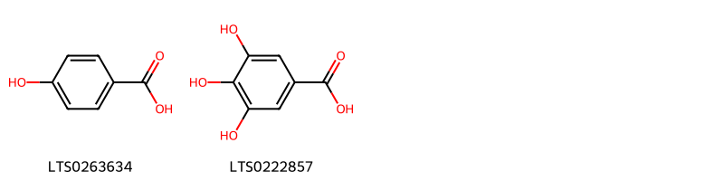
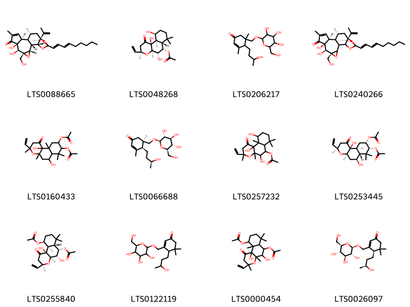

!!! abstract "Tóm tắt"

    Cây Đơn Lá Đỏ có tên khoa học là Excoecaria cochinchinensis Lour., thuộc họ Euphorbiaceae. Cây phân bố tự nhiên ở nhiều khu vực Đông Nam Á như Trung Quốc, Lào, Malaysia, Myanmar, Đài Loan, Thái Lan. Tại Việt Nam, cây mọc hoang và được trồng ở nhiều nơi. Trong y học cổ truyền, dược liệu này có tác dụng thanh nhiệt giải độc, khu phong trừ thấp, lợi tiêu và giảm đau. Cây thường được sử dụng để chữa mụn nhọt, mẩn ngứa, ban chẩn mày đay, đi ỉa lỏng lâu ngày và đại tiện ra máu. Thành phần hóa học của cây bao gồm flavonoid (như quercetin, kaempferol), terpenoid và tannin.

## Thông tin về thực vật

Dược liệu **Đơn Lá Đỏ** từ bộ phận **** từ loài *Excoecaria cochinchinensis*.

**Mô tả thực vật:** Là một loại cây nhỏ, cao 0,7 - 1,5m, có cành nhỏ, gầy, dài, màu tía. Lá mọc đối hình trái xoan thuôn dài, phía cuống nhọn, phía đầu có mũi nhọn, ngắn, dài 6 - 12cm, rộng 1,2 - 4cm. Mặt trên lá màu xanh lục sẫm, mặt dưới lá màu tía đỏ, mép có răng cưa, cuống ngắn, 5 - 10mm. Hoa mọc thành bông ở kẽ lá hay đầu cành. Bông hoa đực dài 2cm, bông hoa cái ngắn hơn. Quả 3 mảnh, đường kính chừng 1cm, hạt hình cầu, màu nâu nhạt, đường kính 4mm. Mùa hoa vào các tháng 4 - 5 - 6.

*Tài liệu tham khảo:* "Những cây thuốc và vị thuốc Việt Nam" - Đỗ Tất Lợi 
Trong dược điển Việt nam, một loài được sử dụng làm dược liệu là *Excoecaria cochinchinensis*.

!!! info "Phân loại thực vật của *Excoecaria cochinchinensis*"
    - **Kingdom:** Plantae
    - **Phylum:** Tracheophyta
    - **Order:** Malpighiales
    - **Family:** Euphorbiaceae
    - **Genus:** Excoecaria
    - **Species:** *Excoecaria cochinchinensis*

**Phân bố trên thế giới:** nan, Korea, Republic of, Singapore, French Polynesia, Seychelles, Chinese Taipei, Hong Kong, unknown or invalid, Cambodia, Indonesia, Myanmar, Trinidad and Tobago, India, Viet Nam, Thailand, United States of America, Philippines, China, Malaysia, New Zealand, Puerto Rico, Macao, Lao People’s Democratic Republic

**Phân bố tại Việt nam:** Dak Lak, Ninh Thuan, Quảng Bình, Ha Giang, Kon Tum, Khánh Hòa, Hoa Binh

## Thông tin về dược liệu 

### Định danh

!!! info "Thông tin về tên gọi"

    - Dược liệu tiếng Việt: 
    - Dược liệu tiếng Trung:  ()
    - Dược liệu tiếng Anh: 
    - Dược liệu latin thông dụng: Folium Excoecariae
    - Dược liệu latin kiểu DĐVN: *folium excoecariae*
    - Dược liệu latin kiểu DĐVN: **
    - Dược liệu latin kiểu thông tư: **
    - Bộ phận dùng:  (Folium)

### Mô tả dược liệu 

- **Theo dược điển Việt nam V:** Lá hình bầu dục hai đầu thuôn nhọn, dài 6 cm đến 12 cm, rộng 2 cm đến 4 cm. Cuống lá dài 0,5 cm đến 1 cm. Phiến lá nguyên, mép lá có răng cưa nhỏ, mặt trên lá màu lục sẫm, mặt dưới màu đỏ tía. Có 10 đến 12 cặp gân lông chim nổi rõ ở mặt dưới lá, lõm ở mặt trên lá.

- **Mô tả dược liệu theo thông tư chế biến dược liệu theo phương pháp cổ truyền:** 

### Chế biến 

- **Chế biến theo dược điển việt nam V**: Thu hái lá quanh năm, nhưng tốt nhất vào mùa hè. Lá hái về được phơi hoặc sấy tới khô. Trứơc khi dùng sao vàng. nn

- **Chế biến theo thông tư:** 

--- 

## Thành phần hóa học

- Theo tài liệu của GS. Đỗ Tất Lợi:  1. Flavonoid: quercetin, kaempferol...
2. Terpenoid 
3. Tanin
    

**Thành phần hóa học từ loài **Excoecaria cochinchinensis**

Theo cơ sở dữ liệu lotus, loài *Excoecaria cochinchinensis* đã phân lập và xác định được **25** hoạt chất thuộc về các nhóm Organooxygen compounds, Flavonoids, Benzofurans, Benzene and substituted derivatives, Prenol lipids trong bảng dưới đây. Danh sách các hoạt chất như sau (4r)-4-[(3s)-3-hydroxybutyl]-5,5-dimethyl-3-({[(2r,3r,4s,5s,6r)-3,4,5-trihydroxy-6-(hydroxymethyl)oxan-2-yl]oxy}methyl)cyclohex-2-en-1-one [(LTS0026097)](https://lotus.naturalproducts.net/compound/lotus_id/LTS0026097), trifolin [(LTS0237581)](https://lotus.naturalproducts.net/compound/lotus_id/LTS0237581), (2r,5s)-2,10,10-trimethyl-6-({[(2r,3r,4s,5s,6r)-3,4,5-trihydroxy-6-(hydroxymethyl)oxan-2-yl]oxy}methyl)-1-oxaspiro[4.5]deca-3,6-dien-8-one [(LTS0144910)](https://lotus.naturalproducts.net/compound/lotus_id/LTS0144910), loliolide [(LTS0119422)](https://lotus.naturalproducts.net/compound/lotus_id/LTS0119422), (3r,4ar,6s,6as,8r,9s,10as,10bs)-8-(acetyloxy)-3-ethenyl-6,10b-dihydroxy-3,4a,7,7,10a-pentamethyl-1-oxo-hexahydro-2h-naphtho[2,1-b]pyran-9-yl acetate [(LTS0253445)](https://lotus.naturalproducts.net/compound/lotus_id/LTS0253445), (3r,4ar,5s,6s,6as,10s,10ar,10bs)-10-(acetyloxy)-3-ethenyl-5,10b-dihydroxy-3,4a,7,7,10a-pentamethyl-1-oxo-hexahydro-2h-naphtho[2,1-b]pyran-6-yl acetate [(LTS0255840)](https://lotus.naturalproducts.net/compound/lotus_id/LTS0255840), afzelin [(LTS0259097)](https://lotus.naturalproducts.net/compound/lotus_id/LTS0259097), galop [(LTS0222857)](https://lotus.naturalproducts.net/compound/lotus_id/LTS0222857), trifolin [(LTS0267055)](https://lotus.naturalproducts.net/compound/lotus_id/LTS0267055), p-hydroxybenzoic acid [(LTS0263634)](https://lotus.naturalproducts.net/compound/lotus_id/LTS0263634), terpenoid ea-i [(LTS0088665)](https://lotus.naturalproducts.net/compound/lotus_id/LTS0088665), 4-(3-hydroxybutyl)-3,5-dimethyl-5-({[3,4,5-trihydroxy-6-(hydroxymethyl)oxan-2-yl]oxy}methyl)cyclohex-2-en-1-one [(LTS0206217)](https://lotus.naturalproducts.net/compound/lotus_id/LTS0206217), 4-(3-hydroxybutyl)-5,5-dimethyl-3-({[3,4,5-trihydroxy-6-(hydroxymethyl)oxan-2-yl]oxy}methyl)cyclohex-2-en-1-one [(LTS0122119)](https://lotus.naturalproducts.net/compound/lotus_id/LTS0122119), 5,7-dihydroxy-2-(4-hydroxyphenyl)-3-[(3,4,5-trihydroxy-6-methyloxan-2-yl)oxy]chromen-4-one [(LTS0211340)](https://lotus.naturalproducts.net/compound/lotus_id/LTS0211340), astragalin [(LTS0249588)](https://lotus.naturalproducts.net/compound/lotus_id/LTS0249588), 9-(acetyloxy)-3-ethenyl-6,10b-dihydroxy-3,4a,7,7,10a-pentamethyl-1-oxo-hexahydro-2h-naphtho[2,1-b]pyran-8-yl acetate [(LTS0160433)](https://lotus.naturalproducts.net/compound/lotus_id/LTS0160433), (4s,5r)-4-[(3s)-3-hydroxybutyl]-3,5-dimethyl-5-({[(2r,3r,4s,5s,6r)-3,4,5-trihydroxy-6-(hydroxymethyl)oxan-2-yl]oxy}methyl)cyclohex-2-en-1-one [(LTS0066688)](https://lotus.naturalproducts.net/compound/lotus_id/LTS0066688), isoforskolin [(LTS0048268)](https://lotus.naturalproducts.net/compound/lotus_id/LTS0048268), (6s,7as)-6-hydroxy-4,4,7a-trimethyl-6,7-dihydro-5h-1-benzofuran-2-one [(LTS0067359)](https://lotus.naturalproducts.net/compound/lotus_id/LTS0067359), 10-(acetyloxy)-3-ethenyl-5,10b-dihydroxy-3,4a,7,7,10a-pentamethyl-1-oxo-hexahydro-2h-naphtho[2,1-b]pyran-6-yl acetate [(LTS0000454)](https://lotus.naturalproducts.net/compound/lotus_id/LTS0000454), shikimate [(LTS0197942)](https://lotus.naturalproducts.net/compound/lotus_id/LTS0197942), 3-ethenyl-5,10,10b-trihydroxy-3,4a,7,7,10a-pentamethyl-1-oxo-hexahydro-2h-naphtho[2,1-b]pyran-6-yl acetate [(LTS0257232)](https://lotus.naturalproducts.net/compound/lotus_id/LTS0257232), 2,10,10-trimethyl-6-({[3,4,5-trihydroxy-6-(hydroxymethyl)oxan-2-yl]oxy}methyl)-1-oxaspiro[4.5]deca-3,6-dien-8-one [(LTS0064034)](https://lotus.naturalproducts.net/compound/lotus_id/LTS0064034), (1r,2r,6s,7s,8r,16r,18r)-6,7-dihydroxy-8-(hydroxymethyl)-4,18-dimethyl-14-[(1e,3e)-nona-1,3-dien-1-yl]-16-(prop-1-en-2-yl)-9,13,15,19-tetraoxahexacyclo[12.4.1.0¹,¹¹.0²,⁶.0⁸,¹⁰.0¹²,¹⁶]nonadec-3-en-5-one [(LTS0240266)](https://lotus.naturalproducts.net/compound/lotus_id/LTS0240266), (-)-shikimate [(LTS0003899)](https://lotus.naturalproducts.net/compound/lotus_id/LTS0003899). 
        
| chemicalTaxonomyClassyfireClass     |   smiles_count |
|:------------------------------------|---------------:|
| Benzene and substituted derivatives |             40 |
| Benzofurans                         |             63 |
| Flavonoids                          |            349 |
| Organooxygen compounds              |            193 |
| Prenol lipids                       |            956 |

            
### Nhóm Benzene and substituted derivatives
<figure markdown="span">
    { width=100% }
<figcaption>Hình ảnh cấu trúc hóa học của hoạt chất thuộc nhóm *Benzene and substituted derivatives*. Tên thường gọi của các hoạt chất tương ứng là p-hydroxybenzoic acid [(LTS0263634)](https://lotus.naturalproducts.net/compound/lotus_id/LTS0263634), galop [(LTS0222857)](https://lotus.naturalproducts.net/compound/lotus_id/LTS0222857).</figcaption>
</figure>

            
            
### Nhóm Benzene and substituted derivatives
<figure markdown="span">
    { width=100% }
<figcaption>Hình ảnh cấu trúc hóa học của hoạt chất thuộc nhóm *Benzene and substituted derivatives*. Tên thường gọi của các hoạt chất tương ứng là p-hydroxybenzoic acid [(LTS0263634)](https://lotus.naturalproducts.net/compound/lotus_id/LTS0263634), galop [(LTS0222857)](https://lotus.naturalproducts.net/compound/lotus_id/LTS0222857).</figcaption>
</figure>

### Nhóm Benzofurans
<figure markdown="span">
    { width=100% }
<figcaption>Hình ảnh cấu trúc hóa học của hoạt chất thuộc nhóm *Benzofurans*. Tên thường gọi của các hoạt chất tương ứng là (6s,7as)-6-hydroxy-4,4,7a-trimethyl-6,7-dihydro-5h-1-benzofuran-2-one [(LTS0067359)](https://lotus.naturalproducts.net/compound/lotus_id/LTS0067359), loliolide [(LTS0119422)](https://lotus.naturalproducts.net/compound/lotus_id/LTS0119422).</figcaption>
</figure>

            
            
### Nhóm Benzene and substituted derivatives
<figure markdown="span">
    { width=100% }
<figcaption>Hình ảnh cấu trúc hóa học của hoạt chất thuộc nhóm *Benzene and substituted derivatives*. Tên thường gọi của các hoạt chất tương ứng là p-hydroxybenzoic acid [(LTS0263634)](https://lotus.naturalproducts.net/compound/lotus_id/LTS0263634), galop [(LTS0222857)](https://lotus.naturalproducts.net/compound/lotus_id/LTS0222857).</figcaption>
</figure>

### Nhóm Benzofurans
<figure markdown="span">
    { width=100% }
<figcaption>Hình ảnh cấu trúc hóa học của hoạt chất thuộc nhóm *Benzofurans*. Tên thường gọi của các hoạt chất tương ứng là (6s,7as)-6-hydroxy-4,4,7a-trimethyl-6,7-dihydro-5h-1-benzofuran-2-one [(LTS0067359)](https://lotus.naturalproducts.net/compound/lotus_id/LTS0067359), loliolide [(LTS0119422)](https://lotus.naturalproducts.net/compound/lotus_id/LTS0119422).</figcaption>
</figure>

### Nhóm Flavonoids
<figure markdown="span">
    { width=100% }
<figcaption>Hình ảnh cấu trúc hóa học của hoạt chất thuộc nhóm *Flavonoids*. Tên thường gọi của các hoạt chất tương ứng là trifolin [(LTS0267055)](https://lotus.naturalproducts.net/compound/lotus_id/LTS0267055), trifolin [(LTS0237581)](https://lotus.naturalproducts.net/compound/lotus_id/LTS0237581), 5,7-dihydroxy-2-(4-hydroxyphenyl)-3-[(3,4,5-trihydroxy-6-methyloxan-2-yl)oxy]chromen-4-one [(LTS0211340)](https://lotus.naturalproducts.net/compound/lotus_id/LTS0211340), astragalin [(LTS0249588)](https://lotus.naturalproducts.net/compound/lotus_id/LTS0249588), afzelin [(LTS0259097)](https://lotus.naturalproducts.net/compound/lotus_id/LTS0259097).</figcaption>
</figure>

            
            
### Nhóm Benzene and substituted derivatives
<figure markdown="span">
    { width=100% }
<figcaption>Hình ảnh cấu trúc hóa học của hoạt chất thuộc nhóm *Benzene and substituted derivatives*. Tên thường gọi của các hoạt chất tương ứng là p-hydroxybenzoic acid [(LTS0263634)](https://lotus.naturalproducts.net/compound/lotus_id/LTS0263634), galop [(LTS0222857)](https://lotus.naturalproducts.net/compound/lotus_id/LTS0222857).</figcaption>
</figure>

### Nhóm Benzofurans
<figure markdown="span">
    { width=100% }
<figcaption>Hình ảnh cấu trúc hóa học của hoạt chất thuộc nhóm *Benzofurans*. Tên thường gọi của các hoạt chất tương ứng là (6s,7as)-6-hydroxy-4,4,7a-trimethyl-6,7-dihydro-5h-1-benzofuran-2-one [(LTS0067359)](https://lotus.naturalproducts.net/compound/lotus_id/LTS0067359), loliolide [(LTS0119422)](https://lotus.naturalproducts.net/compound/lotus_id/LTS0119422).</figcaption>
</figure>

### Nhóm Flavonoids
<figure markdown="span">
    { width=100% }
<figcaption>Hình ảnh cấu trúc hóa học của hoạt chất thuộc nhóm *Flavonoids*. Tên thường gọi của các hoạt chất tương ứng là trifolin [(LTS0267055)](https://lotus.naturalproducts.net/compound/lotus_id/LTS0267055), trifolin [(LTS0237581)](https://lotus.naturalproducts.net/compound/lotus_id/LTS0237581), 5,7-dihydroxy-2-(4-hydroxyphenyl)-3-[(3,4,5-trihydroxy-6-methyloxan-2-yl)oxy]chromen-4-one [(LTS0211340)](https://lotus.naturalproducts.net/compound/lotus_id/LTS0211340), astragalin [(LTS0249588)](https://lotus.naturalproducts.net/compound/lotus_id/LTS0249588), afzelin [(LTS0259097)](https://lotus.naturalproducts.net/compound/lotus_id/LTS0259097).</figcaption>
</figure>

### Nhóm Organooxygen compounds
<figure markdown="span">
    { width=100% }
<figcaption>Hình ảnh cấu trúc hóa học của hoạt chất thuộc nhóm *Organooxygen compounds*. Tên thường gọi của các hoạt chất tương ứng là (-)-shikimate [(LTS0003899)](https://lotus.naturalproducts.net/compound/lotus_id/LTS0003899), shikimate [(LTS0197942)](https://lotus.naturalproducts.net/compound/lotus_id/LTS0197942), (2r,5s)-2,10,10-trimethyl-6-({[(2r,3r,4s,5s,6r)-3,4,5-trihydroxy-6-(hydroxymethyl)oxan-2-yl]oxy}methyl)-1-oxaspiro[4.5]deca-3,6-dien-8-one [(LTS0144910)](https://lotus.naturalproducts.net/compound/lotus_id/LTS0144910), 2,10,10-trimethyl-6-({[3,4,5-trihydroxy-6-(hydroxymethyl)oxan-2-yl]oxy}methyl)-1-oxaspiro[4.5]deca-3,6-dien-8-one [(LTS0064034)](https://lotus.naturalproducts.net/compound/lotus_id/LTS0064034).</figcaption>
</figure>

            
            
### Nhóm Benzene and substituted derivatives
<figure markdown="span">
    { width=100% }
<figcaption>Hình ảnh cấu trúc hóa học của hoạt chất thuộc nhóm *Benzene and substituted derivatives*. Tên thường gọi của các hoạt chất tương ứng là p-hydroxybenzoic acid [(LTS0263634)](https://lotus.naturalproducts.net/compound/lotus_id/LTS0263634), galop [(LTS0222857)](https://lotus.naturalproducts.net/compound/lotus_id/LTS0222857).</figcaption>
</figure>

### Nhóm Benzofurans
<figure markdown="span">
    { width=100% }
<figcaption>Hình ảnh cấu trúc hóa học của hoạt chất thuộc nhóm *Benzofurans*. Tên thường gọi của các hoạt chất tương ứng là (6s,7as)-6-hydroxy-4,4,7a-trimethyl-6,7-dihydro-5h-1-benzofuran-2-one [(LTS0067359)](https://lotus.naturalproducts.net/compound/lotus_id/LTS0067359), loliolide [(LTS0119422)](https://lotus.naturalproducts.net/compound/lotus_id/LTS0119422).</figcaption>
</figure>

### Nhóm Flavonoids
<figure markdown="span">
    { width=100% }
<figcaption>Hình ảnh cấu trúc hóa học của hoạt chất thuộc nhóm *Flavonoids*. Tên thường gọi của các hoạt chất tương ứng là trifolin [(LTS0267055)](https://lotus.naturalproducts.net/compound/lotus_id/LTS0267055), trifolin [(LTS0237581)](https://lotus.naturalproducts.net/compound/lotus_id/LTS0237581), 5,7-dihydroxy-2-(4-hydroxyphenyl)-3-[(3,4,5-trihydroxy-6-methyloxan-2-yl)oxy]chromen-4-one [(LTS0211340)](https://lotus.naturalproducts.net/compound/lotus_id/LTS0211340), astragalin [(LTS0249588)](https://lotus.naturalproducts.net/compound/lotus_id/LTS0249588), afzelin [(LTS0259097)](https://lotus.naturalproducts.net/compound/lotus_id/LTS0259097).</figcaption>
</figure>

### Nhóm Organooxygen compounds
<figure markdown="span">
    { width=100% }
<figcaption>Hình ảnh cấu trúc hóa học của hoạt chất thuộc nhóm *Organooxygen compounds*. Tên thường gọi của các hoạt chất tương ứng là (-)-shikimate [(LTS0003899)](https://lotus.naturalproducts.net/compound/lotus_id/LTS0003899), shikimate [(LTS0197942)](https://lotus.naturalproducts.net/compound/lotus_id/LTS0197942), (2r,5s)-2,10,10-trimethyl-6-({[(2r,3r,4s,5s,6r)-3,4,5-trihydroxy-6-(hydroxymethyl)oxan-2-yl]oxy}methyl)-1-oxaspiro[4.5]deca-3,6-dien-8-one [(LTS0144910)](https://lotus.naturalproducts.net/compound/lotus_id/LTS0144910), 2,10,10-trimethyl-6-({[3,4,5-trihydroxy-6-(hydroxymethyl)oxan-2-yl]oxy}methyl)-1-oxaspiro[4.5]deca-3,6-dien-8-one [(LTS0064034)](https://lotus.naturalproducts.net/compound/lotus_id/LTS0064034).</figcaption>
</figure>

### Nhóm Prenol lipids
<figure markdown="span">
    { width=100% }
<figcaption>Hình ảnh cấu trúc hóa học của hoạt chất thuộc nhóm *Prenol lipids*. Tên thường gọi của các hoạt chất tương ứng là terpenoid ea-i [(LTS0088665)](https://lotus.naturalproducts.net/compound/lotus_id/LTS0088665), isoforskolin [(LTS0048268)](https://lotus.naturalproducts.net/compound/lotus_id/LTS0048268), 4-(3-hydroxybutyl)-3,5-dimethyl-5-({[3,4,5-trihydroxy-6-(hydroxymethyl)oxan-2-yl]oxy}methyl)cyclohex-2-en-1-one [(LTS0206217)](https://lotus.naturalproducts.net/compound/lotus_id/LTS0206217), (1r,2r,6s,7s,8r,16r,18r)-6,7-dihydroxy-8-(hydroxymethyl)-4,18-dimethyl-14-[(1e,3e)-nona-1,3-dien-1-yl]-16-(prop-1-en-2-yl)-9,13,15,19-tetraoxahexacyclo[12.4.1.0¹,¹¹.0²,⁶.0⁸,¹⁰.0¹²,¹⁶]nonadec-3-en-5-one [(LTS0240266)](https://lotus.naturalproducts.net/compound/lotus_id/LTS0240266), 9-(acetyloxy)-3-ethenyl-6,10b-dihydroxy-3,4a,7,7,10a-pentamethyl-1-oxo-hexahydro-2h-naphtho[2,1-b]pyran-8-yl acetate [(LTS0160433)](https://lotus.naturalproducts.net/compound/lotus_id/LTS0160433), (4s,5r)-4-[(3s)-3-hydroxybutyl]-3,5-dimethyl-5-({[(2r,3r,4s,5s,6r)-3,4,5-trihydroxy-6-(hydroxymethyl)oxan-2-yl]oxy}methyl)cyclohex-2-en-1-one [(LTS0066688)](https://lotus.naturalproducts.net/compound/lotus_id/LTS0066688), 3-ethenyl-5,10,10b-trihydroxy-3,4a,7,7,10a-pentamethyl-1-oxo-hexahydro-2h-naphtho[2,1-b]pyran-6-yl acetate [(LTS0257232)](https://lotus.naturalproducts.net/compound/lotus_id/LTS0257232), (3r,4ar,6s,6as,8r,9s,10as,10bs)-8-(acetyloxy)-3-ethenyl-6,10b-dihydroxy-3,4a,7,7,10a-pentamethyl-1-oxo-hexahydro-2h-naphtho[2,1-b]pyran-9-yl acetate [(LTS0253445)](https://lotus.naturalproducts.net/compound/lotus_id/LTS0253445), (3r,4ar,5s,6s,6as,10s,10ar,10bs)-10-(acetyloxy)-3-ethenyl-5,10b-dihydroxy-3,4a,7,7,10a-pentamethyl-1-oxo-hexahydro-2h-naphtho[2,1-b]pyran-6-yl acetate [(LTS0255840)](https://lotus.naturalproducts.net/compound/lotus_id/LTS0255840), 4-(3-hydroxybutyl)-5,5-dimethyl-3-({[3,4,5-trihydroxy-6-(hydroxymethyl)oxan-2-yl]oxy}methyl)cyclohex-2-en-1-one [(LTS0122119)](https://lotus.naturalproducts.net/compound/lotus_id/LTS0122119), 10-(acetyloxy)-3-ethenyl-5,10b-dihydroxy-3,4a,7,7,10a-pentamethyl-1-oxo-hexahydro-2h-naphtho[2,1-b]pyran-6-yl acetate [(LTS0000454)](https://lotus.naturalproducts.net/compound/lotus_id/LTS0000454), (4r)-4-[(3s)-3-hydroxybutyl]-5,5-dimethyl-3-({[(2r,3r,4s,5s,6r)-3,4,5-trihydroxy-6-(hydroxymethyl)oxan-2-yl]oxy}methyl)cyclohex-2-en-1-one [(LTS0026097)](https://lotus.naturalproducts.net/compound/lotus_id/LTS0026097).</figcaption>
</figure>

            

---

## Tác dụng dược lý

Theo tài liệu "Những cây thuốc và vị thuốc Việt Nam" - Đỗ Tất Lợi:Thường dùng trong trường hợp chữa mụn nhọt, mẩn ngứa, có khi dùng chữa đi ỉa lỏng lâu ngày.

Theo tài liệu quốc tế: 

---

## Dược điển Việt Nam V

### Soi bột:

Bột lá có màu xanh nâu, mùi hắc nhẹ. Quan sát dưới kính hiển vi thấy: Mảnh mô mềm, mạch mạng, mạch xoắn đứng riêng lẻ hay trong các mô, bó sợi, mảnh mô mềm, tinh thể calci ọxalat hình cầu gai. mảnh biểu bì có nhiều tế bào lỗ khí kiểu song bào. nn

<!-- Hình ảnh soi bột sẽ được tự động chèn vào đây sau -->

### Vi phẫu:

Phần gân lá: Biểu bì trên và biểu bì dưới gồm một lớp tế bào nhỏ xếp liên tục, kích thước tương đối đều nhau. Nằm sát biểu bì trên và biểu bì dưới là mô dày gồm những đám tế bào hình trứng, kích thước khác nhau, thành dày bắt màu đỏ. Tiếp theo là mô mềm, gồm những tế bào có kích thước lớn, không đều nhau, thành mỏng, xếp lộn xộn. Giữa gân lá có bó libe-gỗ, hình cung, cung libe ở ngoài ôm lấy cung gỗ ở trong. Phiến lá: Biểu bì trên và biểu bì dưới gồm một hàng tế bào hình chữ nhật nằm ngang, có thành ngoài hóa cutin. Dưới biểu bì trên là mô dậu gồm một hàng tế bào hình chữ nhật. nn

<!-- Hình ảnh vi phẫu sẽ được tự động chèn vào đây sau -->

### Định tính

Cân 1 g bột dược liệu cho vào ống nghiệm, thêm 5 ml ethanol 50 % (TT), đun trong cách thủy trong 5 min, lọc. Dịch lọc có màu đỏ tía. Cân 5 g dược liệu đã được làm nhỏ cho vào bình Soxhlct rôi chiết với ether dầu hỏa (30 °c đến 60 °C) (TT) đến khi hết màu. Bã dược liệu được để bay hơi hết dung môi, cho vào bình cầu dung tích 100 ml, thêm 50 ml ethanol 90 % (TT), lắp sinh hàn hồi lưu, đun trong cách thủy sôi trong 30 min. lọc. Cô dịch lọc trong cách thủy đến còn khoảng 3 ml, lấy 1 ml dịch lọc ethanol vào ống nghiệm, thêm một ít bột magnesi (TT) và vài giọt acid hydrocloric (TT), đun nóng nhẹ trên cách thủy, phải xuất hiện màu hồng đỏ.

### Định lượng

### Thông tin khác 

- ** Độ ẩm: ** Không quả 13,0 % (Phụ lục 9.6, 1 g, 85 °c, 4 h).
- ** Bảo quản:** Trong bao bì kín, để nơi thoáng mát.nn

## Dược điển Hồng kong

<!-- PDF sẽ được tự động chèn vào đây sau -->

---

## Y dược học cổ truyền

- **Tên vị thuốc:** 
- **Tính vị quy kinh:** Vị đắng nhạt, tính mát.
- **Công năng chủ trị:** Thanh nhiệt giải độc, khu phong trừ thấp, lợi tiêu, giảm đau.

Chủ trị: Mụn nhọt, mẩn ngứa, ban chấn mày đay, đi ỉa lỏng lâu ngày, đại tiện ra máu.
- **Chú ý:** 
- **Kiêng kỵ:** Người hay chảy máu không nên dùng.nn

## Bình luận

